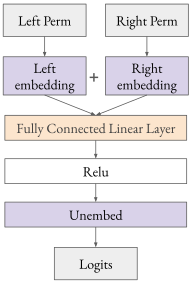
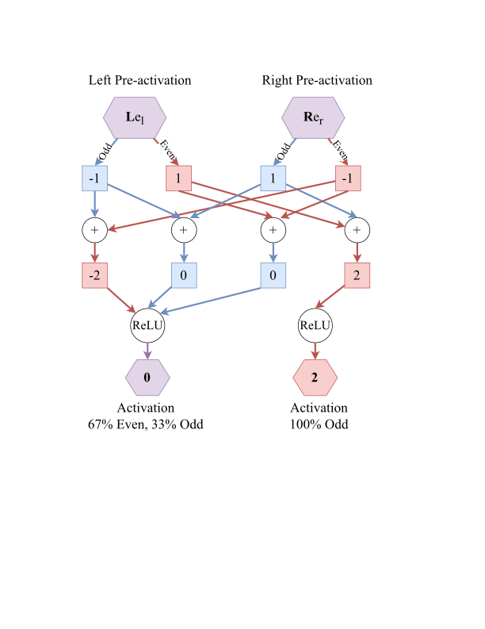
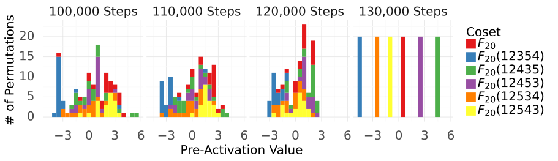
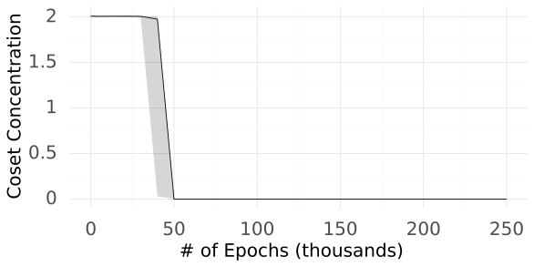
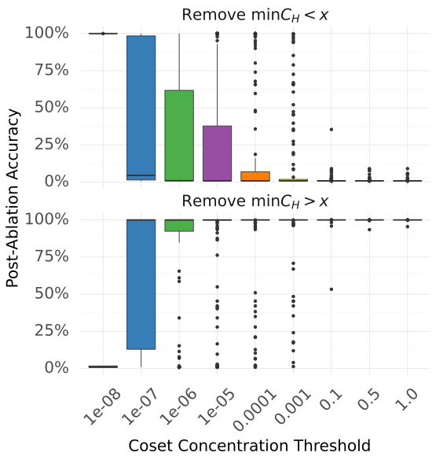
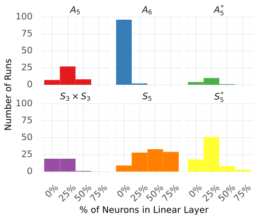
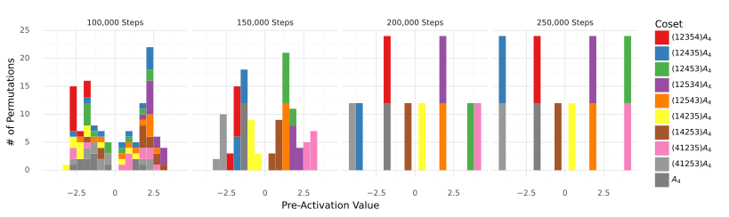

# Stander et al. 2024 — Grokking Group Multiplication with Cosets

См. также: [глобальный индекс понятий](../../concepts/index.md).
arXiv [2312.06581v2](https://arxiv.org/abs/2312.06581), 11 декабря 2023 (v2 — 17 июня 2024). Колонтитул PDF: «Proceedings of the 41 st International Conference on Machine Learning, Vienna, Austria. PMLR 235, 2024».

**Dashiell Stander** — EleutherAI (переписка: dash.stander@gmail.com).
**Qinan Yu** — EleutherAI; Brown University.
**Honglu Fan** — EleutherAI; University of Geneva.
**Stella Biderman** — EleutherAI.

Оригинал и производные файлы этой папки:

- [`original/2312.06581.native.html`](original/2312.06581.native.html) — первоисточник, HTML-рендеринг arXiv (LaTeXML), скачан как есть.
- [`original/2312.06581.grokking-group-multiplication-with-cosets.md`](original/2312.06581.grokking-group-multiplication-with-cosets.md) — конверсия оригинала в Markdown без правок содержания; английский текст для сверки перевода.
- [`images/`](images/) — иллюстрации статьи в исходном разрешении (12 файлов).
- [`2312.06581.grokking-group-multiplication-with-cosets.claims.txt`](2312.06581.grokking-group-multiplication-with-cosets.claims.txt) — рабочий разбор: пронумерованные утверждения с пометками.

Схема якорей и правила ссылок на карточку — в [README папки статей](../README.md).

## Затрагиваемые понятия

**[Групповые представления и cosets](../../concepts/group-representations-cosets.md)** — работа вводит в корпус coset-сторону этого понятия и вводит её как соперника, а не как дополнение. Механизм назван прямо: сеть реализует полное групповое умножение, «выбирая общие смежные классы сопряжённых подгрупп» ([p5-1](#p5-1)); у двух сопряжённых $H_{i},H_{j}$ есть общий смежный класс $H_{i}\tau_{ij}=\tau_{ij}H_{j}$, и нейрон опознаёт попадание произведения в него по обращению суммы предактиваций в ноль ([p5-1](#p5-1), [рис. 2](#fig-2)). Введена и измеримая величина — сосредоточенность функции на смежных классах $C_{H}(f)$, доля дисперсии, остающаяся после ограничения на смежные классы $H$ ([p5-8](#p5-8), [p5-9](#p5-9)); исчерпывающий перебор всех 156 подгрупп $S_{5}$ и 1455 подгрупп $S_{6}$ даёт для каждого нейрона подгруппу-минимизатор, и свыше $99.2\%$ нейронов линейного слоя имеют $\min_{H}C_{H}<1.0$ ([p6-3](#p6-3)). Сосредоточенность предактиваций подавляющего большинства нейронов на смежных классах названа поведением, которого GCR не предсказывает вовсе ([p9-1](#p9-1)). Работа же даёт и математический разбор, почему coset-функция **выглядит** сосредоточенной на немногих неприводимых представлениях (лемма G.2, [p20-7](#p20-7)) и почему корреляция логитов с характерами возникает уже из подсчёта общих смежных классов, без матричного умножения представлений ([p8-7](#p8-7), [p22-12](#p22-12), [p22-14](#p22-14)). Чего в работе нет: приближённых смежных классов и переноса на циклические группы — это появилось позже, у McCracken et al. 2025, и авторам не принадлежит; нет и утверждения, что связь контура с неприводимым представлением полностью объяснена — напротив, сказано, что объяснения тому, почему coset-контуры **всегда** сосредоточиваются ровно на одном представлении, у авторов нет ([p23-5](#p23-5)).

**[Композиция групп / некоммутативность](../../concepts/group-composition-non-commutative-s5.md)** — работа углубляет полигон, не расширяя его: разобраны ровно две группы, $S_{5}$ и $S_{6}$, зато 128 и 100 прогонами соответственно ([p14-11](#p14-11)). Некоммутативность здесь не украшение постановки, а условие самого механизма: именно потому, что $S_{n}$ неабелева, у неё много ненормальных подгрупп, а «сопряжённые подгруппы гарантированно существуют в неабелевых группах» ([p16-12](#p16-12)) — на нормальной подгруппе такой контур не строится, и авторы отдельно отмечают, что построение работает для всякой подгруппы $S_{n}$, **кроме** $A_{n}$ ([p5-7](#p5-7)). Отсюда же корпус получает разделение ролей левого и правого эмбеддингов: они кодируют разное — членство в правых и левых смежных классах соответственно, — и не взаимозаменяемы ([p7-3](#p7-3)). Чего в работе нет: перебора групп — циклических, диэдральных и $A_{5}$, разобранных у Chughtai et al. 2023, здесь нет вовсе, и всякий перенос coset-описания на абелев случай этой работе не принадлежит.

**[Механистическая интерпретируемость](../../concepts/mechanistic-interpretability.md)** — работа даёт корпусу редкий предмет: разбор двух несовместимых разборов одной и той же модели. Постановка воспроизведена дословно по Chughtai et al. 2023, «наша опытная постановка тождественна постановке Chughtai et al. 2023, но наш разбор привёл нас к другому заключению» ([§7](#sec-7), [p8-3](#p8-3)); четыре свидетельства чужой работы пересказаны и разобраны порознь ([p8-4](#p8-4)), и понимание причин расхождения потребовало отдельного труда ([p1-5](#p1-5)). Методологический вывод объявлен вторым, равновеликим замыслом работы и сформулирован как правило: «мы обязаны считать предлагаемые нейронные механизмы теориями, пока они не проверены досконально» ([p9-7](#p9-7)); свидетельство роли контура в задаче по природе своей наблюдательное и корреляционное, а узлы вычислительного графа связаны причинно, но связь их действий с задачей лишь **наблюдается** соотнесённой ([p9-8](#p9-8)). Существенно, что авторы датируют собственную уверенность: она появилась не от наблюдений, а «лишь после проведения причинных опытов из раздела 6.3» ([p9-9](#p9-9)). Чего в работе нет: ни автоматических приёмов поиска контуров, ни переноса на настоящие модели — сказано обратное, что у разбора были преимущества, недоступные при работе с настоящими моделями, и что «интерпретировать настоящие модели будет ещё труднее» ([p9-10](#p9-10)).

**[Каузальная абляция](../../concepts/causal-ablation-intervention.md)** — работа даёт корпусу набор вмешательств с заранее объявленным предсказанием исхода и один разительный результат. Замысел объявлен до опытов: наблюдений за поведением контура на всём распределении недостаточно, контур надо «сломать» нацеленно и проверить, что он ведёт себя предсказанным образом ([p7-2](#p7-2)). Обмен левого и правого эмбеддингов рушит качество ([p7-3](#p7-3)); одновременная смена знака обоих эмбеддингов не меняет ничего, а смена знака одного даёт нулевую точность — значим лишь **относительный** знак ([p7-4](#p7-4)); сдвиг шума $\mathcal{N}(1,1)$ вредит заметно сильнее, чем $\mathcal{N}(-1,1)$, что и указывает на ноль как на пороговое значение ([p8-1](#p8-1)). Самый неожиданный исход — замена ReLU на модуль $x\mapsto|x|$ даёт стопроцентную точность и **меньшую** потерю ([p7-5](#p7-5)), и авторы прямо называют это свойством, которого GCR не предсказывает ([p9-4](#p9-4)). Абляции устроены иначе, чем вмешательства: удаляются нейроны, у которых сосредоточенность выше порога, и у 126 из 128 моделей $S_{5}$ удаление всех нейронов с $\min_{H}C_{H}(N_{i})\geq 1$ не меняет точность вовсе ([p6-6](#p6-6), [рис. 5](#fig-5)). Чего в работе нет: вмешательств по ходу обучения — все они сняты с обученных моделей; и заявка «coset-нейроны не только достаточны, но и необходимы» ([p6-5](#p6-5)) числами в тексте подкреплена лишь с одной стороны.

**[Гроккинг](../../concepts/grokking.md)** — гроккинг здесь условие отбора моделей, а не предмет объяснения, и это сказано прямо: разбор вёлся «на полностью грокнувших моделях со стопроцентной тестовой точностью», поскольку такие модели часто образуют чистые обобщающие контуры, легче поддающиеся разбору ([p2-2](#p2-2)). Собственный вклад в понятие один и он наблюдательный: образование coset-контуров совпадает по времени с падением поверочной потери — по мере того как потеря идёт к малому значению, срединная сосредоточенность на смежных классах резко переходит от примерно $1$ к ничтожной величине ([p6-1](#p6-1), [рис. 4](#fig-4)). Показано это на одной модели с оговоркой, что «разные прогоны образуют coset-контуры в разное время, но действие представительно» ([рис. 4](#fig-4)). Чего в работе нет: ни объяснения гроккинга, ни разбора роли weight decay (он лишь задан равным $1.0$, [p14-11](#p14-11)), ни разделения обучения на поры, ни совместного распределения сроков перехода по 128 прогонам.

**[Меры прогресса](../../concepts/progress-measures.md)** — работа даёт величину, устроенную как мера прогресса, но термином её не называет и в этой роли не заявляет. Срединная по модели сосредоточенность $\min_{H\in\operatorname{sub}(G)}C_{H}$ вычисляется из внутреннего состояния сети, меняется плавно и падает вместе с поверочной потерей ([p6-1](#p6-1), [рис. 4](#fig-4)); отдельно показано, что зачаток контура у нейрона виден задолго до его окончательного вида — у нейрона 115 (семя 11) на 100 тыс. шагов дисперсия $5.23$ при $C_{F_{20}}=2.96$, а к 130 тыс. дисперсия растёт до $9.06$, тогда как $C_{F_{20}}$ падает ниже $10^{-5}$ ([p5-9](#p5-9), [рис. 3](#fig-3)). Термин «progress measures» (Nanda et al. 2023) стоит в списке литературы, но в тексте работы не употребляется ни разу, и приписывать авторам постановку о мерах прогресса нельзя: причинной связи величины со скачком они не проверяют, а сама величина введена ради опознания подгруппы нейрона, а не ради предсказания перехода.

**[Обучение структурированных представлений](../../concepts/structured-representation-learning.md)** — работа даёт корпусу случай, когда выученная структура сверяется с полным конечным списком, но список этот составлен из **подгрупп**, а не из представлений: подгрупп у $S_{5}$ и $S_{6}$ всего 156 и 1455, поэтому исчерпывающий перебор с вычислением $\operatorname*{arg\,min}_{H\in\operatorname{sub}(G)}C_{H}(f)$ выполним ([p6-2](#p6-2), [p6-3](#p6-3)). Найденное строение оказывается разнообразным: у каждой модели есть хотя бы несколько нейронов $S_{n-1}$ и хотя бы два знаковых ([p4-7](#p4-7)), многие модели мешают подгруппы, и часто есть «длинный хвост» подгрупп, представленных одним-двумя нейронами ([рис. 6](#fig-6)). Существенна и сторона разэмбеддинга: соотнесённость разэмбеддингов у нейронов **одного смежного класса** составляет в среднем $81.4\%$, у нейронов одного класса сопряжённости подгрупп — $-0.2\%$ ([p9-3](#p9-3)), то есть модель держит вместе смежные классы, а представления и классы сопряжённости — порознь. Чего в работе нет: восстановленной работающей замены модели, воспроизводящей её выходы, — заявка о полном обратном проектировании ([p1-2](#p1-2)) держится на переборе подгрупп, абляциях и причинных вмешательствах.

**[Фурье-признаки и контуры](../../concepts/fourier-features-circuits.md)** — работа переворачивает порядок объяснения: не фурье-сосредоточенность объясняет механизм, а механизм объясняет фурье-сосредоточенность. Групповое преобразование Фурье названо не главным в изложении, но важным орудием разбора ([p3-10](#p3-10)), и признано, что первую половину исследования оно было для авторов основным ([p19-13](#p19-13)). Дальше связь разобрана формально: если $f$ постоянна на смежных классах $H$, то её преобразование Фурье обнуляется на всяком неприводимом $\rho$, ограничение которого на $H$ не содержит тривиального представления (лемма G.2, [p20-7](#p20-7)); а если у перестановочного представления $G$ на $G/H$ ровно два неприводимых слагаемых — что для $S_{n}$ и $S_{n-1}$ выполнено (лемма G.6, [p22-14](#p22-14)) — то функция подсчёта членства выражается через $\operatorname{trace}(A\cdot\rho(\sigma^{-1}))$ (следствие G.5, [p22-12](#p22-12)). Отсюда счётный довод о неэквивалентности рамок: подгрупп асимптотически много больше, чем неприводимых представлений, и у $S_{5}$ их уже $156$ против $7$ ([p23-1](#p23-1)). Чего в работе нет: утверждения, что фурье-описание ложно, — сказано мягче, что авторы «не думают, что связь между тем, что делает контур, и неприводимым представлением вообще есть», и тут же признано, что объяснения устойчивой сосредоточенности ровно на одном представлении у них нет ([p23-5](#p23-5)).

**[Эталонный полигон гроккинга](../../concepts/canonical-grokking-testbed.md)** — работа наследует полигон через Chughtai et al. 2023 и наследует его нарочно дословно, ради сопоставимости выводов: та же архитектура ([рис. 1](#fig-1)), $40\%$ таблицы умножения в обучении, полная обучающая выборка на каждом шаге, Adam с постоянным темпом $0.001$, weight decay $1.0$, $\beta_{1}=0.9$, $\beta_{2}=0.98$ ([p14-11](#p14-11)). Своё в постановке — охват: 128 прогонов на $S_{5}$ по 250 000 эпох и 100 прогонов на $S_{6}$ по 50 000, при том что одна модель $S_{5}$ обучается около 8 часов на RTX 2080, а одна $S_{6}$ — около 100 ([p14-11](#p14-11)). Чего в работе нет: перебора доли данных, сравнения оптимизаторов и вариантов регуляризации — все эти величины зафиксированы по чужой работе и не варьируются.

**[Максимизация зазора](../../concepts/margin-maximization-implicit-bias.md)** — лишь упоминание, и притом в форме открытой догадки: объяснения тому, почему coset-контуры всегда сосредоточиваются ровно на одном неприводимом представлении, у авторов нет, и они «предполагают, что это может быть как-то связано с действием максимизации зазора, обсуждаемым в [Morwani et al. 2024]» ([p23-5](#p23-5)). Никакого опыта в эту сторону в работе не поставлено.

**[Weight decay / L2-регуляризация](../../concepts/weight-decay.md)** — лишь упоминание в виде зафиксированной настройки: weight decay задан равным $1.0$ при Adam ([p14-11](#p14-11)). Ни роли weight decay в образовании coset-контуров, ни опыта без него работа не разбирает, и никаких утверждений о необходимости регуляризации ей не принадлежит.

**[Модульная арифметика](../../concepts/modular-arithmetic.md)** — лишь упоминание, и притом математическое, а не опытное: дискретное преобразование Фурье истолковано как функция на циклической группе $C_{n}$, изоморфной сложению по модулю $n$, и именно это истолкование обобщается на некоммутативные группы ([p3-13](#p3-13), [p3-14](#p3-14)). Ни одной модели на модульной арифметике здесь не обучено, и перенос coset-описания на циклический случай этой работе не принадлежит.

---

## Несогласованности внутри статьи

**Текст раздела 6.3 расходится с таблицей 1 в двух числах из десяти.** [Про обмен эмбеддингов](#p7-3) сказано, что наблюдалось «значительное падение точности до 0», тогда как строка «Embedding Swap» таблицы 1 даёт $1\%$. [Про замену ReLU на модуль](#p7-5) сказано, что наблюдается «ещё меньшая потеря, чем половина исходной», тогда как таблица даёт $3.69\times10^{-13}$ против $1.97\times10^{-6}$ у исходной модели — разница в семь порядков, а не вдвое. Оба расхождения работают в пользу авторского вывода, но при цитировании чисел брать их следует из таблицы.

**Подпись таблицы 1 обещает прогоны разных размеров, а таблица 2 задаёт для $S_{5}$ один размер.** Подпись гласит, что вмешательства усреднены по 128 прогонам на $S_{5}$ «с разными размерами», тогда как [таблица 2](#p14-11) задаёт для $S_{5}$ единственный размер линейного слоя ($128$) и единственный размер эмбеддинга ($256$). Сама фраза в тексте оборвана на середине — «128 $S_{5}$ models of different and recorded their average loss and accuracy» ([p7-2](#p7-2)), — так что какое именно различие имелось в виду, из статьи не восстанавливается.

**Оборванные и неверные перекрёстные ссылки.** [В начале G.3](#p23-1) стоит «For the direct comparison of $S_{n}$ refer to» без указания таблицы (имеется в виду таблица 4). В [§7.2](#p9-2) читателя отсылают к «Appendix 7.2» за асимптотическим разбором, тогда как разбор этот в приложении G.3; во [введении](#p1-5) — «см. Приложение 7» вместо раздела 7. В доказательстве леммы G.2 сказано «где в 9 мы раскладываем $\rho|_{H}$», тогда как выкладка помечена номером (7) ([p21-1](#p21-1)).

**Опечатки в математической части, не влияющие на выводы, но ломающие примеры.** В выписанном правом смежном классе $H_{4}\tau$ вторым элементом стоит $(1\;4\;3\;1)$ — не перестановка, единица повторена дважды ([p3-5](#p3-5)). В примере E.9 перестановочное представление записано как $S_{n}\rightarrow GL(\mathbb{C}^{3})$ там, где речь идёт о $S_{3}$ ([p17-15](#p17-15)). В матрицах $(2,1)$-представления $S_{3}$ элементам $(3\;1\;2)$ и $(2\;3\;1)$ присвоена одна и та же матрица, что для точного представления невозможно ([p18-4](#p18-4)) — а читателю тут же предлагается проверить упражнением тождество, которое на этих матрицах не сойдётся.

---

## Что доказано, что показано и что предположено

Части работы держатся на разном, и при цитировании их полезно различать.

**Доказано.** Что функция, постоянная на смежных классах $H$, имеет нулевое преобразование Фурье на всяком неприводимом $\rho$, чьё ограничение на $H$ не содержит тривиального представления (лемма G.2, [p20-7](#p20-7)). Что преобразование Фурье индикатора $1_{H}$ ненулевое лишь на неприводимых слагаемых перестановочного представления $G$ на $G/H$ (лемма G.4, [p21-9](#p21-9)), и что для $G=S_{n}$, $H=S_{n-1}$ таких слагаемых ровно два (лемма G.6, [p22-14](#p22-14)), откуда функция подсчёта членства выражается формулой (11) (следствие G.5, [p22-12](#p22-12)). Это утверждения о математике: они говорят, что соотнесение логитов с характерами **не требует** матричного умножения представлений, а не то, что сеть его не делает.

**Показано измерением.** Что свыше $99.2\%$ нейронов линейного слоя у 128 моделей $S_{5}$ и 100 моделей $S_{6}$ имеют $\min_{H\in\operatorname{sub}(G)}C_{H}(f)<1.0$, и подавляющее большинство — ниже $10^{-6}$ ([p6-3](#p6-3)). Что у 126 из 128 моделей $S_{5}$ удаление нейронов с $\min_{H}C_{H}(N_{i})\geq 1$ не меняет точность, а у двух оставшихся она падает до $99\%$ и $98\%$ ([p6-6](#p6-6)). Что соотнесённость разэмбеддингов внутри смежного класса $0.814$ против $-0.002$ внутри класса сопряжённости подгрупп и $-0.003$ на базовом уровне ([p9-3](#p9-3), таблица 3). Что вмешательства дают ровно предсказанное: относительный знак значим, а сам знак — нет; замена ReLU на модуль качества не портит; смещение шума вверх вредит сильнее, чем вниз ([p7-4](#p7-4), [p7-5](#p7-5), [p8-1](#p8-1), [§6.3](#sec-6-3)).

**Отрицательные результаты прямой попытки воспроизведения.** Что признаков работы эмбеддингов и разэмбеддинга как «таблицы поиска» матриц представлений найти не удалось ни для одного представления, кроме одномерного знакового ([p8-6](#p8-6)). Что признаков матричного умножения в линейном слое найти не удалось, снова за вычетом скалярного умножения для знакового представления ([p8-8](#p8-8)). Это сказано о собственном поиске авторов на воспроизведённой постановке, а не о том, что искомого там нет.

**Предположено и прямо помечено как незакрытое.** Что связи между действием контура и неприводимым представлением вообще нет — при том что тут же признано: coset-контуры **всегда** сосредоточиваются ровно на одном представлении, и объяснения тому у авторов нет ([p23-5](#p23-5)). Догадка о причастности максимизации зазора (Morwani et al. 2024) оставлена без проверки там же.

**Осторожность итога существенна.** Спор с Chughtai et al. 2023 закрыт не опровержением, а недоопределённостью: GCR «действительно мог бы решить задачу группового умножения», coset-контур согласуется со всеми приводимыми ими свидетельствами и вдобавок объясняет то, чего GCR не объясняет ([p9-5](#p9-5)). Заявлено, что более одной теории может быть согласовано с наблюдательными данными ([p9-9](#p9-9)), а не то, что чужое описание ложно.

---

## Ошибочные пересказы и цитирования этой статьи

Ниже — узоры, наблюдённые в цитирующих работах корпуса; каждая запись говорит, что именно искажается, и ведёт на собственные абзацы авторов. Ссылок «подробности» здесь нет: якорей `mc-2312-06581` на цитирующих карточках пока не заведено; кандидаты перечислены в рабочих материалах импорта.

**«Работа опровергла GCR» (расширяющее).** Самая ходовая формулировка сильнее авторской: [Sharma et al. 2025](../2505.18266.uncovering-a-universal-abstract-algorithm-for-modular-addition-in-neural-networks/2505.18266.uncovering-a-universal-abstract-algorithm-for-modular-addition-in-neural-networks.card.md) пишут, что работа `"reverse-engineered models trained on $S_{n}$ under identical conditions and found that networks instead learn *coset*-based circuits, refuting the GCR universality claim"`, и повторяют это как установленное — `"that the GCR algorithm [8] is not universal and instead coset circuits are learned"`. Авторы говорят иное по силе: GCR, который излагают Chughtai et al. 2023, «действительно мог бы решить задачу группового умножения», а coset-контур «также согласуется со всеми свидетельствами, которые они приводят, и вдобавок согласуется со свидетельствами, которых GCR не объясняет» ([p9-5](#p9-5)). Отрицательная часть у них тоже хеджирована и относится к собственному поиску: «нам не удалось найти каких-либо свидетельств того, что линейный слой осуществляет матричное умножение» ([p8-8](#p8-8), [p8-6](#p8-6)). Образцовая формулировка для контраста — у [Prieto et al. 2025](../2501.04697.grokking-at-the-edge-of-numerical-stability/2501.04697.grokking-at-the-edge-of-numerical-stability.card.md): `"although some of these findings were disputed in Stander et al. (2024) which propose that grokked networks learn a coset based algorithm for these same tasks"` — сохранены и «disputed», и «propose».

**«Работа показала, что сети восстанавливают представление группы» (ошибочное).** Обратный по смыслу узор — включить работу в перечень свидетельств теоретико-представленческого решения: `"On finite groups like $\mathbb{Z}/p\mathbb{Z}$ and $S_{n}$, it has been shown that models like Transformers grok by recovering the representation of the group itself (Gromov 2023; Nanda et al. 2023; Chughtai et al. 2023; Stander et al. 2024)"` (2602.19533); `"careful analysis of models trained to perform modular arithmetic Nanda et al. (2023a) or composition of permutations Chughtai et al. (2023); Stander et al. (2023); Wu et al. (2024) have revealed sophisticated algorithms that depend on the representation theory of the corresponding groups"` ([Kvinge et al. 2026](../../externals/2601.21150.can-neural-networks-learn-small-algebraic-worlds/2601.21150.can-neural-networks-learn-small-algebraic-worlds.card.md)). Работа утверждает ровно противоположное по этому пункту: сосредоточенность весов и активаций на неприводимых представлениях в фурье-базисе действительно наблюдается, но «это происходит из-за сосредоточенности на смежных классах определённых подгрупп, а не потому, что матричные представления где-либо в весах реализованы» ([p8-6](#p8-6)), а сама рамка представлений и coset-рамка «не могут быть *эквивалентны*» ([p9-2](#p9-2), [p23-1](#p23-1)). Та же работа 2601.21150 цитирует точно в другом месте — `"although they sometimes differ in the specific algorithms they reverse-engineer"`, — так что предупреждение здесь о формулировке, а не о работе.

**«Coset-структуры несовместимы с непрерывной геометрией и не низконормовы» (расширяющее).** [Yildirim 2026](../2603.05228.the-geometric-inductive-bias-of-grokking-bypassing-phase-transitions-via-architectural-topology/2603.05228.the-geometric-inductive-bias-of-grokking-bypassing-phase-transitions-via-architectural-topology.card.md) объясняет провал сферического ограничения на $S_{5}$ ссылкой на эту работу: `"successful $S_{5}$ solutions rely on discrete coset structures (Stander et al., 2024) rather than the continuous Fourier features that align with spherical geometry"`, и дальше — `"For tasks whose generalizing representations are not low-norm relative to memorizing ones—as with the discrete coset structures required for S5 permutation composition Stander et al. (2024)"`. Ни о нормах решений, ни о совместимости со сферической геометрией у авторов нет ни слова; нет и слова «required» — показано, что модели **сходятся** на coset-контурах, причём построение годится для всякой подгруппы, кроме $A_{n}$ ([p5-7](#p5-7)), а какие именно подгруппы берёт модель, разнится от прогона к прогону ([рис. 6](#fig-6)). Там же разбираемая модель названа трансформером — `"Prior interpretability analyses of transformers trained on this task"` — тогда как здесь обучена однослойная полносвязная сеть с раздельными левым и правым эмбеддингами и ReLU ([рис. 1](#fig-1), [p4-1](#p4-1)), и трансформеров в работе нет вовсе. Наконец, обе рамки поставлены там рядом как совместимые варианты — `"whether through higher-dimensional irreducible representations Chughtai et al. (2023) or subgroup coset circuits Stander et al. (2024)"`, — тогда как здесь прямо сказано, что эквивалентными они быть не могут ([p9-2](#p9-2)).

**Порча самой ссылки (ошибочное).** В списке литературы 2604.06256 (карточки в корпусе нет) работа значится как `"D. Stander, Q. Yu, H. Fan, and E. Vonosek. Grokking group multiplication with cosets"` — четвёртый автор подменён несуществующим лицом (в действительности S. Biderman). Отдельно по корпусу разошлась и датировка: одни работы цитируют препринт как 2023 год, другие — доклад ICML как 2024, причём иногда в пределах одной карточки; расхождение безобидное, но проверять ссылку следует по идентификатору 2312.06581.

Более мягкие отголоски, не заслужившие отдельного разбора, — перечисления вида «групповые операции изучали и такие-то»: 2606.17399 (карточки в корпусе нет; `"finding coset-based circuits"` — точно), [2604.00316](../2604.00316.breaking-data-symmetry-is-needed-for-generalization-in-feature-learning-kernels/2604.00316.breaking-data-symmetry-is-needed-for-generalization-in-feature-learning-kernels.card.md), 2604.06256 (карточки в корпусе нет), [2402.16726](../2402.16726.towards-empirical-interpretation-of-internal-circuits-and-properties-in-grokked-transformers-on-modular-polynomials/2402.16726.towards-empirical-interpretation-of-internal-circuits-and-properties-in-grokked-transformers-on-modular-polynomials.card.md), [2310.19470](../2310.19470.bridging-lottery-ticket-and-grokking-understanding-grokking-from-inner-structure-of-networks/2310.19470.bridging-lottery-ticket-and-grokking-understanding-grokking-from-inner-structure-of-networks.card.md), [2506.05718](../2506.05718.grokking-beyond-the-euclidean-norm-of-model-parameters/2506.05718.grokking-beyond-the-euclidean-norm-of-model-parameters.card.md), [2402.09469](../2402.09469.fourier-circuits-in-neural-networks-and-transformers-a-case-study-of-modular-arithmetic-with-multiple-inputs/2402.09469.fourier-circuits-in-neural-networks-and-transformers-a-case-study-of-modular-arithmetic-with-multiple-inputs.card.md). Они верны по факту, но ничего не говорят о том, что работа на деле показала.

---

# Текст статьи

# Grokking Group Multiplication with Cosets

Dashiell Stander (EleutherAI; переписка: dash.stander@gmail.com), Qinan Yu (EleutherAI; Brown University), Honglu Fan (EleutherAI; University of Geneva), Stella Biderman (EleutherAI)

## Аннотация

###### p1-2

Сложная и непредсказуемая природа глубоких нейронных сетей препятствует их безопасному применению во многих задачах с высокой ценой ошибки. Разработано множество приёмов истолкования глубоких нейронных сетей, но у всех есть существенные ограничения. Алгоритмические задачи оказались плодотворным полигоном для истолкования нейронной сети от начала до конца. Опираясь на прежние работы, мы полностью разбираем обратным инжинирингом полносвязные сети с одним скрытым слоем, «грокнувшие» арифметику групп перестановок $S_{5}$ и $S_{6}$. Модели открывают подлинное подгрупповое строение полной группы и сходятся на нейронных контурах, раскладывающих групповую арифметику при помощи подгрупп группы перестановок. Мы рассказываем, как мы разобрали механизмы модели обратным инжинирингом и подтвердили, что наша теория верно описывает работу контура. Мы также обращаем внимание на нынешние трудности исследований по интерпретируемости, сравнивая нашу работу с Chughtai et al. 2023, где утверждается, что для этой же задачи найден другой алгоритм.

##### Keywords:

## 1 Введение

Предложено множество приёмов, призванных сделать глубокие нейронные сети *интерпретируемыми*. Есть и научный интерес к пониманию того, как нейронные сети делают то, что они делают, и общественный интерес в том, чтобы решения, принимаемые такими моделями, были обоснованными, непредвзятыми и поддавались человеческой проверке. Эти заботы не новы и не свойственны исключительно глубоким нейронным сетям. Многие из разработанных приёмов (такие как значения SHAP [Lundberg & Lee 2017], карты значимости [Simonyan et al. 2014], градиентная атрибуция [Shrikumar et al. 2017], снижение размерности [Wold et al. 1987] и т. д.) широко применяются и сегодня, но есть понимание, что такие способы должны применяться лишь как одна часть тщательного разбора. Наивное применение даже самых изощрённых алгоритмов даст обманчивые результаты [Adebayo et al. 2020, Bolukbasi et al. 2021, Doshi-Velez & Kim 2017, Jain & Wallace 2019].

Механистическая интерпретируемость стремится найти внутри глубоких нейронных сетей «нейронные контуры» — малые подсети, работающие как связные вычислительные графы и выполняющие некоторую задачу. В «игрушечных» (сильно ограниченных) постановках механистическая интерпретируемость имела успех: есть несколько примеров, где внутреннее устройство нейронных сетей удалось успешно разобрать обратным инжинирингом от начала до конца [Gromov 2023, Nanda et al. 2023a, Nanda et al. 2023b, Quirke & Barez 2024, Zhang et al. 2023]. Есть и обнадёживающие первые успехи в отыскании интерпретируемых контуров внутри моделей, работающих с настоящими данными [Geva et al. 2021, Lieberum et al. 2023, McGrath et al. 2023, Olsson et al. 2022, Wang et al. 2022a], но уже появляются работы, показывающие, как нейронные сети могут сопротивляться расхожим приёмам «механистической интерпретируемости» [Friedman et al. 2023, Makelov et al. 2023, Wen et al. 2023].

###### p1-5

Игрушечные проекты по интерпретируемости, которые удались, удались в значительной мере потому, что в модели возник отчётливый истинный контур, кодирующий подлинную природу задачи или среды. Мы продолжаем эту традицию и изучаем модель, в совершенстве научившуюся умножать перестановки пяти и шести элементов, что в математике известно как симметрические группы $S_{5}$ и $S_{6}$ — предметы глубоко изученные и хорошо понятые [Diaconis 1988, Dummit & Foote 2003, Fulton & Harris, Joe 1991]. Нам удаётся полностью разобрать модель обратным инжинирингом и перечислить разнообразные контуры, на которых она сходится, чтобы осуществить умножение симметрической группы. Наша работа, однако, не есть безоговорочный успех замысла механистической интерпретируемости. В прежней работе Chughtai et al. 2023 изучены ровно та же модель и та же постановка, но пришли они к совершенно другим заключениям. Понимание того, почему наши истолкования и истолкования Chughtai et al. 2023 одних и тех же данных разошлись, потребовало обширных усилий (обстоятельное сравнение см. в Приложении 7). **Мы обнаруживаем, что даже в постановке настолько простой и хорошо понятой, как групповая арифметика, невероятно трудно вести исследования по интерпретируемости и быть уверенным в своих заключениях.**

Наши основные вклады таковы:

- Мы полностью разбираем обратным инжинирингом полносвязную сеть с одним скрытым слоем, обученную на группах перестановок $S_{5}$ и $S_{6}$.
- Мы применяем подход, вдохновлённый Geiger et al. 2023, чтобы причинными опытами досконально проверить все свойства предложенного нами контура.
- Мы обозреваем текущие исследования по механистической интерпретируе**[p. 2]** мости и проводим связи между трудностью нашей работы и более широкими вызовами этой области.

## 2 Смежные работы

**Механистическая интерпретируемость** Истолкование и разбор обратным инжинирингом механизма, которым выполняется данная задача, — деятельная область интерпретируемости. Разбор таких механизмов и контуров ведётся в основном подходом сверху вниз, через причинный медиационный анализ. В прежних работах Hanna et al. 2023, Meng et al. 2023, Tigges et al. 2023, Wang et al. 2022b контуры складываются на «уровне компонентов» из слоя прямого распространения и голов внимания. Мы разбираем механизмы нейронных сетей на *уровне контуров* — отдельных нейронов и малых их групп, — опираясь прямо на работы Nanda et al. 2023a, Nanda et al. 2023b, Olah et al. 2020, Quirke & Barez 2024, Zhong et al. 2023, Zhang et al. 2023. Наша работа прямо продолжает «A Toy Model of Universality» Chughtai et al. 2023. Мы в точности воссоздали их опытную постановку для групп $S_{5}$ и $S_{6}$, хотя и пришли к другим заключениям.

###### p2-2

**Гроккинг** Изучаемые нами модели обнаруживают «гроккинг», при котором модель сперва запоминает обучающую выборку, а затем много позже в совершенстве обобщает на отложенные данные. Гроккинг впервые выявлен Power et al. 2022 и хорошо изучен благодаря своей противоречащей чутью динамике обучения [Kumar et al. 2023, Merrill et al. 2023, Varma et al. 2023, Rubin et al. 2023, Xu et al. 2023, Wei et al. 2022]. Весь разбор мы вели на полностью грокнувших моделях со стопроцентной тестовой точностью, поскольку модели, обнаруживающие такое поведение, часто образуют чистые обобщающие контуры, которые легче поддаются истолкованию [Gromov 2023, Nanda et al. 2023a].

**Теория групп** Для разбора мы пользовались многими орудиями теории групп, в особенности хорошо развитой теорией представлений симметрической группы. Орудия для разбора данных на группах хорошо изложены в Clausen & Baum 1993, Cohen & Welling 2016, Diaconis 1988, Kondor 2008, Kondor & Trivedi 2018, Huang et al. 2009, Karjol et al. 2023, Plumb et al. 2015.

## 3 Математические предварительные сведения

###### fig-1

*Рисунок 1: Устройство модели: мы следуем устройству модели, использованному Chughtai et al. 2023. Унитарные векторы левой и правой перестановок проходят через отдельные эмбеддинги. Мы соединяем эмбеддинги и пропускаем их через единственный полносвязный скрытый слой с активациями ReLU. Матрица разэмбеддинга преобразует активации в логиты.* **[p. 2]**

Эта статья требует знакомства с функциями на группах — предметом, нечастым в исследованиях по машинному обучению. В этом разделе мы даём обзор основных понятий в том виде, в каком они воплощаются в изучаемых нами группах перестановок. За более формальным введением в теорию групп просим обратиться к Приложению D.

### 3.1 Перестановки и симметрическая группа

Перестановка $n$ элементов — это отображение $\sigma$, переводящее один порядок $n$ элементов в другой порядок. Например, обращающая порядок перестановка на четырёх элементах была бы такой:

$$
(1\;2\;3\;4)\stackrel{{\scriptstyle\sigma}}{{\mapsto}}(4\;3\;2\;1)
$$

Тождественная перестановка, обозначаемая $e$, оставляет порядок без изменений:

$$
(1\;2\;3\;4)\stackrel{{\scriptstyle e}}{{\mapsto}}(1\;2\;3\;4)
$$

Мы указываем на конкретные перестановки, отождествляя их с образом их действия на элементах $[n]\mathrel{:=}\{1,2,\dots,n\}$, взятых в возрастающем порядке. Для примера выше мы обозначили бы обращающую порядок перестановку на четырёх элементах просто как $(4\;3\;2\;1)$.

Две перестановки на $n$ элементах $\sigma,\tau$ мы умножаем композицией, читаемой справа налево. Если $\sigma=(4\;3\;2\;1)$ и $\tau=(3\;2\;1\;4)$, то $\sigma\tau$ — это перестановка, получаемая, если сперва применить $\tau$, а затем применить $\sigma$ к выходу $\tau$:

$$
(1\;2\;3\;4)\stackrel{{\scriptstyle\tau}}{{\mapsto}}(3\;2\;1\;4)\stackrel{{\scriptstyle\sigma}}{{\mapsto}}(4\;1\;2\;3)
$$

Применить сперва $\tau$, а затем $\sigma$ — то же самое по действию, что просто применить перестановку $(4\;1\;2\;3)$. Кроме того, у всякой перестановки $\sigma$ есть обратная $\sigma^{-1}$ такая, что $\sigma\sigma^{-1}=e$. Эти свойства делают все перестановки на $n$ элементах *группой*, называемой симметрической группой, которую мы записываем $S_{n}$.

В $S_{4}$ есть шесть перестановок, не меняющих положения $4$:

$$
\begin{matrix}(1\;2\;3\;4)&(2\;1\;3\;4)&(3\;2\;1\;4)\\
(1\;3\;2\;4)&(3\;1\;2\;4)&(2\;3\;1\;4)\end{matrix}
$$

**[p. 3]**

Эти шесть перестановок образуют *подгруппу* $S_{4}$, потому что умножение замкнуто внутри этого подмножества: умножение любых двух перестановок, оставляющих $4$ без изменений, даёт другую перестановку, оставляющую $4$ без изменений. Видно, что эти шесть перестановок изоморфны $S_{3}$, если просто «забыть» про $4$, закреплённую в четвёртом положении. В статье мы будем называть подгруппу $S_{n}$, изоморфную $S_{n-1}$ и оставляющую элемент $i$ закреплённым, через $H_{i}$.

Один из простейших видов перестановок — «транспозиция», перестановка $\tau\in S_{n}$, которая меняет местами («транспонирует») два элемента $i,j\in[n]$ и оставляет остальные элементы закреплёнными. Всякий элемент $S_{n}$ можно разложить в произведение транспозиций. Данное разложение перестановки не единственно, но число транспозиций в разложении есть инвариант перестановки. Если для перестановки $g\in S_{n}$ некоторый набор транспозиций даёт $\tau_{1}\tau_{2}\dots\tau_{k}=g$, то и всякий другой такой возможный набор транспозиций будет иметь $k$ элементов. Перестановки, имеющие чётное число транспозиций, называют «чётными», а имеющие нечётное — «нечётными». Множество всех чётных перестановок в $S_{n}$ есть подгруппа, называемая «знакопеременной группой» $A_{n}$.

Если мы возьмём $H_{4}<S_{4}$ и умножим каждый её элемент слева на некоторый элемент $\sigma\in S_{4}$, то получим *левый смежный класс* $H_{4}$, обозначаемый $\sigma H_{4}$. Транспозиция $\tau=(4\;2\;3\;1)$ меняет местами элементы в первом и четвёртом положениях. Элементы $\tau H_{4}$ таковы:

$$
\begin{matrix}(4\;2\;3\;1)&(4\;1\;3\;2)&(4\;2\;1\;3)\\
(4\;3\;2\;1)&(4\;1\;2\;3)&(4\;3\;1\;2)\end{matrix}
$$

Этот смежный класс отличается тем, что у каждого его элемента $4$ стоит в первом положении. У каждого элемента $H_{4}$ $4$ стоит в четвёртом положении, а $\tau$ меняет местами первое и четвёртое положения. Для любого $h\in H_{4}$ у $h\tau$ $4$ стоит в первом положении, потому что $\tau$ переносит её из четвёртого. Мы получили бы смежный класс из всех элементов $S_{4}$ с $4$ в третьем положении, если бы умножили $H_{4}$ слева на любую перестановку, меняющую местами три и четыре.

###### p3-5

Есть также *правые смежные классы*, где каждый элемент подгруппы умножается справа. Элементы $H_{4}\tau$ таковы:

$$
\begin{matrix}(4\;2\;3\;1)&(1\;4\;3\;1)&(3\;2\;4\;1)\\
(4\;3\;2\;1)&(3\;4\;2\;1)&(2\;3\;4\;1)\end{matrix}
$$

Этот правый смежный класс отличается тем, что у каждого его элемента $1$ стоит в четвёртом положении.

На деле есть четыре подгруппы $H_{i}<S_{4}$, изоморфные $S_{3}$, — по одной на каждый закрепляемый элемент $\{1,\dots,4\}$. В общем случае в $S_{n}$ есть по меньшей мере $n$ подгрупп, изоморфных $S_{n-1}$. Любые две $H_{i},\;H_{j}$ *сопряжены* друг другу. Сопряжение элементом $\sigma$ отображает $x\mapsto\sigma x\sigma^{-1}$. Так что если у нас есть $H_{4}$ и мы сопрягаем её элементом $\sigma=(1\;4\;3\;2)$, то $\sigma H_{4}\sigma^{-1}$ есть $H_{2}$:

$$
\begin{matrix}(1\;2\;3\;4)&(3\;2\;1\;4)&(4\;2\;3\;1)\\
(1\;2\;4\;3)&(4\;2\;1\;3)&(3\;2\;4\;1)\end{matrix}
$$

Если подгруппа неизменна при сопряжении, она есть *нормальная* подгруппа. Единственная нормальная подгруппа $S_{n}$ при $n>4$ — это *знакопеременная группа* $A_{n}$ чётных перестановок.

Мы будем чаще всего называть группы по именам, но общую группу будем обозначать прописной $G$, а общую подгруппу — $H\leq G$. Для собственной подгруппы ($H\neq G$) мы будем писать $H<G$. Для нормальной подгруппы мы будем пользоваться записью $N\trianglelefteq G$.

### 3.2 Преобразование Фурье над группами

###### p3-10

Хотя групповое преобразование Фурье не занимает центрального места в нашем изложении coset-контура, оно было важным орудием, которым мы пользовались при разборе активаций обученных моделей. Оно же есть важнейшая часть [Chughtai et al. 2023]. Мы вводим здесь эти понятия, а сходства и различия нашей работы и [Chughtai et al. 2023] разбираем в разделе 7.

Мы начинаем с изложения дискретного преобразования Фурье (ДПФ), а затем по аналогии излагаем групповое преобразование Фурье. ДПФ переводит функцию $f$, заданную на $\{0,1,\dots,n-1\}$, в комплекснозначную функцию по формуле:

$$
\hat{f}(k)=\sum_{t=0}^{n-1}f(t)e^{-2i\pi kt/n},\quad k\in\{0,\dots,n-1\}
$$

ДПФ принято истолковывать как переход из *временно́й* области в *частотную*, потому что члены $e^{-2i\pi kt/n}$ задают комплексную синусоиду с частотой $2\pi kt/n$. Частотная область означает в этом случае, что эти частоты дают иной ортонормированный базис, в котором можно работать с функциями. Функцию на $\{0,1,\dots,n-1\}$ можно представить вектором $f=\begin{pmatrix}x_{0}&x_{1}&\dots&x_{n-1}\end{pmatrix}^{\top}$, и её базис задаётся единичной матрицей $I_{n}$. ДПФ задаёт преобразование базиса, как и всякое другое. Базис Фурье задаётся $n$ векторами. Первый базисный вектор, отвечающий $k=0$, состоит из одних единиц. Базисный вектор при $k=1$ есть $\begin{pmatrix}1&e^{-2i\pi/n}&\dots&e^{-2i\pi(n-1)/n}\end{pmatrix}$, а все остальные вплоть до $n\!-\!1$ задаются как $\begin{pmatrix}1&e^{-2i\pi k/n}&\dots&e^{-2i\pi(n-1)k/n}\end{pmatrix}$.

###### p3-13

У ДПФ есть особенно приятное истолкование как функции на циклической группе $C_{n}$, изоморфной сложению по модулю $n$. За более подробным обсуждением просим обратиться к Приложению D или к таким источникам, как [Diaconis 1988, Fulton & Harris, Joe 1991, Kondor 2008].

###### p3-14

Истолкование ДПФ как преобразования над циклическими группами можно обобщить на некоммутативные группы. **[p. 4]** Мы разбираем это построение в Приложениях E и F. Общий смысл истолкования, однако, тот же. Для функций из $S_{n}\rightarrow\mathbb{C}$ существует ортонормированный базис, эквивариантный относительно сдвигов и свёрток. Частоты преобразования Фурье над $S_{n}$ задаются разбиениями числа $n$. «Наивысшие» частоты можно истолковывать как представляющие функции, постоянные на перестановках, согласующихся между собой на малом числе элементов $[n]$ [Ellis et al. 2017].

## 4 Устройство модели

###### p4-1

Как показано на рисунке 1, изучаемая нами модель содержит отдельные левый и правый эмбеддинги, за которыми следует полносвязный линейный слой с активациями ReLU, и слой разэмбеддинга. Мы пользуемся тем же устройством, что и в [Chughtai et al. 2023], чтобы обеспечить последовательность сравнений[^1].

[^1]: Весь код, необходимый для воспроизведения результатов и разбора, доступен по адресу https://www.github.com/dashstander/sn-grok

- Унитарные векторы $\mathbf{x}_{g}$ длины $|G|$.
- Две матрицы эмбеддинга $\mathbf{E}_{l},\;\mathbf{E}_{r}$ размерности $(d,\;|G|)$, где $d$ — размерность эмбеддинга. $S_{n}$ неабелева, то есть некоммутативна, и отдельные эмбеддинги нужны, чтобы дать модели дополнительную ёмкость.
- Линейный слой $\mathbf{W}$ размерности $(w,\;2d)$, где $w$ обозначает ширину линейного слоя. После линейного слоя мы применяем поэлементную нелинейность ReLU.
- Слой разэмбеддинга $\mathbf{U}$ размерности $(|G|,\;w)$, преобразующий выходы ReLU и линейного слоя в пространство логитов группы.

Отметим также, что первые $d$ столбцов линейного слоя будут действовать только на левые эмбеддинги, а вторые $d$ столбцов — только на правые, так что мы можем разбирать $\mathbf{W}$ как соединение двух матриц $(w,\;d)$: $\mathbf{W}=[\mathbf{L}\;\mathbf{R}]$.

$$
\mathbf{W}\begin{bmatrix}\mathbf{E}_{l}\mathbf{x}_{g}\\
\mathbf{E}_{r}\mathbf{x}_{h}\end{bmatrix}=\mathbf{L}\mathbf{E}_{l}\mathbf{x}_{g}+\mathbf{R}\mathbf{E}_{r}\mathbf{x}_{h}
$$

Всюду в статье мы будем называть величины $\mathbf{L}\mathbf{E}_{l}\mathbf{x}_{g}$, $\mathbf{R}\mathbf{E}_{r}\mathbf{x}_{h}$ и их сумму «**пред**активациями», чтобы обозначить, что функция активации ReLU ещё не применена. Величины после ReLU мы называем «активациями».

## 5 Контуры на смежных классах

### 5.1 Знаковые нейроны реализуют знаковый контур

###### fig-2

*Рисунок 2: Схема, показывающая четыре возможных пути через один нейрон (то есть одну строку $\mathbf{R}\mathbf{E}_{r}$), реализующий часть «знакового контура». Модель хранит в эмбеддингах, чётна перестановка или нечётна, что представлено в левых или правых предактивациях. Предактивации складываются, а затем применяется активация ReLU. Нейрон срабатывает только тогда, когда левая перестановка чётна, а правая нечётна. Если нейрон *не* срабатывает, то в $1/3$ случаев произведение нечётно, а в $2/3$ — чётно.* **[p. 4]**

Чётные перестановки образуют подгруппу, называемую знакопеременной группой $A_{n}$. Два смежных класса $A_{n}$ — это сама группа и все нечётные перестановки, $\tau A_{n}$. Умножение чётных и нечётных перестановок обладает чертами, схожими со сложением чётных и нечётных целых чисел (отсюда и название). Знаковое отображение на перестановке из $S_{n}$, $\operatorname{sign}$, задаётся так:

$$
\operatorname{sign}(\sigma)=\begin{cases}1\quad\sigma\in A_{n}\\
-1\quad\sigma\in\tau A_{n}\end{cases}
$$

«Чётная» перестановка, лежащая в $A_{n}$, отображается в $1$, а «нечётная», *не* лежащая в $A_{n}$, отображается в $-1$. Для любых $\sigma,\rho\in S_{n}$ знак их произведения есть произведение их знаков: $\operatorname{sign}(\sigma\rho)=\operatorname{sign}(\sigma)\operatorname{sign}(\rho)$.

###### p4-7

Однослойная модель, которую мы обучаем, пользуется этим соотношением, чтобы помочь себе решить общее групповое умножение. У каждой без исключения обученной нами модели было по меньшей мере два нейрона, отведённых под кодирование знака произведения перестановок. Хотя модель не может воспользоваться знакопеременной группой, чтобы полностью решить умножение в $S_{n}$, этот *знаковый контур* показателен для общих контуров на смежных классах, которые образует модель.

Рассмотрим нейрон, показанный на рис. 2. Левые предактивации задаются как $L(\sigma)=\operatorname{sign}(\sigma)$, а правые — как $R(\sigma)=-\operatorname{sign}(\sigma)$. Полное действие нейрона задаётся как $\texttt{ReLU}(L(\sigma_{l})+R(\sigma_{r}))$, и случаев здесь три:

1. $\operatorname{sign}(\sigma_{l})=\operatorname{sign}(\sigma_{r})\Rightarrow\operatorname{sign}(\sigma_{l}\sigma_{r})=1$. **[p. 5]** В этом случае $L(\sigma_{l})$ и $R(\sigma_{r})$ разрушительно накладываются, взаимно уничтожаясь до $0$. И предактивация, и активация равны $0$.
2. $\operatorname{sign}(\sigma_{l})=-1,\;\operatorname{sign}(\sigma_{r})=1\Rightarrow\operatorname{sign}(\sigma_{l}\sigma_{r})=-1$. В этом случае $L(\sigma_{l})$ и $R(\sigma_{r})$ усиливают друг друга и складываются в положительную величину. Поскольку $2>0$, величина активации равна $2$.
3. $\operatorname{sign}(\sigma_{l})=1,\;\operatorname{sign}(\sigma_{r})=-1\Rightarrow\operatorname{sign}(\sigma_{l}\sigma_{r})=-1$. Как и в (2), произведение $\sigma_{l}\sigma_{r}$ есть нечётная перестановка, и $L(\sigma_{l})$ с $R(\sigma_{r})$ созидательно накладываются, но на этот раз $L(\sigma_{l})+R(\sigma_{r})=-2$, что меньше $0$. Поэтому ReLU срезает предактивацию и отправляет её в $0$.

### 5.2 Контур сопряжённых подгрупп

###### p5-1

Все четыре способа перемножить два смежных класса $A_{n}$ определены. Для каждой из четырёх возможностей (чётное-чётное, нечётное-чётное и т. д.) мы знаем, в каком смежном классе $A_{n}$ окажется произведение, но ни у какой другой подгруппы $S_{n}$ этого свойства нет. Вместо этого модель научается пользоваться наборами сопряжённых подгрупп. Напомним, что $H_{i}<S_{n}$ — подгруппа, изоморфная $S_{n-1}$ и закрепляющая элемент $i\in[n]$ на $i^{\text{th}}$ месте, а $\tau_{ij}$ — перестановка, меняющая местами $i$ и $j$. Любые две $H_{i}$ и $H_{j}$ сопряжены друг другу: $\tau_{ij}H_{i}\tau_{ij}=H_{j}$ и $\tau_{ij}H_{j}\tau_{ij}=H_{i}$. Это означает, что у $H_{i}$ и $H_{j}$ есть два *общих* смежных класса, потому что $H_{i}\tau_{ij}=\tau_{ij}H_{j}$ и $H_{j}\tau_{ij}=\tau_{ij}H_{i}$. **Модель осуществляет полное групповое умножение, выбирая общие смежные классы сопряжённых подгрупп.**

В качестве примера рассмотрим нейрон, отвечающий $H_{1}$ для левой перестановки и $H_{5}$ для правой. Общий смежный класс — это $H_{1}\tau_{15}=\tau_{15}H_{5}$, множество всех $\sigma\in S_{5}$ с $\sigma(1)=5$. Предактивации для левой и правой перестановок будут таковы:

$$
L(\sigma)=\begin{cases}4\quad\sigma\in H_{1}\\
2\quad\sigma\in H_{1}\tau_{12}\\
0\quad\sigma\in H_{1}\tau_{13}\\
-2\quad\sigma\in H_{1}\tau_{14}\\
-4\quad\sigma\in H_{1}\tau_{15}\\
\end{cases}  R(\sigma)=\begin{cases}-4\quad\sigma\in\tau_{15}H_{5}\\
-2\quad\sigma\in\tau_{25}H_{5}\\
0\quad\sigma\in\tau_{35}H_{5}\\
2\quad\sigma\in\tau_{45}H_{5}\\
4\quad\sigma\in H_{5}\\
\end{cases} \tag{1}
$$

Итоговая активация по-прежнему есть $\texttt{ReLU}(L(\sigma_{l})+R(\sigma_{r}))$, но теперь возможных пар смежных классов двадцать пять. Все двадцать пять сочетаний сводятся к двум содержательным случаям:

1. Если $L(\sigma_{l})+R(\sigma_{r})=0$, то $\sigma_{l}\sigma_{r}$ **лежит** в общем смежном классе $H_{1}\tau_{15}$.
2. Если $L(\sigma_{l})+R(\sigma_{r})\neq 0$, то $\sigma_{l}\sigma_{r}$ **не лежит** в общем смежном классе $H_{1}\tau_{15}$.

У каждого левого смежного класса $yH_{5}$ есть парный правый смежный класс $H_{1}x$ такой, что $H_{1}xyH_{5}=H_{1}\tau_{15}=\tau_{15}H_{5}$. Дискретные значения, которые могут принимать $L$ и $R$, подобраны в точности так, чтобы эти пары левых и правых смежных классов взаимно уничтожались. Как и в случае знакового нейрона, сведения о том, что предактивация отрицательна, теряются на ReLU. Эту потерю приходится восполнять дополнительными нейронами, отвечающими $(H_{1},H_{5})$ и приписывающими смежным классам другие значения. Например, другой нейрон, пользующийся $-L(\sigma_{l})-R(\sigma_{r})$, не будет срабатывать на другом наборе перестановок. Сочетание

$$
\texttt{ReLU}(L(\sigma_{l})+R(\sigma_{r}))+\texttt{ReLU}(-L(\sigma_{l})-R(\sigma_{r}))
$$

будет гораздо ближе к безупречному выключателю членства в смежном классе.

### 5.3 Декодирование перестановок членством в смежных классах

###### p5-7

Сочетаний подгрупп $(H_{i},H_{j})$ существует $n^{2}$. Каждую пару можно истолковать напрямую как кодирующую множество перестановок, у которых $i$ стоит в $j\textsuperscript{th}$ положении. Из-за того, как работают coset-нейроны, каждый нейрон лучше понимать как срабатывающий тогда, когда значение в $j\textsuperscript{th}$ положении заведомо *не* есть $i$. Эти $n^{2}$ сочетаний $(H_{i},H_{j})$ однозначно определяют каждый элемент $S_{n}$. Мы можем воспользоваться выходами двадцати пяти нейронов $(H_{i},H_{j})$ как кодом, однозначно кодирующим каждый элемент $S_{5}$. Разбирая слой разэмбеддинга и глядя, как модель пользуется нейронами $(H_{i},H_{j})$, мы видим, что именно это модель почти в точности и делает. То же построение работает для всякой подгруппы $S_{n}$, кроме $A_{n}$.

###### fig-3

*Рисунок 3: Иллюстрация явления «сосредоточенности на смежных классах» на примере 115-го нейрона из семени 11. Мы показываем развитие левых предактиваций (выходов слоя до ReLU) при обучении на нейроне $F_{20}$ со 100 тыс. до 130 тыс. шагов. Зачаток работы нейрона присутствует уже на 100 тыс. шагов, где он срабатывает очень сильно и отрицательно для перестановок из смежного класса $F_{20}(1\;2\;3\;5\;4)$, но действию нейрона нужно время, чтобы «прибраться» на остальных смежных классах $F_{20}$. Распределение, найденное на 130 тыс. шагов, дальше меняется очень мало. Замеченный нами общий узор — нейроны, принимающие эти дискретные значения, — был разительным свидетельством, потребовавшим дальнейшего изучения.* **[p. 6]**

## 6 Ход обратного проектирования

### 6.1 Опознание coset-контуров

###### p5-8

Первый шаг в попытке разобрать обратным инжинирингом механизмы нейронной сети — провести некоторое время, вглядываясь в веса и активации. Даже такая малая однослойная модель, как наша, слишком велика, чтобы охватить её взглядом целиком. Лишь когда мы пригляделись к активациям до ReLU, мы построили гистограмму, подобную рисунку 3. Левые и правые предактивации одного нейрона были почти постоянны на различных смежных классах группы Фробениуса порядка 20 ($F_{20}$), одной из подгрупп $S_{5}$[^2]. Дальнейшее изучение показало, что почти каждый нейрон обладает этим свойством — принимать лишь дискретное число значений, отвечающих прямо смежным классам одной из подгрупп $S_{5}$ или $S_{6}$. Для функции $f:G\rightarrow\mathbb{R}$ мы определяем $C_{H}(f)$ как степень, в которой $f$ сосредоточена на смежных классах $H\leq G$:

[^2]: $F_{20}$ равносильна группе аффинных преобразований $x\mapsto ax+b$, где $a,b,x$ лежат в поле из пяти элементов и $a\neq 0$.

$$
C_{H}(f)\mathrel{:=}\frac{\sum_{gH}\operatorname{var}[f|_{gH}]}{\operatorname{var}[f]}
$$

###### p5-9

Здесь $\operatorname{var}[f|_{gH}]$ — дисперсия $f$ при ограничении области определ**[p. 6]** ения на смежный класс $gH$. Чутьём $C_{H}(f)$ вычисляет степень, в которой ограничение на смежные классы $H$ уменьшает дисперсию $f$. Если $C_{H}(f)<1$, это означает, что активации $f$ можно содержательно понять лучше, глядя на значения, которые они принимают на смежных классах некоторой подгруппы. Напомним, что отдельный нейрон есть функция $N_{i}:S_{n}\times S_{n}\rightarrow\mathbb{R}$, представляющая собой сумму двух функций $G\rightarrow\mathbb{R}$ — для левой и правой перестановок соответственно. Мы можем вычислить $\min C_{H}$ для каждой из них. Возьмём в качестве примера $N^{l}_{115}$, нейрон, показанный на рисунке 3. На 100 000 шагов (в крайнем левом положении) $\operatorname{var}[N^{l}_{115}]=5.23$. Его активации, однако, не сосредоточены на конкретных смежных классах $F_{20}$, и $C_{F_{20}}(N^{l}_{115})=2.96$. На 130 000 шагов (в крайнем правом положении) $\operatorname{var}[N^{l}_{115}]$ вырос до $9.06$, но $C_{F_{20}}(N^{l}_{115})<10^{-5}$. Распределение внутри каждого смежного класса $F_{20}$ имеет дисперсию, близкую к нулю.

###### p6-1

Как это выглядит для всей модели в целом, показывает типичный пример на рис. 4. По мере того как поверочная потеря приближается к малой величине, происходит быстрый переход срединной сосредоточенности на смежных классах от приблизительно $1$ к ничтожной величине.

###### p6-2

Даже если очевидно, что нейрон принимает дискретные значения и годится в кандидаты на coset-нейрон, на глаз трудно сказать, для какой подгруппы он срабатывает. У $S_{5}$ и $S_{6}$ всего 156 и 1455 подгрупп соответственно[^3], так что выполнимо провести исчерпывающий перебор и вычислить

[^3]: Последовательность A005432 OEIS [OEIS Foundation Inc. 2023]

$$
\operatorname*{arg\,min}_{H\in\operatorname{sub}(G)}C_{H}(f)
$$

###### p6-3

— подгруппу, минимизирующую дисперсию $f$, для каждого нейрона модели. Эти вычисления показывают, что для 128 моделей $S_{5}$ и 100 моделей $S_{6}$, которые мы обучили, свыше 99.2% нейронов линейного слоя имели $\min_{H\in\operatorname{sub}(G)}C_{H}(f)<1.0$, а подавляющее большинство из них — меньше $10^{-6}$.

Получив возможность вычислять напрямую, какие нейроны каким подгруппам отвечают, наши теории о том, что именно нейроны представляют, встали на свои места. Следующим шагом было убедиться, что эти нейроны действительно отвечают за качество моделей.

###### fig-4

*Рисунок 4: Совместное развитие поверочной потери и $\min_{H\in Sub(H)}C_{H}$, которая кодирует образование coset-контуров. Показана модель $S_{5}$ со случайным семенем 1. Разные прогоны образуют coset-контуры в разное время в ходе обучения, но действие представительно.* **[p. 7]**

###### fig-5

*Рисунок 5: Мы проводим абляции, пересчитывая точность после удаления всех нейронов $N_{i}$, у которых $\min_{H\in\operatorname{sub}(G)}C_{H}(N_{i})$ больше (верхний рисунок) или меньше (нижний рисунок) порогов на оси абсцисс.* **[p. 7]**

### 6.2 Абляции

###### p6-5

Мы описали, как работают coset-нейроны и как их можно опознать. Теперь мы покажем при помощи абляций, что coset-нейроны не только достаточны, но и необходимы для осуществления умножения в $S_{n}$. Мы проводим абляции, удаляя нейроны, у которых сосредоточенность на смежных классах $\min_{H\in\operatorname{sub}(G)}C_{H}(N_{i})$ выше порога.

###### p6-6

Если coset-контуры и вправду отвечают за качество наших моделей, то мы ожидаем не увидеть никакого изменения точности, когда из модели удаляются нейроны, не сошедшиеся на смежных классах какой-либо подгруппы. Именно это мы и видим в крайней правой части рисунка 5. Из 128 моделей $S_{5}$, которые мы обучили, у 126 моделей точность не изменилась вовсе, когда мы удалили нейроны с $\min_{H\in\operatorname{sub}(G)}C_{H}(N_{i})\geq 1$ (крайняя правая часть рисунка 5). Напомним, что при $C_{H}(N_{i})\geq 1$ ограничение на смежные классы $H$ в лучшем случае не меняет дисперсию $f$. У тех двух моделей, которые всё же показали снижение точности, она снизилась до 99% и 98%.

Мы видим больший разброс между прогонами, когда удаляем больше нейронов. У срединной модели 24 нейрона из 128 имеют $\min C_{H}(N_{i})\geq 10^{-5}$, но точность $50^{\text{th}}$ и $25^{\text{th}}$ **[p. 7]** перцентиля по-прежнему 100%. Лишь когда мы задаём порог $10^{-6}$, $25^{\text{th}}$ перцентиль вообще сдвигается. Когда мы задаём порог $10^{-7}$, качество многих моделей обрушивается, но у срединной модели удалено 42 нейрона, а срединная точность всё ещё 100%. Напомним также, что у нейрона, показанного в крайней правой части рисунка 3, сосредоточенность на смежных классах равна $10^{-5}$.

Подавляющее большинство нейронов опознаются как coset-нейроны. Из этих нейронов те, у кого сосредоточенность на смежных классах наивысшая, дают наибольшую долю качества каждой модели.

### 6.3 Причинные вмешательства

###### sec-6-3

*Таблица 1: Причинные вмешательства, усреднённые по 128 прогонам на $S_{5}$ разных размеров* **[p. 8]**

| Вмешательство | Средняя точность | Средняя потеря |
|---|---|---|
| Исходная модель | 99.99% | 1.97e-6 |
| Обмен эмбеддингов | 1% | 4.76 |
| Смена знака левой и правой | 100% | 1.97e-6 |
| Смена знака левой перестановки | 0% | 22.39 |
| Смена знака правой перестановки | 0% | 22.36 |
| Возмущение $\mathcal{N}(0,0.1)$ | 99.99% | 2.96e-6 |
| Возмущение $\mathcal{N}(0,1)$ | 97.8% | 0.0017 |
| Нелинейность-модуль | 100% | 3.69e-13 |
| Возмущение $\mathcal{N}(1,1)$ | 88% | 0.029 |
| Возмущение $\mathcal{N}(-1,1)$ | 98% | 0.0021 |

###### p7-2

Чтобы строго проверить свойства coset-контура, мы тщательно продумали *причинные* опыты для проверки конкретных свойств этих контуров. Мы наблюдаем поведение контура на всём распределении данных (полной группе $S_{n}$) и видим, что наша модель контура согласуется с поведением истинного контура. Однако чтобы убедиться, что наша модель контура верна, нам нужно нацеленно «сломать» контур и проверить, что он ведёт себя так, как мы предсказываем. Нейронные контуры достаточно сложны, чтобы наблюдательных свидетельств было недостаточно. Мы усреднили прогоны по 128 моделям $S_{5}$ разных и записали их среднюю потерю и точность. Изначально, на исходных моделях без вмешательства, у нас точность крайне близка к 1.

#### Обмен эмбеддингов

###### p7-3

Левый и правый эмбеддинги кодируют разные сведения — членство в правых и левых смежных классах соответственно — и не могут быть взаимно заменены. Чтобы это проверить, мы вмешиваемся и меняем местами левый и правый эмбеддинги. После вмешательства мы наблюдали значительное падение точности до 0 и рост потери. Это согласуется с нашим ожиданием, что членство есть важное свойство, которое нельзя поменять местами.

#### Смена знака перестановки

###### p7-4

Предактивации симметричны относительно начала координат, и знак предактиваций не важен — важно лишь, равна предактивация нулю или нет. *Относительный* же знак левых и правых предактиваций должен быть очень важен. Чтобы это проверить, мы ставим три опыта: меняем знак только левых эмбеддингов, только правых и обоих. В случае, когда мы меняем знак обоих, с учётом коммутативного свойства мы всё ещё можем ожидать, что левая и правая активации взаимно уничтожатся. Поэтому мы должны увидеть почти безупречную точность и почти нулевую потерю. Результат оказался таким, как ожидалось. Когда мы меняем знак только левого или только правого эмбеддинга, такой закон уничтожения больше не выполняется. Поэтому мы наблюдаем нулевую точность в обоих случаях.

#### Нелинейность-модуль

###### p7-5

Контур способен создать безупречный выключатель членства в смежном классе 0—1 несколькими нейронами на созидательном наложении, но каждый отдельный нейрон зашумлён и по существу ограничен нелинейностью ReLu. **[p. 8]** Чтобы это проверить, мы заменяем функцию активации ReLU функцией модуля $x\mapsto|x|$. Мы наблюдаем безупречную точность и потерю ещё меньшую, чем половина исходной потери.

#### Смена распределения

###### p8-1

Для работы каждого нейрона существенно, чтобы большая доля предактиваций была близка к нулю. Чтобы это проверить, мы сравниваем, как добавление шума из $\mathcal{N}(-1,1)$ и из $\mathcal{N}(1,1)$ влияет на качество модели. Мы видим, что изменение распределения активации при возмущении $\mathcal{N}(-1,1)$ меняет качество менее значительно, чем $\mathcal{N}(1,1)$. Это указывает на то, что смежному классу требуется 0 как пороговое значение для решения о членстве.

Результаты этих вмешательств можно увидеть в таблице 1.

## 7 Алгоритм групповой композиции через представления

###### sec-7

###### p8-3

Наша опытная постановка тождественна постановке Chughtai et al. 2023, но наш разбор привёл нас к другому заключению. Chughtai et al. 2023 предложили алгоритм «групповой композиции через представления» (group composition via representations, GCR). Они показывают, что для неприводимого представления $\rho$ группы $S_{n}$ выполняется $\operatorname*{arg\,max}_{c\in S_{n}}\operatorname{trace}[\rho(a)\rho(b)\rho(^{-1}c)]=ab$, и предполагают, что именно этот алгоритм осуществляет модель. Это требует не только того, чтобы хранились матрицы неприводимых представлений, но и того, чтобы модель *выполняла матричное умножение* в своём механизме. Мы обнаруживаем, что большая часть свидетельств, приводимых [Chughtai et al. 2023], согласуется и с контурами на смежных классах. Остальные свидетельства нам не удалось воспроизвести самостоятельно. Мы обнаруживаем также свидетельства, которые, насколько мы понимаем, не согласуются с алгоритмом GCR, но объясняются контурами на смежных классах.

### 7.1 Наше прочтение свидетельств в пользу GCR

###### p8-4

Chughtai et al. 2023 приводят четыре основных свидетельства, которые мы для ясности излагаем здесь заново: (1) Соотнесённость логитов модели с характерами выученного представления $\rho$. (2) Слои эмбеддинга и разэмбеддинга работают как «таблица поиска» для представлений входных элементов $\rho(a),\;\rho(b)$ и обратного к цели $\rho(c^{-1})$. (3) Нейроны линейного слоя вычисляют матричное произведение $\rho(a)\rho(b)=\rho(ab)$. (4) Абляции, показывающие, что опознанный ими контур отвечает за большую часть качества модели. Многие из этих пунктов равно согласуются и с контуром на смежных классах, а для остальных мы не смогли найти свидетельств.

**Абляции** Хотя мы не проводим всех тех же абляций, что и Chughtai et al. 2023, мы тоже обнаруживаем, что веса, показывающие высокую фурье-сосредоточенность и выполняющие умножение смежных классов, неотъемлемы для качества модели, см. раздел 6.2.

###### p8-6

**Таблица поиска неприводимых представлений** Нам не удалось найти каких-либо свидетельств того, что слои эмбеддинга или разэмбеддинга работают как таблица поиска для какого-либо представления, кроме одномерного знакового. Мы действительно обнаружили, что веса и активации модели *сосредоточиваются* на определённых неприводимых представлениях в групповом базисе Фурье. Это происходит, однако, из-за сосредоточенности на смежных классах определённых подгрупп, а не потому, что матричные представления где-либо в весах реализованы. Соотношение между функциями, постоянными на смежных классах, и определёнными неприводимыми представлениями показано в Приложении G.2.

###### p8-7

**Атрибуция логитов** След группового представления называют «характером» и часто обозначают $\chi$. Мы обнаруживаем, что логиты модели соотнесены с характером $\chi_{\rho}(abc^{-1})$, когда неприводимое представление $\rho$ появляется в преобразовании Фурье весов модели. Это происходит, однако, не потому, что модель осуществила матричное произведение $\rho(ab)\rho(c^{-1})$, а потому, что модель «подсчитывает» число смежных классов, которым принадлежат и $ab$, и $c$. Мы доказываем в G.2, что если смежные классы принадлежат сопряжённым подгруппам, преобразование Фурье которых сосредоточено на неприводимом представлении $\rho$ (как мы и наблюдаем у рассматриваемых моделей), то число общих смежных классов тоже будет соотнесено с характерами $\rho$.

###### p8-8

**Матричное умножение неприводимых представлений** Нам не удалось найти **[p. 9]** каких-либо свидетельств того, что линейный слой осуществляет матричное умножение, снова за исключением скалярного умножения для знакового неприводимого представления.

### 7.2 Свидетельства, которых GCR не объясняет

###### p9-1

**Сосредоточенность на смежных классах** В стандартном базисе предактивации подавляющего большинства нейронов сильно сосредоточены на смежных классах подгрупп. Такое поведение алгоритмом GCR не предсказывается.

###### p9-2

**Различие между подгруппами и неприводимыми представлениями** Алгоритм GCR и контур на смежных классах не могут быть *эквивалентны*, потому что взаимно однозначного соответствия между смежными классами и неприводимыми представлениями на деле нет. У большинства подгрупп $S_{n}$ преобразования Фурье сосредоточены более чем на одной группе (спектральные свойства всех подгрупп $S_{5}$ см. в таблице 5), и так оно и должно быть, поскольку подгрупп гораздо больше, чем неприводимых представлений. За конкретным сравнением просим обратиться к таблице 4, а за асимптотическим разбором — к Приложению 7.2. Мы наблюдаем также, что контуры на смежных классах для некоторых подгрупп, таких как $D_{10}$[^4], будут сосредоточены то на $(3,\;2)$, то на $(2,\;2,\;1)$ — в зависимости от прогона. Алгоритм GCR счёл бы их разными контурами, хотя поведение их на деле тождественно.

[^4]: Диэдральная группа порядка 10, группа симметрий пятиугольника.

###### p9-3

**Соотнесённость разэмбеддингов нейронов** Мы наблюдаем, что соотнесённость разэмбеддингов у нейронов, сосредоточенных на одном и том же смежном классе, составляет в среднем $81.4\%$ (см. таблицу 3). Соотнесённость у нейронов, сосредоточенных лишь на одном и том же классе сопряжённости подгрупп (например, $H_{1}$ и $H_{2}$), составляет в среднем $-0.2\%$. Нейроны, представляющие подгруппы одного класса сопряжённости, зачастую, хотя и не всегда, будут сосредоточены на одном и том же неприводимом представлении. Модель держит смежные классы вместе, а неприводимые представления и классы сопряжённости — порознь.

###### p9-4

**Причинные вмешательства, свойственные именно контуру на смежных классах** То, что потеря снижается, когда мы заменяем функцию активации ReLU модулем, есть весьма странное свойство, которого GCR не предсказывает.

###### p9-5

Сосредоточенность активаций модели на неприводимых представлениях $S_{n}$ есть разительное свидетельство, и алгоритм GCR, который подробно излагают [Chughtai et al. 2023], действительно мог бы решить задачу группового умножения. Контур на смежных классах тоже согласуется со всеми свидетельствами, которые приводят [Chughtai et al. 2023], и вдобавок согласуется со свидетельствами, которых алгоритм GCR не объясняет.

## 8 Обсуждение и заключение

Мы провели разбор на уровне контуров, чтобы обнаружить конкретный механизм, которым однослойная полносвязная сеть решает групповое умножение в $S_{5}$ и $S_{6}$. Мы показали, что модель раскладывает $S_{5}$ и $S_{6}$ на их смежные классы и пользуется этими сведениями о строении, чтобы безупречно осуществить задачу.

###### p9-7

Хотя наша работа касается игрушечной задачи, мы выделяем ключевой вывод, применимый широко ко всей области интерпретируемости: мы обязаны считать предлагаемые нейронные механизмы теориями до тех пор, пока они не проверены досконально.

###### p9-8

Когда мы опознаём то, что считаем контуром, внутри более крупной сети, найденной приёмами вроде [Conmy et al. 2023, Goldowsky-Dill et al. 2023], мы сделали первый шаг к механистическому пониманию того, как модель выполняет задачу. Однако свидетельства, которыми мы располагаем о роли контура в этой задаче, по существу наблюдательны и корреляционны. Узлы вычислительного графа контура связаны *причинно*, но соотношение между действиями этих узлов лишь *наблюдается* как *соотнесённое* с некоторой задачей относительно некоторого распределения. Такие сведения ценно иметь, но понимание, которое они дают, ограниченно, и это следует признавать.

###### p9-9

Приступая к этому проекту, мы быстро заметили, что активации подконтуров нашей модели сосредоточены на определённых неприводимых представлениях $S_{n}$. Лишь при дальнейшем изучении нам удалось придать этому явлению смысловое содержание. Мы заметили, что нейроны, сосредоточенные на одном неприводимом представлении, срабатывали для определённых подгрупп. Гипотеза о контурах на смежных классах сложилась, но оставалась пока лишь теорией. Наблюдённые нами факты были неоспоримы, но их причина была неясна. **Лишь после проведения причинных опытов, изложенных в разделе 6.3, мы обрели уверенность, что понимаем механизм.** Простая действительность состоит в том, что с наблюдательными данными может быть согласовано более одной теории, особенно когда эти данные берутся лишь из малого подмножества полного распределения. Существует долгая история исследований, показывающих, что приёмы интерпретируемости, в том числе передовые, могут давать обманчивые и противоречивые результаты [Adebayo et al. 2020, Bolukbasi et al. 2021, Casper et al. 2023, Doshi-Velez & Kim 2017, Friedman et al. 2023, Hase et al. 2023, Jain & Wallace 2019, Makelov et al. 2023, McGrath et al. 2023].

###### p9-10

Выполняя эту работу, мы имели множество преимуществ, недоступных при истолковании моделей, работающих с настоящими данными: доступ ко всему распределению, ортонормированный базис функционального пространства сети и сравнительно малую модель. Задача умножения в $S_{n}$ детерминирована и очень хорошо изучена, и у нас было множество математических орудий, которые можно было применить к разбору модели. И всё же этот проект оказался довольно трудным, а найденные нами контуры нас удивили. Истолковывать настоящие модели будет ещё труднее. Мы призываем будущие работы применять орудия интерпретируемости осторожно и проверять наблюдательные результаты строгими опытными испытаниями.

## Заявление о значимости

Эта статья представляет работу, цель которой — сделать работу и механизмы глубоких нейронных сетей истолковываемыми для человека. Мы представляем способы рассуждения о контрфактическом и внераспределенном поведении моделей, которые мы **[p. 10]** обучаем. Хотя наша постановка слишком мала, чтобы быть прямо значимой для применений в настоящем мире, мы надеемся, что схожие приёмы позволят испытывать, проверять и отслеживать глубокие нейронные сети, развёрнутые в настоящем мире. Мы также представляем результаты, призывающие к осторожности и смирению при попытках истолковать нейронные сети. Мы полагаем, что надёжные и действенные приёмы интерпретируемости могут смягчить некоторые общественные вреды, способные возникнуть от применения глубоких нейронных сетей, но что ошибочное доверие иллюзорным приёмам интерпретируемости может обернуться бедствием.

## Благодарности

Мы хотели бы поблагодарить Coreweave за пожертвование вычислительных ресурсов, на которых мы провели все наши опыты, Bilal Chughtai — за полезные обсуждения, которые у нас были на протяжении проекта, и Neel Nanda — за совет «не сдерживаться из опасения [его] обидеть». Мы также хотели бы поблагодарить Nora Belrose, Neils uit de Bos, Aidan Ewart, Sara Price, Hailey Schoelkopf, Cédric Simal и Benjamin Wright за полезные отзывы о более ранних черновиках этой статьи.

## References

- Adebayo, J., Gilmer, J., Muelly, M., Goodfellow, I., Hardt, M., and Kim, B. Sanity checks for saliency maps, 2020.

- Bolukbasi, T., Pearce, A., Yuan, A., Coenen, A., Reif, E., Viégas, F., and Wattenberg, M. An interpretability illusion for bert, 2021.

- Casper, S., Li, Y., Li, J., Bu, T., Zhang, K., Hariharan, K., and Hadfield-Menell, D. Red teaming deep neural networks with feature synthesis tools, 2023.

- Chughtai, B., Chan, L., and Nanda, N. A Toy Model of Universality: Reverse Engineering How Networks Learn Group Operations. Technical Report arXiv:2302.03025, arXiv, May 2023. URL http://arxiv.org/abs/2302.03025. arXiv:2302.03025 [cs, math] type: article.

- Clausen, M. and Baum, U. Fast Fourier Transforms for Symmetric Groups: Theory and Implementation. *Mathematics of Computation*, 61(204):833–847, 1993. ISSN 0025-5718. doi: 10.2307/2153256. URL https://www.jstor.org/stable/2153256. Publisher: American Mathematical Society.

- Cohen, T. and Welling, M. Group Equivariant Convolutional Networks. In *Proceedings of The 33rd International Conference on Machine Learning*, pp. 2990–2999. PMLR, June 2016. URL https://proceedings.mlr.press/v48/cohenc16.html. ISSN: 1938-7228.

- Conmy, A., Mavor-Parker, A. N., Lynch, A., Heimersheim, S., and Garriga-Alonso, A. Towards Automated Circuit Discovery for Mechanistic Interpretability, October 2023. URL http://arxiv.org/abs/2304.14997. arXiv:2304.14997 [cs].

- Diaconis, P. *Group Representations in Probability and Statistics*, volume 11 of *Institute of Mathematical Statistics Lecture Notes*. Insitute of Mathematical Statistics, Hayward, CA, 1988. ISBN 0-940600-14-5.

- Doshi-Velez, F. and Kim, B. Towards a rigorous science of interpretable machine learning, 2017.

- Dummit, D. S. and Foote, R. M. *Abstract Algebra*. Wiley, 3rd edition, July 2003. ISBN 978-0-471-43334-7.

- Elias M. Stein, R. S. *Fourier analysis: an introduction*. Princeton lectures in analysis 1. Princeton University Press, 2003. ISBN 069111384X,9780691113845.

- Ellis, D., Friedgut, E., and Pilpel, H. Intersecting Families of Permutations, July 2017. URL http://arxiv.org/abs/1011.3342. arXiv:1011.3342 [math].

- Erdos, P. On an elementary proof of some asymptotic formulas in the theory of partitions. *Annals of Mathematics*, 43(3):437–450, 1942. ISSN 0003486X. URL http://www.jstor.org/stable/1968802.

- Friedman, D., Lampinen, A., Dixon, L., Chen, D., and Ghandeharioun, A. Interpretability illusions in the generalization of simplified models, 2023.

- Fulton, W. and Harris, Joe. *Representation Theory*. Graduate Texts in Mathematics. Springer, New York, NY, October 1991. ISBN 978-0-387-97495-8.

- GAP. Gap – groups, algorithms, and programming, version 4.12.2, 2023. URL https://www.gap-system.org.

- Geiger, A., Potts, C., and Icard, T. Causal abstraction for faithful model interpretation, 2023.

- Geva, M., Schuster, R., Berant, J., and Levy, O. Transformer feed-forward layers are key-value memories, 2021.

- Goldowsky-Dill, N., MacLeod, C., Sato, L., and Arora, A. Localizing model behavior with path patching, 2023.

**[p. 11]**

- Gromov, A. Grokking modular arithmetic, January 2023. URL http://arxiv.org/abs/2301.02679. arXiv:2301.02679 [cond-mat].

- Hanna, M., Liu, O., and Variengien, A. How does GPT-2 compute greater-than?: Interpreting mathematical abilities in a pre-trained language model, November 2023. URL http://arxiv.org/abs/2305.00586. arXiv:2305.00586 [cs].

- Harris, C. R., Millman, K. J., van der Walt, S. J., Gommers, R., Virtanen, P., Cournapeau, D., Wieser, E., Taylor, J., Berg, S., Smith, N. J., Kern, R., Picus, M., Hoyer, S., van Kerkwijk, M. H., Brett, M., Haldane, A., del Río, J. F., Wiebe, M., Peterson, P., Gérard-Marchant, P., Sheppard, K., Reddy, T., Weckesser, W., Abbasi, H., Gohlke, C., and Oliphant, T. E. Array programming with NumPy. *Nature*, 585(7825):357–362, September 2020. doi: 10.1038/s41586-020-2649-2. URL https://doi.org/10.1038/s41586-020-2649-2.

- Hase, P., Bansal, M., Kim, B., and Ghandeharioun, A. Does localization inform editing? surprising differences in causality-based localization vs. knowledge editing in language models, 2023.

- Huang, J., Guestrin, C., and Guibas, L. Fourier Theoretic Probabilistic Inference over Permutations. *Journal of Machine Learning Research*, 10(37):997–1070, 2009. ISSN 1533-7928. URL http://jmlr.org/papers/v10/huang09a.html.

- Jain, S. and Wallace, B. C. Attention is not explanation. In *North American Chapter of the Association for Computational Linguistics*, 2019. URL https://api.semanticscholar.org/CorpusID:67855860.

- Janusz, G. and Rotman, J. Outer automorphisms of $S_{6}$. *The American Mathematical Monthly*, 89(6):407–410, 1982. ISSN 00029890, 19300972. URL http://www.jstor.org/stable/2321657.

- Karjol, P., Kashyap, R., and Ap, P. Neural Discovery of Permutation Subgroups. In *Proceedings of The 26th International Conference on Artificial Intelligence and Statistics*, pp. 4668–4678. PMLR, April 2023. URL https://proceedings.mlr.press/v206/karjol23a.html. ISSN: 2640-3498.

- Kingma, D. P. and Ba, J. Adam: A method for stochastic optimization. *CoRR*, abs/1412.6980, 2014. URL https://api.semanticscholar.org/CorpusID:6628106.

- Kondor, R. *Group theoretical methods in machine learning*. PhD thesis, Columbia University, New York, NY, 2008. URL https://dl.acm.org/doi/abs/10.5555/1570977. Archive Location: world.

- Kondor, R. and Trivedi, S. On the Generalization of Equivariance and Convolution in Neural Networks to the Action of Compact Groups. In *Proceedings of the 35th International Conference on Machine Learning*, pp. 2747–2755. PMLR, July 2018. URL https://proceedings.mlr.press/v80/kondor18a.html. ISSN: 2640-3498.

- Kumar, T., Bordelon, B., Gershman, S. J., and Pehlevan, C. Grokking as the Transition from Lazy to Rich Training Dynamics, October 2023. URL http://arxiv.org/abs/2310.06110. arXiv:2310.06110 [cond-mat, stat].

- Lieberum, T., Rahtz, M., Kramár, J., Nanda, N., Irving, G., Shah, R., and Mikulik, V. Does circuit analysis interpretability scale? evidence from multiple choice capabilities in chinchilla, 2023.

- Lundberg, S. and Lee, S.-I. A unified approach to interpreting model predictions, 2017.

- Makelov, A., Lange, G., and Nanda, N. Is this the subspace you are looking for? an interpretability illusion for subspace activation patching, 2023.

- McGrath, T., Rahtz, M., Kramar, J., Mikulik, V., and Legg, S. The hydra effect: Emergent self-repair in language model computations, 2023.

- Meng, K., Bau, D., Andonian, A., and Belinkov, Y. Locating and editing factual associations in gpt, 2023.

- Merrill, W., Tsilivis, N., and Shukla, A. A Tale of Two Circuits: Grokking as Competition of Sparse and Dense Subnetworks, March 2023. URL http://arxiv.org/abs/2303.11873. arXiv:2303.11873 [cs].

- Morwani, D., Edelman, B. L., Oncescu, C.-A., Zhao, R., and Kakade, S. Feature emergence via margin maximization: case studies in algebraic tasks, 2024.

- Nanda, N. and Bloom, J. Transformerlens. https://github.com/neelnanda-io/TransformerLens, 2022.

- Nanda, N., Chan, L., Lieberum, T., Smith, J., and Steinhardt, J. Progress measures for grokking via mechanistic interpretability. Technical Report arXiv:2301.05217, arXiv, January 2023a. URL http://arxiv.org/abs/2301.05217. arXiv:2301.05217 [cs] type: article.

**[p. 12]**

- Nanda, N., Lee, A., and Wattenberg, M. Emergent Linear Representations in World Models of Self-Supervised Sequence Models, September 2023b. URL http://arxiv.org/abs/2309.00941. arXiv:2309.00941 [cs].

- OEIS Foundation Inc. The On-Line Encyclopedia of Integer Sequences, 2023. Published electronically at http://oeis.org.

- Olah, C., Cammarata, N., Schubert, L., Goh, G., Petrov, M., and Carter, S. Zoom In: An Introduction to Circuits. *Distill*, 5(3):e00024.001, March 2020. ISSN 2476-0757. doi: 10.23915/distill.00024.001. URL https://distill.pub/2020/circuits/zoom-in.

- Olsson, C., Elhage, N., Nanda, N., Joseph, N., DasSarma, N., Henighan, T., Mann, B., Askell, A., Bai, Y., Chen, A., Conerly, T., Drain, D., Ganguli, D., Hatfield-Dodds, Z., Hernandez, D., Johnston, S., Jones, A., Kernion, J., Lovitt, L., Ndousse, K., Amodei, D., Brown, T., Clark, J., Kaplan, J., McCandlish, S., and Olah, C. In-context Learning and Induction Heads, September 2022. URL https://arxiv.org/abs/2209.11895v1.

- Paszke, A., Gross, S., Massa, F., Lerer, A., Bradbury, J., Chanan, G., Killeen, T., Lin, Z., Gimelshein, N., Antiga, L., Desmaison, A., Köpf, A., Yang, E., DeVito, Z., Raison, M., Tejani, A., Chilamkurthy, S., Steiner, B., Fang, L., Bai, J., and Chintala, S. PyTorch: An Imperative Style, High-Performance Deep Learning Library, December 2019. URL http://arxiv.org/abs/1912.01703. arXiv:1912.01703 [cs, stat].

- Plumb, G., Pachauri, D., Kondor, R., and Singh, V. SnFFT: A Julia Toolkit for Fourier Analysis of Functions over Permutations. *Journal of Machine Learning Research*, 16(107):3469–3473, 2015. URL http://jmlr.org/papers/v16/plumb15a.html.

- Power, A., Burda, Y., Edwards, H., Babuschkin, I., and Misra, V. Grokking: Generalization Beyond Overfitting on Small Algorithmic Datasets, January 2022. URL http://arxiv.org/abs/2201.02177. arXiv:2201.02177 [cs].

- Pyber, L. Enumerating finite groups of given order. *Annals of Mathematics*, 137(1):203–220, 1993. ISSN 0003486X. URL http://www.jstor.org/stable/2946623.

- Quirke, P. and Barez, F. Understanding addition in transformers, 2024.

- Rubin, N., Seroussi, I., and Ringel, Z. Droplets of Good Representations: Grokking as a First Order Phase Transition in Two Layer Networks, October 2023. URL http://arxiv.org/abs/2310.03789. arXiv:2310.03789 [cond-mat, stat].

- Shrikumar, A., Greenside, P., Shcherbina, A., and Kundaje, A. Not just a black box: Learning important features through propagating activation differences, 2017.

- Simonyan, K., Vedaldi, A., and Zisserman, A. Deep inside convolutional networks: Visualising image classification models and saliency maps, 2014.

- Stein, W. et al. *Sage Mathematics Software (Version 10.0.0)*. The Sage Development Team, 2023. URL {http://www.sagemath.org}.

- Tigges, C., Hollinsworth, O. J., Geiger, A., and Nanda, N. Linear representations of sentiment in large language models, 2023.

- Varma, V., Shah, R., Kenton, Z., Kramár, J., and Kumar, R. Explaining grokking through circuit efficiency, September 2023. URL http://arxiv.org/abs/2309.02390. arXiv:2309.02390 [cs].

- Vink, R., Gooijer, S. d., Beedie, A., Gorelli, M. E., Zundert, J. v., Hulselmans, G., Grinstead, C., Santamaria, M., Guo, W., Heres, D., Magarick, J., Marshall, ibENPC, Peters, O., Leitao, J., Wilksch, M., Heerden, M. v., Borchert, O., Jermain, C., Haag, J., Peek, J., Russell, R., Pryer, C., Castellanos, A. G., Goh, J., illumination-k, Brannigan, L., Conradt, M., and Robert. pola-rs/polars: Python Polars 0.19.0, August 2023. URL https://doi.org/10.5281/zenodo.8301818.

- Wang, K., Variengien, A., Conmy, A., Shlegeris, B., and Steinhardt, J. Interpretability in the Wild: a Circuit for Indirect Object Identification in GPT-2 small, November 2022a. URL http://arxiv.org/abs/2211.00593. arXiv:2211.00593 [cs].

- Wang, K., Variengien, A., Conmy, A., Shlegeris, B., and Steinhardt, J. Interpretability in the wild: a circuit for indirect object identification in gpt-2 small, 2022b.

- Wei, J., Tay, Y., Bommasani, R., Raffel, C., Zoph, B., Borgeaud, S., Yogatama, D., Bosma, M., Zhou, D., Metzler, D., Chi, E. H., Hashimoto, T., Vinyals, O., Liang, P., Dean, J., and Fedus, W. Emergent abilities of large language models, 2022.

**[p. 13]**

- Wen, K., Li, Y., Liu, B., and Risteski, A. Transformers are uninterpretable with myopic methods: a case study with bounded dyck grammars. In *Thirty-seventh Conference on Neural Information Processing Systems*, 2023. URL https://openreview.net/forum?id=OitmaxSAUu.

- Wold, S., Esbensen, K., and Geladi, P. Principal component analysis. *Chemometrics and Intelligent Laboratory Systems*, 2(1-3):37–52, 1987.

- Xu, Z., Wang, Y., Frei, S., Vardi, G., and Hu, W. Benign Overfitting and Grokking in ReLU Networks for XOR Cluster Data, October 2023. URL http://arxiv.org/abs/2310.02541. arXiv:2310.02541 [cs, stat].

- Zhang, S. D., Tigges, C., Biderman, S., Raginsky, M., and Ringer, T. Can Transformers Learn to Solve Problems Recursively?, June 2023. URL http://arxiv.org/abs/2305.14699. arXiv:2305.14699 [cs].

- Zhong, Z., Liu, Z., Tegmark, M., and Andreas, J. The Clock and the Pizza: Two Stories in Mechanistic Explanation of Neural Networks, June 2023. URL http://arxiv.org/abs/2306.17844. arXiv:2306.17844 [cs].

**[p. 14]**

## Приложение A Вклад авторов

#### Dashiell

Написал код для обучения и для вычисления группового преобразования Фурье над $S_{n}$. Провёл первоначальный разбор моделей, обученных на $S_{5}$, и первым нашёл то, что мы стали называть контуром на смежных классах. Продумал и провёл причинные опыты, подтвердившие наше понимание контура на смежных классах. Вывел формальные свойства контура на смежных классах. Участвовал в обсуждениях на протяжении проекта и в написании статьи.

#### Qinan

Запускал задания на обучение и выполнил основную часть разбора контуров на $S_{6}$, продумал и провёл опыты с абляциями и причинные вмешательства с обменом, участвовал в обсуждениях на протяжении проекта и в написании статьи.

#### Honglu

Вывел формальные свойства контура на смежных классах, участвовал в обсуждениях на протяжении проекта и в написании статьи.

#### Stella

Помогла очертить задачу, а также определить и спланировать основные опыты. Консультировала по истолкованию разбора и написанию статьи.

## Приложение B Строение приложения

В Приложении мы даём больше математических сведений, нужных, чтобы полностью описать некоторые наши результаты и приёмы. В частности, мы объясняем групповое преобразование Фурье и то, как мы пользовались им для разбора наших моделей. Мы делаем это, потому что полагаем, что это представляет самостоятельный интерес, а также потому, что это необходимо, чтобы полностью объяснить, где расходятся наши результаты и результаты Chughtai et al. 2023.

В Приложении C мы разбираем точную опытную постановку обученных нами моделей.

В Приложении D мы вводим понятия теории групп, необходимые, чтобы строго говорить о более математических сторонах наших результатов.

В Приложении E мы вводим теорию представлений, представления симметрической группы и групповое преобразование Фурье.

В Приложении G мы возвращаемся к контуру на смежных классах и coset-нейронам, но изложение опирается на математические понятия, введённые в Приложениях D и E.

Наконец, в Приложении H мы приводим дополнительные графики, не вошедшие в основную статью, а в Приложении I — таблицу всех классов сопряжённости подгрупп $S_{5}$.

## Приложение C Подробности опытов

###### p14-11

Мы проводили опыты, сосредоточившись на группах перестановок $S_{5}$ и $S_{6}$. Все модели обучались на GPU NVIDIA GeForce RTX 2080. Все модели реализованы в PyTorch Paszke et al. 2019 и обучались оптимизатором Adam [Kingma & Ba 2014] с постоянной скоростью обучения $0.001$, weight decay, заданным равным $1.0$, $\beta_{1}=0.9$ и $\beta_{2}=0.98$. В начале каждого прогона обучения обучающая выборка набирается равномерно из всех $|S_{n}|^{2}$ сочетаний перестановок. Каждый шаг оптимизации делался на всей обучающей выборке. При нашей постановке одна модель $S_{5}$ обучалась примерно за 8 часов, а одна модель $S_{6}$ — примерно за 100 часов, хотя на одном GPU можно было поставить в очередь несколько заданий на обучение. Разбор и обратный инжиниринг выполнялись при помощи Vink et al. 2023, Nanda & Bloom 2022, Harris et al. 2020, GAP, Stein et al. 2023.

*Таблица 2: Гиперпараметры опытов.* **[p. 14]**

| Группа | % обучающей выборки | Число прогонов | Число эпох | Размер линейного слоя | Размер эмбеддинга |
|---|---|---|---|---|---|
| $S_{5}$ | 40% | 128 | 250,000 | 128 | 256 |
| $S_{6}$ | 40% | 100 | 50,000 | 256 | 512 |

## Приложение D Теория групп

В этом разделе напомним некоторые основные определения и утверждения теории групп, значимые для этой статьи.

**[p. 15]**

### D.1 Группы

Группа $G$ — это непустое множество, снабжённое особым элементом $e\in G$, называемым *единицей*, и операцией умножения $\cdot$, удовлетворяющей следующему:

- (обратный) Для каждого элемента $a\in G$ существует элемент $b\in G$ такой, что $a\cdot b=b\cdot a=e$.
- (единица) Для каждого элемента $a\in G$ выполняется $a\cdot e=e\cdot a=a$.
- (ассоциативность) Для элементов $a,b,c\in G$ выполняется $(a\cdot b)\cdot c=a\cdot(b\cdot c)$.

Обратный к $a\in G$ обозначается $a^{-1}$.

##### **Пример D.1****.**

Множество целых чисел $\mathbb{Z}$ вместе со сложением $+$ образует группу. Единица — это $0$. То же самое со сложением верно и для множества рациональных чисел $\mathbb{Q}$, множества вещественных чисел $\mathbb{R}$ и множества комплексных чисел $\mathbb{C}$.

##### **Пример D.2****.**

Симметрическая группа, введённая в разделе 3.1, вместе с композицией перестановок удовлетворяет аксиомам группы. Единица — это тождественная перестановка, оставляющая каждый элемент без изменений.

##### **Пример D.3****.**

Множество натуральных чисел $\mathbb{N}$ со сложением группы *не* образует. Причина в том, что обратных элементов не существует ни для чего, кроме $0$.

##### **Определение D.4****.**

Для данной группы $G$ подгруппа $H$ — это подмножество $G$ такое, что

- $a\cdot b\in H$ для любых $a,b\in H$.
- $e\in H$.
- $a^{-1}\in H$.

Можно проверить, что $H$ вместе с умножением тоже удовлетворяет аксиоме группы. То, что $H$ есть подгруппа $G$, обозначается $H\leq G$.

### D.2 Смежные классы и двойные смежные классы

##### **Определение D.5****.**

Для данной собственной подгруппы $H<G$ и элемента $g\in G$ множество $gH:=\{gh~|~h\in H\}$ называется левым $H$-смежным классом. Подобным образом $Hg:=\{hg~|~h\in H\}$ называется правым $H$-смежным классом.

$gH$ иногда называют просто смежным классом, если подгруппа $H$ ясна из контекста. Когда мы не упоминаем, левый это смежный класс или правый, по умолчанию подразумевается левый.

##### **Лемма D.6****.**

*Два смежных класса $g_{1}H$ и $g_{2}H$ либо суть одно и то же подмножество $G$, либо не пересекаются (то есть $g_{1}H\bigcap g_{2}H=\emptyset$).*

##### **Лемма D.7****.**

*Если $G$ — конечная группа, то любые два $H$-смежных класса имеют одинаковое число элементов.*

Как следствие, можно выбрать подходящие представители (но не единственным образом) $g_{1},\cdots,g_{n}\in G$ так, чтобы $g_{1}H,\cdots,g_{n}H$ образовывали разбиение $G$. Поскольку смежные классы равны по размеру, можно также заключить, что $|G|$ всегда делится на $|H|$.

##### **Определение D.8****.**

Для данных двух подгрупп $H,L<G$ и элемента $g\in G$ множество $HgL:=\{hgl~|~h\in H,l\in L\}$ называется $(H,L)$-двойным смежным классом или просто двойным смежным классом, если пара $(H,L)$ ясна из контекста.

Двойные смежные классы обладают свойством, схожим со свойством смежных классов:

##### **Лемма D.9****.**

*Два двойных смежных класса $Hg_{1}L$ и $Hg_{2}L$ либо совпадают, либо не пересекаются.*

Как следствие, $G$ можно подобным же образом разложить в непересекающееся объединение $(H,L)$-двойных смежных классов. Однако когда $G$ конечна, $(H,L)$-двойные смежные классы не всегда бывают одинакового размера. Так что разложение не равноразмерно.

Для простоты мы называем $(H,H)$-двойной смежный класс $H$-двойным смежным классом.

**[p. 16]**

### D.3 Нормальные подгруппы

##### **Определение D.10****.**

Подгруппа $N$ *нормальна* в $G$, что обозначается $N\trianglelefteq G$, если для любого $g\in G$ и любого $n\in N$ выполняется $gng^{-1}\in N$.

Подгруппа нормальна тогда и только тогда, когда левые и правые смежные классы совпадают, то есть для любого $g\in G,\ gN=Ng$. Нормальные подгруппы важны, потому что это в точности те группы, для которых множество $N$-смежных классов $G/N$ имеет естественное строение группы.

##### **Определение D.11****.**

Для данных группы $G$ и нормальной подгруппы $N\trianglelefteq G$ *факторгруппа* $G/N$ определяется как множество $N$-смежных классов, наделённое умножением $gN\cdot hN=ghN$ для любых $g,h\in G$.

Корректность определения умножения есть следствие нормальности $N$, а его групповые аксиомы проверяются непосредственно.

##### **Пример D.12****.**

Если $G$ коммутативна (для всяких $g,h\in G$ выполняется $gh=hg$), то всякая подгруппа $H\leq G$ нормальна.

##### **Пример D.13****.**

Если $G=S_{n}$, то подгруппа $S_{n-1}$, закрепляющая первый элемент, *не* есть нормальная подгруппа. С другой стороны, знакопеременная подгруппа $A_{n}$ (состоящая из чётных перестановок) есть нормальная подгруппа $S_{n}$.

Двойные смежные классы нормальной подгруппы суть просто обычные смежные классы.

##### **Лемма D.14****.**

*Для данной нормальной подгруппы $H\trianglelefteq G$ левые $H$-смежные классы и правые $H$-смежные классы находятся во взаимно однозначном соответствии. Более того, множество $H$-двойных смежных классов также находится во взаимно однозначном соответствии с $H$-смежными классами.*

##### Доказательство.

По определению $gHg^{-1}=H$. Поэтому $gH=Hg$. $HgH=gHH=gH$. ∎

### D.4 Сопряжённые подгруппы

Смежные классы *нормальной* подгруппы $N\trianglelefteq G$ сами образуют группу. Если $x,\;y\in G$ и $x\in gN$, но $\;y\in hN$, то $xy\in ghN$. Если же $G$ неабелева, то многие или даже все подгруппы не нормальны и этим свойством не обладают. Для ненормальной подгруппы $H$ элемент $g\notin H$ порождает другую, *сопряжённую* подгруппу $gHg^{-1}$.

В общем случае соотношение между смежными классами $H$ и $gHg^{-1}$ сложно, но у них будет по меньшей мере один общий левый и один общий правый смежный класс: $Hg^{-1}=g^{-1}(gHg^{-1})$. У каждого правого смежного класса $Hx$ будет парный левый смежный класс $y(gHg^{-1})$ такой, что при умножении — правый смежный класс слева, левый справа — выполняется $Hxy(gHg^{-1})=Hg^{-1}$, а именно когда $xy=g^{-1}$.

###### p16-12

Это соотношение между смежными классами пар сопряжённых подгрупп не столь сильно, как соотношение между смежными классами нормальных подгрупп, но сопряжённые подгруппы гарантированно существуют в неабелевых группах, тогда как есть много простых групп, у которых нормальных подгрупп нет вовсе.

Это соотношение между парами сопряжённых подгрупп к тому же достаточно полезно, чтобы им пользовалась каждая обученная нами модель. В общем случае у нас есть следующее:

##### **Лемма D.15****.**

*Для любой $H\leq G$ и элемента $g\in G$ множество сопряжённых элементов $gHg^{-1}$ образует подгруппу $G$.*

Если сопряжённая подгруппа $gHg^{-1}$ отлична от $H$, то левый и правый смежные классы $gH,Hg$ различны.

Контуры на двойных смежных классах работают, сперва опознавая пару различных сопряжённых подгрупп $H$ и $gHg^{-1}$. Они пользуются тем, что левый смежный класс $gH$ и правый смежный класс $(gHg^{-1})g$ суть одно и то же подмножество $G$, что будет полностью обобщено и подробно разобрано в последующих разделах.

### D.5 Важный случай

Когда группа $G$ раскладывается ровно на два непересекающихся $H$-двойных смежных класса, любая пара подгрупп, сопряжённых $H$, имеет общий левый смежный класс с правым смежным классом другой.

##### **Лемма D.16****.**

*Пусть $H_{1},...,H_{n}$ — сопряжённые подгруппы $G$ такие, что для каждой $H_{i}$ двойной смежный класс $H_{i}gH_{i}$ равен либо $H_{i}$, либо $G\setminus H_{i}$. Тогда для каждой пары подгрупп $H_{i}$ и $H_{j}$ существует $g\in G$ такой, что $H_{i}g=gH_{j}$. Более того, единственные двойные смежные классы $H_{i}$ и $H_{j}$ суть $H_{i}gH_{j}=gH_{j}$ и $H_{i}xH_{j}=G\setminus gH_{j}$.*

##### Доказательство.

Если $i=j$, то для любого $h\in H_{i}$ общим смежным классом служит сама подгруппа. Если $i\neq j$, то, поскольку $H_{i}$ и $H_{j}$ сопряжены, существует $g\in G$ такой, что $H_{j}=g^{-1}H_{i}g$. Левый смежный класс равен правому:

$$
gH_{j}=g(g^{-1}H_{i}g)=H_{i}g
$$

**[p. 17]**

Заметим, что двойной смежный класс $H_{i}gH_{j}=H_{i}(H_{i}g)=H_{i}g$. Но для $x\neq g$:

$$
H_{i}xH_{j} =H_{i}xg^{-1}H_{i}g \\
=(G\setminus H_{i})g \\
=G\setminus H_{i}g \tag{2}
$$

∎

## Приложение E Теория представлений

### E.1 Предварительные сведения

##### **Определение E.1****.**

Для данной группы $G$ *представление $G$* — это гомоморфизм групп $\rho_{V}:G\rightarrow GL(V)$ для некоторого конечномерного (но ненулевого) векторного пространства $V$ над полем $k$. Когда мы не оговариваем $k$ особо, по умолчанию мы берём $\mathbb{C}$.

Иначе говоря, представление отображает элемент группы $g$ в линейный оператор $f(g):V\rightarrow V$, где $V$ — векторное пространство размерности $d$, так что групповое умножение становится композицией линейных операторов ($f(g\cdot h)=f(g)\circ f(h)$). Без особых оговорок все представления в этой статье предполагаются над комплексными числами. Напомним также, что конечномерные линейные операторы можно представить матрицами, и композиция линейных операторов тогда задаётся матричным умножением.

Когда контекст ясен, мы иногда опускаем подстрочный знак $V$ в записи $\rho_{V}$.

У представлений конечных групп есть богатая и красивая теория (см. Diaconis 1988, Fulton & Harris, Joe 1991). Здесь мы напомним несколько основных определений и фактов, не вдаваясь в подробности.

##### **Определение E.2****.**

Представление $\rho_{V}:G\rightarrow GL(V)$ есть подпредставление $\rho_{W}:G\rightarrow GL(W)$, если $V$ можно отождествить с линейным подпространством $W$ так, что $\rho_{W}(g)$ ограничивается до $\rho_{V}(g)$ для всех $g\in G$.

##### **Пример E.3****.**

Для любой группы $G$ отображение $G\rightarrow GL(V)$, переводящее все элементы в единичную матрицу, есть представление. Когда $\text{dim}(V)=1$, мы называем его *тривиальным представлением* $G$.

##### **Определение E.4****.**

Для данных двух представлений $\rho_{V},\rho_{W}$ группы $G$ прямая сумма векторных пространств $V\oplus W$ допускает естественное представление $G$, если позволить $\rho_{V},\rho_{W}$ действовать на каждой составляющей по отдельности. Мы называем это прямой суммой представлений $\rho_{V},\rho_{W}$ и обозначаем $\rho_{V}\oplus\rho_{W}$.

##### **Определение E.5****.**

Подобным же образом, для данных двух представлений $\rho_{V},\rho_{W}$ тензорное произведение $V\otimes W$ допускает естественное представление $G$, если действовать на $V,W$ по отдельности и продолжить по линейности. Мы называем это тензорным произведением представлений $\rho_{V},\rho_{W}$ и обозначаем $\rho_{V}\otimes\rho_{W}$.

##### **Определение E.6****.**

Представление $\rho$ группы $G$ *неприводимо*, если у него нет подпредставлений, отличных от $\rho$.

Множество всех неприводимых представлений $G$ мы обозначаем $\operatorname{irr}(G)$

##### **Лемма E.7****.**

*Представление $\rho$ конечной группы $G$ есть прямая сумма неприводимых представлений.*

##### **Пример E.8****.**

Тривиальное представление $G$ неприводимо.

###### p17-15

##### **Пример E.9****.**

Перестановочное представление отображает $S_{n}\rightarrow GL(\mathbb{C}^{3})$, то есть в матрицы $3\!\times\!3$ с единственной $1$ в каждой строке и каждом столбце и нулями всюду ещё.

$$
(2\;1\;3)\mapsto\begin{pmatrix}0&1&0\\
1&0&0\\
0&0&1\\
\end{pmatrix}\quad(3\;2\;1)\mapsto\begin{pmatrix}0&0&1\\
0&1&0\\
1&0&0\\
\end{pmatrix}
$$

Видно, что матрицы перестановочного представления действуют на базисные векторы $\mathbb{C}^{3}$:

$$
\begin{pmatrix}0&0&1\\
0&1&0\\
1&0&0\\
\end{pmatrix}\begin{pmatrix}x\\
y\\
z\end{pmatrix}=\begin{pmatrix}z\\
y\\
x\end{pmatrix}
$$

**[p. 18]**

Быть представлением означает, что групповое умножение становится матричным умножением, так что подобно тому, как $(2\;1\;3)(3\;2\;1)=(2\;3\;1)$,

$$
\begin{pmatrix}0&1&0\\
1&0&0\\
0&0&1\\
\end{pmatrix}\begin{pmatrix}0&0&1\\
0&1&0\\
1&0&0\\
\end{pmatrix}=\begin{pmatrix}0&0&1\\
1&0&0\\
0&1&0\end{pmatrix}
$$

##### **Пример E.10****.**

Перестановочное представление *приводимо*, потому что в $\mathbb{C}^{3}$ есть подпространство, неизменное относительно его действия.

$$
\begin{pmatrix}0&0&1\\
0&1&0\\
1&0&0\\
\end{pmatrix}\begin{pmatrix}x\\
x\\
x\end{pmatrix}=\begin{pmatrix}x\\
x\\
x\end{pmatrix}
$$

Заметим, что нет такой матрицы перестановки, действующей на вектор $\begin{pmatrix}x&x&x\end{pmatrix}^{T}$, которая бы его изменила, потому что все его составляющие равны.

###### p18-4

Как оказывается, трёхмерных *неприводимых* представлений у $S_{3}$ нет. Наибольшее неприводимое представление $S_{3}$ — это $\rho_{(2,1)}$, составленное из матриц $2\!\times\!2$. Матрицы $(2,1)$-представления $S_{3}$ таковы:

$$
(1\;2\;3) \mapsto\begin{pmatrix}1&0\\
0&1\end{pmatrix} (2\;1\;3) \mapsto\begin{pmatrix}-1&0\\
0&1\end{pmatrix} (3\;2\;1) \mapsto\begin{pmatrix}1/2&-\sqrt{3}/2\\
\sqrt{3}/2&-1/2\end{pmatrix} \\
(1\;3\;2) \mapsto\begin{pmatrix}-1/2&\sqrt{3}/2\\
\sqrt{3}/2&1/2\end{pmatrix} (3\;1\;2) \mapsto\begin{pmatrix}-1/2&\sqrt{3}/2\\
-\sqrt{3}/2&-1/2\end{pmatrix} (2\;3\;1) \mapsto\begin{pmatrix}-1/2&\sqrt{3}/2\\
-\sqrt{3}/2&-1/2\end{pmatrix}
$$

Мы оставляем читателю в качестве упражнения проверить, что $\rho_{(2,1)}(2\;1\;3)\rho_{(2,1)}(3\;2\;1)=\rho_{(2,1)}(2\;3\;1)$.

След — важное понятие линейной алгебры. Взятие следа представления порождает важное отображение из $G$ в $\mathbb{C}$.

##### **Определение E.11****.**

Пусть $\rho_{V}$ — представление $G$. *Характер* $\rho_{V}$ — это отображение $\chi(\rho_{V}):G\rightarrow\mathbb{C}$, задаваемое как $\chi(\rho_{V})(g)=\operatorname{trace}(\rho_{V}(g))$.

##### **Лемма E.12****.**

*Характер $\chi(\rho_{V})$ принимает одно и то же значение на классе сопряжённости $G$. Иначе говоря, $\chi(\rho_{V})(h)=\chi(\rho_{V})(ghg^{-1})$.*

Чтобы выделить это свойство для более широкого круга функций, введём следующее определение:

##### **Определение E.13****.**

Пусть $f:G\rightarrow\mathbb{C}$ — отображение. Если $f(h)=f(ghg^{-1})$ для любых $g,h\in G$, то $f$ называется *классовой функцией*.

Для конечной группы $G$ множество классовых функций образует конечномерное векторное пространство. Между классовыми функциями есть важное скалярное произведение.

##### **Определение E.14****.**

Скалярное произведение двух классовых функций $\phi,\psi$ определяется так:

$$
\langle\phi,\psi\rangle=\dfrac{1}{|G|}\sum\limits_{g\in G}\phi(g)\overline{\psi(g)}.
$$

Поскольку мы требуем, чтобы классовые функции принимали одинаковые значения на классах сопряжённости, размерность векторного пространства классовых функций равна числу классов сопряжённости в $G$. С другой стороны, у нас есть следующая важная теорема:

##### **Теорема E.15****.**

*Характеры $\operatorname{irr}(G)$ образуют ортонормированный базис в векторном пространстве классовых функций.*

##### **Лемма E.16****.**

*Для конечной группы $G$ множество $\operatorname{irr}(G)$ конечно. Более того, мощность $\operatorname{irr}(G)$ равна числу классов сопряжённости в $G$.*

## Приложение F Преобразование Фурье над конечными группами

Хотя преобразование Фурье воспринимается по большей части как мощное орудие физики и инженерного дела, оно успешно применено и в теории групп благодаря своему обобщению на локально компактные абелевы группы, а также аналогу над конечными группами. **[p. 19]** Назначение, которому служит групповое преобразование Фурье, во многом схоже с назначением классического преобразования Фурье: оно даёт другой ортогональный базис, в котором можно разбирать функции из группы $G$ либо в $\mathbb{R}$, либо в $\mathbb{C}$.

Чтобы обосновать переход от классической теории Фурье к теории Фурье над группами, начнём с краткого напоминания определений.

Классическое преобразование Фурье над вещественными числами переводит комплекснозначную интегрируемую по Лебегу функцию $f:\mathbb{R}\rightarrow\mathbb{C}$ в функцию из комплексной единичной окружности $S^{1}$ в $\mathbb{C}$ по следующей формуле:

$$
\hat{f}(\xi)=\int_{-\infty}^{\infty}f(x)e^{-2\pi i\xi x}dx. \tag{5}
$$

Делая ещё один шаг к отвлечённости, отметим, что $e^{-2\pi i\xi x}$ как функция от $x$ обладает определяющими свойствами превращать сложения в умножения (то есть быть гомоморфизмом групп) и всегда иметь комплексную норму $1$:

$$
e^{-2\pi i\xi(x_{1}+x_{2})} =e^{-2\pi i\xi x_{1}}\cdot e^{-2\pi i\xi x_{2}}, \\
|e^{-2\pi i\xi x}| =1.
$$

Такие функции мы называем *характерами* $\mathbb{R}$, хотя о них часто думают как о *частотах*. Можно доказать, что все характеры $\mathbb{R}$ записываются как $e^{-2\pi i\xi x}$ для подходящего $\xi\in\mathbb{R}$.

Возвращаясь к (5), свойства, нужные нам для определения преобразования Фурье над $\mathbb{R}$, таковы:

- У $\mathbb{R}$ есть мера Лебега (позволяющая производить интегрирование).
- $\mathbb{R}$ есть группа (так что характеры осмысленны как гомоморфизмы групп из $\mathbb{R}$ в группу единичной окружности $S^{1}\subset\mathbb{C}$).

Теперь, если нам дана конечная группа $G$, преобразование Фурье конечной группы есть оператор, переводящий отображение $f:G\rightarrow\mathbb{C}$ в функцию из $\operatorname{irr}(G)$ в множество линейных операторов $M(V)$.

##### **Определение F.1****.**

Для данной группы $G$ *преобразование Фурье* отображения $f:G\rightarrow\mathbb{C}$ есть функция $\hat{f}$ из $\operatorname{irr}(G)$ в объединение $M(\mathbb{C}^{n})$ по всем $n$ такая, что

$$
\hat{f}(\rho)=\sum\limits_{a\in G}f(a)\rho(a)
$$

для неприводимого представления $\rho$.

Аналогия проистекает из следующих схожих фактов:

- У $G$ как у конечного множества есть инвариантная дискретная мера (где «интегрирование» становится суммой).
- $G$ есть группа, а неприводимые представления $\rho$ суть в некотором смысле «наименьшие» гомоморфизмы групп из $G$ в $GL(n,\mathbb{C})$ (отметим, что образы $\rho$ подобным же образом имеют определители с комплексной нормой $1$ в силу конечности $G$).

За дальнейшими подробностями и применениями можно обратиться, например, к Elias M. Stein 2003. Отметим также, что есть и обратное преобразование, восстанавливающее исходную функцию $f$ по $\hat{f}$:

$$
f(g)=\frac{1}{|G|}\sum_{\rho\in\operatorname{irr}(G)}d_{\rho}\operatorname{trace}[\hat{f}(\rho)\rho(g^{-1})] \tag{6}
$$

## Приложение G Контур на смежных классах (с бо́льшим количеством математики)

###### p19-13

Мы не ввели это в основном тексте статьи, потому что это отвлекало бы от сути наших результатов, но первую половину нашего исследования преобразование Фурье над симметрической группой было для него неотъемлемым. Мы прямо строили на [Chughtai et al. 2023], которые показали разительные результаты о том, что веса однослойных моделей обнаруживают высокую степень соотнесённости с неприводимыми представлениями симметрической группы. Мы желали переложить эти результаты на язык группового преобразования Фурье. Даже когда мы осознали, что механизм модели устроен вокруг смежных классов, стало крайне важно понять, отчего наш контур на смежных классах был так сосредоточен в пространстве Фурье.

**[p. 20]**

### G.1 Гармонический анализ на симметрической группе

Изложение в Приложении E велось в терминах функций в $\mathbb{C}$, потому что для произвольных групп это необходимо. Для $S_{n}$ все неприводимые представления рациональны [Fulton & Harris, Joe 1991], и преобразование Фурье функций на $S_{n}$ можно безопасно определить над $\mathbb{R}$.

В этом разделе мы описываем, как мы пользуемся преобразованием Фурье для разбора весов и активаций MLP. Входы модели — два унитарных вектора $\mathbf{x}_{l},\;\mathbf{x}_{r}$, которые умножают матрицы эмбеддинга $\mathbf{E}_{l}\mathbf{x}_{l}$ и $\mathbf{E}_{r}\mathbf{x}_{r}$. $\mathbf{E}_{l}$ и $\mathbf{E}_{r}$ суть матрицы $d\times|G|$, где $d$ — размерность эмбеддинга, а $|G|$ — размер группы. *Столбцы* суть векторы эмбеддинга для отдельного элемента $g\in G$. Обычный подход состоял бы в том, чтобы попытаться посмотреть на пространства столбцов $\mathbf{E}_{l}$ и $\mathbf{E}_{r}$, поскольку эти столбцы суть входы модели. Однако, поскольку каждая *строка* $\mathbf{E}_{l}$ и $\mathbf{E}_{r}$ и каждое значение этой строки связаны с отдельным элементом $G$, мы вместо этого рассматриваем каждую *строку* эмбеддинга как функцию $f:G\rightarrow\mathbb{R}$.

На деле всюду в модели, где у матрицы или набора активаций в форме стоит $|G|$, мы можем разложить их по базису Фурье. Для неабелевых групп каждая частота Фурье есть неприводимое представление, и преобразование Фурье для каждого неприводимого представления матричнозначно. Само по себе это *менее* интерпретируемо, чем то, с чего мы начинали. Однако, следуя приёмам, изложенным в Diaconis 1988, мы можем разложить функцию в каждом элементе $g\in G$ по новому базису Фурье. Конкретно, если наша функция $f:G\rightarrow\mathbb{R}$ представлена вектором, то из 6 мы знаем, что каждый элемент вектора есть сумма составляющих Фурье:

$$
\begin{bmatrix}f(g_{1})\\
f(g_{2})\\
\vdots\\
f(g_{|G|})\end{bmatrix}=\frac{1}{|G|}\begin{bmatrix}\sum_{\rho}d_{\rho}\operatorname{trace}[\hat{f}(\rho)\rho(g^{-1}_{1})]\\
\sum_{\rho}d_{\rho}\operatorname{trace}[\hat{f}(\rho)\rho(g^{-1}_{2})]\\
\vdots\\
\sum_{\rho}d_{\rho}\operatorname{trace}[\hat{f}(\rho)\rho(g^{-1}_{|G|})]\end{bmatrix}
$$

Мы можем удерживать все составляющие Фурье разом, если нарочно не доводить сумму из 6) до конца, а сохранять каждое слагаемое в новом измерении:

$$
\frac{1}{|G|}\begin{bmatrix}d_{\rho_{1}}\operatorname{trace}[\hat{f}(\rho_{1})\rho_{1}(g^{-1}_{1})]&\dots&d_{\rho_{k}}\operatorname{trace}[\hat{f}(\rho_{k})\rho_{k}(g^{-1}_{1})]\\
d_{\rho_{1}}\operatorname{trace}[\hat{f}(\rho_{1})\rho_{1}(g^{-1}_{2})]&\dots&d_{\rho_{k}}\operatorname{trace}[\hat{f}(\rho_{k})\rho_{k}(g^{-1}_{2})]\\
\vdots&&\vdots\\
d_{\rho_{1}}\operatorname{trace}[\hat{f}(\rho_{1})\rho_{1}(g^{-1}_{|G|})]&\dots&d_{\rho_{k}}\operatorname{trace}[\hat{f}(\rho_{k})\rho_{k}(g^{-1}_{|G|})]\\
\end{bmatrix}
$$

Хотя может показаться, что это лишь усложняет данные, это даёт нам множество орудий для их разбора. В частности, оказывается, что веса и активации в этом новом базисе разрежены, а это даёт нам небольшой путь вперёд в разборе механизмов.

##### **Следствие G.1****.**

*Если $H_{i}$ и $H_{j}$ — сопряжённые подгруппы $G$ такие, что единственные два двойных смежных класса суть $H_{i}gH_{j}$ и $H_{i}H_{j}$, то у каждого правого смежного класса $H_{i}x$ есть парный левый смежный класс $yH_{j}$, где $y=x^{-1}g$, такой, что для всех $h_{x}\in H_{i}x$ и $h_{y}\in yH_{j}$ выполняется $h_{x}h_{y}\in H_{i}gH_{j}$*

###### p20-7

##### **Лемма G.2****.**

*Пусть $f:G\rightarrow\mathbb{C}$ постоянна на смежных классах $H\leq G$ и ненулевая по меньшей мере на одном смежном классе. Тогда $\hat{f}(\rho)=0$, если ограничение $\rho$ на $H$, то есть $\rho|_{H}$, не содержит тривиального представления в качестве подпредставления.*

##### Доказательство.

Функцию $f$ можно разложить в сумму функций

$$
f_{xH}(\sigma)=\begin{cases}\alpha_{x}\quad\sigma\in xH\\
0\quad\text{otherwise}\end{cases}
$$

для каждого смежного класса $xH$. Поскольку преобразование Фурье $\hat{f}$ неизменно относительно сдвигов, мы можем без ограничения общности разобрать лишь функцию $f_{H}$. Для данного $\alpha_{x}$ выполняется $\hat{f}_{xH}(\rho)=\hat{f}^{x}_{H}(\rho)=\rho(x)\hat{f}_{H}(\rho)$ для всех $x\in G$. Напомним определение $\hat{f}_{H}(\rho)$ из F.1:

$$
\hat{f}_{H}(\rho) =\sum_{g\in G}f_{H}(g)\rho(g) \\
=\alpha_{H}\sum_{h\in H}\rho|_{H}(h) \\
=\alpha_{H}\sum_{h\in H}T^{-1}[\bigoplus_{\tau_{i}\in\mathcal{T}}\tau_{i}(h)]T \\
=\alpha_{H}T^{-1}[\bigoplus_{\tau_{i}\in\mathcal{T}}\sum_{h\in H}\tau_{i}(h)]T \tag{7}
$$

**[p. 21]**

###### p21-1

где в 9 мы раскладываем $\rho|_{H}$ в прямую сумму неприводимых представлений $H$. Но поскольку каждое $\tau_{i}$ неприводимо, $\sum_{h\in H}\tau_{i}(h)=\mathbf{0}$, если только $\tau_{i}$ не есть тривиальное неприводимое представление. Таким образом, если разложение $\rho_{H}$ на неприводимые представления $H$ не включает тривиального представления, то $\hat{f}|_{H}=0$ ∎

### G.2 Логиты и подсчёт смежных классов

В Chughtai et al. 2023 один из способов обосновать алгоритм GCR состоит в изучении соотнесённости между функциями характеров и активациями нейронов. Мы хотели бы показать, что соотнесённость между GCR и функцией подсчёта членства в смежных классах может уже иметься, а в некоторых простых случаях её можно выписать явно.

Точнее говоря, мы измеряем соотнесённость между функцией характера $\chi(\rho)$ неприводимого представления $\rho$ и функцией множества $f:G\rightarrow\mathbb{C}$. В этом разделе мы даём явное описание $f$ через след и неприводимые представления, когда $f$ подсчитывает членство в смежных классах.

Нас особо занимает следующее положение дел:

##### **Лемма G.3****.**

*Пусть $f:G\rightarrow\mathbb{C}$ — функция такая, что её преобразование Фурье $\hat{f}$ ненулевое лишь на неприводимом представлении $\rho$ и на тривиальном представлении. Пусть $\hat{f}(\rho)=A\in M(\mathbb{C}^{n})$. У нас есть следующая явная формула:*

$$
f(\sigma)=\dfrac{d_{\rho}}{|G|}\operatorname{trace}(A\cdot\rho(\sigma^{-1}))+\dfrac{|H|}{|G|}. \tag{11}
$$

##### Доказательство.

Это непосредственно следует из формулы обращения Фурье. ∎

В этом случае, хотя $f$ и не записана напрямую через $\operatorname{trace}(\rho(\sigma^{-1}))$, $f$ соотнесена с $\operatorname{trace}(\rho(\sigma^{-1}))$ в зависимости от того, насколько $A$ сосредоточена на диагонали и насколько ровны её диагональные элементы. В остатке этого раздела мы показываем, что при определённых условиях уравнение (11) применимо дословно к функциям, подсчитывающим членство в смежных классах для набора сопряжённых подгрупп.

Для данной подгруппы $H\leq G$ пусть $1_{H}$ — функция, принимающая значение $1$ на подгруппе $H$ и $0$ в остальных случаях. Действие $G$ на смежных классах $G/H$ порождает представление $G$ на $\mathbb{C}^{|G/H|}$ соответствующей перестановкой базиса. Мы называем его *перестановочным представлением* $G$ на $G/H$.

###### p21-9

##### **Лемма G.4****.**

*Преобразование Фурье $1_{H}$ ненулевое лишь на неприводимых составляющих перестановочного представления $G$ на $G/H$.*

##### Доказательство.

По определению преобразование Фурье $1_{H}$ на неприводимом представлении $\rho$ есть

$$
\widehat{1_{H}}(\rho)=\sum\limits_{a\in H}\rho(a).
$$

Заметим, что образ $\sum\limits_{a\in H}\rho(a)$ неизменен относительно $H$ в силу симметрии этого выражения.

Пусть $V$ — векторное пространство, на котором действует $\rho$. Под действием подгруппы $H$ через $\rho$ можно разложить $V$ на неприводимые представления $H$. Мы разбиваем их на две части:

$$
V=V^{H}\oplus V^{\prime},
$$

**[p. 22]**

где $V^{H}$ есть прямая сумма копий тривиального представления $H$ (иначе говоря, инвариантное подпространство $V$ относительно $H$), а $V^{\prime}$ есть прямая сумма нетривиальных неприводимых составляющих $V$.

Непосредственно из определения мы видим следующее:

$$
\sum\limits_{a\in H}\rho(a)|_{V^{H}}=|H|\cdot\text{Id}_{V^{H}}.
$$

Также по определению нетривиальные неприводимые представления $H$ не имеют инвариантных подпространств, поскольку не допускают собственных подпредставлений. Поэтому

$$
\sum\limits_{a\in H}\rho(a)|_{V^{\prime}}=0.
$$

Как следствие, $\widehat{1_{H}}(\rho)$ есть попросту масштабированная проекция на инвариантное подпространство $V$. Нулевая она или нет, зависит от того, есть ли у $\text{Res}_{H}\rho$ какие-либо тривиальные составляющие.

По взаимности Фробениуса,

$$
\langle\text{Ind}^{G}_{H}(1_{H}),\chi(\rho)\rangle=\langle 1_{H},\chi(\text{Res}_{H}(\rho))\rangle_{H},
$$

где $\chi(\rho)$ — характер неприводимого представления $\chi\in\operatorname{irr}(G)$, задаваемый его следами, а $\langle\cdot\rangle$ — скалярное произведение классовых функций.

Левая часть $\langle\text{Ind}^{G}_{H}(1_{H}),\chi(\rho)\rangle$ ненулевая тогда и только тогда, когда $\rho$ есть неприводимая составляющая перестановочного представления $G$ на $G/H$. Правая часть $\langle 1_{H},\chi(\text{Res}_{H}(\rho))\rangle_{H}$ ненулевая тогда и только тогда, когда $\text{dim}(V^{H})\neq 0$

∎

Отметим, что эта лемма работает и для $1_{gH}$ для смежного класса $gH$, поскольку преобразование Фурье превращает действие сдвига на $g$ в групповое умножение на $\rho(g)$.

В контуре на двойных смежных классах нас особо занимают функции подсчёта членства. Точнее говоря, пусть $H_{1},\cdots,H_{n}$ — набор сопряжённых подгрупп $G$. Для данного элемента $\sigma\in G$ определим функцию подсчёта членства как

$$
F(\sigma)=\sum\limits_{i=1}^{n}1_{\sigma H_{i}}.
$$

Соединяя все прежние результаты, получаем следующее следствие, описывающее функцию подсчёта членства $F$.

###### p22-12

##### **Следствие G.5****.**

*Если у перестановочного представления $G$ на $G/H_{1}$ есть лишь $2$ неприводимые составляющие, то преобразование Фурье $\hat{F}$ функции подсчёта членства $F$ ненулевое лишь на этих $2$ неприводимых составляющих. В частности, к $F$ применимо уравнение (11).*

Можно задаться вопросом, насколько ограничительно требование, чтобы у перестановочного представления на $G/H$ было лишь $2$ неприводимые составляющие. Следующая лемма показывает, что оно применимо к нашему случаю, когда $G=S_{n}$ и $H=S_{n-1}$.

###### p22-14

##### **Лемма G.6****.**

*Для $S_{n}$ и подгруппы $S_{n-1}$, закрепляющей один элемент, перестановочное представление имеет лишь две неприводимые составляющие.*

##### Доказательство.

Естественное представление $S_{n}$ на $\mathbb{C}^{n}$ (перестановкой базиса) раскладывается в прямую сумму тривиального представления и стандартного представления размерности $n-1$. ∎

И действительно, мы видим, что при взгляде на действие отдельного нейрона на пространство предсказаний (то есть «если этот нейрон срабатывает, какие предсказания становятся более вероятными, а какие менее?») соотнесены оказываются лишь те нейроны, которые предсказывают *один и тот же смежный класс*. Средняя попарная соотнесённость действий нейронов равна нулю, как и соотнесённость нейронов, связанных с одним и тем же неприводимым представлением. За полными результатами обратитесь к таблице 3.

*Таблица 3: Соотнесённость нейронов разэмбеддинга. Нейроны, отвечающие одному и тому же смежному классу, усредняются вместе в разэмбеддинге, отчего векторы разэмбеддинга оказываются сильно соотнесены.* **[p. 23]**

|  | Средняя соотнесённость | Стд. откл. соотнесённости |
|---|---|---|
| Внутри смежного класса | 0.814 | 0.445 |
| Внутри класса сопряжённости подгрупп | -0.002 | 0.222 |
| Базовый уровень | -0.003 | 0.163 |

### G.3 Асимптотический разбор

###### p23-1

Наша теория контуров на смежных классах и алгоритм GCR из [Chughtai et al. 2023] не могут быть эквивалентны, потому что взаимно однозначного соответствия между неприводимыми представлениями и подгруппами нет. Даже для $S_{5}$ подгрупп больше, чем неприводимых представлений. Количественно говоря, неприводимые представления уже не поспевают за числом подгрупп. За прямым сравнением $S_{n}$ обратитесь к

Асимптотически число подгрупп $S_{n}$ ограничено снизу так (см. Pyber 1993):

$$
2^{(\frac{1}{16}+o(1))n^{2}}\leq|\text{Sub}(S_{n})|,
$$

тогда как число неприводимых представлений $S_{n}$ асимптотически таково (см. Erdos 1942):

$$
|\operatorname{irr}(S_{n})|\sim\dfrac{1}{4n\cdot 3^{\frac{1}{2}}}e^{\pi(\frac{2}{3})^{\frac{1}{2}}n^{\frac{1}{2}}}.
$$

Мы видим, что у первого асимптотический рост гораздо выше, чем у второго.

###### p23-5

На практике, как видно из таблицы 5, многие подгруппы сосредоточены более чем на одном неприводимом представлении. У нас нет объяснения тому, почему контуры на смежных классах всегда сосредоточиваются на одном неприводимом представлении. На практике различные значения для смежных классов устроены так, что вклады всех неприводимых представлений, кроме одного, взаимно уничтожаются. Мы выдвигаем гипотезу, что это может быть как-то связано с действием максимизации зазора, обсуждаемым в [Morwani et al. 2024]. Как мы упоминаем в основном тексте, мы наблюдаем, что подгруппы, сосредоточенные более чем на одном неприводимом представлении, образуют контуры на смежных классах, сосредоточенные целиком на любом из этих неприводимых представлений, ведя себя при этом равносильно. Мы не думаем, что связь между тем, что делает контур, и неприводимым представлением на деле есть.

*Таблица 4: Число подгрупп и число неприводимых представлений от $S_{5}$ до $S_{12}$. Числа подгрупп берут последовательность A005432 из OEIS [OEIS Foundation Inc. 2023]. Числа неприводимых представлений отвечают числу разбиений числа $n$ и берут последовательность A000041 из OEIS [OEIS Foundation Inc. 2023].* **[p. 23]**

|  | $S_{5}$ | $S_{6}$ | $S_{7}$ | $S_{8}$ | $S_{9}$ | $S_{10}$ | $S_{11}$ | $S_{12}$ |
|---|---|---|---|---|---|---|---|---|
| Число подгрупп | $156$ | $1455$ | $11300$ | $151221$ | $1694723$ | $29594446$ | $404126228$ | $10594925360$ |
| Число неприводимых представлений | $7$ | $11$ | $15$ | $22$ | $30$ | $42$ | $56$ | $77$ |

## Приложение H Дополнительные графики

### H.1 Распределение по подгруппам и смежным классам

*(a) 128 моделей, обученных на $S_{5}$*

**[p. 24]**

*(b) 100 моделей, обученных на $S_{6}$*

###### fig-6

*Рисунок 6: Распределение контуров на смежных классах для моделей, обученных на $S_{5}$ и $S_{6}$ с разными начальными семенами. У каждой модели есть несколько нейронов знакового контура, отвечающих $A_{n}<S_{n}$, но модель не может решить задачу полностью одним лишь знаковым контуром, поэтому их никогда не бывает больше нескольких. Всякая другая подгруппа могла бы при достаточном числе нейронов быть использована для полного решения умножения, но в общем случае, если модель по преимуществу пользуется одной подгруппой, это $S_{n-1}$ (в основном тексте статьи мы называем эти подгруппы $H_{i}$ — по элементу $i\in[n]$, который закреплён). У каждой модели есть хотя бы несколько нейронов $S_{n-1}$. Многие модели пользуются смесью подгрупп, и часто бывает «длинный хвост» подгрупп, представленных лишь одним-двумя нейронами. Подгруппы, помеченные звёздочками, $A_{5}^{*}$ и $S_{5}^{*}$, отвечают «исключительным» подгруппам $S_{6}$, происходящим из внешнего автоморфизма, который есть только у $S_{6}$ [Janusz & Rotman 1982]. Эти подгруппы изоморфны $S_{5}$ и $A_{5}$, но не сопряжены подгруппам, происходящим из закрепления элемента из $\{1,\dots,6\}.$* **[p. 24]**

**[p. 25]**

### H.2 Другие примеры образования контуров на смежных классах

*(a) $S_{3}\!\times\!S_{2}$, левые перестановки*

*(b) $S_{3}\!\times\!S_{2}$, правые перестановки*

*Рисунок 7: Образование нейрона $S_{3}\!\times\!S_{2}$.* **[p. 25]**

*(a) $A_{4}$, левые перестановки*

*(b) $A_{4}$, правые перестановки*

*Рисунок 8: Образование нейрона $A_{4}$.* **[p. 25]**

**[p. 26]**

## Приложение I Неприводимые представления

### I.1 Симметрическая группа $S_{5}$

Для подгруппы $H\leq G$ мы можем исследовать преобразование Фурье индикаторной функции $1_{H}$, глядя на её значения в каждом неприводимом представлении. Конкретно, мы сперва центрируем индикаторную функцию, определяя

$$
f(g)=\begin{cases}-\dfrac{|H|}{|G|},~g\not\in H\\
1-\dfrac{|H|}{|G|},~g\in H.\end{cases}
$$

Тем самым $\hat{f}$ обращается в $0$ на тривиальном представлении $G$.

Для данного неприводимого представления $\rho\in\operatorname{irr}(G)$ мы сперва обозначаем значение преобразования Фурье $f$ в $\rho$ через $\hat{f}|_{\rho}$. *Вклад* $\rho$ в $\hat{f}$ определяется так:

$$
\dfrac{\|\hat{f}|_{\rho}\|^{2}}{\sum\limits_{\delta\in\operatorname{irr}(G)}\|\hat{f}|_{\delta}\|^{2}}
$$

Здесь мы перечисляем все классы сопряжённости подгрупп $S_{5}$ и то, как каждое неприводимое представление $S_{5}$ вносит вклад в их центрированную индикаторную функцию. Мы центрируем индикаторную функцию, чтобы убрать вклад тривиального неприводимого представления, который зависит лишь от индекса подгруппы. Этот шаг делает вклады сопоставимыми. В первом столбце мы показываем гомоморфный тип каждой подгруппы. Напомним, что две группы $G,G^{\prime}$ *гомоморфны*, если существует функция $f:G\rightarrow G^{\prime}$ такая, что для всех $g,\;h\in G$ выполняется $f(gh)=f(g)f(h)$. Всякая группа внутри класса сопряжённости гомоморфна, причём гомоморфизм двух подгрупп $H,\;H^{\prime}$ группы $G$ задаётся сопряжением элементом $g\in G$: $h\mapsto ghg^{-1}$. Два класса сопряжённости подгрупп, однако, могут быть *гомоморфны* как группы, но при этом ни один гомоморфизм не задаётся сопряжением элементом $G$. Различные классы сопряжённости подгрупп, которые гомоморфны, различаются во втором столбце примерным набором образующих. В списке:

- $C_{n}$ означает циклические группы порядка $n$.
- $S_{n}$ означает симметрическую группу $n$ элементов.
- $A_{n}$ означает знакопеременную группу $n$ элементов — подгруппу $S_{n}$, состоящую из чётных перестановок. Напомним, что «чётная» перестановка — это перестановка, состоящая из чётного числа транспозиций.
- $D_{2n}$ означает $n$-угольную диэдральную группу порядка $2n$ (группу симметрий правильного многогранника с $n$ рёбрами).
- $F_{20}$ означает группу Фробениуса порядка $20$, изоморфную $C_{4}\ltimes C_{5}$ [Dummit & Foote 2003].

*Таблица 5: Подгруппы $S_{5}$ и вклад каждого неприводимого представления в их центрированную индикаторную функцию.* **[p. 27]**

| Тип изоморфизма | Образующие | Размер | $(4,1)$ | $(3,2)$ | $(3,1^{2})$ | $(2^{2},1)$ | $(2,1^{3})$ | $(1^{5})$ |
|---|---|---|---|---|---|---|---|---|
| $C_{2}$ | $\langle(12)\rangle$ | 2 | 20.3% | 25.4% | 30.5% | 17% | 6.8% | - |
| $C_{2}$ | $\langle(12)(34)\rangle$ | 2 | 13.6% | 25.4% | 20.3% | 25.4% | 13.6 | 1.7% |
| $C_{3}$ | $\langle(123)\rangle$ | 3 | 20.1% | 12.8% | 30.8% | 12.8% | 20.5% | 2.6% |
| $C_{4}$ | $\langle(1234)\rangle$ | 4 | 13.6% | 25.4% | 20.3% | 25.4% | 13.6% | 1.7% |
| $C_{2}\times C_{2}$ | $\langle(12),(34)\rangle$ | 4 | 27.6% | 34.5% | 20.7% | 17.2% | - | - |
| $C_{2}\times C_{2}$ | $\langle(12)(34),(13)(24)\rangle$ | 4 | 13.8% | 34.5% | - | 34.5% | 13.8% | 3.5% |
| $C_{5}$ | $\langle(12345)\rangle$ | 5 | - | 21.7% | 52.2% | 21.7% | - | 4.4% |
| $C_{6}$ | $\langle(123),(45)\rangle$ | 6 | 21.1% | 26.3% | 31.6% | - | 21.1% | - |
| $S_{3}$ | $\langle(123),(12)\rangle$ | 6 | 42.1% | 26.3% | 31.6% | - | - | - |
| $S_{3}$[^5] | $\langle(123),(12)(45)\rangle$ | 6 | 21.1% | 26.3% | - | 26.3% | 21.1% | 5.3% |
| $D_{8}$ | $\langle(1234),(13)\rangle$ | 8 | 28.6% | 35.7% | - | 35.7% | - | - |
| $D_{10}$ | $\langle(12345),(25)(34)\rangle$ | 10 | - | 45.5% | - | 45.5% | - | 1% |
| $S_{3}\!\times\!S_{2}$ | $\langle(123),(12),(45)\rangle$ | 12 | 55.6% | 44.4% | - | - | - | - |
| $A_{4}$ | $\langle(12)(34),(123)\rangle$ | 12 | 44.4% | - | - | - | 44.4% | 11.2% |
| $F_{20}$ | $\langle(12345),(2354)\rangle$ | 20 | - | - | - | 100% | - | - |
| $S_{4}$ | $\langle(12345),(12)\rangle$ | 24 | 100% | - | - | - | - | - |
| $A_{5}$ | $\langle(12345),(123)\rangle$ | 60 | - | - | - | - | - | 100% |

[^5]: На графиках называется «скрученной» $S_{3}$.
