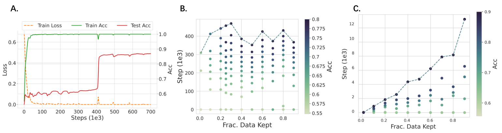
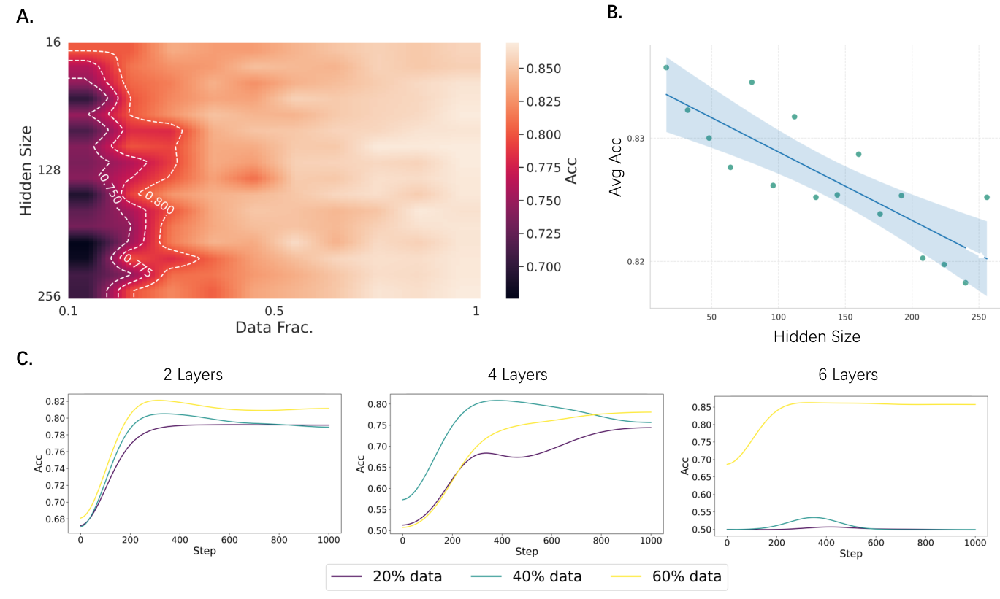
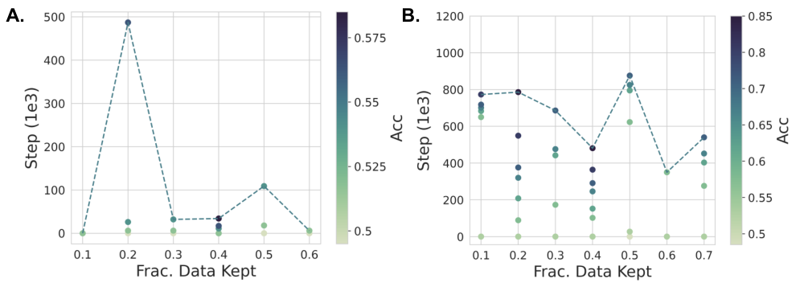
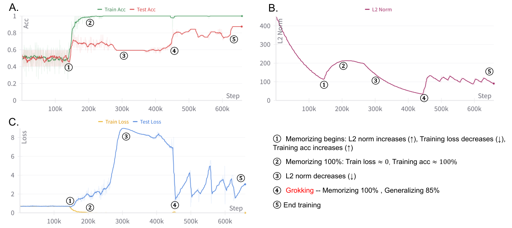
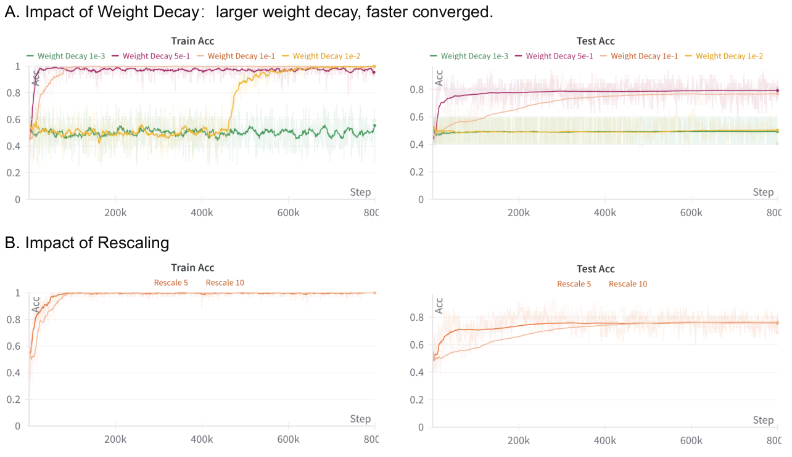
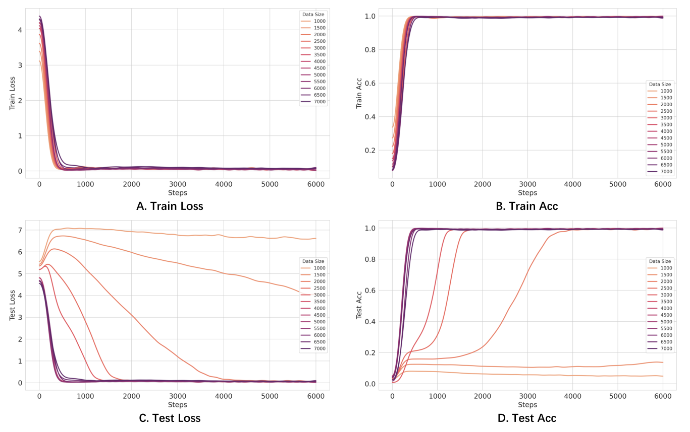
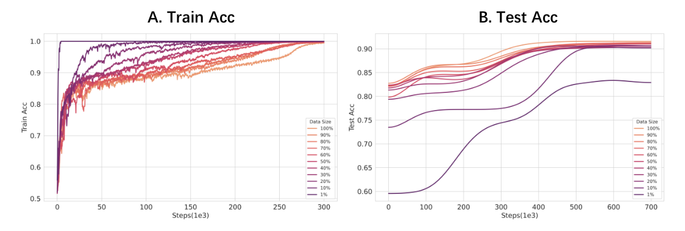
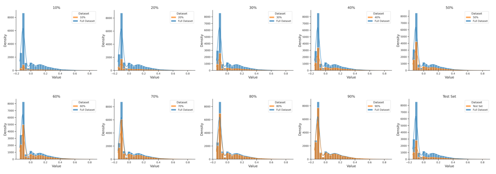
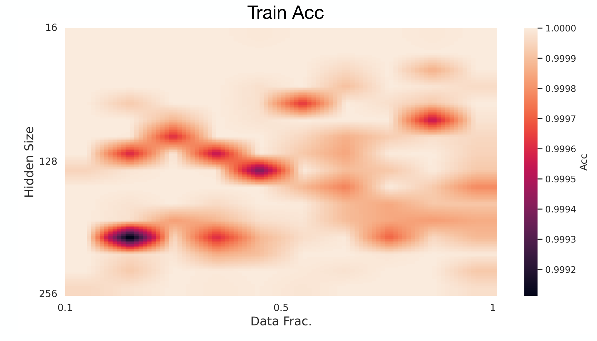

# Zhu et al. 2024 — Critical Data Size of Language Models from a Grokking Perspective

См. также: [глобальный индекс понятий](../../concepts/index.md).
arXiv [2401.10463v3](https://arxiv.org/abs/2401.10463), 19 января 2024 (v3 — 23 мая 2024). Колонтитул PDF: «Preprint. Under review.».

**Xuekai Zhu** — Shanghai Jiao Tong University; переписка: xuekaizhu0@gmail.com.
**Yao Fu** — University of Edinburgh.
**Bowen Zhou** — Tsinghua University.
**Zhouhan Lin** — Shanghai Jiao Tong University.

Файлы разбора этой статьи:

- [`2401.10463.critical-data-size-of-language-models-from-a-grokking-perspective.claims.txt`](2401.10463.critical-data-size-of-language-models-from-a-grokking-perspective.claims.txt) — пронумерованные утверждения статьи с пометками разбора.
- [`2401.10463.critical-data-size-of-language-models-from-a-grokking-perspective.license.txt`](2401.10463.critical-data-size-of-language-models-from-a-grokking-perspective.license.txt) — лицензионная запись arXiv для этой статьи.

Схема якорей и правила ссылок на карточку — в [README папки статей](../README.md).

**Карточка-выдержка.** Лицензия статьи (`arxiv-nonexclusive`) не разрешает публикацию копии оригинала и полного перевода, поэтому карточка содержит редакторские секции и цитируемые фрагменты перевода (право цитирования). Полный текст статьи: <https://arxiv.org/abs/2401.10463>.

## Затрагиваемые понятия

**[Доля данных / критический размер набора](../../concepts/data-fraction-critical-dataset-size.md)** — здесь работа даёт корпусу целое определение, а не наблюдение: **критический размер данных (CDS)** вводится как наименьшее число примеров $n$, при котором достигается примерно 100-процентная точность на обучении и сошедшаяся тестовая точность $\epsilon$ ([с. 3, абз. 2](#p3-2), [определение 1](#p3-3)). Вокруг него выстроена **гипотеза эффективности данных** с тремя режимами — [недостатка](#p3-6), [достатка](#p3-7) и [избытка](#p3-8) данных. Практически важнее самого определения предложенный **опознавательный признак**: пик числа шагов до генерализации на кривой «доля данных → шаги», слева от которого генерализации нет, в пике она самая медленная, а справа ускоряется ([рис. 1B](#fig-1), [рис. 2B](#fig-2), [рис. 3B](#fig-3)); этот признак дёшев и переносится на любой набор. Авторы сами и прямо отделяют своё понятие от одноимённого $D_{crit}$ Varma et al.: у тех это число точек, при котором запоминающий и обобщающий контуры дают одинаковые логиты, здесь — порог, за которым генерализация вообще случается ([A.1](#p12-2)). Доли получаются равномерным прореживанием без возвращения, сохраняющим пропорции исходного распределения ([§3.2](#p4-6), [рис. 12](#fig-12)). Чего в работе нет: CDS не предсказывается, а измеряется задним числом полным перебором долей с обучением до конца на каждой; сами авторы называют гипотезу неформальной, поскольку она опирается на заранее известные $\epsilon$ и распределение $\mathcal{D}$ ([с. 3, абз. 9](#p3-9)). Числа CDS для языковых наборов в работе не названы вовсе — есть только положение пика на графике.

**[Гроккинг](../../concepts/grokking.md)** — работа берёт гроккинг не как предмет объяснения, а как орудие: «использовать гроккинг как линзу, через которую понять динамику обучения языковых моделей, а не объяснять гроккинг, как это делали предшествующие исследования» ([E](#p16-4)). Отсюда её вклад в понятие — **настройка наведения**: перемасштабирование всех весов множителем $\alpha$ (взято у Omnigrok) при dropout, выставленном в 0, так что после обнуления обучающей потери единственным движителем оптимизации остаётся weight decay ([§3.1](#p3-10), [с. 4, абз. 2](#p4-2)). На этой настройке гроккинг получен на IMDB однослойным encoder-only трансформером: тестовая точность держится около уровня случайного угадывания и скачком растёт примерно после 350 000 шагов ([с. 5, абз. 2](#p5-2), [рис. 2A](#fig-2)). Чего в работе нет: ни одна модель здесь не обучается задаче языкового моделирования — три постановки из четырёх суть классификация текста энкодером, четвёртая модульная арифметика декодером; на моделях порядка 7B авторы прямо признают неспособность воспроизвести гроккинг своей настройкой ([H](#p18-1)). Заявленную в аннотации **устойчивость** воспроизведения ([с. 1, абз. 2](#p1-2)) опровергают собственные приложения ([C](#p14-1), [I](#p18-2)).

**[Фаза меморизации / плато](../../concepts/memorization-phase.md)** — работа делает длину плато измеримой величиной, зависящей от объёма данных, и предъявляет её на трёх наборах разом. На модульном сложении запоминание укладывается в первые 500 шагов при любой доле данных, а генерализация у критического размера приходит к 3500 шагам и при избытке данных ускоряется до 500, то есть сливается с запоминанием ([§4.1](#p5-1), [рис. 10](#fig-10)). На языковых наборах картина плато другая: там число шагов до запоминания **растёт** вместе с размером набора ([с. 5, абз. 3](#p5-3), [рис. 2C](#fig-2), [рис. 3C](#fig-3)) — расхождение с модульным случаем разобрано ниже. Чего в работе нет: устройства плато работа не разбирает — никаких внутренних мер, кроме нормы L2 всей модели и гистограмм весов последнего слоя, в ней нет.

**[Фазовый переход](../../concepts/phase-transition.md)** — «фазовый переход» здесь авторское слово, стоящее в аннотации ([с. 1, абз. 2](#p1-2)), и работа даёт корпусу наблюдение о его **форме**: на языковых наборах переход заметно более сглажен, чем на модульном сложении ([с. 5, абз. 3](#p5-3)). Объяснение предложено двойное и помечено самими авторами как предположение («мы полагаем, что причин две»): больший исходный объём ведёт к де-гроккингу, а репрезентации языковых задач «неопрятнее», то есть нелинейны, тогда как модульное сложение требует более выверенных линейных репрезентаций ([с. 6, абз. 1](#p6-1)). Чего в работе нет: ни параметра порядка, ни критических показателей, ни какого-либо аппарата теории фазовых переходов — слово употребляется описательно.

**[Масштаб инициализации](../../concepts/initialization-scale.md)** — множитель $\alpha$ взят у Omnigrok напрямую, вместе с уравнением ([§3.1](#p3-10), [E](#p16-3)), и служит здесь первым из двух рычагов задержки: «огромная инициализация $\alpha$ и малый weight decay $\gamma$ ведут к отложенной генерализации, то есть к гроккингу» ([с. 4, абз. 5](#p4-5)). Отсечение по гиперпараметрам даёт качественную зависимость: больший множитель замедляет сходимость ([C](#p14-1), [рис. 8](#fig-8)). Чего в работе нет: перебраны всего два значения множителя (5 и 10), зависимости задержки от $\alpha$ не измерено, а для модульного сложения объявленное значение $\alpha=0$ несовместимо с собственным уравнением (2) ([§3.3](#p4-9)).

**[Weight decay / L2-регуляризация](../../concepts/weight-decay.md)** — второй рычаг и, по устройству постановки, единственный источник дальнейшей оптимизации: dropout выставлен в 0, и после того как обучающая потеря подходит к нулю, «weight decay становится единственным источником, движущим дальнейшую оптимизацию модели» ([с. 4, абз. 2](#p4-2)). Отсюда выведена и оценка срока генерализации $t\approx\frac{\ln(w_{0}/w^{*})}{\gamma}$ с обратной зависимостью $t\propto\gamma^{-1}$ ([с. 4, абз. 4](#p4-4)). Отсечение подтверждает направление: больший weight decay ускоряет сходимость ([C](#p14-1)). Чего в работе нет: оценка срока получена из чистого экспоненциального затухания весов при нулевом градиенте и с опытом отдельно не сверена; обозначение распада гуляет между $\lambda$ и $\gamma$, а сам штраф записан как $\mathcal{L}_{\text{WD}}(\mathbf{w})=\frac{\lambda}{2}\|\mathbf{w}\|_{2}$, без квадрата нормы.

**[Когда регуляризация необходима](../../concepts/regularization-necessity.md)** — постановка устроена так, чтобы регуляризация была не одним из факторов, а **единственным**: dropout обнулён намеренно, и обучение модели «определяется исключительно перекрёстной энтропией и weight decay» ([с. 4, абз. 2](#p4-2)). Отсюда же авторское объяснение того, почему гроккинг редко виден у больших языковых моделей: у тех работает целый набор приёмов регуляризации, ускоряющих сходимость, а здесь оставлен один ([с. 6, абз. 3](#p6-3)). Чего в работе нет: опытов без всякой регуляризации — то есть проверки, что при $\lambda=0$ гроккинга не будет, — в статье нет; ближайшее к ней отсечение ([рис. 8](#fig-8)) перебирает четыре ненулевых значения.

**[Реальные данные и зрение](../../concepts/vision-real-world-data-mnist-cifar.md)** — главная опытная заявка работы: наведение гроккинга не на синтетике, а на настоящих языковых наборах — IMDB и Yelp ([вклад II](#p2-4)). Масштаб при этом вырос на два порядка относительно ближайшего предшественника: Omnigrok наводил гроккинг на 1 тыс. примеров IMDB двухслойной LSTM, здесь взяты полный IMDB (21 тыс.) и Yelp (350 тыс.) на однослойном трансформере со словарём BERT ([D](#p15-2)). Чего в работе нет: на Yelp гроккинг получен только на 10-процентном подмножестве, а на полном наборе наступает де-гроккинг ([§4.3](#p6-2), [рис. 11](#fig-11)); ниже критического размера на IMDB модель даёт около 67 % — слабую, но генерализацию, а не одно лишь запоминание ([с. 5, абз. 3](#p5-3)).

**[Модульная арифметика](../../concepts/modular-arithmetic.md)** — постановка взята без изменений и служит контрольной: сложение по модулю $p=113$ в записи `a + b % p = n`, разбиение 75 % : 25 %, полный объём $p^{2}=12769$ ([с. 4, абз. 8](#p4-8), [B](#p12-6)). Источником постановки названы Varma et al., а сама зависимость гроккинга от размера набора отнесена к Power et al. Здесь же получен самый чистый вид опознавательного признака — острый пик числа шагов до генерализации при 2000 примерах ([рис. 1B](#fig-1)). Чего в работе нет: никакого разбора выученного алгоритма — модульное сложение служит только полигоном для проверки гипотезы о данных.

**[Эталонный полигон гроккинга](../../concepts/canonical-grokking-testbed.md)** — работа предъявляет сводную таблицу настроек предшествующих работ о гроккинге рядом со своими ([B, таблица 2](#p13-6)) и формулирует своё положение относительно полигона прямо: почти все прежние исследования держались модульной арифметики (7–9 тыс. примеров, однослойный трансформер со словарём 115), а здесь набор и охват расширены до 350 тыс. ([D](#p15-1)). Чего в работе нет: одновременного увеличения набора **и** модели — авторы называют это очень трудным «из-за хрупкой природы гроккинга» и оставляют вне работы.

**[Минимизация нормы весов](../../concepts/weight-norm-minimization.md)** — единственная внутренняя величина, которую работа отслеживает, это норма L2 всей модели, и по ней построен весь разбор фаз: норма сперва падает под действием потери, растёт при запоминании (наиболее выгодная стратегия запоминания — увеличивать параметры, отводя отдельные под отдельные примеры), затем падает под действием weight decay, и гроккинг наступает, когда она падает до определённого уровня ([§6](#p9-1), [рис. 5](#fig-5), [рис. 7](#fig-7)). Чего в работе нет: нормы как предсказывающей величины — уровень, до которого она должна упасть, не вычисляется и заранее не называется; связь фиксируется post hoc на одном прогоне.

**[Обучение структурированных представлений](../../concepts/structured-representation-learning.md)** и **[эффективная теория](../../concepts/effective-theory-statistical-mechanics.md)** — привлечены как объяснение сглаженности перехода: по «эффективной теории обучения репрезентаций» задачи вроде модульного сложения требуют более выверенных (линейных) репрезентаций, тогда как репрезентации языковых задач заметно сложнее, или «неопрятнее», то есть нелинейны ([с. 6, абз. 1](#p6-1)). Той же теории приписано родственное толкование порога — наименьший объём, задающий репрезентацию ([A.1](#p12-1)). Чего в работе нет: собственных измерений репрезентаций — ни одной величины, характеризующей их структуру, здесь не считается, и «неопрятность» остаётся словом, а не мерой.

**[Двойной спуск](../../concepts/double-descent.md)** — рамка гипотезы заимствована прямо: «следуя теоретической рамке [11]», три режима по объёму данных выстроены по образцу режимов у Nakkiran et al. ([§2](#p3-1)). Чего в работе нет: двойного спуска как явления работа не наблюдает и не измеряет — взята только форма изложения через режимы.

**[Эмерджентность / эмерджентные способности](../../concepts/emergence.md)** — упомянута один раз, в перечне открытий о генерализации рядом с законами масштабирования, двойным спуском и гроккингом ([введение](#p1-3)); собственного разбора нет.

**[Эффективность контуров](../../concepts/circuit-efficiency.md)**, **[полу-грокинг](../../concepts/semi-grokking.md)** и **[унгрокинг](../../concepts/ungrokking.md)** — упомянуты как содержание ближайшей смежной работы: Varma et al. вскрыли точку кроссовера, за которой генерализация становится действеннее запоминания, и выявили полу-грокинг и унгрокинг ([с. 2, абз. 1](#p2-1), [A.1](#p12-1)). Существенно, что работа тут же **разводит** эти понятия со своим: «явление, которое они объясняют, и постановки полностью отличны от наших» ([A.1](#p12-2)). Чего в работе нет: ни контуров, ни их эффективности в собственном разборе — механистической части в статье нет вовсе.

**[Оптимизатор](../../concepts/optimizer-adam-adamw-sgd.md)** — во всех опытах AdamW: для модульного сложения полнобатчевое обучение с $\beta_{1}=0.9,\beta_{2}=0.98$, для языковых наборов мини-батч $128$ и $\beta_{1}=0.9,\beta_{2}=0.999$, скорость обучения 1e-3 везде ([B](#p13-2)). Чего в работе нет: сравнения оптимизаторов и какой-либо роли оптимизатора в объяснении — он закреплён и в разборе не участвует.

---

**[Фазы: понимание, гроккинг, запоминание, путаница](../../concepts/comprehension-confusion-phases.md)** — работа переносит разметку с оси времени на ось данных: режимы различаются не тем, когда наступает переход, а тем, хватает ли выборки, чтобы он наступил вообще ([`p1-2`](#p1-2)). Граница между быстрым запоминанием и медленной генерализацией задаётся критическим размером данных, и потому эта разметка сравнима с фазовой диаграммой по гиперпараметрам, но не совпадает с ней.

**[Критичность / критическая точка](../../concepts/criticality-critical-point.md)** — слово «критический» здесь означает порог между режимами, а не критическую точку в смысле статистической физики ([`p1-2`](#p1-2)). Ни расходимости, ни критических показателей работа не заявляет, и различение существенно: критический размер данных — управляющая величина, за которой меняется исход, а не точка, вблизи которой замедляется динамика.

**[Контур генерализации](../../concepts/generalization-circuit.md)** — определён операционально, через сравнение с запоминающим: критический размер данных есть то число примеров, при котором оба контура дают одинаковые логиты ([`p12-2`](#p12-2)). Такое определение не требует разбирать схему по весам — довольно измерить, чей вклад в предсказание перевешивает.

**[Компромисс сложность–ошибка](../../concepts/model-complexity-error-tradeoff.md)** — размен виден как граница на карте настроек: за порогом рост сложности модели перестаёт давать соразмерную отдачу ([`p7-2`](#p7-2)). Мерой сложности здесь служит размер модели, а не характеристика выученной функции, и потому утверждение относится к выбору масштаба, а не к устройству решения.

**[Законы масштабирования](../../concepts/scaling-laws.md)** — гроккинг поставлен в один ряд с ними как явление, требующее объяснения от той же теории ([`p1-3`](#p1-3)). Работа приносит и расхождение с привычным их чтением: в этой постановке некоторые меньшие модели достигают лучшего качества, чем чуть большие при том же объёме данных ([`p8-1`](#p8-1)).
## Несогласованности внутри статьи

**Множитель $\alpha=0$ для модульного сложения обнулил бы все веса.** В [§3.3](#p4-9) сказано: «Мы выставляем $\alpha$ и weight decay в $0$ и $1$ соответственно». По [уравнению (2)](#p3-10) $\mathbf{w}=\alpha*\mathbf{w_{0}}$, так что $\alpha=0$ означало бы нулевую инициализацию всей модели. По смыслу имелось в виду «без перемасштабирования», то есть $\alpha=1$; цитировать это значение как настройку нельзя.

**Итоговая тестовая точность на IMDB названа тремя разными числами.** [С. 5, абз. 2](#p5-2) — «точность модели подскакивает примерно до 87 %»; [§6, стадия E](#p9-1) и надпись внутри [рис. 5](#fig-5) («Grokking: Memorizing 100 % ; Generalizing 85 %») и [рис. 7](#fig-7) — 85 %; [с. 5, абз. 3](#p5-3) и подпись [рис. 7](#fig-7) — «примерно 80 %». Разбег объясняется тем, что рисунки 2 и 5/7 показывают разные прогоны (у первого скачок около 410 тыс. шагов, у второго около 450 тыс.), но [§6](#p9-1) ссылается за числом 85 % именно на рисунок 2A, где стоит 87 %.

**Режим недостатка данных объявлен «только запоминанием», а измерено 67 %.** [Гипотеза 1](#p3-6) для режима недостатка гласит: «запоминание без генерализации». На IMDB [ниже критического размера](#p5-3) модель достигает «слабой генерализации (примерно 67 %)» — заметно выше случайных 50 % на двоичной задаче. Режим, названный «без генерализации», в собственных данных работы генерализацию даёт.

**Шаги до запоминания одновременно «почти не зависят» и «растут» с размером набора.** [§4.1, п. 3](#p5-1): «число шагов до запоминания почти не затронуто размером набора» (модульное сложение). [С. 5, абз. 3](#p5-3): «число шагов до запоминания при обучении растёт с ростом размера данных» (IMDB), и то же на Yelp ([рис. 3C](#fig-3)). Гипотеза при этом формулируется для обеих семей задач сразу. К этому же расхождению относится и надпись внутри [рис. 1C](#fig-1) — «Memorization steps gradually increase», — противоречащая собственной подписи того же рисунка («различие в шагах запоминания очень мало») и тексту §4.1.

**Устойчивость воспроизведения заявлена в аннотации и опровергнута в приложениях.** [Аннотация](#p1-2): «Мы разрабатываем настройку гроккинга, чтобы **устойчиво** воспроизводить гроккинг на упрощённых языковых моделях». [Приложение C](#p14-1): «Определение конкретных значений weight decay $\lambda$ и множителя перемасштабирования $\alpha$ потребовало обширных опытов. Неподходящие сочетания гиперпараметров могут и не навести явление гроккинга». [Приложение I](#p18-2): «из-за неустойчивости гроккинга при разных настройках…». Цитировать «устойчиво» без этих двух мест нельзя.

**Yelp предъявлен и как 352 тыс., и как 10 % от него.** [§4.3](#p6-2): гроккинг «достигнут на меньшем, 10-процентном подмножестве набора Yelp», а на больших объёмах наступает де-гроккинг. При этом [таблица 1](#p13-1) и [приложение D](#p15-2) заявляют размах постановки как «Yelp 352 232 / 117 411» и «полный Yelp (350 тыс. примеров)». Опыт с гроккингом на Yelp поставлен примерно на 35 тыс. обучающих примеров, а не на 350 тыс.

**Словесное определение CDS шире формулы.** [С. 3, абз. 2](#p3-2) требует одновременно «примерно 100 % точности на обучении **и** сошедшейся тестовой точности $\epsilon$», тогда как [формула (1)](#p3-3) содержит только условие $\mathbb{E}\left[\operatorname{Acc}_{S}(\mathcal{M})\right]\geq\epsilon$. Условие на обучающую точность в формулу не входит, а именно оно отделяет CDS от обычного порога выборочной сложности.

**Обозначение распада весов гуляет по статье.** В [уравнении (3)](#p3-11) штраф записан через $\lambda$, в [уравнениях (6)–(7)](#p4-4) и в [§3.3](#p4-9) тот же коэффициент назван $\gamma$, в [приложении C](#p14-1) снова $\lambda$. Там же штраф выписан как $\mathcal{L}_{\text{WD}}(\mathbf{w})=\frac{\lambda}{2}\|\mathbf{w}\|_{2}$ — с половиной, но без квадрата нормы, из-за чего выведенное далее чистое экспоненциальное затухание $w(t)\approx\exp(-\gamma t)w_{0}$ из этой записи не следует.

**Стадии в тексте §6 и на рисунке 5 расходятся в десять раз.** [Текст](#p9-1) датирует стадию B шагом 15 000, стадию C — шагом 20 000 («Качество на шаге 20 000 на рисунке 2A говорит о том, что модель, вероятно, переобучилась»). Подписи панелей [рис. 5](#fig-5) дают для тех же стадий Step 150000 и Step 200000, а последующие стадии D, E, F — 250000, 450000 и 658000, что согласуется с осью [рис. 7](#fig-7). В тексте, по-видимому, потерян разряд.

**Отсечение по weight decay не воспроизводит собственную рабочую настройку.** На [рис. 8](#fig-8) при weight decay 1e-2 — том самом значении, которое [§3.3](#p4-9) объявляет рабочим для IMDB и Yelp, — тестовая точность за 800 тыс. шагов остаётся на уровне 0.5, тогда как [§4.2](#p5-2) сообщает о гроккинге до 87 % примерно на 350 тыс. шагов при этой же настройке. Доля данных, на которой поставлено отсечение, не указана, поэтому расхождение может объясняться разными объёмами; проверить это по статье нельзя.

---

## Что доказано, что показано и что предположено

Работа держится на одном воспроизводимом наблюдении и на нескольких заметно более слабых опорах, и разница между ними в тексте не проведена.

**Показано и воспроизведено трижды.** Пик числа шагов до генерализации по доле данных получен на модульном сложении, IMDB и Yelp ([рис. 1B](#fig-1), [рис. 2B](#fig-2), [рис. 3B](#fig-3)). Это главная опора гипотезы и самое переносимое, что в работе есть. Оговорки, которые к нему прилагаются: на Yelp пик приходится на крайнюю левую ненулевую долю, то есть восходящей ветви у него почти нет ([рис. 3B](#fig-3)); число семян не указано нигде, а единственная упомянутая полоса неопределённости — «95-процентный доверительный промежуток» на [рис. 4B](#fig-4) — взята по долям данных, а не по повторам прогонов.

**Показано на одном прогоне.** Разбор шести стадий эволюции весов ([§6](#p9-1)) и связка «гроккинг наступает при падении нормы L2 до определённого уровня» построены на единственной обучающей кривой; ни уровень, ни его зависимость от настроек не измерены.

**Выведено рассуждением, не измерено.** Оценка срока генерализации $t\approx\frac{\ln(w_{0}/w^{*})}{\gamma}$ ([с. 4, абз. 4](#p4-4)) получена из чистого экспоненциального затухания весов при нулевом градиенте; согласие этой оценки с наблюдаемыми сроками нигде не проверяется.

**Заявлено как предположение самими авторами.** Двойное объяснение сглаженности перехода ([с. 6, абз. 1](#p6-1)) введено словами «мы полагаем, что причин две»; догадка о том, что гроккинг есть основополагающее явление, скрытое под сложными условиями, — словами «мы предполагаем» ([с. 6, абз. 3](#p6-3)); обратное масштабирование объяснено через «мы предполагаем, что» ([с. 8, абз. 1](#p8-1)).

**Слабее всего опирается на данные вывод о размере модели.** «Критический размер данных растёт с размером модели» ([§5](#p7-2)) получен при закреплённых для всех размеров $\alpha=10$, weight decay и бюджете шагов ([постановка опытов](#p7-1)); средняя точность падает с 0.835 до 0.818 при росте скрытого размера с 16 до 256 ([рис. 4B](#fig-4)), то есть на 1.7 процентного пункта, и сопоставления при равных вычислительных затратах в работе нет. Обучающая точность при этом близка к единице на всей сетке ([рис. 14](#fig-14)), так что падение идёт по тестовой стороне.

**Слабее всего опирается на данные и случай инструкционной донастройки.** [§7](#p9-3) заключает, что критический размер существует и в этой задаче, но тестовая точность на [рис. 6A](#fig-6) нигде не превосходит примерно 0.575, а на девяти задачах Natural-Instructions из [рис. 9](#fig-9) тестовые кривые остаются у уровня случайного угадывания при том, что обучающие поднимаются до 0.85. Отложенной генерализации на этих рисунках не видно; видна только неоднородность числа шагов по долям данных.

---

## Ошибочные пересказы и цитирования этой статьи

Узоры, наблюдённые в цитирующих работах корпуса. Каждая запись говорит, что именно искажается, и ведёт к авторским абзацам, где стоит теряемая оговорка. Раздел построен только из наблюдённых формулировок.

**«Гроккинг воспроизведён в больших языковых моделях» (ошибочное).** Работу ставят в перечень свидетельств того, что гроккинг встречается «в том числе у больших языковых моделей»: у Xu, Vardi, Safran она открывает список `"as well as in large language models (Zhu et al., 2024; Wang et al., 2024; Xu et al., 2025)"` — «а также в больших языковых моделях». Между тем ни одна модель этой статьи не является большой языковой моделью: это однослойные трансформеры (encoder-only со словарём BERT для классификации текста, decoder-only для арифметики), обучаемые с нуля. Более того, [приложение H](#p18-1) целиком посвящено обратному: «воспроизведение гроккинга на более сложных задачах и более крупных моделях (например, 7B) — потенциальная трудность нашей работы», и там же названы обе причины — ослабление weight decay может недостаточно влиять на способность LLM к генерализации, а прореживание набора на таких моделях может почти не действовать. Тот же вывод повторён в [приложении D](#p15-2) («наша нынешняя настройка гроккинга может не справиться с замедлением обучения») и в [приложении G](#p17-2), где авторы прямо оговаривают: «эти управляемые условия всё же относятся только к упрощённым моделям; мы лишь расширили размер набора и круг задач». Подробный разбор формулировки — в карточке [Kim, Yun 2026](../2601.19791.to-grok-grokking-provable-grokking-in-ridge-regression/2601.19791.to-grok-grokking-provable-grokking-in-ridge-regression.card.md).

**«Структурный гроккинг иерархических структур предложения» (ошибочное).** В карточке Egalitarian Gradient Descent работа названа среди тех, кто показал `"structural grokking has been shown to occur in language models, where models discover hierarchical sentence structures after extensive training (Murty et al., 2023; Zhu et al., 2024)"` — «структурный гроккинг, показано, случается в языковых моделях, где модели после долгого обучения обнаруживают иерархические структуры предложения». Ничего похожего в статье нет: её языковые задачи — двоичная классификация тональности на IMDB и Yelp и одна классификационная задача из Natural-Instructions ([§3.3](#p4-8)), синтаксис в ней не упоминается, а внутренних разборов в ней нет вовсе. Происхождение ошибки видно из самой фразы: наблюдение о структурном гроккинге принадлежит второй названной там работе — [Murty et al. 2023](../2305.18741.grokking-of-hierarchical-structure-in-vanilla-transformers/2305.18741.grokking-of-hierarchical-structure-in-vanilla-transformers.card.md), — и распространено на соседнюю ссылку. Подробнее — в карточке [Egalitarian Gradient Descent](../2510.04930.egalitarian-gradient-descent-a-simple-approach-to-accelerated-grokking/2510.04930.egalitarian-gradient-descent-a-simple-approach-to-accelerated-grokking.card.md).

**«Zhu et al. ввели критический размер набора $D_{crit}$» (ошибочное — смешение с Varma).** Работу цитируют как источник понятия, которое ввели не она: `"Initial understanding of grokking focused on the size of the dataset and some studies proposed the concept of ’critical dataset size’ (Zhu et al., 2024; Huang et al., 2024)"` — «первоначальное понимание гроккинга сосредоточивалось на размере набора, и ряд исследований предложил понятие „критического размера набора“». Названная рядом работа Huang et al. пользуется именно $D_{crit}$ [Varma et al.](../2309.02390.explaining-grokking-through-circuit-efficiency/2309.02390.explaining-grokking-through-circuit-efficiency.card.md) — кроссовером эффективности контуров, — тогда как здесь речь о другой величине. Оговорку авторы сделали сами и в отдельном абзаце: «Varma et al. 2023 — ближайшая смежная работа, которая тоже ввела понятие „критического размера данных“. Однако явление, которое они объясняют, и постановки полностью отличны от наших» ([A.1](#p12-2)). Смешение отзывается и в числах: в работе о данных ниже критического порога критический размер алгоритмических задач назван «примерно 25 % набора» со ссылкой сразу на Varma et al. и на эту статью — `"prior studies define the critical data size to be around 25% of the dataset (Varma et al., 2023; Zhu et al., 2024)"`; здесь никакой доли в процентах не названо, а пик на модульном сложении приходится на 2000 примеров из 9576 обучающих ([рис. 1B](#fig-1)). Подробнее — в карточках [Beyond Progress Measures](../2504.03162.beyond-progress-measures-theoretical-insights-into-the-mechanism-of-grokking/2504.03162.beyond-progress-measures-theoretical-insights-into-the-mechanism-of-grokking.card.md) и [When Data Falls Short](../2511.04760.when-data-falls-short-grokking-below-the-critical-threshold/2511.04760.when-data-falls-short-grokking-below-the-critical-threshold.card.md).

**«Ниже критического размера модель только запоминает» (расширяющее).** Формула `"models only grok when the training data exceeds some critical size"` — «модели гроккают лишь тогда, когда объём обучающих данных превосходит некоторый критический размер» — верна для модульного сложения, где ниже порога тестовая точность не доходит и до 50 % ([§4.1](#p5-1)), но на языковых наборах статья сама сообщает о слабой генерализации примерно до 67 % ниже порога ([с. 5, абз. 3](#p5-3)). Тезис в такой форме сильнее собственных данных работы, и её же [гипотеза о режиме недостатка](#p3-6) с этими данными расходится. Подробнее — в карточке [Let Me Grok for You](../2504.13292.let-me-grok-for-you-accelerating-grokking-via-embedding-transfer-from-a-weaker-model/2504.13292.let-me-grok-for-you-accelerating-grokking-via-embedding-transfer-from-a-weaker-model.card.md).

**Приписывание работе того, чего в ней нет: разнообразия данных, структурированных репрезентаций и объяснения геометрии весов.** В нескольких обзорах вывод работы дополняется тем, чего она не измеряла: что достаточно большой набор оттого и работает, что он «более разнообразен»; что выше порога «возникают структурированные репрезентации»; что геометрию выученных репрезентаций «принято относить на счёт weight decay» со ссылкой в том числе сюда. Ни разнообразия, ни структуры репрезентаций работа не измеряет: единственные внутренние величины в ней — норма L2 всей модели и гистограммы весов классифицирующего слоя ([§6](#p9-1)), а «неопрятность» языковых репрезентаций упомянута как заимствованное объяснение, а не как измерение ([с. 6, абз. 1](#p6-1)).

Образец аккуратного цитирования — формулировка из позиционной работы о послойных линейных моделях: `"Zhu et al. (Zhu et al. 2024) studied the impact of dataset size on grokking in text classification tasks"` — «Zhu et al. изучили влияние размера набора на гроккинг в задачах классификации текста». Она называет и предмет (размер набора), и настоящую область опытов (классификация текста), не приписывая работе ни языкового моделирования, ни LLM.

Более мягкие отголоски, не заслужившие отдельного разбора: [Grokked Transformers are Implicit Reasoners](../2405.15071.grokked-transformers-are-implicit-reasoners/2405.15071.grokked-transformers-are-implicit-reasoners.card.md) (только в списке литературы), [Grokking Beyond the Euclidean Norm](../2506.05718.grokking-beyond-the-euclidean-norm-of-model-parameters/2506.05718.grokking-beyond-the-euclidean-norm-of-model-parameters.card.md) (пересказ верен, но «языковые модели» оставлены без уточнения об однослойном классификаторе), [Grokked Models are Better Unlearners](../2512.03437.grokked-models-are-better-unlearners/2512.03437.grokked-models-are-better-unlearners.card.md) («пороги, зависящие от данных, для надёжного гроккинга» — слово «надёжного» держится на опровергнутом приложениями «stably»), [Intrinsic Task Symmetry](../2603.01968.intrinsic-task-symmetry-drives-generalization-in-algorithmic-tasks/2603.01968.intrinsic-task-symmetry-drives-generalization-in-algorithmic-tasks.card.md) (отнесение геометрии репрезентаций на счёт weight decay).

---

# Цитируемые фрагменты перевода

Ниже приведены только те фрагменты перевода, на которые ссылаются карточки корпуса (право цитирования). Нумерация якорей `pN-M` / `fig-N` / `sec-X` совпадает с полной карточкой и оригиналом.

## Аннотация

###### p1-2

Мы исследуем критический размер данных в языковых моделях — порог, отмечающий основополагающий сдвиг от быстрого запоминания к медленной генерализации. Мы формализуем фазовый переход при настройке гроккинга в виде гипотезы эффективности данных и выделяем режимы недостатка, достатка и избытка данных в динамике обучения языковых моделей. Мы разрабатываем настройку гроккинга, чтобы устойчиво воспроизводить гроккинг на упрощённых языковых моделях за счёт перемасштабирования инициализации и weight decay. Мы показываем, что генерализация наступает только тогда, когда языковые модели достигают критического размера. Мы разбираем гроккинг со стороны выборки и со стороны модели, проверяя предложенную гипотезу эффективности данных. Наши опыты выявляют более сглаженные фазовые переходы, происходящие при критическом размере набора для языковых наборов данных. С ростом размера модели эта критическая точка тоже становится больше, что говорит о том, что более крупным моделям нужно больше данных. Наши результаты углубляют понимание обучения языковых моделей и дают новый взгляд на роль данных в механизме обучения языковых моделей.

###### fig-1

*Рисунок 1: Всесторонний разбор динамики обучения и кривых точности подтверждает гипотезу эффективности данных на обычном гроккинге [15, 21]. **A:** Воспроизведённое явление гроккинга на модульном сложении с однослойным decoder-only трансформером, обученным на 2000 примерах. Отложенная генерализация ($\approx 100\%$ тестовой точности) наступает при продолжении обучения после завершения запоминания ($\approx 100\%$ обучающей точности, переобучение). **B:** Пошаговый разбор тестовой точности. Мы наблюдаем отчётливый пик, указывающий на медленную генерализацию при критическом размере данных, тогда как большее число обучающих примеров заметно ускоряет генерализацию. Ниже критического размера данных генерализации не происходит. **C:** Пошаговый разбор обучающей точности. За 400 шагов модель способна запомнить все обучающие данные. При различных размерах набора различие в шагах запоминания очень мало. **D:** Одномерная PCA-визуализация наборов модульного сложения. Прореживание данных равномерно берёт выборку из исходного распределения. **E** и **F:** Тестовая / обучающая точность на протяжении всего процесса обучения. Подробный процесс обучения представлен на рисунке 10.* **[p. 2]**

## 1 Введение

###### p1-3

Как большие данные ведут языковые модели от запоминания к генерализации? Стремясь понять механизм генерализации, исследователи сделали ряд поразительных открытий, касающихся способностей к генерализации, включая нейросетевые законы масштабирования [4], двойной спуск [11], гроккинг [15] и эмерджентные способности [23]. В сочетании с недавними мощными большими языковыми моделями (LLM) [20, 14, 2] мы получаем прочное представление: *генерализация приходит от больших данных*. Сложное взаимодействие данных и генерализации возвращает нас к самому сердцу машинного обучения — к основополагающей загадке о роли данных.

###### p2-1

Недавние открытия отчасти объяснили роль данных через прореживание данных по качеству и разбор эффективности данных, связанный с гроккингом. Sorscher et al. 2022 воспроизвели показательный закон масштабирования за счёт прореживания данных, указав на множество весьма избыточных примеров в обучающих наборах. Power et al. 2022 первыми выявили явление гроккинга — отложенную генерализацию после переобучения — и связали генерализацию с размером данных [6, 7]. Varma et al. 2023 вскрыли точку кроссовера, в которой генерализация становится действеннее запоминания, выявив полу-грокинг и унгрокинг. Опираясь на эти наблюдения, мы исследуем критический размер данных, запускающий генерализацию. Наш подход состоит в расширении зависящего от данных гроккинга и в подробном разборе фазового перехода обучения в языковых моделях.

###### p2-4

**II.** Перемасштабируя инициализацию параметров и weight decay, мы строим способ устойчиво создавать явления гроккинга на *настоящих* задачах языковых моделей (Yelp и IMDB, § 3) — шаг вперёд от имеющихся работ, обычно ставящих *синтетические* постановки, например модульное сложение;

## 2 Гипотеза эффективности данных

###### p3-1

Следуя теоретической рамке [11], мы формулируем гипотезу о критическом размере данных при гроккинге, показывающую, что генерализация зависит от действенного размера данных.

###### p3-2

Мы вводим понятие *критического размера данных* (**CDS**) для обучения моделей, связанного с гроккингом. Для заданных модели $\mathcal{M}$ и распределения данных $\mathcal{D}$ *критический размер данных* обозначает наименьшее число примеров $n$, требуемое для достижения примерно 100 % обучающей точности на $S_{train}$ и сошедшейся тестовой точности $\epsilon$ на $S_{test}$.

###### p3-3

**Определение 1 (Критический размер данных)** *Для заданных распределения данных $\mathcal{D}$, модели $\mathcal{M}$ и сошедшегося тестового качества $\epsilon$ CDS есть*:

###### p3-6

**Режим недостатка данных** Когда $n$ значительно меньше $\operatorname{CDS}(\mathcal{D},\mathcal{M})$, качество модели $\mathcal{M}$ может не достичь оптимума, какой бы ни была сложность модели. Отсюда: только запоминание, генерализации нет.

###### p3-7

**Режим достатка данных** Когда $n\approx\operatorname{CDS}(\mathcal{D},\mathcal{M})$, модель $\mathcal{M}$ приблизится к желаемому оптимальному уровню качества $\epsilon$. Мы будем наблюдать отложенную генерализацию, и дальнейшее добавление данных может лишь ускорить сходимость, не повышая качества. Отсюда: запоминание, затем отложенная генерализация — гроккинг.

###### p3-8

**Режим избытка данных** Когда $n$ значительно превосходит $\operatorname{CDS}(\mathcal{D},\mathcal{M})$, дополнительные данные ускорят сходимость, что проявится как одновременные запоминание и генерализация. Отсюда: одновременные запоминание и генерализация — гроккинга нет.

###### p3-9

Наша гипотеза неформальна, поскольку она опирается на предварительное знание оптимального качества модели $\epsilon$ и текущего распределения набора $\mathcal{D}$. Мы пока не дали формального определения понятиям «недостаток», «достаток» и «избыток», которые зависят от практических обстоятельств исходного набора и опытной модели. Однако при определённой и закреплённой постановке мы способны наблюдать эти фазовые изменения через опытные явления.

### 3.1 Настройка для наведения гроккинга

###### p3-10

Как сказано выше, гроккинг сильно связан с размерами данных. Мы пытаемся исследовать роль данных, наводя гроккинг в языковых моделях. С этой целью мы вводим настройку гроккинга, производную от Omnigrok [7]. В настройке гроккинга каждый вес модели перемасштабируется множителем $\alpha$, выводимым так:

###### p3-11

а $\mathbf{w_{0}}$ представляет стандартную Pytorch-инициализацию параметров модели. Параметр $\alpha$ служит усилению явления гроккинга, как предложено Liu et al. 2022b. Затем мы оптимизируем перемасштабированные модели $\mathbf{w}$ перекрёстной энтропией и weight decay. Для заданных набора входов $\mathbf{X}$, набора меток $\mathbf{Y}$ и обучающего набора $\mathcal{D}=\{(x_{1},y_{1}),(x_{2},y_{2}),...,(x_{n},y_{n})\}$ цель оптимизации записывается так:

###### p4-2

Предшествующие исследования показали, что генерализация существенно зависит от регуляризации [15, 1]. В нашем подходе мы выставляем долю dropout в 0, а значит, процесс обучения модели $\mathbf{w}$ определяется исключительно потерей перекрёстной энтропии и weight decay. Как показано на рисунке 1A, обучающая потеря сперва быстро падает до 0, достигая запоминания обучающего набора. Поскольку градиент обучающей потери тоже близок к нулю, без всякой регуляризации веса модели остались бы неподвижными (то есть переобучение). Следовательно, когда обучающая потеря подходит к нулю, weight decay становится единственным источником, движущим дальнейшую оптимизацию модели и ведущим к генерализации. Формально мы записываем weight decay так:

###### p4-4

где $t\propto\gamma^{-1}$, а $w^{*}$ — норма L2 оптимальных весов при генерализации.

###### p4-5

Итак, как обсуждается в [15, 7], огромная инициализация $\alpha$ и малый weight decay $\gamma$ ведут к отложенной генерализации, то есть к гроккингу. Мы пользуемся этими двумя факторами, чтобы навести гроккинг на языковых наборах данных. Подробная постановка реализации представлена в приложении B.

### 3.2 Динамика обучения при прореживании данных

###### p4-6

Мы проверяем нашу гипотезу эффективности данных, разбирая динамику обучения и извлекая наблюдения через прореживание данных. Точнее, мы применяем равномерное прореживание данных, чтобы исследовать зависимость гроккинга от данных; это простой, но действенный способ разбора, позволяющий отделить зависимость от данных. Равномерное прореживание данных случайно выбирает $n$ элементов из набора размера $N$ без возвращения, каждый с равной вероятностью $\frac{1}{N}$. Такой подход обеспечивает статистически равномерное подмножество, сохраняющее пропорциональные свойства исходного набора. Как показано на рисунках 1D и 12, равномерное прореживание данных получает поднабор, пропорционально извлекая из исходного распределения (то есть распределения обучающего набора). Подробности даны в приложении F.

#### Наборы данных

###### p4-8

Мы включаем в наши опыты четыре набора данных: модульное сложение [15], IMDB [8], Yelp [26] и Natural-Instructions [22]. Следуя Varma et al. 2023, мы строим модульное сложение по формуле a+b%p=n. Точнее, мы выставляем p в 113. Этот набор служит основной моделью для исследований обычного гроккинга. В отличие от него, IMDB и Yelp — хорошо известные наборы для классификации текста, дающие более реалистичные примеры, чем синтетический набор модульного сложения. Задача инструкционной донастройки используется как проверка на более сложной постановке, близко напоминающей сценарии настоящего использования людьми.

#### Реализация

###### p4-9

Для опытов с обычным гроккингом мы применяем однослойный decoder-only трансформер, схожий с моделями, использованными в [15] и [21]. Мы выставляем $\alpha$ и weight decay в $0$ и $1$ соответственно. Для гроккинга на наборах IMDB и Yelp мы выбираем однослойный encoder-only трансформер — более обычную постановку для задач классификации текста. Мы выставляем $\alpha$ и weight decay $\gamma$ в 10 и 1e-2 соответственно. Все опыты проведены на GPU NVIDIA GeForce RTX 3090 с обучением с нуля. Каждый приведённый результат воспроизводится в пределах трёх часов на одном GPU.

### 4.1 Обычный гроккинг

###### p5-1

Чтобы проверить предложенную нами гипотезу эффективности данных на обычном гроккинге, мы изобразили точности на обучающем и тестовом наборах при растущем числе обучающих примеров $N$ в модульном сложении. Как показано на рисунке 1, видно, что гроккинг (то есть медленная генерализация) сильно зависит от размера данных. Эти результаты выявляют: **(1) Генерализация наступает при критическом размере набора данных.** Как показано на рисунке 1B, есть отчётливый пик, где модель медленно приходит к $100\%$ тестовой точности. Точнее, примерно на 3500 шагах модель достигает совершенной генерализации, что отражается в 100 % тестовой точности. Занятно, что к этому моменту модель уже запомнила все обучающие данные, достигнув 100 % обучающей точности в пределах первых 500 шагов. Когда набор достигает этого критического размера, явление гроккинга становится заметно отчётливым, как показано на рисунке 1A. **(2) Запоминание и генерализация наступают почти одновременно, когда набор достаточен.** По мере того как размеры данных проходят критический размер данных, число шагов до генерализации значительно уменьшается с 3500 до 500. Это близко согласуется с числом шагов, нужным, чтобы полностью выучить все обучающие примеры. **(3) Генерализация не может наступить при недостаточных данных.** Ниже критического размера данных модель способна лишь запомнить обучающие примеры, но не способна генерализовать на тестовые. Например, как показано на рисунке 1E, 1000 и 1500 обучающих примеров не дают даже 50 % точности (синие строки). Напротив, на рисунке 1F число шагов до запоминания почти не затронуто размером набора.

### 4.2 Гроккинг на IMDB

###### fig-2

*Рисунок 2: **A:** Мы наводим явление гроккинга на IMDB [8] с помощью однослойного encoder-only трансформера. Модель внезапно перекинулась от запоминания обучающих данных к генерализации на невиданные тестовые данные после гораздо более долгого обучения. **B:** Пошаговый разбор тестовой точности на IMDB. Мы можем наблюдать рост числа шагов при переходе от очень слабой генерализации (светлая точка) к полноценной генерализации (тёмная точка). С ростом доли данных число шагов до генерализации быстро выходит на устойчивый уровень и держится на нём. **C:** Пошаговый разбор обучающей точности на IMDB. Число шагов до запоминания постепенно растёт с долей набора. И в итоге на обучающих данных достижимы 100 % точности.* **[p. 5]**

###### p5-2

Как обсуждалось выше, посредством настройки гроккинга мы успешно строим явление гроккинга на наборе IMDB [8] с помощью однослойного encoder-only трансформера. Это достигается стратегическим перемасштабированием инициализации параметров и weight decay. Как показано на рисунке 2A, обучающая потеря (жёлтая линия) быстро сходит на нет, тогда как обучающая точность подходит к 100 %. Напротив, тестовая точность держится на уровне случайного угадывания ($\approx$50 %). При продолжении обучения примерно 350 000 шагов происходит внезапный скачок генерализации, и точность модели подскакивает примерно до 87 %. Эти наблюдения согласуются с первоначальным гроккингом [15] на задаче модульного сложения. Однако, поскольку набор IMDB сложнее модульного сложения, модель не может генерализовать совершенно.

###### p5-3

При настройке гроккинга мы изображаем фазовый процесс обучения на различных долях всего набора. Эти результаты выявляют: **(1) гипотеза эффективности данных применима и к языковым моделям, обучающимся на наборе IMDB.** Как показано на рисунке 2B, есть отчётливый пик числа шагов до генерализации, указывающий на критический размер данных. До этого порога модель достигает слабой генерализации ($\approx$67 %); с ростом доли данных она постепенно достигает качественной генерализации ($\approx$80 %). После того как критический размер данных пройден, число шагов до генерализации держится около 400 000. Как показано на рисунке 2C, число шагов до запоминания при обучении растёт с ростом размера данных. Это очевидно: чем больше набор, тем больше примеров надо запомнить. **(2) Смена фаз запоминания и генерализации на реалистичных наборах более сглажена.** По сравнению с обычным гроккингом фазовый переход на IMDB менее резок и по природе более постепенен.

#### Обсуждение: почему фазовый переход на языковых наборах более сглажен?

###### p6-1

Мы полагаем, что главных причин две: исходный размер данных и сложность задачи. Большие размеры данных могут вести к де-гроккингу [7, 21]. Модель, обучающаяся на большем исходном наборе, способна выучить большее число соответствий. Как следствие, отношение между фазовым переходом и размером набора становится всё более сглаженным. «Эффективная теория обучения репрезентаций» [6] говорит о том, что задачи вроде модульного сложения требуют более выверенных (линейных) репрезентаций. Репрезентации же языковых задач, как правило, значительно сложнее, или «неопрятнее» (то есть нелинейны).

###### fig-3

*Рисунок 3: **A:** Мы применяем однослойный encoder-only трансформер, чтобы запустить явление гроккинга на $10\%$ данных Yelp [26]. Отложенная генерализация наступает после переобучения. **B:** Пошаговый разбор тестовой точности на Yelp. Число шагов до генерализации сперва растёт, а затем убывает по мере роста доли данных, что согласуется с результатами на наборах модульного сложения и IMDB. **C:** Пошаговый разбор обучающей точности на Yelp. Как и в опытах с наборами модульного сложения и IMDB, мы получаем тот же вывод: число шагов до запоминания растёт по мере расширения размера набора. Подробный процесс обучения представлен на рисунке 11.* **[p. 6]**

### 4.3 Гроккинг на Yelp

###### p6-2

Как показано на рисунке 3A, мы успешно навели явление гроккинга на Yelp. Это было достигнуто на меньшем, 10-процентном подмножестве набора Yelp. Как показано на рисунке 11, мы обнаружили, что использование больших наборов может вести к «де-гроккингу», то есть к одновременному наступлению запоминания и генерализации. Чтобы способствовать гроккингу на наборе Yelp, мы стратегически проредили данные при настройке гроккинга. При различных долях обучающих примеров Yelp результаты согласуются с предложенной гипотезой эффективности данных. Это видно на рисунках 3B и 3C, где мы наблюдаем два основных явления: **(1) Наличие критического размера данных.** Однако переход от медленной генерализации к более быстрой стал более сглаженным. Как показано на рисунке 11, снижение размера данных со 100 % до 10 % приводит лишь к падению качества примерно на 5 %. **(2) Направление, в котором увеличение числа обучающих примеров ведёт к уменьшению числа шагов до генерализации.** По сравнению с наборами IMDB и модульного сложения набор Yelp содержит больше примеров, что ведёт к более быстрой подгонке модели. Дополнительные данные не привели к улучшению, но ускорили сходимость. С другой стороны, более быстрая подгонка ослабляет проявления, связанные с гипотезой эффективности данных, и потому явления, наблюдаемые нами на Yelp, несколько менее выражены.

###### fig-4

*Рисунок 4: Опыты с гроккингом со стороны модели на IMDB показывают, что критический размер данных растёт с ростом размера модели. **A:** Изменения тестовой точности по размеру скрытого слоя и доле данных набора IMDB. Доля данных, требуемая для более высокой точности, растёт с ростом размера модели. Визуализация обучающей точности представлена на рисунке 14. **B:** Средняя точность по всем долям данных от 10 % до 100 %. Белые стрелки указывают, что средняя точность убывает с ростом размера модели, из чего следует, что более крупным моделям нужно больше данных для сохранения качества. Светло-голубая область представляет 95-процентный доверительный промежуток. **C:** Кривые обучения для моделей с разным числом слоёв при различных долях данных. С ростом числа слоёв более крупным моделям нужны большие размеры данных для действенной генерализации.* **[p. 7]**

###### fig-5

*Рисунок 5: Визуализация того, как модель переходит от запоминания к генерализации на протяжении процесса обучения. Мы изображаем веса классифицирующего слоя в ходе обучения с однослойным encoder-only трансформером на наборе IMDB. Примечательно, что распределение параметров развивается от случайно инициализированного состояния к закреплённому промежутку значений, и мы разделили это развитие на стадии от A до F. На переход от запоминания к генерализации влияют weight decay и потеря, ведущие к уменьшению нормы L2. Больше объяснений об эволюции нормы L2 — на рисунке 7.* **[p. 8]**

#### Обсуждение: почему гроккинг обычно не наблюдается у больших языковых моделей с большими наборами данных?

###### p6-3

(1) Модель сходится быстрее при больших наборах. Если бы у нас было «увеличительное стекло», чтобы внимательно наблюдать процесс обучения, возможно, мы смогли бы застать явление гроккинга и у LLM. Точнее, наши опыты говорят о том, что гроккинг легче навести стратегическим прореживанием данных и настройкой гроккинга. Такой подход по сути представляет собой «медленную» версию (то есть уменьшить размер набора, увеличить инициализацию, уменьшить weight decay) современных обучающих систем. С этой точки зрения мы предполагаем, что гроккинг есть основополагающее явление, скрытое под сложными условиями, которое можно увидеть лишь при двойном действии прореживания набора и настройки гроккинга. (2) Большие языковые модели вбирают разнообразные способы регуляризации, тогда как наша упрощённая модель для гроккинга ограничена одним лишь weight decay. Как хорошо известно, различные приёмы регуляризации в современных больших моделях помогают ускорить сходимость и предотвратить переобучение. В нашей упрощённой постановке скорость сходимости модели замедлена, что позволяет нам наблюдать отчётливые смены фаз.

#### Постановка опытов

###### p7-1

В этом разделе мы представляем опыты с гроккингом со стороны модели, проведённые на наборе IMDB. Мы стремимся исследовать связь между критическим размером данных и различными размерами модели. Для этого мы систематически меняем скрытые размеры моделей и число слоёв ради всестороннего разбора. Мы подстраиваем скрытый размер модели от 16 до 256 и обучаем на пропорционально растущих подмножествах. Промежуток между соседними размерами модели равен 16. Каждое подмножество исходного набора берётся в диапазоне от 10 % до 100 % с шагом 10 %. Схожим образом мы меняем число слоёв от 2 до 6 при разных размерах данных. Одномерная PCA-визуализация долей данных IMDB представлена на рисунке 12. Мы изображаем ландшафты точности по скрытым размерам и долям данных, а также кривые обучения для моделей с разным числом слоёв. Основные результаты приведены на рисунках 4 и 14.

#### Результаты: критический размер данных растёт с размером модели.

###### p7-2

Как показано на рисунке 4A, наблюдается отчётливое направление: по мере роста размера скрытого слоя с 16 до 256 область низкой точности ($\leq 0.8$) постепенно растёт. Очерченная линия уровня представляет качество вблизи критического размера данных. Отсюда следует порог, за которым увеличение сложности модели не приносит соразмерного выигрыша в качестве. Этот узор подразумевает, что более крупным моделям может требоваться больше данных для достижения схожих уровней точности по сравнению с меньшими моделями. С другой стороны, очерченная линия уровня указывает и на оптимальные сочетания скрытых размеров и долей данных. Ясно видно, что наивысшие точности сосредоточены в нижнем правом квадранте, отвечающем большим долям данных и размерам моделей. Рисунок 4B изображает связь между средней точностью (Avg Acc) и размером скрытого слоя. Средняя точность — это среднее качество по всем долям данных. Результаты выявляют убывающее направление, указывающее, что средняя точность убывает с ростом скрытого размера. В целом при закреплённых размерах обучающих данных большие скрытые размеры могут не **[p. 8]** улучшать качество и даже способны его повредить, тогда как оптимальная точность достигается на более скромных масштабах. Рисунок 4C дополнительно поддерживает эти находки: с ростом числа слоёв более крупным моделям нужно больше данных, чтобы генерализовать действенно.

#### Обсуждение: при настройке гроккинга более крупные модели не всегда побеждают меньшие.

###### p8-1

Согласно нейросетевому закону масштабирования [4, 3], для выхода на тот же уровень потери меньшей модели нужно больше данных. Иными словами, большие модели способны достичь лучшего качества при тех же размерах данных. Но в нашей упрощённой постановке дело обстоит иначе. Как показано на рисунке 4A, некоторые меньшие модели достигают лучшего качества, чем чуть большие, при обучении на меньших наборах. Эти наблюдения схожи с обратным масштабированием [10], означающим ухудшение качества с ростом масштаба. С этой точки зрения мы предполагаем, что: (1) Обучение настоящим языковым задачам при упрощённой настройке гроккинга затруднительно — подобно задаче с обратным масштабированием. Поскольку используются параметры лишь одного слоя и слабая регуляризация, настройка гроккинга имеет ограниченные возможности на настоящих языковых наборах. Однако обучение LLM часто включает многозадачное обучение и огромное число параметров, что способно значительно усилить отдельно взятую трудную задачу. Хотя расхожее представление говорит, что увеличение размера модели, как правило, улучшает качество, обратное масштабирование указывает на более сложное взаимодействие размера модели и достаточности данных, то есть на то, что критический размер данных растёт с размером модели. Напротив, более крупные модели не всегда обеспечивают превосходные результаты, когда доступные данные не достигают критического размера данных. Эта находка подчёркивает важность уравновешивания размера модели с количеством данных при обучении одной трудной задаче. (2) Действенная генерализация при обучении отдельным трудным задачам может требовать минимально необходимого размера обучающего набора, названного критическим размером данных. Как показано на рисунке 4A, более светлая область слева от линии уровня 0.8 отвечает обычному явлению закона масштабирования. Тем самым лишь при выполнении минимального размера данных можно наблюдать закон масштабирования (то есть в режиме достатка/избытка данных); большие модели работают лучше. Однако из-за избытка данных многозадачного обучения и современных, оптимизированных систем машинного обучения закон масштабирования у LLM в реалистичной постановке может быть обеспечен. Наше явление обратного масштабирования при настройке гроккинга способно дать понимание обучения отдельной трудной задаче.

## 6 Механизм гроккинга у языковых моделей

###### p9-1

Рисунок 5 показывает динамическую эволюцию весов классифицирующего слоя. Веса проходят последовательное продвижение через шесть отличных друг от друга фаз процесса обучения, помеченных от A до F. Мы объясняем эти фразы: **A**. Случайная инициализация: в самом начале (шаг 0) веса обнаруживают высокую степень изменчивости, указывая на случайную отправную точку процесса обучения. **B**. Запоминание: к шагу 15 000 веса начинают выказывать узоры схождения (норма L2 убывает), что говорит о запоминании, при котором модель начинает подгоняться к обучающим данным. **C**. Запоминание на 100 %: на шаге 20 000 веса начинают обнаруживать правильный рост, отмеченный появлением нескольких выраженных пиков. Как и в схожих результатах в [21], наиболее действенная стратегия запоминания обучающих примеров — увеличивать свои параметры. Смысл этого явления в том, чтобы отвести отдельные параметры под отдельные примеры, что отражается в росте нормы L2. Качество на шаге 20 000 на рисунке 2A говорит о том, что модель, вероятно, переобучилась на обучающие данные. **D**. Уменьшение нормы L2 и перераспределение параметров: заметно уменьшается размах колебаний весов, отражая действие weight decay. Поскольку потеря подходит к нулю, градиент, соответственно, не влияет на оптимизацию. Эта фаза говорит о сдвиге оптимизации в сторону более генерализующей модели [21]. **E**. Гроккинг: запоминание 100 %; генерализация 85 %: как показано на рисунке 2A, модель внезапно грокает и достигает 85 % точности после переобучения. Одновременно параметры сходятся к закреплённому промежутку. **F**. Конец обучения: под действием weight decay общая величина параметров уменьшается по сравнению с предыдущей стадией, но они по-прежнему сходятся в закреплённом промежутке значений. Сдвиг от случайных к закреплённым промежуткам весов проливает свет на замысловатую связь запоминания и генерализации. Эволюция нормы L2 на рисунке 7 тоже подтверждает наше объяснение фазы гроккинга.

## 7 Разбор случая инструкционной донастройки

###### fig-6

*Рисунок 6: Разбор случая задачи инструкционной донастройки с однослойным encoder-only трансформером. **A:** Пошаговый разбор тестовой точности обнаруживает отчётливый фазовый переход при критическом размере данных. **B:** Обучающая точность выказывает больше колебаний по шагам из-за сложности задачи инструкционной донастройки.* **[p. 9]**

###### p9-3

Рисунок 6A показывает, что критический размер данных существует и в сложной задаче инструкционной донастройки. С ростом размера набора модель постепенно переходит от медленной генерализации к быстрой, что подтверждает наши прежние находки. Рисунок 6B показывает обучающую точность, которая в целом согласуется с нашей гипотезой. Однако из-за сложности набора для инструкционной донастройки в обучении больше неустойчивости, что ведёт к колебаниям точности.

### A.1 Гроккинг

###### p12-1

Гроккинг [15] предъявляет захватывающую загадку в задаче генерализации машинного обучения: нейросети начинают генерализовать много позже достижения 100 % точности на своих обучающих наборах. Впоследствии ряд исследований был посвящён объяснению этого явления отложенной генерализации. Thilak et al. 2022 связали гроккинг с механизмом рогатки, отмеченным цикличными переходами между устойчивым и неустойчивым обучением. Liu et al. 2022a развили эффективную теорию обучения репрезентаций, говорящую о том, что генерализация происходит от структурированных репрезентаций. Notsawo Jr et al. 2023 предложили предсказывать гроккинг по спектральной подписи из преобразования Фурье, выявляя определённые колебания на ранней фазе обучения. Liu et al. 2022b обнаружили, что подстройка начального масштаба параметров может вести к гроккингу или де-гроккингу на задаче модульного сложения. Управляя масштабом инициализации, Liu et al. 2022b первыми навели гроккинг на наборах MNIST [5], IMDB [8] и QM9 [16] с помощью MLP, LSTM и GCNN (графовой свёрточной нейросети) соответственно. Nanda et al. 2023 показали, что гроккинг возникает не как внезапный сдвиг, а как постепенное усиление структурированных механизмов, заложенных в весах. За этим процессом следует систематическое устранение запоминающих составляющих. Varma et al. 2023 применили разбор эффективности контуров, чтобы вскрыть, что генерализация выучивается медленнее, но действеннее. Doshi et al. 2023 указали, что способы регуляризации могут исправлять ошибки в обучающих примерах.

###### p12-2

Varma et al. 2023 — ближайшая смежная работа, которая тоже ввела понятие «критического размера данных». Однако явление, которое они объясняют, и постановки полностью отличны от наших. Они определяют «критический размер данных» как число точек данных, при котором запоминающий и обобщающий контуры дают одинаковые логиты. Обучение на таком числе точек приведёт к неоптимальной тестовой потере (то есть к полу-грокингу). А донастройка грокнутых моделей на меньших размерах данных приведёт к плохому тестовому качеству (то есть к унгрокингу). Мы же сосредоточены на пороге, вызывающем смены фаз в языковых моделях, толкуемом как условия, при которых наступает генерализация. Power et al. 2022 и Liu et al. 2022b тоже дали частичный разбор эффективности данных.

#### Наборы данных

###### p12-6

Для модульного сложения мы следуем [21] и строим набор в записи a + b % p = n, где каждый символ представляет один токен. В качестве токенизатора мы используем функцию split в Python. И мы выставляем p=113, так что полный размер данных равен $p^{2}=12769$, а $d_{vocab}=117$. **[p. 13]** Набор делится на обучающую и тестовую части в отношении 75 % : 25 %. Для классификации тональности мы включаем наборы IMDB [8] и Yelp [26]. Статистика наборов показана в таблице 1. Мы берём наборы IMDB и Yelp из HuggingFace. Для задачи инструкционной донастройки мы используем task846_pubmedqa_classification из Natural-Instruction [22]. Учитывая ограничения модели по длине, мы выставили наибольшую длину примера в 256 токенов, отсеивая примеры сверх этого предела. Далее статистика примеров и распределение длин подробно приведены в таблице 1 и на рисунке 13 соответственно. Исходные наборы взяты по следующим ссылкам:

###### p13-1

- **IMDB**: https://huggingface.co/datasets/imdb
- **Yelp**: https://huggingface.co/datasets/yelp_polarity
- **Natural-Instruction**: https://github.com/allenai/natural-instructions/tree/master

#### Модели

###### p13-2

Для обычного гроккинга мы используем однослойную decoder-only трансформерную сеть, обучаемую с нуля. Мы подстраиваем параметры в конфиге HuggingFace Openai-GPT: число слоёв ($n_{\text{layer}}$) в 1, размер вложения ($n_{\text{embd}}$) в 128, размер контекстного окна ($n_{\text{ctx}}$) в 128, число голов внимания ($n_{\text{head}}$) в 4, размер словаря ($vocab\_size$) в 117, при обеих долях dropout — на внимании ($attn\_pdrop$) и на вложениях ($embd\_pdrop$) — выставленных в 0. Мы оптимизируем модель полнобатчевым обучением (то есть используя весь обучающий набор как обучающий пакет на каждом шаге), применяя оптимизатор AdamW с $\beta_{1}=0.9,\beta_{2}=0.98$. Скорость обучения выставлена в 1e-3, weight decay — в $1$.

###### p13-6

- **openai-gpt:** https://huggingface.co/openai-gpt/blob/main/config.json
- **bert-base-uncased:** https://huggingface.co/bert-base-uncased/blob/main/config.json

###### fig-7

*Рисунок 7: Эволюция нормы L2 параметров модели в ходе обучения. Сперва норма L2 убывает, движимая потерей. В точке ➀ и норма L2, и обучающая точность растут, указывая на начало запоминания. К ➁ обучающая потеря убывает до 0, а обучающая точность достигает $\approx 100\%$, знаменуя полное запоминание. От ➂ до ➃ норма L2 и тестовая потеря продолжают убывать из-за weight decay. Когда норма L2 убывает до ➃, тестовая точность быстро сдвигается к $\approx 80\%$, указывая на гроккинг. От ➃ до ➄ продолжение обучения приводит к тому, что норма L2 обнаруживает постоянные колебания.* **[p. 14]**

###### fig-8

*Рисунок 8: Разбор влияния weight decay и множителя перемасштабирования: опытные результаты указывают, что больший weight decay ускоряет сходимость, тогда как больший множитель перемасштабирования её замедляет.* **[p. 14]**

###### fig-9

*Рисунок 9: Больше случаев обучения на задачах инструкционной донастройки из наборов Natural Instruction [22].* **[p. 15]**

###### fig-10

*Рисунок 10: Подробный процесс обучения на разных размерах данных модульного сложения при настройке гроккинга.* **[p. 15]**

###### fig-11

*Рисунок 11: Процедура обучения на наборе Yelp с однослойным encoder-only трансформером в рамке гроккинга.* **[p. 16]**

###### fig-12

*Рисунок 12: Одномерная PCA-визуализация [19] равномерного прореживания данных на IMDB. Способ прореживания данных равномерно удаляет некоторую долю из каждой главной компоненты.* **[p. 16]**

## Приложение C Разбор влияния weight decay и перемасштабирования

###### p14-1

Определение конкретных значений weight decay $\lambda$ и множителя перемасштабирования $\alpha$ потребовало обширных опытов. Неподходящие сочетания гиперпараметров могут и не навести явление гроккинга, поскольку гроккинг требует более медленной скорости подгонки. Мы дополняем работу отсечениями по weight decay и множителю перемасштабирования на рисунке 8. Результаты отсечения показывают, что больший weight decay ускорит сходимость, а больший множитель перемасштабирования её замедлит.

## Приложение D Сравнение опытных постановок

###### p15-1

Как показано в таблице 2, по сравнению с предшествующими исследованиями гроккинга мы значительно расширяем размер и охват наборов данных (7-9K $\rightarrow$ 350K) в пределах упрощённых языковых моделей. Однако из-за хрупкой природы гроккинга одновременное увеличение размеров и набора, и модели весьма затруднительно и требует точного управления вроде регуляризации.

###### p15-2

Наша постановка на сегодня ближе всего к настоящим условиям. Точнее, большинство предшествующих исследований гроккинга сосредоточивались только на задаче модульной арифметики (7-9K данных) с однослойным трансформером (vocab_size=115). Omnigrok [7] расширил этот охват на языковые данные, применив двухслойную LSTM **[p. 16]** на 1K примерах IMDB. Мы идём дальше и расширяем до полного IMDB (21K примеров) и Yelp (350K примеров) с однослойным трансформером (vocab_size=30K, тот же, что у BERT). Однако перед лицом LLM наша нынешняя настройка гроккинга может не справиться с замедлением процесса обучения.

## Приложение E Отличия от предшествующих работ

###### p16-3

По сравнению с Omnigrok [7] у нас другая цель оптимизации. Точнее, мы динамически подстраиваем масштаб инициализации $\alpha$ и weight decay $\gamma$, чтобы навести гроккинг на задачах классификации. Omnigrok [7] же использовал задачу регрессии, чтобы подражать поведению задачи классификации, и перемасштабировал только инициализацию. Более того, подход к перемасштабированию инициализации (уравнение 2) выведен из Omnigrok [7].

###### p16-4

Мы стремимся использовать гроккинг как линзу, через которую понять динамику обучения языковых моделей, а не объяснять гроккинг, как это делали предшествующие исследования (только на задаче модульного сложения). **[p. 17]** Поэтому мы провели опыты на более реалистичных языковых наборах данных (Yelp, IMDB и Natural-Instructions).

#### Почему гроккинг можно наблюдать на больших языковых наборах (>300k обучающих примеров, >100k тестовых примеров) за пределами игрушечного набора модульного сложения (7-9k)?

###### p17-2

Мы полагаем, что гроккинг есть подспудный механизм внутри процесса обучения модели. Из законов масштабирования мы знаем, что большее число примеров ускоряет сходимость, то есть подталкивает быструю генерализацию. Более быстрая сходимость ведёт к тому, что явление гроккинга становится невидимым на крупномасштабных данных. Что касается наборов IMDB и Yelp в нашей статье, мы создали «увеличительное стекло», чтобы пристально наблюдать процесс обучения, ослабляя регуляризацию, увеличивая масштаб параметров инициализации и уменьшая размер набора. Такой подход замедляет процесс обучения модели, позволяя нам пристально наблюдать фазовый переход внутри модели. В конечном счёте эта методика позволила нам застать явление гроккинга даже в условиях больших наборов данных. Однако отметим, что эти управляемые условия всё же относятся только к упрощённым моделям; мы лишь расширили размер набора и круг задач.

## Приложение H Ограничения

###### p18-1

Мы используем гроккинг как линзу, чтобы вскрыть критический размер данных в языковых моделях. Однако воспроизведение гроккинга на более сложных задачах и более крупных моделях (например, 7B) — потенциальная трудность нашей работы. Ибо гроккинг обычно не наблюдается у больших языковых моделей с большими наборами данных. Как обсуждалось выше, из-за сложных способов регуляризации и обучающих систем трудно так управлять LLM, чтобы навести гроккинг нашей нынешней настройкой. Трудности включают: (1) подстройка weight decay может недостаточно влиять на способность LLM к генерализации, чтобы замедлить сходимость; и (2) прореживание набора может почти не влиять на такие модели. В итоге наблюдать отчётливые фазовые переходы затруднительно. Вдобавок использование игрушечных постановок — тоже типичная беда работ, связанных с гроккингом. Однако эта статья всё же хорошее начало в применении наблюдений о гроккинге к языковым моделям. Мы будем далее заниматься этими вопросами в будущей работе.

###### fig-14

*Рисунок 14: Обучающая точность как функция скрытого размера и доли данных.* **[p. 18]**

## Приложение I Будущая работа

###### p18-2

В имеющихся у нас результатах мы исследовали обширные размеры наборов данных. Однако трудность с LLM — в их более сильной способности к генерализации и быстрой скорости подгонки. Из-за неустойчивости гроккинга при разных настройках неподходящие сочетания гиперпараметров могут и не навести явление гроккинга, поскольку гроккинг требует более медленной скорости подгонки. Явление гроккинга требует регуляризованного обучения репрезентаций и ослабленных условий регуляризации — процесса, нуждающегося в осторожном управлении. Мы даём подробные сравнения опытных постановок в работах, связанных с гроккингом, в таблице 2.
