# Li, Liang, Shi, Song, Zhou 2024 — Fourier Circuits in Neural Networks and Transformers: A Case Study of Modular Arithmetic with Multiple Inputs

См. также: [глобальный индекс понятий](../../concepts/index.md).

**Chenyang Li** (Фучжоуский университет), **Yingyu Liang** (Гонконгский университет; Висконсинский университет в Мадисоне), **Zhenmei Shi** (Висконсинский университет в Мадисоне), **Zhao Song** (Институт Саймонса, Беркли), **Tianyi Zhou** (Университет Южной Калифорнии).

arXiv [2402.09469](https://arxiv.org/abs/2402.09469), февраль 2024, версия v3 (октябрь 2024). Числа цитирований в таблице корпуса нет. Работа в корпусе как теоретическая опора: она доказывает, какое именно решение выбирает сеть на задаче, где наблюдают гроккинг, и выводит из этого предсказание о слабеющем с ростом числа входов гроккинге. Источник — нативный HTML arXiv версии v3 (последней из трёх).

Оригинал и производные файлы этой папки:

- [`original/2402.09469.native.html`](original/2402.09469.native.html) — первоисточник, нативный HTML arXiv (v3), скачан как есть.
- [`original/2402.09469.fourier-circuits-in-neural-networks-and-transformers-a-case-study-of-modular-arithmetic-with-multiple-inputs.md`](original/2402.09469.fourier-circuits-in-neural-networks-and-transformers-a-case-study-of-modular-arithmetic-with-multiple-inputs.md) — конверсия оригинала в Markdown без правок содержания.
- [`images/`](images/) — 40 иллюстраций статьи в исходном разрешении.

Схема якорей и правила ссылок на карточку — в [README папки статей](../README.md).

## Затрагиваемые понятия

**[Фурье-признаки и контуры](../../concepts/fourier-features-circuits.md)** — предмет работы. Показано, что у сети с одним скрытым слоем и многочленным возбуждением всякий нейрон решения наибольшего отступа занят ровно **одной** частотой: его веса имеют вид $\beta\cos(\theta^{*}+2\pi\zeta a/p)$ с общей частотой $\zeta$ у всех входов и выхода ([`p8-7`](#p8-7), [`p10-4`](#p10-4)). Более того, задействована каждая частота из $\{1,\ldots,\frac{p-1}{2}\}$ ([`p8-7`](#p8-7)).

**[Наращивание отступа и неявное предпочтение](../../concepts/margin-maximization-implicit-bias.md)** — приём доказательства. Опорой служит лемма 3.7: у однородных действий приведённый отступ всеобщих наименьших точек сглаженной потери сходится к наибольшему при $\lambda\to 0$ ([`p8-3`](#p8-3)). Тем самым вместо невыпуклой оптимизации разбирается решение наибольшего отступа — и именно оно оказывается фурье-разрежённым.

**[Остаточная арифметика](../../concepts/modular-arithmetic.md)** — задача расширена с двух входов до $k$: $(a_{1}+\dots+a_{k})\bmod p$ ([`p4-5`](#p4-5)). Прежняя теоретическая работа [58] разбирала лишь два входа ([`p4-4`](#p4-4)), а здесь получен замкнутый вид наибольшего отступа $\gamma^{*}=\frac{2(k!)}{(2k+2)^{(k+1)/2}(p-1)p^{(k-1)/2}}$ и оценка числа нейронов $m\geq 2^{2k-2}\cdot(p-1)$ ([`p5-1`](#p5-1)).

**[Гроккинг](../../concepts/grokking.md)** — здесь он не объясняется, а **измеряется как следствие**. С ростом числа входов $k$ гроккинг слабеет, и это предсказано разбором: сложность разряда действий растёт, нужно больше нейронов, а при закреплённом $m$ модель быстрее покидает ленивый режим ([`p12-3`](#p12-3), [`fig-4`](#fig-4)). Отсюда предложение брать теорему 4.1 как меру сложности данных.

**[Ленивый и богатый режимы](../../concepts/lazy-to-rich-kernel-to-feature-learning.md)** — объяснение слабеющего гроккинга опирается на работы Kumar et al. и Lyu et al.: сеть сперва в ядровом режиме, затем резко переходит в режим обучения признакам. Ядровый режим требует много больше нейронов, чем $\Omega(2^{2k})$ из теоремы, поэтому при большом $k$ его попросту не возникает — и полки перед гроккингом становится меньше ([`p12-4`](#p12-4)).

**[Механистическая интерпретируемость](../../concepts/mechanistic-interpretability.md)** — работа даёт теоретическое основание тому, что Nanda et al. нашли опытно: обученные трансформеры вычисляют остаточное сложение поворотами по окружности, опираясь на тождество $\cos(2\pi\zeta(a_{1}+a_{2}-c)/p)$ ([`p4-3`](#p4-3)).

**[Внимание и головы](../../concepts/attention-routing-heads.md)** — та же картина найдена и у однослойного трансформера: матрица внимания $W^{KQ}$ принимает двумерный косинусный облик, а её двумерный фурье-спектр односоставен ([`p12-2`](#p12-2), [`fig-3`](#fig-3)). Отсюда вывод, что слой внимания обучается тем же устройством, что и сеть с одним скрытым слоем.

**[Разреженная чётность](../../concepts/sparse-parity.md)** — прямая связь: при $p=2$ задача вырождается в чётность, для которой известна трудность обучения статистическими запросами. Оценка $\Omega(\exp(k))$ нейронов из теоремы 4.1 согласуется с известной нижней границей Barak et al. ([`p14-2`](#p14-2)).

**[Ширина и число нейронов](../../concepts/data-fraction-critical-dataset-size.md)** — работа даёт достаточное условие по ширине: $m\geq 2^{2k-1}\cdot\frac{p-1}{2}$ нейронов хватает, чтобы решение наибольшего отступа было построено ([`p8-7`](#p8-7)); при этом сами авторы оговаривают, что граница, возможно, не самая точная ([`p10-2`](#p10-2)).

**[Двойной спуск](../../concepts/double-descent.md)** — в обсуждении работа связывает гроккинг с безвредным переобучением и неявным предпочтением: гроккинг наступает, если раннее предпочтение ведёт к переобученному решению, а позднее — к обобщающему ([`p14-1`](#p14-1)).

**[Возникновение признаков](../../concepts/feature-emergence-feature-learning.md)** — опытная часть: у обученной сети вложения односоставны в пространстве частот (наибольшая приведённая мощность почти равна 1), а распределение выбранных частот по нейронам почти равномерно ([`fig-2`](#fig-2), [`p11-7`](#p11-7)).

Отдельно стоит сказать, чего в работе **нет**. Нет разбора динамики обучения: всё доказано о решении наибольшего отступа, а не о том, как SGD к нему приходит. Нет и объяснения самого гроккинга — авторы прямо признают, что теорема даёт наглядное соображение, но не объясняет полностью того, что видно на рисунке 4 ([`p23-3`](#p23-3)). Наконец, возбуждение взято многочленным (ради однородности и удобства тригонометрических выкладок), а не ReLU ([`p6-4`](#p6-4)).

Карточки статей корпуса: [Power et al. 2022](../2201.02177.grokking-generalization-beyond-overfitting-on-small-algorithmic-datasets/2201.02177.grokking-generalization-beyond-overfitting-on-small-algorithmic-datasets.card.md) — исходное явление и постановка данных; [Nanda et al. 2023](../2301.05217.progress-measures-for-grokking-via-mechanistic-interpretability/2301.05217.progress-measures-for-grokking-via-mechanistic-interpretability.card.md) — фурье-контуры, найденные опытно, которым здесь дано теоретическое основание; [Gromov 2023](../2301.02679.grokking-modular-arithmetic/2301.02679.grokking-modular-arithmetic.card.md) — аналитические решения для остаточной арифметики; [Chughtai et al. 2023](../2402.16726.towards-empirical-interpretation-of-internal-circuits-and-properties-in-grokked-transformers-on-modular-polynomials/2402.16726.towards-empirical-interpretation-of-internal-circuits-and-properties-in-grokked-transformers-on-modular-polynomials.card.md) — внутренние контуры при остаточных многочленах; [Kumar et al. 2024](../2310.06110.grokking-as-the-transition-from-lazy-to-rich-training-dynamics/2310.06110.grokking-as-the-transition-from-lazy-to-rich-training-dynamics.card.md) — переход от ленивого режима к богатому, на который здесь опирается объяснение слабеющего гроккинга; [Merrill et al. 2023](../2303.11873.a-tale-of-two-circuits-grokking-as-competition-of-sparse-and-dense-subnetworks/2303.11873.a-tale-of-two-circuits-grokking-as-competition-of-sparse-and-dense-subnetworks.card.md) — разрежённые и плотные подсети на задаче чётности; [Thilak et al. 2022](../2206.04817.the-slingshot-mechanism-an-empirical-study-of-adaptive-optimizers-and-grokking/2206.04817.the-slingshot-mechanism-an-empirical-study-of-adaptive-optimizers-and-grokking.card.md) — пращевой ход, названный в обзоре как возможная скрытая сглаживающая сила.

## Что показано, а что предположено

Замечания редактора карточки по итогам разбора утверждений (`…claims.txt`). Работа теоретическая: 15 страниц основного текста и 39 страниц доказательств.

**Заявка точна и проверяема.** Дан замкнутый вид наибольшего отступа при $k$ входах и показано, что каждый нейрон решения занят одной частотой, а покрыты все частоты ([`p8-7`](#p8-7)). Это не «сеть выучивает нечто фурье-подобное», а утверждение с числом.

**Опытная проверка отвечает именно теореме, а не общей мысли.** Сеть обучается ровно с тем числом нейронов, которое даёт граница ($m=2944=2^{2k-2}\cdot(p-1)$ при $k=4$, $p=47$), и проверяются оба следствия порознь: односоставность спектра у каждого нейрона и покрытие всех частот ([`p11-7`](#p11-7), [`fig-1`](#fig-1), [`fig-2`](#fig-2)).

**Перенос на трансформер сделан и выглядит убедительно.** Матрица $W^{KQ}$ однослойного трансформера принимает двумерный косинусный облик с односоставным двумерным спектром ([`p12-2`](#p12-2)). Теория этого не покрывает, и авторы её на трансформер не распространяют — но соответствие показано на трёх значениях $k$.

**Предсказание о слабеющем гроккинге — самое ценное для корпуса.** Оно сделано **до** опыта, выведено из числа нейронов, нужных для решения наибольшего отступа, и подтверждено на $k=2,3,4,5$ ([`p12-3`](#p12-3), [`fig-4`](#fig-4)). Такого рода проверяемых предсказаний в корпусе немного.

**Связь с трудностью обучения чётности проведена честно.** При $p=2$ задача вырождается в чётность, и требование $\Omega(\exp(k))$ нейронов согласуется с известной нижней границей ([`p14-2`](#p14-2)). Это независимая проверка правдоподобия оценки.

**Однако доказано о наибольшем отступе, а не о ходе обучения.** Вся теория описывает решение $\theta^{*}$, к которому сходится сглаженная потеря при $\lambda\to 0$ ([`p8-3`](#p8-3)); ни один шаг SGD в доказательствах не появляется. Отсюда и разрыв: гроккинг есть явление **динамики**, а объясняется он здесь свойством предельной точки.

**Возбуждение выбрано под доказательство.** Многочленное возбуждение взято ради однородности (нужной для леммы 3.7) и лёгкости тригонометрических выкладок ([`p6-4`](#p6-4)). Для ReLU-сетей, на которых гроккинг обыкновенно и наблюдают, итог не показан.

**Оценка числа нейронов, вероятно, завышена.** Авторы сами пишут, что нижняя граница $m$ «может быть не самой точной» ([`p10-2`](#p10-2)); при $k=5$ она требует $2^{9}\cdot 11=5632$ нейронов, и опыты ставятся ровно на таком числе — то есть проверяется достаточность, а не необходимость.

**Объяснение слабеющего гроккинга остаётся рассуждением.** Цепочка «больше $k$ → сложнее разряд действий → нет ядрового режима → короче полка» ([`p12-4`](#p12-4)) правдоподобна, но ни одна её ступень не измерена: ни ядровый режим, ни его исчезновение, ни связь с числом нейронов. Авторы это признают в разделе ограничений ([`p23-3`](#p23-3)).

**Прогонов мало.** Все итоги получены на 3 семенах ([`p48-3`](#p48-3) и приложение J.1), а для рисунков 1–3 отклонения не приводятся вовсе; показаны отдельные случайно выбранные нейроны и головы внимания.

**Обзор литературы раздут ссылками на собственные работы.** Раздел о фурье-преобразовании в приложении C ссылается на десяток работ, не имеющих отношения к гроккингу ([`p23-6`](#p23-6)); часть списка литературы — работы тех же авторов о совсем других предметах.

**Место в корпусе.** Работа не о гроккинге, а о том, **какое решение** сеть выбирает в задаче, на которой гроккинг изучают. Ценны три вещи: доказанная односоставность нейронов по частоте и покрытие всех частот при $k$ входах; замкнутый вид наибольшего отступа с оценкой ширины; и выведенное из этой оценки предсказание о том, что с ростом $k$ гроккинг слабеет, подтверждённое опытом. Цена — теория описывает предельную точку, а не путь к ней; возбуждение многочленное, а не ReLU; и само явление гроккинга работа, по признанию авторов, не объясняет.

---

# Текст статьи

## Аннотация

###### p1-2

В меняющемся ландшафте машинного обучения одна из ключевых трудностей — разгадать внутренние представления, которыми пользуются нейронные сети и трансформеры. Опираясь на недавнее продвижение в понимании того, как сети исполняют те или иные целевые действия, наша работа приступает к исследованию причин, по которым сети принимают именно такие вычислительные приёмы. Мы обращаем внимание на сложную алгебраическую задачу обучения — остаточное сложение $k$ входов. Наша работа даёт подробное аналитическое описание признаков, выучиваемых упрощёнными нейронными сетями с одним скрытым слоем и однослойными трансформерами при решении этой задачи. Краеугольный камень нашей теоретической рамки — выяснение того, как правило наибольшего отступа задаёт признаки, принимаемые сетями с одним скрытым слоем. Пусть $p$ означает остаток, $D_{p}$ — набор данных остаточной арифметики с $k$ входами, а $m$ — ширину сети. Мы показываем, что при числе нейронов $m\geq 2^{2k-2}\cdot(p-1)$ такие сети достигают наибольшего $L_{2,k+1}$-отступа на наборе $D_{p}$. Далее мы устанавливаем, что каждый нейрон скрытого слоя согласуется с определённой частью фурье-спектра, существенной для решения задач остаточного сложения. Соотнося наши итоги с опытными наблюдениями схожих работ, мы способствуем более глубокому пониманию внутренних вычислительных устройств нейронных сетей. Кроме того, мы наблюдаем схожие вычислительные устройства в матрицах внимания однослойных трансформеров. Наша работа есть заметный шаг к разгадке сложностей их работы, особенно в области сложных алгебраических задач.

##### Содержание

1. 1 ВВЕДЕНИЕ
2. 2 СОПУТСТВУЮЩИЕ РАБОТЫ
3. 3 ПОСТАНОВКА ЗАДАЧИ 3.1 Данные и устройство сети 3.2 Отступы нейронных сетей **[p. 2]** 3.3 Связь обучения с решениями наибольшего отступа
4. 4 ОСНОВНОЙ ИТОГ 4.1 ОБЗОР ПРИЁМА
5. 5 ОПЫТЫ
6. 6 ОБСУЖДЕНИЕ
7. 7 ЗАКЛЮЧЕНИЕ
8. A Ограничения
9. B Общественное влияние
10. C Ещё о сопутствующих работах
11. D Ещё об обозначениях и определениях
12. E Средства из прежних работ E.1 Средства из прежних работ: об отдельных и составных нейронах E.2 Средства из прежних работ: наибольший отступ для многих родов
13. F Решение наибольшего отступа с весами родов для одного нейрона F.1 Определения F.2 Переход в дискретное фурье-пространство F.3 Получение множества решений F.4 Переход в дискретное фурье-пространство для общего $k$ F.5 Получение множества решений для общего $k$
14. G Построение решения наибольшего отступа G.1 Тождества суммы в произведение G.2 Построения для $\theta^{*}$ G.3 Построения для $\theta^{*}$ при общем $k$
15. H Проверка фурье-частот H.1 Все частоты задействованы H.2 Все частоты задействованы при общем $k$
16. I Основной итог I.1 Основной итог при $k=3$ I.2 Основной итог при общем $k$
17. J Подробности опытов и дополнительные итоги J.1 Подробности воплощения J.2 Сеть с одним скрытым слоем J.3 Однослойный трансформер

**[p. 4]**

## 1 ВВЕДЕНИЕ

Область искусственного разума пережила существенную перемену с появлением больших языковых моделей (LLM), прежде всего благодаря введению трансформерного устройства [96]. Это продвижение перевернуло подходы к трудным задачам обработки естественного языка, особенно к машинному переводу [70, 28] и порождению текста [55]. Отсюда такие модели, как Mistral [40], Llama [1], Gemini [89], Gemma [93], Claude3 [2], GPT4 [68] и прочие, стали господствующими в этой области.

Средоточие нашей работы — вопрос о том, как эти передовые модели выходят за пределы простого распознавания образцов и переходят к тому, что выглядит как логическое рассуждение и решение задач. Этот вопрос не только учёный: он затрагивает самую суть «понимания» в искусственном разуме. Хотя такие языковые модели, как Claude3 и GPT4, являют замечательное умение порождать текст, подобный человеческому, их способность постигать и обрабатывать математическую логику остаётся предметом немалых споров. Это исследование существенно ввиду возможности искусственного разума выйти за пределы порождения текста к более глубокому постижению сложных предметов. Математика, часто называемая всеобщим языком, представляет для таких моделей своеобразно трудную область [104]. Наша работа стремится установить, способны ли трансформеры со вниманием, отмеченные своей действенностью в обработке языка, явить и внутреннее понимание математических действий и рассуждений.

###### p4-3

В недавней удивительной работе об обучении математическим действиям [69] обучают трансформеры на малых алгоритмических наборах данных — скажем, $a_{1}+a_{2}\mod p$, где $p$ есть простое число, — и показывают явление «гроккинга», при котором модели внезапно переходят от плохой генерализации к безукоризненной после большого числа шагов обучения. Новые работы, такие как [63], опытно обнаруживают, что трансформеры решают остаточное сложение при помощи фурье-контуров. Они нашли, что трансформеры, обученные случайным градиентным спуском (SGD), не только надёжно вычисляют $a_{1}+a_{2}\mod p$, но и неизменно применяют определённый геометрический алгоритм. Этот алгоритм, состоящий в сложении целочисленных поворотов вокруг окружности, указывает на присущее устройству сети понимание остаточной арифметики. Алгоритм опирается на такое тождество: для любых $a_{1},a_{2}$ и $\zeta\in\mathbb{Z}_{p}\backslash\{0\}$ следующие две величины равны

$$
(a_{1}+a_{2})\bmod p=\underset{c\in\mathbb{Z}_{p}}{\arg\max}\{\cos({2\pi\zeta(a_{1}+a_{2}-c)}/{p})\}.
$$

###### p4-4

[63] далее показывают, что внимание и MLP-часть трансформера наделяют нейроны свойствами вроде фурье-контуров. Чтобы изучить, отчего сети приходят к вычислительным приёмам на основе фурье-контуров, [58] теоретически исследуют обучение сети с одним скрытым слоем на задаче остаточного сложения двух входов и удостоверяют, что обученные сети исполняют остаточное сложение, применяя фурье-признаки, тесно согласующиеся с прежними опытными наблюдениями. Однако остаётся вопрос, способны ли нейронные сети решать более сложные математические задачи.

###### p4-5

Вдохновлённые недавним продвижением в механистической интерпретируемости [66, 24, 23] и изучением наводимых предпочтений [75, 94] в нейронных сетях, мы расширяем исследование на остаточное сложение с бо́льшим числом ($k$) входов.

$$
(a_{1}+a_{2}+\dots+a_{k})\bmod p. \tag{1}
$$

Такой подход даёт понимание того, отчего при обучении нейронных сетей возникают те или иные представления и решения. Соединяя эти наблюдения с нашими опытными итогами, мы стремимся дать всестороннее понимание устройств обучения нейронных сетей, особенно при решении задачи остаточного сложения. Мы также устанавливаем необходимое число нейронов, чтобы сеть **[p. 5]** выучила этот фурье-приём для остаточного сложения. Вклад нашей работы состоит в следующем:

###### p5-1

- **Расширение входа для задачи остаточного сложения.** Мы расширяем область входного параметра задачи остаточного сложения с двухэлементного набора до $k$-элементного.
- **Наибольший отступ сети.** Для остаточного сложения $k$ входов по остатку $p$ мы даём замкнутый вид наибольшего отступа сети (лемма 4.2):

$$
\gamma^{*}=\frac{2(k!)}{(2k+2)^{(k+1)/2}(p-1)p^{(k-1)/2}}.
$$
- **Число нейронов в сети с одним скрытым слоем.** Мы предлагаем утверждение, что в общем случае сеть с одним скрытым слоем, имеющая $m\geq 2^{2k-2}\cdot(p-1)$ нейронов, способна достичь решения наибольшего $L_{2,k+1}$-отступа, причём каждый скрытый нейрон согласуется с определённой частью фурье-спектра. Это обеспечивает способность сети действенно решать остаточное сложение фурье-приёмом (теорема 4.1).
- **Опытная проверка теоретических итогов.** Мы проверяем наш теоретический итог: при $m\geq 2^{2k-2}\cdot(p-1)$ для каждой части спектра $\zeta\in\{1,\ldots,\frac{p-1}{2}\}$ существует скрытый нейрон, пользующийся этой частью. Это сильно подкрепляет наш разбор (рисунки 1 и 2).
- **Схожие итоги у трансформера.** Мы делаем схожее наблюдение на однослойном трансформере, обучающемся остаточному сложению $k$ входов. Для матрицы $W_{K}W_{Q}$ размерности $2$, где $W_{K},W_{Q}$ означают матрицы ключа и запроса, видна наложенность двух косинусных волн по каждому измерению, каждая со своей частотой (рисунок 3).
- **Гроккинг при разных $k$.** Мы наблюдаем, что с ростом $k$ явление гроккинга слабеет, как и предсказывает наш разбор (рисунок 4).

## 2 СОПУТСТВУЮЩИЕ РАБОТЫ

###### p5-2

**Решения наибольшего отступа в нейронных сетях.** [5] показали, что нейроны в сети с одним скрытым слоем и возбуждением ReLU согласуются с дизъюнктами в решениях наибольшего отступа для однократно читаемых ДНФ, применяя своеобразный приём доказательства с построением возмущённых сетей. [58] пользуются двойственностью «наибольшее — наименьшее», чтобы удостоверить решения наибольшего отступа. Далее, обширные исследования наращивания отступа в нейронных сетях, включая работы [30, 75, 29, 97, 51, 41, 62, 12, 42, 53, 26, 27, 77, 52] и другие, показали неявное предпочтение наращивания отступа, свойственное оптимизации нейронных сетей. Они дают основу для понимания динамики нейронных сетей и их склонности наращивать отступ в разных условиях и при разных устройствах.

**Истолкование устройства обучения на алгебраических задачах.** Изучение нейронных сетей, обученных на алгебраических задачах, сыграло ключевую роль в прояснении их динамики обучения и наводимых предпочтений. Среди заметных вкладов — работы [69, 31, 71] об остаточном сложении и последовавшие за ними, исследования обучения чётности [22, 6, 84, 86, 85, 73, 106, 100] и работы о способностях к алгоритмическому рассуждению [74, 33, 47, 57, 21, 14, 87, 64, 105, 91, 34]. Область механистической интерпретируемости, сосредоточенная на разборе внутренних представлений нейронных сетей, тоже заметно продвинулась благодаря работам [15, 67, 61, 72, 95, 20, 78, 46, 17, 5**[p. 6]** 4] и другим.

###### p6-2

**Гроккинг и возникающие способности.** Явление, известное как «гроккинг», впервые указано в [69] и считается способом изучать возникающие способности больших языковых моделей [99]. В той работе замечена своеобразная особенность двухслойных трансформерных моделей на алгоритмических задачах: точность на тесте существенно возрастала — и, что удивительно, много позже того, как модели достигали безукоризненной точности при обучении. В [59] высказана догадка, что это может быть следствием хода SGD, напоминающего случайное блуждание вдоль так называемого наилучшего многообразия. В дополнение к этому [63] согласуется с итогами [7], указывая на неуклонное продвижение сетей к алгоритмам, лучше обобщающим. В [50, 103, 49] построены меньшие примеры гроккинга и по ним начерчены фазовые диаграммы, размечающие несколько различных пор обучения. Далее, [92, 60] допустили возможность гроккинга и без явного сглаживания. Они приписали это особенности оптимизации, названной ими пращевым ходом, которая может невзначай действовать как сглаживающий множитель.

## 3 ПОСТАНОВКА ЗАДАЧИ

### 3.1 Данные и устройство сети

**Данные.** Вслед за [58] пусть $\mathbb{Z}_{p}=[p]$ означает остаточную группу на $p$ целых числах, где $p>2$ есть заданное простое число. Входное пространство есть $\mathcal{X}:=\mathbb{Z}_{p}^{k}$ при некотором целом $k$, а выходное — $\mathcal{Y}:=\mathbb{Z}_{p}$. Тогда точка входных данных есть $a=(a_{1},\dots,a_{k})$ с $a_{i}\in\mathbb{Z}_{p}$. Когда это ясно из обстановки, мы также обозначаем через $x_{i}\in\{0,1\}^{p}$ однобитный код числа $a_{i}$, а через $x=(x_{1},\dots,x_{k})$ — входную точку.

**Сеть.** Мы рассматриваем сети с одним скрытым слоем и многочленным возбуждением:

$$
f(\theta,x):= ~{}\sum_{i=1}^{m}\phi(\theta_{i},x), \\
\phi(\theta_{i},x):= ~{}(u_{i,1}^{\top}x_{1}+\dots+u_{i,k}^{\top}x_{k})^{k}w_{i}, \tag{2}
$$

###### p6-4

где $\theta:=\{\theta_{1},\ldots,\theta_{m}\}\in\mathbb{R}^{(k+1)\times p}$, $\phi(\theta_{i},x)$ есть один нейрон, а $\theta_{i}:=\{u_{i,1},\dots,u_{i,k},w_{i}\}$ суть параметры нейрона, причём $u_{i,1},\dots,u_{i,k},w_{i}\in\mathbb{R}^{p}$. Мы берём многочленные возбуждения из-за требования однородности в лемме 3.7 и лёгкости вычисления тождеств суммы в произведение при фурье-разборе. Пользуясь обозначением $a$ вместо однобитных кодов $x$, можно записать и так:

$$
f(\theta,a):= ~{}\sum_{i=1}^{m}\phi(\theta_{i},a), \\
\phi(\theta_{i},a):= ~{}(u_{i,1}(a_{1})+\dots+u_{i,k}(a_{k}))^{k}w_{i},
$$

где $u_{i,j}(a_{j})$ есть $a_{j}$-я составляющая вектора $u_{i,j}$. Мы рассматриваем множество параметров $\Theta:=\{\|\theta\|_{2,k+1}\leq 1\},\text{~{}~{}where~{}}\|\theta\|_{2,k+1}:=(\sum_{i=1}^{m}\|\theta_{i}\|_{2}^{k+1})^{\frac{1}{k+1}},$ и $\|\theta_{i}\|_{2}:=(\sum_{j=1}^{k}\|u_{i,j}\|^{2}_{2}+\|w_{i}\|_{2}^{2})^{\frac{1}{2}}.$

Здесь $\|\theta\|_{2,k+1}$ есть матричная норма $L_{2,k+1}$ величины $\theta$ (определение D.2), а $\|\theta_{i}\|_{2}$ — векторная норма $L_{2}$ сцепленного вектора параметров из $\theta_{i}$. Тогда цель обучения над $\Theta$ такова.

##### **Определение 3.1****.**

*Для набора данных $D_{p}$ и потери перекрёстной энтропии $l$ сглаженная цель обучения такова:*

$$
\mathcal{L}_{\lambda}(\theta):=\frac{1}{|D_{p}|}\sum_{(x,y)\in D_{p}}l(f(\theta,x),y)+\lambda\|\theta\|_{2,k+1}.
$$

**[p. 7]**

### 3.2 Отступы нейронных сетей

Теперь определим отступ для точки данных и отступ для всего набора данных.

##### **Определение 3.2****.**

*Обозначим через $g:\mathbb{R}^{U}\times\mathcal{X}\times\mathcal{Y}\rightarrow\mathbb{R}$ действие отступа, где для данных $(x,y)\in D_{p}$ полагаем $g(\theta,x,y):=f(\theta,x)[y]-\max_{y^{\prime}\in\mathcal{Y}\backslash\{y\}}f(\theta,x)[y^{\prime}].$*

##### **Определение 3.3****.**

*Отступ для данного набора $D_{p}$ обозначается $h:\mathbb{R}^{U}\rightarrow\mathbb{R}$, где $h(\theta):=\min_{(x,y)\in D_{p}}g(\theta,x,y).$*

Для параметра $\theta$ его приведённый отступ обозначается $h(\theta/\|\theta\|_{2,k+1})$. Для простоты определим $\gamma^{*}$ как наибольший приведённый отступ:

##### **Определение 3.4****.**

*Наименьшее значение сглаженной цели обозначается $\theta_{\lambda}\in\arg\min_{\theta\in\mathbb{R}^{U}}\mathcal{L}_{\lambda}(\theta)$. Приведённый отступ величины $\theta_{\lambda}$ определяем как $\gamma_{\lambda}:=h(\theta_{\lambda}/\|\theta_{\lambda}\|_{2,k+1})$, а наибольший приведённый отступ — как $\gamma^{*}:=\max_{\theta\in\Theta}h(\theta)$, где $\Theta=\{\|\theta\|_{2,k+1}\leq 1\}$.*

Пусть $\mathcal{P}(D_{p})$ означает множество всех распределений на $D_{p}$. Тогда $\gamma^{*}$ можно переписать как

$$
\gamma^{*}= ~{}\max_{\theta\in\Theta}h(\theta)=~{}\max_{\theta\in\Theta}\min_{(x,y)\in D_{p}}g(\theta,x,y) \\
= ~{}\max_{\theta\in\Theta}\min_{q\in\mathcal{P}(D_{p})}\underset{(x,y)\sim q}{\mathbb{E}}[g(\theta,x,y)], \tag{3}
$$

где первый шаг следует из определения 3.4, второй — из определения 3.3, а последний — из линейности математического ожидания. Теперь введём важное понятие двойственной неподвижной пары $(\theta^{*},q^{*})$.

##### **Определение 3.5****.**

*Неподвижной парой $(\theta^{*},q^{*})$ называем такую, для которой выполняется*

$$
q^{*} \in\underset{q\in\mathcal{P}(D_{p})}{\arg\min}\underset{(x,y)\sim
q}{\mathbb{E}}[g(\theta^{*},x,y)], \\
\theta^{*} \in\underset{\theta\in\Theta}{\arg\min}\underset{(x,y)\sim q^{*}}{\mathbb{E}}[g(\theta,x,y)]. \tag{4}
$$

Это значит, что $q^{*}$ есть распределение, дающее наименьший ожидаемый отступ при данном $\theta^{*}$, и одновременно $\theta^{*}$ есть решение, дающее наибольший ожидаемый отступ относительно $q^{*}$. Неравенство «наибольшее — наименьшее» [11] показывает, что предъявление такой двойственности вполне доказывает, что $\theta^{*}$ есть решение наибольшего отступа. Напомним, что в определении 3.2 есть действие «наибольшего», из-за которого перестановка ожидания и суммы неисполнима, а значит ожидаемый отступ сети нельзя разложить на ожидаемые отступы отдельных нейронов. Чтобы обойти эту трудность, вводится отступ с весами родов, чьё наглядное содержание близко к сглаживанию меток. Пусть $\tau:D_{p}\rightarrow\Delta(\mathcal{Y})$ раздаёт веса неверным меткам для каждой точки данных. Для $(x,y)$ из $D_{p}$ и любого $y^{\prime}\in\mathcal{Y}$ имеем $\tau(x,y)[y^{\prime}]\geq 0$ и $\sum_{y^{\prime}\in\mathcal{Y}\backslash\{y\}}\tau(x,y)[y^{\prime}]=1$. Чтобы решить эту трудность, введём замену $g^{\prime}$.

##### **Определение 3.6****.**

*Возьмём $(x,y)\in D_{p}$. Отступ с весами родов $g^{\prime}$ определяется как*

$$
~{}g^{\prime}(\theta,x,y):=~{}f(\theta,x)[y]-\sum_{y^{\prime}\in\mathcal{Y}\backslash\{y\}}\tau(x,y)[y^{\prime}]f(\theta,x)[y^{\prime}].
$$

Поскольку $g^{\prime}$ пользуется взвешенной суммой, а не наибольшим, имеем $g(\theta,x,y)\leq g^{\prime}(\theta,x,y)$. По линейности ожидания получаем ожидаемый отступ с весами родов

$$
\underset{(x,y)}{\operatorname*{{\mathbb{E}}}}[g^{\prime}(\theta,x,y)]= ~{}\sum_{i=1}^{m}\underset{(x,y)}{\operatorname*{{\mathbb{E}}}}\Big{[}\phi(\theta_{i},x)[y] \\
~{}-\sum_{y^{\prime}\in\mathcal{Y}\backslash\{y\}}\tau(x,y)[y^{\prime}]\phi(\theta_{i},x)[y^{\prime}]\Big{]},
$$

где сумму $\sum_{i=1}^{m}$ **[p. 8]** можно вынести за ожидание $\operatorname*{{\mathbb{E}}}[]$.

### 3.3 Связь обучения с решениями наибольшего отступа

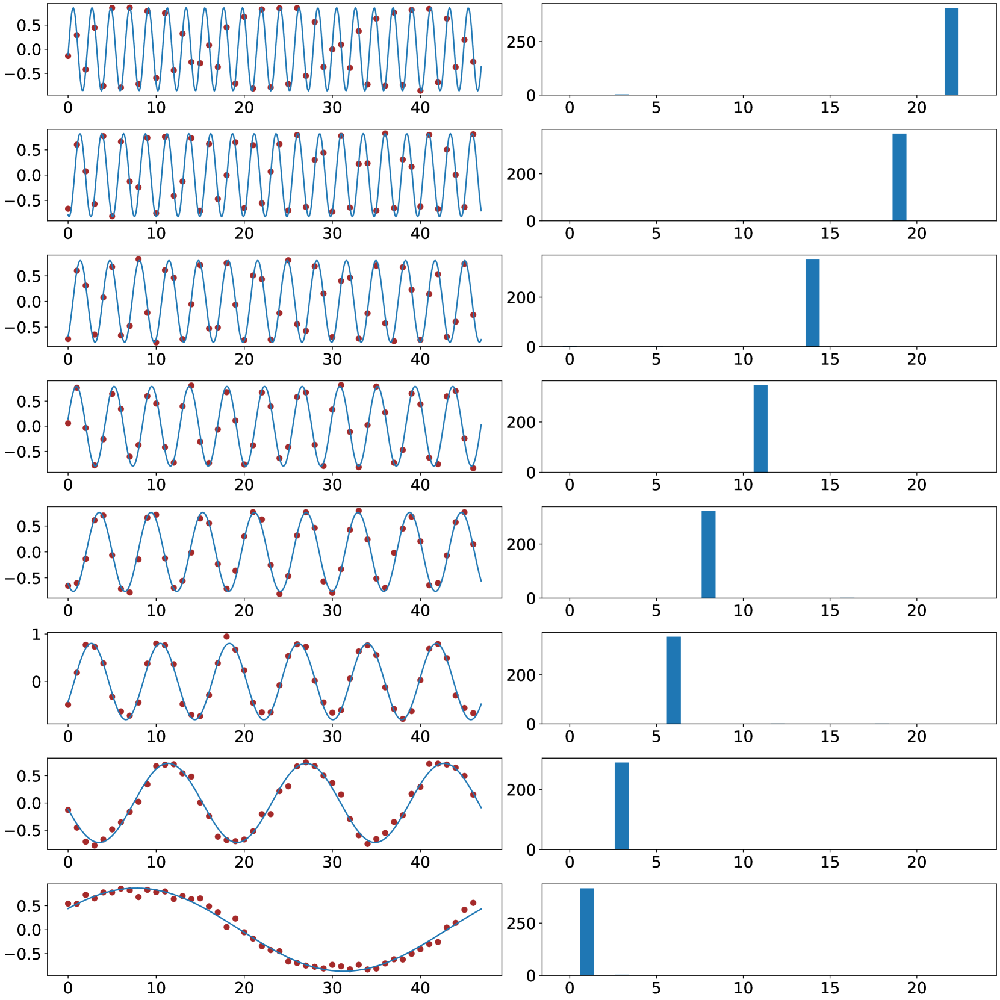

###### fig-1

*Рисунок 1: Косинусный облик обученных вложений (весов скрытого слоя) и отвечающая ему мощность фурье-спектра. Двухслойная сеть с $m=2944$ нейронами обучена на наборе сложения $k=4$ слагаемых по остатку $p=47$. Мы делим весь набор ($p^{k}=47^{4}$ точек данных) поровну на обучающий и тестовый. Каждая строка отвечает случайно выбранному нейрону сети. Левый рисунок показывает конечные обученные вложения: красные точки суть истинные значения весов, а бледно-голубая плавная кривая получена подбором действия с тем же фурье-спектром. Правый рисунок показывает мощность их фурье-спектра. Итоги на этих рисунках согласны с нашими утверждениями в лемме 4.2. Схожие итоги при $k$, равном 3 или 5, см. на рисунках 5 и 7 в приложении J.2.* **[p. 9]**

Обозначим через $\nu$ постоянную однородности сети, для которой равенство $f(\alpha\theta,x)=\alpha^{\nu}f(\theta,x)$ выполняется при любом $x$ и любом скаляре $\alpha>0$. А именно, мы сосредоточиваемся на сетях с однородными нейронами, удовлетворяющими $\phi(\alpha\theta_{i},x)=\alpha^{\nu}\phi(\theta_{i},x)$ при любом $\alpha>0$. Заметим, что наши сети с одним скрытым слоем (выражение (2)) однородны степени $k+1$. Как утверждает следующая лемма, при достаточно малом $\lambda$ в ходе обучения однородных действий приведённый отступ всеобщих наименьших точек $\mathcal{L}_{\lambda}$ сходится к $\gamma^{*}$.

##### **Лемма 3.7**([98], теорема 4.1)**.**

*Пусть $f$ есть однородное действие. Для любой нормы $\|\cdot\|$, если $\gamma^{*}>0$, то $\lim_{\lambda\rightarrow 0}\gamma_{\lambda}=\gamma^{*}$.*

###### p8-3

Поэтому, чтобы понять всеобщее наименьшее, можно исследовать решение наибольшего отступа как замену, что позволяет обойти сложный разбор невыпуклой оптимизации. Далее, [58] утверждают, что при следующем условии решения наибольшего отступа и решения наибольшего отступа с весами родов ($g^{\prime}$) равносильны друг другу.

##### **Условие 3.8**(условие C.1 на стр. 8 в [58])**.**

*Имеем $g^{\prime}(\theta^{*},x,y)=g(\theta^{*},x,y)$ для всех $(x,y)\in\operatorname{spt}(q^{*})$, где $\operatorname{spt}$ есть носитель. Это значит: $\{y^{\prime}\in\mathcal{Y}\backslash\{y\}:\tau(x,y)[y^{\prime}]>0\}\subseteq\underset{y^{\prime}\in\mathcal{Y}\backslash\{y\}}{\arg\max}f(\theta^{*},x)[y^{\prime}].$*

Тем самым при этих условиях в дальнейшем разборе нам довольно сосредоточиться на решениях наибольшего отступа с весами родов.

## 4 ОСНОВНОЙ ИТОГ

###### p8-6

Мы описываем фурье-признаки, которыми исполняется остаточное сложение $k$ входов в сети с одним скрытым слоем. Мы показываем, что каждый нейрон занят лишь одной частотой фурье. Кроме того, внутри сети есть хотя бы один нейрон на каждую частоту. При равномерных весах родов, когда $\mathcal{L}_{\lambda}(\theta)$ строится на $\tau(a_{1},\dots,a_{k})[c^{\prime}]:=1/(p-1)~{}~{}\forall c^{\prime}\neq a_{1}+\dots+a_{k},$ имеем следующий основной итог:

##### **Теорема 4.1**(основной итог, неформальный вид теоремы I.2)**.**

###### p8-7

*Пусть $f(\theta,x)$ есть сеть с одним скрытым слоем, определённая в выражении (2). Если $m\geq 2^{2k-1}\cdot\frac{p-1}{2}$, то сеть наибольшего $L_{2,k+1}$-отступа удовлетворяет:*

- *Наибольший*$L_{2,k+1}$*-отступ для набора данных*$D_{p}$*равен:*

$$
\gamma^{*}=\frac{2(k!)}{(2k+2)^{(k+1)/2}(p-1)p^{(k-1)/2}}.
$$
- *Для каждого нейрона*$\phi(\{u_{1},\dots,u_{k},w\};a_{1},\dots,a_{k})$*найдутся постоянный скаляр*$\beta\in\mathbb{R}$*и частота*$\zeta\in\{1,\ldots,\frac{p-1}{2}\}$*, удовлетворяющие*

$$
u_{i}(a_{i})= ~{}\beta\cdot\cos(\theta_{u_{i}}^{*}+2\pi\zeta a_{i}/p),~{}~{}\forall i\in[k] \\
w(c)= ~{}\beta\cdot\cos(\theta_{w}^{*}+2\pi\zeta c/p),
$$

###### p8-9

 *где*$\theta_{u_{1}}^{*},\dots,\theta_{u_{k}}^{*},\theta_{w}^{*}\in\mathbb{R}$*суть некоторые сдвиги по фазе, удовлетворяющие*$\theta_{u_{1}}^{*}+\dots+\theta_{u_{k}}^{*}=\theta_{w}^{*}$*.*
- ***[p. 9]** Для каждой частоты*$\zeta\in\{1,\ldots,\frac{p-1}{2}\}$*существует нейрон, пользующийся только этой частотой.*

**[p. 10]**

##### Набросок доказательства теоремы 4.1.

Строгое доказательство см. в приложении I.2. По лемме 4.2 мы получаем $\gamma^{*}$ и множество решений наибольшего отступа с весами родов для одного нейрона $\Omega_{q}^{{}^{\prime}*}$. Из выполнения условия 3.8 мы знаем, что оно применяется в решении наибольшего отступа. По лемме 4.3 мы можем построить сеть $\theta^{*}$, пользующуюся нейронами из $\Omega_{q}^{{}^{\prime}*}$. По лемме E.2 мы знаем, что это и есть решение наибольшего отступа. Наконец, по лемме H.2 мы знаем, что покрыты все частоты. ∎

###### p10-2

Теорема 4.1 говорит нам, что при достаточно большом числе нейронов — скажем, $m\geq 2^{2k-1}\cdot\frac{p-1}{2}$ (нижняя граница на $m$ в нашем разборе, возможно, не самая точная) — сеть с одним скрытым слоем выучит в точности весь фурье-спектр (основной набор), чтобы восстановить действие остаточного сложения. Точнее, каждый нейрон будет занят лишь одной фурье-частотой. Наш разбор даёт всестороннее понимание того, отчего нейронные сети, обученные SGD, предпочитают выучивать фурье-контуры.

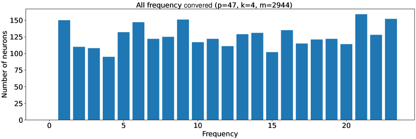

*(a)*

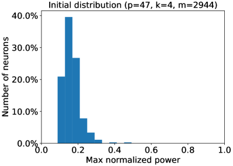

*(b)*

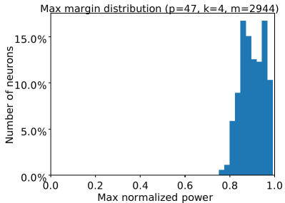

*(c)*

###### fig-2

*Рисунок 2: Покрытие всех частот фурье-спектра и наибольшая приведённая мощность вложений (весов скрытого слоя). Сеть с одним скрытым слоем и $m=2944$ нейронами обучена на наборе сложения $k=4$ слагаемых по остатку $p=47$. Через $\widehat{u}[i]$ мы обозначаем фурье-преобразование величины $u[i]$. Пусть $\max_{i}|\widehat{u}[i]|^{2}/(\sum|\widehat{u}[j]|^{2})$ есть наибольшая приведённая мощность. Сопоставив каждому нейрону частоту его наибольшей приведённой мощности, (a) показывает конечное распределение частот вложений. Как и в нашем построении из леммы 4.3, распределение по всем частотам почти равномерно. (b) показывает наибольшую приведённую мощность сети при случайном начальном приближении. (c) показывает, что в пространстве частот вложения конечной обученной сети односоставны, то есть наибольшая приведённая мощность почти равна 1 у всех нейронов. Это согласуется с итогами нашего разбора наибольшего отступа в лемме 4.3. Итоги при $k$, равном 3 или 5, см. на рисунках 6 и 8 в приложении J.2.* **[p. 10]**

### 4.1 ОБЗОР ПРИЁМА

В этом разделе мы даём обзор приёма доказательства нашего основного итога. Через $\mathbf{i}$ мы обозначаем $\sqrt{-1}$. Пусть $f:\mathbb{Z}_{p}\rightarrow\mathbb{C}$. Тогда для каждой частоты $j\in\mathbb{Z}_{p}$ определим дискретное фурье-преобразование (DFT) величины $f$ как $\widehat{f}(j):=\sum_{\zeta\in\mathbb{Z}_{p}}f(\zeta)\exp(-2\pi\mathbf{i}\cdot j\zeta/p).$ Пусть $\Omega_{q}^{{}^{\prime}*}$ есть множество решений наибольшего отступа с весами родов для одного нейрона (строго определено в определении F.6). Сперва мы покажем, как получается $\Omega^{\prime*}_{q}$.

##### **Лемма 4.2**(неформальный вид леммы F.8)**.**

###### p10-4

*Если для любого $\zeta\in\{1,\ldots,\frac{p-1}{2}\}$ найдётся множитель $\beta\in\mathbb{R}$ такой, что $u_{i}(a_{i})=\beta\cdot\cos(\theta_{u_{i}}^{*}+2\pi\zeta a_{i}/p)$ для любого $i\in[k]$ и $w(c)=\beta\cdot\cos(\theta_{w}^{*}+2\pi\zeta c/p)$, где $\theta_{u_{1}}^{*},\dots,\theta_{u_{k}}^{*},\theta_{w}^{*}\in\mathbb{R}$ суть некоторые сдвиги по фазе, удовлетворяющие $\theta_{u_{1}}^{*}+\dots+\theta_{u_{k}}^{*}=\theta_{w}^{*}$, то $\Omega_{q}^{\prime*}=\{(u_{1},\dots,u_{k},w)\},$ и $\gamma^{*}=\frac{2(k!)}{(2k+2)^{(k+1)/2}(p-1)p^{(k-1)/2}}$.*

##### Набросок доказательства леммы 4.2.

Строгое доказательство см. в приложении F.5. Доказательство устанавливает разрежённость решения наибольшего отступа в фурье-области несколькими ключевыми шагами. Сперва по лемме F.7 внимание обращается к наибольшему значению выражения (F.4). При нечётном $p$ выражение (F.4) переписывается через величины и фазы $\widehat{u}_{i}$ и **[p. 11]** $\widehat{w}$ (дискретных фурье-преобразований $u_{i}$ и $w$), что даёт равенство с косинусом разности их фаз. Затем применяется теорема Парсеваля — Планшереля, чтобы перевести ограничение на норму в фурье-область. Это позволяет искать наибольшее значение косинусного члена в сумме, сводя задачу к наибольшему произведению величин $\widehat{u}_{i}$ и $\widehat{w}$ (выражение (20)). Применяя неравенство между средним арифметическим и средним геометрическим, мы получаем верхнюю границу задачи. Чтобы её достичь, требуются равные величины у всех $\widehat{u}_{i}$ и $\widehat{w}$ на одной частоте, что даёт выражение (24). Наконец, нейроны выписываются во временно́й области, и видно, что они принимают определённый косинусный вид со сдвигами по фазе, удовлетворяющими названным условиям. ∎

Далее мы показываем, сколько нейронов нужно для решения задачи и каковы свойства этих нейронов. Мы показываем, как построить из них сеть $\theta^{*}$.

##### **Лемма 4.3**(неформальный вид леммы G.3)**.**

*Пусть $\cos_{\zeta}(x)$ означает $\cos(2\pi\zeta x/p)$. Тогда решение наибольшего $L_{2,k+1}$-отступа $\theta^{*}$ будет состоять из $2^{2k-1}\cdot{p-1\over 2}$ нейронов $\theta^{*}_{i}\in\Omega_{q}^{{}^{\prime}*}$, воспроизводящих $\frac{p-1}{2}$ родов косинусного вычисления, каждый из которых однозначно задаётся своим $\zeta\in\{1,\ldots,\frac{p-1}{2}\}$. А именно, для каждого $\zeta$ косинусное вычисление есть $\cos_{\zeta}(a_{1}+\dots+a_{k}-c),\forall a_{1},\dots,a_{k},c\in\mathbb{Z}_{p}$.*

##### Набросок доказательства леммы 4.3.

Строгое доказательство см. в приложении G.3. Наша цель — показать, что $2^{2k-1}\cdot{p-1\over 2}$ нейронов $\theta_{i}^{*}\in\Omega_{q}^{{}^{\prime}*}$ способны воспроизвести $\frac{p-1}{2}$ родов вычисления $\cos$. У нас есть следующее разложение действия $\cos_{\zeta}(x)$, означающего $\cos(2\pi\zeta x/p)$.

$$
\cos_{\zeta}(\sum_{i=1}^{k}a_{i})= ~{}\sum_{b\in\{0,1\}^{k}}\prod_{i=1}^{k}\cos^{1-b_{i}}(a_{i})\cdot\sin^{b_{i}}(a_{i}) \\
~{}\cdot{\bf 1}[\sum_{i=1}^{k}b_{i}\%2=0]\cdot(-1)^{{\bf 1}[\sum_{i=1}^{k}b_{i}\%4=2]}.
$$

Приведённое равенство раскладывает $\cos(\sum)$ на простейшие части. В нём $2^{k}$ членов. Пользуясь следующим положением из леммы G.1,

$$
2^{k}\cdot k!\cdot\prod_{i=1}^{k}a_{i}=\sum_{c\in\{-1,+1\}^{k}}(-1)^{(k-\sum_{i=1}^{k}c_{i})/2}(\sum_{j=1}^{k}c_{j}a_{j})^{k},
$$

где каждый член строится $2^{k-1}$ нейронами. Поэтому всего нужно $2^{k-1}2^{k}$ нейронов. Чтобы воспроизвести $\frac{p-1}{2}$ родов вычисления, нужно $2^{2k-1}\frac{p-1}{2}$ нейронов. Затем по лемме E.1 мы строим сеть $\theta^{*}$. По лемме E.2 из [58] получаем, что это решение наибольшего отступа. ∎

## 5 ОПЫТЫ

Сперва мы ставим опыты-подражания, чтобы проверить наш разбор при $k=3,4,5$. Затем мы показываем, что однослойный трансформер выучивает двумерные косинусные действия в весах внимания. Наконец, мы показываем явление гроккинга при разных $k$. Подробности воплощения см. в приложении J.1.

###### p11-7

**Сеть с одним скрытым слоем.** Мы ставим опыты-подражания, чтобы проверить наш разбор. На рисунках 1 и 2 мы обучаем приёмом SGD двухслойную сеть с **[p. 12]** $m=2944=2^{2k-2}\cdot(p-1)$ нейронами, то есть выражение (2), на наборе сложения $k=4$ слагаемых по остатку $p=47$, то есть выражение (1). Рисунок 1 показывает, что у сетей, обученных SGD, скрытые нейроны одночастотны, что подкрепляет наш разбор в лемме 4.2. Далее, рисунок 2 показывает, что сеть выучит все частоты фурье-спектра, что согласуется с нашим разбором в лемме 4.3. Вместе они подтверждают наши основные итоги в теореме 4.1 и показывают, что сеть, обученная SGD, предпочитает выучивать фурье-контуры. Больше схожих итогов при $k$, равном 3 или 5, — в приложении J.2.

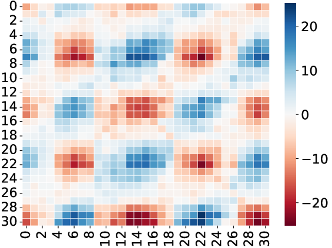


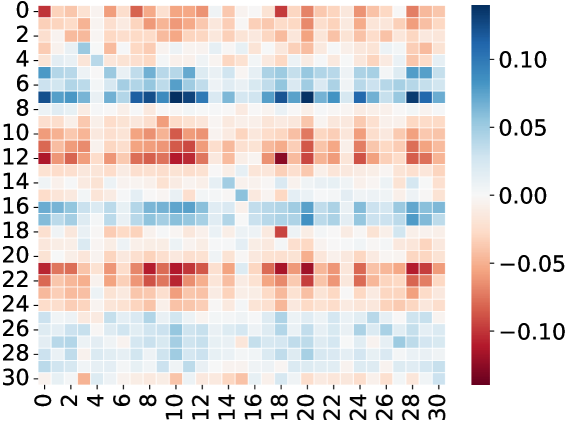


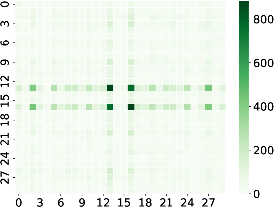

###### fig-3

*Рисунок 3: Двумерный косинусный облик обученной матрицы $W^{KQ}$ (весов внимания) и мощность их фурье-спектра. Однослойный трансформер с $m=160$ головами внимания обучен на наборе сложения $k=4$ слагаемых по остатку $p=31$. Мы делим весь набор ($p^{k}=31^{4}$ точек данных) поровну на обучающий и тестовый. Каждая строка отвечает случайно выбранной голове внимания. Левый рисунок показывает, что конечные обученные веса внимания имеют явный двумерный косинусный облик. Правый рисунок показывает мощность их двумерного фурье-спектра. Итоги на этих рисунках согласуются с рисунком 1. Схожие итоги при $k$, равном 3 или 5, см. на рисунках 9 и 10 в приложении J.3.* **[p. 13]**

**Однослойный трансформер.** Схожие итоги мы находим и у однослойных трансформеров. Пусть $E$ есть входное вложение, а $W^{P},W^{V},W^{K},W^{Q}$ — матрицы проекции, значения, ключа и запроса. Слой внимания с $m$ головами можно записать так

$$
W^{P}\begin{pmatrix}W_{1}^{V\top}E\cdot\operatorname{softmax}\left({E^{\top}W_{1}^{K}W_{1}^{Q\top}E}\right)\\
\dots\\
W_{m}^{V\top}E\cdot\operatorname{softmax}\left({E^{\top}W_{m}^{K}W_{m}^{Q\top}E}\right)\end{pmatrix}.
$$

###### p12-2

Мы обозначаем $W^{K}W^{Q\top}$ как $W^{KQ}$ и называем это матрицей внимания. На рисунке 3 мы обучаем однослойный трансформер с $m=160$ головами внимания и скрытой размерностью 128, то есть по приведённому выражению, на наборе сложения $k=4$ слагаемых по остатку $p=31$, то есть выражение (1). Рисунок 3 показывает, что обученный SGD однослойный трансформер выучивает матрицы внимания двумерного косинусного облика, схожие с сетями с одним скрытым слоем на рисунке 1. Это значит, что в задаче остаточной арифметики слой внимания обучается устройством, схожим с нейронными сетями. Обучаясь приёмом SGD, он предпочитает выучивать (двумерные) фурье-контуры. Больше схожих итогов при $k$, равном 3 или 5, — в приложении J.3.

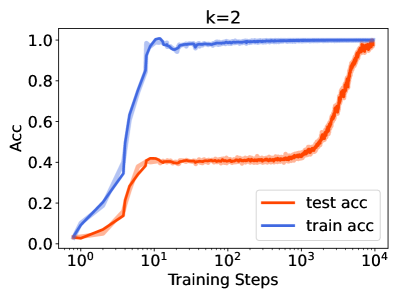


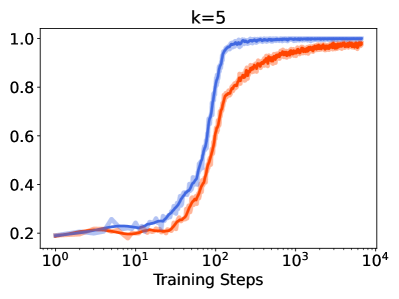

###### fig-4

*Рисунок 4: Гроккинг (модели внезапно переходят от плохой генерализации к безукоризненной после большого числа шагов обучения) при обучении остаточному сложению $k=2,3,4,5$ входов. Мы обучаем двухслойные трансформеры с $m=160$ головами внимания на наборах сложения $k=2,3,4,5$ слагаемых по остаткам $p=97,31,11,5$ при $50$ % данных в обучающей части приёмом оптимизации AdamW [48] со скоростью обучения 1e-3 и ослаблением весов 1e-3. Разные $p$ взяты, чтобы объёмы наборов были примерно равны между собой. Синие кривые показывают точность на обучении, красные — на проверке. Явление гроккинга есть на всех рисунках. Однако с ростом $k$ гроккинг слабеет. Объяснение см. в разделе 5.* **[p. 14]**

###### p12-3

**Гроккинг при разных $k$.** Чтобы подкрепить важность нашей постановки данных, мы изучаем явление гроккинга на нашем распределении данных. Следуя порядку опытов из [69], мы показываем, что гроккинг возникает при разных $k$. Мы обучаем двухслойные трансформеры с $m=160$ головами внимания и скрытой размерностью 128 на наборах сложения $k=2,3,4,5$ слагаемых по остаткам $p=97,31,11,5$ при 50 % данных в обучающей части. Разные $p$ взяты, чтобы объёмы наборов были примерно равны между собой. Рисунок 4 показывает, что гроккинг слабеет с ростом числа $k$, что согласуется с нашим разбором. С ростом $k$ разряд действий усложняется, ибо для достижения решения наибольшего отступа может понадобиться больше нейронов. Поэтому мы берём нашу теорему 4.1 как меру сложности данных. Отсюда следует, что когда истинный разряд действий становится «сложным», трансформерам нужно больше шагов обучения, чтобы подогнать обучающие данные, а генерализация выходит лучше. Блестящие недавние работы [49, 45] доказывают, что при обучении сеть сперва пребывает в ленивом режиме (NTK), а затем резко переходит в богатый режим обучения признакам, что ведёт

###### p12-4

NTK есть печально известный режим с избытком параметров, которому, вероятно, нужно много больше нейронов, чем в нашем случае схождения по наибольшему отступу, то есть много больше $\Omega(2^{2k})$ из теоремы 4.1. Поэтому при закреплённом $m$ и растущем $k$ модель может легко покинуть режим NTK — или же режима NTK попросту не будет. Оттого мы и видим более слабый гроккинг, ибо шагов обучения, нужных для перехода из режима NTK в режим обучения признакам, становится меньше. С ростом $k$ у модели возникнет «недообучение» в режиме NTK: чтобы решить задачу, ей необходимо обучение признакам, и одним лишь NTK задачу не решить. Однако в режиме обучения признакам у модели всё ещё есть «переобучение».

## 6 ОБСУЖДЕНИЕ

**Гроккинг у трансформеров.** Истолкование гроккинга у трансформеров исследовано в [63]. Рассматривая различные промежуточные состояния в остаточном потоке трансформерной **[p. 13]** модели, там подтверждено, что модель применяет фурье-признаки для решения задачи остаточного сложения. Однако полностью понять, как трансформерная модель и большие языковые модели исполняют остаточное сложение, на основании нынешних работ по-прежнему трудно, особенно с теоретической стороны. **[p. 14]** Мы полагаем, что начать с упрощённой постановки модели и добиться подробного теоретического понимания того, как сеть пользуется фурье-признаками для решения задачи, есть ценная отправная точка, дающая теоретическое понимание явления гроккинга. Мы полагаем, что дальнейшее изучение трансформеров будет занятным и важным направлением.

###### p14-1

**Гроккинг, безвредное переобучение и неявное предпочтение.** Недавно [103] связывают явление гроккинга с безвредным переобучением [9, 13, 90, 25, 27]. Там показано, как сеть проходит пору гроккинга от разрушительного переобучения к безвредному. В [49, 45] гроккинг объясняют неявным предпочтением [75, 29, 41, 83, 62, 12, 53, 38, 101, 102]: гроккинг наступает, если предпочтение ранней поры ведёт к переобученному решению, а предпочтение поздней — к обобщающему. Наглядные соображения о безвредном переобучении и неявном предпочтении хорошо согласуются с нашим наблюдением из раздела 5. Занятно и ценно было бы строго разобрать гроккинг или возникающие способности при разной сложности разряда действий — скажем, выражения (1). Эту трудную задачу мы оставляем на будущее.

###### p14-2

**Связь с чётностью и трудностью для статистических запросов.** Если положить $p=2$, то $(a_{1}+\dots+a_{k})\bmod p$ вырождается в действие чётности, то есть $b_{1},\dots,b_{k}\in\{\pm 1\}$ и определение $\prod_{i=1}^{k}b_{i}$. Действия чётности служат основным набором трудных задач обучения в вычислительной теории обучения и часто применяются для показа вычислительных препятствий [80]. В частности, задача разрежённой чётности $(n,k)$ печально трудна для обучения, то есть трудна для статистических запросов (SQ) [8]. В [22] показано, что сетям с одним скрытым слоем нужно $\Omega(\exp(k))$ нейронов или $\Omega(\exp(k))$ шагов обучения, чтобы успешно выучить её приёмом SGD. В нашей работе мы изучаем выражение (2), которое есть более общее действие, чем чётность, и потому тоже трудно для обучения. Наша теорема 4.1 утверждает, что для представления решения наибольшего отступа нужно $\Omega(\exp(k))$ нейронов, что хорошо согласуется с имеющимися работами. Наши опытные итоги из раздела 5 тоже согласны с этим. Отсюда разряд действий «остаточное сложение $k$ входов» есть хорошая модель данных, чтобы разбирать и проверять способность модели к обучению — приближению, оптимизации и генерализации.

**Внимание к корреляциям высокого порядка.** В [76, 3, 4] утверждается, что при $k=3$ действие $a_{1}+a_{2}+a_{3}\bmod p$ трудно уловить обычным вниманием. Поэтому там вводится внимание высокого порядка, улавливающее корреляции высокого порядка во входной последовательности. Однако в разделе 5 мы показываем, что однослойные трансформеры обладают сильной способностью к обучению и успешно выучивают задачи остаточной арифметики даже при $k=5$. Отсюда следует, что обычное внимание, возможно, мощнее, чем принято считать.

**[p. 15]**

## 7 ЗАКЛЮЧЕНИЕ

Мы изучаем обучение нейронных сетей и трансформеров на $(a_{1}+\dots+a_{k})\bmod p$. Мы теоретически показываем, что сети предпочитают выучивать фурье-контуры. Наши опыты с нейронными сетями и трансформерами подкрепляют этот разбор. Наконец, мы изучаем явление гроккинга в этой новой постановке данных.

## Благодарности

Работа отчасти поддержана грантами Национального научного фонда США (NSF) 2008559-IIS, 2023239-DMS, CCF-2046710 и грантом ВВС FA9550-18-1-0166.

## Список литературы

- Meta AI. Introducing meta llama 3: The most capable openly available llm to date, 2024. https://ai.meta.com/blog/meta-llama-3/.

- Anthropic. The claude 3 model family: Opus, sonnet, haiku, 2024. https://www-cdn.anthropic.com/de8ba9b01c9ab7cbabf5c33b80b7bbc618857627/Model_Card_Claude_3.pdf.

- Josh Alman and Zhao Song. Fast attention requires bounded entries. In *NeurIPS*. arXiv preprint arXiv:2302.13214, 2023.

- Josh Alman and Zhao Song. How to capture higher-order correlations? generalizing matrix softmax attention to kronecker computation. In *The Twelfth International Conference on Learning Representations*, 2024.

- Ido Bronstein, Alon Brutzkus, and Amir Globerson. On the inductive bias of neural networks for learning read-once dnfs. In *Uncertainty in Artificial Intelligence*, pages 255–265. PMLR, 2022.

- Boaz Barak, Benjamin Edelman, Surbhi Goel, Sham Kakade, Eran Malach, and Cyril Zhang. Hidden progress in deep learning: Sgd learns parities near the computational limit. *Advances in Neural Information Processing Systems*, 35:21750–21764, 2022.

- Yonatan Belinkov. Probing classifiers: Promises, shortcomings, and advances. *Computational Linguistics*, 48(1):207–219, March 2022.

- Avrim Blum, Merrick Furst, Jeffrey Jackson, Michael Kearns, Yishay Mansour, and Steven Rudich. Weakly learning dnf and characterizing statistical query learning using fourier analysis. In *Proceedings of the twenty-sixth annual ACM symposium on Theory of computing*, pages 253–262, 1994.

- Peter L Bartlett, Philip M Long, Gábor Lugosi, and Alexander Tsigler. Benign overfitting in linear regression. *Proceedings of the National Academy of Sciences*, 117(48):30063–30070, 2020.

- Jean Bourgain. An improved estimate in the restricted isometry problem. In *Geometric aspects of functional analysis*, pages 65–70. **[p. 16]** Springer, 2014.

- Stephen P Boyd and Lieven Vandenberghe. *Convex optimization*. Cambridge university press, 2004.

- Lenaic Chizat and Francis Bach. Implicit bias of gradient descent for wide two-layer neural networks trained with the logistic loss. In *Conference on Learning Theory*. PMLR, 2020.

- Yuan Cao, Zixiang Chen, Misha Belkin, and Quanquan Gu. Benign overfitting in two-layer convolutional neural networks. *Advances in neural information processing systems*, 35:25237–25250, 2022.

- Bilal Chughtai, Lawrence Chan, and Neel Nanda. A toy model of universality: Reverse engineering how networks learn group operations. In *International Conference on Machine Learning*, pages 6243–6267. PMLR, 2023.

- Nick Cammarata, Gabriel Goh, Shan Carter, Ludwig Schubert, Michael Petrov, and Chris Olah. Curve detectors. *Distill*, 5(6):e00024–003, 2020.

- Xue Chen, Daniel M Kane, Eric Price, and Zhao Song. Fourier-sparse interpolation without a frequency gap. In *2016 IEEE 57th Annual Symposium on Foundations of Computer Science (FOCS)*, pages 741–750. IEEE, 2016.

- Bo Chen, Xiaoyu Li, Yingyu Liang, Zhenmei Shi, and Zhao Song. Bypassing the exponential dependency: Looped transformers efficiently learn in-context by multi-step gradient descent. *arXiv preprint arXiv:2410.11268*, 2024.

- Sitan Chen, Jerry Li, and Zhao Song. Learning mixtures of linear regressions in subexponential time via fourier moments. In *Proceedings of the 52nd Annual ACM SIGACT Symposium on Theory of Computing*, pages 587–600, 2020.

- Xiang Chen, Zhao Song, Baocheng Sun, Junze Yin, and Danyang Zhuo. Query complexity of active learning for function family with nearly orthogonal basis. *arXiv preprint arXiv:2306.03356*, 2023.

- Darshil Doshi, Tianyu He, Aritra Das, and Andrey Gromov. Grokking modular polynomials. *arXiv preprint arXiv:2406.03495*, 2024.

- Alexandru Damian, Jason Lee, and Mahdi Soltanolkotabi. Neural networks can learn representations with gradient descent. In *Conference on Learning Theory*. PMLR, 2022.

- Amit Daniely and Eran Malach. Learning parities with neural networks. *Advances in Neural Information Processing Systems*, 33:20356–20365, 2020.

- Nelson Elhage, Tristan Hume, Catherine Olsson, Nicholas Schiefer, Tom Henighan, Shauna Kravec, Zac Hatfield-Dodds, Robert Lasenby, Dawn Drain, Carol Chen, et al. Toy models of superposition. *arXiv preprint arXiv:2209.10652*, 2022.

- Nelson Elhage, Neel Nanda, Catherine Olsson, Tom Henighan, Nicholas Joseph, Ben Mann, Amanda Askell, Yuntao Bai, Anna Chen, Tom Conerly, et al. A mathematical framework for transformer circuits. *Transformer Circuits Thread*, 1, 2021.

**[p. 17]**

- Spencer Frei, Niladri S Chatterji, and Peter Bartlett. Benign overfitting without linearity: Neural network classifiers trained by gradient descent for noisy linear data. In *Conference on Learning Theory*, pages 2668–2703. PMLR, 2022.

- Spencer Frei, Gal Vardi, Peter Bartlett, Nathan Srebro, and Wei Hu. Implicit bias in leaky relu networks trained on high-dimensional data. In *The Eleventh International Conference on Learning Representations*, 2022.

- Spencer Frei, Gal Vardi, Peter Bartlett, and Nathan Srebro. Benign overfitting in linear classifiers and leaky relu networks from kkt conditions for margin maximization. In *The Thirty Sixth Annual Conference on Learning Theory*, pages 3173–3228. PMLR, 2023.

- Peng Gao, Chiori Hori, Shijie Geng, Takaaki Hori, and Jonathan Le Roux. Multi-pass transformer for machine translation. *arXiv preprint arXiv:2009.11382*, 2020.

- Suriya Gunasekar, Jason Lee, Daniel Soudry, and Nathan Srebro. Characterizing implicit bias in terms of optimization geometry. In *International Conference on Machine Learning*, pages 1832–1841. PMLR, 2018.

- Suriya Gunasekar, Jason D Lee, Daniel Soudry, and Nati Srebro. Implicit bias of gradient descent on linear convolutional networks. *Advances in Neural Information Processing Systems*, 31, 2018.

- Andrey Gromov. Grokking modular arithmetic. *arXiv preprint arXiv:2301.02679*, 2023.

- Yeqi Gao, Zhao Song, and Baocheng Sun. An ${O}(k\log n)$ time fourier set query algorithm. *arXiv preprint arXiv:2208.09634*, 2022.

- Dan Hendrycks, Collin Burns, Saurav Kadavath, Akul Arora, Steven Basart, Eric Tang, Dawn Song, and Jacob Steinhardt. Measuring mathematical problem solving with the math dataset. *arXiv preprint arXiv:2103.03874*, 2021.

- Michael Hanna, Ollie Liu, and Alexandre Variengien. How does gpt-2 compute greater-than?: Interpreting mathematical abilities in a pre-trained language model. *Advances in Neural Information Processing Systems*, 36, 2023.

- Ishay Haviv and Oded Regev. The restricted isometry property of subsampled fourier matrices. In *Geometric aspects of functional analysis*, pages 163–179. Springer, 2017.

- Piotr Indyk and Michael Kapralov. Sample-optimal Fourier sampling in any constant dimension. In *IEEE 55th Annual Symposium onFoundations of Computer Science (FOCS)*, pages 514–523. IEEE, 2014.

- Piotr Indyk, Michael Kapralov, and Eric Price. (nearly) sample-optimal sparse fourier transform. In *Proceedings of the twenty-fifth annual ACM-SIAM symposium on Discrete algorithms (SODA)*, pages 480–499. SIAM, 2014.

- Arthur Jacot. Implicit bias of large depth networks: a notion of rank for nonlinear functions. In *The Eleventh International Conference on Learning Representations*, 2022.

**[p. 18]**

- Yaonan Jin, Daogao Liu, and Zhao Song. Super-resolution and robust sparse continuous fourier transform in any constant dimension: Nearly linear time and sample complexity. In *ACM-SIAM Symposium on Discrete Algorithms (SODA)*, 2023.

- Albert Q. Jiang, Alexandre Sablayrolles, Arthur Mensch, Chris Bamford, Devendra Singh Chaplot, Diego de las Casas, Florian Bressand, Gianna Lengyel, Guillaume Lample, Lucile Saulnier, Lélio Renard Lavaud, Marie-Anne Lachaux, Pierre Stock, Teven Le Scao, Thibaut Lavril, Thomas Wang, Timothée Lacroix, and William El Sayed. Mistral 7b, 2023.

- Ziwei Ji and Matus Telgarsky. The implicit bias of gradient descent on nonseparable data. In *Conference on Learning Theory*, pages 1772–1798. PMLR, 2019.

- Ziwei Ji and Matus Telgarsky. Directional convergence and alignment in deep learning. *Advances in Neural Information Processing Systems*, 33:17176–17186, 2020.

- Michael Kapralov. Sparse Fourier transform in any constant dimension with nearly-optimal sample complexity in sublinear time. In *Symposium on Theory of Computing Conference (STOC)*, 2016.

- Michael Kapralov. Sample efficient estimation and recovery in sparse FFT via isolation on average. In *58th Annual IEEE Symposium on Foundations of Computer Science (FOCS)*, 2017.

- Tanishq Kumar, Blake Bordelon, Samuel J Gershman, and Cengiz Pehlevan. Grokking as the transition from lazy to rich training dynamics. *arXiv preprint arXiv:2310.06110*, 2023.

- Yekun Ke, Xiaoyu Li, Yingyu Liang, Zhenmei Shi, and Zhao Song. Advancing the understanding of fixed point iterations in deep neural networks: A detailed analytical study. *arXiv preprint arXiv:2410.11279*, 2024.

- Aitor Lewkowycz, Anders Andreassen, David Dohan, Ethan Dyer, Henryk Michalewski, Vinay Ramasesh, Ambrose Slone, Cem Anil, Imanol Schlag, Theo Gutman-Solo, et al. Solving quantitative reasoning problems with language models. *Advances in Neural Information Processing Systems*, 35:3843–3857, 2022.

- Ilya Loshchilov and Frank Hutter. Decoupled weight decay regularization. In *International Conference on Learning Representations*, 2018.

- Kaifeng Lyu, Jikai Jin, Zhiyuan Li, Simon S Du, Jason D Lee, and Wei Hu. Dichotomy of early and late phase implicit biases can provably induce grokking. In *The Twelfth International Conference on Learning Representations*, 2024.

- Ziming Liu, Ouail Kitouni, Niklas S Nolte, Eric Michaud, Max Tegmark, and Mike Williams. Towards understanding grokking: An effective theory of representation learning. *Advances in Neural Information Processing Systems*, 35:34651–34663, 2022.

- Kaifeng Lyu and Jian Li. Gradient descent maximizes the margin of homogeneous neural networks. In *International Conference on Learning Representations*, 2019.

**[p. 19]**

- Chenyang Li, Yingyu Liang, Zhenmei Shi, and Zhao Song. Exploring the frontiers of softmax: Provable optimization, applications in diffusion model, and beyond. *manuscript*, 2024.

- Kaifeng Lyu, Zhiyuan Li, Runzhe Wang, and Sanjeev Arora. Gradient descent on two-layer nets: Margin maximization and simplicity bias. *Advances in Neural Information Processing Systems*, 34:12978–12991, 2021.

- Yingyu Liang, Zhizhou Sha, Zhenmei Shi, Zhao Song, and Yufa Zhou. Looped relu mlps may be all you need as practical programmable computers. *arXiv preprint arXiv:2410.09375*, 2024.

- Renqian Luo, Liai Sun, Yingce Xia, Tao Qin, Sheng Zhang, Hoifung Poon, and Tie-Yan Liu. Biogpt: generative pre-trained transformer for biomedical text generation and mining. *Briefings in Bioinformatics*, 23(6), 2022.

- Yin Tat Lee, Zhao Song, and Qiuyi Zhang. Solving empirical risk minimization in the current matrix multiplication time. In *COLT*, 2019.

- Kevin Meng, David Bau, Alex Andonian, and Yonatan Belinkov. Locating and editing factual associations in gpt. *Advances in Neural Information Processing Systems*, 35:17359–17372, 2022.

- Depen Morwani, Benjamin L Edelman, Costin-Andrei Oncescu, Rosie Zhao, and Sham Kakade. Feature emergence via margin maximization: case studies in algebraic tasks. In *The Twelfth International Conference on Learning Representations*, 2024.

- Beren Millidge. Grokking’grokking’, 2022.

- Shikhar Murty, Pratyusha Sharma, Jacob Andreas, and Christopher D Manning. Grokking of hierarchical structure in vanilla transformers. *arXiv preprint arXiv:2305.18741*, 2023.

- William Merrill, Nikolaos Tsilivis, and Aman Shukla. A tale of two circuits: Grokking as competition of sparse and dense subnetworks. *arXiv preprint arXiv:2303.11873*, 2023.

- Edward Moroshko, Blake E Woodworth, Suriya Gunasekar, Jason D Lee, Nati Srebro, and Daniel Soudry. Implicit bias in deep linear classification: Initialization scale vs training accuracy. *Advances in Neural Information Processing Systems*, 33, 2020.

- Neel Nanda, Lawrence Chan, Tom Lieberum, Jess Smith, and Jacob Steinhardt. Progress measures for grokking via mechanistic interpretability. In *The Eleventh International Conference on Learning Representations*, 2023.

- Neel Nanda, Andrew Lee, and Martin Wattenberg. Emergent linear representations in world models of self-supervised sequence models. *arXiv preprint arXiv:2309.00941*, 2023.

- Vasileios Nakos, Zhao Song, and Zhengyu Wang. (nearly) sample-optimal sparse fourier transform in any dimension; ripless and filterless. In *2019 IEEE 60th Annual Symposium on Foundations of Computer Science (FOCS)*, pages 1568–1577. IEEE, 2019.

**[p. 20]**

- Chris Olah, Nick Cammarata, Ludwig Schubert, Gabriel Goh, Michael Petrov, and Shan Carter. Zoom in: An introduction to circuits. *Distill*, 5(3):e00024–001, 2020.

- Catherine Olsson, Nelson Elhage, Neel Nanda, Nicholas Joseph, Nova DasSarma, Tom Henighan, Ben Mann, Amanda Askell, Yuntao Bai, Anna Chen, et al. In-context learning and induction heads. *arXiv preprint arXiv:2209.11895*, 2022.

- OpenAI. Gpt-4 technical report, 2023.

- Alethea Power, Yuri Burda, Harri Edwards, Igor Babuschkin, and Vedant Misra. Grokking: Generalization beyond overfitting on small algorithmic datasets. *arXiv preprint arXiv:2201.02177*, 2022.

- Gabriele Prato, Ella Charlaix, and Mehdi Rezagholizadeh. Fully quantized transformer for machine translation. In *Findings of the Association for Computational Linguistics: EMNLP 2020*, pages 1–14, 2020.

- Philip Quirke and Fazl Barez. Understanding addition in transformers. In *The Twelfth International Conference on Learning Representations*, 2023.

- Noa Rubin, Inbar Seroussi, and Zohar Ringel. Droplets of good representations: Grokking as a first order phase transition in two layer networks. *arXiv preprint arXiv:2310.03789*, 2023.

- Zhenmei Shi, Jiefeng Chen, Kunyang Li, Jayaram Raghuram, Xi Wu, Yingyu Liang, and Somesh Jha. The trade-off between universality and label efficiency of representations from contrastive learning. In *The Eleventh International Conference on Learning Representations*, 2023.

- David Saxton, Edward Grefenstette, Felix Hill, and Pushmeet Kohli. Analysing mathematical reasoning abilities of neural models. In *International Conference on Learning Representations*, 2018.

- Daniel Soudry, Elad Hoffer, Mor Shpigel Nacson, Suriya Gunasekar, and Nathan Srebro. The implicit bias of gradient descent on separable data. *The Journal of Machine Learning Research*, 19(1):2822–2878, 2018.

- Clayton Sanford, Daniel Hsu, and Matus Telgarsky. Representational strengths and limitations of transformers. In *Thirty-seventh Conference on Neural Information Processing Systems*, 2023.

- Zhenmei Shi, Yifei Ming, Ying Fan, Frederic Sala, and Yingyu Liang. Domain generalization via nuclear norm regularization. In *Conference on Parsimony and Learning (Proceedings Track)*, 2023.

- Zhenmei Shi, Yifei Ming, Xuan-Phi Nguyen, Yingyu Liang, and Shafiq Joty. Discovering the gems in early layers: Accelerating long-context llms with 1000x input token reduction. *arXiv preprint arXiv:2409.17422*, 2024.

- Zhao Song. *Matrix Theory: Optimization, Concentration and Algorithms*. PhD thesis, The University of Texas at Austin, 2019.

**[p. 21]**

- Shai Shalev-Shwartz, Ohad Shamir, and Shaked Shammah. Failures of gradient-based deep learning. In *International Conference on Machine Learning*, pages 3067–3075. PMLR, 2017.

- Zhao Song, Baocheng Sun, Omri Weinstein, and Ruizhe Zhang. Sparse fourier transform over lattices: A unified approach to signal reconstruction. *arXiv preprint arXiv:2205.00658*, 2022.

- Zhao Song, Baocheng Sun, Omri Weinstein, and Ruizhe Zhang. Quartic samples suffice for fourier interpolation. In *2023 IEEE 64th Annual Symposium on Foundations of Computer Science (FOCS)*, pages 1414–1425. IEEE, 2023.

- Harshay Shah, Kaustav Tamuly, Aditi Raghunathan, Prateek Jain, and Praneeth Netrapalli. The pitfalls of simplicity bias in neural networks. *Advances in Neural Information Processing Systems*, 33:9573–9585, 2020.

- Zhenmei Shi, Junyi Wei, and Yingyu Liang. A theoretical analysis on feature learning in neural networks: Emergence from inputs and advantage over fixed features. In *International Conference on Learning Representations*, 2022.

- Zhenmei Shi, Junyi Wei, and Yingyu Liang. Provable guarantees for neural networks via gradient feature learning. In *Thirty-seventh Conference on Neural Information Processing Systems*, 2023.

- Zhenmei Shi, Junyi Wei, Zhuoyan Xu, and Yingyu Liang. Why larger language models do in-context learning differently? In *R0-FoMo:Robustness of Few-shot and Zero-shot Learning in Large Foundation Models*, 2023.

- Dashiell Stander, Qinan Yu, Honglu Fan, and Stella Biderman. Grokking group multiplication with cosets. *arXiv preprint arXiv:2312.06581*, 2023.

- Zhao Song, Mingquan Ye, Junze Yin, and Lichen Zhang. A nearly-optimal bound for fast regression with $\ell_{\infty}$, guarantee. In *ICML*, volume 202 of *Proceedings of Machine Learning Research*, pages 32463–32482. PMLR, 2023.

- Gemini Team, Rohan Anil, Sebastian Borgeaud, Yonghui Wu, Jean-Baptiste Alayrac, Jiahui Yu, Radu Soricut, Johan Schalkwyk, Andrew M Dai, Anja Hauth, et al. Gemini: a family of highly capable multimodal models. *arXiv preprint arXiv:2312.11805*, 2023.

- Alexander Tsigler and Peter L Bartlett. Benign overfitting in ridge regression. *Journal of Machine Learning Research*, 24(123):1–76, 2023.

- Curt Tigges, Oskar John Hollinsworth, Atticus Geiger, and Neel Nanda. Linear representations of sentiment in large language models. *arXiv preprint arXiv:2310.15154*, 2023.

- Vimal Thilak, Etai Littwin, Shuangfei Zhai, Omid Saremi, Roni Paiss, and Joshua Susskind. The slingshot mechanism: An empirical study of adaptive optimizers and the grokking phenomenon. *arXiv preprint arXiv:2206.04817*, 2022.

- Gemma Team, Thomas Mesnard, Cassidy Hardin, Robert Dadashi, Surya Bhupatiraju, Shreya Pathak, Laurent Sifre, Morgane Rivière, Mihir Sanjay Kale, Juliette **[p. 22]** Love, et al. Gemma: Open models based on gemini research and technology. *arXiv preprint arXiv:2403.08295*, 2024.

- Gal Vardi. On the implicit bias in deep-learning algorithms. *Communications of the ACM*, 66(6):86–93, 2023.

- Vikrant Varma, Rohin Shah, Zachary Kenton, János Kramár, and Ramana Kumar. Explaining grokking through circuit efficiency. *arXiv preprint arXiv:2309.02390*, 2023.

- Ashish Vaswani, Noam Shazeer, Niki Parmar, Jakob Uszkoreit, Llion Jones, Aidan N Gomez, Łukasz Kaiser, and Illia Polosukhin. Attention is all you need. *Advances in neural information processing systems*, 30, 2017.

- Colin Wei, Jason D Lee, Qiang Liu, and Tengyu Ma. Regularization matters: Generalization and optimization of neural nets vs their induced kernel. *Advances in Neural Information Processing Systems*, 32, 2019.

- Colin Wei, Jason D Lee, Qiang Liu, and Tengyu Ma. Regularization matters: Generalization and optimization of neural nets vs their induced kernel. *Advances in Neural Information Processing Systems*, 32, 2019.

- Jason Wei, Yi Tay, Rishi Bommasani, Colin Raffel, Barret Zoph, Sebastian Borgeaud, Dani Yogatama, Maarten Bosma, Denny Zhou, Donald Metzler, Ed H. Chi, Tatsunori Hashimoto, Oriol Vinyals, Percy Liang, Jeff Dean, and William Fedus. Emergent abilities of large language models. *Transactions on Machine Learning Research*, 2022.

- Zhuoyan Xu, Zhenmei Shi, and Yingyu Liang. Do large language models have compositional ability? an investigation into limitations and scalability. In *ICLR 2024 Workshop on Mathematical and Empirical Understanding of Foundation Models*, 2024.

- Zhuoyan Xu, Zhenmei Shi, Junyi Wei, Yin Li, and Yingyu Liang. Improving foundation models for few-shot learning via multitask finetuning. In *ICLR 2023 Workshop on Mathematical and Empirical Understanding of Foundation Models*, 2023.

- Zhuoyan Xu, Zhenmei Shi, Junyi Wei, Fangzhou Mu, Yin Li, and Yingyu Liang. Towards few-shot adaptation of foundation models via multitask finetuning. In *The Twelfth International Conference on Learning Representations*, 2024.

- Zhiwei Xu, Yutong Wang, Spencer Frei, Gal Vardi, and Wei Hu. Benign overfitting and grokking in relu networks for xor cluster data. In *The Twelfth International Conference on Learning Representations*, 2024.

- Roozbeh Yousefzadeh and Xuenan Cao. Large language models’ understanding of math: Source criticism and extrapolation. *arXiv preprint arXiv:2311.07618*, 2023.

- Ziqian Zhong, Ziming Liu, Max Tegmark, and Jacob Andreas. The clock and the pizza: Two stories in mechanistic explanation of neural networks. *Advances in Neural Information Processing Systems*, 36, 2023.

- Shizhuo Dylan Zhang, Curt Tigges, Stella Biderman, Maxim Raginsky, and Talia Ringer. Can transformers learn to solve problems recursively? *arXiv preprint arXiv:2305.14699*, 2023.

**[p. 23]**

**Appendix**

#### План приложений

В разделе A мы указываем возможные ограничения этой работы. В разделе B мы разбираем её общественное влияние. В разделе C мы приводим больше сопутствующих работ. В разделе D мы вводим определения, применяемые в доказательстве. В разделе E мы вводим вспомогательные леммы из прежних работ, которые нам нужны. В разделах F, G, H и I мы приводим доказательства наших лемм и основных итогов. А именно, мы даём два вида доказательства: (1) при $k=3$ и (2) при общем $k\geq 3$. Вид при $k=3$ служит для пояснения замысла доказательства, а затем мы распространяем доказательство на общий $k$. Наконец, в разделе J мы приводим больше опытных итогов и подробностей воплощения.

## Приложение A Ограничения

Наша работа продвинулась в исследовании того, как нейронные сети и трансформеры решают сложные математические задачи вроде остаточного сложения, но область применения её выводов на деле ограничена.

###### p23-3

С другой стороны, мы признаём, что наша теорема даёт наглядное понимание, но не объясняет полностью явлений, показанных на рисунке 4. Поэтому мы хотели бы предложить сообществу эту более общую постановку данных, чтобы гроккинг можно было изучать и понимать шире. Изучение связи между числом нейронов и силой гроккинга занятно и важно, и мы оставляем его на будущее.

## Приложение B Общественное влияние

Наша работа стремится понять возможности больших языковых моделей в математическом рассуждении и остаточной арифметике. Наша статья по своей природе чисто теоретическая и опытная (математическая задача), и потому мы не предвидим непосредственного вредного этического влияния.

Мы предлагаем утверждение, что нейронные сети и трансформеры при обучении приёмом SGD на остаточном сложении $k$ входов предпочитают выучивать фурье-контуры, что может благотворно сказаться на сообществе машинного обучения. Мы надеемся, что наша работа послужит толчком к разработке действенных алгоритмов и к лучшему пониманию устройств обучения больших языковых моделей.

## Приложение C Ещё о сопутствующих работах

###### p23-6

**Теоретические работы о фурье-преобразовании.** Для вычисления фурье-преобразования есть два основных подхода: один пользуется тщательно подобранными пробами через хеширующие действия (работы вроде [37, 36, 43, 44]), достигая подлинейной сложности по числу проб и времени работы, другой — случайными пробами (как в [10, 35, 65]) с подлинейной сложностью по пробам, но почти линейным временем работы. Есть и много других работ о фурье-преобразовании [79, 39, 32, 56, 18, 81, 16, 82, 19, 88].

## Приложение D Ещё об обозначениях и определениях

Через $\mathbf{i}$ мы обозначаем $\sqrt{-1}$. Пусть $z=a+\mathbf{i}b$ означает комплексное число, где $a$ и $b$ вещественны. Тогда $\overline{z}=a-\mathbf{i}b$ и $|z|:=\sqrt{a^{2}+b^{2}}$.

**[p. 24]**

Для всякого целого положительного $n$ через $[n]$ мы обозначаем множество $\{1,2,\cdots,n\}$. Через $\operatorname*{{\mathbb{E}}}[]$ обозначаем математическое ожидание. Через $\Pr[]$ обозначаем вероятность. Через $z^{\top}$ обозначаем перестановку вектора $z$.

Для вектора $z$ мы обозначаем норму $\ell_{2}$ как $\|z\|_{2}:=(\sum_{i=1}^{n}z_{i}^{2})^{1/2}$. Норму $\ell_{1}$ обозначаем как $\|z\|_{1}:=\sum_{i=1}^{n}|z_{i}|$. Число ненулевых составляющих вектора $z$ обозначается $\|z\|_{0}$. Величина $\|z\|_{\infty}$ определяется как $\max_{i\in[n]}|z_{i}|$.

Определим векторную и матричную нормы так.

##### **Определение D.1**(векторная норма $L_{b}$)**.**

*Для вектора $v\in\mathbb{R}^{n}$ и $b\geq 1$ имеем $\|v\|_{b}:=(\sum_{i=1}^{n}|v_{i}|^{b})^{1/b}.$*

##### **Определение D.2**(матричная норма $L_{a,b}$)**.**

*Норма $L_{a,b}$ сети с параметрами $\theta=\{\theta_{i}\}_{i=1}^{m}$ есть $\|\theta\|_{a,b}:=(\sum_{i=1}^{m}\|\theta_{i}\|_{a}^{b})^{1/b}$, где $\theta_{i}$ означает вектор сцепленных параметров одного нейрона.*

Определим нашу сглаженную цель обучения.

##### **Определение D.3****.**

*Пусть $l$ есть потеря перекрёстной энтропии. Наша сглаженная цель обучения такова*

$$
\mathcal{L}_{\lambda}(\theta):=\frac{1}{|D_{p}|}\sum_{(x,y)\in D_{p}}l(f(\theta,x),y)+\lambda\|\theta\|_{2,k+1}.
$$

##### **Определение D.4****.**

*Определим $\Theta^{*}:=\arg\max_{\theta\in\Theta}h(\theta)$.*

Наконец, пусть $\Omega:=\mathbb{R}^{p\times(k+1)}$ означает область определения каждого $\theta_{i}$, а $\Omega^{\prime}$ — подмножество $\Omega$. Мы говорим, что набор параметров $\theta=\{\theta_{1},\ldots,\theta_{m}\}$ имеет направленный носитель на $\Omega^{\prime}$, если для каждого $i\in[m]$ либо $\theta_{i}=0$, либо найдётся $\alpha_{i}>0$ такое, что $\alpha_{i}\theta_{i}\in\Omega^{\prime}$.

## Приложение E Средства из прежних работ

Раздел E.1 утверждает, что для получения сети наибольшего отступа можно пользоваться оптимизацией на уровне одного нейрона. Раздел E.2 вводит наибольший отступ для многих родов.

### E.1 Средства из прежних работ: об отдельных и составных нейронах

##### **Лемма E.1**(лемма 5 на стр. 8 в [58])**.**

*Если выполнены следующие условия*

- *Дано:*$\Theta:=\{\theta:\|\theta\|_{a,b}\leq 1\}$*.*
- *Дано:*$\Theta_{q}^{\prime*}:=\arg\max_{\theta\in\Theta}\operatorname*{{\mathbb{E}}}_{(x,y)\sim q}[g^{\prime}(\theta,x,y)]$*.*
- *Дано:*$\Omega:=\{\theta_{i}:\|\theta_{i}\|_{a}\leq 1\}$*.*
- *Дано:*$\Omega_{q}^{\prime*}:=\arg\max_{\theta_{i}\in\Omega}\operatorname*{{\mathbb{E}}}_{(x,y)\sim q}[\psi^{\prime}(\theta,x,y)]$*.*

*То:*

- *Пусть*$\theta\in\Theta_{q}^{\prime*}$*. Тогда*$\theta$*имеет направленный носитель только на*$\Omega_{q}^{\prime*}$*.*
- *Дано:*$\theta_{1}^{*},\ldots,\theta_{m}^{*}\in\Omega_{q}^{\prime*}$*; тогда для любого набора нейронных множителей, где*$\sum_{i=1}^{m}\alpha_{i}^{\nu}=1,\alpha_{i}\geq 0$*, веса*$\theta=\{\alpha_{i}\theta_{i}^{*}\}_{i=1}^{m}$*лежат в*$\Theta_{q}^{\prime*}$*.*

При данном $q^{*}$ мы можем получить $\theta^{*}$, удовлетворяющее

$$
\theta^{*}\in\underset{\theta\in\Theta}{\arg\min}\underset{(x,y)\sim q^{*}}{\operatorname*{{\mathbb{E}}}}[g^{\prime}(\theta,x,y)]. \tag{5}
$$

**[p. 25]**

### E.2 Средства из прежних работ: наибольший отступ для многих родов

##### **Лемма E.2**(лемма 6 на стр. 8 в [58])**.**

*Если выполнены следующие условия*

- *Дано:*$\Theta=\{\theta:\|\theta\|_{a,b}\leq 1\}$*and*$\Theta_{q}^{\prime*}=\arg\max_{\theta\in\Theta}\operatorname*{{\mathbb{E}}}_{(x,y)\sim q}[g^{\prime}(\theta,x,y)]$*.*
- *Дано:*$\Omega=\{\theta_{i}:\|\theta_{i}\|_{a}\leq 1\}$*and*$\Omega_{q}^{\prime*}=\arg\max_{\theta_{i}\in\Omega}\operatorname*{{\mathbb{E}}}_{(x,y)\sim q}[\psi^{\prime}(\theta,x,y)]$*.*
- *Положим, что*$\exists\{\theta^{*},q^{*}\}$*такие, что выполняются выражения (**4**) и (**5**), а также**3.8**.*

*Тогда можно показать:*

- $\theta^{*}\in\arg\max_{\theta\in\Theta}g(\theta,x,y)$
- $\forall\widehat{\theta}\in\arg\max_{\theta\in\Theta}\min_{(x,y)\in D}g(\theta,x,y)$*выполняются следующие свойства:* *-*$\widehat{\theta}$*имеет направленный носитель только на*$\Omega_{q^{*}}^{\prime*}$*.* *-*$\forall(x,y)\in\operatorname{spt}(q^{*}),f(\widehat{\theta},x,y)-\max_{y^{\prime}\in\mathcal{Y}\backslash\{y\}}f(\widehat{\theta},x,y^{\prime})=\gamma^{*}$*.*

## Приложение F Решение наибольшего отступа с весами родов для одного нейрона

Раздел F.1 вводит некоторые определения. Раздел F.2 показывает, как мы переводим задачу в дискретное фурье-пространство. Раздел F.3 предлагает взвешенный отступ одного нейрона. Раздел F.4 показывает, как мы переводим задачу в дискретное фурье-пространство при общем $k$. Раздел F.5 даёт множество решений при общем $k$ и наибольший взвешенный отступ одного нейрона.

### F.1 Определения

##### **Definition F.1****.**

*При $k=3$ положим*

$$
\eta_{u_{1},u_{2},u_{3},w}(\delta):=\operatorname*{{\mathbb{E}}}_{a_{1},a_{2},a_{3}}[(u_{1}(a_{1})+u_{2}(a_{2})+u_{3}(a_{3}))^{3}w(a_{1}+a_{2}+a_{3}-\delta)].
$$

##### **Definition F.2****.**

*Пусть $\eta$ определено в определении F.1. При $k=3$, если выполнены следующие условия*

- *Обозначим через*${\cal B}$*шар*$\|u_{1}\|^{2}+\|u_{2}\|^{2}+\|u_{3}\|^{2}+\|w\|^{2}\leq 1$*.*

*Определим*

$$
\Omega_{q}^{\prime*}= \underset{u_{1},u_{2},u_{3},w\in{\cal B}}{\arg\max}(\eta_{u_{1},u_{2},u_{3},w}(0)-\operatorname*{{\mathbb{E}}}_{\delta\neq 0}[\eta_{u_{1},u_{2},u_{3},w}(\delta)]).
$$

### F.2 Переход в дискретное фурье-пространство

Цель этого раздела — доказать следующую лемму,

##### **Lemma F.3****.**

*При $k=3$, если выполнены следующие условия*

- *Обозначим через*${\cal B}$*шар*$\|u_{1}\|^{2}+\|u_{2}\|^{2}+\|u_{3}\|^{2}+\|w\|^{2}\leq 1$*.*
- *Величина*$\Omega_{q}^{{}^{\prime}*}$*определена в определении***F.2***.*
- *Мы берём равномерные веса родов:*$\forall c^{\prime}\neq a_{1}+a_{2}+a_{3},~{}~{}\tau(a_{1},a_{2},a_{3})[c^{\prime}]:=1/(p-1)$*.*

*Имеем следующее*

$$
\Omega_{q}^{\prime*}= \underset{u_{1},u_{2},u_{3},,w\in{\cal B}}{\arg\max}\frac{6}{(p-1)p^{3}}\sum_{j\neq 0}\widehat{u}_{1}(j)\widehat{u}_{2}(j)\widehat{u}_{3}(j)\widehat{w}(-j).
$$

##### Доказательство.

Имеем

**[p. 26]**

$$
\eta_{u_{1},u_{2},u_{3},w}(\delta)= ~{}\operatorname*{{\mathbb{E}}}_{a_{1},a_{2},a_{3}}[(u_{1}(a_{1})+u_{2}(a_{2})+u_{3}(a_{3}))^{3}w(a_{1}+a_{2}+a_{3}-\delta)] \\
= ~{}\operatorname*{{\mathbb{E}}}_{a_{1},a_{2},a_{3}}[(u_{1}(a_{1})^{3}+3u_{1}(a_{1})^{2}u_{2}(a_{2})+3u_{1}(a_{1})^{2}u_{3}(a_{3})+3u_{1}(a_{1})u_{2}(a_{2})^{2} \\
~{}+6u_{1}(a_{1})u_{2}(a_{2})u_{3}(a_{3})+3u_{1}(a_{1})u_{3}(a_{3})^{2}+u_{2}(a_{2})^{3}+3u_{2}(a_{2})^{2}u_{3}(a_{3}) \\
~{}+3u_{2}(a_{2})u_{3}(a_{3})^{2}+u_{3}(a_{3})^{3})w(a_{1}+a_{2}+a_{3}-\delta)].
$$

Напомним, что ${\cal B}$ определено в утверждении леммы.

Цель — решить следующую задачу о наибольшем среднем отступе:

$$
~{}\underset{u_{1},u_{2},u_{3},w\in{\cal B}}{\arg\max}(\eta_{u_{1},u_{2},u_{3},w}(0)-\operatorname*{{\mathbb{E}}}_{\delta\neq 0}[\eta_{u_{1},u_{2},u_{3},w}(\delta)]) \\
= ~{}\frac{p}{p-1}(\eta_{u_{1},u_{2},u_{3},w}(0)-\operatorname*{{\mathbb{E}}}_{\delta}[\eta_{u_{1},u_{2},u_{3},w}(\delta)]), \tag{6}
$$

где равенство следует из $\tau(a_{1},a_{2},a_{3})[c^{\prime}]:=1/(p-1)~{}~{}\forall c^{\prime}\neq a_{1}+a_{2}+a_{3}$ и $1-{1\over p-1}=\frac{p}{p-1}$.

Сперва заметим, что

$$
~{}\operatorname*{{\mathbb{E}}}_{a_{1},a_{2},a_{3}}[u_{1}(a_{1})^{3}w(a_{1}+a_{2}+a_{3}-\delta)] \\
= ~{}\operatorname*{{\mathbb{E}}}_{a_{1}}[u_{1}(a_{1})^{3}\operatorname*{{\mathbb{E}}}_{a_{2},a_{3}}[w(a_{1}+a_{2}+a_{3}-\delta)]] \\
= ~{}0,
$$

где первый шаг следует из вынесения $u_{1}(a_{1})$ из ожидания для $a_{2},a_{3}$, и последний шаг следует из определения $w$.

Точно так же для $u_{2}(a_{2})^{3}$,$u_{3}(a_{3})^{3}$ составляющих величины $\eta$: они равны $0$.

Заметим, что

$$
~{}\operatorname*{{\mathbb{E}}}_{a_{1},a_{2},a_{3}}[u_{1}(a_{1})^{2}u_{2}(a_{2})w(a_{1}+a_{2}+a_{3}-\delta)] \\
= ~{}\operatorname*{{\mathbb{E}}}_{a_{1}}[u_{1}(a_{1})^{2}\operatorname*{{\mathbb{E}}}_{a_{2}}[u_{2}(a_{2})\operatorname*{{\mathbb{E}}}_{a_{3}}[w(a_{1}+a_{2}+a_{3}-\delta)]]] \\
= ~{}0,
$$

где первый шаг следует из простых алгебраических преобразований и последний шаг следует из определения $w$.

Точно так же для $u_{1}(a_{1})^{2}u_{3}(a_{3})$, $u_{2}(a_{2})^{2}u_{1}(a_{1})$, $u_{2}(a_{2})^{2}u_{3}(a_{3})$, $u_{3}(a_{3})^{2}u_{1}(a_{1})$, $u_{3}(a_{3})^{2}u_{2}(a_{2})$ составляющих величины $\eta$: они равны $0$.

Отсюда выражение (F.2) можно переписать как

$$
\underset{u_{1},u_{2},u_{3},w\in{\cal B}}{\arg\max}\frac{6p}{p-1}(\widetilde{\eta}_{u_{1},u_{2},u_{3},w}(0)-\operatorname*{{\mathbb{E}}}_{\delta}[\widetilde{\eta}_{u_{1},u_{2},u_{3},w}(\delta)]),
$$

где

$$
\widetilde{\eta}_{u_{1},u_{2},u_{3},w}(\delta):=\operatorname*{{\mathbb{E}}}_{a_{1},a_{2},a_{3}}[u_{1}(a_{1})u_{2}(a_{2})u_{3}(a_{3})w(a_{1}+a_{2}+a_{3}-\delta)].
$$

Пусть $\rho:=e^{2\pi\mathbf{i}/p}$, и пусть $\widehat{u}_{1},\widehat{u}_{2},\widehat{u}_{3},\widehat{w}$ суть дискретные фурье-преобразования величин $u_{1},u_{2},u_{3}$, и $w$ соответственно:

$$
~{}\widetilde{\eta}_{u_{1},u_{2},u_{3},w}(\delta) \\
= ~{}\operatorname*{{\mathbb{E}}}_{a_{1},a_{2},a_{3}}[(\frac{1}{p}\sum_{j_{1}=0}^{p-1}\widehat{u}_{1}(j_{1})\rho^{j_{1}a_{1}})(\frac{1}{p}\sum_{j_{2}=0}^{p-1}\widehat{u}_{2}(j_{2})\rho^{j_{2}a_{2}})(\frac{1}{p}\sum_{j_{3}=0}^{p-1}\widehat{u}_{3}(j_{3})\rho^{j_{3}a_{3}})(\frac{1}{p}\sum_{j_{4}=0}^{p-1}\widehat{w}(j_{4})\rho^{j_{4}(a_{1}+a_{2}+a_{3}-\delta)})] \\
= ~{}\frac{1}{p^{4}}\sum_{j_{1},j_{2},j_{3},j_{4}}\widehat{u}_{1}(j_{1})\widehat{u}_{2}(j_{2})\widehat{u}_{3}(j_{3})\widehat{w}(j_{4})\rho^{-j_{4}\delta}(\operatorname*{{\mathbb{E}}}_{a_{1}}[\rho^{(j_{1}+j_{4})a_{1}}])(\operatorname*{{\mathbb{E}}}_{a_{2}}[\rho^{(j_{2}+j_{4})a_{2}}])(\operatorname*{{\mathbb{E}}}_{a_{3}}[\rho^{(j_{3}+j_{4})a_{3}}]) \\
= ~{}\frac{1}{p^{4}}\sum_{j}\widehat{u}_{1}(j)\widehat{u}_{2}(j)\widehat{u}_{3}(j)\widehat{w}(-j)\rho^{j\delta}\quad
$$

где первый шаг следует из $\rho:=e^{2\pi\mathbf{i}/p}$ и **[p. 27]** $\widehat{u}_{1},\widehat{u}_{2},\widehat{u}_{3},\widehat{w}$ суть дискретные фурье-преобразования величин $u_{1},u_{2},u_{3},w$, второй шаг следует из простых алгебраических преобразований, последний шаг следует из того, что лишь члены где $j_{1}+j_{4}=j_{2}+j_{4}=j_{3}+j_{4}=0$ .

Отсюда нам нужно найти наибольшее значение

$$
~{}\frac{6p}{p-1}(\widetilde{\eta}_{u_{1},u_{2},u_{3},w}(0)-\operatorname*{{\mathbb{E}}}_{\delta}[\widetilde{\eta}_{u_{1},u_{2},u_{3},w}(\delta)]) \\
= ~{}\frac{6p}{p-1}(\frac{1}{p^{4}}\sum_{j}\widehat{u}_{1}(j)\widehat{u}_{2}(j)\widehat{u}_{3}(j)\widehat{w}(-j)-\frac{1}{p^{4}}\sum_{j}\widehat{u}_{1}(j)\widehat{u}_{2}(j)\widehat{u}_{3}(j)\widehat{w}(-j)(\operatorname*{{\mathbb{E}}}_{\delta}\rho^{j\delta})) \\
= ~{}\frac{6}{(p-1)p^{3}}\sum_{j\neq 0}\widehat{u}_{1}(j)\widehat{u}_{2}(j)\widehat{u}_{3}(j)\widehat{w}(-j). \\
= ~{}\frac{6}{(p-1)p^{3}}\sum_{j\in[-(p-1)/2,+(p-1)/2]\backslash 0}\widehat{u}_{1}(j)\widehat{u}_{2}(j)\widehat{u}_{3}(j)\widehat{w}(-j). \tag{7}
$$

где первый шаг следует из $\widetilde{\eta}_{u_{1},u_{2},u_{3},w}(\delta)$ определения, второй шаг следует из $\operatorname*{{\mathbb{E}}}_{\delta}\rho^{j\delta}=0$ при $j\neq 0$, и последний шаг следует из простых алгебраических преобразований.

∎

### F.3 Получение множества решений

##### **Lemma F.4****.**

*При $k=3$, если выполнены следующие условия*

- *Обозначим через*${\cal B}$*шар*$\|u_{1}\|^{2}+\|u_{2}\|^{2}+\|u_{3}\|^{2}+\|w\|^{2}\leq 1$*.*
- *Величина*$\Omega_{q}^{{}^{\prime}*}$*определена в определении***F.2***.*
- *Мы берём равномерные веса родов:*$\forall c^{\prime}\neq a_{1}+a_{2}+a_{3},~{}~{}\tau(a_{1},a_{2},a_{3})[c^{\prime}]:=1/(p-1)$*.*
- *Для любого*$\zeta\in\{1,\ldots,\frac{p-1}{2}\}$*существует множитель*$\beta\in\mathbb{R}$*и*

**[p. 28]**

$$
u_{1}(a_{1}) =\beta\cdot\cos(\theta_{u_{1}}^{*}+2\pi\zeta a_{1}/p) \\
u_{2}(a_{2}) =\beta\cdot\cos(\theta_{u_{2}}^{*}+2\pi\zeta a_{2}/p) \\
u_{3}(a_{3}) =\beta\cdot\cos(\theta_{u_{3}}^{*}+2\pi\zeta a_{3}/p) \\
w(c) =\beta\cdot\cos(\theta_{w}^{*}+2\pi\zeta c/p)
$$

 *где*$\theta_{u_{1}}^{*},\theta_{u_{2}}^{*},\theta_{u_{3}}^{*},\theta_{w}^{*}\in\mathbb{R}$*суть некоторые сдвиги по фазе удовлетворяющих*$\theta_{u_{1}}^{*}+\theta_{u_{2}}^{*}+\theta_{u_{3}}^{*}=\theta_{w}^{*}$*.*

*Тогда имеем следующее*

$$
\Omega_{q}^{\prime*}= \{(u_{1},u_{2},u_{3},w)\},
$$

*и*

$$
\underset{u_{1},u_{2},u_{3},w\in{\cal B}}{\max}(\eta_{u_{1},u_{2},u_{3},w}(0)-\operatorname*{{\mathbb{E}}}_{\delta\neq 0}[\eta_{u_{1},u_{2},u_{3},w}(\delta)])=\frac{3}{16}\cdot\frac{1}{p(p-1)}.
$$

##### Доказательство.

По лемме F.3 нам довольно найти наибольшее значение выражения (F.2).

Тем самым масса величин $\widehat{u}_{1},\widehat{u}_{2},\widehat{u}_{3}$, и $\widehat{w}$ должна быть сосредоточена на одних и тех же частотах. Для всех $j\in\mathbb{Z}_{p}$ имеем

$$
\widehat{u}_{1}(-j)=\overline{\widehat{u}_{1}(j)},\widehat{u}_{2}(-j)=\overline{\widehat{u}_{2}(j)},\widehat{u}_{3}(-j)=\overline{\widehat{u}_{3}(j)},\widehat{w}(-j)=\overline{\widehat{w}(j)} \tag{8}
$$

ибо $u_{1},u_{2},u_{3},w$ вещественны.

Для всех $j\in\mathbb{Z}_{p}$ и для $u_{1},u_{2},u_{3},w$, обозначим через $\theta_{u_{1}},\theta_{u_{2}},\theta_{u_{3}},\theta_{w}\in[0,2\pi)^{p}$ их фазы, например:

$$
\widehat{u}_{1}(j)=|\widehat{u}_{1}(j)|\exp(\mathbf{i}\theta_{u_{1}}(j)).
$$

Возьмём нечётное $p$; выражение (F.2) принимает вид:

$$
\eqref{eq:discrete_fourier_transforms_uvw}= ~{}\frac{6}{(p-1)p^{3}}\sum_{j\in[-(p-1)/2,+(p-1)/2]\backslash 0}\widehat{u}_{1}(j)\widehat{u}_{2}(j)\widehat{u}_{3}(j)\widehat{w}(-j) \\
= ~{}\frac{6}{(p-1)p^{3}}\sum_{j=1}^{(p-1)/2}(\widehat{u}_{1}(j)\widehat{u}_{2}(j)\widehat{u}_{3}(j)\overline{\widehat{w}(j)}+\overline{\widehat{u}_{1}(j)\widehat{u}_{2}(j)\widehat{u}_{3}(j)}\widehat{w}(j)) \\
= ~{}\frac{6}{(p-1)p^{3}}\sum_{j=1}^{(p-1)/2}|\widehat{u}_{1}(j)||\widehat{u}_{2}(j)||\widehat{u}_{3}(j)||\widehat{w}(j)|\cdot \\
~{}\big{(}\exp(\mathbf{i}(\theta_{u_{1}}(j)+\theta_{u_{2}}(j)+\theta_{u_{3}}(j)-\theta_{w}(j))+\exp(\mathbf{i}(-\theta_{u_{1}}(j)-\theta_{u_{2}}(j)-\theta_{u_{3}}(j)+\theta_{w}(j))\big{)} \\
= ~{}\frac{12}{(p-1)p^{3}}\sum_{j=1}^{(p-1)/2}|\widehat{u}_{1}(j)||\widehat{u}_{2}(j)||\widehat{u}_{3}(j)||\widehat{w}(j)|\cos(\theta_{u_{1}}(j)+\theta_{u_{2}}(j)+\theta_{u_{3}}(j)-\theta_{w}(j)).
$$

где первый шаг следует из определения (F.2), второй шаг следует из выражения (8), третий шаг следует из $\widehat{u}_{1}(-j)=\overline{\widehat{u}_{1}(j)}$ и $\widehat{u}_{1}(j)=|\widehat{u}_{1}(j)|\exp(\mathbf{i}\theta_{u_{1}}(j))$, последний шаг следуют из формулы Эйлера.

Тем самым нам нужно оптимизировать:

$$
\max_{u_{1},u_{2},u_{3},w\in{\cal B}}\frac{12}{(p-1)p^{3}}\sum_{j=1}^{(p-1)/2}|\widehat{u}_{1}(j)||\widehat{u}_{2}(j)||\widehat{u}_{3}(j)||\widehat{w}(j)|\cos(\theta_{u_{1}}(j)+\theta_{u_{2}}(j)+\theta_{u_{3}}(j)-\theta_{w}(j)). \tag{9}
$$

Ограничение на норму $\|u_{1}\|^{2}+\|u_{2}\|^{2}+\|u_{3}\|^{2}+\|w\|^{2}\leq 1$ равносильно

$$
\|\widehat{u}_{1}\|^{2}+\|\widehat{u}_{2}\|^{2}+\|\widehat{u}_{3}\|^{2}+\|\widehat{w}\|^{2}\leq p
$$

**[p. 29]**

по теоремы Планшереля. Тем самым их нужно выбрать так, чтобы

$$
\theta_{u_{1}}(j)+\theta_{u_{2}}(j)+\theta_{u_{3}}(j)=\theta_{w}(j),
$$

обеспечивая, чтобы для каждого $j$ выражение $\cos(\theta_{u_{1}}(j)+\theta_{u_{2}}(j)+\theta_{u_{3}}(j)-\theta_{w}(j))=1$ достигало наибольшего значения, кроме случаев, когда множитель при $j$-м члене равен $0$.

Это ещё более упрощает задачу до:

$$
\max_{|\widehat{u}_{1}|,|\widehat{u}_{2}|,|\widehat{u}_{3}|,|\widehat{w}|:\|\widehat{u}_{1}\|^{2}+\|\widehat{u}_{2}\|^{2}+\|\widehat{u}_{3}\|^{2}+\|\widehat{w}\|^{2}\leq p}\frac{12}{(p-1)p^{3}}\sum_{j=1}^{(p-1)/2}|\widehat{u}_{1}(j)||\widehat{u}_{2}(j)||\widehat{u}_{3}(j)||\widehat{w}(j)|. \tag{10}
$$

Тогда имеем

$$
|\widehat{u}_{1}(j)||\widehat{u}_{2}(j)||\widehat{u}_{3}(j)||\widehat{w}(j)|\leq(\frac{1}{4}\cdot(|\widehat{u}_{1}(j)|^{2}+|\widehat{u}_{2}(j)|^{2}+|\widehat{u}_{3}(j)|^{2}+|\widehat{w}(j)|^{2}))^{2}. \tag{11}
$$

где первый шаг следует из неравенства между средним квадратичным и средним геометрическим.

Определим $z:\{1,\ldots,\frac{p-1}{2}\}\rightarrow\mathbb{R}$ как

$$
z(j):=|\widehat{u}_{1}(j)|^{2}+|\widehat{u}_{2}(j)|^{2}+|\widehat{u}_{3}(j)|^{2}+|\widehat{w}(j)|^{2}.
$$

Нужно, чтобы $\widehat{u}_{1}(0)=\widehat{u}_{2}(0)=\widehat{u}_{3}(0)=\widehat{w}(0)=0$. Тогда верхняя граница величины выражения (10) даётся выражением

$$
~{}\frac{12}{(p-1)p^{3}}\cdot\max_{\|z\|_{1}\leq\frac{p}{2}}\sum_{j=1}^{(p-1)/2}(\frac{z(j)}{4})^{2} \\
= ~{}\frac{3}{4(p-1)p^{3}}\cdot\max_{\|z\|_{1}\leq\frac{p}{2}}\sum_{j=1}^{(p-1)/2}z(j)^{2} \\
= ~{}\frac{3}{4(p-1)p^{3}}\cdot\max_{\|z\|_{1}\leq\frac{p}{2}}\|z\|_{2}^{2} \\
\leq ~{}\frac{3}{4(p-1)p^{3}}\cdot\frac{p^{2}}{4} \\
= ~{}\frac{3}{16}\cdot\frac{1}{p(p-1)},
$$

где первый шаг следует из простых алгебраических преобразований, второй шаг следует из определения $L_{2}$ нормы, третий шаг следует из $\|z\|_{2}\leq\|z\|_{1}\leq\frac{p}{2}$, последний шаг следует из простых алгебраических преобразований.

По неравенству между средним квадратичным и средним геометрическим выражение (11) обращается в равенство, когда $|\widehat{u}_{1}(j)|=|\widehat{u}_{2}(j)|=|\widehat{u}_{3}(j)|=|\widehat{w}(j)|$. Чтобы достичь $\|z\|_{2}=\frac{p}{2}$, вся масса должна быть сосредоточена на одной частоте. Отсюда для некоторой частоты $\zeta\in\{1,\ldots,\frac{p-1}{2}\}$, чтобы достичь верхней границы, имеем:

$$
|\widehat{u}_{1}(j)|=|\widehat{u}_{2}(j)|=|\widehat{u}_{3}(j)|=|\widehat{w}(j)|=\Big{\{}\begin{array}[]{ll}\sqrt{p/8}&\text{ if }j=\pm\zeta\\
0&\text{ otherwise }\end{array}, \tag{14}
$$

В этом случае выражение (10) достигает верхней границы.

$$
\frac{12}{(p-1)p^{3}}\cdot(\frac{p}{8})^{2}=\frac{3}{16}\cdot\frac{1}{p(p-1)},
$$

**[p. 30]**

где первый шаг следует из простых алгебраических преобразований. Отсюда наибольший отступ равен $\frac{3}{16}\cdot\frac{1}{p(p-1)}$.

Пусть $\theta_{u_{1}}^{*}:=\theta_{u_{1}}(\zeta)$. Соединяя все итоги, с точностью до множителя устанавливаем, что все нейроны, дающие наибольший ожидаемый отступ с весами родов, имеют вид:

$$
u_{1}(a_{1})= ~{}\frac{1}{p}\sum_{j=0}^{p-1}\widehat{u}_{1}(j)\rho^{ja_{1}} \\
= ~{}\frac{1}{p}\cdot(\widehat{u}_{1}(\zeta)\rho^{\zeta a_{1}}+\widehat{u}_{1}(-\zeta)\rho^{-\zeta a_{1}}) \\
= ~{}\frac{1}{p}\cdot(\sqrt{\frac{p}{8}}\exp(\mathbf{i}\theta_{u_{1}}^{*})\rho^{\zeta a_{1}}+\sqrt{\frac{p}{8}}\exp(-\mathbf{i}\theta_{u_{1}}^{*})\rho^{-\zeta a_{1}}) \\
= ~{}\sqrt{\frac{1}{2p}}\cos(\theta_{u_{1}}^{*}+2\pi\zeta a_{1}/p),
$$

где первый шаг следует из определения $u_{1}(a)$, второй шаг и третий шаг следуют из выражения (14), последний шаг следует из формулы Эйлера.

Точно так же,

$$
u_{2}(a_{2})= ~{}\sqrt{\frac{1}{2p}}\cos(\theta_{u_{2}}^{*}+2\pi\zeta a_{2}/p) \\
u_{3}(a_{3})= ~{}\sqrt{\frac{1}{2p}}\cos(\theta_{u_{3}}^{*}+2\pi\zeta a_{3}/p) \\
w(c)= ~{}\sqrt{\frac{1}{2p}}\cos(\theta_{w}^{*}+2\pi\zeta c/p),
$$

при некоторых сдвигах по фазе $\theta_{u_{1}}^{*},\theta_{u_{2}}^{*},\theta_{u_{3}}^{*},\theta_{w}^{*}\in\mathbb{R}$ удовлетворяющих $\theta_{u_{1}}^{*}+\theta_{u_{2}}^{*}+\theta_{u_{3}}^{*}=\theta_{w}^{*}$ и некотором $\zeta\in\mathbb{Z}_{p}\backslash\{0\}$, где $u_{1},u_{2},u_{3}$, и $w$ имеют одну и ту же $\zeta$.

∎

### F.4 Переход в дискретное фурье-пространство при общем $k$

##### **Definition F.5****.**

*Пусть*

$$
\eta_{u_{1},\dots,u_{k},w}(\delta):=\operatorname*{{\mathbb{E}}}_{a_{1},\dots,a_{k}}[(u_{1}(a_{1})+\dots+u_{k}(a_{k}))^{k}w(a_{1}+\dots+a_{k}-\delta)].
$$

##### **Definition F.6****.**

*Пусть $\eta$ определено в определении F.5. Если выполнены следующие условия*

- *Обозначим через*${\cal B}$*шар*$\|u_{1}\|^{2}+\dots+\|u_{k}\|^{2}+\|w\|^{2}\leq 1$*.*

*Определим*

$$
\Omega_{q}^{\prime*}= \underset{u_{1},\dots,u_{k},w\in{\cal B}}{\arg\max}(\eta_{u_{1},\dots,u_{k},w}(0)-\operatorname*{{\mathbb{E}}}_{\delta\neq 0}[\eta_{u_{1},\dots,u_{k},w}(\delta)]).
$$

Цель этого раздела — доказать следующую лемму,

##### **Lemma F.7****.**

*Если выполнены следующие условия*

- *Обозначим через*${\cal B}$*шар*$\|u_{1}\|^{2}+\dots+\|u_{k}\|^{2}+\|w\|^{2}\leq 1$*.*
- *Величина*$\Omega_{q}^{{}^{\prime}*}$*определена в определении***F.6***.*
- ***[p. 31]** Мы берём равномерные веса родов:*$\forall c^{\prime}\neq a_{1}+\dots+a_{k},~{}~{}\tau(a_{1},\dots,a_{k})[c^{\prime}]:=1/(p-1)$*.*

*Имеем следующее*

$$
\Omega_{q}^{\prime*}= \underset{u_{1},\dots,u_{k},w\in{\cal B}}{\arg\max}\frac{k!}{(p-1)p^{k}}\sum_{j\neq 0}\widehat{w}(-j)\prod_{i=1}^{k}\widehat{u}_{i}(j).
$$

##### Доказательство.

Имеем

$$
\eta_{u_{1},\dots,u_{k},w}(\delta)= ~{}\operatorname*{{\mathbb{E}}}_{a_{1},\dots,a_{k}}[(u_{1}(a_{1})+\dots+u_{k}(a_{k}))^{k}w(a_{1}+\dots+a_{k}-\delta)].
$$

Цель — решить следующую задачу о наибольшем среднем отступе:

$$
~{}\underset{u_{1},\dots,u_{k},w\in{\cal B}}{\arg\max}(\eta_{u_{1},\dots,u_{k},w}(0)-\operatorname*{{\mathbb{E}}}_{\delta\neq 0}[\eta_{u_{1},\dots,u_{k},w}(\delta)]) \\
= ~{}\frac{p}{p-1}(\eta_{u_{1},\dots,u_{k},w}(0)-\operatorname*{{\mathbb{E}}}_{\delta}[\eta_{u_{1},\dots,u_{k},w}(\delta)]), \tag{15}
$$

где равенство следует из $\tau(a_{1},\dots,a_{k})[c^{\prime}]:=1/(p-1)~{}~{}\forall c^{\prime}\neq a_{1}+\dots+a_{k}$ и $1-{1\over p-1}=\frac{p}{p-1}$.

Заметим, что все члены обращаются в ноль, кроме $w(\cdot)\cdot\prod_{i=1}^{k}u_{i}(a_{i})$.

Отсюда выражение (F.4) можно переписать как

$$
\underset{u_{1},\dots,u_{k},w\in{\cal B}}{\arg\max}\frac{k!p}{p-1}(\widetilde{\eta}_{u_{1},\dots,u_{k},w}(0)-\operatorname*{{\mathbb{E}}}_{\delta}[\widetilde{\eta}_{u_{1},\dots,u_{k},w}(\delta)]),
$$

где

$$
\widetilde{\eta}_{u_{1},\dots,u_{k},w}(\delta):=\operatorname*{{\mathbb{E}}}_{a_{1},\dots,a_{k}}[w(a_{1}+\dots+a_{k}-\delta)\prod_{i=1}^{k}u_{i}(a_{i})].
$$

Пусть $\rho:=e^{2\pi\mathbf{i}/p}$, и $\widehat{u}_{1},\dots,\widehat{u}_{k},\widehat{w}$ означают дискретные фурье-преобразования величин $u_{1},\dots,u_{k}$, и $w$ соответственно. Имеем

$$
~{}\widetilde{\eta}_{u_{1},\dots,u_{k},w}(\delta)=\frac{1}{p^{k+1}}\sum_{j=0}^{p-1}\widehat{w}(-j)\rho^{j\delta}\prod_{i=1}^{k}\widehat{u}_{i}(j)
$$

что следует из $\rho:=e^{2\pi\mathbf{i}/p}$ и $\widehat{u}_{1},\dots,\widehat{u}_{k},\widehat{w}$ суть дискретные фурье-преобразования величин $u_{1},\dots,u_{k},w$.

Отсюда нам нужно найти наибольшее значение

$$
~{}\frac{k!p}{p-1}(\widetilde{\eta}_{u_{1},\dots,u_{k},w}(0)-\operatorname*{{\mathbb{E}}}_{\delta}[\widetilde{\eta}_{u_{1},\dots,u_{k},w}(\delta)]) \\
= ~{}\frac{k!p}{p-1}\cdot\left(\frac{1}{p^{k+1}}\sum_{j=0}^{p-1}\widehat{w}(-j)\prod_{i=1}^{k}\widehat{u}_{i}(j)-\frac{1}{p^{k+1}}\sum_{j=0}^{p-1}\widehat{w}(-j)(\operatorname*{{\mathbb{E}}}_{\delta}[\rho^{j\delta}])\prod_{i=1}^{k}\widehat{u}_{i}(j)\right) \\
= ~{}\frac{k!}{(p-1)p^{k}}\sum_{j\neq 0}\widehat{w}(-j)\prod_{i=1}^{k}\widehat{u}_{i}(j). \\
= ~{}\frac{k!}{(p-1)p^{k}}\sum_{j\in[-(p-1)/2,+(p-1)/2]\backslash 0}\widehat{w}(-j)\prod_{i=1}^{k}\widehat{u}_{i}(j). \tag{16}
$$

где первый шаг следует из определения $\widetilde{\eta}_{u_{1},\dots,u_{k},w}(\delta)$, второй шаг следует из $\operatorname*{{\mathbb{E}}}_{\delta}[\rho^{j\delta}]=0$ при $j\neq 0$, последний шаг следует из простых алгебраических преобразований.

∎

**[p. 32]**

### F.5 Получение множества решений при общем $k$

##### **Лемма F.8**(строгий вид леммы 4.2)**.**

*Если выполнены следующие условия*

- *Обозначим через*${\cal B}$*шар*$\|u_{1}\|^{2}+\dots+\|u_{k}\|^{2}+\|w\|^{2}\leq 1$*.*
- *Величина*$\Omega_{q}^{{}^{\prime}*}$*определена как в определении***F.6***.*
- *Мы берём равномерные веса родов:*$\forall c^{\prime}\neq a_{1}+\dots+a_{k},~{}~{}\tau(a_{1},\dots,a_{k})[c^{\prime}]:=1/(p-1)$*.*
- *Для любого*$\zeta\in\{1,\ldots,\frac{p-1}{2}\}$*существует множитель*$\beta\in\mathbb{R}$*и*

$$
u_{1}(a_{1}) =\beta\cdot\cos(\theta_{u_{1}}^{*}+2\pi\zeta a_{1}/p) \\
u_{2}(a_{2}) =\beta\cdot\cos(\theta_{u_{2}}^{*}+2\pi\zeta a_{2}/p) \\
\dots \\
u_{k}(a_{k}) =\beta\cdot\cos(\theta_{u_{k}}^{*}+2\pi\zeta a_{k}/p) \\
w(c) =\beta\cdot\cos(\theta_{w}^{*}+2\pi\zeta c/p)
$$

 *где*$\theta_{u_{1}}^{*},\dots,\theta_{u_{k}}^{*},\theta_{w}^{*}\in\mathbb{R}$*суть некоторые сдвиги по фазе удовлетворяющих*$\theta_{u_{1}}^{*}+\dots+\theta_{u_{k}}^{*}=\theta_{w}^{*}$*.*

*Тогда имеем следующее*

$$
\Omega_{q}^{\prime*}= \{(u_{1},\dots,u_{k},w)\},
$$

*и*

$$
\underset{u_{1},\dots,u_{k},w\in{\cal B}}{\max}(\eta_{u_{1},\dots,u_{k},w}(0)-\operatorname*{{\mathbb{E}}}_{\delta\neq 0}[\eta_{u_{1},\dots,u_{k},w}(\delta)])=\frac{2(k!)}{(2k+2)^{(k+1)/2}(p-1)p^{(k-1)/2}}.
$$

##### Доказательство.

По лемме F.7 нам довольно найти наибольшее значение выражения (F.4). Тем самым масса величин $\widehat{u}_{1},\dots,\widehat{u}_{k}$, и $\widehat{w}$ должна быть сосредоточена на одних и тех же частотах. Для всех $j\in\mathbb{Z}_{p}$ имеем

$$
\widehat{u}_{i}(-j)=\overline{\widehat{u}_{i}(j)},~{}~{}~{}\widehat{w}(-j)=\overline{\widehat{w}(j)} \tag{17}
$$

ибо $u_{1},\dots,u_{k},w$ вещественны. Для всех $j\in\mathbb{Z}_{p}$ и для $u_{1},u_{2},u_{3},w$, обозначим через $\theta_{u_{1}},\dots,\theta_{u_{k}},\theta_{w}\in[0,2\pi)^{p}$ их фазы, например:

$$
\widehat{u}_{1}(j)=|\widehat{u}_{1}(j)|\exp(\mathbf{i}\theta_{u_{1}}(j)). \tag{18}
$$

Возьмём нечётное $p$, выражения (F.4) принимает вид:

$$
\eqref{eq:discrete_fourier_transforms_uvw-k}= ~{}\frac{k!}{(p-1)p^{k}}\sum_{j\in[-(p-1)/2,+(p-1)/2]\backslash 0}\widehat{w}(-j)\prod_{i=1}^{k}\widehat{u}_{i}(j) \\
= ~{}\frac{k!}{(p-1)p^{k}}\sum_{j=1}^{(p-1)/2}(\prod_{i=1}^{k}\widehat{u}_{i}(j)\overline{\widehat{w}(j)}+\widehat{w}(j)\prod_{i=1}^{k}\overline{\widehat{u}_{i}(j)}) \\
= ~{}\frac{2(k!)}{(p-1)p^{k}}\sum_{j=1}^{(p-1)/2}|\widehat{w}(j)|\cos(\sum_{i=1}^{k}\theta_{u_{i}}(j)-\theta_{w}(j))\prod_{i=1}^{k}|\widehat{u}_{i}(j)|.
$$

где первый шаг следует из definition (F.4), второй шаг следует из Eq. (17), последний шаг следует из Eq. (18), i.e., формулы Эйлера.

Тем самым нам нужно оптимизировать:

$$
\max_{u_{1},\dots,u_{k},w\in{\cal B}}\frac{2(k!)}{(p-1)p^{k}}\sum_{j=1}^{(p-1)/2}|\widehat{w}(j)|\cos(\sum_{i=1}^{k}\theta_{u_{i}}(j)-\theta_{w}(j))\prod_{i=1}^{k}|\widehat{u}_{i}(j)|. \tag{19}
$$

Ограничение на норму можно перевести в

**[p. 33]**

$$
\|\widehat{u}_{1}\|^{2}+\dots+\|\widehat{u}_{k}\|^{2}+\|\widehat{w}\|^{2}\leq p
$$

по теоремы Планшереля.

Поэтому их нужно выбрать так, чтобы $\theta_{u_{1}}(j)+\dots+\theta_{u_{k}}(j)=\theta_{w}(j)$, обеспечивая, чтобы для каждого $j$ выражение $\cos(\theta_{u_{1}}(j)+\dots+\theta_{u_{k}}(j)-\theta_{w}(j))=1$ достигало наибольшего значения, кроме случаев, когда множитель при $j$-м члене равен $0$.

Это ещё более упрощает задачу до:

$$
\max_{\|\widehat{u}_{1}\|^{2}+\dots+\|\widehat{u}_{k}\|^{2}+\|\widehat{w}\|^{2}\leq p}\frac{2(k!)}{(p-1)p^{k}}\sum_{j=1}^{(p-1)/2}|\widehat{w}(j)|\prod_{i=1}^{k}|\widehat{u}_{i}(j)|. \tag{20}
$$

Тогда имеем

$$
|\widehat{w}(j)|\prod_{i=1}^{k}|\widehat{u}_{i}(j)|\leq(\frac{1}{k+1}\cdot(|\widehat{u}_{1}(j)|^{2}+\dots+|\widehat{u}_{k}(j)|^{2}+|\widehat{w}(j)|^{2}))^{(k+1)/2}. \tag{21}
$$

где первый шаг следует из неравенства между средним квадратичным и средним геометрическим.

Определим $z:\{1,\ldots,\frac{p-1}{2}\}\rightarrow\mathbb{R}$, где

$$
z(j):=|\widehat{u}_{1}(j)|^{2}+\dots+|\widehat{u}_{k}(j)|^{2}+|\widehat{w}(j)|^{2}.
$$

Нужно, чтобы $\widehat{u}_{1}(0)=\dots=\widehat{u}_{k}(0)=\widehat{w}(0)=0$. Тогда верхняя граница величины выражения (20) даётся выражением

$$
~{}\frac{2(k!)}{(p-1)p^{k}}\cdot\max_{\|z\|_{1}\leq\frac{p}{2}}\sum_{j=1}^{(p-1)/2}(\frac{z(j)}{k+1})^{(k+1)/2} \\
= ~{}\frac{2(k!)}{(k+1)^{(k+1)/2}(p-1)p^{k}}\cdot\max_{\|z\|_{1}\leq\frac{p}{2}}\sum_{j=1}^{(p-1)/2}z(j)^{(k+1)/2} \\
\leq ~{}\frac{2(k!)}{(k+1)^{(k+1)/2}(p-1)p^{k}}\cdot(p/2)^{(k+1)/2} \\
= ~{}\frac{2(k!)}{(2k+2)^{(k+1)/2}(p-1)p^{(k-1)/2}},
$$

где первый шаг следует из простых алгебраических преобразований, второй шаг следует из определения $L_{2}$ нормы, третий шаг следует из $\|z\|_{2}\leq\|z\|_{1}\leq\frac{p}{2}$, последний шаг следует из простых алгебраических преобразований.

По неравенству между средним квадратичным и средним геометрическим выражение (21) обращается в равенство, когда $|\widehat{u}_{1}(j)|=\dots=|\widehat{u}_{k}(j)|=|\widehat{w}(j)|$. Чтобы достичь $\|z\|_{2}=\frac{p}{2}$, вся масса должна быть сосредоточена на одной частоте. Отсюда для некоторой частоты $\zeta\in\{1,\ldots,\frac{p-1}{2}\}$, чтобы достичь верхней границы, имеем:

$$
|\widehat{u}_{1}(j)|=\dots=|\widehat{u}_{k}(j)|=|\widehat{w}(j)|=\Big{\{}\begin{array}[]{ll}\sqrt{p\over 2(k+1)},&\text{ if }j=\pm\zeta;\\
0,&\text{ otherwise. }\end{array} \tag{24}
$$

**[p. 34]**

В этом случае выражения (20) достигает верхней границы. Отсюда это и есть наибольший отступ.

Пусть $\theta_{u_{1}}^{*}:=\theta_{u_{1}}(\zeta)$. Соединяя все итоги, с точностью до множителя устанавливаем, что все нейроны, дающие наибольший ожидаемый отступ с весами родов, имеют вид:

$$
u_{1}(a_{1})= ~{}\frac{1}{p}\sum_{j=0}^{p-1}\widehat{u}_{1}(j)\rho^{ja_{1}} \\
= ~{}\frac{1}{p}\cdot(\widehat{u}_{1}(\zeta)\rho^{\zeta a_{1}}+\widehat{u}_{1}(-\zeta)\rho^{-\zeta a_{1}}) \\
= ~{}\frac{1}{p}\cdot(\sqrt{\frac{p}{2(k+1)}}\exp(\mathbf{i}\theta_{u_{1}}^{*})\rho^{\zeta a_{1}}+\sqrt{\frac{p}{2(k+1)}}\exp(-\mathbf{i}\theta_{u_{1}}^{*})\rho^{-\zeta a_{1}}) \\
= ~{}\sqrt{\frac{2}{(k+1)p}}\cos(\theta_{u_{1}}^{*}+2\pi\zeta a_{1}/p),
$$

где первый шаг следует из определения $u_{1}(a)$, второй шаг и третий шаг следуют из выражения (24), последний шаг следует из выражения (18) i.e., формулы Эйлера.

Схожие итоги получаются и для прочих нейронов, где $\theta_{u_{1}}^{*},\dots,\theta_{u_{k}}^{*},\theta_{w}^{*}\in\mathbb{R}$ удовлетворяющих $\theta_{u_{1}}^{*}+\dots+\theta_{u_{k}}^{*}=\theta_{w}^{*}$ и некотором $\zeta\in\mathbb{Z}_{p}\backslash\{0\}$, где $u_{1},\dots,u_{k}$, и $w$ имеют одну и ту же $\zeta$.

∎

## Приложение G Построение решения наибольшего отступа

Раздел G.1 даёт тождества суммы в произведение для $k$ входов. Раздел G.2 показывает, как мы строим $\theta^{*}$ при $k=3$. Раздел G.3 даёт построения для $\theta^{*}$ при общем $k$.

### G.1 Тождества суммы в произведение

##### **Лемма G.1**(тождества суммы в произведение)**.**

*Если выполнены следующие условия*

- *Пусть*$a_{1},\dots,a_{k}$*суть любые*$k$*вещественных числа*

*Имеем*

- **Часть 1.**

$$
2^{2}\cdot 2!\cdot a_{1}a_{2} =(a_{1}+a_{2})^{2}-(a_{1}-a_{2})^{2}-(-a_{1}+a_{2})^{2}+(-a_{1}-a_{2})^{2}
$$
- **Часть 2.**

$$
2^{3}\cdot 3!\cdot a_{1}a_{2}a_{3} =(a_{1}+a_{2}+a_{3})^{3}-(a_{1}+a_{2}-a_{3})^{3}-(a_{1}-a_{2}+a_{3})^{3}-(-a_{1}+a_{2}+a_{3})^{3} \\
+(a_{1}-a_{2}-a_{3})^{3}+(-a_{1}+a_{2}-a_{3})^{3}+(-a_{1}-a_{2}+a_{3})^{3}-(-a_{1}-a_{2}-a_{3})^{3}
$$
- **Часть 3.**

$$
2^{k}\cdot k!\cdot\prod_{i=1}^{k}a_{i}=\sum_{c\in\{-1,+1\}^{k}}(-1)^{(k-\sum_{i=1}^{k}c_{i})/2}(\sum_{j=1}^{k}c_{j}a_{j})^{k}.
$$

**[p. 35]**

##### Доказательство.

**Доказательство части 1.**

Определим $A_{1},A_{2},A_{3},A_{4}$ так

$$
A_{1}:=~{}(a_{1}+a_{2})^{2},A_{2}:=~{}(a_{1}-a_{2})^{2},A_{3}:=~{}(-a_{1}+a_{2})^{2},A_{4}:=~{}(-a_{1}-a_{2})^{2},
$$

Для первого члена имеем

$$
A_{1}= ~{}a_{1}^{2}+a_{2}^{2}+2a_{1}a_{2}.
$$

Для второго члена имеем

$$
A_{2}= ~{}a_{1}^{2}+a_{2}^{2}-2a_{1}a_{2}.
$$

Для третьего члена имеем

$$
A_{3}= ~{}a_{1}^{2}+a_{2}^{2}-2a_{1}a_{2}.
$$

Для четвёртого члена имеем

$$
A_{4}= ~{}a_{1}^{2}+a_{2}^{2}+2a_{1}a_{2}.
$$

Соединяя всё вместе, имеем

$$
(a_{1}+a_{2})^{2}-(a_{1}-a_{2})^{2}-(-a_{1}+a_{2})^{2}+(-a_{1}-a_{2})^{2}= ~{}A_{1}-A_{2}-A_{3}+A_{4} \\
= ~{}8a_{1}a_{2} \\
= ~{}2^{3}a_{1}a_{2}
$$

**Доказательство части 2.**

Определим $B_{1},B_{2},B_{3},B_{4},B_{5},B_{6},B_{7},B_{8}$ так

$$
B_{1}:= ~{}(a_{1}+a_{2}+a_{3})^{3}, \\
B_{2}:= ~{}(a_{1}+a_{2}-a_{3})^{3}, \\
B_{3}:= ~{}(a_{1}-a_{2}+a_{3})^{3}, \\
B_{4}:= ~{}(-a_{1}+a_{2}+a_{3})^{3}, \\
B_{5}:= ~{}(a_{1}-a_{2}-a_{3})^{3}, \\
B_{6}:= ~{}(-a_{1}+a_{2}-a_{3})^{3}, \\
B_{7}:= ~{}(-a_{1}-a_{2}+a_{3})^{3}, \\
B_{8}:= ~{}(-a_{1}-a_{2}-a_{3})^{3},
$$

Для первого члена имеем

$$
B_{1}= ~{}a_{1}^{3}+a_{2}^{3}+a_{3}^{3}+3a_{2}a_{3}^{2}+3a_{2}a_{1}^{2}+3a_{1}a_{3}^{2}+3a_{1}a_{2}^{2}+3a_{3}a_{1}^{2}+3a_{3}a_{2}^{2}+6a_{1}a_{2}a_{3}.
$$

Для второго члена имеем

$$
B_{2}= ~{}a_{1}^{3}+a_{2}^{3}-a_{3}^{3}+3a_{2}a_{3}^{2}+3a_{2}a_{1}^{2}+3a_{1}a_{3}^{2}+3a_{1}a_{2}^{2}-3a_{3}a_{1}^{2}-3a_{3}a_{2}^{2}-6a_{1}a_{2}a_{3}.
$$

Для третьего члена имеем

$$
B_{3}= ~{}a_{1}^{3}-a_{2}^{3}+a_{3}^{3}-3a_{2}a_{3}^{2}-3a_{2}a_{1}^{2}+3a_{1}a_{3}^{2}+3a_{1}a_{2}^{2}+3a_{3}a_{1}^{2}+3a_{3}a_{2}^{2}-6a_{1}a_{2}a_{3}.
$$

Для четвёртого члена имеем

$$
B_{4}= ~{}-a_{1}^{3}+a_{2}^{3}+a_{3}^{3}+3a_{2}a_{3}^{2}+3a_{2}a_{1}^{2}-3a_{1}a_{3}^{2}-3a_{1}a_{2}^{2}+3a_{3}a_{1}^{2}+3a_{3}a_{2}^{2}-6a_{1}a_{2}a_{3}.
$$

Для пятого члена имеем

$$
B_{5}= ~{}a_{1}^{3}-a_{2}^{3}-a_{3}^{3}-3a_{2}a_{3}^{2}-3a_{2}a_{1}^{2}+3a_{1}a_{3}^{2}+3a_{1}a_{2}^{2}-3a_{3}a_{1}^{2}-3a_{3}a_{2}^{2}+6a_{1}a_{2}a_{3}.
$$

Для шестого члена имеем

$$
B_{6}= ~{}-a_{1}^{3}+a_{2}^{3}-a_{3}^{3}+3a_{2}a_{3}^{2}+3a_{2}a_{1}^{2}-3a_{1}a_{3}^{2}-3a_{1}a_{2}^{2}-3a_{3}a_{1}^{2}-3a_{3}a_{2}^{2}+6a_{1}a_{2}a_{3}.
$$

Для седьмого члена имеем

$$
B_{7}= ~{}-a_{1}^{3}-a_{2}^{3}+a_{3}^{3}-3a_{2}a_{3}^{2}-3a_{2}a_{1}^{2}-3a_{1}a_{3}^{2}-3a_{1}a_{2}^{2}+3a_{3}a_{1}^{2}+3a_{3}a_{2}^{2}+6a_{1}a_{2}a_{3}.
$$

Для восьмого члена имеем

**[p. 36]**

$$
B_{8}= ~{}-a_{1}^{3}-a_{2}^{3}-a_{3}^{3}-3a_{2}a_{3}^{2}-3a_{2}a_{1}^{2}-3a_{1}a_{3}^{2}-3a_{1}a_{2}^{2}-3a_{3}a_{1}^{2}-3a_{3}a_{2}^{2}-6a_{1}a_{2}a_{3}.
$$

Соединяя всё вместе, имеем

$$
(a_{1}+a_{2}+a_{3})^{3}-(a_{1}+a_{2}-a_{3})^{3}-(a_{1}-a_{2}+a_{3})^{3}-(-a_{1}+a_{2}+a_{3})^{3} \\
+(a_{1}-a_{2}-a_{3})^{3}+(-a_{1}+a_{2}-a_{3})^{3}+(-a_{1}-a_{2}+a_{3})^{3}-(-a_{1}-a_{2}-a_{3})^{3} \\
= ~{}B_{1}-B_{2}-B_{3}-B_{4}+B_{5}+B_{6}+B_{7}-B_{8} \\
= ~{}48a_{1}a_{2}a_{3} \\
= ~{}3\cdot 2^{4}a_{1}a_{2}a_{3}
$$

**Доказательство части 3.**

$$
2^{k}\cdot k!\cdot\prod_{i=1}^{k}a_{i}=\sum_{c\in\{-1,+1\}^{k}}(-1)^{(k-\sum_{i=1}^{k}c_{i})/2}(\sum_{j=1}^{k}c_{j}a_{j})^{k}.
$$

Сперва положим $a_{1}=0$. Тогда у каждого члена в правой части найдётся отвечающая ему копия с обратным знаком. Подробнее: пусть $c_{1}$ меняет знак, и имеем $(-1)^{(k-c_{1}-\sum_{i=2}^{k}c_{i})/2}(c_{1}\cdot 0+\sum_{j=2}^{k}c_{j}a_{j})^{k}=-(-1)^{(k+c_{1}-\sum_{i=2}^{k}c_{i})/2}(-c_{1}\cdot 0+\sum_{j=2}^{k}c_{j}a_{j})^{k}$. Видно, что это соответствие всегда взаимно однозначно и на всё множество. Тем самым правая часть тождественно равна $0$ независимо от $a_{2},\dots,a_{k}$. Отсюда $a_{1}$ есть множитель правой части. По соображениям соразмерности $a_{2},\dots,a_{k}$ тоже суть её множители. Поскольку правая часть имеет порядок $k$, имеем правая часть$=\alpha\prod_{i=1}^{k}a_{i}$, где $\alpha$ есть постоянная. Взяв $a_{1}=\dots=a_{k}=1$, получаем $\alpha=2^{k}\cdot k!=$правая часть. Тем самым доказательство завершено. ∎

### G.2 Построения для $\theta^{*}$

##### **Lemma G.2****.**

*При $k=3$, если выполнены следующие условия*

- *Обозначим через*${\cal B}$*шар*$\|u_{1}\|^{2}+\|u_{2}\|^{2}+\|u_{3}\|^{2}+\|w\|^{2}\leq 1$*.*
- *Величина*$\Omega_{q}^{{}^{\prime}*}$*определена в определении***F.2***.*
- *Мы берём равномерные веса родов:*$\forall c^{\prime}\neq a_{1}+a_{2}+a_{3},~{}~{}\tau(a_{1},a_{2},a_{3})[c^{\prime}]:=1/(p-1)$*.*
- *Пусть*$\cos_{\zeta}(x)$*означает*$\cos(2\pi\zeta x/p)$
- *Пусть*$\sin_{\zeta}(x)$*означает***[p. 37]** $\sin(2\pi\zeta x/p)$

*Тогда имеем*

- *Решение наибольшего*$L_{2,4}$*-отступа*$\theta^{*}$*будет состоять из*$16(p-1)$*нейронов*$\theta^{*}_{i}\in\Omega_{q}^{{}^{\prime}*}$*, воспроизводящих*$\frac{p-1}{2}$*родов косинусного вычисления, каждое из которых однозначно задаётся своим*$\zeta\in\{1,\ldots,\frac{p-1}{2}\}$*. А именно, для каждого*$\zeta$*косинусное вычисление есть*$\cos_{\zeta}(a_{1}+a_{2}+a_{3}-c),\forall a_{1},a_{2},a_{3},c\in\mathbb{Z}_{p}$*.*

##### Доказательство.

Обращаясь к лемме F.4, мы можем указать элементы внутри $\Omega_{q}^{{}^{\prime}}$. Наш набор $\theta^{*}$ будет состоять из $16(p-1)$ нейронов, включая $32$ нейрона, отведённых каждой частоте из промежутка $1,\ldots,\frac{p-1}{2}$. Сосредоточимся на одной частоте $\zeta$; для простоты будем писать $\cos_{\zeta}(x)$ вместо $\cos(2\pi\zeta x/p)$ и так же для $\sin_{\zeta}(x)$. Заметим:

$$
\cos_{\zeta}(a_{1}+a_{2}+a_{3}-c)= \cos_{\zeta}(a_{1}+a_{2}+a_{3})\cos_{\zeta}(c)+\sin_{\zeta}(a_{1}+a_{2}+a_{3})\sin_{\zeta}(c) \\
= ~{}\cos_{\zeta}(a_{1}+a_{2})\cos_{\zeta}(a_{3})\cos_{\zeta}(c)-\sin_{\zeta}(a_{1}+a_{2})\sin_{\zeta}(a_{3})\cos_{\zeta}(c) \\
+\sin_{\zeta}(a_{1}+a_{2})\cos_{\zeta}(a_{3})\sin_{\zeta}(c)+\cos_{\zeta}(a_{1}+a_{2})\sin_{\zeta}(a_{3})\sin_{\zeta}(c) \\
= ~{}(\cos_{\zeta}(a_{1})\cos_{\zeta}(a_{2})-\sin_{\zeta}(a_{1})\sin_{\zeta}(a_{2}))\cos_{\zeta}(a_{3})\cos_{\zeta}(c) \\
~{}-(\sin_{\zeta}(a_{1})\cos_{\zeta}(a_{2})+\cos_{\zeta}(a_{1})\sin_{\zeta}(a_{2}))\sin_{\zeta}(a_{3})\cos_{\zeta}(c) \\
~{}+(\sin_{\zeta}(a_{1})\cos_{\zeta}(a_{2})+\cos_{\zeta}(a_{1})\sin_{\zeta}(a_{2}))\cos_{\zeta}(a_{3})\sin_{\zeta}(c) \\
~{}+((\cos_{\zeta}(a_{1})\cos_{\zeta}(a_{2})-\sin_{\zeta}(a_{1})\sin_{\zeta}(a_{2})))\sin_{\zeta}(a_{3})\sin_{\zeta}(c) \\
= ~{}\cos_{\zeta}(a_{1})\cos_{\zeta}(a_{2})\cos_{\zeta}(a_{3})\cos_{\zeta}(c)-\sin_{\zeta}(a_{1})\sin_{\zeta}(a_{2})\cos_{\zeta}(a_{3})\cos_{\zeta}(c) \\
~{}-\sin_{\zeta}(a_{1})\cos_{\zeta}(a_{2})\sin_{\zeta}(a_{3})\cos_{\zeta}(c)-\cos_{\zeta}(a_{1})\sin_{\zeta}(a_{2})\sin_{\zeta}(a_{3})\cos_{\zeta}(c) \\
~{}+\sin_{\zeta}(a_{1})\cos_{\zeta}(a_{2})\cos_{\zeta}(a_{3})\sin_{\zeta}(c)+\cos_{\zeta}(a_{1})\sin_{\zeta}(a_{2})\cos_{\zeta}(a_{3})\sin_{\zeta}(c) \\
~{}+\cos_{\zeta}(a_{1})\cos_{\zeta}(a_{2})\sin_{\zeta}(a_{3})\sin_{\zeta}(c)-\sin_{\zeta}(a_{1})\sin_{\zeta}(a_{2})\sin_{\zeta}(a_{3})\sin_{\zeta}(c) \tag{25}
$$

где все шаги следуют из тригонометрических тождеств.

Каждый из этих $8$ членов может быть воплощён $4$ нейронами $\phi_{1},\phi_{2},\cdots,\phi_{4}$. Возьмём первый член: $\cos_{\zeta}(a_{1})\cos_{\zeta}(a_{2})\cos_{\zeta}(a_{3})\cos_{\zeta}(c)$.

Для $i$-го нейрона имеем

$$
\phi_{i}=(u_{i,1}(a_{1})+u_{i,2}(a_{2})+u_{i,3}(a_{3}))^{3}\cdot w_{i}(c).
$$

Меняя $(\theta_{i,j})^{*}$, мы можем сделать постоянный множитель при $\cos_{\zeta}(\cdot)$ равным $+\beta$ или $-\beta$. Отсюда $u_{i,j}(\cdot),w_{i}(\cdot)$ можно записать так:

$$
u_{i,1}(\cdot):= ~{}p_{i,1}\cdot\cos_{\zeta}(\cdot), \\
u_{i,2}(\cdot):= ~{}p_{i,2}\cdot\cos_{\zeta}(\cdot), \\
u_{i,3}(\cdot):= ~{}p_{i,3}\cdot\cos_{\zeta}(\cdot), \\
w_{i}(\cdot):= ~{}p_{i,4}\cdot\cos_{\zeta}(\cdot)
$$

где $p_{i,j}\in\{-1,1\}$.

Для простоты пусть $d_{i}$ означает $\cos_{\zeta}(a_{i})$.

Положим $(\theta_{u_{1}}^{*},\theta_{u_{2}}^{*},\theta_{u_{3}}^{*},\theta_{w}^{*})=(0,0,0,0)$; тогда

$$
p_{1,1},p_{1,2},p_{1,3},p_{1,4}=1,
$$

тогда имеем

$$
\phi_{1}=(d_{1}+d_{2}+d_{3})^{3}\cos_{\zeta}(c).
$$

Положим $(\theta_{u_{1}}^{*},\theta_{u_{2}}^{*},\theta_{u_{3}}^{*},\theta_{w}^{*})=(0,0,\pi,\pi)$; тогда $p_{2,1},p_{2,2}=1$ и $p_{2,3},p_{2,4}=-1$, откуда имеем

$$
\phi_{2}=-(d_{1}+d_{2}-d_{3})^{3}\cos_{\zeta}(c).
$$

Положим $(\theta_{u_{1}}^{*},\theta_{u_{2}}^{*},\theta_{u_{3}}^{*},\theta_{w}^{*})=(0,\pi,0,\pi)$; тогда $p_{3,1},p_{3,3}=1$ и $p_{3,2},p_{3,4}=-1$, откуда имеем

$$
\phi_{3}=-(d_{1}-d_{2}+d_{3})^{3}\cos_{\zeta}(c).
$$

Положим $(\theta_{u_{1}}^{*},\theta_{u_{2}}^{*},\theta_{u_{3}}^{*},\theta_{w}^{*})=(\pi,0,0,\pi)$; тогда $p_{4,1},p_{4,4}=-1$ и $p_{2,2},p_{2,3}=1$, откуда имеем

$$
\phi_{4}=-(-d_{1}+d_{2}+d_{3})^{3}\cos_{\zeta}(c).
$$

Соединяя всё вместе, имеем

$$
~{}\sum_{i=1}^{4}\phi_{i}(a_{1},a_{2},a_{3}) \\
= ~{}\sum_{i=1}^{4}(u_{i,1}(a_{1})+u_{i,2}(a_{2})+u_{i,3}(a_{3}))^{3}w_{i}(c) \\
= ~{}\sum_{i=1}^{4}(p_{i,1}\cos_{\zeta}(a_{1})+p_{i,2}\cos_{\zeta}(a_{2})+p_{i,3}\cos_{\zeta}(a_{3}))^{3}w_{i}(c) \\
= ~{}[(d_{1}+d_{2}+d_{3})^{3}-(d_{1}+d_{2}-d_{3})^{3}-(d_{1}-d_{2}+d_{3})^{3}-(-d_{1}+d_{2}+d_{3})^{3}]\cos_{\zeta}(c) \\
= ~{}24d_{1}d_{2}d_{3}\cos_{\zeta}(c) \\
= ~{}24\cos_{\zeta}(a_{1})\cos_{\zeta}(a_{2})\cos_{\zeta}(a_{3})\cos_{\zeta}(c) \tag{26}
$$

**[p. 38]**

где первый шаг следует из определения $\phi_{i}$, второй шаг следует из определения $u_{i,j}$, третий шаг следует из $d_{i}=\cos_{\zeta}(a_{i})$, четвёртый шаг следует из простых алгебраических преобразований, последний шаг следует из $d_{i}=\cos_{\zeta}(a_{i})$.

Точно так же возьмём $-\sin_{\zeta}(a_{1})\sin_{\zeta}(a_{2})\cos_{\zeta}(a_{3})\cos_{\zeta}(c)$.

Положим $(\theta_{u_{1}}^{*},\theta_{u_{2}}^{*},\theta_{u_{3}}^{*},\theta_{w}^{*})=(\pi/2,\pi/2,0,\pi)$; тогда имеем

$$
\phi_{1}=-(\sin_{\zeta}(a_{1})+\sin_{\zeta}(a_{2})+\cos_{\zeta}(a_{3}))^{3}\cos_{\zeta}(c).
$$

Положим $(\theta_{u_{1}}^{*},\theta_{u_{2}}^{*},\theta_{u_{3}}^{*},\theta_{w}^{*})=(\pi/2,\pi/2,-\pi,0)$; тогда имеем

$$
\phi_{2}=(\sin_{\zeta}(a_{1})+\sin_{\zeta}(a_{2})-\cos_{\zeta}(a_{3}))^{3}\cos_{\zeta}(c).
$$

Положим $(\theta_{u_{1}}^{*},\theta_{u_{2}}^{*},\theta_{u_{3}}^{*},\theta_{w}^{*})=(\pi/2,-\pi/2,0,0)$; тогда имеем

$$
\phi_{3}=(\sin_{\zeta}(a_{1})-\sin_{\zeta}(a_{2})+\cos_{\zeta}(a_{3}))^{3}\cos_{\zeta}(c).
$$

Положим $(\theta_{u_{1}}^{*},\theta_{u_{2}}^{*},\theta_{u_{3}}^{*},\theta_{w}^{*})=(-\pi/2,\pi/2,0,0)$; тогда имеем

$$
\phi_{4}=(-\sin_{\zeta}(a_{1})+\sin_{\zeta}(a_{2})+\cos_{\zeta}(a_{3}))^{3}\cos_{\zeta}(c).
$$

Соединяя всё вместе, имеем

$$
~{}\sum_{i=1}^{4}\phi_{i}(a_{1},a_{2},a_{3}) \\
= ~{}-24\sin_{\zeta}(a_{1})\sin_{\zeta}(a_{2})\cos_{\zeta}(a_{3})\cos_{\zeta}(c) \tag{27}
$$

Точно так же все прочие шесть членов в выражении **[p. 39]** (G.2) можно составить четырьмя нейронами с разными $(\theta_{u_{1}}^{*},\theta_{u_{2}}^{*},\theta_{u_{3}}^{*},\theta_{w}^{*})$.

Когда мы включаем такие $56$ нейронов для всех частот $\zeta\in\{1,\ldots,\frac{p-1}{2}\}$, получаем, что сеть вычисляет следующее действие

$$
f(a_{1},a_{2},a_{3},c) =\sum_{\zeta=1}^{(p-1)/2}\cos_{\zeta}(a_{1}+a_{2}+a_{3}-c) \\
=\sum_{\zeta=1}^{p-1}\frac{1}{2}\cdot\exp(2\pi\mathbf{i}\zeta(a_{1}+a_{2}+a_{3}-c)/p) \\
=\begin{cases}\frac{p-1}{2}&\text{ if }a_{1}+a_{2}+a_{3}=c\\
0&\text{ otherwise }\end{cases}
$$

где первый шаг следует из определения $f(a_{1},a_{2},a_{3},c)$, второй шаг — из формулы Эйлера, а последний — из свойств дискретного фурье-преобразования.

Множитель $\beta$ для каждого нейрона можно выбрать так, чтобы вся сеть имела $L_{2,4}$-норму, равную 1. При такой настройке каждая точка данных лежит ровно на отступе, то есть $q=\operatorname{unif}(\mathbb{Z}_{p})$ равномерно покрывает точки на отступе, чем и выполняется требование к $q^{*}$ из определения 3.5. Далее, для любого входа $(a_{1},a_{2},a_{3})$ действие $f$ даёт одинаковое значение на всех неверных метках $c^{\prime}$, чем выполняется условие 3.8. ∎

### G.3 Построения для $\theta^{*}$ при общем $k$

##### **Лемма G.3**(строгий вид леммы 4.3)**.**

*Если выполнены следующие условия*

- *Обозначим через*${\cal B}$*шар*$\|u_{1}\|^{2}+\dots+\|u_{k}\|^{2}+\|w\|^{2}\leq 1$*.*
- *Величина*$\Omega_{q}^{{}^{\prime}*}$*определена в определении***F.2***.*
- *Мы берём равномерные веса родов:*$\forall c^{\prime}\neq a_{1}+\dots+a_{k},~{}~{}\tau(a_{1},\dots,a_{k})[c^{\prime}]:=1/(p-1)$*.*
- *Пусть*$\cos_{\zeta}(x)$*означает*$\cos(2\pi\zeta x/p)$
- *Пусть*$\sin_{\zeta}(x)$*означает*$\sin(2\pi\zeta x/p)$

*Тогда имеем*

- *Решение наибольшего*$L_{2,k+1}$*-отступа*$\theta^{*}$*будет состоять из*$2^{2k-1}\cdot{p-1\over 2}$*нейронов*$\theta^{*}_{i}\in\Omega_{q}^{{}^{\prime}*}$*, воспроизводящих*$\frac{p-1}{2}$*родов косинусного вычисления, каждое из которых однозначно задаётся своим*$\zeta\in\{1,\ldots,\frac{p-1}{2}\}$*. А именно, для каждого*$\zeta$*косинусное вычисление есть*$\cos_{\zeta}(a_{1}+\dots+a_{k}-c),\forall a_{1},\dots,a_{k},c\in\mathbb{Z}_{p}$*.*

**[p. 40]**

##### Доказательство.

По лемме F.4 мы получаем элементы множества $\Omega_{q}^{{}^{\prime}*}$. Наш набор $\theta^{*}$ будет состоять из $2^{2k-1}\cdot{p-1\over 2}$ нейронов, включая $2^{2k-1}$ нейронов, отведённых каждой частоте из промежутка $1,\ldots,\frac{p-1}{2}$. Сосредоточимся на одной частоте $\zeta$; для простоты будем писать $\cos_{\zeta}(x)$ вместо $\cos(2\pi\zeta x/p)$ и так же для $\sin_{\zeta}(x)$.

Определим

$$
a_{[k]}:=\sum_{i=1}^{k}a_{k}
$$

и определим также

$$
a_{k+1}:=-c.
$$

Для простоты записи мы будем писать $\cos_{\zeta}$ как $\cos$ и $\sin_{\zeta}$ как $\sin$. Имеем следующее.

$$
~{}\cos_{\zeta}(\sum_{i=1}^{k}a_{i}-c) \\
= ~{}\cos(\sum_{i=1}^{k}a_{i}-c) \\
= ~{}\cos(a_{[k+1]}) \\
= ~{}\cos(a_{[k]})\cos(a_{k+1})-\sin(a_{[k]})\sin(a_{k+1}) \\
= ~{}\cos(a_{[k-1]}+a_{k})\cos(a_{k+1})-\sin(a_{[k-1]}+a_{k})\sin(a_{k+1}) \\
= ~{}\cos(a_{[k-1]})\cos(a_{k})\cos(a_{k+1})-\sin(a_{[k-1]})\sin(a_{k})\cos(a_{k+1}) \\
~{}-\sin(a_{[k-1]})\cos(a_{k})\sin(a_{k+1})-\cos(a_{[k-1]})\sin(a_{k})\sin(a_{k+1}) \\
= ~{}\sum_{b\in\{0,1\}^{k+1}}\prod_{i=1}^{k+1}\cos^{1-b_{i}}(a_{i})\cdot\sin^{b_{i}}(a_{i})\cdot{\bf 1}[\sum_{i=1}^{k+1}b_{i}\%2=0]\cdot(-1)^{{\bf 1}[\sum_{i=1}^{k+1}b_{i}\%4=2]}, \tag{28}
$$

где первый шаг следует из упрощённой записи, второй — из определения $a_{[k+1]}$ и $a_{k+1}$, третий — из тригонометрических тождеств, четвёртый тоже следует из тригонометрических тождеств, а последний — из двух наблюдений ниже:

- Во-первых, заметим, что $\cos(a+b)=\cos(a)\cos(b)-\sin(a)\sin(b)$ и $\sin(a+b)=\sin(a)\cos(b)+\cos(a)\sin(b)$. Разбивая $\cos$ один раз, мы убираем одно произведение с $\cos$ и можем добавить ноль или два произведения с $\sin$. Разбивая $\sin$ один раз, мы можем убрать одно произведение с $\sin$ и вместе с тем добавляем одно произведение с $\sin$. Тем самым видно, что число произведений с $\sin$ в каждом члене всегда чётно.
- Во-вторых, заметим, что $-1$ в члене появляется лишь тогда, когда мы разбиваем $\cos$ и добавляем два произведения с $\sin$. Тем самым, когда число произведений с $\sin$ по остатку $\%4=2$, знак члена будет $-1$. Иначе он будет $+1$.

Заметим, что в выражении (28) у нас $2^{k}$ ненулевых членов. Каждый из этих $2^{k}$ членов может быть воплощён $2^{k-1}$ нейронами $\phi_{1},\cdots,\phi_{2^{k-1}}$.

Для $i$-го нейрона имеем

$$
\phi_{i}=(\sum_{j=1}^{k}u_{i,j}(a_{j}))^{k}\cdot w_{i}(c).
$$

Меняя $(\theta_{i,j})^{*}$, мы можем сделать $u_{i,j}(a_{j})$ из $\cos_{\zeta}(\cdot)$ равным $-\cos_{\zeta}(\cdot)$, или $\sin_{\zeta}(\cdot)$, или $-\sin_{\zeta}(\cdot)$. **[p. 41]** Обозначим $\theta_{u_{i}}^{*}$ как $(\theta_{i,a_{i}})^{*}$.

Для простоты пусть $d_{i}$ означает $i$-е произведение в одном члене выражения (28). Пользуясь тем, что

$$
2^{k}\cdot k!\cdot\prod_{i=1}^{k}d_{i}=\sum_{c\in\{-1,+1\}^{k}}(-1)^{(k-\sum_{i=1}^{k}c_{i})/2}(\sum_{j=1}^{k}c_{j}d_{j})^{k},
$$

каждый член может быть построен $2^{k-1}$ нейронами (заметим, что есть соразмерность, поэтому нужна лишь половина членов). Опираясь на выражение (28) и приведённое положение, при внимательной проверке видно, что $\theta_{u_{1}}^{*}+\dots+\theta_{u_{k}}^{*}=\theta_{w}^{*}$. Тем самым всего нужно $2^{k}\cdot 2^{k-1}\cdot{p-1\over 2}$ нейронов.

Когда мы включаем такие $2^{k}\cdot 2^{k-1}$ нейронов для всех частот $\zeta\in\{1,\ldots,\frac{p-1}{2}\}$, получаем, что сеть вычисляет следующее действие

$$
f(a_{1},\dots,a_{k},c) =\sum_{\zeta=1}^{(p-1)/2}\cos_{\zeta}(\sum_{i=1}^{k}a_{i}-c) \\
=\sum_{\zeta=1}^{p-1}\frac{1}{2}\cdot\exp(2\pi\mathbf{i}\zeta(\sum_{i=1}^{k}a_{i}-c)/p) \\
=\begin{cases}\frac{p-1}{2}&\text{ if }\sum_{i=1}^{k}a_{i}=c\\
0&\text{ otherwise }\end{cases}
$$

где первый шаг следует из определения $f(a_{1},\dots,a_{k},c)$, второй — из формулы Эйлера, а последний — из свойств дискретного фурье-преобразования.

Множитель $\beta$ для каждого нейрона можно подобрать так, чтобы сеть имела $L_{2,k+1}$-норму, равную 1. Для этой сети все точки данных лежат на отступе, а значит $q=\operatorname{unif}(\mathbb{Z}_{p})$ естественно покрывает точки вдоль отступа, что отвечает требованиям к $q^{*}$ из определения 3.5. Кроме того, для каждого входа $(a_{1},\dots,a_{k})$ действие $f$ даёт одинаковое значение на всех неверных метках $c^{\prime}$, чем выполняется условие 3.8. ∎

## Приложение H Проверка фурье-частот

Раздел H.1 доказывает, что задействованы все частоты. Раздел H.2 доказывает то же при общем $k$.

### H.1 Все частоты задействованы

Пусть $f:\mathbb{Z}_{p}^{4}\rightarrow\mathbb{C}$. Его многомерное дискретное фурье-преобразование определяется так:

$$
~{}\widehat{f}(j_{1},j_{2},j_{3},j_{4}) \\
:= ~{}\sum_{a_{1}\in\mathbb{Z}_{p}}e^{-2\pi\mathbf{i}\cdot j_{1}a_{1}/p}(\sum_{a_{2}\in\mathbb{Z}_{p}}e^{-2\pi\mathbf{i}\cdot j_{2}a_{2}/p}(\sum_{a_{3}\in\mathbb{Z}_{p}}e^{-2\pi\mathbf{i}\cdot j_{3}a_{3}/p}(\sum_{c\in\mathbb{Z}_{p}}e^{-2\pi\mathbf{i}\cdot j_{4}c/p}f(a_{1},a_{2},a_{3},c))).
$$

##### **Lemma H.1****.**

*При $k=3$, если выполнены следующие условия*

- *Мы берём равномерные веса родов:*$\forall c^{\prime}\neq a_{1}+a_{2}+a_{3},~{}~{}\tau(a_{1},a_{2},a_{3})[c^{\prime}]:=1/(p-1)$*.*
- $f$*есть решение наибольшего*$L_{2,4}$*-отступа.*

*Тогда для любых $j_{1}=j_{2}=j_{3}=-j_{4}\neq 0$ имеем **[p. 42]** $\widehat{f}(j_{1},j_{2},j_{3},j_{4})>0$.*

##### Доказательство.

В этом доказательстве пусть $j_{1},j_{2},j_{3},j_{4}\in\mathbb{Z}$ и $\theta_{u}=\theta_{u}^{*}\cdot\frac{p}{2\pi}$ — ради упрощения записи. По лемме F.4,

$$
u_{1}(a_{1})=\sqrt{\frac{1}{2p}}\cos_{p}(\theta_{u_{1}}+\zeta a_{1}). \tag{29}
$$

Пусть

$$
f(a_{1},a_{2},a_{3},c) \\
= ~{}\sum_{h=1}^{H}\phi_{h}(a_{1},a_{2},a_{3},c) \\
= ~{}\sum_{h=1}^{H}(u_{h,1}(a_{1})+u_{h,2}(a_{2})+u_{h,3}(a_{3}))^{3}w_{h}(c) \\
= ~{}(\frac{1}{2p})^{2}\sum_{h=1}^{H}(\cos_{p}(\theta_{u_{h,1}}+\zeta_{h}a_{1})+\cos_{p}(\theta_{u_{h,2}}+\zeta_{h}a_{2})+\cos_{p}(\theta_{u_{h,3}}+\zeta_{h}a_{3}))^{3}\cos_{p}(\theta_{w_{h}}+\zeta_{h}c)
$$

где каждый нейрон имеет установленный ранее вид, а действие ширины $H$ есть произвольная сеть, наращивающая отступ. Первый шаг следует из определения $f(a_{1},a_{2},a_{3},c)$, следующий — из определения $\phi_{h}(a_{1},a_{2},a_{3},c)$, а последний оправдан выражением (29).

Каждое $\phi$ можно разделить на десять членов:

$$
~{}\phi(a_{1},a_{2},a_{3},c) \\
= ~{}\phi^{(1)}(a_{1},a_{2},a_{3},c)+\dots+\phi^{(10)}(a_{1},a_{2},a_{3},c) \\
= ~{}\big{(}u_{1}(a_{1})^{3}+u_{2}(a_{2})^{3}+u_{3}(a_{3})^{3}+3u_{1}(a_{1})^{2}u_{2}(a_{2})+3u_{1}(a_{1})^{2}u_{3}(a_{3})+3u_{2}(a_{2})^{2}u_{1}(a_{1}) \\
~{}+3u_{2}(a_{2})^{2}u_{3}(a_{3})+3u_{3}(a_{3})^{2}u_{1}(a_{1})+3u_{3}(a_{3})^{2}u_{2}(a_{2})+6u_{1}(a_{1})u_{2}(a_{2})u_{3}(a_{3})\big{)}w(c).
$$

Заметим, что $\rho=e^{2\pi\mathbf{i}/p}$. Величина $\widehat{\phi}_{1}(j_{1},j_{2},j_{3},j_{4})$ ненулевая лишь при $j_{1}=0$, а $\widehat{\phi}_{4}(j_{1},j_{2},j_{3},j_{4})$ — лишь при $j_{1}=j_{2}=0$. Так же и для прочих членов. Для десятого члена имеем

$$
\widehat{\phi}_{10}(j_{1},j_{2},j_{3},j_{4})= ~{}6\sum_{a_{1},a_{2},a_{3},c\in\mathbb{Z}_{p}}u_{1}(a_{1})u_{2}(a_{2})u_{3}(a_{3})w(c)\rho^{-(j_{1}a_{1}+j_{2}a_{2}+j_{3}a_{3}+j_{4}c)} \\
= ~{}6\widehat{u}_{1}(j_{1})\widehat{u}_{2}(j_{2})\widehat{u}_{3}(j_{3})\widehat{w}(j_{4}).
$$

А именно,

$$
\widehat{u}_{1}(j_{1}) =\sum_{a_{1}\in\mathbb{Z}_{p}}\sqrt{\frac{1}{2p}}\cos_{p}(\theta_{u_{1}}+\zeta a_{1})\rho^{-j_{1}a_{1}} \\
=(8p)^{-1/2}\sum_{a_{1}\in\mathbb{Z}_{p}}(\rho^{\theta_{u_{1}}+\zeta a_{1}}+\rho^{-(\theta_{u_{1}}+\zeta a_{1})})\rho^{-j_{1}a_{1}} \\
=(8p)^{-1/2}(\rho^{\theta_{u_{1}}}\sum_{a_{1}\in\mathbb{Z}_{p}}\rho^{(\zeta-j_{1})a_{1}}+\rho^{-\theta_{u_{1}}}\sum_{a_{1}\in\mathbb{Z}_{p}}\rho^{-(\zeta+j_{1})a_{1}}) \\
=\begin{cases}\sqrt{p/8}\cdot\rho^{\theta_{u_{1}}}&\text{ if }j_{1}=+\zeta\\
\sqrt{p/8}\cdot\rho^{-\theta_{u_{1}}}&\text{ if }j_{1}=-\zeta\\
0&\text{ otherwise }\end{cases}
$$

**[p. 43]**

где первый шаг следует из определения $\widehat{u}_{1}(j_{1})$, второй — из формулы Эйлера, третий — из простых алгебраических преобразований, а последний — из свойств дискретного фурье-преобразования. Точно так же и для $\widehat{u}_{2},\widehat{u}_{3}$ и $\widehat{w}$. Поскольку мы считаем $\zeta$ ненулевым, случай $\zeta=0$ мы не рассматриваем. Отсюда $\widehat{\phi}_{10}(j_{1},j_{2},j_{3},j_{4})$ ненулевая лишь тогда, когда все $j_{1},j_{2},j_{3},j_{4}$ равны $\pm\zeta$. Подытоживая, $\widehat{\phi}(j_{1},j_{2},j_{3},j_{4})$ может быть ненулевой, лишь если выполнено одно из следующего:

- $j_{1}\cdot j_{2}\cdot j_{3}=0$
- $j_{1},j_{2},j_{3},j_{4}=\pm\zeta$.

Оставляя в стороне уже разобранное, в лемме E.2 установлено, что действие $f$ удерживает один и тот же отступ и для разных входов, и по разным родам, то есть $f$ раскладывается как

$$
f(a_{1},a_{2},a_{3},c)=f_{1}(a_{1},a_{2},a_{3},c)+f_{2}(a_{1},a_{2},a_{3},c)
$$

где

$$
f_{1}(a_{1},a_{2},a_{3},c)=F(a_{1},a_{2},a_{3})
$$

при некотором $F:\mathbb{Z}_{p}\times\mathbb{Z}_{p}\times\mathbb{Z}_{p}\rightarrow\mathbb{R}$, и

$$
f_{2}(a_{1},a_{2},a_{3},c)=\lambda\cdot\mathbf{1}_{a_{1}+a_{2}+a_{3}=c}
$$

где $\lambda>0$ есть отступ действия $f$. Тогда дискретные фурье-преобразования величин $f_{1}$ и $f_{2}$ суть

$$
\widehat{f}_{1}(j_{1},j_{2},j_{3},j_{4})=\begin{cases}\widehat{F}(j_{1},j_{2},j_{3})&\text{ if }j_{4}=0\\
0&\text{ otherwise }\end{cases}
$$

и

$$
\widehat{f}_{2}(j_{1},j_{2},j_{3},j_{4})=\begin{cases}\lambda p^{3}&\text{ if }j_{1}=j_{2}=j_{3}=-j_{4}\\
0&\text{ otherwise }\end{cases}.
$$

Отсюда при $j_{1}=j_{2}=j_{3}=-j_{4}\neq 0$ непременно $\widehat{f}(j_{1},j_{2},j_{3},j_{4})>0$. ∎

### H.2 Все частоты задействованы при общем $k$

Пусть $f:\mathbb{Z}_{p}^{k+1}\rightarrow\mathbb{C}$. Его многомерное дискретное фурье-преобразование определяется так:

$$
~{}\widehat{f}(j_{1},\dots,j_{k+1}) \\
:= ~{}\sum_{a_{1}\in\mathbb{Z}_{p}}e^{-2\pi\mathbf{i}\cdot j_{1}a_{1}/p}(\dots(\sum_{a_{k}\in\mathbb{Z}_{p}}e^{-2\pi\mathbf{i}\cdot j_{k}a_{k}/p}(\sum_{c\in\mathbb{Z}_{p}}e^{-2\pi\mathbf{i}\cdot j_{k+1}c/p}f(a_{1},\dots,a_{k},c))).
$$

**[p. 44]**

##### **Lemma H.2****.**

*Если выполнены следующие условия*

- *Мы берём равномерные веса родов:*$\forall c^{\prime}\neq a_{1}+\dots+a_{k},~{}~{}\tau(a_{1},\dots,a_{k})[c^{\prime}]:=1/(p-1)$*.*
- $f$*есть решение наибольшего*$L_{2,k+1}$*-отступа.*

*Тогда для любых $j_{1}=\dots=j_{k}=-j_{k+1}\neq 0$ имеем $\widehat{f}(j_{1},\dots,j_{k+1})>0$.*

##### Доказательство.

В этом доказательстве для всех $j_{1},\dots,j_{k+1}\in\mathbb{Z}$, ради упрощения записи, положим $\theta_{u}=\theta_{u}^{*}\cdot\frac{p}{2\pi}$; по лемме F.8 имеем

$$
u_{1}(a_{1})=\sqrt{\frac{2}{(k+1)p}}\cos_{p}(\theta_{u_{1}}+\zeta a_{1}). \tag{30}
$$

Пусть

$$
f(a_{1},\dots,a_{k},c) =\sum_{h=1}^{H}\phi_{h}(a_{1},\dots,a_{k},c) \\
=\sum_{h=1}^{H}(u_{h,1}(a_{1})+\dots+u_{h,k}(a_{k}))^{k}w_{h}(c) \\
=({\frac{2}{(k+1)p}})^{(k+1)/2}\sum_{h=1}^{H}(\cos_{p}(\theta_{u_{h,1}}+\zeta_{h}a_{1})+\dots+\cos_{p}(\theta_{u_{h,k}}+\zeta_{h}a_{k}))^{k}\cos_{p}(\theta_{w_{h}}+\zeta_{h}c)
$$

где каждый нейрон имеет установленный ранее вид, а действие ширины $H$ есть произвольная сеть, наращивающая отступ. Первый шаг опирается на определение $f(a_{1},\dots,a_{k},c)$, следующий — на определение $\phi_{h}(a_{1},\dots,a_{k},c)$, а последний оправдан выражением (30).

Для каждого нейрона $\phi$ имеем

$$
\widehat{\phi}(j_{1},\dots,j_{k},j_{k+1})= ~{}k!\sum_{a_{1},\dots,a_{k},c\in\mathbb{Z}_{p}}w(c)\rho^{-(j_{1}a_{1}+\dots+j_{k}a_{k}+j_{k+1}c)}\prod_{i=1}^{k}u_{i}(a_{i}) \\
= ~{}k!\widehat{w}(j_{k+1})\prod_{i=1}^{k}\widehat{u}_{i}(j_{i}).
$$

А именно,

$$
\widehat{u}_{1}(j_{1}) =\sum_{a_{1}\in\mathbb{Z}_{p}}\sqrt{\frac{2}{(k+1)p}}\cos_{p}(\theta_{u_{1}}+\zeta a_{1})\rho^{-j_{1}a_{1}} \\
=\sqrt{\frac{1}{2(k+1)p}}\sum_{a_{1}\in\mathbb{Z}_{p}}(\rho^{\theta_{u_{1}}+\zeta a_{1}}+\rho^{-(\theta_{u_{1}}+\zeta a_{1})})\rho^{-j_{1}a_{1}} \\
=\sqrt{\frac{1}{2(k+1)p}}(\rho^{\theta_{u_{1}}}\sum_{a_{1}\in\mathbb{Z}_{p}}\rho^{(\zeta-j_{1})a_{1}}+\rho^{-\theta_{u_{1}}}\sum_{a_{1}\in\mathbb{Z}_{p}}\rho^{-(\zeta+j_{1})a_{1}}) \\
=\begin{cases}\sqrt{\frac{p}{2(k+1)}}\cdot\rho^{\theta_{u_{1}}}&\text{ if }j_{1}=+\zeta\\
\sqrt{\frac{p}{2(k+1)}}\cdot\rho^{-\theta_{u_{1}}}&\text{ if }j_{1}=-\zeta\\
0&\text{ otherwise, }\end{cases}
$$

**[p. 45]**

где первый шаг следует из определения $\widehat{u}_{1}(j_{1})$, второй — из формулы Эйлера, третий — из простых алгебраических преобразований, а последний — из свойств дискретного фурье-преобразования. Точно так же и для $\widehat{u}_{i}$ и $\widehat{w}$. Мы считаем $\zeta$ ненулевым, поэтому случай $\zeta=0$ не рассматриваем. Отсюда $\widehat{\phi}(j_{1},\dots,j_{k},j_{k+1})$ ненулевая лишь тогда, когда все $j_{1},\dots,j_{k},j_{k+1}$ равны $\pm\zeta$. Подытоживая, $\widehat{\phi}(j_{1},\dots,j_{k},j_{k+1})$ может быть ненулевой, лишь если выполнено одно из следующих условий:

- $\prod_{i=1}^{k}j_{i}=0$
- $j_{1},\dots,j_{k},j_{k+1}=\pm\zeta$.

Оставляя в стороне уже разобранное, в лемме E.2 установлено, что действие $f$ удерживает один и тот же отступ и для разных входов, и по разным родам, то есть $f$ раскладывается как

$$
f(a_{1},\dots,a_{k},c)=f_{1}(a_{1},\dots,a_{k},c)+f_{2}(a_{1},\dots,a_{k},c)
$$

где

$$
f_{1}(a_{1},\dots,a_{k},c)=F(a_{1},\dots,a_{k})
$$

при некотором $F:\mathbb{Z}_{p}^{k}\rightarrow\mathbb{R}$, и

$$
f_{2}(a_{1},\dots,a_{k},c)=\lambda\cdot\mathbf{1}_{a_{1}+\dots+a_{k}=c}
$$

где $\lambda>0$ есть отступ действия $f$. Тогда дискретные фурье-преобразования величин $f_{1}$ и $f_{2}$ суть

$$
\widehat{f}_{1}(j_{1},\dots,j_{k},j_{k+1})=\begin{cases}\widehat{F}(j_{1},\dots,j_{k})&\text{ if }j_{k+1}=0\\
0&\text{ otherwise }\end{cases}
$$

и

$$
\widehat{f}_{2}(j_{1},\dots,j_{k},j_{k+1})=\begin{cases}\lambda p^{k}&\text{ if }j_{1}=\dots=j_{k}=-j_{k+1}\\
0&\text{ otherwise }\end{cases}.
$$

Отсюда при $j_{1}=\dots=j_{k}=-j_{k+1}\neq 0$ непременно $\widehat{f}(j_{1},\dots,j_{k},j_{k+1})>0$. ∎

## Приложение I Основной итог

Раздел I.1 доказывает основной итог при $k=3$. Раздел I.2 доказывает его же при общем $k$.

**[p. 46]**

### I.1 Основной итог при $k=3$

##### **Теорема I.1****.**

*При $k=3$ пусть $f(\theta,x)$ есть сеть с одним скрытым слоем, определённая в разделе 3. Если выполнены следующие условия*

- *Мы берём равномерные веса родов:*$\forall c^{\prime}\neq a_{1}+a_{2}+a_{3},~{}~{}\tau(a_{1},a_{2},a_{3})[c^{\prime}]:=1/(p-1)$*.*
- $m\geq 16(p-1)$*нейронов.*

*Тогда сеть наибольшего $L_{2,4}$-отступа удовлетворяет:*

- *Наибольший*$L_{2,4}$*-отступ для данного набора*$D_{p}$*равен:*

$$
\gamma^{*}=\frac{3}{16}\cdot\frac{1}{p(p-1)}.
$$
- *Для каждого нейрона*$\phi(\{u_{1},u_{2},u_{3},w\};a_{1},a_{2},a_{3})$*найдутся постоянный скаляр*$\beta\in\mathbb{R}$*и частота*$\zeta\in\{1,\ldots,\frac{p-1}{2}\}$*, удовлетворяющие*

$$
u_{1}(a_{1}) =\beta\cdot\cos(\theta_{u_{1}}^{*}+2\pi\zeta a_{1}/p) \\
u_{2}(a_{2}) =\beta\cdot\cos(\theta_{u_{2}}^{*}+2\pi\zeta a_{2}/p) \\
u_{3}(a_{3}) =\beta\cdot\cos(\theta_{u_{3}}^{*}+2\pi\zeta a_{3}/p) \\
w(c) =\beta\cdot\cos(\theta_{w}^{*}+2\pi\zeta c/p)
$$

 *где*$\theta_{u_{1}}^{*},\theta_{u_{2}}^{*},\theta_{u_{3}}^{*},\theta_{w}^{*}\in\mathbb{R}$*суть некоторые сдвиги по фазе, удовлетворяющие*$\theta_{u_{1}}^{*}+\theta_{u_{2}}^{*}+\theta_{u_{3}}^{*}=\theta_{w}^{*}$*.*
- *Для каждой частоты*$\zeta\in\{1,\ldots,\frac{p-1}{2}\}$*существует нейрон, пользующийся только этой частотой.*

##### Доказательство.

По лемме F.4 мы получаем множество решений отступа с весами родов для одного нейрона $\Omega_{q}^{{}^{\prime}*}$, удовлетворяющее условию 3.8, и величину $\gamma^{*}$.

По лемме G.2 и лемме E.1 мы можем построить сеть $\theta^{*}$, пользующуюся нейронами из $\Omega_{q}^{{}^{\prime}*}$ и удовлетворяющую условию 3.8 и определению 3.5 относительно $q=\mathrm{unif}(\mathbb{Z}_{p})$. По лемме E.2 мы знаем, что это решение наибольшего отступа.

По лемме H.1 при $j_{1}=j_{2}=j_{3}=-j_{4}\neq 0$ непременно $\widehat{f}(j_{1},j_{2},j_{3},j_{4})>0$. Однако, поскольку дискретное фурье-преобразование $\widehat{\phi}$ каждого нейрона ненулевое, для каждой частоты непременно найдётся нейрон, ею пользующийся.

∎

### I.2 Основной итог при общем $k$

##### **Теорема I.2**(строгий вид теоремы 4.1)**.**

*Пусть $f(\theta,x)$ есть сеть с одним скрытым слоем, определённая в разделе 3. Если выполнены следующие условия*

- *Мы берём равномерные веса родов:*$\forall c^{\prime}\neq a_{1}+\dots+a_{k},~{}~{}\tau(a_{1},\dots,a_{k})[c^{\prime}]:=1/(p-1)$*.*
- $m\geq 2^{2k-1}\cdot{p-1\over 2}$*нейронов.*

*Тогда сеть наибольшего $L_{2,k+1}$-отступа удовлетворяет:*

- *Наибольший*$L_{2,k+1}$*-отступ для данного набора*$D_{p}$*равен:*

$$
\gamma^{*}=\frac{2(k!)}{(2k+2)^{(k+1)/2}(p-1)p^{(k-1)/2}}.
$$
- ***[p. 47]** Для каждого нейрона*$\phi(\{u_{1},\dots,u_{k},w\};a_{1},\dots,a_{k})$*найдутся постоянный скаляр*$\beta\in\mathbb{R}$*и частота*$\zeta\in\{1,\ldots,\frac{p-1}{2}\}$*, удовлетворяющие*

$$
u_{1}(a_{1}) =\beta\cdot\cos(\theta_{u_{1}}^{*}+2\pi\zeta a_{1}/p) \\
\dots \\
u_{k}(a_{k}) =\beta\cdot\cos(\theta_{u_{k}}^{*}+2\pi\zeta a_{k}/p) \\
w(c) =\beta\cdot\cos(\theta_{w}^{*}+2\pi\zeta c/p)
$$

 *где*$\theta_{u_{1}}^{*},\dots,\theta_{u_{k}}^{*},\theta_{w}^{*}\in\mathbb{R}$*суть некоторые сдвиги по фазе, удовлетворяющие*$\theta_{u_{1}}^{*}+\dots+\theta_{u_{k}}^{*}=\theta_{w}^{*}$*.*
- *Для всякой частоты*$\zeta\in\{1,\ldots,\frac{p-1}{2}\}$*существует нейрон, пользующийся только этой частотой.*

##### Доказательство.

Доказательство идёт по тому же наброску, что и у теоремы I.1, — по лемме F.8, условию 3.8, лемме G.3, лемме E.1, определению 3.5, лемме E.2 и лемме H.2.

∎

## Приложение J Подробности опытов и дополнительные итоги

### J.1 Подробности воплощения

**Лицензии на существующие материалы и открытый доступ к данным и коду.** Наш код основан на прекрасном хранилище с открытым кодом https://github.com/Sea-Snell/grokking, требующем лицензии MIT. Весь наш код мы прилагаем в дополнительных материалах, включая код порождения набора данных. Открытый доступ к данным нам не нужен, ибо опыты ставятся на вымышленных наборах, то есть на остаточном сложении.

**Воспроизводимость опытных итогов.** Весь наш код мы прилагаем в дополнительных материалах с понятным файлом README и ясными файлами настроек ради воспроизводимости наших опытов.

**Опытная постановка, подробности и статистическая значимость.** Подробные настройки можно найти в дополнительных материалах. Для удобства мы приводим их копию здесь.

Для обучения двухслойной нейронной сети подробности таковы:

- число рабочих загрузчика данных: $4$
- размер пачки: $1024$
- скорость обучения: $5\times 10^{-3}$
- сила сглаживания $\lambda$: $0.005$
- настройки AdamW $(\beta_{1},\beta_{2})$: $(0.9,0.98)$
- шагов разогрева: $10$

Для обучения однослойного трансформера подробности таковы:

- число рабочих загрузчика данных: $4$
- размер пачки: $1024$
- скорость обучения: $1\times 10^{-3}$
- сила сглаживания $\lambda$: $0.001$
- **[p. 48]** настройки AdamW $(\beta_{1},\beta_{2})$: $(0.9,0.98)$
- шагов разогрева: $10$

Все итоги мы получали в 3 прогонах с разными случайными семенами. На рисунке 4 приведены среднее и полоса разброса.

**Вычислительные средства опытов.** Все опыты поставлены на одном видеоускорителе NVIDIA A100 40G. Все опыты можно завершить самое большее за три дня.

### J.2 Сеть с одним скрытым слоем

###### p48-3

На рисунках 5 и 6 мы обучаем приёмом SGD двухслойную сеть с $m=1536=2^{2k-2}\cdot(p-1)$ нейронами, то есть выражение (2), на наборе сложения $k=3$ слагаемых по остатку $p=97$, то есть выражение (1). На рисунках 7 и 8 мы обучаем приёмом SGD двухслойную сеть с $m=5632=2^{2k-2}\cdot(p-1)$ нейронами, то есть выражение (2), на наборе сложения $k=5$ слагаемых по остатку $p=23$, то есть выражение (1).

Рисунки 5 и 7 показывают, что у сетей, обученных случайным градиентным спуском, скрытые нейроны одночастотны, что подкрепляет наш разбор в лемме 4.2. Далее, рисунки 6 и 8 показывают, что сеть выучит все частоты фурье-спектра, что согласуется с нашим разбором в лемме 4.3. Вместе они подтверждают наши основные итоги в теореме 4.1 и показывают, что сеть, обученная SGD, предпочитает выучивать фурье-контуры.

### J.3 Однослойный трансформер

На рисунке 9 мы обучаем однослойный трансформер с $m=160$ головами внимания на наборе сложения $k=3$ слагаемых по остатку $p=61$, то есть выражение (1). На рисунке 10 мы обучаем однослойный трансформер с $m=160$ головами внимания на наборе сложения $k=5$ слагаемых по остатку $p=17$, то есть выражение (1).

Рисунки 9 и 10 показывают, что однослойный трансформер, обученный случайным градиентным спуском, выучивает матрицы внимания двумерного косинусного облика, схожие с сетями с одним скрытым слоем на рисунках 5 и 7. Это значит, что в задаче остаточной арифметики слой внимания обучается устройством, схожим с нейронными сетями, и, обучаясь приёмом SGD, предпочитает выучивать фурье-контуры.


*Рисунок 5: Косинусный облик обученных вложений (весов скрытого слоя) и отвечающая ему мощность фурье-спектра. Двухслойная сеть с $m=1536$ нейронами обучена на наборе сложения $k=3$ слагаемых по остатку $p=97$. Мы делим весь набор ($p^{k}=97^{3}$ точек данных) поровну на обучающий и тестовый. Каждая строка отвечает случайно выбранному нейрону сети. Левый рисунок показывает конечные обученные вложения: красные точки суть истинные значения весов, а бледно-голубая плавная кривая получена подбором действия с тем же фурье-спектром. Правый рисунок показывает мощность их фурье-спектра. Итоги на этих рисунках согласны с нашими утверждениями в лемме 4.2.* **[p. 49]**


*Рисунок 6: Покрытие всех частот фурье-спектра и наибольшая приведённая мощность вложений (весов скрытого слоя). Сеть с одним скрытым слоем и $m=1536$ нейронами обучена на наборе сложения $k=3$ слагаемых по остатку $p=97$. Через $\widehat{u}[i]$ мы обозначаем фурье-преобразование величины $u[i]$. Пусть $\max_{i}|\widehat{u}[i]|^{2}/(\sum|\widehat{u}[j]|^{2})$ есть наибольшая приведённая мощность. Сопоставив каждому нейрону частоту его наибольшей приведённой мощности, (a) показывает конечное распределение частот вложений. Как и в нашем построении из леммы 4.3, распределение по всем частотам почти равномерно. (b) показывает наибольшую приведённую мощность сети при случайном начальном приближении. (c) показывает, что в пространстве частот вложения конечной обученной сети односоставны, то есть наибольшая приведённая мощность почти равна 1 у всех нейронов. Это согласуется с итогами нашего разбора наибольшего отступа в лемме 4.3.* **[p. 50]**


*Рисунок 7: Косинусный облик обученных вложений (весов скрытого слоя) и отвечающая ему мощность фурье-спектра. Двухслойная сеть с $m=5632$ нейронами обучена на наборе сложения $k=5$ слагаемых по остатку $p=23$. Мы делим весь набор ($p^{k}=23^{5}$ точек данных) поровну на обучающий и тестовый. Каждая строка отвечает случайно выбранному нейрону сети. Левый рисунок показывает конечные обученные вложения: красные точки суть истинные значения весов, а бледно-голубая плавная кривая получена подбором действия с тем же фурье-спектром. Правый рисунок показывает мощность их фурье-спектра. Итоги на этих рисунках согласны с нашими утверждениями в лемме 4.2.* **[p. 51]**


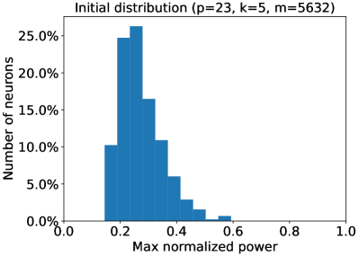


*Рисунок 8: Покрытие всех частот фурье-спектра и наибольшая приведённая мощность вложений (весов скрытого слоя). Сеть с одним скрытым слоем и $m=5632$ нейронами обучена на наборе сложения $k=5$ слагаемых по остатку $p=23$. Через $\widehat{u}[i]$ мы обозначаем фурье-преобразование величины $u[i]$. Пусть $\max_{i}|\widehat{u}[i]|^{2}/(\sum|\widehat{u}[j]|^{2})$ есть наибольшая приведённая мощность. Сопоставив каждому нейрону частоту его наибольшей приведённой мощности, (a) показывает конечное распределение частот вложений. Как и в нашем построении из леммы 4.3, распределение по всем частотам почти равномерно. (b) показывает наибольшую приведённую мощность сети при случайном начальном приближении. (c) показывает, что в пространстве частот вложения конечной обученной сети односоставны, то есть наибольшая приведённая мощность почти равна 1 у всех нейронов. Это согласуется с итогами нашего разбора наибольшего отступа в лемме 4.3.* **[p. 52]**

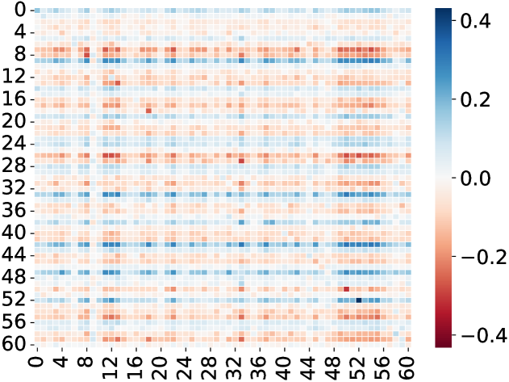


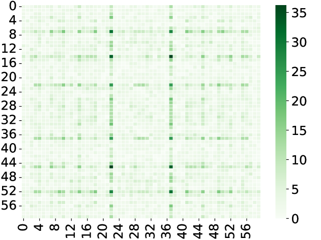

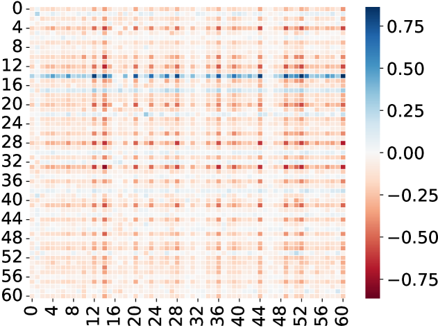


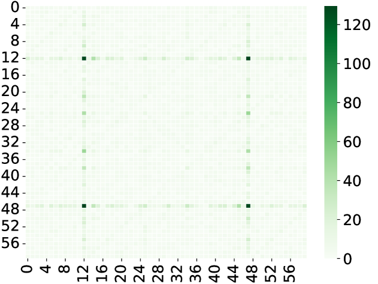

*Рисунок 9: Двумерный косинусный облик обученной матрицы $W^{KQ}$ (весов внимания) и мощность их фурье-спектра. Однослойный трансформер с $m=160$ головами внимания обучен на наборе сложения $k=3$ слагаемых по остатку $p=61$. Мы делим весь набор ($p^{k}=61^{3}$ точек данных) поровну на обучающий и тестовый. Каждая строка отвечает случайно выбранной голове внимания. Левый рисунок показывает, что конечные обученные веса внимания имеют явный двумерный косинусный облик. Правый рисунок показывает мощность их двумерного фурье-спектра. Итоги на этих рисунках согласуются с рисунком 5.* **[p. 53]**

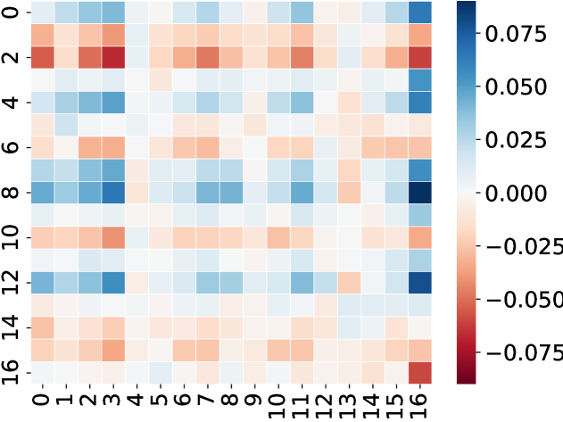

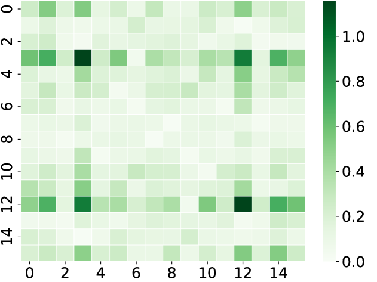

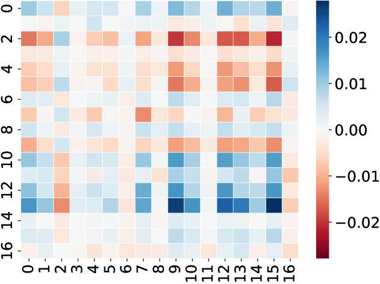

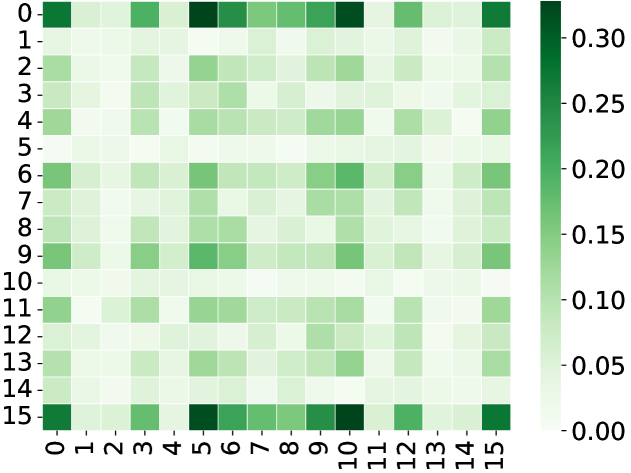

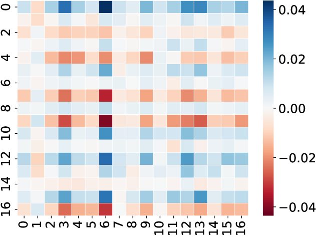

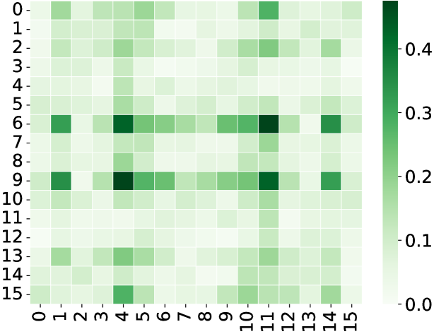

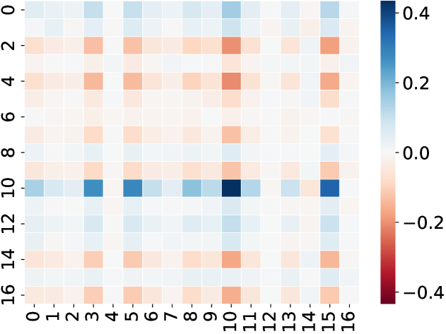

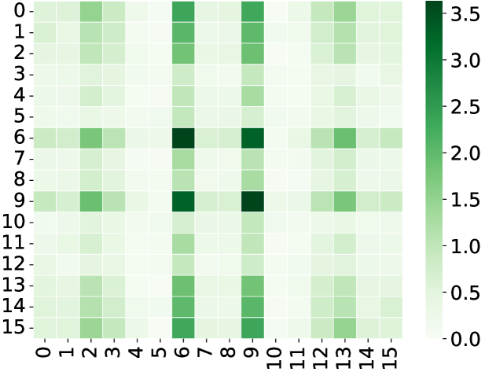

*Рисунок 10: Двумерный косинусный облик обученной матрицы $W^{KQ}$ (весов внимания) и мощность их фурье-спектра. Однослойный трансформер с $m=160$ головами внимания обучен на наборе сложения $k=5$ слагаемых по остатку $p=17$. Мы делим весь набор ($p^{k}=17^{5}$ точек данных) поровну на обучающий и тестовый. Каждая строка отвечает случайно выбранной голове внимания. Левый рисунок показывает, что конечные обученные веса внимания имеют явный двумерный косинусный облик. Правый рисунок показывает мощность их двумерного фурье-спектра. Итоги на этих рисунках согласуются с рисунком 7.* **[p. 54]**

---

# Машиночитаемый блок фактов

```yaml
paper:
  id: 2402.09469
  title: "Fourier Circuits in Neural Networks and Transformers: A Case Study of Modular Arithmetic with Multiple Inputs"
  authors: [Chenyang Li, Yingyu Liang, Zhenmei Shi, Zhao Song, Tianyi Zhou]
  affiliation: "Fuzhou University; University of Hong Kong; UW-Madison; Simons Institute, Berkeley; USC"
  date: 2024-02
  venue: "препринт arXiv (v3, октябрь 2024)"
  citations: "нет данных (в таблицу citations_to_power_2022 не попала)"
  source: native-html-v3
  role_in_corpus: "теоретическая опора: какое решение выбирает сеть на задаче,
    где наблюдают гроккинг"

core_claim:
  name: "фурье-разрежённость решения наибольшего отступа"
  thesis: "у сети с одним скрытым слоем и многочленным возбуждением решение
    наибольшего L_{2,k+1}-отступа на остаточном сложении k входов состоит
    из нейронов, каждый из которых занят ровно одной частотой, и покрывает
    все частоты из {1, ..., (p-1)/2}"
  margin: "gamma* = 2(k!) / ((2k+2)^((k+1)/2) (p-1) p^((k-1)/2))"
  width: "достаточно m >= 2^(2k-1) * (p-1)/2 нейронов"
  method: "переход в дискретное фурье-пространство; теорема Планшереля;
    неравенство между средним квадратичным и средним геометрическим"

setup:
  task: "(a_1 + ... + a_k) mod p, входы в однобитном коде"
  models: ["сеть с одним скрытым слоем и многочленным возбуждением",
    "однослойный трансформер с m=160 головами внимания",
    "двухслойный трансформер (опыты с гроккингом)"]
  experiments:
    - "k=4, p=47, m=2944 — рисунки 1 и 2"
    - "k=3, p=97, m=1536 и k=5, p=23, m=5632 — приложение J.2"
    - "трансформер: k=4, p=31; k=3, p=61; k=5, p=17"
    - "гроккинг: k=2,3,4,5 при p=97,31,11,5, AdamW, 50 % данных в обучении"
  seeds: 3
  hardware: "один NVIDIA A100 40G; все опыты не дольше трёх дней"

results:
  single_frequency: "каждый скрытый нейрон односоставен по частоте
    (наибольшая приведённая мощность почти равна 1)"
  coverage: "распределение частот по нейронам почти равномерно, покрыты все"
  transformer: "матрица W^{KQ} принимает двумерный косинусный облик
    с односоставным двумерным спектром"
  grokking_vs_k: "с ростом k гроккинг слабеет — предсказано разбором
    и подтверждено на k=2,3,4,5"
  parity_link: "при p=2 задача вырождается в чётность; оценка Omega(exp(k))
    согласуется с нижней границей Barak et al."

findings:
  - id: 1
    claim: "каждый нейрон решения наибольшего отступа занят одной частотой"
    anchor: p8-7
  - id: 2
    claim: "задействованы все частоты из {1, ..., (p-1)/2}"
    anchor: p8-7
  - id: 3
    claim: "доказано о предельной точке, а не о ходе обучения"
    anchor: p8-3
  - id: 4
    claim: "с ростом числа входов гроккинг слабеет"
    anchor: p12-3
  - id: 5
    claim: "у однослойного трансформера внимание принимает косинусный облик"
    anchor: p12-2

concept_cards:
  fourier-features-circuits: p8-7
  margin-maximization-implicit-bias: p8-3
  modular-arithmetic: p4-5
  grokking: p12-3
  lazy-to-rich-kernel-to-feature-learning: p12-4
  mechanistic-interpretability: p4-3
  attention-routing-heads: p12-2
  sparse-parity: p14-2
  data-fraction-critical-dataset-size: p10-2
  double-descent: p14-1
  feature-emergence-feature-learning: p11-7

sources:
  original_html: original/2402.09469.native.html
  converted_text: original/2402.09469.fourier-circuits-in-neural-networks-and-transformers-a-case-study-of-modular-arithmetic-with-multiple-inputs.md
  images_dir: images/
  pdf: https://arxiv.org/pdf/2402.09469v3

anchors:
  scheme: "pN-M | fig-N | tab-N (token headings, cross-viewer portable)"
  policy: "якоря заводятся только там, где на них ссылаются; разрывы страниц якорей не несут"
  paragraph: [p1-2, p4-3, p4-4, p4-5, p5-1, p5-2, p6-4, p8-3, p8-6, p8-7, p8-9, p10-2, p10-4, p11-7,
    p12-2, p12-3, p12-4, p14-1, p14-2, p23-3, p23-6, p48-3]
  figure: [fig-1, fig-2, fig-3, fig-4]
  table: []

review_summary:                   # см. раздел «Что показано, а что предположено»
  strong: "заявка дана числом, а не образом: замкнутый вид отступа и оценка ширины;
    опыт поставлен ровно на числе нейронов из границы и проверяет оба следствия;
    предсказание о слабеющем с ростом k гроккинге сделано до опыта и подтверждено;
    связь с трудностью обучения чётности даёт независимую проверку оценки"
  weak: "доказано о решении наибольшего отступа, а не о пути обучения;
    возбуждение многочленное, а не ReLU;
    проверяется достаточность границы по ширине, но не необходимость;
    объяснение слабеющего гроккинга остаётся рассуждением — ни одна ступень не измерена;
    3 семени, отклонения на рисунках 1-3 не приводятся"
  authors_own_limits:
    - "область применения выводов на деле ограничена (приложение A)"
    - "теорема даёт наглядное соображение, но не объясняет рисунок 4 полностью"
    - "нижняя граница на число нейронов, возможно, не самая точная"

translation:
  status: complete
  formula_parity: "display 134/134, inline поблочно совпадает во всех переведённых блоках"
  figures: "40/40"
  pagination: "56 отметок страниц, совпадает с оригиналом"
```
