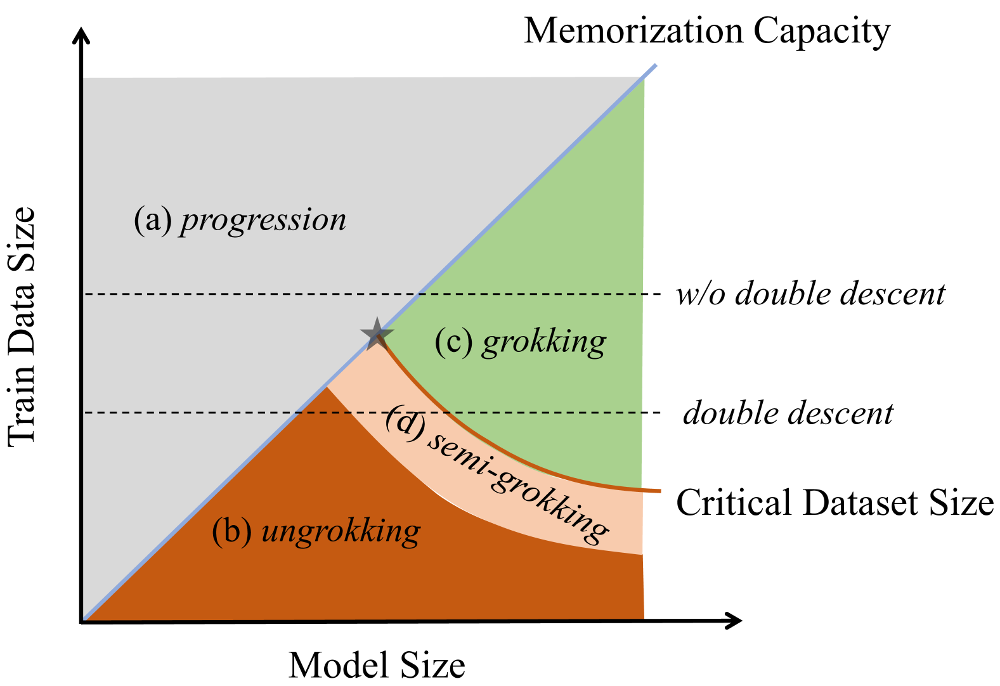
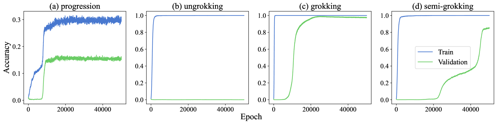
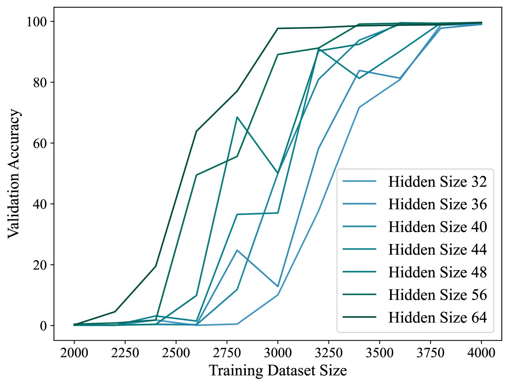
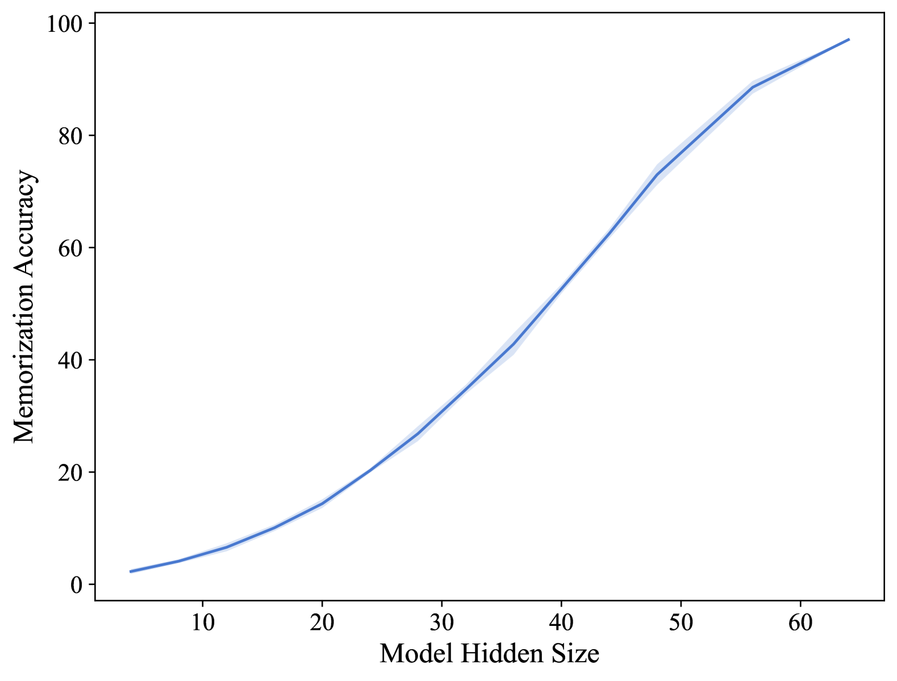
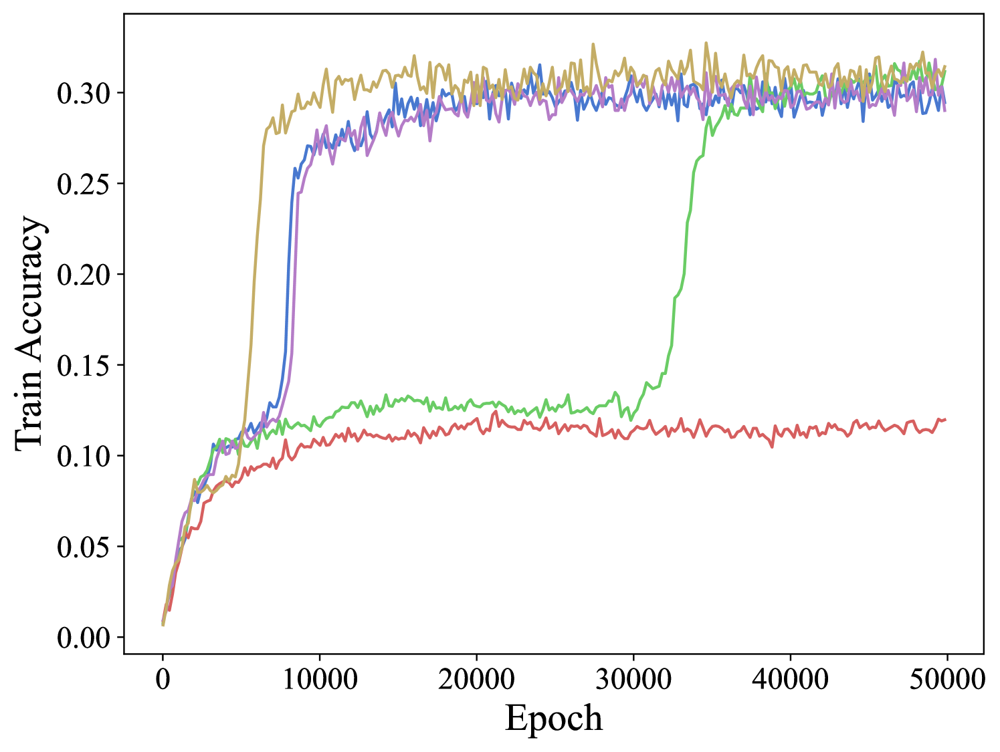
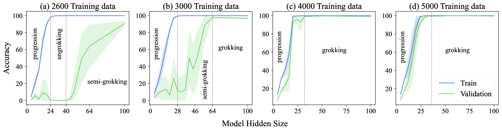
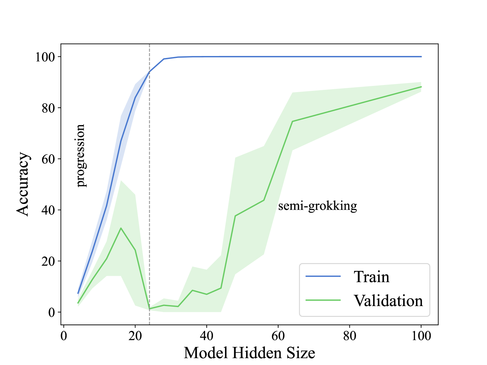
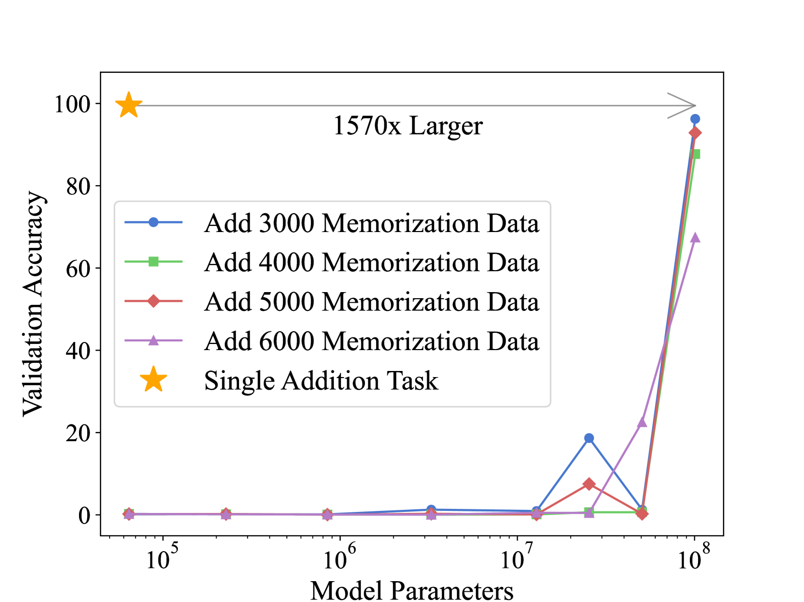
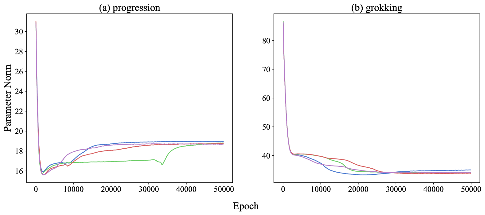
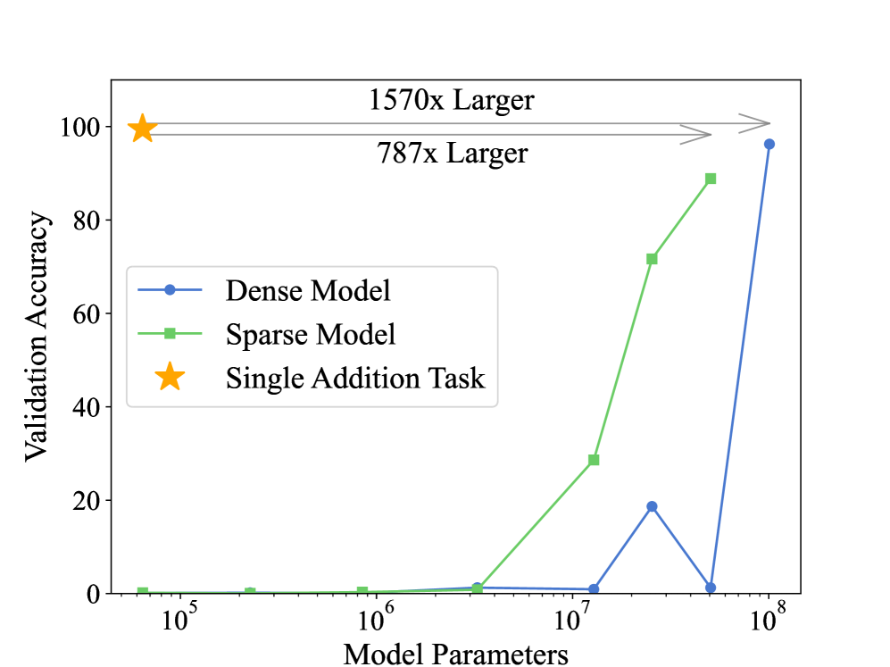

# Huang et al. 2024 — Unified View of Grokking, Double Descent and Emergent Abilities: A Perspective from Circuits Competition

См. также: [глобальный индекс понятий](../../concepts/index.md).

**Yufei Huang**, **Shengding Hu**, **Xu Han**, **Zhiyuan Liu**, **Maosong Sun** — Университет Цинхуа, Пекин, Китай. Переписка — с Maosong Sun.

arXiv [2402.15175](https://arxiv.org/abs/2402.15175), 23 февраля 2024 (версия v2 — 26 февраля 2024). 26 цитирований — шестнадцатая по цитируемости работа корпуса. Источник — нативный HTML arXiv версии v2.

Оригинал и производные файлы этой папки:

- [`original/2402.15175.native.html`](original/2402.15175.native.html) — первоисточник, нативный HTML arXiv (v2), скачан как есть.
- [`original/2402.15175.unified-view-of-grokking-double-descent-and-emergent-abilities.md`](original/2402.15175.unified-view-of-grokking-double-descent-and-emergent-abilities.md) — конверсия оригинала в Markdown без правок содержания.
- [`images/`](images/) — 10 иллюстраций статьи в исходном разрешении.

Схема якорей и правила ссылок на карточку — в [README папки статей](../README.md).

## Затрагиваемые понятия

**[Эффективность контуров](../../concepts/circuit-efficiency.md)** — работа **надстраивает** теорию Varma et al., добавляя к ней вторую ось. У Varma эффективность запоминающего контура падала с ростом обучающего набора, а обобщающего оставалась постоянной, откуда и брался критический размер данных $D_{crit}$ ([`p1-4`](#p1-4)). Здесь то же рассуждение проведено по размеру модели: критический размер убывает с ростом модели, а ёмкость запоминания растёт, и две кривые пересекаются ([`p2-2`](#p2-2)). Чего в работе нет: измерения самой эффективности — контуры здесь нигде не выделяются, всё различение идёт по качеству на валидации ([`p3-7`](#p3-7)).

**[Критический размер данных](../../concepts/data-fraction-critical-dataset-size.md)** — понятие получает зависимость от модели: $D_{crit}$ становится $D_{crit}^{M}$, функцией размера сети. Модель со скрытым размером 64 грокает при 3000 примерах, со скрытым размером 32 — только при 4000 ([`p4-2`](#p4-2)). Это и есть первое из двух предположений рамки, объявленное подтверждённым экспериментом.

**[Фаза запоминания](../../concepts/memorization-phase.md)** — вводится вторая величина того же рода: **ёмкость запоминания** $D_{mem}^{M}$, измеренная прямо — обучением на случайных метках всех $12{,}769$ пар, с одинаковыми метками для $(a+b)$ и $(b+a)$, чтобы коммутативность не завышала результат ([`p4-6`](#p4-6)). Ёмкость растёт с размером модели, и разброс по сидам мал.

**[Гроккинг](../../concepts/grokking.md)** — работа переводит гроккинг из явления в **одну из четырёх областей** на плоскости «размер модели × объём данных» ([`p1-3`](#p1-3)). Соседи по плоскости: *унгрокинг* (данных меньше $D_{crit}$), *полу-грокинг* (данных примерно $D_{crit}$) и новое *продвижение* (данных больше, чем модель способна запомнить). Гроккинг тем самым перестаёт быть чем-то особенным: он занимает полосу между ёмкостью запоминания и критическим размером.

**[Унгрокинг](../../concepts/ungrokking.md)** и **[полу-грокинг](../../concepts/semi-grokking.md)** — оба понятия Varma et al. здесь воспроизведены и размещены на той же диаграмме ([`p2-2`](#p2-2)). Для полу-грокинга добавлено измерение, которого у Varma не было: промежуток, в котором он наблюдается, охватывает примерно 1000 обучающих точек — и, по наблюдению авторов, одинаков для всех рассмотренных моделей ([`p4-3`](#p4-3)).

**[Двойной спуск](../../concepts/double-descent.md)** — главный результат работы по этому понятию: двойной спуск объяснён как **последовательность четырёх областей**, которую проходит модель при фиксированном объёме данных ниже точки пересечения — продвижение, унгрокинг, полу-грокинг, гроккинг ([`p2-3`](#p2-3)). Отсюда два проверяемых предсказания. Первое: при 2600 примерах провал есть (унгрокинг при скрытом размере 24–40), при 4000 и 5000 его нет ([`p6-3`](#p6-3)). Второе: усложнив задачу до $(a+b)^{2}\bmod P$, можно поднять кривую $D_{crit}$ и получить провал там, где его не было ([`p7-4`](#p7-4), [`p7-7`](#p7-7)).

**[Эмерджентность](../../concepts/emergence.md)** — работа **изготавливает** эмерджентную способность вместо того, чтобы её наблюдать: подмешивание к модульному сложению задачи чистого запоминания (случайные метки на вычитании) отодвигает появление генерализации к модели примерно в 1570 раз большей ([`p8-1`](#p8-1)). Из этого выводится гипотеза о предобучении LLM как о многозадачном обучении ([`p8-2`](#p8-2)). Чего в работе нет: проверки на языковых моделях — вся конструкция построена на модульном сложении.

**[Разрежённые подсети](../../concepts/sparse-subnetwork-lottery-ticket.md)** — приложение B ставит проверку от противного: слой прямого распространения разделён на две части по промежуточной размерности (в духе MoE), одна обрабатывает алгоритмические данные, другая — данные запоминания. Размер модели, при котором способность появляется, резко уменьшается ([`p12-2`](#p12-2)). Это довод в пользу того, что дело именно в конкуренции за параметры.

**[Минимизация нормы весов](../../concepts/weight-norm-minimization.md)** — норма параметров служит здесь **признаком различения**, а не механизмом: *гроккинг* и *продвижение* дают одинаково выглядящие кривые качества, но при гроккинге норма параметров убывает, а при продвижении растёт ([`p5-5`](#p5-5), [`fig-9`](#fig-9)). Это единственный способ, которым работа отличает две динамики, кроме уровня точности на обучении в момент генерализации.

**[Модульная арифметика](../../concepts/modular-arithmetic.md)** — постановка стандартная (сложение по модулю 113, однослойный decoder-only трансформер с 4 головами, AdamW), но диапазон необычно широк: скрытые размеры от 4 до 100 и от 2000 до 5000 обучающих точек, по 11 сидов на конфигурацию ([`p3-8`](#p3-8)). Вторая задача — $(a+b)^{2}\bmod P$ — введена как заведомо более трудная для генерализации при той же ёмкости запоминания.

**[Weight decay](../../concepts/weight-decay.md)** — упомянут как условие постановки: AdamW выбран именно потому, что weight decay заметно влияет на гроккинг ([`p3-8`](#p3-8)). Отдельного разбора его роли работа не даёт — она наследует его из теории эффективности контуров.

**[Эффект рогатки](../../concepts/slingshot.md)** и **[обучение представлениям](../../concepts/structured-representation-learning.md)** — оба названы в обзоре среди объяснений гроккинга и в рамку не встраиваются ([`p1-3`](#p1-3)): работа выбирает одну линию — состязание контуров — и надстраивает только её.

Отдельно стоит сказать о названии *продвижение* (`progression`). Это **новое** понятие: динамика, при которой обучающих данных больше, чем модель способна запомнить, и генерализация складывается **до** идеальной точности на обучении, потому что кросс-энтропийную потерю иначе не уменьшить ([`p5-1`](#p5-1)). В корпусе такой динамике до сих пор не было имени, и от гроккинга её отличает не форма кривой, а причина: не эффективность контура, а невозможность запомнить всё.

Карточки статей корпуса: [Varma et al. 2023](../2309.02390.explaining-grokking-through-circuit-efficiency/2309.02390.explaining-grokking-through-circuit-efficiency.card.md) — теория, которую эта работа расширяет по второй оси; [Power et al. 2022](../2201.02177.grokking-generalization-beyond-overfitting-on-small-algorithmic-datasets/2201.02177.grokking-generalization-beyond-overfitting-on-small-algorithmic-datasets.card.md) — исходная задача; [Nanda et al. 2023](../2301.05217.progress-measures-for-grokking-via-mechanistic-interpretability/2301.05217.progress-measures-for-grokking-via-mechanistic-interpretability.card.md) — способ выделить обобщающий контур, которым авторы сознательно не пользуются; [Merrill et al. 2023](../2303.11873.a-tale-of-two-circuits-grokking-as-competition-of-sparse-and-dense-subnetworks/2303.11873.a-tale-of-two-circuits-grokking-as-competition-of-sparse-and-dense-subnetworks.card.md) — состязание разрежённой и плотной подсетей, ближайший родственник приложения B; [Liu et al. 2022](../2205.10343.towards-understanding-grokking-an-effective-theory-of-representation-learning/2205.10343.towards-understanding-grokking-an-effective-theory-of-representation-learning.card.md) — фазовая диаграмма в пространстве гиперпараметров, к которой эта диаграмма ближе всего по замыслу.

## Что показано, а что предположено

Замечания редактора карточки по итогам разбора утверждений (`…claims.txt`). Работа держится на двух эмпирических зависимостях и одной картинке, выведенной из них; всё остальное — следствия.

**Обе опорные зависимости измерены.** Критический размер данных убывает с размером модели ([`p4-2`](#p4-2)), ёмкость запоминания растёт ([`p4-6`](#p4-6)). Второе измерено прямо и аккуратно — случайными метками, с поправкой на коммутативность. Первое получено из сетки «размер набора × скрытый размер» по 11 сидов на точку. Дальше обе кривые рисуются на одном графике, и **точка их пересечения** — уже построение, а не измерение: где именно она лежит, работа не определяет.

**Предсказание о двойном спуске — настоящее предсказание.** Из рамки следует, что провал возникнет при малых наборах и исчезнет при больших; проверка это подтверждает — 2600 даёт провал до нуля, 4000 и 5000 не дают ничего похожего ([`p6-3`](#p6-3)). Второе предсказание сильнее: если поднять кривую $D_{crit}$, усложнив генерализацию, провал появится там, где его не было. Задача $(a+b)^{2}\bmod P$ действительно даёт нулевое качество при скрытом размере 24, чего при том же объёме данных на сложении не было ([`p7-7`](#p7-7)).

**Контуры в работе не измеряются.** Вся рамка говорит о состязании запоминающих и обобщающих контуров, но ни один контур не выделяется: способ Nanda et al. упомянут и отвергнут «для простоты», а различение идёт по качеству на валидации ([`p3-7`](#p3-7)). Значит, «контур» здесь — язык описания, а не наблюдаемая величина; строго говоря, показано поведение качества, а не поведение контуров.

**Продвижение отличено от гроккинга одним признаком.** Кривые качества у них похожи, и всё различение держится на двух вещах: уровне точности на обучении в момент генерализации и знаке изменения нормы параметров ([`p5-5`](#p5-5), [`fig-9`](#fig-9)). Норма при этом измерена на одной паре конфигураций (скрытый размер 8 против 64 при 3000 точках), и на рисунке 9 приведены отдельные прогоны, а не статистика.

**Эмерджентность получена, но её масштаб — артефакт постановки.** Число «в 1570 раз больше» получено сравнением размера модели, при котором способность появляется в многозадачной постановке, с размером при одиночной задаче ([`p8-1`](#p8-1)). Оно зависит от того, какую именно задачу запоминания подмешали и сколько её данных; авторы отмечают, что объём данных запоминания на порог влияет слабо, но других задач запоминания не пробовали. Перенос вывода на предобучение LLM ([`p8-2`](#p8-2)) — аналогия, и работа так его и подаёт.

**Ограничение названо самими авторами.** Всё исследование — на алгоритмических задачах; расширение на реалистичные задачи и модели объявлено необходимым для дальнейшей работы. К этому стоит добавить, чего в работе нет: ни одна из четырёх областей не проверена вне модульной арифметики, а третье явление — эмерджентные способности LLM — упомянуто, но не измерено ни на одной языковой модели.

**Место в корпусе.** Это единственная работа корпуса, объединяющая гроккинг, двойной спуск и эмерджентность **одной** конструкцией. Цена объединения — та же, что и у любой рамки такого рода: сущности (эффективность контуров, ёмкость запоминания, критический размер) взяты из чужой теории и не проверяются заново, а проверяются только следствия. С Merrill et al., где разрежённая и плотная подсети выделены и измерены, здесь получается взаимное дополнение: там показано, что конкурирующие подсети существуют, тут — что из их конкуренции можно вывести форму кривой качества по размеру модели.

## Ошибочные цитирования

Замечания редактора карточки: места, где эта статья передаёт чужие результаты с ошибкой или без авторских оговорок. Сюда ведут ссылки «подробности» из разделов «Ошибочные пересказы и цитирования этой статьи» карточек процитированных работ.

###### mc-2309-02390
**Varma et al. (2309.02390) — «ungrokking» применён к обучению с нуля, semi-grokking — как устойчивое состояние.** Статья опирается на теорию эффективности контуров плотнее всех в корпусе, и обе неточности — на её краях. (1) `"Insufficient data boosts memorization efficiency over generalization, causing model to choose pure memorization without generalization, which is consistent with *ungrokking* stated by Varma et al. (2023)"` — «недостаток данных повышает эффективность запоминания… что согласуется с „унгрокингом" у Varma et al.»: у Varma унгрокинг — регресс [уже грокнувшей сети при дообучении на малом наборе](../2309.02390.explaining-grokking-through-circuit-efficiency/2309.02390.explaining-grokking-through-circuit-efficiency.card.md#p2-1); обучение с нуля, где генерализация не наступает, — не унгрокинг, а его отсутствие. Сам режимный тезис теории соответствует — ошибка именно в термине. (2) `"This balance prevents the model from fully transitioning from memorization to generalization, resulting in *semi-grokking*"` — «равновесие… даёт полу-грокинг»: уронены оговорки Varma, что [полу-грокинг из их теории строго не следует и, вероятно, преходящ](../2309.02390.explaining-grokking-through-circuit-efficiency/2309.02390.explaining-grokking-through-circuit-efficiency.card.md#sec-5-3) — многие запуски при более долгом обучении догрокали бы. Атрибуция первенства терминов при этом корректна.

---

# Текст статьи

## Аннотация

###### p1-2
Недавние исследования обнаружили в глубоком обучении любопытные явления — *гроккинг*, *двойной спуск* и *эмерджентные способности* больших языковых моделей, — которые идут вразрез с человеческой интуицией и важны для более глубокого понимания нейросетевых моделей. В этой работе мы предлагаем всеобъемлющую рамку, дающую единый взгляд на эти три явления и сосредоточенную на состязании между запоминающими и обобщающими контурами. Этот подход, изначально применённый для объяснения *гроккинга*, мы расширяем на более широкий диапазон размеров моделей и объёмов обучающих данных. Наша рамка выделяет четыре различные динамики обучения, каждая из которых зависит от того или иного сочетания размера модели и количества обучающих данных. Пользуясь этой рамкой, мы даём подробный разбор явления *двойного спуска* и предлагаем два проверяемых предсказания о том, когда он возникает; оба подтверждены нашими экспериментами. Кроме того, мы расширяем рамку на многозадачное обучение, показывая, как алгоритмические задачи можно превратить в эмерджентные способности. Это даёт новый взгляд на *эмерджентные способности* больших языковых моделей.

## 1 Введение

###### fig-1
*Рисунок 1: Растущая ёмкость запоминания и убывающий критический размер набора данных для больших моделей делят рисунок на четыре различные области: *продвижение*, *унгрокинг*, *гроккинг* и *полу-грокинг*. В каждой области наблюдается своя динамика обучения.* **[p. 1]**

###### p1-3
В глубоком обучении есть несколько интересных явлений, среди которых наибольшее внимание привлекают *гроккинг* (Power et al., 2022), *двойной спуск* (Nakkiran et al., 2020) и *эмерджентные способности* (Wei et al., 2022a) современных больших языковых моделей. Понимание этих явлений важно, чтобы раскрыть механику глубокого обучения. Множество работ (Liu et al., 2022, 2023; Thilak et al., 2022; Varma et al., 2023; Schaeffer et al., 2023; Michaud et al., 2023) объясняют эти явления с разных сторон. Однако все они сосредоточены на одном явлении и объясняют их по отдельности. В этой работе мы делаем предварительное исследование, дающее единый взгляд на все три явления со стороны состязания между запоминающими и обобщающими контурами в нейросетевых моделях.

###### fig-2
*Рисунок 2: Рисунок показывает четыре различные динамики обучения, отвечающие областям с рисунка 1 и разбираемые в разделе 3. Каждая панель отвечает своей динамике: (a) *продвижение*, показанное на модели со скрытым размером $8$, обученной на $3000$ точках данных. (b) *унгрокинг*, показанный на модели со скрытым размером $32$, обученной на $2600$ точках данных. (c) *гроккинг*, показанный на модели с бо́льшим скрытым размером $64$, обученной тоже на $3000$ точках данных. Эти динамики показывают, как по-разному отзываются модели разных конфигураций на те или иные объёмы обучающих данных. (d) *полу-грокинг*, показанный на модели со скрытым размером $32$, обученной на $3000$ точках данных.* **[p. 2]**

###### p1-4
Наша работа опирается на объяснение *гроккинга*, данное Varma et al. (2023). Они относят *гроккинг* к состязанию двух различных типов контуров в модели: одного, отвечающего за запоминание, — он даёт высокую точность на обучении, но плохую на валидации, — и другого, отвечающего за генерализацию, способного дать высокое качество и там, и там. Второй, хотя и складывается медленнее, оказывается эффективнее по нормам параметров, отчего модель в конце концов переходит от запоминания к генерализации ради большей эффективности. Любопытно, что эффективность запоминающего контура обратно пропорциональна объёму обучающих данных: чем больше набор, тем она ниже. Эффективность же обобщающего контура остаётся неизменно устойчивой независимо от размера обучающих данных. Отсюда Varma et al. (2023) ввели критический размер набора данных $D_{crit}$ — тот диапазон, в котором запоминающие и обобщающие контуры сопоставимы по эффективности и за которым вероятен гроккинг.

**[p. 2]**

Опираясь на эту теорию, мы распространяем исследование на разные размеры моделей. Сперва мы замечаем, что меньшим моделям для гроккинга требуется больший критический размер набора данных, — то есть между размером модели и необходимым количеством обучающих данных для гроккинга есть обратная зависимость. Наоборот, ёмкость запоминания модели прямо пропорциональна её размеру, а значит, у меньших моделей она меньше. Обе зависимости мы подтверждаем множеством экспериментов в разделе 2.

###### p2-2
Обратные зависимости от размера модели неизбежно ведут к точке пересечения двух кривых (чёрная звёздочка на рисунке 1). В этой точке достигнут предел запоминания модели, и эффективность этого предельного запоминающего контура сопоставима с эффективностью её обобщающего контура. Кроме того, две кривые задают на графике четыре различные области, каждая из которых отвечает своей динамике обучения в наших экспериментах, как показано на рисунке 2. (a) Избыток обучающих данных или уменьшенный размер модели мешает полностью запомнить обучающие данные, отчего модель показывает интересное явление: сперва она запоминает часть обучающих данных при нулевом качестве на валидации, а затем начинает обобщать на часть валидационных данных, причём точность на обучении тоже растёт; мы называем это *продвижением*. (b) Недостаток данных делает запоминание эффективнее генерализации, отчего модель выбирает чистое запоминание без генерализации, что согласуется с *унгрокингом*, описанным Varma et al. (2023). (c) Наоборот, увеличение размера модели снижает эффективность запоминания относительно генерализации, отчего модель после достаточного числа шагов обучения переходит от запоминания к генерализации, — это в точности *гроккинг* (Power et al., 2022). (d) Когда число обучающих точек приближается к критическому размеру набора данных, модель показывает явление, названное *полу-грокингом*, с умеренной способностью к генерализации. Это поведение первыми заметили Varma et al. (2023).

###### p2-3
Разбирая изображённый график, мы ожидаем, что функция итогового качества на валидации от размера модели поведёт себя по-разному в зависимости от количества обучающих данных. А именно, когда количество обучающих данных превосходит точку пересечения, рост размера модели проводит её от *продвижения* к *гроккингу*, отчего между размером модели и итоговым качеством на валидации получается неизменно положительная связь. Наоборот, при объёмах обучающих данных ниже этой точки модель проходит *продвижение*, *унгрокинг*, *полу-грокинг* и затем *гроккинг*, отчего функция с ростом размера модели сперва растёт, потом убывает и в конце концов растёт снова. Эта картина и есть явление *двойного спуска* (Belkin et al., 2019; Nakkiran et al., 2020). Более того, опираясь на наш разбор, мы ставим эксперименты, превращающие функцию качества на валидации от размера модели, изначально ясного *двойного спуска* не показывающую, в такую, где он очевиден. Достигается это сдвигом кривой критического размера набора данных вверх, отчего и точка пересечения сдвигается вправо и вверх.

Далее мы расширяем эксперименты на многозадачное обучение, где для обучения модели смешиваются алгоритмическая задача и задача чистого запоминания. Что интересно, добавление задачи чистого запоминания сильно мешает модели складывать обобщающие контуры для алгоритмической задачи. С ростом размера модели качество на валидации неизменно остаётся почти нулевым — вплоть до сравнительно большого размера модели, примерно в 1570 раз большего, чем при обучении одной только алгоритмической задаче. Это явление напоминает нам об *эмерджентных способностях* больших языковых моделей (Wei et al., 2022a). Стадию предобучения тоже можно рассматривать как многозадачное обучение, где модели приходится запоминать многочисленные сведения о мире, одновременно вырабатывая некоторые общие правила и способности вроде рассуждения. Наше исследование наводит на мысль, что эта черта многозадачного обучения может быть одной из важных причин **[p. 3]** *эмерджентных способностей* больших языковых моделей.

В целом мы делаем в этой работе три ключевых вклада:

###### p3-2

- Мы вводим новую рамку для разбора и объяснения качества и динамики обучения с учётом сразу и размера модели, и количества обучающих данных.
- Пользуясь этой рамкой, мы даём подробное изложение явления *двойного спуска* и строим предсказательный способ определять, когда он возникнет.
- Расширяя рамку на многозадачное обучение из алгоритмической задачи и задачи чистого запоминания, мы превращаем алгоритмические задачи в эмерджентную способность. Это даёт новый угол зрения на *эмерджентные способности* больших языковых моделей.

**Ключевые выводы.** Чтобы направить внимание читателя, выделим главные выводы нашего разбора:

- Критический размер набора данных для генерализации убывает с размером модели.
- Ёмкость запоминания растёт с размером модели.
- Динамику обучения можно разделить на четыре типа.
- *Продвижение* и *гроккинг* различаются изменением нормы параметров, хотя оба показывают отложенную генерализацию в ходе обучения.
- *Двойной спуск* вызван переходом динамики обучения от *продвижения* к *унгрокингу* и затем к *гроккингу*.
- Мы можем сделать *двойной спуск* заметнее, увеличив трудность генерализации.
- *Эмерджентную способность* можно внести смешением задач запоминания и задач генерализации.
- Разделение запоминания и генерализации в пространстве параметров ускоряет появление способности.

## 2 Предварительное исследование гроккинга

В этом разделе мы сначала напоминаем предварительную постановку экспериментов с гроккингом из Varma et al. (2023), где критический размер набора данных $D_{crit}^{M}$ можно видеть как функцию модели $M$, и расширяем эксперименты с гроккингом на разные размеры моделей и обучающих наборов, получая обратную зависимость критического размера $D_{crit}^{M}$ от размера модели: бо́льшие модели грокают при меньшем объёме обучающих данных.

### 2.1 Постановка экспериментов

#### Задача

Вслед за Power et al. (2022) и Varma et al. (2023) мы, если не оговорено иное, ставим эксперименты по генерализации на задаче модульного сложения.

$$
(a+b)\ \mathrm{mod}\ P\ \mathrm{for}\ a,\ b\ \in(0,...,P-1)\ \mathrm{and}\ P=113
$$

###### p3-7
Беря разные пары $a$ и $b$, эту задачу легко разделить на непересекающиеся обучающий и валидационный наборы. Поэтому поведение запоминания и поведение генерализации тоже можно различить по качеству на валидации. Хотя Nanda et al. (2023) предлагают способ выделить обобщающий контур модульного сложения, мы для простоты различаем их прямо по качеству на валидации. Обозначим через $D_{add}^{train}$ и $D_{add}^{val}$ число данных в обучающем и валидационном наборах этой задачи.

#### Модель

###### p3-8
Вслед за прежними работами (Nanda et al., 2023; Varma et al., 2023) мы обучаем однослойный упрощённый decoder-only трансформер (Vaswani et al., 2017) с 4 головами внимания. Задачи выше мы рассматриваем как классификацию, где число меток равно $P$. При обучении используется кросс-энтропийная потеря $\mathcal{L}_{CE}$ с оптимизатором AdamW (Loshchilov & Hutter, 2019), поскольку weight decay в AdamW заметно влияет на *гроккинг* (Power et al., 2022; Nanda et al., 2023; Varma et al., 2023). Размер модели мы меняем главным образом через размерность скрытого слоя $d_{h}$.

### 2.2 Эксперименты с гроккингом

###### fig-3
*Рисунок 3: Итоговая точность на валидации при разных размерах обучающего набора и разных скрытых размерах модели. Бо́льшие модели показаны зелёным, меньшие — синим. Рисунок показывает, что модели с бо́льшим скрытым размером достигают почти идеальной точности на валидации при сравнительно меньшем объёме обучающих данных, то есть критический размер набора данных у них меньше.* **[p. 3]**

В этом исследовании мы изучаем влияние размера обучающего набора $D_{add}^{train}$, меняющегося от **[p. 4]** $2,000$ до $4,000$ с шагом $200$. Кроме того, мы изучаем модели с разными скрытыми размерами, а именно $d_{h}\in\{32,36,40,44,48,56,64\}$. Для каждого сочетания размера набора и скрытого размера модели мы ставим эксперименты с 11 разными случайными сидами и приводим среднее качество.

Прежде всего нас занимает, показывает ли задача модульного сложения в нашей постановке явление *гроккинга*. Примечательно, что все модели быстро достигают идеальной точности на обучении за несколько эпох, то есть способны действенно запомнить обучающие данные. На рисунке 3 мы приводим итоговое качество на валидации как функцию размера обучающего набора для разных моделей. Все сочетания с почти идеальной точностью на валидации показывают в наших экспериментах *гроккинг*: точность на валидации растёт много позже того, как точность на обучении стала идеальной.

###### p4-2
Вывод-1 Из разбора рисунка 3 видно, что модели с бо́льшим скрытым размером склонны показывать *гроккинг* на меньших наборах. Например, модель со скрытым размером $d_{h}$, равным $64$, достигает почти идеальной точности на валидации всего при $3,000$ обучающих образцах. Модели же с меньшим скрытым размером $32$ для схожей точности требуется увеличить обучающий набор до $4,000$. Эта закономерность выдерживается и на моделях с промежуточными скрытыми размерами между $32$ и $64$.

###### p4-3
Кроме того, наше исследование подтверждает и явление, названное *полу-грокингом* у Varma et al. (2023). Оно возникает, когда модель показывает частичную способность к генерализации существенно позже достижения идеальной точности на обучении. А именно, *полу-грокинг* наблюдается, когда число обучающих точек $D_{add}^{train}$ близко к критическому размеру набора данных для текущей модели $D_{crit}^{M}$. В этих условиях запоминающие и обобщающие контуры модели сопоставимы по эффективности. Это равновесие мешает модели полностью перейти от запоминания к генерализации, отчего и возникает *полу-грокинг*.

Например, как видно на рисунке 3, модель со скрытым размером $d_{h}$, равным $64$, показывает *полу-грокинг*, когда размер обучающего набора $D_{add}^{train}$ лежит между $2,000$ и $3,000$, а критический размер $D_{crit}^{M}$ для этой модели составляет примерно $3,000$. Мы замечаем, что по мере сужения разрыва между $D_{add}^{train}$ и $D_{crit}^{M}$ способность модели к генерализации в целом улучшается, что видно по её итоговой точности на валидации. Кроме того, наши эксперименты показывают, что промежуток *полу-грокинга* охватывает примерно $1,000$ обучающих точек для всех рассмотренных моделей.

### 2.3 Эксперименты с запоминанием

*Рисунок 4: Графическое представление ёмкости запоминания модели в зависимости от её размера. Каждая модель прогоняется с тремя разными случайными сидами, приводится среднее качество. Светло-голубая область показывает 95 %-й доверительный интервал, заметно узкий, что подчёркивает устойчивость ёмкости запоминания на разных размерах моделей.* **[p. 4]**

*Рисунок 5: Эксперименты с продвижением при $5$ разных случайных сидах. Все эксперименты проведены при размере обучающего набора $3000$ и скрытом размере модели $8$. Кривые с явными горбами точности на обучении показывают *продвижение* в ходе обучения.* **[p. 5]**

###### p4-5

Поскольку *гроккинг* требует, чтобы модель сперва запомнила все обучающие данные, мы поставили эксперименты, прямо измеряющие способность модели к запоминанию. Для этого мы назначаем обучающим данным случайные метки (Zhang et al., 2021), вынуждая модель заниматься только выработкой запоминающих контуров. Поскольку задача модульного сложения подчиняется закону коммутативности, что могло бы повлиять на способность модели к запоминанию, мы назначаем одинаковые случайные метки для $(a+b)\ \mathrm{mod}\ P$ и $(b+a)\ \mathrm{mod}\ P$. Это даёт более точную оценку истинной способности модели к запоминанию на этой задаче. В наших экспериментах обучающими данными служат все $12,769$ пар, и точность модели на всём этом множестве мы принимаем за её ёмкость запоминания.

###### p4-6
Вывод-2 Находки, показанные на рисунке 4, обнаруживают отчётливо положительную связь между размером модели и её ёмкостью запоминания: бо́льшие модели способны запомнить больше обучающих данных. Кроме того, стоит отметить, что ёмкость запоминания модели остаётся сравнительно устойчивой, о чём говорит малая ширина 95 %-го доверительного интервала.

## 3 Предлагаемая рамка

В этом разделе мы вводим рамку для разбора и динамики обучения, и итогового качества на валидации. Подход опирается на два ключевых предположения, подкреплённых экспериментами раздела 2.

##### **Предположение 3.1****.**

Критический размер набора данных для модели $M$ ($D_{crit}^{M}$) отрицательно связан с размером модели. Это означает, что бо́льшим моделям для *гроккинга* нужно меньше данных.

##### **Предположение 3.2****.**

Ёмкость запоминания модели $M$ (**[p. 5]** $D_{mem}^{M}$) положительно связана с размером модели, то есть бо́льшие модели способны запомнить больше обучающих данных.

Вывод-3 Опираясь на 3.1 и 3.2, мы можем построить для конкретной задачи графическое представление, показанное на рисунке 1. Этот график изображает связь между ёмкостью запоминания и критическим размером набора данных и выделяет их точку пересечения (отмеченную чёрной звёздочкой на рисунке 1). Тем самым размечаются четыре различные области, каждая со своей динамикой обучения. Эти динамики подробно разбираются далее (рисунок 2).

#### Продвижение

###### p5-1
Когда обучающий набор $D^{train}$ превосходит ёмкость запоминания $D_{mem}^{M}$ модели $M$, модель не способна запомнить весь набор. Это ограничение ведёт к двухстадийной динамике обучения. Сперва модель запоминает часть обучающих данных, что не выливается в улучшение качества на валидации. Затем модель начинает обобщать, улучшая и точность на обучении, и качество на валидации, как показано на рисунке 2 (a). Однако эта динамика не одинакова во всех прогонах и разнится по скорости складывания обобщающего контура при разных случайных сидах, как показано на рисунке 5.

#### Унгрокинг

Когда обучающие данные $D^{train}$ не достигают ёмкости запоминания $D_{mem}^{M}$ модели, она способна запомнить весь набор. Но если $D^{train}$ при этом меньше и критического размера $D_{crit}^{M}$, запоминающие контуры превосходят обобщающие по эффективности. Это приводит модель к выбору чистого запоминания и к пренебрежимо малому качеству на валидации, как показано на рисунке 2 (b).

#### Гроккинг

Когда обучающие данные $D^{train}$ лежат между ёмкостью запоминания $D_{mem}^{M}$ и критическим размером $D_{crit}^{M}$, модель способна запомнить весь обучающий набор. Однако контуры, занятые запоминанием, менее эффективны, чем обобщающие. Сперва модель достигает идеальной точности на обучении запоминанием. Затем она переходит к обобщающим контурам ради большей эффективности, что даёт динамику обучения, показанную на рисунке 2 (c), где качество на валидации доходит почти до идеального много позже того, как модель переобучилась на обучающем наборе.

#### Полу-грокинг

Когда обучающие данные $D^{train}$ близки к критическому размеру $D_{crit}^{M}$, эффективность запоминающих и обобщающих контуров становится сопоставимой. Из-за этого равенства модели трудно перейти к обобщающим контурам целиком. В итоге конечная модель есть сочетание запоминающих и обобщающих контуров и даёт умеренную точность на валидации. Кроме того, можно наблюдать несколько плато качества на валидации, что говорит о повторяющихся сдвигах между запоминающими и обобщающими контурами, как показано на рисунке 2 (d).

#### Обсуждение

###### p5-5
Хотя *продвижение* и *гроккинг* показывают в ходе обучения схожую динамику качества на валидации, важно отметить отличительные черты, разделяющие их по двум основаниям. Во-первых, обобщающие контуры при *продвижении* возникают при умеренном уровне точности на обучении. *Гроккинг* же отличается тем, что обобщающие контуры складываются только после того, как модель достигла идеальной точности на обучении. Во-вторых, механизмы, движущие складыванием обобщающих контуров, у них существенно различны. При *продвижении* обобщающие контуры вызваны ограничениями кросс-энтропийной потери: модель не способна полностью запомнить все обучающие данные, а потому не может достичь почти нулевой потери на обучении. Поэтому обобщающие контуры при *продвижении* складываются, чтобы уменьшить потерю на обучении и одновременно улучшить качество на валидации. Возникновение же обобщающих контуров при *гроккинге* объясняется предпочтением модели к более эффективным контурам, в частности по минимизации нормы параметров модели. (Вывод-4) Отсюда заметная закономерность для генерализации: при *гроккинге* норма параметров модели склонна убывать, тогда как при *продвижении* обычно наблюдается её рост, что показано в приложении A.

## 4 Изложение двойного спуска

###### fig-6
*Рисунок 6: Результаты экспериментов на задаче модульного сложения при разных размерах обучающих данных. Каждый эксперимент проведён $11$ раз с разными случайными сидами, приводится средняя точность. Светлые области обозначают $95\%$-е доверительные интервалы. Согласно нашим ожиданиям, меньший объём обучающих данных склонен вызывать явление *двойного спуска*.* **[p. 6]**

*Рисунок 7: Экспериментальный разбор $(a+b)^{2}\ \mathrm{mod}\ P$ при 3000 обучающих точках. По сравнению с рисунком 6 (b) этот график показывает, что усиление трудности генерализации ведёт при том же объёме обучающих данных к более выраженному *двойному спуску*.* **[p. 6]**

Явление *двойного спуска*, замеченное Nakkiran et al. (2020), обнаруживает любопытную картину: рост размера модели сперва вредит качеству **[p. 6]** на валидации, а в конце концов начинает сказываться на нём положительно. В этом разделе мы подробно исследуем явление *двойного спуска* вместе с предсказаниями о том, когда он возникает, исходя из нашей рамки из раздела 3. Затем мы ставим ряд экспериментов, проверяющих наше теоретическое изложение.

### 4.1 Изложение двойного спуска

###### p6-1
Вывод-5 Наша рамка объясняет, что явление *двойного спуска* вероятно тогда, когда число обучающих данных $D^{train}$ существенно ниже точки пересечения двух кривых на рисунке 1. В этом случае модель проходит ряд стадий: *продвижение*, *унгрокинг*, *полу-грокинг* и наконец *гроккинг*. Сперва, с ростом размера модели на стадии *продвижения*, её способность к генерализации улучшается. Однако при переходе на стадию *унгрокинга* эта способность падает, возможно, до нуля. Это падение согласуется с критическим промежутком размеров модели, постулированным у Nakkiran et al. (2020). По мере дальнейшего роста модель входит в стадии *полу-грокинга* и *гроккинга*, где её способность к генерализации возрождается, давая второй рост. Такая связь и даёт кривую *двойного спуска*, наблюдаемую в качестве на валидации (сноска: «спуск» в двойном спуске относится к ошибке или потере на валидации, поэтому в терминах качества на валидации он подтверждается двумя стадиями «роста»). Наоборот, когда обучающих данных больше, чем в точке пересечения, модель проходит в основном *продвижение* и *гроккинг*, что даёт неизменный рост способности к генерализации с ростом размера модели. В этих условиях явление *двойного спуска* не возникает.

### 4.2 Эксперименты

Чтобы проверить наше изложение, мы провели ряд экспериментов на задаче модульного сложения, описанной в разделе 2. Размеры обучающих данных мы взяли равными $\{2600,3000,4000,5000\}$, а скрытый размер модели меняли от $4$ до $100$ по ряду $\{4,8,12,16,20,24,28,32,36,40,44,48,56,64,100\}$. Каждая конфигурация проверялась в $11$ экспериментах с разными случайными сидами, приводится среднее качество с $95\%$-м доверительным интервалом. Результаты изображены на рисунке 6.

###### p6-3
Из рисунка 6 (a) видно, что при обучающем наборе в $2600$ образцов модели проходят стадии *продвижения*, *унгрокинга*, *полу-грокинга* (сноска: из-за малого числа обучающих данных гроккинга в этом диапазоне размеров модели не происходит). На стадиях *продвижения* бо́льшие модели в целом показывают лучшее качество на валидации. Однако стадия *унгрокинга*, заметная при скрытом размере модели между $24$ и $40$, ведёт к нулевому качеству на валидации, что и даёт **[p. 7]** картину *двойного спуска* при этом размере набора.

Небольшое увеличение обучающих данных до $3000$ образцов убирает стадию *унгрокинга*. Тогда модели проходят *продвижение*, *полу-грокинг* и *гроккинг*, что даёт менее выраженную кривую *двойного спуска*. Всё же провал качества на валидации заметен при размерах модели между $28$ и $36$, как показано на рисунке 6 (b). За пределами этого диапазона наблюдается общая тенденция к росту качества с ростом размера модели.

При дальнейшем увеличении обучающих данных до $4000$ и $5000$ модели минуют стадии *унгрокинга* и *полу-грокинга*, переходя прямо от *продвижения* к *гроккингу*. Это даёт неизменное улучшение качества на валидации с ростом размера модели без всякого *двойного спуска*, как показано на рисунке 6 (c) и (d).

###### p7-3
Помимо *двойного спуска* наблюдается и явление, названное Davies et al. (2022) *гроккингом по размеру модели*: при меньших обучающих наборах точность на валидации доходит почти до идеальной много позже точности на обучении — в терминах размера модели. Однако и это явление исчезает с увеличением обучающих данных, поскольку на бо́льших наборах модели достигают идеального качества и на обучении, и на валидации уже на стадии *продвижения*.

### 4.3 Как сделать двойной спуск заметнее

###### p7-4
Вывод-6 В нашей рамке подъём кривой критического размера набора данных сдвигает точку пересечения вправо и вверх. Это расширяет диапазон размеров обучающих данных, при которых наблюдается *двойной спуск*. Тем самым объём обучающих данных, ранее *двойного спуска* не показывавший, можно превратить в такой, где он есть. Чтобы сдвинуть кривую критического размера вправо и вверх, нужно увеличить сложность складывания обобщающих контуров для задачи.

Чтобы проверить нашу гипотезу, мы построили эксперименты вокруг задачи более сложной, чем модульное сложение. Она задана так:

$$
(a+b)^{2}\ \mathrm{mod}\ P\ \mathrm{for}\ a,\ b\ \in(0,...,P-1)\ \mathrm{and}\ P=113
$$

Поскольку эта задача тоже подчиняется закону коммутативности, она не влияет на кривую ёмкости запоминания (сноска: модели легче запомнить обучающие данные, подчиняющиеся закону коммутативности, поскольку запомнить нужно лишь половину обучающих данных). Для прямого сравнения мы взяли обучающий набор из 3000 примеров — того же размера, что не показывал ясного *двойного спуска* на задаче модульного сложения. Каждая постановка повторена 11 раз с разными случайными сидами. Итоги этих экспериментов изображены на рисунке 7.

###### p7-7
Результаты на этой более сложной задаче обнаруживают более выраженное явление *двойного спуска* в качестве на валидации по сравнению с наблюдавшимся на рисунке 6 (b) при том же количестве обучающих данных. Примечательно, что на этой задаче модель показала нулевое качество на валидации при скрытом размере 24. На задаче модульного сложения при том же размере обучающего набора в $3000$ такого не наблюдалось. Это поведение подтверждает высказанную нами гипотезу.

### 4.4 Обсуждение

Разбор стадии *продвижения* обнаруживает разные связи между качеством модели на валидации и её размером. Для меньших обучающих наборов, показывающих явление *двойного спуска*, качество на валидации обычно сперва растёт, потом убывает. Эта тенденция плавно переходит в нулевое качество на валидации, свойственное стадии *унгрокинга*. Наоборот, при бо́льших обучающих наборах качество на валидации неизменно улучшается вместе с ростом размера модели, плавно переходя в почти идеальное качество, наблюдаемое на стадии *гроккинга*. Это различие можно отнести к взаимодействию кросс-энтропийной потери и склонности модели предпочитать более эффективные способы. Когда модели подходят к стадии *унгрокинга* от *продвижения*, кросс-энтропийная потеря толкает модель к генерализации ради меньшей потери на обучении, но эффективность запоминающих контуров тянет модель к чистому запоминанию. Это противоборство и даёт убывающую тенденцию качества на валидации на поздней части *продвижения*. Однако при переходе моделей от *продвижения* к *гроккингу* и кросс-энтропийная потеря, и соображения эффективности действуют согласно, что ведёт к непрерывному улучшению качества на валидации.

## 5 Многозадачное обучение ведёт к эмерджентной способности

###### fig-8
*Рисунок 8: Добавление задачи чистого запоминания к задаче модульного сложения превращает её в эмерджентную способность.* **[p. 8]**

В этом разделе мы расширяем исследование на многозадачное обучение, сочетающее алгоритмическую задачу — например, модульное сложение — с задачей, состоящей только в запоминании. Оказывается, что способность модели к генерализации на алгоритмической задаче остаётся пренебрежимо малой, пока модель не достигнет существенно большего размера — а именно в 1570 раз большего, чем при обучении одной задаче. В итоге качество на валидации на алгоритмической задаче показывает эмерджентное поведение относительно размера модели.

#### Постановка эксперимента

В наших экспериментах алгоритмической составляющей служит задача модульного сложения. В качестве задачи запоминания мы назначаем случайные метки задаче вычитания, вынуждая модель запомнить эти соответствия. Внося во входные токены разные знаки операций ($+,-$), мы добиваемся того, что входы задачи запоминания и алгоритмической задачи не пересекаются. **[p. 8]** В наших экспериментах используются $3000$ точек данных задачи модульного сложения и разное число точек данных для запоминания — от $3000$ до $6000$. Размер модели мы меняем от однослойного трансформера со скрытым размером 64 до восьмислойного трансформера со скрытым размером 1024. Каждый эксперимент проводится трижды, и для каждой конфигурации мы приводим наибольшую точность на валидации, чтобы показать наилучшую возможность каждой модели. Результаты приведены на рисунке 8.

###### p8-1
Вывод-7 Мы замечаем, что добавление данных чистого запоминания существенно мешает меньшим моделям вырабатывать обобщающие контуры. Появление способности к генерализации на задаче модульного сложения примечательно: заметное качество на валидации модели обычно показывают на сравнительно бо́льших размерах — примерно в 1570 раз бо́льших, чем при обучении одной только задаче модульного сложения. Кроме того, объём данных для запоминания, по-видимому, слабо влияет на размер модели, при котором способность появляется.

#### Обсуждение

###### p8-2
С точки зрения состязания между запоминающими и обобщающими контурами наличие задачи чистого запоминания мешает модели перейти от запоминания к генерализации после освоения всех обучающих данных, поскольку для задачи чистого запоминания обобщающих контуров нет. Однако, как только достигнут достаточно большой размер модели, её ёмкость запоминания существенно превосходит объём обучающих данных, что позволяет ей отвести лишние параметры под генерализацию в алгоритмической задаче. Эксперимент в приложении B, где размер модели, при котором способность появляется, уменьшается за счёт выделения отдельных параметров под алгоритмические данные и данные запоминания, эту гипотезу дополнительно подкрепляет. Это явление перекликается с *эмерджентными способностями*, наблюдаемыми у нынешних больших языковых моделей. Учитывая, что стадия предобучения похожа на многозадачное обучение — где модели приходится удерживать обширный набор сведений о мире, вырабатывая при этом общие правила и способности вроде обучения в контексте (Brown et al., 2020) и многошагового рассуждения (Wei et al., 2022b), — наши эксперименты могут дать свежий взгляд на *эмерджентные способности* больших языковых моделей. Это наблюдение дополнительно проясняет гипотезу Hu et al. (2023), где предполагается, что эмерджентные способности складываются через состязание разных нейронных контуров.

## 6 Связанные работы

#### Гроккинг

Явление *гроккинга*, при котором модели показывают исключительную способность к генерализации много позже точки переобучения на обучающих данных, первыми выделили Power et al. (2022) на разных алгоритмических задачах. Thilak et al. (2022) показали, что *гроккинг* часто сопровождается «эффектами рогатки», которые могут играть решающую роль в его появлении. Углубляясь в лежащие в основе механизмы, Liu et al. (2022) подошли к *гроккингу* со стороны обучения представлениям, обнаружив его связь со складыванием структурированных представлений. Далее, Liu et al. (2023) обнаружили, что гроккинг не ограничен алгоритмическими задачами, но при определённых начальных условиях проявляется и на более широком круге реалистичных задач. Кроме того, Notsawo Jr. et al. (2023) исследовали предсказательные признаки гроккинга, выделив «колебания» в ландшафте потерь как возможные показатели. Новый взгляд Varma et al. (2023) наводит на мысль, что гроккинг можно трактовать через состязание между запоминающими и обобщающими контурами, зависящее от эффективности этих контуров. Это изложение включается в нашу рамку вертикальной прямой справа от точки пересечения на рисунке 1.

#### Двойной спуск

Понятие *двойного спуска*, введённое Belkin et al. (2019), описывает своеобразную картину в качестве модели на валидации: сперва рост, затем убывание и затем новый рост — в связи с увеличением размера модели. Этот провал качества обычно совпадает с приближением ошибки модели на обучении к нулю. Развивая это понятие, Nakkiran et al. (2020) провели всестороннее исследование явления двойного спуска на разных архитектурах моделей, наборах данных и приёмах оптимизации. Параллельно Davies et al. (2022) попытались связать понятия *двойного спуска* и *гроккинга*. Подход состоял в предполагаемой двойственности между размером модели и масштабированием времени, но эта гипотеза остаётся эмпирически не проверенной.

#### Эмерджентные способности

Понятие *эмерджентных способностей* вызвало значительный интерес в эпоху развития больших языковых моделей (LLM). Wei et al. (2022a) дают обстоятельное исследование разных способностей у разных моделей, определяя их как возможности, отсутствующие у меньших моделей и присутствующие у бо́льших. Caballero et al. (2023) ввели сложную функцию на основе **[p. 9]** кусочного степенного закона, чтобы охватить разные явления, включая *эмерджентные способности*. Schaeffer et al. (2023) отнесли появление этих способностей к негладким метрикам, применяемым при оценке задач. С предсказательной стороны Hu et al. (2023) удалось предсказать некоторые *эмерджентные способности*, воспользовавшись метрикой с бесконечным разрешением. В отличие от этих работ, наше исследование подходит к явлению под своим углом, изучая состязание между запоминающими и обобщающими контурами внутри нейросетевых моделей.

## 7 Заключение

В этой работе мы вводим новую рамку для разбора различных динамик обучения при разных размерах моделей и объёмах обучающих данных. Рамка опирается на состязание между запоминающими и обобщающими контурами. Пользуясь ею, мы даём всестороннее изложение *двойного спуска* и подтверждаем наши предсказания о его возникновении в двух различных случаях. Соединяя задачи запоминания и генерализации, мы успешно вызываем эмерджентное поведение в задачах генерализации, проливая новый свет на понимание *эмерджентных способностей*. Заметное ограничение нашего исследования, однако, состоит в том, что оно занято исключительно алгоритмическими задачами. Расширение этого исследования на более реалистичные задачи и модели в дальнейшей работе будет решающим для более глубокого и всестороннего понимания механизмов глубокого обучения.

## 8 Заявление о влиянии

Эта статья представляет работу, направленную на продвижение области механистического понимания и динамики обучения больших языковых моделей. Поскольку наша работа сугубо теоретическая, мы признаём возможные общественные последствия, но не считаем, что здесь требуется выделять какие-то отдельные вопросы.

## Литература

- Belkin, M., Hsu, D., Ma, S., and Mandal, S. Reconciling modern machine-learning practice and the classical bias–variance trade-off. *Proceedings of the National Academy of Sciences*, 116(32):15849–15854, July 2019. ISSN 1091-6490. doi: 10.1073/pnas.1903070116. URL http://dx.doi.org/10.1073/pnas.1903070116.

- Brown, T., Mann, B., Ryder, N., Subbiah, M., Kaplan, J. D., Dhariwal, P., Neelakantan, A., Shyam, P., Sastry, G., Askell, A., Agarwal, S., Herbert-Voss, A., Krueger, G., Henighan, T., Child, R., Ramesh, A., Ziegler, D., Wu, J., Winter, C., Hesse, C., Chen, M., Sigler, E., Litwin, M., Gray, S., Chess, B., Clark, J., Berner, C., McCandlish, S., Radford, A., Sutskever, I., and Amodei, D. Language models are few-shot learners. In Larochelle, H., Ranzato, M., Hadsell, R., Balcan, M., and Lin, H. (eds.), *Advances in Neural Information Processing Systems*, volume 33, pp. 1877–1901. Curran Associates, Inc., 2020. URL https://proceedings.neurips.cc/paper_files/paper/2020/file/1457c0d6bfcb4967418bfb8ac142f64a-Paper.pdf.

- Caballero, E., Gupta, K., Rish, I., and Krueger, D. Broken neural scaling laws. In *The Eleventh International Conference on Learning Representations, ICLR 2023, Kigali, Rwanda, May 1-5, 2023*. OpenReview.net, 2023. URL https://openreview.net/pdf?id=sckjveqlCZ.

- Chughtai, B., Chan, L., and Nanda, N. A toy model of universality: Reverse engineering how networks learn group operations. In Krause, A., Brunskill, E., Cho, K., Engelhardt, B., Sabato, S., and Scarlett, J. (eds.), *International Conference on Machine Learning, ICML 2023, 23-29 July 2023, Honolulu, Hawaii, USA*, volume 202 of *Proceedings of Machine Learning Research*, pp. 6243–6267. PMLR, 2023. URL https://proceedings.mlr.press/v202/chughtai23a.html.

- Davies, X., Langosco, L., and Krueger, D. Unifying grokking and double descent. In *NeurIPS ML Safety Workshop*, 2022. URL https://openreview.net/forum?id=JqtHMZtqWm.

- Fedus, W., Zoph, B., and Shazeer, N. Switch transformers: Scaling to trillion parameter models with simple and efficient sparsity. *J. Mach. Learn. Res.*, 23:120:1–120:39, 2022. URL http://jmlr.org/papers/v23/21-0998.html.

- Geva, M., Schuster, R., Berant, J., and Levy, O. Transformer feed-forward layers are key-value memories. In Moens, M., Huang, X., Specia, L., and Yih, S. W. (eds.), *Proceedings of the 2021 Conference on Empirical Methods in Natural Language Processing, EMNLP 2021, Virtual Event / Punta Cana, Dominican Republic, 7-11 November, 2021*, pp. 5484–5495. Association for Computational Linguistics, 2021. doi: 10.18653/V1/2021.EMNLP-MAIN.446. URL https://doi.org/10.18653/v1/2021.emnlp-main.446.

- Hu, S., Liu, X., Han, X., Zhang, X., He, C., Zhao, W., Lin, Y., Ding, N., Ou, Z., Zeng, G., Liu, Z., and Sun, M. Predicting emergent abilities with infinite resolution evaluation, 2023.

- Liu, Z., Kitouni, O., Nolte, N., Michaud, E. J., Tegmark, M., and Williams, M. Towards understanding grokking: An effective theory of representation learning. **[p. 10]** In Koyejo, S., Mohamed, S., Agarwal, A., Belgrave, D., Cho, K., and Oh, A. (eds.), *Advances in Neural Information Processing Systems 35: Annual Conference on Neural Information Processing Systems 2022, NeurIPS 2022, New Orleans, LA, USA, November 28 - December 9, 2022*, 2022. URL http://papers.nips.cc/paper_files/paper/2022/hash/dfc310e81992d2e4cedc09ac47eff13e-Abstract-Conference.html.

- Liu, Z., Michaud, E. J., and Tegmark, M. Omnigrok: Grokking beyond algorithmic data. In *The Eleventh International Conference on Learning Representations, ICLR 2023, Kigali, Rwanda, May 1-5, 2023*. OpenReview.net, 2023. URL https://openreview.net/pdf?id=zDiHoIWa0q1.

- Loshchilov, I. and Hutter, F. Decoupled weight decay regularization. In *7th International Conference on Learning Representations, ICLR 2019, New Orleans, LA, USA, May 6-9, 2019*. OpenReview.net, 2019. URL https://openreview.net/forum?id=Bkg6RiCqY7.

- Michaud, E. J., Liu, Z., Girit, U., and Tegmark, M. The quantization model of neural scaling. In *Thirty-seventh Conference on Neural Information Processing Systems*, 2023. URL https://openreview.net/forum?id=3tbTw2ga8K.

- Nakkiran, P., Kaplun, G., Bansal, Y., Yang, T., Barak, B., and Sutskever, I. Deep double descent: Where bigger models and more data hurt. In *8th International Conference on Learning Representations, ICLR 2020, Addis Ababa, Ethiopia, April 26-30, 2020*. OpenReview.net, 2020. URL https://openreview.net/forum?id=B1g5sA4twr.

- Nanda, N., Chan, L., Lieberum, T., Smith, J., and Steinhardt, J. Progress measures for grokking via mechanistic interpretability. In *The Eleventh International Conference on Learning Representations, ICLR 2023, Kigali, Rwanda, May 1-5, 2023*. OpenReview.net, 2023. URL https://openreview.net/pdf?id=9XFSbDPmdW.

- Notsawo Jr., P. T., Zhou, H., Pezeshki, M., Rish, I., and Dumas, G. Predicting grokking long before it happens: A look into the loss landscape of models which grok. *CoRR*, abs/2306.13253, 2023. doi: 10.48550/ARXIV.2306.13253. URL https://doi.org/10.48550/arXiv.2306.13253.

- Power, A., Burda, Y., Edwards, H., Babuschkin, I., and Misra, V. Grokking: Generalization beyond overfitting on small algorithmic datasets. *CoRR*, abs/2201.02177, 2022. URL https://arxiv.org/abs/2201.02177.

- Schaeffer, R., Miranda, B., and Koyejo, S. Are emergent abilities of large language models a mirage? In *Thirty-seventh Conference on Neural Information Processing Systems*, 2023. URL https://openreview.net/forum?id=ITw9edRDlD.

- Thilak, V., Littwin, E., Zhai, S., Saremi, O., Paiss, R., and Susskind, J. M. The slingshot mechanism: An empirical study of adaptive optimizers and the grokking phenomenon. *CoRR*, abs/2206.04817, 2022. doi: 10.48550/ARXIV.2206.04817. URL https://doi.org/10.48550/arXiv.2206.04817.

- Varma, V., Shah, R., Kenton, Z., Kramár, J., and Kumar, R. Explaining grokking through circuit efficiency. *CoRR*, abs/2309.02390, 2023. doi: 10.48550/ARXIV.2309.02390. URL https://doi.org/10.48550/arXiv.2309.02390.

- Vaswani, A., Shazeer, N., Parmar, N., Uszkoreit, J., Jones, L., Gomez, A. N., Kaiser, L., and Polosukhin, I. Attention is all you need. In Guyon, I., von Luxburg, U., Bengio, S., Wallach, H. M., Fergus, R., Vishwanathan, S. V. N., and Garnett, R. (eds.), *Advances in Neural Information Processing Systems 30: Annual Conference on Neural Information Processing Systems 2017, December 4-9, 2017, Long Beach, CA, USA*, pp. 5998–6008, 2017. URL https://proceedings.neurips.cc/paper/2017/hash/3f5ee243547dee91fbd053c1c4a845aa-Abstract.html.

- Wei, J., Tay, Y., Bommasani, R., Raffel, C., Zoph, B., Borgeaud, S., Yogatama, D., Bosma, M., Zhou, D., Metzler, D., Chi, E. H., Hashimoto, T., Vinyals, O., Liang, P., Dean, J., and Fedus, W. Emergent abilities of large language models. *Transactions on Machine Learning Research*, 2022a. ISSN 2835-8856. URL https://openreview.net/forum?id=yzkSU5zdwD. Survey Certification.

- Wei, J., Wang, X., Schuurmans, D., Bosma, M., ichter, b., Xia, F., Chi, E., Le, Q. V., and Zhou, D. Chain-of-thought prompting elicits reasoning in large language models. In Koyejo, S., Mohamed, S., Agarwal, A., Belgrave, D., Cho, K., and Oh, A. (eds.), *Advances in Neural Information Processing Systems*, volume 35, pp. 24824–24837. Curran Associates, Inc., 2022b. URL https://proceedings.neurips.cc/paper_files/paper/2022/file/9d5609613524ecf4f15af0f7b31abca4-Paper-Conference.pdf.

- Zhang, C., Bengio, S., Hardt, M., Recht, B., and Vinyals, O. Understanding deep learning (still) requires rethinking generalization. *Commun. ACM*, 64(3):107–115, 2021. **[p. 11]** doi: 10.1145/3446776. URL https://doi.org/10.1145/3446776.

**[p. 12]**

## Приложение A. Изменения нормы параметров при продвижении и гроккинге

Как мы обсуждали в разделе 3, понятия *продвижения* и *гроккинга* различаются двумя основаниями. Первое различие — в точности на обучении в момент генерализации, и оно ясно видно на рисунке 2. Второе касается причин возникновения обобщающих контуров. При *продвижении* генерализация запускается ненулевой потерей на обучении у запоминающих контуров, что ведёт к уменьшению и обучающей, и валидационной потери за счёт генерализации. *Гроккинг* же наступает, когда обобщающие контуры оказываются эффективнее запоминающих, — и это видно по изменению нормы параметров модели. Различие подчёркивается наблюдаемыми тенденциями норм параметров: при переходе от запоминания к генерализации *гроккинг* обнаруживает убывающую норму параметров, тогда как *продвижение* — растущую, как показано на рисунке 9.

###### fig-9
*Рисунок 9: Изменение нормы параметров в ходе обучения при *продвижении* и *гроккинге* с разными сидами. Для *продвижения* эксперименты выполнены при $3000$ обучающих точках и скрытом размере модели $8$. Эксперименты с *гроккингом* использовали то же число обучающих данных, но скрытый размер модели $64$. Примечательно, что норма параметров при *продвижении* неизменно заметно растёт — как на зелёной линии между 30 000 и 40 000 эпох — вместе с переходом к генерализации. Наоборот, при *гроккинге* норма параметров обнаруживает убывающую тенденцию по мере складывания обобщающих контуров, что подчёркивает различие механизмов генерализации в этих двух случаях.* **[p. 12]**

## Приложение B. Дальнейшие эксперименты с эмерджентной способностью

###### p12-2
Вывод-8 Чтобы лучше понять, как сочетание задачи чистого запоминания с задачей модульного сложения даёт эмерджентную способность, мы выдвигаем гипотезу: включение задачи чистого запоминания сдерживает переход модели от запоминания к генерализации. Происходит это потому, что для задачи чистого запоминания обобщающих контуров нет. Чтобы исследовать это дальше, мы построили эксперименты, разделяющие параметры, отведённые под запоминание и под генерализацию. Прежние исследования наводят на мысль, что слой прямого распространения в архитектуре трансформера в основном обеспечивает запоминание (Geva et al., 2021). Кроме того, этот ffn-слой трансформера решающе важен и для генерализации в задаче модульного сложения (Nanda et al., 2023; Chughtai et al., 2023). Поэтому мы разбили слой прямого распространения на две выделенные части, разделив промежуточную размерность, — наподобие нынешней архитектуры MoE (Fedus et al., 2022). В этой постановке одна часть обрабатывает исключительно данные задачи модульного сложения, а другая занята только данными задачи запоминания. Наши эксперименты, проведённые на $3000$ примерах данных модульного сложения и данных запоминания, изображены на рисунке 10. Результаты показывают, что ручное построение разрежённой сети существенно ускоряет появление способностей к задаче модульного сложения при том же обучающем наборе. Эта находка подчёркивает решающую роль функционального разделения в нейросетевых моделях для развития разнообразных способностей.

###### fig-10
*Рисунок 10: Эксперименты с многозадачным обучением на задаче чистого запоминания и задаче модульного сложения. Это исследование углубляется в последствия ручного построения разрежённой модели, чтобы порознь обрабатывать данные чистого запоминания и модульного сложения. Этим подходом мы существенно ускоряем появление способности к модульному сложению по размеру модели. Эта находка подчёркивает решающую роль функционального разделения внутри нейросетевых моделей в порождении новых способностей.* **[p. 13]**
