# Humayun et al. 2024 — Deep Networks Always Grok and Here is Why

См. также: [глобальный индекс понятий](../../concepts/index.md).
arXiv [2402.15555v2](https://arxiv.org/abs/2402.15555), 23 февраля 2024 (v2 — 6 июня 2024). Колонтитул PDF: «Proceedings of the 41 st International Conference on Machine Learning, Vienna, Austria. PMLR 235, 2024».

**Ahmed Imtiaz Humayun** — Rice University (переписка: imtiaz@rice.edu).
**Randall Balestriero** — Brown University.
**Richard Baraniuk** — Rice University.

Оригинал и производные файлы этой папки:

- [`original/2402.15555.native.html`](original/2402.15555.native.html) — первоисточник, нативный HTML-рендеринг arXiv (LaTeXML), скачан как есть.
- [`original/2402.15555.deep-networks-always-grok-and-here-is-why.md`](original/2402.15555.deep-networks-always-grok-and-here-is-why.md) — конверсия оригинала в Markdown без правок содержания; английский текст для сверки перевода.
- [`images/`](images/) — иллюстрации статьи в исходном разрешении (149 файлов; панели рисунка 11 повторяют панели рисунков 19 и 20).
- [`2402.15555.deep-networks-always-grok-and-here-is-why.claims.txt`](2402.15555.deep-networks-always-grok-and-here-is-why.claims.txt) — рабочий разбор: пронумерованные утверждения с пометками.

Схема якорей и правила ссылок на карточку — в [README папки статей](../README.md).

## Затрагиваемые понятия

**[Гроккинг](../../concepts/grokking.md)** — работа расширяет предмет понятия, а не объясняет его в прежних границах. Вклад — **отложенная устойчивость** (delayed robustness): наблюдение, что сеть «гроккает» состязательные образцы много позже, чем обобщает на проверочном наборе ([наблюдение](#p2-3), [рис. 1](#fig-1)). Приём, которым это получено, стоит держать в уме при цитировании: проверочный набор заменён на состязательные образцы, порождаемые заново после каждого шага обучения $\ell_{\infty}$-PGD-атакой по проверочным точкам ([p2-2](#p2-2)), — то есть измеряется не задержка обобщения, а задержка устойчивости. Существенно, что явление получено при *обычной* инициализации, с weight decay и без него ([p2-3](#p2-3)), на шести семействах постановок ([p2-4](#p2-4)). Чего в работе нет: определения гроккинга, которое отличало бы его от любого позднего подъёма любой оценки качества, — понятие расширено до «поздний подъём чего угодно», и часть заявленной повсеместности получена этим расширением, а не новыми опытами; нет ни разбора того, что означает состязательный пример в пространстве вложений лексем у языковой модели ([рис. 9](#fig-9)), ни оценки числа семян; и нет постановки, в которой явление было бы предсказано заранее, — все наблюдения апостериорные.

**[Меры прогресса](../../concepts/progress-measures.md)** — работа предлагает корпусу меру нового рода: **местную сложность** (local complexity, LC) — плотность нелинейностей сплайнового разбиения в окрестности точки, приближаемую числом нейронных гиперплоскостей, пересекающих кросс-политоп радиуса $r$ вокруг неё ([p5-3](#p5-3)). Её отличие от всех прежних мер корпуса названо прямо: `"Our novel measure does not rely on the dataset, labels, or loss function that is used during training"` ([p2-6](#p2-6)) — меру можно считать и вокруг случайных точек, взятых из области данных, чем работа и пользуется. Мера объявлена мерой прогресса по Barak et al. 2022, причём авторы сами приводят определение оттуда — «скалярные величины, *причинно* связанные с состоянием обучения» ([p3-5](#p3-5)). Чего в работе нет: причинности. Показано совпадение по времени — второй спуск LC предшествует отложенной генерализации или устойчивости ([p7-5](#p7-5)); вмешательства, меняющего LC независимо и проверяющего последствия для гроккинга, нет, а оборот «These results undoubtedly show» относится к связи LC с геометрией разбиения, а не к причинной связи с гроккингом. Нет и оценки погрешности приближения: замена $\Phi$ на $\widehat{\Phi}$ ничем не ограничена, она лишь косвенно оценена искажением окрестности ([p5-4](#p5-4), [рис. 5](#fig-5)).

**[Фазовый переход](../../concepts/phase-transition.md)** — работа переносит язык перехода с кривых качества на геометрию: заявлено `"the first evidence that, for classification problems, the linear regions undergo a phase transition during training"` ([аннотация](#p1-2)). Содержательно переход — это смена знака движения нелинейностей: до него они накапливаются у обучающих точек, после — уходят от них к границе решения ([p7-4](#p7-4)). Слово употреблено описательно: параметра порядка нет, конечноразмерного масштабирования нет, точка перехода нигде не определена численно, а сами авторы говорят о «фазовой перемене» (phase change) в динамике LC наравне с «фазовым переходом». Причина перехода прямо объявлена непонятой ([p7-5](#p7-5)).

**[Двойной спуск](../../concepts/double-descent.md)** — термин применён к новому носителю: двойной спуск здесь — это форма кривой LC во времени обучения (спуск, подъём, второй спуск, [p7-1](#p7-1), [рис. 2](#fig-2)), а не немонотонность ошибки по ёмкости или по эпохам. Форма подтверждена сверкой с точным счётом областей через SplineCam ([рис. 35](#fig-35)). Чего в работе нет: связи с двойным спуском ошибки — ни эпохальный, ни модельный двойной спуск не измеряется и с LC не сопоставляется; теоретическое обоснование самой формы кривой авторы называют отсутствующим ([p9-6](#p9-6)).

**[Реальные данные и зрение](../../concepts/vision-real-world-data-mnist-cifar.md)** — работа дала корпусу самый широкий на своё время набор постановок вне алгоритмических данных: MLP на MNIST, CNN на CIFAR10 и CIFAR100, ResNet18 на CIFAR10 и Imagenette, GPT (12 голов, 12 слоёв) на тексте Шекспира ([p2-4](#p2-4), [рис. 6](#fig-6)), с общими настройками замера в [постановке опытов](#p6-1). Существенная оговорка, теряющаяся при цитировании: единственная по-настоящему крупная постановка — ResNet18 с батч-нормализацией на полном ImageNet — стоит в приложении, и в ней местная сложность растёт неограниченно, переселения областей нет вовсе ([p9-3](#p9-3), [рис. 22](#fig-22)). Чего в работе нет: ни одного прогона на полном ImageNet без батч-нормализации, то есть в той настройке, в которой получены все остальные результаты.

**[Масштаб инициализации](../../concepts/initialization-scale.md)** — работа отталкивается от приёма Liu et al. 2022: главная её заявка в том, что отложенная устойчивость наблюдается *без* увеличения нормы начальных весов, при обычной инициализации ([p2-3](#p2-3), [рис. 1](#fig-1)). Сам приём при этом употреблён как отдельная постановка — параметры умножены на восемь ([рис. 7](#fig-7)), — и в ней сделано отдельное наблюдение: при масштабированной инициализации первый спуск LC пропадает ([p7-2](#p7-2)), а устойчивость растёт не монотонно, а всплесками, совпадающими с обострением границы решения. Чего в работе нет: перебора множителя масштабирования и какой-либо зависимости от него.

**[Фаза меморизации / плато](../../concepts/memorization-phase.md)** — работа даёт плато геометрический признак: фаза подъёма LC идёт, пока не достигнута интерполяция обучающего набора, и в ней нелинейности скапливаются вокруг обучающих точек плотнее, чем вокруг проверочных ([p7-3](#p7-3)). Отсюда её объяснение задержки: чем больше требуется запоминания, тем длиннее фаза подъёма и тем позже переселение областей ([рис. 13](#fig-13), [p9-5](#p9-5)). Чего в работе нет: измерения запоминания как такового — «потребность в запоминании» задаётся только объёмом случайно размеченных данных, отдельной меры запомненного нет, разделения на запоминающую и обобщающую составляющие нет.

**[Шум в метках / случайные метки](../../concepts/label-noise-random-labels.md)** — случайные метки употреблены как ручка, разводящая два направления объёма данных: рост объёма честных данных ускоряет гроккинг, рост объёма случайно размеченных — откладывает ([таблица 1](#tab-1), [рис. 13](#fig-13)). Это одно из двух вмешательств работы, действующих в разные стороны при внешне одинаковом изменении, и потому наиболее содержательная её строка о данных. Чего в работе нет: смешанных долей шума — метки либо все настоящие, либо все случайные; зависимости от доли зашумлённых меток нет.

**[Доля данных / критический размер набора](../../concepts/data-fraction-critical-dataset-size.md)** — размер обучающего набора перебран от 1K до 60K образцов MNIST, и рост объёма ускоряет и гроккинг, и переселение областей ([p9-5](#p9-5), [таблица 1](#tab-1)). Чего в работе нет: критического размера набора — ни порога, ни его оценки, ни доли обучающих данных как управляющей величины в смысле Power et al.; перебор идёт по абсолютному числу образцов и служит лишь тому, чтобы развести генерализацию и запоминание.

**[Weight decay](../../concepts/weight-decay.md)** — работа снимает с weight decay роль необходимого условия: во всех опытах он равен 0, кроме MNIST-MLP, где он равен $0.01$ ([постановка опытов](#p6-1)), и отложенная устойчивость наблюдается и без него ([p2-3](#p2-3)). Отдельный перебор weight decay сделан, но его итог в статье описан тремя несовпадающими способами (см. [p9-2](#p9-2) и раздел о несогласованностях). Механизм назван: weight decay уменьшает норму весов, а значит и норму наклона на область разбиения ([p9-2](#p9-2)). Чего в работе нет: разбора того, как это уменьшение связано с переселением областей, — связь только названа.

**[Варианты регуляризации](../../concepts/regularization-variants.md)** — самый сильный отрицательный результат работы: батч-нормализация *убирает* гроккинг состязательных образцов, а не сдвигает его во времени, — она же убирает первый спуск и поднимает уровень LC в целом ([p9-3](#p9-3), [рис. 12](#fig-12)). Это редкий для корпуса случай вмешательства, гасящего явление. Чего в работе нет: обещанного обоснования. Приложение B ([sec-b](#sec-b)) доводит выкладку до формулы (11) и обрывается; содержательное утверждение — что нормировка придвигает границы разбиения вплотную к обучающим данным — целиком заимствовано у Balestriero & Baraniuk 2022 и здесь не выводится.

**[Механистическая интерпретируемость](../../concepts/mechanistic-interpretability.md)** — работа предлагает мост от сплайновой геометрии к языку контуров: каждой области разбиения отвечает свой подграф активных нейронов, соседние области различаются одним узлом, значит LC можно читать как плотность различных контуров в местности входного пространства ([p8-1](#p8-1)). Отсюда вывод, что к концу обучения число различных контуров резко падает, особенно для глубоких слоёв, — и соотнесение с фазой очистки у Nanda et al. 2023. Чего в работе нет: собственно контуров — ни один контур не выделен, не абляцирован и не сопоставлен с алгоритмом; соотнесение качественное, а число контуров нигде не посчитано (авторы сами замечают, что на деле оно было бы экспоненциальным).

**[Модульная арифметика](../../concepts/modular-arithmetic.md)** — работа лишь показывает, что её мера ведёт себя одинаково и на каноническом полигоне: у трансформера с активацией GeLU на модульном сложении переселение областей происходит в ходе гроккинга ([рис. 8](#fig-8)). Чего в работе нет: ни модуля, ни доли обучающих данных, ни числа слоёв, ни семян — вся заявка держится на одном рисунке без числовых подробностей и без развёртки; в тексте она занимает половину предложения ([p2-4](#p2-4)).

**[Оптимизатор](../../concepts/optimizer-adam-adamw-sgd.md)** — Adam поставлен как часть постановки во всех опытах ([постановка опытов](#p6-1)), и авторы прямо относят это к ограничениям: свидетельства переселения областей получены только под Adam, а динамика стохастического градиентного спуска и минимизации с учётом остроты названы предметом будущей работы ([p9-6](#p9-6)). Чего в работе нет: сравнения оптимизаторов и вообще какой-либо проверки, что явление не есть свойство Adam.

**[Роль шума градиента](../../concepts/gradient-noise.md)** — работа даёт наблюдение и толкование к нему: увеличение размера пакета с 64 до 512 ускоряет состязательный гроккинг ([таблица 1](#tab-1)), и это истолковано тем, что `"reduced SGD noise allows region migration to occur earlier in training"` ([рис. 17](#fig-17)). Чего в работе нет: измерения самого шума — толкование дано в подписи к рисунку и ничем не проверено; ни оценки дисперсии градиента, ни опытов с полным пакетом.

**[Нейронный коллапс](../../concepts/neural-collapse.md)** — упоминание, и только: в выводах сказано, что связи между переселением областей и нейронным коллапсом (Papyan et al. 2020) возможны и в статье не исследованы ([p9-6](#p9-6)). Никаких мер нейронного коллапса работа не считает.

## Что показано, а что предположено

Разбор утверждений работы (файл `.claims.txt` рядом) складывается в отчётливую картину: сильная эмпирическая половина и слабая объяснительная.

**Показано и держится.** Отложенная устойчивость как явление: поздний подъём состязательной точности при обычной инициализации, с weight decay и без него, на шести семействах постановок ([p2-3](#p2-3), [p2-4](#p2-4)). Проверка на подделку градиента сделана: устойчивость растёт и к Auto-Attack, а не только к PGD, по которому велось измерение ([рис. 18](#fig-18)). Сама мера проверена трижды — на линейном MLP с нулевым смещением, где восстанавливаются все послойные пересечения даже при $P=2$; на случайном MLP, где падение LC при удалении от начала координат совпадает с предсказанием Hanin & Rolnick 2019; и сверкой с точным счётом областей через SplineCam, дающей ту же форму двойного спуска ([p12-1](#p12-1), [рис. 35](#fig-35)). Переселение областей показано не только косвенно: при равном объёме плотность областей у границы решения против плотности вдали от неё есть 123156 и 88362 против 33273 и 32018 ([рис. 26](#fig-26)). Отрицательный результат с батч-нормировкой ([p9-3](#p9-3), [рис. 12](#fig-12)) — вмешательство, гасящее явление, а не сдвигающее его.

**Показано совпадение по времени, а выдано за объяснение.** Центральное утверждение — что гроккинг происходит *из-за* возникновения устойчивого разбиения ([утверждение](#p3-1)) — опирается на то, что второй спуск LC предшествует подъёму качества ([p7-5](#p7-5)). Вмешательства, меняющего LC независимо, в работе нет, поэтому «progress measure» в смысле Barak et al., где такие величины определены как **причинно** связанные с состоянием обучения ([p3-5](#p3-5)), здесь не обоснована. Соседний оборот «These results undoubtedly show» ([p7-5](#p7-5)) относится к связи LC с геометрией разбиения — читателю, цитирующему его как доказательство причины гроккинга, стоит перечитать предложение целиком: в том же абзаце авторы пишут, что не понимают, почему сеть переходит от накопления нелинейностей к их отталкиванию.

**Объявлено рассуждением.** Соответствие «область разбиения — контур» и вывод о резком падении числа различных контуров ([p8-1](#p8-1)); толкование ускорения гроккинга ростом размера пакета через уменьшение шума SGD ([рис. 17](#fig-17)); замечание об уязвимости к выводу о членстве, выведенное из разрыва между обучающей и проверочной LC ([p17-6](#p17-6)); догадка о неявной регуляризации переопараметризацией, выведенная из падения пика LC при ширине 2000 ([p17-9](#p17-9), [рис. 14](#fig-14)). Ни одно из этих четырёх утверждений не проверено опытом.

**Признано авторами.** Теоретического обоснования двойного спуска нет; неясно, почему переселение происходит так поздно; опыты только с Adam; связь с нейронным коллапсом не разобрана ([p9-6](#p9-6)). Точный счёт областей в $N$-мерной окрестности комбинаторно неподъёмен, и это прямо названо поводом для приближения ([p12-1](#p12-1)); погрешность приближения нигде не ограничена, а лишь косвенно оценена искажением окрестности ([p5-4](#p5-4)).

**Не признано.** Заявка на всеобщность, стоящая в заголовке и в утверждении «гроккинг всегда происходит в ходе переселения областей» ([p3-3](#p3-3)), проверена только на показанных постановках; поиска противопримеров нет, а единственная найденная постановка без переселения областей в правило не встроена — см. следующий раздел. Доверительный промежуток $99\%$ на всех рисунках взят по выборке точек, а не по прогонам ([постановка опытов](#p6-1)); число семян не указано нигде.

## Несогласованности внутри статьи

**Заголовок против рисунка 22.** Заголовок утверждает «Deep Networks **Always** Grok», а во вкладах записано, что `"grokking always occurs during region migration"` ([p3-3](#p3-3)). При этом в разделе 4 сказано: при обучении ResNet18 с батч-нормализацией на полном ImageNet местная сложность растёт неограниченно, `"removing any signs of region migration"` ([p9-3](#p9-3)), и рисунок 22 это подтверждает — LC на проверочных точках монотонно поднимается до конца прогона, а Top-1 и Top-5 растут гладко, без позднего скачка ([рис. 22](#fig-22)). Единственная по-настоящему крупная постановка работы — та, в которой заявленный всеобщий закон не выполняется. Формально противоречия нет (нет переселения — нет и гроккинга), но заголовок и вклад сформулированы как утверждение о всех глубоких сетях, и оговорки при них не стоит; в правило «второй спуск всегда предшествует» этот случай не встроен.

**Weight decay описан тремя несовпадающими способами.** В разделе 4: действие немонотонно, weight decay `"both delays and hastens region migration"` ([p9-2](#p9-2)). В приложении C: рост weight decay `"delays or removes the second descent in training LC"` ([p18-1](#p18-1)). В таблице 1: просто «Delayed» ([таблица 1](#tab-1)). Три формулировки об одном и том же опыте и об одном и том же рисунке 30.

**Опыт с weight decay описан на другой модели и другом наборе данных, чем его рисунок.** Раздел 4 говорит: `"We train a CNN with depth 5 and width 32 on CIFAR10 with varying weight decay"` ([p9-2](#p9-2)); приложение C повторяет то же без CIFAR10 ([p18-1](#p18-1)). Подпись рисунка 30 гласит `"Local complexity dynamics training an MLP on MNIST with weight decay"`, строка таблицы 1 о регуляризации тоже стоит с MNIST и MLP ([таблица 1](#tab-1)). Кроме того, раздел 4 обещает на рисунке 30 обучающую, проверочную и случайную LC, а приложение C — только обучающую и случайную. Этой несогласованности нет в разборе `.claims.txt`; она найдена при сверке карточки.

**Рисунок 12 описан как развёртка, которой в нём нет.** Раздел 4 и подпись описывают один прогон CNN с батч-нормализацией в точности той же постановки, что рисунок 6 слева ([p9-3](#p9-3), [рис. 12](#fig-12)); приложение C описывает тот же рисунок как `"the local complexity during training for CNNs trained on CIFAR10 with varying depths with and without batch normalization"` ([p17-7](#p17-7)). Рисунок один и развёртки по глубине не содержит. Там же рядом осталась висячая ссылка `"In Appendix, we present layerwise visualization of the LC dynamics"` без номера приложения ([p17-8](#p17-8)) — след незавершённой правки.

**Подпись рисунка 32 повторяет подпись рисунка 30.** Рисунок 32 — развёртка по размеру обучающего набора, но его подпись гласит «Local complexity dynamics training an MLP on MNIST with weight decay», то есть дословно повторяет подпись рисунка 30. В разборе `.claims.txt` этого тоже нет.

**Приложение B обрывается на формуле.** Раздел 4 обещает: `"In Appendix B, we show that at each layer $\ell$ of a DN, BN explicitly adapts the partition so that the partition boundaries are as close to the training data as possible"` ([p9-3](#p9-3)), а в плане статьи обещано «theoretical justification». Приложение B ([sec-b](#sec-b)) доводит выкладку до формулы (11) и заканчивается запятой; вывода из неё нет, а само содержательное утверждение приведено в приложении C со ссылкой на Balestriero & Baraniuk 2022 как на уже доказанное там.

## Ошибочные пересказы и цитирования этой статьи

Ниже — узоры, наблюдённые в цитирующих работах корпуса; в каждом пункте сказано, что именно искажается, и даны ссылки на авторские абзацы с теряемой оговоркой. Собственные формулировки цитирующих разобраны в их карточках; отдельных якорей на эти разборы в чужих папках ещё не заведено.

**«Гроккинг наблюдали и в моделях, отличных от нейросетей» (ошибочное).** В обзорной части [Xu, Vardi, Safran 2026](../2601.19791.to-grok-grokking-provable-grokking-in-ridge-regression/2601.19791.to-grok-grokking-provable-grokking-in-ridge-regression.card.md) работа Humayun et al. стоит в перечне работ, встретивших гроккинг «в моделях, отличных от нейронных сетей», рядом с Blanc et al. 2020 и Merrill et al. 2023. В самой работе таких моделей нет вовсе: все постановки — глубокие сети (MLP, CNN, ResNet18, GPT, трансформер), и мера местной сложности определена через нейронные гиперплоскости кусочно-линейной сети ([p5-3](#p5-3)), то есть к ненейронным моделям неприменима по построению. Список постановок дан в [p2-4](#p2-4) и в [постановке опытов](#p6-1).

**«Гроккинг объяснён отложенной устойчивостью» (ошибочное).** Та же работа пишет, что Humayun et al. «отнесли гроккинг глубоких нейронных сетей к их отложенной устойчивости». Отношение здесь перевёрнуто: отложенная устойчивость у авторов — это *разновидность* гроккинга, наблюдение, а не объяснение ([наблюдение](#p2-3)); объяснением объявлено возникновение устойчивого разбиения и переселение областей ([утверждение](#p3-1), [p7-4](#p7-4)), причём причина самого переселения прямо названа непонятой ([p7-5](#p7-5)). Пересказ, теряющий это различие, приписывает работе объяснительную силу там, где у неё стоит хедж.

**«Отложенная устойчивость и местная сложность — результат Jeffares et al.» (ошибочное, ошибка приписывания).** В обзоре работы Ganesh et al. 2025 (2505.15624, карточки в корпусе пока нет) стоит: `"jeffares2024deep attribute it to phase transitions in local complexity (“delayed robustness”)"` — оба термина введены здесь ([аннотация](#p1-2), [наблюдение](#p2-3)), а Jeffares et al. 2024 («Deep learning through a telescoping lens») о местной сложности не пишут; обе работы стоят в списке литературы цитирующей статьи, то есть перепутаны ключи ссылок.

**«После гроккинга представления становятся модульными» (расширяющее).** [Liang, Li 2025](../2512.03437.grokked-models-are-better-unlearners/2512.03437.grokked-models-are-better-unlearners.card.md) пишут, что гроккнувшие модели являют «более структурированные, модульные представления (Humayun et al., 2024; Furuta et al., 2024)». Модульности работа не измеряет ни в каком виде: показано понижение LC вокруг обучающих точек и скопление нелинейностей у границы решения ([p7-4](#p7-4), [рис. 26](#fig-26)), а связь с механистическим языком названа трактовкой, а не измерением ([p8-1](#p8-1)). Предупреждение относится только к этой формулировке: саму меру LC та же работа излагает точно и с правильной ссылкой.

**Образцы точного цитирования.** [Singh, Belilovsky, Aljundi 2025](../2511.04760.when-data-falls-short-grokking-below-the-critical-threshold/2511.04760.when-data-falls-short-grokking-below-the-critical-threshold.card.md): «(Humayun et al., 2024) describe delayed robustness, where models eventually grok adversarial examples long after interpolation» — ровно то, что показано. [Prieto et al. 2025](../2501.04697.grokking-at-the-edge-of-numerical-stability/2501.04697.grokking-at-the-edge-of-numerical-stability.card.md) сохраняют хедж: «recent findings suggest that grokking may be a more pervasive phenomenon» — «указывают», а не «показывают». [Gu et al. 2025](../2504.03162.beyond-progress-measures-theoretical-insights-into-the-mechanism-of-grokking/2504.03162.beyond-progress-measures-theoretical-insights-into-the-mechanism-of-grokking.card.md) точно называют источник меры и спорят с её применимостью, а не с содержанием.

**Отдельно — риск смешения с соседней работой тех же авторов.** Часть корпуса цитирует «Humayun et al., 2023» — это 2310.12977, «Training dynamics of deep network linear regions», предшественник настоящей статьи, где и введён двойной спуск плотности линейных областей. Так цитируют [Lee et al. 2024](../2405.20233.grokfast-accelerated-grokking-by-amplifying-slow-gradients/2405.20233.grokfast-accelerated-grokking-by-amplifying-slow-gradients.card.md) (верно) и [Abramov et al. 2025](../2504.20752.grokking-in-the-wild-data-augmentation-for-real-world-multi-hop-reasoning-with-transformers/2504.20752.grokking-in-the-wild-data-augmentation-for-real-world-multi-hop-reasoning-with-transformers.card.md) (там же работе приписано возникновение «обобщающего контура» при пороговой доле — этого нет ни в одной из двух статей). При сверке цитат стоит различать год: 2023 — линейные области, 2024 — отложенная устойчивость.

---

# Текст статьи

# Deep Networks Always Grok and Here is Why

Ahmed Imtiaz Humayun (Rice University; переписка: imtiaz@rice.edu), Randall Balestriero (Brown University), Richard Baraniuk (Rice University)

## Аннотация

###### p1-2

Гроккинг, или *отложенная генерализация*, — явление, при котором генерализация в глубокой нейронной сети (ГНС) наступает много позже достижения почти нулевой ошибки обучения. Прежние исследования сообщали о случаях гроккинга в особых управляемых постановках, таких как ГНС, инициализированные параметрами большой нормы, или трансформеры, обучаемые на алгоритмических наборах данных. Мы показываем, что гроккинг на деле распространён куда шире и проявляется в широком круге практических постановок, таких как обучение свёрточной нейронной сети (CNN) на CIFAR10 или Resnet на Imagenette. Мы вводим новое понятие *отложенной устойчивости*, при которой ГНС гроккает состязательные примеры и становится устойчивой много позже интерполяции и/или генерализации. Мы развиваем аналитическое объяснение возникновения и отложенной генерализации, и отложенной устойчивости, опирающееся на *местную сложность* отображения «вход-выход» ГНС. Наша *местная сложность* измеряет плотность так называемых «линейных областей» (то есть областей сплайнового разбиения), которые замощают входное пространство ГНС, и служит пригодной мерой прогресса обучения. Мы даём первое свидетельство того, что для задач классификации линейные области претерпевают фазовый переход в ходе обучения, после которого они переселяются прочь от обучающих образцов (делая отображение ГНС там более гладким) и к границе решения (делая отображение ГНС там менее гладким). Гроккинг происходит после фазового перехода как устойчивое разбиение входного пространства благодаря линеаризации отображения ГНС вокруг обучающих точек. Веб: bit.ly/grok-adversarial.

##### Keywords:

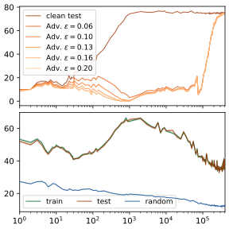

###### fig-1

*Рисунок 1: **Глубокие нейронные сети гроккают устойчивость.** При обучении ResNet18 на CIFAR10, без какой-либо управляемой инициализации, как у Liu et al. 2022, сеть начинает гроккать состязательные примеры, порождённые проецируемым градиентным спуском (Madry et al. 2017), после $10^{4}$ шагов оптимизации (сверху) и достигает почти равной устойчивости и качества генерализации после $2\times 10^{5}$ шагов. Мы видим, что до гроккинга сеть претерпевает в ходе обучения смену фазы в *местной сложности*, то есть в местной плотности областей сплайнового разбиения во входном пространстве (снизу). После того как проверочная точность сходится, сеть начинает *переселять* свои нелинейности прочь от точек данных и ближе к границе решения (см. рисунок 2), в итоге снижая сложность выученной функции вокруг точек данных. Это возрастание и последующее убывание местной нелинейности — явление, видимое для широкого разнообразия сетей и настроек обучения (см. рисунок 6). В этой статье мы показываем, что такая динамика обучения всегда приводит к отложенной генерализации или устойчивости.* **[p. 1]**

## 1 Введение

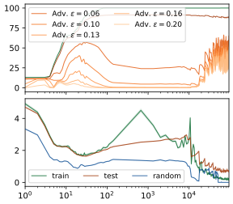

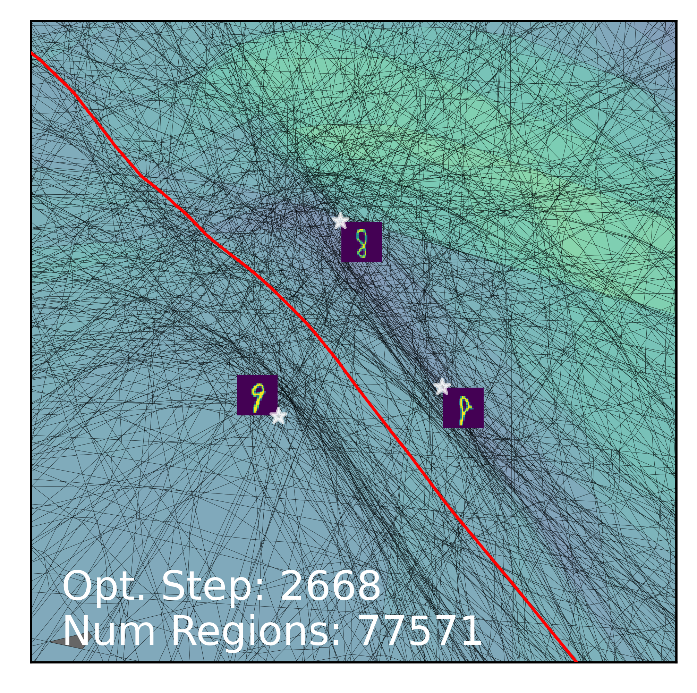

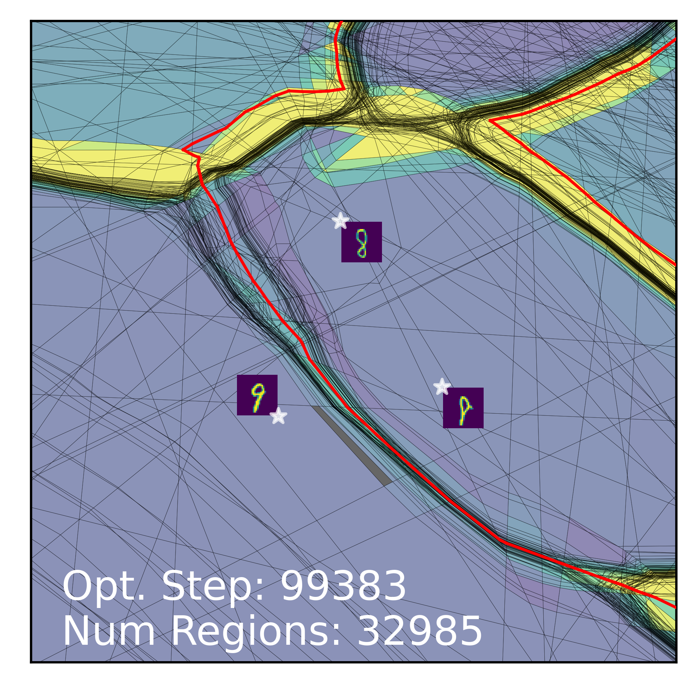

###### fig-2

*Рисунок 2: **Возникновение устойчивого разбиения.** Мы обучаем 4-слойный многослойный перцептрон (MLP) с ReLU и шириной $200$ на $1K$ образцах из MNIST в течение $10^{5}$ шагов оптимизации при размере пакета $200$. Мы видим, что сеть начинает гроккать состязательные примеры приблизительно после $10^{4}$ шагов оптимизации (сверху слева). Местная сложность вокруг точек данных (снизу слева) следует кривой двойного спуска, причём последний спуск начинается тоже приблизительно после $10^{4}$ шагов оптимизации. *Куда переселяются нелинейности?* На **среднем** и **правом** изображениях мы приводим аналитически вычисленные изображения разбиения входного пространства ГНС (Humayun et al. 2023a). Разбиение, или *линейные области*, изображены на двумерной области входного пространства, пересекающей три обучающих образца. Мы видим, что в ходе последнего спуска местной сложности в геометрии разбиения ГНС возникает своеобразное строение, где большое число нелинейностей (чёрные линии), а значит и линейных областей, сосредоточилось вокруг границы решения (красная линия). Мы называем это явление *переселением областей* (Region Migration). Анимация целого прогона обучения — на bit.ly/grok-splinecam.* **[p. 2]**

###### p1-3

Гроккинг — удивительное явление, связанное с обучением представлений в глубоких нейронных сетях (ГНС), при котором ГНС могут выучить обобщающие решения задачи много позже интерполяции обучающего набора данных, то есть достижения почти нулевой ошибки обучения. Впервые оно было показано (Power et al. 2022) на простых архитектурах трансформера, выполняющих модульное сложение или деление. Впоследствии множество исследований сообщало о случаях гроккинга в постановках вне модульного сложения, например у ГНС, инициализированных весами большой **[p. 2]** нормы, на MNIST, IMDb (Liu et al. 2022) или на данных XOR-кластеров (Xu et al. 2023). Во всех сообщённых случаях ГНС, которые гроккают, показывают обычное поведение кривых обучающей потери/точности, приближающихся к нулевой ошибке по ходу обучения. Проверочная же ошибка остаётся высокой даже долго после того, как обучающая ошибка достигает нуля. После большого числа итераций обучения ГНС начинает гроккать — то есть обобщать — на проверочные данные. Эта статья посвящена следующему вопросу:

###### p2-1

**Вопрос.***Насколько произволен момент наступления гроккинга на проверочных данных? Когда гроккинг не проявляется как измеримое изменение качества на проверочном наборе, может ли существовать иной набор образцов, на котором гроккинг всё же произошёл бы?*

###### p2-2

Чтобы найти ответ на этот вопрос, мы смотрим за пределы проверочного набора данных — на постепенно порождаемые состязательные образцы, то есть после каждого обновления при обучении мы порождаем состязательные образцы атаками PGD (Madry et al. 2017) по проверочным данным и следим за точностью на состязательных образцах. Заметим, что нет гарантии, что устойчивость к состязательным образцам возникнет вместе с генерализацией, — в прежних статьях показано скорее обратное. Например, Tsipras et al. 2018 ввели компромисс между генерализацией и устойчивостью, Ilyas et al. 2019 показали, что устойчивые сети выучивают принципиально иные представления. С другой стороны, Li et al. 2022 ввели понятие «устойчивой генерализации» и дали теоретическое доказательство её существования при условиях линейной разделимости, указывающее, что устойчивость может достигаться наряду с генерализацией. Мы сообщаем следующее наблюдение:

###### p2-3

**Наблюдение.** *В целом ряде постановок обучения, при стандартной инициализации, с weight decay или без него, ГНС гроккают состязательные образцы много позже, чем обобщают на проверочном наборе данных. Мы называем эту новую, ранее не описанную разновидность гроккинга **отложенной устойчивостью**.*

###### p2-4

Мы делаем это наблюдение для целого ряда постановок обучения, включая полносвязные сети, обучаемые на MNIST (рисунок 2), свёрточные нейронные сети (CNN), обучаемые на CIFAR10 и CIFAR100 (рисунок 6), ResNet18 без батч-нормализации, обучаемый на CIFAR10 (рисунок 1) и Imagenette (рисунок 6), и архитектуру на основе GPT, обучаемую на тексте Шекспира (рисунок 9). Мы порождаем состязательные примеры после каждого шага обучения при помощи $\ell_{\infty}$-PGD с разными $\epsilon\in\{0.03,0.06,0.10,0.13,0.16,0.20\}$, $\alpha=0.0156$ и $10$ ($100$ для MNIST) шагами PGD. Это наблюдение отвечает на наш исходный вопрос: действительно, может существовать набор данных, отличный от проверочного, на котором гроккинг проявляется в точности классификации. Более того, мы замечаем, что то же явление происходит, когда гроккинг на проверочном наборе вызван масштабированием инициализации (рисунок 7) или при обучении трансформеров на модульном сложении (рисунок 8).

**Вопрос.** *Как объяснить и отложенную генерализацию, и отложенную устойчивость?*

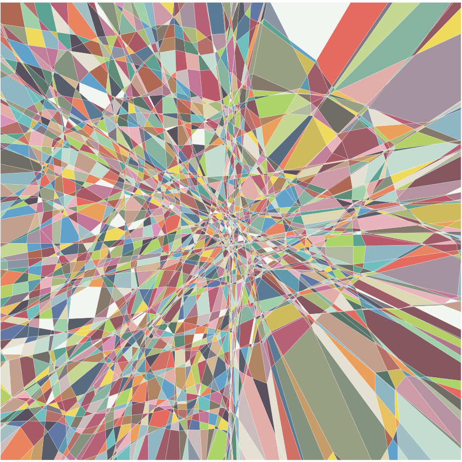

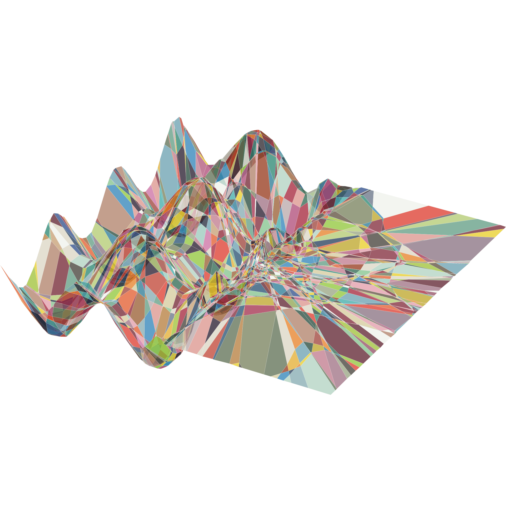

*Рисунок 3: **Кривизна и сложность.** Наглядное изображение уравнения 2 на игрушечном аффинном сплайне $S:\mathbb{R}^{2}\rightarrow\mathbb{R}$, полученном обучением MLP регрессии кусочной функции $f(x_{1},x_{2})=\{\sin(x_{1})+\cos(x_{2})\}\mathbb{1}_{x_{1}<0}$. Области разбиения входного пространства $\Omega$ (слева) и график аффинной сплайновой функции (справа) раскрашены случайным образом. У сплайнового разбиения существенно выше плотность нелинейностей при $x_{1}<0$, то есть местная сложность выше там, где выученная функция имеет большую кривизну.* **[p. 3]**

###### p2-6

Ранее было установлено, что и устойчивость, и генерализация суть функции выразительности (Xu & Mannor 2012; Li et al. 2022), а также местной линейности (Qin et al. 2019; Balestriero & LeCun 2023; Humayun et al. **[p. 3]** 2023c) ГНС. Чтобы объяснить гроккинг, мы предлагаем новую меру сложности, опирающуюся на местную нелинейность ГНС. Наша новая мера не зависит ни от набора данных, ни от меток, ни от функции потерь, употребляемой при обучении. Она ведёт себя как мера прогресса (Barak et al. 2022; Nanda et al. 2023), чья динамика соотносится с наступлением *и отложенной генерализации, и отложенной устойчивости*, открывая новые пути к изучению гроккинга и динамики обучения ГНС. Мы показываем, что ГНС претерпевают смену фазы в местной сложности (LC), усреднённой по точкам данных. Опираясь на эту динамику, мы приходим к следующему выводу:

###### p3-1

**Утверждение.** *Гроккинг происходит из-за возникновения у ГНС устойчивого разбиения входного пространства — через линеаризацию функции ГНС вокруг обучающих точек как следствие динамики обучения. Это ведёт к более крупным линейным областям вокруг обучающих точек и к скоплению нелинейностей/линейных областей вокруг границы решения.*

Наши вклады мы сводим к следующему:

###### p3-3

- Мы впервые наблюдаем **отложенную устойчивость** — новую разновидность гроккинга у ГНС, которая происходит в широком круге постановок обучения и наступает совместно с отложенной генерализацией.
- Мы развиваем новую *меру прогресса* (Barak et al. 2022) для ГНС, опирающуюся на местную сложность разбиения входного пространства ГНС. Предлагаемая нами мера служит косвенной оценкой выразительности ГНС; она не зависит от задачи и при этом осведомляет о динамике обучения. При помощи нашей меры мы обнаруживаем три фазы обучения: две фазы спуска и фазу подъёма. О такой динамике разбиения ГНС сообщается впервые. Существенно, что мы наблюдаем, как области разбиения ГНС сосредоточиваются вокруг границы решения много позже интерполяции, — явление, которое мы называем *переселением областей*.
- Мы указываем на исток гроккинга через сплайновый взгляд на ГНС (Balestriero & Baraniuk 2018), связываем его со взглядом через контуры (Olah et al. 2020) и показываем, что гроккинг всегда происходит в ходе переселения областей.
- Рядом абляционных исследований мы связываем фазы обучения с проектными параметрами ГНС и изучаем их изменения при запоминании/генерализации.

Остальная часть статьи устроена так. В разделе 2 мы даём обзор сплайновой трактовки глубоких сетей и вводим предлагаемую нами меру местной сложности. Мы также проводим сопоставление с распространёнными рамками интерпретируемости, например с широко употребляемым понятием контуров (Olah et al. 2020) в механистической интерпретируемости. В разделе 3 мы вводим свойство двойного спуска местной сложности и связываем переселение областей, то есть заключительную фазу динамики двойного спуска LC, с гроккингом. Мы также приводим результаты, показывающие, что гроккинг не происходит при употреблении батч-нормализации, и даём теоретическое обоснование. Мы приводим результаты, связывающие гроккинг с параметризацией и запоминанием. Наконец, мы делаем выводы из наших результатов и обсуждаем ограничения нашего разбора.

## 2 Местная сложность: новая мера прогресса

###### p3-5

Barak et al. 2022 ввели понятие *мер прогресса* для обучения ГНС — как скалярных величин, причинно связанных с состоянием обучения сети. Сплайновая рамка позволяет нам ввести предлагаемую нами меру прогресса — местную сложность разбиения ГНС. В дальнейших разделах мы показываем, что динамика местной сложности напрямую связана с гроккингом, и приводим результаты, показывающие её зависимость от параметров обучения и архитектуры.

*Рисунок 4: **Приближение местной сложности.** 1) Имея точку входного пространства $x\in\mathbb{R}^{D}$, мы начинаем с выборки $P$ ортонормированных векторов $\{v_{1},v_{2},...,v_{P}\}$, чтобы получить кросс-политопную рамку ${\boldsymbol{V}}_{x}=\{x\pm r*v_{p}\forall p\}$ с центром в $x$, где $r$ — параметр радиуса. Выпуклую оболочку $conv({\boldsymbol{V}}_{x})$ мы считаем местной окрестностью $x$. 2) Если какая-нибудь нейронная гиперплоскость пересекает окрестность $conv({\boldsymbol{V}}_{x})$, то знак предактивации будет различен для разных вершин. Поэтому мы можем сосчитать для данного слоя число нейронов, дающих смену знака предактивации ${\boldsymbol{V}}_{x}$, чтобы количественно оценить местную сложность $x$ для этого слоя. 3) Вложив ${\boldsymbol{V}}_{x}$ во вход следующего слоя, мы можем получить грубое приближение местной окрестности $x$ и продолжить вычисление местной сложности послойно.* **[p. 4]**

### 2.1 Глубокие сети суть аффинные сплайновые операторы

ГНС по сути выполняют последовательное отображение входного вектора ${\boldsymbol{x}}$ через $L$ нелинейных преобразований, то есть слоёв, как в

$$
f_{\theta}({\boldsymbol{x}})\triangleq{\boldsymbol{W}}^{(L)}\dots{\boldsymbol{a}}\left({\boldsymbol{W}}^{(2)}{\boldsymbol{a}}\left({\boldsymbol{W}}^{(1)}{\boldsymbol{x}}+{\boldsymbol{b}}^{(1)}\right)+{\boldsymbol{b}}^{(2)}\right)\\
\dots+{\boldsymbol{b}}^{(L)}, \tag{1}
$$

начиная с некоторого входа ${\boldsymbol{x}}$. Для любого слоя $\ell\in\{1,\dots,L\}$ весовая матрица ${\boldsymbol{W}}^{(\ell)}$ и вектор смещения ${\boldsymbol{b}}^{(\ell)}$ могут быть параметризованы так, чтобы управлять видом операции этого слоя: например, циркулянтная матрица в роли ${\boldsymbol{W}}^{(\ell)}$ даёт свёрточный слой. Оператор $\boldsymbol{a}$ — поэлементная нелинейность, например ReLU, а $\theta$ — набор всех параметров сети. Согласно Balestriero & Baraniuk 2018, для любого $\boldsymbol{a}$, являющегося непрерывной кусочно-линейной функцией, $f_{\theta}$ есть непрерывный кусочно-аффинный сплайновый оператор. **[p. 4]** То есть существует разбиение $\Omega$ входного пространства ГНС $\mathbb{R}^{D}$ (например, рисунок 3 слева), составленное из непересекающихся областей, покрывающих всё входное пространство. На любой области разбиения $\omega\in\Omega$ отображение «вход-выход» ГНС есть простое аффинное отображение с параметрами $({\boldsymbol{A}}_{\omega},{\boldsymbol{b}}_{\omega})$. Коротко, $f_{\theta}$ можно выразить как

$$
f_{\theta}({\boldsymbol{x}})=\sum_{\omega\in\Omega}({\boldsymbol{A}}_{\omega}{\boldsymbol{x}}+{\boldsymbol{b}}_{\omega})\mathbb{1}_{\{{\boldsymbol{x}}\in\omega\}}, \tag{2}
$$

где $\mathbb{1}_{\{{\boldsymbol{x}}\in\omega\}}$ — индикаторная функция, отличная от нуля при $x\in\omega$.

#### Кривизна и линейные области.

Записи вроде уравнения 2, представляющие ГНС как непрерывные кусочно-аффинные сплайны, уже употреблялись, чтобы сделать теоретические исследования пригодными для настоящих ГНС, — например в порождающем моделировании (Humayun et al. 2022), обрезке сетей (You et al. 2021) и обнаружении выхода из распределения (Ji et al. 2022). Эмпирические оценки плотности линейных областей в сплайновом разбиении также употреблялись в разборе чувствительности (Novak et al. 2018), количественной оценке нелинейности (Gamba et al. 2022), количественной оценке выразительности (Raghu et al. 2017) или для оценки сложности сплайновых функций (Hanin & Rolnick 2019). Мы показываем связь между кривизной функции и плотностью линейных областей на игрушечном примере рисунка 3. На рисунке 3 слева и рисунке 2 (в середине, справа) всякая сплошная линия есть нелинейность во входном пространстве, отвечающая одному нейрону сети. Все нелинейности переориентируются в ходе обучения, чтобы получить целевую функцию (рисунок 3 справа). Поэтому на рисунке 3 мы видим, что у разбиений ГНС плотность линейных областей/нелинейностей/узлов в сплайновом разбиении выше там, где кривизна целевой функции отлична от нуля.

### 2.2 Измерение местной сложности по сплайновому разбиению глубокой сети

###### fig-5

*Рисунок 5: **Искажение с глубиной.** Изменение среднего эксцентриситета (Xu et al. 2021) окрестностей входного пространства ${\boldsymbol{V}}_{x}$ разными слоями CNN, обученной на наборе данных CIFAR10, для разных радиусов $r$. Мы видим, что при большем радиусе искажение растёт с глубиной почти экспоненциально. При $r\leq 0.014$ искажение мало, что указывает на надёжность окрестностей меньшего радиуса для вычисления LC на более глубоких сетях. Значения усреднены по окрестностям, взятым для $1000$ обучающих точек из CIFAR10. Для ResNet18 см. рисунок 23.* **[p. 4]**

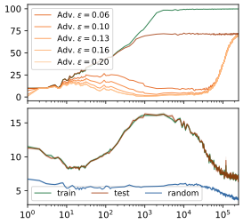

###### fig-6

*Рисунок 6: **Гроккинг на разных наборах данных и архитектурах.** Слева направо: примеры отложенной устойчивости, возникающей поздно в обучении, для CNN, обученной на CIFAR10, CNN, обученной на CIFAR100, и ResNet18, обученного на наборе данных Imagenette22 2 github.com/fastai/imagenette. Ясное поведение двойного спуска видно в местной сложности CNN с CIFAR10 и CIFAR100. ResNet18, обученный с Imagenette, достигает очень высокой местной сложности в фазе подъёма обучения. Для вычисления местной сложности мы берём $25$-мерные окрестности с центрами в $1024$ обучающих, проверочных или случайных образцах. Мы употребляем $r=0.005$ для CNN и $r=10^{-4}$ для ResNet18.* **[p. 5]**

Пусть область задана как выпуклая оболочка набора вершин $\boldsymbol{V}=\left[{\boldsymbol{v}}_{1},\ldots{\boldsymbol{v}}_{p}\right]^{T}$ во входном пространстве ГНС. Мы хотим вычислить местную сложность, или гладкость (Hanin & Rolnick 2019), для окрестности $\mathcal{V}=conv(\boldsymbol{V})$. Рассмотрим один скрытый слой сети. Обозначим веса слоя ГНС как $W^{(\ell)}\triangleq[{\boldsymbol{w}}^{(\ell)}_{1},\dots,{\boldsymbol{w}}^{(\ell)}_{D^{(\ell)}}]$, $b^{(\ell)}$, где $\ell$ — номер слоя, ${\boldsymbol{w}}^{(\ell)}_{i}$ — $i$-я строка $W^{(\ell)}$, то есть вес $i$-го нейрона, а $D^{(\ell)}$ — размерность выходного пространства слоя $\ell$. **[p. 5]** Прямой проход через этот слой для ${\boldsymbol{V}}$ можно рассматривать как скалярное произведение с каждой строкой весовой матрицы $W^{(\ell)}$ с последующей непрерывной кусочно-линейной функцией активации. Не ограничивая общности, возьмём в качестве функции активации нашей сети ReLU. Разбиение во входном пространстве слоя $\ell$ можно тогда выразить как множество всех уравнений гиперплоскостей, образованных весами нейронов, а именно:

$$
\partial\Omega =\bigcup_{i=1}^{D^{(\ell)}}\mathcal{H}^{(\ell)}_{i} \\
\mathcal{H}^{(\ell)}_{i} =\left\{{\boldsymbol{x}}\in\mathbb{R}^{D^{(\ell-1)}}:\langle{\boldsymbol{w}}_{i}^{(\ell)},{\boldsymbol{x}}\rangle+{\boldsymbol{b}}_{i}^{(\ell)}=0\right\}, \tag{3}
$$

что также есть множество нелинейностей слоя $\ell$. Пусть $\Phi=f_{1:\ell-1}(\mathcal{V})$ — вложенное представление окрестности $\mathcal{V}$ слоем $\ell-1$ сети. Тогда приближение местной сложности $\mathcal{V}$, наводимой слоем $\ell$, равносильно подсчёту числа линейных областей в

$$
\Phi\cap\partial\Omega=\bigcup_{i=1}^{D^{(\ell)}}\Phi\cap\mathcal{H}^{(\ell)}_{i}. \tag{5}
$$

Местное разбиение внутри $\Phi$ получается из набора гиперплоскостей, поэтому число областей имеет порядок $\mathcal{N}^{D^{(\ell-1)}}$ (Toth et al. 2017), где

$$
\mathcal{N}=|\{i:i=1,2..D^{(\ell)}\text{ and }\mathcal{H}_{i}^{(\ell)}\cap\Phi\neq\emptyset\}|, \tag{6}
$$

###### p5-3

есть число гиперплоскостей слоя $\ell$, пересекающих $\Phi$. Мы считаем $\mathcal{N}$ косвенной оценкой местной сложности любой окрестности $\Phi$. Чтобы сделать вычисление подъёмным, положим $\Phi\approx\widehat{\Phi}=conv(f_{1:\ell-1}({\boldsymbol{V}}))$. Тогда для $\widehat{\Phi}$ любые смены знака предактиваций слоя $\ell$ вызваны тем, что соответствующие нейронные гиперплоскости пересекают $conv({\boldsymbol{V}})$. Для одного слоя местная сложность (LC) для образца во входном пространстве может быть приближена числом нейронных гиперплоскостей, пересекающих $\boldsymbol{V}$, вложенное во входное пространство этого слоя. Если мы рассматриваем окрестности входного пространства одинакового объёма, то наш способ приближения измеряет ненормированную плотность нелинейности в местности входного пространства, которую мы и считаем косвенной оценкой местной сложности. Подчеркнём, что это связано с VC-размерностью (ReLU) ГНС (Bartlett et al. 2019): чем больше присутствует областей, тем более выразительной может быть граница решения (Montufar et al. 2014). На рисунке 4 мы даём наглядное объяснение нашего способа приближения местной сложности схематическим рисунком. Подводя итог: мы берём случайно ориентированные $P$-мерные шары в норме $\ell_{1}$ радиуса $r$, то есть кросс-политопы с центром в любой заданной точке данных $x$, как рамку, задающую окрестность. Затем мы послойно выполняем шаги, изложенные на рисунке 4, чтобы приблизить местную сложность в предписанной окрестности для данного слоя.

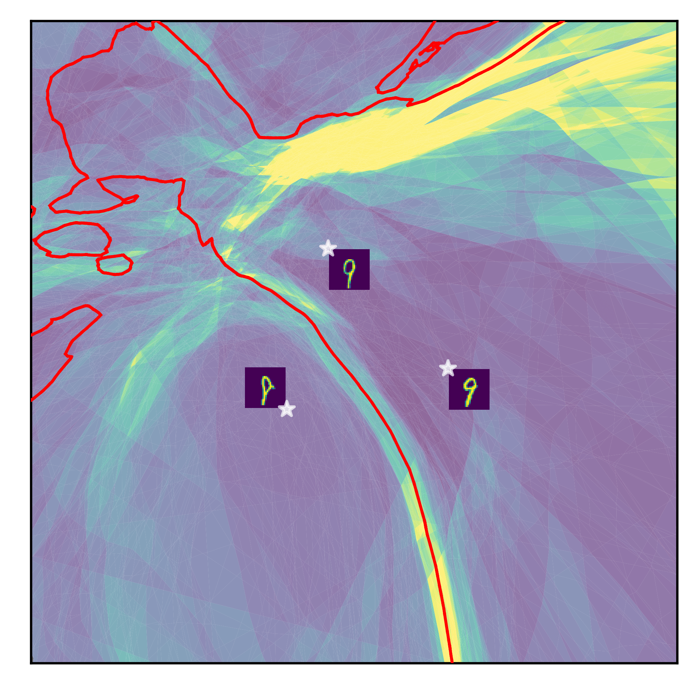

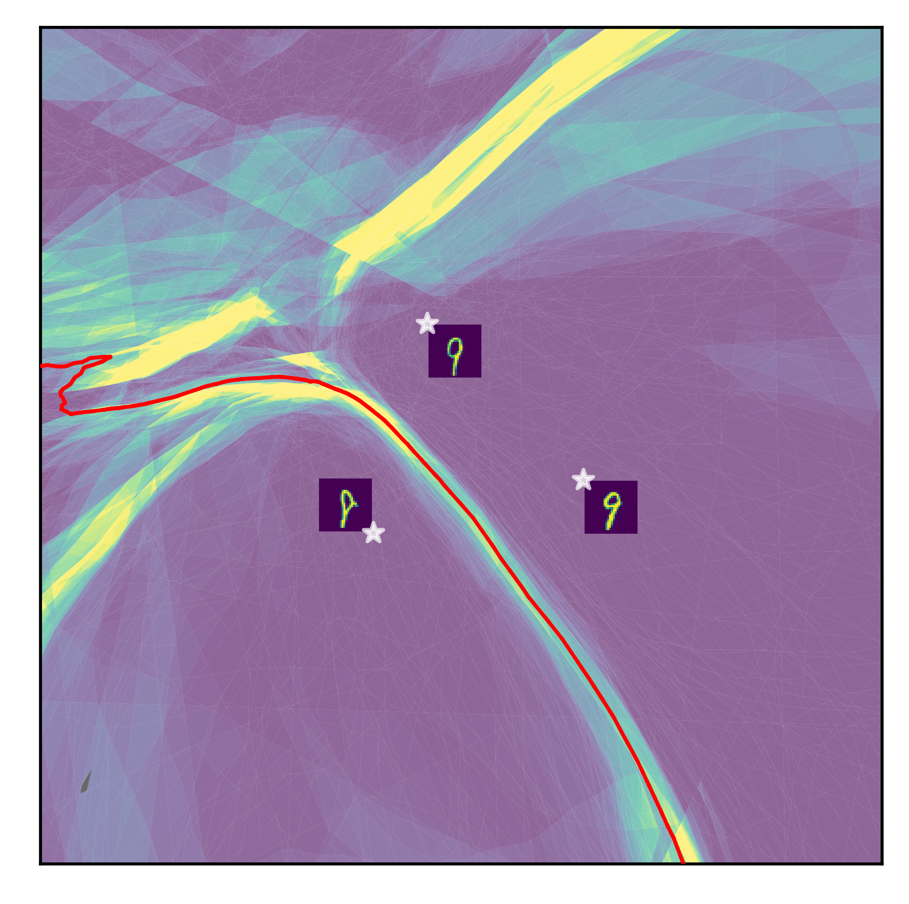

###### fig-7

*Рисунок 7: **Гроккинг наглядно.** Мы вызываем гроккинг, случайно инициализируя ReLU-MLP глубины $4$ и ширины $200$ и умножая инициализированные параметры на восемь вслед за (Liu et al. 2022). На крайнем левом рисунке видно, что гроккинг заметен и на проверочных образцах, и на состязательных примерах, порождённых по проверочному набору. Мы видим, что устойчивость сети периодически возрастает. Изображая разбиение и кривизну функции на двумерном срезе входного пространства (Humayun et al. 2023a), мы видим, что сеть периодически увеличивает сосредоточенность нелинейности вокруг своей границы решения, делая границу более резкой при каждом всплеске устойчивости. Это происходит даже тогда, когда сеть не претерпевает отложенной генерализации (рисунок 2). По мере роста местной сложности вокруг границы решения местная сложность вокруг точек данных, более удалённых от границы решения, убывает (рисунок 26).* **[p. 6]**

###### fig-8

*Рисунок 8: **Переселение областей при модульном сложении.** Измеряя местную сложность для полносвязных слоёв с активацией GeLU в архитектуре трансформера, мы видим, что и здесь переселение областей происходит в ходе гроккинга.* **[p. 6]**

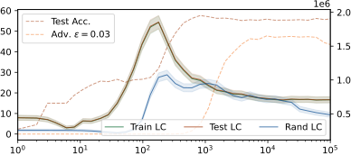

###### fig-9

*Рисунок 9: **Отложенная устойчивость в больших языковых моделях.** Гроккинг, наблюдаемый в архитектуре GPT с 12 головами и 12 слоями, обучаемой предсказанию следующего символа на наборе данных из текста Шекспира. Мы видим, что второй спуск местной сложности начинается до пика проверочной точности и продолжается, пока сеть гроккает состязательные примеры ${\epsilon}=0.03$ $\ell_{\infty}$-PGD, порождённые в пространстве вложений лексем. Приближённое разбиение входного пространства изображено на рисунке 19 и рисунке 20.* **[p. 6]**

#### Чувствительность приближения к $P$ и $r$.

###### p5-4

Одно из возможных ограничений меры местной сложности — искажение местной окрестности при её проходе через сеть от слоя к слою, как показано на рисунке 4. Для разных радиусов $r$ окрестности входного пространства ${\boldsymbol{V}}_{x}$ с центром в произвольной точке данных $x$ мы вычисляем эксцентриситет графа (Xu et al. 2021) для ${\boldsymbol{V}}_{x}$ после её вложения разными слоями CNN. Результаты мы приводим на рисунке 5 для $1000$ различных обучающих точек данных для CNN, обученной на CIFAR10. Чем больше изменение эксцентриситета по сравнению с входным пространством (индекс 0), тем вероятнее, что окрест**[p. 6]**ность искажается, и тем менее надёжно приближение. Мы видим, что ниже некоторого значения радиуса искажение, вносимое CNN, ограничено и не растёт экспоненциально. Однако в последующих опытах, например на рисунке 27, мы наблюдали, что динамика местной сложности схожа у окрестностей с большим и малым $r$. Дополнительные проверочные опыты мы приводим в приложении A. Предлагаемый нами способ может также употребляться для приближения разбиения входного пространства, образуемого нейронной сетью. На рисунке 25 мы сравниваем разбиение, приближённое вычислениями LC на сетке, с аналитически вычисленным разбиением по (Humayun et al. 2023b). На рисунке 19 и рисунке 20 мы приводим разбиение входного пространства, приближённое для архитектуры GPT до и после наступления отложенной устойчивости.

#### Постановка опытов.

###### p6-1

Во всех опытах мы берём по $1024$ обучающих, проверочных и случайных точек для вычисления местной сложности (LC), кроме опытов с MNIST, где мы берём $1000$ обучающих точек (весь обучающий набор там, где это применимо) и $10000$ проверочных и случайных точек для вычисления LC. Мы употребляем $r=0.005$ и $P=25$, если не оговорено иное, и кроме опытов с ResNet18 на Imagenette, где мы употребляем $r=10^{-4}$. Для обучения мы употребляем оптимизатор Adam и weight decay 0 во всех опытах, кроме опытов MNIST-MLP, где мы употребляем weight decay $0.01$. Если не оговорено, мы употребляем CNN с 5 свёрточными слоями и двумя линейными слоями. Для опытов с ResNet18 на CIFAR10 мы употребляем предактивационную архитектуру шириной $16$. Для опытов с Imagenette мы употребляем стандартную архитектуру Resnet из torchvision. Во всех постановках мы не употребляем батч-нормализацию, как обосновано в приложении B. На всех наших графиках мы обозначаем обучающую точность/LC зелёным, проверочную точность/LC оранжевым, а случайную LC синим цветом. Кривые для состязательных примеров мы также окрашиваем разными оттенками оранжевого. Все графики местной сложности показывают $99\%$-й доверительный промежуток.

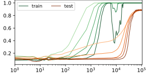

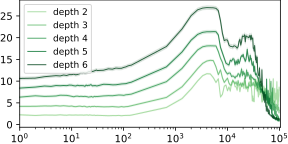

*Рисунок 10: **Местная сложность на разных глубинах.** Слева направо: точность, местная сложность вокруг обучающих и местная сложность вокруг проверочных точек данных для MLP, обучаемого на MNIST, с шириной $200$ и разной глубиной. *С ростом глубины наибольшая LC в фазе подъёма становится больше. Виден также отчётливый второй пик прямо перед фазой спуска.** **[p. 7]**

**[p. 7]**

## 3 Динамика местной сложности при обучении и гроккинг

### 3.1 Возникновение устойчивого разбиения

###### p7-1

Мы начинаем изучение динамики обучения глубоких нейронных сетей с описания фаз местной сложности, наблюдаемых в ходе обучения. Во всех наших опытах, будь то с отложенной генерализацией или с отложенной устойчивостью, мы видим три отчётливые фазы динамики местной сложности:

###### p7-2

$\bullet$ *Первый спуск*, когда местная сложность после инициализации начинает убывать. Эта фаза зависит от параметризации сети, а также от инициализации: например, когда гроккинг вызывается в случае MLP-MNIST масштабированной инициализацией, первого спуска мы не видим (рисунок 29, рисунок 10).

###### p7-3

$\bullet$ *Фаза подъёма*, когда местная сложность накапливается вокруг и обучающих, и проверочных точек данных. Фаза подъёма случается повсеместно, и местная сложность в целом продолжает расти, пока не достигнута интерполяция обучающего набора (например, рисунок 6, рисунок 1). В фазе подъёма обучающая местная сложность может быть выше для обучающих точек данных, чем для проверочных, что указывает на накопление нелинейностей вокруг обучающих данных по сравнению с проверочными, рисунок 2.

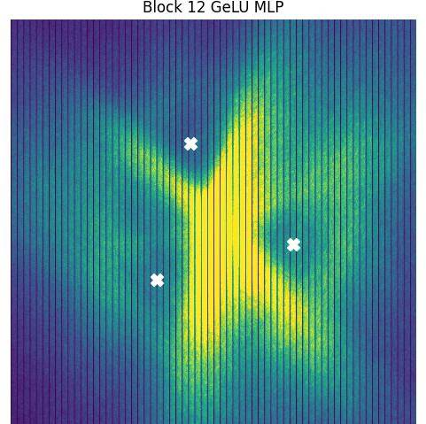

*Рисунок 11: Разбиение пространства вложений лексем, образуемое MLP с активацией GeLU блока 12 модели GPT, упомянутой на рисунке 9. Разбиение приближено вычислением LC на сетке $512\times 512$ на двумерном подпространстве пространства вложений лексем. Заметим, что после гроккинга (справа) у трёх случайных образцов, по которым определено двумерное подпространство, заметно ниже местная сложность в ближайшей окрестности.* **[p. 7]**

###### p7-4

$\bullet$ *Фаза второго спуска*, или фаза переселения областей, в течение которой сеть отодвигает линейные области, то есть нелинейности, прочь от обучающих и проверочных точек данных. Сосредоточившись на рисунке 2 (снизу слева) и рисунке 29 для постановки MLP-MNIST, мы делаем одно озадачивающее наблюдение: местная сложность вокруг случайных точек — равномерно взятых из области данных — тоже убывает в ходе заключительной фазы спуска. Это означало бы, что нелинейности не отодвигаются от обучающих данных случайным образом, а планомерно перестраиваются там, где у нас нет щупов для приближения LC. Чтобы лучше понять это явление, мы берём квадратную область $\mathbb{D}$, проходящую через три обучающие точки MNIST, и употребляем Splinecam (Humayun et al. 2023a), чтобы аналитически вычислить разбиение входного пространства на $\mathbb{D}$. Коротко, Splinecam употребляет веса сети, чтобы точно вычислить представление во входном пространстве нулевого множества уровня каждого нейрона на $\mathbb{D}$ (чёрные линии на рисунке 2). Изображения Splinecam для разных шагов оптимизации мы приводим на рисунке 2, рисунке 7 и рисунке 26. Из этих изображений мы видим ясное свидетельство того, что *в ходе фаз второго спуска обучения линейные области, то есть нелинейности сети, переселяются близко к границе решения, создавая устойчивое разбиение входного пространства.* Устойчивое разбиение содержит крупные линейные области вокруг обучающих данных, что в литературе предполагалось предвестником устойчивости (Qin et al. 2019). Более того, в ходе переселения областей *сеть стремится понизить местную сложность вокруг обучающих точек*, отчего местная сложность вокруг обучающих данных убывает даже по сравнению с проверочными данными.

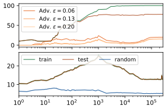

###### fig-12

*Рисунок 12: **Батч-нормализация убирает гроккинг.** Обучение CNN в точности в той же постановке, что на рисунке 6 слева, за исключением того, что теперь у CNN есть слои батч-нормализации после каждой свёртки. При наличии батч-нормализации значения LC растут, начальный спуск пропадает и, самое главное, гроккинг для состязательных образцов не происходит.* **[p. 8]**

#### Местная сложность как мера прогресса.

###### p7-5

Хотя мы не вполне понимаем, почему сеть переходит от накопления нелинейностей вокруг обучающих данных к их отталкиванию между фазой подъёма и фазой второго спуска, мы видим, что второй спуск всегда предшествует наступлению отложенной генерализации или отложенной устойчивости. На рисунке 7 в середине и справа мы приводим изображения splinecam для сети в ходе гроккинга. Цвета обозначают норму параметра наклона ${\boldsymbol{A}}_{\omega}$ для каждой области $\omega$, вычисленную через **[p. 8]** SplineCam. Мы видим, что, пока сеть гроккает, области начинают сосредоточиваться вокруг границы решения, где норма сети наибольшая. Это понятно, потому что в таких постановках классификации рост местной сложности вокруг границы решения позволяет функции резко переходить от одного класса к другому. Поэтому, стало быть, чем больше нелинейностей сходится к границе решения, тем большей может быть норма функции при столь же гладком переходе. Мы предоставили анимацию, показывающую развитие геометрии разбиения и возникновение устойчивого разбиения в ходе обучения, здесь33 3 bit.ly/grok-splinecam. В анимации видно, что разбиение периодически переключается между устойчивыми устроениями в ходе переселения областей. С течением времени мы видим всё большее накопление нелинейностей вокруг границы решения. Эти результаты несомненно показывают, что динамика местной нелинейности, или местной сложности, напрямую связана с геометрией разбиения и возникновением отложенной генерализации/устойчивости.

#### Отношение к контурам.

###### p8-1

Общее место механистической интерпретируемости, особенно когда речь идёт об объяснении явления гроккинга, — мысль об образовании «контуров» в ходе обучения (Nanda et al. 2023; Varma et al. 2023; Olah et al. 2020). Контур нестрого определяется как подграф глубокой нейронной сети, узлами которого служат нейроны (или линейные сочетания нейронов), а рёбрами — веса сети. Напомним, что уравнение 2 выражает работу сети пообластно, то есть для всех входных векторов $\{x:x\in\omega\}$ сеть выполняет одну и ту же аффинную операцию с параметрами $({\boldsymbol{A}}_{\omega},{\boldsymbol{b}}_{\omega})$, отображая $x$ на выход. Аффинные параметры для любой заданной области суть функция активных нейронов сети, как было показано Humayun et al. 2023a (лемма 1). Поэтому для каждой области у нас непременно есть контур, то есть подграф сети, выполняющий линейную операцию. Между двумя соседними областями меняется лишь один узел контура. С этой точки зрения нашу меру местной сложности можно трактовать и как способ измерить плотность различных контуров, образуемых в местности входного пространства. Хотя на деле это давало бы экспоненциальное число контуров, возникновение устойчивого разбиения показывает, что к концу обучения число различных контуров резко сокращается. Особенно это верно для подконтуров, отвечающих лишь более глубоким слоям. На рисунке 24 мы показываем устойчивое разбиение послойно. Мы видим, что для более глубоких слоёв существуют крупные области, то есть области вложения с единственной контурной операцией через слой. Этот результат согласуется с представлением, данным Nanda et al. 2023 о фазе очистки образования контуров поздно в обучении.

###### fig-13

*Рисунок 13: **Потребность в запоминании откладывает гроккинг.** При обучении MLP на разном числе случайно размеченных образцов MNIST мы видим, что с ростом числа образцов динамика местной сложности откладывается, особенно удлиняется фаза подъёма. Это показывает, что при возросшей потребности в запоминании сети требуется больше времени, чтобы завершить подъём и затем претерпеть переселение областей.* **[p. 8]**

###### tab-1

*Таблица 1: Сводка всех опытов, показывающих отношение между отложенной генерализацией и гиперпараметрами обучения/модели.* **[p. 9]**

| Вмешательство в обучение | Набор данных | Модель | Описание | Действие на состязательный гроккинг |
|---|---|---|---|---|
| Увеличение размера пакета | CIFAR10 | Resnet18 | Размер пакета увеличен с 64 до 512 | Ускорен (рисунок 17) |
| Увеличение числа параметров: глубина | MNIST | MLP | Увеличение глубины с 2 до 6 | Ускорен (рисунок 27) |
| Увеличение числа параметров: глубина | Текст Шекспира | GPT | Увеличение числа слоёв с 6 до 12 | Ускорен |
| Увеличение числа параметров: ширина | MNIST | MLP | Увеличение ширины с 20 до 2000 | Ускорен (рисунок 14) |
| Увеличение числа параметров: ширина | CIFAR10 | Resnet18 | Увеличение ширины с 16 фильтров до 64 фильтров | Ускорен |
| Увеличение регуляризации | MNIST | MLP | Weight decay увеличен с 0. до 1 | Отложен (рисунок 30) |
| Увеличение объёма обучающих данных | MNIST | MLP | Обучающие данные увеличены с 1K до 60K | Ускорен (рисунок 32) |
| Увеличение объёма обучающих данных (случайно размеченных) | MNIST | MLP | Обучающие данные увеличены с 1K до 60K | Отложен (рисунок 13) |
| Без BatchNorm ->BatchNorm | CIFAR10 | Resnet18 | Добавление слоя BatchNorm после свёртки | Не наступает / существенно отложен |
| Без BatchNorm ->BatchNorm | CIFAR10 | CNN | Добавление слоя BatchNorm после свёртки | Не наступает / существенно отложен |

###### fig-14

*Рисунок 14: **Увеличение ширины ускоряет переселение областей.** Динамика LC при обучении MLP с **разной шириной** на MNIST. Для наибольшей LC, достигаемой вокруг обучающих точек в фазе подъёма, мы видим сперва рост, а затем убывание по мере того, как сеть становится переопараметризованной. Для проверочных и случайных образцов мы видим, что LC в фазе подъёма выходит на насыщение по мере роста ширины.* **[p. 8]**

**[p. 9]**

## 4 Что влияет на меру прогресса?

**Параметризация.** На рисунках 14, 27 и 29 мы видим, что увеличение числа параметров — будь то увеличением глубины или увеличением ширины сети в наших опытах MNIST-MLP — ускоряет переселение областей, а значит, заставляет гроккинг наступать раньше.

###### p9-2

**Weight decay** регуляризует нейронную сеть, уменьшая норму весов сети, а значит, уменьшая и норму наклона на область. Мы обучаем CNN глубины 5 и ширины 32 на CIFAR10 с разным weight decay. На рисунке 30 мы приводим обучающую, проверочную и случайную LC наших опытов для окрестностей разного радиуса. Weight decay, по-видимому, не ведёт себя монотонно: он и откладывает, и ускоряет переселение областей — в зависимости от величины weight decay.

###### p9-3

**Батч-нормализация.** Батч-нормализация убирает гроккинг. В приложении B мы показываем, что на каждом слое $\ell$ ГС BN явным образом приспосабливает разбиение так, чтобы границы разбиения были как можно ближе к обучающим данным. Это подтверждается нашими опытами на рисунке 12, где мы видим, что гроккинг состязательных примеров перестаёт происходить по сравнению с постановкой без батч-нормализации на рисунке 6. BN также убирает первый спуск, монотонно повышая местную сложность вокруг многообразия данных, а спустя некоторое время претерпевая смену фазы и убывая. Степень переселения областей в эту фазу снижена, что видно по более высокой LC, когда мы употребляем батч-нормализацию. При обучении ResNet18 с Batch Norm на полном Imagenet (рисунок 22) мы видим, что местная сложность растёт неограниченно, убирая всякие признаки переселения областей.

#### Функция активации

Хотя в большинстве наших опытов употребляются сети с активацией ReLU, на рисунке 34 мы приводим результаты для MLP с активацией GeLU, а на рисунке 8 — результаты для трансформера с активацией GeLU. Для обеих постановок мы видим динамику обучения, схожую с наблюдаемой для ReLU.

###### p9-5

**Действие обучающих данных.** Мы управляем обучающим набором данных, чтобы вызвать либо большую генерализацию, либо большее запоминание. Напомним, что в наших опытах с MNIST мы употребляем $1k$ обучающих образцов. Мы увеличиваем число образцов в нашем наборе данных, чтобы проследить действие на гроккинг, рисунок 28, и на LC, рисунок 32. Мы видим, что увеличение размера набора данных ускоряет гроккинг. С другой стороны, мы также перебираем размер набора данных для задачи запоминания случайных меток, рисунок 13, рисунок 36. Мы видим, что в этом случае увеличение размера набора данных влечёт большую потребность в запоминании, а потому откладывает фазу переселения областей.

## 5 Выводы и ограничения

###### p9-6

Мы провели обстоятельное эмпирическое исследование гроккинга — и на проверочном наборе данных, и на состязательных примерах, порождённых по проверочному набору. Мы получили новые наблюдения, намекающие, что гроккинг есть распространённое явление глубокого обучения, не ограниченное отдельными задачами или инициализацией ГНС. Открыв это, мы углубились в геометрию ГНС, чтобы вычленить коренную причину и отложенной генерализации, и отложенной устойчивости, которую мы отнесли к переселению линейных областей ГНС, происходящему в самой поздней фазе обучения. Опять же, наблюдение такого переселения разбиения ГНС само по себе есть новое открытие. Мы надеемся, что наш разбор дал новое понимание динамики обучения ГНС, из которой гроккинг возникает естественным образом. Хотя мы изучаем динамику местной сложности эмпирически, теоретическое обоснование поведения двойного спуска отсутствует. На высоком уровне ясно, что у выучиваемой функции классификации кривизна сосредоточена на границе решения, и теория приближения обычно предписывала бы свободному сплайну сосредоточивать поэтому области своего разбиения вокруг границы решения, чтобы уменьшить ошибку приближения. Однако неясно, почему это переселение происходит столь поздно в ходе обучения, и мы надеемся изучить это в будущих исследованиях. Мы также видим эмпирические свидетельства переселения областей при употреблении Adam в качестве оптимизатора. Динамику обучения стохастического градиентного спуска, а также минимизации с учётом остроты (Andriushchenko & Flammarion 2022) тоже можно изучать в нашей рамке. Возможны связи между переселением областей и нейронным коллапсом (Papyan et al. 2020), которые в этой статье не исследованы. Сплайновый взгляд на глубокие нейронные сети может дать сильные геометрические соображения в помощь механистическому пониманию и в будущих работах.

**[p. 10]**

## Заявление о влиянии

Эта статья представляет работу, цель которой — продвинуть область машинного обучения. Один из выводов этой работы в том, что более долгое обучение глубоких нейронных сетей может вести к возросшей устойчивости. Более долгое обучение сетей, особенно фундаментальных моделей, может иметь возможные общественные последствия с точки зрения выбросов углерода.

## Благодарности

Humayun and Baraniuk were supported by NSF grants CCF1911094, IIS-1838177, and IIS-1730574; ONR grants N00014- 18-12571, N00014-20-1-2534, and MURI N00014-20-1-2787; AFOSR grant FA9550-22-1-0060; and a Vannevar Bush Faculty Fellowship, ONR grant N00014-18-1-2047.

## Литература

- Andriushchenko, M. and Flammarion, N. Towards understanding sharpness-aware minimization. In *International Conference on Machine Learning*, pp. 639–668. PMLR, 2022.

- Balestriero, R. and Baraniuk, R. A spline theory of deep networks. In *Proc. ICML*, pp. 374–383, 2018.

- Balestriero, R. and Baraniuk, R. G. Batch normalization explained. *arXiv preprint arXiv:2209.14778*, 2022.

- Balestriero, R. and LeCun, Y. Police: Provably optimal linear constraint enforcement for deep neural networks. In *ICASSP 2023-2023 IEEE International Conference on Acoustics, Speech and Signal Processing (ICASSP)*, pp. 1–5. IEEE, 2023.

- Barak, B., Edelman, B., Goel, S., Kakade, S., Malach, E., and Zhang, C. Hidden progress in deep learning: Sgd learns parities near the computational limit. *Advances in Neural Information Processing Systems*, 35:21750–21764, 2022.

- Bartlett, P. L., Harvey, N., Liaw, C., and Mehrabian, A. Nearly-tight vc-dimension and pseudodimension bounds for piecewise linear neural networks. *The Journal of Machine Learning Research*, 20(1):2285–2301, 2019.

- Croce, F. and Hein, M. Reliable evaluation of adversarial robustness with an ensemble of diverse parameter-free attacks. In *International conference on machine learning*, pp. 2206–2216. PMLR, 2020.

- Gamba, M., Chmielewski-Anders, A., Sullivan, J., Azizpour, H., and Bjorkman, M. Are all linear regions created equal? In *AISTATS*, pp. 6573–6590, 2022.

- Garbin, C., Zhu, X., and Marques, O. Dropout vs. batch normalization: an empirical study of their impact to deep learning. *Multimedia Tools and Applications*, 79:12777–12815, 2020.

- Hanin, B. and Rolnick, D. Complexity of linear regions in deep networks. *arXiv preprint arXiv:1901.09021*, 2019.

- Humayun, A. I., Balestriero, R., and Baraniuk, R. Polarity sampling: Quality and diversity control of pre-trained generative networks via singular values. In *CVPR*, pp. 10641–10650, 2022.

- Humayun, A. I., Balestriero, R., Balakrishnan, G., and Baraniuk, R. G. Splinecam: Exact visualization and characterization of deep network geometry and decision boundaries. In *Proceedings of the IEEE/CVF Conference on Computer Vision and Pattern Recognition (CVPR)*, pp. 3789–3798, June 2023a.

- Humayun, A. I., Balestriero, R., Balakrishnan, G., and Baraniuk, R. G. Splinecam: Exact visualization and characterization of deep network geometry and decision boundaries. In *Proceedings of the IEEE/CVF Conference on Computer Vision and Pattern Recognition*, pp. 3789–3798, 2023b.

- Humayun, A. I., Casco-Rodriguez, J., Balestriero, R., and Baraniuk, R. Provable instance specific robustness via linear constraints. In *2nd AdvML Frontiers Workshop at International Conference on Machine Learning 2023*, 2023c.

- Ilyas, A., Santurkar, S., Tsipras, D., Engstrom, L., Tran, B., and Madry, A. Adversarial examples are not bugs, they are features. *Advances in neural information processing systems*, 32, 2019.

- Ioffe, S. and Szegedy, C. Batch normalization: Accelerating deep network training by reducing internal covariate shift. *arXiv preprint arXiv:1502.03167*, 2015.

- Ji, X., Pascanu, R., Hjelm, R. D., Lakshminarayanan, B., and Vedaldi, A. Test sample accuracy scales with training sample density in neural networks. In *Conference on Lifelong Learning Agents*, pp. 629–646. PMLR, 2022.

- Kubo, M., Banno, R., Manabe, H., and Minoji, M. Implicit regularization in over-parameterized neural networks. *arXiv preprint arXiv:1903.01997*, 2019.

- Li, B., Jin, J., Zhong, H., Hopcroft, J., and Wang, L. Why robust generalization in deep learning is difficult: Perspective of expressive power. *Advances in Neural Information Processing Systems*, 35:4370–4384, 2022.

- Liu, Z., Michaud, E. J., and Tegmark, M. Omnigrok: Grokking beyond algorithmic data. *arXiv preprint arXiv:2210.01117*, 2022.

- Madry, A., Makelov, A., Schmidt, L., Tsipras, D., and Vladu, A. Towards deep learning models resistant to **[p. 11]** adversarial attacks. *arXiv preprint arXiv:1706.06083*, 2017.

- Montufar, G. F., Pascanu, R., Cho, K., and Bengio, Y. On the number of linear regions of deep neural networks. In *NeurIPS*, pp. 2924–2932, 2014.

- Nanda, N., Chan, L., Lieberum, T., Smith, J., and Steinhardt, J. Progress measures for grokking via mechanistic interpretability. *arXiv preprint arXiv:2301.05217*, 2023.

- Novak, R., Bahri, Y., Abolafia, D. A., Pennington, J., and Sohl-Dickstein, J. Sensitivity and generalization in neural networks: an empirical study. *arXiv preprint arXiv:1802.08760*, 2018.

- Olah, C., Cammarata, N., Schubert, L., Goh, G., Petrov, M., and Carter, S. Zoom in: An introduction to circuits. *Distill*, 5(3):e00024–001, 2020.

- Papyan, V., Han, X., and Donoho, D. L. Prevalence of neural collapse during the terminal phase of deep learning training. *Proceedings of the National Academy of Sciences*, 117(40):24652–24663, 2020.

- Power, A., Burda, Y., Edwards, H., Babuschkin, I., and Misra, V. Grokking: Generalization beyond overfitting on small algorithmic datasets. *arXiv preprint arXiv:2201.02177*, 2022.

- Qin, C., Martens, J., Gowal, S., Krishnan, D., Dvijotham, K., Fawzi, A., De, S., Stanforth, R., and Kohli, P. Adversarial robustness through local linearization. *Advances in Neural Information Processing Systems*, 32, 2019.

- Raghu, M., Poole, B., Kleinberg, J., Ganguli, S., and Dickstein, J. S. On the expressive power of deep neural networks. In *ICML*, pp. 2847–2854, 2017.

- Tan, J., LeJeune, D., Mason, B., Javadi, H., and Baraniuk, R. G. A blessing of dimensionality in membership inference through regularization. In *International Conference on Artificial Intelligence and Statistics*, pp. 10968–10993. PMLR, 2023.

- Toth, C. D., O’Rourke, J., and Goodman, J. E. *Handbook of discrete and computational geometry*. CRC press, 2017.

- Tsipras, D., Santurkar, S., Engstrom, L., Turner, A., and Madry, A. Robustness may be at odds with accuracy. *arXiv preprint arXiv:1805.12152*, 2018.

- Varma, V., Shah, R., Kenton, Z., Kramár, J., and Kumar, R. Explaining grokking through circuit efficiency. *arXiv preprint arXiv:2309.02390*, 2023.

- Xu, H. and Mannor, S. Robustness and generalization. *Machine learning*, 86:391–423, 2012.

- Xu, K., Ilić, A., Iršič, V., Klavžar, S., and Li, H. Comparing wiener complexity with eccentric complexity. *Discrete Applied Mathematics*, 290:7–16, 2021.

- Xu, Z., Wang, Y., Frei, S., Vardi, G., and Hu, W. Benign overfitting and grokking in relu networks for xor cluster data. *arXiv preprint arXiv:2310.02541*, 2023.

- You, H., Balestriero, R., Lu, Z., Kou, Y., Shi, H., Zhang, S., Wu, S., Lin, Y., and Baraniuk, R. Max-affine spline insights into deep network pruning. *arXiv preprint arXiv:2101.02338*, 2021.

**[p. 12]**

## Приложение A Эмпирический разбор предлагаемого нами способа

###### p12-1

Вычисление точного числа линейных областей или пересечений кусочно-линейных гиперплоскостей для глубокой сети с N-мерной окрестностью входного пространства имеет комбинаторную сложность и потому неподъёмно. Это одно из ключевых побуждений к нашему способу приближения.

**MLP с нулевым смещением.** Чтобы проверить наш способ, мы начинаем с игрушечного опыта с линейным MLP шириной $400$, глубиной $50$, с $784$-мерным входным пространством, инициализированным нулевым смещением и случайными весами. В такой постановке все послойные гиперплоскости пересекают начало координат в своём входном пространстве. Мы вычисляем LC вокруг начала координат входного пространства нашим способом для окрестностей разного радиуса $r=\{0.0001,0.001,0.01,0.1,1,10\}$ и размерности $P=\{2,10,25,50,100,200\}$. Во всех испытаниях наш способ восстанавливает все послойные пересечения гиперплоскостей, даже при размерности окрестности $P=2$.

**Случайный MLP с ненулевым смещением и сдвигаемой окрестностью.** Для случайно инициализированного MLP мы ожидаем увидеть меньшую местную сложность по мере удаления от начала координат (Hanin & Rolnick 2019). Для этого опыта мы берём MLP шириной $100$ и глубиной $18$ с размерностью входа $d=784$ и активацией Leaky-ReLU с отрицательным наклоном $0.01$. Мы начинаем с вычисления LC в начале координат $[0]^{d}$ и линейно сдвигаемся к вектору $[10]^{d}$. Мы видим, что во всех постановках удаление от начала координат уменьшает LC. LC выходит на насыщение с ростом $P$, что показывает, что окрестностей меньшей размерности может быть достаточно для приближения LC. Рост же $r$, напротив, увеличивает LC и уменьшает различия LC между сдвигами, поскольку окрестность становится крупнее, а LC — менее местной.

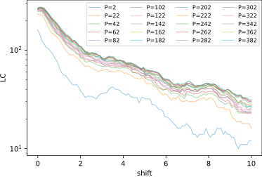

*Рисунок 15: LC для $P$-мерной окрестности радиуса $r$ при её сдвиге от начала координат $[0]^{d}$ к вектору $[10]^{d}$. **Слева** мы меняем $P$ при закреплённом $r=5$, а **справа** меняем $r$ при закреплённом $P=20$. Мы видим, что во всех постановках удаление от начала координат уменьшает LC. Рост LC с размерностью окрестности $P$ выходит на насыщение по мере роста $P$, что показывает, что окрестностей меньшей размерности может быть достаточно для приближения LC. Рост же $r$, напротив, увеличивает LC и уменьшает различия LC между сдвигами, поскольку окрестность становится крупнее, а LC — менее местной.* **[p. 12]**

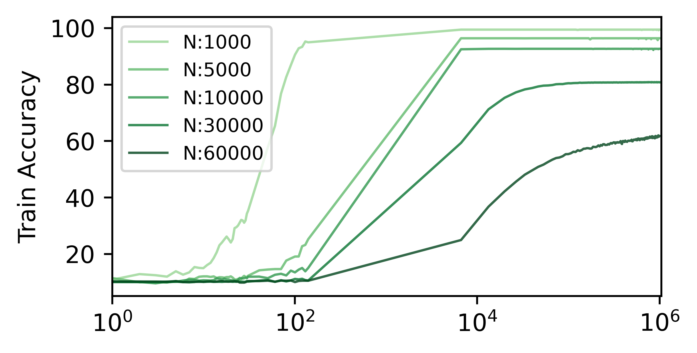

*Рисунок 16: Обучающая точность и устойчивая точность для сетей, обученных на случайно размеченных образцах MNIST, представленных на рисунке 13.* **[p. 12]**

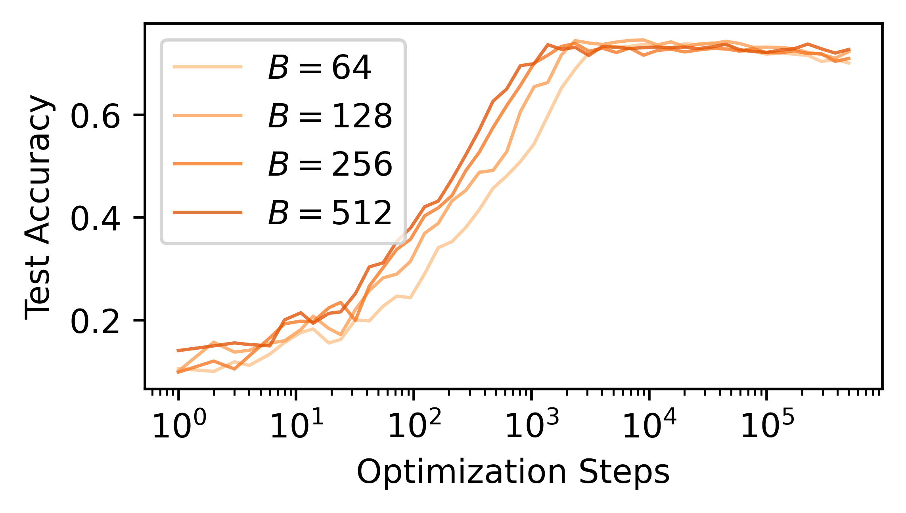

###### fig-17

*Рисунок 17: Увеличение размера пакета ускоряет гроккинг. Это указывает, что уменьшенный шум SGD позволяет переселению областей произойти раньше в обучении.* **[p. 13]**

###### fig-18

*Рисунок 18: **Гроккинг более сильных состязательных атак.** Мы видим, что в ходе отложенной генерализации растёт и устойчивость к Auto-Attack (Croce & Hein 2020). Это показывает всеобщность отложенной устойчивости.* **[p. 13]**

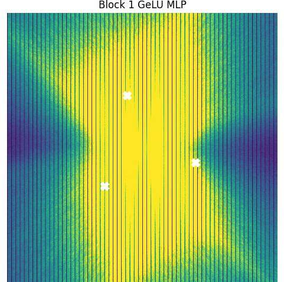

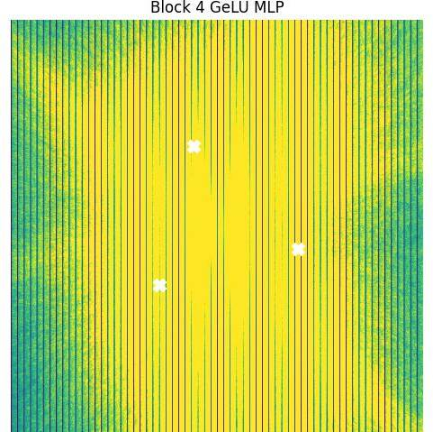

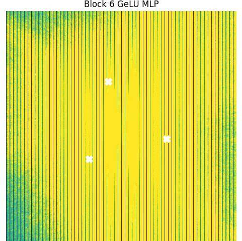

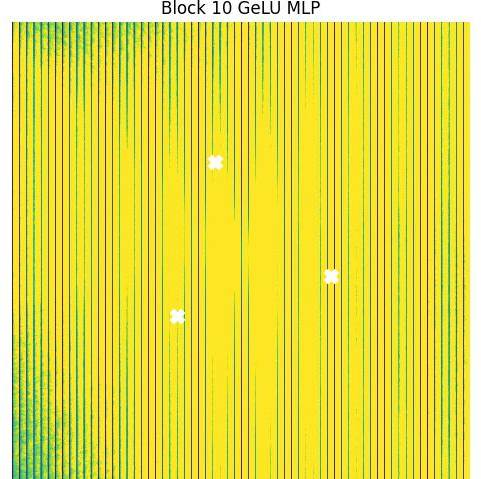

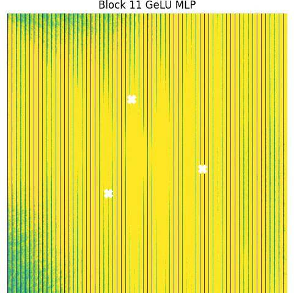

*Рисунок 19: LC пространства вложений лексем на двумерном подпространстве, пересекающем три случайные обучающие точки. Мы изображаем LC послойно для слоёв MLP с активацией GeLU внутри каждого из 12 блоков большой языковой модели, для которой мы приводим динамику обучения на рисунке 9. LC вычислена после 197 шагов оптимизации, в пик подъёма. Мы видим, что LC на этом подпространстве очень высока, особенно вблизи точек данных. Значения LC обрезаны сверху величиной 150.* **[p. 14]**

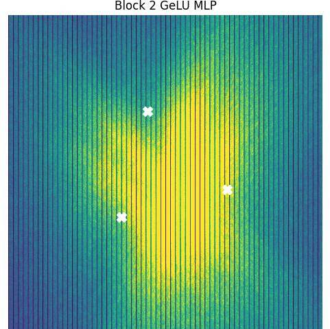

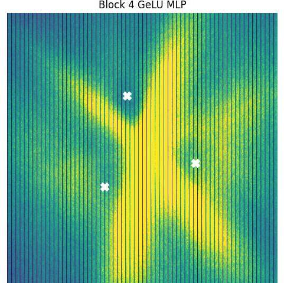

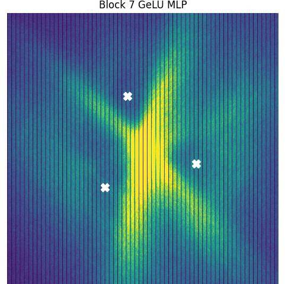

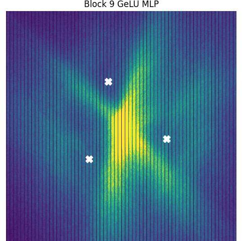

*Рисунок 20: LC пространства вложений лексем на двумерном подпространстве, пересекающем три случайные обучающие точки. Мы изображаем LC послойно для слоёв MLP с активацией GeLU внутри каждого из 12 блоков большой языковой модели, для которой мы приводим динамику обучения на рисунке 9. LC вычислена после 372759 шагов оптимизации, то есть в ходе второго спуска LC. Мы видим, что LC на этом подпространстве сосредоточена вдали от обучающих точек, особенно для более глубоких слоёв. Это указывает, что переселение областей происходит и в больших языковых моделях, приводя к отложенной устойчивости. Значения LC обрезаны сверху величиной 150.* **[p. 15]**

**Сравнение обученного MLP со SplineCam.** Для нелинейных MLP мы сравниваем с точным способом вычисления Splinecam (Humayun et al. 2023a). Мы берём MLP глубины 3 и ширины 200 и обучаем его на MNIST в течение 100K шагов обучения. Для $20$ различных контрольных точек обучения мы вычисляем местную сложность в виде числа линейных областей, вычисленных через SplineCam, и числа пересечений гиперплоскостей предлагаемым нами способом. Мы вычисляем местную сложность для $500$ различных обучающих образцов. И для нашего способа, и для SplineCam мы берём радиус $0.001$. Для нашего способа мы берём окрестность размерности $P=25$. Траектории LC мы приводим на рис. 35. **[p. 13]** Мы видим, что для обоих способов местная сложность следует схожему ходу с поведением двойного спуска.

**Искажение окрестности глубокими сетями.** Как упомянуто в приложении A, мы вычисляем местную сложность послойно, вкладывая окрестность $conv(V)$ во входное пространство любого слоя и считая число пересечений гиперплоскостей с $conv(V^{\ell})$, где $V^{\ell}$ — вложенные вершины во входном пространстве слоя $\ell$. Приближение местной сложности поэтому подвержено искажению, вносимому каждым слоем в $conv(V)$. Чтобы измерить искажение слоями с $1$ по $\ell-1$, мы рассматриваем неориентированный граф, образованный вершинами $V^{\ell}$, и вычисляем средний эксцентриситет и диаметр графов (Xu et al. 2021). Эксцентриситет любой вершины $v$ графа обозначает наибольшее из кратчайших путевых расстояний между $v$ и всеми связанными вершинами графа. Диаметр — это наибольший эксцентриситет по вершинам графа. Напомним из приложения A, что $conv(V)$, где $V=\{x\pm rv_{p}:p=1...P\}$ для точки входного пространства $x$, есть кросс-политоп размерности $P$, где по каждому из ортогональных направлений $v_{p}$ берутся лишь две вершины. При такой связности все вершины делят рёбра друг с другом, кроме пар $\{(x+rv_{p},x-rv_{p}):p=1...P\}$. При такой связности мы вычисляем средний эксцентриситет и диаметр окрестностей $conv(V^{\ell})$ вокруг $1000$ обучающих точек из CIFAR10 для обученной CNN (рис. 21). Мы видим, что при большем $r$ обе меры искажения экспоненциально растут, тогда как при $r\leq 0.014$ искажение меньше и устойчивее. Это показывает, что при меньшем $r$ наше приближение LC для более глубоких свёрточных сетей было бы лучше, поскольку окрестность не искажается существенно.

*Рисунок 21: Изменение среднего эксцентриситета и диаметра (Xu et al. 2021) окрестности входного пространства разными слоями CNN, обученной на наборе данных CIFAR10. Для разных радиусов выборки $r$ взятой окрестности входного пространства $V$ изменение эксцентриситета и диаметра обозначает, насколько сильно окрестность искажается между слоями. Здесь слой $0$ отвечает окрестности входного пространства. Числа усреднены по окрестностям, взятым для $1000$ обучающих точек из CIFAR10. При большем радиусе искажение растёт с глубиной экспоненциально. При $r\leq 0.014$ искажение меньше, что указывает на надёжность окрестностей меньшего радиуса для вычисления LC на более глубоких сетях. Доверительный промежуток, показанный красным, почти неразличим.* **[p. 15]**

###### fig-22

*Рисунок 22: Обучение ResNet18 с батч-нормализацией на полном Imagenet. LC вычислена только на проверочных точках по 1000 образцам проверочного набора. Вычисление LC на 1000 образцах занимает приблизительно 28 с на RTX 8000.* **[p. 16]**

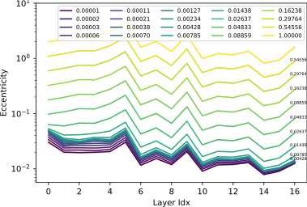

*Рисунок 23: Изменение среднего эксцентриситета и диаметра (Xu et al. 2021) окрестности входного пространства разными слоями ResNet18, обученного на наборе данных CIFAR10, в постановке, схожей с рис. 21. Resnet искажает входную окрестность, уменьшая средний эксцентриситет и диаметр графов окрестности. При $r\leq 0.014$ искажение меньше, что указывает на надёжность окрестностей меньшего радиуса для вычисления LC на более глубоких сетях.* **[p. 16]**

###### sec-b

## Приложение B Понимание батч-нормализации и её действия на разбиение

Пусть обычное отображение слоя есть

$$
{\boldsymbol{z}}_{\ell+1}={\boldsymbol{a}}\left({\boldsymbol{W}}_{\ell}{\boldsymbol{z}}_{\ell}+{\boldsymbol{c}}_{\ell}\right),\quad\ell=0,\dots,L-1 \tag{7}
$$

Хотя за последние несколько лет было развито множество различных архитектур ГНС, современные высококачественные ГНС почти повсеместно употребляют *батч-нормализацию* (BN) (Ioffe & Szegedy 2015), чтобы центрировать и нормировать элементы карт признаков при помощи четырёх дополнительных параметров $\mu_{\ell},\sigma_{\ell},\beta_{\ell},\gamma_{\ell}$. Определим $z_{\ell,k}$ как $k^{\rm th}$ элемент карты признаков ${\boldsymbol{z}}_{\ell}$ длины $D_{\ell}$, ${\boldsymbol{w}}_{\ell,k}$ — как $k^{\rm th}$ строку весовой матрицы ${\boldsymbol{W}}_{\ell}$, а $\mu_{\ell,k},\sigma_{\ell,k},\beta_{\ell,k},\gamma_{\ell,k}$ — как $k^{\rm th}$ элементы векторов параметров BN $\mu_{\ell},\sigma_{\ell},\beta_{\ell},\gamma_{\ell}$ соответственно. Тогда отображение слоя $\ell$, снабжённого BN, можно записать, расширяя (1), как

$$
z_{\ell+1,k}=a\left(\frac{\left\langle{\boldsymbol{w}}_{\ell,k},{\boldsymbol{z}}_{\ell}\right\rangle-\mu_{\ell,k}}{\sigma_{\ell,k}}\>\gamma_{\ell,k}+\beta_{\ell,k}\right),k=1,\dots,D_{\ell}. \tag{8}
$$

Параметры $\mu_{\ell},\sigma_{\ell}$ вычисляются как поэлементные среднее и стандартное отклонение ${\boldsymbol{W}}_{\ell}{\boldsymbol{z}}_{\ell}$ **[p. 17]** для каждой мини-партии при обучении и по всему обучающему набору при проверке. Параметры $\beta_{\ell},\gamma_{\ell}$ выучиваются вместе с ${\boldsymbol{W}}_{\ell}$ через SGD.44 4 Заметим, что смещение ГНС ${\boldsymbol{c}}_{\ell}$ из (1) поглощено $\mu_{\ell}$ и $\beta_{\ell}$. Для каждой мини-партии ${\mathbb{B}}$ при обучении параметры BN $\mu_{\ell},\sigma_{\ell}$ *вычисляются напрямую* как среднее и стандартное отклонение текущих карт признаков мини-партии $\mathcal{B}_{\ell}$

$$
\mu_{\ell}\leftarrow\frac{1}{|{\mathbb{B}}_{\ell}|}\sum_{{\boldsymbol{z}}_{\ell}\in{\mathbb{B}}_{\ell}}{\boldsymbol{W}}_{\ell}{\boldsymbol{z}}_{\ell}, \sigma_{\ell}\leftarrow\sqrt{\frac{1}{|\mathcal{B}_{\ell}|}\sum_{{\boldsymbol{z}}_{\ell}\in{\mathbb{B}}_{\ell}}\big({\boldsymbol{W}}_{\ell}{\boldsymbol{z}}_{\ell}-\mu_{\ell}\big)^{2}}, \tag{9}
$$

где возведение в квадрат в правой части берётся поэлементно. После завершения обучения через SGD окончательные закреплённые «проверочные» среднее $\overline{\mu}_{\ell}$ и стандартное отклонение $\overline{\sigma}_{\ell}$ вычисляются по приведённым выше формулам по всем обучающим данным,55 5 или, что чаще, как экспоненциальное скользящее среднее значений обучающих мини-партий. то есть при ${\mathbb{B}}_{\ell}={\mathbb{X}}_{\ell}$.

Евклидово расстояние от точки ${\boldsymbol{v}}$ во входном пространстве слоя $\ell$ до $k^{\rm th}$ гиперплоскости слоя ${\mathbb{H}}_{\ell,k}$ легко вычисляется как

$$
d({\boldsymbol{v}},{\mathbb{H}}_{\ell,k})=\frac{\left|\langle{\boldsymbol{w}}_{\ell,k},{\boldsymbol{v}}\rangle-\mu_{\ell,k}\right|}{\|{\boldsymbol{w}}_{\ell,k}\|_{2}} \tag{10}
$$

пока $\|{\boldsymbol{w}}_{\ell,k}\|>0$.

Тогда среднее квадратичное расстояние между ${\mathbb{H}}_{\ell,k}$ и набором точек ${\mathbb{V}}$ во входном пространстве слоя $\ell$ даётся выражением

$$
\L_{k}(\mu_{\ell,k},{\mathbb{V}})=\frac{1}{|{\mathbb{V}}|}\sum_{{\boldsymbol{v}}\in{\mathbb{V}}}d\left({\boldsymbol{v}},{\mathbb{H}}_{\ell,k}\right)^{2}=\frac{\sigma_{\ell,k}^{2}}{\|{\boldsymbol{w}}_{\ell,k}\|_{2}^{2}}, \tag{11}
$$

## Приложение C Что влияет на устойчивое разбиение? *Повторение*

**Глубина.** На рисунке 27 мы строим LC в ходе обучения на MNIST для полносвязных глубоких сетей с глубиной из $\{2,3,4,5\}$ и шириной $200$. На каждом графике мы показываем и LC, и обучающую-проверочную точность. Для всех глубин точность и на обучающем, и на проверочном наборах достигает пика в фазе первого спуска. В фазе подъёма мы видим, что обучающая LC резко растёт, тогда как проверочная и случайная LC — нет.

###### p17-6

Различие, как и резкость подъёма, уменьшается с ростом глубины сети. Это видно и на мелких, и на крупных шкалах $r$. Для самой мелкой сети мы можем видеть второй спуск на более крупной шкале, но не на более мелкой шкале $r$. Это указывает, что у мелкой сети некоторые области ближе к обучающим образцам сохраняются на поздних порах обучения. Стоит заметить, что в фазах подъёма и второго спуска есть ясное различие между обучающей и проверочной LC. *Это указывает на уязвимость к выводу о членстве (membership inference), особенно в поздних фазах обучения.* Ранее это наблюдалось в литературе о выводе о членстве (Tan et al. 2023), где ранняя остановка употреблялась как регуляризатор против вывода о членстве. Мы полагаем, что динамика LC может пролить новый свет на вывод о членстве и на роль сложности/ёмкости сети.

###### p17-7

На рисунке 12 мы строим местную сложность в ходе обучения для CNN, обучаемых на CIFAR10, с разной глубиной, с батч-нормализацией и без неё. Архитектура CNN состоит только из свёрточных слоёв, кроме одного полносвязного слоя перед выходом. Поэтому при вычислении LC мы принимаем во внимание только свёрточные слои сети. В отличие от опытов с MNIST, мы видим, что в этой постановке обучающая и проверочная LC почти неразличимы на всём протяжении обучения. Мы можем видеть, что обучающая и проверочная точность сети достигают пика в фазе подъёма и поддерживаются в ходе второго спуска. Можно также заметить, что увеличение глубины увеличивает наибольшую LC в фазе подъёма для свёрточных сетей, что противоположно тому, что мы видели для полносвязных сетей на MNIST. Рост плотности при подъёме идёт по всему многообразию данных, в отличие от одних лишь обучающих образцов у полносвязных сетей.

###### p17-8

В приложении мы приводим послойное изображение динамики LC. Мы видим, что у мелких слоёв пик в фазе подъёма острее, с отчётливым различием между обучающими и проверочными. Для более глубоких слоёв, однако, различие обучающей и проверочной LC пренебрежимо мало.

###### p17-9

**Ширина.** На рисунке 14 мы приводим результаты для полносвязной ГНС глубины $3$ и ширины $\{20,100,500,1000,2000\}$. Сети меньшей ширины начинают с низкой LC при инициализации по сравнению с более широкими сетями. Поэтому для сетей малой ширины начальный спуск становится неразличим. Мы видим, что по мере увеличения ширины с $20$ до $1000$ фаза подъёма **[p. 18]** начинается раньше, а также достигает большей наибольшей LC. Однако переопараметризация сети дальнейшим увеличением ширины до $2000$ уменьшает наибольшую LC в фазе подъёма, а значит, уменьшает скучивание нейронов вблизи обучающих образцов. *Это возможное указание на то, как переопараметризация осуществляет неявную регуляризацию (Kubo et al. 2019), уменьшая нелинейность, то есть сосредоточение местной сложности вокруг обучающих образцов.*

###### p18-1

**Weight decay** регуляризует нейронную сеть, уменьшая норму весов сети, а значит, уменьшая и норму наклона на область. Мы обучаем CNN глубины 5 и ширины 32 с разным weight decay. На рис. 30 мы приводим обучающую и случайную LC наших опытов. Мы можем видеть, что увеличение weight decay также откладывает или убирает второй спуск обучающей LC. Более того, сильный weight decay также сокращает длительность фазы подъёма, а также уменьшает наибольшую LC в фазе подъёма. Это несходно с BN, которая убирает второй спуск, но повышает LC в целом.

**Батч-нормализация.** Ранее было показано, что батч-нормализация (BN) регуляризует обучение, динамически обновляя параметры нормировки для каждой мини-партии, а значит, увеличивая шум при обучении (Garbin et al. 2020). Действительно, напомним, что BN заменяет послойное отображение из уравнения 1, центрируя и масштабируя предактивацию слоя и добавляя обратно обучаемое смещение ${\boldsymbol{b}}^{(\ell)}$. Статистики центрирования и масштабирования вычисляются для каждой мини-партии. После завершения обучения окончательные закреплённые «проверочные» среднее $\overline{\mu}^{(\ell)}$ и стандартное отклонение $\overline{\sigma}^{(\ell)}$ вычисляются по обучающим данным. Ключевой интерес для нашего наблюдения представляет результат, связывающий BN с положением области разбиения во входном пространстве, из (Balestriero & Baraniuk 2022). В частности, было доказано, что на каждом слое $\ell$ ГС BN явным образом приспосабливает разбиение так, чтобы границы разбиения были как можно ближе к обучающим данным. Это подтверждается нашими опытами: на рис. 12 мы приводим результаты для CNN, обученной на CIFAR10, с BN и без неё.

## Приложение D Дополнительные рисунки

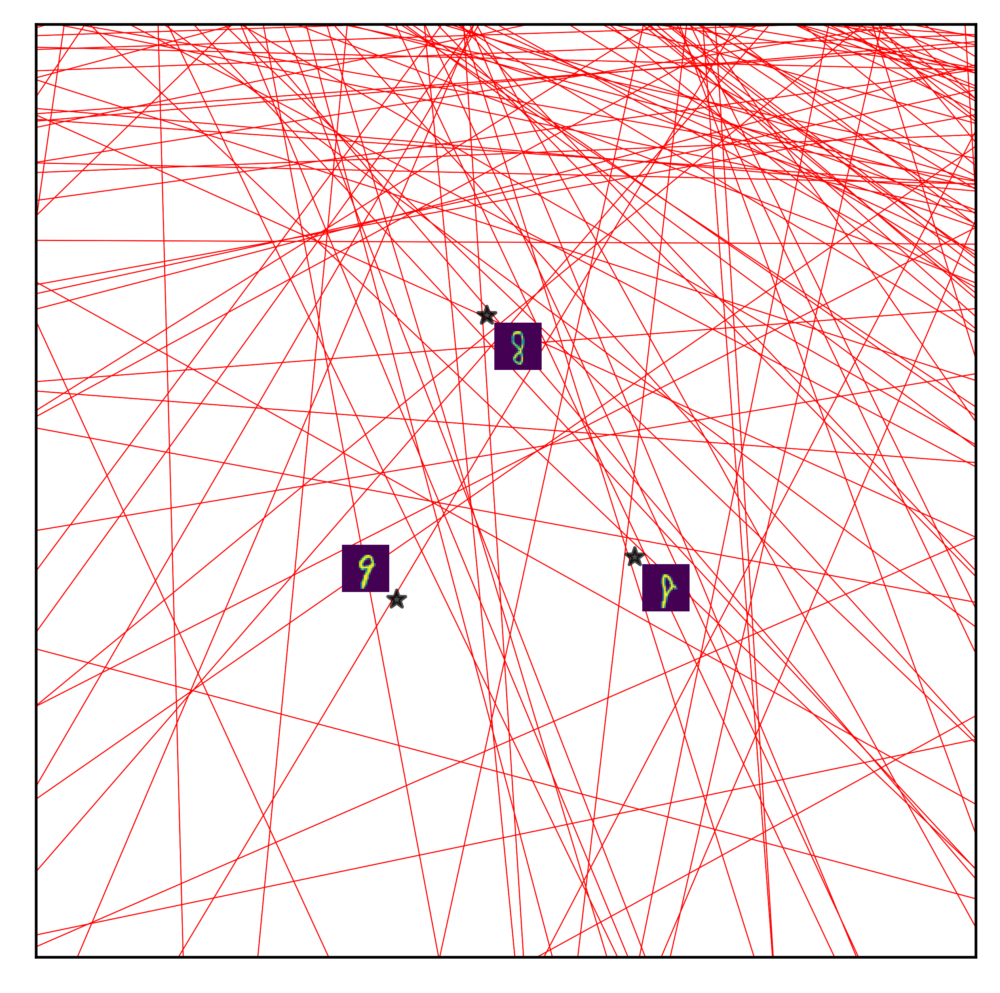

*Рисунок 24: Послойное изображение разбиения входного пространства для двумерной области, проходящей через тройку точек обучающего набора, после образования устойчивого разбиения. Разбиение изображено для MLP глубины 6 и ширины 200, обученного на $1000$ образцах из MNIST, в постановке, схожей с описанной на рисунке 2. Мы видим, что нейроны более глубоких слоёв больше участвуют в образовании устойчивого разбиения, чем нейроны мелких слоёв. Это вызвано тем, что нейроны более глубоких слоёв могут быть более локализованы во входном пространстве благодаря нелинейности, наводимой предшествующими слоями.* **[p. 18]**

*Рисунок 25: Разбиение входного пространства, вычисленное аналитически через SplineCam (Humayun et al. 2023b) для двумерной игрушечной постановки, представленной на рисунке 3 (слева). Области окрашены белым, а узлы — красным. Разбиение вычислено для области входного пространства $[-10,10]^{2}$, наводимого MLP глубины $5$ и ширины $30$. Мы берём сетку из $300\times 300$ точек по входной области и измеряем местную сложность в каждой точке с радиусом $r\in\{0.05,0.1,0.5,1\}$ (остальные). Мы видим, что предлагаемый нами способ может находить нелинейности при малом $r$. С ростом $r$ наш способ даёт более грубую оценку местной плотности нелинейностей, то есть числа нелинейностей, пересекающих закреплённый объём, заданный местной окрестностью.* **[p. 18]**

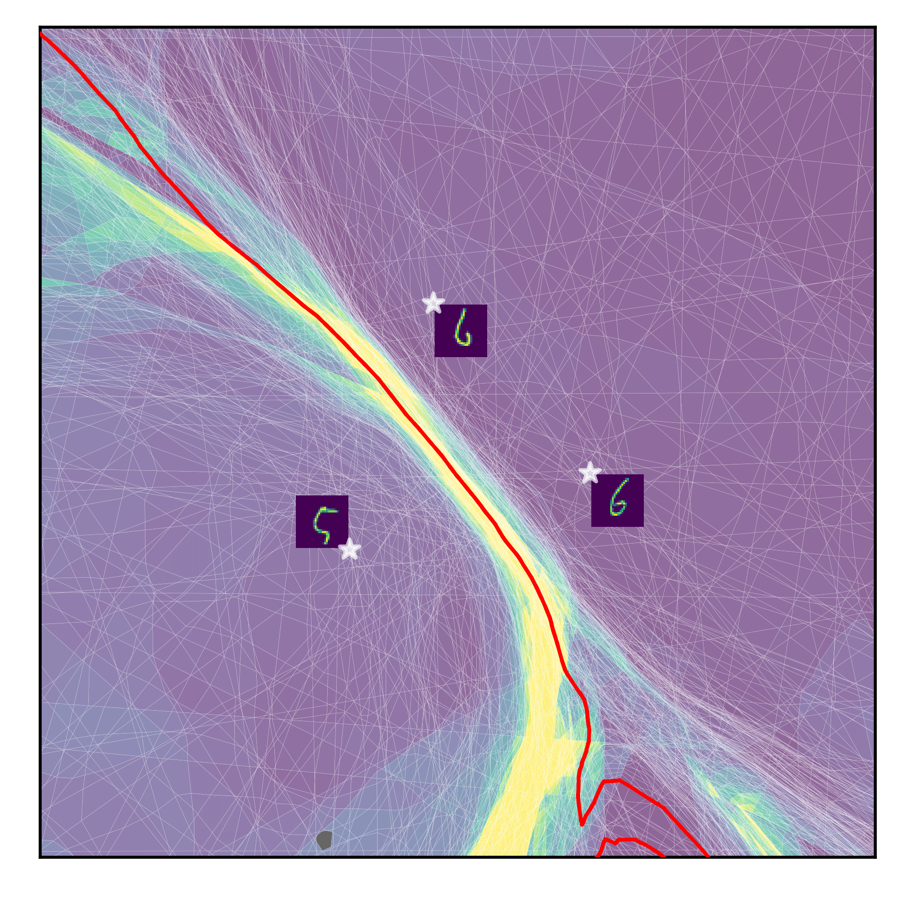

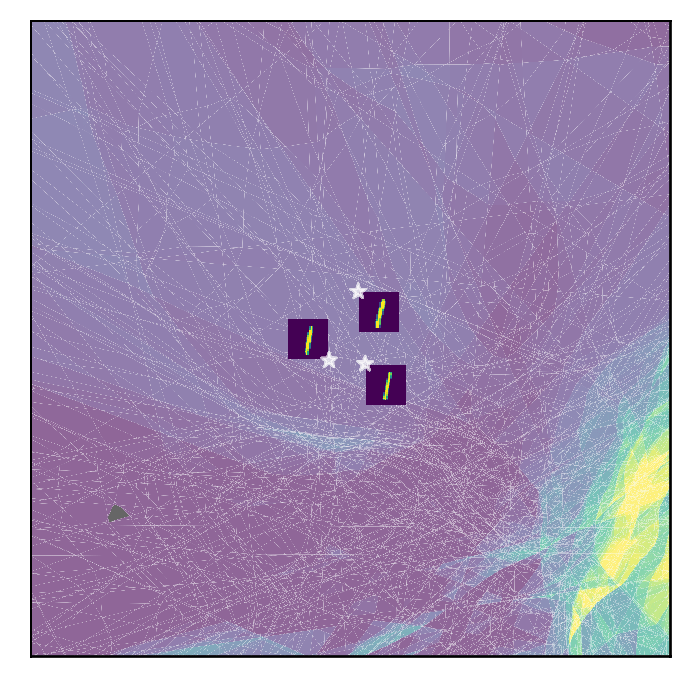

###### fig-26

*Рисунок 26: Изображение разбиения для двумерных областей, локализованных вблизи границы решения (сверху) и вдали от границы решения (снизу), для постановки с гроккингом, представленной на рисунке 7. Все графики показаны для шага оптимизации $95381$. Число областей в разбиении для верхнего правого, верхнего левого, нижнего правого и нижнего левого равно 123156, 88362, 33273 и 32018 соответственно. Область, употреблённая для всех графиков, имеет одну и ту же площадь/объём. Поэтому вблизи границы решения плотность областей много выше, чем вдали от границы решения. Это свидетельство того, что переселение областей происходит в поздних фазах обучения.* **[p. 19]**

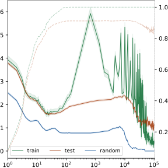

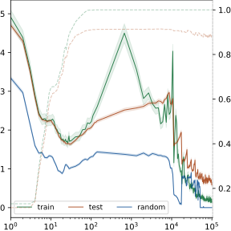

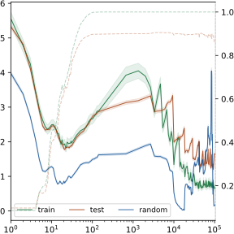

*Рисунок 27: MLP шириной 200 и разной глубины, обучаемый на $1000$ образцах из MNIST. Увеличение глубины сети уменьшает резкость пика LC в фазе подъёма. У более глубоких сетей также обычно резче падение обучающей LC в ходе переселения областей.* **[p. 20]**

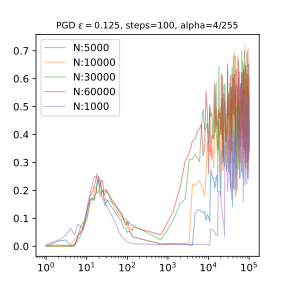

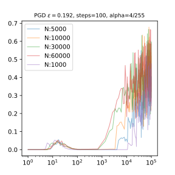

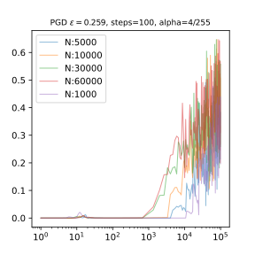

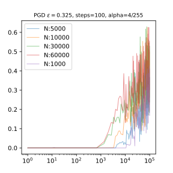

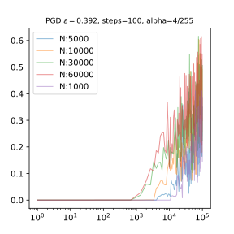

*Рисунок 28: Для MLP глубины 4 и ширины 200 мы обучаем с разными размерами обучающего набора и оцениваем состязательное качество после каждой итерации обучения. Мы видим, что с ростом размера набора данных сеть гроккает раньше по времени, что видно по кривым состязательного гроккинга для всех разных значений эпсилон.* **[p. 20]**

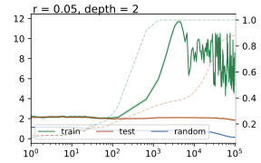

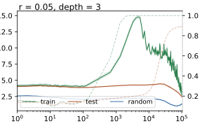

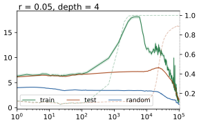

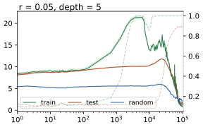

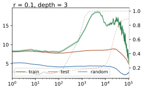

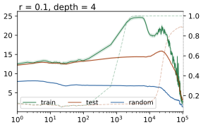

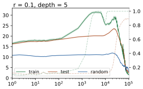

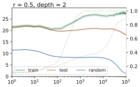

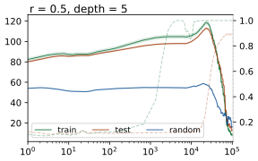

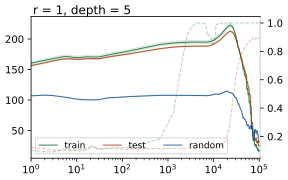

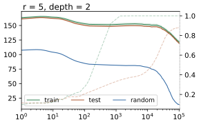

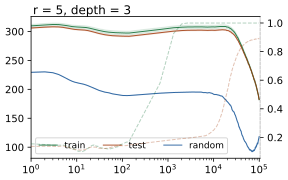

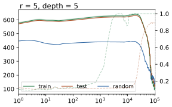

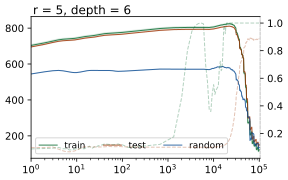

*Рисунок 29: Обучение MLP шириной 200 на MNIST с масштабированием инициализации на 8 и разной глубиной. Вдоль строки мы берём всё более крупные по радиусу окрестности для приближения местной сложности.* **[p. 21]**

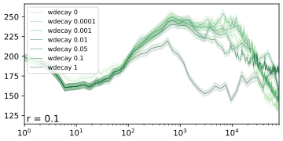

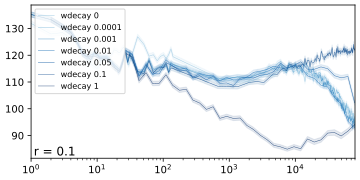

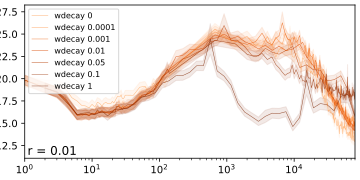

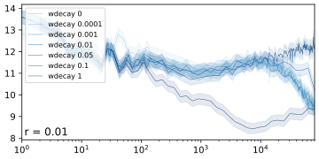

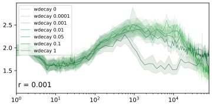

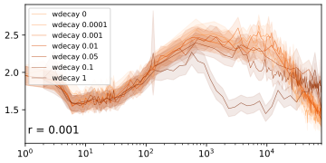

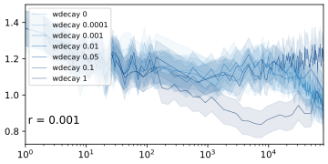

*Рисунок 30: Динамика местной сложности при обучении MLP на MNIST с weight decay* **[p. 21]**

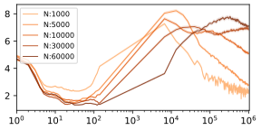

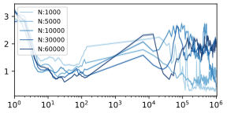

*Рисунок 31: **Увеличение объёма случайно размеченных обучающих данных.** Продолжение рисунка 13. Увеличение числа случайно размеченных обучающих образцов откладывает фазу подъёма динамики обучения LC и для обучающих, и для проверочных образцов. Для случайных образцов поведение затронуто не столь сильно.* **[p. 22]**

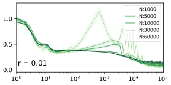

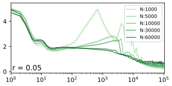

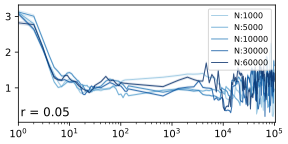

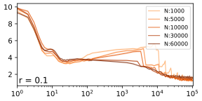

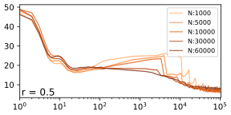

*Рисунок 32: **Увеличение размера обучающих данных ускоряет переселение областей.** Динамика местной сложности при обучении MLP на MNIST с weight decay. Графики устойчивости представлены на рисунке 28.* **[p. 22]**

*Рисунок 33: Обучающая и проверочная точность для разных размеров набора данных, представленных на рисунке 32.* **[p. 23]**

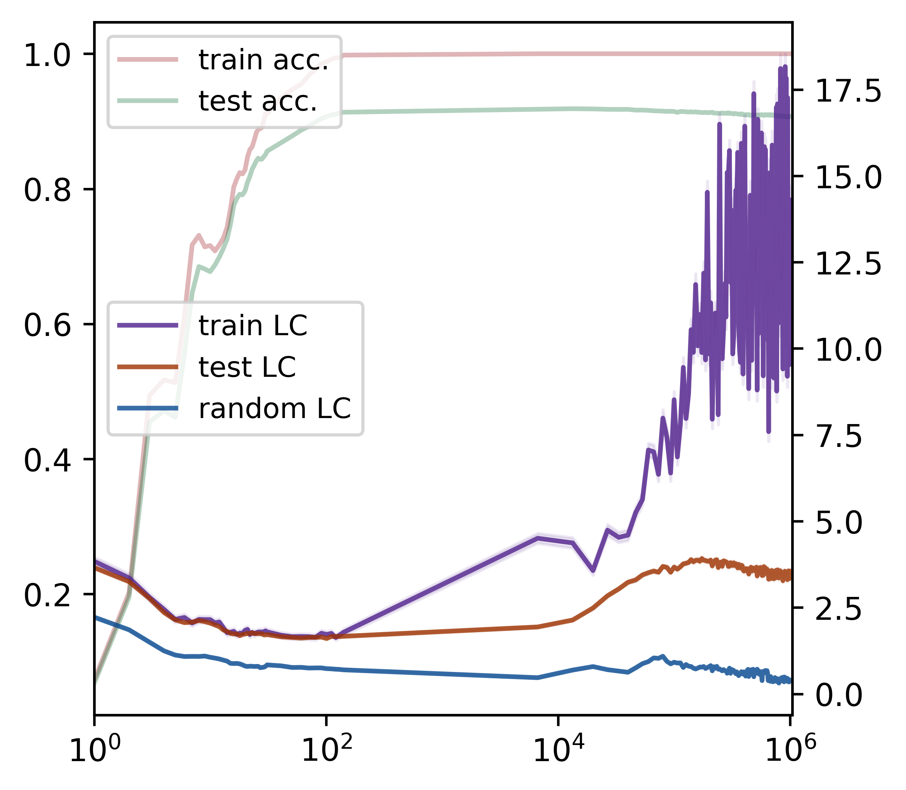

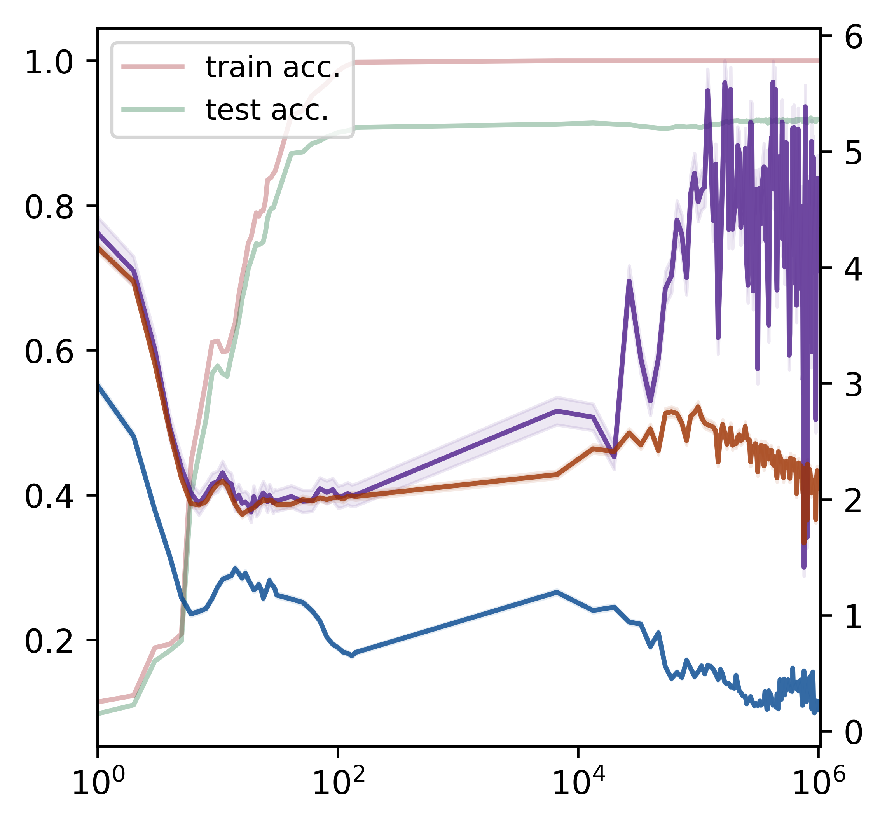

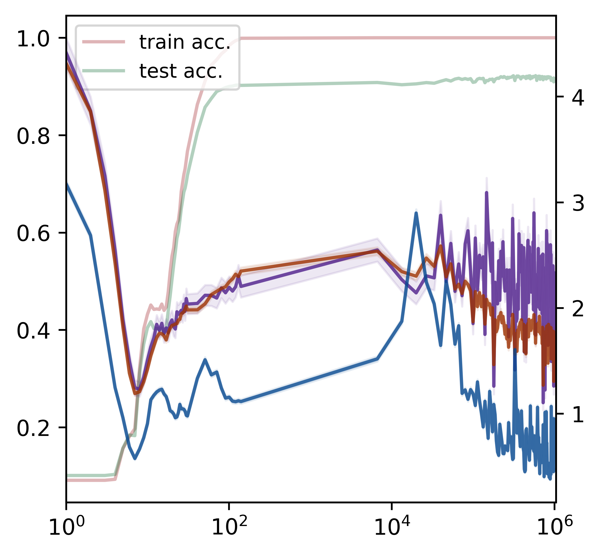

*Рисунок 34: Динамика LC для GeLU-MLP шириной $200$ и глубиной $\{3,4,5\}$, представленных слева направо. LC вычислена в $1000$ обучающих и $10000$ проверочных и случайных точках в ходе обучения на MNIST.* **[p. 23]**

###### fig-35

*Рисунок 35: Сравнение местной сложности, измеренной в виде числа линейных областей, вычисленного точно при помощи SplineCAM (Humayun et al. 2023a), и числа рассечений гиперплоскостями по предлагаемому нами способу. Оба способа обнаруживают поведение двойного спуска.* **[p. 23]**

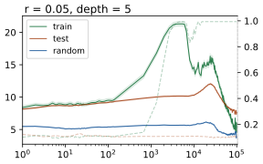

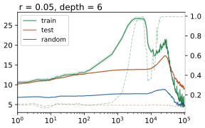

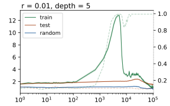

*Рисунок 36: Перебор радиуса и глубины при случайных метках* **[p. 24]**
