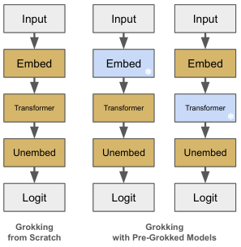
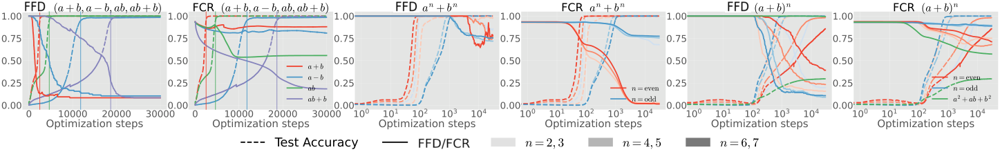

# Furuta et al. 2024 — Towards Empirical Interpretation of Internal Circuits and Properties in Grokked Transformers on Modular Polynomials

См. также: [глобальный индекс понятий](../../concepts/index.md).

**Hiroki Furuta**, **Gouki Minegishi**, **Yusuke Iwasawa**, **Yutaka Matsuo** — Токийский университет.

arXiv [2402.16726](https://arxiv.org/abs/2402.16726), 26 февраля 2024; версия v3 опубликована в Transactions on Machine Learning Research (11/2024). 13 цитирований — девятнадцатая по цитируемости работа корпуса.

Источник — **LaTeX-исходник версии v3**, а не HTML. Причина: HTML-рендеринга у этой версии нет ни нативного, ни в ar5iv; ar5iv отдаёт версию v1 под прежним названием «Interpreting Grokked Transformers in Complex Modular Arithmetic», и это существенно иная работа — в v3 добавлены разделы 7 и 8, переименована мера FFS → FFD и расширены приложения. Конверсия выполнена скриптом `convert_latex.py`; иллюстрации в исходнике векторные (PDF) и растеризованы при 110 dpi.

Оригинал и производные файлы этой папки:

- [`original/2402.16726.main.tex`](original/2402.16726.main.tex), [`original/2402.16726.tmlr_appendix.tex`](original/2402.16726.tmlr_appendix.tex), [`original/2402.16726.main.bbl`](original/2402.16726.main.bbl) — первоисточник: LaTeX-исходник версии v3, скачан как есть.
- [`original/2402.16726.towards-empirical-interpretation-of-internal-circuits-and-properties-in-grokked-transformers-on-modular-polynomials.md`](original/2402.16726.towards-empirical-interpretation-of-internal-circuits-and-properties-in-grokked-transformers-on-modular-polynomials.md) — конверсия оригинала в Markdown без правок содержания.
- [`images/`](images/) — 25 иллюстраций статьи.

Схема якорей и правила ссылок на карточку — в [README папки статей](../README.md).

## Затрагиваемые понятия

**[Фурье-признаки и контуры](../../concepts/fourier-features-circuits.md)** — работа **распространяет** фурье-разбор Nanda et al. со сложения на всю модульную арифметику и получает главный свой результат: у каждой грокающей операции своё фурье-представление ([`p1-1`](#p1-1)). Вычитание выучивает разрежённое вложение, как у сложения, но асимметричное отображение «нейрон — логит» ([`fig-3`](#fig-3)); умножение задействует **все** частоты со смещением к косинусу; многочлены дают суперпозицию этих картин ([`p7-7`](#p7-7)). Обратная сторона того же результата: у операций, которые не грокают, ясных фурье-картин попросту нет.

**[Меры прогресса](../../concepts/progress-measures.md)** — вводятся две новые величины, не привязанные к задаче: **FFD** (плотность частот Фурье — доля частот, чья норма превышает долю $\eta$ от максимальной) и **FCR** (отношение коэффициентов Фурье — насколько составляющие смещены к синусу или косинусу) ([`p4-5`](#p4-5), [`p5-1`](#p5-1)). Отличие от мер Nanda et al. существенно: те выведены из разобранного механизма сложения, эти считаются по любой матрице весов. Отвечающая за прогресс величина зависит от операции — для сложения падает FFD, для умножения FCR, для $ab+b$ обе ([`p10-2`](#p10-2)).

**[Спектральный анализ](../../concepts/spectral-analysis-svd-esd-fve.md)** — обе меры суть статистики спектра в фурье-базисе, а не в сингулярном; точка перегиба FFD или FCR совпадает с насыщением точности на тесте ([`fig-8`](#fig-8)). Порог $\eta=0.5$ выбран по развёртке: меньший запаздывает за гроккингом, больший сходится слишком быстро ([`p1-3`](#p1-3)).

**[Заморозка подсети](../../concepts/freezing-subnetwork.md)** — главный методический приём работы: **предгрокнутые модели**. Модуль (вложение или весь трансформер), доученный до гроккинга на одной операции, вставляется заморожённым в обучение на другой ([`p4-6`](#p4-6)). Это разделяет вопрос «выучено ли представление» и вопрос «выучен ли алгоритм»: если предгрокнутое вложение помогает — представления схожи; если помогает предгрокнутый трансформер — схожи алгоритмы.

**[Абляция и вмешательство](../../concepts/causal-ablation-intervention.md)** — на этом приёме построен весь раздел о переносимости, и результат отрицательный: перенос работает только от элементарной арифметики к линейным выражениям и почти никогда — к многочленам высокой степени ([`p11-1`](#p11-1), [`tab-1`](#tab-1)). Отдельная абляция по частотам показывает, что у вычитания есть *зависимые* частоты: не ключевые, но их удаление ухудшает ограниченную потерю ([`p13-1`](#p13-1) и приложение E).

**[Модульная арифметика](../../concepts/modular-arithmetic.md)** — понятие расширяется от одной операции до целого семейства: сложение, вычитание, умножение, линейные выражения, одночленные слагаемые, суммы степеней и многочлены до седьмой степени, при $p=97$ (и $p=59, 113$ в приложении J) ([`p1-1`](#p1-1)). Сводная таблица A.5 в приложении I — самый полный в корпусе перечень того, какие модульные операции грокают и при какой доле данных.

**[Механистическая интерпретируемость](../../concepts/mechanistic-interpretability.md)** — работа честно отмечает границу метода: полного разбора в замкнутой форме, как у Nanda et al. для сложения, здесь нет ни для умножения, ни для многочленов ([`p7-5`](#p7-5)). Вместо этого предлагается «интерпретируемая обратная инженерия» через частотные картины и переносимость — то есть описание, а не вывод алгоритма.

**[Гроккинг](../../concepts/grokking.md)** — понятие получает **условие возникновения**, сформулированное алгебраически: многочлены с перекрёстным слагаемым ($a^2+ab+b^2$, $a^3+ab$) не грокают, а разложимые через сложение или вычитание ($(a\pm b)^n$) грокают даже в высоких степенях ([`p9-1`](#p9-1)). Сравнение $a^2+ab+b^2$ против $(a+b)^2$ — двух алгебраически равных выражений — показывает, что дело в **форме записи задачи**, а не в её сложности.

**[Weight decay](../../concepts/weight-decay.md)** — упомянут в обзоре как одно из условий гроккинга (Power et al., Lyu et al.) ([`p2-1`](#p2-1)) и взят в постановку как $\lambda=1.0$ в AdamW; собственного разбора его роли работа не даёт.

**[Полу-грокинг](../../concepts/semi-grokking.md)** и **[доля данных](../../concepts/data-fraction-critical-dataset-size.md)** — доля $r$ здесь рабочий параметр, а не предмет изучения: результат каждой операции подан как «наименьшая $r$, при которой гроккинг происходит» ([`tab-1`](#tab-1)), и это даёт корпусу удобную шкалу трудности операций.

**[Эмерджентность](../../concepts/emergence.md)** — многозадачное обучение вводит понятие **со-гроккинга**: при смеси сложения, вычитания и умножения гроккинг наступает для всех задач сразу, но требует бо́льшей доли данных, чем каждая по отдельности ([`p12-1`](#p12-1)). Подходящая смесь может даже вызвать гроккинг там, где однозадачное обучение не справлялось: $a^2+b^2$ и $(a+b)^2$ помогают грокнуть $a^2+ab+b^2$ ([`p12-3`](#p12-3)).

Отдельно стоит сказать, чего в работе **нет**. Нет объяснения, *почему* перекрёстное слагаемое мешает: разложимость установлена как эмпирическая закономерность, и авторы не выводят её ни из динамики обучения, ни из свойств фурье-базиса. Нет и языковых моделей: перенос на практику назван направлением работы ([`p13-1`](#p13-1)).

Карточки статей корпуса: [Power et al. 2022](../2201.02177.grokking-generalization-beyond-overfitting-on-small-algorithmic-datasets/2201.02177.grokking-generalization-beyond-overfitting-on-small-algorithmic-datasets.card.md) — исходная задача; [Nanda et al. 2023](../2301.05217.progress-measures-for-grokking-via-mechanistic-interpretability/2301.05217.progress-measures-for-grokking-via-mechanistic-interpretability.card.md) — фурье-разбор сложения и меры прогресса, которые здесь обобщаются; [Gromov 2023](../2301.02679.grokking-modular-arithmetic/2301.02679.grokking-modular-arithmetic.card.md) — аналитическое решение, доступное лишь для узкого класса; [Rubin et al. 2024](../2310.03789.grokking-as-a-first-order-phase-transition-in-two-layer-networks/2310.03789.grokking-as-a-first-order-phase-transition-in-two-layer-networks.card.md) и [Varma et al. 2023](../2309.02390.explaining-grokking-through-circuit-efficiency/2309.02390.explaining-grokking-through-circuit-efficiency.card.md) — объяснения, на которые работа опирается в обзоре; [Merrill et al. 2023](../2303.11873.a-tale-of-two-circuits-grokking-as-competition-of-sparse-and-dense-subnetworks/2303.11873.a-tale-of-two-circuits-grokking-as-competition-of-sparse-and-dense-subnetworks.card.md) — разрежение сети, названное среди движущих сил поздней генерализации.

## Что показано, а что предположено

Замечания редактора карточки по итогам разбора утверждений (`…claims.txt`). Работа заявлена как эмпирическая и таковой и является: три гипотезы, поставленные во введении, проверяются экспериментом, и две из трёх подтверждаются лишь частично — что авторы и пишут.

**Самый ценный результат — алгебраический признак.** Разложимость через $(a\pm b)$ отделяет грокающие многочлены от не грокающих ([`p9-1`](#p9-1)), и это проверено на паре выражений, равных как многочлены: $a^2+ab+b^2$ и $(a+b)^2$ отличаются лишь записью, но грокает только второе. В корпусе это единственный признак трудности задачи, сформулированный на языке самой задачи, а не динамики обучения.

**Переносимость проверена и в значительной мере опровергнута.** Гипотеза «грокнувшие модели приобретают общие переносимые признаки» подтвердилась узко: от сложения к $2a\pm b$, от умножения к $ab\pm b$ ([`p10-4`](#p10-4)). На многочленах высокой степени предгрокнутые модели не ускоряют гроккинг, а часто мешают ([`p10-5`](#p10-5), [`tab-1`](#tab-1)). Отрицательный результат подан прямо и снабжён полной таблицей, а не одним примером.

**Асимметрия вычитания — сильное наблюдение.** Предгрокнутый на вычитании трансформер не переносится **ни на что**, включая само вычитание ([`p7-4`](#p7-4)). Это странный и потому ценный факт: он показывает, что «одинаковая задача» и «одинаковое решение» — разные вещи, и что найденный сетью алгоритм может зависеть от прогона сильнее, чем от операции.

**Меры прогресса измеряют, но ничем не управляют.** FFD и FCR совпадают по времени с ростом точности ([`fig-8`](#fig-8)), и порог $\eta$ выбран по развёртке. Однако предсказания «эта модель грокнет к шагу N» из них не строится, и вмешательства, меняющего FFD или FCR ради ускорения гроккинга, в работе нет — то есть это меры-индикаторы, а не рычаги.

**Слабое место — статистика.** Все эксперименты идут на 3 сидах, и почти везде приводится среднее; в разделе о многозадачности приводится лучшая точность из прогонов. Приложение M отвечает на это единственной проверкой разброса для одного рисунка ([`p27-1`](#p27-1)) — полезно, но на все таблицы это не распространяется.

**Зависимость от $p$ признана и не разобрана.** Приложение J показывает, что $a^3+ab$ грокает при $p=97$, но не при $p=59$ и $p=113$ ([`p25-1`](#p25-1)), причём меньший модуль — то есть меньшая задача — не помогает. Отсюда следует, что часть выводов о «грокающих» и «не грокающих» операциях привязана к выбранному модулю; авторы это отмечают и оставляют как есть.

**Проверка альтернативной гипотезы сделана правильно.** Предположение, что дело в смещённом распределении меток, проверено прямо — KL-дивергенцией и энтропией меток, усреднёнными по 100 разбиениям, — и отвергнуто ([`p26-1`](#p26-1)). Такая явная проверка «скучного» объяснения в корпусе редкость.

**Оговорка об идентифицируемости.** Заморозка части модели могла бы объяснять неудачи переноса сама по себе; авторы отвечают на это одинаковым сидом для предгроккинга и последующего обучения и доводом, что несовместимые пары имеют разные фурье-составляющие, а повороты матрицы весов фурье-базис не меняют ([`p27-2`](#p27-2)). Довод разумный, но остаётся доводом.

**Место в корпусе.** Это самая широкая эмпирическая карта модульных задач: сводная таблица A.5 перечисляет десятки операций с указанием доли данных, при которой каждая грокает. Для вики это в первую очередь **справочник**: когда другая работа заявляет объяснение гроккинга, здесь можно посмотреть, на каких операциях оно должно было бы сработать. Собственного механизма работа не предлагает и на это не претендует.

## Ошибочные цитирования

Замечания редактора карточки: места, где эта статья передаёт чужие результаты с ошибкой или без авторских оговорок. Сюда ведут ссылки «подробности» из разделов «Ошибочные пересказы и цитирования этой статьи» карточек процитированных работ.

###### mc-2201-02177
**Power et al. (2201.02177) — weight decay как предусловие и смешение режимов.** Статья дважды подаёт weight decay как условие гроккинга со ссылкой на Power: `"In simple algorithmic tasks like modular addition, grokking would be observed with proper weight decay and the ratio of train-test splits (Power et al., 2022; Lyu et al., 2023)"` — «в простых алгоритмических задачах вроде модульного сложения гроккинг наблюдался бы при надлежащем weight decay и соотношении train-test» — и `"The weight decay is one of the factors inducing the grokking phenomenon"` (со ссылкой на Power et al.) — «weight decay — один из факторов, вызывающих явление гроккинга». Между тем [канонический график Power получен на Adam вовсе без weight decay](../2201.02177.grokking-generalization-beyond-overfitting-on-small-algorithmic-datasets/2201.02177.grokking-generalization-beyond-overfitting-on-small-algorithmic-datasets.card.md#sec-a1-2): в цитируемой работе weight decay ускоряет генерализацию и экономит данные, но не является её условием. Гроккинг без явной регуляризации демонстрируют также [Thilak et al.](../2206.04817.the-slingshot-mechanism-an-empirical-study-of-adaptive-optimizers-and-grokking/2206.04817.the-slingshot-mechanism-an-empirical-study-of-adaptive-optimizers-and-grokking.card.md) (механизм слингшот) и [Gromov](../2301.02679.grokking-modular-arithmetic/2301.02679.grokking-modular-arithmetic.card.md) — на vanilla градиентном спуске. Отдельная неточность — таблица гиперпараметров приложения: конфигурация со ссылкой «following Power et al.» совмещает «Weight Decay 1.0» с «Epochs 1e6», хотя бюджет $10^{6}$ у Power принадлежит именно запуску без weight decay, а эксперименты с weight decay 1 шли $10^{5}$ шагов, — получается режим, которого в цитируемой работе нет.

###### mc-2206-04817
**Thilak et al. (2206.04817) — приписан гроккинг на компьютерном зрении.** `"grokking could occur in more general settings such as teacher-student …, NLP …, computer vision (Thilak et al., 2022)"` — на CIFAR-10 у Thilak показана рогатка и поздний максимум точности, но не гроккинг в смысле перехода от случайного угадывания к генерализации; [гроккинг у них — в постановке Power et al.](../2206.04817.the-slingshot-mechanism-an-empirical-study-of-adaptive-optimizers-and-grokking/2206.04817.the-slingshot-mechanism-an-empirical-study-of-adaptive-optimizers-and-grokking.card.md#p1-2), а каноническая демонстрация на зрении — Omnigrok, который в том же предложении процитирован под другое.

###### mc-2310-03789
**Rubin et al. (2310.03789) — «динамические фазовые переходы во время обучения».** `"could be explained with the dynamic phase transitions during training (Rubin et al., 2023; Kumar et al., 2023)"` — равновесная байесовская теория объединена с динамической под общим ярлыком «during training»: у Rubin [переход управляется размером выборки, шумом и шириной](../2310.03789.grokking-as-a-first-order-phase-transition-in-two-layer-networks/2310.03789.grokking-as-a-first-order-phase-transition-in-two-layer-networks.card.md#p2-1), а [обучение в модели — ланжевенова динамика до равновесия](../2310.03789.grokking-as-a-first-order-phase-transition-in-two-layer-networks/2310.03789.grokking-as-a-first-order-phase-transition-in-two-layer-networks.card.md#p3-8); временной оси, на которой «во время обучения» имело бы смысл, в теории нет.

###### mc-2306-13253
**Notsawo et al. (2306.13253) — помещены в механистическую интерпретируемость.** `"many works along the mechanistic interpretability have attempted to systematically understand what happened … through extensive reverse engineering (Olah et al., 2020; Olsson et al., 2022; Akyürek et al., 2023; Elhage et al., 2022; Notsawo et al., 2023)"` — в цитируемой работе нет ни разбора контуров, ни reverse engineering: её метод — [спектральный анализ кривой потерь ранних шагов](../2306.13253.predicting-grokking-long-before-it-happens/2306.13253.predicting-grokking-long-before-it-happens.card.md#p3-4) и [срезы ландшафта потерь](../2306.13253.predicting-grokking-long-before-it-happens/2306.13253.predicting-grokking-long-before-it-happens.card.md#p4-1). Ряд, в который она поставлена, описывает чужой жанр.

---

# Текст статьи

## Аннотация

###### p1-1
Гроккинг активно исследуется, чтобы раскрыть загадку отложенной генерализации, и выделение интерпретируемых представлений и алгоритмов внутри грокнувших моделей — наводящая подсказка к пониманию его механизма. Известно, что гроккинг на модульном сложении реализуется в трансформерах фурье-представлением и вычислительными контурами на тригонометрических тождествах. Учитывая периодичность модульной арифметики, естественный вопрос — в какой мере эти объяснения и трактовки выдерживаются для гроккинга на других модульных операциях помимо сложения. Чтобы взглянуть на это ближе, мы сперва выдвигаем гипотезы: (1) любые модульные операции можно описать своим отличительным фурье-представлением или внутренними контурами, (2) грокнувшие модели приобретают общие признаки, переносимые между схожими операциями, и (3) смешивание в наборе данных схожих операций способствует гроккингу. Затем мы всесторонне проверяем их, обучая трансформеры на сложных задачах модульной арифметики, включая многочлены. Наш фурье-анализ и новая мера прогресса для модульной арифметики — *плотность частот Фурье* (Fourier Frequency Density) и *отношение коэффициентов Фурье* (Fourier Coefficient Ratio) — описывают отличительные внутренние представления грокнувших моделей для каждой модульной операции; например, многочлены часто дают суперпозицию фурье-составляющих, наблюдаемых в элементарной арифметике, но у трудных неразложимых многочленов ясные картины не возникают. Напротив, наше абляционное исследование с предгрокнутыми моделями обнаруживает, что переносимость между моделями, грокнувшими на разных операциях, может быть ограничена лишь отдельными сочетаниями — например, от элементарной арифметики к линейным выражениям. Более того, некоторые многозадачные смеси могут вести к со-гроккингу — когда гроккинг наступает для всех задач одновременно — и ускорять генерализацию, тогда как другие могут не находить оптимальных решений. Мы эмпирически делаем значительные шаги к интерпретируемости внутренних контуров, выучиваемых на модульных операциях, где аналитические решения недостижимы.

## 1 Введение

Гроккинг — явление поздней генерализации при обучении трансформера (Vaswani et al., 2017) и других архитектур на алгоритмических данных (Power et al., 2022), когда точность на обучении быстро достигает 100 % при низкой точности на тесте (часто 0 %), а спустя несколько итераций точность на тесте постепенно доходит до 100 %. Гроккинг активно исследуется, чтобы раскрыть загадку отложенной генерализации, и выделение интерпретируемых контуров внутри грокнувших моделей должно быть наводящей подсказкой к пониманию механизма и динамики гроккинга. Анализ интерпретируемости проливал свет главным образом на модульное сложение, где гроккинг даёт вычисление в базисе Фурье и через тригонометрические тождества (Nanda et al., 2023; Zhong et al., 2023; Gromov, 2023; Rubin et al., 2023). Учитывая периодичность модульной арифметики, естественный вопрос — в какой мере эти объяснения и трактовки выдерживаются для гроккинга на других модульных операциях помимо сложения.

###### p1-3
Чтобы ближе взглянуть на связи между явлениями гроккинга в других модульных операциях, мы сперва выдвигаем гипотезы: (1) *любые модульные операции можно описать своим фурье-представлением или* **[p. 2]** *алгоритмами* (**построение контуров**), (2) *грокнувшие модели приобретают общие признаки, переносимые между схожими операциями* (**переносимость**) и (3) *смешивание функционально схожих операций в наборе данных способствует гроккингу* (**многозадачное обучение**). Выявление этих связей помогло бы нам лучше понимать и разбирать динамику гроккинга. В этой работе, выходя за пределы простейшей и хорошо изученной операции, мы наблюдаем внутренние контуры, выучиваемые через гроккинг в сложной модульной арифметике, средствами интерпретируемой обратной инженерии и всесторонне проверяем наши три гипотезы, а также исследуем, обнаруживают ли грокнувшие модели переносимость между моделями, грокнувшими на других операциях, и как это масштабируется по схожести и числу задач (сноска: https://github.com/frt03/grok_mod_poly). Во-первых, разбор модульного вычитания, умножения и многочленов обнаруживает, что операции, вызывающие гроккинг, имеют своё фурье-представление (раздел 5). Например, вычитание накладывает на трансформер сильную асимметрию (раздел 5.1), а умножение требует смещённых к косинусу составляющих на всех частотах (раздел 5.2). Гроккинг легко возникает на некоторых модульных многочленах — таких как сумма степеней и выражения высокой степени, разложимые через основные симметрические и знакопеременные выражения (раздел 6). У этих многочленов есть суперпозиция представлений модульной элементарной арифметики, тогда как у «не грокающих» операций явных закономерностей нет (раздел 6.1). Мы вводим также новую меру прогресса для модульной арифметики — *плотность частот Фурье* (Fourier Frequency Density, FFD) и *отношение коэффициентов Фурье* (Fourier Coefficient Ratio, FCR), — которая не только указывает на позднюю генерализацию, но и описывает отличительные внутренние представления грокнувших моделей для каждой модульной операции (раздел 6.3). Мы доказываем, что предложенные нами FFD и FCR убывают вместе с улучшением точности на тесте и что они отражают черты внутренних контуров — например, сосуществование картин сложения и умножения в $ab+b$ или зависимость разложимых многочленов от чётности показателя $n$. Напротив, абляционное исследование с предгрокнутыми моделями обнаруживает, что переносимость грокнувших вложений и моделей ограничена отдельными сочетаниями — такими как от элементарной арифметики к линейным выражениям (раздел 7.1), — и редко наблюдается для выражений более высокой степени (раздел 7.2). Кроме того, некоторые смеси нескольких операций ведут к совместному возникновению гроккинга и даже ускоряют генерализацию (раздел 8.1). Напротив, другие могут мешать друг другу, не достигая оптимальных решений (раздел 8.2). Эти наблюдения показывают, что механизм гроккинга не всегда разделяет ту же лежащую в основе динамику, что и обычное машинное обучение. Мы даём существенное понимание эмпирической трактовки внутренних контуров, выучиваемых на модульных операциях, где аналитические решения недостижимы.

## 2 Связанные работы

###### p2-1
**Гроккинг** Гроккинг активно изучается, чтобы ответить на вопросы: (1) когда он происходит, (2) почему он происходит и (3) какие представления выучиваются. На простых алгоритмических задачах вроде модульного сложения гроккинг наблюдается при подходящем weight decay и подходящем отношении разбиения на обучение и тест (Power et al., 2022; Lyu et al., 2023). Помимо синтетических данных (Liu et al., 2023b) гроккинг может возникать и в более общих постановках — «учитель — ученик» (Levi et al., 2023), обработка естественного языка (Murty et al., 2023), компьютерное зрение (Thilak et al., 2022) или задачи на молекулярных графах (Liu et al., 2023a), — что объясняли динамическими фазовыми переходами в ходе обучения (Rubin et al., 2023; Kumar et al., 2023) или рассогласованием ландшафтов обучающей и тестовой потери по норме весов (Liu et al., 2023a). Недавние находки обнаружили, что, хотя гроккинг изначально наблюдался в нейронных сетях (MLP и трансформере) с weight decay, он может возникать и в гауссовских процессах и линейных регрессионных моделях (Levi et al., 2023; Miller et al., 2023) или даже в случае без weight decay (Kumar et al., 2023). Наша работа сосредоточена на сложной модульной арифметике, включая вычитание, умножение, многочлены и многозадачную смесь, и затем эмпирически разбирает различие между грокающими и не грокающими модульными операциями.

###### p2-2
В нескольких работах доказывалось, что динамика поздней генерализации движима разрежением нейронной сети с возникновением доминирующих подсетей (Merrill et al., 2023; Tan & Huang, 2023) и структурированными представлениями (Liu et al., 2022); процесс обучения может быть фазовым переходом, разделённым на фазы запоминания, формирования контуров и очистки (Nanda et al., 2023; Xu et al., 2023; Doshi et al., 2023; Davies et al., 2023; Žunkovič & Ilievski, 2022), а формирование обобщающих контуров даёт более высокие логиты при меньшей норме параметров, чем запоминающие контуры (Varma et al., 2023). **[p. 3]** Разрежённые «счастливые билеты» в нейронных сетях тоже могут способствовать гроккингу (Minegishi et al., 2023). Более того, наша работа подчёркивает, что в модульной арифметике такие разрежённые представления получаются интерпретируемым образом через дискретное преобразование Фурье. **Механистическая интерпретируемость** Хотя обучение нейронных сетей часто сопровождается загадочными явлениями вроде двойного спуска (Nakkiran et al., 2019), многие работы по механистической интерпретируемости пытались систематически понять, что происходит при обучении и выводе, через обширную обратную инженерию (Olah et al., 2020; Olsson et al., 2022; Akyürek et al., 2023; Elhage et al., 2022; Notsawo et al., 2023). Обращая внимание на активацию нейронов, эти исследования пытались выделить функциональные модули, или контуры, внутри нейронных сетей (Elhage et al., 2021; Conmy et al., 2023). Даже для нынешних больших языковых моделей управление картинами активаций через activation patching способно раскрыть роль каждого модуля (Vig et al., 2020; Meng et al., 2023; Zhang & Nanda, 2024). В литературе о гроккинге несколько работ выяснили, какого рода алгоритмическая закономерность получается внутри модели, когда она работает на модульном сложении (Zhong et al., 2023; Nanda et al., 2023; Morwani et al., 2023) или на композиции в группе (Chughtai et al., 2023; Stander et al., 2023), — через преобразование Фурье логитов или изучение градиентов. Gromov, 2023 указывает, что выученные веса и алгоритмы в некоторых арифметических задачах разрешимы аналитически, если MLP использует квадратичную активацию. Мы же расширяем разбор со сложения на другие модульные операции — вычитание, умножение, многочлены и многозадачную смесь, — что может сократить разрыв между простыми синтетическими данными модульного сложения и сложными структурированными данными, встречающимися в реальном мире.

## 3 Предварительные сведения

**Гроккинг** Эта статья сосредоточена на гроккинге в задачах классификации на простых алгоритмических данных, обычно изучаемых в литературе (Power et al., 2022; Liu et al., 2022; Barak et al., 2022). У нас есть непересекающиеся обучающий и тестовый наборы ($\boldsymbol{S_{\text{train}}}$, $\boldsymbol{S_{\text{test}}}$), и мы обучаем нейронную сеть $f(\boldsymbol{x};\boldsymbol{\theta})$, где вход $\boldsymbol{x}$ — вектор признаков элементов лежащего в основе алгоритмического пространства синтетических данных, а $\boldsymbol{\theta}$ — веса сети. В качестве $f$ обычно берут трансформеры малого размера (например, один или два слоя) или MLP. А именно, прежние работы обучают сеть стохастическим градиентным спуском по кросс-энтропийной потере $\mathcal{L}$ с weight decay:

$$
\boldsymbol{\theta} \leftarrow \underset{{\boldsymbol{\theta}}}{\operatorname{argmin}}~\mathbb{E}_{(\boldsymbol{x},y)\sim \boldsymbol{S}} \left[  \mathcal{L}(f(\boldsymbol{x}; \boldsymbol{\theta}), y) + \frac{\lambda}{2}\|\boldsymbol{\theta} \|_2 \right],

\nonumber \tag{1}
$$

где $y \in \{ 0, . . . , p - 1 \}$ — скалярная метка класса ($p$ — число классов), отвечающая входам $\boldsymbol{x} \in \{ 0, . . . , p - 1 \} \times \{ 0, . . . , p - 1 \}$, а $\lambda$ — гиперпараметр, управляющий регуляризацией. Weight decay — один из факторов, вызывающих явление гроккинга (Power et al., 2022; Liu et al., 2023a; Varma et al., 2023). На практике мы применяем в качестве оптимизатора AdamW (Loshchilov & Hutter, 2019). Доля обучающих данных от всех сочетаний определена как:

$$
r = \frac{|\boldsymbol{S_{\text{train}}}|}{|\boldsymbol{S_{\text{train}}}|+|\boldsymbol{S_{\text{test}}}|} \left( = \frac{|\boldsymbol{S_{\text{train}}}|}{p^2} \right).

    \nonumber \tag{2}
$$

Замечено, что бо́льшая доля склонна ускорять гроккинг модели, тогда как меньшая делает гроккинг более трудным и медленным — особенно в сложных постановках вроде задач с модульными многочленами.

**Трансформеры** Как обсуждается в Elhage et al., 2021, работу трансформера малого размера можно выписать через несколько отличительных матриц. Обозначим веса вложения как $W_{E} \in \mathbb{R}^{d_{\text{emb}}\times p}$, выходные веса последнего MLP-блока как $W_{\text{out}} \in \mathbb{R}^{d_{\text{emb}}\times d_{\text{mlp}}}$, а веса развложения как $W_{U} \in \mathbb{R}^{p\times d_{\text{emb}}}$. Вектор логитов на входах $a,b$ можно приближённо записать через активации MLP-блока $\text{MLP}(a,b)$ как $\text{Logits}(a,b) \approx W_{U}W_{\text{out}}\text{MLP}(a,b)$, пренебрегая сквозной связью (Nanda et al., 2023), и в дальнейшем разборе мы исследуем отображение «нейрон — логит» $W_{L} = W_{U}W_{\text{out}} \in \mathbb{R}^{p\times d_{\text{mlp}}}$. Подробности — в приложении A. **Разбор модульного сложения** Nanda et al., 2023 первыми указали, что трансформер использует определённые фурье-составляющие и тригонометрические тождества после того, как на модульном сложении произошёл гроккинг (сноска: Zhong et al., 2023 обнаружили существование алгоритмов, не зависящих от тригонометрических тождеств, если у модели нет внимания. Поскольку мы берём трансформер с вниманием, эта статья предполагает алгоритмы на основе тригонометрических тождеств.). Модульное сложение — основная математическая операция вида $(a + b)~\%~p = c$, где $a, b, c$ — целые числа. Модель предсказывает $c$ по паре $a$ и $b$. Немного злоупотребляя обозначениями, $a, b, c$ могут представлять и one-hot кодировку, и в дальнейших разделах мы **[p. 4]** будем опускать $\%~p$. В случае модульного сложения хорошо изучено, как модель-трансформер представляет задачу (Zhong et al., 2023; Nanda et al., 2023): матрица вложения $W_{E}$ отображает входные one-hot векторы в косинусы и синусы для разных частот $\omega_k = \frac{2k\pi}{p}, k \in \{0, ..., p-1\}$, вида $a \xrightarrow{} \cos(\omega_ka), \sin(\omega_ka)$. Известно также, что сложение реализуется внутри трансформера через тригонометрические тождества,

$$
\begin{split}
    \cos(\omega_k(a+b)) &= \cos(\omega_ka)\cos(\omega_kb) - \sin(\omega_ka)\sin(\omega_kb), \\
    \sin(\omega_k(a+b)) &= \sin(\omega_ka)\cos(\omega_kb) + \cos(\omega_ka)\sin(\omega_kb), \nonumber
\end{split} \tag{3}
$$

а затем отображение «нейрон — логит» $W_{L}$ считывает $\cos(\omega_k(a+b-c))$, тоже пользуясь тригонометрическими тождествами,

$$
\begin{split}
\cos(&\omega_k(a+b-c)) = \cos(\omega_k(a+b))\cos(\omega_kc) + \sin(\omega_k(a+b))\sin(\omega_kc).

\end{split} \tag{4}
$$

Логиты $c$ суть взвешенная сумма $\cos(\omega_k(a+b-c))$ по $k$. Заметим, что из-за симметрии мы рассматриваем лишь первую половину частот (то есть $k \in \{1, ..., [\frac{p}{2}]\}$). Пример кода на Python для фурье-анализа приведён в приложении B.



*Рисунок 1: Гроккинг исследовался при обучении с нуля. Чтобы пролить свет на динамику внутри трансформера, мы вводим понятие *предгрокнутых моделей*, которые предобучены на схожей задаче до гроккинга и используются, чтобы заменить случайно инициализированные модули без всякого обновления параметров (то есть заморожёнными). В дальнейших разделах мы используем предгрокнутое вложение и предгрокнутый трансформер.* **[p. 4]**

**Постановка экспериментов** В этой статье мы распространяем обсуждение выше с модульного сложения на всю модульную арифметику: $a \circ b~\%~p = c$, где $\circ$ обозначает произвольные операции (или многочлены), берущие на вход два целых числа $a$ и $b$, — такие как $a-b$ (вычитание), $a*b$ (умножение), $2a-b, ab+b, a^2+b^2, a^3+ab, (a+b)^4$ (многочлены) (сноска: Мы опускаем обсуждение модульного деления, поскольку оно требует разбора случаев, а мы рассматриваем ещё и многозадачную смесь.). Трансформер берёт на вход три one-hot токена: $a$, $\circ$, $b$. Помимо $p$ целочисленных токенов мы заводим $n_{\text{op}}$ особых токенов, представляющих математические операции выше. Модели обучаются предсказывать $c$ на выходе. Наша нейронная сеть состоит из однослойной причинной архитектуры трансформера (рисунок 1) с обучаемыми вложением и развложением ($d_{\text{emb}}=128$). Мы берём ReLU в качестве функций активации и убираем позиционное вложение, послойную нормировку и слагаемые смещения во всех слоях. Каждый вес мы инициализируем из гауссовского распределения со средним 0 и стандартным отклонением $\frac{1}{\sqrt{d_{\mathrm{out}}}}$ (LeCun et al., 2012). Этот трансформер обучается полнобатчевым градиентным спуском с AdamW (Loshchilov & Hutter, 2019) и weight decay $\lambda=1.0$. Во всех экспериментах мы берём $p=97$. Для доли набора данных мы берём $r=0.3$, если не оговорено иное. Мы проводим эксперименты с 3 случайными сидами и приводим среднее (сноска: Мы оптимизируем модели вплоть до 3e5 шагов градиента и затем судим, произошёл гроккинг или нет.). Остальные гиперпараметры описаны в приложении C.

## 4 Предгрокнутые модели и фурье-величины

###### p4-5
В отличие от модульного сложения, точный разбор внутренних контуров для остальной модульной арифметики был бы затруднителен, поскольку не у всех операций есть аналитические алгоритмы. Чтобы смягчить эти трудности интерпретируемости, мы вводим понятие *предгрокнутых моделей* и предлагаем пару новых мер прогресса для гроккинга в модульной арифметике: *плотность частот Фурье* (Fourier Frequency Density, FFD) и *отношение коэффициентов Фурье* (Fourier Coefficient Ratio, FCR), — выведенных из нашего эмпирического наблюдения о разрежённости и синусоидальном смещении во вложении и в отображении «нейрон — логит».

###### p4-6
**Предгрокнутые модели** Чтобы погрузиться во внутреннюю динамику, мы пользуемся предгрокнутыми моделями: они предобучены на схожих алгоритмических задачах до гроккинга и используются в другом обучении, чтобы заменить случайно инициализированные модули без всякого обновления параметров (то есть заморожёнными). Это позволяет рассматривать выучивание представлений и алгоритмов по отдельности. В дальнейших разделах мы будем использовать предгрокнутое вложение (заморозив $W_{\text{emb}}$) и предгрокнутый трансформер (заморозив все веса, кроме $W_{\text{emb}} and W_{\text{U}}$). Мы также берём один и тот же случайный сид для предгроккинга и для последующих экспериментов, чтобы уменьшить трудности с идентифицируемостью (Singh et al., 2024). **Плотность частот Фурье (FFD)** FFD количественно измеряет разрежённость фурье-составляющих в том или ином слое (вложении или отображении «нейрон — логит»),

$$
\begin{split}
\text{{FFD}}(\eta, \boldsymbol{\mu}, \boldsymbol{\nu}) = \frac{1}{2\left[\frac{p}{2}\right]} \sum_k^{\left[\frac{p}{2}\right]} \mathbbm{1} \left[ \frac{\|\mu_k\|_2}{\underset{\boldsymbol{\mu}}{\max} \|\mu_i\|_2} > \eta \right] + \mathbbm{1} \left[ \frac{\|\nu_k\|_2}{\underset{\boldsymbol{\nu}}{\max}\|\nu_j\|_2} > \eta \right], \nonumber

\end{split} \tag{5}
$$

где $u_k \in \boldsymbol{\mu} = \{\mu_1, ..., \mu_k, ...\}$ — коэффициент косинусных составляющих ($\mu_{k} = \frac{2}{\left[\frac{p}{2}\right]} \sum_{t=1}^{\left[\frac{p}{2}\right]} W[t]\cos{(\omega_k t)}$; $W[t]$ — $t$-й индекс матрицы весов $W$), а $\nu_k \in \boldsymbol{\nu}$ — коэффициент синусных составляющих ($\nu_{k} = \frac{2}{\left[\frac{p}{2}\right]} \sum_{t=1}^{\left[\frac{p}{2}\right]} W[t]\sin{(\omega_k t)}$) с частотой $\omega_k$. Мы полагаем $\eta=0.5$. Низкая FFD означает, что в фурье-области господствуют несколько ключевых частот, что часто наблюдается в модульном сложении.

###### p5-1
**Отношение коэффициентов Фурье (FCR)** FCR количественно выражает синусоидальное смещение фурье-составляющих в той или иной матрице весов,

$$
\begin{split}
\text{FCR}(\boldsymbol{\mu}, \boldsymbol{\nu}) = \frac{1}{\left[\frac{p}{2}\right]} \sum_k^{\left[\frac{p}{2}\right]}~\min\left( \frac{\|\mu_k\|_2}{\|\nu_k\|_2}, \frac{\|\nu_k\|_2}{\|\mu_k\|_2} \right). \nonumber
\end{split} \tag{6}
$$

Низкая FCR означает, что фурье-представления весов имеют составляющие, смещённые либо к косинусу, либо к синусу, что часто наблюдается в модульном умножении.

###### p5-3
Убывание FFD или FCR (или обеих) связано с продвижением гроккинга, и отвечающий за это показатель разнится для каждой модульной операции; например, для сложения хорошая величина — FFD, а для умножения — FCR. Они не только согласуются с поздним улучшением точности на тесте, но и способны описать фурье-представление каждой модульной операции в том или ином слое (раздел 6.3).


###### fig-2
*Рисунок 2: Точность на тесте в модульной элементарной арифметике (сложение, вычитание и умножение) с предгрокнутыми моделями (вложение и трансформер). Ось x в логарифмическом масштабе. Из-за простоты задачи гроккинг в элементарной арифметике происходит всегда. Однако при некоторых сочетаниях предгрокнутые модели мешают гроккингу даже при доле $r=0.9$. Для предгрокнутого вложения сложение и вычитание ускоряют гроккинг друг друга (fig[0:2, 0:2]), тогда как умножение и они синергии не показывают ($+$: fig[2, 0] и [0, 2], $-$: fig[2, 1] и [1, 2]). Напротив, для предгрокнутого трансформера вычитание трудно в обе стороны — даже при переносе моделей вычитания в само вычитание (fig[1, 4]). При малом $r$ сложение и умножение ускоряют друг друга (fig[0, 5] и [2, 3]).* **[p. 5]**


###### fig-3
*Рисунок 3: Частотный анализ гроккинга с элементарной арифметикой. Вычитание выучивает вложение, схожее со сложением, с разрежёнными фурье-составляющими (fig[0, 0] и fig[1, 0]). Однако оно накладывает асимметричное отображение «нейрон — логит» и норму логитов со смещением к косинусу (fig[1, 1] и fig[1, 2]). Умножение получает вложение, весьма отличное от прочих (fig[2, :]): оно использует все частоты одинаково, со смещением к косинусу и для вложения, и для отображения «нейрон — логит».* **[p. 6]**

## 5 Разбор элементарной арифметики

Мы начинаем с разбора внутренних контуров предгрокнутых моделей, который способен обнаружить особенности каждой арифметической операции;

если предгрокнутое вложение способствует гроккингу в последующих задачах, выученные вложения должны быть схожи, а если предгрокнутое вложение гроккингу мешает, этим задачам могут требоваться разные типы представлений. Более того, если предгрокнутый трансформер ускоряет генерализацию, это означает, что полученные внутри алгоритмы должны иметь схожие свойства, тогда как неудача может намекать на алгоритмические различия. Рисунок 2 показывает точность на тесте в элементарной арифметике (сложение, вычитание и умножение) с предгрокнутыми вложением и трансформером (сноска: чтобы избежать путаницы, мы будем указывать подрисунки в питоновских координатах, как Figure[i, j] для строки i и столбца j.). **[p. 5]** Из-за простоты задачи гроккинг среди этих операций происходит всегда. **[p. 6]** Однако при некоторых сочетаниях предгрокнутые модели мешают гроккингу даже при доле $r=0.9$. Для предгрокнутого вложения модульные сложение и вычитание ускоряют гроккинг (рисунок 2[0:2, 0:2]), тогда как модульное умножение и эти две операции вредят качеству друг друга ($+$: рисунок 2[2, 0] и [0, 2], $-$: рисунок 2[2, 1] и [1, 2]). Напротив, для предгрокнутого трансформера модульное вычитание трудно в обе стороны — даже перенос моделей вычитания в само вычитание (рисунок 2[1, 4]). Предгрокнутый трансформер на сложении или умножении ускоряет их взаимно (рисунок 2[0, 5] и [2, 3]). Эти результаты могут означать, что (1) при схожести выученных вложений в сложении и вычитании приобретённые ими алгоритмы существенно различаются (раздел 5.1) и что (2) умножению требуются представления, независимые от сложения или вычитания, но алгоритм может быть переносим (раздел 5.2).


*Рисунок 4: Точность на тесте в модульных многочленах (одночленные слагаемые: $a^2+b^2$, $a^2\pm b$, $a^3 \pm 2b$; степень 1 с перекрёстным слагаемым: $ab+a+b$). Гроккинг происходит даже в квадратичных и кубических выражениях, асимметричных по входам $a$ и $b$.* **[p. 6]**

**[p. 7]**

### 5.1 Модульное вычитание накладывает сильную асимметрию

###### p7-1
Учитывая знак в тригонометрических тождествах, трансформеры должны выучивать модульное вычитание в фурье-области через тригонометрические тождества, как и в случае сложения (формула 4):

$$
\begin{split}
\cos(\omega_k(a-b-c)) = \cos(\omega_k(a-b))\cos(\omega_kc) + \sin(\omega_k(a-b))\sin(\omega_kc), \\ \nonumber

\end{split} \tag{7}
$$

и тогда мы ожидали бы представлений, интерпретируемых схоже со сложением. Однако мы наблюдаем, что грокнувшие модели обнаруживают асимметричные свойства и во вложении, и в трансформере. Мы переводим вложение в фурье-область вдоль входной размерности и вычисляем L2-норму вдоль остальных размерностей. На рисунке 3 вычитание выучивает вложение, схожее со сложением, с разрежёнными фурье-составляющими (рисунок 3[0, 0] и [1, 0]). С другой стороны, оно накладывает асимметричное отображение «нейрон — логит» и нормы логитов со смещёнными к косинусу составляющими (рисунок 3[1, 1] и [1, 2]), что может представлять знакопеременность ($a-b \neq b-a$).

###### p7-4
Такая асимметрия наблюдается и в грокнувших трансформерах. Предгрокнутый на вычитании трансформер не удалось перенести **ни в одну** последующую элементарную арифметику (рисунок 2[1, :]), даже в само вычитание (рисунок 2[1, 4]), а предгрокнутые на сложении или умножении модели не смогли выучить и вычитание (рисунок 2[:, 4]). Отсюда следует, что, хотя вычитание можно трактовать как часть сложения с отрицательными числами, вполне возможно, что вложение и алгоритм внутри трансформера совсем иные. Наконец, мы исследуем ограниченную и абляционную потери в приложении E, где ограниченная потеря вычисляется только по фурье-составляющим значимых частот, а абляционная — удалением определённой частоты из логитов. Разбор подчёркивает тонкую зависимость от частот, отличных от значимых.

### 5.2 Модульное умножение задействует все частоты

###### p7-5
В отличие от модульных сложения и вычитания, мы не пытаемся полностью истолковать выученную модель в замкнутой форме или в виде псевдокода. Однако, следуя эмпирическому разбору модульного сложения, мы можем заметить, что умножение тоже пользуется периодичностью в фурье-области. Рисунок 3 обнаруживает, что умножение получает фурье-представление, существенно отличное от сложения или вычитания (рисунок 3[2, :]): оно использует все частоты одинаково, со смещением к косинусу и для вложения, и для отображения «нейрон — логит». Что удивительно, предгрокнутый на умножении трансформер ускоряет гроккинг в сложении (рисунок 2[2, 3]), а предгрокнутый на сложении трансформер (рисунок 2[0, 5]) вызывает гроккинг в умножении. Отсюда следует, что, в отличие от асимметрии вычитания, сложение и умножение пользуются симметрией своих операций. Поскольку вложение умножения весьма отлично от сложения и вычитания, представляется разумным, что с предгрокнутыми на сложении или вычитании вложениями гроккинг не наступает (рисунок 2[0:2, 2] и [2, 0:2]). Более того, мы находим, что гроккинг в элементарной арифметике происходит даже с заморожённым случайным вложением (см. приложение F; выбранным с тем же случайным сидом), у которого нет ни смещённых составляющих, ни разрежённости, — что тоже подтверждает: в грокнувших моделях выучиваются некоторые своеобразные, непереносимые закономерности.


*Рисунок 5: Частотный анализ гроккинга с модульными многочленами ($a^2+b^2$, $a^2-b$, $ab+a+b$). Гроккинг находит суперпозицию частотной разрежённости и смещения, наблюдаемых в элементарной арифметике; $a^2-b$ наследует и смещённую разрежённость вычитания, и заметные смещения к косинусу умножения для вложения (fig[1,0]). Его отображение «нейрон — логит» задействует разрежённость, свойственную сложению (fig[1,1]).* **[p. 8]**


###### fig-6
*Рисунок 6: Точность на тесте в модульных многочленах с квадратичными, кубическими и биквадратными формулами. По сравнению с элементарной арифметикой (рисунок 2) они требуют более долгой оптимизации. Трансформеры страдают от поздней генерализации в многочленах степени $n$ с перекрёстным слагаемым ($a^2+ab+b^2$, $a^2+ab+b^2+a$, $a^3+ab$, $a^3+ab^2+b$). Если многочлены разложимы через сложение ($a+b$) или вычитание ($a-b$), они грокают легко (например, $(a+b)^2+a+b$; fig[0][4]) — хотя перекрёстное слагаемое у них тоже есть (ср. $a^2+ab+b^2$). Даже для кубических ($(a\pm b)^3$; fig[1][2:4]) и биквадратных ($(a\pm b)^4$; fig[1][4:]) выражений гроккинг происходит, если они разложимы.* **[p. 8]**


###### fig-7
*Рисунок 7: Частотный анализ гроккинга с разложимыми многочленами. Неразложимая операция ($a^2+ab+b^2$, fig[0, :]) не находит разрежённых представлений во вложении. Напротив, разложение через элементарную арифметику ускоряет гроккинг и для квадратичного ($(a+b)^2$, fig[1, :]), и для кубического выражения ($(a+b)^3$, fig[2, :]) с разрежёнными фурье-признаками.* **[p. 9]**



###### fig-8
*Рисунок 8: FFD и FCR как мера прогресса гроккинга. Убывание FFD или FCR (или обеих) указывает на продвижение гроккинга, согласуясь с улучшением точности на тесте. Отвечающий за это показатель зависит от операции. Подробности — в приложении G.* **[p. 9]**

## 6 Разбор многочленов

Известно, что гроккинг вообще менее вероятен по мере роста сложности операторов (Power et al., 2022), но лежащие в основе причины или условия до сих пор неясны. Помимо элементарных операций мы исследуем интерпретируемые закономерности грокнувших моделей в модульных многочленах. Сперва мы разбираем случай простых многочленов (раздел 6.1), затем квадратичные, кубические и биквадратные выражения (раздел 6.2).

### 6.1 Многочлены находят суперпозицию представлений элементарной арифметики

###### p7-7
Здесь мы исследуем сравнительно простые многочлены, вызывающие гроккинг (одночленные слагаемые: $a^2+b^2$, $a^2\pm b$, $a^3 \pm 2b$; степень 1 с перекрёстным слагаемым: $ab+a+b$). На рисунке 4 гроккинг происходит даже в квадратичных и кубических выражениях, асимметричных по входам $a$ и $b$, и это наводит на мысль, что наличие симметрии или перекрёстного слагаемого может быть ключом к его возникновению. **[p. 8]** Более того, грокнувшие модели обнаруживают внутренние состояния, отчасти схожие с состояниями в элементарной арифметике. Рисунок 5 даёт частотный анализ модульных многочленов ($a^2+b^2$, $a^2-b$, $ab+a+b$), где гроккинг находит суперпозицию представлений (частотной разрежённости и смещения) элементарной арифметики. Например, $a^2+b^2$ находит смещённое к косинусу вложение, как у умножения, и разрежённое отображение «нейрон — логит», как у сложения. $a^2-b$ наследует и смещённую разрежённость вычитания, и заметные смещения к косинусу умножения для вложения. Его отображение «нейрон — логит» задействует разрежённость, свойственную сложению. $ab+a+b$ похоже на умножение: оно задействует все частоты со смещением, используя синусные составляющие, поскольку разложимо как $(a+1)(b+1) - 1$. Между вложением и отображением «нейрон — логит» эти тенденции меняются местами. Нормы логитов в двумерном фурье-базисе в целом следуют тенденции умножения (рисунок 5[:,2]), и особенно $a^2-b$ активирует столбцы ключевых частот (рисунок 5[1,2]).

**[p. 9]**

### 6.2 Разложение высоких степеней допускает гроккинг

###### p9-1
Увеличивая сложность операторов, мы проверяем модульные многочлены с квадратичными, кубическими и биквадратными формулами на рисунке 6. Как видно, трансформер не справляется с генерализацией в многочленах степени $n$ с перекрёстным слагаемым ($a^2+ab+b^2$, $a^2+ab+b^2+a$, $a^3+ab$, $a^3+ab^2+b$). Однако, если многочлены разложимы в произведение сложений или вычитаний (вида $(a \pm b)^{n}$), они грокают легко — даже когда у них тоже есть перекрёстные слагаемые (например, $(a+b)^2+a+b$). Кроме того, сумма степеней тоже легко грокает. Даже для кубических (рисунок 6[1, 2:4]) и биквадратных (рисунок 6[1, 4:]) выражений гроккинг происходит, если они разложимы. Сравнение $a^2+ab+b^2$ и $(a+b)^2$ или $a^2+ab+b^2+a$ и $(a+b)^2+a+b$ подчёркивает важность разложимости для возникновения гроккинга. Рисунок 7 разбирает частотные составляющие в разложимых многочленах. Неразложимая операция ($a^2+ab+b^2$) не находит разрежённого представления во вложении. Напротив, разложимые операции способствуют гроккингу и в квадратичном ($(a+b)^2$), и в кубическом выражении ($(a+b)^3$), получая разрежённость во вложении. Разложимые операции находят более смещённые фурье-составляющие, чем неразложимые, в отображении «нейрон — логит». Более того, разложимые многочлены обнаруживают ясные картины логитов, как показано для элементарной арифметики (рисунок 3), тогда как неразложимые показывают заметные нормы лишь вокруг постоянной составляющей.

**[p. 10]**

### 6.3 FFD и FCR как меры прогресса

Как показано на рисунке 8, мы измеряем FFD и FCR в слое вложения $W_{E}$ для разных модульных операций. Результаты для отображения «нейрон — логит» $W_{L}$ — в приложении G.

###### p10-2
**Элементарная арифметика** Сложение (красный) и вычитание (синий) уменьшают FFD и держат FCR высокой, тогда как умножение сохраняет FFD равной 1.0 и уменьшает FCR (зелёный). Во всех случаях насыщение точности и точка перегиба FFD или FCR почти совпадают (вертикальные линии). Что интересно, $ab+b$ (фиолетовый) обнаруживает убывание и FFD, и FCR, что одновременно отражает черты сложения и умножения. **Сумма степеней** В $a^n+b^n$ FFD и FCR обнаруживают то же продвижение, что и умножение, тогда как отображение «нейрон — логит» имеет разрежённость, как у сложения (приложение G). Мы наблюдаем также разное поведение в зависимости от чётности показателя $n$: FFD убывает сильнее при нечётном $n$ (синий), а FCR падает сильнее при чётном $n$ (красный). **Разложимые многочлены** $(a+b)^n$ обнаруживает ту же тенденцию, что и сложение: высокую разрежённость и уравновешенные составляющие. Напротив, отображение «нейрон — логит» ведёт себя схоже с умножением (приложение G). Как и в сумме степеней, динамика различается в зависимости от чётности показателя $n$: FCR заметно падает при чётном $n$. В случае неразложимого $a^2+ab+b^2$ FFD в ходе обучения не меняется, и модель не достигает поздней генерализации.


###### fig-9
*Рисунок 9: Точность на тесте в модульных линейных выражениях ($2a\pm b$, $2a\pm 3b$) и многочленах степени 1 с перекрёстным слагаемым ($ab\pm b$). Предгрокнутое вложение на модульном сложении ускоряет гроккинг в $2a \pm b, 2a \pm 3b$, а предгрокнутый трансформер на модульном умножении ускоряет гроккинг в $ab \pm b$, тогда как обучение с нуля не смогло обобщить при $r=0.3$.* **[p. 10]**

## 7 Разбор переносимости

Поскольку у всей модульной арифметики есть периодичность, мы могли бы предположить, что грокнувшие модели приобретают общие признаки среди схожих операций (переносимость). Более того, предгрокнутые на одной задаче модели могли бы способствовать гроккингу в других схожих задачах, поскольку у них уже есть полезный базис. Сперва мы проверяем переносимость предгрокнутых моделей от элементарной арифметики к линейным выражениям (раздел 7.1), а затем всесторонне исследуем её на многочленах более высокого порядка (раздел 7.2).

### 7.1 Предгрокнутые модели ускоряют гроккинг в линейных выражениях

###### p10-4
Мы проверяем, переносимы ли заморожённые предгрокнутые модули элементарной арифметики ($a+b$, $a*b$) на гроккинг в модульных линейных выражениях ($2a\pm b$, $2a\pm 3b$, $ab\pm b$). Эти асимметричные выражения трудно грокать с нуля, особенно при малой доле ($r=0.3$), несмотря на их простоту. Рисунок 9 показывает, что предгрокнутое вложение со сложением ускоряет гроккинг в $2a \pm b, 2a \pm 3b$, а предгрокнутый трансформер с умножением — в $ab \pm b$. Это подкрепляет нашу гипотезу и означает, что в сложных операциях внутренним контурам трудно найти интерпретируемые закономерности.

### 7.2 Предгрокнутые модели могут не помогать многочленам высокого порядка

###### p10-5
В разделе 7.1 мы показали, что предгрокнутые модели ускоряют гроккинг в линейных выражениях. Здесь мы всесторонне проверяем предгрокнутые модели на многочленах более высокого порядка (квадратичных и кубических). Таблица 1 показывает, что предгрокнутые модели не смогли ускорить гроккинг и даже мешают ему в многочленах более высокого порядка, — а значит, предгрокнутые модели не всегда помогают ускорить гроккинг, кроме случая линейных выражений. Хотя выученное представление многочленов выглядит суперпозицией представлений элементарной арифметики (например, раздел 6.1), их назначение может существенно различаться.

###### p11-1
Эти абляционные исследования обнаруживают, что переносимость предгрокнутых вложений и моделей ограничена отдельными сочетаниями — такими как от элементарной арифметики к линейным выражениям, — и редко наблюдается для выражений более высокой степени. Со стороны переносимости выученного представления следует отметить, что между гроккингом на синтетических данных и обычным машинным обучением всё ещё есть разрыв в разборе.

###### tab-1
*Таблица 1: Сводка грокнувших модульных операторов с предгрокнутыми моделями (и вложением, и трансформером). Мы приводим наименьшую долю обучающих данных, при которой гроккинг происходит. PG-E/T обозначает предгрокнутое вложение/трансформер. Затенённые — результаты, приведённые на рисунке 9.*

**[p. 11]**

|  | **Сложение ($a+b$)** | **Умножение ($a*b$)** | **Вычитание ($a-b$)** |  |
|---|---|---|---|---|
| Последующая операция | PG-E | PG-T | PG-E | PG-T | PG-E | PG-T | С нуля |
| $2a+b$ | ✓ | ✓ | ✗ | ✓ | $r=0.4$ | $r=0.7$ | $r=0.5$ |
| $2a-b$ | ✓ | ✓ | ✗ | ✓ | ✓ | $r=0.5$ | $r=0.4$ |
| $2a+3b$ | ✓ | ✓ | ✗ | ✓ | $r=0.4$ | ✗ | $r=0.4$ |
| $2a-3b$ | ✓ | ✓ | ✗ | ✓ | $r=0.4$ | $r=0.8$ | $r=0.4$ |
| $ab+b$ | ✗ | ✓ | $r=0.4$ | ✓ | ✗ | $r=0.7$ | $r=0.5$ |
| $ab-b$ | ✗ | $r=0.4$ | $r=0.4$ | ✓ | ✗ | $r=0.7$ | $r=0.5$ |
| $(a+b)^2$ | ✓ | ✓ | $r=0.8$ | ✓ | ✓ | $r=0.9$ | ✓ |
| $(a-b)^2$ | ✓ | ✗ | $r=0.9$ | ✗ | ✓ | $r=0.8$ | ✓ |
| $(a+b)^2+a+b$ | ✓ | $r=0.4$ | ✗ | ✓ | ✓ | ✓ | ✓ |
| $a^2+ab+b^2$ | $r=0.9$ | ✗ | $r=0.7$ | ✗ | $r=0.9$ | ✗ | $r=0.8$ |
| $a^2-b$ | $r=0.4$ | ✓ | ✗ | ✓ | $r=0.6$ | $r=0.9$ | $r=0.4$ |
| $a^2-b^2$ | $r=0.6$ | $r=0.7$ | $r=0.6$ | $r=0.5$ | $r=0.7$ | $r=0.4$ | ✓ |
| $(a+b)^3$ | ✓ | ✗ | ✗ | ✗ | $r=0.6$ | ✗ | ✓ |
| $(a-b)^3$ | $r=0.4$ | ✗ | ✗ | ✗ | $r=0.6$ | ✗ | $r=0.5$ |
| $a^3+ab$ | ✗ | ✗ | ✗ | ✗ | ✗ | ✗ | $r=0.9$ |
| $a^3+ab^2+b$ | ✗ | ✗ | ✗ | ✗ | ✗ | ✗ | ✗ |


###### fig-10
*Рисунок 10: Точность на тесте и частотный анализ гроккинга со смесью элементарной арифметики. Со-гроккинг для разных операций происходит, но требует бо́льшей доли, чем одна задача ($r=0.3$ не работает).* **[p. 11]**

## 8 Разбор многозадачного обучения

Тогда как прежние работы о гроккинге имели дело лишь с одной задачей при обучении, применения трансформеров вроде больших языковых моделей (Brown et al., 2020) обычно обучаются на смеси разных задач или наборов данных. Учитывая периодичность и схожесть всей модульной арифметики, мы предполагаем также, что смешивание функционально схожих операций в наборе данных способствует гроккингу. Чтобы сократить разрыв между синтетическими задачами и практикой, мы исследуем здесь гроккинг на смешанных наборах со сложением, вычитанием и умножением (раздел 8.1). Мы изучаем также многозадачное обучение, смешивающее трудные и лёгкие операции с многочленами (раздел 8.2). Мы готовим наборы с $r=0.3$ и совместно обучаем трансформеры на их смеси.

**[p. 12]**

### 8.1 Многозадачная смесь находит сосуществующие решения

###### p12-1
Рисунок 10 обнаруживает, что *со-гроккинг* (то есть гроккинг наступает для всех задач) происходит, но требует бо́льшей доли обучающего набора, чем одна задача; например, $r=0.3$ не смогла вызвать гроккинг, тогда как на рисунке 2 она его вызывает. Точность на тесте для умножения растёт медленнее, чем у двух других, — а значит, противоборство разных фурье-представлений может сказываться на качестве и генерализации.

Что до фурье-анализа грокнувших моделей, обучение на многозадачной смеси, по-видимому, находит «парето-оптимальные» представления для всех операций во вложении и в отображении «нейрон — логит» (рисунок 10[1, :]). Видно сосуществование разрежённости составляющих во вложении (сложение), асимметричной косинусной разрежённости в отображении «нейрон — логит» (вычитание) и смещённых к косинусу составляющих на всех частотах (умножение). Более того, нормы логитов в двумерном фурье-базисе для сложения и вычитания обнаруживают одинаковые картины. Это означает, что сложение и вычитание изначально могут быть выражены в одном и том же пространстве представлений, тогда как после однозадачного обучения они находят весьма разные грокнувшие модели.

### 8.2 Подходящая многозадачная смесь ускоряет гроккинг и в многочленах

###### p12-3
Мы исследуем также многозадачное обучение со смесью многочленов, готовя сочетания лёгких и трудных операций: $\{a+b, ab+b\}$, $\{a^2+b^2, a^2+ab+b^2, (a+b)^2\}$, $\{(a+b)^3, a^3+ab\}$ и $\{(a+b)^3, a^3+ab^2+b\}$. Как показано на рисунке 11 (слева), подходящая — по схожести операций — смесь многочленов ускоряет гроккинг и в многозадачных постановках. Например, $a^2+b^2$ и $(a+b)^2$ помогают генерализации в $a^2+ab+b^2$. Отсюда следует, что требуемые представления среди $\{a^2+b^2, a^2+ab+b^2, (a+b)^2\}$ должны быть одинаковыми, тогда как исходная однозадачная $a^2+ab+b^2$ грокнуть не может из-за трудности неразложимого перекрёстного слагаемого. Точность на тесте улучшается и в кубическом выражении (рисунок 11, справа). Однако она выходит на плато, не достигая полной генерализации.

Результаты означают, что некоторые многозадачные смеси могут вести к со-гроккингу и ускорять генерализацию, тогда как другие могут не находить оптимальных решений. Дальнейшее выяснение динамики и механизма гроккинга при многозадачном обучении было бы интересным направлением на будущее.


###### fig-11
*Рисунок 11: (**Слева**) Точность на тесте при гроккинге со смесью модульных многочленов ($\{a+b, ab+b\}$ и $\{a^2+b^2, a^2+ab+b^2, (a+b)^2\}$). Многозадачное обучение на схожих операциях способствует гроккингу. (**Справа**) Точность на тесте при гроккинге со смесью модульных многочленов ($\{(a+b)^3, a^3+ab\}$ и $\{(a+b)^3, a^3+ab^2+b\}$). Многозадачное обучение на схожих операциях способствует улучшению точности на тесте.* **[p. 12]**

## 9 Заключение

###### p12-5
Наш эмпирический разбор пролил свет на существенные различия внутренних контуров и динамики гроккинга в модульной арифметике. Выученные представления отличаются друг от друга в зависимости от типа математического выражения. и, несмотря на саму периодичность модульной арифметики, отличительные фурье-представления получаются только у операций, вызывающих гроккинг. Хотя гроккинг может происходить и на сложных синтетических данных, мы находим, что не все выводы связаны с природой практических моделей. Например, абляция с заморожёнными предгрокнутыми модулями показывает, что переносимость может быть ограничена лишь отдельным сочетанием модульных операций. Функциональная схожесть математических выражений может и не помогать. Кроме того, некоторые смеси нескольких операций могут вести к со-гроккингу и даже способствовать генерализации, тогда как другие могут не достигать оптимальных решений. Мы надеемся, что наш обширный эмпирический разбор побудит сообщество и дальше сокращать разрыв между простыми синтетическими данными и данными, где аналитические решения недостижимы, ради лучшего понимания грокнувших внутренних контуров.

**[p. 13]**

###### p13-1
**Ограничение** Мы наблюдали, что все модульные арифметические операции, способные вызвать гроккинг, обнаруживают интерпретируемые тенденции в базисе Фурье. Однако, за немногими исключениями, точных алгоритмов мы вывести не можем. Вывод приближённых решений, покрывающих остальные модульные операции помимо сложения, остаётся задачей на будущее. Мы также рассмотрели более широкий круг сложной модульной арифметики, чем прежние работы, и получили некоторые следствия, сокращающие разрыв в разборе между синтетическими и практическими постановками. Однако наши наблюдения означают, что механизм гроккинга не всегда разделяет ту же лежащую в основе динамику, что и обычное машинное обучение. Дальнейшее исследование внутренних контуров в практических моделях вроде больших языковых важно как направление на будущее.

### Благодарности

Мы благодарим Tadashi Kozuno за полезное обсуждение этой работы. HF поддержан JSPS KAKENHI, грант номер JP22J21582.

## Литература

- Ekin Akyürek, Dale Schuurmans, Jacob Andreas, Tengyu Ma, and Denny Zhou. What learning algorithm is in-context learning? investigations with linear models. In International Conference on Learning Representations, 2023.

- Boaz Barak, Benjamin L. Edelman, Surbhi Goel, Sham M. Kakade, eran malach, and Cyril Zhang. Hidden progress in deep learning: SGD learns parities near the computational limit. In Advances in Neural Information Processing Systems, 2022.

- Tom B. Brown, Benjamin Mann, Nick Ryder, Melanie Subbiah, Jared Kaplan, Prafulla Dhariwal, Arvind Neelakantan, Pranav Shyam, Girish Sastry, Amanda Askell, Sandhini Agarwal, Ariel Herbert-Voss, Gretchen Krueger, Tom Henighan, Rewon Child, Aditya Ramesh, Daniel M. Ziegler, Jeffrey Wu, Clemens Winter, Christopher Hesse, Mark Chen, Eric Sigler, Mateusz Litwin, Scott Gray, Benjamin Chess, Jack Clark, Christopher Berner, Sam McCandlish, Alec Radford, Ilya Sutskever, and Dario Amodei. Language models are few-shot learners. arXiv preprint arXiv:2005.14165, 2020.

- Bilal Chughtai, Lawrence Chan, and Neel Nanda. A toy model of universality: Reverse engineering how networks learn group operations. arXiv preprint arXiv:2302.03025, 2023.

- Arthur Conmy, Augustine N. Mavor-Parker, Aengus Lynch, Stefan Heimersheim, and Adri\`a Garriga-Alonso. Towards automated circuit discovery for mechanistic interpretability. In Thirty-seventh Conference on Neural Information Processing Systems, 2023.

- Xander Davies, Lauro Langosco, and David Krueger. Unifying grokking and double descent. arXiv preprint arXiv:2303.06173, 2023.

- Darshil Doshi, Aritra Das, Tianyu He, and Andrey Gromov. To grok or not to grok: Disentangling generalization and memorization on corrupted algorithmic datasets. arXiv preprint arXiv:2310.13061, 2023.

- Nouha Dziri, Ximing Lu, Melanie Sclar, Xiang Lorraine Li, Liwei Jiang, Bill Yuchen Lin, Peter West, Chandra Bhagavatula, Ronan Le Bras, Jena D. Hwang, Soumya Sanyal, Sean Welleck, Xiang Ren, Allyson Ettinger, Zaid Harchaoui, and Yejin Choi. Faith and fate: Limits of transformers on compositionality. arXiv preprint arxiv:2305.18654, 2023.

- Nelson Elhage, Neel Nanda, Catherine Olsson, Tom Henighan, Nicholas Joseph, Ben Mann, Amanda Askell, Yuntao Bai, Anna Chen, Tom Conerly, Nova DasSarma, Dawn Drain, Deep Ganguli, Zac Hatfield-Dodds, Danny Hernandez, Andy Jones, Jackson Kernion, Liane Lovitt, Kamal Ndousse, Dario Amodei, Tom Brown, Jack Clark, Jared Kaplan, Sam McCandlish, and Chris Olah. A mathematical framework for transformer circuits. Transformer Circuits Thread, 2021. https://transformer-circuits.pub/2021/framework/index.html.

- Nelson Elhage, Tristan Hume, Catherine Olsson, Nicholas Schiefer, Tom Henighan, Shauna Kravec, Zac Hatfield-Dodds, Robert Lasenby, Dawn Drain, Carol Chen, Roger Grosse, Sam McCandlish, Jared Kaplan, Dario Amodei, Martin Wattenberg, and Christopher Olah. Toy models of superposition, 2022.

**[p. 14]**

- Hiroki Furuta, Yutaka Matsuo, Aleksandra Faust, and Izzeddin Gur. Exposing limitations of language model agents in sequential-task compositions on the web. arXiv preprint arXiv:2311.18751, 2023.

- Andrey Gromov. Grokking modular arithmetic. arXiv preprint arXiv:2301.02679, 2023.

- Tanishq Kumar, Blake Bordelon, Samuel J. Gershman, and Cengiz Pehlevan. Grokking as the transition from lazy to rich training dynamics. arXiv preprint arXiv:2310.06110, 2023.

- Yann A. LeCun, Léon Bottou, Genevieve B. Orr, and Klaus-Robert Müller. Efficient BackProp, pp.\ 9–48. Springer Berlin Heidelberg, 2012.

- Nayoung Lee, Kartik Sreenivasan, Jason D. Lee, Kangwook Lee, and Dimitris Papailiopoulos. Teaching arithmetic to small transformers. arXiv preprint arxiv:2307.03381, 2023.

- Noam Levi, Alon Beck, and Yohai Bar-Sinai. Grokking in linear estimators – a solvable model that groks without understanding. arXiv preprint arXiv:2310.16441, 2023.

- Ziming Liu, Ouail Kitouni, Niklas Nolte, Eric J. Michaud, Max Tegmark, and Mike Williams. Towards understanding grokking: An effective theory of representation learning. arXiv preprint arXiv:2205.10343, 2022.

- Ziming Liu, Eric J Michaud, and Max Tegmark. Omnigrok: Grokking beyond algorithmic data. In International Conference on Learning Representations, 2023 a.

- Ziming Liu, Ziqian Zhong, and Max Tegmark. Grokking as compression: A nonlinear complexity perspective. arXiv preprint arXiv:2310.05918, 2023 b.

- Ilya Loshchilov and Frank Hutter. Decoupled weight decay regularization. In International Conference on Learning Representations, 2019.

- Kaifeng Lyu, Jikai Jin, Zhiyuan Li, Simon S. Du, Jason D. Lee, and Wei Hu. Dichotomy of early and late phase implicit biases can provably induce grokking. arXiv preprint arXiv:2311.18817, 2023.

- Kevin Meng, David Bau, Alex Andonian, and Yonatan Belinkov. Locating and editing factual associations in gpt. arXiv preprint arXiv:2202.05262, 2023.

- William Merrill, Nikolaos Tsilivis, and Aman Shukla. A tale of two circuits: Grokking as competition of sparse and dense subnetworks. arXiv preprint arXiv:2303.11873, 2023.

- Jack Miller, Charles O'Neill, and Thang Bui. Grokking beyond neural networks: An empirical exploration with model complexity. arXiv preprint arXiv:2310.17247, 2023.

- Gouki Minegishi, Yusuke Iwasawa, and Yutaka Matsuo. Bridging Lottery ticket and Grokking: Is weight norm sufficient to explain delayed generalization?, 2023.

- Depen Morwani, Benjamin L. Edelman, Costin-Andrei Oncescu, Rosie Zhao, and Sham Kakade. Feature emergence via margin maximization: case studies in algebraic tasks. arXiv preprint arXiv:2311.07568, 2023.

- Shikhar Murty, Pratyusha Sharma, Jacob Andreas, and Christopher D. Manning. Grokking of hierarchical structure in vanilla transformers. arXiv preprint arXiv:2305.18741, 2023.

- Preetum Nakkiran, Gal Kaplun, Yamini Bansal, Tristan Yang, Boaz Barak, and Ilya Sutskever. Deep double descent: Where bigger models and more data hurt. arXiv preprint arXiv:1912.02292, 2019.

- Neel Nanda, Lawrence Chan, Tom Lieberum, Jess Smith, and Jacob Steinhardt. Progress measures for grokking via mechanistic interpretability. In International Conference on Learning Representations, 2023.

- Pascal Jr. Tikeng Notsawo, Hattie Zhou, Mohammad Pezeshki, Irina Rish, and Guillaume Dumas. Predicting grokking long before it happens: A look into the loss landscape of models which grok. arXiv preprint arXiv:2306.13253, 2023.

**[p. 15]**

- Chris Olah, Nick Cammarata, Ludwig Schubert, Gabriel Goh, Michael Petrov, and Shan Carter. Zoom in: An introduction to circuits. Distill, 2020. 10.23915/distill.00024.001. https://distill.pub/2020/circuits/zoom-in.

- Catherine Olsson, Nelson Elhage, Neel Nanda, Nicholas Joseph, Nova DasSarma, Tom Henighan, Ben Mann, Amanda Askell, Yuntao Bai, Anna Chen, Tom Conerly, Dawn Drain, Deep Ganguli, Zac Hatfield-Dodds, Danny Hernandez, Scott Johnston, Andy Jones, Jackson Kernion, Liane Lovitt, Kamal Ndousse, Dario Amodei, Tom Brown, Jack Clark, Jared Kaplan, Sam McCandlish, and Chris Olah. In-context learning and induction heads. Transformer Circuits Thread, 2022. https://transformer-circuits.pub/2022/in-context-learning-and-induction-heads/index.html.

- Alethea Power, Yuri Burda, Harri Edwards, Igor Babuschkin, and Vedant Misra. Grokking: Generalization beyond overfitting on small algorithmic datasets. arXiv preprint arXiv:2201.02177, 2022.

- Noa Rubin, Inbar Seroussi, and Zohar Ringel. Droplets of good representations: Grokking as a first order phase transition in two layer networks. arXiv preprint arXiv:2310.03789, 2023.

- Aaditya K. Singh, Ted Moskovitz, Felix Hill, Stephanie C. Y. Chan, and Andrew M. Saxe. What needs to go right for an induction head? a mechanistic study of in-context learning circuits and their formation. arXiv preprint arxiv:2404.07129, 2024.

- Dashiell Stander, Qinan Yu, Honglu Fan, and Stella Biderman. Grokking group multiplication with cosets. arXiv preprint arXiv:2312.06581, 2023.

- Zhiquan Tan and Weiran Huang. Understanding grokking through a robustness viewpoint. arXiv preprint arXiv:2311.06597, 2023.

- Vimal Thilak, Etai Littwin, Shuangfei Zhai, Omid Saremi, Roni Paiss, and Joshua Susskind. The slingshot mechanism: An empirical study of adaptive optimizers and the grokking phenomenon. arXiv preprint arXiv:2206.04817, 2022.

- Vikrant Varma, Rohin Shah, Zachary Kenton, János Kramár, and Ramana Kumar. Explaining grokking through circuit efficiency. arXiv preprint arXiv:2309.02390, 2023.

- Ashish Vaswani, Noam Shazeer, Niki Parmar, Jakob Uszkoreit, Llion Jones, Aidan N. Gomez, Lukasz Kaiser, and Illia Polosukhin. Attention is all you need. arXiv preprint arXiv:1706.03762, 2017.

- Jesse Vig, Sebastian Gehrmann, Yonatan Belinkov, Sharon Qian, Daniel Nevo, Yaron Singer, and Stuart Shieber. Investigating gender bias in language models using causal mediation analysis. In H. Larochelle, M. Ranzato, R. Hadsell, M.F. Balcan, and H. Lin (eds.), Advances in Neural Information Processing Systems, 2020.

- Jason Wei, Yi Tay, Rishi Bommasani, Colin Raffel, Barret Zoph, Sebastian Borgeaud, Dani Yogatama, Maarten Bosma, Denny Zhou, Donald Metzler, Ed H. Chi, Tatsunori Hashimoto, Oriol Vinyals, Percy Liang, Jeff Dean, and William Fedus. Emergent abilities of large language models. arXiv preprint arXiv:2206.08853, 2022.

- Zhiwei Xu, Yutong Wang, Spencer Frei, Gal Vardi, and Wei Hu. Benign overfitting and grokking in relu networks for xor cluster data. arXiv preprint arXiv:2310.02541, 2023.

- Fred Zhang and Neel Nanda. Towards best practices of activation patching in language models: Metrics and methods. arXiv preprint arXiv:2309.16042, 2024.

- Ziqian Zhong, Ziming Liu, Max Tegmark, and Jacob Andreas. The clock and the pizza: Two stories in mechanistic explanation of neural networks. In Neural Information Processing Systems, 2023.

- Bojan Žunkovič and Enej Ilievski. Grokking phase transitions in learning local rules with gradient descent. arXiv preprint arXiv:2210.15435, 2022.

**[p. 16]**

## Приложение

## A Математическое описание трансформера

В этом разделе мы описываем устройство причинного трансформера, взятого в нашей работе, в целом следуя обозначениям Elhage et al., 2021.

Как определено в разделе 3, обозначим матрицу вложения как $W_{E}$, матрицы запроса, ключа и значения $j$-й головы слоя внимания — как $W^{j}_{Q}, W^{j}_{K}, W^{j}_{V}$. Входной и выходной слои MLP-блока обозначим как $W_{\text{in}}, W_{\text{out}}$, а матрицу развложения — как $W_{U}$. Мы берём ReLU в качестве функций активации и убираем позиционное вложение, послойную нормировку и слагаемые смещения во всех слоях. Обозначим также токен (one-hot представление целых чисел) в позиции $i$ как $t_i$, начальный остаточный поток на $i$-м токене как $x^{(0)}_i$, причинные оценки внимания от последнего токена ($t_2$, поскольку длина контекста равна 3) ко всем предыдущим токенам на $j$-й голове как $A^{j}$, выход внимания на $j$-й голове как $W_{O}^j$, остаточный поток после слоя внимания на последнем токене как $x^{(1)}$, активации нейронов в MLP-блоке как «$\text{MLP}$», а окончательный остаточный поток на последнем токене как $x^{(2)}$. «$\text{Logits}$» обозначает логиты на последнем токене, поскольку мы учитываем потерю только по нему. Вычисление логитов можно формализовать следующими уравнениями.

- Вложение: $x^{(0)}_{i} = W_{E}t_i$

- Оценка внимания: $A^{j} = \text{softmax}({x^{(0)}}^{T}{W^{j}_{K}}^T W^{j}_{Q} x^{(0)}_{2}) $

- Блок внимания: $x^{(1)} =  x^{(0)}_{2} + \sum_{j} W_{O}^j W_{V}^j (x^{(0)}A^j) $

- Активации MLP: $\text{MLP} = \text{ReLU}(W_{\text{in}}x^{(1)})$

- MLP-блок: $x^{(2)} = W_{\text{out}}\text{MLP} + x^{(1)}$

- Логиты: $W_{U}x^{(2)}$

Заметим, что здесь речь об операциях над представлением последнего токена $x_{2}^{(0)}$ и что сказанное отражает причинное моделирование. Следуя обсуждению в Nanda et al., 2023, мы пренебрегаем сквозной связью и исследуем отображение «нейрон — логит» $W_{L} = W_{U}W_{\text{out}}$ как господствующую часть, определяющую логиты.

**[p. 17]**

## B Пример кода на Python для дискретного преобразования Фурье

В этом разделе мы приводим пример кода на Python для разбора весов дискретным преобразованием Фурье, как это делалось в разделе 5 и разделе 6.

```python
# Import necessary libraries
import torch
import numpy as np
import pandas as pd

# Define useful functions
def to_numpy(tensor, flat=False):
    if type(tensor) != torch.Tensor:
        return tensor
    if flat:
        return tensor.flatten().detach().cpu().numpy()
    else:
        return tensor.detach().cpu().numpy()

def melt(tensor):
    arr = to_numpy(tensor)
    n = arr.ndim
    grid = np.ogrid[tuple(map(slice, arr.shape))]
    out = np.empty(arr.shape + (n+1,), dtype=np.result_type(arr.dtype, int))
    offset = 1

    for i in range(n):
        out[..., i+offset] = grid[i]
    out[..., -1+offset] = arr
    out.shape = (-1, n+1)

    df = pd.DataFrame(out, columns=['value']+[str(i)
                      for i in range(n)], dtype=float)
    return df.convert_dtypes([float]+[int]*n)

n_op = 5
p = 97
model = Transformer()

# Compute Fourier basis
fourier_basis = []
fourier_basis.append(torch.ones(p)/np.sqrt(p))
for i in range(1, p//2 +1):
    fourier_basis.append(torch.cos(2*torch.pi*torch.arange(p)*i/p))
    fourier_basis.append(torch.sin(2*torch.pi*torch.arange(p)*i/p))
    fourier_basis[-2] /= fourier_basis[-2].norm()
    fourier_basis[-1] /= fourier_basis[-1].norm()
fourier_basis = torch.stack(fourier_basis, dim=0)

# Extract the embedding weights from Transformer
W_E = model.embed.W_E[:, :-n_op]
# Extract the neuron-logit map weights from Transformer
W_out = model.blocks[0].mlp.W_out
W_U = model.unembed.W_U[:, :-n_op].T
W_L = W_U @ W_out

group_labels = {0: 'sin', 1: 'cos'}

# Appy discrete Fourier transform to embedding
fourier_embed_in = (W_E @ fourier_basis.T).norm(dim=0)
cos_sin_embed_in = torch.stack([fourier_embed_in[1::2], fourier_embed_in[2::2]])
df_in = melt(cos_sin_embed_in)
df_in['Trig'] = df_in['0'].map(lambda x: group_labels[x])
# Label the norm of Fouier components
norm_in = {'sin': df_in['value'][df_in['Trig']=='sin'], 'cos': df_in['value'][df_in['Trig']=='cos']}

# Appy discrete Fourier transform to neuron logit map
fourier_embed_out = (fourier_basis @ W_L).norm(dim=1)
cos_sin_embed_out = torch.stack([fourier_embed_out[1::2], fourier_embed_out[2::2]])
df_out = melt(cos_sin_embed_out)
df_out['Trig'] = df_out['0'].map(lambda x: group_labels[x])
# Label the norm of Fouier components
norm_out = {'sin': df_out['value'][df_out['Trig']=='sin'], 'cos': df_out['value'][df_out['Trig']=='cos']}
```

**[p. 18]**

## C Подробности экспериментов

Мы сводим гиперпараметры экспериментов (размерности в трансформере, оптимизаторы и прочее) в таблицу A.2. Код приведён в дополнительных материалах.

*Таблица A.2: Гиперпараметры экспериментов с гроккингом. Мы следуем прежним работам (Power et al., 2022; Nanda et al., 2023; Zhong et al., 2023).*

| **Название** | **Значение** |
|---|---|
| Модуль $p$ | 97 |
| Эпох | 1e6 |
| Оптимизатор | AdamW (Loshchilov & Hutter, 2019) |
| Скорость обучения | 0.001 |
| Беты AdamW | (0.9, 0.98) |
| Weight decay $\lambda$ | 1.0 |
| Размер батча | (полный батч) |
| Предельное число шагов оптимизации | 3e5 |
| Число сидов | 3 |
| Размерность вложения $d_{\text{emb}}$ | 128 |
| Размерность MLP $d_{\text{mlp}} $ | 512 |
| Число голов | 4 |
| Размерность головы | 32 |
| Число слоёв | 1 |
| Активация | ReLU |
| Послойная нормировка | нет |
| Слагаемое смещения в матрице весов | нет |
| Инициализация весов | $\mathcal{N}(0, \frac{1}{\sqrt{d_{\mathrm{out}}}})$ |
| Размер словаря $p'$ | $p+n_{\text{op}}$ (включая токены операций) |
| Длина контекста | 3 |

## D Терминология математических выражений

Для справки мы сводим терминологию математических выражений в таблицу A.3.

*Таблица A.3: Терминология математических выражений в этой статье.*

| **Термин** | **Выражения** |
|---|---|
| Модульная арифметика | $(a \circ b)~\%~p = c$ |
| Сложение | $a + b$ |
| Вычитание | $a - b$ |
| Умножение | $a * b$ |
| Элементарная арифметика | всё вышеперечисленное ($+,-,*$) |
| Многочлены | $a^2+b^2, a^3+ab, (a+b)^4, ...$ (включая всё нижеперечисленное) |
| Линейное выражение (степень 1) | $2a-b, 2a+3b, ab+b, ...$ |
| Перекрёстное слагаемое | $ab, ab^2, ...$ |
| Квадратичное выражение (степень 2) | $(a \pm b)^2, a^2+ab, a^2-b$ |
| Кубическое выражение (степень 3) | $(a \pm b)^3, ...$ |
| Биквадратное выражение (степень 4) | $(a \pm b)^4, ...$ |
| Разложимые многочлены | $(a \pm b)^n, (a \pm b)^n\pm\sum (a \pm b)^k~(n=2,3,..., k<n)$ |
| Многочлены с перекрёстным слагаемым | $a^2 + ab + b^2, a^3 + ab^2 +b, ...$ |
| (Неразложимые многочлены) |  |
| Сумма степеней | $a^n + b^n~(n=2,3,...)$ |

## E Разбор ограниченной потери в модульном вычитании

**[p. 19]**

На рисунке A.12 мы проверяем ограниченную и абляционную потери — величины, предложенные Nanda et al., 2023, — где ограниченная потеря вычисляется только по фурье-составляющим ключевых частот, а абляционная — удалением определённой частоты из логитов. Результаты показывают, что у модульного вычитания есть несколько *зависимых* частот, ухудшающих ограниченную потерю при их абляции, хотя ключевыми они не являются (порог мы положили $\Delta\mathcal{L}>1e-9$). Таких зависимых частот в модульном сложении не наблюдается. Более того, ограниченная потеря для модульного вычитания заметно хуже исходной, что тоже подчёркивает тонкую зависимость от других частотных составляющих.

Кроме того, мы всесторонне оцениваем связи между потерей и фурье-составляющими. Мы раскладываем логиты так:

$$
\text{Logits} = (\text{Logits from key frequencies}) + (\text{Logits from non-key frequencies}) + (\text{Logits from residuals}),
$$

где логиты от остатков оцениваются вычитанием логитов всех частот из исходных логитов.

Результаты приведены в таблице A.4. В модульном сложении мы находим, что ключевые частоты вносят вклад в предсказание, а неключевые оказывают на потерю лишь пренебрежимое влияние (например, потеря на обучении против абляции (d), ограниченная потеря против абляции (c)). Остатки же мешают точности предсказания (например, потеря на обучении против абляции (c)). В модульном вычитании любые абляции ухудшают качество, и все составляющие вносят вклад в предсказания, — а значит, у грокнувших моделей на модульном вычитании есть в той или иной мере содержательные представления на всех частотах, даже в остатках логитов.


*Рисунок A.12: Потеря трансформера при абляции каждой частоты ($k=1, ..., 48$) и всего, кроме ключевых частот (ограниченная потеря). В модульном вычитании мы находим несколько *зависимых* частот (оранжевые), ухудшающих ограниченную потерю при абляции, хотя ключевыми они не являются.* **[p. 19]**

*Таблица A.4: Потеря трансформера при абляции из логитов составляющих ключевых частот, неключевых частот и остатков.*

|  | Логиты | Потеря ($\downarrow$) |
|---|---|---|
|  | Ключ. частоты | Неключ. частоты | Остатки | Сложение ($+$) | Вычитание ($-$) |
| Потеря на обучении | ✓ | ✓ | ✓ | 1.008e-7 | 1.336e-7 |
| Ограниченная потеря | ✓ |  |  | 4.985e-8 | 7.141e-1 |
| Абляция (a) |  | ✓ |  | 4.576 | 7.741 |
| \qquad (b) |  |  | ✓ | 5.385 | 2.179e+1 |
| \qquad (c) | ✓ | ✓ |  | 4.989e-8 | 5.582e-1 |
| \qquad (d) | ✓ |  | ✓ | 1.015e-7 | 5.348e-6 |
| \qquad (e) |  | ✓ | ✓ | 5.383 | 2.188e+1 |

**[p. 20]**

## F Гроккинг с заморожённым случайным вложением

Здесь мы показываем, что даже если разрежённость и нетривиальные смещения во вложении нереализуемы, гроккинг может произойти — рисунок A.13. В этом эксперименте мы инициализируем веса вложения из гауссовского распределения со средним 0 и стандартным отклонением $\frac{1}{\sqrt{d_{\mathrm{out}}}}$ (LeCun et al., 2012), а затем замораживаем их, не допуская никаких обновлений параметров при обучении. Даже при такой ограниченной ёмкости модели обнаруживают гроккинг в элементарной арифметике.


*Рисунок A.13: Точность на тесте с элементарной арифметикой из случайного вложения. Гроккинг может произойти даже при заморожённом случайном вложении, тогда как развложение получает фурье-представление, схожее с обсуждённым в разделе 5.* **[p. 20]**

## G FFD и FCR в отображении «нейрон — логит»

**[p. 21]**

Рисунок A.14 приводит наши меры прогресса — FFD и FCR — для отображения «нейрон — логит» $W_{L}$. Для операторов элементарной арифметики динамика, по-видимому, та же, что и во вложении (рисунок 8). Это может быть связано со схожестью вложения и отображения «нейрон — логит» (рисунок 3). Для суммы степеней ($a^n+b^n$) и разложимых ($(a+b)^n$) поведение отличается от вложения (рисунок 8). Сумма степеней уменьшает FFD, держа FCR сравнительно выше. Разложимые многочлены держат сравнительно выше и FFD, и FCR. Это может быть связано с асимметрией представлений между вложением и отображением «нейрон — логит» в многочленах (рисунок 7).


*Рисунок A.14: FFD и FCR в отображении «нейрон — логит» для каждой операции $(a+b, a-b, a*b, ab+b, a^n+b^n, (a+b)^n)$.* **[p. 21]**

## H Подробный разбор FFD и FCR

В этом разделе мы приводим эксперименты по измерению FCR и FFD при разных долях обучающего набора $r$ и разных порогах $\eta$. Как показано на рисунке A.15 (вверху), при изменении доли набора меняется и число шагов оптимизации, нужное для гроккинга, а вместе с ним и точка перегиба соответствующей меры прогресса. Например, если заменить $r=0.3$ на $r=0.5$ в $a+b$ и $a-b$, убывание FFD тоже ускоряется вместе с ростом точности на тесте. Мы наблюдаем также, что если гроккинг не происходит, то и мера прогресса не меняется — как в случае FFD для $ab+b$ при $r=0.3$.

Что до разных порогов $\eta$, рисунок A.16 показывает, что меньшее $\eta$ задерживает убывание величин по сравнению с продвижением гроккинга; например, убывание величин начинается после того, как точность на тесте достигла 1.0 (в случае $a+b$, $a-b$, $ab+b$). С другой стороны, большее $\eta$ даёт слишком быструю сходимость. Исходя из этих наблюдений, в этой статье мы положили $\eta=0.5$.


*Рисунок A.15: FFD и FCR во вложении для каждой операции $(a+b, a-b, a*b, ab+b)$ при разных $r$.* **[p. 21]**


*Рисунок A.16: FFD во вложении для каждой операции $(a+b, a-b, a*b, ab+b)$ при разных порогах $\eta$.* **[p. 22]**

## I Сводка грокнувших модульных операторов

**[p. 22]**

###### p21-3
Таблица A.5 сводит, способен ли каждый модульный оператор вызвать гроккинг при $r=0.3$. Если гроккинга нет, мы приводим наилучшую точность на тесте.

*Таблица A.5: Сводка грокнувших модульных операторов, проверенных в этой статье ($p=97$). Если оператор гроккинга не вызывает, приводится наилучшая точность на тесте.*

|  | **Элементарная арифметика** | **Линейные выражения** |
|---|---|---|
| Доля | $a+b$ | $a-b$ | $a*b$ | $2a+b$ | $a+b \rightarrow 2a+b$ | $2a-b$ | $a+b \rightarrow 2a-b$ | $2a+3b$ | $a+b \rightarrow 2a+3b$ | $2a-3b$ | $a+b \rightarrow 2a-3b$ |
| $r=0.3$ | ✓ | ✓ | ✓ | 3.1% | ✓ | 2.5% | ✓ | 3.3% | ✓ | 3.7% | ✓ |
| $r=0.4$ | ✓ | ✓ | ✓ | 9.0% | ✓ | ✓ | ✓ | ✓ | ✓ | ✓ | ✓ |
| $r=0.5$ | ✓ | ✓ | ✓ | ✓ | ✓ | ✓ | ✓ | ✓ | ✓ | ✓ | ✓ |
| $r=0.6$ | ✓ | ✓ | ✓ | ✓ | ✓ | ✓ | ✓ | ✓ | ✓ | ✓ | ✓ |
| $r=0.7$ | ✓ | ✓ | ✓ | ✓ | ✓ | ✓ | ✓ | ✓ | ✓ | ✓ | ✓ |
| $r=0.8$ | ✓ | ✓ | ✓ | ✓ | ✓ | ✓ | ✓ | ✓ | ✓ | ✓ | ✓ |
| $r=0.9$ | ✓ | ✓ | ✓ | ✓ | ✓ | ✓ | ✓ | ✓ | ✓ | ✓ | ✓ |
|  | **Перекрёстное слагаемое (степень 1)** | **Одночленные слагаемые** |
|  | $ab+a+b$ | $ab+b$ | $a*b \rightarrow ab+b$ | $ab-b$ | $a*b \rightarrow ab-b$ | $a^2+b$ | $a^2-b$ | $a^3+2b$ | $a^3-2b$ |
| $r=0.3$ | ✓ | 6.1% | ✓ | 5.6% | ✓ | ✓ | 9.5% | ✓ | ✓ |
| $r=0.4$ | ✓ | 9.7% | ✓ | 10% | ✓ | ✓ | ✓ | ✓ | ✓ |
| $r=0.5$ | ✓ | ✓ | ✓ | ✓ | ✓ | ✓ | ✓ | ✓ | ✓ |
| $r=0.6$ | ✓ | ✓ | ✓ | ✓ | ✓ | ✓ | ✓ | ✓ | ✓ |
| $r=0.7$ | ✓ | ✓ | ✓ | ✓ | ✓ | ✓ | ✓ | ✓ | ✓ |
| $r=0.8$ | ✓ | ✓ | ✓ | ✓ | ✓ | ✓ | ✓ | ✓ | ✓ |
| $r=0.9$ | ✓ | ✓ | ✓ | ✓ | ✓ | ✓ | ✓ | ✓ | ✓ |
|  | **Перекрёстное слагаемое (степень $n$)** | **Сумма степеней** |
| Доля | $a^2+ab+b^2$ | $a^2+ab+b^2+a$ | $a^3+ab$ | $a^3+ab^2+b$ | $a^2+b^2$ | $a^2-b^2$ | $a^3+b^3$ | $a^4+b^4$ | $a^5+b^5$ | $a^6+b^6$ | $a^7+b^7$ |
| $r=0.3$ | 34% | 4.8% | 4.9% | 4.0% | ✓ | ✓ | ✓ | ✓ | ✓ | ✓ | ✓ |
| $r=0.4$ | 47% | 8.2% | 9.4% | 7.8% | ✓ | ✓ | ✓ | ✓ | ✓ | ✓ | ✓ |
| $r=0.5$ | 56% | 10% | 11% | 10% | ✓ | ✓ | ✓ | ✓ | ✓ | ✓ | ✓ |
| $r=0.6$ | 65% | 13% | 13% | 12% | ✓ | ✓ | ✓ | ✓ | ✓ | ✓ | ✓ |
| $r=0.7$ | 74% | 17% | 14% | 13% | ✓ | ✓ | ✓ | ✓ | ✓ | ✓ | ✓ |
| $r=0.8$ | ✓ | 42% | 16% | 15% | ✓ | ✓ | ✓ | ✓ | ✓ | ✓ | ✓ |
| $r=0.9$ | ✓ | 67% | ✓ | 18% | ✓ | ✓ | ✓ | ✓ | ✓ | ✓ | ✓ |
|  | **Разложимые** |
| Доля | $(a+b)^2$ | $(a+b)^2+a+b$ | $a^2-b^2$ | $(a-b)^2$ | $(a+b)^3$ | $(a-b)^3$ | $(a+b)^4$ | $(a-b)^4$ | $(a+b)^5$ | $(a+b)^6$ | $(a+b)^7$ |
| $r=0.3$ | ✓ | ✓ | ✓ | ✓ | ✓ | 5.9% | ✓ | 85% | ✓ | ✓ | ✓ |
| $r=0.4$ | ✓ | ✓ | ✓ | ✓ | ✓ | 12% | ✓ | 91% | ✓ | ✓ | ✓ |
| $r=0.5$ | ✓ | ✓ | ✓ | ✓ | ✓ | ✓ | ✓ | 91% | ✓ | ✓ | ✓ |
| $r=0.6$ | ✓ | ✓ | ✓ | ✓ | ✓ | ✓ | ✓ | 92% | ✓ | ✓ | ✓ |
| $r=0.7$ | ✓ | ✓ | ✓ | ✓ | ✓ | ✓ | ✓ | ✓ | ✓ | ✓ | ✓ |
| $r=0.8$ | ✓ | ✓ | ✓ | ✓ | ✓ | ✓ | ✓ | ✓ | ✓ | ✓ | ✓ |
| $r=0.9$ | ✓ | ✓ | ✓ | ✓ | ✓ | ✓ | ✓ | ✓ | ✓ | ✓ | ✓ |

**[p. 23]**

## J Разбор гроккинга при разных модулях $p$

### J.1 Периодические картины в фурье-составляющих — общая черта

Здесь мы приводим абляционное исследование с разными модулями $p=59, 113$ (от рисунка A.17 до рисунка A.21). Эти результаты показывают, что в целом наши находки и наблюдаемые тенденции из основного текста (сделанные при $p=97$) видны и при других модулях $p$. Периодические картины в фурье-составляющих в большинстве случаев могут быть общей чертой для разных $p$.


*Рисунок A.17: Точность на тесте при разных модулях $p \in \{59, 113\}$ ($a+b$, $a-b$, $a*b$, $a^2+b^2$, $a^2-b$, $ab+a+b$).* **[p. 23]**


*Рисунок A.18: Частотный анализ гроккинга при модуле $p=59$ ($a+b$, $a-b$, $a*b$).* **[p. 23]**


*Рисунок A.19: Частотный анализ гроккинга при модуле $p=113$ ($a+b$, $a-b$, $a*b$).* **[p. 24]**


*Рисунок A.20: Частотный анализ гроккинга при модуле $p=59$ ($a^2+b^2$, $a^2-b$, $ab+a+b$).* **[p. 24]**


**[p. 25]**

*Рисунок A.21: Частотный анализ гроккинга при модуле $p=113$ ($a^2+b^2$, $a^2-b$, $ab+a+b$).* **[p. 25]**

### J.2 Гроккинг может быть функцией модуля $p$

###### p25-1
Помимо математической операции и доли набора данных, гроккинг может быть функцией модуля $p$. Рисунок A.22 показывает, что $p=97$ вызывает гроккинг на $a^3+ab$, тогда как $p=59$ и $p=113$ — нет. Что удивительно, у $p=59$ сочетаний меньше, чем у $p=97$, но $p=59$ не обобщает на тестовый набор даже при $r=0.9$. Результаты наводят на мысль, что при разборе гроккинга стоит обращать внимание на выбор $p$.


*Рисунок A.22: Точность на тесте при гроккинге на $a^3+ab$ ($r=0.9$). Среди $\{59, 97, 113\}$ гроккинг вызывает только $p=97$.* **[p. 25]**

**[p. 26]**

## K Распределение набора данных не оказывает существенного действия

###### p26-1
Одна из возможных гипотез, почему некоторые модульные многочлены трудно обобщить, состоит в том, что некоторые многочлены смещают распределение меток в наборе данных. Чтобы проверить эту гипотезу, мы считаем несколько статистик распределения меток в наборе. Сперва мы случайно разбиваем набор на обучающий и тестовый ($r=0.3$) и получаем категориальные распределения меток. Мы вычисляем KL-дивергенцию между распределением меток на обучении $d_{\text{train}}$ и на тесте $d_{\text{test}}$, энтропию меток на обучении и энтропию меток на тесте, усредняя их по 100 случайным сидам.

Рисунок A.23 показывает KL-дивергенцию между обучающим и тестовым наборами (вверху), энтропию обучающего набора (в середине) и энтропию тестового набора (внизу). Хотя эти значения слегка различаются по операциям, между обобщаемыми (например, $a^3+b^3$, $a^2+b^2$) и необобщаемыми (например, $a^3+ab$, $a^2+ab+b^2$) многочленами существенной разницы нет, несмотря на их схожесть. Результаты не означают, что распределение набора данных существенно влияет на гроккинг.


*Рисунок A.23: KL-дивергенция между обучающим и тестовым наборами (вверху), энтропия обучающего набора (в середине) и энтропия тестового набора (внизу).* **[p. 26]**

## L Расширенное ограничение

Наша работа расширяет разбор гроккинга от простого модульного сложения к сложным модульным многочленам. Однако эти задачи по-прежнему синтетические и далеки от больших языковых моделей (Brown et al., 2020) — самого распространённого применения трансформеров. Связывание явлений гроккинга или разбора механистической интерпретируемости с эмерджентными способностями (Wei et al., 2022) либо с ограничениями в композиционной генерализации (Dziri et al., 2023; Furuta et al., 2023) и арифметике (Lee et al., 2023) было бы интересным направлением на будущее.

**[p. 27]**

## M Инициализация и предгрокнутые модели

###### p27-1
Чтобы прояснить, что наши экспериментальные наблюдения не следуют тривиально из случайной инициализации, мы приводим подробный вариант рисунка 2 на рисунке A.24 с изображением стандартного отклонения по трём случайным сидам (затенённая область). Эти результаты показывают, что перекрытие мало и, стало быть, наши наблюдения устойчивы и не следуют из инициализации или разброса.


*Рисунок A.24: Точность на тесте в модульной элементарной арифметике (сложение и умножение) с предгрокнутыми моделями (вложением и трансформером), обученными на вычитании. В дополнение к графику на рисунке 2 мы изображаем стандартное отклонение (затенённая область).* **[p. 27]**

## N Идентифицируемость и предгрокнутые модели

###### p27-2
В экспериментах с предгрокнутыми моделями мы наблюдаем, что некоторые предгрокнутые модели мешают гроккингу при определённых сочетаниях. Однако Singh et al., 2024 указывают, что заморозка части модели может страдать от трудностей с идентифицируемостью, которые могут не способствовать качеству в последующей задаче. Чтобы смягчить возможные трудности, наши эксперименты используют один и тот же случайный сид для предгроккинга и для последующих экспериментов. Более того, мы наблюдаем, что сочетания, не ускоряющие гроккинг, имеют весьма разные фурье-составляющие (например, модульные сложение и умножение, как видно на рисунке 3) в матрице весов, тогда как повороты матрицы весов фурье-базис не меняют. Мы полагаем, что наши утверждения не сводятся к трудностям с идентифицируемостью.

---

# Машиночитаемый блок фактов

```yaml
paper:
  id: 2402.16726
  title: "Towards Empirical Interpretation of Internal Circuits and Properties in
    Grokked Transformers on Modular Polynomials"
  authors: [Hiroki Furuta, Gouki Minegishi, Yusuke Iwasawa, Yutaka Matsuo]
  affiliation: "The University of Tokyo"
  date: 2024-02-26
  venue: "Transactions on Machine Learning Research (11/2024)"
  citations: 13
  source: latex-v3
  source_note: "HTML-рендеринга у версии v3 нет; ar5iv отдаёт v1 под прежним
    названием «Interpreting Grokked Transformers in Complex Modular Arithmetic»,
    где нет разделов 7 и 8 и мера называется FFS. Карточка сделана по LaTeX-исходнику
    v3 скриптом convert_latex.py"

hypotheses:                        # поставлены во введении до экспериментов
  circuit_formulation: "у любой модульной операции есть своё фурье-представление
    или внутренние контуры — подтверждена"
  transferability: "грокнувшие модели приобретают переносимые между схожими
    операциями признаки — подтверждена лишь для линейных выражений"
  multi_task: "смешивание функционально схожих операций способствует гроккингу —
    подтверждена, но требует большей доли данных"

measures:
  ffd: "плотность частот Фурье: доля частот, чья норма превышает eta от максимальной
    (eta = 0.5); низкая FFD = разрежённость, характерна для сложения"
  fcr: "отношение коэффициентов Фурье: среднее min(|mu_k|/|nu_k|, |nu_k|/|mu_k|);
    низкая FCR = смещение к синусу или косинусу, характерно для умножения"
  pre_grokked: "заморожённый модуль (вложение или весь трансформер), доученный до
    гроккинга на одной операции и вставленный в обучение на другой; разделяет
    вопросы о представлении и об алгоритме"

setup:
  model: "однослойный причинный трансформер, d_emb 128, 4 головы, ReLU, без
    позиционного вложения, послойной нормировки и смещений"
  training: "AdamW, lr 1e-3, weight decay 1.0, полный батч, до 3e5 шагов, 3 сида"
  modulus: "p = 97 (в приложении J также 59 и 113)"
  fraction: "r = 0.3 по умолчанию, развёртка до 0.9"

findings:
  - id: 1
    claim: "у каждой грокающей операции своё фурье-представление; у не грокающих
      ясных картин нет"
    anchor: fig-3
  - id: 2
    claim: "вычитание: разрежённое вложение как у сложения, но асимметричное
      отображение «нейрон — логит»"
    anchor: p7-1
  - id: 3
    claim: "умножение задействует все частоты равномерно со смещением к косинусу"
    anchor: p7-5
  - id: 4
    claim: "разложимость через (a ± b) отделяет грокающие многочлены от не грокающих:
      a^2+ab+b^2 не грокает, (a+b)^2 грокает"
    anchor: p9-1
  - id: 5
    claim: "FFD и FCR падают синхронно с ростом точности; отвечающая величина зависит
      от операции"
    anchor: p10-2
  - id: 6
    claim: "перенос работает от элементарной арифметики к линейным выражениям и почти
      никогда — к многочленам высокой степени"
    anchor: p11-1
  - id: 7
    claim: "предгрокнутый на вычитании трансформер не переносится ни на что, включая
      само вычитание"
    anchor: p7-4
  - id: 8
    claim: "со-гроккинг: смесь операций грокает целиком, но требует большей доли данных"
    anchor: p12-1
  - id: 9
    claim: "подходящая смесь вызывает гроккинг там, где однозадачное обучение не
      справлялось (a^2+b^2 и (a+b)^2 помогают a^2+ab+b^2)"
    anchor: p12-3

gaps:
  - "почему перекрёстное слагаемое мешает — не объяснено, закономерность эмпирическая"
  - "полного разбора в замкнутой форме нет ни для умножения, ни для многочленов"
  - "3 сида на конфигурацию при бинарных выводах «грокает / не грокает»"
  - "в разделе о многозадачности приводится наибольшая точность из трёх прогонов"
  - "порог eta подобран так, чтобы величина падала одновременно с точностью"
  - "меры прогресса ничем не управляют: вмешательства через FFD/FCR нет"
  - "гроккинг зависит от модуля p: a^3+ab грокает при 97, но не при 59 и 113"
  - "приложение F: гроккинг возможен с заморожённым случайным вложением — это плохо
    согласуется с тем, что фурье-картина вложения объявлена ключевой"

corpus_tension:
  nanda: "фурье-разбор сложения обобщён; меры прогресса заменены не привязанными к задаче"
  gromov: "аналитическое решение доступно лишь для узкого класса; здесь показано
    разнообразие представлений за пределами сложения"
  prieto_demoss: "с объяснениями через численную устойчивость и через сложность,
    вышедшими в том же цикле, сопоставления нет"

concept_cards:
  fourier-features-circuits: p1-1
  progress-measures: p4-5
  spectral-analysis-svd-esd-fve: p1-3
  freezing-subnetwork: p2-2
  causal-ablation-intervention: p1-3
  modular-arithmetic: p1-1
  mechanistic-interpretability: p1-3
  grokking: p1-1
  weight-decay: p2-1

sources:
  original_latex: [original/2402.16726.main.tex, original/2402.16726.tmlr_appendix.tex,
    original/2402.16726.main.bbl]
  converted_text: original/2402.16726.towards-empirical-interpretation-of-internal-circuits-and-properties-in-grokked-transformers-on-modular-polynomials.md
  images_dir: images/
  pdf: https://arxiv.org/pdf/2402.16726v3

anchors:
  scheme: "pN-M | fig-N | tab-N | sec-N (token headings, cross-viewer portable)"
  policy: "якоря заводятся только там, где на них ссылаются; разрывы страниц якорей не несут"
  paragraph: [p1-1, p1-3, p2-1, p2-2, p4-5, p4-6, p5-1, p5-3, p7-1, p7-4, p7-5, p7-7,
    p9-1, p10-2, p10-4, p10-5, p11-1, p12-1, p12-3, p12-5, p13-1, p21-3, p25-1,
    p26-1, p27-1, p27-2]
  figure: [fig-2, fig-3, fig-6, fig-7, fig-8, fig-9, fig-10, fig-11]
  table: [tab-1]

review_summary:                   # см. раздел «Что показано, а что предположено»
  strong: "три гипотезы поставлены до экспериментов и проверены раздельно; главный
    результат — алгебраический признак разложимости, отделяющий грокающие многочлены
    от не грокающих на паре равных как многочлены выражений; отрицательные результаты
    (переносимость, распределение меток) поданы прямо и полно"
  weak: "механизма нет — только описание; меры прогресса измеряют, но ничем не
    управляют; статистика на трёх сидах при бинарных выводах"
  authors_own_limits:
    - "точных алгоритмов для операций помимо сложения вывести не удалось"
    - "задачи синтетические и далеки от больших языковых моделей"

translation:
  status: complete
  formula_parity: "display 8/8, inline 425/425"
  figures: "25/25"
  pagination: "27 из 27 страниц отмечены"
  note: "код на Python в приложении B не переводится; таблицы A.4 и A.5 сохраняют
    исходное число столбцов, из-за чего шапка и строки в них расходятся так же,
    как в LaTeX-исходнике с \\multicolumn"
```
