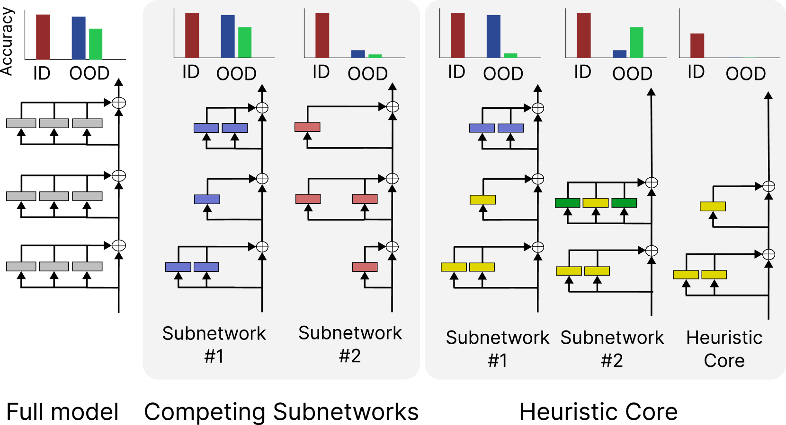

# Bhaskar, Friedman, Chen 2024 — The Heuristic Core: Understanding Subnetwork Generalization in Pretrained Language Models

См. также: [глобальный индекс понятий](../../concepts/index.md).

**Adithya Bhaskar**, **Dan Friedman**, **Danqi Chen** (Princeton Language and Intelligence (PLI), Принстонский университет).

arXiv [2403.03942](https://arxiv.org/abs/2403.03942), 6 марта 2024 (версия v2 — 5 июня 2024). 10 цитирований — двадцать вторая по цитируемости работа корпуса. Источник — нативный HTML arXiv версии v2.

Файлы разбора этой статьи:

- [`2403.03942.the-heuristic-core-understanding-subnetwork-generalization-in-pretrained-language-models.claims.txt`](2403.03942.the-heuristic-core-understanding-subnetwork-generalization-in-pretrained-language-models.claims.txt) — пронумерованные утверждения статьи с пометками разбора.
- [`2403.03942.the-heuristic-core-understanding-subnetwork-generalization-in-pretrained-language-models.license.txt`](2403.03942.the-heuristic-core-understanding-subnetwork-generalization-in-pretrained-language-models.license.txt) — лицензионная запись arXiv для этой статьи.

Схема якорей и правила ссылок на карточку — в [README папки статей](../README.md).

**Карточка-выдержка.** Лицензия статьи (`arxiv-nonexclusive`) не разрешает публикацию копии оригинала и полного перевода, поэтому карточка содержит редакторские секции и цитируемые фрагменты перевода (право цитирования). Полный текст статьи: <https://arxiv.org/abs/2403.03942>.

## Затрагиваемые понятия

**[Разрежённая подсеть / lottery ticket](../../concepts/sparse-subnetwork-lottery-ticket.md)** — работа целиком построена на прореживании и даёт корпусу самое неудобное наблюдение о подсетях: внутри **одной** обученной модели прореживание с разными случайными сидами находит подсети, неразличимые внутри области, но расходящиеся вне её до предела — от $4.1\%$ до $50.2\%$ на одном и том же подслучае HANS ([`p4-1`](#p4-1)). Отсюда практический вывод, прямо противоречащий надеждам на «выделение обобщающего билета»: **ни одна разрежённая подсеть не обобщает так же хорошо, как полная модель**, и чем разрежённее подсеть, тем хуже она обобщает ([`p6-4`](#p4-2)).

**[Эффективность контуров](../../concepts/circuit-efficiency.md)** — ветвь этого понятия, идущая от Merrill et al. (конкуренция плотной и разрежённой подсетей), при переносе на предобученную языковую модель **не подтверждается**. Авторы разложили её на два проверяемых предсказания — непересекающиеся подсети и убывание эффективного размера при генерализации ([`p6-7`](#p5-3)) — и опровергли оба. Вместо непересекающихся подсетей найдено сильное перекрытие: корреляция Спирмена между частотами голов в обобщающих и необобщающих подсетях равна $0.82$, тогда как ожидаемое пересечение $12$ случайных подсетей той же разрежённости составляет $7.7\cdot 10^{-5}$ головы ([`p6-8`](#p5-4)).

**[Замораживание подсети](../../concepts/freezing-subnetwork.md)** — **эвристическое ядро** и есть главное понятие работы: девять голов внимания BERT, встречающихся во *всех* подсетях MNLI, включая не обобщающие вовсе, и уже присутствующих в подсетях контрольной точки **до** начала генерализации ([`p6-18`](#p6-2)). Для QQP такое же ядро состоит из восьми голов, и пять из них общие с ядром MNLI ([`p8-1`](#p8-1)). Ядро не выделяется и не замораживается искусственно — оно обнаруживается как пересечение независимо найденных подсетей.

**[Маршрутизация внимания](../../concepts/attention-routing-heads.md)** — головы ядра поддаются прямому прочтению. Четыре из девяти обращаются к токенам, повторяющимся в посылке и гипотезе, то есть считают признак лексического перекрытия; остальные обращаются к предыдущему, следующему токену или к разделителю ([`p7-1`](#p7-1), [`fig-7`](#fig-7)). Это редкий в корпусе случай, когда «эвристика» из поведенческой литературы (HANS) сомкнута с конкретными головами модели.

**[Каузальная абляция](../../concepts/causal-ablation-intervention.md)** — решающий довод работы получен вмешательством, а не наблюдением. Отключение любой из голов ядра почти не сказывается на точности внутри области, но **обрушивает** точность вне её: одна голова (L4.H0) отнимает более 40 % на подслучае *SO-Swap*, а отключение трёх голов разом даёт $3.6\%$ вместо $86.7\%$ — падение **сверх-аддитивно** ([`p7-3`](#p7-3), [`tab-3`](#tab-3)). То есть генерализация *опирается* на эвристические головы, а не борется с ними.

**[Меры прогресса](../../concepts/progress-measures.md)** — введена величина **эффективного размера**: размер наименьшей подсети, *верной* модели на наборе $D$ (точности расходятся не более чем на $3\%$) ([`p6-17`](#p6-1)). Величина взята у Merrill et al., но разнесена по наборам — внутри области, вне области, смешанный, — и именно это разнесение даёт результат: эффективный размер по данным внутри области держится ровно, а по данным вне области **растёт** вместе с генерализацией ([`p6-18`](#p6-2), [`fig-6`](#fig-6)).

**[Возникновение признаков](../../concepts/feature-emergence-feature-learning.md)** — картина обучения получается накопительной, а не замещающей: модель сперва выучивает простые поверхностные признаки, а затем обобщает, **вбирая** в это ядро дополнительные головы, которые опираются на его выход, чтобы вычислять признаки более высокого порядка ([`p6-18`](#p6-2), [`p9-4`](#p9-4)).

**[Фазовый переход](../../concepts/phase-transition.md)** — по разрежённости никакого перехода нет: точность вне области падает плавно с ростом разрежённости и «лишена резких переходов» ([`p6-4`](#p4-2), [`fig-4`](#fig-4)). Это важно для корпуса: там, где картина состязающихся контуров предсказывает переключение, наблюдается постепенная деградация.

**[Гроккинг](../../concepts/grokking.md)** — постановка задачи взята по аналогии с гроккингом (качество внутри области насыщается рано, точность вне области растёт много позже) ([`p6-6`](#p5-2)), и именно эта аналогия побудила проверить объяснение через состязающиеся подсети. Итог для корпуса — **отрицательный перенос**: механизм, объясняющий гроккинг на алгоритмических задачах, не описывает отложенную синтаксическую генерализацию предобученной языковой модели.

**[Механистическая интерпретируемость](../../concepts/mechanistic-interpretability.md)** — метод нисходящий: подсети ищутся оптимизацией двоичной маски по головам и MLP-слоям с абляцией средним и $L_{0}$-регуляризацией под целевую разрежённость ([`p3-2`](#p3-2)). Авторы сами отмечают цену такого выбора: атомарно интерпретируемых «контуров» они не ищут и не находят ([`p10-1`](#p10-1)).

**[Запоминание](../../concepts/memorization-phase.md)** — «эвристика» здесь занимает то же место, что запоминание в алгоритмических постановках: решение с высокой точностью внутри области, не переносящееся вовне. Разница существенна и заслуживает внимания: запоминание в гроккинге не даёт ничего вне обучающего набора, а эвристика *обобщает* на дружественные ей примеры и потому оказывается полезным основанием, а не мусором, который нужно вытеснить.

Отдельно стоит сказать, чего в работе **нет**. Нет объяснения, *почему* модель достраивает ядро, а не заменяет его: механизм описан, движущая сила — нет ([`p10-1`](#p10-1)). Нет и проверки на моделях иного масштаба: авторы прямо предупреждают, что модели в 7 млрд параметров и больше могут идти к генерализации другим путём ([`p8-2`](#p8-2)).

Карточки статей корпуса: [Merrill et al. 2023](../2303.11873.a-tale-of-two-circuits-grokking-as-competition-of-sparse-and-dense-subnetworks/2303.11873.a-tale-of-two-circuits-grokking-as-competition-of-sparse-and-dense-subnetworks.card.md) — проверяемая здесь гипотеза состязающихся подсетей и величина эффективного размера; [Varma et al. 2023](../2309.02390.explaining-grokking-through-circuit-efficiency/2309.02390.explaining-grokking-through-circuit-efficiency.card.md) — вторая версия того же объяснения, названная во введении; [Power et al. 2022](../2201.02177.grokking-generalization-beyond-overfitting-on-small-algorithmic-datasets/2201.02177.grokking-generalization-beyond-overfitting-on-small-algorithmic-datasets.card.md) — источник аналогии; [Omnigrok](../2210.01117.omnigrok-grokking-beyond-algorithmic-data/2210.01117.omnigrok-grokking-beyond-algorithmic-data.card.md) — перенос гроккинга за пределы алгоритмических задач, названный в обзоре.

## Что показано, а что предположено

Замечания редактора карточки по итогам разбора утверждений (`…claims.txt`). Работа держится на трёх опорах: воспроизводимом наблюдении о расхождении подсетей, опровержении чужой гипотезы и положительной находке — эвристическом ядре.

**Опровержение сделано по правилам.** Гипотеза состязающихся подсетей не отброшена риторически, а разложена на два предсказания, каждое из которых проверено своей мерой ([`p6-7`](#p5-3)): непересекаемость — корреляцией частот голов против случайного ожидания, убывание эффективного размера — измерением этого размера по ходу обучения. Оба предсказания нарушены, причём второе — с противоположным знаком: эффективный размер **растёт** ([`p6-18`](#p6-2)). Это сильнейшая часть работы.

**Эвристическое ядро показано пересечением, а его роль — вмешательством.** Само по себе пересечение подсетей — наблюдение корреляционное. Но абляция голов ядра даёт причинный довод в нужную сторону: удаление «эвристической» головы **вредит** обобщению вне области ([`p7-3`](#p7-3)). Именно этот результат превращает ядро из статистического артефакта прореживания в несущую конструкцию.

**Сверх-аддитивность падения — самый содержательный факт.** Три головы поодиночке отнимают десятки процентов, а вместе оставляют $3.6\%$ там, где полная модель даёт $86.7\%$. Отсюда и вывод, что остальная модель *опирается* на выход ядра. Проверена, однако, ровно одна тройка голов, выбранная по наибольшему одиночному эффекту; систематического перебора подмножеств нет.

**Что головы ядра «вычисляют лексическое перекрытие» — прочтение образцов внимания.** Довод устроен так: четыре из девяти голов обращаются к повторяющимся токенам, и это видно на примерах ([`fig-7`](#fig-7)). Авторы сами приводят в обзоре работу, показавшую, что образцы внимания могут вводить в заблуждение ([`p9-1`](#p9-1)), и не подкрепляют прочтение ни зондированием, ни подстановкой активаций. Роль ядра доказана абляцией; *содержание* признаков — только показано.

**Совпадение ядер MNLI и QQP оставлено гипотезой.** Пять голов из восьми общие, и наибольший эффект дают одни и те же две ([`p8-1`](#p8-1)). Естественное объяснение — что эти головы считают перекрытие уже в предобученном BERT, до всякой донастройки, — авторы называют возможностью и прямо оставляют будущей работе. Проверка стоила бы одного прогона.

**Перенос на другие архитектуры показан не в равной мере.** Для RoBERTa результаты воспроизводятся полностью, хотя эффекты абляции слабее ([`p14-15`](#p14-7)). Для GPT-2 картина сложнее: модель почти не обобщает на HANS, из всех подслучаев «contradiction» пригоден один, а на подслучаях «entailment» точность к концу обучения падает ([`p15-1`](#p15-1)). Объяснение через «эвристики противоречия» ([`p15-3`](#p15-3)) внутренне непротиворечиво, но опирается на две тенденции без отдельной проверки, и авторы сами перечисляют, что осталось необъяснённым ([`p17-2`](#p17-2)).

**Отрицательный перенос гроккинга приведён честно и полезен.** Аналогия с гроккингом послужила рабочей гипотезой и была опровергнута на собственном материале — это ровно тот случай, когда отрицательный результат ценнее подтверждающего. Стоит, однако, помнить о разнице постановок: там алгоритмическая задача с полным переобучением на маленьком наборе, здесь донастройка предобученной модели на сотнях тысяч примеров. Опровергнута переносимость механизма, а не сам механизм.

**Место в корпусе.** Работа — главный контрдовод к картине «плотная запоминающая подсеть вытесняется разрежённой обобщающей». Она показывает постановку, в которой генерализация **надстраивается** над необобщающими признаками, а не заменяет их, и в которой эффективный размер при генерализации растёт. Для корпуса это означает, что рост или убывание эффективного размера — не признак гроккинга как такового, а свойство конкретной постановки.

---

# Цитируемые фрагменты перевода

Ниже приведены только те фрагменты перевода, на которые ссылаются карточки корпуса (право цитирования). Нумерация якорей `pN-M` / `fig-N` / `sec-X` совпадает с полной карточкой и оригиналом.

## Аннотация

###### p1-2

Прежние работы обнаружили, что предобученные языковые модели (ЯМ), донастроенные с разными случайными сидами, способны показывать схожее качество внутри области, но по-разному обобщать в проверках синтаксической генерализации. В этой работе мы показываем, что даже внутри одной модели можно найти несколько подсетей, работающих схоже внутри области, но обобщающих совершенно по-разному. Чтобы лучше понять эти явления, мы исследуем, объяснимы ли они в терминах «состязающихся подсетей»: модель поначалу представляет множество различных алгоритмов, отвечающих разным подсетям, а генерализация наступает, когда она в конце концов сходится к одному из них. Этим объяснением пользовались, чтобы объяснить генерализацию в простых алгоритмических задачах («гроккинг»). Вместо состязающихся подсетей мы находим, что все подсети — обобщающие и нет — разделяют общий набор голов внимания, который мы называем *эвристическим ядром*. Дальнейший разбор наводит на мысль, что эти головы внимания возникают рано в обучении и вычисляют поверхностные, не обобщающие признаки. Модель учится обобщать, добавляя новые головы внимания, которые опираются на выходы «эвристических» голов, чтобы вычислять признаки более высокого уровня. В целом наши результаты дают более подробную картину механизмов синтаксической генерализации в предобученных ЯМ (сноска: код мы выкладываем открыто по адресу https://github.com/princeton-nlp/Heuristic-Core).

## 1 Введение

###### fig-1



*Рисунок 1: Мы находим в предобученной ЯМ разные подсети, дающие схожее качество внутри области, но обобщающие по-разному. Прежние работы объясняли схожие явления генерализации в синтетических задачах через различные подсети, состязающиеся в ходе обучения. Мы же находим свидетельства *эвристического ядра*: набора голов внимания, встречающихся во всех обобщающих подсетях, но сами по себе не обобщающих.* **[p. 1]**

###### p1-5

Центральный вопрос машинного обучения — понять, как модели обобщают из данных, допускающих разные возможные решения. McCoy et al. (2020) исследовали его для предобученных языковых моделей (ЯМ) вроде BERT (Devlin et al., 2019), обучаемых выводу на естественном языке (NLI; Williams et al., 2018), и показали, что модели, обученные с разными случайными сидами, работают очень схоже на проверочных наборах внутри области (ID), но весьма по-разному обобщают на состязательные наборы вне области (OOD). Однако о том, как отдельная модель научается обобщать, мы знаем немного.

###### p1-6

В этой работе мы пользуемся разбором подсетей, чтобы лучше понять, как предобученные ЯМ обобщают в задачах обработки языка. А именно, мы применяем структурное прореживание Wang et al. (2020); Xia et al. (2022), чтобы выделить различные подсети — подмножества голов внимания и MLP-слоёв, — приближающие поведение полной модели. Наша основная находка: даже внутри одной модели существует несколько подсетей, которые все близко повторяют качество модели на проверочных наборах внутри области, но обобщают совершенно по-разному. У этого результата есть содержательные следствия для практиков — например, он подчёркивает важность оценки приёмов прореживания вне области. Он ставит и несколько вопросов о механизмах, лежащих в основе генерализации, которые мы далее исследуем.

###### p2-1

Сперва мы проверяем, состоят ли эти различные по поведению подсети из непересекающихся подмножеств составляющих модели (голов внимания). Напротив, мы находим небольшой набор из девяти голов внимания, встречающихся во *всех* подсетях — даже в тех, что не обобщают вовсе. Более того, мы находим, что тот же набор голов внимания появляется и при прореживании более ранних контрольных точек модели, до того как она начинает обобщать. В постановке гроккинга генерализация отмечена убыванием *эффективного размера* — размера наименьшей подсети, повторяющей качество полной сети на наборах генерализации, — по мере того как модель переходит от плотной запоминающей подсети к разрежённой обобщающей. Напротив, мы находим, что в нашем случае генерализация сопровождается резким **ростом** эффективного размера. Вместе с набором общих голов внимания наши результаты наводят на мысль, что вместо выбора между состязающимися подсетями модель сперва выучивает «ядро» голов внимания, реализующих простые эвристики. В конце концов модель обобщает, выучивая дополнительные головы внимания, которые взаимодействуют с этими головами.

#### Поиск подсетей прореживанием.

###### p3-2

Мы прореживаем оптимизацией двоичной *маски*, где $0$ и $1$ означают выбрасывание и сохранение соответственно. Наши прогоны прореживают головы внимания и целые MLP-слои, каждому из которых отвечает один бит этой маски. Мы применяем *абляцию средним* по рекомендациям работ по механистической интерпретируемости Zhang and Nanda (2024): активации прорежённых слоёв (или голов) заменяются средней активацией по обучающим данным. Вслед за CoFi Pruning Xia et al. (2022) мы ослабляем двоичные маски до вещественных чисел из $[0,1]$ и затем оптимизируем их градиентным спуском. Оптимизируемая целевая функция — KL-потеря между предсказаниями полной модели и прорежённой подсети. Наконец, элементы маски дискретизируются в $\{0,1\}$ по порогу. Для достижения заданной разрежённости применяется L0-регуляризация. Для моделирования масок мы берём рецепт Louizos et al. (2018) и приводим подробности в приложении B. Дополнительные подробности и гиперпараметры вместе с более развёрнутым обсуждением метода приведены в приложении A. Мы замораживаем модель после донастройки и оптимизируем только маски прореживания, чтобы сохранить верность полной модели.

###### fig-4

*Рисунок 4: Точность вне области убывает с разрежённостью довольно плавно ($3$ сида). Падение точности внутри области медленное и с малым разбросом. Мы не находим подсетей разрежённее $30\%$, обобщающих так же хорошо, как полная модель, ни на одном из наборов.* **[p. 5]**

#### Разные подсети обобщают по-разному.

###### p4-1

Рисунки 2a и 2c приводят результаты для целевой разрежённости $50\%$ и $30\%$ для MNLI и QQP соответственно. Прорежённые модели работают внутри области близко друг к другу и все укладываются в 2–3 % от точности полной модели и на MNLI, и на QQP. Однако их точности на проверочных наборах вне области различаются широко. В самом крайнем случае точности на подслучае *Embed-If (Constituent)* из HANS изменяются от всего $4.1\%$ до $50.2\%$. Более того, разные подсети обобщают на разные подслучаи, как показывает рисунок 3. Подсеть №8 достигает $41.4\%$ на *SO-Swap (Lexical Overlap)*, но лишь $18.0\%$ на *Embed-If (Constituent)*. Подсеть №5, напротив, достигает лишь $19.5\%$ на первом, но $50.2\%$ на втором. Итак, прореживание разных частей модели, по-видимому, в разной мере жертвует генерализацией на подслучаях вне области. Результаты для QQP и PAWS-QQP схожи.

###### fig-6

*Рисунок 6: Точности внутри и вне области и эффективный размер модели в ходе донастройки, вычисленные прореживанием с $3$ сидами. Генерализация связана с резким **ростом** эффективного размера для наборов вне области и смешанных. Эффективный размер для наборов внутри области остаётся постоянным, что показывает: эти дополнительные эффективные параметры идут на генерализацию.* **[p. 6]**

#### Более разрежённые подсети обобщают хуже.

###### p4-2

Мы наблюдаем также, что более разрежённые подсети неизменно обобщают хуже. Сперва мы прореживаем модель до большей разрежённости ($70\%$ для MNLI и $60\%$ для QQP) с $12$ случайными сидами. Как показывают рисунки 2b и 2d, практически *все* подсети при такой разрежённости обнаруживают полное отсутствие генерализации почти на каждом подслучае вне области. Точность внутри области держится на приличном уровне 74–76 %, что указывает: значительная часть качества модели объясняется этими разрежёнными подсетями. На рисунке 4 мы приводим точность генерализации подсетей, прорежённых до разных уровней разрежённости, **[p. 5]** для $3$ случайных сидов. Точность генерализации в целом неуклонно падает при более высоких уровнях разрежённости и лишена резких переходов.

## 4 Гипотеза состязающихся подсетей

###### p5-2

А именно, мы исследуем, объяснимы ли наши находки через *состязающиеся подсети*: модель поначалу представляет несколько решений в виде разных подсетей и в конце концов сходится к одному. Обобщит ли она, зависит от того, к какой из подсетей она сойдётся. Эта гипотеза, как было найдено, объясняет любопытное явление гроккинга (Merrill et al., 2023). Кроме того, как отмечают Tu et al. (2020), качество наших моделей BERT внутри области насыщается рано в обучении (рисунок 6), а точность вне области начинает расти много позже. Побуждаемые сходством с гроккингом, мы проверяем, возникает ли генерализация и в нашем случае из состязания между непересекающимися подсетями.

###### p5-3

Мы считаем, что гипотеза состязающихся подсетей состоит из двух основных предсказаний, следуя Merrill et al. (2023). Во-первых, модель можно разложить на *непересекающиеся* подсети, представляющие различные алгоритмы, согласующиеся с обучающими данными. Во-вторых, рост генерализации сопровождается уменьшением *эффективного размера* модели — наименьшей подсети, чья точность совпадает с точностью модели в пределах заданного порога (например, $3\%$) на целевом наборе, — что происходит, когда модель переключается с плотной необобщающей подсети на разрежённую обобщающую.

#### Все подсети разделяют общий набор составляющих.

###### p5-4

Мы начинаем с измерения того, сколько составляющих модели разделяют разные подсети. А именно, мы вычисляем частоты каждой головы внимания в подсетях с $50\%$ (частично обобщающих) и с $70\%$ (не обобщающих) для модели MNLI. Эти частоты изображены на рисунке 5 (соответствующий график для QQP приведён на рисунке 11 в приложении C). Корреляция Спирмена между двумя частотами равна $0.82$ ($p$-значение = $1.6\cdot 10^{-36}$), то есть очень сильное согласие. (Соответствующее значение для QQP равно $0.74$, что отвечает **[p. 6]** сильному согласию; см. рисунок 14 в приложении C.) В частности, мы наблюдаем, что **девять голов внимания** встречаются во *всех* подсетях, даже в самых разрежённых, то есть в подсетях, ведущих себя наиболее согласно с эвристиками. Иначе говоря, вместо непересекающихся подсетей мы обнаруживаем высокую степень перекрытия (ожидаемое пересечение $12$ случайных подсетей с разрежённостью $70\%$ составляет $7.7\cdot 10^{-5}$ головы) между подсетями, обобщающими частично, и подсетями, не обобщающими вовсе.

###### fig-7

*Рисунок 7: Многие головы внимания, общие для подсетей MNLI, обращают внимание на токены, встречающиеся и в посылке, и в контексте. Поскольку порядок, *например*, «doctor» и «president» обращён, эти головы, по-видимому, выделяют лексическое перекрытие.* **[p. 7]**

#### С генерализацией модели эффективный размер растёт.

###### tab-3

*Таблица 3: Последствия поочерёдного отключения $9$ голов, встречающихся во всех подсетях MNLI, из полной модели. Примечательно, что некоторые из них важны и для противо-эвристического поведения, поскольку их отключение ведёт к падению генерализации. В последней строке L$x$.H$y$ обозначает голову $y$ слоя $x$.* **[p. 8]**

###### p6-1

Далее мы исследуем, как эти подсети возникают в ходе обучения. Мы проводим разбор, схожий с Merrill et al. (2023), и строим график *эффективного размера* модели, определённого как размер наименьшей подсети, *верной* модели на конкретном проверочном наборе $D$. Мы называем подсеть *верной* модели на наборе $D$, если их точности различаются не более чем на $3\%$. Мы приводим верность при разном выборе $D$ — либо проверочный набор внутри области, либо наборы вне области, либо равновзвешенное их сочетание (смешанные данные). Мы прореживаем каждую контрольную точку до разрежённостей, кратных $5\%$, и выбираем наибольшую, дающую верную подсеть. Приводимые точности при каждой разрежённости — средние по трём сидам.

###### p6-2

Результаты приведены на рисунке 6. Эффективный размер, нужный для приближения модели на проверке внутри области, остаётся сравнительно ровным на протяжении обучения. Однако на данных вне области и на смешанных генерализация сопровождается *ростом* эффективного размера. Мы также рассматриваем набор голов внимания, встречающихся в подсетях MNLI в контрольной точке непосредственно перед тем, как модель начинает обобщать. Мы находим, что те же девять голов внимания, что встречаются во всех подсетях в конце обучения, присутствуют и в этих подсетях. Это позволяет предположить, что вместо переключения между состязающимися подсетями модель сперва выучивает набор голов внимания, вычисляющих простые необобщающие признаки, а затем обобщает, вбирая в это ядро всё больше составляющих.

#### Как ведут себя головы внимания эвристического ядра?

###### p7-1

Сперва мы смотрим на образцы внимания, обнаруживаемые этими головами. Мы разбираем примеры образцов внимания и наблюдаем, что большинство голов обнаруживают простой образец; количественно они выражены на рисунке 9. Четыре головы из девяти (MNLI) обращаются к токенам, повторяющимся в посылке и гипотезе, что позволяет предположить, что они извлекают признаки перекрытия токенов. Рисунок 7 показывает примеры образцов внимания. Примечательно, что мы находим также восемь голов внимания, встречающихся во всех подсетях QQP. Рисунок 8 приводит пример, указывающий, что эти головы играют схожую роль и для QQP, обращаясь к повторяющимся словам.

#### Как головы внимания эвристического ядра взаимодействуют с остальной моделью?

###### p7-3

Далее мы отключаем каждую голову эвристического ядра из полной модели и наблюдаем, как меняются точности внутри и вне области, — таблица 3. Отключение ни одной из голов не сказывается сильно на точности внутри области. **[p. 8]** Однако, что удивительно, многие головы оказываются решающими для хорошей работы на HANS: например, отключение одной головы (L4.H0) снижает качество на *SO-Swap* более чем на 40 %. Более того, падения при отключении этих голов *сверх-аддитивны*: отключение всего трёх из них обрушивает точность вне области. Это указывает, что головы вне эвристического ядра опираются на эвристическое ядро, реализуя более сложное поведение.

###### p8-1

Таблица 4 рисует схожую картину для QQP. Пожалуй, самое любопытное: головы $2.5$ и $4.0$, дававшие наибольший эффект отключения для MNLI, выделяются и здесь. Вместе с тем, что $5$ из этих $8$ голов есть и в ядре модели MNLI, это подчёркивает возможность того, что эти головы извлекают признаки словесного перекрытия уже в модели BERT до донастройки. Этот вопрос мы оставляем будущей работе.

## 6 Находки переносятся на RoBERTa и GPT-2

###### p8-2

В приложении D мы показываем, что наши результаты переносятся на модели RoBERTa (Liu et al., 2019). Приложение E обнаруживает, что они переносятся и на модели GPT-2 (Radford et al., 2019), хотя и с некоторым новым поведением. А именно, мы наблюдаем, что точность на *несостязательных* случаях вне области (случаи «entailment») слегка падает к концу обучения, и это сопровождается умеренным ростом эффективного размера. Качество на этих случаях к тому же различается у разных подсетей одной разрежённости. Объяснение этих дополнительных особенностей требует дальнейших исследований и составляет будущую работу. Отметим также, что модели много большего размера (например, с 7 млрд параметров и более) могут идти к генерализации иным путём. Они могут поэтому обнаруживать качественно иное поведение, и мы призываем к осторожности при перенесении на них результатов этой работы.

#### Прореживание ради интерпретируемости.

###### p9-1

Механистическая интерпретируемость стремится понять модели через их составляющие — нейроны, головы внимания, MLP. Такой разбор вскрывает замысловатые взаимодействия между отдельными атомарными составляющими, образующими *контуры* Elhage et al. (2021); Olah et al. (2020), которые реализуют разные задачи. Прореживание изредка применялось как часть более широких усилий по интерпретируемости Lepori et al. (2023a), хотя большей частью бессистемно. Jain et al. (2023) применяют прореживание и зондирование, чтобы показать, что донастройка выучивает тонкую «обёртку» вокруг способностей модели. Lepori et al. (2023b) применяют прореживание для выделения подсетей, о которых затем показывают, что те образуют модульные строительные блоки поведения модели. В том же духе De Cao et al. (2020) обучают дифференцируемые маски на входе, чтобы исследовать поведение модели. Хотя большинство этих подходов заменяют отсутствующие слои тождественным отображением, работы по механистической интерпретируемости Zhang and Nanda (2024); Conmy et al. (2023) показали, что добавление их усреднённых активаций может лучше сохранять верность. Предшествующие работы рассматривали образцы внимания, чтобы расшифровать поведение модели (например, Clark et al., 2019), хотя было показано и то, что образцы внимания в некоторых случаях вводят в заблуждение (Jain and Wallace, 2019).

## 8 Заключение

###### p9-4

Мы показали, что прореживание предобученной языковой модели с разными случайными сидами может давать подсети, которые работают внутри области схоже с исходной моделью, но обобщают по-разному. Более того, более разрежённые подсети обобщают хуже. Чтобы объяснить этот результат, мы сперва рассмотрели *гипотезу состязающихся подсетей*, применявшуюся для объяснения гроккинга на алгоритмических задачах; она предполагает, что модель состоит из непересекающихся подсетей, представляющих разные решения, часть из которых обобщает, а часть нет. Мы обнаружили, что наши результаты вместо этого лучше согласуются с существованием *эвристического ядра*: подмножества голов внимания, которые встречаются во всех подсетях и вычисляют поверхностные необобщающие признаки. Модель обобщает, вбирая дополнительные головы, взаимодействующие с эвристическим ядром. Наши результаты имеют практические следствия относительно влияния прореживания на генерализацию и ставят занимательные вопросы о том, как языковые модели учатся обобщать, составляя решение из простых частей.

## Ограничения

###### p10-1

Наши подходы не лишены ограничений. Наш разбор основан на нисходящем выделении подсетей. Поэтому мы не ищем и не обнаруживаем «контуры», интерпретируемые поатомно. Наши эксперименты используют только задачи классификации текста, хотя мы полагаем, что такая задача идеальна благодаря ясным определениям эвристик. Кроме того, мы работаем только с моделями BERT — возможно, что более крупные трансформеры или обученные иначе обнаруживают иное поведение. Наконец, хотя в этой работе мы разобрали механизмы генерализации, вопрос о том, почему они возникают, пока остаётся неуловимым. Наши эксперименты подняли также много новых вопросов, ответы на которые требуют дальнейших исследований.

## Приложение D. Результаты на RoBERTa

###### p14-7

Таблица 5 показывает, что разные подсети при разрежённости $50\%$ по-прежнему обобщают по-разному, несмотря на **[p. 15]** схожее с полной моделью качество внутри области. Рисунок 15 говорит нам, что эффективный размер снова растёт вместе с генерализацией. Эти $12$ подсетей делят $11$ голов внимания, которые встречаются и в подсетях эффективного размера до наступления генерализации. Мы перечисляем эти головы вместе с последствиями их отключения в таблице 6. Эффекты слабее, но согласуются с находками на модели BERT: эти головы дают гораздо более сильный эффект отключения, чем случайные другие головы, хотя сами по себе не обобщают.

## Приложение E. Результаты на GPT-2

###### p15-1

В этом подразделе мы спрашиваем, переносятся ли наши находки и объяснения на модели, состоящие только из декодера. Мы работаем с моделью GPT-2 small (117 млн) (Radford et al., 2019). Большинство гиперпараметров и донастройки, и прореживания совпадают с перечисленными в приложениях A и B. Однако мы обнаружили, что модель GPT-2 даже целиком обобщает на подслучаи HANS очень плохо. После обучения в течение $10$ эпох ($12270$ шагов) constituent_cn_embed_under_if оказывается единственным подслучаем «contradiction» с точностью выше $30\%$. Поэтому мы выбираем эту постановку, а Embed-If — как единственный состязательный подслучай вне области. Любопытно, однако, что мы наблюдали, как точности некоторых *дружественных эвристике* подслучаев начинают падать к концу обучения. Мы выбираем subsequence_se_relative_clause_on_obj (Rel-Clause [SE]) и constituent_ce_embedded_under_since (Embed-Since [CE]) как два представительных подслучая и объединяем их в срез OOD-E (OOD-Entailment). Мы проводим опыты и для подслучаев OOD, и для OOD-E.

###### p15-3

Согласовать эти результаты можно, предположив, что часть эвристик суть эвристики *противоречия* и что модель наращивает дальнейшие неэвристические головы вокруг эвристического ядра *противоречия*. И действительно, на рисунке 16 мы отмечаем две любопытные тенденции: (1) точность модели слегка убывает на подслучаях OOD-E к концу обучения и (2) это убывание точности сопровождается умеренным ростом **[p. 17]** эффективного размера для OOD-E. Возможное объяснение второго — что выучиваются и некоторые эвристики распознавания «contradiction», играющие в эвристическом ядре сходную роль.

###### p17-2

Итак, наши результаты на подслучаях вне области согласуются с тем, что модель реализует и эвристики следования, и эвристики противоречия. С другой стороны, остаются вопросы относительно подслучаев OOD-E в GPT-2, а именно: почему качество модели сходит на нет к концу обучения и почему есть разброс качества при *высокой* разрежённости (в отличие от результатов на BERT), хотя ни одна из общих голов не даёт значимых последствий отключения. Ответы на эти вопросы мы оставляем будущей работе.

```yaml
paper:
  id: 2403.03942
  title: "The Heuristic Core: Understanding Subnetwork Generalization in Pretrained Language Models"
  authors: [Adithya Bhaskar, Dan Friedman, Danqi Chen]
  affiliation: "Princeton Language and Intelligence (PLI), Princeton University"
  date: 2024-03-06
  venue: "препринт arXiv (v2 от 2024-06-05)"
  citations: 10
  source: native-html-v2

core_claim:
  name: "эвристическое ядро вместо состязающихся подсетей"
  finding: "все подсети одной донастроенной модели делят набор голов внимания,
    вычисляющих поверхностные необобщающие признаки; генерализация достигается
    добавлением голов ПОВЕРХ этого ядра, а не заменой его"
  against: "гипотеза состязающихся подсетей (Merrill et al.): непересекающиеся
    подсети и убывание эффективного размера при генерализации"
  both_predictions_broken:
    disjointness: "корреляция Спирмена частот голов в подсетях 50 % и 70 % = 0.82
      (p = 1.6e-36); случайное ожидание пересечения 12 подсетей 70 % = 7.7e-05 головы"
    effective_size: "растёт вместе с генерализацией на данных вне области и смешанных,
      держится ровно на данных внутри области — знак противоположен предсказанному"

heuristic_core:
  mnli: "9 голов внимания, общих для всех подсетей, включая не обобщающие вовсе"
  qqp: "8 голов, из них 5 общих с ядром MNLI"
  roberta: "11 голов"
  timing: "те же головы присутствуют в подсетях контрольной точки ДО начала генерализации"
  function: "4 из 9 обращаются к токенам, повторяющимся в посылке и гипотезе
    (лексическое перекрытие); остальные — к предыдущему, следующему токену, разделителю"
  ablation: "отключение почти не меняет точность внутри области, но обрушивает вне её;
    L4.H0 отнимает более 40 % на SO-Swap; три головы вместе дают 3.6 % против 86.7 %"
  super_additive: true

method:
  subnetwork: "подмножество голов внимания и MLP-слоёв; маска оптимизируется
    градиентным спуском по KL-расхождению с полной моделью"
  ablation_kind: "абляция средним (mean ablation), не нулём"
  sparsity: "L0-регуляризация с лагранжевым членом под целевую разрежённость (CoFi)"
  effective_size: "размер наименьшей подсети, чья точность на наборе D расходится
    с моделью не более чем на 3 %; сетка разрежённостей с шагом 5 %"
  note: "MLP-слои в прогонах не прореживаются никогда, хотя это разрешено"

setup:
  models: [bert-base-cased (125M), roberta-base, gpt2-small (117M)]
  id_datasets: [MNLI, QQP]
  ood_datasets: [HANS, PAWS-QQP (adversarial)]
  seeds: "12 сидов прореживания на разрежённость, 3 сида для кривых по обучению"
  compute: "около 750 GPU-часов, NVIDIA A5000"

findings:
  - id: 1
    claim: "подсети одной модели неразличимы внутри области и расходятся вне её
      от 4.1 % до 50.2 % на одном подслучае HANS"
    anchor: p4-1
  - id: 2
    claim: "ни одна подсеть разрежённее 30 % не обобщает так же хорошо, как полная модель;
      падение плавное, без резких переходов"
    anchor: p4-2
  - id: 3
    claim: "гипотеза состязающихся подсетей разложена на два проверяемых предсказания"
    anchor: p5-3
  - id: 4
    claim: "подсети сильно перекрываются вместо того, чтобы быть непересекающимися"
    anchor: p5-4
  - id: 5
    claim: "эффективный размер вне области растёт вместе с генерализацией;
      те же девять голов есть в подсетях до генерализации"
    anchor: p6-2
  - id: 6
    claim: "головы ядра считают простые поверхностные признаки, прежде всего перекрытие"
    anchor: p7-1
  - id: 7
    claim: "отключение голов ядра вредит обобщению вне области, падение сверх-аддитивно"
    anchor: p7-3
  - id: 8
    claim: "ядра MNLI и QQP пересекаются; возможно, головы считают перекрытие
      уже в предобученном BERT — оставлено будущей работе"
    anchor: p8-1

open_questions:
  - "почему модель достраивает ядро, а не заменяет его — движущая сила не разобрана"
  - "переносятся ли выводы на модели от 7 млрд параметров — авторы предупреждают, что нет"
  - "почему в GPT-2 точность на подслучаях entailment падает к концу обучения"
  - "есть ли головы ядра в предобученном BERT до всякой донастройки"

limits:
  - "прочтение признаков голов опирается на образцы внимания; сами авторы приводят
    в обзоре работу о том, что образцы внимания могут вводить в заблуждение"
  - "сверх-аддитивность проверена на одной тройке голов, выбранной по одиночному эффекту"
  - "подход нисходящий: атомарно интерпретируемых контуров работа не ищет"
  - "только задачи классификации пар предложений, только модели уровня BERT"
  - "порог верности 3 % и шаг сетки 5 % выбраны без обоснования"

corpus_tension:
  merrill: "прямое опровержение при переносе: обе предпосылки нарушены,
    эффективный размер меняется в противоположную сторону"
  varma: "названа в обзоре как вторая версия того же взгляда, отдельно не проверена"
  nanda: "эффективный размер играет роль меры прогресса, но не привязан к задаче"
  power: "источник аналогии; перенос механизма даёт отрицательный результат"
  caveat: "опровергнута переносимость механизма, а не сам механизм: постановки
    различаются (алгоритмическая задача против донастройки на сотнях тысяч примеров)"

concept_cards:
  sparse-subnetwork-lottery-ticket: p4-1
  circuit-efficiency: p5-4
  freezing-subnetwork: p6-2
  attention-routing-heads: p7-1
  causal-ablation-intervention: p7-3
  progress-measures: p6-1
  feature-emergence-feature-learning: p6-2
  phase-transition: p4-2
  grokking: p5-2
  mechanistic-interpretability: p3-2
  memorization-phase: p4-2

sources:
  original_html: original/2403.03942.native.html
  converted_text: original/2403.03942.the-heuristic-core-understanding-subnetwork-generalization-in-pretrained-language-models.md
  images_dir: images/
  pdf: https://arxiv.org/pdf/2403.03942v2

anchors:
  scheme: "pN-M | fig-N | tab-N | sec-N (token headings, cross-viewer portable)"
  policy: "якоря заводятся только там, где на них ссылаются; разрывы страниц якорей не несут"
  paragraph: [p3-2, p4-1, p4-2, p5-2, p5-3, p5-4, p6-1, p6-2, p7-1, p7-3, p8-1,
    p8-2, p9-1, p9-4, p10-1, p14-7, p15-1, p15-3, p17-2]
  figure: [fig-4, fig-6, fig-7]
  table: [tab-3]

review_summary:                   # см. раздел «Что показано, а что предположено»
  strong: "чужая гипотеза разложена на два предсказания и опровергнута обоими замерами;
    роль ядра доказана вмешательством, а не наблюдением; отрицательный перенос
    механизма гроккинга приведён честно"
  weak: "содержание признаков голов прочитано из образцов внимания;
    сверх-аддитивность опирается на один замер; объяснение поведения GPT-2 —
    рассуждение, согласованное с двумя тенденциями"
  authors_own_limits:
    - "атомарно интерпретируемых контуров работа не ищет и не находит"
    - "только классификация текста и только модели уровня BERT"
    - "разобран механизм генерализации, но не движущая сила"
    - "модели от 7 млрд параметров могут идти к генерализации другим путём"

translation:
  status: complete
  formula_parity: "display 9/9, inline 206/206"
  figures: "34/34"
  pagination: "18 из 18 страниц отмечены"
```
