# Ahuja et al. 2024 — Learning Syntax Without Planting Trees: Understanding Hierarchical Generalization in Transformers

См. также: [глобальный индекс понятий](../../concepts/index.md).

**Kabir Ahuja**, **Tianxing He**, **Noah A. Smith**, **Yulia Tsvetkov** (Университет Вашингтона), **Vidhisha Balachandran** (Университет Карнеги—Меллона), **Madhur Panwar**, **Navin Goyal** (Microsoft Research).

arXiv [2404.16367](https://arxiv.org/abs/2404.16367), апрель 2024 (v3), 30 страниц, 20 рисунков. Всего цитирований по Semantic Scholar — 17, в картотеке — 0. Продолжение линии *структурного гроккинга* Murty et al.: вопрос не «бывает ли отложенное иерархическое обобщение», а «почему трансформер вообще предпочитает иерархическое правило, не имея к тому устройственной склонности». Три ответа: (1) источник склонности — **цель обучения**: из пяти целей только языковое моделирование стабильно даёт иерархическое обобщение на всех пяти синтетических задачах (и даже GRU грокает при ЯМ — против архитектурного вывода McCoy et al.); (2) оба конкурирующих обобщения — иерархическое и линейное — живут в обученной сети **как подсети**, выделяемые отсечением голов внимания за десятки тысяч шагов до поведенческого перелома, и сосуществуют благодаря двусмысленности данных; (3) предпочтение объяснено байесовской бритвой Оккама: где иерархическая грамматика получает больший апостериор, чем регулярная, — трансформер обобщает иерархически, где нет — не обобщает. Причина самой *отложенности* при этом не разобрана — признано в заключении.

Оригинал и производные файлы этой папки:

- [`original/2404.16367.native.html`](original/2404.16367.native.html) — первоисточник, нативный HTML arXiv (v3), скачан как есть.
- [`original/2404.16367.learning-syntax-without-planting-trees-understanding-hierarchical-generalization-in-transformers.md`](original/2404.16367.learning-syntax-without-planting-trees-understanding-hierarchical-generalization-in-transformers.md) — конверсия оригинала в Markdown без правок содержания.
- [`2404.16367.learning-syntax-without-planting-trees-understanding-hierarchical-generalization-in-transformers.claims.txt`](2404.16367.learning-syntax-without-planting-trees-understanding-hierarchical-generalization-in-transformers.claims.txt) — пронумерованные утверждения статьи с пометками разбора.
- [`images/`](images/) — 43 файла иллюстраций (20 рисунков с панелями).

Схема якорей и правила ссылок на карточку — в [README папки статей](../README.md).

## Затрагиваемые понятия

**[Гроккинг](../../concepts/grokking.md)** — структурный гроккинг воспроизведён на всех пяти задачах (100% внутри распределения задолго до подъёма обобщения) и получил новую управляющую переменную: **цель обучения** — из пяти целей лишь языковое моделирование стабильно ведёт к иерархическому обобщению, и именно различием целей объяснено расхождение предшественников (seq2seq у McCoy/Petty/Mueller против ЯМ у Murty) ([`p6-4`](#p6-4)); сильная побочная проверка — двухслойный GRU при ЯМ тоже обобщает иерархически, при seq2seq нет ([`p6-7`](#p6-7)). Разбор: главный разрыв замысла — работа объясняет, *какое* из двух обобщений побеждает, и ничего не говорит о том, *почему* победа отложена (байесовское сравнение статично; признано в заключении); ни одна из ходовых мер корпуса (норма, разрежённость, спектр) не измеряется.

**[Разрежённые подсети и лотерейный билет](../../concepts/sparse-subnetwork-lottery-ticket.md)** — конкуренция не «запоминание против обобщения», а **двух разных обобщений**: отсечением голов внимания (48 воротцев с $L_{0}$-штрафом, веса заморожены) на промежуточной точке, где полная модель обобщает на 30%, находятся и подсеть со 100% обобщения (Gen-prune), и подсеть-«линейное правило» с 0% при 100% внутри распределения ([`p9-1`](#p9-1)); хронология: линейная подсеть выделяема с ~6000 шагов, иерархическая — с ~9000, когда полная модель обобщает лишь на 5%, и далее обе сосуществуют до конца обучения ([`p9-2`](#p9-2)); вмешательство в данные убивает подсеть по выбору — 10k однозначно иерархических примеров уничтожают линейную подсеть (128 наборов гиперпараметров отсечения не находят её), 10k линейных — иерархическую ([`p9-4`](#p9-4)). Разбор: контрольная группа одна (случайная инициализация); при 1 голове на слой не находится ни одна подсеть, хотя модель обобщает лучше четырёхголовой, — открытый вопрос.

**[Колмогоровская сложность](../../concepts/kolmogorov-complexity.md)** — простота операционализирована бритвой Оккама Соломонова: апостериор грамматики $p(G\mid D)\propto p(D\mid G)\,p(G)$ балансирует подгонку и длину описания (геометрический априор наказывает за нетерминалы и продукции) ([`p11-1`](#p11-1)); на разнообразном наборе (120 видов предложений) выигрывает контекстно-свободная грамматика — и трансформер обобщает иерархически; на бедном (12 видов) выигрывает односостоянная — и трансформер не предпочитает ничего ([`p14-3`](#p14-3)); чувствительность к априору и неоптимальность рукотворных грамматик проверены. Разбор: вся часть держится на двух точках, в которых разнообразие данных и выигрыш апостериора не разведены; правдоподобие считается по видам предложений, а модель учится на 50k предложений; «согласие с идеальным учеником» на бедном наборе натянуто — идеальный ученик выбирает заучивание, трансформер показывает безразличие.

**[Структурное выучивание представлений](../../concepts/structured-representation-learning.md)** — иерархическое обобщение как тест на выучивание фразовой структуры без деревьев на входе; проверка на подмену: seq2seq на перестройке времени достигает высокой обобщающей точности *неиерархическим* обходным путём — древовидность представлений (Murty et al.) у него не растёт, а линейный зонд достаёт синтаксические категории с 50% против 99% у ЯМ ([`p24-1`](#p24-1)); обобщающее устройство существует в сети за десятки тысяч шагов до поведенческого перелома — отложенность предстаёт сменой того, какая из сосуществующих подсетей правит выходом ([`p9-2`](#p9-2)). Разбор: меры односимвольные (первое слово, главный глагол), порождение целиком не проверяется — слабость признана и частично закрыта строгой мерой «по всем глаголам».

**[Систематическая генерализация](../../concepts/systematic-generalization.md)** — предпочтение иерархического правила наводится целью обучения, а не архитектурой, и переносится на рекуррентные сети ([`p6-7`](#p6-7)). Это ограничивает объяснения, приписывающие иерархичность устройству трансформера.
## Что показано, а что предположено

Замечания редактора карточки по итогам разбора утверждений (`…claims.txt`, 47 пунктов).

**Ценное — три измерения, которых в корпусе не было.** Цель обучения как источник иерархической склонности (с прямым объяснением расхождения предшественников и GRU-проверкой против архитектурного вывода); свидетельство, что обобщающая подсеть существует за десятки тысяч шагов до поведенческого перелома — отложенность как смена властвующей подсети, а не позднее рождение устройства; вмешательство в двусмысленность данных как способ убивать одну из подсетей по выбору. Проверка на подмену (древовидность + зонды для seq2seq) и сверка на случайных инициализациях выполнены; байесовская часть защищена от двух очевидных лазеек (чувствительность к априору — 49 сочетаний; локальный поиск грамматик слиянием моделей).

**Заявка «только языковое моделирование» держится не везде.** Перебор гиперпараметров даёт префиксному ЯМ с причинной маской 60% на английском вопросообразовании при 12 слоях (3 семени из 5 — идеально), а на немецком вопросообразовании и пассивизации оно вровень с ЯМ; в аннотации и выводах эта оговорка не звучит. Числа скромнее лозунга: у ЯМ средняя обобщающая точность на двух задачах — около 75%, с большим посемянным разбросом. Удаление тождественных пар рушит обобщение на вопросообразовании — часть успеха унаследована от устройства наборов McCoy et al., а не от одной цели.

**Отложенность не объяснена, а байесовская часть статична.** Байесовское сравнение сопоставляет два исхода и не описывает ход обучения; «остаётся неясным, почему иерархическое обобщение задерживается» — слова заключения. Перевёрнутая U по глубине из Murty et al. не проверена. Разбор теорий гроккинга — один обзорный абзац: собственное объяснение принадлежит семье «склонности к простоте», но ни с одной из перечисленных теорий не сопоставлено. Мелкие небрежности: в §A.3 сказано «меньший апостериор» там, где по таблице больший; Mueller et al. 2022/2023 и Müller перепутаны; опыты простого согласования отнесены к §3.1, где их нет.

**Как работу будут цитировать** («объяснено, почему трансформеры грокают иерархию языка») — точнее: на пяти искусственных наборах показано, что иерархическое обобщение появляется практически только при цели языкового моделирования; отсечением голов показано сосуществование иерархической и линейной подсетей; байесовское объяснение проверено на одной задаче и двух наборах и по признанию авторов остаётся соотнесением на вычислительном уровне; причина самой отложенности не разобрана.

---

# Текст статьи

## Выучивание синтаксиса без посадки деревьев: понимание иерархического обобщения в трансформерах

**Kabir Ahuja¹, Vidhisha Balachandran², Madhur Panwar³, Tianxing He¹, Noah A. Smith¹⁴, Navin Goyal³, Yulia Tsvetkov¹** — ¹ Университет Вашингтона, ² Университет Карнеги—Меллона, ³ Microsoft Research, ⁴ Институт AI имени Аллена. Email: kahuja@cs.washington.edu

## Аннотация

Показано, что трансформеры, обученные на данных естественного языка, являют иерархическое обобщение, не кодируя явно никакой структурной склонности. В этой работе мы исследуем источники индуктивной склонности в трансформерных моделях и их обучении, которые могли бы порождать такое предпочтение иерархического обобщения. Мы обширно экспериментируем с трансформерами, обученными на пяти синтетических контролируемых наборах с несколькими целями обучения, и показываем, что, тогда как цели вроде sequence-to-sequence-моделирования, классификации и т. п. часто не ведут к иерархическому обобщению, цель языкового моделирования стабильно ведёт трансформеры к иерархическому обобщению. Затем мы изучаем, как разные обобщающие поведения возникают при обучении, проводя опыты с отсечением, открывающие совместное существование внутри модели подсетей, реализующих разные обобщения. Наконец, мы принимаем байесовскую точку зрения для понимания предпочтения трансформерами иерархии: мы устанавливаем соотнесение между тем, обобщается ли трансформер на наборе иерархически, и тем, даётся ли простейшее объяснение этого набора иерархической грамматикой в сравнении с регулярными грамматиками, являющими линейное обобщение. В целом наша работа даёт новые прозрения о происхождении иерархического обобщения в трансформерах и предоставляет теоретическую рамку для изучения обобщения в языковых моделях.

https://github.com/kabirahuja2431/transformers-hg

## 1 Введение

Естественный язык устроен иерархически: слова группируются во фразы или составляющие, которые могут группироваться дальше, образуя фразы более высокого уровня вплоть до целого предложения. Насколько хорошо нейросетевые модели, обученные на языковых данных, выучивают эту фразовую структуру человеческого языка — предмет большого интереса. Волна прежних работ показала, что синтаксические деревья восстановимы из рекуррентных (RNN) и трансформерных моделей, обученных на больших языковых корпусах (Tenney et al. 2019, Peters et al. 2018, Lin et al. 2019, Wu et al. 2020). Хотя эти исследования дают полезные свидетельства упомянутого явления, они не проливают света на архитектурные выборы, парадигмы обучения или свойства наборов данных, которые ведут модели к выучиванию фразовой структуры языка.

Полезный инструмент для понимания этих свойств моделей и наборов — тест на иерархическое обобщение, то есть оценка способности модели обобщаться на новые синтаксические формы, не виданные при обучении. Классическая задача для проверки иерархического обобщения — *вопросообразование*: дано повествовательное предложение, например *My walrus does move the dogs that do wait.*, и задача — превратить его в вопрос: *Does my walrus move the dogs that do wait?* Задача решается переносом одного вспомогательного глагола в начало. Верный выбор перенести *does* в этом примере (а не *do*) предсказывается и *иерархическим правилом*, основанным на фразово-структурном синтаксисе предложения, и *линейным правилом*, велящим переносить *первый* вспомогательный. Потому как тест на иерархическое обобщение мы можем спросить: нейронные сети, обученные с нуля на данных, согласных и с иерархическим, и с линейным правилом (то есть **[p. 2]** двусмысленных), — учатся ли они обобщаться иерархически или выучивают линейное правило (например, перенос первого вспомогательного в начало предложения)?

Этот вопрос хорошо изучен в прежней работе для разных нейросетевых архитектур. В частности, McCoy et al. 2020 показали, что рекуррентные сети не обобщаются иерархически при обучении на двусмысленных данных, и лишь древесно-структурные сети (Chen et al. 2017, Chen et al. 2018), берущие явные разборы на вход, ведут к иерархическому обобщению. Petty and Frank 2021 и Mueller et al. 2022 наблюдали то же для трансформеров. Однако Murty et al. 2023a показали, что, неожиданно, при долгом обучении после достижения совершенной обучающей точности трансформеры *начинают* обобщаться иерархически. Они назвали это явление *структурным гроккингом*, поскольку оно напоминает «гроккинг», наблюдённый Power et al. 2022 (где нейронные сети начинают обобщаться долго после переобучения на обучающих данных).

Хотя результаты Murty et al. 2023a говорят, что трансформеры способны являть иерархическое обобщение несмотря на обучение на двусмысленных данных, остаётся неясным, почему они являют такое предпочтение. В нашей работе мы спрашиваем: *почему трансформеры показывают иерархическое обобщение, не имея архитектурных склонностей к иерархической структуре?* Сначала мы исследуем, может ли выбор цели обучения влиять на иерархическое обобщение в трансформерах. А именно, мы рассматриваем пять целей — языковое моделирование, sequence-to-sequence-моделирование, префиксное языковое моделирование, классификацию последовательностей и заполнение пропусков — и сравниваем иерархическое обобщение трансформеров под этими целями. Как тест на иерархическое обобщение, в дополнение к английскому вопросообразованию выше, мы включаем немецкое вопросообразование (Mueller et al. 2022); перестройку времени (McCoy et al. 2020), превращающую предложение в прошедшем времени в настоящее; пассивизацию (Mueller et al. 2022), то есть превращение предложения в действительном залоге в страдательный; и простое согласование — синтетическую задачу, которую мы строим для проверки, может ли модель предсказать верное согласование глагола с подлежащим в повествовательном предложении. Чтобы лучше понять, как разные обобщающие поведения реализованы внутри обученных сетей, мы предлагаем две новые стратегии отсечения голов внимания для открытия подсетей, отвечающих разным обобщениям (иерархическому и линейному правилам).

Наконец, чтобы понять, почему языковое моделирование даёт склонность к иерархической структуре, мы пользуемся байесовской рамкой Perfors et al. 2011 и рассматриваем порождающие вероятностные грамматики (PCFG), моделирующие задачу простого согласования. А именно, мы строим иерархические грамматики (согласные с иерархическим правилом), а также регулярные грамматики, порождающие данные линейно и потому согласные с линейным правилом. Затем мы сравниваем апостериорные вероятности двух грамматик, чтобы понять, у какой грамматики лучше размен между добротностью подгонки (меряемой правдоподобием) и простотой (вычислением априора на грамматиках), объясняя тем самым предпочтение трансформерами иерархического или линейного обобщения.

Поскольку наша цель — понять иерархическое обобщение в трансформерах в изоляции, следуя McCoy et al. 2020, Murty et al. 2023a, мы обучаем трансформерные модели с нуля, без всякого предобучения, исключая возможность склонности этих моделей к иерархическому обобщению из-за прежнего обучения на языковых данных (Mueller et al. 2022). По той же причине мы используем для обучения и оценки синтетические наборы, меряющие исключительно индуктивные склонности этих моделей к иерархическому или линейному обобщению. Из-за контролируемости нашей постановки обучаемые нами трансформерные модели малы (например, 6 слоёв и скрытый размер 512).

#### Наши вклады:

- Мы обнаруживаем, что *выбор цели обучения влияет на иерархическое обобщение в трансформерах*. Среди пяти целей обучения и пяти наборов лишь цель языкового моделирования стабильно достигает сильного иерархического обобщения на разных задачах.
- Мы находим, что *разные виды обобщений, согласных с обучающими данными* (например, иерархическое и линейное правила), *могут быть открыты как подсети в обученной модели*, и эти подсети продолжают сосуществовать по ходу обучения, хотя модель в целом ведёт себя ближе к одному виду обобщения, чем к другому. Далее мы находим, что эти разнящиеся подсети существуют из-за двусмысленности обучающих данных: разные подсети исчезают при добавлении разрешающих двусмысленность примеров (то есть согласных только с иерархическим правилом).
- Наконец, пользуясь байесовской рамкой Perfors et al. 2011, мы показываем соотнесение между иерархическим обобщением трансформерных ЯМ и бо́льшим апостериором иерархических грамматик по сравнению с регулярными грамматиками, следующими линейному правилу. Это говорит, что трансформеры обобщаются иерархически потому, что *иерархические грамматики, подгоняющие данные, часто «проще» регулярных*. Мы также находим случай, где это не так, то есть регулярные грамматики имеют больший апостериор, чем иерархические, и показываем, что трансформеры в этом случае не обобщаются иерархически.

Насколько нам известно, настоящая работа первой показывает, что цель языкового моделирования — источник индуктивной склонности к иерархическому обобщению, и первой использует байесовскую точку зрения для объяснения иерархического обобщения **[p. 3]** в языковых моделях. Наша работа делает шаги к пониманию иерархического обобщения в языковых моделях, и мы надеемся, что наш метод анализа пригодится для изучения других форм обобщения в этих моделях.

## 2 Предпосылки

#### Иерархическое обобщение.

Иерархическое обобщение — форма систематического обобщения: по примерам, порождённым иерархической грамматикой, мы оцениваем способность модели обобщаться на невиданные синтаксические формы. Например, рассмотрим задачу превращения повествовательного английского предложения в вопрос:

1. **Вход**: My walrus does move. **Выход**: Does my walrus move ?
2. **Вход**: My walrus does move the dogs that do wait. **Выход**: Does my walrus move the dogs that do wait ?

Заметьте, что задача решается переносом одного вспомогательного глагола в начало предложения. Для предложений вида 1a, с единственным вспомогательным, это тривиально; для предложений вида 2a мы как носители английского знаем, что переносить нужно вспомогательный при главном глаголе предложения (то есть *does*, связанный с *move*, а не *do*, связанный с *wait*). Моделирование этого правила требует понимания фразовой структуры языка. Мы зовём его *иерархическим правилом*. Можно рассмотреть и куда более простое объяснение — *линейное правило*: перенести первый вспомогательный предложения в начало. Это линейное правило не зависит от иерархической структуры предложения. Однако рассмотрим предложения вида 3 ниже:

1. **Вход**: My walrus who doesn’t sing does move. **Выход по линейному правилу**: Doesn’t my walrus who sing does move ? **Выход по иерархическому правилу**: Does my walrus who doesn’t sing move ?

Заметьте сначала, что предложение 3a имеет иную синтаксическую структуру, чем предложение 2a: относительная клауза *who doesn’t sing* сопровождает подлежащее, в отличие от примера 2, где *that do wait* определяла дополнение (*the dogs*). В этом случае вопросообразование по линейному правилу даст неграмматичное предложение, то есть выход 3b вместо 3c. В этой работе мы изучаем следующий вопрос: рассмотрим нейронные сети, обученные с нуля на данных, согласных и с иерархическим, и с линейным правилами (например, примеры 1, 2). Предъявленные предложениям вроде 3a, обобщаются ли они иерархически (предсказывая 3c) или выучивают линейное правило (предсказывая 3b)?

#### Задачи и наборы данных.

В нашем исследовании мы рассматриваем пять задач, включая вопросообразование выше. Примеры всех задач (кроме английского вопросообразования) даны в таблице 1. Все задачи следуют общему рецепту: обучающий набор содержит примеры, согласные и с иерархическим, и с линейным правилами. Для оценки рассматриваются два варианта тестовых данных: внутрираспределительный тестовый набор, следующий тому же распределению, что и обучающие данные (то есть с теми же синтаксическими формами и такой же двусмысленностью относительно верного правила), и обобщающий тестовый набор из примеров, согласных только с иерархическим правилом. Ниже даны подробности пяти задач.

*Таблица 1: Примеры из разных задач нашей работы. Выделенный текст указывает примеры из обобщающего набора.* **[p. 4]**

| Задача | Примеры |
|---|---|
| Вопросообразование (нем.) | unsere Papageien **können** meinen Papagei, der gewartet **hat**, akzeptieren. |
|  | $\to$ **können** unsere Papageien meinen Papagei, der gewartet **hat**, akzeptieren ? |
|  | ihr Molch, der gegessen **hat**, **kann** lächeln. |
|  | $\to$ **kann** ihr Molch, der gegessen **hat**, lächeln ? |
| Пассивизация | some tyrannosaurus entertained your **quail** behind your **newt**. |
|  | $\to$ your **quail** behind your **newt** was entertained by some tyrannosaurus. |
|  | the zebra upon the **yak** confused your **orangutans**. |
|  | $\to$ your **orangutans** were confused by the zebra upon the **yak**. |
| Перестройка времени | my **zebra** by the **yak** swam. |
|  | $\to$ my **zebra** by the **yak** swims. |
|  | my **zebras** by the **yak** swam. |
|  | $\to$ my **zebras** by the **yak** swim. |
| Простое согласование | my **zebra** by the **yak** $\to$ swims |
|  | my **zebras** by the **yak** $\to$ swim |

1. **Вопросообразование.** Как описано выше, задача — превратить повествовательное предложение в вопрос. Мы используем набор McCoy et al. 2020, построенный из контекстно-свободной грамматики (CFG) с тремя видами предложений, различающихися наличием и положением относительной клаузы (RC): (i) без RC, например предложение 1a; (ii) RC при дополнении, например предложение 2a; (iii) RC при подлежащем, например предложение 3a. Обучающие данные включают (в разбиении 50 на 50) (i) пары «повествовательное—вопрос», где задача — по повествовательному предложению породить вопрос, и (ii) тождественные пары, где задача требует скопировать входное повествовательное предложение. Пары «повествовательное—вопрос» в обучающем наборе содержат лишь предложения без RC или с RC при дополнении. Тем самым обучающий набор согласен и с иерархическим, и с линейным правилами и двусмыслен относительно применимого правила. Важно, что тождественные пары в обучающих данных включают и предложения с RC *при подлежащем* — чтобы показать модели предложения этого вида (McCoy et al. 2020). При обучении добавляется токен quest или decl, указывающий, выполнять ли вопросообразование или копирование.11 1 Заметьте, что набор состоит из предложений с явными вспомогательными — *my walrus does move* вместо менее маркированного *my walrus moves*. Этот выбор сделан McCoy et al. 2020, чтобы изучать задачу как вынос вспомогательного, то есть перенос вспомогательного глагола в начало, и тем самым изучать два правила (иерархическое и линейное). Вслед за McCoy et al. 2020 и Murty et al. 2023a мы оцениваем модель по *точности первого слова*: по входному повествовательному предложению проверяем, предсказывает ли модель верный вспомогательный для первого слова вопроса в своём порождении.
**[p. 4]**

2. **Вопросообразование (немецкое).** Та же задача, но предложения на немецком. Мы используем набор Mueller et al. 2022 из предложений с модальными *können/kann* (мочь) или вспомогательными *haben/hat* (иметь), вместе с инфинитивными или причастными главными глаголами по необходимости, которые можно выносить вперёд подобно английскому для образования вопросов.22 2 Заметьте, что в немецком отрицание выражается отдельным словом *nicht*, которое не выносится со вспомогательным (*can’t* становится *kann nicht*), потому Mueller et al. 2022 не используют вспомогательные с отрицанием для немецкого, как у нас в английской версии. Здесь снова линейное правило — вынести первый модальный или вспомогательный вперёд, а иерархическое требует выносить токен при главном глаголе. Построение набора и меры оценки тождественны английской версии.
3. **Пассивизация.** Задача — превратить активное предложение в пассивное. Набор Müller et al. 2022 построен так, что содержит активные предложения трёх видов: (i) без предложной группы (PP), (ii) с PP при дополнении и (iii) с PP при подлежащем. Как и в наборе вопросообразования, пары «актив—пассив» в обучающем наборе построены лишь из предложений видов (i) и (ii). Эти два вида снова совместимы с обоими правилами: иерархическим, требующим найти дополнение в предложении и вынести его вперёд, и линейным, выносящим вперёд второе существительное предложения. Как и в вопросообразовании, обучающие данные дополнены тождественными парами «актив—актив», включающими предложения всех трёх видов. Для оценки, вслед за Mueller et al. 2022, мы рассматриваем *точность существительного-дополнения*: верное ли существительное перенесено в позицию подлежащего.
4. **Перестройка времени.** Дано предложение в прошедшем времени; задача — превратить его в настоящее. При превращении модель должна понять из контекста, быть ли каждому глаголу в настоящем времени единственного или множественного числа (суффикс *-s*). Здесь иерархическое правило требует согласования каждого глагола с иерархически определённым подлежащим, а линейное — с ближайшим предшествующим существительным. Мы используем набор McCoy et al. 2020, где, как и в вопросообразовании, обучающий набор содержит пары перестройки (прошедшее—настоящее), согласные с обоими правилами, и тождественные пары (прошедшее—прошедшее) для копирования, включающие прошедшее время предложений, чьё настоящее порождается только иерархическим правилом. Модели оцениваются *точностью главного глагола* — долей примеров тестового набора, для которых порождённое предложение в настоящем времени имеет верный главный глагол.
5. **Простое согласование.** Мы также вводим упрощённую версию перестройки времени. В отличие от прочих задач, простое согласование — однопредложенческая задача, где для обучения используются только предложения в *настоящем* времени из перестройки времени. В этой задаче мы оцениваем способность модели породить верную форму глагола в конце предложения. Например, по префиксу *my **zebra** by the yaks* на входе — присваивает ли модель большее правдоподобие единственной форме *swims* (верной) или множественной *swim* (неверной) как продолжению. Иерархическое и линейное правила определяются как в перестройке времени. Для оценки, поскольку из контекста больше не ясно, каков верный глагол, мы используем *контрастную точность главного глагола*: для каждого предложения тестового набора (например, *my **zebra** by the yaks swims*) образуем префикс (*my **zebra** by the yaks*) и проверяем, присваивает ли модель большую вероятность верной форме главного глагола исходного предложения (*swims* против *swim*).

**[p. 5]**

Для всех задач, кроме простого согласования, — 100k обучающих примеров (50k пар преобразования и 50k тождественных пар) и 1k и 10k примеров во внутрираспределительном и обобщающем тестовых наборах соответственно. Для простого согласования мы порождаем 50k обучающих примеров (и 1k/10k для тестовых наборов).

## 3 Как цель обучения влияет на иерархическое обобщение

Обсудим теперь, как выбор цели обучения может влиять на иерархическое обобщение в трансформерах. Прежние работы McCoy et al. 2020, Petty and Frank 2021 и Mueller et al. 2022 использовали цель sequence-to-sequence для обучения моделей кодировщик—декодировщик и нашли, что RNN и трансформеры не являют иерархического обобщения. Недавно Murty et al. 2023a использовали цель языкового моделирования для обучения декодировщик-только трансформера и нашли, что тот *обобщается* иерархически при обучении достаточно большое число эпох — много дольше достижения совершенной обучающей точности. Насколько нам известно, это различие прежней работой не называлось. Потому мы проводим систематическое исследование влияния цели обучения на иерархическое обобщение.

### 3.1 Цели обучения

Мы рассматриваем следующие пять целей обучения:

#### Языковое моделирование.

По последовательности токенов цель языкового моделирования учит модель предсказывать каждый токен последовательности по предшествующим. Модель оптимизируется на минимум отрицательного лог-правдоподобия последовательностей обучающих данных. Для трансформеров цель языкового моделирования обычно связана с декодировщик-только моделями вроде GPT (Brown et al. 2020), и потеря считается по *всем* токенам последовательности. Для задачи вопросообразования и пары «повествовательное—вопрос» из введения, если $\boldsymbol{s}=\langle s_{1},s_{2},\ldots,s_{21}\rangle=\langle$*my, walrus, does, move, the, dogs, that, do, wait,., *quest*, does, my, walrus, move, the, dogs, that, do, wait, ?*$\rangle$, кросс-энтропийная потеря считается по $s_{1}$–$s_{21}$, каждый при предшествующих:

$$
-\log p(\boldsymbol{s})=-\sum_{i=1}^{21}\log p(s_{i}\mid s_{1},\ldots,s_{i-1}). \tag{1}
$$

#### Sequence-to-sequence-моделирование.

Цель sequence-to-sequence (seq2seq) моделирования (Sutskever et al. 2014) учит модель порождать целевую последовательность (например, из примера выше, $\langle s_{12},\ldots,s_{21}\rangle$) *по* входной последовательности ($\langle s_{1},\ldots,s_{11}\rangle$). Эта цель, включающая лишь члены от $i=12$ до $21$ в уравнении 1, обычно связана с моделью кодировщик—декодировщик, как в исходной трансформерной архитектуре (Vaswani et al. 2017). Заметьте, что цель seq2seq больше подходит задачам с явным входом и выходом (вроде вопросообразования и перестройки времени), но не подходит простому согласованию. Потому для простого согласования мы seq2seq не оцениваем.

#### Префиксное языковое моделирование.

В цели префиксного языкового моделирования (Dong et al. 2019a) мы снова порождаем выходной текст по входу (или «префиксу»), но используем один трансформерный декодировщик (как в языковом моделировании) вместо модели кодировщик—декодировщик. В отличие от исходной цели языкового моделирования, потеря здесь считается только по выходному тексту и не включает префикс. Одно изменение против обычного употребления prefix-LM: мы используем причинную маску и для токенов префикса вместо двунаправленного внимания на них, поскольку последнее в наших начальных опытах работало хуже (мы подробно сравниваем оба варианта в §3.3).

#### Классификация последовательностей.

В цели классификации последовательностей модель обучается отображать всю последовательность в дискретную метку. Например, для вопросообразования модель получает входное повествовательное предложение и обучается предсказывать верный вспомогательный из множества вспомогательных (*do, does, don’t, doesn’t*), который должен стоять в начале вопроса, то есть четырёхклассовая классификация.

#### Заполнение пропусков.

В постановке заполнения пропусков модель получает последовательность токенов с частью замаскированных и обучается предсказывать замаскированные. Например, для вопросообразования мы берём пару «повествовательное—вопросительное» и маскируем токены вопросительного предложения во всех позициях, где могли бы стоять вспомогательные. А именно, маски стоят там, где (i) вспомогательный присутствует в вопросительном предложении или (ii) вспомогательный был в исходном повествовательном. Модель обучается предсказывать верный вспомогательный в этих позициях и $<$EMPTY$>$, если вспомогательного в данной позиции нет. Заметьте, что эта цель похожа на маскированное языковое моделирование, как у Devlin et al. 2019; однако вместо случайного маскирования мы маскируем описанные выше конкретные токены.33 3 Наши начальные опыты со случайным маскированием дали слабое качество даже на внутрираспределительных тестовых наборах. **[p. 6]** Для пассивизации мы не оцениваем заполнение пропусков: в отличие от прочих задач, выходная последовательность существенно отличается от входной, а не одним-двумя токенами, что делает определение стратегии маскирования нетривиальным.

Полные подробности каждой цели для всех пяти задач — в §A.1.1.

### 3.2 Постановка опытов

Мы обучаем трансформерные модели с нуля во всех опытах. Используем трансформеры с 8 головами и размерностью вложения 512 для всех наборов и целей. Вслед за Murty et al. 2023a, для вопросообразования и перестройки времени обучаем трансформеры с 6 слоями для первой (18M параметров) и 4 слоями (12M параметров) для второй задачи, для всех целей кроме seq2seq. Для остальных задач используем 6-слойные трансформерные слои кодировщика/декодировщика (18M параметров) смотря по цели обучения. Для цели seq2seq используем модель с 6-слойным кодировщиком и 6-слойным декодировщиком (25M параметров) для всех задач. Для всех задач токенизация ведётся по словам. Обучаем оптимизатором Adam (Kingma and Ba 2015) со скоростью обучения $0.0001$, вслед за Murty et al. 2023a. Размер батча 8, обучение 300k шагов (24 эпохи) для всех задач кроме простого согласования, которое обучаем 200k шагов (32 эпохи), поскольку набор вдвое меньше остальных (напомним: 100k обучающих примеров у всех задач, кроме простого согласования с 50k). Каждый опыт запускается с 5 семенами, приводим среднее качество.

#### Опорные линии.

По построению тестовых наборов модель, следующая линейному правилу, получит 100% внутрираспределительной точности и 0% обобщающей. Лишь модель, согласная с иерархическим правилом, получит 100% на обоих тестовых наборах для всех задач.

### 3.3 Результаты

###### p6-4

Мы сравниваем пять целей на пяти задачах и показываем результаты на рисунке 1. Заметьте, что хотя все цели получают около 100% точности на внутрираспределительных тестовых наборах (кроме классификации последовательностей, которая слегка хуже на простом согласовании), в *обобщающей* точности разброс велик. В частности, мы наблюдаем, что лишь цель языкового моделирования стабильно достигает высокой обобщающей точности на всех пяти задачах, тогда как модели с другими целями часто буксуют. Хотя seq2seq и префиксное ЯМ хороши на перестройке времени44 4 Мы подозреваем, что модель seq2seq на перестройке времени может на деле не обобщаться иерархически; см. обсуждение в приложении §A.1.3. и пассивизации соответственно, на прочих задачах они куда хуже. Тем самым выбор цели — вероятная причина расхождения результатов Murty et al. 2023a, показавших, что трансформеры с целью языкового моделирования обобщаются иерархически, и результатов Petty and Frank 2021, Mueller et al. 2023, показавших, что трансформеры с целью seq2seq не обобщаются иерархически.

Мы также приводим кривые обучения с внутрираспределительным и обобщающим качеством разных целей по ходу обучения на рисунке 6 приложения. Согласно находкам Murty et al. 2023a, для всех задач мы находим задержку обобщения у ЯМ: модели обычно достигают 100% внутрираспределительной точности много раньше высокого обобщающего качества. Можно заметить и то, что хотя цель ЯМ стабильно достигает высокого обобщающего качества, оно не совершенно — как в вопросообразовании и перестройке времени, где среднее качество примерно 75%. Напомним, что приводимые числа усреднены по 5 семенам. Для всех задач мы находим семена, на которых ЯМ-модели достигают 100% обобщающей точности, и другие с меньшей точностью. Кроме двух обсуждённых исключений, у прочих целей это не так: ни одно из пяти семян не даёт 100% обобщающей точности.

Интересно, что мы наблюдаем (на рисунке 1), что трансформерные ЯМ в среднем лучше на немецком вопросообразовании, чем на английской версии той же задачи. Мы подозреваем, что причина в структурном богатстве грамматики немецкого набора по сравнению с английской: она содержит и инфинитивные, и причастные формы главных глаголов (смотря по наличию вспомогательных или модальных), тогда как в английской версии — только инфинитивные. Как отмечено в McCoy et al. 2018, богатые иерархические подсказки в данных могут помогать иерархическому обобщению.

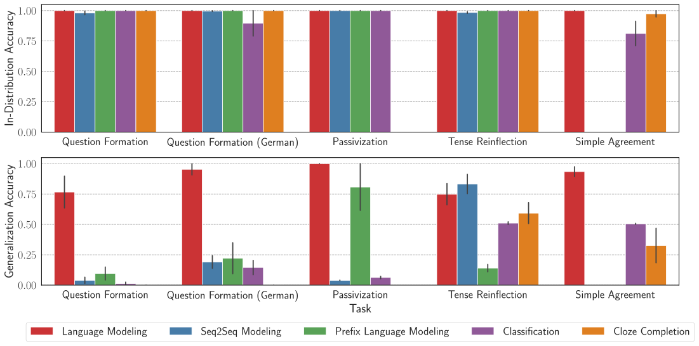

*Рисунок 1: Влияние цели обучения на иерархическое обобщение в трансформерах. Планки ошибок — стандартные ошибки по 5 случайным семенам. Лишь цель языкового моделирования стабильно достигает высокой обобщающей точности на всех задачах.* **[p. 7]**

#### Возвращаясь к результатам McCoy et al. 2020 для RNN

###### p6-7

Наши результаты выше говорят, что цель языкового моделирования налагает склонность к иерархическому обобщению в трансформерах. Исходя из этого, мы возвращаемся к иерархическому обобщению в RNN, поскольку опыты McCoy et al. 2020 велись с целью seq2seq (и без механизма внимания обобщения не нашли). Мы обучаем двухслойные GRU-модели (Cho et al. 2014) со скоростью обучения 0.001 с целями ЯМ и seq2seq на задаче вопросообразования. Как показано на рисунке 2, подобно трансформерам, **[p. 7]** RNN тоже обобщаются иерархически на вопросообразовании при обучении с целью языкового моделирования, но не с целью seq2seq. Это дополнительно укрепляет свидетельство, что языковое моделирование служит источником индуктивной склонности к иерархическому обобщению.

*Рисунок 2: Обучение RNN (GRU) с целями языкового моделирования и seq2seq на задаче вопросообразования. 300k шагов обучения отвечают 24 эпохам (проходам по обучающим данным).* **[p. 7]**

#### Устойчивость отрицательных результатов.

Далее мы проверяем, насколько устойчивы наши отрицательные результаты для не-ЯМ целей, не являющих иерархического обобщения, к разным выборам гиперпараметров. Мы рассматриваем глубину модели $\in\{2,4,6,8,10,12,16\}$, число голов внимания на слой $\in\{2,4,8,16,32\}$ и размерность вложения $\in\{64,128,256,512,1024\}$ для всех четырёх не-ЯМ целей. Меняем один гиперпараметр за раз при прочих двух закреплённых по умолчанию. Дополнительно для prefix-LM рассматриваем оба варианта — с причинным вниманием и двунаправленным вниманием (исходная формулировка Dong et al. 2019b) на входных токенах, поскольку этот выбор влияет на обобщающие способности модели. Результаты для вопросообразования по разным настройкам — на рисунке 9 приложения. Как видно, ни одна настройка гиперпараметров не достигает обобщающего качества цели языкового моделирования, которое в среднем было 76%. Ближе всего — 60% среднего обобщающего качества у prefix-LM с причинным вниманием при 12 слоях, где 3 семени из 5 доходят до совершенного обобщения (чего нет ни у одной другой цели, где не преуспевает ни одно семя). Мы находим, что это явление держится и на немецком вопросообразовании, и на пассивизации (рисунок 10 приложения), где цели seq2seq, prefix-LM (с двунаправленным вниманием), классификации и заполнения пропусков не являют иерархического обобщения. Однако на этих задачах prefix-LM с причинным вниманием идёт вровень с языковым моделированием. В целом наши результаты всё же показывают самый устойчивый тренд иерархического обобщения **[p. 8]** при цели языкового моделирования, и лишь prefix-LM с причинным вниманием — самая близкая к ЯМ из изучаемых целей — идёт вровень при некоторых настройках (обычно при большей глубине). Единственное различие цели ЯМ и цели prefix-LM с причинным вниманием — счёт потерь по всем токенам у первой и только по выходным у второй. Наши результаты намекают, что счёт потерь по части токенов последовательности (например, только выходных) может быть достаточен для иерархического обобщения в некоторых случаях, пока моделирование авторегрессивно. Дальнейшее исследование этого явления оставляем будущей работе.

#### Выводы.

В целом *наши опыты указывают на языковое моделирование как источник индуктивной склонности нейронных моделей к иерархическому обобщению*. Мы гипотезируем, что причина, по которой ЯМ (приближённо) выучивают иерархическое правило, а не линейное, в том, что при взгляде на полную цель обучения как на моделирование распределения всех токенов пар предложений, а не одного лишь переноса вспомогательного в начало, совокупная простота иерархического правила и данных больше, чем линейного правила и данных. Возможно, моделирование иерархической фразовой структуры выгодно для моделирования распределения полных последовательностей. Мы разовьём эту гипотезу в §5.

## 4 Открытие подсетей с разными обобщающими поведениями

Результаты Murty et al. 2023a и §3.3 показывают, что трансформерная ЯМ достигает совершенной внутридоменной точности много раньше в обучении, а обобщение приходит позже. Это означает, что модель может реализовывать нечто подобное линейному правилу в начале обучения и в итоге обобщается к иерархическому. В этом разделе мы исследуем, реализованы ли эти правила как подсети в модели, и спрашиваем, как эти подсети развиваются по ходу обучения.

### 4.1 Поиск подсетей

Вслед за Merrill et al. 2023 мы используем отсечение для установления существования подсетей или цепей, отвечающих разным обобщениям. В частности, мы используем метод отсечения голов внимания Voita et al. 2019, вводящий обучаемые воротца для каждой головы внимания обученной трансформерной модели. Это вводит $\texttt{number of heads}*\texttt{number of layers}$ обучаемых параметров, обычно равное 48 в наших опытах. Отсечение выполняется обучением этих воротцев (при замороженных исходных параметрах модели) на минимум отрицательного $\log$-правдоподобия, с добавкой $L_{0}$-штрафа как регуляризации ради разрежённости. Поскольку $L_{0}$-норма недифференцируема, используется стохастическое послабление, рассматривающее воротца как случайные величины из пголовных жёстко-конкретных распределений (Louizos et al. 2018). По завершении отсечения все воротца либо полностью открыты, либо закрыты, и закрытые воротца означают, что выход соответствующей головы зануляется в вычислении многоголового самовнимания. Если занулены все головы слоя, слой пропускается: входы слоя проходят неизменными к следующему слою благодаря остаточным связям.

Тем самым процедура отсечения не меняет весов исходной модели и лишь выбирает подмножество голов внимания. Чтобы находить подсети, согласные с разными обобщениями (линейным и иерархическим правилами), мы вводим три стратегии отсечения, различающиеся данными для отсечения:

**1. Train-prune** использует исходный двусмысленный обучающий набор для отсечения голов. Найденная так подсеть — вероятно, сжатая версия полной модели.

**2. Gen-prune** использует малую долю обобщающего набора (1%, или 100 примеров) для отсечения голов. При успехе такое отсечение даст подсеть, согласную с иерархическим обобщением, — с почти $100\%$ обобщающей точностью.

**3. $\texttt{Train}\backslash\texttt{Gen}$-prune** минимизирует потерю (отрицательное $\log$-правдоподобие) на обучающих данных и *максимизирует* её на (1%) обобщающих. В этом случае успешное отсечение должно дать подсеть с обобщением, согласным линейному правилу: $0\%$ обобщающей точности при $100\%$ внутрираспределительной.

#### Постановка опытов.

Если не оговорено иное, для отсечения используем скорость обучения $0.05$, коэффициент $L_{0}$-штрафа $0.015$ и 10k шагов обучения — настройки, хорошо работающие в разных постановках отсечения. Здесь мы приводим опыты для вопросообразования и обсуждаем прочие в приложении §A.2, где также получаем согласные результаты. Заметьте: поскольку нас интересует открытие подсетей, реализующих иерархическое и линейное правила, при отсечении мы используем для потери только отрицательное $\log$-правдоподобие первого вспомогательного в вопросе. Чтобы убедиться, что открытые подсети — не побочный продукт процедуры отсечения, мы рассматриваем и контрольные группы, получаемые отсечением случайно инициализированных сетей.

### 4.2 Результаты

*Рисунок 3: Отсечение трансформерной ЯМ, обученной 15000 шагов, тремя методами. Тёмные клетки — голова отсечена, светлые — оставлена.* **[p. 9]**

**[p. 9]**

###### p9-1

На рисунке 3 мы показываем действие разных методов отсечения на промежуточной контрольной точке модели, ещё не обобщающейся иерархически (модель до отсечения имеет обобщающую точность 30%). После Train-prune удалено примерно 80% голов полной модели, внутрираспределительное качество сохранено, хотя обобщающее падает (с 30% до 23%). После Gen-prune мы находим подсеть, достигающую 100% обобщающей точности. Это поразительно, поскольку полная сеть работала много хуже. После $\texttt{Train}\backslash\texttt{Gen}$-prune мы находим подсеть с $0\%$ обобщающей точности при $100\%$ внутрираспределительного качества; эта подсеть поведенчески равнозначна линейному правилу. Стало быть, опыты с отсечением открывают существование подсетей, реализующих разные обобщающие поведения.

#### Динамика обучения.

###### p9-2

Рассмотрим теперь, как эти подсети развиваются по ходу обучения модели. Для этого мы сохраняем контрольные точки каждые 1000 шагов обучения и выполняем три вида отсечения на них. Как показано на рисунке 4(b), подсеть «линейного правила» становится выделяемой отсечением примерно на 6000 шагах обучения — на это указывает 0% обобщающего качества кривой $\texttt{Train}\backslash\texttt{Gen}$-prune и 100% внутрираспределительного на рисунке 4(a). Вскоре после, как видно на рисунке 4(b), образуется (иерархическая) обобщающая подсеть — около 9000 шагов, где подсеть от Gen-prune достигает 100% обобщающей точности (полная сеть в этот момент обобщает лишь на 5%). Хотя в первой трети обучения случаются всплески обобщающего качества подсетей от $\texttt{Train}\backslash\texttt{Gen}$-prune, большую часть обучения (особенно последние две трети) обе подсети — линейная и иерархическая — продолжают выделяться по ходу обучения, на что указывают устойчивые 100% обобщающей точности подсетей Gen-prune и 0% у $\texttt{Train}\backslash\texttt{Gen}$-prune на рисунке 4(b).

###### p9-3

Наши опыты открывают, что на всём обучении идёт соперничество двух подсетей, и хотя поведение совокупной модели с обучением приближается к иерархическому правилу, соперничающая подсеть линейного правила по-настоящему не исчезает. Все три метода отсечения безуспешны на контрольной группе (случайно инициализированных сетях), что дополнительно свидетельствует: эти подсети не привнесены методами отсечения, и поведения, подобные иерархическому и линейному правилам, реализованы внутри языковой модели.

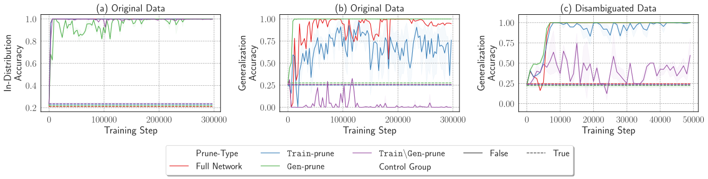

*Рисунок 4: Отслеживание динамики обучения относительно подсетей трёх методов отсечения и полной сети. (a) и (b): внутрираспределительная и обобщающая точности ЯМ, обученных на исходных двусмысленных данных вопросообразования, после отсечения тремя методами; (c): обобщающая точность после отсечения модели, обученной на данных с разрешённой двусмысленностью. Для моделей на исходных данных мы можем открыть подсети, согласные и с иерархическим, и с линейным правилами, тогда как для моделей на данных с разрешённой двусмысленностью подсеть линейного правила не находится (кривая $\texttt{Train}\backslash\texttt{Gen}$-prune никогда не приближается к 0% обобщающей точности).* **[p. 10]**

###### p9-4

Мы гипотезируем, что двусмысленные обучающие данные (с двумя правдоподобными обобщениями, линейным и иерархическим) — причина существования подсетей со столь разными обобщающими поведениями. Для проверки этой гипотезы мы рассматриваем случай обучения модели на данных *с разрешённой двусмысленностью*: мы дополняем двусмысленный обучающий набор примерами, согласными только с иерархическим правилом.55 5 Мы добавляем 10k таких примеров к существующему набору из 100k примеров. Динамику обучения модели на этих данных мы наносим на рисунок 4(c). Полная модель без отсечения в этом случае, как и ожидалось, обобщается совершенно после нескольких тысяч шагов (см. 4(c)) без всякого шума, в отличие от обобщающей точности полной модели на двусмысленных данных на рисунке 4(b). Интереснее то, что рисунок 4(c) показывает: $\texttt{Train}\backslash\texttt{Gen}$-prune не находит подсетей с 0% обобщающей точности, в отличие от двусмысленного случая на рисунке 4(b). Чтобы убедиться, что дело не в выборе гиперпараметров отсечения, мы проводим обширный поиск из 128 сочетаний скорости обучения отсечения, коэффициента штрафа и числа шагов (байесовской оптимизацией) — и всё равно не находим настройки, при которой $\texttt{Train}\backslash\texttt{Gen}$-prune преуспевает на данных с разрешённой двусмысленностью (см. рисунок 13 приложения). Это сильно намекает, что подсеть «линейного правила» вовсе не образуется в языковой модели, когда ей незачем выучиваться — когда альтернативное обобщающее поведение (линейное правило) больше не применимо ко всему обучающему набору.

**[p. 10]**

###### p10-1

Мы также экспериментируем с противоположной постановкой разрешения двусмысленности, дополняя обучающие данные примерами, согласными только с линейным правилом, и, в согласии с нашими находками, Gen-prune не находит подсети со 100% обобщающей точностью — подсеть, согласная с иерархическим правилом, не образуется (рисунок 14 приложения). Стало быть, *двусмысленность обучающих данных, по-видимому, движет совместным существованием этих контрастных подсетей.*

#### Влияние ёмкости по головам.

Далее мы исследуем, как число голов внимания в сети влияет на присутствие двух подсетей. В дополнение к исходным моделям с 8 головами на слой мы обучаем модели с 16, 4 и 1 головой и анализируем динамику обучения той же процедурой. Для моделей с 16 и 4 головами на слой (рисунки 15(a) и 15(b) приложения) результаты согласны со случаем 8 голов: обе подсети образуются рано и сосуществуют всё обучение. Интересно, что в случае 1 головы на слой (рисунок 15(c) приложения) и Gen-prune, и $\texttt{Train}\backslash\texttt{Gen}$-prune в среднем (по 5 семенам) не находят своих подсетей. Это особенно примечательно, поскольку полная модель с 1 головой в среднем обобщается лучше модели с 4 головами на слой (0.7 против 0.6). Характеристика поведения одноголовой модели остаётся открытым вопросом — мы не нашли свидетельств ни одного из двух предполагаемых обобщений — и мы оставляем её будущей работе. В целом эти результаты показывают, что ёмкость по головам, то есть число голов внимания, может быть решающей для развития подсетей, отвечающих различным обобщающим поведениям.

## 5 Почему трансформерные ЯМ обобщаются иерархически?

Полезным инструментом понимания обобщения в нейронных сетях была «склонность к простоте»: показано, что индуктивная склонность к более простым функциям (De Palma et al. 2019) объясняет, почему нейронные сети склонны обобщаться, а не переобучаться (Valle-Perez et al. 2019, Bhattamishra et al. 2023). В нашем случае нас интересует сравнение выученного поведения языковых моделей (иерархического правила) не с переобученным решением, а с альтернативным обобщением (линейным правилом). Можно ли объяснить «простотой» предпочтение модели к иерархическому обобщению? Это может звучать противоестественно, ведь на поверхности линейное правило кажется проще иерархического. Наш главный довод: для трансформеров с целью языкового моделирования, поскольку моделируемый порождающий процесс производит каждый токен полной последовательности (а не, скажем, лишь первый вспомогательный в вопросообразовании), иерархическое моделирование зависимостей между токенами может быть проще выучивания линейного правила для каждой зависимости.66 6 Такой довод неявен в теоретическом синтаксисе, где иерархические представления вездесущи. В этом разделе мы представляем исследование, дающее некоторое свидетельство простоты иерархического обобщения над линейно-правиловым для объяснения предпочтения первого трансформерными ЯМ. Мы пользуемся байесовской рамкой Perfors et al. 2011, применяя порождающие грамматики для моделирования порождающих процессов, отвечающих иерархическому и линейному правилам, и операционализируем понятия простоты и добротности подгонки апостериорными вероятностями грамматик при наблюдённых данных. Затем мы показываем соотнесение между способностью трансформеров обобщаться иерархически и тем, что обучающий набор лучше объясняется иерархической грамматикой, чем регулярной (моделирующей линейное правило), по апостериорному критерию.

**[p. 11]**

### 5.1 Предпосылки

#### Операционализация понятия простоты.

###### p11-1

Мы пользуемся *теорией индуктивного вывода Соломонова* (Solomonoff 1964), формализующей бритву Оккама: когда две гипотезы объясняют данные одинаково хорошо, более простая из двух вероятнее верна. Это понятие математически формализовано в теории Соломонова байесовским подходом — вычислением апостериорных вероятностей соперничающих гипотез и выбором той, что с большим апостериором.

$$
p(h\mid D)\propto p(D\mid h)\cdot p(h)
$$

Здесь $p(D\mid h)$ означает правдоподобие наблюдённых данных $D$ при гипотезе $h$, то есть насколько хорошо $h$ объясняет данные $D$. $p(h)$ означает априорную вероятность $h$, которая в теории Соломонова выше для более простых гипотез $h$. Иными словами, более сложная гипотеза влечёт больше выборов («большую длину программы») и потому меньшую априорную вероятность. Стало быть, вычисляя апостериор $p(h\mid D)$, байесовский вывод балансирует размен между добротностью подгонки гипотезы (правдоподобием) и её простотой (априором). Это тесно связано с «байесовской бритвой Оккама» и принципом минимальной длины описания (Rissanen 1978).

#### Вероятностные грамматики.

Мы упомянули в предыдущем абзаце, что вычисление апостериора соперничающих гипотез помогает выбрать ту, что лучше балансирует размен добротности подгонки и простоты. Но для нашей задачи какую форму должны принять эти гипотезы или «программы», представляющие линейное и иерархическое правила? Заметьте: поскольку наша цель обучения — языковое моделирование, нужно рассматривать гипотезы, порождающие всю последовательность токенов, как она представлена в обучающих данных. Вслед за Perfors et al. 2011 мы используем вероятностные порождающие грамматики для моделирования порождающего процесса.

Для целей этой работы мы рассматриваем вероятностные контекстно-свободные грамматики (PCFG), представимые пятёркой $G=\{V,\Sigma,R,S,P\}$. Здесь $V$ — множество нетерминальных символов, образующих фразы или составляющие предложения, $\Sigma$ — множество терминальных символов или слов предложений, $R\in V\times\{V\cup\Sigma\}^{*}$ — множество продукций, отображающих фразы в подфразы или слова, $S\in V$ — начальный символ, представляющий целое предложение, а $P$ — вероятности продукций. А именно, для данного нетерминала при нескольких возможных продукциях $P$ присваивает вероятность каждой возможной продукции. Чтобы породить данные из PCFG, мы начинаем с начального символа $S$ и для каждого возникающего нетерминала применяем продукцию, выбранную по $P$, повторяя процедуру, пока не останутся лишь терминалы, порождающие предложения. PCFG обычно используются для моделирования иерархической фразовой структуры языка. Мы можем наложить ограничения на форму продукций в $R$, получая особые случаи (подмножества) CFG. Например, регулярные грамматики образуют подмножество CFG, чьи продукции приводимы к праволинейной форме: $A\to bC$, где $A$ и $C$ — нетерминалы, а $b$ — терминал.

#### Байесовский взгляд на порождение языка.

Мы можем рассматривать порождающий процесс, производящий набор $D$, через вероятностную грамматику $G$. По набору $D$ мы можем вычислить апостериор $p(G\mid D)\propto p(D\mid G)\cdot p(G)$, где $p(D\mid G)$ — правдоподобие данных при вероятностной грамматике, а $p(G)$ меряет простоту $G$. Для интуитивного понимания априорной вероятности грамматики и того, как она кодирует простоту, вспомним, что рассматриваемые грамматики — пятёрки $\{V,\Sigma,R,S,P\}$. Выбор грамматики $G$ влечёт выборы вроде числа нетерминалов и терминалов, числа продукций из каждого нетерминала, устройства продукции и т. д. Присваивая распределения вероятностей каждому из этих выборов, мы можем вычислить априорную вероятность данной грамматики. Мы можем выбрать априорное распределение, благоволящее простым грамматикам: например, вслед за Perfors et al. 2011 мы используем геометрические распределения для числа нетерминалов и продукций, так что простая грамматика с меньшим их числом получит бо́льшую вероятность, чем более сложная. Мы можем тем самым вычислить апостериоры грамматик, представляющих соперничающие обобщающие гипотезы (иерархическое и линейное правило), и сравнить, как каждая балансирует размен добротности подгонки и простоты.

### 5.2 Метод

Обсудим теперь, как мы применяем подход байесовской бритвы Оккама для объяснения того, почему трансформерные языковые модели обобщаются иерархически. В обзоре подхода: мы начинаем с построения PCFG, моделирующей иерархическое правило (обозначаемой CFG), и регулярной грамматики (Reg), порождающей данные по линейному правилу. Затем порождаем данные обеими грамматиками — $\mathcal{D}_{\texttt{CFG}}$ из CFG и $\mathcal{D}_{\texttt{Reg}}$ из Reg. Пересечение двух наборов, $\mathcal{D}_{\texttt{CFG}}$$\cap$ $\mathcal{D}_{\texttt{Reg}}$, состоит из двусмысленных примеров, согласных и с линейным, и с иерархическим правилами. Его мы возьмём обучающим корпусом $\mathcal{D}_{\mathrm{train}}$. Затем вычисляем апостериорные вероятности CFG и Reg при $\mathcal{D}_{\mathrm{train}}$ и выбираем большую: $G^{*}=\operatorname*{arg\,max}_{G\in\{\texttt{CFG},\texttt{Reg}\}}p(G\mid\mathcal{D}_{\mathrm{train}})$. Затем обучаем трансформерную языковую модель на $\mathcal{D}_{\mathrm{train}}$ и проверяем, обобщается ли она согласно $G^{*}$. А именно, если $G^{*}=\texttt{CFG}$ — следует ли трансформер иерархическому правилу, а если $G^{*}=\texttt{Reg}$ — линейному? Выбор $G^{*}$ призван имитировать «идеализированное» байесовское обучение, и в той мере, в какой поведение обучения трансформера совпадает с $G^{\ast}$ в **[p. 12]** разных сценариях, мы находим поддержку склонности к простоте в обучающей постановке трансформера. Далее мы даём подробности каждого шага.

#### Задача.

Для целей этого исследования мы рассматриваем задачу простого согласования, поскольку построение иерархических и линейных грамматик для её данных прямолинейно.77 7 Вопросообразование и перестройка времени включают пары предложений, где второе — преобразование первого. Такие пары, вероятно, потребовали бы более сложных рамок вроде синхронных грамматик (Aho and Ullman 1969), что мы оставляем будущей работе.

#### Построение грамматик для простого согласования.

Вслед за Perfors et al. 2011 мы строим CFG и регулярные грамматики вручную. CFG построена так, что каждый глагол согласуется с иерархически связанным подлежащим, а регулярная грамматика следует линейному правилу (каждый глагол предложения согласуется с ближайшим предшествующим существительным). Построенным грамматикам присвоены равномерные вероятности продукций: при данном нетерминале все продукции равновероятны. Пример продукций обеих грамматик — на рисунках 18 и 19 приложения. Для CFG мы используем нормальную форму Хомского: каждая продукция вида $A\to BC$ или $A\to a$, где $A,B,C$ — нетерминалы, а $a$ — терминал. Аналогично для регулярной грамматики Reg используем праволинейную форму: каждое правило вида $A\to bC$ или $A\to a$.

Вслед за Perfors et al. 2011 мы принимаем типовой подход к построению грамматик: терминальные символы $\Sigma$ — не словесные токены (например, *walrus*, *sing*), а синтаксические категории (например, определитель, существительное-ед.ч., непереходный глагол и т. п.), чтобы грамматики строго моделировали абстрактные синтаксические структуры, а не частоты словаря, и чтобы число возможных порождений грамматик было обозримым.

Для контекстно-свободных и регулярных грамматик мы порождаем по два варианта, смотря по разнообразию порождаемых видов предложений:

**Малые грамматики CFG-S и Reg-S**: здесь мы строим CFG и регулярные грамматики, порождающие лишь 18 видов предложений. Напомним, что вид предложения — последовательность синтаксических категорий: например, предложения вроде *The walrus sings* представимы видом *определитель существительное-ед.ч. непереходный-глагол*. Разные виды предложений различаются здесь числом существительных (единственное или множественное), типом глаголов (переходные или непереходные) и наличием предложных групп при существительных. Рукотворная CFG-S имеет здесь 15 нетерминалов и 21 продукцию, Reg-S — 14 нетерминалов и 22 продукции. У обеих одни и те же 8 терминалов. Из 18 видов предложений, порождаемых обеими грамматиками, 12 общие (двусмысленные), 6 оставшихся в CFG-S согласны только с иерархическим правилом и 6 в Reg-S — только с линейным.

**Большие грамматики CFG-L и Reg-L**: здесь мы рассматриваем более крупные грамматики, порождающие куда более разнообразные виды предложений — 180 видов. Главное отличие от малых грамматик: им позволено порождать относительные клаузы, которые могут стоять и при подлежащем, и при дополнении. CFG-L имеет 25 нетерминалов и 38 продукций, Reg-L — 41 нетерминал и 63 продукции. Заметьте: уже по этим числам видно, что для порождения разнообразных видов предложений нужны куда более сложные регулярные грамматики. Из 180 видов предложений каждой грамматики 120 общие, а остальные порождаются только конкретной грамматикой (следуя иерархическому либо линейному правилу).

#### Порождение наборов.

Мы порождаем виды предложений из каждой из 4 грамматик — $\mathcal{D}_{\texttt{CFG-S}}$, $\mathcal{D}_{\texttt{Reg-S}}$, $\mathcal{D}_{\texttt{CFG-L}}$ и $\mathcal{D}_{\texttt{Reg-L}}$. Как сказано, обучающий набор строится из видов предложений, общих для CFG и соответствующей регулярной грамматики. Имеем $\mathcal{D}_{\mathrm{train-S}}{}=\mathcal{D}_{\texttt{CFG-S}}{}\cap\mathcal{D}_{\texttt{Reg-S}}{}$ для малых грамматик и $\mathcal{D}_{\mathrm{train-L}}{}=\mathcal{D}_{\texttt{CFG-L}}{}\cap\mathcal{D}_{\texttt{Reg-L}}{}$ для больших. Заметьте, что это наборы видов предложений, а трансформеры обучаются на предложениях. Чтобы породить предложения из этих типовых корпусов, мы многократно выбираем виды предложений и заменяем синтаксические категории допустимыми токенами этой категории (например, *определитель* можно заменить на *the*, *our*, *my* и т. д.). Этой процедурой мы порождаем корпус из 50k предложений из $\mathcal{D}_{\mathrm{train-S}}{}$ и 50k предложений из $\mathcal{D}_{\mathrm{train-L}}{}$. Заметьте, что опыты простого согласования в §3.1 велись на втором наборе, производном от $\mathcal{D}_{\mathrm{train-L}}{}$.

Обобщающие тестовые наборы порождаются из видов предложений, единственных для конкретной грамматики. Например, тестовый набор $\mathcal{D}_{\mathrm{test-S}}^{\texttt{Hier}}=\mathcal{D}_{\texttt{CFG-S}}\setminus\mathcal{D}_{\texttt{Reg-S}}$ содержит виды предложений, единственные для $\mathcal{D}_{\texttt{CFG-S}}$ и потому согласные только с иерархическим правилом, но не линейным. Аналогично $\mathcal{D}_{\mathrm{test-S}}^{\texttt{Lin}}=\mathcal{D}_{\texttt{Reg-S}}\setminus\mathcal{D}_{\texttt{CFG-S}}$ состоит из видов предложений, согласных только с линейным правилом. Равнозначно определяются $\mathcal{D}_{\mathrm{test-L}}^{\texttt{Hier}}$ и $\mathcal{D}_{\mathrm{test-L}}^{\texttt{Lin}}$. Говоря о двух наборах вообще, без указания малого ($S$) или большого ($L$) варианта, мы пишем просто $\mathcal{D}_{\mathrm{test}}^{\texttt{Hier}}$ и $\mathcal{D}_{\mathrm{test}}^{\texttt{Lin}}$.

**[p. 13]**

#### Вычисление апостериора каждой грамматики.

Теперь, имея четыре построенные грамматики, мы можем вычислить их апостериоры при соответствующих обучающих наборах. Заметьте: поскольку нас интересует лишь сравнение апостериоров CFG и регулярных грамматик, мы можем оценить апостериор, вычислив правдоподобие и априор и взяв их произведение: $p(G|D)\propto p(D\mid G)\,p(G)$. Напомним, что априорная вероятность грамматики вычислима как вероятность каждого из выборов, задающих грамматику:

$$
p(G)=p(|V|)\prod_{k=1}^{|V|}p(P_{k})\,p(\theta_{k})\prod_{i=1}^{P_{k}}p(R_{k,i}). \tag{2}
$$

Здесь $|V|$ — число нетерминалов, $P_{k}$ — число продукций из $k^{\mathrm{th}}$ нетерминала с вероятностями продукций $\theta_{k}\in[0,1]^{P_{k}}$, а $R_{k,i}$ — правая часть $i$-й продукции из $k$-го нетерминала. Вслед за Perfors et al. 2011 используем геометрический априор на $p(|V|)$ и $p(P_{k})$. Напомним, что геометрическое распределение задаётся $p(n;p)=(1-p)^{n-1}p$, где $p$ — параметр, часто толкуемый как вероятность успеха, и геометрическое распределение моделирует вероятность успеха после $n$ попыток. Тем самым геометрический априор наказывает грамматики с большим числом нетерминалов ($|V|$) и продукций на нетерминал ($P_{k}$). В опытах используем $p=0.5$ вслед за Perfors et al. 2011, но проводим анализ чувствительности к выбору этого параметра. Для $\theta_{k}$ используем плоский (то есть $\alpha=1$) априор Дирихле — ходовой выбор для вероятностей категориальных распределений (симплекс $K-1$). Поскольку распределение Дирихле непрерывно, вероятность конкретного $\theta_{k}$ нулевая, и мы используем дискретное послабление из Perfors et al. 2011 для моделирования $p(\theta_{k})$. Вероятность продукции $p(R_{k,i})$ зависит от типа грамматики. Для CFG в CNF продукции вида $A\to BC$ или $A\to a$, потому вероятность правой части даётся $p(R_{k,i})=\frac{1}{2}\frac{1}{|V|^{2}}\mathbb{1}(|R_{k,i}|=2)+\frac{1}{2}\frac{1}{|\Sigma|}\mathbb{1}(|R_{k,i}|=1)$. Поскольку регулярные грамматики в праволинейной форме, то есть продукции вида $A\to bC$ или $A\to a$, имеем $p(R_{k,i})=\frac{1}{2}\frac{1}{|\Sigma|}\frac{1}{|V|}\mathbb{1}(|R_{k,i}|=2)+\frac{1}{2}\frac{1}{|\Sigma|}\mathbb{1}(|R_{k,i}|=1)$. Можно заметить, что в формуле априора отсутствует вероятность числа терминалов $p(\Sigma)$. Мы её опускаем, потому что у CFG и регулярных грамматик в наших опытах одно и то же число терминалов, а поскольку нас интересует лишь сравнение вероятностей, включение или исключение $p(\Sigma)$ ничего не меняет.88 8 Можно заметить и то, что $p(G)$ допускает некоторую вероятность породить одно правило более одного раза — вероятностная масса «подтекает». Никакая известная нам литература не говорит, что это должно мешать нашему анализу.

Правдоподобие $p(D\mid G)$ меряет вероятность порождения набора $D$ грамматикой $G$. Для $m$ видов предложений в наборе $D$ правдоподобие даётся

$$
p(D\mid G)=\prod_{i=1}^{m}p(S_{i}\mid G), \tag{3}
$$

где $S_{i}$ — виды предложений в $D$. $p(S_{i}\mid G)$ вычисляется произведением вероятностей продукций, использованных для вывода $S_{i}$ в $G$ (со сложением вероятностей при нескольких возможных разборах $S_{i}$). Заметьте, что вычисление $p(S_{i}\mid G)$ требует оценки вероятностей продукций $\theta_{k}$ каждого нетерминала. Мы используем алгоритм Inside-Outside (Baker 1979) для приближённой оценки максимального правдоподобия вероятностей продукций на наборе $D$. Тем самым, вычислив априор $p(G)$ и $p(D\mid G)$, мы можем вычислить апостериор $p(G\mid D)$.

#### Другие выборы грамматик.

При наших порождённых обучающих наборах ($\mathcal{D}_{\mathrm{train-S}},\mathcal{D}_{\mathrm{train-L}}$) могут существовать грамматики, отличные от четырёх построенных, порождающие эти наборы. В своём анализе Perfors et al. 2011 рассматривают и два подмножества регулярных грамматик: Flat и One-state. У плоских (Flat) грамматик продукции — список заученных предложений, то есть вида $S\to a_{1}a_{2}\cdots a_{n}$. Здесь $a_{i}^{\prime}s$ — терминалы, и нет нетерминалов, кроме $S$. Тем самым плоские грамматики моделируют запоминание без обобщения. Односостоянные (One-state) грамматики равнозначны конечным автоматам с единственным состоянием и потому позволяют любому терминалу следовать за любым другим. Мы также включаем эти две грамматики в анализ.

Далее, даже среди контекстно-свободных и регулярных грамматик могут существовать грамматики с лучшими апостериорами на обучающих наборах $\mathcal{D}_{\mathrm{train-S}}$ и $\mathcal{D}_{\mathrm{train-L}}$, чем построенные вручную. В качестве средства мы также применяем локальный поиск на построенных грамматиках — байесовское слияние моделей (Stolcke and Omohundro 1994) — для минимизации грамматик с улучшением апостериора на соответствующих обучающих наборах. В основном тексте мы обсуждаем результаты рукотворных грамматик, а подробности алгоритма минимизации и результаты для минимизированных грамматик даём в §A.3.

**[p. 14]**

#### Объяснение обобщения в трансформерах.

Напомним: наша цель — квантифицировать простоту двух соперничающих гипотез (иерархического и линейного правил), согласных с обучающими данными трансформерных ЯМ. Апостериорные вероятности двух типов грамматик — способ измерить, какая грамматика лучше балансирует размен добротности подгонки и простоты. Наша задача — проверить, являет ли обученная трансформерная ЯМ обобщение, согласное с выбором более простой (то есть с большим апостериором) грамматики. Мы оцениваем это, сравнивая отрицательное лог-правдоподобие (NLL), присваиваемое трансформерной ЯМ тестовым наборам двух обобщений. Например, для трансформера, обученного на данных из $\mathcal{D}_{\mathrm{train-L}}$, мы оцениваем его NLL на обобщающих тестовых наборах двух грамматик $\mathcal{D}_{\mathrm{test-L}}^{\texttt{Hier}}$ и $\mathcal{D}_{\mathrm{test-L}}^{\texttt{Lin}}$ и проверяем, ниже ли NLL на тестовых данных более простой грамматики. Итоговое значение — среднее NLL по всем примерам тестового набора. Для более наглядной меры мы также считаем точность главного глагола — долю тестовых примеров, для которых предсказанный моделью глагол согласуется с иерархически связанным существительным предложения. Точность главного глагола 1 означает обобщение модели, согласное с иерархическим правилом, а точность 0 — с линейным.

### 5.3 Результаты

#### Сравнение апостериоров.

$\log$-вероятности всех рукотворных грамматик на двух наборах даны в таблице 2. На обоих наборах односостоянная грамматика получает наибольший *априор*, что ожидаемо: она простейшая из изучаемых. Однако односостоянная грамматика и хуже всех подгоняет данные, на что указывает наименьшее $\log$-правдоподобие (на обоих наборах). Плоские грамматики подгоняют оба набора лучше всех и имеют наибольшее $\log$-правдоподобие, что тоже ожидаемо, поскольку плоская грамматика заучивает обучающие данные. Но это может стоить возросшей сложности, особенно при разнообразных обучающих данных; потому на полном наборе плоская грамматика имеет наименьший $\log$-априор.

###### p14-3

Для набора высокого разнообразия $\mathcal{D}_{\mathrm{train-L}}$ мы наблюдаем, что CFG лучше всех балансирует размен простоты и добротности подгонки, получая наибольший апостериор. Это показывает, почему выгоднее моделировать этот набор иерархической фразово-структурной грамматикой, чем линейной. Однако для набора низкого разнообразия $\mathcal{D}_{\mathrm{train-S}}$, хотя CFG всё же получает апостериор лучше регулярной, наибольший апостериор из всех получает односостоянная грамматика. Это согласно с находками Perfors et al. 2011, обнаруживших, что для малых корпусов односостоянные грамматики часто получают апостериоры выше контекстно-свободных и регулярных. В таких случаях по байесовскому критерию выигрывает выучивание распределения последовательностей синтаксических категорий без абстрактных нетерминалов.

Мы получаем согласные находки с некоторыми тонкими отличиями для грамматик, минимизированных алгоритмом байесовского слияния моделей, что излагаем в §A.3.

#### Чувствительность к априору.

Заметьте, что выбор априора субъективен и может влиять на эти результаты. Потому, для сугубой осторожности, мы проводим анализ чувствительности, варьируя значения параметра геометрического распределения $p$. Мы пробуем $p\in\{0.01,0.1,0.2,0.3,\cdots,0.9,0.99\}$ для распределения на нетерминалах ($p(|V|)$) и числе продукций ($p(P_{k})$) и получаем находки, согласные с таблицей 2 (см. рисунок 16 приложения). Мы также пробуем разные значения $p$ для $p(|V|)$ и $p(P_{k})$ — 49 сочетаний ($\{0.01,0.1,0.3,0.5,0.7,0.9,0.99\}\times\{0.01,0.1,0.3,0.5,0.7,0.9,0.99\}$). Для каждого сочетания мы находим, что в случае $\mathcal{D}_{\mathrm{train-S}}$, согласно таблице 2, CFG-S всегда получает апостериор ниже односостоянной грамматики. Аналогично для CFG-L и Reg-L находки согласны по всем 49 сочетаниям: CFG-L всегда получает апостериор выше Reg-L.

*Таблица 2: Сравнение $\log$-вероятностей каждой из 4 грамматик при обучающих наборах $\mathcal{D}_{\mathrm{train-L}}$ и $\mathcal{D}_{\mathrm{train-S}}$.* **[p. 14]**

| Грамматика | $\mathcal{D}_{\mathrm{train-L}}$ (120 видов) | $\mathcal{D}_{\mathrm{train-S}}$ (12 видов) |  |  |  |  |
|---|---|---|---|---|---|---|
| $\log$-априор | $\log$-правдоподобие | $\log$-апостериор | $\log$-априор | $\log$-правдоподобие | $\log$-апостериор |  |
| **CFG** | -367 | -639 | **-1006** | -169 | -34 | -203 |
| **Reg** | -619 | -616 | -1235 | -190 | **-30** | -220 |
| **Flat** | -4567 | **-574** | -5141 | -281 | **-30** | -311 |
| **One-State** | **-58** | -2297 | -2355 | **-51** | -121 | **-172** |

#### Качество трансформерных ЯМ.

###### p14-6

Мы обучаем трансформерные ЯМ на двух наборах ($\mathcal{D}_{\mathrm{train-L}},\mathcal{D}_{\mathrm{train-S}}$) и оцениваем их обобщение по тестовым наборам $\mathcal{D}_{\mathrm{test}}^{\texttt{Hier}}$ и $\mathcal{D}_{\mathrm{test}}^{\texttt{Lin}}$. **[p. 15]** Заметьте, что для обоих наборов используются 50k обучающих примеров. Напомним, что два обучающих набора различаются разнообразием (120 видов в $\mathcal{D}_{\mathrm{train-L}}$ против 12 в $\mathcal{D}_{\mathrm{train-S}}$). Мы используем ту же постановку, что в §3.2. На рисунке 5(a) мы видим для моделей, обученных на наборе низкого разнообразия $\mathcal{D}_{\mathrm{train-S}}$, что модель получает похожие значения отрицательного лог-правдоподобия на обоих тестовых наборах, то есть не имеет предпочтения обобщаться по линейному или иерархическому правилу. Для этого набора ни CFG, ни регулярная грамматика не были оптимальны по апостериору, так что поведение обучения трансформера согласно с «идеализированной» постановкой выше. Для моделей же, обученных на наборе $\mathcal{D}_{\mathrm{train-L}}$, мы видим, что модель выучивается обобщаться иерархически: NLL на тестовом наборе $\mathcal{D}_{\mathrm{test}}^{\texttt{Hier}}$ существенно ниже, чем на $\mathcal{D}_{\mathrm{test}}^{\texttt{Lin}}$.

Помимо NLL мы считаем и точность главного глагола, проверяя, присваивает ли модель большую вероятность верной форме главного глагола, чем неверной. Как видно на рисунке 5(b), модель на наборе $\mathcal{D}_{\mathrm{train-L}}$ получает почти 100% точности на тестовом наборе $\mathcal{D}_{\mathrm{test}}^{\texttt{Hier}}$. Модель же на наборе $\mathcal{D}_{\mathrm{train-S}}$ получает около 50% обобщающей точности, снова не показывая предпочтения иерархического или линейного правила (последнее дало бы 0%). Мы также проверяем, что эти результаты — не побочный продукт выбора гиперпараметров, и обучаем трансформеры с разным числом слоёв (2, 4, 6, 8, 12) на наборе $\mathcal{D}_{\mathrm{train-S}}$ — и ни в одном случае не наблюдаем предпочтения иерархического обобщения (см. результаты на рисунке 20 приложения).

Мы рассматриваем и более строгую меру: обобщающую точность по всем глаголам, проверяющую, все ли предсказанные глаголы предложения (а не только главный) имеют верную форму. Причина этой меры: для задачи согласования 100% точности главного глагола достижимы и без выучивания иерархического правила — простым согласованием с первым существительным предложения. Заметьте, что точность по всем глаголам считается подачей префиксов перед каждым глаголом предложения и получением предсказаний модели. Результаты по всем глаголам даны на рисунке 5(c): опорная линия, всегда согласующая глагол с первым существительным предложения, получает по этой мере 33%, но трансформеры существенно превосходят её, показывая, что они не выучивают тривиально эту эвристику ради высокой точности главного глагола.

*(a) Отрицательное лог-правдоподобие на иерархическом ($\mathcal{D}_{\mathrm{test}}^{\texttt{Hier}}$) и линейном ($\mathcal{D}_{\mathrm{test}}^{\texttt{Lin}}$) обобщающих тестовых наборах.*

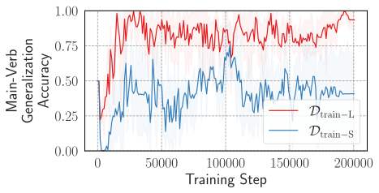

*(b) Обобщающая точность главного глагола на тестовом наборе $\mathcal{D}_{\mathrm{test}}^{\texttt{Hier}}$.*

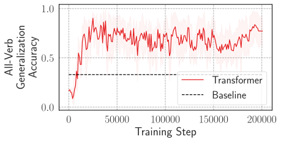

*(c) Обобщающая точность по всем глаголам на тесте $\mathcal{D}_{\mathrm{test}}^{\texttt{Hier}}$ для модели, обученной на наборе из 120 видов.*

*Рисунок 5: Качество трансформерных моделей, обученных на наборах $\mathcal{D}_{\mathrm{train-L}}$ и $\mathcal{D}_{\mathrm{train-S}}$.* **[p. 15]**

#### Выводы.

Результаты этого исследования указывают: когда трансформерные ЯМ являют иерархическое обобщение несмотря на обучение на двусмысленных данных, при испытанных условиях иерархическая грамматика не только хорошо подгоняет данные, но и проще регулярной грамматики с линейными согласованиями. В случаях, где это условие не выполнено, мы наблюдаем, что обученные трансформеры не показывают предпочтения иерархического обобщения.

**Ограничения.** Знаменитые три уровня анализа информационной системы Дэвида Марра (например, мозга или AI) включают *вычислительный уровень* — где мы рассматриваем, как выглядит идеальное решение задачи, которую решает система, *алгоритмический уровень* — какой алгоритм мог бы решить данную задачу, и *уровень реализации* — где изучается физическая реализация представления и алгоритма Marr 1982. В нашей работе мы сосредоточились лишь на анализе вычислительного уровня, то есть на понимании поведения трансформерных ЯМ в терминах идеального (байесовского) ученика. Наши результаты дают лишь соотнесение между иерархическим обобщением трансформеров и тем, что обучающие данные действеннее объясняются (по апостериорному критерию) иерархической грамматикой, чем регулярной, показывая согласие с идеализированным учеником. Однако мы не делаем никаких утверждений об алгоритмических и реализационных подробностях трансформерных ЯМ, то есть о том, выучивают ли эти модели внутренне сами грамматики. В прежней работе есть свидетельства выучивания трансформерными ЯМ вероятностных грамматик при обучении на порождённых ими данных: например, Allen-Zhu and Li 2023 показывают, что трансформерные ЯМ внутренне выучивают подлежащую PCFG при обучении на её данных. Хотя это даёт обнадёживающую поддержку нашей байесовской **[p. 16]** интерпретации, для установления причинной связи нужно дальнейшее исследование внутренних механизмов трансформерных ЯМ в нашей постановке, что мы оставляем будущей работе.

## 6 Связанные работы

#### Усвоение языка людьми.

Задача вопросообразования хорошо изучена в лингвистике и когнитивной науке, где наблюдалось, что дети с самого раннего возраста порождают грамматичный выход, согласный с иерархическим правилом. В частности, довод о бедности стимула (Chomsky 1968, Chomsky 1980) утверждает, что дети вряд ли видят достаточно данных, чтобы исключить порядковое правило при усвоении языка, и потому знание фразовой структурности языка должно быть врождённо задано (*лингвистический нативизм*). С другой стороны, как критика нативистского довода, *эмпирицистский* довод (Redington et al. 1998, Lewis and Elman 2001, Reali and Christiansen 2004) гласит, что распределительные и статистические регулярности данных могут объяснить, почему дети выбирают иерархическое правило, а не порядковое. Критика эмпирицистского довода — что он игнорирует иерархическую фразовую структурность естественного языка (Perfors et al. 2006). Работы Perfors et al. 2006, Perfors et al. 2011 отвечают на эту критику байесовским взглядом на индукцию грамматик и показывают, что по детскому корпусу идеальный ученик может вывести, что иерархическая грамматика проще и подгоняет данные не хуже линейной, без врождённого задания этого знания.

#### Иерархическое обобщение в нейронных сетях.

Изучение иерархического обобщения в нейронных сетях коренится в эмпирицистских доводах об усвоении языка. Lewis and Elman 2001 показали, что простая рекуррентная сетевая языковая модель, обученная на наборе CHILDES (Macwhinney 2000) (предназначенном для изучения языка детей и обращённого к детям), присваивает вопросам, построенным иерархическим правилом, вероятности выше, чем порядковым. Критика той работы — что она не моделирует связь повествовательного предложения и вопроса, а потому не отвечает вполне исходному доводу о бедности стимула. Frank and Mathis 2007 обучали простые рекуррентные сети на задаче преобразования (образовать вопрос из повествовательного) и нашли некоторые свидетельства иерархического обобщения, хотя качество сильно зависело от вспомогательных.

McCoy et al. 2018 взяли постановку Frank and Mathis 2007 и провели более тщательное исследование иерархического обобщения в RNN (обучаемых как seq2seq), найдя, что при ограниченном обобщающем качестве этих моделей внимание и обучение на данных с дополнительными синтаксическими подсказками помогают. McCoy et al. 2020 изучили архитектурные индуктивные склонности RNN к иерархическому обобщению и нашли, что лишь древесно-структурная модель стабильно даёт иерархическую склонность. Petty and Frank 2021, Mueller et al. 2022 подтвердили эти находки для трансформеров, обнаружив линейное, а не иерархическое обобщение. В контраст этим находкам недавно Murty et al. 2023a показали, что трансформеры при долгом обучении — много дольше насыщения внутрираспределительного качества — начинают являть иерархическое обобщение.

Хотя все эти работы обучают нейронные модели с нуля, недавно появилась работа о понимании иерархического обобщения в трансформерах, предобученных на больших объёмах естественного языка. Mueller and Linzen 2023 нашли, что предобучение кодировщик-декодировщик трансформеров на корпусах вроде Wikipedia или CHILDES даёт иерархическую склонность, причём обучение на CHILDES на порядки эффективнее по выборке. Mueller et al. 2023 изучили иерархическое обобщение при обучении в контексте в языковых моделях, найдя большой разброс качества между моделями, объясняемый составом обучающих данных; особенно хорошо обобщались модели, обученные на коде.

#### Гроккинг.

Одна из загадок обобщения в глубоком обучении — явление «гроккинга», где нейронные сети начинают обобщаться долго после переобучения на обучающих данных (Power et al. 2022). Предприняты многочисленные попытки понять гроккинг и его причины. Millidge 2023 предполагают, что для перепараметризованных сетей оптимальное множество (все значения параметров с нулевой обучающей потерей) — многообразие в пространстве параметров, и стохастический градиентный спуск по сути блуждает по этому многообразию, в итоге попадая в обобщающие параметры. Другие объяснения опираются на *склонность к простоте*, гипотезируя, что обобщающие решения проще, но медленнее выучиваются (Shah 2023, Nanda et al. 2023, Bhattamishra et al. 2023, Varma et al. 2023). Thilak et al. 2022 объясняют гроккинг с оптимизационной точки зрения и показывают, что он происходит при начале явления, названного ими «пращевым механизмом», опознаваемого всплесками обучающей потери с ростом нормы весов последнего слоя. Liu et al. 2022 пытаются объяснить гроккинг теорией выучивания представлений, выделяя четыре фазы обучения, где гроккинг происходит в «зоне Златовласки» между двумя из них.

#### Динамика обучения и обобщение подсетей.

Merrill et al. 2023 выделяют плотные и разрежённые подсети в трансформерах на задаче разрежённой чётности и находят, что модель начинает обобщаться при быстром росте нормы разрежённой подсети. Chen et al. 2024 выделяют возникновение синтаксической структуры внимания **[p. 17]** в трансформерных маскированных ЯМ вследствие внезапных падений потери, после чего модель приобретает разные лингвистические способности. В одновременной работе Bhaskar et al. 2024 находят отсечением — для BERT-моделей, дообученных на задачах NLP вроде вывода и перефразирования — существование подсетей с одинаковым внутридоменным, но очень разным внедоменным качеством. Эта находка согласна с нашими наблюдениями о подсетях с разными обобщающими поведениями. Однако природа нашей задачи позволяет нам дополнительно показать, с какими именно поведениями связаны эти подсети, как каждая развивается по ходу обучения, и предположить, почему эти подсети сосуществуют.

## 7 Заключение

Мы показали, что цель обучения языковым моделированием может служить источником индуктивной склонности к иерархическому обобщению, сравнив разные цели на пяти задачах и найдя цель ЯМ единственной, стабильно обобщающейся иерархически на всех. Мы также нашли, что когда обучающие данные согласны с двумя правилами, в трансформерной ЯМ на этих данных находятся подсети, отвечающие каждому из правил, и они сосуществуют по ходу обучения. Наконец, мы дали байесовскую интерпретацию того, почему трансформерные ЯМ обобщаются иерархически: иерархические грамматики, подгоняющие достаточно разнообразные языковые данные не хуже регулярных, часто в известном смысле проще.

Есть несколько направлений для будущего. Хотя наши результаты указывают на языковое моделирование как источник иерархической склонности, всё ещё неясно, почему иерархическое обобщение отложено. Далее, Murty et al. 2023a показали, что более глубокие трансформерные ЯМ часто не обобщаются иерархически, что остаётся неисследованным в нашей постановке. Опыты нашей байесовской интерпретации касались лишь задач простого согласования, для которых можно построить CFG; в будущем интересно исследовать способы моделирования простоты и добротности подгонки соперничающих гипотез для задач преобразования входного предложения в выходное. В нашей работе байесовская интерпретация использована для понимания иерархического обобщения в трансформерах. Однако байесовская интерпретация полезна и для изучения других форм обобщения у людей, включая (среди прочего) выучивание слов (Xu and Tenenbaum 2007), выучивание понятий (Goodman et al. 2008, Lake et al. 2015), прагматику (Frank and Goodman 2012) и теорию сознания (Baker et al. 2011), и эти способности в некоторой мере наблюдались и в трансформерных ЯМ Patel et al. 2023, Hu et al. 2023, Shapira et al. 2023. Насколько хорошо эти интерпретации применимы для объяснения таких способностей в трансформерах — ещё одно потенциально интересное направление.

## References

- Alfred V. Aho and Jeffrey D. Ullman. Syntax directed translations and the pushdown assembler. *J. Comput. Syst. Sci.*, 3:37–56, 1969. URL https://api.semanticscholar.org/CorpusID:205894705.

- Guillaume Alain and Yoshua Bengio. Understanding intermediate layers using linear classifier probes, 2017. URL https://openreview.net/forum?id=ryF7rTqgl.

- Zeyuan Allen-Zhu and Yuanzhi Li. Physics of Language Models: Part 1, Learning Hierarchical Language Structures. *ArXiv e-prints*, abs/2305.13673, May 2023. Full version available at http://arxiv.org/abs/2305.13673.

- Chris Baker, Rebecca Saxe, and Joshua Tenenbaum. Bayesian theory of mind: Modeling joint belief-desire attribution. In *Proceedings of the annual meeting of the cognitive science society*, volume 33, 2011.

- James K. Baker. Trainable grammars for speech recognition. *Journal of the Acoustical Society of America*, 65, 1979. URL https://api.semanticscholar.org/CorpusID:121084921.

- Adithya Bhaskar, Dan Friedman, and Danqi Chen. The heuristic core: Understanding subnetwork generalization in pretrained language models, 2024.

- Satwik Bhattamishra, Arkil Patel, Varun Kanade, and Phil Blunsom. Simplicity bias in transformers and their ability to learn sparse Boolean functions. In *Proceedings of the 61st Annual Meeting of the Association for Computational Linguistics (Volume 1: Long Papers)*, pages 5767–5791, Toronto, Canada, July 2023. Association for Computational Linguistics. doi:10.18653/v1/2023.acl-long.317. URL https://aclanthology.org/2023.acl-long.317.

- Tom B. Brown, Benjamin Mann, Nick Ryder, Melanie Subbiah, Jared Kaplan, Prafulla Dhariwal, Arvind Neelakantan, Pranav Shyam, Girish Sastry, Amanda Askell, Sandhini Agarwal, Ariel Herbert-Voss, Gretchen Krueger, Tom Henighan, Rewon Child, Aditya Ramesh, Daniel M. Ziegler, Jeffrey Wu, Clemens Winter, Christopher Hesse, Mark Chen, Eric Sigler, Mateusz Litwin, Scott Gray, Benjamin Chess, Jack Clark, Christopher Berner, Sam McCandlish, Alec Radford, Ilya Sutskever, and Dario Amodei. Language models are few-shot learners, 2020.

**[p. 18]**

- Angelica Chen, Ravid Shwartz-Ziv, Kyunghyun Cho, Matthew L Leavitt, and Naomi Saphra. Sudden drops in the loss: Syntax acquisition, phase transitions, and simplicity bias in MLMs. In *The Twelfth International Conference on Learning Representations*, 2024. URL https://openreview.net/forum?id=MO5PiKHELW.

- Huadong Chen, Shujian Huang, David Chiang, and Jiajun Chen. Improved neural machine translation with a syntax-aware encoder and decoder. In Regina Barzilay and Min-Yen Kan, editors, *Proceedings of the 55th Annual Meeting of the Association for Computational Linguistics (Volume 1: Long Papers)*, pages 1936–1945, Vancouver, Canada, July 2017. Association for Computational Linguistics. doi:10.18653/v1/P17-1177. URL https://aclanthology.org/P17-1177.

- Xinyun Chen, Chang Liu, and Dawn Song. Tree-to-tree neural networks for program translation. In S. Bengio, H. Wallach, H. Larochelle, K. Grauman, N. Cesa-Bianchi, and R. Garnett, editors, *Advances in Neural Information Processing Systems*, volume 31. Curran Associates, Inc., 2018. URL https://proceedings.neurips.cc/paper_files/paper/2018/file/d759175de8ea5b1d9a2660e45554894f-Paper.pdf.

- Kyunghyun Cho, Bart van Merriënboer, Caglar Gulcehre, Dzmitry Bahdanau, Fethi Bougares, Holger Schwenk, and Yoshua Bengio. Learning phrase representations using RNN encoder–decoder for statistical machine translation. In Alessandro Moschitti, Bo Pang, and Walter Daelemans, editors, *Proceedings of the 2014 Conference on Empirical Methods in Natural Language Processing (EMNLP)*, pages 1724–1734, Doha, Qatar, October 2014. Association for Computational Linguistics. doi:10.3115/v1/D14-1179. URL https://aclanthology.org/D14-1179.

- Noam Chomsky. *Language and Mind*. Cambridge University Press, 1 edition, 1968.

- Noam Chomsky. *Language and Learning: The Debate Between Jean Piaget and Noam Chomsky*. Harvard University Press, 1980.

- Giacomo De Palma, Bobak Kiani, and Seth Lloyd. Random deep neural networks are biased towards simple functions. *Advances in Neural Information Processing Systems*, 32, 2019.

- Jacob Devlin, Ming-Wei Chang, Kenton Lee, and Kristina Toutanova. BERT: Pre-training of deep bidirectional transformers for language understanding. In Jill Burstein, Christy Doran, and Thamar Solorio, editors, *Proceedings of the 2019 Conference of the North American Chapter of the Association for Computational Linguistics: Human Language Technologies, Volume 1 (Long and Short Papers)*, pages 4171–4186, Minneapolis, Minnesota, June 2019. Association for Computational Linguistics. doi:10.18653/v1/N19-1423. URL https://aclanthology.org/N19-1423.

- Li Dong, Nan Yang, Wenhui Wang, Furu Wei, Xiaodong Liu, Yu Wang, Jianfeng Gao, Ming Zhou, and Hsiao-Wuen Hon. Unified language model pre-training for natural language understanding and generation. In H. Wallach, H. Larochelle, A. Beygelzimer, F. d'Alché-Buc, E. Fox, and R. Garnett, editors, *Advances in Neural Information Processing Systems*, volume 32. Curran Associates, Inc., 2019a. URL https://proceedings.neurips.cc/paper_files/paper/2019/file/c20bb2d9a50d5ac1f713f8b34d9aac5a-Paper.pdf.

- Li Dong, Nan Yang, Wenhui Wang, Furu Wei, Xiaodong Liu, Yu Wang, Jianfeng Gao, Ming Zhou, and Hsiao-Wuen Hon. *Unified language model pre-training for natural language understanding and generation*. 2019b.

- Michael C. Frank and Noah D. Goodman. Predicting pragmatic reasoning in language games. *Science*, 336(6084):998–998, 2012. doi:10.1126/science.1218633. URL https://www.science.org/doi/abs/10.1126/science.1218633.

- Robert Frank and Donald Mathis. Transformational networks. *Models of Human Language Acquisition*, 22, 2007.

- Noah D Goodman, Joshua B Tenenbaum, Jacob Feldman, and Thomas L Griffiths. A rational analysis of rule-based concept learning. *Cognitive science*, 32(1):108–154, 2008.

- Jennifer Hu, Sammy Floyd, Olessia Jouravlev, Evelina Fedorenko, and Edward Gibson. A fine-grained comparison of pragmatic language understanding in humans and language models. In Anna Rogers, Jordan Boyd-Graber, and Naoaki Okazaki, editors, *Proceedings of the 61st Annual Meeting of the Association for Computational Linguistics (Volume 1: Long Papers)*, pages 4194–4213, Toronto, Canada, July 2023. Association for Computational Linguistics. doi:10.18653/v1/2023.acl-long.230. URL https://aclanthology.org/2023.acl-long.230.

- Diederik P. Kingma and Jimmy Ba. Adam: A method for stochastic optimization. In Yoshua Bengio and Yann LeCun, editors, *3rd International Conference on Learning Representations, ICLR 2015, San Diego, CA, USA, May 7-9, 2015, Conference Track Proceedings*, 2015. URL http://arxiv.org/abs/1412.6980.

- Brenden M. Lake, Ruslan Salakhutdinov, and Joshua B. Tenenbaum. Human-level concept learning through probabilistic program induction. *Science*, 350(6266):1332–1338, 2015. doi:10.1126/science.aab3050. URL https://www.science.org/doi/abs/10.1126/science.aab3050.

**[p. 19]**

- John D Lewis and Jeffrey L Elman. Learnability and the statistical structure of language: Poverty of stimulus arguments revisited. In *Proceedings of the 26th annual Boston University conference on language development*, volume 1, pages 359–370. Citeseer, 2001.

- Yongjie Lin, Yi Chern Tan, and Robert Frank. Open sesame: Getting inside BERT’s linguistic knowledge. In Tal Linzen, Grzegorz Chrupała, Yonatan Belinkov, and Dieuwke Hupkes, editors, *Proceedings of the 2019 ACL Workshop BlackboxNLP: Analyzing and Interpreting Neural Networks for NLP*, pages 241–253, Florence, Italy, August 2019. Association for Computational Linguistics. doi:10.18653/v1/W19-4825. URL https://aclanthology.org/W19-4825.

- Ziming Liu, Ouail Kitouni, Niklas S Nolte, Eric Michaud, Max Tegmark, and Mike Williams. Towards understanding grokking: An effective theory of representation learning. In S. Koyejo, S. Mohamed, A. Agarwal, D. Belgrave, K. Cho, and A. Oh, editors, *Advances in Neural Information Processing Systems*, volume 35, pages 34651–34663. Curran Associates, Inc., 2022. URL https://proceedings.neurips.cc/paper_files/paper/2022/file/dfc310e81992d2e4cedc09ac47eff13e-Paper-Conference.pdf.

- Christos Louizos, Max Welling, and Diederik P. Kingma. Learning sparse neural networks through l_0 regularization. In *International Conference on Learning Representations*, 2018. URL https://openreview.net/forum?id=H1Y8hhg0b.

- Brian Macwhinney. The childes project: tools for analyzing talk. *Child Language Teaching and Therapy*, 8, 01 2000. doi:10.1177/026565909200800211.

- David Marr. The Philosophy and the Approach. In *Vision*, pages 8–37. W. H. Freeman, 1982. ISBN 9780262514620.

- R. Thomas McCoy, Roberta Frank, and Tal Linzen. Revisiting the poverty of the stimulus: hierarchical generalization without a hierarchical bias in recurrent neural networks. *ArXiv*, abs/1802.09091, 2018. URL https://api.semanticscholar.org/CorpusID:3580012.

- R. Thomas McCoy, Robert Frank, and Tal Linzen. Does syntax need to grow on trees? sources of hierarchical inductive bias in sequence-to-sequence networks. *Transactions of the Association for Computational Linguistics*, 8:125–140, 2020. doi:10.1162/tacl_a_00304. URL https://aclanthology.org/2020.tacl-1.9.

- William Merrill, Nikolaos Tsilivis, and Aman Shukla. A tale of two circuits: Grokking as competition of sparse and dense subnetworks. In *ICLR 2023 Workshop on Mathematical and Empirical Understanding of Foundation Models*, 2023. URL https://openreview.net/forum?id=8GZxtu46Kx.

- Beren Millidge. Grokking ‘grokking’, 2023. URL http://www.beren.io/2022-01-11-Grokking-Grokking/.

- Aaron Mueller and Tal Linzen. How to plant trees in language models: Data and architectural effects on the emergence of syntactic inductive biases. In Anna Rogers, Jordan Boyd-Graber, and Naoaki Okazaki, editors, *Proceedings of the 61st Annual Meeting of the Association for Computational Linguistics (Volume 1: Long Papers)*, pages 11237–11252, Toronto, Canada, July 2023. Association for Computational Linguistics. doi:10.18653/v1/2023.acl-long.629. URL https://aclanthology.org/2023.acl-long.629.

- Aaron Mueller, Robert Frank, Tal Linzen, Luheng Wang, and Sebastian Schuster. Coloring the blank slate: Pre-training imparts a hierarchical inductive bias to sequence-to-sequence models. In Smaranda Muresan, Preslav Nakov, and Aline Villavicencio, editors, *Findings of the Association for Computational Linguistics: ACL 2022*, pages 1352–1368, Dublin, Ireland, May 2022. Association for Computational Linguistics. doi:10.18653/v1/2022.findings-acl.106. URL https://aclanthology.org/2022.findings-acl.106.

- Aaron Mueller, Albert Webson, Jackson Petty, and Tal Linzen. In-context Learning Generalizes, But Not Always Robustly: The Case of Syntax, November 2023. URL http://arxiv.org/abs/2311.07811. arXiv:2311.07811 [cs].

- Samuel Müller, Noah Hollmann, Sebastian Pineda Arango, Josif Grabocka, and Frank Hutter. Transformers can do bayesian inference. In *International Conference on Learning Representations*, 2022. URL https://openreview.net/forum?id=KSugKcbNf9.

- Shikhar Murty, Pratyusha Sharma, Jacob Andreas, and Christopher Manning. Grokking of hierarchical structure in vanilla transformers. In *Proceedings of the 61st Annual Meeting of the Association for Computational Linguistics (Volume 2: Short Papers)*, pages 439–448, Toronto, Canada, July 2023a. Association for Computational Linguistics. doi:10.18653/v1/2023.acl-short.38. URL https://aclanthology.org/2023.acl-short.38.

- Shikhar Murty, Pratyusha Sharma, Jacob Andreas, and Christopher D Manning. Characterizing intrinsic compositionality in transformers with tree projections. In *The Eleventh International Conference on Learning Representations*, 2023b. URL https://openreview.net/forum?id=sAOOeI878Ns.

- Neel Nanda, Lawrence Chan, Tom Lieberum, Jess Smith, and Jacob Steinhardt. Progress measures for grokking via mechanistic interpretability, January 2023. URL https://arxiv.org/abs/2301.05217v2.

**[p. 20]**

- Arkil Patel, Satwik Bhattamishra, Siva Reddy, and Dzmitry Bahdanau. Magnifico: Evaluating the in-context learning ability of large language models to generalize to novel interpretations. *arXiv preprint arXiv:2310.11634*, 2023.

- Amy Perfors, Terry Regier, and Joshua B Tenenbaum. Poverty of the stimulus? a rational approach. In *Proceedings of the Annual Meeting of the Cognitive Science Society*, volume 28, 2006.

- Amy Perfors, Joshua B. Tenenbaum, and Terry Regier. The learnability of abstract syntactic principles. *Cognition*, 118(3):306–338, 2011. ISSN 0010-0277. doi:https://doi.org/10.1016/j.cognition.2010.11.001. URL https://www.sciencedirect.com/science/article/pii/S0010027710002593.

- Matthew E. Peters, Mark Neumann, Luke Zettlemoyer, and Wen-tau Yih. Dissecting contextual word embeddings: Architecture and representation. In Ellen Riloff, David Chiang, Julia Hockenmaier, and Jun’ichi Tsujii, editors, *Proceedings of the 2018 Conference on Empirical Methods in Natural Language Processing*, pages 1499–1509, Brussels, Belgium, October-November 2018. Association for Computational Linguistics. doi:10.18653/v1/D18-1179. URL https://aclanthology.org/D18-1179.

- Jackson Petty and Robert Frank. Transformers Generalize Linearly, September 2021. URL http://arxiv.org/abs/2109.12036. arXiv:2109.12036 [cs].

- Alethea Power, Yuri Burda, Harrison Edwards, Igor Babuschkin, and Vedant Misra. Grokking: Generalization beyond overfitting on small algorithmic datasets. *ArXiv*, abs/2201.02177, 2022. URL https://api.semanticscholar.org/CorpusID:245769834.

- Florencia Reali and Morten H Christiansen. Structure dependence in language acquisition: Uncovering the statistical richness of the stimulus. In *Proceedings of the Annual Meeting of the Cognitive Science Society*, volume 26, 2004.

- Martin Redington, Nick Chater, and Steven Finch. Distributional information: A powerful cue for acquiring syntactic categories. *Cognitive Science*, 22(4):425–469, 1998. doi:https://doi.org/10.1207/s15516709cog2204_2. URL https://onlinelibrary.wiley.com/doi/abs/10.1207/s15516709cog2204_2.

- J. Rissanen. Modeling by shortest data description. *Automatica*, 14(5):465–471, 1978. ISSN 0005-1098. doi:https://doi.org/10.1016/0005-1098(78)90005-5. URL https://www.sciencedirect.com/science/article/pii/0005109878900055.

- Rohin Shah. [AN #159]: Building agents that know how to experiment, by training on procedurally generated games. 2023. URL https://www.lesswrong.com/posts/zvWqPmQasssaAWkrj/an-159-building-agents-that-know-how-to-experiment-by.

- Natalie Shapira, Mosh Levy, Seyed Hossein Alavi, Xuhui Zhou, Yejin Choi, Yoav Goldberg, Maarten Sap, and Vered Shwartz. Clever hans or neural theory of mind? stress testing social reasoning in large language models. *arXiv preprint arXiv:2305.14763*, 2023.

- R.J. Solomonoff. A formal theory of inductive inference. part i. *Information and Control*, 7(1):1–22, 1964. ISSN 0019-9958. doi:https://doi.org/10.1016/S0019-9958(64)90223-2. URL https://www.sciencedirect.com/science/article/pii/S0019995864902232.

- Andreas Stolcke and Stephen Omohundro. Inducing probabilistic grammars by bayesian model merging. In *International Colloquium on Grammatical Inference*, pages 106–118. Springer, 1994.

- Ilya Sutskever, Oriol Vinyals, and Quoc V Le. Sequence to sequence learning with neural networks. *Advances in neural information processing systems*, 27, 2014.

- Ian Tenney, Patrick Xia, Berlin Chen, Alex Wang, Adam Poliak, R Thomas McCoy, Najoung Kim, Benjamin Van Durme, Sam Bowman, Dipanjan Das, and Ellie Pavlick. What do you learn from context? probing for sentence structure in contextualized word representations. In *International Conference on Learning Representations*, 2019. URL https://openreview.net/forum?id=SJzSgnRcKX.

- Vimal Thilak, Etai Littwin, Shuangfei Zhai, Omid Saremi, Roni Paiss, and Joshua Susskind. The slingshot mechanism: An empirical study of adaptive optimizers and the grokking phenomenon, 2022.

- Guillermo Valle-Perez, Chico Q. Camargo, and Ard A. Louis. Deep learning generalizes because the parameter-function map is biased towards simple functions. In *International Conference on Learning Representations*, 2019. URL https://openreview.net/forum?id=rye4g3AqFm.

- Vikrant Varma, Rohin Shah, Zachary Kenton, János Kramár, and Ramana Kumar. Explaining grokking through circuit efficiency, September 2023. URL https://arxiv.org/abs/2309.02390v1.

- Ashish Vaswani, Noam Shazeer, Niki Parmar, Jakob Uszkoreit, Llion Jones, Aidan N Gomez, Łukasz Kaiser, and Illia Polosukhin. Attention is All you Need. In *Advances in Neural Information Processing Systems*, volume 30. Curran Associates, Inc., 2017. URL https://papers.nips.cc/paper_files/paper/2017/hash/3f5ee243547dee91fbd053c1c4a845aa-Abstract.html.

**[p. 21]**

- Elena Voita, David Talbot, Fedor Moiseev, Rico Sennrich, and Ivan Titov. Analyzing multi-head self-attention: Specialized heads do the heavy lifting, the rest can be pruned. In Anna Korhonen, David Traum, and Lluís Màrquez, editors, *Proceedings of the 57th Annual Meeting of the Association for Computational Linguistics*, pages 5797–5808, Florence, Italy, July 2019. Association for Computational Linguistics. doi:10.18653/v1/P19-1580. URL https://aclanthology.org/P19-1580.

- Zhiyong Wu, Yun Chen, Ben Kao, and Qun Liu. Perturbed masking: Parameter-free probing for analyzing and interpreting BERT. In Dan Jurafsky, Joyce Chai, Natalie Schluter, and Joel Tetreault, editors, *Proceedings of the 58th Annual Meeting of the Association for Computational Linguistics*, pages 4166–4176, Online, July 2020. Association for Computational Linguistics. doi:10.18653/v1/2020.acl-main.383. URL https://aclanthology.org/2020.acl-main.383.

- Fei Xu and Joshua B Tenenbaum. Word learning as bayesian inference. *Psychological review*, 114(2):245, 2007.

**[p. 22]**

## Приложение A Приложение

### A.1 Цели обучения и иерархическое обобщение

#### A.1.1 Подробности о целях обучения

Здесь мы детализируем устройство входов-выходов всех целей для пяти изучаемых задач.

#### Языковое моделирование.

Как сказано в основном тексте, для вопросообразования мы просто берём последовательность $s$ как пару «повествовательное—вопрос» (или «повествовательное—повествовательное» для копирования), например $s=\{\text{my},\text{walrus},\cdots,\text{{quest}},\text{does},\cdots,\text{move},\text{?}\}$. Аналогично для пассивизации это пара «актив—пассив» (или «актив—актив»); для перестройки времени — пара прошедшего и настоящего времени (или «прошедшее—прошедшее»), а для простого согласования — просто одно входное предложение.

#### Sequence-to-sequence-моделирование и префиксное языковое моделирование.

Входы двух целей — повествовательное предложение (или активное для пассивизации и прошедшее для перестройки времени), а выходные последовательности — соответствующие вопросы (или пассивное/настоящее предложение смотря по задаче). Заметьте, что все четыре задачи допускают тождественные пары, потому выходы могут совпадать со входами, когда в конце входа дан токен decl.

#### Классификация последовательностей.

Для вопросообразования вход — повествовательное предложение, выход — четыре возможных вспомогательных токена: $\{\mathrm{do},\mathrm{does},\mathrm{don^{\prime}t},\mathrm{doesn^{\prime}t}\}$ для английского и $\{\text{k\"{o}nnen},\mathrm{kann},\mathrm{haben},\mathrm{hat}\}$ для немецкого. Для пассивизации вход — предложение в активном залоге, выход — подлежащее пассивного предложения, любое из 26 существительных словаря набора. Для перестройки времени вход — предложение в прошедшем времени, выход — форма настоящего времени главного глагола входного предложения (18 классов по глаголам набора). Для простого согласования вход — последовательность токенов до главного глагола, и предсказание главного глагола — многометочная классификация (по словарю из 18 глаголов). Классификационная голова для всех задач, кроме перестройки времени, прикреплена к последнему токену последовательности. Для перестройки времени она прикреплена к главному глаголу входного предложения — иначе линейное правило, использующее ближайшее к главному глаголу существительное, могло бы не подходить. Мы также используем причинную маску для всех задач, поскольку в начальных опытах модели с ней работали лучше на внутрираспределительном тестовом наборе. Заметьте также, что по природе цели тождественные пары не поддерживаются.

#### Заполнение пропусков.

Для вопросообразования мы берём пару «повествовательное—вопросительное» и маскируем токены вопросительного предложения во всех позициях, где могли бы стоять вспомогательные. А именно, маски стоят там, где i) вспомогательный присутствует в вопросительном предложении или ii) вспомогательный был в исходном повествовательном. Модель обучается предсказывать верный вспомогательный в нужных позициях и $<$EMPTY$>$, если вспомогательного в данной позиции нет. Аналогично для перестройки времени мы берём пару «прошедшее—настоящее», маскируем все глаголы предложения в настоящем времени и обучаем модель предсказывать верные формы глаголов. В простом согласовании берём только предложение настоящего времени, маскируем все глаголы и обучаем модель их предсказывать. Здесь мы тоже нашли, что причинная маска помогает внутрираспределительному качеству, и используем её во всех опытах.

#### A.1.2 Кривые обучения

Качество пяти целей на пяти наборах по ходу обучения модели дано на рисунке 6.

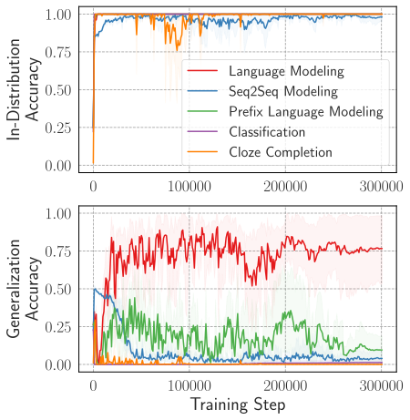

*(a) Вопросообразование*

*(b) Вопросообразование (немецкое)*

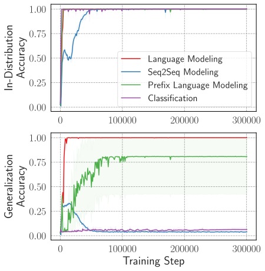

*(c) Пассивизация*

*(d) Перестройка времени*

*(e) Простое согласование*

*Рисунок 6: Кривые обучения разных целей на пяти задачах.* **[p. 23]**

#### Влияние тождественных пар на иерархическое обобщение.

Как отмечено в §3.1, обучающие наборы задач вроде вопросообразования и перестройки времени из McCoy et al. 2020, используемые и Murty et al. 2023a, включают тождественные пары повествовательных предложений (для вопросообразования) и предложений прошедшего времени (для перестройки времени) для задачи копирования. Эти данные включают и входные предложения с тем же синтаксисом, что у входов обобщающего набора, хотя выходы остаются невиданными. Поскольку модель видит форму предложений обобщающего набора, мы хотели бы выяснить, способствуют ли эти вспомогательные данные (тождественные пары) иерархическому обобщению: выучивают ли модели иерархическое правило, не видев входных видов из обобщающего набора? Как видно на рисунке 7, для вопросообразования удаление тождественных пар даёт значительное падение обобщающей точности трансформеров с целью языкового моделирования. Для перестройки времени, однако, обобщающее качество остаётся примерно тем же. Мы подозреваем, что дело в том, что разрыв между видами предложений внутрираспределительного и обобщающего наборов заметно больше для вопросообразования, чем для перестройки времени. В вопросообразовании обобщающий набор содержит предложения с относительными клаузами при подлежащем, и без тождественных пар такие предложения совершенно не видны при обучении. Для перестройки времени, напротив, обучающий набор содержит все существительные одной числовой формы (все единственного или все множественного числа), тогда как в обобщении числа существительных различаются, снимая **[p. 23]** двусмысленность. Общая структура предложения для перестройки времени остаётся той же, для вопросообразования — нет.

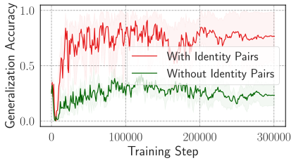

*(a) Вопросообразование*

*(b) Перестройка времени*

*Рисунок 7: Влияние присутствия тождественных пар (задачи копирования) в обучающих данных на иерархическое обобщение.* **[p. 23]**

#### A.1.3 Действительно ли обученные seq2seq трансформеры обобщаются иерархически на перестройке времени?

Для перестройки времени на рисунке 1 мы наблюдаем, что цель seq2seq по обобщающей точности близка к языковому моделированию. Мы полагаем, что это может быть из-за того, что высокая обобщающая точность на перестройке времени достижима без выучивания иерархического правила. Заметьте, что в обоих примерах перестройки времени в таблице 1 существует альтернативное неиерархическое правило: главный глагол предложения должен согласоваться с первым существительным **[p. 24]** предложения, поскольку набор McCoy et al. 2020 построен так, что первое существительное предложения всегда есть подлежащее, иерархически связанное с главным глаголом. Чтобы проверить, действительно ли эти модели выучивают иерархическое правило, а не обходной путь, мы оцениваем древовидность выученных представлений обученных моделей методом древесной проекции Murty et al. 2023b. Их метод характеризует, в какой мере вычисления трансформера объяснимы равнозначной древесно-структурной нейронной сетью.

###### p24-1

На рисунке 8(a) мы сравниваем баллы древовидности трансформеров с целями языкового моделирования и seq2seq. Согласно Murty et al. 2023a, мы наблюдаем, что при цели ЯМ представления трансформера продолжают становиться более древовидными по ходу обучения. У модели же seq2seq балл древовидности остаётся низким всё обучение. Это указывает, что хотя модель seq2seq достигает высокой обобщающей точности, она может на деле не обобщаться иерархически. Для дальнейшей проверки мы также провели линейное зондирование (Alain and Bengio 2017) представлений последнего слоя двух моделей и нашли, что у модели с ЯМ синтаксические категории слов (например, существительное-ед.ч. — категория слова *walrus*) восстанавливаются с очень высокой точностью. Напротив, линейные зонды на модели seq2seq не могут извлечь синтаксические категории (50% точности зондирования против 99% у языковой модели) (см. рисунок 8(b)).

*(a) Баллы древовидности моделей на задаче перестройки времени.*

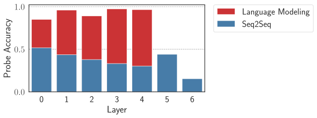

*(b) Линейное зондирование трансформеров, обученных на перестройке времени с целями языкового моделирования и Seq2Seq. Отсутствие красных столбиков для слоёв 5 и 6 — оттого, что трансформер с целью языкового моделирования имеет лишь 4 слоя, тогда как модель Seq2Seq — 6.*

*Рисунок 8: Проверка, действительно ли модели Seq2Seq обобщаются иерархически на перестройке времени.* **[p. 24]**

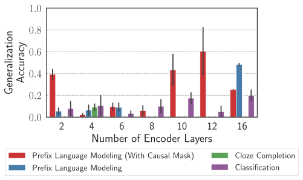

**[p. 25]**

*(a) Влияние глубины модели для целей PrefixLM и заполнения пропусков*

*(b) Влияние глубины модели для цели Seq2Seq.*

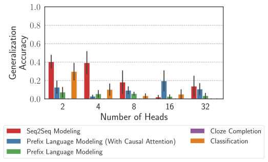

*(c) Влияние числа голов для разных целей обучения*

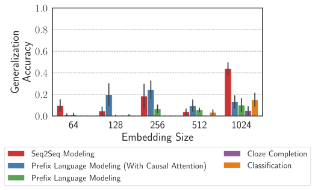

*(d) Влияние размерности вложения для разных целей обучения*

*Рисунок 9: Устойчивость отрицательных результатов для не-ЯМ целей по разным настройкам гиперпараметров на задаче вопросообразования. В каждом опыте варьируется один гиперпараметр при двух прочих, закреплённых по умолчанию: 6 слоёв, 8 голов, размерность вложения 512. Заметьте, что цель языкового моделирования достигает средней обобщающей точности 0.76 при гиперпараметрах по умолчанию.* **[p. 25]**

**[p. 26]**

*(a) Влияние глубины модели для целей PrefixLM, классификации и заполнения пропусков на немецком вопросообразовании.*

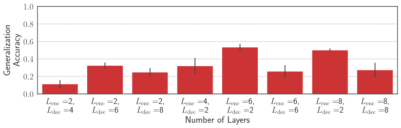

*(b) Влияние глубины модели для цели Seq2Seq на немецком вопросообразовании.*

*(c) Влияние глубины модели для целей PrefixLM, классификации и заполнения пропусков на пассивизации.*

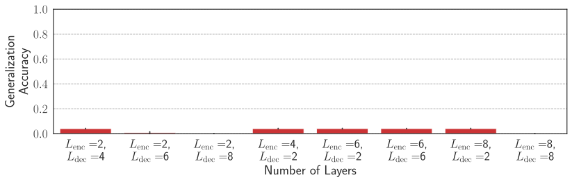

*(d) Влияние глубины модели для цели Seq2Seq на пассивизации.*

*Рисунок 10: Устойчивость отрицательных результатов для не-ЯМ целей по разным глубинам модели на немецком вопросообразовании и пассивизации. Заметьте, что цель языкового моделирования достигает примерно средней обобщающей точности 1.0 при гиперпараметрах по умолчанию. Графики по головам и размерности вложения мы опускаем ради места, но получаем результаты, согласные с наблюдаемыми здесь.* **[p. 26]**

### A.2 Подсети с разными обобщающими поведениями

#### Задачи, кроме вопросообразования.

В основной статье в §4 наши результаты об открытии подсетей с разным обобщающим качеством получены на вопросообразовании. Здесь мы даём результаты для перестройки времени и простого согласования. Для перестройки времени мы слегка изменяем процедуру отсечения. Поскольку для перестройки времени нужно породить всю последовательность настоящего времени, чтобы проверить форму предсказанного главного глагола, при отсечении мы считаем потерю по всем выходным токенам — в отличие от вопросообразования, где считалась лишь потеря на первом вспомогательном вопроса. Из-за этого для $\texttt{Train}\backslash\texttt{Gen}$-prune обучение становится крайне неустойчивым, поскольку процедура включает минимизацию обучающей и максимизацию тестовой потери. Потому мы предлагаем альтернативную процедуру $\texttt{Train}\backslash\texttt{Gen}$-prune для этой задачи: порождаем «линейноправильную» версию обобщающего набора, где пары предложений построены согласно только линейному правилу. Заметьте, что это делается простым взятием предложения прошедшего времени из обобщающего набора и переворотом формы главного глагола по согласованию с ближайшим предшествующим существительным. Как и в Gen-prune, здесь мы тоже используем лишь 1% данных «линейноправильного» обобщающего набора для отсечения во избежание переобучения. Для простого согласования процедура та же, что в вопросообразовании, с единственным отличием: потеря при отсечении считается на главном глаголе вместо вспомогательного. Результаты отсечения для двух задач даны на рисунках 11 и 12. Мы находим результаты, согласные с находками для вопросообразования, и здесь: подсети «линейного правила» и «иерархического правила» находимы отсечением и продолжают сосуществовать по ходу обучения.

*(a) Внутрираспределительная точность разных методов отсечения по ходу обучения (исходные обучающие данные вопросообразования)*

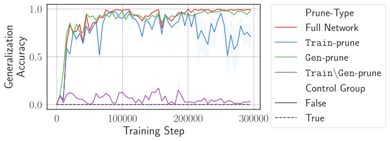

*(b) Обобщающая точность разных методов отсечения по ходу обучения (исходные обучающие данные вопросообразования)*

*Рисунок 11: Отслеживание динамики обучения относительно трёх методов отсечения для задачи перестройки времени* **[p. 26]**

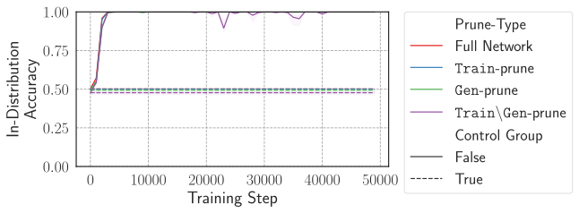

*(a) Внутрираспределительная точность разных методов отсечения по ходу обучения (исходные обучающие данные вопросообразования)*

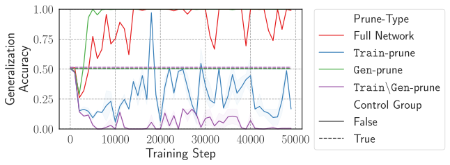

*(b) Обобщающая точность разных методов отсечения по ходу обучения (исходные обучающие данные вопросообразования)*

*Рисунок 12: Отслеживание динамики обучения относительно трёх методов отсечения для задачи простого согласования* **[p. 26]**

*Рисунок 13: Выполнение $\texttt{Train}\backslash\texttt{Gen}$-prune при разных гиперпараметрах отсечения: $L_{0}$-штрафе, скорости обучения отсечения и числе шагов. ap_test_aux означает обобщающую точность после отсечения. Мы пробуем 128 сочетаний этих параметров байесовской оптимизацией, и ни в одном случае не находится подсеть с 0% обобщающей точности. В лучшем случае находятся подсети с 25% точности, что отвечает случайной опорной линии этой задачи (поскольку выборов вспомогательного четыре).* **[p. 27]**

*Рисунок 14: Динамика обучения трансформерной ЯМ на данных вопросообразования, двусмысленность которых разрешена примерами, согласными только с линейным правилом (добавлением 10k таких примеров к исходным 100k двусмысленных). Как видно, полная сеть в этом случае после нескольких тысяч шагов выходит на плато 0% обобщающего качества — ожидаемо, поскольку ко всему набору применимо лишь линейное правило, и модель вероятнее выучит линейное обобщение. Далее, даже Gen-prune в этом случае не находит подсетей со 100% внутрираспределительного и 100% обобщающего качества. Хотя позже в обучении Gen-prune находит подсети с более высоким обобщающим качеством, внутрираспределительное качество в этих точках очень низко, то есть подсеть на деле не согласна с иерархическим правилом.* **[p. 27]**

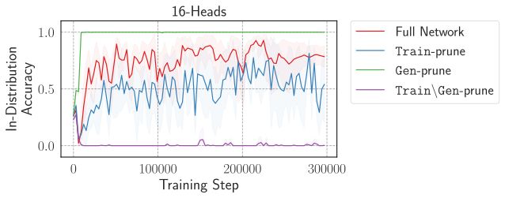

**[p. 27]**

*(a) Динамика обучения трансформерной ЯМ с 16 головами на слой внимания*

*(b) Динамика обучения трансформерной ЯМ с 4 головами на слой внимания*

*(c) Динамика обучения трансформерной ЯМ с 1 головой на слой внимания*

*Рисунок 15: Влияние ёмкости по головам на присутствие иерархической и линейной обобщающих подсетей. Прогоны усреднены по 5 семенам.* **[p. 27]**

### A.3 Подробности о грамматиках

#### Локальный поиск байесовским слиянием моделей.

Рукотворные грамматики нашего исследования могут не быть оптимальны по апостериору при обучающих данных. Например, могут быть избыточные продукции или нетерминалы, устранимые слиянием двух или более нетерминалов. Мы используем алгоритм байесовского слияния моделей (BMM) из Stolcke and Omohundro 1994, Perfors et al. 2011 для локального поиска грамматик с большими апостериорами начиная с рукотворных. Алгоритм работает так: начинаем с исходной грамматики и перебираем все возможные слияния. Слияние заменяет два нетерминала одним новым и добавляет две новые продукции, отображающие новый нетерминал в старые. Например, для продукций $A\to BC$, $A\to BD$ мы можем слить $C$ и $D$ в $F$, получив новые продукции $A\to BF$, $F\to C$ и $F\to D$. Для каждого слияния мы получаем новую грамматику и считаем её апостериор. Затем выбираем грамматику с наибольшим апостериором (жадный поиск) и повторяем процедуру с новой грамматикой. Если никакое слияние не даёт грамматики с апостериором выше исходной, поиск завершается. Контекстно-свободные грамматики после слияния обозначаем $\texttt{CFG}{}^{*}$ ($\texttt{CFG-S}^{*}$ и $\texttt{CFG-L}^{*}$), регулярные — $\texttt{Reg}{}^{*}$ ($\texttt{Reg-S}^{*}$ и $\texttt{Reg-L}^{*}$).

Важная деталь: выполняя алгоритм слияния, мы используем двусмысленный корпус $\mathcal{D}_{\mathrm{train-L}}$ или $\mathcal{D}_{\mathrm{train-S}}$ для вычисления апостериоров и, стало быть, поиска верного набора слияний. Итоговая грамматика, хотя и должна присваивать высокое правдоподобие двусмысленным обучающим данным, может более не быть согласной с отложенными видами предложений, например $\mathcal{D}_{\mathrm{test}}^{\texttt{Hier}}$ или $\mathcal{D}_{\mathrm{test}}^{\texttt{Lin}}$, и потому итоговые грамматики могут не строго моделировать линейное или иерархическое правила. Чтобы проверить, возникает ли такая ситуация у нас, мы сравниваем множество всех порождений грамматики до и после слияния. Если они совпадают, грамматика продолжает быть согласной и с двусмысленными, и с однозначными видами предложений, а потому подчиняться линейному или порядковому правилу исходной рукотворной грамматики. Мы находим, что для CFG-S после алгоритма слияния полученная грамматика больше не согласна только с иерархическим правилом и начинает порождать и виды предложений, согласные с линейным. Это означает, что **для случая данных низкого разнообразия даже средствами CFG лучше избегать моделирования иерархического правила при двусмысленных данных**. Для CFG-L грамматика остаётся согласной с иерархическим правилом и после слияния.

$\log$-вероятности после алгоритма BMM даны в таблице 3. Для набора $\mathcal{D}_{\mathrm{train-L}}$ наши результаты остаются согласными с результатами для рукотворных грамматик из таблицы 2: $\texttt{CFG-L}^{*}$ получает меньший апостериор, чем $\texttt{Reg-L}^{*}$. С другой стороны, для набора $\mathcal{D}_{\mathrm{train-S}}$ $\texttt{CFG-S}^{*}$ оказывается с апостериором выше односостоянной грамматики. Однако, как отмечено выше, после минимизации $\texttt{CFG-S}^{*}$ больше не согласна с иерархическим правилом, то есть не порождает предложений, где глаголы согласуются только с иерархически связанными существительными. Стало быть, наше наблюдение, что для случая низкого разнообразия моделирование иерархического правила не оптимально по апостериорному критерию, сохраняется и здесь.

*Таблица 3: Сравнение $\log$-вероятностей каждой из 4 грамматик после выполнения BMM на грамматиках CFG и Reg при обучающих наборах $\mathcal{D}_{\mathrm{train-L}}$ и $\mathcal{D}_{\mathrm{train-S}}$. Верхний индекс $*$ у $\log$-апостериора $\texttt{CFG}^{*}$ на $\mathcal{D}_{\mathrm{train-S}}$ означает, что хотя результаты показывают наибольший апостериор у этой грамматики, после минимизации она больше не моделирует иерархическое правило.* **[p. 28]**

| Грамматика | $\mathcal{D}_{\mathrm{train-L}}$ (120 видов) | $\mathcal{D}_{\mathrm{train-S}}$ (12 видов) |  |  |  |  |
|---|---|---|---|---|---|---|
| $\log$-априор | $\log$-правдоподобие | $\log$-апостериор | $\log$-априор | $\log$-правдоподобие | $\log$-апостериор |  |
| **CFG**∗ | -345 | -639 | **-984** | -112 | -42 | **-155∗** |
| **Reg**∗ | -393 | -658 | -1051 | -125 | -34 | -159 |
| **Flat** | -4567 | **-574** | -5141 | -281 | **-30** | -311 |
| **One-State** | **-58** | -2297 | -2355 | **-51** | -121 | -172 |

#### Анализ чувствительности.

Мы даём графики анализа чувствительности к выбору параметра $p$ геометрических распределений априора на рисунках 16 и 17. Мы даём анализ и для рукотворных, и для минимизированных BMM грамматик. Для последних — только на наборе $\mathcal{D}_{\mathrm{train-L}}$, поскольку после **[p. 28]** минимизации малых грамматик (CFG-S и Reg-S) не остаётся грамматики, подчиняющейся иерархическому правилу (см. обсуждение в предыдущем абзаце).

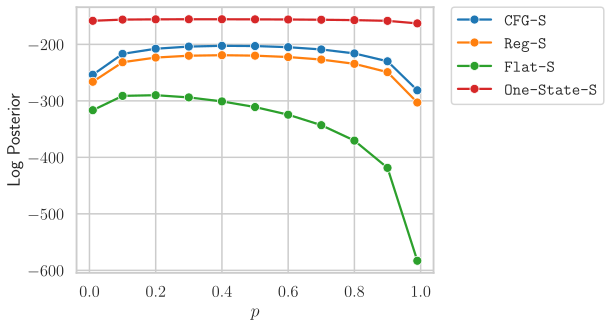

*(a) Случай данных низкого разнообразия — $\mathcal{D}_{\mathrm{train-S}}$ для рукотворных грамматик*

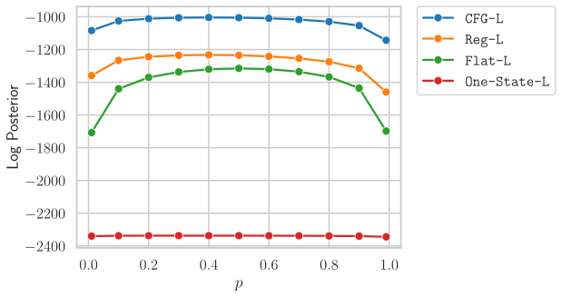

*(b) Случай данных высокого разнообразия — $\mathcal{D}_{\mathrm{train-L}}$ для рукотворных грамматик*

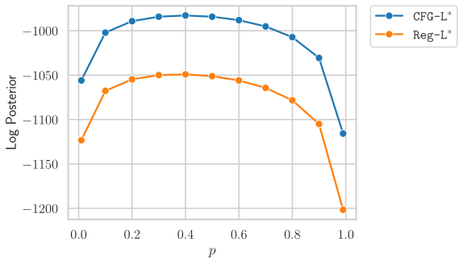

*(c) Случай данных высокого разнообразия — $\mathcal{D}_{\mathrm{train-L}}$ для минимизированных BMM грамматик*

*Рисунок 16: Анализ чувствительности при варьировании параметра геометрического распределения $p$. Заметьте, что здесь одно $p$ используется и для $p(|V|)$, и для $p(P_{k})$. Для минимизированного BMM случая (*справа*) мы опускаем плоскую и односостоянную грамматики, чтобы яснее показать разницу апостериоров $\texttt{CFG-L}^{*}$ и $\texttt{Reg-L}^{*}$, поскольку две другие грамматики получают много худшие апостериоры (см. *средний* рисунок)* **[p. 28]**

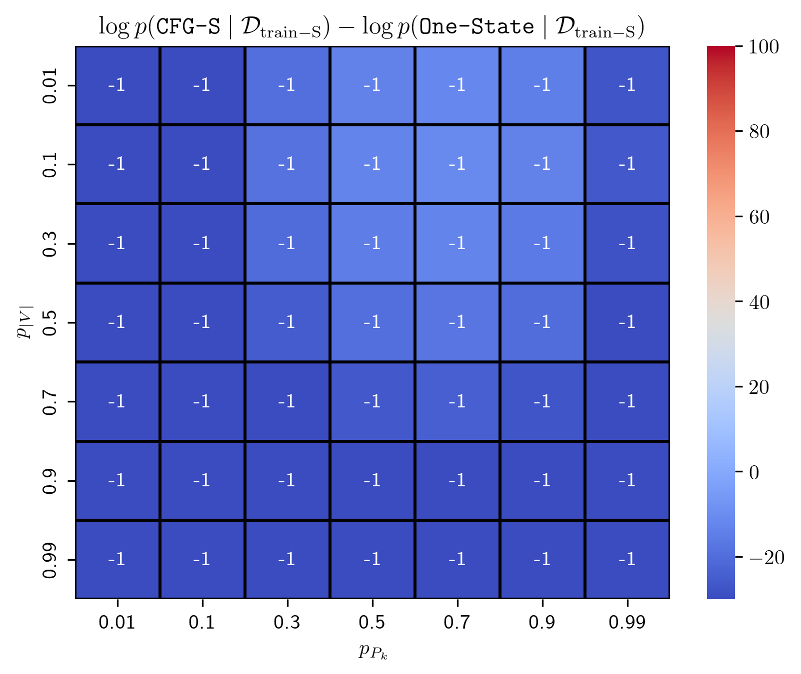

*(a) Случай данных низкого разнообразия — $\mathcal{D}_{\mathrm{train-S}}$ для рукотворных грамматик.*

*(b) Случай данных высокого разнообразия — $\mathcal{D}_{\mathrm{train-L}}$ для рукотворных грамматик.*

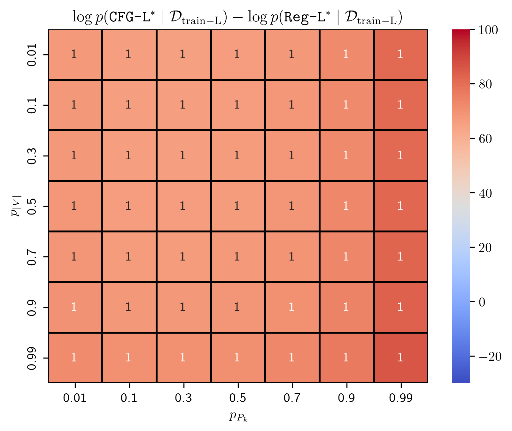

*(c) Случай данных высокого разнообразия — $\mathcal{D}_{\mathrm{train-L}}$ для минимизированных BMM грамматик.*

*Рисунок 17: Анализ чувствительности при варьировании параметра геометрического распределения $p_{|V|}$ для $p(|V|)$ и $p_{P_{k}}$ для $p(P_{k})$. Мы наносим разность между $\log$-апостериором CFG и другой грамматики с наибольшим апостериором — One-State для $\mathcal{D}_{\mathrm{train-S}}$ и Reg-L (или $\texttt{Reg-L}^{*}$ для минимизированного BMM случая) для $\mathcal{D}_{\mathrm{train-L}}$. Значения тепловых карт отвечают знаку разности апостериоров (1 — положительный, -1 — отрицательный). Положительный знак означает больший апостериор у CFG, отрицательный — наоборот.* **[p. 28]**

#### Примеры разборов

Примеры порождений из CFG и регулярной грамматик даны на рисунках 18 и 19 соответственно.


*Рисунок 18: Пример порождения из CFG с согласованием по иерархическому правилу* **[p. 29]**


*Рисунок 19: Пример порождения из линейной грамматики с согласованием по порядковому правилу* **[p. 29]**

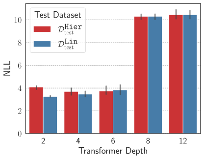

*(a) Отрицательное $\log$-правдоподобие (NLL) на тестовых наборах $\mathcal{D}_{\mathrm{test}}^{\texttt{Hier}}$ и $\mathcal{D}_{\mathrm{test}}^{\texttt{Lin}}$.*

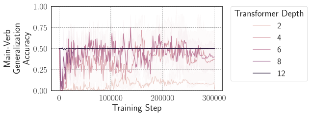

*(b) Обобщающая точность главного глагола на тестовом **[p. 30]** наборе $\mathcal{D}_{\mathrm{test}}^{\texttt{Hier}}$.*

*Рисунок 20: Показывают ли трансформеры, обученные на $\mathcal{D}_{\mathrm{train-S}}$, когда-либо иерархическое обобщение? Мы варьируем глубину трансформера-ЯМ (число слоёв декодировщика) и ни в одном случае не находим у трансформера иерархического обобщения. Интересно, что при малых глубинах модели обобщаются по порядковому правилу, на что указывает меньший NLL на $\mathcal{D}_{\mathrm{test}}^{\texttt{Lin}}$, чем на $\mathcal{D}_{\mathrm{test}}^{\texttt{Hier}}$, и точность главного глагола около 0%/ при глубине трансформера 2. При глубинах больше 4 мы наблюдаем, что модель начинает не показывать предпочтения ни линейного, ни иерархического правила.* **[p. 30]**
