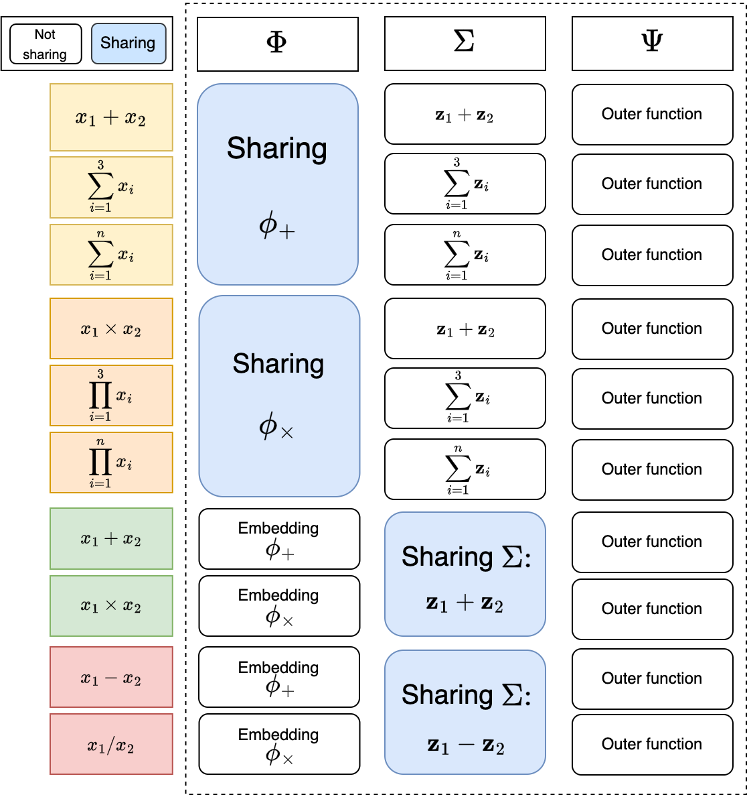
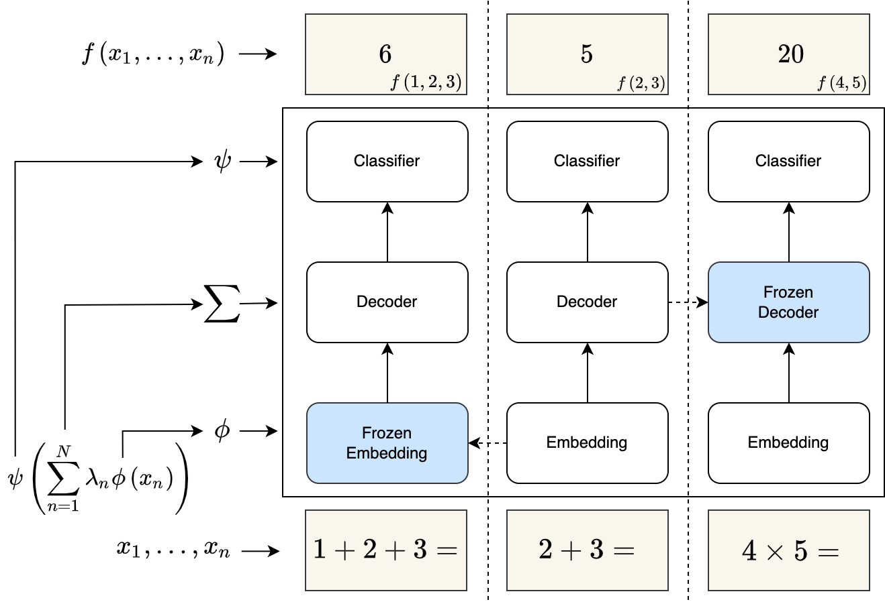
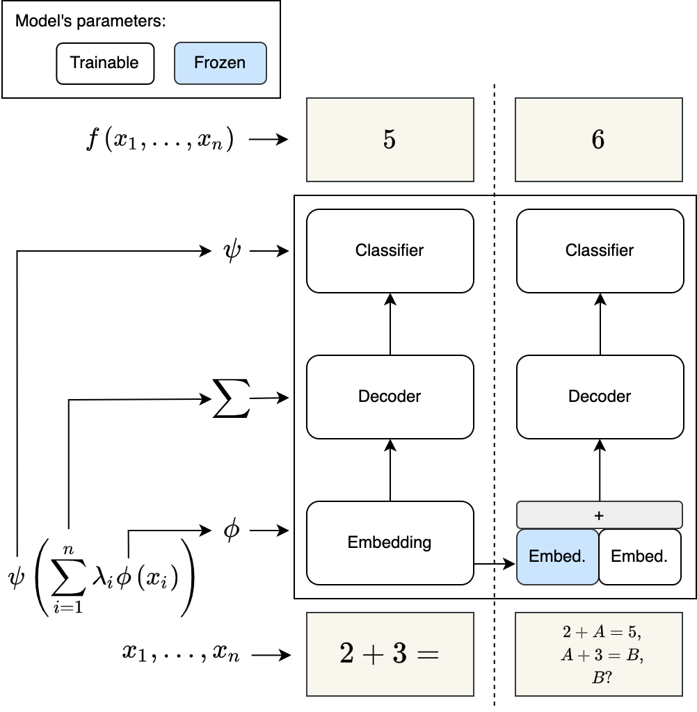
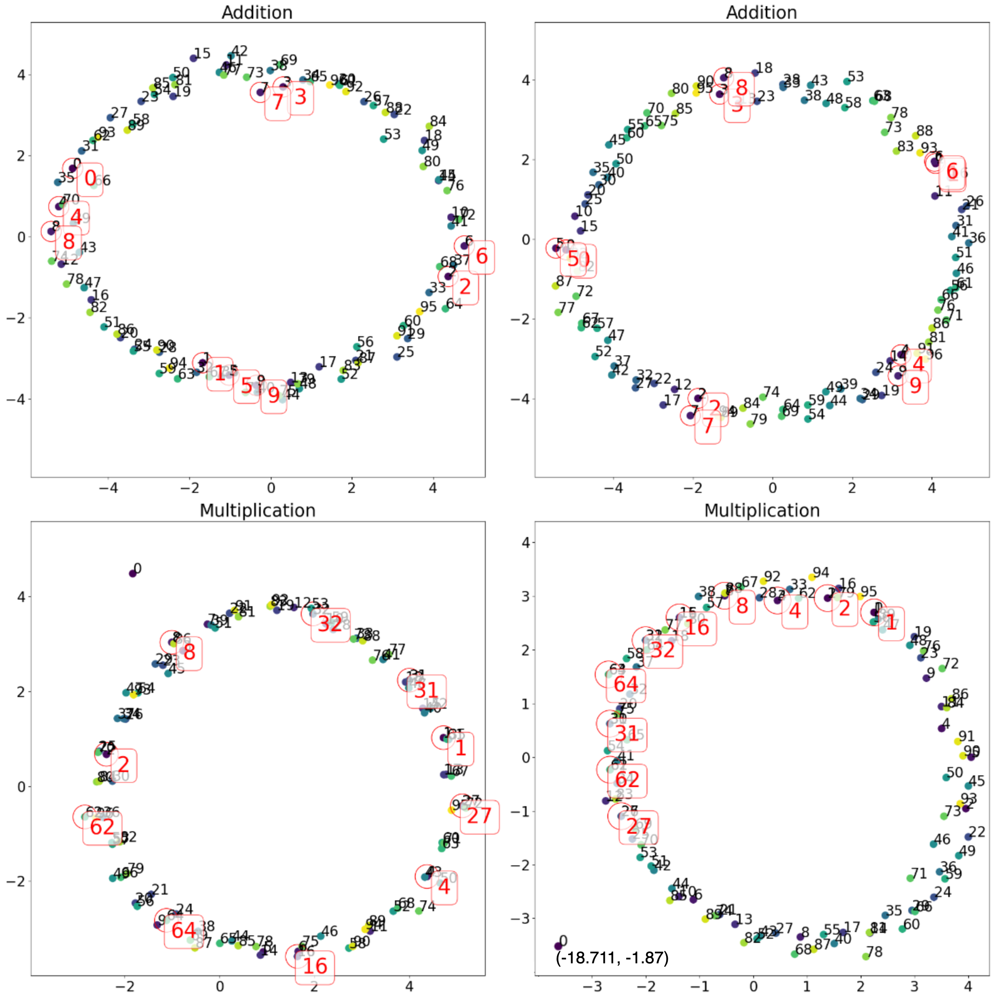

# Park et al. 2024 — Acceleration of Grokking in Learning Arithmetic Operations via Kolmogorov-Arnold Representation

См. также: [глобальный индекс понятий](../../concepts/index.md).
arXiv [2405.16658v1](https://arxiv.org/abs/2405.16658), 26 мая 2024. Колонтитула у PDF нет; под списком авторов стоит «May 2024». Позже работа вышла в Neurocomputing (2025) — цитирующие работы корпуса ссылаются на неё и как на «Park et al., 2024», и как на «Park et al., 2025»; здесь хранится версия v1.

**Yeachan Park** — Korea Institute for Advanced Study, 85 Hoegi-ro, Dongdaemun-gu, Seoul, 02455, Seoul, South Korea.
**Minseok Kim, Yeoneung Kim** — Deparment of Applied Artificial Intelligence, Seoul National University of Science and Technology, 232 Gongneung-ro, Nowon-gu, Seoul, 01811, South Korea.

Файлы разбора этой статьи:

- [`2405.16658.acceleration-of-grokking-in-learning-arithmetic-operations-via-kolmogorov-arnold-representation.claims.txt`](2405.16658.acceleration-of-grokking-in-learning-arithmetic-operations-via-kolmogorov-arnold-representation.claims.txt) — пронумерованные утверждения статьи с пометками разбора.
- [`2405.16658.acceleration-of-grokking-in-learning-arithmetic-operations-via-kolmogorov-arnold-representation.license.txt`](2405.16658.acceleration-of-grokking-in-learning-arithmetic-operations-via-kolmogorov-arnold-representation.license.txt) — лицензионная запись arXiv для этой статьи.

Схема якорей и правила ссылок на карточку — в [README папки статей](../README.md).

**Карточка-выдержка.** Лицензия статьи (`arxiv-nonexclusive`) не разрешает публикацию копии оригинала и полного перевода, поэтому карточка содержит редакторские секции и цитируемые фрагменты перевода (право цитирования). Полный текст статьи: <https://arxiv.org/abs/2405.16658>.

## Затрагиваемые понятия

**[Гроккинг](../../concepts/grokking.md)** — работа не объясняет гроккинг, а берёт его как данность и ставит задачу его **сократить**; корпусу она даёт операционное определение и три приёма ускорения. Определение прямое и пороговое: модель считается грокнувшей, когда точность на тесте превышает $99\%$ в пределах $10^{5}$ шагов ([с. 18, абз. 7](#p18-7)); всё измерение работы — это номер шага, на котором порог взят. Задача поставлена как ускорение: «такая задача часто страдает гроккингом, когда обучающее множество мало», и предлагается «способ учесть алгебраическую природу бинарного отношения, чтобы ускорить его, что называют *дегроккингом*» ([с. 14, абз. 2](#p14-2)) — слово взято у Tan & Huang. Приёмов три: коммутативное пополнение данных, перенос блока декодера и перенос слоя вложений ([с. 15, абз. 2](#p15-2), [с. 15, абз. 3](#p15-3)). Чего в работе нет: ни одного утверждения о **причине** задержки. Ни фаза запоминания, ни норма весов, ни устройство перехода не измеряются и не упоминаются; кривые обучающей потери не показаны нигде, а на рисунках 5 и 6 отложена только поверочная точность. Из «модель допускает KA-разложение» не выводится ни то, что градиентный спуск его находит, ни то, почему до него долго идти, — механизм самой задержки работой не затрагивается вовсе.

**[Эталонный полигон гроккинга](../../concepts/canonical-grokking-testbed.md)** — постановка Power et al. взята целиком и без переделки: тот же алгоритмический набор бинарных отношений на $\mathbb{Z}_{p}\times\mathbb{Z}_{p}$ при $p=97$, тот же вход-уравнение [’$a$’, ’$\circ$’, ’$b$’,’$=$’], тот же трансформер ([с. 17, абз. 1](#p17-1), [с. 14, абз. 1](#p14-1)). Меняется ровно одно — откуда берутся начальные веса. Отступления от полигона стоит держать в виду при сверке чисел с соседями: модель здесь крупнее канонической (слой вложений с четырьмя MLP-модулями, два блока декодера по четыре головы, размерности вложений и внимания $256$ — [с. 18, абз. 6](#p18-6)), а объём обучения задан **абсолютным** числом образцов $N$, а не долей таблицы, как принято на полигоне ([таблица 1](#tab-1): $N$ от $3000$ до $9000$ при $97^{2}$ возможных пар). Полигон при этом расширен двумя новыми задачами, которых у Power et al. нет: композиция операции из трёх и четырёх операндов и система уравнений с неизвестными токенами ([с. 15, абз. 4](#p15-4)). Чего в работе нет: ни одного прогона при другом $p$, ни $S_{5}$, ни какой-либо неалгебраической задачи; всё измерено при $p=97$.

**[Модульная арифметика](../../concepts/modular-arithmetic.md)** — работа даёт корпусу **алгебраическую классификацию операций по тому, что у них общего**, и это её самый переносимый вклад. Десять бинарных операций ([с. 17, абз. 2](#p17-2)) разложены на три класса, и каждому классу отвечает своя переносимая часть: коммутативные операции делят $\Sigma$ (сумму), антиабелевы — тоже $\Sigma$, но разность, а абелевы делят $\Phi$ (вложение) ([рис. 1](#fig-1), [§3.4.2](#sec-3-4-2)). Понятие антиабелевой операции («$x_{1}\bullet x_{2}=x_{1}\circ x_{2}^{-1}$», то есть вычитание и деление) введено здесь ([§3.3](#sec-3-3), [с. 10, абз. 1](#p10-1)). Для $\mathbb{Z}_{p}$ со сложением и для $\mathbb{Z}_{p}^{*}$ с умножением выписаны явные представления — $\rho(x)=\exp(\frac{2\pi ix}{p})$ и то же по дискретному логарифму ([с. 8, абз. 4](#p8-4), [с. 9, абз. 1](#p9-1)). Чего в работе нет: зависимости чего-либо от $p$, переноса между разными модулями и разбора того, чем полиномиальные операции вида $x_{1}^{2}+x_{2}^{2}+x_{1}x_{2}$ отличаются от чисто групповых, — они просто попадают в класс «коммутативные».

**[Групповые представления и cosets](../../concepts/group-representations-cosets.md)** — здесь корпус получает редкий случай, когда круговое представление модульной арифметики **выведено из алгебры до опыта**, а не найдено обратной инженерией обученной сети. Доказательство теоремы 4 строится ровно на языке этой карточки: конечная абелева группа раскладывается в произведение циклических, каждая имеет одномерное неприводимое представление $\rho_{j}:C_{q_{j}}\to GL_{1}(\mathbb{C})\cong\mathbb{C}^{\ast}$, и вложение определяется как $\phi=\log\rho$ ([приложение 6.1, с. 24, абз. 2](#p24-2), [теорема 4](#p7-2)). Отсюда для $\mathbb{Z}_{p}$ характер $\exp(2\pi ix/p)$ — та самая окружность — получается как следствие, а PCA обученных вложений лишь подтверждает её ([рис. 4](#fig-4)). Чего в работе нет: ни смежных классов, ни неабелевых групп, ни разбора того, какие именно частоты $k$ выбирает обученная сеть, — теория говорит лишь, что представление существует и не единственно (для любого $k$, взаимно простого с $p$).

**[Обучение структурированных представлений](../../concepts/structured-representation-learning.md)** — единственная прямая проверка соответствия «KA-представление ↔ трансформер» сделана по вложениям: после обучения сложению и умножению первые две главные компоненты векторов вложения ложатся на окружность, причём углы $\theta_{i,i+1}$ между соседними токенами «схожи для всех $i$» ([с. 18, абз. 9](#p18-9), [с. 19, абз. 1](#p19-1), [рис. 4](#fig-4)). На умножении на окружность выстраиваются степени образующей ($1,2,4,8,16,32,64$ соседствуют), что отвечает дискретному логарифму примера 3, а токен $0$ вынесен далеко за круг. Чего в работе нет: доли дисперсии, которую несут первые две компоненты, — она не указана; и, главное, нет никакой проверки соответствия для двух других модулей. Про блок декодера сказано хеджем: «мы **ожидаем**, что блок декодера работает как промежуточная суммирующая часть ($\Sigma$)» ([с. 19, абз. 2](#p19-2)); отдельного опыта на это нет, и единственный довод — успешность переноса.

**[Замораживание подсети / edge-popup](../../concepts/freezing-subnetwork.md)** — работа даёт корпусу заморозку иного рода, чем edge-popup: замораживаются не случайные веса при поиске маски, а **обученные веса целого модуля**, перенесённого из другой задачи. При переносе блока декодера «перенесённый блок декодера замораживается, и обучаются только слой вложений и слой-классификатор» ([с. 15, абз. 2](#p15-2)); при переносе вложения замораживается, наоборот, вложение, а доучивается $\Sigma$ ([с. 18, абз. 5](#p18-5)). В задаче с неизвестными заморозка сделана частичной: рядом с перенесённым слоем вложений заведён новый обучаемый слой для токенов $A$, $B$ и «$\&$» ([с. 16, абз. 3](#p16-3), [рис. 3](#fig-3)), и при этом сокращение числа шагов сохраняется во всех рассмотренных случаях ([с. 22, абз. 1](#p22-1), [таблица 4](#tab-4)). Чего в работе нет: сравнения «заморожено против дообучаемо» — размороженный вариант переноса не испытан ни разу, поэтому неизвестно, чем именно из ускорения обязаны заморозке, а чем самой инициализации.

**[Доля данных / критический размер набора](../../concepts/data-fraction-critical-dataset-size.md)** — объём обучающих данных здесь главный второй рычаг: гроккинг «часто» наступает, «когда обучающее множество мало» ([с. 14, абз. 2](#p14-2)), и все таблицы устроены как сетка по $N$. Существенное для понятия наблюдение работы: перенос весов **сдвигает порог, за которым гроккинг вообще случается**, а не только ускоряет его — при $N=4000$ на $x_{1}\times x_{2}$ базовый прогон не грокает, а с пополнением грокает за $31419$ шагов ([таблица 1](#tab-1)); композиция $x_{1}\times x_{2}\times x_{3}$ при $N=100000$ не грокает без переноса и грокает за $1087$ шагов с ним ([таблица 3](#tab-3)). Чего в работе нет: ни закона критического размера, ни попытки его оценить; $N$ задан абсолютным числом образцов без пересчёта в долю таблицы, а половина строк таблицы 1 идёт с разбросом $(\pm 0)$, то есть по одному прогону на настройку.

**[Фурье-признаки и контуры](../../concepts/fourier-features-circuits.md)** — работа лишь упоминает фурье-линию, но приходит к тому же объекту с другой стороны. Nanda et al. и Zhong et al. названы одной фразой родственных работ: они «сосредоточены на обучении модульному сложению, пользуясь дискретными преобразованиями Фурье и тригонометрическими тождествами, которые превращают модульное сложение во вращения вокруг окружности» ([с. 2, абз. 3](#p2-3)). Та же окружность появляется у Park et al. как характер $\exp(2\pi ix/p)$ — то есть буквально фурье-базис циклической группы, — но выведена она из теории представлений, а не из разбора обученной сети ([с. 8, абз. 4](#p8-4)). Чего в работе нет: ни спектрального разбора весов или логитов, ни выделения ключевых частот, ни языка контуров; слова «circuit» в статье нет вовсе. Приписывать авторам механистическое объяснение алгоритма сложения нельзя — у них показано лишь, что вложения обученной модели ложатся на окружность.

**[Композиция групп / некоммутативность](../../concepts/group-composition-non-commutative-s5.md)** — работа впервые в корпусе даёт **проверяемое до опыта** предсказание о некоммутативных операциях: теорема 5 утверждает, что для антиабелевой операции годятся те же $\phi,\psi$, что и у порождающей абелевой, а меняется только $\Sigma$ — сумма становится разностью ([с. 10, абз. 2](#p10-2), [с. 11, абз. 7](#p11-7)). Предсказание подтверждено переносом в обе стороны: $x_{1}/x_{2}$ из $x_{1}-x_{2}$ ($35543\to4115$) и $x_{1}-x_{2}$ из $x_{1}/x_{2}$ ($38879\to2115$) ([таблица 2](#tab-2), [с. 20, абз. 3](#p20-3)). Чего в работе нет: неабелевых **групп** — $S_{5}$ и композиции перестановок не рассматриваются; «некоммутативность» здесь ограничена вычитанием и делением, то есть операциями, выводимыми из абелевой группы обращением второго операнда, а не отдельной неабелевой структурой.

**[Weight decay / L2-регуляризация](../../concepts/weight-decay.md)** — работа лишь наследует настройку и ни разу её не трогает: «Weight decay применяется через оптимизатор AdamW [19, 20] со скоростью обучения и скоростью спада $0.001$ и $0.1$ соответственно» ([с. 18, абз. 7](#p18-7)). Абляции weight decay нет, зависимость числа шагов до гроккинга от его величины не измеряется, и вопрос о необходимости регуляризации не ставится вовсе. Ссылаться на эту работу как на свидетельство в спорах о роли weight decay нельзя: единственное её отношение к нему — то, что все прогоны, и базовые, и с переносом, велись при одном и том же значении $0.1$.

**[Оптимизатор](../../concepts/optimizer-adam-adamw-sgd.md)** — то же положение: AdamW со скоростью обучения $0.001$ взят у Power et al. и удержан во всех опытах ([с. 18, абз. 7](#p18-7)); размер мини-батча — $1024$ для бинарных операций и системы уравнений и $4096$ для композиции. Сравнения оптимизаторов нет, и ни одно утверждение работы не опирается на свойства AdamW; для карточки понятия это лишь ещё одна точка, где ускорение получено **не** заменой оптимизатора.

---

## Несогласованности внутри статьи

**Размерность вложения: $m$ — число образующих или порядок группы.** [Теорема 4](#p7-2) определяет $m$ как число образующих $G$ и даёт размерность вложения $2m$; в [разделе 4.3](#p15-3) та же величина изложена как «размерность вложения зафиксирована как $2m$ при $m=|G|$». Для $\mathbb{Z}_{97}$ это $2$ против $194$. Верна формулировка теоремы: следствие 2 отдельно оговаривает, что у циклической группы $m=1$, а примеры 2 и 3 строят представления размерности $2$. Цитировать «$2m$ для $m=|G|$» как результат работы нельзя.

**Заявленный вклад про коммутативное пополнение не подтверждается собственной таблицей.** В [перечне вкладов](#p3-2) сказано: «Эмпирически проверено, что введённый приём коммутативного пополнения ускоряет гроккинг». В [таблице 1](#tab-1) при этом три строки показывают **замедление**: $x_{1}+x_{2}$ при $N=4000$ — $15359\to31699$; $x_{1}^{2}+x_{2}^{2}+x_{1}+x_{2}$ при $N=6000$ — $584\to714$; $x_{1}^{2}+x_{2}^{2}+x_{1}x_{2}$ при $N=9000$ — $1859\to2989$. Оговорки об этом в тексте нет, и все три случая приходятся на строки с разбросом $(\pm 0)$, то есть на одиночные прогоны. Там, где приём помогает, он помогает сильно ($x_{1}\times x_{2}$ при $N=5000$: $32839\to7419$), но общего утверждения таблица не поддерживает.

**Базовые строки таблицы 3 одновременно грокнули и не грокнули.** По [определению работы](#p18-7) грокнувшей считается модель с точностью выше $99\%$. В [таблице 3](#tab-3) базовая строка $x_{1}+x_{2}+x_{3}$ при $N=100000$ несёт шаг гроккинга $22186(\pm 25305)$ и одновременно итоговую точность $74.98(\pm 22.92)$; та же картина в строках $N=300000$ обеих операций и в двух базовых строках [таблицы 4](#tab-4). Скорее всего, усреднение ведётся по семенам, часть которых не грокнула, но нигде это не оговорено, и по собственному определению статьи такие строки несопоставимы со строками переноса, помеченными «Грокнул».

**Формулировка теоремы 5 испорчена незавершённой правкой.** В [самой теореме](#p10-2) стоит «Для любого $\ast$ существуют» — символ $\ast$ в статье не определён и больше нигде не встречается в этой роли; ожидалось бы «для любой антиабелевой $\bullet$». В том же утверждении $\rho_{<G,\circ>}$ используется в формуле, но среди объявленных функций его нет — вводится оно только в доказательстве. Содержание теоремы восстанавливается по доказательству, но цитировать её формулировку дословно нельзя.

**Доказательство следствия 1 не сходится по размерностям.** В [следствии 1](#p6-1) утверждение верное — для коммутативной операции на конечном $G\subset\mathbb{R}$ существует KA-представление с размерностью вложения $3$, — но [его доказательство](#p6-4) заявляет $f:G\to G$ там, где нужно $G\times G\to G$, строит линейную интерполяцию $\tilde{f}:\mathbb{R}\to\mathbb{R}$ как функцию **одной** переменной, а затем применяет её как $\tilde{f}(x_{1},x_{2})$. Непрерывного продолжения на две переменные не построено, поэтому ссылка на теорему 3 в этом месте не обоснована. К тому же перед доказательством оборван анонс: [«В частности,»](#p6-3) — и дальше сразу идёт доказательство.

**Перечень переносов в тексте шире таблицы 2 на две пары.** В [разделе 5.3.1](#p20-2) заявлено семь переносов блока декодера: пять от $x_{1}+x_{2}$ (к $x_{1}\times x_{2}$, $(x_{1}+x_{2})^{2}$, $(x_{1}+x_{2})^{3}$, $x_{1}^{2}+x_{2}^{2}+x_{1}+x_{2}$ и $x_{1}^{3}+x_{2}^{3}+x_{1}+x_{2}$) и ещё два — $x_{1}^{2}+x_{2}^{2}+x_{1}+x_{2}$ из $x_{1}^{2}+x_{2}^{2}$ и $x_{1}+x_{2}$ из $x_{1}\times x_{2}$. В [таблице 2](#tab-2) из них есть пять: строки для $x_{1}^{3}+x_{2}^{3}+x_{1}+x_{2}$ нет вовсе, а $x_{1}^{2}+x_{2}^{2}+x_{1}+x_{2}$ показана переносом из $x_{1}^{2}+x_{2}^{2}$, а не из $x_{1}+x_{2}$. Оставшиеся две строки таблицы — антиабелевы пары. Считать «семь коммутативных пар» подтверждёнными таблицей нельзя.

**Препринт не вычитан; следы правок остались в нескольких местах.** [Раздел 4](#p13-2) обрывается на фразе «Мы также утверждаем, что» — продолжения нет. В [записи деления](#p11-7) стоит лишняя сумма: $x_{1}/x_{2}=\psi_{\times}(\sum_{i=1}^{2}\phi_{\times}(x_{1})-\phi_{\times}(x_{2}))$, тогда как у парного ему вычитания суммы нет и по теореме 5 её быть не должно. В [примере 3](#p9-1) написано «$\mathbb{Z}$ не образует группу с модульным умножением», хотя речь о $\mathbb{Z}_{p}$. Ссылки на рисунки переставлены: в [разделе 4.3](#p15-3) блок-схема переноса вложения на композицию названа рисунком 3, а это [рисунок 2](#fig-2); в [следующем абзаце](#p16-3) схема для системы уравнений названа рисунком 2, а это [рисунок 3](#fig-3). Наконец, в подписях панелей [рисунка 6](#fig-6) вторая строка системы записана как «$A+B=c$» и «$A\times B=c$», тогда как в [тексте](#p15-4) она стоит как $A\circ c=B$ — роли $B$ и $c$ поменяны местами.

---

## Что доказано, что показано и что предположено

У работы три слоя разной прочности, и цена цитаты сильно зависит от того, из какого она взята.

**Доказано.** Теоремы 4 и 5 — законченные утверждения теории представлений: для конечной абелевой группы существуют $\phi,\psi$ с размерностью вложения $2m$ по числу образующих, **не зависящие от числа операндов** $n$ ([с. 7, абз. 6](#p7-6)); для антиабелевой операции годятся те же $\phi,\psi$, что и у порождающей абелевой ([с. 10, абз. 2](#p10-2)). Именно независимость от $n$ — всё теоретическое основание переноса вложений, и оно прочное. Следствие 1 (общий коммутативный случай, размерность $3$) в этот слой не попадает: его доказательство разобрано выше.

**Предсказано до опыта и подтверждено.** Из теоремы 5 следует, что вычитание и деление делят представление со сложением и умножением, — и перенос блока декодера действительно работает в обе стороны, сокращая число шагов в 8–18 раз ([таблица 2](#tab-2), [с. 20, абз. 3](#p20-3)); те же приёмы для пар «коммутативная → коммутативная» перечислены отдельно ([с. 20, абз. 2](#p20-2)). Из независимости $\phi$ от $n$ следует, что вложение бинарной операции годится для её композиции, — и почти все базовые прогоны на композициях не грокают вовсе, а с переносом грокают ([таблица 3](#tab-3), [рис. 6](#fig-6)). Это самая содержательная связь «алгебра задачи → что именно переносить» во всей линии ускорения.

**Показано, но при осторожном чтении.** Ускорение измеряется **только шагами целевого обучения**. Стоимость модели-донора нигде не учтена, хотя донор должен быть доведён до гроккинга сам (для сложения это те же $11647$–$27167$ шагов по таблицам 1 и 2). Сравнения при равных суммарных затратах нет ни для переноса декодера, ни для переноса вложения, а именно оно решает, есть ли выигрыш. Разброс по семенам местами сопоставим с самой величиной: $27167(\pm 28853)$, $63549(\pm 41903)$, $36852(\pm 46539)$.

**Объявлено ожиданием.** Соответствие «$\Sigma$ ↔ блок декодера» — второй из трёх столбов всей рамки — названо ожиданием прямым текстом: «мы **ожидаем**, что блок декодера работает как промежуточная суммирующая часть ($\Sigma$)» ([с. 19, абз. 2](#p19-2)). Проверено из трёх соответствий только одно — «$\phi$ ↔ слой вложений», и то по PCA-картинке. Гипотеза о том, что вложение для системы уравнений наследует свойства вложения абелевой операции, тоже помечена как догадка: «мы предполагаем» ([с. 16, абз. 2](#p16-2)).

**Не следует из показанного.** Из опыта с урезанным словарём ([§5.4](#sec-5-4), [таблица 5](#tab-5)) сделан вывод, «что модель действительно понимает арифметические правила» ([перечень вкладов](#p3-2)). Но перенесённое вложение обучалось на **полном** словаре $\mathbb{Z}_{97}$, то есть представления токенов $80$–$96$ уже получены на исходной задаче; урезан лишь этап доучивания $\Sigma$, а не всё обучение. Отдельно стоит держать в виду количественный разрыв: теория для $\mathbb{Z}_{97}$ даёт размерность вложения $2$, а в опытах она равна $256$ ([с. 18, абз. 6](#p18-6)), и соответствие «теория — модель» нигде не проверяется числом.

---

## Ошибочные пересказы и цитирования этой статьи

Ниже — узоры, наблюдённые в цитирующих работах корпуса. Для каждого сказано, что именно искажается, и даны ссылки на авторские абзацы с теряемой оговоркой. Разделы «Ошибочные цитирования» на стороне цитирующих карточек ещё не заведены, поэтому подробные разборы пока не адресуются, а цитирующие работы перечислены простыми ссылками на карточки.

**«Park et al. меняют архитектуру, чтобы получить разновидности гроккинга» (ошибочное).** Gu et al. 2025 в обзоре пишут: `"Some studies also focus on changing the architecture to investigate variations in the phenomenon (Park et al., 2024; Kunin et al.,; Lee et al., 2024)."` — «Некоторые исследования сосредоточены также на изменении архитектуры, чтобы исследовать разновидности явления». Архитектура здесь не меняется ни в одном опыте: она фиксирована во всех прогонах, включая базовые, — слой вложений с четырьмя MLP-модулями, два блока декодера по четыре головы, размерности $256$ ([с. 18, абз. 6](#p18-6)), — и всё различие между «базовой» строкой и строкой переноса состоит в том, откуда взяты начальные веса одного из модулей и заморожен ли он ([с. 15, абз. 2](#p15-2)). Приём относится к инициализации и переносу обучения, а не к архитектуре; в той же работе Park et al. корректно отнесены к работам, дающим лишь частичное понимание механизма. Затронутая работа: [Gu et al. 2025](../2504.03162.beyond-progress-measures-theoretical-insights-into-the-mechanism-of-grokking/2504.03162.beyond-progress-measures-theoretical-insights-into-the-mechanism-of-grokking.card.md).

**«Точный алгоритм модульного сложения через тригонометрические тождества установлен в том числе здесь» (ошибочное).** Hwang & Park 2026 пишут: `"For modular addition, the exact algorithm using trigonometric identities has been reported in (Nanda et al., 2023; Zhong et al., 2023; Park et al., 2025)."` — «Для модульного сложения точный алгоритм, использующий тригонометрические тождества, изложен в (Nanda et al., 2023; Zhong et al., 2023; Park et al., 2025)». Тригонометрических тождеств в этой работе нет, и алгоритм обученной сети в ней не восстанавливается: окружность $\exp(2\pi ix/p)$ **постулируется** из теории представлений как одно из многих возможных KA-представлений ([с. 8, абз. 4](#p8-4)), а единственное эмпирическое подтверждение — двумерная PCA-проекция вложений без указания доли объяснённой дисперсии ([рис. 4](#fig-4)). Разбора весов, логитов или голов внимания в статье нет вовсе; тригонометрические тождества упомянуты ровно один раз — как то, чем занимаются **другие** работы ([с. 2, абз. 3](#p2-3)). Ссылка при этом самоцитирующая: Yeachan Park — первый автор этой статьи и соавтор цитирующей. Затронутая работа: [Hwang & Park 2026](../2603.01968.intrinsic-task-symmetry-drives-generalization-in-algorithmic-tasks/2603.01968.intrinsic-task-symmetry-drives-generalization-in-algorithmic-tasks.card.md).

Образцовые (точные) формулировки для контраста: Notsawo et al. 2025 — `"Park et al. (2024) accelerate grokking by using data augmentation for commutative operations and transfer learning across model components aligned with the Kolmogorov-Arnold representation."`; Hwang & Park 2026 в другом месте — `"These include transfer learning from pretrained or weaker models (Furuta et al., 2024; Xu et al., 2025; Park et al., 2025) … and the enforcement of inductive biases such as commutativity in modular arithmetics (Tan and Huang, 2023; Park et al., 2025)."`

Более мягкий отголосок, не заслуживший отдельного разбора: отнесение работы к способам **вызвать** гроккинг — `"explored diverse methodologies to induce it … Park et al. (2024)"` ([He et al. 2026](../2601.09049.is-grokking-worthwhile-functional-analysis-and-transferability-of-generalization-circuits-in-transformers/2601.09049.is-grokking-worthwhile-functional-analysis-and-transferability-of-generalization-circuits-in-transformers.card.md)), тогда как все приёмы работы гроккинг сокращают, а не вызывают.

---

# Цитируемые фрагменты перевода

Ниже приведены только те фрагменты перевода, на которые ссылаются карточки корпуса (право цитирования). Нумерация якорей `pN-M` / `fig-N` / `sec-X` совпадает с полной карточкой и оригиналом.

### 1.1 Родственные работы

###### p2-3

В последние годы предпринято несколько попыток разобраться с механизмом, стоящим за гроккингом. Авторы [4] предполагают, что явление гроккинга просто вызвано выбором большой инициализации и больших норм весов, исходя из наблюдения о зоне Златовласки [8]. Другой взгляд на понимание гроккинга предложен в [9], где утверждается, что к гроккингу приводит механизм рогатки. Авторы [10] объясняют, как возникают структурированные представления и как они способствуют гроккингу, разделяя процесс обучения на четыре фазы: постижение (comprehension), гроккинг, запоминание (memorization) и путаница (confusion). С другой стороны, [11, 12] сосредоточены на обучении модульному сложению, пользуясь дискретными преобразованиями Фурье и тригонометрическими тождествами, которые превращают модульное сложение во вращения вокруг окружности. Чуть позже [13] исследует необходимые условия гроккинга, доказывая, что такое явление происходит вблизи точки Каруша–Куна–Таккера в задачах разрежённой линейной классификации и восполнения матриц. Недавно авторы [14] предложили подход к дегроккингу — ускорению процесса генерализации — путём возмущения функции потерь. Наиболее близкая к нашей работа — [15], где авторы воплощают идею переноса весов для обучения различным бинарным операциям из других предобученных моделей. Однако её теоретическое основание сомнительно. В нашей статье мы разбираем арифметические операции и их композиции через теорему о KA-представлении, чтобы обнажить связь с архитектурой трансформера, что позволяет нам пользоваться переносом весов при обучении арифметическим операциям.

### 1.2 Наш вклад

###### p3-2

- Эмпирически проверено, что введённый приём коммутативного пополнения ускоряет гроккинг.
- Мы возвращаемся к теореме о KA-представлении и трактуем модель как сочетание трёх модулей: вложения, блока декодера и модуля-классификатора. Мы представляем уточнённую версию KA-теоремы для абелевых и антиабелевых операций, что позволяет нам обосновать применение приёмов переноса обучения. Ускорение гроккинга достигнуто, что подтверждено в разнообразных опытах.
- Предложены две новые арифметические задачи, включающие композицию арифметических операций и систему уравнений с неизвестными. Мы показываем, что перенос обучения способствует эффективному обучению этим задачам, превосходя обычные подходы.
- Наконец, мы показываем, что обучение с ограниченным числом токенов также возможно посредством переноса обучения, что подкрепляет утверждение о том, что модель действительно понимает арифметические правила.

##### **Следствие 1****.**

###### p6-1

*Для любой коммутативной бинарной операции $\circ$, определённой на $G\times G$ для конечного множества $G\subset\mathbb{R}$, существует KA-представление*

###### p6-3

В частности,

##### Доказательство.

###### p6-4

Определим $f:G\to G$ как $f(x_{1},x_{2})=x_{1}\circ x_{2}$. Для $x\in G$ определим $a_{x},b_{x}$ как

##### **Теорема 4**(представление абелевой группы)**.**

###### p7-2

*Пусть $G$ — конечная абелева группа, представленная как*

##### Доказательство.

###### p7-6

Чтобы подчеркнуть различие между теоремой 3 и теоремой 4, мы обращаем внимание, что вложение и внешняя функция не зависят от $n$, обозначающего число входов. Вместо этого они зависят исключительно от операции, когда $<G,\circ>$ образует абелеву группу. Эта заметная особенность позволяет нам пользоваться той же функцией вложения, полученной из операции $x_{1}\circ x_{2}$, для обучения $x_{1}\circ\cdots\circ x_{n}$, поскольку у них общее вложение. Точнее, функция $f:G\times G\rightarrow G$, заданная как $f(x_{1},x_{2})=x_{1}\circ x_{2}$, может быть представлена с помощью универсального вложения $\phi_{<G,\circ>}:G\to(\mathbb{C}^{*})^{m}$ и внешней функции $\psi_{<G,\circ>}:(\mathbb{C}^{*})^{m}\to G$ с размерностью вложения $2m$, где $m$ обозначает число образующих $G$, как в (3.1), то есть

##### **Пример 2**(модульное сложение)**.**

###### p8-4

*Тогда $<\mathbb{Z}_{p},\circ>$ становится циклической группой порядка $p$. По следствию 2 существует универсальное KA-представление для модульного сложения. В самом деле, мы можем найти следующее KA-представление с размерностью вложения $2$:*

##### **Пример 3**(модульное умножение)**.**

###### p9-1

*Поскольку у $0$ нет обратного, $\mathbb{Z}$ не образует группу с модульным умножением. Вместо этого мы рассматриваем $\mathbb{Z}_{p}^{\ast}=\mathbb{Z}_{p}\setminus\{0\}$, для которого можно найти $a\in[2,p-1]$ такое, что $\{a,a^{2},...,a^{p-1}\}=\{1,...,p-1\}$ по модулю $p$. Следовательно, по следствию 2 существует KA-представление для $\mathbb{Z}_{p}^{\ast}$. Для иллюстрации рассмотрим*

###### sec-3-3

### 3.3 Теорема о KA-представлении для антиабелевой операции

###### p10-1

Мы предполагаем, что теорема о KA-представлении может быть далее расширена на антиабелевы операции. Мы говорим, что операция $\bullet$ антиабелева для абелевой группы $<G,\circ>$, если $x_{1}\bullet x_{2}=x_{1}\circ x_{2}^{-1}$, где $x_{2}^{-1}$ — обратный к $x_{2}$. Пусть $\phi$ и $\psi$ — вложение и внешняя функция, отвечающие бинарной операции $\circ$. Тогда мы имеем следующее, что даёт свидетельство в пользу действенности переноса весов.

##### **Теорема 5**(антиабелева операция)**.**

###### p10-2

*Пусть $\bullet$ — антиабелева бинарная операция для абелевой групповой операции $\circ$. Пусть $m$ обозначает число образующих $G$. Для любого $\ast$ существуют*

#### 3.4.1 Общая $\Sigma$ — коммутативные операции и антиабелева

###### p11-7

Мы распространяем рассуждение на случай антиабелевости. Поскольку вычитание и деление антиабелевы для сложения и умножения соответственно, они имеют следующие представления по теореме 5:

###### sec-3-4-2

#### 3.4.2 Общая $\Phi$ — абелевость

#### 3.4.3 Использование общей части KA-представления

###### fig-1

*Рисунок 1: Иллюстрация общего строения внутри KA-представления для бинарных операций.* **[p. 13]**

## 4 Методология

###### p13-2

Пользуясь теоремой о KA-представлении, весовые параметры блока декодера или слоя вложений, выученные на операциях, можно переносить для эффективного обучения новым операциям, как показано в разделе 4.3. Далее, теорема о KA-представлении для конечной абелевой группы, данная в теореме 4, побуждает нас переносить веса слоя вложений для обучения композиции арифметических операций, благодаря чему наблюдается ускорение гроккинга, как представлено в разделе 5.3. Мы также утверждаем, что

### 4.1 Обучение арифметическим операциям с помощью языковой модели

###### p14-1

Основное в обучении арифметической операции $a\circ b=c$ — взять [’$a$’, ’$\circ$’, ’$b$’,’$=$’] как вход трансформера и обучить модель точно предсказывать выход $c$. Мы также расширяем наш механизм обучения на предсказание выхода композиции арифметических операций, то есть $a_{1}\circ a_{2}\circ...\circ a_{n}$.

###### p14-2

Для данных множества $G$ и связанной с ним бинарной операции ’$\circ$’ наша задача — обучить нейросетевую модель $c_{i}\approx f_{\theta}(a_{i},b_{i})$, где $\theta$ представляет параметр нейронной сети. Для этого мы случайно разбиваем множество $\{c:c=a\circ b,(a,b)\in G\times G\}$ на обучающее и испытательное множества и обучаем модель на обучающем множестве предсказывать выход. Как отмечено, такая задача часто страдает гроккингом, когда обучающее множество мало; мы предлагаем способ учесть алгебраическую природу бинарного отношения, чтобы ускорить его, что называют *дегроккингом* [14].

### 4.3 Обучение арифметическим операциям посредством переноса весов

###### fig-2

*Рисунок 2: Схема переноса весов. Веса для обучения сложению (в середине) переносятся для обучения композициям операций (слева) и другим коммутативным бинарным операциям (справа).* **[p. 15]**

###### p15-2

**Перенос блока декодера**: благодаря теореме 4 мы предлагаем обучать коммутативной бинарной операции путём переноса весов блока декодера, выученного на другой коммутативной бинарной операции, поскольку любые коммутативные бинарные операции обладают одними и теми же структурными свойствами: $\lambda_{1}=\lambda_{2}=1$ и $n=2$. Для обоснования мы сперва обучаем всю архитектуру трансформера на коммутативной бинарной операции и переносим веса блока декодера. Для обучения другой коммутативной бинарной операции перенесённый блок декодера замораживается, и обучаются только слой вложений и слой-классификатор. Схожий взгляд приводит к уточнённой рамке обучения для антиабелевой операции благодаря теореме 5.

###### p15-3

**Перенос вложения**: когда $<G,\circ>$ снабжена дополнительным структурным свойством — $G$ есть конечная абелева группа относительно операции $\circ$, — теорема 4 даёт, что размерность вложения зафиксирована как $2m$ при $m=|G|$, сколько бы раз операция ни была скомпонована. Из этого наблюдения композиции бинарной операции можно обучиться, перенося вес слоя вложений, выученный на бинарной операции. Явная блок-схема дана на рисунке 3.

###### p15-4

**Обучение системе уравнений с неизвестными:** дополнительно мы устраиваем нестандартную задачу, в которой выучиваются несколько неизвестных в системе уравнений. Точнее, мы стремимся решать уравнения с неизвестными токенами $A$ и $B$ при данных $a,b,c\in G$ через отношение

###### p16-2

В отличие от предыдущей задачи, где мы лишь предсказывали выход арифметической операции, обучение неизвестным в системе уравнений куда сложнее. Мы наблюдаем, что решение неизвестных в системе уравнений похоже на решение композиции операторов. Ссылаясь на раздел 3.4.2, мы предполагаем, что слой вложений при обучении системе уравнений, задействующей абелеву операцию, наследует свойства от вложения, использованного для самой абелевой операции.

###### p16-3

Поэтому мы предлагаем идею переноса вложения, обученного на бинарной операции. В отличие от задачи о композиции операций, мы вводим новые токены, такие как неизвестные $A,B$ и токен «and», обозначаемый ${}^{\prime}\&^{\prime}$. Следовательно, замораживать весь слой вложений неразумно, поскольку эти новые токены требуют собственных представлений. Вместо этого мы отстаиваем гибридный подход, сочетающий перенесённый слой вложений с новым, обучаемым слоем вложений, чтобы сохранить знание от бинарной операции, приняв при этом новые сведения. Это понятие явно проиллюстрировано на рисунке 2, который показывает, как перенесённый и новый слои вложений взаимодействуют при решении систем уравнений с неизвестными.

###### fig-3

*Рисунок 3: Схема обучения системе уравнений посредством переноса весов.* **[p. 17]**

### 5.1 Набор данных и постановка опытов

###### p17-1

Как в исследовании [1], мы обучаем трансформер на алгоритмическом наборе данных бинарных отношений, определённых на $\mathbb{Z}_{p}\times\mathbb{Z}_{p}$ для некоторого простого числа $p$. Проведён всесторонний набор опытов, включающий (i) коммутативное пополнение данных, (ii) перенос блока декодера, (iii) перенос слоя вложений и (iv) воплощение способов токенизации с ограниченным набором. Мы полагаем $p=97$ во всех опытах.

###### p17-2

**Арифметическая бинарная операция:** для обучения мы используем $x_{1}\circ x_{2}$, где $x_{1},x_{2}\in\mathbb{Z}_{p}$, как входы и позволяем модели выучить $x_{3}:=x_{1}\circ x_{2}$. Мы рассматриваем различные бинарные операции $x_{1}\circ x_{2}$, заданные как

###### p18-5

**Обучение с ограниченным числом токенов:** мы стремимся обучать модель, пользуясь ограниченным набором чисел вместо всех токенов из $\mathbb{Z}_{p}$, для композиции арифметических операций. В силу природы KA-представления мы переносим слой вложений, выученный на некоторых арифметических операциях, и обучаем только $\Sigma$ на ограниченном наборе токенов, чтобы проверить, что модель действительно выучивает узор операций, а не запоминает. Мы также испытываем этот подход на 100,000 случайных образцах, чтобы определить, происходит ли гроккинг.

#### 5.1.1 Описание модели

###### p18-6

Во всех опытах используется трансформер, состоящий из слоя вложений с четырьмя MLP-модулями, двух блоков декодера, каждый с четырьмя головами внимания, и MLP-слоя-классификатора. И размерности слоёв вложений, и размерности внимания положены равными 256.

#### 5.1.2 Подробности обучения

###### p18-7

В качестве размера мини-батча мы берём 1024 для обучения бинарным операциям и системе уравнений с неизвестными и 4096 для композиции операций. Weight decay применяется через оптимизатор AdamW [19, 20] со скоростью обучения и скоростью спада $0.001$ и $0.1$ соответственно. Мы считаем модель грокнувшей, когда точность на тесте превышает $99\%$ в пределах $10^{5}$ шагов.

###### p18-9

Относительно сложения мы наблюдаем, что векторы вложения образуют окружность, что согласуется с KA-представлением, данным в примере 2. Обозначая угол между двумя токенами $i$ и $j$ через $\theta_{i,j}$, примечательно, что значения $\theta_{i,i+1}$ схожи для всех $i$, указывая на то, что вложение отражает групповую структуру сложения.

###### p19-1

Схожим образом векторы вложения, полученные при обучении умножению, также образуют окружность при проецировании в двумерное пространство методом главных компонент (PCA). Как обсуждалось в примере 3, поскольку $\mathbb{Z}_{p}\setminus{0}$ образует абелеву группу, это представление также согласуется с нашими наблюдениями.

###### p19-2

Эти эмпирические результаты подкрепляют идею соответствия между функцией вложения в теореме о KA-представлении и слоем вложений в архитектуре трансформера. Поэтому мы ожидаем, что блок декодера работает как промежуточная суммирующая часть ($\Sigma$), что подчёркивает состоятельность метода переноса весов, описанного в разделе 4.3.

###### fig-4

*Рисунок 4: PCA-визуализация для сложения (сверху) и умножения (снизу). Мы видим, что $\theta_{i,i+1}$, углы между токеном $i$ и $i+1$, сохраняются схожими. Схожая особенность наблюдается у умножения, намекая, что токены образуют мультипликативную группу.* **[p. 19]**

### 5.2 Обучение различным коммутативным арифметическим бинарным операциям посредством пополнения

###### tab-1

*Таблица 1: Число шагов, требуемое для достижения гроккинга посредством коммутативного пополнения (CA). Гроккинг проверяется на полных данных помимо обучающих. Здесь $N$ обозначает число обучающих образцов.* **[p. 20]**

#### 5.3.1 Перенос блока декодера

###### p20-2

**От коммутативной операции к коммутативной операции:** как отмечено, роль блока декодера трактуется как суммирование функции вложения с $\lambda_{1}=\lambda_{2}=1$, когда он выучен на коммутативной бинарной операции. В поддержку нашего утверждения мы переносим веса блока декодера, отвечающего $x_{1}+x_{2}$, чтобы ускорить обучение $x_{1}\times x_{2}$, $(x_{1}+x_{2})^{2}$, $(x_{1}+x_{2})^{3}$, $x_{1}^{2}+x_{2}^{2}+x_{1}+x_{2}$ и $x_{1}^{3}+x_{2}^{3}+x_{1}+x_{2}$. Дополнительно мы проверяем, что такой перенос весов эффективен для обучения $x_{1}^{2}+x_{2}^{2}+x_{1}+x_{2}$ и $x_{1}+x_{2}$ из $x_{1}^{2}+x_{2}^{2}$ и $x_{1}\times x_{2}$.

###### p20-3

**Антиабелева операция:** тем же рассуждением мы сперва обучаем $x_{1}-x_{2}$ и $x_{1}/x_{2}$ и переносим блок декодера для обучения $x_{1}/x_{2}$ и $x_{1}-x_{2}$ соответственно. **[p. 21]** Результаты опытов, подкрепляющие наше утверждение, представлены в таблице 2.

###### tab-2

*Таблица 2: Число шагов, требуемое для достижения гроккинга посредством переноса блока декодера (DT), проверено на полном наборе данных, исключая обучающие данные. Здесь $N$ обозначает число обучающих образцов.* **[p. 21]**

#### 5.3.2 Перенос вложения

###### tab-3

*Таблица 3: Число шагов, требуемое для достижения гроккинга при 100,000 случайных образцах, для обучения композиции арифметических операций посредством переноса вложения (ET).* **[p. 22]**

###### p22-1

**Система уравнений с неизвестными:** как показано на рисунке 6 и в таблице 4, перенос вложения приводит к значительному сокращению числа шагов гроккинга во всех рассмотренных случаях.

###### tab-4

*Таблица 4: Число шагов, требуемое для достижения гроккинга при 100,000 случайных образцах, для обучения системе уравнений посредством переноса вложения (ET).* **[p. 22]**

###### fig-6

*Рисунок 6: Графики показывают, что перенос вложения успешно ускоряет гроккинг для всех рассмотренных задач: композиции операций (слева) и решения неизвестных в системе уравнений (справа).* **[p. 23]**

###### sec-5-4

### 5.4 Обучение с ограниченным числом токенов

###### tab-5

*Таблица 5: Число шагов, требуемое для гроккинга, когда используется меньшее число токенов $(80<97)$ при $N=10,000$ обучающих образцах и обучении посредством переноса вложения (ET).* **[p. 23]**

### 6.1 Доказательство теоремы 4

###### p24-2

Поскольку каждая $C_{q_{j}}$ абелева, по лемме 2 мы имеем неприводимое представление для $C_{q_{j}}$ $\rho_{j}:C_{q_{j}}\to GL_{1}(\mathbb{C})\cong\mathbb{C}^{\ast}$. По лемме 3 $\rho_{j}$ инъективно, следовательно, $\rho_{j}^{-1}$ корректно определено. Определим $T:\mathbb{C}\to\mathbb{C}$ как $T(a+bi)=a+\tilde{b}$, где $a,b\in\mathbb{R},\;b=\tilde{b}\ (\mathrm{mod}\ 2\pi)$. Пусть $\phi_{j}(x):=\log(\rho_{j}(x))$ и $\psi_{j}(z):=\rho_{j}^{-1}(\exp(T(z)))$. Определим $\rho_{<G,\circ>}:G\to(\mathbb{C}^{*})^{m}$, $\phi_{<G,\circ>}:G\to(\mathbb{C}^{*})^{m}$ и $\psi_{<G,\circ>}:(\mathbb{C}^{*})^{m}\to G$ как
