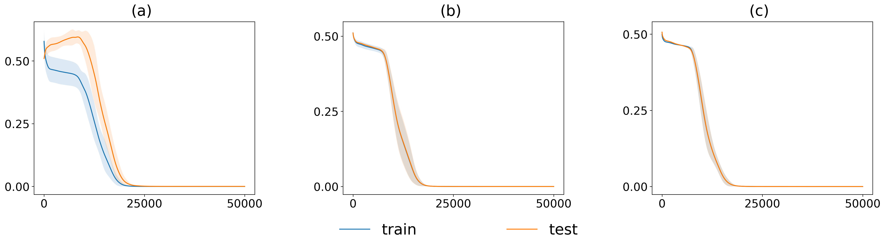

# Zhou, Zhang, Xu 2024 — A rationale from frequency perspective for grokking in training neural network

См. также: [глобальный индекс понятий](../../concepts/index.md).

**Zhangchen Zhou, Yaoyu Zhang, Zhi-Qin John Xu** (Шанхайский университет Цзяо Тун).

arXiv [2405.17479](https://arxiv.org/abs/2405.17479), 27 мая 2024 (единственная версия v1). 3 цитирования — тридцать третья по цитируемости работа корпуса. Источник — нативный HTML arXiv версии v1.

Файлы разбора этой статьи:

- [`2405.17479.a-rationale-from-frequency-perspective-for-grokking-in-training-neural-network.claims.txt`](2405.17479.a-rationale-from-frequency-perspective-for-grokking-in-training-neural-network.claims.txt) — пронумерованные утверждения статьи с пометками разбора.
- [`2405.17479.a-rationale-from-frequency-perspective-for-grokking-in-training-neural-network.license.txt`](2405.17479.a-rationale-from-frequency-perspective-for-grokking-in-training-neural-network.license.txt) — лицензионная запись arXiv для этой статьи.

Схема якорей и правила ссылок на карточку — в [README папки статей](../README.md).

**Карточка-выдержка.** Лицензия статьи (`arxiv-nonexclusive`) не разрешает публикацию копии оригинала и полного перевода, поэтому карточка содержит редакторские секции и цитируемые фрагменты перевода (право цитирования). Полный текст статьи: <https://arxiv.org/abs/2405.17479>.

## Затрагиваемые понятия

**[Частотный принцип и спектральное смещение](../../concepts/frequency-principle-spectral-bias.md)** — работа целиком стоит на этом понятии. F-принцип (Xu et al., 2019–2022) гласит, что сети подгоняют целевую функцию от низких частот к высоким, и что скорость убывания потери в частотной области задаётся регулярностью функций активации ([`p2-3`](#p2-3)). Существенная оговорка, которой работа пользуется в третьем примере: при слишком большой инициализации F-принцип не выполняется ([`p2-3`](#p2-3), [`p7-1`](#p7-1)).

**[Гроккинг](../../concepts/grokking.md)** — определение взято рабочее: сети сперва подгоняют обучающие данные, а обобщать на тестовые начинают позже, уже в ходе обучения ([`p1-2`](#p1-2)). Предлагаемое объяснение сводится к одной фразе: гроккинг возникает из **несогласия** между частотой, предпочитаемой динамикой обучения, и главенствующей частотой в тестовых данных, а несогласие это есть следствие недостаточной выборки ([`p1-5`](#p1-5)). Достоинство такого объяснения в том, что оно не требует ни ограничений на размерность данных, ни явной регуляризации, ни перехода от ленивого режима к богатому ([`p1-5`](#p1-5), [`p2-2`](#p2-2)).

**Наложение спектров и ложные частоты** — устройство названо точно: при недостаточной и неравномерной выборке частотный спектр обучающего набора **расходится** со спектром тестового и содержит ложную низкочастотную составляющую, в тестовых данных не главенствующую ([`p4-1`](#p4-1)). Сеть, следуя F-принципу, сперва подгоняет именно её — оттого тестовая потеря сперва растёт. Тонкая подробность: когда сеть затем выучивает высокие частоты, недостаточная выборка вызывает наложение их на низкочастотную область, отчего низкочастотная амплитуда на обучающем наборе сохраняется, а на тестовом убывает ([`p5-1`](#p5-1)).

**[Масштаб инициализации](../../concepts/initialization-scale.md)** — третий пример устроен зеркально первым двум. На MNIST при большой инициализации ($\alpha=8$) F-принцип не действует, сеть предпочитает высокие частоты, а MNIST главенствуется низкими — и точность на тесте почти не растёт, пока точность на обучении быстро идёт вверх ([`p1-6`](#p1-6), [`p7-1`](#p7-1)). При инициализации по умолчанию ($\alpha=1$) гроккинг не появляется вовсе ([`p6-8`](#p6-8), [`fig-6`](#fig-6)).

**[Настоящие данные](../../concepts/vision-real-world-data-mnist-cifar.md)** — заявка на широту сделана в аннотации: явление наблюдается и на искусственных, и на настоящих наборах данных ([`p1-2`](#p1-2)). Постановка на MNIST взята у Liu et al. (2022) с одним отличием: **без явного weight decay** ([`p6-7`](#p6-7)). Это и есть довод против объяснения через норму весов: гроккинг наблюдается там, где weight decay отсутствует, а значит, объяснение Liu et al. к этой постановке может быть неприменимо ([`p6-8`](#p6-8)).

**[Разрежённая чётность](../../concepts/sparse-parity.md)** — второй пример: функция чётности $(10,[10])$ на $2^{10}$ точках, двухслойная сеть ширины 1000 с ReLU ([`p5-6`](#p5-6)). Наблюдение согласуется с прежними работами: чем меньше доля обучающих данных, тем позже падает тестовая потеря ([`p6-1`](#p6-1)), — и объясняется тем, что при меньшей выборке ложные низкие частоты выражены сильнее ([`p6-4`](#p6-4), [`fig-4`](#fig-4)).

**[Модульная арифметика](../../concepts/modular-arithmetic.md)** — здесь её нет, и это сказано прямо: устройство может быть неприменимо к гроккингу на языковых данных, к каковым авторы относят и алгоритмические наборы ([`p9-3`](#p9-3)). Для корпуса это существенная оговорка: объяснение построено на задачах, где частотный спектр определён естественно.

**[Многообразие и сжатие представления](../../concepts/manifold-representation-compression.md)** — картина обучения описывается как ход «от грубого к тонкому», и авторы сами сближают её с гроккингом на кластерах XOR, где высокоразмерные линейные классификаторы сперва подгоняют обучающие данные ([`p9-2`](#p9-2)).

**[Разгроккивание](../../concepts/ungrokking.md)** и **[действенность контуров](../../concepts/circuit-efficiency.md)** — названы в обзоре среди прежних объяснений ([`p2-2`](#p2-2)), но собственная рамка работы с ними не соперничает: она объясняет не выбор решения, а порядок, в котором выучиваются частоты.

**[Переход от ленивого к богатому](../../concepts/lazy-to-rich-kernel-to-feature-learning.md)** — прямое размежевание: Kumar et al. (2024) относят гроккинг к переходу от ленивого режима к богатому, тогда как здесь такой переход не требуется — в первых двух примерах довольно одного F-принципа ([`p2-2`](#p2-2)).

**[Нейронное касательное ядро](../../concepts/neural-tangent-kernel-ntk.md)** — линия теоретических работ о F-принципе в режиме NTK названа в обзоре как основание частотной картины ([`p2-3`](#p2-3)).

**[Спектральный разбор](../../concepts/spectral-analysis-svd-esd-fve.md)** — рабочий приём: неравномерное дискретное преобразование Фурье (NUDFT) вдоль выбранного направления ([`p3-2`](#p3-2)). Для MNIST направление берётся главным из разбора главных составляющих, чтобы сохранить больше частотных сведений ([`p6-10`](#p6-10)).

Отдельно стоит сказать, чего в работе **нет**. Нет теории: устройство показано только опытно, а всестороннее теоретическое понимание частотной динамики оставлено будущей работе ([`p9-3`](#p9-3)). Нет и проверки на алгоритмических задачах — тех самых, на которых гроккинг был открыт.

Карточки статей корпуса: [Power et al. 2022](../2201.02177.grokking-generalization-beyond-overfitting-on-small-algorithmic-datasets/2201.02177.grokking-generalization-beyond-overfitting-on-small-algorithmic-datasets.card.md) — исходное явление; [Liu et al. 2022](../2205.10343.towards-understanding-grokking-an-effective-theory-of-representation-learning/2205.10343.towards-understanding-grokking-an-effective-theory-of-representation-learning.card.md) — действующая теория обучения представлениям, из которой взята постановка на MNIST; [Omnigrok](../2210.01117.omnigrok-grokking-beyond-algorithmic-data/2210.01117.omnigrok-grokking-beyond-algorithmic-data.card.md) — большая инициализация и weight decay как условия гроккинга; [Nanda et al. 2023](../2301.05217.progress-measures-for-grokking-via-mechanistic-interpretability/2301.05217.progress-measures-for-grokking-via-mechanistic-interpretability.card.md) — фурье-разбор вложений, названный в обзоре; [Merrill et al. 2023](../2303.11873.a-tale-of-two-circuits-grokking-as-competition-of-sparse-and-dense-subnetworks/2303.11873.a-tale-of-two-circuits-grokking-as-competition-of-sparse-and-dense-subnetworks.card.md) — состязание плотной и разрежённой подсетей на чётности; [Varma et al. 2023](../2309.02390.explaining-grokking-through-circuit-efficiency/2309.02390.explaining-grokking-through-circuit-efficiency.card.md) — действенность контуров, разгроккивание и полугроккинг; [Kumar et al. 2023](../2310.06110.grokking-as-the-transition-from-lazy-to-rich-training-dynamics/2310.06110.grokking-as-the-transition-from-lazy-to-rich-training-dynamics.card.md) — переход от ленивого к богатому, от которого работа размежёвывается.

## Что показано, а что предположено

Замечания редактора карточки по итогам разбора утверждений (`…claims.txt`). Работа целиком опытная и короткая: три примера, один приём измерения, никакой теории.

**Объяснение простое и проверяемое, и в этом его сила.** Тезис сводится к двум величинам: что предпочитает динамика обучения и что главенствует в данных. Если предпочтение и главенство расходятся — будет задержка; если совпадают — не будет ([`p1-5`](#p1-5)). Три примера подобраны так, чтобы покрыть обе стороны: в двух первых расходится из-за F-принципа и недостаточной выборки, в третьем — из-за отключения F-принципа большой инициализацией.

**Управляющие опыты сделаны и убедительны.** Гроккинг исчезает при увеличении выборки до 1000 точек и — что важнее — при **равномерной** выборке того же размера ([`p3-5`](#p3-5)). Второе отделяет объяснение через нехватку данных от объяснения через их распределение; в корпусе такое различение делают редко.

**Самая тонкая часть разбора — двойное происхождение низких частот.** Показано, что после гроккинга низкочастотная амплитуда на обучающем наборе остаётся высокой, а на тестовом падает, и объяснено это тем, что теперь она возникает не от выучивания, а от наложения высоких частот ([`p5-1`](#p5-1)). Это неочевидное следствие, и оно наблюдается на рисунках.

**Устойчивость к функции активации проверена, но лишь по трём точкам.** Тот же ход дела показан для $\sin$, ReLU и tanh ([`p5-3`](#p5-3)) — этого хватает, чтобы снять подозрение в артефакте активации, но не для заявки об универсальности.

**Пример с MNIST устроен обратно первым двум, и это стоит проговорить.** Там задержка возникает оттого, что сеть предпочитает низкие частоты, а нужны высокие; здесь — оттого, что сеть предпочитает высокие, а нужны низкие ([`p7-1`](#p7-1)). Общего в них лишь одно: несогласие предпочтения и главенства. Объяснение потому не «низкие частоты вредны», а «важно совпадение», и работа это выдерживает.

**Довод против объяснения через норму весов сделан вскользь, а весит много.** Постановка Liu et al. воспроизведена **без** weight decay, и гроккинг всё равно наблюдается ([`p6-7`](#p6-7), [`p6-8`](#p6-8)). Это возражение линии Omnigrok, но оно занимает одно предложение и не развёрнуто; при цитировании работы его обычно не замечают.

**Количественной меры нет нигде.** Все выводы читаются с рисунков: «спектры согласованы», «амплитуда убывает», «пик приходится на частоту 6». Ни одной величины вроде доли объяснённой энергии, ни корреляции между рассогласованием спектров и длиной задержки в работе нет. Между тем именно такая мера превратила бы наблюдение в предсказание.

**Усреднение приведено не везде.** Для одномерных опытов сказано о десяти прогонах с полосами разброса ([`fig-1`](#fig-1)), для чётности — тоже ([`fig-4`](#fig-4)), а вот разборы спектров и опыты с MNIST приведены по одному прогону. Для рисунков, несущих главный довод, это скромно.

**Заявленная область применимости честно сужена.** Авторы прямо пишут, что устройство может быть неприменимо к языковым данным, включая алгоритмические наборы ([`p9-3`](#p9-3)). Для корпуса это означает, что работа объясняет **не тот** гроккинг, что у Power et al., а его аналог на данных с естественно определённым спектром.

**Теории нет, и это признано.** Устройство показано опытно, вывод оставлен будущей работе ([`p9-3`](#p9-3)). Ссылки на теоретические результаты о F-принципе есть, но собственного вывода — например, оценки длины задержки через рассогласование спектров — работа не делает.

**Место в корпусе.** Это единственная работа вики, объясняющая гроккинг **свойствами выборки данных**, а не свойствами решения или оптимизатора: ложные низкие частоты возникают от того, как взяты обучающие точки. Ценно и то, что объяснение симметрично: оно предсказывает исчезновение гроккинга при равномерной выборке и его появление при отключении F-принципа большой инициализацией. Цена — отсутствие теории, отсутствие количественной меры рассогласования и признанная неприменимость к алгоритмическим задачам.

## Ошибочные цитирования

Замечания редактора карточки: места, где эта статья передаёт чужие результаты с ошибкой или без авторских оговорок. Сюда ведут ссылки «подробности» из разделов «Ошибочные пересказы и цитирования этой статьи» карточек процитированных работ.

###### mc-2210-01117
**Omnigrok (2210.01117) — оговорка о вызове.** `"The grokking phenomenon has been empirically observed across a diverse array of problems, including algorithmic datasets (Power et al., 2022), MNIST, IMDb movie reviews, QM9 molecules (Liu et al., 2022)"` — «явление гроккинга эмпирически наблюдалось на самых разных задачах, включая алгоритмические наборы данных, MNIST, отзывы IMDb и молекулы QM9». Перечисление выравнивает алгоритмические задачи и реальные данные, как будто гроккинг всюду встречается одинаково; в цитируемой работе он на этих трёх задачах [«вызван»](../2210.01117.omnigrok-grokking-beyond-algorithmic-data/2210.01117.omnigrok-grokking-beyond-algorithmic-data.card.md#p1-3) — [«в слегка нестандартной постановке, где он относительно слаб»](../2210.01117.omnigrok-grokking-beyond-algorithmic-data/2210.01117.omnigrok-grokking-beyond-algorithmic-data.card.md#p1-9), с урезанной выборкой и раздутой инициализацией, — и его признаки [«обычно менее драматичны, чем для алгоритмических наборов данных»](../2210.01117.omnigrok-grokking-beyond-algorithmic-data/2210.01117.omnigrok-grokking-beyond-algorithmic-data.card.md#p1-7). Формулировка «observed across» роняет все три оговорки разом.

###### mc-2205-10343
**Liu et al. (2205.10343) — неразличимые «Liu et al. (2022)».** В одном абзаце два разных «Liu et al. (2022)»: «attributed it to an effective theory…» (= 2205.10343) и «empirically discovered the grokking phenomenon on datasets beyond algorithmic ones, under the condition of large initialization scale with WD» (= [Omnigrok](../2210.01117.omnigrok-grokking-beyond-algorithmic-data/2210.01117.omnigrok-grokking-beyond-algorithmic-data.card.md)); обе записи библиографии датированы 2022 без a/b — для читателя ссылки неразрешимы, и материал MNIST/IMDb/QM9 неотличим от ранней работы, которой [принадлежит лишь первая MNIST-демонстрация](../2205.10343.towards-understanding-grokking-an-effective-theory-of-representation-learning/2205.10343.towards-understanding-grokking-an-effective-theory-of-representation-learning.card.md#p9-2). Ошибка гигиены ссылок, не пересказа.

---

# Цитируемые фрагменты перевода

Ниже приведены только те фрагменты перевода, на которые ссылаются карточки корпуса (право цитирования). Нумерация якорей `pN-M` / `fig-N` / `sec-X` совпадает с полной карточкой и оригиналом.

## Аннотация

###### p1-2

Гроккинг — явление, при котором нейронные сети (НС) сперва подгоняют обучающие данные, а обобщать на тестовые начинают позже, уже в ходе обучения. В этой статье мы опытным путём даём частотный взгляд, объясняющий возникновение этого явления в НС. Основное наблюдение в том, что сети сперва выучивают менее заметные частотные составляющие, присутствующие в тестовых данных. Мы наблюдаем это явление и на искусственных, и на настоящих наборах данных, чем предлагаем новый угол зрения на гроккинг: он описывается через развитие частот в ходе обучения. Наш опытный разбор на основе частот проливает новый свет на понимание гроккинга и лежащих в его основе устройств.

## 1 Введение

###### p1-4

Гроккинг опытно наблюдался на самых разных задачах, включая алгоритмические наборы данных (Power et al., 2022), MNIST, отзывы о фильмах IMDb, молекулы QM9 (Liu et al., 2022), групповые операции (Chughtai et al., 2023), многочленную регрессию (Kumar et al., 2024), функции разрежённой чётности (Barak et al., 2022; Bhattamishra et al., 2023) и данные кластеров XOR (Xu et al., 2023).

###### p1-5

В этой работе мы даём объяснение гроккинга с частотной стороны, не требующее ни ограничений на размерность данных, ни явной регуляризации в динамике обучения. Основное наблюдение таково: на первых порах обучения НС выучивают менее заметные частотные составляющие, присутствующие в тестовых данных. Гроккинг возникает из-за несогласия между частотой, предпочитаемой динамикой обучения, и главенствующей частотой в тестовых данных, — а это следствие недостаточной выборки. Мы поясняем это устройство тремя примерами.

###### p1-6

В первых двух примерах мы рассматриваем одномерные искусственные данные и высокоразмерную функцию чётности, где обучающие данные содержат ложные низкочастотные составляющие из-за наложения спектров, вызванного недостаточной выборкой. При обычной (малой) инициализации НС следуют частотному принципу (F-принципу), то есть часто выучивают данные от низких частот к высоким. Соответственно на первых порах обучения сети выучивают несогласованные низкочастотные составляющие, отчего тестовая потеря **[p. 2]** растёт, тогда как обучающая убывает. В третьем примере мы рассматриваем набор данных MNIST, обучаемый НС с большой инициализацией, где в ходе обучения предпочитаются, напротив, высокие частоты. Поскольку в MNIST главенствуют низкие частоты, точность на тесте на первых порах обучения почти не растёт по сравнению с быстрым ростом точности на обучении.

#### Гроккинг

###### p2-2

Гроккинг был впервые предложен Power et al. (2022) на алгоритмических наборах данных в трансформерах (Vaswani et al., 2017), а Liu et al. (2022) отнесли его к действующей теории динамики обучения представлениям. Nanda et al. (2022) и Furuta et al. (2024) истолковали гроккинг на алгоритмических наборах, исследуя преобразование Фурье матриц вложения и логитов. Liu et al. (2022) опытно обнаружили гроккинг на наборах данных за пределами алгоритмических — при условии большого масштаба инициализации с weight decay, что теоретически доказали Lyu et al. (2023) для однородных НС. Thilak et al. (2022) объяснили гроккинг циклическими фазовыми переходами. Varma et al. (2023) объяснили гроккинг действенностью контуров и обнаружили два новых явления, названных разгроккиванием и полугроккингом. Barak et al. (2022) и Bhattamishra et al. (2023) наблюдали гроккинг на функциях разрежённой чётности. Merrill et al. (2023) исследовали динамику обучения двухслойных нейронных сетей на функциях разрежённой чётности и показали, что гроккинг возникает из состязания плотной и разрежённой подсетей. Kumar et al. (2024) отнесли гроккинг к переходу динамики обучения от ленивого режима к богатому без weight decay, тогда как мы такого перехода не требуем. Например, в наших первых двух примерах нужен лишь F-принцип без перехода режима. Xu et al. (2023) обнаружили гроккинг на данных кластеров XOR и показали, что НС на первых порах обучения ведут себя как высокоразмерные линейные классификаторы, когда размерность данных больше числа обучающих объектов, — ограничение, для наших примеров не нужное.

#### Частотный принцип

###### p2-3

Неявное частотное смещение НС, подгоняющих целевую функцию от низких частот к высоким, названо частотным принципом (F-принципом) (Xu et al., 2019, 2020, 2022) или спектральным смещением (Rahaman et al., 2019). Основное наблюдение F-принципа в том, что скорость убывания функции потерь в частотной области определяется регулярностью функций активации (Xu et al., 2020). Это явление породило ряд теоретических работ в режиме нейронного касательного ядра (Jacot et al., 2018) (NTK) (Luo et al., 2022; Zhang et al., 2019, 2021; Cao et al., 2021; Yang and Salman, 2019; Ronen et al., 2019; Bordelon et al., 2020) и в общих постановках (Luo et al., 2019). Ma et al. (2020) наводит на мысль, что градиентный поток НС подчиняется F-принципу с непрерывной точки зрения. Отметим также, что при слишком большой инициализации параметров сети F-принцип в динамике обучения НС может не выполняться (Xu et al., 2020, 2022).

#### Набор данных

###### p3-2

1. Берутся $10000$ равноотстоящих точек на промежутке $[-\pi,\pi]$. 2. Из них мы выбираем $20$ точек, наименее отличающих $|\sin(x)-\sin(6x)|$, и $10$ точек, наименее отличающих $|\sin(3x)-\sin(6x)|$. 3. Эти $30$ точек затем соединяются с $n-30$ равномерно выбранными точками, образуя полный обучающий набор.

#### Настройки опытов

###### fig-1

*Рисунок 1: (a) и (b) — обучающая и тестовая потеря в неравномерном опыте при $n=65$ и $n=1000$ соответственно. (c) — обучающая и тестовая потеря в равномерном опыте при $n=65$. Функция активации есть $\sin x$. Каждый опыт усреднён по $10$ прогонам, а бледные полосы изображают стандартное отклонение.* **[p. 3]**

###### p3-5

Как показано на рис. 1 (a), при обучении на наборе из $65$ неравномерных точек на первых порах обучения наблюдается отчётливый гроккинг, а к концу — удовлетворительное качество обобщения. Напротив, при обучении на большем наборе из $1000$ точек, как изображено на рис. 1 (b), гроккинг на первых порах обучения заметно отсутствует. Это наблюдение согласуется с находками Liu et al. (2022), по которым бо́льшие размеры набора данных гроккинга не запускают. Более того, как показано на рис. 1 (c), мы находим, что при сохранении размера данных, но равномерной выборке гроккинг исчезает, — а значит, на его проявление влияет распределение данных.

### 4.1 Частотный спектр искусственных данных

###### p4-1

Ключевое наблюдение в том, что недостаточная и неравномерная выборка ведёт к расхождению частотных спектров обучающего и тестового наборов, причём спектр обучающего набора содержит ложную низкочастотную составляющую, не главенствующую в спектре тестового. В случае $n=65$ неравномерных точек NUDFT обучающих данных разительно отличается от NUDFT истинных данных, как изображено на рис. 3 (a) и (d). Обучение следует F-принципу: НС сперва подгоняют низкочастотные составляющие, как показано на рис. 3 (b). В это время, как изображено на рис. 3 (e), низкочастотные составляющие выхода на тестовом наборе существенно отклоняются от точных низкочастотных составляющих, отчего тестовая потеря сперва растёт.

###### p5-1

По мере приближения обучающей потери к нулю мы замечаем, что амплитуда низкочастотных составляющих на тестовом наборе убывает, как изображено на рис. 3 (f), тогда как на обучающем остаётся неизменной, как показано на рис. 3 (c). Это явление возникает из-за двух различных устройств выучивания низкочастотных составляющих. Сперва, следуя F-принципу, сеть выучивает низкочастотные составляющие по-настоящему. Затем, по мере того как сеть выучивает высокочастотные составляющие, недостаточная выборка вызывает наложение частот на низкочастотные составляющие, чем и сохраняет их амплитуду на обучающем наборе.

###### p5-3

Более того, это явление устойчиво к разным функциям активации, таким как $\mathrm{ReLU}$ и $\mathrm{tanh}$; итоги приведены на рис. 11 и рис. 14 в приложении. Соответствующие частотные спектры изображены на рис. 12, рис. 13, рис. 15 и рис. 16.

#### Настройки опытов

###### p5-6

Опыт нацелен на функцию чётности $(10,[10])$, всего $2^{10}=1024$ точки данных. Данные делятся на обучающий и тестовый наборы в разных долях. Мы берём двухслойную полносвязную НС ширины $1000$ с функцией активации $\mathrm{ReLU}$. Обучение ведётся оптимизатором Adam со скоростью обучения $2\times 10^{-4}$.

###### fig-4

*Рисунок 4: (a) Потеря для функции чётности ($10,[10]$) при разных долях обучающих данных. Синие сплошные линии — обучающий набор, оранжевые сплошные — тестовый. (b) Частотные спектры обучающего набора при разных долях. Синие сплошные линии — частотные спектры обучающего набора, оранжевая сплошная линия — частотный спектр всех данных. Доли обучающего набора к тестовому суть $0.2$, $0.5$ и $0.8$ — от бледного к тёмному. По оси ординат отложена частота, по оси абсцисс — амплитуда соответствующих частотных составляющих. Каждый опыт усреднён по $10$ прогонам, а бледные полосы изображают стандартное отклонение.* **[p. 5]**

###### p6-1

Гроккинг наблюдается в поведении потери при разных долях деления на обучающий и тестовый наборы, как показано на рис. 4 (a). Когда обучающий набор составляет бо́льшую долю данных, падение тестовой потери наступает раньше, чем при меньшей его доле. Это наблюдение согласуется с находками Barak et al. (2022); Bhattamishra et al. (2023), подтверждая описанное явление. В следующем подразделе мы даём объяснение этому явлению со стороны частот.

### 5.1 Частотный спектр функции чётности

###### p6-4

Как показано на рис. 4 (b), в задаче с функцией чётности при недостаточной выборке применение NUDFT к обучающему набору вносит ложные низкочастотные составляющие. Более того, чем меньше точек выборки, тем эти низкочастотные составляющие выраженнее.

#### Настройки опытов

###### p6-7

Мы берём настройки опытов, схожие с Liu et al. (2022). Единственное отличие в том, что мы не применяем явного weight decay (WD). $\alpha$ — множитель масштаба начальных параметров. Обучающий набор состоит из $1000$ точек, размер пакета положен $200$. Архитектура НС состоит из трёх полносвязных скрытых слоёв, каждый шириной $200$ нейронов, с функцией активации ReLU. Для большой инициализации обучение ведётся оптимизатором Adam со скоростью обучения $0.001$. Для инициализации по умолчанию берётся оптимизатор SGD со скоростью обучения $0.02$.

###### fig-6

*Рисунок 6: Точность на наборе данных MNIST при разной инициализации в ходе обучения. По оси ординат отложены эпохи, по оси абсцисс — точность.* **[p. 8]**

###### p6-8

Как показано на рис. 6 (a), гроккинг наблюдается, откуда следует, что объяснение, данное в Liu et al. (2022), к этой постановке может быть неприменимо. А при инициализации по умолчанию гроккинг не появляется, как показано на рис. 6 (b).

### 6.1 Частотный спектр MNIST

###### p6-10

Чтобы снизить вычислительные издержки, мы берём приём проецирования, введённый в Xu et al. (2022). Сперва мы вычисляем главное направление $\boldsymbol{d}$ набора данных (включая обучающие и тестовые данные) $\mathcal{S}$ через **[p. 7]** разбор главных составляющих (PCA), что призвано сохранить больше частотных сведений. Затем мы применяем уравнение (2), чтобы получить частотный спектр MNIST. Значения $k$ выбираются как $1000$ равноотстоящих точек на промежутке $[0,2\pi]$.

###### p7-1

В этой постановке из-за принятой большой инициализации частотный принцип для НС более не выполняется (Xu et al., 2022), и низкочастотные составляющие первыми не сходятся. На первых порах обучения амплитуда выхода НС в частотной области существенно превосходит амплитуду самого изображения после NUDFT, как показано на рис. 7 (a) и (d). Спустя некоторое время обучения НС подгоняет частоты, присутствующие в обучающем наборе, которые вызваны главным образом наложением высоких частот из-за недостаточной выборки (рис. 7 (b)), но полный набор данных подогнать не может (рис. 7 (e)). При дальнейшем обучении НС выучивает подгонку истинных высоких частот, и в этот момент качество обобщения НС улучшается, а точность на тестовом наборе растёт, как показано на рис. 7 (c) и (f).

## 7 Заключение и ограничения

###### p9-2

Такая обработка «от грубого к тонкому» напоминает гроккинг, наблюдаемый на данных кластеров XOR в Xu et al. (2023), где высокоразмерные линейные классификаторы, как было обнаружено, сперва подгоняют обучающие данные.

###### p9-3

Однако мы показываем это устройство лишь опытно, оставляя всестороннее теоретическое понимание частотной динамики в ходе обучения будущей работе. Кроме того, наше устройство может быть неприменимо к гроккингу, наблюдаемому на языковых данных (вроде алгоритмических наборов).
