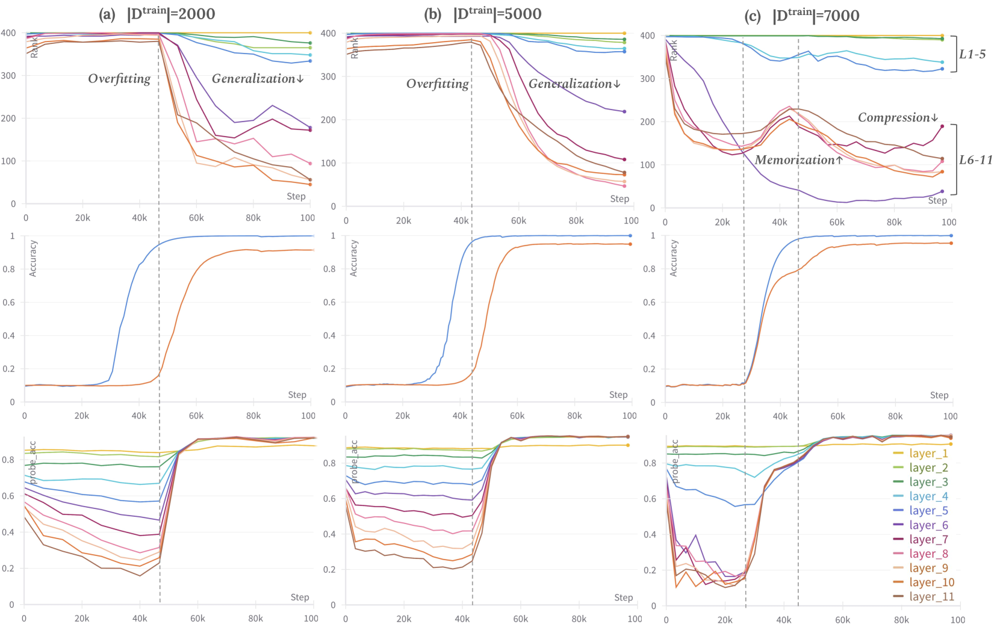
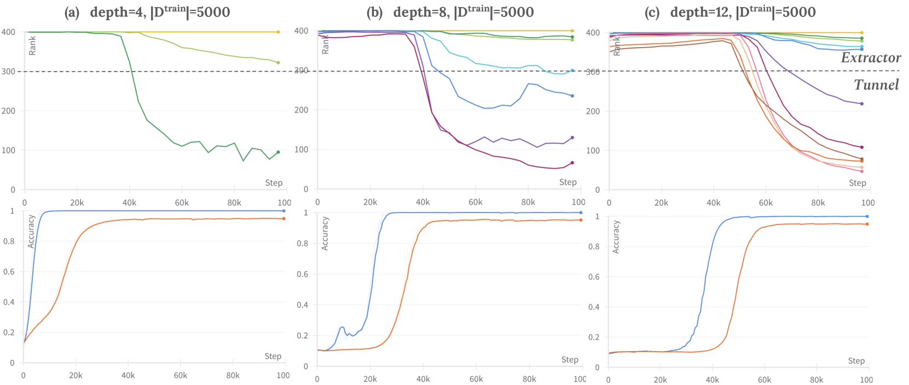
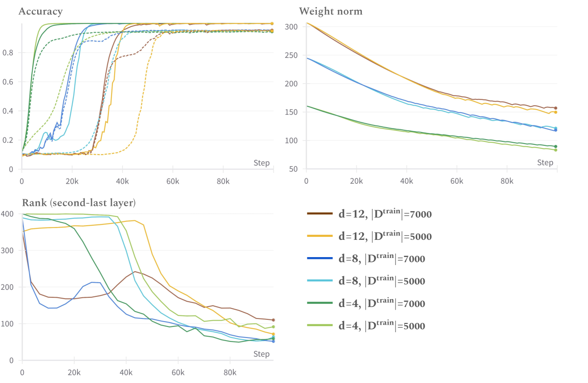
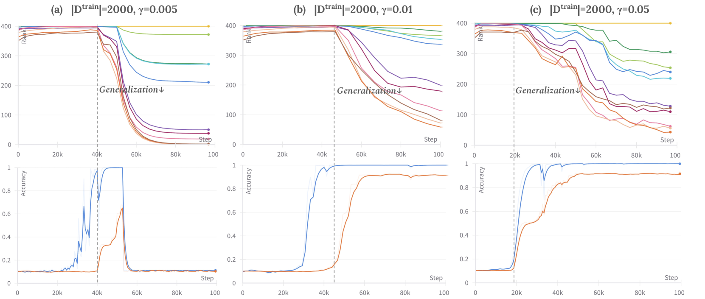
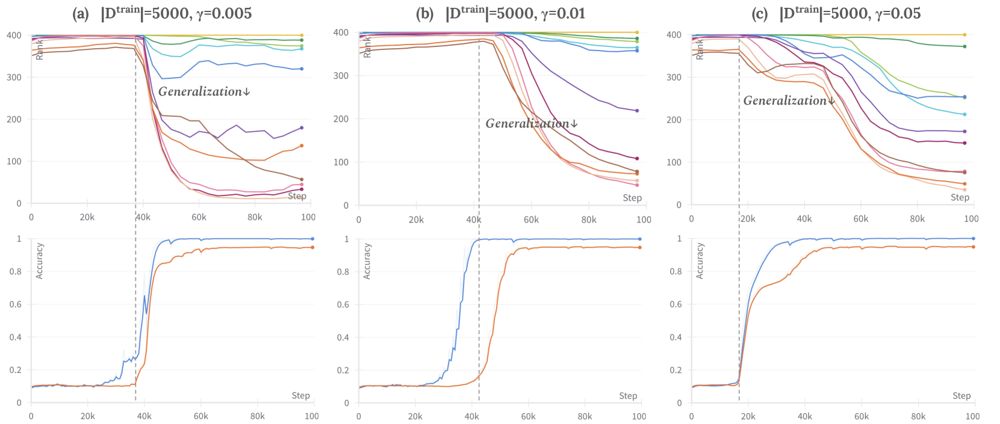

# Fan, Pascanu, Jaggi 2024 — Deep Grokking: Would Deep Neural Networks Generalize Better?

См. также: [глобальный индекс понятий](../../concepts/index.md).

**Simin Fan** (EPFL), **Razvan Pascanu** (Google DeepMind), **Martin Jaggi** (EPFL).

arXiv [2405.19454](https://arxiv.org/abs/2405.19454), май 2024 (версия v1). Числа цитирований в таблице корпуса нет. Работа в корпусе как наблюдательная: она переносит постановку Omnigrok с мелких сетей на глубокие и предлагает ранг внутренних признаков вместо нормы весов как указатель фазового перехода. Источник — нативный HTML arXiv версии v1 (единственной).

Файлы разбора этой статьи:

- [`2405.19454.deep-grokking-would-deep-neural-networks-generalize-better.claims.txt`](2405.19454.deep-grokking-would-deep-neural-networks-generalize-better.claims.txt) — пронумерованные утверждения статьи с пометками разбора.
- [`2405.19454.deep-grokking-would-deep-neural-networks-generalize-better.license.txt`](2405.19454.deep-grokking-would-deep-neural-networks-generalize-better.license.txt) — лицензионная запись arXiv для этой статьи.

Схема якорей и правила ссылок на карточку — в [README папки статей](../README.md).

**Карточка-выдержка.** Лицензия статьи (`arxiv-nonexclusive`) не разрешает публикацию копии оригинала и полного перевода, поэтому карточка содержит редакторские секции и цитируемые фрагменты перевода (право цитирования). Полный текст статьи: <https://arxiv.org/abs/2405.19454>.

## Затрагиваемые понятия

**[Гроккинг](../../concepts/grokking.md)** — работа переносит явление с мелких сетей на глубокие и обнаруживает неожиданное: чем глубже сеть MLP, тем **сильнее** гроккинг, а не слабее ([`p3-1`](#p3-1)). При $|D^{train}|=5000$ рост и обучающей, и тестовой точности заметно запаздывает с ростом глубины с 4 до 12 слоёв ([`fig-2`](#fig-2)). Отсюда и вывод авторов: более изощрённые признаки глубоких слоёв генерализации помогают мало.

**[Многообразие представлений и сжатие](../../concepts/manifold-representation-compression.md)** — главное измерение работы. Численный ранг ковариации послойных возбуждений (число собственных значений выше порога) падает ровно тогда, когда точность на тесте начинает расти ([`p3-4`](#p3-4), [`fig-1`](#fig-1)). Это соответствие держится при всех проверенных объёмах данных и значениях ослабления весов ([`p4-1`](#p4-1)).

**[Двойной спуск](../../concepts/double-descent.md)** — второе наблюдение и самое своеобразное. У 8- и 12-слойных сетей на большем наборе ($|D^{train}|=7000$) точность на тесте растёт **двумя** резкими приращениями, и этим двум порам отвечает двойной спуск ранга признаков: ранг падает, растёт на первом всплеске точности, затем падает снова ([`p3-2`](#p3-2), [`p3-3`](#p3-3)). Авторы отдельно оговаривают, что отличают это от прежде наблюдавшегося двойного спуска на кривых потери ([`p1-3`](#p1-3)).

**[Зона Златовласки](../../concepts/goldilocks-zone.md)** — работа прямо оспаривает её как указатель. Изложив догадку Liu et al. о том, что большое начальное приближение выносит модель за сферическую оболочку, а ослабление весов медленно сносит её обратно ([`p3-6`](#p3-6)), авторы измеряют норму весов при разных объёмах данных — и находят, что пути норм по большей части накладываются друг на друга, гладко убывая, тогда как поведение при генерализации различимо разное ([`p3-7`](#p3-7), [`fig-5`](#fig-5)).

**[Норма весов и её минимизация](../../concepts/weight-norm-minimization.md)** — отсюда прямая заявка: норма весов не годится в указатели фазового перехода, а ранг признаков годится ([`p1-3`](#p1-3), [`p3-4`](#p3-4)). Для корпуса это редкий случай, когда объяснение через норму проверяется и отклоняется опытом, а не рассуждением.

**[Разрежённое и линейное щупание](../../concepts/linear-sparse-probing.md)** — вторая мера: к каждому внутреннему слою приставляется линейный распознаватель со случайным начальным приближением, обучается заданное число шагов и оценивается на тесте ([`p2-2`](#p2-2)). Рост точности на тесте неизменно отвечает росту точности щупа во **всех** слоях ([`fig-1`](#fig-1)).

**[Замораживание подсети](../../concepts/freezing-subnetwork.md)** — понятие «туннеля» взято у Masarczyk et al.: начальные слои («извлекатель») выучивают представление высокого ранга, верхние («туннель») сжимают его до низкого ([`p3-5`](#p3-5)). Здесь показано, что у более глубоких сетей туннель длиннее (1 слой у четырёхслойной, 6 у двенадцатислойной), и высказана догадка, что именно длинный туннель и делает гроккинг сильнее ([`fig-3`](#fig-3), [`fig-4`](#fig-4)).

**[Ослабление весов](../../concepts/weight-decay.md)** — управляющая ручка, задающая, какое из трёх поведений возникнет. При $|D^{train}|=2000$: $\gamma=0.005$ — генерализации нет вовсе, $\gamma=0.01$ — гроккинг, $\gamma=0.05$ — двухпорная генерализация ([`p4-1`](#p4-1), [`fig-6`](#fig-6)). При 5000 точек наименьшее сглаживание уже даёт генерализацию без гроккинга ([`fig-7`](#fig-7)).

**[Начальный масштаб](../../concepts/initialization-scale.md)** — постановка воспроизводит Omnigrok: обычное начальное приближение умножается на $\alpha=8.0$, ослабление весов мало, потеря — средний квадрат отклонения, набор — MNIST ([`p2-1`](#p2-1)).

**[Критический объём данных](../../concepts/data-fraction-critical-dataset-size.md)** — объём обучающего набора решает, какое из трёх поведений видно: 2000, 5000 и 7000 точек дают соответственно отсутствие генерализации, гроккинг и двухпорную генерализацию при прочих равных ([`p3-2`](#p3-2), [`p4-1`](#p4-1)).

**[Ленивый и богатый режимы](../../concepts/lazy-to-rich-kernel-to-feature-learning.md)** — в обзоре объяснение Lyu et al. изложено как переход от ядрового режима к богатому ([`p6-2`](#p6-2)); собственного вклада в эту линию работа не делает, но её наблюдение о двух порах роста точности с ней перекликается.

Отдельно стоит сказать, чего в работе **нет**. Нет теории: все четыре страницы — наблюдения, и авторы сами отдают теоретический разбор будущей работе ([`p6-4`](#p6-4)). Нет и проверки на иных устройствах: только MLP на MNIST, а трансформеры и рекуррентные сети названы среди дальнейших планов. Наконец, соответствие «спуск ранга — генерализация» показано как совпадение по времени, а не как причинная связь: вмешательства, меняющего ранг при прочих равных, не ставилось.

Карточки статей корпуса: [Power et al. 2022](../2201.02177.grokking-generalization-beyond-overfitting-on-small-algorithmic-datasets/2201.02177.grokking-generalization-beyond-overfitting-on-small-algorithmic-datasets.card.md) — исходное явление; [Liu et al. 2022](../2205.10343.towards-understanding-grokking-an-effective-theory-of-representation-learning/2205.10343.towards-understanding-grokking-an-effective-theory-of-representation-learning.card.md) — гроккинг как медленное складывание представлений; [Omnigrok](../2210.01117.omnigrok-grokking-beyond-algorithmic-data/2210.01117.omnigrok-grokking-beyond-algorithmic-data.card.md) — постановка с большим начальным приближением и объяснение через норму весов, которое здесь и оспаривается; [Thilak et al. 2022](../2206.04817.the-slingshot-mechanism-an-empirical-study-of-adaptive-optimizers-and-grokking/2206.04817.the-slingshot-mechanism-an-empirical-study-of-adaptive-optimizers-and-grokking.card.md) — пращевой ход, чьих полок нормы авторы у себя не увидели; [Kumar et al. 2024](../2310.06110.grokking-as-the-transition-from-lazy-to-rich-training-dynamics/2310.06110.grokking-as-the-transition-from-lazy-to-rich-training-dynamics.card.md) — переход от ленивого режима к богатому.

## Что показано, а что предположено

Замечания редактора карточки по итогам разбора утверждений (`…claims.txt`). Работа короткая: четыре страницы основного текста и семь рисунков, без приложений.

**Вопрос поставлен верно и до сих пор никем не ставился.** Почти вся литература о гроккинге работает на двух-трёхслойных моделях; здесь та же постановка Omnigrok прогоняется на 4, 8 и 12 слоях ([`p1-7`](#p1-7)). Уже одно это делает работу полезной корпусу.

**Итог противоречит ожиданию, и это сказано прямо.** Обычное соображение — глубокие сети обобщают лучше; здесь они гроккают сильнее и позже ([`p3-1`](#p3-1)). Отрицательный по духу итог изложен без попытки его смягчить.

**Двухпорная генерализация — самостоятельная находка.** Точность на тесте растёт двумя резкими приращениями, а ранг признаков даёт двойной спуск ([`p3-2`](#p3-2), [`p3-3`](#p3-3)). У мелких моделей такого не видно вовсе, то есть находка возникает именно из глубины.

**Опровержение нормы весов как указателя сделано прямым измерением.** Две модели одной глубины на разных объёмах данных дают почти совпадающие пути нормы весов при явно разном поведении генерализации ([`p3-7`](#p3-7)). Это честная проверка чужого объяснения на его же постановке.

**Соответствие ранга и генерализации показано широко.** Оно держится при трёх объёмах данных, трёх значениях ослабления весов и трёх глубинах ([`p4-1`](#p4-1)) — то есть это не единичное совпадение.

**Однако причинности нет и не заявлено.** Все итоги суть совпадения по времени на кривых. Ни одного вмешательства, меняющего ранг признаков при прочих равных, не поставлено, а значит «ранг как указатель» остаётся наблюдением, а не устройством.

**Теории нет вовсе, и это признано.** Теоретический разбор прямо отдан будущей работе ([`p6-4`](#p6-4)); связь длины туннеля с силой гроккинга названа догадкой ([`p3-5`](#p3-5)).

**Круг проверки узок.** Только MLP, только MNIST, только потеря среднего квадрата отклонения, только Adam. Иные устройства (трансформеры, рекуррентные сети) названы среди планов ([`p6-4`](#p6-4)).

**Отклонений по семенам нет.** Ни на одном рисунке не приводится полос разброса; сколько прогонов стоит за каждой кривой, в тексте не сказано. Для работы, чей главный итог — совпадение изломов на двух кривых, это существенный пробел.

**Порог ранга выбран вручную.** Туннельным считается слой с рангом выходных признаков ниже 300 ([`fig-3`](#fig-3)); откуда взято именно 300, не объяснено, а длина туннеля — одна из главных величин работы.

**Заявка о первенстве сформулирована шире показанного.** «Мы полагаем, что наша работа первой обращается к гроккингу в глубоких сетях» ([`p1-4`](#p1-4)) — но «глубокая» здесь означает 12-слойную MLP на MNIST, тогда как гроккинг к тому времени уже наблюдали в куда более крупных моделях.

**Место в корпусе.** Работа наблюдательная и короткая, но закрывает заметный пробел: почти всё, что известно о гроккинге, получено на мелких сетях. Ценны три вещи: глубина усиливает гроккинг, а не ослабляет; ранг внутренних признаков падает синхронно с началом генерализации и потому годится в указатели лучше нормы весов; и двухпорная генерализация с двойным спуском ранга, у мелких моделей не встречающаяся. Цена — ни теории, ни вмешательств, ни отклонений по семенам; одна задача, одно устройство, один приём оптимизации.

## Ошибочные цитирования

Замечания редактора карточки: места, где эта статья передаёт чужие результаты с ошибкой или без авторских оговорок. Сюда ведут ссылки «подробности» из разделов «Ошибочные пересказы и цитирования этой статьи» карточек процитированных работ.

###### mc-2206-04817
**Thilak et al. (2206.04817) — «исключительно через рогатку».** `"Thilak et al. (2022) reported that the grokking happens exclusively in accordance to a slingshot effect"` — «сообщили, что гроккинг происходит исключительно в согласии с эффектом рогатки». Уронены оба смягчения авторов: [«без явной регуляризации гроккинг… почти исключительно случается при начале рогаток»](../2206.04817.the-slingshot-mechanism-an-empirical-study-of-adaptive-optimizers-and-grokking/2206.04817.the-slingshot-mechanism-an-empirical-study-of-adaptive-optimizers-and-grokking.card.md#p1-2) — «almost», и условие «без явной регуляризации» (с weight decay гроккинг прекрасно идёт без рогаток, что показали ещё Nanda et al., прил. D.2). Дальше в том же абзаце механизм (циклы, норма) пересказан верно, а собственное возражение статьи — об отсутствии плато нормы в глубоких сетях — адресовано именно усиленной версии утверждения.

---

# Цитируемые фрагменты перевода

Ниже приведены только те фрагменты перевода, на которые ссылаются карточки корпуса (право цитирования). Нумерация якорей `pN-M` / `fig-N` / `sec-X` совпадает с полной карточкой и оригиналом.

## Аннотация

###### p1-2

Недавние работы о явлении *гроккинга* пролили свет на тонкости динамики обучения нейронных сетей и их поведения при генерализации. *Гроккингом* называют резкий рост точности сети на тестовом наборе, наступающий много позже затянувшейся поры переобучения, в течение которой сеть безукоризненно подгоняет обучающий набор. Тогда как имеющиеся работы сосредоточены главным образом на мелких сетях вроде двухслойной MLP и однослойного трансформера, мы исследуем *гроккинг* на глубоких сетях (скажем, на двенадцатислойной MLP). Мы опытно воспроизводим это явление и находим, что глубокие нейронные сети могут быть более подвержены *гроккингу*, чем их более мелкие двойники. Вместе с тем мы наблюдаем занятное явление многопорной генерализации при росте глубины MLP, когда точность на тесте даёт второй всплеск, что у мелких моделей почти не встречается.

###### p1-3

Далее мы вскрываем убедительные соответствия между убыванием ранга признаков и фазовым переходом от переобучения к поре генерализации при *гроккинге*. Кроме того, мы находим, что явление многопорной генерализации часто согласуется с двойным спуском111Мы отличаем наше наблюдение от прежде наблюдавшегося двойного спуска на кривых потери. в рангах признаков. Эти наблюдения говорят о том, что внутренний ранг признаков может служить более обещающим указателем поведения модели при генерализации, чем норма весов.

###### p1-4

Мы полагаем, что наша работа первой обращается к гроккингу в глубоких нейронных сетях и исследует связь ранга признаков с качеством генерализации.

###### fig-1

*Рисунок 1: **Поведение при генерализации и обучение внутренним признакам у двенадцатислойной сети MLP при разном объёме обучающих данных ($|D^{train}|$).** Средний ряд показывает точность на обучении (**синяя** кривая) и на тесте (**оранжевая** кривая) по шагам обучения. Верхний и нижний ряды показывают соответственно послойные ранги признаков и точность линейного щупания. **Слева и в середине.** Гроккинг с убыванием ранга: на малом обучающем наборе точность на тесте начинает расти после того, как точность на обучении достигла наилучшего значения, чему отвечает начало *убывания* рангов признаков. **Справа.** Гроккинг с двойным спуском ранга: на большем обучающем наборе точность на тесте растёт вместе с обучающей, чему отвечает *рост* ранга признаков. Однако она даёт второй всплеск после того, как точность на обучении достигла наилучшего значения, чему отвечает *второй спуск* рангов признаков. Во всех трёх случаях рост точности на тесте неизменно отвечает росту точности линейного щупа во всех слоях. Разные цвета рангов признаков означают разные слои.* **[p. 2]**

## 1 Введение

###### p1-7

Сообщество приложило немало сил к пониманию этого отложенного и резкого фазового перехода от переобучения к генерализации (Power et al., 2022; Liu et al., 2022; Thilak et al., 2022; Liu et al., 2023; Lyu et al., 2023), тогда как почти все имеющиеся работы о гроккинге ограничены *мелкими* сетями (скажем, двухслойным трансформером, двухслойной MLP). Однако, как показывают недавние итоги, при наращивании модели может возникать заметно иное поведение при генерализации (Wei et al., 2022). Чтобы восполнить этот пробел, мы проводим первое исследование гроккинга на глубоких нейронных сетях (скажем, на двенадцатислойных MLP) и изучаем связь изменения внутренних представлений признаков с фазовыми переходами в ходе обучения.

###### p1-9

1. Глубокие сети MLP более подвержены гроккингу, чем мелкие модели;
2. У глубоких сетей MLP мы наблюдали соответствие между убыванием ранга признаков и генерализацией. Отсюда следует, что внутренние ранги признаков могут быть более обещающим указателем фазового перехода при обучении, чем норма весов, предложенная (Liu et al., 2023);
3. Мы наблюдаем многопорное продвижение генерализации, где точность на тесте растёт двумя резкими приращениями вместо одного всплеска, наблюдавшегося прежде. **[p. 2]** Этим двум порам отвечает *двойной спуск* ранга признаков.

#### Постановка обучения

###### p2-1

Вслед за Liu et al. (2023) мы изучаем гроккинг на многослойных полносвязных сетях (MLP) разной глубины на наборе MNIST LeCun et al. (1998). Мы применяем большое начальное приближение и малое ослабление весов, чтобы воспроизвести гроккинг, повторяя постановку Liu et al. (2023). У всех моделей одна и та же ширина (400) и возбуждение ReLU. Для каждой сети мы умножаем обычное начальное приближение222то, что задано по умолчанию в Pytorch. на множитель $\alpha$.333$\alpha=w/w_{0}$, где $w_{0}$ и $w$ суть нормы весов сети до и после перемасштабирования. Все модели обучаются приёмом оптимизации Adam (скорость обучения $1\times 10^{-3}$) с потерей среднего квадрата отклонения (MSE) в течение $10^{5}$ шагов вслед за постановкой Liu et al. (2023). Если не оговорено иное, модель обучается при масштабе начального приближения $\alpha=8.0$ и ослаблении весов $\gamma=0.01$.

#### Щупание внутренних признаков

###### p2-2

Мы изучаем обучение внутренним представлениям признаков, измеряя (i) точность линейного щупа, которая говорит о качестве внутреннего представления, и (ii) численный ранг представлений, который говорит о степени сжатия. Для линейного щупания мы приставляем к каждому внутреннему слою $l$ сети линейный распознаватель со случайным начальным приближением. Мы обучаем только эту линейную голову заданное число шагов на обучающем наборе, а затем оцениваем её на тестовом. Точность линейного щупа меряет, довольно ли хороши выученные внутренние признаки, чтобы быть линейно разделимыми в многомерном пространстве. Мы также оцениваем послойный численный ранг представлений признаков, чтобы понять, до какой степени выученные внутренние признаки сжимаемы. А именно, мы вычисляем собственные значения ковариации выходного **[p. 3]** возбуждения $W\in\mathrm{R}^{n\times d}$ внутреннего слоя $l$. Затем мы меряем его численный ранг как число собственных значений выше некоторого порога при относительной точности $\epsilon$: $\sigma=max(n,d)\cdot\epsilon$.444В качестве точности $\epsilon$ мы берём значение epsilon для типа данных матрицы признаков $W$, применяемое действием *matrix_rank* в Pytorch.

###### fig-2

*Рисунок 2: **Поведение при генерализации у моделей MLP разной глубины.** **Сверху.** Гроккинг: на малом обучающем наборе ($|D^{train}|=5000$) улучшение и обучающей (**синяя** кривая), и тестовой (**оранжевая** кривая) точности запаздывает тем сильнее, чем глубже модель. **Снизу.** Многопорная генерализация: на большем обучающем наборе ($|D^{train}|=7000$) глубокие модели MLP (8 и 12 слоёв) дают двухпорную генерализацию, где точность на тесте испытывает второй всплеск. Явление двухпорной генерализации связано и с двойным спуском ранга признаков (рис. 1, c).* **[p. 4]**

#### Глубокие сети чаще являют *гроккинг*

###### p3-1

Давнее наглядное соображение из глубокого обучения говорит, что более глубокие нейронные сети способны переобучаться на обучающем наборе, ибо они выразительнее (Montúfar et al., 2014). Считается также, что они выучивают сложные признаки и обобщают лучше мелких сетей (Zeiler & Fergus, 2013; Ozair & Bengio, 2014). Наши опыты обнаруживают, что более глубокие сети MLP чаще испытывают *гроккинг*, чем их более мелкие двойники, а значит более изощрённые признаки, выученные глубокими слоями, генерализации помогают мало. Как изображено на рисунке 2 (a,b,c), с ростом глубины сети рост и обучающей, и тестовой точности заметно запаздывает.

#### Многопорная генерализация

###### p3-2

Мы наблюдали и занятное поведение многопорной генерализации у глубоких сетей MLP, при котором точность на тесте являла несколько отдельных пор улучшения, отмеченных резкими переходами. Согласно рисунку 2 (d,e,f), при обучении на 7000 точках данных заметного *гроккинга* у четырёхслойной сети MLP не наблюдалось, тогда как и восьмислойная, и двенадцатислойная сети MLP дали приметный второй всплеск точности на тесте. Вместе с тем у двенадцатислойной модели против восьмислойной обе поры генерализации — и первая, и вторая — запаздывают, а точность на тесте, достигнутая на первой поре, заметно ниже, чем у восьмислойной сети.

###### p3-3

Более того, поведение многопорной генерализации отвечает двойному спуску рангов признаков. Как изображено на рисунке 1 (c), ранги признаков падают с самого начала обучения, а расти начинают на первом всплеске точности на тесте. Одновременно со второй порой генерализации ранги признаков испытывают второй спуск.

#### Соответствие фазовых переходов и спуска ранга

###### p3-4

Мы наблюдали одновременный спуск ранга признаков, отвечающий фазовому переходу в явлении «гроккинга» у двенадцатислойных сетей MLP. Согласно рисунку 1 (a), при обучении двенадцатислойной сети MLP на ограниченных данных точность на тесте (и точность линейного щупа) начинает заметно расти тогда, когда ранги признаков являют существенное убывание. При большем объёме обучающих данных (рис. 1, b) ход гроккинга идёт быстрее, что согласуется с итогами Power et al. (2022) и Liu et al. (2023). И в этих случаях соответствие между схлопыванием ранга и переходом от переобучения к поре генерализации остаётся неизменным. Отсюда следует, что ранги признаков могут быть более обещающим указателем фазового перехода при обучении, чем норма весов, исследованная в (Liu et al., 2023).

###### fig-3

*Рисунок 3: **Возникновение *туннеля* у моделей разной глубины ($|D^{train}|=5000$).** **Слева.** Четырёхслойная MLP: наименьшая степень *гроккинга* при $tunnel\_length=1layer$; **В середине.** Восьмислойная MLP: гроккинга больше, чем у четырёхслойной модели, при $tunnel\_length=3layer$; **Справа.** Двенадцатислойная MLP: самый сильный *гроккинг* при $tunnel\_length=6layer$. Туннельным мы считаем слой, у которого ранг выходных признаков ниже 300.* **[p. 4]**

###### fig-4

*Рисунок 4: **Возникновение *туннеля* у моделей разной глубины ($|D^{train}|=7000$).** **Слева.** Четырёхслойная MLP: обобщает хорошо, без *гроккинга*, при $tunnel\_length=1layer$; **В середине.** Восьмислойная MLP: *двухпорная генерализация* при $tunnel\_length=5layer$; **Справа.** Двенадцатислойная MLP: *двухпорная генерализация* с запаздыванием обеих пор, $tunnel\_length=6layer$. Туннельным мы считаем слой, у которого ранг выходных признаков ниже 300.* **[p. 5]**

#### Возникновение «*туннеля*»

###### p3-5

Masarczyk et al. (2023) показали, что устройство модели распознавания изображений можно разделить на две различные части: начальные слои (*извлекатель*) выучивают представление признаков высокого ранга, линейно разделимое, тогда как верхние слои (*туннель*) склонны сжимать его в представление низкого ранга. Как видно на рис. 3 и рис. 4, наши наблюдения согласуются с этими итогами двояко: во-первых, с ростом глубины слоя ранги признаков при обучении убывают заметнее; во-вторых, у более глубоких сетей «*туннель*» обыкновенно длиннее. Опытные итоги из (Masarczyk et al., 2023) говорят, что более длинный туннель может вредить способности выученного представления обобщать. Мы предполагаем, что схожее «*действие туннеля*» может вести к более выраженному *явлению гроккинга* у более глубоких сетей MLP против их более мелких двойников.

### 2.3 Где же *зона Златовласки*? Ещё раз о связи нормы весов с гроккингом

###### p3-6

Liu et al. (2023) предлагают догадку о *гроккинге* из большого начального приближения на основе теории *зоны Златовласки*: в пространстве весов модели вокруг начального приближения существует толстая полая сферическая оболочка, способная давать прекрасное поведение при генерализации (Fort & Scherlis, 2018). Согласно (Liu et al., 2023), большое, дурное начальное приближение помещает модель вне оболочки *зоны Златовласки*, где модель быстро подгоняет обучающий набор при малом изменении нормы весов, а затем медленно сносится к *зоне Златовласки* сглаживанием через ослабление весов, чему отвечает падение нормы весов. Однако можно ли считать норму весов подходящим указателем *гроккинга*?

###### p3-7

Мы наблюдали, что *динамика нормы весов не говорит о поведении модели при генерализации.* Следуя постановке рисунка 2, мы меряем норму весов, определённую как норма L2 всех параметров модели, на рисунке 5. А именно, мы обучаем две модели MLP одной и той же глубины на двух разных по объёму обучающих наборах, а затем сверяем ход нормы весов и ранга признаков предпоследнего слоя. Несмотря на различимое поведение при генерализации, пути нормы весов по большей части накладываются друг на друга: она гладко убывает на всём обучении без различимого указания на фазовые переходы. Напротив, ранги признаков являют существенные различия, указывающие на фазовые переходы. **[p. 4]** Мы подкрепляем нашу находку опытами на моделях разной глубины, рис. 5 ($d=4,8,12$).

###### fig-5

*Рисунок 5: **Ход обучающей и тестовой точности, нормы весов и ранга признаков.** **Слева сверху**: точности на обучении и на тесте. Пунктирные черты означают тестовую точность; **Справа сверху**: ход норм весов, определённых как величина нормы L2 всех параметров модели. **Снизу**: приведена кривая ранга признаков *предпоследнего слоя* (слоя перед выходным). При обучении на наборах разного объёма пути норм весов по большей части накладываются друг на друга, тогда как ранги признаков являют существенные различия, указывающие на фазовые переходы. Находка сохраняется у моделей разной глубины ($d=4,8,12$).* **[p. 5]**

## 3 Зависимость от ослабления весов

###### p4-1

Вслед за Liu et al. (2023) мы исследуем и зависимость от силы сглаживания, ставя опыты при трёх значениях ослабления весов: $\gamma=0.005$, $\gamma=0.01$, $\gamma=0.05$. Как показано на рис. 6, на 2000 обучающих точках наименьшее сглаживание ($\gamma=0.005$) не даёт обоб**[p. 5]**щения; при $\gamma=0.01$ модель являет отложенную генерализацию (*гроккинг*); при наибольшем сглаживании ($\gamma=0.05$) модель являет двухпорную генерализацию. При большем объёме обучающих данных (5000) модель являет схожий гроккинг (соответственно двухпорную генерализацию) при $\gamma=0.01$ (соответственно $0.05$); тогда как при наименьшем **[p. 6]** сглаживании ($\gamma=0.005$) модель способна обобщить без гроккинга. Все сочетания объёма обучающих данных и ослабления весов являют неизменное соответствие между началом генерализации и спуском рангов признаков. Кроме того, явления двухпорной генерализации согласуются с двойным спуском рангов признаков.

###### fig-6

*Рисунок 6: **Поведение при генерализации при разном ослаблении весов на $|D^{train}|=2000$.** **Слева.** $\gamma=0.005$: обобщить не удаётся; **В середине.** $\gamma=0.01$: гроккинг; **Справа.** $\gamma=0.05$: двухпорная генерализация.* **[p. 7]**

###### fig-7

*Рисунок 7: **Поведение при генерализации при разном ослаблении весов на $|D^{train}|=5000$.** **Слева.** $\gamma=0.005$: обобщает без гроккинга; **В середине.** $\gamma=0.01$: гроккинг; **Справа.** $\gamma=0.05$: двухпорная генерализация.* **[p. 7]**

#### Объяснения гроккинга

###### p6-2

Нынешние работы дали ценные наблюдения о явлении *гроккинга* со стороны динамики обучения. Thilak et al. (2022) сообщали, что *гроккинг* наступает исключительно вместе с *пращевым действием*, которому отвечают повторяющиеся фазовые переходы между устойчивым и неустойчивым режимами обучения и чередование роста и полки нормы весов последнего слоя. Однако при многопорной генерализации на глубоких сетях мы не наблюдали заметных полок ни у нормы последнего слоя, ни у всего набора параметров модели. Liu et al. (2022) первыми приписали *гроккинг* медленному складыванию хороших представлений. Однако они строят теорию главным образом о связи действенности обучения представлениям с объёмом доступных обучающих данных, не углубляясь в подробные свойства признаков (то есть в схлопывание рангов и прочее). Вслед за этим Liu et al. (2023) далее исследуют соответствие между нормой весов и переходом между режимами переобучения и генерализации, объясняя, что модели нужно медленно *гроккнуть* в *зону Златовласки* (Fort & Scherlis, 2018) ради генерализации. Lyu et al. (2023) объясняют гроккинг разными неявными предпочтениями, наводимыми порами переобучения и генерализации, — переходом от *ядрового режима*, где распознаватель ведёт себя как нейронное касательное ядро (NTK), к *богатому режиму*, что опирается главным образом на схождение по градиенту к решению задачи о наибольшем наименьшем.

###### p6-3

Одновременно нынешние работы по механистической интерпретируемости дали ценные наблюдения о понимании динамики обучения через ранги признаков (Feng et al., 2022; Boix-Adsera et al., 2023; Wang et al., 2024). Однако никто ещё не связал послойные ранги признаков с понятием *гроккинга*. Andriushchenko et al. (2023) полагают, что минимизация с учётом остроты находит решения с меньшими рангами признаков, что перекликается с нашими итогами о соответствии убывания ранга и генерализации. Тем самым наша работа даёт первое свидетельство связи между рангом признаков и *гроккингом* и стремится углубить понимание поведения при генерализации через разбор внутренних представлений признаков. Есть множество исследований явления двойного спуска в сетях с избытком параметров (Nakkiran et al., 2019; Kuzborskij et al., 2021; Schaeffer et al., 2023; Lafon & Thomas, 2024), которые могут быть связаны с нашими наблюдениями.

## 5 Заключение

###### p6-4

В этой работе мы впервые обращаемся к явлению гроккинга и поведению при генерализации у глубоких сетей MLP. Вопреки привычному, мы обнаружили, что глубокие модели MLP более подвержены *гроккингу*, чем их более мелкие двойники. Кроме того, мы наблюдали занятную многопорную генерализацию и неизменное соответствие между рангом признаков и генерализацией у глубоких моделей MLP. Наше наблюдение говорит о том, что внутренние ранги признаков могут служить обещающим указателем качества генерализации модели. Теоретический разбор и обширные опыты на иных устройствах (скажем, трансформерах и рекуррентных сетях) мы оставляем на будущее.
