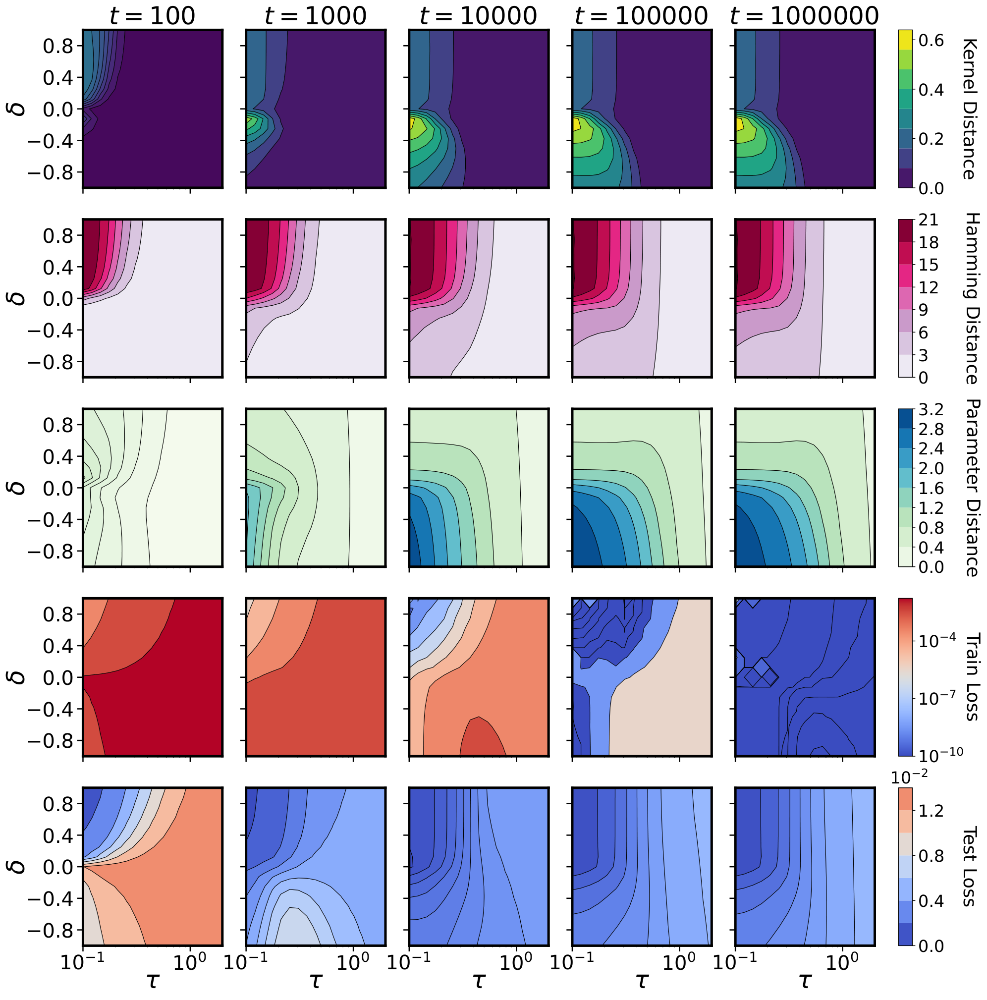

# Kunin et al. 2024 — Get rich quick: exact solutions reveal how unbalanced initializations promote rapid feature learning

См. также: [глобальный индекс понятий](../../concepts/index.md).
arXiv [2406.06158v2](https://arxiv.org/abs/2406.06158), 10 июня 2024 (v2 — 12 октября 2024). Колонтитул PDF: «38th Conference on Neural Information Processing Systems (NeurIPS 2024)».

**Daniel Kunin\*, Allan Raventós\*, Feng Chen, Surya Ganguli** — Stanford University.
**Clémentine Dominé, Andrew Saxe** — University College London.
**David Klindt** — Cold Spring Harbor Laboratory.
\* — равный вклад; переписка: kunin@stanford.edu, aravento@stanford.edu.

Файлы разбора этой статьи:

- [`2406.06158.get-rich-quick-exact-solutions-reveal-how-unbalanced-initializations-promote-rapid-feature-learning.claims.txt`](2406.06158.get-rich-quick-exact-solutions-reveal-how-unbalanced-initializations-promote-rapid-feature-learning.claims.txt) — пронумерованные утверждения статьи с пометками разбора.
- [`2406.06158.get-rich-quick-exact-solutions-reveal-how-unbalanced-initializations-promote-rapid-feature-learning.license.txt`](2406.06158.get-rich-quick-exact-solutions-reveal-how-unbalanced-initializations-promote-rapid-feature-learning.license.txt) — лицензионная запись arXiv для этой статьи.

Схема якорей и правила ссылок на карточку — в [README папки статей](../README.md).

**Карточка-выдержка.** Лицензия статьи (`arxiv-nonexclusive`) не разрешает публикацию копии оригинала и полного перевода, поэтому карточка содержит редакторские секции и цитируемые фрагменты перевода (право цитирования). Полный текст статьи: <https://arxiv.org/abs/2406.06158>.

## Затрагиваемые понятия

**[Переход lazy→rich](../../concepts/lazy-to-rich-kernel-to-feature-learning.md)** — главный вклад работы в это понятие: она даёт точно решаемую модель, где положение на оси «ленивый — богатый» задаётся **одной сохраняющейся величиной**, а не только общим масштабом. Для двухслойной линейной сети с одним скрытым нейроном разность $\delta=\eta_{w}a^{2}-\eta_{a}\|w\|^{2}$ не меняется под градиентным потоком и запирает траекторию на поверхности гиперболоида ([с. 4, абз. 4](#p4-4), [рис. 2](#fig-2)); её знак разводит три случая, для которых выписаны точные решения: при $\delta\gg 0$ (upstream) ядро почти не движется — ленивый режим ([с. 5, абз. 3](#p5-3)), при $\delta=0$ (balanced) движутся и норма, и направление — богатый ([с. 5, абз. 4](#p5-4)), при $\delta\ll 0$ (downstream) сперва идёт быстрая ленивая подгонка, а затем медленная фаза выравнивания с множителем $|\delta|^{-1}$ — **отложенный богатый режим**, и величина задержки задана модулем $\delta$ ([с. 5, абз. 5](#p5-5), [рис. 3](#fig-3)). Второй, независимый источник задержки — разные знаки $\delta_{k}$ у разных нейронов в широкой сети ([с. 7, абз. 6](#p7-6)). Приоритет работа оговаривает сама: одновременная работа Tu et al. 2024 получает те же уравнения **приближённо** — в режиме $h\gg\max(d,c)$ при гауссовой инициализации, — тогда как здесь при изотропном предположении они точны ([с. 7, абз. 9](#p7-9)). Новизна против Azulay et al. 2021 сформулирована самими авторами как **направленность** относительного масштаба: прежний разбор различал «сбалансированная / несбалансированная», здесь несбалансированность получает знак ([с. 2, абз. 2](#p2-2)). Ключевой поворот — в нелинейной сети ([§5](#sec-5)): upstream там оказывается богатым, потому что при постоянной $M_{k}\approx\delta_{k}\mathbf{I}_{d}$ меняются направления $\hat{\beta}_{k}$, а с ними образцы активации и ядро, — «богатый режим при малом смещении в пространстве параметров», то самое «get rich quick» из названия ([с. 9, абз. 1](#p9-1)). Чего в работе нет: гроккинг здесь не объясняется переходом lazy→rich, а объяснение принимается по ссылкам на Kumar et al., Lyu et al. и Rubin et al. ([с. 10, абз. 2](#p10-2)); вся теория — градиентный поток на MSE без стохастики и дискретизации, и авторы прямо признают, что SGD нарушает законы сохранения, на которых она держится ([с. 10, абз. 3](#p10-3)).

**[Масштаб инициализации](../../concepts/initialization-scale.md)** — работа расщепляет это понятие надвое и делает расщепление операциональным. Общий масштаб $\tau$ (рычаг Chizat et al. 2019) и относительный масштаб — разница величин весов первого и второго слоя, названная так в этой работе, — заданы независимо, и карта режимов строится сразу по двум осям ([рис. 1](#fig-1)): ленивое обучение при большом $\tau$, богатое при малом $\tau$, а **быстрое** богатое — когда одновременно $\tau$ мало и $\delta$ велико. Существенное для корпуса уточнение: при одном и том же малом общем масштабе относительный масштаб всё ещё двигает сеть между ленивым и богатым, а downstream при малом масштабе оказывается ленивым ([рис. 1](#fig-1)). Постановка наследуется от Azulay et al. 2021, у которых сбалансированная инициализация давала богатую динамику, а несбалансированная — ленивую ([с. 2, абз. 1](#p2-1)). Практический рычаг во всех опытах один и тот же: инициализация первого слоя делится на $\alpha$, а последнего — умножается на $\alpha$, чтобы отображение вход-выход не изменилось; $\alpha\gg 1$ — upstream, $\alpha\ll 1$ — downstream ([рис. 6](#fig-6)). Чего в работе нет: распределение понейронных сохраняющихся величин при конечной ширине не изучается и прямо оставлено на будущее, при том что NTK- и mean-field-параметризации дают одно и то же распределение с нулевым средним ([с. 10, абз. 1](#p10-1)).

**[Нейронное касательное ядро](../../concepts/neural-tangent-kernel-ntk.md)** — работа берёт NTK не как предел бесконечной ширины, а как наблюдаемую конечной сети, и даёт для неё замкнутое выражение. Мерой служит *ядерное расстояние* $S(t_{1},t_{2})=1-\langle K_{t_{1}},K_{t_{2}}\rangle/\left(\|K_{t_{1}}\|_{F}\|K_{t_{2}}\|_{F}\right)$ из Fort et al. 2020, и режим определяется тем, насколько $S(0,t)$ уходит от нуля ([с. 3, абз. 1](#p3-1)). Динамика в пространстве функций записана как предобусловленный градиентный поток $\dot{\beta}=-MX^{\intercal}\rho$, где предобуславливатель $M$ выражен через $\beta$ и $\delta$ в замкнутом виде и он же характеризует NTK-матрицу; три предела $M$ прямо дают три режима ([с. 6, абз. 3](#p6-3)). Для широкой сети $M$ раскладывается в сумму по нейронам, каждое слагаемое зависит только от своего $\beta_{k}$ и своего $\delta_{k}$ ([с. 7, абз. 6](#p7-6)). В кусочно-линейной сети NTK зависит уже от двух вещей — от $M_{k}$ и от матрицы активаций $C$, — и это разведение позволяет авторам показать, что раннее движение NTK в стандартных сетях связано с изменением образцов активации, а не с большим смещением параметров ([с. 9, абз. 1](#p9-1), [рис. 6](#fig-6)). Чего в работе нет: NTK ни разу не связывается с генерализацией напрямую — он служит индикатором режима, а не мерой качества.

**[Возникновение признаков](../../concepts/feature-emergence-feature-learning.md)** — работа предлагает операциональный признак *быстрого* обучения признакам, разводящий два смысла слова «богатый»: большое изменение расстояния Хэмминга между образцами активации при малом изменении в пространстве параметров ([рис. 5](#fig-5)). Такое сочетание даёт именно upstream-инициализация с малым $\tau$; downstream при малом $\tau$, напротив, требует большого движения параметров, чтобы подогнать данные в отложенном богатом режиме. Механизм разобран на поверхности двухслойной ReLU-сети: разбиение входного пространства на выпуклые области активации перестраивается в фазе выравнивания, пока отображение вход-выход остаётся близким к нулю, и только затем идёт фаза подгонки ([§5](#sec-5), [с. 8, абз. 3](#p8-3)). Побочный результат, который авторы отмечают как ранее не замеченный: разбиение входного пространства сети без избыточных нейронов 2-раскрашиваемо по чётности числа активных нейронов, — и они оговаривают, что используют это свойство только для рисования ([с. 35, абз. 5](#p35-5), [с. 35, абз. 6](#p35-6)). Чего в работе нет: какие именно признаки выучиваются, не разбирается нигде, кроме габоровых фильтров CNN; «обучение признакам» здесь измеряется движением ядра и активаций, а не содержанием представления.

**[Максимизация зазора](../../concepts/margin-maximization-implicit-bias.md)** — вклад работы в неявное смещение состоит в том, что она выписывает его как функцию $\delta$ и распространяет на область $\delta<0$. Теорема 3.1 расширяет теорему 2 Azulay et al. 2021: интерполирующее решение минимизирует $\Psi_{\delta}(\beta)-\psi_{\delta}\tfrac{\beta_{0}}{\|\beta_{0}\|}^{\intercal}\beta$ — размен между решением минимальной нормы и сохранением направления начала ([с. 6, абз. 5](#p6-5)). При исчезающей инициализации upstream и balanced функционально неразличимы по индуктивному смещению; различие даёт только downstream, где доминирует член сохранения $\beta_{0}$ ([с. 7, абз. 1](#p7-1)), и этот размен показан на [рис. 4](#fig-4). Для сингулярных чисел $\beta$ динамика записана как зеркальный поток с потенциалом *гиперболической энтропии*, плавно интерполирующим между штрафами $\ell^{1}$ и $\ell^{2}$ для богатого ($\delta\to 0$) и ленивого ($\delta\to\pm\infty$) пределов ([с. 8, абз. 1](#p8-1), [с. 32, абз. 8](#p32-8)). Для глубины $L+1$ индуктивное смещение богатого предела есть $Q(\beta)=(\tfrac{L+1}{L+2})\|\beta\|^{\frac{L+2}{L+1}}-\|\beta_{0}\|^{-\frac{L}{L+1}}\beta_{0}^{\intercal}\beta$ — зависящий от глубины баланс между минимальной нормой и направлением начала ([с. 8, абз. 2](#p8-2), [с. 34, абз. 2](#p34-2)). Чего в работе нет: всё это выведено для MSE и линейных сетей; для кусочно-линейных сетей авторы прямо говорят, что перенос разбора в стиле зеркального потока «очень труден или доказуемо невозможен», и сами оговаривают, что из их зеркального потока утверждение об индуктивном смещении при интерполяции не получается, поскольку сингулярные векторы меняются в ходе обучения ([с. 32, абз. 11](#p32-11)).

**[Гроккинг](../../concepts/grokking.md)** — работа не объясняет гроккинг, а использует его как проверку следствия собственной теории: если гроккинг есть переход от ленивого к богатому, то рычаг, управляющий этим переходом, должен управлять и временем до гроккинга. Само объяснение принято по ссылкам ([с. 10, абз. 2](#p10-2)) на [Kumar et al. 2023](../2310.06110.grokking-as-the-transition-from-lazy-to-rich-training-dynamics/2310.06110.grokking-as-the-transition-from-lazy-to-rich-training-dynamics.card.md), [Lyu et al. 2024](../2311.18817.dichotomy-of-early-and-late-phase-implicit-biases-can-provably-induce-grokking/2311.18817.dichotomy-of-early-and-late-phase-implicit-biases-can-provably-induce-grokking.card.md) и [Rubin et al. 2024](../2310.03789.grokking-as-a-first-order-phase-transition-in-two-layer-networks/2310.03789.grokking-as-a-first-order-phase-transition-in-two-layer-networks.card.md); ни одна из трёх содержательно не разбирается. Показанное: деление весов позиционных и токенных вложений однослойного трансформера на $\alpha$ — вмешательство, затрагивающее менее 6 % всех параметров, — «значительно сокращает время до гроккинга» ([с. 10, абз. 2](#p10-2), [рис. 6](#fig-6), [с. 40, абз. 6](#p40-6)); на сеточной развёртке по $\tau$ и $\alpha$ вывод сформулирован словами «самый быстрый гроккинг в несбалансированной богатой обстановке» ([рис. 12](#fig-12)). Отдельно ценно для корпуса, что в теоретической части отложенная генерализация возникает **без регуляризации, без weight decay и без стохастики** — как чистое следствие несбалансированности слоёв в точно решаемой модели ([с. 5, абз. 5](#p5-5), [с. 8, абз. 6](#p8-6)); правда, там это отложенность в MSE-регрессии, а не разрыв train/test на алгоритмической задаче. Чего в работе нет: зависимости от модуля $p$, от доли обучающих данных и от weight decay никто не мерил; ускорение на порядок держится на $\alpha=100$ ([рис. 6](#fig-6)), которого в сеточном опыте [рис. 12](#fig-12) нет вовсе, и величина эффекта не приведена ни одним числом ни в подписи, ни в тексте.

**[Модульная арифметика](../../concepts/modular-arithmetic.md)** — работа лишь пользуется этой задачей как одним из четырёх приложений и не добавляет к ней ничего своего: берётся задача модульной арифметики из Power et al. 2022 на готовой сторонней реализации на PyTorch, единственное отличие — один слой трансформера вместо двух по умолчанию ([с. 40, абз. 5](#p40-5)). Ни операция, ни модуль $p$, ни доля обучающих данных в тексте не названы; развёртка идёт только по $\tau$ и $\alpha$ ([рис. 12](#fig-12)). Чего в работе нет: никакого разбора того, *что* сеть выучивает на модульной арифметике, — выбор однослойной модели обоснован единственной ссылкой на [Nanda et al. 2023](../2301.05217.progress-measures-for-grokking-via-mechanistic-interpretability/2301.05217.progress-measures-for-grokking-via-mechanistic-interpretability.card.md), где показано, что такая модель выучивает минимальный контур, решающий задачу.

**[Эталонный полигон гроккинга](../../concepts/canonical-grokking-testbed.md)** — работа принимает полигон [Power et al. 2022](../2201.02177.grokking-generalization-beyond-overfitting-on-small-algorithmic-datasets/2201.02177.grokking-generalization-beyond-overfitting-on-small-algorithmic-datasets.card.md) как данность и вносит в него два отклонения, оба заимствованные: однослойный трансформер вместо двухслойного ([с. 40, абз. 5](#p40-5)) и приём Kumar et al. 2023 — умножение логитов на $\tau$ с делением скорости обучения на $\tau^{2}$ ([с. 40, абз. 6](#p40-6)). Порог гроккинга определён как $\geq 0.99$ точности на поверочных данных, бюджет — 30 000 шагов, по 5 случайных инициализаций на точку сетки ([рис. 12](#fig-12)). Чего в работе нет: ни weight decay, ни размера обучающей доли, ни оптимизатора для этого опыта в тексте не указано; бюджет в 30 000 шагов усекает сверху прогоны, не взявшие порог, и как именно такие прогоны учтены в усреднении, не сказано.

**[Скорость обучения](../../concepts/learning-rate.md)** — работа делает скорость обучения полноправной осью теории, а не гиперпараметром: послойные скорости $\eta_{a},\eta_{w}$ входят в сохраняющуюся величину $\delta=\eta_{w}a^{2}-\eta_{a}\|w\|^{2}$ наравне с дисперсиями инициализации, так что «медленный первый слой» и «маленький первый слой» — одно и то же с точки зрения режима ([с. 4, абз. 4](#p4-4), [с. 3, абз. 1](#p3-1)). Отсюда формулировка будущей работы в терминах *профиля скорости обучения* по слоям ([с. 10, абз. 3](#p10-3)). В опытах скорость обучения появляется и как связанный с масштабом множитель: 5e-3$/\tau^{2}$ в опыте учитель-ученик ([с. 37, абз. 7](#p37-7)) и деление на $\tau^{2}$ в опыте с гроккингом ([с. 40, абз. 6](#p40-6)). Чего в работе нет: развёртки по скорости обучения как таковой; ни в одном опыте она не варьируется независимо от масштаба.

**[Реальные данные и зрение](../../concepts/vision-real-world-data-mnist-cifar.md)** — работа переносит рычаг относительного масштаба на зрение в двух опытах. LeNet-5 на MNIST: раннее движение NTK связано с изменением образцов активации, а не с большим смещением параметров, кривые усреднены по 8 прогонам ([раздел D.3](#sec-d3), [рис. 6](#fig-6)). Небольшой ResNet на CIFAR-10 со свёрточным ядром, увеличенным с $3\times 3$ до $15\times 15$, и обнулённым weight decay: при $\alpha=10$ фильтры первого слоя выходят гладкими габороподобными, при $\alpha=0.1$ — шумом, а обучающая и тестовая точность у всех $\alpha$ сопоставимы ([с. 39, абз. 2](#p39-2), [рис. 11](#fig-11)). Чего в работе нет: гроккинга на зрении никто не искал; интерпретируемость измеряется одной величиной — нормированным лапласианом фильтра, — и связи между гладкостью фильтров и качеством работа не устанавливает, а прямо показывает её отсутствие ([рис. 11](#fig-11)).

**[Weight decay / L2-регуляризация](../../concepts/weight-decay.md)** — работа лишь упоминает weight decay, и всякий раз — чтобы его выключить. В опыте с габорами параметр weight decay установлен в $0$, «чтобы избежать смешивающих факторов» ([с. 39, абз. 2](#p39-2)); в опыте с моделью случайной иерархии смещения и weight decay также не используются ([с. 40, абз. 3](#p40-3)); для опыта с гроккингом weight decay в тексте не упоминается вовсе. Тем самым работа даёт корпусу ещё один случай отложенной генерализации, полученной **без** явной регуляризации: в теоретической части задержка выводится из одной сохраняющейся величины при чистом градиентном потоке ([с. 5, абз. 5](#p5-5)). Чего в работе нет: взаимодействия относительного масштаба с weight decay — оно не измеряется и не обсуждается, а из-за этого нельзя сказать, складывается ли эффект $\alpha$ с эффектом регуляризации или подменяет его.

**[Фазовый переход](../../concepts/phase-transition.md)** — работа говорит о *фазовом портрете* и *фазовой границе*, но не о фазовом переходе: карта на плоскости $(\tau,\delta)$ ([рис. 1](#fig-1)) размечает области ленивого, богатого и быстрого богатого обучения, а сопоставление с бесконечной шириной у Luo et al. 2021 показывает, что фазовая граница «существует только при бесконечной ширине» и содержит целый набор параметризаций, включая mean-field ([с. 10, абз. 1](#p10-1)). Ни параметра порядка, ни критических показателей, ни языка переходов первого/второго рода в работе нет; резкости самого перехода никто не измеряет. Приписывать авторам утверждение о фазовом переходе при гроккинге нельзя — этот язык принадлежит Rubin et al. 2024, на которых они лишь ссылаются ([с. 10, абз. 2](#p10-2)).

**[Эмерджентность / эмерджентные способности](../../concepts/emergence.md)** — упоминание одной придаточной фразой: гроккинг, как считается, «важен для понимания эмерджентных явлений», со ссылкой на Nanda et al. 2023 ([с. 10, абз. 2](#p10-2)). Никакой работы с эмерджентностью — ни определения, ни измерения, ни масштабирования — в статье нет.

**[Роль шума градиента](../../concepts/gradient-noise.md)** — понятие входит в работу только как признанное ограничение: «опускание эффектов дискретизации и стохастичности SGD, которые нарушают законы сохранения, центральные для нашего исследования, и вносят дополнительные смещения к простоте» ([с. 10, абз. 3](#p10-3)). Это оговорка первого порядка: сохранение $\delta$ — фундамент всей теории, и при SGD оно перестаёт быть точным. При этом опытная часть — и габоры, и модель случайной иерархии, и гроккинг — обучается именно стохастически, так что разрыв между теорией и опытами проходит ровно здесь.

---

## Несогласованности внутри статьи

**Подпись к рис. 11 противоречит рис. 6(b) и собственному соглашению о $\alpha$.** [Подпись к рис. 11](#fig-11) гласит, что «сети с малой инициализацией ($\alpha<1$) выучивают гораздо более гладкие фильтры». По соглашению, объявленному в [подписи к рис. 6](#fig-6), инициализация первого слоя **делится** на $\alpha$, и в опыте с габорами веса свёрточных фильтров тоже делятся на $\alpha$ ([с. 39, абз. 2](#p39-2)); значит, $\alpha<1$ — это увеличенная, а не малая инициализация первого слоя, и это downstream. Сама панель 6(b) показывает обратное подписи: гладкие габороподобные фильтры при $\alpha=10$ и цветной шум при $\alpha=0.1$. Направление эффекта, на котором держится вывод (b) в [подписи к рис. 6](#fig-6) — «upstream способствует интерпретируемости ранних слоёв», — задано панелью 6(b); парентетическое «($\alpha<1$)» в подписи к рис. 11 ему противоречит.

**Раздел D.3 назван «Рисунок 5», но описывает рисунок 6.** [Раздел D.3](#sec-d3) состоит из четырёх подразделов — «Ядерное расстояние», «Габоровы фильтры», «Модель случайной иерархии», «Гроккинг», — то есть ровно из панелей (a)–(d) [рисунка 6](#fig-6), подпись которого и отсылает «Подробности — в разделе D.3». Тем же сдвигом заражён абзац о вычислительных затратах: он приводит время работы «для рисунка 5(a) … 5(b) … 5(c) … 5(d)» ([с. 37, абз. 1](#p37-1)), тогда как у [рисунка 5](#fig-5) панелей всего две. Собственный опыт рисунка 5 — поверхность двухслойной ReLU-сети на XOR-подобной задаче — не описан в приложении вовсе.

**$\delta$ или $\delta^{2}$ в постановке рис. 1.** [Подпись к рис. 1](#fig-1) задаёт сохраняющуюся величину как $\delta=\tau^{2}(\alpha^{2}-\alpha^{-2})$, а раздел D.1 говорит, что $\alpha$ находится из уравнения $\delta^{2}=\tau^{2}(\alpha^{2}-\alpha^{-2})$ ([с. 37, абз. 3](#p37-3)). Совместить их нельзя: развёртка идёт по $\delta$ в диапазоне $[-1,1]$ ([с. 37, абз. 7](#p37-7)), правая часть меняет знак вместе с $\alpha-1$, а квадрат — нет. Одна из двух записей — опечатка; воспроизводить постановку рис. 1 следует по подписи, а не по D.1.

**Изотропное предположение и условие ширины в теореме B.6.** Предположение B.2 требует $\Delta=\delta\mathbf{I}_{h}$ ([с. 30, абз. 6](#p30-6)), и тут же оговорено, что «для общего $\delta$ оно требует $h\leq\min(d,c)$» ([с. 30, абз. 7](#p30-7)). Теорема B.6 при этом предполагает одновременно $\Delta=\delta\mathbf{I}_{h}$ и $h\geq\min(d,c)$ ([с. 32, абз. 8](#p32-8)) — вместе это оставляет ровно $h=\min(d,c)$, то есть выводит теорему из режима избыточной ширины. Отдельно: заявленное общее требование $h\leq\min(d,c)$ не следует из двух приведённых там же случаев, каждый из которых ограничивает $h$ лишь одной из двух размерностей ($\delta>0\Rightarrow h\leq c$, $\delta<0\Rightarrow h\leq d$).

**Мелкие расхождения обозначений и индексов.** В доказательстве леммы B.8 показатель степени телескопического произведения записан как $d$ — $\|\beta\|^{2}=a^{\intercal}\left(W_{L}W_{L}^{\intercal}\right)^{d}a$ и $\|\beta\|^{2}=a^{\intercal}\left(aa^{\intercal}-\delta\mathbf{I}_{h}\right)^{d}a$ ([с. 33, абз. 5](#p33-5)), — тогда как в формулировке леммы стоит $L$, глубина; совпадение возможно только потому, что там же принято $d=h$. В разделе D.1 буква $m$ обозначает то ширину учителя («учительская модель имеет $m=k$ скрытых нейронов»), то ширину ученика (настройка рис. 1 (b): $d=100$, $m=50$, [с. 37, абз. 7](#p37-7)), при том что настройка рис. 1 (a) для той же величины использует $h$ ([с. 37, абз. 5](#p37-5)).

## Что доказано, что показано и что предположено

**Доказано** — для линейных сетей под градиентным потоком на среднеквадратичной ошибке: сохранение $\delta$ и геометрия траектории ([с. 4, абз. 4](#p4-4)), точные решения для $\mu,\phi$ в модели с одним нейроном ([§3](#sec-3)), разложение предобуславливателя по нейронам (теорема 4.1) и замкнутое $M$ при изотропном $\Delta$ (теорема 4.2, [§4](#sec-4)), неявное смещение при интерполяции (теорема 3.1, [с. 6, абз. 5](#p6-5)) и его обобщение на глубину (теорема B.10, [с. 34, абз. 2](#p34-2)), зеркальный поток на сингулярных числах (теорема B.6, [с. 32, абз. 8](#p32-8)). Сюда же — предложение C.2 о 2-раскрашиваемости, которое авторы сами относят к визуализации ([с. 35, абз. 6](#p35-6)).

**Показано численно** — для двухслойных кусочно-линейных сетей и для четырёх прикладных постановок: совпадение точных решений с численным градиентным потоком по трём мерам ([рис. 3](#fig-3)); карта режимов на плоскости $(\tau,\delta)$ в задаче ученик-учитель на ReLU при усреднении по 16 семенам ([рис. 1](#fig-1), [с. 37, абз. 7](#p37-7)); связь раннего движения NTK с изменением активаций на LeNet-5 и MNIST, 8 прогонов ([рис. 6](#fig-6)); габороподобные фильтры при $\alpha=10$ на ResNet и CIFAR-10 ([рис. 11](#fig-11)); сдвиг выборочной сложности на модели случайной иерархии при 6 семенах ([с. 40, абз. 2](#p40-2)); сокращение времени до порога 99 % на модульной арифметике ([рис. 6](#fig-6), [рис. 12](#fig-12)). Отдельно стоит добросовестная проверка рис. 10: обучение продлено вдесятеро, и хотя обучающая потеря продолжает падать между $10^{5}$ и $10^{6}$ шагов, тестовая потеря и все рассмотренные расстояния остаются практически неизменными ([рис. 10](#fig-10)).

**Принято по ссылкам, а не показано** — сам тезис «гроккинг есть переход от ленивого к богатому»: он введён одной фразой со ссылками на три работы и в статье не проверяется ([с. 10, абз. 2](#p10-2)). Проверяется следствие: что рычаг относительного масштаба этим переходом управляет.

**Признано ограничением самими авторами** — перенос теории на глубокие нелинейные сети не сделан; дискретизация и стохастика SGD, нарушающие законы сохранения, из разбора исключены ([с. 10, абз. 3](#p10-3)); роль *распределения* понейронных сохраняющихся величин при конечной ширине оставлена на будущее ([с. 10, абз. 1](#p10-1)); утверждение об индуктивном смещении при интерполяции из зеркального потока на сингулярных числах не получается, поскольку сингулярные векторы меняются в ходе обучения ([с. 32, абз. 11](#p32-11)); разбор в стиле зеркального потока для нетривиальных кусочно-линейных сетей «очень труден или доказуемо невозможен».

**Разрыв между заявкой и показанным.** Аннотация говорит, что несбалансированный богатый режим «сокращает время до гроккинга в модульной арифметике» ([с. 1, абз. 2](#p1-2)). Показано более узкое: upstream-сдвиг **только вложений** однослойного трансформера на **одной** задаче сокращает число шагов до порога 99 % точности на поверочных данных. Ускорение примерно на порядок читается по [рис. 6](#fig-6) на $\alpha=100$; в сеточном опыте [рис. 12](#fig-12) набор $\alpha$ другой ($\{0.1,0.3,1,3,10\}$), $\alpha=100$ там нет, и величина эффекта не приведена ни одним числом. Теоретическая часть про гроккинг не доказывает ничего: она про линейные и двухслойные кусочно-линейные сети на MSE.

## Ошибочные пересказы и цитирования этой статьи

Ниже — узоры, наблюдённые в цитирующих работах корпуса. В каждой записи сказано, что именно искажается, и даны ссылки на авторские абзацы, где стоит теряемая оговорка.

**«Kunin et al. показали, что гроккинг — это переход от ленивого режима к богатому» (расширяющее).** Цитирующие ставят работу в один ряд с теми, кто этот тезис установил. Позиционная статья Nam et al. (`2502.21009`, карточки в корпусе пока нет) пишет: `"recent studies (Kumar et al. 2024; Lyu et al. 2024; Kunin et al. 2024) showed that grokking is a transition from a lazy overfitting regime to a rich generalizing regime"` — *«недавние исследования (Kumar et al. 2024; Lyu et al. 2024; Kunin et al. 2024) показали, что гроккинг есть переход от ленивого переобучающего режима к богатому генерализующему»*, — а во введении перечисляет «grokking (Kunin et al. 2024)» среди явлений, объяснённых послойно-линейными моделями. У самих авторов этот тезис стоит в страдательной форме и с чужими ссылками: [«Считается, что это поведение, названное гроккингом, происходит из перехода от ленивого к богатому обучению»](#p10-2) — со сносками на Kumar et al. 2023, Lyu et al. 2024 и Rubin et al. 2024. Собственный вклад работы в гроккинг — не механизм, а рычаг: она показывает, что относительный масштаб этим переходом управляет. В том же приложении Nam et al. цитируют её точно — про уменьшение дисперсии вложений и менее 6 % параметров, — так что предупреждение относится к формулировке, а не к работе целиком; там же есть и второе, более мелкое сужение: у Kunin et al. делятся [веса вложений — позиционных и токенных](#p40-6), а не только токенных.

**«Kunin et al. меняли архитектуру» (ошибочное).** [Gu et al. (`2504.03162`)](../2504.03162.beyond-progress-measures-theoretical-insights-into-the-mechanism-of-grokking/2504.03162.beyond-progress-measures-theoretical-insights-into-the-mechanism-of-grokking.card.md) относят работу к тем, кто изучает явление через изменение архитектуры: `"Some studies also focus on changing the architecture to investigate variations in the phenomenon (Park et al., 2024; Kunin et al.,; Lee et al., 2024)"` — *«Некоторые исследования также сосредоточены на изменении архитектуры, чтобы изучить вариации явления»*. Вмешательство Kunin et al. архитектуры не касается: делятся на $\alpha$ **веса** вложений, а сеть остаётся прежней ([с. 40, абз. 6](#p40-6)). Единственное архитектурное отклонение — один слой трансформера вместо двух — это базовая постановка опыта, а не рычаг, и оно обосновано ссылкой на Nanda et al. 2023 ([с. 40, абз. 5](#p40-5)); ни один результат работы не получен сравнением архитектур. У той же записи цитирование оформлено сбоем — «Kunin et al.,;» без года, а в списке литературы стоит воркшопная версия (HiLD 2024), а не NeurIPS.

**«Kunin et al. — одно из объяснений гроккинга через качество представлений» (расширяющее, мягкий отголосок).** [Zhang et al. (`2505.11411`)](../2505.11411.is-grokking-a-computational-glass-relaxation/2505.11411.is-grokking-a-computational-glass-relaxation.card.md) дважды перечисляют работу среди механизмов: `"shifts from poor to good representation learning kumar2023grokking; varma2023explaining; kunin2024get; liu2022towards"` — *«сдвиги от плохого к хорошему обучению представлений»*. Формулировка не противоречит статье, но приписывает ей объяснительную позицию, которой она не занимает: механизм там принят по ссылкам ([с. 10, абз. 2](#p10-2)), а собственный результат — управляемость времени до гроккинга послойным дисбалансом, показанная на одной задаче при 5 семенах и бюджете 30 000 шагов ([рис. 12](#fig-12)).

---

# Цитируемые фрагменты перевода

Ниже приведены только те фрагменты перевода, на которые ссылаются карточки корпуса (право цитирования). Нумерация якорей `pN-M` / `fig-N` / `sec-X` совпадает с полной карточкой и оригиналом.

## Аннотация

###### p1-2

Хотя впечатляющее качество современных нейронных сетей часто приписывают их способности эффективно извлекать из данных признаки, относящиеся к задаче, механизмы, лежащие в основе этого *режима богатого обучения признакам*, остаются неуловимыми, а значительная часть нашего теоретического понимания происходит из противоположного *ленивого режима*. В этой работе мы выводим точные решения для минимальной модели, переходящей между ленивым и богатым обучением, точно проясняя, как несбалансированные *послойные* дисперсии инициализации и скорости обучения определяют степень обучения признакам. Наш анализ показывает, что они сообща влияют на режим обучения через набор сохраняющихся величин, которые ограничивают и видоизменяют геометрию траекторий обучения в пространстве параметров и в пространстве функций. Мы распространяем наш анализ на более сложные линейные модели с несколькими нейронами, выходами и слоями и на неглубокие нелинейные сети с кусочно-линейными функциями активации. В линейных сетях быстрое обучение признакам происходит только при сбалансированных инициализациях, когда все слои учатся с близкими скоростями. Тогда как в нелинейных сетях несбалансированные инициализации, способствующие более быстрому обучению в ранних слоях, могут ускорять богатое обучение. Серией опытов мы даём свидетельства, что этот несбалансированный богатый режим движет обучением признакам в глубоких сетях конечной ширины, способствует интерпретируемости ранних слоёв в CNN, снижает выборочную сложность обучения на иерархических данных и сокращает время до гроккинга в модульной арифметике. Наша теория побуждает к дальнейшему исследованию несбалансированных инициализаций для повышения эффективности обучения признакам.

## 1 Введение

###### p2-1

**Богатый режим.** В противоположность ленивому режиму *богатый*, или *обучающий признакам*, или *активный* режим отличается выученным NTK, который меняется в ходе обучения, невыпуклой динамикой, проходящей между сёдлами [10, 11, 12], сигмоидальными кривыми обучения и смещениями к простоте, такими как малоранговость [13] или разрежённость [14]. Тем не менее точная характеризация богатого обучения и признаков, которые оно выучивает, часто зависит от конкретной рассматриваемой задачи, а его определение обычно упрощают до того, чем оно не является: не ленивое. Недавние разборы показали, что помимо общего масштаба на степень обучения признакам могут существенно влиять и другие стороны инициализации, такие как эффективный ранг [15], послойные дисперсии инициализации [16, 17, 18] и большие скорости обучения [19, 20, 21, 22]. Azulay et al. 2021 показали, что в двухслойных линейных сетях относительная разница величин весов первого и второго слоя, называемая в нашей работе *относительным масштабом*, может влиять на обучение признакам: сбалансированные инициализации дают богатую динамику обучения, тогда как несбалансированные склонны порождать ленивую динамику. Однако, как показано на рис. 1, для нелинейных сетей несбалансированные инициализации могут порождать и богатую, и ленивую динамику, создавая сложный фазовый портрет режимов обучения, на который влияют и общий, и относительный масштаб. Отталкиваясь от этих наблюдений, наше исследование ставит целью точно понять, как послойные дисперсии инициализации и скорости обучения определяют переход между ленивым и богатым обучением в сетях конечной ширины. Более того, мы стремимся понять индуктивные смещения обоих режимов и перехода между ними — в ходе обучения и при интерполяции — с конечной целью прояснить, как богатый режим приобретает признаки, обеспечивающие генерализацию.

###### fig-1

*Рисунок 1: **Несбалансированные инициализации ведут к быстрому богатому обучению и генерализации. Мы следуем экспериментальной постановке, использованной на рис. 1 в Chizat et al. 2019, — широкая двухслойная ученическая ReLU-сеть $f(x;\theta)=\sum_{i=1}^{h}a_{i}\max(0,w_{i}^{\intercal}x)$, обучаемая на наборе данных, порождённом узкой двухслойной учительской ReLU-сетью. Параметры ученика инициализируются как $w_{i}\sim\text{Unif}(\mathbb{S}^{d-1}(\frac{\tau}{\alpha}))$ и $a_{i}=\pm\alpha\tau$, так что $\tau>0$ управляет *общим масштабом* функции, тогда как $\alpha>0$ управляет *относительным масштабом* первого и второго слоёв через сохраняющуюся величину $\delta=\tau^{2}(\alpha^{2}-\alpha^{-2})$. (a) Показаны траектории обучения $|a_{i}|w_{i}$ (цвет обозначает $\mathrm{sgn}(a_{i})$) при $d=2$ для четырёх различных настроек $\tau,\delta$. Левый график подтверждает, что малый общий масштаб ведёт к богатому, а большой общий масштаб — к ленивому. Правый график показывает, что даже при малом общем масштабе относительный масштаб тоже способен двигать сеть между богатым и ленивым. Здесь upstream-инициализация $\delta>0$ показывает разительное выравнивание с учителем (пунктирные линии), тогда как downstream-инициализация $\delta<0$ не показывает никакого выравнивания. (b) Показаны тестовая потеря и ядерное расстояние от инициализации, вычисленные в ходе обучения на развёртке по $\tau$ и $\delta$ при $d=100$. Ленивое обучение происходит при большом $\tau$, богатое обучение — при малом $\tau$, а быстрое богатое обучение — когда *одновременно* $\tau$ мало и $\delta$ велико, то есть при upstream-инициализации. Эта же инициализация ведёт к наименьшей тестовой потере. Вспомогательные рисунки — на рис. 10 в разделе D.1.*** **[p. 2]**

###### p2-2

**Наш вклад.** Наша работа начинается с исследования двухслойной линейной сети с одним нейроном, предложенной Azulay et al. 2021 как минимальная модель, проявляющая и ленивое, и богатое обучение. В разделе 3 мы выводим точные решения динамики градиентного потока с послойными скоростями обучения для этой модели, применяя сочетание гиперболических и сферических преобразований координат. Наряду с недавней работой Xu and Ziyin 202411 1 Xu and Ziyin 2024 представили точную NTK-динамику для линейной модели, обучаемой на одномерных данных., **[p. 3]** наш анализ выделяется как одна из немногих аналитически поддающихся разбору моделей перехода между ленивым и богатым обучением в сети конечной ширины, что составляет заметный вклад в область. Наш анализ показывает, что послойные дисперсии инициализации и скорости обучения сообща влияют на режим обучения через простой набор сохраняющихся величин, ограничивающих геометрию траекторий обучения. Кроме того, он показывает, что решающей стороной относительного масштаба, упущенной в предыдущем разборе, является его направленность. Тогда как *сбалансированная инициализация* приводит к тому, что все слои учатся с близкими скоростями, *несбалансированная инициализация* может вызвать более быстрое обучение либо в более ранних слоях — тогда мы говорим об *upstream-инициализации*, — либо в более поздних, тогда об *downstream-инициализации*. Из-за зависящей от глубины выразительности слоёв сети upstream- и downstream-инициализации часто проявляют принципиально различные траектории обучения. В разделе 4 мы распространяем наш анализ относительного масштаба, развитый на модели с одним нейроном, на более сложные линейные модели с несколькими нейронами, выходами и слоями, а в разделе 5 — на двухслойные нелинейные сети с кусочно-линейными функциями активации. Мы обнаруживаем, что в линейных сетях быстрое богатое обучение может происходить только при сбалансированных инициализациях, тогда как в нелинейных сетях upstream-инициализации способны на деле ускорять богатое обучение. Наконец, серией опытов мы даём свидетельства, что upstream-инициализации движут обучением признакам в глубоких сетях конечной ширины, способствуют интерпретируемости ранних слоёв в CNN, снижают выборочную сложность обучения на иерархических данных и сокращают время до гроккинга в модульной арифметике.

###### p3-1

**Обозначения.** В этой работе мы рассматриваем сеть прямого распространения $f(x;\theta):\mathbb{R}^{d}\to\mathbb{R}^{c}$, параметризованную $\theta\in\mathbb{R}^{m}$. Если не оговорено иное, $c=1$. Сеть обучается градиентным потоком $\dot{\theta}=-{\eta_{\theta}}\cdot\nabla_{\theta}\mathcal{L}(\theta)$ с инициализацией $\theta_{0}$ и послойной скоростью обучения $\eta_{\theta}\in\mathbb{R}^{m}_{+}$, чтобы минимизировать среднеквадратичную ошибку $\mathcal{L}(\theta)=\frac{1}{2}\sum_{i=1}^{n}(f(x_{i};\theta)-y_{i})^{2}$, вычисленную по набору данных $\{(x_{1},y_{1}),\dots,(x_{n},y_{n})\}$ размера $n$. Матрицу входов обозначаем $X\in\mathbb{R}^{n\times d}$ со строками $x_{i}\in\mathbb{R}^{d}$, а вектор меток — $y\in\mathbb{R}^{n}$. Выход сети $f(x;\theta)$ эволюционирует согласно дифференциальному уравнению $\partial_{t}f(x;\theta)=\sum_{i=1}^{n}\Theta(x,x_{i};\theta)(y_{i}-f(x_{i};\theta))$, где $\Theta(x,x^{\prime};\theta):\mathbb{R}^{d}\times\mathbb{R}^{d}\to\mathbb{R}$ — *нейронное касательное ядро (NTK)*, определяемое как $\Theta(x,x^{\prime};\theta)=\sum_{p=1}^{m}{\eta_{\theta}}_{p}\partial_{\theta_{p}}f(x;\theta)\partial_{\theta_{p}}f(x^{\prime};\theta)$. NTK количественно выражает, как один градиентный шаг по точке данных $x^{\prime}$ влияет на эволюцию выхода сети, вычисленного в другой точке данных $x$. Когда ${\eta_{\theta}}_{p}$ общая для всех параметров, NTK — это ядро, связанное с отображением признаков $\nabla_{\theta}f(x;\theta)\in\mathbb{R}^{m}$. Мы также определяем *NTK-матрицу* $K\in\mathbb{R}^{n\times n}$, вычисляемую по обучающим данным так, что $K_{ij}=\Theta(x_{i},x_{j};\theta)$. NTK-матрица эволюционирует от своей инициализации $K_{0}$ к сходимости $K_{\infty}$ в ходе обучения. Ленивое и богатое обучение существуют на непрерывном спектре, и различающим фактором служит размах этой эволюции. Разные исследования предлагали разные меры для отслеживания эволюции NTK-матрицы [24, 25, 26]. Мы используем *ядерное расстояние* [27], определяемое как $S(t_{1},t_{2})=1-\langle K_{t_{1}},K_{t_{2}}\rangle/\left(\|K_{t_{1}}\|_{F}\|K_{t_{2}}\|_{F}\right)$ — инвариантную к масштабу меру сходства между NTK в два момента времени. В ленивом режиме $S(0,t)\approx 0$, тогда как в богатом режиме $0\ll S(0,t)\leq 1$.

## 2 Смежные работы

###### fig-2

*Рисунок 2: **Баланс определяет геометрию траектории. Величина $\delta=\eta_{w}a^{2}-\eta_{a}\|w\|^{2}$ сохраняется под градиентным потоком, что ограничивает траекторию: (a) однополостным гиперболоидом для downstream-инициализаций, (b) двойным конусом для сбалансированных инициализаций и (c) двуполостным гиперболоидом для upstream-инициализаций. Показана динамика градиентного потока для трёх различных инициализаций $a_{0},w_{0}$ с одним и тем же произведением $\beta_{0}=a_{0}w_{0}$. Многообразие минимумов показано красным, а многообразие эквивалентных инициализаций $\beta_{0}$ — серым. Поверхность раскрашена по обучающей потере: синий отвечает более высокой потере, красный — более низкой.*** **[p. 4]**

###### sec-3

## 3 Минимальная модель ленивого и богатого обучения с точными решениями

###### p4-4

За исключением множества меры нуль инициализаций, сходящихся к сёдлам22 2 Множество сёдел $\{(a,w)\}$ — это $d-1$-мерное подпространство, удовлетворяющее $a=0$ и $w^{\intercal}X^{\intercal}y=0$., все траектории градиентного потока сходятся к глобальному минимуму, определяемому нормальными уравнениями $X^{\intercal}Xaw=X^{\intercal}y$. Однако даже когда $X^{\intercal}X$ обратима и глобальный минимум $\beta_{*}$ единствен, симметрия перемасштабирования между $a$ и $w$ порождает многообразие **[p. 5]** минимумов в пространстве параметров. Многообразие минимумов — одномерная гипербола, где $w\propto\beta_{*}$, и у неё две различные ветви для положительного и отрицательного $a$. Симметрия также накладывает ограничение на траекторию сети, сохраняя разность $\delta=\eta_{w}a^{2}-\eta_{a}\|w\|^{2}\in\mathbb{R}$ на всём протяжении обучения (подробности — в разделе A.1). Это удерживает динамику параметров на поверхности гиперболоида, геометрия которого определяется величиной и знаком сохраняющейся величины, как показано на рис. 2. Upstream-инициализация возникает при $\delta>0$, сбалансированная инициализация — при $\delta=0$, а downstream-инициализация — при $\delta<0$.

###### fig-3

*Рисунок 3: **Точные решения для модели с одним скрытым нейроном.** Наши теоретические предсказания (чёрные пунктирные линии) согласуются с симуляциями градиентного потока (сплошные линии, цветовая кодировка по значениям $\delta$); показаны три ключевые меры: $\mu$ (слева), $\phi$ (в центре) и $S(0,t)$ (справа). Каждая мера стартует с одного и того же значения для всех $\delta$, но изменение $\delta$ оказывает выраженное влияние на её динамику. Для upstream-инициализаций ($\delta\gg 0$) $\mu$ меняется лишь незначительно, $\phi$ выравнивается экспоненциально, а $S$ остаётся вблизи нуля, что указывает на ленивый режим. Для сбалансированных инициализаций ($\delta=0$) и $\mu$, и $\phi$ меняются значительно, а $S$ быстро уходит от нуля, что указывает на богатый режим. Для downstream-инициализаций ($\delta\ll 0$) $\mu$ быстро падает до нуля, затем $\mu$ и $\phi$ медленно поднимаются обратно к единице. Схожим образом $S$ остаётся малым до внезапного перехода к единице, что указывает на отложенный богатый режим. Дальнейшие подробности — в разделе A.2.* **[p. 5]**

###### p5-3

*Upstream.* При $\delta\gg 0$ обновления и $\mu$, и $\phi$ расходятся, но $\phi$ обновляется гораздо быстрее. Мы можем расцепить динамику $\mu$ и $\phi$ разделением их временны́х масштабов и предположить, что $\phi$ достигла своего стационарного состояния $\pm 1$ прежде, чем $\mu$ обновилась. Тогда динамика $\mu$ линейна и экспоненциально идёт к $\pm\|\beta_{*}\|$. Этот режим проявляет минимальное движение ядра (см. рис. 3 (c)), поскольку в ядре доминирует член $\eta_{w}a^{2}\mathbf{I}_{d}$, тогда как обновляется в основном $w$.

###### p5-4

*Balanced.* При $\delta=0$ $\mu$ следует дифференциальному уравнению Бернулли, управляемому зависящим от времени сигналом $\phi\|\beta_{*}\|$, а $\phi$ следует уравнению Риккати, эволюционируя от начального значения к $\pm 1$ в зависимости от бассейна притяжения. Для исчезающей инициализации $\|\beta_{0}\|\to 0$ временна́я динамика $\mu$ и $\phi$ расцепляется так, что возникают две фазы обучения: начальная фаза выравнивания, где $\phi\to\pm 1$, за которой следует фаза подгонки, где $\mu\to\pm\|\beta_{*}\|$. В первой фазе $w$ выравнивается с $\beta_{*}$, что даёт обновление NTK ранга один, тождественное эффекту тихого выравнивания, описанному в Atanasov et al. 2021. Во второй фазе динамика $\mu$ упрощается до уравнения Бернулли, изученного в Saxe et al. 2013, и ядро эволюционирует исключительно по общему масштабу.

###### p5-5

*Downstream.* При $\delta\ll 0$ обновления $\mu$ расходятся, тогда как обновления $\phi$ исчезают. В этом режиме динамика идёт через начальную быструю фазу, где $\mu$ экспоненциально сходится к своему стационарному состоянию $\phi\|\beta_{*}\|$. Подстановка этого стационарного состояния в динамику $\phi$ даёт дифференциальное уравнение Бернулли **[p. 6]** $\dot{\phi}=\eta_{a}\eta_{w}\|\beta_{*}\|^{2}|\delta|^{-1}\phi(1-\phi^{2})$. Из-за коэффициента $|\delta|^{-1}$ вторая фаза выравнивания идёт очень медленно по мере приближения $\phi$ к $\pm 1$, в предположении $\phi,\mu\neq 0$, что является седловой точкой. В этом режиме динамика идёт через начальную ленивую фазу подгонки, за которой следует богатая фаза выравнивания, причём задержка определяется величиной $\delta$.

###### fig-4

*Рисунок 4: **Баланс модулирует динамику $\beta$ и неявное смещение. Здесь мы показываем динамику $\beta=aw$ при разных значениях $\delta$, но при одном и том же начальном $\beta_{0}$. Когда $X^{\intercal}X$ отбелена (слева), мы можем решить динамику точно, используя наши выражения для $\mu,\phi$ (чёрные пунктирные линии). Upstream-инициализации следуют траектории градиентного потока по $\beta$, downstream-инициализации сперва движутся в направлении $\beta_{0}$, прежде чем развернуться к $\beta_{*}$, а сбалансированные инициализации берут промежуточную траекторию между этими двумя. Когда $X^{\intercal}X$ малорангова (справа), мы можем предсказать траектории только в пределе $\delta=\pm\infty$. Если интерполирующее многообразие одномерно, мы можем решить для решения через $\delta$ точно (чёрные точки). Подробности — в разделе A.4.*** **[p. 6]**

###### p6-3

где $\kappa=\sqrt{\delta^{2}+4\eta_{a}\eta_{w}\|\beta\|^{2}}$ (вывод — в разделе A.3). Это устанавливает *самосогласованное* уравнение для динамики $\beta$, регулируемое $\delta$. Кроме того, заметим, что $M$ характеризует NTK-матрицу из ур. 1. Тем самым понимание эволюции $M$ вдоль траектории от $\beta_{0}$ к $\beta_{*}$ даёт способ различать ленивое и богатое обучение. *Upstream.* При $\delta\gg 0$ $M\approx\delta\mathbf{I}_{d}$, и динамика $\beta$ сходится к траектории линейной регрессии, обучаемой градиентным потоком. Вдоль этой траектории NTK-матрица остаётся постоянной, что подтверждает ленивость динамики. *Balanced.* При $\delta=0$ $M=\sqrt{\eta_{a}\eta_{w}}\|\beta\|(\mathbf{I}_{d}+\tfrac{\beta\beta^{\intercal}}{\|\beta\|^{2}})$. Здесь динамика балансирует между следованием ленивой траектории и попыткой подогнать задачу, меняясь только по норме. В итоге NTK меняется и по величине, и по направлению в ходе обучения, что подтверждает богатость динамики. *Downstream.* При $\delta\ll 0$ $M\approx|\delta|\tfrac{\beta\beta^{\intercal}}{\|\beta\|^{2}}$, и $\beta$ следует траектории проецированного градиентного спуска, пытаясь достичь $\beta_{*}$ в направлении $\beta_{0}$. Вдоль этой траектории NTK-матрица не эволюционирует. Однако, если $\beta_{0}$ не выровнена с $\beta_{*}$, то в какой-то момент динамика $\beta$ начнёт медленно выравниваться. В этой второй фазе выравнивания NTK-матрица изменится, что подтверждает: динамика сперва ленивая, а затем следует отложенная богатая фаза. Вывод динамики NTK $\dot{K}$ — в разделе A.3.1.

##### **Теорема 3.1** (расширяющая теорему 2 в Azulay et al. 2021)**.**

###### p6-5

*Для линейной сети с одним скрытым нейроном, для любого $\delta\in\mathbb{R}$ и инициализации $\beta_{0}$ такой, что $\beta(t)\neq 0$ для всех $t\geq 0$, если решение градиентного потока $\beta(\infty)$ удовлетворяет $X\beta(\infty)=y$, то*

###### p7-1

Мы наблюдаем, что для исчезающих инициализаций функционально нет разницы между индуктивным смещением upstream ($\delta\gg 0$) и сбалансированной ($\delta=0$) настроек. Однако в downstream-настройке ($\delta\ll 0$) в индуктивном смещении доминирует второй член, сохраняющий направление инициализации. Этот размен в индуктивном смещении как функция $\delta$ представлен на рис. 4 (b), где, если нуль-пространство $X^{\intercal}X$ одномерно, мы можем найти $\beta(\infty)$ в замкнутой форме (см. раздел A.4).

###### sec-4

## 4 Широкие и глубокие линейные сети

##### **Теорема 4.1****.**

###### p7-6

Изучая зависимость $M$ от сохраняющихся величин $\delta_{k}$ и размерностей $d$, $h$ и $c$, мы можем определить влияние относительного масштаба на режим обучения. Когда $\min(d,c)\leq h<\max(d,c)$ и в предположении независимых инициализаций для всех $\beta_{k}$, сети, сужающиеся от входа к выходу ($d>c$), входят в ленивый режим при всех $\delta_{k}\gg 0$, тогда как сети, расширяющиеся от входа к выходу ($d<c$), делают это при всех $\delta_{k}\ll 0$. Однако при противоположных знаках $\delta_{k}$ и в предположении, что все $\beta_{k}(0)\not\propto\beta_{*}$, эти сети входят в *отложенный богатый режим*. Как подробно изложено в разделе B.1.5, это происходит потому, что в таких режимах решение $\beta_{*}$ не существует внутри пространства, натянутого $M$ при инициализации. Когда $h\geq\max(d,c)$, все сети входят в ленивый режим при всех $\delta_{k}\gg 0$ либо при всех $\delta_{k}\ll 0$. И наоборот, когда все $\delta_{k}\to 0$, все сети переходят в богатый режим независимо от размерностей. Хотя теорема 4.1 даёт ценное понимание режимов обучения в пределах $\delta_{k}$, понимание перехода между режимами остаётся непростым. Чтобы его достичь, мы стремимся выразить $M$ через $\beta$, а не через $\beta_{k}$, вводя структуру на сохраняющихся величинах $\Delta$.

##### **Теорема 4.2****.**

###### p7-9

где $P=X\beta-Y$ — невязка. При нашем изотропном предположении о сохраняющихся величинах $\Delta=\delta\mathbf{I}_{h}$ эта динамика точна. Одновременно с нашей работой Tu et al. 2024 обнаруживают, что $\beta$ *приближённо* следует этой динамике в переопараметризованной постановке $h\gg\max(d,c)$ при гауссовой инициализации $\mathcal{N}(0,\sigma^{2})$ параметров, где $\sigma^{2}h$ аналогично $\delta$.

###### p8-1

Располагая самосогласованным уравнением для динамики $\beta$, мы теперь стремимся истолковать эту динамику как зеркальный поток с зависящим от $\delta$ потенциалом. Как представлено в теореме B.6, динамика сингулярных чисел $\beta$ может быть описана как зеркальный поток с потенциалом *гиперболической энтропии*, который плавно интерполирует между штрафами $\ell^{1}$ и $\ell^{2}$ на сингулярные числа для богатого ($\delta\to 0$) и ленивого ($\delta\to\pm\infty$) режимов соответственно. Этот потенциал был впервые определён как индуктивное смещение для диагональных линейных сетей в Woodworth et al. 2020, и тот же зеркальный поток на сингулярных числах выведен из другого выбора инициализации в более ранней работе Varre et al. 2024.

###### p8-2

**Глубокие линейные сети**. Как представлено в теореме B.10, мы обобщаем индуктивное смещение, выведенное для богатых двухслойных линейных сетей в Azulay et al. 2021, на глубокие линейные сети. Для линейной сети глубины $(L+1)$, $f(x;\theta)=A^{\intercal}\prod_{l=1}^{L}W_{l}x$, где $\beta=\prod_{l=1}^{L}W_{l}^{\intercal}A$, мы обнаруживаем, что индуктивное смещение богатого режима есть $Q(\beta)=(\tfrac{L+1}{L+2})\|\beta\|^{\frac{L+2}{L+1}}-\|\beta_{0}\|^{-\frac{L}{L+1}}\beta_{0}^{\intercal}\beta$. Это индуктивное смещение устанавливает зависящий от глубины баланс между достижением решения минимальной нормы и сохранением направления инициализации.

###### sec-5

## 5 Кусочно-линейные сети

###### p8-3

Теперь мы делаем первый шаг к распространению нашего разбора с линейных сетей на кусочно-линейные сети с функциями активации вида $\sigma(z)=\max(z,\gamma z)$. Отображение вход-выход кусочно-линейной сети с $L$ скрытыми слоями и $h$ скрытыми нейронами на слой состоит потенциально из $O(h^{dL})$ выпуклых *областей активации* [65]. Каждая область определяется единственным *образцом активации* скрытых нейронов. Отображение вход-выход линейно внутри каждой области и непрерывно на границе между областями. Все вместе области активации образуют 2-раскрашиваемое77 7 Насколько нам известно, это свойство ранее не отмечалось. Формальную формулировку см. в разделе C.1. выпуклое разбиение входного пространства, как показано на рис. 5. Мы исследуем, как относительный масштаб влияет на эволюцию этого разбиения и на линейные отображения внутри каждой области.

###### p8-6

*Downstream.* При $\delta_{k}\ll 0$ $M_{k}\approx|\delta_{k}|\hat{\beta}_{k}\hat{\beta}_{k}^{\intercal}$, и динамика приближённо есть $\partial_{t}\hat{\beta}_{k}=0$ и $\partial_{t}\mu_{k}=-|\delta_{k}|\hat{\beta}_{k}^{\intercal}\xi_{k}$. Независимо от $\xi_{k}$, $\hat{\beta}_{k}(t)=\hat{\beta}_{k}(0)$, а это означает, что не меняются ни общая карта разбиения (рис. 5, внизу), ни образцы активации $C$, ни $M_{k}$. Меняется только $\mu_{k}$, чтобы подогнать данные, тогда как NTK остаётся постоянным. Если числа скрытых нейронов недостаточно для подгонки данных, наступает отложенная богатая фаза выравнивания, в которой ядро изменится, а задержку определяет $|\delta_{k}|$.

###### fig-5

*Рисунок 5: **Быстрое обучение признакам вызвано большими изменениями активаций при минимальном движении параметров.** (a) Мы показываем поверхность двухслойной ReLU-сети, обученной на XOR-подобной задаче, начиная с почти нулевого отображения вход-выход, $f(x;\theta_{0})\approx 0$. Поверхность состоит из выпуклых конических областей, каждая со своим образцом активации, раскрашенных по чётности числа активных нейронов. Ленивая инициализация (*внизу*) сохраняет фиксированное разбиение активаций на всём протяжении обучения, перевзвешивая скрытые нейроны для подгонки данных. Напротив, богатая сбалансированная или upstream-инициализация (*вверху*) отличается начальной фазой выравнивания, в которой карта разбиения быстро меняется, тогда как отображение вход-выход остаётся близким к нулю, за которой следует фаза подгонки данных. (b) Мы показываем эволюцию расстояния Хэмминга между образцами активации и расстояния по параметрам относительно $t=0$ как функцию *общего* и *относительного* масштабов (те же опыты, что и на рис. 1(b)). *Быстрое обучение признакам* происходит при upstream-инициализации с малым $\tau$, которая способствует более быстрому обучению в ранних слоях, вызывая большое изменение расстояния Хэмминга, но малое изменение в пространстве параметров. Напротив, downstream-инициализации с малым $\tau$ требуют большого движения параметров для подгонки данных в отложенном богатом режиме.* **[p. 9]**

###### p9-1

*Upstream.* При $\delta_{k}\gg 0$ $M_{k}\approx\delta_{k}\mathbf{I}_{d}$, и динамика приближённо есть $\partial_{t}\hat{\beta}_{k}=-\delta_{k}\mu_{k}^{-1}(\mathbf{I}_{d}-\hat{\beta}_{k}\hat{\beta}_{k}^{\intercal})\xi_{k}$ и $\partial_{t}\mu_{k}=-\delta_{k}\hat{\beta}_{k}^{\intercal}\xi_{k}$. Снова меняются и направление, и величина $\beta_{k}$. Однако, в отличие от сбалансированной настройки, здесь $M_{k}$ не зависит от $\beta_{k}$ и остаётся постоянной на всём протяжении обучения. И всё же, поскольку $\beta_{k}$ меняются по направлению, может меняться и $C$, а значит, и NTK. Эта настройка уникальна тем, что она богатая из-за меняющегося образца активации, но при этом динамика не уходит далеко в пространстве параметров. Более того, в отличие от сбалансированного случая, где масштаб настраивает скорость радиальной динамики, здесь он регулирует скорость направленной динамики, причём исчезающие инициализации побуждают чрезвычайно быструю фазу выравнивания, как видно на рис. 1 и на рис. 5.

###### fig-6

*Рисунок 6: **Влияние upstream-инициализаций на практике. Здесь мы даём свидетельства, что upstream-инициализация (a) движет обучением признакам через изменение образцов активации, (b) способствует интерпретируемости ранних слоёв в CNN, (c) снижает выборочную сложность обучения на иерархических данных и (d) сокращает время до гроккинга в модульной арифметике. В этих опытах мы регулируем скорость обучения первого слоя относительно остальной сети, деля его инициализацию на $\alpha$. Для моделей без нормализационных слоёв мы также умножаем инициализацию последнего слоя на $\alpha$, чтобы сохранить отображение вход-выход. $\alpha=1$ отвечает стандартной параметризации, тогда как $\alpha\gg 1$ и $\alpha\ll 1$ отвечают соответственно upstream- и downstream-инициализациям. Подробности — в разделе D.3.*** **[p. 10]**

###### p10-1

**Связи с бесконечной шириной.** Наше изучение режимов обучения в двухслойных ReLU-сетях конечной ширины как функции общего и относительного масштаба согласуется с существующим разбором обучения признакам при бесконечной ширине. Например, в Luo et al. 2021 рассматривается сеть $f(x)=\frac{1}{\alpha}\sum_{k=1}^{h}a_{k}\sigma(w_{k}^{\intercal}x)$ с весами, инициализированными как $a_{k}\sim\mathcal{N}(0,\beta_{a}^{2})$ и $w_{k}\sim\mathcal{N}(0,\beta_{W}^{2}\mathbf{I}_{d})$, при ширине $h\to\infty$. Они получают фазовую диаграмму при бесконечной ширине, схватывающую зависимость режима обучения от общего масштаба функции $\beta_{a}\beta_{W}/\alpha$ и относительного масштаба инициализации $\beta_{a}/\beta_{W}$, каждый из которых подходящим образом нормирован как функция ширины. Итоговый фазовый портрет аналогичен нашему на рис. 1 (b), где мы используем сохраняющуюся величину $\delta$, а не относительный масштаб $\beta_{a}/\beta_{W}$. В частности, есть ленивый режим, включающий NTK-параметризацию, который всегда достигается при большом масштабе (как в областях больших $\tau$ на рис. 1 (b)), но достигается и при малом масштабе, если дисперсия первого слоя достаточно больше дисперсии второго (как при downstream-инициализациях при малом $\tau$ на рис. 1 (b)). По другую сторону фазовой границы лежит аналог быстрого богатого обучения при бесконечной ширине, где все нейроны конденсируются к нескольким направлениям. Это порождается либо при малом масштабе функции, либо при больших масштабах, если $\beta_{a}/\beta_{W}$ достаточно велико, так что $W$ учится достаточно быстро относительно $a$. Фазовая же граница, существующая только при бесконечной ширине, содержит целый набор параметризаций, включая параметризацию среднего поля. Более широко, во всех зависящих от ширины параметризациях случайная инициализация весов порождает распределение по понейронным сохраняющимся величинам. Хотя различие между NTK- и mean-field-параметризациями изучалось широко, обе они ведут к одному и тому же распределению понейронных сохраняющихся величин, которое имеет нулевое среднее и неисчезающую дисперсию. Более тщательное изучение того, какую роль играет *распределение* понейронных сохраняющихся величин в обучении признакам при конечной ширине, оставлено на будущую работу.

###### p10-2

**Несбалансированные инициализации на практике.** Наш разбор показывает, что upstream-инициализации могут двигать быстрое богатое обучение в нелинейных сетях. Дальнейшие опыты на рис. 6 показывают, что upstream-инициализации значимы в различных областях глубокого обучения: (a) При стандартных инициализациях NTK заметно эволюционирует на раннем этапе обучения [27]. Мы показываем, что это движение связано с изменениями образцов активации, а не с большими сдвигами параметров. Подстройка дисперсии инициализации первого и последнего слоёв может усилить или ослабить это движение. (b) Фильтры в CNN, обучаемых на задачах классификации изображений, часто выравниваются с детекторами краёв [66]. Мы показываем, что подстройка скорости обучения первого слоя может улучшить или ухудшить это выравнивание. (c) Считается, что модели глубокого обучения избегают проклятия размерности и учатся на ограниченных данных, используя иерархические структуры в реальных задачах. Пользуясь моделью случайной иерархии (Random Hierarchy Model), введённой Petrini et al. 2023 как каркас для синтетических иерархических задач, мы показываем, что изменение относительного масштаба может снизить или повысить выборочную сложность обучения. (d) Сети, обучаемые на простых задачах модульной арифметики, внезапно начинают генерализовать много позже, чем запомнят свои обучающие данные [68]. Считается, что это поведение, названное гроккингом, происходит из перехода от ленивого к богатому обучению [69, 70, 71] и что оно важно для понимания эмерджентных явлений [72]. Мы показываем, что уменьшение дисперсии вложения в однослойном трансформере ($<6\%$ всех параметров) значительно сокращает время до гроккинга.

## 6 Заключение

###### p10-3

В этой работе мы вывели точные решения для минимальной модели, способной переходить между ленивым и богатым обучением, чтобы точно прояснить, как несбалансированные послойные дисперсии инициализации и скорости обучения определяют степень обучения признакам. Далее мы распространили наш разбор на широкие и глубокие линейные сети и на неглубокие кусочно-линейные сети. Теорией и опытами мы обнаруживаем, что несбалансированные инициализации, способствующие более быстрому обучению в ранних слоях, могут на деле ускорять богатое обучение. **Ограничения.** Основное ограничение состоит в трудности распространения нашей теории на более глубокие нелинейные сети. В отличие от линейных сетей, где дополнительные симметрии упрощают динамику, нелинейные сети требуют учёта влияния образца активации на последующие слои. Одно из возможных решений — воспользоваться каркасом путей, применённым в Saxe et al. 2022. Другое ограничение — наше опускание эффектов дискретизации и стохастичности SGD, которые нарушают законы сохранения, центральные для нашего исследования, и вносят дополнительные смещения к простоте [74, 75, 76, 77]. **Будущая работа.** Наша теория побуждает к дальнейшему исследованию несбалансированных инициализаций для оптимизации эффективного обучения признакам. Понимание того, как *профиль скорости обучения* по слоям влияет на обучение признакам, индуктивные смещения и генерализацию, — важное направление будущей работы.

##### **Предположение B.2** (изотропная инициализация)**.**

###### p30-6

Пусть $A\in\mathbb{R}^{h\times c}$ и $W\in\mathbb{R}^{h\times d}$ инициализированы так, что $\Delta=\eta_{w}A(0)A(0)^{\intercal}-\eta_{a}W(0)W(0)^{\intercal}=\delta\mathbf{I}_{h}$.

###### p30-7

В *квадратных сетях*, где размерности входного, скрытого и выходного слоёв совпадают ($d=h=c$), а веса инициализированы как $A\sim\mathcal{N}(0,\sigma_{a}^{2}/c)$ и $W\sim\mathcal{N}(0,\sigma_{w}^{2}/d)$, это предположение естественно выполняется с $\delta=\sigma_{a}^{2}-\sigma_{w}^{2}$ при размерности $h\to\infty$. Однако ограничение этого предположения в том, что для общего $\delta$ оно требует $h\leq\min(d,c)$. В частности, при $\delta>0$ изотропная инициализация требует $A(0)A(0)^{\intercal}\succ 0$, что влечёт $h\leq c$. Схожим образом при $\delta<0$ изотропная инициализация требует $W(0)W(0)^{\intercal}\succ 0$, что влечёт $h\leq d$. Теперь докажем два важных следствия предположения об изотропной инициализации.

##### **Теорема B.6****.**

###### p32-8

*Пусть $\Delta=\delta\mathbf{I}_{h}$ и предположим $h\geq\min(d,c)$ и $\delta\neq 0$. Тогда динамика $\lambda$, сингулярных чисел $\beta$, задаётся зеркальным потоком*

##### Доказательство.

###### p32-11

Теорема B.6 влечёт, что динамика сингулярных чисел $\beta$ может быть описана как зеркальный поток с зависящим от $\delta$ потенциалом. Этот потенциал был впервые определён как индуктивное смещение для диагональных линейных сетей в Woodworth et al. 2020. Названный *гиперболической энтропией*, этот потенциал плавно интерполирует между штрафами $\ell^{1}$ и $\ell^{2}$ на сингулярные числа для богатого ($\delta\to 0$) и ленивого ($\delta\to\pm\infty$) режимов соответственно. К сожалению, в нашей постановке мы не можем превратить нашу трактовку через зеркальный поток в **[p. 33]** утверждение об индуктивном смещении при интерполяции, поскольку сингулярные векторы эволюционируют в ходе обучения. Если ввести дополнительные предположения — а именно отбелённые входные данные ($X^{\intercal}X=\mathbf{I}_{d}$) и согласованную с задачей инициализацию, при которой сингулярные векторы $\beta_{0}$ выровнены с сингулярными векторами $\beta_{*}$, — мы можем обеспечить постоянство сингулярных векторов и тем самым вывести индуктивное смещение на сингулярных числах. Однако в этой постановке динамика расцепляется полностью, что означает отсутствие разницы между применением штрафа $\ell^{1}$ или $\ell^{2}$ на сингулярные числа. Как следствие, хотя динамика и будет зависеть от $\delta$, итоговое интерполирующее решение будет от $\delta$ не зависеть, что делает утверждение об индуктивном смещении незначимым.

###### p33-5

Норма коэффициентов регрессии есть произведение $\|\beta\|^{2}=a^{\intercal}\left(\prod_{l=1}^{L}W_{l}\right)\left(\prod_{l=1}^{L}W_{l}\right)^{\intercal}a$. Пользуясь сохранением начальных условий между последовательными весовыми матрицами, $W_{l+1}^{\intercal}W_{l+1}=W_{l}W_{l}^{\intercal}$, мы можем выразить это телескопическое произведение как $\|\beta\|^{2}=a^{\intercal}\left(W_{L}W_{L}^{\intercal}\right)^{d}a$. Подставляя сохранение между двумя последними слоями, получаем $\|\beta\|^{2}=a^{\intercal}\left(aa^{\intercal}-\delta\mathbf{I}_{h}\right)^{d}a$, что после раскрытия даёт искомый результат.

##### **Теорема B.10****.**

###### p34-2

*Для линейной сети глубины $(L+1)$ с квадратной шириной ($d=h$) и изотропной инициализацией $\beta_{0}$ такой, что $\|\beta(t)\|>0$ для всех $t\geq 0$, в пределе $\delta\to 0$, если решение градиентного потока $\beta(\infty)$ удовлетворяет $X\beta(\infty)=y$, то*

##### **Предложение C.2** (2-раскрашиваемость)**.**

###### p35-5

*Если $f(x;\theta)$ лишена избыточных нейронов, то есть каждый нейрон влияет на какую-либо область активации, то разбиение входного пространства может быть раскрашено двумя различными цветами так, что соседние области не разделяют один и тот же цвет.*

###### p35-6

Обоснование этого предложения прямолинейно. Один цвет — для областей с чётным числом активных нейронов, другой — для областей с нечётным числом активных нейронов. Поскольку $f(x;\theta)$ лишена избыточных нейронов, не существует границы между областями активации, где активации двух нейронов меняются одновременно. В этой работе мы используем это предложение исключительно для целей визуализации, как показано на рис. 9. Тем не менее мы полагаем, что оно может представлять самостоятельный интерес, поскольку усиливает связь между поверхностью кусочно-линейных сетей и *математикой складывания бумаги* — связь, на которую ранее намекали в литературе [82].

## Приложение D Экспериментальные подробности

###### p37-1

Для всех опытов мы использовали узлы Google Cloud Platform (GCP). Опыты рисунка 1 проводились на узле с 360 ядрами AMD Genoa CPU при суммарном времени работы около 90 минут, включая усреднение по семенам, как описано ниже. Обучение нейронных сетей и вычисление NTK для рисунка 5 выполнялось на узлах с одним A100 GPU. Время работы составило около 20 часов для рисунка 5(a), четыре часа для 5(b), 12 часов для 5(c) (при этом отдельные прогоны занимали от пяти до 30 минут в зависимости от числа точек данных) и 12 часов для 5(d). Рисунки 2, 3 и 4 не требовательны к вычислениям, и эти опыты проводились на персональном компьютере. В целом мы оцениваем затраты примерно в 200 часов работы одного A100, а также 100 часов работы 360-ядерного узла с учётом неудавшихся прогонов и разведочных опытов.

### D.1 Рисунок 1: учитель-ученик с двухслойными ReLU-сетями

###### p37-3

Заметим, что описанная до сих пор *базовая* инициализация ученика идеально сбалансирована в каждом нейроне, то есть $\delta_{i}=0$ для $i\in[m]$; мы также определяем это как настройку, в которой масштаб $\tau$ равен 1. Чтобы преобразовать базовую инициализацию в конкретную настройку $\tau$ и $\delta$, мы сначала решаем относительно послойного масштабирования $\alpha$ уравнение $\delta^{2}=\tau^{2}(\alpha^{2}-\alpha^{-2})$, а затем масштабируем каждый $w_{i}$ на $\tau/\alpha$ и каждый $a_{i}$ на $\tau\alpha$. Мы получаем обучающий набор $\{x^{(i)},y^{(i)}\}_{i=1}^{n}$, сэмплируя $x^{(i)}\overset{\text{i.i.d.}}{\sim}S^{d-1}$ и вычисляя бесшумные метки как $y^{(i)}=f^{\mathrm{teacher}}(x^{(i)};\theta^{\mathrm{teacher}})$. Затем ученик обучается полнопакетным градиентным спуском на цели со среднеквадратичной потерей.

###### p37-5

Здесь настройка такова: $d=2$, $h=50$, $k=3$ и $n=20$. Мы сэмплируем одного учителя, а затем обучаем четырёх учеников с одной и той же базовой инициализацией, но разными конфигурациями $\tau$ и $\delta$: $(\tau=0.1,\delta=0)$ и $(\tau=2,\delta=0)$ для левого подрисунка и $(\tau=0.1,\delta=1)$ и $(\tau=0.1,\delta=-1)$ для правого подрисунка. Обучение идёт 1 миллион шагов со скоростью обучения 1e-4.

###### p37-7

Здесь настройка такова: $d=100$, $m=50$, $k=3$ и $n=1000$, как на рис. 1c в [8]. Обучение проводится со скоростью обучения 5e-3$/\tau^{2}$. Тестовая ошибка вычисляется как среднеквадратичная ошибка на отложенном наборе из 10 000 точек данных. Мы проходим развёрткой по $\tau$ в логарифмическом масштабе в диапазоне $[0.1,2]$ и по $\delta$ в линейном масштабе в диапазоне $[-1,1]$. Мы усредняем по 16 случайным семенам, где семя управляет сэмплированием: весов учителя $\theta^{\mathrm{teacher}}$, базовой инициализации $\theta^{\mathrm{student}}$ и обучающих данных $\{x^{(i)}\}_{i=1}^{n}$. Тем самым каждое случайное семя используется для развёртки по всем сочетаниям $\tau$ и $\delta$ в развёртке; мы просто применяем описанное выше масштабирование, чтобы попасть в каждую точку сетки $(\tau,\delta)$. Ядерное расстояние вычисляется, как определено в [27], где здесь мы вычисляем его в момент $t$ относительно ядра при инициализации, то есть $S(t)=1-\langle K_{0},K_{t}\rangle/\left(\|K_{0}\|_{F}\|K_{t}\|_{F}\right)$. На рис. 10 мы дополнительно строим расстояния Хэмминга и по параметрам относительно инициализации, а также обучающую потерю, обучая вдесятеро дольше, чем на рис. 1 (b).

###### fig-10

*Рисунок 10: **Вспомогательные рисунки к рис. 1 (b). Мы строим расстояние Хэмминга, расстояние по параметрам и обучающую потерю в дополнение к тестовой потере и ядерному расстоянию, рассмотренным на рис. 1 (b), и обучаем вдесятеро дольше, чем на рис. 1 (b). Мы наблюдаем, что, хотя обучающая потеря всё ещё падает между $10^{5}$ и $10^{6}$ шагов, тестовая потеря и другие рассмотренные расстояния остаются практически неизменными. Обучающая потеря насыщена на уровне 1e-10.*** **[p. 38]**

###### sec-d3

### D.3 Рисунок 5:

###### p39-2

Мы обучаем небольшой ResNet на основе скрипта для CIFAR10, предоставленного в бенчмарке DAWN (код доступен здесь). Единственные изменения предоставленной кодовой базы: мы увеличиваем размер свёрточного ядра с $3\times 3$ до $15\times 15$, чтобы лучше наблюдать выучиваемые пространственные узоры, и устанавливаем параметр weight decay в $0$, чтобы избежать смешивающих факторов. Кроме того, мы делим веса свёрточных фильтров на параметр $\alpha$ (после стандартной инициализации), который управляет сбалансированностью сети. Чтобы количественно выразить гладкость фильтров, мы вычисляем нормированный лапласиан каждого фильтра $w_{ij}\in\mathbb{R}^{15\times 15}$ по входным $i=(1,2,3)$ и выходным $j=(1,...,64)$ каналам

###### fig-11

*Рисунок 11: **Интерпретация свёрточных фильтров. Опыты с CNN на CIFAR10. На A) видно, что все сети достигают сопоставимой обучающей и тестовой точности, несмотря на изменение инициализации. Однако на B) мы видим, что сети с малой инициализацией ($\alpha<1$) выучивают гораздо более гладкие фильтры, что даёт количественную поддержку результатам на рис. 6. Гладкость определена как нормированный лапласиан фильтров (см. текст, ур. 132).*** **[p. 39]**

###### p40-2

Мы используем код, выпущенный [67], чтобы обучить MLP шириной 64 с тремя скрытыми слоями выучиванию RHM с $L=3$, $n_{c}=8,m=4,s=2,v=8$. Основное изменение, которое мы вносим, — возможность масштабировать инициализацию первого слоя на $1/\alpha$ и инициализацию считывающего слоя на $\alpha$. Затем мы проходим развёрткой по $\alpha\in\{0.03,0.1,0.3,1,3,10\}$ и по числу точек данных в обучающем наборе, которое задаётся как доля от общего числа точек данных, которое может породить RHM. Мы усредняем тестовую точность, вычисляемую по умолчанию на отложенном наборе из 20 000 образцов, по шести конфигурациям случайных семян, где каждая конфигурация задаёт семя для RHM, нейронной сети и порождения данных.

###### p40-3

Мы обучаем с настройками по умолчанию, использованными в [67], то есть стохастическим градиентным спуском с моментом 0.9, 250 эпох, со скоростью обучения, инициализированной значением 6.4 (0.1 умножить на ширину) и убывающей по косинусному расписанию до 80% эпох. Размер пакета 128; мы не используем смещения и weight decay.

###### p40-5

Мы обучаем однослойную модель трансформера на задаче модульной арифметики из Power et al. 2022. Наш экспериментальный код основан на существующей реализации на Pytorch (код доступен здесь). Единственное изменение предоставленной кодовой базы — то, что мы используем один слой трансформера (вместо стандартной двухслойной модели). Предшествующий разбор в Nanda et al. 2023 показал, что эта модель может выучить минимальный (основанный на внимании) контур, решающий задачу.

###### p40-6

Мы изучаем влияние на время гроккинга (определённое как $\geq 0.99$ точности на поверочных данных) двух вмешательств. Во-первых, мы делим веса вложений — позиционных и токенных — на тот же параметр сбалансированности $\alpha$, что и в опытах с габорами на CNN. Во-вторых, как и в Kumar et al. 2023, мы умножаем выход модели (то есть логиты) на множитель $\tau$ и делим скорость обучения на $\tau^{2}$.

###### fig-12

*Рисунок 12: **Гроккинг трансформера на задаче модульной арифметики. A) Показано число шагов обучения, требуемых, пока обучающая точность не превысит заранее заданный порог $99\%$; мы сэмплируем масштаб $\tau\in\{0.5,0.75,1.0,1.25,1.5\}$ [69] и баланс $\alpha\in\{0.1,0.3,1.0,3.0,10\}$ на регулярной сетке при $n=5$ случайных инициализациях с максимальным вычислительным бюджетом $m=30,000$ шагов обучения. B) То же, что и A), но приводится число шагов обучения, требуемых, пока тестовое качество не превысит заранее заданный порог $99\%$. Мы отчётливо видим самый быстрый гроккинг в несбалансированной богатой обстановке.*** **[p. 40]**
