# Sanguino Bautiste et al. 2024 — Feature Learning Dynamics under Grokking in a Sparse Parity Task

**Работа без arXiv-версии.** Она вышла постером воркшопа HiLD на ICML 2024 и лежит только на OpenReview, поэтому ключ папки — год и месяц воркшопа с дефисами вместо порядкового номера (`2407.-----`), как описано в [README папки статей](../README.md). Числа «всего» у неё нет: таблица цитирований корпуса ключуется по arXiv id. Лицензия CC BY 4.0 объявлена и на OpenReview, и в записи ETH Research Collection, поэтому карточка одна и работа уходит в публичный снапшот целиком.

См. также: [глобальный индекс понятий](../../concepts/index.md).

**Javier Sanguino Bautiste**, **Gregor Bachmann**, **Bobby He**, **Lorenzo Noci**, **Thomas Hofmann** — ETH Zürich, Switzerland.

Воркшоп HiLD (High-dimensional Learning Dynamics) на ICML 2024, Вена, 26 июля 2024; издатель OpenReview, заявка 72, работа студенческая. 23 страницы, 16 рисунков.

Работа найдена задачей task-030 в списке цитирующих Power et al. без arXiv id (отчёт `b1.reports/260905.non-arxiv-grokking-works-loss-assessment.txt`, работа W4) и принята в корпус решением пользователя 2026-09-05.

Файлы этой папки:

- [`original/2407.-----.feature-learning-dynamics-under-grokking-in-a-sparse-parity-task.md`](original/2407.-----.feature-learning-dynamics-under-grokking-in-a-sparse-parity-task.md) — конверсия PDF в Markdown с врезкой о происхождении; английский текст для сверки перевода; метки страниц взяты из разбиения самого PDF.
- [`images/`](images/) — 16 иллюстраций, отрисованных из PDF по объединяющей рамке содержимого над подписью.
- [`2407.-----.feature-learning-dynamics-under-grokking-in-a-sparse-parity-task.claims.txt`](2407.-----.feature-learning-dynamics-under-grokking-in-a-sparse-parity-task.claims.txt) — рабочий разбор: пронумерованные утверждения с пометками.
- [`2407.-----.feature-learning-dynamics-under-grokking-in-a-sparse-parity-task.license.txt`](2407.-----.feature-learning-dynamics-under-grokking-in-a-sparse-parity-task.license.txt) — лицензионная запись, составленная вручную: записи arXiv у работы нет.

Схема якорей и правила ссылок на карточку — в [README папки статей](../README.md).

## Затрагиваемые понятия

**[Нейронное касательное ядро](../../concepts/neural-tangent-kernel-ntk.md)** — разбор идёт на уровне собственных функций ядра, а не ядра целиком: вводится коэффициент согласованности каждого собственного вектора с целями, и по нему видно, какие именно направления начинают работать при переходе к обобщению. Анализа такой глубины в корпусе не было ([`p5-6`](#p5-6)).

**[Переход «ленивый режим → богатый»](../../concepts/lazy-to-rich-kernel-to-feature-learning.md)** — работа подтверждает рамку Kumar et al., перенося её на постановку без наложенных ограничений. Сроки: ядро почти не меняется до момента полной обучающей точности, затем входит в ленивый режим, где не меняется вовсе, и трогается только после начала роста тестовой точности. Это прямо противоположно тому, что на классификации изображений нашли Zheng et al. (`2412.-----`), и работы друг друга не цитируют ([`p4-11`](#p4-11), [`p5-2`](#p5-2)).

**[Разреженная чётность](../../concepts/sparse-parity.md)** — та же каноническая задача, что у Barak et al., но взятая как стенд для спектрального разбора: чистые разряды входят в цель, шумные нет, и вопрос ставится о том, когда собственные функции ядра начинают опираться на первые ([`p1-3`](#p1-3)).

**[Возникновение признаков](../../concepts/feature-emergence-feature-learning.md)** — наблюдение о структуре: полезные собственные функции сосредоточены в начале спектра и около индекса, отвечающего размерности входа, и этот индекс сдвигается вместе с размерностью ([`p5-6`](#p5-6)).

---

# Текст статьи

# Feature Learning Dynamics under Grokking in a Sparse Parity Task

Javier Sanguino Bautiste, Gregor Bachmann, Bobby He, Lorenzo Noci, Thomas Hofmann — ETH Zürich, Switzerland. Воркшоп HiLD на ICML 2024.

## Аннотация

###### p1-3

В этой работе мы анализируем явление гроккинга в задаче разреженной чётности, обучаемой глубокими нейронными сетями, через призму обучения признаков. В частности, мы анализируем эволюцию матрицы нейронного касательного ядра (NTK). Мы показываем, что во время начальной фазы переобучения собственные функции NTK не согласованы с предсказательными входными признаками. С другой стороны, на более поздней стадии верхние собственные функции NTK эволюционируют так, что сосредотачиваются на интересующих нас признаках, и это соответствует началу отложенной генерализации, которая обычно наблюдается при гроккинге. Наши эксперименты можно рассматривать как механистическую интерпретацию обучения признаков во время обучения через эволюцию собственных функций NTK.

1. Введение

Глубокое обучение привлекло значительное внимание благодаря своей способности эффективно решать широкий круг задач [4, 8]. Однако его теоретическое понимание всё ещё отстаёт от эмпирических успехов. Например, механизмы, стоящие за обучением признаков и критически важные для практической эффективности этих моделей, остаются активной областью исследований [1, 23].

Один из парадигматических примеров этого — удивительное явление гроккинга, которое описывает сценарий, где спустя долгое время после подгонки обучающих данных точность на валидации улучшается от уровня случайного угадывания до идеального обобщения (см. Рисунок 1). Примечательно, что гиперпараметры при этом не меняются; сеть просто обучается более длительное время. Гроккинг был впервые обнаружен Power et al. [18], а позднее наблюдался в арифметических [2, 12, 17, 20, 22], зрительных и языковых задачах [11, 14] с различными архитектурами или в регрессии [13]. Явление гроккинга позволяет предположить, что внутренние представления сетей (они же признаки) обладают уникальной динамикой, делающей возможной наблюдаемую отложенную генерализацию.

В этой работе мы анализируем динамику признаков сетей, демонстрирующих гроккинг, через призму нейронного касательного ядра (NTK) [7] и его эволюции в ходе обучения [5]. NTK возникает из линеаризации сети в функциональном пространстве [10], что делает его ценным инструментом для аналитического изучения динамики обучения сетей. В частности, глядя на динамику NTK, можно различить «ленивый» режим обучения [3] — где признаки почти не движутся — и

© J. Sanguino Bautiste, G. Bachmann, B. He, L. Noci & T. Hofmann.

**[p. 2]**

ДИНАМИКА ОБУЧЕНИЯ ПРИЗНАКОВ ПРИ ГРОККИНГЕ В ЗАДАЧЕ РАЗРЕЖЕННОЙ ЧЁТНОСТИ

tm ts tg Точность

tm ts tg Потери

100%

2.5

обучение тест

90%

2.0

Точность (%)

80%

1.5

Потери

70%

1.0

60%

0.5

обучение тест

50%

0.0

0 2000 4000 6000 8000 10000 Итерации

0 2000 4000 6000 8000 10000 Итерации

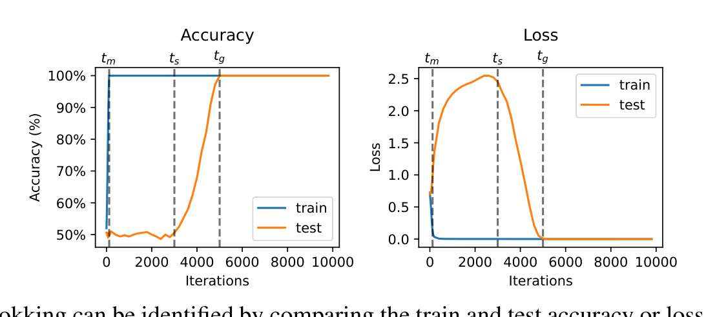
*Рисунок 1: Гроккинг можно распознать, сравнивая точность или потери на обучении и на тесте. Моменты времени:*

t0 — момент инициализации, tm — первая итерация с полной точностью на обучении, ts — начало роста тестовой точности, а tg — первая итерация с полной тестовой точностью.

«богатый» режим, где NTK уходит от своего начального состояния, что указывает на эволюцию признаков. Связь между гроккингом и динамикой обучения была недавно установлена в Kumar et al. [9], где показано, что — когда происходит гроккинг — сеть переходит от ленивой к богатой динамике.

В этой работе мы подтверждаем переход от ленивой к богатой динамике в сетях с гроккингом для задачи разреженной чётности. В частности, мы исследуем, как осмысленные (то есть обобщающие) признаки кодируются в матрице NTK по мере продвижения обучения. Мы делаем это, показывая возникновение структуры в собственных функциях NTK, которые начинают кодировать обобщающие признаки задачи, когда происходит отложенная генерализация. В более общем виде инструменты, использованные в этой работе, можно рассматривать как каркас механистической интерпретируемости для изучения обучения признаков в ходе обучения.

2. Экспериментальная постановка и аппарат NTK

В этом разделе мы введём необходимые сведения и обозначения, используемые на протяжении всей работы.

2.1. Определение задачи

i=1 — обучающая выборка, где xi ∈{0, 1}d —

Мы решаем задачу (k, d)-разреженной чётности. Пусть Dk,d = {(xi, yi)}n

Pk



бинарный вектор, а цель yi =

mod 2 — чётность первых k разрядов (чистые разряды). Заметим, что оставшиеся d −k компонент (шумные разряды) вектора xi не вносят вклада в yi. Далее, пусть X = {xi}n

l=1 xi

i=1. Наконец, пусть x ∈{0, 1}d обозначает произвольную тестовую точку.

i=1 и Y = {yi}n

2.2. Определение модели

Чтобы решить задачу, мы рассматриваем L-слойный многослойный перцептрон (MLP) равной ширины fθ(x) : Rd →R, где θ обозначает веса. Сеть обучается с помощью full-batch Adam и включает регуляризацию весов по L1-норме, так как это помогает вызвать гроккинг в данной задаче [17].

2.3. Связь нейронного касательного ядра и обучения признаков

С теоретической точки зрения, если рассматривать непрерывные обновления параметров вместо дискретных (θt+1 ←θt −η∇θtL(X, Y; θt), где L(x, y; θ) — эмпирическая потеря, эволюцию fθ можно описать уравнением градиентного потока:

∂ft(X)

∂θt

∂t = −η ˆΘt(X, X)∇ft(X)L(θ) (1)

∂t = ∇θfθ(X)

θ=θt

**[p. 3]**

ДИНАМИКА ОБУЧЕНИЯ ПРИЗНАКОВ ПРИ ГРОККИНГЕ В ЗАДАЧЕ РАЗРЕЖЕННОЙ ЧЁТНОСТИ

где ˆΘt — эмпирическое нейронное касательное ядро. В общем случае уравнение 1 трудно решить, так как ˆΘt зависит от t.

Если рассмотреть flin

t (x) := f0(x)+∇θf0(x)

θ=θ0∆t, где ∆t := θt −θ0, используя в качестве потери MSE

в роли L(x, y; θ), ОДУ в уравнении 1 имеет замкнутое решение (так как ∇θf0(x) теперь постоянна на протяжении обучения, см. Приложение 3). В частности, для произвольной тестовой точки x, flin

t (x) = µt(x) + γt(x), где

0 (I −e−µ ˆΘ0t)Y (2)

µt(x) = ˆΘ0(x, X) ˆΘ−1

0 (I −e−µ ˆΘ0t)f0(X) (3)

γt(x) = f0(x) −ˆΘ0(x, X) ˆΘ−1

Таким образом, предсказательная функция имеет решение в замкнутой форме в ходе обучения. Следуя Hu et al. [6], мы берём малую инициализацию, так что начальный выход мал (f0(x) ≈0), чтобы ещё сильнее упростить уравнение. Тогда flin

t (x) = µt. Мы будем рассматривать этот случай в дальнейших выкладках. Следовательно, flin

t (x) можно понимать как обучение ядра, то есть обучение признаков не задействовано. Если начать обучать сеть обычным образом, получить NTK в произвольной контрольной точке (t = T), а затем вычислить линеаризованную предсказательную функцию при t →∞, мы фактически заморозим обучение признаков начиная с t = T. Получающуюся предсказательную функцию тогда можно описать так:

∞(x; T) = ˆΘT (x, X) ˆΘ−1

flin

T Y (4)

где ˆΘT — NTK той контрольной точки, из которой запускается линеаризованное обучение.

2.3.1. РАЗЛОЖЕНИЕ ПО СОБСТВЕННЫМ ФУНКЦИЯМ

Очень распространённое разложение предикторов на основе ядра опирается на аппарат собственных функций. Обозначим входное распределение как x ∼pX. Собственные функции, связанные с NTK Θ : Rn × Rn, определяются через интегральное уравнение

Z

Rd Θ(x, x′)ϕ(x′)pX(x′)dx′ = ωϕ(x) (5)

где ϕ : Rn −→R — собственная функция, а ω ≥0 — соответствующее ей собственное значение. Чтобы вычислить собственные функции, нужно знать входное распределение pX, к которому у нас обычно нет доступа. Возвращаясь к нашему примеру, пусть ˆΘ(X, X) = V ΩV T с ортогональной V ∈Rn×n и диагональной Ω∈Rn×n. Мы можем построить оценку собственных функций для произвольной тестовой точки x,

n X

ˆϕi(x) = 1

Θ(x, xl)Vli (6)

ωi

l=1

Можно показать, что это даёт состоятельную оценку, то есть при росте размера выборки n выполняется ˆϕi −→ϕi поточечно. Возвращаясь к нашему предсказательному уравнению 16, мы теперь можем записать его как линейную комбинацию собственных функций,

n X

i ˆϕi(x)

flin

αt

t (x) =

i=1

i = ωi(1−e−ηωit)

Веса αi можно записать как αt

ωi vT

i Y =: γt

ivT

i Y, где vi — i-й собственный вектор. Следовательно, αt

i измеряет, насколько хорошо i-й собственный вектор выровнен с целями Y на протяжении времени.

**[p. 4]**

ДИНАМИКА ОБУЧЕНИЯ ПРИЗНАКОВ ПРИ ГРОККИНГЕ В ЗАДАЧЕ РАЗРЕЖЕННОЙ ЧЁТНОСТИ

3. Эксперименты

В этом разделе представлены результаты эксперимента, проведённого на наборе данных (3, 35)-разреженной чётности для нескольких значений seed. Остальные детали обучения можно посмотреть в Приложении B. Результаты сохраняются при разном выборе d в наборе данных (k, d)-разреженной чётности, Приложение D показывает их.

Известно, что гроккинг возникает, когда в сети появляется «правильная» структура [12, 15]. В нашем случае это происходит, когда сеть начинает сосредотачиваться на чистых разрядах (детали того, как эволюционируют веса, см. в Приложении C.1), что указывает на то, что она обучает правильные признаки. В наших экспериментах мы анализируем, как NTK показывает эволюцию обучения признаков в ходе обучения.

3.1. Обучение признаков происходит поздно в ходе обучения

Поскольку обучение модели до t = T с последующим рассмотрением линеаризованной версии предсказательной функции останавливает обучение признаков начиная с t = T, мы можем оценить качество признаков, выученных до этой контрольной точки, с помощью Уравнения 4. Кроме того, если матрицы NTK в двух разных контрольных точках похожи, это позволяет предположить, что истинная траектория оптимизации в ходе обучения близко следует линеаризованному приближению, что указывает на то, что сеть близка к ленивому режиму. Как предлагают Fort et al. [5] и Tsilivis and Kempe [21], мы используем метрику Central Kernel Alignment (CKA):

d(K1, K2) = 1 − Tr(K1KT

2 ) q

Tr(K1KT

1 )Tr(K2KT 2 )

###### p4-11

Рисунки 2 (c) и (d) позволяют предположить, что качество признаков начинает расти после ts и, следовательно, что внезапный рост обобщения обусловлен тем, что сеть начинает обучать осмысленные признаки. Это подтверждается на рисунке 2 (e): NTK слегка меняется до tm, а затем входит в ленивый режим (где, в квадрате 1, оно не меняется вовсе). Как показано в квадрате 2, после ts ядро начинает меняться, что указывает на переход от ленивого режима к богатому режиму обучения признаков. Это изменение продолжается до момента чуть позже tg, а затем стабилизируется, как показано в квадрате 3.

Расстояние между ядрами

tg

tm ts tg

tm tm

ts

100%

Точность (%)

обучение тест

0.25

Потери

75%

обучение тест

0.20

50%

ts

Итерации

0 2k 4k 6k 8k 10k

0 2k 4k 6k 8k 10k

0.15

(a)

(b)

Точность NTK (%)

0.10

100%

tg

обучение тест

0.7

Потери NTK

75%

0.05

обучение тест

0.6

50%

0.5

0.00

0 2k 4k 6k 8k 10k Итерации

0 2k 4k 6k 8k 10k Итерации

0 2000 4000 6000 8000 9800 Итерации

(c)

(d)

(e)

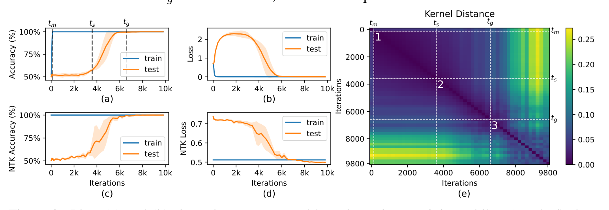
*Рисунок 2: Графики (a) и (b) показывают точность и потери на протяжении обучения, а (c) и (d) показывают*

эволюцию точности и потерь при использовании Уравнения 4 для этих контрольных точек. Все четыре графика показывают среднее по нескольким значениям seed и их дисперсию. График (e) показывает среднее (по значениям seed) CKA между NTK, связанными со всеми контрольными точками. Заметим, что ключевые контрольные точки определяются по (a), но (e) включает их, чтобы облегчить его интерпретацию.

Следовательно, быстрый рост обобщения происходит, когда сеть входит в богатый режим обучения признаков, то есть когда динамика обучения расходится с линеаризованной версией, как утверждают

**[p. 5]**

ДИНАМИКА ОБУЧЕНИЯ ПРИЗНАКОВ ПРИ ГРОККИНГЕ В ЗАДАЧЕ РАЗРЕЖЕННОЙ ЧЁТНОСТИ

###### p5-2

Kumar et al [9]. Соответственно, этот эксперимент подтверждает их утверждения, распространяя анализ на неограниченную постановку (задача разреженной чётности) и дополняя их изучением эволюции NTK для понимания обучения признаков на протяжении обучения.

3.2. Признаки закодированы в NTK

В этом разделе мы исследуем NTK в t0, tm, ts, tg, чтобы понять, как оно кодирует признаки (определение моментов времени см. на Рисунке 1).

Чтобы понять, какие собственные функции существенны для задачи классификации, мы вычислили точность NTK, накапливая собственные функции постепенно при расчёте предсказательной функции, то есть flin

###### p5-6

j=1 αj ˆϕj(x). Рисунки 3 (a) и (b) показывают накопленную точность в зависимости от числа использованных собственных функций. Видно, что по мере того, как сеть обобщает, в собственных функциях возникает структура: первые из них и те, что расположены около 35, заметно повышают точность. По-видимому, эти собственные функции (и, следовательно, некоторая часть NTK) кодируют ценную информацию, релевантную задаче обучения разреженной чётности. В других экспериментах мы наблюдали, что изменение числа входных признаков d также сдвигает индекс релевантных собственных значений к d.

i (x) = Pi

(a) Накопл. точность на обучающей выборке

(b) Накопл. точность на тестовой выборке

(c) Порождающая способность собственных функций

100%

50%

100%

Порожд. способность (%)

90%

40%

90%

Точность (%)

Точность (%)

80%

80%

30%

t0

70%

70%

20%

60%

60%

10%

50%

50%

0 100 200 300 400 500 0%

0 100 200 300 400 500

0 100 200 300 400 500

100%

50%

100%

Порожд. способность (%)

90%

40%

90%

Точность (%)

Точность (%)

80%

30%

80%

tm

70%

70%

20%

60%

60%

10%

50%

0 100 200 300 400 500 50%

0 100 200 300 400 500 0%

0 100 200 300 400 500

100%

50%

100%

Порожд. способность (%)

90%

40%

90%

Точность (%)

Точность (%)

80%

30%

80%

ts

70%

70%

20%

60%

60%

10%

0 100 200 300 400 500 50%

0 100 200 300 400 500 50%

0 100 200 300 400 500 0%

50%

50% 60% 70% 80% 90% 100%

100%

Порожд. способность (%)

40%

90%

Точность (%)

Точность (%)

80%

30%

tg

70%

20%

60%

10%

50%

0%

0 100 200 300 400 500 Индекс (i)

0 100 200 300 400 500 Индекс (i)

0 100 200 300 400 500 Индекс (i)

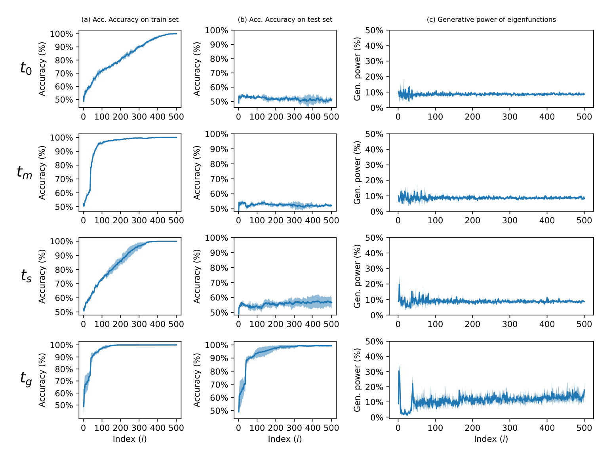
*Рисунок 3: Эволюция точности и потерь на обучении и на тесте на протяжении обучения и NTK*

связанного с этой контрольной точкой весов, согласно уравнению 4.

**[p. 6]**

ДИНАМИКА ОБУЧЕНИЯ ПРИЗНАКОВ ПРИ ГРОККИНГЕ В ЗАДАЧЕ РАЗРЕЖЕННОЙ ЧЁТНОСТИ

Чтобы визуализировать признаки, закодированные в этих важных собственных функциях, мы используем карты значимости, определяемые как si(X) = 1

j=1 ∇xL(ˆϕi(xj), yj) ∈Rd [16, 19]. Карты значимости показывают чувствительность потери к изменениям каждого разряда для каждой собственной функции. Усредняя их по всем обучающим примерам, мы получаем более устойчивое приближение, пользуясь тем, что чистые разряды расположены одинаково в каждом примере из X.

Pn

n

Мы также разработали метрику (порождающая способность, g), призванную количественно оценить обобщающую силу собственной функции по доле её карты значимости, сосредоточенной на чистых разрядах:

P j = 1k [si(x)]j

gi =

Pd

j=1 [si(x)]j

где [si(x)]j — j-й разряд si(x). Рисунок 3 (c) иллюстрирует, как собственные функции проявляют возникающую структуру по мере того, как в сети происходит обобщение. Первые собственные функции сосредотачиваются на чистых разрядах, тогда как последующие устойчиво сосредотачиваются на шумных разрядах (порождающая способность близка к 0%). Начиная с d-й собственной функции небольшое число собственных функций снова сосредотачивается только на чистых разрядах. Визуализацию исходных карт значимости см. в Приложении C.2. Это служит объяснением того, почему эти собственные функции повышают точность.

Последнее наблюдение состоит в том, что, по-видимому, существует минимальное число собственных функций, необходимое сети для эффективного обобщения. Рисунок 4 иллюстрирует, что число собственных функций, нужное для 99% точности на обучающей выборке, уменьшается на протяжении обучения. По мере того как сеть достигает хорошего качества обобщения, оно сходится к минимуму. Это позволяет предположить наличие критического порога числа собственных функций, необходимого для захвата существенных признаков набора данных и обеспечения успешного обобщения сетью.

tm ts tg Число собственных функций, необходимое для 99% точности на тестовой выборке

Собственные функции

0 2000 4000 6000 8000 10000 Итерации

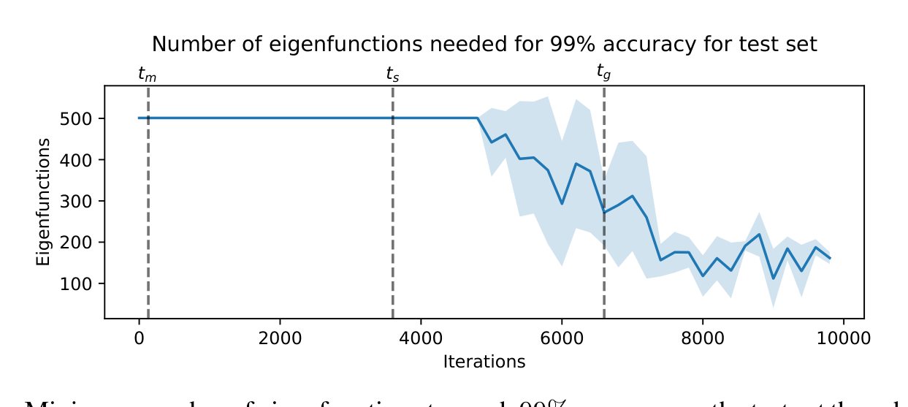
*Рисунок 4: Минимальное число собственных функций для достижения 99% точности на тестовой выборке на протяжении обучения.*

Число, по-видимому, сходится в некоторый момент обучения (после tg). Заметим, что этот график можно рассматривать как сводку Рисунка 3 (b).

Этот подход даёт интерпретацию механизма, управляющего изменением NTK, через рассмотрение эволюции его собственных функций на протяжении процесса обучения. Отслеживая, как меняются эти собственные функции, мы получаем представление о динамике обучения признаков в сети.

**[p. 7]**

ДИНАМИКА ОБУЧЕНИЯ ПРИЗНАКОВ ПРИ ГРОККИНГЕ В ЗАДАЧЕ РАЗРЕЖЕННОЙ ЧЁТНОСТИ

4. Заключение

Наше исследование проливает свет на механизм, лежащий в основе гроккинга в глубоких нейронных сетях, в контексте задач разреженной чётности. Наши выводы согласуются с Kumar et al. [9], где гроккинг приписывается переходу сети от ленивого режима (близкого к её линеаризации) к режиму обучения признаков. В этом контексте наш анализ также раскрывает возникновение структурированных собственных функций, что указывает на приобретение существенных признаков, критически важных для обобщения. Опираясь на карты значимости и разработанную метрику (порождающую способность), мы демонстрируем, как эти собственные функции эволюционируют: ранние сосредотачиваются на чистых разрядах, а поздние захватывают шумные разряды. Наши выводы дают представление о развитии динамики обучения и о кодировании релевантной задаче информации.

В целом наше исследование собирает несколько техник для анализа NTK на протяжении обучения, предлагая каркас механистической интерпретируемости, который можно использовать для понимания динамики обучения признаков во время обучения нейронной сети.

**[p. 8]**

FEATURE LEARNING DYNAMICS UNDER GROKKING IN A SPARSE PARITY TASK

## Литература

[1] Devansh Arpit, Stanisław Jastrzundefinedbski, Nicolas Ballas, David Krueger, Emmanuel

Bengio, Maxinder S. Kanwal, Tegan Maharaj, Asja Fischer, Aaron Courville, Yoshua Bengio, and Simon Lacoste-Julien. A closer look at memorization in deep networks. In Proc. of the International Conf. on Machine Learning, 2017. URL https://dl.acm.org/doi/ 10.5555/3305381.3305406.

[2] Boaz Barak, Benjamin L. Edelman, Surbhi Goel, Sham M. Kakade, Eran Malach, and Cyril

Zhang. Hidden progress in deep learning: SGD learns parities near the computational limit. In Advances in Neural Information Processing Systems, 2022. URL https://openreview. net/forum?id=8XWP2ewX-im.

[3] Lenaic Chizat, Edouard Oyallon, and Francis Bach. On lazy training in differentiable pro-

gramming. In Advances in neural information processing systems, 2019. URL https: //dl.acm.org/doi/abs/10.5555/3454287.3454551.

[4] Jacob Devlin, Ming-Wei Chang, Kenton Lee, and Kristina Toutanova. Bert: Pre-training of deep bidirectional transformers for language understanding. In North American Chapter of the Association for Computational Linguistics, 2019. URL https://api. semanticscholar.org/CorpusID:52967399.

[5] Stanislav Fort, Gintare Karolina Dziugaite, Mansheej Paul, Sepideh Kharaghani, Daniel M Roy, and Surya Ganguli. Deep learning versus kernel learning: an empirical study of loss landscape geometry and the time evolution of the neural tangent kernel. In Advances in Neural Information Processing Systems, 2020. URL https://proceedings.neurips.cc/paper_files/paper/2020/file/ 405075699f065e43581f27d67bb68478-Paper.pdf.

[6] Wei Hu, Zhiyuan Li, and Dingli Yu. Simple and effective regularization methods for training

on noisily labeled data with generalization guarantee. In International Conf. on Learning Representations, 2020. URL https://openreview.net/forum?id=Hke3gyHYwH.

[7] Arthur Jacot, Franck Gabriel, and Cl´ement Hongler. Neural Tangent Kernel: convergence and

generalization in neural networks. In Advances in Neural Information Processing Systems, 2018. URL https://proceedings.neurips.cc/paper_files/paper/2018/ file/5a4be1fa34e62bb8a6ec6b91d2462f5a-Paper.pdf.

[8] Alex Krizhevsky, Ilya Sutskever, and Geoffrey E Hinton. Imagenet classification with deep

convolutional neural networks. In Advances in Neural Information Processing Systems, 2012. URL https://proceedings.neurips.cc/paper_files/paper/2012/ file/c399862d3b9d6b76c8436e924a68c45b-Paper.pdf.

[9] Tanishq Kumar, Blake Bordelon, Samuel J. Gershman, and Cengiz Pehlevan. Grokking as the

transition from lazy to rich training dynamics. In International Conf. on Learning Representations, 2024. URL https://openreview.net/forum?id=vt5mnLVIVo.

[10] Jaehoon Lee, Lechao Xiao, Samuel S Schoenholz, Yasaman Bahri, Roman Novak, Jascha

Sohl-Dickstein, and Jeffrey Pennington. Wide neural networks of any depth evolve as linear

**[p. 9]**

FEATURE LEARNING DYNAMICS UNDER GROKKING IN A SPARSE PARITY TASK

models under gradient descent. Journal of Statistical Mechanics: Theory and Experiment, 2020. URL http://dx.doi.org/10.1088/1742-5468/abc62b.

[11] Ziming Liu, Eric J Michaud, and Max Tegmark. Omnigrok: Grokking beyond algorithmic data. In International Conf. on Learning Representations, 2023. URL https:// openreview.net/forum?id=zDiHoIWa0q1.

[12] William Merrill, Nikolaos Tsilivis, and Aman Shukla. A tale of two circuits: Grokking as

competition of sparse and dense subnetworks, 2023. URL https://arxiv.org/abs/ 2303.11873.

[13] Jack William Miller, Charles O’Neill, and Thang D Bui. Grokking beyond neural networks:

An empirical exploration with model complexity. Transactions on Machine Learning Research, 2024. URL https://openreview.net/forum?id=ux9BrxPCl8.

[14] Shikhar Murty, Pratyusha Sharma, Jacob Andreas, and Christopher Manning. Grokking of

hierarchical structure in vanilla transformers. In Proc. of the Annual Meeting of the Association for Computational Linguistics, 2023. URL https://aclanthology.org/2023. acl-short.38.

[15] Neel Nanda, Lawrence Chan, Tom Lieberum, Jess Smith, and Jacob Steinhardt. Progress

measures for grokking via mechanistic interpretability. In International Conf. on Learning Representations, 2023. URL https://openreview.net/forum?id=9XFSbDPmdW.

[16] Yeat Jeng Ng, Ainhize Barrainkua, and Novi Quadrianto. Understanding and addressing spurious correlation via neural tangent kernels: A spectral bias perspective, 2024. URL https://openreview.net/forum?id=89AOrk05uy.

[17] Adam Pearce, Asma Ghandeharioun, Nada Hussein, Nithum Thain, Martin Wattenberg, and

Lucas Dixon. Do machine learning models memorize or generalize. People+ AI Research, 2023. URL https://pair.withgoogle.com/explorables/grokking/.

[18] Alethea Power, Yuri Burda, Harri Edwards, Igor Babuschkin, and Vedant Misra. Grokking:

Generalization beyond overfitting on small algorithmic datasets, 2022. URL https:// arxiv.org/abs/2201.02177.

[19] Karen Simonyan, Andrea Vedaldi, and Andrew Zisserman. Deep inside convolutional net-

works: Visualising image classification models and saliency maps. Computing Research Repository (CoRR), abs/1312.6034, 2013. URL https://api.semanticscholar. org/CorpusID:1450294.

[20] Dashiell Stander, Qinan Yu, Honglu Fan, and Stella Biderman. Grokking group multiplication

with cosets. In Proc. of the International Conf. on Machine Learning, 2024. URL https: //openreview.net/pdf?id=hcQfTsVnBo.

[21] Nikolaos Tsilivis and Julia Kempe. What can the neural tangent kernel tell us about adversarial

robustness? In Alice H. Oh, Alekh Agarwal, Danielle Belgrave, and Kyunghyun Cho, editors, Advances in Neural Information Processing Systems, 2022. URL https://openreview. net/forum?id=KBUgVv8z7OA.

**[p. 10]**

FEATURE LEARNING DYNAMICS UNDER GROKKING IN A SPARSE PARITY TASK

[22] Zhiwei Xu, Yutong Wang, Spencer Frei, Gal Vardi, and Wei Hu. Benign overfitting and grokking in ReLU networks for XOR cluster data. In International Conf. on Learning Representations, 2024. URL https://openreview.net/pdf?id=BxHgpC6FNv.

[23] Chiyuan Zhang, Samy Bengio, Moritz Hardt, Benjamin Recht, and Oriol Vinyals. Understand-

ing deep learning (still) requires rethinking generalization. Commun. ACM, 64(3):107–115, feb 2021. URL https://doi.org/10.1145/3446776.

**[p. 11]**

FEATURE LEARNING DYNAMICS UNDER GROKKING IN A SPARSE PARITY TASK

Приложение A. Определения и расширение математических выкладок

В этом приложении расширяются определения и подробнее излагаются математические выкладки, использованные в основном тексте. Сначала мы вводим набор данных и модель, которые используем. Затем выводим уравнения его Neural Tangent Kernel (NTK).

A.1. Набор данных

В задаче разреженной чётности цель состоит в вычислении чётности k разрядов внутри d-битного числа, где k ≤d. Было показано, что градиентные методы плохо справляются с обучением чётностям. В большинстве работ применяется подход с благоприятными предположениями о распределении входов. Тем не менее мы намеренно следуем работе на примере [2], чтобы не упрощать задачу. Введём сначала понятие (d, S)-функции чётности, чтобы затем определить набор данных, который мы используем во всех экспериментах.

Определение 1 (d, S)-функция чётности

Для натурального числа d и подмножества 1 S ⊆[d], пусть fS(x) — это (d, S)-функция чётности, fS : {0, 1}d →{0, 1}, которая берёт d-разрядное двоичное число x и проверяет, нечётно ли количество единиц в индексе разрядов из S. То есть,

X

!

xi

fS(x) =

mod 2 (7)

i∈S

где xi — i-й разряд x.

Не ограничивая общности, в этой работе мы изучаем чётность в первых k разрядах задачи. Поэтому S = {1, 2, . . . , k} (k ∈N, k ≤d). Тогда мы можем определить (d, k)-функцию чётности fk : {0, 1}d →{0, 1} как:

k X

!

xi

fk(x) =

mod 2 (8)

i=1

Определение 2 Набор данных разреженной чётности

Пусть набор данных разреженной чётности D(d,k) = {(xi, yi)B} из n обучающих примеров и ntest тестовых примеров (B = n + ntest) — это набор данных, где xi берётся из Unif({0, 1}d), а yi = fk(xi). Мы обозначаем X = [x1, . . . , xn] ∈Rn×d как матрицу всех обучающих данных, а Y = [y1, . . . , yn] ∈Rd — как вектор всех обучающих меток. X — это любое подмножество тестовых данных (включая полные тестовые данные).

1. Мы считаем [d] надмножеством множеств из не более чем d элементов, содержащих некоторые натуральные числа от 1 до d без повторений.

**[p. 12]**

FEATURE LEARNING DYNAMICS UNDER GROKKING IN A SPARSE PARITY TASK

A.2. Модель

Для решения задачи мы обучаем нейронную сеть (NN), мы рассматриваем L-слойный MLP вида fθ(x) : Rd →R, который можно определить рекурсивно как:

fθ(x) = z(L) = 1 √mL

θ(L)x(L−1)

z(l) = 1 √ml

θ(l)x(l−1) −−→x(l) = σ



z(l)

где θ = {θ(l), ∀l = 1, . . . , n} — обучаемые веса. θ(l) = [θ(l)

1 , . . . , θ(l) ml] ∈Rml×ml−1

для l = 1, . . . , L−1 — веса скрытых слоёв, а θ(L) = [θ(L)

1 , . . . , θ(L)

mL] ∈RmL — веса классификационного слоя, все инициализированы как θ(l)

ij ∼N(0, σinit). σ(x) — функция ReLU. Мы полагаем, что ml = m, ∀l, и можем считать m0 = d.

Сеть обучается с помощью full-batch градиентного спуска. С небольшим злоупотреблением обозначениями (θt′ = θ

t=t′ и ft′ — соответствующая функция), правило обновления весов на каждой итерации имеет вид2

θt+1 ←θt −η∇θtL(X, Y; θt) (9)

где L(x, y; θ) — эмпирическая функция потерь, определяемая как

m X

L(θ) = L(x, y; θ) = 1

l(fθ(xi), yi) + λ1∥θ∥1 + λ2∥θ∥2 (10)

m

i=1

A.3. Neural Tangent Kernel

С теоретической точки зрения, если вместо дискретных обновлений параметров, как в уравнении 9, рассмотреть непрерывное обновление, то эволюцию весов NN можно описать дифференциальным уравнением градиентного потока.

∂θt

∂t = −η∇θL(θ)

θ=θt

(11)

T



= −η

∇θfθ(X)

∇ft(X)L(θ)

θ=θt

Тогда,

∂ft(X)

∂θt

∂t = ∇θfθ(X)

∂t

θ=θt

T



(12)

= −η∇θfθ(X)

∇θfθ(X)

∇ft(X)L(θ)

θ=θt

θ=θt

= −η ˆΘt(X, X)∇ft(X)L(θ)

2. Мы экспериментировали с небольшими вариациями правила обновления оптимизатора, включая член импульса и использование оптимизатора Adam. Однако мы решили не включать сюда конкретные формулы, поскольку они не существенны для наших основных целей.

**[p. 13]**

FEATURE LEARNING DYNAMICS UNDER GROKKING IN A SPARSE PARITY TASK

где ˆΘt — эмпирическое ядро Neural Tangent Kernel

Определение 3 Эмпирическое ядро Neural Tangent Kernel обучающих данных (e-NTK) e-NTK ( ˆΘt ∈ Rn×n) — это скалярное произведение градиентов, вычисленных в x1 и x2, при сети, зафиксированной в θ = θt

T



ˆΘt(x1, x2) := ∇θfθ(x1)

∇θfθ(x2)

θ=θt

θ=θt

Уравнение 12 трудно решить, поскольку ˆΘt зависит от t. Тем не менее существует два приближения, упрощающих вычисления. В этой работе мы сосредоточиваемся на рассмотрении линеаризованной версии сети, но уравнение 12 можно также решить, считая сеть бесконечно широкой (m →∞).

A.3.1. ЛИНЕАРИЗОВАННАЯ СЕТЬ

Рассмотрим приближение Тейлора первого порядка для предсказательной функции нейронной сети:

flin

t (x) := f0(x) + ∇θf0(x)

θ=θ0∆t

где ∆t := θt −θ0. Тогда уравнения 11 и 12 упрощаются до:

∂∆t

∂t = −η∇θf0(X)∇flin

t (X)L(θ) (13)

∂flin

t (X) ∂t = −η ˆΘ0(X, X)∇flin

t (X)L(θ) (14)

Поскольку ∇θf0(x) (а следовательно, и ˆΘ0) постоянно на протяжении обучения, при использовании функции потерь MSE это ОДУ имеет решение в замкнутой форме:

t (X) = (I −e−µ ˆΘ0t)Y + e−µ ˆΘ0tf0(X) (15)

flin

считая ˆΘ0 = ˆΘ0(X, X). Для произвольной тестовой точки x, проделав те же теоретические выкладки, flin

t (x) = µt(x) + γt(x), где

0 (I −e−µ ˆΘ0t)Y (16)

µt(x) = ˆΘ0(x, X) ˆΘ−1

0 (I −e−µ ˆΘ0t)f0(X) (17)

γt(x) = f0(x) −ˆΘ0(x, X) ˆΘ−1

Заметим, что тогда эволюция нейронной сети в ходе обучения также имеет решение в замкнутой форме, и в конце обучения (t →∞) предсказательная функция равна

∞(x) = ˆΘ0(x, X) ˆΘ−1

flin

0 (Y −f0(X)) + f0(x) (18)

Далее, аналогично Hu et al. [6], мы будем рассматривать случай, когда мы инициализируем параметры сети так, что f0(x) ≈0 (σinit мало). Поэтому:

**[p. 14]**

FEATURE LEARNING DYNAMICS UNDER GROKKING IN A SPARSE PARITY TASK

0 (I −e−µ ˆΘ0t)Y (19)

t (x) = µt(x) = ˆΘ0(x, X) ˆΘ−1

flin

∞(x) = ˆΘ0(x, X) ˆΘ−1

flin

## 0 Y (20)

Заметим, что эти уравнения имеют форму алгоритма ядрового обучения с преобразованием входов, задаваемым Neural Tangent Kernel. Следовательно, в линеаризованной нейронной сети обучение признаков в модели отсутствует. Соответственно, это полезный инструмент для теоретического изучения динамики обучения NN, но он также лишает NN значительной части их мощи.

**[p. 15]**

FEATURE LEARNING DYNAMICS UNDER GROKKING IN A SPARSE PARITY TASK

Приложение B. Детали экспериментов

В этом разделе мы излагаем детали экспериментов для воспроизводимости результатов. Гроккинг устойчиво проявляется в задаче разреженной чётности, выбор гиперпараметров обучения делался исключительно из соображений времени, чтобы гроккинг наступал раньше в ходе обучения.

Мы используем набор данных разреженной чётности D(d,k) = {(xi, yi)B} с 500 обучающими и 500 тестовыми примерами. xi выбираются так, чтобы примеры не повторялись ни в одном из B = 1000 примеров: xi̸ = xj ∀i̸ = j. k = 3 фиксировано, а d = 10 варьируется. В основном тексте показаны только результаты для k = 3 и d = 30, но другие результаты можно посмотреть в D .

Сеть, используемая для решения задачи, имеет глубину L = 2 и ширину m = 64. Ни в одном из слоёв не используется член смещения. Веса инициализируются согласно нормальному распределению с σinit = 1 (θ(l)

ij ∼N(0, 1)).

В качестве оптимизатора использовался full-batch Adam с learning rate µ = 0.03 и (β1, β2) = (0.9, 0.999) поверх функции потерь binary cross-entropy с членом l1-регуляризации по весам λ1 = 10−3.

**[p. 16]**

FEATURE LEARNING DYNAMICS UNDER GROKKING IN A SPARSE PARITY TASK

Приложение C. Дополнительные результаты

В этом разделе приводятся дополнительные результаты к показанным в основном тексте для набора данных (3, 35)−разреженной чётности с экспериментальной постановкой, описанной в B.

C.1. Возникновение структуры в весах сети

Веса скрытого слоя в t0

Веса скрытого слоя в tm

0 5 10 15 20 25 30

0 5 10 15 20 25 30

Веса скрытого слоя в ts

Веса скрытого слоя в tg

7.5

5.0

2.5

0.0

2.5

5.0

7.5

10.0

0 5 10 15 20 25 30

0 5 10 15 20 25 30

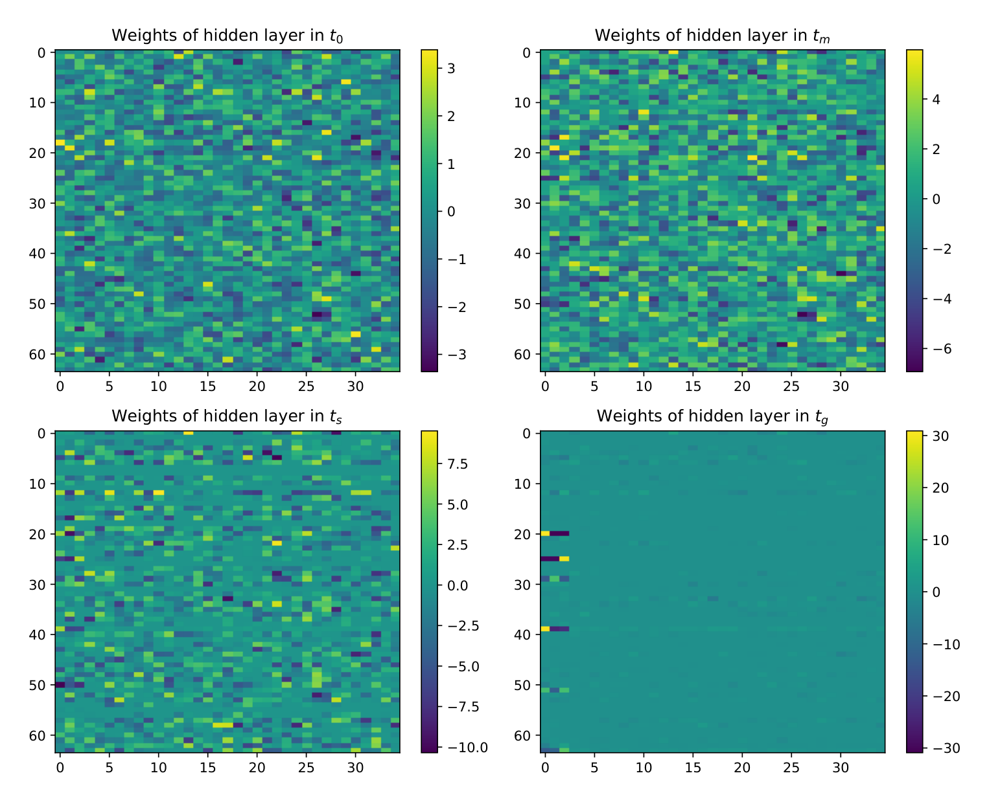
*Рисунок 5: Эволюция весов первого слоя 2-слойного MLP. Каждое изображение представляет*

W (1) ∈Rm×d для разных временных шагов обучения. Веса постепенно фокусируются на первых трёх разрядах (чистые разряды).

Как видно, обобщение происходит потому, что сеть начинает фокусироваться на чистых разрядах. Тем не менее в период запоминания (t = [tm, ts]) эта структура, по-видимому, не возникает. Примечательно, что масштаб весов возрастает от t0 к tm. Это увеличение масштаба вносит вклад в рост функции потерь во время фазы запоминания. Более того, логиты функции также возрастают по масштабу из-за этого масштабирования весов.

**[p. 17]**

FEATURE LEARNING DYNAMICS UNDER GROKKING IN A SPARSE PARITY TASK

C.2. Визуализация генеративной силы

В этом разделе мы показываем карты значимости, использованные для вычисления метрики генеративной силы.

1.0

0.8

0.6

t0

Разряд

0.4

0.2

0.0

0 5 10 15 20 25 30 Индекс (i)

1.0

0.8

0.6

tm

Разряд

0.4

0.2

0.0

0 5 10 15 20 25 30 Индекс (i)

1.0

0.8

0.6

ts

Разряд

0.4

0.2

0.0

0 5 10 15 20 25 30 Индекс (i)

1.0

0.8

0.6

tg

Разряд

0.4

0.2

0.0

0 5 10 15 20 25 30 Индекс (i)

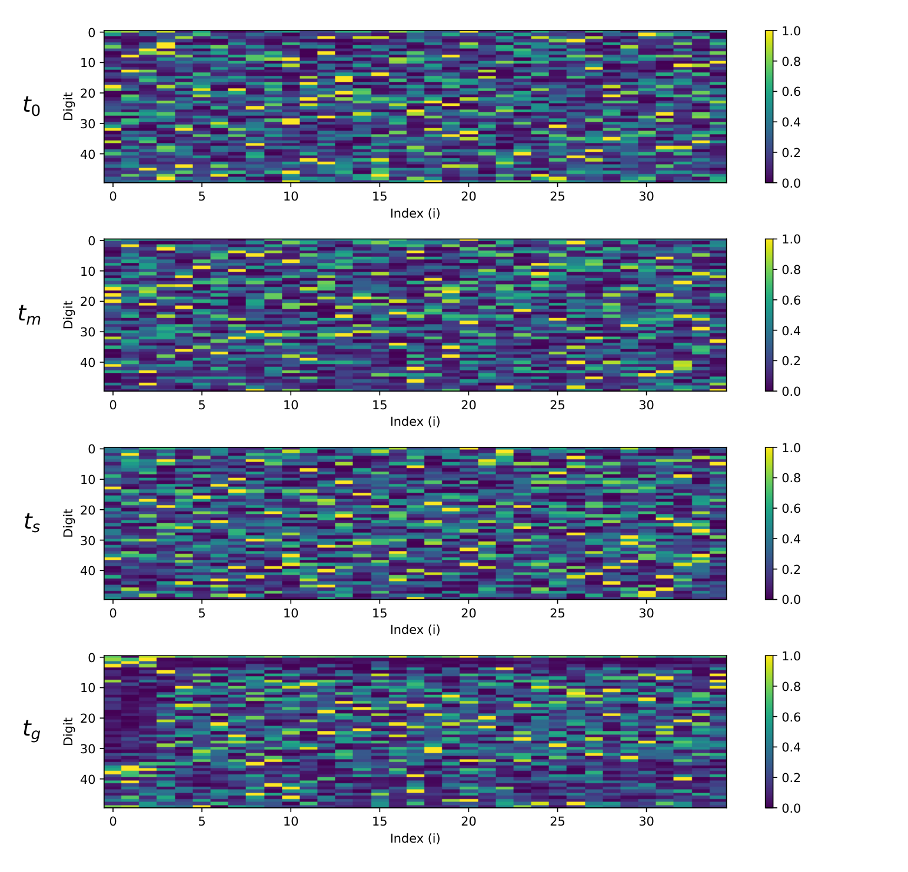
*Рисунок 6: Нормированная карта значимости первых 50 собственных функций по отношению к функции потерь*

j=1 ∇xL(ˆϕi(xj), yj). Строки обозначают индекс собственной функции (i). Наибольшее значение каждой строки отображается в 1, наименьшее — в 0, остальные интерполируются.

Pn

si(X) = 1

n

Как можно также заключить по метрике генеративной силы (см. Рисунок 3), первые собственные функции по мере обучения концентрируют свою карту значимости только на первых 3 разрядах (чистые разряды). Следующие 32 собственные функции фокусируются только на шумных разрядах. А примерно около 35-й собственной функции они снова фокусируются только на чистых разрядах.

**[p. 18]**

FEATURE LEARNING DYNAMICS UNDER GROKKING IN A SPARSE PARITY TASK

Приложение D. Результаты для других значений d

D.1. 3 чистых разряда и 30 шумных

Расстояние между ядрами

tg

tm ts tg

tm tm

ts

100%

Точность (%)

обучение тест

0.20

Потери

75%

обучение тест

ts

0.15

50%

0 2k 4k 6k 8k 10k 0

Итерации

0 2k 4k 6k 8k 10k

(a)

(b)

0.10

Точность NTK (%)

0.8

100%

обучение тест

Потери NTK

tg

0.05

75%

обучение тест

0.6

50%

0.00

0 2k 4k 6k 8k 10k Итерации

0 2k 4k 6k 8k 10k Итерации

0 2000 4000 6000 8000 9800 Итерации

(c)

(d)

(e)

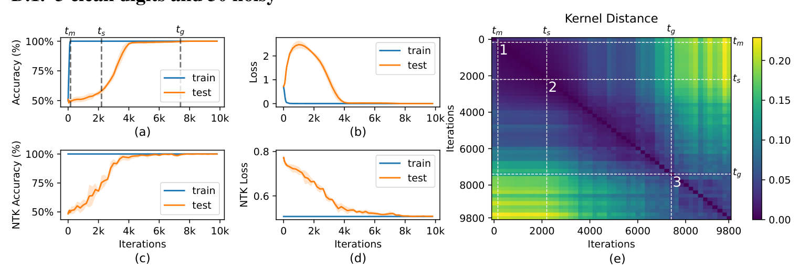
*Рисунок 7: Метрики обучения и эволюция NTK в ходе обучения для набора данных (3, 30)-разреженной чётности.*

Остальная часть экспериментальной постановки идентична описанной в B.

(a) Acc. Точность на обучающем наборе

(b) Acc. Точность на тестовом наборе

(c) Генеративная сила собственных функций

100%

50%

100%

Ген. сила (%)

90%

40%

90%

Точность (%)

Точность (%)

80%

80%

30%

t0

70%

70%

20%

60%

60%

10%

50%

50%

0 100 200 300 400 500 0%

0 100 200 300 400 500

0 100 200 300 400 500

100%

50%

100%

Ген. сила (%)

90%

40%

90%

Точность (%)

Точность (%)

80%

80%

30%

tm

70%

70%

20%

60%

60%

10%

50%

50%

0 100 200 300 400 500 0%

0 100 200 300 400 500

0 100 200 300 400 500

100%

50%

100%

Ген. сила (%)

90%

40%

90%

Точность (%)

Точность (%)

80%

80%

30%

ts

70%

70%

20%

60%

60%

10%

50%

50%

0 100 200 300 400 500 0%

0 100 200 300 400 500

0 100 200 300 400 500

50%

50% 60% 70% 80% 90% 100%

50% 60% 70% 80% 90% 100%

Ген. сила (%)

40%

Точность (%)

Точность (%)

30%

tg

20%

10%

0%

0 100 200 300 400 500 Индекс (i)

0 100 200 300 400 500 Индекс (i)

0 100 200 300 400 500 Индекс (i)

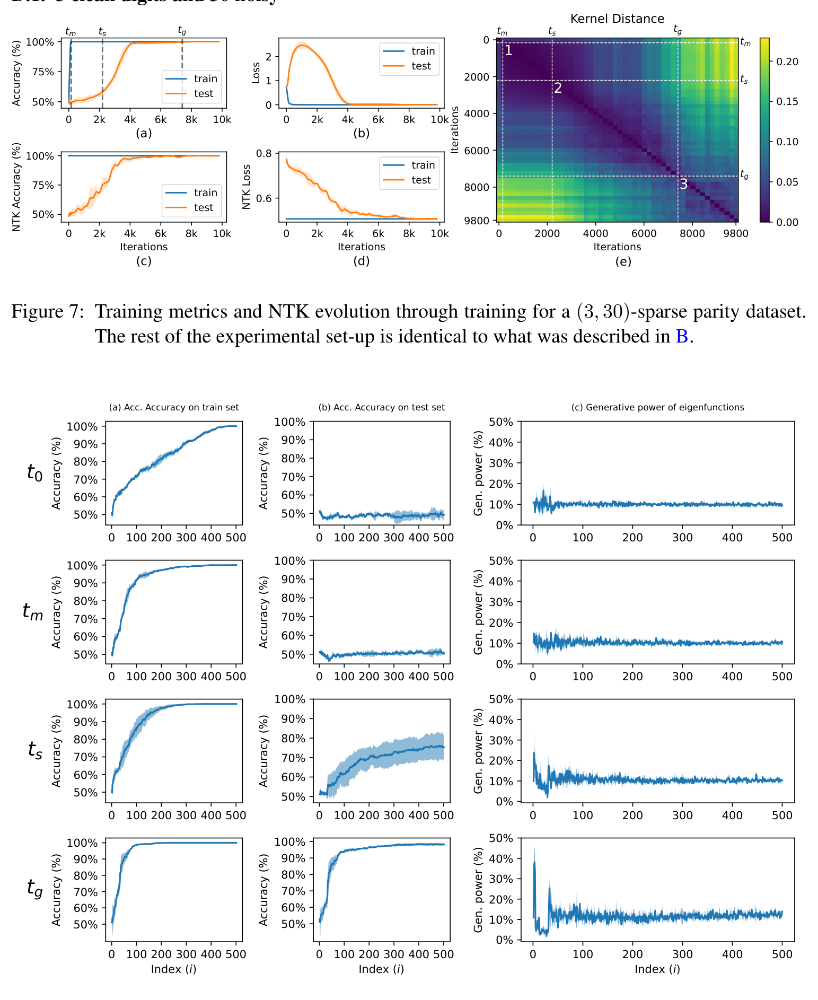
*Рисунок 8: Накопительная точность и генеративная сила каждой собственной функции для набора данных (3, 30)-разреженной*

чётности. Остальная часть экспериментальной постановки идентична описанной в B.

**[p. 19]**

FEATURE LEARNING DYNAMICS UNDER GROKKING IN A SPARSE PARITY TASK

1.0

0.8

0.6

t0

Разряд

0.4

0.2

0.0

0 5 10 15 20 25 Индекс (i)

1.0

0.8

0.6

tm

Разряд

0.4

0.2

0.0

0 5 10 15 20 25 Индекс (i)

1.0

0.8

0.6

ts

Разряд

0.4

0.2

0.0

0 5 10 15 20 25 Индекс (i)

1.0

0.8

0.6

tg

Разряд

0.4

0.2

0.0

0 5 10 15 20 25 Индекс (i)

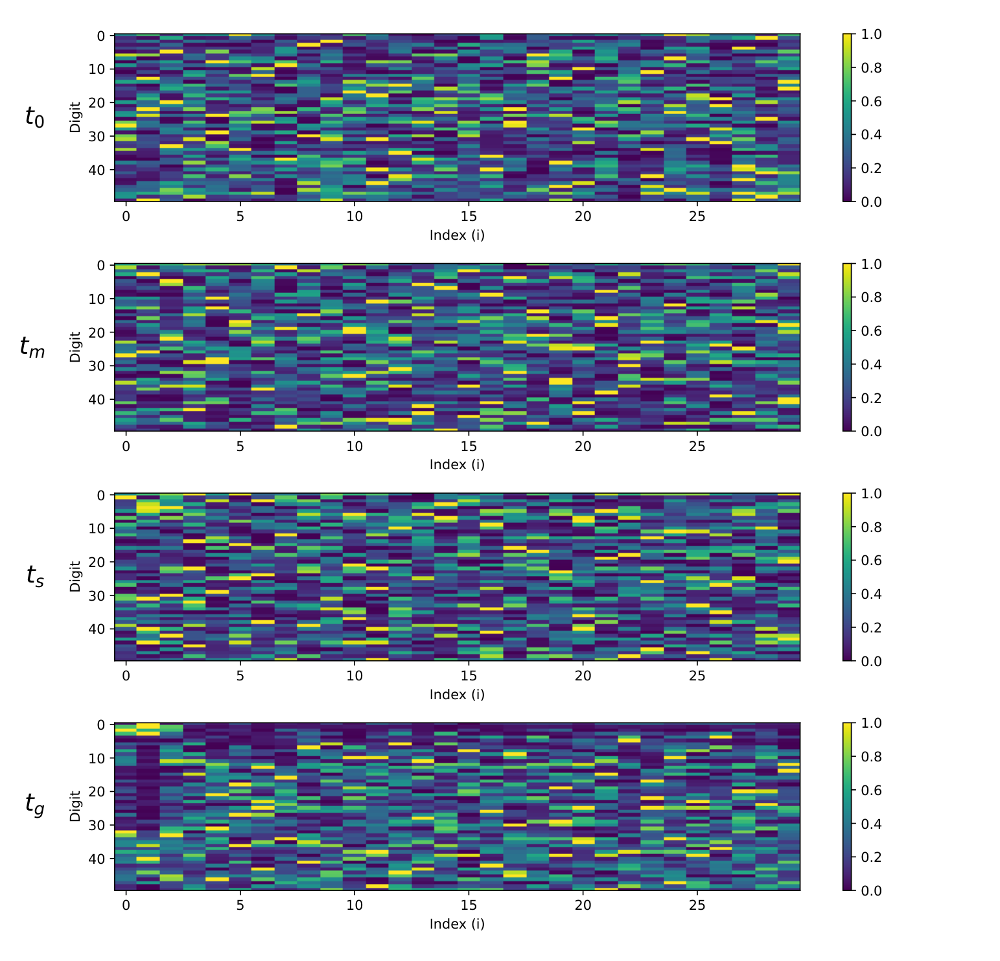
*Рисунок 9: Накопительная точность и генеративная сила для каждой для набора данных (3, 30)-разреженной чётности.*

Остальная часть постановки идентична описанной в B.

**[p. 20]**

FEATURE LEARNING DYNAMICS UNDER GROKKING IN A SPARSE PARITY TASK

Веса скрытого слоя в t0

Веса скрытого слоя в tm

0 5 10 15 20 25

0 5 10 15 20 25

Веса скрытого слоя в ts

Веса скрытого слоя в tg

0 5 10 15 20 25

0 5 10 15 20 25

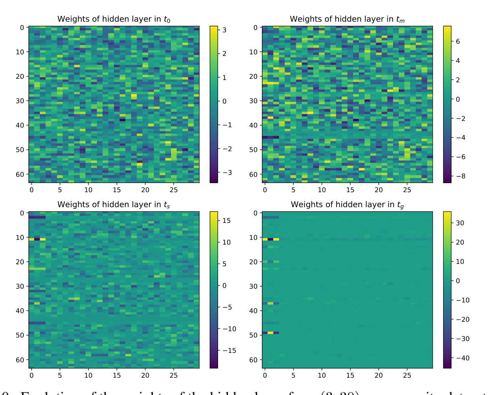
*Рисунок 10: Эволюция весов скрытого слоя для набора данных (3, 30)-разреженной чётности. Остальная*

часть постановки идентична описанной в B.

tm ts tg Число собственных функций, необходимых для 99% точности на тестовом наборе

Собственные функции

0 2000 4000 6000 8000 10000 Итерации

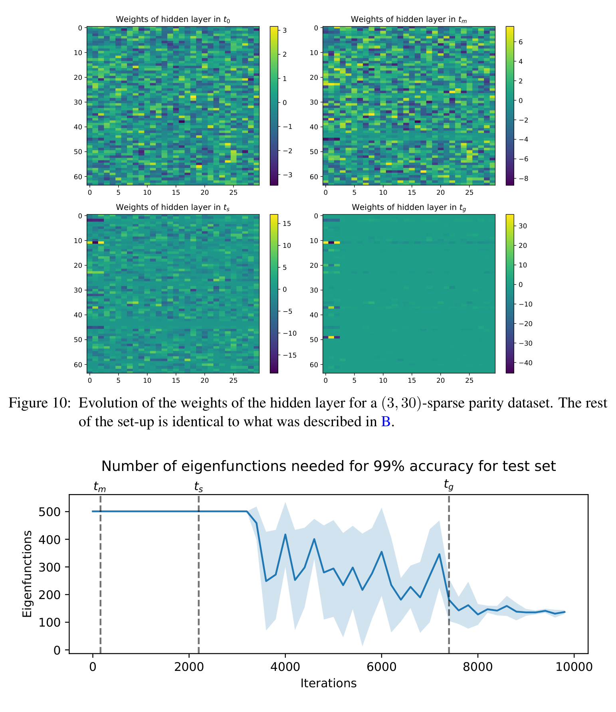
*Рисунок 11: Собственные функции, необходимые для достижения 99% точности, в ходе обучения для набора данных (3, 30)-разреженной чёт-*

ности. Остальная часть постановки идентична описанной в B.

D.2. 3 чистых разряда и 40 шумных

**[p. 21]**

FEATURE LEARNING DYNAMICS UNDER GROKKING IN A SPARSE PARITY TASK

Расстояние между ядрами

tg

tm ts tg

tm tm

ts

100%

0.200

Точность (%)

обучение тест

0.175

Потери

75%

обучение тест

0.150

ts

50%

0 2k 4k 6k 8k 10k 0

0.125

Итерации

0 2k 4k 6k 8k 10k

(a)

(b)

0.100

Точность NTK (%)

100%

0.075

обучение тест

обучение тест

0.7

Потери NTK

0.050

tg

75%

0.6

0.025

50%

0.5

0.000

0 2k 4k 6k 8k 10k Итерации

0 2k 4k 6k 8k 10k Итерации

0 2000 4000 6000 8000 9800 Итерации

(c)

(d)

(e)

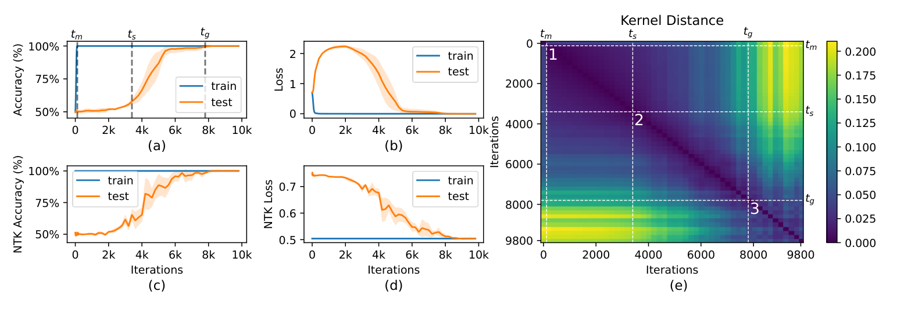
*Рисунок 12: Метрики обучения и эволюция NTK в ходе обучения для набора данных (3, 40)-разреженной чётности.*

Остальная часть экспериментальной постановки идентична описанной в B.

(a) Acc. Точность на обучающем наборе

(b) Acc. Точность на тестовом наборе

(c) Генеративная сила собственных функций

100%

50%

100%

Ген. сила (%)

90%

40%

90%

Точность (%)

Точность (%)

80%

80%

30%

t0

70%

70%

20%

60%

60%

10%

50%

50%

0 100 200 300 400 500 0%

0 100 200 300 400 500

0 100 200 300 400 500

100%

50%

100%

Ген. сила (%)

90%

40%

90%

Точность (%)

Точность (%)

80%

80%

30%

tm

70%

70%

20%

60%

60%

10%

50%

50%

0 100 200 300 400 500 0%

0 100 200 300 400 500

0 100 200 300 400 500

100%

50%

100%

Ген. сила (%)

90%

40%

90%

Точность (%)

Точность (%)

80%

80%

30%

ts

70%

70%

20%

60%

60%

10%

50%

50%

0 100 200 300 400 500 0%

0 100 200 300 400 500

0 100 200 300 400 500

50%

50% 60% 70% 80% 90% 100%

100%

Ген. сила (%)

40%

90%

Точность (%)

Точность (%)

80%

30%

tg

70%

20%

60%

10%

50%

0%

0 100 200 300 400 500 Индекс (i)

0 100 200 300 400 500 Индекс (i)

0 100 200 300 400 500 Индекс (i)

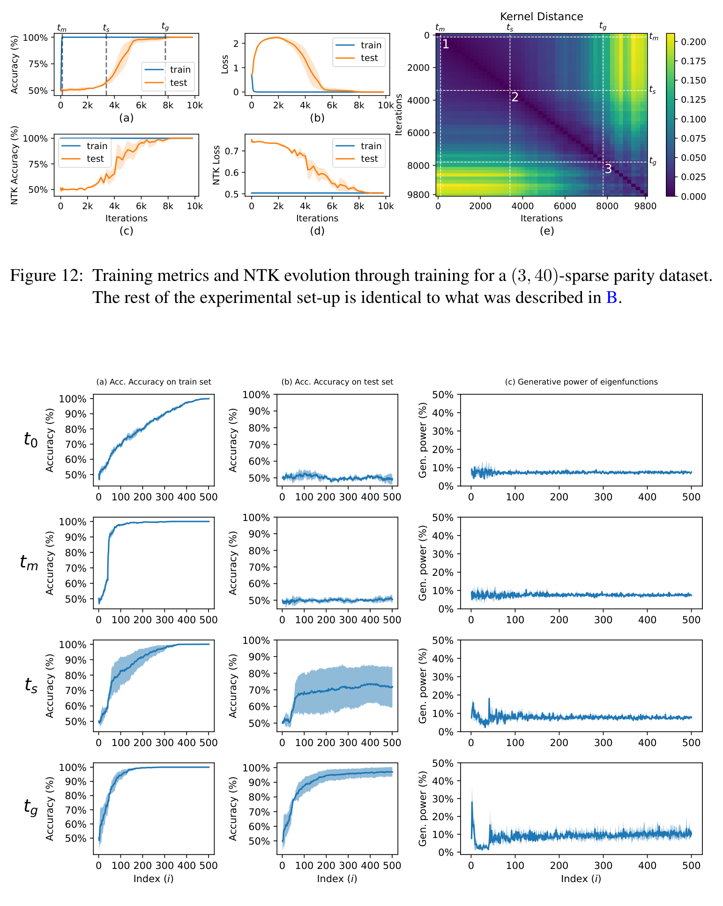
*Рисунок 13: Накопительная точность и генеративная сила каждой собственной функции для набора данных (3, 40)-разреженной*

чётности. Остальная часть экспериментальной постановки идентична описанной в B.

**[p. 22]**

FEATURE LEARNING DYNAMICS UNDER GROKKING IN A SPARSE PARITY TASK

1.0

0.8

0.6

t0

Разряд

0.4

0.2

0.0

0 5 10 15 20 25 30 35 Индекс (i)

1.0

0.8

0.6

tm

Разряд

0.4

0.2

0.0

0 5 10 15 20 25 30 35 Индекс (i)

1.0

0.8

0.6

ts

Разряд

0.4

0.2

0.0

0 5 10 15 20 25 30 35 Индекс (i)

1.0

0.8

0.6

tg

Разряд

0.4

0.2

0.0

0 5 10 15 20 25 30 35 Индекс (i)

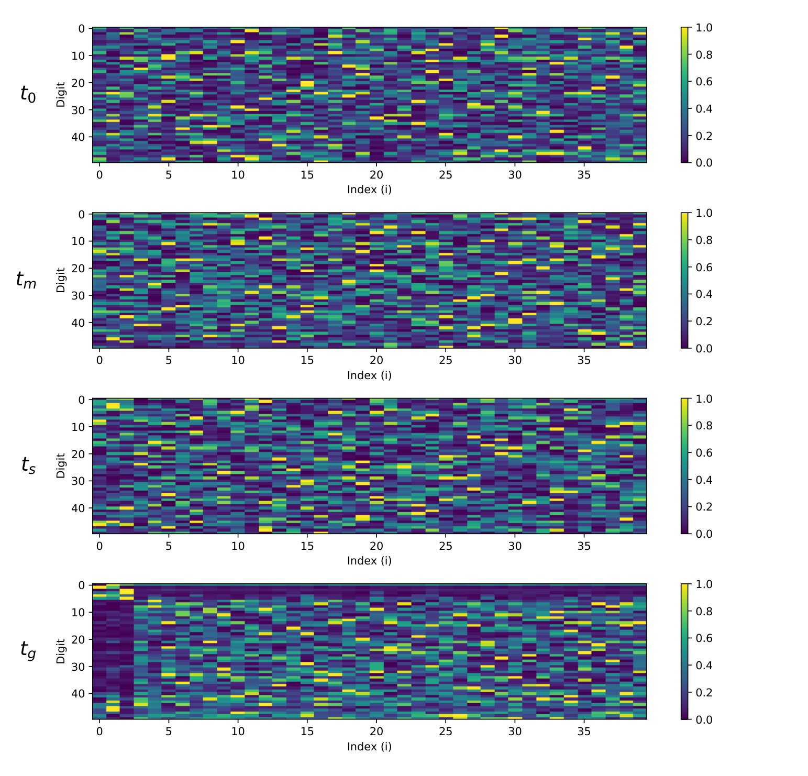
*Рисунок 14: Накопительная точность и генеративная сила для каждой для набора данных (3, 40)-разреженной чётности.*

Остальная часть постановки идентична описанной в B.

**[p. 23]**

FEATURE LEARNING DYNAMICS UNDER GROKKING IN A SPARSE PARITY TASK

Веса скрытого слоя в t0

Веса скрытого слоя в tm

0 5 10 15 20 25 30 35

0 5 10 15 20 25 30 35

Веса скрытого слоя в ts

Веса скрытого слоя в tg

0 5 10 15 20 25 30 35

0 5 10 15 20 25 30 35

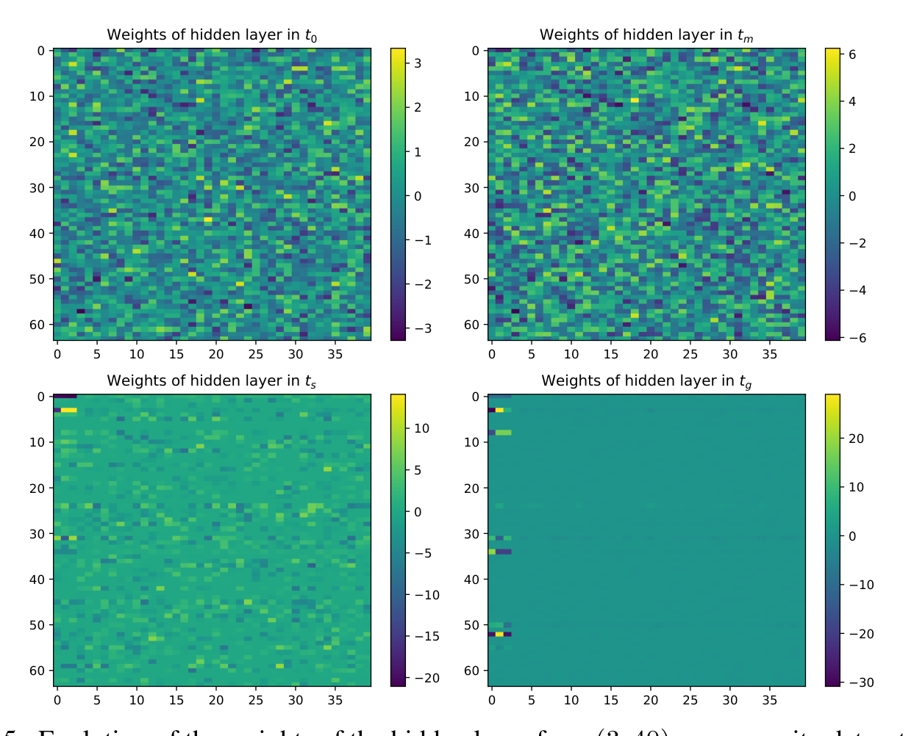
*Рисунок 15: Эволюция весов скрытого слоя для набора данных (3, 40)-разреженной чётности. Остальная*

часть постановки идентична описанной в B.

tm ts tg Число собственных функций, необходимых для 99% точности на тестовом наборе

Собственные функции

0 2000 4000 6000 8000 10000 Итерации

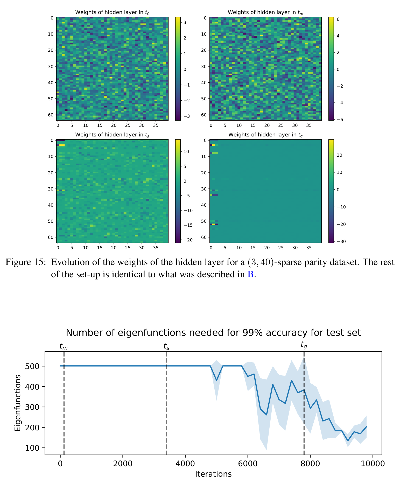
*Рисунок 16: Собственные функции, необходимые для достижения 99% точности, в ходе обучения для набора данных (3, 40)-разреженной чёт-*

ности. Остальная часть постановки идентична описанной в B.
