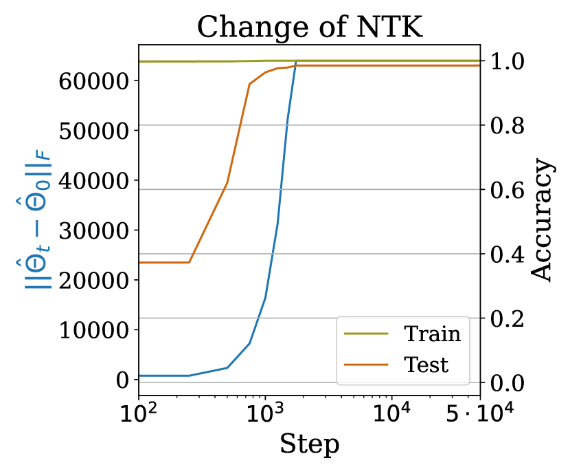
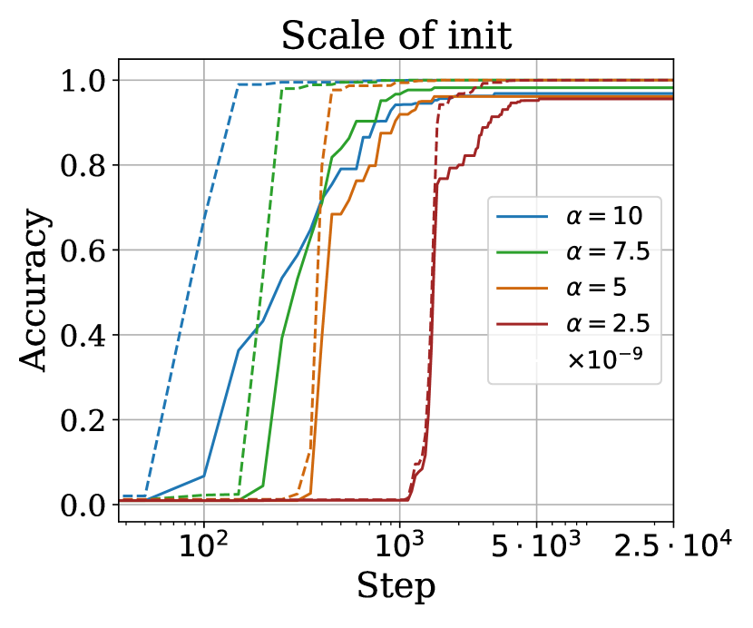
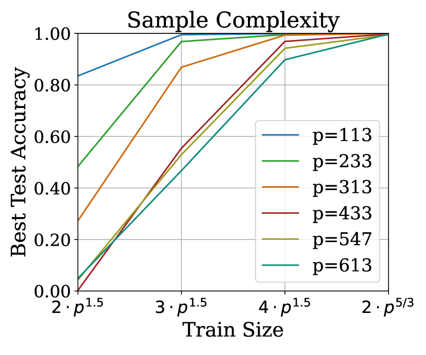
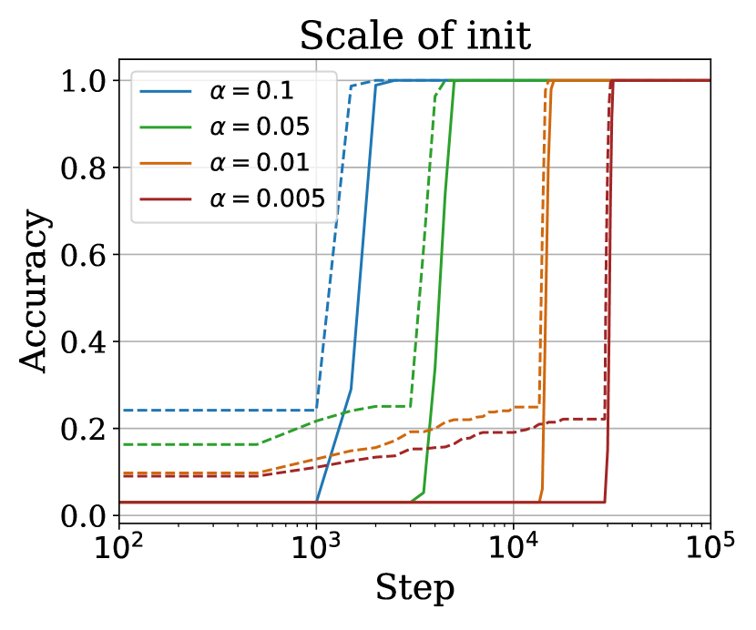
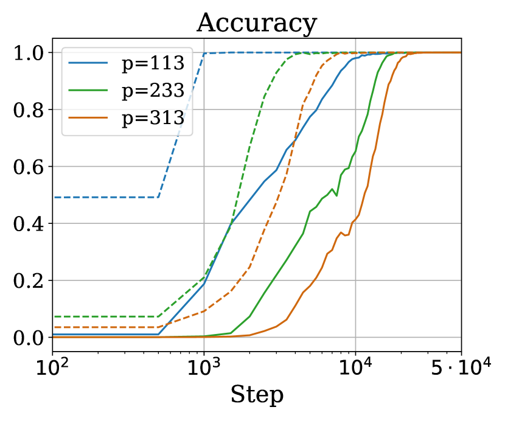
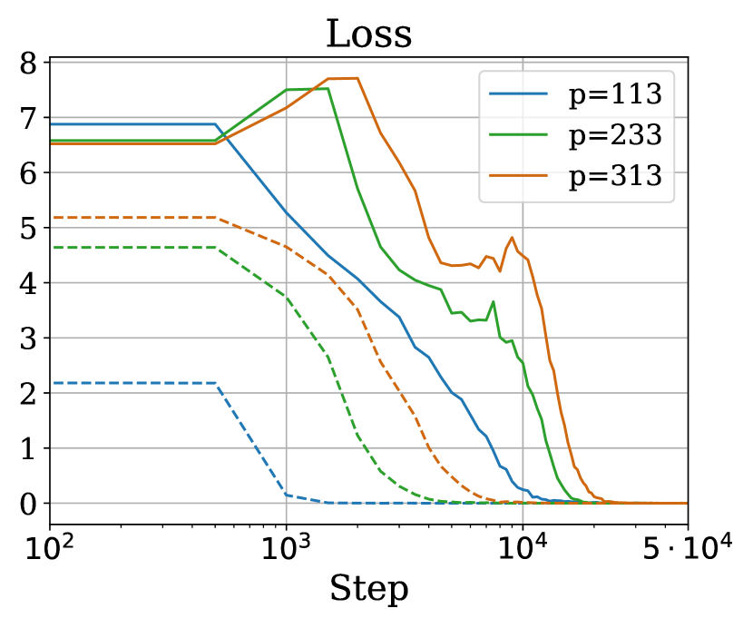

# Mohamadi et al. 2024 — Why Do You Grok? A Theoretical Analysis of Grokking Modular Addition

См. также: [глобальный индекс понятий](../../concepts/index.md).

**Mohamad Amin Mohamadi** и **Danica J. Sutherland** — Университет Британской Колумбии и Amii; **Zhiyuan Li** — Toyota Technological Institute at Chicago; **Lei Wu** — Пекинский университет. Первые двое отмечены как внёсшие равный вклад.

arXiv [2407.12332](https://arxiv.org/abs/2407.12332), 17 июля 2024; ICML 2024. 32 цитирования — четырнадцатая по цитируемости работа корпуса. Нативного HTML для неё нет, источник — ar5iv.

Оригинал и производные файлы этой папки:

- [`original/2407.12332.ar5iv.html`](original/2407.12332.ar5iv.html) — первоисточник, ar5iv-рендеринг (LaTeXML), скачан как есть.
- [`original/2407.12332.why-do-you-grok-a-theoretical-analysis-of-grokking-modular-addition.md`](original/2407.12332.why-do-you-grok-a-theoretical-analysis-of-grokking-modular-addition.md) — конверсия оригинала в Markdown без правок содержания.
- [`images/`](images/) — 12 иллюстраций статьи в исходном разрешении.

Ссылки на литературу в этой работе числовые (`[41]`, `[15]` и так далее) — так в источнике; список соответствий в разделе «Литература».

Схема якорей и правила ссылок на карточку — в [README папки статей](../README.md).

В источнике остались три редакторские пометки, не вычищенные при сборке ar5iv: `\Citetgromov2023grokking` в сноске 1 и врезки вида `color=blue!30,noinline]Zhiyuan:`, `color=violet!20,noinline]Danica:`, `color=yellow!20,noinline]Amin:`. В PDF их нет. Оставлены как в источнике.

## Затрагиваемые понятия

**[NTK](../../concepts/neural-tangent-kernel-ntk.md)** — работа даёт корпусу **доказательство**, а не наблюдение: перестановочно-эквивариантные ядровые методы на модульном сложении генерализовать не могут, пока не увидят постоянную долю всех данных ([`p3-4`](#p3-4)). При этом та же сеть в ядровом режиме нулевой ошибки на обучении достигает (теорема 3.1). Переобучение без генерализации оказывается следствием двух теорем сразу, а не случайностью настройки.

**[От ленивого к богатому](../../concepts/lazy-to-rich-kernel-to-feature-learning.md)** — итоговая формулировка: результаты «сильно поддерживают взгляд на гроккинг как на следствие перехода от ядроподобного поведения к предельному поведению градиентного спуска» ([`p1-2`](#p1-2)). Эта дихотомия названа наиболее многообещающей теорией гроккинга ([`p2-1`](#p2-1)), и работа доводит её до чисел: $\Omega(1)$ доли данных в ядровом режиме против $\tilde{\omega}(p^{2})$ и $\tilde{\mathcal{O}}(p^{5/3})$ в богатом.

**[Границы генерализации](../../concepts/generalization-bounds.md)** — обе стороны разрыва доказаны. Снизу — новая общая рамка разбора популяционной $\ell_{2}$-потери для предсказателей внутренней размерности $n$ ([`p3-5`](#p3-5)), позволяющая заодно покрыть модульное сложение с $m$ слагаемыми. Сверху — «оптимистические скорости» через радемахеровскую сложность в регрессии и PAC-байесовская оценка через зазор в классификации.

**[Максимизация зазора](../../concepts/margin-maximization-implicit-bias.md)** — неявное смещение поздней фазы взято не наугад: $\ell_{\infty}$-норма выбрана потому, что именно её регуляризует Adam (AdamW сходится лишь к точкам ККТ задачи с ограничением на $\ell_{\infty}$). В классификации оценка строится через $\ell_{\infty}$-нормированный зазор ([`p10-2`](#p10-2)), в регрессии — через малую $\ell_{\infty}$-норму интерполирующего решения.

**[Weight decay](../../concepts/weight-decay.md)** — связь с гроккингом проведена аккуратно: у Power et al. гроккинг заметнее при развязанном weight decay, а недавние работы показывают, что Adam неявно регуляризует $\ell_{\infty}$-норму весов ([`p4-8`](#p4-8)). Отсюда и выбор явного $\ell_{\infty}$-регуляризатора в экспериментах — силой $10^{-4}$ в регрессии и $10^{-20}$ в классификации.

**[Масштаб инициализации](../../concepts/initialization-scale.md)** — вмешательство, подтверждающее механизм: уменьшение масштаба инициализации **смягчает** гроккинг вплоть до полного исчезновения разрыва между обучением и тестом ([`fig-2`](#fig-2)). Объяснение прямое: малым весам приходится расти, чтобы подогнать данные, и этот рост выводит сеть из ядрового режима **до** переобучения. Цена — обучение становится труднее.

**[Модульная арифметика](../../concepts/modular-arithmetic.md)** — задача разобрана в двух постановках сразу: регрессия ($p^{3}$ точек, квадратичная потеря) и классификация ($p^{2}$ точек, кросс-энтропия) ([`p3-1`](#p3-1)). Архитектура — двухслойный MLP с квадратичной активацией, та же, что у Gromov.

**[Разрежённая чётность](../../concepts/sparse-parity.md)** — во введении перечислено, где гроккинг встречается за пределами модульной арифметики: разрежённые чётности, классификаторы изображений, наибольшие общие делители, восполнение матриц, $k$-разрежённые линейные предсказатели ([`p1-3`](#p1-3)).

**[Эффект рогатки](../../concepts/slingshot.md)** и **[обучение представлениям](../../concepts/structured-representation-learning.md)** — оба упомянуты в обзоре как объяснения, которые работа не опровергает, но и не использует ([`p1-4`](#p1-4)): её собственное объяснение лежит в другой плоскости — в свойствах задачи, а не в динамике оптимизатора.

**[Гроккинг](../../concepts/grokking.md)** — понятие получает то, чего в корпусе больше ни у кого нет: **доказательство невозможности** для целого класса методов. Не «мы наблюдали, что сети сперва переобучаются», а «никакой перестановочно-эквивариантный ядровой метод не может генерализовать при $n<Cp^{3}$».

Карточки статей корпуса: [Power et al. 2022](../2201.02177.grokking-generalization-beyond-overfitting-on-small-algorithmic-datasets/2201.02177.grokking-generalization-beyond-overfitting-on-small-algorithmic-datasets.card.md) — исходная задача; [Gromov 2023](../2301.02679.grokking-modular-arithmetic/2301.02679.grokking-modular-arithmetic.card.md) — та же архитектура и аналитическая конструкция, к которой здесь есть прямое возражение (см. ниже); [Kumar et al. 2023](../2310.06110.grokking-as-the-transition-from-lazy-to-rich-training-dynamics/2310.06110.grokking-as-the-transition-from-lazy-to-rich-training-dynamics.card.md) — гипотеза перехода от ленивого к богатому, которую эта работа доказывает для модульного сложения; [Rubin et al. 2024](../2310.03789.grokking-as-a-first-order-phase-transition-in-two-layer-networks/2310.03789.grokking-as-a-first-order-phase-transition-in-two-layer-networks.card.md) — тот же вывод о неспособности режима случайных признаков грокнуть, но полученный из теории фазовых переходов; [Nanda et al. 2023](../2301.05217.progress-measures-for-grokking-via-mechanistic-interpretability/2301.05217.progress-measures-for-grokking-via-mechanistic-interpretability.card.md) — фурье-решение, найденное обратной инженерией.

## Что показано, а что предположено

Замечания редактора карточки по итогам разбора утверждений (`…claims.txt`). Это самая доказательная работа корпуса: почти всё в ней — теоремы, и потому важно отделить доказанное от подкреплённого экспериментом.

**Доказана невозможность, а не наблюдена.** Главный результат отрицательный и от этого сильный: **никакой** перестановочно-эквивариантный ядровой метод не генерализует на модульном сложении, пока не увидит $\Omega(1)$ долю всех точек ([`p3-4`](#p3-4)). Причина — симметрия задачи: выучить исходную разметку ровно так же трудно, как все её переставленные версии одновременно. Это объясняет, почему переобучение наблюдалось у самых разных архитектур: дело не в них.

**Вторая половина разрыва тоже доказана.** Решения с нулевой ошибкой и малой $\ell_{\infty}$-нормой генерализуют при $\tilde{\omega}(p^{2})$ примерах (регрессия) и $\tilde{\mathcal{O}}(p^{5/3})$ (классификация); такие решения существуют — предъявлена фурье-конструкция при $h=8p$, а в замечании F.1 показано, что при нечётном $p$ хватает $4p$ нейронов.

**Слабое место — стык между половинами.** Что градиентный спуск **действительно приходит** к решению с малой $\ell_{\infty}$-нормой, доказательства нет: есть теорема [51] о том, что при малой регуляризации максимальный нормированный зазор сходится к нерегуляризованному, и есть эксперимент, показывающий, что $\ell_{\infty}$-норма выученных весов не растёт с $p$. Строгой цепочки «ядровой режим → выход → малая норма» работа не даёт и на это не претендует.

**Эксперимент, подтверждающий механизм.** Уменьшение масштаба инициализации смягчает гроккинг вплоть до исчезновения разрыва ([`fig-2`](#fig-2)) — ровно то, что предсказывает объяснение через ядровой режим: малые веса вынуждены расти, рост выводит из режима до переобучения. И измерение eNTK: до подгонки обучающего набора он почти не меняется, после — резко ([`p10-1`](#p10-1)).

**Прямое возражение Громову.** В сноске 1 сказано: тот утверждает, что найденное им аналитическое решение и есть то, к которому приходит градиентный спуск, «но по нашему опыту дело обстоит, по-видимому, не так». Это первое в корпусе прямое эмпирическое возражение одной карточки другой, и оно оставлено в сноске без подтверждающих данных.

**Ограничения, названные самими авторами.** Большая $\ell_{2}$-потеря не влечёт большой ошибки классификации, и нижняя оценка **по точности** для перестановочно-эквивариантных ядер остаётся открытой. Теоремы касаются причины гроккинга, а не приёмов ускорения: устранить гроккинг уменьшением инициализации можно, но итоговая генерализация от этого только замедляется.

**Разрыв между доказанным и проверенным.** Теорема C.2 об эквивариантности сформулирована для линейных правил обновления; Adam покрыт следствием C.7 с наброском доказательства по индукции. Все эксперименты при этом идут на Adam, AdamW и нормированном GD.

**Место в корпусе.** С Kumar et al. отношение прямое: их гипотеза о переходе от ленивого режима к богатому здесь **доказана** для модульного сложения. С Rubin et al. — совпадение вывода при полностью разных средствах: там режим случайных признаков не грокает по соображениям фазового перехода, здесь ядровые методы не генерализуют по соображениям симметрии. С Gromov — общая архитектура и спор о том, что именно находит спуск.

## Ошибочные пересказы и цитирования этой статьи

Узоры ошибочного или расширенного цитирования этой работы, наблюдённые в цитирующих статьях корпуса. Каждая запись описывает, что именно искажается при пересказе, и ведёт к абзацам самих авторов, где стоит теряемая оговорка. Разбор конкретных формулировок — в карточках цитирующих работ, в их разделах «Ошибочные цитирования», куда ведут ссылки «подробности».

**«Доказано, что гроккинг — переход из ядрового режима в богатый» (расширяющее).** У работы две теоремы по разные стороны разрыва: [невозможность для перестановочно-эквивариантных ядровых методов](#p3-4) и [существование генерализующих решений с малой l∞-нормой](#p3-5); а вот то, что градиентный спуск действительно приходит к такому решению, показано только экспериментом. Пересказы «explains grokking through two-phase dynamics» подают стык фаз как доказанный. Подробности: [2509.17738](../2509.17738.flatness-is-necessary-neural-collapse-is-not-rethinking-generalization-via-grokking/2509.17738.flatness-is-necessary-neural-collapse-is-not-rethinking-generalization-via-grokking.card.md#mc-2407-12332); мягкий отголосок: [2510.04930](../2510.04930.egalitarian-gradient-descent-a-simple-approach-to-accelerated-grokking/2510.04930.egalitarian-gradient-descent-a-simple-approach-to-accelerated-grokking.card.md).

**Нижняя оценка перенесена на «модели вообще» (ошибочное).** Оценке «нужна постоянная доля данных» подчинены только ядровые методы; главный результат работы противоположен по духу — [в богатом режиме хватает доли порядка 1/p](#p3-5). Пересказ «models need to be trained on a constant fraction … to generalize» превращает половину теоремы в вывод обо всех моделях. Подробности: [2410.03569](../2410.03569.making-hard-problems-easier-with-custom-data-distributions-and-loss-regularization/2410.03569.making-hard-problems-easier-with-custom-data-distributions-and-loss-regularization.card.md#mc-2407-12332).

**Искажение технической начинки (ошибочное).** Работе приписывают «кусочно-линейные MLP» и «анализ weight decay» — при том что [активация квадратичная](#p3-1), а [регуляризатор — явный l∞, эмулирующий неявное смещение Adam](#p4-8). Родственное мягкое искажение — «опирается на очень широкие сети»: ширины умеренные, а невозможность вообще не про ширину. Подробности: [2504.03162](../2504.03162.beyond-progress-measures-theoretical-insights-into-the-mechanism-of-grokking/2504.03162.beyond-progress-measures-theoretical-insights-into-the-mechanism-of-grokking.card.md#mc-2407-12332); мягкий отголосок: [2509.21519](../2509.21519.provable-scaling-laws-of-feature-emergence-from-learning-dynamics-of-grokking/2509.21519.provable-scaling-laws-of-feature-emergence-from-learning-dynamics-of-grokking.card.md).

**«Уменьшение инициализации ускоряет гроккинг» (расширяющее, эмпирически оспоренное).** У авторов [уменьшение масштаба инициализации смягчает гроккинг вплоть до исчезновения разрыва — но ценой более медленного обучения](#fig-2), не «ускоряет». Групповое приписывание гипотезы о разрыве режимов оспорено самим цитирующим: гроккинг у них сохраняется при выверенной инициализации. Подробности: [2504.13292](../2504.13292.let-me-grok-for-you-accelerating-grokking-via-embedding-transfer-from-a-weaker-model/2504.13292.let-me-grok-for-you-accelerating-grokking-via-embedding-transfer-from-a-weaker-model.card.md#mc-2407-12332).

Образцы аккуратного цитирования: [2601.19791](../2601.19791.to-grok-grokking-provable-grokking-in-ridge-regression/2601.19791.to-grok-grokking-provable-grokking-in-ridge-regression.card.md) — результат плюс точная формулировка недоказанного стыка; [2604.00316](../2604.00316.breaking-data-symmetry-is-needed-for-generalization-in-feature-learning-kernels/2604.00316.breaking-data-symmetry-is-needed-for-generalization-in-feature-learning-kernels.card.md) — раздельно «что доказано про ядра» и «что происходит при выходе»; [2504.13292](../2504.13292.let-me-grok-for-you-accelerating-grokking-via-embedding-transfer-from-a-weaker-model/2504.13292.let-me-grok-for-you-accelerating-grokking-via-embedding-transfer-from-a-weaker-model.card.md) — точная цитата рядом с честным эмпирическим вызовом и корректным различением однофамильных работ.

---

# Текст статьи

## Аннотация

###### p1-2
Мы даём теоретическое объяснение явления «гроккинга» [41], при котором модель генерализует много позже переобучения, для исходно изучавшейся задачи модульного сложения. Во-первых, мы показываем, что рано в градиентном спуске, когда приближённо выполняется «ядровой режим», никакая перестановочно-эквивариантная модель не может достичь малой популяционной ошибки на модульном сложении, если только не увидит по крайней мере постоянную долю всех возможных точек данных. Со временем, однако, модели покидают ядровой режим. Мы показываем, что двухслойные квадратичные сети, достигающие нулевой потери на обучении при ограниченной $\ell_{\infty}$-норме, хорошо генерализуют при существенно меньшем числе обучающих точек, и далее показываем, что такие сети существуют и могут быть найдены градиентным спуском с малой $\ell_{\infty}$-регуляризацией. Мы приводим также эмпирические свидетельства того, что эти сети, равно как и простые трансформеры, покидают ядровой режим лишь после первоначального переобучения. Взятые вместе, наши результаты сильно поддерживают взгляд на гроккинг как на следствие перехода от ядроподобного поведения к предельному поведению градиентного спуска в глубоких сетях.

## 1 Введение

###### p1-3
Понимание закономерностей генерализации современных перепараметризованных нейросетей давно остаётся целью сообщества глубокого обучения. [41] показали занятное явление, названное ими «гроккингом», при обучении трансформеров на малых алгоритмических задачах: нейросети способны найти обобщающее решение много позже переобучения на обучающем наборе с плохой генерализацией. Это наблюдение породило поток недавних работ, направленных на выявление механизмов, способных привести сеть к «гроккингу», и свойств итоговых решений на различных алгоритмических задачах. Позже обнаружилось, что гроккинг может происходить и в задачах за пределами модульной арифметики: при обучении разрежённым чётностям [5, 6], классификаторам изображений [27], наибольшим общим делителям [9], восполнению матриц [28] и $k$-разрежённым линейным предсказателям [28].

###### p1-4
Гроккинг по-разному приписывали трудности обучения представлениям [26], механизму «рогатки» [47], норме весов [27, 49], свойствам ландшафта потерь [40], простоте выученного решения [37] и другим механизмам обучения признакам [23, 43]. Теоретически [15] предъявил аналитическую конструкцию для двухслойного MLP, решающего модульное сложение, совместимую с картиной гроккинга.111\Citetgromov2023grokking утверждает, что именно это решение находится градиентным спуском, но по нашему опыту дело обстоит, по-видимому, не так. [21] показали гроккинг при обучении двухслойного MLP на задаче полиномиальной регрессии, а [53] — на данных XOR. Понятие отложенной генерализации, возможно, раньше наблюдали [24] при обучении диагональных линейных сетей стохастическим спуском с шумом в метках и через минимизацию остроты — ещё до того, как это стало известно как гроккинг [41].

###### p1-5
[28] предъявляют строгую теоретическую рамку, в которой гроккинг доказуемо демонстрируется через дихотомию раннего и позднего неявных смещений алгоритма обучения. Точнее, они относят стадию переобучения при гроккинге на счёт того, что начальное поведение градиентного спуска подобно ядровому предсказателю [20, 4, 22], а стадию генерализации — на счёт иных неявных смещений поздней фазы: минимизации остроты [7, 24, 12, 18], максимизации зазора [44, 36, 51, 29] или минимизации нормы параметров [17, 16, 3]. Этот переход от ядрового режима к богатому наблюдался широко [10, 34, 14, 46, 28]. В согласии с этой рамкой [21] предположили, что гроккинг можно объяснить через переход от ядрового режима к «богатому», пока размер обучающего набора не слишком мал (где генерализация была бы невозможна) и не слишком велик (где она была бы лёгкой). Они привели эмпирическое подтверждение, рассматривая масштабирование выхода модели — грубую косвенную меру скорости обучения признакам при модульном сложении на двухслойных MLP.







*Рисунок 1: Эмпирическое исследование гроккинга модульного сложения на двухслойных сетях в задаче классификации с кросс-энтропийной потерей. **Слева:** Изменение эмпирического NTK111$\hat{\Theta}_{t}$ — это NTK выхода модели на обучающих данных при параметрах на шаге $t$. Когда выход модели $f$ — вектор, мы используем NTK его первой координаты как приближение, следуя [32], где $\hat{\Theta}_{t}\triangleq[\nabla_{\theta}f_{1}(\theta_{t};\mathcal{X}_{\mathrm{train}})][\nabla_{\theta}f_{1}(\theta_{t};\mathcal{X}_{\mathrm{train}})]^{\top}$. ($\lVert\hat{\Theta}_{t}-\hat{\Theta}_{0}\rVert_{F}$) пренебрежимо мало до подгонки обучающих данных. NTK резко меняется после переобучения, что означает, что отложенная генерализация может быть вызвана отложенным переходом от ядрового режима к богатому. **В центре:** **Уменьшение масштаба инициализации способно смягчить гроккинг** — вплоть до полного устранения разрыва между кривыми обучения и теста. $\alpha$ обозначает множитель при $\theta_{0}$, начальных весах по умолчанию PyTorch [19]. Пунктирные линии показывают статистики обучающего набора, сплошные отвечают тестовому. **Справа:** Эмпирические оценки подтверждают выборочную сложность $\tilde{\operatorname{\mathcal{O}}}(p^{5/3})$ на задаче классификации с кросс-энтропийной потерей. Подробнее в разделе 4.* **[p. 2]**

###### p2-1
Эта дихотомия раннего ядрового режима и позднего обучения признакам, запускаемого слабой неявной или явной регуляризацией (то есть переход от ленивого режима к богатому), выглядит наиболее многообещающей теорией для объяснения гроккинга. И всё же два основных вопроса о том, *почему* гроккинг происходит на исходной задаче **модульного сложения**, оставались без ответа:

1. *Почему* самые разные архитектуры не генерализуют на начальной фазе обучения, то есть в ядровом режиме? Оттого ли, что их ядра случайно разделяют некоторое общее свойство, или это и вправду свойство самой задачи модульного сложения?
2. *Как* слабая регуляризация побуждает сеть выучить обобщаемые признаки позднее в **[p. 3]** обучении?

###### p3-1
**Наш вклад.** В этой работе мы отвечаем на эти вопросы строгим теоретическим разбором выучивания модульного сложения градиентным спуском на двухслойных MLP.

Мы сосредоточиваемся именно на задаче

$$
a+b\equiv c\pmod{p} \tag{1.1}
$$

где $a,b,c\in{\mathbb{Z}}_{p}$ при фиксированном $p\in{\mathbb{N}}$. Мы применяем (регуляризованный) градиентный спуск к двухслойному MLP с квадратичными активациями — той же архитектуре, что и в [15]. Мы рассматриваем две разные задачи: несколько проще разбирать «регрессионную» задачу, где мы квадратичной потерей выучиваем функцию от $(a,b,c)$, показывающую, выполняется ли (1.1); но мы изучаем и «классификационную» задачу, где кросс-энтропийной потерей выучиваем $p$-классовый классификатор, предсказывающий, какое значение $c$ удовлетворяет (1.1) при данных $(a,b)$. В этой дискретной постановке без шума возможных различных точек данных лишь конечное число: $p^{3}$ для регрессии и $p^{2}$ для классификации.

###### p3-4
Отвечая на первый вопрос, мы доказываем в разделах 3.1 и 4.1, что эта задача *принципиально трудна* для перестановочно-эквивариантных ядровых методов — из-за присущих ей симметрий. Значит, перестановочно-эквивариантные сети, хорошо приближаемые своим приближением нейронного касательного ядра, генерализовать не могут. Мы доказываем также, что, хотя никакой такой метод генерализовать не может, подходы нейронного касательного ядра на основе нашей архитектуры при реалистичных ширинах *способны* достичь нулевой ошибки на обучении. Этот результат весьма красноречиво объясняет, почему на этой задаче эмпирически наблюдалось резкое переобучение с плохой генерализацией — у самых разных архитектур, потерь и алгоритмов обучения [41, 26, 15 и другие].

###### p3-5
Чтобы доказать нижние оценки на генерализацию, мы разрабатываем новый общий приём разбора популяционной $\ell_{2}$-потери при выучивании общих классов функций предсказателями внутренней размерности $n$ (например, ядровыми предсказателями с $n$ обучающими точками), представленный в разделе D.4. Эта рамка позволяет нам доказать нижние оценки популяционной $\ell_{2}$-потери для общего случая выучивания модульного сложения $m$ слагаемых (а не 2 или 3) ядрами и может представлять самостоятельный интерес.

###### p3-6

Отвечая на второй вопрос — *почему* так происходит, — мы выделяем $\ell_{\infty}$-норму как действенную и практически значимую меру сложности для генерализации, тесно связанную с неявным смещением Adam [52, 55], и показываем, что сети с малой $\ell_{\infty}$-нормой в регрессионной постановке (раздел 3.2) и с большим $\ell_{\infty}$-нормированным зазором в классификационной (раздел 4.2) доказуемо генерализуют при гораздо меньшем числе примеров, чем требуется в ядровом режиме. Тем самым модели с соответствующими неявными смещениями генерализовать могут, что и отвечает на второй вопрос. В регрессии наши доказательства опираются на «оптимистические скорости» [45] для гладкой $\ell_{2}$-потери в терминах радемахеровской сложности сетей с ограниченной $\ell_{\infty}$-нормой параметров. В классификации доказательство применяет PAC-байесовскую рамку [31] к сетям с ограниченной $\ell_{\infty}$-нормой параметров.

Подытоживая, наш **основной вклад** таков:

###### p3-8

1. Мы доказываем, что сети в ядровом режиме могут генерализовать, только если обучены на **по крайней мере постоянной доле** всех возможных точек данных, то есть на доле $\Omega(1)$, — для регрессии (раздел 3.1) и классификации (раздел 4.1).
2. Мы доказываем, что сети с подходящей регуляризацией могут генерализовать при гораздо меньшем числе примеров: доля $\bm{\operatorname{\mathcal{O}}(1/p)}$ всех возможных точек данных для генерализации по квадратичной потере в регрессионной задаче (раздел 3.2) и $\bm{\tilde{\operatorname{\mathcal{O}}}(1/p^{1/3})}$ для генерализации по потере ноль-один в классификации (раздел 4.2).

**[p. 4]**

## 2 Предварительные сведения и постановка

#### Обозначения.

Через $[p]$ мы обозначаем множество $\{1,\ldots,p\}$. Через $e_{i}$ обозначается $i$-й стандартный базисный вектор, *то есть* вектор с $1$ в $i$-й компоненте и $0$ в остальных. Для вектора $a$ через $a^{\odot 2}$ обозначается покомпонентный квадрат вектора $a$. Для любого непустого множества $\mathcal{X}$ симметричная функция $K:\mathcal{X}\times\mathcal{X}\to\mathbb{R}$ называется положительно полуопределённым (p.s.d.) ядром на $\mathcal{X}$, если для всех $n\in\mathbb{N}$, всех ${\bm{x}}_{1},\ldots,{\bm{x}}_{n}\in\mathcal{X}$ и всех $\lambda_{1},\ldots,\lambda_{n}\in\mathbb{R}$ выполняется $\sum_{i=1}^{n}\sum_{j=1}^{n}\lambda_{i}\lambda_{j}K({\bm{x}}_{i},{\bm{x}}_{j})\geq 0$. Для двух неотрицательных функций $f,g$ мы говорим, что $f(n)=O(g(n))$ (соответственно $f(n)=\Omega(g(n))$) тогда и только тогда, когда существует абсолютная постоянная $C>0$ такая, что для всех $n\geq 0$ выполняется $f(n)\leq Cg(n)$ (соответственно $f(n)\geq Cg(n)$). Записью $f(n)=\omega(g(n))$ мы обозначаем, что для всех $C>0$ существует $n_{0}>0$ такое, что для всех $n\geq n_{0}$ выполняется $f(n)>Cg(n)$.

#### Постановка.

Мы сосредоточиваемся на выучивании модульного сложения (1.1) двухслойной сетью без смещений с квадратичной активацией, следуя [15]. Точнее, при параметрах $\theta=(W,V)$ модель $f$ отображает пару целых чисел $(a,b)$ — представленную вектором $(e_{a},e_{b})\in\mathbb{R}^{2p}$ — в вектор из $\mathbb{R}^{p}$. Мы используем вид

$$
f(\theta;(e_{a},e_{b}))=V\left(W(e_{a},e_{b})\right)^{\odot 2}, \tag{2.1}
$$

где $W\in\mathbb{R}^{h\times 2p}$, $V\in\mathbb{R}^{p\times h}$ при некотором целом $h$. Мы называем $h$ шириной скрытого слоя; она будет задана позже.

В постановке классификации (раздел 4) мы обучаем $f$ кросс-энтропийной потерей определять то $c$, для которого $a+b\equiv c\pmod{p}$, в задаче многоклассовой классификации. Полагая $\mathcal{Z}=\{e_{i}:i\in[p]\}$, множество всех возможных входов есть $\mathcal{X}=\mathcal{Z}\times\mathcal{Z}$, а выходов — $\mathcal{Y}=\mathcal{Z}$; различных точек данных $N=p^{2}$.

В постановке регрессии (раздел 3) мы, напротив, стремимся выучить для каждой тройки $(a,b,c)$, верно ли $a+b\equiv c\pmod{p}$, то есть отобразить ${\bm{x}}=(e_{a},e_{b},e_{c})$ в скаляр $y=p\,\mathbf{1}(a+b\equiv c\pmod{p})$ с помощью $g(\theta;(e_{a},e_{b},e_{c})))\triangleq e_{c}^{\top}f(\theta;(e_{a},e_{b}))$.222Такое масштабирование означает, что у предсказателя $\Psi_{\bm{0}}(\cdot)=0$ популяционная квадратичная потеря равна $p$; оно же позволяет ограничить $\left\lVert\theta\right\rVert_{\infty}$. Здесь $\mathcal{X}=\mathcal{Z}^{3}$, $\mathcal{Y}=\{0,p\}$ и $N=p^{3}$; мы обучаем модель $g(\theta;{\bm{x}})=\langle e_{c},f(\theta;(e_{a},e_{b}))\rangle$ минимизировать квадратичную потерю.

В обеих постановках через $\mathcal{D}$ мы обозначаем распределение на $\mathcal{X}\times\mathcal{Y}$, равномерное по всем $N$ возможным парам «вход — выход», а $\mathcal{D}_{\mathrm{train}}=\left\{({\bm{x}}_{i},y_{i})\right\}_{i=1}^{n}$ — обучающий набор размера $n$. При параметрах $\theta$ через $\Psi(\theta;\cdot):\mathcal{X}\to\hat{\mathcal{Y}}$ мы обозначаем предсказатель ($g(\theta;\cdot)$ для регрессии, $f(\theta;\cdot)$ для классификации); мы обучаем модель градиентным спуском с крошечной $\ell_{\infty}$-регуляризацией,333Подробнее о силе регуляризации — в приложении A. которая призвана воспроизвести неявное смещение Adam (AdamW), возможно ведущее к гроккингу. В общем виде мы определяем потерю как

$$
\!\!\!\mathcal{L}^{\lambda}_{\ell}(\Psi,\theta,\mathcal{D}_{\operatorname{train}})\triangleq\frac{1}{n}\!\!\sum_{({\bm{x}},y)\in\mathcal{D}_{\operatorname{train}}}\!\!\!\!\!\ell(\Psi(\theta;{\bm{x}}),y)+\lambda\left\lVert\theta\right\rVert_{\infty}, \tag{2.2}
$$

где $\ell:\hat{\mathcal{Y}}\times\mathcal{Y}\to\mathbb{R}_{\geq 0}$ обозначает либо квадратичную ($\ell_{2}$), либо кросс-энтропийную потерю, а $\lambda\geq 0$ управляет силой регуляризации. Опущенное $\lambda$ отвечает случаю без регуляризации, а опущенное $\mathcal{D}_{\mathrm{train}}$ означает, что при вычислении потери используется вся популяция. Для непараметрических функций (вроде $\Psi_{\bm{0}}$ — предсказателя, возвращающего ноль на любом входе) мы опускаем и $\theta$.

#### Связь между $\ell_{\infty}$-регуляризацией и гроккингом.

###### p4-8
[41] показывает, что явление гроккинга происходит при Adam и становится заметнее с развязанным weight decay (AdamW). Недавние работы [52, 55] показывают, что Adam неявно регуляризует $\ell_{\infty}$-норму весов. Подробнее: [52] показывает, что AdamW может сходиться лишь к точкам ККТ оптимизации с ограничением на $\ell_{\infty}$-норму. [55] показывает, что Adam сходится к решениям с максимальным зазором по $\ell_{\infty}$-норме для линейных моделей на разделимых наборах данных и **[p. 5]** высказывает предположение, что этот результат обобщается на произвольные однородные модели (включая нашу модель $f$, которая 3-однородна). Эта связь побуждает нас использовать явную $\ell_{\infty}$-регуляризацию поверх градиентного спуска, чтобы понять гроккинг в постановке модульного сложения.

##### **Определение 2.1****.**

Детерминированный алгоритм обучения с учителем $\mathcal{A}$ — это отображение из последовательности обучающих данных $\mathcal{D}_{\mathrm{train}}\in(\mathcal{X}\times\mathcal{Y})^{n}$ в гипотезу $\mathcal{A}(\mathcal{D}_{\mathrm{train}}):\mathcal{X}\to\hat{\mathcal{Y}}$. Алгоритм $\mathcal{A}$ может быть и рандомизированным; в этом случае выход $\mathcal{A}(\mathcal{D}_{\mathrm{train}})$ есть распределение на гипотезах. Два рандомизированных алгоритма $\mathcal{A}$ и $\mathcal{A}^{\prime}$ совпадают, если для любого входа их выходы имеют одинаковое распределение в пространстве функций, что записывается как $\mathcal{A}(\mathcal{D}_{\mathrm{train}})\overset{d}{=}\mathcal{A}^{\prime}(\mathcal{D}_{\mathrm{train}})$.

Далее мы определяем эквивариантность алгоритмов обучения — главную составляющую нашего разбора при выводе нижних оценок. Это определение используется в теоремах 3.3 и 4.2 для доказательства эквивариантности GD при выучивании модульного сложения.

##### **Определение 2.2**(Эквивариантные алгоритмы)**.**

Алгоритм обучения *эквивариантен* относительно группы $\mathcal{G}_{\mathcal{X}}$ (или $\mathcal{G}_{\mathcal{X}}$-эквивариантен), если для любого набора данных $\mathcal{D}_{\mathrm{train}}\in(\mathcal{X}\times\mathcal{Y})^{n}$ и для всех $T\in\mathcal{G}_{\mathcal{X}}$ выполняется $\mathcal{A}(\left\{(T({\bm{x}}_{i}),y_{i})\right\}_{i=1}^{n})\,\circ\,T\overset{d}{=}\mathcal{A}(\left\{({\bm{x}}_{i},y_{i})\right\}_{i=1}^{n})$. Для детерминированных алгоритмов обучения это равносильно тому, что для всех ${\bm{x}}\in\mathcal{X}$ выполняется $\mathcal{A}(\left\{(T({\bm{x}}_{i}),y_{i})\right\}_{i=1}^{n})(T({\bm{x}}))=[\mathcal{A}(\left\{({\bm{x}}_{i},y_{i})\right\}_{i=1}^{n})]({\bm{x}})$.

##### **Определение 2.3**(Ядровые методы)**.**

Для $\hat{\mathcal{Y}}\subseteq\mathbb{R}$ мы говорим, что алгоритм обучения $\mathcal{A}$ есть *ядровой метод*, если он сперва выбирает (возможно, случайное) положительно полуопределённое ядро $K$ на $\mathcal{X}$ до того, как увидит данные,444Наше определение ядровых методов не покрывает алгоритмы обучения, выбирающие ядро по обучающим данным. *Любой* алгоритм обучения можно оформить как ядровой метод с зависящим от данных ядром $K(x,x^{\prime})=\Psi(x)\Psi(x^{\prime})$. а затем выдаёт некоторую гипотезу $\Psi$ такую, что существуют $\{\lambda_{i}\}_{i=1}^{n}\in\mathbb{R}$, для которых $\Psi(\cdot)=\sum_{i=1}^{n}K(\cdot,{\bm{x}}_{i})\lambda_{i}$, где $\lambda_{i}$ могут зависеть от обучающего набора $\mathcal{D}_{\mathrm{train}}$.

В частности, когда $\bm{\lambda}(\mathcal{D}_{\mathrm{train}})=\mathbf{K}^{\dagger}\mathbf{y}$, где $\mathbf{K}=\left(K({\bm{x}}_{i},{\bm{x}}_{j})\right)_{i,j=1}^{n}$, $\mathbf{y}=\left(y_{i}\right)_{i=1}^{n},$ ядровой метод называется *(безгребневой) ядровой регрессией*.

##### **Теорема 2.4****.**

*Для любого p.s.d. ядра $K:{\mathcal{X}}\times{\mathcal{X}}\to\mathbb{R}$ и группы преобразований ${\mathcal{G}}_{g}X$ ядровая регрессия (определение 2.3) относительно ядра $K$ является ${\mathcal{G}}_{{\mathcal{X}}}$-эквивариантной тогда и только тогда, когда ядро $K$ эквивариантно относительно ${\mathcal{G}}_{g}X$, *то есть* $K(T(x),T(x^{\prime}))=K(x,x^{\prime})$ для любых $T\in{\mathcal{G}}_{g}X$ и $x,x^{\prime}\in{\mathcal{X}}$.*

##### Доказательство теоремы 2.4.

Для любых $\mathcal{D}_{\mathrm{train}}=\{({\bm{x}}_{i},y_{i})\}_{i=1}^{n}$ и преобразования $T\in{\mathcal{G}}_{\mathcal{X}}$ пусть $\mathcal{D}_{\mathrm{train}}^{T}$ — преобразованный набор данных $\{(T({\bm{x}}_{i}),y_{i})\}_{i=1}^{n}$, а ${\mathcal{A}}_{K}$ — алгоритм ядровой регрессии относительно $K$. Для любого ${\bm{x}}$ имеем

$$
{\mathcal{A}}(T(\mathcal{D}_{\mathrm{train}}))(T({\bm{x}}))=\sum_{i=1}^{n}K(T({\bm{x}}),T({\bm{x}}_{i}))\lambda_{i}(\mathcal{D}_{\mathrm{train}}^{T})=\sum_{i=1}^{n}K({\bm{x}},{\bm{x}}_{i})\lambda_{i}(\mathcal{D}_{\mathrm{train}})={\mathcal{A}}(\mathcal{D}_{\mathrm{train}})({\bm{x}}),
$$

где второе равенство следует из эквивариантности ядра $K$ относительно ${\mathcal{G}}_{\mathcal{X}}$. ∎

## 3 Регрессионная задача

Сперва мы изложим наш теоретический разбор явления гроккинга на модульной арифметике для двухслойных квадратичных сетей в регрессионной постановке, где мы выучиваем функцию из $(e_{a},e_{b},e_{c})$ в $p\mathbf{1}(a+b=c\pmod{p})$. Хотя это, возможно, менее естественный способ смоделировать модульную арифметику, чем задача классификации, он допускает несколько полезных теоретических средств.

В этом разделе мы показываем, что сети в ядровом режиме доказуемо не смогут генерализовать, пока у них нет доступа почти ко всем точкам набора данных (теорема 3.4), — хотя нулевой ошибки на обучении они достичь могут (теорема 3.1). Однако сеть в конце концов покидает ядровой режим из-за слабой $\ell_{\infty}$-регуляризации. Далее мы устанавливаем, что, если сети удаётся достичь нулевой ошибки на обучении при малой $\left\lVert\theta\right\rVert_{\infty}$, она будет генерализовать всего при доле $\frac{n}{N}=\tilde{\omega}(1/p)$ от всего набора данных — при условии, что ширина сети больше $4p$ (теорема 3.6). Мы доказываем также, что такие сети существуют (утверждение 3.8), и показываем, что градиентный спуск способен их найти при небольшой явной регуляризации (рисунок 3).

### 3.1 Ядровой режим




###### fig-2
*Рисунок 2: Эмпирические свидетельства ядрового режима на раннем обучении. **Слева:** Точность на обучении (пунктир) и на тесте (сплошная) при обучении в регрессионной постановке с различными масштабами инициализации $\alpha$ и фиксированным $p=47$. **Уменьшение масштаба инициализации способно смягчить гроккинг** и в регрессионной задаче, в итоге устраняя разрыв между точностями на обучении и на тесте (ценой более медленного роста каждой из них). **Справа:** eNTK продолжает заметно меняться после переобучения.* **[p. 6]**

###### p6-1
Недавнее направление работ по рамке *нейронного касательного ядра* (NTK) [20, 4, 22, 10, 54] показало, что при типичных схемах инициализации градиентный спуск в перепараметризованных нейросетях локально приближает поведение ядровой модели с эмпирическим нейронным касательным ядром (eNTK) $K_{\theta}({\bm{x}},{\bm{x}}^{\prime})\triangleq\nabla g(\theta;{\bm{x}})\nabla g(\theta;{\bm{x}}^{\prime})^{\mathsf{T}}$. В «ядровом режиме» изменение $\theta$ на протяжении градиентного спуска не меняет eNTK $K_{\theta}$ существенно, и потому нейросеть ведёт себя подобно ядровому предсказателю, обученному с $K_{\theta_{0}}$. При квадратичной потере, как здесь, эти ядровые предсказатели следуют особенно простому пути оптимизации, для которого доступна замкнутая форма (отвечающая ядровой регрессии).

Для сетей конечной ширины (а в определённых случаях и бесконечной) eNTK остаётся примерно постоянным, и сеть близко следует ядровой модели на первой фазе оптимизации, но крошечная регуляризация в конце концов заставляет её покинуть ядровой режим. Тем самым оценки для ядровых моделей осведомляют нас о глубоких сетях в первой части оптимизации.

На первой фазе гроккинга модель переобучается на обучающих данных, достигая очень малой потери на обучении и сохраняя высокую потерю на тестовых точках. Мы устанавливаем, что оба явления происходят в ядровом режиме.

#### 3.1.1 Эмпирические нейронные касательные ядра способны достичь нулевой ошибки на обучении

Наш первый результат показывает, что ядровая регрессия с эмпирическим нейронным касательным ядром нашей квадратичной сети достигает нулевой потери на обучении, если сеть умеренно широка — например, $n=\tilde{\Theta}(p^{2})$ и ширина $h=\tilde{\Theta}(p)$. Отсюда следует, к примеру, что в постановке «ленивого обучения» [10] — или же когда первый слой инициализирован огромными весами, а второй крошечными, — градиентный спуск способен достичь нулевой потери на обучении. Неформально это также сильно наводит на мысль, что сети **[p. 7]** с более обычными инициализациями способны достичь очень малой ошибки на обучении, не покидая «ядрового режима».

##### **Теорема 3.1****.**

*Инициализируем сеть из раздела 2 произвольными значениями $V$ и элементами $W$, независимо распределёнными как $\operatorname{Uniform}([-s_{W},s_{W}])$ при некотором $s_{W}>0$. Пусть наиболее частое значение $c\in[p]$ встречается $\rho_{c}$ раз. Тогда, если $h>36\rho_{c}\log(n/\delta)$, с вероятностью не менее $1-\delta$ по случайной инициализации $W$ ядровая регрессия с эмпирическим нейронным касательным ядром сети способна достичь нулевой потери на обучении для *любых* целевых меток таких, что из ${\bm{x}}_{i}={\bm{x}}_{j}$ следует $y_{i}=y_{j}$. Обратно, если $h<n/(3p)$, то существуют целевые метки (с $y_{i}=y_{j}$ при ${\bm{x}}_{i}={\bm{x}}_{j}$), для которых этот метод нулевой потери на обучении достичь не может.*

Равномерная инициализация — поведение по умолчанию, например, в PyTorch [2]. Заметим, что $\rho_{c}$ всегда лежит между $n/p$ и $n$. Более того, в обычной постановке со случайно выбранным $\mathcal{D}_{\mathrm{train}}$ и $n=\Omega\bigl{(}p\log p\bigr{)}$ — напомним, что полное знание одной пары $(a,b)$ требует $n=p$ в регрессионной постановке — с высокой вероятностью $\rho_{c}=\Theta(n/p)$ [42, теорема 1]. Значит, в этой обычной постановке порог интерполяции приходится на ширину сети $h=\tilde{\Theta}(n/p)$.

##### Набросок доказательства теоремы 3.1.

Ядровая регрессия способна достичь всех возможных целевых меток тогда и только тогда, когда её матрица ядра строго положительно определена (леммы B.1 и B.2). Вычисляя ожидаемое нейронное касательное ядро, мы видим, что оно строго положительно определено при весьма слабых предположениях о весах (утверждение B.3). При ограниченных весах матричная граница Чернова управляет сходимостью наименьшего собственного значения матрицы ядра к соответствующему значению для ожидаемой матрицы ядра (утверждение B.4). Нижняя оценка следует из ранга матрицы ядра (утверждение B.6). ∎

#### 3.1.2 Перестановочно-эквивариантные ядровые методы генерализовать не могут

Теперь мы покажем, что для любого перестановочно-эквивариантного ядрового метода (определение 2.3) — а значит, и для сетей, обучаемых градиентным спуском достаточно близко к инициализации, — генерализация возможна лишь при обучении на $n=\Omega(p^{3})$ примерах, то есть при доле всех возможных точек данных $\frac{n}{N}=\Omega(1)$.

Ключевая составляющая нашего разбора — перестановочная эквивариантность выучивания модульного сложения в этой постановке. Сперва определим группу перестановок на данных модульного сложения:

##### **Определение 3.2****.**

Пусть ${\mathbb{S}}_{p}$ обозначает множество всех перестановок на $[p]$. Мы определяем *группу перестановок* $\mathcal{G}_{\mathcal{X}}$ на $\mathcal{X}$ как группу

$$
\left\{(e_{a},e_{b},e_{c})\mapsto(e_{\sigma_{1}(a)},e_{\sigma_{2}(b)},e_{\sigma_{3}(c)}):\sigma_{1},\sigma_{2},\sigma_{3}\in{\mathbb{S}}_{p}\right\},
$$

с групповой операцией — композицией каждой перестановки.

Следующая теорема устанавливает, что наш алгоритм обучения эквивариантен (определение 2.2) относительно этой группы перестановок; для краткости мы называем это *перестановочной эквивариантностью*. Заметим, что этот результат относится к самому процессу градиентного спуска на нашей нейросети, а не только к её NTK-приближению. (Результат не особенно привязан к архитектуре из раздела 2; он верен широко.)

##### **Теорема 3.3**(Перестановочная эквивариантность в регрессии)**.**

*Обучение двухслойной нейросети с квадратичными активациями (такой как $g(\theta;x))$, инициализированной случайными независимыми одинаково распределёнными параметрами, правилами обновления на основе градиента (такими как градиентный спуск) на задаче модульного сложения в регрессионной постановке есть эквивариантный алгоритм обучения (в смысле определения 2.2) относительно группы перестановок из определения 3.2, применяемой к входным данным.*

**[p. 8]**

Подробности и полное доказательство — в приложении C.

Грубо говоря, это означает, что выучивание задачи модульного сложения в этой постановке ровно настолько же трудно, насколько выучивание любой переставленной версии набора данных. Тем же доводом можно показать, что ядровой метод, отвечающий нейросетям на ранней фазе обучения, тоже перестановочно эквивариантен.

Далее, поскольку распределение $\mathcal{D}$ равномерно и потому инвариантно относительно перестановок, теорема 3.3 показывает, что трудность выучивания исходной истинной функции та же, что и трудность одновременного выучивания всех переставленных версий истинных функций, — а это оказывается трудным для любого ядрового метода. Следующая теорема формализует эту мысль, устанавливая, что любому такому ядровому предсказателю требуется по крайней мере $n=\Omega(p^{3})$ — то есть $\frac{n}{N}=\Omega(1)$ — чтобы генерализовать на задаче модульного сложения; иначе он не может существенно превзойти тривиальный нулевой предсказатель.

##### **Теорема 3.4**(Нижняя оценка)**.**

*Существует постоянная $C>0$ такая, что для любых $p\geq 2$, размера обучающих данных $n<Cp^{3}$ и любого перестановочно-эквивариантного ядрового метода $\mathcal{A}$ выполняется*

$$
\!\!\operatorname*{\mathbb{E}}_{({\bm{x}}_{i},y_{i})_{i=1}^{n}\sim\mathcal{D}^{n}}\operatorname*{\mathbb{E}}_{\mathcal{A}}\mathcal{L}_{\ell_{2}}\left(\mathcal{A}\left(\{({\bm{x}}_{i},y_{i})\}_{i=1}^{n}\right)\right)\geq\frac{w}{2}\;\mathcal{L}_{\ell_{2}}\left(\Psi_{\bm{0}}\right)=\frac{p}{2},
$$

*где $\operatorname*{\mathbb{E}}_{\mathcal{A}}$ берёт среднее по случайности алгоритма $\mathcal{A}$.*

Полное доказательство этого результата отложено в приложение D.

Теорема 3.4 на деле есть частный случай более общей теоремы, дающей нижнюю оценку популяционной $\ell_{2}$-потери при выучивании модульного сложения с $m$ слагаемыми перестановочно-эквивариантными ядрами и показывающей, что плохая генерализация неизбежна. Ниже мы приводим неформальную версию этого результата и отсылаем читателя к следствию D.8 за формальной.

##### **Теорема 3.5**(Неформально)**.**

*Рассмотрим задачу выучивания модульного сложения по $m$ слагаемым с обучающим набором размера $n$ перестановочно-эквивариантным ядровым методом $\mathcal{A}$. Для любых $p\geq 2$ и размера обучающих данных $n<Cp^{m}$ ожидаемая популяционная $\ell_{2}$-потеря составляет по меньшей мере $\Omega(p)$, что того же порядка, что и у тривиального нулевого предсказателя.*

Плохая популяционная потеря, таким образом, неизбежна для моделей, хорошо приближаемых перестановочно-эквивариантным ядром; а поскольку наша квадратичная сеть способна к тому же достичь нулевой ошибки на обучении в ядровом режиме, это сильно указывает на резкое переобучение в раннем обучении. К счастью, однако, регуляризованный градиентный спуск на конечных сетях в конце концов покидает ядровой режим и начинает выучивать признаки.

### 3.2 Богатый режим


*Рисунок 3: Эмпирическая проверка нашего теоретического объяснения генерализации. Мы обучаем сеть ширины $h=4p$ градиентным спуском по $\ell_{2}$-потере с $\ell_{\infty}$-регуляризацией $10^{-4}$ на $2\times p^{2.25}$ обучающих примерах (из $p^{3}$) в регрессионной постановке. **Слева:** **Генерализация наступает, когда число примеров превышает $\Omega(p^{2})$**, как и предсказано утверждением 3.7. Пунктирные и сплошные линии показывают статистики обучающего и тестового наборов соответственно. **Справа:** $\ell_{\infty}$-норма параметров после гроккинга остаётся одной и той же для разных размерностей задачи $p$, как и предсказано* **[p. 9]**

Хотя переходное поведение градиентного спуска после выхода из ядрового режима может быть сложным, предельное поведение зачастую удаётся понять лучше — из разборов неявного смещения. Побуждаемые этим, мы приводим разбор генерализации сетей, достигающих нулевой ошибки на обучении (чего мы и ждём в пределе долгой оптимизации) при ограниченной $\left\lVert\theta\right\rVert_{\infty}$. Это предположение мотивировано недавней работой [52], где показано, что полнобатчевый AdamW может сходиться лишь к точкам ККТ задачи оптимизации с ограничением на $\ell_{\infty}$-норму, $\min_{\left\lVert\theta\right\rVert_{\infty}\leq\frac{1}{\lambda}}\mathcal{L}(\Psi,\theta,\mathcal{D}_{\mathrm{train}})$, где $\lambda$ — коэффициент weight decay. Осуществимость этого предположения мы обсудим далее.

##### **Теорема 3.6**(Верхняя оценка)**.**

*Для любой ширины $h\geq 8p$ с вероятностью не менее $1-\delta$ по случайности обучающего набора $\mathcal{D}_{\operatorname{train}}$ размера $n$ определим множество интерполирующих решений как $\tilde{\Theta}^{*}=\{\theta\mid\mathcal{L}_{\ell_{2}}(\Psi,\theta,\mathcal{D}_{\operatorname{train}})=0\}$. Для любого интерполирующего решения $\theta^{*}\in\tilde{\Theta}^{*}$ с малой $\ell_{\infty}$-нормой, *то есть* удовлетворяющего $\|\theta^{*}\|_{\infty}=\operatorname{\mathcal{O}}(\min_{\theta\in\tilde{\Theta}^{*}}\left\lVert\theta\right\rVert_{\infty})$, выполняется*

$$
\mathcal{L}_{\ell_{2}}(g,\theta^{*}) =\operatorname{\mathcal{O}}\left(\frac{p^{2}}{n}\left(\log^{3}n+\frac{1}{p}\log\frac{1}{\delta}\right)\right)\cdot\mathcal{L}_{\ell_{2}}\left(\Psi_{\bm{0}}\right).
$$

Сравнивая теорему 3.6 с теоремой 3.4, мы видим, что при $n=\tilde{\omega}(p^{2})$ и $h=\Omega(p)$ между генерализацией в ядровом и в богатом режимах есть строгое разделение. Заметим, что классификатор $\phi(e_{a},e_{b})\triangleq\operatorname*{arg\,max}_{c}f_{c}(\theta^{*};(e_{a},e_{b}))$ имеет популяционную частоту ошибок не более $\frac{2}{p}\mathcal{L}_{\ell_{2}}(\phi)$ (как показано в утверждении E.7), и потому его популяционная ошибка стремится к нулю при $n=\tilde{\omega}(p^{2})$. Доказательство теоремы 3.6 состоит в том, чтобы показать, что все сети с малой ошибкой на обучении и малой $\ell_{\infty}$-нормой генерализуют (утверждение 3.7) и что хотя бы одна такая сеть существует (утверждение 3.8).

##### **Утверждение 3.7****.**

*Для любых $R>0,\delta\in(0,1)$, $\mathcal{D}_{\operatorname{train}}$ размера $n$ и $\theta^{*}\in\{\theta=(W,V):\mathcal{L}_{\ell_{2}}(g,\theta,\mathcal{D}_{\operatorname{train}})=0\wedge\left\lVert\theta\right\rVert_{\infty}\leq R\}$ существует положительная постоянная $C>0$ такая, что с вероятностью не менее $1-\delta$ по случайности $\mathcal{D}_{\operatorname{train}}$*

$$
\mathcal{L}_{\ell_{2}}(g,\theta^{*})\leq\frac{CR^{6}h^{2}}{n}\left(p\log^{3}n+\log\frac{1}{\delta}\right).
$$

##### Набросок доказательства утверждения 3.7.

Мы ограничиваем радемахеровскую сложность множества сетей с малыми $\ell_{\infty}$-весами, а затем применяем теорему E.6 из [45], дающую «оптимистическую» оценку избыточного риска для гладких функций потерь. Подробности в приложении E. ∎

##### **Утверждение 3.8****.**

*Пусть множество моделей с нулевой популяционной потерей есть $\Theta^{*}\triangleq\{\theta\mid\mathcal{L}_{\ell_{2}}(g,\theta)=0\}$. Для любых $p\geq 2$ и $h\geq 8p$ множество $\Theta^{*}$ непусто и $\min_{\theta\in\Theta^{*}}\left\lVert\theta\right\rVert_{\infty}\leq\left\lfloor\frac{h}{8p}\right\rfloor^{-\frac{1}{3}}$.*

##### Набросок доказательства утверждения 3.8.

Основная трудность — ручная фурье-конструкция решения с нулевой потерей при $h=8p$ и $\ell_{\infty}$-нормой не более единицы; она навеяна схожими конструкциями [15] и результатами [37]. В параллельной работе [35] предъявлена сходная конструкция. Получив её, мы легко уменьшаем $\ell_{\infty}$-норму дублированием нейронов — поскольку наша модель 3-однородна по параметрам, — не меняя функции «вход — выход». Подробности в приложении F. ∎

Мы знаем, что интерполирующее решение с малой $\ell_{\infty}$-нормой существует и что любое такое решение будет генерализовать. Находит ли его градиентный спуск? На рисунке 3 мы эмпирически оцениваем $\ell_{\infty}$-норму весов, выученных запуском градиентного спуска на регрессионной задаче при разных $p$ и очень малом $\ell_{\infty}$-регуляризаторе.555Мы использовали вес регуляризации $10^{-4}$. **[p. 10]** Без явной регуляризации небольшое число весов сети растёт с $p$, но мы полагаем, что это явление не существенно для общего поведения градиентного спуска на этой задаче. В согласии с нашей ручной конструкцией весов $\ell_{\infty}$-норма весов сети не растёт с размерностью задачи $p$. Это подтверждает применимость теоремы 3.6 и куда лучшую выборочную сложность по сравнению с ядровым режимом.

color=blue!30,noinline]Zhiyuan: check later **Эмпирические свидетельства того, что ядровые нижние оценки ведут к переобучению:** Один из способов смягчить эффект гроккинга при выучивании модульного сложения — не дать сети переобучиться на обучающем наборе в ядровом режиме. Для этого можно уменьшить *масштаб инициализации* (например, взять меньшие дисперсии при инициализации весов по схеме [19]). Грубо говоря, сетям, инициализированным очень малым масштабом параметров, приходится пройти через существенный рост нормы параметров, чтобы суметь подогнать обучающие данные. Этот рост нормы в конце концов выводит сеть из ядрового режима и заставляет начать выучивать признаки до переобучения на данных. Рисунок 2 подтверждает это в нашей постановке: очень малая инициализация весов способна существенно смягчить эффект гроккинга, не давая сети переобучиться в ядровом режиме, — что указывает, что гроккинг и вправду вызван отложенным переходом от ядрового (переобучение) к богатому (генерализация) режиму. Однако за это приходится платить: обучение становится всё труднее по мере уменьшения масштаба инициализации [10, 34, 46].

###### p10-1
На рисунке 2 мы оцениваем также изменение эмпирического NTK в ходе обучения, вычисляя разность матриц eNTK по ходу обучения. Чтобы это эмпирическое исследование было вычислимо, мы вычисляли приближение eNTK из [32] на 20 000 случайных точек данных — по образцу прежних схем [13, 51, 32]. Мы видим, что изменение эмпирического NTK на порядки больше после переобучения на обучающем наборе, откуда следует, что бо́льшая часть обучения признакам происходит лишь позднее, что подтверждает нашу гипотезу о том, что первоначальное переобучение происходит примерно в ядровом режиме.

## 4 Задача классификации

###### p10-2
Теперь мы переходим к постановке многоклассовой классификации, введённой в разделе 2, где обучение идёт с кросс-энтропийной потерей. Как и в задаче регрессии, мы сперва разбираем раннюю стадию обучения, где сеть работает подобно ядровой машине, а затем переходим к богатому режиму и сосредоточиваемся на весах, выученных благодаря неявному смещению градиентного спуска к максимизации зазора. Мы доказываем, что разрыв в выборочной сложности между ядровым (теорема 4.3) и богатым (теорема 4.6) режимами существует и при обучении двухслойной нейросети градиентным спуском на модульном сложении, оформленном как задача многоклассовой классификации. Из наших результатов следует, что, пока неявное смещение градиентного спуска к максимальному зазору на потерях экспоненциального типа выводит сеть из ядрового режима и для обучения используется $\hat{\Omega}(p^{5/3})$ примеров, генерализация на всю популяцию гарантирована.

### 4.1 Ядровой режим

В многоклассовой постановке выход $p$-мерен, и потому eNTK для каждой пары точек есть положительно полуопределённая матрица $p\times p$ [см. 56]. Наше понятие ядрового метода (определение 4.1) слегка меняется, чтобы учесть многовыходные функции, а основной результат о нижней оценке подобен полученному в случае регрессии: ядровые методы должны увидеть постоянную долю данных, прежде чем чему-либо научатся.

##### **Определение 4.1****.**

Для $\mathcal{Y}\subseteq\mathbb{R}^{p}$ мы говорим, что алгоритм обучения $\mathcal{A}$ есть *ядровой метод*, если до того, как увидит данные, он сперва выбирает (возможно, случайное) ядро $K$ на $\mathcal{X}$ такое, что для любых $x,x^{\prime}\in\mathcal{X}$ величина $K(x,x^{\prime})$ есть положительно полуопределённая матрица $p$ на $p$, а затем выдаёт по $\mathcal{D}_{\mathrm{train}}$ некоторую гипотезу $h$ такую, что существуют $\{\lambda_{i}\}_{i=1}^{n}\in\mathbb{R}^{p}$, для которых $h(\cdot)=\sum_{i=1}^{n}K(\cdot,{\bm{x}}_{i})\lambda_{i}$.

Далее мы устанавливаем перестановочную эквивариантность алгоритмов обучения на основе градиента в постановке классификации. Ключевое отличие в том, что в многовыходной постановке такие алгоритмы эквивариантны перестановкам *и входных данных, и выходных меток*. Подробности — в приложении C.

##### **Утверждение 4.2**(Перестановочная эквивариантность в классификации)**.**

*Определим *группу перестановок* $\mathcal{G}_{\mathcal{X},\mathcal{Y}}$ на $\mathcal{X}\times\mathcal{Y}$ (определённых в разделе 2) как группу*

$$
\left\{(e_{a},e_{b}),e_{c}\mapsto(e_{\sigma_{1}(a)},e_{\sigma_{2}(b)}),e_{\sigma_{3}(c)}:\sigma_{1},\sigma_{2},\sigma_{3}\in{\mathbb{S}}_{p}\right\}.
$$

*Обучение двухслойной нейросети с квадратичными активациями (такой как $f(\theta;x))$, инициализированной случайными независимыми одинаково распределёнными параметрами, правилами обновления на основе градиента (в смысле определения C.1)666GD — пример такого алгоритма. на задаче модульного сложения в постановке классификации есть эквивариантный алгоритм обучения (в смысле определения 2.2) относительно $\mathcal{G}_{\mathcal{X},\mathcal{Y}}$.777Схожий результат верен и для адаптивных алгоритмов вроде Adam, как обсуждается в следствии C.7.*

Мы говорим, что алгоритм обучения *перестановочно эквивариантен по входу и выходу*, если он эквивариантен относительно $\mathcal{G}_{\mathcal{X},\mathcal{Y}}$. Следующая теорема устанавливает, что любому такому ядровому алгоритму обучения требуется по крайней мере $n=\Omega(p^{2})$ — то есть $\frac{n}{N}=\Omega(1)$ — чтобы генерализовать на задаче модульного сложения в постановке классификации.

##### **Теорема 4.3**(Ядровая нижняя оценка)**.**

*Существует постоянная $C>0$ такая, что для любого размера обучающих данных $n<Cp^{2}$ и любого ядрового метода $\mathcal{A}$, перестановочно эквивариантного по входу и выходу (относительно $\mathcal{G}_{\mathcal{X},\mathcal{Y}}$), выполняется*

$$
\operatorname*{\mathbb{E}}_{({\bm{x}}_{i},y_{i})_{i=1}^{n}\sim\mathcal{D}^{n}}\operatorname*{\mathbb{E}}_{\mathcal{A}}\mathcal{L}_{\ell_{2}}\left(\mathcal{A}\left(\{{\bm{x}}_{i},y_{i}\}_{i=1}^{n}\right)\right)\geq\frac{1}{2}\;\mathcal{L}_{\ell_{2}}\left(\Psi_{\bm{0}}\right),
$$

*где $\operatorname*{\mathbb{E}}_{\mathcal{A}}$ берёт математическое ожидание по случайности алгоритма $\mathcal{A}$.*


*Рисунок 4: **Эмпирическое исследование гроккинга в постановке классификации с крошечной $\ell_{\infty}$-регуляризацией при разных размерностях задачи $p$**. Сети обучаются нормированным градиентным спуском888Определение нормированного GD мы отсылаем читателя искать в приложении A. по кросс-энтропийной потере с $\ell_{\infty}$-регуляризацией силы $10^{-20}$. Пунктирные линии показывают статистики обучающего набора, сплошные отвечают тестовому.* **[p. 11]**

Интуитивно постановка классификации не слишком отличается от регрессионной. У них одна и та же цель, а объём знания, содержащийся в одной точке данных в постановке классификации, в точности равен $p$ точкам в регрессионной постановке — тем $p$ точкам, у которых первые две координаты совпадают, а различается лишь последняя.

**[p. 12]**

Более формально можно ввести следующее соответствие: одну точку данных классификации $({\bm{x}},y)\in\mathbb{R}^{2p}\times\mathbb{R}^{p}$ можно рассматривать как $p$ точек данных регрессии, $\{(({\bm{x}},e_{i}),y_{i})\}_{i=1}^{p}$, что обозначается $F({\bm{x}},y)$. Аналогично любую функцию $\Psi$, отображающую ${\bm{x}}=\{(e_{i},e_{j})\}$ в $\mathbb{R}^{p}$, можно рассматривать как функцию, отображающую $\{(e_{i},e_{j},e_{k})\}$ в $\mathbb{R}$, положив $\Psi^{\prime}({\bm{x}},e_{k})=[\Psi({\bm{x}})]_{k}$. Более того, у этих двух функций $\Psi$ и $\Psi^{\prime}$ одна и та же популяционная $\ell_{2}$-потеря. С этой точки зрения ядровое обучение с матричнозначным ядром на $n$ точках классификации в точности то же, что скалярнозначное ядровое обучение на $np$ точках регрессии.

Единственное препятствие к прямому применению теоремы 3.4 — то, что распределение данных иное. В регрессионной постановке каждая точка выбирается независимо и равномерно, а число точек может быть любым целым; в постановке классификации точки выбираются независимыми группами, и их число обязано быть кратным $p$. Однако легко видеть, что это новое распределение по-прежнему инвариантно относительно перестановок из определения 3.2. Поэтому мы можем напрямую применить теорему 3.4 к этому новому распределению и получить теорему 4.3. Формальная версия этого довода приведена в разделе D.3.

Значит, для сетей, работающих в ядровом режиме, генерализация на невиданные данные по $\ell_{2}$-потере невозможна, если только $n/N=\Omega(1)$, то есть если мы не наблюдали постоянной доли всех $N=p^{2}$ возможных точек данных. Стоит, однако, подчеркнуть, что большая $\ell_{2}$-потеря не обязательно влечёт большую ошибку классификации. Доказательство нижней оценки на ошибку классификации для перестановочно-эквивариантных ядровых методов остаётся открытым.

### 4.2 Богатый режим

Чтобы разобрать поведение сети в богатом режиме, мы сперва вводим понятие зазора и подробнее говорим о неявном смещении градиентного спуска к максимизации зазора. Для задачи многоклассовой классификации с $p$ классами и фиксированной сетью $f$ зазор точки данных $({\bm{x}},y)$ есть

$$
q(\theta;{\bm{x}},y)\triangleq f_{y}(\theta;{\bm{x}})-\max_{y^{\prime}\neq y}f_{y^{\prime}}(\theta;{\bm{x}}).
$$

Зазор для набора данных $\mathcal{D}$ определяется как минимальный зазор по всем точкам набора:

$$
q_{\min}(\theta;\mathcal{D})\triangleq\min_{({\bm{x}},y)\in\mathcal{D}}q(\theta;{\bm{x}},y).
$$

Когда сеть $f$ однородна по своим параметрам (как в нашей постановке), нетрудно заметить, что, пока $\theta$ линейно разделяет набор данных $\mathcal{D}$, *то есть* $q_{\min}(\theta;\mathcal{D})>0$, минимальный зазор можно масштабировать произвольно — масштабируя параметры сети. Поэтому в таких однородных сетях обычно рассматривают **нормированный зазор** $q_{\min}(\theta/\left\lVert\theta\right\rVert;\mathcal{D})$ по некоторой норме.

[29] доказали, что градиентный спуск на однородных моделях с кросс-энтропийной (или подобной) потерей на наборе данных $\mathcal{D}$ в отсутствие явной регуляризации максимизирует нормированный зазор. А именно, хотя $\lVert\theta\rVert_{2}\to\infty$ при $t\to\infty$, отношение $\theta/\lVert\theta\rVert_{2}$ сходится к решению (или, в более общем виде, к точке ККТ) следующей задачи, когда таковое существует:

$$
\min\;\frac{1}{2}\left\lVert\theta\right\rVert_{2}^{2}\quad\text{s.t.}\quad q_{\min}(\theta;\mathcal{D})\geq 1. \tag{4.1}
$$

Чтобы установить наши результаты в постановке классификации, мы заимствуем следующую теорему из [51], где доказано, что при достаточно малой силе регуляризации, используемой в (2.2), максимальный нормированный зазор регуляризованной потери сходится к максимальному нормированному зазору нерегуляризованной.

##### **Утверждение 4.4**([51], теорема 4.1)**.**

*Рассмотрим положительно однородную функцию $f$ по параметрам $\theta$ и набор данных $\mathcal{D}_{\mathrm{train}}$, разделимый с помощью $f$. Пусть $\lVert\cdot\rVert$ — произвольная норма.* **[p. 13]** *Пусть $\gamma^{*}$ — максимальный нормированный зазор нерегуляризованной потери, а $\gamma^{\lambda}$ — нормированный зазор минимизатора регуляризованной потери силы $\lambda$. При $\lambda\to 0$ выполняется $\gamma^{\lambda}\to\gamma^{*}$.*

То есть если в (2.2) взять достаточно малый вес регуляризации $\lambda$ с любой нормой, мы получим приблизительно то же решение, что и в нерегуляризованной задаче. Это подтверждает, что обучение нашей двухслойной сети градиентным спуском с достаточно малым $\ell_{\infty}$-регуляризатором может привести к весам, близким к решению задачи о максимальном $\ell_{\infty}$-нормированном зазоре. Далее мы приводим основной результат этого подраздела — верхнюю оценку тестовой ошибки, показывающую, что все параметры, чей $\ell_{\infty}$-нормированный зазор достаточно близок к решению с максимальным $\ell_{\infty}$-нормированным зазором, будут генерализовать при выборочной сложности $\tilde{\operatorname{\mathcal{O}}}(p^{5/3})$

##### **Теорема 4.5**(Верхняя оценка)**.**

*Пусть $\delta\in(0,1)$ — положительные постоянные такие, что $8p\leq h=O(p)$ независимо от $p$ и $n$. Для любого $n$, представляющего размер обучающего набора $\mathcal{D}_{\mathrm{train}}$, с вероятностью не менее $1-\delta$ по случайности $\mathcal{D}_{\mathrm{train}}$ для всех интерполирующих решений $\theta$ с нормированным $\ell_{\infty}$-зазором $\Omega(p)$ выполняется*

$$
L_{0}(f,\theta,\mathcal{D})\leq\tilde{\operatorname{\mathcal{O}}}\left(\sqrt{\frac{p^{5/3}}{n}}\right). \tag{4.2}
$$

*Иначе говоря, любое интерполирующее решение $\theta$ с приблизительно максимальным нормированным $\ell_{\infty}$-зазором, *то есть* $q_{\min}(\theta/\left\lVert\theta\right\rVert_{\infty};\mathcal{D}_{\mathrm{train}})\geq\Omega(\max_{\|\theta^{\prime}\|_{\infty}\leq 1}q_{\min}(\theta^{\prime};\mathcal{D}_{\mathrm{train}}))$, имеет выборочную сложность $\tilde{\operatorname{\mathcal{O}}}(p^{5/3})$, поскольку утверждение 3.8 показывает, что максимальный нормированный $\ell_{\infty}$-зазор составляет по крайней мере $\Omega(p)$.*

Наше доказательство теоремы 4.5 опирается на PAC-байесовскую рамку [31], а именно на лемму 1 из [38]. Этот результат даёт основанную на зазоре оценку генерализации, верную с высокой вероятностью, для любого предсказателя через *потерю по зазору*, которая засчитывает предсказание верным, только если оно сделано с зазором не менее $\gamma$:

$$
L_{\gamma}\left(f,\theta,\mathcal{D}\right)\triangleq\Pr_{({\bm{x}},y)\sim\mathcal{D}}\Big{[}q(\theta,{\bm{x}},y)>\gamma\Big{]}.\vspace*{-1mm} \tag{4.3}
$$

$L_{0}$ — это попросту частота ошибок классификации, или ошибка 0-1. Следующее утверждение использует этот результат, чтобы доказать верхнюю оценку популяционной ошибки 0-1 для сетей через потерю по зазору на обучающем наборе.

##### **Теорема 4.6****.**

*Для любых $p\geq 2$, размера обучающего набора $n\geq 1,\delta\in(0,1)$, нормы $r>0$, ширины $h^{\prime}>4\log\frac{2}{\delta}$ и нормированного зазора $\gamma/r^{3}=\tilde{\Omega}(\sqrt{h})$ с вероятностью не менее $1-\delta$ по случайности обучающего набора $\mathcal{D}_{\operatorname{train}}$ для любого $\theta^{\prime}$ ширины $h^{\prime}$ с $\left\lVert\theta^{\prime}\right\rVert_{\infty}\leq r$ выполняется*

$$
L_{0}(f,\theta^{\prime},\mathcal{D})\leq L_{\gamma}(f,\theta^{\prime},\mathcal{D}_{\mathrm{train}})+\tilde{\operatorname{\mathcal{O}}}\left(\sqrt{\frac{p}{n}}\cdot\sqrt[3]{\frac{h^{2}}{\gamma/r^{3}}}\right) \tag{4.4}
$$

*где $\mathcal{D}$ обозначает популяцию, а $f,L$ определены уравнениями 2.1 и 4.3 соответственно.*

##### Набросок доказательства теоремы 4.6.

Рядом концентрационных неравенств мы показываем, что, пока выполняются предположения теоремы 4.6, выходные логиты при гауссовском возмущении параметров, $f(\theta^{\prime}+\tilde{\theta}^{\prime};\cdot)$, где $\tilde{\theta}^{\prime}$ — покомпонентный гауссовский шум с нулевым средним и дисперсией $\sigma^{2}$, близки к $f(\theta^{\prime};\cdot)$ с точностью до абсолютной разности $\tilde{\operatorname{\mathcal{O}}}(\sqrt{h}\sigma^{3})$. Доказательство завершается применением PAC-байесовской оценки генерализации — например, леммы 1 из [38] — и выбором $\sigma$ по величине $\ell_{\infty}$-нормированного зазора $\gamma/r^{3}$ и ширине $h$. Полное доказательство приведено в приложении G. ∎

Теперь покажем, как вывести теорему 4.5 из теоремы 4.6. Поскольку теорема 4.6 опирается лишь на нормированный зазор, а наша модель 3-однородна, без ограничения общности можно зафиксировать границу нормы $r=1$. Тогда достаточно положить $8p<h=O(p)$ и $\gamma=\Omega(p)$ в уравнении 4.4, где первое слагаемое обращается в $0$, поскольку теорема 4.5 предполагает у $\theta$ нормированный зазор $\Omega(p)$, а второе становится $\tilde{O}(\sqrt{\frac{p^{5/3}}{n}})$.

Теорема 4.5 подтверждает и объясняет прежние наблюдения [41, 15, 37, 27 и другие] о минимальном пороге доли данных, необходимой для генерализации. В сочетании с теоремой 4.2 из [29] это показывает, что при достаточном объёме обучающих данных градиентный спуск в конце концов найдёт обобщающее решение для этой постановки задачи модульного сложения.






*Рисунок 5: **Гроккинг в трансформерах наступает после отложенного перехода от ядрового режима к богатому. Однослойный трансформер обучается градиентным спуском по кросс-энтропийной потере с крошечной $\ell_{\infty}$-регуляризацией силы $10^{-20}$ на $2\times p^{5/3}$ обучающих примерах задачи модульного сложения при разных $p$. Изменение eNTK вплоть до момента подгонки обучающего набора пренебрежимо мало. eNTK меняется резко лишь после подгонки всего обучающего набора, откуда следует, что до переобучения обучение признакам минимально. Пунктирные линии на среднем и левом рисунках показывают статистики обучающего набора, сплошные отвечают тестовому.*** **[p. 14]**

**Эмпирическая проверка нашей теории:** Что до того, находит ли градиентный спуск модель, удовлетворяющую этим условиям: рисунок 4 эмпирически оценивает $\ell_{\infty}$-норму весов, выученных градиентным спуском на задаче классификации, при крошечной $\ell_{\infty}$-регуляризации (весом $10^{-20}$) и разных значениях $p$. И снова видно, что $\ell_{\infty}$-норма весов сети не растёт с размерностью задачи. В этих экспериментах используется $n=2\,p^{5/3}$ точек данных для каждого $p$ при скорости обучения 10.

Как и в регрессионной постановке, сноска 1 приводит эмпирические свидетельства влияния ядрового режима на плохую обобщающую способность в ранней фазе обучения, показывая минимальное изменение эмпирического NTK вплоть до момента после переобучения в постановке классификации.

Меняя *масштаб инициализации*, в сноске 1 мы показываем, что уменьшением масштаба инициализации в задаче классификации можно смягчить гроккинг так, что разрыв между переобучением и генерализацией станет больше или меньше. Это дополнительно подтверждает, что, пока сеть находится в ядровом режиме, генерализация без доступа к постоянной доле набора данных невозможна.

**Гроккинг модульного сложения в трансформерах:** Рисунок 5 наводит на мысль, что, подобно двухслойной сети, гроккинг в исходном трансформере, изученном [41], может объясняться тем же механизмом. Действительно, теорема 3.3 — пусть и с небольшими изменениями, учитывающими общие эмбеддинги в архитектуре трансформера, — применима и к трансформерам.

**[p. 15]**

## 5 Дополнительные связанные работы

**Ограничения, налагаемые эквивариантностью алгоритмов обучения.** [1] изучают влияние эквивариантности алгоритмов обучения на эффективность выучивания различных функций в различных сетях. В частности, они рассматривают две основные постановки: **a)** обучение полносвязных сетей зашумлённым GD с обрезанными градиентами на протяжении всего обучения и **b)** выучивание конкретного случая задачи модульного сложения ($p=2$ с зашумлёнными входами) полносвязными сетями с помощью SGD. Хотя их подход к изучению нижних оценок эффективного обучения на высоком уровне схож с нашим — в использовании эквивариантности алгоритма обучения, — рассматриваемые постановки существенно отличаются от наших. Более того, в разделе D.4 мы приводим новую абстрактную рамку для разбора нижних оценок популяционной $\ell_{2}$-потери для общих классов функций. [30] приводят другой приём разбора нижних оценок популяционной потери, на высоком уровне схожий с нашей рамкой, но их разбор более ограничителен в отношении классов функций. [39] обсуждает также вращательную эквивариантность многих алгоритмов обучения и приводит общую нижнюю оценку популяционной ошибки 0-1 таких алгоритмов в общем случае.

**Максимизация зазора как неявное смещение поздней фазы.** [35] приводят аналитическое решение задачи о максимальном зазоре при выучивании модульного сложения в постановке классификации, схожей с разделом 4, когда при обучении сети используется весь набор данных. Как и мы в разборе богатого режима в этой постановке, они сталкиваются с трудностями при доказательстве результатов в предположении ограниченной $\ell_{2}$-нормы весов сети и вместо этого предполагают ограничение по $\ell_{2,3}$.

## 6 Заключение

В этой работе мы изучили явление гроккинга при выучивании модульного сложения градиентным спуском на двухслойных сетях, оформленном как регрессия или как классификация. Мы показали, что выучивание модульного сложения в предъявленном виде принципиально трудно для ядровых моделей (например, для нейросетей в ядровом режиме) — из-за присущей задаче симметрии и перестановочной эквивариантности. Мы теоретически установили эту трудность, предъявив нижние оценки выборочной сложности порядка постоянной доли всего набора данных. Далее мы показали, что сети, удовлетворяющие определённым условиям, генерализуют куда лучше, чем сети в ядровом режиме, что такие сети существуют, и привели эмпирические свидетельства того, что простой регуляризованный градиентный спуск способен в конце концов их найти — как только покинет ядровой режим. Взятые вместе, эти результаты — попытка ответить на вопрос, *почему* гроккинг наблюдается при выучивании модульного сложения. Мы даём сильное свидетельство в пользу гипотезы [28, 21] о том, что на этой важной задаче он и вправду вызван разделением между ядровым и неядровым поведением градиентного спуска.

**Дальнейшая работа.** Мы гарантировали большую популяционную $\ell_{2}$-потерю для сетей в ядровом режиме и в регрессионной, и в классификационной постановке. Возможно, однако, чтобы сеть имела сколь угодно высокую $\ell_{2}$-потерю при идеальной точности классификации. Мы высказываем предположение, что результаты о невозможности для генерализации по точности тоже достижимы на основе перестановочной эквивариантности в ранней фазе обучения, но оставляем это для дальнейшей работы. Более того, мы изучаем лишь причину гроккинга в этих постановках, но не разбираем возможные приёмы обучения, позволяющие быстро генерализовать на этой задаче. Хотя нам удаётся устранить гроккинг изменением масштаба инициализации, это на деле замедляет время до итоговой генерализации; поиск практических способов быстро генерализовать был бы полезнее.

**[p. 16]**

## Благодарности

Мы хотели бы поблагодарить Kaifeng Lyu и Wei Hu за полезные обсуждения. Эта работа стала возможна отчасти благодаря поддержке Совета по естественным и техническим наукам Канады, программы Canada CIFAR AI Chairs, Advanced Research Computing Университета Британской Колумбии, Calcul Québec, BC DRI Group и Digital Research Alliance of Canada.

## Литература

- Emmanuel Abbe and Enric Boix-Adsera “On the non-universality of deep learning: quantifying the cost of symmetry” In *NeurIPS*, 2022 arXiv:2208.03113

- Jason Ansel, Edward Yang, Horace He, Natalia Gimelshein, Animesh Jain, Michael Voznesensky, Bin Bao, Peter Bell, David Berard, Evgeni Burovski, Geeta Chauhan, Anjali Chourdia, Will Constable, Alban Desmaison, Zachary DeVito, Elias Ellison, Will Feng, Jiong Gong, Michael Gschwind, Brian Hirsh, Sherlock Huang, Kshiteej Kalambarkar, Laurent Kirsch, Michael Lazos, Mario Lezcano, Yanbo Liang, Jason Liang, Yinghai Lu, C. K. Luk, Bert Maher, Yunjie Pan, Christian Puhrsch, Matthias Reso, Mark Saroufim, Marcos Yukio Siraichi, Helen Suk, Shunting Zhang, Michael Suo, Phil Tillet, Xu Zhao, Eikan Wang, Keren Zhou, Richard Zou, Xiaodong Wang, Ajit Mathews, William Wen, Gregory Chanan, Peng Wu and Soumith Chintala “PyTorch 2: Faster Machine Learning Through Dynamic Python Bytecode Transformation and Graph Compilation” In *Architectural Support for Programming Languages and Operating Systems*, 2024

- Sanjeev Arora, Nadav Cohen, Wei Hu and Yuping Luo “Implicit Regularization in Deep Matrix Factorization” In *NeurIPS*, 2019 arXiv:1905.13655

- Sanjeev Arora, Simon S Du, Wei Hu, Zhiyuan Li, Russ R Salakhutdinov and Ruosong Wang “On exact computation with an infinitely wide neural net” In *NeurIPS*, 2019 arXiv:1904.11955

- Boaz Barak, Benjamin Edelman, Surbhi Goel, Sham Kakade, Eran Malach and Cyril Zhang “Hidden progress in deep learning: SGD learns parities near the computational limit” In *NeurIPS*, 2022 arXiv:2207.08799

- Satwik Bhattamishra, Arkil Patel, Varun Kanade and Phil Blunsom “Simplicity Bias in Transformers and their Ability to Learn Sparse Boolean Functions” In *ACL*, 2023 arXiv:2211.12316

- Guy Blanc, Neha Gupta, Gregory Valiant and Paul Valiant “Implicit regularization for deep neural networks driven by an Ornstein-Uhlenbeck like process” In *COLT*, 2020 arXiv:1904.09080

- James Bradbury, Roy Frostig, Peter Hawkins, Matthew James Johnson, Chris Leary, Dougal Maclaurin, George Necula, Adam Paszke, Jake VanderPlas, Skye Wanderman-Milne and Qiao Zhang “JAX: composable transformations of Python+NumPy programs”, 2018 URL: http://github.com/google/jax

- François Charton “Learning the greatest common divisor: explaining transformer predictions” In *ICLR*, 2024 arXiv:2308.15594

- Lenaic Chizat, Edouard Oyallon and Francis Bach “On Lazy Training in Differentiable Programming” In *NeurIPS*, 2019 arXiv:1812.07956

- Richard Courant and David Hilbert “Methods of Mathematical Physics” Interscience Publishers, 1953

- Alex Damian, Tengyu Ma and Jason D. Lee “Label Noise SGD Provably Prefers Flat Global Minimizers” In *NeurIPS*, 2021 arXiv:2106.06530

- Stanislav Fort, Gintare Karolina Dziugaite, Mansheej Paul, Sepideh Kharaghani, Daniel M. Roy and Surya Ganguli “Deep learning versus kernel learning: an empirical study of loss landscape geometry and the time evolution of the Neural Tangent Kernel” In *NeurIPS*, 2020 arXiv:2010.15110

**[p. 17]**

- Mario Geiger, Stefano Spigler, Arthur Jacot and Matthieu Wyart “Disentangling feature and lazy training in deep neural networks” In *Journal of Statistical Mechanics: Theory and Experiment* **2020.11** IOP Publishing, 2020, pp. 113301 arXiv:1906.08034

- Andrey Gromov “Grokking modular arithmetic”, 2023 arXiv:2301.02679

- Suriya Gunasekar, Jason Lee, Daniel Soudry and Nathan Srebro “Characterizing Implicit Bias in Terms of Optimization Geometry” In *ICML*, 2018 arXiv:1802.08246

- Suriya Gunasekar, Blake Woodworth, Srinadh Bhojanapalli, Behnam Neyshabur and Nathan Srebro “Implicit Regularization in Matrix Factorization” In *NeurIPS*, 2017 arXiv:1705.09280

- Jeff Z. HaoChen, Colin Wei, Jason D. Lee and Tengyu Ma “Shape Matters: Understanding the Implicit Bias of the Noise Covariance” In *COLT*, 2020 arXiv:2006.08680

- Kaiming He, Xiangyu Zhang, Shaoqing Ren and Jian Sun “Delving deep into rectifiers: Surpassing human-level performance on ImageNet classification” In *ICCV*, 2015 arXiv:1502.01852

- Arthur Jacot, Franck Gabriel and Clément Hongler “Neural tangent kernel: Convergence and generalization in neural networks” In *NeurIPS*, 2018 arXiv:1806.07572

- Tanishq Kumar, Blake Bordelon, Samuel J. Gershman and Cengiz Pehlevan “Grokking as the Transition from Lazy to Rich Training Dynamics” In *ICLR*, 2024 arXiv:2310.06110

- Jaehoon Lee, Lechao Xiao, Samuel Schoenholz, Yasaman Bahri, Roman Novak, Jascha Sohl-Dickstein and Jeffrey Pennington “Wide neural networks of any depth evolve as linear models under gradient descent” In *NeurIPS*, 2019 arXiv:1902.06720

- Noam Levi, Alon Beck and Yohai Bar-Sinai “Grokking in Linear Estimators – A Solvable Model that Groks without Understanding” In *ICLR*, 2024 arXiv:2310.16441

- Zhiyuan Li, Tianhao Wang and Sanjeev Arora “What Happens after SGD Reaches Zero Loss? –A Mathematical Framework” In *ICLR*, 2022 arXiv:2110.06914

- Zhiyuan Li, Yi Zhang and Sanjeev Arora “Why are convolutional nets more sample-efficient than fully-connected nets?” In *ICLR*, 2021 arXiv:2010.08515

- Ziming Liu, Ouail Kitouni, Niklas S Nolte, Eric Michaud, Max Tegmark and Mike Williams “Towards understanding grokking: An effective theory of representation learning” In *NeurIPS*, 2022 arXiv:2205.10343

- Ziming Liu, Eric J Michaud and Max Tegmark “Omnigrok: Grokking beyond algorithmic data” In *ICLR*, 2023 arXiv:2210.01117

- Kaifeng Lyu, Jikai Jin, Zhiyuan Li, Simon S. Du, Jason D. Lee and Wei Hu “Dichotomy of Early and Late Phase Implicit Biases Can Provably Induce Grokking” In *ICLR*, 2024 arXiv:2311.18817

- Kaifeng Lyu and Jian Li “Gradient descent maximizes the margin of homogeneous neural networks” In *ICLR*, 2020 arXiv:1906.05890

- Eran Malach and Shai Shalev-Shwartz “When Hardness of Approximation Meets Hardness of Learning” In *Journal of Machine Learning Research* **23.91**, 2022, pp. 1–24 arXiv:2008.08059

- David A. McAllester “Simplified PAC-Bayesian Margin Bounds” In *COLT*, 2003

- Mohamad Amin Mohamadi, Wonho Bae and Danica J Sutherland “A fast, well-founded approximation to the empirical neural tangent kernel” In *International Conference on Machine Learning*, 2023, pp. 25061–25081 PMLR

- Mehryar Mohri, Afshin Rostamizadeh and Ameet Talkwalkar “Foundations of Machine Learning” MIT Press, 2018 URL: https://cs.nyu.edu/~mohri/mlbook/

- Edward Moroshko, Suriya Gunasekar, Blake Woodworth, Jason D. Lee, Nathan Srebro and Daniel Soudry “Implicit Bias in Deep Linear Classification: Initialization Scale vs Training Accuracy” In *NeurIPS*, 2020 arXiv:2007.06738

- Depen Morwani, Benjamin L. Edelman, Costin-Andrei Oncescu, Rosie Zhao and Sham Kakade “Feature emergence via margin maximization: case studies in algebraic tasks” In *ICLR*, 2024 arXiv:2311.07568

**[p. 18]**

- Mor Shpigel Nacson, Suriya Gunasekar, Jason D. Lee, Nathan Srebro and Daniel Soudry “Lexicographic and Depth-Sensitive Margins in Homogeneous and Non-Homogeneous Deep Models” In *ICML*, 2019 arXiv:1905.07325

- Neel Nanda, Lawrence Chan, Tom Liberum, Jess Smith and Jacob Steinhardt “Progress measures for grokking via mechanistic interpretability” In *ICLR*, 2023 arXiv:2301.05217

- Behnam Neyshabur, Srinadh Bhojanapalli and Nathan Srebro “A PAC-Bayesian Approach to Spectrally-Normalized Margin Bounds for Neural Networks” In *ICLR*, 2018 arXiv:1707.09564

- Andrew Y Ng “Feature selection, $L_{1}$ vs. $L_{2}$ regularization, and rotational invariance” In *ICML*, 2004

- Pascal Jr. Tikeng Notsawo, Hattie Zhou, Mohammad Pezeshki, Irina Rish and Guillaume Dumas “Predicting Grokking Long Before it Happens: A look into the loss landscape of models which grok”, 2023 arXiv:2306.13253

- Alethea Power, Yuri Burda, Harri Edwards, Igor Babuschkin and Vedant Misra “Grokking: Generalization Beyond Overfitting on Small Algorithmic Datasets”, 2022 arXiv:2201.02177

- Martin Raab and Angelika Steger “‘Balls into Bins’ — A Simple and Tight Analysis” In *Randomization and Approximation Techniques in Computer Science*, 1998

- Noa Rubin, Inbar Seroussi and Zohar Ringel “Grokking as a First Order Phase Transition in Two Layer Networks” In *ICLR*, 2024 arXiv:2310.03789

- Daniel Soudry, Elad Hoffer, Mor Shpigel Nacson, Suriya Gunasekar and Nathan Srebro “The Implicit Bias of Gradient Descent on Separable Data” In *JMLR* **19.70**, 2018 arXiv:1710.10345

- Nathan Srebro, Karthik Sridharan and Ambuj Tewari “Smoothness, low noise and fast rates” In *NeurIPS*, 2010 arXiv:1009.3896

- Matus Telgarsky “Feature selection with gradient descent on two-layer networks in low-rotation regimes”, 2022 arXiv:2208.02789

- Vimal Thilak, Etai Littwin, Shuangfei Zhai, Omid Saremi, Roni Paiss and Joshua Susskind “The slingshot mechanism: An empirical study of adaptive optimizers and the grokking phenomenon”, 2022 arXiv:2206.04817

- Joel A. Tropp “An Introduction to Matrix Concentration Inequalities” In *Foundations and Trends® in Machine Learning* **8.1-2**, 2015, pp. 1–230 arXiv:1501.01571

- Vikrant Varma, Rohin Shah, Zachary Kenton, János Kramár and Ramana Kumar “Explaining grokking through circuit efficiency”, 2023 arXiv:2309.02390

- Martin J. Wainwright “High-Dimensional Statistics: A Non-Asymptotic Viewpoint” Cambridge University Press, 2019

- Colin Wei, Jason D. Lee, Qiang Liu and Tengyu Ma “Regularization Matters: Generalization and Optimization of Neural Nets v.s. their Induced Kernel” In *NeurIPS*, 2019 arXiv:1810.05369

- Shuo Xie and Zhiyuan Li “Implicit Bias of AdamW: $\ell_{\infty}$ Norm Constrained Optimization” In *ICML*, 2024 arXiv:2404.04454

- Zhiwei Xu, Yutong Wang, Spencer Frei, Gal Vardi and Wei Hu “Benign Overfitting and Grokking in ReLU Networks for XOR Cluster Data” In *ICLR*, 2024 arXiv:2310.02541

- Greg Yang and Edward J. Hu “Tensor Programs IV: Feature Learning in Infinite-Width Neural Networks” In *ICML*, 2021 arXiv:2011.14522

- Chenyang Zhang, Difan Zou and Yuan Cao “The Implicit Bias of Adam on Separable Data”, 2024 arXiv:2406.10650

- Mauricio A Álvarez, Lorenzo Rosasco and Neil D Lawrence “Kernels for vector-valued functions: A review” In *Foundations and Trends® in Machine Learning* **4.3**, 2012, pp. 195–266 arXiv:1106.6251

**[p. 19]**

## Приложение A. Постановка эксперимента

В этом разделе мы кратко поясняем постановку, использованную в наших экспериментальных оценках.

### A.1 Регрессия

Мы используем обычный градиентный спуск с квадратичной потерей и крошечной $\ell_{\infty}$-регуляризацией на протяжении 50 000, 100 000 или 200 000 шагов в каждом эксперименте. В регрессии скорость обучения зафиксирована на 1, а сила регуляризации задана как $10^{-4}$. Сеть инициализирована согласно [19]. Объём данных, используемых для обучения в регрессионной задаче, задан как $2\times p^{2.25}$.

### A.2 Классификация

Мы используем обычный градиентный спуск с кросс-энтропийной потерей и крошечной $\ell_{\infty}$-регуляризацией на протяжении до 100 000 шагов. Скорость обучения в приведённых экспериментах задана равной 10 и удерживалась постоянной в течение обучения. Сила $\ell_{\infty}$-регуляризатора задана как $10^{-20}$. Чтобы ускорить обучение с кросс-энтропийной потерей, мы используем приём «нормированного» GD, где скорость обучения на каждом шаге масштабируется обратной нормой градиента:

$$
\theta_{t+1}=\theta_{t}-\eta\,\frac{\nabla_{\theta}\ell(\theta_{t})}{\left\lVert\nabla_{\theta}\ell(\theta_{t})\right\rVert_{2}} \tag{A.1}
$$

где $\ell$ обозначает функцию потерь, а $\eta$ — скорость обучения. Сеть инициализирована согласно [19]. Объём данных, используемых для обучения в регрессионной задаче, задан как $2\times p^{5/3}$.

### A.3 Трансформер

Для обучения однослойного трансформера мы использовали полнобатчевый градиентный спуск со скоростью обучения $\eta=0.25$ и крошечной $\ell_{\infty}$-регуляризацией силы $1.0e-20$. Сеть инициализирована согласно инициализации PyTorch по умолчанию (перенесённой в JAX). Для обучения мы использовали $2\times p^{5/3}$ данных.

### A.4 Организация вычислений

Мы использовали фреймворк JAX [8] для реализации и запуска экспериментов на машинах с GPU NVIDIA V100 или A100.

## Приложение B. Способность моделей нейронного касательного ядра интерполировать

В этом разделе мы доказываем теорему 3.1: модели нейронного касательного ядра для нашей квадратичной сети с одним скрытым слоем способны точно интерполировать свои обучающие данные в регрессионной постановке.

Если обучающий набор содержит повторяющиеся ${\bm{x}}$ — скажем, ${\bm{x}}_{i}={\bm{x}}_{j}$ при $i\neq j$, — то $\mathbf{K}$ не может иметь полного ранга: $i$-я и $j$-я строки неизбежно совпадают. Разумеется, существуют и недостижимые цели: достаточно положить $y_{i}\neq y_{j}$. Назовём разметку *согласованной*, если для всех $i$ и $j$ таких, что ${\bm{x}}_{i}={\bm{x}}_{j}$, выполняется $y_{i}=y_{j}$. Алгоритм обучения может достичь любой согласованной разметки тогда и только тогда, когда тот же алгоритм, применённый к наибольшему подмножеству различных точек (например, с удалением $j$ и сохранением $i$), может достичь любой разметки. Поэтому в оставшейся части этого раздела мы без ограничения общности полагаем, что обучающий набор не содержит повторов.

**[p. 20]**

### B.1 Ядра полного ранга выразительны

Вспоминая, что модели нейронного касательного ядра отвечают «безгребневой» ядровой регрессии [20, 22 и другие], сперва заметим, что этот метод способен интерполировать *любой* набор обучающих меток, когда ядро строго положительно определено.

А именно, регрессия с эмпирическим нейронным касательным ядром отвечает безгребневой регрессии с априорным средним, соответствующим сети при инициализации $f_{0}$:

$$
\operatornamewithlimits{argmin}_{f:\forall i,\;f({\bm{x}}_{i})=y_{i}}\lVert f-f_{0}\rVert_{K}=f_{0}+\operatornamewithlimits{argmin}_{f:\forall i,\;f({\bm{x}}_{i})=y_{i}-f_{0}}\lVert f\rVert_{K}=f_{0}+\sum_{i=1}^{n}K(\cdot,{\bm{x}}_{i})\lambda_{i}\;\;\text{ for }\lambda=\mathbf{K}^{\dagger}\mathbf{y^{\prime}},
$$

где $\mathbf{K}^{\dagger}$ — псевдообратная Мура — Пенроуза матрица к матрице ядра $[K({\bm{x}}_{i},{\bm{x}}_{j})]_{ij}$ размера $n\times n$, а $i$-я компонента $\mathbf{y^{\prime}}$ равна $y_{i}-f_{0}({\bm{x}}_{i})$. Заменой переменных между $\mathbf{y^{\prime}}$ и $\mathbf{y}$ мы избавляемся от необходимости явно учитывать $f_{0}$ в двух следующих результатах.

##### **Лемма B.1****.**

*Пусть $\mathcal{D}_{\mathrm{train}}=\{(x_{i},y_{i})\}_{i\in[n]}$ и пусть $K$ — ядро такое, что матрица ядра $\mathbf{K}=[K(x_{i},x_{j})]_{ij}$ строго положительно определена. Тогда безгребневая ядровая регрессия достигает нулевой ошибки на обучении на $\mathcal{D}_{\mathrm{train}}$.*

##### Доказательство.

Этот хорошо известный результат следует из того, что $[\hat{f}({\bm{x}}_{i})]_{i}=\mathbf{K}\mathbf{K}^{\dagger}\mathbf{y}$. Если $\mathbf{K}$ строго положительно определена, то $\mathbf{K}^{\dagger}=\mathbf{K}^{-1}$, и потому $[\hat{f}(x_{i})]_{i}=\mathbf{y}$. ∎

Следующий результат — частичное обращение.

##### **Лемма B.2****.**

*Пусть $\{x_{i}\}_{i\in[n]}$ и $K$ — ядро такое, что матрица ядра $\mathbf{K}=[K(x_{i},x_{j})]_{ij}$ вырождена. Тогда существует такое назначение $y_{i}\in\mathbb{R}$, что безгребневая ядровая регрессия достигает ненулевой ошибки на обучении на $\mathcal{D}_{\mathrm{train}}=\{(x_{i},y_{i})\}_{i\in[n]}$.*

##### Доказательство.

Пусть $\mathbf{y}$ — произвольный ненулевой вектор из ядра оператора $\mathbf{K}$; такие векторы существуют, поскольку $\mathbf{K}$ вырождена. Тогда $\mathbf{y}$ лежит и в ядре $\mathbf{K}^{\dagger}$, и предсказания на обучающем наборе равны $\mathbf{K}\mathbf{K}^{\dagger}\mathbf{y}=0\neq\mathbf{y}$. ∎

### B.2 Ожидаемое NTK имеет полный ранг

Далее мы покажем, что в регрессионной постановке *ожидаемое* нейронное касательное ядро строго положительно определено. Помимо возможного самостоятельного интереса, это будет ключевой составляющей нашего последующего разбора сетей конечной ширины.

##### **Утверждение B.3****.**

*Пусть элементы $W$ распределены по $\mathcal{P}_{W}$ и все взаимно независимы. Предположим, что $\mathcal{P}_{W}$ имеет нулевое среднее, дисперсию $\sigma_{W}^{2}>0$, нулевую асимметрию и эксцесс $\kappa_{W}$ такой, что $\operatorname*{\mathbb{E}}_{w\sim\mathcal{P}_{W}}w^{4}=\kappa_{W}\sigma_{W}^{4}$. Элементы $V$ могут быть произвольными. Тогда ожидаемое нейронное касательное ядро для регрессионной сети при любом конечном $h\geq 1$ строго положительно определено на любом наборе различных входов $\{x_{i}:i\in[n]\}$, причём минимальное собственное значение не меньше $4h\sigma_{W}^{4}$.*

Сперва заметим, что при $\mathcal{P}_{W}=\mathcal{N}(0,\sigma_{W}^{2})$ имеем $\kappa_{V}=3$. При $\mathcal{P}_{W}=\mathrm{Unif}([-s_{W},s_{W}])$ имеем $\sigma_{W}^{2}=\frac{1}{3}s_{W}^{2}$ и $\kappa_{W}=\frac{9}{5}$. Эти два распределения покрывают подавляющее большинство схем инициализации, используемых на практике.

##### Доказательство.

В этом доказательстве удобнее дать разные имена подматрицам вектора параметров $W$, действующим на входы $a$ и на входы $b$; мы будем писать $W=\begin{bmatrix}Q&R\end{bmatrix}$, где $Q,R$ — матрицы размера $h\times p$ каждая. Тогда полную модель можно записать как

$$
g\left(\theta;(e_{a},e_{b},e_{c})\right)=e_{c}^{\mathsf{T}}V(Qe_{a}+Re_{b})^{\odot 2}=\sum_{k=1}^{h}V_{ck}(Q_{ka}+R_{kb})^{2}.
$$

**[p. 21]**

Эмпирическое нейронное касательное ядро между двумя входами $x=(e_{a},e_{b},e_{c})$ и $x^{\prime}=(e_{a^{\prime}},e_{b^{\prime}},e_{c^{\prime}})$ тогда задаётся как

$$
\begin{split}K_{\theta}(x,x^{\prime})=\sum_{k=1}^{h}\Biggl{[}\sum_{c^{\prime\prime}=1}^{p}&\frac{\partial g(\theta;x)}{\partial V_{c^{\prime\prime}k}}\frac{\partial g(\theta;x^{\prime})}{\partial V_{c^{\prime\prime}k}}\\
&+\sum_{a^{\prime\prime}=1}^{p}\frac{\partial g(\theta;x)}{\partial Q_{ka^{\prime\prime}}}\frac{\partial g(\theta;x^{\prime})}{\partial Q_{ka^{\prime\prime}}}+\sum_{b^{\prime\prime}=1}^{p}\frac{\partial g(\theta;x)}{\partial R_{kb^{\prime\prime}}}\frac{\partial g(\theta;x^{\prime})}{\partial R_{kb^{\prime\prime}}}\Biggr{]}.\end{split} \tag{B.1}
$$

Вычисляя производные по $V$,

$$
\frac{\partial g(\theta;x)}{\partial V_{c^{\prime\prime}k}} =\begin{cases}(Q_{ka}+R_{kb})^{2}&\text{if }c=c^{\prime\prime}\\
0&\text{otherwise}\end{cases} \\
\sum_{c^{\prime\prime}=1}^{p}\frac{\partial g(\theta;x)}{\partial V_{c^{\prime\prime}k}}\frac{\partial g(\theta;x^{\prime})}{\partial V_{c^{\prime\prime}k}} =\begin{cases}(Q_{ka}+R_{kb})^{2}(Q_{ka^{\prime}}+R_{kb^{\prime}})^{2}&\text{if }c=c^{\prime}\\
0&\text{otherwise}.\end{cases}
$$

Хотя разобрать производные по $Q$ и $R$ было бы не трудно, их точный вид не важен. Вместо этого нам достаточно записать

$$
K_{\theta}(x,x^{\prime}) =J_{\theta}(x,x^{\prime})+\sum_{k=1}^{h}L_{\theta_{k}}(x,x^{\prime}) \\
J_{\theta}(x,x^{\prime}) =\sum_{k=1}^{h}\sum_{a^{\prime\prime}=1}^{p}\frac{\partial g(\theta;x)}{\partial Q_{ka^{\prime\prime}}}\frac{\partial g(\theta;x^{\prime})}{\partial Q_{ka^{\prime\prime}}}+\sum_{b^{\prime\prime}=1}^{p}\frac{\partial g(\theta;x)}{\partial R_{kb^{\prime\prime}}}\frac{\partial g(\theta;x^{\prime})}{\partial R_{kb^{\prime\prime}}} \\
L_{\theta_{k}}(x,x^{\prime}) =(Q_{ka}+R_{kb})^{2}(Q_{ka^{\prime}}+R_{kb^{\prime}})^{2}\mathbf{1}(c=c^{\prime}). \tag{B.2}
$$

У функции $J_{\theta}$ есть явное отображение признаков, отвечающее соответствующим градиентам; поэтому для любого набора входов $\{x_{i}:i\in[n]\}$ и любого значения $\theta$ матрица ядра $\mathbf{J}_{\theta}=[J_{\theta}(x_{i},x_{j})]_{ij}$ положительно полуопределена. Отсюда — например, по неравенству Вейля — следует, что $\operatorname*{\mathbb{E}}_{\theta}\mathbf{J}_{\theta}$ тоже положительно полуопределена.

Для любого фиксированного набора входов $\{x_{i}:i\in[n]\}$ матрицы ядра $\mathbf{L}_{\theta_{k}}=[L_{\theta_{k}}({\bm{x}}_{i},{\bm{x}}_{j})]_{ij}$ независимы и одинаково распределены и, в частности, имеют одно и то же среднее $\operatorname*{\mathbb{E}}\mathbf{L}_{\theta_{k}}$ при любом выборе $k\in[p]$. Поэтому ожидаемую матрицу нейронного касательного ядра можно записать как

$$
[\operatorname*{\mathbb{E}}K_{\theta}(x_{i},x_{j})]_{ij}=\operatorname*{\mathbb{E}}\mathbf{J}_{\theta}+h\operatorname*{\mathbb{E}}\mathbf{L}_{\theta_{k}}.
$$

Мы покажем, что минимальное собственное значение $\operatorname*{\mathbb{E}}\mathbf{L}_{\theta_{k}}$ не меньше $4\sigma_{W}^{4}$, откуда и следует результат.

Для этого вычислим

$$
\operatorname*{\mathbb{E}}L_{\theta_{k}}(x,x^{\prime})=\operatorname*{\mathbb{E}}\Bigl{[}(Q_{ka}+R_{kb})^{2}(Q_{ka^{\prime}}+R_{kb^{\prime}})^{2}\Bigr{]}\mathbf{1}(c=c^{\prime})
$$

для произвольных неслучайных ${\bm{x}}=(e_{a},e_{b},e_{c})$ и ${\bm{x}}^{\prime}=(e_{a^{\prime}},e_{b^{\prime}},e_{c^{\prime}})$, где все математические ожидания берутся по соответствующим параметрам $\{Q_{ka}:a\in[p]\}\cup\{R_{kb}:b\in[p]\}$.

Если $a=a^{\prime}$ и $b=b^{\prime}$, то

$$
\operatorname*{\mathbb{E}}\left[(Q_{ka}+R_{kb})^{4}\right] =\underbrace{\operatorname*{\mathbb{E}}Q_{ka}^{4}}_{\kappa_{W}\sigma_{W}^{4}}+4\underbrace{\operatorname*{\mathbb{E}}Q_{ka}^{3}}_{0}\underbrace{\operatorname*{\mathbb{E}}R_{kb}}_{0}+6\underbrace{\operatorname*{\mathbb{E}}Q_{ka}^{2}}_{\sigma_{W}^{2}}\underbrace{\operatorname*{\mathbb{E}}R_{kb}^{2}}_{\sigma_{W}^{2}}+4\underbrace{\operatorname*{\mathbb{E}}Q_{ka}}_{0}\underbrace{\operatorname*{\mathbb{E}}R_{kb}^{3}}_{0}+\underbrace{\operatorname*{\mathbb{E}}R_{kb}^{4}}_{\kappa_{W}\sigma_{W}^{4}} \\
=(2\kappa_{W}+6)\sigma_{W}^{4}.
$$

Если же $a=a^{\prime}$, но $b\neq b^{\prime}$, то

$$
\operatorname*{\mathbb{E}}\left[(Q_{ka}+R_{kb})^{2}(Q_{ka}+R_{kb^{\prime}})^{2}\right] =\operatorname*{\mathbb{E}}\left[(Q_{ka}^{2}+2Q_{ka}R_{kb}+R_{kb}^{2})(Q_{ka}^{2}+2Q_{ka}R_{kb^{\prime}}+R_{kb^{\prime}}^{2})\right] \\
=\underbrace{\operatorname*{\mathbb{E}}Q_{ka}^{4}}_{\kappa_{W}\sigma_{W}^{4}}+2\underbrace{\operatorname*{\mathbb{E}}Q_{ka}^{3}}_{0}\underbrace{\operatorname*{\mathbb{E}}R_{kb^{\prime}}}_{0}+\underbrace{\operatorname*{\mathbb{E}}Q_{ka}^{2}}_{\sigma_{W}^{2}}\underbrace{\operatorname*{\mathbb{E}}R_{kb^{\prime}}^{2}}_{\sigma_{W}^{2}} \\
\qquad+2\underbrace{\operatorname*{\mathbb{E}}Q_{ka}^{3}}_{0}\underbrace{\operatorname*{\mathbb{E}}R_{kb}}_{0}+4\underbrace{\operatorname*{\mathbb{E}}Q_{ka}^{2}}_{\sigma_{W}^{2}}\underbrace{\operatorname*{\mathbb{E}}R_{kb}}_{0}\underbrace{\operatorname*{\mathbb{E}}R_{kb^{\prime}}}_{0}+2\underbrace{\operatorname*{\mathbb{E}}Q_{ka}}_{0}\underbrace{\operatorname*{\mathbb{E}}R_{kb}}_{0}\underbrace{\operatorname*{\mathbb{E}}R_{kb^{\prime}}^{2}}_{\sigma_{W}^{2}} \\
\qquad+\underbrace{\operatorname*{\mathbb{E}}R_{kb}^{2}}_{\sigma_{W}^{2}}\underbrace{\operatorname*{\mathbb{E}}**[p. 22]** Q_{ka}^{2}}_{\sigma_{W}^{2}}+2\underbrace{\operatorname*{\mathbb{E}}R_{kb}^{2}}_{\sigma_{W}^{2}}\underbrace{\operatorname*{\mathbb{E}}Q_{ka}}_{0}\underbrace{\operatorname*{\mathbb{E}}R_{kb^{\prime}}}_{0}+\underbrace{\operatorname*{\mathbb{E}}R_{kb}^{2}}_{\sigma_{W}^{2}}\underbrace{\operatorname*{\mathbb{E}}R_{kb^{\prime}}^{2}}_{\sigma_{W}^{2}} \\
=\left(\kappa_{W}+3\right)\sigma_{W}^{4};
$$

случай $a\neq a^{\prime}$, но $b=b^{\prime}$ таков же по симметрии.

Наконец, при $a\neq a^{\prime}$ и $b\neq b^{\prime}$ по независимости имеем

$$
\operatorname*{\mathbb{E}}\bigl{[}(Q_{ka}+R_{kb})^{2}(Q_{ka^{\prime}}+R_{kb^{\prime}})^{2}\bigr{]} =\operatorname*{\mathbb{E}}\bigl{[}(Q_{ka}+R_{kb})^{2}\bigr{]}\operatorname*{\mathbb{E}}\bigl{[}(Q_{ka^{\prime}}+R_{kb^{\prime}})^{2}\bigr{]}=\Bigl{(}\operatorname*{\mathbb{E}}\bigl{[}(Q_{ka}+R_{kb})^{2}\bigr{]}\Bigr{)}^{2} \\
=\Bigl{(}\underbrace{\operatorname*{\mathbb{E}}Q_{ka}^{2}}_{\sigma_{W}^{2}}+2\underbrace{\operatorname*{\mathbb{E}}Q_{ka}}_{0}\underbrace{\operatorname*{\mathbb{E}}R_{kb}}_{0}+\underbrace{\operatorname*{\mathbb{E}}R_{kb}^{2}}_{\sigma_{W}^{2}}\Bigr{)}^{2}=(2\sigma_{W}^{2})^{2}=4\sigma_{W}^{4}.
$$

Сводя случаи вместе, в общем виде получаем

$$
\operatorname*{\mathbb{E}}L_{\theta_{k}}(x,x^{\prime}) =\sigma_{W}^{4}\mathbf{1}(c=c^{\prime})\begin{cases}4&\text{if }a\neq a^{\prime},b\neq b^{\prime}\\
\kappa_{W}+3&\text{if }a=a^{\prime},b\neq b^{\prime}\\
\kappa_{W}+3&\text{if }a\neq a^{\prime},b=b^{\prime}\\
2\kappa_{W}+6&\text{if }a=a^{\prime},b=b^{\prime}\\
\end{cases} \\
=4\sigma_{W}^{4}\mathbf{1}(c=c^{\prime}) \\
\quad+(\kappa_{W}-1)\sigma_{W}^{4}\mathbf{1}(a=a^{\prime},c=c^{\prime}) \\
\quad+(\kappa_{W}-1)\sigma_{W}^{4}\mathbf{1}(b=b^{\prime},c=c^{\prime}) \\
\quad+4\sigma_{W}^{4}\mathbf{1}(a=a^{\prime},b=b^{\prime},c=c^{\prime}).
$$

Эксцесс любого распределения вероятностей не меньше 1 по неравенству Йенсена, поэтому все коэффициенты в этой последней форме неотрицательны. Это позволяет построить явное отображение признаков для каждого слагаемого $\operatorname*{\mathbb{E}}L_{\theta_{k}}$, поскольку при $\gamma\geq 0$

$$
\gamma\mathbf{1}(c=c^{\prime})=\begin{bmatrix}\sqrt{\gamma}\mathbf{1}(c=1)\\
\sqrt{\gamma}\mathbf{1}(c=2)\\
\vdots\\
\sqrt{\gamma}\mathbf{1}(c=p)\end{bmatrix}^{\mathsf{T}}\begin{bmatrix}\sqrt{\gamma}\mathbf{1}(c^{\prime}=1)\\
\sqrt{\gamma}\mathbf{1}(c^{\prime}=2)\\
\vdots\\
\sqrt{\gamma}\mathbf{1}(c^{\prime}=p)\end{bmatrix} \tag{B.4}
$$

отвечает явным признакам в $\mathbb{R}^{p}$. Прочие индикаторные функции реализуются тем же способом — в $\mathbb{R}^{p^{2}}$ или $\mathbb{R}^{p^{3}}$; их сумма затем получается конкатенацией отдельных признаков. Из этой конструкции ясно, что функция

$$
M(x,x^{\prime})=4\sigma_{W}^{4}\mathbf{1}(c=c^{\prime})+(\kappa_{W}-1)\sigma_{W}^{4}\mathbf{1}(a=a^{\prime},c=c^{\prime})+(\kappa_{W}-1)\sigma_{W}^{4}\mathbf{1}(b=b^{\prime},c=c^{\prime})
$$

**[p. 23]**

есть положительно полуопределённое ядро, так что $\mathbf{M}=[M(x_{i},x_{j})]_{ij}$ — положительно полуопределённая матрица для любого набора входов $\{x_{i}\}$.

Остаётся показать, что последняя составляющая ядра строго положительно определена. Заметив, что $\mathbf{1}(a=a^{\prime},b=b^{\prime},c=c^{\prime})=\mathbf{1}(x=x^{\prime})$, при различных $\{{\bm{x}}_{i}:i\in[n]\}$ ожидаемая матрица ядра равна $\operatorname*{\mathbb{E}}\mathbf{L}_{\theta_{k}}=\mathbf{M}+4\sigma_{W}^{4}\mathbf{I}$. Поскольку $\mathbf{M}$ положительно полуопределена, её минимальное собственное значение не меньше $4\sigma_{W}^{4}>0$, что и требовалось. ∎

### B.3 Эмпирические NTK, скорее всего, полного ранга

Теперь для *ограниченных* схем инициализации мы с помощью матричных концентрационных неравенств показываем, что эмпирическое нейронное касательное ядро тоже, скорее всего, имеет полный ранг при достаточно большом $h$.

##### **Утверждение B.4****.**

*В постановке утверждения B.3 дополнительно предположим, что $\Pr_{w\sim\mathcal{P}_{W}}(\lvert w\rvert\leq s_{W})=1$. Пусть набор входов $\{x_{i}:i\in[n]\}$ состоит из различных точек и таков, что самое частое значение $c$ встречается $\rho_{c}$ раз. Тогда эмпирическое нейронное касательное ядро для регрессионной сети строго положительно определено с вероятностью не менее $1-\delta$ по выбору случайных параметров $\theta$, если только*

$$
h>\frac{4s_{W}^{4}}{\sigma_{W}^{4}}\rho_{c}\log\frac{n}{\delta}.
$$

*Если $\mathcal{P}_{W}$ равномерно на $[-s_{W},s_{W}]$ при $s_{W}>0$, это условие равносильно*

$$
h>36\rho_{c}\log\frac{n}{\delta}.
$$

##### Доказательство.

Вспомним разложение $K_{\theta}({\bm{x}},{\bm{x}}^{\prime})=J_{\theta}({\bm{x}},{\bm{x}}^{\prime})+\sum_{k=1}^{h}L_{\theta_{k}}({\bm{x}},{\bm{x}}^{\prime})$ из (B.2) и соответствующие матрицы размера $n\times n$: $\mathbf{K}_{\theta}=[K_{\theta}({\bm{x}}_{i},{\bm{x}}_{j})]_{ij}$, $\mathbf{J}_{\theta}=[J_{\theta}({\bm{x}}_{i},{\bm{x}}_{j})]_{ij}$ и $\mathbf{L}_{\theta_{k}}=[L_{\theta_{k}}({\bm{x}}_{i},{\bm{x}}_{j})]_{ij}$, так что $\mathbf{K}_{\theta}=\mathbf{J}_{\theta}+\sum_{k=1}^{h}\mathbf{L}_{\theta_{k}}$. Как показано в доказательстве утверждения B.3, матрица $\mathbf{J}_{\theta}$ положительно полуопределена; теперь мы хотим показать, что сумма $h$ независимых одинаково распределённых матриц $\mathbf{L}_{\theta_{k}}$, у среднего которых $h\operatorname*{\mathbb{E}}\mathbf{L}_{\theta_{k}}$ минимальное собственное значение равно $\mu_{\min}:=4h\sigma_{W}^{4}$, скорее всего, имеет полный ранг. Это можно сделать применением леммы B.5 — прямого следствия матричных границ Чернова, — если у нас дополнительно есть почти наверная верхняя оценка операторной нормы $\lVert\mathbf{L}_{\theta_{k}}\rVert$.

Обозначим вход ${\bm{x}}_{i}$ как $(e_{a_{i}},e_{b_{i}},e_{c_{i}})$ при $a_{i},b_{i},c_{i}\in[p]$. Пользуясь (B.3), можем записать

$$
\mathbf{L}_{\theta_{k}}=\operatorname{diag}(\mathbf{w}_{\theta_{k}})\mathbf{C}\operatorname{diag}(\mathbf{w}_{\theta_{k}}), \tag{B.5}
$$

где $\operatorname{diag}:\mathbb{R}^{n}\to\mathbb{R}^{n\times n}$ строит диагональную матрицу с заданным вектором на диагонали, а

$$
(\mathbf{C})_{ij}=\mathbf{1}(c_{i}=c_{j}) \\
(\mathbf{w}_{\theta_{k}})_{i}=(Q_{ka_{i}}+R_{kb_{i}})^{2}.
$$

Пользуясь $\lVert AB\rVert\leq\lVert A\rVert\lVert B\rVert$ и $\lVert\operatorname{diag}(v)\rVert=\max_{i}\lvert v_{i}\rvert$, получаем

$$
\lVert\mathbf{L}_{\theta_{k}}\rVert\leq(2s_{W})^{2}\lVert\mathbf{C}\rVert(2s_{W})^{2}=16s_{W}^{4}\lVert\mathbf{C}\rVert.
$$

Пользуясь (B.4), можем записать $\mathbf{C}=\Phi_{c}\Phi_{c}^{\mathsf{T}}$, так что $\lVert\mathbf{C}\rVert=\lVert\Phi_{c}\rVert^{2}$, где $\Phi_{c}\in\mathbb{R}^{n\times p}$ задаётся как

$$
\Phi_{c}=\begin{bmatrix}\mathbf{1}(c_{1}=1)&\cdots&\mathbf{1}(c_{1}=p)\\
\vdots&\ddots&\vdots\\
\mathbf{1}(c_{n}=1)&\cdots&\mathbf{1}(c_{n}=p)\end{bmatrix}.
$$

Эту операторную норму можно вычислить как

**[p. 24]**

$$
(\Phi_{c}x)_{i} =\sum_{\ell=1}^{p}\mathbf{1}(c_{i}=\ell)x_{\ell}=x_{c_{i}} \\
\lVert\Phi_{c}x\rVert^{2} =\sum_{i=1}^{n}x_{c_{i}}^{2}=\sum_{\ell=1}^{p}x_{\ell}^{2}\left(\sum_{i=1}^{n}\mathbf{1}(c_{i}=\ell)\right) \\
\lVert\Phi_{c}\rVert^{2} =\sup_{\lVert x\rVert=1}\sum_{\ell=1}^{p}x_{\ell}^{2}\left(\sum_{i=1}^{n}\mathbf{1}(c_{i}=\ell)\right)=\max_{\ell\in[p]}\sum_{i=1}^{n}\mathbf{1}(c_{i}=\ell)=\rho_{c}.
$$

Тем самым почти наверное выполняется

$$
\lVert\mathbf{L}_{\theta_{k}}\rVert\leq 16s_{W}^{4}\rho_{c}=:L.
$$

Подставляя лемму B.5, мы показали, что

$$
\Pr\left(\lambda_{\min}\left(\mathbf{K}_{\theta}\right)>0\right)\geq 1-n\exp\left(-\frac{4h\sigma_{W}^{4}}{16s_{W}^{4}\rho_{c}}\right),
$$

и потому $\mathbf{K}_{\theta}$ имеет полный ранг с вероятностью не менее $1-\delta$, если только

$$
h>\frac{4s_{W}^{4}}{\sigma_{W}^{4}}\rho_{c}\log\frac{n}{\delta}.
$$

Если элементы $W$ независимы и одинаково распределены как $\mathrm{Unif}([-s_{w},s_{w}])$ при $s_{w}>0$, то $\sigma_{W}^{2}=\frac{1}{3}s_{W}^{2}$, что даёт условие

$$
h>36\rho_{c}\log\frac{n}{\delta}.\qed
$$

##### **Лемма B.5****.**

*Рассмотрим конечную последовательность независимых положительно полуопределённых вещественных случайных матриц $\mathbf{X}_{1},\dots,\mathbf{X}_{m}$ размера $d\times d$. Предположим, что $\lVert\mathbf{X}_{k}\rVert\leq L$ почти наверное и что $\mu_{\min}=\lambda_{\min}\left(\sum_{k=1}^{m}\operatorname*{\mathbb{E}}\mathbf{X}_{k}\right)>0$. Тогда*

$$
\Pr\left(\lambda_{\min}\left(\sum_{k=1}^{m}\mathbf{X}_{k}\right)>0\right)\geq 1-d\exp\left(-\frac{\mu_{\min}}{L}\right).
$$

##### Доказательство.

Матричная граница Чернова [48, теорема 5.1.1] даёт, что для каждого ${\epsilon}\in[0,1)$

$$
\Pr\left(\lambda_{\min}\left(\sum_{k=1}^{h}\mathbf{X}_{k}\right)>(1-{\epsilon})\mu_{\min}\right)\geq 1-d\left(\frac{e^{-{\epsilon}}}{(1-{\epsilon})^{1-{\epsilon}}}\right)^{{\mu_{\min}}/{L}}. \tag{B.6}
$$

Если наименьшее собственное значение строго положительно, оно обязано превосходить некоторое $\delta>0$, что отвечает некоторому ${\epsilon}<1$. Тем самым событие «полный ранг» есть предел событий превышения каждого ${\epsilon}$, и, поскольку правая часть (B.6) непрерывна при ${\epsilon}<1$, можно перейти к пределу при ${\epsilon}\nearrow 1$; так как ${e^{-{\epsilon}}}/{(1-{\epsilon})^{1-{\epsilon}}}\to 1/e$, это даёт искомый результат. ∎

Этот порог и вправду точен с точностью до логарифмических множителей — в том смысле, что существуют метки, которых безгребневая ядровая регрессия достичь не может при $h=o(n/p)$.

##### **Утверждение B.6****.**

*В постановке утверждения B.3 эмпирическое нейронное касательное ядро регрессионной сети $\mathbf{K}_{\theta}$ гарантированно вырождено при $h<n/(3p)$.*

**[p. 25]**

##### Доказательство.

Развивая (B.1), нам дополнительно понадобится вычислить производные по $Q$ и $R$:

$$
\frac{\partial g(\theta;{\bm{x}})}{\partial Q_{ka^{\prime\prime}}} =\begin{cases}2V_{ck}(Q_{ka}+R_{kb})&\text{if }a=a^{\prime\prime}\\
0&\text{otherwise}\end{cases} \\
\sum_{a^{\prime\prime}=1}^{p}\frac{\partial g(\theta;{\bm{x}})}{\partial Q_{ka^{\prime\prime}}}\frac{\partial g({\bm{x}}^{\prime})}{\partial Q_{ka^{\prime\prime}}} =\begin{cases}4V_{ck}V_{c^{\prime}k}(Q_{ka}+R_{kb})(Q_{ka}+R_{kb^{\prime}})&\text{if }a=a^{\prime}\\
0&\text{otherwise}\end{cases} \\
\frac{\partial g(\theta;{\bm{x}})}{\partial R_{kb^{\prime\prime}}} =\begin{cases}2V_{ck}(Q_{ka}+R_{kb})&\text{if }b=b^{\prime\prime}\\
0&\text{otherwise}\end{cases} \\
\sum_{b^{\prime\prime}=1}^{p}\frac{\partial g({\bm{x}})}{\partial R_{kb^{\prime\prime}}}\frac{\partial g({\bm{x}}^{\prime})}{\partial R_{kb^{\prime\prime}}} =\begin{cases}4V_{ck}V_{c^{\prime}k}(Q_{ka}+R_{kb})(Q_{ka^{\prime}}+R_{kb})&\text{if }b=b^{\prime}\\
0&\text{otherwise}.\end{cases}
$$

Записывая как в (B.2) и (B.5), получаем

$$
\mathbf{K}_{\theta}=\sum_{k=1}^{h}\operatorname{diag}(\mathbf{w}_{\theta_{k}})\mathbf{C}\operatorname{diag}(\mathbf{w}_{\theta_{k}})+\operatorname{diag}(\mathbf{v}_{\theta_{k}})\mathbf{A}\operatorname{diag}(\mathbf{v}_{\theta_{k}})+\operatorname{diag}(\mathbf{v}_{\theta_{k}})\mathbf{B}\operatorname{diag}(\mathbf{v}_{\theta_{k}}),
$$

где $(\mathbf{v}_{\theta_{k}})_{i}=2V_{ck}(Q_{ka}+R_{kb})$, $\mathbf{A}_{ij}=\mathbf{1}(a_{i}=a_{j})$ и $\mathbf{B}_{ij}=\mathbf{1}(b_{i}=b_{j})$. По (B.4) каждая из матриц $\mathbf{A}$, $\mathbf{B}$ и $\mathbf{C}$ имеет ранг не более $p$; поэтому $\operatorname{rank}(\mathbf{K}_{\theta})\leq 3ph$. Если $3ph<n$, то эта матрица размера $n\times n$ не может иметь полного ранга. ∎

## Приложение C. Перестановочная эквивариантность обучения на основе градиента

Сперва определим понятие перестановочной эквивариантности. Для этого мы заимствуем следующее доказательство из приложения C работы [25]:

##### **Определение C.1**(Алгоритм на основе градиента $\mathcal{A}$)**.**

Мы заимствуем определение алгоритма 1color=violet!20,noinline]Danica: Should write out the actual definition to be self-contained, it’s not very long из [25] с небольшим изменением: правило обновления $F(U,\mathcal{M},\mathcal{D}_{\operatorname{train}})$ ограничивается, где $U$ обозначает параметры, а $\mathcal{M}:U\to(\mathcal{X}\to\mathbb{R})$ — модель, отображающую параметры в функцию. Мы ограничиваемся правилами обновления на основе градиента, так что

$$
F(U,\mathcal{M},\mathcal{D}_{\operatorname{train}})=U-\eta\nabla_{U}\mathcal{L}(\mathcal{M}(U),\mathcal{D}_{\operatorname{train}})
$$

при некотором $\eta\in\mathbb{R}$ и функции потерь $\mathcal{L}$, отображающей функцию и набор данных в потерю $(\mathcal{X}\to\mathbb{R})\times\mathcal{D}\to\mathbb{R}$.

##### **Теорема C.2****.**

*Пусть $\mathcal{G}_{\mathcal{X}}$ — группа, действующая на $\mathcal{X}$. Итеративный алгоритм на основе градиента $\mathcal{A}$ (определение C.1) является $\mathcal{G}_{\mathcal{X}}$-эквивариантным, если: color=blue!30,noinline]Zhiyuan: you didn’t copy the definition correct. 1. do not use $\theta$, give parameter space some name, e.g., $\mathcal{\Theta}$. 2. the defined algorithm $A$ is not used. the transformation should be on the updated parameters, but not grad. 3. We need a theorem saying Adam is permutation equivariant.*

1. *Существует группа*$\mathcal{G}_{\theta}$*, действующая на параметрах*$U$*, и групповой изоморфизм*$\tau:\mathcal{G}_{\mathcal{X}}\to\mathcal{G}_{\theta}$*такие, что для всех*$x\in\mathcal{X},T\in\mathcal{G}_{\mathcal{X}},U$*выполняется*$g(U;x)=g(\tau(T)(U);T(x))$*.*
2. *Правило градиентного обновления инвариантно относительно совместного действия группы*$(T,\tau(T))$*для всех*$T\in\mathcal{G}_{\mathcal{X}}$*:*$\tau(T)(\nabla_{U}g(U;x))=\nabla_{U}g(\tau(T)(U);T(x))$*.*
3. *Распределение инициализации*$P_{\operatorname{init}}$*инвариантно относительно*$\mathcal{G}_{\mathcal{X}}$*.*

Теперь мы приводим наши результаты о перестановочной эквивариантности.

##### **Определение C.3****.**

**[p. 26]**

Мы определяем $\mathcal{G}_{\theta}$ как группу действий, применяемых к $U=(W,V)$, следующим образом:

$$
\mathcal{G}_{\theta}\triangleq\left\{\pi_{\sigma_{1},\sigma_{2},\sigma_{3}}\mid\sigma_{1},\sigma_{2},\sigma_{3}\in\mathbb{S}_{p}\right\}
$$

где $\pi_{\sigma_{1},\sigma_{2},\sigma_{3}}$ определяется как $\pi_{\sigma_{1},\sigma_{2},\sigma_{3}}(W,V)\triangleq(W^{\prime},V^{\prime})$, причём $\forall i\in[h],j\in[p],W^{\prime}_{ij}=W_{i,\sigma_{1}(j)},W_{i(j+p)}^{\prime}=W_{i,\sigma_{2}(j)},V^{\prime}_{\sigma_{3}(j),i}=V_{j,i}$. Это означает, что конкатенация строки переставляется так же, как и данные. Более того, строки $V$ тоже переставляются согласно $\sigma_{3}$.

##### **Замечание C.4****.**

*Между $\mathcal{G}_{\theta}$ и $\mathcal{G}_{\mathcal{X}}$ есть взаимно однозначное отображение $\tau$, а именно $\tau(\sigma_{1},\sigma_{2},\sigma_{3})=\pi_{\sigma_{1},\sigma_{2},\sigma_{3}}$.*

##### **Лемма C.5****.**

*Для всякого $x=(i,j,k)$, где $i,j,k\in[p]$, и $T\in\mathcal{G}_{\mathcal{X}}$ выполняется*

$$
g(U;x)=g(\tau(T)(U);T(x)).
$$

##### Доказательство.

Для каждого $x=(i,j,k)\in\mathcal{X};\sigma_{1},\sigma_{2},\sigma_{3}\in\mathbb{S}_{p};U=(W,V)$ имеем

$$
g(\tau(\sigma_{1},\sigma_{2},\sigma_{3})(U);(\sigma_{1},\sigma_{2},\sigma_{3})(x)) =\left\langle e_{\sigma_{3}(k)},V^{\prime}_{\sigma_{3}}\left(\begin{bmatrix}W_{1}^{\prime\top}(\sigma_{1}(i),\sigma_{2}(j))\\
W_{2}^{\prime\top}(\sigma_{1}(i),\sigma_{2}(j))\\
\vdots\\
W_{h}^{\prime\top}(\sigma_{1}(i),\sigma_{2}(j))\end{bmatrix}\right)^{\odot 2}\right\rangle \\
=\left\langle e_{k},V\left(\begin{bmatrix}W_{1,\sigma_{1}(i)}^{\prime}+W_{1,\sigma_{2}(j)+p}^{\prime}\\
W_{2,\sigma_{1}(i)}^{\prime}+W_{2,\sigma_{2}(j)+p}^{\prime}\\
\vdots\\
W_{h,\sigma_{1}(i)}^{\prime}+W_{h,\sigma_{2}(j)+p}^{\prime}\end{bmatrix}\right)^{\odot 2}\right\rangle \\
=\left\langle e_{k},V\left(\begin{bmatrix}W_{1,i}+W_{1,j+p}\\
W_{2,i}+W_{2,j+p}\\
\vdots\\
W_{h,i}+W_{h,j+p}\end{bmatrix}\right)^{\odot 2}\right\rangle \\
=\left\langle e_{k},V(Wx)^{\odot 2}\right\rangle \\
=g(U;x).
$$

∎

##### **Лемма C.6****.**

*Для всякого $x=(i,j,k)$, где $i,j,k\in[p]$, и $T\in\mathcal{G}_{\mathcal{X}}$ выполняется*

$$
\tau(T)(\nabla_{U}g(U;x))=\nabla_{U}g(\tau(T)(U);T(x)).
$$

##### Доказательство.

Сперва рассмотрим градиент второго слоя. Для всех $a,b\in[p]$ и $\sigma_{1},\sigma_{2},\sigma_{3}\in\mathbb{S}_{p}$:

$$
\tau^{-1}(\pi_{\sigma_{1},\sigma_{2},\sigma_{3}})\left(\nabla_{V_{b}}g(\tau(\sigma_{1},\sigma_{2},\sigma_{3})(U);(\sigma_{1},\sigma_{2},\sigma_{3})(x))\right) \\
=I(\sigma_{3}(k)=\sigma_{3}(b))\nabla_{V_{b}}g\left(\tau(\sigma_{1},\sigma_{2},\sigma_{3})(U);(\sigma_{1},\sigma_{2},\sigma_{3})(x)\right) \\
=I(k=b)(W^{\prime}(\sigma_{1},\sigma_{2})(x))^{\odot 2} \\
=I(k=b)(Wx)^{\odot 2} \\
=\nabla_{V_{b}}g(U;x).
$$

Для градиентов первого слоя имеем:

$$
\tau^{-1}(\pi_{\sigma_{1},\sigma_{2},\sigma_{3}})\left(\nabla_{W}g(\tau(\sigma_{1},\sigma_{2},\sigma_{3})(U);(\sigma_{1},\sigma_{2},\sigma_{3})(x))\right) \\
=\tau^{-1}(\pi_{\sigma_{1},\sigma_{2},\sigma_{3}})\left(2V_{k}\odot(W^{\prime}_{(\sigma_{1},\sigma_{2})}(e_{\sigma_{1}(i)},e_{\sigma_{2}(j)})^{\top})\;(e_{\sigma_{1}(i)},e_{\sigma_{2}(j)})\right) \\
=\tau^{-1}(\sigma_{1},\sigma_{2},\sigma_{3})\left(2V_{k}\odot(W(e_{i},e_{j}))\;(e_{\sigma_{1}(i)},e_{\sigma_{2}(j)})^{\top}\right) \\
=2V_{k}\odot(Wx)\;(\sigma_{1},\sigma_{2})^{-1}\left((e_{\sigma_{1}(i)},e_{\sigma_{2}(j)})\right) \\
=2V_{k}\odot(W(e_{i},e_{j})^{\top})\;(e_{i},e_{j}) \\
=\nabla_{W}g(U;x).
$$

∎

See 3.3

##### Доказательство.

Мы показываем, что обучение нейросети градиентным спуском в нашей постановке удовлетворяет трём условиям, предложенным в теореме C.2, и потому эта теорема применима к процессу обучения. Эквивариантность прямого и обратного прохода (правила обновления) улажена леммами C.5 и C.6. Наконец, нетрудно видеть, что инициализация инвариантна относительно $\mathcal{G}_{\theta}$, определённой в определении C.3. Поскольку распределение инициализации симметрично и каждый параметр инициализируется независимо и одинаково из одного и того же распределения, действие перестановки строк или столбцов распределения не меняет. ∎

See 4.2

##### Набросок доказательства.

Рассмотрим группу перестановок $\mathcal{G}_{\theta}$, определённую в определении C.3. Заметим, что есть взаимно однозначное отображение $\kappa$ из $\mathcal{G}_{\mathcal{X},\mathcal{Y}}$, определённой в определении 3.2, в $\mathcal{G}_{\mathcal{X}}$, и ещё одно взаимно однозначное отображение $\tau$ из $\mathcal{G}_{\mathcal{X}}$ в $\mathcal{G}_{\theta}$, где $\tau(\sigma_{1},\sigma_{2},\sigma_{3})=\pi_{\sigma_{1},\sigma_{2},\sigma_{3}}$. Поскольку $f$ и $g$ разделяют параметры, ясно, что распределение инициализации для $f$ эквивариантно относительно $\mathcal{G}_{\theta}$. Чтобы увидеть эквивариантность прямого и обратного проходов для $f(U;\cdot)$, достаточно заметить, что леммы C.5 и C.6 верны для ($\mathcal{G}_{\mathcal{X},\mathcal{Y}},\mathcal{G}_{\theta}$) и функции $f$ при изоморфизме $\tau\circ\kappa$, поскольку для любых параметров $U$ и входов $i,j,k\in[p]$ выполняется $f_{k}(U;(i,j))=g(U;(i,j,k))$. ∎

##### **Следствие C.7**(Эквивариантность Adam)**.**

*Теорема 3.3**(и аналогично утверждение 4.2) применима и к другим алгоритмам обучения на основе градиента, которым нужна память, — например, к Adam.*

**[p. 28]**

##### Набросок доказательства следствия C.7.

Чтобы доказать, что и другие алгоритмы на основе градиента — в частности, Adam — эквивариантны относительно группы перестановок $\mathcal{G}_{\mathcal{X}}$, достаточно убедиться, что правило обновления этих алгоритмов эквивариантно относительно совместного действия группы $(T,\tau(T))$. Во-первых, заметим, что линейные операции (такие как weight decay) над градиентами и параметрами эквивариантны. Чтобы отследить момент на разных шагах алгоритма, можно провести индукцию по номеру шага для эквивариантности этих переменных. При $t=0$ они оба нулевые. Величина $m_{t}$ есть линейная комбинация $m_{t-1}$ и $g_{t}$, каждая из которых эквивариантна относительно совместного действия $(T,\tau(T))$. Поскольку градиент эквивариантен, покоординатный квадрат градиента тоже эквивариантен, и его линейная комбинация с $v_{t_{1}}$ также эквивариантна. Этим улажена эквивариантность правила обновления Adam и других схожих алгоритмов на основе градиента, которым нужны память и буферы. ∎

## Приложение D. Нижняя оценка популяционной потери для ядровых методов

В этом разделе мы приводим формальную версию теоремы 3.4 вместе с её доказательством. Заметим, что ядровой предсказатель $h$ на обучающих данных $\left\{({\bm{x}}_{i},y_{i})\right\}_{i=1}^{n}$ можно выразить как $h(x)=\sum_{i=1}^{n}\lambda_{i}K({\bm{x}}_{i},x)$, где $\lambda_{i};i\!\in\![n]$ — постоянные. В предположении, что отображения признаков ядра имеют размерность $d$, предсказания суть линейные комбинации $d$-мерных отображений признаков. Сперва мы приводим общее доказательство того, что всякому перестановочно-инвариантному ядру требуется $\Omega(p^{2})$ обучающих точек, чтобы превзойти нулевой предсказатель по $\ell_{2}$-потере, а затем показываем, что эта теорема применима к распределению эмпирических NTK при инициализации.

### D.1 Обозначения

Через $[p]$ мы обозначаем множество $\{1,\ldots,p\}$. Через $\mathbb{S}_{p}$ обозначается группа перестановок $p$ элементов, через ${\mathbb{S}}_{m}$ — группа перестановок $m$ элементов, а $\mathsf{id}$ — тождественное отображение. Для любого непустого множества $\mathcal{X}$ симметричная функция $K:\mathcal{X}\times\mathcal{X}\to\mathbb{R}$ называется положительно полуопределённым (p.s.d) ядром на $\mathcal{X}$, если для любых $n\in\mathbb{N}$, любых ${\bm{x}}_{1},\ldots,{\bm{x}}_{n}$ и $\lambda_{1},\ldots,\lambda_{n}\in\mathbb{R}$ выполняется $\sum_{i=1}^{n}\sum_{j=1}^{n}\lambda_{i}\lambda_{j}K({\bm{x}}_{i},{\bm{x}}_{j})\geq 0$. Для подпространства $V$ пространства $\mathbb{R}^{n}$ и вектора $x\in\mathbb{R}^{n}$ мы определяем $\mathsf{dist}(x,V)\triangleq\min_{v\in V}\left\lVert x-v\right\rVert_{2}$.

Для любого $p^{m}$-мерного вектора $v\in\mathbb{R}^{p^{m}}$ через $v(x)$ мы обозначаем вектор $v$, проиндексированный $m$-мерным индексным вектором $x\in[p]^{m}$. Мы определяем вектор $s_{i,a}\in\mathbb{R}^{p^{m}}$, компоненты которого равны

$$
s_{i,a}(x)\triangleq\begin{cases}1,&x[i]=a;\\
0,&\text{otherwise.}\end{cases} \tag{D.1}
$$

что помогает нам обозначить «сплошь единичные» срезы этого векторного пространства, $V_{s}\triangleq\operatorname{span}\{s_{i,a}\}_{i\in[m],a\in[p]}$. Далее мы определяем $\Delta(x,x^{\prime})$, где $x,x^{\prime}$ — два индексных вектора размера $m$, как число совпадающих индексов между ними, формально:

$$
\Delta(x,x^{\prime})=\sum_{i=1}^{m}\mathbf{1}_{x[i]=x^{\prime}[i]}.
$$

Мы определяем также $\mathcal{X}_{a,b}$ как множество всех пар индексных векторов $x,x^{\prime}\in[p]^{b}$ таких, что $\mathsf{dist}(x,x^{\prime})=a$, формально:

$$
\mathcal{X}_{a,b}\triangleq\{(x,x^{\prime}):x,x^{\prime}\in[p]^{b}\wedge\Delta(x,x^{\prime})=a\}.
$$

При $b=m$ мы для простоты опускаем второй индекс и пишем $\mathcal{X}_{a}$ (вместо $\mathcal{X}_{a,m}$). Ясно, что совокупность всех $\mathcal{X}_{d}$ при $0\leq d\leq m$ есть разбиение множества всех пар индексных векторов. Если не сказано иное, $x$ обозначает $m$-мерный индексный вектор. Наконец, мы определяем $\mathbb{U}_{m}\triangleq[\operatorname{Unif}({\mathbb{S}}_{p})]^{m}$ как произведение $m$ равномерных распределений на ${\mathbb{S}}_{p}$.

**[p. 29]**

### D.2 Нижняя оценка потери: регрессионная постановка

Ради удобства записи мы будем взаимозаменяемо пользоваться $(i,j,k)$ и $e_{i}+e_{j+p}+e_{k+2p}$ при $i,j,k\in[p]$. Функцию $K({\bm{x}}_{t},\cdot):[p]\times[p]\times[p]\to\mathbb{R}$ мы обозначаем как тензор в $\mathbb{R}^{p\times p\times p}$ через $v_{t}(\cdot)$ для каждого $t\in[n]$. Мы определяем также функцию $\Psi_{\sigma_{1},\sigma_{2},\sigma_{3}}(i,j,k)\triangleq{\bm{1}}\bigg{(}\sigma_{1}(i)+\sigma_{2}(j)\equiv\sigma_{3}(k)\ (\!\!\!\!\mod p)\bigg{)}$. Функцию, отображающую $[p]\times[p]\times[p]\to\mathbb{R}$, можно рассматривать как вектор размера $p^{3}$ и определить на пространстве функций скалярные произведения и $\mathsf{dist}$, *то есть* $\left\langle\Psi,\Psi^{\prime}\right\rangle\triangleq\sum_{i,j,k\in[p]}\Psi(i,j,k)\Psi^{\prime}(i,j,k)$ и $\left\lVert h\right\rVert_{2}^{2}\triangleq\left\langle h,h\right\rangle$.

##### **Теорема D.1****.**

*Для любых целых $n\geq 1$, $p\geq 2$ и ядра $K:\left([p]\times[p]\times[p]\right)\times\left([p]\times[p]\times[p]\right)\to\mathbb{R}$, для любых ${\bm{x}}_{t}=(i_{t},j_{t},k_{t})\in[p]^{3}$ при каждом $t\in[n]$ выполняется*

$$
\min_{{\bm{x}}_{1},\ldots,{\bm{x}}_{n}}\operatorname*{\mathbb{E}}_{\sigma_{1},\sigma_{2},\sigma_{3}\sim\mathrm{Unif}(\mathbb{S}_{p})}\inf_{\lambda_{1},\ldots,\lambda_{n}\in\mathbb{R}}\left\lVert\sum_{t=1}^{n}\lambda_{t}K({\bm{x}}_{t},\cdot)-\Psi_{\sigma_{1},\sigma_{2},\sigma_{3}}(\cdot)\right\rVert_{2}^{2}\geq p^{2}\bigg{(}1-\frac{1}{p}-\frac{n}{p^{3}}\exp\left(\frac{2}{p-1}\right)\bigg{)} \tag{D.2}
$$

*Иначе говоря, если $n\leq(1-\Omega(1))p^{3}$, то ожидаемая популяционная $\ell_{2}$-потеря составляет не менее $\Omega(p^{2})$, что того же порядка, что и у тривиального нулевого предсказателя.*

##### Доказательство теоремы D.1.

Эта теорема — прямое следствие следствия D.8 для случая $m=3$. ∎

См. 3.4

##### Доказательство теоремы 3.4.

Поскольку $\mathcal{A}$ перестановочно эквивариантен, имеем

$$
\operatorname*{\mathbb{E}}_{({\bm{x}}_{i},y_{i})_{i=1}^{n}\sim\mathcal{D}^{n}}\operatorname*{\mathbb{E}}_{\mathcal{A}}\mathcal{L}_{\ell_{2}}\left(\mathcal{A}\left(\{({\bm{x}}_{i},y_{i})\}_{i=1}^{n}\right)\right) \\
= \operatorname*{\mathbb{E}}_{({\bm{x}}_{i},y_{i})_{i=1}^{n}\sim\mathcal{D}^{n}}\operatorname*{\mathbb{E}}_{\mathcal{A}}\|\mathcal{A}\left(\{({\bm{x}}_{i},y_{i})\}_{i=1}^{n}\right)-p\cdot\Psi_{\mathsf{id},\mathsf{id},\mathsf{id}}\|^{2}/p^{3} \\
= \operatorname*{\mathbb{E}}_{({\bm{x}}_{i},y_{i})_{i=1}^{n}\sim\mathcal{D}^{n}}\operatorname*{\mathbb{E}}_{\mathcal{A}}\|\mathcal{A}\left(\{({\bm{x}}_{i},y_{i})\}_{i=1}^{n}\right)/p-\Psi_{\mathsf{id},\mathsf{id},\mathsf{id}}\|^{2}/p \\
= \operatorname*{\mathbb{E}}_{({\bm{x}}_{i},y_{i})_{i=1}^{n}\sim\mathcal{D}^{n}}\operatorname*{\mathbb{E}}_{\sigma_{1},\sigma_{2},\sigma_{3}\sim\mathrm{Unif}(\mathbb{S}_{p})}\operatorname*{\mathbb{E}}_{\mathcal{A}}\|\mathcal{A}\left(\{({\bm{x}}_{i},y_{i})\}_{i=1}^{n}\right)/p-\Psi_{\sigma_{1},\sigma_{2},\sigma_{3}}\|^{2}/p.
$$

Поскольку $\mathcal{A}$ — ядровой метод, для любых $({\bm{x}}_{i},y_{i})_{i=1}^{n}$ и $\sigma_{1},\sigma_{2},\sigma_{3}\in{\mathbb{S}}_{p}$ имеем

$$
\|\mathcal{A}\left(\{({\bm{x}}_{i},y_{i})\}_{i=1}^{n}\right)/p-\Psi_{\sigma_{1},\sigma_{2},\sigma_{3}}\|^{2}\geq\inf_{\lambda_{1},\ldots,\lambda_{n}\in\mathbb{R}}\left\lVert\sum_{t=1}^{n}\lambda_{t}K({\bm{x}}_{t},\cdot)-\Psi_{\sigma_{1},\sigma_{2},\sigma_{3}}(\cdot)\right\rVert_{2}^{2}.
$$

Применение теоремы D.1 завершает доказательство. ∎

### D.3 Нижняя оценка потери: постановка классификации

Для этого подраздела мы определяем функцию модульного сложения $\Psi:[p]\times[p]\to[p]$ как $\big{[}\Psi^{\sigma_{3}}_{\sigma_{1},\sigma_{2}}(i,j)\big{]}_{k}\triangleq\mathbf{1}\Big{(}\sigma_{1}(i)+\sigma_{2}(j)\equiv\sigma_{3}(k)\pmod{p}\Big{)}$ для всех $k\in[p],\sigma_{1},\sigma_{2},\sigma_{3}\in{\mathbb{S}}_{p}$.

**[p. 30]**

##### **Теорема D.2****.**

*Для любых целых $n>1,p\geq 2$ и перестановочно эквивариантного по входу и выходу ядра $K:([p]\times[p])\times([p]\times[p])\to\mathbb{R}^{p\times p}$ (согласно утверждению 4.2), при $x_{t}=(i_{t},j_{t})\overset{i.i.d.}{\sim}\mathrm{Unif}([p]\times[p])$ для каждого $t\in[n]$ выполняется*

$$
\operatorname*{\mathbb{E}}_{x_{1},\ldots,x_{n}}\operatorname*{\mathbb{E}}_{\sigma_{1},\sigma_{2}\sigma_{3}\sim\mathrm{Unif}({\mathbb{S}}_{p})}\inf_{\lambda_{1},\ldots,\lambda_{n}\in\mathbb{R}^{p}}\sum_{x\in[p]\times[p]}\left\lVert\sum_{t=1}^{n}K(x_{t},x)\lambda_{t}-\Psi^{\sigma_{3}}_{\sigma_{1},\sigma_{2}}(x)\right\rVert_{2}^{2}\geq p^{2}\bigg{(}1-\frac{1}{p}-\frac{n}{p^{2}}\exp\left(\frac{2}{p-1}\right)\bigg{)}.
$$

*Иначе говоря, если $n\leq(1-\Omega(1))p^{2}$, то ожидаемая популяционная $\ell_{2}$-потеря составляет не менее $\Omega(p^{2})$, что того же порядка, что и у тривиального нулевого предсказателя.*

##### Доказательство.

Заметим, что

$$
\operatorname*{\mathbb{E}}_{x_{1},\ldots,x_{n}}\operatorname*{\mathbb{E}}_{\sigma_{1},\sigma_{2},\sigma_{3}\sim\mathrm{Unif}({\mathbb{S}}_{p})}\inf_{\lambda\in\mathbb{R}^{n\times p}}\sum_{x\in[p]\times[p]}\left\lVert\sum_{i=1}^{n}K(x_{i},x)\lambda_{i}-\Psi^{\sigma_{3}}_{\sigma_{1},\sigma_{2}}(x)\right\rVert_{2}^{2} \\
\qquad=\operatorname*{\mathbb{E}}_{x_{1},\ldots,x_{n}}\operatorname*{\mathbb{E}}_{\sigma_{1},\sigma_{2}\sim\mathrm{Unif}({\mathbb{S}}_{p})}\inf_{\lambda\in\mathbb{R}^{n\times p}}\sum_{x\in[p]\times[p]}\sum_{j=1}^{p}\left(\sum_{i=1}^{n}\left\langle\left[K(x_{i},x)\right]_{j,:},\lambda_{i}\right\rangle-\left[\Psi^{\sigma_{3}}_{\sigma_{1},\sigma_{2}}(x)\right]_{j}\right)^{2} \\
\qquad=\operatorname*{\mathbb{E}}_{x_{1},\ldots,x_{n}}\operatorname*{\mathbb{E}}_{\sigma_{1},\sigma_{2},\sigma_{3}\sim\mathrm{Unif}({\mathbb{S}}_{p})}\inf_{\lambda\in\mathbb{R}^{n\times p}}\sum_{x\in[p]\times[p]}\sum_{j=1}^{p}\left(\sum_{i=1}^{n}\sum_{k=1}^{p}\lambda_{i,k}\left[K(x_{i},x)\right]_{j,k}-\left[\Psi^{\sigma_{3}}_{\sigma_{1},\sigma_{2}}(x)\right]_{j}\right)^{2}. \tag{D.3}
$$

Мы определяем

$$
K^{\prime}\big{(}(i,j,k),({i^{\prime}},{j^{\prime}},{k^{\prime}})\big{)}\triangleq K\big{(}(i,j),({i^{\prime}},{j^{\prime}})\big{)}_{k,k^{\prime}}, \\
\Psi^{\prime}_{\sigma_{1},\sigma_{2},\sigma_{3}}\big{(}(i,j,k)\big{)}\triangleq\left[\Psi^{\sigma_{3}}_{\sigma_{1},\sigma_{2}}\big{(}(i,j)\big{)}\right]_{k}, \\
\lambda^{\prime}_{t}\triangleq\lambda_{\lfloor t/p\rfloor,t\mod p}, \\
x^{\prime}_{t}\triangleq(i_{\lfloor t/p\rfloor},j_{\lfloor t/p\rfloor},t\mod p) \tag{D.4}
$$

для любых $i,j,k,i^{\prime},j^{\prime},k^{\prime}\in[p]$, $\sigma_{1},\sigma_{2},\sigma_{3}\in{\mathbb{S}}_{p}$, $t\in[np]$, $\lambda\in\mathbb{R}^{n\times p}$ и $\lambda^{\prime}\in\mathbb{R}^{np}$. Видно, что

$$
\operatorname*{\mathbb{E}}_{\begin{subarray}{c}x_{1},\ldots,x_{n}\\
\sigma_{1},\sigma_{2},\sigma_{3}\sim\mathrm{Unif}({\mathbb{S}}_{p})\end{subarray}}\inf_{\lambda\in\mathbb{R}^{n\times p}}\sum_{x\in[p]\times[p]}\sum_{j=1}^{p}\left(\sum_{i=1}^{n}\sum_{k=1}^{p}\lambda_{i,k}\left[K(x_{i},x)\right]_{j,k}-\left[\Psi^{\sigma_{3}}_{\sigma_{1},\sigma_{2}}(x)\right]_{j}\right)^{2} \\
\operatorname*{\mathbb{E}}_{\begin{subarray}{c}x^{\prime}_{1},\ldots,x^{\prime}_{np}\\
\sigma_{1},\sigma_{2},\sigma_{3}\sim\mathrm{Unif}({\mathbb{S}}_{p})\end{subarray}}\inf_{\lambda^{\prime}\in\mathbb{R}^{np}}\sum_{x\in[p]\times[p]}\sum_{j=1}^{p}\left(\sum_{i=1}^{np}\lambda^{\prime}_{i}K^{\prime}\big{(}x^{\prime}_{i},(x[0],x[1],i\mod p)\big{)}-\Psi^{\prime}_{\sigma_{1},\sigma_{2},\sigma_{3}}(x)\right)^{2}. \tag{D.5}
$$

Это схоже с теоремой D.1 с той разницей, что лежащие в основе данные порождаются выборкой из независимых групп размера $p$ каждая (мы независимо и одинаково выбираем из $\mathrm{Unif}([p]\times[p])$, а для каждой выборки рассматриваем множество всех возможных откликов). Применение результата теоремы D.1 даёт

**[p. 31]**

$$
\operatorname*{\mathbb{E}}_{\begin{subarray}{c}x^{\prime}_{1},\ldots,x^{\prime}_{np}\\
\sigma_{1},\sigma_{2},\sigma_{3}\sim\mathrm{Unif}({\mathbb{S}}_{p})\end{subarray}}\inf_{\lambda^{\prime}\in\mathbb{R}^{np}}\sum_{x\in[p]\times[p]}\sum_{j=1}^{p}\left(\sum_{i=1}^{np}\lambda^{\prime}_{i}K^{\prime}\big{(}x^{\prime}_{i},(x[0],x[1],i\mod p)\big{)}-\Psi^{\prime}_{\sigma_{1},\sigma_{2},\sigma_{3}}(x)\right)^{2} \\
\qquad\qquad\geq p^{2}\left(1-\frac{1}{p}-\frac{n}{p^{2}}\exp\left(\frac{2}{p-1}\right)\right) \tag{D.6}
$$

что и завершает доказательство. ∎

См. 4.3

##### Доказательство теоремы 4.3.

Поскольку $\mathcal{A}$ перестановочно эквивариантен по входу и выходу, имеем

$$
\operatorname*{\mathbb{E}}_{({\bm{x}}_{i},y_{i})_{i=1}^{n}\sim\mathcal{D}^{n}}\operatorname*{\mathbb{E}}_{\mathcal{A}}\mathcal{L}_{\ell_{2}}\left(\mathcal{A}\big{(}\{({\bm{x}}_{i},y_{i})\}_{i=1}^{n}\big{)}\right) \\
\qquad=\operatorname*{\mathbb{E}}_{({\bm{x}}_{i},y_{i})_{i=1}^{n}\sim\mathcal{D}^{n}}\operatorname*{\mathbb{E}}_{\mathcal{A}}\sum_{x\in[p]\times[p]}\left\|\mathcal{A}\big{(}\{({\bm{x}}_{i},y_{i})\}_{i=1}^{n}\big{)}(x)-p\cdot\Psi^{\mathsf{id}}_{\mathsf{id},\mathsf{id}}(x)\right\|_{2}^{2}/p^{2} \\
\qquad=\operatorname*{\mathbb{E}}_{({\bm{x}}_{i},y_{i})_{i=1}^{n}\sim\mathcal{D}^{n}}\operatorname*{\mathbb{E}}_{\mathcal{A}}\sum_{x\in[p]\times[p]}\left\|\mathcal{A}\big{(}\{({\bm{x}}_{i},y_{i})\}_{i=1}^{n}\big{)}(x)/p-\Psi^{\mathsf{id}}_{\mathsf{id},\mathsf{id}}(x)\right\|_{2}^{2} \\
\qquad=\operatorname*{\mathbb{E}}_{({\bm{x}}_{i},y_{i})_{i=1}^{n}\sim\mathcal{D}^{n}}\operatorname*{\mathbb{E}}_{\sigma_{1},\sigma_{2},\sigma_{3}\sim\mathrm{Unif}(\mathbb{S}_{p})}\operatorname*{\mathbb{E}}_{\mathcal{A}}\sum_{x\in[p]\times[p]}\left\|\mathcal{A}\big{(}\{({\bm{x}}_{i},y_{i})\}_{i=1}^{n}\big{)}(x)/p-\Psi^{\sigma_{3}}_{\sigma_{1},\sigma_{2}}(x)\right\|_{2}^{2}.
$$

Поскольку $\mathcal{A}$ — ядровой метод, для любых $({\bm{x}}_{i},y_{i})_{i=1}^{n}$ и $\sigma_{1},\sigma_{2},\sigma_{3}\in{\mathbb{S}}_{p}$ имеем

$$
\sum_{x\in[p]\times[p]}\left\|\mathcal{A}\big{(}\{({\bm{x}}_{i},y_{i})\}_{i=1}^{n}\big{)}(x)/p-\Psi^{\sigma_{3}}_{\sigma_{1},\sigma_{2}}(x)\right\|_{2}^{2}\geq\inf_{\lambda_{1},\ldots,\lambda_{n}\in\mathbb{R}}\sum_{x\in[p]\times[p]}\left\lVert\sum_{t=1}^{n}\lambda_{t}K({\bm{x}}_{t},x)-\Psi^{\sigma_{3}}_{\sigma_{1},\sigma_{2}}(x)\right\rVert_{2}^{2}.
$$

Применение теоремы D.2 завершает доказательство. ∎

### D.4 Нижняя оценка потери: общая теорема для произвольных функций

##### **Лемма D.3****.**

*Пусть $V$ — подпространство $\mathbb{R}^{n}$, $x\in\mathbb{R}^{n}$ — вектор, а $\{v_{i}\}_{i=1}^{m}$ — ортонормированный базис $V$. Выполняется $\mathsf{dist}^{2}(x,V)=\left\lVert x\right\rVert_{2}^{2}-\sum_{i=1}^{m}\left\langle x,v_{i}\right\rangle^{2}$.*

Доказательство леммы D.3 прямолинейно и потому опущено.

##### **Лемма D.4****.**

*Для любого распределения $\mathcal{D}$ на функциях, отображающих $\mathcal{X}\to\mathbb{R}$, и любых $n$ функций $\{k_{i}\}_{i=1}^{n}$, где $k_{i}:\mathcal{X}\to\mathbb{R}$ при каждом $i\in[n]$, выполняется*

$$
\operatorname*{\mathbb{E}}_{h\sim\mathcal{D}}\left[\min_{\alpha\in\mathbb{R}^{n}}\frac{1}{\lvert\mathcal{X}\rvert}\sum_{x\in\mathcal{X}}\left(\Psi(x)-\sum_{i=1}^{n}\alpha_{i}k_{i}(x)\right)^{2}\right]\geq\frac{1}{\lvert\mathcal{X}\rvert}\sum_{i=n+1}^{\lvert\mathcal{X}\rvert}\lambda_{i}(\Sigma).
$$

*где $\Sigma_{\mathcal{D}}(x,x^{\prime})\triangleq\operatorname*{\mathbb{E}}_{\Psi\sim\mathcal{D}}\left[\Psi(x)\Psi(x^{\prime})\right]$, а $\lambda_{i}$ обозначает $i$-е по величине собственное значение. Для удобства записи мы рассматриваем $\Sigma_{\mathcal{D}}$ и как матрицу из $\mathbb{R}^{\lvert\mathcal{X}\rvert\times\lvert\mathcal{X}\rvert}$.*

##### Доказательство леммы D.4.

Для каждой $\Psi$ мы определяем $r_{\Psi}\in\mathbb{R}^{\lvert\mathcal{X}\rvert}$, компоненты которого суть значения функции $\Psi$ на входах $x\in\mathcal{X}$. Достаточно показать, что

$$
\operatorname*{\mathbb{E}}_{h\sim\mathcal{D}}\left[\mathsf{dist}^{2}(r_{\Psi},V)\right]\geq\sum_{i=n+1}^{\lvert\mathcal{X}\rvert}\lambda_{i}(\Sigma_{\mathcal{D}})
$$

**[p. 32]**

для любого подпространства $V=\operatorname{span}\{v_{1},v_{2},\cdots,v_{n}\}\subset\mathbb{R}^{\lvert\mathcal{X}\rvert\times\lvert\mathcal{X}\rvert}$, где $v_{i}$ при $i\in[n]$ — ортонормированные векторы. Заметим, что

$$
\operatorname*{\mathbb{E}}_{\Psi\sim\mathcal{D}}\left[\mathsf{dist}^{2}(r_{\Psi},V)\right] =\operatorname*{\mathbb{E}}_{\Psi\sim\mathcal{D}}\left[\left\lVert r_{\Psi}\right\rVert_{2}^{2}-\sum_{t=0}^{n}\left\langle v_{t},r_{\Psi}\right\rangle^{2}\right] \\
=\operatorname{Tr}\left(\operatorname*{\mathbb{E}}_{\Psi\sim\mathcal{D}}\left[\Psi\Psi^{\top}\right]\right)-\sum_{t=1}^{n}v_{t}^{\top}\left(\operatorname*{\mathbb{E}}_{\Psi\sim\mathcal{D}}\left[\Psi\Psi^{\top}\right]\right)v_{t} \\
\geq\operatorname{Tr}\left(\Sigma_{\mathcal{D}}\right)-\sum_{i=1}^{n}\lambda_{i}\left(\Sigma_{\mathcal{D}}\right) \\
=\sum_{i=n+1}^{\lvert\mathcal{X}\rvert}\lambda_{i}(\Sigma_{\mathcal{D}}) \tag{D.7}
$$

где неравенство в предпоследней строке следует из минимаксной теоремы (известной также как минимаксный принцип Куранта — Фишера — Вейля) [11]. Этим доказательство завершено. ∎

Следующее следствие D.5 — прямое следствие леммы D.4, если заметить, что $\operatorname*{\mathbb{E}}_{\Psi\sim\mathcal{D}}\left[\frac{1}{\lvert\mathcal{X}\rvert}\sum_{x\in\mathcal{X}}\Psi(x)^{2}\right]=\operatorname{Tr}(\Sigma_{\mathcal{D}})$.

##### **Следствие D.5****.**

*Для любого распределения $\mathcal{D}$ на функциях, отображающих $\mathcal{X}\to\mathbb{R}$, и любых $n$ функций $\{k_{i}\}_{i=1}^{n}$, где $k_{i}:\mathcal{X}\to\mathbb{R}$ при каждом $i\in[n]$, если $\sum_{i=1}^{n}\lambda_{i}(\Sigma_{\mathcal{D}})\leq\frac{1}{2}\operatorname{Tr}(\Sigma_{\mathcal{D}})$, то гарантированно*

$$
\operatorname*{\mathbb{E}}_{\Psi\sim\mathcal{D}}\left[\min_{\alpha\in\mathbb{R}^{n}}\frac{1}{\lvert\mathcal{X}\rvert}\sum_{x\in\mathcal{X}}\left(\Psi(x)-\sum_{i=1}^{n}\alpha_{i}k_{i}(x)\right)^{2}\right]\geq\frac{1}{2}\operatorname*{\mathbb{E}}_{\Psi\sim\mathcal{D}}\left[\frac{1}{\lvert\mathcal{X}\rvert}\sum_{x\in\mathcal{X}}\Psi(x)^{2}\right]
$$

*где правая часть обозначает ожидаемую потерю нулевого предсказателя.*

##### **Лемма D.6****.**

*Для любой матрицы $\Sigma\in\mathbb{R}^{d\times d}$, подпространства $V$ и отвечающей $V$ матрицы проекции $P_{V}\in\mathbb{R}^{d\times d}$ выполняется*

$$
\sum_{i=1}^{n}\lambda_{i}(\Sigma)\leq n\cdot\lambda_{1}\bigg{(}(I-P_{V})\Sigma(I-P_{V})\bigg{)}+\operatorname{Tr}\left(P_{V}\Sigma P_{V}\right).
$$

##### Доказательство.

Пусть $V_{n}=\operatorname{span}\{\alpha_{i}\}_{i=1}^{n}$, где $\alpha_{i}\in\mathbb{R}^{d}$ — $i$-й собственный вектор $\Sigma$, и пусть $P_{V_{n}}$ — отвечающая ему матрица проекции. Пусть $P_{V_{n}+V}$ — проекция на сумму двух подпространств $V_{n}+V$; тогда выполняется

$$
\sum_{i=1}^{n}\lambda_{i}(\Sigma) =\operatorname{Tr}(P_{V_{n}}\Sigma P_{V_{n}}) \\
\leq\operatorname{Tr}(P_{V_{n}+V}\Sigma P_{V_{n}+V}) \\
=\operatorname{Tr}(P_{V}\Sigma P_{V})+\operatorname{Tr}\big{(}(P_{V_{n}+V}-P_{V})\Sigma(P_{V_{n}+V}-P_{V})\big{)} \\
\leq\operatorname{Tr}(P_{V}\Sigma P_{V})+n\cdot\lambda_{1}\big{(}(P_{V_{n}+V}-P_{V})\Sigma(P_{V_{n}+V}-P_{V})\big{)} \\
\leq\operatorname{Tr}(P_{V}\Sigma P_{V})+n\cdot\lambda_{1}\big{(}(I-P_{V})\Sigma(I-P_{V})\big{)}. \tag{D.8}
$$

Здесь предпоследнее неравенство верно потому, что $P_{V_{n}+V}-P_{V}$ имеет ранг не выше $n$, как и $(P_{V_{n}+V}-P_{V})\Sigma(P_{V_{n}+V}-P_{V})$. Последнее неравенство верно потому, что $P_{V_{n}+V}\leq I$ и, значит, $(P_{V_{n}+V}-P_{V})\Sigma(P_{V_{n}+V}-P_{V})\preceq(I-P_{V})\Sigma(I-P_{V})$. ∎

**[p. 33]**

### D.5 Нижняя оценка потери: модульное сложение с $m$ слагаемыми

##### **Лемма D.7****.**

*Пусть $\mathcal{D}$ — равномерное распределение на*

$$
\mathcal{H}\triangleq\left\{\Psi(x)=\mathbf{1}\bigg{(}\sum_{i=1}^{m}\sigma_{i}(x_{i})\equiv 0\;(\mod p)\bigg{)}\,\Bigg{|}\;\sigma_{i}\in{\mathbb{S}}_{p}\text{ for all }i\in[m]\right\} \tag{D.9}
$$

*и $\Sigma_{\mathcal{D}}(x,x^{\prime})=\operatorname*{\mathbb{E}}_{\Psi\sim\mathcal{D}}\left[\Psi(x)\Psi(x^{\prime})\right]$. Выполняется*

$$
\sum_{i=1}^{n}\lambda_{i}(\Sigma)\leq p^{m-2}+\frac{n}{p}\exp\left(\frac{m-1}{p-1}\right).
$$

##### Доказательство леммы D.7.

Рассмотрим векторное пространство $V_{s}$, определённое уравнением D.1, и матрицу проекции $P_{V_{s}}\in\mathbb{R}^{\lvert\mathcal{X}\rvert\times\lvert\mathcal{X}\rvert}$ на $V_{S}$. Чтобы найти $\operatorname{Tr}\big{(}P_{V_{s}}\Sigma P_{V_{s}}\big{)}$, можно сперва вывести $\operatorname{Tr}\big{(}P_{V_{s}}\Psi\Psi^{\top}P_{V_{s}}\big{)}$, где $\Psi\in\mathbb{R}^{\lvert\mathcal{X}\rvert}$ — выборка из $\mathcal{D}$. Заметим, что, поскольку $(I-P_{V_{s}})h$ должно быть ортогонально $V_{s}$ (сумма по каждому срезу спроецированного вектора должна быть нулевой), имеем

$$
\Big{[}(I-P_{V_{s}})\Psi\Big{]}(x)=\begin{cases}-\frac{1}{p}&\Psi(x)=0\\
\frac{p-1}{p}&\Psi(x)=1\end{cases}.
$$

Значит, $P_{V_{s}}\Psi(x)=\frac{1}{p}$ для всех $x\in\mathcal{X}$. Тем самым

$$
\operatorname{Tr}\bigg{(}P_{V_{s}}\Sigma P_{V_{s}}\bigg{)} =\operatorname*{\mathbb{E}}_{\Psi\sim\mathcal{D}}\left[\operatorname{Tr}\bigg{(}P_{V_{s}}\Psi\Psi^{\top}P_{V_{s}}\bigg{)}\right] \\
=\operatorname*{\mathbb{E}}_{\Psi\sim\mathcal{D}}\left[\operatorname{Tr}\bigg{(}\frac{1}{p^{2}}\mathbf{1}_{\lvert\mathcal{X}\rvert\times\lvert\mathcal{X}\rvert}\bigg{)}\right] \\
=\frac{\lvert\mathcal{X}\rvert}{p^{2}} \\
=p^{m-2} \tag{D.10}
$$

где $\mathbf{1}_{\lvert\mathcal{X}\rvert\times\lvert\mathcal{X}\rvert}$ обозначает квадратную матрицу из единиц размера $\lvert\mathcal{X}\rvert$. Более того, по лемме D.9 имеем

$$
n\cdot\lambda_{1}\bigg{(}(I-P_{V_{s}})\Sigma(I-P_{V_{s}})\bigg{)}=\sup_{\left\lVert v\right\rVert_{2}\leq 1,v\perp V_{s}}v^{\top}\Sigma_{\mathcal{D}}v\leq\frac{n}{p}\exp\left(\frac{m-1}{p-1}\right). \tag{D.11}
$$

Сводя два приведённых уравнения, видим, что

$$
\sum_{i=1}^{n}\lambda_{i}(\Sigma)\leq p^{m-2}+\frac{n}{p}\exp\left(\frac{m-1}{p-1}\right).
$$

На этом доказательство закончено. ∎

##### **Следствие D.8****.**

*Рассмотрим класс функций $\mathcal{H}$, определённый уравнением D.9, и равномерное распределение на нём, обозначаемое $\mathcal{D}$. Для любых целых $n\geq 1,p\geq 2$, $1\leq m<p$ и перестановочно-эквивариантного ядра $K:[p]^{m}\times[p]^{m}\to\mathbb{R}$ выполняется*

$$
\min_{x_{1},x_{2},\cdots x_{n}}\operatorname*{\mathbb{E}}_{\Psi\sim\mathcal{D}}\inf_{\alpha\in\mathbb{R}^{n}}\left\lVert\sum_{t=1}^{n}\lambda_{t}K(x_{t},\cdot)-\Psi\right\rVert_{2}^{2}\geq p^{m-1}\bigg{(}1-\frac{1}{p}-\frac{n}{p^{m}}\exp\left(\frac{m-1}{p-1}\right)\bigg{)}.
$$

*для любых $x_{1},x_{2},\cdots,x_{n}\in[p]^{m}$. Иначе говоря, если $n<(1-\Omega(1))p^{m}$, то ожидаемая популяционная $\ell_{2}$-потеря составляет не менее $\Omega(p^{m-1})$, что того же порядка, что и у тривиального нулевого предсказателя.*

**[p. 34]**

##### Доказательство следствия D.8.

Достаточно показать, что для любого $n$-мерного подпространства $V\subset\mathbb{R}^{p^{m}}$ выполняется

$$
\operatorname*{\mathbb{E}}_{\Psi\sim\mathcal{D}}\mathsf{dist}^{2}(V,\Psi)\geq p^{m-1}\bigg{(}1-\frac{1}{p}-\frac{n}{p^{m}-1}\exp\left(\frac{m-1}{p-1}\right)\bigg{)}.
$$

Сочетание леммы D.7 и следствия D.5 даёт это утверждение. ∎

##### **Лемма D.9****.**

*Для любого $v\in{\mathbb{R}}^{p^{m}}$ такого, что $\left\lVert v\right\rVert=1$ и $v\perp V_{s}$ (определено уравнением D.1), выполняется*

$$
\operatorname*{\mathbb{E}}_{\sigma\sim\mathbb{U}_{m}}\left[\left\langle\Psi_{\sigma},v\right\rangle^{2}\right]\leq\frac{1}{p}\exp\left(\frac{m-1}{p-1}\right).
$$

Основное следствие этой леммы D.9 в том, что никакое $n$-мерное пространство $V\subset\mathbb{R}^{p^{m}}$ не может «покрыть» векторное пространство всех функций $\Psi_{\sigma}$ для различных перестановок $\sigma\in{\mathbb{S}}_{p}$. Чтобы доказать эту лемму, мы раскладываем скалярное произведение $\left\langle v,h_{\sigma}\right\rangle$ на $d+1$ сумм с помощью полиномиальной теоремы. Такое разложение становится возможным благодаря наблюдению, что во множестве возможных индексов $v$ имеется $d+1$ классов эквивалентности. Опираясь на лемму D.10, мы можем воспользоваться биномиальной теоремой, чтобы разложить математическое ожидание скалярного произведения так:

$$
\operatorname*{\mathbb{E}}_{\sigma\sim\mathbb{U}_{m}}\left[\left\langle v,\Psi_{\sigma}\right\rangle^{2}\right] =\operatorname*{\mathbb{E}}_{\sigma\sim\mathbb{U}_{m}}\left[\left(\sum_{x}v(x)\Psi_{\sigma}(x)\right)^{2}\right] \\
=\operatorname*{\mathbb{E}}_{\sigma\sim\mathbb{U}_{m}}\left[\sum_{d=0}^{m}\sum_{\begin{subarray}{c}x,x^{\prime}\\
\mathsf{dist}(x,x^{\prime})=d\end{subarray}}\Psi_{\sigma}(x)\Psi_{\sigma}(x^{\prime})v(x)v(x^{\prime})\right] \\
=\sum_{d=0}^{m}C_{d}\sum_{\begin{subarray}{c}x,x^{\prime}\\
\mathsf{dist}(x,x^{\prime})=d\end{subarray}}v(x)v(x^{\prime}) \tag{D.12}
$$

где $C_{d}\triangleq\operatorname*{\mathbb{E}}_{\sigma\sim\mathbb{U}_{m}}\left[\Psi_{\sigma}(x)\Psi_{\sigma}(x^{\prime})\right]$ для любых $(x,x^{\prime})\in\mathcal{X}_{d}$.

Чтобы завершить доказательство, нам осталось ограничить два слагаемых. Во-первых, нужно показать ограниченность математического ожидания $\operatorname*{\mathbb{E}}_{\sigma\sim\mathbb{U}_{m}}\left[\Psi_{\sigma}(x)\Psi_{\sigma}(x^{\prime})\right]$ для каждой пары $(x,x^{\prime})$ из одного класса эквивалентности. Во-вторых, нужно показать, что для каждого множества $\mathcal{X}_{d}$ ограничена и сумма $\sum_{\begin{subarray}{c}(x,x^{\prime})\in\mathcal{X}_{d}\end{subarray}}v(x)v(x^{\prime})$. Это показано соответственно в леммах D.10 и D.11. Опираясь на эти две леммы, мы теперь можем привести доказательство леммы D.9.

##### Доказательство леммы D.9.

$$
\operatorname*{\mathbb{E}}_{\sigma\sim\mathbb{U}_{m}}\left[\left\langle v,\Psi_{\sigma}\right\rangle^{2}\right] =\sum_{d=0}^{m}C_{d}\sum_{\begin{subarray}{c}x,x^{\prime}\\
\mathsf{dist}(x,x^{\prime})=d\end{subarray}}v(x)v(x^{\prime}) \\
=\sum_{d=0}^{m}\frac{1}{p^{2}}\left(1-\frac{1}{(1-p)^{d-1}}\right)(-1)^{d}{m\choose d} \\
=\frac{1}{p}\left(1+\frac{1}{p-1}\right)^{m-1} \\
\leq\frac{1}{p}\exp\left(\frac{m-1}{p-1}\right). \tag{D.13}
$$

**[p. 35]**

где предпоследний шаг следует из биномиальной теоремы, а последний — из того, что для всех $x\in\mathbb{R}$ выполняется $1+x\leq\exp(x)$.

∎

##### **Лемма D.10****.**

*Для любой пары индексных векторов $(x,x^{\prime})\in\mathcal{X}_{d}$ выполняется*

$$
\operatorname*{\mathbb{E}}_{\sigma\sim\mathbb{U}_{m}}\left[\Psi_{\sigma}(x)\Psi_{\sigma}(x^{\prime})\right]=\frac{1}{p^{2}}\left(1-\frac{1}{(1-p)^{d-1}}\right).
$$

##### Доказательство леммы D.10.

Повторим определение $h$:

$$
\Psi_{\sigma}(x)=\mathbf{1}\bigg{(}\sum_{i=1}^{m}\sigma_{i}(x_{i})\equiv 0\;(\mod p)\bigg{)}.
$$

Для каждой пары $(x^{\prime},x^{\prime})$ мы определяем $I(x,x^{\prime})\triangleq\{i:x[i]\neq x^{\prime}[i]\}$ и $E(x,x^{\prime})\triangleq\{i:x[i]=x^{\prime}[i]\}$. Мы определяем также

$$
C_{d}\triangleq\operatorname*{\mathbb{E}}_{\sigma\sim\mathbb{U}_{m}}\left[\Psi_{\sigma}(x)\Psi_{\sigma}(x^{\prime})\right]
$$

где для каждой пары $(x,x^{\prime})\in\mathcal{X}_{d}$. Заметим, что при $d=0$ имеем

$$
C_{0} =\operatorname*{\mathbb{E}}_{\sigma\sim\mathbb{U}_{m}}\left[\Psi_{\sigma}(x)\Psi_{\sigma}(x^{\prime})\right] \\
=\operatorname*{\mathbb{E}}_{\sigma\sim{\mathbb{U}}_{m}}\left[\Psi_{\sigma}(x)\right] \\
=\operatorname*{\mathbb{E}}_{\sigma\sim{\mathbb{U}}_{m}}\left[\mathbf{1}\bigg{(}\sum_{i=1}^{m}\sigma_{i}(x_{i})\equiv 0\pmod{p}\bigg{)}\right] \\
=\operatorname*{\mathbb{E}}_{a\sim\mathrm{Unif}([p])}\left[a\equiv 0\pmod{p}\right] \\
=1/p. \tag{D.14}
$$

Для любого $2\leq d\leq m$ выполняется

$$
C_{d} =\operatorname*{\mathbb{E}}_{\sigma\sim\mathbb{U}_{m}}\left[\mathbf{1}\bigg{(}\sum_{i=1}^{m}\sigma_{i}(x_{i})\equiv\sum_{i=1}^{m}\sigma_{i}(x^{\prime}_{i})\equiv 0\;(\mod p)\bigg{)}\right] \\
=\operatorname*{\mathbb{E}}_{\sigma\sim\mathbb{U}_{m}}\left[\mathbf{1}\bigg{(}\sum_{i\in I(x,x^{\prime})}\sigma_{i}(x_{i})+\sum_{i\in E(x,x^{\prime})}\sigma_{i}(x_{i})\equiv\sum_{i\in I(x,x^{\prime})}\sigma_{i}(x^{\prime}_{i})+\sum_{i\in E(x,x^{\prime})}\sigma_{i}(x_{i})\equiv 0\;(\mod p)\bigg{)}\right] \\
=\operatorname*{\mathbb{E}}_{\sigma\sim\mathbb{U}_{m}}\left[\mathbf{1}\bigg{(}\sum_{i\in I(x,x^{\prime})}\sigma_{i}(x_{i})\equiv\sum_{i\in I(x,x^{\prime})}\sigma_{i}(x^{\prime}_{i})\equiv-\sum_{i\in E(x,x^{\prime})}\sigma_{i}(x_{i})\;(\mod p)\bigg{)}\right] \\
=\operatorname*{\mathbb{E}}_{\begin{subarray}{c}\sigma\sim\mathbb{U}_{m}\\
\zeta\sim\mathrm{Unif}([p])\end{subarray}}\left[\mathbf{1}\bigg{(}\sum_{i\in I(x,x^{\prime})}\sigma_{i}(x_{i})\equiv\sum_{i\in I(x,x^{\prime})}\sigma_{i}(x^{\prime}_{i})\equiv\zeta\;(\mod p)\bigg{)}\right] \\
=\operatorname*{\mathbb{E}}_{\begin{subarray}{c}(y,y^{\prime})\sim\mathrm{Unif}(\mathcal{X}_{d,d})\\
\zeta\sim\mathrm{Unif}([p])\end{subarray}}\left[\mathbf{1}\bigg{(}\sum_{i=1}^{d}y_{i}\equiv\sum_{i=1}^{d}y_{i}\equiv\zeta\;(\mod p)\bigg{)}\right] \tag{D.15}
$$

где в предпоследней строке мы заменили $\operatorname*{\mathbb{E}}_{\sigma\sim{\mathbb{U}}_{m}}\left[-\sum_{i\in E(x,x^{\prime})}\sigma_{i}(x_{i})\right]$ на $\operatorname*{\mathbb{E}}_{\zeta\sim\mathrm{Unif}([p])}[\zeta]$ (в предположении $d\geq 1$). Мы хотим найти формулу в замкнутом виде для общего $d\geq 2$. **[p. 36]** Поскольку $\zeta\sim\mathrm{Unif}([p])$ не зависит от двух сумм, её можно поглотить и записать (отсюда и до конца доказательства мы ради простоты изложения опускаем $(\mod p)$ в сравнениях)

$$
Q_{d}\triangleq\Pr_{(y,y^{\prime})\sim\operatorname{Unif}(\mathcal{X}_{d,d})}\left[\mathbf{1}\left(\sum_{i=1}^{d}y_{i}\equiv\sum_{i=1}^{d}y^{\prime}_{i}\right)\right]=p\cdot C_{d}. \tag{D.16}
$$

Заметим, что при $d\geq 2$ имеем

$$
Q_{d} =\Pr_{(y,y^{\prime})\in\mathrm{Unif}(\mathcal{X}_{d,d})}\left[\mathbf{1}\left(\sum_{i=1}^{d-1}y_{i}\equiv\sum_{i=1}^{d-1}y^{\prime}_{i}\right)\cdot\mathbf{1}(y_{d}=y^{\prime}_{d})\right] \\
\qquad\qquad+\Pr_{(y,y^{\prime})\in\mathrm{Unif}(\mathcal{X}_{d,d})}\left[\mathbf{1}\left(\sum_{i=1}^{d-1}y_{i}\not\equiv\sum_{i=1}^{d-1}y^{\prime}_{i}\right)\cdot\mathbf{1}\left(y_{d}\equiv y^{\prime}_{d}+\sum_{i=1}^{d-1}y^{\prime}_{i}-\sum_{i=1}^{d-1}y_{i}\right)\right] \\
=(1-Q_{d-1})\cdot\frac{1}{p-1}. \tag{D.17}
$$

Значит, при $d\geq 2$ имеем

$$
C_{d} =\frac{1}{p(p-1)}(1-p\cdot C_{d-1}) \\
=\frac{1}{p(p-1)}-\frac{C_{d-1}}{p-1} \\
=\frac{1}{p^{2}}\left(1-\frac{1}{(1-p)^{d-1}}\right). \tag{D.18}
$$

Этим доказательство завершено. ∎

##### **Лемма D.11****.**

*Для любого $\mathcal{X}_{d}$, где $d\in[m]$, и любого $v\in\mathbb{R}^{p^{m}}$ такого, что $\left\lVert v\right\rVert_{2}=1$ и $v\perp V_{s}$ (определено уравнением D.1), выполняется*

$$
\sum_{(x,x^{\prime})\in\mathcal{X}_{d}}v(x)v(x^{\prime})=(-1)^{d}{m\choose d}.
$$

##### Доказательство леммы D.11.

Определим $G(d)$ как

$$
G(d) \triangleq\frac{1}{{m\choose d}}\sum_{(x,x^{\prime})\in\mathcal{X}_{d}}v(x)v(x^{\prime}) \\
=\operatorname*{\mathbb{E}}_{\sigma\in{\mathbb{S}}_{m}}\sum_{y\in[p]^{m-d}}\sum_{(t,t^{\prime})\in\mathcal{X}_{d,d}}v\big{(}\sigma(y\|t)\big{)}v\big{(}\sigma(y\|t^{\prime})\big{)}. \tag{D.19}
$$

Поскольку $v\perp V_{s}$, имеем

$$
\operatorname*{\mathbb{E}}_{\sigma\in{\mathbb{S}}_{m}}\left[\sum_{y\in[p]^{d}}\sum_{(t,t^{\prime})\in\mathcal{X}_{d-1,d-1}}\left(\sum_{s\in[p]}v\big{(}\sigma(y\|s\|t)\big{)}\right)\left(\sum_{s\in[p]}v\big{(}\sigma(y\|s\|t^{\prime})\big{)}\right)\right] \\
\qquad=\operatorname*{\mathbb{E}}_{\sigma\in{\mathbb{S}}_{m}}\left[\sum_{(y\|s)\in[p]^{m-d+1}}\sum_{(t,t^{\prime})\in\mathcal{X}_{d-1,d-1}}v\big{(}\sigma(y\|s\|t)\big{)}v\big{(}\sigma(y\|s\|t^{\prime})\big{)}\right] \\
\qquad\quad+\operatorname*{\mathbb{E}}_{\sigma\in{\mathbb{S}}_{m}}\left[\sum_{y\in[p]^{m-d}}\sum_{(s\|t,s^{\prime}\|t^{\prime})\in\mathcal{X}_{d,d}}v\big{(}\sigma(y\|s\|t^{\prime})\big{)}v\big{(}\sigma(y\|s^{\prime}\|t^{\prime})\big{)}\right] \\
\qquad=G(d-1)+G(d)=0. \tag{D.20}
$$

**[p. 37]**

Заметим, что $G(0)=\sum_{x}v(x)^{2}=\left\lVert v\right\rVert_{2}^{2}=1$. Значит, $G(d)=(-1)^{d}$. Этим доказательство завершено. ∎

## Приложение E. Верхняя оценка генерализации для регрессии

Исходная модель есть $f\left(\begin{pmatrix}e_{i},e_{j}\end{pmatrix}^{\top}\right)=V(W\begin{pmatrix}e_{i},e_{j}\end{pmatrix}^{\top})^{\odot 2}$. Мы рассматриваем модель $g\left(\begin{pmatrix}e_{i},e_{j},e_{k}\end{pmatrix}^{\top}\right)=\left\langle e_{k},f\left(\begin{pmatrix}e_{i},e_{j}\end{pmatrix}^{\top}\right)\right\rangle$, а класс функций $\mathcal{H}$ определён над $g$ с различными весами $\theta=(W,V)$, где $W\in\mathbb{R}^{h\times 2p}$ и $V\in\mathbb{R}^{p\times h}$. Для входа $x\in\mathbb{R}^{3p}$ мы определяем два среза $x^{\prime}\triangleq x\operatorname{[:2p]}$ и $x^{\prime\prime}\triangleq x\operatorname{[2p:]}$. Мы определяем также $\mathcal{W}_{h,r}\triangleq\{W\in\mathbb{R}^{h\times 2p}:\left\lVert W\right\rVert_{\infty}\leq r\}$ и $\mathcal{V}_{h,r}\triangleq\{V\in\mathbb{R}^{p\times h}:\left\lVert V\right\rVert_{\infty}\leq r\}$, которыми позже будем обозначать параметры нашей функции. Далее мы определяем $\mathcal{D}_{n}=\{x_{1},x_{2},\cdots,x_{n}\}$ так, что для всех $a\in[n]$ имеем $x_{a}=\begin{pmatrix}e_{i},e_{j},e_{k}\end{pmatrix}^{\top}$ при некоторых $i,j,k\in[p]$. В этом разделе мы фиксируем множество $\{x_{1},x_{2},\cdots,x_{n}\}\sim\mathrm{Unif}(\mathcal{X})$ и обозначаем через $\mathcal{R}_{n}(\mathcal{H})$ эмпирическую радемахеровскую сложность класса функций $\mathcal{H}$, определяемую как

$$
\mathcal{R}_{n}(\mathcal{H})\triangleq\operatorname*{\mathbb{E}}_{\sigma\sim\mathrm{Unif}(\{\pm 1\}^{n})}\left[\sup_{\Psi\in\mathcal{H}}\frac{1}{n}\sum_{i=1}^{n}\Psi(x_{i})\sigma_{i}\right] \tag{E.1}
$$

где $\mathcal{H}$ отображает $\mathcal{X}\to\mathbb{R}$, а $n\in{\mathbb{N}}$.

##### **Лемма E.1****.**

*Рассмотрим классы функций*

$$
\mathcal{H}^{w}_{r,r^{\prime}}\triangleq\left\{\Psi:\mathbb{R}^{3p}\to\mathbb{R}\,\mid\,\exists\left[W^{\top}\in\mathcal{W}_{w,r}\wedge V\in\mathcal{V}_{w,r^{\prime}}\right]\text{ s.t. }\Psi(x)=\left\langle x^{\prime\prime},V\left\langle W,x^{\prime}\right\rangle^{2}\right\rangle\right\} \tag{E.2}
$$

*и*

$$
\mathcal{G}_{r}\triangleq\left\{g:\mathbb{R}^{3p}\to\mathbb{R}\,\mid\,\exists\left[U\in\mathbb{R}^{4\times 3p}\wedge\left\lVert U\right\rVert_{\infty}\leq r\right]\text{ s.t. }g(x)=\sum_{i=1}^{4}\langle U_{i}^{\top},x\rangle^{3}\right\} \tag{E.3}
$$

*где $U_{i}$ обозначает $i$-ю строку $U$. Класс функций $\mathcal{H}^{1}_{r,r^{\prime}}$ содержится в $\mathcal{G}_{\max(r,r^{\prime})}$ (и потому $\mathcal{R}_{n}(\mathcal{H}_{r,r^{\prime}})\leq\mathcal{R}_{n}(\mathcal{G}_{\max(r,r^{\prime})})$).*

##### Доказательство леммы E.1.

Мы доказываем эту лемму, показывая, что для каждой пары матриц $W,V$ функции $\Psi\in\mathcal{H}^{1}_{r,r^{\prime}}$ можно построить матрицу $U$ функции $g\in\mathcal{G}_{\max(r,r^{\prime})}$ такую, что для всех $x\in\mathbb{R}^{3p}$ выполняется $h(x)=g(x)$. Рассмотрим произвольную параметризацию $W,V$ функции $h$ такую, что $\Psi(x)=\left\langle x^{\prime\prime},V\left\langle W,x^{\prime}\right\rangle^{2}\right\rangle$. Мы можем построить $U=\sqrt[3]{\frac{2}{9}}\begin{pmatrix}Q_{1},Q_{2},Q_{3},Q_{4}\end{pmatrix}^{\top}$, где

$$
\begin{split}Q_{1}&=\begin{pmatrix}W\\
V\end{pmatrix},\qquad Q_{2}=\begin{pmatrix}-W\\
V\end{pmatrix},\qquad Q_{3}=\begin{pmatrix}-W/2\\
V\end{pmatrix},\qquad Q_{4}=\begin{pmatrix}W/2\\
-V\end{pmatrix}.\end{split} \tag{E.4}
$$

Заметим, что

$$
g(x)=\sum_{i=1}^{4}\left\langle U_{i}^{\top},x\right\rangle^{3} \\
=\frac{2}{9}\left[\left\langle U_{1},x\right\rangle^{3}+\left\langle U_{2},x\right\rangle^{3}+\left\langle U_{3},x\right\rangle^{3}+\left\langle U_{4},x\right\rangle^{3}\right] \\
=\frac{2}{9}\left[\left(\left\langle W,x^{\prime}\right\rangle+\left\langle V,x^{\prime\prime}\right\rangle\right)^{3}-\left(\left\langle W,x^{\prime}\right\rangle-\left\langle V,x^{\prime\prime}\right\rangle\right)^{3}-\left(\frac{\left\langle W,x^{\prime}\right\rangle}{2}+\left\langle V,x^{\prime\prime}\right\rangle\right)^{3}+\left(\frac{\left\langle W,x^{\prime}\right\rangle}{2}-\left\langle V,x^{\prime\prime}\right\rangle\right)^{3}\right] \\
=\left\langle x^{\prime\prime},V\left\langle W,x^{\prime}\right\rangle^{2}\right\rangle \\
=\Psi(x). \ta**[p. 38]** g{E.5}
$$

Нетрудно видеть, что $\left\lVert U\right\rVert_{\infty}=\max\left(\left\lVert W\right\rVert_{\infty},\left\lVert V\right\rVert_{\infty}\right)$, что и завершает доказательство. ∎

##### **Лемма E.2****.**

*Рассмотрим класс функций $\mathcal{G}_{r}$, определённый уравнением E.3. Выполняется*

$$
\mathcal{R}_{n}(\mathcal{G}_{r})\leq\frac{324r^{3}\sqrt{p}}{\sqrt{n}}.
$$

##### Доказательство леммы E.2.

Радемахеровскую сложность $\mathcal{G}_{r}$ можно вывести как

$$
\mathcal{R}_{n}(\mathcal{G}_{r}) =\operatorname*{\mathbb{E}}_{\sigma\sim\operatorname{Unif}\left(\{\pm 1\}^{n}\right)}\left[\sup_{U\in\mathbb{R}^{4\times 3p},\left\lVert U\right\rVert_{\infty}\leq r}\frac{1}{n}\sum_{a=1}^{n}\sigma_{a}\sum_{c=1}^{4}\langle U_{c}^{\top},x_{a}\rangle^{3}\right] \\
\leq\operatorname*{\mathbb{E}}_{\sigma\sim\operatorname{Unif}\left(\{\pm 1\}^{n}\right)}\left[\sup_{U\in\mathbb{R}^{3p},\left\lVert U\right\rVert_{\infty}\leq r}\frac{4}{n}\sum_{a=1}^{n}\sigma_{a}\langle U,x_{a}\rangle^{3}\right] \\
\leq\operatorname*{\mathbb{E}}_{\sigma\sim\operatorname{Unif}\left(\{\pm 1\}^{n}\right)}\left[\sup_{U\in\mathbb{R}^{3p},\left\lVert U\right\rVert_{\infty}\leq r}\frac{108r^{2}}{n}\sum_{a=1}^{n}\sigma_{a}\langle U,x_{a}\rangle\right] \\
f(x)=x^{3} 27r^{2} [-3r,3r] \lvert\left\langle U,x_{a}\right\rangle\rvert\leq 3r \left\lVert U\right\rVert_{\infty}\leq r \\
\leq\operatorname*{\mathbb{E}}_{\sigma\sim\operatorname{Unif}\left(\{\pm 1\}^{n}\right)}\left[\sup_{U\in\mathbb{R}^{3p},\left\lVert U\right\rVert_{\infty}\leq r}\frac{108r^{2}}{n}\left\lVert U\right\rVert_{2}\left\lVert\sum_{a=1}^{n}\sigma_{a}x_{a}\right\rVert_{2}\right] \\
\leq\frac{108r^{3}\sqrt{3p}}{n}\operatorname*{\mathbb{E}}_{\sigma\sim\operatorname{Unif}\left(\{\pm 1\}^{n}\right)}\left[\left\lVert\sum_{a=1}^{n}\sigma_{a}x_{a}\right\rVert_{2}\right] \\
\leq\frac{324r^{3}\sqrt{p}}{\sqrt{n}}. \tag{E.6}
$$

где последний шаг следует из радемахеровской сложности линейной модели и из того, что $\left\lVert x\right\rVert_{2}=\sqrt{3}$ для всех $x\in\mathcal{D}_{n}$ и $\operatorname*{\mathbb{E}}_{\sigma\sim\mathrm{Unif}(\{\pm 1\}^{n})}\left[\left\lVert\sum_{a=1}^{N}\sigma_{a}\right\rVert_{2}\right]\leq\sqrt{n}$. ∎

##### **Лемма E.3**(Лемма Талаграна о сжатии)**.**

*Пусть $\mathcal{H}$ — произвольный класс функций, а $g$ — $L$-липшицева функция. Выполняется*

$$
\mathcal{R}_{n}\left(g\circ\mathcal{H}\right)\leq L\cdot\mathcal{R}_{n}\left(\mathcal{H}\right).
$$

Доказательство этого стандартного результата можно найти, например, как лемму 5.7 в [33].

##### **Замечание E.4****.**

*Лемма E.2**напрямую влечёт следующую оценку радемахеровской сложности класса функций $\mathcal{H}^{1}_{r,r^{\prime}}$, определённого уравнением E.2:*

$$
\mathcal{R}_{n}(\mathcal{H}^{1}_{r,r^{\prime}})\leq\frac{324\sqrt{p}}{\sqrt{n}}\max(r,r^{\prime})^{3}.
$$

##### **Лемма E.5****.**

$$
\mathcal{R}_{n}(\mathcal{H}^{h}_{r,r^{\prime}})\leq\frac{324h\sqrt{p}}{\sqrt{n}}\max(r,r^{\prime})^{3}.
$$

##### Доказательство леммы E.5.

$$
\mathcal{R}_{n}(\mathcal{H}^{h}_{r,r^{\prime}}) =\operatorname*{\mathbb{E}}_{\sigma\sim\operatorname{Unif}\left(\{\pm 1\}^{n}\right)}\left[\sup_{\Psi\in\mathcal{H}^{h}_{r,r^{\prime}}}\frac{1}{n}\sum_{i=1}^{n}\sigma_{i}\Psi(x_{i})\right] \\
=\operatorname*{\mathbb{E}}_{\sigma\sim\operatorname{Unif}\left(\{\pm 1\}^{n}\right)}\left[\sup_{W\in\mathcal{W}_{h,r},V\in\mathcal{V}_{h,r^{\prime}}}\frac{1}{n}\sum_{a=1}^{n}\sigma_{a}\left\langle e_{k_{a}},V\left(W\begin{pmatrix}e_{i_{a}}\\
e_{j_{a}}\end{pmatrix}\right)^{\odot 2}\right\rangle\right] \\
=\operatorname*{\mathbb{E}}_{\sigma\sim\operatorname{Unif}\left(\{\pm 1\}^{n}\right)}\left[\sup_{W\in\mathcal{W}_{h,r},V\in\mathcal{V}_{h,r^{\prime}}}\frac{1}{n}\sum_{a=1}^{n}\sigma_{a}\left\langle e_{k_{a}},\sum_{b=1}^{h}V_{:,b}\left(W_{b}\begin{pmatrix}e_{i_{a}}\\
e_{j_{a}}\end{pmatrix}\right)^{\odot 2}\right\rangle\right] \\
\leq\operatorname*{\mathbb{E}}_{\sigma\sim\operatorname{Unif}\le**[p. 39]** ft(\{\pm 1\}^{n}\right)}\left[\sup_{W\in\mathcal{W}_{1,r},V\in\mathcal{V}_{1,r^{\prime}}}\frac{h}{n}\sum_{a=1}^{n}\sigma_{a}\left\langle e_{k_{a}},V\left\langle W,\begin{pmatrix}e_{i_{a}}\\
e_{j_{a}}\end{pmatrix}\right\rangle^{2}\right\rangle\right] \\
=h\mathcal{R}_{n}(\mathcal{H}^{1}_{r,r^{\prime}}) \tag{E.8}
$$

где в предпоследней строке мы воспользовались тем, что радемахеровская сложность двухслойной сети с $h$ скрытыми нейронами ограничена $h$-кратной сложностью её аналога с одним скрытым нейроном. Тем самым, применяя замечание E.4, можем заключить, что

$$
\mathcal{R}_{n}(\mathcal{H}^{h}_{r,r^{\prime}})\leq\frac{324h\sqrt{p}}{\sqrt{n}}\max(r,r^{\prime})^{3}.
$$

∎

Теперь мы готовы привести доказательство верхней оценки выборочной сложности для сетей с одним скрытым слоем в регрессионной задаче. Сперва мы приводим следующую теорему из [45] об оценке избыточного риска для $H$-гладких функций потерь.

##### **Теорема E.6**(теорема 1 из [45])**.**

*Для $H$-гладкой неотрицательной потери $\ell$ такой, что для всех $x,y,\Psi,\lvert\ell(\Psi(x),y)\rvert\leq b$, при любом $\delta>0$ с вероятностью не менее $1-\delta$ по случайной выборке размера $n$ для любого $\Psi\in\mathcal{H}$ выполняется*

$$
L(\Psi)\leq\hat{L}(\Psi)+K\left(\sqrt{\hat{L}(\Psi)}\left(\sqrt{H}\log^{1.5}n\mathcal{R}_{n}(\mathcal{H})+\sqrt{\frac{b\log(1/\delta)}{n}}\right)+H\log^{3}n\mathcal{R}^{2}_{n}(\mathcal{H})+\frac{b\log(1/\delta)}{n}\right)
$$

*где $K$ — положительная постоянная, $L(\Psi)$ обозначает популяционную потерю $\Psi$ по $\ell$, а $\hat{L}(\Psi)$ — потерю $\Psi$ на упомянутой выборке размера $n$ по $\ell$.*

Теперь мы приводим доказательство утверждения 3.7. См. 3.7

##### Доказательство.

Рассмотрим класс функций $\mathcal{H}_{R,R}^{h}$, для которого мы уже доказали верхнюю оценку радемахеровской сложности. Поскольку $\left\lVert\theta\right\rVert_{\infty}\leq R$, а все входы one-hot, для всех $x=(e_{i},e_{j},e_{k})$ и $g\in\mathcal{H}^{h}_{R,R}$ **[p. 40]** выполняется $g(x)\leq 4hR^{3}$. Эта ограниченность, соответственно, влечёт гладкость $\ell_{2}$-потери на этом классе функций с $H=1$. Поэтому теорема E.6 напрямую применима к нашему классу функций и даёт:

$$
\mathcal{L}_{l_{2}}(g(\theta,\cdot))\leq\frac{CR^{6}h^{2}}{n}\bigg{(}p\log^{3}n+\log(1/\delta)\bigg{)}
$$

при некоторой положительной постоянной $C$, не зависящей от прочих величин. ∎

Наконец, отметим, что если $\ell_{2}$-потеря достаточно мала, то ошибка классификации гарантированно равна нулю.

##### **Утверждение E.7****.**

*Рассмотрим предсказатель $g:\mathcal{X}\to\mathbb{R}$. Популяционная ошибка классификации ограничена сверху величиной $2\mathcal{L}_{\ell_{2}}(g)/p$.*

##### Доказательство.

Заметим, что каждая неверно классифицированная пара $(x,y)\in\mathcal{X}\times\mathcal{Y}$ порождает $\ell_{2}$-потерю не менее $p^{2}/2$. Чтобы понять почему, отметим: чтобы пара $(e_{a},e_{b})$ была классифицирована неверно при наименьшей возможной $\ell_{2}$-потере, нужно

$$
g((e_{a},e_{b},e_{c})) <\frac{p}{2} \\
g((e_{a},e_{b},e_{d})) >\frac{p}{2} \\
g((e_{a},e_{b},e_{k})) =0\quad\text{for all }k\not\in\{c,d\}
$$

где $c=a+b\pmod{p}$, $d\in[p]\neq c$ и $k\in[p]$. Значит, каждая из троек $(e_{a},e_{b},e_{c})$ и $(e_{a},e_{b},e_{d})$ вносит $\ell_{2}$-потерю не менее $p^{2}/4$ в регрессионной задаче. color=blue!30,noinline]Zhiyuan: needs to improve technical writing ∎

## Приложение F. Построение интерполирующего решения с малой $\ell_{\infty}$-нормой

В этом разделе мы доказываем утверждение 3.8. Мы предъявляем конструкцию весов, интерполирующую набор данных при $h=8p$. Затем мы обобщаем этот результат на любое $h\geq 8p$, дублируя первые $8p$ нейронов $\left\lfloor\frac{h}{8p}\right\rfloor$ раз, причём каждая копия в $\left\lfloor\frac{h}{8p}\right\rfloor^{-\frac{1}{3}}$ раз меньше по величине.

See 3.8

##### Доказательство утверждения 3.8.

Мы начинаем с построения 8 матриц размера $p\times 2p$, обозначаемых $W^{(i)}$. Для всяких $n,m\in[p]$ имеем

$$
\begin{split}W^{(1)}_{k,n}&=\cos\left(\frac{2\pi k}{p}n\right)\qquad W^{(1)}_{k,m+p}={\color[rgb]{1,1,1}\definecolor[named]{pgfstrokecolor}{rgb}{1,1,1}\pgfsys@color@gray@stroke{1}\pgfsys@color@gray@fill{1}+}\cos\left(\frac{2\pi k}{p}m\right)\\
W^{(2)}_{k,n}&=\cos\left(\frac{2\pi k}{p}n\right)\qquad W^{(2)}_{k,m+p=}-\cos\left(\frac{2\pi k}{p}m\right)\\
W^{(3)}_{k,n}&=\sin\left(\frac{2\pi k}{p}n\right)\qquad W^{(3)}_{k,m+p}={\color[rgb]{1,1,1}\definecolor[named]{pgfstrokecolor}{rgb}{1,1,1}\pgfsys@color@gray@stroke{1}\pgfsys@color@gray@fill{1}+}\sin\left(\frac{2\pi k}{p}m\right)\\
W^{(4)}_{k,n}&=\sin\left(\frac{2\pi k}{p}n\right)\qquad W^{(4)}_{k,m+p}=-\sin\left(\frac{2\pi k}{p}m\right)\\
W^{(5)}_{k,n}&=\sin\left(\frac{2\pi k}{p}n\right)\qquad W^{(5)}_{k,m+p}={\color[rgb]{1,1,1}\definecolor[named]{pgfstrokecolor}{rgb}{1,1,1}\pgfsys@color@gray@stroke{1}\pgfsys@color@gray@fill{1}+}\cos\left(\frac{2\pi k}{p}m\right)\\
W^{(6)}_{k,n}&=\sin\left(\frac{2\pi k}{p}n\right)\qquad W^{(6)}_{k,m+p}=-\cos\left(\frac{2\pi k}{p}m\right)\\
W^{(7)}_{k,n}&=\cos\left(\frac{2\pi k}{p}n\right)\qquad W^{(7)}_{k,m+p}={\color[rgb]{1,1,1}\definecolor[named]{pgfstrokecolor}{rgb}{1,1,1}\pgfsys@color@gray@stroke{1}\pgfsys@color@gray@fill{1}+}\sin\left(\frac{2\pi k}{p}m\right)\\
W^{(8)}_{k,n}&=-\cos\left(\frac{2\pi k}{p}n\right)\qquad W^{(8)}_{k,m+p}=\sin\left(\frac{2\pi k}{p}m\right)\\
\end{split} \tag{F.1}
$$

**[p. 41]**

$$
\begin{split}V_{q,\,8k:8(k+1)}=\begin{pmatrix}{\color[rgb]{1,1,1}\definecolor[named]{pgfstrokecolor}{rgb}{1,1,1}\pgfsys@color@gray@stroke{1}\pgfsys@color@gray@fill{1}+}\cos\left(\frac{2\pi k}{p}q\right)\\
-\cos\left(\frac{2\pi k}{p}q\right)\\
-\cos\left(\frac{2\pi k}{p}q\right)\\
{\color[rgb]{1,1,1}\definecolor[named]{pgfstrokecolor}{rgb}{1,1,1}\pgfsys@color@gray@stroke{1}\pgfsys@color@gray@fill{1}+}\cos\left(\frac{2\pi k}{p}q\right)\\
{\color[rgb]{1,1,1}\definecolor[named]{pgfstrokecolor}{rgb}{1,1,1}\pgfsys@color@gray@stroke{1}\pgfsys@color@gray@fill{1}+}\sin\left(\frac{2\pi k}{p}q\right)\\
-\sin\left(\frac{2\pi k}{p}q\right)\\
{\color[rgb]{1,1,1}\definecolor[named]{pgfstrokecolor}{rgb}{1,1,1}\pgfsys@color@gray@stroke{1}\pgfsys@color@gray@fill{1}+}\sin\left(\frac{2\pi k}{p}q\right)\\
-\sin\left(\frac{2\pi k}{p}q\right)\\
\end{pmatrix}^{\top}\end{split} \tag{F.2}
$$

Каждая $W^{(i)}$ при $1\leq i\leq 8$ — матрица размера $p\times 2p$, элементы которой заданы приведёнными выше уравнениями. Значит, в каждом уравнении $k,n,m\in\{0,1,\cdots,p\}$. Построение первого слоя состоит в укладке $W^{(i)}$ при $1\leq i\leq 8$ в матрицу $W\in\mathbb{R}^{8p\times 2p}$. Веса второго слоя даны уравнением F.2, где $V_{q,\,8k:8(k+1)}$ представляет срез второго слоя, а $q,k\in\{0,1,\cdots,p-1\}$.

Чтобы показать, что эта конструкция решает задачу модульного сложения аналитически, мы аналитически выполним шаг вывода для двух произвольных входов $n,m$, где $x=(e_{n},e_{m})$. Через $h=(Wx)^{\odot 2}\in\mathbb{R}^{8p}$ мы обозначаем активации первого слоя, задаваемые как

$$
h_{8k:8(k+1)}=\begin{pmatrix}\cos\left(\frac{2\pi k}{p}n\right)+\cos\left(\frac{2\pi k}{p}m\right)\\
\cos\left(\frac{2\pi k}{p}n\right)-\cos\left(\frac{2\pi k}{p}m\right)\\
\sin\left(\frac{2\pi k}{p}n\right)+\sin\left(\frac{2\pi k}{p}m\right)\\
\sin\left(\frac{2\pi k}{p}n\right)-\sin\left(\frac{2\pi k}{p}m\right)\\
\sin\left(\frac{2\pi k}{p}n\right)+\cos\left(\frac{2\pi k}{p}m\right)\\
\sin\left(\frac{2\pi k}{p}n\right)-\cos\left(\frac{2\pi k}{p}m\right)\\
\cos\left(\frac{2\pi k}{p}n\right)+\sin\left(\frac{2\pi k}{p}m\right)\\
\cos\left(\frac{2\pi k}{p}n\right)-\sin\left(\frac{2\pi k}{p}m\right)\\
\end{pmatrix}^{2}. \tag{F.3}
$$

Заметим, что для каждого $k$ имеем (опуская $(e_{n},e_{m})$ для простоты)

$$
h_{8k}-h_{8k+1}=2\cos\left(\frac{2\pi k}{p}(n+m)\right)+2\cos\left(\frac{2\pi k}{p}(n-m)\right) \tag{F.4}
$$

и

$$
h_{8k+2}-h_{8k+3}=2\cos\left(\frac{2\pi k}{p}(n-m)\right)-2\cos\left(\frac{2\pi k}{p}(n+m)\right) \tag{F.5}
$$

и

$$
h_{8k+4}-h_{8k+5}=2\sin\left(\frac{2\pi k}{p}(n+m)\right)+2\sin\left(\frac{2\pi k}{p}(n-m)\right) \tag{F.6}
$$

и

$$
h_{8k+6}-h_{8k+7}=2\sin\left(\frac{2\pi k}{p}(n+m)\right)-2\sin\left(\frac{2\pi k}{p}(n-m)\right). \tag{F.7}
$$

Значит,

$$
h_{8k}-h_{8k+1}-h_{8k+2}+h_{8k+3}=4\cos\left(\frac{2\pi k}{p}(n+m)\right) \tag{F.8}
$$

и

$$
h_{8k+4}-h_{8k+5}+h_{8k+6}-h_{8k+7}=4\sin\left(\frac{2\pi k}{p}(n+m)\right). \tag{F.9}
$$

**[p. 42]**

Пользуясь тем, что $\cos(a-b)=\cos(a)\cos(b)-\sin(a)\sin(b)$, видим, что

$$
\begin{split}[f(e_{n},e_{m})]_{q}=\langle V_{q,:},h\rangle&=4\sum_{k=0}^{p-1}\cos\left(\frac{2\pi k}{p}q\right)\cos\left(\frac{2\pi k}{p}(n+m)\right)-\sin\left(\frac{2\pi k}{p}q\right)\sin\left(\frac{2\pi k}{p}(n+m)\right)\\
&=4\sum_{k=0}^{p-1}\cos\left(\frac{2\pi k}{p}(m+n-q)\right)\\
&=4p\,\mathbf{1}\big{(}(m+n-q)\bmod p=0\big{)}\end{split} \tag{F.10}
$$

где последнее равенство следует из тождества Эйлера и требует нечётности $p$. ∎

##### **Замечание F.1****.**

*В предположении нечётности $p$ для интерполяции задачи модульного сложения нам нужно не более $4p$ скрытых нейронов.*

Заметив, что $\cos(2\pi-a)=\cos(a)$, видим, что

$$
\sum_{k=0}^{p-1}\cos\left(\frac{2\pi k}{p}(m+n-q)\right)=1+2\sum_{k=1}^{\frac{p-1}{2}}\cos\left(\frac{2\pi k}{p}(m+n-q)\right) \tag{F.11}
$$

где мы заменили $\cos\left(\frac{2\pi 0}{p}(m+n-q)\right)$ на 1. Опираясь на уравнение F.11, можно отбросить половину весов первого и второго слоёв и строить лишь частоты до $\frac{p-1}{2}$, отчего для построения интерполирующего решения понадобится всего $4p$ скрытых нейронов.

## Приложение G. Оценка генерализации через зазор для классификации

Мы начинаем с некоторых сведений и обозначений о субэкспоненциальных случайных величинах, которые понадобятся далее в доказательстве нашей оценки генерализации через зазор.

### G.1 Сведения о субэкспоненциальных величинах

Дальнейшие доказательства сильно опираются на концентрационные неравенства для субэкспоненциальных случайных величин; сперва мы напомним сведения об этих величинах.

Вещественная случайная величина $X$ со средним $\mu$ называется *субэкспоненциальной* [см., например, 50], если существуют неотрицательные параметры $(\nu,\alpha)$ такие, что

$$
\operatorname*{\mathbb{E}}[e^{\lambda(X-\mu)}]\leq e^{\frac{\nu^{2}\lambda^{2}}{2}}\quad\text{ for all }\lvert\lambda\rvert<\frac{1}{\alpha}. \tag{**[p. 43]** G.1}
$$

Записью $X\sim SE(\nu,\alpha)$ мы обозначаем, что $X$ — субэкспоненциальная случайная величина с параметрами $(\nu,\alpha)$; заметим, однако, что это не конкретное распределение.

Один известный пример субэкспоненциальной случайной величины — произведение модулей двух стандартных нормальных величин, $z_{i}\sim\mathcal{N}(0,1)$, когда два сомножителя либо независимы ($X_{1}=\lvert z_{1}\rvert\lvert z_{2}\rvert\sim SE(\nu_{p},\alpha_{p})$ со средним $2/\pi$), либо совпадают ($X_{2}=z^{2}\sim SE(2,4)$ со средним 1). Теперь мы приводим несколько лемм о субэкспоненциальных случайных величинах, которые пригодятся в дальнейших подразделах приложения.

##### **Лемма G.1****.**

*Пусть $X$ субэкспоненциальна с параметрами $(\nu,\alpha)$. Тогда случайная величина $sX$, где $s\in\mathbb{R}^{+}$, тоже субэкспоненциальна, но с параметрами $(s\nu,s\alpha)$.*

##### Доказательство.

Рассмотрим $X\sim SE(\nu,\alpha)$ и $X^{\prime}=sX$ с $\operatorname*{\mathbb{E}}[X^{\prime}]=s\operatorname*{\mathbb{E}}[X]$. По определению субэкспоненциальных случайных величин

$$
\begin{split}&\operatorname*{\mathbb{E}}\left[\exp\left(\lambda(X-\mu)\right)\right]\leq\exp(\frac{\nu^{2}\lambda^{2}}{2})\quad\text{ for all }\lvert\lambda\rvert<\frac{1}{\alpha}\\
&\Longrightarrow\operatorname*{\mathbb{E}}\left[\exp\left(\frac{\lambda}{s}(sX-s\mu)\right)\right]\leq\exp(\frac{\nu^{2}s^{2}\frac{\lambda^{2}}{s^{2}}}{2})\quad\text{ for all }\lvert\frac{\lambda}{s}\rvert<\frac{1}{s\alpha}\\
&\xRightarrow{\lambda^{\prime}=\frac{\lambda}{s}}\operatorname*{\mathbb{E}}\left[\exp\left(\lambda^{\prime}(X^{\prime}-\mu^{\prime})\right)\right]\leq\exp(\frac{{\nu^{2}s}^{2}{\lambda^{\prime}}^{2}}{2})\quad\text{ for all }\lvert\lambda^{\prime}\rvert<\frac{1}{s\alpha}\end{split} \tag{G.2}
$$

Положив $\alpha^{\prime}=s\alpha$ и $\nu^{\prime}=s\nu$, видим, что $X^{\prime}\sim SE(s\nu,s\alpha)$. ∎

##### **Утверждение G.2****.**

*Если все случайные величины $X_{i}$ при $i\in[N]$ для $N\in\mathbb{N}^{+}$ субэкспоненциальны с параметрами $(\nu_{i},\alpha_{i})$ и все они независимы, то $\sum_{i=1}^{N}X_{i}\in SE(\sqrt{\sum_{i=1}^{N}\nu_{i}^{2}},\max_{i}\alpha_{i})$ и $\frac{1}{N}\sum_{i=1}^{N}X_{i}\sim SE\left(\frac{1}{\sqrt{N}}\sqrt{\frac{1}{N}\sum_{i=1}^{N}\nu_{i}^{2}},\frac{1}{N}\max_{i}\alpha_{i}\right)$.*

##### Доказательство.

Это упрощение рассуждения, предшествующего уравнению 2.18 в [50]. ∎

##### **Утверждение G.3****.**

*Для случайной величины $X\sim SE(\nu,\alpha)$ выполняется следующее концентрационное неравенство:*

$$
\Pr\left(\lvert X-\mu\rvert\geq t\right)\leq 2\exp\left(-\min\left(\frac{t^{2}}{2\nu^{2}},\frac{t}{2\alpha}\right)\right).
$$

##### Доказательство.

Доказательство прямо следует из умножения результата уравнения 2.18 в [50] на скаляр. ∎

##### **Следствие G.4****.**

*Для $X\sim SE(\nu,\alpha)$ с вероятностью не менее $1-\delta$ выполняется следующая оценка:*

$$
\lvert X-\mu\rvert<\max\left(\nu\sqrt{2\log\frac{2}{\delta}},2\alpha\log\frac{2}{\delta}\right).
$$

Субгауссовская случайная величина, $SG(\nu)$, — это величина, удовлетворяющая (G.1) при всех $\lambda$, то есть предел $SE(\nu,\alpha)$ при $\alpha\to 0$.

##### **Утверждение G.5**(граница Чернова)**.**

*Если $X$ есть $SG(\nu)$, то с вероятностью не менее $1-\delta$ выполняется $\lvert X-\mu\rvert\leq\nu\sqrt{2\log\frac{2}{\delta}}$.*

##### **Утверждение G.6**(неравенство Хёфдинга)**.**

*Если $X_{1},\dots,X_{n}$ — независимые величины со средними $\mu_{i}$, каждая из которых есть $SG(\nu_{i})$, то с вероятностью не менее $1-\delta$ выполняется $\left\lvert\sum_{i=1}^{n}X_{i}-\sum_{i=1}^{n}\mu_{i}\right\rvert\leq\sqrt{2\left(\sum_{i=1}^{n}\nu_{i}^{2}\right)\log\frac{2}{\delta}}$.*

**[p. 44]**

### G.2 Оценка генерализации

Теперь мы готовы сформулировать основную теорему для доказательства верхней оценки числа обучающих точек, нужного для генерализации. Начнём с определения обозначений и операторов, полезных в основном доказательстве. Во-первых, через $\mathbf{0}_{a\times b}$ мы обозначаем нулевую матрицу (или вектор, если она одномерна) формы $a\times b$.

##### **Определение G.7****.**

Пусть $p\geq 2$ — целое. Через $\Theta_{r}^{h,b}$ мы обозначаем множество возможных параметров квадратичных сетей с одним скрытым слоем ширины $h$, чья $\ell_{\infty}$-норма ограничена $r$ и у которых $b$ выходных логитов. Формально:

$$
\Theta_{r}^{h,b}\triangleq\left\{(W,V)\;\bigg{|}\;W\in\mathbb{R}^{h\times 2p},V\in\mathbb{R}^{b\times h},\left\lVert V\right\rVert_{\infty}\leq r,\left\lVert W\right\rVert_{\infty}\leq r\right\}.
$$

Мы определяем также $\mathcal{M}_{r}^{h}\triangleq\left\{(W,V)\in\Theta_{r}^{h}\;|\;\forall i\in[p];\,\sum_{j=1}^{h}V_{ij}=0\right\}$ — параметры, у которых строки весов второго слоя имеют нулевую сумму.

##### **Определение G.8****.**

Далее мы определяем оператор добавления гауссовского шума к входным матрицам или векторам:

$$
\Lambda_{\sigma}(A)=A+\tilde{A}
$$

где $A$ — произвольная матрица или вектор, а $\tilde{A}$ имеет ту же форму, что и $A$, но её элементы независимо и одинаково выбраны из гауссовского распределения $\mathcal{N}(0,\sigma^{2})$.

Наше доказательство опирается на лемму 1 из [38]. Для удобства мы приводим её здесь.

##### **Лемма G.9**(лемма 1 из [38])**.**

*Пусть $f(\theta;\cdot)$ — предсказатель $\mathcal{X}\to\mathbb{R}^{K}$ при некотором целом $K>0$ с параметрами $\theta$, а $P$ — произвольное распределение на параметрах, не зависящее от обучающих данных. Для любых $\gamma,\delta>0$ с вероятностью не менее $1-\delta$ по случайности обучения для любого $\theta$ и любого распределения на параметрах $\mathcal{P}_{\theta}$ такого, что $\Pr_{u\sim\mathcal{P}_{\theta}}\left[\max_{x\in\mathcal{X},k\in[K]}\big{\lvert}f_{k}(\theta+u;x)-f_{k}(\theta;x)\big{\rvert}<\gamma/4\right]>1/2$ выполняется*

$$
L_{0}(f,\theta,\mathcal{D})\leq L_{\gamma}(f,\theta,\mathcal{D}_{\mathrm{train}})+4\sqrt{\frac{\operatorname{KL}(\theta+u\|P)+\log\frac{6m}{\delta}}{m-1}}
$$

*где $\mathcal{D}$ обозначает популяцию.*

Далее следует основная теорема этого раздела.

См. 4.6

##### Доказательство.

**[p. 45]**

Сперва построим $\theta=(W,V)\in\mathcal{M}_{r}^{h,p}$, где $h=2h^{\prime}$, из $\theta^{\prime}=(W^{\prime},V^{\prime})$ так, что $W=\begin{bmatrix}W^{\prime}\\ W^{\prime}\end{bmatrix}$ и $V=\begin{bmatrix}V^{\prime}&-V^{\prime}\end{bmatrix}$. У этой сети те же выходы, что и у исходной с параметрами $\theta^{\prime}$, при этом каждая строка $V$ имеет нулевую сумму (и потому $\theta\in\mathcal{M}_{r}^{h,p}$). Поскольку выходы сети с параметрами $\theta$ совпадают с выходами при $\theta^{\prime}$, любая оценка генерализации, верная для параметров $\theta$, верна и для параметров $\theta^{\prime}$. Заметим, что

$$
f_{c}\Big{(}\big{(}\Lambda_{\sigma}(V),\Lambda_{\sigma}(W)\big{)},(e_{a},e_{b})\Big{)} =(V_{c}+\tilde{V}_{c})^{\top}\Big{(}\big{(}W+\tilde{W}\big{)}(e_{a},e_{b})\Big{)}^{\odot 2} \\
=\underbrace{f_{c}(\theta,(e_{a},e_{b}))+V_{c}\Big{(}\tilde{Q}^{\odot 2}+2Q\odot\tilde{Q}\Big{)}}_{\text{\lx@cref{creftypecap~refnum}{lem:concentration_noisy_first_layer}}}+\underbrace{\tilde{V}_{c}(Q+\tilde{Q})^{\odot 2}}_{\text{\lx@cref{creftypecap~refnum}{lem:concentration_of_noise_with_noisy_first_layer}}}. \tag{G.3}
$$

где мы обозначили $\tilde{V}=\Lambda_{\sigma}(V)-V,\tilde{W}=\Lambda_{\sigma}(W)-W$, $Q=(W_{a}+W_{b})$ и $\tilde{Q}=(\tilde{W}_{a}+\tilde{W}_{b})$. Как отмечено в неравенстве, мы можем применить леммы G.11 и G.13, чтобы показать, что для любого $\delta_{1}\in(0,1)$ с вероятностью не менее $1-\delta_{1}$ по случайности возмущения выполняется

$$
\left\lvert f_{c}\Big{(}\big{(}\Lambda_{\sigma}(V),\Lambda_{\sigma}(W)\big{)},(e_{a},e_{b})\Big{)}-f_{c}\big{(}\theta,(e_{a},e_{b})\big{)}\right\rvert \\
\qquad\leq 16\sqrt{2h\log\frac{2}{\delta_{1}}}\max\left(r^{2}\sigma,r\sigma^{2}\right)+32\sqrt{2h}\left(\log\frac{2(h+1)}{\delta_{1}}\right)^{3/2}\max(\sigma^{3},r\sigma^{2},r^{2}\sigma) \\
\qquad\leq 64\sqrt{2h}\left(\log\frac{2(h+1)}{\delta_{1}}\right)^{3/2}\max(\sigma^{3},r\sigma^{2},r^{2}\sigma). \tag{G.4}
$$

Применим объединительную оценку по всем различным $c\in[p]$, чтобы увидеть, что для любого $\delta_{2}\in(0,1)$ с вероятностью не менее $1-\delta_{2}$ по случайности возмущения

$$
\max_{c\in[p]}\Bigg{\lvert}f_{c}\Big{(}\big{(}\Lambda_{\sigma}(V),\Lambda_{\sigma}(W)\big{)},(e_{a},e_{b})\Big{)}-f_{c}\big{(}\theta,(e_{a},e_{b})\big{)}\Bigg{\rvert} \\
\qquad\qquad\leq 64\sqrt{2h}\left(\log\frac{2p(h+1)}{\delta_{2}}\right)^{3/2}\max(\sigma^{3},r\sigma^{2},r^{2}\sigma). \tag{G.5}
$$

Значит, нам хотелось бы, чтобы

$$
64\sqrt{2h}\left(\log\frac{2p(h+1)}{\delta_{2}}\right)^{3/2}\max\big{(}(\sigma/r)^{3},(\sigma/r)^{2},\sigma/r\big{)}\leq\frac{\gamma}{4r^{3}} \\
\Longrightarrow\max\big{(}(\sigma/r)^{3},(\sigma/r)^{2},\sigma/r\big{)}\leq\frac{\gamma/r^{3}}{256\sqrt{2h}\left(\log\frac{2(h+1)}{\delta_{1}}\right)^{3/2}} \\
\Longrightarrow\sigma=\begin{cases}\left(\frac{\gamma/r^{3}}{256\sqrt{2h}\left(\log\frac{2(h+1)}{\delta_{1}}\right)^{3/2}}\right)^{1/3}r&\textbf{(*)}\vspace*{3mm}\\
\frac{\gamma/r^{3}}{256\sqrt{2h}\left(\log\frac{2(h+1)}{\delta_{1}}\right)^{3/2}}r&\textbf{(**)}\end{cases} \tag{G.7}
$$

где $\frac{\gamma/r^{3}}{256\sqrt{2h}\left(\log\frac{2(h+1)}{\delta_{1}}\right)^{3/2}}>1$ определяет событие **(*)**, а $\frac{\gamma/r^{3}}{256\sqrt{2h}\left(\log\frac{2(h+1)}{\delta_{1}}\right)^{3/2}}\leq 1$ определяет событие **(**)**. В предположении, что мы в режиме $\sigma>r$, можно выбрать $\delta_{2}<1/2$ и увидеть, что с вероятностью не менее $1/2$

**[p. 46]**

$$
\max_{c\in[p]}\Bigg{\lvert}f_{c}\Big{(}\big{(}\Lambda_{\sigma}(V),\Lambda_{\sigma}(W)\big{)},(e_{a},e_{b})\Big{)}-f_{c}\big{(}\theta,(e_{a},e_{b})\big{)}\Bigg{\rvert}\leq\gamma/4. \tag{G.9}
$$

Заметим, что $\operatorname{KL}(\Lambda_{\sigma}(A)\|\mathcal{N}(0,\sigma^{2}))\leq\frac{\left\lVert A\right\rVert^{2}_{F}}{2\sigma^{2}}$ для любой матрицы $A$. Применим лемму G.9, чтобы увидеть, что с вероятностью не менее $1-\delta$ по случайности $\mathcal{D}_{\mathrm{train}}$ размера $n$ выполняется

$$
L_{0}(f,\theta,\mathcal{D}) \leq L_{\gamma}(f,\theta,\mathcal{D}_{\mathrm{train}})+4\sqrt{\frac{\frac{3hp\log\frac{2(h+1)}{\delta_{1}}}{\left(\frac{\gamma/r^{3}}{256\sqrt{2h}}\right)^{2/3}}+\log\frac{6n}{\delta}}{n-1}} \\
\leq L_{\gamma}(f,\theta,\mathcal{D}_{\mathrm{train}})+\tilde{\operatorname{\mathcal{O}}}\left(\sqrt{\frac{p}{n}}\cdot\sqrt[3]{\frac{h^{2}}{\gamma/r^{3}}}\right) \tag{G.10}
$$

для любого $\theta\in\mathcal{M}_{r}^{h,p}$. ∎

##### **Лемма G.10****.**

*Выберем $\sigma,\delta>0$ и целое $p\geq 2$. Для любых $r>0$ и целых $h\geq 1,a,b\in[p]$ с вероятностью не менее $1-\delta$ выполняется*

$$
\left\lvert{\Lambda_{\sigma}(V)}^{\top}\big{(}W(e_{a},e_{b})\big{)}^{\odot 2}-V^{\top}\big{(}W(e_{a},e_{b})\big{)}^{\odot 2}\right\rvert\leq 4r^{2}\sigma\sqrt{h\log\frac{2}{\delta}}
$$

*где $(W,V)\in\Theta_{r}^{h,1}$.*

##### Доказательство.

Обозначим $\tilde{V}=\Lambda_{\sigma}(V)-V$ и $Q=\big{(}W(e_{a},e_{b})\big{)}^{\odot 2}$. Целевую величину можно разложить как $V^{\top}Q+\tilde{V}^{\top}Q$, где первое слагаемое постоянно, а второе распределено по $\mathcal{N}\left(0,\sigma^{2}\left\lVert Q\right\rVert_{2}^{2}\right)$. Заметим, что, поскольку $\left\lVert W\right\rVert_{\infty}\leq r$, имеем $\left\lVert Q\right\rVert_{2}^{2}\leq 16hr^{4}$. Применяя утверждение G.5 к этой гауссовской случайной величине, видим, что с вероятностью не менее $1-\delta$ по случайности возмущения

$$
\left\lvert{\Lambda_{\sigma}(V)}^{\top}\big{(}W(e_{a},e_{b})\big{)}^{\odot 2}-V^{\top}Q\right\rvert \leq 4r^{2}\sigma\sqrt{h\log\frac{2}{\delta}}. \tag{G.11}
$$

∎

##### **Лемма G.11****.**

*Выберем $\sigma,\delta>0$ и целое $p\geq 2$. Для любых $r>0$ и целых $h\geq 8\log\frac{2}{\delta},a,b\in[p]$ с вероятностью не менее $1-\delta$ выполняется*

$$
\left\lvert V^{\top}\big{(}\Lambda_{\sigma}(W)(e_{a},e_{b})\big{)}^{\odot 2}-V^{\top}\Big{(}W(e_{a},e_{b})\Big{)}^{\odot 2}\right\rvert\leq 16\sqrt{h\log\frac{2}{\delta}}\max\left(r^{2}\sigma,r\sigma^{2}\right)
$$

*где $(W,V)\in\mathcal{M}_{r}^{h,1}$.*

##### Доказательство.

Обозначим $\tilde{W}=\Lambda_{\sigma}(W)-W$, $Q=\big{(}W(e_{a},e_{b})\big{)}^{\odot 2}$ и $\tilde{Q}=\big{(}\tilde{W}(e_{a},e_{b})\big{)}^{\odot 2}$. Заметим, что каждая координата $\tilde{Q}$ субэкспоненциальна с параметрами $\operatorname*{SE}(4\sigma^{2},8\sigma^{2})$ и средним 2. Можем разложить

$$
V^{\top}\big{(}\Lambda_{\sigma}(W)(e_{a},e_{b})\big{)}^{\odot 2}=V^{\top}Q+V^{\top}\tilde{Q}+2V^{\top}\Big{(}(W_{a}+W_{b})\odot(\tilde{W}_{a}+\tilde{W}_{b})\Big{)}.
$$

Заметим, что $V^{\top}\tilde{Q}$ субэкспоненциальна с параметрами $\operatorname*{SE}(4r\sigma^{2}\sqrt{h},8r\sigma^{2})$888Заметим, что эти параметры не точны, но на верность рассуждения это не влияет. **[p. 47]** Например, случайная величина, являющаяся $\operatorname*{SE}(a,b)$, является и $\operatorname*{SE}(2a,2b)$; а если она $\operatorname*{SG}(a)$, то она и $\operatorname*{SG}(2a)$. и средним 0 (в силу $\sum_{i=1}^{h}V_{i}=0$ и линейности математического ожидания). Мы можем применить следствие G.4, чтобы увидеть, что с вероятностью не менее $1-\delta/2$

$$
\left\lvert V^{\top}\tilde{Q}\right\rvert\leq 8r\sigma^{2}\max\left(\sqrt{2h\log\frac{2}{\delta}},4\log\frac{2}{\delta}\right).
$$

Более того, поскольку $2V^{\top}\Big{(}(W_{a}+W_{b})\odot(\tilde{W}_{a}+\tilde{W}_{b})\Big{)}$ распределена по $\mathcal{N}(0,8\sigma^{2}\left\lVert V\odot(W_{a}+W_{b})\right\rVert_{2}^{2})$ и $\left\lVert V\odot(W_{a}+W_{b})\right\rVert_{2}^{2}\leq 4hr^{4}$, применение утверждения G.5 показывает, что с вероятностью не менее $1-\delta/2$ по случайности возмущения

$$
\left\lvert 2V^{\top}\Big{(}(W_{a}+W_{b})\odot(\tilde{W}_{a}+\tilde{W}_{b})\Big{)}\right\rvert\leq 8r^{2}\sigma\sqrt{h\log\frac{2}{\delta}}.
$$

Сведение двух приведённых уравнений показывает, что с вероятностью не менее $1-\delta$ по случайности возмущения выполняется

$$
\left\lvert V^{\top}\big{(}\Lambda_{\sigma}(W)(e_{a},e_{b})\big{)}^{\odot 2}-V^{\top}Q\right\rvert\leq 16\sqrt{h\log\frac{2}{\delta}}\max\left(r^{2}\sigma,r\sigma^{2}\right).
$$

∎

##### **Лемма G.12****.**

*Выберем $\sigma,\delta>0$ и целое $p\geq 2$. Для любых $r>0$ и целых $h\geq e\delta,a,b\in[p]$ с вероятностью не менее $1-\delta$ по случайности возмущения выполняется*

$$
\left\lvert\Lambda_{\sigma}(\mathbf{0}_{h})^{\top}\Big{(}\Lambda_{\sigma}(\mathbf{0}_{h\times 2p})(e_{a},e_{b})\Big{)}^{\odot 2}\right\rvert\leq\left(2\sigma^{2}+8\sqrt{2}\sigma^{2}\log\frac{2(h+1)}{\delta}\right)\sigma\sqrt{h\log\frac{2(h+1)}{\delta}}.
$$

##### Доказательство.

Обозначим $\tilde{V}=\Lambda_{\sigma}(\mathbf{0}_{h})$ и $\tilde{Q}=\Big{(}\Lambda_{\sigma}(\mathbf{0}_{h\times 2p})(e_{a},e_{b})\Big{)}^{\odot 2}$. Легко видеть, что каждая координата $\tilde{Q}$ субэкспоненциальна с параметрами $\operatorname*{SE}(2\sigma^{2}\sqrt{2},4\sigma^{2}\sqrt{2})$ и средним $2\sigma^{2}$. Чтобы ограничить $\tilde{V}^{\top}\tilde{Q}$, мы прибегаем к следующему приёму: поскольку каждая координата $\tilde{Q}$ — субэкспоненциальная случайная величина, можно объединительной оценкой в сочетании со следствием G.4 вывести оценку их максимума. Затем мы выносим этот максимум из суммы и применяем утверждение G.6, чтобы ограничить сумму оставшихся независимых гауссовских величин. Сочетая эти два события высокой вероятности, мы получаем оценку ограниченности $\tilde{V}^{\top}\tilde{Q}$, верную с высокой вероятностью. Формально, для произвольных $\delta_{1},\delta_{2}>0$:

$$
\Pr\left[\tilde{Q}_{i}\leq 2\sigma^{2}+\sigma^{2}\max\left(4\sqrt{\log\frac{2h}{\delta_{1}}},8\sqrt{2}\log\frac{2h}{\delta_{1}}\right)\text{ for all }i\in[h]\right]\geq 1-\delta_{1} \\
\qquad\Longrightarrow\Pr\left[\left\lvert\tilde{V}^{\top}\tilde{Q}\right\rvert\leq\left(2\sigma^{2}+8\sqrt{2}\sigma^{2}\log\frac{2h}{\delta_{1}}\right)\left\lvert\sum_{i=1}^{h}\tilde{V_{i}}\right\rvert\right]\geq 1-\delta_{1} \\
\qquad\Longrightarrow\Pr\left[\left\lvert\tilde{V}^{\top}\tilde{Q}\right\rvert\leq\left(2\sigma^{2}+8\sqrt{2}\sigma^{2}\log\frac{2h}{\delta_{1}}\right)\sigma\sqrt{h\log\frac{2}{\delta_{2}}}\right]\geq 1-\delta_{1}-\delta_{2} \\
\qquad\Longrightarrow\Pr\left[\left\lvert\tilde{V}^{\top}\tilde{Q}\right\rvert\leq\left(2\sigma^{2}+8\sqrt{2}\sigma^{2}\log\frac{2(h+1)}{\delta}\right)\sigma\sqrt{h\log\frac{2(h+1)}{\delta}}\right]\geq 1-\delta \tag{G.12}
$$

где для верности последнего шага мы выбрали $\delta_{1}=\frac{h}{h+1}\delta$ и $\delta_{2}=\frac{1}{h+1}\delta$. ∎

##### **Лемма G.13****.**

*Выберем $\sigma,\delta>0$ и целое $p\geq 2$. Для любых $r>0$ и целых $h\geq 8\log\frac{2}{\delta},a,b\in[p]$ выполняется*

$$
\left\lvert{\Lambda_{\sigma}(\mathbf{0}_{h})}^{\top}\Big{(}\Lambda_{\sigma}(W)(e_{a},e_{b})\Big{)}^{\odot 2}\right\rvert\leq 32\sqrt{h}\left(\log\frac{2(h+1)}{\delta_{4}}\right)^{3/2}\max(\sigma^{3},r\sigma^{2},r^{2}\sigma,\sigma).
$$

*где $W\in\mathbb{R}^{h\times p}$ такова, что $\left\lVert W\right\rVert_{\infty}\leq r$.*

##### Доказательство.

**[p. 48]**

Обозначим $\tilde{V}=\Lambda_{\sigma}(\mathbf{0}_{h})$, $\tilde{W}=\Lambda_{\sigma}(W)-W$, $Q=W(e_{a},e_{b})$ и $\tilde{Q}=\tilde{W}(e_{a},e_{b})$. Имеем

$$
{\Lambda_{\sigma}(\mathbf{0}_{h})}^{\top}\Big{(}\Lambda_{\sigma}(W)(e_{a},e_{b})\Big{)}^{\odot 2} =\tilde{V}^{\top}\Big{(}W_{a}+W_{b}+\tilde{W}_{a}+\tilde{W}_{b}\Big{)}^{\odot 2} \\
=\tilde{V}^{\top}\Big{(}Q^{\odot 2}+\tilde{Q}^{\odot 2}+2Q\odot\tilde{Q}\Big{)} \tag{G.13}
$$

В лемме G.10 мы уже показали, что для любого $\delta_{1}>0$ с вероятностью не менее $1-\delta_{1}$ по случайности возмущения выполняется

$$
\left\lvert\tilde{V}^{\top}Q^{\odot 2}\right\rvert\leq 4r^{2}\sigma\sqrt{h\log\frac{2}{\delta_{1}}}. \tag{G.14}
$$

Обозначим $\xi=\tilde{V}\odot\tilde{Q}$. Вектор $\xi$ — произведение двух независимых гауссовских величин — субэкспоненциален с параметрами $\operatorname*{SE}(2\sigma^{2}\sqrt{2},4\sigma^{2}\sqrt{2})$ и средним 0 (и потому сумма его координат есть $\operatorname*{SE}(2\sigma^{2}\sqrt{2h},4\sigma^{2}\sqrt{2})$)color=yellow!20,noinline]Amin: are parameters correct?. Поскольку $\left\lVert W\right\rVert_{\infty}\leq r$, применение следствия G.4 даёт, что для любого $\delta_{2}>0$ с вероятностью не менее $1-\delta_{2}$ выполняется

$$
\left\lvert 2\tilde{V}^{\top}\big{(}Q\odot\tilde{Q}\big{)}\right\rvert \leq 4\sqrt{2}r\sigma^{2}\max\left(\sqrt{2h\log\frac{2}{\delta_{2}}},4\log\frac{2}{\delta_{2}}\right) \\
\leq 16r\sigma^{2}\sqrt{h\log\frac{2}{\delta_{2}}}. \tag{G.15}
$$

Наконец, мы применяем лемму G.12, чтобы показать, что для любого $\delta_{3}>0$ с вероятностью не менее $1-\delta_{3}$ выполняется

$$
\left\lvert\tilde{V}^{\top}\tilde{Q}^{\odot 2}\right\rvert\leq\left(2\sigma^{2}+8\sqrt{2}\sigma^{2}\log\frac{2(h+1)}{\delta_{3}}\right)\sigma\sqrt{h\log\frac{2(h+1)}{\delta_{3}}}. \tag{G.16}
$$

Применяя объединительную оценку к уравнениям G.14, G.2 и G.16 и выбирая $\delta_{4}=\delta_{1}/3=\delta_{2}/3=\delta_{3}/(3h+3)$, получаем, что с вероятностью не менее $1-\delta_{4}$

$$
\left\lvert{\Lambda_{\sigma}(\mathbf{0}_{h})}^{\top}\Big{(}\Lambda_{\sigma}(W)(e_{a},e_{b})\Big{)}^{\odot 2}\right\rvert \leq 16\sqrt{h\log\frac{h}{\delta_{4}}}\max\left(r\sigma^{2},r^{2}\sigma\right)+16\sqrt{2h}\sigma^{3}\left(\log\frac{2(h+1)}{\delta_{4}}\right)^{3/2} \\
\leq 32\sqrt{h}\left(\log\frac{2(h+1)}{\delta_{4}}\right)^{3/2}\max(\sigma^{3},r\sigma^{2},r^{2}\sigma). \tag{G.17}
$$

∎

---

# Машиночитаемый блок фактов

```yaml
paper:
  id: 2407.12332
  title: "Why Do You Grok? A Theoretical Analysis of Grokking Modular Addition"
  authors: [Mohamad Amin Mohamadi, Zhiyuan Li, Lei Wu, Danica J. Sutherland]
  affiliation: "University of British Columbia and Amii; TTIC; Peking University"
  date: 2024-07-17
  venue: ICML 2024
  citations: 32
  source: ar5iv

core_claim:
  name: "разрыв выборочной сложности между ядровым и богатым режимами"
  kernel_side: "никакой перестановочно-эквивариантный ядровой метод не генерализует,
    пока не увидит Omega(1) долю всех данных — из-за симметрии самой задачи"
  rich_side: "решения с нулевой ошибкой и малой ell_infty нормой генерализуют при
    n = omega~(p^2) в регрессии и O~(p^(5/3)) в классификации"
  why_ell_infty: "именно её неявно регуляризует Adam: AdamW сходится лишь к точкам ККТ
    задачи с ограничением на ell_infty"

model:
  architecture: "двухслойная сеть с квадратичной активацией, без смещений:
    f = V (W (e_a, e_b))^{odot 2}"
  tasks:
    regression: "цель p * 1(a + b = c mod p), квадратичная потеря, N = p^3"
    classification: "p-классовый классификатор, кросс-энтропия, N = p^2"
  training: "градиентный спуск с ell_infty-регуляризацией 1e-4 (регрессия) и 1e-20
    (классификация); нормированный GD в классификации"

theorems:
  t31: "ядровая регрессия с eNTK достигает нулевой ошибки на обучении при h > 36 rho_c
    log(n/delta); при h < n/(3p) существуют недостижимые метки"
  t33: "обучение градиентными правилами перестановочно эквивариантно — для самого
    процесса спуска, а не только для NTK-приближения"
  t34: "при n < C p^3 ожидаемая популяционная ell_2-потеря не меньше половины потери
    нулевого предсказателя"
  t35: "то же для модульного сложения с m слагаемыми: при n < C p^m потеря Omega(p)"
  t36: "интерполирующее решение с малой ell_infty-нормой: потеря O(p^2/n * polylog)"
  p38: "такое решение существует: фурье-конструкция при h = 8p, ell_infty <= 1;
    при нечётном p достаточно 4p нейронов (замечание F.1)"
  t43: "классификация: при n < C p^2 никакой перестановочно-эквивариантный по входу и
    выходу ядровой метод не лучше нулевого предсказателя"
  t45: "решения с ell_infty-нормированным зазором Omega(p): ошибка O~(sqrt(p^(5/3)/n))"

gaps:
  - "не доказано, что градиентный спуск приходит к решению с малой ell_infty-нормой:
    есть теорема о сходимости нормированного зазора и эксперимент"
  - "большая ell_2-потеря не влечёт большой ошибки классификации; нижняя оценка по
    точности остаётся открытой — признано авторами"
  - "определение ядрового метода исключает алгоритмы с ядром, выбираемым по данным"
  - "теорема об эквивариантности — для градиентных правил; Adam покрыт лишь наброском"

findings:
  - id: 1
    claim: "перестановочно-эквивариантные ядровые методы генерализовать не могут —
      это свойство задачи, а не архитектур"
    anchor: p3-4
  - id: 2
    claim: "результаты поддерживают взгляд на гроккинг как на переход от ядроподобного
      поведения к предельному поведению спуска"
    anchor: p1-2
  - id: 3
    claim: "переход от ленивого режима к богатому назван наиболее многообещающей
      теорией гроккинга"
    anchor: p2-1
  - id: 4
    claim: "новая общая рамка нижних оценок популяционной ell_2-потери, покрывающая
      модульное сложение с m слагаемыми"
    anchor: p3-5
  - id: 5
    claim: "ell_infty выбрана потому, что её неявно регуляризует Adam"
    anchor: p4-8
  - id: 6
    claim: "уменьшение масштаба инициализации смягчает гроккинг вплоть до устранения
      разрыва между обучением и тестом"
    anchor: fig-2
  - id: 7
    claim: "eNTK почти не меняется до переобучения и резко меняется после"
    anchor: p10-1

concept_cards:
  neural-tangent-kernel-ntk: p3-4
  lazy-to-rich-kernel-to-feature-learning: p1-2
  generalization-bounds: p3-5
  margin-maximization-implicit-bias: p10-2
  weight-decay: p4-8
  initialization-scale: fig-2
  modular-arithmetic: p3-1
  sparse-parity: p1-3
  slingshot: p1-4
  structured-representation-learning: p1-4
  grokking: p1-2

sources:
  original_html: original/2407.12332.ar5iv.html
  converted_text: original/2407.12332.why-do-you-grok-a-theoretical-analysis-of-grokking-modular-addition.md
  images_dir: images/
  pdf: https://arxiv.org/pdf/2407.12332
  note: "нативного HTML-рендеринга arxiv.org/html для этой работы нет; в ar5iv остались
    три редакторские врезки авторов и неразвёрнутый \\Citetgromov2023grokking"

anchors:
  scheme: "pN-M | fig-N | sec-N (token headings, cross-viewer portable)"
  policy: "якоря заводятся только там, где на них ссылаются; разрывы страниц якорей не несут"
  paragraph: [p1-2, p1-3, p1-4, p1-5, p2-1, p3-1, p3-4, p3-5, p4-8, p6-1, p10-1, p10-2]
  figure: [fig-2]

review_summary:                   # см. раздел «Что показано, а что предположено»
  strong: "доказана невозможность генерализации для целого класса методов, а не
    наблюдена; обе стороны разрыва выборочной сложности имеют теоремы; существование
    решения с малой нормой показано явной конструкцией"
  weak: "не доказано, что спуск приходит к решению нужного вида — это показано
    экспериментом; нижняя оценка доказана по ell_2-потере, а интересна точность"
  authors_own_limits:
    - "«большая ell_2-потеря не обязательно влечёт большую ошибку классификации»"
    - "нижняя оценка по точности для перестановочно-эквивариантных ядер открыта"
    - "устранение гроккинга малой инициализацией замедляет итоговую генерализацию"
  method_caveats:
    - "связка «Adam ⇒ малая ell_infty-норма» опирается на чужую гипотезу для однородных моделей"
    - "определение ядрового метода исключает ядра, выбираемые по данным"
    - "в источнике остались редакторские пометки авторов у теоремы C.2 и леммы G.13"
  corpus_tension: "сноска 1 возражает Громову: его аналитическое решение, по опыту
    авторов, градиентным спуском не находится — без данных, в сноске"

translation:
  status: complete
  formula_parity: "display 147/147, inline 1182/1182"
  figures: "13/13"
  pagination: "46 из 46 страниц отмечены"
  note: "строка авторов в конверсии ar5iv несёт сноску, относящуюся к рисунку 1, —
    артефакт рендеринга; карточка даёт аффилиации по-русски в шапке, поэтому эти четыре
    формулы исключены из сверки"
```
