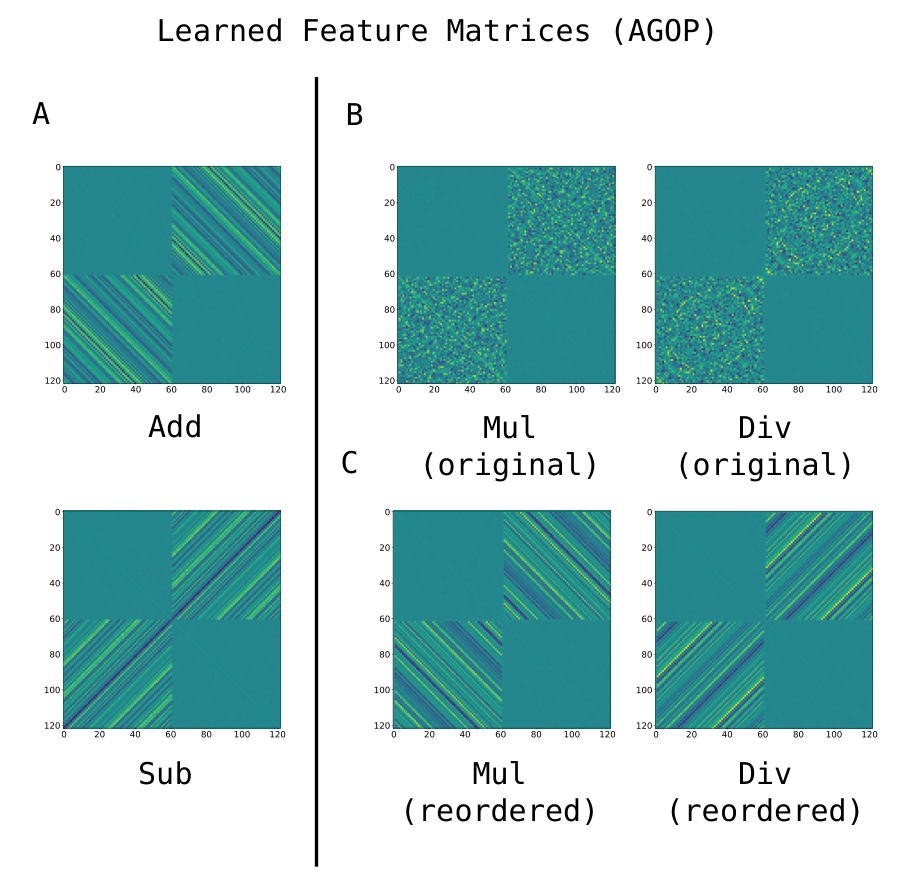
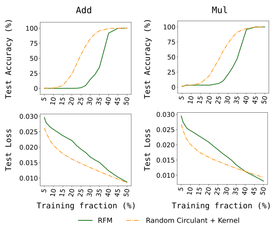
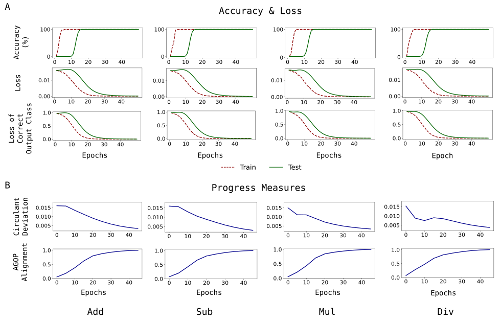
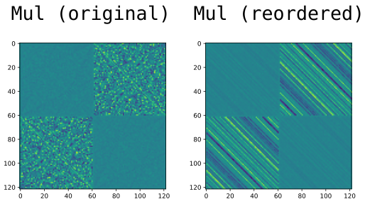
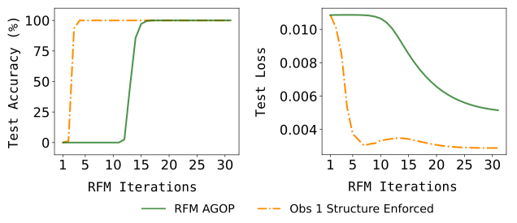
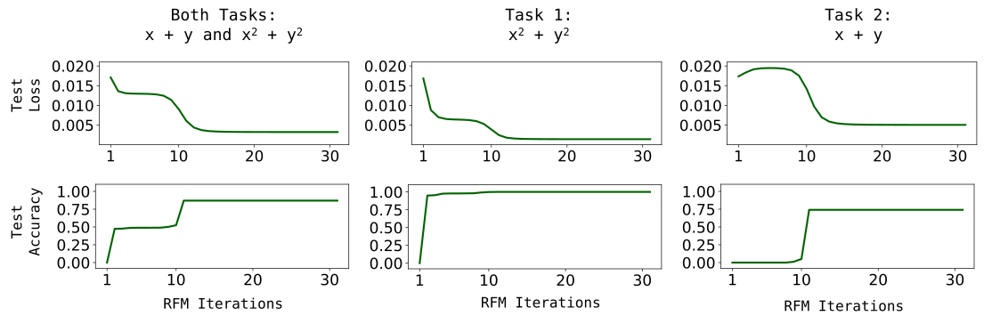
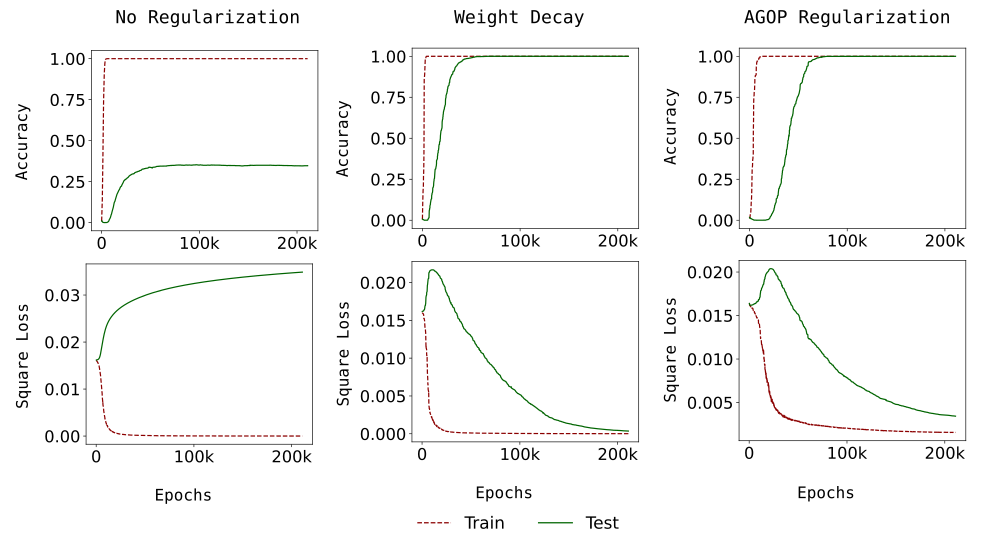

# Mallinar et al. 2025 — Emergence in non-neural models: grokking modular arithmetic via average gradient outer product

См. также: [глобальный индекс понятий](../../concepts/index.md).
arXiv [2407.20199v3](https://arxiv.org/abs/2407.20199), 29 июля 2024 (v3 — 9 июля 2025). Колонтитула у PDF нет (только номера страниц); в примечании arXiv: «Accepted to ICML 2025 (Oral presentation & Spotlight poster)».

**Neil Mallinar** — UC San Diego; The Broad Institute of MIT and Harvard.
**Daniel Beaglehole, Libin Zhu, Mikhail Belkin** — UC San Diego.
**Adityanarayanan Radhakrishnan** — The Broad Institute of MIT and Harvard.
**Parthe Pandit** — IIT Bombay.

Оригинал и производные файлы этой папки:

- [`original/2407.20199.native.html`](original/2407.20199.native.html) — первоисточник, нативный HTML-рендеринг arXiv (LaTeXML), скачан как есть.
- [`original/2407.20199.emergence-in-non-neural-models-grokking-modular-arithmetic-via-average-gradient-outer-product.md`](original/2407.20199.emergence-in-non-neural-models-grokking-modular-arithmetic-via-average-gradient-outer-product.md) — конверсия оригинала в Markdown без правок содержания; английский текст для сверки перевода.
- [`images/`](images/) — иллюстрации статьи в исходном разрешении (14 файлов).
- [`2407.20199.emergence-in-non-neural-models-grokking-modular-arithmetic-via-average-gradient-outer-product.claims.txt`](2407.20199.emergence-in-non-neural-models-grokking-modular-arithmetic-via-average-gradient-outer-product.claims.txt) — рабочий разбор: пронумерованные утверждения с пометками.

Схема якорей и правила ссылок на карточку — в [README папки статей](../README.md).

## Затрагиваемые понятия

**[Гроккинг](../../concepts/grokking.md)** — работа переносит явление на носитель, у которого нет ни нейронного устройства, ни градиентной оптимизации параметров: гроккинг модульной арифметики воспроизведён в рекурсивной признаковой машине (RFM) — ядерной машине, которой выучивание признаков придано извне, через усреднённое внешнее произведение градиентов (AGOP) ([с. 1, абз. 2](#p1-2)). Существенно для корпуса, что здесь отсрочка не может быть борьбой запоминающего решения с обобщающим: безгребневая ядерная регрессия решается точно, и обучающая потеря тождественно нулевая на **каждой** итерации, а тестовые точность и потеря стоят на случайном уровне первые восемь итераций ([с. 7, абз. 2](#p7-2), [рис. 2](#fig-2)). Чего в работе нет: переноса пункта «не предсказывается обучающей потерей» на нейронные сети — авторы сами оговаривают в сноске 2, что для сетей на SGD возникновение от обучающей потери отвязать нельзя, ибо ненулевая потеря нужна, чтобы обучение шло ([с. 2, абз. 4](#p2-4)). Нет и разброса: слово «seed» в работе не встречается ни разу, все кривые — по одному прогону, модуль во всех основных опытах один ($p=61$).

**[Эмерджентность](../../concepts/emergence.md)** — заявка работы прямая: резкое возникновение в модульной арифметике проистекает целиком из выучивания признаков, независимо от прочих сторон построения модели и обучения ([с. 2, абз. 2](#p2-2)). Против «миража» Schaeffer et al. работа возражает по оси вычислений: переходы не предсказываются стандартными *априорными* мерами качества — ни непрерывными, ни разрывными ([с. 14, абз. 7](#p14-7)). Но по оси объёма данных авторы с «миражом» соглашаются: точность растёт резко около доли обучения $25\%$, а тестовая потеря и согласованность AGOP меняются плавно, и возникновение по объёму данных «может быть „миражом“ в смысле [38]» ([с. 15, абз. 6](#p15-6), [прил. рис. 6](#fig-app-6)). По оси размера модели работа не говорит ничего и говорит об этом прямо: ядерную машину они рассматривают как сеть бесконечной ширины. Отдельное наблюдение для рамки «навыков», вынесенное в замечание основного текста ([с. 10, абз. 1](#p10-1)) и подкреплённое опытом приложения E: две задачи, обучаемые вместе, грокаются в разные поры ([с. 21, абз. 3](#p21-3), [прил. рис. 3](#fig-app-3)).

**[Возникновение признаков](../../concepts/feature-emergence-feature-learning.md)** — здесь средоточие работы. AGOP определён для любого дифференцируемого предсказателя, в том числе для того, который сам признаков не учит ([Опр. 2.1](#p5-5)), а RFM чередует точное решение ядерной регрессии с обновлением $M_{t+1}=[G(f^{(t)})]^{s}$ при $s=\frac{1}{2}$ ([с. 6, абз. 1](#p6-1)). Работа даёт корпусу редкую вещь — разделение выучивания признаков и обучения предсказателя **по построению**, а не по совпадению: признаки развиваются, пока обе потери молчат. Сетевая сторона: нейронная признаковая матрица $W_{1}^{\top}W_{1}$ и квадратный корень из AGOP связаны с корреляцией Пирсона выше $0.92$ (0.955 / 0.942 / 0.924 / 0.929 по четырём задачам) — Neural Feature Ansatz в этой постановке держится ([с. 11, абз. 6](#p11-6), [рис. 6](#fig-6)). Чего в работе нет: объяснения того, **отчего** AGOP выходит именно на циркулянт, — показано, что выходит, и что случайный циркулянт работает не хуже.

**[Модульная арифметика](../../concepts/modular-arithmetic.md)** — четыре действия ($+,-,\times,\div$) над $\mathbb{Z}_{p}$ при одном модуле $p=61$; вход — склейка двух one-hot векторов $\boldsymbol{e}_{a}\oplus\boldsymbol{e}_{b}\in\mathbb{R}^{2p}$, выход — $\boldsymbol{e}_{f^{*}(a,b)}$, обучение идёт на случайной доле $r$ всех дискретных пар ([с. 4, абз. 3](#p4-3)). Вклад в понимание задачи — приём переупорядочения: умножение и деление становятся сложением и вычитанием после переупорядочения координат дискретным логарифмом, и лишь тогда циркулянтное строение признаков делается видимым ([рис. 3](#fig-3), [рис. 8](#fig-8)); лемма G.1 показывает, что выбор образующей на это не влияет. Заглавный [рисунок 1](#fig-1) построен при $p=59$, а модуль $p=97$ встречается только в двух приложенных рисунках ([прил. рис. 2](#fig-app-2), [прил. рис. 6](#fig-app-6)).

**[Обучение структурированных представлений](../../concepts/structured-representation-learning.md)** — вид выученного представления выписан явно. Наблюдение 1: итоговая признаковая матрица имеет вид $M^{*}=\begin{pmatrix}A&C^{\top}\\ C&A\end{pmatrix}$, где $C$ — несимметричный циркулянт, а $A=c_{1}I+c_{2}\boldsymbol{1}\boldsymbol{1}^{\top}$ ([с. 7, абз. 5](#p7-5)). Заявлено это именно как *наблюдение*, а не теорема, и относится к сложению/вычитанию (для умножения/деления — после переупорядочения). Существенная для корпуса оговорка: выученные признаки **полноранговы**, хотя решение малого ранга (модель индекса $4$) для этих задач существует и выписано в приложении H, — низкоранговое объяснение гроккинга работой не принято, а отвергнуто опытом ([с. 15, абз. 4](#p15-4), [с. 23, абз. 8](#p23-8)).

**[Меры прогресса](../../concepts/progress-measures.md)** — работа предлагает две «скрытые меры продвижения» (сама отсылая к Barak et al.) — циркулянтное отклонение и согласованность AGOP ([с. 3, абз. 2](#p3-2)). Обе растут плавно, поначалу почти линейно, ровно в ту пору, когда тестовая потеря стоит, — и у RFM, и у сетей ([с. 8, абз. 8](#p8-8), [рис. 2](#fig-2), [рис. 5](#fig-5)). Чего в работе нет: практического предсказателя. Обе меры объявлены *апостериорными* прямо: циркулянтное отклонение требует заранее знать вид ответа, согласованность AGOP — доступа к полностью обученной модели, и в один ряд с ними авторы ставят фурье-зазор Barak et al. и обратное отношение участия Doshi et al. ([с. 9, абз. 3](#p9-3), [с. 14, абз. 7](#p14-7)).

**[Фурье-признаки и контуры](../../concepts/fourier-features-circuits.md)** — алгоритм фурье-умножения (FMA) перенесён с сетей на ядерные машины: [теорема 5.1](#p14-1) утверждает, что ядерные предсказатели с блочно-циркулянтными $M_{\ell}$, обученные на **всех** дискретных данных, в точности воспроизводят FMA для модульного вычитания ([раздел 5](#sec-5)). Следствие для корпуса: фурье-умножение оказывается свойством задачи и вида признаков, а не свойством трансформера. Чего в работе нет: доказательства того, что RFM **выучивает** FMA. Матрицы $M_{\ell}=\begin{pmatrix}0&C^{\ell}\\ (C^{\ell})^{\top}&0\end{pmatrix}$ заданы вручную, своя на каждую выходную координату, — и авторы сами оговаривают, что «наше построение отличается от RFM» ([с. 14, абз. 2](#p14-2)); связь построения с успехом RFM на доле данных объявлена догадкой («мы предполагаем», [с. 14, абз. 4](#p14-4)).

**[Каузальная абляция](../../concepts/causal-ablation-intervention.md)** — самое сильное место работы для корпуса: проверка не корреляцией, а вмешательством. **Случайная** циркулянтная матрица, которой преобразуют входы, позволяет обычной гауссовой ядерной машине — уже без RFM и без всякого выучивания признаков — решать модульную арифметику, причём она обгоняет kernel-RFM ([с. 9, абз. 4](#p9-4), [рис. 4](#fig-4)). То же вмешательство для сетей: при доле обучения $17.5\%$ сеть на преобразованных входах достигает $100\%$ за несколько сотен эпох, а на обычных one-hot не достигает и за $3000$ ([с. 12, абз. 1](#p12-1), [рис. 7](#fig-7)). Третье, более слабое вмешательство: навязывание точного циркулянтного строения подматрицам на каждой итерации RFM ускоряет гроккинг и улучшает тестовую потерю ([с. 21, абз. 1](#p21-1), [прил. рис. 2](#fig-app-2)). Отсюда вывод авторов: никакого строения сверх типичного циркулянта не требуется. Побочное следствие, которое авторы не подчёркивают: выучивание признаков через AGOP оказывается не наилучшим путём к тому же признаку.

**[Фаза меморизации](../../concepts/memorization-phase.md)** — работа даёт корпусу плато, на котором нечего запоминать и нечему вытесняться: у RFM обучающая потеря численно нулевая с самой первой итерации, то есть «переобучение» достигнуто мгновенно и не меняется, а плато тестового качества всё равно есть ([с. 7, абз. 2](#p7-2)). Языка «запоминающего» и «обобщающего» решений работа не употребляет вовсе; плато описано как пора добывания признака.

**[Фазовый переход](../../concepts/phase-transition.md)** — переход наблюдается и называется резким, но аппарата фазовых переходов (параметра порядка, критических показателей, термодинамического предела) работа не вводит и не использует. Её вклад в спор о разрывности — разведение двух осей: по вычислениям переход резок и не предсказуем априорными мерами, по объёму обучающих данных он, возможно, «мираж» ([с. 14, абз. 7](#p14-7), [с. 15, абз. 6](#p15-6)).

**[От ленивого к богатому](../../concepts/lazy-to-rich-kernel-to-feature-learning.md)** — прямое возражение: «наши опыты ясно показывают, что гроккинг у RFM такого перехода не претерпевает», и потому «двухпорность не может служить общим объяснением гроккинга по вычислениям» ([с. 16, абз. 1](#p16-1)). Возражение адресовано [Kumar et al. 2023](../2310.06110.grokking-as-the-transition-from-lazy-to-rich-training-dynamics/2310.06110.grokking-as-the-transition-from-lazy-to-rich-training-dynamics.card.md), [Lyu et al. 2024](../2311.18817.dichotomy-of-early-and-late-phase-implicit-biases-can-provably-induce-grokking/2311.18817.dichotomy-of-early-and-late-phase-implicit-biases-can-provably-induce-grokking.card.md) и [Mohamadi et al. 2024](../2407.12332.why-do-you-grok-a-theoretical-analysis-of-grokking-modular-addition/2407.12332.why-do-you-grok-a-theoretical-analysis-of-grokking-modular-addition.card.md). Читать его следует с поправкой, которую стоит держать в уме: у RFM ленивой поры нет **по построению** — ядерный шаг точен на каждой итерации, — так что показана неуниверсальность объяснения, а не его неверность для сетей; для своих же сетей авторы говорят слабее — «мы не наблюдали существенных свидетельств». Языка NTK работа не употребляет: единственное её замечание о ядрах и сетях — что ядерную машину можно рассматривать как сеть бесконечной ширины ([с. 15, абз. 6](#p15-6)).

**[Эффективность контуров](../../concepts/circuit-efficiency.md)** — то же возражение, обращённое к [Varma et al. 2023](../2309.02390.explaining-grokking-through-circuit-efficiency/2309.02390.explaining-grokking-through-circuit-efficiency.card.md) и [Nanda et al. 2023](../2301.05217.progress-measures-for-grokking-via-mechanistic-interpretability/2301.05217.progress-measures-for-grokking-via-mechanistic-interpretability.card.md): поскольку гроккинг происходит в ядерной модели с линейным устройством выучивания признаков, объяснения, зависящие от величины весов, от эффективности нейронных контуров или от свойств оптимизации, «не в состоянии объяснить описанные в нашей работе явления» ([с. 16, абз. 2](#p16-2)). Никакого разбора контуров, вытеснения или их эффективности работа не проводит — она лишь показывает носитель, на котором эти понятия не определены.

**[Минимизация нормы весов](../../concepts/weight-norm-minimization.md)** — тот же абзац ([с. 16, абз. 2](#p16-2)) снимает притязание на общность и с объяснений через величину весов: у ядерной машины весов сети нет, а гроккинг есть. Своей теории нормы работа не предлагает; заметим, что и обратного — что норма не важна для сетей — она не показывает.

**[Weight decay](../../concepts/weight-decay.md)** — работа даёт корпусу устройственную догадку о том, **чем** weight decay помогает: при NFA штраф $\|W_{1}\|_{F}^{2}=\mathrm{tr}(W_{1}^{\top}W_{1})$ должен вести себя схоже со штрафом на след AGOP, $\mathrm{tr}(G(f))$, — то есть weight decay работает как заместитель штрафа на AGOP ([с. 12, абз. 3](#p12-3)). Опытная опора: на ванильном SGD без регуляризации гроккинга нет, а с weight decay и с AGOP-регуляризацией он есть ([прил. рис. 5](#fig-app-5)). Цена этой опоры невелика и должна называться: опыт единственный (сложение, $p=61$, доля 40 %, ширина 512), причём weight decay в нём взят $10^{-5}$, тогда как в основных сетевых опытах он равен $1.0$ ([с. 20, абз. 7](#p20-7)); сопоставимость плеч по силе регуляризации не показана.

**[Когда регуляризация необходима](../../concepts/regularization-necessity.md)** — работа добавляет в спор третий ответ: необходима не именно $\ell_{2}$-норма весов, а **какой-то** штраф, действующий на AGOP; в её опыте штраф на след AGOP заменяет weight decay без потери гроккинга ([с. 12, абз. 3](#p12-3), [прил. рис. 5](#fig-app-5)). Заметим, что сама постановка с RFM в этом споре не участвует: у ядерного шага регуляризатора нет вовсе (регрессия безгребневая), и гроккинг там возникает без всякой регуляризации.

**[Доля данных / критический размер набора](../../concepts/data-fraction-critical-dataset-size.md)** — доля обучения служит и рычагом опытов (50 % в основных сетевых, 17,5 % во вмешательстве со случайным циркулянтом, 40 % в опыте с регуляризацией, 80 % в многозадачном), и отдельной осью возникновения. По этой оси измерена одна кривая: при $x+y\,\mathrm{mod}\,97$ тестовая точность растёт резко около $25\%$ доли обучения, тогда как тестовая потеря и согласованность AGOP растут плавно ([с. 15, абз. 6](#p15-6), [прил. рис. 6](#fig-app-6)). Ни имени, ни формулы критического порога работа не даёт.

**[Эталонный полигон гроккинга](../../concepts/canonical-grokking-testbed.md)** — от полигона [Power et al. 2022](../2201.02177.grokking-generalization-beyond-overfitting-on-small-algorithmic-datasets/2201.02177.grokking-generalization-beyond-overfitting-on-small-algorithmic-datasets.card.md) взята только рамка данных: таблица бинарной операции, one-hot символы, доля обучения как рычаг. Всё остальное заменено: ни трансформера, ни кросс-энтропии, ни $p=97/113$ — модуль $61$, квадратичная потеря, а сетевым двойником служит однослойная сеть с квадратичной активацией из [Gromov 2023](../2301.02679.grokking-modular-arithmetic/2301.02679.grokking-modular-arithmetic.card.md). Трансформеров в работе нет вовсе, тогда как рамка рассуждения — про возникновение навыков вообще и про большие языковые модели.

**[Оптимизатор](../../concepts/optimizer-adam-adamw-sgd.md)** — заявка «не привязано к градиентным методам оптимизации» относится к оптимизации **параметров**: у RFM параметров, обновляемых шагом по градиенту, нет, ядерная задача решается точно ([с. 7, абз. 2](#p7-2)). Сама величина, на которой всё держится, — усреднение внешних произведений **градиентов** предсказателя по входу ([Опр. 2.1](#p5-5)); в тексте авторы аккуратны и пишут «gradient descent-based optimization», в заголовке этой оговорки нет. В сетевых опытах — AdamW, шаг $10^{-3}$, weight decay $1.0$, пакет 32, ширина 1024, 50 эпох; ванильный SGD появляется только в опыте с AGOP-регуляризацией ([с. 11, абз. 1](#p11-1), [с. 20, абз. 7](#p20-7)).

**[Механистическая интерпретируемость](../../concepts/mechanistic-interpretability.md)** — разбор здесь не контурный, а матричный: выученное представление читается прямо с признаковой матрицы (полосы = циркулянтные блоки), а его вычислительный смысл устанавливается теоремой о равносильности FMA ([с. 7, абз. 5](#p7-5), [теорема 5.1](#p14-1)). Оговорка авторов о пределах приёма ценна для корпуса: строение видно лишь после переупорядочения дискретным логарифмом, а до него зримого узора нет ([рис. 8](#fig-8)) — «в других постановках скрытые строения признаков может быть трудно распознать из-за отсутствия сравнимых математических озарений» ([с. 15, абз. 1](#p15-1)). Ни абляций, ни вырезания частот, ни разбора отдельных нейронов в работе нет.

**[Максимизация отступа](../../concepts/margin-maximization-implicit-bias.md)** — лишь упоминание, но со внятной оценкой: несколько работ доказывали, что выучивание модульной арифметики может объясняться максимизацией отступа относительно определённых норм, и «хотя направление многообещающее, общие лежащие в основе начала пока не выяснены» ([с. 15, абз. 2](#p15-2)). Своего разбора отступов работа не ведёт.

**[Нейронный коллапс](../../concepts/neural-collapse.md)** — лишь упоминание в заключении: глубокий нейронный коллапс назван одним из явлений, объяснимых устройствами выучивания признаков на основе AGOP, наряду с многоиндексными моделями и восполнением матриц малого ранга ([с. 16, абз. 4](#p16-4)). Никаких измерений коллапса в работе нет.

Карточки статей корпуса, к которым работа примыкает: [Power et al. 2022](../2201.02177.grokking-generalization-beyond-overfitting-on-small-algorithmic-datasets/2201.02177.grokking-generalization-beyond-overfitting-on-small-algorithmic-datasets.card.md) — исходное явление и рамка данных; [Gromov 2023](../2301.02679.grokking-modular-arithmetic/2301.02679.grokking-modular-arithmetic.card.md) — сетевой двойник (однослойная квадратичная сеть); [Nanda et al. 2023](../2301.05217.progress-measures-for-grokking-via-mechanistic-interpretability/2301.05217.progress-measures-for-grokking-via-mechanistic-interpretability.card.md) — FMA, принятый здесь как целевой алгоритм без пересмотра; [Barak et al. 2022](../2207.08799.hidden-progress-in-deep-learning-sgd-learns-parities-near-the-computational-limit/2207.08799.hidden-progress-in-deep-learning-sgd-learns-parities-near-the-computational-limit.card.md) — «скрытые меры продвижения», на которые работа ссылается вводя свои; [Varma et al. 2023](../2309.02390.explaining-grokking-through-circuit-efficiency/2309.02390.explaining-grokking-through-circuit-efficiency.card.md) и [Kumar et al. 2023](../2310.06110.grokking-as-the-transition-from-lazy-to-rich-training-dynamics/2310.06110.grokking-as-the-transition-from-lazy-to-rich-training-dynamics.card.md) — объяснения, объявленные здесь неспособными объяснить показанное; [Miller, O'Neill, Bui 2024](../2310.17247.grokking-beyond-neural-networks-an-empirical-exploration-with-model-complexity/2310.17247.grokking-beyond-neural-networks-an-empirical-exploration-with-model-complexity.card.md) — более ранняя заявка «гроккинг вне нейросетей», здесь помянутая лишь номером в перечислительной скобке; [Tomàs, Mallinar, Belkin 2026](../2604.00316.breaking-data-symmetry-is-needed-for-generalization-in-feature-learning-kernels/2604.00316.breaking-data-symmetry-is-needed-for-generalization-in-feature-learning-kernels.card.md) — прямое продолжение той же линии на том же RFM.

---

## Несогласованности внутри статьи

**Степень матрицы в анзаце названа тремя способами.** В [Анзаце 1](#p20-2) степень объявлена как $\alpha\in(0,1]$, в самой формуле (15) стоит $s$ ($W_{1}^{\top}W_{1}\propto{G}(f^{\mathrm{NN}})^{s}$), а следующим абзацем сказано «мы выбираем $\alpha=\frac{1}{2}$». Читать следует как одну и ту же величину под двумя буквами — ту же, что $s=\frac{1}{2}$ в алгоритме RFM.

**Ошибка индекса в лемме G.1.** В формуле (18) записано $C_{q_{1}^{i},q_{1}^{j}}=C_{q_{1}^{i+s},q_{1}^{i+s}}$, тогда как из предположения циркулянтности следует $C_{q_{1}^{i+s},q_{1}^{j+s}}$ — второй индекс справа должен нести $j$, и именно так лемма используется дальше в доказательстве ([с. 22, абз. 2](#p22-2)).

**Знак степени и транспонирование в доказательстве теоремы 5.1.** В выкладке ([с. 23, абз. 3](#p23-3)) равенство $f_{\ell}(X)=\left(\ldots\right)^{\top}=C^{-\ell}$ через «$\iff$» превращается в $\ldots=C^{\ell}$: правая часть меняет знак степени, а транспонирование по дороге исчезает без объяснения. Итог доказательства ($f_{\ell}(x)=x_{[1]}^{\top}C^{-\ell}x_{[2]}$) с этим не спорит, но промежуточный шаг записан неверно.

**Ссылка на не ту формулу в приложении H.** Фраза «Мы продолжаем $\Phi$ на $\mathbb{R}^{p}\times\mathbb{R}^{p}$ как в ур. 19 выше» ([с. 24, абз. 9](#p24-9)) указывает на равенство (19), которое относится к декодирующему отображению $\Psi$; продолжение $\Phi$ на пары задано соседним ненумерованным равенством. Рядом — россыпь опечаток, необычная для устного доклада ICML: «a liner map», «The construction is for multiplication is very similar» ([с. 24, абз. 8](#p24-8)), «this regularizer been used prior work» (в переводе они переданы по смыслу, молча).

**Алгоритм 1 возвращает не последнюю признаковую матрицу.** В [записи алгоритма](#p5-3) цикл считает $M_{t+1}$ при $t=0,\ldots,T-1$, то есть доходит до $M_{T}$, а возвращается $M_{T-1}$; в списке входных аргументов ($X,y,k,T,L$) матричная степень $s$ не значится, хотя в пояснении к строке она названа. Опечатки набора, но они стоят в единственном формальном изложении алгоритма.

**Тестовая потеря: «не предсказывает» в аннотации против «начинает улучшаться» в тексте.** [Аннотация](#p1-2) говорит, что переход нельзя предсказать «ни по обучающей потере, которая тождественно нулевая, ни по тестовой потере, которая на первых итерациях остаётся неизменной». Описание рисунка 1 говорит иное ([с. 3, абз. 1](#p3-1)): «около итерации $10$ тестовая потеря начинает улучшаться, а несколькими итерациями позже тестовая точность быстро переходит к $100\%$», а на рис. 2A потери и точность стоят первые восемь итераций и затем расходятся во времени. То есть тестовая потеря у RFM — опережающий признак с запасом в несколько итераций, а неизменна она лишь на начальном отрезке. Оговорка теряется при цитировании: формулировка аннотации переходит в цитирующие работы как «переход не предсказывается ни обучающей, ни тестовой потерей» (см. [Prieto et al. 2025](../2501.04697.grokking-at-the-edge-of-numerical-stability/2501.04697.grokking-at-the-edge-of-numerical-stability.card.md)).

---

## Что доказано, что показано и что предположено

Замечания редактора карточки по итогам разбора утверждений (`…claims.txt`). Работа опытная: одна теорема, две леммы и шестнадцать страниц опытов и приложений.

**Сильнее всего — постановка, а не результат.** Ядерная машина своего устройства выучивания признаков не имеет, а безгребневая регрессия решается точно, поэтому обучающая потеря тождественно нулевая на каждой итерации ([с. 7, абз. 2](#p7-2)). Выучивание признаков отвязано от убывания обучающей потери **по построению**, а не по совпадению, — и это то, чего нельзя устроить в сети на SGD, как авторы прямо и признают ([с. 2, абз. 4](#p2-4)).

**Показано вмешательством, а не корреляцией.** Случайный циркулянт, подставленный и в обычное ядро, и в сеть, снимает отсрочку ([с. 9, абз. 4](#p9-4), [с. 12, абз. 1](#p12-1)). Это самая сильная в корпусе проверка того, что отсрочка есть время добывания признака: признак задан наугад, минуя всякое выучивание, — и отсрочки нет. Отсюда же вывод авторов, что «никакого дополнительного строения» сверх типичного циркулянта не требуется.

**Проверка против очевидного возражения сделана.** Плато не есть следствие усреднения потери по $61$ выходу: потеря на координате верного класса повторяет суммарную — и у RFM, и у сети ([рис. 2](#fig-2), [рис. 5](#fig-5)).

**Доказано меньше, чем звучит.** [Теорема 5.1](#p14-1) описывает не разбираемый прогон RFM, а построение: (1) своя матрица $M_{\ell}$ на каждую выходную координату вместо одной общей — расхождение признано авторами ([с. 14, абз. 2](#p14-2)); (2) обучение на **всех** $p^{2}$ точках, а не на доле; (3) $M_{\ell}$ задана вручную как $C^{\ell}$, а не получена как AGOP; (4) $A=0$, тогда как в [Наблюдении 1](#p7-5) $A=c_{1}I+c_{2}\boldsymbol{1}\boldsymbol{1}^{\top}$. Утверждение о том, что именно неявное фурье-представление позволяет RFM учиться с доли данных, объявлено догадкой: «мы предполагаем» ([с. 14, абз. 4](#p14-4)).

**Наблюдение 1 — наблюдение.** Вид итоговой признаковой матрицы заявлен как наблюдение, а не теорема ([с. 7, абз. 5](#p7-5)); опорой служат рисунки и то, что циркулянтное отклонение к концу обучения близко к нулю ([с. 8, абз. 8](#p8-8)).

**Меры продвижения апостериорны, и это сказано прямо.** Циркулянтное отклонение требует заранее знать вид ответа, согласованность AGOP — обученную модель ([с. 9, абз. 3](#p9-3), [с. 14, абз. 7](#p14-7)). Практического предсказателя работа не даёт и не заявляет.

**Возражения соседям неравносильны.** Довод против двухпорного перехода «ленивое → богатое» опирается на устройство, у которого ленивой поры нет по построению ([с. 16, абз. 1](#p16-1)); довод против объяснений через величину весов и эффективность контуров — на устройство, где ни весов сети, ни контуров нет ([с. 16, абз. 2](#p16-2)). В обоих случаях показана неуниверсальность объяснения, а не его неверность для сетей; для собственных сетевых опытов авторы и говорят слабее — «мы не наблюдали существенных свидетельств».

**Опытная опора уже, чем рамка рассуждения.** Один модуль $p=61$ в основных опытах, однослойные сети с квадратичной активацией, квадратичное и гауссово ядра, подобранные под билинейную природу задачи; ни семян, ни повторов, ни полос погрешности — слово «seed» в работе не встречается ни разу. Ключевой опыт с AGOP-регуляризацией единственный, и weight decay в нём на пять порядков слабее, чем в основных сетевых опытах ([с. 20, абз. 7](#p20-7)). Трансформеров нет вовсе, тогда как обсуждение ведётся о возникновении навыков вообще.

**Заявка заголовка шире заявки текста.** «Гроккинг без градиентного спуска» относится к оптимизации параметров: AGOP — усреднение внешних произведений **градиентов** предсказателя ([Опр. 2.1](#p5-5)). В тексте авторы пишут аккуратно — «gradient descent-based optimization»; в заголовке оговорки нет, и именно она теряется при цитировании.

**Первенство не обсуждено.** Заявка «гроккинг вне нейросетей» сделана раньше — [Miller, O'Neill, Bui 2024](../2310.17247.grokking-beyond-neural-networks-an-empirical-exploration-with-model-complexity/2310.17247.grokking-beyond-neural-networks-an-empirical-exploration-with-model-complexity.card.md) на гауссовых процессах, линейной регрессии и байесовых сетях. Здесь эта работа помянута лишь номером в перечислительной скобке во введении и нигде не разобрана; отличие (там — модели со штрафом за сложность, здесь — ядро с выучиванием признаков) нигде не проговорено.

---

## Ошибочные цитирования

Замечания редактора карточки о местах, где эта работа передаёт итоги других работ с усилением или без авторских оговорок.

###### mc-2303-06173

**Davies, Langosco, Krueger (2303.06173) — необходимость weight decay, приписанная работе, которая говорит об ускорении.** Утверждение статьи: `"It has been argued in prior work that weight decay ($\ell_{2}$ regularization on network weights) is necessary for grokking to occur when training neural networks for modular arithmetic tasks [42, 10, 31]."` — *«В прежних работах доказывалось, что weight decay ($\ell_{2}$-регуляризация весов сети) необходим, чтобы гроккинг имел место при обучении нейронных сетей на задачах модульной арифметики»* ([с. 12, абз. 3](#p12-3)). Из трёх ссылок проверку выдерживают две. Nanda et al. и вправду пишут о необходимости прямо: `"we provide additional evidence that weight decay is necessary for grokking"`, добавляя, впрочем, оговорку `"without weight decay or some other form of regularization"` — то есть речь о какой-либо регуляризации, а не именно об $\ell_{2}$ ([карточка Nanda et al. 2023](../2301.05217.progress-measures-for-grokking-via-mechanistic-interpretability/2301.05217.progress-measures-for-grokking-via-mechanistic-interpretability.card.md)). Varma et al. требуют присутствия weight decay внутри своей теории — `"just on weight decay being present at all"` ([Varma, с. 3, абз. 9](../2309.02390.explaining-grokking-through-circuit-efficiency/2309.02390.explaining-grokking-through-circuit-efficiency.card.md#p3-9)). А вот у Davies et al. сказано иное: `"In the grokking setting, however, weight decay plays a significant role in speeding up time to generalization (Power et al. 2022)."` — *«В постановке гроккинга, однако, weight decay играет значительную роль в ускорении времени до генерализации»* ([Davies, с. 5, абз. 3](../2303.06173.unifying-grokking-and-double-descent/2303.06173.unifying-grokking-and-double-descent.card.md#p5-3)); необходимости они не утверждают, а объяснение своё называют предположением («we speculate»). Класс: **расширяющее** — усилено «ускоряет» до «необходим», и на этом усиленном виде строится противопоставление с AGOP-регуляризацией. Заметим, что при пересчёте на две оставшиеся ссылки заявка работы не рушится: её собственный опыт показывает лишь, что штраф на след AGOP заменяет weight decay, и этому наблюдению противопоставление не нужно.

---

## Ошибочные пересказы и цитирования этой статьи

Ниже — узоры, замеченные в цитирующих работах корпуса: что именно искажается и какие авторские оговорки при этом теряются. Ссылки ведут на абзацы самих авторов.

**«Доказано, что RFM выучивает алгоритм фурье-умножения» (ошибочное).** Цитирующие переносят [теорему 5.1](#p14-1) с построения на выучивание: у [Truong et al. 2026](../2604.13123.spectral-entropy-collapse-as-a-phase-transition-in-delayed-generalisation/2604.13123.spectral-entropy-collapse-as-a-phase-transition-in-delayed-generalisation.card.md) — `"They prove (their Theorem 5.1, with the argument building on two diagonalisation lemmas for circulant matrices) that RFM with Gaussian and quadratic kernels learns block-circulant feature transformations that implement the Fourier Multiplication Algorithm on cyclic groups $\mathbb{Z}/p\mathbb{Z}$"`, то есть теорема прочитана как утверждение о том, что RFM с гауссовым и квадратичным ядрами *выучивает* такие признаки. Авторы утверждают другое. Признаковые матрицы $M_{\ell}$ в теореме заданы вручную как $C^{\ell}$, своя на каждую выходную координату, обучение идёт на **всех** дискретных данных, а итог доказан для модульного **вычитания**; сами авторы пишут, что «наше построение отличается от RFM» ([с. 14, абз. 2](#p14-2)). Блочно-циркулянтность выученных признаков — [наблюдение](#p7-5), опирающееся на рисунки и на близость циркулянтного отклонения к нулю, а связь построения с успехом RFM на доле данных прямо названа догадкой ([с. 14, абз. 4](#p14-4)). Тот же перенос — у [Zhang et al. 2026](../2603.29262.grokking-from-abstraction-to-intelligence/2603.29262.grokking-from-abstraction-to-intelligence.card.md): `"Motivated by the empirical consensus that neural networks implementing modular arithmetic converge to the FMA (Mallinar et al., 2025)"` — здесь единственная теорема о ядерных машинах превращена ещё и в «эмпирический консенсус» о нейронных сетях.

**«Гроккинг показан на нейронных сетях» (ошибочное).** Работа попадает в перечни свидетельств о сетях, тогда как её предмет — ненейронный носитель: у [Gu et al. 2025](../2504.03162.beyond-progress-measures-theoretical-insights-into-the-mechanism-of-grokking/2504.03162.beyond-progress-measures-theoretical-insights-into-the-mechanism-of-grokking.card.md) — `"This view was quickly overturned by the grokking phenomenon that appeared on DNNs (Gromov, 2023; Lyu et al., 2024; Mallinar et al., 2024)."`. Сетевые опыты в статье и вправду есть (раздел 4), но они служат двойником к главному итогу, а не им самим; заявка работы — что явление воспроизводится **вне** сетей и вне градиентной оптимизации параметров ([с. 1, абз. 2](#p1-2)).

**«Установлено, а не наведено на мысль» (расширяющее).** У [Truong et al. 2026](../2604.13123.spectral-entropy-collapse-as-a-phase-transition-in-delayed-generalisation/2604.13123.spectral-entropy-collapse-as-a-phase-transition-in-delayed-generalisation.card.md): `"This establishes, rather than merely suggests, that grokking in modular arithmetic does not require neural architecture or SGD."` Направление верное, вес свидетельства — нет: опыты идут при одном модуле $p=61$, по одному прогону на кривую, без семян и полос погрешности, а усиление опирается на прочтение теоремы 5.1 из предыдущего узора.

**«Признаки RFM согласованы с Фурье по построению» (ошибочное).** Там же: `"In our language, RFM training targets high $A_{\mathrm{Fourier}}$ by design; SGD-trained Transformers reach high $A_{\mathrm{Fourier}}$ *through the entropy-collapse trajectory*."` В алгоритме RFM ничего фурье-подобного не задано: шаг AGOP не знает ни о частотах, ни о циркулянтах, а полосатое строение именно **проступает** в ходе итераций и служит предметом двух предложенных мер продвижения ([с. 8, абз. 8](#p8-8), [рис. 2](#fig-2)). «По построению» фурье-согласована лишь отдельная ядерная машина из теоремы 5.1.

**«Расширили круг задач» (мягкое смещение).** У [Zhang et al. 2026](../2603.29262.grokking-from-abstraction-to-intelligence/2603.29262.grokking-from-abstraction-to-intelligence.card.md): `"While these works have offered various insights and expanded the scope of tasks exhibiting grokking (Miller et al., 2024; Liu et al., 2023a; Mallinar et al., 2025)"`. Круг задач здесь как раз обычный — четыре модульных действия при одном модуле ([с. 4, абз. 3](#p4-3)); расширен круг **моделей**.

Образцовые по точности пересказы, годные как образец: [Tomàs, Mallinar, Belkin 2026](../2604.00316.breaking-data-symmetry-is-needed-for-generalization-in-feature-learning-kernels/2604.00316.breaking-data-symmetry-is-needed-for-generalization-in-feature-learning-kernels.card.md) — `"They argue that grokking is a manifestation of a gradual feature learning process, which can be understood via the Average Gradient Outer Product (AGOP), and that these feature transformations on the input data are sufficient to enable generalization."`; [Xu et al. 2026](../2601.19791.to-grok-grokking-provable-grokking-in-ridge-regression/2601.19791.to-grok-grokking-provable-grokking-in-ridge-regression.card.md) — `"Mallinar et al. (2025) revealed that grokking is not specific to neural networks nor to GD-based optimization methods by showing that grokking occurs when learning modular arithmetic with Recursive Feature Machines (RFM)."` Более слабые отголоски без разбора: [Prieto et al. 2025](../2501.04697.grokking-at-the-edge-of-numerical-stability/2501.04697.grokking-at-the-edge-of-numerical-stability.card.md) (повторяет формулировку аннотации о тестовой потере — см. раздел о несогласованностях), [Xu et al. 2025](../2504.13292.let-me-grok-for-you-accelerating-grokking-via-embedding-transfer-from-a-weaker-model/2504.13292.let-me-grok-for-you-accelerating-grokking-via-embedding-transfer-from-a-weaker-model.card.md), [Notsawo et al. 2025](../2506.05718.grokking-beyond-the-euclidean-norm-of-model-parameters/2506.05718.grokking-beyond-the-euclidean-norm-of-model-parameters.card.md).
---

# Текст статьи

# Emergence in non-neural models: grokking modular arithmetic via average gradient outer product

Neil Mallinar (UC San Diego; The Broad Institute of MIT and Harvard), Daniel Beaglehole (UC San Diego), Libin Zhu (UC San Diego), Adityanarayanan Radhakrishnan (The Broad Institute of MIT and Harvard), Parthe Pandit (IIT Bombay), Mikhail Belkin (UC San Diego); {nmallina,dbeaglehole,libinzhu,mbelkin}@ucsd.edu, aradha@mit.edu; pandit@iitb.ac.in

## Аннотация

###### p1-2

Нейронные сети, обучаемые решать задачи модульной арифметики, обнаруживают *гроккинг* — явление, при котором тестовая точность начинает улучшаться много позже того, как модель достигает $100\%$ точности на обучении в ходе обучения. Его часто берут как пример «возникновения», когда способность модели проявляется резко, через фазовый переход. В этой работе мы показываем, что явление гроккинга не свойственно ни нейронным сетям, ни оптимизации на основе градиентного спуска. А именно, мы показываем, что это явление имеет место при выучивании модульной арифметики рекурсивными признаковыми машинами (Recursive Feature Machines, RFM) — итеративным алгоритмом, который пользуется усреднённым внешним произведением градиентов (Average Gradient Outer Product, AGOP), чтобы дать общим моделям машинного обучения выучивание признаков, свойственных задаче. В сочетании с ядерными машинами итерирование RFM приводит к быстрому переходу от случайной, близкой к нулю, тестовой точности к безупречной тестовой точности. Этот переход нельзя предсказать ни по обучающей потере, которая тождественно нулевая, ни по тестовой потере, которая на первых итерациях остаётся неизменной. Вместо этого, как мы показываем, переход полностью определяется выучиванием признаков: RFM постепенно выучивает блочно-циркулянтные признаки, чтобы решать модульную арифметику. Параллельно итогам для RFM мы показываем, что и нейронные сети, решающие модульную арифметику, выучивают блочно-циркулянтные признаки. Сверх того, мы приводим теоретические свидетельства того, что RFM пользуется такими блочно-циркулянтными признаками, чтобы осуществлять *алгоритм фурье-умножения* (Fourier Multiplication Algorithm), который прежние работы полагали обобщающим решением, выучиваемым нейронными сетями на этих задачах. Наши итоги показывают, что возникновение может проистекать исключительно из выучивания признаков, существенных для задачи, и не свойственно ни нейронным устройствам, ни методам оптимизации на основе градиентного спуска. Сверх того, наша работа добавляет свидетельств в пользу AGOP как ключевого механизма выучивания признаков в нейронных сетях.11 1 Код доступен по адресу https://github.com/nmallinar/rfm-grokking.

## 1 Введение

В последние годы мысль о «возникновении» стала важным повествованием в машинном обучении. Хотя широкого согласия об определении нет [37], часто утверждают, что «навыки» возникают в ходе обучения, как только достигнуты определённые пороги по объёму данных, вычислениям или размеру модели [43, 2]. Более того, полагают, что эти навыки появляются быстро, обнаруживая на этих порогах резкие и, по-видимому, непредсказуемые улучшения качества. Один из простейших и самых поразительных примеров в пользу этой мысли — «гроккинг» модульной арифметики [33, 31]. Нейронная сеть, обучаемая предсказывать модульное сложение или иное арифметическое действие на закреплённом наборе данных, в определённой точке процесса оптимизации быстро переходит от близкой к нулю тестовой точности к безупречной ($100\%$). Удивительно, что точка этого перехода наступает много позже достижения безупречной *точности на обучении*. Это не только противоречит традиционным представлениям о переобучении, но и, как мы увидим ниже, некоторые стороны гроккинга не укладываются гладко в наше нынешнее понимание «доброкачественного переобучения» [4, 8].

**[p. 2]**

Несмотря на большое количество недавних работ о возникновении и, в частности, о гроккинге (см., напр., [33, 22, 31, 39, 13, 25]), природа и даже само существование возникающих явлений остаются спорными. Например, недавняя статья [38] полагает, что быстрое возникновение навыков может быть «миражом» из-за несоответствия между разрывными мерами, используемыми для оценки, такими как точность, и непрерывной потерей, используемой при обучении. Авторы доказывают, что, в отличие от точности, тестовая (или валидационная) потеря либо иная подходяще выбранная мера может убывать постепенно на протяжении обучения и тем самым давать полезную меру продвижения. Ещё одна возможная мера продвижения — обучающая потеря. Поскольку алгоритмы оптимизации типа SGD, как правило, приводят к постепенному убыванию обучающей потери, можно предположить, что навыки появляются, как только обучающая потеря в процессе оптимизации падает ниже определённого порога. И вправду, такая догадка — в духе классической теории обобщения, которая считает обучающую потерю полезным заместителем тестового качества [27].

###### p2-2

В этой работе мы показываем, что резкое возникновение в модульной арифметике проистекает целиком из выучивания признаков, независимо от прочих сторон построения модели и обучения, и не предсказывается стандартными мерами продвижения. Затем мы проясняем природу того выучивания признаков, которое ведёт к возникновению навыков в модульной арифметике. Ниже мы разбираем эти вклады подробнее.

#### Краткий обзор вкладов.

Мы опытным путём показываем, что гроккинг модульной арифметики

###### p2-4

- не свойствен нейронным сетям;
- не привязан к градиентным методам оптимизации;
- не предсказывается ни обучающей, ни тестовой потерей22 2 Заметим, что для нейронных сетей, обучаемых SGD, возникновение нельзя отвязать от обучающей потери, поскольку ненулевая потеря необходима, чтобы обучение вообще шло., не говоря уже о точности.33 3 Заметим, что нулевая тестовая/обучающая потеря влечёт безупречную тестовую/обучающую точность.

###### fig-1

*Рисунок 1: Рекурсивные признаковые машины грокают задачу модульной арифметики ${f^{*}(x,y)=(x+y)\,\mathrm{mod}\,59}$.* **[p. 2]**

А именно, мы показываем гроккинг для рекурсивных признаковых машин (RFM) [35] — алгоритма, который итеративно пользуется усреднённым внешним произведением градиентов (AGOP), чтобы дать выучивание признаков, свойственных задаче, в общих моделях машинного **[p. 3]** обучения. В этой работе мы пользуемся RFM, чтобы дать выучивание признаков ядерным машинам — классу предсказателей, у которых своего устройства выучивания признаков нет. В такой постановке RFM чередует три шага: (1) обучение ядерной машины $f$ подгонке обучающих данных; (2) вычисление матрицы AGOP предсказателя $f$, обозначаемой $M$, по обучающим данным, чтобы извлечь признаки, существенные для задачи; и (3) преобразование входных данных $x$ выученными признаками через отображение $x\to M^{s/2}x$ при матричной степени $s>0$ (подробности см. в разделе 2).

###### p3-1

На рис. 1 мы даём показательный пример гроккинга модульного сложения машиной RFM — при том, что никакие градиентные методы оптимизации не используются, а безупречная (численно нулевая) обучающая потеря достигается на каждой итерации. Мы видим, что в течение первых нескольких итераций и тестовая потеря, и тестовая точность остаются на неизменном (случайном) уровне. Однако около итерации $10$ тестовая потеря начинает улучшаться, а несколькими итерациями позже тестовая точность быстро переходит к $100\%$. Мы наблюдаем также, что уже рано в ходе итераций в признаковых матрицах AGOP проступает строение (см. рис. 1). Постепенное появление строения в этих признаковых матрицах особенно поразительно, если учесть, что обучающая потеря тождественно нулевая на каждой итерации, а тестовая потеря существенно не меняется по меньшей мере до восьмой итерации. Полосатые узоры, наблюдаемые в признаковых матрицах, отвечают матрицам, чьи подблоки циркулянтны, то есть постоянны вдоль диагоналей.44 4 Точнее, элементы циркулянтов постоянны вдоль «длинных» диагоналей, обёртывающихся вокруг матрицы. Признаковые матрицы могут быть также блочно-ганкелевыми, то есть постоянными на антидиагоналях. Если различие не важно, мы будем, как правило, называть все такие матрицы циркулянтными. Такие *циркулянтные признаковые матрицы* ключевы для выучивания модульной арифметики. В разделе 3 мы показываем, что стандартные ядерные машины на *случайных* циркулянтных признаках легко выучивают модульные действия. Поскольку эти случайные циркулянтные матрицы типичны, мы доказываем, что для решения модульной арифметики никакого дополнительного строения не требуется.

###### p3-2

Чтобы показать, что признаковые матрицы развиваются в сторону этого строения (в том числе для умножения и деления при подходящем переупорядочении входных координат), мы вводим две «скрытые меры продвижения» (ср. [3]):

1. *Циркулянтное отклонение* (circulant deviation), измеряющее, насколько диагонали данной матрицы далеки от постоянных.
2. *Согласованность AGOP* (AGOP alignment), измеряющая сходство признаковой матрицы на итерации $t$ с AGOP полностью обученной модели.

Как мы показываем, обе эти меры обнаруживают постепенное (поначалу почти линейное) продвижение к модели, которая обобщает.

Далее мы доказываем, что возникновение в полносвязных нейронных сетях, обучаемых модульной арифметике, выявленное в прежних работах [15, 21], подобно возникновению у RFM и проявляется через AGOP (см. раздел 4). И вправду, изображая ковариации весов сети, мы наблюдаем, что эти модели тоже выучивают блочно-циркулянтные признаки, чтобы грокнуть модульную арифметику. Мы показываем, что эти признаки сильно связаны с AGOP нейронных сетей, что подкрепляет прежние наблюдения из [35]. Сверх того, параллельно нашим наблюдениям для RFM, две предложенные нами меры продвижения указывают на постепенное продвижение к обобщающему решению в ходе обучения нейронной сети. Наконец, ровно как и для RFM, мы показываем, что обучение нейронных сетей на данных, преобразованных случайными блочно-циркулянтными матрицами, резко сокращает время обучения, необходимое для выучивания модульной арифметики.

Отчего эти выученные блочно-циркулянтные признаки действенны для модульной арифметики? Мы приводим подкрепляющие теоретические свидетельства того, что такие циркулянтные признаки приводят к тому, что ядерные машины осуществляют алгоритм фурье-умножения (Fourier Multiplication Algorithm, FMA) для модульной арифметики (см. раздел 5). Для случая нейронных сетей несколько прежних работ доказывали опытно и теоретически, что нейронные сети выучиваются осуществлять FMA, чтобы решать модульную арифметику [31, 42, 29]. Тем самым, хотя kernel-RFM и нейронные сети пользуются разными классами предсказательных моделей, наши итоги говорят о том, что эти модели открывают схожие алгоритмы осуществления модульной арифметики. В частности, эти итоги влекут, что у двух методов одинаковые свойства обобщения вне области определения, когда элементы входных векторов содержат вещественные числа вместо $0$ и $1$, как в обучающих данных.

**[p. 4]**

В целом, отвязав выучивание признаков от обучения предсказателя, наши итоги дают свидетельства в пользу того, что возникающие свойства моделей машинного обучения появляются исключительно как следствие их способности выучивать признаки. Мы надеемся, что наша работа поможет выделить лежащие в основе возникновения устройства и прольёт свет на ключевую практическую заботу — как, когда и почему происходят эти кажущиеся непредсказуемыми переходы.

#### Устройство статьи.

Раздел 2 содержит необходимые понятия и определения. В разделе 3 мы показываем возникновение у RFM и показываем, что признаки AGOP состоят из циркулянтных блоков. В разделе 4 мы показываем, что признаки нейронной сети циркулянтны и схватываются AGOP. В разделе 5 мы доказываем, что ядерные машины с циркулянтными признаками выучивают FMA. В разделе 6 мы даём широкое обсуждение и заключаем.

## 2 Предварительные сведения

#### Выучивание модульной арифметики.

###### p4-3

Пусть $\mathbb{Z}_{p}=\mathbb{Z}/p\mathbb{Z}$ обозначает поле целых чисел по модулю простого $p$, и пусть $\mathbb{Z}_{p}^{*}=\mathbb{Z}_{p}\backslash\{0\}$. Мы выучиваем модульные функции $f^{*}(a,b)=g(a,b)\,\mathrm{mod}\,p$, где $f^{*}:\mathbb{Z}_{p}\times\mathbb{Z}_{p}\rightarrow\mathbb{Z}_{p}$, $a,b\in\mathbb{Z}_{p}$, а $g:\mathbb{Z}\times\mathbb{Z}\rightarrow\mathbb{Z}$ — арифметическое действие над $a$ и $b$, напр. $g(a,b)=a+b$. Заметим, что дискретных входных пар ($a,b$) имеется $p^{2}$ для всех модульных действий, кроме $f^{*}(a,b)=(a\div b)\,\mathrm{mod}\,p$, у которого входов $p(p-1)$, поскольку знаменатель не может быть $0$.

Чтобы обучать модели на задачах модульной арифметики, мы строим пары «вход — метка», кодируя входные числа и метки в one-hot. А именно, для каждой пары $a,b\in\mathbb{Z}_{p}$ мы записываем вход как $\boldsymbol{e}_{a}\oplus\boldsymbol{e}_{b}\in\mathbb{R}^{2p}$, а выход как $\boldsymbol{e}_{f^{*}(a,b)}\in\mathbb{R}^{p}$, где $\boldsymbol{e}_{i}\in\mathbb{R}^{p}$ — $i$-й стандартный базисный вектор в $p$ измерениях, а $\oplus$ обозначает склейку. Например, для сложения по модулю $p=3$ равенство $1+2=0\,\mathrm{mod}\,3$ кодируется парой вектор-вход / вектор-метка в $\mathbb{R}^{6}$ и $\mathbb{R}^{3}$ соответственно:

$$
\text{Input: }(\underbrace{0~1~0}_{a=1}~\underbrace{0~0~1}_{b=2})~;~\text{Label:}\underbrace{(1~0~0)}_{a+b\,\mathrm{mod}\,3=0}.
$$

Обучающий набор данных состоит из случайного подмножества из $n=r\times N$ пар «вход — метка», где $r$ называется *долей обучения* (training fraction), а $N=p^{2}$ или $p(p-1)$ — число возможных дискретных входов.

#### Комплексное скалярное произведение и дискретное преобразование Фурье (ДПФ).

В нашем теоретическом разборе в разделе 5 мы воспользуемся следующими понятиями комплексного скалярного произведения и ДПФ. Комплексное скалярное произведение $\langle\cdot,\cdot\rangle_{\mathbb{C}}$ — это отображение из $\mathbb{C}^{d}\times\mathbb{C}^{d}\to\mathbb{C}$ вида

$$
\langle u,v\rangle_{\mathbb{C}}=u^{\top}\bar{v}~, \tag{1}
$$

где $\bar{v}_{j}$ — комплексно сопряжённое к $v_{j}$. Пусть $i=\sqrt{-1}$ и пусть $\omega=\exp(\frac{-2\pi i}{d})$. ДПФ — это отображение $\mathcal{F}:\mathbb{C}^{d}\to\mathbb{C}^{d}$ вида $\mathcal{F}(u)=Fu,$ где $F\in\mathbb{C}^{d\times d}$ — унитарная матрица с $F_{ij}=\frac{1}{\sqrt{d}}\omega^{ij}$. В матричном виде $F$ задаётся как

$$
F=\frac{1}{\sqrt{d}}\begin{pmatrix}1&1&1&\cdots&1\\
1&\omega&\omega^{2}&\cdots&\omega^{d-1}\\
1&\omega^{2}&\omega^{4}&\cdots&\omega^{2(d-1)}\\
\vdots&\vdots&\vdots&\ddots&\vdots\\
1&\omega^{d-1}&\omega^{2(d-1)}&\cdots&\omega^{(d-1)(d-1)}\end{pmatrix}~. \tag{2}
$$

#### Циркулянтные матрицы.

Как мы покажем, признаки, которые RFM и нейронные сети выучивают, чтобы решать модульную арифметику, содержат блоки *циркулянтных матриц*, определяемых так. Пусть $\sigma:\mathbb{R}^{p}\rightarrow\mathbb{R}^{p}$ — циклическая перестановка, действующая на вектор $u\in\mathbb{R}^{p}$ сдвигом его координат на одну ячейку вправо:

$$
[\sigma(u)]_{j}=u_{j-1\,\mathrm{mod}\,p}~, \tag{3}
$$

для $j\in[p]$. $\ell$-кратную композицию этого отображения мы записываем как $\sigma^{\ell}(u)\in\mathbb{R}^{p}$ с элементами $[\sigma^{\ell}(u)]_{j}=u_{j-\ell\,\mathrm{mod}\,p}$. Циркулянтная матрица $C\in\mathbb{R}^{p\times p}$ задаётся вектором $\boldsymbol{c}=[c_{0},\ldots,c_{p-1}]\in\mathbb{R}^{p}$ и имеет вид:

$$
C=\begin{pmatrix}\rotatebox[origin]{90.0}{$|$}&\boldsymbol{c}&\rotatebox[origin]{90.0}{$|$}\\
\rotatebox[origin]{90.0}{$|$}&\sigma(\boldsymbol{c})&\rotatebox[origin]{90.0}{$|$}\\
\vdots&\vdots&\vdots\\
\rotatebox[origin]{90.0}{$|$}&\sigma^{p-1}(\boldsymbol{c})&\rotatebox[origin]{90.0}{$|$}\end{pmatrix}~.
$$

А именно, циркулянтные матрицы — это те, у которых каждая строка сдвинута на один элемент вправо относительно предшествующей. Ганкелевы матрицы тоже задаются вектором $\boldsymbol{c}$, но строками служат $\boldsymbol{c},\sigma^{-1}(\boldsymbol{c}),\ldots,\sigma^{-(p-1)}(\boldsymbol{c})$. Если у циркулянтных матриц постоянны диагонали, то у ганкелевых постоянны антидиагонали. Ради простоты речи мы будем словом «циркулянтная» называть и ганкелевы, и циркулянтные матрицы, определённые выше.

**Алгоритм 1** Рекурсивная признаковая машина (RFM) [35]

**[p. 5]**

###### p5-3

$X,y,k,T,L$ $\triangleright$ Обучающие данные: $(X,y)$, базовое ядро: $k$, итераций: $T$, матричная степень: $s$ и ширина: $L$
$M_{0}=I_{d}$
**for** $t=0,\ldots,T-1$ **do**
Решить $\alpha\leftarrow k(X,X;M_{t})^{-1}y$ $\triangleright$ $f^{(t)}(x)=k(x,X;M_{t})\alpha$
$M_{t+1}\leftarrow[{G}(f^{(t)})]^{s}$
**end** **for**
**return** $\alpha,M_{T-1}$ $\triangleright$ Решение ядерной регрессии: $\alpha$ и признаковая матрица: $M_{T-1}$

#### Усреднённое внешнее произведение градиентов (AGOP).

Матрица AGOP, которая будет средоточием нашего изложения, определяется так.

##### **Определение 2.1**(AGOP)**.**

###### p5-5

*Пусть дан предсказатель $f:\mathbb{R}^{d}\to\mathbb{R}^{c}$ с $c$ выходами, $f(x)\equiv[f_{0}(x),\ldots,f_{c-1}(x)]$; пусть $\frac{\partial f(x^{\prime})}{\partial x}\in\mathbb{R}^{d\times c}$ — якобиан $f$, вычисленный в некоторой точке $x^{\prime}\in\mathbb{R}^{d}$, с элементами $[\frac{\partial f(x^{\prime})}{\partial x}]_{\ell,s}=\frac{\partial f_{\ell}(x^{\prime})}{\partial x_{s}}$.55 5 Хотя якобиан обычно определяют как линейное отображение из $\mathbb{R}^{d}\to\mathbb{R}^{c}$, в этой работе мы будем пользоваться его транспонированием. При $c=1$ это попросту градиент $f$. Тогда для $f$, обученного на наборе точек данных $\{x^{(j)}\}_{j=1}^{n}$, где $x^{(j)}\in\mathbb{R}^{d}$, усреднённое внешнее произведение градиентов (AGOP) ${G}$ определяется как*

$$
{G}(f;\{x^{(j)}\}_{j=1}^{n}) =\frac{1}{n}\sum_{j=1}^{n}\frac{\partial f(x^{(j)})}{\partial x}\frac{\partial f(x^{(j)})}{\partial x}^{\top}\in\mathbb{R}^{d\times d}. \tag{4}
$$

Ради простоты мы опускаем в обозначении зависимость от набора данных. Верхние собственные векторы AGOP можно рассматривать как «наиболее существенные» входные признаки — те входные направления, которые сильнее всего влияют на выход общего предсказателя (например, ядерной машины или нейронной сети). Как следствие, AGOP можно рассматривать как свойственное задаче преобразование, которым можно усилить существенные признаки и улучшить выборочную эффективность моделей машинного обучения.

И вправду, ряд прежних работ [44, 40, 18, 11] пользовался AGOP, чтобы улучшить выборочную эффективность предсказателей, обучаемых на многоиндексных моделях (multi-index models) — классе предсказательных задач, в которых целевая функция зависит от подпространства малого ранга в данных. Недавно было показано, что AGOP — ключевое устройство для понимания выучивания признаков в нейронных сетях и для придания выучивания признаков общим моделям машинного обучения [35]. Хотя изучение AGOP было побуждено этими многоиндексными примерами, мы увидим, что AGOP может служить для добывания полезных признаков модульной арифметики, которые на деле малого ранга не имеют.

#### AGOP и выучивание признаков в нейронных сетях.

В прежней работе [35] предположено, что AGOP — устройство, посредством которого нейронные сети выучивают признаки. В частности, авторы выдвинули *нейронный признаковый анзац* (Neural Feature Ansatz, NFA), утверждающий, что для любого слоя $\ell$ обученной нейронной сети с весами $W_{\ell}$ *нейронная признаковая матрица* (Neural Feature Matrix, NFM) $W_{\ell}^{T}W_{\ell}$ **[p. 6]** сильно связана с AGOP модели, вычисленным по входу слоя $\ell$. NFA говорит о том, что нейронные сети выучивают признаки на каждом слое, пользуясь AGOP. Подробнее об NFA см. приложение A.

###### fig-2

*Рисунок 2: RFM с квадратичным ядром на модульной арифметике с модулем $p=61$, обучаемая 30 итераций. (A) Тестовая точность, тестовая потеря (среднеквадратичная ошибка) по всем выходным координатам и тестовая потеря на выходной координате верного класса не меняются первые 8 итераций, а затем резко переходят. (B) Циркулянтное отклонение и согласованность AGOP обнаруживают постепенное продвижение к обобщающим решениям, хотя меры точности и потери на первых итерациях не меняются. Для умножения (Mul) и деления (Div) циркулянтное отклонение измеряется по признаковым подматрицам после переупорядочения дискретным логарифмом.* **[p. 6]**

#### Рекурсивная признаковая машина (RFM).

###### p6-1

Существенно, что AGOP можно вычислить для любого дифференцируемого предсказателя, в том числе для таких, как ядерные машины, у которых своего устройства выучивания признаков нет. Исходя из этого, авторы [35] разработали алгоритм, известный как RFM, который итеративно пользуется AGOP, чтобы извлекать признаки. Ниже мы излагаем алгоритм RFM в сочетании с ядерными машинами. Пусть нам даны образцы данных $(X,y)\in\mathbb{R}^{n\times d}\times\mathbb{R}^{n}$, где $X$ содержит $n$ образцов, обозначаемых $\{x^{(j)}\}_{j=1}^{n}$. Пусть дана начальная симметричная положительно определённая матрица $M_{0}\in\mathbb{R}^{d\times d}$ и махаланобисово ядро $k(\cdot,\cdot\,;M):\mathbb{R}^{d}\times\mathbb{R}^{d}\to\mathbb{R}$; тогда RFM повторяет следующие шаги для $t\in[T]$:

$$
\textit{Step 1 (Predictor training): }f^{(t)}(x)=k(x,X;M_{t})\alpha~\text{with}~\alpha=k(X,X;M_{t})^{-1}y~; \\
\textit{Step 2 (AGOP update): }M_{t+1}=[G(f^{(t)})]^{s}~; \tag{5}
$$

где $s>0$ — матричная степень, а $k(X,X;M)\in\mathbb{R}^{n\times n}$ обозначает матрицу с элементами $[k(X,X;M)]_{j_{1}j_{2}}=k(x^{(j_{1})},x^{(j_{2})};M)$ для $j_{1},j_{2}\in[n]$. В этой работе мы выбираем $s=\frac{1}{2}$ во всех опытах (см. алгоритм 1). Мы пользуемся двумя следующими махаланобисовыми ядрами: (1) квадратичным ядром $k(x,x^{\prime};M)=\left(x^{\top}Mx^{\prime}\right)^{2}$ и (2) гауссовым ядром $k(x,x^{\prime};M)=\exp\left(-\frac{\|x-x^{\prime}\|_{M}^{2}}{L}\right)$, где для $z\in\mathbb{R}^{d}$ положено $\|z\|_{M}^{2}=z^{\top}Mz$, а $L$ — ширина.

###### fig-3

*Рисунок 3: RFM с квадратичным ядром для задач модульной арифметики с модулем $p=61$. (A) Квадратные корни из ядерных AGOP для сложения (Add) и вычитания (Sub), изображённые без их диагоналей, чтобы подчеркнуть циркулянтное строение внедиагональных блоков. (B) Квадратные корни из ядерных AGOP для умножения (Mul) и деления (Div). (C) Для Mul и Div строки и столбцы отдельных подматриц AGOP переупорядочены дискретным логарифмом по основанию $2$, что обнажает блочно-циркулянтное строение в признаках.* **[p. 7]**

## 3 Возникновение у рекурсивных признаковых машин

**[p. 7]**

В этом разделе мы покажем, что RFM (алгоритм 1) обнаруживает резкие переходы качества на четырёх задачах модульной арифметики (сложении, вычитании, умножении и делении) из-за возникновения признаков, которые суть блочно-циркулянтные матрицы.

###### p7-2

Мы будем пользоваться модулем $p=61$ и обучать RFM с квадратичными и гауссовыми ядерными машинами (подробности опытов даны в приложении B). Поскольку мы решаем безгребневую ядерную регрессию точно, все итерации RFM дают нулевую обучающую потерю и 100 % точности на обучении. Верхние два ряда рис. 2A показывают, что первые несколько итераций RFM дают близкую к нулю тестовую точность и приблизительно неизменную, большую тестовую потерю. Несмотря на то что эти стандартные меры продвижения поначалу не меняются, продолжение итераций RFM приводит к разительному, резкому росту тестовой точности до 100 % и к соответствующему убыванию тестовой потери позже в ходе итераций.

#### Резкий переход в потере на верной выходной координате.

Важно отметить, что наша суммарная функция потерь — квадратичная потеря, усреднённая по $p=61$ классам. Тем самым правдоподобно, что из-за усреднения почти полная неизменность суммарной квадратичной потери на первых итерациях скрывает неуклонные улучшения предсказаний верного класса. Однако это не так. На рис. 2A (третий ряд) мы показываем, что тестовая потеря на выходной координате (логите), отвечающей верному классу, тесно следует за суммарной тестовой потерей.

#### Возникновение блочно-циркулянтных признаков у RFM.

Чтобы понять, как RFM обобщает, мы изображаем матрицу $2p\times 2p$, задаваемую квадратным корнем из AGOP последней итерации RFM. Такие матрицы мы называем *признаковыми матрицами*. Сперва мы изображаем признаковые матрицы для RFM, обученной модульному сложению/вычитанию, на рис. 3A. Их зримо явное полосатое строение наводит на следующее более точное описание.

##### **Наблюдение 1**(Блочно-циркулянтные признаки)**.**

###### p7-5

*Признаковая матрица $M^{*}\in\mathbb{R}^{2p\times 2p}$ на последней итерации RFM на модульном сложении/вычитании имеет вид*

$$
M^{*}=\begin{pmatrix}A&C^{\top}\\
C&A\end{pmatrix}, \tag{7}
$$

*где $A,C\in\mathbb{R}^{p\times p}$, а $C$ — несимметричная циркулянтная матрица (то есть $C$ не вырожденный циркулянт вроде $C=I$ или $C=\boldsymbol{1}\boldsymbol{1}^{\top}$). Сверх того, заметим, что $A$ имеет вид $c_{1}I+c_{2}\boldsymbol{1}\boldsymbol{1}^{\top}$ при постоянных $c_{1},c_{2}$.*

Подобно сложению и вычитанию, RFM успешно выучивает умножение и деление. Однако, в отличие от сложения и вычитания, строение признаковых матриц для этих задач, показанных на рис. 3B, вовсе не **[p. 8]** очевидно. Тем не менее переупорядочение строк и столбцов признаковых матриц для этих задач выявляет их скрытое циркулянтное строение вида, указанного в ур. (7). Действие переупорядочения мы показываем на рис. 3C (см. также прил. рис. 1 о развитии переупорядоченных и исходных признаков в ходе обучения). Ниже мы кратко разбираем порядок переупорядочения, а дальнейшие подробности даём в приложении C.

Наш порядок переупорядочения пользуется фактом теории групп, что мультипликативная группа $\mathbb{Z}_{p}^{*}$ есть циклическая группа порядка $p-1$ (напр., [19]). По определению циклической группы существует по меньшей мере один элемент $g\in\mathbb{Z}_{p}^{*}$, называемый *образующей*, такой что $\mathbb{Z}_{p}^{*}=\{g^{i}~;~i\in\{1,\ldots,p-1\}\}$. Пользуясь нулевой индексацией координат, мы переупорядочиваем строки и столбцы внедиагональных блоков признаковых матриц, перенося элемент матрицы из положения $(r,c)$ с $r,c\in\mathbb{Z}_{p}^{*}$ в положение $(i,j)$, где $r=g^{i}$ и $c=g^{j}$. Элементы нулевой строки и нулевого столбца не переупорядочиваются, так как они тождественно нулевые (умножение любого целого на нуль даёт нуль). В постановке модульного умножения/деления отображение, переводящее $g^{i}$ в $i$, известно как *дискретный логарифм* по основанию $g$ [19, гл. 3].

Естественно ожидать, что блочно-циркулянтные признаковые матрицы возникнут в модульном умножении/делении после переупорядочения дискретным логарифмом, поскольку (1) дискретный логарифм превращает модульное умножение/деление в модульное сложение/вычитание и (2) блочно-циркулянтные признаковые матрицы мы уже наблюдали в сложении/вычитании на рис. 3A. Заметим, что недавняя работа [12] тоже пользовалась дискретным логарифмом, чтобы переупорядочить координаты, — в связи с построением решения для модульного умножения нейронными сетями.

#### Меры продвижения.

Мы предложим и разберём две меры выучивания признаков — *циркулянтное отклонение* и *согласованность AGOP*.

*Циркулянтное отклонение.* То, что итоговые признаковые матрицы содержат циркулянтные подблоки, наводит на естественную меру продвижения для выучивания модульной арифметики с RFM: а именно, насколько признаковые матрицы AGOP далеки от блочно-циркулянтной матрицы.

Для признаковой матрицы $M$ пусть $A$ обозначает нижний левый подблок $M$. Мы определяем циркулянтное отклонение как суммарную дисперсию (обёрнутых) диагоналей $A$, нормированную нормой $\|A\|_{F}^{2}$. А именно, пусть $\mathcal{S}\in\mathbb{R}^{p\times p}\rightarrow\mathbb{R}^{p\times p}$ обозначает оператор сдвига, сдвигающий $\ell$-ю строку матрицы на $\ell$ позиций вправо. Пусть также

$$
\mathrm{Var}(\boldsymbol{v})=\sum_{j=0}^{p-1}(v_{j}-\mathbb{E}\boldsymbol{v})^{2}
$$

будет дисперсией вектора $\boldsymbol{v}$. Если $A[j]$ обозначает $j$-й столбец $A$, то циркулянтное отклонение $\mathcal{D}$ мы определяем как

$$
\mathcal{D}(A)=\frac{1}{\|A\|_{F}^{2}}\sum_{j=0}^{p-1}\mathrm{Var}(\mathcal{S}(A)[j]). \tag{Circulant deviation}
$$

Циркулянтное отклонение — естественная мера того, насколько матрица далека от циркулянта, поскольку циркулянтные матрицы постоянны вдоль своих (обёрнутых) диагоналей и потому имеют циркулянтное отклонение $0$.

###### p8-8

Мы видим на рис. 2B (верхний ряд), что циркулянтное отклонение обнаруживает постепенное улучшение в ходе обучения RFM. Мы обнаруживаем, что на первых 10 итерациях, пока обучающая потеря численно нулевая, а тестовая потеря не улучшается, циркулянтное отклонение обнаруживает постепенное, почти линейное улучшение. Улучшения циркулянтного отклонения отражают зримые улучшения признаков, как было показано и на рис. 1. Эти кривые дают также дополнительную опору Наблюдению 1, поскольку к концу обучения циркулянтное отклонение близко к $0$.

Заметим, что циркулянтное отклонение свойственно именно модульной арифметике и решающим образом зависит от наблюдения, что признаковые матрицы содержали циркулянтные блоки (после переупорядочения для умножения/деления). Для более общих задач мы можем оказаться не в состоянии распознать такое строение, и потому нам понадобилась бы более общая мера продвижения, не требующая точного описания строений в обобщающих признаках. С этой целью мы предлагаем вторую меру продвижения — согласованность AGOP, — применимую и за пределами модульной арифметики.

**[p. 9]**

*Согласованность AGOP.* Пусть даны две матрицы $A,B\in\mathbb{R}^{d\times d}$; обозначим через $\rho(A,B)$ стандартную косинусную близость между этими двумя матрицами, вытянутыми в векторы. А именно, пусть $\tilde{A},\tilde{B}\in\mathbb{R}^{d^{2}}$ обозначают векторизации $A$ и $B$ соответственно; тогда

$$
\rho(A,B)=\frac{\langle\tilde{A},\tilde{B}\rangle}{\|\tilde{A}\|\,\|\tilde{B}\|}~. \tag{8}
$$

Если $M_{t}$ обозначает AGOP на итерации $t$ у RFM (или на эпохе $t$ у нейронной сети), а $M^{*}$ обозначает итоговый AGOP обученной RFM (или нейронной сети), то согласованность AGOP на итерации $t$ задаётся как $\rho(M_{t},M^{*})$. Та же мера согласованности использовалась в [46] — с той разницей, что согласованность в [46] считалась относительно AGOP истинной модели. Заметим, что, поскольку модульные действия дискретны, в нашей постановке нет единственной истинной модели, для которой можно было бы вычислить AGOP.

###### p9-3

Подобно циркулянтному отклонению, согласованность AGOP обнаруживает постепенное улучшение в том режиме, когда тестовая потеря неизменна и велика (см. рис. 2B, нижний ряд). Более того, согласованность AGOP — более общая мера продвижения, поскольку не требует предположений о строении AGOP. Например, согласованность AGOP можно измерить без переупорядочения для модульного умножения/деления. Хотя согласованность AGOP не требует определённого вида итоговых признаков, она всё же остаётся *апостериорным* измерением продвижения, так как требует доступа к признакам полностью обученной модели.

###### fig-4

*Рисунок 4: Случайные циркулянтные признаки обобщают со стандартными ядрами на задачах модульной арифметики. RFM с гауссовым ядром на модульном сложении (Add) и умножении (Mul) при модуле $p=61$ сравнивается со стандартной гауссовой ядерной машиной, обучаемой на случайных циркулянтных признаках (для Mul подблоки циркулянтны после переупорядочения дискретным логарифмом по основанию $2$).* **[p. 9]**

###### p9-4

**Случайные циркулянтные признаки позволяют обобщать стандартным ядрам.** Мы заключаем этот раздел, приводя дополнительные свидетельства того, что вид признаковых матриц, данный в Наблюдении 1, ключев для обеспечения обобщения у ядерных машин, обучаемых решать задачи модульной арифметики. Заметим, что в Наблюдении 1 мы лишь утверждали, что внедиагональная матрица $C$ есть циркулянт. Как мы теперь покажем, преобразование *типичной* блочно-циркулянтной матрицей позволяет ядерным машинам выучивать модульную арифметику. А именно, мы порождаем случайную циркулянтную матрицу $C$, сперва отбирая элементы первого столбца н. о. р. из равномерного распределения на $[0,1]\subset\mathbb{R}$, а затем сдвигая столбец, чтобы породить остальные столбцы $C$. Далее мы строим матрицу $M^{*}$ из Наблюдения 1 при $c_{1}=1,c_{2}=-\frac{1}{p}$. Для модульного сложения мы преобразуем входные данные, отображая $x_{ab}=\boldsymbol{e}_{a}\oplus\boldsymbol{e}_{b}$ в

$$
\tilde{x}_{ab}=(M^{*})^{\frac{1}{4}}x_{ab}~, \tag{9}
$$

а затем обучаемся на новых парах данных $(\tilde{x}_{ab},\boldsymbol{e}_{a+b\,\mathrm{mod}\,p})$ для подмножества всех возможных пар $(a,b)\in\mathbb{Z}_{p}^{2}$. Заметим, что преобразование данных матрицей $(M^{*})^{\frac{1}{4}}$ сродни выбору $s=\frac{1}{2}$ в алгоритме RFM. То же самое мы делаем для модульного умножения после переупорядочения случайного циркулянта дискретным логарифмом, как описано выше. Опыты на рис. 4 показывают, что стандартные ядерные машины, обучаемые на признаковых матрицах со случайными циркулянтными блоками66 6 Мы обнаружили, что случайные ганкелевы признаки тоже позволяют обобщать стандартным ядерным машинам, подобно случайным циркулянтным признакам., превосходят kernel-RFM, которые такие признаки выучивают через AGOP.

Дополнительно мы обнаруживаем, что прямое навязывание циркулянтного строения подматрицам $M_{t}$ на всех итерациях RFM ускоряет гроккинг и улучшает тестовую потерю (см. приложение D, прил. рис. 2).

Эти опыты дают веское свидетельство того, что строение из Наблюдения 1 ключево для обобщения на модульной арифметике и что, сверх того, *никакого дополнительного строения* помимо типичного циркулянта не требуется.

**[p. 10]**

#### Замечание: несколько навыков.

###### p10-1

На протяжении этого раздела мы сосредоточивались на постановках модульной арифметики с одной задачей. В более общих областях, таких как язык, можно ожидать, что выучивать придётся много «навыков». В таких постановках возможно, что эти навыки грокаются с разной скоростью. Хотя полное обсуждение выходит за рамки этой работы, чтобы показать такое поведение, мы провели дополнительные опыты в приложении E и на прил. рис. 3, где обучаем RFM одновременно на паре задач модульной арифметики и показываем, что разные задачи и вправду грокаются в разных точках обучения.

## 4 Возникновение в нейронных сетях через AGOP

###### fig-5

*Рисунок 5: Полносвязные сети с одним скрытым слоем и квадратичными активациями, обучаемые на модульной арифметике с модулем $p=61$ в течение 50 эпох с квадратичной потерей. (A) Тестовая точность, тестовая потеря по всем выходам и тестовая потеря на выходе верного класса на первых итерациях не меняются. (B) Меры продвижения — циркулянтное отклонение и согласованность AGOP. Циркулянтное отклонение для Mul и Div вычисляется после переупорядочения дискретным логарифмом по основанию $2$.* **[p. 10]**

Теперь мы покажем, что гроккинг в двухслойных нейронных сетях опирается на те же начала, что и гроккинг у RFM. А именно, мы покажем, что (1) блочно-циркулянтные признаки ключевы для гроккинга модульной арифметики нейронными сетями и (2) наши меры (циркулянтное отклонение и согласованность AGOP) указывают на постепенное продвижение к обобщению, тогда как стандартные меры обобщения обнаруживают резкие переходы. Все подробности опытов даны в приложении B.

#### Гроккинг с нейронными сетями.

Сперва мы воспроизводим гроккинг на модульной арифметике с полносвязными сетями, как выявлено в прежних работах (рис. 5A) [15]. В частности, мы обучаем полносвязные сети с одним скрытым слоем $f:\mathbb{R}^{2p}\to\mathbb{R}^{p}$ вида

$$
f(x)=W_{2}\sigma(W_{1}x) \tag{10}
$$

**[p. 11]**

###### p11-1

с квадратичной активацией $\sigma(z)=z^{2}$ на данных с модулем $p=61$ при доле обучения $50\%$. Мы обучаем сети с помощью AdamW [23] при размере пакета 32.

Согласно прежней работе [15] и подобно RFM, нейронные сети обнаруживают начальную пору обучения, когда точность на обучении достигает 100 %, тогда как тестовая точность равна 0 %, а тестовая потеря не улучшается (см. рис. 5A).77 7 Разумеется, в отличие от RFM, обучающая потеря постепенно убывает на протяжении всего процесса оптимизации. После этой точки мы видим, что точность быстро улучшается и достигает безупречного обобщения. Как и для RFM, мы проверяем, что резкий переход в тестовой потере не есть следствие усреднения потери по всем выходным координатам. В третьем ряду рис. 5A мы показываем, что тестовая потеря на отдельной верной выходной координате тесно следует за суммарной потерей, обнаруживая тот же переход.

###### fig-6

*Рисунок 6: Признаковые матрицы из нейронных сетей с одним скрытым слоем и квадратичными активациями, обучаемых на сложении, вычитании, умножении и делении по модулю $61$. Корреляции Пирсона между NFM и квадратным корнем из AGOP для каждой задачи равны $0.955$ (Add), $0.942$ (Sub), $0.924$ (Mul), $0.929$ (Div). Mul и Div показаны после переупорядочения дискретным логарифмом по основанию $2$.* **[p. 11]**

#### Возникновение блочно-циркулянтных признаков в нейронных сетях.

Чтобы понять признаки, выучиваемые нейронными сетями для модульной арифметики, мы изображаем нейронную признаковую матрицу первого слоя, которая определяется так.

##### **Определение 4.1****.**

*Пусть дана полносвязная сеть вида ур. (10); тогда нейронная признаковая матрица (NFM) первого слоя — это матрица $W_{1}^{\top}W_{1}\in\mathbb{R}^{2p\times 2p}$.*

Заметим, что NFM есть также нецентрированная ковариация весов сети и использовалась в прежних работах, чтобы понять признаки, выучиваемые различными нейросетевыми устройствами на любом слое [35, 41]. Рис. 6A изображает NFM для нейронных сетей с одним скрытым слоем и квадратичными активациями, обучаемых на задачах модульной арифметики. Для сложения/вычитания мы обнаруживаем, что NFM обнаруживает блочно-циркулянтное строение, сродни признаковой матрице RFM. Как описано в разделе 3 и в приложении C, для сетей, обучаемых на умножении/делении, мы переупорядочиваем NFM относительно образующей $\mathbb{Z}_{p}^{*}$, чтобы наблюдать блочно-циркулянтное строение (сравнение NFM для умножения/деления до и после переупорядочения см. на прил. рис. 4A). Блочно-циркулянтное строение и в NFM, и в признаковой матрице RFM наводит на мысль, что обе модели выучивают схожие наборы признаков.

###### p11-6

Заметим, что нейронные сети выучивают признаки сами собой, как показывает изображение NFM. В работе [35] предположено, что AGOP есть то устройство, посредством которого эти модели выучивают признаки. И вправду, авторы изложили свою заявку в виде нейронного признакового анзаца (NFA), утверждающего, что NFM **[p. 12]** пропорциональны матричной степени AGOP на протяжении обучения (переизложение NFA см. в ур. (15)). Исходя из этого, мы вместо того вычисляем квадратный корень из AGOP, чтобы разобрать признаки, выучиваемые нейронными сетями на задачах модульной арифметики. Квадратные корни из AGOP этих обученных моделей мы изображаем на рис. 6B. Подкрепляя находки из [35], мы обнаруживаем, что квадратный корень из AGOP и NFM сильно связаны (более $0.92$), где корреляция Пирсона равна косинусной близости после центрирования входов к среднему $0$. Более того, мы обнаруживаем, что квадратный корень из AGOP нейронных сетей вновь обнаруживает то же строение, что указано в ур. (7) Наблюдения 1 (сравнение AGOP для умножения/деления до и после переупорядочения см. на прил. рис. 4B).

###### fig-7

*Рисунок 7: Случайные циркулянтные признаки ускоряют обобщение в нейронных сетях на задачах модульной арифметики. Мы сравниваем полносвязные сети с одним скрытым слоем и квадратичными активациями, обучаемые на модульном сложении и умножении при $p=61$ с обычными one-hot кодировками или с one-hot кодировками, преобразованными случайными циркулянтными матрицами (переупорядоченными дискретным логарифмом в случае умножения).* **[p. 12]**

#### Случайные циркулянтные отображения улучшают обобщение нейронных сетей.

###### p12-1

Чтобы прочнее установить важность блочно-циркулянтных признаков для решения задач модульной арифметики нейронными сетями, мы показываем, что обучение сетей на входах, преобразованных случайной блочно-циркулянтной матрицей, сильно ускоряет обучение. На рис. 7 мы сравниваем качество нейронных сетей, обучаемых на one-hot кодированных целых числах по модулю $p$ и на тех же числах, преобразованных случайной циркулянтной матрицей, порождённой по порядку из ур. (9). При доле обучения $17.5\%$ мы обнаруживаем, что сети, обучаемые на преобразованных числах, достигали $100\%$ тестовой точности за несколько сотен эпох и почти не обнаруживают отложенной генерализации, тогда как сети, обучаемые на непреобразованных числах, не достигают $100\%$ тестовой точности даже за $3000$ эпох.

#### Меры продвижения.

Поскольку квадратный корень из AGOP нейронных сетей обнаруживает блочно-циркулянтное строение, мы можем воспользоваться циркулянтным отклонением и согласованностью AGOP, чтобы измерить постепенное продвижение нейронных сетей к обобщающему решению. Как и прежде, в случае умножения/деления мы измеряем циркулянтное отклонение после переупорядочения признаковой подматрицы образующей $\mathbb{Z}_{p}^{*}$. На рис. 5B мы наблюдаем, что наши меры указывают на постепенное продвижение — в противоположность резким переходам в стандартных мерах продвижения, показанных на рис. 5A. И вправду, есть пора длиной в $5$-$10$ эпох, когда циркулянтное отклонение и согласованность AGOP улучшаются, тогда как тестовая потеря велика (а тестовая точность мала) и не улучшается. Стало быть, как и в случае RFM, эти меры обнажают постепенное продвижение нейронных сетей к обобщающим решениям.

#### AGOP-регуляризация и weight decay.

###### p12-3

В прежних работах доказывалось, что weight decay ($\ell_{2}$-регуляризация весов сети) необходим, чтобы гроккинг имел место при обучении нейронных сетей на задачах модульной арифметики [42, 10, 31]. При NFA (ур. (15)), утверждающем, что $W_{1}^{\top}W_{1}$ пропорциональна матричной степени $G(f)$, мы ожидаем, что weight decay на первом слое, то есть штраф к потере вида $\|W_{1}\|_{F}^{2}=\mathrm{tr}(W_{1}^{\top}W_{1})$, должен вести себя схоже со штрафом на след AGOP, $\mathrm{tr}(G(f))$, в ходе обучения.88 8 Заметим, что этот регуляризатор использовался в прежних работах, где AGOP называют матрицей Грама якобиана «вход — выход» [17]. **[p. 13]** С этой целью мы сравниваем действие (1) отсутствия регуляризации; (2) weight decay; и (3) AGOP-регуляризации при обучении нейронных сетей на задачах модульной арифметики. На прил. рис. 5 мы обнаруживаем, что, сродни weight decay, AGOP-регуляризация приводит к гроккингу в случаях, когда отсутствие регуляризации даёт отсутствие гроккинга и плохое обобщение. Эти итоги дают дополнительное свидетельство того, что нейронные сети решают модульную арифметику, пользуясь AGOP для выучивания признаков.

## 5 Алгоритм фурье-умножения из циркулянтных признаков

###### sec-5

Мы видели до сих пор, что признаки, содержащие циркулянтные подблоки, обеспечивают обобщение для RFM и нейронных сетей на задачах модульной арифметики. Теперь мы приведём теоретическую опору, показывающую, как ядерные машины, снабжённые такими циркулянтными признаками, выучивают обобщающие решения. В частности, мы покажем, что существуют блочно-циркулянтные признаковые матрицы, как в Наблюдении 1, такие что ядерные машины, снабжённые этими признаками и обученные на всех доступных данных для данного модуля $p$, решают модульную арифметику *алгоритмом фурье-умножения* (Fourier Multiplication Algorithm, FMA). Примечательно, что в прежних работах и опытно, и теоретически доказывалось, что FMA есть то решение, которое нейронные сети находят для решения модульной арифметики [31, 45]. Ради полноты мы излагаем ниже FMA для модульного сложения/вычитания из [31]. Хотя в этих прежних работах алгоритм записывается через косинусы и синусы, наше изложение упрощает его формулировку, пользуясь ДПФ.

#### Алгоритм фурье-умножения для модульного сложения/вычитания.

Рассмотрим задачу модульного сложения с $f^{*}(a,b)=(a+b)\,\mathrm{mod}\,p$. Для данного входа $x=x_{[1]}\oplus x_{[2]}\in\mathbb{R}^{2p}$ FMA порождает значение для выходного класса $\ell$, обозначаемое $y_{\mathrm{add}}(x;\ell)$, следующим вычислением:

1. Вычислить дискретное преобразование Фурье (ДПФ) для каждого вектора цифры $x_{[1]}$ и $x_{[2]}$, которые мы обозначаем $\widehat{x}_{[1]}=Fx_{[1]}$ и $\widehat{x}_{[2]}=Fx_{[2]}$, где матрица $F$ определена в ур. (2).
2. Вычислить поэлементное произведение $\widehat{x}_{[1]}\odot\widehat{x}_{[2]}$.
3. Вернуть $\sqrt{p}~\cdot~\langle\widehat{x}_{[1]}\odot\widehat{x}_{[2]},F\boldsymbol{e}_{\ell}\rangle_{\mathbb{C}}$, где $\boldsymbol{e}_{\ell}$ обозначает $\ell$-й стандартный базисный вектор, а $\langle\cdot,\cdot\rangle_{\mathbb{C}}$ обозначает комплексное скалярное произведение (см. ур. (1)).

Этот алгоритмический ход можно кратко записать следующим уравнением:

$$
y_{\mathrm{add}}(x;\ell)=\sqrt{p}\cdot\left\langle Fx_{[1]}\odot Fx_{[2]},F\boldsymbol{e}_{\ell}\right\rangle_{\mathbb{C}}~. \tag{11}
$$

Заметим, что для $x=\boldsymbol{e}_{a}\oplus\boldsymbol{e}_{b}$ второй шаг FMA сводится к

$$
F\boldsymbol{e}_{a}\odot F\boldsymbol{e}_{b}=\frac{1}{\sqrt{p}}F\boldsymbol{e}_{(a+b)\,\mathrm{mod}\,p}~. \tag{12}
$$

Пользуясь тем, что $F$ — унитарная матрица, выход FMA задаётся как

$$
\sqrt{p}\cdot\left\langle\frac{1}{\sqrt{p}}F\boldsymbol{e}_{(a+b)\,\mathrm{mod}\,p},F\boldsymbol{e}_{\ell}\right\rangle_{\mathbb{C}}=\boldsymbol{e}_{(a+b)\,\mathrm{mod}\,p}^{\top}F^{\top}\bar{F}\boldsymbol{e}_{\ell}=\boldsymbol{e}_{(a+b)\,\mathrm{mod}\,p}^{\top}\boldsymbol{e}_{\ell}=\mathbb{1}_{\{(a+b)\,\mathrm{mod}\,p=\ell\}}~. \tag{13}
$$

Тем самым выход FMA — это вектор $\boldsymbol{e}_{(a+b)\,\mathrm{mod}\,p}$, что равносильно модульному сложению. Пример этого алгоритма для $p=3$ мы даём в приложении F.

#### Замечания.

Заметим, что наше описание FMA пользуется всеми элементами ДПФ, называемыми частотами, тогда как алгоритм в том виде, как он предложен в прежних работах, допускает использование подмножества частот. Заметим также, что FMA для вычитания, записываемый как $y_{\mathrm{sub}}$, схож и задаётся как

$$
y_{\mathrm{sub}}(x;\ell)=\sqrt{p}\cdot\left\langle Fx_{[1]}\odot F\boldsymbol{e}_{p-\ell-1},Fx_{[2]}\right\rangle_{\mathbb{C}}~. \tag{14}
$$

Описав FMA, мы теперь формулируем нашу теорему.

##### **Теорема 5.1****.**

###### p14-1

*Пусть даны все дискретные данные $\left\{\left(\boldsymbol{e}_{a}\oplus\boldsymbol{e}_{b},\boldsymbol{e}_{(a-b)\,\mathrm{mod}\,p}\right)\right\}_{a,b=0}^{p-1}$; предположим, что для каждого выходного класса $\ell\in\{0,\cdots,p-1\}$ мы обучаем отдельный ядерный предсказатель $f_{\ell}(x)=k(x,X;M_{\ell})\alpha^{(\ell)}$, где $k(\cdot;\cdot;M_{\ell})$ — квадратичное ядро с $M_{\ell}=\begin{pmatrix}0&C^{\ell}\\ (C^{\ell})^{\top}&0\end{pmatrix}$, а $C\in\mathbb{R}^{p\times p}$ — циркулянтная матрица с первой строкой $\boldsymbol{e}_{1}$. Когда $\alpha^{(\ell)}$ есть решение безгребневой ядерной регрессии для каждого $\ell$,* **[p. 14]** *ядерный предсказатель $f=[f_{0},\ldots,f_{p-1}]$ равносилен алгоритму фурье-умножения для модульного вычитания (ур. (14)).*

###### p14-2

Поскольку $C$ циркулянтна, $C^{\ell}$ тоже циркулянтна. Тем самым каждая $M_{\ell}$ имеет строение, описанное в Наблюдении 1, где $A=0$. Заметим, что наше построение отличается от RFM тем, что мы пользуемся отдельной признаковой матрицей $M_{\ell}$ для каждой выходной координаты, а не одной признаковой матрицей на все выходные координаты. Тем не менее теорема 5.1 подкрепляет то, что блочно-циркулянтные признаковые матрицы могут служить для решения модульной арифметики.

Доказательство теоремы 5.1 мы даём в приложении G. Довод для FMA для сложения (ур. (11)) тот же самый, если заменить $C^{\ell}$ на $C^{\ell}R$ и $(C^{\ell})^{\top}$ на $(C^{\ell}R)^{\top}$ в каждой $M_{\ell}$, где $R$ — ганкелева матрица, переворачивающая порядок строк (то есть единицы вдоль главной антидиагонали, нули в остальных местах), первая строка которой есть $\boldsymbol{e}_{p-1}$. Подобный итог получается для умножения и деления при переупорядочении элементом группы, как описано в разделе 3.

###### p14-4

Наше доказательство пользуется хорошо известным фактом, что циркулянтные матрицы диагонализуются матрицей ДПФ [14] (переизложение этого факта см. в лемме G.2). Это основополагающее отношение содержательно связывает циркулянтные признаки и FMA. Пользуясь ядрами с блочно-циркулянтными махаланобисовыми матрицами, мы, по существу, представляем one-hot кодированные данные через их преобразования Фурье. Мы предполагаем, что именно это неявное представление и позволяет RFM выучивать модульную арифметику, обучаясь лишь на доле дискретных данных.

Мало того что нейронные сети и RFM выучивают схожие признаки, — мы теперь установили постановку, в которой ядерные методы, снабжённые блочно-циркулянтными признаковыми матрицами, выучивают то же самое решение вне области определения, что и нейронные сети на задачах модульной арифметики. Этот итог занятен, в частности, тем, что единственное условие обобщения на этих задачах — добиться безупречной точности на входах, которые суть стандартные базисные векторы. Однако, поскольку такие функции можно продолжить на всё $\mathbb{R}^{2d}$ произвольным образом, обобщающих решений бесконечно много. Стало быть, то, какое именно решение вне области определения находится обучением, определяется особенностями обучающего алгоритма. Любопытно, что kernel-RFM и нейронные сети — очевидно, довольно разные алгоритмы — оба неявно склонны к решениям, содержащим блочно-циркулянтные признаковые матрицы.

## 6 Обсуждение и заключение

В последние годы наше понимание обобщения в машинном обучении претерпело разительные перемены. Большинство классических разборов обобщения опирались на то, что обучающая потеря служит заместителем тестовой потери и тем самым полезной мерой обобщения. Опытные итоги глубокого обучения опрокинули это давнее убеждение. Во многих постановках предсказатели, интерполирующие данные (подгоняющие данные в точности), всё же способны обобщать, тем самым лишая обучающую потерю силы возможного предсказателя тестового качества. Это привело к недавнему развитию понимания доброкачественного переобучения — не только в нейронных сетях, но даже в классических ядерных и линейных моделях [8, 4]. Поскольку обучающая потеря может не быть надёжным предсказателем обобщения, обычно предлагают пользоваться валидационной потерей, вычисляемой на отдельном *валидационном наборе данных* — не используемом при обучении и в идеале неотличимом от тестового набора. Такой порядок — общепринятая практика: обучение нейронной сети обычно останавливают, как только потеря на валидационном наборе перестаёт улучшаться.

###### p14-7

Возникающие явления, такие как гроккинг, показывают, что мы не можем полагаться даже на валидационное качество на промежуточных шагах обучения, чтобы предсказать обобщение в конце обучения. И вправду, валидационная потеря на определённой итерации может не быть показательной для валидационной потери всего несколькими итерациями позже. Более того, ясно, что, вопреки [38], эти фазовые переходы в качестве, вообще говоря, не «мираж», поскольку, как мы показываем в этой работе, они не предсказываются стандартными *априорными* мерами качества — ни непрерывными, ни разрывными. Вместо этого, по крайней мере в нашей постановке, возникновение полностью определяется выучиванием признаков, которое **[p. 15]** трудно наблюдать, не имея доступа к полностью обученной обобщающей модели. И вправду, меры продвижения, обсуждаемые в этой работе, равно как и предлагавшиеся ранее, напр., в [3, 31, 12], можно назвать *апостериорными* указателями продвижения. Все они требуют либо нетривиального понимания алгоритма, осуществляемого полностью обобщающей обученной моделью (как наше циркулянтное отклонение, фурье-зазор из [3] или обратное отношение участия из [12]), либо доступа к такой модели (как согласованность AGOP).

###### fig-8

*Рисунок 8: Квадратный корень из AGOP для квадратичной RFM, обучаемой на модульном умножении при $p=61$, до переупорядочения (слева) и после переупорядочения (справа).* **[p. 15]**

###### p15-1

Чтобы заострить последнюю мысль, рассмотрим обобщающие признаки для модульного умножения, показанные на рис. 8 справа. Если не считать блочного строения, исходные признаки, показанные на левой панели рис. 8, зримо распознаваемого узора не имеют. Напротив, переупорядоченные признаки на правой панели явно полосаты и потому сразу наводят на мысль о блочных циркулянтах. Заметим, что, как обсуждалось в разделе 3, переупорядочение признаков требует понимания того, что мультипликативная группа $\mathbb{Z}_{p}^{*}$ циклична и имеет порядок $p-1$. Хотя это хорошо известный итог теории групп, *априори* он далеко не очевиден. Тем самым правдоподобно, что в других постановках скрытые строения признаков может быть трудно распознать из-за отсутствия сравнимых математических озарений.

#### Отчего выучивание модульной арифметики удивительно?

###### p15-2

Задача выучивания модульных действий кажется в корне отличной от многих других задач статистического машинного обучения. В непрерывных постановках машинного обучения мы обычно полагаем, что «истинная» целевая функция гладка в подходящем смысле. Стало быть, любой алгоритм общего назначения, способный выучивать гладкие функции (как, например, $k$ ближайших соседей), должен быть в состоянии выучить целевую функцию при достаточном количестве данных. Тем самым основные различия между алгоритмами обучения — в выборочной и вычислительной эффективности. Напротив, неясно, какое начало ведёт к выучиванию модульной арифметики из частичных наблюдений. Заполнить недостающие данные можно многими способами, и мы не знаем простого индуктивного смещения — вроде гладкости, — которое направляло бы нас к решению. Несколько недавних работ доказывали, что выучивание модульной арифметики может объясняться максимизацией отступа относительно определённых норм [29, 24, 26]. Хотя направление многообещающее, общие лежащие в основе начала пока не выяснены.

#### Выучивание малого ранга.

Задачу выучивания модульной арифметики можно рассматривать как вид восполнения матрицы — восполнение матрицы $p\times p$ (так называемой таблицы Кэли), представляющей модульные действия, по частичным наблюдениям. Лучше всего изучена задача восполнения матрицы малого ранга, где цель — заполнить недостающие элементы матрицы малого ранга, наблюдая подмножество элементов [28, гл. 8]. Хотя существует много специализированных алгоритмов, было замечено, что нейронные сети способны восстанавливать строения матриц малого ранга [16]. Примечательно, что — в развитии, идущем параллельно итогам этой статьи, — восполнение матриц малого ранга доказуемо выполнимо линейными RFM тем же самым устройством AGOP [36].

###### p15-4

Тем самым заманчиво предположить, что гроккинг модульных действий в нейронных сетях или RFM можно объяснить как задачу предсказания малого ранга. И вправду, модульные действия могут быть осуществлены моделью индекса $4$, то есть функцией вида $f=g(Ax)$, где $x\in\mathbb{R}^{2p}$, а $A$ — матрица ранга $4$ (построение см. в приложении H). Это правдоподобная догадка, поскольку есть весомые свидетельства — опытные и теоретические, — что нейронные сети способны выучивать такие многоиндексные модели [9, 30], равно как и восполнять матрицы малого ранга. Более того, явление, схожее с гроккингом, обсуждалось в [34, рис. 5, 6] в связи с выучиванием признаков малого ранга и для нейронных сетей, и для RFM. Однако, несмотря на существование обобщающих моделей малого ранга, настоящие циркулянтные признаки, выучиваемые и нейронными сетями, и RFM, малого ранга *не имеют*.

Любопытно, что это наблюдение зеркалит задачу выучивания функций чётности через интерполяцию минимальной нормы, навеянную нейронными сетями, разобранную в [1]. Хотя однонаправленные решения (индекса один) в той постановке существуют, авторы показывают, что все решения минимальной нормы многомерны.

#### Возникновение по вычислениям, объёму обучающих данных и размеру модели.

###### p15-6

В этой статье мы имели дело прежде всего с возникновением в некоторой точке процесса обучения. В такой постановке (напр., рис. 1) ось $x$ можно рассматривать как измерение количества вычислений, подобно числу **[p. 16]** эпох при обучении нейронных сетей. Зависимость качества модели от вычислений — вопрос ключевой практической важности, ведь всякий процесс обучения когда-то должен остановиться. А что, если ещё одна итерация наделила бы модель новыми поразительными навыками? Как мы показали, просто распознаваемой меры продвижения без доступа к обученной модели или без какого-то понимания осуществляемого ею алгоритма нет. Свидетельства более смешанны для возникновения по обучающим данным. Как мы показываем на прил. рис. 6, тогда как тестовая точность улучшается довольно резко около порога доли обучения в $25\%$, тестовая потеря обнаруживает постепенное улучшение как функция объёма обучающих данных, без явных фазовых переходов. Тем самым, в отличие от возникновения по вычислениям, возникновение по объёму обучающих данных может быть «миражом» в смысле [38]. Что до размера модели, заметим, что ядерные машины можно рассматривать как нейронные сети бесконечной ширины. Тем самым разобрать возникновение по размеру модели в этих опытах мы не в состоянии.

#### Разборы гроккинга.

###### p16-1

Недавние работы [20, 24, 26] доказывают, что гроккинг возникает в нейронных сетях через двухпорное устройство, переходящее от «ленивого» режима, где выучивания признаков нет, к «богатому» режиму с выучиванием признаков. Наши опыты ясно показывают, что гроккинг у RFM такого перехода не претерпевает. Для RFM на задачах модульной арифметики наши меры продвижения указывают, что признаки постепенно развиваются к итоговым циркулянтным матрицам, даже когда тестовое качество поначалу остаётся неизменным (рис. 2). Гроккинг в этих постановках целиком обусловлен постепенным улучшением качества признаков, и двухпорного гроккинга не происходит. Стало быть, двухпорность не может служить общим объяснением гроккинга по вычислениям. Дополнительно мы не наблюдали существенных свидетельств перехода от «ленивого» к «богатому» как устройства гроккинга и в наших опытах с нейронными сетями, поскольку большинство наших мер выучивания признаков начинают улучшаться рано в ходе обучения (улучшение меры циркулянтного отклонения отсрочено для сложения и вычитания, но не для умножения и деления, тогда как согласованность признаков AGOP поначалу почти линейна для всех задач), см. рис. 5. Эти наблюдения для нейронных сетей согласуются с итогами работ [12, 31], где предложенные там меры продвижения — обратное отношение участия и коэффициенты Джини весов в области Фурье — растут, как показано, до улучшений тестовой потери и точности для модульного умножения и сложения.

###### p16-2

Сверх того, поскольку гроккинг модульной арифметики происходит в ядерной модели, снабжённой линейным устройством выучивания признаков, общее объяснение гроккинга не может зависеть от устройств, свойственных именно нейронным сетям. Стало быть, объяснения гроккинга, зависящие от величины весов или от эффективности нейронных контуров (напр., [31, 42]) либо от иных свойств нейронных сетей, таких как определённые методы оптимизации, не в состоянии объяснить описанные в нашей работе явления.

#### Заключение.

В этой статье мы показали, что гроккинг модульной арифметики происходит в ядерных машинах с выучиванием признаков очень схожим образом с тем, что наблюдалось в нейронных сетях. Пожалуй, самая неожиданная сторона наших находок — то, что выучивание признаков может происходить независимо от улучшений и обучающей, и тестовой потери. Заметим, что это трудно наблюдать в случае нейронных сетей, поскольку для процесса обучения требуется ненулевая обучающая потеря. Эта находка не только подкрепляет повествование о быстром возникновении навыков в нейронных сетях, но и нелегко объяснима в рамках существующей теории обобщения.

###### p16-4

Наконец, эта работа добавляет к растущему своду свидетельств того, что устройства выучивания признаков на основе AGOP способны объяснить некоторые из самых занятных явлений глубокого обучения. Среди них — обобщение с многоиндексными моделями [32], глубокий нейронный коллапс [7] и способность выполнять восполнение матриц малого ранга [36]. Тем самым RFM даёт рамку, которая и практически сильна, и служит теоретически податливой моделью глубокого обучения.

## Благодарности

Мы признательны за поддержку Национальному научному фонду (NSF) и Simons Foundation в рамках Collaboration on the Theoretical Foundations of Deep Learning через гранты DMS-2031883 и #814639, а также институту TILOS (NSF CCF-2112665). В этой работе использованы программы (1) XSEDE (Extreme **[p. 17]** science and engineering discovery environment), поддерживаемая грантами NSF ACI-1548562, и (2) ACCESS (Advanced cyberinfrastructure coordination ecosystem: services & support), поддерживаемая грантами NSF #2138259, #2138286, #2138307, #2137603 и #2138296. А именно, мы пользовались ресурсами узлов SDSC Expanse GPU compute и системы NCSA Delta через выделения TG-CIS220009. NM и AR с признательностью отмечают финансирование и поддержку этого исследования от Eric and Wendy Schmidt Center при Broad Institute of MIT and Harvard. Авторы хотели бы поблагодарить Jonathan Xue за помощь на начальной поре проекта, Daniel Hsu за проницательные замечания и ссылки, а также Darshil Doshi и Tianyu He за полезное обсуждение смежной литературы. NM хотел бы дополнительно поблагодарить Sarah Heller за редакторские предложения.

## Список литературы

- N. Ardeshir, D. J. Hsu, and C. H. Sanford. Intrinsic dimensionality and generalization properties of the r-norm inductive bias. In G. Neu and L. Rosasco, editors, *Proceedings of Thirty Sixth Conference on Learning Theory*, volume 195 of *Proceedings of Machine Learning Research*, pages 3264–3303. PMLR, 12–15 Jul 2023.

- S. Arora and A. Goyal. A theory for emergence of complex skills in language models. *arXiv preprint arXiv:2307.15936*, 2023.

- B. Barak, B. Edelman, S. Goel, S. Kakade, E. Malach, and C. Zhang. Hidden progress in deep learning: Sgd learns parities near the computational limit. *Advances in Neural Information Processing Systems*, 35:21750–21764, 2022.

- P. L. Bartlett, A. Montanari, and A. Rakhlin. Deep learning: a statistical viewpoint. *Acta numerica*, 30:87–201, 2021.

- D. Beaglehole, I. Mitliagkas, and A. Agarwala. Feature learning as alignment: a structural property of gradient descent in non-linear neural networks. *arXiv preprint arXiv:2402.05271*, 2024.

- D. Beaglehole, A. Radhakrishnan, P. Pandit, and M. Belkin. Mechanism of feature learning in convolutional neural networks. *arXiv preprint arXiv:2309.00570*, 2023.

- D. Beaglehole, P. Súkeník, M. Mondelli, and M. Belkin. Average gradient outer product as a mechanism for deep neural collapse. *arXiv preprint arXiv:2402.13728*, 2024.

- M. Belkin. Fit without fear: remarkable mathematical phenomena of deep learning through the prism of interpolation. *Acta Numerica*, 30:203–248, 2021.

- A. Damian, J. Lee, and M. Soltanolkotabi. Neural networks can learn representations with gradient descent. In *Conference on Learning Theory*, pages 5413–5452. PMLR, 2022.

- X. Davies, L. Langosco, and D. Krueger. Unifying grokking and double descent. *ML Safety Workshop, 36th Conference on Neural Information Processing Systems (NeurIPS 2022)*, 2023.

- I. Diakonikolas, D. M. Kane, V. Kontonis, C. Tzamos, and N. Zarifis. Agnostically learning multi-index models with queries. *arXiv preprint arXiv:2312.16616*, 2023.

- D. Doshi, T. He, A. Das, and A. Gromov. Grokking modular polynomials. *International Conference on Learning Representations (ICLR): BGPT Workshop*, 2024.

- H. Furuta, G. Minegishi, Y. Iwasawa, and Y. Matsuo. Interpreting grokked transformers in complex modular arithmetic. *arXiv preprint arXiv:2402.16726*, 2024.

- R. M. Gray et al. Toeplitz and circulant matrices: A review. *Foundations and Trends® in Communications and Information Theory*, 2(3):155–239, 2006.

- A. Gromov. Grokking modular arithmetic. *arXiv preprint arXiv:2301.02679*, 2023.

**[p. 18]**

- S. Gunasekar, B. E. Woodworth, S. Bhojanapalli, B. Neyshabur, and N. Srebro. Implicit regularization in matrix factorization. *Advances in neural information processing systems*, 30, 2017.

- J. Hoffman, D. A. Roberts, and S. Yaida. Robust learning with jacobian regularization. *arXiv preprint arXiv:1908.02729*, 5(6):7, 2019.

- M. Hristache, A. Juditsky, J. Polzehl, and V. Spokoiny. Structure adaptive approach for dimension reduction. *Annals of Statistics*, pages 1537–1566, 2001.

- N. Koblitz. *A course in number theory and cryptography*, volume 114. Springer Science & Business Media, 1994.

- T. Kumar, B. Bordelon, S. J. Gershman, and C. Pehlevan. Grokking as the transition from lazy to rich training dynamics. *International Conference on Learning Representations (ICLR)*, 2024.

- Z. Liu, O. Kitouni, N. S. Nolte, E. Michaud, M. Tegmark, and M. Williams. Towards understanding grokking: An effective theory of representation learning. *Advances in Neural Information Processing Systems*, 35:34651–34663, 2022.

- Z. Liu, E. J. Michaud, and M. Tegmark. Omnigrok: Grokking beyond algorithmic data. *International Conference on Learning Representations (ICLR)*, 2023.

- I. Loshchilov and F. Hutter. Decoupled weight decay regularization. *arXiv preprint arXiv:1711.05101*, 2017.

- K. Lyu, J. Jin, Z. Li, S. S. Du, J. D. Lee, and W. Hu. Dichotomy of early and late phase implicit biases can provably induce grokking. In *The Twelfth International Conference on Learning Representations (ICLR)*, 2023.

- J. Miller, C. O’Neill, and T. Bui. Grokking beyond neural networks: An empirical exploration with model complexity. *Transactions on Machine Learning Research (TMLR)*, 2024.

- M. A. Mohamadi, Z. Li, L. Wu, and D. J. Sutherland. Why do you grok? a theoretical analysis on grokking modular addition. In *Forty-first International Conference on Machine Learning (ICML)*, 2024.

- M. Mohri, A. Rostamizadeh, and A. Talwalkar. *Foundations of machine learning*. MIT Press, 2018.

- A. Moitra. *Algorithmic aspects of machine learning*. Cambridge University Press, 2018.

- D. Morwani, B. L. Edelman, C.-A. Oncescu, R. Zhao, and S. Kakade. Feature emergence via margin maximization: case studies in algebraic tasks. *International Conference on Learning Representations (ICLR)*, 2024.

- A. Mousavi-Hosseini, S. Park, M. Girotti, I. Mitliagkas, and M. A. Erdogdu. Neural networks efficiently learn low-dimensional representations with sgd. *arXiv preprint arXiv:2209.14863*, 2022.

- N. Nanda, L. Chan, T. Lieberum, J. Smith, and J. Steinhardt. Progress measures for grokking via mechanistic interpretability. *International Conference on Learning Representations (ICLR)*, 2023.

- S. Parkinson, G. Ongie, and R. Willett. Relu neural networks with linear layers are biased towards single- and multi-index models. *arXiv preprint arXiv:2305.15598*, 2023.

- A. Power, Y. Burda, H. Edwards, I. Babuschkin, and V. Misra. Grokking: Generalization beyond overfitting on small algorithmic datasets. *arXiv preprint arXiv:2201.02177*, 2022.

- A. Radhakrishnan, D. Beaglehole, P. Pandit, and M. Belkin. Mechanism of feature learning in deep fully connected networks and kernel machines that recursively learn features. *arXiv preprint arXiv:2212.13881*, 2022.

- A. Radhakrishnan, D. Beaglehole, P. Pandit, and M. Belkin. Mechanism for feature learning in neural networks and backpropagation-free machine learning models. *Science*, 383(6690):1461–1467, 2024.

**[p. 19]**

- A. Radhakrishnan, M. Belkin, and D. Drusvyatskiy. Linear recursive feature machines provably recover low-rank matrices. *arXiv preprint arXiv:2401.04553*, 2024.

- A. Rogers and S. Luccioni. Position: Key claims in llm research have a long tail of footnotes. In *Forty-first International Conference on Machine Learning*, 2023.

- R. Schaeffer, B. Miranda, and S. Koyejo. Are emergent abilities of large language models a mirage? In *Thirty-seventh Conference on Neural Information Processing Systems*, 2023.

- V. Thilak, E. Littwin, S. Zhai, O. Saremi, R. Paiss, and J. Susskind. The slingshot mechanism: An empirical study of adaptive optimizers and the grokking phenomenon. *arXiv preprint arXiv:2206.04817*, 2022.

- S. Trivedi, J. Wang, S. Kpotufe, and G. Shakhnarovich. A consistent estimator of the expected gradient outerproduct. In *UAI*, pages 819–828, 2014.

- A. Trockman, D. Willmott, and J. Z. Kolter. Understanding the covariance structure of convolutional filters. *arXiv preprint arXiv:2210.03651*, 2022.

- V. Varma, R. Shah, Z. Kenton, J. Kramár, and R. Kumar. Explaining grokking through circuit efficiency. *International Conference on Learning Representations (ICLR)*, 2023.

- J. Wei, Y. Tay, R. Bommasani, C. Raffel, B. Zoph, S. Borgeaud, D. Yogatama, M. Bosma, D. Zhou, D. Metzler, E. H. Chi, T. Hashimoto, O. Vinyals, P. Liang, J. Dean, and W. Fedus. Emergent abilities of large language models. *Transactions on Machine Learning Research (TMLR)*, 2022.

- G. Yuan, M. Xu, S. Kpotufe, and D. Hsu. Efficient estimation of the central mean subspace via smoothed gradient outer products. *arXiv preprint arXiv:2312.15469*, 2023.

- Z. Zhong, Z. Liu, M. Tegmark, and J. Andreas. The clock and the pizza: Two stories in mechanistic explanation of neural networks. *Advances in Neural Information Processing Systems*, 36, 2024.

- L. Zhu, C. Liu, A. Radhakrishnan, and M. Belkin. Catapults in sgd: spikes in the training loss and their impact on generalization through feature learning. *International Conference on Machine Learning (ICML)*, 235, 2024.

**[p. 20]**

## Приложение A Нейронный признаковый анзац

Хотя NFA наблюдался вообще на разных глубинах и разных видах устройств [35, 6, 5], мы переизлагаем это наблюдение для полносвязных сетей с одним скрытым слоем вида ур. (10).

##### **Анзац 1**(Нейронный признаковый анзац для одного скрытого слоя)**.**

###### p20-2

*Для нейронной сети с одним скрытым слоем $f^{\mathrm{NN}}$ и матричной степени $\alpha\in(0,1]$ верно следующее:*

$$
W_{1}^{\top}W_{1}\propto{G}(f^{\mathrm{NN}})^{s}~. \tag{15}
$$

Заметим, что это утверждение влечёт, что $W_{1}^{\top}W_{1}$ и ${G}(f^{\mathrm{NN}})^{s}$ имеют косинусную близость $\pm 1$.

В этой работе мы выбираем $\alpha=\frac{1}{2}$, следуя основным итогам из [35]. Хотя абсолютное значение косинусной близости записано в ур. (15) как $1$, обычно это высокое значение, меньшее $1$, причём точное значение зависит от выбора начального приближения, устройства, набора данных и порядка обучения. Подробнее об этих условиях см. [5].

## Приложение B Подробности о моделях и обучении

#### Гауссово ядро:

Всюду в этой работе мы берём ширину $L=2.5$, когда пользуемся махаланобисовым гауссовым ядром. Безгребневую ядерную регрессию мы решаем средствами NumPy на обычном CPU.

#### Нейронные сети:

Если не оговорено иное, мы обучаем нейронные сети с одним скрытым слоем с квадратичными функциями активации и без смещений в PyTorch на одном GPU A100. Модели обучаются с помощью AdamW при ширине скрытого слоя $1024$, размере пакета $32$, скорости обучения $10^{-3}$, weight decay $1.0$ и стандартном для PyTorch начальном приближении. Все модели обучаются с функцией потерь «среднеквадратичная ошибка» (квадратичная потеря).

###### p20-7

Для опытов на прил. рис. 5 мы обучаем нейронные сети с одним скрытым слоем с квадратичной активацией и без смещений на модульном сложении по модулю $p=61.$ Мы берём долю обучения 40 %, стандартное для PyTorch начальное приближение, ширину скрытого слоя $512$, weight decay $10^{-5}$ и вес AGOP-регуляризатора $10^{-3}$. Модели обучаются ванильным SGD при размере пакета $128$ и скорости обучения $1.0$.

## Приложение C Переупорядочение признаковых матриц образующими группы

Наш порядок переупорядочения пользуется стандартным фактом теории групп, что мультипликативная группа $\mathbb{Z}_{p}^{*}$ есть циклическая группа порядка $p-1$ [19]. По определению циклической группы существует по меньшей мере один элемент $g\in\mathbb{Z}_{p}^{*}$, называемый *образующей*, такой что $\mathbb{Z}_{p}^{*}=\{g^{i}~;~i\in\{1,\ldots,p-1\}\}$.

Пусть дана образующая $g\in\mathbb{Z}_{p}^{*}$; мы переупорядочиваем признаки согласно отображению $\phi_{g}:\mathbb{Z}_{p}^{*}\to\mathbb{Z}_{p}^{*}$, где при $h=g^{i}$ положено $\phi_{g}(h)=i$. В частности, для данной матрицы $B\in\mathbb{R}^{p\times p}$ мы переупорядочиваем нижний правый подблок $(p-1)\times(p-1)$ матрицы $B$ так: элемент в координате $(r,c)$ с $r,c\in\mathbb{Z}_{p}^{*}$ мы переносим в координату $(\phi_{g}(r),\phi_{g}(c))$. Например, если $g=2$ в $\mathbb{Z}_{5}^{*}$, то элемент $(2,3)$ подблока был бы перенесён в координату $(1,3)$, поскольку $2^{1}=2$ и $2^{3}\,\mathrm{mod}\,5=3$. В постановке модульного умножения/деления определённое выше отображение $\phi_{g}$ известно как *дискретный логарифм* по основанию $g$ [19, гл. 3]. Дискретный логарифм подобен логарифму, определённому для положительных вещественных чисел, в том смысле, что превращает модульное умножение/деление в модульное сложение/вычитание. Наконец, в этой постановке заметим, что мы переупорядочиваем лишь нижний подблок $(p-1)\times(p-1)$ матрицы $B$, поскольку первые строка и столбец равны $0$ (так как умножение на $0$ даёт $0$).

После переупорядочения внедиагональных подблоков $p\times p$ признаковой матрицы отображением $\phi_{g}$ признаковая матрица RFM для задач умножения/деления содержит циркулянтные блоки, как показано на рис. 3C. Тем самым переупорядоченные признаковые матрицы для этих задач тоже обнаруживают строение из Наблюдения 1. В качестве замечания отметим, что у циклической группы может быть несколько образующих, а мы до сих пор не указывали, какой образующей $g$ **[p. 21]** пользуемся при переупорядочении. Например, и $2$, и $3$ суть образующие $\mathbb{Z}_{5}^{*}$, поскольку $\{2,2^{2},(2^{3}\,\mathrm{mod}\,5),(2^{4}\,\mathrm{mod}\,5)\}=\{3,(3^{2}\,\mathrm{mod}\,5),(3^{3}\,\mathrm{mod}\,5),(3^{4}\,\mathrm{mod}\,5)\}=\mathbb{Z}_{5}^{*}$. Лемма G.1 влечёт, что выбор образующей не важен для наблюдения циркулянтного строения. По соглашению мы попросту переупорядочиваем наименьшей образующей.

## Приложение D Навязывание циркулянтного строения в RFM

###### p21-1

Мы видим, что строение из Наблюдения 1 даёт обобщающие признаки на модульной арифметике, когда циркулянт $C$ построен из матрицы RFM. Мы наблюдаем, что навязывание этого строения на каждой итерации, при сравнении со стандартной моделью RFM на той же итерации, улучшает тестовую потерю и ускоряет гроккинг, напр. на сложении (прил. рис. 2). Точный порядок навязывания этого строения таков. Сперва мы выполняем стандартную RFM, чтобы породить признаковые матрицы $M_{1},\ldots,M_{T}$. Затем для каждой итерации стандартной RFM мы строим новую $\widetilde{M}_{t}$, на которой решаем безгребневую ядерную регрессию для нового $\alpha$ и оцениваем качество на тестовом наборе. Чтобы построить $\widetilde{M}$, мы берём $D=\textbf{diag}\left(M_{t}\right)$ и сперва полагаем $\widetilde{M}=D^{-1/2}MD^{-1/2}$, дабы строки и столбцы имели одинаковый масштаб. Затем мы заново задаём верхнюю левую и нижнюю правую подматрицы $\widetilde{M}$ как $I-\frac{1}{p}\mathbf{1}\mathbf{1}^{T}$ и заменяем нижний левый и верхний правый блоки на $C$ и $C^{\top}$, где $C$ — в точности циркулянтная матрица, построенная из $M_{t}$. А именно, если $\boldsymbol{c}$ — первый столбец нижней левой подматрицы $M_{t}$, то столбец $\ell$ матрицы $C$ равен $\sigma^{\ell}(M_{t})$.

## Приложение E Гроккинг нескольких задач

Мы обучаем RFM решать одновременно две следующие задачи о модульных многочленах: (1) $x+y\,\mathrm{mod}\,p$; (2) $x^{2}+y^{2}\,\mathrm{mod}\,p$ для модуля $p=61$. Мы обучаем RFM с махаланобисовым гауссовым ядром при параметре ширины $L=2.5$. Обучающие данные для обеих задач строятся из одной и той же доли обучения 80 %. В дополнение к склейке one-hot кодировок для $x,y$ мы добавляем ещё один бит, указывающий, какую задачу решать ($0$ означает задачу (1), а $1$ — задачу (2)). Классифицирующая голова общая для обеих задач (то есть размерность выхода по-прежнему $\mathbb{R}^{p}$).

###### p21-3

На прил. рис. 3 мы наблюдаем два резких перехода в тестовой потере и тестовой точности. Разложив потерю на потери по задачам, мы наблюдаем, что RFM грокает задачу (1) прежде, чем грокает задачу (2). В целом эти итоги показывают, что гроккинг разных задач может происходить на разных итерациях обучения.

## Приложение F Пример FMA для $p=3$

Теперь мы приведём пример FMA для $p=3$. Пусть $x=\boldsymbol{e}_{1}\oplus\boldsymbol{e}_{2}$. В этом случае мы ожидаем, что FMA выдаст вектор $\boldsymbol{e}_{0}$, поскольку $(1+2)\,\mathrm{mod}\,3=0$. Следуя первому шагу FMA, мы вычисляем

$$
\widehat{x}_{[1]}=F\boldsymbol{e}_{1}=\frac{1}{\sqrt{3}}[1,\omega,\omega^{2}]^{\top}~~;~~\widehat{x}_{[2]}=F\boldsymbol{e}_{2}=\frac{1}{\sqrt{3}}[1,\omega^{2},\omega^{4}]^{\top}~, \tag{16}
$$

что суть первый и второй столбцы $F$ соответственно. Тогда их поэлементное произведение задаётся как

$$
F\boldsymbol{e}_{1}\odot F\boldsymbol{e}_{2}=\frac{1}{3}[1,\omega^{3},\omega^{6}]^{\top}=\frac{1}{3}[1,1,1]^{\top}=\frac{1}{\sqrt{3}}F\boldsymbol{e}_{0}~, \tag{17}
$$

что есть $\frac{1}{\sqrt{3}}$, умноженное на первый столбец матрицы ДПФ. Наконец, мы вычисляем выходы $\sqrt{3}\left\langle\frac{1}{\sqrt{3}}F\boldsymbol{e}_{0},F\boldsymbol{e}_{\ell}\right\rangle_{\mathbb{C}}$ для каждого $\ell\in\{0,1,2\}$. Поскольку $F$ унитарна, $y_{\mathrm{add}}(\boldsymbol{e}_{1}\oplus\boldsymbol{e}_{2};\ell)=\mathbb{1}_{\left\{1+2=\ell\,\mathrm{mod}\,3\right\}}$, так что координата $0$ выхода будет иметь значение $1$, а все прочие координаты — значение $0$.

## Приложение G Дополнительные итоги и доказательства

##### **Лемма G.1****.**

*Пусть $C\in\mathbb{R}^{p\times p}$ — матрица, у которой все элементы первых строки и столбца равны $0$. Пусть подблок $(p-1)\times(p-1)$, начинающийся со второй строки и второго столбца, есть $C^{\times}$. Тогда либо $C^{\times}$ циркулянтна после переупорядочения любой образующей $q$ группы $\mathbb{Z}_{p}^{*}$, либо $C^{\times}$ не циркулянтна при переупорядочении любой такой образующей.*

**[p. 22]**

##### Доказательство леммы G.1.

Мы докажем лемму, показав, что для любых двух образующих $q_{1},q_{2}$ группы $\mathbb{Z}_{p}^{*}$, если $C^{\times}$ циркулянтна при переупорядочении с $q_{1}$, то она циркулянтна и при переупорядочении с $q_{2}$.

###### p22-2

Пусть $C^{\times}$ циркулянтна при переупорядочении с $q_{1}$. Пусть $i,j\in\{1,\ldots,p-1\}$. Заметим, что по предположению циркулянтности для всех $s\in\mathbb{Z}$

$$
C_{q_{1}^{i},q_{1}^{j}}=C_{q_{1}^{i+s},q_{1}^{i+s}}~, \tag{18}
$$

где каждый индекс берётся по модулю $p$.

Поскольку $q_{2}$ — образующая $\mathbb{Z}_{p}^{*}$, мы можем добраться до всех элементов $C^{\times}$, индексируя степенями $q_{2}$. Далее, поскольку $q_{1}$ — образующая, мы можем записать $q_{2}=q_{1}^{k}$ для некоторой степени $k$. Пусть $a\in\mathbb{Z}$. Тогда

$$
C_{q_{2}^{i},q_{2}^{j}} =C_{q_{1}^{ki},q_{1}^{kj}} \\
=C_{q_{1}^{ki+ka},q_{1}^{kj+ka}} \\
=C_{q_{1}^{k(i+a)},q_{1}^{k(j+a)}} \\
=C_{q_{2}^{i+a},q_{2}^{j+a}}~.
$$

Стало быть, $C$ постоянна на диагоналях при переупорядочении с $q_{2}$, что завершает доказательство. ∎

Далее мы формулируем лемму G.2, используемую в доказательстве теоремы 5.1.

##### **Лемма G.2**(См., напр., [14])**.**

*Циркулянтные матрицы $U$ могут быть записаны (диагонализованы) как:*

$$
U=FD\bar{F}^{\top}~,
$$

*где $F$ — матрица ДПФ, $\bar{F}^{\top}$ — поэлементно комплексно сопряжённая к $F^{\top}$ (то есть эрмитово сопряжение $F$), а $D$ — диагональная матрица с диагональю $\sqrt{p}\cdot Fu$, где $u$ — первая строка $U$.*

Теперь мы приводим доказательство теоремы 5.1, переизлагая теорему ниже для удобства читателя.

##### **Теорема****.**

*Пусть даны все дискретные данные $\left\{\left(\boldsymbol{e}_{a}\oplus\boldsymbol{e}_{b},\boldsymbol{e}_{(a-b)\,\mathrm{mod}\,p}\right)\right\}_{a,b=0}^{p-1}$; предположим, что для каждого выходного класса $\ell\in\{0,\cdots,p-1\}$ мы обучаем отдельный ядерный предсказатель $f_{\ell}(x)=k(x,X;M_{\ell})\alpha^{(\ell)}$, где $k(\cdot;\cdot;M_{\ell})$ — квадратичное ядро с $M_{\ell}=\begin{pmatrix}0&C^{\ell}\\ (C^{\ell})^{\top}&0\end{pmatrix}$, а $C\in\mathbb{R}^{p\times p}$ — циркулянтная матрица с первой строкой $\boldsymbol{e}_{1}$. Когда $\alpha^{(\ell)}$ есть решение безгребневой ядерной регрессии для каждого $\ell$, ядерный предсказатель $f=[f_{0},\ldots,f_{p-1}]$ равносилен алгоритму фурье-умножения для модульного вычитания (ур. (14)).*

##### Доказательство теоремы 5.1.

Мы приводим доказательство для модульного вычитания, поскольку доказательство для сложения проводится подобным же образом. Стандартный ядерный предсказатель для класса $\ell$ на входе $x=x_{[1]}\oplus x_{[2]}\in\mathbb{R}^{2p}$ мы записываем как

$$
f_{\ell}(x)=\sum_{a,b=0}^{p-1}\alpha^{(\ell)}_{a,b}k\left(x,\boldsymbol{e}_{a}\oplus\boldsymbol{e}_{b};M_{\ell}\right)~,
$$

где мы переписали индексацию ядерных коэффициентов для класса $\ell$, $\alpha^{(\ell)}\in\mathbb{R}^{p\times p}$, так, что коэффициенты многоиндексированы первой и второй цифрами. А именно, теперь $\alpha^{(\ell)}_{a,b}$ — ядерный коэффициент, отвечающий представителю $k(\cdot,x)$ для входной точки $x=\boldsymbol{e}_{a}\oplus\boldsymbol{e}_{b}$. Напомним, что мы пользуемся квадратичным ядром $k(x,z;M_{\ell})=(x^{\top}M_{\ell}z)^{2}$. В этом случае ядерный предсказатель упрощается до

$$
f_{\ell}(x)=\sum_{a,b=0}^{p-1}\alpha^{(\ell)}_{a,b}\left(x_{[1]}^{\top}C^{\ell}\boldsymbol{e}_{b}+\boldsymbol{e}_{a}^{\top}C^{\ell}x_{[2]}\right)^{2}~.
$$

Тогда метки для каждой пары входных цифр, записанные как матрица $Y^{(\ell)}\in\mathbb{R}^{p\times p}$ для $\ell$-**[p. 23]** го класса, где строка и столбец индексируют первую и вторую цифру соответственно, суть $Y^{(\ell)}=C^{-\ell}$.

Для $x=\boldsymbol{e}_{a^{\prime}}\oplus\boldsymbol{e}_{b^{\prime}}$, то есть для $x$ из дискретного набора данных, имеем

$$
f_{\ell}(x) =\sum_{a,b=0}^{p-1}\alpha^{(\ell)}_{a,b}\left(\delta_{(a,b^{\prime}-\ell)}+\delta_{(a^{\prime},b-\ell)}+2\delta_{(a,b^{\prime}-\ell)}\delta_{(a^{\prime},b-\ell)}\right) \\
=\boldsymbol{e}_{b^{\prime}-\ell}^{\top}\alpha^{(\ell)}\boldsymbol{1}+\boldsymbol{1}^{\top}\alpha^{(\ell)}\boldsymbol{e}_{a^{\prime}+\ell}+2\boldsymbol{e}_{b^{\prime}-\ell}^{\top}\alpha^{(\ell)}\boldsymbol{e}_{a^{\prime}+\ell} \\
=\boldsymbol{e}_{b^{\prime}}^{\top}C^{-\ell}\alpha^{(\ell)}\boldsymbol{1}+\boldsymbol{1}^{\top}\alpha^{(\ell)}C^{-\ell}\boldsymbol{e}_{a^{\prime}}+2\boldsymbol{e}_{b^{\prime}}^{\top}C^{-\ell}\alpha^{(\ell)}C^{-\ell}\boldsymbol{e}_{a^{\prime}} \\
=\boldsymbol{e}_{b^{\prime}}^{\top}\left(C^{-\ell}\alpha\boldsymbol{1}\boldsymbol{1}^{\top}+\boldsymbol{1}\boldsymbol{1}^{\top}\alpha C^{-\ell}+2C^{-\ell}\alpha C^{-\ell}\right)\boldsymbol{e}_{a^{\prime}}~,
$$

###### p23-3

где $\delta_{(u,v)}=\mathbb{1}_{\left\{u=v\right\}}$. Пусть $f_{\ell}(X)\in\mathbb{R}^{p\times p}$ — матрица значений функции $f_{\ell}$, где $[f_{\ell}(X)]_{a,b}=f_{\ell}(\boldsymbol{e}_{a}\oplus\boldsymbol{e}_{b})$ и, стало быть, $f_{\ell}(\boldsymbol{e}_{a}\oplus\boldsymbol{e}_{b})=\boldsymbol{e}_{a}^{\top}f_{\ell}(X)\boldsymbol{e}_{b}$. Тогда, чтобы найти $\alpha^{(\ell)}$, нам нужно решить систему уравнений относительно $\alpha$:

$$
f_{\ell}(X)=\left(C^{-\ell}\alpha\boldsymbol{1}\boldsymbol{1}^{\top}+\boldsymbol{1}\boldsymbol{1}^{\top}\alpha C^{-\ell}+2C^{-\ell}\alpha C^{-\ell}\right)^{\top}=C^{-\ell} \\
\iff C^{-\ell}\alpha\boldsymbol{1}\boldsymbol{1}^{\top}+\boldsymbol{1}\boldsymbol{1}^{\top}\alpha C^{-\ell}+2C^{-\ell}\alpha C^{-\ell}=C^{\ell}
$$

Заметим, что, домножив обе части слева на $C^{-\ell}$, мы видим, что это уравнение выполняется тогда и только тогда, когда

$$
C^{-2\ell}\alpha\boldsymbol{1}\boldsymbol{1}^{\top}+\boldsymbol{1}\boldsymbol{1}^{\top}\alpha C^{-\ell}+2C^{-2\ell}\alpha C^{-\ell}=I~.
$$

Заметим, что решение единственно, поскольку матрица ядра полного ранга. Мы полагаем решением такое $\alpha$, что $C^{-2\ell}\alpha C^{-\ell}=\frac{1}{2}I+\lambda\boldsymbol{1}\boldsymbol{1}^{\top}$, то есть $\alpha=\frac{1}{2}C^{3\ell}+\lambda\boldsymbol{1}\boldsymbol{1}^{\top}$. Тогда, решая относительно $\lambda$, мы требуем

$$
\boldsymbol{1}\boldsymbol{1}^{\top}+2p\lambda\boldsymbol{1}\boldsymbol{1}^{\top}+2\lambda\boldsymbol{1}\boldsymbol{1}^{\top}=0~,
$$

откуда $\lambda=-\frac{2}{2p+2}$. Подставляя это значение $\lambda$ и упрощая, мы окончательно видим, что $f_{\ell}(x)=x_{[1]}^{\top}C^{-\ell}x_{[2]}$. Стало быть, пользуясь тем, что циркулянтные матрицы диагонализуются как $C=\sqrt{p}FD\bar{F}^{\top}$ (лемма G.2) и $\bar{F}^{\top}F=I$, где $D=\textbf{diag}\left(F\boldsymbol{e}_{1}\right)$, мы выводим

$$
f_{\ell}(x) =\sqrt{p}\cdot x_{[1]}^{\top}FD^{-\ell}\bar{F}^{\top}x_{[2]} \\
=\sqrt{p}\cdot x_{[1]}^{\top}F\textbf{diag}\left(F\boldsymbol{e}_{p-\ell-1}\right)\bar{F}^{\top}x_{[2]} \\
=\sqrt{p}\cdot\left\langle Fx_{[1]}\odot F\boldsymbol{e}_{p-\ell-1},Fx_{[2]}\right\rangle_{\mathbb{C}}
$$

что есть выход FMA на модульном вычитании. ∎

## Приложение H Решение модульной арифметики малого ранга

#### Сложение

###### p23-8

Мы приводим решение задачи модульного сложения, чей AGOP имеет малый ранг, — в противоположность полноранговому AGOP, добываемому RFM и нейронными сетями.

Мы определяем «кодирующее» отображение $\Phi:\mathbb{R}^{p}\to\mathbb{C}$ так. Для вектора $\boldsymbol{a}=[a_{0},\ldots,a_{p-1}]$

$$
\Phi(\boldsymbol{a})=\sum_{k=0}^{p-1}a_{k}\exp\left(\frac{k2\pi i}{p}\right)~.
$$

Заметим, что $\Phi$ — линейное отображение, такое что $\Phi(\boldsymbol{e}_{k})=\exp\left(\frac{k2\pi i}{p}\right)$. Заметим также, что $\Phi$ частично обратимо «декодирующим» отображением $\Psi:\mathbb{C}\to\mathbb{R}^{p}$.

$$
\Psi(z)=\widetilde{\mathrm{max}}\left(\left\langle z,\exp\left(\frac{0\cdot 2\pi i}{p}\right)\right\rangle,\ldots\left\langle z,\exp\left(\frac{(p-1)\cdot 2\pi i}{p}\right)\right\rangle\right)~.
$$

**[p. 24]**

Здесь $\widetilde{\mathrm{max}}$ — функция, обнуляющая все элементы, кроме наибольшего, а скалярное произведение — обычное скалярное произведение в $\mathbb{C}$, рассматриваемом как $\mathbb{R}^{2}$. Тем самым

$$
\Psi\left(\exp\left(\frac{k\cdot 2\pi i}{p}\right)\right)=\boldsymbol{e}_{k}~. \tag{19}
$$

$\Psi$ — нелинейное отображение $\mathbb{C}\to\mathbb{R}^{p}$. Хотя оно разрывно, его легко изменить так, чтобы сделать дифференцируемым.

Слегка злоупотребляя обозначениями, мы определим $\Phi:\mathbb{R}^{p}\times\mathbb{R}^{p}\to\mathbb{C}^{2}$ на парах:

$$
\Phi(\boldsymbol{e}_{j},\boldsymbol{e}_{k})=(\Phi(\boldsymbol{e}_{j}),\Phi(\boldsymbol{e}_{k}))~.
$$

Это по-прежнему линейное отображение, но теперь в $\mathbb{C}^{2}$.

Рассмотрим теперь квадратичное отображение $\boldsymbol{M}$ из $\mathbb{C}^{2}\to\mathbb{C}$, задаваемое комплексным умножением:

$$
\boldsymbol{M}(z_{1},z_{2})=z_{1}z_{2}~.
$$

Ясно, что композиция $\Psi\boldsymbol{M}\Phi$ осуществляет модульное сложение

$$
\Psi\boldsymbol{M}\Phi(\boldsymbol{e}_{j},\boldsymbol{e}_{k})=\boldsymbol{e}_{(j+k)\,\mathrm{mod}\,p}
$$

Сверх того, поскольку $\Phi$ — линейное отображение в четырёхмерное пространство, AGOP композиции $\Psi\boldsymbol{M}\Phi$ имеет ранг $4$.

#### Умножение

###### p24-8

Построение для умножения очень похоже, с изменениями, которые мы намечаем ниже. Сперва мы переупорядочиваем ненулевые координаты дискретным логарифмом по основанию, равному образующей мультипликативной группы $\boldsymbol{e}_{g}$ (см. приложение C), сохраняя при этом положение индекса $0$. Затем мы изменяем $\Phi$, убирая индекс $a_{0}$ из суммы для входов $\boldsymbol{a}$. Тем самым для умножения

$$
\Phi(\boldsymbol{a})=\sum_{k=1}^{p-1}a_{k}\exp\left(\frac{k\cdot 2\pi i}{p-1}\right)~,
$$

###### p24-9

откуда $\Phi(\boldsymbol{e}_{0})=0$, $\Phi(\boldsymbol{e}_{g})=\exp\left(\frac{2\pi i}{p-1}\right)$ и $\Phi(\boldsymbol{e}_{g^{k}})=\exp\left(\frac{k\cdot 2\pi i}{p-1}\right)$. Мы продолжаем $\Phi$ на $\mathbb{R}^{p}\times\mathbb{R}^{p}$ как в ур. 19 выше. Заметим, что $\Phi$ вместе с переупорядочением по-прежнему суть линейное отображение ранга $4$.

Затем «декодирующее» отображение $\Psi(z)$ будет изменено так, чтобы возвращать $0$, когда $z=0$, а иначе

$$
\Psi(z)=g^{\widetilde{\mathrm{max}}\left(\left\langle z,\exp\left(\frac{0\cdot 2\pi i}{p-1}\right)\right\rangle,\ldots\left\langle z,\exp\left(\frac{(p-2)\cdot 2\pi i}{p-1}\right)\right\rangle\right)}~.
$$

$\boldsymbol{M}$ по-прежнему определено как выше. Легко проверить, что композиция $\Psi\boldsymbol{M}\Phi$ с переупорядочением осуществляет модульное умножение по модулю $p$ и, сверх того, AGOP также будет иметь ранг $4$.

*Рисунок 1 приложения: Развитие AGOP для квадратичной RFM, обучаемой на модульном умножении при $p=61$, до переупорядочения (верхний ряд) и после переупорядочения логарифмом по основанию $2$ (нижний ряд).* **[p. 25]**

###### fig-app-2

*Рисунок 2 приложения: Мы обучаем гауссову kernel-RFM на $x+y\,\mathrm{mod}\,97$ и изображаем тестовую потерю и точность в зависимости от итераций RFM. Мы также оцениваем качество той же модели при изменении матрицы $M$ так, чтобы она имела в точности блочно-циркулянтное строение, указанное в Наблюдении 1.* **[p. 25]**

###### fig-app-3

*Рисунок 3 приложения: RFM с гауссовым ядром, обучаемая на двух задачах модульной арифметики с модулем $p=61$. Задача 1 — выучить $x^{2}+y^{2}\,\mathrm{mod}\,p$, задача 2 — выучить $x+y\,\mathrm{mod}\,p$.* **[p. 26]**

*Рисунок 4 приложения: (A) Мы изображаем нейронную признаковую матрицу (NFM) из нейронной сети с одним скрытым слоем и квадратичными активациями, обучаемой на модульном умножении и делении, до и после переупорядочения дискретным логарифмом. (B) Мы изображаем квадратный корень из AGOP нейронной сети из (A) до и после переупорядочения.* **[p. 26]**

###### fig-app-5

*Рисунок 5 приложения: Полносвязные сети с одним скрытым слоем и квадратичными активациями, обучаемые на модульном сложении при $p=61$ ванильным SGD. Без всякой регуляризации тестовая точность не доходит до $100\%$, тогда как использование weight decay или регуляризации следом AGOP даёт $100\%$ тестовой точности и гроккинг.* **[p. 27]**

###### fig-app-6

*Рисунок 6 приложения: Мы обучаем kernel-RFM 30 итераций с махаланобисовым гауссовым ядром для $x+y\,\mathrm{mod}\,97$. Мы изображаем тестовую точность, тестовую потерю и согласованность AGOP в зависимости от доли использованных обучающих данных (называемой долей обучения). Все модели достигают сходимости (то есть и тестовая потеря, и тестовая точность более не меняются) после 30 итераций. Мы наблюдаем резкий переход в тестовой точности по доле обучения, но наблюдаем постепенное изменение тестовой потери и согласованности AGOP по доле обучающих данных.* **[p. 27]**
