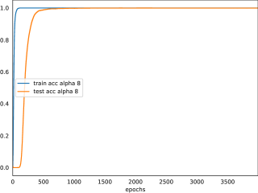
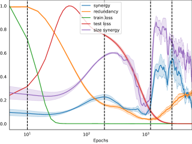
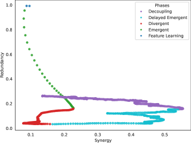
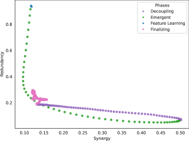
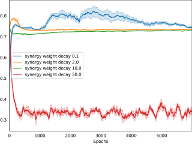
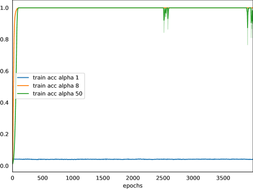

# Clauw, Stramaglia, Marinazzo 2024 — Information-Theoretic Progress Measures reveal Grokking is an Emergent Phase Transition

См. также: [глобальный индекс понятий](../../concepts/index.md).

**Kenzo Clauw** (Гентский университет), **Sebastiano Stramaglia** (Университет Бари), **Daniele Marinazzo** (Гентский университет).

arXiv [2408.08944](https://arxiv.org/abs/2408.08944), август 2024 (версия v1). Числа цитирований в таблице корпуса нет. Работа предварительная («ongoing work») и короткая: она предлагает мерить продвижение обучения соработой и избыточностью нейронов через O-осведомлённость. Источник — нативный HTML arXiv версии v1 (единственной).

Оригинал и производные файлы этой папки:

- [`original/2408.08944.native.html`](original/2408.08944.native.html) — первоисточник, нативный HTML arXiv (v1), скачан как есть.
- [`original/2408.08944.information-theoretic-progress-measures-reveal-grokking-is-an-emergent-phase-transition.md`](original/2408.08944.information-theoretic-progress-measures-reveal-grokking-is-an-emergent-phase-transition.md) — конверсия оригинала в Markdown без правок содержания.
- [`images/`](images/) — 17 иллюстраций статьи в исходном разрешении.

Схема якорей и правила ссылок на карточку — в [README папки статей](../README.md).

## Затрагиваемые понятия

**[Меры прогресса](../../concepts/progress-measures.md)** — предложены две новые, не зависящие от задачи: соработа и избыточность нейронов, вычисляемые через O-осведомлённость Rosas et al. ([`p2-4`](#p2-4)). Довод против имеющихся мер прям: контуры у Nanda et al. требуют человеческого труда, не переносятся на объём и привязаны к задаче, а норма L2 и фурье-разрыв суть подручные правила ([`p1-4`](#p1-4), [`p2-2`](#p2-2)).

**[Гроккинг](../../concepts/grokking.md)** — истолкован как возникающий фазовый переход, вызванный соработающими взаимодействиями нейронов **как целого**, которые попарными мерами не улавливаются ([`p1-6`](#p1-6)). Обучение при малом ослаблении весов делится на пять пор: обучение признакам, возникновение, расхождение, отложенное возникновение и расцепление ([`p3-1`](#p3-1)).

**[Возникновение способностей](../../concepts/emergence.md)** — работа встаёт на сторону возникновения в споре с Schaeffer et al. о том, не создан ли скачок самой мерой оценивания ([`p1-3`](#p1-3)), и предлагает измерять возникновение изнутри: соработа есть ровно то превышение совместного вклада над суммой одиночных, о котором говорят при возникновении ([`p1-5`](#p1-5)).

**[Фазовый переход](../../concepts/phase-transition.md)** — переход опознаётся по смене режима на границе Парето: модель быстро меняет избыточность на соработу, размер соработающей подсети растёт, а на тестовой потере видна вершина ([`p3-3`](#p3-3)).

**[Разреженная подсеть](../../concepts/sparse-subnetwork-lottery-ticket.md)** — предмет измерения есть подсеть с наибольшей соработой; она извлекается и обучается порознь при обнулении прочих нейронов, а её качество сверяется с исходной моделью и с обратной подсетью ([`p4-5`](#p4-5)).

**[Ослабление весов](../../concepts/weight-decay.md)** — управляющая ручка. При 0,1 возникают добавочные поры расхождения и отложенного возникновения; при 2,0 пора возникновения наступает сразу, а расцепление следует за ней ([`p3-6`](#p3-6)). Но слишком большое ослабление (10 и 50) гроккинг вовсе убивает ([`p4-1`](#p4-1)).

**[Начальный масштаб](../../concepts/initialization-scale.md)** — вторая ручка, взятая у Omnigrok: множитель $\alpha=8$ при нулевом ослаблении весов и удерживаемой норме тоже даёт пору возникновения ([`p3-9`](#p3-9)). Тем самым итог не сводится к одному лишь сглаживанию.

**[Запоминание](../../concepts/memorization-phase.md)** — начальная пора описана через меры: малая соработа и высокая избыточность, то есть сеть выучивает признаки порознь и извлекает простые образцы со схожими свойствами ([`p3-2`](#p3-2)).

**[Сжатие представлений](../../concepts/manifold-representation-compression.md)** — завершающая пора: соработа убывает, избыточность растёт, точность на тесте растёт; модель нашла обобщающую подсеть и убирает лишние связанные взаимодействия ради сжатия ([`p3-5`](#p3-5)).

**[Предсказание гроккинга](../../concepts/correlation-traps.md)** — практическая заявка: ранняя малая вершина соработы предшествует гроккингу, а её отсутствие означает, что гроккинга не будет ([`p4-1`](#p4-1), [`fig-5`](#fig-5)). Сами авторы называют это требующим дальнейшей проверки ([`p4-3`](#p4-3)).

**[Механистическая интерпретируемость](../../concepts/mechanistic-interpretability.md)** — работа призывает к смене образца: от разложения сети на сумму обособленных частей к признанию возникающих свойств, происходящих из взаимодействий между ними ([`p5-4`](#p5-4)).

**[Край устойчивости](../../concepts/edge-of-stability.md)** — в планах: связать наблюдаемые поры с порами ранней динамики обучения (Kalra & Barkeshli) и краем устойчивости, что могло бы объяснить колебания потери, найденные Notsawo et al. ([`p5-7`](#p5-7)).

Отдельно стоит сказать, чего в работе **нет**. Нет объёма: одна двухслойная полносвязная сеть на остаточном сложении при $p=97$, 250 нейронов, 5 семян ([`p2-3`](#p2-3)) — ограничение признано первым в списке ([`p5-1`](#p5-1)). Нет и надёжного приёма выделения подсети: признаки собираются в 10 ящиков слиянием по близости при настройках sklearn по умолчанию ([`p2-6`](#p2-6)), и авторы сами пишут, что это может не улавливать строения признаков ([`p5-2`](#p5-2)). Наконец, причинность заявлена лишь как предварительная: различие между соработающей подсетью и обратной к ней невелико ([`p4-9`](#p4-9)).

Карточки статей корпуса: [Power et al. 2022](../2201.02177.grokking-generalization-beyond-overfitting-on-small-algorithmic-datasets/2201.02177.grokking-generalization-beyond-overfitting-on-small-algorithmic-datasets.card.md) — исходное явление; [Nanda et al. 2023](../2301.05217.progress-measures-for-grokking-via-mechanistic-interpretability/2301.05217.progress-measures-for-grokking-via-mechanistic-interpretability.card.md) — меры продвижения через контуры, которым здесь противопоставлен не зависящий от задачи приём; [Omnigrok](../2210.01117.omnigrok-grokking-beyond-algorithmic-data/2210.01117.omnigrok-grokking-beyond-algorithmic-data.card.md) — начальный масштаб и удержание нормы, взятые как вторая ручка; [Merrill et al. 2023](../2303.11873.a-tale-of-two-circuits-grokking-as-competition-of-sparse-and-dense-subnetworks/2303.11873.a-tale-of-two-circuits-grokking-as-competition-of-sparse-and-dense-subnetworks.card.md) — разрежённость как причина гроккинга; [Kumar et al. 2024](../2310.06110.grokking-as-the-transition-from-lazy-to-rich-training-dynamics/2310.06110.grokking-as-the-transition-from-lazy-to-rich-training-dynamics.card.md) — отложенное обучение признакам; [Liu, Zhong, Tegmark 2023](../2310.05918.grokking-as-compression-a-nonlinear-complexity-perspective/2310.05918.grokking-as-compression-a-nonlinear-complexity-perspective.card.md) — сжатие; [Notsawo Jr et al. 2023](../2306.13253.predicting-grokking-long-before-it-happens/2306.13253.predicting-grokking-long-before-it-happens.card.md) — предсказание гроккинга по колебаниям потери, ближайшая по замыслу работа; [Huang et al. 2024](../2402.15175.unified-view-of-grokking-double-descent-and-emergent-abilities/2402.15175.unified-view-of-grokking-double-descent-and-emergent-abilities.card.md) — связь гроккинга с двойным спуском; [Tan & Huang 2023](../2311.06597.understanding-grokking-through-a-robustness-viewpoint/2311.06597.understanding-grokking-through-a-robustness-viewpoint.card.md) — попарная взаимная осведомлённость как мера продвижения; [Miller et al. 2024](../2310.17247.grokking-beyond-neural-networks-an-empirical-exploration-with-model-complexity/2310.17247.grokking-beyond-neural-networks-an-empirical-exploration-with-model-complexity.card.md) — управление гроккингом, названное среди планов.

## Что показано, а что предположено

Замечания редактора карточки по итогам разбора утверждений (`…claims.txt`). Работа заявлена самими авторами как предварительная («ongoing work»): пять страниц основного текста, два приложения с графиками.

**Мера выбрана осмысленно и отвечает заявке.** Если возникновение есть превышение совместного действия над суммой одиночных, то мерить его надо величиной, которая именно это и считает; O-осведомлённость такова и, в отличие от попарной взаимной осведомлённости, переносится на много величин ([`p1-5`](#p1-5), [`p2-4`](#p2-4)).

**Приём не зависит от задачи и не требует ручного разбора.** Это прямой ответ на слабое место мер продвижения через контуры, и авторы формулируют его без обиняков ([`p1-4`](#p1-4)).

**Разбиение обучения на поры даёт связное описание.** Пять пор при малом ослаблении весов и три при большом ([`p3-1`](#p3-1), [`p3-6`](#p3-6)) — картина согласованная: расхождение возникает там, где признаков для соединения не хватает, и исчезает при большем сглаживании.

**Две независимые ручки дают одно и то же.** И большое ослабление весов, и большое начальное приближение при нулевом ослаблении ведут прямо к поре возникновения ([`p3-9`](#p3-9)). Тем самым итог не сводится к действию одного лишь сглаживания.

**Проверка на причинность хотя бы начата.** Соработающая подсеть извлекается, обучается порознь и сверяется с обратной к ней ([`p4-5`](#p4-5)) — большинство работ о мерах продвижения не делают и этого.

**Однако главная заявка — предсказание гроккинга — держится на глазомере.** «Ранняя малая вершина соработы предшествует гроккингу» показано на нескольких кривых; ни порога, ни упреждения в шагах, ни доли верных предсказаний не приводится. Сами авторы пишут, что нужны дальнейшие опыты и статистические проверки ([`p4-3`](#p4-3)).

**Причинность не установлена, и это признано.** У моделей с порой возникновения различие между соработающей подсетью и обратной невелико ([`p4-9`](#p4-9)); при этом заголовок раздела ставит вопрос о причинности, а вывод раздела говорит «причинно связаны» — заявка сильнее показанного.

**Приём выделения подсети хрупок.** Признаки собираются ровно в 10 ящиков слиянием по близости при настройках по умолчанию ([`p2-6`](#p2-6)); от этого числа зависит и полный перебор наборов, и все значения соработы, но чувствительность к нему не проверялась.

**Постановка единственная.** Одна двухслойная сеть, одна задача, $p=97$, 40 % данных, AdamW ([`p2-3`](#p2-3)). Влияние внутреннего сглаживания AdamW названо самими авторами возможной помехой ([`p5-1`](#p5-1)).

**Текст местами не вычитан.** В разделе о начальном приближении сказано «мы дополнительно обучаем модели при ослаблении весов 10 и 50» ([`p4-2`](#p4-2)) — очевидно, скопировано из соседнего абзаца, где речь и впрямь об ослаблении весов; далее в том же абзаце говорится про alpha 1 и 5, тогда как на подписи к рисунку 5 стоят 1, 8 и 50. Подписи к рисункам 6 и 7 совпадают дословно, хотя рисунки разные.

**Число пор зависит от разметки самих авторов.** Границы пор проводятся по виду кривых соработы и избыточности; ни одного количественного правила разбиения не дано, а на нём держится весь разбор.

**Место в корпусе.** Работа предварительная и заведомо мала по объёму, но вносит в корпус то, чего в нём не было: меру продвижения, считающую **совместность** нейронов, а не свойства их порознь, и притом не привязанную ни к задаче, ни к ручному разбору контуров. Ценны три вещи: сам приём (O-осведомлённость как мера продвижения); разбиение обучения на поры, где расхождение и отложенное возникновение объяснены нехваткой признаков для соединения; и наблюдение, что ранняя вершина соработы предшествует гроккингу. Цена — одна крошечная постановка, разбиение на поры на глаз, предсказание без порога и упреждения, причинность лишь заявленная, а текст с несколькими явными опечатками.

## Ошибочные цитирования

Замечания редактора карточки: места, где эта статья передаёт чужие результаты с ошибкой или без авторских оговорок. Сюда ведут ссылки «подробности» из разделов «Ошибочные пересказы и цитирования этой статьи» карточек процитированных работ.

###### mc-2210-01117
**Omnigrok (2210.01117) — смешение вызова и устранения.** `"scaling the initialization weights of the model with a factor $\alpha>0$ while constraining the L2 weight norm to be constant during training can induce grokking"` — «масштабирование весов инициализации с фактором α>0 при закреплённой во время обучения норме L2 может вызвать гроккинг». В одной фразе смешаны два противоположных инструмента цитируемой работы: гроккинг там вызывает большая инициализация сама по себе, а закрепление нормы — приём устранения: [«обучение с ограниченной нормой весов способно почти полностью устранить гроккинг»](../2210.01117.omnigrok-grokking-beyond-algorithmic-data/2210.01117.omnigrok-grokking-beyond-algorithmic-data.card.md#p1-9). Собственный эксперимент статьи поставлен по правильному рецепту — α=8 и нулевой weight decay, без закрепления нормы, — так что смешение живёт только в словесном описании чужого результата, но в таком виде рецепт вызова невоспроизводим.

---

# Текст статьи

## Аннотация

###### p1-2

Эта работа изучает возникающие явления в нейронных сетях, сосредоточиваясь на гроккинге, где модели внезапно начинают обобщать после отложенного запоминания. Чтобы понять этот фазовый переход, мы применяем взаимную осведомлённость высокого порядка для разбора совместного поведения (соработы) и общих свойств (избыточности) нейронов при обучении. Мы указываем различные поры, предшествующие гроккингу, что позволяет предугадать, когда он наступит. Мы приписываем гроккинг возникающему фазовому переходу, вызванному соработающими взаимодействиями нейронов как целого. Мы показываем, что ослабление весов и начальное приближение весов способны усилить возникающую пору.

## 1 Введение

###### p1-3

Гроккинг есть явление, при котором нейронные сети в ходе обучения внезапно начинают обобщать после долгого запоминания при малом продвижении по потере. Понимание этого фазового перехода существенно для безопасности и согласованности искусственного разума. Тогда как (Wei et al., 2022) утверждают, что такие модели являют возникающие свойства, другие приписывают это выбору меры оценивания (Schaeffer et al.,). Отсутствие согласия ставит ключевой вопрос: выучивают ли нейронные сети возникающее поведение внутри себя?

###### p1-4

Чтобы понимать и предсказывать возникающие фазовые переходы, один из подходов — указать скрытые меры продвижения, то есть величины, причинно связанные с потерей (Barak et al., 2023), позволяющие предсказать и понять гроккинг. Недавние работы нашли меры продвижения на основе механистической интерпретируемости, разбирая модели на истолковываемые части (то есть контуры подсетей) (Nanda et al., 2023). Однако у такого подхода несколько ограничений. Во-первых, опора на человеческий труд при распознании контуров мешает переносу на более крупные модели и подвержена личной предвзятости. Во-вторых, такие меры привязаны к задаче. Наконец, он не учитывает возникающих взаимодействий между частями.

###### p1-5

Эта работа предлагает теорию сведений как не зависящее от задачи средство распознания возникающих подсетей в нейронных сетях ради механистической интерпретируемости. Показано, что попарная взаимная осведомлённость распознаёт важные признаки (Liu et al., 2018). Однако она способна мерить лишь зависимость двух величин. Многомерная взаимная осведомлённость даёт дробный разбор статистических взаимодействий многих величин, раскладывая зависимости на соработу и избыточность. Соработа означает совместное поведение величин как целого, когда их совокупные статистические взаимодействия превосходят сумму их вкладов порознь. Избыточность есть сведения, общие для величин. Побуждаемые недавней работой, распознающей соработающие подсети для оценки важности признаков (Clauw et al., 2022), мы изучаем взаимодействия высокого порядка между нейронами, чтобы понять гроккинг.

###### p1-6

В этой работе мы выдвигаем догадку, что гроккинг есть фазовый переход, вызванный возникновением обобщающей подсети из-за совместных взаимодействий нейронов как целого, которые нельзя измерить попарными мерами. Чтобы это показать, мы изучаем простейшую постановку, где наблюдается гроккинг, — полносвязные нейронные сети на остаточной арифметике — как пример возникновения. Чтобы понять гроккинг, мы применяем O-осведомлённость — меру многомерной теории сведений, переносимую на многие величины, — чтобы измерить соработу и избыточность в сети (Rosas et al., 2019). Мы изучаем два приёма, влияющих на гроккинг: ослабление весов и большое начальное приближение весов (Liu et al., 2022). Наш вклад состоит в следующем:

###### p1-7

- Пользуясь соработой и избыточностью как мерами продвижения, мы указываем три ключевые поры обучения: **обучение признакам** низкого уровня, **возникновение** обобщающей подсети и **расцепление** ради сжатия.
- Мы наблюдаем, что малое значение ослабления весов даёт добавочную **расходящуюся** и **отложенную** пору **возникновения**. Мы находим, что начальное приближение весов и увеличение ослабления весов прямо ведут к возникающей поре и уменьшают разрыв отложенной генерализации.
- Мы приводим предварительные итоги, говорящие о том, что подсети на поре возникновения могут быть причинно связаны с отложенной генерализацией.
- Мы показываем, что ранние вершины соработы способны предсказать, наступит ли гроккинг.

**[p. 2]**

## 2 Сопутствующие работы

**Причина гроккинга** Несколько работ приписывают причину гроккинга свойствам, связанным с трудностью обучения представлению обобщающей подсети, — отложенному обучению признакам (Kumar et al., 2023), разрежённости (Merrill et al., 2023) и сжатию (Liu et al.,). Хотя эти свойства и наблюдаются в возникающих сложных системах, такие истолкования не рассматривают отношений между частями как целого.

###### p2-2

**Меры продвижения** Предложено несколько мер продвижения — на основе нормы L2 (Liu et al., 2022) или фурье-разрыва (Barak et al., 2023). Однако это по большей части подручные правила. В одной работе для измерения продвижения берётся попарная взаимная осведомлённость (Tan & Huang, 2023). Ни одна из этих мер не измеряет взаимодействий высокого порядка между нейронами.

## 3 Приём

###### p2-3

**Постановка** Мы изучаем действие остаточного сложения $\mathbb{Z}_{p}$, порождая равенства вида $(a+b)\%p=c$, где $p$ = 97. Чтобы уменьшить число посторонних причин, мы изучаем простую двухслойную полносвязную сеть с возбуждением ReLU. Вход $(a,b)\in\mathbb{Z}_{p}\times\mathbb{Z}_{p}$ есть вектор $x\in\mathbb{R}^{2p}$, представленный сцеплением однобитных записей $a$ и $b$. Наша модель обрабатывает вход как $f(\theta;x)=W_{2}Z^{1}$, где $Z^{1}=\text{ReLU}(W_{1}x+b_{1})\in\mathbb{R}^{s\times n}$ есть матрица векторов признаков $z_{1}^{1},..,z_{n}^{1}$ первого скрытого слоя, где $n$ = 250 есть число нейронов слоя, а каждый вектор признаков $z_{n}^{1}$ имеет размерность, равную числу примеров $s$ во входных данных. Для каждого опыта мы обучаем 5 моделей с разными случайными семенами приёмом оптимизации AdamW на полной выборке со скоростью обучения 0,03 и 40 % данных (Loshchilov & Hutter, 2018).

###### p2-4

**O-осведомлённость** Для набора из $n$ случайных величин $\mathbf{Z}=\{X_{1},..,X_{n}\}$ O-осведомлённость (Rosas et al., 2019) определяется так:

$$
\Omega_{n}(\mathbf{Z})=(n-2)H(\mathbf{Z})+\sum_{j=1}^{n}[H(Z_{j})-H(\mathbf{Z}\backslash Z_{j})] \tag{1}
$$

где $H$ есть энтропия, а $\mathbf{Z}\backslash Z_{j}$ есть дополнение $Z_{j}$ до $\mathbf{Z}$. Если $\Omega_{n}(\mathbf{Z})>0$, в системе преобладает избыточность, а если $\Omega_{n}(\mathbf{Z})<0$ — соработа. Члены с энтропией в 1 мы оцениваем гауссовым преобразованием связки (Ince et al., 2017), что даёт действенное решение в замкнутом виде (подробности см. в работах).

###### p2-6

**Измерение соработы и избыточности** Сперва мы уменьшаем размерность признаков $Z^{1}\in\mathbb{R}^{s\times 250}$, собирая схожие векторы признаков в 10 ящиков слиянием по близости при обычных настройках sklearn, что даёт матрицу признаков $\tilde{Z}^{1}\in\mathbb{R}^{s\times 10}$, где каждый ящик в $\tilde{Z}^{1}$ состоит из набора схожих векторов признаков $\tilde{z}_{1}^{k}$. Чтобы измерить соработу и избыточность в сети, мы ведём полный перебор всех сочетаний наборов (то есть подмножеств от 2 до $k$ ящиков, где наибольшее сочетание $k$ = 10), беря O-осведомлённость $\Omega_{k}(\tilde{z}_{1}^{1},..,\tilde{z}_{1}^{k})$, чтобы найти наилучшее значение соработы (наименьшее) и избыточности (наибольшее). На наших рисунках мы приводим и соработу, и избыточность к отрезку от 0 до 1, обращая знак соработы ради сверки.

## 4 Оценивание гроккинга

В этом опыте мы оцениваем влияние решений замысла, воспроизводя гроккинг обучением моделей двумя приёмами:

**Роль ослабления весов** Рисунок 1 изображает модели, обученные при малом (0,01) и большом (2,0) ослаблении весов. Мы наблюдаем, что малое ослабление весов даёт отложенную генерализацию. Однако увеличение ослабления весов уменьшает разрыв генерализации и увеличивает её резкость.

**Роль начального приближения** Чтобы упрочить наши итоги, мы исследуем гроккинг не только через ослабление весов. (Liu et al., 2022) наблюдали, что умножение начальных весов модели на множитель $\alpha>0$ при удержании нормы L2 весов неизменной в ходе обучения способно навести гроккинг. Здесь мы обучаем модель с большим множителем начального приближения ($\alpha$ = 8) при нулевом ослаблении весов. Как и (Lyu et al., 2023), мы полагаем начальные веса последнего слоя равными нулю, чтобы избежать неустойчивости обучения при большом $\alpha$. Рисунок 1 (справа) подтверждает, что этот приём уменьшает разрыв генерализации, увеличивая её резкость.

*Рисунок 1: Слева: точность при ослаблении весов 0,1 и 2,0. Справа: точность при множителе начального приближения alpha = 8.* **[p. 2]**

## 5 Гроккинг есть возникающий фазовый переход

Чтобы понять гроккинг, мы наносим приведённые соработу и избыточность вместе с потерей, ибо это отражает динамику обучения и позволяет мерить продвижение модели при обучении. Каждая мера дана в логарифмической шкале ради наглядности. Мы приводим и диаграммы Парето, изображающие соотношение соработы и избыточности, ибо это даёт более дробный разбор мер продвижения.

**[p. 3]**

### 5.1 Малое ослабление весов откладывает пору возникновения

###### p3-1

Сперва мы изучаем наиболее расхожую постановку гроккинга — модель, обученную при малом ослаблении весов 0,1. Из рисунка 1 (слева) видно, что обучение делится на 5 различных пор:

###### p3-2

**Обучение признакам** Поначалу мы наблюдаем малую соработу и высокую избыточность. Отсутствие связанности признаков говорит о том, что сеть выучивает признаки порознь, а высокая избыточность — что она извлекает простые образцы со схожими свойствами.

###### p3-3

**Возникновение** В эту пору граница Парето на рисунке 2 (справа) обнаруживает, что модель быстро меняет избыточность на соработу. Вместе с тем размер соработающей подсети растёт, а на тестовой потере видна вершина. Это говорит о критическом фазовом переходе от запоминания, где модель пытается соединить признаки, чтобы породить обобщающую соработающую подсеть, растущую по мере поиска.

**Расхождение** При малом ослаблении весов пора возникновения не ведёт прямо к обобщающему решению. В пору расхождения и соработа, и избыточность модели падают, а соработающая подсеть уменьшается в размере при малой вершине на тестовой потере. Это означает, что модель переобучается из-за нехватки признаков для соединения. Мы предполагаем, что причина в малом ослаблении весов, дающем трудный ландшафт потерь, где выучить обобщающее решение сложно.

###### p3-5

**Отложенное возникновение** В эту пору мы наблюдаем быстрый рост соработы, избыточности и размера соработающей подсети. Это говорит о том, что модель покинула неоптимальное решение и теперь способна соединять признаки в обобщающее решение. **Расцепление** В эту пору соработа убывает, избыточность растёт, а точность на тесте растёт. Это говорит о том, что модель нашла обобщающую подсеть, но не все признаки нужны, и потому она убирает связанные взаимодействия ради сжатия.

*Рисунок 2: Исходная модель при ослаблении весов 0,1* **[p. 3]**

### 5.2 Увеличение ослабления весов усиливает возникновение

###### p3-6

Из рисунка 3 (слева) видно, что увеличение ослабления весов прямо даёт пору возникновения с большей вершиной соработы и большим размером соработающей подсети. Более того, пора расцепления наступает сразу после неё, без пор расхождения и отложенного возникновения.

Это говорит о том, что ослабление весов действует как сглаживание — либо уменьшая ёмкость сети, что поощряет выучивание общих, более стойких признаков за счёт уменьшения числа деятельных признаков и тем самым уменьшает переобучение, либо сглаживая ландшафт потерь, отчего оптимизации легче найти области, где можно соединить больше признаков.

Мы наблюдаем и завершающую пору с наименьшими изменениями соработы и избыточности после схождения тестовой потери. Мы приписываем это сжатию представления, что занятно для переноса обучения, но в этой работе не исследовано.

*Рисунок 3: Исходная модель при ослаблении весов 2,0* **[p. 3]**

### 5.3 Роль начального приближения весов

###### p3-9

Чтобы выделить вклад сглаживания через ослабление весов, мы оцениваем модель, обученную без ослабления весов, но с большим начальным приближением весов и удерживаемой нормой. Рисунок 4 (слева) изображает, что модель, обученная при большом начальном приближении весов и без ослабления весов, прямо даёт пору возникновения. Однако из рисунка 4 (справа) мы поначалу наблюдаем быстрое падение избыточности, за которым следует отложенный быстрый рост соработы. Мы предполагаем, что это наблюдение вызвано высокой выпуклостью ландшафта потерь, отчего оптимизации легче найти решение (Vysogorets et al., 2024; Fort & Scherlis, 2018).

*Рисунок 4: Исходная модель при alpha = 8 и нулевом ослаблении весов* **[p. 4]**

## 6 Ранние вершины соработы предсказывают гроккинг

В этом опыте мы наносим соработу для разных моделей, обученных при разных ослаблениях весов и начальных приближениях. Мы опытно приводим свидетельство того, что соработа способна предсказать гроккинг, если рано при обучении возникает малая вершина. Для сверки мы дополнительно обучаем модели с теми же настройками, что и в разделе 4, но с бо́льшими значениями и ослабления весов, и начального приближения.

**[p. 4]**

###### p4-1

**Ослабление весов** Мы дополнительно обучаем модели при ослаблении весов 10 и 50, которые гроккинга не достигают (см. рисунок 9 в приложении). Из рисунка 5 (слева) видно, что и при малом (0,1), и при большем (2) ослаблении весов вершина возникает до наступления гроккинга. Однако если ослабление весов слишком велико (то есть 10 и 50), модель гроккнуть не способна, на что указывает меньшая соработа.

###### p4-2

**Начальное приближение** Мы дополнительно обучаем модели при ослаблении весов 10 и 50, которые гроккинга не достигают (см. рисунок 10 в приложении). Из рисунка 5 (справа) видно, что большое начальное приближение весов (8) даёт вершину соработы. Однако если alpha слишком мало (1) или слишком велико (5), соработа быстро падает и модель более не восстанавливается.

###### p4-3

Эти итоги указывают, что ранние вершины соработы могут говорить о гроккинге. Однако для проверки этой догадки нужны дальнейшие опыты с разными моделями и статистические проверки.

###### fig-5

*Рисунок 5: Слева: соработа при ослаблении весов (0,1; 2; 10; 50). Справа: соработа при alpha (1, 8, 50)* **[p. 4]**

## 7 Причинно ли возникающие соработающие подсети связаны с генерализацией?

Этот опыт исследует, способствуют ли подсети с высокой соработой в пору возникновения отложенной генерализации у моделей. Мы сосредоточиваемся на моделях, обученных при большом ослаблении весов (2,0) и большом начальном приближении весов (8).

###### p4-5

Сперва мы находим и извлекаем подсети с высокой соработой в пору возникновения. Затем мы обучаем эти подсети порознь, обнуляя все прочие нейроны. Мы сверяем точность этих обособленных подсетей на тесте с исходной точностью и с точностью обратных к ним подсетей. Для сверки мы оцениваем и подсети, найденные в пору отложенного возникновения у модели, обученной при малом ослаблении весов (0,1).

**Роль ослабления весов** Из рисунка 6 слева мы находим, что соработающая сеть при малом ослаблении весов 0,1 достигает качества, схожего с исходной моделью, но вершина точности на тесте менее внезапна, а значит модель меньше опирается на возникающие взаимодействия. Обратная же модель

Напротив, рисунок 6 справа показывает, что соработающая подсеть при ослаблении весов 2,0 гроккает за меньшее число эпох. Мы предполагаем, что причина в поре возникновения, на что указывают более резкая вершина точности на тесте и большая соработа.

*Рисунок 6: Слева: точность на тесте у соработающей подсети при ослаблении весов 0,1. Справа: точность на тесте у соработающей подсети при ослаблении весов 2,0* **[p. 4]**

**Роль начального приближения** Рисунок 7 показывает, что при начальном приближении весов 8 пора гроккинга схожа с исходной моделью. Заметим, что схожие итоги мы наблюдаем и у моделей с порой возникновения. Эти находки укрепляют нашу уверенность в соработающих взаимодействиях и говорят о том, что гроккинг может быть следствием неудачного подбора настроек.

*Рисунок 7: Слева: точность на тесте у соработающей подсети при ослаблении весов 0,1. Справа: точность на тесте у соработающей подсети при ослаблении весов 2,0* **[p. 4]**

###### p4-9

Эти предварительные итоги указывают, что соработающие подсети причинно связаны с генерализацией. Однако у моделей с порой возникновения различие между соработающей подсетью и обратной к ней не столь велико. Мы полагаем, что для более точной оценки скоплений при распознании подсетей нужны иные приёмы.

**[p. 5]**

## 8 Ограничения

###### p5-1

Ключевое ограничение нашей работы — простота модели и оценочной задачи. Чтобы проверить общность возникающих фазовых переходов, мы намерены расширить работу на 1) правдоподобные устройства на основе трансформеров (Nanda et al., 2023) или игрушечные модели «кодировщик — раскодировщик» (Doshi et al., 2023), если наш приём окажется трудно переносимым на объём. Это позволит отделить запоминающее решение от обобщающего, чтобы лучше понять, выучивают ли эти модели обособленные подсети; 2) оценивать иные игрушечные задачи, включая разрежённую чётность (Barak et al., 2023), исключающее ИЛИ (Xu et al., 2023), регрессию (Kumar et al., 2023), правдоподобные задачи вроде MNIST для изучения влияния обучения представлениям (Liu et al., 2022) и постановки, позволяющие управлять гроккингом, чтобы увеличить разнообразие моделей (Miller et al., 2023); 3) наращивать ширину и глубину наших моделей. Мы предполагаем, что это может дать понимание того, объяснима ли связь гроккинга с двойным спуском через соработу и избыточность (Huang et al., 2024; Nakkiran et al., 2021); и 4) исследовать роль оптимизации градиентным спуском, ибо на наши итоги могло повлиять внутреннее сглаживание AdamW (Loshchilov & Hutter, 2018).

###### p5-2

Ещё одно ограничение — трудность переноса O-осведомлённости на более крупные сети. Наш приём опирается на слияние по близости, чтобы собирать схожие признаки в ящики, что может не вполне улавливать строение признаков. Мы намерены исследовать иные меры близости — скажем, спектральное скопление (Hod et al., 2022) и гессиан потери (Lange et al., 2022).

## 9 Заключение и обсуждение

В этой работе мы приводим — насколько нам известно — первый приём измерения возникающих свойств нейронных сетей для объяснения гроккинга, не опирающийся ни на разметку, ни на подручные правила, ни на величины, привязанные к задаче. Наши итоги обнаруживают возникающий фазовый переход, где модель совместно соединяет признаки, чтобы решать арифметические задачи. Мы показываем, что ранние вершины соработы при обучении могли бы предсказывать гроккинг.

###### p5-4

Этой предварительной работой мы призываем к смене образца в исследованиях интерпретируемости: от разложения сетей на сумму обособленных частей (сведение) к признанию возникающих свойств, происходящих из взаимодействий между этими частями (возникновение). Мы подчёркиваем важность выработки приёмов, способных измерять эти взаимодействия высокого порядка, ибо они существенны для понимания динамики обучения, генерализации и истолкования. Поскольку работа ведётся, мы завершаем её направлениями дальнейших исследований.

**Геометрия потери** Наши опыты показали, что гроккинг может быть вызван трудностью оптимизации при движении по ландшафтам потерь. Мы намерены исследовать это далее, изображая эти ландшафты для каждой поры (Li et al., 2018) и исследуя связность между наилучшими точками (Garipov et al., 2018). Это может дать понимание таких геометрических свойств, как острые минимумы, ведущие к генерализации (Hochreiter & Schmidhuber, 1997; Keskar et al., 2017).

**Соработающее прореживание** Есть ли соработа нейронов необходимое и/или достаточное условие гроккинга? Чтобы изучить, вызывает ли соработа гроккинг, мы намерены сглаживать по соработе прореживанием соработающих подсетей (Srivastava et al., 2014).

###### p5-7

**Фазовые переходы** Недавние работы наблюдали различные поры при оптимизации в ходе обучения нейронных сетей (Kalra & Barkeshli, 2023), связанные с краем устойчивости (Cohen et al., 2020). Мы намерены исследовать, можно ли связать эти поры через динамику обучения с возникающими порами из этой работы. Это могло бы объяснить, отчего прежние работы о гроккинге обнаруживали колебания потери (Notsawo et al., 2023).

## 10 Вклад авторов

Kenzo провёл опыты и написал статью. Daniele и Sebastiano вели работу.

## Список литературы

- Barak, B., Edelman, B. L., Goel, S., Kakade, S., Malach, E., and Zhang, C. Hidden Progress in Deep Learning: SGD Learns Parities Near the Computational Limit, January 2023. URL http://arxiv.org/abs/2207.08799. arXiv:2207.08799 [cs, math, stat].

- Clauw, K., Stramaglia, S., and Marinazzo, D. Higher-order mutual information reveals synergistic sub-networks for multi-neuron importance, November 2022. URL http://arxiv.org/abs/2211.00416. arXiv:2211.00416 [cs, math, q-bio].

- Cohen, J., Kaur, S., Li, Y., Kolter, J. Z., and Talwalkar, A. Gradient descent on neural networks typically occurs at the edge of stability. In *International Conference on Learning Representations*, 2020. URL https://openreview.net/forum?id=jh-rTtvkGeM.

- Doshi, D., Das, A., He, T., and Gromov, A. To grok or not to grok: Disentangling generalization and memorization on corrupted algorithmic datasets, October 2023. URL http://arxiv.org/abs/2310.13061. arXiv:2310.13061 [cond-mat, stat].

- Fort, S. and Scherlis, A. The Goldilocks zone: Towards better understanding of neural network loss landscapes, November 2018. URL http://arxiv.org/abs/1807.02581. arXiv:1807.02581 [cs, stat].

**[p. 6]**

- Garipov, T., Izmailov, P., Podoprikhin, D., Vetrov, D. P., and Wilson, A. G. Loss Surfaces, Mode Connectivity, and Fast Ensembling of DNNs. In *Advances in Neural Information Processing Systems*, volume 31. Curran Associates, Inc., 2018. URL https://proceedings.neurips.cc/paper_files/paper/2018/hash/be3087e74e9100d4bc4c6268cdbe8456-Abstract.html.

- Hochreiter, S. and Schmidhuber, J. Flat Minima. *Neural Computation*, 9(1):1–42, January 1997. ISSN 0899-7667. doi: 10.1162/neco.1997.9.1.1. URL https://doi.org/10.1162/neco.1997.9.1.1.

- Hod, S., Filan, D., Casper, S., Critch, A., and Russell, S. Quantifying Local Specialization in Deep Neural Networks, February 2022. URL http://arxiv.org/abs/2110.08058. arXiv:2110.08058 [cs].

- Huang, Y., Hu, S., Han, X., Liu, Z., and Sun, M. Unified View of Grokking, Double Descent and Emergent Abilities: A Perspective from Circuits Competition, February 2024. URL http://arxiv.org/abs/2402.15175. arXiv:2402.15175 [cs].

- Ince, R. A., Giordano, B. L., Kayser, C., Rousselet, G. A., Gross, J., and Schyns, P. G. A statistical framework for neuroimaging data analysis based on mutual information estimated via a gaussian copula. *Human Brain Mapping*, 38(3):1541–1573, March 2017. ISSN 1065-9471, 1097-0193. doi: 10.1002/hbm.23471. URL https://onlinelibrary.wiley.com/doi/10.1002/hbm.23471.

- Kalra, D. S. and Barkeshli, M. Phase diagram of early training dynamics in deep neural networks: effect of the learning rate, depth, and width, October 2023. URL http://arxiv.org/abs/2302.12250. arXiv:2302.12250 [cond-mat].

- Keskar, N. S., Mudigere, D., Nocedal, J., Smelyanskiy, M., and Tang, P. T. P. On Large-Batch Training for Deep Learning: Generalization Gap and Sharp Minima, February 2017. URL http://arxiv.org/abs/1609.04836. arXiv:1609.04836 [cs, math].

- Kumar, T., Bordelon, B., Gershman, S. J., and Pehlevan, C. Grokking as the Transition from Lazy to Rich Training Dynamics, October 2023. URL http://arxiv.org/abs/2310.06110. arXiv:2310.06110 [cond-mat, stat].

- Lange, R. D., Rolnick, D. S., and Kording, K. P. Clustering units in neural networks: upstream vs downstream information, March 2022. URL http://arxiv.org/abs/2203.11815. arXiv:2203.11815 [cs, stat].

- Li, H., Xu, Z., Taylor, G., Studer, C., and Goldstein, T. Visualizing the Loss Landscape of Neural Nets. In *Advances in Neural Information Processing Systems*, volume 31. Curran Associates, Inc., 2018. URL https://proceedings.neurips.cc/paper_files/paper/2018/hash/a41b3bb3e6b050b6c9067c67f663b915-Abstract.html.

- Liu, K., Amjad, R. A., and Geiger, B. C. Understanding individual neuron importance using information theory. *arXiv preprint arXiv:1804.06679*, 19:5171–5180, 2018. URL https://www.researchgate.net/profile/Rana-Ali-Amjad/publication/324600151_Understanding_Individual_Neuron_Importance_Using_Information_Theory/links/5b7ab84d4585151fd12239c1/Understanding-Individual-Neuron-Importance-Using-Information-Theory.pdf.

- Liu, Z., Zhong, Z., and Tegmark, M. Grokking as Compression: A Nonlinear Complexity Perspective.

- Liu, Z., Michaud, E. J., and Tegmark, M. Omnigrok: Grokking Beyond Algorithmic Data. *arXiv preprint arXiv:2210.01117*, 2022.

- Loshchilov, I. and Hutter, F. Fixing Weight Decay Regularization in Adam. February 2018. URL https://openreview.net/forum?id=rk6qdGgCZ.

- Lyu, K., Jin, J., Li, Z., Du, S. S., Lee, J. D., and Hu, W. Dichotomy of Early and Late Phase Implicit Biases Can Provably Induce Grokking, November 2023. URL http://arxiv.org/abs/2311.18817. arXiv:2311.18817 [cs].

- Merrill, W., Tsilivis, N., and Shukla, A. A Tale of Two Circuits: Grokking as Competition of Sparse and Dense Subnetworks. *arXiv preprint arXiv:2303.11873*, 2023.

- Miller, J., O’Neill, C., and Bui, T. Grokking Beyond Neural Networks: An Empirical Exploration with Model Complexity, October 2023. URL http://arxiv.org/abs/2310.17247. arXiv:2310.17247 [cs, stat].

- Nakkiran, P., Venkat, P., Kakade, S., and Ma, T. Optimal Regularization Can Mitigate Double Descent, April 2021. URL http://arxiv.org/abs/2003.01897. arXiv:2003.01897 [cs, math, stat].

- Nanda, N., Chan, L., Lieberum, T., Smith, J., and Steinhardt, J. Progress measures for grokking via mechanistic interpretability, January 2023. URL http://arxiv.org/abs/2301.05217. arXiv:2301.05217 [cs].

**[p. 7]**

- Notsawo, P. J. T., Zhou, H., Pezeshki, M., Rish, I., and Dumas, G. Predicting Grokking Long Before it Happens: A look into the loss landscape of models which grok, June 2023. URL http://arxiv.org/abs/2306.13253. arXiv:2306.13253 [cs].

- Rosas, F. E., Mediano, P. A., Gastpar, M., and Jensen, H. J. Quantifying high-order interdependencies via multivariate extensions of the mutual information. *Physical Review E*, 100(3):032305, 2019. URL https://infoscience.epfl.ch/record/270413.

- Schaeffer, R., Miranda, B., and Koyejo, S. Are Emergent Abilities of Large Language Models a Mirage?

- Srivastava, N., Hinton, G., Krizhevsky, A., Sutskever, I., and Salakhutdinov, R. Dropout: a simple way to prevent neural networks from overfitting. *The journal of machine learning research*, 15(1):1929–1958, 2014. Publisher: JMLR. org.

- Tan, Z. and Huang, W. Understanding Grokking Through A Robustness Viewpoint, November 2023. URL http://arxiv.org/abs/2311.06597. arXiv:2311.06597 [cs].

- Vysogorets, A., Dawid, A., and Kempe, J. Deconstructing the Goldilocks Zone of Neural Network Initialization, February 2024. URL http://arxiv.org/abs/2402.03579. arXiv:2402.03579 [cs, math].

- Wei, J., Tay, Y., Bommasani, R., Raffel, C., Zoph, B., Borgeaud, S., Yogatama, D., Bosma, M., Zhou, D., Metzler, D., Chi, E. H., Hashimoto, T., Vinyals, O., Liang, P., Dean, J., and Fedus, W. Emergent Abilities of Large Language Models, October 2022. URL http://arxiv.org/abs/2206.07682. arXiv:2206.07682 [cs].

- Xu, Z., Wang, Y., Frei, S., Vardi, G., and Hu, W. Benign Overfitting and Grokking in ReLU Networks for XOR Cluster Data, October 2023. URL http://arxiv.org/abs/2310.02541. arXiv:2310.02541 [cs, stat].

## Приложение A Итоги обучения исходной модели при разных ослаблениях весов

*Рисунок 8: Слева: точность на обучении при ослаблении весов (0,1; 2; 10; 50). Справа: точность на тесте при ослаблении весов (0,1; 2; 10; 50)* **[p. 8]**

**[p. 8]**

## Приложение B Итоги обучения исходной модели при разных множителях начального приближения alpha

*Рисунок 9: Слева: точность на обучении при alpha (1, 8, 50). Справа: точность на тесте при alpha (1, 8, 50)* **[p. 8]**
