# Yunis et al. 2024 — Approaching Deep Learning through the Spectral Dynamics of Weights

См. также: [глобальный индекс понятий](../../concepts/index.md).
arXiv [2408.11804v1](https://arxiv.org/abs/2408.11804), 21 августа 2024 (единственная версия). Колонтитул PDF: «Preprint. Copyright 2024 by the author(s).».

**David Yunis** (переписка: dyunis@ttic.edu)**, Kumar Kshitij Patel, Pedro Savarese, Karen Livescu, Matthew R. Walter** — Toyota Technological Institute at Chicago, Chicago, IL, USA.
**Samuel Wheeler** — Argonne National Laboratory, Lemont, IL, USA.
**Gal Vardi** — Weizmann Institute of Science, Israel; работа выполнена преимущественно в TTIC.
**Michael Maire** — Department of Computer Science, University of Chicago, Chicago, IL, USA.

Оригинал и производные файлы этой папки:

- [`original/2408.11804.native.html`](original/2408.11804.native.html) — первоисточник, нативный HTML-рендеринг arXiv (LaTeXML), скачан как есть.
- [`original/2408.11804.approaching-deep-learning-through-the-spectral-dynamics-of-weights.md`](original/2408.11804.approaching-deep-learning-through-the-spectral-dynamics-of-weights.md) — конверсия оригинала в Markdown без правок содержания; английский текст для сверки перевода.
- [`images/`](images/) — иллюстрации статьи в исходном разрешении (185 файлов на 186 ссылок: правая панель рисунка 1 — тот же файл, что и панель рисунка 6 для трансформера при weight decay 0.1).
- [`2408.11804.approaching-deep-learning-through-the-spectral-dynamics-of-weights.claims.txt`](2408.11804.approaching-deep-learning-through-the-spectral-dynamics-of-weights.claims.txt) — рабочий разбор: пронумерованные утверждения с пометками.

Схема якорей и правила ссылок на карточку — в [README папки статей](../README.md).

## Затрагиваемые понятия

**[Спектральный анализ / SVD](../../concepts/spectral-analysis-svd-esd-fve.md)** — главный вклад работы в корпус и единственное, что она вводит как инструмент. Сигнал берётся из спектра **весовых** матриц и сворачивается в **нормированный эффективный ранг**: энтропию нормированного распределения сингулярных чисел (Roy & Vetterli 2007), делённую на ранг ([ур. 1](#p4-5), пояснение — [p4-4](#p4-4)); схема замысла — [рис. 1](#fig-1). Это отдельный вариант семейства: не показатель степенного закона $\alpha$ из HTSR и не пересечение двух старших чисел, а свёртка всей массы спектра. Сверх спектра **чисел** работа добавляет спектр **векторов** — две величины, которых в остальном корпусе почти нет: согласование сингулярных векторов соседних слоёв $A(t)_{jk}$ ([ур. 3](#p4-8)) со скалярной сводкой по десяти верхним диагональным элементам ([ур. 4](#p7-2)) и совпадение с концом обучения $S(t)_{jk}$ ([ур. 5](#p10-1)), где сравнение идёт с финальной точкой $T$. Существенно для корпуса, что весь набор считается на любой архитектуре без знания задачи: те же величины сняты с VGG-16, диффузионной UNet, двунаправленной LSTM и двенадцатислойного трансформера ([методика](#p6-6), [рис. 3](#fig-3)). Чего в работе нет: ни эмпирической спектральной плотности, ни границы Марченко — Пастура, ни какой-либо случайной матричной модели; спектр возбуждений и представлений не рассматривается вовсе, а одномерные параметры (смещения и нормализация) [исключены из разбора прямо](#p6-7).

**[Гроккинг](../../concepts/grokking.md)** — взят как **испытательный стенд**, а не как предмет: постановка нужна авторам затем, что в ней переход виден резко, и наблюдение с неё переносится на задачи, где перехода нет ([раздел 3](#sec-3)). Главное наблюдение: «внезапное падение поверочной потери в точности совпадает с началом низкорангового поведения сингулярных чисел», а итоговое низкоранговое решение «постепенно прорастает из средних рангов модели» ([p6-1](#p6-1), [рис. 2](#fig-2)). Формулировка авторов — о **совпадении по времени**, и они сами оговаривают, что точного понимания связи ранга с генерализацией у них нет и что «высокоранговые решения тоже могут обобщать» ([p6-2](#p6-2)); опорой служит лишь довод от бритвы Оккама. Чего в работе нет: механизма, теории и причинного опыта на гроккинге — низкоранговость нигде не снимают, сохранив прочее; заявленная новизна по отношению к [Nanda et al. 2023](../2301.05217.progress-measures-for-grokking-via-mechanistic-interpretability/2301.05217.progress-measures-for-grokking-via-mechanistic-interpretability.card.md) — не факт низкого ранга (он, как признают сами авторы, «прямо из него следуют» — из фурье-разложения Nanda, [p6-1](#p6-1)), а **переносимость** меры.

**[Эталонный полигон гроккинга](../../concepts/canonical-grokking-testbed.md)** — постановка [Nanda et al. 2023](../2301.05217.progress-measures-for-grokking-via-mechanistic-interpretability/2301.05217.progress-measures-for-grokking-via-mechanistic-interpretability.card.md) взята почти без изменений; единственное отличие названо в одном предложении приложения — синусоидальные позиционные кодировки вместо обучаемых ([A.6](#p22-5)). Работа не спорит с полигоном и не расширяет его, а пользуется им как местом, где искомое явление заведомо есть. Разобраны четыре режима одной и той же архитектуры: 30 % данных без weight decay, 30 % с weight decay 1.0 (собственно гроккинг), 70 % без weight decay (случай slingshot) и 90 % без weight decay ([рис. 2](#fig-2)).

**[Модульная арифметика](../../concepts/modular-arithmetic.md)** — единственная алгоритмическая задача работы и единственное действие: сложение по модулю 97 ([p4-4](#p4-4), [A.6](#p22-6)). Ни перебора операций, ни перебора модулей, ни разбора выученного алгоритма здесь нет — модульное сложение служит только тем местом, где падение эффективного ранга можно увидеть рядом с резким переходом.

**[Эффект рогатки](../../concepts/slingshot.md)** — работа воспроизводит постановку [Thilak et al. 2022](../2206.04817.the-slingshot-mechanism-an-empirical-study-of-adaptive-optimizers-and-grokking/2206.04817.the-slingshot-mechanism-an-empirical-study-of-adaptive-optimizers-and-grokking.card.md) как третий режим рисунка 2 и добавляет к ней возражение о представлении: «при построении по линейной шкале оси x генерализация выглядит куда менее внезапной, чем в постановке с weight decay» ([p6-1](#p6-1)), а «исходный график гроккинга в Thilak et al. 2022 выглядит куда более впечатляюще, поскольку там ось x дана в логарифмической шкале» ([A.6](#p22-6)). Воспроизведение при этом неточное и оговорено самими авторами: гиперпараметры взяты из приложения B оригинала, но архитектура — однослойная из Nanda et al. вместо двухслойной, указанной у Thilak. Спектральной подписи самой рогатки (скачков нормы, всплесков потери) работа не измеряет; в её собственных величинах случай slingshot просто «следует схожей склонности, хотя поверочная потеря подгоняется постепенно» ([рис. 2](#fig-2)).

**[Weight decay](../../concepts/weight-decay.md)** — центральная заявка работы и её главный вклад в это понятие: weight decay действует как **неявный низкоранговый регуляризатор** сверх своей явной роли штрафа на норму, и это показано не в идеализированной постановке, а на четырёх практических ([раздел 5](#sec-5)). Свидетельство — сетка коэффициентов $\{0,0.0001,0.001,0.01,0.1,1.0,10.0\}$ ([A.5](#p22-4)), из которой в рисунки вынесено подмножество: чем выше коэффициент, тем напористее падает эффективный ранг, а слишком большой ведёт к полному коллапсу нормы ([p8-3](#p8-3), [рис. 6](#fig-6)). Косвенная проверка сделана честно и заранее: при высоком weight decay обучающая потеря всё ещё низка, а разрыв между обрезанной и полной моделью схлопывается — ровно то, чего следует ждать, если параметры действительно становятся ниже рангом ([рис. 14](#fig-14)). Механизм при этом изложен прямо как рассуждение («мы поразмыслим о том, каково чутьё», [p8-2](#p8-2)): раз старшие сингулярные числа растут быстрее, а верхние направления полезнее для потери, то под штрафом $\lVert W\rVert_{F}^{2}=\sum_{i=1}^{R}\sigma_{i}^{2}$ простейшее для сети решение — уронить ранг, сохранив старшие числа. Отдельная и не объяснённая авторами подробность: сильный weight decay усиливает согласование верхних сингулярных векторов соседних слоёв **только у трансформера**, и авторы называют это «любопытным» ([p8-4](#p8-4), [рис. 7](#fig-7)). Чего в работе нет: вмешательства в сам weight decay. Опыта, снимающего низкоранговость при сохранённой норме (или наоборот), не поставлено, и авторы сами удерживаются от простого вывода: «трудно утверждать нечто столь простое, как „ниже ранг — значит лучше генерализация“, поскольку неизвестен минимальный ранг, необходимый для данной задачи» ([p8-4](#p8-4)).

**[Когда регуляризация необходима](../../concepts/regularization-necessity.md)** — работа занимает промежуточную и аккуратную позицию, которой в корпусе мало: weight decay не объявлен необходимым, а назван **заменимым бо́льшим объёмом данных**. При 30 % данных и нулевом weight decay за весь бюджет обучения не возникает ни гроккинга, ни низкорангового решения, но при 90 % данных без всякой регуляризации обобщение наступает и по-прежнему совпадает с минимизацией эффективного ранга ([p2-2](#p2-2), [p6-1](#p6-1), [рис. 2](#fig-2)). Отдельно существенно, что различие обобщения и запоминания на случайных метках получено **вовсе без weight decay** ([p9-1](#p9-1)) — то есть низкий ранг там даёт сама структура данных. Правила, когда регуляризация обязательна, работа не формулирует и своего наблюдения за пределы одной задачи не проверяет.

**[Минимизация нормы весов](../../concepts/weight-norm-minimization.md)** — прямой эмпирический контрпример нормоцентричной картине, поданный авторами как «диалог» с Omnigrok ([Liu et al.](../2210.01117.omnigrok-grokking-beyond-algorithmic-data/2210.01117.omnigrok-grokking-beyond-algorithmic-data.card.md)). Обобщающее решение при 90 % данных без weight decay имеет **бо́льшую** норму и больший максимальный сингулярный номер, чем грокнутое решение, — и всё же оба обобщают и оба низкоранговые ([p6-2](#p6-2)). Различие сведено к тому, что при сильном weight decay малые сингулярные числа исчезают, а без него — нет. Тем самым работа предлагает корпусу заменить норму рангом как величину, отслеживающую переход, но замены не доказывает: связь ранга с генерализацией остаётся соотнесением, о чём авторы говорят в том же абзаце.

**[Закон задержки через норм-сепарацию](../../concepts/norm-separation-delay-law.md)** — то же наблюдение читается как ограничение сверху на любую теорию, выводящую срок задержки из нормы весов: у двух обобщающих решений одной задачи нормы различаются в разы, а низкоранговое поведение общее ([p6-2](#p6-2)). Работа никакой временной закономерности не выводит, времени до генерализации не измеряет и на норм-сепарацию не ссылается — эта связь целиком на стороне корпуса.

**[Доля данных / критический размер набора](../../concepts/data-fraction-critical-dataset-size.md)** — доля обучающих данных выступает вторым рычагом наряду с weight decay: 30 %, 70 % и 90 % дают три качественно разных исхода на одной и той же архитектуре ([рис. 2](#fig-2)). При 90 % низкий ранг держится «с самого начала обучения», то есть низкоранговость там не добывается, а наследуется. Порога работа не ищет и не называет: точек три, промежуточные доли не перебираются, критического размера набора она не измеряет.

**[Шум в метках / случайные метки](../../concepts/label-noise-random-labels.md)** — воспроизведение классического опыта Zhang et al. 2021 на четырёхслойном MLP на CIFAR10, с одним намеренным отличием: постоянная скорость обучения вместо расписания оригинала, «поскольку их расписание скорости обучения могло бы смешать результаты» ([A.7](#p22-7)). Результат — самый чистый в работе ([раздел 6](#sec-6)): обе постановки достигают нулевой ошибки, но при истинных метках внутренние слои низкоранговые и согласование сохраняется, а при случайных ранг много выше, и согласование возникает, а затем пропадает ([p9-1](#p9-1), [рис. 8](#fig-8)). Всё это **без weight decay**. Объяснение авторов остаётся догадкой («это может объясняться общим строением истинных классов набора данных»), и промежуточных долей шума в метках работа не перебирает.

**[Сжатие многообразия представлений](../../concepts/manifold-representation-compression.md)** — работа даёт корпусу вариант сжатия, измеряемый **в весах, а не в представлениях**: подтверждением служит опыт с обрезкой SVD, где сохранение верхней половины сингулярных чисел всех матриц, кроме последнего слоя, почти не портит модель, а сохранение нижней — портит ([p7-1](#p7-1), [рис. 4](#fig-4)). Авторы подчёркивают, что исход не был предрешён: одновременная обрезка во всех слоях могла бы порвать поток сигнала между ними. Ни размерности представлений, ни внутренней размерности возбуждений работа не считает, так что соотнести её сжатие со сжатием в пространстве признаков напрямую нельзя.

**[Разрежённая подсеть / lottery ticket](../../concepts/sparse-subnetwork-lottery-ticket.md)** — вклад в это понятие самостоятельный и не связанный с гроккингом: глобальное прореживание по величине (верхние 5 % весов, маска с конца обучения, перемотка на эпоху 4 из 164; [A.8](#p22-8)) **сохраняет верхние сингулярные векторы итоговой модели**, то есть ведёт себя как приближённо низкоранговая обрезка ([p11-3](#p11-3), [рис. 10](#fig-10)). Управляющий опыт — случайная маска той же послойной разрежённости — этого не даёт, и сеть после неё перестаёт учиться, хотя до сходимости ещё далеко; истолкование провала авторы прямо помечают как истолкование: «маска как-то перерезала поток сигнала между слоями» ([p11-5](#p11-5)). В отличие от [Minegishi et al.](../2310.19470.bridging-lottery-ticket-and-grokking-understanding-grokking-from-inner-structure-of-networks/2310.19470.bridging-lottery-ticket-and-grokking-understanding-grokking-from-inner-structure-of-networks.card.md), билеты здесь разбираются на VGG-16/CIFAR-10 вне гроккинга, и вывод другой — не «билет ускоряет переход», а «прореживание по величине есть низкоранговая обрезка».

**[Ландшафт потерь / бассейны](../../concepts/loss-landscape-basins.md)** — вторая половина раздела 7 и лучшая часть работы по строгости. Линейная связность мод (LMC) измеряется барьером по Neyshabur et al. 2020 ([ур. 6](#p23-1)), и наличие LMC сильно соотносится с совпадением **верхних** сингулярных векторов у концов ветвей ([p13-1](#p13-1), [рис. 11](#fig-11)). Поставлены и управляющий опыт, и вмешательство: ветви от **разных** стволов при том же сроке ветвления и том же порядке данных не дают ни LMC, ни совпадения ([рис. 12](#fig-12)) — значит верхние направления зависят от инициализации, а не только от архитектуры и данных; а случайные возмущения силой $\lVert\epsilon\rVert=\eta\lVert W\rVert$ при $\eta$ до 2.5 разрушают LMC и совпадение верхних сингулярных векторов **одновременно** ([p13-2](#p13-2), [p24-4](#p24-4), [рис. 13](#fig-13)). Объяснения выпуклости бассейна работа не даёт и прямо это оговаривает; предложенная в конце картина (интерполяция стирает ортогональные нижние составляющие) помечена как предположение.

**[Масштаб инициализации](../../concepts/initialization-scale.md)** — отрицательный результат, направленный против теории глубоких линейных сетей: **балансированная инициализация** ($W^{\top}_{i+1}W_{i+1}=W_{i}W_{i}^{\top}$), на которой держатся выводы Arora et al. и Saxe et al., в больших сетях не выполняется ни на старте, ни статически по ходу обучения — развивается лишь слабый сигнал согласования в верхних рангах ([p7-4](#p7-4), [рис. 5](#fig-5)). Отсюда авторский вывод: «механизм минимизации ранга может отличаться от того, что описывает теория» ([p2-4](#p2-4)). Второй, косвенный вклад — из опытов с LMC: верхние сингулярные направления зависят от инициализации, а не только от архитектуры и данных ([p13-1](#p13-1)). Масштаба инициализации как рычага (в смысле Omnigrok) работа не перебирает вовсе.

**[Оптимизатор](../../concepts/optimizer-adam-adamw-sgd.md)** — оптимизатор попадает в разбор как объяснение расхождения, а не как предмет: порог того, какой weight decay уже «слишком большой» и ведёт к полному коллапсу нормы, разнится по архитектурам, и авторы относят это к применению SGD с моментом для VGG против AdamW для остальных трёх ([p8-3](#p8-3), [рис. 6](#fig-6)). Формулировка хеджирована («может быть связано»), и опыта, разводящего оптимизатор и архитектуру, в работе нет: каждая из четырёх задач идёт со своим оптимизатором из литературы.

**[Реальные данные и зрение](../../concepts/vision-real-world-data-mnist-cifar.md)** — самый широкий в корпусе набор носителей для одной спектральной меры: классификация CIFAR-10 (VGG-16), порождение MNIST (диффузионная UNet), распознавание речи на LibriSpeech (двунаправленная LSTM) и языковое моделирование на Wikitext-103 (двенадцатислойный трансформер) ([методика](#p6-6)). Гиперпараметры взяты из литературы намеренно, и авторы пишут, что это обеспечивает: «любые наблюдаемые соотнесения, скорее всего, отражают расхожую практику, а не привнесённое нами смещение». Существенная оговорка для тех, кто ссылается на эту широту: **ни в одной из четырёх задач гроккинга нет** — там нет ни резкого перехода, ни фазы запоминания, и падение эффективного ранга там есть фоновая склонность обучения ([p2-5](#p2-5)).

**[Скорость обучения](../../concepts/learning-rate.md)** — попадает в карточку не как рычаг явления, а как источник наблюдаемого излома: резкий переход в середине обучения VGG на картах эффективного ранга и совпадения сингулярных векторов авторы дважды относят к десятикратному падению скорости обучения по расписанию ([рис. 3](#fig-3), [рис. 9](#fig-9), расписание — [A.1](#p21-4)). Это полезная для корпуса оговорка: излом спектральной величины может быть следом расписания, а не события в обучении.

**[Каузальная абляция](../../concepts/causal-ablation-intervention.md)** — вмешательство в работе ровно одно, и оно поставлено чисто: случайные нормальные возмущения весов растущей силы разрушают LMC и совпадение верхних сингулярных векторов одновременно ([p13-2](#p13-2), [рис. 13](#fig-13)); выходной слой (и входной у трансформера) намеренно не возмущаются ([A.10](#p24-4)). К нему примыкает управляющий опыт с случайной маской той же послойной разрежённости ([p11-5](#p11-5)) и опыт с обрезкой SVD ([p7-1](#p7-1)). Существенно, что все три вмешательства касаются **сингулярных векторов и связности**, а не гроккинга: на модульном сложении ни одного вмешательства не поставлено.

**[Корреляционные ловушки](../../concepts/correlation-traps.md)** — работа сама даёт корпусу редкий образец того, как надо говорить о соотнесении, и одновременно пример его границ. Заглавные наблюдения о ранге сформулированы как совпадения по времени («совпадает», «сопутствует»), необходимость эмпирической проверки объявлена прямо ([p7-1](#p7-1): «Могло быть и иначе… так что эмпирическое подтверждение необходимо»), а бритва Оккама названа тем, чем она является, — доводом, а не свидетельством ([p6-2](#p6-2)). Ловушка же в том, что в четырёх крупных задачах явления, к которому наблюдение отнесено, нет вовсе, а разброс, по признанию авторов, узок везде, **кроме эпохи генерализации в опытах с гроккингом** ([B](#p24-5)) — то есть именно там, где сделана заглавная заявка. Семян на опыт три ([A](#p21-1)).

**[Тяжёлохвостовая саморегуляризация](../../concepts/heavy-tailed-self-regularization-htsr.md)** — Martin & Mahoney 2020 и 2021 цитируются дважды, как эмпирическая опора линии о низкоранговых свойствах весов ([p4-2](#p4-2)) и как предшественники разбора эффективного ранга в больших моделях ([p6-8](#p6-8)). Ни эмпирической спектральной плотности, ни показателя степенного закона, ни границы Марченко — Пастура работа не считает: связь с HTSR исчерпывается ссылкой.

**[Механистическая интерпретируемость](../../concepts/mechanistic-interpretability.md)** — упоминается как соседний жанр, чью нехватку работа стремится восполнить: разбор там «весьма самодельна и плохо масштабируется» ([p1-5](#p1-5)), тогда как спектральная мера считается всюду. Собственного механистического разбора работа не ведёт; надежда на то, что при немногих рангах на матрицу разбор станет возможен, высказана как надежда ([p8-4](#p8-4)) со ссылкой на Praggastis et al. 2022.

**[Фазовый переход](../../concepts/phase-transition.md)** — работа языком фазовых переходов не пользуется вовсе: ни разу не названы ни параметр порядка, ни критичность, ни сам термин. Больше того, она прямо отмечает, что в четырёх практических постановках «нет там внезапного перехода от запоминания к генерализации» ([p2-5](#p2-5)), а резкость гроккинга у Thilak et al. отчасти относит к логарифмической оси ([A.6](#p22-6)). Приписывать авторам постановку о фазовых переходах нельзя — их предмет есть плавная склонность, у которой резкий случай служит лишь удобным местом наблюдения.

**[Переход lazy→rich](../../concepts/lazy-to-rich-kernel-to-feature-learning.md)** — лишь упоминание в обзоре: «Некоторые полагают, что гроккинг объясняется переходом из ядрового … в богатый … режим» со ссылками на Jacot et al. 2018, Atanasov et al. 2023, [Kumar et al. 2023](../2310.06110.grokking-as-the-transition-from-lazy-to-rich-training-dynamics/2310.06110.grokking-as-the-transition-from-lazy-to-rich-training-dynamics.card.md) и Mohamadi et al. 2023 ([p3-6](#p3-6)). Ни соотнести свою меру с этим переходом, ни измерить его работа не пытается.

**[Двойной спуск](../../concepts/double-descent.md)** — упоминается дважды и оба раза как смежное явление, в которое взгляд через спектральную динамику, «возможно», тоже стоит перенести ([p3-6](#p3-6), [p14-3](#p14-3)), со ссылкой на [Davies et al.](../2303.06173.unifying-grokking-and-double-descent/2303.06173.unifying-grokking-and-double-descent.card.md). Никаких измерений двойного спуска в работе нет.

**[Нейронное касательное ядро](../../concepts/neural-tangent-kernel-ntk.md)** — упоминается как пример более отвлечённого объекта, которому, по мнению авторов, недостаёт разрешения и предсказательной силы по сравнению с прямым разбором весов ([p1-5](#p1-5)); там же рядом стоит грам-матрица. Это оценочное замечание во введении, а не результат: NTK в работе не вычисляется.

---

## Несогласованности внутри статьи

**Заявка о новизне в обзоре противоречит признанию в разделе 3.** Раздел 2.1 заканчивается словами о том, что ни одна из перечисленных работ о гроккинге «явно не рассматривала связь с рангом, что делаем мы в разделе 3» ([p3-6](#p3-6)). Сам раздел 3 говорит обратное: «осведомлённый читатель заметит, что Nanda et al. 2023 ранее показали, что конкретное решение, находимое в модульном сложении, есть низкоранговое фурье-разложение, так что наши наблюдения о низкоранговых весах прямо из него следуют» ([p6-1](#p6-1)). Nanda et al. в перечень раздела 2.1 не входят, так что формально противоречия нет, — но читатель, берущий из работы утверждение о первенстве, должен знать, что сами авторы новизну факта отрицают и относят её к **переносимости** меры.

**«Низкоранговое решение, по-видимому, не развивается» напечатано без оговорки о доле данных.** В одном и том же абзаце сказано, что без weight decay «явление гроккинга отсутствует, и низкоранговое решение, по-видимому, не развивается», и тут же — что «при использовании 90 % данных и без weight decay генерализация всё равно совпадает с минимизацией эффективного ранга» ([p6-1](#p6-1)). Первое верно лишь для 30 % данных. Хедж «по-видимому» авторами сохранён, но при цитировании фразы вне контекста абзаца она читается как общее утверждение о weight decay, каким не является.

**Категоричные буллеты резюме расходятся с оговорками тела.** Список вкладов во введении даёт четыре безусловных утверждения, включая «weight decay неявно действует как низкоранговый регуляризатор» и «обобщающие решения имеют более низкий ранг, чем запоминающие» ([p3-4](#p3-4)); аннотация в том же тоне говорит, что «weight decay усиливает это смещение сверх своей роли регуляризатора нормы» ([p1-2](#p1-2)). Тело работы куда осторожнее: «точного понимания того, как низкоранговое поведение впрямую соотносится с генерализацией, у нас сейчас нет, и оно может выполняться не всегда — высокоранговые решения тоже могут обобщать» ([p6-2](#p6-2)), и «трудно утверждать нечто столь простое, как „ниже ранг — значит лучше генерализация“, поскольку неизвестен минимальный ранг, необходимый для данной задачи» ([p8-4](#p8-4)). Цитировать стоит тело.

**Подпись рисунка 5 и тело раздела 4.3 описывают согласование в противоположных направлениях.** Подпись говорит, что небольшое согласование в верхних рангах видно «вскоре после начала обучения, но со временем оно размывается» ([рис. 5](#fig-5)); тело того же раздела заключает, что «слабый сигнал согласования в верхних рангах развивается» ([p7-4](#p7-4)). Одно описывает затухание начального согласования, другое — его нарастание. Существенно это потому, что именно на слабости этого сигнала держится отрицательный вывод работы о балансированной инициализации: направление его развития меняет, чем считать наблюдение — остатком инициализации или следом обучения. (Этой несогласованности в claims-файле нет.)

**Следы невычитанного текста.** Приложение A.4 объявляет конфигурацию Pythia на 160 миллионов параметров «с размерностью модели 768 … и скрытой размерностью 768» ([A.4](#p22-1)), тогда как у этой конфигурации скрытая размерность MLP вчетверо больше. Формула барьера ([ур. 6](#p23-1)) напечатана с несбалансированными скобками и со свободным $\alpha$ во втором слагаемом, вне области действия $\max$. В A.6 осталось «W perform addition modulo 97» ([A.6](#p22-6)). Всё три места так же выглядят и в PDF, то есть это опечатки статьи, а не конверсии.

## Что показано, что предположено и чего не проверено

Работа устроена так, что её сильная и слабая половины лежат в разных разделах, и читатель, берущий из неё число, должен знать, из какой именно.

**Показано опытом, с управляющими сравнениями.** Эффективный ранг убывает почти по всем параметрам всех четырёх архитектур на протяжении обучения ([p6-8](#p6-8), [рис. 3](#fig-3)). Обрезка SVD: сохранение верхней половины сингулярных чисел почти не портит модель, нижней — портит, причём авторы прямо оговаривают: «Могло быть и иначе» ([p7-1](#p7-1), [рис. 4](#fig-4)). Балансированная инициализация в больших сетях не выполняется — отрицательный результат против теории глубоких линейных сетей ([p7-4](#p7-4), [рис. 5](#fig-5)). Сетка коэффициентов weight decay даёт монотонную картину падения ранга, подкреплённую косвенной проверкой через схлопывание разрыва между обрезанной и полной моделью ([p8-3](#p8-3), [рис. 6](#fig-6), [рис. 14](#fig-14)). Случайные метки против истинных: разный ранг и разное согласование при одинаковой нулевой ошибке и **без** weight decay ([p9-1](#p9-1), [рис. 8](#fig-8)). Прореживание по величине сохраняет верхние сингулярные векторы, случайная маска той же послойной разрежённости — нет ([p11-3](#p11-3), [p11-5](#p11-5), [рис. 10](#fig-10)). LMC соотносится с совпадением верхних сингулярных векторов, и это подкреплено управляющим опытом с разными стволами ([p13-1](#p13-1), [рис. 11](#fig-11), [рис. 12](#fig-12)) и единственным настоящим вмешательством работы — возмущениями, разрушающими и LMC, и совпадение одновременно ([p13-2](#p13-2), [рис. 13](#fig-13)).

**Объявлено рассуждением самими авторами.** Механизм, по которому weight decay роняет ранг, изложен как «мы поразмыслим о том, каково чутьё насчёт механизма» ([p8-2](#p8-2)) — опыта, разводящего падение нормы и падение ранга, нет. Провал случайной маски истолкован («мы истолковываем это как свидетельство того, что маска как-то перерезала поток сигнала между слоями», [p11-5](#p11-5)) и не проверен. Картина, по которой интерполяция при общих верхних составляющих стирает лишь ортогональные нижние, введена словами «мы предполагаем» ([p13-3](#p13-3)). Связь ранга с генерализацией опирается на бритву Оккама и названа так прямо ([p6-2](#p6-2)).

**Не проверено, и авторы это признают.** Три случайных семени на опыт, причём доверительные интервалы узки везде, **кроме эпохи генерализации в опытах с гроккингом** ([A](#p21-1), [B](#p24-5)) — то есть разброс наибольший ровно там, где сделана заглавная заявка о гроккинге. Одномерные параметры (смещения, нормализация) исключены из разбора, хотя одномерные параметры, по признанию авторов, «могут быть особенно решающими (в особенности нормализация)» ([p6-7](#p6-7), [B](#p24-5)). Согласование через остаточные связи не считалось из-за комбинаторного роста; предельный масштаб — двенадцатислойный трансформер ([B](#p24-5)). Для свёрточных слоёв SVD берётся от расплющенного тензора $(c_{\text{out}},c_{\text{in}}\cdot h\cdot w)$, то есть это **не** SVD полного преобразования карты признаков ([A.1](#p21-4)), а согласование считается только по центральной пространственной позиции ([A.1](#p21-5)).

**Что не следует из показанного (замечание редактора).** Заглавная связка «спектральная динамика объединяет эти явления» опирается на общность **меры**, а не явления: в четырёх крупных задачах гроккинга нет вовсе, и сами авторы это пишут — «мы не видим столь же очевидной минимизации ранга, как при гроккинге, и нет там внезапного перехода от запоминания к генерализации» ([p2-5](#p2-5)). Падение эффективного ранга на VGG или LSTM — фоновая склонность обучения, а не признак отложенной генерализации, и переносить на неё выводы, полученные на модульном сложении, работа права не даёт.

## Ошибочные пересказы и цитирования этой статьи

Ниже — узоры, наблюдённые в цитирующих работах корпуса (обследованы `original/` всех папок `papers/`; в тексте на работу ссылаются шесть работ, ещё одна — только в библиографии). Каждая запись говорит, что именно искажается, и ведёт к авторским абзацам, где стоит теряемая оговорка. Карточек цитирующих работ пока нет, поэтому ссылок «подробности» здесь нет; кандидаты на якоря `mc-2408-11804` переданы координатору.

**«Падение эффективного ранга совпадает с переходом гроккинга» (расширяющее, позже оспоренное).** Формулировка авторов — о совпадении по времени и снята на одной постановке с тремя семенами ([p6-1](#p6-1), [рис. 2](#fig-2)); в цитирующих работах она перешла в разряд установленного и стала опорой для количественных законов. Прямое возражение пришло от `2607.06639`: при разборе с длинным обучением сжатие ранга вложений не совпадает с переходом точности, а отстаёт от него на величину порядка самого срока гроккинга; те же авторы отдельно оговаривают, что разделяют с настоящей работой лишь устойчивую часть — что низкоранговое строение сопутствует генерализации, — а не общий закон о норме. Оговорку самих авторов, снимающую часть силы с их же наблюдения, цитирующие обычно опускают: разброс по семенам узок везде, **кроме эпохи генерализации в опытах с гроккингом** ([B](#p24-5)).

**«Обобщение отвечает меньшим значениям эффективного ранга» (расширяющее).** В таком виде утверждение приписано работе в `2605.28975`, где сказано, что авторы отслеживают эффективный ранг и **заключают**, что генерализация отвечает меньшим его значениям. Заключения такого вида в работе нет: в ней прямо сказано, что «точного понимания того, как низкоранговое поведение впрямую соотносится с генерализацией, у нас сейчас нет, и оно может выполняться не всегда — высокоранговые решения тоже могут обобщать» ([p6-2](#p6-2)), и что «трудно утверждать нечто столь простое, как „ниже ранг — значит лучше генерализация“, поскольку неизвестен минимальный ранг, необходимый для данной задачи» ([p8-4](#p8-4)). Там же, в `2605.28975`, четыре крупные задачи названы задачами предобучения, тогда как три из четырёх (классификация CIFAR-10, порождение MNIST, распознавание речи) обучаются с нуля под конечную задачу ([методика](#p6-6)).

**Работа расщеплена на две и снабжена чужим списком авторов (ошибочное).** В `2606.04405` она значится дважды — как `[9]` (семинарская версия) и как `[10]` (настоящий препринт), причём обеим записям приписан список авторов «D. Yunis, K. Garg, M. Braverman, and S. Kakade», не имеющий отношения к настоящей работе; её авторы — Yunis, Patel, Wheeler, Savarese, Vardi, Livescu, Maire, Walter. Содержательные пересказы там при этом близки к тексту: и «время переходов генерализации при гроккинге тесно отслеживает возникновение низкоранговых решений», и «weight decay усиливает неявное низкоранговое смещение в разнообразных архитектурах» ([p2-2](#p2-2), [раздел 5](#sec-5)) — предупреждение здесь о библиографической записи, а не о прочтении.

Образцовая для сравнения формулировка — в `2601.19791` ([Xu, Vardi, Safran 2026](../2601.19791.to-grok-grokking-provable-grokking-in-ridge-regression/2601.19791.to-grok-grokking-provable-grokking-in-ridge-regression.card.md)): `"Yunis et al. (2024) showed empirically that grokking is connected to rank minimization, namely, that the sudden drop in the test loss coincides precisely with the onset of low-rank behavior in the singular values of the weight matrices."` Сохранены и «empirically», и «coincides», то есть ровно то, что работа утверждает; единственное расхождение — у авторов падает **поверочная**, а не тестовая потеря ([p6-1](#p6-1)).

Более мягкие отголоски, не заслужившие отдельных записей: `2504.03162` (упоминание в ряду работ, дающих «более объединяющий взгляд») и `2506.05718` (упоминание «минимизации ранга» в перечне трактовок гроккинга).

---

# Текст статьи

# Approaching Deep Learning through the Spectral Dynamics of Weights

David Yunis (Toyota Technological Institute at Chicago, Chicago, IL, USA; переписка: dyunis@ttic.edu), Kumar Kshitij Patel (Toyota Technological Institute at Chicago, Chicago, IL, USA), Samuel Wheeler (Argonne National Laboratory, Lemont, IL, USA), Pedro Savarese (Toyota Technological Institute at Chicago, Chicago, IL, USA), Gal Vardi (Weizmann Institute of Science, Israel; работа выполнена преимущественно в TTIC), Karen Livescu (Toyota Technological Institute at Chicago, Chicago, IL, USA), Michael Maire (Department of Computer Science, University of Chicago, Chicago, IL, USA), Matthew R. Walter (Toyota Technological Institute at Chicago, Chicago, IL, USA)

## Аннотация

###### p1-2

Мы предлагаем эмпирический подход, сосредоточенный на спектральной динамике весов — поведении сингулярных чисел и векторов по ходу оптимизации, — чтобы объединить и прояснить несколько явлений глубокого обучения. Мы выявляем устойчивое смещение оптимизации в самых разных опытах: от мелкомасштабного «гроккинга» до крупномасштабных задач вроде классификации изображений с ConvNet, порождения изображений с UNet, распознавания речи с LSTM и языкового моделирования с трансформерами. Мы также показываем, что weight decay усиливает это смещение сверх своей роли регуляризатора нормы, причём даже в практических системах. Более того, мы показываем, что эта спектральная динамика отличает запоминающие сети от обобщающих, давая новый взгляд на эту давнюю загадку. Кроме того, мы пользуемся спектральной динамикой, чтобы исследовать возникновение хорошо работающих разрежённых подсетей (лотерейных билетов) и строение поверхности потерь через линейную связность мод. Наши находки указывают, что спектральная динамика даёт связную рамку для лучшего понимания поведения нейронных сетей в разнообразных постановках.

##### Keywords:

## 1 Введение

Интерес к нейронным сетям взорвался за последнее десятилетие. Их возможности быстро растут, а применение ширится. И всё же, хотя связанные с этими технологиями трудности уже имеют общественные последствия (Bender et al. 2021; Bommasani et al. 2021), многие основополагающие вопросы об их поведении остаются без ответа.

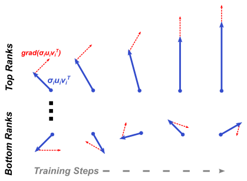

*(a) Схема*

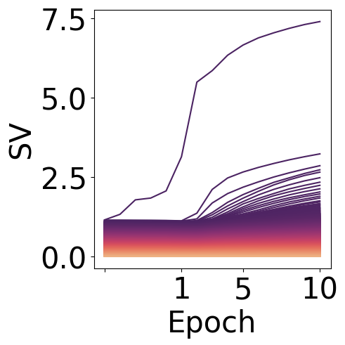

*(b) Сингулярные числа*

###### fig-1

*Рисунок 1: **Слева: схема спектральной динамики весовой матрицы. По ходу обучения верхние сингулярные векторы становятся устойчивы, а верхние сингулярные числа непропорционально вырастают. Справа: развитие сингулярных чисел одной матрицы трансформера, где каждая линия — отдельное сингулярное число, а цвет обозначает ранг. Мы видим непропорциональную склонность, при которой большие сингулярные числа растут быстрее. Мы исследуем эту спектральную динамику весов и связываем её с генерализацией, регуляризацией и, казалось бы, несвязанными явлениями вроде линейной связности мод.*** **[p. 1]**

Например, несмотря на обширные исследования, у нас до сих пор нет полного понимания неявных смещений (Neyshabur et al. 2014) нейронных сетей, обучаемых стохастической оптимизацией. Даже на основные вопросы о роли регуляризации вроде weight decay (Hanson & Pratt 1988; Krogh & Hertz 1991; Zhang et al. 2018a) есть лишь частичные ответы (Van Laarhoven 2017; Andriushchenko et al. 2023; Yaras et al. 2023b). И, пожалуй, самое досадное: у нас нет полного объяснения того, как нейронные сети обобщают, при том что они способны безупречно запомнить обучающие данные (Zhang et al. 2021). Такое объяснение могло бы позволить нам создавать лучшие алгоритмы, однако отсутствие понимания делает применение нейронных сетей уязвимым для неинтерпретируемых ошибок в самых разных областях (Szegedy et al. 2013; Ilyas et al. 2019; Hendrycks et al. 2021; Zou et al. 2023).

###### p1-5

Хотя для того, чтобы сделать разбор осуществимым, выдвигались теоретические объяснения, эти работы часто опираются на особые постановки вроде глубоких линейных сетей (Arora et al. 2018; Arora et al. 2019) или систем бесконечной ширины (Jacot et al. 2018), а доводы могут держаться на необоснованных или непрактичных допущениях вроде почти нулевой инициализации. С эмпирической стороны растущий свод работ по интерпретируемости пытается провести обратный инжиниринг нейронных сетей (Rahaman et al. 2019; Barak **[p. 2]** et al. 2022; Nanda et al. 2023), но ввиду трудности задач рассматриваемые системы очень мелкого масштаба, а методика разбора весьма самодельна и плохо масштабируется. Третий разряд работ нацелен на понимание эмпирического поведения с более высокого уровня (Zhang et al. 2021; Huh et al. 2022; Yu & Wu 2023), и хотя такие работы часто изучают системы большего масштаба, они нередко сосредоточены на более отвлечённых объектах вроде грам-матрицы (Huh et al. 2022) или NTK (Fort et al. 2020) и потому не обладают разрешением и предсказательной силой двух предыдущих разрядов.

Чтобы навести мосты через эти разрывы, мы предлагаем не зависящий от задачи объединяющий взгляд на множество разрозненных явлений глубокого обучения во множестве разных практических задач и архитектур, включая классификацию изображений с ConvNet, порождение изображений с UNet, распознавание речи с LSTM и языковое моделирование с трансформерами. Обширными опытами мы исследуем динамику сингулярных чисел и сингулярных векторов весовых матриц — спектральную динамику весов. Мы показываем, что такая динамика лежит в основе многих различных явлений и, по-видимому, тесно связана с генерализацией. Изучать именно эту динамику нас побуждает то, что оптимизация есть основополагающий процесс, движущий глубоким обучением (Nagarajan & Kolter 2019; Zhang et al. 2021), что матричные параметры составляют ядро тождества любой нейронной сети, а сингулярное разложение есть основополагающий способ смотреть на любую матрицу. Наш вклад подробно изложен в следующих абзацах.

###### p2-2

В качестве испытательного стенда для понимания генерализации Power et al. 2022 вводят явление «гроккинга», при котором мелкомасштабная модель сперва минимизирует обучающую потерю, но плохо работает на поверочных данных, а затем, при куда более долгом обучении, внезапно минимизирует поверочную потерю. В частности, Nanda et al. 2023 показали, что в простых задачах модульной арифметики конкретное найденное оптимизацией решение можно восстановить обратным инжинирингом по весовым матрицам. Хотя это описание точно, в разделе 3 мы подмечаем не зависящий от задачи взгляд на гроккинг, наблюдая, что падение поверочной потери при гроккинге совпадает с одновременным обнаружением низкоранговых решений во всех весовых матрицах сети. Связь ранга с генерализацией могла бы чутьём объясняться через бритву Оккама. Более того, вторя существующим работам (Lyu et al. 2023; Liu et al. 2023), мы находим, что weight decay явно сказывается на гроккинге и минимизации ранга: без него ни то ни другое не проявляется столь же сильно. При этом мы показываем, что увеличение объёма обучающих данных может отчасти возместить отсутствие weight decay и в смысле генерализации, и в смысле минимизации ранга, и во всех случаях мы видим соотнесение между низкоранговыми матрицами и генерализацией. Итак, мы находим, что рассмотрение спектральной динамики даёт не зависящий от задачи взгляд на гроккинг.

Хотя это указывает на связь ранга с генерализацией, гроккинг обычно изучают на синтетических задачах, очень мелкомасштабных моделях вроде однослойных трансформеров или небольших MLP, и он требует весьма особых настроек гиперпараметров (Power et al. 2022; Nanda et al. 2023; Gromov 2023; Kumar et al. 2023). Если нашему взгляду суждено быть полезным, он должен масштабироваться на бо́льшие системы. Поэтому мы обращаемся к расхожим эмпирическим задачам из литературы — классификации изображений, порождению изображений, распознаванию речи и языковому моделированию, — а также к разнообразным и бо́льшим сетям: VGG (Simonyan & Zisserman 2014), UNet (Ronneberger et al. 2015), LSTM (Hochreiter & Schmidhuber 1997b) и трансформерам (Vaswani et al. 2017).

###### p2-4

В разделе 4 мы показываем, что спектральная динамика смещена к минимизации эффективного ранга в самых разных практических нейронных сетях в сложных постановках. Хотя такое поведение вторит теоретическим предсказаниям в глубоком линейном случае, мы находим, что поведение сетей расходится с расхожим теоретическим допущением о низкоранговой динамике: с согласованием сингулярных векторов в последовательных слоях (Saxe et al. 2014; Arora et al. 2018; Arora et al. 2019; Milanesi et al. 2021). Стало быть, механизм минимизации ранга может отличаться от того, что описывает теория. Примечательно и то, что настройки наших гиперпараметров взяты из существующей литературы, а значит, склонность к минимизации ранга сопутствует хорошо обобщающим сетям в самых разных постановках.

###### p2-5

И всё же в этих более практических постановках мы не видим столь же очевидной минимизации ранга, как при гроккинге, и нет там внезапного перехода от запоминания к генерализации. Одной особенно заметной составляющей гроккинга был очень высокий уровень weight decay. У weight decay долгая история в качестве регуляризатора, явно штрафующего норму параметров, которую можно применять для основанных на норме границ генерализации (Bartlett 1996), но эти границы, по-видимому, не объясняют успеха практических систем (Nagarajan & Kolter 2019; Jiang et al. 2019). В последнее время другие исследователи предполагали неявное влияние weight decay на ранг параметров в теоретических или мелкомасштабных эмпирических работах (Galanti et al. 2022; Timor et al. 2023), которое может быть связано с генерализацией (Razin & Cohen 2020). Поэтому мы исследуем это действие weight decay в практических постановках.

В разделе 5 мы эмпирически связываем минимизацию ранга с weight decay, показывая, что weight decay способствует минимизации ранга в разных архитектурах и задачах. Вдобавок в некоторых случаях он, по-видимому, способствует ещё и согласованию сингулярных векторов в последовательных весах, несмотря на нелинейности между слоями, что указывает на дальнейшее сжатие модели. Хотя weight decay явно штрафует норму, изучение спектральной динамики позволяет нам наблюдать неявное действие на ранг. Такое действие может помочь в понимании генерализации, поскольку регуляризации нормы недостаточно.

Ввиду наводящей на мысли связи ранга с генерализацией мы обращаемся к классическим опытам о запоминании **[p. 3]** Zhang et al. 2021. Zhang et al. 2021 показали, что даже небольшие сети способны запомнить случайные метки. Стало быть, любые доводы о генерализации должны учитывать строение данных и процесс оптимизации. В разделе 6 мы показываем, что обучение со случайными метками ведёт к высокоранговым решениям, тогда как при истинных метках ранг много ниже. Мы также находим, что случайные метки последовательные слои не согласуют, а истинные согласуют, — что удивительно ввиду нелинейностей между слоями. Через спектральную динамику мы видим ясное различие между оптимизацией обобщающих и запоминающих сетей, и это даёт опору при восхождении к лучшему теоретическому пониманию.

Наши результаты указывают, что взгляд на нейронные сети через призму спектральной динамики способен пролить свет на несколько связанных с генерализацией явлений, но мы подозреваем, что связи шире. В литературе существует множество любопытных и необъяснённых явлений, касающихся нейронных сетей. Мы берём два из них как разборы случаев. Первое — гипотеза лотерейного билета (LTH) (Frankle & Carbin 2018), в рамках которой обнаружено существование разрежённых подсетей со сходным качеством. Такое явление даёт свидетельство того, что, несмотря на всё растущее число параметров и затраты энергии, действенные меньшие сети уже существуют. Понимание источника такой действенности может помочь нам смягчить затраты на применение. Второе — линейная связность мод (LMC) (Nagarajan & Kolter 2019; Frankle et al. 2020; Neyshabur et al. 2020), в рамках которой обнаружено, что модели, разделяющие часть пути оптимизации, можно усреднить в пространстве весов и получить более сильную модель (Wortsman et al. 2022; Ramesh et al. 2022). Это явление указывает, что после некоторого обучения поверхность потерь в подпространстве вполне выпукла, хотя теоретически задача оптимизации крайне невыпукла. Поскольку всякая дообучающая настройка от предобученных моделей остаётся в этом выпуклом пространстве (Neyshabur et al. 2020; Li et al. 2022; Sadrtdinov et al. 2023), объяснение того, что лежит в основе усреднения моделей, помогло бы прояснить роль предобучения, пролило бы свет на широко применяемую низкоранговую адаптацию (Hu et al. 2021) и могло бы привести к лучшей оптимизации.

В разделе 7 мы находим, что глобальное прореживание по величине — обычная процедура поиска лотерейных билетов — сохраняет верхние сингулярные векторы и действует как низкоранговая обрезка. Мы также видим, что способность интерполировать между моделями при LMC сильно соотносится с общими верхними сингулярными векторами. С этими результатами мы отмечаем, что оба явления можно рассматривать как стороны спектральной динамики весов, и подводим их под кров предыдущих разделов.

Подытоживая изложенное выше: изучая спектральную динамику весов, мы находим, что

###### p3-4

- гроккинг тесно связан с минимизацией ранга;
- минимизация ранга есть общее явление в более сложных задачах;
- weight decay неявно действует как низкоранговый регуляризатор;
- обобщающие решения имеют более низкий ранг, чем запоминающие; и
- верхние сингулярные векторы сохраняются при прореживании по величине и при линейной интерполяции между связными модами.

Все эти явления и действия ранее в той или иной мере изучались по отдельности, но, подходя к глубокому обучению через спектральную динамику, мы стремимся к общему языку для нейронных сетей. Код всех опытов выложен по адресу https://github.com/dyunis/spectral_dynamics.

## 2 Смежные работы

### 2.1 Гроккинг

###### p3-6

Power et al. 2022 первыми подметили удивительное явление, которое назвали «гроккингом»: модели быстро подгоняются под обучающие данные на игрушечных задачах, а затем, после долгого периода обучения, очень быстро обобщают на поверочных данных. Позже другие нашли, что это явление может происходить в ослабленном виде (Thilak et al. 2022) на очень простых моделях и других наборах данных (Liu et al. 2022; Gromov 2023; Kumar et al. 2023; Xu et al. 2023) и что weight decay, по-видимому, решающе важен для его возникновения (Lyu et al. 2023; Liu et al. 2023; Tan & Huang 2023). Некоторые полагают, что гроккинг объясняется переходом из ядрового (Jacot et al. 2018) в богатый (Atanasov et al. 2023) режим (Kumar et al. 2023; Mohamadi et al. 2023). Есть также эмпирические свидетельства связи двойного спуска с гроккингом (Davies et al. 2022), обнаружения разрежённого решения (Merrill et al. 2023), упрощения границ решения (Humayun et al. 2024) и опережающего признака в виде колебаний потери (Thilak et al. 2022; Notsawo Jr et al. 2023). Ни одна из этих работ явно не рассматривала связь с рангом, что делаем мы в разделе 3, и это даёт общую рамку, сквозь которую можно смотреть на многие из этих результатов.

### 2.2 Динамика сингулярных чисел

Прежние работы о глубоких линейных сетях (Arora et al. 2019; Milanesi et al. 2021) наводят на мысль, что минимизация ранга может описывать неявную регуляризацию в глубоком матричном разложении лучше, чем простые матричные нормы. Подробный довод см. в (Arora et al. 2018) (приложение A). Однако решающим допущением, применяемым в этих работах, служит «балансированная инициализация». Она означает, что для последовательных матриц $W_{i}$ и $W_{i+1}$ в матричном произведении $\prod_{j}W_{j}$ при инициализации выполнено $W^{\top}_{i+1}W_{i+1}=W_{i}W_{i}^{\top}$. **[p. 4]** Разложив эти матрицы через SVD и воспользовавшись ортогональностью, получаем упрощение до $V_{i+1}\Sigma_{i+1}^{2}V_{i+1}^{\top}=U_{i}\Sigma_{i}^{2}U_{i}^{\top}$, где $U_{i}$ и $V_{i+1}$ — ортогональные матрицы. Поскольку это ортогональные разложения одной и той же матрицы, их диагонали обязаны совпадать с точностью до перестановки элементов одинаковой величины. Отсюда $U_{i}=V_{i+1}O$ с точностью до знаков, где $O$ — блочно-диагональная матрица перестановки, которая может переставлять строки с равными диагональными элементами. Примечательно, что если все диагональные элементы различны, а $U_{i}$ и $V_{i+1}$ — квадратные матрицы, то $U_{i}=V_{i+1}$ с точностью до знаков.

При допущении балансированной инициализации все матрицы произведения будут согласованы. Как следствие, произведение диагоналей будет развиваться в замкнутой форме, причём бо́льшие сингулярные числа растут быстрее меньших. Как показано в (Arora et al. 2019), это выливается в минимизирующее ранг поведение с ростом глубины матричных произведений. Эта формула к тому же эмпирически подтверждена для задач линейного матричного разложения. Схожие результаты выведены для тензорных произведений и других структурированных постановок (Saxe et al. 2014; Yaras et al. 2023a). Более общо, (Ji & Telgarsky 2019) показывают, что для глубоких линейных сетей при бесконечно долгом обучении согласование между слоями произойдёт. В разделе 4 мы исследуем, как эти выводы и допущения держатся для куда бо́льших практических нейронных сетей, весьма далёких от линейных.

### 2.3 Низкоранговые свойства

###### p4-2

Другая линия исследований сосредоточена на более общих низкоранговых смещениях. Ранние работы исследовали нормы как неявное смещение (Gunasekar et al. 2017). Теоретический разбор обнаруживает, что норм или замкнутых функций весов может быть недостаточно для объяснения неявной регуляризации, но они не обязательно противоречат возможности минимизации ранга (Razin & Cohen 2020; Vardi & Shamir 2021). Многочисленные работы исследуют низкоранговые смещения в разных матрицах, включая якобиан (Pennington et al. 2018), весовые матрицы (Le & Jegelka 2021; Martin & Mahoney 2020; Martin & Mahoney 2021; Frei et al. 2022; Ongie & Willett 2022), грам-матрицу (Huh et al. 2022) и признаки (Yu & Wu 2023; Feng et al. 2022). Вдобавок исследования наводят на мысль, что на убывание ранга влияет динамика (Li et al. 2020; Chen et al. 2023; Wang & Jacot 2023). Некоторые работы устанавливают связи между weight decay и минимизацией ранга в идеализированных постановках (Ziyin et al. 2022; Galanti et al. 2022; Zangrando et al. 2024; Ergen & Pilanci 2023; Parhi & Nowak 2023; Shenouda et al. 2023). Нам особенно интересно, насколько далеко эти связи простираются на практике. В разделе 5 мы приводим эмпирические свидетельства, которые местами расходятся с доводами теории и мелкомасштабных систем, но и распространяют их на куда бо́льшие.

###### sec-3

## 3 Гроккинг и минимизация ранга

Побуждаемые теоретическими работами, предлагающими связи между рангом и генерализацией (Razin & Cohen 2020), между weight decay и рангом (Galanti et al. 2022; Timor et al. 2023; Yaras et al. 2023b; Zangrando et al. 2024), а также важностью weight decay для гроккинга (Power et al. 2022; Lyu et al. 2023; Liu et al. 2023) в простых постановках, мы оцениваем возможную связь между рангом и гроккингом в нейронных сетях. Рассмотрение гроккинга сквозь призму ранга (и более общо — спектральной динамики) даёт взгляд, дополняющий другие описания гроккинга, такие как фурье-разложение (Nanda et al. 2023), упрощение линейных границ решения (Humayun et al. 2024), связь с двойным спуском (Davies et al. 2022) и обнаружение разрежённого решения (Merrill et al. 2023).

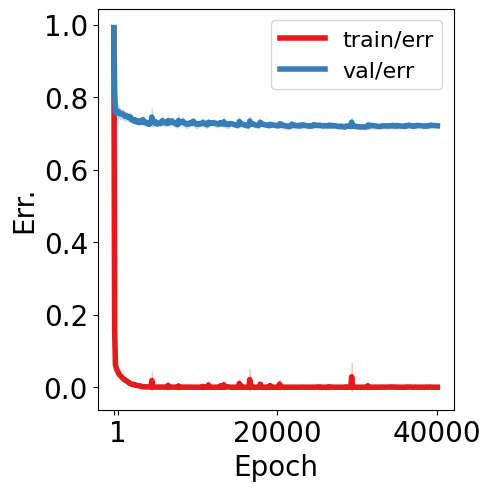

*(a) Ошибка*

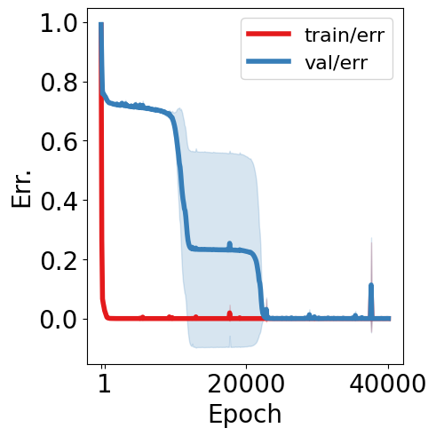

*(a) Ошибка*

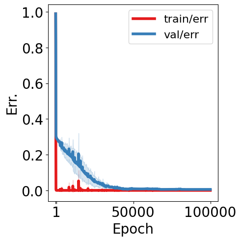

*(a) Ошибка*

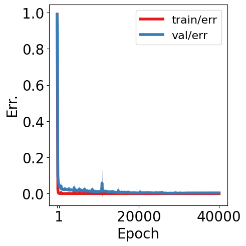

*(a) Ошибка*

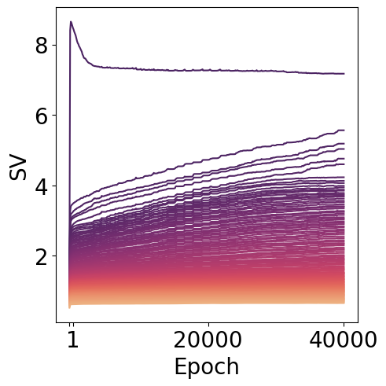

*(b) Развитие сингулярных чисел*

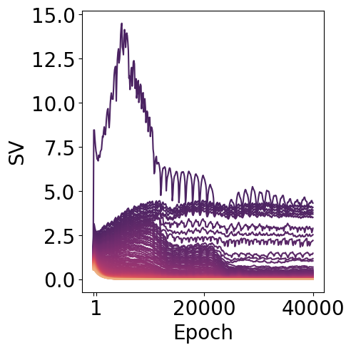

*(b) Развитие сингулярных чисел*

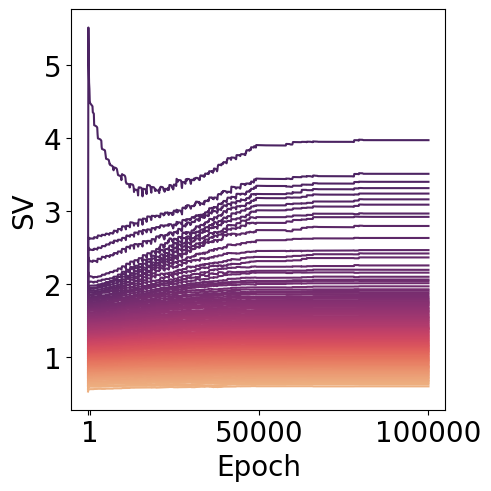

*(b) Развитие сингулярных чисел*

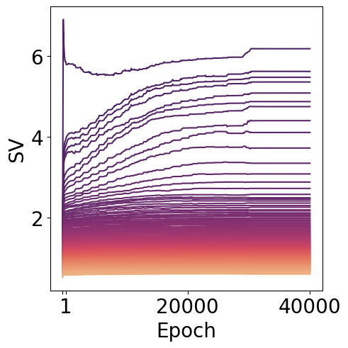

*(b) Развитие сингулярных чисел*

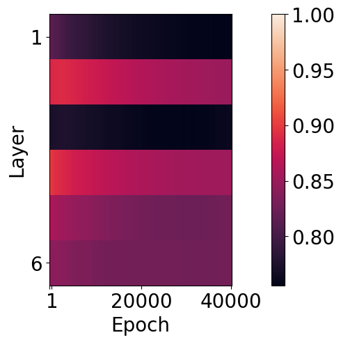

*(c) Эффективный ранг*

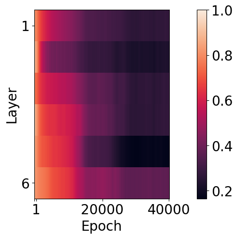

*(c) Эффективный ранг*

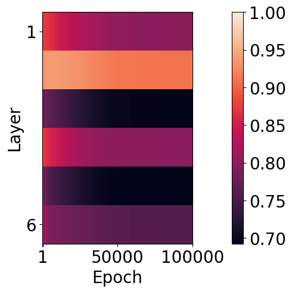

*(c) Эффективный ранг*

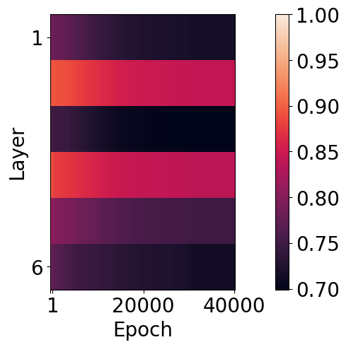

*(c) Эффективный ранг*

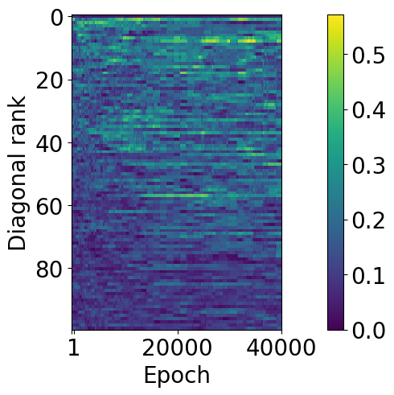

*(d) Согласование*

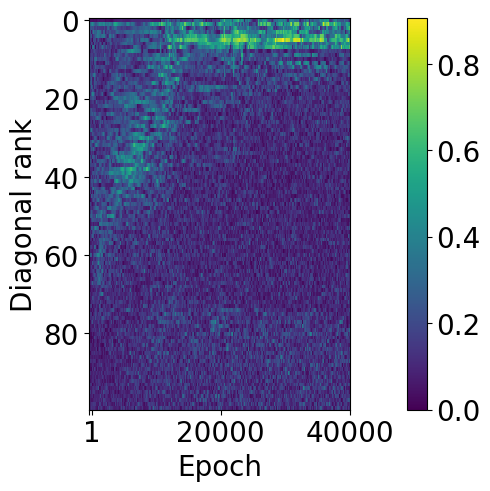

*(d) Согласование*

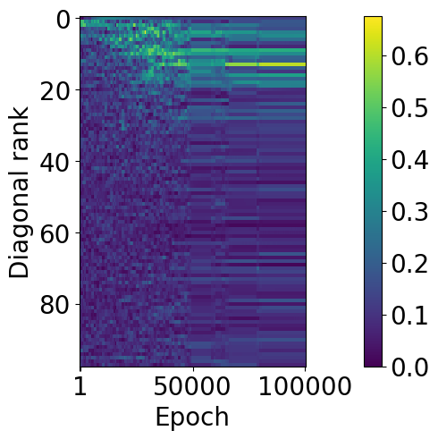

*(d) Согласование*

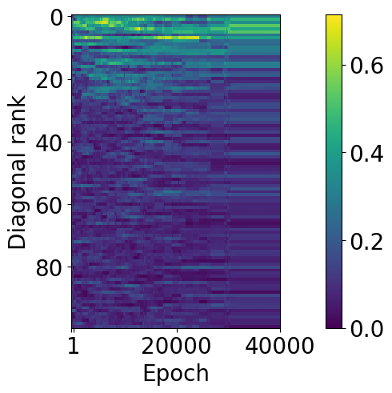

*(d) Согласование*

###### fig-2

*Рисунок 2: **Гроккинг и спектральная динамика. Верхний ряд: 30 % данных и без weight decay. 2-й ряд: 30 % данных и weight decay 1.0 (гроккинг), с гиперпараметрами из Nanda et al. 2023. 3-й ряд: 70 % данных без weight decay (slingshot), с гиперпараметрами из Thilak et al. 2022. Нижний ряд: 90 % данных и без weight decay. 2-й столбец: развитие сингулярных чисел показано для первого параметра внимания, где каждая линия представляет отдельное сингулярное число, а цвет представляет ранг. 4-й столбец: показано также согласование (ур. 3) между вложением и первым параметром внимания, где ось y отвечает индексу $i$ диагонали. 3-й столбец: видно, что гроккинг сопутствует низкоранговым весам (эффективный ранг — ур. 1). Вдобавок есть согласование, начинающееся рано в обучении и развивающееся вверх по диагонали. Без weight decay и при меньшем объёме данных ни гроккинга, ни прочих явлений за весь бюджет обучения не происходит, но при большем объёме данных, даже без weight decay, низкоранговые решения возникают с самого начала обучения. Случай slingshot следует схожей склонности, хотя поверочная потеря подгоняется постепенно. Во всех случаях с хорошей генерализацией параметры ниже рангом, а согласование к тому же чаще встречается в верхних рангах.*** **[p. 5]**

###### p4-4

Мы во многом следуем постановке Nanda et al. 2023, оптимизируя однослойный трансформер для сложения по модулю (подробности в приложении A). Вдохновляясь работами о глубоком линейном случае (Saxe et al. 2014; Arora et al. 2019; Milanesi et al. 2021; Yaras et al. 2023b), мы отслеживаем развитие сингулярных чисел отдельных весовых матриц. Чтобы получить высокоуровневый обзор развития всех параметров, мы вычисляем (нормированный) эффективный ранг матрицы $W$ (Roy & Vetterli 2007) с рангом $R$ как

$$
\text{EffRank}(W):=-\sum_{i=1}^{R}\frac{\sigma_{i}}{\sum_{j}\sigma_{j}}\log\frac{\sigma_{i}}{\sum_{j}\sigma_{j}}\kern 5.0pt, \\
\text{NormEffRank}(W):=\frac{\text{EffRank}(W)}{R}\kern 5.0pt, \tag{1}
$$

###### p4-5

где $\sigma_{i}$ — сингулярные числа матрицы $W$, а $\text{EffRank}(W)$ есть энтропия нормированного распределения сингулярных чисел. По мере сосредоточения вероятностной массы эффективный ранг убывает. Мы строим графики $\text{NormEffRank}(W)$, чтобы сравнивать по слоям и по времени.

Вдобавок, вдохновляясь допущениями о балансированности, сделанными в прежних работах (Arora et al. 2018; Arora et al. 2019), мы исследуем согласование последовательных весовых матриц в трансформере. Чтобы исследовать и измерить это согласование между последовательными матрицами сети на момент обучения $t$, то есть

$$
W_{i} =\sum_{j=1}^{R}\sigma_{j}(t)u_{j}(t)v_{j}(t)^{\top}\kern 5.0pt, \\
W_{i+1} =\sum_{k=1}^{R}\sigma^{\prime}_{k}(t)u^{\prime}_{k}(t){v^{\prime}_{k}}(t)^{\top}\kern 5.0pt,
$$

мы вычисляем

$$
A(t)_{jk}=\lvert\langle u_{j}(t),v^{\prime}_{k}(t)\rangle\rvert, \tag{3}
$$

###### p4-8

где абсолютная величина взята, чтобы не учитывать смену знаков при вычислении SVD. **[p. 6]** Затем мы строим график диагонали этой матрицы $A(t)_{ii}~\forall~i\leq 100$ во времени. Точные подробности о том, как согласование вычисляется для разных архитектур и слоёв, более сложных, чем полносвязный случай, см. в приложении A.

###### p6-1

На рисунке 2 мы видим плотное совпадение: внезапное падение поверочной потери в точности совпадает с началом низкорангового поведения сингулярных чисел. Рассматривая межслойное согласование по ходу обучения, мы наблюдаем, что итоговое низкоранговое решение постепенно прорастает из средних рангов модели. Напротив, без weight decay явление гроккинга отсутствует, и низкоранговое решение, по-видимому, не развивается. Мы также воспроизводим постановку Thilak et al. 2022, которые показывают вид гроккинга без weight decay, но при построении по линейной шкале оси x генерализация выглядит куда менее внезапной, чем в постановке с weight decay. Вдобавок при использовании 90 % данных и без weight decay генерализация всё равно совпадает с минимизацией эффективного ранга. Осведомлённый читатель заметит, что Nanda et al. 2023 ранее показали, что конкретное решение, находимое в модульном сложении, есть низкоранговое фурье-разложение, так что наши наблюдения о низкоранговых весах прямо из него следуют. Хотя такое описание для модульного сложения впечатляюще точно, для более сложных задач его может быть трудно получить. В следующих разделах мы доказываем, что минимизация ранга есть взгляд, применимый и в более сложных постановках, когда не знаешь, что искать в весах, и что со временем, возможно, даже удастся интерпретировать нейронную сеть через верхние ранги (Praggastis et al. 2022).

###### p6-2

Мы хотим также подчеркнуть сложность в отношениях нормы и генерализации, на которую указывают наши результаты, в диалоге с Liu et al. 2023. Видно, что без weight decay, но с 90 % данных обнаруживаемое обобщающее решение имеет много сингулярных чисел больше 1, и наибольшее сингулярное число тоже больше, чем у грокнувшего решения, у которого большинство сингулярных чисел близки к нулю. Напомним, что норма матрицы $W$ даётся выражением $\lVert W\rVert_{2}=\sqrt{\sum_{i}\sigma_{i}^{2}}$, где $\sigma_{i}$ — сингулярные числа. Стало быть, решение при большом объёме данных имеет куда более высокую норму, чем грокнувшее решение. И всё же обе постановки обобщают с определённым низкоранговым поведением. Сбивающая с толку составляющая в том, что при высоком weight decay меньшие сингулярные числа исчезают, а без него — нет. Точного понимания того, как низкоранговое поведение впрямую соотносится с генерализацией, у нас сейчас нет, и оно может выполняться не всегда — высокоранговые решения тоже могут обобщать. Тем не менее с точки зрения бритвы Оккама низкоранговое решение понятийно «проще» из-за меньшей размерности, что делает его убедительным объяснением.

## 4 Спектральная динамика в разных задачах

Вдохновляясь результатами о гроккинге и прежними работами о глубоких линейных сетях, изучающими развитие SVD весовых матриц (Saxe et al. 2014; Arora et al. 2018; Arora et al. 2019; Milanesi et al. 2021; Yaras et al. 2023a), мы применяем тот же разбор к бо́льшим, более практическим системам. Мы показываем, что склонности, увиденные нами при разборе гроккинга, по большей части сохраняются в разных сетях и задачах куда большего масштаба, хотя наши находки местами и отклоняются от теоретических предсказаний.

### 4.1 Методика

Наши опыты нацелены на исследование нейронных сетей разумного размера в разнообразных задачах. Мы выбираем модели и задачи, представительные для нынешних применений. А именно, мы сосредоточиваемся на:

- **классификации изображений** с CNN (VGG-16 (Simonyan & Zisserman 2014)) на CIFAR10 (Krizhevsky 2009);
- **порождении изображений** через диффузию с UNet (Ronneberger et al. 2015) на MNIST (LeCun 1998);
- **распознавании речи** с LSTM (Hochreiter & Schmidhuber 1997b) на LibriSpeech (Panayotov et al. 2015); и
- **языковом моделировании** с трансформерами (Vaswani et al. 2017) на Wikitext-103 (Merity et al. 2016).

###### p6-6

Обучение сотен прогонов для каждого из перечисленных опытов вычислительно дорого, что ограничивает масштаб моделей, который мы можем исследовать. Мы в основном перенимаем гиперпараметры из существующей литературы, с малыми изменениями ради простоты. Это обеспечивает, что любые наблюдаемые соотнесения, скорее всего, отражают расхожую практику, а не привнесённое нами смещение. Мы надеемся, что широкий охват этих опытов позволит взглянуть на оптимизацию нейронных сетей более обще.

###### p6-7

Основные свидетельства в этом разделе получены вычислением SVD весовых матриц внутри моделей. Поэтому мы оставляем в стороне одномерные параметры смещения и нормализации. Впрочем, прежние исследования наводят на мысль, что в некоторых случаях эти параметры для качества не решающи (Zhang et al. 2018b; Mohan et al. 2019; Karras et al. 2023). Ввиду большого числа матриц в этих моделях мы приводим графики матричных параметров отдельных слоёв и статистики, сводящие поведение по слоям, ради краткости изложения. Для этой работы были построены сотни тысяч графиков, так что включить их все невозможно. Полные подробности опытов, включая гиперпараметры, доступны в приложении A, где мы берём гиперпараметры из существующих постановок литературы.

### 4.2 Минимизация эффективного ранга

###### p6-8

Опираясь на теоретические (Saxe et al. 2014; Arora et al. 2019; Milanesi et al. 2021; Boix-Adserà et al. 2023; Yaras et al. 2023a) и эмпирические (Dittmer et al. 2019; Martin & Mahoney 2020; Martin & Mahoney **[p. 7]** 2021; Boix-Adserà et al. 2023) находки, мы исследуем минимизацию эффективного ранга по параметрам в бо́льших моделях и на более разнообразных задачах. Рисунок 3 обнаруживает устойчивую склонность: эффективный ранг параметров сети в целом убывает на протяжении обучения, вне зависимости от конкретного параметра или архитектуры сети. Это наводит на мысль о постепенном «упрощении» сети по ходу обучения и вторит нашим предыдущим находкам в режиме большого объёма данных на модульном сложении.

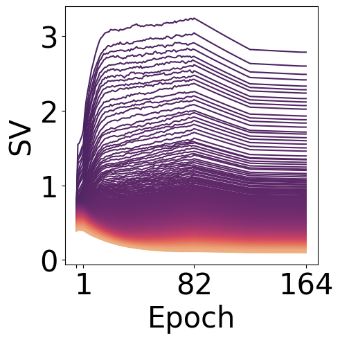

*(a) VGG*

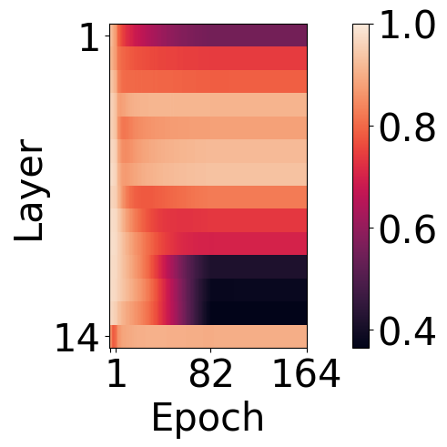

*(a) VGG*

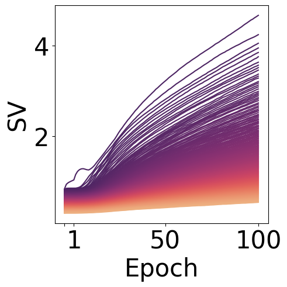

*(b) UNet*

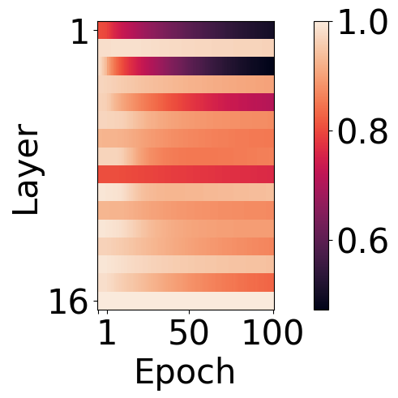

*(b) UNet*

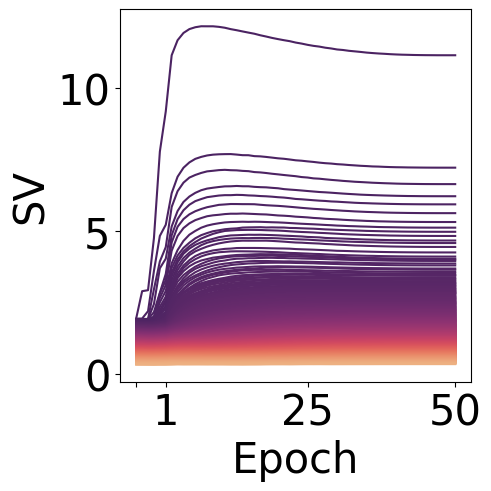

*(c) LSTM*

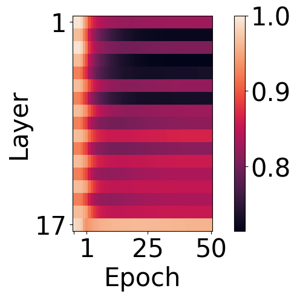

*(c) LSTM*

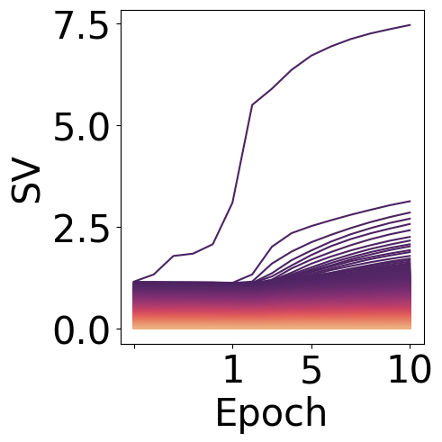

*(d) Трансформер*

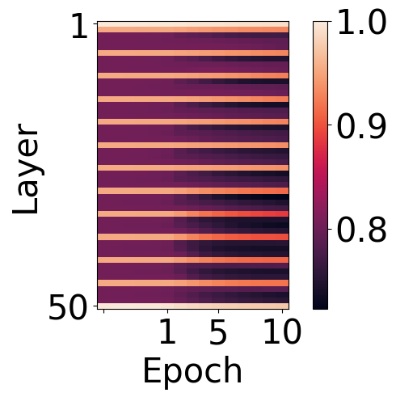

*(d) Трансформер*

###### fig-3

*Рисунок 3: **Верхний ряд: развитие сингулярных чисел одной матрицы в середине каждой модели. Каждая линия представляет сингулярное число, а цвет представляет ранг. Обратите внимание на неравномерное развитие, при котором верхние сингулярные числа растут непропорционально быстро. Нижний ряд: развитие нормированного эффективного ранга (ур. 1), показанное цветом для разных матриц в разных архитектурах и во времени. По мере движения вниз по оси $y$ глубина параметров в модели растёт, а ось $x$ отслеживает время обучения. Обратите внимание на убывание эффективного ранга почти по всем параметрам, хотя величина убывания разнится по слоям. Блочные узоры в случае VGG, вероятно, вызваны разными размерами канальной размерности. Полосчатость в случаях UNet, LSTM и трансформера вызвана, соответственно, различиями между свёрточными и линейными слоями, связями остаточных блоков, а также слоями внимания и полносвязными слоями. Резкий переход в середине обучения в случае VGG, вероятно, вызван падением скорости обучения в 10$\times$.*** **[p. 7]**

###### p7-1

Далее мы проводим опыт с обрезкой сингулярных чисел, чтобы исследовать отношения между низкоранговым поведением и качеством модели. Мы обрезаем либо верхнюю, либо нижнюю половину сингулярных чисел каждой весовой матрицы сети, а затем оцениваем обрезанную модель на каждом шаге обучения. Чутьё подсказывает, что верхние сингулярные числа несут самые важные для работы сети сведения. Рисунок 4 подтверждает эту гипотезу, показывая, что обрезанные параметры без дальнейшего обучения способны близко приблизиться к качеству полной модели. Могло быть и иначе. В частности, одновременная обрезка нижних составляющих во всех слоях может привести к утрате важного сигнала, который должен передаваться между слоями, а большое число сингулярных чисел малой величины может давать какое-то важное зашумляющее действие, так что эмпирическое подтверждение необходимо. Иначе это же можно выразить так: хотя каждая отдельная матрица хорошо приближается в евклидовом пространстве своими верхними рангами, каково итоговое действие на функцию нейронной сети от одновременной обрезки этих матриц — неясно. В последующих разделах мы будем опираться на это наблюдение, что большие сингулярные числа важнее для работы сети.

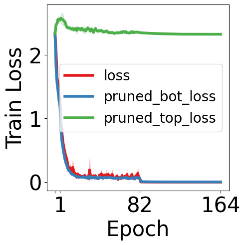

*(a) VGG*

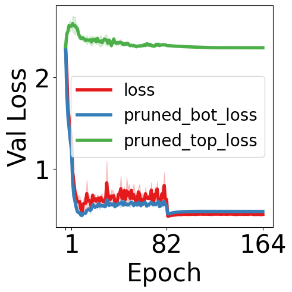

*(a) VGG*

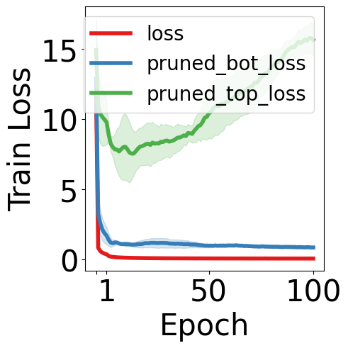

*(b) UNet*

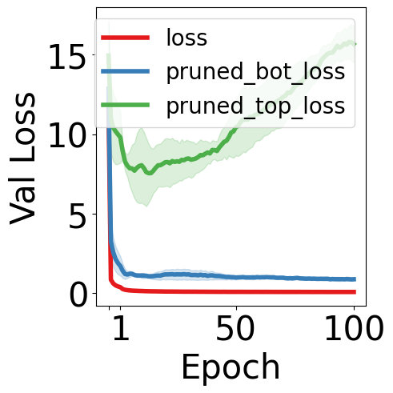

*(b) UNet*

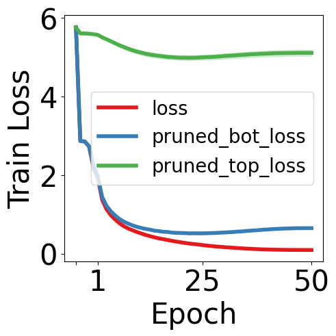

*(c) LSTM*

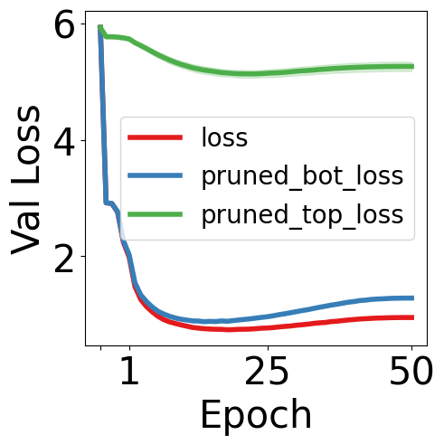

*(c) LSTM*

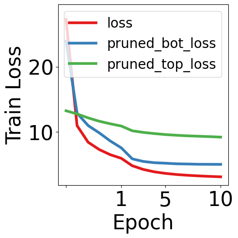

*(d) Трансформер*

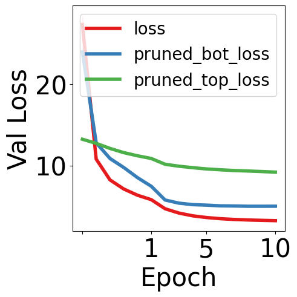

*(d) Трансформер*

###### fig-4

*Рисунок 4: **Верхний ряд: обучающие потери для всех задач. Нижний ряд: поверочные потери для всех задач. Красное — полная модель. Синее — обрезка после обучения нижней половины SVD у каждой матрицы модели, кроме последнего слоя. Зелёное — обрезка после обучения верхней половины SVD. Обратите внимание, что для всех моделей сохранение верхней половины SVD близко к качеству полной модели, что подкрепляет мысль о том, что верхние направления дают лучшее приближение функции.*** **[p. 7]**

### 4.3 Согласование сингулярных векторов между слоями

###### p7-2

Подобно разбору гроккинга, мы исследуем согласование между последовательными слоями в бо́льших нейронных сетях, рассматриваемых в этом разделе. Мы не только применяем матрицу согласования, определённую в ур. 3, но и выводим и строим скалярную меру согласования по верхним диагональным элементам:

$$
a(t)=\frac{1}{10}\sum_{i=1}^{10}A(t)_{ii} \tag{4}
$$

За частными подробностями о вычислении этой меры в разнообразных архитектурах и сложных слоях (не только полносвязных) обращайтесь к приложению A.

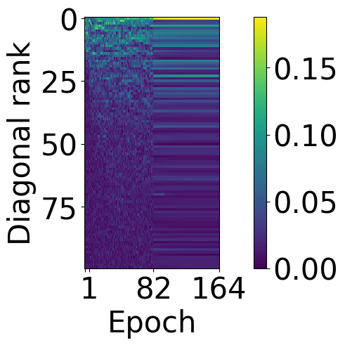

*(a) VGG*

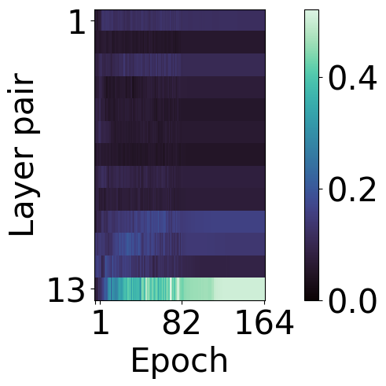

*(a) VGG*

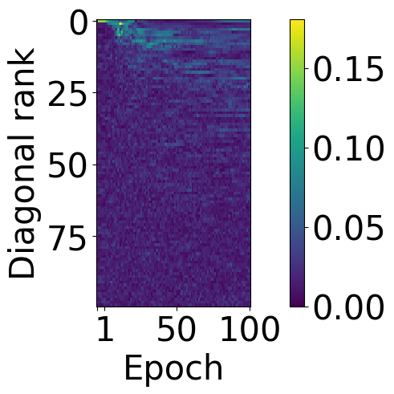

*(b) UNet*

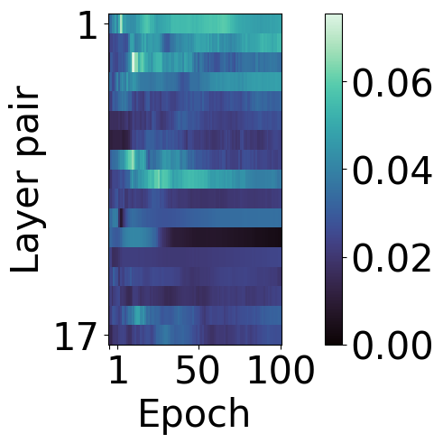

*(b) UNet*

*(c) LSTM*

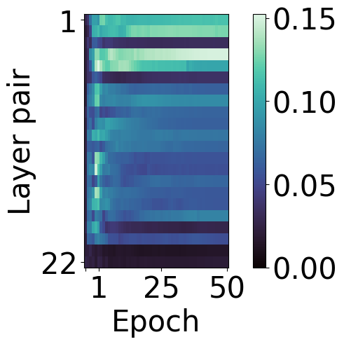

*(c) LSTM*

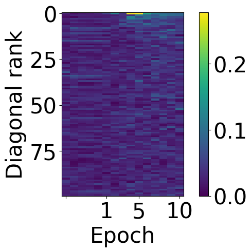

*(d) Трансформер*

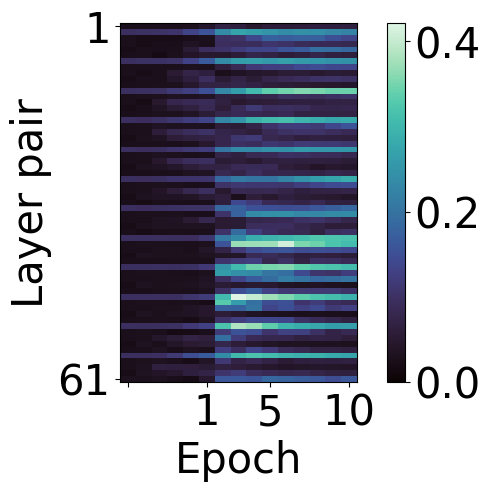

*(d) Трансформер*

###### fig-5

*Рисунок 5: Согласование сингулярных векторов соседних слоёв. **Верхний ряд:** диагональ матрицы согласования $A(t)_{ii}$ (ур. 3) против времени обучения для одной пары матриц в середине каждой модели. Мы видим небольшое согласование в верхних рангах между слоями вскоре после начала обучения, но со временем оно размывается. **Нижний ряд:** мера согласования (ур. 4) для пар матриц по глубине против времени обучения. Общую склонность по моделям разглядеть трудно, хотя у LSTM виден слабый сигнал около эпохи 1, когда происходит начальное согласование, а у трансформера есть полосчатый узор по глубине из-за согласования между матрицами запросов и ключей, между которыми нет нелинейности.* **[p. 8]**

###### p7-4

Рисунок 5 обнаруживает ключевую находку: теоретическое допущение **балансированной инициализации**, полагающее согласованность сингулярных разложений (SVD) весовых матриц (Arora et al. 2018; Saxe et al. 2014), в начале обучения в этих бо́льших сетях не выполняется. Вдобавок, в отличие от линейного случая, разбираемого в Du et al. 2018, согласование, по-видимому, не остаётся неизменным на протяжении обучения. Однако слабый сигнал согласования в верхних рангах развивается. Эта склонность несколько напоминает теоретический результат, полученный **[p. 8]** Mulayoff & Michaeli 2020 для линейных сетей при допущении о выбеленных входных данных. И всё же слабость наблюдаемого сигнала означает, что существующие теоретические модели не улавливают всей сложности обучения настоящих нейронных сетей.

###### sec-5

## 5 Действие weight decay

В свете ранее наблюдавшегося развития сингулярных чисел мы исследуем предполагаемое действие weight decay. Хотя weight decay явно штрафует норму весов, есть свидетельства, усложняющие связь между нормой и генерализацией для нейронных сетей (Razin & Cohen 2020; Andriushchenko et al. 2023), а значит, у нас нет полного понимания того, почему weight decay может быть полезен. С другой стороны, некоторые теоретические (Boix-Adserà et al. 2023; Razin & Cohen 2020; Yaras et al. 2023a; Timor et al. 2023; Ongie & Willett 2022; Galanti et al. 2022; Zangrando et al. 2024) и эмпирические (Galanti et al. 2022; Boix-Adserà et al. 2023) работы предлагают связь с рангом матриц в стеснённых постановках. И всё же всеобъемлющая связь с бо́льшими эмпирическими сетями пока не показана.

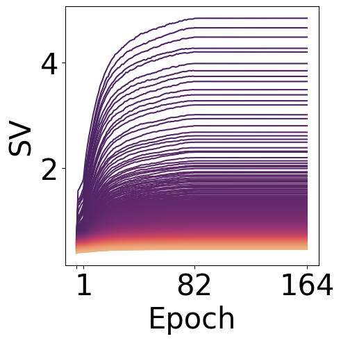

*(a) VGG*

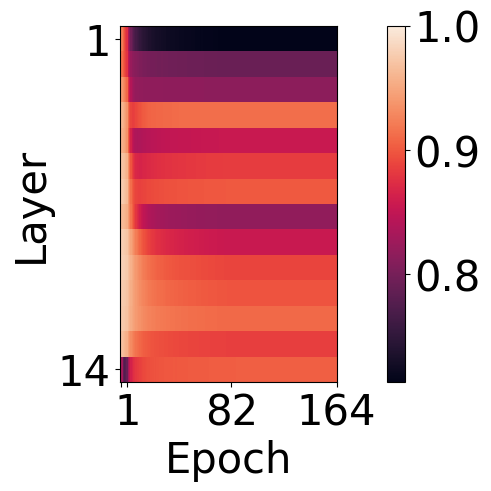

*(a) VGG*

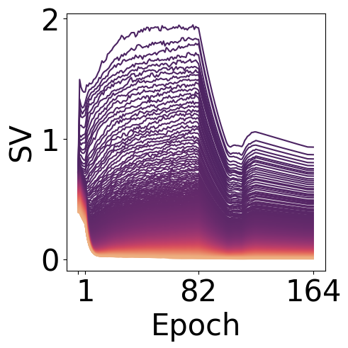

*(a) VGG*

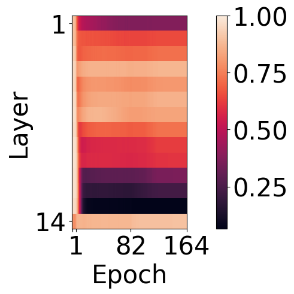

*(a) VGG*

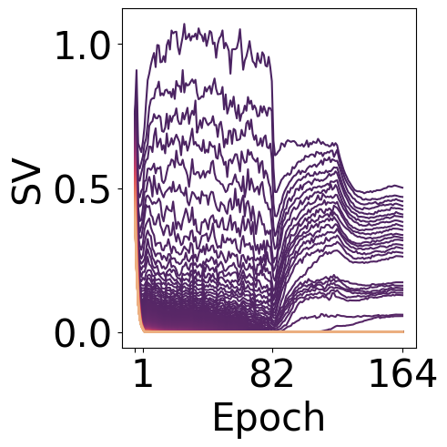

*(a) VGG*

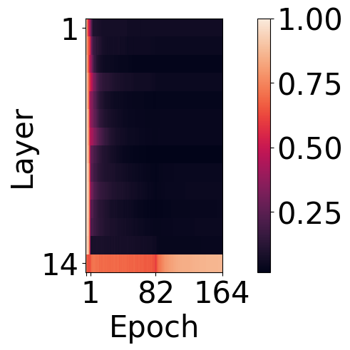

*(a) VGG*

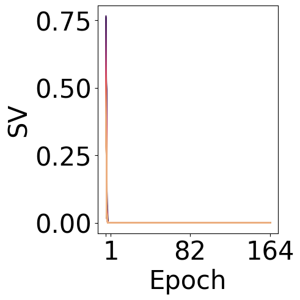

*(a) VGG*

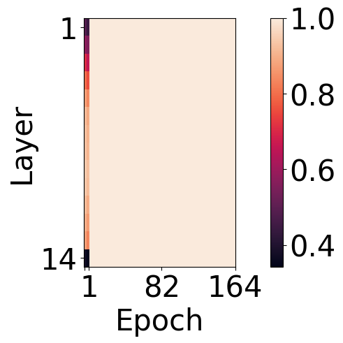

*(a) VGG*

*(b) UNet*

*(b) UNet*

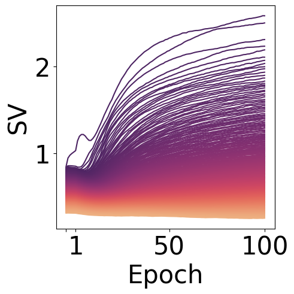

*(b) UNet*

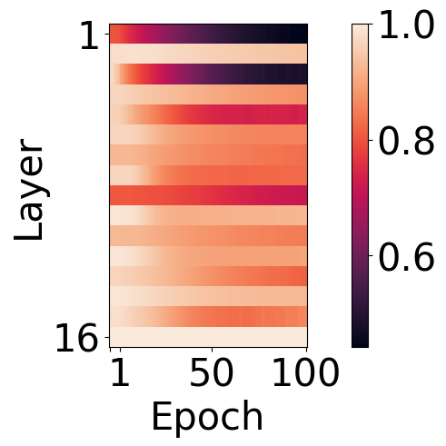

*(b) UNet*

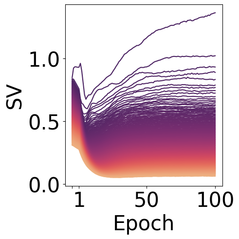

*(b) UNet*

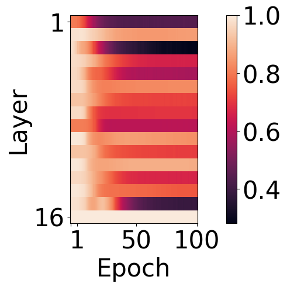

*(b) UNet*

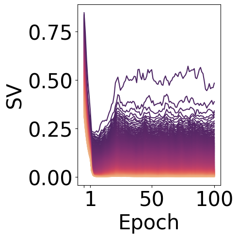

*(b) UNet*

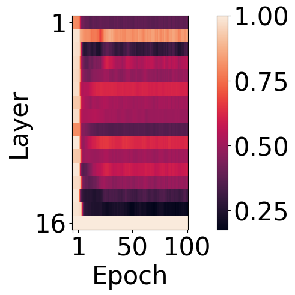

*(b) UNet*

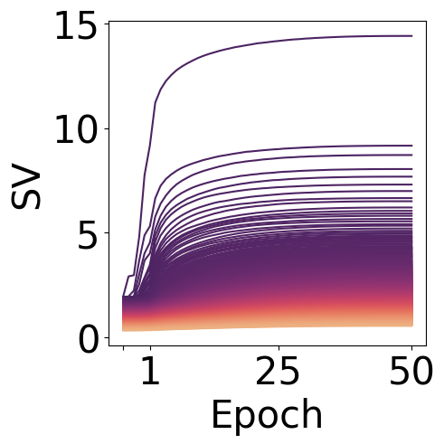

*(c) LSTM*

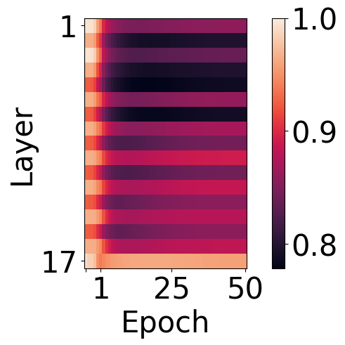

*(c) LSTM*

*(c) LSTM*

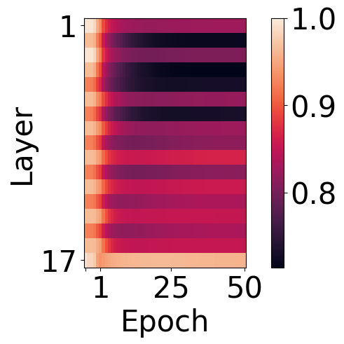

*(c) LSTM*

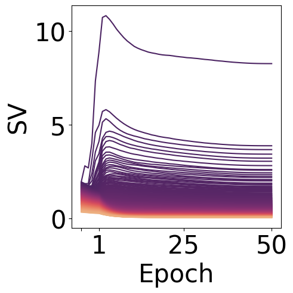

*(c) LSTM*

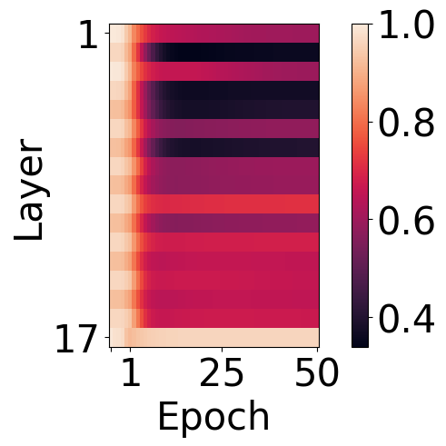

*(c) LSTM*

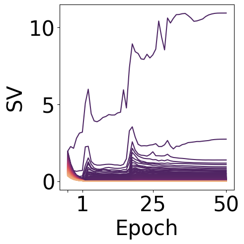

*(c) LSTM*

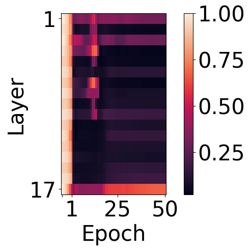

*(c) LSTM*

*(d) Трансформер*

*(d) Трансформер*

*(d) Трансформер*

*(d) Трансформер*

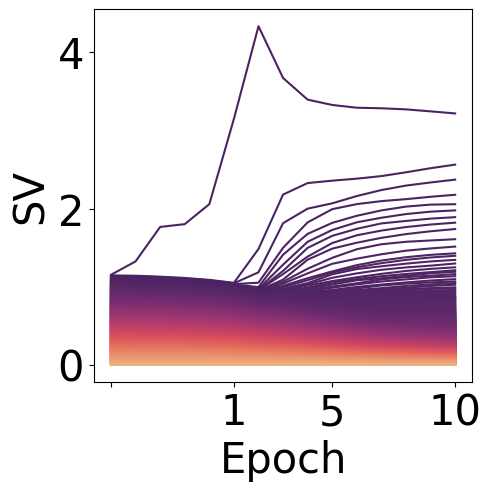

*(d) Трансформер*

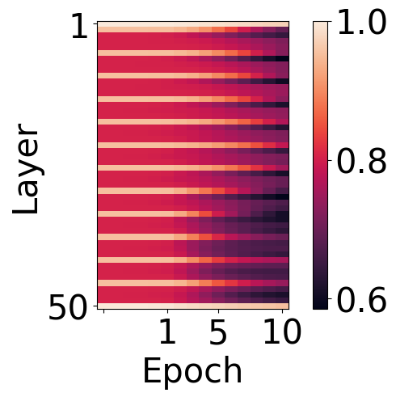

*(d) Трансформер*

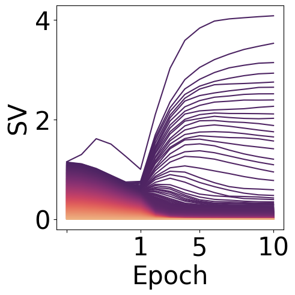

*(d) Трансформер*

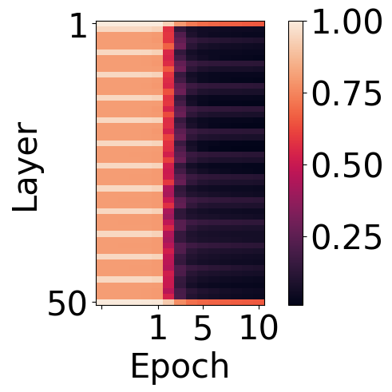

*(d) Трансформер*

###### fig-6

*Рисунок 6: Развитие сингулярных чисел одной матрицы и нормированный эффективный ранг (ур. 1) по матрицам во времени, где ряды используют разное количество weight decay. Сверху вниз для VGG мы используем коэффициенты $\{0,0.001,0.01,0.1\}$, а для остальных сетей — коэффициенты $\{0,0.1,1,10\}$. Более высокие коэффициенты weight decay способствуют более напористой минимизации ранга. VGG использует SGD с моментом, а остальные — AdamW (Loshchilov & Hutter 2017), чем может объясняться более ранний коллапс нормы.* **[p. 9]**

###### p8-2

Мы поразмыслим о том, каково чутьё насчёт механизма в более практических постановках. Заметим, что в простейшем виде weight decay требует $\text{arg min}_{W}\,\mathcal{L}(W)+\lambda\lVert W\rVert_{F}^{2}$, где $\lVert W\rVert_{F}^{2}=\sum_{i=1}^{R}\sigma_{i}^{2}$ с сингулярными числами $\sigma_{i}$ весовой матрицы $W$ ранга $R$. Мы видели, что бо́льшие сингулярные числа нейронных сетей растут быстрее (рис. 3, верхний ряд) и что верхние сингулярные векторы куда полезнее для минимизации задачной потери, чем нижние (рис. 4). Стало быть, при небольшой регуляризации weight decay одно простое решение для сети — минимизировать ранг данной весовой матрицы, сохранив верхние сингулярные числа, чтобы минимизировать $\mathcal{L}(W)$. Timor et al. 2023 доводят до схожего действия: если все сингулярные числа меньше 1, норма возбуждений будет сжиматься с глубиной, так что передать сигналы в достаточно глубоких сетях окажется невозможно. Стало быть, важно, чтобы несколько сингулярных чисел были достаточно велики.

###### p8-3

Рисунок 6 показывает, что добавление weight decay производит ровно это низкоранговое поведение, тогда как слишком большой weight decay ведёт к полному коллапсу нормы. Точный выбор того, что значит «слишком», разнится по архитектурам и задачам, хотя это может быть связано с применением SGD для VGG (Simonyan & Zisserman 2014) вместо AdamW (Loshchilov & Hutter 2017) для остальных.

###### p8-4

Вдобавок, что ещё удивительнее, большое количество weight decay способствует более плотному согласованию верхних сингулярных векторов последовательных слоёв трансформера, но не других сетей. Мы видим это на рисунке 7. Такое поведение весьма напоминает условие балансированности (Arora et al. 2018; Arora et al. 2019; Du et al. 2018), хотя у рассматриваемого здесь трансформера есть нелинейности и куда более сложное устройство. Любопытно, что склонность столь сильна только у этой архитектуры. Мы также приводим дополнительные свидетельства в приложении A, где рисунок 14 показывает, что решения с очень высоким weight decay всё ещё работоспособны, хотя ранг у них много ниже. Хотя трудно утверждать нечто столь простое, как «ниже ранг — значит лучше генерализация», поскольку неизвестен минимальный ранг, необходимый для данной задачи, примечательно, что роль weight decay в улучшении генерализации сплетена с его действием как регуляризатора ранга. Вдобавок, хотя точных средств, чтобы полностью интерпретировать сложные модели, у нас нет, когда на матрицу приходится лишь несколько рангов, может стать возможным распространить усилия по разбору (Nanda et al. 2023; Praggastis et al. 2022) на более сложные области.

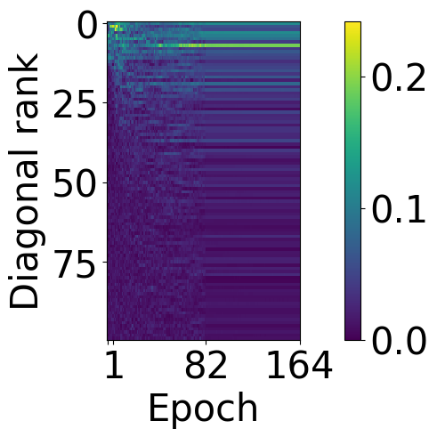

*(a) VGG*

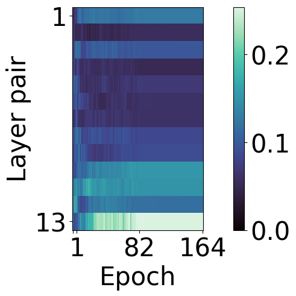

*(a) VGG*

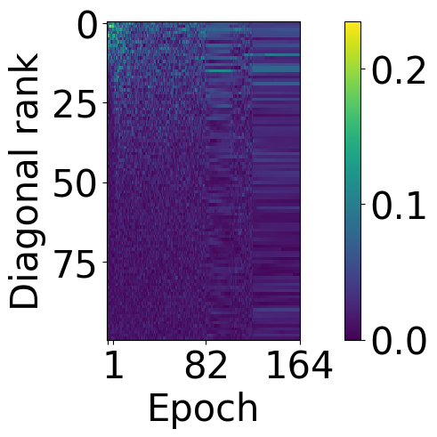

*(a) VGG*

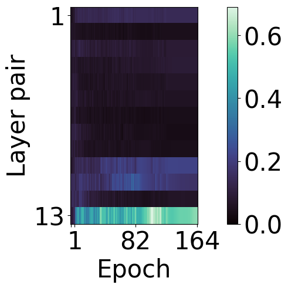

*(a) VGG*

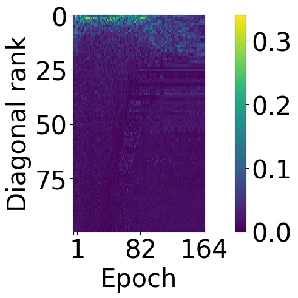

*(a) VGG*

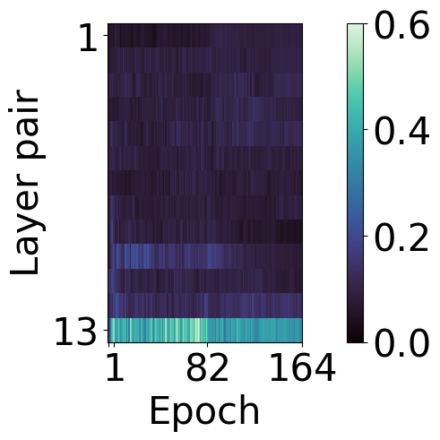

*(a) VGG*

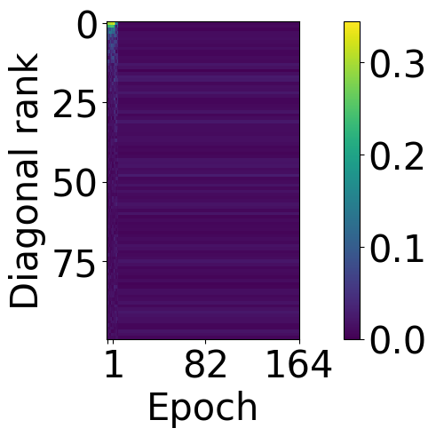

*(a) VGG*

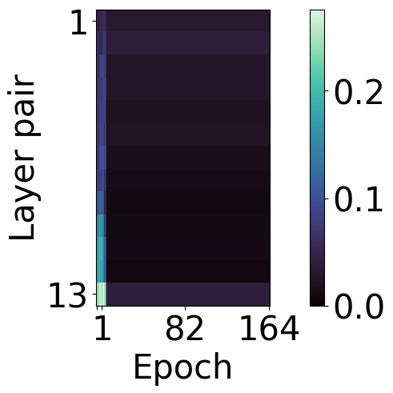

*(a) VGG*

*(b) UNet*

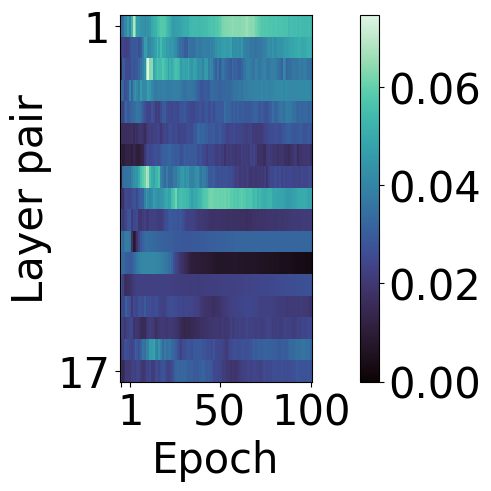

*(b) UNet*

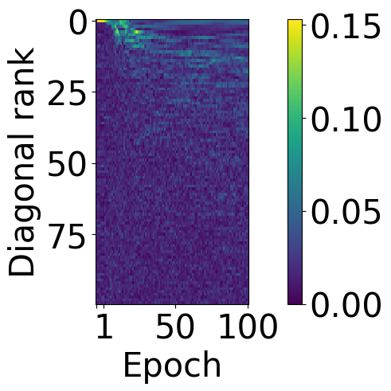

*(b) UNet*

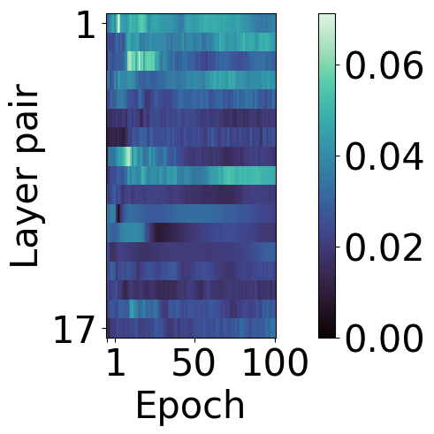

*(b) UNet*

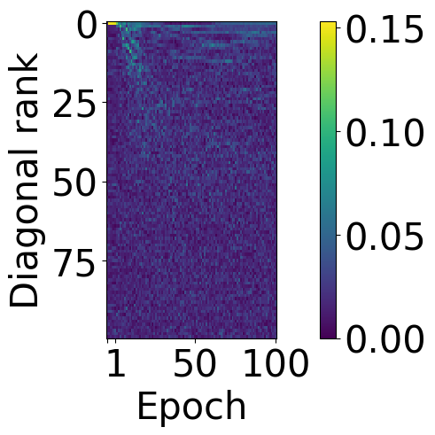

*(b) UNet*

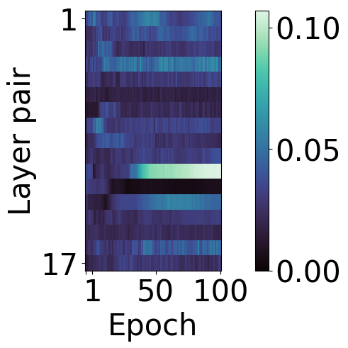

*(b) UNet*

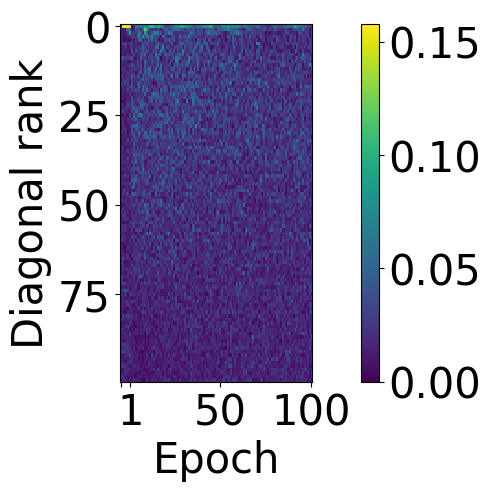

*(b) UNet*

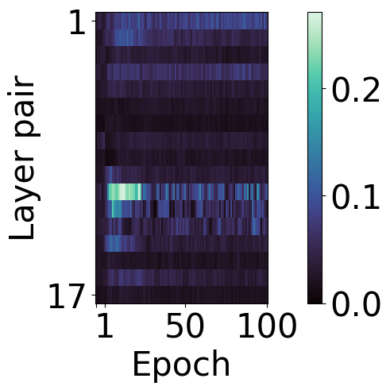

*(b) UNet*

*(c) LSTM*

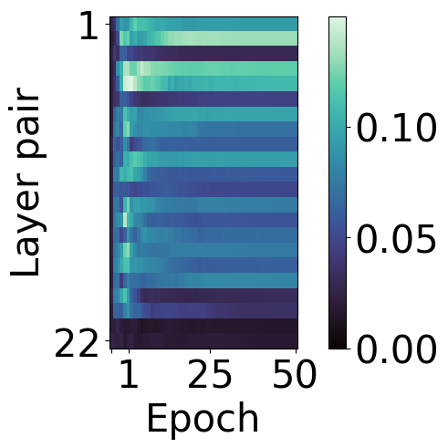

*(c) LSTM*

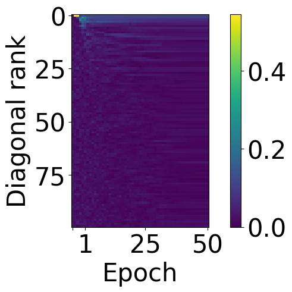

*(c) LSTM*

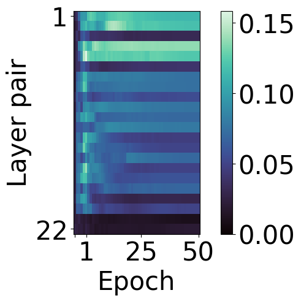

*(c) LSTM*

*(c) LSTM*

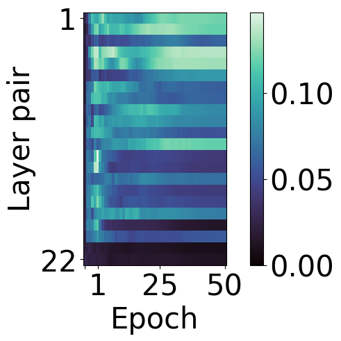

*(c) LSTM*

*(c) LSTM*

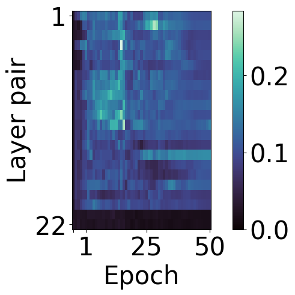

*(c) LSTM*

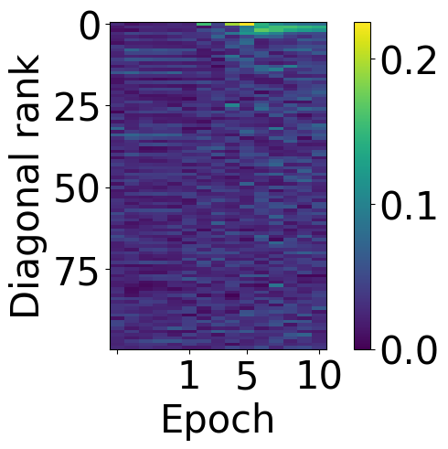

*(d) Трансформер*

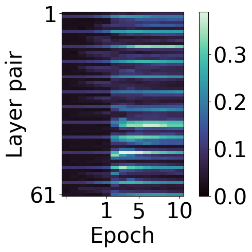

*(d) Трансформер*

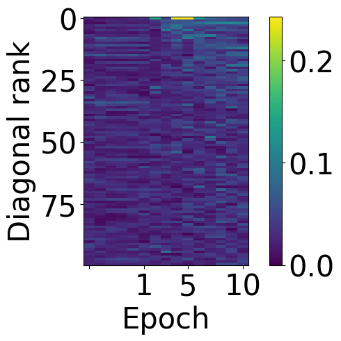

*(d) Трансформер*

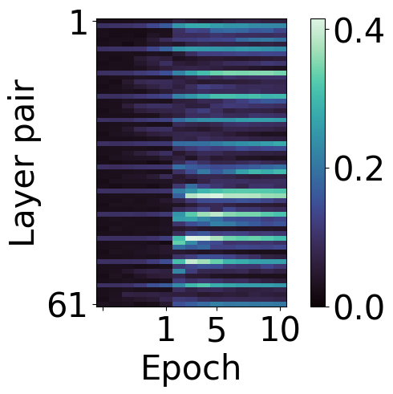

*(d) Трансформер*

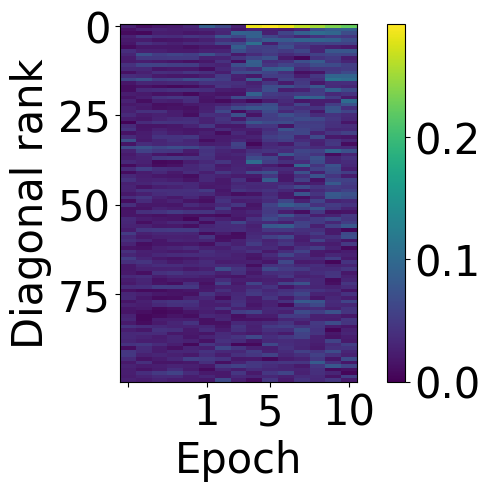

*(d) Трансформер*

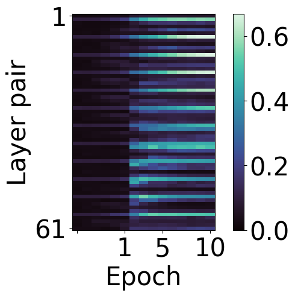

*(d) Трансформер*

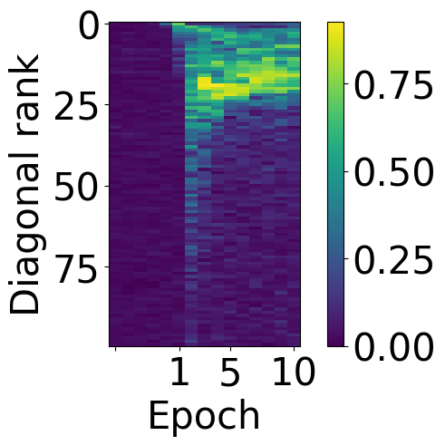

*(d) Трансформер*

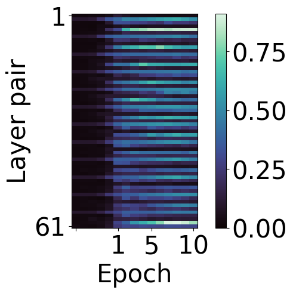

*(d) Трансформер*

###### fig-7

*Рисунок 7: Диагональ согласования для одной пары во времени (ур. 3) и мера согласования по парам матриц во времени (ур. 4), где ось y представляет глубину. Сверху вниз для VGG мы используем коэффициенты $\{0,0.001,0.01,0.1\}$, а для остальных сетей — коэффициенты $\{0,0.1,1,10\}$. Мы видим, что наибольшая величина согласования выше при большом weight decay и что, в частности, у трансформера согласование сильнейшее, даже когда слои MLP разделены нелинейностями.* **[p. 10]**

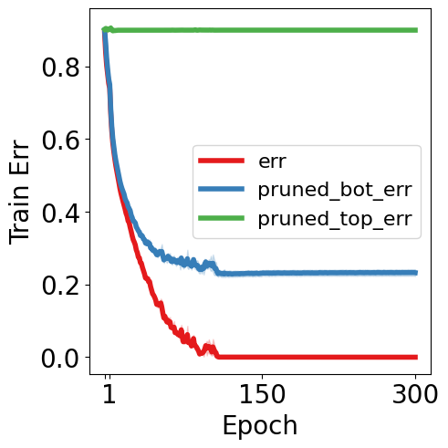

*(a) Ошибка на обучении*

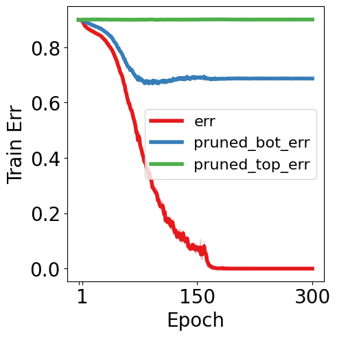

*(a) Ошибка на обучении*

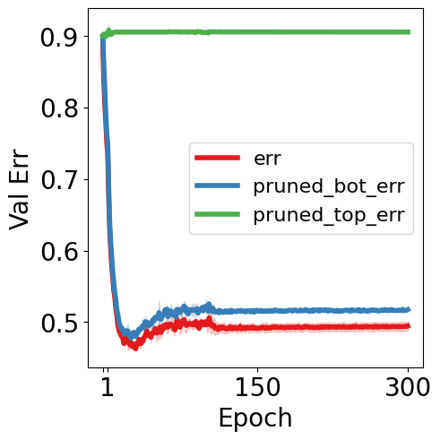

*(b) Ошибка на проверке*

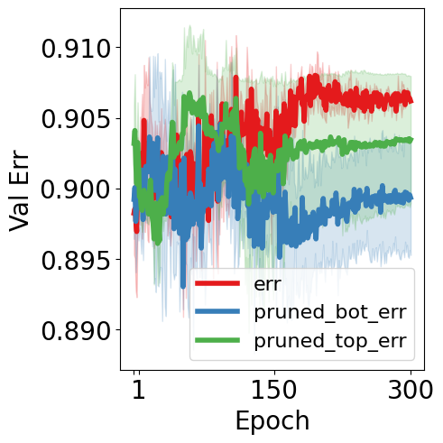

*(b) Ошибка на проверке*

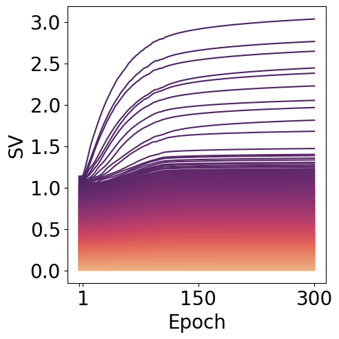

*(c) Сингулярные числа*

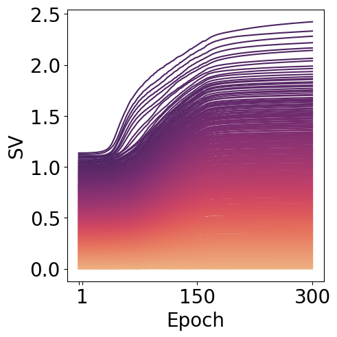

*(c) Сингулярные числа*

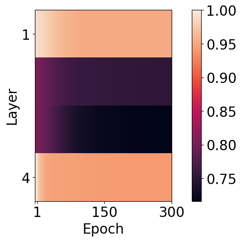

*(d) Эфф. ранг*

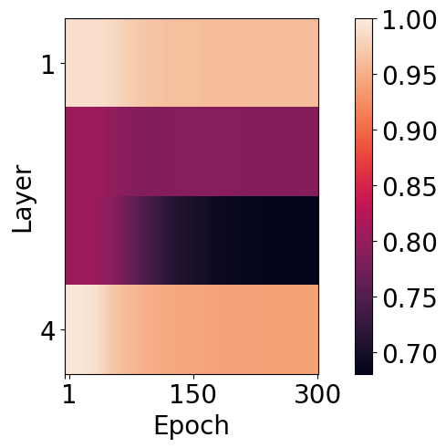

*(d) Эфф. ранг*

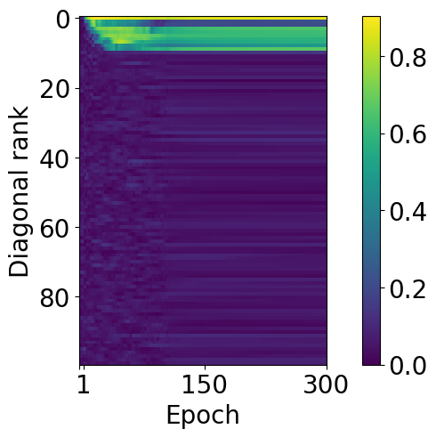

*(e) Согласование*

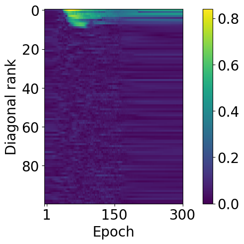

*(e) Согласование*

###### fig-8

*Рисунок 8: **Верхний ряд: результаты с истинными метками. Нижний ряд: результаты со случайными метками. Мы видим, что при истинных метках средние слои имеют более низкий эффективный ранг и что согласование в средних слоях сохраняется на протяжении всего обучения, в отличие от случая со случайными метками. Мы подчёркиваем, что это согласование происходит несмотря на нелинейности.*** **[p. 10]**

###### sec-6

## 6 Спектральная динамика при случайных метках

Ввиду накопленных к этому месту наблюдений, связывающих генерализацию и ранг, и просветляющего взгляда на неявные действия weight decay, нам интересно посмотреть, проливает ли развитый взгляд свет на классические опыты о запоминании случайных меток Zhang et al. 2021.

Подобно Zhang et al. 2021, мы обучаем простой MLP подгоняться под случайные или истинные метки на CIFAR10. Подробности постановки опыта см. в приложении A. Zhang et al. 2021 понижают скорость обучения до нуля, и опыты со случайными метками сходятся лишь поздно в обучении. **[p. 9]** Поэтому мы используем постоянную скорость обучения, чтобы это явление обуздать. На рисунке 8 мы видим, что оба случая способны достичь нулевой ошибки, хотя с разным развитием сингулярных чисел и разным согласованием в среднем слое.

###### p9-1

Удивительно, но мы видим, что при истинных метках внутренние слои низкоранговые, а при случайных метках они много выше рангом. Это может объясняться общим строением истинных классов набора данных, которое проявляется в параметрах. Ещё удивительнее, что здесь мы находим, что даже без weight decay внутренние слои согласуются при истинных метках, тогда как при случайных метках это согласование возникает, а затем при дальнейшем обучении пропадает. Это особенно занятно, поскольку есть нелинейности, которые теоретически могли бы отделить сеть от линейного случая, и всё же сильное согласование происходит вопреки им. Такое согласование существующей теорией пока не использовано и могло бы дать структурные допущения для нового понимания. Подытоживая, эти результаты наводят на мысль, что взгляд на генерализацию сквозь призму ранга может оказаться плодотворным.

## 7 За пределами генерализации

На протяжении многих опытов мы видели, что глубокие модели смещены к низкому рангу и что связь между минимизацией ранга и генерализацией заманчива. И всё же призму спектральной динамики можно применить шире. В следующих подразделах мы исследуем два явления: лотерейные билеты (Frankle & Carbin 2018) и линейную связность мод (Frankle et al. 2020). Помимо того, что они проливают дальнейший свет на нейронные сети, эти явления имеют значение для более действенного вывода и хранения, а также для понимания важности предобучения (Neyshabur et al. 2020). Мы находим, что лотерейные билеты суть разрежённое приближение верхних сингулярных векторов итоговой контрольной точки. Способность линейно интерполировать между далёкими контрольными точками и улучшать качество сильно совпадает с общими верхними сингулярными векторами у этих контрольных точек. Такие наблюдения могут заложить основу для лучшего понимания сжатия и усреднения моделей (Wortsman et al. 2022; Ilharco et al. 2022).

### 7.1 Верхние сингулярные векторы устойчивы по направлению раньше

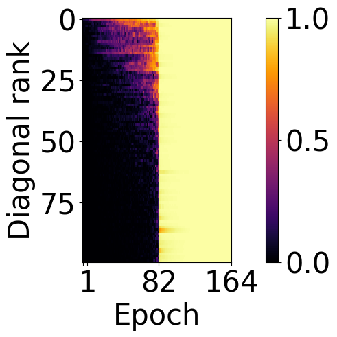

*(a) VGG*

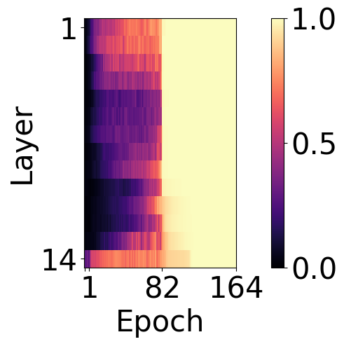

*(a) VGG*

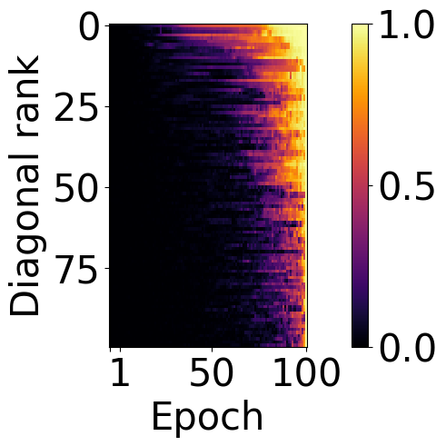

*(b) UNet*

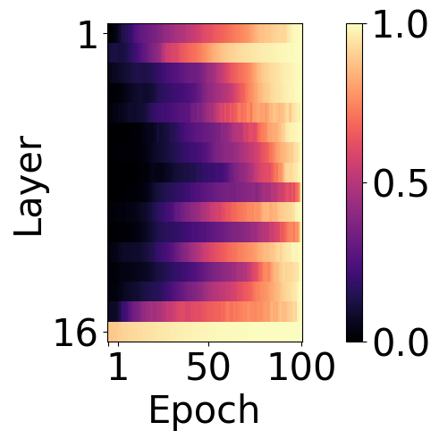

*(b) UNet*

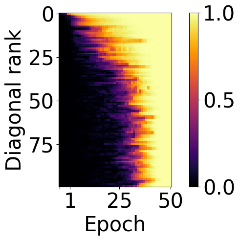

*(c) LSTM*

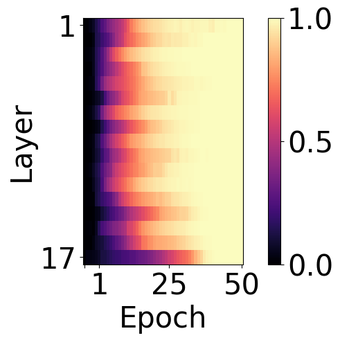

*(c) LSTM*

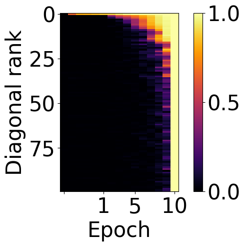

*(d) Трансформер*

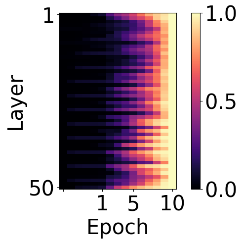

*(d) Трансформер*

###### fig-9

*Рисунок 9: **Верхний ряд: совпадение сингулярных векторов для одной матрицы в середине каждой модели (диагональ ур. 5). Обратите внимание, что верхние сингулярные векторы становятся устойчивы по направлению раньше. Нижний ряд: сводная оценка для каждой матрицы в разных архитектурах. По мере движения вниз по оси $y$ глубина параметров в модели растёт, а ось $x$ отслеживает время обучения. Резкий переход в середине обучения в случае VGG, вероятно, вызван десятикратным падением скорости обучения.*** **[p. 11]**

Прежде чем исследовать эти явления, сделаем ещё одно полезное наблюдение. Поскольку верхние сингулярные числа непропорционально вырастают, было бы естественно, чтобы верхние сингулярные векторы становились устойчивы по направлению, коль скоро градиенты остаются малы. Чтобы это показать, для данной матрицы сети $W_{i}(t)=\sum_{j=1}^{R}\sigma_{j}(t)u_{j}(t)v_{j}(t)^{\top}$ на момент обучения t мы вычисляем

**[p. 10]**

$$
S(t)_{jk}=\lvert\langle u_{j}(t)v_{j}(t)^{\top},u_{k}(T)v_{k}(T)^{\top}\rangle\rvert, \tag{5}
$$

###### p10-1

где $T$ — последний шаг обучения, а абсолютная величина взята, чтобы не учитывать смену знаков при вычислении SVD. Затем мы строим график диагонали этой матрицы $S(t)_{ii}~\forall~i\leq 100$ во времени. Мы также используем скалярную меру диагонали для сводки, как и в случае согласования: **[p. 11]** $s(t)=\frac{1}{10}\sum_{i}S(t)_{ii}$. На рисунке 9 мы видим, что верхние сингулярные векторы сходятся по направлению раньше нижних.

### 7.2 Лотерейные билеты сохраняют верхние сингулярные векторы итоговой модели

Поскольку большие сингулярные векторы становятся устойчивы поздно в обучении, мы задаёмся вопросом о связи с прореживанием по величине и гипотезой лотерейного билета. Frankle & Carbin 2018 первыми показали свидетельства в пользу гипотезы лотерейного билета — мысли о том, что существуют разрежённые подсети нейронных сетей, которые можно обучить до качества, сравнимого с полной сетью, причём разрежённая маска вычисляется по весам наибольшей величины в конце обучения. Frankle et al. 2020 развивают эту гипотезу дальше и подмечают, что для бо́льших сетей маскирование не может начинаться с инициализации, а должно начинаться в некоторый момент рано в обучении. И всё же маска должна быть взята с конца обучения.

Причина такого именно выбора маски может быть связана с ранее наблюдавшейся нами динамикой. А именно, в конце обучения большие сингулярные числа непропорционально велики, так что веса большой величины могут тесно отвечать весам в верхних сингулярных векторах в конце обучения. Если бы маски по величине вычислялись в начале, направления, которым предстоит стать верхними сингулярными векторами, могли бы оказаться замаскированы преждевременно, поскольку они ещё не устоялись, — что может помешать обучению задаче.

###### p11-3

Здесь мы обучаем немаскированную VGG-16 (Simonyan & Zisserman 2014) на CIFAR10, затем вычисляем либо случайную маску, либо глобальную маску по величине с конца обучения, и перематываем к ранней точке (Frankle et al. 2020), чтобы начать разрежённое переобучение. Подробности см. в приложении A. На рисунке 10 мы строим совпадение сингулярных векторов (SVA, ур. 5) между итоговой моделью маскированной и немаскированной, где видим ровно то, что маски по величине сохраняют верхние сингулярные векторы параметров, а с ростом разрежённости сохраняется меньше направлений. Хотя прежние работы уже отмечали, что для нейронных сетей можно применять низкоранговые приближения (Yu et al. 2017), а другие явно оптимизировали низкоранговые лотерейные билеты (Wang et al. 2021; Schotthöfer et al. 2022), мы скорее указываем на то, что процедура прореживания по величине, по-видимому, восстанавливает низкоранговое приближение.

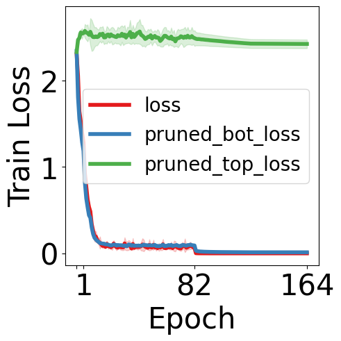

*(a) Потеря*

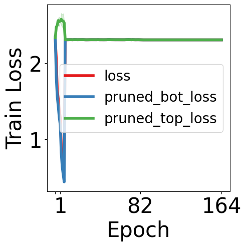

*(a) Потеря*

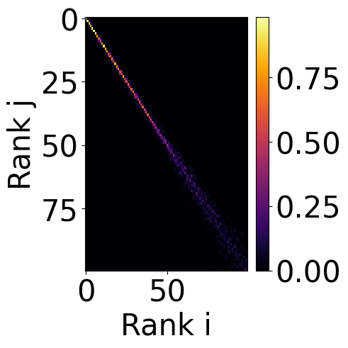

*(b) SVA после прореживания*

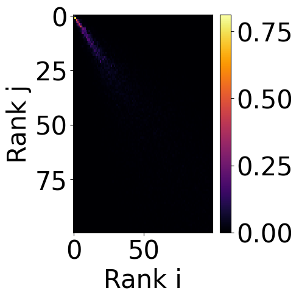

*(b) SVA после прореживания*

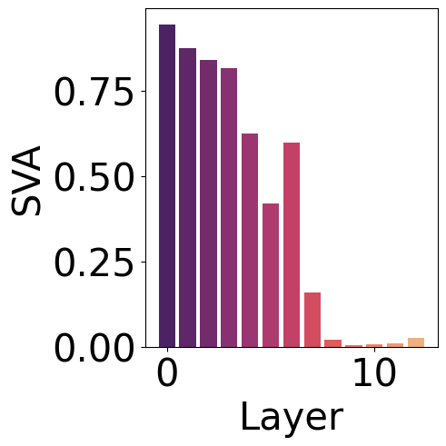

*(c) Все слои*

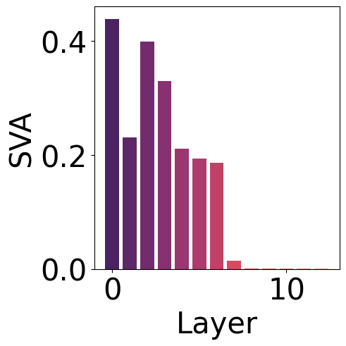

*(c) Все слои*

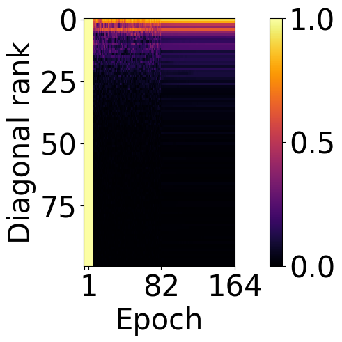

*(d) Развитие SVA*

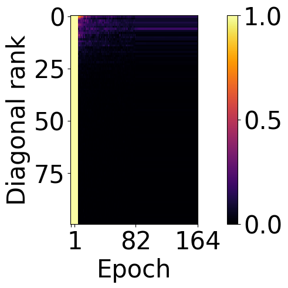

*(d) Развитие SVA*

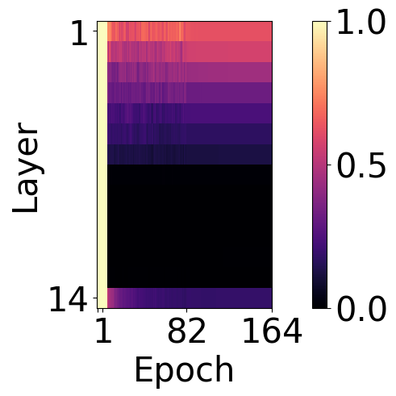

*(e) Все слои*

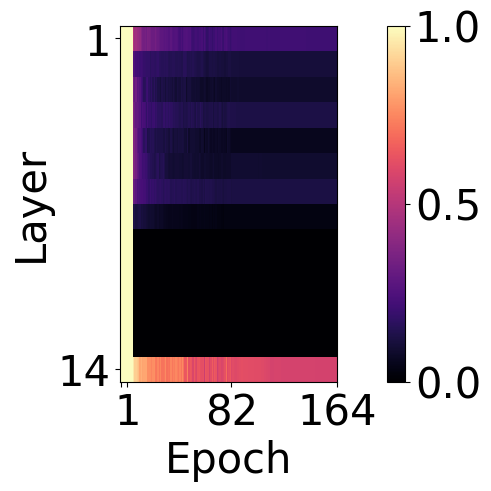

*(e) Все слои*

###### fig-10

*Рисунок 10: **Верхний ряд: прореживание по величине. Нижний ряд: случайное прореживание. Первый столбец: обучающая потеря. Мы видим, что при разрежённости 5 % прореживание по величине значительно лучше случайного прореживания той же послойной разрежённости. 2-й столбец: согласование сингулярных векторов до и после прореживания в конце обучения для одного слоя (3-й свёртки). Мы видим, что прореживание по величине приближает верхние сингулярные векторы, а случайное прореживание того же уровня — нет. 3-й столбец: оценка согласования сингулярных векторов до и после прореживания по всем слоям. Совпадение выше по всем слоям при прореживании по величине, хотя более поздние слои не совпадают — вероятно, потому что более поздние слои шире и веса потому меньше по величине. 4-й столбец: согласование сингулярных векторов между обрезанной и необрезанной моделями вдоль пути обучения. Мы видим, что при прореживании по величине динамика верхних сингулярных векторов всё ещё схожа, а при случайном прореживании — нет. Последний столбец: оценка согласования сингулярных векторов между прореженной и непрореженной моделями по слоям и во времени. И здесь развитие схоже для ранних слоёв при прореживании по величине и совершенно иное при случайном прореживании.*** **[p. 12]**

Мы также вычисляем совпадение сингулярных векторов (SVA) между путём маскированной модели и путём исходной немаскированной модели (диагональ ур. 5). На рисунке 10 мы видим, что между нижними сингулярными векторами совпадения нет вовсе, но в верхних сингулярных векторах слабое совпадение всё же есть. Стало быть, похоже, что маска позволяет оставаться схожей динамике только верхних сингулярных векторов, о важности которых мы знаем из разбора обрезки на рисунке 4.

###### p11-5

Сохранение верхних сингулярных векторов при прореживании выглядит естественным следствием больших матриц, поэтому в качестве управляющего опыта мы следуем ровно той же процедуре, но порождаем маску случайно с той же послойной разрежённостью. На рисунке 10 видно, что это ведёт к куда меньшему сохранению динамики верхних сингулярных векторов, а также работает хуже, как и в (Frankle et al. 2020). Не было бы удивительно, что случайное прореживание хуже, если бы его оценивали просто в конце обучения, но маскирование применяется довольно рано в обучении, на эпохе 4 из 164, задолго до сходимости, — так что поразительно, что сеть теперь не в состоянии учиться дальше, хотя до сходимости ей далеко. Мы истолковываем это как свидетельство того, что маска как-то перерезала поток сигнала между слоями, так что учиться дальше сети стало невозможно, тогда как прореживание по величине с перемоткой всё же позволяет проходить сигналам, которые в итоге станут важными.

### 7.3 Спектральная динамика и линейная связность мод

Мы подходим к последнему явлению, которое стремимся описать: к линейной связности мод. Линейная связность мод (LMC) есть свойство, состоящее в том, что между двумя разными минимумами в пространстве весов можно линейно интерполировать, и всякий набор параметров вдоль этого пути работает хорошо, — что создаёт впечатление, будто поверхность потерь нейронных сетей как-то выпукла, несмотря на её теоретическую невыпуклость. Впервые это было показано на небольших сетях с одной и той же инициализацией (Nagarajan & Kolter 2019), затем распространено на бо́льшие сети и связано с лотерейными билетами (Frankle et al. 2020; Paul et al. 2022). Entezari et al. 2021 первыми выдвигают гипотезу, что два произвольных минимума проявляют LMC с точностью до перестановки, и показывают это на простых моделях. Это было распространено на широкие модели (Ainsworth et al. 2022; Jordan et al. 2022; Qu & **[p. 12]** Horvath 2024) и может быть доказано разными способами (Kuditipudi et al. 2019; Brea et al. 2019; Simsek et al. 2021; Ferbach et al. 2023), но для обычных моделей не выполняется (Qu & Horvath 2024). LMC также использовалась для усреднения моделей и выигрыша в качестве (Wortsman et al. 2022; Ilharco et al. 2022; Rame et al. 2022). И всё же, несмотря на все эти работы, у нас нет описания того, почему LMC возникает. В частности: почему существует выпуклый, высокоразмерный (Yunis et al. 2022) бассейн, который модели находят вскоре после начала обучения (Frankle et al. 2020) или после предобучения (Neyshabur et al. 2020; Sadrtdinov et al. 2023)? Мы не отвечаем на этот вопрос полностью, но находим занятный взгляд через сингулярные векторы.

#### 7.3.1 Линейная связность мод соотносится с совпадением верхних сингулярных векторов

Поскольку ранее мы видели сходимость верхних сингулярных векторов по направлению на рисунке 9, это наводит на мысль, что динамика этих составляющих более устойчива, а значит, можно ожидать, что связные по модам решения будут разделять эти составляющие. Чтобы это исследовать, мы строим совпадение между сингулярными векторами весовых матриц на обоих концах ветвей:

$$
W^{(1)}(T) =\sum_{j}^{R}\sigma_{j}(T)u_{j}(T)v_{j}(T)^{\top}\kern 5.0pt, \\
W^{(2)}(T) =\sum_{k}^{R}\sigma^{\prime}_{k}(T)u^{\prime}_{k}(T){v^{\prime}_{k}}(T)^{\top}\kern 5.0pt,
$$

порождённых из одной и той же инициализации при обучении. Если ветви отделены от инициализации на пути ствола $W(t)$, мы называем $t$ точкой ветвления, или эпохой ветвления. Мы показываем диагональ $\lvert\langle u_{j}(T)v_{j}(T)^{\top},u^{\prime}_{k}(T){v^{\prime}_{k}}(T)^{\top}\rangle\rvert_{jk}$ против эпохи ветвления, где абсолютная величина взята, чтобы не учитывать смену знаков при вычислении SVD.

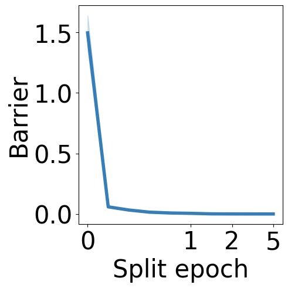

*(a) VGG*

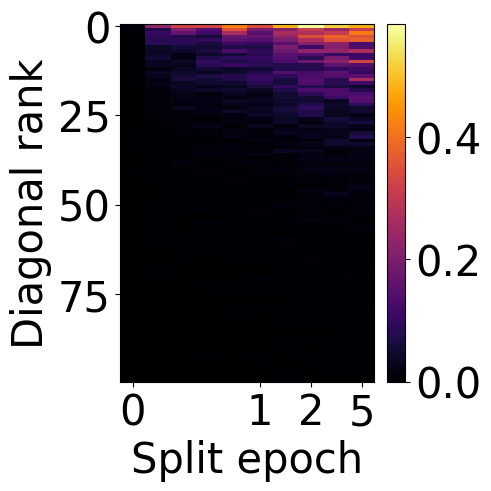

*(a) VGG*

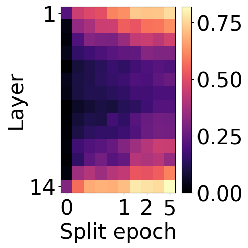

*(a) VGG*

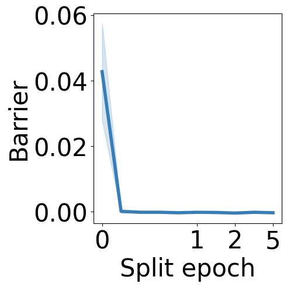

*(b) UNet*

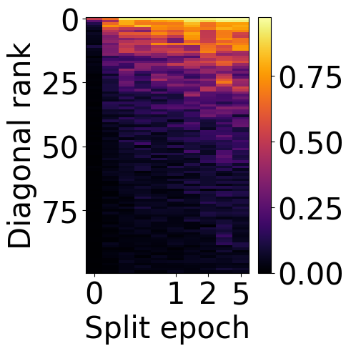

*(b) UNet*

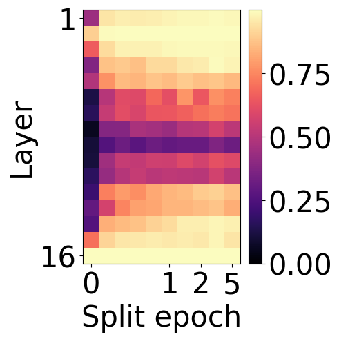

*(b) UNet*

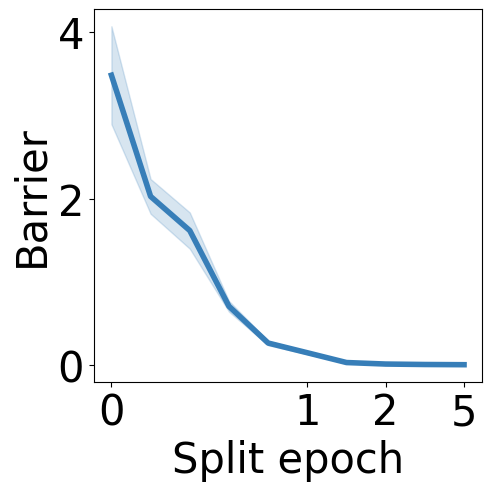

*(c) LSTM*

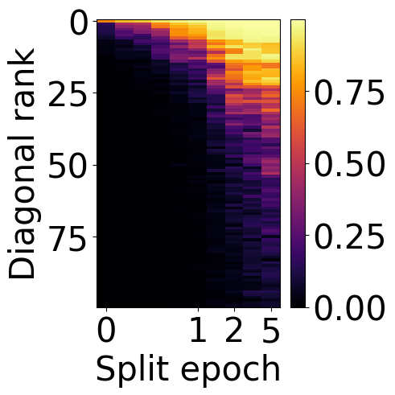

*(c) LSTM*

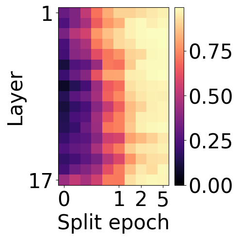

*(c) LSTM*

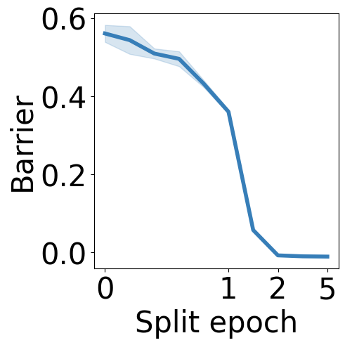

*(d) Трансформер*

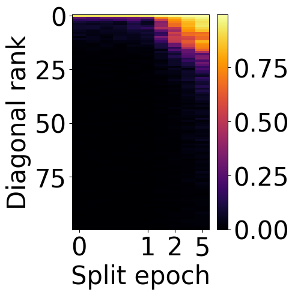

*(d) Трансформер*

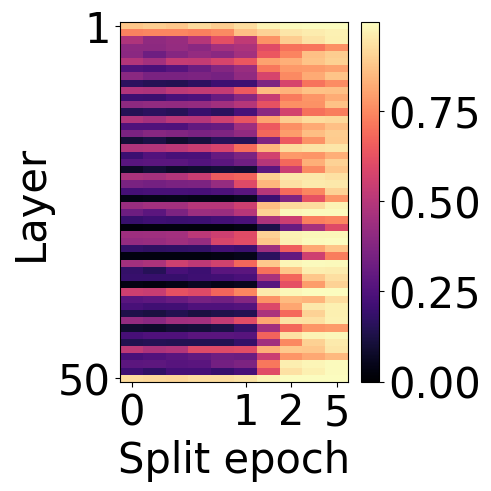

*(d) Трансформер*

###### fig-11

*Рисунок 11: **Верхний ряд: величина барьера против шага ветвления. Средний ряд: совпадение сингулярных векторов для одного матричного параметра между концами ветвей, у которых общий ствол. Нижний ряд: сводная статистика совпадения сингулярных векторов по слоям против шага ветвления. Мы видим, что когда модели проявляют LMC, у них к тому же общие верхние сингулярные векторы.*** **[p. 13]**

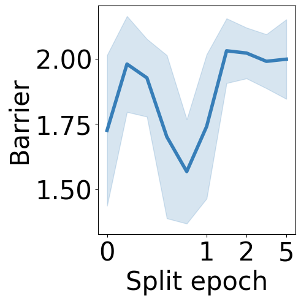

*(a) VGG*

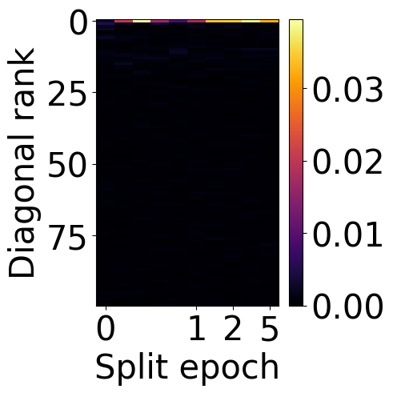

*(a) VGG*

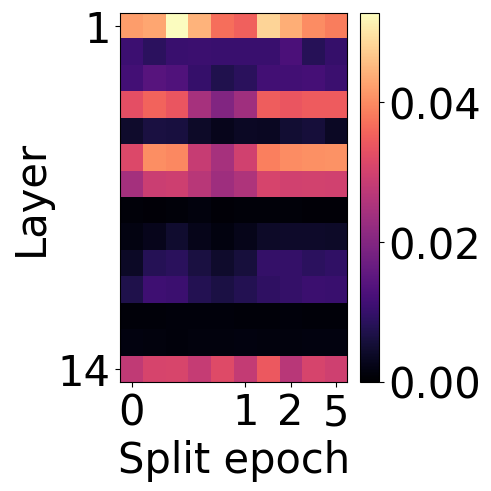

*(a) VGG*

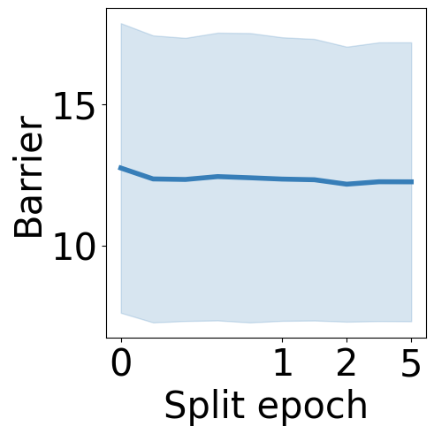

*(b) UNet*

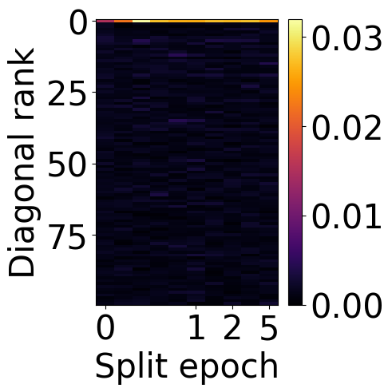

*(b) UNet*

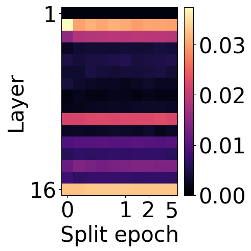

*(b) UNet*

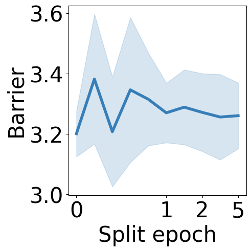

*(c) LSTM*

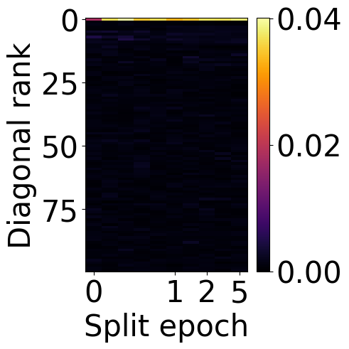

*(c) LSTM*

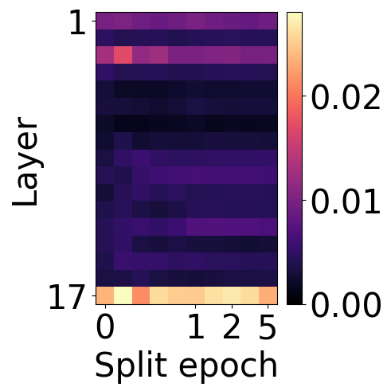

*(c) LSTM*

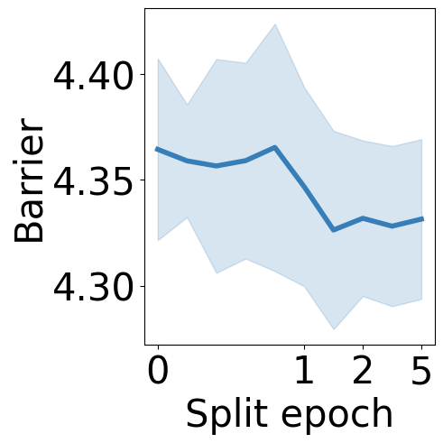

*(d) Трансформер*

*(d) Трансформер*

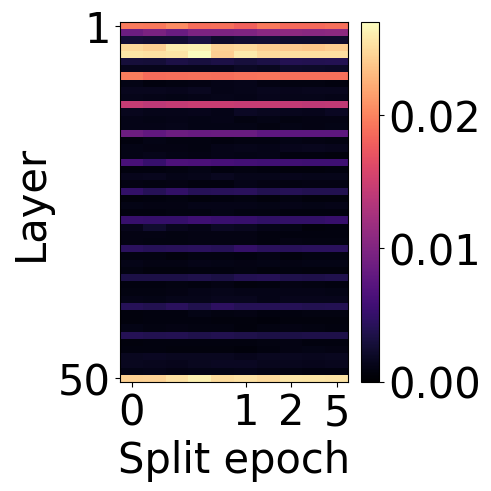

*(d) Трансформер*

###### fig-12

*Рисунок 12: **Верхний ряд: величина барьера против шага ветвления. Средний ряд: совпадение сингулярных векторов для одного матричного параметра между концами ветвей, у которых нет общего ствола, но общие момент ветвления и порядок данных в ветви. Нижний ряд: сводная статистика совпадения сингулярных векторов по слоям. Мы видим, что когда у ветвей нет общего ствола, нет ни LMC, ни совпадения сингулярных векторов, хотя оптимизация во всём остальном та же.*** **[p. 13]**

Напомним читателю, что LMC возникает лишь после того, как прошло небольшое время обучения. Слишком рано — и итоговые модели каждой ветви покажут бугор, или барьер, на поверхности потерь вдоль линейной интерполяции (Frankle et al. 2020). Чтобы измерить это точно, мы пользуемся определением из Neyshabur et al. 2020, а именно наибольшим отклонением потери от линейной интерполяции — эмпирической мерой выпуклости в этом линейном направлении. Когда это отклонение равно 0, мы считаем, что контрольные точки проявляют LMC. Подробности вычисления см. в приложении A.9. Ввиду свидетельств на рисунке 4 о том, что верхние составляющие важнее всего для предсказания, **[p. 13]** и того, что верхние составляющие становятся устойчивы до окончания обучения, правдоподобно, что LMC связана с устойчивостью верхних сингулярных векторов в поздней части обучения.

###### p13-1

Это означало бы, что контрольные точки, не проявляющие свойства LMC, не должны разделять верхние сингулярные векторы, а те, что свойство LMC проявляют, должны. На рисунке 11 мы видим, что так оно и есть в разных моделях и задачах: согласование между концами ветвей заметно сильнее в верхних сингулярных векторах. Мы также видим отсутствие LMC и плохое совпадение верхних составляющих у ветвей, чьи инициализации взяты с разных путей ствола, но с тем же шагом ветвления $t$ и тем же порядком данных в ветви, на рисунке 12. Стало быть, эти верхние направления не есть единственное свойство архитектуры и данных, а зависят от инициализации. Примечательно, что параллельная работа (Ito et al. 2024) приходит к схожему выводу: решатели перестановок между оптимумами сопоставляют верхние сингулярные векторы. Хотя выводы схожи, их опыты проводятся преимущественно в мелкомасштабных постановках и только для сопоставления перестановок в конце обучения. Здесь же мы связываем эти наблюдения с поведением сетей при оптимизации на протяжении всего обучения.

#### 7.3.2 Возмущение разрушает линейную связность мод и совпадение сингулярных векторов одновременно

###### p13-2

Чтобы связь между верхними сингулярными векторами и LMC стала ещё плотнее, мы вмешиваемся в обычный ход обучения. Если добавить случайные возмущения, чтобы расшатать составляющие, которым предстоит стать верхними, задолго до того, как они сойдутся, и если совпадение сингулярных векторов связано с LMC, то нам хотелось бы увидеть, что итоговые модели больше не проявляют свойства LMC. Так оно и есть. На рисунке 13 при всё бо́льших случайных возмущениях барьер между итоговыми контрольными точками растёт, и поведение LMC исчезает. Подробности см. в приложении A. Вдобавок одновременно исчезает и прежде сильное совпадение сингулярных векторов. Стало быть, похоже, что это совпадение связано с линейной связностью мод.

###### p13-3

Мы предполагаем, что ввиду результатов на рисунке 4, показывающих, что верхняя половина SVD куда важнее для качества, если эти составляющие общие, то интерполяция сильно на качестве не скажется. Скорее интерполяция уберёт ортогональные нижние составляющие, которые могут влиять на качество лишь незначительно. Если же верхние составляющие не общие, то интерполяция между двумя моделями уберёт эти составляющие, что приведёт к плохому качеству посередине. Такие наблюдения могут помочь в объяснении пользы предобучения (Neyshabur et al. 2020), усреднения весов (Rame et al. 2022; Wortsman et al. 2022; Ilharco et al. 2022) или применения LoRA (Huh et al. 2022) вместо полной дообучающей настройки.

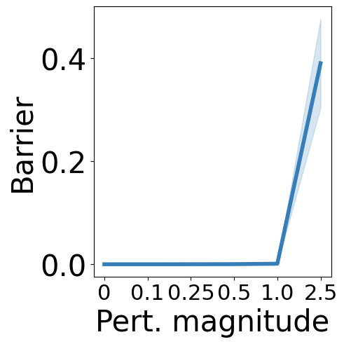

*(a) VGG*

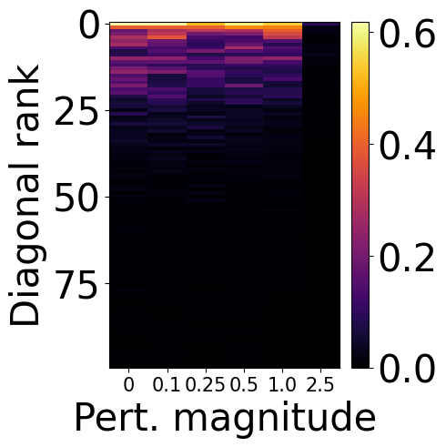

*(a) VGG*

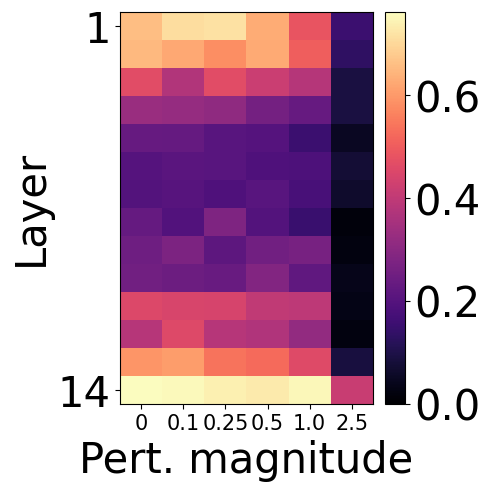

*(a) VGG*

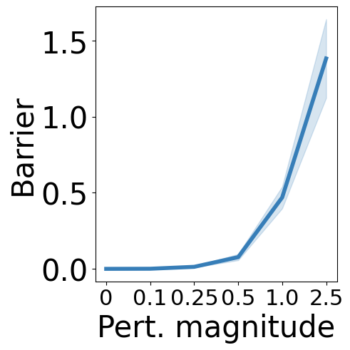

*(b) UNet*

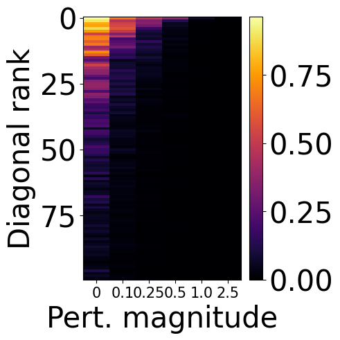

*(b) UNet*

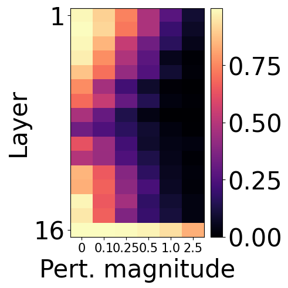

*(b) UNet*

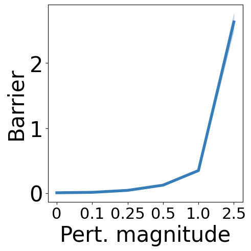

*(c) LSTM*

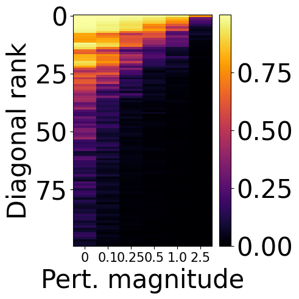

*(c) LSTM*

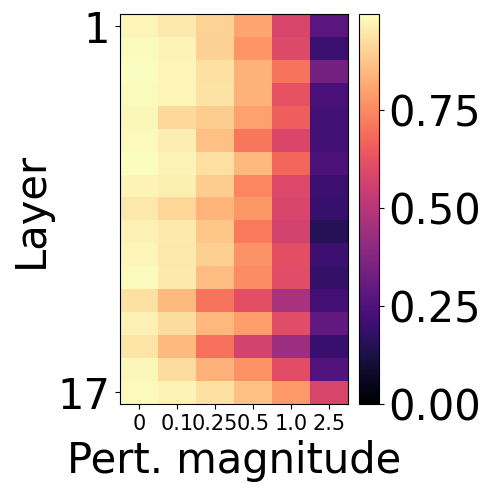

*(c) LSTM*

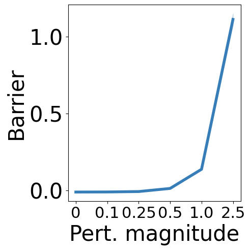

*(d) Трансформер*

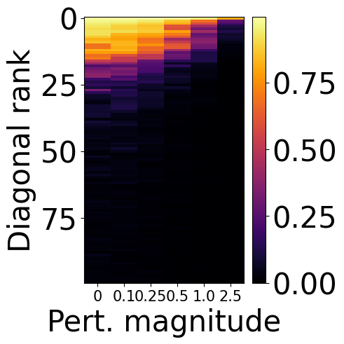

*(d) Трансформер*

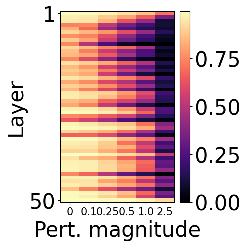

*(d) Трансформер*

###### fig-13

*Рисунок 13: **Верхний ряд: величина барьера против величины возмущения. Средний ряд: совпадение сингулярных векторов для одного матричного параметра между концами ветвей против величины возмущения. Нижний ряд: сводная статистика совпадения сингулярных векторов по слоям при разной величине возмущения. Мы видим, что если без возмущения модели проявляли бы LMC после обучения, то с ростом возмущений свойство LMC исчезает одновременно с совпадением верхних сингулярных векторов.*** **[p. 14]**

## 8 Обсуждение

Мы даём эмпирический взгляд на понимание глубокого обучения сквозь призму динамики SVD. **[p. 14]** Сперва мы отмечаем склонность к минимизации ранга в мелком масштабе при гроккинге, затем распространяем эти находки на практические сети и задачи. Вдобавок мы находим, что weight decay, хотя явно штрафует норму, неявно способствует этому низкоранговому смещению. Мы также показываем с помощью развитого разбора, что генерализация и запоминание различаются рангом и согласованием решений, находимых оптимизацией.

Мы идём дальше замечаний о генерализации и показываем, что прореживание по величине для лотерейных билетов действует схоже с низкоранговой обрезкой, а линейная связность мод совпадает с наличием общих верхних сингулярных векторов у контрольных точек. Низкоранговые модели дают более действенный вывод, а дообучающая настройка от предобученных моделей всегда работает в режиме LMC (Neyshabur et al. 2020), так что это понимание может привести к более действенному выводу и сжатию и, возможно, к более сильным приёмам оптимизации.

Хотя всеобъемлющая теория для наших результатов остаётся неуловимой, эти наблюдения могут послужить площадкой для более глубокого понимания глубокого обучения. Примечательно, что наблюдаемая спектральная динамика выглядит согласованной в разнообразных постановках, даже без стесняющих допущений вроде балансированной инициализации, линейности или малого масштаба весов. Это наводит на мысль об общем лежащем в основе механизме.

###### p14-3

С эмпирической стороны возникает несколько занятных задач. Интерпретируемость нейронных сетей — растущая область исследований (Nanda et al. 2023), и уже есть ранние попытки интерпретировать сингулярные векторы свёрточных весов (Praggastis et al. 2022). Возможны также связи с другими необъяснёнными явлениями, такими как двойной спуск (Belkin et al. 2019; Nakkiran et al. 2021; Davies et al. 2022) или состязательные примеры (Szegedy et al. 2013; Ilyas et al. 2019; Hendrycks et al. 2021). Решения этих задач могут помочь нам распознавать риски применения в естественной среде и, в идеале, помочь создавать лучшие алгоритмы. Мы полагаем, что наши результаты вносят ещё один шаг на этом пути.

## Благодарности

DY хотел бы поблагодарить следующих людей за полезное обсуждение на разных этапах: Wei Hu — за разговор о связи LMC с динамикой ранга в глубоком матричном разложении; Jonathan Frankle — за очень раннюю поддержку и периодические обсуждения о поиске источника LMC; Shubham Toshniwal и Shane Settle — за поддержку в следовании этой линии работы на ранних этапах; Mikhail Belkin, Tengyu Ma и Rob Nowak — за ранние разговоры и ободрение в изучении минимизации ранга в мелкомасштабных случаях; Sudarshan Babu, Haochen Wang, Takuma Yoneda и Xiao Zhang — за обсуждения и воодушевление при возобновлении этой работы после паузы; Sam Buchanan — за такое же воодушевление при возобновлении работы и за очень полезные замечания об изложении; Anmol Kabra — за предложения о дополнительных опытах и изображениях, завершающих работу; и David McAllester — за очень полезные замечания об изложении. DY хотел бы также поблагодарить Adam Bohlander за его работу по поддержанию кластера TTIC, которая сделала возможными многочисленные опыты этой статьи. Настоящий материал основан на работе, поддержанной National Science Foundation Graduate Research Fellowship Program по гранту № 1754881. KKP был поддержан через NSF TRIPOD Institute on Data, Economics, Algorithms and Learning (IDEAL) и другие награды DARPA и NSF.

**[p. 15]**

## Литература

- Ainsworth, S., Hayase, J., and Srinivasa, S. Git re-basin: Merging models modulo permutation symmetries. In *Proceedings of the International Conference on Learning Representations (ICLR)*, 2022.

- Andriushchenko, M., D’Angelo, F., Varre, A., and Flammarion, N. Why do we need weight decay in modern deep learning? *arXiv preprint arXiv:2310.04415*, 2023.

- Arora, S., Cohen, N., and Hazan, E. On the optimization of deep networks: Implicit acceleration by overparameterization. In *Proceedings of the International Conference on Machine Learning (ICML)*, 2018.

- Arora, S., Cohen, N., Hu, W., and Luo, Y. Implicit regularization in deep matrix factorization. **[p. 16]** In *Advances in Neural Information Processing Systems (NeurIPS)*, 2019.

- Atanasov, A., Bordelon, B., Sainathan, S., and Pehlevan, C. The onset of variance-limited behavior for networks in the lazy and rich regimes. In *Proceedings of the International Conference on Learning Representations (ICLR)*, 2023.

- Barak, B., Edelman, B., Goel, S., Kakade, S., Malach, E., and Zhang, C. Hidden progress in deep learning: SGD learns parities near the computational limit. In *Advances in Neural Information Processing Systems (NeurIPS)*, 2022.

- Bartlett, P. For valid generalization the size of the weights is more important than the size of the network. *Advances in neural information processing systems*, 9, 1996.

- Belkin, M., Hsu, D., Ma, S., and Mandal, S. Reconciling modern machine-learning practice and the classical bias–variance trade-off. *Proceedings of the National Academy of Sciences*, 116(32):15849–15854, 2019.

- Bender, E. M., Gebru, T., McMillan-Major, A., and Shmitchell, S. On the dangers of stochastic parrots: Can language models be too big? In *Proceedings of the 2021 ACM conference on fairness, accountability, and transparency*, pp. 610–623, 2021.

- Biderman, S., Schoelkopf, H., Anthony, Q. G., Bradley, H., O’Brien, K., Hallahan, E., Khan, M. A., Purohit, S., Prashanth, U. S., Raff, E., et al. Pythia: A suite for analyzing large language models across training and scaling. In *Proceedings of the International Conference on Machine Learning (ICML)*, 2023.

- Biewald, L. Experiment tracking with weights and biases, 2020. URL https://www.wandb.com/. Software available from wandb.com.

- Boix-Adserà, E., Littwin, E., Abbe, E., Bengio, S., and Susskind, J. M. Transformers learn through gradual rank increase. In *Thirty-seventh Conference on Neural Information Processing Systems*, 2023.

- Bommasani, R., Hudson, D. A., Adeli, E., Altman, R., Arora, S., von Arx, S., Bernstein, M. S., Bohg, J., Bosselut, A., Brunskill, E., et al. On the opportunities and risks of foundation models. *arXiv preprint arXiv:2108.07258*, 2021.

- Brea, J., Simsek, B., Illing, B., and Gerstner, W. Weight-space symmetry in deep networks gives rise to permutation saddles, connected by equal-loss valleys across the loss landscape. *arXiv preprint arXiv:1907.02911*, 2019.

- Chen, F., Kunin, D., Yamamura, A., and Ganguli, S. Stochastic collapse: How gradient noise attracts SGD dynamics towards simpler subnetworks. In *Advances in Neural Information Processing Systems (NeurIPS)*, 2023.

- Davies, X., Langosco, L., and Krueger, D. Unifying grokking and double descent. In *NeurIPS ML Safety Workshop*, 2022.

- Dittmer, S., King, E. J., and Maass, P. Singular values for ReLU layers. *IEEE Transactions on Neural Networks and Learning Systems*, 31(9):3594–3605, 2019.

- Du, S. S., Hu, W., and Lee, J. D. Algorithmic regularization in learning deep homogeneous models: Layers are automatically balanced. In *Advances in Neural Information Processing Systems (NeurIPS)*, 2018.

- Entezari, R., Sedghi, H., Saukh, O., and Neyshabur, B. The role of permutation invariance in linear mode connectivity of neural networks. In *Proceedings of the International Conference on Learning Representations (ICLR)*, 2021.

- Ergen, T. and Pilanci, M. Path regularization: A convexity and sparsity inducing regularization for parallel relu networks. In *Advances in Neural Information Processing Systems (NeurIPS)*, 2023.

- Feng, R., Zheng, K., Huang, Y., Zhao, D., Jordan, M., and Zha, Z.-J. Rank diminishing in deep neural networks. In *Advances in Neural Information Processing Systems (NeurIPS)*, 2022.

- Ferbach, D., Goujaud, B., Gidel, G., and Dieuleveut, A. Proving linear mode connectivity of neural networks via optimal transport. *arXiv preprint arXiv:2310.19103*, 2023.

- Fort, S., Dziugaite, G. K., Paul, M., Kharaghani, S., Roy, D. M., and Ganguli, S. Deep learning versus kernel learning: an empirical study of loss landscape geometry and the time evolution of the neural tangent kernel. In *Advances in Neural Information Processing Systems (NeurIPS)*, 2020.

- Frankle, J. and Carbin, M. The lottery ticket hypothesis: Finding sparse, trainable neural networks. In *Proceedings of the International Conference on Learning Representations (ICLR)*, 2018.

- Frankle, J., Dziugaite, G. K., Roy, D., and Carbin, M. Linear mode connectivity and the lottery ticket hypothesis. In *Proceedings of the International Conference on Machine Learning (ICML)*, 2020.

- Frei, S., Vardi, G., Bartlett, P., Srebro, N., and Hu, W. Implicit bias in leaky ReLU networks trained on high-dimensional data. In *Proceedings of the International Conference on Learning Representations (ICLR)*, 2022.

- Galanti, T., Siegel, Z. S., Gupte, A., and Poggio, T. SGD and weight decay provably induce a low-rank bias in neural networks. *arXiv preprint arXiv:2206.05794*, 2022.

- Gromov, A. Grokking modular arithmetic. *arXiv preprint arXiv:2301.02679*, 2023.

- Gunasekar, S., Woodworth, B. E., Bhojanapalli, S., Neyshabur, B., and Srebro, N. Implicit regularization in matrix factorization. In *Advances in Neural Information Processing Systems (NeurIPS)*, 2017.

- Hanson, S. and Pratt, L. Comparing biases for minimal network construction with back-propagation. In *Advances in Neural Information Processing Systems (NeurIPS)*, 1988.

- Harris, C. R., Millman, K. J., van der Walt, S. J., Gommers, R., Virtanen, P., Cournapeau, D., Wieser, E., Taylor, J., Berg, S., Smith, N. J., Kern, R., Picus, M., Hoyer, S., van Kerkwijk, M. H., Brett, M., Haldane, A., del Río, J. F., Wiebe, M., Peterson, P., Gérard-Marchant, P., Sheppard, K., Reddy, T., Weckesser, W., Abbasi, H., Gohlke, C., and Oliphant, T. E. Array programming with NumPy. *Nature*, 585(7825):357–362, September 2020.

- Hendrycks, D., Zhao, K., Basart, S., Steinhardt, J., and Song, D. Natural adversarial examples. In *Proceedings of the IEEE/CVF conference on computer vision and pattern recognition*, pp. 15262–15271, 2021.

- Ho, J., Jain, A., and Abbeel, P. Denoising diffusion probabilistic models. In *Advances in Neural Information Processing Systems (NeurIPS)*, 2020.

- Hochreiter, S. and Schmidhuber, J. Flat minima. *Neural computation*, 9(1):1–42, 1997a.

- Hochreiter, S. and Schmidhuber, J. Long short-term memory. *Neural computation*, 9(8):1735–1780, 1997b.

- Hu, E. J., Wallis, P., Allen-Zhu, Z., Li, Y., Wang, S., Wang, L., Chen, W., et al. Lora: Low-rank adaptation of large language models. In *Proceedings of the International Conference on Learning Representations (ICLR)*, 2021.

- Huh, M., Mobahi, H., Zhang, R., Cheung, B., Agrawal, P., and Isola, P. The low-rank simplicity bias in deep networks. *Transactions on Machine Learning Research*, 2022.

- Humayun, A. I., Balestriero, R., and Baraniuk, R. Deep networks always grok and here is why. *arXiv preprint arXiv:2402.15555*, 2024.

- Hunter, J. D. Matplotlib: A 2D graphics environment. *Computing in Science & Engineering*, 9(3):90–95, 2007.

- Ilharco, G., Ribeiro, M. T., Wortsman, M., Schmidt, L., Hajishirzi, H., and Farhadi, A. Editing models with task arithmetic. In *Proceedings of the International Conference on Learning Representations (ICLR)*, 2022.

- Ilyas, A., Santurkar, S., Tsipras, D., Engstrom, L., Tran, B., and Madry, A. Adversarial examples are not bugs, they are features. *Advances in neural information processing systems*, 32, 2019.

- Ioffe, S. and Szegedy, C. Batch normalization: Accelerating deep network training by reducing internal covariate shift. In *Proceedings of the International Conference on Machine Learning (ICML)*, 2015.

- Ito, A., Yamada, M., and Kumagai, A. Analysis of linear mode connectivity via permutation-based weight matching. *arXiv preprint arXiv:2402.04051*, 2024.

- Jacot, A., Gabriel, F., and Hongler, C. Neural tangent kernel: Convergence and generalization in neural networks. In *Advances in Neural Information Processing Systems (NeurIPS)*, 2018.

- Ji, Z. and Telgarsky, M. Gradient descent aligns the layers of deep linear networks. In *Proceedings of the International Conference on Learning Representations (ICLR)*, 2019.

- Jiang, Y., Neyshabur, B., Mobahi, H., Krishnan, D., and Bengio, S. Fantastic generalization measures and where to find them. *arXiv preprint arXiv:1912.02178*, 2019.

- Jordan, K., Sedghi, H., Saukh, O., Entezari, R., and Neyshabur, B. REPAIR: REnormalizing Permuted Activations for Interpolation Repair. In *Proceedings of the International Conference on Learning Representations (ICLR)*, 2022.

- Karras, T., Aittala, M., Lehtinen, J., Hellsten, J., Aila, T., and Laine, S. Analyzing and improving the training dynamics of diffusion models. *arXiv preprint arXiv:2312.02696*, 2023.

**[p. 17]**

- Krizhevsky, A. Learning multiple layers of features from tiny images, 2009.

- Krogh, A. and Hertz, J. A simple weight decay can improve generalization. In *Advances in Neural Information Processing Systems (NeurIPS)*, 1991.

- Kuditipudi, R., Wang, X., Lee, H., Zhang, Y., Li, Z., Hu, W., Ge, R., and Arora, S. Explaining landscape connectivity of low-cost solutions for multilayer nets. In *Advances in Neural Information Processing Systems (NeurIPS)*, 2019.

- Kumar, T., Bordelon, B., Gershman, S. J., and Pehlevan, C. Grokking as the transition from lazy to rich training dynamics. *arXiv preprint arXiv:2310.06110*, 2023.

- Le, T. and Jegelka, S. Training invariances and the low-rank phenomenon: beyond linear networks. In *Proceedings of the International Conference on Learning Representations (ICLR)*, 2021.

- LeCun, Y. The MNIST database of handwritten digits. http://yann.lecun.com/exdb/mnist/, 1998.

- Lhoest, Q., del Moral, A. V., Jernite, Y., Thakur, A., von Platen, P., Patil, S., Chaumond, J., Drame, M., Plu, J., Tunstall, L., Davison, J., Šaško, M., Chhablani, G., Malik, B., Brandeis, S., Scao, T. L., Sanh, V., Xu, C., Patry, N., McMillan-Major, A., Schmid, P., Gugger, S., Delangue, C., Matussière, T., Debut, L., Bekman, S., Cistac, P., Goehringer, T., Mustar, V., Lagunas, F., Rush, A. M., and Wolf, T. Datasets: A community library for natural language processing. *arXiv preprint arXiv:2109.02846*, 2021.

- Li, M., Gururangan, S., Dettmers, T., Lewis, M., Althoff, T., Smith, N. A., and Zettlemoyer, L. Branch-train-merge: Embarrassingly parallel training of expert language models. *arXiv preprint arXiv:2208.03306*, 2022.

- Li, Z., Luo, Y., and Lyu, K. Towards resolving the implicit bias of gradient descent for matrix factorization: Greedy low-rank learning. In *Proceedings of the International Conference on Learning Representations (ICLR)*, 2020.

- Liu, Z., Kitouni, O., Nolte, N. S., Michaud, E., Tegmark, M., and Williams, M. Towards understanding grokking: An effective theory of representation learning. In *Advances in Neural Information Processing Systems (NeurIPS)*, 2022.

- Liu, Z., Michaud, E. J., and Tegmark, M. Omnigrok: Grokking beyond algorithmic data. In *Proceedings of the International Conference on Learning Representations (ICLR)*, 2023.

- Loshchilov, I. and Hutter, F. Fixing weight decay regularization in Adam. *arXiv preprint arXiv:1711.05101*, 2017.

- Lyu, K., Jin, J., Li, Z., Du, S. S., Lee, J. D., and Hu, W. Dichotomy of early and late phase implicit biases can provably induce grokking. In *Proceedings of the International Conference on Learning Representations (ICLR)*, 2023.

- Martin, C. H. and Mahoney, M. W. Heavy-tailed universality predicts trends in test accuracies for very large pre-trained deep neural networks. In *Proceedings of the SIAM International Conference on Data Mining (ICDM)*, 2020.

- Martin, C. H. and Mahoney, M. W. Implicit self-regularization in deep neural networks: Evidence from random matrix theory and implications for learning. *Journal of Machine Learning Research*, 22(165):1–73, 2021.

- Merity, S., Xiong, C., Bradbury, J., and Socher, R. Pointer sentinel mixture models. In *Proceedings of the International Conference on Learning Representations (ICLR)*, 2016.

- Merrill, W., Tsilivis, N., and Shukla, A. A tale of two circuits: Grokking as competition of sparse and dense subnetworks. In *ICLR 2023 Workshop on Mathematical and Empirical Understanding of Foundation Models*, 2023.

- Milanesi, P., Kadri, H., Ayache, S., and Artières, T. Implicit regularization in deep tensor factorization. In *Proceedings of the International Joint Conference on Neural Networks (IJCNN)*, 2021.

- Mohamadi, M. A., Li, Z., Wu, L., and Sutherland, D. Grokking modular arithmetic can be explained by margin maximization. In *NeurIPS 2023 Workshop on Mathematics of Modern Machine Learning*, 2023.

- Mohan, S., Kadkhodaie, Z., Simoncelli, E. P., and Fernandez-Granda, C. Robust and interpretable blind image denoising via bias-free convolutional neural networks. *arXiv preprint arXiv:1906.05478*, 2019.

- Mulayoff, R. and Michaeli, T. Unique properties of flat minima in deep networks. In *Proceedings of the International Conference on Machine Learning (ICML)*, 2020.

- Nagarajan, V. and Kolter, J. Z. Uniform convergence may be unable to explain generalization in deep learning. In *Advances in Neural Information Processing Systems (NeurIPS)*, 2019.

- Nakkiran, P., Kaplun, G., Bansal, Y., Yang, T., Barak, B., and Sutskever, I. Deep double descent: Where bigger models and more data hurt. *Journal of Statistical Mechanics: Theory and Experiment*, 2021(12), 2021.

**[p. 18]**

- Nanda, N., Chan, L., Lieberum, T., Smith, J., and Steinhardt, J. Progress measures for grokking via mechanistic interpretability. *arXiv preprint arXiv:2301.05217*, 2023.

- Neyshabur, B., Tomioka, R., and Srebro, N. In search of the real inductive bias: On the role of implicit regularization in deep learning. *arXiv preprint arXiv:1412.6614*, 2014.

- Neyshabur, B., Sedghi, H., and Zhang, C. What is being transferred in transfer learning? In *Advances in Neural Information Processing Systems (NeurIPS)*, 2020.

- Notsawo Jr, P., Zhou, H., Pezeshki, M., Rish, I., Dumas, G., et al. Predicting grokking long before it happens: A look into the loss landscape of models which grok. *arXiv preprint arXiv:2306.13253*, 2023.

- Ongie, G. and Willett, R. The role of linear layers in nonlinear interpolating networks. *arXiv preprint arXiv:2202.00856*, 2022.

- Panayotov, V., Chen, G., Povey, D., and Khudanpur, S. Librispeech: an asr corpus based on public domain audio books. In *Proceedings of the IEEE International Conference on Acoustics, Speech and Signal Processing (ICASSP)*, 2015.

- Parhi, R. and Nowak, R. D. Deep learning meets sparse regularization: A signal processing perspective. *IEEE Signal Processing Magazine*, 40(6):63–74, 2023.

- Paszke, A., Gross, S., Massa, F., Lerer, A., Bradbury, J., Chanan, G., Killeen, T., Lin, Z., Gimelshein, N., Antiga, L., et al. Pytorch: An imperative style, high-performance deep learning library. In *Advances in Neural Information Processing Systems (NeurIPS)*, 2019.

- Paul, M., Chen, F., Larsen, B. W., Frankle, J., Ganguli, S., and Dziugaite, G. K. Unmasking the lottery ticket hypothesis: What’s encoded in a winning ticket’s mask? In *Proceedings of the International Conference on Learning Representations (ICLR)*, 2022.

- Pennington, J., Schoenholz, S., and Ganguli, S. The emergence of spectral universality in deep networks. In *Proceedings of the International Conference on Artificial Intelligence and Statistics (AISTATS)*, 2018.

- Power, A., Burda, Y., Edwards, H., Babuschkin, I., and Misra, V. Grokking: Generalization beyond overfitting on small algorithmic datasets. *arXiv preprint arXiv:2201.02177*, 2022.

- Praggastis, B., Brown, D., Marrero, C. O., Purvine, E., Shapiro, M., and Wang, B. The SVD of convolutional weights: a CNN interpretability framework. *arXiv preprint arXiv:2208.06894*, 2022.

- Qu, X. and Horvath, S. Rethink model re-basin and the linear mode connectivity. *arXiv preprint arXiv:2402.05966*, 2024.

- Rahaman, N., Baratin, A., Arpit, D., Draxler, F., Lin, M., Hamprecht, F., Bengio, Y., and Courville, A. On the spectral bias of neural networks. In *Proceedings of the International Conference on Machine Learning (ICML)*, 2019.

- Ramachandran, P., Zoph, B., and Le, Q. V. Searching for activation functions. *arXiv preprint arXiv:1710.05941*, 2017.

- Rame, A., Kirchmeyer, M., Rahier, T., Rakotomamonjy, A., Gallinari, P., and Cord, M. Diverse weight averaging for out-of-distribution generalization. In *Advances in Neural Information Processing Systems (NeurIPS)*, 2022.

- Ramesh, A., Dhariwal, P., Nichol, A., Chu, C., and Chen, M. Hierarchical text-conditional image generation with CLIP latents. *arXiv preprint arXiv:2204.06125*, 2022.

- Razin, N. and Cohen, N. Implicit regularization in deep learning may not be explainable by norms. In *Advances in Neural Information Processing Systems (NeurIPS)*, 2020.

- Ronneberger, O., Fischer, P., and Brox, T. U-net: Convolutional networks for biomedical image segmentation. In *Proceeding of the International Conference on Medical Image Computing and Computer-Assisted Intervention (MICCAI)*, 2015.

- Roy, O. and Vetterli, M. The effective rank: A measure of effective dimensionality. In *Proceedings of the European Signal Processing Conference (EUSIPCO)*, 2007.

- Sadrtdinov, I., Pozdeev, D., Vetrov, D. P., and Lobacheva, E. To stay or not to stay in the pre-train basin: Insights on ensembling in transfer learning. In *Advances in Neural Information Processing Systems (NeurIPS)*, 2023.

- Saxe, A., McClelland, J., and Ganguli, S. Exact solutions to the nonlinear dynamics of learning in deep linear neural networks. In *Proceedings of the International Conference on Learning Representations (ICLR)*, 2014.

- Schotthöfer, S., Zangrando, E., Kusch, J., Ceruti, G., and Tudisco, F. Low-rank lottery tickets: Finding efficient low-rank neural networks via matrix differential equations. In *Advances in Neural Information Processing Systems (NeurIPS)*, volume 35, 2022.

- Shenouda, J., Parhi, R., Lee, K., and Nowak, R. D. Vector-valued variation spaces and width bounds for DNNs: Insights on weight decay regularization. *arXiv preprint arXiv:2305.16534*, 2023.

**[p. 19]**

- Simonyan, K. and Zisserman, A. Very deep convolutional networks for large-scale image recognition. *arXiv preprint arXiv:1409.1556*, 2014.

- Simsek, B., Ged, F., Jacot, A., Spadaro, F., Hongler, C., Gerstner, W., and Brea, J. Geometry of the loss landscape in overparameterized neural networks: Symmetries and invariances. In *Proceedings of the International Conference on Machine Learning (ICML)*, 2021.

- Sohl-Dickstein, J., Weiss, E., Maheswaranathan, N., and Ganguli, S. Deep unsupervised learning using nonequilibrium thermodynamics. In *Proceedings of the International Conference on Machine Learning (ICML)*, 2015.

- Szegedy, C., Zaremba, W., Sutskever, I., Bruna, J., Erhan, D., Goodfellow, I., and Fergus, R. Intriguing properties of neural networks. *arXiv preprint arXiv:1312.6199*, 2013.

- Tan, Z. and Huang, W. Understanding grokking through a robustness viewpoint. *arXiv preprint arXiv:2311.06597*, 2023.

- Thilak, V., Littwin, E., Zhai, S., Saremi, O., Paiss, R., and Susskind, J. The slingshot mechanism: An empirical study of adaptive optimizers and the grokking phenomenon. *arXiv preprint arXiv:2206.04817*, 2022.

- Timor, N., Vardi, G., and Shamir, O. Implicit regularization towards rank minimization in relu networks. In *Proceedings of the International Conference on Algorithmic Learning Theory (ALT)*, 2023.

- Van Laarhoven, T. L2 regularization versus batch and weight normalization. *arXiv preprint arXiv:1706.05350*, 2017.

- Vardi, G. and Shamir, O. Implicit regularization in relu networks with the square loss. In *Proceedings of the Annual Conference on Learning Theory (COLT)*, 2021.

- Vaswani, A., Shazeer, N., Parmar, N., Uszkoreit, J., Jones, L., Gomez, A. N., Kaiser, Ł., and Polosukhin, I. Attention is all you need. In *Advances in Neural Information Processing Systems (NeurIPS)*, 2017.

- Wang, B. and Vastola, J. ML from scratch: Stable diffusion, day 2, 2022. URL https://colab.research.google.com/drive/1Y5wr91g5jmpCDiX-RLfWL1eSBWoSuLqO?usp=sharing#scrollTo=9is-DXZYwIIi.

- Wang, H., Agarwal, S., and Papailiopoulos, D. Pufferfish: Communication-efficient models at no extra cost. *Proceedings of Machine Learning and Systems*, 3:365–386, 2021.

- Wang, Z. and Jacot, A. Implicit bias of SGD in $l\_${$2$}-regularized linear DNNs: One-way jumps from high to low rank. *arXiv preprint arXiv:2305.16038*, 2023.

- Waskom, M. L. seaborn: statistical data visualization. *Journal of Open Source Software*, 6(60):3021, 2021.

- Wortsman, M., Ilharco, G., Gadre, S. Y., Roelofs, R., Gontijo-Lopes, R., Morcos, A. S., Namkoong, H., Farhadi, A., Carmon, Y., Kornblith, S., and Schmidt, L. Model soups: averaging weights of multiple fine-tuned models improves accuracy without increasing inference time. In *Proceedings of the International Conference on Machine Learning (ICML)*, 2022.

- Xu, Z., Wang, Y., Frei, S., Vardi, G., and Hu, W. Benign overfitting and grokking in ReLU networks for XOR cluster data. In *Proceedings of the International Conference on Learning Representations (ICLR)*, 2023.

- Yaras, C., Wang, P., Hu, W., Zhu, Z., Balzano, L., and Qu, Q. Invariant low-dimensional subspaces in gradient descent for learning deep matrix factorizations. In *NeurIPS 2023 Workshop on Mathematics of Modern Machine Learning*, 2023a.

- Yaras, C., Wang, P., Hu, W., Zhu, Z., Balzano, L., and Qu, Q. The law of parsimony in gradient descent for learning deep linear networks. *arXiv preprint arXiv:2306.01154*, 2023b.

- Yu, H. and Wu, J. Compressing transformers: Features are low-rank, but weights are not! In *Proceedings of the National Conference on Artificial Intelligence (AAAI)*, 2023.

- Yu, X., Liu, T., Wang, X., and Tao, D. On compressing deep models by low rank and sparse decomposition. In *Proceedings of the IEEE/CVF Conference on Computer Vision and Pattern Recognition (CVPR)*, 2017.

- Yunis, D., Patel, K. K., Savarese, P. H. P., Vardi, G., Frankle, J., Walter, M., Livescu, K., and Maire, M. On convexity and linear mode connectivity in neural networks. In *OPT 2022: Optimization for Machine Learning (NeurIPS 2022 Workshop)*, 2022.

- Zangrando, E., Deidda, P., Brugiapaglia, S., Guglielmi, N., and Tudisco, F. Neural rank collapse: Weight decay and small within-class variability yield low-rank bias. *arXiv preprint arXiv:2402.03991*, 2024.

- Zhang, C., Bengio, S., Hardt, M., Recht, B., and Vinyals, O. Understanding deep learning (still) requires rethinking generalization. *Communications of the ACM*, 64(3):107–115, 2021.

- Zhang, G., Wang, C., Xu, B., and Grosse, R. Three mechanisms of weight decay regularization. *arXiv preprint arXiv:1810.12281*, 2018a.

**[p. 20]**

- Zhang, H., Dauphin, Y. N., and Ma, T. Fixup initialization: Residual learning without normalization. In *Proceedings of the International Conference on Learning Representations (ICLR)*, 2018b.

- Ziyin, L., Li, B., and Meng, X. Exact solutions of a deep linear network. In *Advances in Neural Information Processing Systems (NeurIPS)*, 2022.

- Zou, A., Wang, Z., Kolter, J. Z., and Fredrikson, M. Universal and transferable adversarial attacks on aligned language models. *arXiv preprint arXiv:2307.15043*, 2023.

**[p. 21]**

## Приложение A Подробности опытов

###### p21-1

Во всех опытах мы используем 3 случайных семени и усредняем все графики по этим 3. Это сравнительно мало, но доверительные интервалы обычно очень узки, а ввиду большого объёма прогонов, требуемых для этой работы, у нас нет средств выполнить намного больше.

Чтобы вычислить согласование, мы рассматриваем только пары слоёв, впрямую подающих один в другой, и не учитываем влияние остаточных связей, чтобы сократить число сравнений. Особенности отдельных архитектур приведены ниже.

### A.1 Классификация изображений с VGG

Мы обучаем VGG-16 (Simonyan & Zisserman 2014) на CIFAR-10 (Krizhevsky 2009) в течение 164 эпох, следуя гиперпараметрам и расписанию скорости обучения из (Frankle et al. 2020), но без пополнения данных. В качестве оптимизатора мы применяем SGD с размером пакета 128, начальной скоростью обучения 0.1 и моментом 0.9. Мы также понижаем скорость обучения 3 раза в 10 раз: на эпохе 82, эпохе 120 и, наконец, на эпохе 160. Мы также применяем небольшое количество weight decay с коэффициентом 0.0001.

###### p21-4

VGG-16 использует возбуждения ReLU и пакетную нормализацию (Ioffe & Szegedy 2015) и включает как свёрточные, так и линейные слои. Для линейных слоёв мы просто вычисляем SVD весовой матрицы. Для свёрточных слоёв параметры обычно хранятся как четырёхмерный тензор вида $(c_{\text{out}},c_{\text{in}},h,w)$ — выходные каналы, входные каналы, высота и ширина фильтров соответственно. Поскольку фильтры вычисляют преобразование из каждой позиции и входного канала в выходной канал, мы вычисляем SVD расплющенного тензора $(c_{\text{out}},c_{\text{in}}\cdot h\cdot w)$, который отображает все входы в выходы, подобно Praggastis et al. 2022. Это не SVD всего преобразования карты признаков в следующую карту признаков, а преобразования из набора соседних позиций в определённую позицию следующего слоя. Для графика развития отдельных сингулярных чисел мы используем 12-й свёрточный слой.

###### p21-5

Чтобы вычислить согласование базисов между последовательными свёрточными слоями, $V_{i+1}^{\top}U_{i}$, нам нужно согласовать размерности $U_{i}$ и $V_{i+1}$. Для свёрточных слоёв перед нами встаёт вопрос, как обойтись с пространственными размерностями $h$ и $w$, поскольку наивно входная размерность следующего слоя окажется в $h\cdot w$ раз больше. Мы испробовали несколько случаев, включая согласование в каждой пространственной позиции по отдельности и усреднение согласования по всем пространственным позициям, и в итоге остановились на согласовании выхода одного слоя с центральным пространственным входом следующего. То есть для свёртки 3x3, отображающей в следующую свёртку 3x3, мы вычисляем согласование только для позиции (1,1) следующего слоя. Это показалось нам разумным, поскольку в среднем края фильтров показывали худшее согласование в целом. Для графика согласования отдельной пары мы используем согласование между 11-м и 12-м свёрточными слоями в центральной пространственной позиции 12-го свёрточного слоя.

### A.2 Порождение изображений с UNet

Мы обучаем диффузионную модель UNet (Ronneberger et al. 2015) (Sohl-Dickstein et al. 2015; Ho et al. 2020) на порождении MNIST (LeCun 1998). Устройство модели и гиперпараметры мы берём из (Wang & Vastola 2022). В частности, мы используем четырёхслойную остаточную UNet и обучаем с AdamW (Loshchilov & Hutter 2017) с размером пакета 128 и скоростью обучения 0.0003 в течение 100 эпох. Эта модель использует возбуждения swish (Ramachandran et al. 2017) и сочетание линейных и свёрточных, а также транспонированных свёрточных слоёв.

Вычисление SVD и согласования схоже со случаем классификации изображений, описанным выше, кроме случая транспонированных свёрток, где нужно дополнительное транспонирование размерностей, поскольку параметры хранятся в виде $(c_{\text{in}},c_{\text{out}},h,w)$. Для графика развития отдельных сингулярных чисел мы используем 3-й свёрточный слой. Для графика согласования мы используем согласование между 3-м и 4-м свёрточными слоями в центральной пространственной позиции 4-го свёрточного слоя.

### A.3 Распознавание речи с LSTM

Мы обучаем двунаправленную LSTM (Hochreiter & Schmidhuber 1997a) для автоматического распознавания речи на LibriSpeech (Panayotov et al. 2015). Мы подбираем простую и хорошо работающую настройку гиперпараметров. Мы используем AdamW (Loshchilov & Hutter 2017) с размером пакета 32, скоростью обучения 0.0003 и weight decay 0.1 в течение 50 эпох. Мы также используем расписание скорости обучения с косинусным отжигом от 1 до 0 на протяжении всех 50 эпох.

У LSTM есть только матричные параметры и смещения, так что вычислить SVD матриц несложно. Для графиков развития отдельных сингулярных чисел мы строим входной параметр 3-го слоя. В случае согласования мы делаем ряд связей: сперва вниз по глубине для входных параметров, затем соединяем предыдущий входной параметр с текущим скрытым параметром в обоих направлениях, затем соединяем предыдущий скрытый параметр с текущим входным параметром. **[p. 22]** В частности, параметры LSTM хранятся в PyTorch как стопка из 4 матриц, и мы находим, что согласование наивысшее для «вентильной» подматрицы, так что её мы и выбираем для всех графиков. Для согласования отдельных слоёв мы строим согласование между входными параметрами 3-го и 4-го слоёв.

### A.4 Языковое моделирование с трансформерами

###### p22-1

Мы обучаем языковую модель-трансформер (Vaswani et al. 2017) на Wikitext-103 (Merity et al. 2016). Выбор гиперпараметров мы основываем на наборе Pythia (Biderman et al. 2023), а именно на конфигурации на 160 миллионов параметров с синусоидальными позиционными вложениями, 12 слоями, размерностью модели 768, 12 головами внимания на слой и скрытой размерностью 768. Мы используем AdamW (Loshchilov & Hutter 2017) с размером пакета 256, скоростью обучения 0.0006 и weight decay 0.1. Мы используем длину контекста 2048 и обрезаем градиенты до наибольшей нормы 1. Мы также используем расписание скорости обучения с линейным разогревом и косинусным спадом до 10 % от скорости обучения, как у Biderman et al. 2023.

Для SVD мы ради простоты берём SVD целого параметра вида $(3d_{\text{model}},d_{\text{model}})$, вычисляющего запросы, ключи и значения из скрытой размерности внутри слоя внимания, не разделяя на отдельные головы. Это разумно, поскольку разделение делается потом, внутри. Мы также берём SVD выходных параметров и линейных слоёв MLP, которые суть двумерные матрицы. Для графика развития отдельных сингулярных чисел мы строим сингулярные числа $W_{1}$ MLP 8-го слоя

Для согласования мы рассматриваем согласование матриц $W_{Q}$ и $W_{K}$, матриц $W_{V}$ и $W_{O}$, вычисляя согласование между головами по отдельности, а затем усредняя по всем головам. Мы рассматриваем также согласование между $W_{O}$ и $W_{1}$ блока MLP, между $W_{1}$ и $W_{2}$ блока MLP и между $W_{2}$ и следующим слоем внимания. Для согласования отдельных слоёв мы строим согласование между $W_{1}$ и $W_{2}$ MLP 8-го слоя.

### A.5 Опыты с weight decay

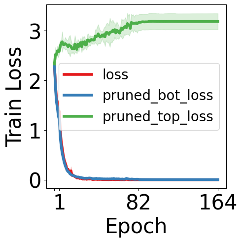

*(a) VGG*

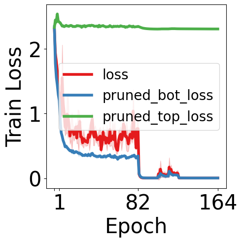

*(a) VGG*

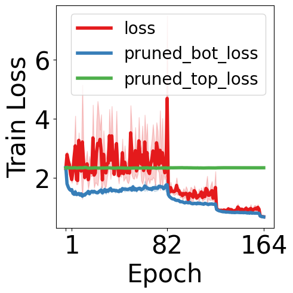

*(a) VGG*

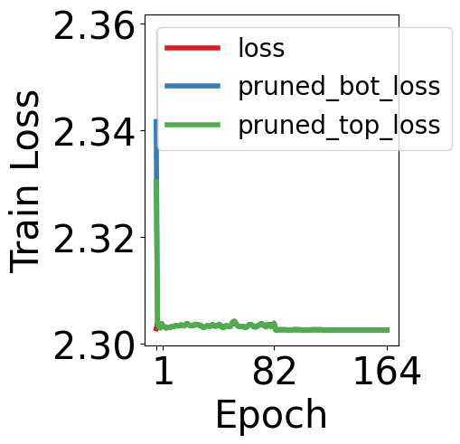

*(a) VGG*

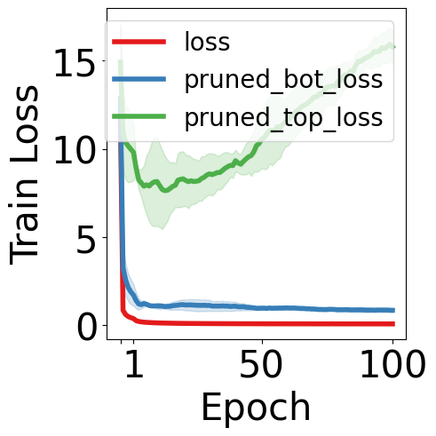

*(b) UNet*

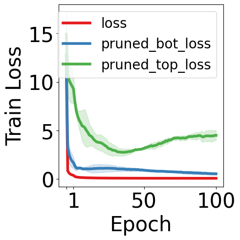

*(b) UNet*

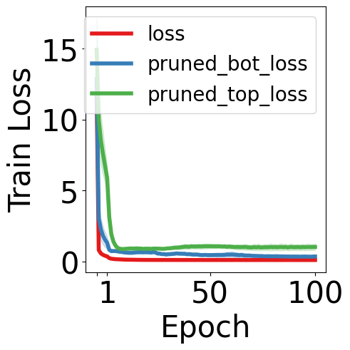

*(b) UNet*

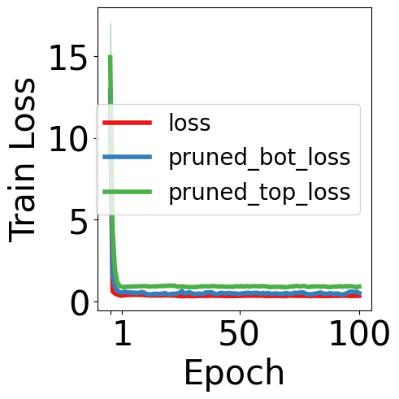

*(b) UNet*

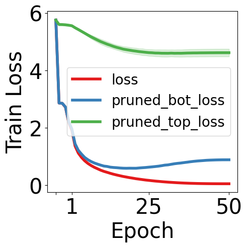

*(c) LSTM*

*(c) LSTM*

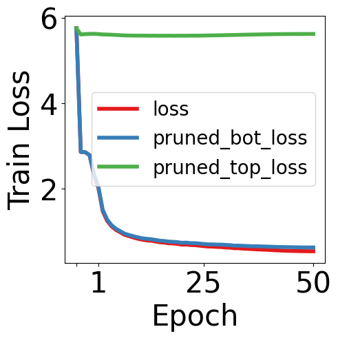

*(c) LSTM*

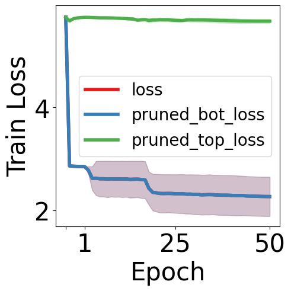

*(c) LSTM*

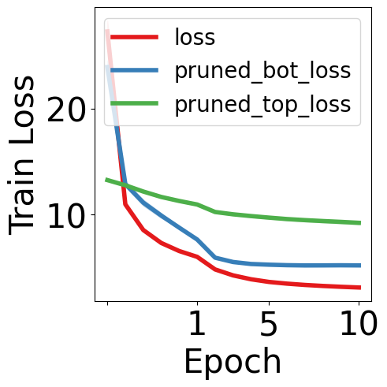

*(d) Трансформер*

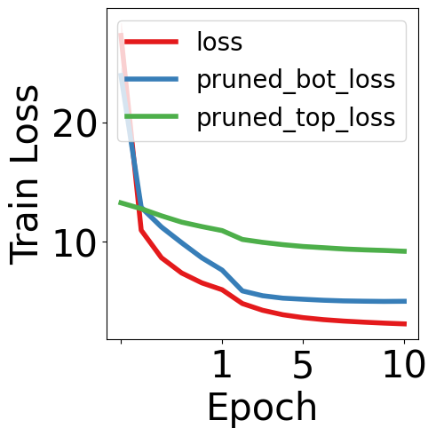

*(d) Трансформер*

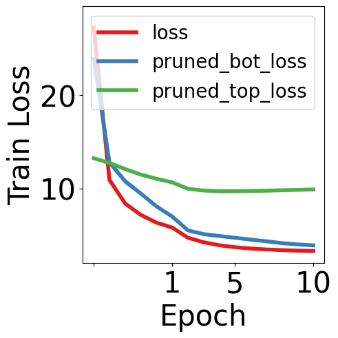

*(d) Трансформер*

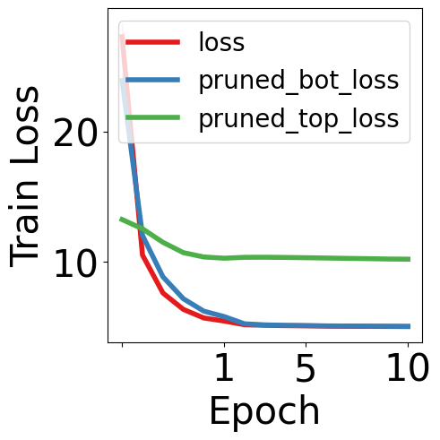

*(d) Трансформер*

###### fig-14

*Рисунок 14: Обучающая потеря во времени, где ряды используют разное количество weight decay. Сверху вниз для VGG мы используем коэффициенты $\{0,0.001,0.01,0.1\}$, а для остальных сетей — коэффициенты $\{0,0.1,1,10\}$. Мы видим, что низкой обучающей потери всё ещё возможно достичь при высоком weight decay и что по мере увеличения количества weight decay разрыв между обрезанными и необрезанными параметрами схлопывается, что подкрепляет мысль о том, что параметры становятся ниже рангом.* **[p. 23]**

###### p22-4

Все задачи обучаются в точности тем же образом, что и указано ранее, с возрастающим weight decay из набора $\{0,0.0001,0.001,0.01,0.1,1.0,10.0\}$. Ради удобства изложения мы рассматриваем подмножество настроек по задачам. На рисунке 14 мы приводим качество обученной модели и качество обрезанной модели, чтобы показать, что даже при высоких уровнях weight decay модели не разваливаются полностью. Более того, приближение обрезанной модели к полной становится лучше при более высоком weight decay.

### A.6 Опыты с гроккингом

###### p22-5

Мы по большей части следуем настройкам и архитектуре Nanda et al. 2023, за исключением того, что применяем синусоидальные позиционные кодировки вместо обучаемых.

###### p22-6

Для случая slingshot мы следуем настройкам гиперпараметров из Thilak et al. 2022, приложение B, за исключением того, что применяем однослойную архитектуру из Nanda et al. 2023 вместо указанной там двухслойной. Мы выполняем сложение по модулю 97. Исходный график гроккинга в Thilak et al. 2022 выглядит куда более впечатляюще, поскольку там ось x дана в логарифмической шкале, чего мы здесь ради ясности не делаем.

### A.7 Опыты со случайными метками

###### p22-7

Мы обучаем четырёхслойный MLP на CIFAR10 (Krizhevsky 2009) либо с полностью случайными метками, либо с истинными. Мы используем SGD с моментом 0.9 и постоянной скоростью обучения 0.001 и обучаем 300 эпох, чтобы увидеть всю склонность обучения. Главное отличие от постановки Zhang et al. 2021 — применение постоянной скорости обучения, поскольку их расписание скорости обучения могло бы смешать результаты.

### A.8 Опыты с прореживанием по величине

###### p22-8

Мы используем ту же постановку с VGG, что описана ранее. В этом случае мы обучаем до конца, затем вычисляем глобальную маску по величине. Для этого мы расплющиваем все линейные и свёрточные веса в один вектор, кроме последнего линейного слоя, и сортируем по величине. Затем мы оставляем верхние 5 % весов глобально и переформовываем обратно в послойные маски. Это даёт разные уровни разрежённости для разных слоёв, поэтому при порождении случайных масок мы используем послойные разрежённости, получившиеся из глобальной маски по величине.

Чтобы переобучить сеть, мы перематываем к эпохе 4, затем продолжаем обучение с маской, всегда обнуляя прочие веса и их градиенты. Все результаты мы усредняем по 3 случайным семенам.

**[p. 23]**

### A.9 Опыты с LMC

###### p23-1

Мы сохраняем 5 равномерно расставленных контрольных точек в первой эпохе, а также в конце следующих 4 эпох — всего 10 инициализаций. Мы обучаем 3 ствола и отделяем от каждого ствола 3 ветви, всего 9 ветвей, по которым усредняем все графики.

Следуя Neyshabur et al. 2020, мы вычисляем барьер между контрольными точками так: имея $W^{(1)}(T)$ и $W^{(2)}(T)$, отделённые от $W(t)$, мы вычисляем

**[p. 24]**

$$
b(t)=(\max_{\alpha\in[0,1]}\mathcal{L}((1-\alpha)W^{(1)}(T)+\alpha W^{(2)}(T))-((1-\alpha)\mathcal{L}(W^{(1)}(T))+\alpha\mathcal{L}(W^{(2)}(T))) \tag{6}
$$

когда эта величина равна 0, мы считаем, что контрольные точки проявляют LMC.

Мы пересчитываем параметры пакетной нормализации после интерполяции для VGG-16 и параметры групповой нормализации для UNet, поскольку они не обязательно интерполируются хорошо (Frankle et al. 2020). Мы также вычисляем совпадение сингулярных векторов для одного и того же параметра между концами каждой ветви.

Чтобы построить (не)совпадение сингулярных векторов и LMC между разными модами, мы делаем 11 равномерно расставленных измерений, интерполируя между концами ветвей, у которых были одна и та же эпоха ветвления и одно и то же семя ветви, но разные инициализации ствола.

### A.10 Опыты с LMC при возмущениях

###### p24-4

Мы возмущаем все веса $W$ после точки устойчивости динамики, где мы ожидаем увидеть LMC в конце обучения (эпоха 4 достаточно поздна во всех случаях), пользуясь случайно выбранными нормальными возмущениями $\epsilon\sim\mathcal{N}(0,I)$ с $\lVert\epsilon\rVert=\eta\lVert W\rVert$, где $\eta\in\{0.0,0.1,0.25,0.5,1.0,2.5\}$. Мы не возмущаем выходной слой, поскольку это очень существенно сказывается на оптимизации. Мы также не возмущаем входной слой у трансформера, поскольку это слишком вычислительно дорого для наших средств.

## Приложение B Ограничения

###### p24-5

У нашего исследования есть несколько ключевых ограничений. Как упомянуто, у нас нет вычислительных средств, чтобы запускать более 3 случайных семян на опыт, хотя мы и находим доверительные интервалы в целом довольно узкими (кроме эпохи генерализации в опытах с гроккингом). Вдобавок, как обсуждалось, мы оставляем в стороне одномерные параметры нейронных сетей, которые могут быть особенно решающими (в особенности нормализация). Вдобавок ввиду вычислительных стеснений мы не рассматриваем согласование слоёв через остаточные связи, поскольку это быстро становится комбинаторным по глубине, так что могут быть и другие занятные взаимодействия, которых мы не наблюдаем. Наконец, ввиду вычислительных стеснений мы не в состоянии исследовать результаты на моделях больше двенадцатислойного трансформера, у которых поведение может быть иным.

## Приложение C Вычислительные ресурсы

Все опыты выполнены на внутреннем кластере порядка 100 NVIDIA 2080ti GPU или новее. Все опыты работают на одном GPU менее 8 часов, хотя распараллеливание по машинам крайне полезно. Мы оцениваем, что на этих средствах перезапуск всех опытов статьи от начала до конца мог бы занять несколько дней. Вдобавок требования к хранению всех контрольных точек составят порядка 5 терабайт.

## Приложение D Источники кода

Мы используем PyTorch (Paszke et al. 2019) и NumPy (Harris et al. 2020) для всех опытов и Weights & Biases (Biewald 2020) для отслеживания опытов. Графики мы строим с Matplotlib (Hunter 2007) и Seaborn (Waskom 2021). Мы также используем HuggingFace Datasets (Lhoest et al. 2021) для Wikitext-103 (Merity et al. 2016).
