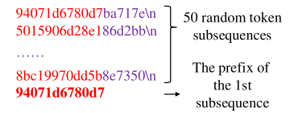
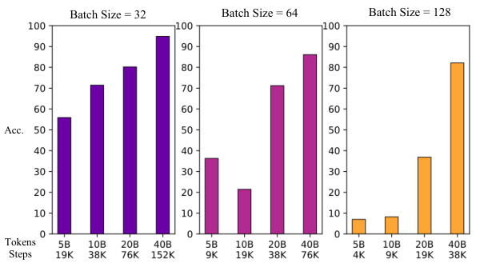
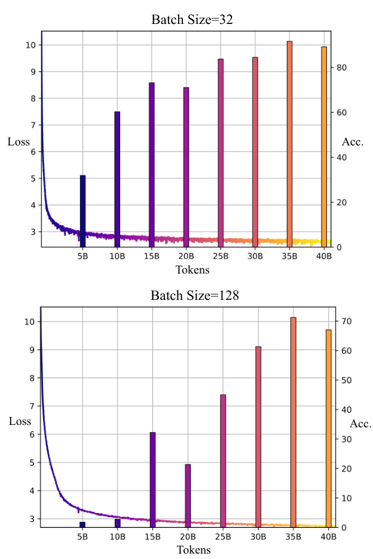
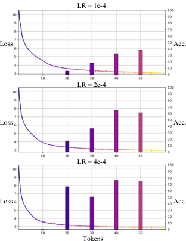
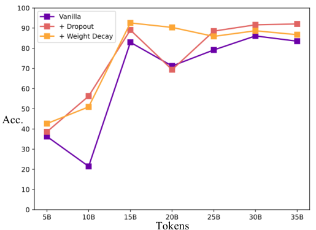

# Lv et al. 2024 — Language Models “Grok” to Copy

См. также: [глобальный индекс понятий](../../concepts/index.md).
arXiv [2409.09281v2](https://arxiv.org/abs/2409.09281), 6 февраля 2025 (v1 — 14 сентября 2024). Колонтитула с площадкой публикации в PDF нет; в примечании arXiv указано «NAACL 2025 main conference, short paper».

**Ang Lv** — Gaoling School of Artificial Intelligence, Renmin University of China; Machine Learning Platform Department, Tencent.
**Ruobing Xie, Xingwu Sun, Zhanhui Kang** — Machine Learning Platform Department, Tencent.
**Rui Yan** — Gaoling School of Artificial Intelligence, Renmin University of China; School of Computer Science, Wuhan University.
Переписка: Ruobing Xie (ruobingxie@tencent.com), Rui Yan (ruiyan@ruc.edu.cn).

Файлы разбора этой статьи:

- [`2409.09281.language-models-grok-to-copy.claims.txt`](2409.09281.language-models-grok-to-copy.claims.txt) — пронумерованные утверждения статьи с пометками разбора.
- [`2409.09281.language-models-grok-to-copy.license.txt`](2409.09281.language-models-grok-to-copy.license.txt) — лицензионная запись arXiv для этой статьи.

Схема якорей и правила ссылок на карточку — в [README папки статей](../README.md).

**Карточка-выдержка.** Лицензия статьи (`arxiv-nonexclusive`) не разрешает публикацию копии оригинала и полного перевода, поэтому карточка содержит редакторские секции и цитируемые фрагменты перевода (право цитирования). Полный текст статьи: <https://arxiv.org/abs/2409.09281>.

## Затрагиваемые понятия

**[Гроккинг](../../concepts/grokking.md)** — работа переносит имя явления с малых алгоритмических задач на предобучение языковой модели естественного масштаба и объявляет это новым воззрением: «языковые модели грокают копирование». Перенос сделан по одному признаку — отложенному резкому росту качества: обучающая потеря выходит на полку после 5 млрд токенов, точность копирования остаётся низкой до 10 млрд и всплеском поднимается на 15 млрд ([с. 3, абз. 1](#p3-1), [рис. 2](#fig-2)). Определение гроккинга авторы дают по Power et al. 2022 — «резкое улучшение генерализации на проверочном множестве много позже того, как модели переобучились» ([с. 1, абз. 4](#p1-4)). Существенно, чего в работе нет: из постановки Power et al. сохранён ровно один признак из перечисленных в её определении. Проверочная задача — достройка суффикса по префиксу в сцепке из 50 последовательностей случайных токенов ([с. 2, абз. 7](#p2-7), [рис. 1](#fig-1)) — не есть удержанная часть обучающего распределения (естественный текст RedPajama), обучение идёт одним проходом по 40 млрд токенов без повторных эпох, запоминать 162-миллионной модели такой объём нечего, и слова «memorization» в статье нет вовсе. Механизма гроккинга работа не предлагает и не проверяет: три её довода суть сверки на согласие с признаками явления, а опыта, способного уподобление опровергнуть, не поставлено.

**[Фаза меморизации / плато](../../concepts/memorization-phase.md)** — работа примечательна тем, что этого звена в ней нет, хотя определение гроккинга она приводит вместе с ним. Слово «overfit» встречается в тексте ровно один раз — внутри определения ([с. 1, абз. 4](#p1-4)); ни «memorization», ни разрыва между обучающей и проверочной кривыми в статье не появляется. Роль «100 % на обучении» отдана полке обучающей потери ([с. 3, абз. 1](#p3-1)), а в разделе обсуждений авторы сами признают, что обучающая потеря «не улавливает в полной мере насыщение качества, наблюдаемое в традиционных задачах на гроккинг» ([с. 5, абз. 5](#p5-5)), и подменяют её насыщением ICL score ([с. 5, абз. 6](#p5-6)). Приписывать авторам наблюдение фазы запоминания перед обобщением нельзя: они его не показывают и на него не опираются.

**[Эмерджентность / эмерджентные способности](../../concepts/emergence.md)** — работа даёт корпусу случай, где способность настоящей языковой модели появляется скачком по ходу предобучения, а не при пересечении порога масштаба: ось перехода здесь — число шагов обновления и пройденных токенов при неизменных 162 млн параметров. Осторожность формулировки авторская: «гроккнутое копирование из контекста не наступает, пока оптимизация не достигнет определённой силы» ([с. 3, абз. 4](#p3-4)) — это единственное употребление глагола «emerge» во всей статье. Слов «emergent» и «emergence» в ней нет, порогов масштабирования она не измеряет, и относить её к литературе об эмерджентных способностях при масштабировании на её собственных основаниях нельзя.

**[Маршрутизация внимания](../../concepts/attention-routing-heads.md)** — третий довод статьи целиком построен на индукционных головах: они названы главным контуром условного копирования ([с. 3, абз. 5](#p3-5)), и для них введён показатель индукции $I^{(L,H)}=\bar{A}^{(L,H)}\cdot EP^{(L,H)}$ — произведение среднего веса внимания с позиции $s+i-1$ на позицию $i$ при удвоенной случайной последовательности на положительность собственных значений OV-контура ([с. 4, абз. 1](#p4-1), [с. 4, абз. 2](#p4-2), [с. 4, абз. 3](#p4-3)). Наблюдение, которое работа даёт корпусу: по ходу обучения индукционные головы складываются от более мелких слоёв к более глубоким ([с. 4, абз. 4](#p4-4), [рис. 6](#fig-6)). Чего в работе нет: ни абляции, ни какой-либо иной проверки того, что именно эти головы выполняют измеряемое копирование, — связь установлена по совпадению во времени; сам порядок «мелкие раньше глубоких» отчасти задан устройством индукционной головы, которая работает лишь поверх головы предыдущего токена в более мелком слое, и этой оговорки авторы не делают; рисунок 6 получен на одной модели ([рис. 6](#fig-6)), тогда как все точности усреднены по трём семенам ([с. 2, абз. 8](#p2-8)).

**[Механистическая интерпретируемость](../../concepts/mechanistic-interpretability.md)** — работа выступает потребителем готового измерительного набора, а не его разработчиком: индукционный узор внимания и положительность собственных значений OV-контура $EP^{(L,H)}=\sum_{i}\lambda_{i}/\sum_{i}|\lambda_{i}|$ взяты у Elhage et al. 2021, разложение обучения в контексте на копирование и нечёткое достраивание образца — у Olsson et al. 2022 ([с. 5, абз. 3](#p5-3)). Собственный вклад здесь один и он методический: два известных показателя перемножены в один скаляр со значениями в $[-1,1]$, которым удобно раскрашивать динамику по слоям ([с. 4, абз. 1](#p4-1)). Обратного инжиниринга контура, вмешательств и проверок на причинность в работе нет.

**[Меры прогресса](../../concepts/progress-measures.md)** — работа ставит вопрос о показаниях, по которым судят о ходе обучения, и отвечает на него отрицательно: развитие способностей вроде копирования из контекста «не обязательно отражается в снижении потери предобучения» ([с. 2, абз. 3](#p2-3)), а обучающая потеря «не улавливает в полной мере насыщение качества» ([с. 5, абз. 5](#p5-5)). Взамен предъявлен не собственный показатель, а ICL score Olsson et al. 2022, выходящий на полку -0,5 ната примерно после 4000 шагов, то есть около 1,85 миллиарда токенов ([с. 5, абз. 6](#p5-6)). Своей меры прогресса работа не вводит и термином не пользуется; предъявленный показатель — сам мера внутриконтекстного качества, а не запоминания, поэтому в качестве замены условию «модель уже подогналась» он работает слабо.

**[Доля данных / критический размер набора](../../concepts/data-fraction-critical-dataset-size.md)** — работа разводит две величины, которые в предобучении обычно сливаются: число пройденных токенов и число шагов обновления. При трёх размерах пакета (32, 64, 128) и одних и тех же начальных весах основа копирования складывается примерно после 38 000 шагов независимо от того, сколько токенов при этом пройдено ([с. 3, абз. 2](#p3-2), [рис. 3](#fig-3)), тогда как сходимость по обучающей потере зависит именно от числа токенов ([с. 3, абз. 3](#p3-3), [рис. 4](#fig-4)). Обратная сверка здесь уместна: две величины разведены не только на словах. Утверждение о независимости скорости гроккинга от объёма данных работа берёт готовым у Wang et al. 2024 ([с. 2, абз. 2](#p2-2)) — но у Wang et al. независимость показана при фиксированном отношении выводимых фактов к атомарным, а у Lv et al. аналога этого отношения нет вовсе, и условие «лишь бы распределение сохранялось» при переносе теряется. Критического размера набора работа не измеряет и не вводит: объём данных здесь не управляющий параметр, а следствие выбора пакета.

**[Скорость обучения](../../concepts/learning-rate.md)** — единственный рычаг, которым работа двигает срок перехода помимо регуляризации: «увеличенная скорость обучения способствует более раннему и более сильному гроккингу» ([с. 3, абз. 4](#p3-4), [рис. 5](#fig-5)). Отсюда авторская догадка — гроккнутое копирование наступает при некоторой «силе оптимизации», задаваемой скоростью обучения и числом шагов ([с. 3, абз. 4](#p3-4)); догадка объявлена предположением («мы предполагаем») и опытом, разделяющим её с другими объяснениями, не подкреплена. Отсчёт при этом ведётся от базовой скорости обучения 0.1 при AdamW ([с. 2, абз. 6](#p2-6)) — величины на два-три порядка выше принятой для предобучения; разбора этого выбора в статье нет, а на самом рисунке 5 подписаны совсем другие три значения: 1e-4, 2e-4 и 4e-4 ([рис. 5](#fig-5)). Пользоваться числом 0.1 как гиперпараметром этой работы поэтому нельзя.

**[Варианты регуляризации](../../concepts/regularization-variants.md)** — прикладной раздел работы состоит ровно в переносе двух приёмов, которыми в корпусе вызывают гроккинг на малых задачах, в предобучение языковой модели: 10 % dropout на внимании и weight decay, выбранные со ссылкой на Nanda et al. 2023 ([с. 5, абз. 1](#p5-1)). Наблюдение: dropout придвигает резкий рост точности с 15 млрд токенов к 10 млрд, «хотя и с возросшей изменчивостью хода развития» ([рис. 7](#fig-7)). Это единственная проверка главной прикладной заявки статьи — что находки о гроккинге переносятся в предобучение дёшево ([с. 2, абз. 5](#p2-5)): два приёма, по одному значению параметра, без выравнивания по вычислительным затратам и без указанного числа семян. Grokfast, прямая техника ускорения гроккинга, назван в перечне работ ([с. 5, абз. 8](#p5-8)), но не испробован.

**[Weight decay](../../concepts/weight-decay.md)** — употреблён в единственном значении $\lambda=0.1$ как один из двух приёмов ускорения ([с. 5, абз. 1](#p5-1)); подпись рисунка 7 приписывает придвигание срока одному dropout, тогда как на самом рисунке обе кривые в точке 10 млрд токенов поднимаются с примерно 21 % у обычной модели до примерно 51 % (weight decay) и 56 % (dropout) — то есть срок придвигают обе ([рис. 7](#fig-7)). Существенно для корпуса, что направление действия здесь иное, чем в алгоритмических постановках: там без регуляризации обобщение не наступает вовсе, здесь базовая модель обобщает и без неё, а weight decay лишь улучшает достигнутый уровень. Ни закона зависимости срока от $\lambda$, ни перебора значений, ни разбора нормы весов в работе нет.

**[Когда регуляризация необходима](../../concepts/regularization-necessity.md)** — работа даёт корпусу точку данных на стороне «не необходима», причём в непривычной постановке. Отложенный резкий рост точности копирования получен на обычной модели, обучаемой вовсе без регуляризации ([с. 3, абз. 1](#p3-1), [рис. 2](#fig-2)); dropout и weight decay появляются только в прикладном разделе и меняют срок и итоговый уровень, а не наличие перехода ([с. 5, абз. 1](#p5-1), [рис. 7](#fig-7)). Тем самым совпадение приёма с Nanda et al. 2023, откуда обе регуляризации взяты, не означает совпадения устройства: там без регуляризации гроккинг не наступает вовсе, здесь он наступает и без неё. Самого вопроса о необходимости работа не ставит и в этом виде его не обсуждает — вывод следует из её собственной базовой постановки, а не из авторского утверждения.

---

## Несогласованности внутри статьи

**Две несовместимые опоры для «модель уже подогналась».** В разделе 3 роль этого условия играет полка обучающей потери после 5 млрд токенов — «что указывает на то, что основополагающее языковое моделирование установилось (то есть модель подогналась под обучающее распределение)» ([с. 3, абз. 1](#p3-1)). В разделе обсуждений то же условие обосновано иначе: обучающая потеря «не улавливает в полной мере насыщение качества» ([с. 5, абз. 5](#p5-5)), и опорой объявлено насыщение ICL score примерно после 4000 шагов, около 1,85 миллиарда токенов ([с. 5, абз. 6](#p5-6)). Отсюда и разрыв до скачка на 15 млрд получается то трёхкратным, то восьмикратным — в зависимости от того, какой абзац цитировать. Сами два обоснования взаимно исключают друг друга: если потеря насыщения не улавливает, её полка на 5 млрд не может быть свидетельством подгонки.

**Число шагов на рисунке 3 не сходится с числом токенов на рисунке 2.** Постановка даёт 8 GPU по 64 последовательности длины 1024, то есть около 0,52 млн токенов на шаг обновления ([с. 2, абз. 6](#p2-6)). При этом счёте всплеск точности на 15 млрд токенов ([рис. 2](#fig-2)) приходится примерно на 28 600 шагов, тогда как «основополагающие способности к копированию» на рисунке 3 отнесены примерно к 38 000 шагов ([рис. 3](#fig-3)), что отвечает почти 20 млрд токенов. Внутри самого рисунка 3 счёт согласован (при пакетах 32 и 128 те же 38 000 шагов дают около 10 и около 40 млрд токенов, что и отвечает формулировке «вдвое меньше (больше)» в [с. 3, абз. 2](#p3-2)), но с рисунком 2 он расходится примерно на треть, и «основа копирования» оказывается позже «всплеска». Возможно, это два разных порога, но в тексте они не разграничены.

**Объявленная скорость обучения не встречается ни на одном рисунке.** В постановке названа «скорость обучения 0.1» ([с. 2, абз. 6](#p2-6)), а разбор влияния скоростей обучения ведётся на рисунке 5, три панели которого подписаны «LR = 1e-4», «LR = 2e-4» и «LR = 4e-4» ([рис. 5](#fig-5)); значения 0.1 среди них нет. Расходятся и уровни: на рисунке 5 к 5 млрд токенов точность доходит до нескольких десятков процентов, тогда как на рисунке 2 в той же точке она около трети. Какая из скоростей отвечает основным прогонам, из текста не следует.

**Придвигание срока приписано одному приёму, а на рисунке их два.** Подпись рисунка 7 и текст раздела 4 говорят, что раньше грокает модель с dropout ([с. 5, абз. 1](#p5-1)), и только ему приписывают перенос резкого роста с 15 млрд токенов к 10 млрд ([рис. 7](#fig-7)). На самом рисунке в точке 10 млрд обычная модель даёт около 21 %, модель с weight decay — около 51 %, модель с dropout — около 56 %: подъём в этой точке дают оба приёма, и разница между ними мала на фоне разницы с обычной моделью.

---

## Что показано, а что предположено

**Показано.** Три сверки на согласие с признаками гроккинга, все на одной постановке: отложенный резкий рост точности при вышедшей на полку потере ([рис. 2](#fig-2)); совпадение кривых точности при равном числе шагов и разном числе токенов вместе с обратной сверкой, что сходимость потери зависит именно от токенов ([рис. 3](#fig-3), [рис. 4](#fig-4)); складывание индукционных голов от мелких слоёв к глубоким ([рис. 6](#fig-6)). Проверка одномерна: один размер модели, одна архитектура, один набор, один язык; заявок о переносе на другие масштабы авторы не делают, но и оговорки о непереносимости тоже нет.

**Показано с оговоркой, которой в тексте нет.** Кривая точности не монотонна, хотя аннотация говорит о том, что способность «сперва отстаёт, а затем резко насыщается»: на рисунке 2 точность на 10 млрд токенов ниже, чем на 5 млрд, а после всплеска на 15 млрд она проседает на 20 млрд и восстанавливается только к 25–30 млрд ([рис. 2](#fig-2)); те же значения повторены линией «Vanilla» на рисунке 7 ([рис. 7](#fig-7)). Рисунок 3, на котором держится довод 2, снят на более редкой сетке — 5, 10, 20 и 40 млрд токенов, — и точки 15 млрд, где рисунок 2 помещает всплеск, на нём нет вовсе ([рис. 3](#fig-3)). Порядок «мелкие раньше глубоких» на рисунке 6 тоже не строгий: голова слоя 10 появляется уже на 10 млрд токенов, а голова слоя 8 — только на 15 млрд ([рис. 6](#fig-6)).

**Предположено самими авторами.** Два места отмечены словом «мы предполагаем» и опытом не разделены: что подходяще меньший размер пакета способствует развитию способностей, не читаемых по обучающей потере ([с. 3, абз. 3](#p3-3)), и что переход наступает при некоторой «силе оптимизации», задаваемой скоростью обучения и числом шагов ([с. 3, абз. 4](#p3-4)).

**Не измерено вовсе.** Обучение в контексте, ради которого вся постановка и затеяна, не проверялось: «из-за ограниченности наших вычислительных средств мы не смогли обучить языковые модели до устойчивого качества ICL и потому не проверяли задачи на ICL» ([с. 5, абз. 10](#p5-10)). Копирование выступает здесь заместителем ICL по чужому разложению ([с. 5, абз. 3](#p5-3)), а не его измерением.

**Два довода черпают из одного сигнала.** Показатель индукции считается на удвоенной случайной последовательности ([с. 4, абз. 2](#p4-2)) — на том же распределении, на котором ведётся и проверка копирования ([с. 2, абз. 7](#p2-7)). Довод 3 поэтому не независим от довода 1, и совпадение сроков в них не есть двойное свидетельство.

**Неравная строгость внутри одной статьи.** Точности всюду усреднены по трём случайным семенам ([с. 2, абз. 8](#p2-8)), а рисунок 6 прямо объявлен полученным на одной модели ([рис. 6](#fig-6)); у рисунка 7, несущего единственную проверку прикладной заявки, число семян и полосы разброса не названы ([рис. 7](#fig-7)).

---

## Ошибочные пересказы и цитирования этой статьи

Ниже — узоры, наблюдённые в цитирующих работах корпуса. Для каждого сказано, что именно искажается, и даны ссылки на авторские абзацы с теряемой оговоркой. Разделы «Ошибочные цитирования» на стороне цитирующих карточек ещё не заведены, поэтому подробные разборы пока не адресуются, а цитирующие работы перечислены простыми ссылками на карточки.

**«Гроккинг наблюдается и в языковых задачах» (расширяющее).** Работу ставят в один ряд с наблюдениями гроккинга на зрении, как свидетельство того, что явление шире алгоритмических задач: Prieto et al. 2025 пишут `"recent findings suggest that grokking may be a more pervasive phenomenon, also manifesting in more complex tasks involving vision and language (Lv et al., 2024; Humayun et al., 2024)"`. При такой передаче теряется устройство измерения. У Lv et al. «языковая задача» — обучающая, а проверка ведётся на постороннем синтетическом распределении: сцепка из 50 последовательностей случайных токенов с достройкой суффикса по префиксу ([с. 2, абз. 7](#p2-7), [рис. 1](#fig-1)), — то есть проверочное множество не является удержанной частью обучающего распределения, как у Power et al. Переобучения в постановке нет и быть не может: 40 млрд токенов проходятся один раз ([с. 2, абз. 6](#p2-6)), а слово «memorization» в статье не встречается — «overfit» стоит лишь внутри чужого определения ([с. 1, абз. 4](#p1-4)). Образцовые формулировки в корпусе есть: Li, Fan и Zhou 2026 оговаривают и масштаб, и простоту задачи — `"Although Lv et al. [18] examined grokking behavior using a 162M parameter transformer pretrained on 40 billion tokens for a copying task, the scale of their model, dataset, and the simplicity of the task remain distant from practical, real-world scenarios"` — и отдельно отмечают, что многоэпоховые постановки гроккинга отличаются от однопроходного предобучения; так же осторожны Muckatira et al. 2026 (карточки ещё нет): `"Lv et al. (2025) argue that language models develop copying ability in a grokking-like manner, with induction heads emerging during pre-training"` с прямым указанием, что классическое разделение на обучение и проверку здесь не воспроизведено. Затронутые работы: [Prieto et al. 2025](../2501.04697.grokking-at-the-edge-of-numerical-stability/2501.04697.grokking-at-the-edge-of-numerical-stability.card.md); образцовые формулировки — [Li, Fan, Zhou 2026](../2506.21551.grokking-in-llm-pretraining-monitor-memorization-to-generalization-without-test/2506.21551.grokking-in-llm-pretraining-monitor-memorization-to-generalization-without-test.card.md) и Muckatira et al. 2026 (карточки ещё нет).

**«Lv et al. объясняют механизм гроккинга» (ошибочное).** В обзорной перечислительной ссылке работа отнесена к тем, что «искали объяснение механизмов, стоящих за гроккингом»: `"While prior work has sought to explain the mechanisms behind grokking (Wang et al., 2024; Varma et al., 2023; Nanda et al., 2023; Merrill et al., 2023; Huang et al., 2024; Gu et al., 2025; Furuta et al., 2024; AlquBoj et al., 2025; Doshi et al., 2024; Lv et al., 2025)"`. Никакого объяснения механизма статья не предлагает: её три довода — сверки на согласие с признаками явления, а разбор устройства ограничен измерением уже известного показателя индукции на готовом определении Elhage et al. 2021 ([с. 4, абз. 1](#p4-1), [с. 4, абз. 3](#p4-3)); ни абляции, ни вмешательства, ни причинной проверки того, что измеренные головы и выполняют копирование, в ней нет ([с. 4, абз. 4](#p4-4)). Затронутая работа: [He et al. 2026](../2601.09049.is-grokking-worthwhile-functional-analysis-and-transferability-of-generalization-circuits-in-transformers/2601.09049.is-grokking-worthwhile-functional-analysis-and-transferability-of-generalization-circuits-in-transformers.card.md).

Пока не наблюдался в корпусе, но заслуживает предупреждения главный риск передачи этой работы: её итог легко сжимается до «показано, что обучение в контексте возникает через гроккинг», тогда как ICL в ней не измерялся ни разу и это признано в ограничениях ([с. 5, абз. 10](#p5-10)).

---

# Цитируемые фрагменты перевода

Ниже приведены только те фрагменты перевода, на которые ссылаются карточки корпуса (право цитирования). Нумерация якорей `pN-M` / `fig-N` / `sec-X` совпадает с полной карточкой и оригиналом.

## 1 Введение

###### p1-4

В этой статье мы изучаем динамику предобучения языковых моделей, сосредоточиваясь именно на их способностях к **копированию из контекста**. Эти способности решающе важны для разнообразных приложений LLM, включая ICL и RAG. Например, Olsson et al. 2022 трактуют ICL как процесс, состоящий из копирования и последующего нечёткого достраивания образца. RAG обнаруживает ту же черту, поскольку требует извлечения ключевых сведений из контекста, которые затем копируются (или встраиваются с дополнительным перефразированием и рассуждением) в выход. Эта статья предъявляет опытные свидетельства того, что языковые модели на основе трансформера Vaswani et al. 2017 развивают способности к копированию из контекста образом, сходным с «**гроккингом**» Power et al. 2022. Гроккингом называют резкое улучшение генерализации на проверочном множестве много позже того, как модели переобучились.

#### Довод 1: гроккнутое копирование из контекста.

###### p2-1

Мы наблюдаем, что точность копирования из контекста внезапно возрастает много позже того, как обучающая потеря стабилизируется, — подобно «гроккингу» на проверочном множестве у нейросетей, обученных на малых обучающих наборах.

#### Довод 2: независимая от числа токенов скорость гроккинга.

###### p2-2

Мы подбираем размер пакета, чтобы управлять числом пройденных токенов на заданных шагах обновления. Итоги показывают, что копирование из контекста складывается после определённого числа обновлений, а не после прохождения определённого количества токенов. Схожим образом независимость скорости генерализации от объёма данных (то есть от числа токенов) есть характерная черта гроккинга Wang et al. 2024.

###### p2-3

Мы обнаружили, что более высокая скорость обучения ускоряет гроккнутое копирование, что наводит на мысль, что оно наступает при определённой силе оптимизации, задаваемой скоростью обучения и шагами обновления. Эти опыты подчёркивают, насколько важен тщательный подбор гиперпараметров при обучении языковых моделей ради способностей вроде копирования из контекста, поскольку их развитие не обязательно отражается в снижении потери предобучения.

#### Довод 3: складывание более глубоких контуров.

###### p2-4

Мы отмечаем, что *индукционные головы* Olsson et al. 2022 — головы внимания, отвечающие за копирование токенов, — складываются от мелких слоёв к глубоким по ходу обучения, что согласуется с исследованиями, показывающими, что после гроккинга в трансформерах складываются более глубокие контуры Wang et al. 2024.

###### p2-5

Отталкиваясь от нового воззрения, что языковые модели грокают копирование, мы провели предобучение языковых моделей с приёмами регуляризации, о которых известно, что они усиливают гроккинг. Эти приёмы приводят либо к более быстрому обретению копирования, либо к более высокой точности. Наши находки указывают на многообещающий и действенный подход к исследованиям: разрабатывать улучшенные языковые модели с лучшим качеством работы с контекстом, опираясь на понимание гроккинга. Эта действенность возникает оттого, что исследования гроккинга могут пользоваться меньшими, синтезированными наборами данных, тем самым избегая обширных и ресурсоёмких проб, которых требует прямое предобучение языковых моделей.

## 2 Общая постановка

###### fig-1

*Рисунок 1: Пример проверочного входа при $i=1$. Верной достройкой этого входа должно быть **ba717e**.* **[p. 2]**

#### Архитектура модели и гиперпараметры.

###### p2-6

Мы обучаем небольшие модели Llama Touvron et al. 2023 на подмножестве набора RedPajama Computer 2023 объёмом 40 миллиардов токенов с задачей предсказания следующего токена. В нашей модели 162 млн параметров (12 слоёв, в каждом по 12 голов внимания; размерность скрытого состояния — 768, промежуточная размерность MLP-слоёв — 3072). Длина контекста — 1024 токена. Мы пользуемся токенизатором Llama со словарём в 32 000 токенов. Если не оговорено иное, употребляются следующие гиперпараметры: оптимизатор AdamW Loshchilov and Hutter 2019 с $(\beta_{1},\beta_{2})$ = (0.9, 0.999), скорость обучения 0.1, 2000 шагов разогрева и порог обрезания нормы, равный 1. Обучение ведётся на 8 GPU A100 с размером пакета 64 на каждой.

#### Оценка копирования из контекста.

###### p2-7

Каждый проверочный образец состоит из 50 последовательностей случайных токенов, сцепленных в одну длинную последовательность. Средняя длина этих последовательностей — 18 токенов, и мы обеспечиваем, чтобы $12$-граммный префикс и $6$-граммный суффикс каждой последовательности были уникальны. К концу сцепленных последовательностей мы приписываем префикс $i$-й последовательности; вместе они и служат входом модели. Пример входа показан на рисунке 1. Наше проверочное множество включает 500 образцов.

###### p2-8

Мы просим модель продолжить вход. Выход верен, если он копирует из контекста суффикс запрошенного префикса, — поскольку у последовательностей случайных токенов нет осмысленной семантики и самое естественное продолжение состоит в том, чтобы породить суффикс того префикса, который уже встречался в контексте Olsson et al. 2022. Чтобы всесторонне оценить способности к копированию из контекста при разных положениях в контексте, мы проверяем модель при каждом $i$ mod $5=0$. Если не указано особо, мы приводим среднюю точность по этим положениям, полученную от моделей, обученных с 3 разными случайными семенами.

###### fig-2

*Рисунок 2: Столбцами мы изображаем среднюю точность копирования из контекста, линией — потерю предобучения. Ось X представляет число пройденных токенов. Отчётливое гроккнутое копирование возникает на 15 млрд токенов.* **[p. 3]**

###### fig-3

*Рисунок 3: Числом пройденных токенов на заданных шагах мы управляем, подбирая размер пакета. Три модели, обученные с разными размерами пакета, обретают основополагающие способности к копированию примерно после 38 000 шагов обновления, несмотря на обучение на разном числе токенов.* **[p. 3]**

###### fig-4

*Рисунок 4: При фиксированной скорости обучения скорость сходимости на обучающем множестве, о которой судят по обучающей потере, связана с числом токенов. Однако при схожих скоростях сходимости способность к копированию заметно разнится, и на неё влияет число шагов обновления.* **[p. 3]**

## 3 Языковые модели «грокают» копирование

###### p3-1

**К доводу 1**: точность копирования из контекста и потерю предобучения мы приводим на рисунке 2. Обучающая потеря стабилизируется после 5 млрд токенов, что указывает на то, что основополагающее языковое моделирование установилось (то есть модель подогналась под обучающее распределение). Однако точность остаётся низкой, пока не пройдено 10 млрд токенов. Всплеск точности приходится на 15 млрд токенов. Такой узор развития устойчивого копирования из контекста напоминает гроккинг Power et al. 2022.

###### p3-2

**К доводу 2**: мы обучили ещё две модели с теми же постановками и теми же начальными весами, что описаны в разделе 2, но с размерами пакета 32 и 128. Наши итоги указывают, что гроккнутое копирование из контекста не зависит от числа токенов. Рисунок 3 показывает, что *при фиксированной скорости обучения* моделям, обученным с размером пакета 128 (32), для достижения точности, схожей с моделями при размере пакета 64, требуется вдвое больше (вдвое меньше) токенов, поскольку число шагов обновления у них одинаково. Эта находка согласуется с наблюдениями Wang et al. 2024, что количество данных не влияет на скорость гроккинга. Это согласие укрепляет связь между гроккингом и развитием копирования из контекста.

###### p3-3

Примечательно, что мы наблюдали: сходимость на обучающем множестве зависит от числа токенов, тогда как качество копирования при больших размерах пакета замедляется, как показано на рисунке 4. Мы предполагаем, что употребление подходяще меньшего размера пакета, позволяющее обновлять модели большим числом шагов в пределах одной эпохи, может способствовать развитию способностей, которые не отражаются в снижении обучающей потери.

###### p3-4

Кроме того, мы исследуем влияние скоростей обучения. Рисунок 5 указывает, что увеличенная скорость обучения способствует более раннему и более сильному гроккингу. Соответственно, мы предполагаем, что гроккнутое копирование из контекста не наступает, пока оптимизация не достигнет определённой силы, на которую влияют и скорость обучения, и число шагов обновления.

###### fig-5

*Рисунок 5: При фиксированном размере пакета (64) бо́льшая скорость обучения ускоряет гроккинг копирования.* **[p. 4]**

###### p3-5

**К доводу 3**: мы исследовали развитие индукционных голов в наших моделях. Индукционные головы Elhage et al. 2021 — главный контур услов**[p. 4]** ного копирования в языковых моделях на основе трансформера; они опознаны как общий механизм у различных моделей Lv et al. 2024. Рассмотрим последовательность «$A,B,...,A$», поданную языковой модели, где $A$ и $B$ — произвольные токены. Индукционные головы работают на основе взаимодействия между слоями, позволяя модели выдать $B$. В более мелких слоях некоторые головы внимания переносят сведения каждого токена на его следующую позицию; в более глубоких слоях индукционные головы на последней позиции (то есть на втором $A$) обращают внимание на $B$ (поскольку подпространство скрытых состояний на позиции $B$ содержит сведения от первого $A$) и копируют то $B$, на которое обращено внимание, в качестве выхода.

###### p4-1

Мы вводим показатель индукции $I^{(L,H)}$, оценивающий количественно, насколько поведение $H$-й головы в слое $L$ — обозначаемой $(L,H)$ — схоже с поведением идеальной индукционной головы. Мы задаём $I^{(L,H)}$ как величину в пределах $[-1,1]$, определённую так:

###### p4-2

В уравнении 1 величина $\bar{A}^{(L,H)}\in[0,1]$ измеряет индукционный узор внимания: при подаче последовательности случайных токенов длины $2s$, содержащей две одинаковые подпоследовательности длины $s$ (положена равной 100), средний вес внимания, отдаваемый с позиции $s+i-1$ на позицию $i$, мы обозначаем $\bar{A}^{(L,H)}$, $i\in[1,s-1]$. Ожидается, что индукционные головы показывают высокое значение $\bar{A}^{(L,H)}$.

###### p4-3

Величина $EP^{(L,H)}\in[-1,1]$ в уравнении 1 — положительность собственных значений OV-контура Elhage et al. 2021 этой головы: $EP^{(L,H)}=\sum_{i}\lambda_{i}/\sum_{i}|\lambda_{i}|$. Здесь $\lambda_{i}$ — $i$-е собственное значение матрицы $(W_{U}W^{(L,H)}_{O}W^{(L,H)}_{V}W_{E})$, а $W^{(L,H)}_{O}$ и $W^{(L,H)}_{V}$ — веса проекций значения и выхода в голове ($L,H$), тогда как $W_{E}$ и $W_{U}$ — матрицы вложения и обратного вложения модели. Высокое $EP^{(L,H)}$ означает, что голова копирует в выход те токены, на которые обращает внимание. В целом чем выше $I^{(L,H)}$, тем сильнее индукционная голова.

###### p4-4

Рисунок 6 изображает развитие индукционных голов по ходу обучения, обнаруживая, что они складываются от более мелких слоёв к более глубоким. Эта находка перекликается с Wang et al. 2024, где предложено, что после гроккинга модели складывают контуры в более глубоких слоях.

###### fig-6

*Рисунок 6: Развитие индукционных голов по ходу обучения. Высота столбца представляет значение $I^{(L,H)}$. Столбцы с бо́льшими значениями расположены ближе к оси X. Итоги на этом рисунке получены на одной модели.* **[p. 4]**

###### fig-7

*Рисунок 7: Регуляризация положительно влияет на гроккнутое копирование. По сравнению с обычными моделями dropout ускоряет процесс гроккинга, придвигая резкий рост точности с 15 млрд токенов к 10 млрд токенов, хотя и с возросшей изменчивостью хода развития. Оба приёма улучшают итоговую точность.* **[p. 4]**

## 4 Применение

###### p5-1

Взгляд на развитие копирования из контекста как на особый гроккинг побуждает нас исследовать влияние регуляризации, поскольку она усиливает гроккинг Nanda et al. 2023. Мы обучаем модели с (1) 10 % dropout на внимании и (2) weight decay ($\lambda=0.1$). Рисунок 7 показывает их положительное влияние: с dropout модель грокает копирование раньше; оба приёма улучшают точность по сравнению с обычной моделью.

#### 1. Наше побуждение измерять внутриконтекстную способность задачами на копирование.

###### p5-3

Об индукционных головах — ключевых составляющих, отвечающих за обучение в контексте, — известно, что они выполняют «копирование и вставку», как описано у Olsson et al. 2022. По существу индукционные головы «достраивают образец», копируя и продолжая последовательности, встречавшиеся ранее. Такое поведение и побуждает нас исследовать копирование, основополагающее для понимания внутриконтекстных способностей.

#### 2. Мы предлагаем оценивать гроккинг по качеству на прикладной задаче, а не по обучающей потере.

###### p5-5

В нашей задаче обучающая цель — моделирование естественного языка, тогда как проверочная задача сосредоточена на копировании общего вида. Вследствие этого обучающая потеря не улавливает в полной мере насыщение качества, наблюдаемое в традиционных задачах на гроккинг. Дело в том, что копирование можно рассматривать как навык, усваиваемый в ходе предобучения, и, когда умелость копирования насыщается, дальнейшие улучшения других способностей всё ещё могут вести к снижению обучающей потери.

###### p5-6

Чтобы показать, что копирование на обучающих данных достигло насыщения, мы измерили «ICL score», предложенный Olsson et al. 2022 и отслеживающий развитие внутриконтекстных способностей. Наши итоги показывают, что примерно после 4000 шагов обучения (около 1,85 миллиарда токенов) ICL score стабилизируется на -0,5 ната. Поскольку проверочная точность продолжает улучшаться заметно позже этой точки насыщения, мы заключаем, что, как только точность копирования «гроккнута», снижения обучающей потери проистекают в основном из улучшений в других способностях, а не из дальнейшего продвижения во внутриконтекстном копировании.

#### 4. Свойства гроккинга

###### p5-8

Свойства гроккинга не исчерпываются тремя доводами, которые мы привели в пример. Многие исследования Miller et al. 2024; Fan et al. 2024; Liu et al. 2022; Lee et al. 2024 изучают различные стороны гроккинга; мы перечисляем некоторые для заинтересованных читателей.

## Ограничения

###### p5-10

Эта статья сосредоточена на задаче копирования как отражении развития внутриконтекстных способностей. Будущие нововведения по улучшению языковой модели с лучшими внутриконтекстными способностями (например, ICL) могут выиграть от связей с гроккингом. Однако важно отметить, что ICL представляет более высокий уровень сложности по сравнению с простыми задачами на копирование. Из-за ограниченности наших вычислительных средств мы не смогли обучить языковые модели до устойчивого качества ICL и потому не проверяли задачи на ICL.
