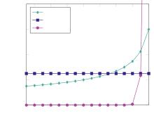
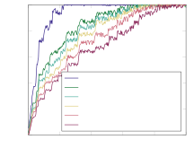
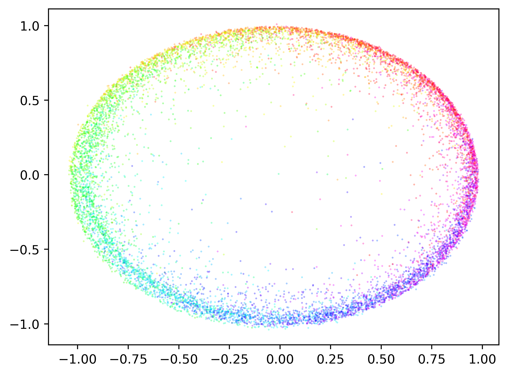
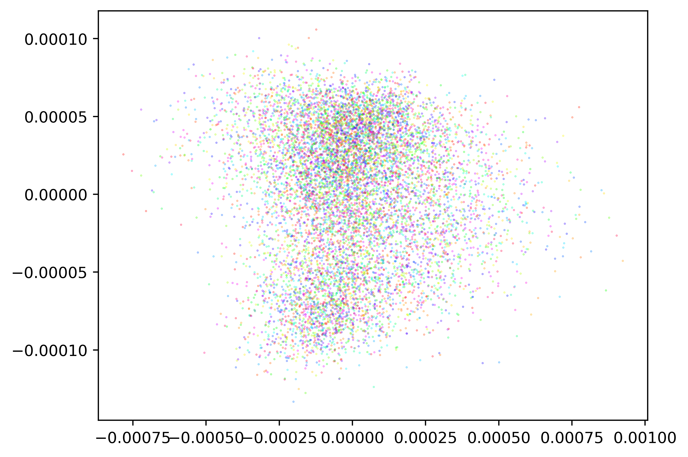

# Saxena, Alfarano, Charton, Allen-Zhu, Wenger, Lauter 2024 — Making Hard Problems Easier with Custom Data Distributions and Loss Regularization: A Case Study in Modular Arithmetic

См. также: [глобальный индекс понятий](../../concepts/index.md).

**Eshika Saxena**, **Alberto Alfarano**, **François Charton**, **Zeyuan Allen-Zhu** (FAIR at Meta), **Emily Wenger**, **Kristin Lauter** (Университет Дьюка и FAIR at Meta).

arXiv [2410.03569](https://arxiv.org/abs/2410.03569), октябрь 2024, разбирается версия v2 (июнь 2025). Числа цитирований в таблице корпуса нет. Это переработанный и переименованный вид статьи «Teaching Transformers Modular Arithmetic at Scale». Работа прикладная: остаточная арифметика взята как узкое место ML-нападений на LWE, и два приёма — своё распределение обучающих данных и добавка к потере — поднимают предел с $N\leq 6$, $q\leq 1000$ до $N=128$, $q\leq 974269$. Источник — нативный HTML arXiv версии v2.

Оригинал и производные файлы этой папки:

- [`original/2410.03569.native.html`](original/2410.03569.native.html) — первоисточник, нативный HTML arXiv (v2), скачан как есть.
- [`original/2410.03569.making-hard-problems-easier-with-custom-data-distributions-and-loss-regularization.md`](original/2410.03569.making-hard-problems-easier-with-custom-data-distributions-and-loss-regularization.md) — конверсия оригинала в Markdown без правок содержания.
- [`images/`](images/) — 5 иллюстраций статьи в исходном разрешении.

Схема якорей и правила ссылок на карточку — в [README папки статей](../README.md).

## Затрагиваемые понятия

**[Остаточная арифметика](../../concepts/modular-arithmetic.md)** — предмет работы, и она разом отодвигает границу возможного: модели складывают до $N=128$ слагаемых по остатку $q\leq 974269$ ([`p2-4`](#p2-4)), тогда как лучшие прежние итоги — $N\leq 6$ при $q\leq 1000$ ([`p2-6`](#p2-6), [`tab-1`](#tab-1)). Это не улучшение на проценты, а иной порядок задачи.

**[Критический объём данных](../../concepts/data-fraction-critical-dataset-size.md)** — главное новшество: своё распределение обучающих данных. Число ненулевых составляющих примера берётся из плотности $f$, и $f_{\mathrm{inv\_sqrt}}(z)\propto 1/\sqrt{N-z+1}$ смещено к трудным примерам с малым числом нулей, но допускает и простые разрежённые, тогда как обычное $f_{\mathrm{default}}$ почти никогда не порождает примеров со многими нулями, и модели приходится учиться на одних трудных ([`p3-6`](#p3-6), [`p4-1`](#p4-1), [`p4-2`](#p4-2), [`fig-1`](#fig-1)). Разница разительна: при обычном $f_{\mathrm{default}}$ то же самое устройство даёт 1,2 % точности, при $f_{\mathrm{inv\_sqrt}}$ — 99,8 % ([`p7-1`](#p7-1), [`tab-3`](#tab-3)). Приём прямо противопоставлен обучению по расписанию: распределение не меняется со временем, а потому не требует ни разметки трудности, ни выбора мига переключения; расписание же при больших $N$ оказывается шумным (85,1 % ± 10,3 % против 95,8 % ± 0,5 % при $N=128$) ([`p7-3`](#p7-3), [`p7-4`](#p7-4), [`tab-4`](#tab-4)). Отдельно измерено, сколько **различных** примеров нужно: при неизменном бюджете в 100 млн предъявлений хватает 1 млн различных, то есть по сотне повторений каждого ([`p8-2`](#p8-2), [`tab-6`](#tab-6)).

**[Зона Златовласки](../../concepts/goldilocks-zone.md)** — понятие перенесено с параметров на распределение данных: слишком малое расхождение Кульбака—Лейблера между обучающим и тестовым наборами и слишком большое (слишком много простых примеров) одинаково плохи, нужна «золотая середина» ([`p7-2`](#p7-2)).

**[Гроккинг](../../concepts/grokking.md)** — работа для корпуса особенно любопытна тем, что гроккинга **не наблюдает** и объясняет отчего: она берёт ничтожную долю пространства примеров ($2.76\cdot 10^{-31}$ при $N=16$, $q=257$), и потому модели учатся постепенно, с обычным поведением потери ([`p5-7`](#p5-7)). Тем самым остаточная арифметика перестаёт быть задачей, где гроккинг неизбежен.

**[Меры прогресса](../../concepts/progress-measures.md)** — вместо точного совпадения взята точность с допуском $\tau$: доля предсказаний в пределах $0.005q$ или $0.01q$ от верного ответа ([`p5-5`](#p5-5)). Это мера не «выучила или нет», а «насколько близко», и она позволяет видеть частичное усвоение действия.

**[Варианты регуляризации](../../concepts/regularization-variants.md)** — второе новшество: добавка к потере, наказывающая за предсказание начала координат. Без неё при трудной задаче модель вырождается: предсказания всей пачки сжимаются к нулю, ибо при равномерном $b$ наименьшая средняя потеря MSE достигается ровно в начале координат ([`p10-4`](#p10-4), [`fig-3`](#fig-3)).

**[Фурье-признаки и контуры](../../concepts/fourier-features-circuits.md)** — угловое вложение из Stevens et al.: целое $t$ кодируется точкой $(\cos\phi,\sin\phi)$ при $\phi=2\pi t/q$ на единичной окружности, отчего соседство остатков сохраняется ([`p4-3`](#p4-3)). Это то же самое соображение о круговой геометрии остаточного поля, что стоит за фурье-контурами, но применённое к вложению, а не к разбору весов.

**[Разреженная чётность](../../concepts/sparse-parity.md)** — приём проверен и на ней: при $f_{\mathrm{default}}$ модель предсказывает наугад (50,3 % при длине 32), при $f_{\mathrm{inv\_sqrt}}$ — 100 % при длине 32 и 99,4 % при длине 256 ([`p12-2`](#p12-2), [`tab-12`](#tab-12)).

**[Маршрутизация внимания](../../concepts/attention-routing-heads.md)** — те же приёмы проверены на копировании, ассоциативном припоминании и избирательном копировании, то есть на задачах, обычно связываемых с индукционными головами ([`p12-1`](#p12-1)); ассоциативное припоминание при $f_{\mathrm{default}}$ падает до 1,8 % при длине 64, а с их выборкой держит 100 %.

**[Скорость обучения](../../concepts/learning-rate.md)** — постановка: трансформер только с кодировщиком, скрытая размерность 256, 4 головы внимания, 4 слоя, пачка 250, Adam со скоростью $3\cdot 10^{-5}$, разогрев 1000 шагов, косинусное расписание, один ускоритель V100, около 3 часов на прогон ([`p5-3`](#p5-3)).

Отдельно стоит сказать, что работа по своему замыслу **прикладная**: она про взлом LWE, а остаточная арифметика — лишь узкое место этого нападения ([`p1-5`](#p1-5)). Гроккинг упомянут в обзоре как расхожая рамка изучения остаточной арифметики ([`p2-7`](#p2-7)), но предметом не является.

Карточки статей корпуса: [Nanda et al. 2023](../2301.05217.progress-measures-for-grokking-via-mechanistic-interpretability/2301.05217.progress-measures-for-grokking-via-mechanistic-interpretability.card.md) и [Gromov 2023](../2301.02679.grokking-modular-arithmetic/2301.02679.grokking-modular-arithmetic.card.md) — работы об остаточном сложении, чьи пределы ($N=2$, $q\leq 401$) здесь и отодвигаются; [Doshi et al. 2024](../2402.16726.towards-empirical-interpretation-of-internal-circuits-and-properties-in-grokked-transformers-on-modular-polynomials/2402.16726.towards-empirical-interpretation-of-internal-circuits-and-properties-in-grokked-transformers-on-modular-polynomials.card.md) — остаточные многочлены, лучший прежний итог по числу слагаемых ($N=6$ при $q\leq 23$) и догадка о разряде выучиваемых действий, здесь опровергаемая; [Mohamadi et al. 2024](../2407.12332.why-do-you-grok-a-theoretical-analysis-of-grokking-modular-addition/2407.12332.why-do-you-grok-a-theoretical-analysis-of-grokking-modular-addition.card.md) — теоретический разбор гроккинга остаточного сложения и требование постоянной доли всех возможных примеров, прямо оспариваемое здесь; [Miller et al. 2024](../2310.17247.grokking-beyond-neural-networks-an-empirical-exploration-with-model-complexity/2310.17247.grokking-beyond-neural-networks-an-empirical-exploration-with-model-complexity.card.md) — управление гроккингом объёмом данных и начальным приближением.

## Что показано, а что предположено

Замечания редактора карточки по итогам разбора утверждений (`…claims.txt`). Работа из FAIR Meta и Университета Дьюка; это переработанный и переименованный вид статьи «Teaching Transformers Modular Arithmetic at Scale» (октябрь 2024).

**Прирост не спорный, а разительный.** $N\leq 6$, $q\leq 1000$ у предшественников против $N=128$, $q=974269$ здесь ([`tab-1`](#tab-1), [`tab-2`](#tab-2)). При этом устройство модели не менялось — менялись только данные и потеря.

**Отсечение поставлено чисто.** То же самое устройство при $f_{\mathrm{default}}$ даёт 1,2–1,3 % точности при всех $N$, при $f_{\mathrm{inv\_sqrt}}$ — от 96,1 до 99,8 % ([`tab-3`](#tab-3)). Разница целиком приписана распределению данных, и это подкреплено прямым измерением.

**Объяснение через расхождение Кульбака—Лейблера проверяемо и красиво.** Оно предсказывает, что и слишком похожее на тест, и слишком непохожее распределение плохи, — и итоги ложатся именно так: $f_{\mathrm{default}}$ даёт расхождение 0 и нулевую точность, $f_{\mathrm{uni}}$ — наибольшее расхождение и точность ниже, чем у $f_{\mathrm{inv\_sqrt}}$ посередине ([`p7-2`](#p7-2), [`tab-3`](#tab-3)).

**Приём не зависит от выбранного элемента разрежённости.** Замена нуля произвольным, но постоянным целым $K$ даёт те же 97,9–100 % ([`p7-5`](#p7-5), [`tab-5`](#tab-5)). Это отсекает объяснение «модель просто выучила ноль» и подтверждает, что дело в сдвиге распределения.

**Сверка с обучением по расписанию честная и в пользу простоты.** При $N=128$, $q=257$ расписание даёт 85,1 % ± 10,3 %, их приём — 95,8 % ± 0,5 % по 8 прогонам ([`tab-4`](#tab-4)), причём перебирались и другие устройства расписания, пороги переключения, скорости обучения, ослабления весов, разметки трудности и смеси данных ([`p7-4`](#p7-4)).

**Замысел подтверждён прямым наблюдением, а не только итоговой точностью.** Модель, обучаемая при $N=64$, $q=257$, сперва верно складывает примеры с одним ненулевым слагаемым и лишь позже — с многими; чем больше ненулевых, тем позже наступает точность ([`p6-2`](#p6-2), [`fig-2`](#fig-2)). Это ровно то, ради чего разрежённые примеры и подмешиваются, и это самая убедительная часть работы.

**Разбор вырождения при потере MSE доведён до выкладки.** Показано, что при равномерном $b$ среднее значение потери наименьшее ровно в начале координат, и потому модель без добавки сползает туда ([`p10-4`](#p10-4)); это подтверждено и картинками выходов ([`fig-3`](#fig-3)).

**Однако главный итог — прикладной, а понимания он даёт мало.** Работа показывает, **что** помогает, но не **отчего** остаточная арифметика трудна: ни разбора выученного представления, ни связи с фурье-контурами, ни объяснения, что именно модель усваивает из разрежённых примеров.

**Наблюдение об исчезновении гроккинга проходит вскользь.** Одно предложение о том, что гроккинга нет, ибо доля виденных данных ничтожна ([`p5-7`](#p5-7)), — но это ровно то, что корпусу и интересно, и оно не проверено: нет ни прогона с большей долей данных, ни кривых обучения.

**Догадка Doshi et al. опровергнута прямым построением.** Они полагали, что двухслойные полносвязные сети способны выучить лишь действия вида $h(g_{1}(a_{1}),\ldots,g_{N}(a_{N}))$; здесь введён разряд несимметричных действий вне этого множества, $h_{j,k}=(\sum_{i}a_{i}^{j})^{2}+a_{1}^{k}$, и на них получено свыше 95 % ([`p11-2`](#p11-2), [`p11-3`](#p11-3), [`tab-9`](#tab-9)).

**Часть итогов на побочных задачах слаба.** Остаточное умножение при $q=3329$ даёт 3 % при всех $N$, скалярное произведение при $N=8$ и $q=257$ — 2 % ([`p11-4`](#p11-4), [`tab-10`](#tab-10), [`tab-11`](#tab-11)); в тексте это названо «падением качества при бо́льших $q$», хотя по существу приём там не работает вовсе, опускаясь до уровня отсечения.

**Заявка о «вдвое более трудных тайных векторах» опирается на 20 прогонов с долей успеха 10–20 %.** Восстановление удаётся в 15 % случаев при весе Хэмминга 6 против 0 % у чистой потери MSE ([`tab-8`](#tab-8)); при этом вектор ошибок $\boldsymbol{e}$ вовсе отброшен ([`p10-1`](#p10-1)), то есть решается не LWE, а «обучение без ошибок».

**Текст местами не вычитан.** В приложении 8 сказано «в таблице 13 и таблице 15… и в таблице 15» ([`p16-1`](#p16-1)), а абзацем ниже — «в таблицах 18, 18 и 18» ([`p16-2`](#p16-2)); в разделе о многочленах обе задачи отсылают к одной и той же таблице.

**Место в корпусе.** Работа прикладная и для корпуса боковая: гроккинг здесь не предмет, а обстоятельство. Ценны три вещи: показано, что предел «$N\leq 6$, $q\leq 1000$» был пределом не устройств, а обучающих данных; дано проверяемое объяснение через расхождение Кульбака—Лейблера с «золотой серединой»; и приведено доказательство того, что при трудной задаче потеря MSE на угловом вложении вырождается к началу координат, если не добавить штрафа. Отдельно ценно наблюдение, что при ничтожной доле виденного пространства примеров гроккинга не возникает вовсе. Цена — понимания того, отчего задача трудна, работа не даёт, часть побочных итогов слаба, а заявка о LWE получена при отброшенном шуме.

## Ошибочные цитирования

Замечания редактора карточки: места, где эта статья передаёт чужие результаты с ошибкой или без авторских оговорок. Сюда ведут ссылки «подробности» из разделов «Ошибочные пересказы и цитирования этой статьи» карточек процитированных работ.

###### mc-2407-12332
**Mohamadi et al. (2407.12332) — нижняя оценка перенесена на модели вообще.** `"Mohamadi et al. (2024) … found that models need to be trained on a constant fraction of all possible modular arithmetic behaviors for a given N and q to generalize"` — «моделям нужна постоянная доля всех возможных примеров»: у Mohamadi это [нижняя оценка только для перестановочно-эквивариантных ядровых методов](../2407.12332.why-do-you-grok-a-theoretical-analysis-of-grokking-modular-addition/2407.12332.why-do-you-grok-a-theoretical-analysis-of-grokking-modular-addition.card.md#p3-4); главный результат работы противоположен по духу — [в богатом режиме признакового обучения хватает доли порядка 1/p](../2407.12332.why-do-you-grok-a-theoretical-analysis-of-grokking-modular-addition/2407.12332.why-do-you-grok-a-theoretical-analysis-of-grokking-modular-addition.card.md#p3-5). Пересказ превращает половину теоремы в вывод обо всех моделях. Рядом «наблюдения о разнообразии данных» — тезис, которого у Mohamadi нет.

---

# Текст статьи

## Аннотация

###### p1-3

Недавние работы показали, что нападения на «обучение с ошибками» (LWE) — трудную задачу, применяемую в постквантовой тайнописи, — с помощью машинного обучения в некоторых условиях превосходят обычные алгебраические нападения. Хотя это и обещающе, такие нападения плохо переносятся на более сложные постановки LWE. Прежние работы связали эту трудность с тем, что модели машинного обучения плохо обучаются остаточной арифметике — существенной черте задачи LWE. Чтобы это исправить, мы вырабатываем приёмы, заметно повышающие качество моделей на задачах остаточной арифметики: они позволяют складывать до $N=128$ слагаемых по остатку $q\leq 974269$. Наше основное новшество — свои распределения обучающих данных и тщательно устроенная потеря, лучше отражающая строение задачи. Мы прилагаем начальное доказательство применимости наших приёмов к самой LWE и находим, что они позволяют восстанавливать вдвое более трудные тайные векторы, чем прежние работы. Наши приёмы помогают моделям лучше выучивать и другие хорошо изученные задачи, включая копирование, ассоциативное припоминание и чётность, что побуждает к дальнейшему изучению.

Eshika Saxena at \metadata[Code]https://github.com/facebookresearch/arithmetic

## 1 Введение

###### p1-5

Остаточная арифметика есть ключевая часть многих трудных задач тайнописи, включая «обучение с ошибками» (LWE), которое лежит в основе нескольких недавно принятых постквантовых тайнописных систем (Chen et al., 2022). Задача LWE состоит в определении тайного вектора по двум сведениям: $\mathbf{A}\in\mathbb{Z}_{q}^{m\times n}$ — матрице, взятой равномерно случайно по остатку $q$, и ${\boldsymbol{b}}=\mathbf{A}\cdot\boldsymbol{s}+\boldsymbol{e}\in\mathbb{Z}_{q}^{m}$ — зашумлённом скалярном произведении $\bf A$ с тайным вектором $\boldsymbol{s}$ по остатку $q$. Когда $\boldsymbol{s}$ двоичен, что часто бывает в житейских приложениях LWE, вычисление $\boldsymbol{b}$ по $\bf A$ требует вычисления суммы подмножества по остатку $q$, то есть задачи остаточного сложения.

Недавние работы показали, что модели машинного обучения при некоторых условиях можно применять для взлома LWE через восстановление тайного вектора (Wenger et al., 2022; Li et al., 2023a, b; Stevens et al., 2025). Нападение обучает модели предсказывать $\boldsymbol{b}$ по $\bf A$, что требует научиться вычислять (зашумлённое) остаточное действие $\bf{A}\cdot\boldsymbol{s}{\rm\pmod{q}}$. Если модели предсказывают $\boldsymbol{b}$ хотя бы с малой точностью, то $\boldsymbol{s}$ можно восстановить.

Однако нападениям с машинным обучением трудно даётся восстановление тайных векторов LWE со многими ненулевыми составляющими, что ограничивает их действенность. Прежние работы связывают эту трудность с неспособностью моделей выучить остаточную арифметику на объёме, ибо восстановление тайных векторов с бо́льшим числом ненулевых составляющих требует складывать больше слагаемых по остатку $q$ (Wenger et al., 2025). Ввиду широкого принятия тайнописных систем на основе LWE исследование возможностей этих зарождающихся нападений — способных пользоваться статистическими зависимостями, которые алгебраические нападения могут упустить, — существенно для понимания настоящей стойкости LWE.

Трудность моделей с остаточной арифметикой простирается за пределы тайнописи. Множество работ описали слабое качество моделей на задачах остаточной арифметики со многими слагаемыми и/или большими простыми остатками (Palamas, 2017; Gromov, 2023; Abbe et al., 2023; Mohamadi et al., 2024; Doshi et al., 2024). Это удивительно, ибо модели способны выучивать иные сложные математические задачи — символьную регрессию, линейную алгебру, поиск функций Ляпунова, вычисление базисов Грёбнера, упрощение многочленов и **[p. 2]** вычисление наибольшего общего делителя (Charton et al., 2021; Charton, 2022; Alfarano et al., 2024; Kera et al., 2024; Agarwal et al., 2021; Charton, 2024). Остаточная арифметика с виду проще, но переносимых на объём решений с машинным обучением по-прежнему нет.

Итак, наша цель проста: *обучить модели, способные складывать много слагаемых по остатку $q$.* Обдумывая эту задачу, мы делаем два ключевых наблюдения. Во-первых, задачи остаточной арифметики выстраиваются по трудности в зависимости от того, сколько раз сумма «оборачивается» вокруг остатка. Прежние работы заметили, что модели лучше учатся на примерах, оборачивающихся вокруг остатка $q$ меньшее число раз, скажем при $\sum_{i=1}^{n}a_{i}\leq 2q$ (Wenger et al., 2025). Во-вторых, геометрия остаточного поля нарушает привычные соображения о градиентном спуске, ибо $0$ и $q$ близки (Shalev-Shwartz et al., 2017). Прежние работы предложили угловое вложение входов и выходов модели, лучше отражающее эту геометрию (Stevens et al., 2025), но при оптимизации это строение прямо не применялось.

###### p2-2

**Наш вклад.** Опираясь на эти наблюдения, мы выдвигаем догадку, что два изменения в ходе обучения — свои распределения обучающих данных и сглаживание потери, приспособленное к задаче, — способны помочь моделям лучше выучить остаточную арифметику. Применение своих распределений данных вдохновлено недавними работами, показавшими действенность своих данных в смежных областях (Charton and Kempe, 2024; Abbe et al., 2023). Обучающие данные, разом показывающие модели лёгкие и трудные разновидности остаточной арифметики (скажем, слагаемые, оборачивающиеся вокруг $q$ меньше или больше раз), могли бы помочь модели вскрыть строение задачи. Сглаживание потери широко применяется в машинном обучении, но его можно приспособить именно к остаточной арифметике, как отмечали прежние работы (Gromov, 2023; Jelassi et al., 2023). Опираясь на это, мы:

###### p2-3

- Предлагаем *новое распределение обучающих данных*, включающее и лёгкие, и трудные разновидности задачи остаточной арифметики. Это распределение, воплощённое как действие над обучающими слагаемыми, а не как расписание, плавно меняет трудность примеров, видимых моделью, что делает обучение быстрым и действенным.
- Устраиваем *свою потерю* со штрафным членом, свойственным остаточной арифметике. Она мешает модели сходиться в местных, бесполезных наименьших точках, позволяя найти всеобщий наилучший исход, уместный для нашей постановки.

###### p2-4

**Ключевые итоги.** Наши приёмы позволяют моделям исполнять остаточное сложение при складывании $N$ слагаемых по остатку $q$ для разных $N$ и $q$ — вплоть до $N=128$ и $q=974269$. Это *заметно* превосходит прежние работы, складывавшие $N\leq 6$ слагаемых по остатку $q\leq 1000$. Прилагая наши приёмы к задаче LWE, мы находим, что способны восстанавливать вдвое более трудные тайные векторы, чем прежние работы.

Хотя наше побуждение и связано с LWE, наши приёмы могут помочь обучению и на других задачах. В разделе 4.2 мы приводим несколько занятных находок о том, как модели выучивают остаточную арифметику, и эти наблюдения могут помочь обучению в иных условиях. Мы прилагаем наши приёмы и к другим хорошо изученным задачам (копирование, ассоциативное припоминание и чётность) и находим, что они позволяют моделям учиться лучше, что говорит об их способности переноситься. Наш код доступен по адресу https://github.com/facebookresearch/arithmetic.

## 2 Сопутствующие работы

###### p2-6

**Машинное обучение для остаточной арифметики.** Прежние работы исследовали, способны ли модели выучить действия остаточной арифметики (Palamas, 2017; Lauter et al., 2024; Gromov, 2023; Abbe et al., 2023; Mohamadi et al., 2024; Doshi et al., 2024). Таблица 1 сводит лучшие прежние итоги по остаточному сложению. Лучшие имеющиеся приёмы обучают модели складывать $N\leq 6$ слагаемых при остатках до $q=1000$.

###### p2-7

Прежние работы заложили основу аналитического понимания того, как модели выучивают остаточную арифметику (Gromov, 2023; Doshi et al., 2024; Nanda et al., 2023). Остаточная арифметика есть расхожая задача для изучения «гроккинга», когда модель внезапно переходит от запоминания к генерализации. Некоторые работы идут дальше и показывают, что модели способны выучить задачу по существу, закодировав строение остаточной арифметики в своих весах (Nanda et al., 2023; Doshi et al., 2024). Однако прежние работы неизменно показывают (таблица 1), что моделям всё труднее выучивать остаточную арифметику с ростом числа слагаемых $N$ и остатка $q$, что и побуждает наш поиск новых приёмов обучения.

###### tab-1

*Таблица 1: **Сводка прежних работ об остаточном сложении с машинным обучением.** Лучшие $N$ и $q$ даны **полужирным.*** **[p. 3]**

**[p. 3]**

| Работа | Модель | Число слагаемых ($N$) | Остаток ($q$) | Точность, % |
|---|---|---|---|---|
| Nanda et al. (2023) | Трансформер | 2 | 53, 109, 113, 401 | 100 |
| Mohamadi et al. (2024) | Двухслойная MLP | 2 | **433** | 100 |
| Doshi et al. (2024) | Двухслойная MLP | **6** | 11, 23 | 97.1 |
| Gromov (2023) | Двухслойная MLP | 2 | 97 | 100 |
| Jelassi et al. (2023) | Трансформер только с кодировщиком | 2 | 100, **1000** | 73 |
| Abbe et al. (2023) | Четырёхслойная MLP | 2 | 2 | 100 |

###### p3-1

**Свои распределения обучающих данных.** Некоторые прежние работы исследовали, как изменение распределения обучающих данных сказывается на качестве в арифметических задачах. Скажем, Charton and Kempe (2024) показывают, что повторение обучающих примеров улучшает качество трансформера на арифметических задачах — остаточном умножении, наибольшем общем делителе и вычислении собственных значений. Mohamadi et al. (2024) кратко исследовали влияние обучающих данных на остаточную арифметику и обнаружили, что для генерализации модели нужно обучать на постоянной доле всех возможных поведений остаточной арифметики при данных $N$ и $q$. Эти работы побуждают дальше исследовать, как распределение обучающих данных влияет на качество моделей в арифметических задачах.

Сопутствующие работы исследовали влияние изменения распределения обучающих данных со временем по заранее заданному образцу — приём, известный как обучение по расписанию (CL) (Bengio et al., 2009). Abbe et al. (2023) показывают, что чётность выучивается приёмами обучения по расписанию. Заметим, что наш подход отличен от CL, ибо мы не меняем распределение данных со временем, и потому он требует меньше подгонки, чем CL. Наши опыты показывают, что CL крайне чувствительно к настройкам расписания, тогда как наш подход проще и обеспечивает неизменное схождение (см. таблицу 4).

**Влияние потери.** Несколько работ приписывают неспособность моделей выучить более трудные задачи остаточного сложения сложности пространства потерь (Gromov, 2023; Jelassi et al., 2023). Shalev-Shwartz et al. (2017) указывают на ограничения градиентных приёмов на разных задачах, включая обучение случайным чётностям. Это и побуждает добавить сглаживание потери, приспособленное к задаче, чтобы преодолеть эти трудности.

## 3 Приём

###### p3-4

Вслед за работой Jelassi et al. (2023) мы обучаем трансформеры только с кодировщиком складывать $N$ слагаемых по остатку $q$ (при закреплённых $N$ и $q$ для каждой модели). Мы также пользуемся угловыми вложениями, предложенными Stevens et al. (2025), которые отображают входные и выходные слагаемые по остатку $q$ в точки на единичной окружности. Они лучше отражают строение остаточной арифметики, ибо $0$ и $2\pi$, отвечающее $q$, в этой геометрии равны. Этот раздел описывает наши ключевые новшества в порядке обучения — свои обучающие данные и сглаживание потери, — а затем даёт обзор всего хода обучения и мер оценивания.

### 3.1 Новшество 1: пополнение обучающих данных разрежёнными векторами

Большинство прежних работ о машинном обучении для остаточной арифметики обучает модели на случайно порождённых парах (${\boldsymbol{a}},b$), где $\boldsymbol{a}$ берётся равномерно случайно из $\mathbb{Z}_{q}^{N}$, то есть $\boldsymbol{a}$ состоит из слагаемых $[a_{1},a_{2},\ldots,a_{N}]$, $a_{i}\in\mathbb{Z}_{q}$, а $b=\sum_{i=1}^{N}a_{i}\pmod{q}$ (Jelassi et al., 2023; Doshi et al., 2024). По наблюдениям о важности разнообразия обучающих данных из работ Wenger et al. (2022) и Mohamadi et al. (2024), модели учатся лучше, когда видят больше примеров «более простых» разновидностей целевого действия. Такие упрощённые задачи могут помочь моделям понять строение остаточной арифметики и лучше выучить её. Поэтому мы предлагаем добавлять в обучающие данные *разрежённые* векторы, у которых больше составляющих ${\boldsymbol{a}}$ равны $0$, наряду с более общими векторами.

###### p3-6

**Приём порождения данных.** Мы избирательно добавляем разрежённые векторы в обучающие данные, применяя при порождении распределение выборки $f$, задающее число ненулевых составляющих обучающего примера $a$. Чтобы породить $\boldsymbol{a}$, мы сперва берём из $f$ число $n\in[1,N]$ — число ненулевых составляющих в $\boldsymbol{a}$. Затем мы берём ненулевые составляющие $\boldsymbol{a}$ из $\mathbb{Z}_{q}^{n}$, дополняем строкой из $0$ длины **[p. 4]** $N-n$ и перемешиваем получившийся вектор, чтобы нули были распределены случайно.

###### p4-1

Мы ставим опыты с двумя распределениями $f$: для $z$ — желаемого числа нулевых составляющих — вероятность $z$ нулей задаётся как $f_{\mathrm{uni}}(z)=\frac{1}{N}$ (то есть равномерная плотность) и $f_{\mathrm{inv\_sqrt}}(z)\propto\frac{1}{\sqrt{N-z+1}}$ (близко к распределению, выбранному Allen-Zhu (2025)), где $\propto$ означает, что действия домножены на постоянную так, чтобы сумма $f$ по всем $z$ из её области равнялась $1$. Мы сверяем их с точкой отсчёта $f_{\mathrm{default}}$ — плотностью вероятности числа нулей в $\boldsymbol{a}$, когда $\boldsymbol{a}$ берётся равномерно из $\mathbb{Z}_{q}^{N}$. Большинство прежних работ о машинном обучении для остаточной арифметики порождало обучающие данные именно по $f_{\mathrm{default}}$, как уже сказано.

###### p4-2

**Влияние**$f$**на обучающие данные.** Рисунок 1 показывает разрежённость обучающих примеров, созданных этими приёмами выборки при $N=16$ и $q=257$. Заметим, что $f_{\mathrm{inv\_sqrt}}$ смещено в сторону «более трудных» примеров с малым числом $0$, но всё же допускает и более лёгкие, тогда как $f_{\mathrm{default}}$ редко создаёт примеры со многими нулями, а значит модель вынуждена учиться только на трудных примерах. При проверке мы оцениваем модели на примерах, взятых равномерно случайно из $\mathbb{Z}_{q}^{N}$, ибо целевая задача есть общее остаточное сложение.

###### fig-1

*Рисунок 1: **Вероятность числа ненулевых составляющих в обучающем примере при $N=16$ и $q=257$ для распределений выборки $f_{\mathrm{inv\_sqrt}}$, $f_{\mathrm{uni}}$ и $f_{\mathrm{default}}$.*** **[p. 4]**

### 3.2 Новшество 2: сглаживание потери против схлопывания модели

###### p4-3

Вслед за Stevens et al. (2025) мы берём угловое вложение для представления входов и выходов трансформера. На деле это вложение кодирует целое $t\in\mathbb{Z}_{q}$ углом $\phi=2\pi\frac{t}{q}$, а затем точкой ($\cos(\phi),\sin(\phi))\in\mathbb{R}^{2}$ на единичной окружности. Исходя из этого, мы поначалу выбрали для обучения потерю MSE. Однако мы заметили, что в более трудных условиях модель часто сходится к дурным местным наименьшим точкам — скажем, к началу координат. Чтобы это исправить, мы берём при обучении свою потерю, соединяющую средний квадрат отклонения (MSE) с добавочным сглаживающим членом. Для предсказания вида $(x^{\prime},y^{\prime})$ и истинного значения $(x=\cos\phi,y=\sin\phi)$ эта потеря имеет вид:

$$
\ell=\alpha\left(x^{\prime 2}+y^{\prime 2}+\frac{1}{x^{\prime 2}+y^{\prime 2}}\right)+\left((x-x^{\prime})^{2}+(y-y^{\prime})^{2}\right),\quad\alpha=10^{-4}
$$

Первый член наказывает модель за предсказание начала координат, обращая потерю в бесконечность при $x^{\prime}=0,y^{\prime}=0$. Он же побуждает модель предсказывать $(x^{\prime},y^{\prime})$ на единичной окружности (первый член наименьший при $x^{\prime 2}+y^{\prime 2}=1$). Второй член есть обычная потеря MSE. После некоторого обучения $x^{\prime}$ и $y^{\prime}$ близки к единичной окружности, и потому $x^{\prime}$ и $y^{\prime}$ можно приблизить как $\cos\phi^{\prime}$ и $\sin\phi^{\prime}$. При этом условии составляющая MSE принимает вид:

$$
\ell\approx (\cos\phi-\cos\phi^{\prime})^{2}+(\sin\phi-\sin\phi^{\prime})^{2} \\
=  2-2\cos\phi\cos\phi^{\prime}-2\sin\phi\sin\phi^{\prime} \\
=  2-2\cos(\phi-\phi^{\prime})
$$

Эта составляющая наименьшая при $\cos(\phi-\phi^{\prime})\approx 1$, что достигается при $\phi-\phi^{\prime}=0$ и $\phi-\phi^{\prime}=2\pi$. В остаточной арифметике мы хотим, чтобы $0$ и $2\pi$ считались «близкими» в пространстве потерь, и потому этот член верно описывает желаемое поведение.

**[p. 5]**

### 3.3 Обучение и оценивание моделей

Мы воплощаем предлагаемые изменения и обучаем трансформеры только с кодировщиком складывать $N$ слагаемых по остатку $q$ при следующих настройках и мерах оценивания.

**Выбор параметров.** Мы ставим опыты при $N=$ $\{16,32,64,128\}$, чтобы увидеть зависимости с ростом $N$. Поскольку нас занимает приложение к LWE, мы берём простые остатки, обычные для этой области. Мы берём $q=\{257,3329,42899,974269\}$, включая $q=3329$, применяемое в принятой тайнописной системе на основе LWE — CRYSTALS-KYBER (Avanzi et al., 2021). Мы проверили и непростой остаток $q=2^{16}$ и получили схожие итоги, как показано в приложении 8. Мы берём $N=16,q=257$ как исходный случай, ибо пространство примеров там достаточно велико, чтобы модели обобщали.

###### p5-3

**Ход обучения.** Все наши опыты воплощены на Python с Pytorch. Мы обучаем трансформеры со скрытой размерностью 256, 4 головами внимания и 4 слоями кодировщика на пачках по 250 примеров приёмом оптимизации Adam (Kingma and Ba, 2015) со скоростью обучения $3\cdot 10^{-5}$, начальным линейным разогревом в 1000 шагов и косинусным расписанием. Все опыты идут на $1$ видеоускорителе V100 с $32$ ГБ памяти. Модели обучались на $10M$ различных примеров при общем числе $100M$ примеров. Время обучения около 3 часов.

**Меры оценивания.** Мы порождаем отложенный тестовый набор $\mathcal{D}_{\mathrm{test}}$ объёмом 100 000, отличный от обучающего и содержащий примеры, взятые равномерно из $\mathbb{Z}_{q}^{N}$. Чтобы оценить качество модели на $\mathcal{D}_{\mathrm{test}}$, мы берём конечное скрытое состояние трансформера и пропускаем его через линейный слой, получая выход вида $(x^{\prime},y^{\prime})$. Мы проецируем эту точку на единичную окружность, получая $(\cos\phi^{\prime},\sin\phi^{\prime})=(\cos\frac{2\pi}{q}s^{\prime}\sin\frac{2\pi}{q}s^{\prime})$. Предсказание модели затем сверяется с истинным значением $(\cos\frac{2\pi}{q}s,\sin\frac{2\pi}{q}s)$.

###### p5-5

Чтобы получить полную картину качества модели, мы вычисляем такие меры: средний квадрат отклонения (MSE) предсказанных углов и точность с допуском ($\tau$) относительно $q$. MSE помогает судить о близости предсказанного и истинного углов. Точность с допуском $\tau$ позволяет мерить, выучила ли модель приближённое поведение действия, даже если точное совпадение редко. Выражения для этих мер таковы:

$$
\text{MSE}=\frac{1}{|\mathcal{D}|}\sum_{x\in\mathcal{D}}\left((\cos\phi-\cos\phi^{\prime})^{2}+(\sin\phi-\sin\phi^{\prime})^{2}\right) \\
\tau\text{-accuracy}=\frac{1}{|\mathcal{D}|}\sum_{x\in\mathcal{D}}\mathbb{1}_{\|s^{\prime}-s\|\leq\tau q}
$$

## 4 Итоги и дальнейшее исследование

### 4.1 Ключевые итоги

**Лучшие итоги на остаточном сложении.** Наши приёмы позволяют моделям выучить остаточное сложение до $N=128$ слагаемых по остатку $q$. Лучшие итоги для разных $N$ и $q$ приведены в таблице 2. В целом MSE близка к 0 при всех $N$ и $q$, а значит модель сходится и учится хорошо. Примечательно, что точность при $\tau=0.5\%$ почти безукоризненна у всех моделей. Это значит, что почти всякий раз «неверное» предсказание модели всё же лежит в пределах $0.5\%$ от $q$.

###### tab-2

*Таблица 2: **Наши приёмы неизменно хорошо работают при сложении $N\in[16,32,64,128]$ слагаемых по остатку $q\in[257,3329,42899,974269]$.** Все меры вычислены на отложенном тестовом наборе. MSE есть средний квадрат отклонения, точность при $\tau=0.5\%$ есть доля предсказаний в пределах $0.005q$ от верного ответа, а точность при $\tau=1\%$ — доля предсказаний в пределах $0.01q$ (см. раздел 3). Модели неизменно дают малую MSE и очень высокую точность с допуском $\tau$.* **[p. 6]**

| Число слагаемых ($N$) | Остаток ($q$) | MSE | Точность при $\tau=0.5\%$ | Точность при $\tau=1\%$ |
|---|---|---|---|---|
| 16 | 257 | 0.00 | 99.8% | 100.0% |
|  | 3329 | 0.00 | 99.7% | 100.0% |
|  | 42899 | 0.00 | 99.7% | 100.0% |
|  | 974269 | 0.00 | 99.7% | 100.0% |
| 32 | 257 | 0.00 | 99.5% | 100.0% |
|  | 3329 | 0.00 | 99.4% | 100.0% |
|  | 42899 | 0.00 | 99.4% | 100.0% |
|  | 974269 | 0.00 | 99.5% | 100.0% |
| 64 | 257 | 0.01 | 98.9% | 99.4% |
|  | 3329 | 0.01 | 97.4% | 99.4% |
|  | 42899 | 0.01 | 97.4% | 99.4% |
|  | 974269 | 0.01 | 98.2% | 99.4% |
| 128 | 257 | 0.04 | 96.1% | 98.2% |
|  | 3329 | 0.04 | 92.9% | 98.0% |
|  | 42899 | 0.05 | 94.1% | 97.9% |
|  | 974269 | 0.04 | 93.3% | 97.4% |

###### p5-7

**Сверка с точкой отсчёта.** Мы сверяем наши итоги с исходным трансформером только с кодировщиком при обычной потере MSE и распределении $f_{\mathrm{default}}$, как в части прежних работ (Jelassi et al., 2023). При таком подходе мы наблюдаем $1.3\%$ точности при $\tau=0.5\%$ на данных $N=16$, $q=257$ (наш исходный случай) при том же числе обучающих примеров, что и у нас. Иными словами, модель не выучивает задачу вовсе. Для сравнения, наши приёмы дают 99,8 % на той же задаче. В отличие от Gromov (2023) и Doshi et al. (2024), мы не наблюдаем у наших моделей гроккинга, ибо берём весьма малую долю данных из возможного пространства примеров ($2.76\cdot 10^{-31}$ при $N=16$ и $q=257$). Поэтому наши модели учатся постепенно, с обычным поведением обучающей потери, и не переобучаются.

**[p. 6]**

### 4.2 Более глубокое исследование наших приёмов

Помимо простого улучшения качества машинного обучения на остаточной арифметике, наши приёмы дают занятные уроки о самом ходе обучения. Здесь мы приводим итоги, подтверждающие наш подход и дающие более общее понимание того, как модели выучивают остаточную арифметику.

###### p6-2

**Модели выучивают лёгкие примеры прежде трудных.** Ключевое побуждение нашего подхода в том, что модели должны сперва учиться на разрежённых обучающих примерах, а уже затем на полной задаче. Чтобы это подтвердить, мы обучаем модель при $N=64$, $q=257$ и следим за её качеством на наборе $\mathcal{D_{\mathrm{val}}}$, взятом из того же распределения, что и $\mathcal{D_{\mathrm{train}}}$. Рисунок 2 показывает точность модели на примерах с числом ненулевых составляющих от $1$ до $64$ по эпохам обучения. Здесь видно, что модель поначалу лучше справляется с разрежёнными примерами (скажем, с одной ненулевой составляющей), а на более сложных становится точной в поздние эпохи. Это говорит о том, что такие модели сперва выучивают более простые суммы и, опираясь на это знание, выучивают более сложные, что и подкрепляет наше применение выборки по разрежённости при создании обучающих данных.

###### fig-2

*Рисунок 2: **Модель выучивается складывать меньшее число ненулевых слагаемых раньше, чем более сложные примеры.** Точность модели ($N=64,q=257$) после каждой эпохи на невиданном тестовом наборе, разбитом по числу ненулевых составляющих. Чем больше ненулевых составляющих, тем дольше до безукоризненной точности.* **[p. 6]**

**[p. 7]**

###### p7-1

**Разрежённые примеры данных существенны для обучения.** Как описано в разделе 3, мы строим более разнообразные обучающие наборы, беря примеры с разрежённостью, задаваемой плотностью $f$. Здесь мы исследуем, как разные плотности ($f_{\mathrm{default}}$, $f_{\mathrm{inv\_sqrt}}$ и $f_{\mathrm{uni}}$, см. раздел 3) влияют на качество модели. Мы приводим две меры: точность моделей при $\tau=0.5\%$ и расхождение Кульбака — Лейблера (KL) между обучающим и тестовым наборами. Расхождение KL измеряет близость обучающего набора $\mathcal{D_{\mathrm{train}}}$, построенного действием $f$, и $\mathcal{D}_{\mathrm{test}}$, взятого из $\mathbb{Z}_{q}^{N}$ равномерно случайно, то есть по $f_{\mathrm{default}}$. Как показывает таблица 3, различие точности моделей, обученных при исходной выборке ($f_{\mathrm{default}}$) и при любом ином распределении $f$, разительно. То же самое устройство даёт ничтожную точность, если не менять разрежённость обучающего набора, и превышает $90\%$, если менять. Это ясно указывает, что таким моделям нужно видеть разрежённые обучающие примеры, чтобы обобщать.

###### tab-3

*Таблица 3: **Выборка обучающих данных по $f_{\mathrm{{inv\_sqrt}}}$ даёт наилучшую точность при всех $N$ и $q$.** Точность при $\tau=0.5\%$ есть доля предсказаний в пределах $0.005q$ от верного ответа (см. раздел 3), расхождение KL есть мера близости обучающего и тестового наборов. При исходной выборке $f_{\mathrm{default}}$ модель не учится вовсе. Наилучшее качество дают распределения с расхождением KL, не слишком большим и не слишком малым.* **[p. 7]**

| Число слагаемых ($N$) | Остаток ($q$) | Обучающие данные $f$ | Точность при $\tau=0.5\%$ | Расхождение KL |
|---|---|---|---|---|
| 16 | 257 | $f_{\mathrm{default}}$ | 1.2% | 0.0 |
|  |  | $f_{\mathrm{inv\_sqrt}}$ | **99.8%** | 25.2 |
|  |  | $f_{\mathrm{uni}}$ | 99.7% | 35.4 |
| 32 | 257 | $f_{\mathrm{default}}$ | 1.3% | 0.0 |
|  |  | $f_{\mathrm{inv\_sqrt}}$ | **99.5%** | 49.8 |
|  |  | $f_{\mathrm{uni}}$ | 98.9% | 71.5 |
| 64 | 257 | $f_{\mathrm{default}}$ | 1.3% | 0.0 |
|  |  | $f_{\mathrm{inv\_sqrt}}$ | **98.9%** | 98.1 |
|  |  | $f_{\mathrm{uni}}$ | 95.3% | 144.0 |
| 128 | 257 | $f_{\mathrm{default}}$ | 1.3% | 0.0 |
|  |  | $f_{\mathrm{inv\_sqrt}}$ | **96.1%** | 193.7 |
|  |  | $f_{\mathrm{uni}}$ | 92.7% | 289.5 |

###### p7-2

**Расхождение KL между**$\mathcal{D}_{\mathrm{train}}$**и**$\mathcal{D}_{\mathrm{test}}$**влияет на точность.** Мы наблюдаем, что модели, обученные при $f$, дающих очень малое ($\approx 0$) или очень большое расхождение KL между $\mathcal{D}_{\mathrm{train}}$/$\mathcal{D}_{\mathrm{test}}$, обобщают хуже, чем при $f$ со средним расхождением. У моделей, обученных при исходном распределении $f_{\mathrm{default}}$, расхождение KL между $\mathcal{D}_{\mathrm{train}}$ и $\mathcal{D}_{\mathrm{test}}$ равно $0$, ибо обучающее и тестовое распределения почти одинаковы, и точность модели равна $0\%$. С другой стороны, равномерная плотность разрежённости $f_{\mathrm{uni}}$ уходит от тестового распределения слишком далеко (в $f_{\mathrm{uni}}$ слишком много «простых» примеров), отчего точность ниже. Нужно расхождение KL «как у Златовласки», и мы находим, что лучше всего работают распределения с меньшим числом разрежённых обучающих примеров — такие, как $f_{\mathrm{inv\_sqrt}}$.

###### p7-3

**Наше распределение данных даёт более неизменные итоги, чем обучение по расписанию.** Мы сверяем наш подход с обычным CL, ибо оба улучшают обучение, показывая модели более лёгкие разновидности задачи. Однако CL требует (a) задать поры расписания, упорядочив примеры по трудности и решив, когда переключать поры; (b) определить, как менять ослабление весов и скорость обучения; (c) задать смесь данных для разных пор. Наш же подход закрепляет эти величины на всё обучение, неявно кодируя «поры» расписания самим распределением данных, что даёт более неподвижный, но более простой в обучении приём.

###### p7-4

Для сверки мы воплощаем CL так. Сперва обучаем модель заданное время только на более лёгких примерах, затем — на всём наборе, как у Abbe et al. (2023). Таблица 4 показывает, что CL даёт шумные итоги, особенно при больших $N$, если смотреть на *среднюю* точность и разброс по 8 прогонам. Напротив, наш приём, закрепляющий распределение данных на всё обучение, обеспечивает схождение. Мы исследовали и иные устройства расписания (скажем, обучение на более лёгких примерах, пока обучающая потеря не достигнет некоторого порога) и провели обширный подбор настроек — ослабления весов, скорости обучения, иного упорядочения по трудности и смеси данных. Эти замены дают итоги, схожие с таблицей 4. Проверенные наборы настроек мы приводим в приложении 13, а лучшие итоги — в таблице 4. В конце концов, хотя наилучшее расписание, возможно, и удалось бы устроить, наш подход проще и не привязан к задаче (см. раздел 6).

###### tab-4

*Таблица 4: **Наш подход неизменнее и устойчивее CL, особенно при больших $N$.** Для сверки мы взяли наилучшее расписание. Мы приводим *среднюю* точность при $\tau=0.5\%$ (см. раздел 3) и разброс по 8 прогонам.* **[p. 8]**

|  |  | Точность при $\tau=0.5\%$ |  |
|---|---|---|---|
| Число слагаемых ($N$) | Остаток ($q$) | Наш подход | CL |
| 16 | 257 | 99.7% $\pm$ 0.0% | 99.7% $\pm$ 0.0% |
|  | 3329 | 99.6% $\pm$ 0.0% | 99.5% $\pm$ 0.0% |
|  | 42899 | 99.6% $\pm$ 0.1% | 99.4% $\pm$ 0.0% |
|  | 974269 | 99.6% $\pm$ 0.0% | 99.4% $\pm$ 0.0% |
| 32 | 257 | 99.3% $\pm$ 0.1% | 98.8% $\pm$ 0.4% |
|  | 3329 | 99.2% $\pm$ 0.1% | 98.0% $\pm$ 0.5% |
|  | 42899 | 99.2% $\pm$ 0.1% | 97.8% $\pm$ 1.2% |
|  | 974269 | 99.4% $\pm$ 0.1% | 98.5% $\pm$ 0.4% |
| 64 | 257 | 98.5% $\pm$ 0.3% | 95.7% $\pm$ 2.8% |
|  | 3329 | 97.3% $\pm$ 0.1% | 91.2% $\pm$ 2.5% |
|  | 42899 | 97.3% $\pm$ 0.2% | 91.3% $\pm$ 0.9% |
|  | 974269 | 98.0% $\pm$ 0.2% | 93.9% $\pm$ 3.2% |
| 128 | 257 | 95.8% $\pm$ 0.5% | 85.1% $\pm$ 10.3% |
|  | 3329 | 92.2% $\pm$ 0.7% | 82.2% $\pm$ 8.8% |
|  | 42899 | 92.9% $\pm$ 0.8% | 80.0% $\pm$ 12.2% |
|  | 974269 | 92.1% $\pm$ 0.4% | 77.3% $\pm$ 7.5% |

###### p7-5

**Приём с распределением данных не зависит от того, какой элемент взят для разрежённости.** Что до выбора **[p. 8]** $0$ как элемента разрежённости, мы обнаружили, что включение случайного, но закреплённого числа вместо $0$ даёт схожие итоги. Дело не в самом числе, а в сдвиге распределения, который и улучшает качество. Ключ — изменение расхождения KL между обучающим и тестовым наборами, а оно не зависит от выбранного элемента разрежённости.

Чтобы это доказать, мы ставим опыт, где заменяем $0$ произвольным целым $K$ и сдвигаем распределение, беря больше $K$, чем прочих элементов из $Z_{p}^{N}$. Для каждого $q$ мы брали своё случайное $K$, чтобы $K$ не оказалось делителем. Итоги приведены в таблице 5.

###### tab-5

*Таблица 5: **Наш подход неизменно хорошо работает при разных целых числах, взятых для разрежённости.** Мы обучаем модели при наилучших настройках данных из раздела 4 и добавляем в данные случайное число $K$ вместо 0, чтобы делать примеры разрежёнными. Точность при $\tau=1\%$ есть доля предсказаний в пределах $0.01q$ от верного ответа (см. раздел 3)* **[p. 8]**

| Число слагаемых ($N$) | Остаток ($q$) | $K$ | Точность при $\tau=1\%$ |
|---|---|---|---|
| 32 | 257 | 160 | 100% |
|  | 3329 | 3176 | 100% |
|  | 42899 | 24606 | 100% |
|  | 974269 | 79062 | 100% |
| 64 | 257 | 160 | 99.2% |
|  | 3329 | 3176 | 99.3% |
|  | 42899 | 24606 | 99.4% |
|  | 974269 | 79062 | 99.3% |
| 128 | 257 | 160 | 97.9% |
|  | 3329 | 3176 | 98.3% |
|  | 42899 | 24606 | 97.9% |
|  | 974269 | 79062 | 97.9% |

###### p8-2

**Повторение примеров помогает.** В приложениях вроде тайнописного разбора LWE объём обучающих данных может быть ограничен, и потому мы рассматриваем, способны ли модели учиться на меньшем числе примеров. Занятно, что недавние работы показывают: моделям может быть полезно встречать примеры несколько раз при обучении, а значит ограниченность обучающих данных не столь мешает, как ожидалось (Charton and Kempe, 2024). Чтобы проверить, помогают ли повторы в нашей постановке, мы обучаем модели при $d=\{0.1M,1M,10M,100M\}$ различных примеров **[p. 9]** из распределения выборки $f_{\mathrm{inv\_sqrt}}$ при закреплённом бюджете обучения $b=100M$ примеров. Это значит, что модель видит каждый различный пример $b/d$ раз, то есть $100M/0.1M=1000$ раз в случае $d=0.1M$. Мы находим, что покуда модель видит не менее $1M$ различных примеров — то есть при $100$ повторах в наших опытах, — она без труда выучивает подлежащий алгоритм (см. таблицу 6).

###### tab-6

*Таблица 6: **Некоторое — но не чрезмерное — число повторов помогает качеству.** Мы обучаем модели при $q=257$ и разном числе повторов (все с распределением $f_{\mathrm{inv\_sqrt}}$, угловым вложением и своей потерей) и оцениваем на одном и том же тестовом наборе. Число повторов данных вычисляется как $100M/d$, где $d$ есть число различных обучающих примеров при общем бюджете $100M$. Точность при $\tau=0.5\%$ есть доля предсказаний в пределах $0.005q$ от верного ответа (см. раздел 3).* **[p. 9]**

|  | Точность при $\tau=0.5\%$ |  |  |  |
|---|---|---|---|---|
| Число повторов данных | $N=16$ | $N=32$ | $N=64$ | $N=128$ |
| 1000 | 99.3% | 97.7% | 95.7% | 86.1% |
| 100 | **99.8%** | 99.2% | 98.4% | 92.7% |
| 10 | **99.8%** | **99.5%** | **98.9%** | **96.1%** |
| 1 | 99.7% | 99.2% | 97.2% | 91.5% |

**Сглаживание потери предотвращает схлопывание модели, когда задача трудна.** Наконец, мы оцениваем, как сглаживающий член нашей потери влияет на качество модели. Мы обучаем несколько моделей при разных $N$ и $q$ на двух видах потери из раздела 3.2: с $\alpha=10^{-4}$, где наш добавочный член работает, и с $\alpha=0.0$, то есть при обычной потере MSE. Мы находим, что покуда задача легка, сглаживание не нужно (таблица 7). Однако с ростом трудности задачи сглаживающий член увеличивает вероятность успеха. Объяснения этому мы разбираем в разделе 5.

*Таблица 7: **Качество моделей со своей потерей и с MSE сопоставимо при обучении остаточному сложению.** Мы обучаем модели при $q=257$ и наилучших настройках обучающих данных из раздела 4 с угловыми вложениями и оцениваем на одном и том же тестовом наборе. Точность при $\tau=0.5\%$ есть доля предсказаний в пределах $0.005q$ от верного ответа (см. раздел 3).* **[p. 9]**

|  |  | Точность при $\tau=0.5\%$ |  |
|---|---|---|---|
| Число слагаемых | Остаток | Своя потеря | Потеря MSE |
| ($N$) | ($q$) | $\alpha=10^{-4}$ | $\alpha=0$ |
| 16 | 257 | 99.8% | 99.9% |
|  | 3329 | 99.7% | 99.7% |
|  | 42899 | 99.7% | 99.6% |
|  | 974269 | 99.7% | 99.7% |
| 32 | 257 | 99.5% | 99.6% |
|  | 3329 | 99.4% | 99.2% |
|  | 42899 | 99.4% | 99.3% |
|  | 974269 | 99.5% | 98.9% |

**Наш подход почти не добавляет вычислительных затрат.** Добавочные вычислительные затраты нашего подхода против точки отсчёта наименьшие: мы порождаем то же число примеров и лишь меняем распределение, по которому они порождаются. Точно так же и сглаживающий член потери не добавляет затрат (кроме ничтожной стоимости вычисления самого члена), ибо у нас обычный цикл обучения. Мы замеряли различие между опытами со своей потерей и с обычной и сообщаем, что различие во времени ничтожно — около 0,04 % относительной разницы.

## 5 Приложение: тайнописный разбор LWE

Установив, что наши приёмы позволяют моделям лучше выучивать остаточное сложение, мы прилагаем их к нашему побуждающему примеру — улучшенным нападениям на задачу «обучения с ошибками» (LWE) с помощью машинного обучения. Цель таких нападений — найти $\mathbf{s}$ по $\mathbf{A}$ и $\boldsymbol{b}$, где $\boldsymbol{b}=\mathbf{A}\cdot\boldsymbol{s}+\boldsymbol{e}\pmod{q}$. Здесь $\mathbf{A}\in\mathbb{Z}_{q}^{m\times n}$ есть равномерно случайная матрица $m\times n$, а тайный вектор $\boldsymbol{s}\in\mathbb{Z}_{q}^{n}$ имеет длину $n$.

**[p. 10]**

###### p10-1

Для этой проверки применимости мы не берём в счёт вектор ошибок $\boldsymbol{e}$, чтобы лучше изучить, выучивают ли модели более трудную часть задачи — вычисление $\mathbf{A}\cdot\boldsymbol{s}\pmod{q}$. Если модели восстанавливают $\boldsymbol{s}$ без шума, то восстановление с шумом должно быть возможно по опытам Wenger et al. (2022). Мы полагаем $\boldsymbol{s}$ двоичным и разрежённым, исходя из предлагаемых воплощений LWE в расхожей области гомоморфного шифрования (Bossuat et al., 2024).

Вслед за Stevens et al. (2025) мы обучаем модель только с кодировщиком на парах $(\mathbf{A},\boldsymbol{b})$ предсказывать $\boldsymbol{b}$ по $\mathbf{A}$. Мы берём $30$ миллионов различных примеров при общем бюджете обучения в $1$ миллиард примеров, добавляя в ход обучения наши улучшения потери. Качество нападения мы меряем числом успешных восстановлений тайного вектора из 20 случайных начальных приближений модели. Для восстановления тайных векторов мы берём двоичный различитель Wenger et al. (2022).

Итоги приведены в таблице 8: при $N=64$ и $q=\{257,3329,42899,974269\}$ модель успешно восстанавливает двоичные тайные векторы с весом Хэмминга (числом ненулевых составляющих) до 6. Этот итог существен, ибо Wenger et al. (2025) показывают, что нападения на LWE с машинным обучением обыкновенно работают лишь тогда, когда восстановление требует по сути сложить $\leq 3$ слагаемых по остатку $q$. Тем самым наши приёмы, по-видимому, **удваивают** качество таких нападений на LWE, открывая путь дальнейшим исследованиям.

###### p10-4

**Действие сглаживающего члена в постановке LWE.** В предыдущем разделе (4.2) мы отметили, что сглаживающий член нашей потери помогает обучению в более трудных условиях. Чтобы это объяснить, рассмотрим постановку LW(ithout)E — то есть без ошибок. Без сглаживания для пачки $\mathcal{B}$ с истинными значениями $(\boldsymbol{x},\boldsymbol{y})$ и предсказаниями модели $(\boldsymbol{x^{\prime}},\boldsymbol{y^{\prime}})$ оптимизируемая потеря MSE равна $\ell=\|\boldsymbol{x}-\boldsymbol{x^{\prime}}\|_{2}^{2}+\|\boldsymbol{y}-\boldsymbol{y^{\prime}}\|_{2}^{2}$. В начале обучения мы рассматриваем предсказания модели и наблюдаем, что они примерно равны, как показано в приложении 12. Пользуясь этим и тем, что $b=\boldsymbol{a}\cdot\boldsymbol{s}\pmod{q}$ распределено равномерно, мы заключаем, что в среднем потеря модели $\ell\approx\sum_{t=0}^{q-1}\left((x^{\prime}-\cos 2\pi\frac{t}{q})^{2}+(y^{\prime}-\sin 2\pi\frac{t}{q})^{2}\right)$. Поскольку $\sum_{t=0}^{q-1}\cos 2\pi\frac{t}{q}=\sum_{t=0}^{q-1}\sin 2\pi\frac{t}{q}=0$, наименьшая потеря достигается при $(x^{\prime},y^{\prime})=(0,0)$. Это побуждает модель выдавать предсказания всё меньшей величины на каждой эпохе обучения и в итоге вырождаться к предсказаниям около начала координат. Добавление сглаживающего члена побуждает модель избегать начала координат, что даёт более быстрое и лучшее схождение (сверку см. в таблице 8).

Мы ставили опыты и с иными заменами сглаживанию потери — скажем, с оценкой углового расстояния между предсказаниями, — но нашли, что именно сглаживающий член надёжнее всего обеспечивает неизменное схождение.

###### tab-8

*Таблица 8: **Модель работает лучше, когда обучена с нашей потерей на задаче LW(ithout)E.** Мы обучаем модели при наилучших настройках данных из раздела 4 и оцениваем, восстанавливает ли модель тайный вектор. Доля восстановлений есть доля восстановленных тайных векторов из 20 разных начальных приближений модели.* **[p. 10]**

|  |  |  | Доля восстановлений |  |
|---|---|---|---|---|
| Число слагаемых | Вес | Остаток | Своя потеря | Потеря MSE |
| ($N$) | Хэмминга | ($q$) | $\alpha=10^{-2}$ | $\alpha=0$ |
| 64 | 6 | 257 | **15%** | 0% |
|  |  | 3329 | **20%** | 0% |
|  |  | 42899 | **15%** | 0% |
|  |  | 974269 | **15%** | 0% |
| 128 | 5 | 257 | **10%** | 0% |
|  |  | 3329 | **15%** | 0% |
|  |  | 42899 | **15%** | 0% |
|  |  | 974269 | **10%** | 0% |
| 256 | 4 | 257 | **10%** | 0% |
|  |  | 3329 | **15%** | 0% |
|  |  | 42899 | **15%** | 0% |
|  |  | 974269 | **15%** | 0% |

## 6 За пределами остаточного сложения

Наконец, мы рассматриваем, способны ли наши приёмы помочь обучению не только при остаточном сложении, но и в иных условиях — на других задачах остаточной арифметики и на более общих действиях.

**[p. 11]**

### 6.1 Другие задачи остаточной арифметики

Мы исследуем, позволяют ли наши приёмы моделям выучивать иные действия остаточной арифметики, помимо сложения. Мы обучаем модели предсказывать выходы этих действий при той же постановке, что и прежде: трансформер только с кодировщиком с изменённым распределением данных, угловым вложением и своей потерей.

###### p11-2

**Несимметричные действия.** Doshi et al. (2024) высказали догадку, что двухслойные MLP способны выучивать лишь действия, представимые в виде $h(g_{1}(a_{1}),g_{2}(a_{2}),\ldots,g_{N}(a_{N}))$, и за пределы этого разряда не выходят. Мы вводим разряд действий $h:\mathbb{Z}_{q}^{N}\rightarrow\mathbb{Z}_{q}$ вне названного разряда, где $h_{j,k}=\left(\sum_{i=1}^{N}a_{i}^{j}\right)^{2}+a_{1}^{k}$, чтобы показать, что наш подход помогает моделям выучивать и другие действия остаточной арифметики.

###### p11-3

Для этих задач мы добавляем в трансформер позиционное вложение, ибо эти действия зависят от мест во входной последовательности. Таблица 9 показывает, что при $N=16$ и $q=257$ мы достигаем точности выше $\mathbf{95\%+}$ для этих действий.

###### tab-9

*Таблица 9: **С нашими приёмами модели способны выучивать и другие действия остаточной арифметики с хорошей точностью $(N=16,q=257)$.** Точность в процентах есть доля в точности верных предсказаний.* **[p. 11]**

| Действие | Точность, % |
|---|---|
| $h_{j=1,k=1}=\left(a_{1}+\ldots+a_{N}\right)^{2}+a_{1}^{1}\mod q$ | 95.1% |
| $h_{j=1,k=3}=\left(a_{1}+\ldots+a_{N}\right)^{2}+a_{1}^{3}\mod q$ | 96.2% |
| $h_{j=2,k=1}=\left(a_{1}^{2}+\ldots+a_{N}^{2}\right)^{2}+a_{1}^{1}\mod q$ | 95.5% |

###### p11-4

**Остаточное умножение и скалярное произведение.** Мы проверяем и остаточное умножение, и скалярное произведение двух векторов по остатку $q$ — соответственно в таблицах 10 и 11. Угловое вложение устроено для сложения, поэтому в опытах с умножением мы берём обычное лексемное вложение и сверяем $f_{\mathrm{inv\_sqrt}}$ с $f_{\mathrm{default}}$. В обеих задачах модель с $f_{\mathrm{inv\_sqrt}}$ работает хорошо при меньших $q$, но качество падает при бо́льших $q$. Во всех случаях и в обеих задачах точность при $\tau=1\%$ для $f_{\mathrm{default}}$ составляет около $2\%$. Заметим также, что скалярное произведение труднее, ибо модели нужно выучить и умножения, и сложения.

###### tab-10

*Таблица 10: **Наши приёмы улучшают качество и на остаточном умножении.** Мы обучаем модели при наилучших настройках данных из раздела 4. Качество модели, обученной по $f_{\mathrm{default}}$, составляет 2 % при всех настройках. Точность при $\tau=1\%$ есть доля предсказаний в пределах $0.01q$ от верного ответа (см. раздел 3).* **[p. 11]**

| Число слагаемых ($N$) | Остаток ($q$) | Точность при $\tau=1\%$ |
|---|---|---|
| 16 | 97 | 100% |
|  | 257 | 98% |
|  | 3329 | 3% |
| 32 | 97 | 100% |
|  | 257 | 75% |
|  | 3329 | 3% |
| 64 | 97 | 100% |
|  | 257 | 65% |
|  | 3329 | 3% |

###### tab-11

*Таблица 11: **Наши приёмы улучшают качество и на задаче скалярного произведения.** Мы обучаем модели при наилучших настройках данных из раздела 4. Качество модели, обученной по $f_{\mathrm{default}}$, составляет 2 % при всех настройках. Точность при $\tau=1\%$ есть доля предсказаний в пределах $0.01q$ от верного ответа (см. раздел 3).* **[p. 12]**

| Число слагаемых ($N$) | Остаток ($q$) | Точность при $\tau=1\%$ |
|---|---|---|
| 2 | 97 | 100% |
|  | 257 | 100% |
|  | 3329 | 3% |
| 4 | 97 | 100% |
|  | 257 | 30% |
|  | 3329 | 3% |
| 8 | 97 | 78% |
|  | 257 | 2% |
|  | 3329 | 3% |

### 6.2 Вымышленные задачи

Наконец, мы исследуем, помогают ли одни только приёмы с распределением данных качеству трансформера на хорошо изученных вымышленных задачах, а именно:

- Задача копирования (Graves (2014)): дан вектор размера $N$, каждый элемент которого взят из словаря $V$; выдать в точности его копию. Случайная догадка верна с вероятностью $V^{-N}$.
- Задача ассоциативного припоминания (Graves (2014)): даны $N$ ключей и $N$ значений, взятых из двух различных словарей $V_{K}$ и $V_{V}$; извлечь верное значение одного ключа. Случайная догадка верна с вероятностью $N^{-1}$.
- **[p. 12]** Задача чётности (Abbe et al. (2023)): дан двоичный вектор размера $N$; выдать его чётность. Случайная догадка верна с вероятностью $50\%$.
- Избирательное копирование (Gu and Dao (2023)): дан вектор размера $N$, где $T=16$ ненулевых элементов взяты из словаря $V$, а $N-T$ элементов равны нулю; выдать копию вектора, отбросив все элементы, равные 0.

###### p12-1

Для этих порождающих задач мы обучали модель только с раскодировщиком с поворотным позиционным вложением (Black et al., 2022), 4 слоями и скрытой размерностью 256 на пачках по 250 примеров при общем числе 10M примеров. Как и в разделе 3.1, мы берём длину каждой задачи из распределения $f$, меняя её от 1 до max_length, вместо того чтобы всегда закреплять её равной max_length. Когда мы берём $f_{\mathrm{default}}$, мы порождаем задачи длины max_length. При оценивании мы считаем точность только на задачах длины max_length. Свою потерю при обучении мы не применяем, ибо она устроена для остаточной арифметики.

###### tab-12

*Таблица 12: **Обучающие данные с более разнообразными длинами задач дают лучшую точность на разных задачах.** На ассоциативном припоминании и чётности модель при $f_{\mathrm{default}}$ не выучивается вовсе. Точность в процентах $=$ доля в точности верных предсказаний.* **[p. 12]**

|  |  | Точность, % |  |  |
|---|---|---|---|---|
| Задача | max_length | $f_{\mathrm{default}}$ | $f_{\mathrm{inv\_sqrt}}$ | $f_{\mathrm{uni}}$ |
| Копирование | 32 | **100.0%** | **100.0%** | **100.0%** |
|  | 64 | **100.0%** | **100.0%** | **100.0%** |
|  | 128 | 94.3% | **100.0%** | **100.0%** |
|  | 256 | 81.4% | **98.1%** | 97.4% |
| Ассоциативное | 8 | 32.5% | **100.0%** | **100.0%** |
| припоминание | 16 | 6.6% | **100.0%** | **100.0%** |
|  | 32 | 3.4% | **100.0%** | **100.0%** |
|  | 64 | 1.8% | **100.0%** | 1.8% |
| Чётность | 32 | 50.3% | **100.0%** | **100.0%** |
|  | 64 | 50.6% | 99.8% | **100.0%** |
|  | 128 | 50.0% | **99.7%** | 50.2% |
|  | 256 | 50.2% | **99.4%** | 50.2% |
| Избирательное | 32 | **100.0%** | **100.0%** | **100.0%** |
| копирование | 64 | **100.0%** | **100.0%** | **100.0%** |
|  | 128 | 83.4% | **100.0%** | **100.0%** |
|  | 256 | 57.2% | **100.0%** | 99.3% |

###### p12-2

Как показывает таблица 12, включение смеси более лёгких и более трудных данных способно заметно улучшить качество модели. Особенно это заметно на ассоциативном припоминании и чётности, где модели, обученные при $f_{\mathrm{default}}$, по сути предсказывают наугад.

**[p. 13]**

## 7 Заключение

Эта работа вводит два ключевых изменения в ход обучения, помогающих моделям выучить остаточное сложение. Эти приёмы — изменение разнообразия обучающих данных и введение сглаженной потери — позволяют моделям складывать сотни слагаемых по большому остатку $q$ с высокой точностью, что заметно превосходит прежние работы. Мы также показываем, что эти приёмы приложимы к задаче «обучения с ошибками» (LWE) в тайнописи и позволяют обучать модели, восстанавливающие вдвое более трудные тайные векторы, чем прежние работы.

Более того, наши итоги дают ценное понимание того, как модели выучивают остаточную арифметику, что может помочь разработке более действенных приёмов машинного обучения для широкого круга задач. Приложив наши приёмы к другим хорошо изученным задачам, мы показали их способность переноситься и улучшать итоги обучения.

Остаётся несколько занятных направлений дальнейшей работы. С ростом числа слагаемых $N$ у наших моделей MSE слегка выше, а точность ниже. Это побуждает исследовать, как улучшить качество с ростом $N$. Другое направление — дальнейшее исследование переноса наших приёмов в иные условия, скажем в тайнописный разбор с машинным обучением. Хотя наш приём и успешен при $q$, применяемых в настоящих тайнописных системах, и при $N$, близких к житейским случаям ($N=512$ применяется на деле (Avanzi et al., 2021)), на «обучении *без* ошибок», для переноса знания об остаточном сложении на «обучение *с* ошибками» при больших $N$ и $q$ нужны дальнейшие опыты. Возможные подходы включают предобучение на общем остаточном сложении с последующим дообучением под частные условия, но дальнейшим работам стоит рассмотреть и более изобретательные ходы.

## Благодарности

Авторы благодарят Mohamed Malhou и Andrey Gromov за полезные беседы об арифметических задачах.

Эта статья есть обновлённый вид первоначальной работы «Teaching Transformers Modular Arithmetic at Scale», впервые выложенной на arXiv в октябре 2024 года.

**[p. 14]**

## Список литературы

- Emmanuel Abbe, Elisabetta Cornacchia, and Aryo Lotfi. Provable advantage of curriculum learning on parity targets with mixed inputs. *Proc. of NeurIPS*, 2023.

- Vishesh Agarwal, Somak Aditya, and Navin Goyal. Analyzing the nuances of transformers’ polynomial simplification abilities, 2021. https://arxiv.org/abs/2104.14095.

- Alberto Alfarano, François Charton, and Amaury Hayat. Global lyapunov functions: a long-standing open problem in mathematics, with symbolic transformers. In *Proc. of NeurIPS*, 2024.

- Zeyuan Allen-Zhu. Physics of Language Models: Part 4.1, Architecture Design and the Magic of Canon Layers. *SSRN Electronic Journal*, May 2025. https://ssrn.com/abstract=5240330.

- Roberto Avanzi, Joppe Bos, Léo Ducas, Eike Kiltz, Tancrède Lepoint, Vadim Lyubashevsky, John M. Schanck, Peter Schwabe, Gregor Seiler, and Damien Stehlé. CRYSTALS-Kyber (version 3.02) – Submission to round 3 of the NIST post-quantum project. 2021. Available at https://pq-crystals.org/.

- Yoshua Bengio, Jérôme Louradour, Ronan Collobert, and Jason Weston. Curriculum learning. *Proc. of ICML*, 2009.

- Sidney Black, Stella Biderman, Eric Hallahan, Quentin Anthony, Leo Gao, Laurence Golding, Horace He, Connor Leahy, Kyle McDonell, Jason Phang, et al. Gpt-neox-20b: An open-source autoregressive language model. In *Workshop on Challenges & Perspectives in Creating Large Language Models*, 2022.

- Jean-Philippe Bossuat, Rosario Cammarota, Jung Hee Cheon, Ilaria Chillotti, et al. Security guidelines for implementing homomorphic encryption. *Cryptology ePrint Archive*, 2024.

- François Charton. Linear algebra with transformers. *Transactions in Machine Learning Research*, 2022.

- François Charton. Learning the greatest common divisor: explaining transformer predictions. In *ICLR*, 2024.

- François Charton and Julia Kempe. Emergent properties with repeated examples. In *NeurIPS 2024 Workshop on Scientific Methods for Understanding Deep Learning*, 2024.

- François Charton, Amaury Hayat, and Guillaume Lample. Learning advanced mathematical computations from examples. *Proc. of ICLR*, 2021.

- Lily Chen, Dustin Moody, Yi-Kai Liu, et al. PQC Standardization Process: Announcing Four Candidates to be Standardized, Plus Fourth Round Candidates. *US Department of Commerce, NIST*, 2022. https://csrc.nist.gov/News/2022/pqc-candidates-to-be-standardized -and-round-4.

- Darshil Doshi, Tianyu He, Aritra Das, and Andrey Gromov. Grokking modular polynomials. *arXiv preprint arXiv:2406.03495*, 2024.

- Alex Graves. Neural turing machines. *arXiv preprint arXiv:1410.5401*, 2014.

- Andrey Gromov. Grokking modular arithmetic. *arXiv preprint arXiv:2301.02679*, 2023.

- Albert Gu and Tri Dao. Mamba: Linear-time sequence modeling with selective state spaces. In *First Conference on Language Modeling*, 2023.

- Samy Jelassi, Stéphane d’Ascoli, Carles Domingo-Enrich, Yuhuai Wu, Yuanzhi Li, and François Charton. Length generalization in arithmetic transformers. *arXiv preprint arXiv:2306.15400*, 2023.

- Hiroshi Kera, Yuki Ishihara, Yuta Kambe, Tristan Vaccon, and Kazuhiro Yokoyama. Learning to compute gröbner bases. *Advances in Neural Information Processing Systems*, 37:33141–33187, 2024.

- Diederik P Kingma and Jimmy Ba. Adam: A method for stochastic optimization. In *Proc. of ICLR*, 2015.

- Kristin Lauter, Cathy Yuanchen Li, Krystal Maughan, Rachel Newton, and Megha Srivastava. Machine learning for modular multiplication. In *Research Directions in Number Theory-Women in Numbers 6*. Springer, 2024.

- Cathy Yuanchen Li, Jana Sotáková, Emily Wenger, Mohamed Malhou, Evrard Garcelon, François Charton, and Kristin Lauter. Salsa Picante: A Machine Learning Attack on LWE with Binary Secrets. In *Proc. of ACM CCS*, 2023a.

- Cathy Yuanchen Li, Emily Wenger, Zeyuan Allen-Zhu, Francois Charton, and Kristin E Lauter. SALSA VERDE: a machine learning attack on LWE with sparse small secrets. In *Proc. of NeurIPS*, 2023b.

- Mohamad Amin Mohamadi, Zhiyuan Li, Lei Wu, and Danica J Sutherland. Why do you grok? a theoretical analysis on grokking modular addition. In *International Conference on Machine Learning*, pages 35934–35967. PMLR, 2024.

**[p. 15]**

- Neel Nanda, Lawrence Chan, Tom Lieberum, Jess Smith, and Jacob Steinhardt. Progress measures for grokking via mechanistic interpretability. In *Proc. of ICLR*, 2023.

- Theodoros Palamas. Investigating the ability of neural networks to learn simple modular arithmetic. 2017. https://project-archive.inf.ed.ac.uk/msc/20172390/msc_proj.pdf.

- Shai Shalev-Shwartz, Ohad Shamir, and Shaked Shammah. Failures of gradient-based deep learning. In *International Conference on Machine Learning*, pages 3067–3075. PMLR, 2017.

- Samuel Stevens, Emily Wenger, Cathy Yuanchen Li, Niklas Nolte, Eshika Saxena, Francois Charton, and Kristin E. Lauter. Salsa fresca: Angular embeddings and pre-training for ML attacks on learning with errors. *Transactions on Machine Learning Research*, 2025. ISSN 2835-8856. https://openreview.net/forum?id=w4nd5695sq.

- Emily Wenger, Mingjie Chen, Francois Charton, and Kristin Lauter. Salsa: Attacking lattice cryptography with transformers. In *Proc. of NeurIPS*, 2022.

- Emily Wenger, Eshika Saxena, Mohamed Malhou, Ellie Thieu, and Kristin Lauter. Benchmarking attacks on learning with errors. In *2025 IEEE Symposium on Security and Privacy (SP)*, pages 279–297, 2025.

**[p. 16]**

## 8 Дополнительные итоги

###### p16-1

Мы приводим дополнительные итоги нашего подхода в таблицах 13 и 15 для разных непростых $q$ и в таблице 15 для разных $N$, не являющихся степенями двойки. Мы видим те же зависимости, что и в таблице 2.

*Таблица 13: **Наш подход успешен и при непростом $q=2^{16}$ и $N\in\{16,32,64,128\}$ слагаемых.** Все меры вычислены на отложенном тестовом наборе. MSE есть средний квадрат отклонения, точность при $\tau=0.5\%$ есть доля предсказаний в пределах $0.005q$ от верного ответа, а точность при $\tau=1\%$ — доля предсказаний в пределах $0.01q$ от верного ответа (подробнее в разделе 3).* **[p. 16]**

| Число слагаемых ($N$) | Остаток ($q$) | MSE | Точность при $\tau=0.5\%$ | Точность при $\tau=1\%$ |
|---|---|---|---|---|
| 16 | $2^{16}$ | 0.00 | 99.8% | 100.0% |
| 32 | $2^{16}$ | 0.00 | 99.6% | 100.0% |
| 64 | $2^{16}$ | 0.01 | 98.1% | 99.5% |
| 128 | $2^{16}$ | 0.02 | 95.7% | 98.4% |

*Таблица 14: **Наш подход работает и при других непростых $q$ и $N\in\{16,32,64,128\}$.** Мы обучаем модели при наилучших настройках данных из раздела 4. Все меры вычислены на отложенном тестовом наборе. Точность при $\tau=1\%$ есть доля предсказаний в пределах $0.01q$ от верного ответа (подробнее в разделе 3).* **[p. 16]**

| Число слагаемых | Остаток | Точность при $\tau=1\%$ |
|---|---|---|
| ($N$) | ($q$) |  |
| 16 | 1728 | 100% |
|  | 100000 | 100% |
|  | 1048576 | 100% |
|  | 10000001 | 100% |
| 32 | 1728 | 100% |
|  | 100000 | 100% |
|  | 1048576 | 100% |
|  | 10000001 | 100% |
| 64 | 1728 | 99.5% |
|  | 100000 | 99.3% |
|  | 1048576 | 99.4% |
|  | 10000001 | 99.8% |
| 128 | 1728 | 98.0% |
|  | 100000 | 98.2% |
|  | 1048576 | 98.1% |
|  | 10000001 | 98.8% |

###### p16-2

Мы видим также, что наш приём не вполне стоек к большим $N$, но, возможно, при больших $N$ нужны более долгое обучение или более крупная модель. Мы ставим опыты и с более долгим обучением, и с более крупной моделью и видим, что и то и другое помогает качеству при больших $N$. Эти итоги мы приводим в таблицах 18, 18 и 18.

*Таблица 16: **При нашем подходе качество падает с ростом $N$.** Все меры вычислены на отложенном тестовом наборе. MSE есть средний квадрат отклонения, а точность при $\tau=1\%$ есть доля предсказаний в пределах $0.01q$ от верного ответа (подробнее в разделе 3).* **[p. 17]**

| Число слагаемых | Остаток | MSE | $\tau=1\%$ |
|---|---|---|---|
| ($N$) | ($q$) | потеря | точность |
| 256 | 257 | 0.15 | 90.4% |
| 256 | 3329 | 0.14 | 92.7% |
| 256 | 42899 | 0.18 | 91.2% |
| 256 | 974269 | 0.17 | 90.6% |

## 9 Сверка по числу нужных примеров

###### p16-3

Мы исследуем, отчего наш приём успешен, и находим, что наша выборка даёт линейную сложность по числу примеров, тогда как $f_{\mathrm{default}}$ требует показательного их числа. Это и объясняет, отчего предлагаемая нами выборка столь действенна.

В таблице 19 мы меряем число примеров, нужное, чтобы получить потерю $<0.005$ и 90 % точности на тесте.

*Таблица 19: **Число примеров, нужное для потери < 0,005 и 90 % точности на тесте при $q=3329$.*** **[p. 17]**

| $N$ | $f_{\mathrm{default}}$ | $f_{\mathrm{inv\_sqrt}}$ (при наилучших настройках $f_{\mathrm{default}}$) | $f_{\mathrm{inv\_sqrt}}$ (with our best setting) |
|---|---|---|---|
| 6 | 4.5M | 4.1M | **0.6M** |
| 9 | 7.1M | 1.9M | **0.45M** |
| 12 | 12.85M | 2.6M | **0.95M** |
| 15 | 51.1M | 8.15M | **1.3M** |
| 18 | Never | 9.35M | **1.75M** |

**[p. 17]**

## 10 Задачи о сумме многочленов

Мы дополнительно ставим две символьные задачи о многочленах по остатку $q$: (a) сложить $N$ многочленов степени $\leq K$ и (b) сложить 2 многочлена степени $\leq K$.

В обеих задачах мы закрепляем $q=3329$ и кодируем многочлен как $a_{m},a_{m-1},\ldots,a_{0}$, разделяем многочлены лексемой <SEP> и просим модель предсказать коэффициенты суммы многочленов. Мы добавляем поворотное позиционное вложение RoPE. Мы приводим итоги сверки $f_{\mathrm{inv\_sqrt}}$ с $f_{\mathrm{default}}$.

Во всех опытах модель быстро научается предсказывать степень суммы многочленов, то есть число лексем, выдаваемых до лексемы <EOS>. Поэтому настоящее различие между двумя приёмами — предсказание верных коэффициентов. Мы считаем, что модель нашла решение, если наибольшая ошибка по всем коэффициентам меньше $0.01q$.

Задача (a) тесно связана с нашей исходной задачей остаточного сложения (при $K=0$), и здесь виден успех распределения $f_{\mathrm{inv\_sqrt}}$. Итоги приведены в таблице 21.

*Таблица 20: **На задаче сложения $N$ многочленов степени $\leq K$ распределение $f_{\mathrm{inv\_sqrt}}$ даёт хорошее качество.** Обычное распределение $f_{\mathrm{default}}$ задачу выучить не способно.* **[p. 18]**

| $N$ | $K$ | Верных, % | Верных, % |
|---|---|---|---|
|  |  | ($f_{\mathrm{inv\_sqrt}}$) | ($f_{\mathrm{default}}$) |
| 16 | 1 | 99.5% | 0% |
|  | 4 | 99.2% | 0% |
|  | 16 | 99.3% | 0% |
| 64 | 1 | 98.8% | 0% |
|  | 4 | 98.7% | 0% |
|  | 16 | 98.5% | 0% |

Задачу (b) можно разложить на поиск нужного места, к которому надо обратиться, и сложение двух чисел по остатку $q$ (которое можно попросту запомнить за $\mathcal{O}(q^{2})$ даже без углового вложения). Итоги приведены в таблице 21.

**[p. 18]**

## 11 XE как потеря, подобная MSE

Выбирая подходящую потерю для нашей модели, мы должны были решить между потерей вида MSE (регрессия) и потерей вида перекрёстной энтропии (XE, распознавание). Выбор особенно тонок для арифметических задач, особенно если модель раскодирует лексему из словаря (при XE) или угловое представление (при MSE). Наша заявка в том, что в нашем случае MSE и впрямь лучше XE. А именно, пусть $x\in\mathbb{Z}_{q}$ есть точка, а вектор $e_{i}\in\mathbb{Z}_{q}^{N}$ таков, что все его составляющие нулевые, кроме $i$-й, равной 1. Пусть $g:\mathbb{Z}_{q}^{N}\to Z_{q}$ есть действие, которое модель должна выучить (а именно $g(x)=x\cdot\mathbf{1}\pmod{q}$ для задачи остаточной арифметики и $g(x)=x\cdot s\pmod{q}$, где тайный вектор $s\in\mathbb{Z}_{q}^{N}$ есть неизвестный двоичный вектор, для задачи LWE). Конечную разность в $i$-м направлении можно определить как

$$
\Delta_{i}g(x)=g(x+e_{i})-g(x).
$$

Легко показать, что для этих задач $\max_{x,i}|\Delta_{i}g(x)|\leq 1$. Это равносильно тому, что различие значений действия на близких входах остаётся сравнительно малым. В этом случае мы наблюдали, что хорошо обученная модель с потерей XE верно приближает названное $g(x)$.

*Таблица 22: **Модели работают лучше при обучении с потерей вида MSE. Модели обучены при наилучших настройках из раздела 4 и оценены на одном и том же тестовом наборе. Точность при $\tau=0.5\%$ есть доля предсказаний в пределах $0.005q$ от верного ответа (см. раздел 3)*** **[p. 18]**

|  |  | Точность при $\tau=0.5\%$ |  |  |
|---|---|---|---|---|
| Число слагаемых | Остаток | Своя потеря | Потеря MSE | Потеря XE |
| ($N$) | ($q$) | $\alpha=1e-4$ | $\alpha=0$ |  |
| 16 | 257 | 99.8% | 99.9% | 99.5% |
|  | 3329 | 99.7% | 99.7% | 99.2% |
|  | 42899 | 99.7% | 99.6% | 98.1% |
|  | 974269 | 99.7% | 99.7% | 96.4% |
| 32 | 257 | 99.5% | 99.6% | 98.5% |
|  | 3329 | 99.4% | 99.2% | 96.8% |
|  | 42899 | 99.4% | 99.3% | 94.3% |
|  | 974269 | 99.5% | 98.9% | 91.0% |

Рассмотрев выход при перекрёстной энтропии, мы заметили, что потеря XE выучивает колоколообразную кривую с средоточием в верном решении и крайне малым разбросом (порядка $0.01q$), что по сути обращает XE в потерю вида MSE. Это и склоняет нас предпочесть MSE и раскодировать выход как регрессию; как показывает таблица 22, наилучшие итоги мы получаем именно с потерей вида MSE.

## 12 Изображение предсказаний модели в постановке LWE

Мы разбираем выходные предсказания модели после 100 шагов обучения, чтобы подтвердить, что при особенно трудной задаче потерю MSE нельзя применять без сглаживающего члена. Для этого мы подаём модели входные последовательности и извлекаем её выходы. Мы наносим выходы, раскрашивая их по $y=x\cdot s\pmod{q}$ входной последовательности $x$. Рисунок 3 приводит этот разбор для трёх моделей, обученных при $N=64$, $q=257$ и разных настройках веса Хэмминга (числа ненулевых составляющих тайного вектора) и потери: (a) вес Хэмминга 3 с потерей MSE; (b) вес Хэмминга 6 с потерей MSE; (c) вес Хэмминга 6 со своей потерей.

Как показывает рисунок 3, модель, обученная с потерей MSE, успешно выучивает задачу при весе Хэмминга 3. Однако без сглаживающего члена и при весе Хэмминга 6 модель выучиться не способна, и её конечный выход зрительно бессмыслен. Кроме того, глядя на величину, мы опытно удостоверяемся, что предсказания для одной пачки связаны между собой и весьма близки к началу координат. Стоит добавить сглаживающий член, и модель выучивает задачу при весе Хэмминга 6. Отсюда следует, что при малом весе Хэмминга своя потеря не столь важна — вероятно, оттого что задача проще, — а при большом весе именно она и делает обучение возможным.

*(a) (a) вес Хэмминга 3, потеря MSE*

*(b) (b) вес Хэмминга 6, потеря MSE*

**[p. 19]**

*(c) (c) вес Хэмминга 6, своя потеря*

###### fig-3

*Рисунок 3: **Конечный выход модели при разных весах Хэмминга и потерях. На графиках дан конечный выход модели. Точки одного цвета имеют один и тот же выход $y=x\cdot s\mod q$ (то есть в представлении они должны лежать близко друг к другу).*** **[p. 19]**

## 13 Разбор настроек обучения по расписанию

Мы приводим разные настройки, которые пробовали, чтобы сверка обучения по расписанию с нашим приёмом выборки была честной. Полужирным отмечена наилучшая настройка.

Прогоняя точки отсчёта с CL, мы меняли три вещи:

1. Пороги: $T_{1}$ есть либо 1 %, либо 3 %, либо 10 % обучения; $T_{1}$ наступает, когда train_loss($X_{1}$) < eps, где мы брали eps = **1e-2, 1e-3**
2. Смесь данных: мы делим обучающий набор $X$ на два непересекающихся множества $X_{1}$ и $X_{2}$, где $X_{1}$ есть подмножество $X$, в котором у каждого примера не менее половины составляющих равны нулю. Обучать модель на $X_{1}$ до $T_{1}$, затем на $X_{2}$ до конца **Обучать модель на $X_{1}$ до $T_{1}$, затем на всём $X$ до конца**
3. Скорость обучения и ослабление весов: мы пробовали 3 значения скорости обучения (1e-5, **3e-5**, 1e-4) и 3 значения ослабления весов (0.03, **0.1**, 0.3)
