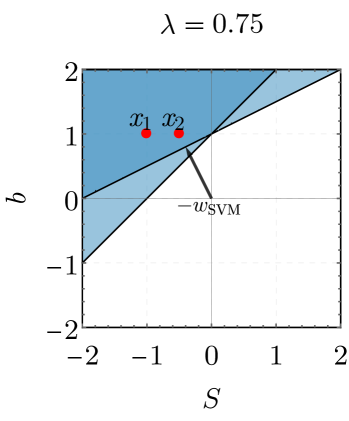
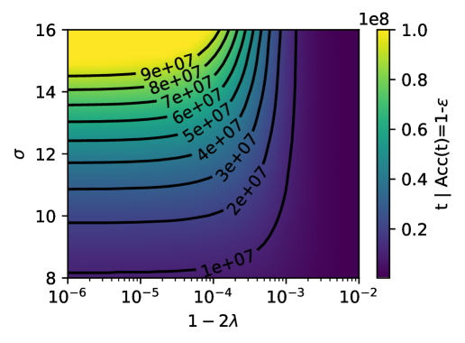
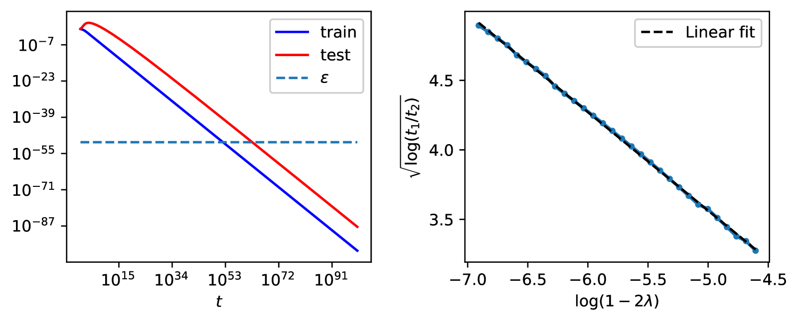

# Beck, Levi, Bar Sinai 2024 — Grokking at the Edge of Linear Separability

См. также: [глобальный индекс понятий](../../concepts/index.md).

**Alon Beck**, **Yohai Bar Sinai** (Тель-Авивский университет), **Noam Levi** (EPFL).

arXiv [2410.04489](https://arxiv.org/abs/2410.04489), 6 октября 2024 (версия v2 — 19 июля 2025). 8 цитирований — двадцать шестая по цитируемости работа корпуса. Источник — нативный HTML arXiv версии v2.

Файлы разбора этой статьи:

- [`2410.04489.grokking-at-the-edge-of-linear-separability.claims.txt`](2410.04489.grokking-at-the-edge-of-linear-separability.claims.txt) — пронумерованные утверждения статьи с пометками разбора.
- [`2410.04489.grokking-at-the-edge-of-linear-separability.license.txt`](2410.04489.grokking-at-the-edge-of-linear-separability.license.txt) — лицензионная запись arXiv для этой статьи.

Схема якорей и правила ссылок на карточку — в [README папки статей](../README.md).

**Карточка-выдержка.** Лицензия статьи (`arxiv-nonexclusive`) не разрешает публикацию копии оригинала и полного перевода, поэтому карточка содержит редакторские секции и цитируемые фрагменты перевода (право цитирования). Полный текст статьи: <https://arxiv.org/abs/2410.04489>.

## Затрагиваемые понятия

**[Фазовый переход](../../concepts/phase-transition.md)** — главный тезис работы: гроккинг случается **вблизи критической точки**, где два асимптотических решения обмениваются устойчивостью ([`p9-1`](#p9-1)). Здесь эта точка указана явно и без подгонки: $\lambda_{c}=d/N=1/2$. При $\lambda<1/2$ модель почти наверное обобщает безупречно, при $\lambda>1/2$ — почти наверное переобучается ([`p1-9`](#p1-9)). Механизм назван своим именем из физики: **критическое замедление** — вблизи перехода в ландшафте потерь есть «плоские направления», удерживающие обучение у почти устойчивых решений сколь угодно долго ([`p9-2`](#p9-2)).

**[Обобщающие границы](../../concepts/generalization-bounds.md)** — самое неожиданное в работе: критерий генерализации оказывается **геометрическим и точным**. Модель обобщает безупречно тогда и только тогда, когда обучающий набор **не отделим линейно от начала координат**, то есть начало координат лежит в выпуклой оболочке данных ([`p5-5`](#p5-5)). В разделимом случае предельная точность выражается через отступ в замкнутом виде: $\mathcal{A}_{\mathrm{gen}}=\frac{1}{2}[1+\mathrm{erf}(\frac{1}{\sigma M\sqrt{2}})]$ ([`p5-6`](#p5-6)).

**[Доля данных и критический размер набора](../../concepts/data-fraction-critical-dataset-size.md)** — почему порог именно $1/2$, объясняется **теоремой Венделя** 1962 года: при $N,d\to\infty$ набор из $N$ точек в $d$ измерениях отделим от начала координат с вероятностью 1, если $d>N/2$ ([`p6-8`](#p6-8), [`p6-9`](#p6-9)). Никакой подгонки: порог интерполяции здесь — теорема комбинаторной геометрии, а не измеренная величина.

**[Наивная минимизация потерь](../../concepts/nlm.md)** и **[максимизация отступа](../../concepts/margin-maximization-implicit-bias.md)** — разбор целиком опирается на неявное смещение градиентного спуска: при показательном хвосте потери итерации сходятся по направлению к решению SVM с жёстким отступом (теорема Soudry et al. 2018), и весь вопрос сводится к тому, куда направлен $\boldsymbol{w}_{\mathrm{SVM}}$ в расширенном пространстве $(\boldsymbol{S},b)$ ([`p4-11`](#p4-11), [`p4-13`](#p4-13)). Обобщающее решение — $\boldsymbol{w}_{\mathrm{SVM}}=(\boldsymbol{0},-1)$, то есть разделяющая плоскость уходит на бесконечность ([`p5-1`](#p5-1)).

**[Ландшафт потерь и бассейны](../../concepts/loss-landscape-basins.md)** — механизм задержки разложен на два множителя, и оба нужны **одновременно**: при $\lambda\to\frac{1}{2}^{-}$ предельная норма $\|\boldsymbol{S}_{\infty}\|$ расходится ([`p6-11`](#p6-11)), а при большом $\sigma$ вектор $\boldsymbol{S}$ выходит на эту норму сколь угодно быстро ([`p6-13`](#p6-13)). Скорость роста $b$ при этом остаётся ограниченной — отсюда сколь угодно долгая задержка ([`p7-3`](#p7-3)).

**[Масштаб инициализации](../../concepts/initialization-scale.md)** — роль $\sigma$ здесь занятна: это **не** масштаб весов, а масштаб шума в направлениях, перпендикулярных оси разделения ([`p7-2`](#p7-2)). Перемасштабирование переменных показывает, что большое $\sigma$ ускоряет динамику $\boldsymbol{S}$ в $\sigma^{2}$ раз, не трогая динамику $b$, — то есть разводит две части решения по времени.

**[Оптимизатор](../../concepts/optimizer-adam-adamw-sgd.md)** — честная и полезная оговорка: при обычном градиентном спуске точность растёт с самого начала, а «плато на уровне случайного угадывания», как у Power et al., получается при переходе на Adam ([`p2-3`](#p2-3), [`fig-5`](#fig-5)). Приспосабливающаяся скорость обучения быстрее выводит $\|\boldsymbol{S}\|$ на «запоминающее» решение и удерживает точность внизу дольше. Авторы прямо называют это поверхностным различием и работают с GD ради аналитической разрешимости.

**[Двойной спуск](../../concepts/double-descent.md)** — связь с порогом интерполяции проведена явно: $\lambda$ здесь играет ту же роль, что доля обучающих данных $\alpha$ у Power et al., задавая действующий порог интерполяции ([`p2-3`](#p2-3)). Авторы напоминают, что и двойной спуск предлагалось связывать с критичностью, и высказывают догадку о «классах универсальности» ([`p9-4`](#p9-4)).

**[Гроккинг](../../concepts/grokking.md)** — постановка минимальная: **линейная** логистическая регрессия, никаких нейронных сетей, никакой регуляризации, никакого weight decay. Авторы подчёркивают, что их работе **ничего** из привычного списка объяснений не требуется ([`p2-3`](#p2-3)). Это самая экономная демонстрация гроккинга в корпусе.

**[Модульная арифметика](../../concepts/modular-arithmetic.md)** — её здесь нет вовсе, и это принципиально: гроккинг воспроизведён на двух гауссианах, а связь с алгоритмическими задачами проведена через одну величину — близость к порогу интерполяции ([`p2-3`](#p2-3)).

Отдельно стоит сказать, чего в работе **нет**. Нет нелинейности: модель линейна, и перенос на глубокие сети остаётся догадкой «если принять описание через карту признаков» ([`p9-7`](#p9-7)). Нет и утверждения, что разделимость — общий механизм: авторы прямо оговаривают, что не берутся связывать критичность именно с разделимостью в других постановках ([`p9-5`](#p9-5)).

Карточки статей корпуса: [Power et al. 2022](../2201.02177.grokking-generalization-beyond-overfitting-on-small-algorithmic-datasets/2201.02177.grokking-generalization-beyond-overfitting-on-small-algorithmic-datasets.card.md) — задача и та самая доля данных $\alpha$, отождествлённая здесь с $\lambda$; [Гроккинг как фазовый переход первого рода](../2310.03789.grokking-as-a-first-order-phase-transition-in-two-layer-networks/2310.03789.grokking-as-a-first-order-phase-transition-in-two-layer-networks.card.md) — ближайшая по духу работа корпуса, названная в заключении; [Omnigrok](../2210.01117.omnigrok-grokking-beyond-algorithmic-data/2210.01117.omnigrok-grokking-beyond-algorithmic-data.card.md) — норма весов и масштаб инициализации, здесь не нужные; [Nanda et al. 2023](../2301.05217.progress-measures-for-grokking-via-mechanistic-interpretability/2301.05217.progress-measures-for-grokking-via-mechanistic-interpretability.card.md) и [Merrill et al. 2023](../2303.11873.a-tale-of-two-circuits-grokking-as-competition-of-sparse-and-dense-subnetworks/2303.11873.a-tale-of-two-circuits-grokking-as-competition-of-sparse-and-dense-subnetworks.card.md) — механизмы, названные в обзоре; [Gromov 2023](../2301.02679.grokking-modular-arithmetic/2301.02679.grokking-modular-arithmetic.card.md) — другая аналитически разрешимая модель; [Prieto et al. 2025](../2501.04697.grokking-at-the-edge-of-numerical-stability/2501.04697.grokking-at-the-edge-of-numerical-stability.card.md) — численная точность, названная в обзоре, и работа с созвучным названием, но иным предметом.

**[Критичность / критическая точка](../../concepts/criticality-critical-point.md)** — один из немногих случаев, где критическая точка не метафора: показано, что $\lambda=1/2$ есть критическая точка ([`p1-9`](#p1-9)), а гроккинг случается вблизи неё, подобно критическому замедлению в физике ([`p2-1`](#p2-1)).

**[Гроккинг вне нейросетей](../../concepts/grokking-in-non-neural-models.md)** — постановка выбрана ради строгости определений: в бинарной логистической классификации запоминающее и обобщающее решения задаются точно ([`p1-2`](#p1-2)), и потому переход между ними можно разбирать аналитически.
## Что показано, а что предположено

Замечания редактора карточки по итогам разбора утверждений (`…claims.txt`). Работа устроена как физическая: минимальная модель, точный критерий, аналитическое решение и явно названный механизм.

**Критерий генерализации доказан, а не измерен.** «Модель обобщает безупречно тогда и только тогда, когда данные не отделимы от начала координат» ([`p5-5`](#p5-5)) — утверждение с доказательством в обе стороны, а не наблюдение по кривым. Это сильнейшая часть работы и редкость в корпусе: обычно «обобщающее» и «запоминающее» решения различают эмпирически, здесь они определены строго.

**Порог $1/2$ не подогнан.** Он вытекает из теоремы Венделя ([`p6-9`](#p6-9)) — комбинаторного факта о случайных точках на сфере, никак не связанного с обучением. Совпадение вероятностной геометрии с порогом интерполяции — самый убедительный довод работы.

**Приём с конформным временем изящен и работает.** Замена $\tau=\int e^{b}dt$ расцепляет динамику: $\boldsymbol{S}(\tau)$ идёт ровно тем путём, каким шла бы задача **без** свободного члена ([`p6-3`](#p6-3)). Доказательство расходимости $\tau$ вынесено в приложение C и приведено полностью.

**Задержка требует двух условий, и это сказано прямо.** Ни $\lambda\to\frac{1}{2}^{-}$, ни большого $\sigma$ по отдельности не достаточно ([`p7-3`](#p7-3)) — и это подтверждено двумерной картой времени гроккинга ([`fig-3`](#fig-3)). Такая аккуратность отличает работу от объяснений, где называют один множитель.

**Упрощённая модель из двух точек — методически ценный ход.** Вся феноменология воспроизводится набором из двух точек в одном измерении ([`p7-4`](#p7-4)), где решение выписывается через функцию Ламберта, а предсказание $\sqrt{\log(t^{*}_{\mathrm{gen}}/t^{*}_{\mathrm{tr}})}\propto\log(1-2\lambda)$ проверяется численно ([`fig-9`](#fig-9)). Это тот случай, когда «игрушечная модель» действительно объясняет, а не иллюстрирует.

**Форма кривой зависит от оптимизатора, и авторы это не прячут.** При GD точность растёт с начала; классическое плато получается только с Adam ([`fig-5`](#fig-5)). Авторы называют различие поверхностным ([`p2-3`](#p2-3)) — довод разумный, но недоказанный: он опирается на то, что механизм тот же, а это и есть предмет спора.

**Область применимости узкая, и это признано.** Линейная модель, гауссовы данные, предел градиентного потока, разметка постоянной меткой в основном тексте ([`p9-5`](#p9-5), [`p9-6`](#p9-6)). Приложения снимают часть ограничений — другие распределения ([`p8-4`](#p8-4)), доля меток $r<1$ ([`fig-16`](#fig-16)), показательная потеря вместо перекрёстной, — но нелинейность не проверена вовсе.

**Обобщение на прочие постановки заявлено как догадка, и слово выбрано верно.** «Мы предполагаем, что гроккинг тесно связан с такими критическими точками и в других постановках» ([`p9-3`](#p9-3)); тут же прямо сказано, что механизм критичности **не** обязан быть связан с разделимостью ([`p9-5`](#p9-5)). То есть работа не выдаёт свой критерий за общий.

**Полная генерализация держится на допущении $\sigma_{A}\ll\mu$.** Это оно позволяет свести задачу к постоянным меткам и получить точность 1 ниже порога. При ослаблении допущения предельная точность падает ниже 1, но **гроккинг остаётся** ([`p8-3`](#p8-3)) — то есть отложенная генерализация оказывается устойчивее, чем сама безупречная генерализация.

**Место в корпусе.** Это самая экономная модель гроккинга в вики: линейная классификация, две гауссианы, ни регуляризации, ни нейронной сети. Её вклад двоякий. Во-первых, она показывает, что для гроккинга достаточно **одной** причины — близости к точке, где меняется асимптотическое решение. Во-вторых, она даёт корпусу редкий образец: критерий, при котором «запоминание» и «обобщение» не метафоры, а два предела одной динамики, различаемые геометрическим условием на данные.

## Ошибочные цитирования

Замечания редактора карточки: места, где эта статья передаёт чужие результаты с ошибкой или без авторских оговорок. Сюда ведут ссылки «подробности» из разделов «Ошибочные пересказы и цитирования этой статьи» карточек процитированных работ.

###### mc-2303-11873
**Merrill et al. (2303.11873) — приписан тригонометрический анализ.** `"Others analyzed the trigonometric algorithms learned by networks after grokking (Nanda et al., 2023; Chughtai et al., 2023; Merrill et al., 2023; Gromov, 2023)"` — тригонометрические алгоритмы модульной арифметики разбирали Nanda и Gromov; у Merrill — [разрежённая чётность](../2303.11873.a-tale-of-two-circuits-grokking-as-competition-of-sparse-and-dense-subnetworks/2303.11873.a-tale-of-two-circuits-grokking-as-competition-of-sparse-and-dense-subnetworks.card.md#p2-2) и ДНФ-подобные конструкции, никакого фурье-анализа. В том же предложении дальше статья цитирует верно: «and demonstrated similar dynamics in sparse parity tasks (Merrill et al., 2023)» — ошибка в первой половине списка, не в понимании работы.

## Ошибочные пересказы и цитирования этой статьи

Узоры ошибочного или расширенного цитирования этой работы, наблюдённые в цитирующих статьях корпуса. Каждая запись описывает, что именно искажается при пересказе, и ведёт к абзацам самих авторов, где стоит теряемая оговорка. Разбор конкретных формулировок — в карточках цитирующих работ, в их разделах «Ошибочные цитирования», куда ведут ссылки «подробности». Главный риск этой цели — слипание с работой той же группы Levi, Beck, Bar-Sinai «Grokking in Linear Estimators» (2310.16441): половина попаданий по фамилии в корпусе — цитаты той статьи.

**Приписан чужой механизм (ошибочное).** Работе приписывают «спектральные свойства эмпирической ковариации» — это механизм Levi et al.; здесь же [критерий доказан через линейную разделимость: модель обобщает безупречно тогда и только тогда, когда обучающий набор не отделим линейно от начала координат](#p5-5), с критическим замедлением у порога. Подробности: [2510.04930](../2510.04930.egalitarian-gradient-descent-a-simple-approach-to-accelerated-grokking/2510.04930.egalitarian-gradient-descent-a-simple-approach-to-accelerated-grokking.card.md#mc-2410-04489).

**«Роли weight decay и масштабов инициализации» (ошибочное).** Ровно противоположно тезису работы: [ни нейросети, ни регуляризации, ни weight decay для задержки не требуется](#p2-3), а [σ — масштаб шума в перпендикулярных направлениях данных, не масштаб инициализации весов](#p7-2). Подробности: [2603.29262](../2603.29262.grokking-from-abstraction-to-intelligence/2603.29262.grokking-from-abstraction-to-intelligence.card.md#mc-2410-04489).

Образцы аккуратного цитирования: [2601.19791](../2601.19791.to-grok-grokking-provable-grokking-in-ridge-regression/2601.19791.to-grok-grokking-provable-grokking-in-ridge-regression.card.md) — точный вклад и граница строгости («provided evidence… but did not rigorously prove grokking»); [2509.20829](../2509.20829.explaining-grokking-and-information-bottleneck-through-neural-collapse-emergence/2509.20829.explaining-grokking-and-information-bottleneck-through-neural-collapse-emergence.card.md) — верно разводит Beck (классификация) и Levi (регрессия) как два предела одной программы.

---

# Цитируемые фрагменты перевода

Ниже приведены только те фрагменты перевода, на которые ссылаются карточки корпуса (право цитирования). Нумерация якорей `pN-M` / `fig-N` / `sec-X` совпадает с полной карточкой и оригиналом.

## Аннотация

###### p1-2

Мы исследуем явление гроккинга — отложенную генерализацию, сопровождаемую немонотонным поведением тестовой потери, — в простой задаче бинарной логистической классификации, для которой «запоминающее» и «обобщающее» решения можно определить строго. Что удивительно, мы обнаруживаем, что гроккинг возникает естественным образом даже в этой минимальной модели, когда параметры задачи близки к критической точке, и приводим как эмпирические, так и аналитические соображения о его механизме. Конкретно, обращаясь к неявному смещению градиентного спуска, мы показываем, что логистическая регрессия способна обнаруживать гроккинг, когда обучающий набор почти линейно отделим от начала координат, а в перпендикулярных направлениях есть сильный шум. Причина в том, что вблизи критической точки «плоские» направления ландшафта потерь с почти нулевым градиентом заставляют динамику обучения сколь угодно долго задерживаться вблизи квазиустойчивых решений, прежде чем она в конце концов достигнет глобального минимума. Наконец, мы отмечаем сходство наших находок с недавней литературой, укрепляя предположение, что гроккинг вообще случается вблизи порога интерполяции, — что напоминает критические явления, часто наблюдаемые в физических системах.

## 1 Введение

###### p1-9

1. Мы доказываем и показываем численно, что гроккинг в этой постановке возможен и что ему способствует близость $\lambda$ к 1/2 и малость разделения **[p. 2]** между гауссианами по сравнению с шумом в прочих направлениях. 2. Мы показываем, что так происходит потому, что $\lambda=1/2$ есть *критическая точка*. А именно, при $\lambda<1/2$ модель почти наверное асимптотически приближается к безупречной точности генерализации и исчезающей потере, тогда как при $\lambda>1/2$ она почти наверное достигает несовершенной точности генерализации, а популяционная потеря расходится при $t\to\infty$. 3. Более принципиально, мы показываем, что генерализация зависит от того, *линейно ли отделим* обучающий набор от начала координат (то есть содержится ли начало координат в выпуклой оболочке обучающего набора). В пределе $N,d\to\infty$ данные почти наверное отделимы от начала координат, если $\lambda>1/2$, и почти наверное нет в противном случае. 4. Более того, мы показываем, что вблизи порогового значения $\lambda=1/2$ (или, более общо, когда данные на грани отделимости) динамика в общем случае может сколь угодно долго следовать за переобученным решением, прежде чем перейти к наилучшему обобщающему. Такое поведение проявляется как немонотонная тестовая потеря и отложенная генерализация и способно привести к расходимости «времени гроккинга». 5. Мы строим простую одномерную модель, схватывающую существенные черты задачи, и явно решаем уравнения для развития параметров модели во времени в нескольких занятных случаях.

###### p2-1

Главный вывод из этой постановки: *гроккинг случается вблизи критической точки* — подобно «критическому замедлению» в физической литературе. Хотя дальнейшее изучение необходимо, мы предполагаем, что это относится и к другим примерам гроккинга, как явно показано (пусть и не обязательно в этих словах) в Levi et al. (2023); Liu et al. (2023); Gromov (2023); Rubin et al. (2023, 2024).

## 2 Связанные работы

###### p2-3

Вслед за открытием гроккинга у Power et al. (2022) многочисленные исследования пытались прояснить лежащие в его основе механизмы. Liu et al. (2022) показали, что при достаточном объёме данных, задающем структурированное представление, на немодульной задаче сложения достижима безупречная генерализация. Другие работы выделили факторы, способствующие гроккингу, включая выучивание образцов (Davies et al., 2023), отложенную устойчивость (Humayun et al., 2024), переходы от запоминания к образованию контуров (Nanda et al., 2023), а также роль разрежённости активаций, энтропии весов и сложности контуров в реальных задачах (Golechha, 2024). Иные разбирали тригонометрические алгоритмы, выучиваемые сетями после гроккинга (Nanda et al., 2023; Chughtai et al., 2023; Merrill et al., 2023; Gromov, 2023), и показали схожую динамику на задачах разрежённой чётности (Merrill et al., 2023). Дополнительные работы предлагали «рогатки» (Thilak et al., 2022) или «колебания» (Notsawo et al., 2023) как объяснения гроккинга, тогда как другие сосредоточивались на роли регуляризации (Power et al., 2022; Liu et al., 2023) и численной точности (Prieto et al., 2025), которая в некоторых постановках способна существенно повлиять на гроккинг. Мы подчёркиваем, что нашей работе **ничего** из перечисленного не требуется ни для того, чтобы обнаружить гроккинг, ни для того, чтобы его объяснить.

###### p2-4

В последнее время сложился корпус работ о разрешимых моделях, которые грокают в разных постановках. Liu et al. (2023); Kumar et al. (2023) и Lyu et al. (2024) связали гроккинг с запоминанием и с переходами от ленивой динамики к богатой. Žunkovič & Ilievski (2022); Gromov (2023); Doshi et al. (2024) разобрали разрешимые модели, обнаруживающие гроккинг, и связали свои находки с образованием структуры в скрытом пространстве; Xu et al. (2023) связали гроккинг с благотворным переобучением для ReLU-сетей на данных XOR; Rubin et al. (2024) описали гроккинг как фазовый переход первого рода; а Levi et al. (2023) приводят полное динамическое решение гроккинга в линейной регрессии. Наша работа стремится обойтись без внешних проб и восполнить разрыв между разрешимыми моделями и обучением представлениям: мы всегда можем указать наилучшие решения, при этом решая динамику модели. Для этого наша работа опирается на результаты Soudry et al. (2018); Nacson et al. (2019); Ji & Telgarsky (2019), разбирающие свойства поздней динамики логистической регрессии для разделимых и неразделимых данных при градиентном спуске (GD).

##### Доказательство.

###### p4-11

**Отношение к прежним результатам о разделимости.** Эти результаты тесно связаны с рамкой, развитой Soudry et al. (2018), которые изучали сходимость бинарной классификации для линейно разделимых данных и которую позднее расширили Ji & Telgarsky (2019) на неразделимые данные. В нашем случае, поскольку модель содержит свободный член, а все метки одинаковы, данные всегда разделимы гиперплоскостью «на бесконечности». Чтобы воспользоваться их рамкой, нам нужно работать в расширенном пространстве размерности $d+1$, где мы определяем расширенный вектор весов $\boldsymbol{w}=(\boldsymbol{S},b)\in\mathbb{R}^{d+1}$. Решение сети на поздних стадиях обучения получается прямым следствием теоремы 3 из Soudry et al. (2018).

##### **Теорема 1**(переформулировка теоремы 3 из Soudry et al. (2018))**.**

###### p4-13

*Здесь ${\boldsymbol{w}_{\mathrm{SVM}}}$ — решение222Отметим, что решение SVM в расширенном пространстве $d+1$ не совпадает с обычной постановкой метода опорных векторов (SVM) со свободным членом в $d$ измерениях из-за иного штрафа на свободный член. задачи SVM с жёстким отступом в расширенном пространстве $d+1$, а $\boldsymbol{\rho}$ — остаточный вектор, ограниченный при всех $t$.*

###### p5-1

Обобщающее решение, верно классифицирующее все точки $\mathbb{R}^{d}$, отвечает ${\boldsymbol{w}_{\mathrm{SVM}}}=(\boldsymbol{0},-1)$ ($\boldsymbol{0}$ — $d$-мерный нулевой вектор), то есть когда оно направлено вдоль свободного члена, а разделяющая плоскость уходит на бесконечность. Это в точности упомянутое условие $b\to-\infty$ и $|b|/\left\lVert{\boldsymbol{S}}\right\rVert\to\infty$. Переобучение же случается, когда гиперплоскость отстоит от данных достаточно далеко, чтобы верно классифицировать все обучающие примеры, но не уходит на бесконечность. В расширенном пространстве это означает, что ${\boldsymbol{w}_{\mathrm{SVM}}}$ содержит и составляющую вдоль данных, а модель не выучила распределение данных верно. Далее мы покажем, что определяющим для гроккинга в этой постановке оказывается не обычная разделимость точек данных друг от друга, а «разделимость от начала координат» (или разделимость без свободного члена), определяемая так:

##### **Утверждение 3.2****.**

###### p5-5

*Модель достигнет безупречной генерализации тогда и только тогда, когда данные не отделимы линейно от начала координат. В частности:*

###### p5-6

1. *Если данные не отделимы линейно от начала координат, то*$\lim_{t\to\infty}b(t)=\infty$*, тогда как*$\boldsymbol{S}$*насыщается на конечном значении*$\lim_{t\to\infty}\boldsymbol{S}(t)=\boldsymbol{S}_{\infty}$*.* 2. *Если данные отделимы линейно от начала координат, то*$\lim_{t\rightarrow\infty}\mathcal{A}_{\mathrm{gen}}=\frac{1}{2}\left[1+\mathrm{erf}\left(\frac{1}{\sigma M\sqrt{2}}\right)\right],$*где*$M$*— отступ.*

###### p6-3

Важность этой замены переменных в том, что динамика $\boldsymbol{S}(\tau)$ в конформном времени тождественна динамике $\boldsymbol{S}(t)$ *в отсутствие свободного члена*. То есть $\boldsymbol{S}(t)$ идёт тем же путём, который получился бы при минимизации $\mathcal{L}=\frac{1}{N}\sum_{i=1}^{N}e^{\boldsymbol{S}^{T}\boldsymbol{x}_{i}}$, но с иной скоростью, зависящей показательно от нынешнего значения $b(t)$. Это показано на средней панели рисунка 2. Поскольку $\tau(t)$ расходится при $t\to\infty$ (подробности в приложении C), $\boldsymbol{S}(t)$ на больших временах обязана идти тем же путём, каким шла бы без свободного члена. Теперь мы можем завершить доказательство:

##### **Утверждение 3.3****.**

###### p6-8

*При $N,d\rightarrow\infty$ и $\lambda=d/N$ набор данных отделим от начала координат с вероятностью $1$, если $\lambda>1/2$, и неразделим, если $\lambda<1/2$.*

###### p6-9

Иначе говоря, утверждение 3.3 гласит, что (почти) любой большой набор из $N$ точек в $d$ измерениях разделим (то есть лежит в одной «половине» некоторой гиперсферы, проходящей через начало координат), коль скоро $d>N/2$. Это прямое следствие теоремы Венделя (Wendel, 1962), которую мы доказываем в приложении A.

##### **Утверждение 3.4****.**

###### p6-11

*При $\lambda\rightarrow\frac{1}{2}^{-}$ имеем $\left\lVert{\boldsymbol{S}_{\infty}}\right\rVert\rightarrow\infty$.*

###### fig-3

*Рисунок 3: **Упрощённая модель.** Три левые панели: изображение задачи SVM с жёстким отступом в 1+1 измерениях для упрощённой модели. Отметим, что $-w_{SVM}$ — ближайшая к началу координат точка пересечения двух затенённых областей. Вектор $w_{SVM}$ направлен вдоль оси свободного члена (вертикальной) тогда и только тогда, когда $x_{2}\geq 0$. (справа) Время гроккинга, определённое как время, за которое точность генерализации достигает 0.95, в зависимости от $\sigma$ и $1-2\lambda$. Видно, что оно расходится, когда одновременно $\lambda\rightarrow 1/2$ и $\sigma\rightarrow\infty$, тогда как ни одного условия по отдельности не достаточно.* **[p. 7]**

##### **Утверждение 3.5****.**

###### p6-13

*При $\lambda<\frac{1}{2}$ и достаточно большом $\sigma$ величина $\boldsymbol{S}(t)$ приблизится к своему асимптотическому значению $\boldsymbol{S}_{\infty}$ сколь угодно быс**[p. 7]**тро.*

##### Доказательство.

###### p7-2

Отметим, что они тождественны уравнениям градиентного потока в исходных переменных из уравнения 7, но динамика $\boldsymbol{S}$ *быстрее* в $\sigma^{2}$ раз. Значит, взяв большое $\sigma$, мы заставим $\tilde{\boldsymbol{S}}$ приблизиться к своему асимптотическому значению $\boldsymbol{S}_{\infty}$ сколь угодно быстро, тогда как динамика $b$ не изменится. Вспоминая, что $\sigma$ отображалось в $\sigma_{B}/\mu$ в исходной модели двух гауссиан, введённой в начале, отметим, что большое $\sigma$ равносильно введению *большого шума* в направлениях, перпендикулярных оси разделения. ∎

###### p7-3

Теперь мы можем механистически понять, как случается гроккинг. Для значений $\lambda$, достаточно близких к $\frac{1}{2}$ снизу, предельная норма $\|\boldsymbol{S}_{\infty}\|$ сколь угодно велика (утверждение 3.4). При достаточно большом $\sigma$ величина $\boldsymbol{S}(t)$ будет расти к $\boldsymbol{S}_{\infty}$ сколь угодно быстро (утверждение 3.5). При этих условиях скорость роста $b(t)$ остаётся ограниченной, и генерализация может быть отложена на *сколь угодно долгое время*. Отметим, что для этого требуются *одновременно* $\lambda\rightarrow\frac{1}{2}^{-}$ и $\sigma\rightarrow\infty$, как показано и на правой панели рисунка 3. Любопытно, что при использовании оптимизаторов с приспосабливающимся моментом вроде ADAM (Kingma & Ba, 2017) заметный гроккинг виден даже при $\sigma=1$; подробности — в приложениях B и F.

## 4 Наблюдения из упрощённой модели

###### p7-4

Наше основное утверждение в том, что асимптотическая динамика зависит только от разделимости обучающего набора и что гроккинг случается на границе линейной разделимости. Это наглядное соображение можно явно провести в куда более простой постановке в одном измерении. Здесь разделимость сводится к вопросу, лежит ли начало координат между крайними точками $\min\{x_{i}\}$ и $\max\{x_{i}\}$. Поэтому всю феноменологию полной модели, описанную в предыдущих разделах, можно схватить обучающим набором всего из 2 точек $x_{1},x_{2}$, представляющих точки с наибольшей и наименьшей проекциями вдоль $\boldsymbol{S}_{\infty}$. Для согласия с задачей о гауссовых данных мы задаём этот набор так:

## 5 Расширения постановки

###### p8-3

Обычно модели бинарной классификации обобщают полностью, лишь когда число примеров достаточно велико, то есть $N\gg d$. Однако гроккинг наблюдается вне этого режима, при $d/N\approx 1/2$. Здесь допущение $\sigma_{A}\ll\mu$ особенно полезно, поскольку обеспечивает безупречную точность на тесте при любом $\lambda$ ниже критической точки. Если ослабить это допущение, полная генерализация уже не гарантирована. Тем не менее лежащий в основе механизм, обсуждённый в предыдущих разделах, сохраняется: вблизи критической точки $\lambda=1/2$ модель может поначалу снижать потерю, подстраивая направление и норму перпендикулярных весов $\boldsymbol{S}_{2},...,\boldsymbol{S}_{d+1}$, и лишь позднее менять $\boldsymbol{S}_{1}$, что и ведёт к отложенной генерализации. На рисунке 4 мы приводим численное моделирование, подтверждающее такое поведение: если $\sigma_{A}=0.01$ достаточно мало, чтобы близко следовать поведению при $\sigma_{A}=0$, то при больших значениях ($\sigma_{A}=0.05,0.1$) мы наблюдаем, что предельная точность ниже 1, а потеря на больших временах начинает расходиться.

###### p8-4

Наконец, отметим, что, хотя точная динамика зависит от распределения данных и способа разметки, схожих результатов следует ожидать для широкого класса задач линейной бинарной классификации, коль скоро $\lambda$ близко к критической точке. Например, в приложении I мы разбираем обобщение постановки с другой стороны, где постоянные метки явно изменены так, чтобы стать различающими. Результаты близко напоминают приведённые здесь, см. рисунок 16.

## 6 Обсуждение, выводы и ограничения

###### p9-1

Мы изучили динамику градиентного спуска в простой постановке логистической классификации с сильным шумом. Мы показали, что в этой постановке гроккинг случается вблизи критической точки асимптотической динамики. А именно, в критической точке, которая в нашем случае приходится на $\lambda=1/2$, переобученное и обобщающее решения обмениваются устойчивостью. Мы показали, что это неаналитическое изменение асимптотической динамики и есть причина гроккинга — во многом как в Rubin et al. (2024); Levi et al. (2023); Doshi et al. (2024) и отчасти также в Humayun et al. (2024), где показано, что гроккинг случается вблизи фазового перехода.

###### p9-2

Наглядно: вблизи критической точки в ландшафте потерь есть «плоские направления». Эти направления способны удерживать обучение вблизи почти устойчивых решений сколь угодно долго, прежде чем оно в конце концов сойдётся к глобальному минимуму. В физической литературе такое поведение известно как «критическое замедление» (например, (Sethna, 2021)). В нынешнем смысле это и есть механизм отложенной генерализации, который заодно объясняет немонотонное развитие потери генерализации.

###### p9-3

Хотя строго показать этого мы не можем, мы предполагаем, что гроккинг тесно связан с такими критическими точками и в других постановках. В нескольких примерах это было показано напрямую (Levi et al., 2023; Rubin et al., 2023, 2024; Humayun et al., 2024). Отметим, что и другие занятные явления, такие как немонотонная зависимость асимптотического качества от сложности модели, известная как «двойной спуск», тоже предлагалось связывать с критичностью, например (Schaeffer et al., 2023).

###### p9-4

Если это и вправду так, то по аналогии с теорией критических явлений в физике могут существовать «классы универсальности» со схожим критическим поведением, но, возможно, с весьма разными механизмами в основе (Sethna, 2021). Эту связь мы разберём в будущей работе.

###### p9-5

**Ограничения.** Мы рассмотрели частную задачу линейной бинарной классификации в высокой размерности. Естественно спросить, как наши результаты распространяются на более сложные данные — например, с нетривиальными корреляциями, иерархической структурой или конечным пространством выборки, как в исходном наблюдении гроккинга у Power et al. (2022); Gromov (2023). Хотя мы полагаем, что тот же разбор можно повторить и в этих случаях в смысле (не)линейной разделимости, мы оставляем это будущей работе. В любом случае мы не утверждаем, что лежащий в основе механизм критичности непременно связан с разделимостью.

###### p9-6

Аналитическая часть велась целиком в пределе градиентного потока, и, хотя наши результаты подтверждены опытами при конечной скорости обучения, было бы занятно изучить, как большие скорости обучения сказываются на этой постановке, — возможно, в связи с катапультами (Lewkowycz et al., 2020) или механизмом края устойчивости (Cohen et al., 2022).

###### p9-7

Наконец, мы не изучали возможность нелинейной логистической регрессии, которая ближе к глубоким моделям в реальной жизни. Мы полагаем, что часть наших результатов допускает обобщение, если принять описание модели как «карты признаков» вплоть до последнего слоя и рассматривать решение SVM на выученных признаках.

## Приложение B. Отношение к каноническим примерам

###### p12-9

И действительно, на рисунке 5 мы показываем, что наша постановка способна дать гроккинг с точностью, держащейся вначале на уровне случайного угадывания (50 %), подобно Power et al. Мы добились этого, взяв значения $\lambda$ ближе к половине («почти разделимые») и оптимизатор Adam вместо обычного градиентного спуска (GD). То, что этот оптимизатор сходится на обучающих данных быстрее, не случайно: приспосабливающаяся скорость обучения ведёт к более быстрой сходимости к большим значениям $|S|$ («запоминающему решению»), удерживая точность на уровне случайного угадывания до более поздних стадий, прежде чем перейти к большому $-b$ («обобщающему решению»). Примечательно, что Power et al. тоже пользовались Adam (или AdamW). Итак, хотя Adam способен дать несколько более «чистый» результат гроккинга, мы исследовали GD, поскольку из него проще извлекать аналитические выводы, при этом, как мы полагаем, не меняя лежащий в основе механизм **[p. 13]** гроккинга. Наконец, отметим также, что немонотонность тестовой потери — тоже типичный признак гроккинга, наблюдаемый в нашей постановке (сравните, например, рисунок 4 у Power et al. с тестовой потерей на рисунке 5).

###### fig-5

*Рисунок 5: Гроккинг в постановке, схожей с результатами основного текста, но с оптимизатором ADAM ($\beta_{1}=0.8,$ $\beta_{2}=0.9$) вместо GD. Параметры: $\lambda=d/N=0.495$, $N=4000$, $\sigma=1$.* **[p. 13]**

### E.3 Время гроккинга в упрощённой модели

###### fig-9

*Рисунок 9: Численные свидетельства о времени гроккинга в упрощённой модели. На левой панели мы показываем при $1-2\lambda=0.001$, как вычисляется время гроккинга: $t_{\mathrm{tr}}^{*}$ и $t_{\mathrm{gen}}^{*}$ находятся как точки пересечения потери с некоторым $\varepsilon$. На правой панели мы численно откладываем $\sqrt{\log(t_{\mathrm{gen}}^{*}/t_{\mathrm{tr}}^{*})}$ против $\log(1-2\lambda)$ и показываем, что зависимость линейна с наклоном $\approx\frac{1}{\sqrt{2}}$, в согласии с предсказанием уравнения 39.* **[p. 19]**

## Приложение I. Расширение модели с другой стороны

###### p25-8

Для безупречной генерализации необходимо $b/S_{1}=-\mu$ и $S_{1}\gg S_{i},\forall{i>1}$, а это достижимо лишь с точностью до некоторой ошибки, определяемой решением с наибольшим отступом.

###### fig-16

*Рисунок 16: Гроккинг при $\lambda=0.48$ для трёх разных долей меток: $r=1$ (постоянная метка), $r=0.99$ и $r=0.95$ (показаны тремя разными степенями прозрачности). Например, при $r=0.95$ примерно $95\%$ входных данных получают метку $-1$, а 0.05 — метку $1$. Прочие параметры те же, что на рисунке 1.* **[p. 26]**
