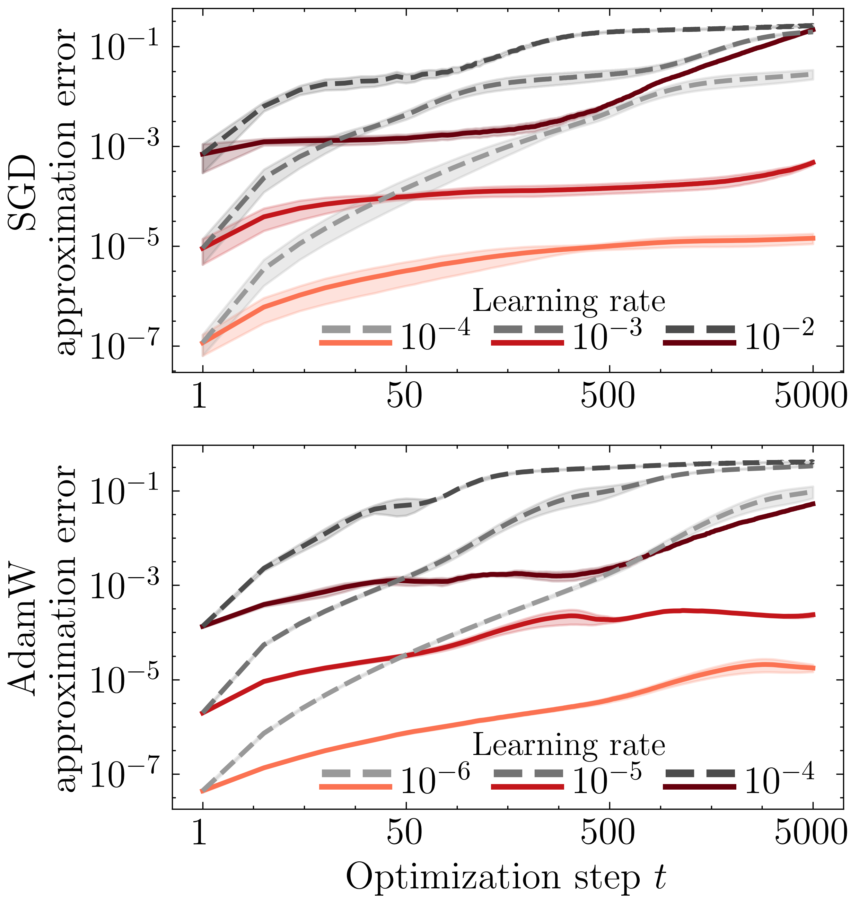
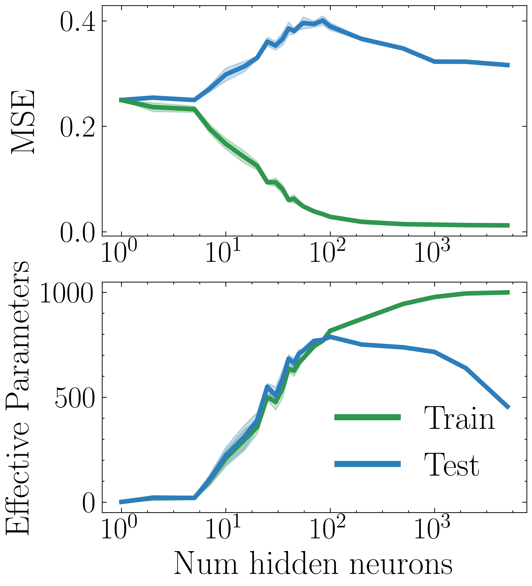
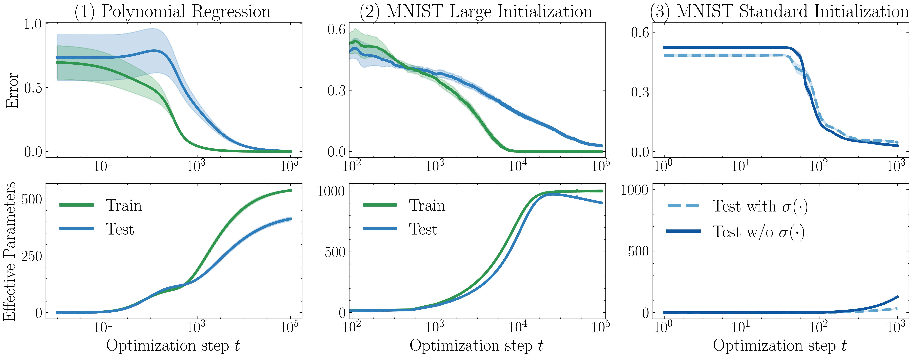
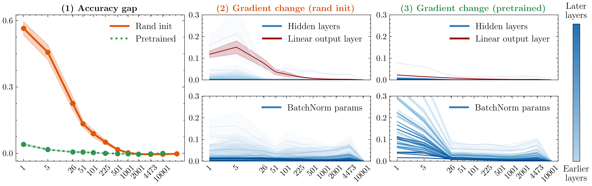
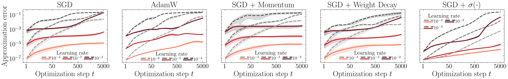
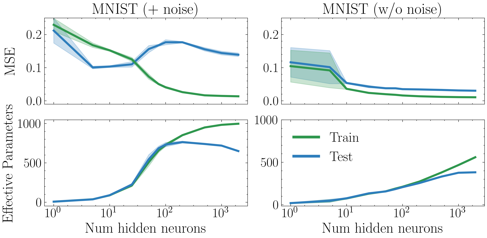
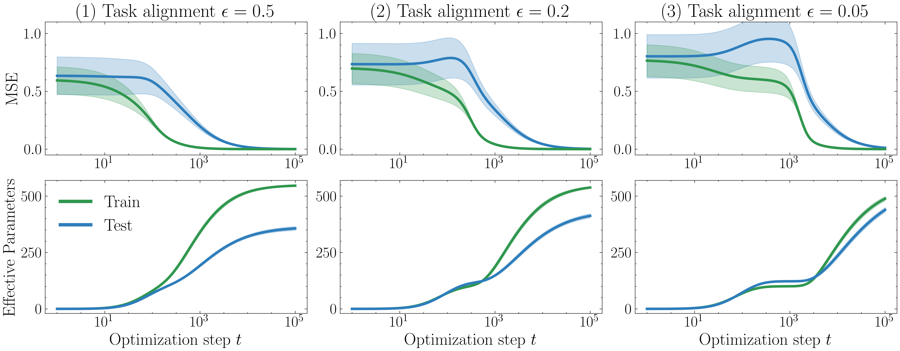
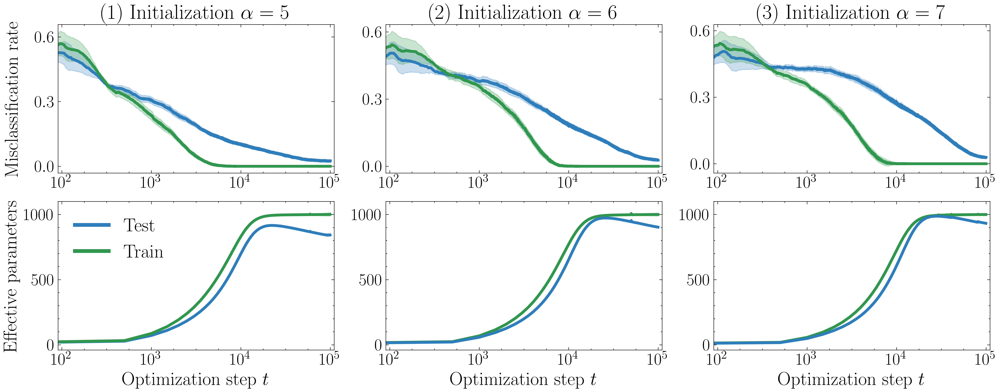
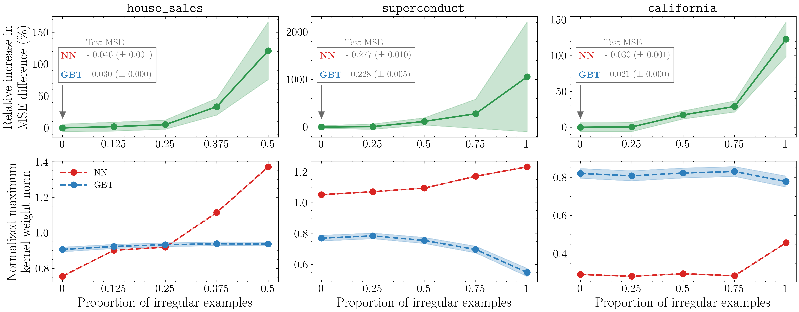

# Jeffares et al. 2024 — Deep Learning Through A Telescoping Lens: A Simple Model Provides Empirical Insights On Grokking, Gradient Boosting & Beyond

См. также: [глобальный индекс понятий](../../concepts/index.md).
arXiv [2411.00247v1](https://arxiv.org/abs/2411.00247), 31 октября 2024. Колонтитул PDF: «38th Conference on Neural Information Processing Systems (NeurIPS 2024).»

**Alan Jeffares, Alicia Curth** — University of Cambridge; равный вклад.
**Mihaela van der Schaar** — University of Cambridge.

Оригинал и производные файлы этой папки:

- [`original/2411.00247.native.html`](original/2411.00247.native.html) — первоисточник, нативный HTML-рендеринг arXiv (LaTeXML), скачан как есть.
- [`original/2411.00247.deep-learning-through-a-telescoping-lens-a-simple-model-provides-empirical-insights-on-grokking-gradient-boosting-and-beyond.md`](original/2411.00247.deep-learning-through-a-telescoping-lens-a-simple-model-provides-empirical-insights-on-grokking-gradient-boosting-and-beyond.md) — конверсия оригинала в Markdown без правок содержания; английский текст для сверки перевода.
- [`images/`](images/) — иллюстрации статьи в исходном разрешении (14 файлов, 14 рисунков).
- [`2411.00247.deep-learning-through-a-telescoping-lens-a-simple-model-provides-empirical-insights-on-grokking-gradient-boosting-and-beyond.claims.txt`](2411.00247.deep-learning-through-a-telescoping-lens-a-simple-model-provides-empirical-insights-on-grokking-gradient-boosting-and-beyond.claims.txt) — рабочий разбор: пронумерованные утверждения с пометками.

Схема якорей и правила ссылок на карточку — в [README папки статей](../README.md).

## Затрагиваемые понятия

**[Гроккинг](../../concepts/grokking.md)** — работа даёт корпусу **меру, различающую обучающие и тестовые точки**, и одно наблюдение о её поведении при гроккинге: продолжающееся улучшение тестовой ошибки после достижения совершенного качества на обучении сопровождается расхождением $p^{train}_{\hat{\mathbf{s}}}$ и $p^{test}_{\hat{\mathbf{s}}}$, откуда авторы заключают, что «гроккинг может отражать *переход в* измеримо доброкачественный режим переобучения в ходе обучения» ([с. 5, абз. 6](#p5-6), [рис. 4](#fig-4)). Хедж «может» здесь авторский и держит весь вывод: наблюдение снято на двух прогонах и говорит о совпадении во времени, а не о причине. Сила его в другом — в том, что оно устойчиво к сдвигу управляющих величин в обе стороны: чем позже наступает обобщение, тем позже расходятся меры (при $\epsilon\in\{0.05,0.2,0.5\}$ и при $\alpha\in\{5,6,7\}$, [с. 27, абз. 1](#p27-1), [рис. 11](#fig-11), [рис. 12](#fig-12)), а там, где гроккинга нет, нет и расхождения ([рис. 13](#fig-13)). Гроккинг здесь помещён в один ряд с двойным спуском по эпохам и трактуется как разновидность доброкачественного переобучения, а не как отдельное явление со своим устройством. Чего в работе нет: причинности — вмешательств, принудительно сводящих или разводящих $p^{train}$ и $p^{test}$, нет, предсказания вперёд нет, мера снимается с тех же прогонов; нет и модульной арифметики — обе постановки взяты у [KBGP24] и [LMT22]; нет механизма — что именно происходит внутри сети на плато, работа не разбирает.

**[Двойной спуск](../../concepts/double-descent.md)** — здесь работа делает больше, чем в случае гроккинга: она переносит на нейронные сети объяснение двойного спуска, полученное авторами ранее для линейной регрессии и деревьев. На CIFAR-10 при росте ширины $p^{train}_{\hat{\mathbf{s}}}$ монотонно возрастает, а $p^{test}_{\hat{\mathbf{s}}}$ **убывает** за порогом интерполяции, откуда следует, что более крупные сети не обязательно выучивают более сложную функцию предсказания для невиданных примеров, и «мнимое противоречие между глубоким двойным спуском и классической U-образной кривой» снимается ([с. 5, абз. 5](#p5-5), [рис. 3](#fig-3)). Существенно, что $p^{test}_{\hat{\mathbf{s}}}$ вычислима **без доступа к тестовым меткам**, — этим мера отличается от прочих мер сложности корпуса. То же повторено на MNIST и MNIST-1D ([с. 26, абз. 2](#p26-2), [рис. 9](#fig-9), [рис. 10](#fig-10)). Чего в работе нет: разбора двойного спуска по эпохам собственными опытами — он лишь назван соседом гроккинга ([с. 18, абз. 2](#p18-2)); и переноса на глубокие современные сети — все опыты идут на однослойных сетях при $8\times8$ входах.

**[Нейронное касательное ядро](../../concepts/neural-tangent-kernel-ntk.md)** — работа предлагает корпусу способ пользоваться касательным ядром **не отказываясь от изменчивости признаков**: линеаризация применяется не один раз вокруг $\bm{\theta}_{0}$, как в ленивом приближении, а заново на каждом шаге, и обновления телескопируются вдоль всей траектории ([с. 3, абз. 1](#p3-1), [рис. 1](#fig-1), уравнение 5). Отсюда её главная опытная ценность: ошибка такого приближения на порядки меньше, чем у разложения вокруг инициализации, и точность совпадает с точностью настоящей сети ([с. 4, абз. 1](#p4-1), [рис. 2](#fig-2)). Здесь же выведены явные виды ядра $K^{T}_{t}$ для моментума, weight decay, приспосабливающихся шагов и выходной сигмоиды ([с. 10, абз. 1](#p10-1), [с. 10, абз. 3](#p10-3), [с. 10, абз. 4](#p10-4)) и введено межвременное касательное ядро $K^{\bm{\theta}}_{t,k}$. Чего в работе нет: теории — ни теорем о сходимости, ни условий, при которых приближение верно, кроме требования малости $||\Delta\bm{\theta}_{t}||$; авторы прямо оговаривают, что это «инструмент (эмпирического) разбора», а не способ обучать сети, и что вычисление требует градиентов по каждому обучающему и тестовому примеру на каждом шаге, что «вероятно, запретительно» для больших сетей ([с. 3, абз. 4](#p3-4)).

**[Переход lazy→rich](../../concepts/lazy-to-rich-kernel-to-feature-learning.md)** — работа встраивается в эту линию через [Kumar et al. 2023](../2310.06110.grokking-as-the-transition-from-lazy-to-rich-training-dynamics/2310.06110.grokking-as-the-transition-from-lazy-to-rich-training-dynamics.card.md), чей опыт с полиномиальной регрессией воспроизведён в точности ([с. 23, абз. 1](#p23-1)), и принимает их довод: ни weight decay, ни приспосабливающиеся оптимизаторы не могут быть единственной причиной гроккинга ([с. 18, абз. 2](#p18-2)). Собственный вклад в понятие — иной: телескопическая модель строится ровно как выход **за** допущение о лености («за пределы допущения о лености», [с. 3, абз. 1](#p3-1)), и её же средствами показано, что переход в ленивый режим достаточен для линейной связности мод ([с. 8, абз. 4](#p8-4)). То есть леность здесь не объяснение гроккинга, а рабочее допущение, от которого отталкиваются. Чего в работе нет: измерения самого перехода от ленивой динамики к богатой — ни изменения ядра во времени как величины, ни выравнивания ядра с задачей; слова «rich» в работе нет вовсе, а «feature learning» встречается лишь в пересказе чужих объяснений.

**[Масштаб инициализации](../../concepts/initialization-scale.md)** — масштаб начального приближения служит здесь главным рычагом, включающим и выключающим наблюдаемое явление, и работа добавляет к нему **измеряемое следствие**. Большая инициализация $\alpha\bm{\theta}_{0}$ (в основном тексте $\alpha=6$, в приложении $\alpha=5$ и $7$) даёт очень большие начальные предсказания $|f_{\bm{\theta}_{0}}(\mathbf{x})|\!\gg\!1$, и, поскольку сигмоида не применяется, «модели нужно выучить, что все $y_{i}\!\in\![0,1]$», — большое $\bm{\theta}_{0}$ названо «очень плохим индуктивным смещением для этой задачи» ([с. 6, абз. 1](#p6-1)). Догадка о том, что чем лучше индуктивное смещение, тем менее сложна выучиваемая из данных составляющая, высказана **до** опыта и подтверждена: при стандартной инициализации обобщающее решение находится за $10^{2}$ шагов вместо $10^{5}$, а эффективных параметров используется существенно меньше, причём меньше всего — при добавленной сигмоиде ([рис. 13](#fig-13), [с. 27, абз. 2](#p27-2)). Чего в работе нет: перебора промежуточных масштабов, разделения вкладов «большая норма» и «отсутствие сигмоиды» и какого-либо утверждения о причине задержки, кроме этого частного объяснения через несогласованность области значений.

**[Минимизация нормы весов](../../concepts/weight-norm-minimization.md)** — работа берёт спор о направлении, в котором меняется норма весов, как **повод**: она прямо ставит рядом объяснение [LMT22], где $||\bm{\theta}_{t}||$ *сжимается* поздно в обучении, и опыт [KBGP24], где норма *растёт*, и воспроизводит оба ([с. 5, абз. 6](#p5-6)). Вклад в понятие отрицательный по отношению к норме и положительный по отношению к предложенной мере: расхождение $p^{train}_{\hat{\mathbf{s}}}$ и $p^{test}_{\hat{\mathbf{s}}}$ наблюдается в **обеих** постановках, устроенных по-разному, — то есть предлагается ось измерения, не зависящая от того, куда идёт норма. Чего в работе нет: спор о норме не решается и даже не обсуждается по существу — норма весов ни в одном опыте не измеряется, ни одна из двух трактовок не оспаривается, и никакой связи между $p^{0}_{\hat{\mathbf{s}}}$ и $||\bm{\theta}_{t}||$ не устанавливается.

**[Weight decay / L2-регуляризация](../../concepts/weight-decay.md)** — самостоятельно полезная часть работы: для weight decay выведен явный вид линеаризованного функционального обновления, из которого видно, что он «действенно ослабляет предыдущие вклады этого примера», а сравнение знаков в уравнениях 12 и 11 выявляет, что **моментум может уравновешивать влияние weight decay** на выученные обновления в пространстве функций, и тогда weight decay действует главным образом через член, ослабляющий начальные веса $\bm{\theta}_{0}$ ([с. 10, абз. 1](#p10-1)). Это редкое в корпусе место, где weight decay разобран не как средство, а как поправка к ядру. В опытах $\lambda=.1$ взят у [LMT22] без изменения ([с. 23, абз. 3](#p23-3)). Чего в работе нет: ни одного опыта с изменением $\lambda$; вопрос о необходимости weight decay для гроккинга не ставится, и вывод раздела 5 нигде не связан с наблюдениями раздела 4.1.

**[Когда регуляризация необходима](../../concepts/regularization-necessity.md)** — работа пересказывает довод [KBGP24], что weight decay и приспосабливающиеся оптимизаторы «не могут быть единственной причиной гроккинга» ([с. 18, абз. 2](#p18-2)), и подкрепляет его своим набором постановок: в опыте с полиномиальной регрессией гроккинг получен полнопакетным градиентным спуском без регуляризации ([с. 23, абз. 1](#p23-1)), тогда как в опыте на MNIST weight decay присутствует ([с. 23, абз. 3](#p23-3)), и расхождение мер видно в обоих. Чего в работе нет: собственного вмешательства — регуляризацию не включают и не выключают, и утверждения о необходимости или ненужности weight decay авторы не делают.

**[Оптимизатор](../../concepts/optimizer-adam-adamw-sgd.md)** — работа даёт понятию два разных вклада. Первый общий: приспосабливающиеся и зависящие от параметра шаги встроены в ядро, и $\bm{\phi}_{t}$ получает истолкование как «перемасштабирование относительного влияния признаков» на касательное ядро ([с. 10, абз. 3](#p10-3)). Второй — методологическая оговорка, важная для чтения всех опытов: качество приближения зависит от оптимизатора, и «Adam(W) естественным образом совершает большие обновления из-за перемасштабирования и потому требует меньшего $\gamma$ для обеспечения качества приближения, чем SGD» ([с. 4, абз. 1](#p4-1), [рис. 2](#fig-2)). Именно это вынудило изменить опыт [LMT22], который идёт под AdamW. Чего в работе нет: сравнения оптимизаторов по их влиянию на само явление — Adam против SGD нигде не противопоставляются как причины или устранители гроккинга, а объяснение [TLZ+22] через приспосабливающиеся оптимизаторы лишь упомянуто в обзоре.

**[Скорость обучения](../../concepts/learning-rate.md)** — здесь скорость обучения выступает **условием применимости инструмента**, а не рычагом явления: $\gamma$ «управляет качеством приближения, поскольку оно определяет $||\Delta\bm{\theta}_{t}||$» ([с. 4, абз. 1](#p4-1)). Отсюда вынужденное изменение опыта Omnigrok: вместо $10^{-3}$ взято $\gamma=10^{-4}$ и добавлен линейный разогрев на первых 100 партиях, «чтобы обеспечить достаточную малость обновлений весов ради качества телескопического приближения» ([с. 23, абз. 3](#p23-3)). Авторы сами называют побочное следствие: «явление гроккинга выглядит зрительно менее резким, поскольку совершенное качество на обучении достигается позже в обучении» ([с. 5, абз. 6](#p5-6)). Чего в работе нет: зависимости задержки от $\gamma$ — уменьшение шага сделано ради приближения, а не изучено как вмешательство.

**[Реальные данные и зрение](../../concepts/vision-real-world-data-mnist-cifar.md)** — все опыты работы идут на зрительных наборах и на табличных данных, но в сильно урезанном виде, и это ограничивает вес выводов: CIFAR-10 (кошки против собак) и MNIST (3 против 5) переведены в оттенки серого, уменьшены до $d=8\times 8$ и урезаны до $n=1000$ обучающих примеров ([с. 22, абз. 5](#p22-5), [с. 22, абз. 6](#p22-6), [с. 23, абз. 3](#p23-3)). Из более крупных постановок остаётся только ResNet-20 на CIFAR-10 в опыте с линейной связностью мод ([с. 24, абз. 6](#p24-6)) — но там телескопическая модель не строится, измеряются лишь изменения градиентов. Чего в работе нет: гроккинга на полноразмерных изображениях, на языковых данных и вообще вне бинарной классификации с квадратичной потерей — постановка меры требует одного выхода ($k=1$) и квадратичной потери ([с. 4, абз. 5](#p4-5)).

**[Шум в метках / случайные метки](../../concepts/label-noise-random-labels.md)** — шум в метках здесь **условие видимости двойного спуска**, а не приём, вызывающий отложенную генерализацию. На MNIST без шума ухудшения тестовой ошибки нет ни при каком скрытом размере, и лишь при добавленных $20\%$ перевёрнутых меток форма двойного спуска возникает ([с. 22, абз. 6](#p22-6), [с. 26, абз. 2](#p26-2), [рис. 9](#fig-9)); на MNIST-1D взято $15\%$ шума ([рис. 10](#fig-10)). Существенно, что расхождение эффективных параметров на обучении и на тесте наблюдается в этих же прогонах, то есть мера ведёт себя одинаково при подгонке под шум и при чистой подгонке. Чего в работе нет: разбора того, как именно шум меняет $p^{0}_{\hat{\mathbf{s}}}$, и опытов с шумом в постановках с гроккингом.

**[Ландшафт потерь / бассейны](../../concepts/loss-landscape-basins.md)** — третий разбор случая целиком о барьерах потерь между решениями: показано, что переход в режим постоянных градиентов **достаточен** для линейной связности мод при мягком допущении о том, что ансамбль двух сетей работает не хуже отдельных моделей ([с. 8, абз. 4](#p8-4), раздел B.2). Опытная половина — воспроизведение постановки [FDRC20] на ResNet-20: исчезновение барьера потерь совпадает со временем, когда градиенты становятся устойчивее по всем слоям, заметнее всего у линейного выходного слоя ([с. 9, абз. 1](#p9-1), [рис. 6](#fig-6)). Здесь же сама работа отмечает предел своего объяснения: изменения в прочих градиентах продолжаются, а у предобученной модели параметры BatchNorm меняются **сильнее**, так что связь «есть, но не может объяснить её полностью» ([с. 9, абз. 2](#p9-2)). Чего в работе нет: связи этого случая с гроккингом — три разбора случаев объединяет только сама телескопическая запись.

**[Меры прогресса](../../concepts/progress-measures.md)** — заявка в аннотации («меры, которые помогают **предсказывать** и понимать априори неожиданное качество нейронных сетей», [с. 1, абз. 2](#p1-2), повторено на [с. 2, абз. 1](#p2-1)) читается как обещание меры прогресса, и именно так её иногда и пересказывают. Работой оно не подкреплено: $p^{0}_{\hat{\mathbf{s}}}$ ни в одном из трёх случаев не вычисляется **до** наблюдения явления и не используется для прогноза; во всех опытах мера откладывается на том же графике, что и кривые ошибки, и сопоставляется с ними задним числом. Термина «progress measure» в работе нет, а Nanda et al. упомянуты лишь строкой обзора. Ближайшее к предсказанию место — второй разбор случая, где норма ядра $||\mathbf{k}^{\bm{\theta}}_{t}(\mathbf{x})||_{2}$ «может предсказывать различия в качестве, вызванные нерегулярностями в наборе данных» ([с. 7, абз. 3](#p7-3), [рис. 5](#fig-5)), но и это отслеживание, а не прогноз вперёд.

**[Эталонный полигон гроккинга](../../concepts/canonical-grokking-testbed.md)** — работа **не пользуется** каноническим полигоном: модульной арифметики, таблиц бинарных операций и доли обучающих данных в ней нет вовсе. [Power et al. 2022](../2201.02177.grokking-generalization-beyond-overfitting-on-small-algorithmic-datasets/2201.02177.grokking-generalization-beyond-overfitting-on-small-algorithmic-datasets.card.md) цитируются только как источник явления и повод ([с. 5, абз. 6](#p5-6), [с. 18, абз. 2](#p18-2)). Вместо канона взяты две неалгоритмические постановки: полиномиальная регрессия [KBGP24] при $d=100$, $n_{train}=550$ и бинарная классификация 3 против 5 на MNIST при $n=1000$ и $8\times8$ входах ([с. 23, абз. 1](#p23-1), [с. 23, абз. 3](#p23-3)). Причина выбора — не содержательная, а инструментальная: мера определена лишь для одного выхода и квадратичной потери, а приближение требует малых шагов. Существенно для корпуса, что вторая постановка воспроизводит [Omnigrok](../2210.01117.omnigrok-grokking-beyond-algorithmic-data/2210.01117.omnigrok-grokking-beyond-algorithmic-data.card.md) **не точно** (см. ниже), тогда как первая — [Kumar et al.](../2310.06110.grokking-as-the-transition-from-lazy-to-rich-training-dynamics/2310.06110.grokking-as-the-transition-from-lazy-to-rich-training-dynamics.card.md) — воспроизведена, по заявлению авторов, в точности.

---

## Несогласованности внутри статьи

**Обещанный список для статей NeurIPS в статье отсутствует.** Введение к приложениям обещает: «Список для статей NeurIPS включён после приложений» ([с. 17, абз. 1](#p17-1)). В PDF 29 страниц, последняя из них занята рисунком 14, и никакого списка за приложениями нет. Расхождение есть в опубликованном PDF, то есть это не след конверсии.

**Один и тот же столбец рисунка 4 назван двумя разными именами.** В основном тексте и в подписи к рисунку это «столбец (3)» ([с. 6, абз. 1](#p6-1), [рис. 4](#fig-4)), а в приложении C.1 — «Панель (C)» ([с. 23, абз. 3](#p23-3)). Речь об одном и том же опыте (MNIST при $\alpha=1$, с сигмоидой и без), но при ссылке на него название придётся выбирать.

**«Полнопакетный градиентный спуск» с партией меньше обучающего набора.** Для опыта [KBGP24] записано «обучаем полнопакетным градиентным спуском с $\gamma=B=500$» при $n_{train}=550$ ([с. 23, абз. 1](#p23-1)): полная партия при таком наборе должна равняться 550, а не 500. Та же запись одновременно задаёт скорость обучения $\gamma=500$; больших скоростей обучения постановка [KBGP24] действительно требует, но проверить, какое из двух чисел относится к чему, по тексту нельзя.

**В разделе B.1 один и тот же символ определён дважды с разными размерностями.** После уравнения 19 стоит «с $\tilde{\mathbf{U}}^{S}_{0}=\mathbf{0}^{p\times n}$ и $\tilde{\mathbf{U}}^{S}_{0}=\mathbf{0}^{p\times 1}$»: по смыслу второе начальное условие относится к $\tilde{\mathbf{U}}^{C}_{0}$, а не к $\tilde{\mathbf{U}}^{S}_{0}$. Там же и в уравнении 21 вектор обновления, введённый в уравнении 16 как $\mathbf{U}^{C}_{t}$, называется $\mathbf{C}^{S}_{t}$. Обе описки сохранены в переводе как есть; при воспроизведении выкладок опираться следует на уравнение 16. В claims-файле этих несогласованностей нет — они найдены при сверке карточки.

**В разделе B.2 обозначения расходятся с основным текстом.** Ансамбль там определён как $\bar{f}^{\alpha}(\mathbf{x})=\alpha f_{\alpha\bm{\theta}^{t^{\prime}}_{1T}}(\mathbf{x})+(1-\alpha)f_{\alpha\bm{\theta}^{t^{\prime}}_{2T}}(\mathbf{x})$ — с лишним $\alpha$ в индексах, тогда как в основном тексте тот же ансамбль записан как $\textstyle\bar{f}^{\alpha}(\mathbf{x})\coloneq\alpha f_{\bm{\theta}^{t^{\prime}}_{1T}}(\mathbf{x})+(1-\alpha)f_{\bm{\theta}^{t^{\prime}}_{2T}}(\mathbf{x})$ ([с. 8, абз. 4](#p8-4)). В уравнении 22 во втором слагаемом пропал знак градиента ($f_{\bm{\theta}_{t^{*}}}(\mathbf{x})^{\top}$ вместо $\nabla_{\bm{\theta}}f_{\bm{\theta}_{t^{*}}}(\mathbf{x})^{\top}$), а модели, всюду занумерованные $j\in\{1,2\}$, там же пронумерованы «для каждого $j\in\{0,1\}$». Это описки, но они стоят в единственном формальном выводе статьи.

---

## Что доказано, что показано и что предположено

Работа складывается из трёх слоёв разной прочности, и при цитировании важно, из какого слоя взято утверждение.

**Выведено.** Телескопическая запись (уравнение 5) — тождество плюс приближение первого порядка на каждом шаге; из неё алгеброй получены вид сглаживателя $\tilde{f}_{\bm{\theta}_{t}}(\mathbf{x})=\mathbf{s}_{\bm{\theta}_{t}}(\mathbf{x})\mathbf{y}+c^{0}_{\bm{\theta}_{t}}(\mathbf{x})$ ([с. 4, абз. 5](#p4-5), раздел B.1), явные ядра для моментума, weight decay, приспосабливающихся шагов и сигмоиды ([с. 10, абз. 1](#p10-1), [с. 10, абз. 3](#p10-3), [с. 10, абз. 4](#p10-4)) и достаточность режима постоянных градиентов для линейной связности мод при допущении об ансамбле ([с. 8, абз. 4](#p8-4), раздел B.2). Это единственная формальная часть работы, и она не о гроккинге.

**Измерено.** Качество приближения: ошибка телескопической модели на порядки меньше, чем у линеаризации вокруг $\bm{\theta}_{0}$, и точность совпадает с точностью настоящей сети ([рис. 2](#fig-2), [рис. 7](#fig-7), [рис. 8](#fig-8)) — при малом $\gamma$ и при 4 семенах на настройку. Убывание $p^{test}_{\hat{\mathbf{s}}}$ за порогом интерполяции на CIFAR-10, MNIST с шумом в метках и MNIST-1D ([рис. 3](#fig-3), [рис. 9](#fig-9), [рис. 10](#fig-10)). Совпадение расхождения мер с гроккингом на двух постановках и его сдвиг вслед за управляющими величинами ([рис. 4](#fig-4), [рис. 11](#fig-11), [рис. 12](#fig-12)), а также его отсутствие там, где нет гроккинга ([рис. 13](#fig-13)). Совпадение исчезновения барьера потерь со стабилизацией градиентов ([рис. 6](#fig-6)). Отслеживание разрыва в качестве нейронной сети и GBT нормой ядра при росте доли нерегулярных примеров ([рис. 5](#fig-5)).

**Объявлено догадкой прямым текстом.** Объяснение различий на табличных данных: «Это подводит нас к гипотезе, что это различие может оказаться способным объяснить наблюдение [MKV+23]…» ([с. 7, абз. 3](#p7-3)). Догадка об индуктивном смещении: «Можно ожидать, что чем лучше индуктивное смещение… Чтобы проверить, поддаётся ли это представление измерению…» ([с. 6, абз. 1](#p6-1)) — эта, в отличие от первой, высказана до опыта и подтверждена. Вывод о гроккинге хеджирован в самой формулировке: «гроккинг **может** отражать переход в измеримо доброкачественный режим переобучения» ([с. 5, абз. 6](#p5-6)).

**Признано авторами как предел объяснения.** Стабилизация градиентов «не может объяснить [линейную связность мод] полностью»; у предобученной модели параметры BatchNorm меняются сильнее, а не слабее ([с. 9, абз. 2](#p9-2)). Инструмент объявлен непригодным для обучения сетей и вероятно запретительно дорогим для больших моделей ([с. 3, абз. 4](#p3-4)). Заключение прямо ограничивает охват: авторы «намеренно ограничивали себя определёнными, примечательными эмпирическими примерами» ([с. 10, абз. 6](#p10-6)).

**Изменено по сравнению с воспроизводимым источником.** Опыт [LMT22] воспроизведён **не точно** и оговорка об этом вынесена в сноску: задача переделана в бинарную «3 против 5» на изображениях $8\times8$ при $n=1000$, скорость обучения снижена вдесятеро, добавлен разогрев на 100 партиях, — а следствие названо самими авторами: «явление гроккинга выглядит зрительно менее резким» ([с. 5, абз. 6](#p5-6), [с. 23, абз. 3](#p23-3)). Опыт [KBGP24] воспроизведён, по заявлению авторов, в точности ([с. 23, абз. 1](#p23-1)).

**Не измерено вовсе.** Причинность: вмешательств, разводящих или сводящих $p^{train}_{\hat{\mathbf{s}}}$ и $p^{test}_{\hat{\mathbf{s}}}$, нет; предсказания вперёд, обещанного словом «предсказывать» в аннотации, нет ни в одном из трёх случаев. Сопоставимость значений $p^{0}_{\hat{\mathbf{s}}}$ между разными постановками не обсуждается — сравниваются только формы кривых. Число семян мало: 4 или 5 на настройку.

---

## Ошибочные цитирования

Редакторские заметки о местах, где эта работа передаёт чужие результаты с ошибкой или без авторских оговорок. Ссылки «подробности» из разделов «Ошибочные пересказы и цитирования этой статьи» на карточках процитированных работ ведут сюда.

###### mc-2210-01117

**Liu et al. (2210.01117) — механизм LU сведён к weight decay.** В основном тексте: `"While [LMT22] attribute this to weight decay causing $||\bm{\theta}_{t}||$ to shrink late in training – which they demonstrate on an MNIST example using unusually large $\bm{\theta}_{0}$"` — «Тогда как [LMT22] приписывают это weight decay, заставляющему $||\bm{\theta}_{t}||$ сжиматься поздно в обучении, — что они показывают на примере с MNIST с необычно большим $\bm{\theta}_{0}$». В обзоре приложения A та же мысль дана короче и уже без условия: `"[LMT22] attribute grokking to the effects of weight decay setting in later in training"` — «[LMT22] приписывают гроккинг влиянию weight decay, вступающего в силу позже в обучении» ([с. 18, абз. 2](#p18-2)).

Объяснение Omnigrok состоит не в этом. Там гроккинг выводится из **рассогласования приведённых обучающей и тестовой потерь как функций нормы весов** — механизма «L» и «U», — а weight decay в нём есть лишь та сила, что переводит веса из области большой нормы в зону Златовласки. В формулировке Jeffares et al. механизм исчезает, а его следствие («норма убывает») занимает место причины: это ровно тот узор, о котором предупреждает [карточка Omnigrok](../2210.01117.omnigrok-grokking-beyond-algorithmic-data/2210.01117.omnigrok-grokking-beyond-algorithmic-data.card.md) («Убывание нормы весов — объяснение гроккинга» как всеобщий механизм). Смягчает дело то, что в основном тексте условие большой инициализации сохранено — и что именно эту постановку авторы затем и воспроизводят, — тогда как в приложении A оговорка теряется целиком. Прочие ссылки на грокинговую литературу в том же абзаце ([с. 18, абз. 2](#p18-2)) даны точно, включая довод [KBGP24] о том, что weight decay и приспосабливающиеся оптимизаторы не могут быть единственной причиной.

---

## Ошибочные пересказы и цитирования этой статьи

Ниже — узоры, наблюдённые в цитирующих работах корпуса. Для каждого сказано, что именно искажается, и даны ссылки на авторские абзацы с теряемой оговоркой. Якорей `mc-2411-00247` на цитирующих карточках ещё нет, поэтому подробные разборы пока не адресуются, а цитирующие работы перечислены простыми ссылками.

**«Jeffares et al. объясняют гроккинг фазовыми переходами в локальной сложности („отложенная устойчивость“)» (ошибочное).** AlQuabeh et al. 2025 в обзоре объяснений гроккинга пишут: `"jeffares2024deep attribute it to phase transitions in local complexity (“delayed robustness”), while others link it to circuit efficiency"`. Ни «локальной сложности», ни «отложенной устойчивости», ни фазовых переходов в этой работе нет: и то, и другое, и третье принадлежат [Humayun et al. 2024](../2402.15555.deep-networks-always-grok-and-here-is-why/2402.15555.deep-networks-always-grok-and-here-is-why.card.md), которые вводят локальную сложность как плотность линейных областей и «отложенную устойчивость» как отдельную форму гроккинга. У Jeffares et al. измеряется иная величина — эффективные параметры сглаживателя, различающие обучающие и тестовые точки, — и вывод хеджирован: гроккинг «**может** отражать переход в измеримо доброкачественный режим переобучения» ([с. 5, абз. 6](#p5-6)), причём об устойчивости к состязательным примерам работа не говорит нигде. Затронутая работа: AlQuabeh et al. 2025 (`2505.15624`, карточки ещё нет).

**«Уменьшение масштаба инициализации — метод из этой работы» (расширяющее).** Nam et al. 2025, перечисляя способы вывести модель из ленивого режима, пишут: `"Alternatively, we can decrease $\Sigma_{0}$ by downscaling initialization (Jeffares et al. 2024)"`. Сама наблюдённая связь у Jeffares et al. есть: при стандартной инициализации ($\alpha=1$) гроккинга нет, обобщение наступает за $10^{2}$ шагов вместо $10^{5}$, а выученная сложность заметно ниже ([с. 6, абз. 1](#p6-1), [рис. 13](#fig-13)). Но как рычаг масштаб инициализации введён не здесь: постановка с раздутым $\alpha\bm{\theta}_{0}$ взята у [Omnigrok](../2210.01117.omnigrok-grokking-beyond-algorithmic-data/2210.01117.omnigrok-grokking-beyond-algorithmic-data.card.md), и у Jeffares et al. стандартная инициализация служит **сравнительным столбцом** для проверки догадки об индуктивном смещении, а не предлагаемым способом убрать гроккинг. Затронутая работа: Nam et al. 2025 (`2502.21009`, карточки ещё нет).

Образцовые по точности формулировки для сравнения. [Xu, Vardi, Safran 2026](../2601.19791.to-grok-grokking-provable-grokking-in-ridge-regression/2601.19791.to-grok-grokking-provable-grokking-in-ridge-regression.card.md) сохраняют и предмет, и хедж: `"Jeffares et al. (2024) provided empirical insights into grokking, by investigating a telescoping model that suggests that grokking may reflect a transition to a measurably benign overfitting regime during training"`. Jeffares & van der Schaar 2025 (`2506.23286`, карточки ещё нет; первый автор тот же) описывают вклад работы как `"a new complexity measure that captures a divergence between train and test complexity"` и ставят *effective parameters* в один ряд с прочими взглядами на динамику обучения, не приписывая работе объяснения гроккинга.

---

# Текст статьи

# Deep Learning Through A Telescoping Lens: A Simple Model Provides Empirical Insights On Grokking, Gradient Boosting & Beyond

Alan Jeffares (University of Cambridge, aj659@cam.ac.uk; равный вклад), Alicia Curth (University of Cambridge, amc253@cam.ac.uk; равный вклад), Mihaela van der Schaar (University of Cambridge, mv472@cam.ac.uk)

## Аннотация

###### p1-2

Глубокое обучение временами *по видимости* работает неожиданным образом. Стремясь глубже понять его удивительные поведения, мы исследуем полезность простой, но точной модели обученной нейронной сети, состоящей из последовательности приближений первого порядка, *телескопически* складывающихся в единый эмпирически работающий инструмент практического разбора. На трёх разборах случаев мы показываем, как её можно применять для получения новых эмпирических наблюдений о разнообразном круге видных явлений литературы — включая двойной спуск, гроккинг, линейную связность мод и трудности применения глубокого обучения к табличным данным, — подчёркивая, что эта модель позволяет нам строить и извлекать меры, которые помогают предсказывать и понимать априори неожиданное качество нейронных сетей. Мы также показываем, что эта модель даёт педагогический формализм, позволяющий выделять составляющие процесса обучения даже в сложных современных постановках, давая линзу для рассуждений о влиянии проектных решений, таких как архитектура и стратегия оптимизации, и вскрывает удивительные параллели между обучением нейронной сети и градиентным бустингом.

## 1 Введение

Глубокое обучение *работает*, но временами работает загадочным образом. Несмотря на замечательные недавние успехи глубокого обучения в приложениях от распознавания изображений [KSH12] до порождения текста [BMR+20], остаётся много обстановок, в которых оно ведёт себя по видимости непредсказуемо: нейронные сети временами показывают удивительно немонотонное качество обобщения [BHMM19, PBE+22], их продолжают превосходить деревья градиентного бустинга на табличных задачах, несмотря на успехи в других местах [GOV22], и временами они ведут себя удивительно схоже с линейными моделями [FDRC20]. Стремление глубже понять глубокое обучение и его явления с тех пор породило много подобластей, а продвижение по основополагающим вопросам распределилось по множеству различных, но взаимодополняющих точек зрения — от чисто теоретических до преимущественно эмпирических исследований.

**Замысел.** В этой работе мы избираем смешанный подход и выясняем, как можно *применить* идеи, используемые прежде всего в теоретических исследованиях, чтобы *эмпирически* исследовать поведение простой, но точной модели нейронной сети. Опираясь на предшествующие работы, изучающие линейные приближения обучения в нейронных сетях через касательные ядра (например, [JGH18, COB19], см. раздел 2), мы рассматриваем модель, которая использует приближения первого порядка для функциональных обновлений, совершаемых в ходе обучения. Однако, в отличие от большинства предшествующих работ, мы определяем эту модель пошагово, просто *телескопируя* приближения отдельных обновлений, совершаемых в ходе обучения (раздел 3), так что она точнее приближает истинное поведение полностью обученной нейронной сети в практических постановках. Это даёт нам педагогическую линзу, через которую мы можем взглянуть на современные стратегии оптимизации и другие проектные решения (раздел 5), и устройство, с помощью которого мы можем провести эмпирические исследования нескольких видных явлений глубокого обучения, показывающих, как нейронные сети иногда обобщают *по видимости* непредсказуемо.

**[p. 2]**

###### p2-1

Далее, в трёх разборах случаев в разделе 4, мы показываем, что эта модель позволяет нам *строить и извлекать меры, которые помогают предсказывать и понимать* априори неожиданное качество нейронных сетей. Во-первых, в разделе 4.1 мы показываем, что она позволяет распространить недавнюю меру сложности модели из [CJvdS23] на нейронные сети, и используем это, чтобы исследовать удивительные кривые обобщения — обнаруживая, что немонотонные поведения, наблюдаемые и в глубоком двойном спуске [BHMM19], и в гроккинге [PBE+22], связаны с *измеримым* расхождением сложности модели на обучении и на тесте. Во-вторых, в разделе 4.2 мы показываем, что она вскрывает, пожалуй, удивительные параллели между градиентным бустингом [Fri01] и обучением нейронной сети, которые мы затем используем, чтобы исследовать известные различия в качестве нейронных сетей и деревьев градиентного бустинга на табличных данных при наличии нерегулярностей в наборе данных [MKV+23]. В-третьих, в разделе 4.3 мы используем её, чтобы исследовать связи между стабилизацией градиентов и успешностью усреднения весов (то есть линейной связностью мод [FDRC20]).

## 2 Предпосылки

**Обозначения и предварительные сведения.** Пусть $f_{\bm{\theta}}:\mathcal{X}\subseteq\mathbb{R}^{d}\rightarrow\mathcal{Y}\subseteq\mathbb{R}^{k}$ обозначает нейронную сеть, параметризованную (сложенными в стопку) весами модели $\bm{\bm{\theta}}\in\mathbb{R}^{p}$. Положим, что мы наблюдаем обучающую выборку из $n$ пар вход-выход $\{\mathbf{x}_{i},y_{i}\}^{n}_{i=1}$, независимых одинаково распределённых реализаций набора $(X,Y)$, взятых из некоторого распределения $P$, и хотим выучить хорошие параметры модели $\bm{\theta}$ для предсказания выходов по этим данным, минимизируя эмпирическую потерю предсказания $\frac{1}{n}\sum^{n}_{i=1}\ell(f_{\bm{\theta}}(\mathbf{x}_{i}),y_{i})$, где $\ell:\mathbb{R}^{k}\times\mathbb{R}^{k}\to\mathbb{R}$ обозначает некоторую дифференцируемую функцию потерь. Всюду мы полагаем $k=1$ для простоты изложения, но, если не указано иное, наше обсуждение в целом распространяется на $k>1$. Мы сосредоточиваемся на случае, когда $\bm{\theta}$ оптимизируется путём инициализации модели некоторым $\bm{\theta}_{0}$ и последующего пошагового обновления параметров стохастическим градиентным спуском (SGD) со скоростями обучения $\gamma_{t}$ в течение $T$ шагов, где на каждом $t\in[T]=\{1,\ldots,T\}$ мы подвыбираем партии $B_{t}\subseteq[n]=\{1,\ldots,n\}$ обучающих индексов, что ведёт к обновлениям параметров $\Delta\bm{\theta}_{t}\coloneq\bm{\theta}_{t}-\bm{\theta}_{t-1}$ вида:

$$
\textstyle\bm{\theta}_{t}=\bm{\theta}_{t-1}+\Delta\bm{\theta}_{t}=\bm{\theta}_{t-1}-\frac{\gamma_{t}}{|B_{t}|}\sum_{i\in B_{t}}\nabla_{\bm{\theta}}f_{\bm{\theta}_{t-1}}(\mathbf{x}_{i})g^{\ell}_{it}=\bm{\theta}_{t-1}-\gamma_{t}\mathbf{T}_{t}\mathbf{g}^{\ell}_{t}\vskip-1.42271pt \tag{1}
$$

где $g^{\ell}_{it}=\frac{\partial\ell(f_{\bm{\theta}_{t-1}}(\mathbf{x}_{i}),y_{i})}{\partial f_{\bm{\theta}_{t-1}}(\mathbf{x}_{i})}$ есть градиент потери по предсказанию модели для $i^{th}$ обучающего примера, который мы иногда будем собирать в вектор $\mathbf{g}^{\ell}_{t}=[g^{\ell}_{1t},\ldots,g^{\ell}_{nt}]^{\top}$, а матрица $\mathbf{T}_{t}=[\frac{\mathbf{1}\{1\in B_{t}\}}{|B_{t}|}\nabla_{\bm{\theta}}f_{\bm{\theta}_{t-1}}(\mathbf{x}_{1}),\ldots,\frac{\mathbf{1}\{n\in B_{t}\}}{|B_{t}|}\nabla_{\bm{\theta}}f_{\bm{\theta}_{t-1}}(\mathbf{x}_{n})]$ размера $p\times n$ имеет столбцами градиенты предсказания модели по её параметрам для примеров обучающей партии (и $\mathbf{0}$ в остальных случаях). Помимо обычного SGD, современная практика глубокого обучения обычно опирается на ряд изменений описанного выше обновления, таких как моментум и weight decay; мы обсуждаем их в разделе 5.

**Смежные работы: линеаризованные нейронные сети и касательные ядра.** Растущий корпус недавних работ исследует использование *линеаризованных* нейронных сетей (линейных по своим параметрам) как инструмента теоретического [JGH18, COB19, LXS+19] и эмпирического [FDP+20, LZB20, OJMDF21] изучения. В этой статье мы схожим образом широко пользуемся следующим наблюдением (как, например, в [FDP+20]): мы можем линеаризовать разность $\Delta f_{t}(\mathbf{x})\coloneq f_{\bm{\theta}_{t}}(\mathbf{x})-f_{\bm{\theta}_{t-1}}(\mathbf{x})$ между двумя обновлениями параметров как

$$
\Delta f_{t}(\mathbf{x})=\nabla_{\bm{\theta}}f_{\bm{\theta}_{t-1}}(\mathbf{x})^{\top}\Delta\bm{\theta}_{t}+\mathcal{O}(||\Delta\bm{\theta}_{t}||^{2})\approx{\color[rgb]{0,0,0}\nabla_{\bm{\theta}}f_{\bm{\theta}_{t-1}}(\mathbf{x})^{\top}\Delta\bm{\theta}_{t}\coloneq\Delta\tilde{f}_{t}(\mathbf{x})}\vskip-1.9919pt \tag{2}
$$

где качество приближения $\Delta\tilde{f}_{t}(\mathbf{x})$ хорошо всякий раз, когда обновления параметров $\Delta\bm{\theta}_{t}$ от одной партии достаточно малы (или когда произведение с гессианом $||\Delta\bm{\theta}_{t}^{\top}\nabla^{2}_{\bm{\theta}}f_{\bm{\theta}_{t-1}}(\mathbf{x})\Delta\bm{\theta}_{t}||$ исчезает). Если уравнение 2 выполняется точно (например, для бесконечно малых $\gamma_{t}$), то запуск SGD в пространстве параметров сети для получения $\Delta\bm{\theta}_{t}$ отвечает выполнению наискорейшего спуска по самому выходу функции $f_{\bm{\theta}}(\mathbf{x})$ с использованием *нейронного касательного ядра* $K^{\bm{\theta}}_{t}(\mathbf{x},\mathbf{x}_{i})$ на шаге $t$ [JGH18], то есть даёт функциональные обновления

$$
\textstyle{\color[rgb]{0,0,0}\Delta\tilde{f}_{t}(\mathbf{x})\approx-\gamma_{t}\sum_{i\in[n]}K^{\bm{\theta}}_{t}(\mathbf{x},\mathbf{x}_{i})g^{\ell}_{it}}\text{ where }K^{\bm{\theta}}_{t}(\mathbf{x},\mathbf{x}_{i})\coloneq\frac{\mathbf{1}\{i\in B_{t}\}}{|B_{t}|}\nabla_{\bm{\theta}}f_{\bm{\theta}_{t-1}}(\mathbf{x})^{\top}\nabla_{\bm{\theta}}f_{\bm{\theta}_{t-1}}(\mathbf{x}_{i}).\vskip-2.84544pt \tag{3}
$$

###### p2-6

*Ленивое обучение* [COB19] возникает, когда градиенты модели остаются приблизительно постоянными в ходе обучения, то есть $\nabla_{\bm{\theta}}f_{\bm{\theta}_{t}}(\mathbf{x})\approx\nabla_{\bm{\theta}}f_{\bm{\theta}_{0}}(\mathbf{x})$, $\forall t\in[T]$. Для выученных параметров $\bm{\theta}_{T}$ это влечёт, что выполняется приближение $\textstyle f^{lin}_{\bm{\theta}_{T}}(\mathbf{x})=f_{\bm{\theta}_{0}}(\mathbf{x})+\nabla_{\bm{\theta}}f_{\bm{\theta}_{0}}(\mathbf{x})^{\top}(\bm{\theta}_{T}-\bm{\theta}_{0})$ — которое есть *линейная функция параметров модели* и потому отвечает линейной регрессии, в которой признаками служат градиенты модели $\nabla_{\bm{\theta}}f_{\bm{\theta}_{0}}(\mathbf{x})$, а не сами входы $\mathbf{x}$, — чью динамику обучения легче понять теоретически. Для достаточно широких нейронных сетей $\nabla_{\bm{\theta}}f_{\bm{\theta}_{t}}(\mathbf{x})$, а значит, и касательное ядро, теоретически показаны постоянными на протяжении обучения в некоторых постановках [JGH18, LXS+19], но на практике они, как правило, меняются в ходе обучения, как показано теоретически в [LZB20] и эмпирически в [FDP+20]. Растущая теоретическая литература [GPK22] исследует допущения о постоянстве касательного ядра, чтобы изучать сходимость и обобщение нейронных сетей **[p. 3]** (например, [JGH18, LXS+19, DLL+19, BM19, GMMM19, GSJW20]). Настоящая работа ближе к *эмпирическим* исследованиям, пользующимся касательными ядрами и линейными приближениями, таким как [LSP+20, OJMDF21], которые выявляют различия между ленивым обучением и настоящими сетями, и [FDP+20], которые эмпирически исследуют связь между ландшафтами потерь и развитием $K^{\bm{\theta}}_{t}(\mathbf{x},\mathbf{x}_{i})$.



###### fig-1

*Рисунок 1: **Иллюстрация телескопической модели обученной нейронной сети.** В отличие от более привычной подачи нейронной сети через пошагово выучиваемый набор параметров, телескопическая модель принимает функциональный взгляд на обучение нейронной сети, при котором изначально случайное предсказание для произвольного тестового примера, $f_{\bm{\theta}_{0}}(\mathbf{x})$, аддитивно обновляется линеаризованной поправкой $\Delta\tilde{f}_{t}(\mathbf{x})$ на каждом шаге $t$, как в уравнении 5.* **[p. 3]**

## 3 Телескопическая модель глубокого обучения

###### p3-1

В этой работе мы выясняем, можем ли мы воспользоваться приближением из уравнения 2 за пределами допущения о лености, чтобы получить новое понимание обучения нейронной сети. Вместо того чтобы применять приближение сразу ко всей траектории обучения, как в $\textstyle f^{lin}_{\bm{\theta}_{T}}(\mathbf{x})$, мы рассматриваем его *пошаговое* применение при каждом обновлении по партии в ходе обучения, чтобы приблизить то, *что выучено на этом шаге*. Это по-прежнему даёт нам сильно упрощённую и прозрачную модель нейронной сети и приводит к куда более разумному приближению настоящей сети. Точнее, мы выясняем, можем ли мы — вместо изучения итоговой модели $f_{\bm{\theta}_{T}}(\mathbf{x})$ как целого — получить понимание, *телескопируя* функциональные обновления, совершённые на протяжении обучения, то есть пользуясь тем, что мы всегда можем равносильно выразить $f_{\bm{\theta}_{T}}(\mathbf{x})$ как:

$$
\textstyle f_{\bm{\theta}_{T}}(\mathbf{x})=f_{\bm{\theta}_{0}}(\mathbf{x})+\sum^{T}_{t=1}[f_{\bm{\theta}_{t}}(\mathbf{x})-f_{\bm{\theta}_{t-1}}(\mathbf{x})]=f_{\bm{\theta}_{0}}(\mathbf{x})+\sum^{T}_{t=1}\Delta f_{t}(\mathbf{x}) \tag{4}
$$

Это представление обученной нейронной сети через её траекторию обучения, а не через её итоговые параметры, любопытно тем, что о влиянии процедуры обучения на промежуточные обновления $\Delta f_{t}(\mathbf{x})$ рассуждать легче, чем о самой итоговой функции $f_{\bm{\theta}_{T}}(\mathbf{x})$. В частности, мы выясняем, позволит ли нам эмпирическое отслеживание поведений суммы в уравнении 4 при использовании приближения из уравнения 2 получить практические наблюдения об обучении в нейронных сетях, вбирая при этом в процесс обучения разнообразные современные проектные решения. То есть мы исследуем использование следующей *телескопической модели* $\tilde{f}_{\bm{\theta}_{T}}(\mathbf{x})$ как приближения обученной нейронной сети:

$$
\tilde{f}_{\bm{\theta}_{T}}(\mathbf{x}):=f_{\bm{\theta}_{0}}(\mathbf{x})+\sum^{T}_{t=1}\underbrace{{\color[rgb]{0,0,0}\nabla_{\bm{\theta}}f_{\bm{\theta}_{t-1}}(\mathbf{x})^{\top}\Delta\bm{\theta}_{t}}}_{\begin{subarray}{c}\text{(i) The {weight-averaging}}\\
\text{representation}\end{subarray}}=f_{\bm{\theta}_{0}}(\mathbf{x})-\sum^{T}_{t=1}\underbrace{{\color[rgb]{0,0,0}\textstyle{\sum_{i\in[n]}}K^{T}_{t}(\mathbf{x},\mathbf{x}_{i})g^{\ell}_{it}}}_{\text{(ii) The {kernel} representation}} \tag{5}
$$

где $K^{T}_{t}(\mathbf{x},\mathbf{x}_{i})$ определяется нейронным касательным ядром как $\gamma_{t}K^{\bm{\theta}}_{t}(\mathbf{x},\mathbf{x}_{i})$ в случае обычного SGD (и тогда (ii) можно также истолковать как дискретно-временное приближение *путевого ядра* из [Dom20]), но может принимать иные виды при других выборах алгоритма обучения, как мы разбираем в разделе 5.

###### p3-4

**Соображения практического порядка.** Прежде чем двигаться дальше, важно подчеркнуть, что телескопическое приближение, описанное в уравнении 5, задумано как *инструмент (эмпирического) разбора обучения в нейронных сетях* и *не* предлагается как иной подход к обучению нейронных сетей. Получение $\tilde{f}_{\bm{\theta}_{T}}(\mathbf{x})$ требует вычисления $\nabla_{\bm{\theta}}f_{\bm{\theta}_{t-1}}(\mathbf{x})$ для каждого обучающего *и* тестового примера на каждом шаге обучения $t\in[T]$, что ведёт к возрастанию вычислений по сравнению со стандартным обучением. Кроме того, эти вычислительные затраты, вероятно, запретительны для чрезвычайно больших сетей и наборов данных без дальнейших поправок; для этой цели можно было бы исследовать дальнейшие приближения, такие как [MBS23]. Тем не менее вычисление $\tilde{f}_{\bm{\theta}_{T}}(\mathbf{x})$ — или подходящих его частей — всё же осуществимо во многих подходящих постановках, как показано далее в разделе 4.



###### fig-2

*Рисунок 2: **Ошибка приближения телескопической ($\tilde{f}_{\bm{\theta}_{t}}(\mathbf{x})$, красным) и линейной модели (${f}^{lin}_{\bm{\theta}_{t}}(\mathbf{x})$, серым).*** **[p. 4]**

**[p. 4]**

###### p4-1

**Насколько хорошо это приближение?** На рис. 2 мы исследуем качество $\tilde{f}_{\bm{\theta}_{t}}(\mathbf{x})$ для трёхслойной полносвязной ReLU-сети ширины 200, обучаемой отличать 3 от 5 на 1000 примерах MNIST с квадратичной потерей при помощи SGD или AdamW [LH17]. Красным мы откладываем её среднюю абсолютную ошибку приближения ($\frac{1}{1000}\sum_{\mathbf{x}\in\mathcal{X}_{test}}|{f}_{\bm{\theta}_{t}}(\mathbf{x})-\tilde{f}_{\bm{\theta}_{t}}(\mathbf{x})|$) и наблюдаем, что для малых скоростей обучения $\gamma$ разность остаётся пренебрежимо малой. Серым мы откладываем ту же величину для $\textstyle f^{lin}_{\bm{\theta}_{t}}(\mathbf{x})$ (то есть для разложения первого порядка вокруг $\bm{\theta}_{0}$) для сравнения и находим, что пошаговое телескопирование обновлений вместо этого улучшает приближение *на порядки величины* — что отражается и в их качестве предсказания (см. раздел D.1). Неудивительно, что $\gamma$ управляет качеством приближения, поскольку оно определяет $||\Delta\bm{\theta}_{t}||$. Далее, $\gamma$ *взаимодействует* с выбором оптимизатора — например, Adam(W) [KB14, LH17] естественным образом совершает большие обновления из-за перемасштабирования (см. раздел 5) и потому требует меньшего $\gamma$ для обеспечения качества приближения, чем SGD.

## 4 Пристальный взгляд на явления глубокого обучения через телескопическую линзу

Далее мы обращаемся к *применению* телескопической модели. Ниже мы представляем три разбора случаев, вновь рассматривающих существующие опыты, которые дали свидетельства ряда неожиданных поведений нейронных сетей. Эти разборы случаев объединяет то, что все они выявляют случаи, в которых нейронные сети, по видимости, обобщают *непредсказуемо*, — почему каждое из этих явлений и получило в последние годы значительное внимание. Для каждого мы затем показываем, что телескопическая модель позволяет нам строить и извлекать меры, которые могут помочь предсказывать и понимать неожиданное качество сетей. В частности, мы исследуем (i) удивительные кривые обобщения (раздел 4.1), (ii) различия в качестве градиентного бустинга и нейронных сетей на некоторых табличных задачах (раздел 4.2) и (iii) успешность усреднения весов (раздел 4.3). Расширенный обзор литературы мы включаем в приложение A, обстоятельное обсуждение всех опытных постановок — в приложение C, а дополнительные результаты — в приложение D.

### 4.1 Разбор случая 1: изучение удивительных кривых обобщения и доброкачественного переобучения

Классическая статистическая мудрость даёт ясные представления о переобучении: от моделей, способных подогнать обучающие данные слишком хорошо — из-за того, что у них слишком много параметров и/или из-за того, что их обучали слишком долго, — ожидают плохого обобщения (например, [HTF09, гл. 7]). Однако современные явления вроде двойного спуска [BHMM19] выявили, что чистых мер ёмкости (охватывающих то, что *могло бы* быть выучено, вместо того, что выучивается *на деле*) недостаточно, чтобы понять связь сложности и обобщения в глубоком обучении [Bel21]. Например, голого счёта параметров не может быть достаточно, чтобы понять сложность того, что выучено нейронной сетью в ходе обучения, потому что даже при использовании *одной и той же архитектуры* выучиваемое может оказаться совершенно разным при различных решениях, принимаемых внутри процесса оптимизации, — и даже в разных точках процесса обучения одной и той же модели, как ярко показывает явление гроккинга [PBE+22]. Здесь, с целью найти ключи, которые могут помочь предсказывать явления вроде двойного спуска и гроккинга, мы выясняем, позволяет ли телескопическая модель понять относительную сложность того, что выучивается.

###### p4-4

Мера сложности, свободная от перечисленных выше недостатков — потому что она позволяет рассматривать *конкретную обученную* модель, — была недавно использована в [CJvdS23] при изучении *неглубокого* двойного спуска. Поскольку их мера $p^{0}_{\hat{\mathbf{s}}}$ строится на литературе о сглаживателях [HT90], она требует выразить выученные предсказания как линейную комбинацию обучающих меток, то есть как $\textstyle f(\mathbf{x})=\mathbf{\hat{s}}(\mathbf{x})\mathbf{y}=\sum_{i\in[n]}\hat{s}^{i}(\mathbf{x})y_{i}$. Тогда [CJvdS23] определяют *эффективные параметры* $p^{0}_{\hat{\mathbf{s}}}$, используемые моделью при выдаче предсказаний для некоторого набора входов $\{\mathbf{x}^{0}_{j}\}_{j\in\mathcal{I}_{0}}$ с индексами, собранными в $\mathcal{I}_{0}$ (здесь $\mathcal{I}_{0}$ есть либо $\mathcal{I}_{train}=\{1,\ldots,n\}$, либо $\mathcal{I}_{test}=\{n+1,\ldots,n+m\}$), как $\textstyle p^{0}_{\hat{\mathbf{s}}}\equiv p(\mathcal{I}_{0},\hat{\mathbf{s}}(\cdot))=\frac{n}{|\mathcal{I}_{0}|}\sum_{j\in\mathcal{I}_{0}}||\hat{\mathbf{s}}(\mathbf{x}^{0}_{j})||^{2}$. Наглядно, чем больше $\textstyle p^{0}_{\hat{\mathbf{s}}}$, тем меньше выполняется сглаживания по обучающим меткам, что означает более высокую сложность модели.

###### p4-5

Однако из-за того, что обученные нейронные сети суть чёрные ящики, неочевидно, как связать выученные предсказания с метками, наблюдёнными при обучении. Здесь мы показываем, как телескопическая модель позволяет нам сделать именно это — давая нам возможность использовать $p^{0}_{\hat{\mathbf{s}}}$ как замену сложности. Мы рассматриваем особый случай одного выхода ($k=1$) и обучения с квадратичной потерей $\ell(f(\mathbf{x}),y)=\frac{1}{2}(y-f(\mathbf{x}))^{2}$, **[p. 5]** и отмечаем, что теперь мы можем воспользоваться тем, что обновление весов SGD упрощается до

$$
\Delta\bm{\theta}_{t}=\gamma_{t}\mathbf{T}_{t}(\mathbf{y}-\mathbf{f}_{\bm{\theta}_{t-1}})\text{ where }\mathbf{y}=[y_{1},\ldots,y_{n}]^{\top}\text{ and }\mathbf{f}_{\bm{\theta}_{t}}=[f_{\bm{\theta}_{t}}(\mathbf{x}_{1}),\ldots,f_{\bm{\theta}_{t}}(\mathbf{x}_{n})]^{\top}. \tag{6}
$$

Полагая, что телескопическое приближение выполняется точно, это влечёт функциональные обновления

$$
\Delta\tilde{f}_{t}(\mathbf{x})=\gamma_{t}\nabla_{\bm{\theta}}f_{\bm{\theta}_{t-1}}(\mathbf{x})^{\top}\mathbf{T}_{t}(\mathbf{y}-\tilde{\mathbf{f}}_{\bm{\theta}_{t-1}}) \tag{7}
$$

которые используют линейную комбинацию обучающих меток. Заметим далее, что после *первого* обновления SGD

$$
\tilde{f}_{\bm{\theta}_{1}}(\mathbf{x})={f}_{\bm{\theta}_{0}}(\mathbf{x})+\Delta\tilde{f}_{1}(\mathbf{x})=\underbrace{\gamma_{1}\nabla_{\bm{\theta}}f_{\bm{\theta}_{0}}(\mathbf{x})^{\top}\mathbf{T}_{1}}_{\mathbf{s}_{\bm{\theta}_{1}}(\mathbf{x})}\mathbf{y}+\underbrace{{f}_{\bm{\theta}_{0}}(\mathbf{x})-\gamma_{1}\nabla_{\bm{\theta}}f_{\bm{\theta}_{0}}(\mathbf{x})^{\top}\mathbf{T}_{1}{\mathbf{f}}_{\bm{\theta}_{0}}}_{c^{0}_{\bm{\theta}_{1}}(\mathbf{x})} \tag{8}
$$

что означает, что первые телескопические предсказания $\tilde{f}_{\bm{\theta}_{1}}(\mathbf{x})$ и вправду суть просто линейные комбинации обучающих меток (и предсказаний при инициализации)! Как подробно изложено в разделе B.1, отсюда также следует, что рекурсивная подстановка уравнения 7 в уравнение 5 позволяет нам далее записать *любое* предсказание $\tilde{f}_{\bm{\theta}_{t}}(\mathbf{x})$ как линейную комбинацию обучающих меток и ${f}_{\bm{\theta}_{0}}(\cdot)$, то есть $\tilde{f}_{\bm{\theta}_{t}}(\mathbf{x})=\mathbf{s}_{\bm{\theta}_{t}}(\mathbf{x})\mathbf{y}+c^{0}_{\bm{\theta}_{t}}(\mathbf{x})$, где вектор $\mathbf{s}_{\bm{\theta}_{t}}(\mathbf{x})$ размера $1\!\times\!n$ есть функция ядер $\{K^{t}_{t^{\prime}}(\cdot,\cdot)\}_{t^{\prime}\leq t}$, а скаляр $c^{0}_{\bm{\theta}_{t}}(\mathbf{x})$ есть функция $\{K^{t}_{t^{\prime}}(\cdot,\cdot)\}_{t^{\prime}\leq t}$ и $f_{\bm{\theta}_{0}}(\cdot)$. Точные выражения для $\mathbf{s}_{\bm{\theta}_{t}}(\mathbf{x})$ и $c^{0}_{\bm{\theta}_{t}}(\mathbf{x})$ для разных оптимизаторов мы выводим в разделе B.1 — что даёт нам возможность использовать $\mathbf{s}_{\bm{\theta}_{t}}(\mathbf{x})$ для вычисления $p^{0}_{\hat{\mathbf{s}}}$ как замены сложности ниже.



###### fig-3

*Рисунок 3: **Двойной спуск в MSE (сверху) и эффективные параметры $p^{0}_{\hat{\mathbf{s}}}$ (снизу) на CIFAR-10.*** **[p. 5]**

**Двойной спуск: сложность модели против размера модели.** Тогда как ошибка обучения всегда монотонно убывает с ростом размера модели (измеряемого счётом параметров), [BHMM19] сделали удивительное наблюдение о тестовой ошибке в своей основополагающей статье о *двойном спуске*: они обнаружили, что тестовая ошибка сначала улучшается с добавлением параметров, а затем ухудшается, когда модель всё сильнее способна переобучиться на обучающих данных (как и ожидается), но может *улучшиться снова*, если размер модели увеличивать дальше, за так называемый порог интерполяции, где достигается совершенное качество на обучении. Это, по видимости, противоречит классической U-образной связи между сложностью модели и тестовой ошибкой [HTF09, гл. 7]. Здесь мы исследуем, позволит ли отслеживание $p^{0}_{\hat{\mathbf{s}}}$ на обучающих и тестовых данных раздельно получить новое понимание этого явления в нейронных сетях.

###### p5-5

На рис. 3 мы воспроизводим пример двойного спуска в нейронных сетях для бинарной классификации из [BHMM19], обучая ReLU-сети с одним скрытым слоем возрастающей ширины отличать кошек от собак на CIFAR-10 (дополнительные результаты на MNIST мы приводим в разделе D.2). Во-первых, мы и вправду наблюдаем характерное поведение кривых ошибки, как описано в [BHMM19] (верхняя панель). Измеряя выученную сложность через $p^{0}_{\hat{\mathbf{s}}}$, мы затем находим, что, тогда как $p^{train}_{\hat{\mathbf{s}}}$ монотонно возрастает с ростом размера модели, эффективные параметры, используемые на тестовых данных, $p^{test}_{\hat{\mathbf{s}}}$, подразумеваемые обученной нейронной сетью, *убывают*, когда размер модели увеличивается за порог интерполяции (нижняя панель). Тем самым, вторя находкам [CJvdS23] для линейной регрессии и методов на деревьях, мы находим, что различение сложности нейронной сети на обучении и на тесте через $p^{0}_{\hat{\mathbf{s}}}$ даёт новое количественное свидетельство того, что более крупные сети *не* обязательно выучивают более сложные функции предсказания для невиданных тестовых примеров, что снимает мнимое противоречие между глубоким двойным спуском и классической U-образной кривой. Важно заметить, что $p^{test}_{\hat{\mathbf{s}}}$ можно вычислить без доступа к тестовым меткам, а значит, наблюдаемая разность между $p^{train}_{\hat{\mathbf{s}}}$ и $p^{test}_{\hat{\mathbf{s}}}$ позволяет установить количественно, есть ли в нейронной сети *доброкачественное переобучение* [BLLT20, YHT+21].



###### fig-4

*Рисунок 4: **Гроккинг в среднеквадратичной ошибке на задаче полиномиальной регрессии (1, воспроизведено из [KBGP24]) и в ошибке классификации на MNIST для сети с большой инициализацией (2, воспроизведено из [LMT22]) (сверху), против эффективных параметров (снизу). Столбец (3) показывает тестовые результаты на MNIST при стандартной инициализации (с сигмоидной активацией и без неё), где время до обобщения мало и гроккинга не происходит.*** **[p. 6]**

###### p5-6

**Гроккинг: сложность модели на протяжении обучения.** Явление гроккинга [PBE+22] далее показало, что улучшения тестового качества *в ходе одного прогона обучения* могут случаться много позже того, как достигнуто совершенное качество на обучении (что противоречит практике ранней остановки!). Тогда как [LMT22] приписывают это weight decay, заставляющему $||\bm{\theta}_{t}||$ сжиматься поздно в обучении, — что они показывают на примере с MNIST с необычно большим $\bm{\theta}_{0}$, — [KBGP24] выявляют, что гроккинг может также происходить, когда норма весов $||\bm{\theta}_{t}||$ *растёт* позже в обучении, — что они показывают на задаче полиномиальной регрессии. На рис. 4 мы воспроизводим11 1 Как подробно изложено в приложении C, мы воспроизводим опыт [KBGP24] в точности, но приспосабливаем опыт [LMT22] к задаче бинарной классификации с меньшей скоростью обучения $\gamma$, чтобы дать возможность использовать $\tilde{f}_{\bm{\theta}_{T}}(\mathbf{x})$. Уменьшение $\gamma$ здесь необходимо, поскольку иначе $\Delta\bm{\theta}_{t}$ слишком велики для получения точного приближения, и имеет побочным следствием то, что явление гроккинга выглядит зрительно менее резким, поскольку совершенное качество на обучении достигается позже в обучении. оба опыта, отслеживая при этом $p^{0}_{\hat{\mathbf{s}}}$, чтобы выяснить, даёт ли это **[p. 6]** новое понимание этого мнимого разногласия. Затем мы наблюдаем, что продолжающееся улучшение тестовой ошибки после точки совершенного качества на обучении связано с расхождением $p^{train}_{\hat{\mathbf{s}}}$ и $p^{test}_{\hat{\mathbf{s}}}$ в *обоих* опытах (подобно опыту с двойным спуском на рис. 3), из чего следует, что гроккинг может отражать *переход в* измеримо доброкачественный режим переобучения в ходе обучения. В разделе D.2 мы дополнительно исследуем устройства, о которых известно, что они вызывают гроккинг, и показываем, что более позднее наступление обобщения и вправду совпадает с более поздним расхождением $p^{train}_{\hat{\mathbf{s}}}$ и $p^{test}_{\hat{\mathbf{s}}}$.

###### p6-1

**Индуктивные смещения и выученная сложность.** Мы заметили, что большое $\bm{\theta}_{0}$ в примере гроккинга на MNIST из [LMT22] приводит к очень большим начальным предсказаниям $|f_{\bm{\theta}_{0}}(\mathbf{x})|\!\gg\!1$. Поскольку сигмоида *не* применяется, модели нужно выучить, что все $y_{i}\!\in\![0,1]$, существенно уменьшив величину предсказаний, — большое $\bm{\theta}_{0}$ тем самым составляет очень плохое индуктивное смещение для этой задачи. Можно ожидать, что чем лучше индуктивное смещение, тем менее сложна та составляющая итогового предсказания, которая выучивается из данных. Чтобы проверить, поддаётся ли это представление измерению, мы повторяем опыт с MNIST при стандартном масштабе инициализации, с сигмоидной активацией $\sigma(\cdot)$ и без неё, в столбце (3) рис. 4 (результаты на обучении показаны в разделе D.2 ради удобочитаемости). Мы и вправду находим, что обе не только значительно ускоряют обучение (обобщающее решение находится за $10^{2}$ шагов вместо $10^{5}$), но и существенно уменьшают число используемых эффективных параметров, причём более сильное индуктивное смещение — использование $\sigma(\cdot)$ — и вправду ведёт к наименьшей выученной сложности.

###### p6-2

*Вывод разбора случая 1.* Телескопическая модель даёт нам возможность использовать $p^{0}_{\hat{\mathbf{s}}}$ как замену выученной сложности, чьё относительное поведение на обучающих и тестовых данных может количественно установить доброкачественное переобучение в нейронных сетях.

### 4.2 Разбор случая 2: понимание различий между градиентным бустингом и нейронными сетями

Несмотря на их подавляющие успехи на изображениях и языковых данных, нейронные сети, пожалуй, удивительным образом всё ещё широко считаются уступающими *деревьям градиентного бустинга* (GBT) на *табличных данных* — важном виде данных во многих приложениях науки о данных. Исследование этой мнимой ахиллесовой пяты нейронных сетей потому стало целью нескольких обширных сравнительных исследований [GOV22, MKV+23]. Здесь мы сосредоточиваемся на одной определённой эмпирической находке [MKV+23]: их результаты позволяют предположить, что GBT могут особенно превосходить глубокое обучение на разнородных данных с большей нерегулярностью во входных признаках — свойстве, часто присутствующем в табличных данных. Ниже мы сперва показываем, что телескопическая модель даёт полезную линзу для сравнения и противопоставления этих двух методов, а затем используем это понимание, чтобы дать и проверить новое объяснение того, почему GBT могут работать лучше при наличии нерегулярностей в наборе данных.

**Выявление (не)сходств между обучением в GBT и в нейронных сетях.** Мы начинаем с введения градиентного бустинга [Fri01], близко следуя [HTF09, гл. 10.10]. Градиентный бустинг (GB) также нацелен на выучивание предсказателя $\textstyle\hat{f}^{GB}:\mathcal{X}\rightarrow\mathbb{R}^{k}$, минимизирующего ожидаемую потерю предсказания $\ell$. Тогда как глубокое обучение решает эту задачу пошаговым обновлением случайно проинициализированного набора *параметров*, преобразующих входы в предсказания, постановка GB пошагово обновляет *предсказания* напрямую, не требуя никакого пошагового выучивания параметров, — то есть работает в пространстве функций, а не в пространстве параметров. Точнее, GB со скоростью обучения $\gamma$, проинициализированный предсказателем $h_{0}(\mathbf{x})$, состоит из последовательности $\textstyle\hat{f}^{GB}_{T}(\mathbf{x})=h_{0}(\mathbf{x})+\gamma\sum^{T}_{t=1}\hat{h}_{t}(\mathbf{x})$, где каждый $\hat{h}_{t}(\mathbf{x})$ улучшает существующие предсказания $\textstyle\hat{f}^{GB}_{t-1}(\mathbf{x})$. Решения задачи минимизации потери можно достичь, выполняя наискорейший спуск *непосредственно* в пространстве функций, где каждое обновление $\hat{h}_{t}$ просто выдаёт отрицательные обучающие градиенты функции потерь по предыдущей модели, то есть $\textstyle\hat{h}_{t}(\mathbf{x}_{i})=-g_{it}^{\ell}$, где $g_{it}^{\ell}=\nicefrac{{\partial\ell(\hat{f}^{GB}_{{t-1}}(\mathbf{x}_{i}),y_{i})}}{{\partial\hat{f}^{GB}_{t-1}(\mathbf{x}_{i})}}$.

**[p. 7]**

Однако этот процесс определён лишь в обучающих точках $\textstyle\{\mathbf{x}_{i},y_{i}\}_{i\in[n]}$. Чтобы получить оценку градиента потери в произвольной тестовой точке $\mathbf{x}$, каждое пошаговое обновление вместо этого подгоняет слабого учащегося $\textstyle\hat{h}_{t}(\cdot)$ к текущим парам вход-градиент $\textstyle\{\mathbf{x}_{i},-g^{\ell}_{it}\}_{i\in[n]}$, который затем можно вычислять и на новых, невиданных входах. Хотя этот процесс можно было бы в принципе осуществить с любым базовым учащимся, термин *градиентный бустинг* сегодня, по видимости, относится исключительно к описанному выше подходу, осуществлённому с неглубокими деревьями в роли $\hat{h}_{t}(\cdot)$ [Fri01]. Сосредоточиваясь на деревьях, выдающих предсказания усреднением обучающих выходов в каждом листе, мы можем воспользоваться тем, что их иногда истолковывают как приспосабливающиеся оценки по ближайшим соседям или как ядровые сглаживатели [LJ06, BD10, CJvdS24], что позволяет нам выразить выученный предсказатель как:

$$
\hat{f}^{GB}(\mathbf{x})=h_{0}(\mathbf{x})-\gamma\sum^{T}_{t=1}\sum_{i\in[n]}\frac{\mathbf{1}\{{l}_{h_{t}}(\mathbf{x})={l}_{h_{t}}(\mathbf{x}_{i})\}}{n_{{l}(\mathbf{x})}}g^{\ell}_{it}=h_{0}(\mathbf{x})-\gamma\sum^{T}_{t=1}\sum_{i\in[n]}K_{\hat{h}_{t}}(\mathbf{x},\mathbf{x}_{i})g^{\ell}_{it} \tag{9}
$$

###### p7-2

где $\textstyle{l}_{\hat{h}_{t}}(\mathbf{x})$ обозначает лист, в который попадает пример $\mathbf{x}$, $\textstyle n_{l(\mathbf{x})}=\sum_{i\in[n]}\mathbf{1}\{{l}_{h_{t}}(\mathbf{x})={l}_{h_{t}}(\mathbf{x}_{i})\}$ есть число обучающих примеров в этом листе, а $\textstyle K_{\hat{h}_{t}}(\mathbf{x},\mathbf{x}_{i})=\nicefrac{{1}}{{n_{leaf(\mathbf{x})}}}\mathbf{1}\{{l}_{\hat{h}_{t}}(\mathbf{x})=l_{\hat{h}_{t}}(\mathbf{x}_{i})\}$ есть тем самым ядро, выученное $\textstyle t^{th}$ деревом $\textstyle\hat{h}_{t}(\cdot)$. Сравнивая уравнение 9 с ядерным представлением телескопической модели обучения нейронной сети в уравнении 5, мы делаем, пожалуй, удивительное наблюдение: телескопическая модель нейронной сети и GBT имеют *тождественное* строение и различаются лишь используемым ядром! Ниже мы выясняем, позволяет ли это новое понимание понять некоторые из различий в их качестве.

###### p7-3

**Почему GBT могут превосходить глубокое обучение при наличии нерегулярностей в наборе данных?** Сравнение уравнений 5 и 9 тем самым позволяет предположить, что по крайней мере часть различий в качестве нейронных сетей и GBT, вероятно, коренится в различиях между поведением касательных ядер нейронной сети $K^{\bm{\theta}}_{t}(\mathbf{x},\mathbf{x}_{i})$ и древесных ядер GBT $K_{\hat{h}_{t}}(\mathbf{x},\mathbf{x}_{i})$. Одно различие очевидно и чисто архитектурно: возможно, что одно из ядер несёт лучшее индуктивное смещение для подгонки к порождающему исходы процессу того или иного набора данных. Другое различие тоньше и относится к поведению выученной модели на новых входах $\mathbf{x}$: древесные ядра, вероятно, ведут себя на тесте *куда* более предсказуемо, чем касательные ядра нейронной сети. Чтобы это увидеть, заметим, что для древесных ядер мы имеем, что $\forall\mathbf{x}\in\mathcal{X}$ и $\forall i\in[n]$, $0\leq K_{\hat{h}_{t}}(\mathbf{x},\mathbf{x}_{i})\leq 1$ и $\sum_{i\in[n]}K_{\hat{h}_{t}}(\mathbf{x},\mathbf{x}_{i})=1$; существенно, что это верно независимо от того, выполняется ли $\mathbf{x}=\mathbf{x}_{i}$ для какого-либо $i$ или нет. С другой стороны, для касательных ядер $K^{\bm{\theta}}_{t}(\mathbf{x},\mathbf{x}_{i})$ в общем случае неограничено и может вести себя *очень* по-разному для $\mathbf{x}$, не наблюдённых при обучении. Это подводит нас к гипотезе, что это различие может оказаться способным объяснить наблюдение [MKV+23], что GBT работают лучше всякий раз, когда признаки тяжелохвостые: если тестовая точка $\mathbf{x}$ очень отличается от обучающих точек, то ядра, подразумеваемые нейронной сетью, $\mathbf{k}^{\bm{\theta}}_{t}(\mathbf{x})\coloneq[{K}^{\bm{\theta}}_{t}(\mathbf{x},\mathbf{x}_{1}),\ldots,{K}^{\bm{\theta}}_{t}(\mathbf{x},\mathbf{x}_{n})]^{\top}$, могут вести себя совсем иначе, чем на обучении, тогда как древесные ядра $\mathbf{k}_{\hat{h}_{t}}(\mathbf{x})\coloneq[K_{\hat{h}_{t}}(\mathbf{x},\mathbf{x}_{1}),\ldots,K_{\hat{h}_{t}}(\mathbf{x},\mathbf{x}_{n})]^{\top}$ будут затронуты меньше. Например, $\frac{1}{\sqrt{n}}\leq||\mathbf{k}_{\hat{h}_{t}}(\mathbf{x})||_{2}\leq 1$ для всех $\mathbf{x}$, тогда как $||\mathbf{k}^{\bm{\theta}}_{t}(\mathbf{x})||_{2}$ в общем случае неограничена.


###### fig-5

*Рисунок 5: **Нейронные сети против GBT: относительное качество (сверху) и поведение ядер (снизу) при возрастающей нерегулярности тестовых данных на наборе houses.*** **[p. 7]**

Мы эмпирически проверяем эту гипотезу на стандартных табличных сравнительных наборах данных, предложенных в [GOV22]. Мы хотим исследовать качество моделей и поведение ядер по мере того, как входы становятся всё более нерегулярными, оценивая, действительно ли ядра GBT показывают более постоянное поведение по сравнению с касательными ядрами сети. В качестве простого понятия нерегулярности входа мы применяем метод главных компонент к входам, чтобы получить представление данных меньшей размерности, и упорядочиваем наблюдения по их расстоянию от центроида. Для зафиксированной обученной модели мы затем оцениваем качество на тестовых наборах, состоящих из возрастающих долей $p$ наиболее нерегулярных входов (тех, что входят в 10 % самых далёких от центроида). Мы сравниваем GBT с нейронными сетями, рассматривая (i) наиболее крайние значения, которые их ядерные веса принимают на тесте относительно обучающих данных (измеряемые как $\frac{\frac{1}{T}\sum^{T}_{t=1}\max_{j\in\mathcal{I}^{p}_{test}}||\mathbf{k}_{t}(x_{j})||_{2}}{\frac{1}{T}\sum^{T}_{t=1}\max_{i\in\mathcal{I}_{train}}||\mathbf{k}_{t}(\mathbf{x}_{i})||_{2}}$), и (ii) как их относительная среднеквадратичная ошибка (измеряемая как $\frac{MSE^{p}_{NN}-MSE^{p}_{GBT}}{MSE^{0}_{NN}-MSE^{0}_{GBT}}$) меняется с ростом доли $p$ нерегулярных примеров. На рис. 5 на наборе houses и в разделе D.3 **[p. 8]** на дополнительных наборах данных мы сперва наблюдаем, что GBT превосходят нейронную сеть уже при отсутствии нерегулярных примеров; это выявляет, что различия в пригодности ядер для подгонки к порождающим исходы процессам и вправду могут иметь место. В согласии с нашими ожиданиями мы затем находим, что по мере того, как тестовые данные становятся более нерегулярными, качество нейронной сети падает быстрее, чем качество GBT. Существенно, что это хорошо отслеживается их ядрами, где неограниченность касательного ядра сети и вправду приводит к тому, что оно меняет своё поведение на новых, трудных примерах.

*Вывод разбора случая 2.* Уравнение 5 даёт новую линзу для сравнения нейронных сетей с GBT и выявляет, что неограниченность $\mathbf{k}^{\bm{\theta}}_{t}(\mathbf{x})$ может предсказывать различия в качестве, вызванные нерегулярностями в наборе данных.

### 4.3 Разбор случая 3: к пониманию успешности усреднения весов

Последнее любопытное явление, которое мы исследуем, состоит в том, что иногда возможно просто усреднить веса $\bm{\theta}_{1}$ и $\bm{\theta}_{2}$, полученные из двух стохастических прогонов обучения одной и той же модели, и получить модель с усреднёнными весами, работающую не хуже отдельных моделей [FDRC20, AHS22], — что имеет важные приложения в таких областях, как федеративное обучение. Это явление известно как линейная связность мод (LMC) и удивительно тем, что априори неочевидно, почему простое *усреднение весов* независимых нейронных сетей (а не их предсказаний, как в глубоком ансамбле [LPB17]), являющихся сильно нелинейными функциями своих параметров, не должно сильно ухудшить качество. Тогда как недавние работы эмпирически показали, что иногда возможно усреднять веса и более широкого класса моделей после перестановки весов [SJ20, ESSN21, AHS22], мы сосредоточиваемся здесь на понимании того, когда LMC достижима для двух моделей, обученных из одной и той же инициализации $\bm{\theta}_{0}$.

В частности, нас занимает наблюдение [FDRC20], что LMC может возникнуть в ходе обучения: веса двух моделей $\bm{\theta}^{t^{\prime}}_{jT},j\in\{1,2\}$, которые проинициализированы одинаково и следуют одинаковой процедуре оптимизации вплоть до контрольной точки $t^{\prime}$, но получают разные порядки партий и разные дополнения данных после $t^{\prime}$, можно усреднить, получив столь же качественную модель, коль скоро $t^{\prime}$ превышает так называемую *точку устойчивости* $t^{*}$, которая, как было эмпирически обнаружено в [FDRC20], наступает рано в обучении. Любопытно, что [FDP+20, разд. 5] неявно намекают на объяснение этого явления в своём эмпирическом исследовании касательных ядер и ландшафтов потерь, где они обнаружили связь между исчезновением барьеров потерь между решениями в ходе обучения и скоростью изменения $K^{\bm{\theta}}_{t}(\cdot,\cdot)$. Ниже мы дальше исследуем возможные следствия этого наблюдения через линзу телескопической модели.

###### p8-4

**Почему переход в режим постоянных градиентов влёк бы LMC.** Пользуясь представлением телескопической модели через усреднение весов, легко увидеть, что не только стабилизация касательного ядра была бы *связана* с меньшими линейными барьерами потерь, но и переход в ленивый режим в ходе обучения — то есть достижение точки $t^{*}$, после которой градиенты модели больше не меняются, — может быть *достаточен*, чтобы влечь LMC в ходе обучения, как наблюдалось в [FDRC20], при мягком допущении о качестве *ансамбля* двух сетей. Чтобы это увидеть, пусть $\textstyle L(f)\coloneq\mathbb{E}_{X,Y\sim P}[\ell(f(X),Y)]$ обозначает ожидаемую потерю $f$, и вспомним, что если $\textstyle sup_{\alpha\in[0,1]}L(f_{\alpha\bm{\theta}^{t^{\prime}}_{1T}+(1-\alpha){\bm{\theta}^{t^{\prime}}_{2T}}})-[\alpha L(f_{\bm{\theta}^{t^{\prime}}_{1T}})+(1-\alpha)L(f_{\bm{\theta}^{t^{\prime}}_{2T}})]\leq 0$, то говорят, что LMC выполняется. Если мы полагаем, что ансамбли $\textstyle\bar{f}^{\alpha}(\mathbf{x})\coloneq\alpha f_{\bm{\theta}^{t^{\prime}}_{1T}}(\mathbf{x})+(1-\alpha)f_{\bm{\theta}^{t^{\prime}}_{2T}}(\mathbf{x})$ работают не хуже отдельных моделей (то есть $L(\bar{f}^{\alpha})\leq\alpha L(f_{\bm{\theta}^{t^{\prime}}_{1T}})+(1-\alpha)L(f_{\bm{\theta}^{t^{\prime}}_{2T}})$ $\forall\alpha\in[0,1]$, как обычно и бывает на практике [ABPC23]), то один из случаев, в которых LMC гарантирована, — это когда предсказания модели с усреднёнными весами и ансамбля тождественны. В разделе B.2 мы показываем, что если существует некоторое $t^{*}\in[0,T)$, после которого градиенты модели $\nabla_{\bm{\theta}}f_{\bm{\theta}^{t^{*}}_{jt}}(\cdot)$ больше не меняются (то есть для всех $t^{\prime}\geq t^{*}$ выученные обновления $\textstyle\bm{\theta}^{t^{\prime}}_{jt}$ лежат в выпуклом множестве $\textstyle\Theta^{stable}_{j}$, в котором $\textstyle\nabla_{\bm{\theta}}f_{\bm{\theta}^{t^{\prime}}_{jt}}(\cdot)\approx\nabla_{\bm{\theta}}f_{\bm{\theta}_{t^{*}}}(\cdot)$), то и вправду

$$
\bar{f}^{\alpha}(\mathbf{x})\approx f_{\alpha\bm{\theta}^{t^{\prime}}_{1T}+(1-\alpha){\bm{\theta}^{t^{\prime}}_{2T}}}(\mathbf{x})\approx f_{\bm{\theta}_{t^{\prime}}}(\mathbf{x})+\textstyle\nabla_{\bm{\theta}}f_{\bm{\theta}_{t^{*}}}(\mathbf{x})^{\top}\sum^{T}_{t=t^{\prime}+1}(\alpha\Delta\bm{\theta}^{t^{\prime}}_{1t}+(1-\alpha)\Delta\bm{\theta}^{t^{\prime}}_{2t}). \tag{10}
$$

То есть переход в режим с постоянными градиентами модели в ходе обучения может влечь LMC, потому что ансамбль и модель с усреднёнными весами становятся почти тождественны. Отсюда также непосредственно вытекает, что модели с одним и тем же $\bm{\theta}_{0}$, которые обучаются целиком внутри этого режима (например, те, что обсуждаются в [JGH18, LXS+19]), будут иметь $t^{*}=0$. Заметим, что при использовании нелинейной (итоговой) выходной активации $\sigma(\cdot)$ градиенты модели после активации в общем случае *не* станут постоянными в ходе обучения (как мы обсуждаем в разделе 5 для сигмоиды и как было показано теоретически в [LZB20] для общих нелинейностей). Если, однако, *градиенты модели до активации* становятся постоянными в ходе обучения и *ансамбль до активации* — который усредняет выходы двух моделей до активации *прежде* применения $\sigma(\cdot)$ — работает не хуже отдельных моделей (как также обычно и бывает на практике [JLCvdS24]), то сказанное выше также непосредственно влечёт LMC для таких моделей.



###### fig-6

*Рисунок 6: **Линейная связность мод и изменения градиентов по $t^{\prime}$. (1) Убыль точности при использовании усреднённых весов $\alpha\bm{\theta}^{t^{\prime}}_{1T}+(1-\alpha){\bm{\theta}^{t^{\prime}}_{2T}}$ для случайно проинициализированной (оранжевым) и предобученной ResNet-20 (зелёным). (2) и (3) Изменения градиентов модели по слоям для случайно проинициализированной (2) и предобученной (3) модели.*** **[p. 9]**

**[p. 9]**

###### p9-1

Это подсказывает возможное объяснение того, почему LMC возникала в определённых точках в [FDRC20]. Чтобы это проверить, мы воспроизводим их опыт на CIFAR-10 с ResNet-20 на рис. 6. Помимо откладывания наибольшей убыли точности при сравнении $f_{\alpha\bm{\theta}^{t^{\prime}}_{1T}+(1-\alpha){\bm{\theta}^{t^{\prime}}_{2T}}}(\mathbf{x})$ со взвешенным средним точностей исходных моделей, как в [FDRC20], для измерения LMC в (1), мы также откладываем квадрат изменения градиентов (до softmax) ${(\nabla_{\bm{\theta}}f_{\bm{\theta}_{t^{\prime}+390}}(\mathbf{x})-\nabla_{\bm{\theta}}f_{\bm{\theta}_{t^{\prime}}}(\mathbf{x}))^{2}}$ за следующую эпоху (390 партий) после контрольной точки $t^{\prime}$, усреднённый по тестовому набору и по параметрам каждого слоя, в (2). Мы находим, что исчезновение барьера потерь и вправду совпадает с тем временем обучения, когда градиенты модели становятся *более устойчивыми* по всем слоям. Наиболее заметно, что появление LMC, по видимости, соотносится со стабилизацией градиентов линейного выходного слоя. Однако мы также продолжаем наблюдать некоторые изменения в других градиентах модели, что указывает на то, что эти модели не обучаются полностью линейно.

###### p9-2

**Предобучение и усреднение весов.** Поскольку методы усреднения весов становятся всё более распространёнными при использовании *предобученных*, а не случайно проинициализированных моделей [NSZ20, WIG+22, CVSK22], нам интересно проверить, может ли предобучение улучшить связность мод, стабилизируя градиенты модели. Чтобы это проверить, мы повторяем описанный выше опыт с той же архитектурой, предобученной на наборе данных SVHN (зелёным на рис. 6(1)). Повторяя находки [NSZ20], мы сперва находим, что барьер потерь после предобучения существенно ниже. На рис. 6(3) мы затем наблюдаем, что градиенты в скрытых и в итоговом слоях и вправду меняются меньше и стабилизируются раньше в обучении, чем у случайно проинициализированной модели, — но градиенты параметров BatchNorm меняются *сильнее*. В целом находки этого раздела тем самым выявляют, что, хотя связь между стабилизацией градиентов и LMC может существовать, она не может объяснить её полностью, — из чего следует, что дальнейшее исследование этого явления с помощью данной линзы, в особенности роли слоёв BatchNorm, может оказаться плодотворным.

*Вывод разбора случая 3.* Рассуждение о процессе обучения через телескопирование функциональных обновлений подсказывает, что усреднение параметров моделей, обученных из одной и той же контрольной точки, может быть действенным, если градиенты их моделей остаются устойчивыми; однако это не может полностью объяснить LMC в рассматриваемой нами постановке.

## 5 Влияние проектных решений на линеаризованные функциональные обновления

Литература о нейронном касательном ядре рассматривает прежде всего простой SGD, тогда как современная практика глубокого обучения обычно опирается на ряд важных изменений процесса обучения (см., например, [Pri23, гл. 6]) — включая многие из опытов, показывающих удивительные явления глубокого обучения, которые мы разбирали в разделе 4. Чтобы дать нам возможность использовать выше современные оптимизаторы, мы вывели подразумеваемые ими линеаризованные функциональные обновления через представление с усреднением весов $\Delta\tilde{f}_{t}(\mathbf{x})=\nabla_{\bm{\theta}}f_{\bm{\theta}_{t-1}}(\mathbf{x})^{\top}\Delta\bm{\theta}_{t}$, что в свою очередь позволяет нам определить $K^{T}_{t}(\cdot,\cdot)$ в уравнении 5 для этих изменений с помощью несложной алгебры. Побочно мы обнаружили, что это даёт нам любопытный и педагогический формализм для рассуждений об относительном влиянии различных проектных решений при обучении нейронной сети, и излагаем отобранные извлечённые уроки ниже.

**•Моментум** со скалярным гиперпараметром $\beta_{1}$ сглаживает обновления весов, применяя экспоненциально взвешенное среднее по предыдущим градиентам параметров как $\textstyle\Delta\bm{\theta}_{t}=-\gamma_{t}\frac{1-\beta_{1}}{1-\beta^{t}_{1}}\sum^{t}_{k=1}\beta_{1}^{t-k}\mathbf{T}_{k}\mathbf{g}^{\ell}_{k}$ вместо использования одних лишь текущих градиентов. Это влечёт линеаризованные функциональные обновления

$$
\textstyle\Delta\tilde{f}_{t}(\mathbf{x})=-\gamma_{t}\frac{1-\beta_{1}}{1-\beta^{t}_{1}}\sum_{i\in[n]}(K^{\bm{\theta}}_{t}(\mathbf{x},\mathbf{x}_{i})g^{\ell}_{it}+\sum^{t-1}_{k=1}\beta_{1}^{t-k}{K^{\bm{\theta}}_{t,k}(\mathbf{x},\mathbf{x}_{i})}g^{\ell}_{ik}) \tag{11}
$$

где $\textstyle K^{\bm{\theta}}_{t,k}(\mathbf{x},\mathbf{x}_{i})\coloneq\frac{\mathbf{1}\{i\in B_{k}\}}{|B_{k}|}\nabla_{\bm{\theta}}f_{\bm{\theta}_{t-1}}(\mathbf{x})^{\top}\nabla_{\bm{\theta}}f_{\bm{\theta}_{k-1}}(\mathbf{x}_{i})$ обозначает межвременное касательное ядро. Тем самым функциональные обновления используют также *предыдущие* градиенты потери, где их вес определяется **[p. 10]** скалярным произведением признаков-градиентов модели с разных шагов времени. Если $\nabla_{\bm{\theta}}f_{\bm{\theta}_{t}}(\mathbf{x})$ постоянен на протяжении обучения и мы используем полнопакетный GD, то вклад каждого обучающего примера $i$ в $\Delta\tilde{f}_{t}(\mathbf{x})$ сводится к $-\gamma_{t}K^{\bm{\theta}}_{0}(\mathbf{x},\mathbf{x}_{i})\frac{1-\beta_{1}}{1-\beta^{t}_{1}}[\sum^{t}_{k=1}\beta_{1}^{t-k}g^{\ell}_{ik}]$, экспоненциально взвешенному скользящему среднему по его прошлым градиентам потери, — что делает влияние моментума на функциональные обновления подобным его влиянию на обновления в пространстве параметров. Однако если $\nabla_{\bm{\theta}}f_{\bm{\theta}_{t}}(\mathbf{x})$ меняется со временем, то возможно, например, что $K^{\bm{\theta}}_{k,t}(\mathbf{x},\mathbf{x}_{i})$ имеет знак, противоположный $K^{\bm{\theta}}_{t}(\mathbf{x},\mathbf{x}_{i})$, и в этом случае моментум уменьшает, а не усиливает влияние предыдущего $g^{\ell}_{it}$. Это очевиднее при переписывании уравнения 11 так, чтобы собрать все члены, содержащие определённый $g^{\ell}_{it}$, что ведёт к $K^{T}_{t}(\mathbf{x},\mathbf{x}_{i})=\sum^{T}_{k=t}\gamma_{k}\frac{1-\beta_{1}}{1-\beta^{k}_{1}}\beta_{1}^{k-t}K_{k,t}(\mathbf{x},\mathbf{x}_{i})$ для уравнения 5.

###### p10-1

**•Weight decay** со скалярным гиперпараметром $\lambda$ использует $\Delta\bm{\theta}_{t}=-\gamma_{t}(\mathbf{T}_{t}\mathbf{g}^{\ell}_{t}+\lambda\bm{\theta}_{t-1})$. Для постоянной скорости обучения $\gamma$ это даёт $\bm{\theta}_{t}=\bm{\theta}_{0}-\sum^{t}_{k=1}\gamma(\mathbf{T}_{k}\mathbf{g}^{\ell}_{k}+\lambda\bm{\theta}_{k-1})=(1-\lambda\gamma)^{t}\bm{\theta}_{0}-\gamma\sum^{t}_{k=1}(1-\lambda\gamma)^{t-k}\mathbf{T}_{k}\mathbf{g}^{\ell}_{k}$. Это затем влечёт линеаризованные функциональные обновления

$$
\begin{split}\textstyle\Delta\tilde{f}_{t}(\mathbf{x})=-\gamma\sum_{i\in[n]}(K_{t}(\mathbf{x},\mathbf{x}_{i})g^{\ell}_{it}-\lambda\gamma\sum^{t-1}_{k=1}(1-\lambda\gamma)^{t-1-k}K_{t,k}(\mathbf{x},\mathbf{x}_{i})g^{\ell}_{ik})\\
-\gamma\lambda(1-\lambda\gamma)^{t-1}\nabla_{\bm{\theta}}f_{\bm{\theta}_{t-1}}(\mathbf{x})^{\top}\bm{\theta}_{0}\end{split} \tag{12}
$$

Для полнопакетного GD и постоянных касательных ядер $-\gamma K^{\bm{\theta}}_{0}(\mathbf{x},\mathbf{x}_{i})[g_{it}-\lambda\gamma\sum^{t-1}_{k=1}(1-\lambda\gamma)^{t-1-k}g_{ik}$] есть вклад каждого обучающего примера в функциональные обновления, что действенно ослабляет предыдущие вклады этого примера. Далее, сравнение знаков в уравнении 12 со знаками в уравнении 11 выявляет, что моментум может *уравновешивать* влияние weight decay на выученные обновления в пространстве функций (и тогда weight decay действует главным образом через член, ослабляющий начальные веса $\bm{\theta}_{0}$).

###### p10-3

**•Приспосабливающиеся и зависящие от параметра скорости обучения** суть ещё одно важное изменение на практике, которое позволяет использовать разные размеры шага для разных параметров, поэлементно деля $\Delta\bm{\theta}_{t}$ на масштабирующий вектор ${\bm{\phi}_{t}}$ размера $p\times 1$. Наиболее заметно это используется для приспосабливающейся нормировки величины обновлений (например, Adam [KB14] использует $\textstyle{\bm{\phi}_{t}}=\sqrt{\frac{1-\beta_{2}}{1-\beta^{t}_{2}}\sum^{t}_{k=1}\beta_{2}^{t-k}[\mathbf{T}_{k}\mathbf{g}^{\ell}_{k}]^{2}}+\epsilon$). В сочетании с простым SGD это даёт ядро $K^{\bm{\phi}}_{t}(\mathbf{x},\mathbf{x}_{i})=\frac{\mathbf{1}\{i\in B_{t}\}}{|B_{t}|}\nabla_{\bm{\theta}}f_{\bm{\theta}_{t-1}}(\mathbf{x})^{\top}\text{diag}(\tfrac{1}{{\bm{\phi}_{t}}})\nabla_{\bm{\theta}}f_{\bm{\theta}_{t-1}}(\mathbf{x}_{i})$. Это выражение выявляет, что ${\bm{\phi}_{t}}$ допускает изящное истолкование как *перемасштабирование относительного влияния признаков* на касательное ядро, подобно структурированным ядрам в непараметрической регрессии [HTF09, гл. 6.4.1].

###### p10-4

**•Архитектурные проектные решения** также влияют на вид ядра. Один важный практический пример — применяет ли $f_{\bm{\theta}}(\mathbf{x})$ нелинейную функцию активации к выходу $g_{\bm{\theta}}(\mathbf{x})\in\mathbb{R}$ своего итогового слоя. Рассмотрим выбор сигмоиды $\sigma({z})=\tfrac{1}{1+e^{-z}}$ для задачи бинарной классификации и вспомним, что $\frac{\partial}{\partial z}\sigma({z})=\sigma({z})(1-\sigma({z}))\in(0,\nicefrac{{1}}{{4}}]$, что наибольшее там, где $\sigma({z})=\nicefrac{{1}}{{2}}$, и наименьшее, когда $\sigma({z})\rightarrow 0\lor 1$. Если $K^{\bm{\theta},g}_{t}(\mathbf{x},\mathbf{x}_{i})\coloneq\frac{\mathbf{1}\{i\in B_{t}\}}{|B_{t}|}\nabla_{\bm{\theta}}\,g_{\bm{\theta}_{t-1}}(\mathbf{x})^{\top}\nabla_{\bm{\theta}}\,g_{\bm{\theta}_{t-1}}(\mathbf{x}_{i})$ обозначает касательное ядро модели без активации, то легко увидеть, что касательное ядро модели $\sigma(g_{\bm{\theta}_{t}}(\mathbf{x}))$ есть

$$
K^{\bm{\theta},\sigma}_{t}(\mathbf{x},\mathbf{x}_{i})=\sigma(g_{\bm{\theta}_{t}}(\mathbf{x}))(1-\sigma(g_{\bm{\theta}_{t}}(\mathbf{x})))\sigma(g_{\bm{\theta}_{t}}(\mathbf{x}_{i}))(1-\sigma(g_{\bm{\theta}_{t}}(\mathbf{x}_{i})))K^{\bm{\theta},g}_{t}(\mathbf{x},\mathbf{x}_{i}) \tag{13}
$$

что указывает на то, что $K^{\bm{\theta},\sigma}_{t}(\mathbf{x},\mathbf{x}_{i})$ будет давать относительно больший вес в функциональных обновлениях тем обучающим примерам $i$, в которых модель не уверена ($\sigma(g(\mathbf{x}_{i}))\approx\nicefrac{{1}}{{2}})$), и меньший вес примерам, в которых модель уверена ($\sigma(g_{\bm{\theta}_{t}}(\mathbf{x}_{i}))\approx 0\lor 1$), — *независимо* от того, есть ли $\sigma(g_{\bm{\theta}_{t}}(\mathbf{x}_{i}))$ верная метка. И наоборот, уравнение 13 также влечёт, что при сравнении функциональных обновлений $\sigma(g_{\bm{\theta}}(\mathbf{x}))$ с обновлениями $g_{\bm{\theta}}(\mathbf{x})$ по входам $\mathbf{x}\in\mathcal{X}$ обновления с $\sigma(\cdot)$ будут относительно больше для тех $\mathbf{x}$, в которых модель не уверена ($\sigma(g_{\bm{\theta}_{t}}(\mathbf{x}))\approx\nicefrac{{1}}{{2}})$). Наконец, уравнение 13 также выявляет, что касательное ядро (после активации) модели с сигмоидной активацией в общем случае не будет постоянным по $t$, если только предсказания модели $\sigma(g_{\bm{\theta}_{t}}(\mathbf{x}))$ не меняются.

## 6 Заключение

###### p10-6

Эта работа исследовала полезность телескопической модели обучения нейронной сети, состоящей из последовательности линейных приближений, как инструмента понимания нескольких недавних явлений глубокого обучения. Вновь рассматривая существующие эмпирические наблюдения, мы показали, как эта точка зрения даёт линзу, через которую некоторые удивительные поведения глубокого обучения могут стать более постижимыми. В каждом разборе случая мы намеренно ограничивали себя определёнными, примечательными эмпирическими примерами, которые мы затем заново рассматривали более подробно. Мы полагаем, что поэтому есть много любопытных возможностей для будущих исследований — расширить эти первоначальные находки, опираясь на представленные нами идеи, чтобы исследовать такие явления в большей общности, как эмпирически, так и теоретически.

**[p. 11]**

### Благодарности

Мы хотели бы поблагодарить James Bayliss, который первым предложил нам заняться явным разворачиванием обновлений SGD, чтобы записать обученные нейронные сети как приближённые сглаживатели для изучения глубокого двойного спуска, после семинара по нашей статье [CJvdS23] о неглубоком двойном спуске. Это предложение в конечном счёте вдохновило множество исследований далеко за пределами исходной задачи двойного спуска. Мы также благодарны анонимным рецензентам за полезные замечания и предложения. AC и AJ с благодарностью признают финансирование от AstraZeneca и Cystic Fybrosis Trust соответственно. Эта работа была поддержана грантом G-Research и спонсорскими кредитами Azure, предоставленными лабораторией Microsoft AI for Good Research Lab.

## Список литературы

- Gül Sena Altıntaş, Gregor Bachmann, Lorenzo Noci, and Thomas Hofmann. Disentangling linear mode connectivity. In *UniReps: the First Workshop on Unifying Representations in Neural Models*, 2023.

- Taiga Abe, E Kelly Buchanan, Geoff Pleiss, and John Patrick Cunningham. Pathologies of predictive diversity in deep ensembles. *Transactions on Machine Learning Research*, 2023.

- Samuel K Ainsworth, Jonathan Hayase, and Siddhartha Srinivasa. Git re-basin: Merging models modulo permutation symmetries. *arXiv preprint arXiv:2209.04836*, 2022.

- Ben Adlam and Jeffrey Pennington. Understanding double descent requires a fine-grained bias-variance decomposition. *Advances in neural information processing systems*, 33:11022–11032, 2020.

- Madhu S Advani, Andrew M Saxe, and Haim Sompolinsky. High-dimensional dynamics of generalization error in neural networks. *Neural Networks*, 132:428–446, 2020.

- Olivier Bousquet, Stéphane Boucheron, and Gábor Lugosi. Introduction to statistical learning theory. In *Summer school on machine learning*, pages 169–207. Springer, 2003.

- Gérard Biau and Luc Devroye. On the layered nearest neighbour estimate, the bagged nearest neighbour estimate and the random forest method in regression and classification. *Journal of Multivariate Analysis*, 101(10):2499–2518, 2010.

- Mikhail Belkin. Fit without fear: remarkable mathematical phenomena of deep learning through the prism of interpolation. *Acta Numerica*, 30:203–248, 2021.

- Mikhail Belkin, Daniel Hsu, Siyuan Ma, and Soumik Mandal. Reconciling modern machine-learning practice and the classical bias–variance trade-off. *Proceedings of the National Academy of Sciences*, 116(32):15849–15854, 2019.

- Mikhail Belkin, Daniel Hsu, and Ji Xu. Two models of double descent for weak features. *SIAM Journal on Mathematics of Data Science*, 2(4):1167–1180, 2020.

- Peter L Bartlett, Philip M Long, Gábor Lugosi, and Alexander Tsigler. Benign overfitting in linear regression. *Proceedings of the National Academy of Sciences*, 117(48):30063–30070, 2020.

- Alberto Bietti and Julien Mairal. On the inductive bias of neural tangent kernels. *Advances in Neural Information Processing Systems*, 32, 2019.

- Mikhail Belkin, Siyuan Ma, and Soumik Mandal. To understand deep learning we need to understand kernel learning. In *International Conference on Machine Learning*, pages 541–549. PMLR, 2018.

- Tom B Brown, Benjamin Mann, Nick Ryder, Melanie Subbiah, Jared Kaplan, Prafulla Dhariwal, Arvind Neelakantan, Pranav Shyam, Girish Sastry, Amanda Askell, et al. Language models are few-shot learners. *Advances in neural information processing systems*, 2020.

- Siegfried Bös and Manfred Opper. Dynamics of training. *Advances in Neural Information Processing Systems*, 9, 1996.

- Leo Breiman. Random forests. *Machine learning*, 45:5–32, 2001.

**[p. 12]**

- Frederik Benzing, Simon Schug, Robert Meier, Johannes Von Oswald, Yassir Akram, Nicolas Zucchet, Laurence Aitchison, and Angelika Steger. Random initialisations performing above chance and how to find them. *arXiv preprint arXiv:2209.07509*, 2022.

- Alicia Curth, Alan Jeffares, and Mihaela van der Schaar. A u-turn on double descent: Rethinking parameter counting in statistical learning. *Advances in Neural Information Processing Systems*, 36, 2023.

- Alicia Curth, Alan Jeffares, and Mihaela van der Schaar. Why do random forests work? understanding tree ensembles as self-regularizing adaptive smoothers. *arXiv preprint arXiv:2402.01502*, 2024.

- Niladri S Chatterji and Philip M Long. Finite-sample analysis of interpolating linear classifiers in the overparameterized regime. *The Journal of Machine Learning Research*, 22(1):5721–5750, 2021.

- Lin Chen, Yifei Min, Mikhail Belkin, and Amin Karbasi. Multiple descent: Design your own generalization curve. *Advances in Neural Information Processing Systems*, 34:8898–8912, 2021.

- Lenaic Chizat, Edouard Oyallon, and Francis Bach. On lazy training in differentiable programming. *Advances in neural information processing systems*, 32, 2019.

- Alicia Curth. Classical statistical (in-sample) intuitions don’t generalize well: A note on bias-variance tradeoffs, overfitting and moving from fixed to random designs. *arXiv preprint arXiv:2409.18842*, 2024.

- Leshem Choshen, Elad Venezian, Noam Slonim, and Yoav Katz. Fusing finetuned models for better pretraining. *arXiv preprint arXiv:2204.03044*, 2022.

- Thomas G Dietterich. Ensemble learning. *The handbook of brain theory and neural networks*, 2(1):110–125, 2002.

- Simon Du, Jason Lee, Haochuan Li, Liwei Wang, and Xiyu Zhai. Gradient descent finds global minima of deep neural networks. In *International conference on machine learning*, pages 1675–1685. PMLR, 2019.

- Michal Derezinski, Feynman T Liang, and Michael W Mahoney. Exact expressions for double descent and implicit regularization via surrogate random design. *Advances in neural information processing systems*, 33:5152–5164, 2020.

- Pedro Domingos. Every model learned by gradient descent is approximately a kernel machine. *arXiv preprint arXiv:2012.00152*, 2020.

- Stéphane d’Ascoli, Maria Refinetti, Giulio Biroli, and Florent Krzakala. Double trouble in double descent: Bias and variance (s) in the lazy regime. In *International Conference on Machine Learning*, pages 2280–2290. PMLR, 2020.

- Felix Draxler, Kambis Veschgini, Manfred Salmhofer, and Fred Hamprecht. Essentially no barriers in neural network energy landscape. In *International conference on machine learning*, pages 1309–1318. PMLR, 2018.

- Rahim Entezari, Hanie Sedghi, Olga Saukh, and Behnam Neyshabur. The role of permutation invariance in linear mode connectivity of neural networks. *arXiv preprint arXiv:2110.06296*, 2021.

- C Daniel Freeman and Joan Bruna. Topology and geometry of half-rectified network optimization. *arXiv preprint arXiv:1611.01540*, 2016.

- Stanislav Fort, Gintare Karolina Dziugaite, Mansheej Paul, Sepideh Kharaghani, Daniel M Roy, and Surya Ganguli. Deep learning versus kernel learning: an empirical study of loss landscape geometry and the time evolution of the neural tangent kernel. *Advances in Neural Information Processing Systems*, 33:5850–5861, 2020.

- Jonathan Frankle, Gintare Karolina Dziugaite, Daniel Roy, and Michael Carbin. Linear mode connectivity and the lottery ticket hypothesis. In *International Conference on Machine Learning*, pages 3259–3269. PMLR, 2020.

- Stanislav Fort, Huiyi Hu, and Balaji Lakshminarayanan. Deep ensembles: A loss landscape perspective. *arXiv preprint arXiv:1912.02757*, 2019.

**[p. 13]**

- Jerome H Friedman. Greedy function approximation: a gradient boosting machine. *Annals of statistics*, pages 1189–1232, 2001.

- Stuart Geman, Elie Bienenstock, and René Doursat. Neural networks and the bias/variance dilemma. *Neural computation*, 4(1):1–58, 1992.

- Timur Garipov, Pavel Izmailov, Dmitrii Podoprikhin, Dmitry P Vetrov, and Andrew G Wilson. Loss surfaces, mode connectivity, and fast ensembling of dnns. *Advances in neural information processing systems*, 31, 2018.

- Samuel James Greydanus and Dmitry Kobak. Scaling down deep learning with mnist-1d. In *Forty-first International Conference on Machine Learning*, 2024.

- Behrooz Ghorbani, Song Mei, Theodor Misiakiewicz, and Andrea Montanari. Limitations of lazy training of two-layers neural network. *Advances in Neural Information Processing Systems*, 32, 2019.

- Léo Grinsztajn, Edouard Oyallon, and Gaël Varoquaux. Why do tree-based models still outperform deep learning on typical tabular data? *Advances in neural information processing systems*, 35:507–520, 2022.

- Eugene Golikov, Eduard Pokonechnyy, and Vladimir Korviakov. Neural tangent kernel: A survey. *arXiv preprint arXiv:2208.13614*, 2022.

- Mario Geiger, Stefano Spigler, Arthur Jacot, and Matthieu Wyart. Disentangling feature and lazy training in deep neural networks. *Journal of Statistical Mechanics: Theory and Experiment*, 2020(11):113301, 2020.

- Moritz Haas, David Holzmüller, Ulrike Luxburg, and Ingo Steinwart. Mind the spikes: Benign overfitting of kernels and neural networks in fixed dimension. *Advances in Neural Information Processing Systems*, 36, 2024.

- Trevor Hastie, Andrea Montanari, Saharon Rosset, and Ryan J Tibshirani. Surprises in high-dimensional ridgeless least squares interpolation. *The Annals of Statistics*, 50(2):949–986, 2022.

- Trevor Hastie and Robert Tibshirani. Generalized additive models. *Monographs on statistics and applied probability. Chapman & Hall*, 43:335, 1990.

- Trevor Hastie, Robert Tibshirani, and Jerome H Friedman. *The elements of statistical learning: data mining, inference, and prediction*, volume 2. Springer, 2009.

- Zheng He, Zeke Xie, Quanzhi Zhu, and Zengchang Qin. Sparse double descent: Where network pruning aggravates overfitting. In *International Conference on Machine Learning*, pages 8635–8659. PMLR, 2022.

- Kaiming He, Xiangyu Zhang, Shaoqing Ren, and Jian Sun. Deep residual learning for image recognition. In *Proceedings of the IEEE conference on computer vision and pattern recognition*, pages 770–778, 2016.

- Yerlan Idelbayev. Proper ResNet implementation for CIFAR10/CIFAR100 in PyTorch. https://github.com/akamaster/pytorch_resnet_cifar10. Accessed: 2024-05-15.

- Pavel Izmailov, Dmitrii Podoprikhin, Timur Garipov, Dmitry Vetrov, and Andrew Gordon Wilson. Averaging weights leads to wider optima and better generalization. *arXiv preprint arXiv:1803.05407*, 2018.

- Gabriel Ilharco, Mitchell Wortsman, Samir Yitzhak Gadre, Shuran Song, Hannaneh Hajishirzi, Simon Kornblith, Ali Farhadi, and Ludwig Schmidt. Patching open-vocabulary models by interpolating weights. *Advances in Neural Information Processing Systems*, 35:29262–29277, 2022.

- Arthur Jacot, Franck Gabriel, and Clément Hongler. Neural tangent kernel: Convergence and generalization in neural networks. *Advances in neural information processing systems*, 31, 2018.

- Alan Jeffares, Tennison Liu, Jonathan Crabbé, and Mihaela van der Schaar. Joint training of deep ensembles fails due to learner collusion. *Advances in Neural Information Processing Systems*, 36, 20**[p. 14]** 24.

- Devin Kwok, Nikhil Anand, Jonathan Frankle, Gintare Karolina Dziugaite, and David Rolnick. Dataset difficulty and the role of inductive bias. *arXiv preprint arXiv:2401.01867*, 2024.

- Diederik P Kingma and Jimmy Ba. Adam: A method for stochastic optimization. *arXiv preprint arXiv:1412.6980*, 2014.

- Tanishq Kumar, Blake Bordelon, Samuel J Gershman, and Cengiz Pehlevan. Grokking as the transition from lazy to rich training dynamics. In *The Twelfth International Conference on Learning Representations*, 2024.

- Alex Krizhevsky, Geoffrey Hinton, et al. Learning multiple layers of features from tiny images. 2009.

- Alex Krizhevsky, Ilya Sutskever, and Geoffrey E Hinton. Imagenet classification with deep convolutional neural networks. *Advances in neural information processing systems*, 25, 2012.

- Yann LeCun, Léon Bottou, Yoshua Bengio, and Patrick Haffner. Gradient-based learning applied to document recognition. *Proceedings of the IEEE*, 86(11):2278–2324, 1998.

- Noam Levi, Alon Beck, and Yohai Bar-Sinai. Grokking in linear estimators–a solvable model that groks without understanding. *International Conference on Learning Representations*, 2024.

- Licong Lin and Edgar Dobriban. What causes the test error? going beyond bias-variance via anova. *The Journal of Machine Learning Research*, 22(1):6925–7006, 2021.

- Ilya Loshchilov and Frank Hutter. Decoupled weight decay regularization. *arXiv preprint arXiv:1711.05101*, 2017.

- Yi Lin and Yongho Jeon. Random forests and adaptive nearest neighbors. *Journal of the American Statistical Association*, 101(474):578–590, 2006.

- Kaifeng Lyu, Jikai Jin, Zhiyuan Li, Simon Shaolei Du, Jason D Lee, and Wei Hu. Dichotomy of early and late phase implicit biases can provably induce grokking. In *The Twelfth International Conference on Learning Representations*, 2024.

- Ziming Liu, Ouail Kitouni, Niklas S Nolte, Eric Michaud, Max Tegmark, and Mike Williams. Towards understanding grokking: An effective theory of representation learning. *Advances in Neural Information Processing Systems*, 35:34651–34663, 2022.

- Ziming Liu, Eric J Michaud, and Max Tegmark. Omnigrok: Grokking beyond algorithmic data. In *The Eleventh International Conference on Learning Representations*, 2022.

- Balaji Lakshminarayanan, Alexander Pritzel, and Charles Blundell. Simple and scalable predictive uncertainty estimation using deep ensembles. *Advances in neural information processing systems*, 30, 2017.

- Jaehoon Lee, Samuel Schoenholz, Jeffrey Pennington, Ben Adlam, Lechao Xiao, Roman Novak, and Jascha Sohl-Dickstein. Finite versus infinite neural networks: an empirical study. *Advances in Neural Information Processing Systems*, 33:15156–15172, 2020.

- Marco Loog, Tom Viering, Alexander Mey, Jesse H Krijthe, and David MJ Tax. A brief prehistory of double descent. *Proceedings of the National Academy of Sciences*, 117(20):10625–10626, 2020.

- Jaehoon Lee, Lechao Xiao, Samuel Schoenholz, Yasaman Bahri, Roman Novak, Jascha Sohl-Dickstein, and Jeffrey Pennington. Wide neural networks of any depth evolve as linear models under gradient descent. *Advances in neural information processing systems*, 32, 2019.

- Chaoyue Liu, Libin Zhu, and Misha Belkin. On the linearity of large non-linear models: when and why the tangent kernel is constant. *Advances in Neural Information Processing Systems*, 33:15954–15964, 2020.

- David MacKay. Bayesian model comparison and backprop nets. *Advances in neural information processing systems*, 4, 1991.

**[p. 15]**

- Siyuan Ma, Raef Bassily, and Mikhail Belkin. The power of interpolation: Understanding the effectiveness of sgd in modern over-parametrized learning. In *International Conference on Machine Learning*, pages 3325–3334. PMLR, 2018.

- Mohamad Amin Mohamadi, Wonho Bae, and Danica J Sutherland. A fast, well-founded approximation to the empirical neural tangent kernel. In *International Conference on Machine Learning*, pages 25061–25081. PMLR, 2023.

- Wesley J Maddox, Gregory Benton, and Andrew Gordon Wilson. Rethinking parameter counting in deep models: Effective dimensionality revisited. *arXiv preprint arXiv:2003.02139*, 2020.

- Duncan McElfresh, Sujay Khandagale, Jonathan Valverde, Vishak Prasad C, Ganesh Ramakrishnan, Micah Goldblum, and Colin White. When do neural nets outperform boosted trees on tabular data? *Advances in Neural Information Processing Systems*, 36, 2023.

- Jack Miller, Charles O’Neill, and Thang Bui. Grokking beyond neural networks: An empirical exploration with model complexity. *Transactions on Machine Learning Research (TMLR)*, 2024.

- John Moody. The effective number of parameters: An analysis of generalization and regularization in nonlinear learning systems. *Advances in neural information processing systems*, 4, 1991.

- Neil Mallinar, James Simon, Amirhesam Abedsoltan, Parthe Pandit, Misha Belkin, and Preetum Nakkiran. Benign, tempered, or catastrophic: Toward a refined taxonomy of overfitting. *Advances in Neural Information Processing Systems*, 35:1182–1195, 2022.

- Neel Nanda, Lawrence Chan, Tom Lieberum, Jess Smith, and Jacob Steinhardt. Progress measures for grokking via mechanistic interpretability. *arXiv preprint arXiv:2301.05217*, 2023.

- Brady Neal. On the bias-variance tradeoff: Textbooks need an update. *arXiv preprint arXiv:1912.08286*, 2019.

- Preetum Nakkiran, Gal Kaplun, Yamini Bansal, Tristan Yang, Boaz Barak, and Ilya Sutskever. Deep double descent: Where bigger models and more data hurt. *Journal of Statistical Mechanics: Theory and Experiment*, 2021(12):124003, 2021.

- Brady Neal, Sarthak Mittal, Aristide Baratin, Vinayak Tantia, Matthew Scicluna, Simon Lacoste-Julien, and Ioannis Mitliagkas. A modern take on the bias-variance tradeoff in neural networks. *arXiv preprint arXiv:1810.08591*, 2018.

- Behnam Neyshabur, Hanie Sedghi, and Chiyuan Zhang. What is being transferred in transfer learning? *Advances in neural information processing systems*, 33:512–523, 2020.

- Preetum Nakkiran, Prayaag Venkat, Sham Kakade, and Tengyu Ma. Optimal regularization can mitigate double descent. *arXiv preprint arXiv:2003.01897*, 2020.

- Yuval Netzer, Tao Wang, Adam Coates, Alessandro Bissacco, Baolin Wu, Andrew Y Ng, et al. Reading digits in natural images with unsupervised feature learning. In *NIPS workshop on deep learning and unsupervised feature learning*, volume 2011, page 7. Granada, Spain, 2011.

- Guillermo Ortiz-Jimenez, Alessandro Favero, and Pascal Frossard. Task arithmetic in the tangent space: Improved editing of pre-trained models. *Advances in Neural Information Processing Systems*, 36, 2024.

- Guillermo Ortiz-Jiménez, Seyed-Mohsen Moosavi-Dezfooli, and Pascal Frossard. What can linearized neural networks actually say about generalization? *Advances in Neural Information Processing Systems*, 34:8998–9010, 2021.

- Alethea Power, Yuri Burda, Harri Edwards, Igor Babuschkin, and Vedant Misra. Grokking: Generalization beyond overfitting on small algorithmic datasets. *arXiv preprint arXiv:2201.02177*, 2022.

- Simon JD Prince. *Understanding Deep Learning*. MIT press, 2023.

**[p. 16]**

- F. Pedregosa, G. Varoquaux, A. Gramfort, V. Michel, B. Thirion, O. Grisel, M. Blondel, P. Prettenhofer, R. Weiss, V. Dubourg, J. Vanderplas, A. Passos, D. Cournapeau, M. Brucher, M. Perrot, and E. Duchesnay. Scikit-learn: Machine learning in Python. *Journal of Machine Learning Research*, 12:2825–2830, 2011.

- Alexandre Rame, Matthieu Kirchmeyer, Thibaud Rahier, Alain Rakotomamonjy, Patrick Gallinari, and Matthieu Cord. Diverse weight averaging for out-of-distribution generalization. *Advances in Neural Information Processing Systems*, 35:10821–10836, 2022.

- Stefano Spigler, Mario Geiger, Stéphane d’Ascoli, Levent Sagun, Giulio Biroli, and Matthieu Wyart. A jamming transition from under-to over-parametrization affects loss landscape and generalization. *arXiv preprint arXiv:1810.09665*, 2018.

- Nabeel Seedat, Fergus Imrie, and Mihaela van der Schaar. Dissecting sample hardness: Fine-grained analysis of hardness characterization methods. In *The Twelfth International Conference on Learning Representations*, 2023.

- Sidak Pal Singh and Martin Jaggi. Model fusion via optimal transport. *Advances in Neural Information Processing Systems*, 33:22045–22055, 2020.

- Rylan Schaeffer, Mikail Khona, Zachary Robertson, Akhilan Boopathy, Kateryna Pistunova, Jason W Rocks, Ila Rani Fiete, and Oluwasanmi Koyejo. Double descent demystified: Identifying, interpreting & ablating the sources of a deep learning puzzle. *arXiv preprint arXiv:2303.14151*, 2023.

- Vimal Thilak, Etai Littwin, Shuangfei Zhai, Omid Saremi, Roni Paiss, and Joshua Susskind. The slingshot mechanism: An empirical study of adaptive optimizers and the grokking phenomenon. *arXiv preprint arXiv:2206.04817*, 2022.

- Vladimir Vapnik. *The nature of statistical learning theory*. Springer science & business media, 1995.

- F Vallet, J-G Cailton, and Ph Refregier. Linear and nonlinear extension of the pseudo-inverse solution for learning boolean functions. *Europhysics Letters*, 9(4):315, 1989.

- Vikrant Varma, Rohin Shah, Zachary Kenton, János Kramár, and Ramana Kumar. Explaining grokking through circuit efficiency. *arXiv preprint arXiv:2309.02390*, 2023.

- Joaquin Vanschoren, Jan N. van Rijn, Bernd Bischl, and Luis Torgo. Openml: networked science in machine learning. *SIGKDD Explorations*, 15(2):49–60, 2013.

- Mitchell Wortsman, Gabriel Ilharco, Samir Ya Gadre, Rebecca Roelofs, Raphael Gontijo-Lopes, Ari S Morcos, Hongseok Namkoong, Ali Farhadi, Yair Carmon, Simon Kornblith, et al. Model soups: averaging weights of multiple fine-tuned models improves accuracy without increasing inference time. In *International Conference on Machine Learning*, pages 23965–23998. PMLR, 2022.

- Abraham J Wyner, Matthew Olson, Justin Bleich, and David Mease. Explaining the success of adaboost and random forests as interpolating classifiers. *Journal of Machine Learning Research*, 18(48):1–33, 2017.

- Yaoqing Yang, Liam Hodgkinson, Ryan Theisen, Joe Zou, Joseph E Gonzalez, Kannan Ramchandran, and Michael W Mahoney. Taxonomizing local versus global structure in neural network loss landscapes. *Advances in Neural Information Processing Systems*, 34:18722–18733, 2021.

**[p. 17]**

## Приложение

###### p17-1

Это приложение устроено так: приложение A представляет расширенный обзор литературы, приложение B представляет дополнительные теоретические выводы, приложение C представляет расширенное обсуждение опытных постановок, а приложение D представляет дополнительные результаты. Список для статей NeurIPS включён после приложений.

## Приложение A Дополнительный обзор литературы

В этом разделе мы представляем расширенный обзор литературы, относящейся к явлениям, которые мы рассматриваем в разделе 4.1 и разделе 4.3.

### A.1 Связь сложности модели и качества (раздел 4.1)

Классические статистические учебники доносят хорошо понятую связь между сложностью модели — исторически охватываемой счётом параметров модели — и ошибкой предсказания: ожидается, что увеличение сложности модели задаёт переход между режимами недообучения и переобучения, обычно представляемый U-образной кривой ошибки со сложностью модели по оси абсцисс, в которой тестовая ошибка сперва улучшается, а затем ухудшается, поскольку обучающие данные могут быть подогнаны слишком хорошо [HT90, Vap95, HTF09]. Хотя изначально считалось, что эта связь выполняется и для нейронных сетей [GBD92], более поздние работы дали свидетельства того, что — при использовании счёта параметров для измерения сложности — эта U-образная связь больше не выполняется [NMB+18, Nea19].

**Двойной спуск.** Вместо этого своё место заняла форма двойного спуска [BHMM19], которая постулирует, что хорошо известная U-образная форма выполняется лишь в недостаточно параметризованном режиме, где число параметров модели $p$ меньше числа обучающих примеров $n$; как только мы достигаем порога интерполяции $p=n$, при котором модели имеют достаточную ёмкость, чтобы совершенно подогнать обучающие данные, дальнейшее увеличение $p$ в чрезмерно параметризованный (или: интерполяционный) режим ведёт к тому, что тестовая ошибка снова улучшается. Хотя сама форма двойного спуска ранее наблюдалась в линейной регрессии и нейронных сетях в [VCR89, BO96, ASS20, NMB+18, SGd+18] (см. также историческую заметку в [LVM+20]), основополагающая статья [BHMM19] и сделала её известной как явление, и выявила, что форма двойного спуска может возникать также в методах на деревьях. Помимо двойного спуска как функции числа параметров модели, с тех пор показано, что это явление возникает также, например, по числу эпох обучения [NKB+21] и по разрежённости [HXZQ22]. Показано, что оптимальная регуляризация смягчает двойной спуск [NVKM20].

Из-за своей удивительной и противоречащей чутью природы возникновение явления двойного спуска породило богатую теоретическую литературу, пытающуюся его понять. Одно направление этой литературы сосредоточилось на моделировании двойного спуска по числу признаков в линейной регрессии и произвело точные теоретические разборы для отдельных моделей порождения данных [BHX20, ASS20, BLLT20, DLM20, HMRT22, SKR+23, CMBK21]. Другое направление работ сосредоточилось на выведении точных выражений для членов смещения и разброса при увеличении общего числа параметров модели в нейронной сети с учётом всех источников случайности при обучении модели [NMB+18, AP20, dRBK20, LD21]. Иная точка зрения была представлена в [CJvdS23], где выявлено, что в опытах с неглубоким двойным спуском из [BHMM19] тонкое изменение в устройстве наращивания параметров вводится ровно на пороге интерполяции, и именно оно вызывает второй спуск. [CJvdS23] также показали, что при использовании меры *эффективных* параметров, применяемых моделью на тесте, для измерения сложности по оси абсцисс формы двойного спуска, наблюдаемые для линейной регрессии, деревьев и бустинга, сворачиваются обратно в более традиционные U-образные кривые. В разделе 4.1 мы показываем, что телескопическая модель даёт нам возможность обнаружить тот же эффект и в глубоком обучении.

###### p17-6

**Доброкачественное переобучение.** С явлением двойного спуска тесно связано *доброкачественное переобучение* (например, [BMM18, MBB18, BLLT20, CL21, MSA+22, WOBM17, HHLS24]), то есть наблюдение, что — вопреки общепринятой статистической мудрости о переобучении [HTF09] — модели с совершенным качеством на обучении могут тем не менее хорошо обобщать на невиданные тестовые примеры. В этой литературе в теоретических исследованиях часто утверждается, что чрезмерно параметризованные нейронные сети хорошо обобщают потому, что они ведут себя куда более благообразно вокруг невиданных тестовых примеров, чем вокруг примеров, виденных при обучении [MSA+22, HHLS24]. В разделе 4.1 мы даём этому новое *эмпирическое* свидетельство, выявляя, что между $p^{train}_{\hat{\mathbf{s}}}$ и $p^{test}_{\hat{\mathbf{s}}}$ есть разность.

**[p. 18]**

**Понимание современной сложности модели.** Многие меры сложности модели охватывают ту или иную форму *ёмкости* класса гипотез, что даёт понимание о наиболее сложной функции, которая *могла бы* быть выучена, — например, голый счёт параметров и размерности VC [BBL03]. Явления двойного спуска и доброкачественного переобучения ярко выявили, что меры сложности, рассматривающие только то, что *могло бы* быть выучено, а не то, что выучивается *на деле* для тестовых примеров, вряд ли помогут понять обобщение в глубоком обучении [Bel21]. Далее, [CJvdS23] выявили, что многие другие меры сложности модели — так называемые меры эффективных параметров (или: степеней свободы), включая меры из литературы о сглаживателях [HT90, гл. 3.5], а также меры, опирающиеся на гессиан модели [Moo91, Mac91] (которые рассматривались для использования в глубоком обучении в [MBW20]), — были выведены в постановке предсказания внутри выборки (где обучающие и тестовые входы были бы одними и теми же) и потому не позволяют различить разницу в поведении выученных функций на обучающих примерах и на новых примерах. [Cur24] выявляет, что эта разница постановок — переход от предсказания внутри выборки к измерению качества в терминах обобщения вне выборки — решающа для возникновения по видимости противоречащих чутью современных явлений машинного обучения, таких как двойной спуск и доброкачественное переобучение. По этой причине [CJvdS23] предложили приспособленную меру эффективных параметров для сглаживателей, способную различить эти два случая, и выявили, что различение количества сглаживания, выполняемого на обучающих и на тестовых примерах, решающе для понимания двойного спуска в линейной регрессии, деревьях и градиентном бустинге. В разделе 4.1 мы показываем, что телескопическая модель делает возможным использование меры эффективных параметров из [CJvdS23] для нейронных сетей, что позволяет получить любопытное понимание подразумеваемых различий сложности нейронных сетей на обучении и на тесте.

###### p18-2

**Гроккинг.** Подобно двойному спуску по числу эпох обучения, наблюдавшемуся в [NKB+21] (где тестовая ошибка сперва улучшается, затем ухудшается, а затем снова улучшается в ходе обучения), явление *гроккинга* [PBE+22] показало возникновение ещё одного вида неожиданного поведения в ходе прогона обучения одной модели. Изначально показанное на арифметических задачах, это явление выявляет, что улучшения тестового качества иногда могут случаться много позже того, как уже достигнуто совершенное качество на обучении. [LMT22] позже показали, что это может происходить и на более обыкновенных задачах, таких как классификация изображений. Это явление привлекло много внимания в последнее время и потому, что оно, по видимости, бросает вызов распространённой практике ранней остановки в ходе обучения, и потому, что оно выявляет дальнейшие пробелы в нашем нынешнем понимании динамики обучения. В последнее время был выдвинут ряд объяснений этого явления: [LKN+22] приписывают гроккинг отложенному выучиванию представлений, [NCL+23] используют механистические объяснения для разбора случаев гроккинга, [VSK+23] приписывают гроккинг тому, что более действенные контуры выучиваются позже в обучении, [LMT22] приписывают гроккинг влиянию weight decay, вступающего в силу позже в обучении, а [TLZ+22] приписывают гроккинг использованию приспосабливающихся оптимизаторов. [KBGP24] выявляют, что последние два объяснения не могут быть единственной причиной гроккинга, построив опыт, в котором гроккинг происходит при росте нормы весов без использования приспосабливающихся оптимизаторов. Вместо этого [KBGP24, LJL+24] предполагают, что гроккинг случается, когда модель переходит из ленивого режима в режим выучивания признаков позже в обучении. Наконец, [LBBS24] показывают аналитически и опытно, что гроккинг может также происходить в простых линейных оценивателях, а [MOB24] схожим образом изучают гроккинг вне нейронных сетей, включая байесовские модели. Наша точка зрения, представленная в разделе 4.1, дополняет эти направления работ: мы выявляем, что гроккинг совпадает с расширением зазора в эффективных параметрах, используемых для обучающих и тестовых примеров, и что тем самым здесь действует измеримый эффект доброкачественного переобучения.

### A.2 Усреднение весов в глубоком обучении (раздел 4.3)

Ансамблирование [Die02], то есть усреднение *предсказаний* нескольких независимых моделей, давно утвердилось как распространённая стратегия улучшения качества предсказания по сравнению с использованием отдельных моделей. Тогда как исторически ансамбли осуществлялись преимущественно с помощью слабых базовых учащихся вроде деревьев, образующих случайные леса [Bre01], *глубокие* ансамбли [LPB17] — то есть ансамбли нейронных сетей — в последнее время возникли как распространённая стратегия улучшения качества одной сети [LPB17, FHL19]. Любопытно, что глубокие ансамбли, как было показано, хорошо работают и при усреднении предсказаний исходных моделей, и при усреднении предактиваций итоговых слоёв сети [JLCvdS24].

Куда более удивительное эмпирическое наблюдение, сделанное в последние годы, состоит в том, что вместо усреднения предсказаний модели, как в ансамбле, иногда возможно также усреднить выученные *веса* $\bm{\theta}_{1}$ и $\bm{\theta}_{2}$ двух обученных нейронных сетей и получить модель, которая хорошо работает [IPG+18, FDRC20]. **[p. 19]** Это неожиданно, поскольку нейронные сети суть *сильно нелинейные* функции своих весов, так что априори неясно, когда и почему усреднение двух наборов весов вообще приводило бы к осмысленной модели. Когда усреднение весов работает, оно оказывается куда более привлекательным решением по сравнению с ансамблированием: ансамбль из $k$ моделей требует $k\times p$ параметров модели, тогда как модель с усреднёнными весами требует лишь $p$ параметров, — что делает модели с усреднёнными весами более действенными и по объёму хранения, и при выводе. Кроме того, усреднение весов имеет любопытные приложения в федеративном обучении, поскольку могло бы позволить слияние моделей, обученных на непересекающихся наборах данных. [IPG+18] первыми показали, что усреднение весов может работать в случае нейронных сетей, показав, что веса модели, полученные простым усреднением нескольких точек вдоль траектории SGD в ходе обучения — версия метода быстрого геометрического ансамблирования [GIP+18] в пространстве весов, — могут улучшить качество по сравнению с непосредственным использованием итогового решения.

**Связность мод.** Литература о связности мод сперва эмпирически показала, что существуют простые (но нелинейные) пути невозрастающей потери, соединяющие различные итоговые веса сети, полученные из различных случайных инициализаций [FB16, DVSH18, GIP+18]. Как обсуждалось в основном тексте, [FDRC20] затем эмпирически показали, что два выученных набора весов иногда могут быть *линейно* соединены простой интерполяцией между выученными весами, коль скоро две модели обучались вместе до некоторой точки устойчивости $t^{*}$. [ABNH23] проводят эмпирическое исследование того, какие сети и протоколы оптимизации ведут к связности мод от инициализации (то есть $t^{*}=0$) и какие изменения обеспечивают $t^{*}>0$. Как выявлено в разделе 4.3, наше теоретическое рассуждение указывает, что одно достаточное условие линейной связности мод от инициализации состоит в том, что модели остаются в режиме, в котором градиенты модели не меняются в ходе обучения. В случае *арифметики задач*, где параметры моделей, дообученных на отдельных задачах, складываются или вычитаются (*не* усредняются), чтобы добавить или убрать умение, [OJFF24] находят, что предобученные модели CLIP, дообученные на отдельных задачах и позволяющие выполнять арифметику задач, *не* работают в режиме, в котором градиенты постоянны.

**Методы, усредняющие веса.** Помимо метода стохастического усреднения весов из [IPG+18], который усредняет веса из контрольных точек внутри одного прогона обучения, усреднение весов в последнее время также приобрело возросшую распространённость в случае усреднения нескольких моделей, дообученных из одной и той же предобученной модели [NSZ20, WIG+22, CVSK22]: тогда как [NSZ20] показали, что несколько моделей, дообученных из одной предобученной модели, лежат в одном бассейне потерь и линейно связны по модам, метод model soups из [WIG+22] выявил, что простое усреднение весов нескольких моделей, дообученных из одних и тех же предобученных параметров с разными гиперпараметрами, ведёт к улучшению качества по сравнению с выбором лучшей отдельной дообученной модели. С тех пор был предложен ряд методов, использующих усреднение весов моделей, дообученных из одной предобученной модели, для разнообразных целей (например, [RKR+22, IWG+22]). Наши результаты в разделе 4.3 дополняют находки [NSZ20], выясняя, ведёт ли дообучение из предобученной модели к лучшей связности мод потому, что градиенты предобученной модели остаются более устойчивыми, чем у обученных из случайной инициализации.

**Усреднение весов после сопоставления перестановок.** В самое последнее время растущее число статей исследует, можно ли улучшить попытки слить модели усреднением весов, выполнив сперва тот или иной вид сопоставления перестановок, поправляющего возможные перестановочные симметрии в нейронных сетях. [ESSN21] предполагают, что все решения, выучиваемые SGD, линейно связны по модам, как только поправлены перестановочные симметрии. [SJ20, AHS22, BSM+22] используют различные методы сопоставления перестановок и находят, что это улучшает качество моделей с усреднёнными весами.

## Приложение B Дополнительные теоретические результаты

### B.1 Вывод выражений для сглаживателя с помощью телескопической модели

Ниже мы разбираем, как мы можем использовать телескопическую модель, чтобы выразить функцию, выученную нейронной сетью, как $\tilde{f}_{\bm{\theta}_{t}}(\mathbf{x})=\mathbf{s}_{\bm{\theta}_{t}}(\mathbf{x})\mathbf{y}+c^{0}_{\bm{\theta}_{t}}(\mathbf{x})$, где вектор $\mathbf{s}_{\bm{\theta}_{t}}(\mathbf{x})$ размера $1\!\times\!n$ есть функция ядер $\{K^{t}_{t^{\prime}}(\cdot,\cdot)\}_{t^{\prime}\leq t}$, а скаляр $c^{0}_{\bm{\theta}_{t}}(\mathbf{x})$ есть функция $\{K^{t}_{t^{\prime}}(\cdot,\cdot)\}_{t^{\prime}\leq t}$ и инициализации сети $f_{\bm{\theta}_{0}}(\cdot)$. Заметим, что, как далее обсуждается в замечании в конце этого раздела, ядра $K^{t}_{t^{\prime}}(\cdot,\cdot)$ при $t>1$ *приспосабливаются к данным*, поскольку могут меняться на протяжении обучения.

**Обычный SGD.** Вспомним, что, полагая $\mathbf{y}=[y_{1},\ldots,y_{n}]^{\top}$ и $\mathbf{f}_{\bm{\theta}_{t}}=[f_{\bm{\theta}_{t}}(\mathbf{x}_{1}),\ldots,f_{\bm{\theta}_{t}}(\mathbf{x}_{n})]$, обновление весов SGD с квадратичной потерей $\ell(f(\mathbf{x}),y)=\frac{1}{2}(y-f(\mathbf{x}))^{2}$ в особом случае одного выхода $k=1$ упрощается до $\Delta\bm{\theta}_{t}=\gamma_{t}\mathbf{T}_{t}(\mathbf{y}-\mathbf{f}_{\bm{\theta}_{t-1}})$, где $\mathbf{T}_{t}$ есть матрица размера $p\times n$ **[p. 20]** $\mathbf{T}_{t}=[\frac{\mathbf{1}\{1\in B_{t}\}}{|B_{t}|}\nabla_{\bm{\theta}}f_{\bm{\theta}_{t-1}}(\mathbf{x}_{1}),\ldots,\frac{\mathbf{1}\{n\in B_{t}\}}{|B_{t}|}\nabla_{\bm{\theta}}f_{\bm{\theta}_{t-1}}(\mathbf{x}_{n})]$. Если мы полагаем, что телескопическая модель выполняется точно, это влечёт функциональные обновления $\Delta\tilde{f}_{t}(\mathbf{x})=\gamma_{t}\nabla_{\bm{\theta}}f_{\bm{\theta}_{t-1}}(\mathbf{x})^{\top}\mathbf{T}_{t}(\mathbf{y}-\tilde{\mathbf{f}}_{\bm{\theta}_{t-1}})$. Если бы мы могли записать $\tilde{\mathbf{f}}_{\bm{\theta}_{t-1}}=\mathbf{S}_{\bm{\theta}_{t-1}}\mathbf{y}+\mathbf{c}_{\bm{\theta}_{t-1}}$, то мы бы имели

$$
\begin{split}\Delta\tilde{\mathbf{f}}_{t}(\mathbf{x})=\gamma_{t}\nabla_{\bm{\theta}}f_{\bm{\theta}_{t-1}}(\mathbf{x})^{\top}\mathbf{T}_{t}(\mathbf{y}-(\mathbf{S}_{\bm{\theta}_{t-1}}\mathbf{y}+\mathbf{c}_{\bm{\theta}_{t-1}}))\\
=\gamma_{t}\nabla_{\bm{\theta}}f_{\bm{\theta}_{t-1}}(\mathbf{x})^{\top}\mathbf{T}_{t}(\mathbf{I}_{n}-\mathbf{S}_{\bm{\theta}_{t-1}})\mathbf{y}-\gamma_{t}\nabla_{\bm{\theta}}f_{\bm{\theta}_{t-1}}(\mathbf{x})^{\top}\mathbf{T}_{t}\mathbf{c}_{\bm{\theta}_{t-1}}\end{split} \tag{14}
$$

где $\mathbf{I}_{n}$ есть единичная матрица размера $n\times n$. Замечая, что при инициализации мы должны иметь $\mathbf{c}_{\bm{\theta}_{0}}=\mathbf{f}_{\bm{\theta}_{0}}$ и $\mathbf{S}_{\bm{\theta}_{0}}=\mathbf{0}^{n\times n}$, мы можем рекурсивно подставить уравнение 14 в уравнение 5, что затем позволяет записать вектор обучающих предсказаний как

$$
\begin{split}\tilde{\mathbf{f}}_{\bm{\theta}_{T}}=\underbrace{\left(\sum^{T}_{t=1}\left(\prod^{T-t}_{k=1}(\mathbf{I}_{n}\!\!-\!\gamma_{t+k}\bar{\mathbf{T}}_{t+k}^{\top}\mathbf{T}_{t+k})\right)\gamma_{t}\bar{\mathbf{T}}_{t}^{\top}\mathbf{T}_{t}\right)\mathbf{y}}_{\mathbf{S}_{\bm{\theta}_{T}}\mathbf{y}}\\
+\underbrace{\left(\prod^{T-1}_{k=0}(\mathbf{I}_{n}\!\!-\!\gamma_{T-k}\bar{\mathbf{T}}_{T-k}^{\top}\mathbf{T}_{T-k})\right)\mathbf{f}_{\bm{\theta}_{0}}}_{\mathbf{c}_{\bm{\theta}_{T}}}\end{split} \tag{15}
$$

где матрица $\bar{\mathbf{T}}_{t}=[\nabla_{\bm{\theta}}f_{\bm{\theta}_{t-1}}(\mathbf{x}_{1}),\ldots,\nabla_{\bm{\theta}}f_{\bm{\theta}_{t-1}}(\mathbf{x}_{n})]$ размера $p\times n$ отличается от ${\mathbf{T}}_{t}$ лишь тем, что включает *все* обучающие примеры и не нормирована на размер партии. Затем заметим, что уравнение 15 и вправду есть функция *только* от обучающих меток $\mathbf{y}$, предсказаний при инициализации $\mathbf{f}_{\bm{\theta}_{0}}$ и градиентов модели $\{\bar{\mathbf{T}}_{t}\}^{T}_{t=1}$, пройденных в ходе обучения (собранных в матрице $\mathbf{S}_{\bm{\theta}_{T}}$ размера $n\times n$ и векторе $\mathbf{c}_{\bm{\theta}_{T}}$ размера $n\times 1$). Схожим образом мы можем также записать обновления весов (а тем самым и веса $\bm{\theta}_{T}$) через те же величины, то есть $\Delta\bm{\theta}_{t}=\gamma_{t}\mathbf{T}_{t}(\mathbf{I}_{n}-\mathbf{S}_{\bm{\theta}_{t-1}})\mathbf{y}-\gamma_{t}\mathbf{T}_{t}\mathbf{c}_{\bm{\theta}_{t-1}}$. По уравнению 5 это также влечёт, что мы можем записать предсказания в *произвольных* тестовых входных точках как функцию от тех же величин:

$$
\tilde{f}_{\bm{\theta}_{T}}(\mathbf{x})=\underbrace{\left(\sum^{T}_{t=1}\gamma_{t}\nabla_{\bm{\theta}}f_{\bm{\theta}_{t-1}}(\mathbf{x})^{\top}\mathbf{T}_{t}(\mathbf{I}_{n}-\mathbf{S}_{\bm{\theta}_{t-1}})\right)\mathbf{y}}_{\mathbf{s}_{\bm{\theta}_{T}}(\mathbf{x})\mathbf{y}}+\underbrace{\left(f_{\bm{\theta}_{0}}(\mathbf{x})-\sum^{T}_{t=1}\gamma_{t}\nabla_{\bm{\theta}}f_{\bm{\theta}_{t-1}}(\mathbf{x})^{\top}\mathbf{T}_{t}\mathbf{c}_{\bm{\theta}_{t-1}}\right)}_{c_{\bm{\theta}_{T}}(\mathbf{x})}
$$

где матрица $\mathbf{S}_{\bm{\theta}_{t-1}}$ определена в уравнении 15 и и вправду имеет $\mathbf{s}_{\bm{\theta}_{t-1}}(\mathbf{x}_{i})$ своей $i$-й строкой (и подобным же образом для $\mathbf{c}_{\bm{\theta}_{t-1}}$).

**Общие стратегии оптимизации.** Приспособление предыдущих выражений для того, чтобы дать возможность использовать приспосабливающиеся скорости обучения, несложно и требует лишь подставить $\text{diag}(\frac{1}{\bm{\phi}_{t}})\mathbf{T}_{t}$ в выражение для $\Delta\tilde{f}_{t}(\mathbf{x})$ вместо одной лишь $\mathbf{T}_{t}$; затем определение матриц схожим образом производится рекурсивным разворачиванием обновлений с помощью $\Delta\tilde{f}_{t}(\mathbf{x})=\gamma_{t}\nabla_{\bm{\theta}}f_{\bm{\theta}_{t-1}}(\mathbf{x})^{\top}\text{diag}(\frac{1}{\bm{\phi}_{t}})\mathbf{T}_{t}(\mathbf{y}-\tilde{\mathbf{f}}_{\bm{\theta}_{t-1}})$. И моментум, и weight decay ведут к несколько более утомительным обновлениям и вынуждают ввести дополнительные обозначения. Пусть $\Delta\mathbf{s}_{t}(\mathbf{x})=\mathbf{s}_{\bm{\theta}_{t}}(\mathbf{x})-\mathbf{s}_{{\bm{\theta}_{t-1}}}(\mathbf{x})$, с $\mathbf{s}_{\bm{\theta}_{0}}(\mathbf{x})=\mathbf{0}^{1\times n}$, и $\Delta{c}_{t}(\mathbf{x})={c}_{{\bm{\theta}_{t}}}(\mathbf{x})-{c}_{{\bm{\theta}_{t-1}}}(\mathbf{x})$, с ${c}_{{\bm{\theta}_{0}}}(\mathbf{x})=f_{\bm{\theta}_{0}}(\mathbf{x})$, так что $\mathbf{s}_{\bm{\theta}_{T}}(\mathbf{x})=\sum^{T}_{t=1}\Delta\mathbf{s}_{t}(\mathbf{x})$ и $\mathbf{c}_{\bm{\theta}_{T}}(\mathbf{x})=f_{\bm{\theta}_{0}}(\mathbf{x})+\sum^{T}_{t=1}\Delta\mathbf{c}_{t}(\mathbf{x})$. Далее, мы можем записать

$$
\Delta\tilde{f}_{t}(\mathbf{x})=\Delta\mathbf{s}_{t}(\mathbf{x})\mathbf{y}+\mathbf{c}_{t}(\mathbf{x})=\gamma_{t}\nabla_{\bm{\theta}}f_{\bm{\theta}_{t-1}}(\mathbf{x})^{\top}\mathbf{U}^{S}_{t}\mathbf{y}+\gamma_{t}\nabla_{\bm{\theta}}f_{\bm{\theta}_{t-1}}(\mathbf{x})^{\top}\mathbf{U}^{C}_{t} \tag{16}
$$

что означает, что для вывода $\mathbf{s}_{\bm{\theta}_{t}}(\mathbf{x})$ для каждого $t$ мы можем воспользоваться формулами обновления весов, чтобы определить матрицу обновления $\mathbf{U}^{S}_{t}$ размера $p\times n$ и вектор обновления $\mathbf{U}^{C}_{t}$ размера $p\times 1$, которые затем можно использовать для вычисления $\Delta\mathbf{s}_{t}(\mathbf{x})$ как $\gamma_{t}\nabla_{\bm{\theta}}f_{\bm{\theta}_{t-1}}(\mathbf{x})^{\top}\mathbf{U}^{S}_{t}$ и $\Delta\mathbf{c}_{t}(\mathbf{x})$ как $\gamma_{t}\nabla_{\bm{\theta}}f_{\bm{\theta}_{t-1}}(\mathbf{x})^{\top}\mathbf{U}^{C}_{t}$. Для обычного SGD

$$
\mathbf{U}^{S}_{t}=\mathbf{T}_{t}(\mathbf{I}_{n}-\mathbf{S}_{\bm{\theta}_{t-1}})\text{ and }\mathbf{U}^{C}_{t}=-\mathbf{T}_{t}\mathbf{c}_{\bm{\theta}_{t-1}} \tag{17}
$$

тогда как SGD только с приспосабливающимися скоростями обучения использует

$$
\mathbf{U}^{S}_{t}=\text{diag}(\frac{1}{{\bm{\phi}_{t}}})\mathbf{T}_{t}(\mathbf{I}_{n}-\mathbf{S}_{\bm{\theta}_{t-1}})\text{ and }\mathbf{U}^{C}_{t}=-\text{diag}(\frac{1}{{\bm{\phi}_{t}}})\mathbf{T}_{t}\mathbf{c}_{\bm{\theta}_{t-1}} \tag{18}
$$

Моментум без других изменений использует $\mathbf{U}^{S}_{t}=\frac{1}{1-\beta_{1}^{t}}\tilde{\mathbf{U}^{S}_{t}}$ и $\mathbf{C}^{S}_{t}=\frac{1}{1-\beta_{1}^{t}}\tilde{\mathbf{U}^{C}_{t}}$, где

$$
\tilde{\mathbf{U}}^{S}_{t}=(1-\beta_{1})\mathbf{T}_{t}(\mathbf{I}_{n}-\mathbf{S}_{\bm{\theta}_{t-1}})+\beta_{1}\tilde{\mathbf{U}}^{S}_{t-1}\text{ and }\tilde{\mathbf{U}^{C}_{t}}=-((1-\beta_{1})\mathbf{T}_{t}\mathbf{c}_{\bm{\theta}_{t-1}}+\beta_{1}\tilde{\mathbf{U}^{C}_{t-1}}) \tag{19}
$$

**[p. 21]**

с $\tilde{\mathbf{U}}^{S}_{0}=\mathbf{0}^{p\times n}$ и $\tilde{\mathbf{U}}^{S}_{0}=\mathbf{0}^{p\times 1}$.

Weight decay без других изменений использует

$$
\mathbf{U}^{S}_{t}=\mathbf{T}_{t}(\mathbf{I}_{n}-\mathbf{S}_{\bm{\theta}_{t-1}}+\lambda\mathbf{D}^{S}_{t})\text{ and }\mathbf{U}^{C}_{t}=-\mathbf{T}_{t}(\mathbf{c}_{\bm{\theta}_{t-1}}+\lambda\mathbf{D}^{C}_{t}) \tag{20}
$$

где $\mathbf{D}^{S}_{t}=\gamma_{t-1}\mathbf{U}^{S}_{t-1}+(1-\lambda\gamma_{t-1})\mathbf{D}^{S}_{t-1}$ и $\mathbf{D}^{C}_{t}=\gamma_{t-1}\mathbf{U}^{C}_{t-1}+(1-\lambda\gamma_{t-1})\mathbf{D}^{C}_{t-1}$ с $\mathbf{D}^{S}_{0}=\mathbf{0}^{p\times n}$ и $\mathbf{D}^{C}_{0}=\bm{\theta}_{0}$.

Соединение всего вместе ведёт к AdamW [LH17] (который расцепляет weight decay и моментум, так что weight decay не входит в член моментума) и использует

$$
\mathbf{U}^{S}_{t}=\text{diag}(\frac{1}{{\bm{\phi}_{t}}})\frac{1}{1-\beta_{1}^{t}}\tilde{\mathbf{U}^{S}_{t}}+\lambda\mathbf{T}_{t}\mathbf{D}^{S}_{t}\text{ and }\mathbf{C}^{S}_{t}=\frac{1}{1-\beta_{1}^{t}}\text{diag}(\frac{1}{{\bm{\phi}_{t}}})\tilde{\mathbf{U}^{C}_{t}}+\lambda\mathbf{T}_{t}\mathbf{D}^{C}_{t} \tag{21}
$$

где все члены такие же, как в уравнении 19 и уравнении 20.

###### p21-6

*Замечание:* запись $\tilde{\mathbf{f}}_{\bm{\theta}_{T}}=\mathbf{S}_{\bm{\theta}_{T}}\mathbf{y}+\mathbf{c}_{\bm{\theta}_{T}}$ напоминает *сглаживатель* в том смысле, в каком он используется в статистической литературе [HT90]. Прообразцовые сглаживатели выдают предсказания $\hat{\mathbf{y}}=\mathbf{S}\mathbf{y}$ — среди их видных представителей регрессия по k ближайшим соседям, ядровой сглаживатель и (локальная) линейная регрессия — и обычно суть *линейные сглаживатели*, поскольку $\mathbf{S}$ не зависит от $\mathbf{y}$. Сглаживатель, подразумеваемый телескопической моделью, *не* обязательно есть линейный сглаживатель, потому что $\mathbf{S}_{\bm{\theta}_{T}}$ может зависеть от $\mathbf{y}$ через изменения градиентов в ходе обучения, что делает $\tilde{\mathbf{f}}_{\bm{\theta}_{T}}$ *приспосабливающимся* сглаживателем. Эта приспосабливаемость подразумеваемого сглаживателя схожа с деревьями, как недавно изучалось в [CJvdS23, CJvdS24]. В этом смысле эффективные параметры, измеряемые $p^{0}_{\mathbf{s}}$, можно истолковать как измеряющие, насколько неоднородны и крайни выученные веса сглаживателя при выдаче предсказаний для определённых входов [CJvdS23].

### B.2 Сравнение предсказаний ансамбля и модели с усреднёнными весами после перехода в ходе обучения в режим постоянных градиентов

Здесь мы сравниваем предсказания модели с усреднёнными весами $f_{\alpha\bm{\theta}^{t^{\prime}}_{1T}+(1-\alpha){\bm{\theta}^{t^{\prime}}_{2T}}}(\mathbf{x})$ с ансамблем $\bar{f}^{\alpha}(\mathbf{x})=\alpha f_{\alpha\bm{\theta}^{t^{\prime}}_{1T}}(\mathbf{x})+(1-\alpha)f_{\alpha\bm{\theta}^{t^{\prime}}_{2T}}(\mathbf{x})$, если модели переходят в ленивый режим во время $t^{*}\leq t^{\prime}$.

Мы начинаем с замечания, что допущение о том, что градиенты больше не меняются после $t^{*}$ (то есть $\nabla_{\bm{\theta}}f_{\bm{\theta}^{t^{\prime}}_{jt}}(\cdot)\approx\nabla_{\bm{\theta}}f_{\bm{\theta}_{t^{*}}}(\cdot)$ для всех $t\geq t^{*}$), влечёт, что скорость изменения $\nabla_{\bm{\theta}}f_{\bm{\theta}_{t^{*}}}(\mathbf{x})$ в направлении обновлений весов должна быть приблизительно $\mathbf{0}$. То есть $\nabla^{2}_{\bm{\theta}}f_{\bm{\theta}_{t^{*}}}(\mathbf{x})(\bm{\theta}-\bm{\theta}_{t^{*}})\approx\mathbf{0}$ для всех $\bm{\theta}\in{\Theta}_{j}^{stable}$, или, равносильно, все изменения весов в каждом ${\Theta}^{stable}_{j}$ идут в направлениях, лежащих в ядре гессиана (или в направлениях, отвечающих исчезающе малым собственным значениям). Чтобы не загромождать обозначения, ниже мы используем точку разделения $t^{\prime}=t^{*}$, но заметим, что те же доводы верны и для $t^{\prime}>t^{*}$.

Сперва мы теперь рассматриваем переписывание предсказаний ансамбля и замечаем, что мы можем теперь записать приближение Тейлора *второго порядка* каждой модели $f_{\bm{\theta}^{t^{*}}_{jT}}(\mathbf{x})$ вокруг $\bm{\theta}_{t^{*}}$ как

$$
\begin{split}f_{\bm{\theta}^{t^{*}}_{jT}}(\mathbf{x})=f_{\bm{\theta}^{t^{*}}}(\mathbf{x})+\nabla_{\bm{\theta}}f_{\bm{\theta}_{t^{*}}}(\mathbf{x})^{\top}\sum^{T}_{t=t^{*}+1}\Delta\bm{\theta}^{t^{*}}_{jt}+\underbrace{\frac{1}{2}\left[\sum^{T}_{t=t^{*}+1}\Delta\bm{\theta}^{t^{*}}_{jt}\right]^{\top}\nabla^{2}_{\bm{\theta}}f_{\bm{\theta}_{t^{*}}}(\mathbf{x})\left[\sum^{T}_{t=t^{*}+1}\Delta\bm{\theta}^{t^{*}}_{jt}\right]}_{\approx 0}\\
+R_{2}(\sum^{T}_{t=t^{*}+1}\Delta\bm{\theta}^{t^{*}}_{jt})\\
\approx f_{\bm{\theta}^{t^{*}}}(\mathbf{x})+\nabla_{\bm{\theta}}f_{\bm{\theta}_{t^{*}}}(\mathbf{x})^{\top}\sum^{T}_{t=t^{*}+1}\Delta\bm{\theta}^{t^{*}}_{jt}+R_{2}(\sum^{T}_{t=t^{*}+1}\Delta\bm{\theta}^{t^{*}}_{jt})\end{split}
$$

где $R_{2}(\sum^{T}_{t=t^{*}+1}\Delta\bm{\theta}^{t^{*}}_{jt})$ содержит остатки порядка 3 и выше. Тогда предсказание ансамбля можно записать как

$$
\begin{split}\bar{f}^{\alpha}(\mathbf{x})\approx f_{\bm{\theta}_{t^{*}}}(\mathbf{x})+f_{\bm{\theta}_{t^{*}}}(\mathbf{x})^{\top}\sum^{T}_{t=t^{*}+1}(\alpha\Delta\bm{\theta}^{t^{*}}_{1t}+(1-\alpha)\Delta\bm{\theta}^{t^{*}}_{2t})\\
+\alpha R_{2}(\sum^{T}_{t=t^{*}+1}\Delta\bm{\theta}^{t^{*}}_{1t})+(1-\alpha)R_{2}(\sum^{T}_{t=t^{*}+1}\Delta\bm{\theta}^{t^{*}}_{2t}))\end{split} \tag{22}
$$

**[p. 22]**

Теперь рассмотрим модель с усреднёнными весами $f_{\alpha\bm{\theta}^{t^{\prime}}_{1T}+(1-\alpha){\bm{\theta}^{t^{\prime}}_{2T}}}(\mathbf{x})$. Заметим, что мы всегда можем записать $\bm{\theta}^{t^{*}}_{jT}=\bm{\theta}_{0}+\sum^{T}_{t=1}\Delta\bm{\theta}^{t^{*}}_{jt}=\bm{\theta}_{t^{*}}+\sum^{T}_{t=t^{*}+1}\Delta\bm{\theta}^{t^{*}}_{jt}$ и тем самым $\alpha\bm{\theta}^{t^{*}}_{1T}+(1-\alpha){\bm{\theta}^{t^{*}}_{2T}}=\bm{\theta}_{t^{*}}+\sum^{T}_{t=t^{*}+1}\left(\alpha\Delta\bm{\theta}^{t^{*}}_{1t}+(1-\alpha)\Delta\bm{\theta}^{t^{*}}_{2t}\right)$. Далее, поскольку $\nabla^{2}_{\bm{\theta}}f_{\bm{\theta}_{t^{*}}}(\mathbf{x})\sum^{T}_{t=t^{*}+1}\Delta\bm{\theta}^{t^{*}}_{tj}\approx\mathbf{0}$ для каждого $j\in\{0,1\}$, мы также имеем, что

$$
\nabla^{2}_{\bm{\theta}}f_{\bm{\theta}_{t^{*}}}(\mathbf{x})\left(\sum^{T}_{t=t^{*}+1}\alpha\Delta\bm{\theta}_{t1}+(1-\alpha)\Delta\bm{\theta}_{t2}\right)\approx\alpha\mathbf{0}+(1-\alpha)\mathbf{0}=\mathbf{0} \tag{23}
$$

Тогда приближение Тейлора второго порядка $f_{\alpha\bm{\theta}^{t^{\prime}}_{1T}+(1-\alpha){\bm{\theta}^{t^{\prime}}_{2T}}}(\mathbf{x})$ вокруг $\bm{\theta}_{t^{*}}$ даёт

$$
\begin{split}f_{\alpha\bm{\theta}^{t^{\prime}}_{1T}+(1-\alpha){\bm{\theta}^{t^{\prime}}_{2T}}}(\mathbf{x})\approx f_{\bm{\theta}_{t^{*}}}(\mathbf{x})+\nabla_{\bm{\theta}}f_{\bm{\theta}_{t^{*}}}(\mathbf{x})^{\top}\sum^{T}_{t=t^{*}+1}\left(\alpha\Delta\bm{\theta}_{t1}+(1-\alpha)\Delta\bm{\theta}_{t2}\right)\\
+R_{2}(\sum^{T}_{t=t^{*}+1}\Delta\bm{\theta}_{t1}+(1-\alpha)\Delta\bm{\theta}_{t2})\end{split} \tag{24}
$$

Тем самым $f_{\alpha\bm{\theta}^{t^{\prime}}_{1T}+(1-\alpha){\bm{\theta}^{t^{\prime}}_{2T}}}(\mathbf{x})\approx\bar{f}^{\alpha}(\mathbf{x})$ с точностью до остаточных членов третьего порядка и выше.

## Приложение C Дополнительные подробности опытов

В этом разделе мы даём полное описание подробностей опытов, проведённых в этой работе. Код предоставлен по адресу https://github.com/alanjeffares/telescoping-lens. Каждый раздел также сообщает свои требования к вычислениям, которые выполнялись либо на виртуальных машинах Azure на 4 $\times$ NVIDIA A100 GPU, либо на NVIDIA RTX A4000 GPU.

### C.1 Разбор случая 1 (раздел 4.1) и опыт с качеством приближения (раздел 3, рис. 2)

#### Опыты с двойным спуском.

###### p22-5

На рис. 3 мы воспроизводим единственный опыт с бинарной классификацией из [BHMM19, разд. S.3.3], в котором использовались полносвязные ReLU-сети с одним скрытым слоем, обучаемые с квадратичной потерей *без* сигмоидной активации на изображениях кошек и собак из CIFAR-10 [KH+09]. Как и [BHMM19], мы переводим изображения в оттенки серого и уменьшаем до размера $d=8\times 8$, используем $n=1000$ обучающих примеров и SGD с моментумом $\beta_{1}=0.95$. Мы используем размер партии $100$ (что даёт $B=10$ партий), скорость обучения $\gamma=0.0025$ и проверяем на $n_{test}=1000$ отложенных примерах. Мы обучаем до $e=30000$ эпох, но останавливаемся, когда точность на обучении достигает $100\%$ или когда обучающая квадратичная потеря не улучшается более чем на $10^{-4}$ в течение 500 последовательных эпох (первая стратегия использовалась также в [BHMM19], вторую мы применяем дополнительно, чтобы обнаруживать сошедшиеся сети). Мы сообщаем результаты при $\{1,2,5,7,10,15,20,25,30,35,40,45,50,55,70,85,100,200,500,1000,2000,5000\}$ скрытых единицах. Мы повторяем опыт для 4 случайных семян и сообщаем среднее и стандартные ошибки на всех рисунках.

###### p22-6

В разделе D.2 мы дополнительно повторяем этот опыт с теми же гиперпараметрами, используя изображения MNIST [LBBH98]. Чтобы создать задачу бинарной классификации, мы схожим образом обучаем модель отличать 3 от 5 на $n=1000$ изображениях, уменьшенных до размера $d=8\times 8$, и проверяем на $1000$ примерах. Вероятно, из-за того, что задача очень проста, мы не наблюдаем ухудшения тестовой ошибки в этой постановке ни при каком скрытом размере (см. рис. 9). Поскольку [NKB+21] обнаружили, что двойной спуск может быть более заметен при наличии шума в метках, мы повторяем этот опыт, добавляя $20\%$ шума в метках к обучающим данным, и в этом случае форма двойного спуска в тестовой ошибке и вправду возникает. Как и выше, мы повторяем оба опыта для 4 случайных семян и сообщаем среднее и стандартные ошибки на всех рисунках.

Далее, в разделе D.2 мы дополнительно используем набор данных MNIST-1D [GK24], который был недавно предложен как песочница для исследования эмпирических явлений глубокого обучения. Мы воспроизводим версию их опыта с двойным спуском на MLP для бинарной классификации с добавленным 15 % шумом в метках из [GK24] (который сам был приспособлен из учебника [Pri23]). Мы отбираем только примеры с метками 0 и 1 и обучаем полносвязные нейронные сети с одним скрытым слоем при размере партии 100 и скорости обучения $\gamma=0.01$ в течение 500 эпох, рассматривая модели с $[1,2,3,5,10,20,30,40,50,70,100,200,300,400]$ скрытыми единицами.

Вычисления: мы обучаем $\texttt{num\_settings}\times\texttt{num\_hidden\_sizes}\times\texttt{num\_seeds}$ $(\approx 4\times 22\times 4=352)$ моделей в течение до $T=B\times e=300000$ градиентных шагов. Время обучения, которое включало все вычисления градиентов **[p. 23]** для построения телескопического приближения, зависело от набора данных и скрытых размеров, но прохождение одного семени для всех скрытых размеров в одной постановке занимало в среднем 36 часов.

#### Опыты с гроккингом.

###### p23-1

На панели (1) рис. 4 мы в точности воспроизводим опыт с полиномиальной регрессией из [KBGP24, разд. 5]. [KBGP24] используют нейронную сеть с одним скрытым слоем, с самодельными нелинейностями, ширины $n_{h}=500$, в которой веса итогового слоя зафиксированы, то есть они используют

$$
f_{\bm{\theta}}(\mathbf{x})=\frac{1}{n_{h}}\sum^{n_{h}}_{j=1}\phi(\bm{\theta}_{j}^{\top}\mathbf{x})\text{ where }\phi(h)=h+\frac{\epsilon}{2}h^{2} \tag{25}
$$

Входы $x\in R^{d}$ берутся из изотропного гауссова распределения с дисперсией $\frac{1}{d}$, а цели $y$ порождаются как $y(\mathbf{x})=\frac{1}{2}(\bm{\beta}^{\top}\mathbf{x})^{2}$. В этой постановке $\epsilon$, используемое в функции активации сети, управляет тем, насколько легко подогнать функцию исхода (чем больше $\epsilon$, тем лучше она согласована с решаемой задачей), что в свою очередь управляет тем, появляется ли гроккинг. В основном тексте мы представляем результаты при $\epsilon=.2$; в разделе D.2 мы дополнительно представляем результаты при $\epsilon=.05$ и $\epsilon=0.5$. Как и [KBGP24], мы используем $d=100$, $n_{train}=550$, $n_{test}=500$, инициализируем все веса стандартными нормальными величинами и обучаем полнопакетным градиентным спуском с $\gamma=B=500$ на квадратичной потере. Мы повторяем опыт для 5 случайных семян и сообщаем среднее и стандартные ошибки на всех рисунках.

###### p23-3

На панели (2) рис. 4 мы сообщаем приспособленную версию опыта из [LMT22], сообщающего о гроккинге на данных MNIST. Чтобы дать возможность использовать нашу модель, мы вновь рассматриваем задачу бинарной классификации 3 против 5 на $n=1000$ изображениях, уменьшенных до $d=8\times 8$ признаков, и проверяем на 1000 отложенных примерах. Как и [LMT22], мы используем трёхслойную полносвязную ReLU-сеть, обучаемую с квадратичной потерей (*без* сигмоидной активации) и с большей, чем обычно, инициализацией, применяя $\alpha\bm{\theta}_{0}$ вместо инициализации по умолчанию $\bm{\theta}_{0}$. Мы сообщаем $\alpha=6$ в основном тексте и включаем результаты при $\alpha=5$ и $\alpha=7$ в раздел D.2. Как и [LMT22], мы используем оптимизатор AdamW [LH17] с партиями размера $200$, $\beta_{1}=.9$ и $\beta_{2}=.99$, и используем weight decay $\lambda=.1$. Тогда как [LMT22] используют скорость обучения $10^{-3}$, нам нужно уменьшить её в 10 раз до $\gamma=10^{-4}$ и дополнительно применить линейный разогрев скорости обучения на первых 100 партиях, чтобы обеспечить достаточную малость обновлений весов ради качества телескопического приближения; это особенно важно из-за большой инициализации, которая иначе приводит к неустойчивости приближения рано в обучении. Панель (C) рис. 4 использует тождественную постановку, но полагает $\alpha=1$ (то есть стандартную инициализацию) и дополнительно применяет сигмоиду к выходу сети. Мы повторяем эти опыты для 4 случайных семян и сообщаем среднее и стандартные ошибки на всех рисунках.

Вычисления: воспроизведение опытов [KBGP24] потребовало обучения $\texttt{num\_settings}\times\texttt{num\_seeds}$ $(3\times 5=15)$ моделей в течение $T=100,000$ градиентных шагов. Каждый прогон обучения, включая все вычисления градиентов, занимал менее 1 часа. Воспроизведение опытов [LMT22] потребовало обучения $\texttt{num\_settings}\times\texttt{num\_seeds}$ $(3\times 4=12)$ в течение $T=100,000$ градиентных шагов. Каждый прогон обучения, включая все вычисления градиентов, занимал около 5 часов. Опыты с MNIST при стандартной инициализации потребовали обучения $\texttt{num\_settings}\times\texttt{num\_seeds}$ $(2\times 4=8)$ в течение $T=1000$ градиентных шагов, что заняло в сумме не более 2 часов.

#### Опыт с качеством приближения (рис. 2)

Опыт с качеством приближения использует тождественные постановку с MNIST, процесс обучения и архитектуру, как и в опытах с гроккингом (отличаясь лишь тем, что мы используем стандартную инициализацию $\alpha$ и не используем разогрев скорости обучения). В дополнение к опытам с обычным SGD и AdamW, представленным в основном тексте, мы представляем дополнительные постановки — с одним лишь моментумом, с одним лишь weight decay и с сигмоидной активацией — в разделе D.1. В частности, мы используем следующие настройки гиперпараметров для разных панелей:

- *«SGD»:* $\lambda=0$, $\beta_{1}=0$, без сигмоиды.
- *«AdamW»:* $\lambda=0.1$, $\beta_{1}=0.9$, $\beta_{2}=.99$, без сигмоиды.
- *«SGD + Momentum»:* $\lambda=0$, $\beta_{1}=0.9$, без сигмоиды.
- *«SGD + Weight decay»:* $\lambda=0.1$, $\beta_{1}=0$, без сигмоиды.
- *«SGD + $\sigma(\cdot)$»:* $\lambda=0$, $\beta_{1}=0$, с сигмоидной активацией.

Мы повторяем опыт для 4 случайных семян и сообщаем среднее и стандартные ошибки на всех рисунках.

**[p. 24]**

Вычисления: построение рис. 7 потребовало обучения $\texttt{num\_settings}\times\texttt{num\_seeds}$ $(5\times 4=20)$ в течение $T=5,000$ градиентных шагов. Каждый прогон обучения, включая все вычисления градиентов, занимал примерно 15 минут.

### C.2 Разбор случая 2 (раздел 4.2)

На рис. 5 и 14 мы приводим результаты на табличных сравнительных наборах данных из [GOV22]. Мы отбираем четыре набора данных с > 20 000 примеров (houses, superconduct, california, house_sales), чтобы обеспечить достаточно отложенных данных для оценивания при разных долях нерегулярности. Мы применяем стандартную предобработку, включая логарифмические преобразования скошенных признаков и перемасштабирование цели. Как обсуждалось в основном тексте, нерегулярные примеры определяются проецированием входных признаков каждого (нормированного) набора данных на его первую главную компоненту с последующим вычислением абсолютного расстояния каждого примера до эмпирической медианы в этом пространстве. Заметим, что несколько недавних работ обсуждали меры нерегулярности примера, или его «трудности» (например, [KAF+24, SIvdS23]), находя, что выбор меры сильно зависит от обстоятельств. Поэтому мы выбираем подход через прообразцовость по главной компоненте из-за его простоты и прозрачности. Верхние $K$ нерегулярных примеров удаляются из данных (они образуют «нерегулярные примеры на тесте»), а остаток («регулярные примеры») разбивается на обучающую и тестовую части. Затем мы строим тестовые наборы данных, содержащие 4000 примеров, составленные из смеси стандартных тестовых примеров и нерегулярных примеров согласно каждой доле $p$.

Мы обучаем и стандартную нейронную сеть (вычисляя при этом её телескопическое приближение, как описано в уравнении 5), и модель на деревьях градиентного бустинга (с использованием [PVG+11]) на обучающих данных. Мы подбираем гиперпараметры дальнейшим разбиением обучающих данных для получения проверочного набора размера 2000 и применением случайного поиска из 25 прогонов. Мы используем пространства поиска, предложенные в [GOV22]. В частности, для GBT мы рассматриваем learning_rate $\in\text{LogNormal}[\log(0.01),\log(10)]$, num_estimators $\in\text{LogUniformInt}[10.5,1000.5]$ и max_depth $\in[\text{None},2,3,4,5]$ с соответствующими вероятностями $[0.1,0.1,0.6,0.1,0.1]$. Для нейронной сети мы рассматриваем learning_rate $\in\text{LogUniform}[1e-5,1e-2]$ и полагаем batch_size $=128$, num_layers $=3$ и hidden_dim $=64$ с ReLU-активациями всюду. Каждая модель затем обучается на полном обучающем наборе со своими оптимальными параметрами и оценивается на каждом из тестовых наборов, отвечающих различным долям нерегулярных примеров. Все модели обучаются и оцениваются для 4 случайных семян, и мы сообщаем среднее и стандартную ошибку в наших результатах.

Как обсуждалось в основном тексте, мы сообщаем, как относительная относительная среднеквадратичная ошибка нейронной сети и GBT (измеряемая как $\frac{MSE^{p}_{NN}-MSE^{p}_{GBT}}{MSE^{0}_{NN}-MSE^{0}_{GBT}}$) меняется с ростом доли $p$ нерегулярных примеров, и связываем это с изменениями $\frac{\frac{1}{T}\sum^{T}_{t=1}\max_{j\in\mathcal{I}^{p}_{test}}||\mathbf{k}_{t}(x_{j})||}{\frac{1}{T}\sum^{T}_{t=1}\max_{i\in\mathcal{I}_{train}}||\mathbf{k}_{t}(\mathbf{x}_{i})||}$, что измеряет, как ядра ведут себя в своём крайнем проявлении на тесте относительно наибольшего из равнозначных значений, измеренных для обучающих примеров, так что тестовые значения можно истолковывать относительно ядра на обучении (то есть значения > 1 можно истолковывать как большие, чем наибольшее значение, наблюдённое по всему обучающему набору).

Вычисления: поиск по гиперпараметрам даёт $\texttt{num\_searches}\times\texttt{num\_datasets}\times\texttt{num\_models}$ ($25\times 4\times 2=200$) прогонов обучения и оцениваний. Затем основной опыт требует $\texttt{num\_seeds}\times\texttt{num\_datasets}\times\texttt{num\_models}$ ($4\times 4\times 2=32$) прогонов обучения и $\texttt{num\_seeds}\times\texttt{num\_datasets}\times\texttt{num\_models}\times\texttt{num\_proportions}$ ($4\times 4\times 2\times 5=160$) оцениваний. Это даёт в сумме 232 прогона обучения и 360 оцениваний. Отдельные времена обучения и оценивания зависят от модели и набора данных, но, как правило, требуют < 1 часа.

### C.3 Разбор случая 3 (раздел 4.3)

###### p24-6

На рис. 6 мы следуем опытной постановке, описанной в [FDRC20]. В частности, для каждой модели мы обучаем в общей сложности 63 000 итераций на партиях размера 128 стохастическим градиентным спуском. В заранее заданном наборе контрольных точек ($t^{\prime}\in[0,4,25,50,100,224,500,1000,2000,4472,10000,25100]$) мы создаём две копии текущего состояния сети и обучаем до завершения с разными порядками партий, где и вычисляются измерения линейной связности мод. Этот процесс иногда называют также *порождением* (*spawning*) [FDP+20], и он повторяется для 3 семян в каждой $t^{\prime}$. Весь процесс повторяется для 3 семян, что даёт в сумме $3\times 3=9$ значений, по которым мы сообщаем среднее и стандартную ошибку. Моментум положен равным 0.9, и применяется ступенчатая скорость обучения, начинающаяся с 0.1 и уменьшающаяся в 10 раз на итерациях 32 000 и 48 000. Для архитектуры ResNet-20 [HZRS16] мы используем **[p. 25]** реализацию из [Ide]. Опыты проводятся на CIFAR-10 [KH+09], где входы нормированы, а в качестве дополнений данных применяются случайные обрезки и случайные горизонтальные отражения.

Предобучение дообучаемой модели модели выполняется на наборе данных SVHN [NWC+11], который также есть задача классификации изображений с тождественными по форме размерностями входа и выхода, как у CIFAR-10. Мы используем постановку обучения, схожую с постановкой для модели на CIFAR-10, но полагаем число итераций обучения равным 30 000 и выполняем ступенчатое уменьшение скорости обучения на итерациях 15 000 и 25 000, ослабляя её в 5 раз. Три модели обучаются по этому протоколу и достигают проверочной точности 95.5 %, 95.5 % и 95.4 % на SVHN. Затем мы повторяем протокол обучения на CIFAR-10 для дообучения, но параметризуем три инициализации соответствующими предобученными весами, а не случайной инициализацией. Мы также находим, что достаточно более короткого периода дообучения, и потому дообучаем 12 800 шагов с ослаблением скорости обучения в 5 раз на шагах 6400 и 9600.

Также следуя протоколу [FDRC20], для каждой пары обученных порождённых сетей ($f_{\bm{\theta}_{1}}\&f_{\bm{\theta}_{2}}$) мы рассматриваем интерполяцию их потерь (то есть $\ell^{\text{avg}}_{\alpha}\coloneq\alpha\cdot\ell(f_{\bm{\theta}_{1}}(\mathbf{x}),y)+(1-\alpha)\cdot\ell(f_{\bm{\theta}_{2}}(\mathbf{x}),y)$) и параметров (то есть $\ell^{\text{lmc}}_{\alpha}\coloneq\ell(f_{\bm{\theta}^{\text{lmc}}}(\mathbf{x}),y)$, где $\bm{\theta}^{\text{lmc}}=\alpha\bm{\theta}_{1}+(1-\alpha)\bm{\theta}_{2}$) для 30 равноотстоящих значений $\alpha\in[0,1]$. На верхней панели рис. 6 мы откладываем разрыв точности в каждой контрольной точке $t^{\prime}$ (то есть в точке, из которой создаются две тождественные копии модели и независимо обучаются до завершения), который просто определяется как средняя итоговая проверочная точность двух отдельных дочерних моделей минус итоговая проверочная точность версии этих двух дочерних моделей с усреднёнными весами. Помимо исходного опыта мы также хотим оценить, как градиенты $\nabla f_{\bm{\theta}_{t}}(\cdot)$ развиваются на протяжении обучения. Поэтому на панелях (2) и (3) рис. 6 в каждой контрольной точке $t^{\prime}$ мы также измеряем среднеквадратичное изменение градиентов (до softmax) ${(\nabla_{\bm{\theta}}f_{\bm{\theta}_{t^{\prime}+390}}(\mathbf{x})-\nabla_{\bm{\theta}}f_{\bm{\theta}_{t^{\prime}}}(\mathbf{x}))^{2}}$ между текущей итерацией $t^{\prime}$ и итерацией следующей эпохи $t^{\prime}+390$, усреднённое по набору из $n=256$ тестовых примеров и по параметрам каждого слоя.

Вычисления: мы обучаем $\texttt{num\_outer\_seeds}\times\texttt{num\_inner\_seeds}\times\texttt{num\_child\_models}\times\texttt{num\_checkpoints}$ ($3\times 3\times 2\times 12=216$) сетей для случайно проинициализированной модели. Для дообучаемой модели это даёт $3\times 3\times 2\times 10=180$ прогонов обучения. Дополнительно нам требуется предобучение 3 базовых моделей на SVHN. В совокупности это даёт в сумме $216+180+3=399$ прогонов обучения. Обучение каждой ResNet-20 на CIFAR-10 требовало <1 часа, включая дополнительные вычисления градиентов.

### C.4 Лицензии данных

Все опыты с изображениями выполнены на CIFAR-10 [KH+09], MNIST [LBBH98], MNIST1D [GK24] или SVHN [NWC+11]. Табличные опыты проведены на houses, superconduct, california и house_sales из OpenML [VvRBT13], как описано в [GOV22]. CIFAR-10 выпущен по лицензии MIT. MNIST выпущен по лицензии Creative Commons Attribution-Share Alike 3.0. MNIST1D выпущен по лицензии Apache-2.0. SVHN выпущен по лицензии CC0:Public Domain. Наборы данных OpenML выпущены по лицензии 3-Clause BSD. Все наборы данных, использованные в этой работе, общедоступны.

## Приложение D Дополнительные результаты

### D.1 Дополнительные результаты о качестве приближения (в дополнение к рис. 2)



###### fig-7

*Рисунок 7: **Ошибка приближения** телескопической ($\tilde{f}_{\bm{\theta}_{t}}(\mathbf{x})$, красным) и линеаризованной вокруг инициализации (${f}^{lin}_{\bm{\theta}_{t}}(\mathbf{x})$, серым) модели по шагам оптимизации для разных стратегий оптимизации и других проектных решений. Пошаговое телескопирование обновлений с помощью $\tilde{f}_{\bm{\theta}_{t}}(\mathbf{x})$ улучшает ленивое приближение вокруг инициализации на порядки величины.* **[p. 25]**


###### fig-8

*Рисунок 8: **Тестовая точность** телескопической ($\tilde{f}_{\bm{\theta}_{t}}(\mathbf{x})$, красным, верхний ряд) и линеаризованной вокруг инициализации (${f}^{lin}_{\bm{\theta}_{t}}(\mathbf{x})$, синим, нижний ряд) модели против точности настоящей нейронной сети (серым) по шагам оптимизации для разных стратегий оптимизации и других проектных решений. Тогда как телескопическая модель зримо совпадает по точности с настоящей нейронной сетью, линейное приближение вокруг инициализации ведёт к существенным различиям в точности позже в обучении.* **[p. 26]**

**[p. 26]**

На рис. 7 мы представляем результаты, исследующие развитие ошибок приближения телескопической модели и линейного приближения вокруг инициализации в ходе обучения при дополнительных настройках по сравнению с результатами, представленными на рис. 2 в основном тексте (воспроизведёнными в первых двух столбцах рис. 7). Мы наблюдаем те же тенденции, что и в основном тексте, где телескопическое приближение совпадает с предсказаниями нейронной сети на порядки лучше, чем линейное приближение вокруг инициализации. Существенно, что на рис. 8 мы выявляем, что это отражается и в том, насколько хорошо каждое приближение совпадает с точностью предсказаний настоящей нейронной сети: тогда как малые ошибки телескопической модели не ведут ни к каким зримым различиям в точности по сравнению с настоящей нейронной сетью, использование разложения Тейлора вокруг инициализации ведёт к значительно отличающейся точности позже в обучении.

### D.2 Дополнительные результаты для разбора случая 1: изучение удивительных кривых обобщения и доброкачественного переобучения



###### fig-9

*Рисунок 9: **Двойной спуск** в опытах на MNIST, при отличении 3 от 5, с добавленным 20 % шумом в метках при обучении (слева) и без добавленного шума в метках (справа). Без шума в метках двойного спуска в ошибке на этой задаче нет; когда шум в метках добавлен, мы наблюдаем прообразцовую форму двойного спуска в тестовой ошибке.* **[p. 26]**


###### fig-10

*Рисунок 10: **Двойной спуск** в опыте на MNIST-1D, при отличении класса 0 от класса 1, с добавленным 15 % шумом в метках при обучении. Среднеквадратичная ошибка (сверху) и эффективные параметры (снизу) для обучающих и тестовых примеров по числу скрытых нейронов.* **[p. 27]**

#### Двойной спуск на MNIST.

###### p26-2

На рис. 9 мы воспроизводим опыт с CIFAR-10 из основного текста, обучая модели отличать 3 от 5 на MNIST. Мы находим, что при отсутствии шума в метках никакого проблемного переобучения не происходит ни при каком скрытом размере; и обучающая, и тестовая ошибки монотонно улучшаются с ростом ширины. Только когда мы добавляем шум в метках к обучающим данным, мы наблюдаем **[p. 27]** характерное поведение двойного спуска в ошибке — что согласуется с наблюдением [NKB+21], что двойной спуск может быть более выражен при наличии шума в данных. Существенно, что мы наблюдаем, как и в основном тексте, что улучшение тестовой ошибки за порогом интерполяции связано с расхождением эффективных параметров, используемых на обучающих и тестовых данных. На рис. 10 мы дополнительно повторяем опыт с набором данных MNIST-1D с 15 % шумом в метках, как в [GK24], и находим, что убыль тестовой ошибки после порога интерполяции опять сопровождается *убылью эффективных параметров* по мере того, как число голых параметров модели дальше *увеличивается* в интерполяционном режиме.

#### Дополнительные результаты по гроккингу.

###### p27-1

На рис. 11 мы воспроизводим результаты по полиномиальному гроккингу из [KBGP24] с дополнительными значениями $\epsilon$. Как и [KBGP24], мы наблюдаем, что большие значения $\epsilon=0.5$ ведут к менее отложенному обобщению. Это отражается в том, что зазор между эффективными параметрами на тесте и на обучении возникает раньше. При очень малом $\epsilon=.05$, напротив, мы наблюдаем даже подобное двойному спуску явление, когда тестовая ошибка сперва ухудшается, прежде чем улучшиться позже в обучении. Это отражается и в эффективных параметрах, где $p^{test}_{\mathbf{\hat{s}}}$ сперва превышает $p^{train}_{\mathbf{\hat{s}}}$, прежде чем опуститься ниже него, когда доброкачественное переобучение вступает в силу позже в обучении. На рис. 12 мы воспроизводим результаты на MNIST с дополнительными значениями $\alpha$; как и [LMT22], мы наблюдаем, что поведение гроккинга более резко при больших $\alpha$. Это и вправду отражается также в том, что зазор между $p^{test}_{\mathbf{\hat{s}}}$ и $p^{train}_{\mathbf{\hat{s}}}$ возникает позже в обучении.

#### Дополнительные результаты на обучении для MNIST со стандартной инициализацией.

###### p27-2

На рис. 13 мы представляем результаты на обучении и на тесте для MNIST со стандартной инициализацией в дополнение к тестовым результатам, представленным в основном тексте. И с сигмоидой, и без неё поведение на обучении и на тесте почти тождественно, а обучение на порядки быстрее, чем при большей инициализации. Более сильные индуктивные смещения малой инициализации и дополнительное использование сигмоидной активации ведут к куда меньшей выученной сложности и на обучающих, и на тестовых данных, измеряемой эффективными параметрами.



###### fig-11

*Рисунок 11: **Гроккинг** в среднеквадратичной ошибке (сверху) на задаче полиномиальной регрессии (воспроизведено из [KBGP24]) против эффективных параметров (снизу) при разных параметрах согласованности задачи $\epsilon$.* **[p. 28]**



###### fig-12

*Рисунок 12: **Гроккинг** в ошибке классификации на MNIST для сети с большой инициализацией (воспроизведено из [LMT22]) (сверху), против эффективных параметров (снизу) при разных масштабах инициализации $\alpha$.* **[p. 28]**


###### fig-13

*Рисунок 13: **Гроккинга нет** в ошибке классификации на MNIST (сверху), против эффективных параметров (снизу) для сети со стандартной инициализацией ($\alpha=1$) с сигмоидной активацией и без неё.* **[p. 28]**

### D.3 Дополнительные результаты для разбора случая 2: понимание различий между градиентным бустингом и нейронными сетями



*Рисунок 14: **Нейронные сети против GBT:** относительное качество (сверху) и поведение ядер (снизу) при возрастающей нерегулярности тестовых данных для трёх дополнительных наборов данных.* **[p. 29]**

На рис. 14 мы воспроизводим опыт из раздела 4.2 на трёх дальнейших наборах данных из табличного сравнительного набора [GOV22]. Мы находим, что результаты совпадают с тенденциями, присутствующими на рис. 5 в основном тексте: нейронная сеть уступает GBT уже на исходном уровне, и разрыв в качестве растёт по мере того, как тестовый набор данных становится всё более нерегулярным. Рост разрыва отслеживается поведением нормированной наибольшей нормы ядерных весов ядра нейронной сети. Лишь на наборе данных california мы наблюдаем несколько иное поведение ядра нейронной сети: в отличие от остальных трёх наборов данных, $\frac{\frac{1}{T}\sum^{T}_{t=1}\max_{j\in\mathcal{I}^{p}_{test}}||\mathbf{k}_{t}(x_{j})||_{2}}{\frac{1}{T}\sum^{T}_{t=1}\max_{i\in\mathcal{I}_{train}}||\mathbf{k}_{t}(\mathbf{x}_{i})||_{2}}$ остаётся существенно ниже 1 при всех $p$; это указывает на то, что в обучающем наборе могли быть примеры, нерегулярные способами, не охваченными нашим опытным протоколом. Тем не менее мы наблюдаем ту же тенденцию, что $\frac{\frac{1}{T}\sum^{T}_{t=1}\max_{j\in\mathcal{I}^{p}_{test}}||\mathbf{k}_{t}(x_{j})||_{2}}{\frac{1}{T}\sum^{T}_{t=1}\max_{i\in\mathcal{I}_{train}}||\mathbf{k}_{t}(\mathbf{x}_{i})||_{2}}$ возрастает в относительном выражении с ростом $p$.

---

# Машиночитаемый блок фактов

```
paper:
  arxiv: 2411.00247
  version: v1 (2024-10-31)
  venue: "NeurIPS 2024 (38th Conference on Neural Information Processing Systems)"
  authors: Jeffares, Curth, van der Schaar
  equal_contribution: [Jeffares, Curth]
  citations_s2: 10             # на 2026-08-14, по списку citations-2201.02177.txt
  citations_in_corpus: 5       # автоматический счёт по original/ на 2026-08-20

setup:
  proposal: "телескопическая модель: f_θT(x) = f_θ0(x) + Σ_t ∇f_θ(t-1)(x)ᵀΔθ_t (ур. 5); линеаризация заново на каждом шаге, не один раз вокруг θ0"
  metric: "p⁰_ŝ — эффективные параметры (Curth, Jeffares, van der Schaar 2023), считаются РАЗДЕЛЬНО на обучающих и тестовых точках, тестовые метки не нужны"
  scope_limits: "один выход k=1 и квадратичная потеря; приближение держится лишь при малом γ; Adam(W) требует меньшего γ, чем SGD"
  case_1_grokking:
    poly: "полиномиальная регрессия из [KBGP24]=2310.06110: d=100, n_train=550, n_test=500, ширина n_h=500, φ(h)=h+(ε/2)h², ε∈{0.05,0.2,0.5}, полнопакетный GD, γ=B=500, 5 семян; воспроизведено ТОЧНО"
    mnist: "3-vs-5 на MNIST 8×8, n=1000, n_test=1000, 3-слойная FC ReLU, БЕЗ сигмоиды, инициализация αθ0 при α∈{5,6,7}, AdamW (β1=.9, β2=.99, λ=.1, партия 200), γ=1e-4 вместо 1e-3, разогрев 100 партий, 4 семени; воспроизведено ИЗМЕНЁННЫМ по сравнению с [LMT22]=2210.01117"
    control: "MNIST при α=1, с сигмоидой и без (столбец (3) рис. 4 / панель (C) в C.1) — гроккинга нет"
  case_1_double_descent: "CIFAR-10 кошки/собаки 8×8, n=1000, однослойные ReLU шириной {1,…,5000} (22 значения), SGD momentum 0.95, γ=0.0025, до 30000 эпох, 4 семени; MNIST 3-vs-5 с 20 % шума в метках; MNIST-1D с 15 % шума"
  case_2_gbt: "табличные наборы из [GOV22]: houses, superconduct, california, house_sales; сеть 3 слоя × 64, GBT из scikit-learn; нерегулярность — расстояние от медианы вдоль первой главной компоненты"
  case_3_lmc: "ResNet-20 на CIFAR-10, 63 000 итераций, партия 128, SGD momentum 0.9; контрольные точки t' ∈ [0,4,25,50,100,224,500,1000,2000,4472,10000,25100]; предобучение на SVHN; 3×3=9 значений"

findings:
  - {claim: "телескопическая запись даёт приближение на порядки точнее линеаризации вокруг θ0, и точность совпадает с точностью настоящей сети", anchor: p4-1, fig: fig-2}
  - {claim: "из телескопической записи следует, что ЛЮБОЕ предсказание есть s_θt(x)y + c⁰_θt(x), то есть обученная сеть — сглаживатель; это и позволяет посчитать p⁰_ŝ для сети", anchor: p4-5, fig: null}
  - {claim: "p⁰_ŝ определены как (n/|I₀|)Σ‖ŝ(x⁰_j)‖², раздельно на train и test, без тестовых меток", anchor: p4-4, fig: null}
  - {claim: "при росте ширины p_train растёт монотонно, а p_test УБЫВАЕТ за порогом интерполяции — большие сети не выучивают более сложную функцию на невиданных точках", anchor: p5-5, fig: fig-3}
  - {claim: "продолжающееся улучшение тестовой ошибки после совершенной обучающей точности сопровождается расхождением p_train и p_test в ОБЕИХ постановках; отсюда: гроккинг «может отражать переход в измеримо доброкачественный режим переобучения»", anchor: p5-6, fig: fig-4}
  - {claim: "чем позже наступает обобщение, тем позже расходятся меры (ε∈{0.05,0.2,0.5}, α∈{5,6,7}); при ε=0.05 p_test сперва ПРЕВЫШАЕТ p_train, затем падает ниже", anchor: p27-1, fig: fig-11}
  - {claim: "там, где гроккинга нет (α=1, с сигмоидой и без), расхождения мер нет, а выученная сложность заметно ниже; генерализация за 10² шагов вместо 10⁵", anchor: p6-1, fig: fig-13}
  - {claim: "телескопическая запись сети (ур. 5) и градиентный бустинг (ур. 9) имеют ТОЖДЕСТВЕННОЕ строение и различаются лишь ядром", anchor: p7-2, fig: null}
  - {claim: "древесное ядро ограничено (0≤K≤1, Σ_i K=1), касательное — нет; на нерегулярных тестовых точках норма касательного ядра выходит за наблюдённые на обучении пределы и отслеживает падение качества сети относительно GBT (объявлено гипотезой)", anchor: p7-3, fig: fig-5}
  - {claim: "переход в режим постоянных градиентов ДОСТАТОЧЕН для LMC при мягком допущении об ансамбле (вывод в B.2)", anchor: p8-4, fig: fig-6}
  - {claim: "связь есть, но объяснения не даёт: градиенты прочих слоёв продолжают меняться, а у предобученной модели параметры BatchNorm меняются СИЛЬНЕЕ", anchor: p9-2, fig: fig-6}
  - {claim: "подразумеваемый сглаживатель НЕ линейный, а приспосабливающийся: S_θT зависит от y через изменение градиентов в ходе обучения", anchor: p21-6, fig: null}

grokking_relation:
  role: "один из трёх разборов случаев; связь между случаями — только сама телескопическая запись"
  setups: ["полиномиальная регрессия (Kumar et al. 2310.06110), воспроизведена точно", "MNIST с большой инициализацией (Liu et al. 2210.01117), воспроизведена с изменениями"]
  absent: ["модульная арифметика", "любая алгоритмическая задача", "измерение нормы весов", "вмешательства", "предсказание вперёд"]
  treatment: "гроккинг поставлен в один ряд с двойным спуском по эпохам и трактуется как разновидность доброкачественного переобучения"
  hedges: ["may reflect transition into a measurably benign overfitting regime", "One may expect that…", "This leads us to hypothesize", "we intentionally restricted ourselves to specific, noteworthy empirical examples"]
  modified_replication:
    source: 2210.01117
    changes: ["γ 1e-3 → 1e-4", "разогрев 100 партий", "многоклассовая задача → бинарная 3-vs-5", "изображения 8×8, n=1000"]
    admitted_side_effect: "«явление гроккинга выглядит зрительно менее резким, поскольку совершенное качество на обучении достигается позже»"
    anchors: [p5-6, p23-3]

overcited:
  - {claim: "«показано, что гроккинг есть доброкачественное переобучение»", anchor: p5-6,
     status: "две неалгоритмические постановки, одна из них смягчена ради устойчивости приближения; расхождение мер совпадает с гроккингом по времени и следует за управляющими величинами, но причинности нет — вмешательств и предсказаний вперёд не ставилось"}
  - {claim: "«меры, которые помогают ПРЕДСКАЗЫВАТЬ… качество нейронных сетей» (аннотация)", anchor: p1-2,
     status: "ни в одном из трёх случаев мера не вычислена до наблюдения явления и не использована для прогноза; во всех опытах она откладывается рядом с кривыми ошибки и сопоставляется с ними задним числом"}

concept_cards:
  grokking.md: p5-6
  double-descent.md: p5-5
  neural-tangent-kernel-ntk.md: p3-1
  lazy-to-rich-kernel-to-feature-learning.md: p3-1
  initialization-scale.md: p6-1
  weight-norm-minimization.md: p5-6
  weight-decay.md: p10-1
  regularization-necessity.md: p18-2
  optimizer-adam-adamw-sgd.md: p4-1
  learning-rate.md: p23-3
  vision-real-world-data-mnist-cifar.md: p22-5
  label-noise-random-labels.md: p22-6
  loss-landscape-basins.md: p8-4
  progress-measures.md: p1-2
  canonical-grokking-testbed.md: p23-1

sources:
  original_html: original/2411.00247.native.html
  converted_text: original/2411.00247.deep-learning-through-a-telescoping-lens-a-simple-model-provides-empirical-insights-on-grokking-gradient-boosting-and-beyond.md
  images_dir: images/
  pdf: https://arxiv.org/pdf/2411.00247v1
  code: https://github.com/alanjeffares/telescoping-lens

internal_inconsistencies:
  - what: "обещанный «NeurIPS paper checklist» после приложений в статье отсутствует (29 страниц, последняя — рис. 14)"
    anchors: [p17-1]
  - what: "один и тот же столбец рис. 4 назван «column (3)» в основном тексте и «Panel (C)» в C.1"
    anchors: [p6-1, fig-4, p23-3]
  - what: "«full-batch gradient descent with γ=B=500» при n_train=550; та же запись задаёт и скорость обучения 500"
    anchors: [p23-1]
  - what: "в B.1 после ур. 19 символ Ũ^S_0 определён дважды с разными размерностями (p×n и p×1); вектор обновления U^C_t в ур. 19 и 21 назван C^S_t"
    anchors: [p21-6]
    note: "в claims-файле отсутствует; найдено при сверке карточки"
  - what: "в B.2 ансамбль записан с лишним α в индексах, в ур. 22 пропал знак градиента, модели пронумерованы j∈{0,1} вместо j∈{1,2}"
    anchors: [p8-4]
    note: "в claims-файле отсутствует; найдено при сверке карточки"

miscitations_by_this_paper:
  - {paper: 2210.01117, anchor: mc-2210-01117, class: "расширяющее/сглаживающее",
     what: "механизм LU сведён к «weight decay заставляет норму сжиматься»; в основном тексте условие большой инициализации сохранено, в обзоре A.1 потеряно"}

miscitations_of_this_paper:
  - {citing: 2505.15624, class: "ошибочное",
     what: "«phase transitions in local complexity (delayed robustness)» — приписано понятие Humayun et al. (2402.15555)"}
  - {citing: 2502.21009, class: "расширяющее",
     what: "«downscaling initialization (Jeffares et al. 2024)» — рычаг взят у Omnigrok, здесь это сравнительный столбец, а не предлагаемый способ"}
  - {citing: 2601.19791, class: "точное", what: "хедж «may reflect» сохранён"}
  - {citing: 2506.23286, class: "точное", what: "самоописание: «a new complexity measure that captures a divergence between train and test complexity»"}

anchors:
  scheme: "pN-M | fig-N | mc-<id> (token headings, cross-viewer portable)"
  policy: "anchors exist only where something links to them"
  paragraph: [p1-2, p2-1, p2-6, p3-1, p3-4, p4-1, p4-4, p4-5, p5-5, p5-6, p6-1, p6-2, p7-2, p7-3, p8-4, p9-1, p9-2, p10-1, p10-3, p10-4, p10-6, p17-1, p17-6, p18-2, p21-6, p22-5, p22-6, p23-1, p23-3, p24-6, p26-2, p27-1, p27-2]
  figure: [fig-1, fig-2, fig-3, fig-4, fig-5, fig-6, fig-7, fig-8, fig-9, fig-10, fig-11, fig-12, fig-13]
  editor: [mc-2210-01117]
  mirrored_in: original/2411.00247.deep-learning-through-a-telescoping-lens-a-simple-model-provides-empirical-insights-on-grokking-gradient-boosting-and-beyond.md
  page_breaks_marked_as: "**[p. N]**  (visible marker, no anchor)"

language:
  card: ru
  original: en
  quotes_in_concept_cards: "verbatim en (link to original/), translation must match this card"
  untranslated: [references, work titles, author names, "weight decay", "AdamW/Adam/SGD", "GBT", "BatchNorm", "ReLU", "model soups", "spawning"]
  term_choices:
    "benign overfitting": "доброкачественное переобучение (как в 2310.02541; claims-файл этой статьи пользуется словом «благотворное»)"
    "effective parameters": "эффективные параметры (как в 2403.03942; claims-файл — «действенные параметры»)"
    "smoother": "сглаживатель"
    "linear mode connectivity": "линейная связность мод"
    "weak learner": "слабый учащийся"
```
