# Kumar, Bordelon, Pehlevan, Murthy & Gershman 2024 — Do Mice Grok? Glimpses of Hidden Progress During Overtraining in Sensory Cortex

См. также: [глобальный индекс понятий](../../concepts/index.md).

**Tanishq Kumar** (Harvard College), **Blake Bordelon**, **Cengiz Pehlevan**, **Venkatesh N. Murthy**, **Samuel J. Gershman** (Гарвард; Kempner Institute).

arXiv [2411.03541](https://arxiv.org/abs/2411.03541), ноябрь 2024, версия v2 (декабрь 2024), 24 страницы, 10 рисунков (15 панелей), 11 выключных формул. Всего цитирований по Semantic Scholar — 0, в картотеке — 1. Единственный в корпусе перенос словаря гроккинга на данные о живой коре: повторный разбор чужих записей из задней пириформной коры мышей (Berners-Lee et al. 2023) показывает, что при неизменном поведении на потолке представления классов запахов продолжают расходиться, а маржа максимально-маржинального классификатора растёт, — «скрытый прогресс» под покровом поведенческой полки, объяснённый через позднюю максимизацию маржи. Биологическое продолжение работы тех же авторов о переходе ленивый→богатый ([2310.06110](../2310.06110.grokking-as-the-transition-from-lazy-to-rich-training-dynamics/2310.06110.grokking-as-the-transition-from-lazy-to-rich-training-dynamics.card.md)).

Оригинал и производные файлы этой папки:

- [`original/2411.03541.do-mice-grok-glimpses-of-hidden-progress-during-overtraining-in-sensory-cortex.md`](original/2411.03541.do-mice-grok-glimpses-of-hidden-progress-during-overtraining-in-sensory-cortex.md) — конверсия оригинала (ar5iv HTML) в Markdown без правок содержания.
- [`images/`](images/) — 15 панелей рисунков 1–10.

Схема якорей и правила ссылок на карточку — в [README папки статей](../README.md).

## Затрагиваемые понятия

**[Гроккинг](../../concepts/grokking.md)** — рамка работы взята целиком из глубокого обучения: гроккинг по Power et al. 2022 и «скрытый прогресс» по Barak et al. 2022 объявлены образцом, под который подводятся нейроданные ([`p2-2`](#p2-2)). Из канонической феноменологии в биологической части остаётся один признак — внутреннее меняется, внешнее нет; резкий переход в обобщении показан только в синтетическом MLP ([`p8-2`](#p8-2)), и вынесенный в заглавие вопрос «Do Mice Grok?» ответа в тексте не получает.

**[От ленивого к богатому](../../concepts/lazy-to-rich-kernel-to-feature-learning.md)** — предлагаемый механизм: позднее богатое обучение признаков при насыщенном поведении, в терминах ленивого и богатого режимов ([`p3-3`](#p3-3)). Ключевая честная оговорка: данных начального периода обучения нет, поэтому нельзя сказать, начинается ли кора в ленивом или богатом режиме, — само звено «переход ленивый→богатый» в биоданных непроверяемо ([`p7-2`](#p7-2)).

**[Максимизация зазора](../../concepts/margin-maximization-implicit-bias.md)** — центральная мера и гипотеза: представления пириформной коры эволюционируют так, что маржа максимально-маржинального SVM растёт по дням переобучения ([`p7-1`](#p7-1), [`fig-4`](#fig-4)); из трёх различённых понятий максимизации маржи принято то, где меняются сами признаки $\phi_{t}$, а декодер на каждом шаге доучивается до сходимости (формула (1), [`p6-2`](#p6-2)). Причинный довод — одна абляция потери в синтетической модели: hinge с жёсткой маржей убивает поздний прирост ([`p9-1`](#p9-1)).

**[Меры прогресса](../../concepts/progress-measures.md)** — три независимые внутренние меры на нейроданных при плоском поведении: точность LDA-декодирования по дням ([`fig-1`](#fig-1)), межклассовая антикорреляция популяционных ответов ([`p4-2`](#p4-2), [`fig-2`](#fig-2)) и маржа SVM ([`fig-4`](#fig-4)); в синтетической модели к ним добавлен дискриминант Фишера как мера отношения сигнала к шуму ([`p9-3`](#p9-3)).

**[Возникновение признаков](../../concepts/feature-emergence-feature-learning.md)** — предсказательная сила позднего обучения признаков: выученные признаки переиспользуемы при обращении меток $y\mapsto-y$, откуда объяснение эффекта обращения после переобучения — выравнивание ядра безразлично к знаку метки, $K_{y}=K_{-y}$ ([`p10-2`](#p10-2), [`p11-4`](#p11-4)); в ленивом режиме переиспользовать нечего.

## Что показано, а что предположено

Замечания редактора карточки по итогам разбора утверждений (`…claims.txt`, 45 пунктов).

**Новых опытов нет — признано прямо.** Работа — повторный разбор чужих записей (Berners-Lee et al. 2023) плюс синтетическая модель; оба отправных наблюдения (рост точности декодирования при переобучении; дольше переобучавшиеся мыши лучше на отложенных пробах) взяты у исходной работы, а не получены здесь. При этом соавтор исходных данных стоит среди авторов, так что «novel reanalysis» — разбор не внешний.

**Кривой обобщения во времени в биоданных нет вовсе.** Пробы предъявлены только по завершении переобучения, поэтому вся временная динамика довода — внутренние меры. «Внезапность» из аннотации — вывод из роста маржи SVM, а не наблюдение над отдельными пробами. Резкий гроккинг-подобный переход показан только в синтетическом MLP, и его «резкость» — на логарифмической оси эпох: в линейном времени переход занимает почти всё обучение.

**Масштаб данных мал, статистика неформальна.** Четыре мыши, около пятнадцати нейронов на сессию (в приложении — «около 20»); формальных проверок гипотез о наклоне нет — только стандартные ошибки и сравнение со случайной базой; последние дни мыши T выброшены, тогда как авторы исходных данных их оставляли; у мыши S антикорреляция за переобучение слегка падает. Сами авторы называют находки «suggestive rather than conclusive».

**Причинность — одна абляция.** Довод о причинной роли максимизации маржи держится на замене кросс-энтропии на hinge в одной синтетической постановке, без промежуточных значений жёсткой маржи, повторов по семенам и полос разброса. Абляция устройства (биологически правдоподобная сеть) поддерживает вывод «дело в целевой функции, а не в устройстве». Биологические движители позднего научения перечислены прямо как догадки (метаболические ограничения как подобие weight decay, редкие ошибки как слабый сигнал, штраф неуверенности).

**Теоретическая часть отвязана от остальной.** Объяснение обращения после переобучения построено на двухслойной линейной сети с квадратичной потерей и отбелёнными данными, тогда как весь остальной довод держится на кросс-энтропии, ReLU и максимизации маржи; связь словесная. Сам объясняемый эффект оспорен в литературе по видам и задачам — сноска это признаёт, но объяснение строится, будто эффект установлен.

**Как работу будут цитировать** («показано, что мыши гроккают») — точнее: у четырёх мышей при неизменном поведении растут три внутренние меры (декодирование, межклассовая антикорреляция, маржа SVM), а резкий переход в обобщении показан только в синтетическом MLP.

---

# Текст статьи

Do Mice Grok? Glimpses of Hidden Progress During Overtraining in Sensory Cortex
================

Tanishq Kumar1, Blake Bordelon2,4, Cengiz Pehlevan2,3,4, Venkatesh N. Murthy3,4,5, Samuel J. Gershman3,4,6. Гарвардский университет

*1 Harvard College; переписка — tkumar@college.harvard.edu. 2 Кафедра прикладной математики, SEAS. 3 Center for Brain Science. 4 Kempner Institute for the Study of Natural and Artificial Intelligence. 5 Кафедра молекулярной и клеточной биологии. 6 Кафедра психологии.*

## Аннотация

Прекращается ли научение задаче-значимых представлений, когда поведение перестаёт меняться? Побуждаемые недавними теоретическими продвижениями в машинном обучении и интуитивным наблюдением, что люди-эксперты продолжают учиться на практике и после овладения, мы выдвигаем гипотезу, что задаче-специфичное обучение представлений может продолжаться, даже когда поведение выходит на полку. В новом повторном разборе недавно опубликованных нейроданных мы находим свидетельства такого научения в задней пириформной коре мышей при продолжении обучения задаче — долгое время после того, как поведение насыщается на почти предельном качестве («переобучение»). Это научение отмечено ростом точности декодирования из пириформных нейронных популяций и улучшением качества на отложенных проверках обобщения. Мы показываем, что представления классов в коре продолжают разделяться во время переобучения, так что примеры, классифицировавшиеся неверно в начале переобучения, позже могут внезапно классифицироваться верно, несмотря на отсутствие изменений поведения за это время. Мы предполагаем, что это скрытое, но богатое научение принимает форму приближённой максимизации маржи; мы проверяем это и другие предсказания на нейроданных, а также строим и истолковываем простую синтетическую модель, воспроизводящую эти явления. В заключение мы показываем, как эта модель позднего обучения признаков влечёт объяснение эмпирической загадки обращения после переобучения в научении животных, где задаче-специфичные представления устойчивее к определённым сменам задачи, потому что выученные признаки можно переиспользовать.

**[p. 2]**

## 1 Введение

Понимание того, как представления эволюционируют при обучении задаче, — фундаментальный вопрос и нейронауки, и машинного обучения. Хотя динамика обучения — стандартный предмет изучения в обеих областях, репрезентационная динамика, действующая долгое время *после* достижения предельного качества на обучающей задаче, изучается куда реже.

###### p2-2

В глубоком обучении это изменилось с открытием явления гроккинга (Power et al. 2022), при котором нейросети сперва подгоняют свои обучающие данные до высокой точности, а много эпох обучения спустя («переобучение») внезапно генерализуют. Как явление, олицетворяющее способность нейросетей вести себя резко и неожиданно, оно находится под пристальным изучением (Nanda et al. 2023; Liu et al. 2022a; Varma et al. 2023). Нарождающиеся теории полагают, что генерализация происходит из-за отложенного обучения признаков, идущего, когда сеть уже достигла предельной точности на обучающей задаче (Kumar et al. 2023; Lyu et al. 2023).

В психологии существует давняя линия работ об обучении задачам на всех уровнях мастерства, включая период после овладения задачей (Ericsson et al. 1993; Newell and Rosenbloom 1981; Fitts and Posner 1967; Mackintosh 1969; Richman et al. 1972; Mead 1973). Многие из этих работ пытаются осмыслить интуитивное наблюдение, что люди-эксперты в разнообразных областях продолжают учиться на задачах, в которых уже достигли почти предельного качества. Немало работ посвящено и использованию глубокого обучения для моделирования задач перцептивного научения — чтобы изучить, в какой мере биологические и искусственные нейросети ведут себя сходно на этом классе задач (Wenliang and Seitz 2018; Bakhtiari 2019; Yashar and Denison 2017).

Природа репрезентационных изменений при переобучении на выученных задачах разбиралась на тонком уровне (теоремы о некоторых классах глубоких сетей) и на грубом (качественные объяснения в психологии). Однако такого понимания в целом недостаёт на промежуточном уровне — уровне экспериментальной нейронауки. Дело в том, что наивная проверка гипотезы о продолжении эволюции представлений при переобучении в коре сталкивается с рядом трудностей. Во-первых, у многих животных запись нейронов инвазивна и рискует повредить животное, поэтому записи обычно снимают лишь в конце обучения, чтобы изучить итоговое выученное представление (Yuste 2015; Kim et al. 2016). Во-вторых, эксперименты в системной нейронауке обычно не проектируют стимулы как «обучающие» и «тестовые» так, как строятся наборы данных в глубоком обучении, поэтому утверждения об обучении и генерализации невозможны. Дальнейшие трудности, а также связь интересующего нас явления с родственным явлением репрезентационного дрейфа, мы разбираем в Приложении A.3.

Здесь мы возвращаемся к нейроданным недавней работы, обладающей ровно нужными качествами: (Berners-Lee et al. 2023), изучавшей нейронную активность при выученной задаче различения запахов в пириформной коре мыши. Мышей обучают отличать один целевой запах от сотен нецелевых, затем неделями продолжают обучать той же задаче после достижения поведенческого мастерства («переобучение»), записывая в это время частоты нейронных разрядов. По завершении переобучения им предъявляют отложенные тестовые примеры. Отправной точкой этой работы служат два эмпирических наблюдения из (Berners-Lee et al. 2023), которые мы стремимся смоделировать и объяснить.

- Точность декодирования обучающих меток из популяционной активности растёт на всём протяжении переобучения.
- Мыши, переобучавшиеся дольше, обычно лучше справляются с отложенными тестовыми примерами по завершении периода переобучения.

Наша цель в этой работе — понять лежащую под этими наблюдениями репрезентационную динамику в коре и то, в какой мере — если вообще — она сходна с действующей в глубоких нейросетях, где обучение продолжается после выхода обучающей точности на потолок (Power et al. 2022). Наши вклады таковы:

**[p. 3]**

- Мы находим, что представления классов целевого и нецелевых запахов в пириформной коре мыши продолжают активно разделяться во время переобучения при неизменном поведении, отдалённо напоминая «скрытый прогресс» (Barak et al. 2022; Nanda et al. 2023), часто идущий в синтетических постановках глубокого обучения.
- Мы находим, что маржа максимально-маржинального классификатора на каждый день переобучения растёт в коре мыши, — а значит, точки (пробы запахов), достаточно близкие к оптимальной разделяющей границе, могут классифицироваться неверно в начале переобучения, но верно в конце, несмотря на отсутствие внешних изменений поведения.
- Мы строим синтетическую модель пириформной коры, выполняющую эту задачу, которая проявляет эти свойства, а также гроккинг-феноменологию. Мы истолковываем возникающую динамику и прицельными абляциями возводим продолжающееся научение к максимизации маржи.
- Мы используем наш вывод, чтобы предложить новое, тонкое и нейронное объяснение эффекта обращения после переобучения — эмпирической загадки экспериментальной психологии, в которой животные, переобученные на задаче, быстрее выучивают её обращение, чем непереобученные.

Отметим также, что Berners-Lee et al. 2023 — не первые, кто наблюдал такие эффекты экспериментально: сходные эффекты заострения уже выученных представлений запахов наблюдали и Shakhawat et al. 2014; Kadohisa and Wilson 2006, так что явления, которые мы стремимся смоделировать в этой работе, скорее всего устойчивы — по крайней мере в обстановке мышиного обоняния.

## 2 Связанные работы

###### p3-3

**Ленивое/богатое обучение и максимизация маржи.** Мы излагаем наши идеи на языке «ленивого» и «богатого» режимов обучения представлений, введённом в машинном обучении (Chizat et al. 2019; Jacot et al. 2018). Такая характеризация режимов обучения становится всё популярнее в вычислительной нейронауке (Chizat et al. 2019; Farrell et al. 2023; Flesch et al. 2021; Flesch et al. 2022; Ito and Murray 2023). В машинном обучении ленивое обучение означает, что обучаемая нейросеть хорошо приближается ядерным методом в её начальном нейронном касательном ядре (NTK), а богатый режим — когда это приближение рушится, поскольку сеть выучивает задаче-значимые признаки и её веса уходят далеко от инициализации. В задачах классификации максимизация маржи может быть одним из видов богатого обучения (Mohamadi et al. 2024; Matyasko and Chau 2017), где маржа классификатора определяется как расстояние от разделяющей границы до ближайшей точки данных. Есть тонкости в определении максимизации маржи в обстановке, где декодер переобучается на эволюционирующем отображении признаков; точное рабочее определение мы даём в разделе 3.1.2.

**Гроккинг.** Проделана большая теоретическая работа по пониманию явления гроккинга, открытого Power et al. 2022, при котором задаче-специфичное обучение представлений происходит долгое время после насыщения обучающей точности (Nanda et al. 2023; Barak et al. 2022; Liu et al. 2022b). Текущие теории, объясняющие гроккинг, разнообразны: Liu et al. 2022a утверждают, что дело в норме весов на инициализации, Nanda et al. 2023 предполагают, что он движим затуханием весов, Varma et al. 2023 — что он вызван соперничеством запоминающих и генерализующих нейронных схем. Волна недавних теоретических статей объединяет эти взгляды как позднее обучение признаков, где сети начинают лениво, а затем много позже в ходе обучения резко переходят в богатый режим (Kumar et al. 2023; Lyu et al. 2023). Накопились и недавние эмпирические свидетельства в поддержку этого взгляда (Edelman et al. 2024; Clauw et al. 2024; Mohamadi et al. 2024), где богатое обучение в задачах классификации часто принимает форму максимизации маржи. Например, Morwani et al. 2023 и Mohamadi et al. 2024 показывают, что на некоторых классах задач максимизация маржи при переобучении доказуемо вызывает гроккинг.

**[p. 4]**

## 3 Возвращение к нейроданным переобучения

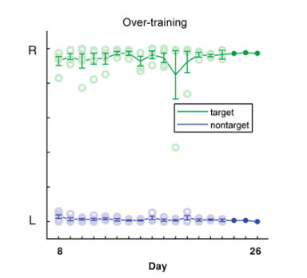

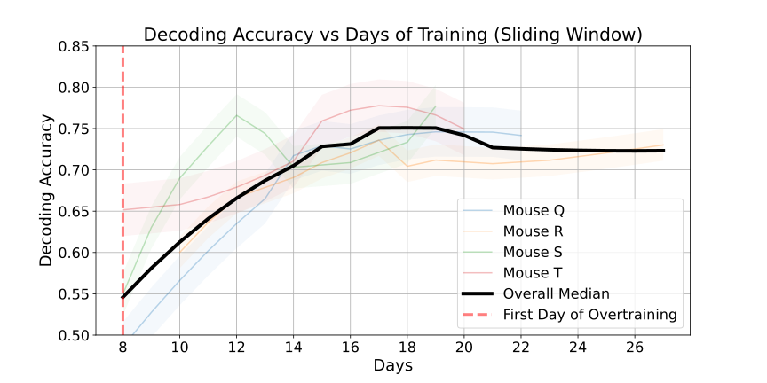

###### fig-1

*Рисунок 1: (Слева) Поведение мышей на бинарной задаче различения запахов, где мыши обозначают выбор, облизывая слева или справа. Ось y — доля облизываний влево против вправо в данный день. День 8 — первый день переобучения. Правильное облизывание для нецелевого — влево, для целевого — вправо. К началу переобучения мыши различают почти идеально. Воспроизведено с изменениями из (Berners-Lee et al. 2023). (справа) Рост точности декодирования 10-кратным линейным дискриминантным анализом для каждой сессии. Затенённые цветные линии на фоне показывают стандартные ошибки для каждой мыши.* **[p. 4]**

### 3.1 Постановка

Berners-Lee et al. 2023 собрали тетродные записи из задней пириформной коры взрослых мышей при переобучении на бинарной задаче различения запахов (рисунок 1). Задняя пириформная кора (PPC) — ключевая область мозга, участвующая в обонятельной обработке (Blazing and Franks 2020; Srinivasan and Stevens 2017). Запах определяется как $n$-горячий вектор длины $k$, с $n=3,k=13$. Иными словами, уникальное сочетание трёх химикатов из тринадцати возможных. «Целевой» запах однозначно задан как состоящий из трёх конкретных химикатов, а нецелевые никогда не содержат ни одного из этих трёх. Задача различения, которой обучают мышей, — отличать целевой запах от нецелевых. После начального периода обучения в 8 дней мыши овладевают задачей, достигая предельного поведенческого качества (см. рисунок 1a), однако обучение продолжается тем же образом ещё 18 дней («переобучение»). Именно в этот период записываются данные частот разрядов. По завершении этого периода переобучения мышам предъявляют отложенные запахи («тестовые/пробные» примеры), которые делят один одорант с целевым запахом и потому труднее для верной классификации.

#### 3.1.1 Представления целевых/нецелевых запахов разделяются при переобучении

###### p4-2

Ключевым объектом изучения на протяжении всего повторного разбора нейроданных будет матрица популяционных частот разрядов $X\in\mathbb{R}^{N\times D}$, содержащая вектор нейронного ответа (активации) для каждой пробы (предъявленного стимула) в данный мыше-день. В день порядка $N\approx 200$ проб, каждая записывает порядка $D\approx 15$ нейронов, и порядка 15-20 дней у каждой из 4 мышей в целом. Мы вычисляем среднее скалярное произведение (по пробам) между (z-нормированными) частотами разрядов целевых и нецелевых проб и находим, что представления целевого и нецелевых запахов продолжают разделяться по ходу переобучения. Мы изображаем матрицы репрезентационного сходства в начале и в конце переобучения для каждой мыши (рисунок 2); дальнейшие методические детали отложены в Приложение A.1.

Измерение таких метрик репрезентационного сходства — стандарт в нейронауке (Kriegeskorte et al. 2008) и сродни распространённым техникам интерпретируемости в глубоком обучении, состоящим в зондировании направлений в пространстве активаций (Bau et al. 2019; Olah et al. 2020; Elhage et al. 2021; Zhang and **[p. 5]** Nanda 2023) и их сравнении, например вычислением их скалярного произведения. Продолжающееся разделение представлений классов целевого и нецелевых запахов на рисунке 2 даёт свидетельство, что, несмотря на отсутствие видимых изменений поведения, в мышиной PPC при переобучении на этой задаче продолжается обучение представлений. Такое продолжающееся научение может помогать генерализации на невиданных запахах — как Berners-Lee et al. 2023 и находят эмпирически.

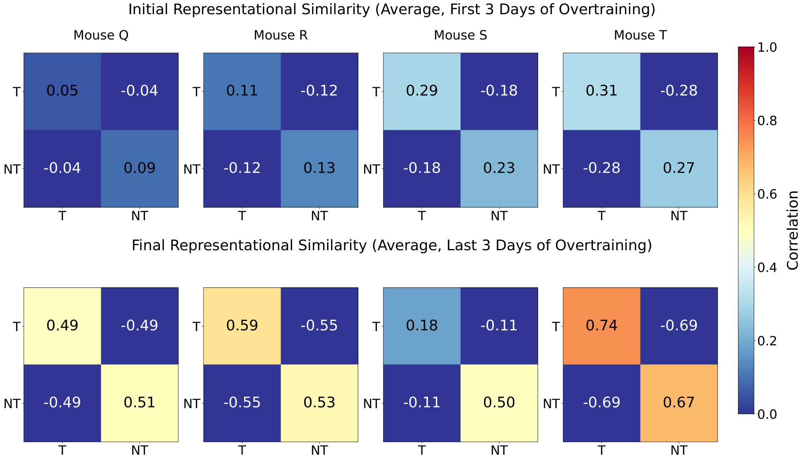

###### fig-2

*Рисунок 2: Матрицы репрезентационного сходства, изображающие среднюю попарную корреляцию между популяционными ответами на целевые и нецелевые запахи из пириформной коры в первый (сверху) и последний (снизу) дни переобучения. Мы отбрасываем последние несколько дней данных мыши T из-за несогласованностей в данных; методические детали в A.1. Разделения (антикорреляцию) выше мы сравниваем со случайными/аблированными базами в Приложении A.5 и находим их значимо большими.* **[p. 5]**

Как эти задаче-значимые изменения выглядят зрительно? На рисунке 3 мы изображаем проекцию представлений запахов данной сессии на первые 2 главные компоненты матрицы частот разрядов этой сессии, которая есть пробы на нейроны для каждой мыши. Мы видим в целом, что нижний ряд имеет более разделённые представления, чем верхний, что даёт качественный взгляд на то, как целевые запахи различимее в пространстве представлений PPC после переобучения, чем до. Эти результаты дают проблеск репрезентационной динамики, действующей по мере роста точности декодера, в широком согласии с растущим разделением, которое мы количественно видим на рисунке 2. Заметим, что это продолжающееся обучение представлений («богатое обучение признаков») при отсутствии изменений обучающей точности («поведения») — ровно то, что характеризует внезапную генерализацию в гроккинг-феноменологии глубокого обучения (Lyu and Li 2019; Kumar et al. 2023; Mohamadi et al. 2024).

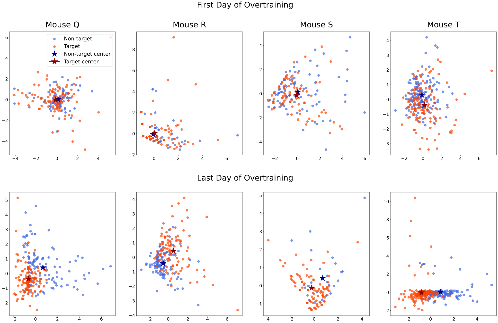

*Рисунок 3: Нейронные представления (спроецированные на первые 2 главные компоненты) целевых и нецелевых запахов в первый (сверху) и последний (снизу) день переобучения для каждой мыши, показывающие качественное разделение при переобучении, количественно измеренное матрицами репрезентационного сходства на рисунке 2. Центры кластеров изображены для удобства зрительного сравнения.* **[p. 6]**

#### 3.1.2 Репрезентационные изменения ведут к улучшенному максимально-маржинальному классификатору

Теперь мы взглянем на разделение классов представлений запахов с другой стороны и рассмотрим устойчивость выученного классификатора, измеряемую его маржой — классическим понятием уверенности и устойчивости из статистической теории обучения (Bishop 2006).

Начнём с прояснения нескольких различных понятий максимизации маржи, применимых, когда декодер обучается на эволюционирующем скрытом представлении.

**[p. 6]**

1. Линейный декодер обучается на закреплённом представлении признаков $\phi$ закреплённое число шагов, что может включать или не включать сходимость декодера.
2. Линейный декодер обучается на закреплённом представлении признаков $\phi$ до сходимости.
3. Представление признаков $\phi_{t}$ *меняется* во времени, и на *каждом шаге времени* $t$ линейный декодер обучается на представлении признаков до сходимости.

###### p6-2

Хотя маржа классификатора, задаваемого декодером, может расти по мере обучения декодера большее число шагов на закреплённом представлении признаков, как в (1), если маржа максимально-маржинального (сошедшегося) классификатора растёт в (3), это означает, что признаки эволюционируют так, чтобы допускать максимально-маржинальный классификатор с большей маржой. Именно это последнее понятие максимизации маржи, вовлекающее обучение признаков, мы и будем использовать.

Математически это можно определить так. Пусть $\phi_{t}(x)\in\mathbb{R}^{N}$ — представление в момент $t$ для данных $x$, и пусть $w(t)$ — параметры максимально-маржинального SVM-решения задачи классификации меток со входной точкой $i$ $\phi_{t}(x_{i})$ и меткой $y_{i}$. Тогда маржа $\mathcal{M}(t)$ имеет вид:

$$
\mathcal{M}(t)=\frac{1}{|w(t)|}\ \text{ where }\ w(t)=\min_{w}|w|^{2}\ \text{ such that }\ y_{i}w\cdot\phi(x_{i})_{t}\geq 1. \tag{1}
$$

###### p6-4

В этих терминах *наша гипотеза состоит в том, что эволюция представлений запахов принимает форму максимизации (максимальной) маржи*.

Хотя «маржа» классификатора обычно означает расстояние до единственной ближайшей точки, мы понимаем её как расстояние до ближайшего 1% точек, поскольку нейронная активность, стоящая за отдельными точками (пробами), сильно изменчива. Мы прослеживаем ближайшие точки к выученной разделяющей границе в линейном SVM, **[p. 7]** обученном на тех же данных популяционного декодирования до сходимости с закреплённым числом шагов на всём протяжении. Мы измеряем среднее расстояние от этого классификатора до ближайшего 1% (труднейших примеров), а также 5% (трудных примеров) точек и находим на рисунке 4, что эти величины существенно растут при переобучении.

###### p7-1

Следовательно, представления PPC эволюционируют так, чтобы увеличивать маржу максимально-маржинального классификатора, обученного на этих представлениях, — подобно тому, как многие работы находят, что глубокие нейросети, «гроккающие» при переобучении на задачах классификации, неявно движимы к этому максимизацией маржи (Morwani et al. 2023; Mohamadi et al. 2024; Lyu and Li 2019). Взгляд через максимизацию маржи задирист не только тем, что даёт геометрическую и наглядную картину продолжающегося научения в этой постановке, но и тем, что подсказывает, *почему* выучиваются именно генерализующие решения. Например, Morwani et al. 2023; Mohamadi et al. 2024; Lyu and Li 2019 доказывают в различных постановках, что причина, по которой нейросети часто решают конкретные задачи (например, модульную арифметику) весьма специфичными видами признаков (например, фурье-признаками у Nanda et al. 2023), в том, что регуляризованные траектории оптимизации неявно смещены к максимизирующим маржу решениям.

###### p7-2

Мы подчёркиваем: поскольку тестовых данных (невиданных тестовых запахов) в период обучения нет, мы не можем делать утверждений о том, начинается ли корковое представление ленивым или богатым (то есть эволюционирует ли оно значительно за начальный 7-дневный период обучения по сравнению с инициализацией), и это важное направление будущей работы и ограничение нашего повторного разбора. Хотя алгоритмы оптимизации, действующие в мозгах, поняты плохо, спекулятивно возможно, что некоторая форма «неявного смещения» к генерализующим решениям может быть и причиной того, что переобученные мыши не просто запоминают свои обучающие запахи, а выучивают представления, полезные на трудных отложенных примерах.

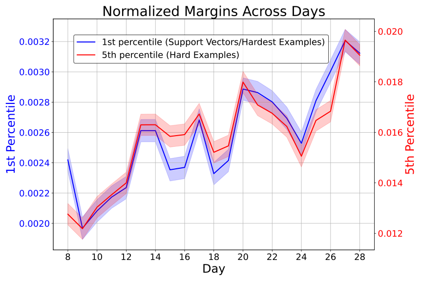

###### fig-4

*Рисунок 4: Среднее расстояние от разделяющей границы в пределах наименьших 1% и 5% расстояний, извлечённых из линейной машины опорных векторов, обученной на популяционных данных из PPC. Мы нормируем маржи для каждой мыши, чтобы данные были сопоставимы между мышами; затенённые полосы показывают стандартные ошибки.* **[p. 7]**

**[p. 8]**

## 4 Теория и моделирование

### 4.1 Синтетическая модель мышиной пириформной коры

**Постановка.** Мы строим синтетическую версию задачи различения запахов, схватывающую ключевые вычислительные соображения на отвлечённом уровне. Более биологически правдоподобный аналог мы рассматриваем в Приложении A.7 и находим, что та же феноменология сохраняется тем же образом. Мы берём наше прежнее определение запахов как $n$-горячих векторов одорантов (химикатов) в $\{0,1\}^{k}$, которые пропускаем через случайную проекцию, вдохновлённую функциональной ролью гломерул (Blazing and Franks 2020), с $n=10,k=100$. Мы обучаем многослойный перцептрон (MLP) с одним скрытым слоем на этих вложениях классифицировать один целевой запах против 200 нецелевых. Мы используем нелинейность ReLU, чтобы имитировать неотрицательные частоты разрядов. Мы также откладываем 20 тестовых примеров, делящих один одорант (одну позицию в битовой строке) с целевым. Эти примеры тем самым ближе к целевому и в хэмминговом, и в спроецированном пространстве, а потому труднее для различения. Мы обучаем MLP ванильным градиентным спуском на кросс-энтропийной потере, как стандартно в классификации.

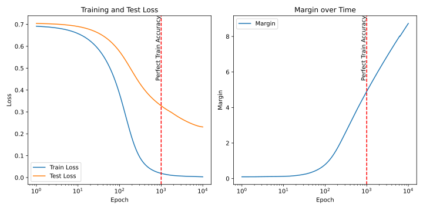

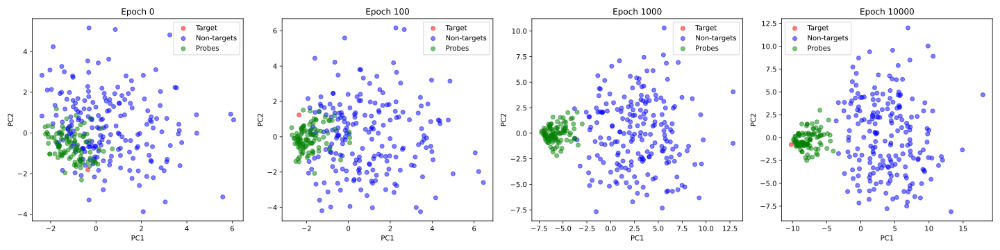

*Рисунок 5: Воспроизведение и истолкование динамики мышиной пириформной коры в простой модели. Сверху слева: потери на обучении и тесте по ходу обучения. Сверху справа: маржа по ходу обучения. Снизу: проекции на первые 2 главные компоненты для нескольких эпох обучения. Заметьте, как целевой запах и пробы (тестовые пробы) разделяются при переобучении (эпохи 1000-9000), хотя модель никогда не обучалась на пробном примере.* **[p. 8]**

###### p8-2

**Поведение мыши и нейронная динамика схватываются переобученным MLP.** Эта простая модель схватывает ключевые вычислительные явления, действующие в пириформных данных, бывших предметом **[p. 9]** разбора в разделе 3. На рисунке 5 видно, что тестовая потеря (на пробных пробах) продолжает падать после выхода обучающей потери на полку на низком значении, в согласии с продолжающимся ростом маржи классификатора. Слой считывания нашего MLP действует как «декодер» на представлении скрытого слоя, которое эволюционирует так, чтобы находилось максимально-маржинальное решение с большей маржой. Мы также видим, что разделение целевого и нецелевых представлений возникает по ходу обучения (до эпохи 1000). Однако на эпохе 1000, когда обучающая потеря сошлась, целевой запах и пробы ещё нелегко разделимы. Поразительно, что переобучение на задаче разделения целевого и нецелевых улучшает качество на пробных запахах, *которые лежат вне распределения обучающего набора*. Это происходит потому, что сеть максимизирует маржу между целевым и нецелевыми представлениями в период переобучения после эпохи 1000. Это проявляется как постепенное отделение красной точки (целевого) от зелёного кластера (тестовых проб) при переобучении. Есть резкий гроккинг-подобный переход в тестовой точности (доле верно классифицированных пробных проб) в период переобучения, эпохи 1000-9000, ровно как мы видим на рисунке 6.

###### p9-1

Мы можем проверить, является ли максимизация маржи причинным фактором в этой простой модели, аблировав её и спросив, исчезают ли одновременно с этим поздние улучшения тестовой потери. Мы делаем это, заменяя кросс-энтропийную целевую функцию, о которой известно, что она движет позднюю максимизацию маржи (Lyu and Li 2019; Lyu et al. 2023), на hinge-потерю, у которой вместо этого жёстко-маржинальная целевая функция. Это означает, что после того, как модель достигает маржи $C$ на каждой обучающей точке, потеря на этой точке зануляется, так что поздний потерьный стимул к максимизации маржи снят. Мы находим, что в этой аблированной постановке маржа насыщается примерно тогда же, когда и обучающая потеря, и что тестовая потеря насыщается в этой же точке обучения, так что гроккинг-подобный эффект аблирован. Математические детали и графики — в Приложении A.6; это поддерживает представление о причинной связи.

**Обучение признаков в синтетической модели.** Мы увеличили размерность вектора «запаха» задачи, а также число ненулевых позиций, чтобы ввести много типов «пробных» проб, делящих с целевым возрастающие количества запахов (перекрытие), что позволяет варьировать трудность. Заметим, что наша модель никогда не обучается на пробах, но слежение за точностью на пробах позволяет измерять, как максимизация маржи на исходных нецелевых запахах (у которых гарантированно нулевое перекрытие с целевым) может помогать решать более трудные пробы.

###### p9-3

На рисунке 6 мы прослеживаем дискриминант Фишера (FD) между целевым и пробным классами, а также точность их различения на протяжении обучения. FD — статистическая величина, использующая линейную комбинацию признаков, максимизирующую разделение двух классов, и представляющая направление в пространстве признаков, вдоль которого спроецированные средние классов максимально разделены при минимизации дисперсии внутри каждого класса. Именно эта величина позволяет расти точности декодирования линейного дискриминантного анализа; часть линий после достижения низкой обучающей потери повторяет то, как медианная апостериорная вероятность LDA на верном классе растёт на рисунке 1 (справа). Математические детали о дискриминанте Фишера и его связи с маржой, LDA и прочим отложены в Приложение A.4.

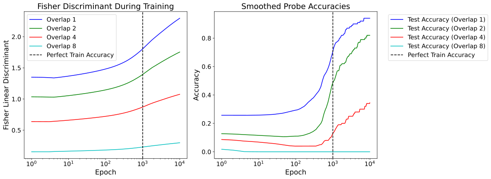

*Рисунок 6: Пробные пробы выучиваются в порядке возрастания перекрытия с целевым. (Слева) Слежение за дискриминантом Фишера (FD) между целевым и пробным классами на протяжении обучения. Он измеряет отношение сигнала к шуму в пространстве представлений. (Справа) Точность («поведенческое качество») на всё более трудных пробах во времени, демонстрирующая гроккинг.* **[p. 10]**

**Возможные биологические движители позднего научения.** Про некоторые виды функций потерь в обстановке глубокого обучения доказано, что они движут позднюю максимизацию маржи (Soudry et al. 2017; Lyu and Li 2019). Здесь мы порассуждаем о биологически правдоподобных составляющих целевой функции в коре, которые могут правдоподобно играть сходную роль. Простой, но правдоподобный движитель позднего научения — набор энергетических/метаболических ограничений биологических организмов. Предполагалось, что такие ограничения порождают разнообразные нейронные явления (Sterling and Laughlin 2015), например распутанные представления (Pehlevan et al. 2017; Olshausen and Field 1996; Plumbley 2003; Whittington et al. 2023). Что важно, такие ограничения — в форме затухания весов в машинном обучении — часто оказываются движущей силой гроккинга в некоторых постановках (Nanda et al. 2023; Liu et al. 2022a). Эти ограничения заставляют нейросети отклоняться от ленивого (ядерного) метода и заставляют веса двигаться в задаче-значимых направлениях (Lyu and Li 2019; Kumar et al. 2023). Другая возможность в Berners-Lee et al. 2023 — очень слабый учительский сигнал ошибки от случайных промахов, совершаемых мышами по **[p. 10]** идиосинкразическим причинам, который мог бы правдоподобно двигать позднее научение (см. рисунок 1).

Наконец, ключевой правдоподобный движитель позднего научения в коре — существование неконтролируемых членов в неявной целевой функции организмов, штрафующих предсказания с низкой уверенностью. Например, кросс-энтропийная потеря ненулевая даже при верно классифицированном примере, поскольку её можно рассматривать как штрафующую *неуверенность* предсказаний модели, а не только *правильность*. То, что потеря не исчезает даже при верных предсказаниях, служит сигналом, направляющим задаче-значимое научение при переобучении. Если биологические обучающиеся системы хранят неуверенность предсказаний и/или используют её для поведения — а это действительно известно про кору грызунов (Kepecs et al. 2008) и мозги вообще (Lak et al. 2017; Fetsch et al. 2014; Komura et al. 2013), — то такие неявные штрафы неуверенности сыграют функциональную роль, сходную с неконтролируемым членом, который держит потерю нетривиальной даже при насыщении обучающей точности. Эта неисчезающая потеря во время поведенческой полки может правдоподобно двигать продолжающееся обучение признаков при переобучении.

### 4.2 Богатое обучение при переобучении может объяснить обращение после переобучения

###### p10-2

Делает ли наша модель динамики научения при переобучении какие-либо новые предсказания вне нашей непосредственной постановки? Одно конкретное предсказание позднего обучения признаков — более быстрая адаптация при обращении задачи для любой выученной задачи. В машинном обучении это означает быструю адаптацию предиктора к сдвигу распределения вида $y(x)\mapsto-y(x)$. Если сеть выучивает признаки для вычисления $y(x)$, возможно, многие из них можно переиспользовать для вычисления $-y(x)$. Это неверно, если сеть выучивает $y(x)$, например, в ленивом режиме: тогда $y$ подгонялась на начальных признаках, не зависящих от задачи, и их нельзя выгодно «перепрофилировать» для обращённого варианта задачи. Это конкретное предсказание об обучении с обращением может показаться машинно-обучающей аудитории странно частным, но на деле обращение после переобучения десятилетиями было предметом изучения экспериментальных психологов (Mackintosh 1969; Richman et al. 1972; Mead 1973). Теоретическая работа в психологии предлагает качественные когнитивные объяснения в терминах распределения внимания (Lovejoy 1966), тогда как наша модель переобучения естественно даёт более сильную, более тонкую нейронную модель обращения после переобучения — первую в своём роде, насколько нам известно. Начнём с определения явления.

**Эффект обращения после переобучения.** Эффект обращения — эмпирическая находка, что животные, переобученные на задаче, быстрее адаптируются при обращении задачи. **[p. 11]** Конкретно, когда животным дают задачу перцептивного различения и обращают вознаграждаемое отображение, животные, переобученные на исходном отображении, адаптируются к обращению задачи за меньшее число проб, чем непереобученные; дальнейшее обсуждение см. (Mackintosh 1969).[^1] Мы предлагаем простое объяснение этого явления в терминах обучения признаков в современном машинно-обучающем смысле.

[^1]: Отметим, что шёл спор о том, общо ли явление по видам и задачам (Beck et al. 1966; Warren 1978).

**Математическая модель.** Мы иллюстрируем это простейшей возможной сетевой моделью, проявляющей этот эффект, — двухслойной линейной сетью (Saxe et al. 2013). Обучение с обращением идёт в два шага. Сначала мы обучаем двухслойную линейную сеть с $N$ скрытыми нейронами $f(\boldsymbol{x})=\frac{1}{N\gamma_{0}}\boldsymbol{w}^{2}\cdot\boldsymbol{h}(\boldsymbol{x})$, где $\boldsymbol{h}(\boldsymbol{x})=\boldsymbol{W}^{1}\boldsymbol{x}$, оптимизируемую $T$ шагов на задаче $y(x)$. После этого вводится новый вектор считывания $\boldsymbol{v}$, дающий новый выход $f_{\text{rev}}(\boldsymbol{x})=\frac{1}{N\gamma_{0}}\boldsymbol{v}\cdot\boldsymbol{h}(\boldsymbol{x})$, который обучается на обращённой задаче $-y(\boldsymbol{x})$. Матрица $\boldsymbol{W}^{1}$ может обновляться и во второй фазе обучения. При большой ширине $N$ мы можем привлечь идеи среднеполевой теории (Bordelon and Pehlevan 2022, см. Appendix F.1.1), позволяющие описать динамику скрытого ядра $K(\boldsymbol{x},\boldsymbol{x}^{\prime})=\frac{1}{N}\boldsymbol{h}(\boldsymbol{x})\cdot\boldsymbol{h}(\boldsymbol{x}^{\prime})$ в обеих фазах обучения. Для отбелённых данных и квадратичной потери достаточно вычислить проекцию ядра $\boldsymbol{K}$, $K_{y}=\boldsymbol{y}^{\top}\boldsymbol{K}\boldsymbol{y}$, и проекцию предсказаний $f_{y}=\boldsymbol{y}^{\top}\boldsymbol{f}$ вдоль направления меток $\boldsymbol{y}$, что даёт:

$$
K_{y}(t)=\sqrt{1+\gamma_{0}^{2}f_{y}(t)^{2}}\ ,\ \partial_{t}f_{y}(t)=2\sqrt{1+\gamma_{0}^{2}f_{y}(t)^{2}}\ (y-f_{y}(t)). \tag{2}
$$

Мы показываем, что ядро эволюционирует только в этом направлении $\boldsymbol{y}\boldsymbol{y}^{\top}$, на рисунке 7 (a), где точки разделяются по целевой категории. Эта динамика прогоняется от времени $t=0$ до времени $T$, что даёт конечное значение выравнивания ядра $K_{y}(T)$. Во второй фазе обучения ($t>T$), где подгоняется новый выход $f_{\text{rev}}$, предсказания на задаче обращения в направлении $\boldsymbol{y}$ эволюционируют как

$$
\partial_{t}f_{\text{rev},y}(t)=\sqrt{(K_{y}(T)+1)^{2}+4\gamma_{0}^{2}f_{\text{rev},y}(t)^{2}}\ (-y-f_{\text{rev},y}(t)). \tag{3}
$$

###### p11-4

Мы отмечаем, что большее перекрытие ядра с целью $K_{y}(T)$ ведёт к более быстрому обучению в этой второй фазе $t>T$, поскольку скорость обучения на второй задаче — прямая функция выравнивания на первой. Мы подтверждаем это симуляциями на рисунке 7 (b). Поскольку $K_{y}(T)$ монотонно растёт с $T$, более долгое обучение на первой задаче ускорит выучивание обращённой задачи, что и даёт объяснение обращения после переобучения. Ключевая интуиция: время адаптации зависит от выравнивания $K_{y}=K_{-y}$, где $\boldsymbol{y}^{\top}\boldsymbol{K}\boldsymbol{y}=(-\boldsymbol{y}^{\top})\boldsymbol{K}\boldsymbol{(}-y)$, поэтому переобучение ведёт к более быстрой адаптации.

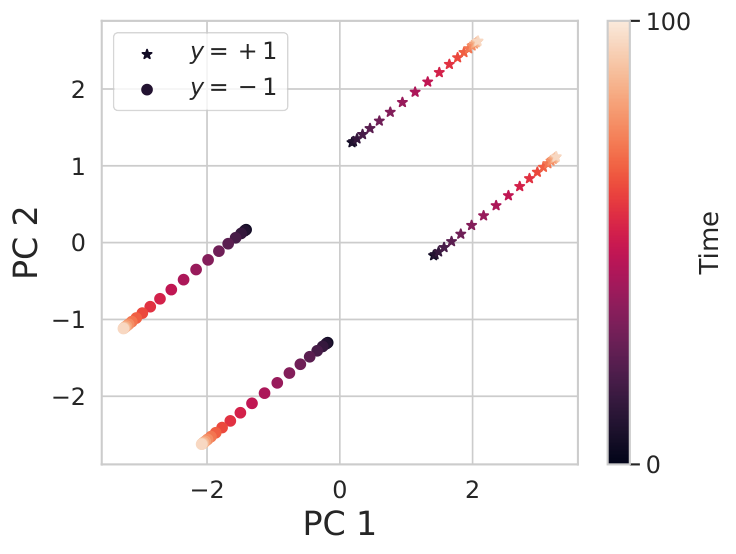

*(a) Движение признаков при предобучении ($t<T$)*

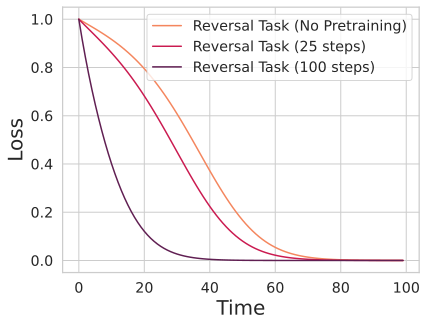

*(b) Переобучение = более быстрое обращение ($t>T$)*

*Рисунок 7: Простая двухслойная модель объясняет более быстрое обучение с обращением после переобучения на исходной задаче. (a) Мы изображаем исходные скрытые представления (спроецированные из $N$ скрытых измерений на первые две главные компоненты) сети ширины $N=250$ для $4$ смесей запахов, где два запаха помечены положительно и два отрицательно. (b) При обучении нового считывания на задаче обращения $-y(x)$ после предобучения $t$ шагов на исходных метках $y(x)$ мы находим, что дополнительные шаги предобучения $T$ ускоряют выучивание задачи обращения, в согласии с теорией.* **[p. 12]**

## 5 Заключение

Мы находим, что недавняя работа по мышиному обонянию даёт свидетельства богатого сенсорного научения, идущего под покровом поведенческой полки у мышей. Это позволяет предположить, что трудные задачи, требующие значительных изменений выученных представлений, могут выигрывать от переобучения, даже если поведенческое качество внешне не меняется. Это также даёт проблеск общей структуры искусственных и биологических сетей, где феноменологически сходная динамика появляется и в коре, и в MLP.

У нашей работы есть ряд ограничений. Ключевое ограничение в том, что нейронное свидетельство, на которое мы опираемся, наблюдательное, и для проверки этой гипотезы нужны новые эксперименты в системной нейронауке. Мы подробно описываем предлагаемую экспериментальную постановку в Приложении A.2. Другое — что число записанных нейронов на мыше-день (около 20) мало, отчего тенденции могут быть шумными (пример см. в Приложении A.5). Третье ограничение — что мы рассматриваем только обонятельную кору и только один тип задачи перцептивного различения: остаётся неизвестным, универсально ли такое позднее научение по животным и задачам. Мы надеемся, что наши гипотезы подтолкнут дальнейшую работу о динамике научения в коре при переобучении животных. Наше исследование поднимает несколько новых вопросов: **[p. 12]** Каковы классы задач, в которых такое переобучение полезно, и что у них общего? Могут ли модели коры на глубоком обучении подсказать ответ? Какова природа неявной целевой функции в сенсорной коре, движущей это позднее обучение представлений? В целом наша работа направлена к более полной характеризации поведения сенсорной коры на задачах перцептивного различения и к объединению механики этого поведения с существующей теорией и наблюдениями в глубоком обучении.

## 6 Благодарности

Tanishq Kumar благодарит Stefano Fusi и Jacob Zavatone-Veth за полезные обсуждения и замечания. Blake Bordelon поддержан Google PhD Fellowship. Cengiz Pehlevan поддержан грантом NSF DMS-2134157, NSF CAREER Award IIS-2239780 и Sloan Research Fellowship. Эта работа стала возможной отчасти благодаря дару Chan Zuckerberg Initiative Foundation на учреждение Kempner Institute for the Study of Natural and Artificial Intelligence.

**[p. 13]**

## References

- Alethea Power, Yuri Burda, Harri Edwards, Igor Babuschkin, and Vedant Misra. Grokking: Generalization beyond overfitting on small algorithmic datasets. *arXiv preprint arXiv:2201.02177*, 2022.

- Neel Nanda, Lawrence Chan, Tom Liberum, Jess Smith, and Jacob Steinhardt. Progress measures for grokking via mechanistic interpretability. *arXiv preprint arXiv:2301.05217*, 2023.

- Ziming Liu, Eric J Michaud, and Max Tegmark. Omnigrok: Grokking beyond algorithmic data. *arXiv preprint arXiv:2210.01117*, 2022a.

- Vikrant Varma, Rohin Shah, Zachary Kenton, János Kramár, and Ramana Kumar. Explaining grokking through circuit efficiency. *arXiv preprint arXiv:2309.02390*, 2023.

- Tanishq Kumar, Blake Bordelon, Samuel J Gershman, and Cengiz Pehlevan. Grokking as the transition from lazy to rich training dynamics. *arXiv preprint arXiv:2310.06110*, 2023.

- Kaifeng Lyu, Jikai Jin, Zhiyuan Li, Simon Shaolei Du, Jason D Lee, and Wei Hu. Dichotomy of early and late phase implicit biases can provably induce grokking. In *The Twelfth International Conference on Learning Representations*, 2023.

- K Anders Ericsson, Ralf Th Krampe, and Clemens Tesch-Römer. The role of deliberate practice in the acquisition of expert performance. *Psychological review*, 100(3):363–406, 1993.

- Allen Newell and Paul S Rosenbloom. Mechanisms of skill acquisition and the law of practice. In John R Anderson, editor, *Cognitive skills and their acquisition*, pages 1–55. Lawrence Erlbaum Associates, 1981.

- Paul M Fitts and Michael I Posner. *Human Performance*. Brooks/Cole Publishing Company, 1967.

- Nicholas John Mackintosh. Further analysis of the overtraining reversal effect. *Journal of Comparative and Physiological Psychology*, 67(2p2):1, 1969.

- Charles L Richman, Karol Knoblock, and Wayne Coussens 1. The overtraining reversal effect in rats: A function of task difficulty. *The Quarterly journal of experimental psychology*, 24(3):291–298, 1972.

- Philip G Mead. The effect of overtraining on reversal shift behavior in rats reinforced with electrical brain stimulation. *Physiological Psychology*, 1(4):330–332, 1973.

- Li K Wenliang and Aaron R Seitz. Deep neural networks for modeling visual perceptual learning. *Journal of Neuroscience*, 38(27):6028–6044, 2018.

- Shahab Bakhtiari. Can deep learning model perceptual learning? *The Journal of Neuroscience*, 39(2):194, 2019.

- Amit Yashar and Rachel N Denison. Feature reliability determines specificity and transfer of perceptual learning in orientation search. *PLoS Computational Biology*, 13(12):e1005882, 2017.

- Rafael Yuste. From the neuron doctrine to neural networks. *Nature Reviews Neuroscience*, 16(8):487–497, 2015.

- Tae Hoon Kim, Yajun Zhang, Julien Lecoq, Jason C Jung, Jun Li, Hongkui Zeng, and Mark J Schnitzer. Long-term optical access to an estimated one million neurons in the live mouse cortex. *Cell Reports*, 17(12):3385–3394, 2016.

**[p. 14]**

- Alice Berners-Lee, Elizabeth Shtrahman, Julien Grimaud, and Venkatesh N Murthy. Experience-dependent evolution of odor mixture representations in piriform cortex. *PLoS Biology*, 21(4):e3002086, 2023.

- Boaz Barak, Benjamin Edelman, Surbhi Goel, Sham Kakade, Eran Malach, and Cyril Zhang. Hidden progress in deep learning: Sgd learns parities near the computational limit. *Advances in Neural Information Processing Systems*, 35:21750–21764, 2022.

- Amin MD Shakhawat, Carolyn W Harley, and Qi Yuan. Arc visualization of odor objects reveals experience-dependent ensemble sharpening, separation, and merging in anterior piriform cortex in adult rat. *Journal of Neuroscience*, 34(31):10206–10210, 2014.

- Mikiko Kadohisa and Donald A Wilson. Separate encoding of identity and similarity of complex familiar odors in piriform cortex. *Proceedings of the National Academy of Sciences*, 103(41):15206–15211, 2006.

- Lenaic Chizat, Edouard Oyallon, and Francis Bach. On lazy training in differentiable programming. *Advances in neural information processing systems*, 32, 2019.

- Arthur Jacot, Franck Gabriel, and Clément Hongler. Neural tangent kernel: Convergence and generalization in neural networks. *Advances in neural information processing systems*, 31, 2018.

- Matthew Farrell, Stefano Recanatesi, and Eric Shea-Brown. From lazy to rich to exclusive task representations in neural networks and neural codes. *Current opinion in neurobiology*, 83:102780, 2023.

- Timo Flesch, Keno Juechems, Tsvetomira Dumbalska, Andrew Saxe, and Christopher Summerfield. Rich and lazy learning of task representations in brains and neural networks. *BioRxiv*, pages 2021–04, 2021.

- Timo Flesch, Keno Juechems, Tsvetomira Dumbalska, Andrew Saxe, and Christopher Summerfield. Orthogonal representations for robust context-dependent task performance in brains and neural networks. *Neuron*, 110(7):1258–1270, 2022.

- Takuya Ito and John D Murray. Multitask representations in the human cortex transform along a sensory-to-motor hierarchy. *Nature neuroscience*, 26(2):306–315, 2023.

- Mohamad Amin Mohamadi, Zhiyuan Li, Lei Wu, and Danica J Sutherland. Why do you grok? a theoretical analysis of grokking modular addition. *arXiv preprint arXiv:2407.12332*, 2024.

- Alexander Matyasko and Lap-Pui Chau. Margin maximization for robust classification using deep learning. In *2017 International Joint Conference on Neural Networks (IJCNN)*, pages 300–307. IEEE, 2017.

- Ziming Liu, Ouail Kitouni, Niklas S Nolte, Eric Michaud, Max Tegmark, and Mike Williams. Towards understanding grokking: An effective theory of representation learning. *Advances in Neural Information Processing Systems*, 35:34651–34663, 2022b.

- Benjamin L Edelman, Ezra Edelman, Surbhi Goel, Eran Malach, and Nikolaos Tsilivis. The evolution of statistical induction heads: In-context learning markov chains. *arXiv preprint arXiv:2402.11004*, 2024.

- Kenzo Clauw, Daniele Marinazzo, and Sebastiano Stramaglia. Information-theoretic progress measures reveal grokking is an emergent phase transition. In *ICML 2024 Workshop on Mechanistic Interpretability*, 2024.

**[p. 15]**

- Depen Morwani, Benjamin L Edelman, Costin-Andrei Oncescu, Rosie Zhao, and Sham Kakade. Feature emergence via margin maximization: case studies in algebraic tasks. *arXiv preprint arXiv:2311.07568*, 2023.

- Robin M Blazing and Kevin M Franks. Odor coding in piriform cortex: mechanistic insights into distributed coding. *Current opinion in neurobiology*, 64:96–102, 2020.

- Shyam Srinivasan and Charles F Stevens. A quantitative description of the mouse piriform cortex. *bioRxiv*, page 099002, 2017.

- Nikolaus Kriegeskorte, Marieke Mur, and Peter A Bandettini. Representational similarity analysis-connecting the branches of systems neuroscience. *Frontiers in systems neuroscience*, 2:249, 2008.

- David Bau, Bolei Zhou, Aditya Khosla, Aude Oliva, and Antonio Torralba. Gan dissection: Visualizing and understanding generative adversarial networks. *Proceedings of the International Conference on Learning Representations (ICLR)*, 2019.

- Chris Olah, Nick Cammarata, Ludwig Schubert, Gabriel Goh, Michael Petrov, and Shan Carter. Zoom in: An introduction to circuits. In *Distill*, 2020. https://distill.pub/2020/circuits/.

- Neil Elhage, A Nanda, Chris Olah, Shan Carter, Nick Cammarata Gabriel Schubert Wang, and Curtis Hernandez. A mathematical framework for transformer circuits. In *Transformer Circuits Thread*, 2021. https://transformer-circuits.pub/.

- Fred Zhang and Neel Nanda. Towards best practices of activation patching in language models: Metrics and methods. *arXiv preprint arXiv:2309.16042*, 2023.

- Kaifeng Lyu and Jian Li. Gradient descent maximizes the margin of homogeneous neural networks. *arXiv preprint arXiv:1906.05890*, 2019.

- Christopher M. Bishop. *Pattern Recognition and Machine Learning*. Springer, New York, 2006. ISBN 978-0-387-31073-2.

- D Soudry, E Hoffer, and N Srebro. The implicit bias of gradient descent on separable data. arxiv. *arXiv preprint arXiv:1710.10345*, 2017.

- Peter Sterling and Simon Laughlin. *Principles of Neural Design*. MIT Press, 2015.

- Cengiz Pehlevan, Sreyas Mohan, and Dmitri B Chklovskii. Blind nonnegative source separation using biological neural networks. *Neural computation*, 29(11):2925–2954, 2017.

- Bruno A. Olshausen and David J. Field. Emergence of simple-cell receptive field properties by learning a sparse code for natural images. *Nature*, 381(6583):607–609, 1996.

- Mark D. Plumbley. Algorithms for nonnegative independent component analysis. *IEEE Transactions on Neural Networks*, 14(3):534–543, 2003.

- James CR Whittington, Will Dorrell, Surya Ganguli, and Timothy Behrens. Disentanglement with biological constraints: A theory of functional cell types. In *The Eleventh International Conference on Learning Representations*, 2023.

- Adam Kepecs, Naoshige Uchida, Hatim A Zariwala, and Zachary F Mainen. Neural correlates, computation and behavioural impact of decision confidence. *Nature*, 455(7210):227–231, 2008. doi: 10.1038/nature07200. URL https://pubmed.ncbi.nlm.nih.gov/18690210/.

**[p. 16]**

- Armin Lak, Katsuhiro Nomoto, Mehdi Keramati, Masamichi Sakagami, and Adam Kepecs. Midbrain dopamine neurons signal belief in choice accuracy during a perceptual decision. *Current Biology*, 27(6):821–832, 2017.

- Christopher R Fetsch, Roozbeh Kiani, William T Newsome, and Michael N Shadlen. Effects of cortical microstimulation on confidence in a perceptual decision. *Neuron*, 83(4):797–804, 2014.

- Yusuke Komura, Akifumi Nikkuni, Naofumi Hirashima, Takuya Uetake, and Atsushi Miyamoto. Responses of pulvinar neurons reflect a subject’s confidence in visual categorization. *Nature Neuroscience*, 16(6):749–755, 2013.

- Elijah Lovejoy. Analysis of the overlearning reversal effect. *Psychological Review*, 73(1):87, 1966.

- C. H. Beck, J. M. Warren, and R. Sterner. Overtraining and reversal learning by cats and rhesus monkeys. *Journal of Comparative and Physiological Psychology*, 62(2):332–335, 1966. doi: 10.1037/h0023674.

- J. M. Warren. Overtraining and extradimensional shift learning by cats. *Bulletin of the Psychonomic Society*, 12(3):177–178, 1978. doi: 10.3758/BF03329663.

- Andrew M Saxe, James L McClelland, and Surya Ganguli. Exact solutions to the nonlinear dynamics of learning in deep linear neural networks. *arXiv preprint arXiv:1312.6120*, 2013.

- Blake Bordelon and Cengiz Pehlevan. Self-consistent dynamical field theory of kernel evolution in wide neural networks. *Advances in Neural Information Processing Systems*, 35:32240–32256, 2022.

- Pieter M Goltstein, Sandra Reinert, Tobias Bonhoeffer, and Mark Hübener. Mouse visual cortex areas represent perceptual and semantic features of learned visual categories. *Nature neuroscience*, 24(10):1441–1451, 2021.

- Nicole C. Rust and James J. DiCarlo. Selectivity and tolerance (”invariance”) both increase as visual information propagates from cortical area v4 to it. *Journal of Neuroscience*, 30(39):12978–12995, 2010.

- David J. Freedman, Maximilian Riesenhuber, Tomaso Poggio, and Earl K. Miller. Comparison of categorization of stimuli in the monkey prefrontal cortex: Frontal eye field and inferior convexity. *Journal of Neurophysiology*, 90(2):670–682, 2003.

- Peter Y Wang, Cristian Boboila, Matthew Chin, Alexandra Higashi-Howard, Philip Shamash, Zheng Wu, Nicole P Stein, LF Abbott, and Richard Axel. Transient and persistent representations of odor value in prefrontal cortex. *Neuron*, 108(1):209–224, 2020.

- Carol A Barnes, Matthew S Suster, Jiemin Shen, and Bruce L McNaughton. Multistability of cognitive maps in the hippocampus of old rats. *Nature*, 388(6639):272–275, 1997.

- LT Thompson and PJ Best. Long-term stability of the place-field activity of single units recorded from the dorsal hippocampus of freely behaving rats. *Brain research*, 509(2):299–308, 1990.

- Clifford G Kentros, Naveen T Agnihotri, Samantha Streater, Robert D Hawkins, and Eric R Kandel. Increased attention to spatial context increases both place field stability and spatial memory. *Neuron*, 42(2):283–295, 2004.

- Emily A Mankin, Fraser T Sparks, Begum Slayyeh, Robert J Sutherland, Stefan Leutgeb, and Jill K Leutgeb. Neuronal code for extended time in the hippocampus. *Proceedings of the National Academy of Sciences*, 109(47):19462–19467, 2012.

**[p. 17]**

- Yaniv Ziv, Laurie D Burns, Eric D Cocker, Elizabeth O Hamel, Kunal K Ghosh, Lacey J Kitch, Abbas El Gamal, and Mark J Schnitzer. Long-term dynamics of ca1 hippocampal place codes. *Nature neuroscience*, 16(3):264–266, 2013.

- Michael E Rule, Timothy O’Leary, and Christopher D Harvey. Causes and consequences of representational drift. *Current opinion in neurobiology*, 58:141–147, 2019.

- Carl E Schoonover, Sarah N Ohashi, Richard Axel, and Andrew JP Fink. Representational drift in primary olfactory cortex. *Nature*, 594(7864):541–546, 2021.

- Shanshan Qin, Shiva Farashahi, David Lipshutz, Anirvan M Sengupta, Dmitri B Chklovskii, and Cengiz Pehlevan. Coordinated drift of receptive fields in hebbian/anti-hebbian network models during noisy representation learning. *Nature Neuroscience*, 26(2):339–349, 2023.

- K Nakamura, Y Gu, D Kato, et al. Representational drift in the mouse visual cortex. *Nature Communications*, 12:5186, 2021.

- Lars Buesing, Johannes Bill, Bernhard Nessler, and Wolfgang Maass. Neural dynamics as sampling: a model for stochastic computation in recurrent networks of spiking neurons. *PLoS computational biology*, 7(11):e1002211, 2011.

- Merav Stern, Kevin A Bolding, LF Abbott, and Kevin M Franks. A transformation from temporal to ensemble coding in a model of piriform cortex. *Elife*, 7:e34831, 2018.

- Kamesh Krishnamurthy, Ann M Hermundstad, Thierry Mora, Aleksandra M Walczak, and Vijay Balasubramanian. Disorder and the neural representation of complex odors. *Frontiers in Computational Neuroscience*, 16:917786, 2022.

- Alexander Mathis, Dan Rokni, Vikrant Kapoor, Matthias Bethge, and Venkatesh N Murthy. Reading out olfactory receptors: feedforward circuits detect odors in mixtures without demixing. *Neuron*, 91(5):1110–1123, 2016.

**[p. 18]**

## Приложение A Приложение

### A.1 Методические и реализационные детали

Сырые данные состоят из порядка 70 сессий, каждая из которых — запись 20 случайных нейронов в данный мыше-день. Данные — спайки во времени для каждого нейрона на каждой пробе, которых в сессии 200-300. После подачи запаха мышам даётся 2.5 с, чтобы облизнуться в ответ. Мы считаем число спайков в последней 500-мс части этого окна и декодируем по этому числу, что даёт нам матрицу счётов спайков $N\times T$ нейроны на пробы для декодирования на каждый мыше-день. Мы отбрасываем нейроны с низким (менее 4) числом спайков по всем пробам, классифицируя их как не отвечающие на запахи; мы z-нормируем эту матрицу и используем 10-кратную перекрёстную проверку для получения точности декодирования, по 20 итерациям. Поскольку данные от сессии к сессии очень шумны, мы изображаем сглаженные статистики скользящим окном и наносим стандартные ошибки всех статистик. Следует отметить, что последние несколько дней переобучения мыши $T$ отброшены из-за заметных несогласованностей в нейроданных — например, точность декодирования обрушивалась много ниже случайной при сохранении высокого поведения, что указывает на неизвестную и идиосинкразическую причину ненадёжности точности декодирования у этой мыши.[^2] Заметим, что матрица активности z-нормировалась по пробам, так что каждый нейрон вносил в наш разбор равный вклад.

[^2]: [Berners-Lee et al. 2023] включают эти ненадёжные пробы декодирования в свой разбор.

### A.2 Проверяемые предсказания и экспериментальные предложения

#### A.2.1 Конкретное предложение для пириформной коры

Хотя повторный разбор существующих данных позволяет считать богатое научение при переобучении правдоподобным, повторный разбор сам по себе недостаточен, чтобы уверенно установить новую эмпирическую феноменологию. В частности, поскольку фокус [Berners-Lee et al. 2023] — изучение роста селективности к целевому запаху и того, как история обучения влияет на форму выученных представлений, могут быть полезны прицельные эксперименты, пытающиеся опровергнуть нашу гипотезу. Мы обрисовываем, как мог бы выглядеть один такой эксперимент в пириформной коре. Заметим, что такую экспериментальную постановку можно применить к любой части сенсорной коры, в которой можно записывать хотя бы сотни нейронов на протяжении нескольких (10+) непрерывных дней переобучения.

Мы предлагаем эксперимент того же рода, что у [Berners-Lee et al. 2023], с несколькими важными изменениями. Эти изменения включают:

- Использование нескольких целевых запахов вместо одного не дало бы мышам заучить целевой и тем самым заставило бы задачу требовать большего выучивания тождества запаха, оставляя больше места богатому научению при переобучении.
- Мы включили бы спектр трудных отложенных примеров $n-1$ типов, если одорант — это $n$-горячий вектор химикатов. Тогда $j$-пробной пробой назовём те, что делят $j$ элементов с целевым, что позволяет модулировать расстояние и в хэмминговом, и в спроецированном пространстве, а значит и трудность классификации, измеряемую расстоянием до границы.
- Из каждых 200 проб в данный мыше-день $n-1$ были бы пробными, по одной на каждый тип. Они включались бы и в начальный период обучения в 8 дней, и во время, и после переобучения, чего в [Berners-Lee et al. 2023] не делается. Это обеспечило бы минимальное влияние тестового набора на научение по сравнению с обучающим (который был бы в $200/n$ раз чаще).
- Мы также обеспечили бы мышам столько же времени на восстановление между сессиями переобучения, сколько между сессиями обучения, чтобы потенциально могло происходить то же количество богатого научения, и чтобы условия при переобучении держались как можно ближе к условиям обучения — для сравнения обучения признаков на равных основаниях.

**[p. 19]**

#### A.2.2 Важные экспериментальные детали для общих задач сенсорного различения

При проверке нашей гипотезы есть несколько ключевых экспериментальных деталей, применимых широко к экспериментам на сенсорной коре за пределами обоняния.

- Задача должна вовлекать разнообразные и новые стимулы. Это можно измерить, удостоверившись, что способность декодировать стимулы из популяционной активности до обучения не значимо выше случайной.
- Задача должна быть трудной, но поддающейся овладению. Это каверзное требование: здесь мыши достигают до 90% поведенческого качества, что близко к верхней границе, возможной при шуме и колеблющихся условиях. Напротив, в остальном подходящая работа по зрению [Goltstein et al. 2021] обучает мышей различать решётки по частоте и ориентации. Эта задача не выучивается полностью: мыши достигают потолка 70%. Поскольку первичная часть нашей гипотезы в том, что это позднее богатое научение может сохраняться при почти предельном качестве задачи и, значит, в отсутствие большого сигнала ошибки, доля ошибок 30% слишком высока для проверки нашей гипотезы.
- Существенно выделить часть данных, посвящённую выучиванию задачи, — «обучающий» набор, и часть, посвящённую проверке генерализации, — «тестовый» набор. Как и в пириформной постановке, конструирование части тестовых примеров нарочито трудными, скорее всего, прояснит, идёт ли в сенсорной коре при переобучении полезное, но скрытое обучение представлений. Тестовые пробы должны быть редкими, чтобы их влияние на научение было малым, но должны включаться на всём протяжении обучения, чтобы понятия обучающего и тестового качества были определены для всей линии обучение-переобучение-тест.
- Хронические записи должны включать эволюцию популяционной активности и при обучении, и при переобучении. В настоящей работе мы не можем изучить, начинаются ли представления ленивыми или богатыми при обучении, поскольку данные и пробные пробы доступны только в период переобучения, а не обучения. Отметим, что мыши — хорошие организмы для такой задачи, потому что более крупные животные, как макаки, обучаются много дольше и дороже, а хронические инвазивные записи при обучении рискуют серьёзно повредить организм. Напротив, более мелкие организмы, как плодовые мушки, невозможно в каком-либо осмысленном смысле обучить решать трудные задачи перцептивного различения с нейронными записями in-vivo.

На таких постановках наша теория предсказывает продолжающийся рост точности декодирования метки категории в течение нескольких дней после того, как обучающее качество насыщается и перестаёт заметно меняться, и разделение задаче-значимых представлений классов.

### A.3 Продолжение введения

Третья трудность, вдобавок к двум упомянутым в основном введении, состоит в том, что для наблюдения подлинного обучения представлений при переобучении задача должна быть трудной, но поддающейся овладению. В глубоко-обучающей постановке гроккинга, например, это уточняется указанием, что гроккинг возникает в определённом режиме согласования задачи и модели [Kumar et al. 2023]. Многие постановки экспериментальной нейронауки либо изучают пассивное предъявление (без выучивания перцептивной задачи) [Rust and DiCarlo 2010, Freedman et al. 2003], либо используют задачи, лёгкие (высокая начальная точность декодирования) для сенсорной коры [Wang et al. 2020], либо задачи слишком трудные — в том смысле, что животное к концу лишь слегка выше случайного [Goltstein et al. 2021].

Близко родственно, но отлично от желаемой нами феноменологии изучения явление репрезентационного дрейфа. В нейронауке наше понимание стабильности нейронных сетевых представлений во времени также пересматривалось. Классические работы в нейронауке действовали в неявном предположении, что **[p. 20]** нейронные представления поддерживаются стабильной нейронной активностью [Barnes et al. 1997, Thompson and Best 1990]. Хотя многие нейроны и показывают стабильные ответы на стимулы, недавнее открытие «репрезентационного дрейфа» демонстрирует, что популяционная активность, стоящая за некоторым задаче-значимым стимулом, может меняться во времени [Kentros et al. 2004, Mankin et al. 2012, Ziv et al. 2013, Rule et al. 2019, Schoonover et al. 2021]. Репрезентационный дрейф обычно мыслится как диффузионный процесс [Qin et al. 2023], и есть доводы, что такой дрейф может давать преимущества в корковой обработке или придавать устойчивость [Nakamura et al. 2021, Buesing et al. 2011]. Наш фокус — на *научении* представлений при переобучении на задаче, и потому интересующая нас феноменология ортогональна репрезентационному дрейфу, но потенциально может с ним сосуществовать.

### A.4 Математические детали о дискриминанте Фишера, LDA и марже

Здесь мы даём фон о ключевых статистических величинах, которые мы прослеживаем, — и в пириформной коре, и в нашей синтетической модели — и об их связях друг с другом. Линейный дискриминант Фишера (FD) — статистическая величина, измеряющая отношение разделения центров кластеров к внутрикластерной дисперсии. Неформально, он количественно выражает отношение сигнала к шуму (SNR) в задаче бинарной классификации в пространстве представлений и есть величина, на которую линейный дискриминантный анализ (LDA) опирается при классификации. Он особенно полезен, когда цель — снизить размерность данных, сохранив как можно больше классово-различительной информации.

Рассмотрим набор данных из $n$ образцов, каждый из которых принадлежит одному из двух классов: $C_{1}$ и $C_{2}$. Пусть $x_{i}\in\mathbb{R}^{d}$ обозначает $d$-мерный вектор признаков $i$-го образца. FD ищет вектор проекции $w\in\mathbb{R}^{d}$, такой что при проекции данных на этот вектор разделение спроецированных средних двух классов максимизируется относительно спроецированной дисперсии внутри каждого класса.

Формально, проекция точки данных $x$ на вектор $w$ задаётся $y_{i}=w^{\top}x_{i}$.

Цель FD — найти $w$, максимизирующее SNR

$$
J(w)=\frac{(\mu_{1}-\mu_{2})^{2}}{s_{1}^{2}+s_{2}^{2}},
$$

где $\mu_{1}=w^{\top}m_{1}$ и $\mu_{2}=w^{\top}m_{2}$ — средние спроецированных точек классов $C_{1}$ и $C_{2}$ соответственно, а $m_{1}=\frac{1}{n_{1}}\sum_{x_{i}\in C_{1}}x_{i}$ и $m_{2}=\frac{1}{n_{2}}\sum_{x_{i}\in C_{2}}x_{i}$ — векторы средних классов в исходном пространстве признаков. Величины $s_{1}^{2}$ и $s_{2}^{2}$ представляют дисперсии спроецированных точек классов $C_{1}$ и $C_{2}$ соответственно.

Чтобы выразить $J(w)$ через исходные данные, определим внутриклассовую матрицу рассеяния $S_{w}$ и межклассовую матрицу рассеяния $S_{b}$ как

$$
S_{w}=\sum_{x_{i}\in C_{1}}(x_{i}-m_{1})(x_{i}-m_{1})^{\top}+\sum_{x_{i}\in C_{2}}(x_{i}-m_{2})(x_{i}-m_{2})^{\top},
$$

$$
S_{b}=(m_{1}-m_{2})(m_{1}-m_{2})^{\top}.
$$

Тогда критерий Фишера можно переписать как

$$
J(w)=\frac{w^{\top}S_{b}w}{w^{\top}S_{w}w}.
$$

Затем, чтобы максимизировать $J(w)$, дифференцируем его по $w$ и приравниваем производную нулю. Это ведёт к обобщённой задаче на собственные значения

$$
S_{b}w=\lambda S_{w}w.
$$

**[p. 21]**

Решение $w$, максимизирующее $J(w)$, — собственный вектор, соответствующий наибольшему собственному значению матрицы $S_{w}^{-1}S_{b}$.

FD тесно связан с линейным дискриминантным анализом (LDA) в следующем смысле. В LDA предполагается, что данные каждого класса нормально распределены с общей ковариационной матрицей $\Sigma$. Правило декодирования LDA относит новое наблюдение $x$ к классу $C_{1}$ или $C_{2}$ по тому, чья линейная дискриминантная функция максимальна, с

$$
\delta_{k}(x)=x^{\top}\Sigma^{-1}m_{k}-\frac{1}{2}m_{k}^{\top}\Sigma^{-1}m_{k}+\log\pi_{k},
$$

где $\pi_{k}$ — априорная вероятность класса $C_{k}$, а $k\in\{1,2\}$. Решение LDA включает проекцию данных в пространство меньшей размерности по тому же критерию, что у линейного дискриминанта Фишера, что делает FD по сути эквивалентным LDA, когда данные следуют гауссову распределению с равными ковариационными матрицами классов. Поэтому мы и прослеживаем дискриминант Фишера в нашей синтетической модели: мы видим, что средняя и медианная апостериорная вероятность LDA на верном классе растёт при переобучении, что указывает на рост и SNR, измеряемого дискриминантом Фишера.

Связь между FD и максимизацией маржи можно понять в более простых, качественных терминах — рассмотрев понятие разделяющих гиперплоскостей в контексте бинарной классификации. В маржинальных методах, таких как SVM, цель — найти гиперплоскость, максимизирующую маржу, то есть расстояние между гиперплоскостью и ближайшими точками каждого класса (опорными векторами). FD тоже стремится максимизировать разделение классов, но делает это, максимизируя отношение межклассовой дисперсии к внутриклассовой. Его можно мыслить как своего рода «мягкую маржу».

Если данные линейно разделимы, направление $w$, найденное FD, будет стремиться выравниваться с направлением, максимизирующим маржу между классами, хотя FD и не навязывает критерий максимальной маржи явно, как это делает SVM. Однако во многих случаях критерий Фишера ведёт к решению, приближающему направление максимальной маржи, особенно когда распределения классов приблизительно гауссовы с равными ковариациями, — потому на практике эти две величины часто меняются вместе, как они и делают и в наших нейроданных, и в нашей синтетической модели. Тем не менее измеряют они разное.

### A.5 Абляция репрезентационного разделения

Поскольку мы z-нормируем частоты разрядов, диагонали корреляционных матриц будут положительны по определению, имея вид $||z||$. Однако математическое ожидание внедиагональных элементов для набора случайных частот разрядов равно нулю, с дисперсией, зависящей от размерности. Если мы утверждаем, что есть значимое разделение представлений, мы должны проверить, что антикорреляция между двумя частотами разрядов далека от случайной для нашей размерности $D\approx 15$. На рисунке 8 мы изображаем распределение антикорреляций для согласованной по среднему матрицы частот разрядов с векторами частот, взятыми из гауссианы, для каждой мыши, и проводим линию, представляющую антикорреляцию (репрезентационное качество, поскольку задача — различить два класса) и до, и после периода переобучения. Мы изображаем это на рисунке 8.

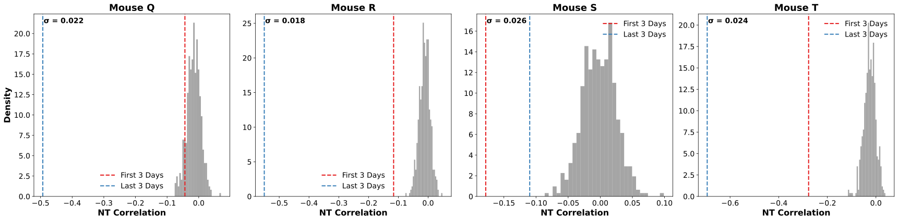

*Рисунок 8: Разделение кластеров (антикорреляция между представлениями классов) по 500 случайным матрицам частот разрядов, согласованным по среднему с нашей z-нормированной матрицей частот. $\sigma$ обозначает стандартное отклонение. Отрицательнее — лучше.* **[p. 22]**

В целом видно, что 1) переобучение вызывает разделение — в том смысле, что представления более антикоррелированы после переобучения, чем при обучении, и что 2) даже в начале переобучения (красные линии) разделение нетривиально по сравнению со случайным. Это осмысленно, потому что мыши выполняют задачу на потолке, так что мы ожидаем, что представления в начале переобучения (после недели переобучения) много лучше случайных. Оговорки в том, что данные шумны: например, у мыши S антикорреляция слегка падает по сравнению с началом переобучения. Такие ограничения данных подчёркивают, что наши находки *наводящие*, а не окончательные, и мы стремимся вдохновить дальнейшую экспериментальную работу и подаём наши находки как *гипотезы*, которые эти данные позволяют считать *правдоподобными*, а не окончательно подтверждёнными.

**[p. 22]**

### A.6 Абляции жёсткой маржи

Начнём с напоминания определений кросс-энтропийной и hinge-потерь. Пусть $y\in\{0,1\}$ представляет истинную метку класса, а $\hat{y}\in[0,1]$ — предсказанную вероятность положительного класса (то есть $P(y=1\mid x)$). Кросс-энтропийная потеря $L_{\mathrm{CE}}$ для одного примера определяется как:

$$
L_{\mathrm{CE}}(y,\hat{y})=-(y\log(\hat{y})+(1-y)\log(1-\hat{y})).
$$

В hinge-потере метки $y$ обычно кодируются как $y\in\{-1,+1\}$, а модель выдаёт балл $f(x)\in\mathbb{R}$, где знак $f(x)$ определяет предсказание класса. Для простоты предположим, что $f(x)$ — выход линейной модели, $f(x)=w\cdot x+b$.

Hinge-потеря $L_{\text{hinge }}$ для одного примера определяется как:

$$
L_{\text{hinge }}(y,f(x))=\max(0,C-y\cdot f(x)),
$$

где $C$ — задаваемый параметр жёсткой маржи, который мы берём $C=1$. Ключевой момент: в hinge-целевой функции потеря зануляется после того, как выученный классификатор классифицирует каждый обучающий пример с маржой не менее $C$, тогда как для кросс-энтропийной целевой функции потеря не исчезает таким разрывным образом, продолжая двигать позднее научение. На рисунке 9 видно, что тестовая потеря перестаёт улучшаться вместе с обучающей, и это совпадает с резким прекращением роста маржи — в отличие от продолжающейся максимизации маржи, движимой кросс-энтропией в основном тексте.

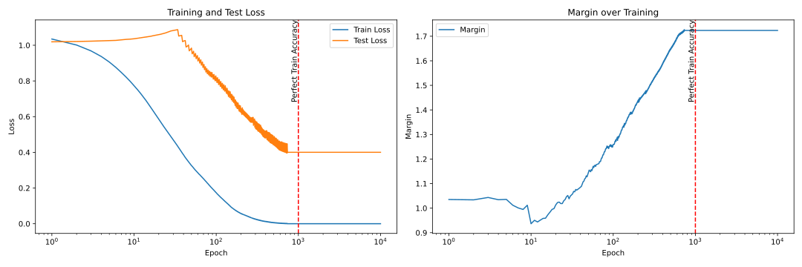

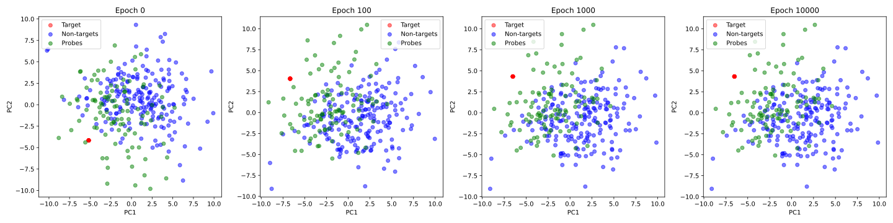

*Рисунок 9: Абляция функции потерь для синтетической модели, возводящая асимптотическую максимизацию маржи, порождаемую кросс-энтропией, в причину позднего падения тестовой потери/позднего разделения представлений. «Позднее» означает время, когда обучающая потеря выходит на полку на низком значении.* **[p. 23]**

### A.7 Биологически правдоподобная модель

Теперь мы повторяем описанную экспериментальную постановку нашей синтетической модели с устройством, принимающим пириформную кору более всерьёз [Stern et al. 2018, Krishnamurthy et al. 2022, Mathis et al. 2016].

Наша биологически правдоподобная модель состоит из трёх главных обрабатывающих слоёв плюс выходного слоя, с дополнительными связями обратной связи для моделирования рекуррентной динамики. Первый слой служит сенсорным входным слоем, аналогом входов из обонятельной луковицы. Он проецирует вход в пространство большей размерности, используя активацию ReLU с последующим dropout с вероятностью 0.2 для поддержания разрежённого кодирования — ключевой черты сенсорных представлений в пириформной коре. Второй слой действует как плотный ассоциативный слой, моделирующий обширную рекуррентную связность пирамидных клеток. Этот слой сохраняет расширенную размерность первого слоя и включает параллельный путь обратной связи. Обратная связь реализована отдельным линейным преобразованием с последующей активацией ReLU, и результат добавляется обратно к главному пути через skip-соединение. И главный путь, и путь обратной связи используют одну размерность, чтобы сохранить ассоциативную природу этого слоя. Третий слой реализует модулирующий контроль, вдохновлённый тормозными интернейронными цепями. **[p. 23]** Этот слой снижает размерность по сравнению со вторым и использует активацию LeakyReLU с последующей большей долей dropout (0.3) для моделирования тормозных эффектов. Снижение размерности отражает модулирующую, а не репрезентационную роль этого слоя. Выходной слой выполняет итоговое линейное преобразование в один скаляр (поскольку мы обучаем бинарную классификацию). Мы обучаем без затухания весов со скоростью обучения 1e-2. Мы также добавляем гауссов шум в прямой проход, чтобы имитировать стохастическую активность сенсорной коры, — отсюда несколько представлений целевого запаха.

Результаты показаны на рисунке 10. Сохранение феноменологии, выявленной в основном тексте, позволяет предположить, что ключевую роль здесь играют целевая функция и строение задачи, а не подробности устройства.

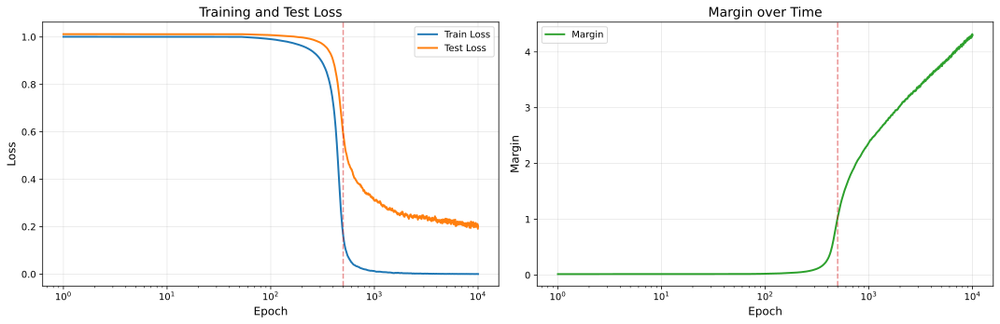

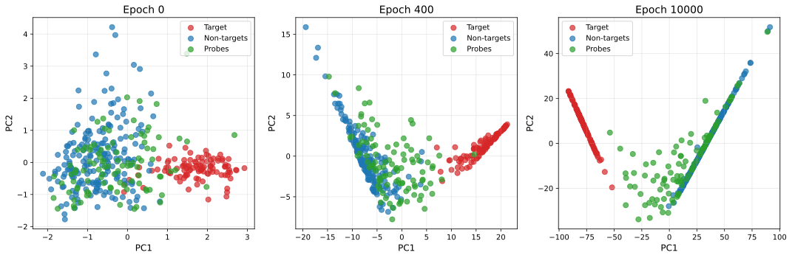

*Рисунок 10: Абляция устройства для биологически правдоподобной модели пириформной коры, обученной на той же задаче бинарной классификации разделять целевые и нецелевые запахи. Мы видим, что потеря на отложенных пробных запахах продолжает падать после достижения низкой обучающей потери, поскольку целевой функцией снова служит кросс-энтропийная потеря.* **[p. 24]**
