# Salah & Yevick 2024 — Controlling Grokking with Nonlinearity and Data Symmetry

См. также: [глобальный индекс понятий](../../concepts/index.md).

**Ahmed Salah**, **David Yevick** (физический факультет Университета Ватерлоо).

arXiv [2411.05353](https://arxiv.org/abs/2411.05353), ноябрь 2024 (единственная версия v1), 15 страниц, 14 рисунков (29 панелей), 7 выключных формул. Всего цитирований по Semantic Scholar — 2, в картотеке — 2 (обе — работы той же группы). Работа управляет гроккингом на модульном сложении через **нелинейность сети**: чётность функции активации включает и выключает быстрый гроккинг, нечётная добавка задерживает его произвольно долго, глубина и ширина двигают задержку; попутно предложены факторизация непростого модуля по PCA-узорам весов и энтропия весов слоя как предвестник генерализации. Первая статья линии Ватерлоо (Salah & Yevick): её продолжение [2507.11645](https://arxiv.org/abs/2507.11645) переносит вопрос с управления на предсказание, а [2510.25966](https://arxiv.org/abs/2510.25966) (Изинг) — на физическую задачу. Источник — восстановление из PDF (task-025): подача PDF-only, см. врезку «Происхождение конверсии» в `original/`.

Оригинал и производные файлы этой папки:

- [`original/2411.05353.controlling-grokking-with-nonlinearity-and-data-symmetry.md`](original/2411.05353.controlling-grokking-with-nonlinearity-and-data-symmetry.md) — конверсия оригинала в Markdown без правок содержания, с врезкой о происхождении (восстановление из PDF, формулы набраны с растра).
- [`images/`](images/) — 29 панелей рисунков 1–14, извлечённые встроенными файлами из PDF.

Схема якорей и правила ссылок на карточку — в [README папки статей](../README.md).

## Затрагиваемые понятия

**[Гроккинг](../../concepts/grokking.md)** — предмет работы со стороны управления: не «отчего задержка», а «какими ручками её двигать». Ручками объявлены профиль функции активации, глубина и ширина сети ([`p1-5`](#p1-5)); главный установленный факт — быстрый наступ гроккинга требует чётной активации, а нечётная составляющая задерживает его на произвольное число эпох ([`p7-1`](#p7-1)). Определения гроккинга через порог точности работа не даёт; статистики прогонов (семена, разброс) нет нигде.

**[Модульная арифметика](../../concepts/modular-arithmetic.md)** — полигон взят у Power et al., но носитель другой: двухслойный MLP **без вложений и без трансформера**, one-hot конкатенация длины $2P$ ([`p3-1`](#p3-1)). Работа демонстрирует, что канонические явления полигона воспроизводятся и в этой минимальной постановке.

**[Фурье-признаки и контуры](../../concepts/fourier-features-circuits.md)** — форма отображения и косинусные веса взяты у Gromov ([`p3-2`](#p3-2), формулы (1)–(6)), но наблюдение направлено против всеобщности: веса связей к части нейронов первого слоя квазисинусоидальны с острым фурье-пиком, а к другим — апериодичны, и гроккинг при этом сохраняется — «in apparent contradiction to (Gromov, 2023)» ([`p4-4`](#p4-4)).

**[Обучение устроенным представлениям](../../concepts/structured-representation-learning.md)** — два наблюдения по разные стороны линии «структура и генерализация»: круговой узор в PCA-плоскостях весов возникает лишь при достаточной нелинейности (третий слой, $a<0.5$), но гроккинг есть при всех $a$ ([`p9-1`](#p9-1)) — то есть видимая структура не необходима; а для непростого модуля узоры кластеров дают его факторизацию (20 = 5 × 4 и 20 = 2 × 10, [`p10-1`](#p10-1), [`p10-2`](#p10-2)) — курьёзный побочный продукт устроенности. Чего в работе нет: механизма, связывающего узор с алгоритмом решения.

**[Ослабление весов](../../concepts/weight-decay.md)** — фоновая, а не исследуемая ручка: weight decay включён во всех опытах со ссылкой на его известное влияние ([`p3-1`](#p3-1)); собственное наблюдение — спустя много эпох после гроккинга часть весов последнего слоя падает «below 10-41» без потери тестовой точности, выжившие связи несут наибольшую долю сведений ([`p4-4`](#p4-4)).

**[Меры прогресса](../../concepts/progress-measures.md)** — предложены две: автокорреляция весов (7) как мера выученной периодичности ([`p6-1`](#p6-1)) и энтропия весов слоя $S=-\sum_{i}w_{i}\,log\,w_{i}$, чей ход — спад, рост во время гроккинга, спад после выхода теста на максимум — объявлен предсказывающим дообучение ([`p12-1`](#p12-1)). Обе меры качественные: ни одного предсказания срока числом в работе нет.

## Что показано, а что предположено

Замечания редактора карточки по итогам разбора утверждений (`…claims.txt`). Работа восстановлена из PDF (подача PDF-only); двое авторов-физиков, препринт нигде не опубликован.

**Самый чистый результат — чётность активации как двоичный рычаг.** При $x+ax^{2}$ задержка падает с ростом $a$; чисто нечётные $x^{2}\mathrm{sign}(x)$ и $x^{3}$ гроккинга не дают (у $x^{3}$ тест растёт и обрушивается), чётная $|x^{3}|$ — даёт ([`p7-1`](#p7-1), [`fig-6`](#fig-6), [`fig-7`](#fig-7)). Отсюда работоспособная формула: нечётная составляющая — регулятор задержки.

**Гроккинг без видимой структуры — второй по весу факт.** Апериодические веса у части нейронов ([`p4-4`](#p4-4)) и гроккинг при всех $a$ без круговых PCA-узоров ([`p9-1`](#p9-1)) — два независимых наблюдения против необходимости устроенного представления.

**Всё остальное — одиночные прогоны и хеджированные связки.** Ни семян, ни планок погрешности нигде; «plausibly related», «presumably» честно расставлены авторами, но ни одна связка не проверена вмешательством. Факторизация модуля показана тремя примерами без статистики воспроизводимости. Энтропийная мера ни разу не сопоставлена с корпусными мерами прогресса числом.

**Внутренние шероховатости.** Заявленная в заглавии ось «Data Symmetry» сведена к одному разделу §3.5 без связи с осью нелинейности; запись «below 10-41» повреждена в PDF (вероятно, показатель степени), точное значение не восстанавливается; максимумы тестовой точности в §3.5 (0.85, 0.984) не сопровождаются определением, считается ли это гроккингом.

---

# Текст статьи

## Аннотация

###### p1-5

Аннотация– Эта статья демонстрирует, что поведением гроккинга в модульной арифметике с модулем $P$ в нейронной сети можно управлять, изменяя профиль функции активации, а также глубину и ширину модели. Построение чётных PCA-проекций весов последнего слоя NN против их нечётных проекций далее даёт узоры, которые становятся значительно равномернее, когда нелинейность увеличивается наращиванием числа слоёв. Эти узоры можно применить для факторизации $P$, когда $P$ непростое. Наконец, мера способности сети к генерализации выводится из энтропии весов слоя, а степень нелинейности связывается с корреляциями между локальной энтропией весов нейронов последнего слоя.

**Ключевые слова:** нейронные сети, гроккинг, генерализация, PCA, нелинейность, симметрия, энтропия.

## 1. Введение

###### p1-7

Явление «гроккинга» при обучении нейронных сетей было впервые замечено и эмпирически описано в контексте трансформеров Power et al. (2022) [1]. До наступления гроккинга модель показывает высокий уровень обучающей точности, но низкую тестовую точность. Однако после дальнейшего обучения тестовое качество заметно улучшается. Схожее поведение наблюдается при двойном спуске, который также связывается с различием во времени, требуемом для выучивания несхожих узоров в обучающем и тестовом наборах. Davies et al. (2023) [2].

В контексте простых физических или алгоритмических моделей гроккинг даёт управляемую среду, в которой можно изучать условия, требуемые для выучивания лежащих в данных соотношений. К ним относятся, среди прочего, схожесть в таблице набора данных, размер набора, **[p. 2]** доля обучающих данных и влияние нелинейности. Кроме того, можно исследовать физический смысл коллективных свойств, таких как PCA-проекции весов нейронной сети (NN), а также корреляции между весами нейронов.

###### p2-2

Гроккинг в последнее время широко изучался — Davies et al.[2], 2023, Nanda et al., 2023[3], Thilak et al.[4], 2022, Varma et al.[5], 2023, Liu et al., 2022a[6],b[7], Gromov, 2023[8], Schaeffer et al., 2023[9], Michaud et al. 2023[10]) — и выдвинуто несколько полуаналитических рамок. Хотя некоторые из них требуют weight decay [Liu et al., 2022[6], Varma et al., 2023[5]], двухслойный MLP без weight decay тоже показывает гроккинг — Kumar et al. [11].  В [4] гроккинг без регуляризации сопровождался событием «слингшота» — внезапным всплеском обучающей потери с последующей улучшенной генерализацией. Анализы Varma et al. [5] и Liu et al. [7] не включают слингшот или осцилляционное поведение, а основаны на относительной силе запоминания и генерализации. Liu et al. [7] приписывают генерализацию выучиванию представления входных вложений, что в случае алгоритмических наборов данных обычно сопровождается возникновением структуры во вложениях. Она проявляется как круговой узор, когда последовательные PCA-компоненты входов строятся друг против друга. В этой статье, однако, схожее генерализационное поведение достигается в обычном MLP в отсутствие вложений и трансформеров, и далее наблюдается, что гроккинг может происходить, не наводя видимой структуры в PCA-пространстве.

Главные выводы этой статьи таковы:

###### p2-4

- Гроккинг происходит, даже если свойства нейронов апериодичны.
- Взаимодействие нейронов внутри слоя количественно выражается корреляционной функцией, которая меняет свои свойства.
- Нелинейность NN, зависящая от вида функции активации и от ширины и глубины сети, может применяться для управления поведением гроккинга.
- Нелинейность NN далее влияет на симметрии, присущие PCA-собственным векторам весов NN.
- Эти симметрии, особенно для малых наборов данных, могут давать факторизацию модуля.
- Гроккинг происходит и тогда, когда PCA-проекции не являют явной симметрии.
- Гроккинг и действие нелинейности можно частично охарактеризовать энтропией весов NN, а также их взаимными корреляциями.

**[p. 3]**

## 2. Предварительные сведения и постановка

###### p3-1

Гроккинг модульной арифметики. Вычисления этой статьи применяют двухслойный MLP без вложений к данным, порождённым модульным сложением, $Y = (i+j)\%P$, для $i,j = 0,1,\ldots.P-1$, где $i$ и $j$ порознь закодированы one-hot. Эти векторы затем конкатенируются, порождая единый тензор X длины $2P$. Размерность выходного вектора равна $P$, а размер набора данных — $P^{2}$. Поскольку это соответствует задаче классификации с меткой Y, применяется кросс-энтропийная потеря вместе с оптимизатором Adam (Loshchilov & Hutter, 2019) [12] с weight decay, ибо доказано, что weight decay существенно влияет на гроккинг (Power et al., 2022[1]; Nanda et al., 2023[3]; Varma et al., 2023[5]).

###### p3-2

Для квадратичной функции активации отображение сети принимает вид (Gromov, 2023) [8],

$$\boldsymbol{f}(\boldsymbol{x}) = \frac{1}{DN}\boldsymbol{W}^{(2)}\left(\boldsymbol{W}^{(1)}\boldsymbol{x}\right)^{2}\tag{1}$$

###### p3-3

где $D$ — входная размерность, $N$ — ширина скрытого слоя, а $\boldsymbol{W}^{(i)}$ — матрицы весов $i^{th}$ слоя. Размер модели меняется настройкой размерности скрытого слоя, HIDDEN_DIM, а доля данных, употребляемых на обучение, — TRAIN_FRAC. Применяемый здесь MLP состоит из двух слоёв; входного размера (HIDDEN_DIM) и выходного размера ($P$). Будет рассмотрено и действие вставки промежуточного слоя размера (HIDDEN_DIM).

Веса $\boldsymbol{W}_{kn}^{(1)}$ и $\boldsymbol{W}_{qk}^{(2)}$, согласованные с задачей модульного сложения, задаются как

$$\boldsymbol{W}_{kn}^{(1)} = \begin{pmatrix} \cos\left(2\pi\frac{k}{p}n_{1} + \varphi_{k}^{(1)}\right) \\ \cos\left(2\pi\frac{k}{p}n_{2} + \varphi_{k}^{(2)}\right) \end{pmatrix}^{T}, \; n = (n_{1}, n_{2})\tag{2}$$

$$\boldsymbol{W}_{qk}^{(2)} = \cos\left(-2\pi\frac{k}{p}q - \varphi_{k}^{(3)}\right)\tag{3}$$

с $n_{1}, n_{2} = 0,1,\ldots.p-1$. Для входов $(n, m)$ ненормированные выходы первого слоя суть

$$\boldsymbol{h}_{k}^{(1)}(n, m) = \cos\left(2\pi\frac{k}{p}n + \varphi_{k}^{(1)}\right) + \cos\left(2\pi\frac{k}{p}m + \varphi_{k}^{(2)}\right)\tag{4}$$

где для модульного сложения

**[p. 4]**

$$\varphi_{k}^{(3)} = \varphi_{k}^{(1)} + \varphi_{k}^{(2)}\tag{5}$$

Это обеспечивает, что члены $h_{q}^{(2)}(n, m)$ интерферируют конструктивно и потому описываются выражением

$$\boldsymbol{h}_{q}^{(2)}(n, m) \approx \frac{1}{2}\sum_{k=1}^{N}\cos\left(2\pi\frac{k}{p}(n + m - q)\right)\tag{6}$$

Дополнительно будут рассмотрены полиномиальные функции активации степени 2 вида $\emptyset(x) = bx + ax^{2}$, о которых показано, что при подходящей оптимизации они дают добавочную точность (Yevick, 2024) [13].

###### p4-3

Barak et al. (2022) [14] ввели и теоретически разобрали меры, связанные с эмерджентным поведением. Здесь вводится мера, количественно выражающая степень гроккинга сети на основе весов последнего слоя. Она отличается от мер прогресса, предложенных Nanda [3] на основе механистической интерпретируемости, но согласуется с результатами для энтропии, связанной с долей объяснённого разброса, выведенной из PCA вложений, полученными Liu et al. (2022) [7].

## 3. Эксперименты и находки

### 3.1 Веса разных связей NN и корреляция нейронов

###### p4-4

Гармоническое поведение весов, описанное в предыдущем разделе, наблюдалось во многих наших численных расчётах. В частности, веса связей от каждого нейрона последнего слоя к одному нейрону первого слоя, как показано на рис. 1, квазисинусоидальны для части нейронов первого слоя, а соответствующий фурье-спектр на рис. 2 остро пикован на положительной и отрицательной частотах, присутствующих в косинусной функции. Однако веса связей к другим нейронам первого слоя могут быть непериодичными без устранения гроккингового поведения, как видно, например, при P=27 на рис. 2, — в видимом противоречии с (Gromov, 2023) [8]. Если применяется weight decay, определённая доля весов связей последнего слоя спустя много эпох после гроккинга падает ниже 10-41, не влияя на тестовую точность, как показано на рис. 3. Очевидно, выжившие связи — те, что несут наибольшую долю сведений, присутствующих в данных.

**[p. 5]**

*Figure 1 Groups of neural network connections whose weights are analyzed below*

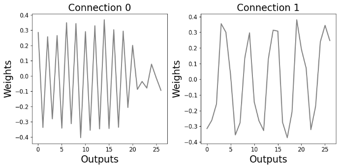

*Figure 2 The weights of the output neurons (a) and the associated Fourier transform (b) where each figure represents the first two connections of neurons with the first layer.*

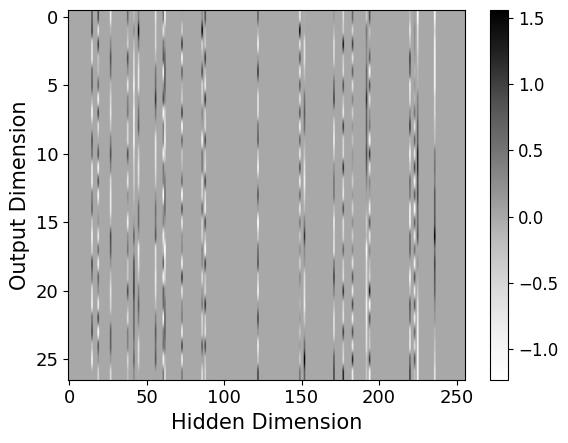

*Figure 3 The weights of the last layer in the presence of weight decay after many epochs.*

Степень периодичности в весах модели можно количественно выразить, вычислив корреляционную функцию весов, задаваемую как

**[p. 6]**

$$Corr(k) = \sum_{l=0}^{N-1}x(l)x(l-k)\tag{7}$$

###### p6-1

где $x(l)$ — значение входной последовательности, весов связей узлов последнего слоя, в позиции $l$, а $x(l-k)$ — значение последовательности, сдвинутой на $k$ при периодических граничных условиях. Длина последовательности равна $N$, корреляция вычисляется в каждой точке перекрытия последовательностей, и значения затем нормируются. Получающаяся корреляция весов нейронов выходного слоя, связанных со связями к одному нейрону первого слоя, для некоторых выходных узлов описывается затухающей осциллирующей функцией рис. 4. Однако другие наборы связей к первому слою гармонического поведения не являют. Поскольку положительная корреляция эвристически указывает, что сеть действует схожим образом в применении к определённым входным признакам, четыре колебания на рис. 4 правдоподобно связаны с числом оборотов на PCA-диаграммах. Скорость затухания корреляции тогда могла бы связываться с отклонением вращательных узоров от идеально повторяющихся структур. Группы связей с осциллирующими корреляциями тогда связывались бы с узлами, выучившими периодичность в данных, происходящую от модульного сложения.

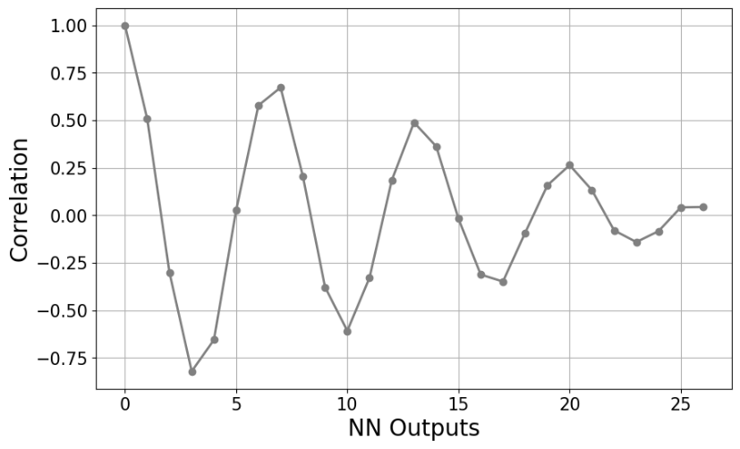

*Figure 4 The autocorrelation of the weights of the neural network connections to one of the nodes of the last layer.*

### 3.2 Функция активации

Изменение вида функции активации с $x^{2}$ на нечётные функции $x + ax^{2}$, показанные на рис. 5, существенно влияет на поведение гроккинга. Так, на рис. 6 при P=27 и TRAIN_FRAC = 0.8 число эпох до наступления гроккинга уменьшается с ростом значения $a$. Очевидно, нечётный член $x$ задерживает подъём тестовой точности и тем усиливает

**[p. 7]**

###### p7-1

гроккинговое поведение. Гроккинг также не происходит для нечётных функций активации $x^{2}\mathrm{sign}(x)$  и $x^{3}$. В последнем случае тестовая точность поднимается до максимального значения, а затем убывает, как видно на рис. 7. Напротив, для функции активации $|x^{3}|$ тестовая точность поднимается и остаётся на максимальном значении. Взятые вместе, эти результаты устанавливают, что быстрый наступ гроккинга требует, чтобы функция активации была чётной, и что наступ гроккинга можно задержать на произвольное число эпох, включив в функцию активации нечётную, негроккирующую составляющую.

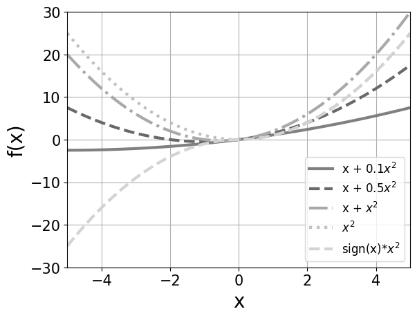

*Figure 5 Second-order polynomial activation functions.*

###### fig-6

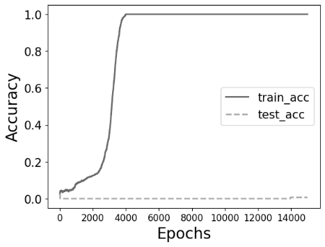

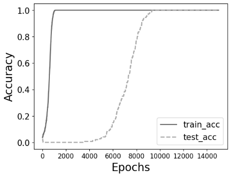

*Figure 6 The training/test accuracy for the activation functions (a) $x + 0.1x^{2}$ (b) $x + 0.5x^{2}$ (c) $x + x^{2}$ (d) $x + 2x^{2}$ (e) $x + 5x^{2}$ (f) $x^{2}$.*

**[p. 8]**

###### fig-7

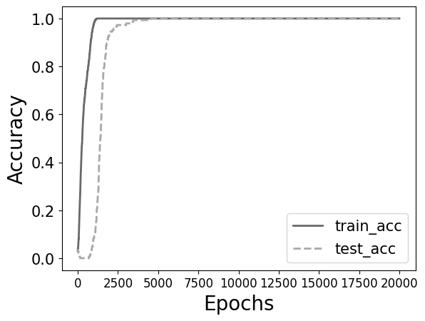

*Figure 7 The training/test accuracy for the activation functions (a) $x^{3}$ (b) $|x^{3}|$.*

Степень нелинейности сети можно настраивать и изменением числа нейронов. Уменьшение числа нейронов первого слоя с 256 до 64 в случае с функцией активации $x^{2}$ уменьшает наклон и обучающей, и тестовой кривых точности, как показано на рис. 8, а задержка между подъёмами тестовой и обучающей точностей уменьшается — предположительно потому, что оптимизации требует меньшее число нейронов.

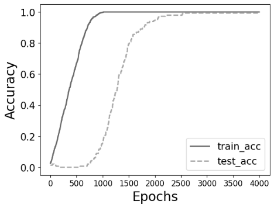
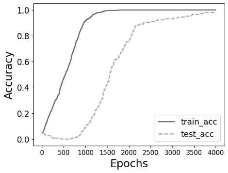
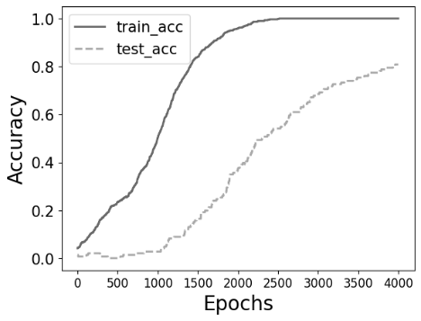

*Figure 8 Training and test accuracies for (a) 256 (b) 128 and (c) 64 neurons.*

**[p. 9]**

### 3.3 PCA-проекции

###### p9-1

Если к модели добавить дополнительный плотный слой с нейронами и применить для первых двух слоёв функцию активации вида $x + ax^{2}$, то построение PCA-проекций нечётного порядка весов третьего слоя против проекций чётного порядка, как продемонстрировано Power et al. (2022) [1] и Liu et al. (2022)[7], даёт круговой узор для некоторых пар главных компонент младшего порядка. Эта структура отсутствует в двухслойной системе — предположительно из-за недостаточной нелинейности. Хотя гроккинг наблюдается при всех значениях $a$, круговая структура в PCA-пространстве возникает лишь при $a < 0.5$, как показано на рис. 9 для $a = 0.25$, при P=53, TRAIN_FRAC = 0.5 и обучении 13k эпох в обоих случаях. Соответствующие структуры для PCA-компонент старшего порядка сосредоточены у начала координат, как видно из рис. 9.

###### fig-9

*Figure 9 Plots formed from successive PCA projections of the weights of the last layer after applying the activation function $x + 0.25x^{2}$ to the first and middle layers.*

**[p. 10]**

### 3.4 PCA-факторизация

###### p10-1

Уменьшение P до 20 уменьшает размер набора данных и потому действие гроккинга. Если отношение числа образцов обучающего набора к полному числу образцов TRAIN_FRAC = 0.7, тестовая точность после достижения 1 убывает, поэтому вместо этого берётся TRAIN_FRAC = 0.8. Хотя 64 нейронов тогда достаточно для получения гроккинга, последовательные группы PCA-проекций весов тогда не являют круговой структуры. При 256 нейронах в двух скрытых слоях построение проекций выходных узоров на нулевую и первую, вторую и третью младшие PCA-компоненты на рис. 10 даёт круговой узор из 5 кластеров по 4 точки, а узор, порождённый 4-й и 5-й младшими PCA-компонентами, содержит 4 кластера по 5 точек. Соответственно, процедура привела к факторизации 20 как 5 × 4.

###### p10-2

Функция активации $x + 0.1x^{2}$ вместо $x + 0.25x^{2}$ даёт иной круговой узор PCA-пространства, порождённый проекциями на 4-ю и 5-ю младшие PCA-компоненты.  Здесь кластеры состоят из пар чисел, различающихся на 10, как показано на рис. 11, что даёт факторизацию 20 = 2 × 10. Схожим образом для P=21 PCA-пространство даёт кластеры из 3 и 7 точек. В каждом из этих случаев узоры появляются лишь после того, как программа исполнила определённое число эпох сверх наступления гроккинга.

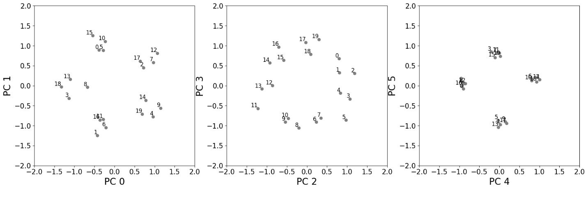

*Figure 10 Same as Fig.9 but with P=20 corresponding to the factoring 20 = 5 × 4.*

**[p. 11]**

*Figure 11 Same as Fig.10 but for the activation function $x + 0.1x^{2}$.*

### 3.5 Зависимость от данных

###### p11-1

Гроккинг в задаче модульного сложения мог бы объясняться симметриями в таблице сложения или конкатенированным one-hot кодированием двух входных значений. Одна симметрия в наборе данных связана с соотношением коммутации $i + j = j + i$ и может быть удалена рассмотрением лишь значений $i + j$ с $j \geq i$, что, однако, уменьшает размер набора данных. В этом случае для P = 53 и двух слоёв сети максимальная тестовая точность после гроккинга равна 0.85, как показано на рис. 12 (b) для функции активации $x^{2}$. Схожие результаты получаются для функции активации $x + 2x^{2}$ или для трёхслойной модели.

Если набор данных расширить до того же числа значений, какое породилось бы, будь употреблены и $i + j$, и $j + i$, для P=53 — увеличением P до 75, — то для функции активации $x^{2}$ тестовая точность существенно возрастает, но единицы не достигает, как видно на рис. 12(e). Если вместо этого долю обучающего набора увеличить до 0.8 вместо 0.5, генерализация происходит для P=53. Симметрию набора данных можно уменьшить и дальше, например исключив пары с  $j - i = 1,2,5$ и 8, что, однако, как выяснилось, на гроккинг не влияет, пока не наложено дополнительное ограничение $i > j$. В последнем случае гроккинг отсутствует, пока доля обучающего набора не установлена в 0.8, что тогда даёт максимальную тестовую точность 0.984.

**[p. 12]**

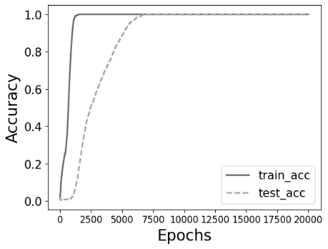
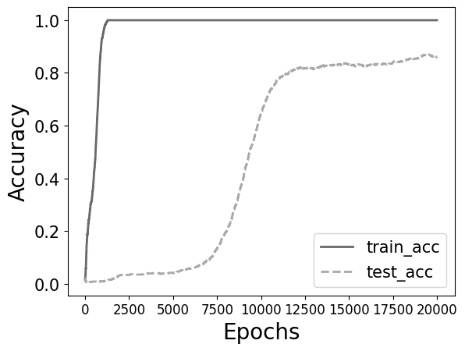
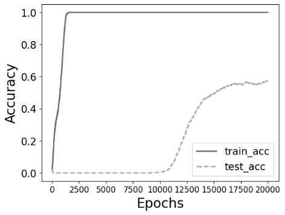
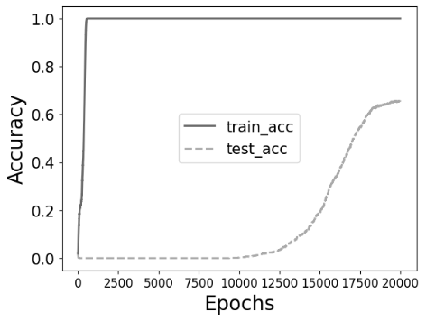

*Figure 12 (a) Grokking for P = 53, TRAIN_FRAC =0.5 and an $x^{2}$ activation function (b) As in (a) but for $i + j$  with $i > j$ (c) as in (b) but for a $x + 2x^{2}$ activation function (d) as in (b) but for 3 NN layers (e) as in (b) but for P = 75 (f) as in (b) but with TRAIN_FRAC =0.8.*

### 3.6 Энтропийный анализ

###### p12-1

Энтропия весов слоя NN, определяемая как $S = -\sum_{i}w_{i}\,log\,w_{i}$, где $w_{i}$ — вес каждого нейрона слоя, даёт меру степени обучения по ходу тренировки, ибо энтропия количественно выражает уровень случайности в распределении весов. Равномерно распределённые веса дают большие значения энтропии, указывая, что сеть всё ещё исследует разные конфигурации или становится излишне сложной, что ведёт к переобучению. Для простейшего случая функции активации $x^{2}$ при P=53 и TRAIN_FRAC =0.5 рис. 13 демонстрирует, что энтропия сперва убывает, пока обучающая точность растёт и сеть выучивает значимые признаки. Однако затем энтропия растёт дальше, пока тестовая точность начинает гроккать, и снова убывает лишь после того, как тестовая точность достигает максимального значения. Тем самым энтропия предсказывает дополнительное обучение, требуемое прежде, чем сеть сможет верно различать невиданные тестовые узоры. Как далее показано на рис. 14, для функции активации вида $x + x^{2}$ при P=53 и TRAIN_FRAC =0.8 после начального подъёма обучающей точности спад энтропии менее выражен, пока она не падает резко после достижения тестовой точностью максимума. Если применён третий слой, энтропия убывает до более низких значений, чем в двухслойной сети, — предположительно вследствие

**[p. 13]**

###### p13-1

возросшей нелинейности. Начальные флуктуации энтропии при обучении также зависят от нелинейности сети, в согласии с Notsawo et al. (2023)[15], предсказавшими число эпох, требуемое для наблюдения гроккинга, по ландшафту потерь на ранних стадиях обучения.

###### fig-13

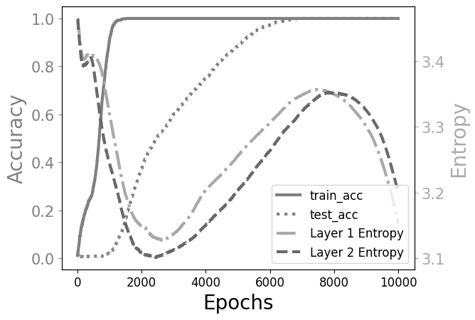

*Figure 13 The entropies of the first (dash dots) and second (dashed line) layer weights as a function of epoch number plotted together with the test (solid) and training (dots) accuracies as a function of epoch number for an $x^{2}$ activation function.*

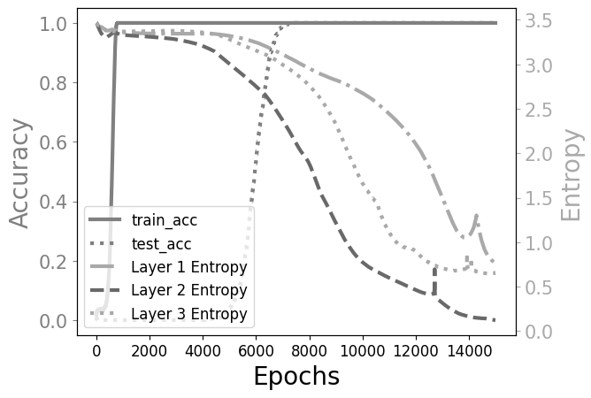

*Figure 14 As in the previous figure but for (a) an activation function of the form $x + x^{2}$ (b) an additional intermediate layer.*

**[p. 14]**

## 4. Заключение

Эта статья исследовала связь между свойствами простой нейронной сети и её нелинейной структурой в контексте модульного сложения. Нелинейностью управляли через вид функции активации, число слоёв и число нейронов на слой. На основе этих исследований была установлена процедура, позволяющая настраивать число эпох до наступления гроккинга включением линейной составляющей в функцию активации. Схожим образом было продемонстрировано, что увеличение полной нелинейности увеличением ширины или глубины сети увеличивает задержку между подъёмами обучающей и тестовой точности. Затем на основе PCA-проекций весов последнего слоя был предложен механизм факторизации непростых чисел для сетей с достаточным числом слоёв и, следовательно, степенью нелинейности. Далее было показано, что эти результаты применимы даже тогда, когда симметрии, присущие набору данных, частично устранены, если на обучающие образцы отведена большая доля данных. Наконец, были выдвинуты меры на основе как корреляции между весами связей к нейрону последнего слоя, так и энтропии нейронов каждого слоя. Их можно применять для количественного выражения процесса обучения NN и его гроккингового поведения.

Дальнейшие исследования этих тем могли бы прояснить связь между общей нелинейностью и числом эпох, требуемым для достижения гроккинга, а также предсказательную способность корреляционной и энтропийной мер. Более систематическое рассмотрение связи между корреляционной функцией весов нейронной сети и структурами, возникающими в PCA-пространстве, потенциально тоже могло бы иметь практическое значение.  Наконец, следует подробно рассмотреть, в какой степени черты крайне упрощённой модели, разобранной в этой статье, присутствуют в крупномасштабных сетях, являющих гроккинг, и связанные с этим сходства и различия двух моделей.

## Список литературы

- [1] Alethea Power, Yuri Burda, Harri Edwards, Igor Babuschkin, and Vedant Misra. Grokking: Generalization beyond overfitting on small algorithmic datasets. arXiv preprint arXiv:2201.02177, 2022.
- [2] Xander Davies, Lauro Langosco, and David Krueger. Unifying grokking and double descent. arXiv preprint arXiv:2303.06173, 2023.

**[p. 15]**

- [3] Neel Nanda, Lawrence Chan, Tom Liberum, Jess Smith, and Jacob Steinhardt. Progress measures for grokking via mechanistic interpretability. arXiv preprint arXiv:2301.05217, 2023.
- [4] Vimal Thilak, Etai Littwin, Shuangfei Zhai, Omid Saremi, Roni Paiss, and Joshua Susskind. The slingshot mechanism: An empirical study of adaptive optimizers and the grokking phenomenon. arXiv preprint arXiv:2206.04817, 2022.
- [5] Vikrant Varma, Rohin Shah, Zachary Kenton, János Kramár, and Ramana Kumar. Explaining grokking through circuit efficiency. arXiv preprint arXiv:2309.02390, 2023.
- [6] Ziming Liu, Eric J Michaud, and Max Tegmark. Omnigrok: Grokking beyond algorithmic data. arXiv preprint arXiv:2210.01117, 2022.
- [7] Ziming Liu, Ouail Kitouni, Niklas Nolte, Eric J Michaud, Max Tegmark, and Mike Williams. Towards understanding grokking: An effective theory of representation learning. arXiv preprint arXiv:2205.10343, 2022.
- [8] Andrey Gromov. Grokking modular arithmetic. arXiv preprint arXiv:2301.02679, 2023.
- [9] Schaeffer, R., Miranda, B., and Koyejo, S. Are emergent abilities of large language models a mirage? In Thirty seventh Conference on Neural Information Processing Systems, 2023.
- [10] Michaud, E. J., Liu, Z., Girit, U., and Tegmark, M. The quantization model of neural scaling. In Thirty-seventh Conference on Neural Information Processing Systems, 2023.
- [11] Kumar, Tanishq, Blake Bordelon, Samuel J. Gershman, and Cengiz Pehlevan. "Grokking as the transition from lazy to rich training dynamics." arXiv preprint arXiv:2310.06110 (2023).
- [12] Loshchilov, I. and Hutter, F. Decoupled weight decay regularization. In 7th International Conference on Learning Representations, ICLR 2019, New Orleans, LA, USA, May 6-9, 2019.
- [13] David Yevick, “Nonlinearity Enhanced Adaptive Activation Function,” arXiv preprint arXiv:2403.19896, 2024.
- [14] Boaz Barak, Benjamin L Edelman, Surbhi Goel, Sham Kakade, Eran Malach, and Cyril Zhang. Hidden progress in deep learning: Sgd learns parities near the computational limit. arXiv preprint arXiv:2207.08799, 2022.
- [15] Pascal Jr. Tikeng Notsawo, Hattie Zhou, Mohammad Pezeshki, Irina Rish, and Guillaume Dumas. Predicting grokking long before it happens: A look into the loss landscape of models which grok, 2023.
