# Qin, Saphra & Alvarez-Melis 2024 — Sometimes I am a Tree: Data Drives Unstable Hierarchical Generalization in LMs

См. также: [глобальный индекс понятий](../../concepts/index.md).

**Tian Qin**, **Naomi Saphra** (Гарвардский университет), **David Alvarez-Melis** (Гарвардский университет и Microsoft Research).

arXiv [2412.04619](https://arxiv.org/abs/2412.04619), декабрь 2024 (разбирается v4, сентябрь 2025), 19 страниц, 15 рисунков. Всего цитирований по Semantic Scholar — 11, в картотеке — 0. Прямой спор с 2404.16367 (Ahuja et al.) при общей постановке: вопрос смещён с устройства сети и цели обучения на **данные**. Две величины: *сложность* (доля предложений с центральным вложением) решает, **какое** правило усвоено — центральные вложения ведут к иерархическому, их отсутствие к линейному (ни одно из 50 семян не берёт иерархию без них — подтверждение лингвистического предсказания Wexler 1980); *разнообразие* (число различных синтаксических деревьев) решает, усвоено ли **правило вообще** — малое даёт устойчивое запоминание, большое — приверженность всеобщему правилу, промежуточное — неустойчивую область с колебаниями внедоменной точности и расхождением семян. Структурный гроккинг объявлен порождённым **соперничеством** линейно- и иерархически-склоняющих подмножеств данных; 1% примеров одного вида переключает исход обучения.

Оригинал и производные файлы этой папки:

- [`original/2412.04619.native.html`](original/2412.04619.native.html) — первоисточник, нативный HTML arXiv (v4), скачан как есть.
- [`original/2412.04619.sometimes-i-am-a-tree-data-drives-unstable-hierarchical-generalization.md`](original/2412.04619.sometimes-i-am-a-tree-data-drives-unstable-hierarchical-generalization.md) — конверсия оригинала в Markdown без правок содержания.
- [`2412.04619.sometimes-i-am-a-tree-data-drives-unstable-hierarchical-generalization.claims.txt`](2412.04619.sometimes-i-am-a-tree-data-drives-unstable-hierarchical-generalization.claims.txt) — пронумерованные утверждения статьи с пометками разбора.
- [`images/`](images/) — 15 рисунков (18 файлов).

Схема якорей и правила ссылок на карточку — в [README папки статей](../README.md).

## Затрагиваемые понятия

**[Гроккинг](../../concepts/grokking.md)** — данные как управляющая переменная структурного гроккинга: отложенность воспроизведена на исходных данных QF, причём сразу после схождения обучающей потери *все* прогоны стоят на 0% внедоменной точности (строго линейное правило) и лишь затем начинают расти, с сильнейшими колебаниями и расхождением семян именно «во время гроккинга» ([`p17-2`](#p17-2)); главное объяснительное утверждение — структурный гроккинг порождается соперничеством линейно- и иерархически-склоняющих подмножеств данных: без соперничающих подмножеств модель усваивает правило сразу, без постепенного перехода ([`p9-6`](#p9-6)). Разбор: утверждение не подкреплено ни одним измерением времени — срок обобщения нигде не меряется, а полная вариация ловит колебания, не задержку («соперничество = неустойчивость = отложенность» — отождествление, а не результат); перенос на классический гроккинг — рассуждение по соответствию, без единого опыта на модульной арифметике.

**[Фаза запоминания](../../concepts/memorization-phase.md)** — запоминание как *устойчивый* режим, а не переходная фаза: при разнообразии данных ниже 5 деревьев обучение стабилизируется без приверженности какому-либо правилу — модель применяет иерархическое правило к виденным при обучении синтаксическим структурам и не переносит его на далёкие ([`p7-4`](#p7-4)); проверка по расстоянию правки деревьев — при разнообразии 1 внедоменная точность падает с ростом TED, при разнообразии 5 связь исчезает ([`p18-2`](#p18-2)); итоговая рамка — «запоминание — лишь ещё одно правило для схватывания обучающего распределения», объединяющая гроккинг с другими фазовыми переходами ([`p9-7`](#p9-7)). Разбор: при закреплённом числе примеров малое разнообразие есть одновременно многократное повторение одних деревьев — «мало разных» и «много повторов» постановка не разводит.

**[Критический размер набора данных](../../concepts/data-fraction-critical-dataset-size.md)** — ось размера заменена осью **разнообразия**: при закреплённых 50k примеров исход решает число различных синтаксических деревьев — менее 5 даёт устойчивое запоминание, 5–20 — неустойчивую область, от 50 — устойчивую приверженность правилу; тройка областей воспроизведена и в линейно-склоняющей обстановке ([`p8-1`](#p8-1)); чувствительность крайняя — подмешивание 1% правоветвящихся утверждений резко снижает вероятность иерархии, а удаление 1% центрально-вложенных обрушивает поведение не к линейному правилу, а к случайному ([`p16-2`](#p16-2)). Разбор: результат Zhu et al. «гроккинг требует достаточно большого набора» здесь прямо переосмыслен — большой набор действен постольку, поскольку разнообразен.

**[Структурное выучивание представлений](../../concepts/structured-representation-learning.md)** — спор с 2404.16367 при общей постановке: цель обучения закреплена (всюду языковая), и исход решают данные — сложность (центральные вложения) выбирает правило, разнообразие выбирает «правило против запоминания» ([`p8-3`](#p8-3)); устойчивость равносильна приверженности: при любой смеси данных итоговая внедоменная точность устойчивых прогонов — либо 100%, либо 0%, а «подковообразные» кривые показывают: чем неустойчивее прогон, тем менее всеобще его правило ([`p6-5`](#p6-5)). Разбор: байесовскому объяснению Ahuja et al. предъявлены две необъяснённые вещи (почему иерархия приходит *позже* линии и почему семена расходятся) — работа отвечает измерением лишь на вторую; внутренних измерений нет ни одного (ни древовидности, ни отсечений) — вывод чисто поведенческий.

## Что показано, а что предположено

Замечания редактора карточки по итогам разбора утверждений (`…claims.txt`, 46 пунктов).

**Ценное — две оси данных и мера неустойчивости.** Величина «разнообразие данных» с определением через число синтаксических деревьев и проверкой переносимости правила по TED; полная вариация внедоменной точности как готовая мера неустойчивости отложенного обобщения; свидетельство, что 1% примеров одного вида переключает исход обучения. Лингвистическое предсказание Wexler («степень 2» достаточна для иерархии) проверено на языковой модели с чистым исходом: без центральных вложений ни одно из 50 семян не берёт иерархию, причём поддержана и позиция Lightfoot — модель переносит иерархию на данные степени 1, если видела достаточно примеров степени 2 в *другой* задаче (копирование утверждений). Терминология разведена аккуратно: классический гроккинг против структурного, с явным мостом через разнообразие.

**Заявка о гроккинге сильнее показанного.** «Структурный гроккинг порождён соперничеством подмножеств» не подкреплена измерением времени: срок обобщения (шаги до перелома) нигде не меряется, кривая динамики показана только для исходной — уже смешанной — выборки, и из показанного следует «однородные данные дают устойчивый и предсказуемый исход», но не «немедленный». Неустойчивость и отложенность сближены без разделения: TV меряет колебания за всё обучение, и устойчивый, но отложенный прогон в этой рамке неотличим. Перенос на классический гроккинг — рассуждение по соответствию.

**Внутренние несостыковки.** Раздел 4.2 («при любой смеси все устойчивые прогоны кончают на 100% или 0%») противоречит разделу 5.2 (при малом разнообразии прогоны устойчивы и ни к чему не привержены) — первое верно лишь при исходном разнообразии. Подковообразная связь строится по двум величинам из одного ряда внедоменной точности (колебания и конец), и часть связи заложена в определениях. Число семян плавает: обещано «все опыты на одних 50 семенах», приложения C и D считают по 30, подпись рис. 14 говорит «50», текст — «30». Мелкие огрехи: «(Section XX)» в подписи рис. 6, «OOD accuracy accuracy», «greate»; заглавие v4 на титуле несёт хвост «in LMs», в описи arXiv он снят.

**Как работу будут цитировать** («показано, что гроккинг вызывается свойствами данных»; «центральные вложения порождают иерархическое обобщение») — точнее: на двух искусственных грамматических задачах при одной архитектуре и одной цели обучения поведенчески показано, что доля центрально-вложенных предложений решает выбор правила, а число различных синтаксических деревьев — быть ли всеобщему правилу вместо запоминания; промежуточные значения обеих величин дают колеблющиеся прогоны; причина самой отложенности не измерена.

---

# Текст статьи

## Иногда я — дерево: данные движут неустойчивым иерархическим обобщением в ЯМ

**Tian Qin** (Гарвардский университет, tqin@g.harvard.edu), **Naomi Saphra** (Гарвардский университет, nsaphra@fas.harvard.edu), **David Alvarez-Melis** (Гарвардский университет и MSR, dam@seas.harvard.edu)

## Аннотация

В начале обучения ЯМ могут вести себя как n-граммные модели, но в итоге они часто выучивают древесные синтаксические правила и обобщаются иерархически вне распределения (OOD). Мы изучаем этот сдвиг на контролируемых задачах выучивания грамматики: образовании вопроса и переводе времени глагола. Мы находим, что модель выучивается обобщаться иерархически, если её обучающие данные *сложны* — в частности, если они включают центрально-вложенные клаузы, особую синтаксическую структуру. При этом определении сложные данные движут иерархическими правилами, а менее сложные поощряют выучивание сокращений в виде n-граммоподобных линейных правил. Далее мы находим, что модель пользуется правилами для обобщения — иерархическими или линейными, — если её обучающие данные *разнообразны*, в частности если они включают много различных синтаксических деревьев. При этом определении разнообразные данные способствуют устойчивому выучиванию правил, тогда как менее разнообразные способствуют запоминанию отдельных синтаксических последовательностей. Наконец, промежуточное разнообразие и промежуточная сложность образуют *неустойчивую область*, характеризуемую колебательной динамикой обучения и несогласованными поведениями между случайными семенами. Эти результаты подчёркивают центральную роль обучающих данных в формировании обобщения и объясняют, почему соперничающие стратегии могут вести к неустойчивым исходам.

## 1 Введение

В начале обучения ЯМ могут вести себя как n-граммные модели, полагаясь на локальные эвристики без схватывания более глубокой структуры языка (Choshen et al. 2022; Geirhos et al. 2020; Saphra and Lopez 2018). Однако они являют и прорывы в обобщении, внезапно переключаясь на более изощрённые поведения (Choshen et al. 2022; Chen et al. 2023; McCoy et al. 2020a). Тогда как прежние работы приписывали эти продвинутые способности архитектуре и целям обучения (Ahuja et al. 2024; McCoy et al. 2020a), мы исследуем, как два ключевых свойства *данных* — сложность и разнообразие — влияют на исходы обучения.11 1 Код доступен по адресу https://github.com/sunnytqin/hier_gen.git.

Чтобы изучать, когда модели предпочитают латентные структуры поверхностным эвристикам, мы сосредотачиваемся на двух контролируемых задачах выучивания грамматики: образовании вопроса и переводе времени глагола (McCoy et al. 2020b). Каждая задача решаема либо **линейным правилом**, отвечающим n-граммоподобной эвристике на ближайшем существительном или вспомогательном глаголе, либо **иерархическим правилом**, отражающим верную синтаксическую структуру, породившую данные. В обучающих и внутрираспределительных (ID) данных предложения построены **двусмысленными**: оба правила дают верный ответ. Во внераспределительных (OOD) данных эта *двусмысленность снята*, и преуспевает только иерархическое правило.

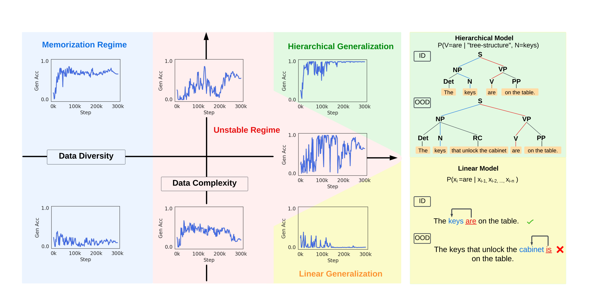

*Рисунок 1: **Данные играют критическую роль в обобщающих поведениях и устойчивости обучения.** *Слева:* вдоль оси разнообразия данных низкое разнообразие (меряемое вариацией синтаксической структуры) ведёт модель к запоминанию ненадёжных попримерных образцов, тогда как высокое разнообразие способствует приверженности общему правилу. Вдоль оси сложности данных высокая сложность (меряемая долей центрально-вложенных предложений) наводит иерархическое правило, а более простые данные (правоветвящиеся предложения) наводят поверхностное линейное правило. Смешение этих видов данных даёт неустойчивые внедоменные поведения обучения. *Справа вверху:* модель, схватывающая иерархическую структуру синтаксиса, может обобщать грамматические правила OOD, верно опознавая подлежащее как существительное, ближайшее к корню на графе синтаксического дерева. *Справа внизу:* модель с линейным правилом примет ближайшее существительное за подлежащее целевого глагола и потому не обобщится на невиданные сочетания предложений.* **[p. 2]**

Мы иллюстрируем различие правил на рис. 1, где модель ставит главный глагол предложения в согласование с существительным-подлежащим. В n-граммоподобном линейном правиле (*справа внизу*) модель берёт ближайшее существительное как подлежащее и проваливается, когда отвлекающее существительное появляется в предложной группе. В иерархическом случае (*справа вверху*) модель пользуется латентной древесной структурой, верно находит подлежащее и применяет правило, что позволяет обобщаться на любое грамматичное предложение. Прежняя работа показывает, что трансформерные ЯМ могут сдвигаться от линейной эвристики к иерархическому правилу при достаточно долгом обучении — переход, названный **структурным гроккингом** (Murty et al. 2023), в параллель известному сдвигу от запоминания к обобщению в классическом гроккинге (Power et al. 2022).

Строя на этой линии работ (McCoy et al. 2018; McCoy et al. 2020a; Ahuja et al. 2024; Murty et al. 2023), мы изучаем, как свойства обучающих *данных* определяют, примет ли модель иерархическое правило или откатится к линейному. Мы определяем **сложность данных** как присутствие центрально-вложенных клауз — синтаксической структуры, где подлежащее прервано **[p. 2]** относительной клаузой. Наши опыты показывают, что такие сложные структуры — ключевой движитель иерархического внедоменного обобщения; модели, обученные без них, стабильно откатываются к сокращениям. Эта находка вторит классическому утверждению лингвистики (Wexler 1980), что центральные вложения играют центральную роль в усвоении синтаксиса людьми.

Опознав центральные вложения как движитель иерархического обобщения, мы далее спрашиваем, как состав данных влияет на соперничество правил при обучении. Ahuja et al. 2024 показали, что линейное и иерархическое правила могут сосуществовать и соперничать при выучивании. Мы показываем, что исход этого соперничества зависит от обучающих данных. Хотя внутрираспределительная точность всегда устойчива во времени и согласована между семенами, внедоменная точность часто *неустойчива* при обучении и *несогласованна* между семенами. Два правила соперничают, и лишь прогоны, полностью приверженные одному правилу — линейному или иерархическому, — являют устойчивое внедоменное качество. Эти приверженности определяются двумя свойствами данных: **сложностью** (присутствием центральных вложений) и **разнообразием** (числом различных синтаксических деревьев). Мы находим, что приверженность стабильно случается лишь при высокой сложности и высоком разнообразии вместе, что даёт устойчивое обобщение. При промежуточных уровнях любого из свойств модели не привязываются, что даёт неустойчивое обучение и несогласованные исходы между семенами. Как сведено на рис. 1, разнообразие продвигает общие правила против запоминания, а сложность решает, какое правило выучено.

Наши контролируемые синтетические постановки позволяют точно манипулировать свойствами данных и изолировать их влияние на выучивание правил. Полученные прозрения выходят за пределы выучивания грамматики: они высвечивают, как сложность и разнообразие данных правят тем, полагаются ли модели на запоминание, эвристики или систематическое обобщение. Эти динамики соединяются с более широкими темами исследований гроккинга и неустойчивости обучения (Power et al. 2022; Ahuja et al. 2024), случайной вариации между прогонами (Juneja et al. 2022; Hu et al. 2023) и фазовых переходов в нейронных сетях (Schaeffer et al. 2023; Theunissen et al. 2020). Механизмы, опознанные нами в упрощённой области, могут осведомить наше понимание обобщения в моделях большего масштаба. Наш вклад сводится к следующему:

- Мы показываем, что сложность данных — то есть частота центральных вложений — движет принятием моделями иерархического синтаксиса вместо n-граммных эвристик (раздел 3).
- Мы находим, что модели достигают устойчивого внедоменного **[p. 3]** качества лишь при приверженности общему правилу, линейному или иерархическому. Соперничающие правила ведут к неустойчивому обучению и несогласованным исходам между семенами (раздел 4).
- Мы показываем, что разнообразие данных разделяет области запоминания, неустойчивости и обобщения (раздел 5).

*Таблица 1: **Примеры из двух грамматических предметных исследований.** *Вверху*: в задаче образования вопроса модель переносит главный вспомогательный глагол в начало, образуя вопрос. *Внизу*: в задаче перевода времени модель ставит главный глагол из прошедшего времени в настоящее, соблюдая согласование подлежащего и глагола.* **[p. 4]**

| **Набор** | **Тип правила** | **Примеры** |
|---|---|---|
| Образование вопроса | Двусмысленный | **Вход:** My unicorn does move the dogs that do wait. |
|  |  | **Выход:** Does my unicorn move the dogs that do wait? |
|  | Однозначный | **Вход:** My unicorn who doesn’t sing does move. |
|  |  | **Выход линейного:** Doesn’t my unicorn who sing does move? |
|  |  | **Выход иерархического:** Does my unicorn who doesn’t sing move? |
| Перевод времени | Двусмысленный | **Вход:** My zebra behind the peacock smiled. |
|  |  | **Выход:** My zebra behind the peacock smiles. |
|  | Однозначный | **Вход:** My zebra behind the peacocks smiled. |
|  |  | **Выход линейного:** My zebra behind the peacocks smile. |
|  |  | **Выход иерархического:** My zebra behind the peacocks smiles. |

## 2 Постановка опытов

Задачи образования вопроса и перевода времени были впервые предложены Frank and Mathis 2007 и Linzen et al. 2016 как канонические тесты способности к языковому моделированию. Мы используем существующие синтетические наборы: для образования вопроса — из McCoy et al. 2018, для перевода времени — из McCoy et al. 2020a.

### 2.1 Задача образования вопроса

В задаче **образования вопроса (QF)** модель превращает повествовательное предложение в вопрос, перенося главный вспомогательный глагол (такой как *does* в *does move*) в начало. Наши обучающие данные (на основе McCoy et al. 2018) допускают две стратегии выбора переносимого глагола: (1) линейное правило, переносящее первый вспомогательный глагол (рис. 1 *справа вверху*), или (2) иерархическое правило — верное правило английской грамматики — на основе синтаксического дерева предложения (рис. 1 *справа внизу*), помещающего главный вспомогательный глагол выше прочих глаголов.

Примеры каждого правила даны в таблице 1. Первый пример считается *двусмысленным*, поскольку иерархическое и линейное правила дают один и тот же верный исход. Напротив, второй пример *однозначен*: верный исход даёт только иерархическое правило. Обучающие и внутрираспределительные тестовые данные содержат лишь двусмысленные образцы, тогда как внедоменный обобщающий набор — лишь однозначные. Потому если модель пользуется иерархическим правилом, она достигнет $100\%$ точности и на внутрираспределительном (двусмысленные вопросы), и на внедоменном (однозначные вопросы) наборах. Наоборот, модель с линейным правилом всё же наберёт 100% на внутрираспределительном наборе, но $0\%$ на внедоменном. Мы потому используем точность модели на внедоменном наборе как меру иерархического обобщения.

### 2.2 Задача перевода времени

В задаче **перевода времени (TI)** модель превращает предложение прошедшего времени в настоящее, меняя форму главного глагола. В английском глаголы прошедшего времени (*walked*) не изменяются по числу, так что модель должна опознать подлежащее и использовать его число для формы глагола настоящего времени (*walk*/*walks*). Обучающие данные TI снова следуют либо иерархическому, либо линейному правилу согласования подлежащего и глагола (на основе McCoy et al. 2020a). Линейное правило согласует глагол с ближайшим существительным, иерархическое — верно, с подлежащим. Как и в задаче QF, обучающий и внутридоменный проверочный наборы содержат двусмысленные примеры, а внедоменный — однозначные. В двусмысленном примере из таблицы 1 существительное-подлежащее *zebra* и ближайшее существительное *peacock* совпадают по числу, так что верный ответ даёт любое правило. Во внедоменном однозначном примере подлежащее и ближайшее существительное различаются по числу, и потому верный ответ даёт только иерархическое правило. Как и в задаче QF, мерой иерархического обобщения служит точность предсказания главного глагола на внедоменном наборе.

*Рисунок 2: **Примеры предложений.** *Слева:* пример правоветвящегося предложения. Линейное течение главной составляющей не прерывается относительной клаузой. *Справа:* пример центрально-вложенного предложения. Когда относительная клауза определяет подлежащее, она прерывает линейное течение главной составляющей.* **[p. 4]**

### 2.3 Модели, данные и обучение

Мы ведём все опыты на одних и тех же 50 случайных семенах с настройками гиперпараметров из существующей литературы (Ahuja et al. 2024; Murty et al. 2023). Мы используем декодерную трансформерную архитектуру, где каждый слой имеет 8 голов при 512-мерном вложении. Модели QF имеют 6 слоёв, модели TI — 4 слоя. Все модели обучаются с нуля на причинной языково-моделирующей цели 300K шагов. Мы используем оптимизатор Adam (Kingma and Ba 2014), скорость обучения 1e-4 и линейное расписание затухания. Токенизатор пословный со словарём размера 72.

Мы используем исходные обучающие, проверочные и внедоменные тестовые данные, предложенные McCoy et al. 2018 и McCoy et al. 2020a. Там, где мы расширяем обучающие данные для опытов с составом данных, мы подражаем процессу порождения исходных задач QF и TI. А именно, исходные данные TI и QF порождены контекстно-свободными грамматиками (CFG) с упрощённым набором грамматических правил; мы переиспользуем те же правила CFG для создания вариаций обучающих данных.

## 3 Сложность данных определяет правило

Мы начинаем с рассмотрения того, как сложность обучающих данных влияет на выучиваемые моделями правила. Наш фокус — центрально-вложенные предложения, синтаксическая структура, издавна используемая в лингвистике для характеристики сложности. **[p. 4]** Абляцией центральных вложений из обучающих данных мы проверяем, как сложность данных задаёт выучиваемое правило.

### 3.1 Центральное вложение

Центральное вложение возникает, когда клауза помещена рекурсивно внутрь другой клаузы того же типа. Рис. 2 иллюстрирует два примера центрально-вложенных предложений, где вложенная клауза осложняет синтаксический разбор, помещая дополнительное существительное-подлежащее между глаголом и его собственным подлежащим.

Без центральных вложений английский синтаксис ветвится рекурсивно только вправо. В исключительно правоветвящихся структурах определяющие клаузы всегда приписаны в конце главной клаузы, сохраняя линейное течение. Потому лингвисты давно утверждают, что центральные вложения играют решающую роль в усвоении грамматики (Wexler 1980) и ведут к древовидным синтаксическим структурам (Chomsky 2015). Мы находим, что центральные вложения, критичные для усвоения языка людьми, также ведут ЯМ к предпочтению иерархических грамматических правил.

Лингвистическая теория объясняет, что центральные вложения ведут к выучиванию иерархического правила из-за их бо́льших вычислительных требований. Чтобы предсказать следующий токен, ЯМ должны отслеживать синтаксические связи между словами контекста. В правоветвящихся предложениях ЯМ могут полагаться на линейную близость для опознания этих связей; как показано на рис. 2, простой биграммной модели достаточно, чтобы схватить связь подлежащего и глагола в таких предложениях. Напротив, центральные вложения вводят относительные клаузы разной длины, делая линейные n-граммные модели неэффективными для схватывания связей подлежащего и глагола. Поскольку центральные вложения рекурсивны, они требуют от модели отслеживать несколько связей подлежащее—глагол: одну для главной клаузы и отдельную для вложенной относительной. В этих случаях древесная структура эффективнее линейной для моделирования связей подлежащего и глагола.

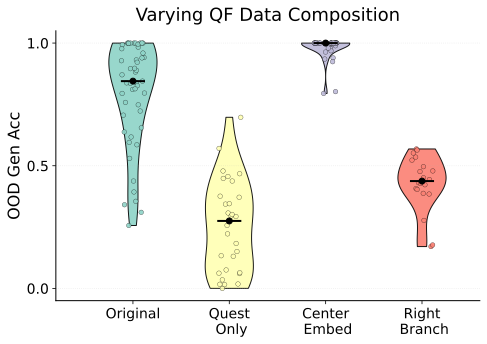

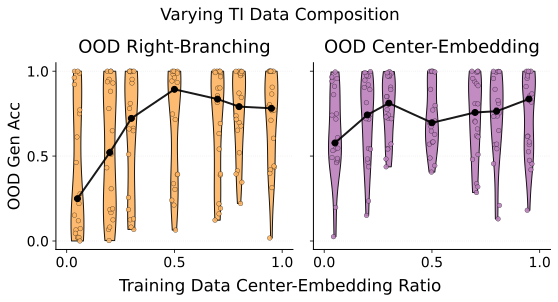

*Рисунок 3: **Составляющие обучающих данных движут разными обобщающими поведениями.** Каждая точка — одна модель, обученная с отдельного случайного семени. *Слева:* в QF центрально-вложенные предложения появляются только в данных копирования утверждений; воздействие этих примеров наводит иерархическое обобщение. *Справа:* в TI мы варьируем смесь правоветвящихся и центрально-вложенных предложений и оцениваем внедоменное качество на правоветвящихся (*оранжевый*) против центрально-вложенных (*фиолетовый*).* **[p. 5]**

### 3.2 Результаты образования вопроса

В задаче QF (раздел 2.1) обучающие данные должны оставаться двусмысленными между линейным правилом (перенос первого вспомогательного) и иерархическим (перенос главного вспомогательного). Поскольку центрально-вложенные предложения не двусмысленны, они не могут появляться в обучающих примерах QF. Чтобы показать модели такие структуры, McCoy et al. 2018 ввели побочную задачу: копирование утверждений. Как и QF, она начинается с повествовательного предложения, но вместо преобразования модель просто повторяет его. Лишь основная задача QF требует двусмысленности, потому примеры копирования утверждений могут включать центральные вложения. В первой серии опытов мы меняем состав подмножества копирования утверждений, создавая три новых обучающих набора: *Quest **[p. 5]** Only* (без примеров копирования утверждений), *Center Embed* (только центрально-вложенные утверждения) и *Right Branch* (только правоветвящиеся утверждения). Во всех случаях полный набор обучающих примеров QF сохранён. Мы обучаем модели на 50 случайных семенах.

Независимо от состава обучающего набора все модели достигают 100% точности на внутрираспределительных тестовых данных. Однако их внедоменное качество резко различается (рис. 3, слева). Модели, обученные без каких-либо центрально-вложенных примеров копирования утверждений, повсеместно (на всех 50 семенах) не выучивают иерархическое правило, даже когда включены правоветвящиеся утверждения. Напротив, модели, обученные только на центрально-вложенных примерах копирования утверждений, сильно предпочитают иерархическое правило. Эти результаты показывают, что воздействие центрально-вложенных предложений существенно для наведения иерархического обобщения.

### 3.3 Результаты перевода времени

В задаче TI (раздел 2.2) и правоветвящиеся, и центрально-вложенные предложения двусмысленны, пока подлежащее глагола совпадает по числу с отвлекающим существительным между подлежащим и глаголом. В правоветвящихся предложениях отвлекающее стоит в предложной группе; в центрально-вложенных — в относительной клаузе. Ниже два конкретных примера.

1. **Правоветвящееся**: существительное (*cabinet*) в предложной группе (*to the cabinet*) служит отвлекающим для задачи TI. ID: *The keys to the **cabinets** are here.* OOD: *The keys to the **cabinet** are here.*
2. **Центральное вложение**: отвлекающим служит подлежащее либо дополнение (*cabinet*) в относительной клаузе (*that unlock the cabinet*). ID: *The keys that unlock the **cabinets** are here.* OOD: *The keys that unlock the **cabinet** are here.*

Чтобы проверить влияние центральных вложений на выучивание правил, мы создаём обучающие наборы с долей правоветвящихся к центрально-вложенным от 5% до 95% при закреплённом общем числе образцов.22 2 Исходный набор включал и побочную задачу копирования прошедшего времени, параллельную копированию утверждений в QF. В прил. E.1 мы показываем, что эта задача не нужна, и опускаем её здесь. Для оценки мы делим исходный внедоменный тестовый набор (McCoy et al. 2020a) на правоветвящееся и центрально-вложенное подмножества. Это деление позволяет отдельно мерить, насколько хорошо модели обобщаются на каждом виде дерева.

Все семена достигают совершенной точности на внутрираспределительном тестовом наборе, но внедоменное качество сильно зависит от доли центрально-вложенных предложений (рис. 3, справа). На наименее сложном обучающем наборе, где центральные вложения лишь у 5% предложений, большинство семян ниже случайного на правоветвящемся внедоменном подмножестве и около случайного на центрально-вложенном. С ростом доли центральных вложений (до 50%) большинство семян успешны на обоих внедоменных подмножествах — модели выучили иерархическое правило. Эти находки подтверждают, что рост сложности данных через центральные вложения продвигает иерархическое обобщение. В приложении C мы дополнительно показываем, что разные подвиды центрального вложения различаются по влиянию на правила TI.

*Рисунок 4: **Каждый прогон обучения либо стабилизируется в простом внедоменном обобщающем правиле, либо колеблется во внедоменной точности.** Внедоменные обобщающие поведения могут быть устойчивыми или неустойчивыми при обучении с разными семенами. Мы используем полную вариацию для количественной оценки неустойчивости внутри одного прогона.* **[p. 6]**

## 4 Правила стабилизируют обучение

Почему некоторые прогоны не могут надёжно обобщиться иерархически даже при обучении на иерархически-склоняющих **[p. 6]** данных? Этот раздел покажет, что такие слабые прогоны колеблются между соперничающими правилами; модели стабилизируются на внедоменных данных, лишь если привержены общему правилу — иерархическому или линейному. При наших условиях обучения часть случайных семян не стабилизируется ни при каком составе обучающего набора.

### 4.1 Неустойчивость при обучении

По всем нашим прогонам обучающая потеря и внутридоменное качество согласованы между случайными семенами и устойчивы при обучении (примеры кривых обучения — в F). Несмотря на устойчивую внутридоменную точность при обучении, некоторые случайные семена дают крайне неустойчивую внедоменную точность, колеблющуюся при обучении. Мы меряем внедоменную неустойчивость по времени обучения стандартной мерой из обработки сигналов: **полной вариацией** (TV). А именно, мы сохраняем контрольную точку модели каждые 2K шагов и меряем обобщающую точность $\mathrm{Acc}_{t}$ на каждом временном шаге $t\in T$. TV определяется как:

$$
\text{TV}=\frac{1}{|T|}\sum_{t\in T}\left|\mathrm{Acc}_{t}-\mathrm{Acc}_{t-1}\right| \tag{1}
$$

На рисунке 4 мы показываем внедоменное качество четырёх прогонов с разными семенами — от высокоустойчивого внедоменного качества до крайне неустойчивого. Мы также приводим соответствующую TV, показывая, что TV квантифицирует неустойчивость обучения.

### 4.2 Устойчивость связана с приверженностью правилу

Почему одни прогоны являют устойчивое внедоменное качество, а другие дико колеблются? Мы теперь показываем, что независимо от смеси обучающих данных прогоны с устойчивым внедоменным поведением всегда привержены всеобщему систематическому правилу.

#### Постановка:

Мы строим пять вариаций обучающих данных по следующей процедуре. Каждый новый набор содержит 50K вопросов из исходных данных и 50K утверждений с управляемой долей между центрально-вложенными (иерархически-склоняющими) и правоветвящимися (линейно-склоняющими) предложениями. Наши новопорождённые утверждения сохраняют исходное распределение уникальных синтаксических деревьев. А именно, для каждого предложения исходных данных мы сохраняем его синтаксическое дерево по CFG, но пересэмплируем слова из словаря CFG. Затем мы обучаем модели с 50 случайных семян с гиперпараметрами раздела 2.3. Для каждого семени мы приводим внедоменное качество модели и TV на рисунке 5.

#### Результаты:

###### p6-5

Как показано на рисунке 5, независимо от смеси данных итоговая внедоменная обобщающая точность всех устойчивых моделей — либо $100\%$, либо $0\%$, то есть все они привержены всеобщему систематическому правилу. Хотя устойчивая модель может реализовать любое из правил, состав обучающих данных определяет вероятность исходов обучения — стабилизируется ли прогон и будет ли его систематическое правило иерархическим или линейным. Как видно ранее, если в обучающих данных преобладают центрально-вложенные или правоветвящиеся предложения, итоговые модели обычно привержены иерархическому или линейному правилу соответственно. Однако когда данные неоднородны (например, 10% примеров — линейно-склоняющие правоветвящиеся последовательности), итоговая обобщающая точность устойчивых прогонов двумодально распределена по случайным семенам, скапливаясь около $100\%$ или $0\%$. В самом деле, подковообразные кривые на рисунке 5 иллюстрируют: чем менее устойчив прогон обучения QF, тем менее всеобще модель применяет свои внедоменные правила. (Согласные результаты для задачи TI — в приложении E.2.)

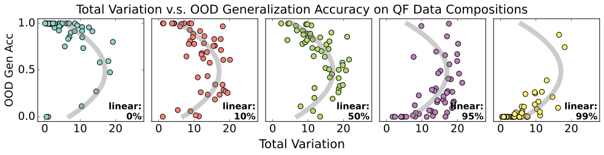

*Рисунок 5: **Устойчивость обучения против итоговой обобщающей точности для задачи QF.** Мы создаём неоднородные обучающие данные, смешивая разные доли линейно-склоняющих и иерархически-склоняющих данных. Для каждой смеси мы обучаем модели на 50 случайных семенах и для каждого семени рассматриваем неустойчивость обучения (ось $x$) и итоговое внедоменное обобщающее качество (ось $y$). Серая линия — сглаженная средняя кривая по всем пяти наборам.* **[p. 7]**

Итого: смешивая линейно-склоняющие и иерархически-склоняющие данные, мы создаём неоднородную обучающую смесь. При обучении на неоднородных смесях больше семян дают неустойчивые прогоны. Однако даже при неоднородных смесях часть прогонов всё же может стабилизироваться, приверженцем одного из соперничающих правил.

## 5 Разнообразие данных ведёт к общим правилам

В предыдущем разделе мы показали, что прогоны стабилизируются, если модель привержена система**[p. 7]**тическому правилу. Мы теперь расширяем эту находку, показывая, что разнообразие данных способствует приверженности этим систематическим всеобщим правилам. Мы находим, что обучение может стабилизироваться двумя путями: при *менее* разнообразных данных модели стабилизируются запоминанием обучающих примеров, при *более* разнообразных — приверженностью систематическим правилам (изученной в предыдущем разделе). При промежуточных уровнях разнообразия — как и при промежуточных уровнях сложности (раздел 4.2) — обучение становится неустойчивым.

### 5.1 Измерение разнообразия данных

Мы определяем разнообразие набора по синтаксическому сходству его предложений. Сходство пары предложений мы меряем расстоянием правки деревьев (TED) между их латентными синтаксическими деревьями (Chomsky 2015). Когда два предложения делят одно синтаксическое дерево, одно превращается в другое с изменением лишь словаря листовых узлов. Например, *My unicorn loves her rabbit* и *Your zebra eats some apples* различаются словарём, но имеют тождественные синтаксические деревья. Мы определяем **разнообразие** набора как число уникальных синтаксических деревьев в нём — подобно мерам разнообразия, прежде использованным и в естественном языке (Huang et al. 2023; Gao and He 2024; Ramírez et al. 2022), и в коде (Song et al. 2024).

### 5.2 Разнообразие и устойчивость

В разделе 4 мы показали, что обучение стабилизируется, если модели привержены систематическому правилу. Здесь мы показываем, что разнообразие данных задаёт неустойчивость обучения и приверженность правилу. А именно, мы находим, что модели на менее разнообразных данных могут стабилизироваться запоминанием без приверженности каким-либо систематическим правилам, тогда как модели на более разнообразных данных стабилизируются систематическими правилами. Ранее мы нашли, что *какому* правилу модель привержена, зависит от преобладания в наборе иерархически-склоняющих или линейно-склоняющих данных, потому мы анализируем эти две обстановки раздельно.

#### Иерархически-склоняющие данные

Чтобы изучить влияние разнообразия в иерархически-склоняющих обстановках, мы строим несколько обучающих наборов с разными уровнями синтаксического разнообразия. Каждый набор содержит 50K образцов вопросов и 50K центрально-вложенных утверждений. Мы управляем разнообразием, меняя число уникальных синтаксических деревьев в утверждениях. Для каждого набора мы обучаем 50 случайных семян и меряем неустойчивость полной вариацией (раздел 4.1). Мы также приводим **долю приверженности правилу**: долю прогонов с внедоменной точностью выше 95% или ниже 5%, что в обоих случаях указывает на приверженность модели систематическому правилу.

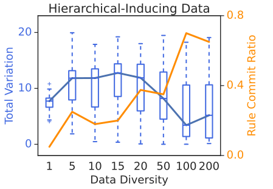

*Рисунок 6: **Влияние разнообразия данных на устойчивость обучения и приверженность правилу.** Ось x меряет синтаксическое разнообразие числом уникальных синтаксических деревьев в обучающем наборе (Section XX). Левая ось y показывает неустойчивость обучения, меряемую полной вариацией (раздел 4.1). Правая ось y показывает долю приверженности правилу — долю из 50 обучающих семян с внедоменной точностью выше 95% или ниже 5%, что указывает на приверженность систематическому правилу. *Слева*: иерархически-склоняющие данные; *справа*: линейно-склоняющие данные, где разнообразие варьируется через малую долю иерархических примеров. В обеих обстановках низкое разнообразие ведёт к устойчивому запоминанию, промежуточное — к неустойчивости, высокое — к устойчивой приверженности правилу.* **[p. 8]**

###### p7-4

Рисунок 6 (*слева*) показывает три различных области. При низком разнообразии (разнообразие $<5$) модели входят в **область запоминания**: обучение устойчиво, но они не привержены правилу. В приложении G.1 мы подтверждаем, что эти запоминающие модели применяют иерархическое правило к синтаксическим структурам, виденным при обучении, но не могут экстраполировать на невиданные. При высоком разнообразии (не менее 50 уникальных деревьев) модели входят в **область иерархического обобщения**, где обучение надёжно стабилизируется приверженностью иерархическому правилу. Между этими крайностями лежит **неустойчивая область** (5–20 уникальных деревьев), где данные слишком разнообразны для запоминания, но недостаточно разнообразны, чтобы научить всеобщему правилу, что даёт колеблющиеся внедоменные кривые.

#### Линейно-склоняющие данные

В отличие от иерархически-склоняющей обстановки, линейно-склоняющие данные (правоветвящиеся предложения) допускают мало синтаксической вариации: вспомогательный всегда следует за существительным-подлежащим, не оставляя естественного способа увеличить разнообразие. Вместо этого мы строим на смеси 99% правоветвящихся **[p. 8]** и 1% центрально-вложенных данных, которая, как мы находим, надёжно наводит линейное правило. Сохраняя эту долю смеси, мы управляем разнообразием, варьируя синтаксические структуры центрально-вложенных предложений. Как и в иерархически-склоняющей обстановке, мы используем наборы из 50K вопросов и 50K утверждений и меряем неустойчивость обучения и приверженность правилу, как прежде.

###### p8-1

Рисунок 6 (*справа*) показывает, что те же три области появляются и в линейно-склоняющем случае. При низком разнообразии модели запоминают знакомые синтаксические структуры без приверженности правилу. При промежуточном разнообразии обучение становится неустойчивым: запоминание уже невозможно, но сигнал слишком слаб, чтобы навести систематическое обобщающее правило. При высоком разнообразии модели стабилизируются в **области линейного обобщения**, приверженные линейному правилу. Это зеркалит U-образную картину иерархически-склоняющих данных, подтверждая, что синтаксическое разнообразие существенно для систематического обобщения — независимо от предпочитаемого правила.

## 6 Связанные работы

Более развёрнутый обзор литературы — в прил. A.

#### Синтаксис и иерархическое обобщение

###### p8-3

McCoy et al. 2018 первыми использовали задачу образования вопроса для изучения иерархического обобщения в нейронных сетях, показав, что механизмы внимания улучшают обобщающее качество рекуррентных сетей (RNN). Позже McCoy et al. 2020a нашли, что древесно-структурные архитектуры стабильно наводят иерархическое обобщение. Petty and Frank 2021 и Mueller et al. 2022 далее заключили, что трансформеры склонны обобщаться линейно. Этот взгляд оспорили Murty et al. 2023, приписав те результаты недостаточному обучению: декодерные трансформеры могут обобщаться иерархически, но лишь после выхода внутрираспределительного качества на плато. Они назвали этот переход от поверхностных эвристик к иерархическому обобщению структурным гроккингом. Расширяя их находки, Ahuja et al. 2024 показали, что модели обобщаются иерархически лишь при обучении на языково-моделирующей цели. Вся эта прежняя работа приписывала иерархическую индуктивную склонность архитектуре модели или цели, тогда как наше исследование высвечивает влияние данных. Хотя прежняя работа замечала некоторую несогласованность между семенами (McCoy et al. 2018; McCoy et al. 2020b), мы характеризуем эту случайную вариацию точнее.

#### Динамика обучения и гроккинг

При *гроккинге* нейронная сеть обобщается на тестовый набор долго после переобучения на обучающих данных. Power et al. 2022 первыми наблюдали это явление на простых арифметических задачах. Этот *классический* гроккинг отличен от нашего главного предмета — *структурного* гроккинга (Murty et al. 2023). В классическом гроккинге модель переходит от запоминания к обобщению, достигая нетривиального качества на невиданных данных того же распределения, что и обучающий набор. В структурном гроккинге модель переходит от простого линейного правила к иерархическому, что даёт нетривиальное качество на внедоменных данных. Однако наши находки соотносятся и с классическим гроккингом — через связь разнообразия данных с запоминанием.

Zhu et al. 2024 изучили роль данных и нашли, что гроккинг случается лишь при достаточно большом — а значит, более разнообразном — обучающем наборе **[p. 9]**. Berlot-Attwell et al. 2023 изучали, как разнообразие данных ведёт к внедоменному композиционному обобщению в мультимодальных моделях, а Lubana et al. 2024 показали, что разнообразие наводит композиционные поведения и на поздних порах обучения ЯМ. Liu et al. 2022 показали, что гроккинг наводится принудительной установкой нормы весов — меры сложности модели, но не данных. Huang et al. 2024 и Varma et al. 2023 показали, что при обучении соперничают разные цепи и что разные данные и размеры моделей дают разное соперничество и разную динамику обучения. Соперничество формирует и другие фазовые переходы, такие как преходящее обучение в контексте (Park et al. 2024).

#### Случайная вариация

Хотя выборы вроде гиперпараметров, архитектуры и оптимизатора задают исходы моделей, обучение остаётся внутренне стохастичным. Модели чувствительны к случайной инициализации и порядку обучающих примеров Dodge et al. 2020; Zhou et al. 2020; D’Amour et al. 2022; Naik et al. 2018; Sellam et al. 2021; Juneja et al. 2022. На задачах классификации текста Zhou et al. 2020 наблюдали внедоменную изменчивость даже на поздних порах обучения. Мы исследуем источник этих несогласованностей обучения и связываем их точнее со свойствами обучающих данных.

## 7 Обсуждение и выводы

Исследуя роль данных во внедоменных обобщающих правилах, мы заодно открыли, какие обстановки делают исходы непредсказуемыми. Сложные данные наводят более сложные правила, но смесь сложных и простых примеров ведёт к неустойчивости и несогласованности. Аналогично, большее разнообразие данных благоприятствует всеобщим обобщающим правилам против запоминания примеров, но промежуточное разнообразие ведёт к неустойчивости и несогласованности. Эти находки имеют следствия и для машинного обучения, и для лингвистики.

#### Несогласованное поведение между семенами.

Хотя вариация ошибки модели в теоретической литературе часто трактуется как одномодальный гауссов шум (Lakshminarayanan et al. 2016), наши находки говорят, что ошибки могут распределяться одномодально лишь для данного композиционного решения. Наша работа присоединяется к растущей литературе о том, что случайная вариация может создавать скопления внедоменных поведений. Прежде скопления виделись в эвристиках классификации текста (Juneja et al. 2022) и динамике обучения (Hu et al. 2023). В нашем случае внедоменная точность явно двумодальна лишь при исключении неустойчивых прогонов. Мы предлагаем будущим исследованиям вариации обучения учитывать устойчивость обучения — это может обнажить скопления решений.

#### Следствия для формальной лингвистики.

В спорах о бедности стимула лингвисты обширно изучали вопрос, какие данные необходимы и достаточны для выучивания грамматических правил (McCoy et al. 2018; Berwick et al. 2011). В частности, Wexler 1980 утверждал, что все синтаксические правила английского выучиваемы на данных «степени 2» — предложениях лишь с одной клаузой, вложенной в другую. Наши результаты о центральном вложении подтверждают: без более сильной архитектурной индуктивной склонности — самого предмета спора о бедности стимула — данные степени 1 сами по себе не могут навести предпочтение иерархической структуры. Однако наша работа поддерживает и позицию Lightfoot 1989, что данных меньшей степени достаточно ребёнку для выучивания конкретного правила при достаточно богатых данных вне этого правила: ЯМ экстраполирует с QF-примеров степени 1, если видела достаточно примеров утверждений степени 2, чтобы обрести иерархическую склонность.

#### Гроккинг, неустойчивость и латентная структура.

Классический гроккинг (Power et al. 2022) отличен от структурного. Последний влечёт переход между обобщающими правилами, первый — переход от запоминания к обобщению. Наши находки проясняют оба сценария.

###### p9-6

Структурный гроккинг порождается соперничеством линейно- и иерархически-склоняющих обучающих подмножеств. Без соперничающих подмножеств модель немедленно выучивает либо линейное, либо иерархическое правило без постепенного перехода. Когда эти правила соперничают, обучение неустойчиво, что оставляет щель для отложенного иерархического обобщения. Наше исследование разнообразия данных имеет схожие следствия для классического гроккинга, где соперничают запомненные эвристики и систематические правила, нужные для эффективного моделирования разнообразных обучающих данных. И снова: строгая область запоминания сравнительно устойчива, а промежуточное разнообразие неустойчиво, что ведёт к возможным гроккинговым динамикам.

###### p9-7

В известном смысле запоминание — лишь ещё одно правило для схватывания обучающего распределения. Эта рамка объединяет литературу о гроккинге с другими фазовыми переходами, такими как возникновение способностей (Schaeffer et al. 2023) и доброкачественная интерполяция (Theunissen et al. 2020). Будущая работа могла бы развить эту объединённую теорию влияния разнообразия и сложности данных.

**[p. 10]**

## Ограничения

Наша работа опирается на синтетические контролируемые постановки, обычные для литературы анализа языковых моделей. Эти находки, как и другие заметные результаты о гроккинге и динамике обучения, могут не переноситься на больший масштаб или многозадачные постановки.

### Благодарности

Tian Qin и David Alvarez-Melis частично поддержаны Институтом Кемпнера, фондом Aramont Fellowship Fund и фондом FAS Dean’s Competitive Fund for Promising Scholarship. Мы очень благодарны David Chiang, Isabel Papadimitriou, Ekdeep Singh, John Rawski, Will Merrill за ценные отклики и обсуждения, улучшившие эту работу.

## References

- Kabir Ahuja, Vidhisha Balachandran, Madhur Panwar, Tianxing He, Noah A Smith, Navin Goyal, and Yulia Tsvetkov. 2024. Learning syntax without planting trees: Understanding when and why transformers generalize hierarchically. *arXiv [cs.CL]*.

- Boaz Barak, Benjamin L Edelman, Surbhi Goel, Sham Kakade, Eran Malach, and Cyril Zhang. 2022. Hidden progress in deep learning: SGD learns parities near the computational limit. *arXiv [cs.LG]*.

- Ian Berlot-Attwell, Kumar Krishna Agrawal, A Michael Carrell, Yash Sharma, and Naomi Saphra. 2023. Attribute diversity determines the systematicity gap in VQA. *arXiv [cs.LG]*.

- Robert C Berwick, Paul Pietroski, Beracah Yankama, and Noam Chomsky. 2011. Poverty of the stimulus revisited. *Cogn. Sci.*, 35(7):1207–1242.

- Angelica Chen, Ravid Shwartz-Ziv, Kyunghyun Cho, Matthew L Leavitt, and Naomi Saphra. 2023. Sudden drops in the loss: Syntax acquisition, phase transitions, and simplicity bias in MLMs. *arXiv [cs.CL]*.

- Noam Chomsky. 2015. *Aspects of the theory of syntax*, 50 edition. The MIT Press. MIT Press, London, England.

- Leshem Choshen, Guy Hacohen, Daphna Weinshall, and Omri Abend. 2022. The grammar-learning trajectories of neural language models. In *Proceedings of the 60th Annual Meeting of the Association for Computational Linguistics (Volume 1: Long Papers)*, pages 8281–8297, Stroudsburg, PA, USA. Association for Computational Linguistics.

- Alexander D’Amour, Katherine Heller, Dan Moldovan, Ben Adlam, Babak Alipanahi, Alex Beutel, Christina Chen, Jonathan Deaton, Jacob Eisenstein, Matthew D Hoffman, Farhad Hormozdiari, Neil Houlsby, Shaobo Hou, Ghassen Jerfel, Alan Karthikesalingam, Mario Lucic, Yian Ma, Cory McLean, Diana Mincu, and 21 others. 2022. Underspecification presents challenges for credibility in modern machine learning. *Journal of Machine Learning Research*, 23(226):1–61.

- Jesse Dodge, Gabriel Ilharco, Roy Schwartz, Ali Farhadi, Hannaneh Hajishirzi, and Noah Smith. 2020. Fine-tuning pretrained language models: Weight initializations, data orders, and early stopping. *arXiv [cs.CL]*.

- Robert Frank and Donald Mathis. 2007. Transformational networks. *Models of Human Language Acquisition*, 22.

- Nan Gao and Qingshun He. 2024. A dependency distance approach to the syntactic complexity variation in the connected speech of alzheimer’s disease. *Humanit. Soc. Sci. Commun.*, 11(1).

- Robert Geirhos, Jörn-Henrik Jacobsen, Claudio Michaelis, Richard Zemel, Wieland Brendel, Matthias Bethge, and Felix A Wichmann. 2020. Shortcut learning in deep neural networks. *Nat. Mach. Intell.*, 2(11):665–673.

- Katherine L Hermann and Andrew K Lampinen. 2020. What shapes feature representations? exploring datasets, architectures, and training. *arXiv [cs.LG]*.

- John Hewitt and Christopher D Manning. 2019. A structural probe for finding syntax in word representations. In *Proceedings of the 2019 Conference of the North*, pages 4129–4138, Stroudsburg, PA, USA. Association for Computational Linguistics.

- Michael Y Hu, Angelica Chen, Naomi Saphra, and Kyunghyun Cho. 2023. Latent state models of training dynamics. *arXiv [cs.LG]*.

- Kuan-Hao Huang, Varun Iyer, I-Hung Hsu, Anoop Kumar, Kai-Wei Chang, and Aram Galstyan. 2023. ParaAMR: A large-scale syntactically diverse paraphrase dataset by AMR back-translation. In *Proceedings of the 61st Annual Meeting of the Association for Computational Linguistics (Volume 1: Long Papers)*, Stroudsburg, PA, USA. Association for Computational Linguistics.

- Yufei Huang, Shengding Hu, Xu Han, Zhiyuan Liu, and Maosong Sun. 2024. Unified view of grokking, double descent and emergent abilities: A perspective from circuits competition. *arXiv [cs.LG]*.

- Jeevesh Juneja, Rachit Bansal, Kyunghyun Cho, João Sedoc, and Naomi Saphra. 2022. Linear connectivity reveals generalization strategies. *arXiv [cs.LG]*.

- Diederik P Kingma and Jimmy Ba. 2014. Adam: A method for stochastic optimization. *arXiv [cs.LG]*.

- Balaji Lakshminarayanan, Alexander Pritzel, and Charles Blundell. 2016. Simple and scalable predictive uncertainty estimation using deep ensembles. *arXiv [stat.ML]*.

**[p. 11]**

- David Lightfoot. 1989. The child’s trigger experience: Degree-0 learnability. *Behavioral and brain sciences*, 12(2):321–334.

- Tal Linzen, Emmanuel Dupoux, and Yoav Goldberg. 2016. Assessing the ability of LSTMs to learn syntax-sensitive dependencies. *Trans. Assoc. Comput. Linguist.*, 4:521–535.

- Ziming Liu, Eric J Michaud, and Max Tegmark. 2022. Omnigrok: Grokking beyond algorithmic data. *arXiv [cs.LG]*.

- Ekdeep Singh Lubana, Kyogo Kawaguchi, Robert P Dick, and Hidenori Tanaka. 2024. A percolation model of emergence: Analyzing transformers trained on a formal language. *arXiv [cs.LG]*.

- Brian MacWhinney. 2014. *The childes project: Tools for analyzing talk, volume II: The database*, 3 edition. Psychology Press, London, England.

- R Thomas McCoy, Robert Frank, and Tal Linzen. 2018. Revisiting the poverty of the stimulus: hierarchical generalization without a hierarchical bias in recurrent neural networks. *arXiv [cs.CL]*.

- R Thomas McCoy, Robert Frank, and Tal Linzen. 2020a. Does syntax need to grow on trees? sources of hierarchical inductive bias in sequence-to-sequence networks. *Trans. Assoc. Comput. Linguist.*, 8:125–140.

- R Thomas McCoy, Ellie Pavlick, and Tal Linzen. 2019. Right for the wrong reasons: Diagnosing syntactic heuristics in natural language inference. *arXiv [cs.CL]*.

- Tom McCoy, Robert Frank, and Tal Linzen. 2020b. Does syntax need to grow on trees? sources of hierarchical inductive bias in sequence-to-sequence networks. https://rtmccoy.com/rnn_hierarchical_biases.html. Accessed: 2024-11-20.

- William Merrill, Nikolaos Tsilivis, and Aman Shukla. 2023. A tale of two circuits: Grokking as competition of sparse and dense subnetworks. *arXiv [cs.LG]*.

- Aaron Mueller, Robert Frank, Tal Linzen, Luheng Wang, and Sebastian Schuster. 2022. Coloring the blank slate: Pre-training imparts a hierarchical inductive bias to sequence-to-sequence models. In *Findings of the Association for Computational Linguistics: ACL 2022*, Stroudsburg, PA, USA. Association for Computational Linguistics.

- Aaron Mueller and Tal Linzen. 2023. How to plant trees in language models: Data and architectural effects on the emergence of syntactic inductive biases. *arXiv [cs.CL]*.

- Aaron Mueller, Albert Webson, Jackson Petty, and Tal Linzen. 2024. In-context learning generalizes, but not always robustly: The case of syntax. In *Proceedings of the 2024 Conference of the North American Chapter of the Association for Computational Linguistics: Human Language Technologies (Volume 1: Long Papers)*, pages 4761–4779, Stroudsburg, PA, USA. Association for Computational Linguistics.

- Shikhar Murty, Pratyusha Sharma, Jacob Andreas, and Christopher Manning. 2023. Grokking of hierarchical structure in vanilla transformers. In *Proceedings of the 61st Annual Meeting of the Association for Computational Linguistics (Volume 2: Short Papers)*, Stroudsburg, PA, USA. Association for Computational Linguistics.

- Shikhar Murty, Pratyusha Sharma, Jacob Andreas, and Christopher D Manning. 2022. Characterizing intrinsic compositionality in transformers with tree projections. *arXiv [cs.CL]*.

- Aakanksha Naik, Abhilasha Ravichander, Norman Sadeh, Carolyn Rose, and Graham Neubig. 2018. Stress test evaluation for natural language inference. In *Proceedings of the 27th International Conference on Computational Linguistics*, pages 2340–2353.

- Neel Nanda, Lawrence Chan, Tom Lieberum, Jess Smith, and Jacob Steinhardt. 2023. Progress measures for grokking via mechanistic interpretability. *arXiv [cs.LG]*.

- Catherine Olsson, Nelson Elhage, Neel Nanda, Nicholas Joseph, Nova DasSarma, Tom Henighan, Ben Mann, Amanda Askell, Yuntao Bai, Anna Chen, Tom Conerly, Dawn Drain, Deep Ganguli, Zac Hatfield-Dodds, Danny Hernandez, Scott Johnston, Andy Jones, Jackson Kernion, Liane Lovitt, and 7 others. 2022. In-context learning and induction heads. *arXiv [cs.LG]*.

- Isabel Papadimitriou and Dan Jurafsky. 2020. Learning music helps you read: Using transfer to study linguistic structure in language models. In *Proceedings of the 2020 Conference on Empirical Methods in Natural Language Processing (EMNLP)*, Stroudsburg, PA, USA. Association for Computational Linguistics.

- Isabel Papadimitriou and Dan Jurafsky. 2023. Injecting structural hints: Using language models to study inductive biases in language learning. *arXiv [cs.CL]*.

- Core Francisco Park, Ekdeep Singh Lubana, Itamar Pres, and Hidenori Tanaka. 2024. Competition dynamics shape algorithmic phases of in-context learning. *arXiv [cs.LG]*.

- Jackson Petty and Robert Frank. 2021. Transformers generalize linearly. *arXiv [cs.CL]*.

- Alethea Power, Yuri Burda, Harri Edwards, Igor Babuschkin, and Vedant Misra. 2022. Grokking: Generalization beyond overfitting on small algorithmic datasets. *arXiv [cs.LG]*.

- Jorge Ramírez, Marcos Baez, Auday Berro, Boualem Benatallah, and Fabio Casati. 2022. Crowdsourcing syntactically diverse paraphrases with diversity-aware prompts and workflows. In *Advanced Information Systems Engineering: 34th International Conference, CAiSE 2022, Leuven, Belgium, June 6–10, **[p. 12]** 2022, Proceedings*, page 253–269, Berlin, Heidelberg. Springer-Verlag.

- Naomi Saphra and Adam Lopez. 2018. Understanding learning dynamics of language models with SVCCA. *arXiv [cs.CL]*.

- Naomi Saphra and Adam Lopez. 2019. Understanding learning dynamics of language models with. In *Proceedings of the 2019 Conference of the North*, pages 3257–3267, Stroudsburg, PA, USA. Association for Computational Linguistics.

- Rylan Schaeffer, Brando Miranda, and Sanmi Koyejo. 2023. Are emergent abilities of large language models a mirage? *arXiv [cs.AI]*.

- Thibault Sellam, Steve Yadlowsky, Ian Tenney, Jason Wei, Naomi Saphra, Alexander D’Amour, Tal Linzen, Jasmijn Bastings, Iulia Raluca Turc, Jacob Eisenstein, Dipanjan Das, and Ellie Pavlick. 2021. The MultiBERTs: BERT reproductions for robustness analysis. In *International Conference on Learning Representations*.

- Yewei Song, Cedric Lothritz, Daniel Tang, Tegawendé F Bissyandé, and Jacques Klein. 2024. Revisiting code similarity evaluation with abstract syntax tree edit distance. *arXiv [cs.CL]*.

- Marthinus Wilhelmus Theunissen, Marelie Davel, and Etienne Barnard. 2020. Benign interpolation of noise in deep learning. *S. Afr. Comput. J.*, 32(2).

- Vikrant Varma, Rohin Shah, Zachary Kenton, János Kramár, and Ramana Kumar. 2023. Explaining grokking through circuit efficiency. *arXiv [cs.LG]*.

- Kenneth Wexler. 1980. Formal principles of language acquisition.

- Kaizhong Zhang and Dennis Shasha. 1989. Simple fast algorithms for the editing distance between trees and related problems. *SIAM J. Comput.*, 18(6):1245–1262.

- Xiang Zhou, Yixin Nie, Hao Tan, and Mohit Bansal. 2020. The curse of performance instability in analysis datasets: Consequences, source, and suggestions. In *Proceedings of the 2020 Conference on Empirical Methods in Natural Language Processing*.

- Xuekai Zhu, Yao Fu, Bowen Zhou, and Zhouhan Lin. 2024. Critical data size of language models from a grokking perspective. *arXiv [cs.CL]*.

**[p. 13]**

## Приложение A Расширенный обзор связанных работ

### A.1 Синтаксис и иерархическое обобщение

Тогда как работы раздела 6 сосредоточены на моделях, обучаемых с нуля, другая линия исследований рассматривала индуктивную склонность предобученных моделей. Mueller et al. 2024; Mueller and Linzen 2023 предобучали трансформеры на текстовых корпусах вроде Wikipedia и CHILDES (MacWhinney 2014) перед дообучением на задаче образования вопроса. Они нашли, что воздействие больших объёмов естественного языка позволяет трансформерам обобщаться иерархически.

Вместо использования задачи образования вопроса как зонда, Hewitt and Manning 2019; Murty et al. 2022 прямо истолковывали внутренние представления модели, чтобы понять, ограничивают ли трансформеры свои вычисления древесно-структурными образцами. Hewitt and Manning 2019 показали, что синтаксические деревья вложены в пространство представлений модели. Аналогично, Murty et al. 2022 проецируют трансформеры в древесно-структурную сеть и показали, что трансформеры становятся более древовидными по ходу обучения на языковых данных.

Papadimitriou and Jurafsky 2023; Papadimitriou and Jurafsky 2020 и Mueller et al. 2022 также изучали, как данные предобучения могут вносить индуктивную склонность в усвоение языка. Papadimitriou and Jurafsky 2023 отдельно установили, что предобучение моделей на данных с рекурсивной структурой улучшает их качество при последующем дообучении на естественном языке. Эта находка близко связана с нашими выводами о важности рекурсивных центральных вложений.

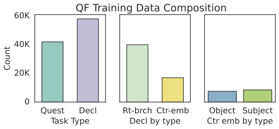

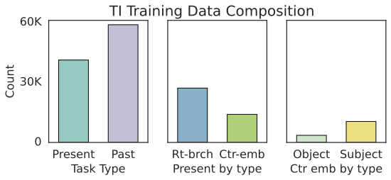

*Рисунок 7: **Составляющие исходных обучающих данных QF и TI.** *Слева:* обучающие данные QF содержат образцы двух видов задач: образования вопроса и копирования утверждений. Мы разбиваем образцы задачи копирования утверждений по типу ветвления. Мы также разбиваем центрально-вложенные предложения по тому, служит ли главное подлежащее подлежащим или дополнением во вложенной клаузе. *Справа:* обучающие данные TI также содержат образцы двух видов задач: перевода времени и копирования прошедшего времени. Как и в QF, мы разбиваем образцы перевода времени по типам ветвления, а центрально-вложенные предложения — по типу подлежащего/дополнения.* **[p. 14]**

### A.2 Случайная вариация

Конкретные выборы обучения, такие как гиперпараметры, критичны для исходов модели. Однако даже при контроле этих факторов обучение моделей машинного обучения остаётся внутренне стохастичным — модели могут быть чувствительны к случайной инициализации и порядку обучающих примеров. Zhou et al. 2020; D’Amour et al. 2022; Naik et al. 2018 сообщали о значительных различиях качества между контрольными точками моделей на разных аналитических и стресс-тестовых наборах. Zhou et al. 2020 далее нашли, что неустойчивость простирается на всю кривую обучения, а не только на итоговые исходы. Исследуя источник этой несогласованности, Dodge et al. 2020 сравнили влияние инициализации весов и порядка данных, заключив, что оба фактора вносят равный вклад в вариации вневыборочного качества.

Аналогично, Sellam et al. 2021 нашли, что повторение предобучения моделей BERT может давать существенно разное качество на прикладных задачах. Для более прочного опытного тестирования они выпустили набор из 25 контрольных точек BERT-BASE, чтобы опытные выводы не зависели от артефактов вроде конкретных экземпляров модели. В этой работе мы также наблюдаем несогласованности обучения между прогонами на внедоменных данных — и при обучении, и при сходимости. В отличие от прежних исследований, сосредоточенных на следствиях случайных вариаций для постановки опытов, мы изучаем источник несогласованностей обучения и связываем их со склонностью к простоте и свойствами обучающих данных.

### A.3 Склонность к простоте

Модели часто предпочитают более простые функции в начале обучения — явление, известное как склонность к простоте (Hermann and Lampinen 2020), обычное и для ЯМ. Choshen et al. 2022 нашли, что ранние ЯМ ведут себя как n-граммные модели, а Saphra and Lopez 2019 наблюдали, что ранние ЯМ выучивают упрощённые версии задачи языкового моделирования. McCoy et al. 2019 показали, что даже полностью обученные модели могут полагаться на простые эвристики вроде лексического пересечения, чтобы хорошо выступать на задачах вывода из естественного языка (NLI). Chen et al. 2023 далее исследовали связь динамики обучения со склонностью к простоте, показав, что рано выученные простые функции могут продолжать влиять на полностью обученные модели, а смягчение этой склонности имеет долгосрочные последствия для исходов обучения.

Фазовые переходы опознаны как маркеры сдвигов от простеньких эвристик к более сложному поведению модели, часто запускаемых объёмом обучающих данных или размером модели. В языковых моделях Olsson et al. 2022 показали, что возникновение индукционных голов в авторегрессионных моделях связано с обработкой более длинных контекстов и обучением в контексте. Похожие фазовые переходы изучались и вне языка — на алгоритмических задачах (Power et al. 2022; Merrill et al. 2023) и арифметических (Nanda et al. 2023; Barak et al. 2022).

В контексте иерархического обобщения Ahuja et al. 2024 применили байесовский подход к анализу простоты иерархического против линейного правил в моделировании английского синтаксиса. Они утверждали, что трансформеры предпочитают иерархическое правило, потому что оно проще линейного. Однако их модель не объясняет (1) почему выучивание иерархического **[p. 14]** правила отложено (то есть после выучивания линейного) и (2) почему иерархическое обобщение несогласованно между прогонами. В этой работе мы предлагаем иную точку зрения, показывая, что склонность модели к простоте в пользу того или иного правила движется свойствами обучающих данных.

## Приложение B Образцы обучающих данных

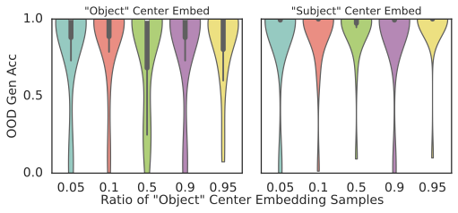

*Рисунок 8: **Оба подвида центрально-вложенных предложений наводят иерархическое обобщение в QF.** Мы обучаем модели на наборах с разными долями объектных против субъектных центрально-вложенных предложений. Затем оцениваем модели на двух внедоменных обобщающих наборах: один содержит однозначные объектные центрально-вложенные предложения, другой — однозначные субъектные.* **[p. 15]**

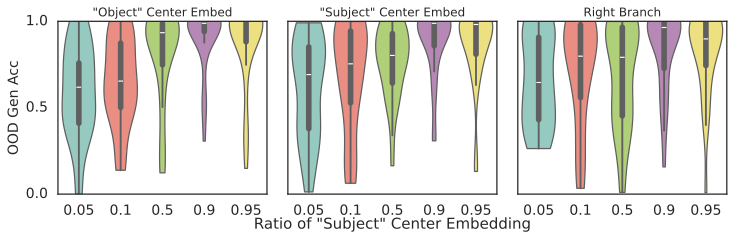

*Рисунок 9: **Субъектные центрально-вложенные предложения дают более сильную склонность к иерархическому обобщению в TI.** Мы обучаем модели на наборах с разными долями объектных против субъектных центрально-вложенных предложений. Затем оцениваем модели на трёх внедоменных обобщающих наборах: с однозначными объектными центрально-вложенными предложениями, с однозначными субъектными и с однозначными правоветвящимися.* **[p. 15]**

### B.1 Образование вопроса

Мы используем слово **утверждения** для задачи копирования утверждений, а **вопросы** — для задачи образования вопроса. Вот два примера, случайно взятых из обучающих данных:

- Пример утверждения: our zebra doesn’t applaud the unicorn. decl our zebra doesn’t applaud the unicorn.
- Пример вопроса: some unicorns do move. quest do some unicorns move ?

Обе задачи начинаются с входного повествовательного предложения, за которым следует токен-указатель задачи (decl или quest), и кончаются выходом. При обучении вся последовательность используется в причинной языково-моделирующей цели. Внутридоменный проверочный набор и внедоменный обобщающий набор содержат только образцы образования вопроса. На рисунке 7 (*слева*) мы показываем разбивку двух видов задач в обучающих данных QF.

### B.2 Перевод времени

- Пример прошедшего: our peacocks above our walruses amused your zebras. PAST our peacocks above our walruses amused your zebras.
- Пример настоящего: your unicorns that our xylophones comforted swam. PRESENT your unicorns that our xylophones comfort swim.

Задача перевода времени помечается токеном PRESENT. Побочная задача требует лишь повторить данное предложение, всегда в прошедшем времени, и помечается токеном PAST. В приложении E.1 показываем, что задача копирования прошедшего времени не нужна.

## Приложение C Дальнейшие деления центрально-вложенных предложений

### C.1 Два подвида центрально-вложенных предложений

В разделе 3 мы показали, что центрально-вложенные предложения движут иерархическим обобщением и в QF, и в TI. Здесь мы дополнительно делим центрально-вложенные предложения по синтаксической роли *главного подлежащего* (подлежащего главной клаузы) внутри определяющей клаузы. А именно, мы делим их на два типа:

1. **Субъектный тип**: главное подлежащее служит **подлежащим** внутри клаузы. Пример: *The keys that unlock the cabinet are on the table.*
2. **Объектный тип**: главное подлежащее служит **дополнением** внутри клаузы. Пример: *The keys that the bear uses are on the table.*

Это деление мотивировано их различными образцами зависимости подлежащего и глагола. В предложениях субъектного типа и главный глагол (главной клаузы), и вложенный глагол (относительной клаузы) зависят от главного подлежащего. Напротив, предложения объектного типа являют вложенную структуру «подлежащее—глагол». Наша цель — исследовать, влияют ли различия образцов зависимости подлежащего и глагола на предпочтение моделью иерархического **[p. 15]** правила.

### C.2 Результаты задачи QF

Исходные обучающие данные QF содержат примерно поровну двух подвидов центрально-вложенных утверждений, как показано на рисунке 7 (*слева*). Мы исследуем, влияют ли два подвида центрально-вложенных предложений по-разному на предпочтение моделью иерархического правила в задаче QF. Для всех вариантов обучающих данных мы закрепляем 50K образцов образования вопроса и 50K образцов копирования утверждений, причём последние содержат только центрально-вложенные предложения, а доля двух подвидов варьируется. Для более тонкого анализа обобщающего поведения мы делим обобщающий набор (состоящий только из центрально-вложенных предложений) также на два подвида. Модели обучаются на 30 случайных семенах, результаты — на рисунке 8. Независимо от смеси данных модель стабильно предпочитает иерархическое правило на обоих делениях обобщающего набора. Это говорит, что для образования вопроса оба подвида центрально-вложенных предложений равно способствуют способности модели опознавать главный вспомогательный.

### C.3 Результаты задачи TI

Исходные обучающие данные TI содержат почти вдвое больше субъектных центрально-вложенных предложений, чем объектных, как показано на рисунке 7 (*слева*). Мы повторяем схожий опыт для задачи TI, закрепляя общее число образцов перевода времени в 100K. Как показано в разделе 3.3, модели являют сильнейшее иерархическое обобщение при обучении преимущественно на центрально-вложенных предложениях. Потому в следующих вариантах данных 99% образцов — центрально-вложенные предложения, а оставшийся 1% — правоветвящиеся. Внутри центрально-вложенных образцов мы варьируем долю двух подвидов. Для оценки обобщения мы делим обобщающий набор на три группы: два подвида центрально-вложенных предложений и правоветвящиеся. **[p. 16]** Модели, обученные на 30 случайных семенах, показывают, что на всех трёх обобщающих наборах точность положительно соотнесена с долей субъектных центрально-вложенных предложений (рисунок 9). Однако даже при обучении преимущественно на объектных центрально-вложенных предложениях (бирюзовые «скрипки» на рисунке 9) модели всё же являют ясное предпочтение иерархического обобщения. Тем самым, хотя оба подвида движут иерархическим обобщением в TI, субъектные центрально-вложенные предложения действуют сильнее.

## Приложение D Варьирование долей данных для образования вопроса

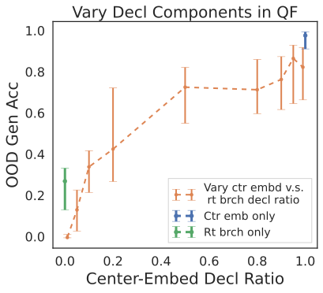

*Рисунок 10: Иерархическое обобщение в QF чувствительно к составу образцов копирования утверждений.* **[p. 16]**

#### Подробности состава данных

Мы строим вариации обучающих данных по следующей процедуре. Каждый новый набор содержит 50K вопросов (переиспользованных из исходных данных) и 50K утверждений, где мы управляем долей между центрально-вложенными и правоветвящимися предложениями. Эти наборы используются для опытов раздела 4.2. Для порождения дополнительных утверждений мы сохраняем распределение уникальных синтаксических структур исходного набора. А именно, для каждого предложения исходных данных мы извлекаем синтаксическое дерево по правилам CFG и пересэмплируем слова из словаря, создавая новые образцы предложений.

#### Чувствительность к составам данных

###### p16-2

Мы используем пять наборов выше, чтобы рассмотреть, как разные доли смеси влияют на предпочтение моделью иерархического обобщения. Медианная обобщающая точность с планками 35-го и 65-го перцентилей показана на рисунке 10. Сначала заметьте резкое падение качества между синим столбиком и крайним правым оранжевым. Этот резкий переход означает, что подмешивание всего 1% правоветвящихся утверждений значительно снижает вероятность иерархического обобщения модели. Интересно, что когда набор состоит преимущественно из правоветвящихся утверждений, модели стабильно достигают 0% обобщающей точности, являя сильное предпочтение линейного правила во всех прогонах. Однако заметьте и другой резкий переход — между зелёным столбиком и крайним левым оранжевым. Этот переход означает, что как только мы убираем тот 1% центрально-вложенных предложений, модель не выучивает ни линейного правила, ни иерархического. В итоге обобщающая точность близка к случайному угадыванию ($\sim 25\%$). Этот переход подробно изучен в разделе 5.1, где мы рассматриваем, как разнообразие данных ведёт к приверженности правилу.

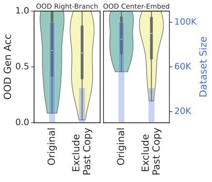

*Рисунок 11: Задача копирования прошедшего не нужна для наведения иерархического обобщения в TI.* **[p. 16]**

**Дополнительный анализ к разделу 4.2** Рисунок 12 показывает связь однородности данных с устойчивостью обучения. Когда в обучающих данных преобладают линейно-склоняющие (99% линейных) или иерархически-склоняющие (0% линейных) примеры, больше случайных семян дают устойчивые внедоменные кривые. Когда же обучающие данные — неоднородная смесь, потенциальные правила соперничают, что даёт большую долю неустойчивых прогонов.

*Рисунок 12: **Обучение неустойчиво, когда соперничают разные подмножества данных.** Сбалансированные смеси правоветвящихся и центрально-вложенных предложений имеют большую полную вариацию, чем смеси с преобладанием того или другого подмножества.* **[p. 17]**

## Приложение E Дополнительные результаты по переводу времени

### E.1 Побочная задача не нужна

В исходных обучающих данных TI (McCoy et al. 2020a) также включена побочная задача, подражающая обучающим данным образования вопроса. В этой побочной задаче вместо превращения предложения из прошедшего времени в настоящее модель должна просто его повторить. Конкретные примеры — в приложении B. Рисунок 7 (*справа*) показывает разбивку двух задач в исходных обучающих данных TI. **[p. 17]** В опытах раздела 2.2 мы устранили использование этой побочной задачи, поскольку центрально-вложенные предложения могут включаться в обучающие образцы перевода времени *без* нарушения требования двусмысленности. Здесь мы используем обучающие данные, исходно предложенные McCoy et al. 2020a, чтобы подтвердить, что побочная задача действительно не нужна. А именно, мы убираем все образцы копирования прошедшего времени из исходных обучающих данных и обучаем модели только на задаче перевода времени. Мы оцениваем обобщающее качество модели на двух внедоменных наборах с однозначными правоветвящимися и однозначными центрально-вложенными предложениями (рисунок 11). Видно, что внедоменное качество модели одинаково с побочной задачей и без неё.

### E.2 Неустойчивость обучения и приверженность правилу для TI

*Рисунок 13: **Полная вариация против итоговой обобщающей точности для задачи TI.** Как и на рисунке 5, мы наблюдаем то же подковообразное поведение между устойчивостью обучения и итоговой обобщающей точностью на правоветвящихся предложениях для задачи TI.* **[p. 18]**

Мы повторяем тот же анализ полной вариации из раздела 4 для задачи перевода времени. Мы используем смеси данных из раздела 3.3. А именно, мы включаем только образцы перевода времени и варьируем долю между линейно-склоняющими (правоветвящимися) и иерархически-склоняющими (центрально-вложенными) предложениями. В разделе 3.3 мы уже заключили, что для центрально-вложенных предложений иерархическое правило предпочитается *всегда*, независимо от смесей данных. Потому нас интересуют предпочтение правила и устойчивость обучения на однозначных правоветвящихся предложениях. На рисунке 13 мы визуализируем связь полной вариации с итоговой обобщающей точностью на однозначных правоветвящихся предложениях. Качественное поведение похоже на наблюдённое в QF (раздел 4.2).

## Приложение F Неустойчивость обучения

*Рисунок 14: **Динамика обучения на исходных данных QF по 50 случайным семенам.** Обучающая потеря (*внизу слева*) и внутрираспределительная проверочная точность (*вверху справа*) устойчивы при обучении и согласованы между случайными семенами. Напротив, качество модели на внедоменном обобщающем наборе (*внизу справа*) и неустойчиво при обучении, и несогласованно между семенами. Неустойчивость и несогласованность заметнее всего во время гроккинга (то есть когда обучающая потеря сошлась). Даже при затухании скорости обучения (*вверху справа*) внедоменные поведения части семян остаются неустойчивыми на всём обучении.* **[p. 18]**

###### p17-2

На рисунке 14 мы визуализируем динамику обучения 30 независимых прогонов на исходных данных QF. Прогоны различаются и инициализацией модели, и порядком данных. Заметьте, что динамика обучения прогонов являет гроккинговые поведения: внедоменное обобщение отложено относительно схождения обучающей потери и проверочного качества. Прогоны делят схожее развитие обучающей потери, проверочной точности и обобщающей точности вплоть до момента схождения обучающей потери. Интересно, что после схождения обучающей потери все прогоны достигают $0\%$ на обобщающем наборе — модель строго предпочитает линейные правила на внедоменных данных. После этого модели начинают достигать нетривиального обобщающего качества. Однако у многих прогонов обобщающая точность растёт не монотонно. Вместо этого мы наблюдаем громадные качели обобщающей точности в этот период обучения, а также большую несогласованность между семенами. В целом обучение *всегда* устойчиво для внутридоменных данных, тогда как качество на внедоменных данных несогласованно между семенами. Прогоны с разными значениями полной вариации визуализированы на рисунке 4.

## Приложение G Разнообразие данных и образцы запоминания

### G.1 Образцы запоминания

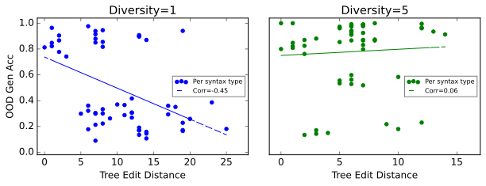

*Рисунок 15: **Внедоменное обобщение против синтаксического сходства с обучающими данными.** При низком разнообразии данных модель запоминает синтаксические образцы и применяет иерархическое правило лишь к синтаксическим структурам, похожим на встречавшиеся в обучающих данных. При высоком разнообразии модель экстраполирует иерархическое правило и может применять его даже к невиданным синтаксическим структурам, непохожим на обучающие данные.* **[p. 19]**

Мы исследуем поведение модели при обучении на данных ограниченного разнообразия. Анализируя обобщающую точность модели по разным синтаксическим типам, мы стремимся различить образцы, указывающие на запоминание либо обобщение.

#### Измерение сходства данных

Строя на мере разнообразия из раздела 5.1, мы теперь используем расстояние правки деревьев (TED) как меру сходства предложений. Как и прежде, мы сначала строим синтаксические деревья по правилам CFG, затем считаем TED алгоритмом Чжана—Шаши (Zhang and Shasha 1989). Мы определяем TED=0 для предложений с одной синтаксической структурой и разным словарём. Эта мера сходства позволяет для каждого образца внедоменного обобщающего набора найти ближайший тип предложения в обучающих данных. В области запоминания, где модель видит лишь несколько синтаксических типов, мы подозреваем, что она не может экстраполировать правила на синтаксически **[p. 18]** далёкие внедоменные предложения. Напротив, при более разнообразном синтаксическом воздействии экстраполяция правила может позволить модели применять правила даже к внедоменным типам предложений.

#### Опыт

Чтобы проверить нашу интуицию о запоминании и обобщении, мы обучаем модели на двух вариациях данных QF. В первой вариации задача копирования утверждений имеет разнообразие 1 — появляется лишь один синтаксический тип, и мы нарочно выбираем тип с центральным вложением. Во второй вариации задача копирования утверждений имеет разнообразие 5, и все 5 типов содержат центральные вложения. В обоих наборах задача образования вопроса неизменна и состоит только из правоветвящихся предложений. Для набора с разнообразием 1 мы считаем TED каждого уникального синтаксического типа внедоменного набора против единственного синтаксического типа задачи копирования утверждений. Для набора с разнообразием 5 мы считаем TED между каждым внедоменным образцом и пятью синтаксическими типами задачи копирования утверждений, беря минимум. Этот балл TED даёт меру сходства внедоменных образцов со встречавшимися при обучении. Наша цель — определить, к каким внедоменным синтаксическим типам модель, обученная на этих наборах, применяет иерархическое правило.

#### Результат

###### p18-2

На рисунке 15 мы визуализируем итоговую обобщающую точность для каждого внедоменного синтаксического типа против его TED относительно обучающих данных. При обучении на данных низкого разнообразия (рисунок 15, *слева*) обобщающая точность отрицательно соотнесена с TED. Для синтаксических типов, виденных в задаче копирования утверждений (TED=0), и похожих на них модель применяет иерархическое правило. Однако для синтаксических типов с высоким TED поведение модели случайно (25%) — она не следует никакому правилу. При небольшом росте разнообразия данных (рисунок 15, *справа*) обобщающая точность больше не соотносится **[p. 19]** с TED, что говорит: как только модель начинает экстраполировать иерархическое правило, она может применять его к более широкому кругу внедоменных синтаксических типов.
