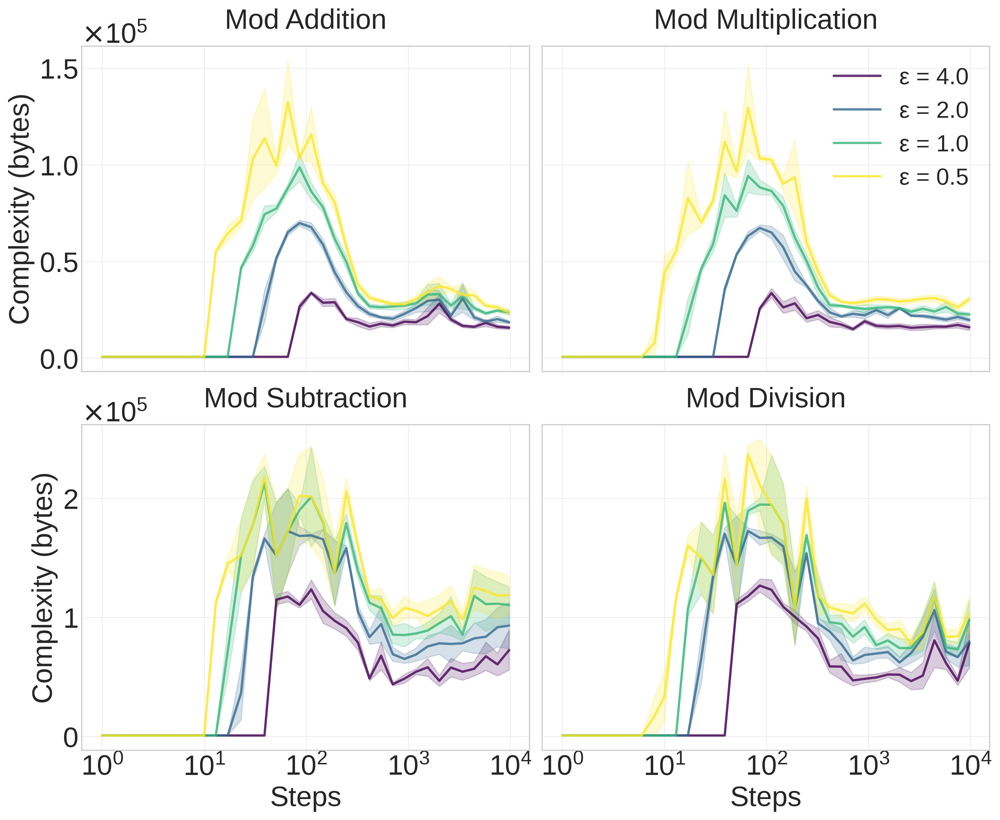
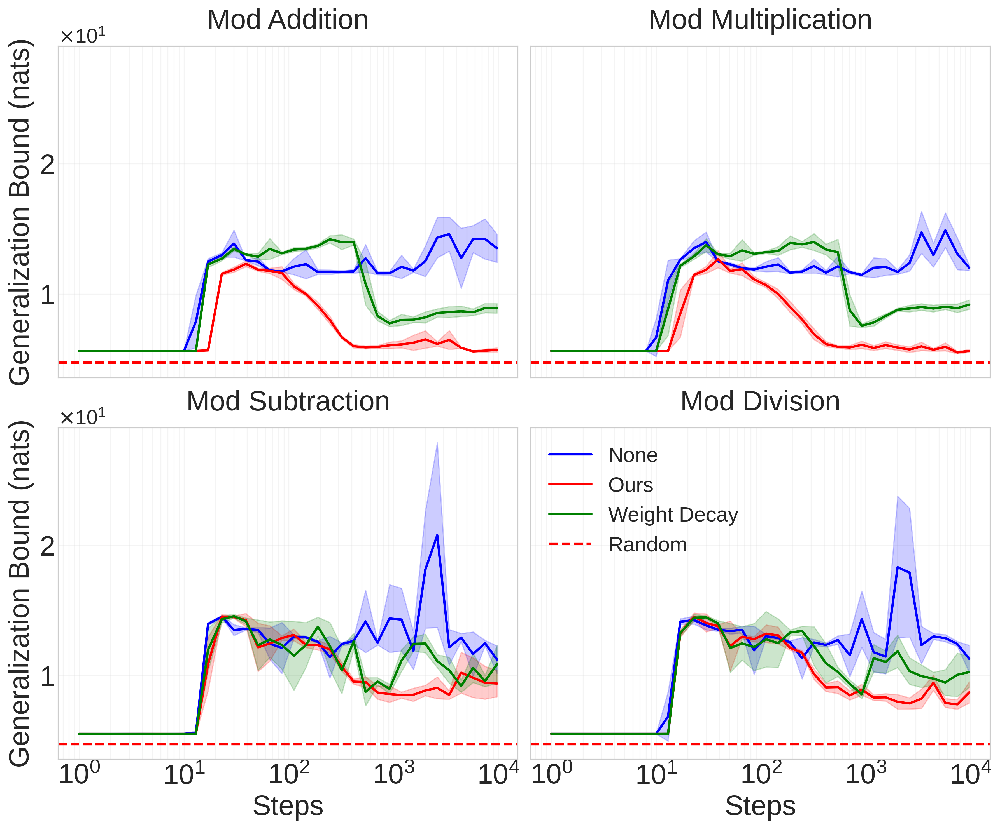
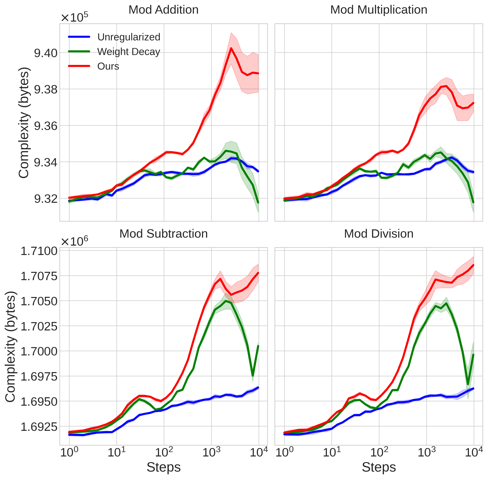
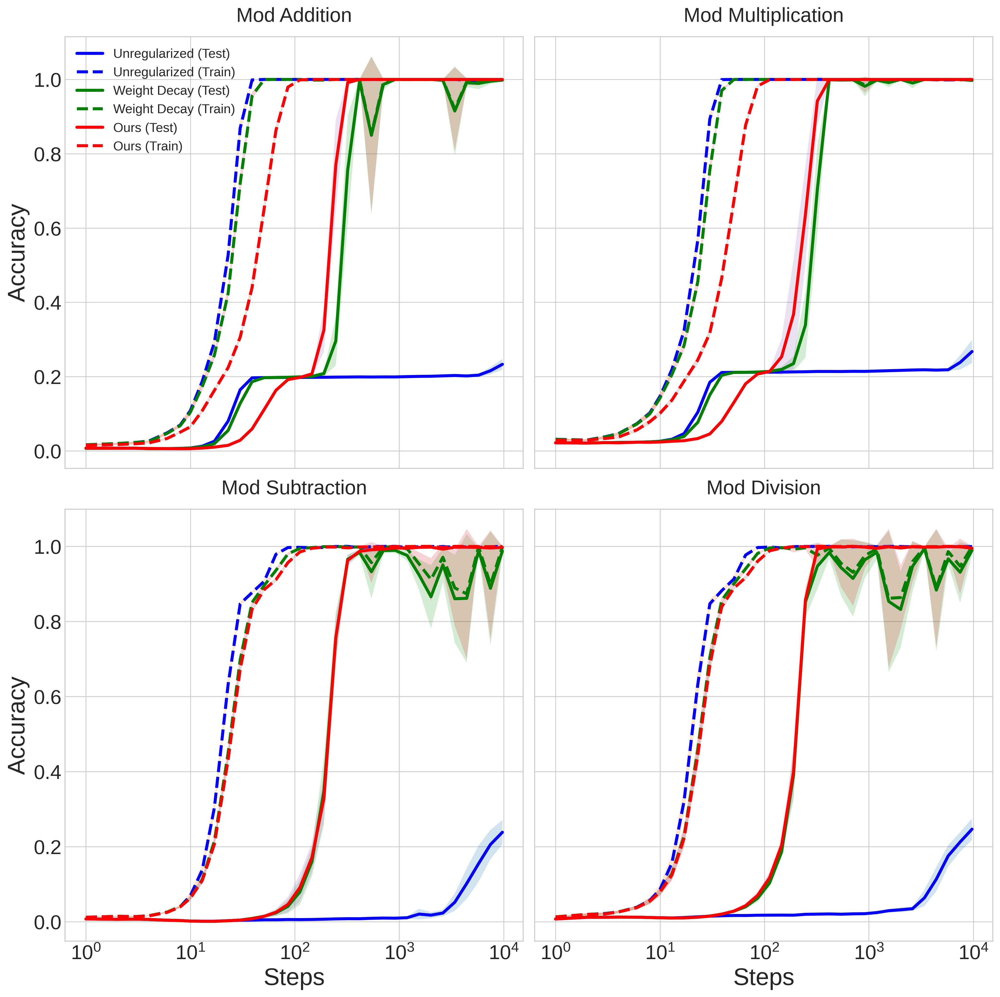

# DeMoss et al. 2024 — The Complexity Dynamics of Grokking

См. также: [глобальный индекс понятий](../../concepts/index.md).

**Branton DeMoss**, **Silvia Sapora**, **Jakob Foerster**, **Nick Hawes**, **Ingmar Posner** — факультет инженерных наук, Оксфордский университет, Оксфорд, Великобритания.

arXiv [2412.09810](https://arxiv.org/abs/2412.09810), 13 декабря 2024 (версия v2). Препринт подан в Elsevier; вышел в Physica D (2025). 23 цитирования — семнадцатая по цитируемости работа корпуса. Источник — нативный HTML arXiv версии v2.

Оригинал и производные файлы этой папки:

- [`original/2412.09810.native.html`](original/2412.09810.native.html) — первоисточник, нативный HTML arXiv (v2), скачан как есть.
- [`original/2412.09810.the-complexity-dynamics-of-grokking.md`](original/2412.09810.the-complexity-dynamics-of-grokking.md) — конверсия оригинала в Markdown без правок содержания.
- [`images/`](images/) — 11 иллюстраций статьи в исходном разрешении.

Схема якорей и правила ссылок на карточку — в [README папки статей](../README.md).

## Затрагиваемые понятия

**[Колмогоровская сложность](../../concepts/kolmogorov-complexity.md)** — работа делает её **измеряемой величиной**, а не рамочным понятием. Сама $K$ невычислима, но сжатие даёт верхнюю оценку: сжатый файл вместе с распаковщиком образует программу, порождающую исходные веса ([`p1-2`](#p1-2)). Всё дальнейшее — борьба за то, чтобы эта оценка была достаточно точной: наивный bzip2 по весам даёт кривую, неотличимую от прямой ([`fig-9`](#fig-9)), и увидеть динамику удаётся только после огрубления.

**[Сжатие и MDL](../../concepts/manifold-representation-compression.md)** — принцип минимальной длины описания взят как основание: лучшая модель минимизирует сумму энтропии данных при модели и сложности самой модели ([`p2-1`](#p2-1)). Отсюда прямое следствие про запоминание: таблица поиска сводит энтропию данных к нулю, но её собственная сложность равна исходной энтропии, так что полная длина описания не меняется и сжатия не происходит. Это самая короткая формулировка того, почему запоминание в корпусе считается «не решением».

**[Границы генерализации](../../concepts/generalization-bounds.md)** — связь сложности с генерализацией проведена не по аналогии, а через готовую границу: $R(h)\leq\hat{R}(h)+\sqrt{(K(h)+2\log K(h)+\log(1/\delta))/2n}$ ([`p5-1`](#p5-1)). Работа приводит её значения для своих моделей и честно сообщает результат: **ни одна модель непустой границы не даёт** ([`fig-6`](#fig-6)) — модели слишком переопределены, набор данных мал. Регуляризатор авторов лишь даёт лучшую (всё ещё пустую) границу из сравниваемых.

**[Фазовый переход](../../concepts/phase-transition.md)** — гроккинг предложено считать **фазовым переходом по сложности**: сложность растёт при запоминании и резко падает при генерализации ([`p1-5`](#p1-5), [`fig-2`](#fig-2)), тогда как без регуляризации модель остаётся в фазе высокой сложности неограниченно долго ([`fig-3`](#fig-3)). Аналогия с физикой здесь не декоративная: сама схема заимствована у Aaronson et al., изучавших подъём и спад сложности в клеточном автомате, смешивающем две жидкости ([`p5-7`](#p5-7)).

**[Спектральный анализ](../../concepts/spectral-analysis-svd-esd-fve.md)** — вводится **спектральная энтропия** $H_{\text{svd}}=-\sum\bar{\sigma}_{i}\log\bar{\sigma}_{i}$ по нормированным сингулярным числам, и через результат Roy & Vetterli она отождествляется с эффективным рангом: $\text{rank}_{\text{eff}}=\exp(H_{\text{svd}})$ ([`p10-1`](#p10-2)). Величина служит сразу двум целям — измерению внутренней размерности по ходу обучения и штрафу в функции потерь.

**[Варианты регуляризации](../../concepts/regularization-variants.md)** — предложен новый регуляризатор: штраф на спектральную энтропию плюс гауссов шум на весах при каждом прямом проходе. Шум задаёт эффективную нижнюю границу точности параметров, мешая сети хранить структуру ниже порога шума ([`p8-7`](#p8-7)). Заявленный результат — этот приём **вызывает гроккинг** и даёт сети меньшей сложности, чем один weight decay ([`p12-1`](#p12-1)).

**[Weight decay](../../concepts/weight-decay.md)** — получает разбор своей ограниченности. Weight decay управляет информационной ёмкостью через диапазон параметров $\lambda$, но сеть по-прежнему может хранить детали в высокочастотной информации, и эксперименты авторов показывают, что так и происходит ([`p8-5`](#p8-5)). Иными словами: малые нормы не означают малой сложности.

**[Минимизация нормы весов](../../concepts/weight-norm-minimization.md)** — прямой спор с объяснениями через норму. Малая норма весов и линейная структура объявлены **разными способами быть простым**, а не самостоятельными объяснениями, поскольку сложность может возникать разными путями ([`p12-3`](#p12-3)). Эффективный ранг приведён как ещё один такой путь.

**[Эффективность контуров](../../concepts/circuit-efficiency.md)** — теория Varma et al. упомянута как объяснение через отношение норм логитов и параметров ([`p4-2`](#p4-2)) и отнесена к тем самым «более частным признакам», которым противопоставляется сложность. Разбора самой теории работа не даёт.

**[Двойной спуск](../../concepts/double-descent.md)** — назван родственным явлением, которое единая теория сложности и генерализации должна была бы предсказывать ([`p12-4`](#p12-4)). Никаких экспериментов с ним здесь нет — только программное заявление.

**[Модульная арифметика](../../concepts/modular-arithmetic.md)** — постановка: четыре операции по модулю 113, decoder-only трансформеры (один слой для сложения и умножения, два для вычитания и деления), 20 % данных на обучение для сложения и умножения и 30 % для вычитания и деления ([`p11-11`](#p11-11), [`tab-1`](#tab-1)).

**[Гроккинг](../../concepts/grokking.md)** — понятие получает необычную для корпуса оценку: гроккинг назван **признаком недолжным образом регуляризованного обучения**, а его ценность — в том, что разделённость фаз делает его удобной модельной системой для изучения фазовых переходов по сложности ([`p12-4`](#p12-4)). Не явление, требующее объяснения, а инструмент.

Отдельно стоит сказать, чего в работе **нет**. Мера сложности здесь — не свойство функции, которую сеть вычисляет, а свойство её описания: она зависит от процедуры огрубления ($\tau$, $\Delta$), от границы искажения $\epsilon$ и от того, каким архиватором сжимают. Авторы это не скрывают — устойчивость картины подъёма и спада при разных $\epsilon$ вынесена в отдельный рисунок ([`fig-5`](#fig-5)), — но «сложность» в их смысле остаётся верхней оценкой, зависящей от выбранного набора инструментов, а не измеренной величиной.

Карточки статей корпуса: [Power et al. 2022](../2201.02177.grokking-generalization-beyond-overfitting-on-small-algorithmic-datasets/2201.02177.grokking-generalization-beyond-overfitting-on-small-algorithmic-datasets.card.md) — задачи, воспроизводимые здесь; [Liu et al. 2022](../2205.10343.towards-understanding-grokking-an-effective-theory-of-representation-learning/2205.10343.towards-understanding-grokking-an-effective-theory-of-representation-learning.card.md) — четыре режима и линейная структура, которым здесь противопоставлена сложность; [Omnigrok](../2210.01117.omnigrok-grokking-beyond-algorithmic-data/2210.01117.omnigrok-grokking-beyond-algorithmic-data.card.md) — объяснение через норму параметров, названное частным признаком; [Varma et al. 2023](../2309.02390.explaining-grokking-through-circuit-efficiency/2309.02390.explaining-grokking-through-circuit-efficiency.card.md) — эффективность контуров, отнесённая туда же; [Nanda et al. 2023](../2301.05217.progress-measures-for-grokking-via-mechanistic-interpretability/2301.05217.progress-measures-for-grokking-via-mechanistic-interpretability.card.md) — меры прогресса, чью привязанность к задаче работа берёт отправной точкой («нам недостаёт общего понятия критичности»).

**[Когда регуляризация необходима](../../concepts/regularization-necessity.md)** — полюс «необходима»: [нерегуляризованная сеть не обобщает никогда, и её сложность остаётся большой](#fig-1); собственный регуляризатор работы (штраф на спектральную энтропию с шумом) гроккинг вызывает. В карточке спора работа стоит рядом с Nanda на стороне необходимости.

**[Законы масштабирования](../../concepts/scaling-laws.md)** — работа противопоставляет им своё объяснение: нынешний взгляд «бо́льшие модели лучше» опирается на эмпирические законы масштабирования ([`p5-1`](#p5-1)), тогда как гроккинг говорит о снижении сложности при неизменном размере.
## Что показано, а что предположено

Замечания редактора карточки по итогам разбора утверждений (`…claims.txt`). Работа делится надвое: измерительная часть (как оценить сложность сети достаточно точно) и объяснительная (что эта оценка говорит о гроккинге). Первая сделана аккуратно, вторая заявлена шире, чем показана.

**Главный измерительный результат честен и проверяем.** Наивное сжатие весов bzip2 не показывает ничего: разброс оценок за всё обучение так мал, что на общей шкале выглядел бы прямой линией ([`fig-9`](#fig-9)). После огрубления — низкоранговое приближение плюс квантование, с байесовским подбором $\tau$ и $\Delta$ при ограничении на искажение потери — оценка улучшается в 30–40 раз, и подъём-спад становится виден. Огрубление одним квантованием даёт оценки примерно вдвое хуже и уже не различает динамику у моделей с weight decay на двух задачах из четырёх ([`fig-7`](#fig-7)). То есть картина существует ровно настолько, насколько точна оценка, и авторы это показывают прямо.

**Устойчивость к произволу проверена частично.** Картина подъёма и спада сохраняется при разных границах искажения $\epsilon$ ([`fig-5`](#fig-5)) — это существенная проверка, поскольку $\epsilon$ выбирается вручную. Не проверено другое: зависимость от выбора архиватора и от самой процедуры огрубления. Сложность здесь — свойство описания, а не функции.

**Связь с генерализацией установлена формально, но численно не работает.** Граница из [15] подставлена и посчитана; результат — все границы **пустые** ([`fig-6`](#fig-6)), и авторы называют причину (переопределённые модели, малый набор). Значит, утверждение «сложность объясняет генерализацию» подтверждено здесь ходом кривых, а не числами: модели с меньшей сложностью обобщают, но предсказать качество по границе нельзя.

**Регуляризатор работает, но сравнение узкое.** Заявлено, что штраф на спектральную энтропию с шумом вызывает гроккинг и даёт наименьшую сложность из сравниваемых методов ([`p12-1`](#p12-1)). Сравнение идёт с weight decay и с отсутствием регуляризации на четырёх модульных задачах; ни MSE-постановок, ни неалгоритмических данных, ни сравнения с другими приёмами, вызывающими гроккинг, здесь нет.

**Причинность не показана — показано соответствие.** Утверждение «фазовый переход по сложности — главный механизм гроккинга» ([`p12-3`](#p12-3)) опирается на совпадение по времени: пик сложности приходится на запоминание, спад — на генерализацию. Вмешательства, которое отделяло бы сложность от прочих меняющихся величин (нормы, эффективного ранга, точности), в работе нет; регуляризатор меняет их все разом.

**Спор с объяснениями через норму сформулирован сильнее, чем проверен.** Тезис «малая норма и линейная структура — лишь частные способы быть простым» ([`p12-3`](#p12-3)) убедителен как рассуждение, и у него есть эмпирическая опора: weight decay уменьшает нормы, но не мешает хранить детали в высокочастотной информации ([`p8-5`](#p8-5)). Однако прямого сопоставления с Omnigrok или Varma et al. — на их постановках, их метриках — работа не проводит.

**Заявка на общность остаётся программой.** Двойной спуск, алгоритмическая термодинамика, «видимая сложность природы» ([`p12-4`](#p12-4)) — всё это названо направлениями, а не результатами. Из корпусных явлений здесь измерена одна: гроккинг на четырёх модульных операциях.

**Место в корпусе.** Это единственная работа корпуса, где сложность модели измеряется **напрямую** — сжатием, а не через прокси вроде нормы весов или эффективности контура. Отсюда и её главная ценность для вики: она проверяет предпосылку, на которую молча опираются несколько других объяснений («обобщающее решение проще запоминающего»), и показывает, что предпосылка выполняется, но лишь тогда, когда «простоту» измеряют достаточно тонким инструментом.

## Ошибочные пересказы и цитирования этой статьи

Узоры ошибочного или расширенного цитирования этой работы, наблюдённые в цитирующих статьях корпуса. Каждая запись описывает, что именно искажается при пересказе, и ведёт к абзацам самих авторов, где стоит теряемая оговорка. Разбор конкретных формулировок — в карточках цитирующих работ, в их разделах «Ошибочные цитирования», куда ведут ссылки «подробности». Работа цитируется на удивление аккуратно: большинство передаёт ровно «рост и падение сложности».

**Мера перенесена из пространства параметров в пространство представлений (расширяющее, опровергнутое).** Единственный содержательный сдвиг: энтропийную меру пересказывают как «сжатие представлений» — тогда как [мера живёт в пространстве параметров: спектральная энтропия сингулярных чисел матриц весов и сжатие огрублённых весов](#p10-2). Расширение опровергнуто внутри корпуса: [2604.13123](../2604.13123.spectral-entropy-collapse-as-a-phase-transition-in-delayed-generalisation/2604.13123.spectral-entropy-collapse-as-a-phase-transition-in-delayed-generalisation.card.md) прямо фиксирует, что параметрическое и репрезентационное пространства «are not interchangeable» и у DeMoss — первое. Подробности: [2603.01968](../2603.01968.intrinsic-task-symmetry-drives-generalization-in-algorithmic-tasks/2603.01968.intrinsic-task-symmetry-drives-generalization-in-algorithmic-tasks.card.md#mc-2412-09810).

Оговорки авторов — причинность не показана, [границы генерализации численно пусты](#fig-6), сложность зависит от огрубления — цитирующие не упоминают, но и не строят на них утверждений сильнее исходных. Образцы аккуратного цитирования: [2604.13123](../2604.13123.spectral-entropy-collapse-as-a-phase-transition-in-delayed-generalisation/2604.13123.spectral-entropy-collapse-as-a-phase-transition-in-delayed-generalisation.card.md) — воспроизводит формулу, числа и границу применимости, явно разводя объекты измерения; [2603.24746](../2603.24746.grokking-as-a-falsifiable-finite-size-transition/2603.24746.grokking-as-a-falsifiable-finite-size-transition.card.md) — точный пересказ плюс честная критика; [2504.17243](../2504.17243.neuralgrok-accelerate-grokking-by-neural-gradient-transformation/2504.17243.neuralgrok-accelerate-grokking-by-neural-gradient-transformation.card.md) — точная передача спора с norm-объяснениями.

---

# Текст статьи

## Аннотация

###### p1-2
Мы показываем существование фазового перехода по сложности в нейронных сетях, изучая явление гроккинга, при котором сети внезапно переходят от запоминания к генерализации много позже переобучения на обучающих данных. Чтобы описать этот фазовый переход, мы вводим теоретическую рамку для измерения сложности, опирающуюся на теорию «скорость — искажение» и колмогоровскую сложность; её можно понимать как принципиальное сжатие сетей с потерями. Мы находим, что должным образом регуляризованные сети обнаруживают резкий фазовый переход: сложность растёт при запоминании, а затем падает, когда сеть находит более простую скрытую закономерность, которая обобщается. Напротив, нерегуляризованные сети остаются запертыми в фазе запоминания с высокой сложностью. Мы устанавливаем явную связь между нашей мерой сложности и границами генерализации, давая теоретическое основание для связи между сжатием с потерями и генерализацией. Наша рамка достигает коэффициентов сжатия в 30–40$\times$ лучших, чем наивные подходы, что позволяет точно отслеживать динамику сложности. Наконец, мы вводим приём регуляризации на основе спектральной энтропии, который подталкивает сети к представлениям малой сложности, штрафуя их внутреннюю размерность.

##### keywords:

## 1 Введение

Когда можно ожидать, что выученные модели будут хорошо обобщать? Изучение фазовых переходов в обучающихся системах открывает окно к основополагающим вопросам о природе генерализации и возникновении структуры. В этой работе мы исследуем недавно замеченное явление «гроккинга» [1], при котором нейронные сети обнаруживают резкий переход от запоминания к генерализации много позже переобучения на обучающих данных. Продолжительная задержка между этими двумя фазами обучения даёт идеальные условия, чтобы изучать связь между сложностью и генерализацией в обучающихся системах.

Простота давно признана общей чертой хороших моделей: бритва Оккама говорит, что среди моделей, одинаково хорошо объясняющих данные, лучше всего обобщит самая простая. Вдохновляясь статистической физикой и алгоритмической теорией информации, мы вводим рамку для измерения внутренней сложности нейронных сетей на основе сжатия с потерями и колмогоровской сложности. Наш подход параллелен работе [2], где изучается динамика сложности физических систем. Их ключевая мысль — измерять сложность после подходящего *огрубления* состояния системы. Мы формализуем эту мысль через алгоритмическую теорию «скорость — искажение», получая принципиальную схему сжатия нейронных сетей с потерями, которая ограничивает их сложность.

###### fig-1
*Рисунок 1: Динамика сложности для нерегуляризованных (синие) и регуляризованных (красные) нейронных сетей в экспериментах с гроккингом на модульном умножении. Маркеры отмечают моменты запоминания ($\square$) и генерализации ($\bigcirc$). В регуляризованной сети генерализация наступает по мере падения сложности после её пика при запоминании, тогда как нерегуляризованная сеть не обобщает никогда, и её сложность остаётся большой. Среднее по 3 сидам, затенение — стандартная ошибка.* **[p. 2]**

###### p1-5
Эта рамка позволяет нам отслеживать динамику сложности нейронных сетей на протяжении обучения. Мы находим, что должным образом регуляризованные сети, которые успешно обобщают, обнаруживают отчётливый фазовый переход: сложность сперва растёт, пока сеть запоминает обучающие данные, а затем резко падает, когда сеть находит более простую скрытую закономерность, которая обобщается. Напротив, нерегуляризованные сети, которым обобщить не удаётся, остаются запертыми в фазе запоминания с высокой сложностью неограниченно долго. Мы устанавливаем явную связь между нашей **[p. 2]** мерой сложности и статистическими границами генерализации и показываем, как они отвечают принципу минимальной длины описания.

###### p2-1
Принцип минимальной длины описания (MDL) [3] формализует бритву Оккама на языке теории информации. Он говорит, что лучшая модель — та, которая минимизирует полную длину сообщения о данных. Теорема Шеннона [4] говорит, что ожидаемая оптимальная скорость кодирования для образцов, взятых из некоторого распределения, равна энтропии этого распределения. Отсюда энтропия $H$ данных $D$ при модели $M$, то есть $H(D|M)$, говорит нам об ожидаемой длине сообщения после кодирования данных моделью. Однако надо учесть и информационную стоимость самой модели — сложность модели $C(M)$. MDL говорит, что следует брать модель, минимизирующую *сумму* этих слагаемых:

$$
M\leftarrow\operatorname*{arg\,min}_{M}H(D\mid M)+C(M) \tag{1}
$$

Наглядно: стоит сделать модель на один бит сложнее, если это позволяет уменьшить видимую энтропию данных больше чем на один бит, поскольку так уменьшается общая длина сообщения. Заметим, что если модель $M$ полностью объясняет некоторое подмножество $D^{\prime}\subseteq D$, то предсказание этих данных становится детерминированным и $H(D^{\prime}|M)=0$. Рассмотрим тривиальную модель, попросту запоминающую данные в таблицу поиска. Хотя она сводит энтропию данных к нулю, сложность модели в точности равна исходной энтропии данных. Значит, полная длина описания не изменилась, и никакого сжатия модель не дала.

Мысль о том, что более простые модели должны обобщать лучше, уточняется статистическими границами генерализации вида:

$$
\text{test error}\leq\text{train error}+\text{model complexity} \tag{2}
$$

вездесущими в целом ряде областей статистического машинного обучения [5, 6]. Когда слагаемые ошибки отождествляются с энтропией, как обычно и бывает, эти границы показывают, что модели, минимизирующие MDL, — это в точности те, от которых ожидается наилучшее обобщение. Отсюда и связь между сжатием и генерализацией: та модель, что лучше всех сжимает данные, и должна лучше всех обобщать.

Чтобы применить принцип MDL, нам нужна мера сложности модели $C(M)$. Обычные меры сложности в машинном обучении — вроде радемахеровской сложности [6] или VC-размерности [7] — определены относительно конкретных классов гипотез, мы же ищем универсальную меру, применимую к любой вычислительной модели. Колмогоровская сложность $K$ строки $s$ равна **[p. 3]** длине кратчайшей программы $p$, печатающей $s$ при исполнении:

$$
K(s)=\min_{p}\{\texttt{len}(p):\texttt{exec}(p)=s\} \tag{3}
$$

###### p3-1

Для наглядности рассмотрим две строки длины $N$. Строку «$111...1$» можно породить короткой программой «напечатать „1“ N раз», так что $K(s)\approx\log N$. Напротив, у случайной строки «$10110...$» нет закономерности, которой можно воспользоваться; её кратчайшее описание — она сама: «напечатать „10110...“», что даёт $K(s)\approx N$. Алгоритмически случайны в точности те строки, чья колмогоровская сложность равна их длине: они несжимаемы, потому что не содержат пригодных закономерностей. Для нейронных сетей это означает, что сеть, реализующая простую закономерность, должна иметь малую сложность несмотря на множество параметров, тогда как сеть, запомнившая случайные метки, обязана иметь высокую сложность. В отличие от мер ёмкости, дающих верхние оценки худшего случая, колмогоровская сложность схватывает действительное информационное содержание выученной функции.

###### fig-2
*Рисунок 2: Сложность и точность в зависимости от шагов для моделей, регуляризованных нашим методом. По мере запоминания сложность растёт. Сложность падает, когда наступает генерализация. Мы огрубляем модели по алгоритму 1 при $\epsilon=1$. Стандартная ошибка затенена, шесть сидов.* **[p. 3]**

Чтобы воплотить эти мысли, мы разрабатываем принципиальный подход к измерению сложности нейронной сети на основе сжатия с потерями. Хотя колмогоровская сложность невычислима, сжатие даёт её верхнюю оценку: заметим, что сжатые данные вместе с распаковщиком образуют программу, порождающую исходные данные. Размер сжатого файла сети даёт верхнюю оценку её сложности, и чем лучше сжатие, тем оценка точнее. Чтобы получить точные оценки сжатием, мы разрабатываем процедуру огрубления, вдохновлённую теорией «скорость — искажение», которая удаляет шум, сохраняя функциональное поведение, и даёт коэффициенты сжатия в 30–40 раз лучшие, чем наивные подходы. Эта чувствительность решающе важна, чтобы выявить скрытую динамику сложности в ходе обучения, показанную на рис. 1. Наши основные вклады таковы:

**[p. 4]**

###### p4-1
- Теоретическая рамка, связывающая сложность нейронной сети с колмогоровской сложностью через сжатие с потерями, с явными связями с границами генерализации.
- Эмпирическая демонстрация фазового перехода по сложности при гроккинге, отличаемого картиной подъёма и спада, которая отделяет обобщающие решения от запоминающих.
- Приём регуляризации на основе спектральной энтропии, подталкивающий сети к представлениям малой сложности за счёт штрафа на дифференцируемую меру их эффективной размерности.

###### fig-3
*Рисунок 3: Сложность и точность в зависимости от шагов для нерегуляризованных моделей. По мере запоминания сложность растёт. Без регуляризации модели не находят решений малой сложности и никогда не обобщают. Мы огрубляем модели по алгоритму 1 при $\epsilon=1$.* **[p. 4]**

## 2 Связанные работы

###### p4-2
**Гроккинг** Явление гроккинга [1] возникает, когда сети внезапно переходят от запоминающих решений к обобщающим много позже переобучения на обучающих данных. В [8] описаны условия, при которых гроккинг происходит, и обучение разбито на четыре различных режима — *понимание*, *гроккинг*, *запоминание* и *путаница* — через рассмотрение фазовых диаграмм качества обучения по разным гиперпараметрам. В [9] гроккинг показан на неалгоритмических наборах данных и предложена связь между нормой параметров сети и гроккингом. Эту же связь исследует [10], объясняя гроккинг через «эффективность» сети, измеренную отношением норм логитов и параметров. В [11] предложены «меры прогресса» на основе потери, привязанные к задаче, чтобы обнаруживать гроккинг, но отмечено, что нам «недостаёт общего понятия критичности, которое позволило бы предсказать, когда произойдёт фазовый переход» **[p. 5]**. В этой работе мы предполагаем, что ключевая динамическая величина для понимания гроккинга (и генерализации в более широком смысле) — сложность, и обсуждаем, почему косвенных мер вроде нормы $L^{2}$ недостаточно.

###### p5-1
**Генерализация** Связь между ёмкостью и сложностью модели среди практиков машинного обучения понимается порой неверно: нынешний взгляд в глубоком обучении состоит в том, что «бо́льшие модели лучше» [12], с эмпирически наблюдаемыми законами масштабирования на разных модальностях и архитектурах [13, 14], которые показывают монотонное улучшение качества с ростом масштаба модели. Этот взгляд расходится с классическим компромиссом смещения и разброса, гласящим, что «начиная с некоторого порога бо́льшие модели хуже» [12]. Последнее верно лишь в предположении, что ёмкость модели равна её сложности, и следовало бы из границ вида уравнения 2. Однако дело, по-видимому, обстоит *не* так. В [15] недавно получены первые непустые границы генерализации для больших языковых моделей: авторы строят сильно сжимаемые модели, обучаемые в нелинейном низкоранговом подпространстве, и ограничивают их качество генерализации при сглаженной энтропийной потере колмогоровской сложностью. Тогда как они сосредоточены на явных *границах* генерализации, мы сосредоточены на динамике сложности при переходе от запоминания к генерализации, чтобы объяснить гроккинг. В [16] доказывают, что генерализацию следует понимать через колмогоровскую сложность, и применяют соломоновский априор $P(h)=2^{-K(h)}$ для гипотез $h$ к границе для конечного класса гипотез [17], получая общую границу генерализации на основе колмогоровской сложности.

**Огрубление** В [2] изучают динамику сложности клеточного автомата, моделирующего смешивание двух жидкостей. Авторы наблюдают подъём и спад сложности по мере роста энтропии и предполагают, что это явление носит общий характер. Чтобы приблизить сложность своего автомата, они предлагают меру «видимой сложности» — размер сжатого файла с *огрублённым* описанием состояния. Они неформально утверждают, что огрубление удаляет случайную информацию из состояния, оставляя лишь «интересную». Мы формализуем эту интуицию через теорию «скорость — искажение» и пользуемся полученной мерой сложности, чтобы объяснить гроккинг.

## 3 Сложность и генерализация

Понимание генерализации имеет центральное значение в машинном обучении. В какой мере мы вправе ожидать, что наши модели обобщат, и можем ли мы предсказать их качество заранее? Большинство границ генерализации — функции сложности модели, так что понимание сложности есть ключ к пониманию генерализации. В [15] дана одна из таких границ, оценивающая ожидаемый риск $R(h)$ для данной гипотезы $h$ с вероятностью $1-\delta$:

$$
R(h)\leq\hat{R}(h)+\sqrt{\frac{K(h)+2\log K(h)+\log(1/\delta)}{2n}} \tag{4}
$$

Здесь $K(\cdot)$ — колмогоровская сложность, $\hat{R}(h)$ — эмпирический риск, $n$ — число образцов. Как упомянуто во введении, колмогоровская сложность невычислима, но её можно ограничить сверху сжатием. Значит, мы можем ограничить ошибку генерализации, сжимая модели, причём чем плотнее сжатие, тем лучше граница. Важно помнить, что некоторые способы сжатия моделей — например, снижение точности их параметров — могут вести и к потере качества. Поэтому, уменьшая слагаемое сложности сжатием, мы можем увеличить эмпирический риск $\hat{R}(h)$. Чтобы получить сильные гарантии генерализации, нужно минимизировать сложность модели и эмпирический риск совместно.

По сути, это можно понимать и как переформулировку принципа MDL. Если эмпирический риск понимать как энтропию обучающих данных при модели, как обычно и бывает, то совместная минимизация эмпирического риска и сложности модели и есть в точности принцип MDL. То есть модель, обобщающая лучше всех, — та, что лучше всех сжимает данные и сама наиболее сжимаема.

###### p5-6
К сожалению, наивное сжатие параметров модели даёт плохие оценки сложности, поскольку сеть содержит случайную информацию, оставшуюся от инициализации и от стохастической процедуры обучения. Если бы мы могли удалить случайную информацию из сети, сжатие оставшихся параметров дало бы куда более точные оценки сложности сети. Однако вопрос о случайности информации неразрешим [18], так что общего метода её удалить не существует.

**[p. 6]**

###### p5-7
В [2] удаляют случайную информацию, огрубляя состояние своего автомата. Огрубление у них — сглаживание и квантование состояния. Огрублённое состояние затем сжимается готовыми программами вроде bzip2, и размер сжатого файла даёт улучшенные оценки сложности. Свою величину они назвали «видимой сложностью», поскольку она не является настоящей оценкой сложности исходного состояния и произвольна в выборе и степени огрубления. Мы приспосабливаем их метод к нейронным сетям, опираясь на главную мысль: **функция потерь задаёт огрубление**, которое можно понимать как принципиальное сжатие модели *с потерями*.

###### fig-4
*Рисунок 4: Алгоритмические кривые «скорость — искажение» $r_{\theta}(\hat{\theta})$ для всех наборов данных при разных границах искажения $\epsilon$. Скорость — сложность огрублённых весов $\hat{\theta}$ в конце обучения. Среднее по шести сидам.* **[p. 6]**

### 3.1 Сжатие с потерями

Теорема Шеннона даёт нижнюю границу на скорости кодирования, при которых сигналы сжимаются *без потерь*, но при допустимом искажении возможны и более экономные скорости. Например, сжатие JPEG удаляет из изображений высокочастотные детали, не воспринимаемые человеческим глазом, ценой некоторого искажения. Схожим образом мы хотим найти наименее подробную модель, дающую приемлемое качество на обучающих данных. Поскольку нейронные сети инициализируются случайно и обучаются стохастической оптимизацией, значительная часть информационной ёмкости их параметров хранит шум. В алгоритмической теории информации шум — это в точности то, что несжимаемо, так что при наивном сжатии весов модели полученная из размера файла оценка сложности определяется хранящимся в весах шумом. Чтобы это преодолеть, мы разрабатываем схему сжатия с потерями, позволяющую формализовать компромисс между информационной ёмкостью модели и качеством на обучающих данных, измеренным функцией потерь. Теория «скорость — искажение» формализует компромисс между скоростью кодирования, вносимым искажением и воспринимаемым качеством [19], хотя обычно определяется на случайных величинах. В [20] теорию «скорость — искажение» обобщают на алгоритмическую постановку. Там определена алгоритмическая функция «скорость — искажение» $r_{x}(y)$, **[p. 7]** то есть наименьшее число бит, нужное, чтобы задать $y$ с искажением относительно $x$ не более $\epsilon$:

$$
r_{x}(y)=\min\{K(y):d(x,y)<\epsilon\} \tag{5}
$$

###### p7-1
Здесь $d$ — некоторая функция искажения. За «входную строку» $x$ мы возьмём вектор параметров модели $\theta$, а за «выход» $y$ — огрублённый вектор параметров $\hat{\theta}$. Выбор функции искажения $d$ решающе важен. В частности, нас не занимает искажение в пространстве параметров, $|\theta-\hat{\theta}|^{2}$. Нас занимает искажение *под функцией потерь*. Поэтому мы полагаем:

$$
d(\theta,\hat{\theta})=\left|\mathcal{L}(\theta,D)-\mathcal{L}(\hat{\theta},D)\right| \tag{6}
$$

Подставляя эту функцию искажения в уравнение 5, видим, что оптимум можно трактовать как наименее сложный набор весов модели $\hat{\theta}$, вносящий искажение под функцией потерь не более $\epsilon$. Компромиссом «скорость — искажение» мы управляем через параметр $\epsilon$, что ведёт к следующему условию приёма огрублённого приближения:

$$
\left|\mathcal{L}(\theta,D)-\mathcal{L}(\hat{\theta},D)\right|<\epsilon \tag{7}
$$

###### fig-5
*Рисунок 5: Динамика сложности при разных границах искажения $\epsilon$. С ростом допустимого искажения оценка сложности модели становится меньше, как и ожидается. Картина подъёма и спада устойчива при разных границах искажения.* **[p. 7]**

###### p7-3
Заметим, что мы могли бы выбрать иную функцию искажения — например, разность *точностей* или любой другой интересующей нас меры качества. Однако кросс-энтропийная потеря сохраняет трактовку модели как компрессора обучающих данных. По сути, принцип MDL задаёт оптимальную границу искажения $\epsilon$, которая и определяет лучшую огрублённую модель $\hat{\theta}$:

$$
\epsilon\leftarrow\operatorname*{arg\,min}_{\epsilon}H(D\mid\hat{\theta})+r_{\theta}(\hat{\theta}) \tag{8}
$$

**[p. 8]**

Наглядно: по мере огрубления модель становится менее сложной. Однако она может и работать хуже. Принцип MDL говорит, что оптимально огрублённая модель — та, что уравновешивает компромисс между сложностью и качеством, измеренный способностью модели сжимать свои обучающие данные, которую и задаёт функция потерь. В частности, модель *с потерями* может оказаться лучшим *компрессором без потерь* для данных, если мерить полной длиной описания. Алгоритмическую функцию «скорость — искажение» мы приближаем верхними оценками через сжатие и приводим кривые наилучшего приближения на рис. 4.

Чтобы получить модели, являющиеся оптимальными компрессорами, их нужно регуляризовать, ограничивая сложность. В следующем разделе мы обсуждаем связь между сложностью, ёмкостью и регуляризацией и предлагаем приём регуляризации, дающий сильно сжимаемые модели.

## 4 Ёмкость и регуляризация

Чтобы управлять сложностью модели, практики вводят в обучение сети регуляризаторы. Большинство из них работает, ограничивая эффективную ёмкость модели, что *может* ограничить и её сложность. Чтобы это увидеть, рассмотрим упрощённое представление параметра модели. Информационная ёмкость $I$ одного положительного параметра с фиксированной точностью $\delta$ и максимальным размером $\lambda$ равна:

$$
I=\log\frac{\lambda}{\delta} \tag{9}
$$

При такой упрощённой модели ясно, что ограничить информационную ёмкость параметров можно либо управляя их диапазоном через $\lambda$, либо снижая их точность через $\delta$, которую можно считать эффективным уровнем квантования. Регуляризаторы вроде weight decay управляют информационной ёмкостью, ограничивая $\lambda$ или его заменители вроде нормы $L^{p}$. В частности, weight decay добавляет к функции потерь независимый $L^{2}$-штраф на каждый параметр. К методам, управляющим информационной ёмкостью через $\delta$, относятся обучение в пониженной точности [21] и обучение с учётом квантования [22].

###### p8-5
Однако обучение с регуляризацией не гарантирует, что полученная модель окажется малой сложности. Например, weight decay обеспечивает, что нормы параметров меньше, чем были бы без него, но сеть всё же может хранить детали в высокочастотной информации. Наши эксперименты показывают, что на практике так и происходит. Ключевое требование к снижению сложности — поэтому схема регуляризации, эту трудность прямо устраняющая.

Ещё одно осложнение — информация, размазанная по нескольким параметрам. Сети обычно параметризуются матрицами, представляющими линейные преобразования, так что нужная информация присутствует в их *спектре*. В конечном счёте эта информация учитывается общей суммой ёмкостей параметров, но полезно думать об информации в спектральном представлении. Теперь мы вводим схему регуляризации, отвечающую обеим трудностям.

### 4.1 Квантование и шум

###### p8-7
В отличие от методов вроде weight decay, регуляризующих ёмкость сети через управление диапазоном, то есть через штрафы на $\lambda$, мы вводим простое изменение процедуры обучения, ранее изучавшееся в [23] и многими другими: один из способов задать эффективную нижнюю границу уровня квантования $\delta$ из уравнения 9 — обучать сети с зашумлёнными весами. Шум мешает параметрам образовывать структуру ниже порога шума, ограничивая информационную ёмкость «снизу». Для этого мы строим набор зашумлённых весов $\tilde{\theta}$, добавляя к каждому параметру при каждом прямом проходе независимый гауссов шум с масштабом $\delta$:

$$
\tilde{\theta}=\theta+\delta\mathcal{N}(0,1) \tag{10}
$$

Прямой проход и градиенты мы вычисляем с зашумлёнными весами, а затем применяем эти градиенты к исходным параметрам. Заметим, что $\delta$ из уравнения 10 не обязано совпадать с $\delta$ из уравнения 9, но такая процедура обучения задаёт эффективную нижнюю границу для $\delta$ из уравнения 9 (эффективной точности наших параметров), поэтому мы используем тот же символ. Отсюда следует, что мы должны быть в состоянии удалить всю информацию ниже масштаба, заданного $\delta$, то есть квантовать параметры с шагом корзины не меньше $\delta$. Для этого мы вводим оператор квантования $\hat{Q}$, который берёт вектор параметров $\theta$ и размер корзины $\Delta$ и округляет все параметры до ближайшего значения корзины

$$
\hat{Q}(\theta,\Delta)=\lfloor\frac{\theta}{\Delta}\rceil\times\Delta \tag{**[p. 9]** 11}
$$

Мы могли бы достичь большего сжатия, взяв отдельное $\Delta$ для каждой группы параметров, но для простоты используем одно глобальное значение $\Delta$. Простой алгоритм, оценивающий сложность сети одним лишь огрублением через квантование, приведён как алгоритм 2 в приложении.

### 4.2 Спектральная энтропия

Хотя огрубление квантованием просто и действенно, оно способно справиться только с высокочастотным шумом. В этом разделе мы вводим другую процедуру огрубления, пользующуюся низкоранговым приближением, чтобы удалить случайную информацию. Это низкоранговое приближение служит нам и приёмом регуляризации, ограничивающим сложность модели, и способом огрубления на стадии сжатия, дающим более точные оценки сложности на протяжении обучения.

Низкоранговое приближение — задача поиска приближающей матрицы $\tilde{M}$ для матрицы $M$ при условии $\text{rank}(\tilde{M})\leq r$ для некоторого $r$, обычно $r\ll\text{rank}(M)$. Низкоранговое приближение матриц весов нейронных сетей недавно применялось для эффективной по вычислениям и параметрам донастройки больших языковых моделей [24, 25], опираясь на наблюдение, что и веса, и градиенты обновлений живут в низкоразмерном подпространстве всего пространства весов [26, 27].

###### p9-4
Расхождение между видимым и эффективным рангами крупнейших моделей — ещё одно проявление различия между ёмкостью и сложностью сетей. Хотя большая ёмкость может быть нужна, чтобы динамика обучения нашла оптимальные решения, те выученные решения, что обобщают лучше всего, обычно имеют малый эффективный ранг и потому малую сложность.

Хорошо известно, что оптимальное приближение $M$ рангом $k$ по норме Фробениуса получается вычислением сингулярного разложения $M$ и удалением всех сингулярных чисел, кроме $k$ наибольших. Напомним, что для матрицы $M\in\mathbb{R}^{m\times n}$ размера $m\times n$ сингулярное разложение есть $M=USV=\sum_{i=1}^{r}\sigma_{i}u_{i}v_{i}^{\intercal}$, где столбцы $U$ и строки $V$ — левые и правые сингулярные векторы соответственно, а $S$ — диагональная матрица $S=\text{diag}(\sigma_{i})$ с сингулярными числами $\sigma_{1}>\sigma_{2}>...>\sigma_{r=\min(m,n)}$ в порядке убывания. Тогда оптимальное приближение ранга $k$ есть $\tilde{M}=\sum_{i=1}^{k}\sigma_{i}u_{i}v_{i}^{\intercal}$.

Чтобы огрубить, мы ищем разложение наименьшего ранга для каждого слоя, удовлетворяющее $\epsilon$-границе уравнения 7. Заметим, что разные слои могут допускать разную степень ранговой декомпозиции, так что одно глобальное $k$ на все слои сети было бы не оптимально. Вместо этого мы ищем оптимальные послойные низкоранговые приближения, нормируя сингулярные числа

$$
\bar{\sigma}_{i}=\frac{\sigma_{i}}{\sum_{j}\sigma_{j}} \tag{12}
$$

так что $\sum_{i}\bar{\sigma}_{i}=1$. Далее мы вводим параметр $\tau\in(0,1)$, задающий порог приближения так, чтобы сумма нормированных сингулярных чисел была не меньше $\tau$. Наглядно, $\tau$ — параметр, удобно управляющий качеством приближения низкоранговой декомпозиции. Например, у матрицы всего с одним большим сингулярным числом и множеством пренебрежимо малых эффективный ранг равен 1, так что мы, скорее всего, сможем удовлетворить $\epsilon$-границу приближением ранга 1; а для матрицы со многими сингулярными числами схожей величины наше приближение должно быть близко к полному рангу. Чтобы представить каждый слой как можно меньшим числом параметров, мы задаём послойный порог усечения $k(\tau)$:

$$
k(\tau)=\min\{k:\sum_{i=1}^{k}\bar{\sigma}_{i}\geq\tau\} \tag{13}
$$

где один и тот же порог $\tau$ используется для всех матриц весов. Это позволяет задать оператор низкорангового приближения $\tilde{R}(\theta,\tau)$, возвращающий усечённое сингулярное разложение с эффективным рангом, управляемым через $\tau$. Заметим, что если эффективный ранг матрицы велик, спектральное **[p. 10]** представление никакого выигрыша в сжатии не даёт. Матрица $M$ размера $m\times n$ обычно требует $mn$ параметров для представления, а SVD ранга $k$ использует $k(m+n)$ параметров, так что низкоранговое приближение полезно, лишь если $k(\tau)<\frac{mn}{m+n}$.

$$
\tilde{R}(\theta_{j},\tau)=\begin{cases}\left(\sigma^{j}_{i:k(\tau)},u^{j}_{i:k(\tau)},v^{j}_{i:k(\tau)}\right)&\text{if }k(\tau)<\frac{mn}{m+n}\\
\theta_{j}&\text{otherwise}\end{cases} \tag{14}
$$

Здесь $\theta_{j}$ — группа параметров слоя $j$ в сети, а $(\sigma^{j}_{i:k(\tau)},u^{j}_{i:k(\tau)},v^{j}_{i:k(\tau)})$ — соответствующие низкоранговые матрицы ранга $k(\tau)$. Заметим, что нормированные сингулярные числа можно трактовать как распределение вероятностей. Тогда определим *спектральную энтропию* матрицы $H_{\text{svd}}$:

$$
H_{\text{svd}}=-\sum_{i}\bar{\sigma}_{i}\log\bar{\sigma}_{i} \tag{15}
$$

###### p10-2
Наглядно, $H_{\text{svd}}$ говорит об эффективном ранге матрицы, измеряя разброс сингулярных чисел. Чтобы это увидеть, заметим, что при равных сингулярных числах $H_{\text{svd}}$ максимальна, а если все сингулярные числа, кроме одного, нулевые, $H_{\text{svd}}$ минимальна. Roy и Vetterli [28] формализуют это, доказывая, что $H_{\text{svd}}$ вычисляет эффективный ранг матрицы, $\text{rank}_{\text{eff}}(M)=\exp(H_{\text{svd}}(M))$, который измеряет внутреннюю размерность преобразования, параметризованного $M$. Спектральная энтропия не только даёт способ измерять эффективную размерность сетей по ходу обучения — эту величину можно и явно штрафовать, побуждая сеть выучивать простые низкоранговые представления. В экспериментах мы показываем, что наш приём регуляризации вызывает гроккинг и даёт сети наименьшего ранга и наибольшей сжимаемости среди изученных нами методов.

###### fig-6
*Рисунок 6: Мы приводим границу генерализации ожидаемого риска по уравнению 4. Хотя ни одна модель не достигает достаточно малой сложности, чтобы дать непустую границу, наш приём регуляризации даёт лучшие границы во всех случаях. Неудивительно, что мы можем получить лишь пустую границу, поскольку модели сильно переопределены по числу параметров, а набор данных мал.* **[p. 10]**

Наша полная процедура огрубления состоит в байесовской оптимизации значений $\tau$ и $\Delta$, дающих наиболее сжатое описание при соблюдении $\epsilon$-границы. **[p. 11]** Когда низкоранговое описание сжимаемо лучше, мы квантуем *разложенные* матрицы. Полная процедура приведена в алгоритме 1. Подчеркнём, что низкоранговое разложение используется для двух отдельных целей: 1) штраф на спектральную энтропию служит регуляризатором и 2) низкоранговое разложение служит для получения сжатых описаний модели на стадии огрубления.

Регуляризатор, изучаемый нами в экспериментах, добавляет к потере штраф на спектральную энтропию с масштабом $\beta$:

$$
\mathcal{L}_{\text{reg}}(\theta)=\beta H_{\text{svd}}(\theta) \tag{16}
$$

вместе с зашумлёнными градиентами, описанными в разделе 4.1, плюс weight decay через оптимизатор AdamW.

**Алгоритм 1** Байесовская оптимизация для сжатия огрублением

**Вход:** параметры нейронной сети $\theta$, число шагов оптимизации $N$, допуск ошибки $\epsilon$
**Выход:** оптимальный сжатый размер
Инициализировать байесовский оптимизатор $BO$;
best_compressed_size $\leftarrow\infty$;
**для** *$i=1$ **до** $N$* **выполнять**
$\tau_{i},\Delta_{i}\leftarrow BO.\text{SuggestParameters}()$;
$\theta_{R}\leftarrow R(\theta,\tau_{i})$;
// низкоранговое приближение
$\theta_{RQ}\leftarrow Q(\theta_{R},\Delta_{i})$;
// квантование
**если** *$\left|\text{Loss}(\theta_{RQ})-\text{Loss}(\theta)\right|<\epsilon$* **то**
compressed_size $\leftarrow\text{compress}(\theta_{RQ})$;
**если** *compressed_size $<$ best_compressed_size* **то**
best_compressed_size $\leftarrow$ compressed_size;

конец если
$BO.\text{UpdateModel}(\tau_{i},\Delta_{i},\text{compressed\_size})$;

**иначе**
$BO.\text{UpdateModel}(\tau_{i},\Delta_{i},\infty)$;
// штрафовать недопустимые решения

конец если

конец цикла
**вернуть** best_compressed_size

## 5 Эксперименты

Чтобы изучить динамику сложности сетей, переходящих от запоминающих решений к обобщающим, мы берём задачи «гроккинга», впервые описанные в [1]. Это набор задач модульной арифметики, на которых сети легко переобучаются, быстро достигая нулевой ошибки на обучении, тогда как ошибка на тесте остаётся большой, — что говорит о запоминании обучающих примеров. После многих дальнейших шагов градиентного спуска за точкой переобучения сети внезапно обобщают и достигают идеальной точности на тесте. Хотя гроккинг — признак недолжным образом регуляризованного обучения, продолжительная задержка между запоминанием и генерализацией удобна для понимания динамики сложности и её связи с генерализацией.

Мы показываем регуляризатор $\mathcal{L}_{\text{reg}}$ на задачах гроккинга и обнаруживаем, что 1) он вызывает гроккинг и 2) он даёт сети меньшей сложности, чем один только weight decay — самый распространённый приём регуляризации, — если мерить нашей мерой сложности.

###### p11-11
Мы воспроизводим часть экспериментов с гроккингом, впервые описанных в [1]. Все наши обучающие задачи состоят в выучивании бинарной операции по модулю простого числа $p=113$. Для каждой бинарной операции мы строим набор данных из равенств вида $\langle x\rangle\langle\text{op}\rangle\langle y\rangle\langle=\rangle\langle x\circ y\rangle$, где $\langle a\rangle$ обозначает токен, отвечающий элементу $a$. Мы обучаем обычные decoder-only трансформеры с одним слоем для сложения и умножения по модулю и с двумя слоями для вычитания и деления. Дальнейшие подробности обучения — в приложении. Верхние оценки сложности огрублённых моделей мы вычисляем по алгоритму 1. Заключительный шаг сжатия выполняется bzip2 — готовой утилитой сжатия.

**[p. 12]**

###### p12-1
Сперва мы устанавливаем, что гроккинг происходит у всех регуляризованных моделей и не происходит у нерегуляризованных, — рисунок 10 в приложении. Далее мы приводим точность и сложность вместе для регуляризованных моделей на рис. 2, что и даёт наш основной результат: как и ожидается от бритвы Оккама, сложность максимальна при запоминании и падает при генерализации, обнаруживая ясный фазовый переход по сложности. Напротив, рис. 3 показывает, что без регуляризации модели склонны оставаться в режиме запоминания с высокой сложностью неограниченно долго. Далее мы приводим алгоритмические кривые «скорость — искажение» наилучшего приближения на рис. 4. Мы приближаем кривыми вида $y=a\log(x)+b$ и указываем значения $R^{2}$ в легенде. Эти кривые показывают, как сжатие *модели* с потерями обменивается на сжатие *данных* без потерь для сошедшихся моделей при разных границах искажения. Рис. 5 показывает, как меняется динамика сложности при разных уровнях искажения $\epsilon$: видно, что с ослаблением границы искажения (большее $\epsilon$) соответствующая сложность для той же модели падает, как и ожидается из теории «скорость — искажение».

Приводя границу генерализации из уравнения 4, мы видим на рис. 6, что модели, обученные нашим регуляризатором, ближе всех подходят к нетривиальной границе генерализации: они дают наименьшую сумму энтропии данных и сложности модели. Рис. 11 в приложении приводит полную длину описания набора данных при каждой модели, и она повторяет ход границы генерализации.

## 6 Заключение

###### p12-3
Подобно тому как физические системы могут переходить между разными агрегатными состояниями, мы показываем, что обучающиеся системы могут переходить между разными фазами, отличаемыми сложностью их внутренних представлений. Мы предполагаем, что фазовый переход по сложности и есть главный механизм, движущий явлением гроккинга, — в отличие от прежних работ, сосредоточенных на более частных признаках вроде норм весов [10] или линейной структуры [8]. Мы обосновываем наш разбор теоретически, связывая сложность с генерализацией через формальные статистические границы генерализации [15]. С этой точки зрения видно, что малые нормы весов или линейная структура — это разные способы для сети быть простой, но одних этих величин недостаточно как объяснений, поскольку сложность может возникать разными путями. Например, мы показали, как эффективный ранг сети — один из способов возникновения сложности, и штрафуем его через меру спектральной энтропии, введённую в разделе 4.2.

###### p12-4
Отчётливая разделённость запоминающей и обобщающей фаз делает явление гроккинга идеальной модельной системой, чтобы начать изучение фазовых переходов по сложности в обучающихся системах. Родственное патологическое явление, наблюдаемое в обучающихся системах, — *двойной спуск* [12], при котором ошибка на тесте сперва падает, затем растёт и затем падает снова как функция размера модели при фиксированном числе шагов обучения. Единая теория сложности и генерализации должна предсказывать, когда и при каких условиях такая динамика обучения возникает, и может подсказать пути дальнейшего продвижения в теории машинного обучения. Обобщение наших результатов на произвольные обучающиеся системы могло бы привести к более глубокому пониманию взаимодействия динамики оптимизации, ландшафта потерь, данных, ёмкости модели и сложности.

Обладая такой теорией, практики могли бы предсказывать качество систем машинного обучения до проведения дорогих экспериментов, а понимание, полученное из более полной теории машинного обучения, могло бы дать новые прорывы в понимании сложных систем в более широком смысле. Складывающаяся область алгоритмической термодинамики [29, 30, 31] даёт многообещающую математическую и вычислительную рамку для разбора таких систем.

Изучение фазовых переходов в обучающихся системах открывает окно к основополагающим вопросам о природе генерализации и возникновении структуры в динамических системах. Подъём и спад сложности, о которых мы сообщаем в этой работе, предположительно являются общим свойством некоторых сложных динамических систем [2], и более подробное понимание их происхождения могло бы помочь объяснить не только возникновение абстракции и генерализации в обучающихся системах, но и видимую сложность, наблюдаемую нами в природе в более широком смысле. Системы машинного обучения вроде нейронных сетей — удобные модельные сложные системы для теоретического изучения благодаря их прозрачности и управляемости, и изучение их свойств с точки зрения теории сложности — многообещающее направление дальнейших исследований.

**[p. 13]**

## Благодарности

Авторы благодарят Jasmine Brewer и Andrew P. Turner за ценные обсуждения, укрепившие эту работу.

## Финансирование

Работа поддержана программным грантом EPSRC *«From Sensing to Collaboration»* (EP/V000748/1). Branton DeMoss поддержан стипендией AWS Lighthouse.

## Литература

- A. Power, Y. Burda, H. Edwards, I. Babuschkin, V. Misra, Grokking: Generalization beyond overfitting on small algorithmic datasets, ArXiv abs/2201.02177 (2022).

- S. Aaronson, S. M. Carroll, L. Ouellette, Quantifying the rise and fall of complexity in closed systems: The coffee automaton, 2014. URL: https://arxiv.org/abs/1405.6903. arXiv:1405.6903.

- J. Rissanen, Modeling by shortest data description*, Autom. 14 (1978) 465–471.

- C. E. Shannon, A mathematical theory of communication, Bell Syst. Tech. J. 27 (1948) 623–656.

- V. N. Vapnik, Principles of risk minimization for learning theory, in: Neural Information Processing Systems, 1991.

- P. L. Bartlett, S. Mendelson, Rademacher and gaussian complexities: Risk bounds and structural results, J. Mach. Learn. Res. 3 (2003) 463–482.

- V. N. Vapnik, A. Chervonenkis, On the uniform convergence of relative frequencies of events to their probabilities, 1971.

- Z. Liu, O. Kitouni, N. Nolte, E. J. Michaud, M. Tegmark, M. Williams, Towards understanding grokking: An effective theory of representation learning, ArXiv abs/2205.10343 (2022a).

- Z. Liu, E. J. Michaud, M. Tegmark, Omnigrok: Grokking beyond algorithmic data, ArXiv abs/2210.01117 (2022b).

- V. Varma, R. Shah, Z. Kenton, J. Kram’ar, R. Kumar, Explaining grokking through circuit efficiency, ArXiv abs/2309.02390 (2023).

- N. Nanda, L. Chan, T. Lieberum, J. Smith, J. Steinhardt, Progress measures for grokking via mechanistic interpretability, ArXiv abs/2301.05217 (2023).

- P. Nakkiran, G. Kaplun, Y. Bansal, T. Yang, B. Barak, I. Sutskever, Deep double descent: where bigger models and more data hurt, Journal of Statistical Mechanics: Theory and Experiment 2021 (2019).

- J. Kaplan, S. McCandlish, T. Henighan, T. B. Brown, B. Chess, R. Child, S. Gray, A. Radford, J. Wu, D. Amodei, Scaling laws for neural language models, 2020. URL: https://arxiv.org/abs/2001.08361. arXiv:2001.08361.

- T. Henighan, J. Kaplan, M. Katz, M. Chen, C. Hesse, J. Jackson, H. Jun, T. B. Brown, P. Dhariwal, S. Gray, C. Hallacy, B. Mann, A. Radford, A. Ramesh, N. Ryder, D. M. Ziegler, J. Schulman, D. Amodei, S. McCandlish, Scaling laws for autoregressive generative modeling, ArXiv abs/2010.14701 (2020).

- S. Lotfi, M. Finzi, Y. Kuang, T. G. J. Rudner, M. Goldblum, A. G. Wilson, Non-vacuous generalization bounds for large language models, ICML 2024 (2024). URL: https://arxiv.org/abs/2312.17173. arXiv:2312.17173.

- M. Goldblum, M. Finzi, K. Rowan, A. G. Wilson, The no free lunch theorem, kolmogorov complexity, and the role of inductive biases in machine learning, ArXiv abs/2304.05366 (2023).

- J. Langford, M. Seeger, Bounds for averaging classifiers., Carnegie Mellon (2001). URL: https://www.cs.cmu.edu/˜jcl/papers/averaging/averaging_tech.pdf.

- M. Li, P. M. B. Vitányi, An introduction to kolmogorov complexity and its applications, in: Graduate Texts in Computer Science, 1993.

- Y. Blau, T. Michaeli, Rethinking lossy compression: The rate-distortion-perception tradeoff, in: International Conference on Machine Learning, 2019.

- N. K. Vereshchagin, P. M. B. Vitányi, Rate distortion and denoising of individual data using kolmogorov complexity, IEEE Transactions on Information Theory 56 (2004) 3438–3454.

- P. Micikevicius, S. Narang, J. Alben, G. F. Diamos, E. Elsen, D. García, B. Ginsburg, M. Houston, O. Kuchaiev, G. Venkatesh, H. Wu, Mixed precision training, ArXiv abs/1710.03740 (2017).

- S. Ma, H. Wang, L. Ma, L. Wang, W. Wang, S. Huang, L. Dong, R. Wang, J. Xue, F. Wei, The era of 1-bit llms: All large language models are in 1.58 bits, ArXiv abs/2402.17764 (2024).

- G. E. Hinton, D. van Camp, Keeping the neural networks simple by minimizing the description length of the weights, in: Annual Conference Computational Learning Theory, 1993.

- J. E. Hu, Y. Shen, P. Wallis, Z. Allen-Zhu, Y. Li, S. Wang, W. Chen, Lora: Low-rank adaptation of large language models, ArXiv abs/2106.09685 (2021).

- T. Dettmers, A. Pagnoni, A. Holtzman, L. Zettlemoyer, Qlora: Efficient finetuning of quantized llms, ArXiv abs/2305.14314 (2023).

- C. Li, H. Farkhoor, R. Liu, J. Yosinski, Measuring the intrinsic dimension of objective landscapes, ArXiv abs/1804.08838 (2018).

- A. Aghajanyan, L. Zettlemoyer, S. Gupta, Intrinsic dimensionality explains the effectiveness of language model fine-tuning, ArXiv abs/2012.13255 (2020).

**[p. 14]**

- O. Roy, M. Vetterli, The effective rank: A measure of effective dimensionality, 2007 15th European Signal Processing Conference (2007) 606–610.

- A. Ebtekar, M. Hutter, Foundations of algorithmic thermodynamics, Phys. Rev. E 111 (2025) 014118. URL: https://link.aps.org/doi/10.1103/PhysRevE.111.014118. doi:10.1103/PhysRevE.111.014118.

- J. Baez, M. Stay, Algorithmic thermodynamics, Mathematical Structures in Computer Science 22 (2012) 771–787. doi:10.1017/S0960129511000521.

- A. Kolchinsky, D. H. Wolpert, Thermodynamic costs of turing machines, Phys. Rev. Res. 2 (2020) 033312. URL: https://link.aps.org/doi/10.1103/PhysRevResearch.2.033312. doi:10.1103/PhysRevResearch.2.033312.

## Приложение A. Приложение

**Алгоритм 2** Сложность через квантование

**Данные:** params, epsilon
**Результат:** best_complexity
best_complexity $\leftarrow$ compress(params);
**для** *bin_sizing **от** малого **к** большому* **выполнять**
quantized_params $\leftarrow$ Quantize(params, bin_sizing);
**если** *$\left|\text{Loss}(\text{quantized\_params})-\text{Loss}(\text{params})\right|<\epsilon$* **то**
best_complexity $\leftarrow$ min(compress(quantized_params), best_complexity);

конец если

конец цикла
**вернуть** best_complexity

###### fig-7
*Рисунок 7: Оценки сложности при огрублении одним лишь квантованием, по алгоритму 2. Чтобы обнаружить динамику сложности, нужны сравнительно точные оценки сложности. Хотя схожую картину подъёма и спада мы видим у регуляризованных моделей в верхнем ряду, этот метод не различает такой динамики у моделей с weight decay на вычитании и сложении. Заметим, что оценки сложности примерно вдвое хуже достигаемых спектральным методом на рис. 2.* **[p. 15]**

###### fig-8
*Рисунок 8: Эффективный ранг ($\text{rank}_{\text{eff}}=e^{H_{\text{svd}}}$) моделей на протяжении обучения. Видно, что у регуляризованных моделей эффективный ранг падает при генерализации, тогда как нерегуляризованная модель остаётся близкой к полному рангу всё обучение. Наш регуляризатор явно штрафует эту величину и даёт как наименьший ранг, так и наибольшую сжимаемость среди изученных нами моделей.* **[p. 16]**

###### fig-9
*Рисунок 9: На этом рисунке мы просто приводим наивное сжатие весов модели bzip2 без всякого огрубления (обратите внимание на масштабы оси y). Разброс этих оценок сложности на протяжении обучения очень мал: если бы мы приводили его в том же масштабе, что и другие графики сложности, он выглядел бы попросту прямой линией от начальной оценки. Динамика здесь может отвечать закономерностям в весах, вносимым разными регуляризаторами, — тем, что алгоритм сжатия особенно хорошо или особенно плохо сжимает. Любопытно, что провалы в оценках сложности регуляризованных моделей около $10^{3}$ шагов отвечают генерализации, что даёт слабый намёк на некоторое изменение в модели. Чтобы явление проявилось полностью, требуется процедура огрубления.* **[p. 17]**

###### fig-10
*Рисунок 10: Точность на тесте и на обучении в зависимости от шагов. Гроккинг происходит у всех регуляризованных моделей и не происходит у нерегуляризованных. Мы приводим среднее по шести сидам, затенение — стандартная ошибка.* **[p. 18]**

###### fig-11
*Рисунок 11: Полная длина описания (сложность + энтропия) в зависимости от шагов обучения. Модели, обученные с нашей регуляризацией (красные), имеют меньшую полную длину описания по сравнению с базовыми. Нерегуляризованная модель схлопывается при запоминании на задачах вычитания и деления. Видимая сложность вычислена при $\epsilon=1$.* **[p. 19]**

###### tab-1
*Таблица 1: Гиперпараметры*

| **Описание** | **Обозначение** | **Значение** |
|---|---|---|
| Модуль | $p$ | $113$ |
| Размер набора данных | $N$ | $p^{2}=12769$ |
| Задачи модульной арифметики | $\{+,\times,-,\div\}$ | - |
| Доля обучающих данных на задачу | - | $(+,\times:20\%),(-,\div:30\%)$ |
| Слоёв трансформера | $n_{\text{layers}}$ | $(+,\times:1),(-,\div:2)$ |
| Скрытая размерность трансформера | $d_{\text{model}}$ | $128$ |
| Размерность головы трансформера | $d_{\text{head}}$ | $32$ |
| Число голов трансформера | $n_{\text{head}}$ | $4$ |
| Размерность MLP трансформера | $d_{\text{mlp}}$ | $512$ |
| Масштаб шумовой регуляризации | $\delta$ | $(+,\times:10^{-2}),(-,\div:10^{-3})$ |
| Множитель спектральной энтропии | $\beta$ | $10^{-1}$ |
| Оптимизатор | - | AdamW |
| Множитель weight decay | - | $1$ |
| Скорость обучения | - | $10^{-3}$ |
