# Manning-Coe, Gliozzi, Stapleton, Hirst, De Tomasi, Bradlyn & Berman 2025 — Grokking vs. Learning: Same features, different encodings

См. также: [глобальный индекс понятий](../../concepts/index.md).

**Dmitry Manning-Coe**, **Jacopo Gliozzi**, **Giuseppe De Tomasi**, **Barry Bradlyn** (Institute for Condensed Matter Theory, Иллинойсский университет в Урбане-Шампейне), **Alexander G. Stapleton**, **Edward Hirst**, **David Berman** (Centre for Theoretical Physics, Лондонский университет королевы Марии).

arXiv [2502.01739](https://arxiv.org/abs/2502.01739), февраль 2025, 36 страниц, 34 рисунка, 1 таблица, 16 выключных формул. Всего цитирований по Semantic Scholar — 2, в картотеке — 1. Первая работа корпуса, сравнивающая модель, пришедшую к обобщению через гроккинг, с моделью, обученной обычным «ровным» путём, — прежде сравнивали до- и после-гроккинговое состояние одного прогона. Ответ на двух задачах с заранее истолковываемыми признаками (фазы двумерной модели Изинга; сложение по модулю 113): признаки одни и те же, кодировки разные, причём в найденном «сжимающем режиме» ровное обучение сжимается в пять раз сильнее гроккинга. Развитие модели на плато оказывается зависящим от задачи: у Изинга мер прогресса нет вовсе.

Оригинал и производные файлы этой папки:

- [`original/2502.01739.grokking-vs-learning-same-features-different-encodings.md`](original/2502.01739.grokking-vs-learning-same-features-different-encodings.md) — конверсия оригинала (ar5iv HTML) в Markdown без правок содержания.
- [`images/`](images/) — 53 панели рисунков 1–34.

Схема якорей и правила ссылок на карточку — в [README папки статей](../README.md).

## Затрагиваемые понятия

**[Гроккинг](../../concepts/grokking.md)** — поставлен вопрос, которого прежние работы не ставили: отличается ли грокнутая модель от ровно обученной ([`p1-5`](#p1-5)). Введено собственное операциональное определение — время гроккинга $t_{\text{grok}}=t_{test}-t_{train}$, и прогон «гроккает», если $t_{\text{grok}}>t_{\text{train}}$ ([`p3-5`](#p3-5)); при нём гроккинг и ровное обучение оказываются двумя концами непрерывной настройки множителя весов, а не разными явлениями.

**[Начальный масштаб](../../concepts/initialization-scale.md)** — несущая опора работы: гроккинг вызывается по рецепту Omnigrok умножением начальных весов на $w_{0}$ при неизменных данных, устройстве и регуляризации — это и делает сравнение возможным ([`p3-8`](#p3-8)). Переход к гроккингу — около $w_{0}=3$ у Изинга и $w_{0}=0.4$ у сложения по модулю.

**[Фурье-признаки](../../concepts/fourier-features-circuits.md)** — мера совпадения признаков: обе модели сложения по модулю локализуются в фурье-базисе, каждый нейрон берёт синус и косинус одной частоты; средний IPR по Громову — 0.43 при гроккинге и 0.53 при ровном обучении, оба около половины ([`p4-3`](#p4-3), [`fig-4`](#fig-4)). У Изинга в обоих режимах каждый нейрон последнего слоя почти идеально коррелирует с энергией снимка ([`p4-1`](#p4-1), [`fig-3`](#fig-3)) — обстановка нарочно подстроена под энергию доменными стенками.

**[Разреженная подсеть и лотерейный билет](../../concepts/sparse-subnetwork-lottery-ticket.md)** — главная находка по кодировке: в области ровного обучения сложения по модулю возникает «сжимающий режим» — линейный размен между обучающей потерей конечной модели и сжимаемостью при прунинге по величине весов ([`p5-4`](#p5-4), [`fig-5`](#fig-5)); при большем спаде весов вырезаются 95 % весов ценой 5 % точности — сжатие в 25 раз против исходной модели и в 5 раз против достижимого при гроккинге ([`p5-6`](#p5-6)). В самом гроккинге сжимаемость от $w_{0}$ не зависит; у Изинга сжимающего режима нет вовсе ([`p5-7`](#p5-7)); режим хрупок — исчезает при росте пакета с 64 до 200.

**[Эффективность схем](../../concepts/circuit-efficiency.md)** — прямое возражение линии «обобщение как переход к более экономной кодировке»: если так, гроккинг должен сжиматься лучше — показано обратное, ровное обучение сжимает те же признаки эффективнее ([`p5-4`](#p5-4), [`p8-5`](#p8-5)).

**[Меры прогресса](../../concepts/progress-measures.md)** — всеобщность мер прогресса опровергнута на задаче Изинга: у сложения по модулю фурье-локализация растёт всё плато (в согласии с Nanda et al. и Громовым), а у Изинга все три меры на плато постоянны — скрытого формирования модели нет ([`p6-4`](#p6-4), [`fig-7`](#fig-7)). Отсюда прямой вопрос корпусу: можно ли построить меру, предсказывающую скачок, если признаки до перехода не развиваются ([`p2-2`](#p2-2)). Введены и не требующие ручной подгонки FIM-меры: всплеск $|s|_{FIM}$ отмечает период гроккинга, а его корни дают независимый способ находить гроккинг без тестовой точности ([`p35-1`](#p35-1)).

**[Ослабление весов](../../concepts/weight-decay.md)** — информационная геометрия связывает два наблюдения: у Изинга траектория до перехода почти целиком определяется спадом весов (косинусная близость к направлению на начало координат близка к единице), и именно там признаки на плато не развиваются; у сложения по модулю — ни то, ни другое ([`p8-1`](#p8-1), [`fig-8`](#fig-8)). Сжатие в 25 раз достигается на порядок большим спадом весов $3\times 10^{-4}$ ([`p5-6`](#p5-6)).

## Что показано, а что предположено

Замечания редактора карточки по итогам разбора утверждений (`…claims.txt`, 45 пунктов).

**Сильная сторона — постановка сравнения и отрицательные результаты.** Сравниваются конечные модели двух путей при неизменных данных, устройстве и регуляризации; разведены «признаки» (что выучено) и «кодировка» (насколько сжимаемо) как отдельные оси. Два редких для литературы отрицательных результата: локальный коэффициент обучения (LLC) со сжимаемостью не связан, а фишеровский прунинг работает хуже прунинга по величине весов — при том что коэффициент Джини фишеровских диагоналей выше; авторы называют это неразрешённым напряжением. Честно показана и хрупкость главной находки: сжимающий режим исчезает при пакете 200.

**Определение гроккинга собственное, порог произволен.** $t_{\text{grok}}>t_{\text{train}}$ не совпадает ни с одним из принятых в корпусе определений; гроккинг вызывается не малой долей данных (здесь 70 %), а масштабом весов, и прямого сопоставления с исходным режимом Power et al. нет.

**«Одни и те же признаки» — верно в среднем, но не посемянно.** Приложение C сообщает: при гроккинге три семени заметно отклоняются и коррелируют с сырой намагниченностью — гроккинг оказывается более шумным; подпись к рис. 13 при этом противоречит и работе, и себе. Совпадение проверено соотнесением преднактиваций с рукотворным списком величин — это совпадение ведущего признака, а не схемы вычисления. Сильнейшее сжатие само подрывает тезис: в сжимающем режиме фурье-локализация почти полностью разваливается, то есть сильно сжатые модели хранят уже не те признаки.

**Рассогласования учёта.** Учёт семян противоречив между §3 и подписями рис. 9–10; настройки Изинга разнятся между разделами (переход при $w_{0}=3$ против «множителя 10 как представителя гроккинга»; пакет 300 против 200); обозначения $\tilde{r}$ и $\tilde{IPR}$ перепутаны в §6.2; заявление аннотации о «прямом пути в информационном пространстве» получено для Изинга, у сложения по модулю близость значительно ниже. Вся FIM-геометрия держится на предположении диагональности, недиагональные вклады не оценены.

**Вывод «гроккинг следует устранять» перевешен собственной оговоркой.** Сделан из двух игрушечных задач, где устранение — настройка одного числа; абзацем ниже признано, что могут существовать задачи, поддающиеся только гроккингу.

**Как работу будут цитировать** («гроккинг и обычное обучение дают одинаковые модели») — точнее: на двух игрушечных задачах ведущий признак совпадает, но кодировка различается настолько, что ровное обучение сжимается в пять раз сильнее, причём сильнейшее сжатие ломает сам признак.

---

# Текст статьи

Grokking vs. Learning: Same features, different encodings
================

Dmitry Manning-Coe. Аффилиация: Anthony J. Leggett Institute for Condensed Matter Theory, Иллинойсский университет в Урбане-Шампейне, Урбана, США. Переписка: dmitry2@illinois.edu. Jacopo Gliozzi. Аффилиация: там же. Alexander G. Stapleton. Аффилиация: Centre for Theoretical Physics, Лондонский университет королевы Марии, Великобритания. Edward Hirst. Аффилиация: там же. Giuseppe De Tomasi. Аффилиация: Институт Иллинойса; CeFEMA-LaPMET, Departamento de Física, Instituto Superior Técnico, Лиссабонский университет, Лиссабон, Португалия. Barry Bradlyn. Аффилиация: Институт Иллинойса. David Berman. Аффилиация: Centre for Theoretical Physics, Лондонский университет королевы Марии.

## Аннотация

Гроккинг обычно достигает потери, сходной с обычным, «ровным», обучением. Мы спрашиваем, ведут ли эти разные пути обучения — гроккинг против обычного обучения — к фундаментальным различиям выученных моделей. Для этого мы сравниваем признаки, сжимаемость и динамику обучения моделей, обученных каждым путём, на двух задачах. Мы находим, что грокнутые и ровно обученные модели выучивают одни и те же признаки, но могут быть большие различия в эффективности, с которой эти признаки кодируются. В частности, мы находим новый «сжимающий режим» ровного обучения, в котором возникает линейный размен между потерей модели и сжимаемостью и который отсутствует при гроккинге. В этом режиме мы можем достичь коэффициентов сжатия в 25 раз к исходной модели и в 5 раз к сжатию, достижимому при гроккинге. Затем мы прослеживаем, как признаки модели и сжимаемость развиваются по ходу обучения. Мы показываем, что развитие модели при гроккинге зависит от задачи и что пиковая сжимаемость достигается сразу после плато гроккинга. Наконец, вводятся новые информационно-геометрические меры, демонстрирующие, что модели, испытывающие гроккинг, следуют прямому пути в информационном пространстве.

##### Ключевые слова:

## 1 Введение

Гроккинг (Power et al. 2022) — режим обучения, в котором генерализация возникает внезапно после долгого периода переобучения. Мы эмпирически разбираем два важных вопроса, которые он поднимает. Во-первых, есть ли фундаментальные различия между моделями, выученными гроккингом и обычным «ровным» обучением? Поскольку гроккинг случается после большого числа эпох, он дорог. Ввиду этого естественно спросить и о другом: есть ли какие-то компенсирующие практические преимущества?

Прежняя работа наблюдала гроккинг на разнообразных задачах (Liu et al. 2023a), и несколько механизмов были выделены как его возможное происхождение (Thilak et al. 2022; Liu et al. 2023a; Kumar et al. 2024; Tan and Huang 2024; Imtiaz Humayun et al. 2024; Kozyrev 2024). Для сложения по модулю — рабочей лошадки исследований гроккинга — предложена точно решаемая модель гроккинга (Gromov 2024), а меры интерпретируемости сетей могут прослеживать, как переобучение уступает место генерализации (Nanda et al. 2023).

###### p1-5

Все эти работы противопоставляют генерализующую, после-гроккинговую модель запоминающей, до-гроккинговой модели того же прогона обучения. Это оставляет неясным, есть ли гроккинг просто более медленная форма обычного обучения, или между этими двумя путями обучения есть более фундаментальные различия. Объяснения гроккинга обычно вращаются вокруг двух пунктов. Во-первых, что существует несколько представлений, способных решить задачу, и во-вторых, что модель генерализует в результате сжатия к более эффективному представлению. Это поднимает два непосредственных вопроса: ведут ли гроккинг и обычное обучение к разным представлениям, и есть ли различия в сжатии между гроккингом и обучением?

Мы потому сравниваем выученные признаки и сжимаемость моделей, обученных гроккингом и обычным обучением. Для этого сравнения мы выбираем две парадигмальные задачи, признаки которых заведомо истолковываемы. Наша первая задача — классификация снимков двумерной модели Изинга (Ising 1925; Baxter 2007). Эту задачу можно истолковать в терминах физических величин — энергии и намагниченности снимка (Hu et al. 2017; Suchsland and Wessel 2018b). Наша вторая задача — сложение по модулю. Хорошо известно, что сети, обученные сложению по модулю, выучивают фурье-представление задачи, и прежняя работа явно количественно оценивала, насколько резко модель локализована в этом базисе (Nanda et al. 2023; Gromov 2024; Doshi et al. 2024).

Сравнив конечные модели, мы затем спрашиваем, можно ли выделить различия в развитии модели по ходу обучения. Для этого мы определяем сводные меры **[p. 2]** развития модели и прослеживаем их эволюцию. Эти меры зависят от задачи и должны строиться вручную. Затем мы показываем, что важные черты развития модели видны в *информационной геометрии* модели, которую можно определить для любой задачи. Используя недавно разработанную рамку байесовской перенормировки (Amari et al. 2019; Berman and Klinger 2024; Berman et al. 2023; Berman et al. 2024; Berman et al. 2023), мы вводим новые меры на основе информационной метрики Фишера (FIM) для изучения развития модели на наших примерных задачах.

Мы делаем следующие выводы:

###### p2-2

1. В обеих задачах признаки, выученные гроккингом и ровным обучением, одни и те же.
2. Кодировки, однако, различны. В задаче сложения по модулю мы обнаруживаем то, что называем «сжимающим режимом» обучения. В этом режиме настройка масштаба весов на инициализации даёт линейный размен между *обучающей* потерей модели и её сжимаемостью.
3. У задач сложения по модулю и Изинга разные траектории развития модели. В сложении по модулю, в согласии с прежней литературой, наши инструменты интерпретируемости позволяют определить «меры прогресса» на плато гроккинга. В задаче Изинга, однако, мы не находим никаких признаков развития модели до генерализации. Это поднимает вопрос, можем ли мы определить новые меры прогресса, которые указывали бы на грядущий скачок способности до генерализации.
4. В обеих задачах траектория гроккинга следует приблизительно прямой линии в пространстве моделей, задаваемом информационной метрикой Фишера.

Первые два пункта — о конечной модели после обучения, и им посвящены разделы 4 и 5 соответственно. Последние три пункта касаются динамики во время обучения и составляют предмет раздела 6. Для удобства введение в наши две задачи дано в разделе 2, а наша методика гроккинга обрисована в разделе 3.

## 2 Описание задач: Изинг и сложение по модулю

### 2.1 Задача Изинга

Наша первая задача — классификация фаз двумерной модели Изинга, быть может, простейшей физической системы с фазовым переходом (Ising 1925; Baxter 2007). На каждой вершине двумерной решётки модель несёт вектор, называемый «спином», который может указывать вверх или вниз. У этой системы две различные фазы: «упорядоченная», где спины выровнены друг с другом, и «неупорядоченная», где спины ориентированы случайно.

Две фазы разделены переходом, происходящим при критической температуре $T_{c}$. При $T<T_{c}$ система в упорядоченной фазе, при $T>T_{c}$ — в неупорядоченной. В нашей модели мы рассматриваем квадратную сетку, где каждый узел $i$ содержит спин со значением $\sigma_{i}=\pm 1$, соответствующим верху и низу. Назначение $\sigma_{i}=\pm 1$ каждому узлу $i$ сетки мы называем «снимком». Снимок, таким образом, — просто бинарное изображение, и на рис. 1 мы показываем представительные снимки для разных фаз.

Снимки характеризуются двумя физическими величинами: энергией и намагниченностью. Энергия определяется как сумма по парам ближайших соседей,

$$
E=-\sum_{\langle i,j\rangle}\sigma_{i}\sigma_{j}, \tag{1}
$$

где $\langle i,j\rangle$ — смежные узлы, и используются периодические граничные условия. Энергия определяет распределение вероятностей различных конфигураций снимков (подробнее см. Приложение B). По уравнению (1) невыровненные соседние спины «стоят» положительной энергии. У неупорядоченных снимков много невыровненных спинов, а потому энергия выше, чем у упорядоченных. Намагниченность снимка — сумма всех его спинов:

$$
M=\sum_{i}\sigma_{i} \tag{2}
$$

В неупорядоченной фазе противоположные спины сокращаются в сумме, и $M$ мала по сравнению с числом спинов. В упорядоченной фазе спины выровнены друг с другом, и $|M|$ велика. Если смотреть на снимок как на изображение, намагниченность количественно выражает его яркость, а энергия схватывает число границ между светлым и тёмным. Классификация снимков потому аналогична задаче распознавания изображений.

*Рисунок 1: Снимки решётки Изинга 16 x 16, где белые и чёрные квадраты обозначают назначения спинов $\pm 1$. С ростом температуры снимки становятся неупорядоченнее, проходя через фазовый переход при температуре $T_{c}$.* **[p. 2]**

В нашей первой задаче мы обучаем свёрточную нейросеть (CNN) классифицировать данный снимок модели Изинга как «**[p. 3]** упорядоченный» или «неупорядоченный». Конкретно, наши входные данные $\mathbf{x}$ — квадратная сетка $16\times 16$ значений $\pm 1$, а метки $y=0,1$ соответствуют тому, упорядочена фаза или нет. Для всех задач классификации Изинга в основном тексте мы используем два свёрточных слоя и один полносвязный, активации ReLU и оптимизируем кросс-энтропийную потерю оптимизатором Adam (Kingma and Ba 2017). Наши обучающие данные — 300 снимков, поровну поделённых между неупорядоченными и упорядоченными конфигурациями. Снимки порождаются прогоном Монте-Карло симуляции с локальными обновлениями при разных температурах вокруг критической точки между двумя фазами (см. рис. 1).

В бесконечной системе в равновесии намагниченность снимка однозначно характеризует его фазу. Однако поскольку наши снимки — снимки малой системы, которая может быть не вполне уравновешена из-за Монте-Карло симуляций с локальными обновлениями, задача классификации труднее простого подсчёта числа спинов с положительным знаком. В частности, упорядоченные снимки с аномально низкой намагниченностью могут классифицироваться неверно, если не учитывать их энергию.

### 2.2 Сложение по модулю

Наша вторая задача — сложение по модулю. Мы обучаем модели решать модульные уравнения вида $c=(a+b)\text{ }\%\text{ }P$. Наши входные данные — набор $P^{2}$ двугорячих векторов, соответствующих паре $a$ и $b$, то есть векторов длины $2P$ $\mathbf{x}_{a,b}=(0_{1},...,1_{a},...,0_{P},0_{P+1},...,1_{P+b},...,0_{2P})$, а выходные векторы — одногорячие векторы длины $P$, соответствующие $c$, $\mathbf{y_{c}}=(0_{1},...,1_{c},...,0_{P})$. Мы обучаем полносвязную сеть с одним скрытым слоем и активацией ReLU, минимизируя кросс-энтропийную потерю оптимизатором Adam при $P=113$. Наши обучающие данные — закреплённая доля ($70\%$ в основном тексте) случайно выбранных примеров из набора всех возможных пар. Полные детали модели и данных для обеих задач — в таблице 1 Приложения.

## 3 Вызывание гроккинга

Сначала мы показываем, что можем настраиваться между режимами гроккинга и обычного обучения, сохраняя одни и те же обучающие данные, устройство и регуляризацию. Это позволяет породить сопоставимые модели в каждом режиме, различающиеся тем, обучены ли они гроккингом или ровным обучением. В последующих разделах мы сравним признаки, сжатие и развитие этих моделей.

*Рисунок 2: Кривые обучения Изинга и сложения по модулю для разных множителей весов на инициализации (большие значения краснее). Штриховые линии обозначают обучающие точности/потери, сплошные — тестовые.* **[p. 3]**

Мы используем прагматичное определение *времени гроккинга*:

##### **Определение 1**(Время гроккинга)**.**

###### p3-5

*Время гроккинга — число эпох обучения между моментом, когда модель в пределах 5% от своей максимальной тестовой точности, $t_{\text{test}}$, и моментом, когда модель в пределах $5\%$ от своей максимальной обучающей точности, $t_{\text{train}}$:*

$$
t_{\text{grok}}\equiv t_{test}-t_{train} \tag{3}
$$

из которого мы определяем гроккинг:

##### **Определение 2**(Гроккинг)**.**

*Говорят, что прогон обучения гроккает, если $t_{\text{grok}}>t_{\text{train}}$. Иначе мы говорим, что модель «ровно обучается».*

###### p3-8

Следуя (Liu et al. 2023a), мы вызываем гроккинг, просто умножая веса инициализации на масштабный множитель $w_{0}$, благоприятствуя переобучению. Получающиеся кривые обучения для задачи Изинга показаны на рис. 2(a), а для сложения по модулю — на рис. 2(b). Кривые усреднены по пяти и десяти семенам (случайным инициализациям) соответственно, а распределение по отдельным семенам мы сводим в Приложении C. Увеличение масштаба инициализации весов $w_{0}$ гладко интерполирует между режимами гроккинга и ровного обучения. По нашему определению, гроккинг наступает примерно при $w_{0}=3$ для задачи Изинга и $w_{0}=0.4$ для сложения по модулю.

## 4 Грокнутые и обученные модели имеют одни и те же признаки

### 4.1 Обучение фазам Изинга: энергия и намагниченность закодированы в активациях нейронов

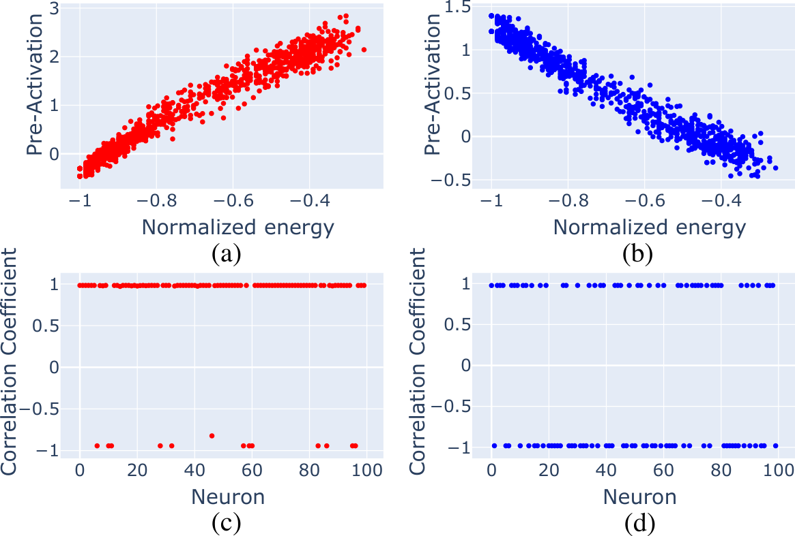

###### fig-3

*Рисунок 3: В задаче Изинга модель выучивает энергию и в режиме гроккинга (a,c), и в режиме обучения (b,d). В верхнем ряду показан точечный график энергии входных снимков против получающихся преднактиваций нейронов последнего слоя. Данные показаны только для наиболее активированного нейрона. Во втором ряду мы показываем, что эта высокая степень корреляции типична для всех нейронов последнего слоя.* **[p. 4]**

Теперь мы показываем, что модели, достигнутые гроккингом и «ровным» обучением, выучивают одни и те же признаки набора данных. Прежние исследования установили, что ключевые признаки, выучиваемые моделями на задаче Изинга, — энергия (уравнение (1)) и намагниченность (уравнение (2)) (Hu et al. 2017; Suchsland and Wessel 2018b). В этих ранних работах было показано, что модели (обученные обычной ровной траекторией) выучивают смесь обоих признаков. Чтобы сравнение грокнутых и обученных моделей было чище, полезно иметь один доминирующий выученный признак. **[p. 4]** Мы потому нарочно проектируем нашу постановку в пользу выучивания энергии. Для этого мы включаем обучающие снимки, находящиеся в упорядоченной фазе, но с аномально низкой намагниченностью. Эти снимки верно классифицируются энергией, но неверно — намагниченностью, и часто появляются как метастабильные состояния в Монте-Карло симуляциях модели Изинга с локальными обновлениями (Suchsland and Wessel 2018a). Более того, мы используем более мощную сеть, включающую CNN-компоненту для обнаружения границ, связанных с вычислением энергии.

###### p4-1

Чтобы понять, какой из трёх признаков модель выучивает, мы коррелируем преднактивации всех нейронов сетей с энергией, намагниченностью и модулем намагниченности. На рис. 3 мы сравниваем результат для моделей, достигнутых траекториями гроккинга и ровного обучения. Мы находим, что и при гроккинге, и при ровном обучении *каждый* нейрон последнего слоя либо идеально коррелирован, либо антикоррелирован с энергией входа. В Приложении C мы показываем, как это развивается в каждом слое модели. Для каждого семени, и при обучении, и при гроккинге, энергия имеет наивысшую корреляцию из трёх мер с большинством активаций нейронов во второй CNN и в полносвязном слое. Мы потому заключаем, что и грокающие, и ровно обучающиеся модели классифицируют снимки, выучивая один и тот же признак — энергию.

### 4.2 Обучение сложению по модулю: обе модели выучивают коэффициенты Фурье

###### fig-4

*Рисунок 4: В задаче сложения по модулю модель выучивает фурье-моды входных данных. Чтобы это увидеть, мы применяем преобразование Фурье к матрице обратного вложения и изображаем её коэффициенты, соответствующие разным фурье-частотам. Тепловые карты для (a) гроккинга и (b) обучения позволяют предположить, что каждый нейрон преимущественно активируется на синусе и косинусе одной частоты. Это подтверждается вычислением IPR для всех нейронов, показанным в (c) для гроккинга и в (d) для обучения.* **[p. 4]**

Чтобы лучше понять зависимость нашего сравнения гроккинга и обучения от задачи, мы изучаем и задачу сложения по модулю. Ряд исследований убедительно показал, что модели, обученные на задаче сложения по модулю, обычно выучивают фурье-представление задачи (Power et al. 2022; Nanda et al. 2023; Gromov 2024). Для двухслойного MLP с квадратичной активацией (Gromov 2024) показал, что анзац фурье-мод для весов модели решает задачу сложения по модулю. Более того, обратное отношение участия (IPR) может служить мерой того, насколько хорошо веса модели локализованы в фурье-базисе. Это даёт количественное сравнение того, в какой мере грокнутые и обученные модели выучивают одни и те же признаки. Распределение постактиваций нейронов полносвязного слоя показано на рис. 4(a-b). Мы видим, что каждый нейрон выучивает синусную и косинусную компоненты одной частоты. Чтобы количественно оценить локализацию на данной частоте в данном нейроне $k$, мы сначала применяем преобразование Фурье к входным (выходным) матрицам весов по измерению вложения (обратного вложения), а затем используем меру обратного отношения участия Громова (Gromov 2024) для количественной оценки локализации на данной частоте:

$$
IPR\,(k)=\sum_{\nu=1}^{D}\frac{|\tilde{W}_{\nu k}|^{4}}{(\sum_{\nu}\tilde{W}_{\nu k}^{2})^{2}}, \tag{4}
$$

###### p4-3

где $\nu$ — индекс измерения вложения (обратного вложения) входных (выходных) матриц скрытого слоя, а $D=2P$ ($D=P)$ — его размер. Результаты показаны на рис. 4(c-d). Во-первых, мы замечаем, что средний IPR — около $1/2$, что согласуется с тем, что каждый нейрон преимущественно обрабатывает синусную и косинусную компоненты данной частоты. Во-вторых, мы видим сопоставимые средние IPR между случаями гроккинга и ровного обучения: 0.43 и 0.53 соответственно. **[p. 5]** Мы потому заключаем, что, как и в задаче Изинга, грокнутые и ровно обученные модели выучивают одни и те же признаки набора данных.

## 5 Обучающиеся модели могут быть сжимаемее грокающих

Установив, что и гроккинг, и ровное обучение ведут к сходным признакам, мы теперь показываем, что тем не менее могут быть значительные различия в эффективности кодирования этих признаков. Для этого мы применяем прунинг по величине весов к конечной модели в обеих задачах. Наш ключевой результат в этом разделе — возникновение линейного размена между *обучающей* потерей конечной модели и сжимаемостью в сложении по модулю (рис. 5). Мы называем эту область параметров «сжимающим режимом». Сжимающий режим — особенно яркий пример общей черты: несмотря на выучивание одних и тех же признаков, грокнутые и ровно обученные модели могут показывать большие различия в сжимаемости.

Начнём с введения нашей схемы прунинга. В основном тексте мы используем глобальную схему прунинга по величине. В приложении мы показываем результаты прунинга каждого слоя сети по отдельности. Чтобы учесть различия масштабов весов и устройства слоёв, мы слегка видоизменяем наивный глобальный прунинг. Сначала мы ранжируем все веса внутри каждого слоя отдельно по их модулям. При данной доле прунинга $p$ мы зануляем наименьшую долю $p$ весов в каждом слое, а затем оцениваем точность модели на тестовом наборе. Чтобы количественно оценить сжимаемость модели, мы сначала интегрируем точность $a(p)$ при каждой доле прунинга $p$ по $p$ — то есть находим площадь, ограниченную кривой прунинга и осью x на рис. 5(a-b). Затем мы определяем сжимаемость $c$ как:

$$
a\equiv\int a(p)dp,\text{ }c\equiv\frac{1}{1-a}. \tag{5}
$$

Это аналогично нахождению размера обрезанной модели при закреплённой точности, но усреднённому по всему диапазону прунинга.

###### p5-4

Мы показываем результаты прунинга по множителям весов для сложения по модулю на рис. 5(a). В режиме ровного обучения $w_{0}\leq 0.4$ сжимаемость модели систематически улучшается со снижением множителя весов. На рис. 5(c) мы видим, что как только модель перешла в эту область параметров, возникает разительный линейный размен между эффективностью кодирования и обучающей потерей конечной модели. В Приложении D мы приводим данные о связи сжимаемости с рядом других сетевых мер. В частности, мы подчёркиваем, что нет никакой корреляции между сжимаемостью и *тестовой* потерей. Неожиданно, мы также не находим связи между сжимаемостью и вырожденностью модели, измеряемой локальным коэффициентом обучения (Hoogland et al. 2024; Chen et al. 2023; Lau et al. 2024).

В режиме гроккинга сложения по модулю мы видим, что значимой зависимости сжимаемости модели от $w_{0}$ нет — красные кривые ложатся друг на друга. Значит, хотя модели, обученные и гроккингом, и ровным обучением, выучивают фурье-компоненты входных данных, модели, обученные в сжимающем режиме ровного обучения, значительно сжимаемее. Мы подчёркиваем, что существование сжимающего режима в ровном обучении — черта не всеобщая, а зависящая от параметров. В Приложении F мы показываем, что этот режим устраняется увеличением размера пакета с 64, использованного в основном тексте, до 200. Сжимающий режим — таким образом, новая область параметров ровного обучения, а не всеобщая черта.

###### fig-5

*Рисунок 5: Кривые прунинга для (a) Изинга и (b) сложения по модулю. В задаче сложения по модулю есть линейный размен между конечной потерей и сжимаемостью $c$, показанный в (c), тогда как для задачи Изинга такой связи нет, что показано в (d). Данные в верхнем ряду усреднены по семенам, нижний ряд показывает все семена.* **[p. 5]**

###### p5-6

Во врезке рис. 5(a) мы показываем, что можем достичь чрезвычайно высоких сжатий при большем спаде весов ($3\times 10^{-4}$ против $3\times 10^{-5}$). В паре с низким множителем весов мы способны *вырезать 95% весов* модели ценой 5% падения точности — сжимаемость в 25 раз к исходной модели и в 5 раз к наибольшему сжатию, достигнутому при меньшем множителе весов, использованном в остальном основном тексте. В Приложении E мы исследуем этот режим. Мы показываем, что в этом чрезвычайно сжатом режиме средний IPR $\tilde{IPR}$ падает почти на порядок, указывая, что фурье-представление модели разваливается. Мы также отмечаем, что модель сама близка к развалу — модели со спадом весов на 30% больше уже вовсе не обучаются.

###### p5-7

Наконец, мы показываем сжимаемость модели для задачи Изинга на рис. 5(b,d). Здесь мы не видим ясной связи между сжимаемостью и множителем весов, а потому и сжимающей фазы. Более того, нет осмысленного размена между сжимаемостью модели и конечной потерей. Это подкрепляет взгляд, что сжимающая фаза, найденная **[p. 6]** в задаче сложения по модулю, — отдельный режим динамики обучения.

*Рисунок 6: Динамические меры, сравнивающие обучение и гроккинг для сложения по модулю. Слева направо вертикальные штриховые линии представляют время обучения, конец плато гроккинга и тестовое время. Модель, по-видимому, развивается до и во время перехода гроккинга. Мы также видим переходный всплеск сжимаемости в динамике прунинга.* **[p. 6]**

## 6 Развитие модели при гроккинге и обучении

Установив меры и для выученных признаков набора данных, и для сжимаемости модели, мы теперь спрашиваем, как они развиваются по ходу обучения. Мы представляем два главных результата. Во-первых, развитие моделей на до-гроккинговом плато различно в задачах Изинга и сложения по модулю. В задаче сложения по модулю, в согласии с прежней литературой о «мерах прогресса» (Nanda et al. 2023; Gromov 2024), мы находим, что модель продолжает развиваться на плато, несмотря на то что точность не улучшается. Для задачи Изинга, однако, мы находим, что модель на плато гроккинга не развивается. Это позволяет предположить, что динамика модели при гроккинге зависит от задачи. Мы подкрепляем это введением новых FIM-мер для разбора траекторий в пространстве моделей, дающих ещё одну перспективу выявления развития модели.

### 6.1 Развитие признаков

Чтобы измерить развитие признаков модели, мы сначала определяем послойные сводные средние для наших мер интерпретируемости. Для модели Изинга мы определяем взвешенный по преднактивациям коэффициент корреляции $\tilde{r}$ для слоя $L$ как сумму (модулей) коэффициентов корреляции каждого нейрона $k$ этого слоя, взвешенных долей $w_{k}$ этого нейрона в суммарной преднактивации

$$
w_{k}\equiv\frac{\sum_{i\in\mathcal{D}}|z^{i}_{k}|}{\sum_{i\in\mathcal{D}}\sum_{k\in L}|z^{i}_{k}|},\,\,\text{ }\tilde{r}\equiv\frac{1}{|L|}\sum_{k\in L}w_{k}|r_{k}|, \tag{6}
$$

где $z^{i}_{k,L}$ — преднактивация $k$-го нейрона слоя $L$ на входном векторе $i$, $|\mathcal{D}|$ — число элементов тестового набора, а $|L|$ — число нейронов слоя. Для сложения по модулю мы просто берём среднее IPR по нейронам $k$ скрытого слоя, определяя $\tilde{IPR}$:

$$
\tilde{IPR}\equiv\frac{1}{|L|}\sum_{k\in L}IPR(k), \tag{7}
$$

###### fig-7

*Рисунок 7: Динамические меры, сравнивающие обучение и гроккинг для задачи Изинга. В отличие от сложения по модулю, модель не показывает признаков развития на плато гроккинга.* **[p. 6]**

###### p6-4

Мы сводим поведение этих мер по ходу обучения для задачи сложения по модулю на рис. 6, а для задачи Изинга на рис. 7; дополнительные данные — в Приложении G. На плато гроккинга две задачи ведут себя заметно по-разному. В случае сложения по модулю модель улучшает свою локализацию в фурье-базисе на всём протяжении плато, несмотря на отсутствие улучшения точности или потери модели. Это согласуется с картиной «формирования схемы», описанной для трансформера у Nanda et al. (Nanda et al. 2023) и для двухслойной полносвязной сети у Громова (Gromov 2024). Модель же, обученная на задаче Изинга, не улучшает своё представление энергии на плато — все три метрики примерно постоянны по всем слоям на плато. Развивает ли модель признаки на плато гроккинга — таким образом, зависит от задачи. Интересно, что и при гроккинге, и при ровном обучении модель продолжает улучшать представление доминирующего признака долго после насыщения точности и потери.

**[p. 7]**

### 6.2 Динамика сжимаемости

Мы также рассматриваем динамику сжимаемости модели. Результаты для задачи Изинга даны в среднем ряду рис. 7(c-d). В случае гроккинга мы видим, что сжимаемость достигает пика вскоре после насыщения точности, а затем слегка спадает. Результаты для задачи сложения по модулю даны на рис. 6(c-d). Здесь мы видим переходный всплеск на 50% выше установившейся сжимаемости для траектории ровного обучения и на 67% выше для траектории гроккинга. Сравнивая с мерами формирования модели на рис. 6(a-b), мы отмечаем, что после пика сжимаемости сжимаемость *падает* по мере роста нейронного IPR $\tilde{r}$. Мы также отмечаем, что наблюдали переходный пик сжимаемости во всех наших прогонах сложения по модулю — даже при больших размерах пакета, при которых сжимающей фазы нет. Это позволяет предположить, что переходное поведение сжимаемости — явление, отдельное от сжатия конечной модели.

### 6.3 Информационно-геометрический разбор траекторий

Когда устройство модели задано, пространство параметров определяет пространство функций, представимых моделью, — пространство моделей. Это пространство моделей может иметь нетривиальную геометрию, измеряемую информационной метрикой Фишера (FIM). Более полный рассказ об этой связи мы даём в Приложении F. FIM затем можно использовать, чтобы измерять, как информационная геометрия модели меняется при обучении.

Мы используем эту связь, чтобы ввести меры «скорости» и «направления» модели в пространстве моделей по ходу обучения. Эти меры — информационно-геометрическое обобщение величины шага и косинусной близости последовательных шагов обновления вдоль траектории. При позиции в пространстве моделей $\theta^{e}$ на эпохе $e$ шаг в пространстве моделей определяется как $s^{e}:=\theta^{e+f}-\theta^{e}$, где $f$ — частота между отсчётами, равная $200$ $(1)$ для задачи Изинга (сложения по модулю). Отсюда величина шага и косинусная близость двух шагов $s$ и $s^{\prime}$ задаются

$$
|s|_{FIM} :=\sqrt{s_{i}\cdot g^{FIM}_{ij}\cdot s_{j}} \in[0,\infty)\;, \tag{8}
$$

$$
S_{C-FIM}(s,s^{\prime}) :=\frac{s_{i}\cdot g^{FIM}_{ij}\cdot s^{\prime}_{j}}{|s|_{FIM}|s^{\prime}|_{FIM}} \in[-1,1]\;. \tag{9}
$$

где по повторяющимся индексам подразумевается суммирование. Основное внимание уделяется косинусной близости, где значения около единицы указывают на приблизительно параллельные шаги, а значения около нуля — на ортогональные. Мы прослеживаем косинусные близости шагов, усреднённые по 10 прогонам с семенами, для обеих задач — Изинга и сложения по модулю — и для обоих режимов — гроккинга и ровного обучения. В частности, мы вычисляем косинусную близость последовательных шагов $s^{e}$ и $s^{e+1}$ и показываем результаты на рис. 8(a-b).

###### fig-8

*Рисунок 8: FIM-косинусные близости, $S_{C-FIM}(s,s^{\prime})$, траекторий моделей через пространство моделей при обучении (усреднено по 10 прогонам). Близость последовательных шагов, $(s^{e},s^{e+1})$, показана в (a) для задачи Изинга и в (b) для сложения по модулю. Близость каждого шага к траектории, указывающей на начало координат пространства моделей, $(s^{e},s^{OT})$, показана в (c) для задачи Изинга и в (d) для сложения по модулю.* **[p. 7]**

В обеих задачах и обоих режимах косинусная близость сначала растёт, достигает пика около времени обучения, а затем спадает почти до нуля. Эти результаты отражают динамику обучения: найдя хорошую траекторию, модель продолжает обновляться примерно в одном направлении, пока не достигнет минимума потери. После обучения обновления модели — случайные колебания вокруг минимума потери, и последовательные шаги становятся некоррелированными. Режим гроккинга показывает пики позже в обучении, и для задачи Изинга пик заметно выше, чем в режиме ровного обучения. Более того, пиковая косинусная близость почти равна единице, указывая, что модель эволюционирует вдоль прямой линии в высокоразмерном пространстве параметров.

Прежняя работа предполагает, что динамика до гроккинга определяется спадом посторонних параметров (Nanda et al. 2023) — гипотеза, подкреплённая экспоненциальной подгонкой суммарной нормы весов в (Liu et al. 2023a). При равномерном спаде весов траектория модели указывает на начало координат пространства моделей. Это особенно выделенный путь, и он может объяснять необычную прямизну траектории гроккинга для задачи Изинга.

Чтобы понять, так ли это на самом деле, мы вычисляем косинусную близость между каждым шагом и взятой с минусом позицией модели в начале этого шага (которая указывает на начало координат). Значения этой косинусной близости имеют особенно естественное истолкование: когда они положительны, FIM-взвешенный средний вес растёт, при отрицательных — убывает. В пределах $S_{C-FIM}\approx\pm 1$ доминирует равномерный спад/рост весов. Эти результаты для обеих задач — Изинга и сложения по модулю — и обоих режимов — гроккинга и ровного обучения — **[p. 8]** показаны на рис. 8(c-d). На поздних временах все случаи показывают нулевую косинусную близость, указывая на отсутствие и спада, и роста весов по достижении конечной модели.

###### p8-1

Для задачи Изинга режим гроккинга поначалу следует пути, близкому к траектории на начало координат, с косинусной близостью, приближающейся к единице. В случае обучения происходит противоположное: отрицательный показатель близости соответствует слегка растущим параметрам сети. Эти результаты дают дополнительное свидетельство, что в задаче Изинга доминирующий эффект до перехода гроккинга — спад весов. Более того, такая траектория объясняет и то, почему развитие признаков не происходит до перехода гроккинга. На плато потери до перехода динамика почти целиком движима спадом весов, и «скрытого» формирования модели, по-видимому, нет.

Для задачи сложения по модулю косинусная близость к траектории на начало координат несколько иная. В начале обучения оба режима — и гроккинг, и ровное обучение — показывают раннюю стадию, где модель, по-видимому, слегка удаляется от начала координат, которая позже сменяется стадией слегка ориентированных на начало координат обновлений при приближении к переходу обучения. Однако косинусная близость значительно ниже, чем в задаче Изинга, что указывает на траекторию, менее определяемую спадом весов. Это подкрепляет то, что для сложения по модулю траектория гроккинга ещё и развивает признаки до перехода гроккинга, и потому динамика не может быть просто равномерным спадом весов.

В целом эти новые информационно-геометрические меры дают новый способ разбора динамики машинного обучения, неявно учитывающий геометрию пространства моделей. Прослеживая направление траектории в пространстве моделей, мы дали свидетельства, что динамика гроккинга определяется спадом весов для задачи Изинга, но не для сложения по модулю. Помимо схватывания направлений обновлений модели, FIM можно использовать и для слежения за их величиной. Разбор величины шага обновления оставлен в приложение, но мы отмечаем, что она показывает особые изменения градиента в начальной и конечной точках плато гроккинга, а значит подсказывает новый способ выявления гроккинга.

## 7 Заключение

Чтобы сравнить признаки, выучиваемые при гроккинге и обучении, как можно ближе, мы изучали игрушечные модели с ясно измеримыми признаками. Это немедленно поднимает вопрос, какие из наших находок обобщаются на более крупные модели. В целом наша работа подсказывает три главных вопроса для дальнейшей работы.

###### p8-5

Во-первых, *есть ли у гроккинга практически полезные свойства*? Это могло бы происходить двумя путями: грокнутая модель может выучивать иные признаки или быть сжимаемее обученной «ровным» обучением. В нашем случае выученные признаки оказались теми же, а режим ровного обучения имел более высокое сжатие. Если оба этих вывода верны в общем случае, это подсказывает, что гроккинг следует устранять всюду, где возможно. В наших задачах мы добивались этого настройкой масштаба весов на инициализации. Однако неизвестно, существуют ли задачи, которые можно *только* грокнуть, или, наоборот, только ровно выучить.

Во-вторых, *какова природа сжимающего режима, и можно ли им сжимать практические модели*? К счастью, мы обнаружили сжимающий режим в обычном обучении, а не в гроккинге. Достигнутое очень большое сжатие поднимает интересную возможность использовать такую схему обучения для получения более сжимаемых моделей вообще. Вдобавок сжимающий режим позволяет настраивать размер действенной модели изменением начального множителя весов. Поскольку известно, что модели сжимают признаки суперпозицией (Elhage et al. 2022), было бы особенно интересно исследовать в дальнейшей работе, показывают ли модели этого режима значительно более высокую суперпозицию, чем модели, обученные вне его.

Наконец, *может ли информационная геометрия помочь масштабировать интерпретируемость*? Наши меры интерпретируемости позволили проследить развитие модели по ходу обучения. Хотя это дало меры прогресса, по которым модель гладко развивается в задаче сложения по модулю, для задачи Изинга этого нет — генерализация там по-прежнему возникает внезапно. Существенно, что эти меры пришлось строить вручную под каждую задачу. Напротив, наши информационно-геометрические меры были общими и выявили как признаки отсутствия развития модели в задаче Изинга, так и нетривиальную до-гроккинговую динамику сложения по модулю. Было бы интересно дальше исследовать, как информационно-геометрические меры могут использоваться для интерпретируемости моделей.

## Благодарности

Мы с благодарностью отмечаем чрезвычайно полезные обсуждения с Marc S. Klinger. Marc собрал первоначальную коллаборацию и внёс важные идеи об информационной геометрии. Работа B.B. поддержана US National Science Foundation, грант No. DMR-1945058. A.G.S, D.S.B и E.H признательны за поддержку Pierre Andurand в ходе этого исследования. G.D.T. признателен за поддержку EPiQS Program фонда Gordon and Betty Moore Foundation. Эта работа использовала Illinois Campus Cluster — вычислительный ресурс, управляемый Illinois Campus Cluster Program (ICCP) совместно с National Center for Supercomputing Applications (NCSA) и поддерживаемый фондами Иллинойсского университета в Урбане-Шампейне. Это исследование частично поддержано проектом Illinois Computes, поддерживаемым Иллинойсским университетом **[p. 9]** в Урбане-Шампейне и системой Университета Иллинойса. Это исследование также использовало HPC-кластер Apocrita Лондонского университета королевы Марии (King et al. 2017), поддерживаемый QMUL Research-IT.

## Доступность данных

Код и наборы данных, использованные в этой работе, доступны здесь: https://github.com/xand-stapleton/grokking_vs_learning.

## References

- Guillaume Alain and Yoshua Bengio. Understanding intermediate layers using linear classifier probes, 2018. URL https://arxiv.org/abs/1610.01644.

- Shun-ichi Amari. *Information geometry and its applications*, volume 194. Springer, 2016.

- Shun-ichi Amari, Ryo Karakida, and Masafumi Oizumi. Fisher information and natural gradient learning in random deep networks. In Kamalika Chaudhuri and Masashi Sugiyama, editors, *Proceedings of the Twenty-Second International Conference on Artificial Intelligence and Statistics*, volume 89 of *Proceedings of Machine Learning Research*, pages 694–702. PMLR, 16–18 Apr 2019. URL https://proceedings.mlr.press/v89/amari19a.html.

- R.J. Baxter. *Exactly Solved Models in Statistical Mechanics*. Dover books on physics. Dover Publications, 2007. ISBN 9780486462714. URL https://books.google.pt/books?id=G3owDULfBuEC.

- David S. Berman and Marc S. Klinger. The Inverse of Exact Renormalization Group Flows as Statistical Inference. *Entropy*, 26(5):389, 2024. doi: 10.3390/e26050389.

- David S. Berman, Jonathan J. Heckman, and Marc Klinger. On the Dynamics of Inference and Learning, 4 2022.

- David S. Berman, Marc S. Klinger, and Alexander G. Stapleton. Bayesian renormalization. *Mach. Learn. Sci. Tech.*, 4(4):045011, 2023. doi: 10.1088/2632-2153/ad0102.

- David S. Berman, Marc S. Klinger, and Alexander G. Stapleton. NCoder – A Quantum Field Theory approach to encoding data, 2 2024.

- Guy Blanc, Neha Gupta, Gregory Valiant, and Paul Valiant. Implicit regularization for deep neural networks driven by an ornstein-uhlenbeck like process, 2020. URL https://arxiv.org/abs/1904.09080.

- Zhongtian Chen, Edmund Lau, Jake Mendel, Susan Wei, and Daniel Murfet. Dynamical versus bayesian phase transitions in a toy model of superposition, 2023. URL https://arxiv.org/abs/2310.06301.

- Hongrong Cheng, Miao Zhang, and Javen Qinfeng Shi. A survey on deep neural network pruning-taxonomy, comparison, analysis, and recommendations, 2024. URL https://arxiv.org/abs/2308.06767.

- Branton DeMoss, Silvia Sapora, Jakob Foerster, Nick Hawes, and Ingmar Posner. The Complexity Dynamics of Grokking. *arXiv e-prints*, art. arXiv:2412.09810, December 2024. doi: 10.48550/arXiv.2412.09810.

- Darshil Doshi, Aritra Das, Tianyu He, and Andrey Gromov. To grok or not to grok: Disentangling generalization and memorization on corrupted algorithmic datasets, 2024. URL https://arxiv.org/abs/2310.13061.

- Nelson Elhage, Tristan Hume, Catherine Olsson, Nicholas Schiefer, Tom Henighan, Shauna Kravec, Zac Hatfield-Dodds, Robert Lasenby, Dawn Drain, Carol Chen, Roger Grosse, Sam McCandlish, Jared Kaplan, Dario Amodei, Martin Wattenberg, and Christopher Olah. Toy models of superposition. *Transformer Circuits Thread*, 2022.

- Simin Fan, Razvan Pascanu, and Martin Jaggi. Deep grokking: Would deep neural networks generalize better?, 2024. URL https://arxiv.org/abs/2405.19454.

- Thomas George. NNGeometry: Easy and Fast Fisher Information Matrices and Neural Tangent Kernels in PyTorch, February 2021. URL https://doi.org/10.5281/zenodo.4532597.

- Roy J. Glauber. Time-Dependent Statistics of the Ising Model. *J. Math. Phys.*, 4(2):294–307, February 1963. ISSN 0022-2488. doi: 10.1063/1.1703954.

- Andrey Gromov. A simple and interpretable model of grokking modular arithmetic tasks, 2024. URL https://openreview.net/forum?id=0ZUKLCxwBo.

- Jesse Hoogland, George Wang, Matthew Farrugia-Roberts, Liam Carroll, Susan Wei, and Daniel Murfet. The developmental landscape of in-context learning, 2024. URL https://arxiv.org/abs/2402.02364.

- Jessica N. Howard, Marc S. Klinger, Anindita Maiti, and Alexander G. Stapleton. Bayesian rg flow in neural network field theories, 2024. URL https://arxiv.org/abs/2405.17538.

- Wenjian Hu, Rajiv R. P. Singh, and Richard T. Scalettar. Discovering phases, phase transitions, and crossovers through unsupervised machine learning: A critical examination. *Phys. Rev. E*, 95:062122, Jun 2017. doi: 10.1103/PhysRevE.95.062122. URL https://link.aps.org/doi/10.1103/PhysRevE.95.062122.

**[p. 10]**

- Dongseong Hwang. Fadam: Adam is a natural gradient optimizer using diagonal empirical fisher information, 2024. URL https://arxiv.org/abs/2405.12807.

- Ahmed Imtiaz Humayun, Randall Balestriero, and Richard Baraniuk. Deep Networks Always Grok and Here is Why. *arXiv e-prints*, art. arXiv:2402.15555, February 2024. doi: 10.48550/arXiv.2402.15555.

- Ernst Ising. Beitrag zur theorie des ferromagnetismus. *Zeitschrift für Physik*, 31(1):253–258, Feb 1925. ISSN 0044-3328. doi: 10.1007/BF02980577. URL https://doi.org/10.1007/BF02980577.

- Alan Jeffares, Alicia Curth, and Mihaela van der Schaar. Deep learning through a telescoping lens: A simple model provides empirical insights on grokking, gradient boosting & beyond, 2024. URL https://arxiv.org/abs/2411.00247.

- Thomas King, Simon Butcher, and Lukasz Zalewski. *Apocrita - High Performance Computing Cluster for Queen Mary University of London*, March 2017. URL https://doi.org/10.5281/zenodo.438045.

- Diederik P. Kingma and Jimmy Ba. Adam: A method for stochastic optimization, 2017. URL https://arxiv.org/abs/1412.6980.

- S. V. Kozyrev. How to explain grokking. *arXiv e-prints*, art. arXiv:2412.18624, December 2024. doi: 10.48550/arXiv.2412.18624.

- Tanishq Kumar, Blake Bordelon, Samuel J. Gershman, and Cengiz Pehlevan. Grokking as the transition from lazy to rich training dynamics, 2024. URL https://openreview.net/forum?id=vt5mnLVIVo.

- Edmund Lau, Zach Furman, George Wang, Daniel Murfet, and Susan Wei. The local learning coefficient: A singularity-aware complexity measure, 2024. URL https://arxiv.org/abs/2308.12108.

- Yann LeCun, John Denker, and Sara Solla. Optimal brain damage. *Advances in neural information processing systems*, 2, 1989.

- Aitor Lewkowycz and Guy Gur-Ari. On the training dynamics of deep networks with $l_{2}$ regularization, 2021. URL https://arxiv.org/abs/2006.08643.

- Ziming Liu, Ouail Kitouni, Niklas Nolte, Eric J. Michaud, Max Tegmark, and Mike Williams. Towards Understanding Grokking: An Effective Theory of Representation Learning, May 2022a.

- Ziming Liu, Ouail Kitouni, Niklas S Nolte, Eric Michaud, Max Tegmark, and Mike Williams. Towards understanding grokking: An effective theory of representation learning, 2022b. URL https://proceedings.neurips.cc/paper_files/paper/2022/file/dfc310e81992d2e4cedc09ac47eff13e-Paper-Conference.pdf.

- Ziming Liu, Eric J. Michaud, and Max Tegmark. Omnigrok: Grokking beyond algorithmic data, 2023a.

- Ziming Liu, Ziqian Zhong, and Max Tegmark. Grokking as compression: A nonlinear complexity perspective, 2023b. URL https://arxiv.org/abs/2310.05918.

- Giosué Cataldo Marinó, Alessandro Petrini, Dario Malchiodi, and Marco Frasca. Deep neural networks compression: A comparative survey and choice recommendations. *Neurocomputing*, 520:152–170, 2023. ISSN 0925-2312. doi: https://doi.org/10.1016/j.neucom.2022.11.072. URL https://www.sciencedirect.com/science/article/pii/S0925231222014643.

- Gouki Minegishi, Yusuke Iwasawa, and Yutaka Matsuo. Bridging lottery ticket and grokking: Is weight norm sufficient to explain delayed generalization?, 2024. URL https://arxiv.org/abs/2310.19470.

- Mohamad Amin Mohamadi, Zhiyuan Li, Lei Wu, and Danica J. Sutherland. Why do you grok? a theoretical analysis of grokking modular addition, 2024. URL https://arxiv.org/abs/2407.12332.

- Neel Nanda, Lawrence Chan, Tom Lieberum, Jess Smith, and Jacob Steinhardt. Progress measures for grokking via mechanistic interpretability, 2023. URL https://openreview.net/forum?id=9XFSbDPmdW.

- Nina Panickserry and Dmitry Vaintrob. devinterp, 2024. URL https://github.com/nrimsky/devinterp.

- Alethea Power, Yuri Burda, Harri Edwards, Igor Babuschkin, and Vedant Misra. Grokking: Generalization beyond overfitting on small algorithmic datasets, 2022. URL https://arxiv.org/abs/2201.02177.

- Lucas Prieto, Melih Barsbey, Pedro A. M. Mediano, and Tolga Birdal. Grokking at the edge of numerical stability, 2025. URL https://arxiv.org/abs/2501.04697.

- Noa Rubin, Inbar Seroussi, and Zohar Ringel. Grokking as a first order phase transition in two layer networks, 2024. URL https://arxiv.org/abs/2310.03789.

- Inbar Seroussi, Gadi Naveh, and Zohar Ringel. Separation of scales and a thermodynamic description of feature **[p. 11]** learning in some cnns, 2022. URL https://arxiv.org/abs/2112.15383.

- Philippe Suchsland and Stefan Wessel. Parameter diagnostics of phases and phase transition learning by neural networks. *Phys. Rev. B*, 97(17):174435, May 2018a. doi: 10.1103/PhysRevB.97.174435.

- Philippe Suchsland and Stefan Wessel. Parameter diagnostics of phases and phase transition learning by neural networks. *Phys. Rev. B*, 97:174435, May 2018b. doi: 10.1103/PhysRevB.97.174435. URL https://link.aps.org/doi/10.1103/PhysRevB.97.174435.

- Zhiquan Tan and Weiran Huang. Understanding grokking through a robustness viewpoint, 2024. URL https://arxiv.org/abs/2311.06597.

- Hugo Tessier, Vincent Gripon, Mathieu Léonardon, Matthieu Arzel, Thomas Hannagan, and David Bertrand. Rethinking weight decay for efficient neural network pruning. *Journal of Imaging*, 8(3):64, March 2022. ISSN 2313-433X. doi: 10.3390/jimaging8030064. URL http://dx.doi.org/10.3390/jimaging8030064.

- Vimal Thilak, Etai Littwin, Shuangfei Zhai, Omid Saremi, Roni Paiss, and Joshua Susskind. The slingshot mechanism: An empirical study of adaptive optimizers and the grokking phenomenon, 2022. URL https://arxiv.org/abs/2206.04817.

- Vikrant Varma, Rohin Shah, Zachary Kenton, János Kramár, and Ramana Kumar. Explaining grokking through circuit efficiency, 2023. URL https://arxiv.org/abs/2309.02390.

- Dustin Wright, Christian Igel, and Raghavendra Selvan. Bmrs: Bayesian model reduction for structured pruning, 2024. URL https://arxiv.org/abs/2406.01345.

**[p. 12]**

## Приложение A Параметры модели и распределение по семенам

В этой работе мы управляем гроккингом исключительно изменением множителя весов. Для удобства таблица 1 приводит все остальные параметры моделей для данных, порождённых в основном тексте.

*Таблица 1: Устройство моделей и параметры обучения* **[p. 12]**

| **Параметр** | **CNN Изинга** | **MLP сложения по модулю** |
|---|---|---|
| Спад весов | 0.1 | $3\times 10^{-5}$ |
| Скорость обучения | $10^{-4}$ | $5\times 10^{-3}$ |
| Эпохи | 100,000 | 1000 |
| Потеря | Кросс-энтропия | Кросс-энтропия |
| Оптимизатор | Adam | Adam |
| Активация | ReLU | ReLU |
| Модуль (P) | – | 113 |
| Доля обучения | – | 70% |
| Размер обучающего набора | 300 | 8938 |
| Размер пакета | 300 | 64 |
| Размер тестового набора | 1000 | 3831 |
| Размер полносвязного слоя | 100 | 512 |
| Свёрточные каналы | 2,4 | – |
| Свёрточный шаг | 2,2 | – |
| Размер ядра | 2,2 | – |

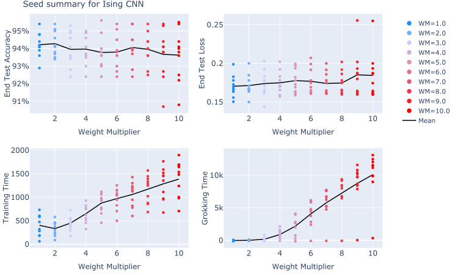

*Рисунок 9: Сводка исходов прогонов для 10 разных семян, использованных для каждого множителя весов. Мы видим, что все прогоны, кроме одного, гроккают в области больших множителей весов графика, и что для большинства семян конечные тестовые точности и потери гроккинга и обучения в пределах нескольких процентов друг от друга.* **[p. 12]**

**[p. 13]**

Мы также приводим сводные данные по отдельным прогонам. На рис. 9 мы даём распределение по отдельным семенам для прогонов Изинга. Мы видим, что конечная точность и потеря модели согласованы при настройке от гроккинга к обучению. Мы также видим лёгкий рост разброса по семенам при настройке глубже в режим гроккинга, причём одно семя упорно не гроккает.

Для сложения по модулю сводные данные по семенам — на рис. 10. Мы видим, что задача сложения по модулю значительно менее зависима от семени, чем задача Изинга. Все семена достигают 100% точности, и конечные потери в пределах 5% друг от друга, тогда как для задач Изинга конечные точности в пределах 5%, а конечные потери могут различаться более чем на 50%. Мы также отмечаем, что, интересно, и у сложения по модулю, и у задачи Изинга время обучения растёт при переходе из режима гроккинга в режим обучения.

*Рисунок 10: Сводка исходов прогонов для 5 разных семян, использованных для каждого множителя весов в сложении по модулю.* **[p. 13]**

## Приложение B Задача классификации Изинга

Этот раздел даёт более формальное определение модели Изинга, использованной в основном тексте. В общем виде модель Изинга определяется на графе $G$ (с множеством вершин $V$ и множеством рёбер $E$), где с каждым узлом связана дискретная переменная $\sigma_{x}\in\{-1,1\}$, называемая спином. Пространство спиновых конфигураций (снимков) задаётся всеми возможными сочетаниями $\Omega=\{-1,1\}^{V}$. Модель Изинга можно определить как распределение вероятностей на этом пространстве снимков $\Omega$. Точнее, снимок $\{\sigma_{x}\}_{x\in V}$ берётся из распределения Больцмана:

$$
p(\{\sigma_{x}\})=\frac{e^{-E(\{\sigma_{i}\})/T}}{Z(T)}, \tag{10}
$$

где $T$ — температура системы, $Z(T)$ — нормировочный множитель (статистическая сумма), а $E(\{\sigma_{x}\})$ — функция энергии (стоимости):

$$
E(\{\sigma_{x}\})=-J\sum_{(i,j)\in E}\sigma_{i}\sigma_{j}. \tag{11}
$$

Здесь сумма — по рёбрам графа, а $J>0$ — сила взаимодействия спинов, которая в основном тексте для простоты положена единицей. Фазовый переход определяется соперничеством взаимодействия $J$, благоприятствующего упорядочению **[p. 14]** выравниванием спинов ради минимизации энергии в уравнении 11, и температуры $T$, расширяющей ширину распределения вероятностей в уравнении 10 и тем благоприятствующей беспорядку через исследование спиновых конфигураций со случайными выравниваниями.

В основном тексте мы рассматриваем случай, когда граф $G$ — квадратная двумерная ($2D$) решётка линейного размера $L=16$ ($|V|=L^{2}$). В пределе большого линейного размера $(L\rightarrow\infty)$ модель представляет фазовый переход при $T_{c}=\frac{2J}{\log{(1+\sqrt{2})}}$, разделяющий упорядоченную фазу при $T<T_{c}$ и неупорядоченную при $T>T_{c}$.

Формально эти две фазы однозначно характеризуются усреднённой плотностью намагниченности (локальным параметром порядка):

$$
\langle M\rangle(T):=\lim_{h\rightarrow 0}\lim_{L\rightarrow\infty}\langle\frac{1}{L^{2}}\sum_{i\in V}\sigma_{i}\rangle_{h}, \tag{12}
$$

где $\langle\cdot\rangle_{h}$ обозначает среднее по больцмановскому распределению с внешним полем, $p_{h}({\sigma_{x}})=\frac{e^{-E_{h}({\sigma_{i}})/T}}{Z(T,h)}$, с $E_{h}({\sigma_{x}})=E({\sigma_{x}})-h\sum_{i\in V}\sigma_{i}$, и $Z(T,h)$ — нормировочный множитель. Член $-h\sum_{i\in V}\sigma_{i}$ добавляет энергетический штраф за $\sigma_{x}=-1$, разрушая энергетическое вырождение $E({\sigma_{x}})=E({-\sigma_{x}})$. В упорядоченной фазе $\langle M\rangle$ положительна, в неупорядоченной — равна нулю в пределе $L\rightarrow\infty$. В частности, для двумерного случая:

$$
\langle M\rangle(T)=\begin{cases}\left(1-\frac{1}{\sinh^{4}{2J/T}}\right)^{1/8},&T<T_{c}\\
\quad 0,&T>T_{c}.\end{cases} \tag{13}
$$

С конкретной точки зрения, спиновые конфигурации, взятые из уравнения (10) при конечном $L$, — которые можно рассматривать просто как бинарные изображения — выглядят очень по-разному для $T$ меньше или больше $T_{c}$. При $T=0$ больцмановское распределение сосредоточено с равным весом лишь в двух конфигурациях: все спины $+1$ или все спины $-1$, и модуль намагниченности $|\sum_{x\in V}\sigma_{x}|$ равен $|V|$. С ростом температуры внутри упорядоченной фазы тепловые флуктуации порождают малые кластеры спинов со знаком, противоположным объёмной намагниченности. Тем не менее намагниченность остаётся экстенсивной по модулю. В противоположном пределе $T\rightarrow\infty$, глубоко в неупорядоченной фазе, $p(\{\sigma_{x}\})=1/2^{|V|}$, и все конфигурации равновероятны. Следовательно, типичные конфигурации состоят из случайных спинов, и модуль намагниченности мал по сравнению с $|V|$. Эти качественно разные спиновые устройства делают определение фазы конечноразмерного снимка похожим на задачу распознавания изображений.

Конфигурации снимков, используемые для обучения нашей свёрточной нейросети, порождаются Монте-Карло симуляциями с локальными обновлениями. Конкретно, мы используем алгоритм динамики Глаубера [Glauber 1963], который описываем ниже.

Чтобы выбрать спиновую конфигурацию из больцмановского распределения при закреплённой $T$, начинают с конфигурации при бесконечной температуре, $T\rightarrow\infty$. Иными словами, выбирают спиновую конфигурацию $\{\sigma_{x}\}_{x\in V}$ из равномерного распределения, $p(\{\sigma_{x}\})=1/2^{|V|}$. Затем обновляют отдельные спины, чтобы получить типичную конфигурацию из уравнения (10) и приблизиться к целевой средней функции энергетической стоимости. Каждое обновление называется шагом Монте-Карло.

Для конкретности рассмотрим случай, когда граф $G$ — двумерная сетка линейного размера $L$, и каждый узел задаётся двумерными координатами $1\leq x,y\leq L$. Мы берём периодические граничные условия, например $\sigma_{L+1,y}=\sigma_{1,y}$. Процедура такова:

1. Мы выбираем спиновую конфигурацию (снимок) ${\sigma_{x,y}}$ из равномерного распределения и вычисляем её энергию $E_{0}({\sigma_{x,y}})$.
2. Мы случайно выбираем узел $(x,y)$ и вычисляем энергию $E_{t}$ новой конфигурации, в которой спин этого узла перевёрнут: $\sigma_{x,y}\rightarrow-\sigma_{x,y}$.
3. Мы решаем перевернуть спин и обновить спиновую конфигурацию с вероятностью $p_{\text{flip}}=1/(1+e^{\Delta E/T})$, где $\Delta E=E_{t}-E_{0}$ — разность энергий двух спиновых конфигураций. Если переворот спина принят, полагаем $E_{0}=E_{t}$.
4. Мы повторяем шаги 2 и 3, обновляя спиновые конфигурации, в общей сложности $N$ шагов Монте-Карло. Мы берём $N\gg L^{2}$, чтобы обеспечить хотя бы частичное уравновешивание перед сохранением получающегося снимка.

Чтобы породить обучающие данные для нашей задачи классификации, мы повторяем эту процедуру 1000 раз для 50 температур в интервале $[T_{c}-1,T_{c}+1]$ при закреплённом $J=1$. Затем мы индексируем (конечноразмерные) снимки их температурой, и их итоговая **[p. 15]** фазовая метка (упорядоченный или неупорядоченный) основана на фазе бесконечной системы при этой температуре. Эта процедура гарантированно порождает снимки модели Изинга в равновесии, если её прогонять бесконечное время. В равновесии снимки полностью характеризуются намагниченностью, и задача классификации почти тривиальна.

Мы потому выбираем прогонять симуляцию большое, но закреплённое число шагов $N$, чтобы часть снимков обучающих данных была не вполне уравновешена. В частности, Монте-Карло симуляции с локальными обновлениями, как наша, часто «застревают» в метастабильных конфигурациях до достижения равновесия. Закрепляя точку остановки наших симуляций, мы неизбежно включаем в данные некоторые метастабильные снимки. Конкретнее, мы включаем так называемые конфигурации с протяжёнными доменными стенками — упорядоченные снимки с аномально низкой намагниченностью [Suchsland and Wessel 2018a]. Эти снимки верно классифицируются как упорядоченные по их энергии, но классифицируются неверно, если наша сеть выучивает лишь намагниченность. Несколько примеров таких конфигураций с протяжёнными доменными стенками показаны на рис. (11). Включая такие снимки в обучающие данные, мы позволяем нашей сети выучить и намагниченность, и энергию.

Другое важное отличие теоретической модели Изинга от наших снимков — конечный размер нашей сетки. Главный эффект конечного размера системы в том, что критическая точка при $T_{c}$ расширяется в критическую область вокруг $T_{c}$. В бесконечной системе корреляционная длина[^1] между спинами расходится ровно при $T_{c}$. В нашей конечной решётке, однако, как только корреляционная длина превышает размер системы ($L=16$), система ведёт себя критически. При обучении нашей модели этот конечноразмерный эффект на деле даёт полезную проверку переобучения модели. Примерно $10\%$ наших обучающих снимков находятся в этой «критической области» и потому не могут быть классифицированы никакими физическими величинами. Если точность модели на обучающих данных близка к $100\%$, значит, она заучивает фазовые метки этих двусмысленных точек. С другой стороны, после того как модель обучилась, тестовая точность падает примерно до $95\%$ — лучшего, что возможно с использованием физических признаков снимков.

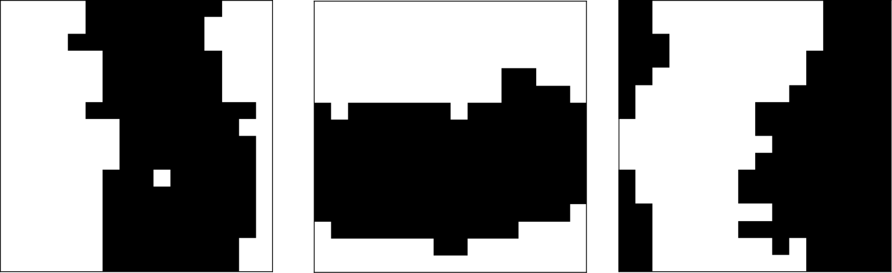

*Рисунок 11: Три конфигурации протяжённых доменных стенок модели Изинга. Эти снимки верно классифицируются как упорядоченные по энергии, но классифицируются неверно, если сеть выучивает только намагниченность. Такие конфигурации обычны в Монте-Карло симуляциях с локальными обновлениями.* **[p. 15]**

## Приложение C Развитие признаков в CNN Изинга

Здесь мы приводим послойную разбивку по всем семенам признаков, выученных моделью на задаче Изинга для случаев гроккинга и обучения. Сначала отметим, что признаки становятся отчётливее по мере продвижения по сети. В первом CNN-слое, по-видимому, нет информации ни об энергии, ни о модуле намагниченности. Во втором CNN-слое эта информация возникает и затем обрабатывается скрытым слоем, где модуль корреляции с энергией у каждого нейрона около 0.99, а с модулем намагниченности — около 0.9. Заметим мимоходом, что полносвязный слой можно рассматривать как нелинейный зонд на втором свёрточном слое [Alain and Bengio 2018], что поддерживает взгляд, что информация об энергии уже сформирована в этой точке сети.

Мы также отмечаем, что представление шумнее при гроккинге, чем в режиме обучения. В режиме обучения (рис. 13) у каждого семени почти все нейроны полносвязного слоя почти идеально коррелированы или антикоррелированы с энергией. В режиме гроккинга (рис. 13) три семени значительно отклоняются от идеальной корреляции с энергией и вместо этого коррелируют с *сырым* значением намагниченности.

*Рисунок 12: Сводка коэффициентов корреляции для разных мер по семенам и всем слоям для случая обучения в Изинге. Вертикальные штриховые линии разделяют семена.* **[p. 16]**

*Рисунок 13: Сводка коэффициентов корреляции для разных мер по семенам и всем слоям для случая гроккинга в Изинге. Вертикальные штриховые линии разделяют семена. Мы видим, что хотя преобладающее поведение — по-прежнему выучивать намагниченность, случай гроккинга шумнее обучения — в некоторых семенах выучивается намагниченность.* **[p. 17]**

**[p. 16]**

## Приложение D Сжимаемость

Мы представляем дополнительные результаты о сжимаемости. В задаче сложения по модулю мы выделили «сжимающий режим», характеризуемый линейным разменом между потерей конечной модели и сжимаемостью. Существует ли этот режим, зависит от более широкого набора параметров модели. Хотя мы не проводили исчерпывающего поиска параметров сжимающего режима, мы нашли, что увеличение размера пакета до 200 с 64 в основном тексте устраняет сжимающий эффект, как показано на рис. 14.

*Рисунок 14: Кривые прунинга для размера пакета 64 (слева), как в основном тексте, и 200 (справа). Все остальные параметры — как в таблице 1. Мы видим, что изменение размера пакета устраняет сжимающий режим. При размере пакета 200 нет значимого роста сжимаемости при меньшем множителе весов.* **[p. 18]**

Чтобы лучше понять природу сжимающего режима, мы также приводим данные о корреляции между сжимаемостью модели и рядом других мер на рис. 15. Мы также приводим эквивалентные данные для несжимающих прогонов с пакетом 200 на рис. 16. Сначала отметим, что, несмотря на линейную связь с *обучающей* потерей в сжимающем режиме, связи с *тестовой* потерей нет ни в сжимающем, ни в несжимающем режиме.

Во-вторых, сжимающий режим сопряжён со значительным снижением локализации нейронов на конкретной частоте. Мы видим на правых графиках нижнего ряда, что и для входных, и для выходных матриц весов скрытого слоя сжимающий режим ведёт к улучшению сжимаемости через снижение локализации в фурье-базисе. В чрезвычайно сжатом режиме, который мы обсуждаем в приложении E, этот эффект становится очень драматичным. Прогоны с низким множителем весов сопряжены с почти полным развалом локализации в фурье-базисе (рис. 15). Важно указать, что снижение фурье-локализации — свойство сжимающего режима, а не различие между гроккингом и обучением вообще. На рис. 16 мы приводим данные тех же мер, но при большем размере пакета. Здесь значимого различия между IPR гроккинга и обучения нет.

**[p. 17]**

В-третьих, неудивительно, что более сжимаемые модели имеют более высокие коэффициенты Джини весов. Помимо коэффициентов Джини модулей весов, мы измеряем и коэффициент Джини диагонального элемента информационной метрики Фишера, соответствующего данному весу, как обсуждается в приложении F. Коэффициенты Джини фишеровских диагоналей существенно выше коэффициентов Джини сырых весов. Это неудивительно, поскольку фишеровские диагонали должны давать более тонкую меру важности данного веса. Ввиду этого наблюдения озадачивает, почему прунинг по фишеровским диагоналям даёт худшее качество, чем прунинг по величине, как мы показываем в разделе F.1. Разрешение этого напряжения могло бы помочь понять, как FIM можно использовать в абляциях и других контекстах интерпретируемости.

Наконец, мы также вычисляем «локальный коэффициент обучения» (LLC) для всех прогонов, используя код из [Panickserry and Vaintrob 2024]. LLC задуман как мера вырожденности модели. Интуитивно следует ожидать, что модели с большей вырожденностью сжимаемее. Неожиданно, немного исследований изучали связь LLC и прунинга контролируемым образом. Поскольку сжимающий режим даёт способ настраивать сжимаемость модели, мы можем сделать это в данном контексте. Интересно, что мы не находим связи между LLC и сжимаемостью модели. Более глубокое понимание этого наблюдения могло бы открыть путь к развитию LLC как инструмента сжатия моделей.

*Рисунок 15: Корреляции между сжимаемостью модели и другими свойствами модели для параметров, рассмотренных в основном тексте. Мы отмечаем, что хотя обучающая потеря линейно разменивается со сжимаемостью, связи с намагниченностью нет. В сжимающем режиме мы также видим снижение локализации в фурье-базисе, измеряемой IPR.* **[p. 19]**

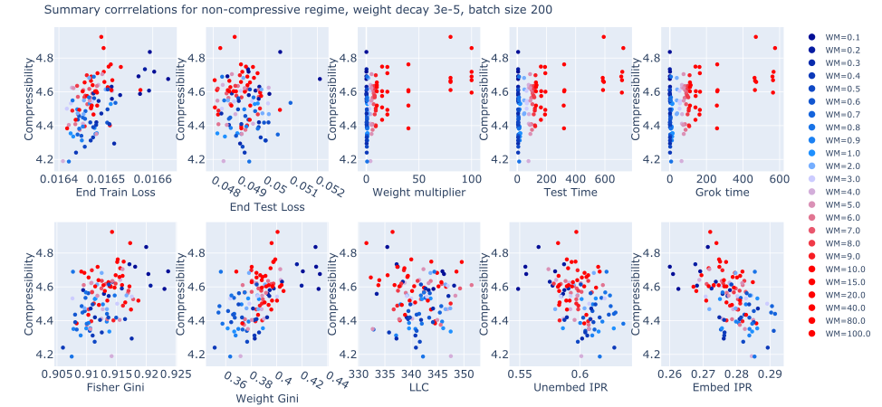

*Рисунок 16: Корреляции между сжимаемостью модели и другими свойствами модели для размера пакета 200 и остальных параметров как в основном тексте. Заметьте, что здесь нет связи между гроккингом и IPR.* **[p. 19]**

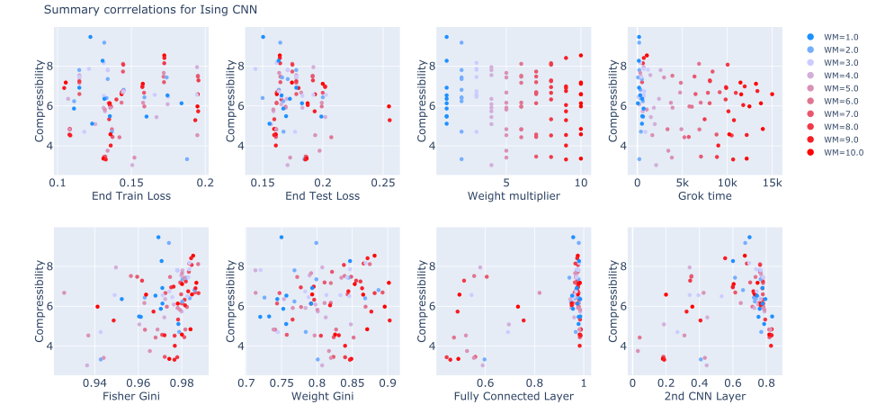

*Рисунок 17: В случае Изинга сжимающей фазы нет, а потому нет и размена между конечной потерей и сжатием модели, доступного настройкой множителя весов.* **[p. 20]**

## Приложение E 25-кратное сжатие в сложении по модулю

Проведя грубый перебор параметров, мы нашли область с чрезвычайно сжатыми моделями при спаде весов $3\times 10^{-4}$ — на порядок больше рассмотренного в основном тексте. На рис. 18 мы показываем кривые прунинга для тех же параметров, что в основном тексте, но при большем спаде весов. Мы видим очень большое улучшение прунинга, наступающее внезапно при переходе в сжимающий режим. Сжимаемость модели внезапно растёт от примерно 32% **[p. 18]** весов, нужных для поддержания точности 95% при $w_{0}=2$, до лишь 5% весов при той же точности при $w_{0}=1$. Это соответствует сжимаемости **в 25 раз к исходной модели и в 5 раз к сжатию, достигнутому в основном тексте.**

*Рисунок 18: Кривые прунинга для сильно сжатых кривых в левом верхнем углу кривой площадей прунинга сложения по модулю. Между множителями весов $w_{0}=2$ и $w_{0}=1$ есть очень резкий переход к очень сильно сжатым моделям.* **[p. 20]**

Чтобы лучше понять этот сильно сжатый режим, мы снова приводим данные тех же мер, что в предыдущем разделе, на рис. 19. Мы видим очень резкое различие между сжимающим режимом и остальными множителями весов. Разительнее всего, мы видим в двух правых подрисунках нижнего ряда, что локализация в фурье-базисе почти полностью развалилась. Интересно, что в этом режиме обучающая и тестовая потери модели отрицательно скоррелированы со сжимаемостью.

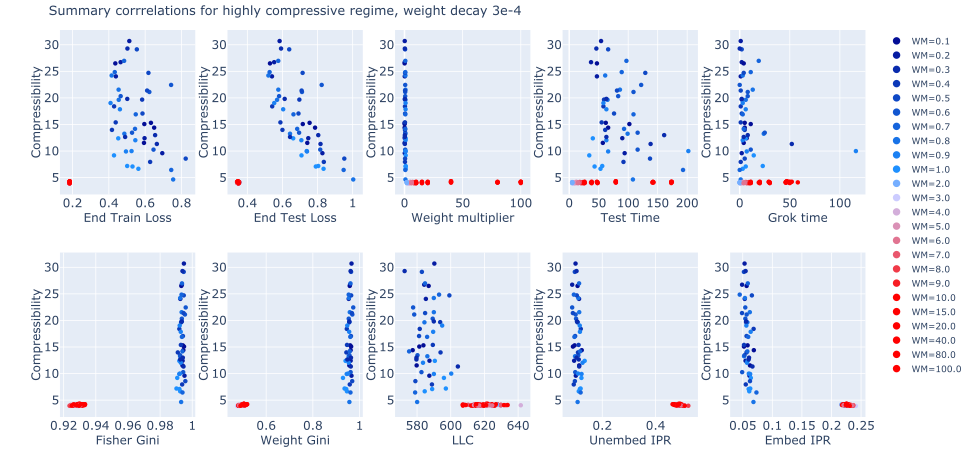

*Рисунок 19: Корреляции между сжимаемостью и мерами динамики обучения и признаков модели в сильно сжимающем режиме (спад весов $3\times 10^{-4}$.* **[p. 21]**

**[p. 22]**

## Приложение F Информационная геометрия Фишера

Этот раздел даёт беглый обзор основ информационной геометрии. Более полное изложение см., например, [Amari 2016].

Для функции-устройства, за которую мы берём нейросеть $f_{NN}(x_{\text{input}})$ с параметрами $\theta_{i}$, пространство нейросетей этого устройства натянуто на допустимые значения параметров. Каждый вес и смещение могут принимать любое вещественное значение, так что это пространство моделей гомеоморфно $\mathbb{R}^{N}$, где параметров $N$. Каждый набор значений параметров определяет точку пространства моделей, и по мере гладкого[^2] изменения параметров при обучении прочерчивается путь на пространстве моделей, образуя траекторию.

Чтобы определить понятие расстояний на пространстве моделей, нужна метрика. Когда рассматриваемая задача — задача классификации (как задачи этой работы), выход обученной функции — нормированное распределение вероятностей (часто обеспечиваемое конечной softmax-активацией). Для этого мы сначала предполагаем, что пространство моделей — многообразие, и затем рассматриваем касательное пространство, традиционно натянутое на базис $\{\frac{\partial}{\partial\theta_{i}}\}$, но также подходяще натягиваемое на базис векторов счёта[^3] $\ell_{i}=\frac{\partial}{\partial\theta_{i}}\ln(f_{NN}(x|\theta))$, который мы и выбираем $\{\ell_{i}\}$. Метрика Фишера тогда определяется на этом базисе касательного пространства как:

$$
\begin{split}g^{FIM}_{ij}:=&\ \mathbb{E}_{x}(\ell_{i}\ell_{j})\;,\\
=&\ \mathbb{E}_{x}\bigg(\frac{\partial\ln(f_{NN}(x|\theta))}{\partial\theta_{i}}\frac{\partial\ln(f_{NN}(x|\theta))}{\partial\theta_{j}}\bigg)\;.\end{split} \tag{14}
$$

Математическое ожидание теоретически — интеграл по всему пространству данных $x$, но практически мы вычисляем дискретное ожидание как среднее по образцам обучающих данных. Метрика меняется в зависимости от позиции в пространстве моделей, поскольку $f_{NN}$ — нелинейная функция $\theta$, и это и определяет неплоскую геометрию пространства. Дискретные производные вычисляются средствами pytorch, через пакет nngeometry [George 2021].

Информационная метрика Фишера даёт меру сходства двух моделей, хорошо иллюстрируемую связью с KL-дивергенцией $D_{KL}$, измеряющей относительную энтропию распределений вероятностей $p(x|\theta)$

$$
D_{KL}(\theta^{\prime}|\theta)=\mathbb{E}_{x}\bigg(\ln\bigg(\frac{p(x|\theta^{\prime})}{p(x|\theta)}\bigg)\bigg)\;, \tag{15}
$$

которая имеет единственный глобальный минимум 0 при $\theta^{\prime}=\theta$, и в окрестности этого минимума KL-дивергенция разлагается как

$$
D_{KL}(\theta+\delta\theta|\theta)=\frac{1}{2}g^{FIM}_{ij}(\theta)\delta\theta_{i}\delta\theta_{j}+\mathcal{O}(\delta\theta^{3})\;. \tag{16}
$$

Следовательно, FIM действует как инфинитезимальная мера расстояния в пространстве моделей.

В задаче Изинга использованное нейросетевое устройство состоит из 6798 параметров, тогда как для задачи сложения по модулю устройство имеет 174193 параметра. Это ведёт к вещественным симметричным невырожденным FIM-матрицам соответствующих размеров $g^{FIM}_{6798\times 6798}$ и $g^{FIM}_{174193\times 174193}$. Однако, поскольку число параметров велико, можно использовать предположение, что эти матрицы приблизительно диагональны [Amari et al. 2019], чтобы облегчить вычислительную стоимость; так что мы используем вектор элементов $g^{FIM}_{ii}$, представляющий FIM-диагональ для каждого из параметров $\theta_{i}$.

Во время обучения параметры сети (то есть позиции в пространстве моделей) записываются через равные промежутки. Эквивалентно, FIM-диагональ также вычисляется на тех же промежутках. Для задачи Изинга это были промежутки в 200 эпох на первых 100000 эпохах, а для задачи сложения по модулю — промежутки в 1 эпоху на первых 500 эпохах; после каждого из этих периодов поведение режимов ровного обучения и гроккинга сочтено эквивалентным.

Для нейросетевых моделей, обученных на рассматриваемых в этой работе задачах, итоговые спектры FIM-диагоналей после обучения, усреднённые по 10 прогонам с семенами, можно вычислить и изобразить (в порядке возрастания важности для каждого параметра); показано на рис. 20. Эти спектры показывают щели во всех случаях, находящиеся примерно в одних позициях, и штриховая линия отмечает значение 0.1, выбранное порогом для расщепления пространства моделей на жёсткое $\times$ дряблое.

*(a) Изинг*

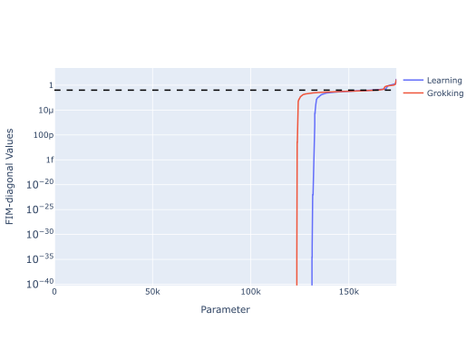

*(b) ModAdd*

*Рисунок 20: Значения FIM-диагоналей нейросетевой модели после обучения, отсортированные по возрастанию и усреднённые по 10 прогонам с семенами. Графики показывают режимы и обучения, и гроккинга; для задач Изинга (a) и ModAdd (b). Штриховая линия представляет значение 0.1, установленное порогом расщепления подпространств, расположенное на щелях масс спектра.* **[p. 23]**

**[p. 23]**

Как описано работами [Berman et al. 2023], FIM-диагональ можно рассматривать как меру относительной важности параметров для модели.

### F.1 Фишеровский прунинг

Как альтернативу прунингу по величине, этот раздел применяет схему фишеровского прунинга (BRG) [Berman et al. 2022, Berman and Klinger 2024, Berman et al. 2023, Howard et al. 2024] к моделям, изучаемым в этой заметке.

Геометрия пространства моделей часто предполагается плоской, так что для вычисления расстояний можно использовать евклидову метрику[^4]. Однако можно вычислить более естественную информационно-геометрическую метрику, прямо зависящую от устройства: информационную метрику Фишера (FIM). FIM, $g^{FIM}_{ij}$, введённая в приложении F, позволяет прощупывать внутреннюю геометрию пространства моделей.

Фишеровский прунинг — информационно-теоретическая схема прунинга сетей, обобщающая принципы точной ренормгруппы (ERG), изучаемой в физике высоких энергий, на произвольно параметризованные распределения вероятностей, включая распределения нейросетей. Прунинг выполняется в пространстве параметров относительно информационно-теоретической шкалы различимости, задаваемой метрикой Фишера. Фишеровский прунинг удаляет параметры нейросети, слабо коварьирующие с выходом модели[^5]. Задав устройство нейросети, можно рассматривать параметры как естественный набор координат пространства моделей (связанного с данным устройством). Инициализация сети — выбор случайной точки в пространстве моделей. При обучении параметры меняются гладко, и позиция в пространстве моделей обновляется, прочерчивая траекторию.

В работах [Berman et al. 2022, Berman and Klinger 2024, Berman et al. 2023] обосновывается, что собственный спектр FIM даёт меру важности параметров, позволяя подробно разбирать и обрезать функцию модели. Собственные значения дают эту меру относительной важности для линейных комбинаций параметров (задаваемых собственными векторами) модели. В случае, когда метрика приблизительно диагональна, что верно для высокоразмерных пространств моделей [Amari et al. 2019], собственные значения равны диагональным элементам, и они дают относительную важность каждого параметра для модели.

Интуитивно можно полагать, что прунинга по величине достаточно для определения сжимаемости модели [LeCun et al. 1989]; обычно это не так[^6]. На практике глубокие сети обычно сильно нелинейны (что хотя бы отчасти отвечает за их великую способность выражать сложные функции). Более того, современные сети имеют встроенные нелинейности в виде функций активации. В случае, когда функция активации $\sigma(x)$ не монотонно растёт, то есть существует $x$, такой что $\sigma(x+\delta)\leq\sigma(x)$ при $\delta>0$, прунинг по величине плохо мотивирован. **[p. 24]** Пример часто используемой функции активации с этим свойством — активация GELU. Новая техника прунинга, свободная от таких ограничений, — схема фишеровского прунинга [Berman and Klinger 2024, Berman et al. 2023]. Фишеровский прунинг выполняется иерархически: параметры обрезаются так, что первыми удаляются те, у которых наименьшие связанные диагональные компоненты информационной метрики Фишера. Преимущества схемы фишеровского прунинга наиболее явны при целостном прунинге модели, то есть всех слоёв одновременно.

На рис. 21 мы представляем графики потери и точности как функции числа обрезанных параметров для задач Изинга и модульной арифметики. В согласии с разбором прунинга по величине, мы заключаем, что гиперпараметры, способствующие гроккингу, не дают последовательного преимущества в прунинге. Сеть Изинга представляет интересное свойство: нет ясного преимущества прунинга в грокнутом режиме по сравнению с фазой ровного обучения (при размере пакета 200). Хотя можно возразить, что выбранный множитель весов (10), представляющий «гроккинг», даёт преимущество прунинга над архетипическим значением для ровного обучения (0.1), очевидно, что другие значения множителя весов, дающие обучение, производят противоположный эффект. Мы потому заключаем, что нет определённого поведения сжимаемости, которое можно приписать гроккингу в модели Изинга.

Сеть модульной арифметики (рис. 21) рассказывает сходную историю: выборы гиперпараметров, дающие гроккинг, не производят более обрезаемой модели, чем не дающие, — при фишеровском режиме прунинга (в отличие от прунинга по величине). Этот разбор ясно показывает, что грокнутая модель — не обязательно более сжатая модель. Сжимаемость приписывается множителю весов, а не присутствию гроккинга.

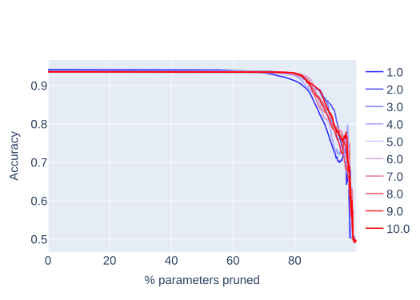

*(a) Изинг — фишеровский прунинг (точность)*

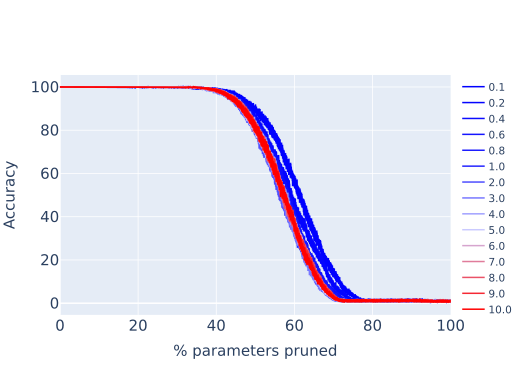

*(b) ModAdd — фишеровский прунинг (точность)*

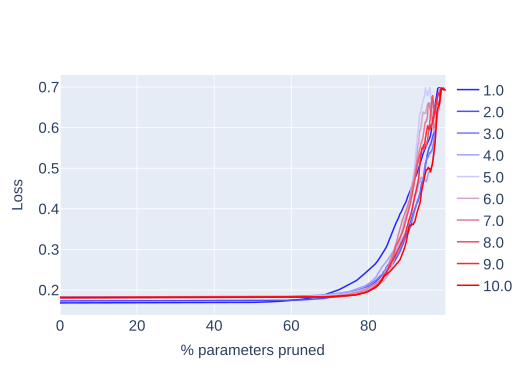

*(c) Изинг — фишеровский прунинг (потеря)*

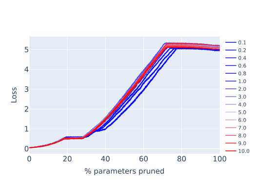

*(d) ModAdd — фишеровский прунинг (потеря)*

*Рисунок 21: Точности и потери как функция % обрезанных параметров для грокнутого и ровно обучающегося режимов (сети Изинга и модульной арифметики).* **[p. 24]**

Естественный вопрос: «как фишеровский прунинг действует послойно?» Чтобы облегчить такой разбор, мы предлагаем расщепление параметров модели из целой модели на два непересекающихся множества $\theta_{a}\sqcup\tilde{\theta}_{a}$, где $a$ — индекс исследуемого слоя. Для каждой модели мы вычисляем метрику Фишера $\mathcal{I}_{ij}(\theta)$ и систематически удаляем $\theta^{a}_{k}$ в **[p. 25]** порядке возрастания их значений $\mathcal{I}_{ij}$. Послойная разбивка фишеровского режима прунинга для задачи сложения по модулю дана на рисунке 22, а аналогичные графики для задачи Изинга представлены на рисунках 23 и 24.

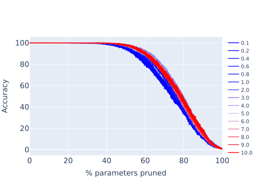

*(a) Точн. Слой 1*

*(b) Точн. Слой 2*

*(c) Потеря Слой 1*

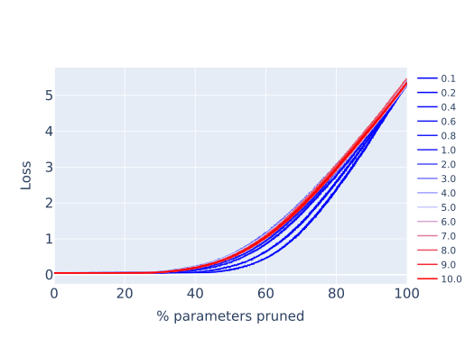

*(d) Потеря Слой 2*

*Рисунок 22: Потери и точности выхода сети сложения по модулю как функция числа фишеровски обрезанных параметров* **[p. 25]**

*(a) Точн. Слой 1*

*(b) Точн. Слой 2*

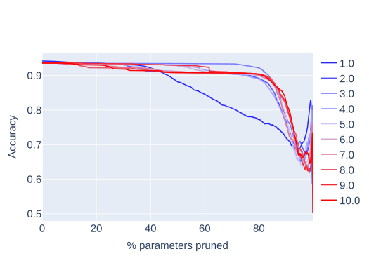

*(c) Точн. Слой 3*

*(d) Точн. Слой 4*

*Рисунок 23: Точности выхода сети Изинга как функция числа фишеровски обрезанных параметров* **[p. 26]**

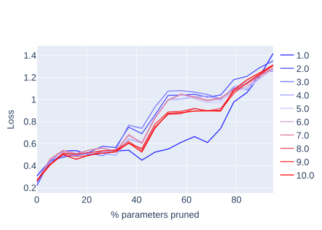

*(a) Потеря Слой 1*

*(b) Потеря Слой 2*

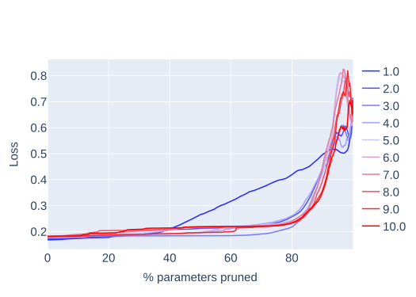

*(c) Потеря Слой 3*

*(d) Потеря Слой 4*

*Рисунок 24: Потери выхода сети Изинга как функция числа фишеровски обрезанных параметров* **[p. 27]**

**[p. 28]**

### F.2 Другие схемы прунинга по величине

В основном тексте мы решили обрезать наши сети конкретной схемой прунинга по величине, при которой в каждом слое обрезается одинаковый процент весов. В Приложении F.1 мы обсуждаем результаты нескольких схем прунинга на основе метрики Фишера вместо (евклидовой) величины весов. Здесь мы показываем несколько других схем прунинга по величине для сравнения с фишеровским подходом. В частности, мы сосредотачиваемся на глобальном неструктурированном прунинге (и с перенормировкой весов нормами слоёв, и без) и послойном прунинге.

На рис. 25 мы показываем результаты разных глобальных схем прунинга для обеих задач. Схема прунинга основного текста (параллельный прунинг в каждом слое) показана в первом столбце, наивный глобальный неструктурированный прунинг — во втором, а глобальный неструктурированный прунинг после перенормировки всех весов нормами их слоёв — в третьем. При наивном глобальном неструктурированном прунинге кажется, что большую долю сети можно обрезать без потери точности по сравнению с другими стратегиями. Однако это артефакт большого числа незначительных весов в последнем полносвязном слое.

Поскольку неструктурированный прунинг удаляет наименьшие веса независимо от их места в сети, он даёт поведение, очень похожее на простое обрезание весов последнего слоя, где обитает большинство наименьших весов. Сеть относительно устойчива к такому прунингу, тогда как обрезание её начальных свёрточных слоёв, у которых значительно меньше параметров, драматичнее. Эти наблюдения можно проверить, сравнив рис. 25 с результатами послойного прунинга сети Изинга, показанными на рис. 26. Ту же послойную схему прунинга для сложения по модулю мы показываем на рис. 27.

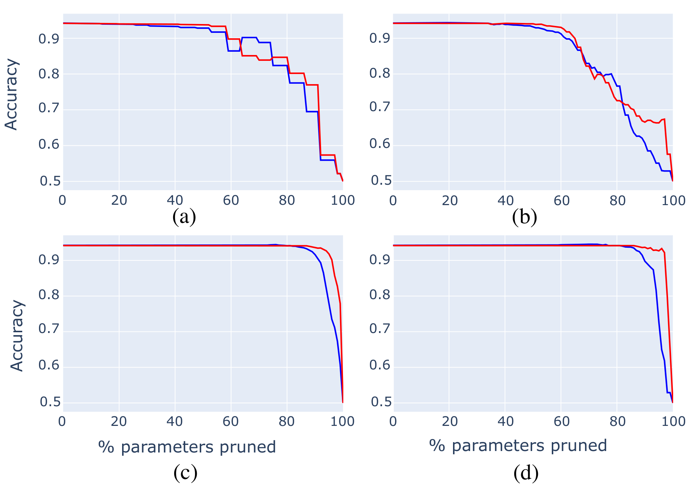

*Рисунок 25: Разные глобальные схемы прунинга по величине для двух задач, усреднено по 8 семенам и при двух множителях весов. Результаты прунинга сети Изинга показаны в верхнем ряду, аналогичные результаты для сложения по модулю — в нижнем. (a,d) Параллельный прунинг во всех слоях (как в основном тексте), (b,e) глобальный неструктурированный прунинг и (c, f) глобальный неструктурированный прунинг с перенормировкой каждого веса нормой всех весов его слоя.* **[p. 28]**

*Рисунок 26: Послойный прунинг по величине весов сети Изинга. Результаты обрезания только (a) первой CNN, (b) второй CNN, (c) первого полносвязного слоя и (d) второго полносвязного слоя.* **[p. 29]**

*Рисунок 27: Послойный прунинг по величине весов сети сложения по модулю. Результаты обрезания только (a) первого полносвязного слоя и (b) второго полносвязного слоя.* **[p. 29]**

**[p. 30]**

## Приложение G Динамика

### G.1 Развитие признаков через интерпретируемость

Мы приводим здесь дополнительные меры развития признаков в задаче Изинга по слоям. Помимо взвешенного по преднактивациям объёма, рассмотренного в основном тексте, мы также рассматриваем долю нейронов, чей наивысший коэффициент корреляции приходится на каждую меру, и долю суммарной преднактивации, приходящуюся на каждую меру. Мы приводим эти меры для первого CNN-слоя на рис. 28, для второго CNN-слоя на рис. 29 и для последнего слоя на рис. 30.

*Рисунок 28: Сводка коэффициентов корреляции для разных мер по семенам и первому свёрточному слою для случая гроккинга в Изинге.* **[p. 30]**

*Рисунок 29: Сводка коэффициентов корреляции для разных мер по семенам и второму свёрточному слою для случая гроккинга в Изинге.* **[p. 31]**

*Рисунок 30: Сводка коэффициентов корреляции для разных мер по семенам и полносвязному слою для случая гроккинга в Изинге.* **[p. 32]**

### G.2 Сравнение фишеровской и евклидовой геометрии пространства моделей

Можно задаться вопросом, как новые FIM-меры динамики действовали бы в пределе, когда пространство моделей предполагается евклидовым, так что FIM не вычисляется и не используется.

Все представленные графики, относящиеся к этим мерам, были также перегенерированы с евклидовой версией меры[^7]. В целом наблюдаемое поведение было сходным, причём FIM-версии мер показывают разбираемые черты выразительнее. Это мотивирует их использование как улучшений более традиционных предположений, лучше теоретически обоснованных для разбора пространства моделей.

Как пример, на рис. 31 показаны величины шагов для задачи Изинга с FIM-мерой величины (как выше на рис. 32(a)) и также с упрощённой евклидовой версией. Можно заметить, что FIM-мера лучше различает режимы гроккинга и ровного обучения, а черта-«бугор» в начале гроккинга выразительнее.

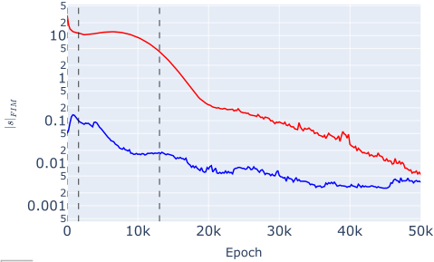

*(a) FIM-мера*

*(b) Евклидова мера*

*Рисунок 31: Величины шагов траекторий моделей через пространство моделей при обучении. Меры вычислены с FIM $|s|_{FIM}$ или просто с евклидовым предположением $|s|$ и усреднены по 10 прогонам.* **[p. 33]**

**[p. 34]**

### G.3 Фишеровские величины шагов

Рассматривая спектр диагональных элементов, усреднённый по 10 прогонам с семенами и показанный в приложении F, спектры показывают общую щель масс, так что подмножество параметров имеет относительно пренебрежимую важность. Это подмножество параметров помечается «дряблым», а дополнение — «жёстким». Мотивированные этой щелью масс, интересно рассмотреть расщепление пространства моделей на два подпространства[^8], одно параметризованное жёсткими параметрами, другое — дряблыми. Позиции пространства моделей и FIM можно расщепить на эти подпространства, и эквивалентные новые меры разбора траекторий свести к определённым на каждом из этих подпространств.

В обеих задачах порог FIM-диагонали 0.1 используется для различения, жёсткий параметр сети или дряблый. FIM-диагональ рассматривается для итоговой модели после обучения, и параметры назначаются жёсткими (или дряблыми), когда $g^{FIM}_{ii}\geq 0.1$ (или $<0.1$). Эти назначения определяют подпространства, которые затем закрепляются и прослеживаются назад по обучению.

Первая из двух новых динамических мер этой работы рассматривает FIM-величины шагов обучения. Усреднённые по 10 прогонам с семенами, они показаны для задач Изинга и сложения по модулю, с расщеплением жёсткое-дряблое и без него, и для режимов гроккинга и ровного обучения, на рис. 32.

*(a) Величина шага — Изинг*

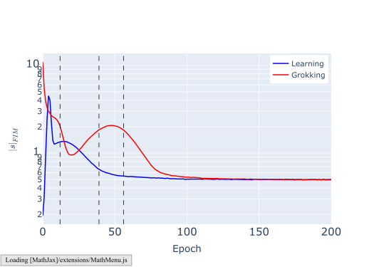

*(b) Величина шага — ModAdd*

*(c) Расщеплённая величина шага — Изинг*

*(d) Расщеплённая величина шага — ModAdd*

*Рисунок 32: Величины шагов, $|s|_{FIM}$, траекторий моделей через пространство моделей при обучении. Меры вычислены с FIM, усреднены по 10 прогонам. Графики показывают поведение полной модели (a) и (b), а также дряблой и жёсткой подмоделей (c) и (d); для режимов и обучения, и гроккинга; для исследований Изинга (a) и (c) и ModAdd (b) и (d).* **[p. 34]**

В обеих задачах и обоих режимах величина шага в целом убывает по ходу обучения: по мере улучшения модели градиент потери падает и шаги становятся меньше. Режимы гроккинга начинают с больших величин шага, поскольку их инициализация использует большие множители весов, но к концу обучения величины шагов одного порядка между режимами гроккинга и обучения. Заметное различие в том, что в режиме гроккинга величина шага имеет значительный бугор в начале периода гроккинга, где величина шага продолжает расти в течение **[p. 35]** этого периода. Хотя сходное поведение, по-видимому, происходит раньше в режиме обучения, оно много выразительнее в случае гроккинга и может приписываться тому, что оптимизатор находит оптимальную траекторию улучшения, позволяющую импульсу расти, а величине шага увеличиваться.

###### p35-1

Из предыдущих наблюдений бугор FIM-величины шага кажется хорошим индикатором периода гроккинга; это можно сделать явнее, изобразив дискретный градиент этого графика и рассмотрев корни линии, как показано на рис. 33. Обе задачи показывают 2 значимых корня, где график пересекает нулевые градиенты перед выходом на плато к нулевому градиенту, которые можно использовать для определения начала и конца режимов гроккинга. Для задачи Изинга первый корень — между отсчётами эпох 2200 и 2400, второй — между 6200 и 6400. Для задачи модульной арифметики первый корень — между эпохами 19 и 20, второй — между эпохами 46 и 47. Эти диапазоны эпох периода гроккинга примерно согласуются с заданными ранее мерой, определённой в этой статье, что поддерживает это как альтернативный механизм определения периода гроккинга.

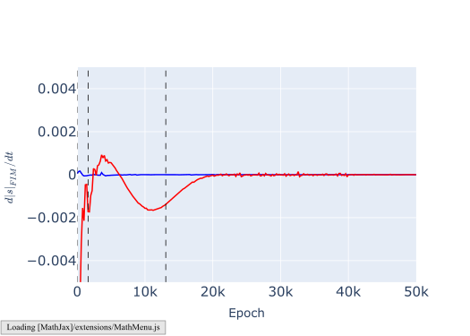

*(a) Изинг*

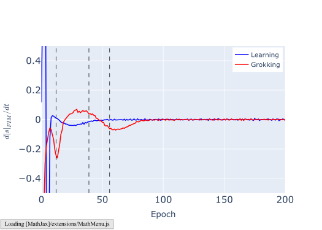

*(b) ModAdd*

*Рисунок 33: Дискретные градиенты FIM-шагов, $d|s|_{FIM}/dt$, вдоль траектории обучения в пространстве моделей, усреднённые по 10 прогонам с семенами. Графики показывают режимы и обучения, и гроккинга; для исследований Изинга (a) и ModAdd (b). Оси ограничены, чтобы подчеркнуть корни.* **[p. 35]**

Рассматривая, как разбор величины шага расщепляется на жёсткое и дряблое подпространства: в обеих задачах жёсткие величины шагов сходятся к более высоким значениям, чем дряблые. Это указывает, что оптимизатор выделяет эти жёсткие направления и направляет обновления параметров на изменение лишь тех, что значимо влияют на модель. Бугор роста величины шага в период гроккинга проявляется и в жёстком, и в дряблом подпространствах, указывая, что это, вероятно, универсальная черта гроккинга по параметрам. Более того, в режиме гроккинга жёсткая и дряблая линии пересекаются, указывая, что когда модель настроена грокнуть, оптимизатор сперва отдаёт предпочтение изменению дряблых черт (где эта линия начинается выше), а после завершения периода гроккинга переключается на предпочтение жёстких черт.

Вторую новую динамическую меру, рассмотренную главным образом в основном тексте, тоже можно расщепить для изучения траекторий на дряблом и жёстком подмногообразиях. Здесь мы рассматриваем лишь $S_{C-FIM}(s^{e},s^{e+1})$ для векторов шагов на последовательных отсчётах эпох, как в основном тексте, но без сравнения с траекторией на начало координат. Эти эквивалентные графики показаны, усреднённые по 10 прогонам с семенами, для задач Изинга и сложения по модулю, с расщеплением жёсткое-дряблое, и для режимов гроккинга и ровного обучения, на рис. 34.

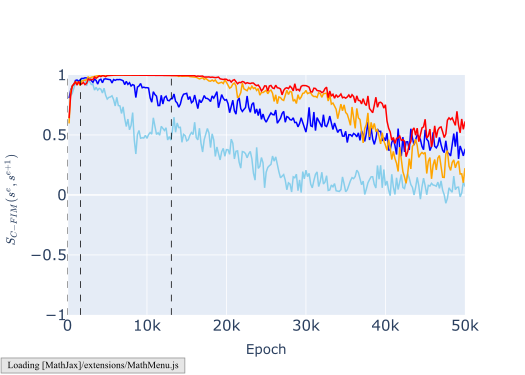

*(a) Изинг*

*(b) ModAdd*

*Рисунок 34: Расщеплённые FIM-косинусные близости последовательных шагов, $S_{C-FIM}(s^{e},s^{e+1})$, для дряблой и жёсткой подмоделей. Графики показывают режимы и обучения, и гроккинга; для исследований Изинга (a) и ModAdd (b).* **[p. 36]**

В режиме гроккинга поведение сходно между подпространствами, тогда как для режима обучения в задаче Изинга жёсткое подпространство имеет стабильно более высокие значения — указывая, что режим гроккинга обращается с параметрами модели в обновлениях более симметрично.

[^1]: корреляционная длина в модели Изинга примерно соответствует масштабу, на котором спины скоррелированы друг с другом в снимке

[^2]: Практически обновления дискретны, и путь не гладок, но для этой теоретической иллюстрации можно рассматривать предел инфинитезимальных обновлений.

[^3]: Заметим, что классификационная природа задачи здесь существенна, поскольку для корректной определённости логарифмов над вещественными числами требуется неотрицательность выходов.

[^4]: Где евклидова метрика для практических целей — единичная матрица.

[^5]: Эта техника также известна как BRG [Howard et al. 2024].

[^6]: Существуют исключения; например, прунинга по величине очень простой однослойной перцептронной сети с монотонно растущими функциями активации, обученной при максимизации выходных векторов, было бы достаточно.

[^7]: На деле кодовая база этой статьи даёт полную оптимизированную функциональность и для этого, если предпочесть её использовать.

[^8]: Здесь полное пространство моделей рассматривается как произведение пространств, с независимыми подпространствами жёсткое $\times$ дряблое.
