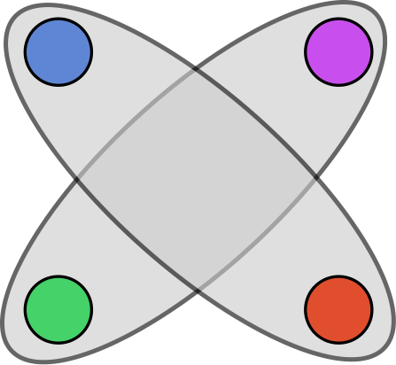
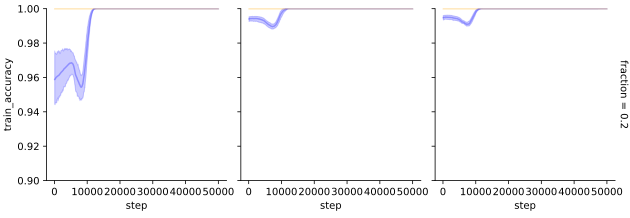

# Carvalho et al. 2025 — Grokking Explained: A Statistical Phenomenon

См. также: [глобальный индекс понятий](../../concepts/index.md).
arXiv [2502.01774v1](https://arxiv.org/abs/2502.01774), 3 февраля 2025. Колонтитула с местом публикации в PDF нет: вёрстка по шаблону ICML, на страницах 2-10 стоит только колонтитул с названием работы («Grokking Explained: — A Statistical Phenomenon»).

**Breno W. Carvalho** — IBM Research, Rio de Janeiro, Brazil; UFRGS, Porto Alegre, Brazil (переписка: brenow@ibm.com).
**Artur S. d'Avila Garcez** — Department of Computer Science, City, University of London.
**Luís C. Lamb** — UFRGS, Porto Alegre, Brazil.
**Emílio Vital Brazil** — IBM Research, Rio de Janeiro, Brazil.

Оригинал и производные файлы этой папки:

- [`original/2502.01774.native.html`](original/2502.01774.native.html) — первоисточник, нативный HTML-рендеринг arXiv (LaTeXML), скачан как есть.
- [`original/2502.01774.grokking-explained-a-statistical-phenomenon.md`](original/2502.01774.grokking-explained-a-statistical-phenomenon.md) — конверсия оригинала в Markdown без правок содержания; английский текст для сверки перевода.
- [`images/`](images/) — иллюстрации статьи в исходном разрешении (9 файлов).
- [`2502.01774.grokking-explained-a-statistical-phenomenon.claims.txt`](2502.01774.grokking-explained-a-statistical-phenomenon.claims.txt) — рабочий разбор: пронумерованные утверждения с пометками.

Схема якорей и правила ссылок на карточку — в [README папки статей](../README.md).

## Затрагиваемые понятия

**[Гроккинг](../../concepts/grokking.md)** — работа даёт корпусу две вещи: формальное определение и статистическую постановку. Авторы прямо заявляют, что определения гроккинга в литературе нет, «only descriptions and examples of the phenomenon», и сводят описания в Определение 3.1 ([p4-1](#p4-1)): гроккинг случился, если после сходимости обучающей кривой в момент $\alpha_{0}$ тестовое качество в момент $\alpha_{1}$ попадает в интервал $\Delta_{T}$ и держится там интервал $S\gg(\alpha_{1}-\alpha_{0})$; вместе с определением введены величины $\Delta_{S}$ («сколько гроккинга случилось»), $\Delta_{T}$ («место для улучшения») и опорный интервал $S$ ([fig-2](#fig-2)). Содержательный тезис — что гроккинг есть статистическое явление, проистекающее из сдвига распределения между тестовыми и обучающими данными, а высокая регуляризация и параметризация его «усиливают, но не определяют» ([p4-3](#p4-3)). Чего в работе нет: ни одной меры сдвига — расстояние между распределениями нигде не вычислено, двухвыборочные тесты, ради которых процитирован Rabanser et al. 2019 ([p3-3](#p3-3)), не применены; $\Delta_{S}$ введена как мера интенсивности и ни разу не посчитана числом. Определение опирается на момент $\alpha_{0}$, к которому сходится обучающая кривая, — а на графиках результатов обучающая точность нарисована горизонтальной линией на единице уже с первого показанного шага ([fig-3](#fig-3), [fig-4](#fig-4)): они подписаны «Average test set curves after the training loss has converged», то есть начинаются там, где сходимость уже произошла, и локализовать по ним $\alpha_{0}$ нельзя. Пороги для «$\ll$» и «$\gg$» не названы, точки $\alpha_{0}$ и $\alpha_{1}$ определяются на глаз, так что решение «гроккинг случился» остаётся визуальным.

**[Эталонный полигон гроккинга](../../concepts/canonical-grokking-testbed.md)** — работа уходит с канонического полигона намеренно и предлагает взамен собственный. Вместо таблицы модульной арифметики со случайным разбиением строятся два синтетических гауссовых набора с иерархией класс-подкласс: классы кодируются двоичными индексами из $p=9$ разрядов (512 классов, точка $x\in\mathbb{R}^{117}$), расстояние между классами — число различающихся разрядов, а нужная конфигурация вырезается как клика в подграфе рёбер заданного веса ([p10-6](#p10-6), [p10-8](#p10-8)). Набор 1 — 4 класса по 2 равноудалённых подкласса, набор 2 — 4 класса по 10 подклассов, где свои ближе чужих ([p5-4](#p5-4), [p5-5](#p5-5), [fig-1](#fig-1)). Заявленная цель — вызывать гроккинг «with minimal tuning of model parameters», без перебора пространства гиперпараметров ([p4-6](#p4-6)). Чего в работе нет: воспроизведения канонической постановки. В списке вкладов стоит «We replicate previous experiments» ([p2-3](#p2-3)), но ни модульной арифметики, ни MNIST с 1,000 примеров в статье не запускают; отношение с Power et al. остаётся словесным ([p2-6](#p2-6)). Не разобрано и главное следствие ухода с полигона: в каноническом сетапе обе доли берутся из одной конечной таблицы одинаково, то есть сдвига распределения по построению нет, — перенос объяснения туда не обсуждается и в ограничения не вынесен.

**[Доля данных / критический размер набора](../../concepts/data-fraction-critical-dataset-size.md)** — здесь управляющей величиной служит не доля обучающей выборки, а доля $f\in[0,1]$ оставляемых примеров в *выбранных подклассах*: формула (1) распределяет бюджет $\gamma_{D}$ между прореженными и остальными подклассами ([p5-2](#p5-2), [p5-3](#p5-3)). Наблюдений три. При сбалансированном прореживании текст утверждает совпадение с литературой — гроккинг тем сильнее, чем меньше выборка, и при больших размерах исчезает ([p6-2](#p6-2)); подпись самой панели 3(a) при этом говорит обратное — «гроккинг не зависит от размера данных, он возникает в каждом случае», а с уменьшением набора растёт только интенсивность $\Delta_{s}$ ([fig-3](#fig-3)), и на графике так и есть. При несбалансированном прореживании набора 1 полное удаление подкласса ($f=0$) гроккинг предотвращает — модели застревают на субоптимальном плато, — а возврат 20 % примеров его включает при прочих равных ([p6-3](#p6-3)); в этом же ряду показано, что при $f=0.01$ и $f=0.05$ гроккинг наблюдается и на 4000 и 5000 образцов ([p6-4](#p6-4)), что авторы прямо противопоставляют представлению, будто гроккинг бывает только на малых наборах. Чего в работе нет: критического размера как величины — порог не оценивается и не предсказывается, зависимость времени до генерализации от объёма выборки не строится, а сама монотонность нарушается собственными данными (максимальный перекос $f=0$ гроккинг убивает, меньший $f=0.2$ включает), и это в статье не проговорено.

**[Обучение структурированных представлений](../../concepts/structured-representation-learning.md)** — работа заходит со стороны данных, а не со стороны сети: структура, о которой идёт речь, задана в наборе по построению, а не выучена. Тезис введения — что слабый обучающий сигнал в данных, организованных в классы и подклассы, способен компенсировать разрежённость «by leveraging relationships among subclasses» ([p1-4](#p1-4)), и что отсюда же могут объясняться успехи геометрических и графовых методов и нейросимвольного подхода. Ключевое наблюдение: в наборе 2 гроккинг обнаружен даже при полном отсутствии примеров подкласса ($f=0$) — в противоположность набору 1, — и объяснено это близостью: подклассы одного класса ближе друг к другу, чем к чужим, и потому несут информацию друг о друге ([p6-6](#p6-6), [fig-4](#fig-4)); в подписи к рисунку названо «the proximity in representation space». Чего в работе нет: измерений представлений. Латентное пространство сети не разбирается ни разу, «близость» относится к построенным центроидам гауссиан ([p10-8](#p10-8)), а не к выученным признакам; «information leakage among subclasses» ([p6-5](#p6-5)) названо, но не измерено. Разбор весов и энтропийные меры латентного пространства отнесены в будущую работу ([p7-1](#p7-1)).

**[Когда регуляризация необходима](../../concepts/regularization-necessity.md)** — статья становится на сторону «не необходима, лишь усиливает»: гипотеза сформулирована так, что явление «amplified, not defined» высокой регуляризацией и выбором параметризации и инициализации ([p4-3](#p4-3)), а в разборе механизма регуляризация названа средством, «влияющим на возникновение гроккинга, но не определяющим его» ([p4-4](#p4-4)). Чего в работе нет: проверки этого тезиса. Weight decay зафиксирован на $10^{-4}$ во всех опытах ([p6-1](#p6-1)), нерегуляризованного прогона нет, абляции по регуляризации нет. Более того, собственное объяснение отсрочки в разделе 5.2 регуляризационное — влияние малой доли примеров проявляется, только «после того как обучение сошлось и weight decay привёл сеть к более разрежённому внутреннему представлению» ([p6-3](#p6-3)), — то есть в единственном месте, где статья объясняет именно *задержку*, работу делает weight decay.

**[Weight decay](../../concepts/weight-decay.md)** — здесь он не предмет исследования, а фиксированная настройка: $10^{-4}$ для обеих архитектур, не варьируется ([p6-1](#p6-1)). Единственное содержательное упоминание — уже названное объяснение отсрочки через разрежение внутреннего представления ([p6-3](#p6-3)); это объяснение дано словами, без измерения разрежённости или нормы весов. Чего в работе нет: ни разбора роли weight decay, ни его отключения, ни какого-либо обоснования выбранного значения.

**[Масштаб инициализации](../../concepts/initialization-scale.md)** — работа берёт рецепт Liu et al. 2022 целиком: масштабный множитель инициализации 8, «мы умножаем все веса модели на это число» ([p6-1](#p6-1)). Существенно для чтения результатов, что это ровно «большая инициализация» — один из трёх факторов, которые статья во введении объявляет неглавными, — и что он включён во всех опытах и ни разу не варьируется. Чего в работе нет: абляции по масштабу инициализации; заявка о гроккинге «with minimal hyper-parameter tuning» ([p1-2](#p1-2)) проверена не была, поскольку рычаг, известный как включающий гроккинг, оставлен во включённом положении.

**[Фаза меморизации / плато](../../concepts/memorization-phase.md)** — работа даёт фазе имя внутри собственного определения: $\alpha_{0}$ назван «end of memorization phase», $\alpha_{1}$ — «start of generalization phase», интервал между ними — фазой перехода ([p3-4](#p3-4), [fig-2](#fig-2)). Отдельно наблюдается устойчивое плато без перехода: при полном удалении подкласса модели «застревают на субоптимальном плато» и поздней генерализации не показывают ([p6-3](#p6-3)) — то есть в этой постановке плато не всегда предшествует срыву. Чего в работе нет: измерений внутри плато. Ни одной величины, меняющейся во время плато, не отслеживается; начала обучения на графиках нет вовсе — обучающая точность на них уже равна единице, — и о том, что происходит с весами при переходе от $\alpha_{0}$ к $\alpha_{1}$, авторы говорят как о будущей работе ([p7-1](#p7-1)).

**[Реальные данные и зрение](../../concepts/vision-real-world-data-mnist-cifar.md)** — работа обещает MNIST и его не приводит. Введение подробно описывает постановку: наведение сдвига кластеризацией представлений цифр в латентном пространстве обученного классификатора ResNet, так что обучающая выборка содержит те же цифры, что тестовая, но с иным распределением представлений ([p1-6](#p1-6)); тот же опыт стоит третьим пунктом в списке вкладов ([p2-3](#p2-3)). В тексте статьи этих опытов нет — все результаты сняты на двух синтетических гауссовых наборах. MNIST фактически присутствует в карточке только как чужой материал: пересказ опыта Liu et al. с MLP на MNIST и обучающей выборкой в 1,000 примеров ([p2-7](#p2-7)) и упоминание попыток Kumar et al. управлять гроккингом на MNIST ([p3-1](#p3-1)). Ссылаться на эту работу как на подтверждение сдвига распределения на реальных данных нельзя.

**[Фазовый переход](../../concepts/phase-transition.md)** — лишь упоминание, причём с отмежеванием. Постановка Žunkovič & Ilievski 2022, где гроккинг разбирается как фазовый переход при обучении правилам, изложена и тут же противопоставлена: «в нашей работе гроккинг формулируется чисто со статистической точки зрения, без необходимости в обучении правилам» ([p3-1](#p3-1)). Своего языка фазовых переходов работа не заводит: параметра порядка нет, критической точки нет, слово «phase» у авторов относится к фазам обучения (запоминание, переход, генерализация), а не к переходу в физическом смысле. Единственное собственное употребление термина — в планах: связать работу с литературой о том, «как веса модели меняются во время фазовых переходов» ([p7-1](#p7-1)).

**[Переход lazy→rich](../../concepts/lazy-to-rich-kernel-to-feature-learning.md)** — лишь упоминание. Kumar et al. 2024 пересказаны в обзоре: гроккинг как переход от ленивого к богатому обучению, с оговоркой, что те же авторы утверждают, что weight decay не может объяснить гроккинг ([p3-1](#p3-1)). Противопоставление проведено по уровню описания — «Kumar et al. делают упор на обучении конкретной модели, мы показываем, что гроккинг в целом не зависит от модели», — но ни одна величина из теории lazy→rich (масштаб выхода, начальное выравнивание NTK) в статье не измеряется и не оспаривается.

**[Меры прогресса](../../concepts/progress-measures.md)** — лишь упоминание, в обзоре Nanda et al. 2023: авторы «полагают, что, определив меры прогресса для каждой компоненты сети, можно будет лучше отслеживать и понимать динамику обучения» ([p2-8](#p2-8)). Собственных мер прогресса работа не вводит: единственная предложенная величина $\Delta_{S}$ измеряется по тестовой кривой задним числом и предсказательной силы не имеет по построению.

**[Эмерджентность](../../concepts/emergence.md)** — лишь упоминание, в двух местах и в описательном смысле. В обзоре Nanda et al. «эмерджентное поведение» отнесено к тому, что делают дискретные преобразования Фурье в однослойном трансформере ([p2-8](#p2-8)); в заключении собственное наблюдение названо «наблюдениями эмерджентного поведения при обучении на очень ограниченных примерах узора» ([p6-7](#p6-7)). Schaeffer et al. 2023 процитированы, но только в списке будущих связей ([p7-1](#p7-1)); ни разбора эмерджентных способностей, ни спора о зависимости от выбора метрики в статье нет.

**[Сдвиг распределения](../../concepts/distribution-shift.md)** — заявка причинная: разрежённость данных вызывает гроккинг, порождая сдвиг распределения по ходу обучения ([`p1-4`](#p1-4)). Проверяется она наведением сдвига там, где он известен по построению — кластеризацией цифр MNIST в выученном пространстве признаков ([`p1-6`](#p1-6)).
## Несогласованности внутри статьи

**Опыты на MNIST обещаны во введении и в списке вкладов, но их в статье нет.** [Введение](#p1-6) описывает постановку в подробностях — кластеризация цифр по представлениям в латентном пространстве обученного ResNet, обучающая выборка с теми же цифрами, но иным распределением, — и заключает, что «эти опыты подтверждают роль сдвигов распределения в гроккинге и распространяют наши находки за пределы синтетических данных». Тот же опыт стоит третьим пунктом [списка вкладов](#p2-3). В разделе 5 таких результатов нет ни одного, и в заключении они не упоминаются. Читателю, ссылающемуся на работу, стоит помнить, что весь её экспериментальный материал синтетический.

**Результаты трансформера обещаны в Приложении A, а Приложение A целиком о построении наборов данных.** В [разделе 5.1](#p5-10) сказано, что результаты MLP приводятся преимущественно потому, что обе архитектуры дали «весьма схожие узоры», а результаты двухслойного трансформера «можно найти в Приложении A». [Приложение A](#p10-1) описывает процедуру построения наборов данных и ничего больше; ни одного графика и ни одного числа для трансформера в статье нет. Тем самым вклад «late generalization is largely architecture-independent» ([список вкладов](#p2-3)) не подкреплён ничем, что можно было бы прочесть.

**Аннотация приписывает второму набору данных изучение трансферного обучения.** В [аннотации](#p1-2) сказано, что один набор изучает влияние ограниченной выборки, «а другой исследует роль трансферного обучения в гроккинге». Трансферное обучение больше нигде в статье не упоминается: [набор 2](#p5-5) описан как набор с эквивариантными подклассами, и опыты на нём ([p6-6](#p6-6)) поставлены о переносе информации между подклассами внутри одной задачи, а не между задачами.

**Собственное объяснение отсрочки противоречит собственной гипотезе.** [Гипотеза](#p4-3) объявляет регуляризацию усиливающей, но не определяющей; в единственном месте, где статья объясняет, почему эффект малой доли примеров проявляется *поздно*, объяснение регуляризационное: их влияние «проявилось только после того, как обучение сошлось и weight decay привёл сеть к более разрежённому внутреннему представлению» ([p6-3](#p6-3)). Сдвиг распределения объясняет, откуда берётся зазор между кривыми; отсрочку в этом абзаце делает weight decay.

**Текст раздела 5.2 и подпись к рисунку, на который он ссылается, утверждают противоположное.** [Абзац о разрежённости](#p6-2) говорит: «мы обнаруживаем, что гроккинг ослабевает с ростом числа образцов и существует только при заметно малых размерах выборки, как изображено на рисунке 3(a). Это согласуется с литературой». Подпись самой панели 3(a) ([fig-3](#fig-3)) гласит обратное: «Гроккинг не зависит от размера данных. Он возникает в каждом случае», — и лишь затем добавляет, что растёт с уменьшением набора *интенсивность* $\Delta_{s}$. На панели действительно все семь размеров выборки (от 100 до 800) дают одинаковый поздний подъём тестовой кривой, различаясь только глубиной провала. Утверждения «существует только при малых размерах» и «возникает в каждом случае» несовместимы, и они стоят в двух соседних элементах одной страницы.

**Ссылки на рисунки в разделе 5.3 разошлись с рисунками.** [Абзац 5.3](#p6-5) говорит: «Во-первых, мы разбираем сбалансированную выборку классов, как показано на рисунке 4», — тогда как весь [рисунок 4](#fig-4) о несбалансированной выборке, а сбалансированного случая на нём нет. Там же «влияние несбалансированной выборки, изображённое на рисунке 4(b)» — при том, что несбалансированы обе панели. В [следующем абзаце](#p6-6) удаление образцов «полностью из определённых подклассов» отнесено к рисунку 4(b), тогда как $f=0$ — это панель 4(a), а 4(b) подписана $f=0.2$. Там же ссылка «как описано в разделе 4(a)» указывает не на раздел: в исходнике это ссылка на метку подрисунка.

**В Приложении A пример расстояния между классами посчитан не для тех классов, которые названы.** [Абзац](#p10-5) объявляет: «расстояние между $C_{1}$ и $C_{4}$ вычисляется так», — после чего берёт $\mathbf{B_{4}}(1)$ и $\mathbf{B_{4}}(5)$ и получает $\mathbf{D}(C_{1},C_{5})=1$. Вычисление верно для пары $C_{1},C_{5}$; названа пара $C_{1},C_{4}$.

**Число распределений при $p=4$ разошлось с собственным построением.** [Абзац](#p10-3) утверждает: «при $p=4$ мы можем создать 15 распределений». Множество определено как $\{\mathcal{D}_{0},\dots,\mathcal{D}_{k}\}$ при $k=2^{p}-1$, то есть содержит $2^{p}=16$ элементов, и именно так число посчитано в [рабочей конфигурации](#p10-6): при $p=9$ получается 512 классов, а не 511.

**Заявлено воспроизведение прежних опытов, которого в статье нет.** Второй пункт [списка вкладов](#p2-3) начинается словами «We replicate previous experiments and conduct new analyses». Ни одной чужой постановки — ни модульной арифметики Power et al., ни MNIST с 1,000 примеров Liu et al. — в статье не запускается; все опыты сняты на двух введённых здесь синтетических наборах.

## Что доказано, что показано и что предположено

Экспериментально показано и воспроизводимо в терминах самой статьи ровно следующее: на двух синтетических гауссовых наборах с иерархией класс-подкласс перекос выборки подклассов включает и выключает позднюю генерализацию — при $f=0$ в наборе 1 модели остаются на плато, при возврате 20 % примеров кривая уходит вверх поздно ([p6-3](#p6-3), [fig-3](#fig-3)); поздняя генерализация сохраняется при 4000 и 5000 образцов ([p6-4](#p6-4)); в наборе 2 она наблюдается даже при $f=0$ ([p6-6](#p6-6), [fig-4](#fig-4)). Каждое из этих наблюдений усреднено по 10 прогонам, и разброс по прогонам нанесён полосой вокруг средней кривой.

Стоит при этом смотреть на вертикальную ось. В [равноудалённом наборе](#fig-3) тестовая точность на панели (a) стартует с 0.85-0.93 и приходит к 1.0, в [эквивариантном](#fig-4) — стартует с 0.945-0.99; «область низкого качества» $\sigma_{S}$ определения 3.1, где требуется $\sigma_{S}\ll\sigma_{E}$, в этих опытах отстоит от области высокого на единицы процентов, а сама кривая идёт не плато-затем-скачок, а провал-затем-подъём. Исключение — верхний ряд панели 3(b), где при $f=0$ тестовая точность держится около 0.60 при обучающей 1.0: это единственный показанный случай с большой $\Delta_{S}$, и это как раз случай, в котором гроккинга нет. Подпись оси ординат на всех четырёх графиках результатов — `train_accuracy`, хотя нанесены обе кривые и предмет разбора — тестовая.

Не показано, а истолковано: что этим управляет именно *сдвиг распределения*. Сдвиг в этой постановке внесён по построению — обучающая выборка перекошена, тестовая оставлена исходной, — и потому есть свойство сетапа, а не результат измерения. Ни одна мера сдвига не вычислена, хотя средства для этого процитированы ([p3-3](#p3-3)). Более того, величина сдвига и наличие гроккинга связаны немонотонно: максимальный перекос в наборе 1 гроккинг убивает, меньший — включает, а расхождение между наборами 1 и 2 авторы объясняют не сдвигом, а близостью подклассов ([p6-6](#p6-6)), то есть реляционным строением данных. Отдельно не обосновано отождествление выборочного шума малой выборки со сдвигом распределения, на котором держится исходный тезис «data sparsity induces grokking by causing a distribution shift» ([p1-4](#p1-4)).

Предположено и вынесено в будущую работу: механизм задержки. Авторы прямо признают в [ограничениях](#p6-9), что «нам не удалось определить, сколь долго может понадобиться продолжать процесс обучения, пока не наступит поздняя генерализация», а разбор изменений в распределении весов при переходе от $\alpha_{0}$ к $\alpha_{1}$ и энтропийные меры латентного пространства названы планами ([p7-1](#p7-1)).

Отдельно об операциональности Определения 3.1 ([p4-1](#p4-1)): пороги для «$\ll$» и «$\gg$» не заданы, точки перегиба $\alpha_{0}$ и $\alpha_{1}$ вводятся описательно, обучающая кривая $T_{R}$, входящая в определение через $\Delta_{T}$, ни на одном рисунке не приведена, а $\Delta_{S}$, объявленная мерой интенсивности, ни разу не измерена числом. Знак строгого неравенства в тексте определения набран как «¿» — опечатка присутствует и в PDF, и в HTML-версии, и в карточке она сохранена как есть. Определение поэтому пригодно как язык описания, но не как критерий, применимый к чужим кривым.

## Ошибочные цитирования

Редакторские заметки о местах, где эта работа передаёт чужие результаты ошибочно или без авторских оговорок. Ссылки «подробности» из разделов «Ошибочные пересказы и цитирования этой статьи» других карточек ведут сюда.

###### mc-2201-02177

**Power et al. (2201.02177) — приписан гроккинг у моделей без внутреннего латентного пространства.** В разборе механизма сказано: [`"Research by (Power et al. 2022) demonstrated grokking in models that do not rely on an internal latent space to represent data"`](original/2502.01774.grokking-explained-a-statistical-phenomenon.md#p4-4) — «Исследование (Power et al. 2022) показало гроккинг в моделях, которые не опираются на внутреннее латентное пространство для представления данных». У Power et al. обучен decoder-only трансформер с обучаемыми эмбеддингами символов, и целый раздел посвящён разбору строения этих эмбеддингов: [`"we visualized the matrix of the output layer for the case of modular addition and $S_{5}$"`](../2201.02177.grokking-generalization-beyond-overfitting-on-small-algorithmic-datasets/2201.02177.grokking-generalization-beyond-overfitting-on-small-algorithmic-datasets.card.md#sec-3-4) — *«[мы визуализировали матрицу выходного слоя для случая модульного сложения и $S_{5}$](../2201.02177.grokking-generalization-beyond-overfitting-on-small-algorithmic-datasets/2201.02177.grokking-generalization-beyond-overfitting-on-small-algorithmic-datasets.card.md#sec-3-4)»*. Класс — **ошибочное**: формулировка противоречит цитируемой работе. Занятно, что двумя страницами выше эта же статья цитирует Power et al. точно и по тому же поводу — «как показывают авторы, сравнивая латентное пространство модели до и после того, как гроккинг случается» ([p2-6](#p2-6)); предупреждение относится к формулировке, а не к работе. Похоже, что в абзаце [p4-4](#p4-4) сместился предмет: верное наблюдение о том, что гроккинг наблюдается и у моделей, чьё качество слабо зависит от качества представления (у Liu et al. и в OmniGrok это MNIST против алгоритмических задач), перенесено на Power et al., у которых опыты как раз алгоритмические.

###### mc-2205-10343

**Liu et al. (2205.10343) — заявлено, что они не изучают характеристик обучающих данных.** В обзоре сказано: [`"(Liu et al. 2022) do not study what characteristics of the training data might contribute to or avoid grokking"`](original/2502.01774.grokking-explained-a-statistical-phenomenon.md#p2-7) — «(Liu et al. 2022) не изучают, какие характеристики обучающих данных могут способствовать гроккингу или его избегать». Центральный количественный результат Liu et al. состоит ровно в этом: доля обучающей выборки определяет, задаёт ли обучающий набор структуру представления однозначно, и отсюда выводится критическая доля — [`"our effective theory predicts that the probability that the training set implies a unique linear structure (which would result in perfect generalization) depends on the training [data fraction]"`](../2205.10343.towards-understanding-grokking-an-effective-theory-of-representation-learning/original/2205.10343.towards-understanding-grokking-an-effective-theory-of-representation-learning.md#p6-1) — *«[наша эффективная теория предсказывает, что вероятность того, что обучающий набор задаёт единственную линейную структуру (что дало бы совершенную генерализацию), зависит от доли обучающих данных](../2205.10343.towards-understanding-grokking-an-effective-theory-of-representation-learning/2205.10343.towards-understanding-grokking-an-effective-theory-of-representation-learning.card.md#p6-1)»*. Класс — **ошибочное**. В остальном Liu et al. процитированы точно: и опыт с MLP на MNIST при обучающей выборке в 1,000 примеров, и рецепт умножения начальных весов на константу взяты из их [Приложения J](../2205.10343.towards-understanding-grokking-an-effective-theory-of-representation-learning/2205.10343.towards-understanding-grokking-an-effective-theory-of-representation-learning.card.md#sec-j), где оба и описаны.

###### mc-2310-16441

**Levi et al. (2310.16441) — им приписана поддержка гипотезы о сдвиге распределения.** В обзоре сказано: [`"The paper supports our hypothesis that grokking is caused by distribution shifts in the specific case of liner models."`](original/2502.01774.grokking-explained-a-statistical-phenomenon.md#p3-1) — «Статья поддерживает нашу гипотезу о том, что гроккинг вызван сдвигами распределения, в частном случае линейных моделей». Levi et al. получают гроккинг в постановке «учитель — ученик» с гауссовыми входами, где обучающие и проверочные данные берутся из одного распределения, а задержка выводится из зависимости динамики от размерностей входа и выхода, размера обучающей выборки, регуляризации и инициализации: [`"We present exact predictions on how the grokking time depends on input and output dimensionality, train sample size, regularization, and network initialization."`](../2310.16441.grokking-in-linear-estimators-a-solvable-model-that-groks-without-understanding/original/2310.16441.grokking-in-linear-estimators-a-solvable-model-that-groks-without-understanding.md#p1-2) — *«[Мы приводим точные предсказания того, как время гроккинга зависит от размерности входа и выхода, размера обучающей выборки, регуляризации и инициализации сети](../2310.16441.grokking-in-linear-estimators-a-solvable-model-that-groks-without-understanding/2310.16441.grokking-in-linear-estimators-a-solvable-model-that-groks-without-understanding.card.md#p1-2)»*. Сдвига распределения между обучением и проверкой в их модели нет по построению. Класс — **ошибочное**. Более слабая формулировка в том же абзаце — что Levi et al. дали соображение, послужившее мотивом, «гроккинг может происходить из-за распределения данных, а не из-за сложности модели» ([p3-1](#p3-1)), — цитируемой работе не противоречит: речь там о конечновыборочных свойствах одного распределения, а не о расхождении двух.

## Ошибочные пересказы и цитирования этой статьи

Узоры, наблюдаемые в цитирующих работах корпуса. Каждая запись говорит, что именно искажается, и ведёт к авторским абзацам этой статьи. Работа вышла в феврале 2025 года и в корпусе цитируется редко, поэтому узор пока один.

**«Гроккинг объяснён как фазовый переход, измеримый через сложностные или теоретико-информационные величины» (ошибочное).** Цитирующие ставят эту работу в один ряд с объяснениями, меряющими гроккинг сложностью или информационными величинами и трактующими его как фазовый переход. Наблюдённая формулировка — в обзоре смежных работ у [Topological Signatures of Grokking](../2605.06352.topological-signatures-of-grokking/2605.06352.topological-signatures-of-grokking.card.md): `"Existing explanations largely frame grokking as a phase transition measurable through complexity or information-theoretic quantities"` — «существующие объяснения по большей части трактуют гроккинг как фазовый переход, измеримый через сложностные или теоретико-информационные величины», — где ссылка на эту статью стоит внутри перечня. У авторов нет ни того ни другого. Языка фазовых переходов работа сознательно не берёт: постановку Žunkovič & Ilievski, где гроккинг разбирается именно как фазовый переход, она излагает и тут же отмежёвывается — [«в нашей работе гроккинг формулируется чисто со статистической точки зрения, без необходимости в обучении правилам»](#p3-1). Ни одной сложностной или теоретико-информационной величины в статье не вводится и не измеряется: единственная предложенная величина $\Delta_{S}$ снимается с тестовой кривой ([fig-2](#fig-2)), а энтропийные меры латентного пространства прямо отнесены к [будущей работе](#p7-1). Собственная формулировка авторов — что гроккинг есть [статистическое явление, проистекающее из сдвига распределения между тестовыми и обучающими данными](#p4-3).

При ссылках на эту работу теряются ещё три оговорки, которые стоит держать рядом с любым её пересказом: экспериментального материала на реальных данных в ней нет, хотя [опыты на MNIST обещаны](#p1-6); результатов трансформера в ней нет, хотя [они обещаны в Приложении A](#p5-10); и сам сдвиг распределения в ней ни разу не измерен — [средства для этого процитированы](#p3-3), но не применены.

---

# Текст статьи

# Grokking Explained: A Statistical Phenomenon

Breno W. Carvalho (IBM Research, Rio de Janeiro, Brazil; UFRGS, Porto Alegre, Brazil; переписка: brenow@ibm.com), Artur S. d'Avila Garcez (Department of Computer Science, City, University of London), Luís C. Lamb (UFRGS, Porto Alegre, Brazil), Emílio Vital Brazil (IBM Research, Rio de Janeiro, Brazil)

## Аннотация

###### p1-2

*Гроккинг*, или отложенная генерализация, — занятное явление обучения, при котором потеря на тестовой выборке резко снижается только после того, как потеря модели на обучающей выборке сошлась. Это бросает вызов общепринятому пониманию динамики обучения в сетях глубокого обучения. В этой статье мы формализуем и исследуем гроккинг, подчёркивая, что ключевой фактор его возникновения — сдвиг распределения между обучающими и тестовыми данными. Мы вводим два синтетических набора данных, специально созданных для анализа гроккинга. Один набор данных изучает влияние ограниченной выборки, а другой исследует роль трансферного обучения в гроккинге. Вызывая сдвиги распределения через управляемую несбалансированную выборку подкатегорий, мы систематически воспроизводим явление, показывая, что, хотя малая выборка сильно связана с гроккингом, она не является его причиной. Малая выборка служит скорее удобным механизмом достижения необходимого сдвига распределения. Мы также показываем, что когда классы образуют эквивариантное отображение, гроккинг может быть объяснён способностью модели учиться на схожих классах или подкатегориях. В отличие от более ранних работ, полагающих, что гроккинг возникает прежде всего от высокой регуляризации и разрежённых данных, мы показываем, что он может происходить и на плотных данных при минимальной настройке гиперпараметров. Наши находки углубляют понимание гроккинга и прокладывают путь к разработке лучших критериев остановки в будущих процессах обучения.

##### Keywords:

## 1 Введение

Явление гроккинга — внезапное улучшение качества модели на невиданных данных после периода кажущегося застоя в обучении, известное также как поздняя или отложенная генерализация, — было впервые обнаружено в 2021 году в работе (Power et al. 2022). Последующая литература приписывала явление в основном трём главным факторам: разрежённости данных, большим значениям инициализации и высоким коэффициентам регуляризации. Хотя сочетание этих факторов и может в некоторых ситуациях вызывать гроккинг, нельзя сказать, что они являются причиной гроккинга или дают его полное объяснение.

###### p1-4

Мы полагаем, что разрежённость данных вызывает гроккинг, порождая сдвиг распределения во время обучения. Чтобы систематически проверить эту гипотезу, мы строим два синтетических набора данных, в которых сдвиги распределения между обучающими и тестовыми данными можно точно контролировать для воспроизведения гроккинга даже при наличии плотных данных. В первом наборе данных классы разделены на равноудалённые подклассы. Мы показываем, что прореживание подкласса может вызвать гроккинг при минимальной настройке гиперпараметров, тогда как полное удаление подкласса гроккинг предотвращает. Это позволяет предположить, что слабый обучающий сигнал в данных, организованных в классы и подклассы, способен компенсировать разрежённость, обеспечивая позднюю генерализацию за счёт использования отношений между подклассами. Эти находки подчёркивают важность организации данных на основе реляционных структур (Seng et al. 2024), таких как иерархические отношения класс — подкласс, и могут дать объяснение успеху геометрических и графовых методов (Bronstein et al. 2021) и более широкому принятию нейросимвольных подходов (d'Avila Garcez et al. 2009).

Во втором наборе данных классы образуют эквивариантное отображение, в котором переходы между подклассами и классами обнаруживают согласованную реляционную структуру. Здесь мы показываем, что интенсивность гроккинга напрямую зависит от расстояний между классами, задаваемых отношениями подклассов. Иначе говоря, реляционная структура внутри данных играет решающую роль в содействии поздней генерализации за пределы обучающих данных.

###### p1-6

Помимо синтетических наборов данных, мы проводим опыты на наборе MNIST, чтобы исследовать гроккинг в реалистичном сценарии наведённых сдвигов распределения. Чтобы создать эти сдвиги, мы применяем алгоритм кластеризации к каждой цифре, опираясь на её представление в выученном пространстве признаков. Конкретно, мы обучаем классификатор ResNet на MNIST и используем его латентные представления как вход для кластеризации. Этот подход использует способность ResNet улавливать высокоуровневые **[p. 2]** семантические признаки цифр, обеспечивая осмысленность наведённых кластеров и их согласованность с выученными моделью представлениями. Получающийся обучающий набор содержит те же цифры, что и тестовый, но с иным распределением их представлений. Эти опыты подтверждают роль сдвигов распределения в гроккинге и распространяют наши находки за пределы синтетических данных.

*(a) Набор данных с равноудалёнными подклассами, где каждый класс состоит из подклассов, все из которых равноудалены друг от друга. На этой иллюстрации синий и оранжевый — подклассы одного класса, а зелёный и фиолетовый — подклассы другого. Поскольку четыре равноудалённые окружности нельзя безупречно изобразить на двумерной плоскости, это упрощённая схема.*

*(b) Набор данных с эквивариантными подклассами, где подклассы сгруппированы по сходству. Эта иллюстрация изображает четыре класса, каждый с шестью подклассами. Хотя равноудалённость подклассов нельзя безупречно показать в 2D, схема подчёркивает их реляционную структуру.*

###### fig-1

*Рисунок 1: Схематическое представление двух синтетических наборов данных, используемых в этом исследовании. Набор данных с равноудалёнными подклассами (a) и набор данных с эквивариантными подклассами (b).* **[p. 3]**

Понимание занятных явлений обучения, таких как гроккинг, способно дать ценные сведения о внутреннем устройстве глубоких нейросетей. Поздняя генерализация бросает вызов традиционным критериям остановки, опирающимся на отслеживание потерь на обучающей и тестовой выборках. Хотя предсказать, когда может наступить поздняя генерализация, по-прежнему трудно, эта статья делает важный шаг вперёд, разъясняя, как сдвиги распределения способствуют гроккингу. Конкретно, мы исследуем, как моделирование отношений между классами может повысить вероятность генерализации и направить построение альтернативных критериев остановки. Ожидается, что эти находки помогут выявить условия, при которых модели с большей вероятностью генерализуют после сходимости обучения.

Наше исследование обнаруживает, что особый вид сдвига распределения, вызванный выборкой данных, организованных в классы и подклассы, способен надёжно порождать позднюю генерализацию. В отличие от прежних исследований, где гроккинг наблюдался спорадически, мы показываем, что гроккинг возникает систематически, когда те или иные подкатегории или подшаблоны в данных недопредставлены. Наши опыты позволяют предположить, что способность модели генерализовать на невиданные данные зависит от тонких взаимодействий в данных, которые могут возникать при слабых обучающих сигналах, приводя к существенным улучшениям тестового качества — даже когда качество на отдельных подкатегориях остаётся плохим. Вклады этой статьи таковы:

###### p2-3

- Мы вводим два синтетических набора данных, основанных на иерархиях классов и созданных, чтобы служить бенчмарками для анализа поздней генерализации и интенсивности гроккинга;
- Мы воспроизводим прежние опыты и проводим новые разборы, показывая, что гроккинг сильнее связан со сдвигами распределения, чем с разрежённостью и регуляризацией, как считалось прежде (https://anonymous.4open.science/r/grokking_explained-2822 — предоставлены скрипты для воспроизведения);
- Мы проводим опыты на наборе данных MNIST, где наводим сдвиги распределения кластеризацией представлений цифр в латентном пространстве обученного классификатора ResNet, подтверждая переносимость наших находок за пределы синтетических данных;
- Мы приводим результаты как для многослойных перцептронов, так и для трансформеров, заключая, что поздняя генерализация в значительной мере не зависит от архитектуры.

Итак, эта статья продвигает понимание гроккинга как преимущественно явления сдвига распределения. Опираясь на наши находки, мы доказываем, что следует исследовать новые критерии остановки, включающие меры правдоподобия поздней генерализации и использующие реляционное предметное знание об иерархиях классов. Эти результаты прокладывают путь будущим подходам, принимающим гроккинг как жизнеспособную альтернативу ранней остановке.

Оставшаяся часть статьи устроена так. Раздел 2 обозревает смежную литературу и ключевые понятия. Раздел 3 определяет гроккинг и исследует его связь со сдвигами распределения. Раздел 4 вводит предлагаемые синтетические наборы данных и их свойства для анализа гроккинга. Раздел 5 представляет экспериментальные результаты, показывая, как гроккинг можно систематически вызывать в данных с иерархией классов, и изучая связь между интенсивностью гроккинга и выборкой из эквивариантных подклассов. Наконец, раздел 6 подводит итог статье и намечает направления будущих исследований.

## 2 Предпосылки и смежные работы

###### p2-6

Гроккинг был обнаружен на нескольких разных наборах данных и разных видах архитектуры моделей. Насколько нам известно, определения гроккинга в литературе не существует — есть только описания и примеры явления. Поэтому мы свели эти описания в Определение 3.1 ниже, как это также показано на рисунке 2. В статье, впервые сообщившей о явлении (Power et al. 2022), сигнатура гроккинга имеет большую $\Delta_{S}$ (см. рисунок 2) при оценке преимущественно на алгоритмических наборах данных, то есть таких, где метки порождаются известным алгоритмом, например математической операцией. Насколько большой оказывается $\Delta_{S}$, зависит от того, насколько задача опирается на обучение представлений, как показывают авторы, сравнивая латентное пространство модели до и после того, как гроккинг случается.

###### p2-7

В (Liu et al. 2022) представлено богатое исследование того, как разные выборы параметров могут влиять на возникновение гроккинга. Делается это обучением многослойного перцептрона (MLP) на MNIST с уменьшением размера обучающей выборки до 1,000 примеров; (Liu et al. 2022) не изучают, какие характеристики обучающих данных могут способствовать гроккингу или его избегать. В отличие от этого, наш главный предмет в этой статье — изучение условий процесса обучения, порождающих гроккинг, на произвольных наборах данных. Тем не менее (Liu et al. 2022) обсуждают занятные понятия представления знаний, согласующиеся с нашей мыслью о том, что реляционное знание и иерархия классов важны для гроккинга.

###### p2-8

В Nanda et al. 2023 внимание сосредоточено на понимании явления гроккинга через обратный инжиниринг нейросетей, а именно однослойных трансформеров, обученных на задачах модульной арифметики. Авторы дают занятное представление **[p. 3]** о том, как эти сети используют дискретные преобразования Фурье и тригонометрические тождества для достижения эмерджентного поведения, в частности во время фазы гроккинга. Они полагают, что, определив меры прогресса для каждой компоненты сети, можно будет лучше отслеживать и понимать динамику обучения. В отличие от Nanda et al. 2023, наша работа исследует гроккинг с точки зрения сдвигов распределения данных и статистических свойств вообще, будь то для MLP или трансформеров, а не в контексте конкретной сетевой архитектуры.

###### p3-1

Žunkovič & Ilievski 2022 исследуют явление гроккинга как фазовый переход в контексте обучения правилам. Они утверждают, что гроккинг есть следствие локальности модели-учителя, и стремятся оценить вероятность гроккинга как долю выбранных тензоров внимания в тензорно-сетевом отображении, приводящих к линейно разделимому пространству признаков для данного выбора правила. В нашей работе гроккинг формулируется чисто со статистической точки зрения, без необходимости в обучении правилам. Levi et al. 2023 изучают возникновение гроккинга в линейных моделях при градиентном спуске. Статья предлагает соображение, послужившее мотивом нашей работы: гроккинг может происходить из-за распределения данных, а не из-за сложности модели. Средства, использованные в (Levi et al. 2023), такие как разбор динамики обучающей и обобщающей потерь, могли бы быть приспособлены к нашей работе. Статья поддерживает нашу гипотезу о том, что гроккинг вызван сдвигами распределения, в частном случае линейных моделей. В настоящей статье она обобщается на более сложные модели. Kumar et al. 2024 предлагают считать гроккинг переходом от ленивого к богатому обучению, то есть переходом сети от попыток выучить линейную модель по предоставленным признакам к выучиванию более абстрактных, производных признаков. Статья сосредоточена на задаче ядровой регрессии, хотя и сообщает результаты о том, как можно попытаться управлять гроккингом на MNIST с помощью MLP и на модульной арифметике с помощью однослойного трансформера. Авторы также утверждают, что weight decay не может объяснить гроккинг. Тогда как Kumar et al. 2024 делают упор на обучении конкретной модели, мы показываем, что гроккинг в целом не зависит от модели, посредством наших опытов с MLP и двухслойным трансформером (см. Приложение A).

#### Сдвиг распределения:

Сдвиг распределения, как он обсуждается в Quiñonero-Candela et al. 2022, означает существенное изменение статистических свойств набора данных, способное привести к плохому качеству моделей машинного обучения. В этом контексте сдвиг распределения обычно возникает, когда свойства данных, использованных для обучения, существенно отличаются от свойств данных, встречаемых при развёртывании. Это расхождение может проистекать из разных факторов, таких как изменения источника данных, поведения пользователей или условий среды.

###### p3-3

Rabanser et al. 2019 подчёркивает действенность методов двухвыборочной проверки, в особенности использующих предобученные классификаторы для снижения размерности, в выявлении сдвигов. Кроме того, отмечается способность методов, различающих домены, качественно охарактеризовать сдвиги и оценить их возможное влияние. Поскольку гроккинг можно рассматривать как проистекающий из сдвигов распределения между обучающей и тестовой выборками, методы и соображения из (Rabanser et al. 2019) могли бы быть применены для обнаружения и разбора этих сдвигов в контексте гроккинга.

## 3 Определение поздней генерализации (гроккинга)

###### p3-4

Как показано на рисунке 2, гроккинг можно охарактеризовать переходом из области низкого качества в область высокого качества, измеряемого на тестовой выборке (кривая $T_{E}$ на рис. 2), после того как качество на обучающей выборке сошлось ($T_{R}$ на рис. 2). Интервал между точками перегиба $\alpha_{0}$ (конец фазы запоминания) и $\alpha_{1}$ (начало фазы генерализации) означает фазу перехода, в течение которой качество на тестовой **[p. 4]** выборке постепенно улучшается и сравнивается с качеством на обучающей выборке.

##### **Определение 3.1**(Гроккинг)**.**

###### p4-1

Пусть $\Delta_{T}$ обозначает интервал с нижней границей $\sigma_{E}$, содержащий предельное значение сходящейся кривой качества на обучающей выборке в момент времени $\alpha_{0}$. Пусть $\sigma_{S}\ll\sigma_{E}$ обозначает верхнюю границу качества на тестовой выборке, измеряемого до момента времени $\alpha_{0}$. Мы говорим, что *гроккинг* имел место, если в момент времени $\alpha_{1}$ ¿ $\alpha_{0}$ качество на тестовой выборке находится внутри $\Delta_{T}$ и остаётся внутри $\Delta_{T}$ в течение интервала $S\gg(\alpha_{1}-\alpha_{0})$.

###### fig-2

*Рисунок 2: Пример гроккинга: положим, что качество на обучающей выборке сошлось ($T_{R}$, оранжевая кривая). Существует точка перегиба $\alpha_{0}$, в которой качество модели на тестовой выборке ($T_{E}$, синяя кривая) вырывается из области низкого качества. Интервал между $\alpha_{0}$ и $\alpha_{1}$ — это фаза перехода, в течение которой качество на тестовой выборке переходит в область, гораздо более близкую к качеству на обучающей выборке. Через $\Delta_{S}$ мы обозначаем разность между верхней границей области низкого качества $\sigma_{S}$ и нижней границей области высокого качества $\sigma_{E}$. $\Delta_{S}$ служит, чтобы указать, *сколько гроккинга* случилось в этом процессе обучения. Через $\Delta_{T}$ мы обозначаем разность между предельным значением $T_{R}$ и $\sigma_{E}$. $\Delta_{T}$ может служить, чтобы указать, сколько в процессе обучения есть *места для улучшения*. Интервал $S$ — это *опорный интервал*. Чем этот интервал длиннее без падения значения $T_{E}$ ниже $\sigma_{E}$, тем устойчивее явление гроккинга.* **[p. 4]**

При обучении модели мы обычно наблюдаем обучающую потерю и поверочную (на тестовой выборке) потерю. Понимание связи между этими двумя мерами существенно для истолкования поведения модели. Если обучающая потеря приближается к нулю, это позволяет предположить, что модель запомнила обучающие данные, а не научилась обобщать по ним. В таких случаях можно было бы ожидать, что качество на невиданных данных, представленное поверочной потерей, ухудшится из-за переобучения. Однако если поверочная потеря резко снижается позднее, даже после того как обучающая потеря приблизилась к нулю, это указывает на способность обобщать, а не на запоминание, при очень слабом обучающем сигнале, который нуждается в понимании.

###### p4-3

Наша гипотеза состоит в том, что гроккинг — статистическое явление, проистекающее из сдвига распределения между тестовыми и обучающими данными, которое может быть воспроизведено систематически и которое усиливается, но не определяется высокой регуляризацией и использованием определённой параметризации и значений инициализации.

#### Сдвиги распределения, вызывающие гроккинг:

###### p4-4

Явление гроккинга, вызываемое сдвигами распределения, может быть отнесено на счёт нескольких ключевых факторов. Во-первых, даже слабый, то есть близкий к нулю, обучающий сигнал может взаимодействовать с родственными данными внутри класса или в соседних классах, давая моделям повод удерживать границы решения. Кроме того, регуляризация служит средством направлять модели к более простым решениям с разрежённой матрицей весов, влияя на возникновение гроккинга, но не определяя его. Исследование (Power et al. 2022) показало гроккинг в моделях, которые не опираются на внутреннее латентное пространство для представления данных, что позволяет предположить, что, хотя конкретная архитектура модели может быть значима, именно лежащее в основе распределение данных и накопление обучения определят позднюю генерализацию.

Чтобы подтвердить или отвергнуть нашу гипотезу, мы создали два синтетических набора данных, позволяющих управлять предполагаемыми исходными условиями гроккинга, как описано далее.

## 4 Новые синтетические наборы данных для гроккинга

###### p4-6

Два синтетических набора данных, вводимых в этой статье, позволяют вызывать гроккинг при минимальной настройке параметров модели, избегая обширного перебора пространства параметров. Эти наборы данных позволяют создавать сдвиг между распределениями обучающей и тестовой выборок, давая пользователю управление тем, сколько информации несёт каждый подкласс, как подробно описано ниже. Наборы данных доступны в сопроводительных материалах к статье.

Первейшая цель наборов данных — быть линейно разделимыми при учёте всех $d$ измерений образца, оставаясь при этом нетривиальными для решения даже при добавлении шума или крайнем прореживании. Данные могут быть созданы с произвольным числом измерений $d$. Наборы данных определяются проецированием классов в это $d$-мерное пространство с помощью многомерных нормальных распределений, что обеспечивает управление как определениями классов, так и их расстояниями в $d$-мерном пространстве.

Мы определяем классы $C_{1},\dots,C_{n}$, где каждый класс $C_{i}$, $1\leq i\leq n$, есть объединение образцов в непересекающихся подклассах $C_{i,1},\dots,C_{i,m}$. Мы пишем, что $C_{i}=\bigcup_{j=1}^{m}C_{i,j}$ и $C_{i,p}\cap C_{i,k}=\emptyset$ для всех $k\neq p$.

Приведённое строение классов и подклассов подражает организации некоторых реальных наборов данных, таких как COCO (Lin et al. 2014), используемый в сегментации изображений, где объекты могут быть частью большей сцены или других объектов. Что важнее, оно даёт прямой и **[p. 5]** действенный способ вызывать сдвиги распределения по требованию, прореживая определённые подклассы и сохраняя при этом исходные пропорции остальных классов. Мы также определяем размерность $d$ набора данных.

При создании наборов данных мы обеспечиваем, чтобы каждый подкласс $C_{i,j}$ брал выборку из нормального многомерного распределения, спроецированного в $d$-мерное пространство при заданном $d$. Тем самым мы обеспечиваем линейную разделимость набора данных в $d$-мерном пространстве. Таким образом, наборы данных требуют простой задачи классификации, решаемой за несколько шагов оптимизации, но не настолько тривиальной, чтобы шум или недостающие образцы не меняли качества модели.

###### p5-2

Мы вызываем произвольные сдвиги распределения в наборах данных, выбирая определённый набор подклассов, которые будут содержать меньше образцов, чем остальные подклассы. Без ограничения общности мы создаём все подклассы с одинаковым числом образцов в каждом изучаемом нами наборе данных, то есть $|C_{i,j}|=s$ для всех $i,j$. Например, чтобы создать набор данных $D$ с 4,000 образцов и четырьмя классами, $C_{1},C_{2},C_{3},C_{4}$, каждый с двумя подклассами, $C_{i,1},C_{i,2},1\leq i\leq 4$, каждый подкласс будет иметь 500 образцов. Чтобы проредить любой заданный подкласс, мы определяем $f\in[0,1]$ так, что если $f=0$, то каждый образец этого подкласса удаляется; если $f=1$, число образцов в подклассе не меняется. При заданном выборе значения $f$ пусть $\mathcal{\gamma}_{s}$ обозначает число прореживаемых подклассов, а $\mathcal{\gamma}_{r}$ — число остальных подклассов. Тогда мы берём $s_{s}$ примеров из каждого прореживаемого подкласса и берём $s_{r}$ примеров из остальных подклассов, как определено в Уравнении 1, где $\gamma_{D}<|D|$ — общее число образцов, которое мы хотим оставить.

$$
s_{s}=\bigg\lceil\frac{f\gamma_{D}}{f\gamma_{s}+\gamma_{r}}\bigg\rceil\quad\text{and}\quad s_{r}=\bigg\lfloor\frac{\gamma_{D}}{f\gamma_{s}+\gamma_{r}}\bigg\rfloor \tag{1}
$$

###### p5-3

Возвращаясь к нашему примеру с четырьмя классами по два подкласса, если $\gamma_{D}=2000$, $f=0.2$ и мы хотим проредить по одному подклассу в каждом классе, то $s_{s}=\bigg\lceil\frac{0.2\cdot 2000}{0.2\cdot 4+4}\bigg\rceil=84$ примера и $s_{r}=\bigg\lfloor\frac{2000}{0.2\cdot 4+4}\bigg\rfloor=416$ примеров. Далее мы будем прореживать подклассы, используя разные значения $f$, вплоть до полного удаления их из обучающей выборки. Мы будем изучать равноудалённые подклассы (набор данных 1) и эквивариантные подклассы (набор данных 2), как описано далее.

###### p5-4

**Набор данных 1 (равноудалённые подклассы)**: чтобы систематически исследовать влияние отклонения обучающего распределения от распределения тестовой выборки, мы создали набор данных с 4 классами, $C_{1},\dots,C_{4}$, такой, что каждый класс $C_{i}$ составлен из двух непересекающихся подклассов $C_{i,1}$ и $C_{i,2}$, $C_{i}=C_{i,1}\cup C_{i,2}$, $C_{i,1}\cap C_{i,2}=\varnothing$. Все подклассы (независимо от того, какому классу они принадлежат) имеют равноудалённые центроиды. Это означает, что каждый подкласс есть многомерное нормальное распределение, чьё центральное значение равноудалено от центральных значений всякого другого распределения. Кроме того, если рассмотреть центроиды каждого класса, они будут равноудалены друг от друга. Это понятие проиллюстрировано на рисунке 1(a). Хотя мы можем породить неограниченное число образцов, мы используем тестовую выборку, состоящую из 10,000 образцов. Больше подробностей о свойствах набора данных можно найти в Приложении A.1.

###### p5-5

**Набор данных 2 (эквивариантные подклассы)**: Мы создали набор данных с 4 классами, каждый класс составлен из 10 подклассов.

Все подклассы данного класса имеют равноудалённые центроиды, вычисляемые как средняя точка образцов в $d$-мерном пространстве. Центроиды подклассов из разных классов удалены друг от друга больше, чем от центроидов подклассов того же класса. Это означает, что если $\mathscr{C}({C_{i,j}})$ — центроид подкласса $j$ класса $i$, то:

$$
|\mathscr{C}({C_{i,j}})-\mathscr{C}({C_{i,l}})|>|\mathscr{C}({C_{i,j}})-\mathscr{C}({C_{k,l}})|,i\neq k.
$$

Как упоминалось ранее применительно к равноудалённому набору данных, мы используем тестовую выборку, состоящую из 10,000 образцов, хотя могли бы породить неограниченное их число. Этот же набор данных употребляется, чтобы выяснить, может ли отсутствие образцов из определённых подклассов быть возмещено сходством этих подклассов с другими классами внутри набора данных, тем самым давая достаточно информации, чтобы мы могли проверить, случается ли гроккинг вследствие этого свойства.

Дальнейшие сведения о наборах данных можно найти в Приложении A.

## 5 Экспериментальные результаты

Все наши опыты были рассчитаны на запуск на одном GPU, хотя мы и запускали несколько опытов параллельно, чтобы ускорить разбор данных. Каждый вычислительный узел, использованный в опытах, был оснащён GPU NVIDIA V100 и 16 ГБ памяти. Мы проводили опыты партиями, варьируя размер выборки, долю $f$ и параметры модели, такие как скорость обучения и weight decay. Каждая партия при этих настройках выполнялась менее 24 часов. Ради надёжности представленные в этой статье результаты собраны из 10 независимых прогонов.

### 5.1 Оцениваемые сетевые архитектуры

###### p5-10

Мы проводили наши опыты с двумя разными архитектурами: многослойным перцептроном (MLP) и двухслойным трансформером. На протяжении этой статьи мы преимущественно приводим результаты для архитектуры MLP, поскольку результаты, полученные с обеими архитектурами, обнаруживали весьма схожие узоры. Для полноты результаты, полученные с двухслойным трансформером, можно найти в Приложении A. Мы также предоставляем код для воспроизведения опытов в **[p. 6]** репозитории https://anonymous.4open.science/r/grokking_explained-2822.

###### p6-1

В опытах, о которых сообщается в этой статье, мы задали скорость обучения моделей равной $10^{-3}$, weight decay равным $10^{-4}$ и масштабный множитель инициализации 8 (то есть мы умножаем все веса модели на это число, как описано в Liu et al. 2022, для обеих испытанных архитектур.

### 5.2 Влияние сдвига распределения на равноудалённые подклассы

*(a) Графики показывают эффект изменения только размера набора данных. Гроккинг не зависит от размера данных. Он возникает в каждом случае. Интенсивность гроккинга, величина $\Delta_{s}$, растёт по мере уменьшения размера набора данных.*

*(b) Полное удаление подкласса, то есть $f=0$, (верхние графики) предотвращает гроккинг, тогда как возврат 20% примеров подкласса (нижние графики) включает гроккинг при том же максимальном числе эпох и том же числе образцов. Гроккинг вызывается при прочих равных.*

*(c) Крайние сдвиги распределения в бо́льших наборах данных (4000 и 5000 образцов) всё ещё обнаруживают гроккинг, что противоречит прежним предположениям, будто гроккинг возникает только на малых наборах данных. Это пример того, что гроккинг может возникать и внутри бо́льших наборов данных.*

###### fig-3

*Рисунок 3: Усреднённые кривые на тестовой выборке после того, как обучающая потеря сошлась к очень высокой точности на обучающей выборке, в равноудалённом наборе данных 1. Мы изучаем эффект малых размеров выборки (3(a)), эффект крайнего сдвига данных против сохранения нескольких образцов из исходного распределения (3(b)) и, наконец, возникновение гроккинга при бо́льших размерах выборки, которое до сих пор полагали не происходящим (3(c)).* **[p. 7]**

#### Сдвиг распределения, вызванный разрежённостью данных:

###### p6-2

Выполняя сбалансированное прореживание нашей обучающей выборки, то есть не заставляя ни один подкласс выбираться чаще любого другого, мы обнаруживаем, что гроккинг ослабевает с ростом числа образцов и существует только при заметно малых размерах выборки, как изображено на рисунке 3(a). Это согласуется с литературой, как обсуждалось в разделе 3.

#### Сдвиг распределения, вызванный несбалансированной выборкой равноудалённых подклассов:

###### p6-3

Чтобы оценить влияние сдвигов распределения на возникновение гроккинга, мы оценили разные виды разбалансировки данных, создаваемые использованием разных значений $f$, как описано в разделе 4. Из рисунка 3(b) ясно, что полное удаление подкласса пагубно сказывается на генерализации: модели застревают на субоптимальном плато. Тем не менее добавление даже очень малого числа примеров в этот подкласс (задаваемого долей, например $f=0.01$, недостающих подклассов) не только позволило модели хорошо обобщать, но и позволило модели обобщать поздно (то есть гроккинг случился). Поскольку эта очень малая доля примеров не была заметно значима для обучения (не классифицировалась ошибочно), их влияние на качество на тестовой выборке проявилось только после того, как обучение сошлось и weight decay привёл сеть к более разрежённому внутреннему представлению.

###### p6-4

Когда мы увеличиваем размер обучающих данных, как упомянуто, мы видим ослабевающее действие на гроккинг. Чтобы продолжить разбор этого, мы затем оценили более агрессивные коэффициенты разбалансировки, такие как $f=0.01$ и $f=0.05$. Коротко говоря, рисунок 3(c) показывает, что один только сдвиг распределения данных способен вызвать позднюю генерализацию.

### 5.3 Влияние сдвига распределения на эквивариантные подклассы

###### p6-5

Мы исследуем действие стратегий выборки на явление гроккинга, изучая несбалансированную выборку классов. Во-первых, мы разбираем сбалансированную выборку классов, как показано на рисунке 4. Далее мы исследуем влияние несбалансированной выборки, изображённое на рисунке 4(b). Наши находки обнаруживают некоторую утечку информации между подклассами из-за их близости, о чём свидетельствует сравнение схожих графиков с образцами и без них (рисунки 4(a) и 4(b)).

#### Сдвиг распределения, вызванный несбалансированной выборкой эквивариантных подклассов:

###### p6-6

Другая постановка, оценённая в наших опытах, состояла во внесении разных разбалансировок с использованием разных значений $f$, как описано в разделе 4(a). Первый достойный внимания результат здесь тот, что нам удалось обнаружить гроккинг даже в случаях, когда образцы были полностью удалены из определённых подклассов, как изображено на рисунке 4(b). Это удивительное поведение контрастирует с результатами, полученными для равноудалённого набора данных. Оно отнесено на счёт того, что в эквивариантном случае подклассы данного класса ближе друг к другу, чем к подклассам других классов, и потому несут информацию, которая может привести к гроккингу.

*(a) Без образцов подкласса, $f=0$. Что удивительно, мы обнаруживаем гроккинг даже при отсутствии каких-либо примеров подкласса.*

*(b) Несбалансированно, $f=0.2$. Мы по-прежнему видим узор гроккинга, хотя он уже начинается при очень высокой точности.*

###### fig-4

*Рисунок 4: Исследование гроккинга в эквивариантном наборе данных 2. Даже без каких-либо образцов из определённых подклассов (рисунок 4(a)) на этот раз модель смогла обобщать (в отличие от результатов, показанных на рис. 3(b) для равноудалённого набора данных 1). Это должно быть следствием сходства, то есть близости в пространстве представлений, между подклассами одного класса в наборе данных 2. На рисунке 4(b) мы видим ожидаемое поведение гроккинга, наступающее как из-за очень малого размера выборки, сдвигающего распределение, так и из-за соответствующей разбалансировки подклассов. Как и прежде, малый размер выборки увеличивает интенсивность гроккинга, но гроккинг всё ещё присутствует и при бо́льшем размере выборки.* **[p. 8]**

## 6 Заключительные замечания

###### p6-7

Эта статья внесла иную точку зрения в понимание явления гроккинга (или поздней генерализации) в машинном обучении. Дав определение гроккинга вместе с двумя синтетическими наборами данных, созданными, чтобы служить бенчмарком для изучения гроккинга, мы смогли исследовать явление под новым углом — углом сдвигов распределения данных, происходящих в контексте отношений между классами и подклассами данных. Мы утверждаем, что эта новая точка зрения на позднюю генерализацию должна дать лучшее понимание явления в связи с реляционным обучением и нейросимвольным искусственным интеллектом, использующим данные и знания. Более того, наши наблюдения эмерджентного поведения при обучении на очень ограниченных примерах узора, который тем не менее устроен в классы и подклассы, подчёркивают сложность и приспособляемость нейросетей в обучении, возможность более действенного обучения в будущем на меньшем количестве данных и реляционном знании, а также необходимость дальнейшего изучения динамики обучения в нейросетях с последствиями для стратегий обучения и генерализации, таких как ранняя остановка.

#### Более широкое влияние:

Во-первых, давая более глубокое понимание гроккинга и поздней генерализации, наши находки могут помочь исследователям и практикам разрабатывать модели, лучше обобщающие на невиданные данные. В будущем могут быть созданы улучшенные стратегии обучения, опирающиеся на понимание того, как сдвиги распределения и выборка могут влиять на вероятность гроккинга. Подробный разбор гроккинга, доступный в виде блокнота Python вместе с бенчмарк-наборами данных, может послужить полезным ресурсом для исследовательского сообщества и студентов, новых в этой области, помогая им понять сложные динамики обучения и явления генерализации. Наконец, полученные соображения должны быть применимы в различных областях приложения ИИ.

#### Ограничения:

###### p6-9

Несмотря на лучшее описание явления гроккинга, данное в этой статье и показывающее, что оно может не быть просто тёмным и редким явлением, ограниченным случаем очень малых обучающих выборок, нам **[p. 7]** не удалось определить, сколь долго может понадобиться продолжать процесс обучения, пока не наступит поздняя генерализация. На практике, хотя наши находки и показывают, что гроккинг сильно связан со сдвигами распределения обучающей и тестовой выборок, стратегии обучения подчинены ограничениям, налагаемым характеристиками реальных наборов данных и параметрами модели.

#### Дальнейшие шаги:

###### p7-1

В качестве будущей работы мы планируем исследовать изменения, происходящие в распределении весов, когда сеть переходит от запоминания $\alpha_{0}$ к поздней генерализации ($\alpha_{1}$ на рисунке 2). Тем самым мы рассчитываем внести вклад в понимание лежащего в основе механизма перехода от подгонки под обучающие данные к генерализации. Кроме того, мы стремимся связать эту работу с существующей литературой (Schaeffer et al. 2023; Power et al. 2022; Liu et al. 2022; Nanda et al. 2023) о том, как веса модели меняются во время фазовых переходов, и разработать энтропийные меры внутреннего строения латентного пространства. Разработка этих энтропийных мер позволит нам количественно определить сложность и организованность латентных представлений. Сосредоточившись на масштабе и субъективной оценке, некоторые недавние достижения в глубоком обучении оставили позади главную цель — изучение генерализации через статистически обоснованное оценивание и эксперимент. Надлежащая проверка способности нейросетей к генерализации крайне важна для исследовательского сообщества. Эта статья — призыв к тому, чтобы обоснованная оценка генерализации оставалась **[p. 8]** основополагающим процессом исследований в машинном обучении.

## Заявление о влиянии

Эта статья представляет работу, цель которой — продвинуть область машинного обучения. У нашей работы много возможных общественных последствий, ни одно из которых, как нам кажется, не требует особого выделения здесь.

## References

- Bronstein, M. M., Bruna, J., Cohen, T., and Velickovic, P. Geometric deep learning: Grids, groups, graphs, geodesics, and gauges. *CoRR*, abs/2104.13478, 2021. URL https://arxiv.org/abs/2104.13478.

- d’Avila Garcez, A. S., Lamb, L. C., and Gabbay, D. M. *Neural-Symbolic Cognitive Reasoning*. Cognitive Technologies. Springer, 2009. ISBN 978-3-540-73245-7. URL http://dblp.uni-trier.de/db/series/cogtech/index.html#GarcezLG2009.

- Kumar, T., Bordelon, B., Gershman, S. J., and Pehlevan, C. Grokking as the transition from lazy to rich training dynamics. In *The Twelfth International Conference on Learning Representations*, 2024. URL https://openreview.net/forum?id=vt5mnLVIVo.

- Levi, N., Beck, A., and Bar-Sinai, Y. Grokking in linear estimators - A solvable model that groks without understanding. *CoRR*, abs/2310.16441, 2023. doi: 10.48550/ARXIV.2310.16441. URL https://doi.org/10.48550/arXiv.2310.16441.

- Lin, T.-Y., Maire, M., Belongie, S., Hays, J., Perona, P., Ramanan, D., Dollár, P., and Zitnick, C. L. Microsoft coco: Common objects in context. In *Computer Vision–ECCV 2014: 13th European Conference, Zurich, Switzerland, September 6-12, 2014, Proceedings, Part V 13*, pp. 740–755. Springer, 2014.

- Liu, Z., Kitouni, O., Nolte, N. S., Michaud, E., Tegmark, M., and Williams, M. Towards understanding grokking: An effective theory of representation learning. *Advances in Neural Information Processing Systems*, 35:34651–34663, 2022.

- Nanda, N., Chan, L., Lieberum, T., Smith, J., and Steinhardt, J. Progress measures for grokking via mechanistic interpretability. In *The Eleventh International Conference on Learning Representations, ICLR 2023, Kigali, Rwanda, May 1-5, 2023*. OpenReview.net, 2023. URL https://openreview.net/pdf?id=9XFSbDPmdW.

- Power, A., Burda, Y., Edwards, H., Babuschkin, I., and Misra, V. Grokking: Generalization beyond overfitting on small algorithmic datasets. *CoRR*, abs/2201.02177, 2022. URL https://arxiv.org/abs/2201.02177.

- Quiñonero-Candela, J., Sugiyama, M., Schwaighofer, A., and Lawrence, N. D. *Dataset shift in machine learning*. MIT Press, 2022.

- Rabanser, S., Günnemann, S., and Lipton, Z. Failing loudly: An empirical study of methods for detecting dataset shift. In Wallach, H., Larochelle, H., Beygelzimer, A., d'Alché-Buc, F., Fox, E., and Garnett, R. (eds.), *Advances in Neural Information Processing Systems*, volume 32. Curran Associates, Inc., 2019. URL https://proceedings.neurips.cc/paper_files/paper/2019/file/846c260d715e5b854ffad5f70a516c88-Paper.pdf.

- Schaeffer, R., Miranda, B., and Koyejo, S. Are emergent abilities of large language models a mirage? In Oh, A., Naumann, T., Globerson, A., Saenko, K., Hardt, M., and Levine, S. (eds.), *Advances in Neural Information Processing Systems*, volume 36, pp. 55565–55581. Curran Associates, Inc., 2023.

**[p. 9]**

- Seng, J., Zečević, M., Dhami, D. S., and Kersting, K. Learning large DAGs is harder than you think: Many losses are minimal for the wrong DAG. In *The Twelfth International Conference on Learning Representations*, 2024. URL https://openreview.net/forum?id=gwbQ2YwLhD.

- Žunkovič, B. and Ilievski, E. Grokking phase transitions in learning local rules with gradient descent. *arXiv preprint arXiv:2210.15435*, 2022.

**[p. 10]**

## Приложение A Процедура создания наборов данных

###### p10-1

Мы предлагаем способ построения наборов данных, в которых расстояние между разными классами можно контролировать, что позволяет систематически разбирать динамику гроккинга. Каждый класс $C_{i}$ характеризуется многомерным распределением $\mathcal{D}_{i}$. То есть точка данных $x\in\mathbb{R}^{n}$ относится к классу $C_{i}$, если она взята из распределения $\mathcal{D}_{i}$, что позволяет точно управлять строением и отношениями внутри данных. Чтобы построить множество распределений $\{\mathcal{D}_{0},\dots,\mathcal{D}_{k}\}$, где $k=2^{p}-1$, мы следуем чётко определённой процедуре.

Чтобы построить множество распределений $\{\mathcal{D}_{0},\cdots,\mathcal{D}_{k}\}$, где $k=2^{p}-1$, мы создаём множество из $p$ пар под-распределений $(\mathbf{d_{i}}^{0},\mathbf{d_{i}}^{1})$. Каждое под-распределение $\mathbf{d_{i}}^{0}$ и $\mathbf{d_{i}}^{1}$ имеет одну и ту же размерность $r$, так что $x\in\mathbb{R}^{p\times r}$.

###### p10-3

Чтобы определить $\mathcal{D}_{j}$, мы преобразуем индекс $j$ в его двоичное представление с $p$ фиксированными позициями, обозначаемое $\mathbf{B_{p}}(j)$. Например, $\mathbf{B_{4}}(5)=0101$. Затем мы сопоставляем цифре в $i^{\text{th}}$ позиции под-распределение с индексом, равным этой цифре. К примеру, при $p=4$ мы можем создать 15 распределений, причём $\mathcal{D}_{5}=\{\mathbf{d}_{0}^{1},\mathbf{d}_{1}^{0},\mathbf{d}_{2}^{1},\mathbf{d}_{3}^{0}\}$.

Чтобы обеспечить сохранение расстояния между распределениями в евклидовом пространстве, мы порождаем $d_{i}^{\rho}=\mathcal{N}(\mu_{i}^{\rho},\,\Sigma_{i})$, где $\mu_{i}^{\rho}\in\mathbb{R}^{r}$ — положение, а $\Sigma_{i}\in\mathbb{R}^{r\times r}$ — ковариационная матрица. Различие между $\mathbf{d}_{i}^{0}$ и $\mathbf{d}_{i}^{1}$ состоит в их положениях, поскольку мы используем одну и ту же ковариационную матрицу. Для этой работы мы задали $||\mu_{i}^{0}-\mu_{i}^{1}||=1$ для всех $i$.

###### p10-5

Теперь мы можем определить расстояние между двумя классами через их индексы в двоичном представлении. К примеру, при $p=4$ расстояние между $C_{1}$ и $C_{4}$ вычисляется так: $\mathbf{B_{4}}(1)=0001$ и $\mathbf{B_{4}}(5)=0101$, поэтому $\mathbf{D}(C_{1},C_{5})=1$. Точно так же $\mathbf{D}(C_{1},C_{2})=2$.

###### p10-6

В этой работе мы построили базовое множество классов при $p=9$, что даёт 512 различных классов, и $r=13$, откуда следует, что каждая точка данных $x\in\mathbb{R}^{117}$. Чтобы имитировать реальные сценарии, систематически вносятся шум и разбалансировка. Разбалансировка достигается изменением числа образцов, берущихся из каждого класса, что подражает неравномерным распределениям классов, часто встречающимся на практике.

### A.1 Равноудалённый набор данных

Чтобы построить равноудалённый набор данных, мы сперва создаём граф расстояний $\mathcal{G}$, где каждый узел представляет класс, а каждое ребро взвешено расстоянием между соответствующими классами. Затем мы извлекаем подграф, состоящий из всех рёбер с весом 2. Внутри этого подграфа мы находим наибольшую клику, отвечающую наибольшему подмножеству классов с попарным расстоянием 2.

### A.2 Эквивариантный набор данных

###### p10-8

Чтобы построить эквивариантный набор данных, мы повторно используем тот же граф $\mathcal{G}$, но на этот раз извлекаем клику из подграфа рёбер с весом 6. Это даёт подмножество классов $\{63,240,323,396\}$. Для каждого из этих классов мы находим все классы, находящиеся от них на расстоянии 1. В итоге получаются 4 суперкласса, каждый из которых состоит из 10 классов. При этом:

$$
C_{i}\in SC_{k}\text{ and }C_{j}\in SC_{l}\Rightarrow\left\{\begin{matrix}\mathbf{D}(C_{i},C_{j})\geq 4\;\text{ if }\;k\neq l,\\
\mathbf{D}(C_{i},C_{j})\leq 2\;\text{ if }\;k=l.\end{matrix}\right.
$$

Наборы данных устроены так, чтобы поддерживать управляемые опыты, сосредоточенные на сдвигах распределения, устойчивости к шуму и стратегиях выборки. Они имитируют трудности, часто наблюдаемые в реальных задачах, включая несбалансированные наборы данных и зашумлённые измерения, и служат бенчмарками для оценки робастности и генерализации моделей в различных условиях. Делая эти наборы данных общедоступными, мы стремимся содействовать дальнейшим исследованиям гроккинга и дать разностороннее средство для понимания явлений генерализации в глубоком обучении.
