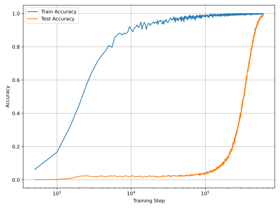
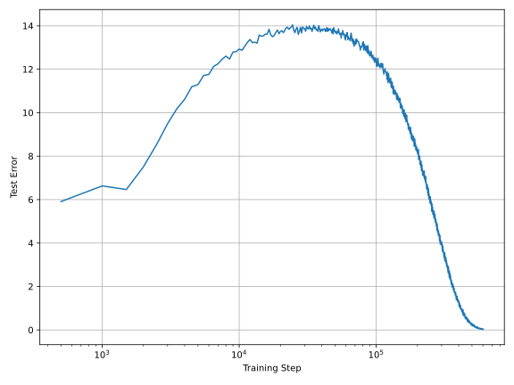
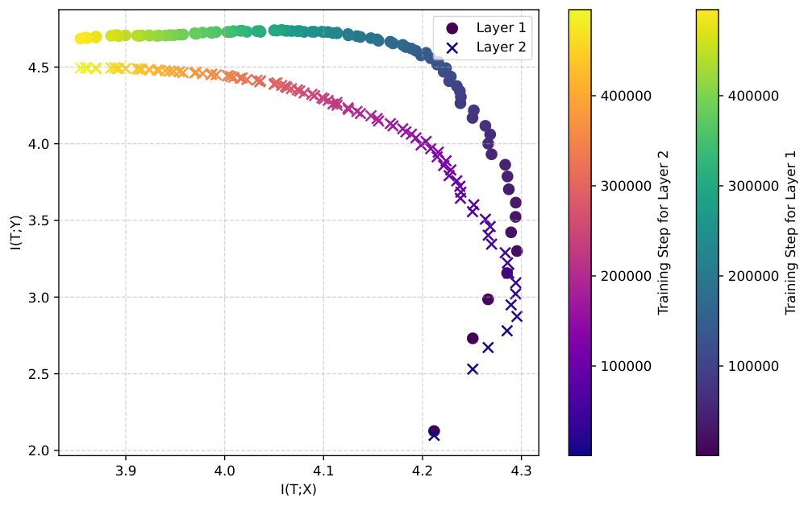

# de Mello Koch & Ghosh 2025 — A Two-Phase Perspective on Deep Learning Dynamics

См. также: [глобальный индекс понятий](../../concepts/index.md).

**Robert de Mello Koch** (School of Science, Университет Хучжоу; Mandelstam Institute for Theoretical Physics, Витватерсрандский университет), **Animik Ghosh** (School of Science, Университет Хучжоу).

arXiv [2504.12700](https://arxiv.org/abs/2504.12700), апрель 2025, hep-th, 17 страниц, 6 рисунков (11 панелей), 7 выключных формул, без приложений; ни кода, ни данных. Всего цитирований по Semantic Scholar — 0, в картотеке — 1. Заявка: обучение глубокой сети идёт в две поры — быстрая подгонка кривой и медленное сжатие («забывание»), — а гроккинг, двойной спуск и информационное бутылочное горлышко суть три вида одной двухпоровой поступи. Довод — совпадение трёх сроков перехода, снятых с одних и тех же прогонов (деление по модулю 96 и таблица умножения $S_{5}$); взаимная осведомлённость $I(T;X)$ предложена мерой продвижения, а сжатие истолковано по образцу ренормгруппы.

Оригинал и производные файлы этой папки:

- [`original/2504.12700.a-two-phase-perspective-on-deep-learning-dynamics.md`](original/2504.12700.a-two-phase-perspective-on-deep-learning-dynamics.md) — конверсия оригинала (ar5iv HTML) в Markdown без правок содержания.
- [`images/`](images/) — 11 панелей рисунков 1–6.

Схема якорей и правила ссылок на карточку — в [README папки статей](../README.md).

## Затрагиваемые понятия

**[Гроккинг](../../concepts/grokking.md)** — назван «дрозофилой генерализации»: удобный полигон, а не самостоятельный предмет ([`p2-4`](#p2-4)). Определение взято по Power et al. без изменений; главный тезис — гроккинг есть проявление более глубокого строения: обучение идёт двумя стадиями, подгонкой кривой и огрублением-«забыванием» ([`p11-6`](#p11-6)). Существенная нестыковка с частью корпуса: гроккинг получен при **нулевом** спаде весов, и работа этого не отмечает.

**[Двойной спуск](../../concepts/double-descent.md)** — третья объединяющая работа корпуса (после 2303.06173 и 2402.15175, которые не процитированы): восходящая ветвь классической U-кривой отождествлена с порой подгонки, второй спуск — с порой сжатия ([`p7-2`](#p7-2)); при этом двойной спуск определён по сложности модели, а измеряется по числу шагов обучения — переход с одной оси на другую нигде не обоснован.

**[Сжатие представлений](../../concepts/manifold-representation-compression.md)** — информационное бутылочное горлышко принято как рамка второй поры: после малой ошибки обучения $I(T;X)$ убывает при примерно постоянной $I(T;Y)$ — сеть «забывает» непредсказательные детали входа ([`p7-6`](#p7-6)); сжатие истолковано по образцу ренормгруппы (неважные параметры затухают — сеть забывает тонкое строение), и предложены три геометрических хода огрубления разбиения входного пространства: выравнивание, исчезновение и слияние нулевых прямых ([`p13-5`](#p13-5), [`fig-6`](#fig-6)) — ни один из них не подсчитан ни в одной обученной сети.

**[Меры прогресса](../../concepts/progress-measures.md)** — заявленный вклад: $I(T;X)$ между входом и выходом скрытого слоя как естественная мера продвижения, «дополняющая» контурные меры — местную сложность (LC) и число линейных отображений (LMN) ([`p3-2`](#p3-2)); при этом ни LC, ни LMN в работе не измерены ни разу, а аннотация и §4.2 расходятся в статусе меры (progress measure против process measure, [`p12-3`](#p12-3)).

**[Ослабление весов](../../concepts/weight-decay.md)** — молчаливое отклонение от корпусного канона: AdamW со спадом весов 0.0, и гроккинг всё равно наблюдается на обеих задачах ([`p8-5`](#p8-5)); роль спада весов не разбирается вовсе — при том что в части корпуса он считается условием перехода.

## Что показано, а что предположено

Замечания редактора карточки по итогам разбора утверждений (`…claims.txt`, 44 пункта).

**Довод — совпадение сроков, снятых глазом.** Три поры перехода (нулевая ошибка обучения; начало второго спуска; крайняя правая точка следа на информационной плоскости) не определены численно — ни порога, ни правила подгонки, ни доверительного промежутка; все снимаются с графиков по логарифмической оси. По одному прогону на задачу, без семян и разбросов. Из трёх «выровненных» пор две сняты с проверочного качества одного прогона (две записи одной кривой), независимо измерена лишь информационная; и все три определены как «после нуля ошибки обучения», так что близость отчасти заложена постановкой.

**Способ оценки взаимной осведомлённости не описан вовсе** — ни разбиения на ячейки, ни оценщика, ни числа образцов, ни обращения с вырожденностью $I(T;X)$ для детерминированной сети; между тем именно на способе оценки держится весь известный спор вокруг информационного бутылочного горлышка (известное возражение — что убывание $I(T;X)$ бывает следствием насыщающей нелинейности — не упомянуто). Размах сжатия мал: на делении $I(T;X)$ идёт с 4.26 до 4.18 (около 2 %); единицы не названы. Вывод о нечувствительности к глубине сделан по двум точкам измерения.

**Модуль 96 составной** — деление определено лишь для делителей, взаимно простых с модулем; ни числа допустимых пар, ни оговорки нет (Power et al. брали простое 97).

**Объяснительная часть — рассуждение.** Раздел о ренормгруппе поставлен вопросом, ни одного огрубляющего преобразования не построено; три хода огрубления нарисованы от руки и не подсчитаны; заявка об ускорении второй поры не подкреплена ни приёмом, ни опытом — при существующей к апрелю 2025 линии ускорителей гроккинга. Из пяти ссылок ренормгруппового места три — самоцитирования первого автора.

**Предшественники объединения не процитированы.** Ни Davies et al. (2303.06173), ни Huang et al. (2402.15175) — заявка сделана так, будто предшественников нет; из трёх объединяющих работ корпуса эта — самая бедная измерениями и единственная, добавляющая к паре третье явление (IB). Информационные меры прогресса на гроккинге (Clauw et al., Song et al.) тоже предложены раньше и не процитированы.

**Как работу будут цитировать** («показано, что гроккинг, двойной спуск и IB — одно явление») — точнее: на двух алгоритмических задачах, по одному прогону на каждую, глазом отмечено совпадение трёх сроков; способ оценки взаимной осведомлённости не описан, контурные меры не измерены, объяснительная часть — рассуждение. Ценное — сама постановка (три рамки на одних прогонах) и прямо заданный вопрос: нельзя ли оптимизировать вторую пору нарочно.

---

# Текст статьи

A Two-Phase Perspective on Deep Learning Dynamics
================

Robert de Mello Koch. Примечание: robert@zjhu.edu.cn. Аффилиация: School of Science, Университет Хучжоу, Хучжоу 313000, Китай. Аффилиация: Mandelstam Institute for Theoretical Physics, School of Physics, Витватерсрандский университет, Private Bag 3, Wits 2050, ЮАР. И Animik Ghosh. Примечание: автор для переписки; animikghosh@gmail.com. Аффилиация: School of Science, Университет Хучжоу, Хучжоу 313000, Китай.

## Аннотация

Мы предполагаем, что обучение в глубоких нейросетях идёт в две поры: быстрая пора подгонки кривой, за которой следует более медленная пора сжатия, или огрубления. Этот взгляд поддерживается общим временным строением трёх явлений — гроккинга, двойного спуска и информационного бутылочного горлышка, — каждое из которых показывает отложенное наступление генерализации много позже обнуления ошибки обучения. Мы эмпирически показываем, что связанные временные масштабы выравниваются в двух довольно разных постановках. Взаимная осведомлённость между скрытыми слоями и входными данными возникает как естественная мера продвижения, дополняющая контурные метрики, такие как местная сложность и число линейных отображений. Мы приводим доводы, что вторая пора не оптимизируется стандартными алгоритмами обучения напрямую и может быть без нужды затянута. Опираясь на аналогию с ренормгруппой, мы предполагаем, что эта пора сжатия отражает принципиальную форму забывания, существенную для генерализации.

**[p. 2]**

## 1 Введение

Гроккинг — явление, при котором нейросеть, заучив свои обучающие данные и показывая плохую генерализацию, внезапно и резко начинает хорошо генерализовать — обычно долгое время после достижения нулевой ошибки обучения [1–3]. Первоначально наблюдавшийся на синтетических задачах, гроккинг, как показывают недавние исследования, неожиданно широко распространён и может возникать в ряде практических постановок [4].

Веская причина изучать гроккинг в том, что он бросает вызов классической теории обучения. Он обнажает несоответствие между подгонкой и пониманием: сети могут заучивать идеально, но им требуется куда больше времени, чтобы усвоить правильный алгоритм или строение, как видно на задачах вроде модульной арифметики. Этот отложенный переход раскрывает более богатый набор динамик, лежащих под генерализацией, чем схватывают стандартные размены смещения и дисперсии [4–7].

Гроккинг также показывает, что динамика обучения остаётся деятельной много позже выхода потери на полку. Внутренние представления могут продолжать эволюционировать тонкими способами, в итоге делающими генерализацию возможной. Понимание этих динамик может пролить свет на скрытые механизмы, управляющие обучением, помочь лучше ориентироваться в ландшафте оптимизации и подсказать практические решения вроде ранней остановки, регуляризации и расписаний скорости обучения.

###### p2-4

С исследовательской точки зрения гроккинг даёт податливую, истолковываемую постановку — то, что можно назвать «дрозофилой» генерализации. Он позволяет изучать динамику глубокого обучения **[p. 3]** в чистой среде, где сигналы вроде сжатия, абстракции и запоминания можно точно прослеживать. В этой статье мы приводим доводы, что гроккинг есть проявление более глубокого строения: что обучение идёт как двухстадийный процесс — сначала через подгонку кривой, а позже через пору, напоминающую огрубление, или «забывание». Мы строим этот довод, выделяя общее строение трёх явлений: гроккинга, двойного спуска и принципа информационного бутылочного горлышка.

Чтобы подготовить сцену, мы кратко напоминаем нужные стороны двойного спуска и информационного бутылочного горлышка. Двойной спуск уточняет классический взгляд на генерализацию, показывая, что тестовая ошибка, сперва выросши около порога интерполяции, может снова убывать с ростом сложности модели. Это немонотонное поведение наблюдалось на широком диапазоне моделей, включая нейросети, ядерные методы и даже простую линейную регрессию. Информационное бутылочное горлышко, в свою очередь, предлагает принципиальную рамку для понимания того, как модель уравновешивает сжатие и предсказательную силу. Оно постулирует, что оптимальное внутреннее представление данных — то, которое удерживает как можно больше значимой информации о цели, отбрасывая незначимые входные признаки.

###### p3-2

Мы предполагаем, что эти рамки не просто аналогичны, а отражают общее лежащее в основе строение, порождая одни и те же фундаментальные поры процесса обучения. Конкретно, мы демонстрируем, что три критических временных масштаба — точка, где гроккинг достигает идеальной точности обучения, начало второго спуска в двойном спуске и переход к сжатию в информационном бутылочном горлышке — эмпирически выровнены. В разделе 2 мы определяем эти временные масштабы, объясняем их значимость и обрисовываем, как их можно измерять на практике. Раздел 3 представляет эмпирические свидетельства этого выравнивания. В разделе 4 мы мотивируем гипотезу, что обучение разворачивается в две отдельные стадии: начальная пора подгонки кривой, за которой следует вторая пора, напоминающая огрубление, или «забывание». Эта картина согласуется с подробными численными исследованиями гроккинга. Ключевой итог нашей работы — предложение, что взаимная осведомлённость между входами и выходами скрытого слоя служит естественной мерой продвижения обучения глубокой сети. Наконец, в разделе 5 мы обсуждаем следствия наших находок и предлагаем направления будущей работы.

## 2 Временные масштабы и их значимость

Гроккинг даёт податливую и истолковываемую постановку для изучения генерализации в глубоких нейросетях. Уроки, которые он даёт, прямо мотивируют центральную гипотезу, которую мы представляем в разделе 4. Чтобы к ней подойти, мы напоминаем в этом разделе ключевые поддерживающие результаты. Раздел 2.1 возвращается к главным наблюдениям о гроккинге, которые уже намекают, что обучение разворачивается в две отдельные поры. Чтобы выделить первую из них, мы обращаемся к явлению двойного спуска — обновлению классического размена смещения и дисперсии, — которое напоминаем в разделе 2.2. Вторая пора, характеризуемая формой сжатия, естественно описывается рамкой информационного бутылочного горлышка, напоминаемой в разделе 2.3.

### 2.1 Гроккинг

Гроккинг означает явление, при котором глубокая нейросеть (DNN) начинает хорошо генерализовать лишь после продолжительного периода обучения, долгое время после достижения почти нулевой **[p. 4]** ошибки обучения. К настоящему времени несколько подробных динамических исследований разобрали гроккинг, предлагая привлекательное и наглядное понимание части его механизмов [1, 5, 8]. Ключевое понятие, на котором мы будем строить, — понятие *контура* [9]. Чтобы мотивировать эту идею, начнём с напоминания, что DNN применяет последовательность нелинейных преобразований к входному вектору $\vec{x}$, проводя его через $L$ слоёв. Это определяет функцию $f_{\theta}(\vec{x})$ вида

$$
f_{\theta}(\vec{x})\equiv a\left(W^{(L)}a\Bigg(\cdots a\Big(W^{(2)}a(W^{(1)}\vec{x}+b^{(1)})+b^{(2)}\Big)\cdots+b^{(L-1)}\Bigg)+b^{(L)}\right) \tag{1}
$$

где $\theta$ обозначает полный набор параметров сети. Каждый слой $l$ вносит в $\theta$ матрицу весов $W^{(l)}_{ij}$ и вектор смещений $b^{(l)}_{i}$. Функция активации $a(\cdot)$ — нелинейность, применяемая поэлементно к выходу каждого нейрона. В нашем случае мы используем функцию активации ReLU,

$$
a(t)=\max(0,t), \tag{2}
$$

выдающую нуль всякий раз, когда $t<0$. Это означает, что такие нейроны фактически недеятельны и не вносят вклада в выход сети. В результате для любого данного входа вычисление, выполняемое сетью, вовлекает лишь подмножество нейронов и связей.

*Рисунок 1: **Контуры в ReLU MLP** **(A)** Схема многослойного перцептрона (MLP) с входным и выходным слоями и четырьмя скрытыми слоями. **(B)** Представительный узор активации, в котором деятельны лишь верхний нейрон второго скрытого слоя и два верхних нейрона третьего. Получающийся *контур* включает лишь активированные нейроны и веса, связанные между ними. **(C)** Переход в соседнюю линейную область соответствует добавлению или удалению одного нейрона из контура. В показанном примере второй нейрон второго скрытого слоя становится вновь активированным.* **[p. 4]**

Эту идею можно формализовать понятием *контура*, как показано на рисунке 1. Контур состоит из подмножества нейронов, активируемых для данного входа, вместе со связывающими их весами. Для этого входа контур определяет линейное отображение из входа в выход. Пусть $x^{(l)}_{i}$ обозначает вход нейрона $i$ слоя $l$. Поскольку мы используем функцию активации ReLU, граница между деятельными и недеятельными нейронами определяется нулевым множеством преднактивации:

$$
\mathcal{H}_{i}^{(l)}=\left\{x^{(l)}_{i}:\sum_{j}W^{(l)}_{ij}x^{(l)}_{j}+b^{(l)}_{i}=0\right\}. \tag{3}
$$

Каждый $x^{(l)}_{i}$ можно рассматривать как функцию входа сети $\vec{x}$, так что при закреплённом наборе параметров $\theta$ входное пространство разбивается на области по узору активации **[p. 5]** нейронов. Внутри каждой области сеть вычисляет отдельную линейную функцию. Поскольку переход между соседними областями соответствует пересечению одной из границ нулевых множеств $\mathcal{H}_{i}^{(l)}$, смежные контуры различаются активацией или деактивацией одного нейрона.

Поэтому полезно смотреть на входное пространство как разбитое на области, каждой из которых сопоставлен отдельный контур. Простая иллюстрация такого разбиения показана на рисунке 2. *Мера продвижения* [10] обучения DNN — скалярная величина, в идеале эволюционирующая монотонно с обучением. Одну естественную меру продвижения можно определить в терминах контуров [4, 6]. Считая число отдельных контуров в окрестности закреплённого объёма входного пространства, мы получаем меру *местной сложности* (LC) сети. При обучении число отдельных контуров обычно убывает, что ведёт к уменьшению интеграла LC по входному пространству.

*Рисунок 2: **Разбиение входного пространства:** ReLU MLP рисунка 1 имеет два входных параметра. Это входное пространство визуализировано выше как квадрат. Первое разбиение (слева) выполняется нулевым множеством активации нейронов первого слоя, второе (в середине) — нейронами второго слоя, третье (справа) — нейронами третьего слоя. Квадрат делится на синюю и красную области линией, указывающей, где верхний нейрон становится недеятельным, и на красную и зелёную — где недеятельным становится нижний нейрон. Три области — синяя, красная и зелёная — сопоставлены контурам тех же цветов. Недеятельные нейроны помечены $\times$. Затем рассматривается зелёная область. Она рассекается на две области линией, на которой верхний нейрон второго слоя становится недеятельным. Есть похожие разбиения для синей и красной областей, которые мы не выписали. Наконец, рассматривается оранжевая область. Она рассекается на две области линией, на которой недеятельным становится верхний нейрон третьего слоя. Есть ещё одно разбиение, не показанное, нейронами последнего слоя. В итоге входное пространство разбито на области, каждой из которых сопоставлен единственный контур. Контуры смежных областей различаются одним нейроном.* **[p. 5]**

Тесно родственная мера продвижения, известная как *число линейных отображений* (LMN), была введена в [11]. Построение начинается с *матрицы линейной связности* $L_{ij}$, чьи **[p. 6]** элементы основаны на квадрате коэффициента корреляции Пирсона11 1 Коэффициент корреляции двух случайных величин лежит от $-1$ до 1. Модуль, равный 1, означает, что связь между случайными величинами идеально описывается линейным уравнением. Значение 0 означает отсутствие линейной зависимости между величинами., а строки и столбцы индексированы образцами входного пространства. Если два образца сильно линейно связаны, соответствующий элемент $L_{ij}$ близок к 1. Диагональные элементы по определению равны 1, а слабые или нелинейные связи дают значения ближе к 0.

Собственные значения $\lambda_{i}$ матрицы $L_{ij}$ затем используются для определения нормированного спектра:

$$
\tilde{\lambda}_{i}=\frac{|\lambda_{i}|}{\sum_{j}|\lambda_{j}|}. \tag{4}
$$

С этими нормированными собственными значениями LMN определяется как:

$$
\mathrm{LMN}=2^{S_{\mathrm{NL}}},\qquad S_{\mathrm{NL}}=-\sum_{i}\tilde{\lambda}_{i}\log_{2}\tilde{\lambda}_{i}, \tag{5}
$$

где $S_{\mathrm{NL}}$ можно истолковать как энтропию нормированного спектра. На простых примерах [10] можно показать, что LMN в точности соответствует числу отдельных линейных областей входного пространства. Как следствие, LMN тесно связана с интегралом LC по входному пространству.

Помимо естественной меры продвижения, контуры дают замечательно убедительную призму для взгляда на динамику гроккинга [4]. К моменту достижения сетью нулевой ошибки обучения сложность входного пространства в основном сосредоточена около обучающих образцов. В этой точке можно было бы разумно предположить, что сеть далее почти не меняется. Однако эта интуиция обманчива: и LMN, и интегральная LC продолжают убывать даже после насыщения потери обучения. В эту пору сложность линейных областей переселяется прочь от обучающих образцов, фактически сглаживая отображение сети в окрестности этих точек.

Слежение за расположением и эволюцией линейных областей на протяжении обучения раскрывает богатые микроскопические детали процесса гроккинга. Поначалу сеть образует крайне сложное отображение в стремлении минимизировать ошибку обучения. Со временем оно эволюционирует в отображение, значительно более гладкое вокруг обучающих примеров, — существенная черта для генерализации. Это поведение сильно намекает на двухпоровый процесс обучения. Первая пора, где господствует подгонка кривой, кончается при обнулении ошибки обучения. Вторая пора начинается затем и продолжается, пока сеть не сгенерализует успешно, что соответствует минимуму сложности. Мы вернёмся к этому истолкованию подробнее в разделе 4.

### 2.2 Двойной спуск

Двойной спуск [12–14] бросает вызов классическому пониманию того, как сложность модели влияет на генерализацию. С ростом сложности модели тестовая ошибка, как ожидается, следует U-образной кривой: сначала убывает, когда модель становится достаточно гибкой для подгонки данных, затем растёт, когда модель начинает переобучаться, схватывая шум или незначимые узоры обучающего набора. Этот взгляд коренится в размене смещения и дисперсии, где простые модели страдают высоким смещением (недообучение), а сложные — высокой дисперсией (переобучение).

**[p. 7]**

В картине двойного спуска после пика классической U-кривой происходит нечто неожиданное. Когда сложность модели продолжает расти за точку, где модель может точно подогнать (интерполировать) обучающие данные, тестовая ошибка снова начинает убывать. Эта вторая пора улучшения даёт второй «спуск». Точка, где модель впервые достигает идеальной точности обучения, известна как порог интерполяции, и именно вокруг этой области тестовая ошибка обычно хуже всего. Продвижение модели в переопределённый режим — где параметров куда больше, чем обучающих данных, — часто ведёт к лучшей генерализации.

###### p7-2

Классическая U-кривая указывает на пору подгонки кривой, тогда как второй спуск указывает на пору сжатия, или огрубления, в которую незначимые детали данных отбрасываются сетью. Временной масштаб, управляющий выходом из подгонки в огрубление, определяется пиком U-кривой. Вторую пору можно считать завершающейся, когда второй спуск останавливается.

### 2.3 Информационное бутылочное горлышко

Информационное бутылочное горлышко (IB) — теоретическая рамка для понимания и визуализации того, как обучающиеся системы извлекают значимое строение из данных [15]. Она предлагает, что хорошее внутреннее представление $T$ входа $X$ должно уравновешивать две соперничающие цели: удерживать полезную информацию о цели $Y$, отбрасывая незначимые детали $X$. Этот размен формализуется минимизацией IB-цели:

$$
\mathcal{L}_{\text{IB}}=I(T;X)-\beta I(T;Y), \tag{6}
$$

где $I(A;B)$ обозначает взаимную осведомлённость случайных величин $A$ и $B$, а $\beta\geq 0$ — параметр размена. В нашей постановке $X$ представляет обучающие входы, $Y$ — соответствующие метки, а $T$ может означать выход любого скрытого слоя сети. Взаимная осведомлённость измеряет, насколько знание одной величины снижает неопределённость о другой. Соответственно, $I(T;X)$ количественно выражает, сколько информации о входе $X$ содержит представление $T$, а $I(T;Y)$ измеряет, сколько предсказательной информации о метках $T$ удерживает. Цель — минимизировать $I(T;X)$ (сжать незначимые детали входа) при максимизации $I(T;Y)$ (сохранить предсказательное строение), что даёт компактные и действенные внутренние представления.

Эмпирические свидетельства позволяют предположить, что скрытые слои глубоких сетей приближённо осуществляют этот размен при обучении [16, 17]. Полезную визуализацию этой динамики даёт *информационная плоскость*, где каждый скрытый слой представлен точкой с координатами $(I(T;X),I(T;Y))$. По мере обучения веса сети эволюционируют, порождая движение этих точек по информационной плоскости.

###### p7-6

Обучение обычно разворачивается в две отчётливые поры. В ранней *поре подгонки* и $I(T;X)$, и $I(T;Y)$ растут, поскольку сеть учится схватывать строение входа, помогающее минимизировать ошибку обучения. Эта пора относительно быстра и соответствует заучиванию сетью деталей обучающих данных. Когда ошибка обучения становится малой, сеть входит в *пору сжатия*, в которую $I(T;X)$ постепенно убывает при примерно постоянной $I(T;Y)$. Это сигнализирует, что сеть отбрасывает избыточную **[p. 8]** входную информацию — фактически «забывая» непредсказательные детали — при сохранении необходимого для точного предсказания выхода.

Этот переход отмечает сдвиг от запоминания к абстракции, позволяя предположить, что генерализация в глубоком обучении зависит не только от подгонки, но и от упрощения внутреннего строения. Динамика, прочерчиваемая на информационной плоскости, показывает ясную двухпоровую траекторию: точка перехода, где $I(T;X)$ начинает убывать, определяет начало сжатия, а конец этой поры отмечен минимумом $I(T;X)$.

Выделив и определив теперь временные масштабы всех трёх явлений — гроккинга, двойного спуска и информационного бутылочного горлышка, — мы в состоянии сравнить их напрямую. Следующий раздел представляет численные эксперименты в постановках, где все три эффекта наблюдаемы и поддаются количественному разбору.

## 3 Численные результаты

В этом разделе мы подкрепляем утверждения предыдущего раздела численными свидетельствами. Сначала мы описываем экспериментальную постановку в подразделе 3.1, затем результаты в подразделе 3.2.

### 3.1 Экспериментальная постановка

Наше устройство модели включает два слоя трансформера с 4 головами внимания, за которыми следует сеть прямого распространения с активацией Gaussian Error Linear Unit (GeLU)

$$
\text{GELU}(x)\sim 0.5x\left[1+\tanh\left[\sqrt{\frac{2}{\pi}(x+0.044715x^{3})}\right]\right] \tag{7}
$$

###### p8-5

В теоретическом обсуждении раздела 2.1 мы широко пользовались функцией активации ReLU. Этот выбор был мотивирован прежде всего понятийной ясностью: ReLU вводит хорошо определённую точку переключения при $x=0$, где нейрон переходит между деятельным и недеятельным состояниями. Плата, однако, в том, что у функции ReLU разрывная первая производная в этой точке. Напротив, функция активации GeLU сглаживает переход, давая непрерывную производную, более благоприятную для численной оптимизации. Цена этой гладкости — отсутствие естественной, резко определённой границы деятельного/недеятельного, что в свою очередь ведёт к менее резко определённым границам между линейными областями. Наш разбор не опирается на точные определения границ линейных областей, и контурная рамка остаётся годным и полезным понятийным инструментом безотносительно используемой функции активации. В поддержку этого отметим, что число линейных отображений (LMN) одинаково легко вычисляется для сетей с активациями ReLU и GeLU. Мы обучаем нашу модель на алгоритмических наборах данных: делении по модулю 96 и таблице умножения группы перестановок $S_{5}$ в частности. Мы обучали параметры нейросети оптимизатором AdamW (со скоростью обучения = $10^{-3}$ и спадом весов = 0.0) с кросс-энтропийной потерей на протяжении $10^{6}$ шагов. Мы использовали размерность вложения = 128 (то есть каждая голова действует на 32-мерном подпространстве пространства вложения) и скрытую размерность = 512. Мы использовали разбиение обучение-тест 40-60 для случая модульного деления и 50-50 для группы $S_{5}$.

***(a)***

***(b)***

*(c)*

*Рисунок 3: Результаты для деления по модулю 96. В (a) мы изобразили обучающую и тестовую точность как функцию числа шагов обучения, что демонстрирует гроккинг. В (b) мы изображаем соответствующую траекторию на информационной плоскости. В (c) мы изобразили тестовую ошибку как функцию числа шагов обучения, показывающую явление двойного спуска. Если бы мы изобразили рисунок в линейном масштабе, разделение двух пор в (a) было бы выразительнее. Далее, заметьте, что ошибка обучения фактически исчезает при $\approx 5\times 10^{3}$ шагах, а генерализация происходит лишь при $\approx 10^{5}$ шагах.* **[p. 9]**

***(a)** Гроккинг $S_{5}$*

***(b)** Информационное бутылочное горлышко $S_{5}$*

***(c)** Двойной спуск $S_{5}$*

*Рисунок 4: Результаты для $S_{5}$. В (a) мы изобразили обучающую и тестовую точность как функцию числа шагов обучения, что демонстрирует гроккинг. В (b) мы изображаем соответствующую траекторию на информационной плоскости. В (c) мы изобразили тестовую ошибку как функцию числа шагов обучения, показывающую явление двойного спуска. В этом случае из рисунка (a) мы видим, что две поры обучения хорошо разделены. Это совпадает с выраженным горбом перед началом второго спуска в (c).* **[p. 10]**

**[p. 9]**

### 3.2 Результаты

###### p9-1

Мы представляем наши результаты для набора модульного деления и набора $S_{5}$ на рисунках 3 и 4 соответственно. Из рисунка 3 мы видим, что на середине между $10^{3}$ и $10^{4}$ шагами пора подгонки кончается, что находится в хорошем эмпирическом согласии с началом генерализации модели, отмеченным и началом второго провала на графике двойного спуска, и крайней правой точкой траектории на информационной плоскости. Также мы видим, что генерализация кончается около $10^{5}$ шагов, где тестовая точность достигает максимального значения. Точка исчезновения тестовой ошибки соответствует точке, где траектория взаимной осведомлённости упирается в «неподвижную точку» на информационной плоскости. Для случая $S_{5}$ (см. рисунок 4) гроккинг показывает, что генерализация начинается позже, около $10^{5}$ шагов, что снова совпадает и с крайней правой точкой траектории информационной плоскости картины информационного бутылочного горлышка, и с началом второго спуска в двойном спуске. **[p. 10]** Неподвижная точка в этом случае достигается за серединой между $10^{5}$ и $10^{6}$ шагами обучения. Упомянутое согласие временных масштабов для обоих рассмотренных наборов данных даёт сильное численное свидетельство, что явления гроккинга, информационного бутылочного горлышка и двойного спуска тесно связаны друг с другом. Интересно отметить, что пора сжатия много длиннее в случае $S_{5}$, чем в случае модульного деления. Это очень вероятно потому, что «выучить» алгоритм группы $S_{5}$ труднее, чем сделать то же для модульного деления.

***(a)** Эволюция взаимной осведомлённости для модульного деления*

***(b)** Эволюция взаимной осведомлённости для $S_{5}$*

*Рисунок 5: Результаты эволюции взаимной осведомлённости на информационной плоскости для наборов модульного деления и $S_{5}$. Слой 1 лежит в первом блоке трансформера, слой 2 — во втором. Начало поры забывания нечувствительно к глубине слоя в обоих случаях.* **[p. 11]**

###### p11-3

Мы также исследовали, чувствительно ли значение шага обучения, на котором кончается пора подгонки, к глубине слоя, и ответ, по-видимому, отрицателен (см. рисунок 5).

**[p. 11]**

## 4 Обучение в две поры

### 4.1 Обучение в двух порах

Мы представили убедительные численные свидетельства осмысленной связи между гроккингом, двойным спуском и информационным бутылочным горлышком. В частности, мы приводим доводы, что эти рамки описывают один и тот же лежащий в основе двухпоровый процесс обучения. В первую пору потеря обучения ненулевая, и сеть деятельно движима к её минимизации. Это соответствует восходящей ветви классической U-образной кривой генерализации, описываемой двойным спуском, и отражает стандартный размен смещения и дисперсии, связанный с переобучением при подгонке кривой. С точки зрения информационного бутылочного горлышка эта пора отмечена ростом взаимной осведомлённости $I(T;Y)$, поскольку сеть накапливает знание, полезное для предсказания целей.

Когда временной масштаб гроккинга достигнут и ошибка обучения падает до нуля, функция потерь минимизирована. Можно было бы наивно ожидать, что обучение за этой точкой прекращается. Однако эмпирические наблюдения показывают, что сеть продолжает эволюционировать существенными способами в эту пору, в итоге достигая генерализации. Действительно, второй спуск кривой тестовой ошибки в двойном спуске происходит много позже насыщения потери обучения. Рамка информационного бутылочного горлышка предлагает естественное истолкование этой продолжающейся эволюции: в эту пору взаимная осведомлённость $I(T;X)$ постепенно минимизируется. Это отражает сжатие внутренних представлений, при котором сеть отбрасывает информацию о входе, незначимую для задачи, — фактически «забывая» то, что ей не нужно для генерализации.

###### p11-6

Взятые вместе, эти уроки мотивируют следующую гипотезу о динамике обучения в глубоких нейросетях: *обучение в DNN идёт через две отчётливые поры — начальную пору подгонки кривой, за которой следует более медленная пора «огрубления», или сжатия. Первая пора быстра и часто занимает лишь малую долю всего времени обучения, вторая же существенна для генерализации.*

**[p. 12]**

### 4.2 Связь с динамикой гроккинга

Эта гипотеза согласуется с динамикой гроккинга, описанной в подразделе 2.1. К завершению первой поры обучения сеть подходит к пику классической U-образной кривой генерализации, сигнализируя о начале переобучения. Из наблюдаемого поведения гроккинга мы знаем, что местная сложность (LC) сильно сосредоточена вокруг обучающих образцов. Это ровно то, чего следует ожидать от сети, переобучившейся на данных: малые возмущения обучающих входов могут переносить вход через границы между отдельными линейными областями. Поскольку каждая область соответствует иной действенной модели, предсказания сети становятся крайне чувствительными к малым изменениям входа — архетипический симптом переобучения. В этом режиме генерализация не удаётся, потому что модель чрезмерно настроена на незначимые колебания обучающих данных.

Во вторую пору обучения сеть претерпевает качественный сдвиг. Линейные области перестраиваются и расширяются, оставляя более крупные, стабильные зоны вокруг обучающих точек. В результате малые возмущения обучающих входов больше не вызывают переходов между разными линейными режимами. Эта повышенная стабильность ведёт к росту устойчивости и генерализации. В рамке информационного бутылочного горлышка это отражается снижением взаимной осведомлённости $I(T;X)$, указывая, что сеть начала игнорировать ненужные детали входа. Модель больше не кодирует тонкие идиосинкразии обучающих данных, а сжимает своё представление до существенного для предсказания.

###### p12-3

Важное следствие этого разбора — что взаимная осведомлённость $I(T;X)$ сама служит *мерой поступи* обучения. Эта перспектива даёт информационно-теоретическое истолкование второй поры: это пора забывания, в которую сеть сбрасывает незначимую информацию, унаследованную от обучающих данных. Снижение взаимной осведомлённости тем самым сигнализирует, что модель продвигается к действенной генерализации.

### 4.3 Ренормгруппа

В теоретической физике есть устоявшаяся обстановка, где процесс, тесно напоминающий вторую пору обучения, играет фундаментальную роль: извлечение низкоэнергетической, дальнодействующей действенной динамики из подробной микроскопической теории. Эта процедура формализуется *ренормгруппой* (RG) [18]. Классический пример вовлекает решётку в координатном пространстве со спиновой переменной в каждом узле. Затем выполняется *блочно-спиновое преобразование*, при котором близкие спины усредняются в один действенный спин, представляющий огрублённую степень свободы. Повторение этого преобразования итеративно ведёт к описанию системы на всё больших масштабах длины, в итоге давая дальнодействующую действенную теорию.

Стоит отметить несколько ключевых черт блочно-спинового преобразования. Во-первых, оно составляет буквальное *огрубление* координатного пространства, при котором многие микроскопические степени свободы заменяются меньшим числом действенных переменных. В ходе этого процесса большинство параметров исходной микроскопической теории сжимаются к нулю — это так называемые *неважные параметры*. Их затухание — механизм, которым огрублённая теория «забывает» тонкие детали лежащей в основе системы. **[p. 13]** Много меньшее подмножество параметров остаётся в основном неизменным; это *маргинальные параметры*. Наконец, столь же малое подмножество *важных параметров* — те, чьё влияние растёт при огрублении. Маргинальные и важные параметры управляют крупномасштабным поведением системы.

То, что подавляющее большинство микроскопических параметров устраняется под RG-потоком, имеет глубокие следствия: модели с драматически разным микроскопическим строением могут показывать одно и то же крупномасштабное поведение. Это физическая основа *универсальности* критических явлений.

Эта аналогия поднимает естественный вопрос [19–23]: может ли рамка ренормгруппы играть деятельную роль во второй поре глубокого обучения? В эту пору убывают и LMN, и сложность сети. Это снижение сложности составляет род сжатия: к концу второй поры разбиение входного пространства состоит из значительно меньшего числа линейных областей. Следовательно, число отдельных контуров, из которых строится функция сети, тоже сокращается. Меньше контуров — меньше линейных отображений, что в свою очередь означает сокращённое число действенных параметров — зеркально поведению огрубления в физических системах.

### 4.4 К теории огрубления

Во вторую пору обучения сеть выполняет форму огрубления, отбрасывая незначимые детали обучающих данных. Этот процесс отмечен снижением и взаимной осведомлённости $I(T;X)$, и числа линейных областей, разбивающих входное пространство. В этом разделе мы приводим доводы, что эта огрубляющая эволюция идёт тремя фундаментальными механизмами. Наша цель — заложить основу аналога блочно-спинового преобразования рамки ренормгруппы. Выделенные нами механизмы естественно описываются в контурном представлении DNN и согласуются с наблюдаемым снижением связанных мер продвижения, таких как местная сложность и число линейных отображений.

По мере обучения сети её веса и смещения эволюционируют непрерывно, порождая соответствующие сдвиги кривых нулевых множеств преднактиваций, определённых уравнением (3). Эти нулевые линии — определяющие границы активации нейронов — разбивают входное пространство на отдельные линейные области, каждой из которых сопоставлен конкретный контур. Во вторую пору эволюция этих линий должна сокращать общее число линейных областей, тем самым гоня интегральную местную сложность к нулю. Мы выделяем три отдельных геометрических преобразования, которыми это сокращение может происходить:

###### p13-5

- **Выравнивание:** нулевые линии переориентируются так, что больше не пересекаются, устраняя вершины и сокращая счёт областей.
- **Исчезновение:** линия целиком выходит из входного пространства, фактически загоняя связанный нейрон в одно (деятельное или недеятельное) состояние.
- **Слияние:** две или более линии становятся совпадающими, образуя составные разделяющие границы, общие для нескольких нейронов.

Эти процессы показаны на рисунке 6.

###### fig-6

*Рисунок 6: **Эволюция нулевых линий нейронов:** Три способа, которыми может убывать счёт линейных областей. **Слева:** две линии выравниваются, устраняя пересечение и сокращая четыре области до трёх. **В середине:** линия переселяется из входного пространства, схлопывая три области в две. **Справа:** две линии сливаются в одну составную границу, снова сокращая счёт областей с трёх до двух.* **[p. 14]**

**[p. 14]**

Когда нулевые линии выравниваются, их точка пересечения выходит из входного пространства, схлопывая смежные области. Поскольку каждая область соответствует единственному контуру, исчезновение области означает, что сеть отбросила прежде деятельный контур.

В случае исчезновения нулевая линия просто уходит за пределы входной области. Соответствующий нейрон становится либо всегда деятельным, либо всегда недеятельным на всём значимом входном пространстве и тем перестаёт осмысленно участвовать в вычислении. Это отражает форму понейронного прунинга, возникающего динамически при обучении.

Наконец, когда две или более линии сливаются, они образуют общую составную границу. Эта граница больше не соответствует порогу активации одного нейрона, а совпадающему переходу, общему для нескольких нейронов. В результате области, разделённые такими границами, различаются несколькими нейронами. Процесс сжатия может тем самым давать малое число выживших линейных областей, каждая из которых задана качественно отличными контурами.

Рисунок 2 работы [6] показывает послойную визуализацию формирования контуров входного пространства на двумерном подпространстве, проходящем через три обучающих образца, для сети после гроккинга. Слой 5 в частности показывает формирование сложных составных границ, локализующихся вокруг разделяющей границы.

Обсуждение этого раздела позволяет предположить, что контурная рамка даёт полезную основу для развития динамической теории второй поры обучения.

**[p. 15]**

## 5 Обсуждение

В этой статье мы предположили, что обучение в глубоких нейросетях идёт через двухстадийный процесс: начальную пору подгонки кривой, за которой следует более медленная пора огрубления, или сжатия. Первая пора обычно быстра — часто завершается за малую долю всего времени обучения, — поскольку сеть эффективно минимизирует функцию потерь и достигает почти нулевой ошибки обучения. Вторая пора разворачивается постепеннее: именно в этот период сеть уточняет свои внутренние представления, отбрасывает незначимые детали входа и развивает способность генерализовать.

Важный результат нашего разбора — что взаимная осведомлённость $I(T;X)$ служит *мерой поступи* обучения: убывание взаимной осведомлённости сигнализирует, что модель продвигается к генерализации.

Правдоподобно, что вторая пора затянута просто потому, что возникает как побочный эффект, а не явная цель процедуры обучения. Стандартные алгоритмы обучения спроектированы минимизировать функцию потерь и максимизировать тестовую точность, фактически оптимизируя подгонку кривой. Напротив, пора сжатия — в которую сеть выполняет род огрубления — вероятно, побочна. Динамика обучения не строится явно ради этой стадии, но та тем не менее возникает. С более глубоким пониманием механизмов, управляющих второй порой, возможно, удастся разработать особые алгоритмы обучения, нарочно продвигающие сжатие, тем самым значительно сокращая длительность этой поры и ускоряя путь к генерализации.

Мы предприняли первые разведывательные шаги к использованию контурной рамки как основания для развития динамической теории второй поры обучения — поры, характеризуемой прогрессирующим снижением сложности сети. Эта рамка естественно направляет внимание на эволюцию границ линейных областей, где каждой линейной области сопоставлен отдельный контур. В этой перспективе мы выделили и объяснили три ключевых механизма, вносящих вклад в снижение сложности: (1) устранение конкретных контуров при исчезновении линейных областей, (2) действенное удаление нейронов, чьи границы активации выходят из входного пространства, и (3) слияние разделяющих границ, позволяющее структурно отличным контурам становиться смежными через образование составных стыков. Эти уроки позволяют предположить, что контурный взгляд предлагает принципиальный способ понять структурную перестройку, происходящую при сжатии. Дальнейшее развитие этой перспективы и её применение к подробным исследованиям динамики второй поры — многообещающее направление будущей работы.

**Благодарности**

Эта работа поддержана стартовым исследовательским фондом Университета Хучжоу, наградой провинции Чжэцзян для талантов и наградой Changjiang Scholar.

## References

- [1] Power, A., Burda, Y., Edwards, H., Babuschkin, I. and Misra, V., 2022. “Grokking: Generalization beyond overfitting on small algorithmic datasets,” arXiv preprint arXiv:2201.02177.

**[p. 16]**

- [2] Liu, Z., Michaud, E.J. and Tegmark, M., 2022. “Omnigrok: Grokking beyond algorithmic data,” arXiv preprint arXiv:2210.01117.

- [3] Xu, Z., Wang, Y., Frei, S., Vardi, G. and Hu, W., 2023. “Benign overfitting and grokking in relu networks for xor cluster data,” arXiv preprint arXiv:2310.02541.

- [4] Humayun, A.I., Balestriero, R. and Baraniuk, R., 2024. “Deep networks always grok and here is why,” arXiv preprint arXiv:2402.15555.

- [5] Varma, V., Shah, R., Kenton, Z., Kramár, J. and Kumar, R., 2023. “Explaining grokking through circuit efficiency,” arXiv preprint arXiv:2309.02390.

- [6] Humayun, A.I., Balestriero, R. and Baraniuk, R., “Grokking and the Geometry of Circuit Formation,” In ICML 2024 Workshop on Mechanistic Interpretability.

- [7] Mohamadi, M.A., Li, Z., Wu, L. and Sutherland, D.J., 2024. “Why do you grok? a theoretical analysis of grokking modular addition,” arXiv preprint arXiv:2407.12332.

- [8] Nanda, N., Chan, L., Lieberum, T., Smith, J. and Steinhardt, J., 2023, “Progress measures for grokking via mechanistic interpretability,” arXiv preprint arXiv:2301.05217.

- [9] Olah, C., Cammarata, N., Schubert, L., Goh, G., Petrov, M. and Carter, S., 2020, “Zoom in: An introduction to circuits,” Distill, 5(3), pp.e00024-001.

- [10] Barak, B., Edelman, B., Goel, S., Kakade, S., Malach, E. and Zhang, C., 2022. “Hidden progress in deep learning: Sgd learns parities near the computational limit,” Advances in Neural Information Processing Systems, 35, pp.21750-21764.

- [11] Liu, Z., Zhong, Z. and Tegmark, M., 2023. “Grokking as compression: A nonlinear complexity perspective,” arXiv preprint arXiv:2310.05918.

- [12] Nakkiran, P., Kaplun, G., Bansal, Y., Yang, T., Barak, B. and Sutskever, I., 2021, “Deep double descent: Where bigger models and more data hurt,” Journal of Statistical Mechanics: Theory and Experiment, 2021(12), p.124003.

- [13] d’Ascoli, S., Refinetti, M., Biroli, G. and Krzakala, F., 2020, November, “Double trouble in double descent: Bias and variance (s) in the lazy regime,” In International Conference on Machine Learning (pp. 2280-2290). PMLR.

- [14] Loog, M., Viering, T., Mey, A., Krijthe, J.H. and Tax, D.M., 2020, “A brief prehistory of double descent,” Proceedings of the National Academy of Sciences, 117(20), pp.10625-10626.

- [15] Tishby, N., Pereira, F.C. and Bialek, W., 2000, “The information bottleneck method,” arXiv preprint physics/0004057.

- [16] Tishby, N. and Zaslavsky, N., 2015, April, “Deep learning and the information bottleneck principle,” In 2015 ieee information theory workshop (itw) (pp. 1-5). Ieee.

- [17] Shwartz-Ziv, R. and Tishby, N., 2017, “Opening the black box of deep neural networks via information,” arXiv preprint arXiv:1703.00810.

- [18] Wilson, K.G., 1975, “The renormalization group: Critical phenomena and the Kondo problem,” Reviews of modern physics, 47(4), p.773.

- [19] P. Mehta, and D.J. Schwab, 2014. “An exact mapping between the variational renormalization group and deep learning. arXiv preprint arXiv:1410.3831.

- [20] M. Koch-Janusz and Z. Ringel, “Mutual information, neural networks and the renormalization group.” Nature Physics 14, no. 6 (2018): 578-582.

**[p. 17]**

- [21] E. de Mello Koch, R. de Mello Koch and L. Cheng, 2020, “Is deep learning a renormalization group flow?” IEEE Access, 8, pp.106487-106505.

- [22] E. de Mello Koch, A. de Mello Koch, N. Kastanos, and L. Cheng, 2020, “Short-sighted deep learning,” Physical Review E, 102(1), p.013307.

- [23] A. de Mello Koch, E. de Mello Koch and R. de Mello Koch, 2020, “Why unsupervised deep networks generalize,” arXiv preprint arXiv:2012.03531.
