# Xu, Ni, Wang, Hu 2025 — Let Me Grok for You: Accelerating Grokking via Embedding Transfer from a Weaker Model

См. также: [глобальный индекс понятий](../../concepts/index.md).

**Zhiwei Xu**, **Yixin Wang**, **Wei Hu** (Мичиганский университет), **Zhiyu Ni** (Калифорнийский университет в Беркли). Равный вклад — Zhiwei Xu и Zhiyu Ni; равное руководство — Yixin Wang и Wei Hu.

arXiv [2504.13292](https://arxiv.org/abs/2504.13292), 17 апреля 2025 (версия v1). Опубликована как доклад конференции ICLR 2025. 10 цитирований — двадцать третья по цитируемости работа корпуса. Источник — нативный HTML arXiv версии v1.

Оригинал и производные файлы этой папки:

- [`original/2504.13292.native.html`](original/2504.13292.native.html) — первоисточник, нативный HTML arXiv (v1), скачан как есть.
- [`original/2504.13292.let-me-grok-for-you-accelerating-grokking-via-embedding-transfer-from-a-weaker-model.md`](original/2504.13292.let-me-grok-for-you-accelerating-grokking-via-embedding-transfer-from-a-weaker-model.md) — конверсия оригинала в Markdown без правок содержания.
- [`images/`](images/) — 29 иллюстраций статьи в исходном разрешении.

Схема якорей и правила ссылок на карточку — в [README папки статей](../README.md).

## Затрагиваемые понятия

**[Структурное представление](../../concepts/structured-representation-learning.md)** — исходное наблюдение всей работы: динамика обучения определяется вложением данных. На модульном сложении при $p=113$ проверены четыре вложения — one-hot, двоичное, фурье и GPT — и оказалось, что one-hot и GPT дают отчётливый гроккинг, а двоичное и фурье-вложения дают **непрерывное** продвижение генерализации, причём фурье-вложение достигает запоминания и безупречной генерализации одновременно ([`p4-1`](#p4-1), [`fig-2`](#fig-2)). Разделяет их не общность и не размерность, а наличие сведений о самой задаче. Отсюда и метод **GrokTransfer**: обучить маленькую слабую модель, пока она не грокнет до нетривиального (но далёкого от наилучшего) качества, извлечь её слой вложения и инициализировать им вложение большой целевой модели ([`p1-8`](#p1-8), [`p5-2`](#p5-2)). Приём устроен нарочито просто и берётся не из наблюдения за динамикой, а из объяснения: если вложение решает, будет ли генерализация отложенной, то содержательное вложение достаточно **раздобыть дёшево**. Вложение при этом входит в целевую модель малоранговым произведением $A\cdot B$, где обучаемы обе матрицы ([`p5-4`](#p5-4)).

**[Grokfast / фильтрация градиента](../../concepts/gradient-low-pass-filtering.md)** — единственное в корпусе прямое сравнение двух приёмов ускорения на одной постановке: на модульном сложении с двухслойным трансформером временной разрыв GrokTransfer равен $46$, тогда как у GrokFast — $1119$ ([`p10-2`](#p10-2), [`fig-8`](#fig-8)). Приёмы устроены по-разному: GrokFast усиливает медленную составляющую градиента, GrokTransfer вообще не трогает обучение, а меняет лишь начальное вложение.

**[Переход от ленивого к богатому](../../concepts/lazy-to-rich-kernel-to-feature-learning.md)** — работа **спорит** с объяснением гроккинга через разрыв между ядерным режимом и режимом обучения признакам. Довод двоякий: гроккинг сохраняется и после тщательной настройки масштаба инициализации, а изменение эмпирического NTK развивается почти одинаково при всех четырёх вложениях — и при тех, что грокают, и при тех, что нет ([`p4-2`](#p4-2), [`fig-3`](#fig-3)). Отсюда вывод: ядерный режим может быть не единственной причиной гроккинга.

**[Масштаб инициализации](../../concepts/initialization-scale.md)** — тот же довод в другую сторону: уменьшение масштаба инициализации гроккинг ускоряет, но не устраняет ([`p4-2`](#p4-2)). Это прямое возражение линии Omnigrok, где большой масштаб инициализации объявлен причиной.

**[Разрежённая чётность](../../concepts/sparse-parity.md)** и **[модульная арифметика](../../concepts/modular-arithmetic.md)** — эмпирическая часть ведётся на трёх задачах: модульное сложение, модульное умножение и $(40,3)$-чётность ([`p9-3`](#p8-6)). Задача чётности потребовала трёхслойной слабой модели: двухслойная сеть без свободных членов на ней не обобщает вовсе ([`p9-5`](#p9-1)).

**[Обобщающие границы](../../concepts/generalization-bounds.md)** — теоретическая часть строга и узка. На задаче XOR-кластеров в высокой размерности ($p=80000$, $n=400$, шум $\varepsilon=0.05$) доказано: при пяти допущениях (A1)–(A5) после **одного** шага градиентного спуска целевая модель верно классифицирует все обучающие точки и обобщает с ошибкой не более $\exp(-\Omega(\log^{2}n))$ ([`p8-3`](#p8-3)). Ключевое допущение (A2) не постулировано, а измерено: отношение норм дополняющей и обобщающей подсетей ведёт себя как $\varepsilon/\sqrt{n}$ ([`p7-1`](#p7-1), [`fig-5`](#fig-5)).

**[Возникновение признаков](../../concepts/feature-emergence-feature-learning.md)** — почему приём вообще работает, видно на XOR: слабая сеть из **трёх** нейронов не может выучить все четыре признака $[\pm 1,\pm 1]$ и застревает на $75\%$, но три выученных ею направления и есть признаковые ([`p6-2`](#p6-2), [`fig-4`](#fig-4)). Проецирование на них даёт вложение с высоким отношением сигнала к шуму — этого достаточно. Авторы подчёркивают, что итог достигается **не** в ядерном режиме, а в режиме обучения признакам ([`p8-4`](#p8-4)).

**[Разрежённая подсеть / lottery ticket](../../concepts/sparse-subnetwork-lottery-ticket.md)** — сравнение с Minegishi et al.: лотерейный билет тоже почти устраняет разрыв, но получить его можно, лишь обучив ту же модель при той же инициализации **до самой генерализации** ([`p3-1`](#p3-1)). Здесь же слабая модель может быть много меньше целевой и даже иной архитектуры.

**[Причинные вмешательства](../../concepts/causal-ablation-intervention.md)** — абляция сделана по силе слабой модели: вложения снимаются на эпохах $100,\ldots,2000$, и качество целевой модели оказывается положительно связано с качеством слабой ([`p9-7`](#p9-3), [`fig-7`](#fig-7)). Отсюда рабочая гипотеза авторов: целевая модель обобщает хорошо лишь после того, как **грокнула слабая**. Крайний случай проверен отдельно: слабая модель с одним нейроном даёт вложение, при котором задача в принципе неразрешима ([`p27-6`](#p27-6), [`fig-10`](#fig-10)).

**[Рогатка](../../concepts/slingshot.md)** — колебания точности во второй строке рисунка 6 отнесены к механизму рогатки и к неустойчивости при большой скорости обучения; правила выбора настройки авторы из-за них не меняют, поскольку и то и другое считается полезным для генерализации ([`p9-4`](#p8-7)).

**[Гроккинг](../../concepts/grokking.md)** — цель работы сформулирована необычно для корпуса: гроккинг здесь не явление, которое надо объяснить, а **помеха, которую надо устранить**, поскольку он вредит предсказуемости и эффективности обучения ([`p1-5`](#p1-5)). Мера успеха соответствующая — *временной разрыв* между первой эпохой с $95\%$ на обучении и первой эпохой с $95\%$ на тесте ([`p9-7`](#p9-3)).

Отдельно стоит сказать, чего в работе **нет**. Нет объяснения, *почему* именно вложение решает дело: показано, что оно решает, и предъявлен способ им распорядиться. Нет и теории за пределами XOR — авторы называют это первым ограничением ([`p10-4`](#p10-4)).

Карточки статей корпуса: [Power et al. 2022](../2201.02177.grokking-generalization-beyond-overfitting-on-small-algorithmic-datasets/2201.02177.grokking-generalization-beyond-overfitting-on-small-algorithmic-datasets.card.md) — задача; [Nanda et al. 2023](../2301.05217.progress-measures-for-grokking-via-mechanistic-interpretability/2301.05217.progress-measures-for-grokking-via-mechanistic-interpretability.card.md) — фурье-решение, от которого взято фурье-вложение; [Omnigrok](../2210.01117.omnigrok-grokking-beyond-algorithmic-data/2210.01117.omnigrok-grokking-beyond-algorithmic-data.card.md) — объяснение через масштаб инициализации, здесь оспариваемое; [Kumar et al. 2024](../2310.06110.grokking-as-the-transition-from-lazy-to-rich-training-dynamics/2310.06110.grokking-as-the-transition-from-lazy-to-rich-training-dynamics.card.md) — переход от ленивого к богатому, здесь оспариваемый; [Grokfast](../2405.20233.grokfast-accelerated-grokking-by-amplifying-slow-gradients/2405.20233.grokfast-accelerated-grokking-by-amplifying-slow-gradients.card.md) — приём ускорения, с которым идёт прямое сравнение; [Merrill et al. 2023](../2303.11873.a-tale-of-two-circuits-grokking-as-competition-of-sparse-and-dense-subnetworks/2303.11873.a-tale-of-two-circuits-grokking-as-competition-of-sparse-and-dense-subnetworks.card.md) — источник постановки $(q,k)$-чётности; [Furuta et al. 2024](../2402.16726.towards-empirical-interpretation-of-internal-circuits-and-properties-in-grokked-transformers-on-modular-polynomials/2402.16726.towards-empirical-interpretation-of-internal-circuits-and-properties-in-grokked-transformers-on-modular-polynomials.card.md) — предгрокнутые модели, ближайший предшественник по замыслу.

## Что показано, а что предположено

Замечания редактора карточки по итогам разбора утверждений (`…claims.txt`). Работа инженерная по духу: одно наблюдение, один приём, одна теорема и добросовестная эмпирика.

**Наблюдение о вложениях — самая ценная часть.** Четыре вложения на одной задаче, при прочих равных, дают качественно разную динамику ([`fig-2`](#fig-2)). Опыт дешёвый, воспроизводимый и разделяющий: он показывает, что «гроккинг» — свойство не задачи и не архитектуры, а **представления входа**. Для корпуса это сильный довод, независимый от любых объяснений через нормы и подсети.

**Возражение линии ленивого-богатого сделано аккуратно, но не закрывает вопрос.** Показано, что гроккинг переживает настройку масштаба инициализации и что изменение эмпирического NTK почти одинаково при грокающих и не грокающих вложениях ([`p4-2`](#p4-2)). Это опровергает утверждение «ядерный режим — единственная причина», но не утверждение «переход от ленивого к богатому происходит»: авторы измеряют один показатель (норму разности псевдо-NTK по Фробениусу) на одной задаче.

**Теорема сильна по форме и узка по охвату.** Один шаг градиентного спуска — и обучение, и генерализация ([`p8-3`](#p8-3)). Но это XOR-кластеры с двумя признаковыми направлениями, зафиксированными $a$ и $U$, и пятью допущениями. Что перенос вложения выручает и на модульной арифметике, показано только эмпирически; авторы ставят это первым в ограничениях ([`p10-4`](#p10-4)).

**Допущение (A2) — образцовый ход.** Вместо того чтобы постулировать величину отношения норм, авторы измеряют её и показывают зависимость $\varepsilon/\sqrt{n}$, не зависящую от размерности $p$ ([`p7-1`](#p7-1), [`fig-5`](#fig-5)). Так теоретическое допущение получает эмпирическое основание — редкость в корпусе.

**«Целевая модель обобщает лишь после того, как грокнула слабая» — гипотеза, а не результат.** Абляция даёт связь качества слабой модели с качеством целевой ([`p9-7`](#p9-3)), но точка перелома не выделена, порог не назван, а сама зависимость показана одним графиком на одной задаче. Авторы и называют это гипотезой.

**Сравнение с GrokFast поставлено честно, но узко.** Временной разрыв $46$ против $1119$ ([`p10-2`](#p10-2)) — это одна задача, одна архитектура и одна метрика. Выигрыш по времени в пять раз ([`p10-1`](#p10-1), [`tab-1`](#tab-1)) считался по часам на конкретном железе; оценка через FLOPs приведена отдельно и даёт тот же порядок.

**Отбор гиперпараметров нужно читать внимательно.** Настройки выбираются перебором по сетке, а лучшей объявляется та, что **быстрее всех** достигает $90$–$99\%$ на проверке ([`p9-4`](#p8-7)). Мера успеха работы — скорость; критерий отбора — тоже скорость. Сравнение остаётся осмысленным, поскольку одинаково применено к обоим способам, но запас прочности у выводов меньше, чем кажется.

**Отрицательные проверки приведены и это украшает работу.** Слабая модель с одним нейроном не помогает вовсе — и объяснено почему ([`p27-6`](#p27-6)). Случайно инициализированное малоранговое вложение $A\cdot B$ проверено отдельно, чтобы показать, что дело в переносе, а не в самой малоранговой структуре ([`fig-15`](#fig-15)).

**Место в корпусе.** Это первая работа корпуса, для которой гроккинг — не предмет объяснения, а неисправность. Её вклад двоякий: наблюдение о том, что вложение входа само по себе решает, отложится генерализация или нет, и дешёвый приём, извлекающий из этого пользу. Попутно она понижает статус двух ходовых объяснений — через масштаб инициализации и через ядерный режим — до недостаточных.

## Ошибочные цитирования

Замечания редактора карточки: места, где эта статья передаёт чужие результаты с ошибкой или без авторских оговорок. Сюда ведут ссылки «подробности» из разделов «Ошибочные пересказы и цитирования этой статьи» карточек процитированных работ.

###### mc-2210-01117
**Omnigrok (2210.01117) — оговорка о вызове.** `"the grokking phenomenon has since been observed in other settings such as learning group operations (Chughtai et al., 2023), sparse parity (Barak et al., 2022), and image classification (Liu et al., 2023)"` — «явление гроккинга с тех пор наблюдалось и в других постановках — при обучении групповым операциям, разрежённой чётности и классификации изображений». «Observed» подаёт гроккинг на изображениях как встреченный, тогда как в цитируемой работе он [«вызван»](../2210.01117.omnigrok-grokking-beyond-algorithmic-data/2210.01117.omnigrok-grokking-beyond-algorithmic-data.card.md#p1-3) — [«в слегка нестандартной постановке, где он относительно слаб»](../2210.01117.omnigrok-grokking-beyond-algorithmic-data/2210.01117.omnigrok-grokking-beyond-algorithmic-data.card.md#p1-9). В другом месте статья сама точнее: причиной задержки она называет «относительно большой» масштаб инициализации по умолчанию — со ссылкой на те же работы; предупреждение относится к формулировке обзорного ряда, не к позиции статьи.

###### mc-2309-02390
**Varma et al. (2309.02390) — приписан тезис о sparse/dense подсетях.** `"Merrill et al. (2023) and Varma et al. (2023) contributed the occurrence of grokking to the competition of sparse (generalizing) and dense (complementary) subnetworks"` — «объяснили возникновение гроккинга конкуренцией разреженной (генерализующей) и плотной подсетей». Структурный тезис о разреженности — [Merrill et al.](../2303.11873.a-tale-of-two-circuits-grokking-as-competition-of-sparse-and-dense-subnetworks/2303.11873.a-tale-of-two-circuits-grokking-as-competition-of-sparse-and-dense-subnetworks.card.md), где он подтверждён для sparse parity; у Varma контуры — [«внутренние механизмы… которые мы вольно называем контурами»](../2309.02390.explaining-grokking-through-circuit-efficiency/2309.02390.explaining-grokking-through-circuit-efficiency.card.md#p1-6), без локализации и без утверждений о разрежённости. Групповое цитирование приписывает измеренную структуру работе, которая говорила только об эффективности.

###### mc-2301-05217
**Nanda et al. (2301.05217) — «обратные тригонометрические функции» и float64.** (1) `"Nanda et al. (2023) reverse-engineered a grokked transformer model for modular addition and reported that the learned algorithm is a composition of trigonometric and inverse trigonometric functions"` — [алгоритм цели — тригонометрические тождества и поворот на окружности](../2301.05217.progress-measures-for-grokking-via-mechanistic-interpretability/2301.05217.progress-measures-for-grokking-via-mechanistic-interpretability.card.md#sec-3-1); обратных тригонометрических функций в работе нет. Эта же формула позже почти дословно повторена в [2511.04760](../2511.04760.when-data-falls-short-grokking-below-the-critical-threshold/2511.04760.when-data-falls-short-grokking-below-the-critical-threshold.card.md) — мисцитата размножилась копированием. (2) `"Nanda et al. (2023) also suggested to set the precision to be float64 to mitigate the Slingshot phenomenon"` — слова «float64» в статье нет; рекомендация живёт в коде и блоге авторов, а [в статье — обратный эксперимент: понижение точности вызывает рогатки](../2301.05217.progress-measures-for-grokking-via-mechanistic-interpretability/2301.05217.progress-measures-for-grokking-via-mechanistic-interpretability.card.md#sec-d-2). Сетап цели (p=113, архитектура) при этом воспроизведён корректно.

###### mc-2407-12332
**Mohamadi et al. (2407.12332) — «уменьшение инициализации ускоряет гроккинг».** `"They observed that reducing the initialization scale can accelerate grokking and hypothesized that grokking arises from a time gap between the NTK regime and the feature-learning regime"` — у Mohamadi [уменьшение масштаба инициализации смягчает разрыв между обучением и тестом вплоть до исчезновения, но ценой более медленного обучения](../2407.12332.why-do-you-grok-a-theoretical-analysis-of-grokking-modular-addition/2407.12332.why-do-you-grok-a-theoretical-analysis-of-grokking-modular-addition.card.md#fig-2) — не «ускоряет». Групповую гипотезу о разрыве режимов статья дальше сама честно оспаривает: гроккинг у них сохраняется и при выверенной инициализации («the kernel regime may not be the sole cause of grokking»). В другом месте цитирует цель точно и единственная в корпусе корректно различает однофамильную eNTK-работу тех же авторов.

---

# Текст статьи

## Аннотация

###### p1-2

«Гроккинг» (Power et al., 2022) — явление, при котором нейронная сеть сперва запоминает обучающие данные и обобщает плохо, а затем, после продолжительного обучения, внезапно переходит к почти безупречной генерализации. При всей своей занимательности это явление отложенной генерализации вредит предсказуемости и эффективности. В идеале модели должны обобщать сразу, без задержки. С этой целью статья предлагает GrokTransfer — простой и обоснованный метод ускорения гроккинга при обучении нейронных сетей, опирающийся на ключевое наблюдение: вложение данных играет решающую роль в том, окажется ли генерализация отложенной. GrokTransfer сперва обучает меньшую, более слабую модель до нетривиального (но далёкого от наилучшего) качества на тесте. Затем выученное этой слабой моделью вложение входа извлекается и используется для инициализации вложения в целевой, более сильной модели.

###### p1-3

Мы строго доказываем, что на синтетической задаче XOR, где при обычном обучении отложенная генерализация возникает всегда, GrokTransfer позволяет целевой модели обобщать сразу, без задержки. Более того, мы показываем на эмпирических исследованиях разных задач, что GrokTransfer действенно перекраивает динамику обучения и устраняет отложенную генерализацию — и для полносвязных нейронных сетей, и для трансформеров.

## 1 Введение

###### p1-4

«Гроккинг» — занимательное явление, недавно открытое Power et al. (2022), при котором нейронная сеть сперва запоминает обучающий набор, но плохо работает на тесте, а после много более долгого обучения внезапно переходит к почти безупречной генерализации. Сообщённое поначалу для моделей-трансформеров, обучаемых задачам модульной арифметики, явление гроккинга с тех пор наблюдалось и в других постановках — при обучении групповым операциям (Chughtai et al., 2023), разрежённой чётности (Barak et al., 2022) и классификации изображений (Liu et al., 2023).

###### p1-5

При всей своей занимательности гроккинг вносит в обучение непредсказуемость и вредит его практической эффективности. Когда модель уже интерполировала обучающие данные с малой обучающей потерей, но всё ещё плохо работает на проверочном наборе, становится трудно предсказать, обобщит ли она в конце концов и когда. В идеале мы хотели бы, чтобы модель продвигалась в ходе обучения непрерывно, удерживая разрыв между обучающей и проверочной ошибками малым. Отсюда вопрос:

*Как можно действенно изменить динамику обучения так, чтобы модель обобщала без задержки?*

###### p1-7

В этой работе мы показываем, что вложение данных играет решающую роль в том, какой будет динамика обучения: содержательное вложение обеспечивает непрерывное продвижение в ходе обучения. Чтобы получить такое содержательное вложение без чрезмерных вычислительных затрат, мы предлагаем новый метод под названием GrokTransfer, использующий вложение, выученное более слабой, меньшей моделью, для ускорения генерализации большей целевой модели. Обзор GrokTransfer — на рисунке 1(a).

###### p1-8

А именно, GrokTransfer состоит из двух основных шагов: (1) обучить более слабую модель, пока она не грокнет до нетривиального качества на тесте; (2) извлечь выученное слабой моделью вложение и взять его линейное **[p. 2]** отображение для инициализации вложения целевой модели. Затем перейти к обучению целевой модели. Теоретически мы изучаем GrokTransfer в постановке двухслойной нейронной сети, обучаемой задаче классификации XOR в высокой размерности, где обычное обучение обнаруживает гроккинг. Мы доказываем, что GrokTransfer позволяет целевой модели обобщать сразу, без задержки. Далее мы эмпирически проверяем действенность GrokTransfer на типичных алгоритмических задачах, обнаруживающих гроккинг. Это сделано и для полносвязных нейронных сетей с обучаемыми вложениями, и для трансформеров. Рисунок 1(b) показывает типичные кривые обучения GrokTransfer в сравнении с обучением целевой модели с нуля на задаче модульного сложения. Видно, что GrokTransfer действенно устраняет гроккинг и значительно повышает эффективность.

Итог наших вкладов таков:

- Мы предлагаем новый метод GrokTransfer, использующий вложение, выученное меньшей, более слабой моделью, для ускорения гроккинга в целевой модели. - Мы теоретически обосновываем GrokTransfer на задаче классификации XOR. Далее мы эмпирически проверяем наш метод на нескольких алгоритмических задачах, обнаруживающих гроккинг при обычном обучении, и показываем, что GrokTransfer способен действенно устранить отложенную генерализацию.


*(a)*


*(b)*

###### fig-1

*Рисунок 1: (a) Обзор рамки GrokTransfer. (b) Сравнение динамики обучения модели, обученной с помощью GrokTransfer, и модели, обученной с нуля. При обучении с нуля между запоминанием и генерализацией виден ясный фазовый переход (синие линии). GrokTransfer (красные линии) позволяет модели продвигаться непрерывно, значительно сокращая разрыв между запоминанием и генерализацией. Подробная постановка опыта — в приложении A.3.* **[p. 2]**

### 1.1 Связанные работы

Наша работа опирается на две линии — гроккинг и перенос знания от слабого к сильному.

#### Гроккинг.

###### p2-4

Liu et al. (2022) сообщили, что модель начинает грокать, когда выучивает скрытую структуру данных. Gromov (2023) показал, что гроккинг устойчив к выбору оптимизатора — обычного градиентного спуска или Adam — и к приёмам регуляризации, включая её отсутствие, weight decay и dropout. Davies et al. (2023) предположили, что гроккинг и двойной спуск, другое неожиданное явление, вызваны одним и тем же скрытым механизмом. Nanda et al. (2023) провели обратную инженерию грокнувшего трансформера для модульного сложения и сообщили, что выученный алгоритм есть композиция тригонометрических и обратных тригонометрических функций. Merrill et al. (2023) и Varma et al. (2023) связали возникновение гроккинга с состязанием разрежённых (обобщающих) и плотных (дополняющих) подсетей в ходе обучения. Zhu et al. (2024) показали, что модели грокают лишь тогда, когда объём обучающих данных превосходит некоторый критический. Liu et al. (2023) отнесли гроккинг на счёт большого масштаба инициализации и вызвали гроккинг на реальных наборах данных вроде MNIST и IMDb, инициализируя модели весами большой нормы. Дальнейшие работы (Miller et al., 2023; Humayun et al., 2024) показали, что гроккинг наблюдается и в других постановках — регрессии на гауссовых процессах и многоклассовой классификации с состязательными примерами. Ряд теоретических работ установил строгие результаты о гроккинге и отложенной генерализации в нескольких постановках за пределами алгоритмических задач: линейная регрессия с линейными моделями (Žunkovič & Ilievski, 2022) и бинарная классификация нейронными сетями (Lyu et al., 2024; Xu et al., 2024). Lyu et al. (2024) доказали, что гроккинг может быть вызван резким фазовым переходом из ядерного режима в богатый. Mallinar et al. **[p. 3]** (2024) обучили рекурсивные признаковые машины алгоритмическим задачам и обнаружили, что динамика их обучения схожа с нейросетевой, показав тем самым, что гроккинг не ограничен нейронными сетями. He et al. (2024); Wang et al. (2024) обнаружили, что трансформеры достигают на некоторых задачах генерализации вне распределения через гроккинг. Doshi et al. (2024) привели аналитические решения для сложных задач модульной арифметики и предположили, что некоторые сложные модульные многочлены неглубокие нейронные сети выучить не могут. Mohamadi et al. (2024) показали, что выучивание модульного сложения принципиально трудно для нейронных сетей в ядерном режиме. Родственное явление, названное «внезапным падением потери» (Chen et al., 2024; Gopalani et al., 2025; Yang et al., 2025), описывает резкое падение потери после затяжного плато при поточном обучении.

###### p3-1

Недавние работы предложили несколько приёмов ускорения гроккинга. Liu et al. (2023) объяснили гроккинг через понятие «зоны Златовласки» — сферической оболочки весов — и обнаружили, что удержание нормы весов на сфере подходящего радиуса в ходе обучения способно ускорить генерализацию. Однако этот приём вносит в обучение неустойчивость и всё же оставляет фазовый переход. Furuta et al. (2024) предположили, что инициализация модели весами или вложениями другой модели, уже обобщившей на иной задаче, способна ускорить гроккинг; это требует обучить ту же модель на дополнительных данных, тогда как нашему методу дополнительные данные не нужны. Lee et al. (2024) разложили градиент на каждом шаге и ускорили гроккинг усилением части градиента. Любопытно, что Minegishi et al. (2024) показали: разрыв между запоминанием и генерализацией можно почти устранить, если применять к модели в ходе обучения лотерейный билет — набор разрежённых матриц-масок. Однако этот лотерейный билет можно получить, лишь обучив сперва ту же модель при той же инициализации до генерализации. Наш подход, напротив, способен почти устранить фазовый переход, не требуя ни дополнительных данных, ни предобучения той же модели.

#### Перенос знания от слабого к сильному.

Burns et al. (2023) предложили приём, в котором малая модель сперва донастраивается как модель-учитель. Затем эта модель-учитель порождает псевдометки для донастройки большей модели-ученика. Что удивительно, ученик способен превзойти учителя. Wang et al. (2023) построили обучаемый оператор линейного роста, который использует обучаемое линейное отображение весов предобученной малой модели как инициализацию весов большой, ускоряя обучение больших моделей. В отличие от этих работ, наш метод сосредоточен на переносе слоя вложения от более слабой модели к целевой и на перекраивании динамики обучения ради ускорения гроккинга.

### 1.2 Обозначения

Для конечного множества $S$ мы обозначаем его мощность через $|S|$ и пользуемся $\text{Uniform}(S)$ для равномерного распределения на $S$. Множество $\{1,2,\cdots,n\}$ мы обозначаем через $[n]$. Через $\mathop{\mathrm{sgn}}(x)$ мы обозначаем знак скаляра $x$. Для матрицы $A\in\mathbb{R}^{n\times m}$ мы обозначаем через $A_{i,\cdot}=[A_{i,1},\cdots,A_{i,m}]$ её $i$-ю строку, через $A_{i:j,\cdot}=[A_{i,\cdot}^{\top},\cdots,A_{j,\cdot}^{\top}]^{\top}\in\mathbb{R}^{(j-i+1)\times m}$ — строки с $i$-й по $j$-ю, а через $\|A\|_{\text{F}}$ — норму Фробениуса. Через $\phi(x)=\max\{0,x\}$ мы обозначаем функцию активации ReLU. Скалярное произведение векторов $a,b$ мы обозначаем через $\langle a,b\rangle$. Для двух последовательностей $\{x_{n}\}$ и $\{y_{n}\}$ мы говорим $x_{n}=O(y_{n})$, если существует такая постоянная $C>0$, что $x_{n}\leq Cy_{n}$ для всех $n$, и $x_{n}=\Omega(y_{n})$, если $y_{n}=O(x_{n})$.

## 2 Ускорение гроккинга переносом вложения от более слабой модели

### 2.1 Побуждение: роль вложения данных

Чтобы показать ключевую роль вложения данных в формировании динамики обучения, мы рассматриваем задачу модульного сложения $a+b\text{ mod }p$. Следуя постановкам Nanda et al. (2023) и Liu et al. (2023), мы берём $p=113$. Набор данных состоит из $\{((a,b),y)\}_{0\leq a,b\leq p-1}$ с меткой $y=(a+b)\text{ mod }p$. $25\%$ набора выбираются случайно в качестве обучающего множества. Мы проверяем четыре вида вложений:

- **One-hot вложение:** каждое целое $a\in[0,p-1]$ представлено своим one-hot кодом. - **Двоичное вложение:** каждое $a$ кодируется двоично, с дополнением нулями до максимальной длины $\lfloor\log_{2}(p-1)\rfloor+1$. - **Фурье-вложение:** каждое $a$ кодируется вектором тригонометрических функций: $[\cos(\frac{2\pi i_{1}a}{p}),\sin(\frac{2\pi i_{1}a}{p}),\cdots,\cos(\frac{2\pi i_{k}a}{p}),\sin(\frac{2\pi i_{k}a}{p})]$, где $i_{1},\cdots,i_{k}\in\mathbb{N}$ — заранее заданные частоты. - ****[p. 4]** GPT-вложение:** каждое $a$ вкладывается моделью OpenAI text-embedding-3-small (OpenAI, 2024)

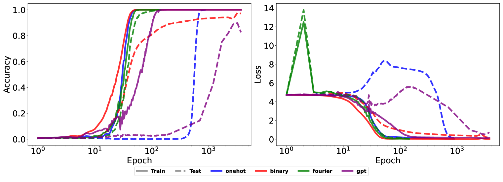

###### fig-2

*Рисунок 2: Динамика обучения FNN при разных вложениях для задачи модульного сложения ($p=113$). Динамика обучения значительно различается при разных вложениях. One-hot вложение и GPT-вложение обнаруживают резкий фазовый переход. Подробности постановки опыта — в приложении A.3.* **[p. 4]**

###### p4-1

One-hot вложения не содержат никаких предварительных сведений о данных, тогда как двоичные вложения улавливают порядковые сведения о целых числах. Фурье-вложения, навеянные аналитическими решениями, выучиваемыми нейронными сетями (Nanda et al., 2023; Morwani et al., 2024), кодируют сведения, относящиеся к самой задаче. GPT-вложения кодируют общие сведения о целых числах. Рисунок 2 показывает динамику обучения полносвязной сети прямого распространения при этих вложениях. Динамика с one-hot и GPT-вложениями обнаруживает явное поведение гроккинга, тогда как с двоичными и фурье-вложениями наблюдается непрерывное продвижение генерализации. Примечательно, что фурье-вложения позволяют модели достичь запоминания и безупречной генерализации одновременно. Мы наблюдаем, что общие вложения вроде one-hot и GPT страдают задержкой генерализации, тогда как вложения, кодирующие сведения о задаче, позволяют модели обобщать непрерывно.


###### fig-3

*Рисунок 3: Изменение эмпирического NTK.* **[p. 4]**

###### p4-2

Ряд работ (Liu et al., 2023; Kumar et al., 2024; Lyu et al., 2024; Mohamadi et al., 2024) обнаружил, что принятый по умолчанию масштаб инициализации сравнительно велик и вызывает задержку генерализации. Их авторы наблюдали, что уменьшение масштаба инициализации способно ускорить гроккинг, и предположили, что гроккинг возникает из разрыва во времени между режимом нейронного касательного ядра (NTK) и режимом обучения признакам. Однако наши эмпирические находки указывают, что гроккинг сохраняется даже после тщательной настройки масштаба инициализации (см. приложение A.3.1). Это позволяет предположить, что гроккинг случается и тогда, когда модель не инициализирована в ядерном режиме, а значит, ядерный режим может быть не единственной причиной гроккинга. На рисунке 3 мы сравниваем изменения эмпирического NTK (Mohamadi et al., 2023), отвечающие динамике с рисунка 2. Изменение эмпирического NTK развивается схожим образом при всех четырёх видах вложений (подробности — в приложении A.3).

Итак, выбор вложения существенно сказывается на динамике обучения, а содержательное вложение способно закрыть разрыв между запоминанием и генерализацией. Однако найти такое содержательное вложение для конкретной задачи не всегда просто. Двоичное вложение, например, смягчает резкий фазовый переход для модульного сложения, но не для модульного умножения. В следующем разделе мы покажем, что построение вложения под конкретную задачу по обучающим данным может быть многообещающим путём к содержательному вложению, ускоряющему гроккинг. Построение вложения достижимо обучением много меньшей, более слабой модели. Здесь «меньшая» означает меньшую выразительность модели. Такая более слабая модель способна выучить содержательное вложение, не достигая наилучшей генерализации. Это вложение затем можно использовать, чтобы благотворно повлиять на динамику обучения большей целевой модели.

**[p. 5]**

### 2.2 Наш метод: GrokTransfer

Мы предлагаем GrokTransfer — простой и обоснованный метод ускорения гроккинга при обучении нейронных сетей. Подробнее: для заданной задачи и обучающего множества $\mathcal{G}$ мы рассматриваем целевую модель $f_{T}$, имеющую обучаемый слой вложения $\text{E}_{T}$ со словарём размера $d_{v}$ и размерностью вложения $d_{T}$. Предлагаемый нами метод GrokTransfer работает так:

###### p5-2

1. **Обучить более слабую модель:** обучить на $\mathcal{G}$ более слабую модель $f_{W}$ с обучаемой таблицей вложения $\text{E}_{W}\in\mathbb{R}^{d_{v}\times d_{W}}$, где $d_{W}$ — размерность вложения в слабой модели. Обучать $f_{W}$, пока она не грокнет до нетривиального качества на проверочном множестве. 2. **Обучить целевую модель:** положить $A=\text{E}_{W}$ и случайно инициализировать матрицу $B\in\mathbb{R}^{d_{W}\times d_{T}}$. Обучать целевую модель со слоем вложения $\text{E}_{T}=A\cdot B$, где обучаемы и $A$, и $B$.

Обучая более слабую модель, первый шаг стремится получить содержательное вложение, помогающее обучению целевой модели. На деле слабая модель может быть много меньше целевой или даже иметь иную архитектуру (например, слабая модель может быть полносвязной сетью, когда целевая — трансформер; см. раздел 4). В итоге обучение слабой модели сильно снижает вычислительную стоимость получения содержательного вложения. Это отличает наш подход от метода Minegishi et al. (2024), который требует сперва обучить целевую модель до безупречной генерализации. В следующих разделах мы покажем — и теоретически, и эмпирически, — что даже если слабая модель обобщает лишь отчасти (то есть даёт нетривиальную, но не наилучшую ошибку на тесте), её вложение всё равно позволяет большой модели обобщить наилучшим образом и без задержки.

###### p5-4

На втором шаге мы налагаем на вложение $\text{E}_{T}$ малоранговую структуру $A\cdot B$ при обучении целевой модели. Это ограничение меняет ландшафт эмпирического риска и даёт таблице вложения выгодную инициализацию. Наглядное объяснение метода таково: инициализируясь содержательным вложением от слабой модели, целевая модель может миновать начальную фазу чистого запоминания. Вместо этого она может начать обобщать почти сразу, как только приступит к минимизации обучающей потери.

## 3 Разбор случая: GrokTransfer на данных XOR-кластеров

В этом разделе мы теоретически изучаем задачу классификации XOR и доказываем, что GrokTransfer способен устранить гроккинг на ней.

### 3.1 Постановка с данными XOR-кластеров

Мы изучаем постановку, где данные $x=[x_{1},x_{2},\cdots,x_{p}]^{\top}=[x_{\text{signal}}^{\top},x_{\text{noise}}^{\top}]^{\top}\in\mathbb{R}^{p},x_{\text{signal}}\sim\text{Uniform}(\{\pm 1\}^{2}),x_{\text{noise}}\sim\text{Uniform}(\{\pm\varepsilon\}^{p-2})$, а метка $y=x_{1}x_{2}$. Здесь $\varepsilon$ — параметр, задающий масштаб шума. Это распределение данных мы обозначаем через $P$ и рассматриваем $n$ обучающих точек $\{(x_{i},y_{i})\}_{i=1}^{n}$, взятых независимо и одинаково распределённо из $P$. Мы полагаем размер выборки $n$ достаточно большим, а именно большим любой универсальной постоянной, упоминаемой в этой статье. Распределение данных состоит из четырёх признаковых векторов (проекционное изображение — на рисунке 5(a)), и модель должна выучить все четыре признака, чтобы достичь безупречной генерализации.

Двухслойную нейронную сеть ширины $m$ мы обозначаем через $f(x)=\sum_{j=1}^{m}a_{j}\phi(\langle w_{j},x\rangle),$ где $w_{j}\in\mathbb{R}^{p},j\in[m]$ — нейроны скрытого слоя, а $a_{j}\in\mathbb{R},j\in[m]$ — веса второго слоя. Модель инициализируется случайно как

$$
\vspace{-1mm}w_{j}\stackrel{{\scriptstyle i.i.d}}{{\sim}}N(0,w_{\text{init}}^{2}I_{p}),\quad a_{j}\stackrel{{\scriptstyle i.i.d}}{{\sim}}N(0,a_{\text{init}}^{2}),\quad j\in[m].\vspace{-1mm}
$$

Определим эмпирический риск с показательной потерей: $\widehat{L}(f)=\sum_{i=1}^{n}l(y_{i},f(x_{i}))/n,$ где $l(y,\widehat{y})=\exp(-y\widehat{y})$. Для обновления обоих слоёв $\{w_{j},a_{j}\}_{j=1}^{m}$ мы применяем градиентный спуск (GD) с weight decay $\theta_{j}^{(t+1)}=(1-\lambda)\theta_{j}^{(t)}-\alpha\nabla_{\theta_{j}}\widehat{L}(f^{(t)})$, где $\lambda$ — коэффициент $L_{2}$-регуляризации.

При $p=80000,n=400,\varepsilon=0.05$ эта настройка приближает одно из распределений, исследованных в Xu et al. (2024), где наблюдался гроккинг. В этой постановке мы обучаем двухслойную нейронную сеть на $\{(x_{i},y_{i})\}_{i=1}^{n}$ при инициализации PyTorch по умолчанию. Мы наблюдаем гроккинг, как показано на рисунке 4(a): переобучение достигается к пятой эпохе, а генерализация начинается около **[p. 6]** $80$-й эпохи. Ниже мы покажем, как наш метод GrokTransfer строит новое вложение и устраняет наблюдаемую задержку генерализации.


###### fig-4

*Рисунок 4: (a) Динамика обучения двухслойной нейронной сети со скрытой шириной $2048$, где наблюдается гроккинг. (b) Динамика обучения двухслойной нейронной сети со скрытой шириной $3$. Модель способна достичь лишь около $75\%$ точности на проверке, и около $100$-й эпохи наблюдается фазовый переход. (c) Изображение весов отдельных нейронов модели, обученной в (b). Видны три отчётливых образца, каждый из которых отвечает одному признаковому направлению распределения данных XOR. Подробности постановки опыта — в приложении A.3.* **[p. 6]**

### 3.2 Эмпирический разбор более слабой модели

Применяя GrokTransfer, мы сперва обучаем до сходимости малую двухслойную нейронную сеть всего с $3$ нейронами $f_{S}(x)=\sum_{j=1}^{3}a_{j}\phi(\langle w_{j},x\rangle)$ (рисунок 4(b)). Обозначим матрицу весов первого слоя через $W=[w_{1},w_{2},w_{3}]\in\mathbb{R}^{p\times 3}$, число шагов обучения через $T$, а модель после обучения через $f_{S}^{(T)}$. Из-за сложности динамики обучения вывести замкнутую форму $f_{S}^{(T)}$ и $W^{(T)}$ трудно. Ниже мы эмпирически исследуем, какие сведения приобрела модель и насколько хорошо она обучилась.

###### p6-2

Рисунок 4(b) показывает, что после обучения эта слабая модель имеет нетривиальное качество с точностью на тесте около $75\%$. Нейроны $\{w_{j}^{(T)}\}_{j=1}^{3}$ изображены на рисунке 4(c) и обнаруживают образцы $[-1,1,0,\cdots,0],[1,-1,0,\cdots,0],$ и $[-1,-1,0,\cdots,0]$. Отметим, что конкретные выучиваемые моделью признаки чувствительны к её инициализации. Тем не менее эмпирически мы находим, что выученные признаки — всегда три из четырёх признаков $[\pm 1,\pm 1,0,\ldots,0]$, если точность на тесте около $75\%$.

Заметим, что наилучшая функция для этой задачи классификации есть

$$
f(x)=\mathop{\mathrm{sgn}}(\phi(x_{1}+x_{2})+\phi(-x_{1}-x_{2})-\phi(-x_{1}+x_{2})-\phi(x_{1}-x_{2})),
$$

а для представления всех признаков $[\pm 1,\pm 1]$ требуется четыре нейрона. Отсюда наглядно следует, что слабая модель $f_{S}$ не может обобщить лучше, имея лишь три нейрона. Формально мы устанавливаем следующую лемму о выразительной силе $f_{S}$.

##### **Лемма 3.1****.**

*Для любой $f(x)=\sum_{j=1}^{3}a_{j}\phi(w_{j}^{\top}x)$, где $\phi$ — функция активации ReLU, имеем*

$$
\mathbb{P}_{(x,y)\sim P}(y=\mathop{\mathrm{sgn}}(f(x)))\leq 75\%.
$$

Хотя модель $f_{S}^{(T)}$ не обобщает безупречно из-за врождённой ограниченности ёмкости, после обучения она верно выбрала подмножество, содержащее признаки, как показано на рисунке 4(c). Следовательно, для любого входа $x\sim P$ величина $W^{(T)\top}x$ становится высококачественным вложением $x$ в пространстве много меньшей размерности. Рисунок 5(a) показывает, что при этом новом вложении точки данных хорошо разделены в трёхмерном пространстве и отношение сигнала к шуму (SNR) сравнительно велико по сравнению с исходным вложением.

Далее мы эмпирически исследуем порядок отношения между нормой дополняющей подсети и нормой обобщающей подсети. Это понадобится, чтобы оценить SNR распределения $P$ при новом вложении. При такой структуре данных XOR-кластеров первые две строки $W^{(T)}$ отвечают обобщающей подсети. Отношение норм дополняющей и обобщающей подсетей мы определяем так:

$$
r_{W}=\frac{\|W^{(T)}_{3:p,\cdot}\|_{\text{F}}/\sqrt{p-2}}{\|W^{(T)}_{1:2,\cdot}\|_{\text{F}}/\sqrt{2}}.
$$

###### p7-1

Рисунки 5(b) и 5(c) показывают, что отношение норм пропорционально $\varepsilon$ и $1/\sqrt{n}$, то есть **[p. 7]** $r_{W}\propto\varepsilon/\sqrt{n}$. Мы воспользуемся этим свойством, чтобы показать, что при мягких допущениях целевая модель способна выучить эту малоразмерную задачу XOR всего за один шаг градиентного спуска.

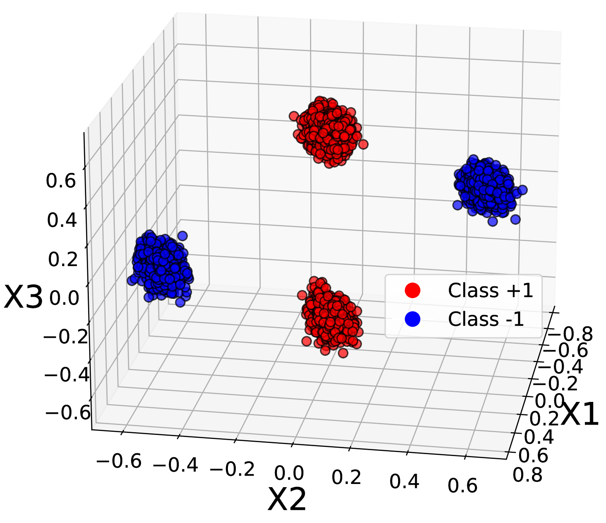

*(a)*


*(b)*

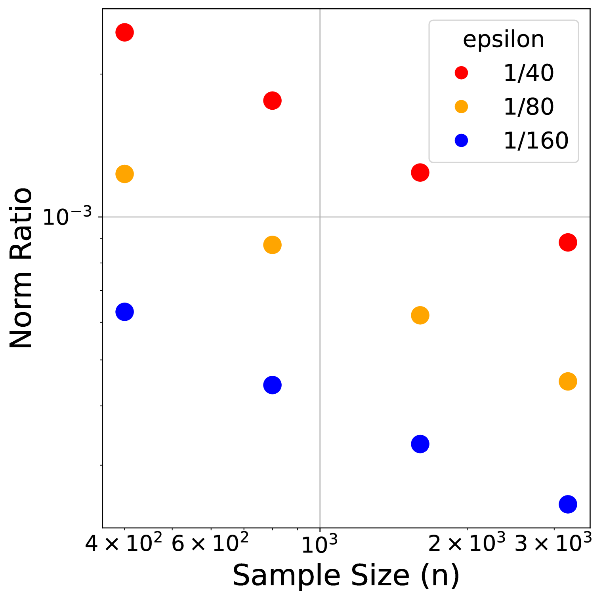

*(c)*

###### fig-5

*Рисунок 5: (a) Трёхмерное изображение распределения $P$ при вложении от слабой модели. При новом вложении кластеры хорошо разделены. (b) Отношение норм $r_{W}$ при разных значениях $p$ и $\varepsilon$ и постоянном размере выборки $n$; видно, что $r_{W}$ не зависит от $p$. (c) Отношение норм $r_{W}$ при разных значениях $n$ и $\varepsilon$ и постоянной размерности признаков $p$. Для каждого $\epsilon$ наклон около $-1/2$, что указывает на пропорциональность $r_{W}$ величине $1/\sqrt{n}$. Подробности постановки опыта — в приложении A.3.* **[p. 7]**

### 3.3 Теоретический разбор целевой модели

В этом разделе мы теоретически разбираем поведение GrokTransfer на данных XOR-кластеров. Целевой моделью мы считаем большую модель ширины $m$ вида $f_{L}(x)=\sum_{j=1}^{m}a_{j}\phi(\langle v_{j},U^{\top}x\rangle),$ где $U=[u_{1},u_{2},u_{3}]\in\mathbb{R}^{p\times 3}$ берётся из матрицы весов первого слоя $W^{(T)}$, выученной слабой моделью (изображена на рисунке 4(c)). Здесь $U$ — матрица вложения, переносимая от слабой модели $f_{S}$; она затем проходит ещё одно линейное преобразование (задаваемое $v_{j}$), образуя вложение в целевой модели. Следуя нашему наблюдению из раздела 3.2, мы можем записать

$$
u_{1}=[\mu_{2}^{\top},\delta_{1}^{\top}]^{\top},\quad u_{2}=[-\mu_{2}^{\top},\delta_{2}^{\top}]^{\top},\quad u_{3}=[-\mu_{1}^{\top},\delta_{3}^{\top}]^{\top},
$$

где $\mu_{1}=[1,1]^{\top},\mu_{2}=[-1,1]^{\top}$ — два ортогональных признака $P$, а $\delta_{j}=[\delta_{j,1},\cdots,\delta_{j,p-2}]^{\top}\in\mathbb{R}^{p-2}(j\in[3])$.111Не умаляя общности, мы полагаем, что слабая модель выучила три признака $[1,1],[-1,1],[-1,-1]$. Наш результат останется тем же для любых трёх признаков из четырёх $[\pm 1,\pm 1]$. Здесь мы полагаем $\delta=[\delta_{1},\delta_{2},\delta_{3}]=W_{3:p,\cdot}^{(T)}$. Для универсальной постоянной $C>1$ мы полагаем

1. Масштаб шума $\varepsilon\leq(n/(p\log^{3}n))^{\nicefrac{{1}}{{4}}}$. 2. Норма дополняющей подсети удовлетворяет $\|\delta\|_{\text{F}}\leq C\varepsilon\sqrt{p/n}.$ 3. Масштаб инициализации $v_{\text{init}}\leq C\log^{-\nicefrac{{3}}{{2}}}(n)$. 4. Величина шага $\sqrt{m}v_{\text{init}}/C\leq\alpha\leq\sqrt{m}v_{\text{init}}$. 5. Число нейронов удовлетворяет $m\geq 2\log^{3}n$.

Здесь допущение (A2) отвечает находке $r_{W}\propto\varepsilon/\sqrt{n}$ из раздела 3.2. Допущения (A1) и (A2) вместе обеспечивают достаточно большое SNR распределения $P$ в новом пространстве вложения. Допущение (A3) удерживает начальную норму весов целевой модели так, чтобы эмпирический риск начинался в разумных пределах. Допущение (A4) гарантирует, что величина шага уравновешена подобающе: не слишком мала, чтобы после одного шага градиентного спуска произошли содержательные обновления, и не слишком **[p. 8]** велика, чтобы вызвать чрезмерно резкие движения. Допущение (A5) обеспечивает достаточную ширину модели, гарантирующую определённые результаты о концентрации при случайной инициализации. Все допущения выполнены в эмпирической постановке, обсуждённой в разделе 3.2.

Мы обозначаем $a=[a_{1},\cdots,a_{m}]^{\top}\in\mathbb{R}^{m}$ и $V=[v_{1},\cdots,v_{m}]\in\mathbb{R}^{3\times p}$. Мы инициализируем $a$ и $V$ так:

$$
a_{j}\stackrel{{\scriptstyle i.i.d}}{{\sim}}\text{Uniform}(\{\pm 1/\sqrt{m}\}),\quad v_{j}\stackrel{{\scriptstyle i.i.d}}{{\sim}}\text{Uniform}(\{\pm v_{\text{init}}\}^{3}),\quad j\in[m],
$$

и держим $a$ и $U$ постоянными в ходе обучения.222Наш результат не изменится, если $a$ и $U$ тоже обучаемы. Мы держим их постоянными, чтобы упростить разбор, сохранив при этом основные мысли. Следуя способу обучения, изложенному в разделе 3.1, мы применяем на шаге $t$ градиентный спуск $V^{(t+1)}=V^{(t)}-\alpha\nabla_{V}\widehat{L}(f_{L}^{(t)})$ для обновления линейного слоя $V$, где $\alpha$ — величина шага, а эмпирический риск $\widehat{L}(\cdot)$ определён в разделе 3.1. При этих допущениях и инициализациях мы формулируем теорему, описывающую ошибку целевой модели на обучении и на тесте после одного шага.

##### **Теорема 3.2****.**

###### p8-3

*Пусть выполнены допущения (A1)–(A5). С вероятностью не менее $1-O(1/n^{2})$ по порождению обучающих данных и начальных весов $f_{L}$ после одного шага обучения классификатор $\mathop{\mathrm{sgn}}(f_{L}^{(1)}(x))$ верно классифицирует все обучающие точки и обобщает с ошибкой на тесте не более $\exp(-\Omega(\log^{2}n))$.*

###### p8-4

Теорема 3.2 показывает, что с GrokTransfer уже после одного шага градиентного спуска целевая модель переобучается на всех обучающих данных и достигает почти безупречной точности на тесте. Примечательно, что это происходит не в ядерном режиме, а в режиме обучения признакам. Поскольку модели при обычном обучении не достигают генерализации за один шаг (рисунок 4(a)), этот результат указывает, что наш метод GrokTransfer действенно повышает скорость генерализации целевой модели и устраняет разрыв во времени между переобучением и генерализацией. Эмпирически модель продолжает обобщать и при дальнейшем обучении (см. рисунок 9 в приложении A.3). Поскольку у более слабой модели $f_{S}$ всего три нейрона, вычислительная стоимость обучения $f_{S}$ пренебрежимо мала по сравнению со стоимостью обучения целевой модели $f_{L}$ достаточно большой ширины. Отсюда следует, что GrokTransfer может снизить общие вычислительные затраты. В следующем разделе мы сравним вычислительную стоимость нашего метода со стоимостью обычных процедур обучения.

## 4 Эксперименты

###### p8-5

Этот раздел эмпирически изучает GrokTransfer на модульном сложении и умножении, а также на задаче разрежённой чётности. Наши опыты подтверждают, что GrokTransfer действенно перекраивает динамику обучения и устраняет отложенную генерализацию и для полносвязных нейронных сетей (FNN), и для трансформеров (TF). Во всех опытах этого раздела применяется оптимизатор AdamW (Loshchilov & Hutter, 2019).


*(d) Модульное сложение*


*(e) Модульное умножение*

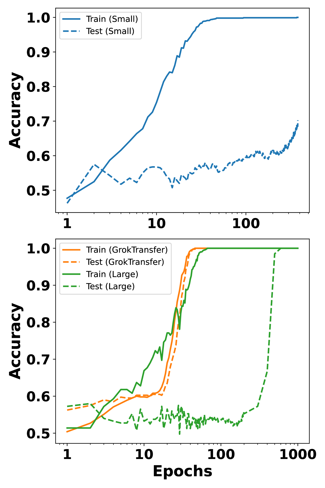

*(f) $(40,3)$-чётность*

*Рисунок 6: Динамика обучения FNN на разных задачах. Строки отвечают разным моделям и способам обучения: в первой строке — динамика слабой модели, используемой в GrokTransfer, во второй — динамика целевой модели, обученной с помощью GrokTransfer, и целевой модели, обученной с нуля. Столбцы отвечают разным задачам: первый — задаче модульного сложения, второй — модульного умножения, третий — задаче $(40,3)$-чётности. Сравнение первой и второй строк показывает, что целевая модель, обученная через GrokTransfer, способна превзойти качество слабой модели. Сравнение внутри второй строки показывает, что GrokTransfer устраняет резкий фазовый переход и позволяет модели продвигаться непрерывно. Подробности постановки опыта — в приложении A.3.* **[p. 9]**

### 4.1 FNN $\rightarrow$ FNN

###### p8-6

Сперва мы берём в качестве целевой модели трёхслойную FNN и проводим GrokTransfer на задачах модульного сложения, модульного умножения и $(q,k)$-чётности (Barak et al., 2022). Эти результаты сравниваются с обучением целевой модели с нуля. Задача модульного сложения введена в разделе 2.1, а модульное умножение определяется схожим образом с меткой $y=ab\text{ mod }p$. Задача $(q,k)$-чётности состоит из набора $\{(x,y):x\in\{\pm 1\}^{q},y=\prod_{i\in S}x_{i},|S|=k\}$. Следуя постановке Merrill et al. (2023), мы берём $q=40,k=3$ и $S=\{1,2,3\}$.

###### p8-7

Для задач модульного сложения и умножения мы берём в качестве слабой модели двухслойную нейронную сеть с обучаемым вложением и обучаем её $10^{4}$ эпох. Затем мы инициализируем целевую модель, положив её слой $A$ равным вложению, выученному слабой моделью. Рисунки 6 и 6 показывают динамику обучения слабой модели, целевой модели, обученной через GrokTransfer, и целевой модели, обученной с нуля. Примечательно, что GrokTransfer почти устраняет резкий фазовый переход, наблюдаемый при обычном обучении. Все гиперпараметры обучения (масштаб инициализации, скорость обучения, weight decay) выбраны перебором по сетке, а наилучшей считается настройка, быстрее всех достигающая $99\%$ точности на тесте. Колебания точностей во второй строке рисунка 6 связаны с «механизмом рогатки» (Thilak et al., 2022) и с неустойчивостями обучения при больших скоростях обучения (Wortsman et al., 2024). Поскольку считается, что большая скорость обучения и такого рода колебания **[p. 9]** помогают генерализации (Damian et al., 2023; Lu et al., 2024), мы не меняем свои правила выбора настройки.

###### p9-1

Для задачи чётности мы берём в качестве слабой модели трёхслойную FNN, поскольку эмпирические свидетельства указывают, что двухслойная FNN без свободных членов на этой задаче не обобщает. Слабая модель обучается, пока не достигнет $70\%$ точности на тесте, после чего матрица весов первого слоя переносится в целевую модель. Как показано на рисунке 6, слабая модель претерпевает задержку генерализации, а большая модель, наследующая её вложение, обобщает непрерывно.

**Абляционное исследование:** чтобы лучше понять эмпирическую действенность GrokTransfer, мы проводим абляционное исследование, меняя число эпох обучения слабой модели в задаче модульного сложения.


###### fig-7

*Рисунок 7: Абляционное исследование, показывающее влияние качества слабой модели на точность целевой модели на тесте (инициализированной через GrokTransfer и обученной $10^{4}$ эпох).* **[p. 9]**

###### p9-3

Мы извлекаем вложения слабой модели на эпохах $100,500,800,900,1000,1100,1500\text{ и }2000$. Для каждого вложения мы применяем GrokTransfer к целевой модели и обучаем её $10^{4}$ эпох. Чтобы измерить задержку генерализации целевой модели, мы определяем *временной разрыв* как разность между первой эпохой, на которой достигается $95\%$ точности на обучении, и первой эпохой, на которой достигается $95\%$ точности на тесте. Если целевая модель не достигает $95\%$ точности, мы полагаем $1/$*временной разрыв* $=0$. Рисунок 7 показывает, что качество целевой модели на тесте при инициализации вложением слабой модели положительно связано с качеством слабой модели на тесте. Грокнувшая слабая модель необходима, чтобы целевая модель достигла почти безупречной генерализации при наименьшей задержке. Мы выдвигаем гипотезу, что целевая модель обобщает хорошо лишь после того, как грокнула слабая.

### 4.2 FNN $\rightarrow$ трансформеры

###### p9-4

Любопытно, что вложения, извлечённые из слабой модели FNN, переносимы в целевую модель, даже когда целевая модель — трансформер, сравнимый по размеру с GPT2-small (Radford et al., 2019). В такой постановке FNN $\rightarrow$ TF GrokTransfer по-прежнему смягчает задержку генерализации целевой модели. А именно, в качестве целевой мы берём трансформер **[p. 10]** с $8$ слоями внимания и $(d_{\text{embed}},d_{\text{mlp}},n_{\text{head}})=(512,512,4)$. Для каждого примера вход — последовательность из двух токенов $(a,b)$. Мы извлекаем вложения слабой модели с рисунка 6 в тот момент, когда она впервые достигает $30\%$ точности на тесте. Рисунок 8(a) показывает, что GrokTransfer позволяет целевой модели обобщать много быстрее, чем при обучении с нуля, и почти не обнаруживать задержки генерализации. Здесь оба способа страдают от неустойчивости обучения при больших скоростях обучения.

###### p10-1

Мерой вычислительной стоимости мы берём время по часам. Вычислительная стоимость GrokTransfer складывается из обучения слабой модели и обучения целевой. Таблица 1 приводит общее время по часам для слабой модели, целевой модели с GrokTransfer и целевой модели, обученной с нуля. Время, потраченное на обучение слабой модели FNN, пренебрежимо мало по сравнению с обучением целевого трансформера. Общее время GrokTransfer примерно в пять раз меньше, чем при обучении с нуля.

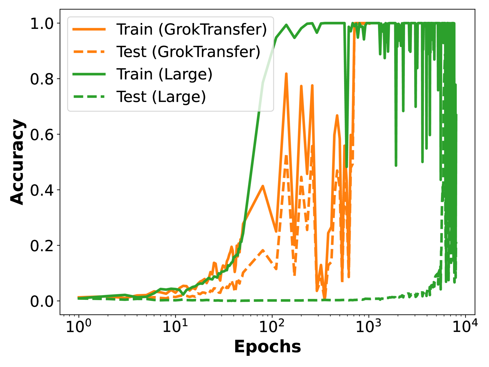

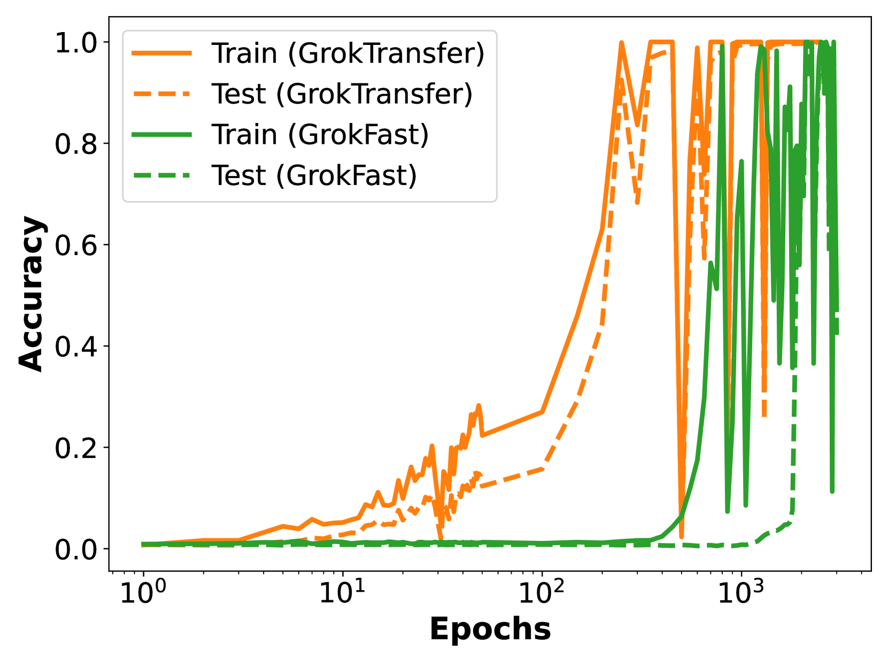

###### fig-8

*Рисунок 8: Динамика обучения трансформеров на задаче модульного сложения. Слабая модель — трёхслойная FNN. (a) Динамика целевой модели ($8$-слойного трансформера), обученной через GrokTransfer, и целевой модели, обученной с нуля. (b) Динамика целевой модели (двухслойного трансформера), обученной через GrokTransfer, и целевой модели, обученной через GrokFast (Lee et al., 2024).* **[p. 10]**

###### tab-1

*Таблица 1: Сравнение общего времени по часам (прямые и обратные проходы) для разных моделей. Слабая модель — трёхслойная FNN. Целевая (большая) модель — $8$-слойный трансформер.* **[p. 10]**

| **Модель** | **Слабая** | **Целевая** (GrokTransfer) | **Целевая** (с нуля) | |---|---|---|---| | Общее время по часам (мс) | 2828 | 71079 | 392667 |

###### p10-2

Lee et al. (2024) предложили алгоритм усиления градиента GrokFast для ускорения гроккинга. Мы сравниваем GrokTransfer с GrokFast на рисунке 8(b). Переносимое вложение слабой модели то же, что и на рисунке 8(a). В качестве целевой модели мы следуем модели из Lee et al. (2024) — двухслойному трансформеру только с декодером и $(d_{\text{embed}},d_{\text{mlp}},n_{\text{head}})=(128,512,4)$. *Временной разрыв* GrokTransfer равен $46$, тогда как у GrokFast он равен $1119$.

## 5 Заключение

Чтобы устранить непредсказуемость, связанную с гроккингом, мы предложили GrokTransfer — новый метод, действенно ускоряющий гроккинг переносом вложения от более слабой модели. Наш метод навеян ключевым наблюдением: вложение данных решающим образом формирует динамику обучения. Мы теоретически обосновали GrokTransfer на задаче классификации XOR. Мы также эмпирически оценили его на разных алгоритмических задачах, о которых известно, что при обычном обучении они обнаруживают гроккинг. Наши результаты показали, что GrokTransfer способен действенно изменить динамику обучения, обеспечив непрерывное продвижение качества модели.

###### p10-4

Одно из ограничений нашей работы в том, что теоретический результат рассматривает лишь сравнительно простую задачу XOR. Для этой задачи после переноса вложения от меньшей модели одного шага градиентного спуска достаточно и для запоминания, и для генерализации. Теоретическое обоснование для более сложных задач — важное направление будущей работы. Кроме того, наш метод сосредоточен исключительно на ускорении гроккинга и исследован лишь на задачах, где гроккинг случается. Было бы занятно изучить, применимы ли схожие мысли для улучшения динамики обучения или для генерализации от слабого к сильному в более широком смысле.

**[p. 11]**

## Благодарности

Эта работа поддержана отчасти Управлением военно-морских исследований по гранту N00014-23-1-2590, Национальным научным фондом по грантам № 2231174, № 2310831, № 2428059, № 2435696, № 2440954, а также грантом Propelling Original Data Science (PODS) Мичиганского института науки о данных.

**[p. 12]**

## Литература

- Boaz Barak, Benjamin Edelman, Surbhi Goel, Sham Kakade, Eran Malach, and Cyril Zhang. Hidden progress in deep learning: Sgd learns parities near the computational limit. *Advances in Neural Information Processing Systems*, 35:21750–21764, 2022.

- Collin Burns, Pavel Izmailov, Jan Hendrik Kirchner, Bowen Baker, Leo Gao, Leopold Aschenbrenner, Yining Chen, Adrien Ecoffet, Manas Joglekar, Jan Leike, Ilya Sutskever, and Jeff Wu. Weak-to-strong generalization: Eliciting strong capabilities with weak supervision. *arXiv preprint arXiv:2312.09390*, 2023.

- Angelica Chen, Ravid Shwartz-Ziv, Kyunghyun Cho, Matthew L Leavitt, and Naomi Saphra. Sudden drops in the loss: Syntax acquisition, phase transitions, and simplicity bias in MLMs. In *The Twelfth International Conference on Learning Representations*, 2024. URL https://openreview.net/forum?id=MO5PiKHELW.

- Bilal Chughtai, Lawrence Chan, and Neel Nanda. A toy model of universality: Reverse engineering how networks learn group operations. In *International Conference on Machine Learning*, pp. 6243–6267. PMLR, 2023.

- Alex Damian, Eshaan Nichani, and Jason D. Lee. Self-stabilization: The implicit bias of gradient descent at the edge of stability. In *The Eleventh International Conference on Learning Representations*, 2023. URL https://openreview.net/forum?id=nhKHA59gXz.

- Xander Davies, Lauro Langosco, and David Krueger. Unifying grokking and double descent. *arXiv preprint arXiv:2303.06173*, 2023.

- Darshil Doshi, Tianyu He, Aritra Das, and Andrey Gromov. Grokking modular polynomials. *arXiv preprint arXiv:2406.03495*, 2024.

- Hiroki Furuta, Minegishi Gouki, Yusuke Iwasawa, and Yutaka Matsuo. Interpreting grokked transformers in complex modular arithmetic. *arXiv preprint arXiv:2402.16726*, 2024.

- Pulkit Gopalani, Ekdeep S Lubana, and Wei Hu. Abrupt learning in transformers: A case study on matrix completion. *Advances in Neural Information Processing Systems*, 37:55053–55085, 2025.

- Andrey Gromov. Grokking modular arithmetic. *arXiv preprint arXiv:2301.02679*, 2023.

- Tianyu He, Darshil Doshi, Aritra Das, and Andrey Gromov. Learning to grok: Emergence of in-context learning and skill composition in modular arithmetic tasks. *arXiv preprint arXiv:2406.02550*, 2024.

- Ahmed Imtiaz Humayun, Randall Balestriero, and Richard Baraniuk. Deep networks always grok and here is why. *arXiv preprint arXiv:2402.15555*, 2024.

- Jared Kaplan, Sam McCandlish, Tom Henighan, Tom B Brown, Benjamin Chess, Rewon Child, Scott Gray, Alec Radford, Jeffrey Wu, and Dario Amodei. Scaling laws for neural language models. *arXiv preprint arXiv:2001.08361*, 2020.

- Tanishq Kumar, Blake Bordelon, Samuel J. Gershman, and Cengiz Pehlevan. Grokking as the transition from lazy to rich training dynamics. In *The Twelfth International Conference on Learning Representations*, 2024.

- Jaerin Lee, Bong Gyun Kang, Kihoon Kim, and Kyoung Mu Lee. Grokfast: Accelerated grokking by amplifying slow gradients. *arXiv preprint arXiv:2405.20233*, 2024.

- Ziming Liu, Ouail Kitouni, Niklas S Nolte, Eric Michaud, Max Tegmark, and Mike Williams. Towards understanding grokking: An effective theory of representation learning. *Advances in Neural Information Processing Systems*, 35:34651–34663, 2022.

- Ziming Liu, Eric J Michaud, and Max Tegmark. Omnigrok: Grokking beyond algorithmic data. In *The Eleventh International Conference on Learning Representations*, 2023.

**[p. 13]**

- Ilya Loshchilov and Frank Hutter. Decoupled weight decay regularization. In *International Conference on Learning Representations*, 2019. URL https://openreview.net/forum?id=Bkg6RiCqY7.

- Miao Lu, Beining Wu, Xiaodong Yang, and Difan Zou. Benign oscillation of stochastic gradient descent with large learning rate. In *The Twelfth International Conference on Learning Representations*, 2024. URL https://openreview.net/forum?id=wYmvN3sQpG.

- Kaifeng Lyu, Jikai Jin, Zhiyuan Li, Simon Shaolei Du, Jason D Lee, and Wei Hu. Dichotomy of early and late phase implicit biases can provably induce grokking. In *The Twelfth International Conference on Learning Representations*, 2024.

- Neil Mallinar, Daniel Beaglehole, Libin Zhu, Adityanarayanan Radhakrishnan, Parthe Pandit, and Mikhail Belkin. Emergence in non-neural models: grokking modular arithmetic via average gradient outer product. *arXiv preprint arXiv:2407.20199*, 2024.

- William Merrill, Nikolaos Tsilivis, and Aman Shukla. A tale of two circuits: Grokking as competition of sparse and dense subnetworks. *arXiv preprint arXiv:2303.11873*, 2023.

- Jack Miller, Charles O’Neill, and Thang Bui. Grokking beyond neural networks: An empirical exploration with model complexity. *arXiv preprint arXiv:2310.17247*, 2023.

- Gouki Minegishi, Yusuke Iwasawa, and Yutaka Matsuo. Bridging lottery ticket and grokking: Is weight norm sufficient to explain delayed generalization? In *ICLR 2024 Workshop on Bridging the Gap Between Practice and Theory in Deep Learning*, 2024.

- Mohamad Amin Mohamadi, Wonho Bae, and Danica J Sutherland. A fast, well-founded approximation to the empirical neural tangent kernel. In *International Conference on Machine Learning*, pp. 25061–25081. PMLR, 2023.

- Mohamad Amin Mohamadi, Zhiyuan Li, Lei Wu, and Danica J Sutherland. Why do you grok? a theoretical analysis of grokking modular addition. *arXiv preprint arXiv:2407.12332*, 2024.

- Depen Morwani, Benjamin L. Edelman, Costin-Andrei Oncescu, Rosie Zhao, and Sham M. Kakade. Feature emergence via margin maximization: case studies in algebraic tasks. In *The Twelfth International Conference on Learning Representations*, 2024. URL https://openreview.net/forum?id=i9wDX850jR.

- Neel Nanda, Lawrence Chan, Tom Lieberum, Jess Smith, and Jacob Steinhardt. Progress measures for grokking via mechanistic interpretability. In *The Eleventh International Conference on Learning Representations*, 2023.

- OpenAI. text-embedding-3-small model. https://platform.openai.com/docs/models/embedding-3, 2024.

- Alethea Power, Yuri Burda, Harri Edwards, Igor Babuschkin, and Vedant Misra. Grokking: Generalization beyond overfitting on small algorithmic datasets. *arXiv preprint arXiv:2201.02177*, 2022.

- Alec Radford, Jeffrey Wu, Rewon Child, David Luan, Dario Amodei, Ilya Sutskever, et al. Language models are unsupervised multitask learners. *OpenAI blog*, 1(8):9, 2019.

- Vimal Thilak, Etai Littwin, Shuangfei Zhai, Omid Saremi, Roni Paiss, and Joshua Susskind. The slingshot mechanism: An empirical study of adaptive optimizers and the grokking phenomenon. *arXiv preprint arXiv:2206.04817*, 2022.

- Vikrant Varma, Rohin Shah, Zachary Kenton, János Kramár, and Ramana Kumar. Explaining grokking through circuit efficiency. *arXiv preprint arXiv:2309.02390*, 2023.

- Boshi Wang, Xiang Yue, Yu Su, and Huan Sun. Grokked transformers are implicit reasoners: A mechanistic journey to the edge of generalization. *arXiv preprint arXiv:2405.15071*, 2024.

**[p. 14]**

- Peihao Wang, Rameswar Panda, Lucas Torroba Hennigen, Philip Greengard, Leonid Karlinsky, Rogerio Feris, David Daniel Cox, Zhangyang Wang, and Yoon Kim. Learning to grow pretrained models for efficient transformer training. In *The Eleventh International Conference on Learning Representations*, 2023. URL https://openreview.net/forum?id=cDYRS5iZ16f.

- Mitchell Wortsman, Peter J Liu, Lechao Xiao, Katie E Everett, Alexander A Alemi, Ben Adlam, John D Co-Reyes, Izzeddin Gur, Abhishek Kumar, Roman Novak, Jeffrey Pennington, Jascha Sohl-Dickstein, Kelvin Xu, Jaehoon Lee, Justin Gilmer, and Simon Kornblith. Small-scale proxies for large-scale transformer training instabilities. In *The Twelfth International Conference on Learning Representations*, 2024. URL https://openreview.net/forum?id=d8w0pmvXbZ.

- Zhiwei Xu, Yutong Wang, Spencer Frei, Gal Vardi, and Wei Hu. Benign overfitting and grokking in ReLU networks for XOR cluster data. In *The Twelfth International Conference on Learning Representations*, 2024.

- Yongyi Yang, Core Francisco Park, Ekdeep Singh Lubana, Maya Okawa, Wei Hu, and Hidenori Tanaka. Dynamics of concept learning and compositional generalization. In *The Thirteenth International Conference on Learning Representations*, 2025. URL https://openreview.net/forum?id=s1zO0YBEF8.

- Xuekai Zhu, Yao Fu, Bowen Zhou, and Zhouhan Lin. Critical data size of language models from a grokking perspective. *arXiv preprint arXiv:2401.10463*, 2024.

- Bojan Žunkovič and Enej Ilievski. Grokking phase transitions in learning local rules with gradient descent. *arXiv preprint arXiv:2210.15435*, 2022.

## Приложение A

\localtableofcontents

### A.1 Доказательства

#### A.1.1 Доказательство леммы 3.1

См. 3.1

**[p. 15]**

##### Доказательство.

Для любых $(x,y)\sim P$ определим $x^{\prime}=(x_{1},-x_{2},x_{3},\cdots,x_{p})$ и $y^{\prime}=\mathop{\mathrm{sgn}}(x_{1}^{\prime}x_{2}^{\prime})=-y$. Достаточно показать, что если $y=\mathop{\mathrm{sgn}}(f(x)),y=\mathop{\mathrm{sgn}}(f(-x)),y^{\prime}=\mathop{\mathrm{sgn}}(f(x^{\prime}))$, то $y^{\prime}\neq\mathop{\mathrm{sgn}}(f(-x^{\prime}))$ с вероятностью $1$.

Положим $y=\mathop{\mathrm{sgn}}(f(x))$ и $y=\mathop{\mathrm{sgn}}(f(-x))$. Поскольку $\phi(z)\geq 0,\forall z$, равенство $y=\mathop{\mathrm{sgn}}(f(x))$ влечёт существование хотя бы одного $i\in[3]$, для которого $a_{i}$ имеет тот же знак, что и $y$, и $w_{i}^{\top}x>0$. Не умаляя общности, положим $\mathop{\mathrm{sgn}}(a_{1})=y,w_{1}^{\top}x>0$. Тогда для $(-x,-y)$ следует, что

$$
f(-x)=\sum_{j=1}^{3}a_{j}\phi(-w_{j}^{\top}x)=a_{2}\phi(-w_{2}^{\top}x)+a_{3}\phi(-w_{3}^{\top}x)
$$

имеет тот же знак, что и $y$. Снова не умаляя общности, положим $\mathop{\mathrm{sgn}}(a_{2})=y$.

Если выполнены $y^{\prime}=\mathop{\mathrm{sgn}}(f(x^{\prime}))$ и $y^{\prime}\neq\mathop{\mathrm{sgn}}(f(-x^{\prime}))$, то, следуя тому же рассуждению, получаем, что по меньшей мере два $a_{i}$ имеют тот же знак, что и $y^{\prime}=-y$, а это противоречит прежнему предположению $\mathop{\mathrm{sgn}}(a_{1})=\mathop{\mathrm{sgn}}(a_{2})=y$. ∎

#### A.1.2 Доказательство теоремы 3.2

#### Дополнительные обозначения:

Для обучающего набора $\{(x_{i},y_{i})\}_{i=1}^{n}$ мы обозначаем сигнал $x_{i}$ через $\bar{x}_{i}=[x_{i,1},x_{i,2}]^{\top}\in\{\pm\mu_{1},\pm\mu_{2}\}$. Для каждого $\mu\in\{\pm\mu_{1},\pm\mu_{2}\}$ определим

$$
\mathcal{I}_{\mu}=\{i\in[n]:\bar{x}_{i}=\mu\}
$$

и $n_{\mu}=|\mathcal{I}_{\mu}|$. Обозначим новое вложение $i$-й точки данных через $z_{i}=U^{\top}x_{i},i\in[n]$. Определим

$$
\nu_{i}=[\mu_{2},-\mu_{2},-\mu_{1}]^{\top}\mu_{i},\quad i=1,2.
$$

Тогда $\nu_{1}=[0,0,-2],\nu_{2}=[2,-2,0]$, и **[p. 16]** $\{\pm\nu_{1},\pm\nu_{2}\}$ становятся признаками $P$ при новом вложении. Обозначим сигнал $z_{i}$ через $\bar{z}_{i}=[\mu_{2},-\mu_{2},-\mu_{1}]^{\top}\bar{x}_{i}$. Определим множество обучающих данных

$$
\mathcal{G}_{\mathop{\mathrm{data}}}=\{\{(x_{i},y_{i})\}_{i=1}^{n}:\|z_{i}-\bar{z}_{i}\|\leq\varepsilon^{2}\sqrt{\frac{p}{n}}\log n,\text{ for all }i\in[n]\}.
$$

По лемме A.2 имеем $\mathbb{P}(\{(x_{i},y_{i})\}_{i=1}^{n}\in\mathcal{G}_{\mathop{\mathrm{data}}})\geq 1-\exp(-\Omega(\log^{2}n))$. Далее для удобства рассуждения мы определяем множества, разделяющие коэффициенты второго слоя:

$$
\mathcal{J}_{\mathop{\mathrm{Pos}}}=\{j\in[m]:a_{j}>0\};\quad\mathcal{J}_{\mathop{\mathrm{Neg}}}=\{j\in[m]:a_{j}<0\}.
$$

Мы разбиваем номера нейронов по их инициализации и определяем $\mathcal{J}_{e}=\{j\in[m]:v_{j}^{(0)}=v_{\text{init}}e\}$ для $e\in\text{Uniform}(\{\pm 1\})^{3}$. Далее определим

$$
\mathcal{J}_{\mathop{\mathrm{Pos}},e}=\mathcal{J}_{\mathop{\mathrm{Pos}}}\cap\mathcal{J}_{e};\quad\mathcal{J}_{\mathop{\mathrm{Neg}},e}=\mathcal{J}_{\mathop{\mathrm{Neg}}}\cap\mathcal{J}_{e}.
$$

Для каждой инициализации $v_{j}^{(0)}$ мы обозначаем множество точек данных, имеющих с ней положительное скалярное произведение, через

$$
\mathcal{I}_{e,\mu}=\{i\in\mathcal{I}_{\mu}:\langle e,z_{i}\rangle>0\},\quad e\in\text{Uniform}(\{\pm 1\}^{3}),\mu\in\{\pm\mu_{1},\pm\mu_{2}\}.
$$

См. 3.2

##### Доказательство.

Для краткости в доказательстве ниже мы опускаем нижний индекс $L$ в $f_{L}$.

На шаге $t=0$: для каждой $(x_{i},y_{i})$ имеем

$$
f^{(0)}(x_{i})=\sum_{j=1}^{m}a_{j}\phi(\langle v_{j}^{(0)},z_{i}\rangle),
$$

где $a_{j}\phi(\langle v_{j}^{(0)},z_{i}\rangle),j\in[m]$ — ограниченные случайные величины с нулевым средним. Абсолютная граница равна

$$
|a_{j}\phi(\langle v_{j}^{(0)},z_{i}\rangle)|\leq\frac{\sqrt{3}v_{\text{init}}}{\sqrt{m}}(\max_{i}\|\bar{z}_{i}\|+\varepsilon^{2}\sqrt{p/n}\log n)\leq 5v_{\text{init}}/\sqrt{m},
$$

где первое неравенство пользуется леммой A.2, а второе — равенством $\max_{i}\|\bar{z}_{i}\|=2\sqrt{2}$ и допущением (A1). Тогда по неравенству Хёфдинга и формуле полной вероятности

$$
\mathbb{P}(|f^{(0)}(x_{i})|>t)\leq\mathbb{P}(|f^{(0)}(x_{i})|>t|\mathcal{G}_{\mathop{\mathrm{data}}})+\mathbb{P}(\mathcal{G}_{\mathop{\mathrm{data}}})\leq 2\exp\Big{(}-\frac{2t^{2}}{25v_{\text{init}}^{2}}\Big{)}+\exp(-\Omega(\log^{2}n)).
$$

Положим $t=v_{\text{init}}\log n$. Отсюда следует

$$
\begin{split}\mathbb{P}(\max_{i\in[n]}|f^{(0)}(x_{i})|\leq t)&\geq 1-\sum_{i=1}^{n}\mathbb{P}(|f^{(0)}(x_{i})|>t)\\
&\geq 1-2n\exp(-\frac{2\log^{2}n}{25})-n\exp(-\Omega(\log^{2}n))=1-\exp(-\Omega(\log^{2}n)).\end{split} \tag{1}
$$

Мы определяем множество обучающих данных и начальных весов:

$$
\begin{split}\mathcal{G}=\Big{\{}(\{(x_{i},y_{i})\}_{i=1}^{n},a,V^{(0)}):\{(&x_{i},y_{i})\}_{i=1}^{n}\in\mathcal{G}_{\mathop{\mathrm{data}}},\text{condition\eqref{eq:last-condition} and }\\
&\text{all conditions in Lemma \ref{lem:init-neuron-alignment} and \ref{lem: xor-initialization_properties} hold}\Big{\}}.\end{split}
$$

Сочетая (1), леммы A.1, A.2 и A.4 и применяя оценку объединения, получаем

$$
\mathbb{P}((\{(x_{i},y_{i})\}_{i=1}^{n},a,V^{(0)})\in\mathcal{G})\geq 1-\exp(-\Omega(\log^{2}n))-O(\frac{1}{n^{2}})-O(\frac{1}{n^{4}})=1-O(\frac{1}{n^{2}}).
$$

Обозначим **[p. 17]** $l^{(t)}_{i}=l(y_{i},f^{(t)}(x_{i}))=\exp(-y_{i}f^{(t)}(x_{i}))$. При условии $\mathcal{G}$ отношение наибольшей потери к наименьшей ограничено так:

$$
R^{(0)}:=\frac{\max_{i\in[n]}l^{(0)}_{i}}{\min_{i\in[n]}l^{(0)}_{i}}\leq\exp(2v_{\text{init}}\log n). \tag{2}
$$

Ниже для каждого $j$ мы разберём шаг градиентного спуска для всех возможных сочетаний $a_{j}^{(0)},v_{j}^{(0)}$ при условии события $\mathcal{G}$.

**(1)** Когда $a_{j}>0$: если $v_{j}^{(0)}=v_{\text{init}}[1,1,1]$, то по лемме A.1 имеем

$$
\mathcal{I}_{[1,1,1],+\mu_{1}}=\varnothing;\quad\mathcal{I}_{[1,1,1],-\mu_{1}}=\mathcal{I}_{-\mu_{1}};\quad\Big{|}|\mathcal{I}_{[1,1,1],\mu}|-\frac{n_{\mu}}{2}\Big{|}\leq\sqrt{n\log n},\mu=\pm\mu_{2}. \tag{3}
$$

Напомним, что шаг градиентного спуска для $v_{j}^{(t)}$ есть

$$
v_{j}^{(t+1)}=v_{j}^{(t)}+\frac{\alpha}{n}a_{j}\sum_{i=1}^{n}y_{i}\exp(-y_{i}f^{(t)}(x_{i}))\phi^{\prime}(\langle v_{j}^{(t)},z_{i}\rangle)z_{i}. \tag{4}
$$

Отсюда следует

$$
\begin{split}v_{j,3}^{(1)}&=v_{j,3}^{(0)}+\frac{\alpha}{n}a_{j}\sum_{i=1}^{n}y_{i}l^{(0)}_{i}\phi^{\prime}(\langle v_{j}^{(0)},z_{i}\rangle)z_{i,3}\\
&=v_{j,3}^{(0)}+\frac{\alpha}{n}a_{j}\sum_{i\in\mathcal{I}_{-\mu_{1}}}y_{i}l^{(0)}_{i}z_{i,3}+\frac{\alpha}{n}a_{j}\sum_{i\in\mathcal{I}_{[1,1,1],\mu_{2}}\cup\mathcal{I}_{[1,1,1],-\mu_{2}}}y_{i}l^{(0)}_{i}z_{i,3}\\
&\geq v_{\text{init}}+\frac{2\alpha}{n\sqrt{m}}\sum_{i\in\mathcal{I}_{-\mu_{1}}}l^{(0)}_{i}-O(\frac{\alpha}{\sqrt{m}}\max_{i}l^{(0)}_{i}\varepsilon^{2}\sqrt{\frac{p}{n}}\log n)\\
&\geq v_{\text{init}}+\frac{1.9\alpha|\mathcal{I}_{-\mu_{1}}|}{n\sqrt{m}}\exp(-v_{\text{init}}\log n)\geq v_{\text{init}}+\frac{1.9\alpha}{4\sqrt{m}}(1-\frac{4}{\log n})(1-v_{\text{init}}\log n)\\
&\geq v_{\text{init}}+\frac{2\alpha}{5\sqrt{m}},\end{split} \tag{5}
$$

где первое неравенство пользуется леммой A.2 и равенством $\bar{z}_{i,3}=0,i\in\mathcal{I}_{\pm\mu_{2}}$; второе — допущениями (A1), (A3) и (A4); третье — леммой A.4 и неравенством $\exp(x)\geq 1+x$. Далее для $l=1,2,$ имеем

$$
\begin{split}\big{|}v_{j,l}^{(1)}-v_{j,l}^{(0)}\big{|}&=\Big{|}\frac{\alpha}{n}a_{j}\sum_{i\in\mathcal{I}_{-\mu_{1}}}y_{i}l^{(0)}_{i}z_{i,l}+\frac{\alpha}{n}a_{j}\sum_{i\in\mathcal{I}_{[1,1,1],\mu_{2}}\cup\mathcal{I}_{[1,1,1],-\mu_{2}}}y_{i}l^{(0)}_{i}z_{i,l}\Big{|}\\
&=\frac{\alpha}{n}a_{j}\Big{|}\sum_{i\in\mathcal{I}_{-\mu_{1}}\cup\mathcal{I}_{[1,1,1],\mu_{2}}\cup\mathcal{I}_{[1,1,1],-\mu_{2}}}y_{i}l^{(0)}_{i}(z_{i,l}-\bar{z}_{i,l})\\
&\quad\quad\quad\quad\quad-\Big{[}\sum_{i\in\mathcal{I}_{[1,1,1],\mu_{2}}}l^{(0)}_{i}\bar{z}_{i,l}+\sum_{i\in\mathcal{I}_{[1,1,1],-\mu_{2}}}l^{(0)}_{i}\bar{z}_{i,l}\Big{]}\Big{|}\\
&\leq\frac{\alpha}{\sqrt{m}}\exp(v_{\text{init}}\log n)\varepsilon^{2}\sqrt{\frac{p}{n}}\log n+\frac{2\alpha}{n\sqrt{m}}\Big{|}\sum_{i\in\mathcal{I}_{[1,1,1],\mu_{2}}}l^{(0)}_{i}-\sum_{i\in\mathcal{I}_{[1,1,1],-\mu_{2}}}l^{(0)}_{i}\Big{|}\\
&\leq\frac{\alpha}{\sqrt{m}}\exp(v_{\text{init}}\log n)\varepsilon^{2}\sqrt{\frac{p}{n}}\log n+\frac{2\alpha}{n\sqrt{m}}\exp(v_{\text{init}}\log n)\Big{(}\frac{n}{8}+\frac{n}{2\log n}\\
&\quad\quad+\sqrt{n\log n}-\exp(-2v_{\text{init}}\log n)(\frac{n}{8}-\frac{n}{2\log n}-\sqrt{n\log n})\Big{)}\\
&\leq C\frac{\alpha\varepsilon^{2}\sqrt{p}}{\sqrt{mn}}\log n+C\frac{\alpha}{n\sqrt{m}}\Big{(}\frac{n}{\log n}+v_{\text{init}}n\log n\Big{)}\leq C\frac{\alpha}{\sqrt{m\log n}},\end{split} \tag{6}
$$

где первое неравенство пользуется (2) и равенством $\bar{z}_{i,l}=-\bar{z}_{j,l}$ для $i\in\mathcal{I}_{[1,1,1],\mu_{2}},j\in\mathcal{I}_{[1,1,1],-\mu_{2}}$; второе — (2), (3) и (B4) из леммы A.4; третье — допущениями (A1)–(A5); а последнее — допущениями (A1), (A3) и (A4).

Для точки данных $(x,y)\sim P$ определим $z=[z_{1},z_{2},z_{3}]^{\top}=U^{\top}x$. Применяя лемму A.3, получаем

$$
\mathbb{P}(\|z-\bar{z}\|\leq\varepsilon^{2}\sqrt{\frac{p}{n}}\log n)\geq 1-\exp(-\Omega(\log^{2}n)).
$$

При условии

$$
\|z-\bar{z}\|\leq\varepsilon^{2}\sqrt{\frac{p}{n}}\log n, \tag{7}
$$

если $x_{\text{signal}}=-\mu_{1}$, то, сочетая (5) и (6), имеем

$$
\langle{v_{j}^{(1)}},{z}\rangle=\langle{v_{j}^{(1)}},{\bar{z}}\rangle+\langle{v_{j}^{(1)}},{z-\bar{z}}\rangle\geq 2(v_{\text{init}}+\frac{2\alpha}{5\sqrt{m}})-Cv_{\text{init}}\varepsilon^{2}\sqrt{\frac{p}{n}}\log n\geq\frac{3}{2}(v_{\text{init}}+\frac{2\alpha}{5\sqrt{m}}). \tag{8}
$$

Далее для любой пары $j_{1},j_{2}$ с $v_{j_{1}}^{(0)}=v_{j_{2}}^{(0)}=v_{\text{init}}[1,1,1]$ и $a_{j_{1}}>0,a_{j_{2}}<0$:

Если $\langle{v_{j_{2}}^{(1)}},{z}\rangle<0$, то следует

$$
\begin{split}z_{3}\frac{\alpha}{n\sqrt{m}}\sum_{i=1}^{n}y_{i}l^{(0)}_{i}\phi^{\prime}(\langle v_{j_{2}}^{(0)},z_{i}\rangle)z_{i,3}&=-\langle{v_{j_{2}}^{(1)}},{z}\rangle+z_{3}v_{j_{2},3}^{(0)}+\sum_{l=1}^{2}z_{l}v_{j_{1},l}^{(1)}\\
&\geq z_{3}v_{\text{init}}-\sum_{l=1}^{2}|z_{l}-\bar{z}_{l}||v_{j_{2},l}^{(1)}|\\
&\geq z_{3}v_{\text{init}}-2\varepsilon^{2}\sqrt{\frac{p}{n}}\log n\big{(}v_{\text{init}}+C\frac{\alpha}{\sqrt{m\log n}}\big{)}\geq\frac{z_{3}}{2}v_{\text{init}},\end{split} \tag{9}
$$

где первое неравенство пользуется **[p. 18]** равенствами $v_{j_{2},3}^{(0)}=v_{\text{init}}$ и $\bar{z}_{l}=0,l=1,2$; второе — (7); а последнее — условием (7), равенством $\bar{z}_{3}=2$ и допущениями (A1), (A3) и (A4). Сочетая (5) и (9), имеем

$$
\frac{\alpha}{n\sqrt{m}}\sum_{i=1}^{n}y_{i}l^{(0)}_{i}\phi^{\prime}(\langle v_{j_{2}}^{(0)},z_{i}\rangle)z_{i,3}\geq\max\{\frac{v_{\text{init}}}{2},\frac{2\alpha}{5\sqrt{m}}\},
$$

что вместе с (6) даёт

$$
\begin{split}&a_{j_{1}}\phi(\langle{v_{j_{1}}^{(1)}},{z}\rangle)+a_{j_{2}}\phi(\langle{v_{j_{2}}^{(1)}},{z}\rangle)=a_{j_{1}}\langle{v_{j_{1}}^{(1)}},{z}\rangle\\
&=\frac{1}{\sqrt{m}}\Big{[}\langle{v_{j_{1}}^{(0)}},{z}\rangle+\frac{\alpha}{n\sqrt{m}}z_{3}\sum_{i=1}^{n}y_{i}l^{(0)}_{i}\phi^{\prime}(\langle v_{j_{2}}^{(0)},z_{i}\rangle)z_{i,3}+\sum_{l=1}^{2}(v_{j_{1},l}^{(1)}-v_{j_{1},l}^{(0)})z_{l}\Big{]}\\
&\geq\frac{1}{\sqrt{m}}\Big{[}v_{\text{init}}+\max\{\frac{v_{\text{init}}}{2},\frac{2\alpha}{5\sqrt{m}}\}-Cv_{\text{init}}\varepsilon^{2}\sqrt{\frac{p}{n}}\log n-C\frac{\alpha}{\sqrt{m\log n}}\varepsilon^{2}\sqrt{\frac{p}{n}}\log n\Big{]}\\
&\geq\frac{1}{\sqrt{m}}\Big{[}v_{\text{init}}+\frac{v_{\text{init}}}{4}+\frac{\alpha}{5\sqrt{m}}-Cv_{\text{init}}\varepsilon^{2}\sqrt{\frac{p}{n}}\log n-C\frac{\alpha}{\sqrt{m\log n}}\varepsilon^{2}\sqrt{\frac{p}{n}}\log n\Big{]}\\
&\geq\frac{v_{\text{init}}}{\sqrt{m}}+\frac{\alpha}{10m},\end{split} \tag{10}
$$

где второе неравенство пользуется $\max(x,y)\geq(x+y)/2$, а последнее — тем, что $n$ достаточно велико.

Если $\langle{v_{j_{2}}^{(1)}},{z}\rangle>0$, имеем

$$
\begin{split}&a_{j_{1}}\phi(\langle{v_{j_{1}}^{(1)}},{z}\rangle)+a_{j_{2}}\phi(\langle{v_{j_{2}}^{(1)}},{z}\rangle)=\frac{1}{\sqrt{m}}\langle{v_{j_{1}}^{(1)}-v_{j_{2}}^{(1)}},{z}\rangle\\
&=\frac{1}{\sqrt{m}}\langle{v_{j_{1}}^{(1)}-v_{j_{1}}^{(0)}},{z}\rangle-\frac{1}{\sqrt{m}}\langle{v_{j_{2}}^{(1)}-v_{j_{2}}^{(0)}},{z}\rangle\\
&=\frac{1}{\sqrt{m}}\Big{[}2\frac{\alpha}{n\sqrt{m}}z_{3}\sum_{i=1}^{n}y_{i}l^{(0)}_{i}\phi^{\prime}(\langle v_{j_{1}}^{(0)},z_{i}\rangle)z_{i,3}+\sum_{l=1}^{2}(v_{j_{1},l}^{(1)}-v_{j_{2},l}^{(1)})(z_{l}-\bar{z}_{l})\Big{]}\\
&\geq\frac{1}{\sqrt{m}}\Big{[}\frac{4\alpha}{5\sqrt{m}}-C\frac{\alpha}{\sqrt{m\log n}}\varepsilon^{2}\sqrt{\frac{p}{n}}\log n\Big{]}\geq\frac{2\alpha}{5m},\end{split} \tag{11}
$$

где второе равенство пользуется $v_{j_{1}}^{(0)}=v_{j_{2}}^{(0)}$; **[p. 19]** третье равенство — (4); первое неравенство — (5); а второе неравенство — допущением (A1). Сочетая (10) и (11), получаем

$$
a_{j_{1}}\phi(\langle{v_{j_{1}}^{(1)}},{z}\rangle)+a_{j_{2}}\phi(\langle{v_{j_{2}}^{(1)}},{z}\rangle)\geq\frac{2\alpha}{5m} \tag{12}
$$

когда $v_{j_{1}}^{(0)}=v_{j_{2}}^{(0)}=v_{\text{init}}[1,1,1]$ и $x_{\text{signal}}=-\mu_{1}$.

Если $x_{\text{signal}}=+\mu_{1}$, то, следуя той же процедуре, получаем $\langle{v_{j}^{(1)}},{z}\rangle<0$ при $a_{j}>0$. Для $a_{j}<0$, схоже с (5), имеем

$$
\begin{split}v_{j,3}^{(1)}&=v_{j,3}^{(0)}+\frac{\alpha}{n}a_{j}\sum_{i\in\mathcal{I}_{-\mu_{1}}}y_{i}l^{(0)}_{i}z_{i,3}+\frac{\alpha}{n}a_{j}\sum_{i\in\mathcal{I}_{[1,1,1],\mu_{2}}\cup\mathcal{I}_{[1,1,1],-\mu_{2}}}y_{i}l^{(0)}_{i}z_{i,3}\\
&\geq v_{\text{init}}-\frac{2\alpha}{n\sqrt{m}}\sum_{i\in\mathcal{I}_{-\mu_{1}}}l^{(0)}_{i}-O(\frac{\alpha}{\sqrt{m}}\max_{i}l^{(0)}_{i}\varepsilon^{2}\sqrt{\frac{p}{n}}\log n)\\
&\geq v_{\text{init}}-\frac{2.1\alpha|\mathcal{I}_{-\mu_{1}}|}{n\sqrt{m}}\exp(v_{\text{init}}\log n)\geq v_{\text{init}}-\frac{2.1\alpha}{4\sqrt{m}}(1+\frac{4}{\log n})(1+2v_{\text{init}}\log n)\\
&\geq v_{\text{init}}-\frac{3\alpha}{4\sqrt{m}}\geq\frac{v_{\text{init}}}{4},\end{split} \tag{13}
$$

где последнее неравенство вытекает из допущения (A4). Тогда $\langle{v_{j}^{(1)}},{z}\rangle<0$ выполняется и при $a_{j}<0$ по тому же разбору. Итак, имеем

$$
a_{j_{1}}\phi(\langle{v_{j_{1}}^{(1)}},{z}\rangle)+a_{j_{2}}\phi(\langle{v_{j_{2}}^{(1)}},{z}\rangle)=0 \tag{14}
$$

когда $v_{j_{1}}^{(0)}=v_{j_{2}}^{(0)}=v_{\text{init}}[1,1,1]$ и $x_{\text{signal}}=+\mu_{1}$.

Если $x_{\text{signal}}\in\{\pm\mu_{2}\}$, то, сочетая (5) и (6), имеем

$$
\begin{split}|\langle{v_{j}^{(1)}},{z}\rangle|&\leq|\langle{v_{j}^{(0)}},{\bar{z}}\rangle|+|\langle{v_{j}^{(0)}},{z-\bar{z}}\rangle|+|\langle{v_{j}^{(1)}-v_{j}^{(0)}},{\bar{z}}\rangle|+|\langle{v_{j}^{(1)}-v_{j}^{(0)}},{z-\bar{z}}\rangle|\\
&\leq 0+v_{\text{init}}\varepsilon^{2}\sqrt{\frac{p}{n}}\log n+0+C\frac{\alpha}{\sqrt{m}}\varepsilon^{2}\sqrt{\frac{p}{n}}\log n\leq 2v_{\text{init}}\varepsilon^{2}\sqrt{\frac{p}{n}}\log n,\end{split}
$$

где последнее неравенство пользуется допущениями (A3) и (A4). Итак,

$$
|a_{j}\langle{v_{j}^{(1)}},{z}\rangle|\leq 2v_{\text{init}}\varepsilon^{2}\sqrt{\frac{p}{nm}}\log n\leq\frac{2v_{\text{init}}}{\sqrt{m\log n}}. \tag{15}
$$

Отметим, что нейроны, инициализированные как $v_{\text{init}}[i,i,k],i,k\in\{\pm 1\}$, имеют весьма схожую динамику и следуют той же процедуре: а именно, при $k=+1$ (соответственно $-1$) нейроны хорошо выравниваются с $-\mu_{1}$ (соответственно $+\mu_{1}$). Кроме того, нейроны не выравниваются хорошо с $\pm\mu_{2}$ ни при $i=+1$, ни при $i=-1$. Для краткости мы опускаем разбор для $v_{j}^{(0)}=v_{\text{init}}[i,i,k],i,k\in\{\pm 1\}\backslash\{v_{\text{init}}[1,1,1]\}$.

Далее мы разбираем одношаговое обновление нейрона $v_{j}$ при инициализации $v_{\text{init}}[1,-1,1]$.

**(2)** Если $v_{j}^{(0)}=v_{\text{init}}[1,-1,1]$, то по лемме A.1 имеем

$$
\mathcal{I}_{[1,-1,1],+\mu_{1}}=\varnothing;\quad\mathcal{I}_{[1,-1,1],-\mu_{1}}=\mathcal{I}_{-\mu_{1}};\quad\mathcal{I}_{[1,-1,1],\mu_{2}}=\mathcal{I}_{+\mu_{2}};\quad\mathcal{I}_{[1,-1,1],-\mu_{2}}=\varnothing. \tag{16}
$$

Схоже с (5), имеем

$$
\begin{split}&\Big{|}v_{j,3}^{(1)}-\big{(}v_{j,3}^{(0)}+\frac{\alpha}{2}a_{j}\big{)}\Big{|}=\Big{|}\frac{\alpha}{n}a_{j}\sum_{i=1}^{n}y_{i}l^{(0)}_{i}\phi^{\prime}(\langle v_{j}^{(0)},z_{i}\rangle)z_{i,3}-\frac{\alpha}{2}a_{j}\Big{|}\\
&=\Big{|}\frac{\alpha}{n}a_{j}\Big{[}\sum_{i\in\mathcal{I}_{-\mu_{1}}}y_{i}l^{(0)}_{i}z_{i,3}+\sum_{i\in\mathcal{I}_{+\mu_{2}}}y_{i}l^{(0)}_{i}z_{i,3}\Big{]}-\frac{\alpha}{2}a_{j}\Big{|}\\
&=\Big{|}\frac{\alpha}{n\sqrt{m}}\Big{[}\sum_{i\in\mathcal{I}_{-\mu_{1}}}l^{(0)}_{i}z_{i,3}-\sum_{i\in\mathcal{I}_{+\mu_{2}}}l^{(0)}_{i}z_{i,3}\Big{]}-\frac{\alpha}{2\sqrt{m}}\Big{|}\\
&=\Big{|}\frac{\alpha}{n\sqrt{m}}\Big{[}\sum_{i\in\mathcal{I}_{-\mu_{1}}}l^{(0)}_{i}\bar{z}_{i,3}+\sum_{i\in\mathcal{I}_{-\mu_{1}}}l^{(0)}_{i}(z_{i,3}-\bar{z}_{i,3})-\sum_{i\in\mathcal{I}_{+\mu_{2}}}l^{(0)}_{i}(z_{i,3}-\bar{z}_{i,3})\Big{]}-\frac{\alpha}{2\sqrt{m}}\Big{|}\\
&\leq\frac{2\alpha}{n\sqrt{m}}\big{|}\frac{n}{4}-n_{-\mu_{1}}\exp(-v_{\text{init}}\log n)\big{|}+\frac{\alpha}{n\sqrt{m}}\big{(}n_{-\mu_{1}}+n_{+\mu_{2}}\big{)}\exp(v_{\text{init}}\log n)\varepsilon^{2}\sqrt{\frac{p}{n}}\log n\\
&=O(\frac{\alpha}{\sqrt{m}}(\varepsilon^{2}\sqrt{\frac{p}{n}}+v_{\text{init}})\log n)=O(\frac{\alpha}{\sqrt{m\log n}}),\end{split} \tag{**[p. 20]** 17}
$$

где первое равенство вытекает из шага GD; второе равенство пользуется (16); третье — равенством $|a_{j}|=1/\sqrt{m}$; четвёртое — равенством $\bar{z}_{i,3}=0$ при $i\in\mathcal{I}_{+\mu_{2}}$; первое неравенство — равенством $\bar{z}_{i,3}=2,i\in\mathcal{I}_{-\mu_{1}}$, соотношением (2) и определением $\mathcal{G}$; пятое равенство — оценками $|n_{\mu}-n/4|\leq n/\log n$ и $|\exp(-v_{\text{init}}\log n)-1|\leq 2v_{\text{init}}\log n\leq 2/\sqrt{\log n}$ по допущению (A3); а последнее равенство — допущениями (A1) и (A3). Далее для первой координаты $v_{j}$ имеем

$$
\begin{split}&\Big{|}v_{j,1}^{(1)}-\big{(}v_{j,1}^{(0)}-\frac{\alpha}{2}a_{j}\big{)}\Big{|}=\Big{|}\frac{\alpha}{n}a_{j}\sum_{i=1}^{n}y_{i}l^{(0)}_{i}\phi^{\prime}(\langle v_{j}^{(0)},z_{i}\rangle)z_{i,1}+\frac{\alpha}{2}a_{j}\Big{|}\\
&=\Big{|}\frac{\alpha}{n}a_{j}\Big{[}\sum_{i\in\mathcal{I}_{-\mu_{1}}}y_{i}l^{(0)}_{i}z_{i,1}+\sum_{i\in\mathcal{I}_{+\mu_{2}}}y_{i}l^{(0)}_{i}z_{i,1}\Big{]}+\frac{\alpha}{2}a_{j}\Big{|}\\
&=\Big{|}\frac{\alpha}{n\sqrt{m}}\Big{[}\sum_{i\in\mathcal{I}_{-\mu_{1}}}l^{(0)}_{i}z_{i,1}-\sum_{i\in\mathcal{I}_{+\mu_{2}}}l^{(0)}_{i}z_{i,1}\Big{]}+\frac{\alpha}{2\sqrt{m}}\Big{|}\\
&=\Big{|}\frac{\alpha}{n\sqrt{m}}\Big{[}-\sum_{i\in\mathcal{I}_{+\mu_{2}}}l^{(0)}_{i}\bar{z}_{i,1}+\sum_{i\in\mathcal{I}_{-\mu_{1}}}l^{(0)}_{i}(z_{i,1}-\bar{z}_{i,1})-\sum_{i\in\mathcal{I}_{+\mu_{2}}}l^{(0)}_{i}(z_{i,1}-\bar{z}_{i,1})\Big{]}+\frac{\alpha}{2\sqrt{m}}\Big{|}\\
&\leq\frac{2\alpha}{n\sqrt{m}}\big{|}1-n_{+\mu_{2}}\exp(-v_{\text{init}}\log n)\big{|}+\frac{\alpha}{n\sqrt{m}}\big{(}n_{-\mu_{1}}+n_{+\mu_{2}}\big{)}\exp(v_{\text{init}}\log n)\varepsilon^{2}\sqrt{\frac{p}{n}}\log n\\
&=O(\frac{\alpha}{\sqrt{m}}(\varepsilon^{2}\sqrt{\frac{p}{n}}+v_{\text{init}})\log n)=O(\frac{\alpha}{\sqrt{m\log n}}),\end{split} \tag{18}
$$

где неравенство пользуется равенством $\bar{z}_{i,1}=2$ при $i\in\mathcal{I}_{+\mu_{2}}$. А для второй координаты $v_{j}$ схожим образом следует, что

$$
\begin{split}\Big{|}v_{j,2}^{(1)}-\big{(}v_{j,2}^{(0)}+\frac{\alpha}{2}a_{j}\big{)}\Big{|}&=\Big{|}\frac{\alpha}{n\sqrt{m}}\Big{[}\sum_{i\in\mathcal{I}_{-\mu_{1}}}l^{(0)}_{i}z_{i,2}-\sum_{i\in\mathcal{I}_{+\mu_{2}}}l^{(0)}_{i}z_{i,2}\Big{]}-\frac{\alpha}{2\sqrt{m}}\Big{|}=O(\frac{\alpha}{\sqrt{m\log n}}).\end{split} \tag{19}
$$

Объединяя (17), (17) и (18), получаем

$$
\Big{|}v_{j,l}^{(1)}-\big{(}v_{j,l}^{(0)}+\frac{\alpha}{2}a_{j}\mathop{\mathrm{sgn}}(v_{j,l}^{(0)})\xi_{l}\big{)}\Big{|}=O(\frac{\alpha}{\sqrt{m\log n}}) \tag{20}
$$

для $l=1,2,3$. Здесь $\{\xi_{l}\}$ определены как $\xi_{l}=-1,l=1,2$ и $\xi_{3}=1$.

Для точки данных $(x,y)\sim P$ с $z=[z_{1},z_{2},z_{3}]^{\top}=U^{\top}x$ мы обусловливаемся событием

$$
\|z-\bar{z}\|\leq\varepsilon^{2}\sqrt{\frac{p}{n}}\log n.
$$

Если $x_{\text{signal}}=-\mu_{1}$: для каждой пары $j_{1},j_{2}$ с $v_{j_{1}}^{(0)}=v_{j_{2}}^{(0)}=v_{\text{init}}[1,-1,1]$ и $a_{j_{1}}>0,a_{j_{2}}<0$ имеем $\langle{v_{j_{l}}^{(1)}},{z}\rangle>0,l=1,2$, и

$$
\|v_{j_{1}}^{(1)}-v_{j_{2}}^{(1)}-\frac{\alpha}{\sqrt{m}}[-1,1,1]^{\top}\|=\|(v_{j_{1}}^{(1)}-v_{j_{1}}^{(0)})-(v_{j_{2}}^{(1)}-v_{j_{2}}^{(0)})-\frac{\alpha}{\sqrt{m}}[-1,1,1]^{\top}\|=O(\frac{\alpha}{\sqrt{m\log n}})
$$

по (20). Отсюда следует

$$
\begin{split}&a_{j_{1}}\phi(\langle{v_{j_{1}}^{(1)}},{z}\rangle)+a_{j_{2}}\phi(\langle{v_{j_{2}}^{(1)}},{z}\rangle)=\frac{1}{\sqrt{m}}\langle{v_{j_{1}}^{(1)}-v_{j_{2}}^{(1)}},{z}\rangle\\
&=\frac{1}{\sqrt{m}}\Big{(}\langle{\frac{\alpha}{\sqrt{m}}[-1,1,1]},{\bar{z}}\rangle+\langle{v_{j_{1}}^{(1)}-v_{j_{2}}^{(1)}-\frac{\alpha}{\sqrt{m}}[-1,1,1]},{\bar{z}}\rangle+\langle{v_{j_{1}}^{(1)}-v_{j_{2}}^{(1)}},{z-\bar{z}}\rangle\Big{)}\\
&\geq\frac{1}{\sqrt{m}}\Big{(}\frac{2\alpha}{\sqrt{m}}-O(\frac{\alpha}{\sqrt{m}\log n})-O(\frac{\alpha}{\sqrt{m}\log n}\varepsilon^{2}\sqrt{\frac{p}{n}}\log
n)\Big{)}\geq\frac{\alpha}{m}.\end{split} \tag{21}
$$

Если $x_{\text{signal}}=+\mu_{1}$: имеем $\langle{v_{j_{l}}^{(1)}},{z}\rangle<0,l=1,2$, а значит,

$$
a_{j_{1}}\phi(\langle{v_{j_{1}}^{(1)}},{z}\rangle)=a_{j_{2}}\phi(\langle{v_{j_{2}}^{(1)}},{z}\rangle)=0
$$

Если $x_{\text{signal}}=+\mu_{2}$: имеем $\langle{v_{j_{l}}^{(0)}},{z}\rangle>0,l=1,2$. Применяя (20) и допущение (A4), получаем $\langle{v_{j_{l}}^{(1)}},{z}\rangle>0,l=1,2$. Отсюда следует

$$
\begin{split}&a_{j_{1}}\phi(\langle{v_{j_{1}}^{(1)}},{z}\rangle)+a_{j_{2}}\phi(\langle{v_{j_{2}}^{(1)}},{z}\rangle)=\frac{1}{\sqrt{m}}\langle{v_{j_{1}}^{(1)}-v_{j_{2}}^{(1)}},{z}\rangle\\
&=\frac{1}{\sqrt{m}}\Big{(}\langle{\frac{\alpha}{\sqrt{m}}[-1,1,1]},{\bar{z}}\rangle+\langle{v_{j_{1}}^{(1)}-v_{j_{2}}^{(1)}-\frac{\alpha}{\sqrt{m}}[-1,1,1]},{\bar{z}}\rangle+\langle{v_{j_{1}}^{(1)}-v_{j_{2}}^{(1)}},{z-\bar{z}}\rangle\Big{)}\\
&\leq\Big{(}-\frac{2\alpha}{\sqrt{m}}+O(\frac{\alpha}{\sqrt{m}\log n})+O(\frac{\alpha}{\sqrt{m}\log n}\varepsilon^{2}\sqrt{\frac{p}{n}}\log n)\Big{)}\leq-\frac{\alpha}{m}\end{split} \tag{**[p. 21]** 22}
$$

при достаточно большом $n$. Здесь последнее неравенство пользуется допущением (A1).

Если $x_{\text{signal}}=-\mu_{2}$: имеем $\langle{v_{j_{l}}^{(0)}},{z}\rangle<0,l=1,2$. Применяя (20) и допущение (A4), получаем $\langle{v_{j_{l}}^{(1)}},{z}\rangle<0,l=1,2$. Отсюда следует

$$
a_{j_{1}}\phi(\langle{v_{j_{1}}^{(1)}},{z}\rangle)+a_{j_{2}}\phi(\langle{v_{j_{2}}^{(1)}},{z}\rangle)=0. \tag{23}
$$

Итак, для точки данных $(x,y)$ с $x_{\text{signal}}=-\mu_{1}$ при условии (7) выход $f^{(1)}$ равен

$$
\begin{split}f^{(1)}(x)&=\sum_{j=1}^{m}a_{j}\phi(\langle{v_{j}^{(1)}},{z}\rangle)=\sum_{e\in\text{Uniform}(\{\pm 1\}^{3})}\sum_{j\in\mathcal{J}_{e}}a_{j}\phi(\langle{v_{j}^{(1)}},{z}\rangle)\\
&=\sum_{e:e_{3}=1}\Big{[}\sum_{j\in\mathcal{J}_{\mathop{\mathrm{Pos}},e}}a_{j}\phi(\langle{v_{j}^{(1)}},{z}\rangle)-\sum_{j\in\mathcal{J}_{\mathop{\mathrm{Neg}},e}}a_{j}\phi(\langle{v_{j}^{(1)}},{z}\rangle)\Big{]}\\
&\geq\sum_{e:e_{3}=1}\Big{[}\min\{|\mathcal{J}_{\mathop{\mathrm{Pos}},e}|,|\mathcal{J}_{\mathop{\mathrm{Neg}},e}|\}\frac{2\alpha}{5m}-\frac{4\sqrt{m}}{\log n}(v_{\text{init}}+\frac{\alpha}{\sqrt{m}})\Big{]}\\
&\geq\sum_{e:e_{3}=1}\Big{[}\frac{\alpha}{40}-\frac{4\sqrt{m}}{\log n}(C\frac{\alpha}{\sqrt{m}}+\frac{\alpha}{\sqrt{m}})\Big{]}>0\end{split} \tag{24}
$$

при достаточно большом $n$. Здесь первое неравенство пользуется (12) и (21), свойством $||\mathcal{J}_{\mathop{\mathrm{Pos}},e}|-|\mathcal{J}_{\mathop{\mathrm{Neg}},e}||\leq 2m/\log n$ из (B3) леммы A.4 и свойством $\phi(\langle{v_{j}^{(1)}},{z}\rangle)\leq 2(v_{\text{init}}+\alpha/\sqrt{m})$; второе неравенство пользуется (B3) и допущением (A4). Схожим образом для точки данных $(x,y)$ с $x_{\text{signal}}=+\mu_{1}$ при условии (7) выход $f^{(1)}$ равен

$$
f^{(1)}(x)=\sum_{e:e_{3}=-1}\Big{[}\sum_{j\in\mathcal{J}_{\mathop{\mathrm{Pos}},e}}a_{j}\phi(\langle{v_{j}^{(1)}},{z}\rangle)-\sum_{j\in\mathcal{J}_{\mathop{\mathrm{Neg}},e}}a_{j}\phi(\langle{v_{j}^{(1)}},{z}\rangle)\Big{]}>0. \tag{25}
$$

Для точки данных $(x,y)$ с $x_{\text{signal}}=+\mu_{2}$ при условии (7) выход $f^{(1)}$ равен

$$
\begin{split}f^{(1)}(x)&=\sum_{j=1}^{m}a_{j}\phi(\langle{v_{j}^{(1)}},{z}\rangle)=\sum_{e\in\text{Uniform}(\{\pm 1\}^{3})}\sum_{j\in\mathcal{J}_{e}}a_{j}\phi(\langle{v_{j}^{(1)}},{z}\rangle)\\
&=(\sum_{e:[e_{1},e_{2}]=[1,-1]}+\sum_{e:e_{1}=e_{2}})\Big{[}\sum_{j\in\mathcal{J}_{\mathop{\mathrm{Pos}},e}}a_{j}\phi(\langle{v_{j}^{(1)}},{z}\rangle)-\sum_{j\in\mathcal{J}_{\mathop{\mathrm{Neg}},e}}a_{j}\phi(\langle{v_{j}^{(1)}},{z}\rangle)\Big{]}\\
&\leq\sum_{e:[e_{1},e_{2}]=[1,-1]}\Big{[}-\min\{|\mathcal{J}_{\mathop{\mathrm{Pos}},e}|,|\mathcal{J}_{\mathop{\mathrm{Neg}},e}|\}\frac{\alpha}{m}+\frac{4\sqrt{m}}{\log n}(v_{\text{init}}+\frac{\alpha}{\sqrt{m}})\Big{]}+\sum_{e:e_{1}=e_{2}}\frac{2v_{\text{init}}|\mathcal{J}_{\mathop{\mathrm{Neg}},e}|}{\sqrt{m\log n}}\\
&\leq 2\Big{(}-\frac{\alpha}{16}+\frac{5\sqrt{m}}{\log n}(v_{\text{init}}+\frac{\alpha}{\sqrt{m}})\Big{)}+\frac{v_{\text{init}}\sqrt{m}}{\sqrt{\log n}}\leq-\frac{\alpha}{8}+\frac{10(C+1)\alpha}{\log n}+\frac{C\alpha}{\sqrt{\log n}}<0,\end{split} \tag{26}
$$

где первое неравенство пользуется (15), (22), (B3) и свойством **[p. 22]** $\phi(\langle{v_{j}^{(1)}},{z}\rangle)\leq 2(v_{\text{init}}+\alpha/\sqrt{m})$; второе неравенство — (B3); а третье — допущением (A4). Схожим образом для точки данных $(x,y)$ с $x_{\text{signal}}=-\mu_{2}$ при условии (7) имеем $f^{(1)}(x)<0$, что вместе с (24), (25) и (26) даёт

$$
\mathop{\mathrm{sgn}}(f^{(1)}(x))=y
$$

для любых $(x,y)\sim P,z=U^{\top}x$, удовлетворяющих

$$
\|z-\bar{z}\|\leq\varepsilon^{2}\sqrt{\frac{p}{n}}\log n.
$$

По определению $\mathcal{G}_{\mathop{\mathrm{data}}}$ все $(x_{i},y_{i})$ удовлетворяют этому условию. Значит, при условии события $\mathcal{G}$ модель $f^{(1)}$ верно классифицирует все обучающие точки. А применяя формулу полной вероятности, получаем, что ошибка на тесте ограничена так:

$$
\begin{split}\mathbb{P}_{(x,y)\sim P}(y\neq\mathop{\mathrm{sgn}}(f^{(1)}(x)))&\leq\mathbb{P}_{(x,y)\sim P}\Big{(}y\neq\mathop{\mathrm{sgn}}(f^{(1)}(x))\mid\|z-\bar{z}\|\leq\varepsilon^{2}\sqrt{\frac{p}{n}}\log n\Big{)}\\
&\quad+\mathbb{P}_{(x,y)\sim P}\Big{(}\|z-\bar{z}\|\leq\varepsilon^{2}\sqrt{\frac{p}{n}}\log n\Big{)}\\
&=\mathbb{P}_{(x,y)\sim P}\Big{(}\|z-\bar{z}\|\leq\varepsilon^{2}\sqrt{\frac{p}{n}}\log n\Big{)}\leq\exp(-\Omega(\log^{2}n)),\end{split}
$$

где последнее неравенство пользуется леммой A.3. ∎

##### **Лемма A.1****.**

*Пусть выполнено допущение (A2). С вероятностью не менее $1-O(\frac{1}{n^{2}})$ выполняются следующие условия:*

$$
\begin{split}&\mathcal{I}_{[i,j,-1],+\mu_{1}}=\mathcal{I}_{+\mu_{1}};\quad\mathcal{I}_{[i,j,-1],-\mu_{1}}=\varnothing,\quad i,j\in\{\pm 1\};\\
&\mathcal{I}_{[i,j,+1],+\mu_{1}}=\varnothing;\quad\mathcal{I}_{[i,j,+1],-\mu_{1}}=\mathcal{I}_{-\mu_{1}},\quad i,j\in\{\pm 1\};\\
&\mathcal{I}_{[+1,-1,k],+\mu_{2}}=\mathcal{I}_{+\mu_{2}};\quad\mathcal{I}_{[+1,-1,k],-\mu_{2}}=\varnothing,\quad k\in\{\pm 1\};\end{split} \tag{27}
$$

$$
\begin{split}&\mathcal{I}_{[-1,+1,k],+\mu_{2}}=\varnothing;\quad\mathcal{I}_{[-1,+1,k],-\mu_{2}}=\mathcal{I}_{-\mu_{2}},\quad k\in\{\pm 1\};\\
&\Big{|}|\mathcal{I}_{[i,i,k],\mu}|-\frac{n_{\mu}}{2}\Big{|}\leq\sqrt{n\log n},\quad i,k\in\{\pm 1\},\mu\in\{\pm\mu_{2}\}.\end{split} \tag{28}
$$

##### Доказательство.

Для простоты в доказательстве ниже мы обозначаем $\mathbb{P}(\cdot\mid\{(x_{i},y_{i})\}_{i=1}^{n}\in\mathcal{G}_{\mathop{\mathrm{data}}})$ через $\mathbb{P}(\cdot)$.

Для $v_{j}^{(0)}=[v_{\text{init}},v_{\text{init}},v_{\text{init}}]$ мы сперва покажем, что при $\{(x_{i},y_{i})\}_{i=1}^{n}\in\mathcal{G}_{\mathop{\mathrm{data}}}$

$$
\langle{v_{j}^{(0)}},{z_{i}}\rangle>0,\quad\forall i\in\mathcal{I}_{-\mu_{1}}.
$$

По определению $\mathcal{G}_{\mathop{\mathrm{data}}}$ имеем $\|z_{i}-\bar{z}_{i}\|\leq\varepsilon^{2}\sqrt{p/n}\log n$ для всех $i\in\mathcal{I}_{-\mu_{1}}$. Значит,

$$
\langle{v_{j}^{(0)}},{z_{i}}\rangle=\langle{v_{j}^{(0)}},{\bar{z}_{i}}\rangle+\langle{v_{j}^{(0)}},{z_{i}-\bar{z}_{i}}\rangle\geq v_{\text{init}}(2-\|z_{i}-\bar{z}_{i}\|)>0,
$$

где первое неравенство пользуется равенством $\bar{z}_{i}=[0,0,2]$ при $i\in\mathcal{I}_{-\mu_{1}}$, а второе — допущением (A1). Схожим образом имеем

$$
\langle{v_{j}^{(0)}},{z_{i}}\rangle<0,\quad\forall i\in\mathcal{I}_{+\mu_{1}}.
$$

Итак, при условии $\{(x_{i},y_{i})\}_{i=1}^{n}\in\mathcal{G}_{\mathop{\mathrm{data}}}$ имеем

$$
\mathcal{I}_{[1,1,1],-\mu_{1}}=\mathcal{I}_{-\mu_{1}};\mathcal{I}_{[1,1,1],+\mu_{1}}=\varnothing.
$$

**[p. 23]**

Для $i\in\mathcal{I}_{\pm\mu_{2}}$ напомним, что $x_{i}=[x_{i,\text{signal}}^{\top},x_{i,\text{noise}}^{\top}]^{\top}$ с $x_{i,\text{signal}}=[x_{i,1},x_{i,2}]^{\top}$ и $x_{i,\text{noise}}=[x_{i,3},\cdots,x_{i,p}]^{\top}$. Имеем

$$
\langle{v_{j}^{(0)}},{z_{i}}\rangle=v_{\text{init}}\sum_{l=1}^{3}z_{i,l}=v_{\text{init}}(\sum_{l=1}^{3}u_{l})^{\top}x_{i}=v_{\text{init}}[-\mu_{1}^{\top},(\sum_{l=1}^{3}\delta_{l})^{\top}]x_{i}=v_{\text{init}}(\sum_{l=1}^{3}\delta_{l})^{\top}x_{i,\text{noise}}.
$$

Отсюда следует

$$
\mathbb{P}(\langle{v_{j}^{(0)}},{z_{i}}\rangle>0)=\frac{1}{2}.
$$

Применяя неравенство Хёфдинга, получаем

$$
\mathbb{P}(\Big{|}|\mathcal{I}_{[1,1,1],+\mu_{2}}|-\frac{|\mathcal{I}_{+\mu_{2}}|}{2}\Big{|}>t)\leq 2\exp(-\frac{2t^{2}}{n}).
$$

Схожим образом имеем

$$
\mathbb{P}(\Big{|}|\mathcal{I}_{[1,1,1],-\mu_{2}}|-\frac{|\mathcal{I}_{-\mu_{2}}|}{2}\Big{|}>t)\leq 2\exp(-\frac{2t^{2}}{n}).
$$

Положим $t=\sqrt{n\log n}$. Имеем

$$
\Big{|}|\mathcal{I}_{[1,1,1],\mu}|-\frac{n_{\mu}}{2}\Big{|}\leq\sqrt{n\log n},\quad\mu\in\{\pm\mu_{2}\}
$$

с вероятностью не менее $1-4/n^{2}$. Следуя схожему рассуждению, получаем, что

$$
\mathcal{I}_{[i,j,-1],+\mu_{1}}=\mathcal{I}_{+\mu_{1}};\quad\mathcal{I}_{[i,j,-1],-\mu_{1}}=\varnothing,\quad i,j\in\{\pm 1\};
$$

$$
\mathcal{I}_{[i,j,+1],+\mu_{1}}=\varnothing;\quad\mathcal{I}_{[i,j,+1],-\mu_{1}}=\mathcal{I}_{-\mu_{1}},\quad i,j\in\{\pm 1\};
$$

$$
\mathcal{I}_{[+1,-1,k],+\mu_{2}}=\mathcal{I}_{+\mu_{2}};\quad\mathcal{I}_{[+1,-1,k],-\mu_{2}}=\varnothing,\quad k\in\{\pm 1\};
$$

$$
\mathcal{I}_{[-1,+1,k],+\mu_{2}}=\varnothing;\quad\mathcal{I}_{[-1,+1,k],-\mu_{2}}=\mathcal{I}_{-\mu_{2}},\quad k\in\{\pm 1\}
$$

выполняются с вероятностью $1$ при $\{(x_{i},y_{i})\}_{i=1}^{n}\in\mathcal{G}_{\mathop{\mathrm{data}}}$. И

$$
\Big{|}|\mathcal{I}_{[i,i,k],\mu}|-\frac{n_{\mu}}{2}\Big{|}\leq\sqrt{n\log n},\quad i,k\in\{\pm 1\},\mu\in\{\pm\mu_{2}\}
$$

выполняются с вероятностью не менее $1-16/n^{2}$. Всего условия выше выполняются с вероятностью не менее $1-\exp(-\Omega(\log^{2}n))-O(\frac{1}{n^{2}})=1-O(\frac{1}{n^{2}})$.

∎

##### **Лемма A.2****.**

*Пусть выполнено допущение (A2). Пусть обучающие данные $\{x_{i},y_{i}\}_{i=1}^{n}$ для модели $f_{L}$ взяты независимо и одинаково распределённо из $P$. С вероятностью не менее $1-\exp(-\Omega(\log^{2}n))$ имеем*

$$
\|z_{i}-\bar{z}_{i}\|\leq\varepsilon^{2}\sqrt{\frac{p}{n}}\log n,\quad\text{ for all }i\in[n]. \tag{29}
$$

##### Доказательство.

Применяя лемму A.3, получаем

$$
\begin{split}\mathbb{P}(\|z_{i}-\bar{z}_{i}\|\leq\varepsilon^{2}\sqrt{\frac{p}{n}}\log n,\forall i\in[n])&\geq 1-\sum_{i=1}^{n}\mathbb{P}(\|z_{i}-\bar{z}_{i}\|>\varepsilon^{2}\sqrt{\frac{p}{n}}\log n)\\
&\geq 1-n\exp(-\Omega(\log^{2}n))=1-\exp(-\Omega(\log^{2}n)).\end{split}
$$

∎

##### **Лемма A.3****.**

*Пусть выполнено допущение (A2). Для $x=[x_{1},x_{2},\cdots,x_{p}]\sim P$ с $[x_{1},x_{2}]^{\top}=\mu,\mu\in\{\pm\mu_{1},\pm\mu_{2}\}$ имеем*

$$
\mathbb{P}(\|U^{\top}x-\nu\|_{\max}>\varepsilon^{2}\sqrt{\frac{p}{n}}\log n)\leq\exp(-\Omega(\log^{2}n)), \tag{30}
$$

*где $\nu=[\mu_{2},-\mu_{2},-\mu_{1}]^{\top}\mu\in\mathbb{R}^{3}$.*

##### Доказательство.

Мы начинаем разбор с $[x_{1},x_{2}]^{\top}=\mu_{1}$. Отметим, что

**[p. 24]**

$$
u_{1}^{\top}x=\sum_{i=1}^{p-2}\delta_{1,i}x_{i+2}
$$

есть сумма независимых ограниченных случайных величин с нулевым средним. По неравенству Хёфдинга имеем

$$
\mathbb{P}(|u_{1}^{\top}x|\geq t)\leq 2\exp\Big{(}-\frac{t^{2}}{2\sum_{i=1}^{p-2}\delta_{1,i}^{2}\varepsilon^{2}}\Big{)}\leq 2\exp\Big{(}-\frac{t^{2}}{2\|\delta\|_{\text{F}}^{2}\varepsilon^{2}}\Big{)}.
$$

Схожим образом концентрация для $u_{2}^{\top}x$ и $u_{3}^{\top}x+2$ такова:

$$
\mathbb{P}(|u_{2}^{\top}x|\geq t)\leq 2\exp\Big{(}-\frac{t^{2}}{2\|\delta\|_{\text{F}}^{2}\varepsilon^{2}}\Big{)};
$$

$$
\mathbb{P}(|u_{3}^{\top}x+2|\geq t)\leq 2\exp\Big{(}-\frac{t^{2}}{2\|\delta\|_{\text{F}}^{2}\varepsilon^{2}}\Big{)}.
$$

Сочетая эти неравенства, получаем

$$
\mathbb{P}(\|U^{\top}x-\nu_{1}\|_{\max}>t)\leq 6\exp\Big{(}-\frac{t^{2}}{2\|\delta\|_{\text{F}}^{2}\varepsilon^{2}}\Big{)}\leq 6\exp\Big{(}-\frac{nt^{2}}{2C^{2}\varepsilon^{4}p}\Big{)}, \tag{31}
$$

где последнее неравенство пользуется допущением (A2). Доказательство завершается взятием $t=\varepsilon^{2}\sqrt{p/n}\log n$. Разбор для других значений $[x_{1},x_{2}]^{\top}$ проводится схожим образом. ∎

##### **Лемма A.4****.**

*Пусть выполнено допущение (A5). Тогда следующие условия выполняются с вероятностью не менее $1-O(1/n^{4})$:*

1. $\max_{k\in\{\mathop{\mathrm{Pos}},\mathop{\mathrm{Neg}}\}}||\mathcal{J}_{k}|-\frac{m}{2}|\leq\frac{m}{\log n}$*.* 2. $\max_{e\in\text{Uniform}(\{\pm 1\}^{3})}|\mathcal{J}_{e}-\frac{m}{8}|\leq\frac{m}{\log n}$ 3. $\max_{k\in\{\mathop{\mathrm{Pos}},\mathop{\mathrm{Neg}}\},e\in\text{Uniform}(\{\pm 1\}^{3})}|\mathcal{J}_{k,e}-\frac{m}{16}|\leq\frac{m}{\log n}$*.* 4. $\max_{\mu\in\{\pm\mu_{1},\pm\mu_{2}\}}|n_{\mu}-\frac{n}{4}|\leq\frac{n}{\log n}$*.*

##### Доказательство.

Отметим, что $|\mathcal{J}_{\mathop{\mathrm{Pos}}}|\sim\mathop{\mathrm{Bin}}(m,1/2)$. Применяя неравенство Хёфдинга, имеем

$$
\mathbb{P}\Big{(}\Big{|}|\mathcal{J}_{\mathop{\mathrm{Pos}}}|-\frac{m}{2}\Big{|}\leq\frac{m}{\log n}\Big{)}\leq 2\exp\Big{(}-\frac{2m}{\log^{2}n}\Big{)}\leq\frac{2}{n^{4}},
$$

где последнее неравенство вытекает из допущения (A5). И схожим образом

$$
\mathbb{P}\Big{(}\Big{|}|\mathcal{J}_{\mathop{\mathrm{Neg}}}|-\frac{m}{2}\Big{|}\leq 2\exp\Big{(}-\frac{2m}{\log^{2}n}\Big{)}\leq\frac{2}{n^{4}},
$$

что завершает доказательство (B1). Отметим, что $|n_{\mu}|\sim\mathop{\mathrm{Bin}}(n,1/4)$. Применяя неравенство Хёфдинга, имеем

$$
\mathbb{P}\Big{(}\Big{|}|n_{\mu}|-\frac{n}{4}\Big{|}\leq\frac{n}{\log n})\leq 2\exp\Big{(}-\frac{2n}{\log^{2}n}\Big{)}=O(\frac{1}{n^{4}}),\quad\forall\mu\in\{\pm\mu_{1},\pm\mu_{2}\}.
$$

(B2)–(B3) доказываются по той же процедуре. Доказательство мы здесь опускаем. ∎

### A.2 Дополнительные эксперименты


*Рисунок 9: Динамика обучения модели $f_{L}$, обсуждаемой в разделе 3.3.* **[p. 25]**

**[p. 25]**

### A.3 Подробности экспериментов

Все опыты статьи выполнимы на одном GPU NVIDIA A100. Функция потерь для задач модульной арифметики — перекрёстная энтропия, а для задачи $(40,3)$-чётности — логистическая потеря. Во всех моделях статьи, если не сказано иное, положено $d_{mlp}=4d_{embed}$, где $d_{mlp}$ — размерность MLP, а $d_{embed}$ — размерность вложения. Все использованные в статье модели FNN однородны и не имеют свободных членов. Код доступен по адресу https://github.com/zhiweixx/groktransfer.

#### A.3.1 Эксперименты в разделах 1 и 2.1

На рисунке 1(b) в качестве слабой модели мы берём двухслойную FNN с обучаемым слоем вложения. Для слабой модели мы выбираем ($d_{embed},$ ширина) = $(4,16)$. Целевая модель — трёхслойная FNN с обучаемым слоем вложения. Для целевой модели мы выбираем ($d_{embed},$ ширина) = $(128,512)$. Гиперпараметры $(\text{масштаб инициализации},\text{скорость обучения},\text{weight decay})$ выбираются следующим перебором по сетке:

$$
[0.1,0.2,\cdots,1.5] \\
[10^{-4},5\times 10^{-4},10^{-3},5\times 10^{-3},10^{-2},10^{-1}] \\
[10^{-4},10^{-3},10^{-2},10^{-1},1,2,3,4,5].
$$

Мы выбираем настройку, первой достигающую $90\%$ точности на проверочном множестве. Наилучшая настройка для GrokTransfer — $(0.3,0.005,3)$. Для обычного обучения настраиваются только скорость обучения и weight decay. Они выбираются следующим перебором по сетке:

$$
[10^{-3},5\times 10^{-3},10^{-2},5\times 10^{-2},10^{-1}] \\
[10^{-2},10^{-1},1,2,3,4,5],
$$

а наилучшая настройка — $(0.05,3)$.

На рисунке 2 мы полагаем размерность GPT-вложения равной $128$. Для фурье-вложения мы берём $k=7$ частот и полагаем $i_{j}$ равным $j$-му наименьшему простому числу. Для каждого вида вложения мы нормируем вложение каждого целого числа к $1$. Использованная на рисунке 2 FNN — трёхслойная плотная нейронная сеть

$$
f(x)=W_{3}\phi(W_{2}\phi(W_{1}x)),
$$

где $W_{1}\in\mathbb{R}^{\text{width}\times\text{embed dim}},W_{2}\in\mathbb{R}^{\text{width}\times\text{width}},W_{3}\in\mathbb{R}^{p\times\text{width}}$, ширина $=512$. Гиперпараметры $(\text{масштаб инициализации},\text{скорость обучения},\text{weight decay})$ выбираются следующим перебором по сетке:

$$
[0.1,0.2,\cdots,1.5] \\
[10^{-4},10^{-3},10^{-2},10^{-1},1] \\
[10^{-4},10^{-3},10^{-2},10^{-1},1,5,10].
$$

Мы выбираем настройку, первой достигающую $90\%$ точности на проверочном множестве. Наилучшие настройки $(\text{иниц.},\text{скор.},\text{wd})$ для четырёх вложений таковы:

$$
\text{One-hot: }(0.2,0.01,5);\quad\text{Binary: }(0.3,0.01,1);\quad\text{Fourier: }(0.5,0.1,0.1)\quad\text{GPT: }(1.3,0.01,1).
$$

**[p. 26]**

На рисунке 3 расстояние между двумя эмпирическими NTK оценивается по способу из Mohamadi et al. (2023). Мы обозначаем через $\widehat{\Theta}_{t}$ псевдо-NTK модели на эпохе $t$, то есть

$$
\widehat{\Theta}_{t}(x_{1},x_{2})=[\nabla_{\theta}\sum_{i=1}^{p}f_{\theta}^{(i)}(x_{1})]^{\top}[\nabla_{\theta}\sum_{i=1}^{p}f_{\theta}^{(i)}(x_{2})]/p\in\mathbb{R}.
$$

Расстояние между эмпирическими NTK на шагах $t$ и $t-1$ мы оцениваем как $\|\widehat{\Theta_{t}}-\widehat{\Theta_{t-1}}\|_{\textbf{F}}$.

#### A.3.2 Эксперименты в разделе 3

Для опытов раздела 3 мы полагаем размер выборки $n=400$, размерность признаков $p=80000$ и уровень шума $\varepsilon=0.05$. Для рисунка 4(a) модель — двухслойная нейронная сеть шириной $2048$. Оптимизатор — полнопакетный градиентный спуск со скоростью обучения $0.1$ и weight decay $0.1$. На рисунке 4(b) мы обучаем малую модель всего с тремя нейронами. Инициализация скрытого слоя — независимая по $N(0,0.01)$, инициализация второго слоя — независимая по $N(0,10^{-4})$. Скорость обучения $0.1$, weight decay $0,1$. Рисунок 4(c) изображает скрытый слой этой малой модели после обучения.

Рисунок 5(a) порождает $4000$ независимых точек из распределения $P$ и изображает $Ux$ для каждого $x$. Рисунок 5(b) фиксирует $n=1000$ и обучает слабую модель при $p=[4\times 10^{4},8\times 10^{4},16\times 10^{4},],\epsilon=[1/40,1/80,1/160]$. Рисунок 5(c) фиксирует $p=8\times 10^{4}$ и обучает слабую модель при $n=[400,800,1600,3200],\epsilon=[1/40,1/80,1/160]$. Рисунок 9 берёт $v_{\text{init}}=0.4$, скорость обучения $2.0$ и нулевой weight decay.

#### A.3.3 Эксперименты в разделе 4

Слой внимания, применяемый в этой статье, повторяет строение из Nanda et al. (2023). Хотя Nanda et al. (2023) предлагали также задавать точность float64, чтобы смягчить явление рогатки (Thilak et al., 2022) — колебания точности и потери в ходе обучения, — мы всё же берём float32, чтобы удержать вычислительные затраты.

Все модульные задачи задают $p=113$ и долю обучающих данных $25\%$.

Для задачи $(40,3)$-чётности мы полагаем размер выборки $n=1000$.

Если не оговорено иное, во всех опытах мы применяем оптимизатор AdamW (Loshchilov & Hutter, 2019); веса инициализируются по умолчанию в PyTorch с домножением на множитель $\text{init scale}>0$, задающий начальную норму весов, как предложено Liu et al. (2023).

Гиперпараметры $(\text{масштаб инициализации},\text{скорость обучения},\text{weight decay})$ выбираются следующим перебором по сетке:

$$
[0.05,0.1,0.2,0.3,\cdots,1.5] \\
[10^{-4},5\times 10^{-4},10^{-3},5\times 10^{-3},10^{-2},10^{-1},0.5,1.0] \\
[10^{-4},10^{-3},10^{-2},10^{-1},1,2,3,4,5].
$$

На рисунках 6(a),(b) строение слабой и целевой моделей то же, что на рисунке 1(b). На рисунке 6(c) слабая модель — трёхслойная FNN с $width=16$, целевая — трёхслойная FNN с $width=512$ и $d_{embed}=128$. На рисунке 6(a) наилучшая настройка для GrokTransfer — $(0.3,0.001,1)$, а для обучения с нуля — $(0.1,0.1,2)$. На рисунке 6(b) наилучшая настройка для GrokTransfer — $(0.3,0.005,3)$, а для обучения с нуля — $(0.1,0.1,2)$. На рисунке 6(b) число обучающих примеров $n=1000$. Модель, обученная через GrokTransfer, использует скорость обучения $10^{-3}$ и weight decay $10^{-3}$; модель, обученная с нуля, — скорость обучения $10^{-2}$ и weight decay $1$.

На рисунке 8(a) слабая модель — двухслойная FNN ширины $4$, а целевая — $8$-слойный трансформер с $d_{embed}=512,d_{mlp}=512,n_{head}=4,d_{head}=128$. Наилучшая настройка для целевой модели, обученной через GrokTransfer, — $(0.7,0.001,1)$. Наилучшая настройка для целевой модели, обученной с нуля, — $(0.4,0.0005,1)$. На рисунке 8(b) слабая модель та же, а целевая становится $2$-слойным трансформером с $d_{embed}=128,d_{mlp}=128,n_{head}=4,d_{head}=32$. Наилучшая настройка для целевой модели, обученной через GrokTransfer, — $(0.6,0.005,0.1)$. Наилучшая настройка для GrokFast — (скор., wd) = $(0.01,1.0)$.

**[p. 27]**

### A.4 Дополнительное обсуждение

#### A.4.1 Оценка FLOPs прямого прохода для моделей на рисунке 8 слева

Для слабой модели, двухслойного MLP ширины $4$:

$$
C_{forward}\approx 2*(8*4+8+4*113+226)=1436\sim 10^{3}.
$$

Для целевой модели, $8$-слойного трансформера, следуя таблице 1 в Kaplan et al. (2020), имеем

$$
N=2d_{embed}n_{layer}(2d_{attn}+d_{mlp})=2*512*8*(256+512)=6291456,C_{forward}=2(N+8*2*128)\sim 10^{7}.
$$

Двухслойной FNN требуется около $2000$ эпох, чтобы обобщить. Целевой модели, обученной через GrokTransfer, требуется около $1000$ эпох, а целевой модели, обученной с нуля, — около $10000$ эпох. Итак, суммарное число flops у GrokTransfer составляет около $10^{10}+2*10^{6}$, а у обучения с нуля — около $10^{11}$.

#### A.4.2 Дополнительные эксперименты

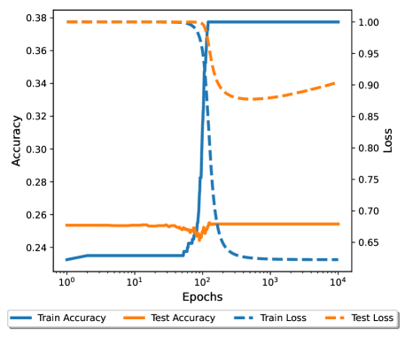


###### fig-10

*Рисунок 10: Слева: динамика обучения слабой модели с одним нейроном. В середине: изображение нейрона слабой модели. Видно, что он выучил признак $[1,-1]$. Справа: динамика обучения целевой модели с вложением, перенесённым от однонейронной слабой модели.* **[p. 27]**

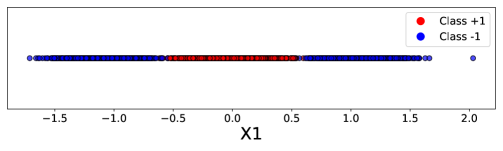

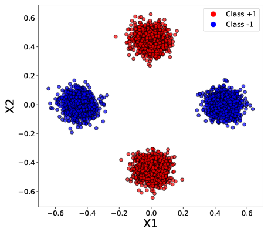


*Рисунок 11: Слева: изображение распределения $P$ при вложении от однонейронной слабой модели. В середине: изображение распределения $P$ при вложении от двухнейронной слабой модели. Справа: динамика обучения целевой модели с вложением, перенесённым от двухнейронной слабой модели.* **[p. 27]**

Когда у слабой модели всего один нейрон, целевая модель имеет вид:

$$
f_{L}(x)=\sum_{j=1}^{m}a_{j}\phi(v_{j}\cdot u^{\top}x).
$$

Обозначим $z=u^{\top}x$. Равносильно имеем

$$
f_{L}(z)=\sum_{j=1}^{m}a_{j}\phi(v_{j}\cdot z).
$$

###### p27-6

Отметим, что $\text{sign}(f_{L}(z_{1}))=\text{sign}(f_{L}(z_{2}))$, если $\text{sign}(z_{1})=\text{sign}(z_{2})$. Поскольку и положительный, и отрицательный классы расположены по обе стороны от начала координат (рисунок 11 слева), верно классифицировать эти точки $f_{L}$ не в состоянии (рисунок 10 справа).

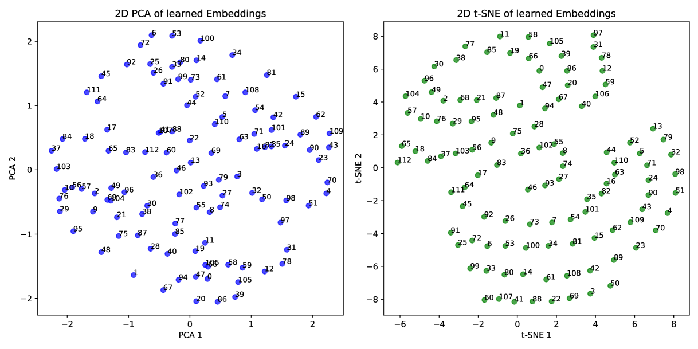

*Рисунок 12: Двумерное изображение четырёхмерного вложения от слабой модели, обученной задаче модульного сложения.* **[p. 28]**

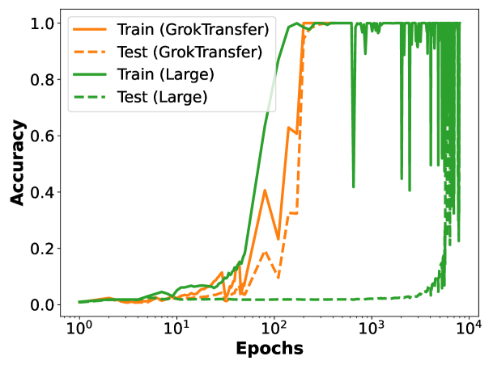

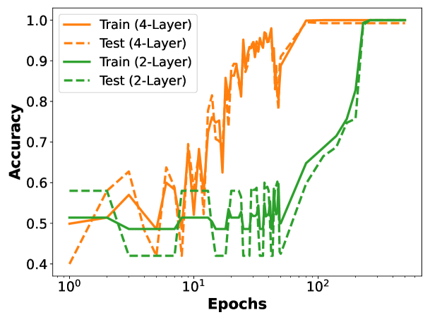

*Рисунок 13: Слева: динамика обучения 8-слойного трансформера на задаче модульного умножения. Справа: динамика обучения двухслойного и четырёхслойного трансформеров, обученных задаче $(40,3)$-чётности. Ни у одного нет отложенной генерализации.* **[p. 28]**

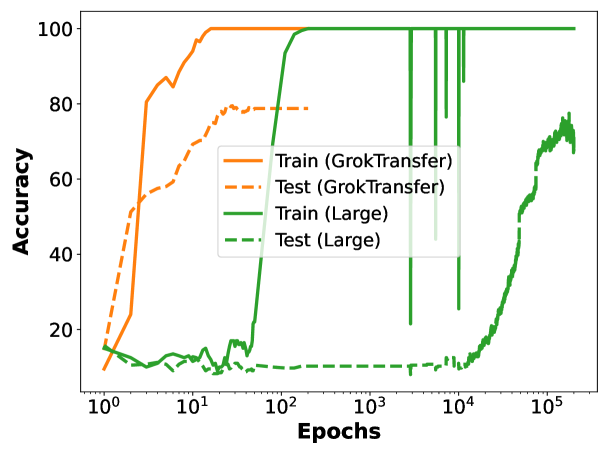

*Рисунок 14: Динамика обучения четырёхслойного MLP на наборе MNIST. Случайно выбраны $200$ примеров как обучающие данные и $400$ примеров как тестовые. Слабая модель — двухслойный MLP с точностью на тесте $40\%$.* **[p. 28]**


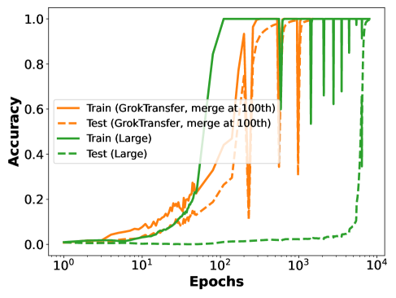

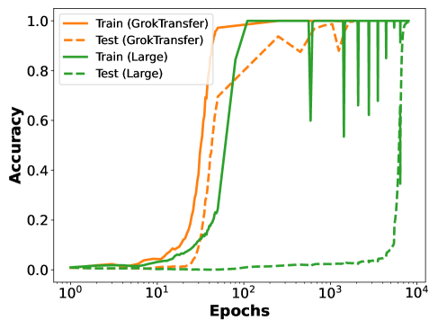

###### fig-15

*Рисунок 15: (a) Динамика обучения целевых моделей, использованных на рисунке 6 и на рисунке 8 справа, но с малоранговым вложением $A\cdot B$, где и $A$, и $B$ инициализированы случайно. MLP означает трёхслойный MLP, TF — двухслойный трансформер. (b) Слияние $A$ и $B$ в $E_{T}$ на 100-й эпохе с продолжением обучения. (c) Размерность вложения слабой модели положена равной размерности вложения целевой.* **[p. 29]**


*Рисунок 16: Динамика обучения целевой модели (двухслойного трансформера), обученной через GrokTransfer, и целевой модели, обученной через GrokFast, на задаче модульного умножения.* **[p. 10]**

---

# Машиночитаемый блок фактов

```yaml
paper:
  id: 2504.13292
  title: "Let Me Grok for You: Accelerating Grokking via Embedding Transfer from a Weaker Model"
  authors: [Zhiwei Xu, Zhiyu Ni, Yixin Wang, Wei Hu]
  affiliation: "University of Michigan; University of California, Berkeley"
  date: 2025-04-17
  venue: "ICLR 2025"
  citations: 10
  source: native-html-v1

core_claim:
  name: "GrokTransfer — перенос вложения от более слабой модели"
  observation: "динамика обучения определяется вложением данных: содержательное
    вложение даёт непрерывное продвижение вместо отложенной генерализации"
  method: "1) обучить малую слабую модель, пока она не грокнет до нетривиального
    качества; 2) взять её слой вложения как A и обучать целевую модель
    с вложением E_T = A * B, где обучаемы обе матрицы"
  key_point: "слабой модели НЕ нужно обобщать хорошо — ей достаточно найти
    правильное признаковое подпространство"
  goal: "гроккинг рассматривается как неисправность, подлежащая устранению,
    а не как явление, подлежащее объяснению"

embedding_experiment:
  task: "модульное сложение, p = 113, 25 % данных на обучение"
  grokking: [one-hot, GPT (text-embedding-3-small)]
  continuous: [двоичное, фурье]
  fourier_note: "фурье-вложение достигает запоминания и безупречной генерализации одновременно"
  separator: "не общность и не размерность вложения, а наличие сведений о самой задаче"
  caveat: "двоичное вложение помогает модульному сложению, но не умножению"

against:
  initialization_scale: "гроккинг сохраняется после тщательной настройки масштаба
    инициализации — фактор, но не причина"
  kernel_regime: "изменение эмпирического NTK развивается схожим образом при всех
    четырёх вложениях, и грокающих, и нет — ядерный режим не единственная причина"

theory:
  task: "XOR-кластеры, p = 80000, n = 400, eps = 0.05, показательная потеря, GD с weight decay"
  lemma_3_1: "сеть из трёх нейронов не может решить XOR: для четырёх признаков нужно четыре нейрона"
  weak_model: "три нейрона, тестовая точность около 75 %, выученные направления —
    три из четырёх признаковых"
  assumption_A2: "измерена, а не постулирована: отношение норм дополняющей и
    обобщающей подсетей ведёт себя как eps / sqrt(n) и не зависит от p"
  theorem_3_2: "при (A1)-(A5) с вероятностью 1 - O(1/n^2) после ОДНОГО шага
    градиентного спуска модель классифицирует всё обучение верно и обобщает
    с ошибкой не более exp(-Omega(log^2 n))"
  regime: "режим обучения признакам, а не ядерный"
  fixed: "a и U зафиксированы для упрощения разбора"

experiments:
  tasks: [модульное сложение, модульное умножение, "(40,3)-чётность"]
  transfers: ["FNN -> FNN", "FNN -> Transformer (8 слоёв, масштаб GPT2-small)"]
  metric: "временной разрыв: первая эпоха с 95 % на тесте минус первая эпоха с 95 % на обучении"
  vs_grokfast: "временной разрыв 46 против 1119 (двухслойный трансформер, модульное сложение)"
  wall_clock: "2828 мс (слабая) + 71079 мс (целевая с GrokTransfer) против 392667 мс (с нуля)"
  flops: "около 1e10 против 1e11"
  hyperparameters: "перебор по сетке; лучшей объявляется настройка, быстрее всех
    достигающая 90-99 % на проверке"

findings:
  - id: 1
    claim: "гроккинг рассматривается как помеха предсказуемости и эффективности"
    anchor: p1-5
  - id: 2
    claim: "метод в двух шагах: грокнуть слабую модель, перенести её вложение"
    anchor: p1-8
  - id: 3
    claim: "one-hot и GPT грокают, двоичное и фурье дают непрерывную генерализацию"
    anchor: p4-1
  - id: 4
    claim: "гроккинг переживает настройку масштаба инициализации; эмпирический NTK
      меняется одинаково у грокающих и не грокающих вложений"
    anchor: p4-2
  - id: 5
    claim: "слабая сеть из трёх нейронов застревает на 75 %, но её направления — признаковые"
    anchor: p6-2
  - id: 6
    claim: "отношение норм подсетей измерено: eps / sqrt(n), независимо от p"
    anchor: p7-1
  - id: 7
    claim: "теорема 3.2: один шаг градиентного спуска даёт и обучение, и генерализацию"
    anchor: p8-3
  - id: 8
    claim: "качество целевой модели положительно связано с качеством слабой;
      гипотеза — целевая обобщает лишь после того, как грокнула слабая"
    anchor: p9-3
  - id: 9
    claim: "перенос FNN -> трансформер работает"
    anchor: p9-4
  - id: 10
    claim: "прямое сравнение с GrokFast: временной разрыв 46 против 1119"
    anchor: p10-2

negative_controls:
  - "слабая модель с одним нейроном бесполезна, и объяснено почему"
  - "случайно инициализированное малоранговое A*B проверено отдельно —
    дело в переносе, а не в малоранговой структуре"
  - "проверено слияние A и B на сотой эпохе и равенство размерностей вложений"

limits:
  - "теория покрывает лишь задачу XOR-кластеров с двумя признаковыми направлениями"
  - "критерий отбора гиперпараметров — скорость, и мера успеха работы — тоже скорость"
  - "сравнение с GrokFast: одна задача, одна архитектура, одна метрика"
  - "точка перелома в абляции по силе слабой модели не выделена, порог не назван"
  - "опыт на MNIST поставлен на 200 обучающих примерах"
  - "метод исследован только там, где гроккинг случается"

corpus_tension:
  omnigrok: "масштаб инициализации понижен с причины до фактора"
  kumar: "разрыв ленивый-богатый объявлен недостаточным объяснением, с измеримым доводом"
  nanda: "фурье-решение применено как готовая деталь — вложение, а не объяснение"
  grokfast: "единственное в корпусе прямое сравнение двух приёмов ускорения"
  furuta: "ближайший предшественник по замыслу; там нужны дополнительные данные, здесь — нет"
  minegishi: "тот же итог при несравнимо меньшей цене"

concept_cards:
  structured-representation-learning: p4-1
  gradient-low-pass-filtering: p10-2
  lazy-to-rich-kernel-to-feature-learning: p4-2
  initialization-scale: p4-2
  sparse-parity: p8-6
  modular-arithmetic: p8-6
  generalization-bounds: p8-3
  feature-emergence-feature-learning: p6-2
  sparse-subnetwork-lottery-ticket: p3-1
  causal-ablation-intervention: p9-3
  slingshot: p8-7
  grokking: p1-5

sources:
  original_html: original/2504.13292.native.html
  converted_text: original/2504.13292.let-me-grok-for-you-accelerating-grokking-via-embedding-transfer-from-a-weaker-model.md
  images_dir: images/
  pdf: https://arxiv.org/pdf/2504.13292v1

anchors:
  scheme: "pN-M | fig-N | tab-N | sec-N (token headings, cross-viewer portable)"
  policy: "якоря заводятся только там, где на них ссылаются; разрывы страниц якорей не несут"
  paragraph: [p1-5, p1-8, p3-1, p4-1, p4-2, p5-2, p5-4, p6-2, p7-1, p8-3, p8-4,
    p8-6, p8-7, p9-1, p9-3, p9-4, p10-1, p10-2, p10-4, p27-6]
  figure: [fig-2, fig-3, fig-4, fig-5, fig-7, fig-8, fig-10, fig-15]
  table: [tab-1]

review_summary:                   # см. раздел «Что показано, а что предположено»
  strong: "опыт с четырьмя вложениями разделяющий и дешёвый; допущение A2 измерено,
    а не постулировано; приведены две отрицательные проверки; сравнение с GrokFast
    поставлено прямо"
  weak: "теория только для XOR; гиперпараметры отбираются по той же величине,
    по которой измеряется успех; гипотеза о необходимости гроккинга слабой модели
    не доведена до порога"
  authors_own_limits:
    - "теоретический результат рассматривает лишь сравнительно простую задачу XOR"
    - "метод исследован только на задачах, где гроккинг случается"

translation:
  status: complete
  formula_parity: "display 91/91, inline 483/492"
  figures: "29/29"
  pagination: "29 из 29 страниц отмечены"
  note: "девять inline-формул — символы аффилиаций в строке авторов конверсии
    (карточка даёт аффилиации по-русски в шапке); ещё в пяти формулах переведено
    содержимое \\text{...}"
```
