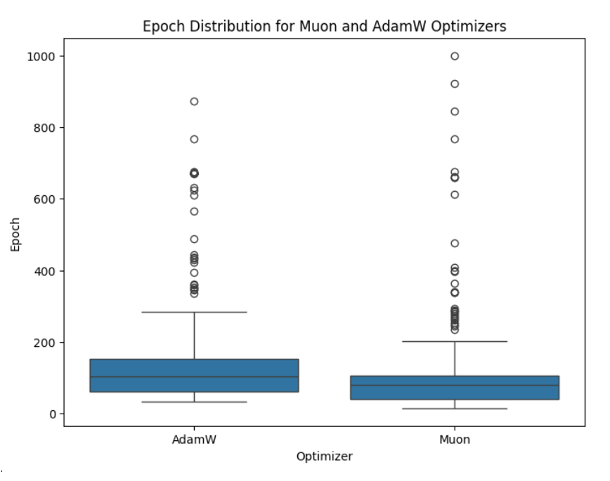

# Tveit et al. 2025 — Muon Optimizer Accelerates Grokking

См. также: [глобальный индекс понятий](../../concepts/index.md).
arXiv [2504.16041v1](https://arxiv.org/abs/2504.16041), 22 апреля 2025 (единственная версия). Колонтитула с площадкой публикации в PDF нет; на титуле стоит дата «April 22th, 2025».

**Amund Tveit** — Microsoft; переписка: Amund.Tveit@microsoft.com.
**Bjørn Remseth, Arve Skogvold** — Microsoft.

Оригинал и производные файлы этой папки:

- [`original/2504.16041.native.html`](original/2504.16041.native.html) — первоисточник, нативный HTML-рендеринг arXiv (LaTeXML), скачан как есть.
- [`original/2504.16041.muon-optimizer-accelerates-grokking.md`](original/2504.16041.muon-optimizer-accelerates-grokking.md) — конверсия оригинала в Markdown без правок содержания; английский текст для сверки перевода.
- [`images/`](images/) — иллюстрации статьи в исходном разрешении (1 файл, 1 рисунок).
- [`2504.16041.muon-optimizer-accelerates-grokking.claims.txt`](2504.16041.muon-optimizer-accelerates-grokking.claims.txt) — рабочий разбор: пронумерованные утверждения с пометками.

Схема якорей и правила ссылок на карточку — в [README папки статей](../README.md).

## Затрагиваемые понятия

**[Оптимизатор](../../concepts/optimizer-adam-adamw-sgd.md)** — работа задаёт корпусу вопрос, которого до неё прямо никто не ставил: что будет, если поменять **только** приём оптимизации, ничего больше не трогая. Muon противопоставлен AdamW при объявленно равных силах weight decay ([p5-3](#p5-3)), и заявленный итог — одна пара чисел: средняя эпоха гроккинга падает со 153.09 до 102.89 ([fig-5](#fig-5)), то есть примерно в 1,49 раза. Существенно для корпуса и то, как именно Muon описан авторами: «более новый оптимизатор, устроенный так, чтобы улучшать динамику обучения, включая в себя ограничения спектральной нормы и приближения сведений второго порядка» ([p5-2](#p5-2)). Чего в работе нет: ни одной величины настройки самого сравнения. Скорость обучения не названа ни для AdamW, ни для Muon; величина weight decay, объявленная равной, нигде не приведена; для Muon не сказано ни момента, ни числа итераций Ньютона—Шульца, ни того, какие матрицы ему отданы, а какие остались за AdamW. Нет и числа прогонов — только «по нескольку независимых прогонов… пользуясь разными случайными семенами» ([p5-3](#p5-3)). Поэтому сравнение при неподобранных скоростях обучения смешивает правило обновления с настройкой, и «выделить действие их отличных друг от друга устройств обновления» равенством одного лишь weight decay не удаётся.

**[Гроккинг](../../concepts/grokking.md)** — работа не даёт понятию ни нового наблюдения, ни нового объяснения: она берёт гроккинг как готовое явление и меряет одну его величину — время наступления. Ценна здесь операциональная мера, вынесенная авторами в отдельную врезку: «Гроккинг операционально определяется как первая эпоха, где проверочная точность достигает 95% или превосходит их, наступающая после того, как обучающая точность уже устоялась вблизи 100%» ([p4-2](#p4-2)). Мера засчитывает **первое пересечение** порога и не требует его удержания — что для корпуса существенно, потому что позднейшие работы про Muon обнаружили обвал проверочной точности уже после гроккинга, к которому такая мера слепа. Чего в работе нет: кривых обучения. Ни одной пары «обучающая/проверочная точность против эпохи» в статье не приведено, так что вторая половина собственного определения — что обучающая точность действительно вышла на 100% раньше — ни для одного прогона не показана.

**[Эталонный полигон гроккинга](../../concepts/canonical-grokking-testbed.md)** — постановка взята у Power et al. без изменений и без обсуждения: таблица бинарной операции по модулю 97, случайная перестановка полного набора и выделение доли на обучение ([p2-4](#p2-4)), малый трансформер, отложенное обобщение как предмет измерения. Собственная добавка к полигону — две задачи, каких у Power et al. не было: наибольший общий делитель и чётность 10-битного числа ([fig-2](#fig-2)). Чего в работе нет: обоснования того, почему полигон подходит для сравнения приёмов оптимизации, и разбивки итога по задачам — все прогоны шести задач слиты в одну выборку.

**[Модульная арифметика](../../concepts/modular-arithmetic.md)** — модуль один и тот же, 97, для всех арифметических задач; полный набор — «все $97\times 97=9409$ возможных сочетаний входа» ([p2-4](#p2-4)); операций пять — сложение, умножение, деление, возведение в степень и наибольший общий делитель ([fig-2](#fig-2)). Работа лишь пользуется этим классом задач и ничего о нём не выясняет: ни разбора выученного представления, ни сравнения операций между собой, ни указания, различаются ли они по времени гроккинга. Отдельная неясность в описании: строка «Gcd — наибольший общий делитель, mod 97» не поясняет, что именно здесь берётся по модулю, — наибольший общий делитель модульной операцией не является.

**[Доля данных / критический размер набора](../../concepts/data-fraction-critical-dataset-size.md)** — доля обучающей выборки здесь не изучается, но незаметно входит в постановку как **различающаяся по задачам** величина: 50 %, 80 %, 80 %, 70 %, 50 %, 50 % для Gcd, Mod-add, Mod-div, Mod-exp, Mod-mul и Parity соответственно ([fig-2](#fig-2)). Выбор нигде не обоснован. Для корпуса, где доля обучения — сама по себе управляющая величина гроккинга, это означает, что шесть строк выборки различаются не только операцией, а слияние их прогонов в одну выборку подмешивает к сравнению приёмов ещё и разброс по долям. Чего в работе нет: перебора доли обучения, сравнения задач при одинаковой доле и вообще какого-либо упоминания о том, что доля влияет на время гроккинга.

**[Weight decay](../../concepts/weight-decay.md)** — weight decay присутствует в постановке как условие, уравненное между приёмами: «Оба оптимизатора были настроены на равные силы weight decay, чтобы выделить действие их отличных друг от друга устройств обновления» ([p5-3](#p5-3)). Величина при этом не названа ни разу — ни в тексте, ни в подписях, ни в перечне гиперпараметров, где для AdamW приведены только $\beta_{1}=0.9$ и $\beta_{2}=0.98$ ([p5-2](#p5-2)). Чего в работе нет: ни прогонов без weight decay, ни перебора его величины, ни разбора того, как он взаимодействует с приёмом оптимизации, — хотя именно это взаимодействие названо направлением дальнейшей работы в заключении ([p5-7](#p5-7)).

**[Когда регуляризация необходима](../../concepts/regularization-necessity.md)** — работа принимает версию «необходима» как решённый вопрос и ссылается на него одной фразой: «Предшествующие работы установили, что weight decay и прочие приёмы регуляризации суть решающие предварительные условия наблюдения явления гроккинга [7, 8]» ([p1-4](#p1-4)). Опоры под этой фразой нет: из двух ссылок одна ([8]) не существует вовсе, а вторая ([7] = Liu et al. 2205.10343) показывает обратное — что достаточная регуляризация гроккинг **убирает** (см. [«Ошибочные цитирования»](#mc-2205-10343)). Собственных свидетельств в пользу необходимости регуляризации работа не приводит и вопроса не исследует; в корпусном споре она — не участник, а пример того, как одна из позиций передаётся дальше уже без источника.

**[StableMax / perp-Grad](../../concepts/numerical-stability-fix.md)** — линия численной устойчивости входит сюда как второй множитель плана опыта: наряду с обычным softmax сравниваются stablemax и sparsemax, «будучи движимы работами, указывающими на то, что затруднения численной устойчивости в обычном softmax могут сказываться на гроккинге [4]» ([p3-1](#p3-1)); stablemax описан как «вариант, употребляющий кусочное преобразование, устроенное так, чтобы повысить численную устойчивость» ([p3-2](#p3-2)), формулы всех трёх выписаны ([fig-3](#fig-3)). Чего в работе нет — и это главная упущенная возможность: **итога по этому множителю**. План 2 приёма × 3 варианта softmax позволял измерить, не перекрывается ли выигрыш Muon с починкой softmax, но сообщён только главный эффект приёма; о том, что дали stablemax и sparsemax и как они сочетаются с Muon, не сказано ни слова. Из второго множителя ⊥Grad взят не был.

**[Коллапс softmax](../../concepts/softmax-collapse.md)** — понятие появляется ровно один раз, в строке 2 таблицы предполагаемых устройств: Muon «Держит обучение устойчивым и избегает «softmax collapse»» ([fig-1](#fig-1)). Это гипотеза, выставленная **до** опыта и после опыта никак не проверенная: ни логитов, ни признаков поглощения при сложении с плавающей точкой, ни сравнения обычного softmax со stablemax под Muon в работе не измерено. Приписывать авторам свидетельство того, что Muon предотвращает коллапс softmax, нельзя — у них есть только строка таблицы.

**[Фаза меморизации / плато](../../concepts/memorization-phase.md)** — работа пользуется словарём «уход от запоминания», не измеряя ничего из того, что этим словарём описывается: Muon, «по-видимому, уводит модель прочь от чисто запоминающих решений, тем самым облегчая более раннее обнаружение истинной закономерности» ([p5-7](#p5-7)), а строка 1 таблицы обещает, что ортогонализованные обновления «Помогают уйти от запоминания и обнаружить настоящие закономерности» ([fig-1](#fig-1)). Хедж «по-видимому» стоит у самих авторов и при цитировании обязан сохраняться. Чего в работе нет: длительности плато, момента выхода обучающей точности на 100%, каких-либо величин, разделяющих запоминающее и обобщающее решения, — измеряется только эпоха первого пересечения проверочного порога.

**[Ортогональность градиента](../../concepts/orthogonal-gradient-perp-grad.md)** — работа употребляет слово «ортогонализованный» в другом смысле, чем корпусная карточка, и путать их нельзя. Строка 1 таблицы гласит, что Muon «Употребляет ортогонализованные градиентные обновления» ([fig-1](#fig-1)): у Muon ортогонализуется **матрица обновления** (итерацией Ньютона—Шульца по буферу момента, отчего её сингулярные числа сближаются с единицей), тогда как ⊥Grad Prieto et al. снимает с градиента компоненту **вдоль направления весов**. Это разные операции с разными целями. Чего в работе нет: ни формулы обновления Muon, ни числа итераций Ньютона—Шульца, ни отсечения этой операции — то есть проверить, что дело именно в ортогонализации, здесь нечем.

**[Спектральный анализ / FVE](../../concepts/spectral-analysis-svd-esd-fve.md)** — спектральный довод в работе заявлен и ни разу не измерен. Аннотация называет Muon приёмом, «отличающимся использованием ограничений спектральной нормы и сведений второго порядка» ([p1-2](#p1-2)), строка 2 таблицы обещает, что он «Прилагает ограничения спектральной нормы» и тем «Не даёт весам разгоняться» ([fig-1](#fig-1)). Ни сингулярных чисел весов, ни их спектров, ни норм по слоям в статье не приведено; к тому же названное свойство описано неточно — Muon нормирует и ортогонализует **обновление**, а не ограничивает спектральную норму весов. Для корпуса это место важно тем, что именно здесь позднейшие работы разделили ортогонализацию и спектральное масштабирование и измерили каждую порознь.

**[Разрежённая чётность](../../concepts/sparse-parity.md)** — упомянута ради разграничения, а не ради содержания: шестая задача работы — «предсказание бита чётности для 10-битных двоичных строк, при 1024 возможных сочетаниях» ([p2-4](#p2-4)), то есть **полная** чётность всех десяти битов, а не $k$-разрежённая чётность корпуса, где значимых битов много меньше длины строки. Ни скрытого подмножества, ни параметров $(n,k)$, ни вычислительной трудности здесь нет; относить эту работу к полигону разрежённой чётности было бы ошибкой.

---

## Несогласованности внутри статьи

**Семь задач в аннотации против шести в собственной таблице.** Аннотация заявляет опыты «на семи численных задачах (преимущественно модульная арифметика)» ([p1-2](#p1-2)), тогда как таблица наборов данных перечисляет ровно шесть строк — Gcd, Mod-add, Mod-div, Mod-exp, Mod-mul, Parity ([fig-2](#fig-2)), и перечень в тексте даёт те же шесть: пять модульных операций и чётность ([p2-4](#p2-4)). Седьмая задача нигде не названа и больше нигде не появляется. Ссылаясь на объём опытов, надо брать шесть.

**Аннотация обещает оценку совместного действия двух множителей, итогов по второму в работе нет.** Заявлено, что настройка «систематически меняла оптимизатор (Muon против AdamW) и функцию активации softmax (обычный softmax, stablemax и sparsemax), чтобы оценить их **совместное** действие на динамику обучения» ([p1-2](#p1-2)). Раздел итогов сообщает только главный эффект приёма оптимизации ([p5-4](#p5-4), [p5-5](#p5-5)); ни разбивки по вариантам softmax, ни какой-либо оценки взаимодействия в работе не приведено. План опыта, позволявший это измерить, остался неиспользованным.

**Пара «$t$-статистика — $p$-значение» взаимно невозможна.** Сообщены $\approx 5.0175$ и $\approx 6.33\times 10^{-8}$ ([p5-5](#p5-5)). Двусторонний хвост нормального распределения при таком значении статистики равен 5,2×10⁻⁷, односторонний — 2,6×10⁻⁷; у распределения Стьюдента при любом конечном числе степеней свободы хвосты тяжелее нормальных, поэтому $p$ при таком $t$ не может быть меньше 5,2×10⁻⁷ ни при каком объёме выборки. Отчётное значение занижено примерно в восемь раз и не могло выйти из заявленного двухвыборочного $t$-теста. Число степеней свободы, как и объём выборки, в работе не указано.

**«Более тесное распределение» расходится с собственным рисунком.** В тексте сказано, что Muon «обнаружил более тесное распределение времён гроккинга, как изображено на рисунке 4» ([p5-6](#p5-6)). На самом рисунке ([fig-4](#fig-4)) у Muon действительно уже коробка — межквартильный размах примерно 45–105 эпох против 60–150 у AdamW, — но выбросов у него заметно больше и уходят они дальше: верхняя точка Muon стоит ровно на 1000 эпохах, тогда как самый дальний выброс AdamW — около 872. Уже коробка, а не распределение.

**Утверждение о медианах отослано к рисунку, где медиан нет.** Фраза «Рисунок 4 (ящичковая диаграмма) показывает, что медианная эпоха гроккинга на Muon заметно ниже, чем на AdamW (см. рисунок 5)» ([p5-6](#p5-6)) отсылает за медианами к рисунку 5, который содержит только два **средних** ([fig-5](#fig-5)). Медианы читаются лишь с ящичковой диаграммы и в числах нигде не приведены — а расходятся они со средними сильно (по рисунку около 103 и 78 против 153.09 и 102.89), что само по себе указывает на сильно скошенное вправо распределение.

---

## Что показано, а что предположено

**Показано — ровно одно.** На выборке прогонов неназванного размера, слитой по шести задачам и трём вариантам softmax, средняя эпоха первого пересечения порога 95 % упала со 153.09 до 102.89 ([fig-5](#fig-5)), и ящичковая диаграмма ([fig-4](#fig-4)) показывает сдвиг всего распределения в ту же сторону. Направление эффекта — единственная опытная находка работы.

**Предположено — весь механизм.** Всё, что сказано о том, **почему** Muon помогает, собрано в таблице из пяти строк ([fig-1](#fig-1)), выставленной во введении как гипотеза («Мы предполагаем, что **Muon ускоряет гроккинг** благодаря нескольким ключевым отличиям…», [p2-1](#p2-1)) и после опыта никак не проверенной. Ни к одной строке не привязано ни одного измерения: нет ни норм весов, ни спектров, ни логитов, ни счёта FLOPs, ни отсечения хотя бы одной из операций Muon. Единственная приведённая опора — NanoGPT, названный прямо «неформальным набором тестов» ([p2-2](#p2-2)), то есть довод с рекордного табло на другой задаче и другом масштабе. Заключение при этом повторяет механизм уже утвердительнее — «геометрия обновления оптимизатора решающим образом влияет на наступление отложенной генерализации» ([p5-7](#p5-7)), — хотя измерена была только эпоха.

**Три строки таблицы 1 неточны по существу.** «Прилагает ограничения спектральной нормы»: Muon нормирует и ортогонализует само обновление, а не ограничивает спектральную норму весов; от разгона весов удерживает weight decay. «Приближает обновления второго порядка» (и «сведения второго порядка» в аннотации, [p1-2](#p1-2)): Muon не берёт сведений о кривизне — это наискорейший спуск в спектральной норме, вычисляемый итерацией Ньютона—Шульца по буферу момента. «Тратит меньше FLOPs на ту же потерю»: итерация Ньютона—Шульца выполняется на каждой скрытой матрице на каждом шаге и делает шаг Muon **дороже** шага AdamW, а не дешевле; ни FLOPs, ни затраченное время в работе не измерены вовсе.

**Постановка не восстановима по тексту.** Не названы: число слоёв, ширина, число голов, величина dropout ([p3-3](#p3-3), [p3-4](#p3-4)), размер батча, бюджет эпох, скорость обучения — ни для одного из двух приёмов, — величина weight decay ([p5-3](#p5-3)) и число прогонов и семян. Без ссылки на код (`github.com/atveit/torch_grokking`, [p8-1](#p8-1)) работа невоспроизводима.

**Статистика не отвечает данным.** Прогоны разных задач слиты в одну выборку и сравниваются двухвыборочным $t$-тестом ([p5-4](#p5-4)) — это псевдорепликация: прогоны разных задач не взаимозаменяемы, а межзадачный разброс (по рисунку — от десятков эпох до тысячи) заведомо больше разницы между приёмами, так что величины 153.09 и 102.89 суть смесь эффекта приёма с составом задач. Распределение сильно скошено вправо и, судя по точке Muon ровно на 1000 эпохах, урезано справа бюджетом обучения; ни бюджет, ни судьба не гроккнувших прогонов (исключены? засчитаны по бюджету?) нигде не оговорены, а от этого выбора прямо зависит сравнение средних. Ни размера эффекта, ни доверительного промежутка, ни непараметрической проверки, ни поправки на множественность (шесть задач на три варианта softmax) не приведено.

**Библиография собрана без сверки.** Пяти источников из четырнадцати не существует: [8] «Thiry, Kerg, Ollivier, Grokking of Modular Arithmetic in Transformers», [9] «Barak et al., Grokking as Phase Transition: A Simple Model», [10] «Chughtai, Chan, Nanda, Grokking Shows Long Optimization Dynamics», [11] «Davies et al., Grokking as Competition of Functions», [12] «Varela, Henaff, Pascanu, Grokking Neural Network Dynamics» ([p7-8](#p7-8) — [p7-12](#p7-12)). Проставленные при них номера arXiv принадлежат посторонним работам: 2208.06791 — «On the recent-$k$-record of discrete random variables», 2206.02840 — «Spatial Acoustic Projection for 3D Imaging Sonar Reconstruction», 2309.03840 — «Generating Minimal Training Sets for Machine Learned Potentials», 2310.03133 — «Weinstein presentations for high-dimensional antisurgery», 2305.11779 — «DMDD: A Large-Scale Dataset for Dataset Mentions Detection» (проверено прямым обращением к arXiv 2026-08-20). Записи [9]–[12] в тексте не цитируются вовсе и присутствуют только в списке. Разбор ошибок в существующих ссылках — ниже, в «Ошибочных цитированиях».

**Оформление.** Из пяти «фигур» настоящий рисунок только один ([fig-4](#fig-4)); фигуры 1, 2, 3 и 5 — таблицы. Приложений нет, разбора итогов нет, статья вышла единственной версией и рецензирования не проходила.

---

## Ошибочные цитирования

Замечания редактора карточки: места, где эта статья передаёт чужие результаты с ошибкой или без авторских оговорок. Сюда ведут ссылки «подробности» из разделов «Ошибочные пересказы и цитирования этой статьи» карточек процитированных работ.

###### mc-2205-10343
**Liu et al. (2205.10343) — вывод перевёрнут на противоположный.** `"Prior work has established that weight decay and other regularization techniques are crucial prerequisites for observing the grokking phenomenon [7, 8]."` — «Предшествующие работы установили, что weight decay и прочие приёмы регуляризации суть решающие предварительные условия наблюдения явления гроккинга [7, 8]» ([p1-4](#p1-4)). Из двух опор одна ([8]) не существует, а вторая говорит обратное: в фазовых диаграммах [Liu et al.](../2205.10343.towards-understanding-grokking-an-effective-theory-of-representation-learning/2205.10343.towards-understanding-grokking-an-effective-theory-of-representation-learning.card.md) гроккинг «зажат между пониманием и запоминанием», а достаточный weight decay и dropout переводят обучение в фазу понимания, где «явление гроккинга исчезает полностью»; свою же MNIST-постановку авторы описывают словами «при достаточной регуляризации мы снова можем «раз-грокнуть» обучение». То есть у Liu et al. регуляризация — средство гроккинг **убрать**, а не условие его наблюдать. Утверждение о необходимости weight decay в корпусе есть (Nanda et al. 2301.05217 — «без weight decay или иной формы регуляризации наши сети на задаче модульной арифметики не грокают»), но эта статья ссылается не на него; работа Nanda стоит в её списке под [6] и цитируется по другому поводу — как источник выбора задач.

###### mc-2201-02177
**Power et al. (2201.02177) — работа приписана чужим авторам.** Запись [1] в списке литературы гласит `"L. Prieto, J. Frankle, et al., *Grokking: Generalization Beyond Overfitting on Small Algorithmic Datasets*"` ([p7-1](#p7-1)). Работа принадлежит [Power, Burda, Edwards, Babuschkin и Misra](../2201.02177.grokking-generalization-beyond-overfitting-on-small-algorithmic-datasets/2201.02177.grokking-generalization-beyond-overfitting-on-small-algorithmic-datasets.card.md); имя Prieto взято из записи [4] (см. ниже), а Frankle к ней отношения не имеет. Содержательно ссылка стоит верно — на первоисточник наблюдения гроккинга на малых алгоритмических задачах ([p1-3](#p1-3)); ошибка только в авторстве, но она такова, что цитата «(Prieto & Frankle, 2022)» при переносе дальше указала бы на несуществующую работу.

###### mc-2501-04697
**Prieto et al. (2501.04697) — авторы переставлены с записью [1], а взятая линия оборвана.** Запись [4] гласит `"A. Power, B. Lee, et al., *Grokking at the Edge of Numerical Stability*"` ([p7-4](#p7-4)); работа принадлежит [Prieto, Barsbey, Mediano и Birdal](../2501.04697.grokking-at-the-edge-of-numerical-stability/2501.04697.grokking-at-the-edge-of-numerical-stability.card.md), а «A. Power» перенесён сюда из записи [1] — две ссылки обменялись первыми авторами. Содержательно эта статья берёт у них stablemax и мотивировку через «softmax collapse» ([p3-1](#p3-1), [fig-1](#fig-1)), но линию не продолжает: итог по вариантам softmax не сообщён, ⊥Grad не испытан, а вопрос, не перекрывается ли выигрыш Muon с починкой численной устойчивости, — тот самый, ради которого план опыта был сделан двухфакторным, — остаётся без ответа. Искажены и другие записи: [5] (у Martins соавтор Astudillo, а не «E. Niculescu-Mizil, A. D. Magalhães», [p7-5](#p7-5)) и [7] (у Liu соавторы Kitouni, Nolte, Michaud, Tegmark и Williams, а не «Y. Wang, J. D. Hopkins, T. Xiao», [p7-7](#p7-7)).

---

## Ошибочные пересказы и цитирования этой статьи

Ниже — узоры, наблюдённые в цитирующих работах корпуса. Для каждого сказано, что именно искажается, и даны ссылки на авторские абзацы с теряемой оговоркой. Разделы «Ошибочные цитирования» на стороне цитирующих карточек ещё не заведены (карточки трёх из четырёх цитирующих работ пока не созданы), поэтому подробные разборы не адресуются, а цитирующие работы названы прямо.

**«Muon — оптимизатор Tveit et al.» (ошибочное).** Hidajat, Stoll и An (2605.15787) дважды ставят эту статью на место работы, вводящей Muon: `"To make our convergence proofs agnostic to whether one uses AdamW, decoupled weight decay [Loshchilov and Hutter, 2019], or orthogonalized variants like Muon [Tveit et al., 2025], we abstract the optimizer strictly by its contractive properties."` — «чтобы наши доказательства сходимости не зависели от того, употребляется ли AdamW, расцепленный weight decay или ортогонализованные варианты вроде Muon [Tveit et al., 2025]…» — и `"Optimizers that decouple weight decay from the gradient preconditioning step (such as AdamW [Loshchilov and Hutter, 2019], Muon [Tveit et al., 2025], and Lion) satisfy the norm-contractive property"`. Muon настоящая статья не вводит и не описывает: она берёт его готовым и ссылается на Jordan (2024) и на «Muon is Scalable for LLM Training» ([p5-2](#p5-2), [p7-2](#p7-2), [p7-3](#p7-3)); формулы обновления Muon в ней нет вовсе. Ссылаться на неё за определением Muon нельзя — это ссылка на замер, а не на приём.

**«Показано, что Muon ускоряет гроккинг» (расширяющее, позже проверено и уточнено).** Сама заявка передаётся по корпусу верно и подтверждается более поздними работами, но обрастает подробностями, которых здесь нет. Образцовые формулировки для сравнения дают Wang (2607.20512) — `"Tveit et al. (2025) report that Muon (Jordan et al., 2024) groks in fewer epochs than AdamW on modular arithmetic, crediting both orthogonalized momentum (a Newton–Schulz iteration) and spectral-norm-based update scaling"` — и [Tian (2509.21519)](../2509.21519.provable-scaling-laws-of-feature-emergence-from-learning-dynamics-of-grokking/2509.21519.provable-scaling-laws-of-feature-emergence-from-learning-dynamics-of-grokking.card.md), который аккуратно называет эту работу «свидетельством» в отличие от «разбора»: `"While evidence (Tveit et al., 2025) and analysis exist (Shen et al., 2025) to show that Muon has advantages over other optimizers"`. Что при переносе теряется. Во-первых, единица измерения: здесь мерятся **эпохи**, а не время и не вычисления; Janati et al. (2608.07436) измеряют, что шаг Muon стоит в 1,75–1,80 раза дороже шага AdamW, отчего преимущество в шагах на глубине 1 оборачивается проигрышем примерно в 15 % по затраченному времени, — то есть заявка заголовка «ускоряет» в затраченном времени этой работой не проверена ([p2-2](#p2-2) — единственная опора по эффективности, и та с чужого табло). Во-вторых, порог: принятая здесь мера засчитывает **первое** пересечение 95 % и не требует удержания ([p4-2](#p4-2)), тогда как у Janati et al. ни одна из девяти настроек Muon после гроккинга не устойчива, почему они и берут порог «устойчивый». В-третьих, механизм: Wang (2607.20512) выделяет как действующее начало именно ортогонализацию, а не спектральное масштабирование, — из пяти строк таблицы гипотез ([fig-1](#fig-1)) одна тем самым получает поддержку, а другая опровергается; в самой работе ни одна не измерена.

**«Muon быстрее AdamW на модульной арифметике» (точное).** Janati et al. (2608.07436) цитируют работу ровно за факт и в паре с более поздней: `"Under this routing it reaches the grokking threshold on modular arithmetic faster than AdamW alone [14, 17]."` и `"14 and 17 report faster grokking on modular arithmetic"`. Это и есть та роль, в которой работа живёт в корпусе, — источник направления эффекта; ни один из её механизменных доводов там не наследуется.

---

# Текст статьи

# Muon Optimizer Accelerates Grokking

Amund Tveit (Microsoft; переписка: Amund.Tveit@microsoft.com), Bjørn Remseth (Microsoft), Arve Skogvold (Microsoft)

## Аннотация

###### p1-2

В настоящей статье исследуется влияние различных оптимизаторов на явление гроккинга, при котором модели обнаруживают отложенную генерализацию. Мы провели опыты на семи численных задачах (преимущественно модульная арифметика), пользуясь современной архитектурой трансформера. Опытная настройка систематически меняла оптимизатор (Muon против AdamW) и функцию активации softmax (обычный softmax, stablemax и sparsemax), чтобы оценить их совместное действие на динамику обучения. Наша эмпирическая оценка обнаруживает, что оптимизатор Muon, отличающийся использованием ограничений спектральной нормы и сведений второго порядка, существенно ускоряет наступление гроккинга по сравнению с широко употребляемым оптимизатором AdamW. Именно, Muon снизил среднюю эпоху гроккинга со 153.09 до 102.89 по всем настройкам — статистически значимое различие (t = 5.0175, p = 6.33e-08). Это позволяет предположить, что выбор оптимизатора играет решающую роль в облегчении перехода от запоминания к обобщению.

## 1 Введение

###### p1-3

Гроккингом называют явление, при котором модель сперва достигает высокой обучающей точности, сохраняя проверочную точность на уровне случайного угадывания, а затем, после продолжительного обучения, внезапно обобщает до высокого проверочного качества. Впервые наблюдённый на малых алгоритмических задачах (например, модульной арифметике) [1], гроккинг бросает вызов нашему пониманию того, как избыточно параметризованные модели в конце концов обнаруживают обобщаемые закономерности много позже переобучения.

###### p1-4

Предшествующие работы установили, что weight decay и прочие приёмы регуляризации суть решающие предварительные условия наблюдения явления гроккинга [7, 8]. Наша цель здесь — выяснить, может ли изменение одного лишь *оптимизатора* — с общеупотребительного AdamW на более новый Muon ([2] и [3]) — ускорить **[p. 2]** гроккинг, то есть сократить число эпох, нужных для того внезапного скачка проверочной точности.

###### p2-1

Мы предполагаем, что **Muon ускоряет гроккинг** благодаря нескольким ключевым отличиям того, как он обновляет веса модели, по сравнению с AdamW. Подробности см. на рисунке 1.

###### fig-1

*Рисунок 1: Ключевые устройства, посредством которых оптимизатор Muon может ускорять гроккинг по сравнению с AdamW.* **[p. 2]**

|  | **Почему Muon помогает** | **Что Muon делает иначе** | **Чем это помогает гроккингу** |
|---|---|---|---|
| 1 | Способствует более широкому поиску | Употребляет ортогонализованные градиентные обновления | Помогает уйти от запоминания и обнаружить настоящие закономерности |
| 2 | Не даёт весам разгоняться | Прилагает ограничения спектральной нормы | Держит обучение устойчивым и избегает «softmax collapse» |
| 3 | Держит слои согласованными | Согласует величину обновления с формой слоя | обеспечивает, что все слои учатся в надлежащем темпе |
| 4 | Следует лучшим направлениям | Приближает обновления второго порядка | Достигает обобщения быстрее и за меньшее число шагов |
| 5 | Обучает эффективнее | Тратит меньше FLOPs на ту же потерю | Гроккинг может наступить раньше при меньших вычислениях |

###### p2-2

Эмпирическая опора идёт также от NanoGPT, неформального набора тестов для эффективного обучения GPT-2, где Muon был изначально разработан и показал сильное качество.

## 2 Опытная постановка

Все опыты проводились с употреблением GPU Nvidia H100, чтобы обеспечить достаточные вычислительные средства на требуемую продолжительность обучения. Основной код обучения и оценки модели был реализован на PyTorch [13]. Отдельные опытные прогоны, каждый со своим сочетанием варианта softmax, оптимизатора и набора данных, управлялись bash-скриптом-драйвером. Итоги записывались в CSV-файлы и затем обрабатывались средствами SQLite и Python для статистического разбора.

### 2.1 Наборы данных и задачи

###### p2-4

Мы пользуемся малыми алгоритмическими наборами данных, сосредоточиваясь преимущественно на операциях модульной арифметики (сложение, умножение, деление, возведение в степень, наибольший общий делитель) и задаче чётности. Известно, что эти задачи обнаруживают гроккинг при определённых условиях обучения. Например, в модульной арифметике (по модулю 97) задача может выглядеть как «A op B = C mod 97». Модель должна выучить лежащее в основе алгебраическое строение, чтобы обобщить за пределы обучающих примеров. Каждый набор данных состоит из входных пар (например, «A», «B») и соответствующего выхода («C»). **[p. 3]** Полный набор данных для модульных задач содержит все $97\times 97=9409$ возможных сочетаний входа. Разбиения на обучение и проверку строились случайной перестановкой полного набора и выделением определённой доли на обучение (подробности на рисунке 2). Задача чётности состоит в предсказании бита чётности для 10-битных двоичных строк, при 1024 возможных сочетаниях. Эти конкретные алгоритмические задачи были выбраны потому, что они надёжно обнаруживают гроккинг при подходящих значениях гиперпараметров, что облегчает его изучение [6].

###### fig-2

*Рисунок 2: Обзор наборов данных, употреблённых в опытах.* **[p. 3]**

| **Задача гроккинга** | **Описание набора данных** | **Подробности** |
|---|---|---|
| Gcd | Наибольший общий делитель, mod 97 | 9409 строк, 50% на обучение |
| Mod-add | Сложение, mod 97 | 9409 строк, 80% на обучение |
| Mod-div | Деление, mod 97 | 9409 строк, 80% на обучение |
| Mod-exp | Возведение в степень, mod 97 | 9409 строк, 70% на обучение |
| Mod-mul | Умножение, mod 97 | 9409 строк, 50% на обучение |
| Parity | Чётность 10-битного числа | 1024 строки, 50% на обучение |

### 2.2 Настройки softmax

###### p3-1

Хотя основное внимание уделено оптимизатору, мы исследовали также возможное влияние функции активации softmax, будучи движимы работами, указывающими на то, что затруднения численной устойчивости в обычном softmax могут сказываться на гроккинге [4]. Мы сравнили три варианта (подробности на рисунке 3):

###### p3-2

- **Softmax**: обычная экспоненциальная нормировка.
- **Stablemax**: вариант, употребляющий кусочное преобразование, устроенное так, чтобы повысить численную устойчивость [4].
- **Sparsemax**: вариант, проецирующий логиты на вероятностный симплекс, что часто даёт разрежённые выходы, которые могут давать выгоды неявной регуляризации [5].

###### fig-3

*Рисунок 3: Варианты softmax, сравниваемые в опытах.* **[p. 4]**

| **Вариант softmax** | **Описание и формула** |
|---|---|
| Softmax | Обычная экспоненциальная нормировка: превращает вещественнозначный вектор $z$ в распределение вероятностей. $\text{softmax}(z)_{i}=\frac{e^{z_{i}}}{\sum_{j}e^{z_{j}}}$ |
| Stablemax [4] | Прилагает кусочное преобразование $s(z_{i})$ ради численной устойчивости перед нормировкой: $s(z_{i})=\begin{cases}z_{i}+1&\text{if }z_{i}\geq 0,\\ \frac{1}{1-z_{i}}&\text{if }z_{i}<0.\end{cases}\quad\text{and}\quad{\text{stablemax}(z)}_{i}=\frac{s(z_{i})}{\sum_{j}s(z_{j})}$ |
| Sparsemax [5] | Проецирует $z$ на вероятностный симплекс, часто давая разрежённые выходы (некоторые вероятности в точности нулевые). Он состоит в отыскании порога $\tau$ такого, что $\sum_{i}\max\{z_{i}-\tau,0\}=1$. ${\text{sparsemax}(z)}_{i}=\max\left\{z_{i}-\tau,0\right\}$ Порог $\tau$ находится эффективно при помощи сортировки и накопленных сумм. |

### 2.3 Устройство модели

###### p3-3

Употреблённая модель есть архитектура трансформера, реализованная на PyTorch и приспособленная из более ранней версии на MLX [14]. Она включает несколько современных составных частей:

###### p3-4

- **Слой вложений**: отображает входные токены (целые числа, представляющие числа или операторы) в плотные векторы. Мы пользуемся простыми тождественными вложениями, где само целое значение служит индексом вложения (например, токен «42» отображается в вектор вложения 42).
- **Блоки трансформера**: стопка обычных блоков трансформера.
- **Внимание**: многоголовое самовнимание с механизмом масштабированного скалярного произведения.
- **[p. 4]** **Позиционное кодирование**: поворотные позиционные вложения (RoPE) употребляются для внесения сведений о положении в последовательности.
- **Нормировка**: RMSNorm употребляется вместо LayerNorm ради потенциально лучшей устойчивости и качества.
- **Прямая сеть (FFN)**: употребляет функцию активации SiLU (Sigmoid Linear Unit) внутри подслоёв FFN.
- **Регуляризация**: остаточные связи употребляются повсюду, и для регуляризации прилагается dropout.

Эта архитектура объединяет устоявшиеся и современные составные части трансформера, давая надёжное основание для изучения гроккинга на указанных алгоритмических задачах.

###### p4-2

> **Определение порога гроккинга**
>
> Гроккинг операционально определяется как первая эпоха, где проверочная точность достигает 95% или превосходит их, наступающая после того, как обучающая точность уже устоялась вблизи 100%.

**[p. 5]**

### 2.4 Сравниваемые оптимизаторы

Основное сравнение настоящего исследования — между двумя оптимизаторами:

###### p5-2

- **AdamW**: обычный и широко употребляемый оптимизатор на основе Adam, с расцепленным weight decay. Мы взяли типичные гиперпараметры: $\beta_{1}=0.9$, $\beta_{2}=0.98$.
- **Muon**: более новый оптимизатор, устроенный так, чтобы улучшать динамику обучения, включая в себя ограничения спектральной нормы и приближения сведений второго порядка [2, 3].

###### p5-3

Оба оптимизатора были настроены на равные силы weight decay, чтобы выделить действие их отличных друг от друга устройств обновления. Мы выполнили по нескольку независимых прогонов для каждого опытного условия (сочетания задачи, оптимизатора, варианта softmax), пользуясь разными случайными семенами, чтобы обеспечить надёжность находок. Основной записываемой величиной был номер эпохи, на которой наступал гроккинг (проверочная точность $\geq$ 95%). Распределения эпох изображены на рисунке 4.

## 3 Опытные итоги

###### fig-4

*Рисунок 4: Распределение эпох гроккинга для оптимизаторов Muon и AdamW по всем задачам и настройкам softmax. Ящичковая диаграмма показывает медианы, квартили и возможные выбросы, указывая, что Muon склонен гроккать раньше.* **[p. 6]**

###### p5-4

Наши итоги показывают ясное и статистически значимое преимущество оптимизатора Muon в ускорении гроккинга. По объединённым опытам Muon неизменно приводил к более раннему наступлению высокой проверочной точности по сравнению с AdamW. Двухвыборочный t-тест, сравнивающий средние эпохи гроккинга у двух оптимизаторов, дал:

###### p5-5

- **Средняя эпоха гроккинга (AdamW)**: 153.09
- **Средняя эпоха гроккинга (Muon)**: 102.89
- **T-статистика**: $\approx 5.0175$
- **P-значение**: $\approx 6.33\times 10^{-8}$

###### p5-6

Крайне низкое p-значение указывает, что наблюдаемое различие средних высоко статистически значимо. Muon не только сократил среднее число эпох, требуемых для гроккинга (см. рисунок 5), но и обнаружил более тесное распределение времён гроккинга, как изображено на рисунке 4. В среднем по всем опытным условиям Muon неизменно достигал порога гроккинга ($\geq$ 95% проверочной точности) за меньшее число эпох, чем AdamW. Рисунок 4 (ящичковая диаграмма) показывает, что медианная эпоха гроккинга на Muon заметно ниже, чем на AdamW (см. рисунок 5).

###### fig-5

*Рисунок 5: Среднее число эпох, требуемых для достижения порога гроккинга ($\geq$95% проверочной точности), для каждого оптимизатора, усреднённое по всем опытным условиям.* **[p. 6]**

| **Оптимизатор** | **Средняя эпоха гроккинга** |
|---|---|
| AdamW | 153.09 |
| Muon | 102.89 |

## 4 Заключение

###### p5-7

Наши итоги сильно подкрепляют гипотезу о том, что Muon существенно ускоряет гроккинг по сравнению с AdamW, показывая, что геометрия обновления **[p. 6]** оптимизатора решающим образом влияет на наступление отложенной генерализации. Включая в себя ограничения спектральной нормы и подсказки второго порядка, Muon, по-видимому, уводит модель прочь от чисто запоминающих решений, тем самым облегчая более раннее обнаружение истинной закономерности. Направления дальнейших исследований включают изучение переносимости этих находок на бо́льшие архитектуры моделей, разнообразные предметные области задач и взаимодействие Muon с другими приёмами регуляризации.

## Список литературы

**[p. 7]**

###### p7-1

- L. Prieto, J. Frankle, et al., *Grokking: Generalization Beyond Overfitting on Small Algorithmic Datasets*, arXiv:2201.02177 [cs.LG], January 2022. https://arxiv.org/abs/2201.02177

###### p7-2

- K. Jordan, *Muon Optimizer (Original GitHub Repo)*, GitHub repository, November 2024. https://github.com/KellerJordan/Muon

###### p7-3

- J. Liu, A. Smith, et al., *Muon is Scalable for LLM Training*, arXiv:2502.16982 [cs.LG], February 2025. https://arxiv.org/abs/2502.16982

###### p7-4

- A. Power, B. Lee, et al., *Grokking at the Edge of Numerical Stability*, arXiv:2501.04697 [cs.LG], January 2025. https://arxiv.org/abs/2501.04697

###### p7-5

- A. F. T. Martins, E. Niculescu-Mizil, and A. D. Magalhães, *From Softmax to Sparsemax: A Sparse Model of Attention and Multi-Label Classification*, arXiv:1602.02068 [cs.CL], February 2016. https://arxiv.org/abs/1602.02068

- N. Nanda, L. Chan, T. Liberum, J. Smith, and J. Steinhardt, *Progress measures for grokking via mechanistic interpretability*, arXiv:2301.05217 [cs.LG], January 2023. https://arxiv.org/abs/2301.05217

###### p7-7

- Z. Liu, Y. Wang, J. D. Hopkins, and T. Xiao, *Towards Understanding Grokking: An Effective Theory of Representation Learning*, arXiv:2205.10343 [cs.LG], May 2022. https://arxiv.org/abs/2205.10343

###### p7-8

- V. Thiry, G. Kerg, and F. Ollivier, *Grokking of Modular Arithmetic in Transformers: A Study on the Role of Training Data*, arXiv:2208.06791 [cs.LG], August 2022. https://arxiv.org/abs/2208.06791

- B. Barak, B. Bartal, D. J. Lee, and M. Wein, *Grokking as Phase Transition: A Simple Model*, arXiv:2206.02840 [cs.LG], June 2022. https://arxiv.org/abs/2206.02840

- B. Chughtai, L. Chan, and J. Nanda, *Grokking Shows Long Optimization Dynamics* arXiv:2309.03840 [cs.LG], September 2023. https://arxiv.org/abs/2309.03840

- A. Davies, L. Chan, B. Chughtai, et al. *Grokking as Competition of Functions* arXiv:2310.03133 [cs.LG], October 2023. https://arxiv.org/abs/2310.03133

###### p7-12

- V. Varela, O. Henaff, and R. Pascanu, *Grokking Neural Network Dynamics: The Role of Initialization and Data* arXiv:2305.11779 [cs.LG], May 2023. https://arxiv.org/abs/2305.11779

**[p. 8]**

###### p8-1

- A. Tveit, *PyTorch Grokking Experiments Codebase*, GitHub repository, 2024. https://github.com/atveit/torch_grokking

- Stockeh, *MLX Grokking Implementation*, GitHub repository, 2023. https://github.com/stockeh/mlx-grokking
