# Zhou, Fan, Jaggi, Fu 2025 — NeuralGrok: Accelerate Grokking by Neural Gradient Transformation

См. также: [глобальный индекс понятий](../../concepts/index.md).

**Xinyu Zhou, Simin Fan, Martin Jaggi** (EPFL), **Jie Fu** (Shanghai AI Lab).

arXiv [2504.17243](https://arxiv.org/abs/2504.17243), 24 апреля 2025 (версия v2). 2 цитирования — тридцать четвёртая по цитируемости работа корпуса. Источник — нативный HTML arXiv версии v2.

Оригинал и производные файлы этой папки:

- [`original/2504.17243.native.html`](original/2504.17243.native.html) — первоисточник, нативный HTML arXiv (v2), скачан как есть.
- [`original/2504.17243.neuralgrok-accelerate-grokking-by-neural-gradient-transformation.md`](original/2504.17243.neuralgrok-accelerate-grokking-by-neural-gradient-transformation.md) — конверсия оригинала в Markdown без правок содержания.
- [`images/`](images/) — 38 иллюстраций статьи в исходном разрешении.

Схема якорей и правила ссылок на карточку — в [README папки статей](../README.md).

## Затрагиваемые понятия

**[Низкочастотная фильтрация градиента](../../concepts/gradient-low-pass-filtering.md)** — работа отталкивается от Grokfast и обобщает его: вместо **закреплённого** низкочастотного фильтра градиент преобразуется **выучиваемым** блоком ([`p1-3`](#p1-3), [`p1-4`](#p1-4)). Заявка сформулирована широко: приём ускоряет генерализацию на задачах от простых операций до составных арифметических ([`p2-1`](#p2-1)). Сравнение прямое: NeuralGrok ускоряет генерализацию до $2.95\times$ против обычного обучения и до $2.08\times$ против GrokFast-MA, а на самой трудной задаче — в $4.67\times$, тогда как GrokFast-EMA и обычное обучение не справляются с ней вовсе за $10^{6}$ шагов ([`p4-5`](#p4-5), [`tab-1`](#tab-1)).

**[Оптимизатор](../../concepts/optimizer-adam-adamw-sgd.md)** — приём устроен как двухуровневая оптимизация: во внутреннем круге градиенты основной модели преобразуются *нейронным усилителем* и применяются к её обновлению, во внешнем — сам усилитель обучается снижать потерю на отдельном малом подмножестве обучающих данных (отношение $49:1$) ([`p2-4`](#p2-4), [`p4-2`](#p4-2)). Преобразование задано явно: softmax-распределение по элементам градиента поворачивает его, не меняя длины, а множитель $c$ задаёт величину ([`p3-1`](#p3-1)).

**[Weight decay](../../concepts/weight-decay.md)** — самое интересное возражение работы корпусу. Показано, что weight decay не только не необходим, но и вреден: при обычном обучении с ним точность на тесте после генерализации колеблется между $\sim 100\%$ и $<5\%$, а при вдесятеро большем значении модель перестаёт учиться вовсе ([`p5-1`](#p5-1)). На трудной задаче применение одного лишь weight decay даёт пагубное обрушение ([`p8-1`](#p8-1)).

**[Гроккинг](../../concepts/grokking.md)** — определение взято рабочее и заявлено в аннотации: замысловатое явление, при котором генерализация достигается после долгой поры переобучения ([`p1-2`](#p1-2)). Практический вывод для корпуса: **простое нормирование градиента** оказывается лучшей регуляризацией, чем weight decay. При $c=0.5,1.0,2.0$ обучение уравновешивается без всплесков, а трудная задача (a$\times$c+b$\times$d−e) mod 7, не дававшаяся при неизменной величине градиента, становится решаемой ([`p5-4`](#p5-4), [`fig-3`](#fig-3)).

**[Меры прогресса](../../concepts/progress-measures.md)** — предложена новая величина: **абсолютная градиентная энтропия** (AGE), $H(\mathcal{G})=-\sum|g_{i}|\ln|g_{i}|$, по образцу абсолютной весовой энтропии Golechha ([`p7-1`](#p7-1), [`p7-2`](#p7-2)). Наблюдение: в фазе запоминания AGE растёт, в фазе генерализации убывает, и это соответствие держится во всех трёх сравниваемых приёмах ([`p7-4`](#p7-4), [`fig-5`](#fig-5)).

**[Сложность по Колмогорову](../../concepts/kolmogorov-complexity.md)** — работа встраивается в линию «генерализация есть сжатие»: NeuralGrok ускоряет генерализацию, снижая сложность модели, измеряемую энтропией весов и градиентов ([`p7-5`](#p7-5), [`fig-6`](#fig-6)). Отдельно отмечено, что норма весов, по недавним работам, фазовый переход объясняет плохо, — оттого и берётся энтропия ([`p7-1`](#p7-1)).

**[Модульная арифметика](../../concepts/modular-arithmetic.md)** — пять задач разной трудности: четыре двухдоводные ((a+b), (a−b), (a$\times$b), (a$\times$a−b) mod 97) и одна пятидоводная (a$\times$c+b$\times$d−e) mod 7 ([`p4-4`](#p4-4)). Деление 50/50, двухслойный трансформер (для трудной задачи — четырёхслойный), трёхслойная MLP как усилитель ([`p3-7`](#p3-7), [`p4-4`](#p4-4)). Все задачи модульные, с простым $p$, а размер набора при $n$ переменных примерно равен $p^{n}$ ([`p11-3`](#p11-3)).

**[Фазовый переход](../../concepts/phase-transition.md)** — окна перехода отмечаются на графиках и сопоставляются с ходом AGE; заявка в том, что AGE служит **указателем** фазовых переходов, а не просто спутником ([`p7-4`](#p7-4)).

**[Обучение структурированным представлениям](../../concepts/structured-representation-learning.md)** — истолкование двух фаз через AGE: при запоминании модель подгоняется к замысловатому пространству признаков, при генерализации — постепенно сжимает запомненные признаки в обобщаемый образец ([`p7-4`](#p7-4)).

**[Механистическая интерпретируемость](../../concepts/mechanistic-interpretability.md)** — побочное, но ценное наблюдение: вычитание оказывается **труднее** для трансформера, чем сложение и умножение, вопреки человеческому чутью о трудности ([`p5-2`](#p5-2)). Авторы прямо выводят отсюда нужду в механистическом истолковании, основанном на модели, а не на человеческих оценках.

**[Композиция в некоммутативной группе](../../concepts/group-composition-non-commutative-s5.md)** — составные задачи с пятью доводами играют здесь роль испытания на трудность, схожую по замыслу с некоммутативными постановками в корпусе ([`p4-4`](#p4-4)).

Отдельно стоит сказать, чего в работе **нет**. Нет переносимости: выученное преобразование градиента почти не переносится даже между $+$ и $-$, что признано и вынесено в отдельный раздел ([`p8-2`](#p8-2), [`p8-3`](#p8-3)). Нет и проверки за пределами искусственных арифметических задач ([`p8-4`](#p8-4)). И нет разбора издержек: двухуровневая оптимизация требует копии модели и дополнительных проходов, но счёт этих издержек не приводится.

Карточки статей корпуса: [Power et al. 2022](../2201.02177.grokking-generalization-beyond-overfitting-on-small-algorithmic-datasets/2201.02177.grokking-generalization-beyond-overfitting-on-small-algorithmic-datasets.card.md) — задачи и явление; [Grokfast](../2405.20233.grokfast-accelerated-grokking-by-amplifying-slow-gradients/2405.20233.grokfast-accelerated-grokking-by-amplifying-slow-gradients.card.md) — ближайший соперник и источник замысла; [Liu et al. 2022](../2205.10343.towards-understanding-grokking-an-effective-theory-of-representation-learning/2205.10343.towards-understanding-grokking-an-effective-theory-of-representation-learning.card.md) — зона Златовласки, с которой работа спорит; [Omnigrok](../2210.01117.omnigrok-grokking-beyond-algorithmic-data/2210.01117.omnigrok-grokking-beyond-algorithmic-data.card.md) — норма весов как объяснение; [DeMoss et al. 2024](../2412.09810.the-complexity-dynamics-of-grokking/2412.09810.the-complexity-dynamics-of-grokking.card.md) — динамика сложности, на которую опирается выбор энтропийной меры; [Kumar et al. 2023](../2310.06110.grokking-as-the-transition-from-lazy-to-rich-training-dynamics/2310.06110.grokking-as-the-transition-from-lazy-to-rich-training-dynamics.card.md) — переход от ленивого к богатому, названный в обзоре.

**[Ускорение гроккинга](../../concepts/accelerated-grokking.md)** — преобразование градиента здесь не задаётся вручную, а выучивается вспомогательным блоком совместно с моделью ([`p1-2`](#p1-2)). Это отличает приём от фильтрации с закреплёнными коэффициентами: форма преобразования становится результатом обучения, а не догадкой.
## Что показано, а что предположено

Замечания редактора карточки по итогам разбора утверждений (`…claims.txt`). Работа прикладная: один приём, пять задач, одна новая мера.

**Главный практический результат — не сам NeuralGrok, а нормирование градиента.** Простое приведение градиента к постоянной длине уравновешивает обучение и позволяет решить задачу, которая иначе не решается вовсе ([`p5-4`](#p5-4)). Это дешевле двухуровневой оптимизации на порядок и не требует вспомогательной сети. Работа это честно показывает, хотя и подаёт как побочный опыт.

**Ускорение измерено, но база сравнения одна.** Все числа ($2.95\times$, $2.08\times$, $4.67\times$) получены при одном значении weight decay $1e^{-3}$, выбранном как «устойчивое для базовых приёмов» ([`p4-1`](#p4-1)). Приложение показывает, что при $1e^{-2}$ базовые приёмы вовсе не учатся, — то есть выбор оправдан, но пространство гиперпараметров базовых приёмов обследовано двумя точками.

**Число прогонов нигде не названо.** Ни в основном тексте, ни в подписях к рисункам не сказано, сколько сидов усреднялось; полос разброса на кривых нет. Для работы, чья главная заявка количественная (во сколько раз ускорено), это существенный пробел.

**Мера AGE предложена, но не проверена как предсказатель.** Показано соответствие: AGE растёт при запоминании и убывает при генерализации ([`p7-4`](#p7-4)). Не показано, что по AGE можно **предсказать** момент перехода заранее или отличить прогон, который обобщит, от прогона, который нет. Мера остаётся описательной.

**Заявка «NeuralGrok ускоряет, снижая сложность» причинно не проверена.** Наблюдается лишь то, что у NeuralGrok величины AWE и AGE ниже, чем у сравниваемых приёмов ([`p7-5`](#p7-5)). Вмешательства, которое снижало бы AGE напрямую и проверяло следствие, нет.

**Отрицательный результат по переносимости приведён честно и подробно.** Усилитель, обученный на сложении, не переносится на вычитание ([`p8-2`](#p8-2)); объяснение — узость проверочной цели $\mathcal{D}_{outer}$ и приспособление к местной геометрии задачи ([`p8-3`](#p8-3)). Это ограничивает практическую ценность приёма: усилитель приходится учить заново под каждую задачу.

**Возражение о weight decay сильнее, чем звучит.** Утверждение «weight decay не всегда хорош» подкреплено двумя разными наблюдениями: колебания точности после генерализации при обычном обучении ([`p5-1`](#p5-1)) и полное обрушение на трудной задаче при одном лишь weight decay ([`p8-1`](#p8-1)). Для корпуса, где weight decay почти всюду считается условием гроккинга, это заметная поправка.

**Наблюдение о трудности вычитания стоит отдельного внимания.** Вычитание требует больше шагов, чем сложение и умножение, во **всех** сравниваемых приёмах ([`p5-2`](#p5-2)). Это воспроизводимая аномалия, которую работа не объясняет, но честно выделяет как довод в пользу механистического разбора.

**Издержки приёма не посчитаны.** Двухуровневая оптимизация требует копии модели и дополнительного прохода на каждом внешнем шаге. Ускорение измеряется в шагах оптимизации, а не в вычислениях или времени, — при таком счёте приём, делающий каждый шаг дороже, выглядит выгоднее, чем есть.

**Место в корпусе.** Работа продолжает линию ускорения гроккинга вмешательством в градиент и делает шаг от закреплённого фильтра к выучиваемому преобразованию. Самое ценное в ней — два побочных вывода: нормирование градиента как более действенная и куда более дешёвая замена weight decay, и абсолютная градиентная энтропия как величина, чьё поведение согласовано с фазами. Цена — отсутствие полос разброса и числа сидов, описательная (а не предсказательная) роль AGE, непереносимость усилителя между задачами и неучтённые вычислительные издержки.

## Ошибочные цитирования

Замечания редактора карточки: места, где эта статья передаёт чужие результаты с ошибкой или без авторских оговорок. Сюда ведут ссылки «подробности» из разделов «Ошибочные пересказы и цитирования этой статьи» карточек процитированных работ.

###### mc-2206-04817
**Thilak et al. (2206.04817) — конфабулированный механизм и жанр.** `"Thilak et al. (2022) linked grokking to adaptive optimization strategies, showing that gradient noise and sharp minima influence generalization timing"` — «показали, что градиентный шум и резкие минимумы влияют на сроки генерализации»: градиентный шум в работе не изучается вовсе; гипотеза о кривизне есть, но не в этой формулировке, и авторы [прямо признают, что теории у них нет](../2206.04817.the-slingshot-mechanism-an-empirical-study-of-adaptive-optimizers-and-grokking/2206.04817.the-slingshot-mechanism-an-empirical-study-of-adaptive-optimizers-and-grokking.card.md#p1-2). Там же работа отнесена к «theoretical analysis» — при том что она называет себя эмпирической прямо в заголовке («An Empirical Study»).

---

# Текст статьи

## Аннотация

###### p1-2

*Гроккинг* предложен и широко изучается как замысловатое явление, при котором генерализация достигается после долгой поры переобучения. В этой работе мы предлагаем NeuralGrok — новый градиентный подход, выучивающий оптимальное преобразование градиента ради ускорения генерализации трансформеров в арифметических задачах. А именно, NeuralGrok обучает вспомогательный блок (например, блок MLP) совместно с основной моделью. Этот блок динамически соразмеряет влияние отдельных составляющих градиента по их вкладу в генерализацию, руководствуясь алгоритмом двухуровневой оптимизации. Наши обширные опыты показывают, что NeuralGrok значительно ускоряет генерализацию, особенно в трудных арифметических задачах. Мы также показываем, что NeuralGrok способствует более устойчивому порядку обучения, неуклонно снижая сложность модели, тогда как привычные приёмы регуляризации вроде weight decay способны вносить существенную неустойчивость и препятствовать генерализации. Далее мы исследуем внутреннюю сложность модели с помощью новой меры — **а**бсолютной **г**радиентной **э**нтропии (AGE), которая поясняет, что NeuralGrok действенно способствует генерализации, снижая сложность модели. Мы предлагаем ценные наблюдения о явлении гроккинга в моделях-трансформерах, что побуждает к более глубокому пониманию основных начал, управляющих способностью обобщать. Код мы приводим по адресу https://github.com/Blackzxy/NeuralOptGrok/tree/neuralgrad.

## 1 Введение

###### p1-3

Понимание устройства генерализации переопараметризованных нейронных сетей — давняя задача в области глубокого обучения. Power et al. (2022) заметили занятное явление, названное *гроккингом*, при котором модель-трансформер обнаруживает отложенную генерализацию на невиданных данных много позже переобучения на обучающих данных в простой арифметической задаче. Многочисленные исследования стремились понять и обосновать это явление со стороны обучения представлениям (Liu et al., 2022; Kumar et al., 2024; Fan et al., 2024) и теоретического разбора (Davies et al., 2023; Thilak et al., 2022; Prieto et al., 2025; Humayun et al., 2024). Недавно Lee et al. (2024) показали, что усилением низкочастотной составляющей градиента низкочастотным фильтром (LPF) генерализацию можно значительно ускорить.

###### p1-4

Вместо строгой низкочастотной фильтрации мы предлагаем NeuralGrok — двухуровневый алгоритм, обучающий приспосабливающийся и выучиваемый образец преобразования градиента ради ускорения генерализации при гроккинге. А именно, мы обучаем вспомогательный блок, названный *нейронным усилителем* и сделанный как простой блок MLP, совместно с основной моделью. Этот блок динамически соразмеряет влияние отдельных составляющих градиента по их вкладу в генерализацию, руководствуясь алгоритмом двухуровневой оптимизации. Во внутреннем круге градиенты модели сперва настраиваются *нейронным усилителем*, а затем применяются для обновления **[p. 2]** параметров модели; во внешнем круге *нейронный усилитель* обучается снижать случайную потерю на отдельном проверочном наборе. В нашей реализации проверочный набор есть малое подмножество исходного обучающего набора. По сути *нейронный усилитель* обучается уменьшать разрыв генерализации (Johnson & Zhang, 2023), действенно преобразуя градиент так, чтобы способствовать выучиванию обобщаемых признаков.

###### p2-1

Обширными опытами на арифметических задачах мы показываем, что NeuralGrok значительно ускоряет генерализацию — от простых операций (например, «+, −, $\times$») до сложных и составных арифметических задач. Кроме того, в сравнении с обычно применяемой регуляризацией вроде *weight decay* мы далее показываем, что порядок преобразования градиента, принятый в NeuralGrok, даёт более устойчивое поведение генерализации, тогда как применение *weight decay* способно вносить существенную неустойчивость и препятствовать генерализации. Далее мы исследуем внутреннюю сложность модели, пользуясь **абсолютной весовой энтропией** (Golechha, 2024) по шагам обучения, что поясняет: NeuralGrok действенно уравновешивает обучение и укорачивает фазовый переход от запоминания к генерализации.

В последующих разделах мы намерены обратиться к следующим исследовательским вопросам:

- **RQ1:** Способна ли простая вспомогательная нейронная сеть действенно выучить преобразование градиента, ускоряющее генерализацию основной модели? - **RQ2:** Ведёт ли приём преобразования градиента к устойчивой картине генерализации? Как он соотносится с привычными подходами к регуляризации, такими как weight decay? - **RQ3:** Каково внутреннее устройство, способное истолковать фазовый переход от запоминания к генерализации?

## 2 NeuralGrok: ускорение генерализации выучиваемым преобразованием градиента

#### Выучивание обобщаемых градиентов двухуровневой оптимизацией.

###### p2-4

Здесь мы излагаем порядок работы NeuralGrok. Наряду с обычным прогоном обучения мы обучаем вспомогательный *нейронный усилитель* $G(\varphi)$, чтобы выучить образец преобразования градиента, усиливающий способность основной модели $M({\boldsymbol{\theta}})$ обобщать.

Выучивание образцов градиента мы записываем как задачу двухуровневой оптимизации:

$$
{\boldsymbol{\theta}}\in\operatorname*{arg\,min}_{{\boldsymbol{\theta}}}L({\boldsymbol{\theta}},\varphi^{\star},\mathcal{D}_{inner})\qquad\text{s.t.}\quad\varphi^{\star}\in\operatorname*{arg\,min}_{\varphi}L({\boldsymbol{\theta}},\varphi,\mathcal{D}_{outer}) \tag{1}
$$

При заданном разбиении обучающих данных $\mathcal{D}^{train}=\{\mathcal{D}_{inner},\mathcal{D}_{outer}\}$ мы оптимизируем основную модель-трансформер на $\mathcal{D}_{inner}$, одновременно настраивая *нейронный усилитель* на $\mathcal{D}_{outer}$. Во внутреннем круге мы вычисляем исходные градиенты модели ${\boldsymbol{g}}$ на $\mathcal{D}_{inner}$, а затем применяем *нейронный усилитель*, чтобы эти градиенты преобразовать. Преобразованные градиенты ${\boldsymbol{g}}^{\prime}$ применяются для обновления основной модели $M({\boldsymbol{\theta}})$. Во внешнем круге мы замораживаем параметры основной модели, оптимизируя *нейронный усилитель* так, чтобы снизить ту же перекрёстно-энтропийную потерю предсказания следующего слова на $\mathcal{D}_{outer}$. Поскольку обновления модели-трансформера прямо зависят от преобразования градиента, потеря на $\mathcal{D}_{outer}$ у обновлённой модели тоже связана с *нейронным усилителем*, задаваемым параметрами $\varphi$. Функцию Learn-Amplifier мы приводим в алгоритме 2. Основную модель мы обновляем во внутреннем круге $T$ шагов, прежде чем сделать шаг внешнего круга. На протяжении обучения мы следим и за точностью на обучающем наборе, и за точностью на отложенном тестовом. В идеале *нейронный усилитель* мог бы побуждать основную модель выучивать более обобщаемые признаки, тем самым сокращая разрыв между переобучением, где модель лишь запоминает обучающие данные, и генерализацией, где модель действенно переносит выученное на невиданные примеры тестового набора. Полный двухуровневый алгоритм NeuralGrok мы приводим в алгоритме 1.

#### Архитектуры моделей.

В наших опытах в качестве $M({\boldsymbol{\theta}})$ мы применяем трансформер только с декодером, а в качестве *нейронного усилителя* $G$, задаваемого параметрами $\varphi$, — простой блок MLP, отображающий основные параметры ${\boldsymbol{\theta}}$ (или их градиенты) в то же пространство. *Нейронный усилитель* $G(\varphi)$ описывается как распределение вероятностей ${\boldsymbol{p}}$ по всем элементам градиента, задающее соразмерное влияние. Затем мы применяем перемасштабирование, чтобы удержать величину градиента постоянной и равной $c$. **[p. 3]** А именно, для исходного градиента модели ${\boldsymbol{g}}$ усилитель $G(\varphi)$ применяет следующее преобразование, дающее соразмеренный градиент ${\boldsymbol{g}}^{\prime}$.

$$
{\boldsymbol{p}}=\texttt{softmax}\left(\texttt{MLP}_{\varphi}({\boldsymbol{g}})\right),\qquad{\boldsymbol{g}}^{\prime}=c\cdot\frac{{\boldsymbol{p}}\cdot{\boldsymbol{g}}}{\|{\boldsymbol{p}}\cdot{\boldsymbol{g}}\|_{2}} \tag{2}
$$

###### p3-1

При распределении вероятностей ${\boldsymbol{p}}\in\Delta^{|{\boldsymbol{g}}|}$ нейронный усилитель поворачивает исходный градиент ${\boldsymbol{g}}$, не меняя его величины, тогда как перемасштабирующий множитель $c$ меняет масштаб градиента. Отметим, что $c$ в нынешней рамке не выучивается. Если не оговорено иное, мы берём постоянное $c=1.0$ как обычное нормирование градиента в наших опытах. Дополнительные подробности о *нейронном усилителе* мы приводим в приложении B.

**Алгоритм 1** NeuralGrok

Дано разбиение обучающего набора $\mathcal{D}^{train}$=$\{\mathcal{D}_{inner},\mathcal{D}_{outer}\}$, основная модель $M({\boldsymbol{\theta}})$ с оптимизатором $\texttt{Opt}_{M}$, *нейронный усилитель* $G(\varphi)$ с мета-оптимизатором $\texttt{Opt}_{G}$ и частота внутреннего круга $T$. Скорость обучения на шаге $t$ задаётся как $\eta_{{\boldsymbol{\theta}},t}$, $\eta_{\varphi,t}$. Нам также доступны случайная функция потерь $L({\boldsymbol{\theta}},\mathcal{D})$ и функция Learn-Amplifier$(\varphi,\texttt{Opt}_{G},\mathcal{D}_{outer})$ для оптимизации $G(\varphi)$. **Init:** $t\leftarrow 0$, ${\boldsymbol{\theta}}\leftarrow{\boldsymbol{\theta}}_{0}$, $\varphi\leftarrow\varphi_{0}$ **while** ${\boldsymbol{\theta}}_{t}$ не сошлось **do** # Внутренний круг: обучаем основную модель $M$ Взять $B_{t}\subset\mathcal{D}_{inner}$ ${\boldsymbol{g}}_{t}=\nabla_{{\boldsymbol{\theta}}}\mathcal{L}({\boldsymbol{\theta}}_{t},B_{t})$ # Получить случайные градиенты модели ${\boldsymbol{g}}$ $\displaystyle{\boldsymbol{g}}^{\prime}_{t}=G({\boldsymbol{g}}_{t},\varphi_{t})$ # Преобразовать градиенты $\displaystyle{\boldsymbol{\theta}}_{t+1}\leftarrow\texttt{Opt}_{M}({\boldsymbol{\theta}}_{t},{\boldsymbol{g}}_{t}^{\prime},\eta_{{\boldsymbol{\theta}},t})$ # Оптимизировать модель новыми градиентами ${\boldsymbol{g}}_{t}^{\prime}$

**if** $t\%T=0$ **then** # Внешний круг: оптимизируем *нейронный усилитель* $\displaystyle\varphi_{t+1}\leftarrow$ Learn-Amplifier$(\varphi_{t},\texttt{Opt}_{G},\mathcal{D}_{outer},\eta_{\varphi,t})$ **end** **if** $t\leftarrow t+1$ **end** **while**

**Алгоритм 2** Learn-Amplifier

Дан обучающий набор $\mathcal{D}^{train}$=$\{\mathcal{D}_{inner},\mathcal{D}_{outer}\}$, *нейронный усилитель* $G(\varphi)$, мета-оптимизатор $\texttt{Opt}_{G}$ и копия основной модели $M^{\prime}({\boldsymbol{\theta}})$. Нам также даны скорости обучения $\eta_{{\boldsymbol{\theta}}}$, $\eta_{\varphi}$ и функция потерь $L({\boldsymbol{\theta}},D)$.

# Обновить копию основной модели $M^{\prime}$ с помощью $G(\varphi)$ на мини-пакете $\mathcal{B}_{inner}$ ${\boldsymbol{g}}_{{\boldsymbol{\theta}}}=\nabla_{{\boldsymbol{\theta}}}\mathcal{L}({\boldsymbol{\theta}},\mathcal{B}_{inner})$ # Получить градиенты модели ${\boldsymbol{g}}_{{\boldsymbol{\theta}}}$ $\displaystyle{\boldsymbol{g}}^{\prime}_{{\boldsymbol{\theta}}}=G(\varphi,{\boldsymbol{g}}_{{\boldsymbol{\theta}}})$ # Преобразовать градиенты $\displaystyle{\boldsymbol{\theta}}^{\prime}\leftarrow{\boldsymbol{\theta}}-\eta_{{\boldsymbol{\theta}}}{\boldsymbol{g}}^{\prime}_{{\boldsymbol{\theta}}}$ # Оптимизировать модель SGD по новым градиентам ${\boldsymbol{g}}^{\prime}_{{\boldsymbol{\theta}}}$

# Оптимизировать *нейронный усилитель* ${\boldsymbol{g}}_{\varphi}=\nabla_{\varphi}\mathcal{L}({\boldsymbol{\theta}}^{\prime},\mathcal{D}_{outer})=\nabla_{\varphi}\mathcal{L}({\boldsymbol{\theta}}-\eta_{{\boldsymbol{\theta}}}G(\varphi,{\boldsymbol{g}}_{{\boldsymbol{\theta}}}),\mathcal{D}_{outer})$ # Оценить обновлённую $M^{\prime}({\boldsymbol{\theta}}^{\prime})$ на $\mathcal{D}_{outer}$ $\displaystyle\varphi\leftarrow\texttt{Opt}_{G}(\varphi,{\boldsymbol{g}}_{\varphi},\eta_{\varphi})$ **return** $\varphi$

## 3 Опыты

#### Арифметические задачи.

###### p3-7

Мы испытываем NeuralGrok на наборе арифметических задач вслед за Power et al. (2022) и Lee et al. (2024), с разными уровнями трудности, получаемыми составлением арифметических операций. Каждый набор данных задачи состоит из текстовых последовательностей математического равенства. Простейшая задача имеет вид $a\circ b=r$, где $a$, $b$ — входные переменные, $\circ$ — двуместная операция, а $r$ — итог. Более сложную задачу можно создать составными операциями над $k$ входными числами и $k-1$ операциями, задаваемыми в виде $v_{1}\circ_{1}v_{2}\circ_{2}\ldots\circ_{k-1}v_{k}=r$. **[p. 4]** Каждую последовательность мы приводим в токенизированном виде $\langle v_{1}\rangle\langle v_{2}\rangle...\langle v_{k}\rangle\langle op_{1}\rangle\langle op_{2}\rangle...\langle op_{k-1}\rangle\langle=\rangle\langle r\rangle$, где $\langle x\rangle$ обозначает токен, отвечающий элементу $x$.

###### p4-1

Вслед за Power et al. (2022) и Lee et al. (2024) мы случайно делим весь набор данных на доли $50\%,50\%$ — обучающую $\mathcal{D}^{train}$ и тестовую $\mathcal{D}^{test}$. Для NeuralGrok мы далее делим $\mathcal{D}^{train}$ на $\mathcal{D}_{inner}$ и $\mathcal{D}_{outer}$ в отношении $49:1$. Во всех базовых приёмах модель-трансформер обучается на $\mathcal{D}^{train}$, тогда как NeuralGrok обучается на $\mathcal{D}_{inner}$ и $\mathcal{D}_{outer}$ по двухуровневому алгоритму, описанному в § 2. Все приёмы проверяются на одном и том же тестовом наборе $\mathcal{D}^{test}$, что обеспечивает честное сравнение. Если не оговорено иное, мы берём *weight decay* $wd=1e^{-3}$ по умолчанию во всех опытах, поскольку он даёт устойчивое и уравновешенное качество генерализации у базовых приёмов на разных задачах. Обоснование выбора базовых приёмов мы приводим ниже.

###### p4-2

**Базовые приёмы.** Мы сравниваем NeuralGrok с двумя базовыми приёмами: (1) **обычное обучение**: мы применяем обычное авторегрессивное обучение с weight decay; и (2) **GrokFast-MA** и **GrokFast-EMA** (Lee et al., 2024): модель-трансформер обновляется усреднёнными или показательно усреднёнными градиентами по определённому окну шагов. Во всех приёмах гиперпараметры (например, скорость обучения и weight decay) мы держим постоянными. Мы находим, что обычное обучение едва ли способно обобщать при большом weight decay ($wd=0.01$), а GrokFast-MA довольно чувствителен к настройкам гиперпараметров, которые могут зависеть от задачи. Поэтому мы полагаем постоянный weight decay $wd=1e^{-3}$ во всех приёмах. Прочие гиперпараметры GrokFast мы берём в наилучшей настройке, изложенной в исходной статье (Lee et al., 2024). Дополнительные обоснования выбора базовых приёмов мы приводим в приложении C.

### 3.1 NeuralGrok ускоряет генерализацию модели

Мы показываем, что NeuralGrok действенно ускоряет гроккинг на всех арифметических задачах по сравнению с обычным обучением и базовыми приёмами GrokFast. Поскольку динамика GrokFast-EMA при обучении неустойчива, для сравнения мы приводим лишь кривые GrokFast-MA. Полные итоги по GrokFast-EMA мы приводим в приложении C. Наименьшее число шагов оптимизации, потребное для достижения $95\%$ точности на тесте, мы приводим в таблице 1.

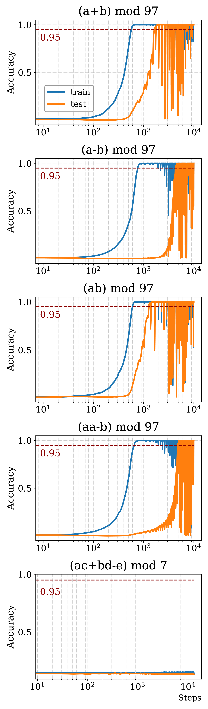

*(a) Обычное обучение*

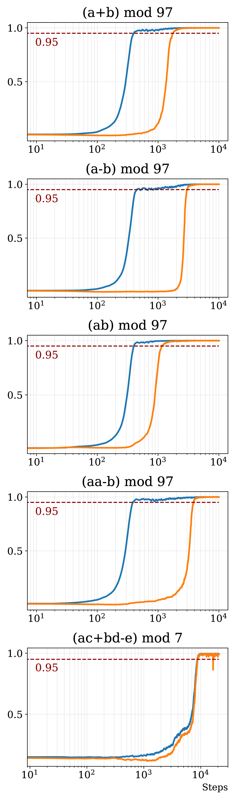

*(b) Grokfast-MA*

*(c) NeuralGrok*

*Рисунок 1: **Точность на обучении и на тесте в арифметических задачах.** NeuralGrok неизменно ускоряет генерализацию при гроккинге, особенно на трудной задаче.* **[p. 4]**

###### p4-4

**Постановка.** Мы строим пять арифметических задач разной трудности: четыре задачи с двумя доводами — (a+b) mod 97, (a−b) mod 97, (a$\times$b) mod 97, (a$\times$a−b) mod 97 — и одну трудную задачу с пятью доводами: (a$\times$c+b$\times$d−e) mod 7. Для первых четырёх задач мы берём двухслойный трансформер (Vaswani et al., 2023) как основную модель $M({\boldsymbol{\theta}})$ и трёхслойную MLP как нейронный усилитель. Нейронный усилитель мы обновляем каждые $T=4$ шага. Для сложной задачи (a$\times$c+b$\times$d−e) mod 7 мы берём четырёхслойный трансформер как основную модель. Чтобы усилитель приспосабливался быстрее, мы обновляем его каждый $T=1$ шаг.

###### p4-5

**Результаты.** Развитие точности на обучении и на тесте по всем пяти арифметическим задачам мы приводим на рисунке 1. На простых арифметических операциях с двумя доводами NeuralGrok даёт ускорение генерализации до $2.95\times$ и $2.08\times$ по сравнению с обычным обучением и GrokFast-MA **[p. 5]** соответственно. Примечательно, что NeuralGrok успешно осваивает самую трудную задачу (ac+bd−e) mod 7 с ускорением в $4.67\times$ против GrokFast-MA, тогда как и GrokFast-EMA, и обычное обучение не справляются с этой задачей ни на запоминании, ни на генерализации за $10^{6}$ шагов оптимизации. Это показывает, что *нейронный усилитель* действенно выучивает образец преобразования градиента, способствующий генерализации основной модели-трансформера.

###### p5-1

**Устойчивость картины генерализации.** Хотя обычное обучение способно достичь безупречной точности на тесте при регуляризации weight decay, мы находим, что динамика после генерализации крайне неустойчива. На всех арифметических задачах точность на тесте колеблется между безупречным значением ($\sim 100\%$) и обрушенным ($<5\%$). Увеличение weight decay как привычного приёма регуляризации не помогает. Как показано на рисунке 8, при $10\times$ большем weight decay модель-трансформер перестаёт учиться задаче: она не запоминает обучающий набор и не обобщает на тестовый. Схожее колебательное явление наблюдается и у GrokFast-EMA (рисунок 10), что указывает на пагубную неустойчивость в их фазе генерализации. Напротив, и NeuralGrok, и GrokFast-MA обнаруживают превосходную устойчивость и в фазе запоминания, и в фазе генерализации.

###### p5-2

**Обучаемость арифметических задач трансформерами.** В человеческом понимании модульные операции с основными математическими знаками $+$ и $-$ должны быть проще, чем $\times$ и более продвинутые задачи с составными операциями. Однако большинство алгоритмов сходятся в том, что операция вычитания ($-$) труднее для выучивания, чем $+$ и $\times$, если судить по действенности генерализации (таблица 1). Отсюда видно, что оцениваемые человеком или эвристические уровни трудности могут быть неприменимы к обучающимся нейронным сетям, — что и побуждает к механистическому истолкованию генерализации на основе модели, особенно при гроккинге.

###### tab-1

*Таблица 1: **Наименьшее число шагов оптимизации, потребное модели для достижения $95\%$ точности на тесте.** Лучшие итоги отмечены **полужирным**. NeuralGrok неизменно превосходит обычное обучение и GrokFast-MA на всех задачах.* **[p. 5]**

### 3.2 Влияние перемасштабирования градиента

Согласно уравнению 2, преобразование *нейронного усилителя* над исходным градиентом ${\boldsymbol{g}}$ раскладывается на два последовательных устройства: сперва он совершает поворот вектором единичной нормы ${\boldsymbol{p}}\in\Delta^{|g|}$; затем применяется перемасштабирование величины, сжимающее или растягивающее градиент до постоянной величины $c$. Чтобы исследовать влияние величины градиента, мы проводим всесторонние упрощающие опыты по гиперпараметру $c$ при обычном обучении и внутри порядка NeuralGrok. При обычном обучении с регуляризацией weight decay мы применяем нормирование градиента: ${\boldsymbol{g}}^{\prime}=c\cdot\frac{{\boldsymbol{g}}}{\|{\boldsymbol{g}}\|_{2}}$, которое меняет величину градиента, не меняя направления. Отметим, что перемасштабирование градиента не равнозначно применению разных скоростей обучения, поскольку скорость обучения не даёт постоянной величины градиента, а может считаться постоянным усилением на каждом шаге обучения.

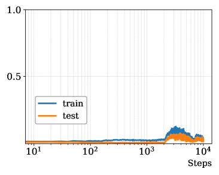

*(a)*

*(b)*

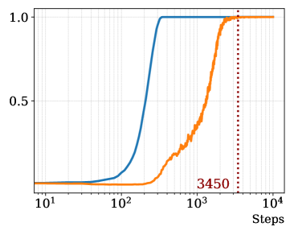

*(c)*

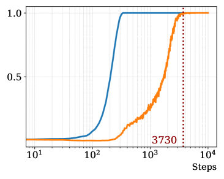

*(d)*

*Рисунок 2: **Обычное обучение при разных множителях перемасштабирования градиента $c$ на задаче (a+b) mod 97.** При $c$=$0.5,1.0,2.0$ обучение действенно уравновешивается по сравнению с 1(a), где величина не менялась.* **[p. 6]**

###### p5-4

**Перемасштабирование градиента как лучшая регуляризация, чем weight decay.** Простое применение нормирования градиента при обычном обучении не только уравновешивает динамику обучения, но и ускоряет генерализацию, особенно на трудных задачах. Согласно рисунку 2, при перемасштабировании градиента к $c$=$0.5,1.0,2.0$ значения точности и на обучающем, и на тестовом наборах существенно уравновешиваются, без заметных всплесков. Примечательно, что при $c$=$0.5$ генерализация на тестовом наборе ускоряется сильнее, чем при большем масштабе градиента ($c$=$1.0,2.0$). Однако при уменьшении $c$ до $0.01$ обучение рушится: оно значительно замедляется из-за малых градиентных обновлений. При применении обычного нормирования градиента $c$=$1.0$ на разных задачах (рисунок 3) модель-трансформер оказывается способна выучить трудную задачу (a$\times$c+b$\times$d−e) mod 7, которая не давалась на 1(a) при исходной неизменной **[p. 6]** величине градиента. Отсюда следует, что перемасштабирование градиента может быть более действенной регуляризацией, чем привычно применяемый weight decay, при обучении арифметическим задачам.

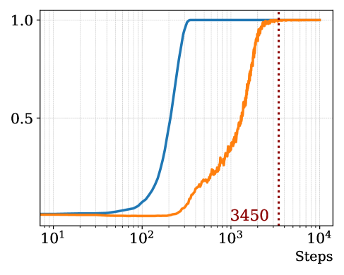

*(a)*

*(b)*

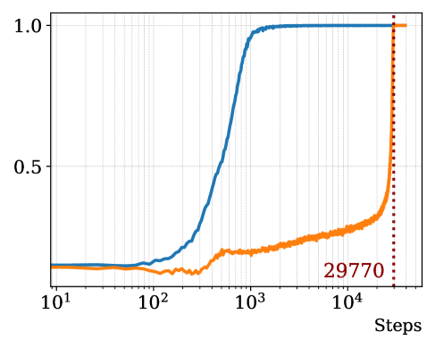

*(c)*

###### fig-3

*Рисунок 3: **Обычное обучение с обычным нормированием градиента $c$=$1.0$.** Нормирование градиента позволяет обобщить трудную задачу (a$\times$c+b$\times$d−e) mod 7, которая не давалась на 1(a), когда нормирование градиента не применялось.* **[p. 6]**

#### NeuralGrok устойчив при разных множителях перемасштабирования.

Тогда как перемасштабирование градиента оказывается решающим множителем при обычном обучении моделей-трансформеров, NeuralGrok обнаруживает устойчивое качество генерализации при разных значениях множителя $c$. Мы приводим точность на обучении и на тесте при $c$ от $0.2$ до $2.0$. Модель-трансформер неизменно достигает безупречной точности на тесте примерно за одно и то же время ($1.3ksteps$) при $c$ от $0.2$ до $1.0$. Тогда как бо́льшая величина градиента $c$=$2.0$ может привести к отложенной генерализации: безупречная точность на тесте достигается примерно за $\sim 2320$ шагов. Отсюда следует, что *нейронный усилитель* способен действенно приспосабливаться к разным величинам градиента при обновлении во внешнем круге, что дополнительно показывает устойчивость и обучаемость NeuralGrok.

*(a)*

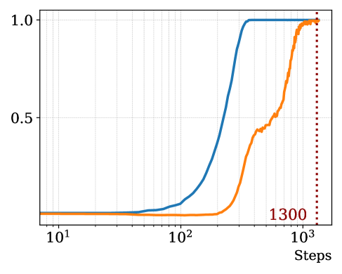

*(b)*

*(c)*

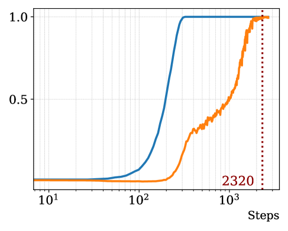

*(d)*

*Рисунок 4: NeuralGrok при разных множителях перемасштабирования градиента $c$ на задаче (a+b) mod 97. Модель достигает безупречной точности на тесте примерно за одно и то же время ($1.3ksteps$) при $c$ от $0.2$ до $1.0$. Тогда как бо́льшая величина градиента $c$=$2.0$ может привести к отложенной генерализации.* **[p. 6]**

**[p. 7]**

## 4 Истолкование гроккинга через сложность весов и градиентов

###### p7-1

Прежние исследования гроккинга предложили ценные теоретические и опытные наблюдения о фазовом переходе от запоминания к генерализации. Liu et al. (2023) предположили, что модель достигает генерализации, когда веса оптимизируются в *зону Златовласки*, что связано с убыванием евклидовой нормы весов модели. Однако недавние исследования (DeMoss et al., 2024; Golechha, 2024) доказывают, что динамика нормы весов не может как следует объяснить фазовый переход при гроккинге. Вместо этого Golechha (2024) предложил брать **а**бсолютную **в**есовую **э**нтропию (AWE) как оценку сложности модели:

$$
H(\mathcal{W})=-\sum_{w_{i}\in\mathcal{W}}|w_{i}|\ln{|w_{i}|}, \tag{3}
$$

###### p7-2

где $\mathcal{W}$ обозначает данный вектор или матрицу весов. Вслед за мерой AWE мы далее измеряем при обучении величину **а**бсолютной **г**радиентной **э**нтропии (AGE), отражающую сложность, обретаемую мгновенно на текущем шаге оптимизации:

$$
H(\mathcal{G})=-\sum_{g_{i}\in\mathcal{G}}|g_{i}|\ln{|g_{i}|}, \tag{4}
$$

где $\mathcal{G}$ обозначает данный вектор или матрицу градиентов. Затем мы измеряем развитие величин AWE и AGE на протяжении прогонов обучения, чтобы показать, как они связаны с продвижением запоминания и генерализации.

*(a) Обычное обучение.*

*(b) GrokFast-MA.*

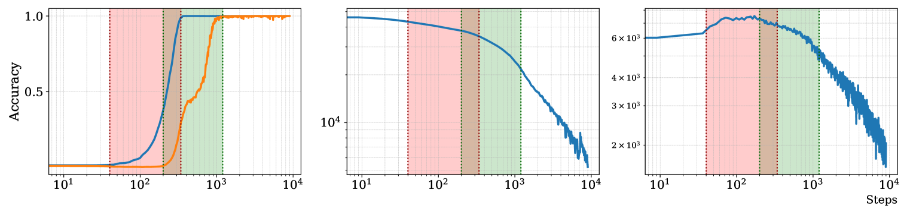

*(c) NeuralGrok.*

###### fig-5

*Рисунок 5: **Сложность модели, измеренная энтропией, на задаче (a+b) mod 97.** Окна перехода для фаз запоминания и генерализации отмечены красным и зелёным.* **[p. 7]**

#### Абсолютная градиентная энтропия как действенный указатель фазовых переходов.

###### p7-4

Как показано на рисунке 5, мы обучаем модели-трансформеры задаче (a+b) mod 97, приводя величины AWE и AGE наряду с кривыми точности на обучении и на тесте. В каждом опыте мы отмечаем окна перехода для фаз запоминания и генерализации красным и зелёным цветом соответственно. Во всех трёх опытах развитие величин AGE обнаруживает примечательное соответствие фазовым переходам: **в фазе *запоминания***, где **[p. 8]** точность на обучении растёт от нуля до безупречного уровня, **величина AGE соответственно растёт, что говорит о подгонке модели к замысловатому пространству признаков**; тогда как **в фазе *генерализации***, где модель начинает приспосабливаться к отложенному набору с растущей точностью на тесте, **величина AGE убывает, что указывает на постепенное сжатие моделью запомненных признаков в обобщаемый образец**.

#### NeuralGrok ускоряет генерализацию, снижая сложность модели.

###### p7-5

В сравнении с обычным обучением (5(a)) и GrokFast-MA (5(b)) модель, обученная с NeuralGrok, обнаруживает меньшие величины AWE и AGE, что говорит о меньшей сложности модели и лучшей способности обобщать. На рисунке 6 мы приводим величины AGE у исходных градиентов и у преобразованных градиентов после преобразования *нейронным усилителем*. Исходные градиенты до преобразования обнаруживают заметный всплеск сложности около $5\times 10^{2}$, тогда как преобразованные градиенты развиваются плавно.

###### fig-6

*Рисунок 6: **Абсолютная градиентная энтропия до и после преобразования градиента *нейронным усилителем*.*** **[p. 8]**

## 5 Обсуждение и ограничения

#### Всегда ли weight decay есть хорошая регуляризация?

###### p8-1

Тогда как прежние исследования утверждают, что weight decay есть решающий множитель, позволяющий обобщать при гроккинге, мы наблюдаем, что добавление weight decay может не помогать, а препятствовать обучению на трудных арифметических задачах. Мы исследуем разные сочетания приёмов регуляризации на задаче $(a\times c+b\times d-e)$ mod 7 и приводим итоги на рисунке 11. Мы находим, что одно лишь обычное нормирование градиента способно действенно уравновесить обучение и слегка ускорить генерализацию в условиях гроккинга. Напротив, применение одного лишь weight decay вызывает пагубное обрушение на рисунке 11 (c), где модель перестаёт учиться задаче: не происходит ни генерализации, ни запоминания. На практике мы советуем применять малое значение weight decay в сочетании с обычным нормированием градиента, чтобы достичь наилучшего качества на трудных арифметических задачах.

#### На удивление низкая переносимость преобразований градиента.

###### p8-2

Хотя NeuralGrok ускоряет гроккинг внутри отдельных арифметических задач, мы находим, что выученные преобразования градиента обнаруживают ограниченную переносимость даже между операциями, пользующимися схожими связями между переменными и операциями (например, $+$ против $-$).

###### p8-3

Отсюда следует, что *нейронный усилитель* приспосабливается к весьма свойственным задаче образцам градиента — например, подавляет шум в циклических модульных операциях или усиливает решающие признаки, чтобы расплести составные равенства. Так, преобразования, оптимизированные для модульного сложения ($+$), могут не переноситься на вычитание ($-$) или на задачи со смешанными операциями (рисунок 12), где динамика градиента заботится не только о связях между переменными и операциями, но и захватывает тонкие устройства рассуждения. Такая узкая приспособленность может проистекать из взаимодействия рамки двухуровневой оптимизации с узкими проверочными целями ($\mathcal{D}_{outer}$), вынуждающими усилитель следовать местной геометрии задачи, а не общим арифметическим началам. Будущая работа могла бы исследовать межзадачное метаобучение или общие усиливающие блоки, чтобы отделить всеобщие арифметические образцы от приспособлений, свойственных задаче.

#### Ограниченность наборов данных и постановок задач.

###### p8-4

Сейчас мы проводим опыты лишь на искусственных арифметических задачах, что даёт нам безупречное испытательное поле с управляемыми условиями, **[p. 9]** где можно устраивать опыты так, чтобы отделить множитель, влияющий на гроккинг, от шума настоящих данных или смещений набора. При обнадёживающем качестве на арифметических задачах мы рассчитываем распространить двухуровневую запись и замысел выучиваемого нейронного усилителя градиента на более сложные области применения — например, обучение больших языковых моделей. Это мы оставляем будущей работе.

## 6 Сопутствующие работы

#### Опытное наблюдение гроккинга.

Явление гроккинга — отложенной генерализации после затяжного переобучения — было впервые опытно замечено Power et al. (2022) в моделях-трансформерах, обучаемых арифметическим задачам. Это открытие вызвало волну исследований, посвящённых пониманию динамики запоминания и генерализации в переопараметризованных сетях. Последующие работы изучали гроккинг на разных задачах (Power et al., 2022; Liu et al., 2023; Lee et al., 2024). Liu et al. (2022) и Kumar et al. (2024) далее исследовали гроккинг сквозь призму обучения представлениям, выявив фазовые переходы в поведении модели при обучении. Примечательно, что Lee et al. (2024) показали: управляя градиентными сигналами — например, усиливая низкочастотные составляющие низкочастотным фильтром, — можно значительно ускорить генерализацию. Опытные разборы Pearce et al. (2023) и DeMoss et al. (2024) обнаружили, что модели переходят от плотных весовых устройств с большими величинами при запоминании к разрежённым и более простым устройствам при генерализации, — картина, подкреплённая мерами вроде абсолютной весовой энтропии (AWE) (Golechha, 2024). Эти наблюдения выделяют решающую роль динамики обучения и регуляризации в том, как складывается поведение при гроккинге.

#### Теоретическое понимание гроккинга.

Теоретические попытки объяснить гроккинг сосредоточивались на динамике оптимизации, сложности модели и неявной регуляризации. Davies et al. (2023) объединили гроккинг с двойным спуском, отнеся отложенную генерализацию к взаимодействию вместимости модели и сложности данных. Thilak et al. (2022) связали гроккинг с приспосабливающимися приёмами оптимизации, показав, что шум градиента и резкие минимумы влияют на время генерализации. Krogh & Hertz (1991) и Xie et al. (2024) подчеркнули двойственную роль weight decay: способствуя генерализации за счёт управления сложностью модели, чрезмерное убывание способно расшатать обучение и помешать схождению. Hardt et al. (2016) и Li et al. (2020) связали устойчивость нормы градиента с генерализацией, наведя на мысль, что резкие минимумы, отвечающие большим нормам градиента, связаны с плохим переносом.

## 7 Заключение

В этой статье мы предлагаем рамку двухуровневой оптимизации NeuralGrok как новый подход, выучивающий оптимальное преобразование градиента ради ускорения генерализации трансформеров в арифметических задачах. Обширными опытами на арифметических задачах мы показываем, что NeuralGrok действенно способствует генерализации, одновременно уравновешивая динамику обучения. Далее мы предложили меру абсолютной градиентной энтропии как измерение сложности обучения на каждом шаге оптимизации. Мы обнаруживаем, что абсолютная градиентная энтропия неизменно связана с фазовыми переходами при гроккинге, включая стадии запоминания и генерализации.

## Литература

- Abien Fred Agarap. Deep learning using rectified linear units (relu), 2019. URL https://arxiv.org/abs/1803.08375.

- Xander Davies, Lauro Langosco, and David Krueger. Unifying grokking and double descent, 2023. URL https://arxiv.org/abs/2303.06173.

- Branton DeMoss, Silvia Sapora, Jakob Foerster, Nick Hawes, and Ingmar Posner. The complexity dynamics of grokking, 2024. URL https://arxiv.org/abs/2412.09810.

**[p. 10]**

- Simin Fan, Razvan Pascanu, and Martin Jaggi. Deep grokking: Would deep neural networks generalize better?, 2024. URL https://arxiv.org/abs/2405.19454.

- Satvik Golechha. Progress measures for grokking on real-world tasks, 2024. URL https://arxiv.org/abs/2405.12755.

- Moritz Hardt, Benjamin Recht, and Yoram Singer. Train faster, generalize better: Stability of stochastic gradient descent, 2016. URL https://arxiv.org/abs/1509.01240.

- Ahmed Imtiaz Humayun, Randall Balestriero, and Richard Baraniuk. Deep networks always grok and here is why, 2024. URL https://arxiv.org/abs/2402.15555.

- Rie Johnson and Tong Zhang. Inconsistency, instability, and generalization gap of deep neural network training, 2023. URL https://arxiv.org/abs/2306.00169.

- Anders Krogh and John Hertz. A simple weight decay can improve generalization. *Advances in neural information processing systems*, 4, 1991.

- Tanishq Kumar, Blake Bordelon, Samuel J. Gershman, and Cengiz Pehlevan. Grokking as the transition from lazy to rich training dynamics, 2024. URL https://arxiv.org/abs/2310.06110.

- Jaerin Lee, Bong Gyun Kang, Kihoon Kim, and Kyoung Mu Lee. Grokfast: Accelerated grokking by amplifying slow gradients, 2024. URL https://arxiv.org/abs/2405.20233.

- Jian Li, Xuanyuan Luo, and Mingda Qiao. On generalization error bounds of noisy gradient methods for non-convex learning, 2020. URL https://arxiv.org/abs/1902.00621.

- Ziming Liu, Ouail Kitouni, Niklas Nolte, Eric J. Michaud, Max Tegmark, and Mike Williams. Towards understanding grokking: An effective theory of representation learning, 2022. URL https://arxiv.org/abs/2205.10343.

- Ziming Liu, Eric J. Michaud, and Max Tegmark. Omnigrok: Grokking beyond algorithmic data, 2023. URL https://arxiv.org/abs/2210.01117.

- Adam Pearce, Asma Ghandeharioun, Nada Hussein, Nithum Thain, Martin Wattenberg, and Lucas Dixon. Do machine learning models memorize or generalize?, 2023. URL https://pair.withgoogle.com/explorables/grokking/.

- Alethea Power, Yuri Burda, Harri Edwards, Igor Babuschkin, and Vedant Misra. Grokking: Generalization beyond overfitting on small algorithmic datasets. *arXiv preprint arXiv:2201.02177*, 2022.

- Lucas Prieto, Melih Barsbey, Pedro A. M. Mediano, and Tolga Birdal. Grokking at the edge of numerical stability, 2025. URL https://arxiv.org/abs/2501.04697.

- Vimal Thilak, Etai Littwin, Shuangfei Zhai, Omid Saremi, Roni Paiss, and Joshua Susskind. The slingshot mechanism: An empirical study of adaptive optimizers and the grokking phenomenon, 2022. URL https://arxiv.org/abs/2206.04817.

- Ashish Vaswani, Noam Shazeer, Niki Parmar, Jakob Uszkoreit, Llion Jones, Aidan N. Gomez, Lukasz Kaiser, and Illia Polosukhin. Attention is all you need, 2023. URL https://arxiv.org/abs/1706.03762.

- Zeke Xie, Zhiqiang Xu, Jingzhao Zhang, Issei Sato, and Masashi Sugiyama. On the overlooked pitfalls of weight decay and how to mitigate them: A gradient-norm perspective, 2024. URL https://arxiv.org/abs/2011.11152.

**[p. 11]**

## Приложение A Арифметические наборы данных

Мы берём тот же по сути способ построения арифметических наборов данных, что и Power et al. (2022). Однако мы не приписываем один-единственный оператор $\langle op\rangle$ сложным математическим выражениям с более чем одной операцией. Например, у Power et al. (2022) для выражения $x^{2}+xy+y^{2}$ берётся лишь один оператор $\langle op\rangle$: $\circ$, чтобы выразить $x\circ y=x^{2}+xy+y^{2}$, и строится набор равенств вида $\langle x\rangle\langle op\rangle\langle y\rangle\langle=\rangle\langle x\circ y\rangle$, где $\langle a\rangle$ обозначает токен, отвечающий элементу $a$.

В наших опытах мы приписываем разным операциям (например, $+,-,\times$) разные токены: $\langle op_{1}\rangle,\langle op_{2}\rangle,...$. Более того, мы не ограничиваемся двуместными операциями с двумя переменными $x,y$, а идём и к большему числу переменных, чтобы повысить трудность наборов данных. Формально: пусть математическое выражение содержит $n$ переменных $v_{1},v_{2},...,v_{n}$ и $m$ различных математических операций $op_{1},op_{2},...,op_{m}$; тогда набор равенств мы строим так:

$$
\langle v_{1}\rangle\langle v_{2}\rangle...\langle v_{n}\rangle\langle op_{1}\rangle\langle op_{2}\rangle...\langle op_{m}\rangle\langle=\rangle\langle ans\rangle
$$

###### p11-3

где $ans$ обозначает ответы математических равенств. Все арифметические задачи — модульные, с простым числом $p$. Например, для $a+b\ (\text{mod }97)$ набор данных строится в следующем виде:

$$
\langle a\rangle\langle b\rangle\langle+\rangle\langle=\rangle\langle ans\rangle
$$

Поскольку каждая входная переменная $v_{i}$ может выбираться от $0$ до $p-1$, общее число примеров задачи с $n$ переменными приблизительно равно $p^{n}$.

**[p. 12]**

## Приложение B Реализация нейронного усилителя

### B.1 Подробности архитектуры

*Нейронный усилитель* $G(\varphi)$ содержит простые MLP, обрабатывающие исходные градиенты ${\boldsymbol{g}}$. В основных опытах мы полагаем скрытую размерность $d=32$. Мы берём ReLU (Agarap, 2019) как функцию активации и нормируем преобразованный градиент после операции softmax, чтобы получить окончательный изменённый градиент $\textbf{g}^{\prime}$. В основных опытах мы полагаем $c=1$ в уравнении 2. Реализацию на PyTorch мы приводим ниже:

*Рисунок 7: Код NeuralGrok* **[p. 12]**

## Приложение C Дополнительные итоги по базовым приёмам

### C.1 Обычное обучение при разных значениях *weight decay*

Мы пробуем два значения (а именно $1e^{-2},1e^{-3}$) *weight decay*, чтобы посмотреть на картину обучения модели при обычном обучении. Однако мы находим, что при большем *weight decay* (то есть $1e^{-2}$) модель не справляется ни с запоминанием, ни с генерализацией, — оттого мы и выбираем меньшее значение $1e^{-3}$ для обычного обучения как базового приёма. Итоги приведены на рисунке 8.

*(a)*

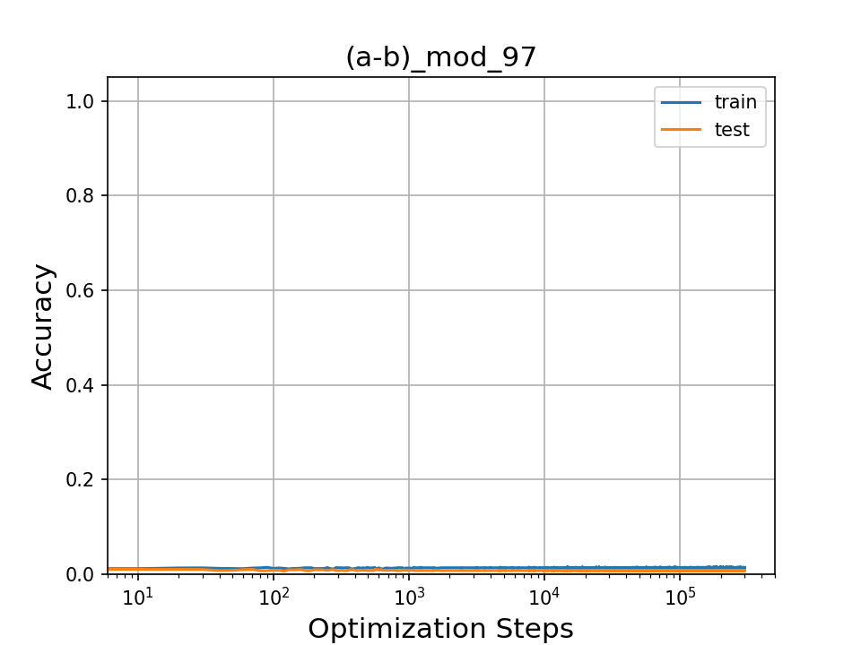

*(b)*

*(c)*

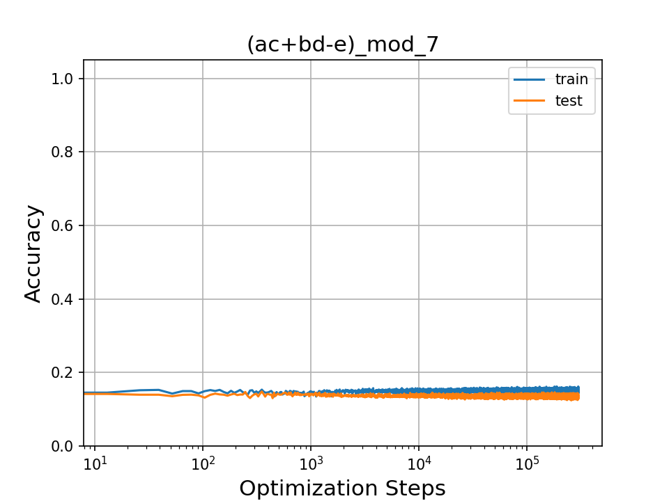

*(d)*

*Рисунок 8: Обычное обучение при *weight decay* $1e^{-2}$. Модель не справляется ни с запоминанием, ни с генерализацией во всех четырёх опытах.* **[p. 13]**

**[p. 13]**

### C.2 GrokFast-MA при разных значениях *weight decay*

Мы также сравниваем влияние разных значений (а именно $1e^{-2},1e^{-3}$) *weight decay* на Grokfast-MA. Итоги приведены на рисунке 9.

Из рисунка видно, что больший *weight decay* в некоторых задачах (например, $a+b\ (\text{mod }97)$) способен ускорить гроккинг сильнее. Однако в $ac+bd-e\ (\text{mod }7)$ модель за то же число шагов оптимизации не может даже выучиться. Поэтому в основных опытах мы полагаем *weight decay* равным $1e^{-3}$ по умолчанию.

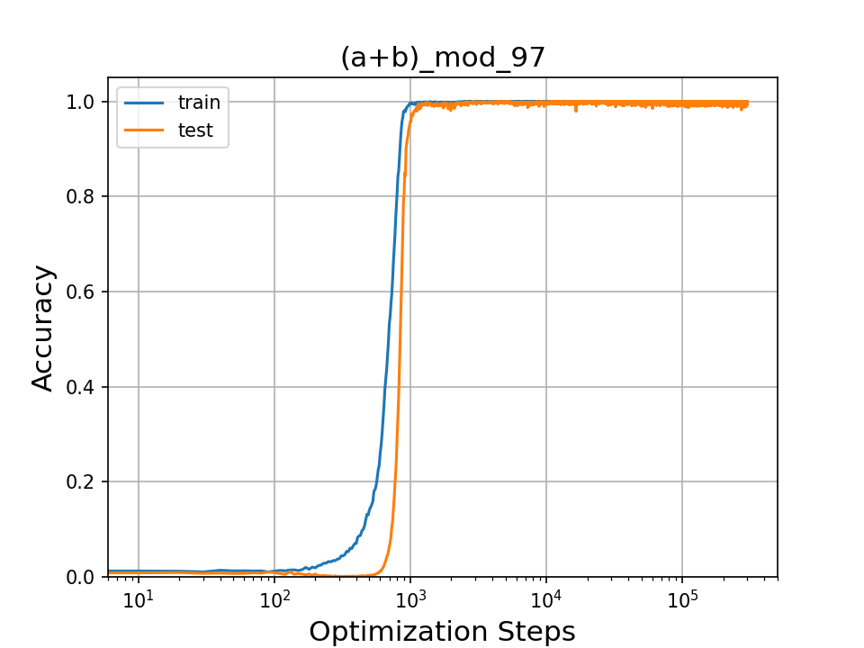

*(a)*

*(b)*

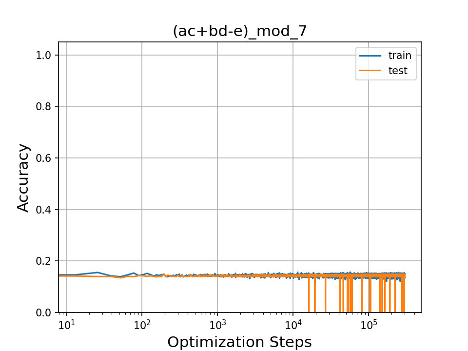

*(c)*

*(d)*

*Рисунок 9: Обучение Grokfast-MA при разных значениях *weight decay*.* **[p. 13]**

**[p. 14]**

### C.3 Опыты с Grokfast-EMA

Lee et al. (2024) предлагают также разновидность Grokfast-EMA. Мы следуем настройкам гиперпараметров, рекомендованным в их исходной статье, и проверяем качество на всех пяти задачах. Итоги приведены на рисунке 10. Мы наблюдаем неустойчивость Grokfast-EMA, к тому же чувствительного к гиперпараметрам. Как и базовое обычное обучение, он не справляется с самой трудной задачей.

*(a)*

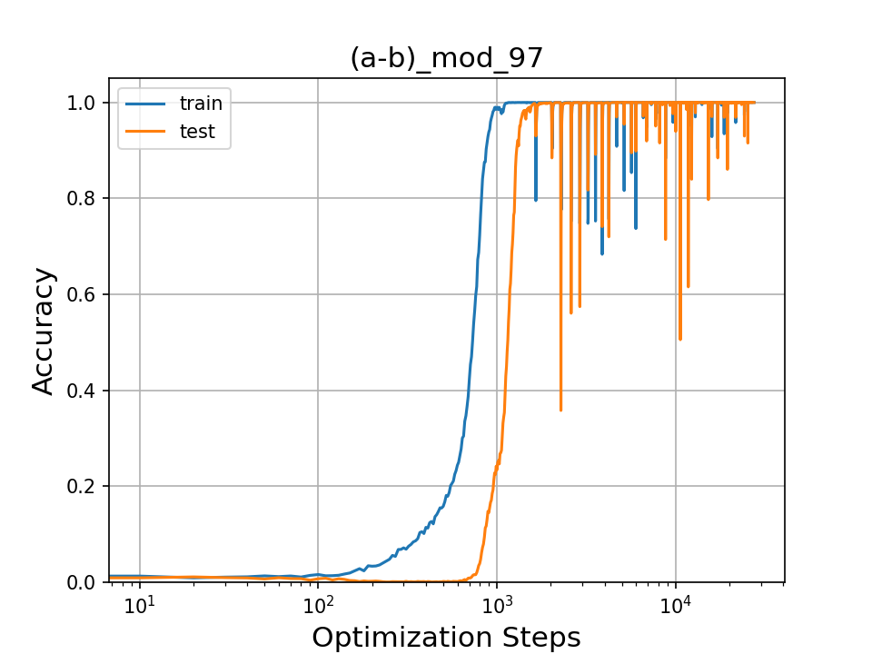

*(b)*

*(c)*

*(d)*

*(e)*

*Рисунок 10: Итоги Grokfast-EMA на всех задачах.* **[p. 14]**

**[p. 15]**

## Приложение D Сравнение регуляризации weight decay и перемасштабирования градиента на трудной задаче

### D.1 Задача 5: (axc+bxd-e) mod 97

Мы сравниваем действие привычной регуляризации weight decay и перемасштабирования градиента на $ac+bd-e\ (\text{mod }7)$ на рисунке 11. Одно лишь обычное нормирование градиента способно действенно уравновесить обучение, но ведёт к большему разрыву между переобучением и генерализацией при гроккинге. Мы советуем применять малое значение weight decay вместе с обычным нормированием градиента, чтобы достичь наилучшего качества на трудных арифметических задачах.

*(a)*

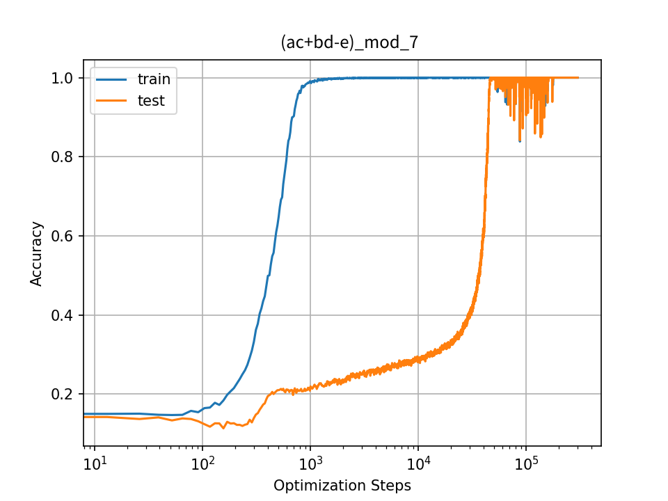

*(b)*

*(c)*

*(d)*

*Рисунок 11: **Обычное обучение на $ac+bd-e\ (\text{mod }7)$ при разных сочетаниях приёмов регуляризации.*** **[p. 15]**

**[p. 16]**

## Приложение E Переносимость нейронного усилителя между разными арифметическими задачами

Хотя NeuralGrok ускоряет гроккинг внутри отдельных арифметических задач, мы находим, что выученные преобразования градиента обнаруживают ограниченную переносимость даже между операциями, пользующимися схожими связями между переменными и операциями (например, $+$ против $-$).

Отсюда следует, что *нейронный усилитель* приспосабливается к весьма свойственным задаче образцам градиента — например, подавляет шум в циклических модульных операциях или усиливает решающие признаки, чтобы расплести составные равенства. Так, преобразования, оптимизированные для модульного сложения ($+$), могут не переноситься на вычитание ($-$) или на задачи со смешанными операциями (рисунок 12), где динамика градиента заботится не только о связях между переменными и операциями, но и захватывает тонкие устройства рассуждения. Такая узкая приспособленность может проистекать из взаимодействия рамки двухуровневой оптимизации с узкими проверочными целями ($\mathcal{D}_{outer}$), вынуждающими усилитель следовать местной геометрии задачи, а не общим арифметическим началам. Будущая работа могла бы исследовать межзадачное метаобучение или общие усиливающие блоки, чтобы отделить всеобщие арифметические образцы от приспособлений, свойственных задаче.

*(a)*

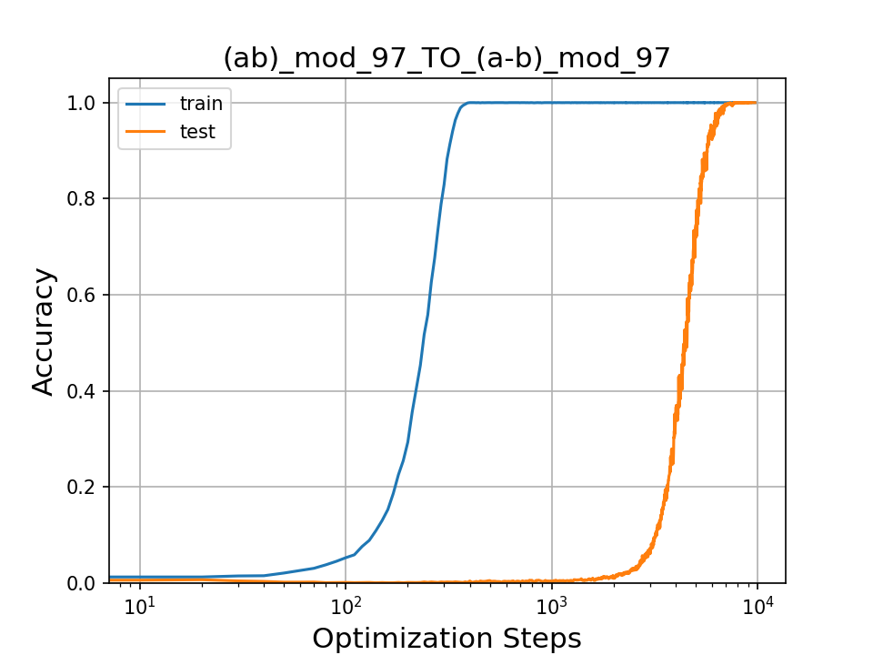

*(b)*

*(c)*

*(d)*

*Рисунок 12: Опыты с переносом обучения с других задач на $a-b\ (\text{mod }97)$. Разрыв между запоминанием и генерализацией остаётся заметным даже при предварительном обучении на самой трудной задаче.* **[p. 16]**
