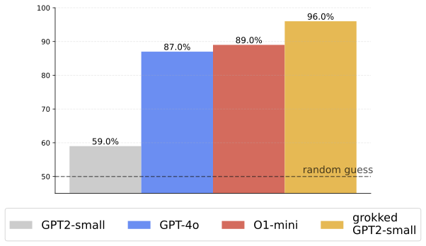
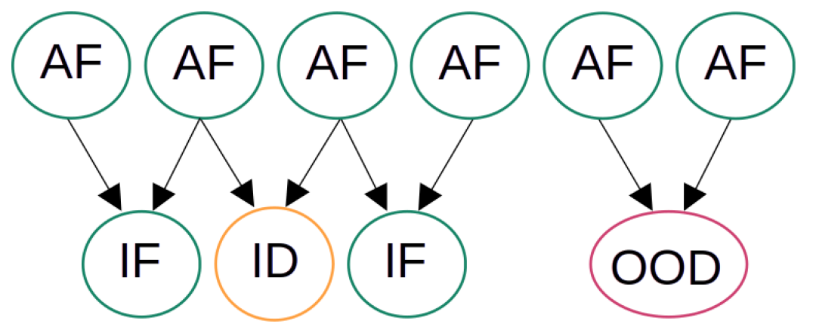
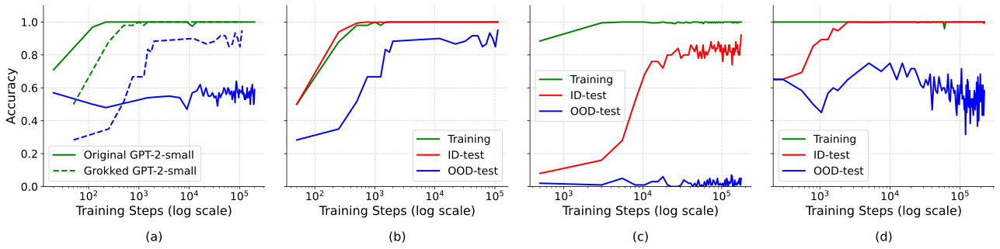

# Abramov, Steinbauer, Kasneci 2025 — Grokking in the Wild: Data Augmentation for Real-World Multi-Hop Reasoning with Transformers

См. также: [глобальный индекс понятий](../../concepts/index.md).

**Roman Abramov**, **Felix Steinbauer**, **Gjergji Kasneci** (Технический университет Мюнхена).

arXiv [2504.20752](https://arxiv.org/abs/2504.20752), 29 апреля 2025 (версия v2 — 7 мая 2025). 10 цитирований — двадцать четвёртая по цитируемости работа корпуса. Источник — нативный HTML arXiv версии v2.

Файлы разбора этой статьи:

- [`2504.20752.grokking-in-the-wild-data-augmentation-for-real-world-multi-hop-reasoning-with-transformers.claims.txt`](2504.20752.grokking-in-the-wild-data-augmentation-for-real-world-multi-hop-reasoning-with-transformers.claims.txt) — пронумерованные утверждения статьи с пометками разбора.
- [`2504.20752.grokking-in-the-wild-data-augmentation-for-real-world-multi-hop-reasoning-with-transformers.license.txt`](2504.20752.grokking-in-the-wild-data-augmentation-for-real-world-multi-hop-reasoning-with-transformers.license.txt) — лицензионная запись arXiv для этой статьи.

Схема якорей и правила ссылок на карточку — в [README папки статей](../README.md).

**Карточка-выдержка.** Лицензия статьи (`arxiv-nonexclusive`) не разрешает публикацию копии оригинала и полного перевода, поэтому карточка содержит редакторские секции и цитируемые фрагменты перевода (право цитирования). Полный текст статьи: <https://arxiv.org/abs/2504.20752>.

## Затрагиваемые понятия

**[Рассуждение и графы знаний](../../concepts/reasoning-knowledge-graphs.md)** — работа берёт рамку Wang et al. 2024 целиком: граф знаний, атомарные и выведенные факты, отношение $\phi_{r}$ выведенных фактов к атомарным для каждой связи, порог около $3.6$ для медленного гроккинга и до $18$ для быстрого образования контура ([`p4-4`](#p4-4)). Новое здесь одно, но существенное: рамка применяется не к синтетическому графу, а к **настоящему** — 2WikiMultiHopQA на материале «Википедии» ([`p5-9`](#p5-9)).

**[Доля данных и критический размер набора](../../concepts/data-fraction-critical-dataset-size.md)** — порог по $\phi$ здесь играет ту же роль, что критический размер набора в алгоритмических постановках, но с важным поворотом: в реальном корпусе $\phi\approx 0.5$, то есть **на порядок ниже порога**, и поднять его выборкой данных нельзя ([`p5-9`](#p5-9)). Отсюда и весь метод: недостающие выведенные факты **синтезируются**. Для сравнения авторы довели $\phi$ до $8$, для композиции — до $6.25$ ([`p5-16`](#p5-16), [`p6-5`](#p6-5)).

**[Обобщающие границы](../../concepts/generalization-bounds.md)** — теоретическая часть отвечает на вопрос «а нельзя ли просто взять граф побольше». Лемма 1: при допущении случайного графа ожидаемое число $n$-шаговых путей таково, что $\phi_{n,r}$ остаётся ограниченным сверху величиной $b^{\,n-1}$, сколько бы узлов ни добавляли ([`p5-2`](#p5-2), [`p5-3`](#p5-3)). Лемма 2 переводит это в необходимое условие на коэффициент ветвления каждой связи: если хотя бы у одной связи $b_{r}$ ниже порога, база знаний не полностью обобщаема ([`p5-5`](#p5-5), [`p5-6`](#p5-6)). Вывод для практики: **разрежённость реального графа — препятствие принципиальное, а не количественное**.

**[Гроккинг](../../concepts/grokking.md)** — главное утверждение работы для корпуса: гроккинг воспроизведён на реальных фактических данных, а не на игрушечной задаче ([`p1-2`](#p1-2)). Кривая знакомая: на исходном наборе точность на обучении доходит до $100\%$ и позднего скачка вне распределения **не происходит** вовсе, а после обогащения скачок появляется ([`p7-2`](#p7-2), [`p7-4`](#p7-4), [`fig-4`](#fig-4)).

**[Запоминание](../../concepts/memorization-phase.md)** — различение внутри и вне распределения проведено тщательно и заслуживает переноса в корпус: **ID** — выведенный факт из атомарных фактов, виденных при обучении, но не в этом сочетании; **OOD** — выведенный факт из атомарных фактов, ни разу не участвовавших **ни в одном** обучающем пути рассуждения ([`p4-15`](#p4-15), [`fig-3`](#fig-3)). Именно вторая мера отделяет структурную генерализацию от частичного запоминания.

**[Эмерджентность](../../concepts/emergence.md)** — практический вывод, ради которого работа и написана: восьмислойный GPT-2 (124 млн параметров), обученный с нуля на обогащённом корпусе, достигает $1.00$ внутри распределения и $0.96$ вне его на задаче сравнения, тогда как GPT-4o даёт $0.87$, а o1-mini — $0.88$ ([`tab-3`](#tab-3), [`fig-1`](#fig-1)). Способность возникает не от масштаба, а от **устройства распределения обучающих данных**.

**[Варианты регуляризации](../../concepts/regularization-variants.md)** — постановка обучения предельно обычная: AdamW, скорость обучения $5\times 10^{-5}$, батч 512, **weight decay 1**, до $\sim\!300$ тысяч шагов, три сида по 48 часов на A100 ([`p6-13`](#p6-13)). Никаких особых приёмов ускорения не применяется — вся ставка сделана на данные.

**[Механистическая интерпретируемость](../../concepts/mechanistic-interpretability.md)** — её в работе **нет**, и авторы это признают: возникновение обобщающих контуров наблюдается по кривым точности, а не вскрывается; распространить логит-линзу и зондирование внимания из Wang et al. на реальные задачи прямо названо будущей работой ([`p7-16`](#p7-16)).

Самое неожиданное утверждение стоит отдельно: **фактически неверные синтетические данные не вредят, а помогают** — они вынуждают модель опираться на структуру связей, а не на запоминание ([`p1-2`](#p1-2), [`p8-10`](#p8-10)). Авторы признают и риски: без отсева галлюцинации способны затмить подлинные факты, а в медицине или праве такой дрейф недопустим ([`p8-2`](#p8-2), [`p8-3`](#p8-3)).

Отдельно стоит сказать, чего в работе **нет**. Нет отдельного опыта, отделяющего вклад неверных фактов от вклада самого роста $\phi$. Нет объяснения, почему композиционная задача так и не грокает вне распределения ($0.07$ против $0.96$ у сравнения). И нет ни одного замера, показывающего, что «фактическая верность существенно не страдает», — это утверждение приведено без числа.

Карточки статей корпуса: [Power et al. 2022](../2201.02177.grokking-generalization-beyond-overfitting-on-small-algorithmic-datasets/2201.02177.grokking-generalization-beyond-overfitting-on-small-algorithmic-datasets.card.md) — задача и явление; [Wang et al. 2024](../2405.15071.grokked-transformers-are-implicit-reasoners/2405.15071.grokked-transformers-are-implicit-reasoners.card.md) — источник всей рамки: графы знаний, отношение $\phi$, различение композиции и сравнения, пороги; [Nanda et al. 2023](../2301.05217.progress-measures-for-grokking-via-mechanistic-interpretability/2301.05217.progress-measures-for-grokking-via-mechanistic-interpretability.card.md) — обобщающий контур как понятие; [Omnigrok](../2210.01117.omnigrok-grokking-beyond-algorithmic-data/2210.01117.omnigrok-grokking-beyond-algorithmic-data.card.md) — первый перенос гроккинга за пределы алгоритмических данных; [Varma et al. 2023](../2309.02390.explaining-grokking-through-circuit-efficiency/2309.02390.explaining-grokking-through-circuit-efficiency.card.md) — эффективность контуров, названная в обзоре; [Grokfast](../2405.20233.grokfast-accelerated-grokking-by-amplifying-slow-gradients/2405.20233.grokfast-accelerated-grokking-by-amplifying-slow-gradients.card.md) — приём сокращения затрат, названный в разделе об осуществимости.

## Что показано, а что предположено

Замечания редактора карточки по итогам разбора утверждений (`…claims.txt`). Работа прикладная: чужая теория, чужой набор данных, своя процедура синтеза и один большой прогон.

**Главный результат честный и полезный.** На исходном наборе с $\phi\approx 0.5$ позднего скачка вне распределения нет вовсе; после обогащения до $\phi=8$ он появляется ([`p7-2`](#p7-2), [`p7-4`](#p7-4)). Это ровно то предсказание, которое рамка Wang et al. делает, и оно проверено на настоящих данных — первый такой случай в корпусе.

**Леммы отвечают на правильный вопрос.** Показано, что $\phi_{n,r}$ ограничено сверху $b^{\,n-1}$ ([`p5-3`](#p5-3)), а значит, наращивание графа не спасает и синтез — не удобство, а необходимость. Цена — допущение случайного графа Эрдёша–Реньи, которому реальные графы знаний не подчиняются: настоящие графы имеют тяжёлые хвосты степеней и разрозненные подграфы, что авторы сами отмечают в ограничениях ([`p9-1`](#p9-1)).

**Заголовок держится на одной из двух задач.** На сравнении грокнувший GPT-2 даёт $0.96$ вне распределения; на композиции — $0.07$ ([`tab-3`](#tab-3)), то есть **хуже** GPT-4o ($0.25$) и o1-mini ($0.32$). Авторы это не скрывают ([`p7-6`](#p7-6)), но и рисунок 1, и аннотация продают средний по двум задачам результат как победу над передовыми моделями. Читать следует так: обогащение решает задачу сравнения и не решает композиционную.

**Сравнение с GPT-4o неравноправно по устройству.** Грокнувшая модель обучена на корпусе, где атомарные факты нужных связей присутствуют явно и многократно; GPT-4o и o1-mini отвечают без такой подготовки. Авторы отмечают обратную сторону — предобученные модели видели «Википедию» и потому у них нет чистого различения ID и OOD ([`p7-10`](#p7-10)), — но само неравенство условий не обсуждают.

**Утверждение о пользе неверных фактов не проверено отдельно.** Оно вынесено в аннотацию как «что удивительно» ([`p1-2`](#p1-2)) и повторено в заключении ([`p8-10`](#p8-10)), но опыта, где сравнивались бы обогащение верными и неверными фактами при одинаковом $\phi$, в работе нет. Показано, что обогащение (содержащее в том числе неверные факты) работает; что работает **из-за** них — не показано.

**«Фактическая верность существенно не страдает» — утверждение без числа.** Сказано, что «в среднем ответы модели становятся точнее» ([`p8-10`](#p8-10)), но замера фактического дрейфа нет; более того, он прямо назван задачей будущей работы ([`p7-16`](#p7-16)).

**Результат — один прогон из трёх сидов.** Приводится **лучший** прогон с оговоркой о разбросе $\pm 1$–$2\%$ ([`p6-13`](#p6-13)). Для скачкообразного явления, которое либо случается, либо нет, выбор лучшего прогона существеннее, чем для плавных кривых.

**Разбор ошибок сделан добросовестно.** Приложение A.4 показывает, что часть остаточных ошибок — не свойство модели, а несогласованность самого набора: у вопросов о гражданстве эталонным ответом бывает то прилагательное, то название страны. Это ставит под вопрос интерпретацию любых чисел выше примерно $0.95$ на этом эталоне.

**Место в корпусе.** Работа — практическое продолжение Wang et al. 2024 и первый перенос отношения $\phi$ на реальные данные. Её вклад в вики двоякий: показано, что порог по $\phi$ переносим с синтетики на настоящий корпус, и показано, что недостающие выведенные факты можно **изготовить**, а не искать. Оговорка при этом строгая: перенос удался на задаче сравнения и не удался на композиционной.

## Ошибочные цитирования

Замечания редактора карточки: места, где эта статья передаёт чужие результаты с ошибкой или без авторских оговорок. Сюда ведут ссылки «подробности» из разделов «Ошибочные пересказы и цитирования этой статьи» карточек процитированных работ.

###### mc-2405-15071
**Wang et al. (2405.15071) — сфабрикованный порог φ, трижды.** (1) `"When phi_r crosses a certain threshold—empirically found to be around 3.6 for slow generalization and up to 18 for faster circuits in GPT-2 style Transformers—the model tends to form a generalizing circuit for that relation (Power et al., 2022)"` — у Wang [φ коррелирует со скоростью гроккинга, порога формирования контура нет](../2405.15071.grokked-transformers-are-implicit-reasoners/2405.15071.grokked-transformers-are-implicit-reasoners.card.md#p4-1), генерализация наступала при всех тестированных φ от 3.6 до 18; вдобавок числа φ атрибутированы Power et al., у которых понятия φ нет вовсе. (2) `"well above the bare-minimum ratio of 3.6 reported by Wang et al. (2024) for slow grokking"` — 3.6 у Wang не минимум, а наименьшее тестированное значение. (3) `"This plateau aligns with earlier findings that phi ~ 0.5 is insufficient to induce grokking (Wang et al., 2024)"` — эксперимента с φ≈0.5 в цитируемой работе нет; сфабрикованная опора для собственного результата. При этом в другом месте та же статья передаёт роль φ точно.

---

# Цитируемые фрагменты перевода

Ниже приведены только те фрагменты перевода, на которые ссылаются карточки корпуса (право цитирования). Нумерация якорей `pN-M` / `fig-N` / `sec-X` совпадает с полной карточкой и оригиналом.

## Аннотация

###### p1-2

Трансформеры добились большого успеха во множестве задач обработки языка, но по-прежнему обнаруживают заметные пробелы в многошаговом рассуждении о фактах, особенно когда знания о реальном мире разрежены. Недавние успехи в изучении гроккинга показали, что нейронные сети способны переходить от запоминания к безупречной генерализации, как только обнаружат лежащие в основе логические закономерности, — однако эти исследования пользовались в основном малыми синтетическими задачами. В этой статье мы впервые распространяем гроккинг на реальные фактические данные и решаем задачу разрежённости набора, обогащая существующие графы знаний тщательно построенными синтетическими данными так, чтобы поднять отношение $\phi_{r}$ выведенных фактов к атомарным выше порога, необходимого для гроккинга. Что удивительно, мы находим, что даже фактически неверные синтетические данные способны укрепить возникающие рассуждающие контуры, а не ухудшить точность, поскольку они вынуждают модель опираться на структуру связей, а не на запоминание. При проверке на эталонах многошагового рассуждения наш подход достигает 95–100 % точности на 2WikiMultiHopQA, существенно превосходя сильные базовые решения и достигая или превосходя нынешние наилучшие результаты. Далее мы подробно разбираем, как рост $\phi_{r}$ движет образованием обобщающих контуров внутри трансформеров. Наши находки указывают, что обогащение данных, опирающееся на гроккинг, способно раскрыть неявные способности к многошаговому рассуждению, открывая путь к более надёжному и объяснимому рассуждению о фактах в больших языковых моделях.

## 1 Введение и связанные работы

###### fig-1



*Рисунок 1: Средняя точность на 2WikiMultiHopQA в задаче сравнения. Несмотря на то что GPT2-small — модель на 124 миллиона параметров, её грокнувшая версия достигает почти 100 % точности, превосходя новейшие модели gpt-4o и o1-mini.* **[p. 1]**

#### Вклады.

###### p2-8

В следующих разделах мы излагаем математическое основание нашего способа обогащения данных, эмпирические постановки на 2WikiMultiHopQA и новые наблюдения о неявном многошаговом рассуждении. Наши находки показывают, что *гроккинг — не артефакт, замкнутый в надуманных игрушечных наборах*, а мощный механизм, который при подходящей правке распределения данных можно поставить на службу рассуждению о реальных фактах в большом масштабе.

##### **Определение 2.10**(коэффициент генерализации)**.**

###### p4-4

Когда $\phi_{r}$ переходит определённый порог — эмпирически найденный около 3.6 для медленной генерализации и до 18 для более быстрого образования контуров в трансформерах вида GPT-2, — модель склонна образовывать *обобщающий контур* для этой связи (Power et al., 2022). Эти пороги приблизительны и зависят от архитектуры (Nanda et al., 2023; Wang et al., 2024), но выражают основное правило: *без достаточного числа многошаговых фактов модель никогда не «грокает» соответствующую связь.*

##### **Пример 5**(цепочка из 3 шагов)**.**

###### fig-3



*Рисунок 3: **Смысловое различие ID и OOD:** показаны выведенные факты внутри распределения **(ID, оранжевые)** и вне распределения **(OOD, красные)**. Все **зелёные** составляющие встречались при обучении, включая все атомарные факты **(AF)** и часть выведенных **(IF)**.* **[p. 4]**

##### **Определение 2.12**(внутри и вне распределения)**.**

###### p4-15

**Внутри распределения (ID)**: **выведенный факт**, полученный из сочетаний атомарных фактов, которые **присутствовали в обучении**, но никогда не встречались вместе именно в этом сочетании. Модель **видела** все составляющие знания **по отдельности** и разные рассуждающие сочетания с ними, но не в этой конкретной проверочной расстановке. **Вне распределения (OOD)**: **выведенный факт**, полученный из атомарных фактов, которые **присутствовали в обучении**, но **не использовались** ни в **одном** обучающем пути рассуждения. Модель видела отдельные составляющие знания, но не то, как их следует применять в проверяемом контексте. **Рисунок 3** показывает обучающие факты (атомарные и выведенные), связанные с проверочными фактами ID и OOD.

#### Лемма 1 (асимптотическая граница числа $n$-шаговых путей).

###### p5-2

*Рассмотрим базу знаний с $|\mathcal{V}|$ сущностями, средним коэффициентом ветвления $b$ и (приближённым) допущением случайного графа: каждое возможное *ориентированное* ребро между двумя различными узлами присутствует с вероятностью $\tfrac{b}{|\mathcal{V}|-1}$. Тогда при большом $|\mathcal{V}|$ ожидаемое число допустимых $n$-шаговых путей удовлетворяет:*

###### p5-3

*Более того, в пределе $|\mathcal{V}|\to\infty$ отношение $\phi_{n,r}$, зависящее от связи (то есть отношение n-шаговых фактов к одношаговым для связи r), остаётся ограниченным сверху величиной $b^{\,n-1}$.*

#### Лемма 2 (необходимое условие полной обобщаемости).

###### p5-5

*Пусть $\phi_{G}$ — наименьшее отношение, требуемое, чтобы запустить опирающуюся на гроккинг генерализацию для данной архитектуры. База знаний **полностью обобщаема** по $n$-шаговым фактам только если $\forall\,r\in\mathcal{R}$*

###### p5-6

*где $b_{r}=\frac{|\mathcal{F}_{A,r}|}{|\mathcal{V}|}$ — коэффициент ветвления, зависящий от связи. Равносильно: если хотя бы одно $b_{r}$ падает ниже этого порога, база знаний не может быть полностью обобщаемой.*

#### Обзор 2WikiMultiHopQA.

###### p5-9

Мы пользуемся набором **2WikiMultiHopQA** (Ho et al., 2020) — известным эталоном для порождения с опорой на поиск (RAG) и для многошаговых вопросно-ответных задач. 2WikiMultiHopQA состоит из абзацев «Википедии», опорных фактов (троек) и рассуждающих вопросов, часто требующих соединить несколько свидетельств. При всей своей широте *исходное* отношение $\phi\approx 0.5$ — то есть каждые два атомарных факта порождают лишь один выведенный, — чего недостаточно, чтобы гроккинг возник сам собой.

#### 3.2.1 Задача сравнения

###### p5-16

В задаче сравнения атомарные факты (например, City — country — X) объединяются в пары, из которых складываются вопросы об общих свойствах. Поначалу мы отбираем $120$ атомарных фактов и $60$ выведенных, сосредоточенных на географических местах (Индия, Франция, США, Канада, Россия). Нашим способом обогащения мы расширяем это до $1{,}000$ атомарных фактов и $8{,}000$ выведенных, что даёт $\phi_{G}=8$ — заметно выше того минимального отношения $3.6$, что приводят Wang et al. (2024) для медленного гроккинга.

#### 3.2.2 Композиционная задача

###### p6-5

Композиционные задачи требуют связать несколько связей подряд (например, Person — spouse of — X — born in — Year). Мы начинаем с $200$ атомарных фактов и $100$ выведенных, следя за тем, чтобы даты нигде не назывались прямо в ответе, и расширяем до $800$ атомарных фактов и $5{,}000$ выведенных. Это поднимает $\phi_{G}$ до $6.25$ — на деле достаточно, чтобы запустить динамику гроккинга.

#### Модель и обучение.

###### p6-13

Мы обучаем восьмислойный трансформер вида GPT-2 (768 скрытых единиц, 12 голов внимания) *с нуля* при помощи AdamW (Loshchilov et al., 2017) со скоростью обучения $5\times 10^{-5}$, размером батча 512 и weight decay 1. Мы опираемся на HuggingFace Trainer111https://github.com/huggingface/transformers с расписанием по умолчанию, точностью bf16 и torch_compile ради скорости. Обучение идёт до $\sim\!300\text{k}$ шагов **или** до появления позднего скачка точности вне распределения (OOD). Мы используем три случайных сида на одном GPU A100 (по 48 часов каждый) и приводим лучший прогон (разброс $\pm 1\text{--}2\%$).

#### Проверка внутри и вне распределения.

###### fig-4



*Рисунок 4: **(a)** **Точность на задаче сравнения для исходного и грокнувшего GPT2-small на проверочном множестве OOD.** Видно, что точность OOD остаётся почти той же, пока не достигает 100 %, но затем различие становится очевидным. Грокнувший трансформер продолжает наращивать точность по ходу обучения, в отличие от исходной версии. **(b)** **Кривые обучения для структурированной задачи сравнения**. IID и OOD ведут себя схоже. **(c)** **Структурированная композиционная задача**. Мы видим почти безупречную точность ID, но никакого позднего скачка точности OOD. **(d)** **Кривые обучения для неструктурированной постановки сравнения (полные абзацы «Википедии»).** Сложность замедляет сходимость и ограничивает выигрыш вне распределения, хотя точность ID всё же значительно растёт.* **[p. 8]**

### 4.2 Исходный набор данных (без обогащения)

###### p7-2

Обучение только на исходных *структурированных данных сравнения* даёт $100\%$ точности на обучении и *никакого* позднего скачка OOD (рисунок 4 (a)).

#### Структурированные задачи сравнения.

###### p7-4

Рисунок 4 (b) показывает ясный поздний скачок точности OOD, когда вопросы спрашивают, разделяют ли две сущности некоторое свойство (например, City A — country — France против City B — country — France). Такое более простое устройство связей охотнее запускает образование обобщающего контура.

#### Структурированные композиционные задачи.

###### p7-6

- **Точность ID** поднимается почти до безупречной, что говорит о сильном запоминании виденных образцов. - **Точность OOD** остаётся низкой, позднего улучшения нет. Сложные многошаговые связи, по-видимому, усвоить труднее даже с обогащением (Nanda et al., 2023).

### 4.5 Сводная таблица

###### p7-10

Таблица LABEL:tab:accuracy сравнивает наш **грокнувший GPT-2–small** с GPT-4o и o1-mini на структурированном наборе. Наш метод превосходит остальные, особенно в задаче сравнения, где мы достигаем почти $100\%$ даже вне распределения. Предобученные модели вроде GPT-4o могут не давать ясного разделения ID и OOD, поскольку они видели обширные тексты «Википедии».

###### tab-3

| **Метод** | **Сравнение** | **Композиция** | **Сред.** | | | | |---|---|---|---|---|---|---| | IID | OOD | IID | OOD | IID | OOD | | | GPT2-Small | 0.70 | 0.59 | – | 0.03 | 0.70 | 0.31 | | GPT-4o* | 0.87 | 0.25 | 0.56 | | | | | o1-mini* | 0.88 | **0.32** | **0.60** | | | | | **Грокнувший** | **1.00** | **0.96** | **0.93** | 0.07 | **0.97** | **0.52** | | **GPT2-Small** | | | | | | |

#### Разбор и объяснимость.

###### p7-16

Хотя мы наблюдаем возникающие обобщающие контуры, точное *устройство* их образования понято лишь отчасти. **[p. 8]** Будущая работа может:

#### Фактическая верность.

###### p8-2

Ключевой вопрос — как синтетические данные (часть из которых намеренно или случайно галлюцинирована) сказываются на фактической точности модели. Хотя наши опыты показывают, что умеренные количества нефактических данных способны *подкрепить* генерализацию, мы признаём возможные опасности:

###### p8-3

- **Искажение реальных знаний:** без тщательного отсева галлюцинации могут переписать или затмить подлинные факты. - **Хрупкость фактов:** некоторые задачи (например, медицинское или юридическое рассуждение) требуют строгой правильности, и любой фактический дрейф там недопустим.

## 6 Заключение

###### p8-10

Мы показали, что тщательно построенный **синтез данных** способен так перекроить распределение фактического языкового корпуса, что это *раскрывает* опирающуюся на гроккинг генерализацию. Даже модель GPT-2 умеренного размера способна значительно выиграть в *многошаговом рассуждении*, пользуясь поздним образованием внутренних контуров, — превосходя более мощные модели, не получившие синтетического обогащения данных. Более того, наши эмпирические результаты указывают, что фактическая верность существенно не страдает: в среднем ответы модели становятся точнее, когда ей даётся хорошо уравновешенная смесь **[p. 9]** настоящих и синтезированных фактов. Главная мысль этой работы: **повышение отношения выведенных фактов к атомарным $\phi_{r}$ синтетическими данными остаётся самым прямым путём к возникающим рассуждающим контурам**.

###### p9-1

Тем не менее наш подход обнажает и несколько **ограничений**. Полная генерализация по всем связям требует, чтобы атомарные факты каждой связи были обогащены в достаточной мере, а это может быть трудно для *редких* и *низкочастотных* связей. Во многих реальных корпусах графы знаний не только разрежены, но и *несвязны* или отчасти *неинъективны*, что ограничивает число многошаговых путей, на которых модель может учиться.

```yaml
paper:
  id: 2504.20752
  title: "Grokking in the Wild: Data Augmentation for Real-World Multi-Hop Reasoning with Transformers"
  authors: [Roman Abramov, Felix Steinbauer, Gjergji Kasneci]
  affiliation: "Technical University of Munich"
  date: 2025-04-29
  venue: "препринт arXiv (v2 от 2025-05-07)"
  citations: 10
  source: native-html-v2

core_claim:
  name: "перенос порога по phi с синтетики на реальный корпус"
  framework: "взята у Wang et al. 2024 целиком: граф знаний, атомарные и выведенные
    факты, отношение phi_r выведенных к атомарным, пороги 3.6 (медленный гроккинг)
    и 18 (быстрое образование контура)"
  obstacle: "у реального 2WikiMultiHopQA phi ~ 0.5 — на порядок ниже порога"
  method: "недостающие выведенные факты СИНТЕЗИРУЮТСЯ языковой моделью,
    а не отыскиваются в данных"
  result: "без обогащения позднего скачка вне распределения нет вовсе;
    после обогащения он появляется — на задаче сравнения"

theory:
  lemma_1: "при допущении случайного графа phi_{n,r} ограничено сверху b^(n-1)
    независимо от числа узлов — наращивание графа не спасает"
  lemma_2: "необходимое условие полной обобщаемости: коэффициент ветвления b_r
    каждой связи должен превосходить порог; иначе эта связь не грокнет"
  caveat: "модель случайного графа с равновероятными рёбрами; реальные графы знаний
    имеют тяжёлые хвосты степеней и разрозненные подграфы"
  figure_5: "формула ЗАНИЖАЕТ истинное phi_{3,r} на случайно порождённом графе;
    совпадают форма и порядок величины"

id_ood:
  in_distribution: "выведенный факт из атомарных фактов, виденных при обучении,
    но не в этом сочетании"
  out_of_distribution: "выведенный факт из атомарных фактов, ни разу не участвовавших
    НИ В ОДНОМ обучающем пути рассуждения"

augmentation:
  tool: "GPT-4o и o1-mini; все подсказки приведены в приложении A.5"
  comparison: "со 120 атомарных / 60 выведенных до 1000 / 8000, phi = 8"
  composition: "с 200 / 100 до 800 / 5000, phi = 6.25"
  pipeline: "для композиции: разбор текста в граф, добавление рёбер без циклов,
    выборка многошаговых путей, превращение пятёрок в вопросы"

setup:
  model: "GPT-2-подобный трансформер, 8 слоёв, 768 скрытых, 12 голов, с нуля"
  optimizer: "AdamW, lr 5e-5, батч 512, weight decay 1, bf16"
  steps: "до ~300 тыс.; три сида по 48 часов на A100; приводится ЛУЧШИЙ прогон"
  dataset: "2WikiMultiHopQA, структурированное и неструктурированное подмножества,
    задачи сравнения и композиции"

results:
  grokked_gpt2_small: {comparison_iid: 1.00, comparison_ood: 0.96,
    composition_iid: 0.93, composition_ood: 0.07, avg_iid: 0.97, avg_ood: 0.52}
  gpt2_small: {comparison_iid: 0.70, comparison_ood: 0.59, composition_ood: 0.03,
    avg_iid: 0.70, avg_ood: 0.31}
  gpt4o: {comparison: 0.87, composition: 0.25, avg: 0.56}
  o1_mini: {comparison: 0.88, composition: 0.32, avg: 0.60}
  note: "у предобученных моделей ID/OOD не разделяются — они видели «Википедию»"

findings:
  - id: 1
    claim: "на исходном наборе (phi ~ 0.5) 100 % на обучении и никакого позднего
      скачка вне распределения"
    anchor: p7-2
  - id: 2
    claim: "после обогащения на задаче сравнения появляется ясный поздний скачок OOD"
    anchor: p7-4
  - id: 3
    claim: "на композиционной задаче скачка нет: ID почти безупречен, OOD низкий"
    anchor: p7-6
  - id: 4
    claim: "phi_{n,r} ограничено сверху b^(n-1) — синтез данных необходим, а не удобен"
    anchor: p5-3
  - id: 5
    claim: "различение ID и OOD через участие атомарных фактов в обучающих путях"
    anchor: p4-15
  - id: 6
    claim: "даже фактически неверные синтетические данные, по заявлению авторов,
      укрепляют рассуждающие контуры"
    anchor: p1-2

open_questions:
  - "почему композиционная задача не грокает вне распределения"
  - "каков вклад именно НЕВЕРНЫХ фактов отдельно от роста phi"
  - "насколько велик фактический дрейф от синтетических данных (не измерен)"
  - "переносится ли динамика на области помимо «Википедии»"

limits:
  - "заголовочный результат держится на задаче сравнения; на композиции OOD = 0.07,
    хуже GPT-4o (0.25) и o1-mini (0.32)"
  - "сравнение с GPT-4o неравноправно: грокнутая модель обучена на корпусе
    с нужными атомарными фактами, предобученные модели отвечают без подготовки"
  - "утверждение о пользе неверных фактов не проверено отдельным опытом"
  - "«фактическая верность не страдает» приведено без числа"
  - "приводится лучший из трёх прогонов"
  - "часть остаточных ошибок — несогласованность самого набора данных (приложение A.4)"
  - "леммы выведены для модели случайного графа, а не для реальных графов знаний"

corpus_tension:
  wang: "прямое продолжение: порог по phi впервые проверен на настоящем корпусе"
  power: "самое сильное в корпусе свидетельство, что гроккинг не артефакт игрушек"
  omnigrok: "тот же ход наружу, но средством служит распределение данных,
    а не масштаб инициализации"
  nanda: "«обобщающий контур» употребляется как готовое понятие, но не вскрывается"

concept_cards:
  reasoning-knowledge-graphs: p4-4
  data-fraction-critical-dataset-size: p5-9
  generalization-bounds: p5-3
  grokking: p7-4
  memorization-phase: p4-15
  emergence: p7-10
  regularization-variants: p6-13
  mechanistic-interpretability: p7-16

sources:
  original_html: original/2504.20752.native.html
  converted_text: original/2504.20752.grokking-in-the-wild-data-augmentation-for-real-world-multi-hop-reasoning-with-transformers.md
  images_dir: images/
  pdf: https://arxiv.org/pdf/2504.20752v2

anchors:
  scheme: "pN-M | fig-N | tab-N | sec-N (token headings, cross-viewer portable)"
  policy: "якоря заводятся только там, где на них ссылаются; разрывы страниц якорей не несут"
  paragraph: [p1-2, p1-4, p1-5, p2-3, p4-4, p4-15, p5-2, p5-3, p5-5, p5-6, p5-9,
    p5-16, p6-5, p6-13, p7-2, p7-4, p7-6, p7-10, p7-16, p8-2, p8-3, p8-10, p9-1]
  figure: [fig-1, fig-3, fig-4, fig-5]
  table: [tab-3]

review_summary:                   # см. раздел «Что показано, а что предположено»
  strong: "предсказание рамки Wang et al. проверено на настоящих данных и подтвердилось
    на задаче сравнения; леммы отвечают на правильный вопрос (наращивать граф бесполезно);
    разбор ошибок в приложении A.4 честен и полезен"
  weak: "заголовок держится на одной задаче из двух; сравнение с передовыми моделями
    неравноправно по устройству; самое броское утверждение — о пользе неверных фактов —
    не проверено отдельным опытом; приводится лучший прогон"
  authors_own_limits:
    - "редкие и низкочастотные связи обогатить трудно"
    - "реальные графы знаний несвязны и отчасти неинъективны"
    - "механизм образования контуров не вскрыт"
    - "обучение до гроккинга дорого"

translation:
  status: complete
  formula_parity: "display 28/28, inline 165/165"
  figures: "5/5 (три из них — векторные .svg, как в оригинале)"
  pagination: "15 из 15 страниц отмечены"
  note: "подсказки к языковой модели в приложении A.5 и примеры вопросов из
    2WikiMultiHopQA в приложении A.4 оставлены на английском: это дословные
    артефакты метода и данных, и их перевод исказил бы разбираемое"
```
