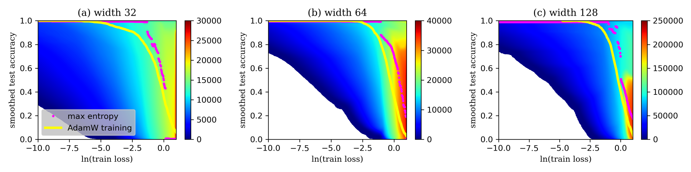
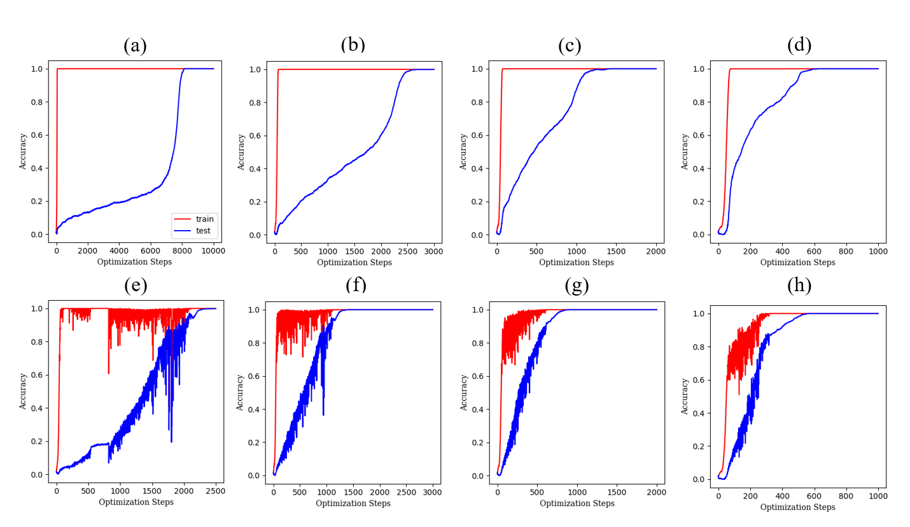

# Zhang et al. 2025 — Is Grokking a Computational Glass Relaxation?

См. также: [глобальный индекс понятий](../../concepts/index.md).
arXiv [2505.11411v5](https://arxiv.org/abs/2505.11411), 16 мая 2025 (v5 — 3 января 2026). Колонтитул PDF: «39th Conference on Neural Information Processing Systems (NeurIPS 2025).».

**Xiaotian Zhang** — Department of Physics, City University of Hong Kong, Hong Kong, China.
**Yue Shang** — Department of Physics, City University of Hong Kong, Hong Kong, China; Department of Physics and Astronomy, University of Pennsylvania, Philadelphia, PA, USA.
**Entao Yang** (переписка: entao.yang@airliquide.com) — Innovation Campus Delaware, Air Liquide, Newark, DE, USA.
**Ge Zhang** (переписка: gzhang37@cityu.edu.hk) — Department of Physics, City University of Hong Kong, Hong Kong, China.

Оригинал и производные файлы этой папки:

- [`original/2505.11411.native.html`](original/2505.11411.native.html) — первоисточник, нативный HTML-рендеринг arXiv (LaTeXML), скачан как есть.
- [`original/2505.11411.is-grokking-a-computational-glass-relaxation.md`](original/2505.11411.is-grokking-a-computational-glass-relaxation.md) — конверсия оригинала в Markdown без правок содержания; английский текст для сверки перевода.
- [`images/`](images/) — иллюстрации статьи в исходном разрешении (8 файлов).
- [`2505.11411.is-grokking-a-computational-glass-relaxation.claims.txt`](2505.11411.is-grokking-a-computational-glass-relaxation.claims.txt) — рабочий разбор: пронумерованные утверждения с пометками.

Схема якорей и правила ссылок на карточку — в [README папки статей](../README.md).

**Карточка-выдержка.** Лицензия статьи (`cc-by-nc-nd-4.0`) разрешает распространение оригинала, но не производных: полный перевод не публикуется, карточка содержит редакторские секции и цитируемые фрагменты перевода (право цитирования). Оригинал — [`original/2505.11411.is-grokking-a-computational-glass-relaxation.md`](original/2505.11411.is-grokking-a-computational-glass-relaxation.md); страница статьи: <https://arxiv.org/abs/2505.11411>.

## Затрагиваемые понятия

**[Гроккинг](../../concepts/grokking.md)** — работа даёт корпусу первое измерение больцмановской энтропии сети, у которой гроккинг наблюдается: ландшафт $S(ln(L_{train}),A_{test})$ снят на однослойном трансформере с сотнями тысяч параметров ([p5-8](#p5-8)), и на этом ландшафте гроккинг истолкован как вычислительная стеклянная релаксация — запоминание отвечает быстрому охлаждению жидкости в неравновесное стеклоподобное состояние, последующая генерализация — медленной структурной релаксации ([p2-2](#p2-2), [p6-4](#p6-4)). Отсюда два заявленных следствия: между запоминанием и генерализацией нет энтропийной преграды ([p6-3](#p6-3)) и есть «преимущество высокой энтропии при гроккинге» — разрыв между кривой обучения AdamW и равновесной кривой ([рис. 1](#fig-1)). Чего в работе нет: ни одной количественной стекольной меры — ни времени релаксации, ни двухступенчатой корреляционной функции, ни старения; стеклянность остаётся аналогией, и методику Winter & Janssen, на которую авторы сами ссылаются, они откладывают в дальнейшую работу ([p4-1](#p4-1), [p10-3](#p10-3)). Нет и температуры: «быстрое охлаждение» приписано обычному спуску AdamW, тогда как $k_{B}T=1$ существует только внутри WLMD и WanD ([p9-3](#p9-3)), а скорость охлаждения нигде не измерена. Полигон один: однослойный трансформер на модульной арифметике, и авторы прямо оговаривают, что других полигонов гроккинга работа не включает ([p10-2](#p10-2)).

**[Фазовый переход](../../concepts/phase-transition.md)** — главное отрицательное утверждение работы: гроккинг НЕ есть фазовый переход первого рода. Довода два, и оба сняты с энтропийного ландшафта: на вертикальной части «Г»-образной траектории нет ни энтропийной преграды, ни преграды по обучающей потере, а равновесная кривая в области малой потери непрерывна, тогда как переход первого рода требовал бы разрыва параметра порядка ([p6-3](#p6-3)). Отсюда вывод, что гроккинг есть кинетический процесс, а не переход в термодинамическом смысле ([p6-4](#p6-4)). Возражение адресовано прямо Rubin et al. (2310.03789) и в выводах повторено ([p9-1](#p9-1)). Чего в работе нет: постановки оппонента — ни задач Rubin et al., ни их двухслойных моделей «учитель — ученик» ([p10-2](#p10-2)); отсутствие преграды показано в двумерной проекции и внутри искусственно ограниченного объёма параметров, границы которого выбраны так, чтобы «покрывать промежуток, обычно достигаемый при обычном обучении» ([p4-5](#p4-5)). Сами авторы в обсуждении добавляют, что расхождение с Rubin et al. «вероятно» объясняется другой архитектурой и другими данными ([p10-1](#p10-1)).

**[Параметр порядка](../../concepts/order-parameter.md)** — тестовая точность назначена параметром порядка явно и по аналогии с плотностью при переходе жидкость—газ ([p6-1](#p6-1)). Существенно, что у этой величины в работе двойная роль: она же служит второй координатой сэмплирования $y_{WL}$ в WLMD ([p5-4](#p5-4)), и ради того, чтобы у неё был градиент по параметрам, она приближается сигмоидой ([p5-5](#p5-5)) — сглаженная точность с наклоном $s=7$ ([p14-4](#p14-4)). Чего в работе нет: обоснования выбора помимо аналогии и проверки чувствительности выводов к наклону сглаживания и к разрешению ячеек ([p4-6](#p4-6)); непрерывность равновесной кривой — свойство сглаженной величины, а не исходной точности.

**[Эффективная теория / статистическая механика](../../concepts/effective-theory-statistical-mechanics.md)** — работа доводит отображение «сеть есть физическая система» до вычислимой величины: параметры суть степени свободы, обучающая потеря — энергия, больцмановская энтропия $S=k_{B}\ln V$ — логарифм объёма пространства параметров, отвечающего заданной паре (обучающая потеря, тестовая точность) ([p4-5](#p4-5)). Метод сэмплирования — молекулярная динамика Wang-Landau, чья вычислительная сложность растёт линейно с числом параметров, что и позволило поднять энтропийное сэмплирование с моделей в сотни параметров до трансформеров ([p5-8](#p5-8)). Чего в работе нет: осмысленного абсолютного значения энтропии — авторы прямо признают, что осмысленны только разности между ячейками ([p4-6](#p4-6)); конечность объёма обеспечена руками, отражающими границами по слоям или жёсткой гиперсферой ([p4-5](#p4-5)); формального критерия сходимости WLMD тоже нет — длительности выбраны как точки, где карта перестала заметно меняться ([p6-2](#p6-2)).

**[Ландшафт потерь / бассейны](../../concepts/loss-landscape-basins.md)** — работа предлагает заменить локальную геометрию глобальной величиной: плоскость и норма весов вместе, по её утверждению, и есть энтропия — логарифм объёма решений с одинаковой способностью к генерализации ([p3-1](#p3-1)). Гроккинг из этого прочитан как неполадка исследования: «динамический процесс, вызванный неэффективным исследованием бассейнов ландшафта потерь со стороны оптимизатора» ([p7-3](#p7-3)). Чего в работе нет: измерений на уровне отдельных бассейнов — ни ширины минимума, ни барьеров между ними; величина, которой оперирует работа, есть двумерная проекция объёма, а не строение ландшафта.

**[Зона Златовласки](../../concepts/goldilocks-zone.md)** — обе стороны спора воспроизведены в одной работе, и это её сильное место. С одной стороны, рецепт Omnigrok подтверждён: жёсткое перемасштабирование весов к норме 30 после каждого шага в значительной мере устраняет гроккинг ([p7-1](#p7-1), [рис. 6](#fig-6)). С другой — WanD находит обобщающие решения при норме, дорастающей примерно до 175, без всяких ограничений, что объявлено контрпримером к объяснению гроккинга через одну лишь эволюцию нормы к зоне Златовласки ([p8-3](#p8-3), [рис. 3](#fig-3)). Чего в работе нет: контрпример сужен самими авторами оговоркой «в более строго определённом смысле, поскольку мы не масштабируем выход НС» ([p8-3](#p8-3)); задачи Omnigrok (MNIST и прочие) не воспроизведены ([p10-2](#p10-2)), а сравнение зоны ведётся при иных условиях, чем у оппонента.

**[Сферическое ограничение нормы](../../concepts/spherical-weight-norm-constraint.md)** — ограничение употреблено как инструмент, а не как предмет: после каждого шага итерации норма весов пересчитывается и веса масштабируются к закреплённому значению 30 ([p7-1](#p7-1)). Результат двойной — гроккинг почти исчезает ([рис. 6](#fig-6)), а сам энтропийный ландшафт при этом ограничении перестаёт доставать до состояний сильного запоминания, то есть до «вычислительного стекла» ([p7-2](#p7-2)). Чего в работе нет: перебора значений нормы — испытано одно значение 30, взятое у Omnigrok; зависимости преимущества высокой энтропии от нормы работа не строит.

**[Минимизация нормы весов](../../concepts/weight-norm-minimization.md)** — работа возражает против нормы как меры «эффективности» решения и предлагает вместо неё энтропию: у эффективного решения больше «свободных» параметров и потому больший объём ([p10-1](#p10-1)). Прямое опытное свидетельство — рост нормы весов WanD по ходу обучения примерно до 175 при одновременном достижении генерализации ([рис. 3](#fig-3)). Чего в работе нет: измерения энтропии решений WanD — энтропийный ландшафт снят для AdamW, а высокая норма показана отдельно, и связка «выше энтропия — выше норма» нигде не проверена.

**[Когда регуляризация необходима](../../concepts/regularization-necessity.md)** — WanD объявлен устраняющим гроккинг «без всякой явной регуляризации (вроде ограничений нормы весов)» ([p2-5](#p2-5)), и это прочитано как согласие с Kumar et al. (2310.06110), но «в более строго определённом смысле» — без масштабирования выхода ([p8-3](#p8-3)). Чего в работе нет: опорная кривая AdamW в разделе 4.1 снята при weight decay 1 (таблица 1, [A.2](#p14-2)), то есть «далёкая от равновесия» траектория измерена при сильной явной регуляризации, а сравнения при других её значениях нет; взаимодействие стеклоподобной динамики с явной регуляризацией авторы сами относят к неразобранному ([p10-2](#p10-2)).

**[Оптимизатор](../../concepts/optimizer-adam-adamw-sgd.md)** — работа переописывает роль оптимизатора на языке аналогии: градиентные и особенно приспосабливающиеся оптимизаторы вроде Adam осуществляют «быстрое охлаждение», напористо гоня параметры к малой потере с недостаточными возмущениями, отчего образуется вычислительное стекло ([p9-3](#p9-3)); неравномерное масштабирование градиентов у Adam дополнительно приглушает обновления в области малых градиентов ([p9-4](#p9-4)). Отсюда положительная часть: игрушечный оптимизатор WanD на одномерной WLMD, сопоставимый с AdamW по сроку (около 2000 шагов) и быстрее по времени (50 с против 72 с на 1К шагов) ([p8-3](#p8-3)). Чего в работе нет: скорость охлаждения не измерена и не варьируется; WanD признан пробой замысла, чувствительной к гиперпараметрам и неустойчивой вблизи генерализации ([p10-2](#p10-2)), а в приложении B.3 он отжигается вместе с AdamW с весом $\alpha=(2A_{test}-1)^{2}$ ([B.3](#p16-3)).

**[Роль шума градиента](../../concepts/gradient-noise.md)** — возмущение — действующая часть предлагаемого механизма: недостаток возмущений (большая скорость обучения, малый размер пакета, точность данных) назван причиной застревания в необобщающих минимумах, а ланжевеновская динамика внутри WanD — тем, что образования вычислительного стекла избегает ([p9-3](#p9-3)). Обучение AdamW при этом полнопакетное ([A.2](#p14-2)), то есть шума партий в опорной кривой нет вовсе. Чего в работе нет: разложения WanD на части — вклад ланжевеновского члена отдельно от энтропийного градиента не выделен, и опыта с одним лишь добавленным шумом нет.

**[Модульная арифметика](../../concepts/modular-arithmetic.md)** — три операции при одном модуле $p=67$: $x+y$ (лёгкая), $x^{2}+y$ (трудная) и $x^{3}+xy^{2}+y$ (невыучиваемая), разбиение 50/50 по закреплённому семени ([p4-3](#p4-3), [p4-4](#p4-4)). Третья операция — ценный управляющий опыт: на ней и равновесное состояние не обобщает, хотя некоторые состояния дают около 20 % против примерно 1,5 % случайного угадывания ([p6-3](#p6-3)), то есть высокая энтропия сама по себе генерализации не производит. Чего в работе нет: ни группы $S_{5}$, ни других модулей — 67 взят ради стоимости сэмплирования, и обоснование ограничено замечанием, что гроккинг при 67 сохраняется ([A.1](#p14-1)).

**[Эталонный полигон гроккинга](../../concepts/canonical-grokking-testbed.md)** — постановка взята у Nanda et al. (2301.05217) как есть: та же однослойная модель-трансформер, 4 головы внимания шириной 32, размерность модели 128, MLP шириной 512 ([A.1](#p14-1)); одна и та же модель служит для обучения AdamW, обучения WanD и энтропийного сэмплирования. Единственное намеренное отступление — модуль 67 вместо 113 ([A.1](#p14-1)). Чего в работе нет: проверки, что при 67 полигон ведёт себя как при 113, кроме утверждения о сохранении гроккинга.

**[Фаза меморизации / плато](../../concepts/memorization-phase.md)** — работа делает о фазе запоминания самое сильное своё утверждение: состояние запоминания «не находится ни в равновесном, ни в метастабильном состоянии» ([p9-1](#p9-1)), а долгота плато отнесена не на счёт преграды, а на счёт кинетики — очень малых градиентов в области малой потери ([p9-4](#p9-4)). Причина попадания в это состояние — переопараметризованность, позволяющая полностью запомнить обучающие данные и уронить потерю, что в аналогии равнозначно понижению температуры ниже температуры стеклования ([p9-3](#p9-3)). Чего в работе нет: отсутствие преграды в выбранной проекции не есть отсутствие метастабильности, и опыта, различающего эти два положения, нет; собственные рисунки работы показывают, что на лёгкой задаче плато тестовой точности стоит около 50 %, а не у случайного угадывания ([рис. 5](#fig-5)), тогда как в тексте фаза запоминания описана как «тестовая точность остаётся очень низкой».

**[Разрежённая подсеть / lottery ticket](../../concepts/sparse-subnetwork-lottery-ticket.md)** — работа переписывает находку Merrill et al. (2303.11873) на язык объёма: в разрежённой подсети лишь немногие нейроны участвуют в запоминании правил, а остальные степени свободы вносят вклад в энтропию, поэтому у разрежённого решения объём больше ([p10-1](#p10-1), [C](#p18-1)). Чего в работе нет: это рассуждение, а не измерение — ни разрежённости решений, ни подсетей работа не меряет, и энтропия плотного и разрежённого решений порознь не сопоставлена.

**[Эффективность контуров](../../concepts/circuit-efficiency.md)** — предложено разрешение спора Varma et al. (2309.02390) с Kumar et al. (2310.06110) об «эффективности»: спор происходит из определения эффективности через одну лишь норму параметров, а лучшим показателем объявлена энтропия ([p10-1](#p10-1)). Чего в работе нет: ни постановка Varma et al., ни постановка Kumar et al. не воспроизведены; «эффективность» через энтропию не измерена ни на одном контуре, и слово «контур» дальше пересказа чужого утверждения в работе не идёт.

**[Переход lazy→rich](../../concepts/lazy-to-rich-kernel-to-feature-learning.md)** — предложение Kumar et al. (2310.06110) о том, что ключевой определяющей величиной гроккинга является скорость выучивания признаков, отождествлено со скоростью охлаждения стеклянной аналогии: ограниченность скорости свободного движения частиц — важная причина образования стекла и долгого времени релаксации ([p10-1](#p10-1)). Чего в работе нет: ни ядра, ни его изменения во времени, ни какой-либо меры скорости выучивания признаков — соответствие проведено словами.

**[Эффект рогатки](../../concepts/slingshot.md)** — лишь упоминание: работа Thilak et al. (2206.04817) названа среди механизмов, с которыми энтропийный разбор согласуется ([p3-2](#p3-2)), и в обсуждении сведена к тезису «возмущение полезно для процесса обучения при гроккинге», поддержанному тем, что WanD устраняет гроккинг напрямую ([p10-1](#p10-1)). Ни скачков нормы, ни всплесков потери, ни численных явлений оптимизатора работа не измеряет.

**[Доля данных / критический размер набора](../../concepts/data-fraction-critical-dataset-size.md)** — увеличение доли обучающей выборки названо действенным способом устранить гроккинг, и на этом построен опыт приложения B.3: доли 50, 60, 70 и 80 % при одной скорости обучения 0,003 на двух задачах ([B.3](#p16-3), [рис. 7](#fig-7), [рис. 8](#fig-8)), и WanD достигает генерализации раньше AdamW при всех четырёх долях ([B.3](#p17-1)). Чего в работе нет: критического значения доли работа не ищет и не называет, а основной ландшафт снят только при 50 %.

**[Обучение структурированных представлений](../../concepts/structured-representation-learning.md)** — лишь упоминание с переописанием: линия работ о переходе от плохого к хорошему обучению представлений названа согласной со стеклянной аналогией — как релаксация от плохо устроенного «стеклоподобного» строения к более упорядоченному ([p10-1](#p10-1)). Никаких представлений работа не разбирает: ни фурье-строения, ни вложений, ни каких-либо мер устройства признаков в ней нет.

**[Weight decay](../../concepts/weight-decay.md)** — в работе он и опора, и мишень. Мишень: заявлено, что гроккинг «не обязан исключительно weight decay, как предлагала прежде некоторая теория» ([p9-1](#p9-1)). Опора: три из шести строк таблицы гиперпараметров — прогоны при weight decay 1 (таблица 1, [A.2](#p14-2)), и именно они дают опорные кривые AdamW всех трёх ландшафтов раздела 4.1. Чего в работе нет: разбора того, как явная регуляризация взаимодействует со стеклоподобной динамикой — это отнесено в ограничения ([p10-2](#p10-2)).

---

## Несогласованности внутри статьи

**Алгоритм WanD читает тестовые метки, тогда как текст объявляет ему доступными только обучающие данные.** В разделе 5 сказано, что WanD сэмплирует энтропийный ландшафт по одной лишь обучающей потере «из-за основополагающего ограничения, по которому ему доступны лишь обучающие данные» ([p7-4](#p7-4)). В самом алгоритме 1 условием остановки служит «Модель-трансформер $T$ достигает генерализации: $Accuracy(T(X_{test}),y_{test})\approx 100\%$», а строкой «Проверка» тестовая точность вычисляется на каждой эпохе ([алгоритм 1](#p8-2)). Одно из двух: либо ограничение соблюдено и остановка по тестовой точности не входит в оптимизатор, либо WanD в том виде, в каком он записан, пользуется тестовыми метками. Для утверждения «WanD устраняет гроккинг без всяких ограничений» это существенно.

**«Устраняет гроккинг» / «в значительной мере устранён» / «неустойчив у самой генерализации».** Аннотация говорит, что WanD «способен устранить гроккинг без всяких ограничений» ([p1-2](#p1-2)); подпись к рисунку 3 смягчает до «гроккинг при обучении с WanD в значительной мере устранён» ([рис. 3](#fig-3)); в ограничениях сказано, что WanD «обнаруживает неустойчивость вблизи генерализации» ([p10-2](#p10-2)), а в приложении B.3 его для устойчивости отжигают вместе с AdamW ([B.3](#p16-3)). Сам рисунок 3(a) показывает не выход на плато, а колебания тестовой точности примерно между 0,9 и 1,0 с провалами до 0,2 — то есть то самое, что в ограничениях названо неустойчивостью. Цитировать стоит подпись и ограничения, а не аннотацию.

**«Наши результаты опрокидывают этот вывод» и «вероятно, дело в другой постановке» стоят в одном абзаце.** О работе Rubin et al. сказано, что «наши результаты опрокидывают этот вывод», и тут же: «вероятно, дело в том, что их архитектура сети и обучающие данные отличаются от наших» ([p10-1](#p10-1)). Либо опровержение, либо другая постановка — вместе это не держится; в ограничениях авторы прямо признают, что задач Rubin et al. не воспроизводили ([p10-2](#p10-2)).

**Число шагов до генерализации у AdamW на одной и той же задаче расходится втрое между двумя рисунками.** На рисунке 3(d) AdamW на $x+y\ mod\ 67$ при доле 50 % достигает генерализации примерно за 2000—2500 шагов, а на рисунке 7(a) — на той же задаче и при той же доле — примерно за 700 ([рис. 3](#fig-3), [рис. 7](#fig-7)). Скорость обучения рисунка 7 названа (0,003, [B.3](#p16-3)), а скорость обучения рисунка 3 — нет: подпись говорит лишь, что «и WanD, и AdamW пользуются одной и той же скоростью обучения». Опорное сравнение «WanD против AdamW» из основного текста поэтому не привязано к таблице 1, и разница в три раза между двумя прогонами AdamW в тексте не объяснена.

**Определение фазы запоминания расходится с собственными рисунками.** Введение описывает состояние до гроккинга так, что «тестовая точность остаётся очень низкой» ([p1-3](#p1-3)), а обзор — как переход «от случайного угадывания к (почти) совершенной тестовой точности» ([p3-2](#p3-2)). На лёгкой задаче собственные кривые работы показывают плато тестовой точности около 50 % ([рис. 5](#fig-5), [рис. 7](#fig-7)), то есть далеко не случайное угадывание (около 1,5 % при $p=67$); на трудной задаче тестовая точность вместо плато и скачка растёт непрерывно на протяжении трёх десятичных порядков по шагам ([рис. 5](#fig-5)). Это не опечатка, а расхождение описания с материалом: «состояние запоминания», энтропию которого меряет работа, на её лёгкой задаче наполовину обобщающее.

**Уравнение 4 напечатано с потерянной скобкой.** Во втором слагаемом стоит $\frac{\partial Sln(L_{train}),A_{test},t)}{\partial A_{test}}$ вместо $\frac{\partial S(ln(L_{train}),A_{test},t)}{\partial A_{test}}$ ([ур. 4](#p5-5)). Так же это выглядит и в PDF, то есть опечатка статьи, а не конверсии.

---

## Что показано, что предположено и чего не проверено

Работа складывается из измерения и истолкования, и они держатся по-разному. Читателю, берущему из неё утверждение, стоит знать, к какой половине оно относится.

**Измерено.** Энтропийный ландшафт $S(ln(L_{train}),A_{test})$ снят для трёх задач при 60M, 80M и 20M эпох WLMD ([p6-2](#p6-2), [рис. 1](#fig-1)) и для трёх ширин при закреплённой норме 30 при 60M эпох ([p7-1](#p7-1), [рис. 2](#fig-2)); стоимость названа честно — около 100 GPU-часов на 1M эпох и почти 4000 GPU-часов на один опыт раздела 4.2. На этом ландшафте измерены: отсутствие энтропийной преграды на вертикальной части траектории, непрерывность равновесной кривой при малой потере и разрыв между кривой AdamW и равновесной ([p6-3](#p6-3), [p6-4](#p6-4)). Есть управляющий опыт: на невыучиваемой задаче равновесное состояние тоже не обобщает ([p6-3](#p6-3), [рис. 1](#fig-1)) — высокая энтропия сама по себе генерализации не даёт. Есть и проверка устойчивости к выбору второй координаты: внутренние опыты с перекрёстно-энтропийной тестовой потерей вместо сглаженной точности дают тот же вывод ([C](#p17-2)). Измерены также срок и время работы WanD против AdamW на модульном сложении и рост нормы весов примерно до 175 ([p8-3](#p8-3), [рис. 3](#fig-3)).

**Выведено из измеренного с оговорками, которые стоит переносить вместе с выводом.** Отсутствие преграды показано в **двумерной проекции** и внутри объёма, ограниченного руками — отражающими границами по слоям, устроенными так, чтобы «покрывать промежуток параметров, обычно достигаемый при обычном обучении» ([p4-5](#p4-5)); чувствительность к выбору границ, к разрешению ячеек и к наклону сглаживания $s=7$ не показана ([p4-6](#p4-6), [p14-4](#p14-4)). Сходимость WLMD установлена по признаку «карта перестала заметно меняться» ([p6-2](#p6-2)); формального критерия и оценки погрешности энтропии нет, а сам метод устроен так, чтобы выталкивать систему из посещённых состояний ([p5-1](#p5-1)) — и употреблён для доказательства отсутствия преграды. Вывод «состояние запоминания не является ни равновесным, ни метастабильным» ([p9-1](#p9-1)) сильнее показанного: отсутствие преграды в выбранной проекции не есть отсутствие метастабильности.

**Объявлено аналогией и рассуждением.** Всё стеклянное содержание работы — отображение, а не измерение: ни времени релаксации (аррениусовского или VFT), ни двухступенчатой корреляционной функции, ни старения в работе нет, и авторы сами относят эти измерения к дальнейшей работе, ссылаясь на методику Winter & Janssen ([p4-1](#p4-1), [p10-3](#p10-3)). Разрешение спора об «эффективности» через энтропию ([p10-1](#p10-1)) и объяснение большей энтропии разрежённых подсетей через «свободные» параметры ([C](#p18-1)) — рассуждения; ни одно из них не подкреплено измерением на решениях. Отождествление «скорости выучивания признаков» Kumar et al. со скоростью охлаждения ([p10-1](#p10-1)) сделано словами.

**Не проверено, и часть этого авторы признают.** Одна архитектура, один разряд задач, задач оппонентов нет ([p10-2](#p10-2)); взаимодействие стеклоподобной динамики с явной регуляризацией не разобрано; WanD чувствителен к гиперпараметрам и объявлен пробой замысла. К этому стоит добавить, чего в перечне ограничений нет. Опорная кривая AdamW раздела 4.1 снята при weight decay 1 ([A.2](#p14-2)), то есть «далёкая от равновесия» траектория измерена при сильной явной регуляризации, а сравнения при других её значениях нет. Сопоставление WanD с AdamW в приложении B.3 неравноправно по устройству: там WanD отжигается вместе с AdamW с весом $\alpha=(2A_{test}-1)^{2}$, то есть вес обновления вычисляется по **тестовой** точности ([B.3](#p16-3)). Связь преимущества высокой энтропии с шириной сети названа неочевидной вопреки ожиданию из работы, на которой стоит вся энтропийная рамка ([B.2](#p16-2)) — а эта работа (arXiv 2503.13145) написана тем же авторским коллективом и в корпусе отсутствует, то есть ключевая опора есть самоцитирование.

---

## Ошибочные цитирования

Замечания редактора карточки: места, где эта статья передаёт чужие результаты с ошибкой или без авторских оговорок. Сюда ведут ссылки «подробности» из разделов «Ошибочные пересказы и цитирования этой статьи» карточек процитированных работ.

###### mc-2310-03789
**Rubin et al. (2310.03789) — приписаны «два минимума свободной энергии» и преграда свободной энергии.** `"They used the Langevin dynamic optimizer to train two two-layer nonlinear teacher-student models and found that the memorization and generalization states of the NN were located at two free-energy minima, thus believing that grokking is a first-order phase transition that requires crossing a free-energy barrier."` — «[Там пользовались ланжевеновским оптимизатором, чтобы обучить две двухслойные нелинейные модели «учитель — ученик», и нашли, что состояния запоминания и генерализации НС расположены в двух минимумах свободной энергии, полагая тем самым, что гроккинг есть фазовый переход первого рода, требующий преодоления преграды свободной энергии](#p6-2)». Слов `free energy`, `barrier`, `metastable` в оригинале Rubin et al. нет вовсе: их язык — сёдла действия $\hat{S}$, и [сёдла существуют по отдельности и в смешанной фазе остаются вырожденными](../2310.03789.grokking-as-a-first-order-phase-transition-in-two-layer-networks/2310.03789.grokking-as-a-first-order-phase-transition-in-two-layer-networks.card.md#p6-6), а кинетика перехода там не рассматривается. Это существенно для чтения настоящей работы, а не только для чтения Rubin et al.: заглавное возражение «преграды нет» ([p6-3](#p6-3), [p9-1](#p9-1)) направлено против величины, которой у оппонента нет, и опровергает пересказ, сделанный здесь. На стороне Rubin et al. узор уже описан как «приписывание атрибутов перехода первого рода, которых в работе нет», и приписанный там «энтропийный барьер» цитирующие работы возводят именно к настоящей операционализации (см. `mc-2310-03789` в карточке [2606.17120](../2606.17120.noise-driven-escape-from-metastable-phases-explains-grokking/2606.17120.noise-driven-escape-from-metastable-phases-explains-grokking.card.md#mc-2310-03789)). Прочие ссылки этого абзаца проверены и даны точно — постановка Rubin et al. действительно «учитель — ученик» с двухслойными нелинейными сетями и ланжевеновской динамикой.

---

## Ошибочные пересказы и цитирования этой статьи

Ниже — узоры, наблюдённые в цитирующих работах корпуса (обследованы `original/` всех папок `papers/`; на работу ссылаются пять работ, все — в тексте). Каждая запись говорит, что именно искажается, и ведёт к авторским абзацам, где стоит теряемая оговорка. Карточки заведены у двух цитирующих из пяти ([2603.24746](../2603.24746.grokking-as-a-falsifiable-finite-size-transition/2603.24746.grokking-as-a-falsifiable-finite-size-transition.card.md) и [2606.17120](../2606.17120.noise-driven-escape-from-metastable-phases-explains-grokking/2606.17120.noise-driven-escape-from-metastable-phases-explains-grokking.card.md)), но якорей `mc-2505-11411` в них пока нет, поэтому ссылок «подробности» здесь нет; кандидаты переданы координатору.

**«Найдено, что энтропийной преграды нет» (расширяющее).** В [2606.17120](../2606.17120.noise-driven-escape-from-metastable-phases-explains-grokking/2606.17120.noise-driven-escape-from-metastable-phases-explains-grokking.card.md) (Ersoy & Wiesner) утверждение передано без единой оговорки: `"Rubin et al. [11] proposed a first-order phase transition analogy involving an entropy barrier. This was then challenged by Zhang et al. [23], who found no entropy barrier and proposed glassy relaxation instead."` — *«Rubin et al. [11] предложили аналогию фазового перехода первого рода, включающую энтропийную преграду. Это затем оспорено Zhang et al. [23], которые не нашли энтропийной преграды и предложили взамен стеклоподобную релаксацию»*. Теряется всё, что делает находку находкой о конкретной постановке: преграды нет **в двумерной проекции** $S(ln(L_{train}),A_{test})$ и **внутри объёма, ограниченного руками** ([p4-5](#p4-5), [p6-3](#p6-3)), на **однослойном трансформере при $p=67$**, тогда как задач и архитектуры оппонента работа не воспроизводит и сама это признаёт ([p10-2](#p10-2)) и сама же добавляет, что расхождение «вероятно» объясняется другой постановкой ([p10-1](#p10-1)). Отдельно стоит отметить, что «энтропийная преграда» приписана здесь и Rubin et al.: никакой преграды у тех нет вовсе, а пересказ про «преграду свободной энергии» идёт от разбираемой работы — см. [«Ошибочные цитирования»](#mc-2310-03789) выше.

**«Обобщающие решения обильны и доступны» (расширяющее).** В `2608.01833` — прямом продолжении этой линии — сказано: `"Although the generalizing solutions are abundant and accessible in principle (35), the optimization process has difficulty exploring alternative parameter configurations."` — *«Хотя обобщающие решения в принципе обильны и доступны (35), процессу оптимизации трудно исследовать иные строения параметров»*, и там же: `"Results show that generalization states occupy a much larger solution space than the memorization one"` — *«Результаты показывают, что состояния генерализации занимают куда большее пространство решений, чем состояние запоминания»*. Работа показывает не это: у неё измерена **разность энтропий между ячейками при одной и той же обучающей потере** ([p4-6](#p4-6), [рис. 1](#fig-1)), а «доступность» из отсутствия преграды в выбранной проекции не следует — это ровно то место, где сами авторы делают шаг сильнее показанного ([p9-1](#p9-1)). Та же работа приводит и точную оценку общего положения: `"this perspective has remained largely at the theoretical on macroscopic level without direct empirical validation on training dynamics"` — *«этот взгляд оставался по большей части теоретическим на макроскопическом уровне, без прямой эмпирической проверки на динамике обучения»*, — и предупреждение здесь о двух формулировках, а не о работе в целом.

**Постановка «как в исходной стеклянной работе» воспроизведена с другим разбиением.** Там же, в `2608.01833`: `"we follow the previously reported setup in the original glass theory work and experiment on a 1-layer transformer on the arithmetic task of $(x^{2}+y)\bmod 67$ (35)"` — *«мы следуем ранее сообщённой постановке в исходной работе о стеклянной теории и ставим опыт на однослойном трансформере на арифметической задаче $(x^{2}+y)\bmod 67$ (35)»*, но в той же работе сказано, что для оценки тестовой точности отложено 30 % выборки, тогда как в разбираемой работе разбиение 50/50 по закреплённому семени ([p4-4](#p4-4)). Поскольку доля обучающей выборки — один из рычагов, которым сама разбираемая работа устраняет гроккинг ([B.3](#p16-3)), это расхождение постановок стоит держать в виду при сопоставлении сроков.

Образцовые для сравнения формулировки. В `2605.20441` работа передана вместе с её жанром: `"Zhang et al. 2025 frame grokking as a glass-physics relaxation analogically (memorisation as rapid cooling into a glassy state, generalisation as slow relaxation), which is a different abstraction from the mechanistic AdamW-update relaxation argument we deploy"`, и в сводной таблице той же работы строка помечена как `analogical` — то есть ровно тот статус, который аналогия и имеет ([p4-1](#p4-1)). В [2603.24746](../2603.24746.grokking-as-a-falsifiable-finite-size-transition/2603.24746.grokking-as-a-falsifiable-finite-size-transition.card.md) — `"Zhang et al. [51] argue for computational glass relaxation rather than a phase transition"`, с сохранённым «argue». В `2607.29503` работа названа продолжением энтропийной линии Yang et al. и сказано, что преимущество высокой энтропии в этой обстановке особенно значительно, — что и утверждается ([p2-5](#p2-5)).

---

# Цитируемые фрагменты перевода

Ниже приведены только те фрагменты перевода, на которые ссылаются карточки корпуса (право цитирования). Нумерация якорей `pN-M` / `fig-N` / `sec-X` совпадает с полной карточкой и оригиналом.

## Аннотация

###### p1-2

Понимание способности нейронных сетей (НС) к генерализации остаётся центральным вопросом исследований глубокого обучения. Особое явление гроккинга, при котором НС резко начинают обобщать много позже того, как качество на обучении достигает почти совершенного уровня, даёт своеобразное окно для изучения механизмов, лежащих в основе способности НС к генерализации. Здесь мы предлагаем истолкование гроккинга, представляя его как *вычислительную стеклянную релаксацию*: рассматривая НС как физическую систему, в которой параметры суть степени свободы, а обучающая потеря — энергия системы, мы находим, что процесс запоминания напоминает быстрое охлаждение жидкости в неравновесное стеклоподобное состояние при низкой температуре, а последующая генерализация подобна медленной релаксации к более устойчивому строению. Это отображение позволяет нам сэмплировать ландшафт больцмановской энтропии (плотности состояний) НС как функцию обучающей потери и тестовой точности. Наши опыты на трансформерах на арифметических задачах указывают, что в переходе от запоминания к генерализации при гроккинге НЕТ энтропийной преграды, что оспаривает прежнюю теорию, определяющую гроккинг как фазовый переход первого рода rubin2023grokking. Мы выявляем *преимущество высокой энтропии при гроккинге* — расширение прежней работы, связывающей энтропию со способностью к генерализации, но куда более значительное yang2025high. Вдохновившись далёкой от равновесия природой гроккинга, мы разрабатываем игрушечный оптимизатор WanD на основе молекулярной динамики Wang-Landau, который способен устранить гроккинг без всяких ограничений и находить обобщающие решения с высокой нормой. Это даёт строго определённые контрпримеры к теории, приписывающей гроккинг исключительно эволюции нормы весов к зоне Златовласки liu2022omnigrok, а также указывает новые возможные пути для проектирования оптимизаторов.

## 1 Введение

###### p1-3

Современное глубокое обучение в основном опирается на сильно переопараметризованные нейронные сети (НС), которые обнаруживают удивительно сильные способности к генерализации на самых разных задачах deng2009imagenet; vaswani2017attention; devlin2019bert; brown2020language. Поэтому понимание механизма, стоящего за этой способностью к генерализации, решающе важно для дальнейшего продвижения в этой области. Тогда как качество генерализации модели обычно улучшается одновременно с качеством на обучении, явление гроккинга обнаруживает разительно иную динамику, представляя занятный случай для изучения генерализации. О гроккинге впервые сообщено на задачах модульной арифметики, где исследователи пользовались моделью-трансформером power2022grokking. Модель способна быстро достичь почти 100 % точности на обучении, но тестовая точность остаётся очень низкой, что указывает, что модель лишь запоминает обучающий набор, на деле его не понимая. Однако после продолжительного дальнейшего обучения модель обнаруживает внезапный переход в состояние высокой генерализации, где тестовая точность (почти) совершенна. Эта существенно отложенная генерализация отличает гроккинг от обычных процессов обучения и ставит основополагающие вызовы существующей теории генерализации power2022grokking; zhang2021understanding; kumar2023grokking.

###### p2-2

Преодолевая ограниченность чисто геометрических описаний, совсем недавняя работа исследовала применение к НС понятий статистической механики; в ней НС осмысляется как физическая система, в которой параметры суть степени свободы, а больцмановская энтропия, вычисленная по пространству параметров, служит для описания ландшафта потерь yang2025high. В этом смысле энтропия измеряет *логарифм объёма* решений в пространстве параметров. Работа выявляет *преимущество высокой энтропии* для способности НС к генерализации: решения с высокой энтропией (термодинамическое равновесное состояние на языке физики) обычно обнаруживают лучшую генерализацию, чем решения, полученные классическими оптимизаторами вроде SGD или Adam yang2025high. Это побуждает нас применить энтропийную рамку к исследованию динамики гроккинга. Мы предполагаем, что переход от запоминания (до гроккинга) к генерализации (гроккинг) может состоять в движении сети к областям более высокой энтропии. Следуя описанному протоколу yang2025high, мы применили алгоритм молекулярной динамики Wang-Landau (WLMD), чтобы сэмплировать энтропию нейронных сетей-трансформеров $S(ln(L_{train}),A_{test})$ как функцию логарифма обучающей потери $ln(L_{train})$ и тестовой точности $A_{test}$ для трёх разных по сложности задач модульной арифметики. Мы находим, что процесс гроккинга отображается на вычислительную *стеклянную релаксацию*: обучающая потеря НС равнозначна внутренней энергии стекла, обучение с запоминанием подражает быстрому охлаждению жидкости, образующему неравновесное стекло при низкой температуре, а гроккинг в итоге возникает как медленный процесс релаксации к более устойчивому строению с более высокой энтропией, которое обобщает.

###### p2-5

- **Гроккинг НЕ есть фазовый переход первого рода.** Осмысляя нейронные сети как физическую систему и сэмплируя её энтропийный ландшафт, мы находим, что между состоянием запоминания до гроккинга и итоговым обобщающим состоянием нет энтропийной преграды, что возражает истолкованию через фазовый переход первого рода rubin2023grokking. Вместо этого гроккинг ведёт себя схоже с образованием и релаксацией стекла, где состояния запоминания до гроккинга могут быть отнесены на счёт быстрой сходимости минимизации обучающей потери и напоминают быстрое охлаждение жидкости при стекловании. Последующий процесс гроккинга поэтому может быть признан медленной вычислительной стеклянной релаксацией к более устойчивому обобщающему строению. Такая аналогия способна описать многие сообщённые наблюдения о гроккинге и подсказать возможные направления исследований для НС, как мы излагаем далее.
- **Преимущество высокой энтропии при гроккинге есть особое свойство генерализации.** Мы находим, что в энтропийном ландшафте гроккающих НС есть громадный разрыв между **[p. 3]** обучающей кривой и кривой максимума энтропии, о котором прежде сообщалось как о «преимуществе высокой энтропии в способности к генерализации» для других НС и наборов данных yang2025high. Преимущество высокой энтропии при гроккинге, как мы находим здесь, куда больше. Кроме того, мы показываем, что после устранения гроккинга управлением нормой весов преимущество высокой энтропии куда менее заметно, но всё же существует. Это подтверждает, что НС без гроккинга не обладает стеклоподобным поведением, поскольку такие сети куда ближе к равновесному состоянию, — что поддерживает соответствие между гроккингом и стеклянной релаксацией. Это подкрепляет и понимание того, что более высокая энтропия соотносится с лучшей способностью НС к генерализации yang2025high, расширяя эмпирическую поддержку этого на нашу отличную от прежних модель и задачу.
- **Мы проектируем вдохновлённый физикой игрушечный оптимизатор WanD, который находит обобщающие решения с высокой нормой без гроккинга.** WanD — оптимизатор на основе метода молекулярной динамики Wang-Landau. На задаче модульного сложения WanD обладает сходной с AdamW эффективностью по времени и качеством генерализации, но способен устранить гроккинг без всякой явной регуляризации (вроде ограничений нормы весов). Примечательно, что WanD часто находит обобщающие решения с высокой нормой, что оспаривает теорию, приписывающую гроккинг исключительно weight decay liu2022omnigrok. Это согласуется и с выводом Kumar et al. kumar2023grokking о том, что регуляризация не всегда необходима для гроккинга, но в строго определённом положении без масштабирования выхода. Мы утверждаем, что гроккинг есть неполадка, вызванная динамикой оптимизации, и её можно решить просто улучшением оптимизатора. Мы полагаем, что WanD указывает возможное направление проектирования новых оптимизаторов, обладающих преимуществом в отыскании решений с более высокой энтропией и лучшей способностью к генерализации, и что наше исследование способно побудить дальнейшие работы по применению хорошо установленных статистико-физических методик к исследованиям глубокого обучения.

## 2 Смежные работы

###### p3-1

**Генерализация** давно связывается с плоскими минимумами в ландшафте потерь hochreiter1997flat. В переопараметризованной НС разные минимумы образуют связное многообразие малой потери draxler2018essentially; shevchenko2020landscape. Полагают, что некоторые оптимизаторы вроде SGD предпочитают более плоские минимумы из-за присущего им градиентного шума xie2020diffusion, чем объясняется, почему SGD обычно даёт лучшую генерализацию, чем другие оптимизаторы xie2020diffusion. Поэтому многие работы сосредоточены на разработке мер на основе плоскости и эмпирически наблюдают их соотнесённость со способностью к генерализации keskar2016large; dziugaite2017computing; jiang2019fantastic; foret2020sharpness. Однако употребление плоскости как простого предсказателя генерализации оспаривалось многими работами, главным образом потому, что она имеет размерность веса feng2023activity. Dinh et al. dinh2017sharp изменили ландшафт потерь, перестроив подгоняемую функцию без влияния на способность к генерализации, и тем самым показали, что острые минимумы тоже могут обобщать. Neyshabur et al. neyshabur2017exploring и Feng et al. feng2023activity обсуждали, что плоскость сама по себе не достаточна для обеспечения генерализации, но нуждается в сочетании с нормой весов, чтобы получить подходящую меру сложности. Наши результаты это поддерживают, поскольку сочетание плоскости и нормы весов на деле отражает энтропию — логарифм объёма пространства параметров — у решений с одинаковой способностью к генерализации.

###### p3-2

**Гроккинг** — аномальное явление генерализации, впервые обнаруженное Power et al. power2022grokking на арифметических задачах; оно описывает внезапный переход модели от случайного угадывания к (почти) совершенной тестовой точности много позже достижения совершенного качества на обучении. Для объяснения этой отложенной генерализации предлагались разные механизмы, в том числе: (a) сдвиг от плохого к хорошему обучению представлений kumar2023grokking; varma2023explaining; kunin2024get; liu2022towards; (b) переходы от плотных к разрежённым предсказывающим подсетям merrill2023tale; (c) механизм рогатки для приспосабливающихся оптимизаторов thilak2022slingshot; (d) фазовый переход первого рода во внутреннем представлении сети rubin2023grokking; и (e) эволюция норм весов к зоне Златовласки liu2022omnigrok. Наш разбор с точки зрения энтропии согласуется с (a)(b)(c), но оспаривает (d)(e) хорошо определёнными контрпримерами. Подробное обсуждение связей с существующими работами по гроккингу представлено в разделе 6.

###### p4-1

**Стеклянное состояние** — физическое состояние вещества, обычно образуемое быстрым охлаждением или сжатием жидкости. Стеклянное состояние не находится в термодинамическом равновесии. Поэтому при подходящих температурах стеклянное состояние претерпевает *структурную релаксацию* — процесс, в котором атомное или молекулярное строение в неравновесном стекле постепенно эволюционирует со временем к более устойчивому, более равновесному строению. Этот процесс релаксации обычно считается кинетическим riechers2022predicting. Winter и Janssen winter2025glassy сопоставили глубокие НС со структурным стеклом и нашли много сходств, включая динамику релаксации при низких температурах. Как мы покажем в этой статье, гроккинг термодинамически подобен стеклянной релаксации, поэтому многообещающим направлением дальнейшей работы будет выяснить, выполняются ли выводы winter2025glassy в нашей постановке.

### 3.1 Постановка задачи

###### p4-3

Обучающая часть нашего опыта та же, что и в постановке Nanda et al. nanda2023progress, то есть однослойная модель-трансформер, обучаемая на задачах модульной арифметики. Данные состоят из двух частей: подсказки $\langle x\rangle\langle y\rangle\langle p\rangle$ и ответа $\langle x\circ y\rangle$. В трёх изучаемых нами задачах ответы определяются следующими уравнениями:

###### p4-4

Здесь $x$, $y$ и $p$ — натуральные числа. В этой статье $p$ положено равным простому числу 67. Весь набор данных будет разделён на обучающую и тестовую части с долей 50 % по закреплённому случайному семени. В приложении на рисунке 4 мы приводим зрительное изображение полного набора данных. Гиперпараметры трансформера и другие подробности обучения даны также в приложении A.

### 3.2 Энтропия в нейронных сетях

###### p4-5

Есть много способов определить энтропию в физике и теории информации. В этой работе мы применяем к НС определение больцмановской энтропии $S=k_{B}\ln V$. Здесь $k_{B}$ — постоянная Больцмана, которую мы для простоты полагаем равной 1. В физике $V$ — объём фазового пространства, отвечающий определённому набору наблюдаемых (энергии, намагниченности и т. д.). Для НС мы определяем $V$ как объём пространства параметров, отвечающий определённой обучающей потере и тестовой точности, и потому $S$ есть также функция этих двух величин. Чтобы обеспечить конечность $V$, мы ограничиваем пространство параметров, задавая разные отражающие границы для параметров разных слоёв. Эти границы устроены так, чтобы покрывать промежуток параметров, обычно достигаемый при обычном обучении, и при этом не быть чрезмерно большими. В разделе 4.2 мы не применяем эти отражающие границы, чтобы изучить преимущество энтропии при подавленном гроккинге. Вместо этого мы ограничиваем наше исследование гиперсферическим слоем нормы весов 30 — способом, о котором известно, что он действенно предотвращает гроккинг liu2022omnigrok. Поскольку гроккинг часто происходит при малой обучающей потере, наши результаты представлены в терминах её логарифма, $S(ln(L_{train}),A_{test})$. Здесь $L_{train}$ обозначает обучающую перекрёстно-энтропийную потерю, а $A_{test}$ — сглаженную тестовую точность.

###### p4-6

Вычисляемый нами энтропийный ландшафт не может достичь бесконечного разрешения. Из вычислительных соображений мы разбиваем $S(ln(L_{train}),A_{test})$ — двумерную функцию — на прямоугольные ячейки, где каждая ячейка отвечает энтропии параметров НС в определённом промежутке обучающей потери и тестовой точности. Метод молекулярной динамики Wang-Landau позволяет нам вычислить $S(ln(L_{train}),A_{test})$ с произвольной точкой отсчёта. Иначе говоря, абсолютное значение энтропии бессмысленно, но разность энтропий между любыми двумя ячейками осмысленна. Поэтому мы можем вычесть из энтропии в каждой ячейке постоянную так, чтобы энтропия минимальной ячейки всегда была 0.

### 3.3 Молекулярная динамика Wang-Landau (WLMD)

###### p5-1

В этом разделе мы введём подробности алгоритма WLMD и его осуществление в НС. Ключевое преимущество WLMD — его способность избегать застревания junghans2014molecular. В отличие от обычных сэмплеров, склонных пересэмплировать области высокой энтропии, WLMD по сходимости достигает равномерного сэмплирования по всем областям энтропийной диаграммы kim2006statistical. Это достигается поддержанием текущей оценки энтропийного ландшафта, которая вводит «энтропийный градиент», уводящий систему прочь от прежде посещённых состояний. Сходимость WLMD установлена в fort2015convergence. Для физической системы, состоящей из атомов или частиц иных масштабов длины, WLMD можно применить, чтобы вычислить энтропию как функцию потенциальной энергии $S(U)$. Это делается моделированием частиц по следующему уравнению движения junghans2014molecular:

###### p5-4

Для НС мы можем положить температуру $T_{0}$ и массу $m_{i}$ равными 1, что не влияет на правильность алгоритма WLMD. Координаты частиц $q_{1},q_{2},...,q_{n}$ заменяются параметрами НС $c_{1},c_{2},...,c_{n}$, а рассматриваемая нами энтропия есть $S(x_{WL},y_{WL})$. Мы выбираем $ln(L_{train})$ как энергию в широком смысле $x_{WL}$, а $A_{test}$ — как параметр порядка $y_{WL}$. Движение параметров подчиняется

###### p5-5

Члены $\frac{\partial S}{\partial ln(L_{train})}$ и $\frac{\partial S}{\partial A_{test}}$ могут быть вычислены численным дифференцированием между соседними ячейками, тогда как $\frac{\partial ln(L_{train})}{\partial c_{i}}$ есть градиент $ln(train\ loss)$ по параметрам. Поскольку $A_{test}$ дискретна, мы приближаем её градиент сигмоидой, следуя подходу yang2025high. Дальнейшие подробности приведены также в приложении A.3. Отражающие граничные условия применяются для осуществления ограничений на параметры в результатах раздела 4.1, а для результатов раздела 4.2 мы ограничивали нормы весов параметров напрямую перемасштабированием весов (и то и другое подробно изложено в разделе 3.2).

###### p5-8

Из-за ограничений на объём дальнейшие подробности WLMD и полный алгоритм описаны в приложении A.3. Насколько нам известно, WLMD — на сегодня самый действенный алгоритм сэмплирования энтропии, поскольку существующие альтернативы ограничены моделями всего с сотнями параметров yang2025high. Вычислительная сложность WLMD растёт линейно с числом параметров НС, а сэмплирование энтропийного ландшафта может быть распараллелено по нескольким GPU. Это делает возможным энтропийное сэмплирование для моделей большого размера — таких, как трансформеры с сотнями тысяч параметров.

### 4.1 В энтропийном ландшафте нет энтропийной преграды

###### p6-1

В термодинамике фазовый переход отмечен существенным изменением параметра порядка — макроскопической измеримой величины вроде плотности при переходе жидкость—газ. По аналогии динамика обучения НС, обнаруживающих гроккинг, выглядит подражающей чертам фазового перехода: начиная с быстрого продвижения от недообучения к запоминанию (низкая тестовая точность), НС претерпевает после продолжительного периода обучения резкий качественный сдвиг к генерализации (высокая тестовая точность). Ввиду этого мы определяем тестовую точность как параметр порядка для описания гроккинга. Подобно тому как физический параметр порядка отчётливо меняется между состояниями вещества, определённый рост тестовой точности способен отследить переход НС в режим генерализации, что делает её естественным и убедительным макроскопическим показателем этого критического явления обучения.

###### p6-2

Прежнее исследование указывает, что гроккинг есть процесс фазового перехода первого рода от запоминания к генерализации rubin2023grokking. Там пользовались ланжевеновским оптимизатором, чтобы обучить две двухслойные нелинейные модели «учитель — ученик», и нашли, что состояния запоминания и генерализации НС расположены в двух минимумах свободной энергии, полагая тем самым, что гроккинг есть фазовый переход первого рода, требующий преодоления преграды свободной энергии. Мы прямо проверили это утверждение, вычислив энтропийный ландшафт как функцию обучающей потери и тестовой точности, чтобы искать такую преграду. Мы рассматриваем три алгоритмические задачи на однослойной модели-трансформере. Три задачи охватывают лёгкую для выучивания, трудную для выучивания и невозможную для выучивания. Результаты обучения даны также в приложении на рисунке 5, где гроккинг наблюдается у первых двух задач. Методом WLMD мы сэмплируем энтропийный ландшафт обучающей потери и тестовой точности, как представлено на рисунке 1. Три энтропийных ландшафта суть результаты после 60M, 80M и 20M эпох обновления WLMD соответственно, причём эти длительности выбраны как точки, в которых энтропийная карта уже не обнаруживала существенного дальнейшего изменения. Мы запускали 8 процессов WLMD на 4 GPU GeForce RTX 4090, что требовало примерно 100 GPU-часов на 1M эпох. Дополнительные вычислительные подробности приведены в приложении A.2.

###### p6-3

У первых двух задач, обнаруживающих гроккинг, обучающая траектория примерно «Г»-образна. На вертикальной части траектории, то есть от состояния запоминания (нижняя левая часть) к состоянию генерализации (верхняя левая часть), мы не наблюдали энтропийной преграды. Поскольку нет ни энтропийной преграды, ни преграды по энергии (обучающей потере), наши результаты опровергают взгляд, по которому гроккинг требует преодоления преграды свободной энергии. Кроме того, мы находим, что равновесная (максимум энтропии при заданной обучающей потере) кривая в области малой обучающей потери непрерывна, что тоже отрицает фазовый переход первого рода, поскольку такие переходы требуют разрыва параметра порядка (тестовой точности). У третьей, невыучиваемой задачи равновесное состояние тоже не обобщает, хотя некоторые состояния и обнаруживают более высокую тестовую точность (около 20 %), чем случайный выбор (около 1,5 %).

###### fig-1

*Рисунок 1: Энтропийный ландшафт трёх разных арифметических задач: (a) $x+y\ mod\ 67$ легка для выучивания, состояние максимума энтропии способно обобщать лучше обучающей линии. (b) $x^{2}+y\ mod\ 67$ трудна для выучивания, преимущество состояния максимума энтропии в генерализации над результатами обучения при той же обучающей потере весьма значительно. (c) $x^{3}+xy^{2}+y\ mod\ 67$ не может быть выучена обучением, состояние максимума энтропии тоже не способно обобщать.* **[p. 6]**

###### p6-4

Мы нашли также громадный разрыв между обучающей кривой AdamW и кривой равновесного состояния. Мы определяем это значительное преимущество равновесного состояния над обучающей кривой как преимущество высокой энтропии при гроккинге. Этот результат показывает, что гроккинг на деле есть кинетический процесс, а не фазовый переход в термодинамическом смысле: НС далека от равновесного состояния на **[p. 7]** начальной части процесса обучения и достигает равновесного состояния, которое хорошо обобщает, лишь спустя долгое время. Этот процесс подобен образованию и релаксации стекла: когда жидкость охлаждают быстро, у молекул не хватает времени перестроиться в кристалл или кристаллоподобное строение, отчего образуется беспорядочное стеклоподобное состояние (неравновесное состояние), которое затем постепенно эволюционирует к лучше уравновешенному состоянию через медленную структурную релаксацию.

### 4.2 Нейронная сеть без гроккинга не обнаруживает стеклоподобного поведения

###### p7-1

Аналогию между гроккингом и стеклянной релаксацией можно проверить дополнительно, рассмотрев энтропийный ландшафт после устранения гроккинга. По нашему предположению, подобно тому как медленно охлаждаемая жидкость сохраняет термодинамическое равновесие и не входит в неравновесное стеклоподобное состояние, НС без гроккинга будет обучаться вдоль равновесной кривой по мере убывания обучающей потери, ровно достигая состояния генерализации. Исследование Liu et al. liu2022omnigrok указало, что гроккинг может быть устранён ограничением нормы весов параметров НС подходящим промежутком. Следуя этому усмотрению, мы осуществили в нашем исследовании строгое ограничение нормы весов: после каждого шага итерации мы вычисляем норму весов параметров нейронной сети и пропорционально масштабируем их, чтобы поддерживать закреплённую норму 30. Результаты обучения, представленные в приложении на рисунке 6, показывают, что при этом условии гроккинг может быть в значительной мере устранён. Мы рассматриваем три модели-трансформера с разной шириной (размерностью модели). Для каждой задачи энтропийного сэмплирования мы пользуемся 4 GPU NVIDIA H100 для запуска 8 процессов, что в сумме составляет 60M эпох и потребляет почти 4000 GPU-часов. Дальнейшие вычислительные подробности доступны в приложении A.2.

###### fig-2

*Рисунок 2: Энтропийный ландшафт задачи модульного сложения ($p=67$), сэмплирование в трёх моделях-трансформерах, имеющих разную ширину. Здесь норма весов ограничена закреплённым значением 30. По сравнению с гроккающими НС преимущество высокой энтропии существенно ослаблено, но всё же существует.* **[p. 7]**

###### p7-2

Рисунок 2 показывает, что после управления нормой весов на уровне 30 обучающая кривая AdamW в энтропийном ландшафте весьма близка к равновесному состоянию, но всё же немного ниже него. Более того, при этом ограничении энтропийный ландшафт не способен исследовать состояния сильного запоминания, каковые в нашей аналогии суть вычислительное стеклоподобное состояние. Этот результат дополнительно поясняет соответствие между стеклом и гроккингом. Кроме того, мы отмечаем, что преимущество высокой энтропии существует даже в сети, где гроккинг устранён. Это согласуется с работой Yang et al. yang2025high о том, что преимущества высокой энтропии распространены в самых разных задачах глубокого обучения и что между равновесием и генерализацией есть устойчивая связь.

## 5 WanD: устранение гроккинга без регуляризации

###### p7-3

Приведённые выше результаты показывают, что равновесное состояние при малой обучающей потере обладает высокой способностью к генерализации независимо от того, ограничена ли норма весов сети. Поэтому мы полагаем, что гроккинг есть динамический процесс, вызванный неэффективным исследованием бассейнов ландшафта потерь со стороны оптимизатора. Применявшийся нами метод WLMD хорош в сэмплировании состояний НС с высокой энтропией, что подталкивает нас спроектировать оптимизатор, подражающий WLMD, который способен находить состояния с высокой энтропией и потому должен также устранять гроккинг. Здесь мы проектируем оптимизатор WanD на основе одномерной молекулярной динамики Wang-Landau. Динамика WanD в непрерывном времени такова.

###### p7-4

где $\theta(t)$ — тензор параметров НС в момент $t$, а $ln(L_{train})$ — логарифм перекрёстно-энтропийной обучающей потери. $\eta(t)$ — шум, задаваемый как $\langle\eta_{i}(t)\eta_{j}(t^{\prime})\rangle=\lambda(2-\lambda)k_{B}T\delta_{ij}\delta(t-t^{\prime})$, $k_{B}T=1$ **[p. 8]** — температурный член, а $\lambda$ — коэффициент трения. При сэмплировании энтропийного ландшафта методом WLMD мы получаем соответствующие обучающую потерю и тестовую точность НС, чтобы определить, куда добавлять энтропию. У оптимизатора WanD процесс обучения сэмплирует энтропийный ландшафт $S(ln(L_{train}))$ на основе одной только обучающей потери — из-за основополагающего ограничения, по которому ему доступны лишь обучающие данные. Кроме того, мы задаём подходящий энтропийный сдвиг, чтобы ускорить исследование сетью области малой обучающей потери. Общая процедура обучения WanD подытожена в алгоритме 1.

###### p8-2

Модель-трансформер $T(\cdot)$, энтропийный сдвиг $S_{bias}$, обучающие данные $(X_{train},y_{train})$и тестовые данные$({X_{test},y_{test}})$
Модель-трансформер $T$ достигает генерализации: $Accuracy(T(X_{test}),y_{test})\approx 100\%$
Начальная энтропия: $S\leftarrow S_{bias}$
**для** каждой эпохи оптимизации **выполнять**
Вычислить логарифм обучающей потери:
$ln(L_{train})=ln(CrossEntropyLoss(T(X_{train}),y_{train}))$;
Вычислить энтропийный градиент $x_{grad}=\frac{dS(x_{WL})}{dx_{WL}}$
Вычислить $\frac{d^{2}c_{i}}{dt^{2}}=-\frac{\partial ln(L_{train})}{\partial c_{i}}x_{grad}$
**для** каждого параметра $c_{i}$ **выполнять**
Обновить скорость параметра: $\frac{dc_{i}}{dt}\leftarrow\frac{dc_{i}}{dt}(1-c_{f})+\frac{d^{2}c_{i}}{dt^{2}}\Delta t+v_{Langevin}$
Обновить параметр: $c_{i}\leftarrow c_{i}+\frac{dc_{i}}{dt}\Delta t$
**конец** **для**
Обновить фактор Wang-Landau по уравнению 3: $f_{WL}\leftarrow F_{WL}min\{t/t_{WL},t_{WL}/t\}$
Обновить энтропийный ландшафт по уравнению 3: $S(x_{WL})\leftarrow S(x_{WL})+f_{WL}\delta(x-x_{WL})$
Проверка:$A_{test}=Accuracy(T(X_{test}),y_{test})$
**конец** **для**

###### p8-3

Результаты обучения на задаче модульного сложения с помощью WanD или AdamW показаны на рисунке 3. Оба метода обладают сопоставимым качеством, достигая генерализации после $\sim 2,000$ шагов оптимизации. У WanD меньше время работы: около 50 секунд на 1К шагов против примерно 72 секунд у AdamW на одном GPU GeForce RTX 4090. По ходу обучения WanD норма весов параметров НС продолжала расти, достигнув в итоге примерно 175, что указывает, что НС способна обобщать при высокой норме весов. Это согласуется с работой Kumar et al. kumar2023grokking о том, что регуляризация не необходима для гроккинга, но в более строго определённом смысле, поскольку мы не масштабируем выход НС, что можно было бы счесть действенным изменением нормы весов. Дополнительные результаты обучения для WanD и AdamW мы представляем в приложении B.3 на той же задаче, но с устранением гроккинга увеличением доли обучающей выборки.

###### fig-3

*Рисунок 3: Обучение однослойного трансформера на задаче модульного сложения ($p=67$) с помощью (a)(b)(c) WanD и (d) AdamW. (a) Обучающая и тестовая точность во времени. Гроккинг при обучении с WanD в значительной мере устранён. (b) Норма весов во времени. (c) Тестовая точность в зависимости от нормы весов. Всё это (a, b, c) вместе показывает, что модель способна обобщать при высокой норме весов. (d) Обучающая и тестовая точность во времени. И WanD, и AdamW пользуются одной и той же скоростью обучения.* **[p. 8]**

### 6.1 Выводы

###### p9-1

В этой работе мы исследовали гроккинг на задачах модульной арифметики с помощью однослойного трансформера и нашли, что больцмановская энтропия (логарифм объёма решений) — превосходный показатель генерализации. Сэмплируя энтропийный ландшафт сети по обучающей потере и тестовой точности, мы нашли, что i). между состоянием запоминания и состоянием генерализации нет энтропийной преграды, что означает, что состояние запоминания не находится ни в равновесном, ни в метастабильном состоянии. Почему же гроккинг случается так долго, даже без преодоления преград свободной энергии? В последней части этого раздела мы предполагаем, что причина — образование стеклянных состояний. ii). Равновесная тестовая точность как функция обучающей потери выглядит непрерывной. Это решительно указывает, что гроккинг не есть фазовый переход первого рода, как утверждала прежняя работа rubin2023grokking, поскольку фазовый переход первого рода подразумевает разрыв физических величин. Наши результаты указывают также, что равновесное состояние в энтропийном ландшафте обладает значительным преимуществом над обучающей кривой, каковое мы называем преимуществом высокой энтропии при гроккинге. Такое преимущество высокой энтропии ослаблено, но всё ещё заметно, когда гроккинг устранён закреплением нормы весов. Это показывает соотнесённость между равновесным состоянием и генерализацией НС, согласную с выводом Yang et al.yang2025high. Кроме того, мы спроектировали игрушечный оптимизатор на основе метода молекулярной динамики Wang-Landau — WanD, который поощряет исследование сетью состояний с высокой энтропией при обучении. WanD успешно достигает генерализации со сходной с AdamW эффективностью по времени, но избегает гроккинга. Состояния генерализации, найденные WanD, имеют куда более высокую норму весов по сравнению с той, что нужна для устранения гроккинга при обычном обучении liu2022omnigrok. Это дополнительно поддерживает выводы Kumar et al. kumar2023grokking о том, что гроккинг не обязан исключительно weight decay, как предлагала прежде некоторая теория liu2022omnigrok, — в строго определённом смысле.

### 6.2 Обсуждение

###### p9-3

**Что заставляет НС попасть в состояние запоминания?** Одно из требований к образованию стекла — охладить жидкость ниже температуры стеклования hansen2013theory. Ниже этой температуры свободное движение атомов сильно ограничено, что мешает системе эволюционировать к равновесию. В задачах с гроккингом вроде модульной арифметики НС сильно переопараметризованы, то есть число параметров много больше размера набора данных. По ходу обучения НС способна полностью запомнить все обучающие данные и достичь очень малой обучающей потери. Если принять обучающую потерю за энергию, это равнозначно понижению температуры ниже температуры стеклования. Другое требование к образованию стекла — достаточно высокая скорость охлаждения, чтобы у молекул не было времени перестроиться в кристаллическое строение с меньшей свободной энергией. По ходу обучения оптимизаторы на основе градиентного спуска, особенно приспосабливающиеся вроде Adam, действенно осуществляют быстрое «охлаждение», напористо гоня параметры к областям пониженной обучающей потери. Этот быстрый спуск часто идёт с недостаточными возмущениями (вызванными большой скоростью обучения, малым размером пакета, точностью данных и т. д.), чтобы вырваться из плохих локальных минимумов, отчего НС легче остаётся в необобщающих минимумах потери и потому образует вычислительное стекло. Напротив, ланжевеновская динамика в спроектированном нами оптимизаторе WanD обогащает возмущения при обучении и тем самым избегает образования вычислительного стекла.

###### p9-4

**Какова внутренняя динамика процесса гроккинга?** Когда жидкость быстро охлаждают, она может образовать неравновесное стеклоподобное состояние, которое постепенно приближается к равновесию через структурную релаксацию — медленный кинетический процесс riechers2022predicting. Из-за вялого движения атомов при низких температурах время релаксации может далеко превосходить временной масштаб процесса охлаждения. По аналогии в задачах с гроккингом равновесное состояние при малой обучающей потере отвечает хорошей генерализации. Однако параметры, расположенные в режиме малой обучающей потери, обнаруживают очень малые градиенты, что сильно ограничивает способность градиентных оптимизаторов действенно обновлять сеть в сторону этого обобщающего равновесия. Это динамическое замедление приводит к существенной задержке между фазами запоминания и генерализации. Действие это дополнительно усугубляется приспосабливающимися оптимизаторами вроде Adam, где неравномерное масштабирование градиентов способно ещё сильнее приглушить обновления параметров, повышая вероятность застревания в необобщающих минимумах zhou2020towards. Хотя длительность процесса гроккинга разнится от прогона **[p. 10]** к прогону, как наблюдалось в прежних исследованиях и в наших опытах, переход к генерализации неизменно занимает существенно больше времени, чем стадия запоминания power2022grokking, отражая медленное релаксационное поведение, свойственное стеклоподобным системам riechers2022predicting.

###### p10-1

Наши выводы согласуются с некоторыми прежними исследованиями и расходятся с другими. Был ряд работ, утверждавших, что гроккинг обязан переходу от плохого к хорошему обучению представлений kumar2023grokking; varma2023explaining; kunin2024get; liu2022towards. Это согласуется с нашей аналогией релаксации от плохо устроенного «стеклоподобного» (запоминающего) состояния к более упорядоченному (обобщающему) строению. По сути, наш взгляд через энтропию даёт разрешение споров об «эффективности» решения и нормах параметров в прежних работах kumar2023grokking; varma2023explaining. Тогда как Varma et al.varma2023explaining утверждают, что гроккинг требует перехода к «эффективному» обобщающему контуру, отличающемуся меньшей нормой параметров, Kumar et al.kumar2023grokking оспаривают это, поскольку выявили обобщающие решения с более высокой нормой, чем у запоминающих. Наша рамка указывает, что этот спор происходит из определения эффективности через одну лишь норму параметров, тогда как энтропия на деле лучший показатель, поскольку у эффективного решения будет больше «свободных» параметров и потому большая энтропия. Это согласуется и с Merrill et al. merrill2023tale, показавшими, что решение с запоминанием и решение с генерализацией отвечают плотным и разрежённым подсетям соответственно. В разрежённых подсетях лишь немногие нейроны участвуют в запоминании правил, а остальные степени свободы вносят вклад в энтропию, так что энтропия должна быть больше, что мы и наблюдали. Kumar et al. kumar2023grokking предложили, что ключевой определяющей величиной гроккинга является скорость выучивания признаков, что согласуется с нашей стеклянной аналогией, где ограниченность скорости свободного движения частиц есть важная причина образования стекла и долгого времени релаксации. Находка Liu et al. liu2022towards о том, что быстро обучающийся декодер способен помочь запустить гроккинг, также поддерживает нашу аналогию, поскольку быстрый декодер действует подобно «быстрому охлаждению», запирая сеть в стеклоподобном состоянии запоминания. Наша работа поддерживает также находку о том, что возмущение полезно для процесса обучения при гроккинге thilak2022slingshot, поскольку WanD способен устранить гроккинг напрямую. Rubin et al. rubin2023grokking заявили, что гроккинг есть процесс фазового перехода первого рода, но наши результаты опрокидывают этот вывод. Вероятно, дело в том, что их архитектура сети и обучающие данные отличаются от наших, тогда как наши согласуются с исходной статьёй, открывшей гроккинг. Кроме того, найденные нами через WanD состояния генерализации с высокой нормой весов также оспаривают выводы Liu et al. liu2022omnigrok. Из-за ограничений на объём дополнительное обсуждение мы приводим в приложении C.

### 6.3 Ограничения и дальнейшая работа

###### p10-2

**Ограничения**: i). **Охват задач**: наше исследование ограничено однослойными трансформерами на задачах модульной арифметики и не включает других полигонов гроккинга (например, задач из rubin2023grokking; liu2022omnigrok). ii). **Взаимодействие с явной регуляризацией**: соотношение между «стеклоподобной динамикой» и разнообразными методами явной регуляризации в системах с гроккингом остаётся неясным и требует дальнейшего исследования. iii). **Природа оптимизатора WanD как пробы замысла**: WanD испытан только в обстановке арифметической задачи, чувствителен к гиперпараметрам и обнаруживает неустойчивость вблизи генерализации.

###### p10-3

Наша гипотеза о гроккинге и стеклянной релаксации приглашает к дальнейшему исследованию. Хотя мы сосредоточились на опытах с исходными задачами гроккинга power2022grokking, дальнейшим исследованиям следует выяснить, приложимы ли наши находки к другим задачам с гроккингом. Кроме того, недавнее исследование сопоставило поведение глубокой нейронной сети и структурного стекла с количественными измерениями winter2025glassy, и мы можем обратиться к его методу исследования, чтобы проверить, есть ли гроккающая НС структурное стекло. Кроме того, остаётся неясным, как стеклоподобная динамика влияет на действенность методов регуляризации в устранении гроккинга. Наконец, мы стремимся и далее улучшать оптимизатор WanD, чтобы повысить его устойчивость и общую применимость. Как алгоритм на основе WLMD, WanD включает множество гиперпараметров, требующих подбора. Наши опыты выявляют скорость обучения, температуру и коэффициент трения как три наиболее влиятельных фактора, сказывающихся на итогах обучения. Мы намерены и дальше исследовать эмпирические рекомендации по действенному выбору гиперпараметров. К дальнейшей доработке WanD могут быть приложены и приёмы статистической физики, предназначенные для ускорения уравновешивания, — такие как имитация отжига и параллельный темперинг frenkel2023understanding. Мы предполагаем, что подходы вроде динамической гибридной стратегии оптимизации, сочетающей WanD и AdamW, способны помочь смягчить неполадки с неустойчивостью, и приводим некоторые предварительные результаты в приложении B.3. В конечном счёте мы стремимся развить WanD в оптимизатор общего назначения, приложимый к более широкому кругу задач машинного обучения.

### A.1 Модель и наборы данных

###### p14-1

Мы следовали работе Nanda et al.[29] в устройстве модели для задач модульной арифметики. Мы пользуемся одной и той же однослойной моделью-трансформером в программах обучения оптимизатором AdamW, обучения оптимизатором WanD и энтропийного сэмплирования WLMD. Эта модель-трансформер имеет по умолчанию 4 головы внимания, каждая шириной 32, что даёт размерность модели 128, и снабжена слоем MLP шириной 512. В опыте с устранением гроккинга через управление нормой весов мы изменяли ширину головы внимания (8/16/32) и ширину слоя MLP (128/256/512). Чтобы снизить вычислительную стоимость энтропийного сэмплирования WLMD, мы выбрали для нашей задачи меньшее простое число 67 в качестве модуля. Хотя некоторые работы [3, 29] выбирают в качестве модуля 113, гроккинг в арифметических задачах при модуле 67 всё же существует, поэтому мы считаем эту настройку подходящей. Мы пользуемся также перекрёстно-энтропийной потерей в качестве нашей функции потерь. Дальнейшие подробности о гиперпараметрах модели см. в предоставляемом коде.

### A.2 Подробности и стоимость обучения

###### p14-2

Для обучения задачам модульной арифметики с помощью AdamW мы пользуемся полным размером пакета на 1 GPU GeForce RTX 4090, обучая 10000 шагов оптимизации при weight decay 1 или закреплённой норме весов 30. Гиперпараметры обучения с AdamW даны в таблице 1. Для обучения нашим игрушечным оптимизатором WanD, поскольку он ещё не вполне разработан, есть много гиперпараметров, прямо влияющих на генерализацию результатов обучения. Среди них скорость обучения, температура и коэффициент трения суть три ключевых фактора, определяющих итоги обучения. Мы приводим в коде один набор сочетаний гиперпараметров, который хорошо обобщал.

### A.3 Подробности WLMD

###### p14-4

**Сглаженная точность**: чтобы обеспечить хорошо определённый градиент тестовой точности по параметрам НС в WLMD, мы вычисляем сглаженную тестовую точность с помощью сигмоиды, следуя [2]. Подробная процедура получения сглаженной точности изложена в алгоритме 2. В нашей работе мы выбираем наклон сглаженной точности $s=7$.

### B.2 Результаты обучения AdamW на задачах модульной арифметики

###### fig-5

*Рисунок 5: Результаты обучения на трёх разных арифметических задачах: (a) $x+y\ mod\ 67$ легка для выучивания, но запаздывание тестовой точности показывает гроккинг. (b) $x^{2}+y\ mod\ 67$ трудна для выучивания, гроккинг выраженнее. (c) $x^{3}+xy^{2}+y\ mod\ 67$ не может быть выучена.* **[p. 16]**

###### p16-2

Мы обучаем трансформер задаче модульного сложения и с ограниченной нормой весов. Норма весов ограничена зоной Златовласки [3], и мы задаём её равной 30 для трёх НС разной ширины. Мы испытали три НС разной ширины главным образом потому, что Yang et al. [2] наблюдали, что преимущество высокой энтропии становится значительнее при меньшей ширине. Результаты обучения показаны на рисунке 6. На деле эти три НС достигают генерализации почти за одинаковое число шагов оптимизации, и ни одна из них не обнаруживает гроккинга. В сочетании с энтропийным ландшафтом на рисунке 2 в основном тексте мы полагаем, что соотношение между преимуществом высокой энтропии и шириной НС в задаче с гроккингом неочевидно.

###### fig-6

*Рисунок 6: Результаты обучения задаче модульного сложения ($p=67$) с тремя моделями-трансформерами, имеющими разную ширину. Здесь норма весов ограничена закреплённым значением 30.* **[p. 17]**

### B.3 Результаты обучения AdamW и WanD при разных разбиениях набора данных

###### p16-3

Увеличение доли обучающей выборки — действенный способ устранить гроккинг [8]. Мы испытали результаты обучения AdamW и WanD на задачах $x+y\ mod\ 67$ (рисунок 7) и $x^{2}+y\ mod\ 67$ (рисунок **[p. 17]** 8) при одинаковой скорости обучения 0,003, с долей обучающей выборки 50 %, 60 %, 70 % и 80 % соответственно. Здесь мы отжигаем WanD вместе с AdamW так, чтобы вес обновления WanD по ходу обучения сперва рос, а затем убывал, тем самым избегая неполадки с неустойчивостью в конце обучения WanD. Конкретно, на каждой итерации параметры НС обновляются оптимизатором WanD с весом $\alpha$ и оптимизатором AdamW с весом $1-\alpha$, где $\alpha=(2A_{test}-1)^{2}$.

###### fig-7

*Рисунок 7: Результаты обучения AdamW и WanD на задаче $x+y\ mod\ 67$ при разной доле обучающей выборки. Верхний ряд:AdamW; нижний ряд:WanD; (a)(e) 50 %, (b)(f) 60 %, (c)(g) 70 % и (d)(h) 80 % доли обучающей выборки. Гиперпараметры WanD: kT=0.5, frictionCoefficient=0.5, maxTrainLossToStudy=-8.* **[p. 17]**

###### fig-8

*Рисунок 8: Результаты обучения AdamW и WanD на задаче $x^{2}+y\ mod\ 67$ при разной доле обучающей выборки. (a)(b)(c)(d):AdamW; (e)(f)(g)(h):WanD; (a)(e)/(b)(f)/(c)(g)/(d)(h): 50 %/60 %/70 %/80 % доли обучающей выборки. Гиперпараметры WanD: kT=0.7, frictionCoefficient=0.6, maxTrainLossToStudy=-8. Стоит отметить, что WanD в (e) достигает генерализации почти втрое эффективнее, чем AdamW в (a).* **[p. 18]**

###### p17-1

Результаты показывают, что WanD обладает значительным преимуществом в эффективности обучения на задачах с сильным гроккингом и даже на задачах, где гроккинг в значительной мере устранён, WanD всё же способен достичь генерализации раньше AdamW. Этот результат показывает большой потенциал WanD как игрушечного оптимизатора и побуждает нас продолжать его улучшать.

## Приложение C Дополнительное обсуждение

###### p17-2

**Устойчивость диаграмм энтропийного ландшафта:** в этой работе мы отображаем энтропийный ландшафт по логарифму обучающей перекрёстно-энтропийной потери и сглаженной тестовой точности. Ввиду симметрии между обучающим и тестовым наборами изменение записи обучающей потери понятийно равнозначно изменению тестовой потери. Наши сообщаемые результаты основаны на сглаженной **[p. 18]** тестовой точности, обратная величина которой может быть истолкована как вид функции потерь. Мы провели также внутренние опыты, применив перекрёстно-энтропийную тестовую потерю вместо сглаженной точности. Получаемая энтропийная диаграмма неизменно поддерживает тот же вывод: энтропийной преграды не наблюдается и существует лишь одна связная область высокой энтропии, что указывает на отсутствие признаков фазового перехода первого рода. Эта согласованность подтверждает, что наши находки устойчивы к конкретному выбору функции потерь.

###### p18-1

**Разрежённые подсети:** как показано в [25], гроккинг связан с разрежёнными подсетями, в которых лишь часть нейронов участвует в запоминании правил. С точки зрения энтропии параметры вне этих действующих подсетей не влияют на генерализацию. Возмущение таких параметров сохраняет качество модели, из чего следует, что соответствующее множество решений занимает больший объём в пространстве параметров. Поскольку энтропия определяется как логарифм этого объёма, нейронные сети с разрежёнными подсетями обнаруживают более высокую энтропию.
