# AlQuabeh et al. 2025 — Mechanistic Insights into Grokking from the Embedding Layer

См. также: [глобальный индекс понятий](../../concepts/index.md).
arXiv [2505.15624v1](https://arxiv.org/abs/2505.15624), 21 мая 2025 (единственная версия). Колонтитул PDF: «Preprint.»

**H. V. AlquBoj** — сборное имя первых авторов, помеченное сноской «Equal contribution. Amalgamation of first authors' names.»; в списке авторов arXiv оно стоит первым, отдельного человека за ним нет.
**Hilal AlQuabeh** — MBZUAI, Abu Dhabi, UAE (равный вклад).
**Velibor Bojković** — MBZUAI, Abu Dhabi, UAE (равный вклад).
**Munachiso Nwadike** — MBZUAI, Abu Dhabi, UAE.
**Kentaro Inui** — MBZUAI, RIKEN; Abu Dhabi, UAE.

Оригинал и производные файлы этой папки:

- [`original/2505.15624.native.html`](original/2505.15624.native.html) — первоисточник, нативный HTML-рендеринг arXiv (LaTeXML), скачан как есть.
- [`original/2505.15624.mechanistic-insights-into-grokking-from-the-embedding-layer.md`](original/2505.15624.mechanistic-insights-into-grokking-from-the-embedding-layer.md) — конверсия оригинала в Markdown без правок содержания; английский текст для сверки перевода.
- [`images/`](images/) — иллюстрации статьи в исходном разрешении (36 файлов).
- [`2505.15624.mechanistic-insights-into-grokking-from-the-embedding-layer.claims.txt`](2505.15624.mechanistic-insights-into-grokking-from-the-embedding-layer.claims.txt) — рабочий разбор: пронумерованные утверждения с пометками.

Схема якорей и правила ссылок на карточку — в [README папки статей](../README.md).

## Затрагиваемые понятия

**[Гроккинг](../../concepts/grokking.md)** — работа предлагает корпусу причину задержки, а не ещё одно её описание: заглавный тезис — что задержку вносит слой вложений («[embeddings are central to grokking](#p1-2)», реферат), и что MLP без вложений «[can generalize immediately](#p1-2)». На четырёх задачах модульной арифметики MLP с вложениями даёт образцовую трапецию — 100 % на обучении примерно к $1{,}5\cdot 10^{3}$ шагам и скачок теста примерно к $10^{4}$ ([рис. 2](#fig-2)), — и это воспроизведение гроккинга на носителе, где ни внимания, ни LayerNorm нет. Чего в работе нет и что нельзя приписывать её авторам: сравнение «с вложением / без вложения» проведено не с one-hot входом, а со скалярным — операнды поданы числами в четырёхмерном векторе ([§3.3](#p4-7)); на сложении без вложений обе кривые к $10^{5}$ шагам доходят лишь до ~0,87 и ~0,77, а на умножении обучающая точность остаётся около 0,08, то есть модель сравнения не подгоняет обучающую выборку вовсе ([рис. 2](#fig-2)) — а гроккинг определён через задержку **после** подгонки. Нет здесь ни числа семян, ни доверительных полос: все кривые всех рисунков — одиночные прогоны; нет и переноса на трансформер, названного авторами главным ограничением ([§6](#p10-2)).

**[Фаза меморизации / плато](../../concepts/memorization-phase.md)** — работа пользуется картиной «пора запоминания, затем внезапный скачок тестовой точности» как готовой и называет её «[trapezoid pattern](#p5-2)» — редкое в корпусе имя для формы кривой. Внутреннего разбора плато здесь нет: что происходит с вложениями между подгонкой и скачком, работа не меряет, а тепловые карты градиента ([рис. 3](#fig-3)) сняты на шагах 1, 12, 40 и 68 — внутри первой сотни шагов, за два порядка до скачка. Величины, растущей на плато, работа не предлагает.

**[Модульная арифметика](../../concepts/modular-arithmetic.md)** — набор задач расширен до четырёх операций при одном модуле: $(a+b)$, $(a\div b)$, $(a\times b)$ и $(a^{2}+b^{2})$ по модулю $P=97$ ([§5](#p8-8)). Работа даёт корпусу довод о том, что вложение стирает арифметическое различие задач: «[слой вложений лишает входные элементы группы их числовых значений](#p4-3)», и потому обучение на сложении и на умножении для сети с вложением не различается, тогда как сеть без вложения на умножении терпит полную неудачу. Основанием служит изоморфизм $\big(\{0,1,\dots,p-2\},+\big)\cong\big(\{1,\dots,p-1\},*\big)$, показанный тепловыми картами при $p=7$ ([рис. 1](#fig-1)). Существенная оговорка: сопровождающее изоморфизм утверждение об образующих ошибочно (см. [«Несогласованности»](#p4-2)), а слово «simple» употреблено в значении «циклическая».

**[Эталонный полигон гроккинга](../../concepts/canonical-grokking-testbed.md)** — постановка взята у [Power et al. 2022](../2201.02177.grokking-generalization-beyond-overfitting-on-small-algorithmic-datasets/2201.02177.grokking-generalization-beyond-overfitting-on-small-algorithmic-datasets.card.md) и перенесена на двухслойный MLP: размерность вложения 128, скрытый слой вчетверо шире, выход $P=97$, ReLU, Adam с weight decay 0.001 ([§5](#p8-8)); токенизация $(3+2)(\text{mod }5)=0$ в $[3,5,2,6,0]$ ([§3.3](#p4-6)). Разбиение своё: 20 % отложено в тест, из остатка 30 % от полного набора взято в обучение ([§5.1](#p8-10)). Полигон работа не расширяет ни новыми операциями за пределы модульных, ни другим модулем, ни сопоставлением сроков с исходной работой; зато прямо признаёт, что настройки подобраны так, чтобы гроккинг сохранялся: «[aggressive tuning of learning rates and batch sizes can suppress or delay grokking](#p16-4)».

**[Доля данных / критический размер набора](../../concepts/data-fraction-critical-dataset-size.md)** — доля обучающих данных здесь закреплена, а меняется **строение** разбиения: равномерное, перекошенное и случайное ([§4.2](#p7-1)). Это самостоятельный рычаг, которого в корпусе почти нет: при одной и той же доле перекошенное разбиение подгоняет обучающую выборку и не обобщает, а равномерное быстрее случайного при малых пакетах, причём разрыв стирается при пакете свыше 512 ([рис. 4](#fig-4), [§5.1](#p9-2)). Критического размера набора работа не ищет и зависимости срока от доли не строит; вдобавок перекошенное разбиение меняет и состав тестового набора ([рис. 8](#fig-8)), то есть сдвигает саму задачу, а не только частоты обновлений, и разделить эти два действия работа не пытается.

**[Weight decay / L2-регуляризация](../../concepts/weight-decay.md)** — работе принадлежит отчётливая формулировка несоразмерности: «[градиенты приходятся на токены лишь вероятностным образом, weight decay действует на все вложения равномерно](#p6-1)», из-за чего вложение отсутствующего в пакете токена движется только распадом. Отсюда выведено равновесие $\mathbf{e}_{i}(t)\to-\frac{\eta pg}{\lambda}$ и оценка времени сходимости $T\geq\frac{1}{\lambda}\ln\left(\frac{C}{\epsilon}\right)$ ([§4.3](#p8-2)) — то есть при слабом распаде равновесная норма вложения велика, а сходимость медленна. Отдельная линия: weight decay в двулинейных моделях неявно ограничивает ядерную норму произведения, что взято у Kobayashi et al. 2024 (в корпусе такой работы нет) и проверено прослеживанием рангов ([§C.2](#p15-5)). Чего нет: сравнения с прогонами без weight decay, разбора зависимости срока задержки от $\lambda$ и какого-либо разделения действия распада на вложениях и на прочих весах.

**[Оптимизатор](../../concepts/optimizer-adam-adamw-sgd.md)** — работа предлагает самый дешёвый из ускорителей гроккинга в корпусе: Adam-LR отличается от Adam ровно одним числом — скорость обучения вложений вдесятеро выше остальной ([§5.2](#p9-4)), никакого добавочного счёта нет. Измеренная польза скромна и названа честно: выход теста на 100 % ускоряется примерно вдвое при $lr=0.01$ и пакете 512 ([рис. 6](#fig-6)). Вторая, более ценная для корпуса линия — объяснение, почему Adam ведёт себя на вложениях иначе, чем на прочих весах: авторы связывают «блочную неоднородность» спектра гессиана, замеченную у трансформеров, с двулинейностью весов, и прямо называют это догадкой — «[Мы предполагаем, что он проистекает из двулинейной природы весов](#p14-5)». Чего в работе нет: сопоставления Adam-LR ни с [Grokfast](../2405.20233.grokfast-accelerated-grokking-by-amplifying-slow-gradients/2405.20233.grokfast-accelerated-grokking-by-amplifying-slow-gradients.card.md), ни с [NeuralGrok](../2504.17243.neuralgrok-accelerate-grokking-by-neural-gradient-transformation/2504.17243.neuralgrok-accelerate-grokking-by-neural-gradient-transformation.card.md), ни с [Muon](../2504.16041.muon-optimizer-accelerates-grokking/2504.16041.muon-optimizer-accelerates-grokking.card.md), ни сравнения при равных вычислительных затратах; SGD в опытах не участвует вовсе — разбор SGD против Adam весь взят из чужих работ ([§5.3](#p9-5)).

**[Скорость обучения](../../concepts/learning-rate.md)** — работа вводит послойную скорость обучения как средство против двулинейной связки и выводит для неё правило: отношение $c=\frac{\eta_{E}}{\eta_{W}}$ должно удовлетворять $c\propto\frac{\sigma_{\max}(\mathbf{E})}{\sigma_{\max}(\mathbf{W})}\cdot\frac{f_{W}}{f_{E}}$ ([утверждение 4.1](#p8-5)). Существенно для корпуса, что на деле правило не применяется: значение берётся постоянным, $c=10$, «[руководствуясь эмпирическими тенденциями сингулярных чисел](#p8-7)», и ни сингулярные числа, ни частоты по ходу обучения не пересчитываются — слово «adaptive» реферата означает единожды выбранную постоянную. Разбор чувствительности ([рис. 5](#fig-5)) подпись подтверждает не полностью: на Amodp быстрее всех $c=4$, а $c=32$ не обобщается вовсе; обучающих кривых на рисунке нет, поэтому задержка как таковая на нём не видна — измерен только срок выхода теста.

**[Масштаб инициализации](../../concepts/initialization-scale.md)** — работа даёт начальному приближению роль внутри двулинейной пары: при инициализации PyTorch с масштабом $\mathcal{N}(0,\sqrt{2/d})$ обычно $\sigma_{\max}(\mathbf{E})\gg\sigma_{\max}(\mathbf{W})$, поскольку $\mathbf{W}$ более многомерна ([приложение B](#p13-5)), и именно это неравенство стоит в правиле для $c$. Отдельно сообщено о двух пробах: замороженные вложения дают медленную сходимость, малые начальные вложения её улучшают, «[допуская более сильные ранние градиенты](#p8-3)». Чего нет: ни кривых, ни чисел для обеих проб — это одно предложение основного текста со ссылкой на чужие работы; развёртки по масштабу инициализации (как в [Omnigrok](../2210.01117.omnigrok-grokking-beyond-algorithmic-data/2210.01117.omnigrok-grokking-beyond-algorithmic-data.card.md)) здесь нет.

**[Ландшафт потерь / бассейны](../../concepts/loss-landscape-basins.md)** — вклад работы в это понятие — послойное измерение кривизны: максимальные собственные числа гессиана считаны отдельно по $\mathbf{E}$ и по $\mathbf{W}$ степенным методом через произведения гессиана на вектор, и они расходятся на полтора порядка (около 0,13 против около 3,5, [рис. 7](#fig-7)); при Adam-LR числа по $\mathbf{W}$ падают и сближаются с $\mathbf{E}$. Двулинейная связка объявлена источником седловых точек и чувствительности к начальному приближению ([§1](#p2-2)). Чего нет: ни одного седла не найдено и не показано — слово «saddle points» стоит в описании ожидаемого строения ландшафта, а измерены только два максимальных собственных числа; поправки на разное число параметров в $\mathbf{E}$ и $\mathbf{W}$ не сделано, а вывод «$\mathbf{W}$ ведёт раннюю оптимизацию, а $\mathbf{E}$ доводит генерализацию» опирается на совпадение по времени двух вертикальных отсечек в одном прогоне.

**[Спектральный анализ / FVE](../../concepts/spectral-analysis-svd-esd-fve.md)** — работа прослеживает ранги $\mathbf{E}$, $\mathbf{W}$ и их произведения в трёх настройках ([рис. 10](#fig-10)) и приходит к отрицательному выводу, ценному именно своей честностью: ранг $\mathbf{W}$ проходит три поры — раннее падение, полку и спад, совпадающий с гроккингом ([§C.2](#p15-6)), — но «[одна лишь эволюция ранга не улавливает наступление гроккинга](#p15-7)». Чего в работе нет: оговорки, что третья из трёх настроек ($wd=0.005$) вообще не обобщает, а её обучающая точность после ~0,47 обрушивается к нулю — падение ранга в провалившемся прогоне работа включает в довод о неявной ядерной регуляризации, не отмечая этого; и что заявление об устойчивости ранга $\mathbf{E}$ верно только для первой настройки (см. [«Несогласованности»](#p15-6)).

**[Фурье-признаки и контуры](../../concepts/fourier-features-circuits.md)** — работа применяет ДПФ не к логитам и не к активациям, а к самой матрице вложений — по входной размерности, с $\ell_{2}$-нормой по размерности вложения ([§C.3](#p16-2)), — и получает скромный, но самостоятельный довод: на сложении спектр сосредоточен в нескольких частотах, на делении размазан ([рис. 11](#fig-11)), а при Adam-LR картина на сложении та же. То есть ускоритель сдвигает срок, а не выученное строение. Фурье-признаки при этом рассмотрены как **замена** обучаемым вложениям, а не как их описание: они «[способны обойти нужду в выученных вложениях](#p16-1)», но требуют предварительного знания периодичности. Чего в работе нет: ни контуров, ни разбора того, как найденные частоты складываются в алгоритм, — от разбора [Nanda et al. 2023](../2301.05217.progress-measures-for-grokking-via-mechanistic-interpretability/2301.05217.progress-measures-for-grokking-via-mechanistic-interpretability.card.md) взята только процедура ДПФ; нет и панели умножения, хотя текст говорит о сложении и умножении ([§C.3](#p16-3)).

**[Механистическая интерпретируемость](../../concepts/mechanistic-interpretability.md)** — работа даёт корпусу случай, полезный именно как разграничение: слово «механистический» стоит в заглавии, но ни цепей, ни признаков, ни обратной разработки алгоритма в ней нет — разбирается оптимизационная динамика (частоты обновлений, сингулярные числа, кривизна, ранги). Сами авторы употребляют это слово в таком же расширенном смысле, относя к «прежним работам по механистическому пониманию гроккинга» диссертацию Kumar и Lyu et al. ([§C.4](#p16-4)), то есть работы о динамике обучения, а не об устройстве вычисления. Приписывать этой работе механистическое объяснение гроккинга в смысле [Nanda et al. 2023](../2301.05217.progress-measures-for-grokking-via-mechanistic-interpretability/2301.05217.progress-measures-for-grokking-via-mechanistic-interpretability.card.md) или [Varma et al. 2023](../2309.02390.explaining-grokking-through-circuit-efficiency/2309.02390.explaining-grokking-through-circuit-efficiency.card.md) нельзя: на эти работы она ссылается как на «явления высокого уровня», упускающие роль отдельных составных частей ([§1](#p1-4)).

**[Роль шума градиента](../../concepts/gradient-noise.md)** — работа встраивает разрежённость обновлений вложений в спор о шуме градиента: тяжелохвостовость шума, которой Zhang et al. 2020 объясняют отставание SGD, соотнесена со «[случайностью обновлений вложений для токенов с низким $p$](#p14-3)», а довод Kunstner et al. о том, что шума одного недостаточно (SGD уступает Adam и при полнопакетном обучении), приведён как встречный. Своих измерений шума в работе нет: величина $p_{i}$ нигде не измеряется, а её заместителем служат три стратегии разбиения; частоты токенов в наборах показаны ([рис. 8](#fig-8)), но частоты появления в пакетах — нет.

**[Коллапс softmax](../../concepts/numerical-stability-fix.md)** — лишь упоминает: [Prieto et al. 2025](../2501.04697.grokking-at-the-edge-of-numerical-stability/2501.04697.grokking-at-the-edge-of-numerical-stability.card.md) названы работой, связывающей отложенную генерализацию с численной неустойчивостью, и объявлены **дополняющими** — «[предлагая решения, дополняющие наше внимание к устройственной связке и несоразмерности градиентов](#p3-1)». Ни StableMax, ни $\perp$Grad, ни само явление коллапса softmax здесь не воспроизводятся и не проверяются; общий мотив — «гроккинг как беда оптимизации, а не познания» — остаётся заявленным, а не показанным.

---

## Несогласованности внутри статьи

**Определение вложения делает главное сравнение работы невозможным.** В [§3.1](#p3-4) сказано, что даже при one-hot входах первая весовая матрица «по сути работает как выученное вложение», и потому вложения — «явные или неявные» — есть у всякой такой модели. Но модель «без вложений» из [§3.3](#p4-7) кодирует $a$ и $b$ **числами** в четырёхмерном входном векторе, то есть у неё нет ни токенов, ни первой матрицы над ними. При определении из §3.1 сравнение раздела 3.3 не может быть сравнением «с вложением / без вложения»: сравниваются вложение и скалярный вход, а различаются модели не наличием вложения, а способом подачи операндов.

**Уравнения (5) и (6) расходятся знаком, решение (9) содержит лишний множитель.** В [уравнении (5)](#p6-4) стоит $\nabla_{\theta_{t}}\mathcal{L}^{T}(\theta_{t+1}+\theta_{t})$, а в [уравнении (6)](#p6-5), которое получено из (5) подстановкой, — $(\theta_{t+1}-\theta_{t})$; сверено с опубликованным PDF, это опечатка статьи, а не конверсии. Отдельно: [решение (9)](#p8-2) записано как $Ce^{-\lambda t}-\frac{\eta pg}{\lambda}$, тогда как в решаемом [уравнении (8)](#p7-4) множителя $\eta$ нет, а вероятность несёт индекс $p_{i}$, а не $p$.

**Подпись рисунка 3 называет строки столбцами.** [Подпись](#fig-3) говорит о «разрежённых столбцах в градиентах вложений», тогда как на осях тепловых карт токены отложены по вертикали (ось Y — Token ID, ось X — Embedding Dimension), и пустые полосы — это строки. Само наблюдение прямое и наглядное, ошибочно только слово.

**Утверждение об образующих неверно для обеих групп.** В [§3.2](#p4-2) сказано, что в $\big(\{0,1,\dots,p-2\},+\big)$ образующей служит любой элемент, отличный от $0$, а в $\big(\{1,\dots,p-1\},*\big)$ — любой, отличный от $1$. Оба утверждения ложны: в $\mathbb{Z}_{6}$ образующими служат только $1$ и $5$, а в $\mathbb{Z}_{7}^{*}$ — только первообразные корни. Изоморфизм двух групп при этом назван верно, и на нём одном держится вывод §3.2; слово «simple» употреблено в значении «циклическая», а не в общепринятом теоретико-групповом.

**Ранг $\mathbf{E}$ назван устойчивым по одной панели из трёх.** [§C.2](#p15-6) утверждает, что «ранг $\mathbf{E}$ остаётся по большей части устойчивым на всём протяжении». На [рисунке 10](#fig-10) это верно только для первой настройки (Adam, $wd=0.001$): при Adam-LR ранг $\mathbf{E}$ падает с 99 примерно до 30 около $5\cdot 10^{3}$ шагов и затем возвращается к 99, а при $wd=0.005$ падает с 99 примерно до 20 и дальше колеблется. Настройки, о которых идёт речь, — те же три, что перечислены в следующем абзаце того же раздела.

**Размерности двулинейной пары не сходятся, и произведение записано двумя способами.** В [уравнении (2)](#p5-1) вход $\hat{\boldsymbol{e}}$ есть склейка четырёх вложений, то есть вектор длины $4d$, и матрица $\mathbf{W}$ должна иметь $4d$ столбцов; [приложение B](#p13-2) объявляет $\mathbf{W}\in\mathbb{R}^{4d\times d}$, у которой столбцов $d$. С последним согласуется [рисунок 10](#fig-10), где ранг $\mathbf{W}$ начинается со 128, а не с 512. Там же произведение подписано как $EW^{T}$, тогда как текст [§C.2](#p15-5) всюду пишет $\mathbf{E}\mathbf{W}$ и $\text{rank}(\mathbf{E}\mathbf{W})$; при объявленных размерностях определено только $EW^{T}$.

**Рисунок 9 дословно повторяет рисунок 7.** [Рисунок 9](#fig-9) в приложении C.1 составлен из тех же двух файлов, что и [рисунок 7](#fig-7) основного текста, и несёт ту же подпись слово в слово (оба файла в `images/` совпадают побайтно с файлами рисунка 7). Абзац, который к нему отсылает, тоже повторяет абзац §5.3.

**Подписи рисунков 12 и 13 называют один набор данных вместо четырёх, а две панели дублируют рисунок 4.** [Подписи](#fig-12) обоих рисунков говорят «для набора данных модульного умножения», хотя панели (a)—(d) — четыре разные задачи. Сверх того панель 12(a) — тот же файл, что [4(a)](#fig-4), со скоростью обучения 0.001 при объявленной в подписи 0.01, а панель [13(c)](#fig-13) — тот же файл, что 4(c), со скоростью 0.001 при объявленной 0.005 (файлы в `images/` совпадают побайтно).

**Одно и то же наблюдение приписано двум разным работам.** Во [введении](#p1-4) «фазовый переход в линейных областях входного пространства» отнесён к humayun2024deep, а в [обзоре смежных работ](#p2-7) то же самое — «отложенная устойчивость», локальная сложность — отнесено к jeffares2024deep. В списке литературы работа Kumar значится как «PhD thesis, none, 2024».

---

## Что доказано, что показано и что предположено

Разграничение это существенно потому, что реферат работы содержит слово «prove», а доказательства в смысле теоремы в ней нет ни одного.

**Доказано — ничего.** [Утверждение 4.1](#p8-5) выводится в [приложении B](#p13-6) цепочкой пропорциональностей: $\|\nabla_{\mathbf{E}}\|\propto\sigma_{\max}(\mathbf{W})$, парное к ней соотношение и отношение частот обновлений — без постоянных, без условий и без оценки погрешности. Утверждение реферата «We prove that an adaptive learning rate ratio … mitigates bilinear coupling effects, accelerating convergence» соотносит лишь **масштабы обновлений**; теоремы о сходимости, скорости сходимости или об ослаблении связки в работе нет.

**Показано (одиночными прогонами, без семян и полос).** MLP с вложениями гроккает на всех четырёх задачах ([рис. 2](#fig-2), [рис. 4](#fig-4)). Перекошенное разбиение подгоняет обучающую выборку и не обобщает, равномерное быстрее случайного, разрыв стирается при пакете свыше 512 ([§5.1](#p9-2)) — это самое чистое место работы, потому что здесь меняется ровно один рычаг. Adam-LR примерно вдвое сокращает срок выхода теста на 100 % при $lr=0.01$ и пакете 512 ([рис. 6](#fig-6)); при этой же обстановке разрыв между подгонкой и обобщением и без того невелик, то есть ускорение измерено там, где гроккинга почти нет. Максимальные собственные числа гессиана по $\mathbf{E}$ много меньше, чем по $\mathbf{W}$ ([рис. 7](#fig-7)). Спектр вложения на сложении сосредоточен, на делении размазан ([рис. 11](#fig-11)).

**Предположено и названо предположением.** Что блочная неоднородность спектра гессиана у трансформеров проистекает из двулинейности весов — «[Мы предполагаем](#p14-5)». Что перенос других слоёв MLP может давать ту же пользу, что и перенос вложения, — наблюдение «[в предварительных пробах](#p3-2)», без данных; заметим, что оно подрывает исключительность вложения и прямо касается [Xu et al. 2025](../2504.13292.let-me-grok-for-you-accelerating-grokking-via-embedding-transfer-from-a-weaker-model/2504.13292.let-me-grok-for-you-accelerating-grokking-via-embedding-transfer-from-a-weaker-model.card.md), где перенос именно вложения — суть приёма.

**Не измерено вовсе.** Вероятность $p_{i}$, на которой держится весь раздел 4.1, нигде не измеряется — её заместителем служат три стратегии разбиения. Связь разрежённости обновлений с моментом гроккинга не проверена: тепловые карты сняты на шагах 1, 12, 40 и 68 ([рис. 3](#fig-3)), а скачок теста происходит около $10^{4}$. Сопоставлений с другими ускорителями гроккинга и сравнения при равных вычислительных затратах нет; SGD в опытах не участвует. Оговорка авторов, снижающая общность всего остального: «[настойчивый подбор скоростей обучения и размеров пакетов способен подавить или задержать гроккинг](#p16-4)», и настройки выбраны так, чтобы гроккинг сохранялся.

---

## Ошибочные пересказы и цитирования этой статьи

Ниже — узоры, замеченные в цитирующих работах корпуса; в каждом пункте сказано, что именно искажается, и даны ссылки на авторские абзацы с теряемой оговоркой. Работа вышла в мае 2025 года и цитируется пока немногими, поэтому узоров два, и оба построены на единичных формулировках.

**«Показано, что слой вложений — узкое место отложенной генерализации» (расширяющее).** Цитирующие пересказывают работу как измерение отставания вложений от последующих слоёв: 2606.05863 относит к ней и к [Xu et al. 2025](../2504.13292.let-me-grok-for-you-accelerating-grokking-via-embedding-transfer-from-a-weaker-model/2504.13292.let-me-grok-for-you-accelerating-grokking-via-embedding-transfer-from-a-weaker-model.card.md) тезис, что «the embedding layer itself can be a bottleneck for delayed generalization», а 2606.08985 — что вложения получают «sparse, frequency-dependent, and bilinearly coupled updates, which can cause them to lag behind downstream linear layers». Второе точнее первого, но и оно приписывает работе измерение отставания. Измерения отставания в работе нет: показаны пустые полосы на тепловых картах градиента внутри первой сотни шагов ([рис. 3](#fig-3)) и разница максимальных собственных чисел гессиана по слоям ([рис. 7](#fig-7)); ни одной величины, сравнивающей момент готовности вложения с моментом готовности $\mathbf{W}$, не построено. Теряется и главная оговорка: модель сравнения — не сеть без вложения, а сеть со скалярным входом ([§3.3](#p4-7)), которая на умножении не подгоняет даже обучающую выборку ([рис. 2](#fig-2)).

**«Работа показала двумерное круговое строение решения на модульном сложении» (ошибочное).** 2606.08985 включает эту работу в перечень источников для утверждения, что выученное решение «spontaneously organizes into a two-dimensional circular structure», рядом с Nanda et al., Zhong et al. и Gromov. Такого результата в работе нет: единственное представленческое измерение — ДПФ матрицы вложений с $\ell_{2}$-нормой по размерности вложения ([§C.3](#p16-2)), и оно даёт спектр, а не геометрию; ни окружности, ни двумерной проекции, ни главных компонент в работе не показано, а на делении спектр размазан ([рис. 11](#fig-11)). Сама работа своё наблюдение формулирует осторожно — «[отчётливые частотные пики указывают на то, что модель внутренне улавливает свойственное задаче периодическое строение](#p16-3)», — и этот хедж при переносе теряется.

**Образец точного цитирования.** 2607.06639 пересказывает работу с сохранением и постановки, и её пределов: авторы «track the rank of the embedding $E$, the first layer $W$, and their product under small weight decay ($0.001$–$0.005$) and report that $E$’s rank stays largely stable while $W$ and $EW$ compress», прямо называют расхождение со своими данными «an open cross-setup question that our clamp law does not resolve» и выводят из [§4.3](#p8-2) следствие $\lVert e_{i}\rVert\propto 1/\lambda$, которого сами авторы не выписывают, но которое из их равновесия следует. Это тот случай, когда цитирующая работа передаёт и результат, и его обстановку.

---

# Текст статьи

# Mechanistic Insights into Grokking from the Embedding Layer

H. V. AlquBoj (сноска: равный вклад; сборное имя первых авторов), Hilal AlQuabeh (равный вклад; MBZUAI, Abu Dhabi, UAE; hilal.alquabeh@mbzuai.ac.ae), Velibor Bojković (равный вклад; MBZUAI, Abu Dhabi, UAE; velibor.bojkovic@mbzuai.ac.ae), Munachiso Nwadike (MBZUAI, Abu Dhabi, UAE; munachiso.nwadike@mbzuai.ac.ae), Kentaro Inui (MBZUAI, RIKEN; Abu Dhabi, UAE; kentaro.inui@mbzuai.ac.ae)

## Аннотация

###### p1-2

Гроккинг — отложенная генерализация в нейросетях после совершенного качества на обучении — наблюдался у трансформеров и MLP, однако составные части, которые им движут, изучены недостаточно. Мы показываем, что вложения занимают в гроккинге центральное место: введение их в MLP вызывает отложенную генерализацию на задачах модульной арифметики, тогда как MLP без вложений могут обобщать сразу. Наш разбор выявляет два ключевых устройства: (1) динамика обновления вложений, где редкие токены застаиваются из-за разрежённых градиентных обновлений и weight decay, и (2) двулинейная связка, где взаимодействие между вложениями и последующими весами вносит седловые точки и повышает чувствительность к начальному приближению. Чтобы подтвердить эти устройства, мы исследуем выборку с учётом частот, которая уравновешивает обновления токенов, снижая разброс градиента, и скорости обучения, отдельные для вложений, выведенные из несимметричной кривизны двулинейного ландшафта потерь. Мы доказываем, что приспосабливающееся отношение скоростей обучения $\frac{\eta_{E}}{\eta_{W}}\propto\frac{\sigma_{\max}(E)}{\sigma_{\max}(W)}\cdot\frac{f_{W}}{f_{E}}$ ослабляет действие двулинейной связки, ускоряя сходимость. Наши приёмы не только улучшают динамику гроккинга, но и распространяются на более широкие трудности оптимизации трансформеров, где двулинейные взаимодействия мешают действенному обучению.

## 1 Введение

Явление гроккинга, при котором нейросеть обнаруживает отложенную генерализацию после достижения близкого к совершенному или совершенного качества на обучении, стало занимательным предметом в глубоком обучении. Впервые замеченный у архитектур-трансформеров power2022grokking, гроккинг ставит озадачивающую задачу: модели, которые кажутся переобученными на обучающих данных, в конце концов обнаруживают замечательные способности к генерализации после продолжительного обучения. Последующие исследования выявили это явление у самых разных архитектур, включая свёрточные нейросети (CNN) и многослойные перцептроны (MLP) (liu2022omnigrok; liu2022towards). Несмотря на растущий интерес, лежащие в основе гроккинга устройства остаются неуловимыми.

###### p1-4

Существующие исследования пытались разгадать гроккинг, изучая его связь с отложенной устойчивостью, локальной сложностью и архитектурой модели (fan2024deep; humayun2024deep). Например, humayun2024deep предполагают, что гроккинг совпадает с фазовым переходом в линейных областях входного пространства модели, ведущим к устойчивым разбиениям, которые обеспечивают генерализацию после продолжительного обучения. Другие относили гроккинг на счёт эмерджентного поведения контуров или динамики оптимизации (nanda2023progress; varma2023explaining). Однако эти исследования часто сосредоточены на явлениях высокого уровня, **[p. 2]** упуская из виду роль отдельных составных частей — таких, как слои вложений, — в формировании динамики гроккинга.

###### p2-1

В этой работе мы доказываем, что слои вложений занимают центральное место в понимании явления гроккинга. Вводя слои вложений в архитектуры MLP, мы наблюдаем отчётливые узоры гроккинга даже на простых задачах модульной арифметики, таких как модульное сложение. Занятно, что MLP без слоёв вложений часто могут обобщать без гроккинга, что указывает на то, что вложения привносят своеобразную динамику, задерживающую генерализацию. Наш разбор выявляет два решающих обстоятельства, влияющих на эту динамику:

###### p2-2

1. **Динамика обновления вложений:** Параметры вложений обновляются градиентным спуском и weight decay. Однако вложения, отвечающие токенам, отсутствующим в данном пакете, обновляются исключительно через weight decay или остаточные действия прежних градиентов в оптимизаторах вроде Adam. Эта несоразмерность задерживает стабилизацию и способна затруднить обучение, особенно для токенов с низкой вероятностью.
2. **Связка с весами первого слоя:** Когда вложения умножаются на веса первого слоя, они образуют двулинейное взаимодействие. Эта связка вносит в ландшафт оптимизации устройственную сложность, делая процесс более подверженным седловым точкам и повышая чувствительность к начальному приближению.

Опираясь на эти наблюдения, мы предлагаем два подхода, чтобы разобрать и доказать выдвинутые для слоёв вложений догадки. **Во-первых**: уточнённый способ выборки, обеспечивающий более равномерные обновления всех вложений и ослабляющий частотную несоразмерность. **Во-вторых**: поправка скорости обучения для вложений — она устанавливается выше, чем у остальной модели. Эта поправка противодействует связке с весами первого слоя, позволяя быстрее стабилизироваться и снижая опасность застоя оптимизации. Наши опыты показывают, что эти подходы не только ускоряют процесс гроккинга, но и обеспечивают генерализацию там, где обычные подходы терпят неудачу.

Вдобавок двулинейная связка, замеченная в MLP с вложениями, высвечивает более широкие трудности оптимизации архитектур-трансформеров. Трансформеры, опирающиеся на умножительные взаимодействия в устройствах внимания, обнаруживают схожие затруднения из-за двулинейности проекций запроса, ключа и значения. Хотя softmax-внимание и масштабирование на размерность $d$ помогают сгладить ландшафт оптимизации, эти устройства всё же могут не справляться с возросшим числом седловых точек в некоторых слоях huang2020improving. Подводя итог, эта работа вносит вклад в понимание гроккинга и его более широких следствий для глубокого обучения тем, что:

- высвечивает своеобразную роль слоёв вложений в задержке генерализации и их связку с первым слоем в MLP;
- предлагает подходы к ускорению гроккинга, включая уточнённую выборку и скорости обучения, отдельные для вложений;
- связывает трудности оптимизации с вложениями с более широкими вопросами обучения трансформеров — двулинейностью, седловыми точками и действенностью приспосабливающихся оптимизаторов вроде Adam.

Наводя мост между наблюдениями о гроккинге и оптимизацией трансформеров, мы даём единый взгляд на взаимную игру динамики вложений, трудностей оптимизации и генерализации.

## 2 Обзор смежных работ

###### p2-7

Явление гроккинга, где генерализация возникает внезапно после продолжительного переобучения, было впервые замечено у трансформеров power2022grokking и позже распространено на CNN и ResNet (liu2022omnigrok; liu2022towards), что указывает на его независимость от архитектуры. Предлагались разные объяснения. jeffares2024deep относят его на счёт фазовых переходов в локальной сложности («отложенная устойчивость»), тогда как другие связывают его с эффективностью контуров (nanda2023progress; varma2023explaining; lee2024grokfast). Хотя эти взгляды полезны, они не объясняют отложенную генерализацию полностью. Изучались и связи с двойным спуском (davies2023unifying; nakkiran2021deep), но динамика гроккинга остаётся особой.

Ближайшая к нашей работа изучает модульное сложение с помощью моделей, равноварьирующих относительно перестановок (mohamadi2024you), где one-hot входы взаимодействуют с первым слоем как с закреплённым вложением. Их разбор, однако, ограничен модульными задачами и определёнными активациями. В отличие от этого, мы обобщаем на разные наборы данных и высвечиваем, как слои вложений — особенно обучаемые — двулинейно взаимодействуют с последующими весами, влияя на динамику оптимизации.

###### p3-1

Смежные исследования вроде Tensor Programs IV (pmlr-v139-yang21c) **[p. 3]** предписывают послойное масштабирование по ширине, предполагая независимую эволюцию слоёв. Наша постановка иная: обновления слоя вложений зависят и от его собственной ширины, и от спектра связанного с ним слоя. Prieto et al. (prieto2025grokking) связывают отложенную генерализацию с численной неустойчивостью (коллапс Softmax), предлагая решения, дополняющие наше внимание к устройственной связке и несоразмерности градиентов.

###### p3-2

В отличие от работ, сосредоточенных на итоговых представлениях (gromov2023grokking), мы разбираем меняющуюся роль слоя вложений в ходе обучения. Даже при one-hot входах его взаимодействие с первым линейным слоем образует обучаемое устройство вложения. Работа, ведущаяся параллельно, показывает, что перенос вложений от малых моделей к большим способен ускорить гроккинг (xu2025let); разделяя это побуждение, мы вдобавок наблюдаем в предварительных пробах, что перенос других слоёв MLP может давать схожую пользу.

Наконец, двулинейная связка, которую мы разбираем в MLP, схожа с трудностями в архитектурах-трансформерах, где устройства внимания вносят похожую умножительную динамику. Прежние работы высвечивают, почему приспосабливающиеся оптимизаторы вроде Adam превосходят SGD — из-за шума градиента и неоднородности кривизны (zhang2020adaptive; kunstner2023noise; zhang2024transformers). Наши находки помогают навести мост между этими взглядами, показывая, как связка со слоем вложений формирует оптимизацию и генерализацию.

## 3 Предварительные сведения

### 3.1 Слои вложений


*(a)*

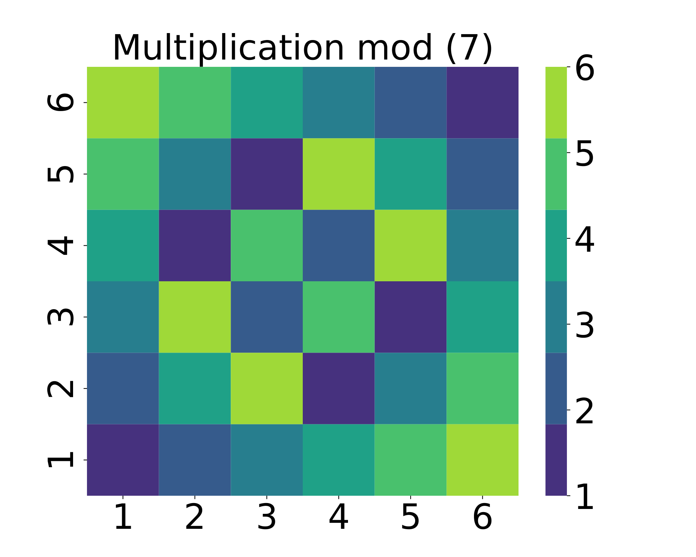

*(b)*

###### fig-1

*Рисунок 1: Тепловые карты для (a) аддитивной группы $(\text{mod }6)$ и (b) мультипликативной группы $(\text{mod }7)$. Эти две группы изоморфны, несмотря на различие их вида.* **[p. 3]**

###### p3-4

Модель-трансформер (vaswani2017attention) пользуется устройством самовнимания, чтобы улавливать зависимости между токенами. В этой рамке вложения отображают входные токены в многомерные векторы, которые обрабатываются слоями внимания. Эти вложения помогают модели улавливать контекстные представления. В отличие от этого, MLP опираются на полносвязные слои без устройств внимания. Мы исследуем роль вложений в MLP, а именно то, как они улучшают генерализацию модели. Основной вклад этой работы — рассмотреть роль слоёв вложений в MLP. Эти слои отображают дискретные токены в плотные многомерные векторы, позволяя моделям справляться с нелинейными задачами вроде модульной арифметики. Даже при one-hot входах — как в теоретических постановках (doshi2024grokking; mohamadi2024you) — первая весовая матрица по сути работает как выученное вложение. Таким образом, вложения — явные или неявные — занимают центральное место в формировании динамики модели. Хотя вложения обычно связывают с трансформерами, мы сосредоточиваемся на MLP как на более простой и более поддающейся истолкованию обстановке. MLP избегают добавочной сложности самовнимания, при этом всё же обнаруживая явления вроде гроккинга. Существенно, что двулинейная связка между вложениями и последующими весами, центральная для нашего разбора, возникает и в трансформерах, но там дополнительно осложнена вниманием. Изучение MLP позволяет нам выделить и понять эту связку в чистой, управляемой обстановке.

### 3.2 Алгоритмические наборы данных и модульная арифметика

Алгоритмические наборы данных — это синтетические наборы, тщательно построенные с управляемыми математическими свойствами и обычно включающие операции над конечными множествами, такие как модульное сложение или умножение. Один из хорошо известных примеров — набор данных модульной арифметики, изучавшийся power2022grokking, где цель состоит в том, чтобы вскрыть отношения между двоичными входами и выдавать согласованные выходы на основе этих операций. Например, по входам a и b модель должна вычислить $(a+b)\textit{mod}\,P$ или $(a\times b)\textit{mod}\,P$, где $P$ — простое число, а входы и выходы ограничены множеством $\{0,1,\dots,P-1\}$ (см. рисунок 1).

**[p. 4]**

Этот набор данных высвечивает сложную природу генерализации при гроккинге: отношение между входами определено чисто детерминированной операцией, а не вероятностным распределением. В отличие от обычных наборов данных машинного обучения, где примеры берутся из лежащего в основе (часто неизвестного) распределения данных, алгоритмические наборы состоят из конечного и полного множества всех возможных пар вход—выход. В таких случаях никакого статистического «распределения» в обычном смысле нет; вместо этого задача генерализации опирается на вскрытие лежащего в основе отношения между входами, что требует от модели усвоить сам алгоритм. Более того, любая гипотеза, согласованная с обучающими примерами, поначалу может казаться правдоподобной со статистической точки зрения, поскольку данными не управляет никакое известное распределение. Трудность генерализации, стало быть, состоит не в интерполяции невиданных образцов, а в обнаружении лежащего в основе отношения, что делает её принципиально иной задачей.

###### p4-2

Заметим, что в некоторых обстановках между модульным сложением и модульным умножением есть равнозначность. А именно, при данном простом числе $p$ группы (в математическом смысле) модульного сложения $\big(\{0,1,\dots,p-2\},+\big)$ (где сложение выполняется по модулю $p-1$) и модульного умножения $\big(\{1,\dots,p-1\},*\big)$ (где умножение выполняется по модулю $p$) изоморфны. Обе группы имеют одинаковое число элементов (а именно $p-1$) и просты (то есть найдётся элемент $g$, называемый образующей, такой что всякий другой элемент имеет вид $g*\dots*g$, где $*$ — групповая операция, а число использованных операций меньше $p$. В первой группе образующей служит любой элемент, отличный от $0$, тогда как во второй группе образующей служит любой элемент, отличный от $1$ (см. рисунок 1).

###### p4-3

Слой вложений лишает входные элементы группы их числовых значений и приписывает каждому элементу общий, отвлечённый вектор. Тем самым обучение на модульном сложении или на модульном умножении не составляет для MLP (или другой архитектуры) со слоем вложений никакой разницы. В противоположность этому, MLP без слоя вложений способен подогнать и обобщить на модульном сложении, тогда как на модульном умножении он терпит полную неудачу.

### 3.3 Постановка задачи и побуждения

Пусть $\mathcal{D}=\{(x_{i},y_{i})\}_{i=1}^{N}$ обозначает алгоритмический набор данных, где каждое $x_{i}$ — входная последовательность токенов (например, $a,b,\texttt{operation},\texttt{=}$), а $y_{i}$ — выход, полученный операцией по модулю положительного целого $P$. Задача — выучить отображение $f_{\theta}:\mathcal{X}\to\mathcal{Y}$, параметризованное $\theta$ и способное обобщать на невиданные образцы из $\mathcal{D}_{\text{test}}$.

Чтобы действенно обрабатывать входы, мы токенизируем их как последовательности их цифровых представлений, поскольку модель не истолковывает числовые значения сама по себе. Каждому операнду $a$ и $b$ приписан токен в диапазоне от $0$ до $P-1$, тогда как знаки операции и равенства представлены токенами $P$ и $P+1$ соответственно. Например, выражение модульной арифметики $(3+2)(\text{mod }5)=0\,$ токенизируется как $[3,5,2,6,0]$.

###### p4-6

Слои вложений в моделях дают плотное представление токенов. Однако задержанные обновления вложений для нечастых токенов способны существенно повлиять на сходимость и генерализацию. Наша работа исследует эту динамику, сосредоточиваясь на влиянии $p_{i}$ — вероятности выборки $i^{th}$ токена, — и предлагает поправки для улучшения сходимости. Мы исследуем применение вложений в MLP для алгоритмических задач. Мы начали с обучения MLP на наборах данных модульного сложения и умножения, сравнивая постановки со слоями вложений и без них.

#### MLP без вложений.

###### p4-7

В этой постановке входные токены ($a$, $b$, операция ($P$) и знак равенства ($P+1$)) кодируются напрямую в 4-мерный входной вектор. MLP обрабатывает эти входы так:

$$
\boldsymbol{h}_{1} =\sigma(\mathbf{W}_{1}x+\boldsymbol{b}_{1}),\quad\boldsymbol{h}_{2}=\mathbf{W}_{2}\boldsymbol{h}_{1}+\boldsymbol{b}_{2}, \\
\hat{\boldsymbol{y}} =\mathrm{Softmax}(\boldsymbol{h}_{2}). \tag{1}
$$

где $\boldsymbol{x}\in\mathbb{R}^{4}$ — закодированный входной вектор (первая и третья позиции которого — $a$ и $b$ соответственно), $\mathbf{W}_{1},\mathbf{W}_{2}$ — весовые матрицы, $\boldsymbol{b}_{1},\boldsymbol{b}_{2}$ — смещения, $\sigma$ — активация ReLU, а $\hat{\boldsymbol{y}}$ представляет предсказанный выход.

Эта постановка показывает, что MLP легко подгоняет задачу сложения, но с трудом обобщает умножение. Эта трудность возникает потому, что умножение по модулю $P$ не является линейно разделимым, что видно по нетривиальным узорам на рисунке 1.

**[p. 5]**

#### MLP с вложениями.

###### p5-1

Чтобы преодолеть трудности нелинейной разделимости, мы ввели слой вложений. Каждый токен $x$ отображается в плотный вектор $\boldsymbol{e}_{x}$ через матрицу вложений $\mathbf{E}\in\mathbb{R}^{V\times d}$, где $d$ — размерность вложения. Наш вход состоит из 4 вложений токенов вида $\hat{\boldsymbol{e}}=[\boldsymbol{e}_{i},\boldsymbol{e}_{{}^{\prime}*^{\prime}},\boldsymbol{e}_{k},\boldsymbol{e}_{{}^{\prime}=^{\prime}}]^{\top}$, и изменённый прямой проход таков:

$$
\boldsymbol{h}_{1} =\sigma(\mathbf{W}\hat{\boldsymbol{e}}+\boldsymbol{b}_{1}), \\
\boldsymbol{h}_{2} =\mathbf{W}_{2}\boldsymbol{h}_{1}+\boldsymbol{b}_{2},\quad\hat{\boldsymbol{y}}=\mathrm{Softmax}(\boldsymbol{h}_{2}), \tag{2}
$$

###### p5-2

Добавление вложений позволяет модели улавливать более выразительные представления входа. При такой постановке мы наблюдали, что модель хорошо обобщала и на сложении, и на умножении, но с отложенной генерализацией для умножения. Эта задержка отвечает явлению гроккинга, которое выглядит как «трапециевидный узор» на графиках качества: пора запоминания, за которой следует внезапный скачок тестовой точности, как показано на рисунке 2.

Эти наблюдения побуждают к более глубокому разбору динамики вложений в ходе обучения. В частности, мы исследовали тепловые карты градиента, чтобы понять роль вложений в задержке генерализации. Изображая величины градиентов по эпохам обучения, мы отмечаем, что вложения получают меньшие обновления по сравнению с прочими весами модели, что потенциально вызывает гроккинг. Это исследование поможет установить связь между поведением вложений и наблюдаемыми задержками генерализации.


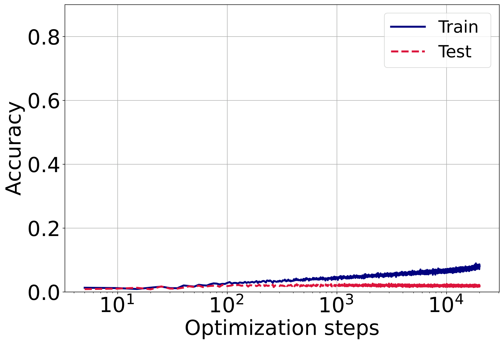

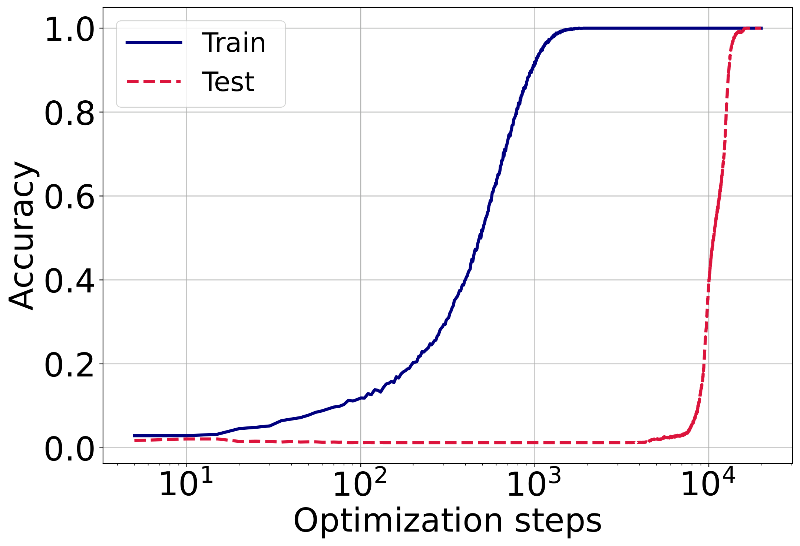

###### fig-2

*Рисунок 2: Обучающая и поверочная точности модели MLP на задачах модульной арифметики, обучаемой с Adam. *Две слева:* задача сложения, без вложений (первая) и с вложениями (вторая). *Две справа:* задача умножения, без вложений (третья) и с вложениями (четвёртая). В случаях без вложений обучающая и поверочная точности растут вместе только для сложения; умножение не обобщается. В отличие от этого, модели с вложениями достигают 100 % точности на обучении в обеих задачах, но начинают обобщать только после задержки, обнаруживая явление гроккинга.* **[p. 5]**

## 4 Основные результаты

Наш подход исследует динамику слоёв вложений внутри MLP, чтобы разобраться с трудностями генерализации, особенно в обстановке алгоритмических задач. Ключевые вклады таковы: (1) исследование новой роли слоёв вложений, присоединённых к архитектурам MLP, (2) рассмотрение влияния вероятности выборки вложения $p_{i}$ на динамику обучения и (3) понимание того, как начальное приближение и связка матриц вложений и весов влияют на действенность обучения. Эти обстоятельства вносят вклад в явление гроккинга, где генерализация в ходе обучения задерживается.

### 4.1 Динамика вложений

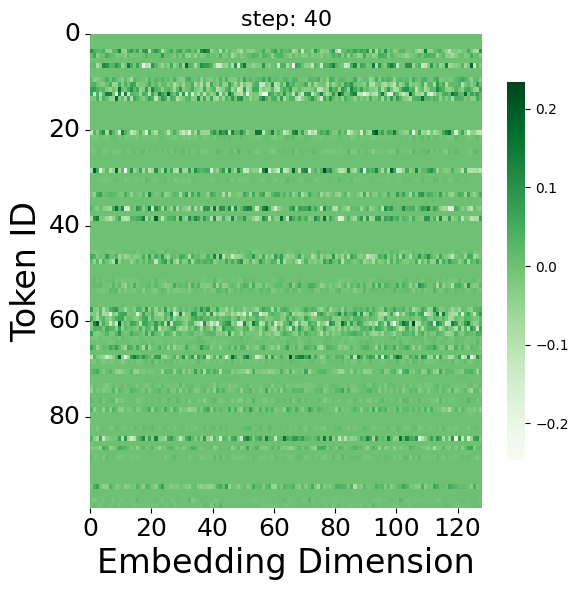

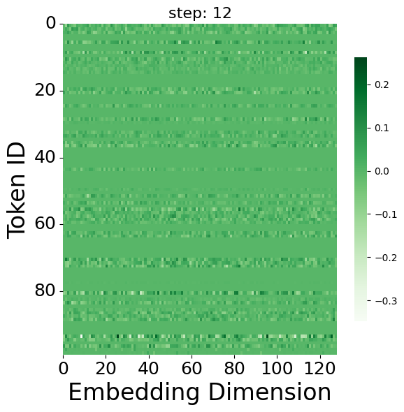

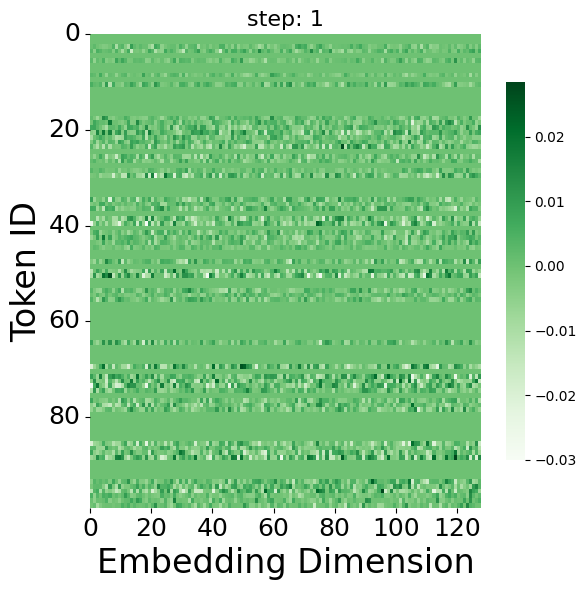

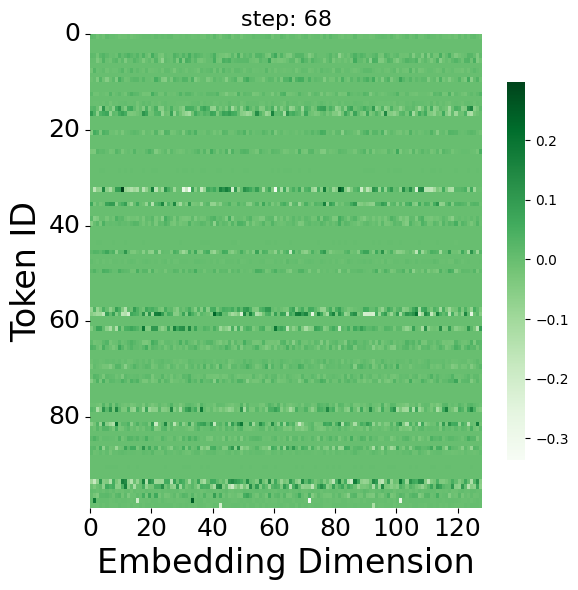

###### fig-3

*Рисунок 3: Тепловые карты градиента модели MLP на случайных шагах оптимизации. Разрежённые столбцы в градиентах вложений отражают отсутствие некоторых токенов в отобранных пакетах, что ведёт к неравномерной динамике обучения и вносит вклад в отложенную генерализацию.* **[p. 6]**

Пусть функция потерь модели есть $\mathcal{L}(\theta,\mathbf{E})$, где $\theta$ — параметры модели, отличные от весов вложений. Пусть $\boldsymbol{e}_{i,t}$ обозначает вектор вложения для токена $i$ на шаге $t$. При стохастическом градиентном спуске (SGD) с weight decay $\lambda$ правило обновления вложения таково:

$$
\boldsymbol{e}_{i,t+1}-\boldsymbol{e}_{i,t}=-\eta\lambda\boldsymbol{e}_{i,t}-\eta\nabla_{\boldsymbol{e}_{i,t}}\mathcal{L}, \tag{3}
$$

где $\eta$ — скорость обучения, а $\nabla_{\mathbf{e}_{i}}\mathcal{L}$ — градиент11 1 В предположении правила обновления SGD без момента.. Вложения токенов обновляются соответствующими градиентами только тогда, когда связанные с ними токены появляются в пакете. Положим, что токен $i$ попадает в пакет с вероятностью $p_{i}$. Следовательно, с учётом случайности выборки пакетов ожидаемое обновление можно записать так:

$$
\mathbb{E}[\boldsymbol{e}_{i,t+1}-\boldsymbol{e}_{i,t}]=-\eta\lambda\boldsymbol{e}_{i,t}-\eta p_{i}\nabla_{\boldsymbol{e}_{i,t}}\mathcal{L}. \tag{4}
$$

**[p. 6]**

###### p6-1

Подводя итог, вероятность выборки $p_{i}$ напрямую влияет на градиентную динамику слоя вложений. Тогда как градиенты приходятся на токены лишь вероятностным образом, weight decay действует на все вложения равномерно, что ведёт к несоразмерностям в обновлениях параметров. Эта динамика, показанная на рисунке 3, высвечивает потребность в более глубоком понимании того, как $p_{i}$ влияет на сходимость.

Чтобы разобрать снижение потери, мы предполагаем, что общая функция потерь модели $\mathcal{L}(\theta,\{\mathbf{e}_{i}\})$ является $\beta$-гладкой. Это означает, что для всех обновлений выполняется следующее неравенство:

$$
\mathcal{L}(\theta_{t+1}, \{\boldsymbol{e}_{i,t+1}\})\leq\mathcal{L}(\theta_{t},\{\boldsymbol{e}_{i,t}\})+\langle\nabla\mathcal{L},\Delta\rangle+\frac{\beta}{2}\|\Delta\|^{2}.
$$

где $\Delta=(\theta_{t+1}-\theta_{t},\boldsymbol{e}_{i,t+1}-\boldsymbol{e}_{i,t})$.

###### p6-4

Обозначим $\mathcal{L}_{t}:=\mathcal{L}(\theta_{t},\{\boldsymbol{e}_{i,t}\})$; тогда взятие математического ожидания по случайности выборки пакетов приводит к следующему ожидаемому обновлению:

$$
\mathbb{E} [\mathcal{L}_{t+1}-\mathcal{L}_{t}]\leq\nabla_{\theta_{t}}\mathcal{L}^{T}(\theta_{t+1}+\theta_{t}) \\
-\sum_{i=1}^{V}\nabla_{\boldsymbol{e}_{i,t}}\mathcal{L}^{T}\mathbb{E}(\boldsymbol{e}_{i,t+1}-\boldsymbol{e}_{i,t})+\frac{\beta}{2}\|\Delta\|^{2}, \tag{5}
$$

###### p6-5

Подставляя обновление вложения из уравнения 4 в неравенство гладкости, $\displaystyle\mathbb{E}$ $\displaystyle[\mathcal{L}_{t+1}-\mathcal{L}_{t}]\leq\nabla_{\theta_{t}}\mathcal{L}^{T}(\theta_{t+1}-\theta_{t})$ $\displaystyle-\eta\sum_{i=1}^{V}\left(p_{i}\|\nabla_{\boldsymbol{e}_{i,t}}\mathcal{L}\|^{2}+\lambda\boldsymbol{e}_{i,t}^{T}\nabla_{\boldsymbol{e}_{i,t}}\mathcal{L}\right)+\frac{\beta}{2}\|\Delta\|^{2},$ (6)

и, как видно из правой части приведённого выше неравенства, $p_{i}$ играет важную роль в снижении ожидаемой потери. Однако зависимость от $p_{i}$ связана с weight decay, что и объясняет, почему эти два параметра важно изучить глубже, чтобы сделать вывод о гроккинге.

### 4.2 Стратегии разбиения набора данных

Чтобы дальше исследовать роль $p_{i}$, мы выясняем, как стратегии разбиения на обучение и тест влияют на его значение и, следовательно, на процесс гроккинга. Разбиение на обучение и тест определяет вероятность появления токена $i$ в пакете.

Начнём с предположения, что параметр weight decay $\lambda$ равен нулю, а скорость обучения $\eta$ одинакова для всех параметров. Это сводит задачу оптимизации к вниманию на $p_{i}$ при ограничениях $\sum_{i=1}^{V}p_{i}=1,p_{i}\geq 0\,\forall i$. А именно, оптимальное $p_{i}$ можно найти, решив следующую задачу:

$$
\min_{p_{i}|p_{i}\geq 0,\sum p_{i}=1}-\eta\sum_{i=1}^{V}p_{i}\|\nabla_{\boldsymbol{e}_{i,t}}\mathcal{L}\|^{2}. \tag{7}
$$

Однако решить её точно на практике трудно из-за необходимости оценивать нормы градиентов всех вложений. Вместо этого мы принимаем приближённые стратегии разбиения обучающих данных, руководствуясь разными предположениями о строении градиента (подробности см. в приложении A).

**[p. 7]**

###### p7-1

1. **Равномерная выборка:** распределить все сочетания $a$ и $b$ поровну между обучающим и тестовым наборами.
2. **Перекошенная выборка:** внести смещение в те сочетания $a$, которые распределяются между обучающим и тестовым наборами.
3. **Случайная выборка:** распределить примеры между обучающим и тестовым наборами случайно.

Эти разбиения позволяют нам управлять вероятностями выборки токенов, давая прямую оценку влияния $p_{i}$ на сходимость вложений и гроккинг. Кроме того, в разделе 5.1 приведены подробные опыты, проведённые на двух алгоритмических наборах данных.

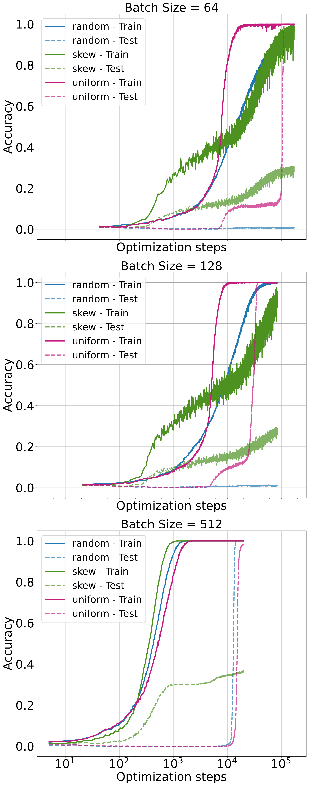

*(a) $(a+b)\mod p$*


*(b) $(a\div b)\mod p$*

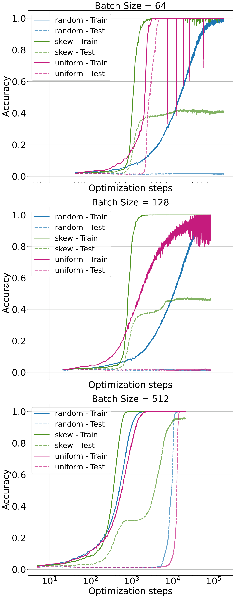

*(c) $(a\times b)\mod p$*

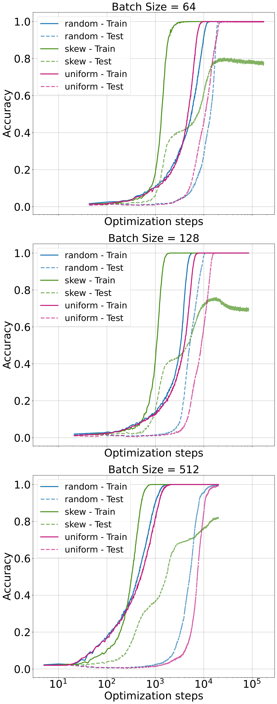

*(d) $(a^{2}+b^{2})\mod p$*

###### fig-4

*Рисунок 4: Обучающая и поверочная точности для модульных наборов данных при скорости обучения 0.001, со сравнением разных стратегий выборки (случайной, равномерной, перекошенной) при разных размерах пакета (64, 128, 512). Каждая строка отвечает размеру пакета, а каждый столбец представляет набор данных. Ось x логарифмическая, чтобы подчеркнуть тенденции сходимости. Равномерная выборка способствует более быстрой генерализации и сходимости по сравнению со случайной, но разрыв в качестве уменьшается при размерах пакета свыше 512. Перекошенная выборка, хорошо подгоняя обучающие данные, не обобщает, что высвечивает пагубное действие несоразмерных обновлений токенов.* **[p. 7]**

### 4.3 Сходимость вложений и начальное приближение

Хотя частота обновлений вложений играет решающую роль в динамике обучения, как показано в наших опытах, она одна не может полностью объяснить такие явления, как гроккинг после подгонки, его отношение к начальному приближению, weight decay или строению ландшафта потерь.

###### p7-4

Стабилизация (или сходимость) наступает, когда вложение $\mathbf{e}_{i}$ достигает установившегося состояния, где обновления становятся пренебрежимо малы, то есть когда изменение вложения $\|\boldsymbol{e}_{i,t+1}-\boldsymbol{e}_{i,t}\|$ приблизительно равно нулю. Это условие влечёт, что $(\eta\lambda)\boldsymbol{e}_{i,t}\approx\eta p_{i}\nabla_{\mathbf{e}_{i}}\mathcal{L}.$ из уравнения 4.

Для малых скоростей обучения ($\eta\ll 1$) обновления вложений ведут себя как непрерывная система, и мы можем смоделировать это дифференциальным уравнением (вдоль каждой размерности):

$$
\frac{d\mathbf{e}_{i}}{dt}=-\lambda\mathbf{e}_{i}-p_{i}\nabla_{\mathbf{e}_{i}}\mathcal{L}, \tag{8}
$$

**[p. 8]**

где $\nabla_{\mathbf{e}_{i}}\mathcal{L}$ — градиент функции потерь по вложению $i$. В предположении, что градиент $\nabla_{\mathbf{e}_{i}}\mathcal{L}$ стабилизируется на постоянном значении $g$, решение этого уравнения таково:

$$
\mathbf{e}_{i}(t)=Ce^{-\lambda t}-\frac{\eta pg}{\lambda}, \tag{9}
$$

###### p8-2

где $C$ — постоянная интегрирования, определяемая начальными условиями. С ростом времени $t$ вложение $\mathbf{e}_{i}(t)$ сходится к равновесному значению $\mathbf{e}_{i}(t)\to-\frac{\eta pg}{\lambda}.$ Таким образом, сходимость достигнута, когда $\mathbf{e}_{i}(t)$ стабилизируется около этой точки равновесия. Время $T$ до сходимости ограничено как $T\geq\frac{1}{\lambda}\ln\left(\frac{C}{\epsilon}\right),$ где $\epsilon$ — малый порог. Подводя итог, время сходимости управляется градиентом вложения $g$, weight decay $\lambda$ и величиной начального приближения $C$: более сильные градиенты и большее $\lambda$ ускоряют сходимость, тогда как большие начальные значения $C$ её замедляют.

###### p8-3

В двулинейных моделях вроде MLP и трансформеров градиенты вложений тесно связаны с градиентами последующих весов (например, $\mathbf{W}$), образуя петлю обратной связи: плохие обновления $\mathbf{E}$ ухудшают $\mathbf{W}$, и наоборот. Чтобы изучить роль начального приближения в этой динамике, мы проверили две постановки: замороженные вложения, которые приводили к медленной сходимости из-за ограниченной представленческой гибкости; и малые начальные вложения, которые улучшали сходимость, допуская более сильные ранние градиенты, — действие, замеченное и в прежних работах zhang2024transformers; liu2022towards, хотя и без разбора связки вложений и весов.

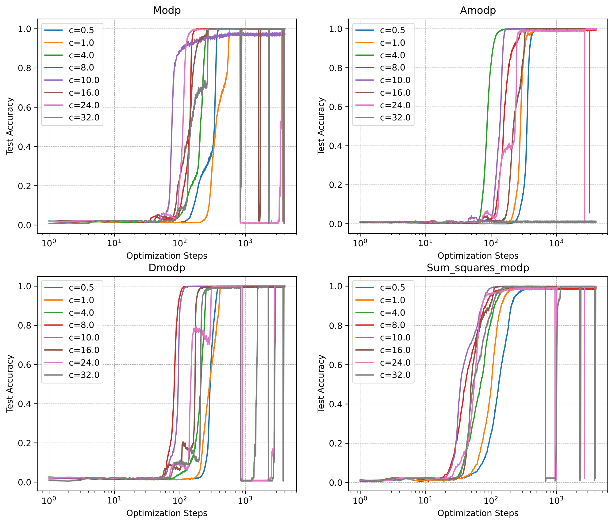

###### fig-5

*Рисунок 5: Чувствительность тестовой точности к отношению скоростей обучения $c=\eta_{E}/\eta_{W}$ на четырёх задачах. Малое $c$ ведёт к недообновлению, большое $c$ вызывает неустойчивость, а $c=10$ неизменно уравновешивает сходимость и устойчивость.* **[p. 8]**

###### p8-4

Побуждаемые этими наблюдениями, мы предлагаем **оптимизатор Adam-LR**, который подстраивает скорость обучения вложений так, чтобы уравновесить величины обновлений между $\mathbf{E}$ и $\mathbf{W}$. Это масштабирование с учётом связки формализовано ниже:

##### **Утверждение 4.1****.**

###### p8-5

*Пусть $\mathbf{E}$ и $\mathbf{W}$ — матрица вложений и веса первого слоя. Чтобы уравнять масштабы обновлений при потере в виде перекрёстной энтропии, отношение скоростей обучения $c=\frac{\eta_{E}}{\eta_{W}}$ должно удовлетворять:*

$$
c\propto\frac{\sigma_{\max}(\mathbf{E})}{\sigma_{\max}(\mathbf{W})}\cdot\frac{f_{W}}{f_{E}},
$$

*где $\sigma_{\max}(\cdot)$ обозначает наибольшее сингулярное число, а $f_{E},f_{W}$ — соответствующие частоты обновлений (подробности см. в приложении B).*

###### p8-7

На практике мы берём $c=10$, руководствуясь эмпирическими тенденциями сингулярных чисел и опираясь на разбор чувствительности (см. рис. 5, §5.2). Эта поправка улучшает сходимость и устойчивость, особенно при разрежённых обновлениях вложений, обычных для перекошенных распределений токенов.

## 5 Опыты и обсуждения

###### p8-8

Мы начинаем наше исследование с модели MLP. Архитектура состоит из двух слоёв, где скрытая размерность первого слоя вчетверо больше размерности вложения (четыре — это длина последовательности), а размерность вложения равна 128, как в прежних работах о гроккинге. Второй слой имеет размерность $P=97$. Всюду используется активация ReLU, а оптимизация выполняется оптимизатором Adam с weight decay 0.001.

### 5.1 Влияние вероятности вложения

Первый набор опытов исследует различные стратегии разбиения обучающего и тестового наборов данных. А именно, мы рассматриваем три подхода: равномерную выборку, перекошенную выборку и случайную выборку.

###### p8-10

Выражение $(a+b)\mod p$ представляет сумму $a$ и $b$ по модулю $p$. Для наших опытов мы случайно откладываем 20 % данных как тестовый набор, обеспечивая проверку на невиданных образцах. Из оставшихся данных $30/80\%$ (то есть 30 % от всего набора) отбирается как обучающий набор согласно каждой стратегии выборки.

**[p. 9]**

Рисунок 4 сравнивает качество способов выборки (случайного, равномерного, перекошенного) при разных разбиениях набора данных (дальнейшие наборы и настройки см. в приложении C.4). Каждый представляет определённые наборы данных, тогда как строки сравнивают размеры пакетов, а столбцы — наборы данных. Ось x логарифмическая, чтобы подчеркнуть тенденции сходимости.

###### p9-2

Равномерная выборка в целом способствует более быстрой генерализации и сходимости по сравнению со случайной. Однако её польза уменьшается при больших размерах пакета (например, свыше 512), где случайная выборка становится почти столь же действенной за счёт более широкого охвата токенов. Существенно, что наши результаты показывают: перекошенная выборка — несмотря на подгонку обучающих данных и сохранение общего отношения обучения к тесту — неизменно приводит к неоптимальной генерализации. Это указывает на то, что модели могут сходиться к более низким полкам подточности, когда вероятности токенов сильно несоразмерны. Важно, что даже равномерная выборка не гарантирует оптимальности: если размер пакета недостаточно велик, некоторые токены могут неизменно выпадать из обновлений. Эти находки подчёркивают, что вероятность токена — и в математическом ожидании, и в охвате отдельного пакета — играет центральную роль в динамике вложений и поведении гроккинга.

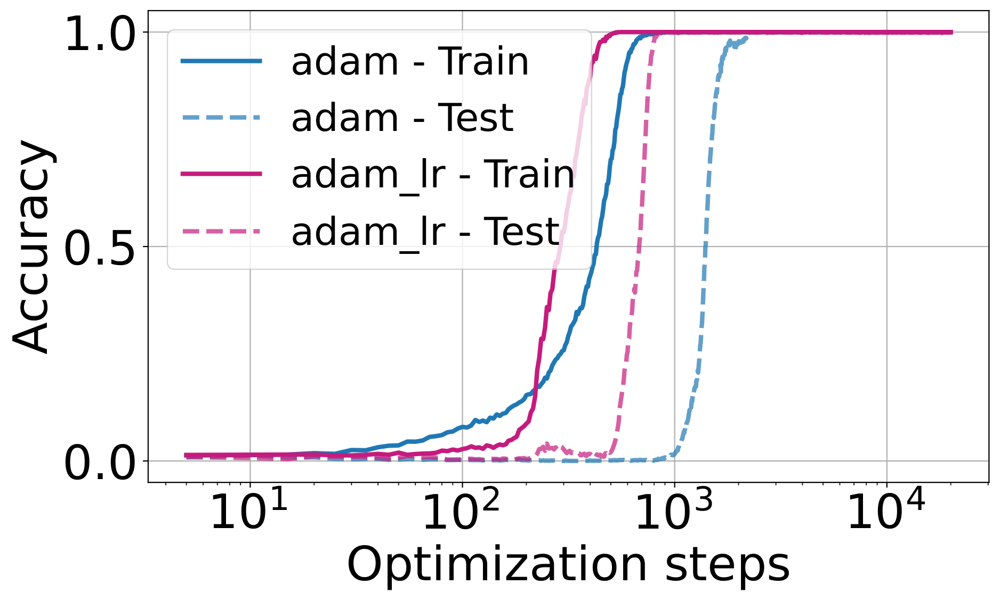

*(a) $(a+b)\mod p$*

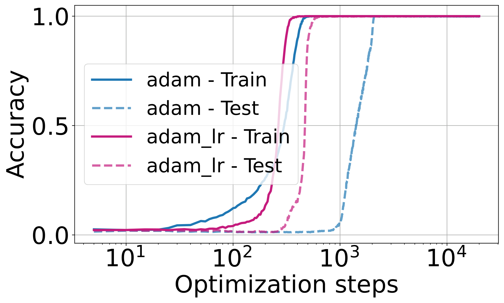

*(b) $(a\div b)\mod p$*


*(c) $(a\times b)\mod p$*


*(d) $(a^{2}+b^{2})\mod p$*

###### fig-6

*Рисунок 6: Сравнение качества оптимизаторов Adam-LR и Adam на четырёх алгоритмических наборах данных. Adam-LR масштабирует скорость обучения вложений на основе сингулярных чисел матрицы вложений. Эта приспосабливающаяся поправка ускоряет сходимость и улучшает генерализацию на всех наборах данных. Результаты показывают, что Adam-LR существенно ускоряет процесс гроккинга по сравнению со стандартным оптимизатором Adam при тождественных настройках обучения ($lr=0.01$, размер пакета = 512).* **[p. 9]**

### 5.2 Сравнение оптимизаторов

Чтобы оценить действенность предложенного нами оптимизатора Adam-LR, который включает простую, но действенную стратегию обращения со слоем вложений иначе — во избежание застоя или седловых точек, — мы провели опыты на четырёх наборах данных. Результаты показаны на рисунке 6, где мы сравниваем качество двух оптимизаторов, Adam-LR и стандартного Adam, при тождественных настройках обучения ($lr=0.01$, размер пакета = $512$).

###### p9-4

С применением предложенного нами оптимизатора Adam-LR, который масштабирует скорость обучения вложений множителем $10$, результаты показывают существенное ускорение процесса гроккинга по сравнению с базовым оптимизатором Adam на всех наборах данных.

### 5.3 Разбор сингулярных чисел слоя вложений

###### p9-5

Прежние работы относят превосходство Adam над SGD у трансформеров на счёт таких обстоятельств, как шум градиента, направление спуска и неоднородность блоков гессиана (zhang2020adaptive; kunstner2023noise; pan2023toward; zhang2024transformers). Однако эти исследования по большей части упускают из виду роль вложений и их двулинейных взаимодействий. Наш разбор поддерживает взгляд, по которому именно такое двулинейное строение — особенно во вложениях — вносит существенный вклад в наблюдаемые различия кривизны (дальнейшее обсуждение см. в приложении C.1).

Чтобы разобрать кривизну ландшафта потерь, мы вычисляем максимальное собственное число матрицы гессиана степенным методом с произведениями гессиана на вектор (HVP).


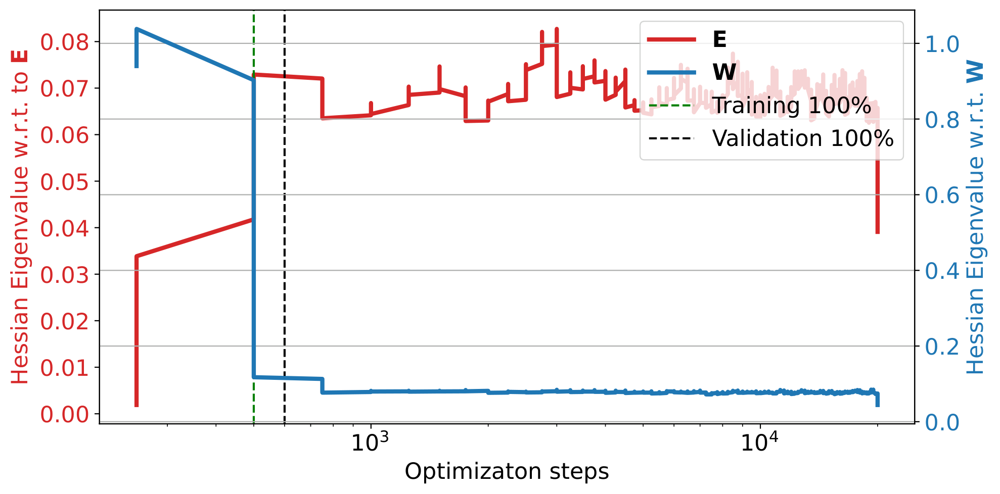

###### fig-7

*Рисунок 7: Максимальные собственные числа гессиана по весам вложений ($\mathbf{E}$) и последующим весам ($\mathbf{W}$) в ходе обучения. Левый график отвечает оптимизатору Adam, тогда как правый использует оптимизатор Adam_lr (наш). При Adam (слева) собственные числа для $\mathbf{E}$ существенно меньше, чем для $\mathbf{W}$, что отражает различия в размерности и частоте обновлений. В отличие от этого, при Adam_lr (справа) собственные числа $\mathbf{W}$ заметно снижены и становятся ближе к числам $\mathbf{E}$, что указывает на более уравновешенную динамику оптимизации. Обучающая точность достигает 100 %, когда собственные числа $\mathbf{W}$ начинают убывать, тогда как поверочная точность улучшается по мере убывания собственных чисел $\mathbf{E}$. Это указывает на то, что $\mathbf{W}$ ведёт ранний ход оптимизации, тогда как $\mathbf{E}$ доводит генерализацию. Оптимизатор Adam_lr (наш), по-видимому, регуляризует $\mathbf{W}$, что ведёт к более устойчивому процессу обучения.* **[p. 10]**

Рисунок 7 показывает максимальные собственные числа гессиана по $\mathbf{E}$ и $\mathbf{W}$ в ходе обучения. Результаты высвечивают различные свойства кривизны для $\mathbf{E}$ и $\mathbf{W}$, отражающие их роли в двулинейном взаимодействии.

**[p. 10]**

## 6 Обсуждения

В этом исследовании мы разобрали взаимную игру слоёв вложений и последующих весов в нейросетях, высветив, как их двулинейная связка влияет на оптимизацию и движет явлением гроккинга. Мы показали, что слои вложений играют центральную роль в отложенной генерализации, и ввели оптимизатор Adam-LR, чтобы разобраться с несоразмерностью динамики обновлений, масштабируя скорость обучения вложений на основе сингулярных чисел и частот обновлений.

###### p10-2

Ключевое ограничение этой работы — её сосредоточенность на MLP, дающих упрощённую обстановку для разбора связки вложений и весов. Хотя это позволяет вести управляемый разбор, остаётся открытым, как эти наблюдения переносятся на более сложные архитектуры вроде трансформеров, где схожие двулинейные взаимодействия появляются в устройствах внимания, но с добавочной устройственной сложностью. Распространение нашей рамки на обстановку трансформеров — многообещающее направление дальнейшей работы.

## Литература

- X. Davies, L. Langosco, and D. Krueger. Unifying grokking and double descent. *arXiv preprint arXiv:2303.06173*, 2023.

- D. Doshi, T. He, A. Das, and A. Gromov. Grokking modular polynomials. *arXiv preprint arXiv:2406.03495*, 2024.

- S. Fan, R. Pascanu, and M. Jaggi. Deep grokking: Would deep neural networks generalize better? *arXiv preprint arXiv:2405.19454*, 2024.

- A. Gromov. Grokking modular arithmetic. *arXiv preprint arXiv:2301.02679*, 2023.

- X. S. Huang, F. Perez, J. Ba, and M. Volkovs. Improving transformer optimization through better initialization. In *International Conference on Machine Learning*, pages 4475–4483. PMLR, 2020.

- A. I. Humayun, R. Balestriero, and R. Baraniuk. Deep networks always grok and here is why. *arXiv preprint arXiv:2402.15555*, 2024.

- A. Jeffares, A. Curth, and M. van der Schaar. Deep learning through a telescoping lens: A simple model provides empirical insights on grokking, gradient boosting & beyond. *Advances in Neural Information Processing Systems*, 37:123498–123533, 2024.

- S. Kobayashi, Y. Akram, and J. Von Oswald. Weight decay induces low-rank attention layers. *Advances in Neural Information Processing Systems*, 37:4481–4510, 2024.

**[p. 11]**

- T. Kumar. *Grokking as the transition from lazy to rich training dynamics*. PhD thesis, none, 2024.

- F. Kunstner, J. Chen, J. W. Lavington, and M. Schmidt. Noise is not the main factor behind the gap between sgd and adam on transformers, but sign descent might be. *arXiv preprint arXiv:2304.13960*, 2023.

- J. Lee, B. G. Kang, K. Kim, and K. M. Lee. Grokfast: Accelerated grokking by amplifying slow gradients. *arXiv preprint arXiv:2405.20233*, 2024.

- Z. Liu, O. Kitouni, N. S. Nolte, E. Michaud, M. Tegmark, and M. Williams. Towards understanding grokking: An effective theory of representation learning. *Advances in Neural Information Processing Systems*, 35:34651–34663, 2022.

- Z. Liu, E. J. Michaud, and M. Tegmark. Omnigrok: Grokking beyond algorithmic data. In *The Eleventh International Conference on Learning Representations*, 2022.

- K. Lyu, J. Jin, Z. Li, S. S. Du, J. D. Lee, and W. Hu. Dichotomy of early and late phase implicit biases can provably induce grokking. *arXiv preprint arXiv:2311.18817*, 2023.

- M. A. Mohamadi, Z. Li, L. Wu, and D. J. Sutherland. Why do you grok? a theoretical analysis of grokking modular addition. *arXiv preprint arXiv:2407.12332*, 2024.

- P. Nakkiran, G. Kaplun, Y. Bansal, T. Yang, B. Barak, and I. Sutskever. Deep double descent: Where bigger models and more data hurt. *Journal of Statistical Mechanics: Theory and Experiment*, 2021(12):124003, 2021.

- N. Nanda, L. Chan, T. Lieberum, J. Smith, and J. Steinhardt. Progress measures for grokking via mechanistic interpretability. *arXiv preprint arXiv:2301.05217*, 2023.

- Y. Pan and Y. Li. Toward understanding why adam converges faster than sgd for transformers. *arXiv preprint arXiv:2306.00204*, 2023.

- A. Power, Y. Burda, H. Edwards, I. Babuschkin, and V. Misra. Grokking: Generalization beyond overfitting on small algorithmic datasets. *arXiv preprint arXiv:2201.02177*, 2022.

- L. Prieto, M. Barsbey, P. A. Mediano, and T. Birdal. Grokking at the edge of numerical stability. *arXiv preprint arXiv:2501.04697*, 2025.

- V. Varma, R. Shah, Z. Kenton, J. Kramár, and R. Kumar. Explaining grokking through circuit efficiency. *arXiv preprint arXiv:2309.02390*, 2023.

- A. Vaswani. Attention is all you need. *Advances in Neural Information Processing Systems*, 2017.

- Z. Xu, Z. Ni, Y. Wang, and W. Hu. Let me grok for you: Accelerating grokking via embedding transfer from a weaker model. *arXiv preprint arXiv:2504.13292*, 2025.

- G. Yang and E. J. Hu. Tensor programs iv: Feature learning in infinite-width neural networks. In M. Meila and T. Zhang, editors, *Proceedings of the 38th International Conference on Machine Learning*, volume 139 of *Proceedings of Machine Learning Research*, pages 11727–11737. PMLR, 18–24 Jul 2021.

- J. Zhang, S. P. Karimireddy, A. Veit, S. Kim, S. Reddi, S. Kumar, and S. Sra. Why are adaptive methods good for attention models? *Advances in Neural Information Processing Systems*, 33:15383–15393, 2020.

- Y. Zhang, C. Chen, T. Ding, Z. Li, R. Sun, and Z.-Q. Luo. Why transformers need adam: A hessian perspective. *arXiv preprint arXiv:2402.16788*, 2024.

## Приложение

**[p. 12]**

## Приложение A Оптимизация вероятности выборки

### Предположение о равной важности

Если мы предположим, что все градиенты равно важны, то есть $\|\nabla_{\mathbf{E}_{i,t}}\mathcal{L}\|^{2}$ одинаково для всех вложений:

$$
\|\nabla_{\mathbf{E}_{i,t}}\mathcal{L}\|^{2}=c,\quad\forall i,
$$

где $c$ — постоянная.

В этом случае оптимизация $-\sum_{i=1}^{V}p_{i}\|\nabla_{\mathbf{E}_{i,t}}\mathcal{L}\|^{2}$ становится независимой от $p_{i}$. Чтобы удовлетворить условию нормировки $\sum_{i=1}^{V}p_{i}=1$, оптимальное решение таково:

$$
p_{i}=\frac{1}{V},\quad\forall i. \tag{10}
$$

Это отвечает равномерному распределению, где все вложения рассматриваются одинаково (см. рисунок 8). Будучи вычислительно действенным, такой подход может вести к неоптимальной сходимости, если некоторые вложения вносят несоразмерно большой вклад в снижение потери.

### Норма градиента, ограниченная величиной $L_{i}$

Предположим теперь, что норма градиента для каждого вложения ограничена,

$$
\|\nabla_{\mathbf{E}_{i,t}}\mathcal{L}\|\leq L_{i},\quad\forall i, \tag{11}
$$

где $L_{i}$ — известная верхняя граница для вложения $i$. Пользуясь этой границей, мы приближаем,

$$
-\sum_{i=1}^{V}p_{i}\|\nabla_{\mathbf{E}_{i,t}}\mathcal{L}\|^{2}\geq-\sum_{i=1}^{V}p_{i}L_{i}^{2}. \tag{12}
$$

Чтобы максимизировать $\sum_{i=1}^{V}p_{i}L_{i}^{2}$ при ограничении $\sum_{i=1}^{V}p_{i}=1$, заметим, что целевая функция линейна по $\mathbf{p}$. Следовательно, максимум достигается в вершине вероятностного симплекса, то есть оптимальное решение таково:

$$
p_{k}=1,\quad\text{where}\quad k=\arg\max_{i}L_{i}^{2},\quad\text{and}\quad p_{i}=0,\quad\forall i\neq k. \tag{13}
$$

Этот результат означает, что оптимальное распределение вероятностей отдаёт весь вес вложению с наибольшей границей градиента, пренебрегая всеми остальными. Поэтому, чтобы получить гладкое распределение вероятностей, мы вводим член энтропийной регуляризации следующим образом,

$$
H(\mathbf{p})=-\sum_{i=1}^{V}p_{i}\log p_{i}. \tag{14}
$$

Теперь мы оптимизируем изменённую цель,

$$
\sum_{i=1}^{V}p_{i}L_{i}^{2}+\gamma H(\mathbf{p}), \tag{15}
$$

при ограничении $\sum_{i=1}^{V}p_{i}=1$, где $\gamma>0$ управляет силой регуляризации.

Соответствующий лагранжиан таков,

$$
\mathcal{L}_{p}=\sum_{i=1}^{V}p_{i}L_{i}^{2}+\gamma\left(-\sum_{i=1}^{V}p_{i}\log p_{i}\right)+\mu\left(\sum_{i=1}^{V}p_{i}-1\right). \tag{16}
$$

Беря производную по $p_{i}$ и приравнивая её нулю, получаем,

$$
L_{i}^{2}-\gamma(1+\log p_{i})+\mu=0. \tag{17}
$$

Решая относительно $p_{i}$, получаем:

$$
\log p_{i}=\frac{L_{i}^{2}+\mu-\gamma}{\gamma}\quad\Longrightarrow\quad p_{i}=\exp\left(\frac{L_{i}^{2}+\mu-\gamma}{\gamma}\right). \tag{18}
$$

Применение ограничения $\sum_{i=1}^{V}p_{i}=1$ приводит к следующему решению,

**[p. 13]**

$$
p_{i}^{*}=\frac{\exp\left(L_{i}^{2}/\gamma\right)}{\sum_{j=1}^{V}\exp\left(L_{j}^{2}/\gamma\right)}. \tag{19}
$$

Этот результат гладко распределяет вероятности по границам градиента, приписывая более высокую вероятность вложениям с бо́льшим $L_{i}^{2}$ и при этом обеспечивая невырожденное распределение.


*(a) Случайная выборка*

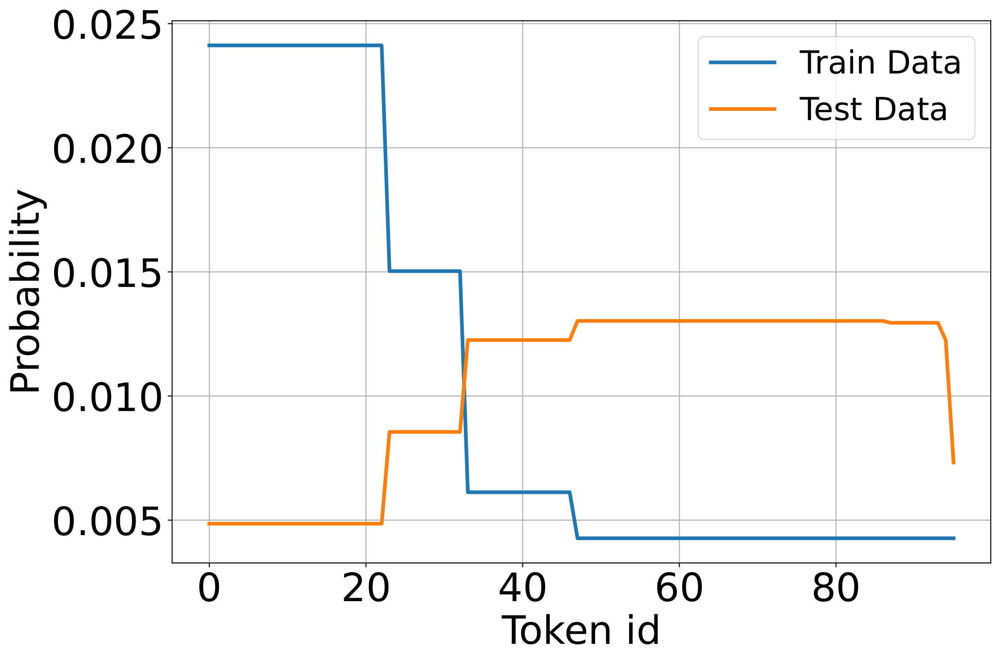

*(b) Перекошенная выборка*

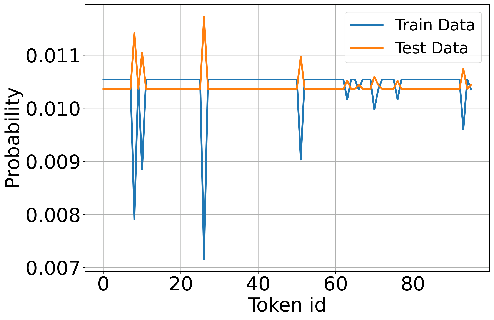

*(c) Равномерная выборка*

###### fig-8

*Рисунок 8: Вероятности токенов в обучающем и тестовом наборах при разных стратегиях выборки. Несоразмерная выборка ведёт к неравномерной встречаемости токенов в мини-пакетах, из-за чего одни токены отсутствуют в нескольких обновлениях подряд, а другие появляются часто. Это приводит к сильно изменчивым градиентным обновлениям, где часто встречающиеся токены сходятся быстрее, а редкие застаиваются из-за разрежённых обновлений, что влияет на общую генерализацию модели.* **[p. 13]**

## Приложение B Динамика обновлений в двулинейных системах с влиянием начального приближения

###### p13-2

Мы разбираем взаимодействие между вложениями $\mathbf{E}\in\mathbb{R}^{p\times d}$ и весовой матрицей $\mathbf{W}\in\mathbb{R}^{4d\times d}$ в двулинейном члене:

$$
z(\mathbf{E}\mathbf{W}), \tag{20}
$$

где $z$ — активация, применяемая поэлементно. Градиенты $\mathbf{E}$ и $\mathbf{W}$ даны как:

$$
\nabla_{\mathbf{E}}\propto\mathbf{W}^{\top}\nabla_{\text{loss}},\quad\nabla_{\mathbf{W}}\propto\mathbf{E}^{\top}\nabla_{\text{loss}}. \tag{21}
$$

Нормы градиентов зависят от главенствующих сингулярных чисел $\mathbf{W}$ и $\mathbf{E}$. А именно:

$$
\|\nabla_{\mathbf{E}}\|\propto\sigma_{\max}(\mathbf{W}),\quad\|\nabla_{\mathbf{W}}\|\propto\sigma_{\max}(\mathbf{E}). \tag{22}
$$

###### p13-5

При начальном приближении $\mathbf{E}$ и $\mathbf{W}$ часто берутся из распределений с дисперсиями, зависящими от их размерностей (например, PyTorch задаёт веса с масштабированием $\mathcal{N}(0,\sqrt{2/d})$). Такое начальное приближение обычно обеспечивает $\sigma_{\max}(\mathbf{E})\gg\sigma_{\max}(\mathbf{W})$, поскольку $\mathbf{W}$ более многомерна, что усиливает различие в величинах градиентов.

###### p13-6

Матрица вложений $\mathbf{E}$ обновляется реже, чем $\mathbf{W}$, поскольку не все токены появляются в каждом пакете. Пусть $f_{E}$ и $f_{W}$ обозначают частоты обновлений $\mathbf{E}$ и $\mathbf{W}$ соответственно. Обычно $f_{W}>f_{E}$, что усугубляет разницу в обновлениях.

Чтобы уравновесить действенные обновления $\mathbf{E}$ и $\mathbf{W}$, скорости обучения $\eta_{E}$ и $\eta_{W}$ должны быть отмасштабированы с учётом и их сингулярных чисел, и частот обновлений. Действенное отношение обновлений таково:

$$
\frac{\|\Delta\mathbf{E}\|}{\|\Delta\mathbf{W}\|}\propto\frac{\eta_{E}\cdot\sigma_{\max}(\mathbf{W})\cdot f_{E}}{\eta_{W}\cdot\sigma_{\max}(\mathbf{E})\cdot f_{W}}. \tag{23}
$$

Для соразмерных обновлений ($\|\Delta\mathbf{E}\|\sim\|\Delta\mathbf{W}\|$) отношение $c=\frac{\eta_{E}}{\eta_{W}}$ должно удовлетворять:

$$
c\propto\frac{\sigma_{\max}(\mathbf{E})}{\sigma_{\max}(\mathbf{W})}\cdot\frac{f_{W}}{f_{E}}. \tag{24}
$$

**[p. 14]**

Член $\frac{\sigma_{\max}(\mathbf{E})}{\sigma_{\max}(\mathbf{W})}$ отражает несоразмерность сингулярных чисел, вызванную начальным приближением и устройственными свойствами. Член $\frac{f_{W}}{f_{E}}$ учитывает несоразмерность частот обновлений $\mathbf{E}$ и $\mathbf{W}$, вызванную разрежённым появлением токенов в пакетах.

Начальное приближение PyTorch, масштабирующее веса на $\mathcal{O}(\sqrt{2/d})$, обеспечивает, что $\sigma_{\max}(\mathbf{W})$ и $\sigma_{\max}(\mathbf{E})$ поначалу соразмерны размерностям $d$. Это вносит вклад в наблюдаемую несоразмерность их сингулярных чисел в начале обучения.

## Приложение C Дополнительные опыты

### C.1 Разбор сингулярных чисел слоя вложений

###### p14-3

Прежние исследования (например, [25], [10], [18], [26]) изучали разрыв между SGD и Adam при оптимизации моделей-трансформеров, но особая роль вложений и их двулинейности с последующими весами остаётся изученной недостаточно. Например, [25] относит неоптимальное качество SGD на счёт тяжелохвостового распределения шума стохастического градиента. Это наблюдение согласуется с нашими находками относительно случайности обновлений вложений для токенов с низким $p$.

С другой стороны, [10] доказывает, что шум градиента сам по себе не может объяснить превосходство Adam. Их опыты показывают, что даже при полнопакетном обучении, устраняющем стохастический шум, SGD уступает Adam. Они предполагают, что знак градиента может быть более надёжным направлением спуска, чем его величина, и, поскольку Adam оптимально уравновешивает и то и другое, он превосходит SGD, особенно при малых пакетах.

###### p14-5

Далее, [26] даёт новое объяснение преимущества Adam над SGD у трансформеров, разбирая поблочный спектр гессиана и вводя понятие «блочной неоднородности». Это относится к существенным различиям спектров гессиана между блоками параметров — явлению, наблюдаемому у трансформеров, но не у CNN. Однако источник этой неоднородности явно не обсуждается. Мы предполагаем, что он проистекает из двулинейной природы весов, в частности во вложениях и устройствах внимания. Чтобы поддержать эту догадку, мы разбираем ниже гессиан весов вложений в сравнении с прочими весами.


###### fig-9

*Рисунок 9: Максимальные собственные числа гессиана по весам вложений ($\mathbf{E}$) и последующим весам ($\mathbf{W}$) в ходе обучения. Левый график отвечает оптимизатору Adam, тогда как правый использует оптимизатор Adam_lr (наш). При Adam (слева) собственные числа для $\mathbf{E}$ существенно меньше, чем для $\mathbf{W}$, что отражает различия в размерности и частоте обновлений. В отличие от этого, при Adam_lr (справа) собственные числа $\mathbf{W}$ заметно снижены и становятся ближе к числам $\mathbf{E}$, что указывает на более уравновешенную динамику оптимизации. Обучающая точность достигает 100 %, когда собственные числа $\mathbf{W}$ начинают убывать, тогда как поверочная точность улучшается по мере убывания собственных чисел $\mathbf{E}$. Это указывает на то, что $\mathbf{W}$ ведёт ранний ход оптимизации, тогда как $\mathbf{E}$ доводит генерализацию. Оптимизатор Adam_lr (наш), по-видимому, регуляризует $\mathbf{W}$, что ведёт к более устойчивому процессу обучения.* **[p. 14]**

Чтобы разобрать кривизну ландшафта потерь, мы вычисляем максимальное собственное число матрицы гессиана степенным методом с произведениями гессиана на вектор (HVP). Такой подход избегает явного построения гессиана, что делает его вычислительно действенным для больших систем.

Степенной метод итеративно приближает максимальное собственное число гессиана $\mathbf{H}$ так:

1. Задать случайный вектор $\mathbf{v}_{0}$ той же размерности, что и параметры $[\mathbf{E},\mathbf{W}]$.
**[p. 15]**

2. Вычислить произведение гессиана на вектор $\mathbf{H}\mathbf{v}_{k}$ автоматическим дифференцированием:

$$
\mathbf{H}\mathbf{v}_{k}=\nabla_{\boldsymbol{\theta}}\left(\nabla_{\boldsymbol{\theta}}\mathcal{L}\cdot\mathbf{v}_{k}\right),
$$

 где $\boldsymbol{\theta}=[\mathbf{E},\mathbf{W}]$.
3. Нормировать вектор и обновить оценку собственного числа:

$$
\mathbf{v}_{k+1}=\frac{\mathbf{H}\mathbf{v}_{k}}{\|\mathbf{H}\mathbf{v}_{k}\|},\quad\sigma_{\text{max}}\approx\mathbf{v}_{k}^{\top}\mathbf{H}\mathbf{v}_{k}.
$$

Рисунок 9 показывает максимальные собственные числа гессиана по $\mathbf{E}$ и $\mathbf{W}$ в ходе обучения. Результаты высвечивают различные свойства кривизны для $\mathbf{E}$ и $\mathbf{W}$, отражающие их роли в двулинейном взаимодействии.

Распространение этих наблюдений на устройства внимания высвечивает дальнейшие трудности двулинейной оптимизации и показывает, как приспосабливающиеся скорости обучения (например, Adam) помогают выбираться из седловых точек. Это указывает на более глубокую связь между двулинейностью взаимодействий весов и трудностями оптимизации, свойственными моделям-трансформерам.

### C.2 Эволюция ранга и неявная регуляризация

###### p15-5

Недавняя работа показала, что weight decay в двулинейных моделях (например, $\mathbf{Z}=\mathbf{E}\mathbf{W}$) неявно регуляризует ядерную норму произведения матриц, способствуя решениям низкого ранга и улучшенной генерализации [8]. Это дополняет наше внимание к динамике вложений, поскольку и то и другое высвечивает влияние двулинейной связки на оптимизацию.

###### p15-6

Чтобы исследовать это в нашей постановке, мы прослеживаем эволюцию ранга $\mathbf{E}$, $\mathbf{W}$ и произведения $\mathbf{E}\mathbf{W}$. Как показано на рисунке 10, $\mathbf{W}$ обнаруживает три отчётливые поры: раннее падение во время снижения обучающей потери, полку и окончательный спад, совпадающий с гроккингом. В отличие от этого, ранг $\mathbf{E}$ остаётся по большей части устойчивым на всём протяжении.

###### p15-7

Рисунок 10 сравнивает три постановки оптимизации: Adam (с weight decay 0.001), Adam-LR (предложенный нами вариант с отношением скоростей обучения) и Adam с более сильным weight decay (0.005). Все настройки ведут к снижению $\text{rank}(\mathbf{E}\mathbf{W})$, что согласуется с неявной регуляризацией ядерной нормы. Однако только Adam-LR обнаруживает продолжающиеся изменения ранга после генерализации, что указывает на то, что одна лишь эволюция ранга не улавливает наступление гроккинга.

Эти находки подкрепляют вывод, что неявная регуляризация в двулинейных системах зависит не только от силы распада, но и от взаимной игры начального приближения, частоты обновлений и кривизны.


###### fig-10

*Рисунок 10: Эволюция ранга в ходе обучения для трёх постановок оптимизации: Adam (wd=0.001), Adam-LR (wd=0.001 с отношением скоростей обучения) и Adam с более сильным weight decay (wd=0.005). Хотя все прогоны показывают убывание $\text{rank}(\mathbf{E}\mathbf{W})$, только Adam-LR продолжает подстраивать ранг после генерализации. Это указывает на то, что одно поведение ранга не объясняет гроккинг полностью, и подкрепляет потребность разбирать динамику связки вложений и весов.* **[p. 15]**

**[p. 16]**

### C.3 Фурье-разбор представлений вложений

###### p16-1

Фурье-признаки дают упорядоченный способ закодировать модульную арифметику прямо во входном пространстве. Кодируя периодичность в представлении, такие признаки способны обойти нужду в выученных вложениях и ослабить трудности вроде разрежённых обновлений для редких токенов. Однако этот подход требует предварительного знания строения задачи — например, периодичности, — что может не годиться для более сложных задач вроде модульного деления или нелинейных композиций.

###### p16-2

Чтобы выяснить, выучивают ли слои вложений такое строение сами собой, мы разбираем их частотные свойства. Следуя подходу из [12], мы применяем дискретное преобразование Фурье (ДПФ) вдоль входной размерности матрицы вложений и вычисляем $\ell_{2}$-норму по размерности вложения. Затем мы изображаем первые $P/2$ составляющих, пользуясь симметрией ДПФ.

###### p16-3

Результаты для разных задач показаны на рисунке 11. Отчётливые частотные пики указывают на то, что модель внутренне улавливает свойственное задаче периодическое строение. Примечательно, что такое строение возникает даже без явных фурье-признаков, особенно для модульного сложения и умножения. Однако в более сложных задачах, таких как модульное деление, эта частотная локализация ослабевает, что указывает на пределы периодического кодирования и растущую нужду в выученных представлениях.


###### fig-11

*Рисунок 11: Дискретный фурье-разбор выученных представлений вложений на разных задачах. Для каждой матрицы вложений мы вычисляем ДПФ по входной размерности и $\ell_{2}$-норму по размерности вложения. Пики указывают на частотную локализацию, естественно согласованную с периодическим строением задачи (например, модульного сложения), тогда как задачи вроде модульного деления показывают более размазанные спектры.* **[p. 16]**

### C.4 Дополнительные наборы данных и чувствительность к скорости обучения

###### p16-4

Мы подчёркиваем, что построение наших опытов не нацелено на подбор гиперпараметров. Хотя настойчивый подбор скоростей обучения и размеров пакетов способен подавить или задержать гроккинг, наша цель — изучать его там, где он возникает естественно. С этой целью мы выявляем настройки, в которых гроккинг сохраняется, и сосредоточиваем свой разбор на них. Этот подход согласуется с прежними работами по механистическому пониманию гроккинга [9, 14], которые точно так же ставят ясность динамики выше качества на бенчмарках. Для наглядности рисунки 12 и 13 показывают чувствительность к скорости обучения на четырёх наборах данных, подтверждая устойчивость наших находок при разумных настройках (перекошенное распределение обновлений вложений задерживает генерализацию).


*(a) $(a+b)\mod p$*


*(b) $(a\div b)\mod p$*


*(c) $(a\times b)\mod p$*

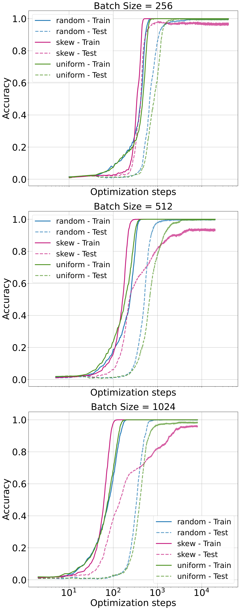

*(d) $(a^{2}+b^{2})\mod p$*

###### fig-12

*Рисунок 12: Обучающая и поверочная точности для набора данных модульного умножения при скорости обучения 0.01 и разных размерах пакета (256, 512, 1024).* **[p. 17]**

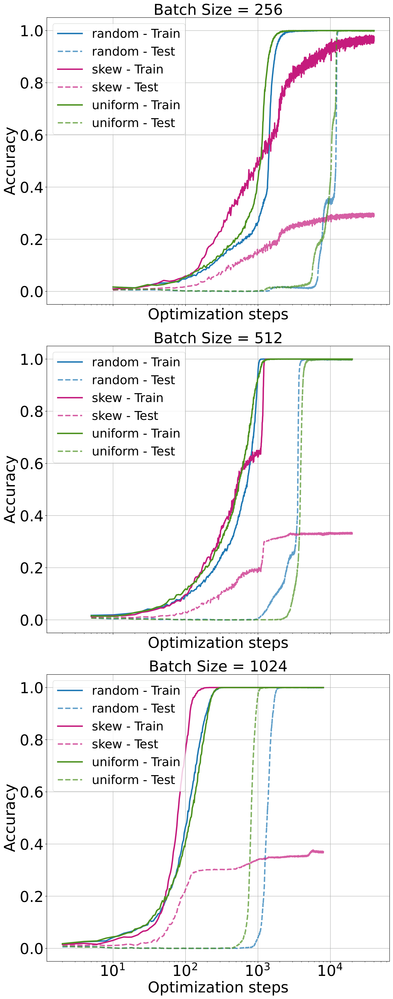

*(a) $(a+b)\mod p$*


*(b) $(a\div b)\mod p$*


*(c) $(a\times b)\mod p$*

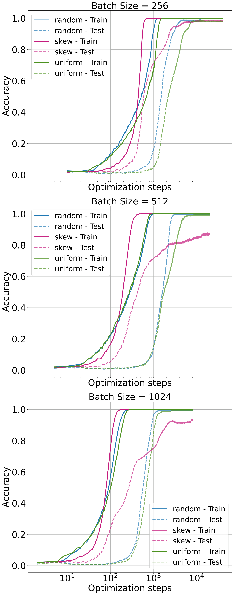

*(d) $(a^{2}+b^{2})\mod p$*

###### fig-13

*Рисунок 13: Обучающая и поверочная точности для набора данных модульного умножения при скорости обучения 0.005 и разных размерах пакета (256, 512, 1024).* **[p. 17]**

### Вычислительные ресурсы

###### p16-5

Все опыты проводились на графическом процессоре NVIDIA A6000. Прогоны обучения выполнялись на PyTorch, и каждая настройка свободно умещалась в 48 ГБ памяти процессора. Распределённое обучение и постановки с несколькими GPU не применялись.
---

# Машиночитаемый блок фактов

```
paper:
  arxiv: 2505.15624
  version: v1 (2025-05-21; единственная версия)
  venue: "препринт (колонтитул PDF: Preprint.)"
  authors: AlquBoj (сборное имя), AlQuabeh, Bojković, Nwadike, Inui
  citations_s2: 5              # на 2026-08-14, по списку citations-2201.02177.txt

setup:
  task_family: "модульная арифметика при P=97: (a+b), (a÷b), (a×b), (a^2+b^2) mod p"
  model: "MLP из двух слоёв; вложение d=128, длина последовательности 4, скрытый слой 4d=512, выход P=97, ReLU; словарь V=P+2=99"
  optimizer: "Adam, weight decay 0.001; lr 0.001 / 0.005 / 0.01 по опытам; пакеты 64/128/512 (рис. 4) и 256/512/1024 (рис. 12-13)"
  data_regime: "20 % набора отложено в тест; 30 % от полного набора взято в обучение; три стратегии разбиения: равномерная, перекошенная, случайная"
  variant: "Adam-LR = Adam с отношением скоростей обучения c = eta_E/eta_W = 10 (постоянное, не пересчитывается)"
  seeds: "не указаны; доверительных полос и повторов нет — все кривые одиночные прогоны"
  compute: "один NVIDIA A6000, 48 GB, PyTorch; без распределённого обучения"
  compute_anchor: p16-5

findings:
  - {claim: "MLP с вложениями гроккает на всех четырёх задачах: 100 % на обучении к ~1.5e3 шагам, скачок теста к ~1e4", anchor: p5-2, fig: fig-2}
  - {claim: "модель сравнения кодирует a и b ЧИСЛАМИ в 4-мерном входе; на умножении она не достигает и 0.1 обучающей точности, на сложении к 1e5 шагам ~0.87/~0.77", anchor: p4-7, fig: fig-2}
  - {claim: "вложения токенов, не попавших в пакет, движутся только weight decay: градиент приходит вероятностно, распад — равномерно", anchor: p6-1, fig: fig-3}
  - {claim: "равновесие вложения e_i(t) -> -eta*p*g/lambda, время сходимости T >= (1/lambda) ln(C/eps)", anchor: p8-2, fig: null}
  - {claim: "перекошенное разбиение подгоняет обучение и не обобщает; равномерное быстрее случайного, разрыв стирается при пакете свыше 512", anchor: p9-2, fig: fig-4}
  - {claim: "Adam-LR (c=10) ускоряет выход теста на 100 % примерно вдвое при lr=0.01 и пакете 512", anchor: p9-4, fig: fig-6}
  - {claim: "максимальные собственные числа гессиана: по E ~0.13, по W ~3.5; при Adam-LR числа по W падают и сближаются с E", anchor: p8-4, fig: fig-7}
  - {claim: "rank(EW) падает во всех трёх настройках, но только при Adam-LR меняется после генерализации; одним рангом гроккинг не объясняется", anchor: p15-7, fig: fig-10}
  - {claim: "спектр вложения на сложении сосредоточен в нескольких частотах, на делении размазан; при Adam-LR картина на сложении та же", anchor: p16-3, fig: fig-11}
  - {claim: "догадка (названа догадкой): блочная неоднородность спектра гессиана у трансформеров проистекает из двулинейности весов", anchor: p14-5, fig: fig-9}

grokking_relation:
  citation_of_power: "постановка взята у Power et al. 2022; носитель заменён на MLP, сроки с исходной работой не сопоставляются"
  regime: "классификация по модулю 97, Adam + weight decay 0.001, вложение обучаемое; рычаги: наличие вложения, строение разбиения, отношение скоростей обучения"
  hedges: ["can generalize immediately", "potentially causing grokking", "suggesting", "We hypothesize", "may offer similar benefits", "appears to regularize"]
  admitted_limits: ["перенос на трансформер оставлен будущей работе (p10-2)", "настройки подобраны так, чтобы гроккинг сохранялся (p16-4)"]

overcited:
  - {claim: "«показано, что гроккинг вызывается слоем вложений»", anchor: p1-2,
     status: "показано на MLP при P=97, что модель с вложением грокает, а модель со СКАЛЯРНЫМ входом обучающую выборку не подгоняет вовсе; определения гроккинга (задержка после подгонки) модель сравнения не выполняет"}
  - {claim: "«доказано, что приспосабливающееся отношение скоростей обучения ускоряет сходимость»", anchor: p8-5,
     status: "в приложении B соотнесены только масштабы обновлений цепочкой пропорциональностей без постоянных; теоремы о сходимости нет, а c=10 — единожды выбранная постоянная"}
  - {claim: "«слой вложений — узкое место, отстающее от последующих слоёв»", anchor: p2-2,
     status: "отставание не измерено ни одной величиной; есть пустые полосы на тепловых картах шагов 1/12/40/68 и разница максимальных собственных чисел гессиана"}

concept_cards:
  grokking.md: p1-2
  memorization-phase.md: p5-2
  modular-arithmetic.md: p4-3
  canonical-grokking-testbed.md: p8-8
  data-fraction-critical-dataset-size.md: p7-1
  weight-decay.md: p6-1
  optimizer-adam-adamw-sgd.md: p9-4
  learning-rate.md: p8-5
  initialization-scale.md: p13-5
  loss-landscape-basins.md: fig-7
  spectral-analysis-svd-esd-fve.md: p15-7
  fourier-features-circuits.md: p16-2
  mechanistic-interpretability.md: p16-4
  gradient-noise.md: p14-3
  numerical-stability-fix.md: p3-1

sources:
  original_html: original/2505.15624.native.html
  converted_text: original/2505.15624.mechanistic-insights-into-grokking-from-the-embedding-layer.md
  images_dir: images/
  pdf: https://arxiv.org/pdf/2505.15624v1

internal_inconsistencies:
  - what: "§3.1 объявляет первую матрицу неявным вложением, а модель «без вложений» из §3.3 подаёт операнды числами — сравнение не о вложении"
    anchors: [p3-4, p4-7]
  - what: "уравнение (5) несёт (theta_{t+1}+theta_t), уравнение (6) — (theta_{t+1}-theta_t); решение (9) содержит eta, которого нет в (8), и p вместо p_i"
    anchors: [p6-4, p6-5, p7-4, p8-2]
  - what: "подпись рисунка 3 говорит «sparse columns», а пустые полосы на картах — строки (ось Y = Token ID)"
    anchors: [fig-3]
  - what: "утверждение об образующих ложно для обеих групп; «simple» употреблено в значении «циклическая»"
    anchors: [p4-2]
  - what: "«ранг E остаётся устойчивым» верно только для панели Adam; при Adam-LR ранг E падает с 99 до ~30, при wd=0.005 — до ~20"
    anchors: [p15-6, fig-10]
  - what: "размерности: (2) требует у W 4d столбцов, приложение B объявляет W ∈ R^{4d×d}; текст пишет rank(EW), рисунок 10 — EW^T"
    anchors: [p5-1, p13-2, fig-10]
  - what: "рисунок 9 составлен из тех же файлов, что рисунок 7, и несёт ту же подпись слово в слово"
    anchors: [fig-7, fig-9]
  - what: "подписи рисунков 12 и 13 называют один набор данных вместо четырёх; 12(a) = 4(a) и 13(c) = 4(c) побайтно, при иной объявленной скорости обучения"
    anchors: [fig-4, fig-12, fig-13]
  - what: "«фазовый переход в линейных областях» приписан во введении humayun2024deep, а в разделе 2 — jeffares2024deep; Kumar в списке литературы значится как «PhD thesis, none»"
    anchors: [p1-4, p2-7]

citing_papers_in_corpus:
  - {id: 2601.09049, kind: "перечислительное упоминание, без формулировки"}
  - {id: 2606.05863, kind: "расширяющее: «the embedding layer itself can be a bottleneck for delayed generalization»"}
  - {id: 2606.08985, kind: "расширяющее + ошибочное: приписан вывод о двумерном круговом строении решения"}
  - {id: 2607.06639, kind: "точное: постановка и её пределы переданы, расхождение названо открытым вопросом"}

anchors:
  scheme: "pN-M | fig-N (token headings, cross-viewer portable)"
  policy: "anchors exist only where something links to them"
  paragraph: [p1-2, p1-4, p2-1, p2-2, p2-7, p3-1, p3-2, p3-4, p4-2, p4-3, p4-6, p4-7, p5-1, p5-2,
              p6-1, p6-4, p6-5, p7-1, p7-4, p8-2, p8-3, p8-4, p8-5, p8-7, p8-8, p8-10, p9-2, p9-4,
              p9-5, p10-2, p13-2, p13-5, p13-6, p14-3, p14-5, p15-5, p15-6, p15-7, p16-1, p16-2,
              p16-3, p16-4, p16-5]
  figure: [fig-1, fig-2, fig-3, fig-4, fig-5, fig-6, fig-7, fig-8, fig-9, fig-10, fig-11, fig-12, fig-13]
  section: []
  mirrored_in: original/2505.15624.mechanistic-insights-into-grokking-from-the-embedding-layer.md
  page_breaks_marked_as: "**[p. N]**  (visible marker, no anchor)"

language:
  card: ru
  original: en
  quotes_in_concept_cards: "verbatim en (link to original/), translation must match this card"
  untranslated: [references, work titles, author names, "weight decay", "one-hot", "softmax", "Adam / Adam-LR", "MLP / CNN / ResNet"]
```
