# McCracken et al. 2025 — Uncovering a Universal Abstract Algorithm for Modular Addition in Neural Networks

См. также: [глобальный индекс понятий](../../concepts/index.md).

**Gavin McCracken**, **Gabriela Moisescu-Pareja** (равный вклад; Университет Макгилла и Mila), **Vincent Létourneau** (Университет Монреаля), **Doina Precup** (Университет Макгилла, Mila и Google DeepMind), **Jonathan Love** (Лейденский университет).

arXiv [2505.18266](https://arxiv.org/abs/2505.18266), май 2025 (единственная версия v1). Числа цитирований в таблице корпуса нет. Работа большая: 53 страницы, 46 рисунков, 6 таблиц, шесть приложений; основной части — десять страниц. Она возвращает догадку о всеобщности, показывая, что «часы», «пицца» и аналитическое решение Громова суть воплощения одного отвлечённого действия — **приближённой китайской теоремы об остатках**, — и что глубоким сетям довольно $\mathcal{O}(\log n)$ частот. Источник — нативный HTML arXiv версии v1.

Оригинал и производные файлы этой папки:

- [`original/2505.18266.native.html`](original/2505.18266.native.html) — первоисточник, нативный HTML arXiv (v1), скачан как есть.
- [`original/2505.18266.uncovering-a-universal-abstract-algorithm-for-modular-addition-in-neural-networks.md`](original/2505.18266.uncovering-a-universal-abstract-algorithm-for-modular-addition-in-neural-networks.md) — конверсия оригинала в Markdown без правок содержания.
- [`images/`](images/) — 60 иллюстраций статьи в исходном разрешении.

Схема якорей и правила ссылок на карточку — в [README папки статей](../README.md).

## Затрагиваемые понятия

**[Остаточная арифметика](../../concepts/modular-arithmetic.md)** — предмет и испытательное поле. Задача та же, что у всех: $c=(a+b)\bmod n$ на всех $n^{2}$ парах. Ново то, что взят не один остаток, а целый разброс — простые, составные, высокосоставные и степени двойки, от 3 до 4999 ([`p5-4`](#p5-4), [`tab-4`](#tab-4)), и обучены и MLP, и трансформеры глубиной от 1 до 4 ([`p3-5`](#p3-5)).

**[Механистическая истолковываемость](../../concepts/mechanistic-interpretability.md)** — работа целит в самое больное её место: догадка о всеобщности выглядела опровергнутой. На одной лишь остаточной арифметике однослойные MLP находили $\lfloor\frac{n}{2}\rfloor$ частот, однослойные трансформеры — заметно меньше, а смена настроек давала разные контуры ([`p2-6`](#p2-6)). Ответ работы: спорили об уровне отвлечения, а не о существе, и «контуром» называли что угодно от малого скопления нейронов до почти всей сети ([`p14-2`](#p14-2)).

**[Групповые представления и смежные классы](../../concepts/group-representations-cosets.md)** — средоточное новшество. Смежный класс требует строгой остаточной равнозначности; **приближённый смежный класс** требует лишь близости на графе Кэли, порождённом шагом $d$ ([`p4-5`](#p4-5), [`p4-6`](#p4-6)). Теорема 4.4 доказывает, что все ReLU-нейроны первого слоя возбуждаются на приближённом смежном классе, содержащем верный ответ, а все нейроны дальнейших слоёв — на линейных сочетаниях таких классов ([`p4-7`](#p4-7), [`fig-2`](#fig-2)).

**[Часы против пиццы](../../concepts/clock-vs-pizza.md)** — прямо примиряемое противоречие. Оба контура вкладывают входы на окружность, но часы складывают углы после внимания, а пиццы берут векторное среднее вложений ([`p3-4`](#p3-4)). После перекладки (приведения частоты к 1) нейрон из MLP, из пиццы и из часов выглядят качественно одинаково ([`fig-1`](#fig-1)), и оба контура оказываются воплощениями одного отвлечённого действия ([`p49-1`](#p49-1), [`fig-44`](#fig-44), [`fig-46`](#fig-46)).

**[Фурье-признаки и контуры](../../concepts/fourier-features-circuits.md)** — модель простого нейрона: нейрон приноравливается к синусоиде частоты $f$ ([`p3-7`](#p3-7)). Это обобщение синусоидальной модели Громова и Morwani et al. на устройства с обучаемыми вложениями. Именно наличие обучаемых вложений и объясняет, отчего у Nanda et al. и Zhong et al. наблюдались горстки частот (3-7) вместо $\lfloor\frac{n}{2}\rfloor$ ([`p6-6`](#p6-6), [`fig-4`](#fig-4)).

**[Возникновение признаков](../../concepts/feature-emergence-feature-learning.md)** — главный количественный итог: глубоким сетям довольно $\mathcal{O}(\log n)$ частот. Теорема 4.7 даёт, что при $m$ выученных частотах неверные логиты давятся показательно, а следствие 4.8 — что $\mathcal{O}(\log n)$ частот дают отступ $\Omega(\log n)$ и долю вероятности $n^{-\Omega(1)}$ у неверных разрядов ([`p5-4`](#p5-4), [`p6-3`](#p6-3), [`p6-4`](#p6-4)). Опытно это проверено на остатках, разнящихся на несколько порядков ([`fig-3`](#fig-3)).

**[Наибольшение отступа](../../concepts/margin-maximization-implicit-bias.md)** — теорема 4.7 восстанавливает итог Morwani et al. как частный случай: решение с наибольшим отступом требует выучивания **всех** $\lfloor\frac{n}{2}\rfloor$ частот, но, сверх того, работа даёт величину отступа и при меньшем их числе ([`p6-3`](#p6-3)). Решения с одной частотой возможны, но имеют плохие отступы и потому выучиваются редко — лишь на краю сетки настроек ([`p6-4`](#p6-4)).

**[Разреженная подсеть](../../concepts/sparse-subnetwork-lottery-ticket.md)** — опыты с отсечением: удаление всех нейронов доводочного скопления почти не сказывается на точности, тогда как скопления простых нейронов существенны ([`fig-38`](#fig-38)). Умножающий шум с отклонением до 0,225 сеть переносит ([`fig-37`](#fig-37)).

**[Глубина сети](../../concepts/lazy-to-rich-kernel-to-feature-learning.md)** — глубина меняет решение дважды: она снижает число выучиваемых частот с $\mathcal{O}(n)$ до $\mathcal{O}(\log n)$ ([`p6-6`](#p6-6), [`fig-4`](#fig-4), [`fig-41`](#fig-41)) и при этом улучшает потерю и отступы ([`fig-42`](#fig-42)). Объяснение авторов: слои после первого сохраняют долю синусоид первого порядка, повторяя то же вычисление на смежных классах, — и это истолковано как **помехоустойчивый код** ([`p47-3`](#p47-3)).

**[Гроккинг](../../concepts/grokking.md)** — предметом работы не является: гроккинг назван тем явлением, ради понимания которого началась эта ветвь истолковываемости ([`p2-3`](#p2-3)), и обзорно связан с представлениями, наибольшением отступа, порчей меток и ненейронными устройствами ([`p15-3`](#p15-3)). Сама работа объясняет **что** выучивается, а не **когда** это происходит.

**[Меры прогресса](../../concepts/progress-measures.md)** — с работой Nanda et al. связь двойная: их «действие фурье-умножения» разобрано как частный случай, а прежде необъяснённое появление синусов второго порядка при возбуждении ReLU получает объяснение — возбуждение на смежном классе $c$ требует понимания принадлежности $a$ и $b$ ([`p9-1`](#p9-1)).

Отдельно стоит сказать, чего в работе **нет**. Нет ответа, **отчего** происходит переход от $\mathcal{O}(n)$ к $\mathcal{O}(\log n)$ частот: сами авторы называют это открытым вопросом и признаком нужды в новых средствах истолковываемости ([`p10-1`](#p10-1)). Нет и оценки числа нейронов на частоту — дана лишь тривиальная нижняя оценка $\Omega(1)$ ([`p10-1`](#p10-1)). Нет групп между двумя краями: проверены циклические (наименьшее строение) и, через чужую работу, перестановки (наибольшее), а всё, что между, оставлено дальнейшей работе ([`p9-4`](#p9-4)).

Карточки статей корпуса: [Nanda et al. 2023](../2301.05217.progress-measures-for-grokking-via-mechanistic-interpretability/2301.05217.progress-measures-for-grokking-via-mechanistic-interpretability.card.md) — «часы», чьё действие здесь разобрано как частное воплощение; [Gromov 2023](../2301.02679.grokking-modular-arithmetic/2301.02679.grokking-modular-arithmetic.card.md) — аналитическое решение с $\lfloor\frac{n}{2}\rfloor$ частотами, обобщаемое моделью простого нейрона; [Doshi et al. 2024](../2402.16726.towards-empirical-interpretation-of-internal-circuits-and-properties-in-grokked-transformers-on-modular-polynomials/2402.16726.towards-empirical-interpretation-of-internal-circuits-and-properties-in-grokked-transformers-on-modular-polynomials.card.md) — контуры в гроккнутых трансформерах на остаточных многочленах; [Mohamadi et al. 2024](../2407.12332.why-do-you-grok-a-theoretical-analysis-of-grokking-modular-addition/2407.12332.why-do-you-grok-a-theoretical-analysis-of-grokking-modular-addition.card.md) — наибольшение отступа как объяснение гроккинга остаточного сложения; [Saxena et al. 2024](../2410.03569.making-hard-problems-easier-with-custom-data-distributions-and-loss-regularization/2410.03569.making-hard-problems-easier-with-custom-data-distributions-and-loss-regularization.card.md) — остаточное сложение многих слагаемых, где предел оказался пределом данных; [Power et al. 2022](../2201.02177.grokking-generalization-beyond-overfitting-on-small-algorithmic-datasets/2201.02177.grokking-generalization-beyond-overfitting-on-small-algorithmic-datasets.card.md) — исходное явление, с которого началась эта ветвь. Работы Zhong et al. («часы и пицца»), Morwani et al. (наибольшение отступа) и Chughtai et al. (GCR), на которые эта статья опирается больше всего, в корпусе отсутствуют.

## Что показано, а что предположено

Замечания редактора карточки по итогам разбора утверждений (`…claims.txt`). Работа большая: 53 страницы, 46 рисунков, 6 таблиц, шесть приложений; основной части — десять страниц.

**Определение приближённого смежного класса — настоящая находка.** Оно ровно настолько общее, чтобы охватить и случай $\gcd(f,n)>1$ (точные классы), и случай взаимно простых $f$ и $n$ (убывание по расстоянию на графе Кэли), и притом настолько узкое, что теорема 4.4 доказывается на полутора страницах ([`p4-5`](#p4-5), [`p4-7`](#p4-7)). Авторы это и признают: простота доказательства — следствие удачного определения ([`p19-3`](#p19-3)).

**Перекладка (приведение частоты к 1) делает разные нейроны сравнимыми.** Это простой приём — замена переменной через остаточный обратный, — но именно он позволяет положить рядом нейрон из MLP, из пиццы и из часов и увидеть, что они одинаковы ([`p4-1`](#p4-1), [`p4-3`](#p4-3), [`fig-1`](#fig-1)).

**Отсечение проведено по-настоящему.** Нейроны заменяются приближающими их синусоидами, и точность модели проверяется заново; зелёная галочка ставится, лишь если **все десять** семян сохранили 100 % ([`p25-1`](#p25-1)). Это самая строгая из виденных в корпусе проверок того, что отвлечение не теряет существа.

**Охват настроек и семян огромен.** Сетка 10 скоростей обучения на 20 ослаблений весов по 10 семян в каждой клетке, 5000 моделей на рисунок 9, 100 тыс. случайных семян на гистограммы частот ([`p25-1`](#p25-1), [`p26-1`](#p26-1), [`p37-1`](#p37-1)). Прежние работы разбирали единичные образцовые сети.

**Итог $\mathcal{O}(\log n)$ подтверждён на нескольких порядках остатка.** Простые, составные, высокосоставные и степени двойки — от 3 до 4999 ([`fig-3`](#fig-3), [`tab-4`](#tab-4)); логарифмические приближения дают очень высокий $R^{2}$.

**Открытые вопросы Zhong et al. закрыты попутно.** Некруговые вложения и кривые Лиссажу объясняются тем, что две главные составляющие происходят из **разных** частотных скоплений; когда из одного — вложение круговое ([`p27-4`](#p27-4), [`p27-6`](#p27-6), [`fig-14`](#fig-14)–[`fig-22`](#fig-22)).

**Однако всеобщность между группами получена не своим опытом, а склейкой с чужим.** Утверждение «всеобщность между циклическими группами и группами перестановок» держится на том, что Stander et al. нашли контуры на смежных классах в сетях для $S_{n}$, а здесь приближённые смежные классы обобщают смежные ([`p9-3`](#p9-3)). Никакой сети на $S_{n}$ авторы не обучали, и групп между двумя краями не проверяли ([`p9-4`](#p9-4)).

**Догадка о всеобщности переформулирована так, что её трудно опровергнуть.** «Приближённый смежный класс» с расстояниями $k_{1},k_{2}$ до $n$ ([`p4-6`](#p4-6)) при достаточно больших $k$ покрывает всю группу. Работа не даёт порога, за которым отвлечение перестаёт быть содержательным, — а без него любое возбуждение попадает в какой-нибудь приближённый смежный класс.

**Теорема 4.7 доказана не строго, а в духе оценки.** Разложение Тейлора применяется там, где сами авторы признают его «весьма плохим» ([`p21-3`](#p21-3)); вероятность получается «приближённо равной» единице минус оценка объёма ([`p21-5`](#p21-5)); частоты полагаются независимыми и равномерными, а вклады всех скоплений — равными по величине ([`p21-1`](#p21-1)). Это правдоподобное рассуждение, а не доказательство, и авторы сами называют его правилом.

**Главный опытный итог остаётся без объяснения.** Переход от $\mathcal{O}(n)$ к $\mathcal{O}(\log n)$ частот при добавлении глубины или обучаемых вложений — самое неожиданное наблюдение работы, и авторы прямо пишут, что не знают, отчего он происходит ([`p10-1`](#p10-1)).

**Число нейронов на частоту не оценено вовсе.** Дана тривиальная нижняя оценка $\Omega(1)$; отчего фазы иногда ложатся в правильную сетку, а иногда нет, тоже неизвестно ([`p33-4`](#p33-4)).

**Текст не вычитан.** Дважды в приложении D стоит неразрешённая ссылка `Fig. LABEL:fig:embedding-weights-histogram` — то есть рисунка, на который дважды ссылаются, в статье просто нет ([`p22-10`](#p22-10), [`p23-2`](#p23-2)); раздел F.1 состоит из фразы «этот раздел будет убран в будущих версиях»; предложение в приложении G.3 обрывается на полуслове ([`p33-1`](#p33-1)); заявка о помехоустойчивом коде помечена как «опытные итоги», хотя итог там один — догадка о $\mathcal{O}(n^{-\Omega(L)})$ ([`p47-3`](#p47-3)).

**Место в корпусе.** Работа не о гроккинге, а о том, **что** именно выучивается в задаче, на которой гроккинг изучают чаще всего. Ценны четыре вещи: определение приближённого смежного класса, примиряющее «часы», «пиццу» и аналитическое решение Громова под одним образцом; доказательство того, что все ReLU-возбуждения ложатся на такие классы; количественная оценка $\mathcal{O}(\log n)$ на число нужных частот с опытной проверкой на нескольких порядках; и распознание того, что глубина и обучаемые вложения меняют число выучиваемых частот на порядок. Цена — всеобщность между группами получена склейкой с чужой работой, теорема 4.7 доказана в духе оценки, самый неожиданный итог остался без объяснения, а текст явно не доведён до конца.

---

# Текст статьи

## Аннотация

###### p1-2

Мы предлагаем проверяемую догадку о всеобщности, утверждающую, что кажущиеся несхожими решения нейронных сетей, наблюдаемые в простой задаче остаточного сложения, объединены общим отвлечённым действием. Тогда как прежние работы истолковывали разницу в представлениях на уровне нейронов как свидетельство разных действий, мы показываем — разбором на нескольких уровнях, охватывающим нейроны, скопления нейронов и целые сети, — что многослойные перцептроны и трансформеры всеобще воплощают отвлечённое действие, которое мы называем приближённой китайской теоремой об остатках. Существенно, что мы вводим приближённые смежные классы и показываем, что нейроны возбуждаются исключительно на них. Более того, наша теория работает для глубоких нейронных сетей (DNN). Она предсказывает, что всеобще выучиваемые решения в DNN с обучаемыми вложениями или более чем одним скрытым слоем требуют лишь $\mathcal{O}(\log n)$ признаков, и этот итог мы подтверждаем опытом. Тем самым работа даёт первое подкреплённое теорией истолкование *многослойных* сетей, решающих остаточное сложение. Она продвигает переносимую истолковываемость и открывает проверяемую догадку о всеобщности для группового умножения за пределами остаточного сложения.

## 1 Введение

*Догадка о всеобщности* полагает, что нейронные сети, обучаемые сходным задачам, сходятся к схожим внутренним решениям и что за их представлениями стоят общие начала независимо от устройства и начального приближения [1, 2, 3]. Будь это верно, оно дало бы теоретическое основание для переноса истолковываемости на самые разные нейронные системы. Однако недавние работы по сходным задачам (остаточное сложение [4, 5, 6, 7, 8] и перестановки списков [8, 9]) поставили эту догадку под сомнение, предъявив *несовместные* истолкования того, что выучивают сети, — и между двумя задачами, и даже внутри одного лишь остаточного сложения.

**Мы объединяем прежние истолкования остаточного сложения.** Обобщая смежные классы — наборы элементов со строгой остаточной равнозначностью — до *приближённых смежных классов*, содержащих элементы «схожие по поведению», а не равнозначные, мы отвлекаемся от низкоуровневых подробностей того, как веса вычисляют возбуждения. Это позволяет показать, что все прежние истолкования [4, 5, 6, 7, 10] согласуются в рамках одного общего отвлечённого действия, которое мы называем *приближённой китайской теоремой об остатках* (aCRT) (раздел 4.2). Такое отвлечение примиряет разнообразие ранее найденных устройств, истолковывая их как разные воплощения одного образца действия. Основные опытные итоги подтверждают, насколько широко верно наше отвлечение — по настройкам, устройствам и глубине.

**[p. 2]**

###### p2-1

**Мы открываем догадку о всеобщности как проверяемое предположение для всех теоретико-групповых наборов данных.** На остаточном сложении (циклические группы) мы доказываем, что все ReLU-нейроны, выучивающие синусоидальные функции, возбуждаются лишь на приближённых смежных классах или их линейных сочетаниях (теорема 4.4), давая прямое построение того, что воплощения отвлечённой aCRT действительно выучиваются. Поскольку наши приближённые смежные классы обобщают смежные классы, работа, нашедшая контуры на смежных классах в сетях, обучаемых перестановкам списков (группы перестановок) [9], согласуется с нашими итогами. Это даёт всеобщность между наборами данных, где участвуют совершенно разные группы.

###### p2-2

**Мы продвигаем понимание сообществом истолкований остаточного сложения.** В предположении, что каждый нейрон выучивает одну частоту, мы доказываем, что сети показательно уменьшают долю неверных логитов по мере того, как выучивается больше различных частот, сосредоточивая выход близ дельта-меры на верном ответе. Это восстанавливает теоретический итог [7] о том, что однослойные сети с нейронами, отвечающими каждой из $\lfloor\frac{n}{2}\rfloor$ частот, существующих $\bmod n$, выучили решение с наибольшим отступом. Более того, следствие предсказывает, что у глубоких нейронных сетей (DNN) отступы между верным и неверными логитами малы, если не выучено $\mathcal{O}(\log n)$ признаков. Эти предсказания опытно подтверждены на разных устройствах, режимах обучения и как на простых, так и на составных остатках, тогда как прежние работы сосредоточивались на простых остатках и на образцовых сетях с немногих семян.

## 2 Сопутствующие работы

###### p2-3

Первая работа по истолковываемости в этой области стремилась понять явление *гроккинга* [11]. Nanda et al. [4] разобрали трансформеры с одним скрытым слоем, обученные остаточному сложению, и нашли синусоидальные образцы от трёх до восьми различных частот в весах, возбуждениях и внимании. Они показали, что для каждой частоты вложения располагают входы на окружности, а сеть выполняет сложение углов на этой окружности. Поскольку сложение углов отвечает умножению комплексных чисел, это нелинейное действие было приписано устройству внимания. Приём назвали *действием фурье-умножения* (позже *часами* [5]) и подтвердили опытами с отсечением.

###### p2-4

Последующая работа предложила обобщение *действия фурье-умножения* под названием *групповая композиция через представления (GCR)* [10], которое расширяло мысль о сложении углов, рассматривая элементы группы как линейные преобразования и составляя их для подражания групповому умножению, дабы объединить устройства по групповым задачам. Они приложили GCR и к остаточному сложению, и к перестановкам ($S_{n}$) как к показательным групповым постановкам. Однако более поздняя работа Stander et al. [9] разобрала на части модели, обученные на $S_{n}$ в тех же условиях, и нашла, что сети вместо этого выучивают контуры на *смежных классах*, опровергнув заявку GCR о всеобщности. Более того, Zhong et al. [5] показали, что в остаточном сложении настройки обучения способны вызвать выучивание качественно разных устройств. Они ввели контур *пиццы*, противопоставленный *часам* из [4]. Они даже показали, что контуры часов и пиццы могут сосуществовать в одной и той же сети одновременно, что говорит о том, что даже при неизменных данных сети способны сходиться к неединственным устройствам.

###### p2-5

Тем временем теоретики исследовали идеализированные постановки остаточного сложения: Gromov [6] построил решение для однослойных многослойных перцептронов (MLP) с квадратичным возбуждением, показав, что существует местная наименьшая точка, где каждый нейрон приноравливается к синусоиде одной частоты, и, как следствие, каждая из $\lfloor\frac{n}{2}\rfloor$ частот представлена каким-либо нейроном сети. Позже было доказано, что это решение наибольшит отступ [7], а независимо и одновременно другая работа связала наибольшение отступа с гроккингом в схожих сетях [12].

###### p2-6

К этому мигу догадка о всеобщности выглядела несостоятельной. Никакого сходства между групповыми задачами не находилось, и даже на *одном лишь* остаточном сложении однослойные MLP находили $\lfloor\frac{n}{2}\rfloor$ частот, однослойные трансформеры выучивали заметно меньше, а изменение настроек приводило к выучиванию разных контуров.

## 3 Предварительные сведения

**Остаточное сложение**, записываемое как $c=(a+b)\bmod n$, даёт остаток $c$ от деления суммы $a+b$ на $n$. Например, $5+7=12$, а $12\bmod 12=0$. Об этом можно думать как об обёртывании чисел вокруг окружности размера $n$: миновав $n$, мы начинаем заново с 0. Такая арифметика задаёт строение, известное как **циклическая группа** $C_{n}=\{0,1,\dots,n-1\}$. В $C_{n}$ всякое число равнозначно своему классу остатков по остатку $n$, что записывается $\pmod{n}$, *например* $8\equiv 2\ \pmod{6}$, ибо $8=6\cdot 1+2$. Остаточная арифметика поддерживает и умножение: скажем, $x\cdot y\equiv 1\mod n$, когда $y$ есть **остаточный обратный** к $x$, что мы записываем $x^{-1}$. Такие обратные существуют, когда $x$ и $n$ взаимно просты.

**[p. 3]**

Далее рассмотрим остатки по остатку $m$, где $m$ делит $n$. Это более грубое деление собирает элементы $C_{n}$ в **смежные классы** — наборы значений, различающихся на кратные $m$. Например, в $C_{6}$ элементы собираются в три смежных класса по остатку 3: $\{0,3\}$, $\{1,4\}$ и $\{2,5\}$. Каждый смежный класс отмечает равноотстоящие точки на окружности — это цикл. Они сыграют ключевую роль в нашей работе, ибо нейроны (и скопления нейронов) будут выполнять вычисления, подобные вычислениям на смежных классах. Больше о теории групп — в приложении A.

**Китайская теорема об остатках (CRT)** даёт способ упростить вычисления по остатку $n$, разбив их на меньшие независимые вычисления. Если $n$ раскладывается на взаимно простые целые (то есть не имеющие общих делителей) $n=q_{1}q_{2}\cdots q_{k}$, то вычисление $(a+b)\bmod n$ равносильно вычислению $(a+b)\bmod q_{i}$ для каждого $q_{i}$ с последующим восстановлением исходного ответа. CRT ручается, что система сравнений $(a+b)\equiv m_{i}\pmod{q_{i}}$ (при $i=1,\dots,k$) имеет единственное решение по остатку $n$. Каждое равенство задаёт смежный класс, а пересечение этих классов даёт окончательный ответ. Например, пусть мы хотим найти $c=(a+b)\bmod 91$, удовлетворяющее: $c\equiv 3\pmod{7},c\equiv 10\pmod{13}$. Каждое сравнение задаёт смежный класс $\{3,\textbf{10},17,\dots\}$ и $\{\textbf{10},23,36,\dots\}$ соответственно. Их пересечение есть $10$, и потому единственное решение — $c=10$. *Мы выдвигаем догадку, что сети выучивают строение, схожее с разложением CRT, дабы решить $a+b\pmod{n}$.*

**Отдельные графы Кэли и порождение графов Кэли** существенны для понимания раздела 4.1. Напомним, что $C_{n}=\{0,1,\dots,n-1\}$; возьмём $s\in C_{n},s\not=0$. Мы порождаем граф Кэли, называемый $\Gamma$, начиная с $g\in C_{n}$ и проводя ребро к $(g+s)\bmod n$, затем ребро к $(g+2s)\bmod n,\dots,$ пока не замкнётся цикл. Например, расположим $6$ вершин по окружности. При $s=1$ мы шагаем по окружности, соединяя соседей ребром, и порождаем 6-цикл. При $s=2$ соединяется каждая вторая вершина, что порождает два несвязных 3-цикла в зависимости от того, откуда начать. Эти 3-циклы и есть смежные классы: $\{0,2,4\},\ \{1,3,5\}$. При $s=3$ выходит три 2-цикла. См. $s=11$, $n=66$ на первой доле рис. 2.

###### p3-4

**Истолкования «часы» и «пицца».** Оба контура вкладывают входы $a$ и $b$ на окружность как $\mathbf{E}_{a}=[\cos(2\pi a/p),\sin(2\pi a/p)],\mathbf{E}_{b}=[\cos(2\pi b/p),\sin(2\pi b/p)]$. После внимания часы вычисляют сумму углов: $\mathbf{h}(a,b)=[\cos(2\pi(a+b)/p),\sin(2\pi(a+b)/p)]$, а пиццы вычисляют векторное среднее вложений на окружности: $\mathbf{h}(a,b)=\frac{1}{2}(\mathbf{E}_{a}+\mathbf{E}_{b})=\frac{1}{2}[\cos(2\pi a/p)+\cos(2\pi b/p),\sin(2\pi a/p)+\sin(2\pi b/p)]$.

###### p3-5

**Постановка задачи и устройство опыта.** Задача — остаточное сложение: по входам $(a,b)$ предсказать $c=a+b\mod n$. Набор данных включает все $n^{2}$ пар входов. Входы либо кодируются однобитно, либо вкладываются обучаемой матрицей с $n$ строками и 128-мерными векторами, что даёт сцепленные пары входов $(\mathbf{E}_{a},\mathbf{E}_{b})$. Мы обучаем MLP от 1 до 4 слоёв и трансформеры от 1 до 4 слоёв. Мы берём в точности те устройства трансформеров, что и [5], где внимание умеряется коэффициентом $\alpha$. Пицца ($\alpha=0.0$) применяет постоянное равномерное внимание (матрица из одних единиц), тогда как часы ($\alpha=1.0$) имеют обучаемое сигмоидное внимание. У обеих моделей одно и то же строение: слой вложений, один блок трансформера и MLP с одним скрытым слоем. Вслед за прежними работами мы применяем сглаживание L2, о котором показано, что оно способствует генерализации [11]. Кроме того, мы применяем дискретное преобразование Фурье (DFT) для разбора частот, выучиваемых каждым нейроном.

## 4 Теоретические и опытные итоги

Наглядный обзор математических подробностей раздела 4.1 таков: нейроны выучивают синусоидальные функции, и мы объясняем, как распознать, какой граф Кэли понимает нейрон; графы Кэли для циклической группы суть круговые графы; эти графы Кэли порождаются соединением каждой $d^{\text{th}}$-й вершины на окружности; приближённые смежные классы суть наборы вершин, близких на графе, порождённом шагом $d$.

### 4.1 Наш теоретический набор средств для остаточного сложения

###### p3-7

**Модель простого нейрона.** Математика в этой работе предполагает *модель простого нейрона*: нейроны приближают синусоидальные функции частоты $f$ или приноравливаются к ним. Основные опытные итоги (раздел 4.4) подтверждают это предположение для разных устройств, настроек, случайных семян, остатков и глубин (рис. [4-9]). Эта модель получена обобщением синусоидальной модели нейрона из [6, 7]: там предполагаются однобитно кодированные входы сети, а мы строим модель, подходящую и для однобитно кодирующих устройств, и для применяемых на деле (с обучаемыми вложениями [4, 5]). Для $a+b\mod n$ входы $a$ и $b$ кодируются вложениями $A=[A_{0},\dots,A_{n-1}]$ и $B=[B_{0},\dots,B_{n-1}]$, где $A_{i},\ B_{i}\in\mathbb{R}^{d}$. Выходные логиты суть $D=[D_{0},\dots D_{n-1}]\in\mathbb{R}^{n}$. Пусть $w(U,V)$ есть скалярное произведение всех значений из $U$ на веса рёбер, идущих в $V$. Тогда **простой нейрон** $N$ имеет частоту и сдвиги фазы для A и B: $f,s_{A},s_{B}\in C_{n}$, а также положительное вещественное число $\alpha$ такие, что для каждого $k\in C_{n}$ выполнено

**[p. 4]**

$$
w(A_{i},N) =\cos\tfrac{2\pi f(i-s_{A})}{n},\ w(B_{j},N)=\cos\tfrac{2\pi f(j-s_{B})}{n},\ w(N,D_{k})=\alpha\cos\tfrac{2\pi f(k-s_{A}-s_{B})}{n}.
$$

###### p4-1

Если обучение приводит нейроны к простым нейронам, то их частоты можно привести к 1 применением изоморфизма (опр. 4.2). Как следствие, качественные сравнения нейронов разных частот становятся возможны (рис. 1).

##### **Определение 4.1**(размер шага)**.**

$d:=(\frac{f}{\gcd(f,n)})^{-1}(\bmod{\frac{n}{\gcd(f,n)}})$, где берётся остаточный обратный.

##### **Определение 4.2**(перекладка: приведение частоты)**.**

###### p4-3

Рассмотрим функцию $h(x)=\cos(2\pi fx/n)$ с частотой $f$. Мы определяем новую функцию $g$, позволяющую проделать нечто вроде замены переменной с помощью размера шага $d$: $g(d\cdot x)=h(x)\iff g(x)=h(d^{-1}\cdot x)$.


###### fig-1

*Рисунок 1: Значения предвозбуждения по $a$ при закреплённом $b=5$ на $c=(a+b)\bmod 59$ у нейрона из MLP, пиццы и часов показывают качественную равнозначность после перекладки (опр. 4.2): у всех частота 1.* **[p. 4]**

**Приближённые смежные классы.** CRT опирается на *смежные классы*. Нейрон с частотой $f$ будет принимать значения на смежном классе лишь при $\gcd(f,n)>1$. Поскольку наши опыты говорят о том, что нейронные сети приближают разложение CRT *даже когда выученные частоты не делят остаток*, мы вместо этого обобщаем смежные классы, заменяя требование строгой равнозначности элементов на **приближённые смежные классы**. Они требуют лишь схожести элементов, то есть малости кратчайшего пути на их графе Кэли. Далее теорема 4.4 даёт, что все возбуждения нейронов (ReLU $>0$) во всех слоях происходят на приближённых смежных классах.

###### p4-5

Пусть $f\in C_{n}$. Вспомним опр. 4.1: $d$ задаёт, как мы шагаем по окружности $C_{n}$. Таким путём достижимо $n^{\prime}=\frac{n}{\gcd(f,n)}$ различных положений. Эти положения образуют цикл $C_{n^{\prime}}$, меньшую (или равную) копию $C_{n}$. Величина $d\in C_{n}$ есть размер шага в $C_{n^{\prime}}$. Породим $\Gamma$ — граф Кэли для $C_{n^{\prime}}$ с шагом $d$. Теперь мы вводим **приближённые смежные классы** (приближённые классы равнозначности) через наименьшее расстояние по путям между вершинами в $\Gamma$. Для расстояний $1\leq k_{1}\leq n$ и $1\leq k_{2}\leq n$ приближённый смежный класс есть набор вершин на пути от $c-(dk_{1})$ до $c+(dk_{2})$ с шагом $d$. Если $\gcd(f,n)>1$: элементы того же смежного класса, что и $c$, отстоят друг от друга на 0, ибо они суть одна и та же вершина графа Кэли, соседние вершины отстоят на 1 и так далее (см. первую долю рис. 2). Если $\gcd(f,n)=1$: в $\Gamma$ есть лишь один элемент на расстоянии $0$ — сам $c$ (см. четвёртую долю рис. 2). *Тем самым приближённые смежные классы общее смежных.*

##### **Определение 4.3**(приближённые смежные классы)**.**

###### p4-6

Пусть $1\leq k_{1}\leq n$ и $1\leq k_{2}\leq n$. Набор $\{c-k_{1}d,\dots,c-2d,c-d,c,c+d,c+2d,\dots,c+k_{2}d\}$ мы называем **приближённым смежным классом**.

##### **Теорема 4.4****.**

###### p4-7

*Простые нейроны в слое 1 возбуждаются (ReLU $>0$) на приближённом смежном классе, содержащем верный ответ $c$, сосредоточивая свои предвозбуждения на приближённых смежных классах, содержащих $a$ и $b$; все нейроны в более поздних скрытых слоях возбуждаются на линейных сочетаниях приближённых смежных классов.*


###### fig-2

*Рисунок 2: *Как нейроны выучивают строение приближённых смежных классов.* Доля 1 показывает круговой граф на 66 элементах, порождённый началом в $a=0$ и 6 шагами по $\pm 11$, что создаёт $\frac{66}{11}=6$ смежных классов точек $\{a\pmod{6}\equiv 0\},\{a\pmod{6}\equiv 1\},\dots,\{a\pmod{6}\equiv 5\}$. Указано расстояние по графу до каждого смежного класса от класса $\{a\pmod{6}\equiv 0\}$ (жёлтого). 2: нейрон выучил $\cos(\frac{11(2\pi)a}{66})$; расстояния, отмеченные на точках, следуют из доли 1. Этот нейрон возбуждается (ReLU $>0$) лишь на расстояниях 0 и 1. 3: перекладка показывает, что все члены каждого смежного класса сливаются в класс равнозначности. Доли 4-6 показывают круговой граф на 67 элементах, порождённый шагом $\pm 11$; поскольку $\gcd(11,67)=1$, нейрон не может возбуждаться с одной и той же силой на равнозначных точках (смежных классах), а вместо этого возбуждается с силой, соразмерной расстояниям на графе Кэли. Все элементы, на которых нейрон принимает положительные значения, суть приближённый смежный класс, показанный яркими цветами viridis, гаснущими с расстоянием.* **[p. 5]**

### 4.2 Отвлечённая приближённая китайская теорема об остатках

Определив приближённые смежные классы и доказав теорему 4.4, можно дать прямое построение отвлечённого действия, воплощаемого нейронными сетями. Отвлечённое действие есть общий образец, или высокоуровневый замысел решения задачи. Оно намечает шаги, но оставляет место для разных низкоуровневых воплощений. Например, известное действие обхода в ширину проходит граф, посещая всех соседей вершины, затем всех соседей этих вершин и так далее. Хотя отвлечённая мысль одна и та же, подробности воплощения могут разниться: один вид может применять связный список, другой — очередь. Оттого собранный машинный код может заметно отличаться — так же, как признаки сети могут вычисляться очень разными контурами пиццы или часов.

##### **Замечание 4.5****.**

*CRT на синусоидальных нейронах.* CRT раскладывает остаточную систему $(a+b)\mod n$ на $\mathcal{O}(\log(n))$ остаточных подсистем. Это следует из того, что у числа не более $\log(n)$ делителей (*например* у $j=2^{i}$ их **[p. 5]** $\log_{2}(j)$). CRT решает исходную остаточную систему, пересекая смежные классы, которым принадлежит решение каждой подсистемы. Пусть CRT можно применить для разложения $(a+b)\mod n$. Тогда CRT на синусоидальных нейронах строится из $\mathcal{O}(\log(n))$ различных частот $f$ с $\gcd(f,n)=f$. Сделаем $\frac{n}{f}$ синусоид, по одной на каждый смежный класс ($\mathcal{O}(n)$ нейронов), положительных лишь на одном из смежных классов $\{a+b\pmod{\frac{n}{f}}\}$, применяя точку пересечения с осью $y$ (порог нейрона) так, чтобы нейрон возбуждался, лишь если ответ лежит в этом классе. Наибольшее из линейного сочетания этих нейронов на выходных логитах выбирает верный ответ наверняка.

Вооружившись теоремой 4.4, вывести отвлечённое действие, которое воплощает замечание 4.5, просто. Замечание 4.5 предполагает, что «CRT может разложить $(a+b)\mod n$» на строение смежных классов, но смежные классы суть подмножество приближённых, что делает их частным воплощением отвлечённого образца. Более того, теорема 4.7 разбирает случай приближённых смежных классов ($f$ не делит $n$) в разделе 4.3. Она даёт, что $\mathcal{O}(\log(n))$ случайно выбранных частот довольно, чтобы получить разумные отступы между верным и неверными логитами, что отвечает числу частот, требуемому CRT.

##### **Отвлечённое действие 4.6****.**

*Наименьший образец: отвлечённая aCRT.* Возьмите $\mathcal{O}(\log(n))$ случайных частот и для каждой породите синусоидальные нейроны этой частоты, задав их фазы так, чтобы они выделяли разные приближённые смежные классы, которым принадлежит ответ $(a+b)\mod n$.

Остаётся показать две вещи: оценку $\mathcal{O}(\log(n))$ на число частот в разделе 4.3 и то, что DNN выучивают решения, являющиеся воплощениями действия 4.6. Последнее исчерпывающе подтверждено в разделе 4.4: все устройства хорошо отвлекаются приближёнными смежными классами.

### 4.3 Сколько частот нужно, чтобы воплотить aCRT простыми нейронами?

###### p5-4

Теперь мы приводим теорему 4.7, предполагающую, что нейроны выучивают синусоиды. Она предсказывает, что сети показательно давят неверные логиты по мере роста числа частот, выученных сетью. Подобно Morwani et al. [7], она даёт, что решение с наибольшим отступом требует выучивания всех частот, но, кроме того, даёт сведения о величине отступов, которых сеть может достичь при меньшем числе частот. Простое следствие даёт, что $\mathcal{O}(\log(n))$ частот довольно, чтобы получить отступы больше $\Omega(\log(n))$.

Пусть $n$ есть число выходных нейронов (остаток), $m$ — число различных частот, выученных сетью, а $m^{\prime}$ — наибольшее значение выходного логита по всему набору данных. Закрепим два параметра: $0<\delta<1$, управляющий требуемым отступом между верным и неверными выходами, и $0<\rho<1$ — целевую вероятность успеха. Выход нейронной сети на логите $k$ мы описываем как $h(k)=\sum_{\ell=1}^{m}\cos\left(\frac{2\pi f_{\ell}}{n}(k-i-j)\right),$ где каждая частота $f_{\ell}$ берётся равномерно случайно из $\{1,2,\ldots,\frac{n}{2}\}$. Мы ищем условия на $m$, при которых с вероятностью не менее $\rho$ значение $h(k)$ хорошо отделено от наибольшего $m^{\prime}$ для всех неверных выходов $k\not=i+j\mod n$.

**[p. 6]**

##### **Теорема 4.7****.**

*Пусть целое $m$ и вещественные $0<\rho,\delta<1$ удовлетворяют неравенству*

$$
m>\frac{2\log_{e}n-2\log_{e}(2-2\rho)}{\log_{e}(\pi/\delta)-1}.
$$

*Тогда с вероятностью не менее $\rho$ для всех $k\not=i+j\mod n$ выполнено $h(i+j)-h(k)>\delta m.$ Доказательство — в приложении C.*

##### **Следствие 4.8****.**

###### p6-3

*Выучивание $\mathcal{O}(\log n)$ различных частот даёт отступ логитов $\Omega(\log n)$; после softmax неверные разряды получают не более $n^{-\Omega(1)}$ доли вероятности.*

###### p6-4

Замечание: сети всё ещё способны выучить решения, пользующиеся одной-единственной частотой! И впрямь, у таких решений плохие отступы, что делает их плохими местными наименьшими точками. Неудивительно, что они выучиваются редко и появляются лишь на краю сетки, выданной подбором настроек. Мы опытно подтверждаем следствие 4.8 на рис. 3, меняя остатки на несколько порядков и включая остатки простые, высокосоставные, составные и степени только $2$ — скажем, 64, 256 и так далее. Выборки таковы, что $R^{2}$ приближения их логарифмическими функциями очень высок, что опытно подтверждает предсказание следствия 4.8: $\mathcal{O}(\log(n))$ частот и впрямь разумно. Поскольку данные содержат и простые, и составные остатки, это говорит о том, что остаток мало влияет на то, что сеть в итоге выучивает, хотя если частота делит остаток, то нейронов этой частоты может оказаться меньше (см. приложение G.7).


###### fig-3

*Рисунок 3: Число частот, найденных в часах, пиццах и MLP, по мере роста остатка $n$. Мы приводим данные на логарифмических и линейных осях, показывая, что логарифмические приближения дают очень высокие оценки $R^{2}$.* **[p. 6]**

### 4.4 Опытные итоги в поддержку модели простого нейрона и отвлечения приближённых смежных классов

Подробности опытов — в приложении E.


###### fig-4

*Рисунок 4: Среднее число частот, найденных в MLP по остаткам 59-66.* **[p. 6]**

###### p6-6

**Однобитно кодирующие MLP.** Прежние работы показывают, что находится $\lfloor\frac{n}{2}\rfloor$ разновидностей нейронов, каждая приноровленная к синусоиде одной частоты, при одном скрытом слое [6, 7]. Мы показываем, что добавление либо глубины, либо обучаемой матрицы вложений для входов заставляет сеть перейти от выучивания $\lfloor\frac{n}{2}\rfloor$ разновидностей нейронов к гораздо меньшему их числу (рис. 4). Наличие обучаемых вложений и есть причина, по которой у моделей, обученных в [4, 8, 5], наблюдались горстки частот (3-7) вместо $\lfloor\frac{n}{2}\rfloor$, несмотря на один скрытый слой.

**Предвозбуждения нейронов в однослойных сетях.** В подавляющем большинстве случаев нейроны во всех однослойных устройствах хорошо приближаются синусами первой степени с целым $f$. Причина в том, что предвозбуждения большинства нейронов «просты», то есть имеют частоту 1 после перекладки (определение 4.2) (рис. 1). И это несмотря на присутствие второстепенных частот в устройствах меньшей ширины. Они случаются тем реже, чем шире слои (рис. 5), где слева показаны нейроны со второстепенными частотами, а справа — $R^{2}$ приближения предвозбуждений одним синусом или суммой двух синусов разных частот. Тем самым с ростом ширины приближение нейронов простыми нейронами (через предвозбуждения проводится 1 синус) становится лучше. Замечание: при ширинах, чрезмерных для этой задачи $(\leq$2048 нейронов), это случается редко, но бывает, что несколько нейронов выучивают синусоиды с частотой $\frac{f}{2}$ (прил. G.4, рис. 27). Хотя они и удовлетворяют нашему определению приближённых смежных классов, а теорема 4.4 покрывает их существование, они ломают прежние теоретические модели, предполагающие целую частоту [6, 7].


*Рисунок 5: Слева: предвозбуждения скопления из часов с малыми, но присутствующими второстепенными вершинами в DFT. Справа: с ростом ширины моделей присутствие второстепенных вершин угасает; «2 синуса» означает приближение суммой двух синусов разных $f$, что позволяет включить в приближение и второстепенную вершину.* **[p. 7]**

**[p. 7]**

**Влияние глубины на предвозбуждения нейронов.** Первый слой приближается с очень высоким $R^{2}$ в моделях любой глубины, но добавление слоёв вносит оговорку для устройств-трансформеров. В MLP можно приблизить каждый нейрон в каждом слое и сохранить 100 % точности на тесте, полагая предвозбуждения нейронов имеющими вид $f(a,b)=\sin(fa+\phi)+\sin(fb+\phi)$, где $\phi$ есть сдвиг фазы (рис. 6). В трансформерах же это работает с высоким $R^{2}$ лишь для первого слоя. Причина в том, что вид логитов $f(a,b)=\cos(f(a+b-c))$, описанный в [4], есть синусоида второго порядка (квадратичная), и она начинает появляться в слоях после первого, но до логитов. И впрямь, мы находим, что в более глубоких сетях нейроны после первого слоя могут быть либо простыми, либо вида $\cos(f(a+b-c))$, либо линейным сочетанием этих двух видов в наложении. Стало быть, приближения одним лишь $\cos(a+b)$ или одним лишь $\cos(a)+\cos(b)$ недостаточно для сохранения 100 % точности. Чтобы это увидеть, см. рис. 8, где показана доля возбуждений, чей наилучший $R^{2}$ достигается приближением одними лишь синусоидами первого порядка по $a$ и $b$ в двухслойном трансформере. Поэтому мы приближаем нейроны в слоях после первого линейными сочетаниями $(\cos(f(a+b)))+(\cos(fa)+\cos(fb))$ на рис. 7 и заключаем, что трансформеры «протаскивают вид логитов назад» сильнее, чем MLP, — оттого MLP и приближаются хорошо одними лишь синусоидами первого порядка.

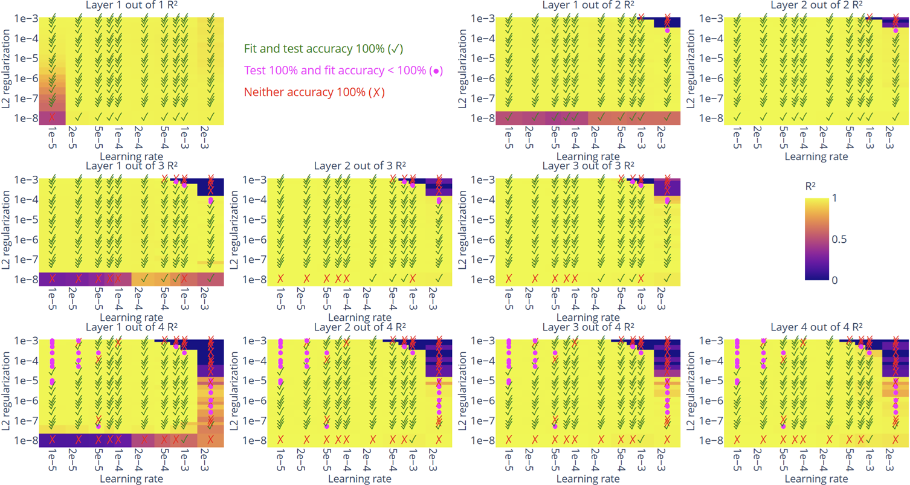

*Рисунок 6: $R^{2}$ приближения каждого нейрона в слое 1 простым нейроном и приближения суммой синусов каждой частоты из слоя 1 для слоёв 2-4 у MLP с 1, 2, 3 и 4 слоями. Обилие зелёных галочек означает, что замена нейронов простыми нейронами не снижает точности сети, а значит, наше отвлечение устойчиво к изменению условий обучения и устройств.* **[p. 7]**


*Рисунок 7: $R^{2}$ приближения синусами первого порядка нейронов в слое 1, а затем приближения суммой длины, равной числу различных частот в слое 1, синусов первого или второго порядка для слоёв $2,3,4$. Обилие зелёных галочек говорит нам, что наше отвлечение не сказывается на точности модели и устойчиво к изменению условий обучения и устройств.* **[p. 8]**

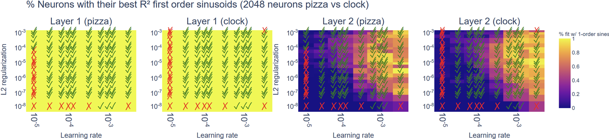

*Рисунок 8: Доля нейронов, чьё наилучшее приближение включает лишь синусы первого порядка. Итог можно истолковать как существование нейронов, работающих на синусоидах первого порядка в глубоких слоях. При наилучших настройках почти 100 % нейронов слоя 2 могут иметь наилучшие приближения из синусоид первого порядка, хотя это занимает очень малый объём в сетке настроек.* **[p. 8]**

**[p. 8]**

Более того, можно было бы ожидать предпочтения точных смежных классов (буде они существуют) приближённым, ибо это могло бы уменьшить ошибку приближения в DNN. Мы исследуем это на рис. 9, показывая, что при $n=66$ все устройства выказывают предпочтение выучиванию точных смежных классов. Это сильное свидетельство в пользу отвлечённого действия aCRT, ибо оно означает, что DNN пытаются выучить поведение в духе CRT.

Наши итоги показывают, что во всех устройствах слой 1 применяет только простые нейроны, а прочие слои всё ещё ими пользуются, а значит, действие 4.6 воплощается. Более того, отсюда следует, что мы показали: все нейроны ниже слоя 1 возбуждаются на линейных сочетаниях приближённых смежных классов. В сочетании с итогами [9] о том, что действие GCR [8] не всеобще и вместо него в сетях, обучаемых групповому умножению в группе перестановок, выучиваются контуры на смежных классах, мы открываем догадку о всеобщности на наборах данных группового умножения как предположение 4.9.

##### **Предположение 4.9****.**

*Всеобщность в строениях, выучиваемых сетями, обучаемыми приближать групповое умножение, обнаружится в виде контуров на смежных классах, а более общо — в виде контуров на приближённых смежных классах, вычисляющих признаки.*

К этому мигу мы показали, что наше определение приближённых смежных классов служит достаточным отвлечением для упрощения представлений, выучиваемых сетями разных устройств.

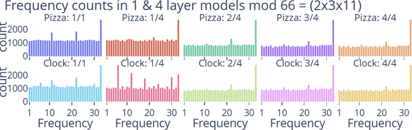

**[p. 9]**

*Рисунок 9: Гистограммы того, сколько раз каждая частота была выучена при обучении на $(a+b)\mod 66$. Замечание: внимание в моделях-часах приводит к выучиванию смежных классов частоты 6 в слое $\nicefrac{{1}}{{4}}$.* **[p. 9]**

## 5 Обсуждение и заключение

###### p9-1

Мы доказываем, что приближённые смежные классы существенны во всех устройствах, ибо они воплощают aCRT. Мы подкрепляем это и опытными свидетельствами на широком наборе настроек, семян и разных остатков, и теоремами. Приближённые смежные классы дают DNN строения, подобные тем смежным классам, на которых работает CRT. CRT пользуется $\mathcal{O}(\log(n))$ остаточными подсистемами, а следствие 4.8 даёт, что DNN нужно $\mathcal{O}(\log(n))$ различных частот, чтобы подобным образом навести остаточные подсистемы. Более того, приближённые смежные классы проливают свет на то, как сеть выучивает синусы второго порядка при возбуждении ReLU (возбуждение на смежном классе $c$ требует понимания принадлежности $a+b$ к классу), — итог, ранее не объяснённый у Nanda et al. [4] и Chughtai et al. [10]. Как показывает доказательство теоремы 4.4, нейрон научается сильно возбуждаться на том смежном классе, где лежит $c$, понимая, в каких классах лежат $a$ и $b$. Вывод таков: отвлекаясь от мелких подробностей того, как веса разных устройств явно вычисляют остаточное сложение, мы объединяем прежние истолкования под отвлечённым образцом aCRT.

Наша исходная догадка состояла в том, что нейронные сети, обучаемые остаточному сложению с составными остатками, будут выучивать китайскую теорему об остатках (CRT), пользуясь строением смежных классов там, где оно естественно применимо. Ранние опытные итоги подкрепляли этот взгляд, обнаруживая предпочтение частот, чисто делящих остаток, что говорило о согласии с точным строением смежных классов. Однако мы заметили, что сети часто выучивали лишь одну такую частоту наряду с другими, не отвечающими точным смежным классам. Это побудило к дальнейшему исследованию. Рассмотрев и качественные образцы, и количественное поведение, мы не нашли значимого различия между нейронами, связанными с частотами, согласованными со смежными классами, и прочими. Это наблюдение привело к решающему прозрению: сети, возможно, воплощают образец действия, схожий с CRT, даже когда его математические условия строго не выполнены. Это осознание побудило нас сформулировать отвлечённую приближённую CRT (aCRT), обобщив роль смежных классов до приближённых смежных классов как объединяющего строения.

###### p9-3

Поскольку остаточное сложение есть умножение в циклической группе, а наши приближённые смежные классы обобщают смежные, наше истолкование устанавливает всеобщность между циклическими группами и группами перестановок. Это следует из итога о том, что в сетях, обучаемых на группе перестановок, выучиваются контуры на смежных классах [9]. Тем самым мы устанавливаем всеобщность между очень разными задачами, связанными лишь тем, что обе суть группы. Это позволяет нам открыть *проверяемую* догадку о всеобщности на наборах данных группового умножения.

### 5.1 Ограничения и дальнейшая работа

###### p9-4

В теории групп группа с наименьшим строением есть циклическая группа простого порядка, а по теореме Кэли все группы суть подгруппы группы перестановок — властительницы группового строения. Несмотря на то, что эти группы занимают верхний и нижний края по богатству строения, наш итог даёт всеобщность в том, что DNN выучивают на этих задачах. Именно это единение с итогом Stander et al. [9] заставляет нас думать, что сети, обучаемые всем группам, скорее всего будут пользоваться строениями, укладывающимися в более общее определение — *приближённых смежных классов через расстояния на графах Кэли*. Существенное ограничение нашей работы в том, что мы не исследуем группы между этими двумя краями. Мы полагаем это обещающим направлением для дальнейшей работы: успешная проверка дала бы возможность показать, что догадка о всеобщности верна в весьма разнообразном пространстве всех возможных групповых умножений.

**[p. 10]**

###### p10-1

Хотя мы и первые, кто указал, *как* вызвать фазовый переход от $\mathcal{O}(n)$ к $\mathcal{O}(\log(n))$ выучиваемых частот (рис. 4), мы не знаем, *отчего* он происходит. Теорема 4.7 говорит лишь, что у этого решения должны быть отличные отступы, — и они таковы [7]. Отсюда два направления дальнейшей работы: *отчего* так выходит — не слишком ли различен ход обучения? *Что* это вызывает — не выучивает ли сеть чего-то заметно иного, чего не видим ни мы, ни прежние работы? То, что эти вопросы открыты на математической задаче, ставшей очень хорошо понятой за $1500$ лет с её появления, *говорит о настоятельной нужде в новых средствах истолковываемости.* Наконец, теорема 4.7 не отвечает, сколько нейронов нужно на выученную частоту, давая тривиальную нижнюю оценку $\Omega(1)$. Опытные итоги — в приложении G.7, но очевидного пути к доказательству оценок они не дают. *Мы полагаем, что ответ на это необходим сообществу истолковываемости, чтобы получить полное понимание задачи.* Это может составить целую отдельную работу. Она выглядит (для нас) нетривиальной и требует внимательных рассуждений с нелинейным возбуждением ReLU.

## Список литературы

- Chris Olah, Nick Cammarata, Ludwig Schubert, Gabriel Goh, Michael Petrov, and Shan Carter. Zoom in: An introduction to circuits. *Distill*, 5(3):e00024–001, 2020.

- Yixuan Li, Jason Yosinski, Jeff Clune, Hod Lipson, and John Hopcroft. Convergent learning: Do different neural networks learn the same representations? *arXiv preprint arXiv:1511.07543*, 2015.

- Minyoung Huh, Brian Cheung, Tongzhou Wang, and Phillip Isola. The platonic representation hypothesis. *arXiv preprint arXiv:2405.07987*, 2024.

- Neel Nanda, Lawrence Chan, Tom Lieberum, Jess Smith, and Jacob Steinhardt. Progress measures for grokking via mechanistic interpretability. In *The Eleventh International Conference on Learning Representations*, 2023. URL https://openreview.net/forum?id=9XFSbDPmdW.

- Ziqian Zhong, Ziming Liu, Max Tegmark, and Jacob Andreas. The clock and the pizza: Two stories in mechanistic explanation of neural networks. In *Thirty-seventh Conference on Neural Information Processing Systems*, 2023. URL https://openreview.net/forum?id=S5wmbQc1We.

- Andrey Gromov. Grokking modular arithmetic. *arXiv preprint arXiv:2301.02679*, 2023.

- Depen Morwani, Benjamin L. Edelman, Costin-Andrei Oncescu, Rosie Zhao, and Sham M. Kakade. Feature emergence via margin maximization: case studies in algebraic tasks. In *The Twelfth International Conference on Learning Representations*, 2024. URL https://openreview.net/forum?id=i9wDX850jR.

- Bilal Chughtai, Lawrence Chan, and Neel Nanda. A toy model of universality: Reverse engineering how networks learn group operations. In *International Conference on Machine Learning*, pages 6243–6267. PMLR, 2023a.

- Dashiell Stander, Qinan Yu, Honglu Fan, and Stella Biderman. Grokking group multiplication with cosets. In *Forty-first International Conference on Machine Learning*, 2024.

- Bilal Chughtai, Lawrence Chan, and Neel Nanda. Neural networks learn representation theory: Reverse engineering how networks perform group operations. In *ICLR 2023 Workshop on Physics for Machine Learning*, 2023b.

- Alethea Power, Yuri Burda, Harri Edwards, Igor Babuschkin, and Vedant Misra. Grokking: Generalization beyond overfitting on small algorithmic datasets, 2022. URL https://arxiv.org/abs/2201.02177.

- Mohamad Amin Mohamadi, Zhiyuan Li, Lei Wu, and Danica Sutherland. Grokking modular arithmetic can be explained by margin maximization. In *NeurIPS 2023 Workshop on Mathematics of Modern Machine Learning*, 2023. URL https://openreview.net/forum?id=QPMfCLnIqf.

**[p. 11]**

- Lee Sharkey, Bilal Chughtai, Joshua Batson, Jack Lindsey, Jeff Wu, Lucius Bushnaq, Nicholas Goldowsky-Dill, Stefan Heimersheim, Alejandro Ortega, Joseph Bloom, Stella Biderman, Adria Garriga-Alonso, Arthur Conmy, Neel Nanda, Jessica Rumbelow, Martin Wattenberg, Nandi Schoots, Joseph Miller, Eric J. Michaud, Stephen Casper, Max Tegmark, William Saunders, David Bau, Eric Todd, Atticus Geiger, Mor Geva, Jesse Hoogland, Daniel Murfet, and Tom McGrath. Open problems in mechanistic interpretability, 2025. URL https://arxiv.org/abs/2501.16496.

- Nick Cammarata, Shan Carter, Gabriel Goh, Chris Olah, Michael Petrov, Ludwig Schubert, Chelsea Voss, Ben Egan, and Swee Kiat Lim. Thread: Circuits. *Distill*, 2020. doi: 10.23915/distill.00024. https://distill.pub/2020/circuits.

- Nelson Elhage, Neel Nanda, Catherine Olsson, Tom Henighan, Nicholas Joseph, Ben Mann, Amanda Askell, Yuntao Bai, Anna Chen, Tom Conerly, Nova DasSarma, Dawn Drain, Deep Ganguli, Zac Hatfield-Dodds, Danny Hernandez, Andy Jones, Jackson Kernion, Liane Lovitt, Kamal Ndousse, Dario Amodei, Tom Brown, Jack Clark, Jared Kaplan, Sam McCandlish, and Chris Olah. A mathematical framework for transformer circuits. *Transformer Circuits Thread*, 2021. https://transformer-circuits.pub/2021/framework/index.html.

- Catherine Olsson, Nelson Elhage, Neel Nanda, Nicholas Joseph, Nova DasSarma, Tom Henighan, Ben Mann, Amanda Askell, Yuntao Bai, Anna Chen, Tom Conerly, Dawn Drain, Deep Ganguli, Zac Hatfield-Dodds, Danny Hernandez, Scott Johnston, Andy Jones, Jackson Kernion, Liane Lovitt, Kamal Ndousse, Dario Amodei, Tom Brown, Jack Clark, Jared Kaplan, Sam McCandlish, and Chris Olah. In-context learning and induction heads. *Transformer Circuits Thread*, 2022. https://transformer-circuits.pub/2022/in-context-learning-and-induction-heads/index.html.

- Nelson Elhage, Tristan Hume, Catherine Olsson, Nicholas Schiefer, Tom Henighan, Shauna Kravec, Zac Hatfield-Dodds, Robert Lasenby, Dawn Drain, Carol Chen, et al. Toy models of superposition. *arXiv preprint arXiv:2209.10652*, 2022.

- D Marr and T Poggio. From understanding computation to understanding neural circuitry. *Neuroscience Research Program Bulletin*, 15(3):470–488, 1979.

- Jessica Hamrick and Shakir Mohamed. Levels of analysis for machine learning. *arXiv preprint arXiv:2004.05107*, 2020.

- Zhonghao He, Jascha Achterberg, Katie Collins, Kevin Nejad, Danyal Akarca, Yinzhu Yang, Wes Gurnee, Ilia Sucholutsky, Yuhan Tang, Rebeca Ianov, et al. Multilevel interpretability of artificial neural networks: Leveraging framework and methods from neuroscience. *arXiv preprint arXiv:2408.12664*, 2024a.

- Martina G. Vilas, Federico Adolfi, David Poeppel, and Gemma Roig. Position: An inner interpretability framework for AI inspired by lessons from cognitive neuroscience. In *Forty-first International Conference on Machine Learning*, 2024. URL https://openreview.net/forum?id=66KmnMhGU5.

- Emily Wenger, Mingjie Chen, François Charton, and Kristin Lauter. Salsa: Attacking lattice cryptography with transformers, 2023. URL https://arxiv.org/abs/2207.04785.

- Ziming Liu, Ouail Kitouni, Niklas S Nolte, Eric Michaud, Max Tegmark, and Mike Williams. Towards understanding grokking: An effective theory of representation learning. *Advances in Neural Information Processing Systems*, 35:34651–34663, 2022.

- Darshil Doshi, Aritra Das, Tianyu He, and Andrey Gromov. To grok or not to grok: Disentangling generalization and memorization on corrupted algorithmic datasets. *arXiv preprint arXiv:2310.13061*, 2023.

- Neil Mallinar, Daniel Beaglehole, Libin Zhu, Adityanarayanan Radhakrishnan, Parthe Pandit, and Mikhail Belkin. Emergence in non-neural models: grokking modular arithmetic via average gradient outer product, 2024. URL https://arxiv.org/abs/2407.20199.

**[p. 12]**

- Hiroki Furuta, Gouki Minegishi, Yusuke Iwasawa, and Yutaka Matsuo. Towards empirical interpretation of internal circuits and properties in grokked transformers on modular polynomials, 2024. URL https://arxiv.org/abs/2402.16726.

- Kaifeng Lyu, Jikai Jin, Zhiyuan Li, Simon S. Du, Jason D. Lee, and Wei Hu. Dichotomy of early and late phase implicit biases can provably induce grokking, 2024. URL https://arxiv.org/abs/2311.18817.

- Tanishq Kumar, Blake Bordelon, Samuel J. Gershman, and Cengiz Pehlevan. Grokking as the transition from lazy to rich training dynamics, 2024. URL https://arxiv.org/abs/2310.06110.

- Darshil Doshi, Tianyu He, Aritra Das, and Andrey Gromov. Grokking modular polynomials. *arXiv preprint arXiv:2406.03495*, 2024.

- Tianyu He, Darshil Doshi, Aritra Das, and Andrey Gromov. Learning to grok: Emergence of in-context learning and skill composition in modular arithmetic tasks. *arXiv preprint arXiv:2406.02550*, 2024b.

- Ezra Edelman, Nikolaos Tsilivis, Benjamin Edelman, Eran Malach, and Surbhi Goel. The evolution of statistical induction heads: In-context learning markov chains. *Advances in Neural Information Processing Systems*, 37:64273–64311, 2024.

- François Charton and Julia Kempe. Emergent properties with repeated examples. *arXiv preprint arXiv:2410.07041*, 2024.

- Nayoung Lee, Ziyang Cai, Avi Schwarzschild, Kangwook Lee, and Dimitris Papailiopoulos. Self-improving transformers overcome easy-to-hard and length generalization challenges. *arXiv preprint arXiv:2502.01612*, 2025.

- Samy Jelassi, Stéphane d’Ascoli, Carles Domingo-Enrich, Yuhuai Wu, Yuanzhi Li, and François Charton. Length generalization in arithmetic transformers. *arXiv preprint arXiv:2306.15400*, 2023.

- François Charton. Learning the greatest common divisor: explaining transformer predictions, 2024. URL https://arxiv.org/abs/2308.15594.

- Alhussein Fawzi, Matej Balog, Aja Huang, Thomas Hubert, Bernardino Romera-Paredes, Mohammadamin Barekatain, Alexander Novikov, Francisco J R. Ruiz, Julian Schrittwieser, Grzegorz Swirszcz, et al. Discovering faster matrix multiplication algorithms with reinforcement learning. *Nature*, 610(7930):47–53, 2022.

- Daniel J Mankowitz, Andrea Michi, Anton Zhernov, Marco Gelmi, Marco Selvi, Cosmin Paduraru, Edouard Leurent, Shariq Iqbal, Jean-Baptiste Lespiau, Alex Ahern, et al. Faster sorting algorithms discovered using deep reinforcement learning. *Nature*, 618(7964):257–263, 2023.

- Gavin McCracken. *Using Exact Models to Analyze Policy Gradient Algorithms*. McGill University (Canada), 2021.

- Maithra Raghu, Alex Irpan, Jacob Andreas, Bobby Kleinberg, Quoc Le, and Jon Kleinberg. Can deep reinforcement learning solve erdos-selfridge-spencer games? In *International Conference on Machine Learning*, pages 4238–4246. PMLR, 2018.

- Diederik P. Kingma and Jimmy Ba. Adam: A method for stochastic optimization, 2017. URL https://arxiv.org/abs/1412.6980.

**Оглавление приложения**

1. Дополнительные сведения A Понятийные основания и дополнительные сопутствующие работы A.1 Дополнительные математические сведения A.2 Примеры: смежные классы, графы Кэли, размер шага $d$ A.2.1
2. Доказательство теоремы 4.4 B
3. Доказательства и подробности для теоремы 4.7 и следствия 4.8 C
4. Вложения содержат проекции представлений, а не представления D
5. Подробности опытов основной части E Рисунок 1: простые нейроны и переложенные простые нейроны E.1 Рисунок 2: приближённые смежные классы в графах Кэли, косинусы и переложенные косинусы E.2 Рисунок 3: рост остатка даёт скорость роста числа частот $\mathcal{O}(\log(n))$ E.3 Рисунок 4: среднее число частот, найденных в MLP E.4 Рисунок 5: скопления простых нейронов и $R^{2}$ при росте ширины устройств E.5 Рисунок 6: $R^{2}$ против настроек против глубины в MLP E.6 Рисунок 7: $R^{2}$ против настроек против глубины в пиццах и часах E.7 Рисунок 8: доля простых нейронов в более глубоких слоях меняется E.8 Рисунок 9: сети склонны выучивать смежные классы, а не приближённые E.9
6. Дальнейшие опытные итоги F Качество приближения одной синусоидой F.1
7. Дополнительные опыты, не вошедшие в основной текст G Разбор вложений по главным составляющим (PCA) G.1 Ещё примеры простых нейронов G.2 Изучение сдвигов фазы у простых нейронов G.3 Изучение доводочных нейронов G.4 Гистограммы частот, связанных с доводочными нейронами G.5 Доводочные нейроны любят отношения сложения и вычитания G.6 Гистограммы числа выучиваемых частот по остаткам 59 и 66 при разной глубине G.7 Опыты с шумом и отсечением G.8 Число частот G.9 Качественно: эквивариантность вкладов скоплений в логиты G.10 Модель-пицца G.10.1 Модель-часы G.10.2

## Приложение A Дополнительные сведения

### A.1 Понятийные основания и дополнительные сопутствующие работы

Это приложение развёртывает понятийные основания и сопутствующие работы, побудившие наш подход. Сперва мы обозреваем ключевые споры в механистической истолковываемости — прежде всего о всеобщности и отвлечении, — а затем обращаемся к математическим задачам как к образцовым испытательным полям для изучения выучиваемого строения.

**Механистическая истолковываемость, всеобщность и уровни отвлечения.**

###### p13-5

Механистическая истолковываемость стремится разобрать обученные нейронные сети на части, распознавая роли отдельных составляющих — нейронов, голов внимания, весов MLP — в выученной моделью функции [13]. Она нацелена объяснить, *как* модели приходят к своим выходам, разбирая те составляющие и пути, что участвуют в их внутренних вычислениях. Средоточие этого образца — **контуры** [1, 14, 15]: небольшие наборы составляющих (по существу подсеть), совместно выполняющие узнаваемую подзадачу вроде копирования, индукции или составления [16]. Со временем исследователи распознали в этих контурах повторяющиеся образцы — **мотивы**: наложение [17] (когда несколько признаков делят одно и то же подпространство), эквивариантность (когда вычисления уважают определённые преобразования) или объединение по случаям (когда единица возбуждается на несколько разных образцов, не различая их). Эти повторяющиеся мотивы дают переносимое понимание того, как сети вычисляют [1].

Средоточная мысль механистической истолковываемости — **всеобщность**, неформальная догадка о том, что независимо обученные нейронные сети склонны вырабатывать *схожие внутренние строения* [2, 1]. Притягательность её ясна: если модели, обученные в разных условиях, выучивают одно и то же решение, то истолкование одной модели даёт понимание многих. Однако что означает «схожие» в этом ключе, часто оставалось невысказанным. Всеобщность может означать согласие выученных признаков, схожесть ролей нейронов или контуров, либо общее строение действия — но эти возможности редко различают. При этом опытные находки противоречивы: одни работы сообщают, что представления в моделях зрения и языка тем более согласуются, чем больше объём модели [3], другие показывают расхождения выученных устройств даже на простых алгоритмических и математических задачах [5, 9]. Вместе эти находки высвечивают более глубокую беду: области недостаёт ясного определения того, *какого рода строение* следует ожидать всеобщим — и *на каком уровне отвлечения* такую всеобщность оценивать.

###### p14-2

Большая трудность в этой области — расплывчатость слова «контур», которым называют что угодно от малых скоплений нейронов до почти полносетевых подсетей. Такая гибкость позволяет строить убедительные разборы отдельных случаев, но мешает сравнениям между уровнями. В ранних работах по истолковываемости [4] ввели *действие фурье-умножения* (позже названное часами), показав, что трансформеры, обученные остаточному сложению, научились представлять входы на окружностях и складывать углы через внимание. Chughtai et al. [8] предложили более широкое обобщение — действие групповой композиции через представления (GCR), — предположив всеобщее действие для групповых задач на основе умножения групповых представлений. В обоих случаях слово «действие» означало местное вычисление, воплощённое контуром, заданным над определённой фурье-частотой или неприводимым представлением. Однако более поздние работы оспорили всеобщность этих «действий» на уровне контуров. Zhong et al. [5] нашли, что разные условия обучения способны вызвать качественно разные частотные контуры (скажем, контур пиццы), и показали, что несколько разных частотных контуров могут сосуществовать в одной модели. Stander et al. [9] разобрали модели, обученные на $S_{n}$, и нашли контуры на смежных классах, а не воплощения GCR на неприводимых представлениях, чем ещё сильнее подорвали заявку о всеобщности этого действия. Эти итоги говорят о том, что даже решая одну и ту же задачу, модели могут не воплощать одного и того же действия *на уровне контуров*. Наша работа смещает угол зрения. Мы определяем действие модели как всеобъемлющий вычислительный замысел, воплощаемый всей сетью. Чтобы его вскрыть, мы берём многомасштабный подход: разбираем поведение отдельных нейронов, то, как согласованные по частоте скопления нейронов работают вместе, и то, как эти скопления взаимодействуют, образуя связное общее решение. Наша модель простого нейрона помогает примирить прежние находки, показывая, что кажущиеся разными поведения контуров хорошо приближаются единым видом функции. На уровне скоплений мы имеем вычисления на смежных классах. На уровне всей сети мы распознаём согласованное решение, возникающее во всех устройствах и прогонах обучения: всеобщее отвлечённое действие, выраженное как приближённый вид китайской теоремы об остатках (aCRT). Такой угол зрения объясняет, как модели могут сходиться к одному и тому же высокоуровневому строению, даже когда их низкоуровневые устройства расходятся. В отличие от прежних разборов, сосредоточенных на обособленных подконтурах, мы стремились понять, как вычисление возникает на разных уровнях — от отдельных нейронов до решений всей модели, — и показываем, что модели способны делить одно и то же строение действия на уровне сети, несмотря на разнобой устройств.

Немалая часть путаницы вокруг всеобщности проистекает из сравнения моделей без различения **уровней отвлечения**. Недавние работы предложили рамки из наук о познании — прежде всего уровни разбора Марра [18, 19, 20, 21] — как полезные средства истолковываемости, помогающие уяснить, какого рода объяснения предлагаются. Марр различает (1) вычислительный уровень (какая задача решается), (2) уровень действия (как она решается) и (3) уровень воплощения (как оно телесно осуществлено). Хотя эти понятия и не были созданы для изучения всеобщности и не применяются в нашем основном разборе, мы находим их полезными как призму для взгляда назад — и чтобы понять, отчего прежние разборы расходились, и чтобы распознать общее строение там, где другие видели расхождение. Скажем, Vilas et al. [21] предлагают искать неизменности между уровнями и требовать взаимных ограничений между уровнями как ведущие начала. Наш подход отражает и то и другое: мы вскрываем согласованное решение вычислительного уровня (в смысле уровней Марра) — aCRT, — которое объединяет расходящиеся поведения на уровне контуров и являет ту всеобщность, что держится на более отвлечённом уровне, чем признавалось прежде, — то, что мы называем всеобщим отвлечённым действием.

**Математические и алгоритмические задачи как истолковываемые испытательные поля для машинного обучения.**

Математические и алгоритмические задачи — остаточное сложение, групповые действия, упорядочение, марковские цепи — стали ценными испытательными полями для изучения систем машинного обучения. Их притягательность в строгости строения: эти задачи изучаются столетиями, и их свойства хорошо поняты. Поскольку строение задачи известно целиком, наилучшие решения поддаются разбору, а поведение при генерализации может быть описано точно — в отличие от обычных постановок с житейскими данными. Это делает их превосходной средой для выяснения того, что и как выучивают нейронные сети. Применяемые прежде всего для изучения внутренностей моделей, эти задачи имеют и прикладное значение: скажем, трансформеры, обученные остаточной арифметике, прилагались к нападениям на решётчатые тайнописные схемы [22].

###### p15-3

Эти задачи были средоточием изучения гроккинга — явления, при котором модели внезапно начинают обобщать после поры переобучения [11]. Взяв остаточное сложение за испытательное поле, исследователи связали гроккинг со строением внутренних представлений [23, 6], наибольшением отступа [12, 7], порчей меток [24] и ненейронными устройствами [25], а также с тем, как разные контуры возникают при гроккинге для разных задач остаточной арифметики [26]. Другие работы связали гроккинг с фазовыми переходами при обучении — скажем, с переходами между ленивым и богатым режимами в остаточном сложении [27] и многочленной регрессии [28]. Несколько работ дают и точные аналитические построения весов сети: однослойные однобитно кодирующие сети с квадратичным возбуждением, решающие остаточное сложение [6, 7], и сети ReLU, решающие остаточное умножение, для описания гроккнутых решений в остаточных многочленах [29].

Помимо гроккинга математические задачи помогли исследовать генерализацию, ход обучения и обучение по ходу дела. Остаточное сложение и марковские цепи послужили управляемой средой для изучения того, как трансформеры обретают способность к обучению по ходу дела [30, 31]. Другие работы показали, что повторение обучающих примеров сказывается на генерализации в задачах вроде наибольшего общего делителя (НОД), остаточного умножения и предсказания собственных значений матрицы [32], а также что арифметические задачи проливают свет на то, как трансформеры справляются с генерализацией по длине [33, 34]. Именно для НОД оказалось, что модели словно выбирают из малого выученного набора возможных делителей [35].

Хотя большая часть работ в этой области занята обучением с учителем, некоторые исследуют, как в математических средах ведут себя обучающиеся с подкреплением (RL). У обучаемых на задачах вроде матричного умножения или упорядочения наблюдали открытие новых, истолковываемых действий [36, 37]. Другие работы пользуются теоретико-групповым строением ради точного разбора: среды, построенные на временны́х симметриях аффинных групп Вейля, позволяют аналитически описать ландшафт градиента стратегии, давая замкнутый вид его хода и местных наилучших точек и проливая свет на то, как трудность разведки сказывается на обучении [38]. Схожим образом созданы истолковываемые среды RL на основе игр Эрдёша—Селфриджа—Спенсера с точными наилучшими стратегиями и настраиваемой трудностью, управляемой понятными человеку параметрами среды [39].

В совокупности этот свод работ утверждает математические задачи как неоценимые средства истолковываемости. Их известное строение позволяет точно разбирать выученное поведение, поддерживает объяснения через отвлечение и даёт испытательные поля, где заявки о генерализации и всеобщности можно строго оценивать.

### A.2 Дополнительные математические сведения

Этот раздел даёт строгие определения и примеры теоретико-групповых строений, лежащих под нашим разбором сетей для остаточного сложения: групп, смежных классов, графов Кэли, групповых представлений и китайской теоремы об остатках (CRT). Эти определения поддерживают строения, описанные в основном тексте: простые нейроны, приближённые смежные классы и действие приближённой CRT, которое мы распознаём в обученных сетях.

**Группы, подгруппы и смежные классы.**

##### **Определение A.1**(группа)**.**

**Группа** $(G,\circ)$ состоит из множества $G$, снабжённого двуместным действием $\circ:G\times G\to G$, удовлетворяющим следующему:

1. **Сочетательность**: $(f\circ g)\circ h=f\circ(g\circ h)$ для всех $f,g,h\in G$.
2. **Единица**: существует элемент $e\in G$ такой, что $e\circ g=g\circ e=g$ для всех $g\in G$.
3. **Обратные**: для каждого $g\in G$ существует $g^{-1}\in G$ такой, что $g\circ g^{-1}=e$.

##### **Определение A.2**(подгруппа)**.**

Подмножество $H\subseteq G$ есть **подгруппа**, если оно само является группой относительно того же действия $\circ$. То есть $H$ должно содержать единицу, быть замкнутым относительно действия и содержать обратные к своим элементам.

Подгруппы наводят естественное разбиение группы через *смежные классы*, которые и суть ключ к пониманию остаточного строения и разложения.

##### **Определение A.3**(смежные классы)**.**

Пусть $H$ есть подгруппа $G$ и $g\in G$. **Левый смежный класс** $H$ с представителем $g$ есть:

$$
gH=\{g\circ h:h\in H\}.
$$

Правые смежные классы определяются схожим образом: $Hg=\{h\circ g:h\in H\}$. Смежные классы разбивают $G$ на непересекающиеся подмножества равного размера.

##### **Пример A.4**(целые числа и чётные/нечётные смежные классы)**.**

Множество $(\mathbb{Z},+)$ есть группа. Единица есть $0$; обратный к $n$ есть $-n$. Чётные целые $2\mathbb{Z}$ образуют подгруппу. Это даёт два смежных класса:

$$
2\mathbb{Z}=\{\ldots,-2,0,2,\ldots\},\quad 1+2\mathbb{Z}=\{\ldots,-1,1,3,\ldots\}.
$$

Им отвечают чётные и нечётные целые — знакомый пример разбиения смежными классами.

##### **Определение A.5**(гомоморфизм)**.**

Отображение $\psi:G\to H$ между группами есть **гомоморфизм**, если оно сохраняет групповое действие:

$$
\psi(g_{1}\circ_{G}g_{2})=\psi(g_{1})\circ_{H}\psi(g_{2}),\quad\text{for all }g_{1},g_{2}\in G.
$$

Если $\psi$ вдобавок взаимно однозначно, оно называется **изоморфизмом групп**.

Гомоморфизмы суть естественное понятие «сохраняющих строение» отображений между группами.

**Циклические группы и остаточная арифметика.**

В этой работе мы сосредоточены на остаточном сложении, образующем циклическую группу.

##### **Определение A.6**(циклическая группа $C_{n}$)**.**

**Циклическая группа порядка $n$**, обозначаемая $C_{n}$ или $\mathbb{Z}_{n}$, есть множество $\{0,1,\dots,n-1\}$ со сложением по остатку $n$. Групповое действие задаётся так:

$$
a\circ b=(a+b)\mod n,
$$

с единицей $0$ и обратными $a^{-1}=(n-a)\mod n$.

Подгруппы $C_{n}$ отвечают равноотстоящим подмножествам, а их смежные классы разбивают $C_{n}$ на классы сравнимости по делителю $n$.

##### **Пример A.7**(смежные классы по остатку 4 в $\mathbb{Z}_{8}$)**.**

Пусть $n=8$ и рассмотрим подгруппу $H=\{0,4\}$. Левые смежные классы суть:

$$
0+H=\{0,4\},\quad 1+H=\{1,5\},\quad 2+H=\{2,6\},\quad 3+H=\{3,7\}.
$$

Это разбивает $\mathbb{Z}_{8}$ на четыре непересекающихся смежных класса размера 2.

##### **Определение A.8**(остаточный обратный)**.**

Пусть $a\in\mathbb{Z}_{n}$. **Остаточным обратным** к $a$ называется элемент $b\in\mathbb{Z}_{n}$ такой, что

$$
a\cdot b\equiv 1\mod n.
$$

Остаточный обратный существует тогда и только тогда, когда $\gcd(a,n)=1$, то есть когда $a$ и $n$ взаимно просты.

**Китайская теорема об остатках.**

Китайская теорема об остатках (CRT) даёт мощный способ разложить остаточную арифметику по большому остатку на несколько независимых остаточных систем по меньшим взаимно простым остаткам. Это разложение отражает то остаточное строение, которое выучивают сети, обучаемые задачам сложения, и оно средоточно для нашего понятия *приближённой CRT*.

##### **Теорема A.9**(китайская теорема об остатках)**.**

*Пусть $n=q_{1}q_{2}\cdots q_{k}$ есть произведение попарно взаимно простых целых. Тогда отображение*

$$
\phi:\mathbb{Z}_{n}\to\mathbb{Z}_{q_{1}}\times\cdots\times\mathbb{Z}_{q_{k}},\quad x\mapsto(x\bmod q_{1},\ldots,x\bmod q_{k})
$$

*есть изоморфизм групп. То есть каждый элемент $\mathbb{Z}_{n}$ единственным образом отвечает набору остатков по $q_{i}$, и наоборот.*

##### **Пример A.10**(взгляд через пересечение смежных классов)**.**

Пусть $n=91=7\cdot 13$. Пусть мы хотим решить:

$$
x\equiv 3\mod 7,\quad x\equiv 10\mod 13.
$$

Каждое сравнение задаёт смежный класс:

$$
x\equiv 3\mod 7 \Rightarrow\{3,10,17,24,31,\dots\}, \\
x\equiv 10\mod 13 \Rightarrow\{10,23,36,49,\dots\}.
$$

Единственное решение по остатку 91 есть число, общее обоим классам: $\boxed{10}$.

**Графы Кэли.**

##### **Определение A.11**(порождающее множество)**.**

Пусть $G$ есть группа. Подмножество $S\subseteq G$ называется **порождающим множеством** $G$, если всякий элемент $g\in G$ записывается конечным произведением элементов $S$ и обратных к ним. То есть для всех $g\in G$ существуют $s_{1},\ldots,s_{k}\in S$ и знаки $\epsilon_{i}\in\{-1,1\}$ такие, что:

$$
g=s_{1}^{\epsilon_{1}}s_{2}^{\epsilon_{2}}\cdots s_{k}^{\epsilon_{k}}.
$$

##### **Пример A.12**(порождающие множества в $\mathbb{Z}_{6}$)**.**

Группа $\mathbb{Z}_{6}=\{0,1,2,3,4,5\}$ со сложением по остатку 6 может быть:

- Порождена $\{1\}$, ибо повторное сложение даёт все элементы: $1,2,\ldots,5,0$.
- Порождена $\{5\}$, ибо $5+5=10\equiv 4\mod 6$ и так далее.
- Не порождена $\{2\}$, ибо $2+2=4$, $4+2=0$, и подгруппа $\{0,2,4\}$ слишком мала.

##### **Определение A.13**(граф Кэли)**.**

Пусть $G$ есть группа и $S\subseteq G$ — произвольное подмножество (не обязательно порождающее). **Граф Кэли** $\Gamma(G,S)$ есть направленный граф с одной вершиной на каждый элемент $G$ и направленным ребром из $g$ в $g\cdot s$ для каждого $s\in S$.

Если $S$ симметрично (то есть $s\in S\Rightarrow s^{-1}\in S$), то граф часто считают ненаправленным. Граф:

- **Связен** тогда и только тогда, когда $S$ порождает $G$.
- **Несвязен**, если $S$ порождает собственную подгруппу $G$.

##### **Пример A.14**(графы Кэли в $\mathbb{Z}_{6}$)**.**

Пусть $G=\mathbb{Z}_{6}=\{0,1,2,3,4,5\}$ со сложением по остатку 6.

- При $S=\{1\}$ граф соединяет:

$$
0\to 1\to 2\to 3\to 4\to 5\to 0
$$

образуя связный 6-цикл. Здесь $S=\{1\}$ есть порождающее множество.
- При $S=\{2\}$ мы получаем лишь:

$$
0\to 2\to 4\to 0,\quad 1\to 3\to 5\to 1
$$

то есть два несвязных 3-цикла. Это отражает подгруппу $\{0,2,4\}$ и её смежный класс $\{1,3,5\}$. Множество $S=\{2\}$ *не* порождает $\mathbb{Z}_{6}$, и граф *несвязен*.

**Групповые представления и дискретное преобразование Фурье (DFT)**

##### **Определение A.15**(групповое представление)**.**

**Представление** группы $G$ на векторном пространстве $V$ есть гомоморфизм $\rho:G\to\mathrm{GL}(V)$, где $\mathrm{GL}(V)$ есть группа обратимых линейных отображений на $V$.

##### **Пример A.16**(дискретное преобразование Фурье)**.**

**Дискретное преобразование Фурье (DFT)** происходит из комплексных представлений циклической группы $C_{n}$. Каждый элемент $j\in C_{n}$ отображается в комплексное число $\exp\left(2\pi i\frac{kj}{n}\right)$ при целом $k\in\{0,1,...,n-1\}$, кодируя остаточное строение как повороты в комплексной плоскости. Эти комплексные представления и отвечают DFT. Они также наводят вещественные представления в виде матриц поворота на плоскости, действующих на составляющие $(\cos,\sin)$.

#### A.2.1 Примеры: смежные классы, графы Кэли, размер шага $d$

В предварительных сведениях (раздел 3) мы приводили примеры смежных классов на $C_{6}$. В этом разделе мы покажем эти примеры наглядно, чтобы читатель лучше понял приближённые смежные классы, порождение графов Кэли и разметку их вершин размером шага (определение 4.1). Напомним размер шага: $d:=(\frac{f}{\gcd(f,n)})^{-1}(\bmod{\frac{n}{\gcd(f,n)}})$, где берётся остаточный обратный. Таким путём достижимо $n^{\prime}=\frac{n}{\gcd(f,n)}$ различных положений, поэтому можно записать: $d:=(\frac{f}{\gcd(f,n)})^{-1}(\bmod{n^{\prime}})$. Замечание: $d$ есть размер шага в графе $C_{n^{\prime}}$.

Рассмотрим циклическую группу на 6 элементах, $C_{6}$. В этом примере мы покажем, как косинусы разных частот кодируют сведения о смежных классах и как отсюда построить отвечающие им графы Кэли. Поскольку $n=6$, то $\lfloor\frac{6}{2}\rfloor=3$, и у нас есть 3 возможные частоты $f=1,2,3$ для $\cos\left(\frac{2\pi\cdot f\cdot a}{6}\right)$ по $a\in C_{6}$. Эти три косинуса будут шагать по $C_{6}$ по-разному в зависимости от $f$.

Если $f=1$, наш косинус есть $\cos\left(\frac{2\pi\cdot 1\cdot a}{6}\right)$. Вычисляем $n^{\prime}=6$, стало быть, в $C_{6}$ достижимо 6 элементов. Это даёт 6 смежных классов размера 1:

$$
\{0\},\{1\},\{2\},\{3\},\{4\},\{5\}.
$$

Если $f=2$, наш косинус есть $\cos\left(\frac{2\pi\cdot 2\cdot a}{6}\right)$. Вычисляем $n^{\prime}=3$, стало быть, мы в $C_{3}$, где 3 элемента. Это даёт 3 смежных класса размера 2, отвечающих трём разным 2-циклам в исходном графе $C_{6}$, но где каждый смежный класс теперь есть точка нашего нового графа для $C_{n^{\prime}}=C_{3}$:

$$
\{0,3\},\{1,4\},\{2,5\}.
$$

Если $f=3$, наш косинус есть $\cos\left(\frac{2\pi\cdot 3\cdot a}{6}\right)$. Вычисляем $n^{\prime}=2$, стало быть, мы в $C_{2}$, где 2 элемента. Это даёт 2 смежных класса размера 3, отвечающих двум разным 3-циклам в исходном графе $C_{6}$, но где каждый смежный класс теперь есть точка нашего нового графа для $C_{n^{\prime}}=C_{2}$:

$$
\{0,2,4\},\{1,3,5\}.
$$

См. эти косинусы на рисунке 10.


*Рисунок 10: Косинусы с началом в 0 при $f=1,\ f=2,\ f=3$. Точки окрашены по принадлежности к смежному классу, *то есть* классу равнозначности.* **[p. 18]**

Мы можем вычислить размер шага (определение 4.1), и во всех трёх случаях выходит $d=1$. Эти наборы мы вскоре покажем на рисунке.

Строка 1 показывает исходный граф Кэли, а строка 2 — новый граф после схлопывания смежных классов. В строке 1 будет циклическая группа на 6 элементах, $C_{6}$: иначе говоря, мы ещё не схлопываем смежные классы в их классы равнозначности. Это значит, что мы не строим графов $C_{n^{\prime}}$, и потому рисуем $C_{6}$ с расстояниями от вершин до первой вершины $a=0$. Мы также показываем смежные классы, 3-циклы и 2-циклы. В строке 2 мы даём равносильную картину, делающую всё яснее: мы рисуем $C_{n^{\prime}}$. Более того, размер шага $d$ и есть размер шага в этой циклической группе $C_{n^{\prime}}$, отчего расстояния видны легче, чем при взгляде на $C_{6}$. Схлопывая вершины в их смежные классы (классы равнозначности), становится ясно, что всё отстоит от жёлтого класса на 1. Это мы и делаем в строке 2, получая $C_{6}$ для $f=1$, $C_{3}$ для $f=2$ и $C_{2}$ для $f=3$. См. рисунок 11.


*Рисунок 11: В строке 1 мы показываем графы Кэли и расстояния, что несколько сбивает с толку на третьей доле, ибо мы не схлопываем смежные классы в классы равнозначности. Чтобы легче было видеть расстояния и их происхождение, в строке 2 мы схлопываем равнозначные точки (все точки смежного класса) в подокружность. От этого точек на графе становится меньше, и получается $C_{n^{\prime}}$ — тот граф, на котором $d$ есть размер шага. Теперь легче видеть, отчего расстояния до приближённых смежных классов именно таковы. В строке 2 на третьей доле мы решили поместить два тёмно окрашенных смежных класса на другую сторону окружности, чтобы подчеркнуть, что ReLU на них равен 0.* **[p. 19]**

В случае приближённых смежных классов ничего не меняется. Вычислите $n^{\prime}$, вычислите $d$ и шагайте по циклической группе $C_{n^{\prime}}$ с шагом $d$, размечая расстояния элементов. Чтобы построить приближённый смежный класс, для некоторых кратных $k_{1},k_{2}$ сделайте $k_{1}$ шагов назад и $k_{2}$ шагов вперёд. Пройденный путь и есть приближённый смежный класс — все элементы, «близкие» на графе Кэли.

## Приложение B Доказательство теоремы 4.4

Опытные свидетельства в пользу этой теоремы см. на рис. 2 в основной части работы. Всякая точка $>0$ лежит в приближённом смежном классе, окрашенном цветами viridis, и яркость viridis гаснет по мере удаления точки от средней точки приближённого смежного класса (чем ближе элемент к тому месту, где ReLU уже не возбудится, тем он тусклее).

###### p19-3

На деле все синусоидальные функции, *то есть* наше предположение о простом нейроне, будут удовлетворять этой теореме. Простота этого доказательства проистекает из того, что мы придумали весьма мощное определение приближённых смежных классов, и впрямь отражающее то, что выучивают нейроны сети. Доказательство требует предположения, что нейроны выучивают периодические функции, и потому большая часть работы посвящена опытному доказательству того, что простые нейроны и впрямь выучиваются сетями.

##### Доказательство.

**Простые нейроны выучивают приближённые смежные классы.** Нейрон, удовлетворяющий модели простого нейрона, вычисляет тригонометрическую функцию, чьи наибольшие значения приходятся на элементы смежного класса или «приближённого смежного класса». Если $g:=\gcd(f,n)>1$, нейрон выучил **смежный класс** порядка $g$, содержащий $s_{A}+s_{B}$. Точнее: записывая $n=n^{\prime}g$ и $f=f^{\prime}g$ при $g=\gcd(f,n)$, мы можем переписать $\frac{2\pi f}{n}=\frac{2\pi f^{\prime}}{n^{\prime}}$. Стало быть, если входные нейроны стоят в положениях $a$ и $b$, где $a\equiv s_{A}\pmod{n^{\prime}}$ и $b\equiv s_{B}\pmod{n^{\prime}}$, то возбуждение нейрона наибольшее: $\cos\frac{2\pi f(a-s_{A})}{n}=\cos\frac{2\pi f(b-s_{B})}{n}=1$. Нейрон сильнее всего указывает на каждый логит, удовлетворяющий $c\equiv s_{A}+s_{B}\pmod{n^{\prime}}$, ибо для всех таких выходных логитов $\cos\frac{2\pi f(c-s_{A}-s_{B})}{n}=1.$ Мы видим, что нейрон сильно связывает элементы $C_{n}$, сравнимые по остатку $n^{\prime}$.

Делит ли $f$ порядок $n$ или нет, нейрон будет возбуждаться на том, что мы определили как приближённый смежный класс. Точнее, можно спросить следующее: для $a\not\equiv s_{A}\pmod{n^{\prime}}$ какие значения $a$ дают наибольшее возбуждение? Величина $\cos\frac{2\pi f^{\prime}(a-s_{A})}{n^{\prime}}$ очень близка к $1$ тогда и только тогда, когда $f^{\prime}(a-s_{A})$ очень близко к целому кратному $n^{\prime}$; то есть, скажем, $f^{\prime}(a-s_{A})\equiv m\pmod{n^{\prime}}$ для некоторого целого $m$ с малым модулем. Обозначая через $d$ остаточный обратный к $f^{\prime}$ по остатку $n$, это равносильно $a-s_{A}\equiv dm\pmod{n^{\prime}}$. Иначе говоря, беря $a=s_{A}+dm$ при малых целых $m$, мы получаем очень сильное возбуждение нейрона. Так же и при $b=s_{B}+dm^{\prime}$ для другого малого целого $m^{\prime}$. Теперь этот нейрон сильнее всего указывает на $c\equiv s_{A}+s_{B}\pmod{n^{\prime}}$, как обсуждалось выше, но если $c$ отстоит от $s_{A}+s_{B}$ на малое число шагов размера $d$, возбуждение всё ещё будет велико. Подытоживая: если до каждого из $a,b,c$ можно дойти малым числом шагов размера $d$ от $s_{A},s_{B},s_{A}+s_{B}$ соответственно, то $N$ сильно возбуждается на входах $a,b$ и сильно указывает на $c$.

После ReLU отсюда следует, что, поскольку все нейроны выдают (возбуждаются) лишь на приближённых смежных классах, все нейроны в последующих слоях возбуждаются на линейных сочетаниях приближённых смежных классов (это следует из полносвязности сетей и из того, что ReLU способен лишь уменьшить классы, то есть элементы ниже 0 отсекаются). ∎

## Приложение C Доказательства и подробности для теоремы 4.7 и следствия 4.8

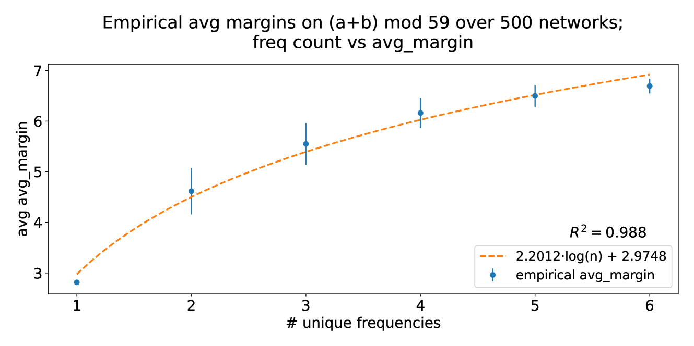

*Рисунок 12: Опытно у сетей с 1 скрытым слоем и 1 обучаемой матрицей вложений отступы растут как $\mathcal{O}(\log(n))$ по мере выучивания большего числа частот. В следствии 4.8 мы это доказываем. Замечание: полоски погрешности в 1 стандартное отклонение есть при (x=1, y=2.82); они просто малы и лежат в пределах 2,8-2,84. Этот график построен вычислением среднего отступа каждой сети по всему набору данных при условии, что сеть выучила $x=$ число различных частот. График показывает для сетей, выучивших одно и то же число частот, среднее из средних отступов и полоски погрешности в 1 стандартное отклонение этих данных.* **[p. 20]**

Предположим, что обучение приводит нейроны к модели простого нейрона.

##### Доказательство.

Каждый простой нейрон наибольшим образом возбуждает один выход, а именно $s_{A}+s_{B}$ (или, возможно, наибольшим образом возбуждается на смежном классе выходов, содержащем $s_{A}+s_{B}$). Однако если сложить вклады всех простых нейронов одного скопления (то есть всех с одной и той же частотой $f$), то окажется, что уровень возбуждения может быть наибольшим на любом желаемом выходе; точнее, уровень возбуждения на выходе $k$ при входах $i,j$ будет иметь вид $A\cos\left(2\pi\left(f(k-i-j)/n\right)\right)$. Заметим, что это наблюдалось опытно, *например* см. рис. 25(a) и рис. 43, а также было ранее подмечено в литературе: см., скажем, последнее равенство раздела 3 в [10]. На деле приведённый ниже разбор работает, даже если $i+j$ лишь несколько близко к наибольшему возбуждению скопления (см. рисунок 43), хотя для простоты мы полагаем, что наибольшее приходится на $i+j$. Однако и в этом случае найдётся много выходных нейронов, почти столь же сильно возбуждающихся на верном ответе. Чтобы выделить единственный ответ, мы применяем наложение синусоид нескольких частот; опытно на рисунке 43 видно, что это делает верный ответ заметным на фоне прочих.

###### p21-1

В свете сказанного и раздела 4.1, закрепив входные нейроны $i,j\in C_{n}$ и сложив вклады всех скоплений (полагая ради наглядности, что вклады всех скоплений имеют одну и ту же величину), мы получаем сумму $h(k):=\sum_{\ell=1}^{m}\cos\left(\frac{2\pi f_{\ell}}{n}(k-i-j)\right)$ как описание уровня возбуждения на выходном логите $k$. Если $k=i+j$, то $h(k)$ принимает наибольшее значение $m$. Если мы хотим ручаться, что нейронная сеть будет неизменно выбирать $k$, надо показать, что $h(k)$ заметно меньше $m$ для всех прочих значений $k$. Мы примем случайное описание, где $m$ частот $f_{1},\ldots,f_{m}$ выбираются равномерно случайно из $1,2,\ldots,n-1$. Закрепим параметр $0<\delta<1$; мы вычислим приближение вероятности того, что $m-h(k)>\delta m$ для всех $k\neq i+j\pmod{m}$.

Пусть $\{x\}:=x-\lfloor x+\frac{1}{2}\rfloor$ есть расстояние со знаком до ближайшего целого, и положим $d:=k-i-j$. Тогда, пользуясь разложением Тейлора,

$$
m-h(k) =m-\sum_{\ell=1}^{m}\cos\left(2\pi\left\{\frac{f_{\ell}d}{n}\right\}\right)\approx m-\sum_{\ell=1}^{m}\left(1-\frac{1}{2}\left(2\pi\left\{\frac{f_{\ell}d}{n}\right\}\right)^{2}\right)=2\pi^{2}\sum_{\ell=1}^{m}\left\{\frac{f_{\ell}d}{n}\right\}^{2}.
$$

###### p21-3

Заметим, что приближение Тейлора весьма плохо, когда $f_{\ell}d/n$ далеко от целого, а если $k$ близко к целому, то $\{k\}$ близко к 0. Разумно ожидать, что $m-h(k)$ будет наименьшим, когда все значения $f_{\ell}d/n$ близки к целым, — и в этом случае приближение точнее.

Тем самым условие $m-h(k)>\delta m$ связано со следующим: определив вектор $v:=\frac{1}{n}(f_{1},\ldots,f_{m})\in[0,1]^{m}$, нам нужно, чтобы для всех $1\leq d\leq n-1$ точка $dv$ отстояла не менее чем на $\sqrt{\delta m/2\pi^{2}}$ от любой точки $\mathbb{Z}^{m}$. Заметим, что $nv$ есть целая точка, поэтому $(n-d)v$ всегда отстоит от целой точки на то же расстояние, что и $dv$. Стало быть, довольно потребовать, чтобы $v$ отстоял не менее чем на $\frac{1}{d}\sqrt{\delta m/2\pi^{2}}$ от точки $\frac{1}{d}\mathbb{Z}^{m}$ при $d=1,\ldots,\lfloor n/2\rfloor$.

###### p21-5

Мы вычисляем верхнюю оценку объёма области, которой надо избежать: то есть множества всех точек $[0,1]^{m}$, отстоящих не далее $\frac{1}{d}\sqrt{\delta m/2\pi^{2}}$ от точки $\frac{1}{d}\mathbb{Z}^{m}$ при некотором $d=1,\ldots,n/2$. Для каждого $d$ в этой области $d^{m}$ точек, и вокруг каждой лежит шар радиуса $\frac{1}{d}\sqrt{\delta m/2\pi^{2}}$; поэтому полный объём области, которой надо избежать, ограничен сверху величиной $\frac{n}{2\Gamma(m/2+1)}\left(\frac{\delta m}{2\pi}\right)^{m/2}.$ Тем самым вероятность того, что $m-h(k)>\delta m$, приближённо равна $1$ минус это значение.

Для данного $n$ вычислим то значение $m$, при котором эта вероятность превышает, скажем, $\rho$.

$$
1-\frac{n}{2\Gamma(m/2+1)}\left(\frac{\delta m}{2\pi}\right)^{m/2} >\rho\iff\Gamma(m/2+1)\left(\frac{2\pi}{\delta m}\right)^{m/2}>\frac{n}{2-2\rho}. \\
\log_{e}\Gamma(x+1)\approx x\log_{e}(x)-x m \\
\log_{e}\Gamma(m/2+1)+\frac{m}{2}\log_{e}\left(\frac{2\pi}{\delta
m}\right) >\log_{e}n-\log_{e}(2-2\rho) \\
m >\frac{2\log_{e}n-2\log_{e}(2-2\rho)}{\log_{e}(\pi/\delta)-1}.
$$

Стало быть, если число скоплений нейронов $m$ больше этого выражения, то с вероятностью не менее $\rho$ разделение $m-h(k)$ будет не менее $\delta m$. Мы видим, что это число растёт линейно по $\log_{e}n$.

Выбор параметров $\rho$ и $\delta$ способен заметно изменить точное потребное значение $m$, и неясно, какие значения вернее всего описывают истинное поведение нейронной сети.

К примеру, заметим, что если взять $\delta=\pi/e^{3}\approx 0.1564$ и $\rho=\frac{1}{2}$, то всё выражение сводится попросту к $m>\log_{e}n$. Стало быть, если нейронная сеть пользуется $m=\log_{e}n$ скоплениями нейронов, то это правило предсказывает, что она обеспечит разделение $m-h(k)>0.15m$ для всех $k\neq i+j$ с уверенностью $50\%$. Для $n=89,91$ имеем $\log_{e}n\approx 4.5$, что согласуется с числом скоплений, найденным на рисунках 39 и 3. Этот ход можно истолковать как приближённую CRT; сравнение см. в замечании 4.5. ∎

### C.1 Доказательство следствия 4.8

Напомним, что $h$ есть описываемая сеть, вычисленная при входах $i,j$, $h(k)$ есть значение выходного распределения в $k$ с наибольшим значением $h(i+j)=m$, а $m$ есть число различных частот простых нейронов сети.

##### **Следствие C.1**(логарифмического числа частот довольно для нетривиального отступа)**.**

*Пусть $0<\delta<1$ и $0<\rho<1$, и определим*

$$
C(\delta,\rho)\;=\;\frac{2}{\log\!\bigl{(}\pi/\delta\bigr{)}-1}\;\Bigl{(}1-\tfrac{1}{2}\log_{e}(2-2\rho)\Bigr{)}\quad(>0).
$$

*Если число $m$ простых нейронов сети удовлетворяет*

$$
m\;\;\geq\;\;C(\delta,\rho)\,\log n
$$

*то с вероятностью не менее $\rho$*

$$
h(i+j)-h(k)\;>\;\delta\,m,
$$

*то есть отступ логитов есть $\Omega(\log n)$.*

##### Доказательство.

Теорема 4.7 утверждает, что неравенство

$$
\;h(i+j)-h(k)\;>\;\delta m
$$

выполнено для всех $k\neq i+j$ с вероятностью не менее $\rho$, коль скоро

$$
m\;>\;\frac{2\log_{e}n-2\log_{e}(2-2\rho)}{\log_{e}(\pi/\delta)-1}.
$$

Выберем постоянную $m$ так, чтобы $m\geq C(\delta,\rho)\log n$ и неравенство (‡) выполнялись одновременно.

Наконец, обеспеченный отступ $\delta m\geq\delta C(\delta,\rho)\log n$ есть $\Omega(\log n)$, что строго больше отступа $O(1)$, достигаемого при постоянном числе частот («наименьший отступ»). ∎

**[p. 22]**

**[p. 13]**

## Приложение D Вложения содержат проекции представлений, а не представления

###### p22-10

Chughtai et al. [8] обнаруживают значения представлений в матрице вложений. Первый шаг их действия GCR неверен в общем случае. Они пишут: «Переводит однобитные $a$, $b$ в матрицы представлений». Мы приводим свидетельство против этого, обучая с размером пачки, равным остатку $n$, и обучая на полной выборке. Различие в распределении получаемых матриц вложений см. на рис. LABEL:fig:embedding-weights-histogram. Более того, у нейронов одного скопления частоты $f$ разные сдвиги фазы, и матриц поворота $2\times 2$ во вложениях недостаточно, чтобы объяснить такое поведение.

Вместо этого значения в матрице вложений могут кодировать масштабированные проекции матрицы поворота $2\times 2$ на одномерное подпространство. Заметим, что такое строение подразумевается догадкой о том, что нейронные сети, обучаемые групповым задачам, выучивают представления, но оно общее из-за существования и величин, и сдвигов фазы. Чтобы получить точную равносильность, заметим, что это строение нейрона получается *произвольной масштабированной проекцией* представлений. Пусть

$$
\rho(k)=\begin{pmatrix}\cos(2\pi fk/n)&-\sin(2\pi fk/n)\\
\sin(2\pi fk/n)&\phantom{-}\cos(2\pi fk/n)\end{pmatrix}
$$

есть матричное представление $2\times 2$ группы $C_{n}$. Если применить $\rho(k)$ к вектору $(1,0)$, а затем взять скалярное произведение с $(\alpha\cos(2\pi fs_{a}/n),-\alpha\sin(2\pi fs_{a}/n))$ (что то же самое, что спроецировать на подпространство, натянутое на этот вектор, и умножить на $\alpha$), мы получим в точности

$$
\alpha\cos\tfrac{2\pi fk}{n}\cos\tfrac{2\pi fs_{A}}{n}+\alpha\sin\tfrac{2\pi fk}{n}\sin\tfrac{2\pi fs_{A}}{n}=\alpha\cos\tfrac{2\pi f(k-s_{A})}{n}=\alpha w(A_{k},N).
$$

**[p. 23]**

Тем самым мы объяснили сдвиги фазы разных нейронов одного скопления и показали, что во вложениях появляются не просто составляющие $\rho(k)$, а масштабированные проекции представлений на произвольные $1$-мерные подпространства. В нашей модели простых нейронов мы пренебрегаем величиной ради простоты разбора, но в общем случае её надо учитывать. См. рис. 27, где величины больше $2$.

###### p23-2

**Разбор распределения весов матрицы вложений.** Вопреки находкам [4, 8], мы не наблюдали значений матрицы представления 2$\times$2 (кодирующей повороты) в наших матрицах вложений вне описанных ими условий обучения. Как показано на рис. LABEL:fig:embedding-weights-histogram, распределение весов вложений заметно разнится между малым и полным размером пачки, и хвосты распределений весьма различны. При малом размере пачки числа встречаются в промежутке (-2, 2), тогда как при большом — между (-1.5, 1.5). Заметим, что мы решили убрать веса из промежутка (-0.025, 0.025), чтобы хвосты распределения были виднее; это сделано оттого, что при обучении с малым размером пачки в этом промежутке оказалось 2,4 миллиона весов. А именно, в режиме малой пачки около 5 % весов вышло за промежуток $[-1,1]$, включая веса больше $2$. Такие значения несовместны с записями матрицы поворота. Кроме этого, мы не смогли распознать никаких значимых различий в основных строениях выучиваемого сетью между размерами пачки.

Соединяя эти опытные находки (рис. LABEL:fig:embedding-weights-histogram) с этой моделью (см. D), мы объясняем, что матрицы вложений могут содержать масштабированные проекции представлений. Это объясняет разные сдвиги периодических функций, видные на рис. 25(a), 25(b) и 23, чего GCR [8] объяснить не может.

## Приложение E Подробности опытов основной части

Разбиение на обучение и тест составляет 90 % и 10 % соответственно, если не сказано иного. Приём оптимизации, обновляющий веса нейронных сетей, — всегда Adam [40].

Единственный график с полосками погрешности в основном тексте — рисунок 3, где взято 1 стандартное отклонение. Если на графике есть полоски погрешности, это 1 стандартное отклонение.

### E.1 Рисунок 1

Смысл этого рисунка в том, чтобы показать читателю: качественно нейроны выучивают синусоидальные функции, одинаковые после приведения, даже когда в дискретных преобразованиях Фурье есть второстепенные частоты. Кроме того, он сразу показывает читателю, что определение «перекладка: приведение к частоте 1» делает частоту синусоидальной функции равной 1. Рисунок весьма прост в изготовлении: возьмите произвольные нейроны, нарисуйте их и нарисуйте их перекладку. Нейрон из модели MLP взят из MLP с частотой $14$. Этот MLP — один из MLP, обученных на остатке 59 для рисунка 4. Трансформер-пицца есть модель A (контрольная точка model_p99zdpze5l.pt), а трансформер-часы — модель B (контрольная точка model_l8k1hzciux.pt) из хранилища Github работы Zhong et al. [5].

### E.2 Рисунок 2

Этот график показывает модель простого нейрона, приближённые смежные классы и графы Кэли, на которых нейроны понимают расстояния. Смысл рисунка — освоить читателя с нашими определениями, ибо они существенны для понимания того, как мы выводим отвлечённую aCRT. Код для построения этого графика включён в дополнительные материалы под именем «make_figure_1_toy_approx_cosets.py».

### E.3 Опыт с ростом остатка на рисунке 3

Мы приводим здесь полоски погрешности в 1 стандартное отклонение, как и на всех наших графиках, хотя, поскольку наши доводы вероятностны по природе, скорость роста должна пониматься в среднем. Мы добавили 1 стандартное отклонение лишь чтобы показать разброс, если бы нормальное распределение было подогнано с тем же средним. И впрямь, стандартные отклонения малы. Для трансформеров (часов и пиццы) мы берём в точности те же разряды моделей, что и в хранилище Github работы [5], и переводим их на Jax. Для часов коэффициент внимания положен равным 1.0, для пицц — 0.0. Величина d_model всегда берётся наименьшей степенью 2, большей $n$, ибо этого требует устройство. **[p. 24]** Число голов всегда 4, а d_head таково, что учетверённое оно равно d_model. Настройки, применённые при обучении трансформеров, см. в таблицах 1, 2, 3.

*Таблица 1: Опытные итоги с приёмом оптимизации Adam при разных значениях параметров для пиццы и часов.* **[p. 24]**

| **Number** | **Learning Rate** | **Batch Size** | **Weight Decay** | **Training Set Size** |
|---|---|---|---|---|
| 7 | 0.001 | 7 | 0.0001 | 49 |
| 17 | 0.001 | 34 | 0.0001 | 289 |
| 27 | 0.001 | 100 | 0.0001 | 729 |
| 59 | 0.001 | 200 | 0.0001 | 1770 |
| 97 | 0.001 | 200 | 0.0001 | 4850 |
| 113 | 0.001 | 500 | 0.0001 | 6780 |
| 303 | 0.0002 | 909 | 0.00002 | 45450 |
| 499 | 0.0002 | 1497 | 0.00002 | 124750 |
| 977 | 0.0001 | 4885 | 0.00001 | 488500 |
| 1977 | 0.000035 | 39540 | 0.0000075 | 2965500 |
| 4013 | 0.00004 | 16052 | 0.000006 | 3691960 |

*Таблица 2: Опытные итоги с приёмом оптимизации Adam при разных значениях параметров для пицц.* **[p. 24]**

| **Number** | **Learning Rate** | **Batch Size** | **Weight Decay** | **Training Set Size** |
|---|---|---|---|---|
| 64 | 0.001 | 64 | 0.0001 | 49 |
| 128 | 0.001 | 128 | 0.0001 | 289 |
| 256 | 0.001 | 256 | 0.0001 | 729 |
| 310 | 0.001 | 310 | 0.0001 | 1770 |
| 720 | 0.0001 | 720 | 0.00001 | 309600 |

*Таблица 3: Опытные итоги с приёмом оптимизации Adam при разных значениях параметров для часов.* **[p. 24]**

| **Number** | **Learning Rate** | **Batch Size** | **Weight Decay** | **Training Set Size** |
|---|---|---|---|---|
| 64 | 0.001 | 64 | 0.0001 | 49 |
| 128 | 0.001 | 128 | 0.0001 | 289 |
| 256 | 0.001 | 256 | 0.0001 | 729 |
| 310 | 0.001 | 310 | 0.0001 | 1770 |
| 720 | 0.0001 | 720 | 0.00001 | 309600 |

Настройки, применённые при обучении MLP, см. в таблице 4. Число нейронов в 8 раз больше остатка $n$.

###### tab-4

*Таблица 4: Опытные итоги с приёмом оптимизации Adam при разных значениях параметров для MLP на рисунке 3.* **[p. 25]**

| **Number** | **Learning Rate** | **Batch Size** | **Weight Decay** | **Training Set Size** |
|---|---|---|---|---|
| 3 | 0.01 | 3 | 0.005 | 9 |
| 5 | 0.01 | 5 | 0.005 | 25 |
| 7 | 0.01 | 7 | 0.005 | 49 |
| 13 | 0.009 | 13 | 0.004 | 169 |
| 17 | 0.009 | 1 | 0.004 | 169 |
| 59 | 0.008 | 59 | 0.001 | 1770 |
| 64 | 0.005 | 64 | 0.0005 | 2048 |
| 113 | 0.004 | 113 | 0.0003 | 6780 |
| 128 | 0.002 | 128 | 0.0002 | 13568 |
| 193 | 0.003 | 193 | 0.0001 | 18914 |
| 256 | 0.001 | 256 | 0.0001 | 34560 |
| 310 | 0.0009 | 310 | 0.00007 | 51150 |
| 433 | 0.0006 | 433 | 0.00005 | 86600 |
| 499 | 0.0005 | 499 | 0.00003 | 124750 |
| 720 | 0.0004 | 720 | 0.000015 | 259200 |
| 757 | 0.0003 | 757 | 0.0000085 | 280090 |
| 997 | 0.0003 | 997 | 0.0000015 | 498500 |
| 1409 | 0.00028 | 1409 | 0.0000009 | 986300 |
| 1999 | 0.00024 | 1999 | 0.0000008 | 2398800 |
| 2999 | 0.00018 | 2999 | 0.0000007 | 4798400 |
| 4999 | 0.0001 | 4999 | 0.0000005 | 14997000 |

### E.4 Рисунок 4

Мы обучали однобитно кодирующие MLP с 1, 2, 3 и 4 скрытыми слоями, а также MLP с 1 скрытым слоем и обучаемой матрицей вложений на остатках 59-66. Разряды этих моделей лежат в файле «mlp_models_multilayer.py».

*Таблица 5: Наборы настроек для однобитных моделей с разным числом скрытых слоёв и с вложениями.* **[p. 25]**

| architecture | hidden layers | # neurons | L2 regularization | learning rate | train size |
|---|---|---|---|---|---|
| One-hot | 1 | 1024 | $1\times 10^{-5}$ | 0.00075 | 90% |
| One-hot | 2 | 1024 | $1\times 10^{-5}$ | 0.00075 | 90% |
| One-hot | 3 | 1024 | $1\times 10^{-5}$ | 0.00075 | 90% |
| One-hot | 4 | 1024 | $1\times 10^{-5}$ | 0.00075 | 90% |
| Embedding | 1 | 1024 | $1\times 10^{-5}$ | 0.00075 | 90% |

### E.5 Рисунок 5

Мы обучили по 500 моделей каждого устройства с 1 скрытым слоем и каждым числом нейронов из [512, 2048, 8196, 16392] на остатке 59. Модели сохранялись, лишь если итоговая точность $\geq 99.9999$. Нейроны с наибольшим предвозбуждением ниже 0,01 по всем данным удалялись и считались «мёртвыми». Мы находим, что с ростом ширины модели одна синусоида всё лучше и лучше приближает предвозбуждения нейронов.

Разряды устройств лежат в файлах «mlp_models_multilayer.py», «transformer_train_get_data_r2_heatmap_attn=0_top-k_layer_all.py» и «transformer_train_get_data_r2_heatmap_attn=1_top-k_layer_all.py». Точные подробности опыта см. в таблице 6.

*Таблица 6: Наборы настроек для рисунка 5: модели с 1 вложением и 1 скрытым слоем при разном числе скрытых единиц и разных устройствах.* **[p. 26]**

| architecture | hidden layers | # neurons | L2 regularization | learning rate | train size |
|---|---|---|---|---|---|
| **MLP (baseline)** |  |  |  |  |  |
| Embed=128, MLP | 1 | 512 | $1\times 10^{-5}$ | 0.00075 | 90% |
| Embed=128, MLP | 1 | 2048 | $1\times 10^{-5}$ | 0.00075 | 90% |
| Embed=128, MLP | 1 | 8192 | $1\times 10^{-5}$ | 0.00075 | 90% |
| Embed=128, MLP | 1 | 16384 | $1\times 10^{-5}$ | 0.00075 | 90% |
| **“Pizza”** |  |  |  |  |  |
| Embed=128, Pizza | 1 | 512 | $1\times 10^{-4}$ | 0.00050 | 90% |
| Embed=128, Pizza | 1 | 2048 | $1\times 10^{-4}$ | 0.00050 | 90% |
| Embed=128, Pizza | 1 | 8192 | $1\times 10^{-4}$ | 0.00050 | 90% |
| Embed=128, Pizza | 1 | 16384 | $1\times 10^{-4}$ | 0.00050 | 90% |
| **“Clock”** |  |  |  |  |  |
| Embed=128, Clock | 1 | 512 | $1\times 10^{-4}$ | 0.00050 | 90% |
| Embed=128, Clock | 1 | 2048 | $1\times 10^{-4}$ | 0.00050 | 90% |
| Embed=128, Clock | 1 | 8192 | $1\times 10^{-4}$ | 0.00050 | 90% |
| Embed=128, Clock | 1 | 16384 | $1\times 10^{-4}$ | 0.00050 | **[p. 25]** 90% |

### E.6 Рисунок 6

###### p25-1

Для каждого сочетания (скорость обучения, ослабление весов) обучено 10 моделей с 10 разными случайными семенами (разное случайное начальное приближение и разное случайное разбиение на обучение и тест). Это наихудший случай для нашей раскладки «зелёная галочка против лиловой точки», ибо если хоть одна модель не даёт 100 % точности после отсечения нейронов ради наших приближений, то ставится лиловая точка (в предположении, что **[p. 26]** точность обученной модели без отсечений была 100 %). Скорости обучения и ослабления весов таковы: learning_rates = [0.0025, 0.001, 0.00075, 0.0005, 0.00025, 0.0001, 0.000075, 0.00005, 0.000025, 0.00001] weight_decays = [0.001, 0.00075, 0.0005, 0.00025, 0.0001, 0.000075, 0.00005, 0.000025, 0.00001, 0.0000075, 0.000005, 0.0000025, 0.000001, 0.00000075, 0.0000005, 0.00000025, 0.0000001, 0.000000075, 0.00000005, 0.00000001] В каждом слое моделей 1024 нейрона. У матрицы вложений 128 признаков.

### E.7 Рисунок 7

Для каждого сочетания (скорость обучения, ослабление весов) обучено 10 моделей с 10 разными случайными семенами (разное случайное начальное приближение и разное случайное разбиение на обучение и тест). Это наихудший случай для нашей раскладки «зелёная галочка против лиловой точки», ибо если хоть одна модель не даёт 100 % точности после отсечения нейронов ради наших приближений, то ставится лиловая точка (в предположении, что точность обученной модели без отсечений была 100 %). Скорости обучения и ослабления весов таковы: learning_rates = [0.0025, 0.001, 0.00075, 0.0005, 0.00025, 0.0001, 0.000075, 0.00005, 0.000025, 0.00001] weight_decays = [0.001, 0.00075, 0.0005, 0.00025, 0.0001, 0.000075, 0.00005, 0.000025, 0.00001, 0.0000075, 0.000005, 0.0000025, 0.000001, 0.00000075, 0.0000005, 0.00000025, 0.0000001, 0.000000075, 0.00000005, 0.00000001]. У матрицы вложений 128 признаков. В каждом слое 1024 нейрона.

### E.8 Рисунок 8

Для каждого сочетания (скорость обучения, ослабление весов) обучено 10 моделей с 10 разными случайными семенами (разное случайное начальное приближение и разное случайное разбиение на обучение и тест). Это наихудший случай для нашей раскладки «зелёная галочка против лиловой точки», ибо если хоть одна модель не даёт 100 % точности после отсечения нейронов ради наших приближений, то ставится лиловая точка (в предположении, что точность обученной модели без отсечений была 100 %). Скорости обучения и ослабления весов таковы: learning_rates = [0.0025, 0.001, 0.00075, 0.0005, 0.00025, 0.0001, 0.000075, 0.00005, 0.000025, 0.00001] weight_decays = [0.001, 0.00075, 0.0005, 0.00025, 0.0001, 0.000075, 0.00005, 0.000025, 0.00001, 0.0000075, 0.000005, 0.0000025, 0.000001, 0.00000075, 0.0000005, 0.00000025, 0.0000001, 0.000000075, 0.00000005, 0.00000001] 2048 нейронов в каждом слое, 2 слоя.

### E.9 Рисунок 9

###### p26-1

Для этих рисунков обучено 5000 моделей. 1 и 4 скрытых слоя на остатке 66. Скорость обучения = 0,00075. Наказание за веса — сглаживание L2 = 0,0001.

**[p. 27]**

## Приложение F Дальнейшие опытные итоги

### F.1 Качество приближения одной синусоидой

Эти графики оказались ниже как рисунок 35 и рисунок 36. Этот раздел будет убран в будущих версиях.

## Приложение G Дополнительные опыты, не вошедшие в основной текст

Смысл этого раздела — дать заинтересованному читателю опытные итоги, не понадобившиеся в основном тексте. Эти опыты опущены либо из-за нехватки места, либо из-за низкой важности.

Замечание: нейроны, выучивающие нецелые частоты, кратные половине, — скажем, $f=\frac{1}{2}$ после перекладки, — мы называем «доводочными».

### G.1 Разбор вложений по главным составляющим (PCA)

###### p27-4

Ниже мы отвечаем на все открытые вопросы Zhong et al. [5], касающиеся некруговых вложений. Мысль применить дискретное преобразование Фурье (DFT) к главным составляющим вложений даёт, что они вызваны синусами двух разных частот: по одной от каждой главной составляющей (PC).

Мы воспроизводим итоги [5] и добавляем рядом с их графиками PCA ещё один график преобразования Фурье, из которого становится очевидно, что главные составляющие происходят из скоплений с одной и той же частотой. Видно, что все некруговые вложения и вложения Лиссажу вызваны тем, что две главные составляющие происходят из разных смежных классов. Тем самым мы отвечаем на все открытые вопросы [5], касающиеся некруговых вложений.

###### p27-6

Чтобы это было легко понять, см. рис. 13, где показано, что у этого случайного семени четыре скопления с ключевыми частотами 35, 25, 8, 42. Теперь мы знаем, какие частоты искать на графиках DFT, и потому можем выяснить, какие главные составляющие происходят из каких частотных скоплений. Проделав это, обнаруживаем, что все пары главных составляющих, где обе происходят из одного частотного скопления, круговые. И наоборот, все пары, где составляющие происходят из разных скоплений, суть некруговые кривые Лиссажу.


*Рисунок 13: DFT нейронов в каждом из четырёх скоплений этого случайного семени. У скопления 0 частота 35, у скопления 1 — 25, у скопления 2 — 8, а скопление 3 есть доводочное скопление с частотами, кратными 7, 14, 21, 28, 35 и 42.* **[p. 28]**


*((a)) (a) Диаграмма рассеяния PC1 против PC2*

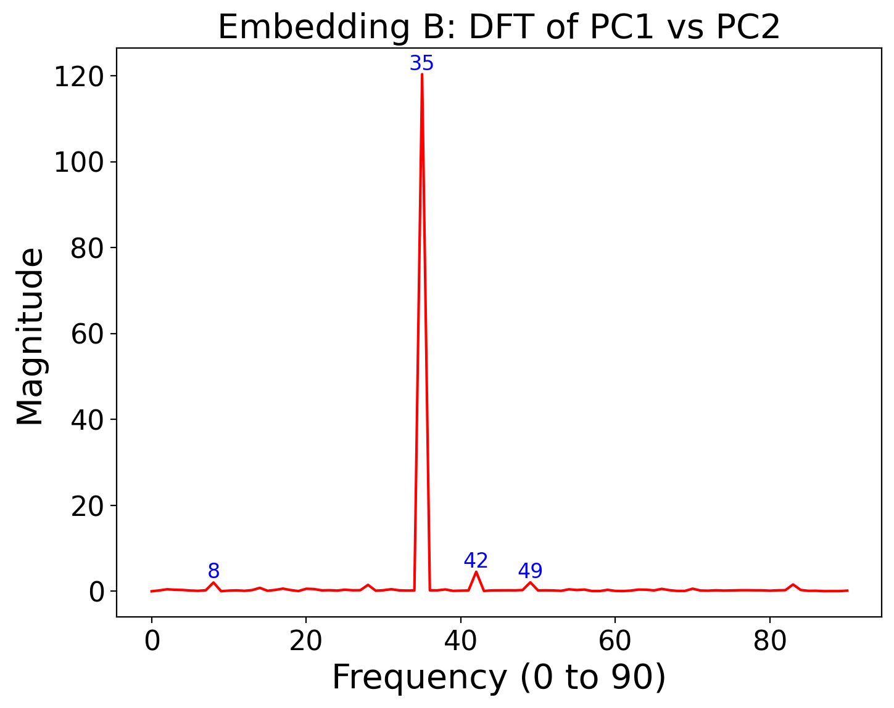

**[p. 29]**

*((b)) (b) DFT для PC1 против PC2*

###### fig-14

*Рисунок 14: PCA и DFT для PC1 против PC2, показывающие круговое вложение, разбитое на смежные классы. Оси x и y левого графика суть значения PC1 и PC2 для сцепленной матрицы вложений каждой точки $(a,b)\mod 91\in(0,0),(1,1),...,(90,90)$. Заметим, что это покрывает все выходные разряды нейронной сети ровно по разу. Заметим также, что вложение здесь показывает 13 смежных классов по 7 точек в каждом, *то есть* на графике все 13 классов $(a+b)\mod 13=i,i\in\{0,\dots,12\}$. И у PC1, и у PC2 частота $f=35$, а поскольку $gcd(35,91)=7$ есть простой делитель, точные смежные классы выучить возможно.* **[p. 29]**


*((a)) Диаграмма рассеяния PC1 против PC3*

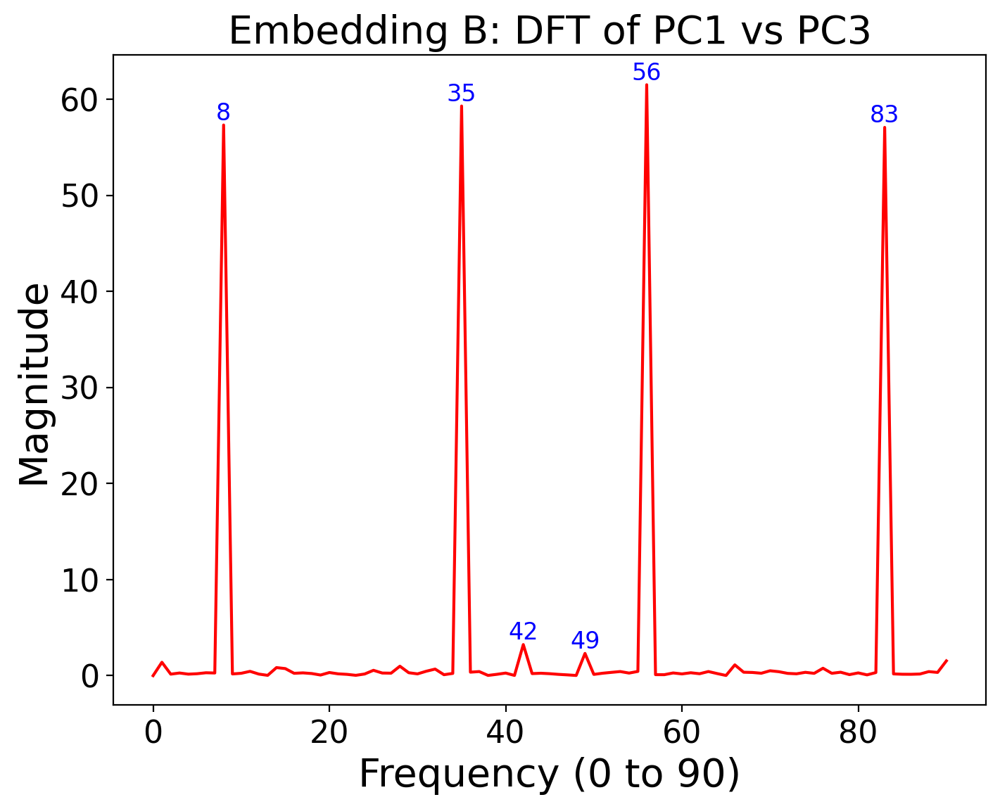

*((b)) DFT для PC1 против PC3*

*Рисунок 15: PCA и DFT для PC1 ($f=35$) против PC3 ($f=8$) — некруговое вложение.* **[p. 29]**

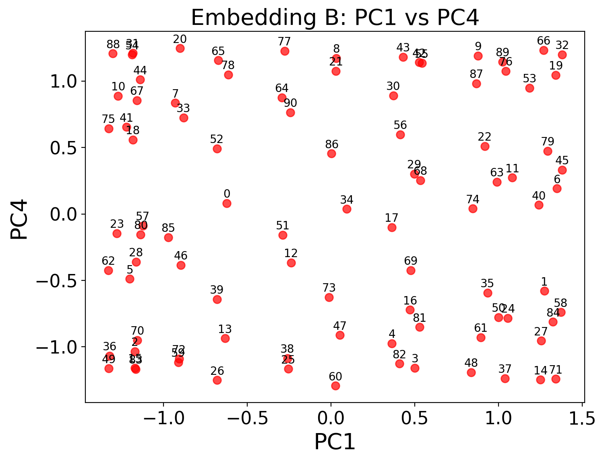

*((a)) Диаграмма рассеяния PC1 против PC4*


*((b)) DFT для PC1 против PC4*

*Рисунок 16: PCA и DFT для PC1 ($f=35$) против PC4 ($f=8$) — некруговое вложение.* **[p. 29]**

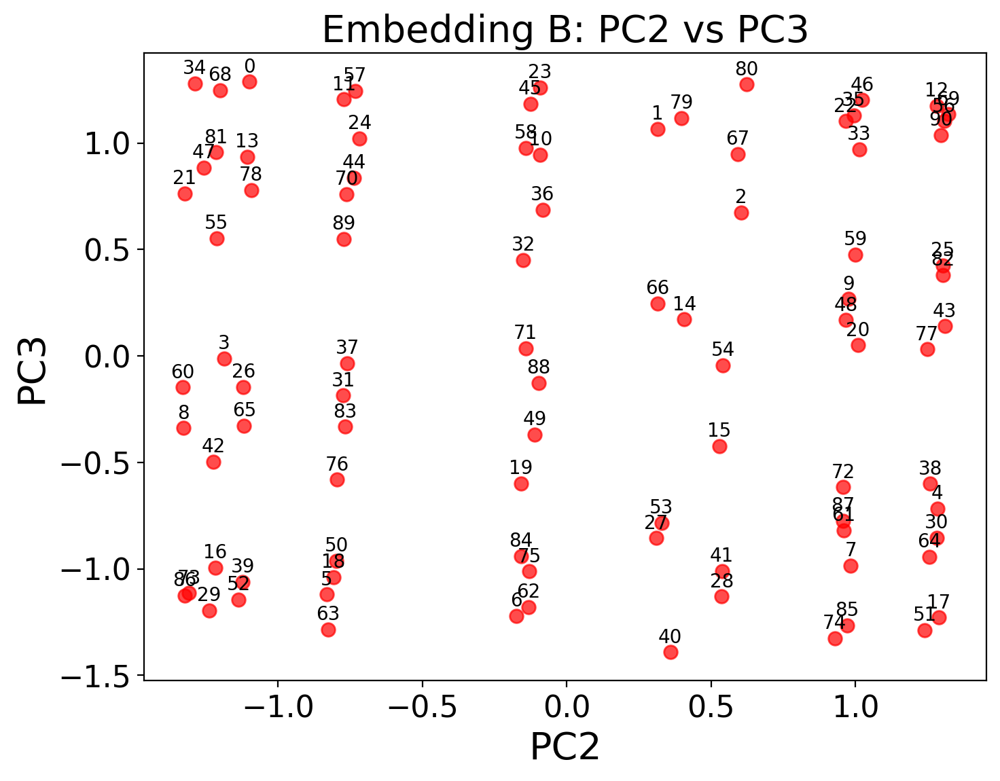

*((a)) Диаграмма рассеяния PC2 против PC3*

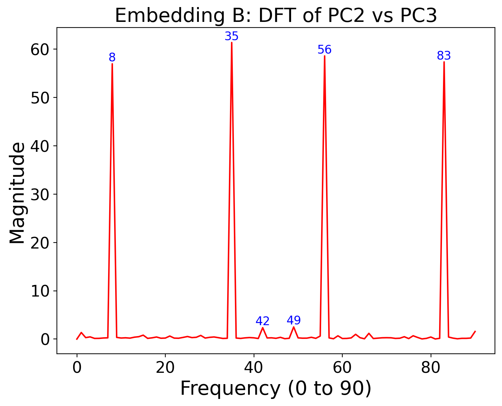

*((b)) DFT для PC2 против PC3*

*Рисунок 17: PCA и DFT для PC2 ($f=35$) против PC3 ($f=8$) — некруговое вложение.* **[p. 30]**


*((a)) Диаграмма рассеяния PC3 против PC4*

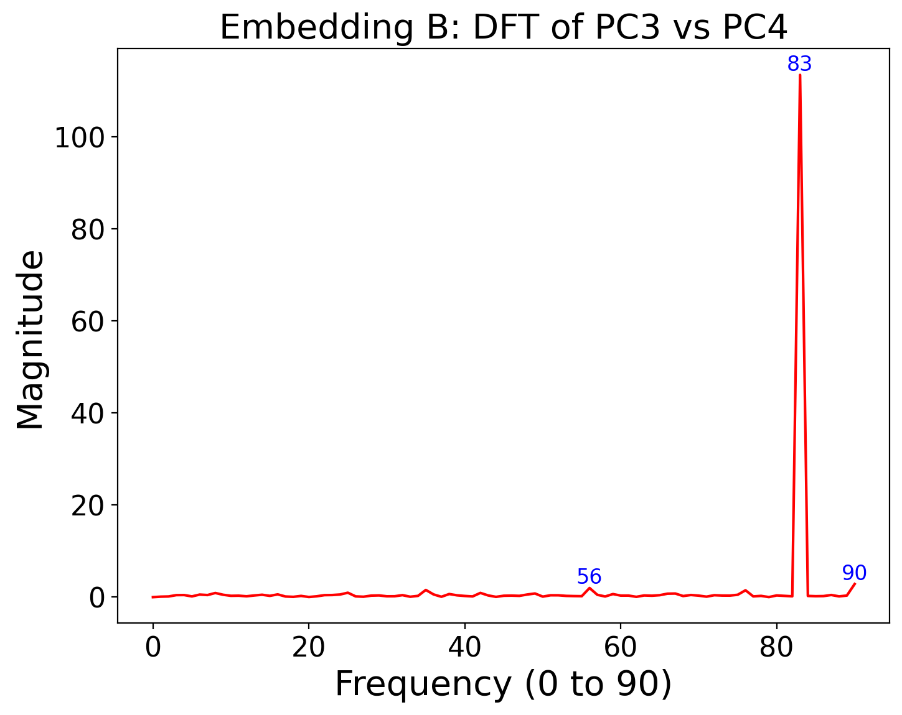

*((b)) DFT для PC3 против PC4*

*Рисунок 18: PCA и DFT для PC3 ($f=8$) против PC4 ($f=8$) — круговое вложение, ибо обе главные составляющие происходят из одного частотного скопления.* **[p. 30]**

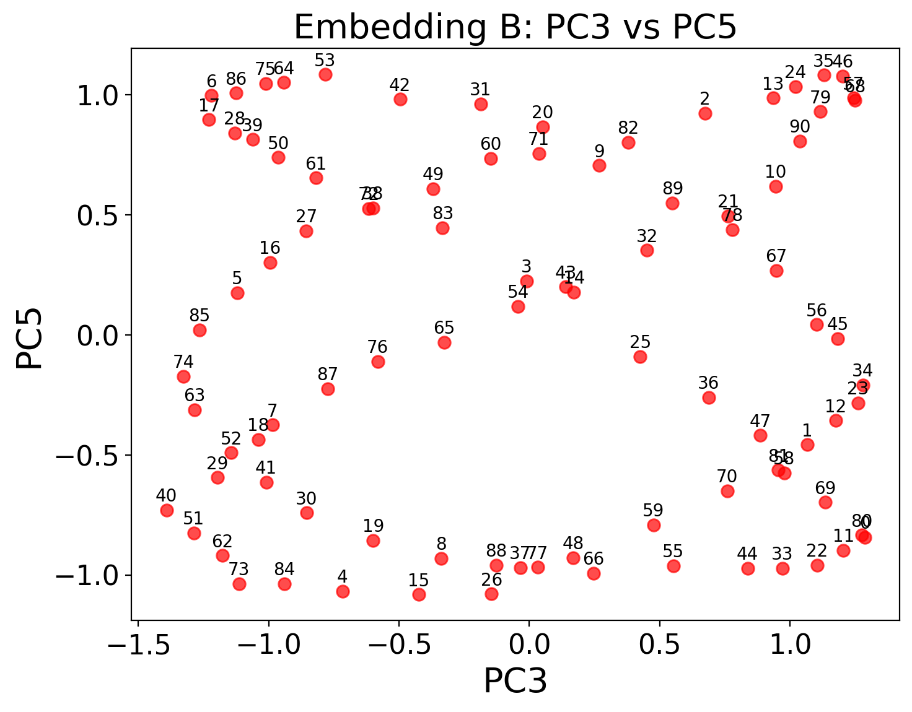

*((a)) Диаграмма рассеяния PC3 против PC5*


*((b)) DFT для PC3 против PC5*

*Рисунок 19: PCA и DFT для PC3 ($f=8$) против PC5 ($f=25$) — некруговое вложение.* **[p. 30]**

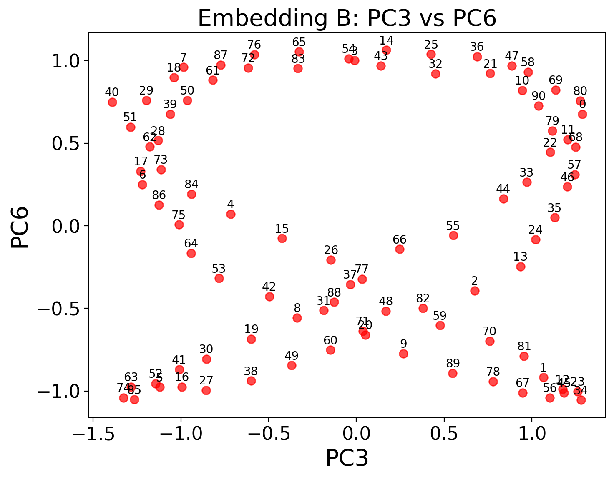

*((a)) Диаграмма рассеяния PC3 против PC6*

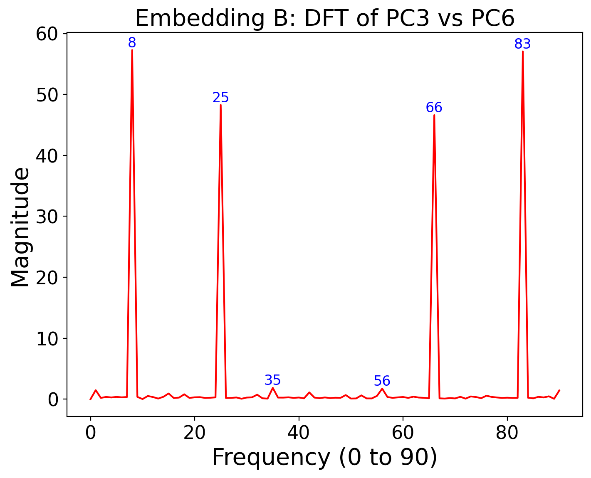

*((b)) DFT для PC3 против PC6*

*Рисунок 20: PCA и DFT для PC3 ($f=8$) против PC6 ($f=25$) — некруговое вложение.* **[p. 31]**


*((a)) Диаграмма рассеяния PC4 против PC5*

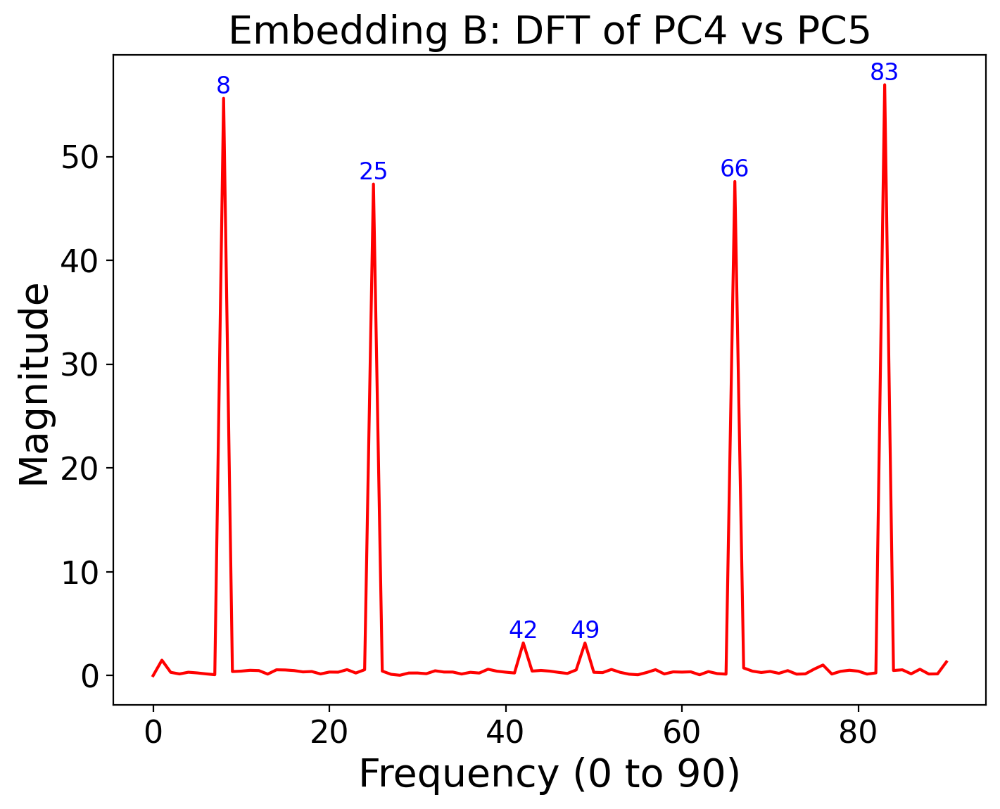

*((b)) DFT для PC4 против PC5*

*Рисунок 21: PCA и DFT для PC4 ($f=8$) против PC5 ($f=25$) — некруговое вложение.* **[p. 31]**

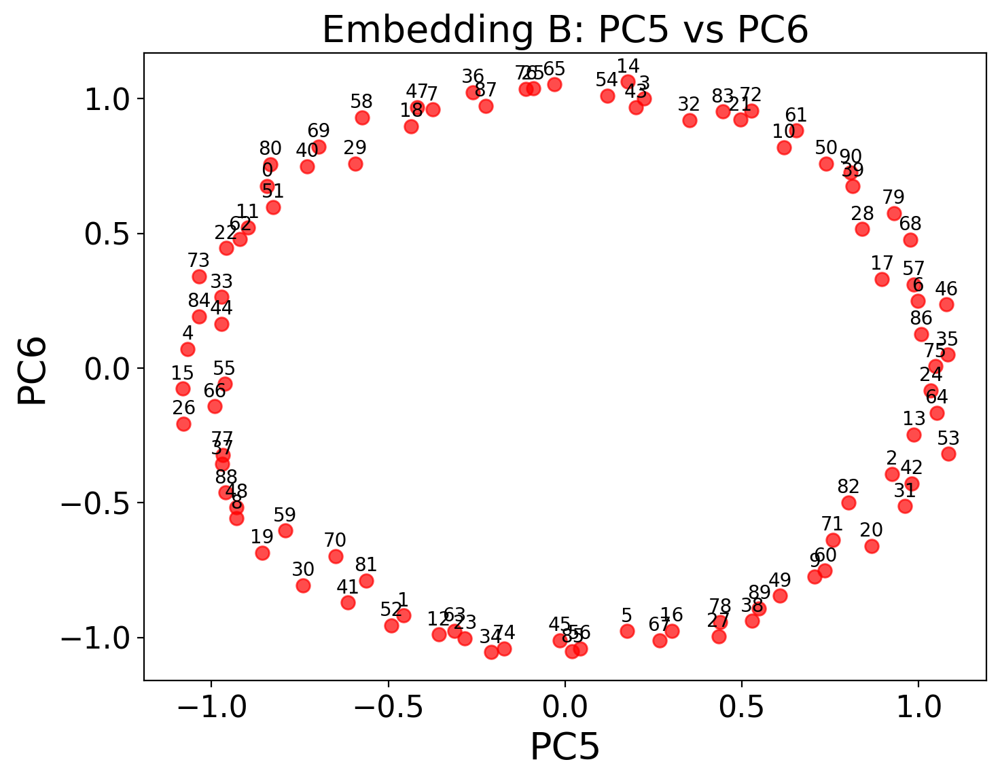

*((a)) Диаграмма рассеяния PC5 против PC6*


*((b)) DFT для PC5 против PC6*

###### fig-22

*Рисунок 22: PCA и DFT для PC4 ($f=25$) против PC5 ($f=25$) — круговое вложение, ибо обе главные составляющие происходят из одного частотного скопления.* **[p. 31]**

**[p. 32]**

### G.2 Ещё примеры простых нейронов

Скопление простых нейронов см. на рис. 23. Перекладку нейронов (через изоморфизм групп) см. на рис. 24.

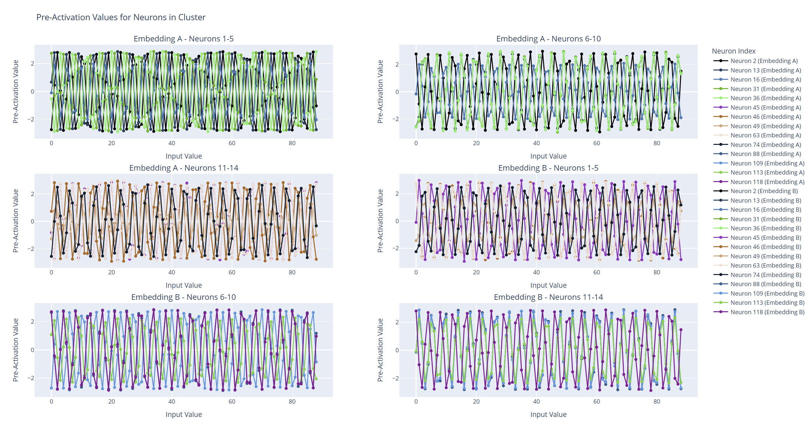

*Рисунок 23: пример скопления из 14 простых нейронов частоты 21.* **[p. 32]**

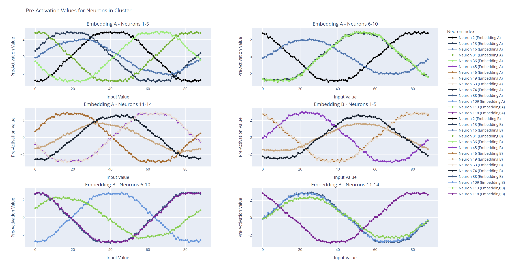

*Рисунок 24: Скопление простых нейронов (с рис. 23), преобразованное изоморфизмом групп так, что у всех нейронов период 1.* **[p. 32]**

### G.3 Изучение сдвигов фазы у простых нейронов

Здесь мы показываем, как фазы разных нейронов скопления накладываются, что даёт добавочные сведения о работе скоплений нейронов. Гистограммы фаз предвозбуждений нейронов скопления см. на рис. 25(a).

###### p33-1

Для более подробного взгляда на происходящее см. двумерную диаграмму рассеяния, построенную объединением фаз предвозбуждений каждого нейрона по $a$ и $b$ в пару (фаза-a, фаза-b) и нанесением точек всех нейронов скопления на плоскость чёрными точками, — рис. 25(b). Стоит отметить, что фазы разложены красиво и равномерно, как на рис. 25(b), лишь примерно в половине случаев. В прочих случаях


**[p. 33]**

*((a)) Гистограмма предвозбуждений двух нейронов доводочного скопления. По оси x — входное значение сети для $a$ (слева) и $b$ (справа).*

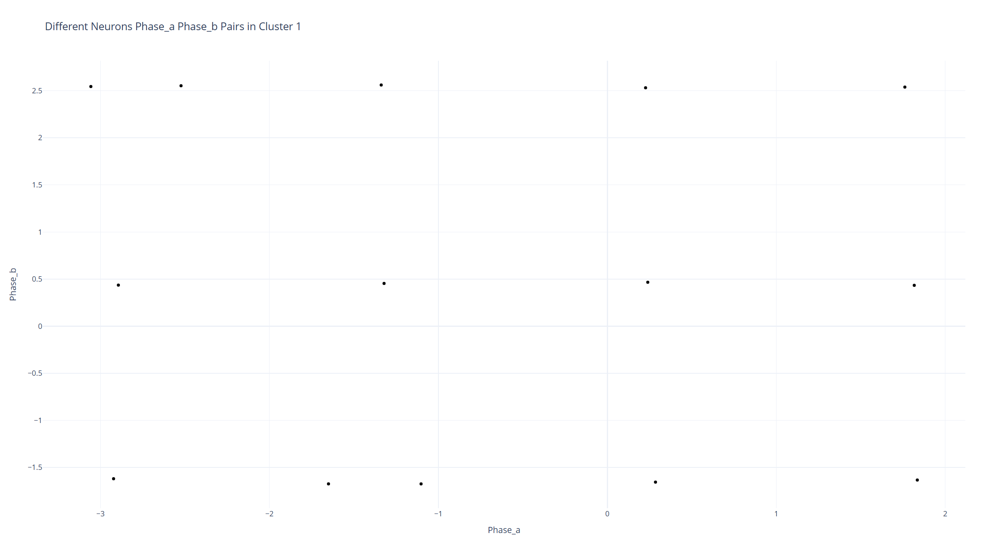

*((b)) Двумерная диаграмма рассеяния, построенная объединением фаз предвозбуждений каждого нейрона по $a$ и $b$ в пару (фаза-a, фаза-b) и нанесением точек всех нейронов скопления на плоскость чёрными точками. В этом случае в скоплении 14 нейронов частоты 21.*

*Рисунок 25: Гистограмма фаз (сверху) и двумерная диаграмма рассеяния фаз (снизу) для скопления простых нейронов частоты 21.* **[p. 33]**


*Рисунок 26: Вот пример, где фазы не лежат в красивой сетке, как на рисунке 25.* **[p. 34]**

###### p33-4

Мы не уверены, отчего фазы иногда выстраиваются в красивую сетку, а иногда — в гораздо более «случайное» расположение, как на рисунке 26. Понимание этого, вероятно, существенно для доказательства правдоподобной оценки числа нейронов, нужных с одной и той же частотой. Мы оставляем это дальнейшей работе.

**[p. 34]**

### G.4 Изучение доводочных нейронов

Доводочные нейроны составлены из линейных сочетаний групповых представлений, в отличие от простых нейронов, составленных одним групповым представлением. Кроме того, доводочные нейроны составлены из групповых представлений для так называемых гармонических частот главной частоты: для $f=7$ это будут кратные $7$, *например* $\{14,21,28,35,42,...\}$.

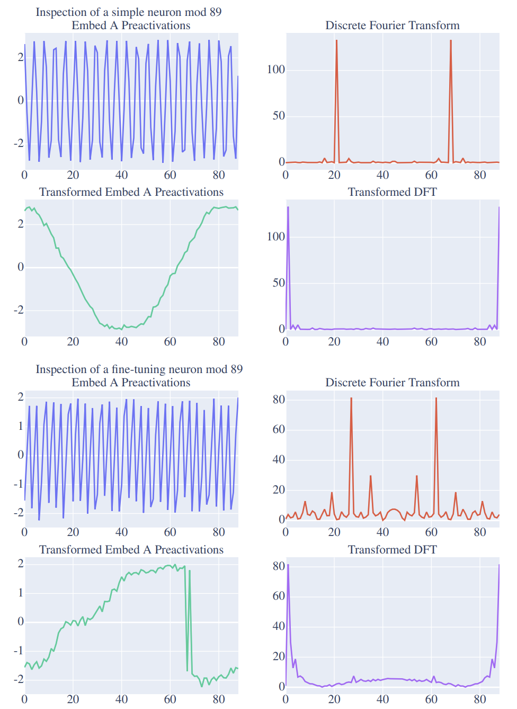

*Рисунок 27: Сравнение простого и доводочного нейрона до и после преобразования изоморфизмом групп. У доводочного нейрона DFT сильнее всего сосредоточен на (27, 35, 19).* **[p. 35]**

**[p. 35]**

Мы обучаем нейронную сеть со случайным семенем 133 и обнаруживаем скопление доводочных нейронов. Предвозбуждения двух из них показаны на рис. 28, а их DFT — на рис. 29.

Мы показываем, что эти нейроны могут быть порождены линейными сочетаниями представлений, на рис. 30.

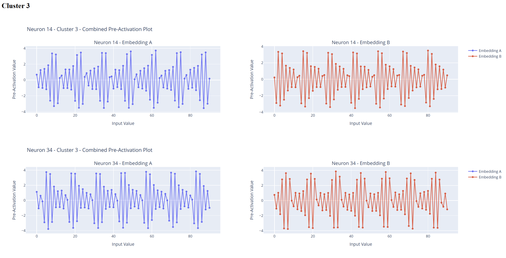

*Рисунок 28: Здесь показано скопление доводочных нейронов и предвозбуждения первых двух нейронов скопления. По оси x — входное значение сети для $a$ слева и для $b$ справа.* **[p. 36]**


*Рисунок 29: Здесь показаны DFT предвозбуждений доводочных нейронов с рис. 28. По оси x — частота (от 0 до 90, ибо это $(a+b)\mod 91$). По оси y видно, что вносят вклад представления $42,35,28,21,14,7$ в убывающем порядке. Заметим, что DFT симметричен относительно середины, поэтому значения после 45 несут те же сведения, что и значения до 45.* **[p. 36]**


*Рисунок 30: Построение доводочного нейрона. Эта схема поясняет шаг за шагом ход построения доводочного нейрона, подчёркивая, что он есть линейное сочетание представлений.* **[p. 37]**

**[p. 37]**

### G.5 Гистограммы числа выученных частот для простых и доводочных нейронов

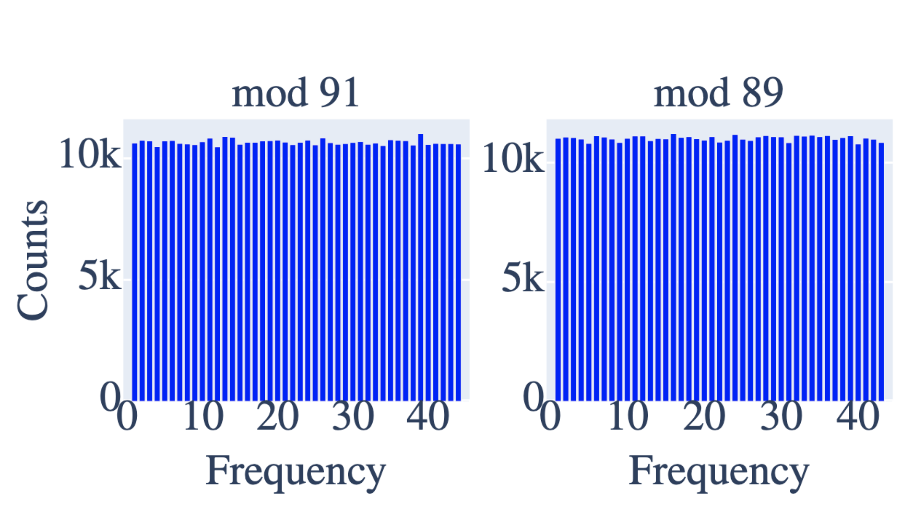

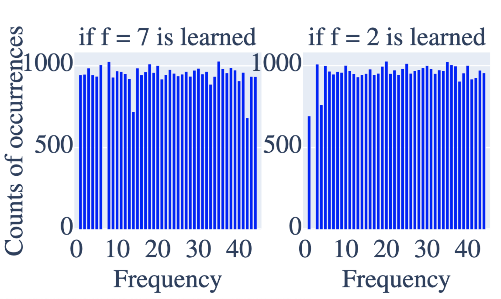

*Рисунок 31: (a) Гистограммы частот, найденных по 100 тыс. случайных семян в MLP по остатку 91 (делители $7$ и $13$) и по остатку 89 (простому), обе равномерны. То, что и простые, и составные числа дают равномерные распределения, есть сильное свидетельство того, что сети выучивают одно и то же в обеих постановках. И впрямь, именно это наблюдение — что сети не предпочитают частот из простых делителей (точных смежных классов) — привело нас к определению приближённых смежных классов и распознанию отвлечённого действия приближённой CRT, выучиваемого и при простых, и при составных остатках. (b) Условные гистограммы частот по 100 тыс. семян, обе по остатку 91. Слева: если найдена частота 7, то нейроны с $f=14$ или $f=43$ менее вероятны (заметим, что $2\cdot 43\equiv-7\pmod{91}$). Справа: если присутствует частота 2, то частоты 1 и 4 менее вероятны. Условные гистограммы показывают, что сети стараются избегать выучивания частот, связанных сложением и вычитанием. Причина схожа с той, по которой CRT не работает, если не все делители $n$ взаимно просты: они пересекались бы и поднимали значение неверных логитов, заметно увеличивая потерю.* **[p. 38]**

###### p37-1

Заметим, что две следующие гистограммы построены записью частот с весами DFT в промежутке (7,5; 30). Это не есть достаточный способ всегда распознавать доводочные нейроны, и иногда в подсчёт попадают простые нейроны, хотя это куда реже. Если учесть способность нейронов с предвозбуждениями определённых частот слегка загрязнять частоты других нейронов (ибо они могут немного менять значения в матрице вложений), станет видно, где такой способ подсчёта может дать сбой. Однако обыкновенно загрязнение из другого скопления простых нейронов лежит ниже 7,5. Поэтому эти графики следует считать не «точными», а лишь приближёнными.

Эти графики всё же полезны, чтобы показать соотношение простых и доводочных нейронов. Гистограмма найденных частот на рис. 31 дала равномерное распределение, где каждая частота встречается около 10 тыс. раз. Убрав подавляющую часть загрязнения отсевом по порогу 7,5 (обыкновенно величины DFT на прочих частотах равны 0, а если не близки к 0, то меньше 4, и тогда есть простой нейрон, пользующийся этой частотой в другом скоплении — *то есть* у простого нейрона одна большая вершина величиной свыше 60 на этой частоте), мы получаем около 2200 доводочных нейронов, найденных с каждой частотой, включая пересчёт, ибо доводочные нейроны пользуются линейными сочетаниями представлений, и потому в их DFT обыкновенно три и более значений в промежутке (7,5; 30). Тем самым гистограммы частот, связанных с доводочными нейронами, суть верхние оценки числа скоплений, распознанных по 100 тыс. случайных семян как доводочные. Примерно в 25 процентах прогонов встречаются доводочные нейроны, но как на это влияют настройки, мы не знаем.

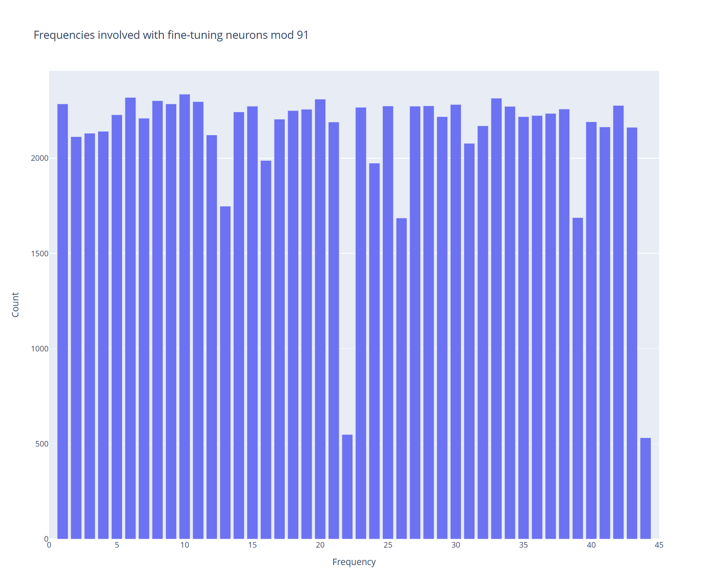

*Рисунок 32: Гистограмма частот (0-45), связанных с доводочными нейронами, по 100 тыс. случайных семян для остатка 91. Заметим, что частоты 22 и 44 наименее часты, а 13, 26, 39 также встречаются реже, что даёт случай, когда нейронной сети реже удаётся найти некоторые простые делители. Разумно, что нейронные сети не всегда обнаруживают простые делители, иначе они решали бы разложение на простые множители.* **[p. 39]**

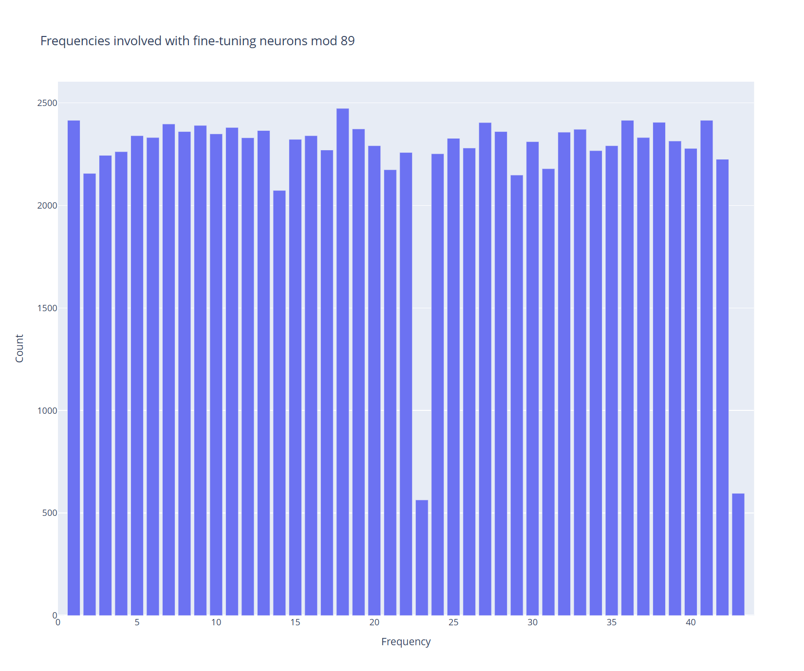

*Рисунок 33: Гистограмма частот (0-44), связанных с доводочными нейронами, по 100 тыс. случайных семян для остатка 89. Заметим, что частоты 23 и 43 наименее часты.* **[p. 40]**

### G.6 Доводочные нейроны любят отношения сложения и вычитания


*((a)) Отношения сложения у доводочных нейронов при условии, что 15 есть частота; $(a+b)\bmod 91$.*


*((b)) Отношения сложения у доводочных нейронов при условии, что 7 есть частота; $(a+b)\bmod 91$.*

*Рисунок 34: Отношения сложения у доводочных нейронов для двух разных случаев. Если выучен нейрон с частотой 15, то частоты, кратные 5, более вероятны. То же и для 7, простого делителя остатка 91.* **[p. 41]**

**[p. 41]**

### G.7 Гистограммы числа выучиваемых частот по остаткам 59 и 66 при разной глубине в трансформерах-пиццах и часах, а также в MLP (с 1 слоем вложений)

Здесь мы показываем гистограммы, считающие выученные частоты и средние длины — среднее число нейронов, вовлечённых в частотное скопление, — при условии, что частота $f$ была выучена, по 500 семян на каждое устройство.

**[p. 42]**

Мы проверяем качество приближения как функцию частоты и находим, что при остатке 66 с простыми делителями 2, 3 и 11 значение $R^{2}$ гораздо ближе к 1,0 для MLP, когда выучиваются частоты 22 или 33, то есть $(2\times 11)$ и $(3\times 11)$. И впрямь, если сеть выучивает 22 или 33, длина (число нейронов с этой частотой) заметно меньше, чем при выучивании прочих частот. Значение $R^{2}$ выше у MLP и при $(2\times 6)$, однако не так высоко, как в предыдущих случаях, и без того изменения числа нейронов, что есть в двух других. В целом это разумно, ибо в такой обстановке сеть может выучить точные смежные классы, а не приближённые. Исследование того, какие частоты требуют меньше нейронов, — любопытный предмет дальнейшего изучения; отчего это не все смежные классы?

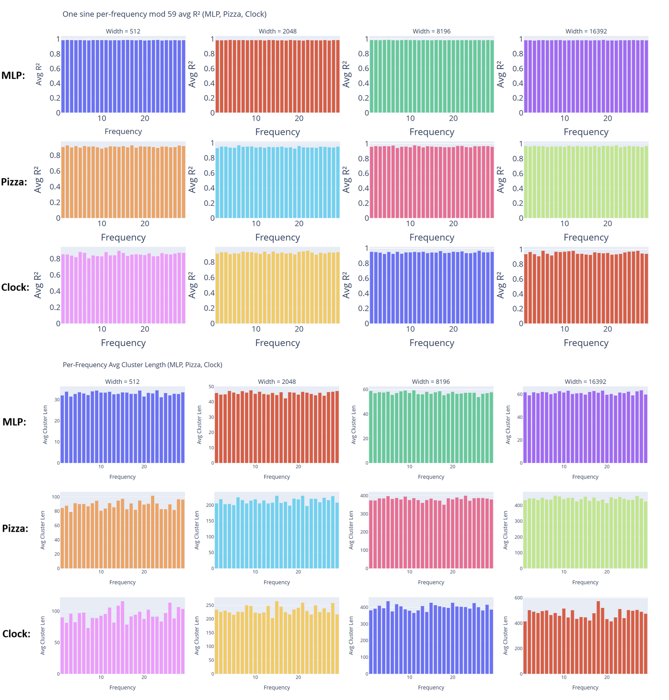

*Рисунок 35: $(a+b\mod 59)$: Первые три строки показывают гистограммы выученных частот, а нижние три — гистограммы средней длины скопления, то есть числа нейронов в нём.*

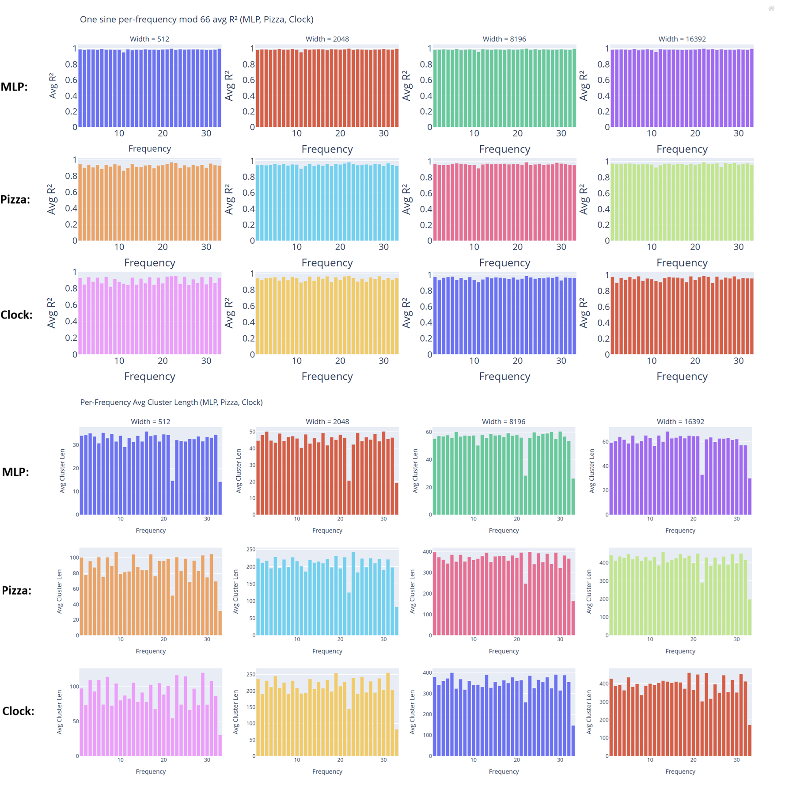

*Рисунок 36: $(a+b\mod 66)$: Первые три строки показывают гистограммы выученных частот, а нижние три — гистограммы средней длины скопления, то есть числа нейронов в нём; заметим, что выучивание точных смежных классов приводит к тому, что нейронов требуется меньше.*

Некоторые смежные классы выучиваются вероятнее прочих.

**[p. 43]**

### G.8 Опыты с шумом и отсечением

В этом разделе мы берём скопления от случайного семени 133 и случайно вносим умножающий шум в каждый вес, связанный с нейронами скопления. Мы делаем это, умножая вес на $e^{s}$, $s\sim\mathcal{N}(0,\sigma)$, при разных $\sigma$ по оси x на рис. 37(b)

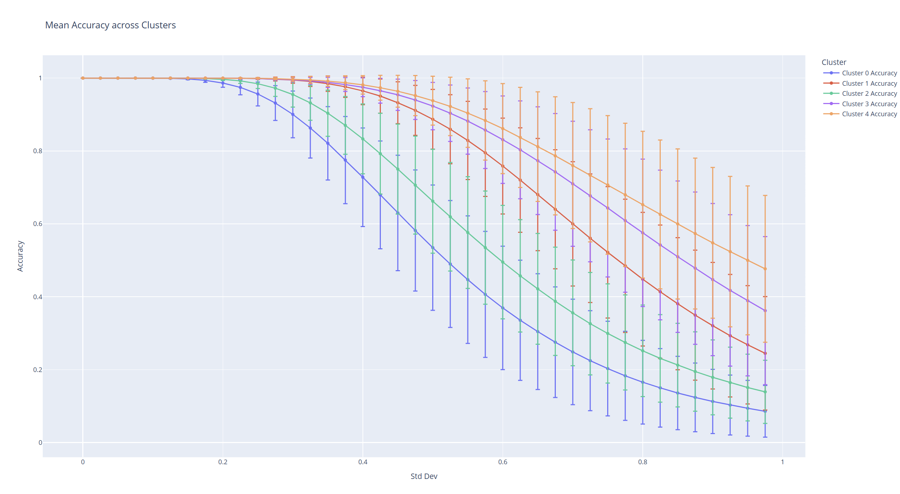

**[p. 44]**

*((a)) Умножающий шум, внесённый в каждый вес каждого нейрона скопления, из нормального распределения со стандартным отклонением $\sigma$.*


*((b)) Влияние умножающего шума на функцию потерь.*

###### fig-37

*Рисунок 37: Стойкость нейронной сети к внесённому умножающему шуму. Потеря остаётся устойчивой даже при стандартном отклонении 0,225. Заметим, что скопления 3 и 4 состоят из четырёх доводочных нейронов каждое. Все прочие скопления состоят из простых нейронов.* **[p. 44]**

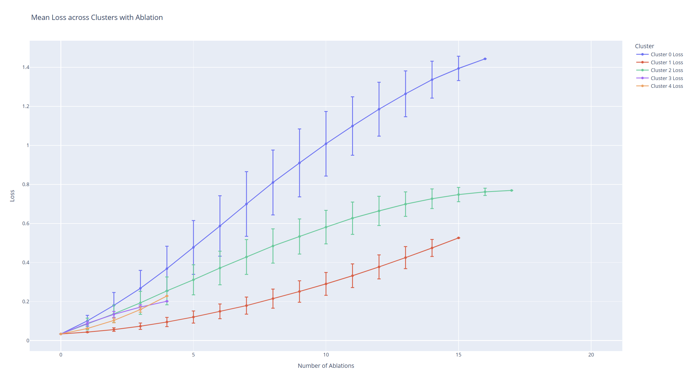

**[p. 45]**

*((a)) Опыт с отсечением, показывающий влияние на функцию потерь при удалении нейронов из определённых скоплений.*

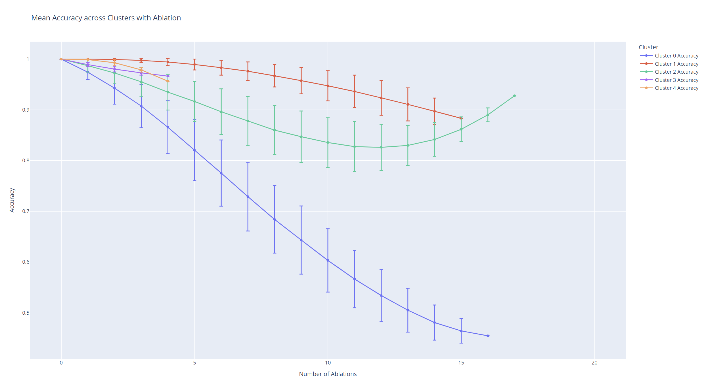

*((b)) Влияние удаления нейронов на точность.*

###### fig-38

*Рисунок 38: Итоги опыта с отсечением. Меры потери и точности высвечивают влияние случайного удаления «числа отсечений» нейронов из скопления. Заметим, что скопления 3 и 4 состоят из четырёх доводочных нейронов каждое, и удаление всех нейронов скопления мало сказывается на точности. Все прочие скопления состоят из простых нейронов.* **[p. 45]**

**[p. 46]**

### G.9 Число частот

#### G.9.1 Чем больше избыточных параметров, тем меньше частот

Наращивание числа нейронов в слое даёт опытные итоги в пределах $\mathcal{O}(\log(n))$.

Опыты с наращиванием числа нейронов показывают, что среднее число найденных частот можно сдвинуть настройками, но этого мы пока вполне не понимаем; впрочем, как показывают итоги основной части, оно остаётся логарифмическим. См. рис. 39.

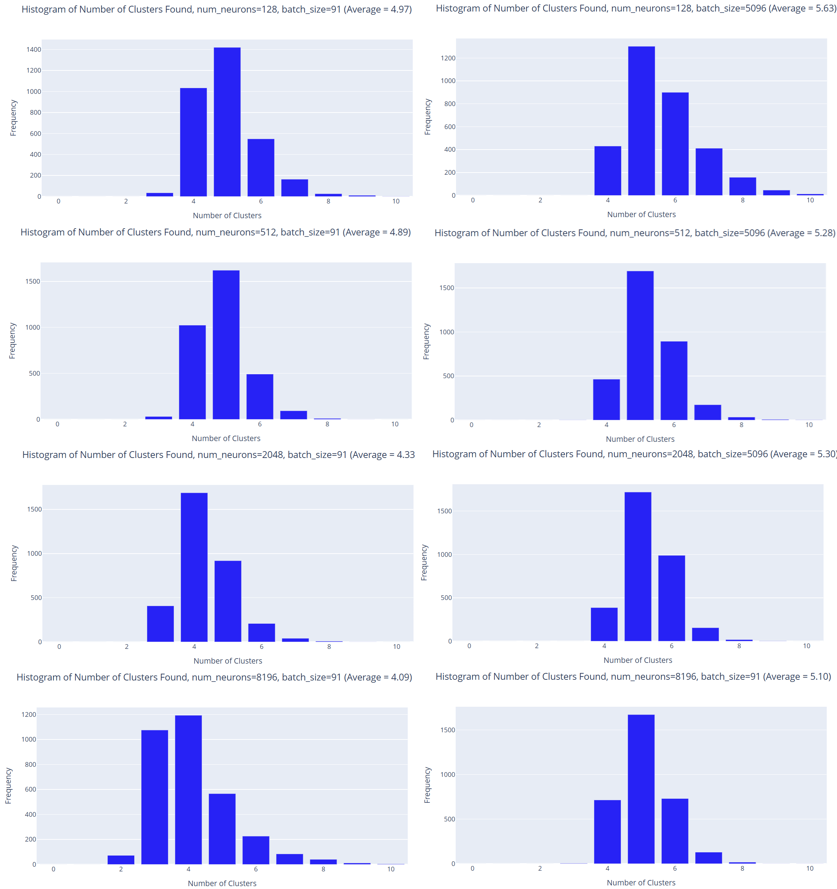

*Рисунок 39: Этот рисунок показывает, что рост всегда $\mathcal{O}(\log(n))$, даже когда число нейронов увеличивается со 128 до 512, до 2048 и до 8196. Первый столбец — batch_size = 91, второй — batch_size = 5096, *то есть* размер всего обучающего набора. Все итоги ограничены сверху $\mathcal{O}(\log(n))$.* **[p. 46]**

#### G.9.2 Добавление глубины тоже означает, что частот выучивается меньше

На рисунке 40 видно, что добавление слоёв приводит к выучиванию меньшего числа частот.

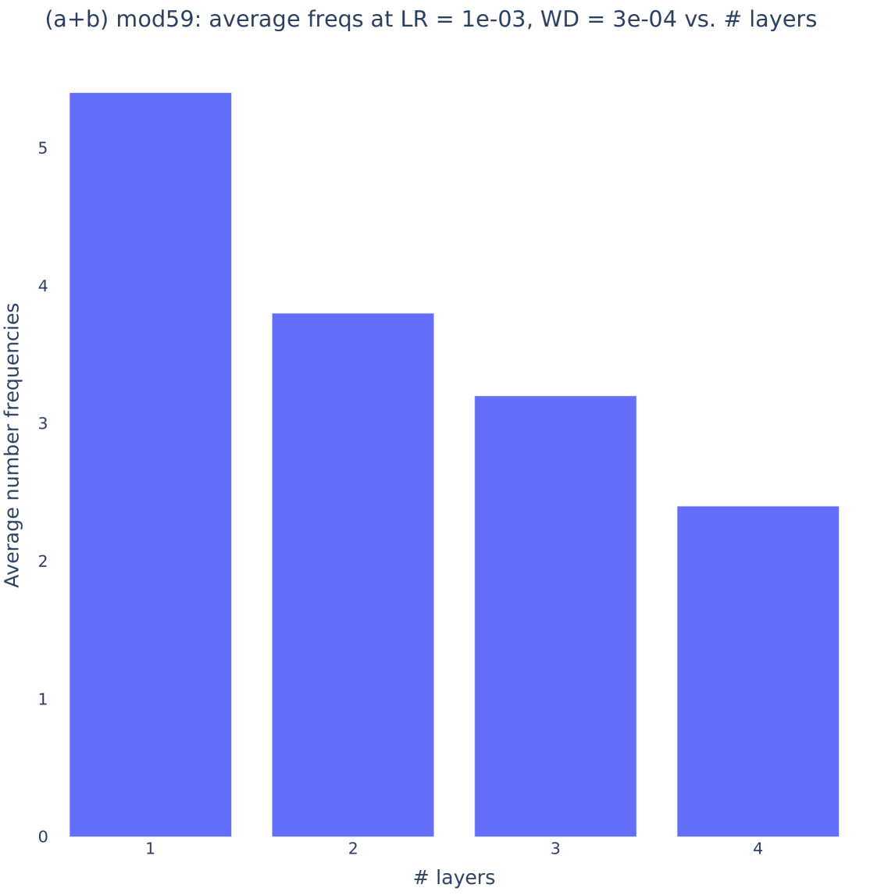

**[p. 47]**

*Рисунок 40: Добавление глубины заставляет сеть выучивать чуть меньше частот.* **[p. 47]**

И впрямь, вместо того чтобы смотреть на это при одном сочетании настроек, мы можем проверить это для многих, как мы делали на рисунках основной части (см. рисунок 41).


###### fig-41

*Рисунок 41: Число частот, найденных в сети, убывает по мере добавления слоёв почти при всех сочетаниях настроек.* **[p. 48]**

#### G.9.3 Глубокие сети выучивают помехоустойчивые коды: опытные итоги

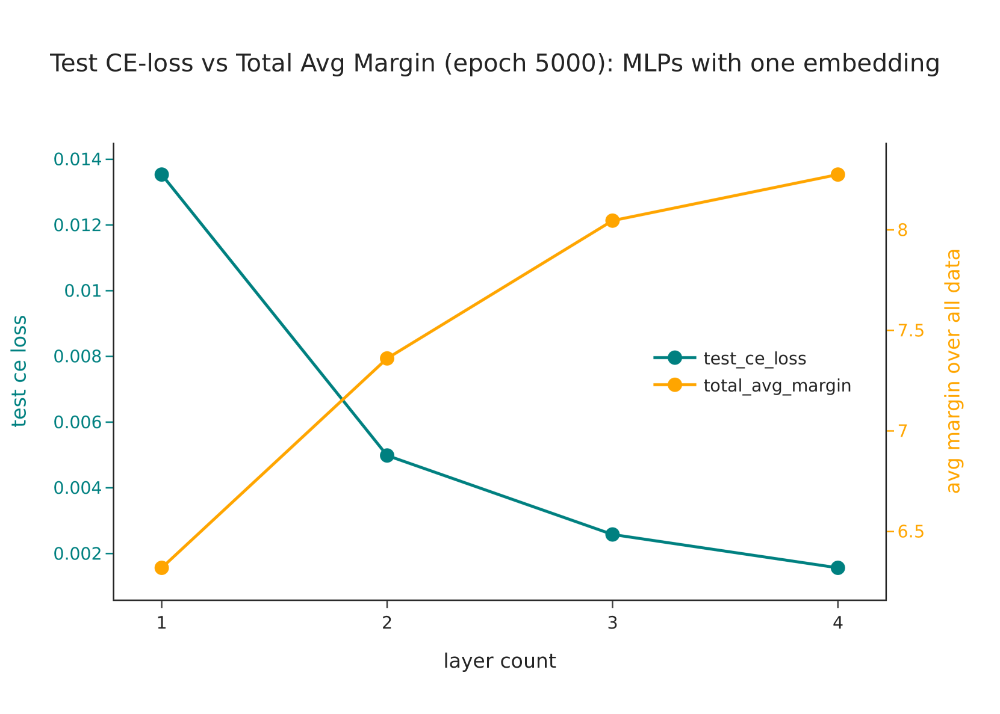

###### fig-42

*Рисунок 42: Потеря и отступы улучшаются по мере добавления слоёв, тогда как рисунок 41 показывает, что частот выучивается меньше. Это объясняется присутствием синусоидальных нейронов первого порядка в слоях после первого.* **[p. 49]**

**Глубокие сети выучивают помехоустойчивые коды.** Это обсуждение опущено из раздела обсуждения основной части из-за нехватки места, но нам оно кажется любопытным.

###### p47-3

Наш итог о том, что в глубоких сетях слои после первого сохраняют долю синусоид первого порядка (рисунок 8), можно истолковать как построение сетью помехоустойчивого кода. На рисунке 41 видно, что более глубокие сети выучивают меньше частот. Хотя это и так, они одновременно достигают меньшей перекрёстной энтропии (и лучших отступов) при меньшем числе частот, чем более мелкие сети (рис. 42). Причина в том, что нейроны первого порядка (простые) в слое 2 вычисляют в точности то же самое на смежных классах, что и простые нейроны слоя 1. Как следствие, косинусные нейроны второго порядка, хранящие верный ответ как $\cos(\frac{2\pi\cdot f(a+b-c)}{n})$, что наибольше при верном ответе $(a+b)\bmod n=c$, получают добавочное линейное сочетание из теоремы 4.7. Это поднимает высоту верного ответа (линейно по числу слоёв) как функцию числа различных частот. Более того, высоту неверных логитов это поднимает не более чем на $\mathcal{O}(\log(n))$. После softmax показательная разница между верным и неверными логитами тем самым усиливается, и потому softmax (перекрёстная энтропия) гораздо ниже. При 1 скрытом слое было $\mathcal{O}(n^{-\Omega(1)})$. В общем случае при $L$ слоях мы предполагаем, что после softmax применение $\mathcal{O}(\log(n))$ различных частот даст высоту неверных логитов ближе к $\mathcal{O}(n^{-\Omega(L)})$. Это происходит оттого, что сеть избыточно повторяет одно и то же вычисление ради «исправления ошибок» и тем уменьшает их.

**[p. 49]**

### G.10 Качественно: эквивариантность вкладов скоплений в логиты

###### p49-1

Здесь видно, что скопления нейронов приближённо эквивариантны сдвигам входов, *то есть* смежные классы сдвигаются вместе с входами. Мы показываем, что если сдвинуть (a,b) оба на 2, то скопления сдвинутся на 4.

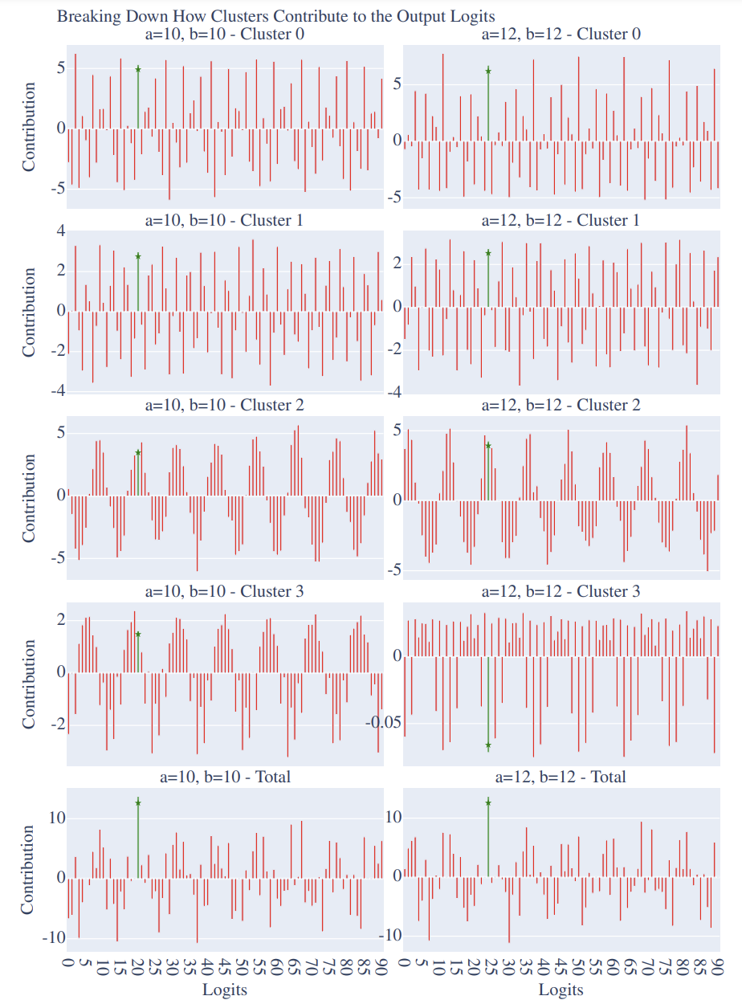

*Рисунок 43: Скопления нейронов приближённо эквивариантны сдвигам входов, то есть скопления смежных классов сдвигаются вместе с входами. Это говорит о том, что сеть выучила смежные классы, которые она пересекает линейными сочетаниями, дабы выполнить приближённую CRT. Этот пример показывает, что сеть не выучила всеобщей наименьшей точки: скажем, в скоплении 3 всего четыре нейрона, что ограничивает его выразительность и эквивариантность. Частоты скоплений: скопление 0 (35, смежный класс), скопление 1 (25, приближённый смежный класс), скопление 2 (8, приближённый смежный класс) и скопление 3 (42, смежный класс). В этом примере то же случайное семя, что и в опыте с отсечением (рис. 38(a)), где скопление 0 наиболее деятельно. Эти данные — из MLP.* **[p. 50]**

**[p. 51]**

#### G.10.1 Модель-пицца

Мы берём модель A, а именно model_p99zdpze5l.pt, из [5] и строим рисунок 44, показывающий, что и пиццы выдают ответы на приближённых смежных классах и выполняют приближённую CRT. Заметим, к примеру, что выходные логиты скопления с наибольшей частотой 15 наибольше возбуждаются вдоль приближённого смежного класса $\frac{59}{15}=3.93$, и если нейрон сильно возбуждается на $a$, то он сильно возбуждается и на $a\pm 4$.


###### fig-44

*Рисунок 44: Этот рисунок показывает три нейрона и их DFT, каждый из одного из трёх скоплений модели A (трансформера-пиццы) из [5] для этих опытов. Заметим, что нейроны (и скопления) пиццы также воплощают отвлечённое действие приближённой китайской теоремы об остатках, несмотря на их низкоуровневые отличия от часов.* **[p. 51]**

Более того, заметим, что перекладка нейронов пиццы делает их поведение почти неотличимым от простых нейронов, см. рисунок 45.

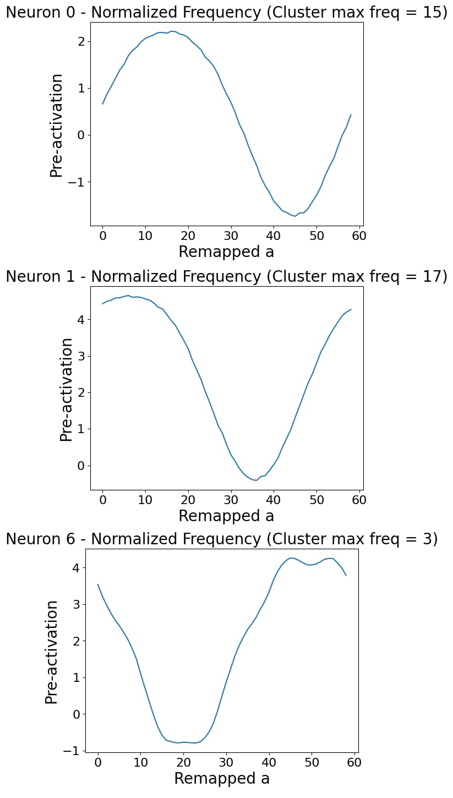

*Рисунок 45: Перекладка нейронов пиццы, показанных на рисунке 44, показывает, что они выглядят так же, как простые нейроны.* **[p. 52]**

**[p. 52]**

#### G.10.2 Модель-часы

Здесь мы показываем, что приближённая CRT в модели-часах (рис. 46) выглядит в точности так же, как в модели-пицце (рис. 44).

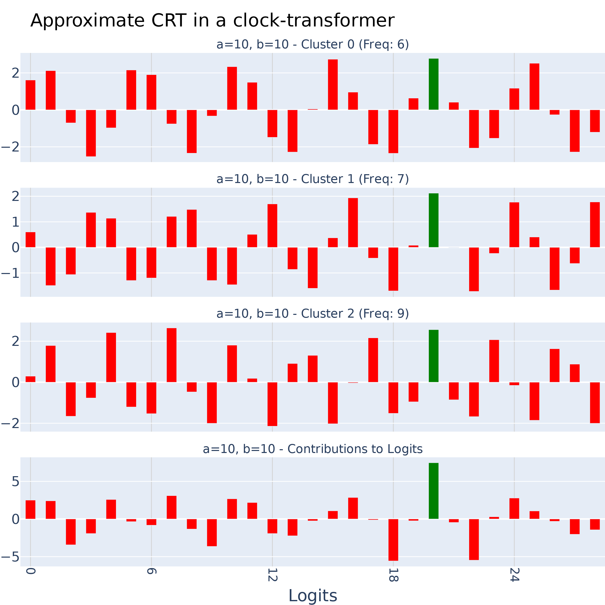

###### fig-46

*Рисунок 46: Взгляд на приближённую CRT внутри трансформера-часов. Мы собираем в скопления все нейроны с одинаковыми частотами, а затем разбираем вклад скопления в каждый логит, складывая вклады каждого нейрона скопления в каждый логит. Заметим, что все три скопления вносят вклад в логиты.* **[p. 53]**

---

# Машиночитаемый блок фактов

```yaml
paper:
  id: 2505.18266
  title: "Uncovering a Universal Abstract Algorithm for Modular Addition in Neural Networks"
  authors: [Gavin McCracken, Gabriela Moisescu-Pareja, Vincent Letourneau,
    Doina Precup, Jonathan Love]
  affiliation: "McGill University and Mila; Universite de Montreal;
    Google DeepMind; Leiden University"
  date: 2025-05
  venue: "препринт arXiv (v1, единственная)"
  citations: "нет данных (в таблицу citations_to_power_2022 не попала)"
  source: native-html-v1
  role_in_corpus: "догадка о всеобщности возвращена: «часы», «пицца» и решение
    Громова суть воплощения одного отвлечённого действия"

core_claim:
  name: "приближённая китайская теорема об остатках (aCRT)"
  approximate_coset: "набор вершин на пути от c - k1*d до c + k2*d с шагом d
    на графе Кэли, порождённом шагом d; обобщает смежный класс, требуя
    не равнозначности, а близости"
  step_size: "d = (f/gcd(f,n))^-1 mod (n/gcd(f,n))"
  remapping: "приведение частоты к 1 заменой переменной через остаточный обратный;
    делает нейроны разных частот и разных устройств сравнимыми"
  abstract_algorithm: "взять O(log n) случайных частот и для каждой породить
    синусоидальные нейроны, задав фазы так, чтобы они выделяли разные
    приближённые смежные классы, которым принадлежит ответ (a+b) mod n"

theory:
  theorem_4_4: "простые нейроны слоя 1 возбуждаются (ReLU > 0) на приближённом
    смежном классе, содержащем верный ответ; все нейроны дальнейших слоёв —
    на линейных сочетаниях таких классов"
  theorem_4_7: "при m выученных частотах неверные логиты давятся показательно;
    доказательство ведётся в духе оценки, а не строго"
  corollary_4_8: "O(log n) частот дают отступ Omega(log n); после softmax
    неверные разряды получают не более n^-Omega(1)"
  conjecture_4_9: "всеобщность на задачах группового умножения обнаружится
    в виде контуров на приближённых смежных классах"

setup:
  task: "(a + b) mod n на всех n^2 парах"
  moduli: "от 3 до 4999: простые, составные, высокосоставные, степени двойки"
  models: "MLP глубиной 1-4 (однобитные входы и обучаемые вложения);
    трансформеры глубиной 1-4 — пицца (alpha = 0) и часы (alpha = 1)
    из работы Zhong et al."
  optimizer: "Adam; сглаживание L2"
  grid: "10 скоростей обучения x 20 ослаблений весов x 10 семян"
  scale: "5000 моделей на рисунок 9; 100 тыс. случайных семян на гистограммы частот"
  split: "90 % обучение, 10 % тест"

results:
  frequencies: "число выученных частот растёт как O(log n) по остатку;
    логарифмические приближения дают очень высокий R^2"
  depth_or_embedding: "добавление глубины ИЛИ обучаемой матрицы вложений
    переводит сеть с floor(n/2) частот на горстку — это и объясняет 3-7 частот
    у Nanda et al. и Zhong et al."
  ablation: "замена нейронов приближающими синусоидами сохраняет 100 % точности
    во всех десяти семенах почти по всей сетке настроек"
  clock_vs_pizza: "после перекладки нейрон из MLP, из пиццы и из часов
    качественно одинаков; оба контура воплощают aCRT"
  embeddings_pca: "некруговые вложения и кривые Лиссажу возникают, когда две
    главные составляющие происходят из разных частотных скоплений"
  histograms: "гистограммы частот равномерны и при простом остатке 89,
    и при составном 91; при остатке 66 есть предпочтение точных смежных классов"
  robustness: "умножающий шум со стандартным отклонением до 0,225 сеть переносит;
    удаление доводочного скопления целиком почти не меняет точности"
  depth_and_loss: "с глубиной частот выучивается меньше, а потеря и отступы
    улучшаются; авторы толкуют это как помехоустойчивый код"

findings:
  - id: 1
    claim: "все ReLU-возбуждения ложатся на приближённые смежные классы"
    anchor: p4-7
  - id: 2
    claim: "O(log n) частот довольно для отступа Omega(log n)"
    anchor: p6-3
  - id: 3
    claim: "глубина или обучаемые вложения снижают число частот с O(n) до O(log n)"
    anchor: p6-6
  - id: 4
    claim: "часы и пицца суть воплощения одного отвлечённого действия"
    anchor: p49-1
  - id: 5
    claim: "всеобщность между группами получена склейкой с чужой работой"
    anchor: p9-3
  - id: 6
    claim: "отчего происходит переход O(n) -> O(log n), неизвестно"
    anchor: p10-1

concept_cards:
  modular-arithmetic: p3-5
  mechanistic-interpretability: p14-2
  group-representations-cosets: p4-5
  clock-vs-pizza: p3-4
  fourier-features-circuits: p3-7
  feature-emergence-feature-learning: p6-3
  margin-maximization-implicit-bias: p6-3
  sparse-subnetwork-lottery-ticket: fig-38
  lazy-to-rich-kernel-to-feature-learning: p47-3
  grokking: p2-3
  progress-measures: p9-1

sources:
  original_html: original/2505.18266.native.html
  converted_text: original/2505.18266.uncovering-a-universal-abstract-algorithm-for-modular-addition-in-neural-networks.md
  images_dir: images/
  pdf: https://arxiv.org/pdf/2505.18266v1

anchors:
  scheme: "pN-M | fig-N | tab-N (token headings, cross-viewer portable)"
  policy: "якоря заводятся только там, где на них ссылаются; разрывы страниц якорей не несут"
  paragraph: [p1-2, p2-1, p2-2, p2-3, p2-4, p2-5, p2-6, p3-4, p3-5, p3-7, p4-1, p4-3,
    p4-5, p4-6, p4-7, p5-4, p6-3, p6-4, p6-6, p9-1, p9-3, p9-4, p10-1, p13-5, p14-2,
    p15-3, p19-3, p21-1, p21-3, p21-5, p22-10, p23-2, p25-1, p26-1, p27-4, p27-6,
    p33-1, p33-4, p37-1, p47-3, p49-1]
  # p1-2, p2-1, p2-2, p2-4, p2-5, p13-5 заведены под ссылки из карточек понятий
  figure: [fig-1, fig-2, fig-3, fig-4, fig-14, fig-22, fig-37, fig-38, fig-41, fig-42,
    fig-44, fig-46]
  table: [tab-4]

review_summary:                   # см. раздел «Что показано, а что предположено»
  strong: "определение приближённого смежного класса охватывает и точные классы,
    и взаимно простой случай, и притом позволяет доказать теорему 4.4 коротко;
    перекладка делает нейроны разных устройств сравнимыми;
    отсечение проведено по-настоящему — с проверкой точности после замены
    нейронов их приближениями во всех десяти семенах;
    охват настроек и семян на порядки больше, чем у предшественников;
    оценка O(log n) проверена на нескольких порядках остатка;
    открытые вопросы Zhong et al. о некруговых вложениях закрыты попутно"
  weak: "всеобщность между группами получена не своим опытом, а склейкой
    с работой Stander et al.: ни одной сети на группе перестановок не обучено;
    определение приближённого смежного класса при больших k покрывает всю
    группу, а порога содержательности не дано;
    теорема 4.7 доказана в духе оценки — разложение Тейлора применяется там,
    где авторы сами называют его плохим;
    самый неожиданный итог (переход O(n) -> O(log n)) остался без объяснения;
    число нейронов на частоту не оценено;
    текст не доведён: дважды неразрешённая ссылка Fig. LABEL:...,
    раздел F.1 из одной фразы о будущем удалении, оборванное предложение в G.3"
  authors_own_limits:
    - "группы между циклическими и перестановками не проверены"
    - "отчего глубина и вложения снижают число частот — неизвестно"
    - "число нейронов на частоту не оценено, дана тривиальная оценка Omega(1)"
    - "отчего фазы иногда ложатся в правильную сетку, а иногда нет — неизвестно"

translation:
  status: complete
  formula_parity: "display 26/26, inline поблочно совпадает во всех переведённых блоках"
  figures: "60/60"
  pagination: "84 отметки страниц, совпадает с оригиналом"
```
