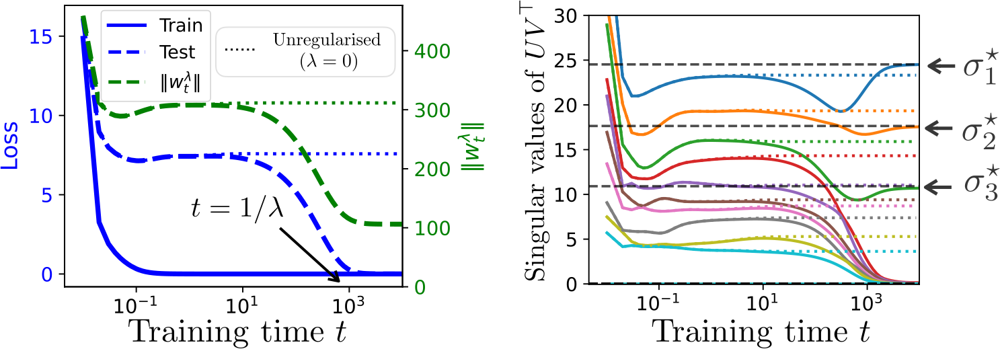

# Boursier et al. 2025 — A Theoretical Framework for Grokking: Interpolation followed by Riemannian Norm Minimisation

См. также: [глобальный индекс понятий](../../concepts/index.md).
arXiv [2505.20172v2](https://arxiv.org/abs/2505.20172), 26 мая 2025 (v2 — 5 ноября 2025). Колонтитул PDF: «39th Conference on Neural Information Processing Systems (NeurIPS 2025)».

**Etienne Boursier** — INRIA; LMO, Université Paris-Saclay, Orsay, France.
**Scott Pesme** — INRIA, Grenoble, France.
**Radu-Alexandru Dragomir** — Télécom Paris; Institut Polytechnique de Paris, Palaiseau, France.

Файлы разбора этой статьи:

- [`2505.20172.a-theoretical-framework-for-grokking-interpolation-followed-by-riemannian-norm-minimisation.claims.txt`](2505.20172.a-theoretical-framework-for-grokking-interpolation-followed-by-riemannian-norm-minimisation.claims.txt) — пронумерованные утверждения статьи с пометками разбора.
- [`2505.20172.a-theoretical-framework-for-grokking-interpolation-followed-by-riemannian-norm-minimisation.license.txt`](2505.20172.a-theoretical-framework-for-grokking-interpolation-followed-by-riemannian-norm-minimisation.license.txt) — лицензионная запись arXiv для этой статьи.

**Карточка-выдержка.** Лицензия статьи (`arxiv-nonexclusive`) не разрешает публикацию копии оригинала и полного перевода, поэтому карточка содержит редакторские секции и цитируемые фрагменты перевода (право цитирования). Полный текст статьи: <https://arxiv.org/abs/2505.20172>.

## Затрагиваемые понятия

**[Гроккинг](../../concepts/grokking.md)** — работа даёт корпусу самое короткое формальное определение явления: гроккинг есть непереставимость двух пределов, $\lim_{\lambda\to 0^{+}}\lim_{t\to\infty}w^{\lambda}(t)\neq\lim_{t\to\infty}\lim_{\lambda\to 0^{+}}w^{\lambda}(t)$ ([p5-8](#p5-8)). Определение чисто оптимизационное: ни данных, ни задачи, ни архитектуры в нём нет, и авторы сразу оговаривают, что результат «*a priori* не влечёт какого-либо улучшения тестовой потери на медленной поре» ([p2-6](#p2-6)). Чего в работе нет: ни одного утверждения о тестовой ошибке — связка «меньшая норма — лучшее обобщение» взята ссылками (2; 33; 17), а не выведена; ни модульной арифметики, ни трансформера, ни классификации — последняя исключена по построению, поскольку при разделимых данных нерегуляризованные итерации расходятся и многообразие уходит «на бесконечность» ([p4-7](#p4-7), [p10-6](#p10-6)). Все три опыта — синтетическая регрессия: матричное восполнение, двухслойная ReLU-сеть и диагональная линейная сеть.

**[Минимизация нормы весов](../../concepts/weight-norm-minimization.md)** — главный вклад работы и главное подкрепление этой линии корпуса: неформальная картина Omnigrok («сперва плохой глобальный минимум, затем weight decay уводит к решению меньшей нормы»), которую авторы прямо называют привлекательной, но лишённой строгой теоретической опоры ([p3-2](#p3-2)), доведена до теоремы. Медленная пора описана как риманов градиентный поток квадрата $\ell_{2}$-нормы, ограниченный на многообразие, а предельные точки охарактеризованы как KKT-точки задачи $\min_{w\in\mathcal{M}}\|w\|_{2}^{2}$ ([p7-7](#p7-7)); при сходимости к **строгому** локальному минимуму нормы двойной предел равен ему в точности ([p7-9](#p7-9)). Существенная для корпуса тонкость: многообразие $\mathcal{M}$ определено как связная компонента множества **стационарных** точек $\nabla F^{-1}(0)$, а не точек нулевой потери ([p4-9](#p4-9)); интерполяция, стоящая в заглавии, нигде не требуется — требуется стационарность и морс-боттова локальная минимальность. Чего в работе нет: скоростей сходимости, зависимости порогов от размерности и от $\eta$, и разбора сходимости к **особым** точкам — а именно они и суть искомые решения (разрежённые векторы, матрицы малого ранга), что авторы выделяют жирным как открытый вызов ([p28-3](#p28-3)).

**[Weight decay](../../concepts/weight-decay.md)** — здесь weight decay не ускоритель и не вспомогательное средство, а единственный двигатель второй поры и единственный источник масштаба времени: спад начинается во время порядка $1/\lambda$, а точка склейки быстрой и медленной динамик посчитана отдельно и имеет порядок $-\lambda\ln\lambda$ ([p15-7](#p15-7), [p15-8](#p15-8)). О самой спорной для корпуса развилке работа высказывается осторожнее принятого: в классификации гроккинг бывает и без weight decay, за счёт неявного предпочтения алгоритма, но «в задачах регрессии он не может произойти, если weight decay не используется» ([p3-2](#p3-2)). Чего в работе нет: ни одного опыта со сравнением $\lambda>0$ и $\lambda=0$, ни зависимости задержки от величины $\lambda$ вне асимптотики; весь разбор ведётся при $\lambda\to 0$, то есть ровно в том пределе, где задержка расходится как $1/\lambda$.

**[Когда регуляризация необходима](../../concepts/regularization-necessity.md)** — работа проводит границу необходимости по типу задачи, а не по архитектуре или набору данных: классификация — где неявного предпочтения довольно, регрессия — где, «насколько нам известно», без weight decay гроккинга не бывает ([p3-2](#p3-2)). Это же деление объясняет, почему опровергающие свидетельства корпуса теории не противоречат: они сняты в классификации, которую теория исключает предположением ограниченности потока. Чего в работе нет: доказательства этой развилки — фраза стоит в обзорном разделе как оговорка о состоянии знания, а не как утверждение статьи.

**[Переход lazy→rich](../../concepts/lazy-to-rich-kernel-to-feature-learning.md)** — быстрая и медленная поры прямо отождествлены с ленивым и богатым решениями: первая приводит к решению, отвечающему ленивому режиму, вторая — к решению, свойственному богатому ([p3-2](#p3-2)). Отдельный абзац отведён сравнению с ближайшим соперником, Lyu et al.: там нужны однородная параметризация, устремление масштаба инициализации к бесконечности со связанными степенным законом скоростями и гарантия лишь «для некоторого достаточно большого времени», тогда как здесь предположений меньше и охарактеризованы сами предельные точки ([p8-2](#p8-2)). Чего в работе нет: ни одного измерения обучения признаков, ни ядра, ни его изменения — отождествление сделано ссылками и словами, а не величиной.

**[Нейронное касательное ядро](../../concepts/neural-tangent-kernel-ntk.md)** — NTK входит только как словарь для описания большой инициализации: ленивый режим назван режимом NTK, и ему приписано быстрое достижение нулевой обучающей потери при плохом обобщении ([p7-11](#p7-11)). Ни ядра, ни его постоянства, ни отклонения от линеаризации в работе не вычисляется.

**[Масштаб инициализации](../../concepts/initialization-scale.md)** — роль масштаба получена как **следствие** теоремы, а не постулирована: при малой инициализации точка $\Phi(w^{\lambda}(0))$, достигнутая после первой поры, уже обладает малой нормой, и второй поры попросту не происходит; при большой — она сохраняет большую норму, что и запускает существенное движение на гроккинг-поре ([p7-12](#p7-12)). Чего в работе нет: ни одного опыта с перебором масштаба — в опытах он закреплён (гауссовы веса с дисперсией $4$ у ReLU-сети, $0.1$ у диагональной), и зависимость длительности плато от масштаба не измерена.

**[Фазовый переход](../../concepts/phase-transition.md)** — работа прямо спорит с прочтением гроккинга как внезапного перехода: падение «лишь **кажется внезапным, когда время обучения отложено по логарифмической шкале**», тогда как на деле оно разворачивается на длительности порядка $1/\lambda$ вслед за плато сопоставимой длительности, и на логарифмической шкале занимает $\ln(M/\varepsilon)$ против $\ln(\varepsilon/\lambda)$ у плато ([p8-1](#p8-1)). Ни параметра порядка, ни языка фазовых переходов, ни критических показателей работа не вводит; довод целиком выведен из предложения 2, и ни одного графика в линейном времени в статье нет — все четыре рисунка отложены по логарифмической оси.

**[Фаза меморизации / плато](../../concepts/memorization-phase.md)** — плато здесь впервые получает выведенную длину, а не измеренную: оно занимает отрезок $[M^{\prime},\varepsilon/\lambda]$, где $M^{\prime}$ — характерное время сходимости нерегуляризованного потока, а последующий спад — отрезок $[\varepsilon/\lambda,M/\lambda]$ ([p8-1](#p8-1)). Чего в работе нет: запоминания как такового — в регрессионной постановке на плато стоит не запомненная таблица, а интерполянт ленивого режима, и о том, что происходит внутри сети на плато, не сказано ничего.

**[Роль шума градиента](../../concepts/gradient-noise.md)** — это точка расхождения с предшественниками, которую авторы называют своим вкладом: тогда как прежние разборы сноса по многообразию относят вторую, более медленную пору на счёт стохастических действий, здесь указан **детерминированный** механизм — медленный снос, наводимый регуляризацией, — и связан напрямую с гроккингом; сверх того, снята и нужда в инициализации вблизи многообразия ([p3-4](#p3-4)). Чего в работе нет: самого SGD — разбирается градиентный поток, то есть предел спуска при шаге, стремящемся к нулю, а дискретность шага, размер партии и шум выборки не рассматриваются вовсе.

**[Ландшафт потерь / бассейны](../../concepts/loss-landscape-basins.md)** — весь разбор держится на устройстве критического множества: $\mathcal{M}$ есть связная компонента множества стационарных точек ([p4-9](#p4-9)), предполагаемая гладким подмногообразием, состоящим из одних локальных минимумов, с отделёнными от нуля ненулевыми собственными значениями гессиана — свойство Морса — Ботта, равносильное локальному условию Поляка — Лоясевича ([p4-11](#p4-11)). Отказ от сёдел обоснован ссылками на работы об их избегании при **почти всех** инициализациях, притом доказанные для дискретного спуска, а перенос на непрерывный поток лишь объявлен возможным ([p5-1](#p5-1)). Чего в работе нет: глобальной выполнимости этого предположения — из трёх разобранных примеров оно верно глобально только в линейной регрессии, а для диагональных сетей и матричного зондирования спасается оговоркой «локально, вне вырожденного множества» ([p28-3](#p28-3)).

**[Максимизация зазора / неявное предпочтение](../../concepts/margin-maximization-implicit-bias.md)** — работа делит роли: неявное предпочтение алгоритмов оптимизации отвечает за первую пору и, по словам авторов, уже подробно разобрано, тогда как вторая — минимизация нормы с ограничением на многообразие — получила мало внимания ([p10-3](#p10-3)). В примерах предпочтение второй поры выписано явно: для диагональных линейных сетей минимизация $\|u\|^{2}+\|v\|^{2}$ на многообразии равносильна минимизации $\ell_{1}$-нормы произведения, то есть даёт разрежённость ([p27-4](#p27-4)), а для матричного зондирования — ядерной норме, то есть малому рангу ([p9-1](#p9-1)).

**[Варианты регуляризации](../../concepts/regularization-variants.md)** — работа лишь упоминает перенос на иные регуляризаторы: одной фразой заключения сказано, что разбор «может быть легко распространён» на другие виды регуляризации и что опытные наблюдения для Sharpness-Aware Minimization, «мы полагаем», тоже могут быть истолкованы через призму гроккинга ([p10-6](#p10-6)). Ни одной выкладки и ни одного опыта за этой фразой не стоит.

**[Спектральный анализ / FVE](../../concepts/spectral-analysis-svd-esd-fve.md)** — сингулярные значения служат главным измеряемым показателем сноса: на рисунке 2 из десяти сингулярных значений $UV^{\top}$ семь уезжают к нулю на поре гроккинга, а три оставшихся приходят к истинным $\sigma^{\star}_{1},\sigma^{\star}_{2},\sigma^{\star}_{3}$ ([fig-2](#fig-2)); для линейной регрессии траектория выписана явно через SVD, и разделение масштабов видно покоординатно — ортогональные к $\mathcal{M}$ направления затухают со скоростью $\sigma_{i}^{2}+\lambda$, параллельные — со скоростью $\lambda$ ([p26-6](#p26-6)). Спектральных мер в смысле корпуса (ESD, тяжёлые хвосты, доля объяснённой дисперсии) работа не вводит и не считает.

---

## Несогласованности внутри статьи

**Лемма 5 сформулирована с равенством, а доказана со строгим неравенством.** В формулировке ([p21-9](#p21-9)) стоит $F(w)=\sup_{x\in\mathcal{M}}F(x)$ для $w\in U\setminus\mathcal{M}$, тогда как собственное доказательство леммы заканчивается словами «$F(w)>F^{\star}$ для любого $w\in U\setminus\mathcal{M}$» ([p22-2](#p22-2)), и дальше — в доказательствах леммы 7 и леммы 3 — используется именно строгое неравенство (без него оба довода рушатся). Описка в формулировке; при цитировании леммы 5 нужно брать её доказательство.

**Предложение 4 записано в обозначении, которого в статье нет.** Формулировка ([p7-9](#p7-9)) предполагает, что «$w^{\circ}(t)$ сходится к строгому локальному минимуму», тогда как абзацем выше и в собственном доказательстве предложения (A.5) речь идёт о $\tilde{w}^{\circ}(t)$ — решении риманова потока в перемасштабированном времени. Символ $w^{\circ}$ без тильды впервые вводится только в приложении C, в разделе об особенностях, и означает там то же самое.

**Подпись рисунка 2 и текст расходятся во времени начала гроккинга на порядок.** Подпись говорит, что гроккинг начинается около времени $t\approx 10^{2}$ ([fig-2](#fig-2)), тогда как разбор того же опыта в теле статьи относит начало спада норм к $t=1/\lambda$ ([p9-4](#p9-4)), а $\lambda=10^{-3}$, то есть к $t=10^{3}$; стрелка $t=1/\lambda$ на самом рисунке указывает на $10^{3}$. Спад норм на графике действительно начинается раньше отметки $10^{3}$, так что подпись описывает видимое начало, а текст — предсказанное время; но предсказание, поданное как подтверждённое, и подпись к подтверждающему рисунку называют разные числа.

**Заглавие и словарь работы говорят об интерполяции, теоремы — о стационарности.** «Interpolation» стоит в заглавии, «многообразие интерполяции» — в разделе 2 и в заключении, тогда как $\mathcal{M}$ определено как связная компонента множества стационарных точек ([p4-9](#p4-9)), и ни в одном из четырёх предложений нулевая потеря не требуется; лемма 5 устанавливает лишь, что $F$ постоянна на $\mathcal{M}$ и строго меньше в окрестности. В опытах интерполяция достигается, но как свойство примеров, а не как условие теории.

**Мелкие описки в приложениях, перенесённые в перевод как есть.** В доказательстве леммы 4 компакт выбирается условием «$u(t)\in K$ и $u(t)\in K$», где первое вхождение должно быть $u^{\lambda}(t)$; в сводке доказательства леммы 7 второй пункт читается «включена в $B(\Phi(w_{0}),\delta)$ **или** $t\in(\frac{t(\lambda)}{\lambda},t^{\prime})$» вместо «при»; там же в последней выкладке не закрыта скобка в $\frac{1}{\lambda^{\star}}F(w^{\lambda}(0),$; в доказательстве леммы 1 однажды набрано $F\star$ вместо $F^{\star}$ и появляется $\beta(x)$, тогда как $\beta$ выбиралось независимо от $x$; в доказательстве предложения 5 окрестность обозначена $W$, а условие наложено на $U$.

---

## Что доказано, что показано и что предположено

**Доказано** — при предположениях 1 и 2 (гладкость $\mathcal{C}^{3}$, определимость в о-минимальной структуре, ограниченность нерегуляризованного потока; морс-боттово многообразие локальных минимумов): равномерная сходимость $w^{\lambda}\to w^{\mathrm{GF}}$ на любом конечном отрезке (предложение 1); сходимость перемасштабированной траектории к риманову потоку $\ell_{2}$-нормы на $[\varepsilon,T]$ ([p6-9](#p6-9)); включение предельных точек в KKT-точки задачи $\min_{w\in\mathcal{M}}\|w\|_{2}^{2}$ ([p7-7](#p7-7)); точное равенство двойного предела строгому локальному минимуму нормы, когда таковой достигается ([p7-9](#p7-9)); порядок точки склейки $-\lambda\ln\lambda$ и его необходимость с обеих сторон ([p15-8](#p15-8)).

**Показано опытом** — три синтетические регрессии, все с логарифмической осью времени. Сильнее всего подтверждено предсказание о сносе к малому рангу: в матричном восполнении семь из десяти сингулярных значений уезжают к нулю ровно на поре гроккинга, а три оставшихся приходят к истинным ([fig-2](#fig-2)). Схожим образом на диагональной линейной сети восстанавливается разрежённый ряд Фурье учителя, а переход приходится на $t\approx 1/\lambda$ при $\lambda=10^{-4}$ ([p29-3](#p29-3)). Опыт с двухслойной ReLU-сетью авторы прямо выводят за рамки собственной теории — «наша теоретическая рамка не допускает негладких архитектур, таких как ReLU-сети» — и подают как иллюстрацию ([p9-5](#p9-5)). Разбросы по семенам, число прогонов и оборудование не указаны нигде.

**Предположено или взято ссылками** — связка «меньшая норма — лучшее обобщение», на которой держится весь переход от оптимизационного результата к объяснению гроккинга ([p2-6](#p2-6)); избегание сёдел, доказанное для дискретного спуска и перенесённое на поток доводом, который «может быть распространён» ([p5-1](#p5-1)); глобальная выполнимость свойства Морса — Ботта, спасаемая локальной оговоркой в двух примерах из трёх; оценка того, насколько малым должно быть $\lambda$, — эвристика $\lambda\ll\|\nabla F(w_{0})\|/\|w^{\rm GF}\|$, объявленная пониманием, а не теоремой ([p30-3](#p30-3)); перенос на иные регуляризаторы, включая SAM, — одной фразой заключения ([p10-6](#p10-6)).

**Не покрыто и признано открытым** — сходимость к особым точкам, то есть ровно к тем решениям, ради которых вторая пора и интересна ([p28-3](#p28-3)); классификация, исключённая предположением ограниченности ([p4-7](#p4-7)); закреплённое $\lambda>0$ вместо асимптотики.

---

## Ошибочные пересказы и цитирования этой статьи

Ниже — узоры, замеченные в цитирующих работах корпуса; каждая запись говорит, что именно искажается, и ведёт к собственным абзацам авторов. Дословные формулировки цитирующих приведены здесь же, поскольку карточки соответствующих работ либо ещё не заведены, либо правятся отдельной задачей.

**«Медленная пора идёт по многообразию нулевой потери» (ошибочное).** Цитирующие работы регулярно подставляют вместо стационарного многообразия многообразие нулевой потери: `"Recent rigorous frameworks by Musat [7] and Pesme et al. [19] model grokking as Riemannian Norm Minimization on the zero-loss manifold."` — *«Недавние строгие построения Musat [7] и Pesme et al. [19] описывают гроккинг как риманову минимизацию нормы на многообразии нулевой потери»* ([Acharya, Dhakal 2026](../2603.15492.grokking-as-a-variance-limited-phase-transition-spectral-gating-and-the-epsilon-stability-threshold/2603.15492.grokking-as-a-variance-limited-phase-transition-spectral-gating-and-the-epsilon-stability-threshold.card.md)); та же подстановка — в `"weight decay induces a late-stage regime of Riemannian norm minimization constrained to the zero-loss manifold"` (2605.15787, карточка не заведена). У авторов же $\mathcal{M}$ есть наибольшая связная компонента множества стационарных точек, содержащая предел нерегуляризованного потока ([p4-9](#p4-9)); нулевая потеря нигде не требуется, а лемма 5 устанавливает лишь постоянство $F$ на $\mathcal{M}$ и её строгую минимальность в окрестности ([p22-2](#p22-2)). Подмена не безобидна: именно на стационарном, а не на нулевом множестве держится довод о невырожденных точках и остаётся открытым вопрос об особых ([p28-3](#p28-3)). Поводом к ней служит само заглавие статьи, где стоит слово «Interpolation».

**«Доказано, что гроккинг есть риманова минимизация нормы» (расширяющее).** Здесь тезис усиливается до утверждения о самом явлении: `"Recent geometric frameworks [19, 7] prove that grokking corresponds to Riemannian Norm Minimization on the Minimizing Level Set $\mathcal{Z}$."` — *«Недавние геометрические построения [19, 7] доказывают, что гроккинг отвечает римановой минимизации нормы на минимизирующем множестве уровня $\mathcal{Z}$»* ([Acharya, Dhakal 2026](../2603.15492.grokking-as-a-variance-limited-phase-transition-spectral-gating-and-the-epsilon-stability-threshold/2603.15492.grokking-as-a-variance-limited-phase-transition-spectral-gating-and-the-epsilon-stability-threshold.card.md)), и в той же роли — `"which precisely corresponds to grokking"` (2605.15787). Доказано же чисто оптимизационное утверждение о траектории, и оговорка стоит в самой статье: «никаких статистических предположений не делается, и он *a priori* не влечёт какого-либо улучшения тестовой потери на медленной поре» ([p2-6](#p2-6)). Гроккинг у авторов определяется как непереставимость двух пределов ([p5-8](#p5-8)) — то есть как свойство траектории, а не как утверждение о тестовой ошибке. Образец точного цитирования даёт [Xu et al. 2026](../2601.19791.to-grok-grokking-provable-grokking-in-ridge-regression/2601.19791.to-grok-grokking-provable-grokking-in-ridge-regression.card.md): `"they do not prove that the unregularized solution does not generalize and the ridge solution does generalize, and thus their results do not imply provable grokking"` — *«они не доказывают, что нерегуляризованное решение не обобщает, а гребневое обобщает, и потому их результаты не влекут доказуемого гроккинга»*.

**«Работа выводит сеть в „зону Златовласки“» (ошибочное).** Статья поставлена в один ряд с норм-центричными работами под общим описанием: `"arguing that weight decay or other implicit biases drive the network across a zero-loss manifold into a “Goldilocks zone” of parameter norms where generalization naturally occurs"` — *«доказывая, что weight decay или иные неявные предпочтения проводят сеть по многообразию нулевой потери в „зону Златовласки“ норм параметров, где обобщение возникает само собой»* (2605.15787, карточка не заведена). Ни «зоны Златовласки», ни какого-либо диапазона норм, где обобщение наступает, в статье нет: медленный поток идёт к минимуму нормы на многообразии, без окна снизу, а о самом обобщении не доказано ничего ([p2-6](#p2-6)). Слово «Goldilocks» пришло из Liu et al. 2022 и перенесено на эту работу вместе с общим списком ссылок.

**Первым автором названа не та фамилия (ошибочное).** Работа цитируется как «Pesme et al.», и в списке литературы порядок авторов переставлен: `"Scott Pesme, Etienne Boursier, and Radu-Alexandru Dragomir."` ([Acharya, Dhakal 2026](../2603.15492.grokking-as-a-variance-limited-phase-transition-spectral-gating-and-the-epsilon-stability-threshold/2603.15492.grokking-as-a-variance-limited-phase-transition-spectral-gating-and-the-epsilon-stability-threshold.card.md)). Первый автор — Etienne Boursier; остальные цитирующие работы корпуса называют работу верно.

Точно пересказывают работу [Musat 2026](../2511.01938.the-geometry-of-grokking-norm-minimization-on-the-zero-loss-manifold/2511.01938.the-geometry-of-grokking-norm-minimization-on-the-zero-loss-manifold.card.md) — `"a fast initial stage where the network converges to the manifold of critical points"`, где многообразие названо критическим, а не нулевым, — и [Xu et al. 2026](../2601.19791.to-grok-grokking-provable-grokking-in-ridge-regression/2601.19791.to-grok-grokking-provable-grokking-in-ridge-regression.card.md). Мягкий отголосок, не заслуживший отдельной записи: [Liu et al. 2026](../2605.06152.grokking-or-glitching-how-low-precision-drives-slingshot-loss-spikes/2605.06152.grokking-or-glitching-how-low-precision-drives-slingshot-loss-spikes.card.md) числит работу среди тех, что называют weight decay «главным двигателем гроккинга», — для регрессии это верно по букве статьи ([p3-2](#p3-2)), для классификации авторы утверждают обратное.
---

# Цитируемые фрагменты перевода

Ниже приведены только те фрагменты перевода, на которые ссылаются карточки корпуса (право цитирования). Нумерация якорей `pN-M` / `fig-N` / `sec-X` совпадает с полной карточкой и оригиналом.

## 1 Введение

###### p2-2

В этой статье мы предлагаем новый теоретический взгляд, объясняющий это явление. Рассматривая динамику градиентного потока **с weight decay**, мы показываем, что в пределе исчезающего weight decay мы можем полностью описать траекторию параметров модели. А именно, мы доказываем, что процесс обучения разлагается на две различные поры. На первой поре градиентный поток следует нерегуляризованному пути, сходясь к многообразию критических точек обучающей потери. На второй траектория вступает в пору медленного сноса, где веса движутся вдоль этого многообразия, движимые weight decay, постепенно снижая свою $\ell_{2}$-норму, как показано на рисунке 1 (справа). Мы доказываем, что это медленное снижение норм весов и объясняет явление гроккинга, поскольку меньшие нормы весов часто связаны с лучшим обобщением. Чтобы передать основную мысль, мы приводим ниже неформальный вариант нашего результата, описывающий полную траекторию градиентного потока с малым weight decay.

#### Связь с явлением гроккинга.

###### p2-6

Заметим, что это чисто оптимизационный результат: никаких статистических предположений не делается, и он *a priori* не влечёт какого-либо улучшения тестовой потери на медленной поре. Тем не менее он даёт естественное объяснение явления гроккинга. Действительно, на практике для многих моделей глубокого обучения со случайной инициализацией градиентный поток сходится к глобальному минимуму обучающей потери. Когда это решение обобщает плохо — как часто бывает при больших начальных весах, в так называемом *ленивом* режиме (14), — последующий медленный снос вдоль критического многообразия, движимый weight decay, снижает $\ell_{2}$-норму решения и упрощает его на второй поре. Поскольку меньшие нормы весов часто связаны с лучшим обобщением (2; 33; 17), это даёт убедительное объяснение отсроченного улучшения тестового качества. Различные обстановки, где такое поведение наблюдается, мы обсуждаем в разделе 5.

#### Роль weight decay.

###### p3-2

Роль weight decay в гроккинге остаётся отчасти спорной. Хотя многие из первоначальных работ, обнаруживших это явление, включают weight decay (41; 32), гроккинг наблюдался и без него (13; 48), на чём настойчиво указывает 25. Однако, как показано в 34, без weight decay переход обычно случается много позже и оказывается менее резким. В этом ключе weight decay можно понимать как множитель, который запускает или ускоряет переход от ленивого режима к богатому. Хотя гроккинг наблюдается в задачах классификации и без weight decay — благодаря неявному предпочтению алгоритма, — насколько нам известно, в задачах регрессии он не может произойти, если weight decay не используется. Особо важно для нашей работы, что 33 предлагают наглядное объяснение гроккинга, опирающееся на weight decay: на первой поре модель быстро сходится к плохому глобальному минимуму; на второй, более медленной поре weight decay постепенно направляет итерации к решению меньшей нормы с лучшими свойствами обобщения. При всей своей привлекательности это объяснение остаётся неформальным и лишено строгой теоретической опоры. В этой работе мы даём формальный разбор динамики оптимизации, лежащей в основе явления гроккинга: начальная быстрая пора приводит к сходимости к решению, отвечающему ленивому режиму, за которой следует более медленная вторая пора, приводящая к сходимости к решению, свойственному богатому режиму.

#### Снос по многообразию интерполяции.

###### p3-4

Наш разбор опирается на эту рамку, распространённую 30 и восходящую к 24. Наш вклад отличается от предшествующих работ и по предмету, и по охвату. Тогда как предшествующие разборы относят вторую, более медленную пору обучения на счёт стохастических действий, мы указываем детерминированный механизм — а именно медленный снос, наводимый регуляризацией, — и связываем его напрямую с явлением гроккинга; эта связь, насколько нам известно, ранее не исследовалась. С технической стороны наша обстановка проще, но допускает более подробный разбор. Вместо того чтобы обращаться к результатам 24 как к чёрному ящику, мы даём более простое, самодостаточное доказательство, опирающееся на 18. Сверх того, в отличие от предшествующих разборов, предполагающих инициализацию вблизи многообразия интерполяции, наша рамка допускает произвольную инициализацию. **[p. 4]** Мы строго описываем начальную сходимость к многообразию и последующий переход к поре сноса вдоль него, что и составляет основную техническую новизну нашего разбора.

##### **Предположение 1****.**

###### p4-7

Наконец, заметим, что предположение ограниченности нерегуляризованного потока исключает обстановки классификации, где сеть может идеально разделить данные, поскольку в таких случаях нерегуляризованные итерации расходятся.

##### **Определение**(Определение многообразия $\mathcal{M}$)**.**

###### p4-9

*Мы определяем $\mathcal{M}$ как наибольшую связную компоненту $\nabla F^{-1}(0)$, содержащую $w^{\mathrm{GF}}_{\infty}$, где $\nabla F^{-1}(0)$ отвечает множеству стационарных точек $F$.*

##### **Предположение 2****.**

###### p4-11

$\mathcal{M}$*есть гладкое подмногообразие $\mathbb{R}^{d}$ размерности $k\in[d]$, то есть для любого $w\in\mathcal{M}$ $\mathrm{rank}(\nabla^{2}F(w))=d-k$. Кроме того, существует $\eta>0$ такое, что для любого $w\in\mathcal{M}$ все ненулевые собственные значения $\nabla^{2}F(w)$ ограничены снизу величиной $\eta$.*

###### p5-1

- **Сходимость к локальному минимуму:** наше предположение исключает возможность того, что $w^{\mathrm{GF}}$ сходится к седлу $F$. Это оправдано большим числом работ, показывающих, что градиентные методы избегают сёдел при *почти всех* инициализациях. В частности, 28; 27 доказывают это в предположении, что все сёдла $F$ строгие. Хотя их результат верен лишь для градиентного спуска в дискретном времени, лежащий в его основе довод может быть распространён на градиентный поток (доказательство опирается на теорему об устойчивом многообразии для динамических систем, которая верна и в непрерывном времени (46, §7)).
- **Свойство Морса — Ботта / Лоясевича:** это обычное предположение в разборе динамики градиентного потока для переопараметризованных сетей (30; 19; 44). Заметим, что для общих моделей критическое множество может не образовывать многообразия всюду. Тем не менее часто удаётся показать, что многообразная структура выполняется локально, то есть на *большей части* пространства, за исключением некоторых вырожденных точек11 1 Хотя наши результаты сформулированы для такого глобального предположения Морса — Ботта, они могут быть напрямую распространены на локальные предположения Морса — Ботта, при условии что итерации остаются в невырожденной области.; примеры см. в разделе 5, а общий результат — в 31. Сверх того, результаты, выведенные из такого предположения, обычно весьма показательны для опытных наблюдений, как видно в разделе 5.

##### **Предложение 1****.**

###### p5-8

Существенно, что равномерная сходимость верна лишь на конечных временных промежутках вида $[0,T]$, но не верна на $\mathbb{R}_{+}$. Точнее, гроккинг наблюдается, когда два предела нельзя переставить: $\lim_{\lambda\to 0^{+}}\lim_{t\to\infty}w^{\lambda}(t)\neq\lim_{t\to\infty}\lim_{\lambda\to 0^{+}}w^{\lambda}(t)=\lim_{t\to\infty}w^{\mathrm{GF}}(t)$. На рисунке 1 конец красной стрелки отвечает первому пределу, а конец синей стрелки — второму. Это различение выделяет ключевую сторону гроккинга: динамика развивается на двух различных временных масштабах. Сперва, как описано предложением 1, регуляризованный поток отслеживает нерегуляризованный. Но на много больших временных промежутках регуляризованная динамика начинает расходиться с ним.

##### **Предложение 2****.**

###### p6-9

*Если 1 и 2 выполнены, то для всех $T,\varepsilon>0$ мы имеем $\tilde{w}^{\lambda}\underset{\lambda\to 0}{\longrightarrow}\tilde{w}^{\circ}$ в $(\mathcal{C}^{0}([\varepsilon,T],\mathbb{R}^{d}),\|\cdot\|_{\infty})$, где $\tilde{w}^{\circ}$ есть единственное решение на $\mathbb{R}_{+}$ дифференциального уравнения (6).*

##### **Предложение 3****.**

###### p7-7

*Если 1 и 2 выполнены, то для любой последовательности $(\lambda_{k})_{k\in\mathbb{N}}$ такой, что $\lambda_{k}\underset{k\to\infty}{\rightarrow}0$, предельные точки $(\lim_{t\to\infty}w^{\lambda_{k}}(t))_{k\in\mathbb{N}}$ включены в KKT-точки уравнения 7.*

##### **Предложение 4****.**

###### p7-9

*Пусть 1 и 2 выполнены и, дополнительно, предположим, что $w^{\circ}(t)$ сходится к строгому локальному минимуму $w^{\star}$ задачи с ограничением (7). Тогда $\lim_{\lambda\to 0}\lim_{t\to\infty}w^{\lambda}(t)=w^{\star}$.*

#### Роль масштаба инициализации.

###### p7-11

Масштаб инициализации сильно влияет на поведение нерегуляризованного потока и, следовательно, на первую пору обучения при weight decay. Эта зависимость от масштаба хорошо задокументирована в литературе (14). Хотя полное теоретическое понимание остаётся открытым, широко принято, что малые масштабы инициализации отвечают богатому режиму, в котором неявное предпочтение ведёт модель к интерполирующим решениям с меньшими нормами весов, обычно связанным с лучшим обобщением. Напротив, большие масштабы инициализации порождают ленивый, или NTK-режим, где признаки мало меняются во время обучения. Этот режим ведёт себя схоже с моделями случайных признаков и склонен давать интерполянты с более слабым качеством обобщения.

###### p7-12

В нашей рамке это различение имеет прямое следствие. При малом масштабе инициализации точка $\Phi(w^{\lambda}(0))$, достигнутая после первой поры, уже обладает малой нормой — возможно, отвечающей **[p. 8]** KKT-точке уравнения 7, — так что второй, гроккинг-поры не происходит, поскольку система по сути уже сошлась. Напротив, при большом масштабе инициализации $\Phi(w^{\lambda}(0))$ сохраняет большую норму, что и запускает существенное движение на второй, гроккинг-поре.

#### Гроккинг-переход не внезапен!

###### p8-1

В литературе гроккинг часто описывается как «внезапное падение» поверочной потери вслед за затянувшейся порой переобучения. Мы доказываем здесь, что это падение лишь **кажется внезапным, когда время обучения отложено по логарифмической шкале**, тогда как на деле оно разворачивается на характерной длительности порядка $1/\lambda$, вслед за плато сопоставимой длительности $1/\lambda$. Действительно, предложение 2 предсказывает, что падение происходит внутри временно́го отрезка $[\varepsilon/\lambda,M/\lambda]$, где $\varepsilon$ есть малое время, не зависящее от $\lambda$ (представляйте $\varepsilon$ как время, потребное $\tilde{w}^{\circ}$, чтобы совсем немного отойти от $w^{\rm GF}_{\infty}$), а $M$ отвечает характерному времени, потребному $\tilde{w}^{\circ}(t)$, чтобы подойти к своему пределу $\lim_{t\to\infty}\tilde{w}^{\circ}(t)$. До этого отрезка параметры развиваются согласно нерегуляризованному потоку $w^{\rm GF}(t)$. Пусть $M^{\prime}$ обозначает характерное время, потребное $w^{\rm GF}(t)$, чтобы достичь $w^{\rm GF}_{\infty}$; тогда плато простирается на отрезке $[M^{\prime},\varepsilon/\lambda]$. В итоге на логарифмической шкале времени падение происходит внутри отрезка длины $\ln(M/\varepsilon)$, тогда как предшествующее ему плато охватывает примерно $\ln(\varepsilon/\lambda)$ на той же шкале. Это объясняет, почему при $\lambda\to 0$ падение выглядит резким по сравнению с плато на графиках в логарифмической шкале. Напротив, если смотреть в линейном времени, падение на деле простирается на длительность, сопоставимую с длительностью предшествующего плато, производя заметно иное зрительное впечатление.

#### Сравнение с 34.

###### p8-2

Работа, ближайшая к нашей, — это 34, дающая теоретическое описание явления гроккинга как перехода от NTK-режима — то есть нерегуляризованного потока, инициализированного на больших масштабах, — к *богатому режиму*, который обычно сходится к KKT-точкам уравнения 7. Однако их разбор не даёт общего оптимизационного взгляда на это явление и, в частности, не учитывает пору медленного сноса вдоль многообразия решений, которую мы выделяем и описываем. Сверх того, их обстановка более ограничительна: она предполагает частные сетевые архитектуры с однородной параметризацией и требует больших масштабов инициализации. Напротив, наши результаты верны вне NTK-режима и применимы к более широкому классу обстановок. Вдобавок их теоретические гарантии опираются на устремление масштаба инициализации к бесконечности с одновременным устремлением силы регуляризации к нулю, причём обе скорости связаны степенным законом. Их разбор устанавливает, что для некоторого достаточно большого времени $\tilde{t}(\lambda)$ регуляризованный поток $w^{\lambda}$ подходит к KKT-точкам уравнения 7, но не даёт гарантий об асимптотическом поведении за пределами этого времени. Напротив, предложение 3 описывает предельные точки потока $w^{\lambda}$, давая более сильное и более полное понимание его долговременной динамики.

#### Матричное восполнение.

###### p9-1

Точнее, мы разбираем *крайне переопараметризованную обстановку*, когда $r=m+n$. В приложении C мы показываем, что множество $\mathcal{M}^{\star}$ стационарных точек $F$, являющихся невырожденными матрицами, образует многообразие. При условии, что нерегуляризованный градиентный поток сходится к невырожденной точке, мы можем применить наши результаты локально. Эти результаты утверждают, что на второй, медленной поре динамики траектории минимизируют $\|U\|_{F}^{2}+\|V\|_{F}^{2}$ на $\mathcal{M}^{\star}$. Напомним, что для заданной матрицы $M\in\mathbb{R}^{n\times m}$ мы имеем

###### fig-2

*Рисунок 2: Матричное восполнение малого ранга. *(Слева)*: Явление гроккинга: обучающая потеря быстро падает до нуля, тогда как тестовая потеря остаётся высокой продолжительное время, прежде чем в итоге улучшиться — совпадая со снижением нормы весов $\|w\|^{2}=\|U\|_{F}^{2}+\|V\|_{F}^{2}$. *(Справа)*: Сингулярные значения $UV^{\top}$ во времени. Каждая линия отвечает $i$-му сингулярному значению $UV^{\top}$. Сингулярные значения быстро сходятся к большим положительным значениям во время $t\approx 1$. Однако, когда около времени $t\approx 10^{2}$ начинается гроккинг, все, кроме трёх, начинают затухать к нулю. Оставшиеся три подходят к истинным сингулярным значениям $\sigma^{\star}_{1}$, $\sigma^{\star}_{2}$ и $\sigma^{\star}_{3}$.* **[p. 9]**

###### p9-4

*Объяснение наблюдаемого явления гроккинга.* Во время $t=0$ веса инициализированы случайно и обучающая потеря велика. Сперва регуляризованные и нерегуляризованные веса следуют одной и той же траектории, и обучающая потеря быстро падает до нуля: регуляризованные итерации сходятся к тому же решению, что и нерегуляризованный градиентный поток. Это раннее решение обладает высокой нормой, большими сингулярными значениями и плохим качеством обобщения. По мере продолжения обучения, около времени $t=1/\lambda$, нормы весов начинают снижаться. К $t\approx 10^{4}$ параметры сносятся к новому решению, которое по-прежнему достигает нулевой обучающей потери, но обладает много меньшей нормой и в действительности совпадает с истинной матрицей малого ранга $M^{\star}$.

#### Двухслойная ReLU-сеть.

###### p9-5

Хотя наша теоретическая рамка не допускает негладких архитектур, таких как ReLU-сети, мы показываем на рисунке 3, что схожая динамика гроккинга наблюдается и в этом случае. Мы обучаем двухслойную ReLU-сеть вида $f_{w}(x)=\sum_{j=1}^{m}u_{j}\,\mathrm{ReLU}(v_{j}x+b_{j}),$ с весами $w=(u,v,b)$, где внешний слой есть $u\in\mathbb{R}^{m}$, внутренний вес $v\in\mathbb{R}^{m}$ и смещение $b\in\mathbb{R}^{m}$. Функция-учитель $f$ есть сумма $3$ ReLU и изображена пунктиром светло-голубого цвета на рисунке 3. Мы порождаем обучающий набор из $n=10$ точек, выбирая $x_{i}$ равномерно на $[-2,2]$ и вычисляя $y_{i}=f(x_{i})$. Эти обучающие точки показаны чёрными крестиками на рисунке 3. Мы обучаем сеть-ученика с $m=100$, минимизируя квадратичную потерю $F(w)=\tfrac{1}{2n}\sum_{i=1}^{n}\left(f_{w}(x_{i})-y_{i}\right)^{2}$ градиентным спуском с weight decay $\lambda=10^{-3}$ в течение $T=10^{6}$ итераций и с малым шагом. Начальные веса независимо выбраны из гауссова распределения с дисперсией $4$. На каждой итерации мы записываем обучающую потерю, $\ell_{2}$-норму весов, а также тестовую потерю на закреплённом тестовом наборе (отложена на рисунке 3, сле**[p. 10]** ва).

## 6 Заключение

###### p10-3

Эта работа даёт строгое и общее оптимизационное описание явления гроккинга как двухвременного процесса. На быстрой начальной поре параметры развиваются согласно нерегуляризованному потоку, пока не достигнут стационарного многообразия. На более медленной второй поре они следуют риманову градиентному потоку нормы, ограниченному на это многообразие. Гроккинг естественно возникает из постепенного предпочтения простоты: начиная с плохо обобщающего решения, найденного нерегуляризованным градиентным потоком, медленная пора, движимая weight decay, постепенно упрощает модель, снижая её норму, что в итоге приводит к лучшему обобщению.

Тогда как предшествующие работы подробно разобрали первую пору через неявное предпочтение алгоритмов оптимизации, вторая пора — минимизация нормы с ограничением на многообразие интерполяции — получила мало внимания. Наша рамка выделяет решающую роль этой поры и побуждает к дальнейшему изучению динамики оптимизации на многообразиях интерполяции.

###### p10-6

Заметим, что наш разбор выведен в асимптотическом режиме $\lambda\to 0$, поскольку это позволяет вести разбор в удобном виде. Распространить теорию на закреплённое $\lambda$ значительно труднее; при этом в приложении E мы предлагаем эвристический разбор того, насколько малым должно быть $\lambda$, чтобы гроккинг возник. Заметим также, что наш разбор может быть легко распространён на иные виды регуляризации. В частности, мы полагаем, что опытные наблюдения, сообщённые для обучения с Sharpness-Aware Minimization (1, с. 7), тоже могут быть истолкованы через призму гроккинга, хотя и движимого регуляризацией в духе SAM, а не обычным weight decay. Наконец, наш разбор сосредоточен на обстановках регрессии с ограниченной динамикой. В задачах классификации, напротив, стационарное многообразие лежит «на бесконечности», коль скоро интерполяция достигнута. Распространение нашего подхода на такие обстановки остаётся открытым и многообещающим направлением дальнейшей работы, вероятно требующим средств, приспособленных к потерям классификации.

##### **Лемма 2****.**

###### p15-7

Лемма 2 утверждает, что для удачно выбранного момента времени $t(\lambda)$, который имеет порядок $-\lambda\ln(\lambda)$, решение медленной динамики $\tilde{w}^{\lambda}$ окажется в этот момент близко к пределу нерегуляризованного потока. Этот результат будет затем ключевым при доказательстве того, что $\lim_{\lambda\to 0}\tilde{w}^{\lambda}$ допускает правый предел в $0$, который и даётся $\lim_{t\to\infty}w^{\mathrm{GF}}(t)$.

###### p15-8

Заметим, что этот порядок $-\lambda\ln(\lambda)$ для $t(\lambda)$ необходим: меньшее значение $t(\lambda)$ не дало бы потоку достаточно времени, чтобы подойти к пределу нерегуляризованного градиентного потока; тогда как большее значение отвечало бы времени, когда регуляризованный поток уже существенно снёсся от нерегуляризованного.

##### **Лемма 5****.**

###### p21-9

*Рассмотрим 1 и 2. Пусть $U$ есть открытая окрестность $\mathcal{M}$ такая, что $\Phi$ непрерывно на $U$, тогда обязательно для любого $w\in U\setminus\mathcal{M}$ $F(w)=\sup_{x\in\mathcal{M}}F(x)$.*

##### Доказательство.

###### p22-2

В частности, для любого $w\in U\setminus\mathcal{M}$ $w-\Phi(w)\neq 0$, так что второй интеграл также ненулевой. В частности, $F(w)>F^{\star}$ для любого $w\in U\setminus\mathcal{M}$. ∎

#### Линейная регрессия.

###### p26-6

Уравнение (23) описывает динамику вдоль направлений, **ортогональных к $\mathcal{M}$**, а уравнение (24) — вдоль направлений, **параллельных $\mathcal{M}$**. Когда $\lambda\rightarrow 0$, первая много быстрее второй. На первой поре итерации сходятся к $(z_{1}^{\lambda,\infty},\dots z_{n}^{\lambda,\infty},z_{n+1}(0),\dots,z_{d}(0))\stackrel{{\scriptstyle\lambda\rightarrow 0}}{{\approx}}(z_{1}^{\star},\dots z_{n}^{\star},z_{n+1}(0),\dots,z_{d}(0))$; это предел нерегуляризованного градиентного потока $z^{\rm GF}$ (который здесь есть также проекция начальной точки на $\mathcal{M}$). На второй поре итерации медленно сходятся к решению наименьшей нормы $(z_{1}^{\star},\dots z_{n}^{\star},0,\dots,0)$.

##### Доказательство.

###### p27-4

мы заключаем, что на второй, медленной поре динамики риманов градиентный поток, минимизирующий $\|u\|^{2}+\|v\|^{2}$ на $\mathcal{M}^{*}$, склонен сноситься к решениям малой $\ell_{1}$-нормы.

#### Обращение с особенностями.

###### p28-3

Итог: **наши результаты улавливают динамику гроккинга вблизи невырожденных точек в $\mathcal{M}^{*}$, но пока не учитывают возможной сходимости к особым точкам, что представляет собой важный открытый вызов.**

### D.2 Диагональные линейные сети.

###### p29-3

*Объяснение наблюдаемого явления гроккинга.* Во время $t_{1}=0$ веса инициализированы случайно и обучающая потеря велика. К $t_{2}=10^{2}$ обучающая потеря упала почти до нуля, и итерации близко приближают решение, которое было бы получено нерегуляризованным градиентным потоком. Это решение полностью описывается результатом о неявной регуляризации из [47], и оно не обладает малой нормой.55 5 Можно было бы также достичь решения, наблюдаемого во время $t_{3}=10^{5}$, не пользуясь weight decay, а взяв много меньший масштаб инициализации [47], но ценой более долгого обучения. Затем, около времени $t=1/\lambda$, нормы весов начинают снижаться, и к $t_{3}\approx 10^{5}$ они сходятся к решению наименьшей нормы $(u^{\star},v^{\star})=\arg\min_{F(u,v)=0}\|u\|_{2}^{2}+\|v\|_{2}^{2}$. Прямое вычисление показывает, что поэлементное произведение $\beta^{\star}\mathrel{:=} u^{\star}\odot v^{\star}$ решает задачу $\arg\min_{\langle\beta,x_{i}\rangle=y_{i}\forall i}\|\beta\|_{1}$. Это задача $\ell_{1}$-минимизации, о которой известно (при условиях RIP), что она восстанавливает наиболее разрежённое решение [12], что и объясняет нулевую тестовую потерю после явления гроккинга.

## Приложение E Эвристический разбор того, насколько малым должно быть $\lambda$, чтобы возник гроккинг

###### p30-3

Чтобы облечь это понимание в форму, мы можем определить два характерных времени: $t_{\rm GF}$ — время сходимости нерегуляризованного градиентного потока, измеряемое как время, в которое норма градиента существенно снижается по сравнению со своим начальным значением; и второе время $t_{\rm WD}$ порядка $1/\lambda$, связанное с началом действия регуляризации. Когда $\lambda$ достаточно мало, чтобы $t_{\rm GF}\ll 1/\lambda$, мы ожидаем наблюдать гроккинг-подобное поведение. А именно, для некоторого порога $\varepsilon\ll 1$ (например, $\varepsilon=0.01$): пусть $t_{\rm GF}$ таково, что $\|\nabla F(w_{t_{\rm GF}})\|\approx\varepsilon\|\nabla F(w_{0})\|$. Пусть теперь $t_{\rm WD}$ обозначает время, когда weight decay вступает в дело: то есть когда величина нерегуляризованного градиента становится сопоставимой с величиной слагаемого weight decay: $\|\nabla F(w_{t_{\rm WD}})\|\approx\lambda\|w_{t_{\rm WD}}\|$. Поскольку во время $t_{\rm WD}$ решение близко к решению градиентного потока $w^{\rm GF}$, мы можем считать $\|w_{t_{\rm WD}}\|\approx\|w^{\rm GF}\|$. Условие возникновения гроккинга (то есть плато тестовой потери с последующим улучшением тестовой потери) есть тогда $t_{\rm GF}\ll t_{\rm WD}$. Переводя это условие на язык градиентов, мы получаем: $\|\nabla F(w_{t_{\rm GF}})\|\gg\|\nabla F(w_{t_{\rm WD}})\|$, что, пользуясь приведёнными выше приближениями, влечёт: $\varepsilon\|\nabla F(w_{0})\|\gg\lambda\|w^{GF}\|$. Упрощая далее (поглощая $\varepsilon$ в постоянную), мы получаем практическое руководство: $\lambda\ll\frac{\|\nabla F(w_{0})\|}{\|w^{\rm GF}\|}$. Итак, гроккинг случается, когда параметр weight decay $\lambda$ достаточно мал по сравнению с отношением величины начального градиента к норме решения нерегуляризованного градиентного потока.
---
