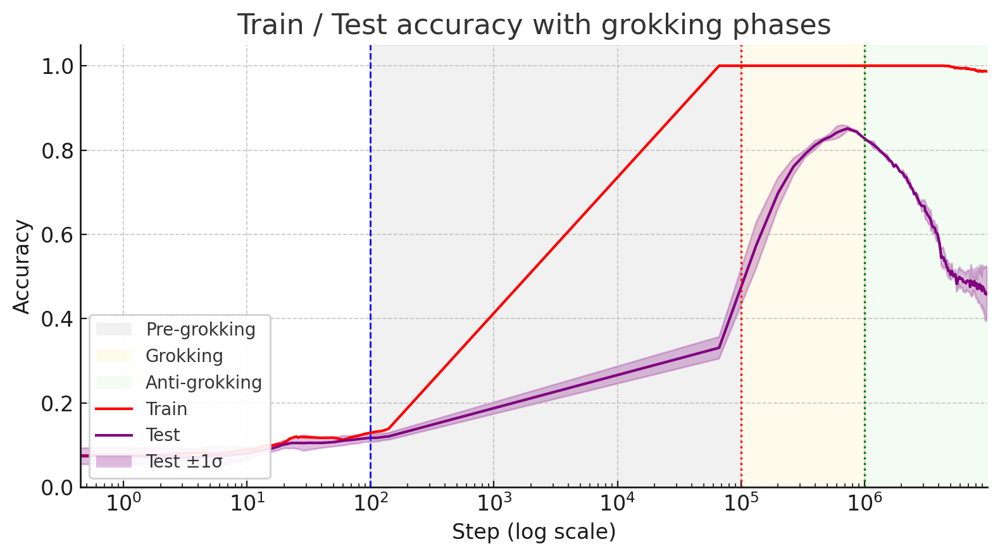
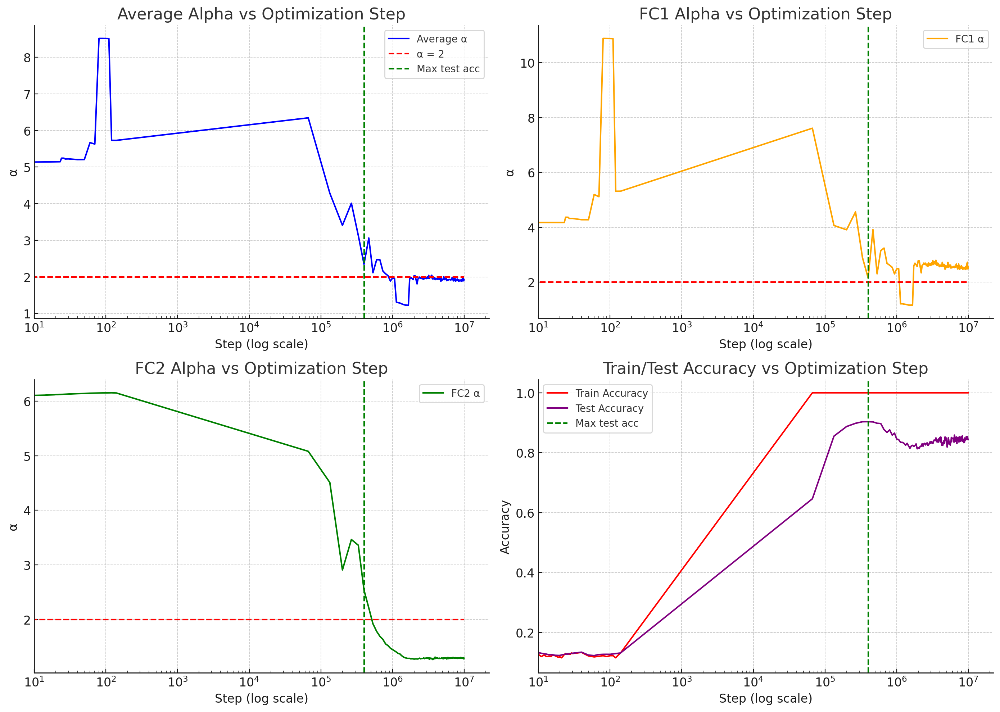

# Prakash & Martin 2025 — Grokking and Generalization Collapse: Insights from HTSR theory

См. также: [глобальный индекс понятий](../../concepts/index.md).

**Hari K. Prakash** (Калифорнийский университет в Сан-Диего, наука о данных и инженерия), **Charles H. Martin** (Calculation Consulting, Сан-Франциско).

arXiv [2506.04434](https://arxiv.org/abs/2506.04434), июнь 2025 (единственная версия v1), 15 страниц, 7 рисунков. Числа цитирований в таблице корпуса нет. Работа продлевает обучение до $10^{7}$ шагов и находит **третью пору** — антигроккинг, поздний обвал обобщения при безупречной точности на обучении, — а также меру, которая эту пору отличает: показатель тяжёлого хвоста $\alpha$ из теории тяжелохвостого самосглаживания. Источник — нативный HTML arXiv версии v1.

Оригинал и производные файлы этой папки:

- [`original/2506.04434.native.html`](original/2506.04434.native.html) — первоисточник, нативный HTML arXiv (v1), скачан как есть.
- [`original/2506.04434.grokking-and-generalization-collapse-insights-from-htsr-theory.md`](original/2506.04434.grokking-and-generalization-collapse-insights-from-htsr-theory.md) — конверсия оригинала в Markdown без правок содержания.
- [`images/`](images/) — 9 иллюстраций статьи в исходном разрешении.

**О состоянии источника.** В опубликованном на arXiv HTML все ссылки на литературу остались нераскрытыми ключами (`power2022grokking`, `martin2021implicit` и прочие): связь текста со списком литературы утрачена в самом первоисточнике. Конверсия передаёт это как есть; сам список литературы в статье присутствует и переведён не был (библиографические записи сохранены дословно).

Схема якорей и правила ссылок на карточку — в [README папки статей](../README.md).

## Затрагиваемые понятия

**[Тяжелохвостое самосглаживание (HTSR)](../../concepts/heavy-tailed-self-regularization-htsr.md)** — призма всей работы. Для каждой матрицы весов слоя строится матрица связности $\mathbf{X}=\mathbf{W}^{T}\mathbf{W}$, её опытная спектральная плотность приближается степенным законом, и показатель $\alpha$ этого хвоста служит мерой качества слоя ([`p3-1`](#p3-2), [`p3-8`](#p3-9)). Разряды известны из прежних работ Мартина и Махони: $\alpha\gtrsim 5{-}6$ — слой почти случаен, $2\lesssim\alpha\lesssim 5{-}6$ — связи сложились, $\alpha=2$ — наилучшее значение, $\alpha<2$ — чрезмерная связность и переобучение ([`p4-1`](#p4-1)).

**[Гроккинг](../../concepts/grokking.md)** — предмет, но взятый в непривычно долгом сроке: обучение продлено до $10^{7}$ шагов, и там обнаруживается **третья пора** ([`p2-1`](#p2-1), [`fig-1`](#fig-1)). Предгроккинг: точность на обучении безупречна, на тесте низка. Гроккинг: точность на тесте взлетает. **Антигроккинг**: точность на тесте рушится до 0,5, тогда как на обучении остаётся безупречной, а норма весов продолжает расти.

**[Унгроккинг](../../concepts/ungrokking.md)** — прямое отмежевание. У Varma et al. унгроккингом названа утрата обобщения при **переобучении на меньшем наборе** ($D<D_{crit}$) и она объясняется сменой действенности контуров при ослаблении весов; здесь же обвал наступает на **исходном** наборе, без ослабления весов и просто от долгого обучения ([`p2-4`](#p2-4)). Объяснение Varma et al. на этот случай не распространяется, ибо опирается на ослабление весов.

**[Меры прогресса](../../concepts/progress-measures.md)** — главная заявка: $\alpha$ размечает все три поры, тогда как лучшие соперники — лишь первые две ([`p1-2`](#p1-2)). Сверены разрежённость возбуждений, энтропия модулей весов и приближённая местная сложность контуров Golechha ([`p5-4`](#p5-4)); все они улавливают предгроккинг и гроккинг, но при обвале либо продолжают прежнее направление, либо остаются ровными ([`p7-1`](#p7-1), [`fig-5`](#fig-5)).

**[Спектральный разбор](../../concepts/spectral-analysis-svd-esd-fve.md)** — **ловушки связности**: матрица весов перемешивается поэлементно в $\mathbf{W}^{rand}$, её спектр приближается распределением Марченко—Пастура, и выбросы за краем основной массы $\lambda^{+}_{rand}$ и есть ловушки ([`p4-8`](#p4-8), [`p5-2`](#p5-2), [`fig-3`](#fig-3)). Довод проверяемый: у хорошо обученной модели перемешанный спектр обязан следовать MP, и отклонение от него значимо.

**[Корреляционные ловушки](../../concepts/correlation-traps.md)** — они появляются **только** в поре антигроккинга и ни разу раньше: 0 при предгроккинге, 0 при гроккинге, 7,5 ± 5,6 в FC1 при обвале ([`tab-2`](#tab-2), [`p8-6`](#p8-6)). Проверка Колмогорова—Смирнова подтверждает: P-значение $\approx 1{,}0$ на первых двух порах и $1{,}877\cdot 10^{-5}$ при обвале ([`tab-4`](#tab-4), [`p13-1`](#p13-1)).

**[Ослабление весов](../../concepts/weight-decay.md)** — управляющая ручка, и работа намеренно ставит оба случая. При WD=0 норма $l^{2}$ неуклонно растёт, гроккинг всё равно происходит, а затем наступает обвал; при WD=0,01 точность на тесте после гроккинга слегка снижается и выходит на долгое ровное значение, а $\alpha$ устаивается близ 2 ([`p12-7`](#p12-7), [`p12-9`](#p12-9), [`fig-6`](#fig-6)).

**[Норма весов](../../concepts/weight-norm-minimization.md)** — объяснение через неё отвергнуто прямо: гроккинг случается и при растущей норме, а при антигроккинге норма продолжает расти, тогда как обобщение рушится ([`p2-1`](#p2-1), [`p8-3`](#p8-3)).

**[Запоминание](../../concepts/memorization-phase.md)** — предложено новое объяснение всех трёх пор через послойную сходимость: в предгроккинге сходится лишь часть слоёв ($\alpha\approx 4$), а прочие почти случайны ($\alpha\approx 5$); в гроккинге все важные слои сходятся к $\alpha\approx 2$; в антигроккинге один или несколько слоёв переобучаются, уходя ниже $\alpha<2$ ([`p9-1`](#p9-1)).

**[Обвал ранга](../../concepts/neural-collapse.md)** — предполагаемое устройство обвала: ловушки суть возмущения ранга один или выше, вызывающие большой сдвиг среднего элементов $\mathbb{E}[W_{ij}]$ и делающие распределение весов **нетипичным**; нетипичная оценка обобщать не будет ([`p9-2`](#p9-2)).

**[Данные настоящих задач](../../concepts/vision-real-world-data-mnist-cifar.md)** — постановка: полносвязный MLP глубиной 3 и шириной 200, ReLU, подвыборка MNIST в 1000 примеров (по 100 на разряд), потеря MSE по однобитным целям, AdamW со скоростью $5\cdot 10^{-4}$, веса при начальном приближении умножены на 8, $10^{7}$ шагов, около 11 часов на Quadro P2000 ([`p11-1`](#p11-1), [`tab-3`](#tab-3)).

Карточки статей корпуса: [Power et al. 2022](../2201.02177.grokking-generalization-beyond-overfitting-on-small-algorithmic-datasets/2201.02177.grokking-generalization-beyond-overfitting-on-small-algorithmic-datasets.card.md) — исходное явление; [Omnigrok](../2210.01117.omnigrok-grokking-beyond-algorithmic-data/2210.01117.omnigrok-grokking-beyond-algorithmic-data.card.md) — объяснение через норму весов, здесь оспариваемое; [Varma et al. 2023](../2309.02390.explaining-grokking-through-circuit-efficiency/2309.02390.explaining-grokking-through-circuit-efficiency.card.md) — действенность контуров и унгроккинг, от которого антигроккинг отмежёван; [Merrill et al. 2023](../2303.11873.a-tale-of-two-circuits-grokking-as-competition-of-sparse-and-dense-subnetworks/2303.11873.a-tale-of-two-circuits-grokking-as-competition-of-sparse-and-dense-subnetworks.card.md) — соперничество разрежённой и плотной подсетей; [Nanda et al. 2023](../2301.05217.progress-measures-for-grokking-via-mechanistic-interpretability/2301.05217.progress-measures-for-grokking-via-mechanistic-interpretability.card.md) — меры продвижения через контуры; [Liu et al. 2022](../2205.10343.towards-understanding-grokking-an-effective-theory-of-representation-learning/2205.10343.towards-understanding-grokking-an-effective-theory-of-representation-learning.card.md) — действенная теория обучения представлениям.

## Что показано, а что предположено

Замечания редактора карточки по итогам разбора утверждений (`…claims.txt`). Работа короткая: 9 страниц основного текста, 5 приложений, 7 рисунков, 4 таблицы.

**Третья пора найдена, и найдена дёшево.** Всё, что для этого понадобилось, — продлить обучение до $10^{7}$ шагов там, где предшественники останавливались на $10^{5}$–$10^{6}$ ([`p2-5`](#p3-1)). Это тот случай, когда находка лежала на поверхности и никто не посмотрел.

**Отмежевание от унгроккинга проведено точно.** У Varma et al. утрата обобщения требует переобучения на меньшем наборе и ослабления весов; здесь ни того, ни другого нет ([`p2-4`](#p2-4)). Это не переименование чужого явления, а иное.

**Сверка с соперничающими мерами поставлена как отрицательная проверка.** Разрежённость возбуждений растёт и при предгроккинге, и при антигроккинге одинаково; без знания порога различить эти поры по ней нельзя, тогда как $\alpha=2$ есть отсечка, заданная теорией заранее ([`p7-2`](#p7-2)). Довод сформулирован именно так — как проверка на способность **различать**, а не просто «коррелировать».

**Ловушки связности подтверждены не глазомером, а проверкой.** Приближение Марченко—Пастура, статистика Колмогорова—Смирнова и P-значение приведены для всех трёх пор ([`tab-4`](#tab-4)); переход от $P\approx 1{,}0$ к $1{,}877\cdot 10^{-5}$ разителен.

**Объяснение всех трёх пор через послойную сходимость связно.** Предгроккинг — часть слоёв недообучена; гроккинг — все важные слои у $\alpha\approx 2$; антигроккинг — часть слоёв ушла ниже 2 ([`p9-1`](#p9-1)). Такое описание объясняет и то, отчего предгроккинг и антигроккинг внешне схожи (безупречное обучение, плохой тест), но различимы по $\alpha$.

**Однако вся работа — это одна постановка.** Один MLP глубиной 3, один набор данных, одна подвыборка в 1000 примеров, одно семя (в таблице настроек стоит `Random Seed 0`), два значения ослабления весов ([`tab-3`](#tab-3)). Ограничение признано первым в списке ([`p14-5`](#p14-5)), но заявка о «всеобщей цели сходимости слоя при $\alpha\approx 2$» на таком основании не держится.

**Разбросы в таблицах приведены, а их источник — нет.** В таблице 1 стоит $0{,}9\pm 0{,}4$, в таблице 2 — $7{,}5\pm 5{,}6$; в подписи сказано «применены разные семена» ([`tab-1`](#tab-1)), тогда как в настройках семя одно ([`tab-3`](#tab-3)). Сколько прогонов усреднено, не сказано нигде.

**Начальное приближение умножено на 8, и это не обсуждается.** Веса и свободные члены при начальном приближении умножены на 8,0 ([`tab-3`](#tab-3)) — тот самый приём Omnigrok, которым гроккинг вызывают нарочно. Как это сказывается на $\alpha$ и на самом обвале, не разобрано.

**Обратное следствие признано неверным самими авторами.** Мыслимо, что слой имеет $\alpha<2$ и при этом обобщает плохо не по этой причине, а у хорошо обученных моделей бывают слои с большими $\alpha$ ([`p14-6`](#p14-6)). Тем самым $\alpha<2$ есть признак, а не мерило.

**Устройство обвала объявлено догадкой.** Слова «каким-то пока не выясненным образом» и «выдвигается догадка, что слои с большим числом ловушек переобучены» стоят в тексте прямо ([`p9-1`](#p9-1), [`p9-2`](#p9-2)); связь «ловушки → нетипичность → плохое обобщение» изложена рассуждением, а не проверена вмешательством.

**Текст не вычитан.** Нативный HTML arXiv отдаёт **все** ссылки на литературу нераскрытыми ключами (`power2022grokking`, `martin2021implicit`, `golechha2024progressmeasuresgrokkingrealworld`) — то есть в опубликованном HTML статьи связь текста со списком литературы утрачена целиком; в конце третьего пункта вклада стоит двойная точка ([`p2-1`](#p2-1)); в приложении D дисперсия для окончательного состояния названа $\sigma_{mp}\approx 2$ ([`p13-1`](#p13-1)) при $0{,}949$ в таблице 4 ([`tab-4`](#tab-4)).

**Место в корпусе.** Работа вносит в корпус две новые вещи: третью пору — обвал обобщения после гроккинга при долгом обучении без ослабления весов — и меру, которая эту пору отличает от внешне схожего предгроккинга. Ценно и то, что мера снимается **с одних весов**, без доступа к тестовым данным. Цена — одна крошечная постановка на MNIST, число прогонов не названо, начальное приближение умножено на 8 без разбора последствий, а устройство обвала объявлено догадкой. Для корпуса это скорее указатель на неисследованную область, чем закрытый вопрос.

---

# Текст статьи

## Аннотация

###### p1-2

Мы изучаем известное явление гроккинга в нейронных сетях (НС) на трёхслойном MLP, обученном на подвыборке MNIST из 1 тыс. примеров, с ослаблением весов и без него, и обнаруживаем новую третью пору — *антигроккинг*, — которая наступает весьма поздно при обучении и напоминает знакомую пору *предгроккинга*, но отлична от неё: точность на тесте рушится, тогда как точность на обучении остаётся безупречной. Этот поздний обвал, однако, отличен и от известного *предгроккинга*, и от *гроккинга*, и его не улавливают прочие предложенные меры продвижения гроккинга. Пользуясь тяжелохвостым самосглаживанием (HTSR) через открытое средство WeightWatcher, мы показываем, что мера качества слоя $\alpha$ из HTSR **сама по себе** размечает *все три* поры, тогда как лучшие соперничающие меры улавливают лишь первые две. Антигроккинг обнаруживается при обучении в $10^{7}$ шагов, и ему неизменно предшествует $\alpha<2$ и появление *ловушек связности* — выбросов сингулярных значений в перемешанных матрицах весов слоя, делающих матрицу весов слоя *нетипичной* и указывающих на переобучение под обучающую выборку. Такие ловушки подтверждаются и глазомерным осмотром послойных опытных спектральных плотностей, и проверками Колмогорова—Смирнова на перемешанных спектрах. Сравниваемые меры — разрежённость возбуждений, энтропия модулей весов, сложность контуров и норма весов $l^{2}$ — отслеживают предгроккинг и гроккинг, но не отличают гроккинг от антигроккинга. Эта находка даёт способ мерить переобучение и обвал генерализации без прямого доступа к тестовым данным. Итоги укрепляют утверждение, что $\alpha$ из HTSR задаёт всеобщую цель сходимости слоя при $\alpha\!\approx\!2$, и подчёркивают ценность меры $(\alpha)$ HTSR как меры генерализации.

## 1 Введение

Гроккинг есть занятное явление, при котором нейронная сеть быстро достигает почти безупречной точности на обучении, тогда как точность на тесте заметно отстаёт — часто на уровне случайного угадывания, — прежде чем внезапно взмыть к высокой способности обобщать power2022grokking. Рисунок 1 показывает это для MLP с ReLU глубиной 3 и шириной 200, обученного на подвыборке MNIST.

###### p1-4

Чтобы разобрать это явление и вскрыть более глубокий ход событий, нашей главной призмой служит недавно развитая теория тяжелохвостого самосглаживания (HTSR) вслед за Martin et al. martin2021implicit. Теория HTSR рассматривает опытную спектральную плотность (ESD) матриц весов отдельных слоёв $(\mathbf{W})$, описываемую тяжелохвостым степенным (PL) показателем $\alpha$. Мы находим, что $\alpha$ даёт чувствительную меру строения связей внутри слоёв, отслеживающую переход в пору гроккинга и, что решающе, предсказывающую последующее падение способности обобщать.

Ради сравнения мы исследуем и несколько иных приёмов:

###### p2-1

1. **Разбор нормы весов:** побуждаемые работами вроде Liu et al. liu2023omnigrokgrokkingalgorithmicdata, **[p. 2]** мы рассматриваем норму $l^{2}$ весов. Мы наблюдаем, что гроккинг случается и без ослабления весов (отчего норма растёт), а значит, одна норма весов не есть полное объяснение, что подтверждает связанные с нормой весов находки Golechha golechha2024progressmeasuresgrokkingrealworld.
2. **Меры продвижения:** мы применяем меры, предложенные Golechha golechha2024progressmeasuresgrokkingrealworld, — разрежённость возбуждений, энтропию модулей весов и приближённую местную сложность контуров, — которые улавливают более широкие строительные и работные изменения сети при обучении.



###### fig-1

*Рисунок 1: **Три поры гроккинга. Кривые обучения MLP глубиной 3 и шириной 200 на MNIST. Начальная пора предгроккинга (серая): точность на обучении (красная линия) взмывает на $10^{2}$ шагах и насыщается между $10^{4}-10^{5}$ шагами, тогда как точность на тесте (лиловая линия) остаётся низкой; пора гроккинга (жёлтая): точность на тесте быстро растёт после $\sim 10^{5}$ шагов и достигает наибольшего значения на $10^{6}$ шагах; и вновь обнаруженная поздняя пора антигроккинга (зелёная): точность на тесте рушится (до $0.5$).*** **[p. 2]**

**Наш вклад:** наша работа вносит несколько связанных между собой вкладов, помогающих объяснить устройства, лежащие под явлением гроккинга:

###### p2-3

1. Продлив обучение существенно (до $10^{7}$ шагов) при нулевом ослаблении весов WD=0, мы распознаём и описываем **поздний обвал генерализации**: заметное падение точности на тесте много позже начального гроккинга, несмотря на безупречную точность на обучении и неуклонно растущую норму весов $l^{2}$. Мы называем это **антигроккингом.**
2. Мы показываем, что мера качества слоя $\alpha$ из HTSR (тяжелохвостый степенной (PL) показатель) действенно отслеживает переход гроккинга и при обычной постановке с ослаблением весов WD>0, и при нулевом ослаблении WD=0, превосходя норму весов $l^{2}$ и прочие меры продвижения. Лишь $\alpha$ из HTSR способна различить все 3 поры гроккинга.
3. Мы распознаём устройство поры предгроккинга, где точность на обучении безупречна, а модель не обобщает. Эта пора возникает оттого, что лишь часть слоёв модели хорошо обучена (то есть $\alpha\leq 4$), тогда как хотя бы один слой недообучен (то есть $\alpha\geq 5$). Более того, слои могут выказывать большой разброс между прогонами обучения, что говорит об их неустойчивости. Важно, что значения $\alpha$ у слоёв здесь отличны от значений в поре антигроккинга, хотя в обеих порах точность на обучении безупречна, а на тесте низка..
4. Мы показываем, что степенной показатель HTSR $\alpha<2$ распознаёт обвал. Кроме того, в этой поре мы наблюдаем присутствие необычных возмущений ранга один (или выше) в одной или нескольких матрицах весов слоя $\mathbf{W}$. Мы называем их **ловушками связности** и распознаём, перемешивая $\mathbf{W}$ поэлементно, образуя $\mathbf{W}^{rand}$, и ища необычно большие собственные значения $\lambda_{trap}\gg\lambda^{+}$ (где $\lambda^{+}$ есть правый край соответствующего распределения Марченко—Пастура (MP) martin2025setol).

## 2 Сопутствующие работы

###### p2-4

Гроккинг power2022grokking — отложенное появление способности обобщать много позже насыщения точности на обучении — вызвал немало исследований его устройства. Ранние работы часто изучали гроккинг на алгоритмических задачах merrill2023tale; nanda2023progress; varma2023explaining, нередко связывая явление с присутствием ослабления весов (WD), благоприятствующего более простым решениям с меньшей нормой liu2023omnigrokgrokkingalgorithmicdata. Иные подходы включают механистическую истолковываемость nanda2023progress **[p. 3]** и разбор, распознающий соперничающие контуры запоминания и обобщения varma2023explaining; merrill2023tale.

###### p3-1

Varma et al. varma2023explaining определили «унгроккинг» как утрату способности обобщать при переобучении гроккнутой сети на *меньшем* наборе данных ($D<D_{crit}$), приписав его смене действенности контуров при WD. В отличие от этого мы наблюдаем **поздний обвал генерализации** («антигроккинг») на *исходном* наборе данных после долгого обучения (~$10^{7}$ шагов) *без* WD (WD=0). Это отдельное явление не предсказывается varma2023explaining, ибо выпадает из решающего допущения об ослаблении весов, на котором та работа держится.

###### p3-2

Исследования гроккинга теперь охватывают и задачи из жизни golechha2024progressmeasuresgrokkingrealworld; humayun2024deep. Golechha golechha2024progressmeasuresgrokkingrealworld ввёл меры продвижения (скажем, разрежённость возбуждений, энтропию модулей весов) и, что примечательно, наблюдал гроккинг без WD, отчего нормы $l^{2}$ росли, — как и в нашей постановке. Мы берём его меры ради сравнения, но продлеваем обучение много дальше (до $10^{7}$ шагов), обнаруживая последующий обвал «антигроккинга» — явление, в его работе не описанное, несмотря на схожий режим WD=0.

Мы применяем теорию тяжелохвостого самосглаживания (HTSR) martin2021implicit; martin2021predicting, отслеживая спектральный показатель $\alpha$. Мы находим, что $\alpha$ предсказывает и начальный гроккинг, и, что единственно в своём роде, последующий провал и в конце концов обвал «антигроккинга» при WD=0. Наш вклад — в распознании и описании этого явления антигроккинга через $\alpha$ применительно к долгосрочной устойчивости обобщения, что продолжает прежние работы, требовавшие либо WD, либо не исследовавшие достаточно долгих сроков обучения.

## 3 Меры и величины

### 3.1 Тяжелохвостое самосглаживание (HTSR)

#### От весов к спектрам.

Для каждой матрицы весов слоя $\mathbf{W}\in\mathbb{R}^{N\times M}$ мы строим нецентрированную матрицу *связности* (Грама)

$$
\mathbf{X}\;=\;\frac{1}{N}\,\mathbf{W}^{\top}\mathbf{W}\;\in\;\mathbb{R}^{M\times M}. \tag{1}
$$

Пусть $\{\lambda_{i}\}_{i=1}^{M}$ суть собственные значения $\mathbf{X}$. Их опытная спектральная плотность (ESD) есть дискретная мера

$$
\rho_{emp}(\lambda)\;=\;\frac{1}{M}\sum_{i=1}^{M}\delta\!\bigl{(}\lambda-\lambda_{i}\bigr{)}. \tag{2}
$$

#### Гауссово отсечение.

Если элементы $\mathbf{W}$ независимы и одинаково распределены по $\mathcal{N}(0,\sigma^{2})$, то в пределе $N\!\to\!\infty$, $M\!\to\!\infty$ при закреплённом отношении сторон $Q=N/M\geq 1$ плотность $\rho_{emp}(\lambda)$ сходится к плотности Марченко—Пастура (MP) marchenko1967distribution

$$
\rho_{\mathrm{MP}}(\lambda)=\begin{cases}\dfrac{Q}{2\pi\sigma^{2}}\dfrac{\sqrt{(\lambda^{+}-\lambda)(\lambda-\lambda^{-})}}{\lambda},&\lambda\in[\lambda^{-},\lambda^{+}],\\[6.0pt]
0,&\text{otherwise},\end{cases}\quad\lambda^{\pm}=\sigma^{2}\bigl{(}1\pm Q^{-1/2}\bigr{)}^{2} \tag{3}
$$

Это даёт обоснованную «нулевую модель», с которой можно сравнивать настоящие обученные веса. У хорошо обученной модели собственные значения любого слоя $\mathbf{W}$ редко близко следуют распределению MP и почти всегда имеют заметное число больших собственных значений, выходящих за узнаваемую область основной массы MP $(\lambda\gg\lambda^{+})$, если не оказываются вполне тяжелохвостыми. Если же мы перемешаем $\mathbf{W}$ поэлементно,

$$
\mathbf{W}\rightarrow\mathbf{W}^{rand} \tag{4}
$$

то элементы $\mathbf{W}^{rand}$ по построению станут независимыми и одинаково распределёнными, и мы ждём, что ESD у $\mathbf{W}^{rand}$ очень хорошо приблизится распределением MP. Это показано ниже, на рисунке 2 (справа).

#### Теория тяжелохвостого самосглаживания (HTSR)

###### p3-9

Прежние работы martin2021implicit; martin2021predicting; martin2025setol показывают, что ESD слоёв настоящих глубоких сетей с выученными связями почти никогда не умещается целиком в основной массе Марченко—Пастура, предсказанной для независимых гауссовых весов; вместо этого правый край расходится в степенной (PL) хвост. Строго говоря,

$$
\rho_{emp}(\lambda)\;\sim\;\lambda^{-\alpha},\qquad\lambda_{\min}<\lambda<\lambda_{\max}, \tag{5}
$$

###### p3-10

где показатель $\alpha$ описывает силу связей. Согласно рамке HTSR martin2021predicting, разные промежутки $\alpha$ отвечают разным порам обучения и разной степени сходимости каждого слоя:

**[p. 4]**

###### p4-1

- $\alpha\gtrsim 5-6$: **Похожий на случайный или основная масса с всплесками** — спектр близок к гауссову отсечению; строения задачи почти нет.
- $2\lesssim\alpha\lesssim 5-6$: **Слабо (WHT) или умеренно тяжелохвостый (MHT)** — связи накапливаются; слои хорошо обусловлены и обыкновенно лучше обобщают.
- $\alpha=2$ **Наилучшее значение:** отвечает вполне доведённым слоям моделей. Связано со слоями тех моделей, что обобщают лучше всего.
- $\alpha<2$: **Очень тяжелохвостый (VHT)** — крайне тяжёлые хвосты указывают на возможное переобучение под обучающие данные и часто предшествуют падению способности обобщать (точности на тесте) или сопутствуют ему.

Заметим, что нижняя граница $\alpha=2$ у тяжелохвостой поры есть жёсткая отсечка, тогда как верхняя граница $\alpha\gtrsim 5-6$ несколько мягче, ибо может зависеть от отношения сторон $Q$. Подробнее см. Martin et al. martin2021implicit; martin2025setol.

#### Оценка $\alpha$.

Вслед за martin2021predicting мы приближаем хвост $\rho_{emp}$ степенным законом 5 по наибольшему правдоподобию (MLE) clauset2009power. Начало степенного хвоста $\lambda_{\min}$ выбирается самочинно так, чтобы наименьшить расстояние Колмогорова—Смирнова между опытным и приближающим распределениями. Все вычисления проделаны средством WeightWatcher v0.7.5.5 weightwatcher, которое самочинно выполняет

- извлечение сингулярных значений $\sigma_{i}$ через SVD ($\lambda_{i}=\sigma_{i}^{2}$),
- степенные приближения и проверки согласия Колмогорова—Смирнова (включая выбор $\lambda_{\min}$ и $\lambda_{\max}$)
- распознание ловушек связности (по желанию)

Рисунок 2 (слева) показывает пример степенного приближения в двойном логарифмическом масштабе для показательного слоя после обучения. На графике показаны ESD обычного слоя НС (гистограмма или ядерная оценка плотности собственных значений), самочинно выбранное $\lambda_{\min}$ (xmin, отвесная линия, красная), $\lambda_{\max}$ (xmax, отвесная линия, оранжевая) и наилучшее приближение степенного хвоста (пунктирная линия, красная).


*Рисунок 2: **Слева: пример ESD, полученной из хорошо связанной $\mathbf{W}$ (синим), и степенное приближение хвоста (красным) в двойном логарифмическом масштабе. Справа: пример ESD у $\mathbf{W}^{rand}$ (светло-лиловым) и приближение MP (красным) в логарифмически-линейном масштабе.*** **[p. 4]**

Заметим, что степенное приближение весьма чувствительно к выбору $\lambda_{\min}$, и плохой выбор даёт плохо оценённое $\alpha$. Если $\lambda_{\min}$ слишком велико (плохой xmin, отвесная линия, лиловая), то степенной хвост слишком мал, и $\alpha$ выходит больше. Выбор $\lambda_{\min}$ весьма важен при вычислении показателя хвоста $(\alpha)$ и полностью самочинен в открытом средстве WeightWatcher. weightwatcher

#### Значение для гроккинга и антигроккинга.

Во всех опытах путь $\alpha(t)$ оказывается весьма чувствительным указателем состояния способности сети обобщать: большие провалы к $\alpha\!\approx\!2$ совпадают с началом гроккинга, тогда как дальнейшее падение ниже $\alpha<2$ предвещает (а затем и описывает) наступающий обвал «антигроккинга».

### 3.2 Ловушки связности

###### p4-8

Чтобы лучше понять происхождение антигроккинга (обвала генерализации), поучительно поискать следы возможного переобучения в матрицах весов слоя $\mathbf{W}$, проявляющиеся как то, что мы называем **ловушками связности** martin2025setol. **[p. 5]** Напомним, что у хорошо обученной модели мы ждём, что ESD у $\mathbf{W}^{rand}$ хорошо приближается распределением MP; здесь мы доказываем, что отклонения от этого значимы и содержательны. Чтобы распознать эти отклонения, мы сравниваем ESD перемешанных слоёв с распределением MP на разных порах обучения и оцениваем отход от случайности. Мы распознаём эти отклонения как необычно большие собственные значения в лежащей под ними $\mathbf{W}^{rand}$. Такие большие собственные значения мы называем ловушками связности $\lambda_{trap}$, когда они заметно больше края основной массы $\lambda^{+}_{rand}$ наилучшего приближения MP.

$$
\text{Correlation Trap: }\qquad\lambda_{trap}\gg\lambda^{+}_{rand} \tag{6}
$$

Добавочное статистическое подтверждение присутствия таких ловушек см. в приложении D, а также в дополнительных сведениях. Подробнее см. также martin2025setol.

###### p5-2

Средство WeightWatcher weightwatcher распознаёт ловушки связности самочинно: оно перемешивает $\mathbf{W}$, затем самочинно приближает MP, оценивая дисперсию $\sigma^{2}_{MP}$ лежащей под ней перемешанной матрицы $\mathbf{W}^{rand}$ и находя приближение, лучше всего описывающее основную массу её ESD у $\mathbf{W}^{rand}$. Затем оно находит все собственные значения $\lambda_{trap}$, заметно превосходящие (то есть выходящие за колебания Трейси—Видома) край основной массы $\lambda^{+}_{rand}$ у ESD $\mathbf{W}^{rand}$. Рисунок 3 изображает два слоя из изучаемых здесь моделей с ловушками связности.


###### fig-3

*Рисунок 3: **Примеры ловушек связности. ESD у ($\mathbf{W}^{rand}$) (светло-лиловым) для слоя 2, для перемешанной матрицы весов $\mathbf{W}^{rand}$ у разных моделей, в сравнении с приближением MP (красным). Ловушки связности $\lambda_{trap}$ изображены малыми всплесками справа от приближения MP. (ось x логарифмическая) Слева: прямо перед обвалом (то есть более чем на $\sim 10^{6}$ шагах) ($\sigma_{mp}\approx 0.9879$). Проверка Колмогорова—Смирнова (P-значение $\approx 4\times 10^{-13}$) указывает на сильное отклонение от модели MP. Появляется одна выдающаяся ловушка связности при $\lambda_{trap}\approx 10^{6.5}$. Справа: окончательный обвал генерализации. Проверка Колмогорова—Смирнова (P-значение $\approx 1.877\times 10^{-5}$) указывает на сильное отклонение от модели MP. Наблюдается несколько ловушек связности, $\lambda_{trap}\in[10^{2.x},10^{6.5}]$.*** **[p. 5]**

Ради добавочного статистического подтверждения мы здесь пользуемся и проверкой Колмогорова—Смирнова (KS), чтобы измерить несходство между ESD у $\mathbf{W}^{rand}$ и её наилучшим приближением MP. Большое различие вместе с глазомерным осмотром данных указывает на присутствие одной или нескольких ловушек связности $(\lambda_{trap})$.

### 3.3 Прочие сравниваемые меры

###### p5-4

Мы сверяли наши находки на основе HTSR с разбором нормы весов $l^{2}$ liu2023omnigrokgrokkingalgorithmicdata и несколькими мерами продвижения, предложенными Golechha golechha2024progressmeasuresgrokkingrealworld: это разрежённость возбуждений ($A_{s}$), энтропия модулей весов ($H_{abs}(W)$) и приближённая местная сложность контуров ($\Lambda_{LC}$). Подробные определения этих мер даны в приложении B.

## 4 Итоги и разбор


*Рисунок 4: Итоги HTSR против шагов оптимизации. Сверху: среднее $\alpha$ по слоям. Посередине: $\alpha$ для первого полносвязного слоя (FC1). Снизу: $\alpha$ для второго полносвязного слоя (FC2). Отметим заметный провал ниже опасного порога $\alpha=2$, особенно у FC2, совпадающий с падением качества «антигроккинга», видным на рис. 1 после 1 млн шагов.* **[p. 6]**

### 4.1 Послойные меры для отслеживания гроккинга

#### Мера качества слоя $\alpha$ из HTSR:

Наша главная мера — качество слоя $\alpha$ из HTSR — являет решающий ход событий, упускаемый прочими мерами. Рисунок 4 показывает изменение $\alpha$, усреднённого по слоям (сверху), и для отдельных полносвязных слоёв (посередине, снизу).

###### tab-1

*Таблица 1: **Послойные и средние показатели $\alpha$ из HTSR. На правом краю каждой поры гроккинга: предгроккинг $\sim 10^{5}$ шагов, гроккинг $\sim 10^{6}$ шагов и антигроккинг $\sim 10^{7}$ шагов, для опыта с нулевым ослаблением весов (WD=0); значения взяты с рис. 4. Применены разные семена, и возможен разброс из-за начального приближения и пути оптимизации.*** **[p. 6]**

**[p. 6]**

| **Layer, Metric** | **Pre-grokking** | **Grokking (Max Test Acc.)** | **Anti-grokking (Collapse)** |
|---|---|---|---|
| FC1 $\alpha$ | $5.0\pm 0.7$ | $3.6\pm 0.5$ | $0.9\pm 0.4$ |
| FC2 $\alpha$ | $2.9\pm 0.7$ | $2.3\pm 0.2$ | $1.3\pm 0.3$ |
| average $\alpha$ | $4.0\pm 0.6$ | $2.9\pm 0.2$ | $1.1\pm 0.3$ |

Поначалу $\alpha$ велико, что отражает похожие на случайные веса. По мере обучения, когда сеть начинает приближать обучающие данные, $\alpha$ убывает. Резкое падение к наилучшему (тяжелохвостому) режиму ($2\lesssim\alpha\lesssim 5-6$) совпадает с быстрым улучшением точности на тесте, свойственным гроккингу (около $10^{4}$-$10^{5}$ шагов на рисунке 1). Решающе, что по мере продолжения обучения до миллионов шагов $\alpha$ неуклонно проваливается ниже $2$, входя в очень тяжелохвостый (VHT) режим. Это заметно происходит во втором полносвязном слое (FC2, нижняя доля). Это падение ниже $\alpha=2$, указывающее на возможную неоптимальность слоя и чрезмерно сильные связи, прямо предшествует заметному падению точности на тесте — поре «антигроккинга», — наблюдаемому после $10^{6}$ шагов на рисунке 1, и совпадает с ним.

Вместе эти наблюдения высвечивают исключительную чувствительность меры $\alpha$ из HTSR. Эта мера не только распознаёт переход гроккинга, но и даёт раннее предупреждение о последующей неустойчивости и о новом явлении «антигроккинга», указывая на возможно болезненные строения связей, складывающиеся глубоко в обучении. Послойный разбор (рисунок 4) далее говорит о том, что эта неустойчивость может брать начало в определённых слоях (здесь FC2), становящихся чрезмерно связанными ($\alpha<2$).

#### Сравниваемые меры:

Напротив, сравниваемые меры улавливают начальное обучение и пору гроккинга, но не предсказывают позднего обвала генерализации. **[p. 7]** Рисунок 5 показывает разрежённость возбуждений, энтропию модулей весов и приближённую местную сложность контуров. Хотя эти меры выказывают ясные направления при начальном обучении и в поре гроккинга (скажем, изменения разрежённости и сложности), их пути становятся довольно ровными или лишены отчётливых черт, отвечающих разительному падению качества при «антигроккинге». Скажем, сложность контуров остаётся довольно ровной на поздних порах вплоть до некоторого шума в конце, не давая никакого предупреждения о надвигающемся обвале. Хотя разрежённость возбуждений выказывает перегиб близ наибольшей точности на тесте и гроккинг всё же улавливает, она в целом продолжает расти и сквозь поздний обвал.


###### fig-5

*Рисунок 5: Иные меры продвижения (Golechha golechha2024progressmeasuresgrokkingrealworld) против шагов оптимизации. Сверху: разрежённость возбуждений. Посередине: энтропия модулей весов. Снизу: приближённая местная сложность контуров. Хотя эти меры выказывают изменения при начальном обучении и в поре гроккинга (скажем, разрежённость возбуждений), они не дают ясных признаков, предсказывающих величину позднего падения качества «антигроккинга», наблюдаемого после $10^{6}$ шагов.* **[p. 7]**

###### p7-1

В наших основных опытах при WD=0 величина $A_{s}$ в целом растёт на протяжении всего обучения (рисунок 5), словно отслеживая поры предгроккинга и гроккинга, однако она не проходит отрицательной проверки в поре антигроккинга, ибо продолжает расти ровно так же, как и при предгроккинге. Прежние работы связывали разрежённость возбуждений со способностью обобщать li2023lazyneuronphenomenonemergence; merrill2023tale; peng2023theoretical и описывали особый ход событий — скажем, выход на ровное значение перед гроккингом golechha2024progressmeasuresgrokkingrealworld или рост, предшествующий росту потери на тесте huesmann2021impact. А именно, мы наблюдаем едва заметный перегиб или провал $A_{s}$, совпадающий с точкой наибольшей точности на тесте, перед небольшим ростом. Хотя эта черта словно отмечает сдвиг близ наибольшей точности на тесте, её собственная предсказательная польза для дальнейшего хода способности обобщать сомнительна. Иначе говоря, не зная надлежащей отсечки по разрежённости, невозможно определить, отвечает ли растущее $A_{s}$ предгроккингу или антигроккингу. Напротив, поскольку $\alpha=2$ из HTSR есть теоретически обоснованная всеобщая отсечка, различить эти две поры можно верно.

###### p7-2

Кроме того, в нашем сравнительном опыте при WD>0, описанном в приложении C, схожий перегиб $A_{s}$ происходит там, где точность на тесте после небольшого начального снижения от наибольшего значения затем выходит на ровное значение, а не переживает разительного обвала, как в случае WD=0. Стало быть, один лишь этот провал $A_{s}$ не позволяет различить, рухнет ли точность на тесте разительно или устоится, что говорит о том, что он главным образом указывает на некое переходное изменение близ точки наибольшей способности обобщать, а не предсказывает природу дальнейшего пути. Наши находки указывают на ограничения и двух других сравниваемых мер в отслеживании поры антигроккинга. Энтропия модулей весов ($H_{\text{abs}}(\mathbf{W})$), несмотря на предполагаемую связь со способностью обобщать (golechha2024progressmeasuresgrokkingrealworld,), также резко убывает при обвале и потому надёжно не различает эту пору антигроккинга. Схожим образом $\Lambda_{\text{LC}}$ (golechha2024progressmeasuresgrokkingrealworld,) **[p. 8]** остаётся низкой на всём протяжении обвала, не отражая ухудшения качества. Мы подтверждаем и то, что согласно с (golechha2024progressmeasuresgrokkingrealworld,) гроккинг устойчиво случается даже при растущих нормах весов и без ослабления весов.

### 4.2 Ловушки связности и антигроккинг

Чтобы лучше понять происхождение антигроккинга (обвала генерализации), поучительно поискать следы возможного переобучения в матрицах весов слоя $\mathbf{W}$ в виде ловушек связности. Как описано в разделе 3.1, мы разбираем собственные значения $\{\lambda_{i}\}$ перемешанных матриц весов $\mathbf{W}^{rand}$, полученных из матрицы весов $\mathbf{W}$ каждого слоя, для слоёв FC1 и FC2.

###### tab-2

*Таблица 2: **Среднее число распознанных ловушек связности в слоях FC1 и FC2 на правом краю трёх пор гроккинга: предгроккинг $\sim 10^{5}$ шагов, гроккинг $10^{6}$ шагов и антигроккинг $10^{7}$ шагов. Итоги показаны для обоих опытов — с ослаблением весов $(WD>0)$ и без него, WD=0.*** **[p. 8]**

| **Model, Layer** | **Pre-grokking** | **Grokking (Max Test Acc.)** | **Anti-grokking (Collapse)** |
|---|---|---|---|
| $WD=0$, FC1 | $0\pm 0$ | $1\pm 0$ | $7.5\pm 5.6$ |
| $WD=0$, FC2 | $0\pm 0$ | $1\pm 0$ | $1\pm 0$ |
| $WD>0$, FC1 | 0 | 0 | $2.0\pm 0.0$ |
| $WD>0$, FC2 | 0 | 0 | $1.0\pm 0.0$ |

Как показано в таблице 2, для обоих слоёв, FC1 и FC2, и для обоих опытов, с ослаблением весов и без него, ни один слой не выказывает следов ловушек связности вплоть до поры антигроккинга. Присутствие таких ловушек отвечает $\alpha<2$ из HTSR для этих слоёв, как и предсказано прежней работой martin2025setol. Дальнейший статистический разбор для слоёв FC2 дан в приложении D. Присутствие ловушек связности вместе с $\alpha<2$ есть окончательный признак того, что модель находится в поре антигроккинга.

## 5 Заключение

###### p8-3

Эта работа исследовала известное явление гроккинга в нейронных сетях (НС) сквозь призму недавно развитой теории тяжелохвостого самосглаживания (HTSR) martin2021implicit. Прежние работы пытались объяснить гроккинг (через норму $l^{2}$), но преуспевают лишь при наличии ослабления весов (WD) и не смогли объяснить гроккинг без ослабления весов liu2023omnigrokgrokkingalgorithmicdata; golechha2024progressmeasuresgrokkingrealworld. По этой причине мы изучали долгосрочный ход способности обобщать при гроккинге и с ослаблением весов (WD>0), и без него (WD=0). Мы сравниваем приложение теории HTSR с нормой $l^{2}$ и несколькими прежде предложенными мерами. liu2023omnigrokgrokkingalgorithmicdata Наша главная находка в том, что мера качества слоя $\alpha$ из HTSR способна действенно отслеживать гроккинг и с ослаблением весов, и без него. В частности, $\alpha$ из HTSR отслеживает начальный переход гроккинга и последующие провалы качества в обоих случаях ($WD=0\;,WD>0$) и тем самым даёт новое понимание явления гроккинга.

Более того, и это решающе, в постановке WD=0 $\alpha$ из HTSR даёт и раннее указание на новый **поздний обвал генерализации**, названный **антигроккингом**. Этот обвал описывается заметным падением точности на тесте при сохраняющейся безупречной точности на обучении (и большой норме $l^{2}$) и наблюдается после долгого обучения (до $10^{7}$ шагов).

Мы также рассмотрели несколько иных мер продвижения гроккинга помимо нормы $l^{2}$ liu2023omnigrokgrokkingalgorithmicdata: разрежённость возбуждений $A_{s}$, энтропию модулей весов $H_{abs}(W)$ и приближённую местную сложность контуров $\Lambda_{LC}$ golechha2024progressmeasuresgrokkingrealworld. Хотя $A_{s}$ и $\Lambda_{LC}$ улавливали начальное обучение и поры гроккинга и меняются на переходе к антигроккингу, они не смогли однозначно предсказать появление или присутствие антигроккинга.

###### p8-6

Разбирая итоги HTSR на всех 3 порах гроккинга, мы предлагаем новое объяснение явления гроккинга. В первой поре, предгроккинге, где насыщается лишь точность на обучении, сходится лишь часть отдельных слоёв, и только настолько (то есть $\alpha\approx 4$), чтобы описать обучающие данные, тогда как другие слои выглядят почти случайными (то есть $\alpha\approx 5$). Важно, что одни слои важнее для способности обобщать, чем другие, и именно они сходятся совсем плохо. В поре гроккинга, когда точность на тесте наибольшая, все важные слои сходятся отменно, и меры $\alpha$ приближаются к наилучшему значению $\alpha\approx 2.0$ — в точности как предсказывает **[p. 9]** теория HTSR. В третьей поре, антигроккинге, где точность на тесте заметно падает, один или несколько слоёв переобучаются под данные каким-то пока не выясненным образом). У них будет $\alpha<2$, и они могут выказывать ловушки связности (и даже обвал ранга). (Заметим, что эти итоги подкрепляются и недавними теоретическими продвижениями в теории HTSR (и SETOL) martin2025setol.)

###### p9-1

В частности, мы рассматриваем следствия наблюдения многочисленных ловушек связности в поре антигроккинга. «Ловушки» суть необычные возмущения ранга один (или выше) в матрице весов $\mathbf{W}$, вызывающие большой сдвиг среднего в лежащем под ней распределении элементов: $\mathbb{E}[W_{ij}]\rightarrow\textit{large}$, и «выталкивающие» ESD в пору VHT, где $\alpha<2$. Большой сдвиг $\mathbb{E}[W_{ij}]\rightarrow\textit{large}$ указывает, что распределение весов *нетипично*. То есть у разных случайных выборок весов могли бы быть весьма разные средние. А как и всякая статистическая оценка, нетипичное распределение обобщать не будет. (Схожие итоги наблюдались при обучении схожей модели с очень большими скоростями обучения martin2025setol.) Как следствие, выдвигается догадка, что слои с большим числом ловушек связности переобучены под обучающие данные (каким-то не уточнённым образом) и вредят общей точности модели на тесте.

###### p9-2

Эти итоги подчёркивают полезность HTSR для наблюдения и понимания долгосрочной устойчивости способности обобщать при разных схемах сглаживания, с особой силой в распознании возможного разительного обвала. Наблюдаемые послойные изменения $\alpha$ при обвале с WD=0 говорят о том, что возможное переобучение может складываться глубоко в обучении. Хотя наши нынешние находки основаны на определённом устройстве MLP и подвыборке MNIST, дальнейшие исследования должны подтвердить эти наблюдения на разнообразных наборах данных, устройствах, наборах настроек и приёмах оптимизации. Обещающая дальнейшая работа включает выработку способов обучения, ведомых $\alpha$. Кроме того, устройство дифференцируемых сглаживателей или слагаемых потери на основе $\alpha$ могло бы дать более быструю и устойчивую способность обобщать — скажем, поощряя сходимость к $\alpha\approx 2$.

## Список литературы

- Aaron Clauset, Cosma Rohilla Shalizi, and Mark E.J. Newman. Power-law distributions in empirical data. *SIAM Review*, 51(4):661–703, 2009.

- Satvik Golechha. Progress measures for grokking on real-world tasks, 2024.

- Karim Huesmann, Luis Garcia Rodriguez, Lars Linsen, and Benjamin Risse. The impact of activation sparsity on overfitting in convolutional neural networks. In *Pattern Recognition. ICPR International Workshops and Challenges: Virtual Event, January 10–15, 2021, Proceedings, Part III*, volume 12663 of *Lecture Notes in Computer Science*, pages 130–145. Springer International Publishing, 2021.

- Ahmed Imtiaz Humayun, Randall Balestriero, and Richard Baraniuk. Deep networks always grok and here is why, 2024.

- Zonglin Li, Chong You, Srinadh Bhojanapalli, Daliang Li, Ankit Singh Rawat, Sashank J. Reddi, Ke Ye, Felix Chern, Felix Yu, Ruiqi Guo, and Sanjiv Kumar. The lazy neuron phenomenon: On emergence of activation sparsity in transformers. In *The Eleventh International Conference on Learning Representations (ICLR)*, 2023. arXiv:2210.06313.

- Ziming Liu, Ouail Kitouni, Niklas S. Nolte, Eric J. Michaud, Max Tegmark, and Mike Williams. Towards understanding grokking: An effective theory of representation learning. In Surbhi Koyejo, Sham Kakade (formerly Mohamed), Aarti Agarwal, Danielle Belgrave, Kyunghyun Cho, and Alice Oh, editors, *Advances in Neural Information Processing Systems*, volume 35, pages 34651–34663. Curran Associates, Inc., 2022.

- Vladimir A. Marchenko and Leonid Andreevich Pastur. Distribution of eigenvalues for some sets of random matrices. *Matematicheskii Sbornik*, 72(114)(4):507–536, 1967.

- Charles H. Martin. WeightWatcher: Analyze Deep Learning Models without Training or Data. https://github.com/CalculatedContent/WeightWatcher, 2018-2024. Version 0.7.5.5 used in this study. Accessed May 12, 2025.

- Charles H. Martin, Christopher Hinrichs, and Michael W. Mahoney. SETOL: A Semi-Empirical Theory of (Deep) Learning. https://github.com/CalculatedContent/setol_paper/blob/main/setol_draft.pdf, 2025. Preprint.

**[p. 10]**

- Charles H. Martin and Michael W. Mahoney. Implicit self-regularization in deep neural networks: Evidence from heavy-tailed spectral analysis, 2021.

- Charles H. Martin and Michael W. Mahoney. Predicting trends in the quality of state-of-the-art deep learning models, 2021.

- William Merrill, Nikolaos Tsilivis, and Aman Shukla. A tale of two circuits: grokking as competition of sparse and dense subnetworks, 2023.

- Neel Nanda, Lawrence Chan, Tom Lieberum, Jess Smith, and Jacob Steinhardt. Progress measures for grokking via mechanistic interpretability, 2023.

- Ze Peng, Lei Qi, Yinghuan Shi, and Yang Gao. Theoretical explanation of activation sparsity through flat minima and adversarial robustness, 2023.

- Alethea Power, Yuri Burda, Harri Edwards, Igor Babuschkin, and Vedant Misra. Grokking: Generalization beyond overfitting on small algorithmic datasets, 2022.

- Vikrant Varma, Rohin Shah, Zachary Kenton, János Kramár, and Ramana Kumar. Explaining grokking through circuit efficiency, 2023.

**[p. 11]**

## Приложение A Устройство опыта

###### p11-1

Мы обучаем многослойный перцептрон (MLP) на подвыборке набора данных MNIST с настройками, приведёнными в таблице 3. Обучающая подвыборка построена случайным выбором 100 примеров из каждого из 10 разрядов MNIST, что даёт уравновешенный набор из 1000 различных обучающих точек. Прогон шёл на Nvidia Quadro P2000 и занял около 11 часов. Немалая часть времени уходит на скорость сохранения мер.

###### tab-3

*Таблица 3: Настройки опыта, применённые в работе (подробности в приложении A).* **[p. 11]**

| **Parameter** | **Value** |
|---|---|
| Network Architecture | Fully Connected MLP |
| Depth | 3 Linear layers (Input $\to$ Hidden1 $\to$ Hidden2 $\to$ Output) |
| Width | 200 hidden units per hidden layer |
| Activation Function | ReLU (Rectified Linear Unit) |
| Input Layer Size | 784 (Flattened MNIST image $28\times 28$) |
| Output Layer Size | 10 (MNIST digits 0-9) |
| Weight Initialization | Default PyTorch (Kaiming Uniform for weights), parameters scaled by 8.0 |
| Bias Initialization | Default PyTorch (Uniform), then scaled by 8.0 |
| Dataset | MNIST |
| Training Points | 1,000 (100 per class, stratified random sampling) |
| Test Points | Standard MNIST test set (10,000 samples) |
| Batch Size | 200 |
| Loss Function | Mean Squared Error (MSE) with one-hot encoded targets |
| Optimizer | AdamW |
| Learning Rate (LR) | $5\times 10^{-4}$ |
| Weight Decay (WD) | 0.0 (for main results), 0.01 (for Appendix C comparison) |
| AdamW $\beta_{1}$ | 0.9 (PyTorch default) |
| AdamW $\beta_{2}$ | 0.999 (PyTorch default) |
| AdamW $\epsilon$ | $10^{-8}$ (PyTorch default) |
| Optimization Steps | $10^{7}$ |
| Data Type (PyTorch) | ‘torch.float64‘ |
| Random Seed | 0 (for all libraries) |
| Software Framework | PyTorch |
| HTSR Tool | WeightWatcher v0.7.5.5 [8] |

**Замечание об ослаблении весов:** основные итоги, приведённые в этой работе, и прежде всего те, что показывают гроккинг с последующим поздним обвалом генерализации (рисунок 1), получены при ослаблении весов, явно положенном равным 0. Это позволяет наблюдать ход обучения, движимый одними лишь приёмом оптимизации и ландшафтом потерь, и при этом выказывающий оба явления, тогда как прочие предложенные меры не улавливают перехода гроккинга с растущей точностью на тесте. Прогоны с ненулевым ослаблением весов (скажем, WD=0.01, см. приложение C) также проделаны ради сравнения; они показывают иной ход событий, но подтверждают общую полезность HTSR.

## Приложение B Сравниваемые меры и величины продвижения гроккинга

#### Разбор нормы весов

Вслед за наблюдениями, что ослабление весов может влиять на гроккинг [6], мы следим за нормой $l^{2}$ весов сети,

$$
||\mathbf{W}||_{2}=\sqrt{\sum_{l}||\mathbf{W}_{l}||_{F}^{2}}, \tag{7}
$$

на протяжении обучения. Мы намеренно ставим опыты с отключённым ослаблением весов (WD=0), чтобы выделить действие самого хода оптимизации на норму.

**[p. 12]**

#### Разрежённость возбуждений.

Для слоя с возбуждениями $b_{i,j}$ (возбуждение нейрона $j$ на входном примере $i$) разрежённость возбуждений $A_{s}$ определяется как:

$$
A_{s}=\frac{1}{T}\sum_{i=1}^{T}\frac{1}{n}\sum_{j=1}^{n}\mathbf{1}(b_{i,j}<\tau), \tag{8}
$$

где $T$ есть число обучающих примеров, $n$ — число нейронов слоя, $\tau$ — выбранный порог, а $\mathbf{1}(\cdot)$ — указательная функция. Эта мера мерит бездеятельность нейронов. Прежние работы связывали разрежённость возбуждений со способностью обобщать [5, 12, 14] и описывали особый ход событий — скажем, выход на ровное значение перед гроккингом [2] или рост, предшествующий росту потери на тесте [3].

#### Энтропия модулей весов.

Для матрицы весов $W\in\mathbb{R}^{m\times n}$ энтропия модулей весов $H_{abs}(W)$ задаётся так:

$$
H_{abs}(W)=-\sum_{i=1}^{m}\sum_{j=1}^{n}|w_{i,j}|\log|w_{i,j}|. \tag{9}
$$

Эта энтропия описывает разброс модулей весов. Golechha [2] предположил, что её резкое убывание указывает на способность обобщать.

#### Приближённая местная сложность контуров.

Пусть $L^{(W)}(x)$ означает выходные логиты для входа $x$ при весах $W$, а $L^{(W^{\prime})}(x)$ — логиты, когда 10 % весов обнулены (что даёт $W^{\prime}$). Приближённая местная сложность контуров, обозначаемая $\Lambda_{LC}$, есть суммарное расхождение Кульбака—Лейблера:

$$
\Lambda_{LC}=\sum_{k=1}^{N_{data}}\sum_{j\in\mathcal{C}}\text{Pr}\bigl{(}j|L^{(W)}(x_{k})\bigr{)}\log\frac{\text{Pr}\bigl{(}j|L^{(W)}(x_{k})\bigr{)}}{\text{Pr}\bigl{(}j|L^{(W^{\prime})}(x_{k})\bigr{)}}. \tag{10}
$$

Здесь $N_{data}$ есть число обучающих примеров $x_{k}$, $\mathcal{C}$ — набор разрядов, а $\text{Pr}(j|L(x))$ — вероятность разряда $j$, полученная из логитов $L(x)$ (скажем, через softmax). Эта мера улавливает чувствительность выхода к малым возмущениям весов. Меньшее $\Lambda_{LC}$ связывали с устойчивыми, переносимыми представлениями [2].

## Приложение C Опыт с ослаблением весов

###### p12-7

Чтобы лучше понять влияние ослабления весов на наблюдаемый ход способности обобщать и на поведение отслеживаемых нами мер, мы поставили опыт, тождественный основному (WD=0), но с малым ослаблением весов (WD=0.01). Кривые обучения и изменение мер для этого опыта при WD=0.01 приведены на рисунках 6 и 7.

Отличительная черта обучения с ослаблением весов — склонность нормы $l^{2}$ весов убывать со временем или устаиваться на меньшем значении, что и наблюдается в этом опыте (рисунок 7). Это противоположно неуклонно растущей норме весов $l^{2}$, виденной в наших основных опытах при WD=0.

###### p12-9

В режиме WD=0.01 сеть всё же достигает высокого уровня точности на тесте. Примечательно, что после начальной поры гроккинга точность на тесте слегка убывает, а затем выходит на долгое ровное значение, удерживая почти наибольшее качество на протяжении заметного числа шагов оптимизации (рисунок 6). Соответственно и средний тяжелохвостый показатель $\alpha$ выказывает убывание и отчётливый выход на ровное значение близ опасной величины $\alpha\approx 2$ в эту пору (рисунок 6, верхняя левая доля).

Прочие рассмотренные меры продвижения — разрежённость возбуждений и приближённая местная сложность контуров — также склонны выходить на ровное значение или устаиваться в эту пору наибольшего качества на тесте при WD=0.01 (рисунок 7). Это противоположно случаю WD=0, где, несмотря на наступающий гроккинг, система не находит такого устойчивого долгого ровного значения и вместо этого движется к позднему обвалу генерализации. Наблюдение, что $\alpha$ (и прочие меры) выходят на ровное значение вместе с наибольшей устойчивой точностью на тесте при обычных настройках ослабления весов, согласуется с некоторыми имеющимися представлениями о хорошо сглаженном обучении.

Хотя HTSR и показатель $\alpha$ дают ценное понимание в обоих режимах, его единственная в своём роде способность указывать на надвигающийся обвал при отсутствии ослабления весов подчёркивает его важность для понимания хода слоёв в разных обстоятельствах.



###### fig-6

*Рисунок 6: Изменение показателя $\alpha$ из HTSR для MLP, обученного при WD=0.01.* **[p. 13]**


*Рисунок 7: Меры продвижения (разрежённость возбуждений, энтропия весов, сложность контуров) и норма весов $l^{2}$ для MLP, обученного при WD=0.01.* **[p. 13]**

**[p. 13]**

## Приложение D Статистический разбор и подтверждение ловушек связности

###### p13-1

Здесь, чтобы дополнительно подтвердить присутствие ловушек связности в опыте с нулевым ослаблением весов WD=0, мы приводим итоги статистических проверок, призванных определить, приближается ли перемешанная ESD у $\mathbf{W}^{rand}$ распределением MP или нет. Вкратце: мы приближаем ESD распределением MP и приводим приближённую дисперсию $\sigma_{mp}$, статистику Колмогорова—Смирнова (KS) приближения и P-значение для приближения MP как нулевой модели. Мы приводим и число ловушек связности, определённое открытым средством WeightWatcher [8]. Итоги для слоя FC1 приведены в таблице 4. Итоги для FC2 схожи (не показаны). Дополнительные подробности даны в дополнительных материалах.

###### tab-4

*Таблица 4: **Статистическое подтверждение ловушек связности. Отобранные итоги для слоя FC1 на разных порах обучения для опыта с нулевым ослаблением весов (WD=0). Дисперсия MP $(\sigma_{MP})$, статистика проверки Колмогорова—Смирнова (KS), P-значение для приближения MP и число распознанных ловушек связности. Предгроккинг $\sim 10^{5}$ шагов, гроккинг $10^{6}$ шагов и антигроккинг $10^{7}$ шагов,*** **[p. 14]**

**[p. 14]**

| **Model State** | **MP variance** $(\sigma_{mp})$ | **KS Statistic** | **p-value** | **# Traps** |
|---|---|---|---|---|
| Pre-Grokking | $\approx 1.002$ | 0.0120 | $\approx 1.0$ | 0 |
| Grokking (Max Test Accuracy) | $\approx 0.999$ | 0.0212 | $\approx 1.0$ | 0 |
| Anti-Grokking (Collapse) | $\approx 0.949$ | 0.3044 | $1.877\times 10^{-5}$ | 9 |

#### Начальное состояние слоя (предгроккинг, WD=0):

Сразу после начального приближения веса сети ожидаемо почти случайны, и их ESD должна хорошо следовать распределению MP. Рисунок 2 (справа) показывает приближение MP к ESD показательного слоя $\mathbf{W}^{rand}$ только что начально приближённой модели. Проверка KS, сравнивающая эту опытную ESD с приближающим распределением MP (при $\sigma_{mp}\approx 1.0024$, оценённом WeightWatcher), дала статистику KS $0.0120$ и P-значение $\approx 1.0$. Столь высокое P-значение указывает, что эта ESD статистически согласуется с распределением MP, как и ожидалось.

#### Лучшее состояние слоя (пора гроккинга, WD=0):

По мере того как сеть учится и достигает наибольшей точности на тесте, в элементах матриц весов $W_{i,j}$ складывается заметное строение. Это видно, если перемешать матрицу весов слоя поэлементно, $\mathbf{W}\rightarrow\mathbf{W}^{rand}$, нарисовать ESD и поискать отклонения от теоретического распределения MP. Теперь ESD обыкновенно выказывает выраженный тяжёлый хвост с собственными значениями, выходящими за область основной массы, которую можно было бы приблизить MP. Для нашей модели при наибольшей точности на тесте проверка KS против приближающей модели MP ($\sigma_{mp}\approx 0.999$) дала статистику KS $0.0212$ и P-значение $\approx 1$. И это опять-таки распределение MP.

#### Окончательное состояние слоя (пора антигроккинга, WD=0):

На поздней поре обучения, когда модель переживает обвал генерализации и входит в чрезмерно связанное состояние (описываемое $\alpha<2$), строение ESD у $\mathbf{W}^{rand}$ продолжает отражать неслучайный уклад. Проверка KS для окончательной модели против приближения MP (при оценённом $\sigma_{mp}\approx 2$) дала статистику KS $0.3044$ и P-значение $1.877\times 10^{-5}$, рисунок 3 (справа). Этот итог далее подтверждает, что строение сети остаётся заметно отличным от отсечения случайной матрицей, что согласно с сильно связанным или близким к обвалу ранга состоянием, на которое указывает наш разбор HTSR.

Эти количественные сравнения показывают переход от изначально похожего на случайное состояния (согласного с MP) к всё более строго упорядоченным, неслучайным состояниям по мере обучения, что в конце концов приводит к чрезмерной связности. Неспособность распределения MP описать эти выученные признаки, особенно тяжёлые хвосты, и требует средств вроде теории HTSR, степенного показателя $\alpha$ и открытого средства WeightWatcher, чтобы должным образом описать эти сложные строения связей и их отношение к качеству обобщения.

## Приложение E Ограничения

###### p14-5

Наша работа, давая понимание хода способности обобщать через тяжелохвостое самосглаживание (HTSR), имеет ограничения, задающие важные направления дальнейших исследований. Опытные находки получены прежде всего на определённом трёхслойном устройстве MLP, обученном на подвыборке MNIST. Как следствие, переносимость наблюдаемых путей $\alpha$ и их предсказательной силы для явлений вроде гроккинга и позднего обвала генерализации требует дальнейшего подтверждения на более широком круге устройств моделей (скажем, свёрточных сетей, трансформеров), наборов данных, задач и разнообразных условий обучения, включая разные приёмы оптимизации и наборы настроек.

###### p14-6

Более того, HTSR есть опытно обоснованная, описательная рамка, теоретически подкреплённая новым приложением теории случайных матриц (RMT). Хотя связи между тяжелохвостым степенным показателем $\alpha$ и состояниями способности сети обобщать убедительны, истолкование требует внимательного учёта обстоятельств. Скажем, хотя хорошо обобщающие модели часто выказывают значения $\alpha$ в промежутке (скажем, $2\leq\alpha\leq 6$), а $\alpha\approx 2$ часто связывают с наилучшим качеством или опасными переходами, обратное следствие не обязательно верно. Мыслимо, что слои или модели могут выказывать значения $\alpha$ близ или даже ниже $2$ (что обыкновенно указывает на чрезмерную связность) **[p. 15]** и при этом обобщать хуже наилучшего. У иных весьма хорошо обученных моделей могут быть слои с довольно большими значениями alpha. Это пока не вполне понято. Это подчёркивает, что, хотя $\alpha$ даёт сильные соотносительные сведения о порах обучения и устойчивости, точное сопоставление отдельных значений $\alpha$ с уровнями качества может зависеть от обстоятельств и остаётся областью продолжающегося уточнения теории (см. [9]). Наша работа вносит наблюдения в пределах определённых явлений, признавая, что более широкая применимость и предсказательные тонкости теории HTSR выиграют от дальнейшего исследования.

Эти ограничения подчёркивают важность продолжающейся опытной и теоретической работы по дальнейшему уточнению, подтверждению и расширению понимания теории HTSR в глубоком обучении.

---

# Машиночитаемый блок фактов

```yaml
paper:
  id: 2506.04434
  title: "Grokking and Generalization Collapse: Insights from HTSR theory"
  authors: [Hari K. Prakash, Charles H. Martin]
  affiliation: "UC San Diego; Calculation Consulting"
  date: 2025-06
  venue: "препринт arXiv (v1, единственная)"
  citations: "нет данных (в таблицу citations_to_power_2022 не попала)"
  source: native-html-v1
  source_note: "в опубликованном HTML все ссылки на литературу остались
    нераскрытыми ключами (power2022grokking и прочие)"
  role_in_corpus: "третья пора — обвал обобщения после гроккинга — и мера,
    отличающая её от внешне схожего предгроккинга, снимаемая с одних весов"

core_claim:
  name: "антигроккинг и HTSR alpha"
  phases: [предгроккинг, гроккинг, антигроккинг]
  anti_grokking: "поздний обвал точности на тесте (до 0.5) при безупречной
    точности на обучении и растущей норме весов; наступает после ~10^6 шагов
    при нулевом ослаблении весов"
  measure: "alpha — показатель степенного хвоста опытной спектральной плотности
    матрицы весов слоя; alpha >= 5-6 почти случайный слой, 2 <= alpha <= 5-6
    хорошо обусловленный, alpha = 2 наилучшее, alpha < 2 чрезмерная связность"
  correlation_traps: "выбросы собственных значений в поэлементно перемешанной
    матрице W_rand за краем основной массы приближения Марченко—Пастура"
  thesis: "alpha размечает все три поры; сверяемые меры продвижения — только две"

setup:
  task: "подвыборка MNIST в 1000 примеров (по 100 на разряд), тест — полный
    набор MNIST в 10000 примеров"
  model: "полносвязный MLP, 3 линейных слоя, 200 скрытых единиц, ReLU"
  init: "по умолчанию PyTorch, веса и свободные члены умножены на 8.0"
  loss: "MSE по однобитным целям"
  optimizer: "AdamW, скорость обучения 5e-4"
  weight_decay: "0.0 (основные итоги), 0.01 (приложение C)"
  steps: 10000000
  seeds: "в таблице настроек указано одно семя (0); подписи к таблицам говорят
    о разных семенах, число прогонов не названо"
  tooling: "WeightWatcher v0.7.5.5"
  hardware: "Nvidia Quadro P2000, около 11 часов"

results:
  alpha_by_phase: "FC1: 5.0 -> 3.6 -> 0.9; FC2: 2.9 -> 2.3 -> 1.3;
    среднее: 4.0 -> 2.9 -> 1.1 (предгроккинг, гроккинг, антигроккинг)"
  traps_by_phase: "WD=0, FC1: 0 -> 1 -> 7.5 +- 5.6; WD=0, FC2: 0 -> 1 -> 1;
    WD>0, FC1: 0 -> 0 -> 2.0; WD>0, FC2: 0 -> 0 -> 1.0"
  ks_test: "FC1: P около 1.0 при предгроккинге и гроккинге, 1.877e-5 при обвале"
  competing_measures: "разрежённость возбуждений растёт одинаково в предгроккинге
    и в антигроккинге; энтропия модулей весов резко убывает при обвале;
    сложность контуров остаётся низкой — ни одна из трёх не различает поры"
  weight_decay_control: "при WD=0.01 обвала нет: точность на тесте выходит
    на долгое ровное значение, alpha устаивается близ 2"
  l2_norm: "при WD=0 растёт неуклонно, в том числе на протяжении обвала"

findings:
  - id: 1
    claim: "третья пора: обвал обобщения при безупречном обучении"
    anchor: p2-1
  - id: 2
    claim: "alpha размечает все три поры, соперничающие меры — только две"
    anchor: p1-2
  - id: 3
    claim: "ловушки связности появляются только в поре антигроккинга"
    anchor: p8-6
  - id: 4
    claim: "антигроккинг отличен от унгроккинга Varma et al."
    anchor: p2-4
  - id: 5
    claim: "объяснение всех трёх пор через послойную сходимость"
    anchor: p9-1
  - id: 6
    claim: "обратное следствие не верно: alpha < 2 есть признак, а не мерило"
    anchor: p14-6

concept_cards:
  heavy-tailed-self-regularization-htsr: p3-2
  grokking: p2-1
  ungrokking: p2-4
  progress-measures: p1-2
  spectral-analysis-svd-esd-fve: p4-8
  correlation-traps: p8-6
  weight-decay: p12-7
  weight-norm-minimization: p8-3
  memorization-phase: p9-1
  neural-collapse: p9-2
  vision-real-world-data-mnist-cifar: p11-1

sources:
  original_html: original/2506.04434.native.html
  converted_text: original/2506.04434.grokking-and-generalization-collapse-insights-from-htsr-theory.md
  images_dir: images/
  pdf: https://arxiv.org/pdf/2506.04434v1

anchors:
  scheme: "pN-M | fig-N | tab-N (token headings, cross-viewer portable)"
  policy: "якоря заводятся только там, где на них ссылаются; разрывы страниц якорей не несут"
  paragraph: [p1-2, p1-4, p2-1, p2-3, p2-4, p3-1, p3-2, p3-9, p3-10, p4-1, p4-8, p5-2,
    p5-4, p7-1, p7-2, p8-3, p8-6, p9-1, p9-2, p11-1, p12-7, p12-9, p13-1, p14-5, p14-6]
  # p1-4, p2-3, p3-10 заведены под ссылки из карточек понятий
  figure: [fig-1, fig-3, fig-5, fig-6]
  table: [tab-1, tab-2, tab-3, tab-4]

review_summary:                   # см. раздел «Что показано, а что предположено»
  strong: "третья пора найдена дёшево — простым продлением обучения туда,
    где предшественники останавливались;
    отмежевание от унгроккинга Varma et al. проведено точно;
    сверка с соперничающими мерами поставлена как отрицательная проверка
    на способность различать, а не как поиск связи;
    ловушки связности подтверждены проверкой Колмогорова—Смирнова, а не глазомером;
    объяснение всех трёх пор через послойную сходимость связно;
    мера снимается с одних весов, без доступа к тестовым данным"
  weak: "вся работа — одна постановка: один MLP, один набор данных, MNIST;
    число прогонов не названо, а таблица настроек указывает одно семя
    при разбросах в таблицах итогов;
    начальное приближение умножено на 8 — приём Omnigrok — без разбора последствий;
    обратное следствие признано неверным самими авторами;
    устройство обвала объявлено догадкой, проверки вмешательством нет;
    в приложении D дисперсия приближения MP разнится с таблицей 4"
  authors_own_limits:
    - "одно устройство и один набор данных; нужна проверка на свёрточных сетях,
      трансформерах и иных задачах"
    - "HTSR есть описательная рамка; сопоставление значений alpha с качеством
      зависит от обстоятельств"
    - "alpha ниже 2 не означает непременно плохого обобщения, и наоборот"

translation:
  status: complete
  formula_parity: "display 10/10, inline поблочно совпадает во всех переведённых блоках"
  figures: "9/9"
  pagination: "25 отметок страниц, совпадает с оригиналом"
```
