# Notsawo, Dumas, Rabusseau 2025 — Grokking Beyond the Euclidean Norm of Model Parameters

См. также: [глобальный индекс понятий](../../concepts/index.md).

**Pascal Jr Tikeng Notsawo**, **Guillaume Dumas**, **Guillaume Rabusseau** (Университет Монреаля и Mila).

arXiv [2506.05718](https://arxiv.org/abs/2506.05718), июнь 2025, разбирается версия v2. Доклад на ICML 2025. Числа цитирований в таблице корпуса нет. Работа крупная: 67 страниц, 35 рисунков, восемь приложений, из них приложение C — сорок страниц доказательств. Она переносит средоточие с нормы весов на **согласие сглаживателя со строением решения** и даёт задержке гроккинга закон $1/(\alpha\beta)$, охватывающий ослабление весов как частный случай.

Оригинал и производные файлы этой папки:

- [`original/2506.05718.ar5iv.html`](original/2506.05718.ar5iv.html) — первоисточник, рендер ar5iv, скачан как есть.
- [`original/2506.05718.grokking-beyond-the-euclidean-norm-of-model-parameters.md`](original/2506.05718.grokking-beyond-the-euclidean-norm-of-model-parameters.md) — конверсия оригинала в Markdown без правок содержания.
- [`images/`](images/) — 35 иллюстраций статьи.

**О выборе источника.** Нативный HTML arXiv для этой статьи непригоден: LaTeXML сорвался и отдал «Untitled Document» с обрывками преамбулы вместо текста. Взят рендер ar5iv (от 5 июля 2025, отвечает версии v2, по которой размечены страницы). Все иллюстрации лежали в подаче в PDF и отрисованы в PNG при 200 dpi — Obsidian PDF внутри страницы не показывает.

Схема якорей и правила ссылок на карточку — в [README папки статей](../README.md).

## Затрагиваемые понятия

**[Гроккинг](../../concepts/grokking.md)** — работа даёт ему условие, не привязанное к норме. Если существует модель со свойством $P$ (разрежённые или малоранговые веса), обобщающая на задаче, то градиентный спуск с малым, но ненулевым сглаживанием по $P$ даёт гроккинг ([`p1-2`](#p1-2), [`p1-4`](#p1-4)). Ход распадается надвое: сперва приближения остаются близ начального приближения и наименьшают потерю (запоминание), затем сглаживание начинает преобладать и ведёт их к решению с наименьшим $h$ (обобщение) ([`p3-2`](#p3-2)).

**[Закон задержки](../../concepts/norm-separation-delay-law.md)** — средоточный количественный итог: задержка обобщения растёт как $1/(\alpha\beta)$, где $\alpha$ есть скорость обучения, а $\beta$ — сила **произвольного** подходящего сглаживателя (теорема 2.1, [`p1-5`](#p1-5), [`p3-6`](#p3-6), [`p4-1`](#p4-1)). Это прямо обобщает прежние законы, выведенные для ослабления весов: у Lyu et al. время гроккинга растёт как $1/\beta$, а $\alpha$ не появляется лишь оттого, что они разбирают непрерывный по времени градиентный поток ([`p4-1`](#p4-1)).

**[Ослабление весов](../../concepts/weight-decay.md)** — показано, что оно не необходимо. На остаточном сложении $\ell_{1}$ и ядерная норма действуют на гроккинг ровно так же, как $\ell_{2}$: чем меньше $\alpha\beta$, тем длиннее задержка ([`p3-1`](#p3-1), [`fig-1`](#fig-1), [`fig-2`](#fig-2)).

**[Варианты сглаживания](../../concepts/regularization-variants.md)** — проверены $\ell_{1}$, ядерная норма $\ell_{*}$ и **сглаживание, свойственное предметной области**: соболевский штраф на согласование производных из обучения физически осведомлённых сетей ([`p9-4`](#p9-4), [`fig-11`](#fig-11)). Все они управляют задержкой одинаково.

**[Наименьшение нормы весов](../../concepts/weight-norm-minimization.md)** — прямо опровергнуто как всеобщая мера. Когда модель сглаживается к иному свойству, норма $\ell_{2}$ **растёт**, а модель всё равно обобщает ([`p1-2`](#p1-2), [`p3-1`](#p3-1), [`fig-1`](#fig-1)). Более того, в избыточно параметризованном случае решение наименьшей нормы $\ell_{2}$ даёт лишь запоминание: теорема 3.6 показывает, что при $N<n$ оно не может обобщить, если у истинного сигнала есть составляющая, ортогональная столбцовому пространству ([`p7-6`](#p7-6), [`p8-2`](#p8-2)).

**[Гроккинг без понимания](../../concepts/correlation-traps.md)** — отдельная находка и предостережение. При большом начальном приближении и одном лишь малом ослаблении весов в ошибке обобщения виден резкий переход, но это **не обобщение**: он появляется даже там, где у задачи решения нет вовсе — при числе примеров много ниже теоретического предела ([`p7-4`](#p7-4), [`fig-7`](#fig-7)). Переход резок попросту оттого, что при большом начальном приближении выходы модели велики, а с убыванием нормы $\ell_{2}$ они убывают ([`p48-2`](#p48-2)). Без логарифмической оси это выглядит как гроккинг ([`fig-16`](#fig-16)).

**[Начальный масштаб](../../concepts/initialization-scale.md)** — здесь он оспорен как необходимое условие. Работа указывает, какое именно допущение Lyu et al. нарушено: *допущение 3.2* требует, чтобы при начальном приближении выход модели был нулевым, а при большом масштабе это почти наверное не так ([`p48-3`](#p48-3), [`p49-2`](#p49-2)).

**[Разреженная подсеть](../../concepts/sparse-subnetwork-lottery-ticket.md)** — разрежённость взята как искомое свойство $P$: восстановление разрежённого вектора лассо являет гроккинг, невозможный при одном лишь $\ell_{2}$ ([`p4-5`](#p4-5), [`p4-6`](#p4-6), [`fig-3`](#fig-3)). Задержка получается прямо из устройства: составляющие приближения сжимаются на $\alpha\beta$ за шаг, покуда все не окажутся в $[-\alpha\beta,\alpha\beta]$ ([`p37-2`](#p37-2)).

**[Спектральный разбор](../../concepts/spectral-analysis-svd-esd-fve.md)** — малоранговый случай. Обобщение наступает через **многомасштабное убывание сингулярных значений**: после запоминания к нулю сходится наименьшее сингулярное значение, за ним следующее, и так до $\|\mathbf{A}^{(t)}\|_{*}\approx\|\mathbf{A}^{*}\|_{*}$; на это уходит $\Theta(1/\alpha\beta)$ шагов ([`p7-1`](#p7-1), [`fig-5`](#fig-5)).

**[Разгроккивание](../../concepts/ungrokking.md)** — глубина как ручка. При $L\geq 2$ явное сглаживание $\ell_{1}$ становится не нужно: градиентный спуск сам предобусловливается матрицей $\operatorname{diag}(\mathbf{c}^{(t)})$ и склоняется к разрежённости ([`p8-5`](#p8-5), [`p49-3`](#p49-3)). При $L>2$ задержка исчезает вовсе — авторы прямо называют это разгроккиванием ([`p50-2`](#p50-2)), а потеря убывает лестницей с ровными участками.

**[Ленивый и богатый режимы](../../concepts/lazy-to-rich-kernel-to-feature-learning.md)** — первая пора описана как движение к ядровому решению вблизи начального приближения ([`p3-2`](#p3-2)); отличие от Kumar et al. в том, что здесь переход вызывается сглаживанием, а не сменой режима самой по себе ([`p17-2`](#p17-2)).

**[Критический объём данных](../../concepts/data-fraction-critical-dataset-size.md)** — гроккинг усиливается **одним лишь отбором данных** при всех прочих настройках закреплённых, и это, по заявке авторов, одна из первых работ, где такое рассмотрено ([`p8-4`](#p8-4)). Ручка — когерентность $\tau$: для восполнения матрицы выбор записей с наибольшими рычажными оценками ускоряет обобщение показательно ([`p8-3`](#p8-3), [`fig-8`](#fig-8)), тогда как для сжимающих измерений всё наоборот — большая когерентность вредна ([`p8-4`](#p8-4)).

**[Нейронное касательное ядро](../../concepts/neural-tangent-kernel-ntk.md)** — неравенство Чаттерджи—Лоясевича, на котором держится теорема 2.1, требуется лишь **в точке начального приближения**, тогда как обычное неравенство Поляка—Лоясевича требуется на всей области определения ([`p3-5`](#p3-5)); для широких избыточно параметризованных сетей оно в окрестности начального приближения выполняется.

Карточки статей корпуса: [Power et al. 2022](../2201.02177.grokking-generalization-beyond-overfitting-on-small-algorithmic-datasets/2201.02177.grokking-generalization-beyond-overfitting-on-small-algorithmic-datasets.card.md) — исходное явление; [Omnigrok](../2210.01117.omnigrok-grokking-beyond-algorithmic-data/2210.01117.omnigrok-grokking-beyond-algorithmic-data.card.md) — большое начальное приближение и норма весов как мера продвижения, здесь оспариваемые; [Liu et al. 2022](../2205.10343.towards-understanding-grokking-an-effective-theory-of-representation-learning/2205.10343.towards-understanding-grokking-an-effective-theory-of-representation-learning.card.md) — обучение представлениям как причина обобщающих решений; [Kumar et al. 2024](../2310.06110.grokking-as-the-transition-from-lazy-to-rich-training-dynamics/2310.06110.grokking-as-the-transition-from-lazy-to-rich-training-dynamics.card.md) — гроккинг без ослабления весов как переход от ленивого к богатому режиму; [Notsawo et al. 2023](../2306.13253.predicting-grokking-long-before-it-happens/2306.13253.predicting-grokking-long-before-it-happens.card.md) — работа того же первого автора о предсказании гроккинга по колебаниям потери.

**[Когда регуляризация необходима](../../concepts/regularization-necessity.md)** — версия «вызыватель, а не условие»: [гроккинг может быть вызван сглаживанием — явным или неявным](#p1-2), к произвольному подходящему свойству решения; глубина работает как неявная регуляризация, а переизбыток даёт «гроккинг без понимания» ([`p7-4`](#p7-4)).

## Что показано, а что предположено

Замечания редактора карточки по итогам разбора утверждений (`…claims.txt`). Работа большая и по преимуществу теоретическая: 67 страниц, 35 рисунков, восемь приложений, из них приложение C — сорок страниц доказательств.

**Обобщение поставлено там, где оно и должно стоять.** Прежние законы задержки выведены для ослабления весов и говорят о норме $\ell_{2}$. Здесь показано, что дело не в норме, а в **согласии сглаживателя с тем свойством, которым обобщающее решение обладает**, и что задержка растёт как $1/(\alpha\beta)$ для любого подходящего $h$ ([`p1-5`](#p1-5), [`p3-6`](#p3-6)). Это ровно та общность, которой корпусу недоставало.

**Опровержение нормы $\ell_{2}$ как меры продвижения дано и опытом, и теоремой.** Опытом: на остаточном сложении при сглаживании $\ell_{1}$ норма $\ell_{2}$ растёт, а модель обобщает ([`fig-1`](#fig-1)). Теоремой: решение наименьшей нормы $\ell_{2}$ при $N<n$ обобщить не может ([`p7-6`](#p7-6)). Второе сильнее первого и закрывает вопрос для этой постановки.

**«Гроккинг без понимания» — самая полезная для корпуса часть.** Показано, что резкий скачок ошибки обобщения при большом начальном приближении может не быть гроккингом вовсе и появляется даже там, где решения не существует ([`p7-4`](#p7-4), [`p48-2`](#p48-2)). Приведён и его источник: при большом начальном приближении выходы модели велики, а с убыванием нормы убывают и они. Это прямое предостережение всякому, кто опознаёт гроккинг по виду кривой.

**Нарушенное допущение названо поимённо.** Не «наши итоги расходятся с Lyu et al.», а «нарушено допущение 3.2, требующее нулевого выхода при начальном приближении», с разбором и двух остальных допущений ([`p48-3`](#p48-3), [`p49-2`](#p49-2)). Спор поставлен так, что его можно проверить.

**Глубина разобрана до устройства.** Предобусловливатель $\mathbf{P}^{(t)}=(1-\alpha\beta)\operatorname{diag}(\mathbf{c}^{(t)})$ выписан явно, и объяснено, отчего он благоприятствует разрежённости: при малом $\mathbf{c}^{(t)}_{i}$ обновление становится геометрическим сжатием к нулю, при большом — усиливает градиент ([`p49-3`](#p49-3)).

**Отбор данных — новая для корпуса ручка.** Что гроккингом можно управлять **одним лишь выбором примеров**, при закреплённых прочих настройках, ранее не показывали. Ценно и то, что направление действия у двух задач противоположно: для восполнения матрицы когерентность помогает, для сжимающих измерений вредит ([`p8-3`](#p8-3), [`p8-4`](#p8-4)).

**Однако главные теоремы описывают не нейронные сети.** Теоремы 3.1, 3.3–3.6 доказаны для восстановления разрежённых векторов и разложения матриц — то есть для **выпуклых** задач с линейной моделью, где «память» есть решение наименьших квадратов, а «обобщение» — решение наименьшей нормы $\ell_{1}$ или $\ell_{*}$. Теорема 2.1 общая, но её условие (неравенство Чаттерджи—Лоясевича в точке начального приближения) для сетей лишь **правдоподобно** и здесь не проверяется ни на одной обученной сети.

**Опыты на сетях — это картинки кривых, а не измерение задержки.** На остаточном сложении, на нелинейной постановке «учитель — ученик» и на MNIST показано, что меньшее $\alpha\beta$ даёт большую задержку ([`fig-1`](#fig-1), [`fig-10`](#fig-10), [`fig-35`](#fig-35)), но нигде не проверено, что задержка растёт именно как $1/(\alpha\beta)$: подгонки закона к сетям нет, есть лишь качественное направление. Проверка самого закона выполнена на выпуклых задачах ([`fig-4`](#fig-4), [`fig-6`](#fig-6)).

**Семена, разбросы и число прогонов не названы нигде.** Ни в основном тексте, ни в восьми приложениях нет ни одной полоски погрешности, ни числа повторов. Для работы, чьи заявки количественны, это существенный пробел.

**Догадка о разрежённости как причине гроккинга оставлена без проверки.** Авторы предполагают, что именно разрежённость придаёт гроккающую природу и разрежённой чётности, и алгоритмическим данным, и прямо оставляют это будущей работе ([`p17-5`](#p17-5)).

**Текст не вычитан.** «ovaparametrization» вместо «overparametrization» ([`p49-5`](#p49-5)); «Matrix matrix sensing» в подписях к двум рисункам ([`fig-14`](#fig-14), [`fig-15`](#fig-15)); в приложении G.2.3 сказано, что с ростом ранга число потребных примеров **убывает** ([`p60-5`](#p60-5)), что противоречит и теории того же раздела, и рисункам; «$\nu_{j}$ для строки $j$» вместо столбца ([`p59-2`](#p59-2)); в определении C.46 «сингулярные значения $\mathbf{U}$» вместо $\mathbf{A}$ ([`p43-6`](#p43-6)).

**Место в корпусе.** Работа переносит средоточие с нормы весов на **согласие сглаживателя со строением решения** и даёт этому количественный закон $1/(\alpha\beta)$, охватывающий и ослабление весов как частный случай. Ценны четыре вещи: сам закон и его общность; строгое опровержение нормы $\ell_{2}$ как меры продвижения; распознание «гроккинга без понимания» — резкого скачка, который гроккингом не является; и отбор данных как новая ручка управления задержкой. Цена — все строгие теоремы доказаны для выпуклых задач с линейными моделями, перенос на сети опирается на не проверенное здесь условие, а опыты на сетях качественны и без разбросов.

## Ошибочные цитирования

Замечания редактора карточки: места, где эта статья передаёт чужие результаты с ошибкой или без авторских оговорок. Сюда ведут ссылки «подробности» из разделов «Ошибочные пересказы и цитирования этой статьи» карточек процитированных работ.

###### mc-2206-04817
**Thilak et al. (2206.04817) — приписано убывание нормы.** `"the l2 norm of the model weights can be used during optimization as a progression measure for generalization since it generally decreases during the transition from memorization to generalization (Liu et al., 2023a; Thilak et al., 2022; Varma et al., 2023)"` — «норма обычно убывает при переходе от запоминания к генерализации»: у Thilak [норма классификационного слоя циклически быстро растёт и выходит на плато](../2206.04817.the-slingshot-mechanism-an-empirical-study-of-adaptive-optimizers-and-grokking/2206.04817.the-slingshot-mechanism-an-empirical-study-of-adaptive-optimizers-and-grokking.card.md#p5-1) — наблюдение противоположного знака. В обзоре связанных работ та же статья цитирует цель верно («last layer norm», «the instability induced by the Adam optimizer»). Отдельная неточность: аргумент «наши алгоритмы детерминированы» против «stochasticity or an anomaly (Power; Thilak)» не задевает Thilak — рогатка воспроизводится полнобатчевым, детерминированным Adam.

###### mc-2501-04697
**Prieto et al. (2501.04697) — инверсия причинности Softmax Collapse.** `"Prieto et al. (2025) explain grokking as a result of Softmax Collapse—numerical instability from floating-point errors that halts learning after memorization"` — «объясняют гроккинг как результат Softmax Collapse … который останавливает обучение»: фраза внутренне противоречива — у Prieto [SC обнуляет потерю и градиент](../2501.04697.grokking-at-the-edge-of-numerical-stability/2501.04697.grokking-at-the-edge-of-numerical-stability.card.md#p4-4) и потому объясняет отсутствие гроккинга, а не его механизм; [задержку объясняет NLM](../2501.04697.grokking-at-the-edge-of-numerical-stability/2501.04697.grokking-at-the-edge-of-numerical-stability.card.md#p7-1), и гроккинг наступает, когда SC устранён. В другом месте та же статья передаёт направление верно: «accelerate grokking using a stable softmax variant … to prevent collapse».

###### mc-2405-15071
**Wang et al. (2405.15071) — «гроккинг даёт рассуждение» без границ.** `"Wang et al. (2024) and Abramov et al. (2025) show that grokking enables Transformers to develop reasoning abilities, emerging only after extended training"` — уронено ключевое различие цитируемой работы: [внутри распределения генерализация наступает всегда, вне распределения для композиции — никогда, для сравнения — да](../2405.15071.grokked-transformers-are-implicit-reasoners/2405.15071.grokked-transformers-are-implicit-reasoners.card.md#p2-2); «develop reasoning abilities» без этих границ пересказывает заголовок, а не результат.

## Ошибочные пересказы и цитирования этой статьи

Узоры ошибочного или расширенного цитирования этой работы, наблюдённые в цитирующих статьях корпуса. Каждая запись описывает, что именно искажается при пересказе, и ведёт к абзацам самих авторов, где стоит теряемая оговорка. Разбор конкретных формулировок — в карточках цитирующих работ, в их разделах «Ошибочные цитирования», куда ведут ссылки «подробности». Работа молодая (пять содержательных цитирующих); ошибки пока рубрикационные, а не фактические.

**Не тот жанр и не тот тезис (ошибочное).** Работу относят к механистической интерпретируемости и называют «дескриптивной, а не предиктивной» — при том что это теоретическая работа с [количественным законом задержки, масштабирующимся как 1/(αβ)](#p3-6), предиктивным по построению; интерпретируемости в ней нет. Другая рубрикационная ошибка — приписанное «сжатие представлений»: [малый ранг здесь — регуляризуемое свойство решения выпуклой задачи](#p3-1), о представлениях сети работа не говорит. Подробности: [2603.29262](../2603.29262.grokking-from-abstraction-to-intelligence/2603.29262.grokking-from-abstraction-to-intelligence.card.md#mc-2506-05718), [2603.01968](../2603.01968.intrinsic-task-symmetry-drives-generalization-in-algorithmic-tasks/2603.01968.intrinsic-task-symmetry-drives-generalization-in-algorithmic-tasks.card.md#mc-2506-05718).

**Сужение общего закона до частного свойства (расширяющее, зеркальное).** Общий результат — задержка при регуляризации к произвольному свойству P (разрежённость, малый ранг, соболевский штраф) — обрезается до «low-rank biases»: не преувеличение, а потеря общности. Подробности: [2603.01968](../2603.01968.intrinsic-task-symmetry-drives-generalization-in-algorithmic-tasks/2603.01968.intrinsic-task-symmetry-drives-generalization-in-algorithmic-tasks.card.md#mc-2506-05718).

**Ловушка имени (для сведения).** Часть цитирующих парсит «Pascal Jr Tikeng Notsawo» как «Junior et al., 2025» — поиском по «Notsawo» такие цитирования не находятся; при обследованиях корпуса нужно искать и «Junior», и «Rabusseau», и «euclidean norm». Самый ценный для корпуса результат — [«гроккинг без понимания»: скачок ошибки генерализации от weight decay без соответствия настоящей генерализации](#p7-4) — пока не цитирует никто.

Образец аккуратного цитирования: [2601.19791](../2601.19791.to-grok-grokking-provable-grokking-in-ridge-regression/2601.19791.to-grok-grokking-provable-grokking-in-ridge-regression.card.md) — точный пересказ теоремы с обеими фазами и масштабом времени, границей применимости и честным позиционированием собственного вклада в одном абзаце.

---

# Текст статьи

## Аннотация

###### p1-2

Гроккингом называют отложенную генерализацию, наступающую вслед за переобучением при оптимизации искусственных нейронных сетей приёмами на основе градиента. В этой работе мы показываем, что гроккинг может быть вызван сглаживанием — явным или неявным. Точнее, мы показываем, что если существует модель со свойством $P$ (скажем, разрежёнными или малоранговыми весами), обобщающая на исследуемой задаче, то градиентный спуск с малым, но ненулевым сглаживанием по $P$ (скажем, по норме $\ell_{1}$ или ядерной норме) приводит к гроккингу. Это расширяет прежние работы, показавшие, что малое ненулевое ослабление весов вызывает гроккинг. Более того, наш разбор показывает, что избыточная параметризация добавлением глубины позволяет гроккать или разгроккивать без явного сглаживания, что невозможно в мелких случаях. Далее мы показываем, что норма $\ell_{2}$ не есть надёжный заместитель способности обобщать, когда модель сглаживается к иному свойству $P$: норма $\ell_{2}$ во многих случаях растёт там, где ослабления весов нет, а модель всё равно обобщает. Мы также показываем, что гроккинг можно усилить одним лишь отбором данных при всех прочих настройках закреплённых.

## 1 Введение

Оптимизация моделей машинного обучения сегодня целиком опирается на градиентный спуск (GD). Причины, по которым такой ход способен сходиться к обобщающим решениям, всё ещё поняты не вполне, особенно в избыточно параметризованных режимах. Power et al. (2022) недавно заметили ещё более удивительную черту этого хода — *гроккинг*: оптимизация сперва сходится к решению, запоминающему обучающие данные, но по прошествии достаточно долгого обучения внезапно сходится к решению, которое обобщает.

###### p1-4

Прежние работы показали, что гроккинг наблюдается при большом начальном приближении и малом (но ненулевом) ослаблении весов (Liu et al., 2023a; Lyu et al., 2023). Более того, некоторые работы показали, что норму $\ell_{2}$ весов модели можно применять при оптимизации как меру продвижения к обобщению, ибо она обыкновенно убывает при переходе от запоминания к обобщению (Liu et al., 2023a; Thilak et al., 2022; Varma et al., 2023). Все эти теории оставили открытым вопрос, всегда ли нужно сглаживание $\ell_{2}$, чтобы наблюдать отложенную генерализацию, и всегда ли норма $\ell_{2}$ значений есть хороший предсказатель гроккинга. Эта работа пытается ответить на эти вопросы. Мы показываем, что ход гроккинга выходит за пределы нормы $\ell_{2}$, а именно: *если существует модель со свойством $P$ (скажем, разрежёнными или малоранговыми весами), приближающая данные, то GD с малым ненулевым сглаживанием по $P$ (скажем, по норме $\ell_{1}$ или ядерной норме) также приведёт к гроккингу, коль скоро число обучающих примеров достаточно велико. Более того, норма $\ell_{2}$ значений уже не обязана убывать вместе с обобщением, когда искомое свойство не она.*

###### p1-5

Сперва мы устанавливаем нашу главную теорему (теорема 2.1), теоретически описывающую связь гроккинга со сглаживанием. Эта теорема есть краеугольный камень нашего довода: она показывает, что задержка обобщения растёт как $1/(\alpha\beta)$, где $\alpha$ есть скорость обучения, а $\beta$ — сила сглаживания для произвольного подходящего сглаживателя. Это теоретическое описание расширяет прежние наблюдения, сосредоточенные главным образом на сглаживании $\ell_{2}$, и даёт более общую рамку для понимания хода гроккинга.

Опираясь на это теоретическое основание, мы проверяем его следствия и теоретически, и опытно в разных постановках: разрежённость (теорема 3.1) и малоранговость (теорема 3.4). Для разрежённости мы берём линейную постановку «учитель — ученик» и показываем, что восстановление разрежённых векторов градиентным спуском и лассо являет гроккинг, невозможный при одном лишь сглаживании $\ell_{2}$ независимо **[p. 2]** от масштаба начального приближения, вопреки прежним работам (Lyu et al., 2023; Liu et al., 2023b). Более того, при более глубокой избыточно параметризованной модели явное сглаживание $\ell_{1}$ не нужно, ибо градиентный спуск неявно склонен к таким разрежённым решениям. Схожим образом для малорангового строения мы берём разложение матриц и показываем, что сглаживание по ядерной норме (обозначаемое $\ell_{*}$) необходимо для обобщения в мелком случае. Это дополняет прежние работы, показавшие, что более глубокие линейные сети способны разложить малоранговые матрицы без явного сглаживания (Arora et al., 2018, 2019).

Эти находки верны и за пределами мелких и линейных сетей. Мы показываем, что $\ell_{1}$ или $\ell_{*}$ могут заменить $\ell_{2}$ в более общей постановке и вызвать гроккинг. Мы показываем это на нелинейной постановке «учитель — ученик», на алгоритмических данных, где гроккинг впервые наблюдали (Power et al., 2022), и на задачах разбора изображений. В постановках, где сглаживание $\ell_{2}$ не применяется, норма $\ell_{2}$ значений модели склонна расти при обучении и после обобщения, и всё же оптимизация даёт обобщающее решение. Это прямо оспаривает прежде принятое убеждение, что норма $\ell_{2}$ значений всегда есть хороший указатель гроккинга.

Наш вклад можно свести к следующему111Код для воспроизведения наших опытов: https://github.com/Tikquuss/grokking_beyong_l2_norm.:

###### p2-3

1. Мы показываем, что гроккинг может быть вызван взаимодействием разрежённого или малорангового строения решения со сглаживанием $\ell_{1}$/$\ell_{*}$, применяемым при обучении, что расширяет прежние итоги о сглаживании $\ell_{2}$ (Lyu et al., 2023). Наши теоретические итоги выходят за пределы этих отдельных видов сглаживания, ибо мы описываем связь между временем гроккинга, силой сглаживания и скоростью обучения в общем виде.
2. Мы показываем, что сглаживание необходимо, чтобы наблюдать гроккинг на разрежённых или малоранговых решениях. Более того, мы опытно показываем, что в глубоких линейных сетях разрежённого или малорангового строения самих данных довольно для обобщения без явного сглаживания. Добавление глубины позволяет гроккать или разгроккивать одним лишь неявным сглаживанием градиентного спуска.
3. Пользуясь понятием когерентности, мы показываем, что гроккинг можно усилить одним лишь отбором данных.
4. Мы показываем, что $\ell_{1}$/$\ell_{*}$ могут заменить $\ell_{2}$ в более общей постановке и вызвать гроккинг. Более того, в таком случае, а также в упомянутом выше мелком разрежённом или малоранговом случае, явление гроккинга не объясняется нормой $\ell_{2}$.
5. Мы также показываем, что иные виды сглаживания, свойственные предметной области, сильно сказываются на задержке между запоминанием и обобщением.

Работа устроена так. Мы начинаем с изложения нашего главного теоретического итога о времени гроккинга и сглаживании в разделе 2. Раздел 3 расширяет нашу теоретическую рамку на разбор восстановления разрежённых векторов и разложения матриц, устанавливая добавочные теоретические итоги и опытно подтверждая двупоровый ход, предсказанный нашей главной теоремой. Наши находки распространяются на общие нелинейные модели и иные виды сглаживания, свойственные предметной области, в разделе 4. Наконец, мы обсуждаем и подводим итог нашей работы в разделе 5.

На всём протяжении работы $\Omega(\cdot)$, $\mathcal{O}(\cdot)$ и $\Theta(\cdot)$ понимаются в их обычном смысле для оценок роста.

## 2 Ход обучения: ранняя и поздняя склонность

В этом разделе мы поясним нашу догадку о том, что гроккинг вызывается сглаживанием. Lyu et al. (2023) доказали, что увеличение масштаба начального приближения и уменьшение ослабления весов задерживают переход от запоминания к обобщению, — вывод, уже сделанный опытно у Liu et al. (2023a). Как мы увидим ниже, замена ослабления весов иными видами сглаживания сказывается на задержке обобщения схожим образом.


###### fig-1

*Рисунок 1: (*Сверху*) Точность на обучении и на тесте у MLP, обученного остаточному сложению со сглаживанием $\ell_{1}$ (слева), $\ell_{2}$ (посередине) и $\ell_{*}$ (справа) при разных значениях силы сглаживания $\beta$. Меньшие значения $\beta$ задерживают обобщение. (*Снизу*) Для случая $\ell_{1}$ (сверху слева) показано изменение норм $\ell_{1}$ (слева), $\ell_{2}$ (посередине) и $\ell_{*}$ (справа) при обучении. Норма $\ell_{2}$ растёт, несмотря на обобщение.* **[p. 2]**

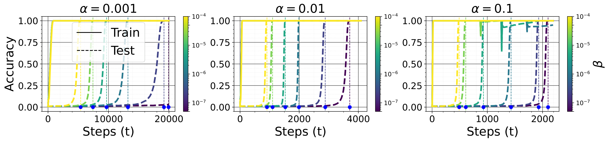

###### fig-2

*Рисунок 2: Точность на обучении и на тесте у MLP, обученного остаточному сложению со сглаживанием $\ell_{*}$ при разных значениях скорости обучения $\alpha$ и силы сглаживания $\ell_{*}$, равной $\beta$. С ростом $\alpha$ задержка обобщения убывает.* **[p. 2]**

### 2.1 Побуждающий опыт

Рассмотрим двуместное математическое действие $\circ$ на $\mathcal{S}=\mathbb{Z}/p\mathbb{Z}$ при некотором простом $p$. **[p. 3]** Мы хотим предсказать $y^{*}(\mathbf{x})=x_{1}\circ x_{2}$ по $\mathbf{x}=(x_{1},x_{2})\in\mathcal{S}^{2}$. Набор данных $\mathcal{D}=\{(\mathbf{x},y^{*}(\mathbf{x}))\ |\ \mathbf{x}\in\mathcal{S}^{2}\}$ случайно разбивается на два непересекающихся непустых множества $\mathcal{D}_{\text{train}}$ и $\mathcal{D}_{\text{val}}$ — обучающий и проверочный наборы соответственно. Возьмём в качестве модели многослойный перцептрон (MLP), логиты которого задаются как $\mathbf{y}(\mathbf{x})=\mathbf{b}^{(2)}+\mathbf{W}^{(2)}\phi\left(\mathbf{b}^{(1)}+\mathbf{W}^{(1)}\left(\mathbf{E}_{\langle x_{1}\rangle}\circ\mathbf{E}_{\langle x_{2}\rangle}\right)\right)$, где $\langle x\rangle$ означает указатель лексемы, отвечающей $x\in\mathcal{S}$, а $\phi(z)=\max(z,0)$ есть функция возбуждения. $\mathbf{E}\in\mathbb{R}^{p\times d_{1}}$ есть матрица вложений для всех знаков из $\mathcal{S}$. Обучаемые значения суть $\mathbf{E}$, $\mathbf{W}^{(1)}\in\mathbb{R}^{d_{2}\times d_{1}}$, $\mathbf{b}^{(1)}\in\mathbb{R}^{d_{2}}$, $\mathbf{W}^{(2)}\in\mathbb{R}^{p\times d_{2}}$ и $\mathbf{b}^{(2)}\in\mathbb{R}^{p}$. Мы обучаем эту модель сложению по остатку $p=97$ при $r_{\text{train}}:=|\mathcal{D}_{\text{train}}|/|\mathcal{D}|=40\%$.

###### p3-1

На рисунке 1 (*сверху*) видно, что $\ell_{1}$ и $\ell_{*}$ действуют на гроккинг так же, как $\ell_{2}$. Для всех этих приёмов сглаживания чем меньше $\alpha\beta$, тем длиннее задержка между запоминанием и обобщением. Рисунок 1 (*снизу*) показывает также, что при отсутствии *ослабления весов* норма $\ell_{2}$ значений модели немонотонна после запоминания и даже растёт, не вредя качеству обобщения.

### 2.2 Теоретические соображения

###### p3-2

Теперь мы дадим высокоуровневые теоретические соображения о том, как ход сглаженного градиентного спуска способен вызвать гроккинг. Пусть $g:\mathbb{R}^{p}\to[0,\infty)$ есть дифференцируемая функция, $h:\mathbb{R}^{p}\to[0,\infty)$ — субдифференцируемая функция и $\beta>0$. Обыкновенно $g$ есть функция потерь избыточно параметризованной нейронной сети на обучающих данных, а $h$ служит сглаживателем. Наша цель — наименьшить составную цель $f:=g+\beta h$ субградиентным спуском со скоростью обучения $\alpha>0$. Правило обновления для этой задачи таково:

$$
\mathbf{x}^{(t+1)}=\mathbf{x}^{(t)}-\alpha\left(G(\mathbf{x}^{(t)})+\beta H(\mathbf{x}^{(t)})\right)\ \forall t\geq 0 \tag{1}
$$

где $G(\mathbf{x})=\nabla g(\mathbf{x})$ есть градиент $g$ в точке $\mathbf{x}$, а $H(\mathbf{x})\in\partial h(\mathbf{x})$ — любой субградиент $h$ в точке $\mathbf{x}$. Положим $f^{*}:=\inf_{\mathbf{x}\in\mathbb{R}^{p}}f(\mathbf{x})$ и $\Theta_{f}:=\operatorname*{arg\,min}_{\mathbf{x}\in\mathbb{R}^{p}}f(\mathbf{x})\subset\mathbb{R}^{p}$. Схожим образом определим $g^{*}$ и $\Theta_{g}$ и без потери общности положим $g^{*}=0$. Наконец, положим $h_{g}^{*}:=\inf_{\mathbf{x}\in\Theta_{g}}h(\mathbf{x})$ и $\operatorname{dist}(\mathbf{x},\Theta_{f}):=\inf_{\mathbf{y}\in\Theta_{f}}\|\mathbf{x}-\mathbf{y}\|_{2}$. Наглядно ход обучения при определённых условиях на $\alpha$ и $\beta$ распадается на две поры. Приближения $\mathbf{x}^{(t)}$ сперва движутся к решению вблизи начального приближения $\mathbf{x}^{(0)}$, наименьшающему $g$ (скажем, к ядровому решению, отвечающему $g$). Позже при обучении влияние $H(\mathbf{x})$ начинает преобладать в обновлении, приводя к $h(\mathbf{x}^{(t)})\approx h_{g}^{*}$ и $f(\mathbf{x}^{(t)})\approx f^{*}$ за добавочные $\Theta(1/\alpha\beta)$ шагов обучения.

Мы определяем постоянную Чаттерджи—Лоясевича (CL) для $g$ в точке $\mathbf{x}\in\mathbb{R}^{p}$ с радиусом $r>0$ так (Chatterjee, 2022):

$$
\chi(g,\mathbf{x},r):=\inf_{\mathbf{y}\in B(\mathbf{x},r),g(\mathbf{y})\neq 0}\|\nabla g(\mathbf{y})\|_{2}^{2}/g(\mathbf{y}) \tag{2}
$$

###### p3-5

где $B(\mathbf{x},r):=\left\{\mathbf{y}\in\mathbb{R}^{p}\mid\|\mathbf{x}-\mathbf{y}\|_{2}\leq r\right\}$. Говорят, что функция $g$ удовлетворяет $r$-CL-неравенству в точке $\mathbf{x}$, или является $r$-CL в $\mathbf{x}$, тогда и только тогда, когда $4g(\mathbf{x})<r^{2}\chi(g,\mathbf{x},r)$. Неравенство CL есть усиление обычного неравенства Поляка—Лоясевича (PL) (Chatterjee, 2022), о котором показано, что оно выполняется для широких избыточно параметризованных нейронных сетей в окрестности их начального приближения (Liu et al., 2021). Достоинство здесь в том, что нам потребуется выполнение неравенства CL лишь в точке начального приближения, в отличие от итога при PL, требующего выполнения неравенства PL на всей области определения (Karimi et al., 2020).

##### **Теорема 2.1****.**

###### p3-6

*Возьмите любое $\mathbf{x}^{(0)}\in\mathbb{R}^{p}$ с $g(\mathbf{x}^{(0)})\neq 0$. Пусть $g$ есть $r$-CL в $\mathbf{x}^{(0)}$ при некотором $r>0$, то есть $4g(\mathbf{x})<r^{2}\chi(g,\mathbf{x},r)$. Существуют $\beta_{\max}>0$, $\alpha_{\max}>0$ и две постоянные $C,C^{\prime}>0$ такие, что для всех $\alpha\in(0,\alpha_{\max})$ и $\beta\in(0,\beta_{\max})$ при обновлении субградиентным спуском (1) с $\alpha$ и $\beta$, начиная с $\mathbf{x}^{(0)}$, выполнено следующее:*

- *Для любого*$\epsilon_{g}=\Omega(\beta^{C})$*существует шаг*$t_{1}\geq\max\left\{0,-\log\left(\epsilon_{g}/g(\mathbf{x}^{(0)})\right)/\Theta(\alpha)\right\}$*такой, что*$g(\mathbf{x}^{(t_{1})})\leq\epsilon_{g}$*и*$\{\mathbf{x}^{(t)}\}_{0\leq t\leq t_{1}}\subset B(\mathbf{x}^{(0)},r)$*.*
- *Для любого*$\eta>0$*,*$\min_{t_{1}\leq t\leq t_{2}}\left(f(\mathbf{x}^{(t)})-f^{*}\right)\leq 0.5\left(\eta+C^{\prime}\alpha\beta\right)\beta$*тогда и только тогда, когда*$t_{2}>t_{1}+\Delta t(\eta,t_{1})$*, где*$\Delta t(\eta,t_{1}):=\frac{\operatorname{dist}^{2}(\mathbf{x}^{(t_{1})},\Theta_{f})}{\alpha\beta\eta}$*. Более того, в предположении*$\Theta_{f}\cap\Theta_{g}\neq\emptyset$*,*$\min_{t_{1}\leq t\leq t_{2}}\left(h(\mathbf{x}^{(t)})-h_{g}^{*}\right)=0.5\left(\eta+C^{\prime}\alpha\beta\right)$*тогда и только тогда, когда*$t_{2}>t_{1}+\Delta t(\eta,t_{1})$*.*

##### Набросок доказательства.

Мы показываем, что покуда $\beta\|H(\mathbf{x}^{(k)})\|_{2}\leq\|G(\mathbf{x}^{(k)})\|_{2}\quad\forall\ 0\leq k<t$ при некотором $t\geq 1$, выполнено следующее: $\mathbf{x}^{(k)}\in B(\mathbf{x}^{(0)},r)$, $g(\mathbf{x}^{(k)})\leq(1-\delta)^{k}g(\mathbf{x}^{(0)})$ и $\|\nabla g(\mathbf{x}^{(k)})\|_{2}^{2}\leq 2Lg(\mathbf{x}^{(k)})\text{ for all }0\leq k\leq t$ при некоторых $\delta\in(0,1)$ и $L>0$. Отсюда для заданной точности $\epsilon_{g}$ мы можем подобрать настройки так, чтобы $g$ достигла желаемой точности прежде, чем $\beta\|H(\cdot)\|_{2}\gg\|G(\cdot)\|_{2}$. Затем мы ограничиваем $h(\mathbf{x}^{(t)})-h_{g}^{*}$ и $f(\mathbf{x}^{(t)})-f^{*}$ величинами, зависящими от $t$, $\alpha$, $\beta$. Пользуясь этими оценками, мы извлекаем $\Delta t$, обеспечивающее желаемую точность $\eta$ по $f(\mathbf{x}^{(t)})-f^{*}$. Более строгий вид этой теоремы и соответствующее доказательство даны в разделе C.1 приложения. ∎

Теорема 2.1 высвечивает раздвоение между запоминанием и сглаживанием и строго описывает двупоровый ход обучения в предположении CL для функции потерь $g$ в точке начального приближения. Первая пора, описанная в первом пункте теоремы, показывает, что при достаточно малой силе сглаживания $\beta$ приближения $\mathbf{x}^{(t)}$ остаются близ начального приближения и быстро наименьшают $g$, так что $g(\mathbf{x}^{(t_{1})})\leq\epsilon_{g}$. Это отвечает запоминанию обучающих данных: модель приближает потерю $g$, оставаясь в той местной области, где сглаживание не преобладает. При слишком большом $\beta$ мы можем никогда не наименьшить $g$, отсюда и нижняя оценка $\beta^{C}$ на $\epsilon_{g}$, обращающаяся в ноль при $\beta\rightarrow 0$.

**[p. 4]**

###### p4-1

Во второй поре, схваченной вторым пунктом, когда $g$ и её градиент уже малы, слагаемое сглаживания $\beta h(\mathbf{x})$ постепенно ведёт приближения к малым значениям $h$, покуда не будет достигнуто $h(\mathbf{x}^{(t)})\approx h_{g}^{*}$ и $f(\mathbf{x}^{(t)})\approx f^{*}$ за $\Theta(1/\alpha\beta)$ добавочных шагов. Если эта поздняя склонность, наводимая $h$, согласована с обобщением, то время гроккинга соразмерно $1/\alpha\beta$ (см. рисунок 2). Это наблюдение согласно с прежними находками для $h(\mathbf{x})=\|\mathbf{x}\|_{2}^{2}$, где время гроккинга растёт как $1/\beta$ (Lyu et al., 2023). Скорость обучения $\alpha$ в том итоге не появляется, ибо Lyu et al. (2023) разбирают непрерывный по времени градиентный поток.

Мы также устанавливаем, что при некоторых предположениях о $h$ и $g$, если $g$ есть $r$-CL в $\mathbf{x}\in\mathbb{R}^{p}$, то для всех $\varepsilon\in(0,1)$ существует $\beta_{\max}=\beta_{\max}(\varepsilon,\mathbf{x},r)>0$ такое, что для всех $\beta<\beta_{\max}$ функция $f=g+\beta h$ также есть $\varepsilon r$-CL в $\mathbf{x}$, то есть $4f(\mathbf{x})<\varepsilon^{2}r^{2}\cdot\chi(f,\mathbf{x},\varepsilon r)$. Как следствие, первый пункт теоремы 2.1 применим к $f-f^{*}$ при $\beta\leq\beta_{\max}$. Точнее, мы имеем $\mathbf{x}^{(t)}\in B(\mathbf{x}^{(0)},\varepsilon r)$ для всех $t$, и при $t\rightarrow\infty$ приближение $\mathbf{x}^{(t)}$ сходится к точке $\mathbf{x}^{*}\in B(\mathbf{x}^{(0)},\varepsilon r)$, где $f(\mathbf{x}^{*})=f^{*}$. Более того, для каждого $t\geq 0$ выполнено $\|\mathbf{x}^{(t)}-\mathbf{x}^{*}\|_{2}^{2}\leq(1-\delta)^{t}\varepsilon^{2}r^{2}$ и $f(\mathbf{x}^{(t)})-f^{*}\leq(1-\delta)^{t}\left(f(\mathbf{x}^{(0)})-f^{*}\right)$ при $\delta=\min\{1,\Theta\left(\chi(f,\mathbf{x}^{(0)},\varepsilon r)\cdot\alpha\right)\}$. Доказательство этого можно найти в разделе C.3 приложения. Итог требовал, чтобы $\forall\mathbf{x}\in\mathbb{R}^{p},0\in\partial h(\mathbf{x})\Longrightarrow h(\mathbf{x})=0$. Функция $h:\mathbb{R}^{p}\to\mathbb{R}$ удовлетворяет этому, если, скажем, она выпукла и существует $\mathbf{x}^{*}\in\mathbb{R}^{p}$ такое, что $h(\mathbf{x}^{*})=\inf_{\mathbf{x}}h(\mathbf{x})>-\infty$. Таковы нормы $\ell_{1/2/*}$.

## 3 За пределами ослабления весов

###### p4-3

В этом разделе мы приведём примеры, в которых поздняя склонность, связанная с обобщением, движима не $\ell_{2}$, а именно: восстановление разрежённых векторов и малоранговое разложение матриц. И впрямь, мы увидим, что применение одного лишь ослабления весов вызывает резкий переход в ошибке обобщения, как и предсказано прежними работами, но этот переход обобщению не отвечает. Мы также покажем, что при закреплённом объёме обучающих данных глубина применяемой модели или подходящий выбор обучающих примеров способны заметно уменьшить задержку гроккинга.

Рассмотрим действие $\mathcal{F}_{\mathbf{a}}(\mathbf{M})=\mathbf{M}\mathbf{a}\in\mathbb{R}^{N}$, которое берёт $N$ измерительных векторов $\{\mathbf{M}_{i}\in\mathbb{R}^{n}\}_{i}$ и возвращает измерения $\{\mathbf{M}_{i}^{\top}\mathbf{a}\}_{i}$ вектора $\mathbf{a}\in\mathbb{R}^{n}$. Для матрицы $\mathbf{A}\in\mathbb{R}^{m\times n}$ действие $\operatorname{vec}(\mathbf{A})\in\mathbb{R}^{mn}$ складывает столбцы $\mathbf{A}$ в вектор; $\sigma_{\max/\min/i}(\mathbf{A})$ есть наибольшее, наименьшее и $i^{\text{th}}$ сингулярное значение $\mathbf{A}$; $\|\mathbf{A}\|_{*}:=\sum_{i}\sigma_{i}(\mathbf{A})$ и $\|\mathbf{A}\|_{2\rightarrow 2}:=\sigma_{\max}(\mathbf{A})$.

### 3.1 Восстановление разрежённых векторов

###### p4-5

Рассмотрим разрежённый вектор $\mathbf{a}^{*}\in\mathbb{R}^{n}$, то есть $s=\|\mathbf{a}^{*}\|_{0}\ll n$, где $\|\mathbf{a}^{*}\|_{0}$ есть число ненулевых составляющих $\mathbf{a}^{*}$. По данному $\mathbf{y}^{*}=\mathbf{X}\mathbf{a}^{*}+\boldsymbol{\xi}$ с матрицей плана $\mathbf{X}\in\mathbb{R}^{N\times n}$ и вектором шума $\boldsymbol{\xi}\in\mathbb{R}^{N}$ мы хотим наименьшить $f(\mathbf{a})=g(\mathbf{a})+\beta h(\mathbf{a})$ градиентным спуском со скоростью обучения $\alpha>0$, где $\mathbf{g}(\mathbf{a})=\frac{1}{2}\|\mathbf{X}\mathbf{a}-\mathbf{y}^{*}\|_{2}^{2}$ и $h(\mathbf{a})=\|\mathbf{a}\|_{1}$. Как и в теореме 2.1, обновление $\mathbf{a}^{(t)}$ сперва движется к решению наименьших квадратов $\hat{\mathbf{a}}:=\left(\mathbf{X}^{\top}\mathbf{X}\right)^{{\dagger}}\mathbf{X}^{\top}\mathbf{y}^{*}$, что даёт запоминание, причём $g(\hat{\mathbf{a}})\leq\frac{1}{2}\|\boldsymbol{\xi}\|_{2}^{2}$. Позже при обучении $\partial h(\mathbf{a})$ начинает преобладать в обновлении, что даёт $\|\mathbf{a}^{(t)}\|_{1}-\|\mathbf{a}^{*}\|_{1}=\mathcal{O}(\alpha\beta)$ примерно за $1/(\alpha\beta)$ добавочных шагов обучения. Когда $\alpha\beta$ мало, это даёт нетривиальную задержку между запоминанием и обобщением, то есть гроккинг.

##### **Теорема 3.1****.**

###### p4-6

*Пусть скорость обучения, коэффициент сглаживания и слагаемое шума удовлетворяют $0<\alpha\sigma_{\max}(\mathbf{X}^{\top}\mathbf{X})<2$, $0<\beta\sqrt{n}<\sigma_{\max}(\mathbf{X}^{\top}\mathbf{X})$ и $\|\mathbf{X}^{\top}\boldsymbol{\xi}\|_{2}\leq\sqrt{C\alpha}\beta$, $C>0$. Положим $\rho_{2}:=\sigma_{\max}\left(\mathbb{I}_{n}-\alpha\mathbf{X}^{\top}\mathbf{X}\right)$. Существуют $t_{1}<\infty$ и $C^{\prime}>0$ такие, что $\|\mathbf{a}^{(t)}-\hat{}\mathbf{a}\|_{2}\leq\frac{2\alpha\beta n^{1/2}}{1-\rho_{2}}\ \forall t\geq t_{1}$, и $\min_{t_{1}\leq t\leq t_{2}}\left(\|\mathbf{a}^{(t)}\|_{1}-\|\mathbf{a}^{*}\|_{1}\right)\leq\frac{\eta+(C+C^{\prime})\alpha\beta}{2}\Longleftrightarrow t_{2}\geq t_{1}+\Delta t(\eta,t_{1})$, $\Delta t(\eta,t_{1}):=\frac{\|\mathbf{a}^{(t_{1})}-\mathbf{a}^{*}\|_{2}^{2}}{\alpha\beta\eta}$, для любого $\eta>0$.*

##### Доказательство.

См. доказательство в разделе C.4 приложения. ∎

Теперь поясним, отчего $\mathbf{X}\mathbf{a}^{(t)}=\mathbf{y}^{*}$ (запоминание) и $\|\mathbf{a}^{(t)}\|_{1}=\|\mathbf{a}^{*}\|_{1}$ довольно, чтобы заключить $\mathbf{a}^{(t)}=\mathbf{a}^{*}$ (обобщение), когда $N$ достаточно велико, при особом разряде матриц плана $\mathbf{X}$, расхожем на деле (Foucart & Rauhut, 2013). Для этого рассмотрим задачу в более общем виде, когда у нас есть измерительная матрица $\mathbf{M}\in\mathbb{R}^{N\times n}$ и список зашумлённых измерений $\mathbf{y}^{*}=\mathcal{F}_{\mathbf{b}^{*}}(\mathbf{M})+\boldsymbol{\xi}\in\mathbb{R}^{N}$ неизвестного сигнала $\mathbf{b}^{*}\in\mathbb{R}^{n}$, полагаемого разрежённым в известном базисе $\Phi\in\mathbb{R}^{n\times n}$, то есть $\mathbf{b}^{*}=\sum_{i=1}^{n}\mathbf{a}^{*}_{i}\Phi_{:,i}=\Phi\mathbf{a}^{*}$ с $\|\mathbf{a}^{*}\|_{0}\ll n$. Цель — найти $\mathbf{a}^{*}$, наименьшая $\|\mathbf{a}\|_{0}$ при условии $\|\mathcal{F}_{\Phi\mathbf{a}}(\mathbf{M})-\mathbf{y}^{*}\|_{2}\leq\epsilon$, где $\epsilon$ есть верхняя оценка величины ошибки $\boldsymbol{\xi}$, $\|\boldsymbol{\xi}\|_{2}\leq\epsilon$. Поскольку это NP-трудно (Natarajan, 1995; Donoho, 2006a), $\|\mathbf{a}\|_{0}$ часто ослабляют до её теснейшего выпуклого ослабления $\|\mathbf{a}\|_{1}$ (Foucart & Rauhut, 2013; Chandrasekaran et al., 2012), что даёт выпуклую задачу наименьшения $\|\mathbf{a}\|_{1}\text{ subject to }\|\mathbf{X}\mathbf{a}-\mathbf{y}^{*}\|_{2}\leq\epsilon$ при $\mathbf{X}=\mathbf{M}\Phi$. Это равносильно приведённой выше задаче наименьшения $f(\mathbf{a})$ при подходящем выборе $\beta$ (Rockafellar, 1970; Boyd & Vandenberghe, 2004; Candes et al., 2006).

Тогда как обычное восстановление разрежённых векторов полагает истинный сигнал в точности разрежённым, а измерения — свободными от шума, на деле принято устраивать измерительную матрицу $\mathbf{M}$ ради устойчивого и стойкого восстановления. Устойчивость означает способность приёма восстановления получить приближение $\mathbf{a}$ сигнала $\mathbf{a}^{*}$, чья мощность сосредоточена на немногих составляющих (то есть приближённо разрежённого), с ошибкой восстановления, управляемой изъяном разрежённости $\inf_{\|\mathbf{a}\|_{0}\leq s}\|\mathbf{a}^{*}-\mathbf{a}\|$ — расстоянием от $\mathbf{a}^{*}$ до множества в точности $s$-разрежённых векторов. Стойкость же означает, что восстановление невосприимчиво к шуму измерений, то есть малые возмущения наблюдаемых измерений $\mathbf{y}^{*}=\mathcal{F}_{\mathbf{b}^{*}}(\mathbf{M})+\boldsymbol{\xi}$ дают **[p. 5]** малые отклонения восстановленного сигнала $\mathbf{a}$, причём ошибка растёт вместе с уровнем шума $\epsilon\geq\|\boldsymbol{\xi}\|_{2}$.

##### **Определение 3.2**(стойкое свойство нулевого пространства)**.**

Говорят, что матрица $\mathbf{A}\in\mathbb{R}^{m\times n}$ обладает стойким свойством нулевого пространства с постоянной $\rho\in(0,1)$ и $\tau>0$ относительно множества $S\subset[n]$, если $\|\mathbf{u}_{S}\|_{1}<\rho\|\mathbf{u}_{[n]\backslash S}\|_{1}+\tau\|\mathbf{A}\mathbf{u}\|_{2}$ для всех $\mathbf{u}\in\mathbb{R}^{n}$, где $\mathbf{u}_{S}=[\mathbf{u}_{i}]_{i\in S}\in\mathbb{R}^{|S|}$. Говорят, что она обладает стойким свойством нулевого пространства порядка $s\in\mathbb{N}^{*}$, если она обладает им относительно любого множества $S\subset[n]$ с $|S|\leq s$.

##### **Теорема 3.3****.**

*Пусть матрица $\mathbf{X}\in\mathbb{R}^{N\times n}$ обладает стойким свойством нулевого пространства с постоянной $\rho\in(0,1)$ и $\tau>0$ относительно носителя $\mathbf{a}^{*}$. Тогда при тех же условиях на $\alpha$, $\beta$ и $\boldsymbol{\xi}$, что и в теореме 3.1, существуют $C_{1},C_{2},C_{3}>0$ такие, что $\min_{t_{1}\leq t\leq t_{2}}\|\mathbf{a}^{(t)}-\mathbf{a}^{*}\|_{1}\leq C_{1}\eta+C_{2}\alpha\beta+C_{3}\|\boldsymbol{\xi}\|_{2}$ тогда и только тогда, когда $t_{2}\geq t_{1}+\Delta t(\eta,t_{1})\ \forall\eta>0$.*

##### Доказательство.

Доказательство в разделе C.5 приложения. ∎

Стоит заметить, что нам следовало бы вместо этого измерять обучающую ошибку $\frac{1}{2}\sum_{i=1}^{N}\left(y(\mathbf{X}_{i})-y^{*}(\mathbf{X}_{i})\right)^{2}=g(\mathbf{a})$ и ошибку обобщения $\mathcal{E}(\mathbf{a})=\mathbb{E}_{\mathbf{x},\varepsilon}\left(y(\mathbf{x})-y_{\varepsilon}^{*}(\mathbf{x})\right)^{2}$, как принято при разговоре о гроккинге, где в нашем случае $y(\mathbf{x})=\mathbf{x}^{\top}\mathbf{a}$ и $y_{\varepsilon}^{*}(\mathbf{x})=\mathbf{x}^{\top}\mathbf{a}^{*}+\varepsilon$. Полагая $\mathbb{E}\varepsilon=0$ и обозначая $\Sigma=\mathbb{E}[\mathbf{x}\mathbf{x}^{\top}]$, получаем $\mathcal{E}(\mathbf{a})=\left(\mathbf{a}-\mathbf{a}^{*}\right)^{\top}\Sigma\left(\mathbf{a}-\mathbf{a}^{*}\right)+\mathbb{E}\varepsilon^{2}$. Случайные матрицы с независимыми записями, прежде всего гауссовы и бернуллиевы, дают наименьшую постоянную ограниченной изометрии и потому лучшее восстановление разрежённых векторов (Rauhut, 2010). При этом допущении о независимости и одинаковом распределении мы имеем $\Sigma=\sigma^{2}\mathbf{I}_{n}$ при некотором $\sigma>0$, откуда $\mathcal{E}(\mathbf{a})=\sigma^{2}\|\mathbf{a}-\mathbf{a}^{*}\|_{2}^{2}+\mathbb{E}\varepsilon^{2}$. Стало быть, $\|\mathbf{a}-\mathbf{a}^{*}\|_{2}^{2}$ хорошо передаёт понятие ошибки на тесте (или на проверке), обычно применяемое при разговоре о гроккинге, а $\mathbb{E}\varepsilon^{2}$ передаёт неустранимую её часть.

#### Запоминание

Когда начальное приближение $\mathbf{a}^{(1)}$ близко к $\hat{\mathbf{a}}$, на запоминание уходит меньше времени, ибо $t_{1}$ убывает вместе с $\|\mathbf{a}^{(1)}-\hat{\mathbf{a}}\|_{\infty}$. Другой способ уменьшить слагаемое $\frac{\alpha\beta}{1-\rho_{2}}$ и обеспечить безупречное запоминание раньше — уменьшить $\beta$. Но это увеличивает задержку обобщения $\Delta t$. Малое отношение сигнала к шуму $\|\mathbf{a}^{*}\|_{2}^{2}/\mathbb{E}\|\boldsymbol{\xi}\|_{2}^{2}$ и чрезмерное сглаживание (большое $\beta$) также затрудняют безупречное запоминание.

#### Обобщение

После запоминания, когда $\|\mathbf{a}^{(t)}\|_{1}-\|\mathbf{a}^{*}\|_{1}$ становится слишком малым, мы имеем $\|\mathbf{a}^{(t)}-\mathbf{a}^{*}\|_{1}\approx 0$ (рисунок 3), ибо для исследуемой задачи разрежённое решение $\mathbf{a}^{*}$ есть решение наименьшей нормы $\ell_{1}$ для $\|\mathbf{X}\mathbf{a}-\mathbf{y}^{*}\|_{2}\leq\epsilon$ при условии разрежённости $s=\|\mathbf{a}^{*}\|_{0}\ll n$ и некоторых допущениях о $\mathbf{X}$ (как показано выше). Добавочное число шагов, потребное, чтобы достичь этого решения наименьшей нормы $\ell_{1}$, обратно соразмерно $\alpha\beta$, так что чем меньше $\alpha\beta$, тем дольше восстанавливается $\mathbf{a}^{*}$ (гроккинг) и тем меньше ошибка $\|\mathbf{a}^{(t)}-\mathbf{a}^{*}\|_{1}$ при $t\rightarrow\infty$ (рисунок 4).

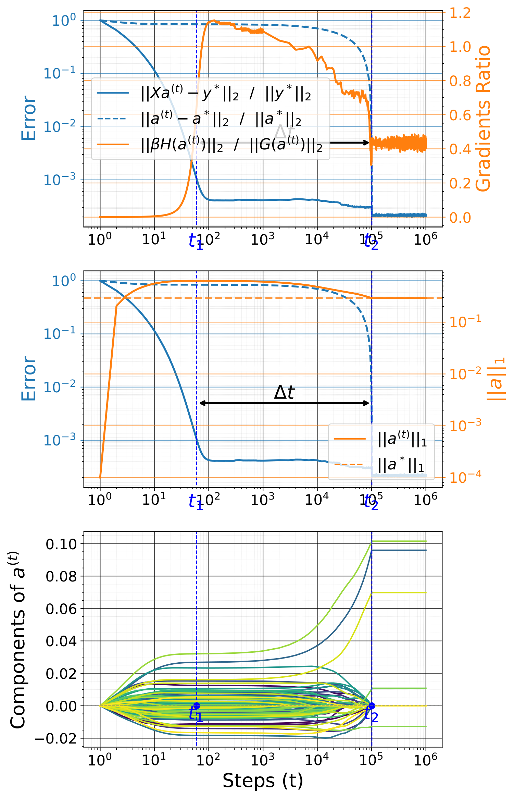

###### fig-3

*Рисунок 3: Относительные ошибки, отношение градиентов, норма $\|\mathbf{a}^{(t)}\|_{1}$ и составляющие $\mathbf{a}^{(t)}$ как функции $t$. Величина $G(\mathbf{a}^{(t)})$ преобладает над $\beta H(\mathbf{a}^{(t)})$ вплоть до запоминания при $t_{1}$, где $g(\mathbf{a}^{(t_{1})})\approx 0$. С момента запоминания преобладает $\beta H(\mathbf{a}^{(t)})$ и приводит $\|\mathbf{a}^{(t)}\|_{1}$ к $\|\mathbf{a}^{*}\|_{1}$ при $t_{2}=t_{1}+\Delta t$, откуда $\mathbf{a}^{(t_{2})}=\mathbf{a}^{*}$.* **[p. 5]**


###### fig-4

*Рисунок 4: Шаг обобщения $t_{2}$ (наименьшее $t$ такое, что $\|\mathbf{a}^{(t)}-\mathbf{a}^{*}\|_{2}/\|\mathbf{a}^{*}\|_{2}\leq 10^{-4}$) и ошибка восстановления $\|\mathbf{a}^{(t_{2})}-\mathbf{a}^{*}\|_{1}$ как функции $\alpha\beta$. Видно, что $t_{2}\propto\|\hat{\mathbf{a}}-\mathbf{a}^{*}\|_{\infty}/\alpha\beta$ и $\|\mathbf{a}^{(t_{2})}-\mathbf{a}^{*}\|_{1}\propto\alpha\beta$, то есть при малом $\alpha\beta$ сходимость дольше, но ошибка обобщения ниже.* **[p. 6]**

#### Проверочные опыты

При $(n,s,N,\alpha,\beta)=(10^{2},5,30,10^{-1},10^{-5})$ мы наблюдаем картину, подобную гроккингу: обучающая ошибка $\|\mathbf{X}\mathbf{a}^{(t)}-\mathbf{y}^{*}\|_{2}$ сперва убывает до $10^{-6}$, а затем, после долгого обучения, убывает ошибка восстановления $\|\mathbf{a}^{(t)}-\mathbf{a}^{*}\|_{2}$ и сравнивается с обучающей (рисунок 3). Обобщение проистекает из взаимодействия уровня разрежённости $s=\|\mathbf{a}^{*}\|_{0}$, числа измерений $N$, силы сглаживания $\ell_{1}$, равной $\beta$, и скорости обучения $\alpha$. Малому $s$ требуется малое $N$ для обобщения. Обобщение случается главным образом при малом (но ненулевом) $\beta$ (рисунок 4). Большое $\beta$ заставляет ошибку восстановления рано выйти на невыгодное ровное значение (что даёт полное запоминание) или колебаться (что не даёт и запоминания). Малые же значения требуют более долгого обучения, чтобы выйти на ровное значение, и обыкновенно дают при этом меньшую ошибку восстановления (гроккинг). Больше опытов мы привели в разделе H.1 приложения.

#### Иной итерационный приём наименьшения $\ell_{1}$

Приведённые выше итоги верны и для проекционного субградиентного приёма, чьё обновление записывается как $\mathbf{a}^{(t+1)}=\Pi\left(\mathbf{a}^{(t)}-\alpha\beta H(\mathbf{a}^{(t)})\right)$, где $\Pi$ **[p. 6]** есть проекция на множество $\{\mathbf{a}\mid\mathbf{X}\mathbf{a}=\mathbf{y}^{*}\}$; и для проксимального градиентного спуска, чьё обновление записывается как $\mathbf{a}^{(t+1)}=S_{\alpha\beta}\left(\mathbf{a}^{(t)}-\alpha G(\mathbf{a}^{(t)})\right)$, где $S_{\gamma}(\mathbf{a})=\operatorname{sign}(\mathbf{a})\odot\max(|\mathbf{a}|-\gamma,0)$ есть действие мягкого порога. Заметим раздвоение между этими двумя приёмами. Каждый берёт одно из слагаемых $f(\mathbf{a})$ как наименьшаемую цель, а другое — как ограничение. После каждого шага градиентного спуска по градиенту цели приближение проецируется на допустимое множество ограничения. И всё же все они являют поведение гроккинга (подробнее в разделе D.1 приложения). Проекционному субградиенту довольно одного шага обучения, чтобы получить нулевую обучающую ошибку. Это ещё раз показывает, что обобщение здесь движимо прежде всего $h$.

### 3.2 Разложение матриц

В этом разделе мы изучаем гроккинг для разложения матриц и расширяем итоги предыдущего раздела о восстановлении разрежённых векторов. По данной малоранговой матрице $\mathbf{A}^{*}\in\mathbb{R}^{n_{1}\times n_{2}}$ ранга $r$ и измерительной матрице $\mathbf{X}\in\mathbb{R}^{N\times n_{1}n_{2}}$ мы стремимся наименьшить $\operatorname*{rank}(\mathbf{A})\text{ s.t. }\|\mathcal{F}_{\mathbf{a}}\left(\mathbf{X}\right)-\mathbf{y}^{*}\|_{2}\leq\epsilon$ для $\mathbf{A}\in\mathbb{R}^{n_{1}\times n_{2}}$ и $\mathbf{a}=\operatorname{vec}(\mathbf{A})\in\mathbb{R}^{n_{1}n_{2}}$, где $\mathbf{y}^{*}=\mathcal{F}_{\operatorname{vec}(\mathbf{A}^{*})}\left(\mathbf{X}\right)+\boldsymbol{\xi}$ суть измерения, а $\boldsymbol{\xi}\in\mathbb{R}^{N}$ — слагаемое ошибки с $\|\boldsymbol{\xi}\|_{2}\leq\epsilon$. Это NP-трудно (Vandenberghe & Boyd, 1996; Fazel et al., 2004). Обычный выпуклый подход к разложению матриц — $\text{ minimize }\|\mathbf{A}\|_{*}\text{ s.t. }\|\mathcal{F}_{\mathbf{a}}\left(\mathbf{X}\right)-\mathbf{y}^{*}\|_{2}\leq\epsilon$, ибо следовая норма есть теснейшее выпуклое ослабление ранга (Fazel et al., 2001; Recht et al., 2010; Candes & Recht, 2012).

Положим $n=n_{1}n_{2}$ и пусть $\mathbf{A}^{*}=\mathbf{U}^{*}\Sigma^{*}\mathbf{V}^{*\top}$ есть полное сингулярное разложение $\mathbf{A}^{*}$. Мы имеем дело с задачей сжимающих измерений с вектором сигнала $\mathbf{a}^{*}=\operatorname{vec}(\mathbf{A}^{*})=\Phi\operatorname{vec}(\Sigma^{*})$, где $\operatorname{vec}(\Sigma^{*})\in\mathbb{R}^{n}$ разрежён, ибо $\|\Sigma^{*}\|_{0}=r\leq\min(n_{1},n_{2})\ll n$, а $\Phi=\mathbf{V}^{*}\otimes\mathbf{U}^{*}\in\mathbb{R}^{n\times n}$ (произведение Кронекера) имеет ортонормированные столбцы, ибо $\Phi^{\top}\Phi=\left(\mathbf{V}^{*\top}\mathbf{V}^{*}\right)\otimes\left(\mathbf{U}^{*\top}\mathbf{U}^{*}\right)=\mathbb{I}_{n}$. Эта рамка охватывает несколько задач разложения матриц. Измерение матриц ищет матрицу $\mathbf{A}^{*}$ по $N$ измерительным матрицам $\{\mathbf{X}_{i}\in\mathbb{R}^{n_{1}\times n_{2}}\}_{i\in[N]}$ и измерениям $\mathbf{y}^{*}=\left(\operatorname{tr}(\mathbf{X}_{i}^{\top}\mathbf{A}^{*})\right)_{i\in[N]}$. В этом случае $\mathbf{X}=[\operatorname{vec}(\mathbf{X}_{i})]_{i\in[N]}\in\mathbb{R}^{N\times n}$, ибо $\mathbf{y}^{*}_{i}=\mathcal{F}_{\mathbf{a}^{*}}(\operatorname{vec}(\mathbf{X}_{i}))$. Для задачи восполнения матрицы у нас есть $N$ измерительных векторов222 При обычном восполнении матрицы каждый $\mathbf{X}^{(1)}_{i}$ (соответственно $\mathbf{X}^{(2)}_{i}$) отвечает строке $\ell\in[n_{1}]$ (соответственно столбцу $c\in[n_{2}]$) матрицы $\mathbf{A}^{*}$ (в однобитной записи размерности $n_{1}$ и $n_{2}$ соответственно), что даёт $\mathbf{y}^{*}_{i}=\mathbf{A}^{*}_{\ell c}$. $\left(\mathbf{X}^{(1)}_{i},\mathbf{X}^{(2)}_{i}\right)\in\mathbb{R}^{n_{1}}\times\mathbb{R}^{n_{2}}$ и измерения $\mathbf{y}_{i}^{*}=\mathbf{X}^{(1)\top}_{i}\mathbf{A}^{*}\mathbf{X}^{(2)}_{i}=\mathcal{F}_{\mathbf{a}^{*}}\left(\mathbf{X}^{(2)}_{i}\otimes\mathbf{X}^{(1)}_{i}\right)$, то есть $\mathbf{y}^{*}=\mathcal{F}_{\mathbf{a}^{*}}\left(\mathbf{X}\right)$ при $\mathbf{X}=\mathbf{X}^{(2)}\bullet\mathbf{X}^{(1)}\in\mathbb{R}^{N\times n}$ (построчное произведение Хатри—Рао).

###### p6-3

Теперь мы разберём гроккинг при наименьшении $f(\mathbf{A})=\frac{1}{2}\|\mathbf{X}\operatorname{vec}(\mathbf{A})-\mathbf{y}^{*}\|_{2}^{2}+\beta\|\mathbf{A}\|_{*}$ субградиентным спуском со скоростью обучения $\alpha$. Как и при восстановлении разрежённых векторов, при некоторых условиях на $\alpha$ и $\beta$ ход обучения распадается на две поры: пору запоминания, где обновление $\mathbf{A}^{(t)}$ сперва движется к решению наименьших квадратов $\operatorname{vec}(\hat{\mathbf{A}}):=\left(\mathbf{X}^{\top}\mathbf{X}\right)^{{\dagger}}\mathbf{X}^{\top}\mathbf{y}^{*}$, и пору обобщения, где $\mathbf{A}^{(t)}$ сходится к решению наименьшей нормы $\ell_{*}$.

##### **Теорема 3.4****.**

*Пусть скорость обучения, коэффициент сглаживания и шум удовлетворяют $0<\alpha\sigma_{\max}(\mathbf{X}^{\top}\mathbf{X})<2$, $0<\beta\sqrt{\min(n_{1},n_{2})}<\sigma_{\max}(\mathbf{X}^{\top}\mathbf{X})$ и $\|\mathbf{X}^{\top}\boldsymbol{\xi}\|_{2}\leq\sqrt{C\alpha}\beta$, $C>0$. Положим $\rho_{2}:=\sigma_{\max}\left(\mathbb{I}_{n}-\alpha\mathbf{X}^{\top}\mathbf{X}\right)$. Существуют $t_{1}<\infty$ и $C^{\prime}>0$ такие, что $\|\operatorname{vec}(\mathbf{A}^{(t)}-\hat{}\mathbf{A})\|_{2}\leq\frac{2\alpha\beta n^{1/2}}{1-\rho_{2}}\ \forall t\geq t_{1}$, и $\min_{t_{1}\leq t\leq t_{2}}\left(\|\mathbf{A}^{(t)}\|_{*}-\|\mathbf{A}^{*}\|_{*}\right)=\frac{\eta+(C+C^{\prime})\alpha\beta}{2}\Longleftrightarrow t_{2}\geq t_{1}+\Delta t(\eta,t_{1})$, $\Delta t(\eta,t_{1}):=\frac{\|\mathbf{A}^{(t_{1})}-\mathbf{A}^{*}\|_{\text{F}}^{2}}{\alpha\beta\eta}$, для любого $\eta>0$.*

##### Доказательство.

См. доказательство в разделе C.6 приложения. ∎

При подходящей $\mathbf{X}$ условий $\mathbf{X}\operatorname{vec}(\mathbf{A}^{(t)})=\mathbf{y}^{*}$ (запоминание) и $\|\mathbf{A}^{(t)}\|_{*}=\|\mathbf{A}^{*}\|_{*}$ довольно, чтобы заключить $\mathbf{A}^{(t)}=\mathbf{A}^{*}$.

##### **Теорема 3.5****.**

*Пусть линейное измерительное отображение $\mathcal{F}_{\cdot}(\mathbf{X})$ обладает стойким ранговым свойством нулевого пространства порядка $r$ с постоянными $\rho\in(0,1)$ и $\tau>0$, то есть для всех $\mathbf{A}\in\mathbb{R}^{n_{1}\times n_{2}}$ выполнено $\sum_{\ell=1}^{r}\sigma_{\ell}(\mathbf{A})\leq\rho\sum_{\ell=r+1}^{\min\{n_{1},n_{2}\}}\sigma_{\ell}(\mathbf{A})+\tau\|\mathcal{F}_{\operatorname{vec}(\mathbf{A})}(\mathbf{X})\|_{2}$. Тогда при тех же условиях на $\alpha$, $\beta$ и $\boldsymbol{\xi}$, что и в теореме 3.4, существуют $C_{1},C_{2},C_{3}>0$ такие, что $\min_{t_{1}\leq t\leq t_{2}}\|\mathbf{A}^{(t)}-\mathbf{A}^{*}\|_{*}\leq C_{1}\eta+C_{2}\alpha\beta+C_{3}\|\boldsymbol{\xi}\|_{2}$ тогда и только тогда, когда $t_{2}\geq t_{1}+\Delta t(\eta,t_{1})$, для любого $\eta>0$.*

##### Доказательство.

Раздел C.7 приложения. ∎

Несмотря на сходство этого итога с полученным для восстановления разрежённых векторов, сходство это тривиально лишь в ранних порах обучения. И впрямь, в задачах восстановления разрежённых векторов мы учитываем лишь приближение **[p. 7]** $\mathbf{a}^{(t)}$, тогда как при разложении матриц мы учитываем не только матрицу сингулярных значений $\Sigma^{(t)}$ приближения $\mathbf{A}^{(t)}$, но и его матрицы сингулярных векторов $\mathbf{U}^{(t)}$ (левых) и $\mathbf{V}^{(t)}$ (правых). Мы применили оценку $\sin\Theta$ Ведина (Wedin, 1972), чтобы измерить изменения сингулярных векторов после поры запоминания, и итог показывает, что они меняются не более чем на $\mathcal{O}\left(\alpha\beta/(\gamma-1)\right)$ за шаг, где $\gamma=\sigma_{\min}\left(\mathbf{A}^{(t_{1})}\right)/\sigma_{\max}(\mathbf{A}^{*})$. Кроме того, если взять задачу разложения матриц и решать её лишь с $\ell_{1}$, гроккинга не будет, покуда матрица не окажется крайне разрежённой, так что понятие разрежённости возобладает над понятием ранга, — а это показывает, что $\ell_{*}$ стоит изучать отдельно. Наконец, у нейронных сетей, обученных с $\ell_{1}$, $\ell_{2}$ и $\ell_{*}$, весьма разные свойства.

#### Обобщение

###### p7-1

Когда $G(\mathbf{A})$ становится пренебрежимо мало по сравнению с $\beta H(\mathbf{A})$, сингулярные значения начинают меняться приближённо как $\sigma_{i}\left(\mathbf{A}^{(t+1)}-\mathbf{A}^{*}\right)=|\sigma_{i}\left(\mathbf{A}^{(t)}-\mathbf{A}^{*}\right)-\alpha\beta|$ с точностью до ошибки порядка $\alpha\beta/(\gamma-1)$. Это приводит к обобщению через многомасштабное убывание сингулярных значений (рисунок 5). Малое сингулярное значение после запоминания сходится к $0$, за ним следующее по малости и так далее, покуда $\|\mathbf{A}^{(t)}\|_{*}\approx\|\mathbf{A}^{*}\|_{*}$. На этот ход требуется $\Theta\left(1/\alpha\beta\right)$ шагов.

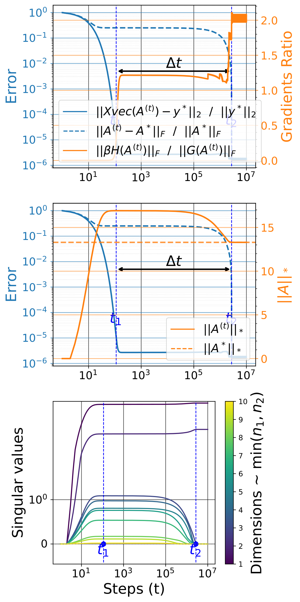

###### fig-5

*Рисунок 5: Относительные ошибки, отношение градиентов, норма $\|\mathbf{A}^{(t)}\|_{*}$ и изменение сингулярных значений. Величина $G(\mathbf{A}^{(t)})$ преобладает над $\beta H(\mathbf{A}^{(t)})$ вплоть до запоминания ($t\leq t_{1}$). С момента запоминания преобладает $\beta H(\mathbf{A}^{(t)})$ и приводит $\|\mathbf{A}^{(t)}\|_{*}$ к $\|\mathbf{A}^{*}\|_{*}$ при $t_{2}=t_{1}+\Delta t$, откуда $\mathbf{A}^{(t_{2})}=\mathbf{A}^{*}$.* **[p. 7]**

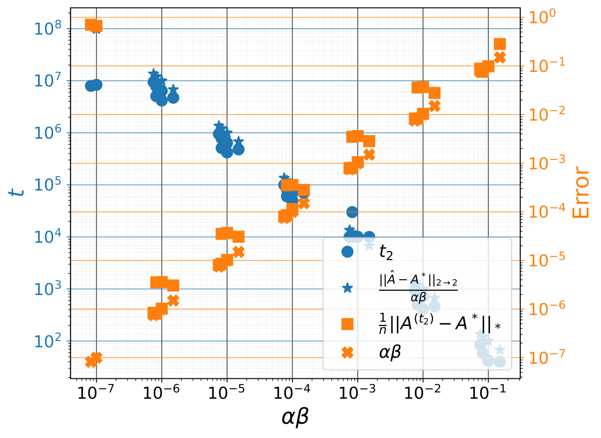

###### fig-6

*Рисунок 6: Шаг обобщения $t_{2}$ (наименьшее $t$ такое, что $\|\mathbf{A}^{(t)}-\mathbf{A}^{*}\|_{\text{F}}/\|\mathbf{A}^{*}\|_{\text{F}}\leq 10^{-4}$) и ошибка восстановления $\|\mathbf{A}^{(t_{2})}-\mathbf{A}^{*}\|_{2}$ как функции $\alpha\beta$. Видно, что $t_{2}\propto\|\hat{\mathbf{A}}-\mathbf{A}^{*}\|_{2\to 2}/\alpha\beta$ и $\|\mathbf{A}^{(t_{2})}-\mathbf{A}^{*}\|_{\text{F}}\propto\alpha\beta$, то есть при малом $\alpha\beta$ сходимость дольше, но ошибка обобщения ниже. Выброс при очень малом $\alpha\beta$ вызван недостаточным обучением.* **[p. 8]**

#### Проверочные опыты

Мы берём $(n_{1},n_{2},r,N,\alpha,\beta)=(10,10,2,70,10^{-1},10^{-4})$ и решаем задачу восполнения матрицы без шума субградиентным спуском. Мы наблюдаем картину, подобную гроккингу: обучающая ошибка $\|\mathbf{X}\operatorname{vec}\mathbf{A}^{(t)}-\mathbf{y}^{*}\|_{2}$ сперва убывает до $10^{-4}$, а затем, после долгого обучения, убывает ошибка восстановления $\|\mathbf{A}^{(t)}-\mathbf{A}^{*}\|_{\text{F}}$ и сравнивается с обучающей (рисунки 5 и 6).

#### Иной итерационный приём наименьшения $\ell_{*}$

Приведённые выше итоги верны и для проекционного субградиентного приёма, чьё обновление записывается как $\mathbf{A}^{(t+1)}=\Pi\left(\mathbf{A}^{(t)}-\alpha\beta H(\mathbf{A}^{(t)})\right)$, где $\Pi$ есть проекция на множество $\{\mathbf{A},\mathbf{X}\operatorname{vec}\mathbf{A}=\mathbf{y}^{*}\}$; и для проксимального градиентного спуска, чьё обновление записывается как $\mathbf{A}^{(t+1)}=S_{\alpha\beta}\left(\mathbf{A}^{(t)}-\alpha G(\mathbf{A}^{(t)})\right)$, где $S_{\gamma}(\mathbf{A})=\mathbf{U}\max(\Sigma-\gamma,0)\mathbf{V}^{\top}$ есть действие мягкого порога для $\mathbf{A}=\mathbf{U}\Sigma\mathbf{V}^{\top}$ в сингулярном разложении, причём $\max(\Sigma-\gamma,0)_{ij}=\delta_{ij}\max(\Sigma_{ij}-\gamma,0)$. Подробнее в разделе D.2.

### 3.3 Гроккинг без понимания

###### p7-4

Вопреки прежним работам (Lyu et al., 2023; Liu et al., 2023a) мы находим, что в избыточно параметризованном режиме ($N<n$) большое начальное приближение и ненулевое ослабление весов не обязательно приводят к гроккингу (рисунок 7). И впрямь, применяя лишь сглаживание $\ell_{2}$ при большом начальном приближении, мы видим резкий переход в ошибке обобщения при обучении, движимый изменениями нормы $\ell_{2}$ значений модели. Однако этот переход не приводит к сходимости к наилучшему решению и может возникать даже там, где у задачи наилучшего решения нет из-за нехватки обучающих примеров (скажем, при восстановлении разрежённых векторов или восполнении матрицы, когда число примеров много ниже теоретического предела, потребного для точного восстановления). Мы называем это явление «гроккингом без понимания» вслед за Levi et al. (2024), показавшими его для линейной классификации, и приписываем его тому, что допущения, лежащие под прежними теоретическими предсказаниями, прежде всего *допущение 3.2* у Lyu et al. (2023), в нашей постановке нарушены (подробнее в разделе E приложения).


###### fig-7

*Рисунок 7: Относительные ошибки и норма $\|\mathbf{a}^{(t)}\|_{2}$ при большом масштабе начального приближения $\|\mathbf{a}^{(1)}\|_{2}=10$ и малом ослаблении весов $\beta=10^{-5}$. Одно лишь ослабление весов только уменьшает составляющие приближения $\mathbf{a}^{(t)}$, а не $\|\mathbf{a}^{(t)}\|_{0}$.* **[p. 8]**

Для приведённых выше задач (восстановление разрежённых векторов и разложение матриц) при замене $h(\mathbf{a})$ в $f(\mathbf{a})=g(\mathbf{a})+\beta h(\mathbf{a})$ на $h(\mathbf{a})=\frac{1}{2}\|\mathbf{a}\|_{2}^{2}$ модель сходится к решению наименьших квадратов $\hat{\mathbf{a}}:=\left(\mathbf{X}^{\top}\mathbf{X}+\beta\mathbb{I}_{n}\right)^{{\dagger}}\mathbf{X}^{\top}\mathbf{y}^{*}$, но это решение не способно дать обобщения при $N<n$.

##### **Теорема 3.6****.**

###### p7-6

*Определим $\rho_{2}:=\left\|\mathbb{I}_{n}-\alpha\left(\mathbf{X}^{\top}\mathbf{X}+\beta\mathbb{I}_{n}\right)\right\|_{2\rightarrow 2}$. Пусть скорость обучения удовлетворяет $0<\alpha<\frac{2}{\sigma_{\max}(\mathbf{X}^{\top}\mathbf{X})+\beta}$. Тогда **[p. 8]** $\|\mathbf{a}^{(t)}-\hat{\mathbf{a}}\|_{2}\leq\rho_{2}^{t-1}\|\mathbf{a}^{(1)}-\hat{\mathbf{a}}\|_{2}\ \forall t\geq 1$. С другой стороны, при $N<n$ выполнено $\|\hat{\mathbf{a}}-\mathbf{a}^{*}\|_{2}^{2}\geq\|\left(\mathbb{I}_{n}-\mathbf{X}^{\top}(\mathbf{X}\mathbf{X}^{\top})^{\dagger}\mathbf{X}\right)\mathbf{a}^{*}\|_{2}^{2}$. В частности, если у $\mathbf{a}^{*}$ есть ненулевая составляющая, ортогональная столбцовому пространству $\mathbf{X}$, то $\hat{\mathbf{a}}$ не может безупречно обобщить до $\mathbf{a}^{*}$.*

##### Доказательство.

Раздел C.8 приложения. ∎

###### p8-2

Даже при наличии $\ell_{1}$, если ослабление весов $\beta$ выбрано так, что $\|\hat{\mathbf{a}}\|_{\infty}\ll\alpha\beta$, то $\mathbf{a}^{(t)}$ застрянет близ $\hat{\mathbf{a}}$, и обобщения не будет. Стало быть, дурной выбор $\beta$ может повредить обобщению (на этой задаче лучше не применять $\ell_{2}$, если только масштаб начального приближения не нетривиален). Поскольку решение наименьшей нормы $\ell_{2}$ даёт лишь запоминание, норму $\ell_{2}$ нельзя применять как указатель гроккинга.

### 3.4 Усиление гроккинга отбором данных

###### p8-3

Разбор ручательств восстановления при разложении матриц опирается на местную когерентность целевой матрицы $\mathbf{A}^{*}=\mathbf{U}^{*}\Sigma^{*}\mathbf{V}^{*\top}$ (сжатое сингулярное разложение). Меры местной когерентности $\mu_{i}=\frac{n_{1}}{r}\|\mathbf{U}^{*\top}\mathbf{e}_{i}^{(n_{1})}\|^{2}$ и $\nu_{j}=\frac{n_{2}}{r}\|\mathbf{V}^{*\top}\mathbf{e}_{j}^{(n_{2})}\|^{2}$ (при $(i,j)\in[n_{1}]\times[n_{2}]$) описывают, насколько сильно отдельные строки и столбцы согласованы с ведущими сингулярными векторами, где $\mathbf{e}_{i}^{(n_{i})}$ есть $i^{th}$ вектор канонического базиса $\mathbb{R}^{n_{i}}$. Эти величины, известные также как рычажные оценки, указывают на «влияние» каждой строки $i$ или столбца $j$ на малоранговое строение. Строка или столбец с высокой рычажной оценкой сильно проецируется на линейную оболочку сингулярных векторов, а значит, сравнительно малое число её записей несёт значительную часть строения матрицы. Равномерно низкая когерентность ($\mu_{i}$ и $\nu_{i}$ близ $1$) означает, что сведения матрицы хорошо распределены по строкам и столбцам, что уменьшает число примеров, потребных для точного восстановления. Значение местной когерентности простирается и на приёмы отбора, и на оценки восстановления. Для восполнения матрицы, по данным $N\leq n_{1}n_{2}$ и $\tau\in[0,1]$, мы выбираем первые $\tau N$ записей $(i,j)$ с наибольшими значениями $\mu_{i}+\nu_{j}$, а оставшиеся $(1-\tau)N$ записей — равномерно среди прочих. При $\tau\rightarrow 1$ качество улучшается, а число примеров, потребных для обобщения, убывает показательно, как и время, за которое модели это делают (рисунок 8).

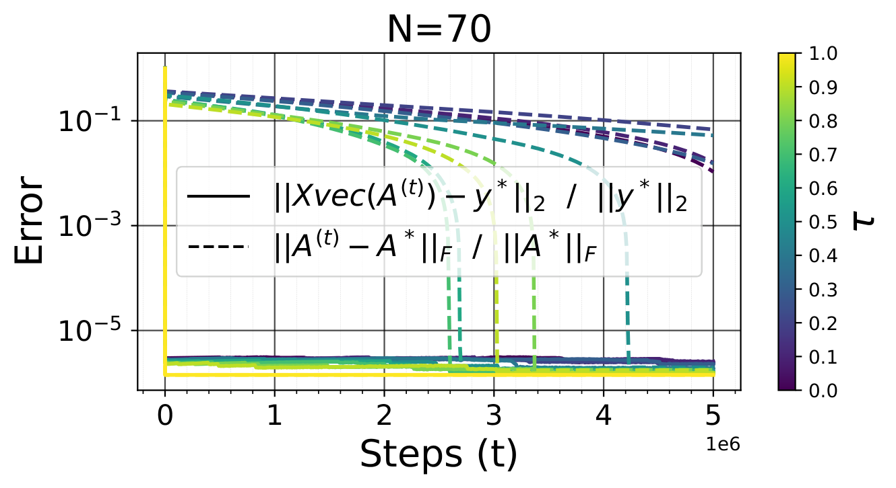

###### fig-8

*Рисунок 8: Обучающая ошибка и ошибка восстановления как функции объёма данных и когерентности $\tau$.* **[p. 8]**

###### p8-4

В отличие от разложения матриц, большие значения когерентности вредны для обобщения при сжимающих измерениях. Некогерентность между измерительными векторами (строками $\mathbf{M}$) и разрежающим базисом (столбцами $\Phi$) решающе важна для успешного восстановления $\mathbf{b}^{*}=\Phi\mathbf{a}^{*}$ по измерениям $\mathbf{y}^{*}=\mathbf{M}\mathbf{b}^{*}+\boldsymbol{\xi}$. Если $\mathbf{M}$ некогерентна с $\Phi$, каждое измерение схватывает свой «вид» $\mathbf{b}^{*}$, что уменьшает избыточность. Такое разнообразие сведений позволяет успешно восстановить $\mathbf{a}^{*}$ даже при меньшем числе измерений (скажем, ниже частоты Найквиста для сигналов). Мы также заметили, что бо́льшая когерентность увеличивает число примеров, потребных для восстановления, и задерживает обобщение, тогда как меньшая когерентность даёт более быстрое обобщение и лучшее восстановление. Хотя гроккинг изучен широко, влияние отбора данных на гроккинг остаётся почти неисследованным, отчего эта работа — одна из первых, где этот существенный вопрос рассмотрен. Подробнее — в разделе G.

### 3.5 Неявная склонность глубины


*Рисунок 9: Ошибка восстановления как функция глубины и объёма данных.* **[p. 8]**

###### p8-5

Мы исследуем роль избыточной параметризации при восстановлении разрежённых векторов, беря линейную сеть, параметризованную как $\mathbf{a}=\odot_{k=1}^{L}\mathbf{A}_{k}$, где глубина $L\geq 2$ вносит избыточную параметризацию, не меняя линейности разряда функций. Наши находки показывают, что глубина способна заменить сглаживание $\ell_{1}$ ради обобщения, когда начальное приближе**[p. 9]**ние мало, ибо обновления градиента вносят предобусловливание, поощряющее разрежённость и позволяющее восстановить сигнал. В отличие от мелкого случая ($L=1$), где разрежённость нельзя навязать без сглаживания $\ell_{1}$, глубина даёт неявное устройство, склоняющее обновления к разрежённости, что даёт лучшее обобщение при меньшем числе измерений (рисунок 9). Кроме того, глубина уменьшает задержку обобщения, давая резкие фазовые переходы и лестничную кривую потери при обучении. Ошибка обобщения убывает с ростом глубины $L$, что показывает: глубина и впрямь возмещает нехватку измерений и способствует восстановлению, хотя и ценой более долгого обучения. При $L\geq 2$ большое начальное приближение вместе с малым ненулевым сглаживанием $\ell_{2}$ даёт гроккинг, в отличие от мелкого случая, где наблюдается «гроккинг без понимания». Подробнее в разделе F.1 приложения.

Глубокое разложение матриц мы обсуждаем в разделе F.2 приложения, ибо уже хорошо известно, что избыточная параметризация добавлением глубины позволяет восстанавливать малоранговые матрицы без всякого явного сглаживания (Gunasekar et al., 2017; Arora et al., 2019; Gidel et al., 2019; Gissin et al., 2019; Razin & Cohen, 2020; Li et al., 2020).

## 4 Общая постановка

В этом разделе мы показываем, что $\ell_{1}$, $\ell_{*}$ и иные виды сглаживания, свойственные предметной области, способны заменить $\ell_{2}$ в более общей постановке и вызывать гроккинг или управлять им.

#### Нелинейная постановка «учитель — ученик»

Рассмотрим учителя $\mathbf{y}^{*}(\mathbf{x})=\mathbf{B}^{*}\phi(\mathbf{A}^{*}\mathbf{x})$ из $\mathbb{R}^{d}$ в $\mathbb{R}^{c}$ с $r$ скрытыми нейронами, где $\phi(z)=\max(z,0)$. Мы независимо берём $N$ пар «вход — выход» $\mathcal{D}_{\text{train}}=\{(\mathbf{x}_{i},\mathbf{y}^{*}(\mathbf{x}_{i}))\}_{i=1}^{N}$ и подбираем на них значения $\theta=(\mathbf{A},\mathbf{B})$ ученика $\mathbf{y}_{\theta}(\mathbf{x})=\mathbf{B}\phi(\mathbf{A}\mathbf{x})$ с квадратичной потерей $g(\theta)=\frac{1}{2N}\sum_{i=1}^{N}\|\mathbf{y}_{\theta}(\mathbf{x}_{i})-\mathbf{y}^{*}(\mathbf{x}_{i})\|_{2}^{2}$ и разными сглаживателями $h(\theta)$ — $\ell_{p}$ при $p\in\{1,2,*\}$. Для всех этих сглаживателей чем меньше $\alpha\beta$, тем длиннее задержка между запоминанием и обобщением (см. рисунок 10 с кривой обучения при $\ell_{1}$ и рисунки 31, 32, 33 с прочими итогами при $\ell_{*/2}$).


###### fig-10

*Рисунок 10: Обучающая и тестовая ошибка для двуслойной постановки «учитель — ученик» с ReLU и сглаживанием $\ell_{1}$ при разных значениях скорости обучения $\alpha$ и коэффициента $\ell_{1}$, равного $\beta$* **[p. 9]**

#### Сглаживание, свойственное предметной области

###### p9-4

Нейронные сети, осведомлённые о физике (Raissi et al., 2019), пользуются предварительным знанием из дифференциальных уравнений, внося их невязки в функцию потерь и тем обеспечивая согласие решений с законами природы. Обучение по Соболеву (Czarnecki et al., 2017) обобщает эту мысль, беря не только пары «вход — выход», но и производные целевой функции. Мы обучаем ученика из предыдущего абзаца, добавляя в целевую функцию соболевский штраф первого порядка $\frac{\beta}{N}\sum_{i=1}^{N}\left\|\frac{\partial\mathbf{y}_{\theta}}{\partial\mathbf{x}}(\mathbf{x}_{i})-\frac{\partial\mathbf{y}^{*}}{\partial\mathbf{x}}(\mathbf{x}_{i})\right\|_{\text{F}}^{2}$, где настройка $\beta$ обеспечивает, что модель не только приближает данные, но и соблюдает известные требования гладкости или дифференциальное строение, что существенно в приложениях, основанных на физике. Большие значения $\alpha\beta$ дают более быстрый гроккинг (рисунки 11 и 34).


###### fig-11

*Рисунок 11: Обучающая и тестовая ошибка для двуслойной постановки «учитель — ученик» с ReLU при обучении по Соболеву, при разных значениях скорости обучения $\alpha$ и соболевского коэффициента $\beta$.* **[p. 9]**

#### Классификация

На алгоритмическом наборе данных (Power et al., 2022) $\ell_{1}$ и $\ell_{*}$ действуют на гроккинг так же, как $\ell_{2}$: меньший коэффициент сглаживания (и скорость обучения) задерживают обобщение (см. рисунок 2 для $\ell_{*}$ и 30 для $\ell_{1}$ и $\ell_{2}$). Схожее явление мы наблюдаем на двуслойном MLP с ReLU, обученном на MNIST (раздел H.3.4).

## 5 Обсуждение и заключение

Эта работа расширяет понимание гроккинга, показывая, что переход от запоминания к обобщению может быть вызван не только сглаживанием $\ell_{2}$, но и сглаживанием к разрежённому или малоранговому строению (скажем, по норме $\ell_{1}$ или ядерной норме) либо сглаживанием, свойственным предметной области. Эти находки особенно уместны на деле, где большое начальное приближение не всегда возможно, а гроккинг всё же случается. Разрежённые и малоранговые модели с хорошим качеством обобщения весьма полезны в нынешнем машинном обучении не только оттого, что тратят меньше памяти при обучении и применении, но и оттого, что они более истолковываемы, чем их плотные и полноранговые собратья. Допущения о разрежённости и малоранговости средоточны и для таких приёмов, как малоранговое приспособление больших моделей глубокого обучения (Hu et al., 2021) и обрезка моделей (Han et al., 2015) в ресурсосберегающем глубоком обучении; разрежённые самокодировщики в механистической истолковываемости (Cunningham et al., 2023; Bricken et al., 2023) ради безопасности искусственного разума (Bereska & Gavves, 2024) — и это лишь некоторые из них.

Наши итоги высвечивают, что в глубоких моделях градиентный спуск неявно ведёт модель к решениям с разрежёнными или малоранговыми свойствами, действенно смягчая переобучение (Arora et al., 2018). Мы также изучаем влияние отбора данных на гроккинг и показываем, что его можно смягчить одним лишь отбором данных.

**[p. 10]**

## Благодарности

Мы благодарим участников группы Guillaume Rabusseau в Mila за содержательные обсуждения при развитии этого замысла. Pascal Tikeng признателен Sékou-Oumar Kaba и Mohammad Pezeshki за полезные беседы на ранних порах этой работы. Авторы отмечают материальную поддержку NVIDIA в виде вычислительных средств. Pascal Tikeng отмечает поддержку программы Canada Excellence Research Chair. Guillaume Rabusseau отмечает поддержку программы CIFAR AI Chair. Guillaume Dumas поддержан Институтом освоения данных, Монреаль, и Canada First Research Excellence Fund (IVADO; CF00137433), Fonds de recherche du Québec (FRQ; 285289), Natural Sciences and Engineering Research Council of Canada (NSERC; DGECR-2023-00089) и Canadian Institute for Health Research (CIHR 192031; SCALE).

## Заявление о влиянии

Эта работа имеет целью продвижение области машинного обучения через улучшение понимания гроккинга в нейронных сетях. Хотя средоточие её теоретическое, наша работа имеет и прикладное значение для устройства обучения моделей. Мы признаём возможные нравственные соображения, связанные с искусственным разумом, но не считаем, что какие-либо особые вопросы требуют здесь выделения на нынешний час.

## Список литературы

- Abramov, R., Steinbauer, F., and Kasneci, G. Grokking in the wild: Data augmentation for real-world multi-hop reasoning with transformers, 2025. URL https://arxiv.org/abs/2504.20752.

- Aharon, M., Elad, M., and Bruckstein, A. K-svd: An algorithm for designing overcomplete dictionaries for sparse representation. *IEEE Transactions on Signal Processing*, 54(11):4311–4322, 2006. doi: 10.1109/TSP.2006.881199.

- Arora, S., Cohen, N., and Hazan, E. On the optimization of deep networks: Implicit acceleration by overparameterization, 2018. URL https://arxiv.org/abs/1802.06509.

- Arora, S., Cohen, N., Hu, W., and Luo, Y. Implicit regularization in deep matrix factorization. *CoRR*, abs/1905.13655, 2019. URL http://arxiv.org/abs/1905.13655.

- Aubin, B., Maillard, A., Barbier, J., Krzakala, F., Macris, N., and Zdeborová, L. The committee machine: Computational to statistical gaps in learning a two-layers neural network. *CoRR*, abs/1806.05451, 2018. URL http://arxiv.org/abs/1806.05451.

- Barak, B., Edelman, B. L., Goel, S., Kakade, S., Malach, E., and Zhang, C. Hidden progress in deep learning: Sgd learns parities near the computational limit. *Neural Information Processing Systems*, 2022. doi: 10.48550/arXiv.2207.08799.

- Bauschke, H. H. and Combettes, P. L. The baillon-haddad theorem revisited, 2009. URL https://arxiv.org/abs/0906.0807.

- Beck, A., Levi, N., and Bar-Sinai, Y. Grokking at the edge of linear separability, 2024. URL https://arxiv.org/abs/2410.04489.

- Bereska, L. and Gavves, E. Mechanistic interpretability for ai safety – a review, 2024. URL https://arxiv.org/abs/2404.14082.

- Biehl, M. and Schwarze, H. Learning by on-line gradient descent. *Journal of Physics A: Mathematical and General*, 28(3):643, feb 1995. doi: 10.1088/0305-4470/28/3/018. URL https://dx.doi.org/10.1088/0305-4470/28/3/018.

- Boyd, S. and Vandenberghe, L. *Convex Optimization*. Cambridge University Press, 2004.

- Bricken, T., Templeton, A., Batson, J., Chen, B., Jermyn, A., Conerly, T., Turner, N., Anil, C., Denison, C., Askell, A., Lasenby, R., Wu, Y., Kravec, S., Schiefer, N., Maxwell, T., Joseph, N., Hatfield-Dodds, Z., Tamkin, A., Nguyen, K., McLean, B., Burke, J. E., Hume, T., Carter, S., Henighan, T., and Olah, C. Towards monosemanticity: Decomposing language models with dictionary learning. *Transformer Circuits Thread*, 2023. https://transformer-circuits.pub/2023/monosemantic-features/index.html.

- Candes, E. and Recht, B. Exact matrix completion via convex optimization. *Communications of the ACM*, 55(6):111–119, 2012.

- Candès, E. J. and Tao, T. The power of convex relaxation: Near-optimal matrix completion. *IEEE transactions on information theory*, 56(5):2053–2080, 2010.

- Candes, E. J., Romberg, J. K., and Tao, T. Stable signal recovery from incomplete and inaccurate measurements. *Communications on Pure and Applied Mathematics: A Journal Issued by the Courant Institute of Mathematical Sciences*, 59(8):1207–1223, 2006.

- Chandrasekaran, V., Recht, B., Parrilo, P. A., and Willsky, A. S. The convex geometry of linear inverse problems. *Foundations of Computational Mathematics*, 12(6):805–849, October 2012. ISSN 1615-3383. doi: 10.1007/s10208-012-9135-7. URL http://dx.doi.org/10.1007/s10208-012-9135-7.

**[p. 11]**

- Charton, F. Learning the greatest common divisor: explaining transformer predictions, 2024. URL https://arxiv.org/abs/2308.15594.

- Chatterjee, S. Convergence of gradient descent for deep neural networks, 2022. URL https://arxiv.org/abs/2203.16462.

- Chen, Y., Bhojanapalli, S., Sanghavi, S., and Ward, R. Coherent matrix completion. In Xing, E. P. and Jebara, T. (eds.), *Proceedings of the 31st International Conference on Machine Learning*, volume 32 of *Proceedings of Machine Learning Research*, pp. 674–682, Bejing, China, 22–24 Jun 2014. PMLR. URL https://proceedings.mlr.press/v32/chenc14.html.

- Chughtai, B., Chan, L., and Nanda, N. A toy model of universality: Reverse engineering how networks learn group operations. *International Conference on Machine Learning*, 2023. doi: 10.48550/arXiv.2302.03025.

- Clauw, K., Stramaglia, S., and Marinazzo, D. Information-theoretic progress measures reveal grokking is an emergent phase transition, 2024. URL https://arxiv.org/abs/2408.08944.

- Cunningham, H., Ewart, A., Riggs, L., Huben, R., and Sharkey, L. Sparse autoencoders find highly interpretable features in language models, 2023. URL https://arxiv.org/abs/2309.08600.

- Czarnecki, W. M., Osindero, S., Jaderberg, M., Świrszcz, G., and Pascanu, R. Sobolev training for neural networks, 2017. URL https://arxiv.org/abs/1706.04859.

- Daubechies, I., Defrise, M., and Mol, C. D. An iterative thresholding algorithm for linear inverse problems with a sparsity constraint, 2003. URL https://arxiv.org/abs/math/0307152.

- Davies, X., Langosco, L., and Krueger, D. Unifying grokking and double descent, 2023. URL https://arxiv.org/abs/2303.06173.

- DeMoss, B., Sapora, S., Foerster, J., Hawes, N., and Posner, I. The complexity dynamics of grokking, 2024. URL https://arxiv.org/abs/2412.09810.

- Donoho, D. Compressed sensing. *IEEE Transactions on Information Theory*, 52(4):1289–1306, 2006a. doi: 10.1109/TIT.2006.871582.

- Donoho, D. L. For most large underdetermined systems of linear equations the minimal $\ell_{1}$-norm solution is also the sparsest solution. *Communications on Pure and Applied Mathematics*, 59(6):797–829, 2006b. doi: https://doi.org/10.1002/cpa.20132. URL https://onlinelibrary.wiley.com/doi/abs/10.1002/cpa.20132.

- Donoho, D. L. and Elad, M. Optimally sparse representation in general (nonorthogonal) dictionaries via &#x2113;¡sup¿1¡/sup¿ minimization. *Proceedings of the National Academy of Sciences*, 100(5):2197–2202, 2003. doi: 10.1073/pnas.0437847100. URL https://www.pnas.org/doi/abs/10.1073/pnas.0437847100.

- Doshi, D., Das, A., He, T., and Gromov, A. To grok or not to grok: Disentangling generalization and memorization on corrupted algorithmic datasets, 2024a. URL https://arxiv.org/abs/2310.13061.

- Doshi, D., He, T., Das, A., and Gromov, A. Grokking modular polynomials, 2024b. URL https://arxiv.org/abs/2406.03495.

- Engel, A. and Broeck, C. P. L. V. d. *Statistical Mechanics of Learning*. Cambridge University Press, USA, 2001. ISBN 0521773075.

- Fan, S., Pascanu, R., and Jaggi, M. Deep grokking: Would deep neural networks generalize better?, 2024. URL https://arxiv.org/abs/2405.19454.

- Fazel, M., Hindi, H., and Boyd, S. A rank minimization heuristic with application to minimum order system approximation. In *Proceedings of the 2001 American Control Conference. (Cat. No.01CH37148)*, volume 6, pp. 4734–4739 vol.6, 2001. doi: 10.1109/ACC.2001.945730.

- Fazel, M., Hindi, H., and Boyd, S. Rank minimization and applications in system theory. In *Proceedings of the 2004 American Control Conference*, volume 4, pp. 3273–3278 vol.4, 2004. doi: 10.23919/ACC.2004.1384521.

- Foucart, S. and Rauhut, H. *A Mathematical Introduction to Compressive Sensing*. Birkhäuser Basel, 2013. ISBN 0817649476.

- Gidel, G., Bach, F. R., and Lacoste-Julien, S. Implicit regularization of discrete gradient dynamics in deep linear neural networks. *CoRR*, abs/1904.13262, 2019. URL http://arxiv.org/abs/1904.13262.

- Gissin, D., Shalev-Shwartz, S., and Daniely, A. The implicit bias of depth: How incremental learning drives generalization. *CoRR*, abs/1909.12051, 2019. URL http://arxiv.org/abs/1909.12051.

- Goldt, S., Advani, M. S., Saxe, A. M., Krzakala, F., and Zdeborová, L. Dynamics of stochastic gradient descent for two-layer neural networks in the teacher–student setup*. ***[p. 12]** Journal of Statistical Mechanics: Theory and Experiment*, 2020(12):124010, December 2020. ISSN 1742-5468. doi: 10.1088/1742-5468/abc61e. URL http://dx.doi.org/10.1088/1742-5468/abc61e.

- Golechha, S. Progress measures for grokking on real-world tasks, 2024. URL https://arxiv.org/abs/2405.12755.

- Gromov, A. Grokking modular arithmetic. *arXiv preprint arXiv: Arxiv-2301.02679*, 2023.

- Gunasekar, S., Woodworth, B. E., Bhojanapalli, S., Neyshabur, B., and Srebro, N. Implicit regularization in matrix factorization. *Advances in neural information processing systems*, 30, 2017.

- Han, S., Pool, J., Tran, J., and Dally, W. J. Learning both weights and connections for efficient neural networks. *CoRR*, abs/1506.02626, 2015. URL http://arxiv.org/abs/1506.02626.

- Hu, E. J., Shen, Y., Wallis, P., Allen-Zhu, Z., Li, Y., Wang, S., Wang, L., and Chen, W. Lora: Low-rank adaptation of large language models, 2021. URL https://arxiv.org/abs/2106.09685.

- Hu, M. Y., Chen, A., Saphra, N., and Cho, K. Latent state models of training dynamics, 2024. URL https://arxiv.org/abs/2308.09543.

- Huang, Y., Hu, S., Han, X., Liu, Z., and Sun, M. Unified view of grokking, double descent and emergent abilities: A perspective from circuits competition, 2024. URL https://arxiv.org/abs/2402.15175.

- Huggins, J. H., Campbell, T., and Broderick, T. Coresets for scalable bayesian logistic regression, 2017. URL https://arxiv.org/abs/1605.06423.

- Humayun, A. I., Balestriero, R., and Baraniuk, R. Deep networks always grok and here is why, 2024. URL https://arxiv.org/abs/2402.15555.

- Karimi, H., Nutini, J., and Schmidt, M. Linear convergence of gradient and proximal-gradient methods under the polyak-łojasiewicz condition, 2020. URL https://arxiv.org/abs/1608.04636.

- Kumar, T., Bordelon, B., Gershman, S. J., and Pehlevan, C. Grokking as the transition from lazy to rich training dynamics. *arXiv preprint arXiv: 2310.06110*, 2023.

- Kumar, T., Bordelon, B., Pehlevan, C., Murthy, V. N., and Gershman, S. J. Do mice grok? glimpses of hidden progress during overtraining in sensory cortex, 2024. URL https://arxiv.org/abs/2411.03541.

- Langley, P. Crafting papers on machine learning. In Langley, P. (ed.), *Proceedings of the 17th International Conference on Machine Learning (ICML 2000)*, pp. 1207–1216, Stanford, CA, 2000. Morgan Kaufmann.

- Lee, J., Kang, B. G., Kim, K., and Lee, K. M. Grokfast: Accelerated grokking by amplifying slow gradients, 2024. URL https://arxiv.org/abs/2405.20233.

- Levi, N., Beck, A., and Bar-Sinai, Y. Grokking in linear estimators - a solvable model that groks without understanding. *International Conference on Learning Representations*, 2024.

- Li, J. Mechanistic interpretability of binary and ternary transformers, 2024. URL https://arxiv.org/abs/2405.17703.

- Li, Z., Luo, Y., and Lyu, K. Towards resolving the implicit bias of gradient descent for matrix factorization: Greedy low-rank learning. *CoRR*, abs/2012.09839, 2020. URL https://arxiv.org/abs/2012.09839.

- Liu, C., Zhu, L., and Belkin, M. Loss landscapes and optimization in over-parameterized non-linear systems and neural networks, 2021. URL https://arxiv.org/abs/2003.00307.

- Liu, Z., Michaud, E. J., and Tegmark, M. Omnigrok: Grokking beyond algorithmic data. In *The Eleventh International Conference on Learning Representations*, 2023a. URL https://openreview.net/forum?id=zDiHoIWa0q1.

- Liu, Z., Zhong, Z., and Tegmark, M. Grokking as compression: A nonlinear complexity perspective. *arXiv preprint arXiv: 2310.05918*, 2023b.

- Lu, L., Meng, X., Mao, Z., and Karniadakis, G. E. Deepxde: A deep learning library for solving differential equations. *SIAM Review*, 63(1):208–228, January 2021. ISSN 1095-7200. doi: 10.1137/19m1274067. URL http://dx.doi.org/10.1137/19M1274067.

- Lucic, M., Faulkner, M., Krause, A., and Feldman, D. Training gaussian mixture models at scale via coresets. *Journal of Machine Learning Research*, 18(160):1–25, 2018. URL http://jmlr.org/papers/v18/15-506.html.

- Lyu, K., Jin, J., Li, Z., Du, S. S., Lee, J. D., and Hu, W. Dichotomy of early and late phase implicit biases can provably induce grokking. *arXiv preprint arXiv: 2311.18817*, 2023.

- Mairal, J., Bach, F., Ponce, J., and Sapiro, G. Online learning for matrix factorization and sparse coding, 2010. URL https://arxiv.org/abs/0908.0050.

**[p. 13]**

- Mairal, J., Bach, F. R., and Ponce, J. Sparse modeling for image and vision processing. *CoRR*, abs/1411.3230, 2014. URL http://arxiv.org/abs/1411.3230.

- Mallinar, N., Beaglehole, D., Zhu, L., Radhakrishnan, A., Pandit, P., and Belkin, M. Emergence in non-neural models: grokking modular arithmetic via average gradient outer product, 2024. URL https://arxiv.org/abs/2407.20199.

- Merrill, W., Tsilivis, N., and Shukla, A. A tale of two circuits: Grokking as competition of sparse and dense subnetworks. *arXiv preprint arXiv: 2303.11873*, 2023.

- Miller, J., Gleeson, P., O’Neill, C., Bui, T., and Levi, N. Measuring sharpness in grokking, 2024a. URL https://arxiv.org/abs/2402.08946.

- Miller, J., O’Neill, C., and Bui, T. Grokking beyond neural networks: An empirical exploration with model complexity, 2024b. URL https://arxiv.org/abs/2310.17247.

- Minegishi, G., Iwasawa, Y., and Matsuo, Y. Bridging lottery ticket and grokking: Understanding grokking from inner structure of networks, 2025. URL https://arxiv.org/abs/2310.19470.

- Mohamadi, M. A., Li, Z., Wu, L., and Sutherland, D. J. Why do you grok? a theoretical analysis of grokking modular addition, 2024. URL https://arxiv.org/abs/2407.12332.

- Morwani, D., Edelman, B. L., Oncescu, C.-A., Zhao, R., and Kakade, S. Feature emergence via margin maximization: case studies in algebraic tasks, 2024. URL https://arxiv.org/abs/2311.07568.

- Murty, S., Sharma, P., Andreas, J., and Manning, C. D. Characterizing intrinsic compositionality in transformers with tree projections, 2022. URL https://arxiv.org/abs/2211.01288.

- Murty, S., Sharma, P., Andreas, J., and Manning, C. D. Grokking of hierarchical structure in vanilla transformers, 2023. URL https://arxiv.org/abs/2305.18741.

- Mustafa, N. and Burkholz, R. Dynamic rescaling for training gnns. In Globerson, A., Mackey, L., Belgrave, D., Fan, A., Paquet, U., Tomczak, J., and Zhang, C. (eds.), *Advances in Neural Information Processing Systems*, volume 37, pp. 125370–125393. Curran Associates, Inc., 2024.

- Nanda, N., Chan, L., Lieberum, T., Smith, J., and Steinhardt, J. Progress measures for grokking via mechanistic interpretability. *International Conference On Learning Representations*, 2023. doi: 10.48550/arXiv.2301.05217.

- Natarajan, B. K. Sparse approximate solutions to linear systems. *SIAM Journal on Computing*, 24(2):227–234, 1995. doi: 10.1137/S0097539792240406. URL https://doi.org/10.1137/S0097539792240406.

- Notsawo, P. J. T., Zhou, H., Pezeshki, M., Rish, I., and Dumas, G. Predicting grokking long before it happens: A look into the loss landscape of models which grok. *arXiv preprint arXiv: 2306.13253*, 2023.

- Olshausen, B. A. and Field, D. J. Emergence of simple-cell receptive field properties by learning a sparse code for natural images. *Nature*, 381:607–609, 1996. URL https://api.semanticscholar.org/CorpusID:4358477.

- Park, Y., Kim, M., and Kim, Y. Acceleration of grokking in learning arithmetic operations via kolmogorov-arnold representation, 2024. URL https://arxiv.org/abs/2405.16658.

- Power, A., Burda, Y., Edwards, H., Babuschkin, I., and Misra, V. Grokking: Generalization beyond overfitting on small algorithmic datasets. *arXiv preprint arXiv: Arxiv-2201.02177*, 2022.

- Prieto, L., Barsbey, M., Mediano, P. A. M., and Birdal, T. Grokking at the edge of numerical stability, 2025. URL https://arxiv.org/abs/2501.04697.

- Raissi, M., Perdikaris, P., and Karniadakis, G. Physics-informed neural networks: A deep learning framework for solving forward and inverse problems involving nonlinear partial differential equations. *Journal of Computational Physics*, 378:686–707, 2019. ISSN 0021-9991. doi: https://doi.org/10.1016/j.jcp.2018.10.045. URL https://www.sciencedirect.com/science/article/pii/S0021999118307125.

- Rauhut, H. *Compressive Sensing and Structured Random Matrices*, pp. 1–92. De Gruyter, Berlin, New York, 2010. ISBN 9783110226157. doi: doi:10.1515/9783110226157.1. URL https://doi.org/10.1515/9783110226157.1.

- Razin, N. and Cohen, N. Implicit regularization in deep learning may not be explainable by norms. *CoRR*, abs/2005.06398, 2020. URL https://arxiv.org/abs/2005.06398.

- Recht, B., Fazel, M., and Parrilo, P. A. Guaranteed minimum-rank solutions of linear matrix equations via nuclear norm minimization. *SIAM Review*, 52(3):471–501, January 2010. ISSN 1095-7200. doi: 10.1137/070697835. URL http://dx.doi.org/10.1137/070697835.

**[p. 14]**

- Rockafellar, R. T. *Convex analysis*. Princeton Mathematical Series. Princeton University Press, Princeton, N. J., 1970.

- Rubin, N., Seroussi, I., and Ringel, Z. Grokking as a first order phase transition in two layer networks, 2024. URL https://arxiv.org/abs/2310.03789.

- Saad, D. and Solla, S. Learning with noise and regularizers in multilayer neural networks. In Mozer, M., Jordan, M., and Petsche, T. (eds.), *Advances in Neural Information Processing Systems*, volume 9. MIT Press, 1996. URL https://proceedings.neurips.cc/paper_files/paper/1996/file/e1d5be1c7f2f456670de3d53c7b54f4a-Paper.pdf.

- Saad, D. and Solla, S. A. On-line learning in soft committee machines. *Phys. Rev. E*, 52:4225–4243, Oct 1995a. doi: 10.1103/PhysRevE.52.4225. URL https://link.aps.org/doi/10.1103/PhysRevE.52.4225.

- Saad, D. and Solla, S. A. Exact solution for on-line learning in multilayer neural networks. *Phys. Rev. Lett.*, 74:4337–4340, May 1995b. doi: 10.1103/PhysRevLett.74.4337. URL https://link.aps.org/doi/10.1103/PhysRevLett.74.4337.

- Song, K., Tan, Z., Zou, B., Ma, H., and Huang, W. Unveiling the dynamics of information interplay in supervised learning, 2024. URL https://arxiv.org/abs/2406.03999.

- Stander, D., Yu, Q., Fan, H., and Biderman, S. Grokking group multiplication with cosets, 2024. URL https://arxiv.org/abs/2312.06581.

- Thilak, V., Littwin, E., Zhai, S., Saremi, O., Paiss, R., and Susskind, J. The slingshot mechanism: An empirical study of adaptive optimizers and the grokking phenomenon. *arXiv preprint arXiv: Arxiv-2206.04817*, 2022.

- Tsang, I. W., Kwok, J. T., and Cheung, P.-M. Core vector machines: Fast svm training on very large data sets. *Journal of Machine Learning Research*, 6(13):363–392, 2005. URL http://jmlr.org/papers/v6/tsang05a.html.

- Vandenberghe, L. and Boyd, S. Semidefinite programming. *SIAM Review*, 38(1):49–95, 1996. doi: 10.1137/1038003. URL https://doi.org/10.1137/1038003.

- Varma, V., Shah, R., Kenton, Z., Kramár, J., and Kumar, R. Explaining grokking through circuit efficiency. *arXiv preprint arXiv: 2309.02390*, 2023.

- Vaškevičius, T., Kanade, V., and Rebeschini, P. Implicit regularization for optimal sparse recovery, 2019. URL https://arxiv.org/abs/1909.05122.

- Wang, B., Yue, X., Su, Y., and Sun, H. Grokked transformers are implicit reasoners: A mechanistic journey to the edge of generalization, 2024. URL https://arxiv.org/abs/2405.15071.

- Wedin, P.-Å. Perturbation bounds in connection with singular value decomposition. *BIT Numerical Mathematics*, 12(1):99–111, 1972. ISSN 1572-9125. doi: 10.1007/BF01932678. URL https://doi.org/10.1007/BF01932678.

- Xu, Z., Wang, Y., Frei, S., Vardi, G., and Hu, W. Benign overfitting and grokking in relu networks for xor cluster data, 2023. URL https://arxiv.org/abs/2310.02541.

- Xu, Z., Ni, Z., Wang, Y., and Hu, W. Let me grok for you: Accelerating grokking via embedding transfer from a weaker model, 2025. URL https://arxiv.org/abs/2504.13292.

- Yunis, D., Patel, K. K., Wheeler, S., Savarese, P., Vardi, G., Livescu, K., Maire, M., and Walter, M. R. Approaching deep learning through the spectral dynamics of weights, 2024. URL https://arxiv.org/abs/2408.11804.

- Zhou, X., Pi, R., Zhang, W., Lin, Y., Chen, Z., and Zhang, T. Probabilistic bilevel coreset selection. In Chaudhuri, K., Jegelka, S., Song, L., Szepesvari, C., Niu, G., and Sabato, S. (eds.), *Proceedings of the 39th International Conference on Machine Learning*, volume 162 of *Proceedings of Machine Learning Research*, pp. 27287–27302. PMLR, 17–23 Jul 2022. URL https://proceedings.mlr.press/v162/zhou22h.html.

- Zhou, Z., Zhang, Y., and Xu, Z.-Q. J. A rationale from frequency perspective for grokking in training neural network, 2024. URL https://arxiv.org/abs/2405.17479.

- Zhu, X., Fu, Y., Zhou, B., and Lin, Z. Critical data size of language models from a grokking perspective, 2024. URL https://arxiv.org/abs/2401.10463.

- $\mathbf{v}$Zunkovi$\mathbf{v}$c, B. and Ilievski, E. Grokking phase transitions in learning local rules with gradient descent. *Journal of Machine Learning Research*, 25(199):1–52, 2024. URL http://jmlr.org/papers/v25/22-1228.html.

**A. Related Works** A

A.1. Grokking A.1

**[p. 15]**

A.2. Model Distillation, Sparse Dictionary Learning, Sparse Auto-Encoder, Coreset Selection A.2

A.3. Finite Field A.3

**B. Notations** B

**C. Proofs** C

C.1. Proof of Theorem 2.1 C.1

C.2. Main Theorem under Polyak-Łojasiewicz Inequality C.2

C.3. Preservation of the Chatterjee–Łojasiewicz Inequality under Perturbation C.3

C.4. Proof of Theorem 3.1 C.4

C.5. Proof of Theorem 3.3 C.5

C.6. Proof of Theorem 3.4 C.6

C.7. Proof of Theorem 3.5 C.7

C.8. Proof of Theorem 3.6 C.8

**D. Other Iterative Method for $\ell_{1}$ and $\ell_{*}$ Minimization** D

D.1. Sparse Recovery D.1

D.2. Low Rank Matrix Factorization D.2

**E. Grokking Without Understanding** E

**F. Implicit Bias of the Depth** F

F.1. Deep Sparse Recovery F.1

F.2. Deep Matrix Factorization F.2

**G. Amplifying Grokking through Data Selection** G

G.1. Sparse Recovery G.1

G.2. Matrix Factorization G.2

**H. Additional Experiments** H

H.1. Sparse Recovery H.1

H.2. Matrix Factorization H.2

H.3. General Setting H.3

H.3.1. Algorithmic dataset H.3.1

H.3.2. Non linear Teacher-Student H.3.2

H.3.3. Domain Specific Regularization H.3.3

H.3.4. Image Classification H.3.4

**[p. 16]**

## Приложение A Сопутствующие работы

### A.1 Гроккинг

#### Всеобщность

Liu et al. (2023a) сделали первый шаг к показу всеобщности гроккинга, вызвав его на неалгоритмических данных — прежде всего на разборе изображений, разборе тональности и предсказании свойств молекул. В том же ключе Gromov (2023); $\mathbf{v}$Zunkovi$\mathbf{v}$c & Ilievski (2024); Levi et al. (2024) показывают, что гроккинг возможен и для (аналитически решаемых игрушечных) моделей. Barak et al. (2022) наблюдали гроккинг на задаче двоичной разрежённой чётности, Charton (2024) — на наибольшем общем делителе (с трансформером), Doshi et al. (2024b) — на остаточных многочленах, Lyu et al. (2023) — на восполнении матриц и разрежённых линейных предсказателях, Beck et al. (2024) и Levi et al. (2024) — на двоичной логистической классификации, Xu et al. (2023) — на обучающих данных вида XOR-скоплений. Miller et al. (2024b) показывают, что гроккинг случается и за пределами нейронных сетей — в моделях вроде гауссовых процессов (регрессия и классификация), линейной регрессии и байесовых нейронных сетей, — движимый обменом между сложностью модели и ошибкой, а не одним лишь обучением признакам или ослаблением весов. Wang et al. (2024) и Abramov et al. (2025) показывают, что гроккинг позволяет трансформерам обрести способность к рассуждению, возникающую лишь после долгого обучения, будь то на искусственных задачах сравнения и составления или на житейском многошаговом рассуждении, дополненном выведенными сведениями. Li (2024) наблюдает, что и двоичные, и троичные трансформеры являют гроккинг на остаточном сложении при сглаживании ослаблением весов и не являют его без ослабления весов. Mallinar et al. (2024) показывают, что гроккинг случается за пределами нейронных сетей и градиентного спуска, ибо ядровые рекурсивные машины признаков, обучаемые внешним произведением усреднённого градиента, тоже являют отложенную генерализацию через возникающие упорядоченные признаки. Kumar et al. (2024) находят, что мыши выказывают поведение, подобное гроккингу: даже после того как поведенческое качество выходит на ровное значение, нейронные представления в чувственной коре продолжают меняться, улучшая обобщение через наибольшение отступа. Mustafa & Burkholz (2024) исследуют явления, подобные гроккингу, в графовых нейронных сетях, прежде всего на задачах с гетерофильными и гомофильными графами.

#### Истолковываемость и объяснимость

###### p16-2

С тех пор как возникло понятие «гроккинга», для объяснения явления предложено множество теорий. Liu et al. (2023b) выдвигают обучение представлениям как главную причину существования обобщающих решений, что подкрепляет предварительные наблюдения Power et al. (2022). Исследуя направление, разделяющее обобщающие и запоминающие решения (то есть меры продвижения к обобщению), недавние работы проливают свет на разные причины: деятельность нейронов (Nanda et al., 2023), норма весов модели (Liu et al., 2023a), разрежённость (Merrill et al., 2023), временны́е масштабы складывания образцов (Davies et al., 2023), фурье-разрыв (Barak et al., 2022), норма последнего слоя (Thilak et al., 2022), быстрые и медленные составляющие (Zhou et al., 2024), отношение взаимной осведомлённости нейронного представления (Song et al., 2024), фазовый переход (Clauw et al., 2024; Rubin et al., 2024), наименьшение ранга (Yunis et al., 2024), подъём и спад сложности модели (DeMoss et al., 2024; Humayun et al., 2024) и прочие. Кроме того, ослабление весов и убывание нормы весов (Liu et al., 2023a; Varma et al., 2023), постепенный ход, поддерживаемый оптимизацией (Nanda et al., 2023; Merrill et al., 2023; Barak et al., 2022; Davies et al., 2023; Notsawo et al., 2023), неустойчивость, наводимая приёмом Adam (Thilak et al., 2022), — вот причины, которыми объясняли переход от запоминания к обобщению. По Varma et al. (2023), гроккинг возникает оттого, что обобщающий контур становится выгоднее запоминающего. Miller et al. (2024a) вводят способ измерить резкость перехода гроккинга в нейронных сетях. Doshi et al. (2024a) показывают, что при порче меток гроккинг всё же случается: сети сперва обобщают, а позже разучиваются от запомненного шума, что высвечивает разделение пор обобщения и запоминания. Zhu et al. (2024) показывают, что гроккинг в языковых моделях возникает, когда объём обучающих данных превосходит опасный размер, причём более крупным моделям нужно больше данных, чтобы выйти за пределы запоминания. Huang et al. (2024) предлагают единую рамку, объясняющую гроккинг, двойной спуск и возникающие способности сквозь призму соперничества запоминающих и обобщающих контуров. Chughtai et al. (2023) и Stander et al. (2024) разбирают на части (малые) нейронные сети, выучивающие композицию в конечных группах, через математическую теорию представлений. Golechha (2024) показывает, что одна норма $\ell_{2}$ не способна объяснить гроккинг, ибо он случается и вне обычной «зоны Златовласки» (Liu et al., 2023a), и предлагает иные меры — разрежённость возбуждений и энтропию весов, — которые лучше отслеживают ход обобщения. Prieto et al. (2025) объясняют гроккинг обвалом softmax — численным сбоем из-за ошибок в числах с плавающей запятой, останавливающим обучение после запоминания.

#### Предсказуемость

На вопрос, можно ли гроккинг предсказать, Notsawo et al. (2023) ответили утвердительно, предложив в качестве предсказуемой меры спектральный признак обучающей потери на ранних порах обучения модели. Hu et al. (2024) описывают обучение нейронной сети как скрытую марковскую модель (HMM) над статистиками весов, дабы вскрыть отдельные поры обучения. В приложении к задачам гроккинга это являет различимые скрытые состояния, отвечающие запоминанию и обобщению, где состояния «обхода» объясняют отложенную генерализацию. Такой подход даёт стройный способ разбирать и предсказывать гроккинг, связывая его с переходами между этими скрытыми состояниями обучения. Murty et al. (2023) исследуют, как обычные трансформеры в конце концов гроккают иерархические правила после долгого обучения, и находят, что норма весов и разрежённость внимания **[p. 17]** непостоянны и часто ненадёжны для предсказания обобщения. Они вводят меру «древовидности» (Murty et al., 2022), заметно превосходящую норму весов в предсказании того, будет ли гроккинг и когда. Miller et al. (2024b) доказывают, что гроккинг возможен в любой модели, где поиск решения ведом сложностью и ошибкой. Это понятие сложности связано с тем, что мы в нашей работе называем сглаживанием. Fan et al. (2024) показывают, что более глубокие MLP на MNIST гроккают чаще и по ступеням и что норма весов предсказывает обобщение хуже, чем ход внутреннего ранга признаков.

#### Случайность

Наша работа противоречит и той догадке, что выдвигалась при первом наблюдении гроккинга, а именно что гроккинг может происходить от случайности или сбоя оптимизации (Power et al., 2022; Thilak et al., 2022). Для восстановления разрежённых векторов и разложения матриц применяемые нами приёмы оптимизации все определённы (с точностью до начального приближения).

#### Обучение признакам

###### p17-2

Kumar et al. (2023) показывают, что гроккинг может возникать без ослабления весов — как следствие отложенного перехода от ленивой (с закреплёнными признаками) к богатой (с обучением признакам) динамике обучения. Напротив, Lyu et al. (2023) объясняют гроккинг неявной склонностью, показывая, что большое начальное приближение и малое ослабление весов вызывают сдвиг от ядроподобного поведения к наибольшению отступа, — устройства разные, но взаимодополняющие. Xu et al. (2023) дают теоретический пример гроккинга в сетях с ReLU, разбирая ход обучения признакам при GD, и показывают, что обобщение на тесте может возникнуть много позже безупречного (и поначалу не обобщающего) запоминания зашумлённых обучающих данных вида XOR-скоплений. Morwani et al. (2024) показывают, что нейронные сети, обучаемые задачам вроде остаточного сложения и разрежённой чётности, естественно сходятся к решениям на основе фурье-признаков и теоретико-групповых представлений (Nanda et al., 2023; Chughtai et al., 2023). Это поведение проистекает из начала наибольшения отступа даже без явного сглаживания и даёт теоретическое объяснение гроккингу как отложенному переходу от запоминания к упорядоченному обучению признакам.

#### Большое начальное приближение и сглаживание $\ell_{2}$

Прямо связанная с нашей работа о гроккинге — Lyu et al. (2023), где разбирается появление гроккинга при сглаживании $\ell_{2}$ и большом начальном приближении в однородных моделях. Их итоги показывают, что при таких условиях гроккинг может возникать как отложенная генерализация. Однако их разбор ограничен ослаблением весов $\ell_{2}$ и не переносится на иные схемы сглаживания. Наша же работа выходит за пределы $\ell_{2}$, показывая, что гроккинг возникает и при сглаживании $\ell_{1}$ и ядерной нормой ($\ell_{*}$), даже без большого начального приближения. В изучаемых нами теоретических постановках — восстановлении разрежённых векторов и малоранговом разложении матриц — одно лишь сглаживание $\ell_{2}$ гроккинга не вызывает. Вместо этого оно даёт резкое падение ошибки обобщения при обучении, которое настоящему обобщению не отвечает. Мы называем этот сбой гроккингом без понимания и приписываем его нарушению ключевых допущений у Lyu et al. (2023) (прежде всего допущения 3.2). Наши итоги далее показывают, что гроккинг может быть даже необходим на деле: скажем, когда мы целимся в малоранговые решения через сглаживание $\ell_{*}$, предпочтительно брать наименьшую возможную силу сглаживания и обучать много дольше точки переобучения, чтобы достичь обобщения. Levi et al. (2024) работают в постановках классификации и показывают, что резкий рост точности обобщения может не означать перехода от «запоминания» к «пониманию», а быть следствием самой меры точности. Это согласуется с бедой «гроккинга без понимания», наблюдаемой нами при восстановлении разрежённых векторов и малоранговом разложении матриц.

#### Ускорение гроккинга

###### p17-4

Park et al. (2024) ускоряют гроккинг, применяя обогащение данных для переместительных действий и перенос обучения между частями модели, согласованными с представлением Колмогорова—Арнольда. Lee et al. (2024) ускоряют гроккинг, усиливая медленные составляющие градиента, что сокращает время обучения на разных задачах. Xu et al. (2025) ускоряют гроккинг, начально приближая более крупные модели вложениями из меньших обученных моделей, что устраняет отложенную генерализацию. Minegishi et al. (2025) показывают, что гроккинг можно ускорить, распознав «билеты гроккинга» — разрежённые подсети, возникающие после обобщения, — и переобучив их, что даёт куда более быстрое обобщение, чем у исходной плотной модели. (Prieto et al., 2025) ускоряют гроккинг устойчивой разновидностью softmax и приёмом проецирования градиента, что предотвращает обвал и даёт более быстрое обобщение без сглаживания.

#### Разрежённость и малоранговость

###### p17-5

Barak et al. (2022) наблюдали гроккинг на задаче двоичной разрежённой чётности, а Merrill et al. (2023) показывают, что при обучении на такой задаче соперничают две подсети: плотная (запоминающая) и разрежённая (обобщающая). Поскольку можно построить весьма разрежённую сеть, обобщающую данные разрежённой чётности (Merrill et al., 2023), мы выдвигаем догадку, что именно эта разрежённость и придаёт моделям, обучаемым этой задаче, их гроккающую природу — равно как и алгоритмическому набору данных (Power et al., 2022), — но оставляем дальнейшее исследование будущей работе. Насколько нам известно, мы первые, кто строго изучает гроккинг применительно к восстановлению разрежённых векторов и малоранговому разложению матриц (в мелком случае). Lyu et al. (2023) показывают, что задачи малорангового восполнения матриц являют гроккинг при большом начальном приближении. **[p. 18]** Но мы доказываем, что даже на такой простой модели ни ослабления весов, ни большого начального приближения для наблюдения гроккинга не нужно — довольно лишь сглаживания $\ell_{1/*}$.

### A.2 Перегонка моделей, обучение разрежённому словарю, разрежённый самокодировщик и отбор ядра выборки

Заметим, что параметризация $\mathbf{b}=\Phi\mathbf{a}$ даёт $\mathcal{F}_{\mathbf{a}}(\mathbf{x})=\mathbf{a}^{\top}\Phi^{\top}\mathbf{x}$, то есть $\mathcal{F}_{\mathbf{a}}(\mathbf{X})=\mathbf{X}\Phi\mathbf{a}$; а это двуслойная линейная нейронная сеть, где веса первого слоя заданы $\Phi^{\top}\in\mathbb{R}^{m\times n}$ (закреплены), а веса второго — вектором $\mathbf{a}\in\mathbb{R}^{m}$, который и подбирается. Тем самым сжимающие измерения в некотором смысле отвечают перегонке модели («учитель — ученик»), где мы стремимся найти разрежённый вид значений модели по меньшему числу точек данных. Это можно усилить, положив, что у нас есть лишь измерения $\mathbf{y}^{*}$ разрежённого представления $\mathbf{a}^{*}$ сигнала и измерительная матрица $\mathbf{M}$, но не базис, в котором сигнал разрежён, и задача — найти и $\Phi$, и $\mathbf{a}^{*}$, то есть $\text{ minimize }\|\mathbf{a}\|_{1}\text{ subject to }\|\mathcal{F}_{\Phi\mathbf{a}}(\mathbf{M})-\mathbf{y}^{*}\|_{2}\leq\epsilon\text{ and }\Phi\in\mathcal{C}$. Так обстоит дело при разложении матриц, где разрежающий базис (пространство сингулярных векторов) подбирается совместно с искомыми разрежёнными координатами $\mathbf{a}^{*}$ (сингулярными значениями). Здесь $\mathcal{C}$ может быть множеством ортонормированных матриц ($\Phi^{\top}\Phi=\mathbb{I}_{n}$), матриц с единичной нормой столбцов ($\Phi_{:,i}^{\top}\Phi_{:,i}=1$) и так далее. Любопытно посмотреть, позволяет ли $\ell_{1}$ восстановить значения по меньшему числу примеров, чем самая расхожая в глубоком обучении $\ell_{2}$. Искать разрежённое $\mathbf{a}$ означает полагать, что лишь немногие составляющие представления $\mathbf{h}(\mathbf{x})=\Phi^{\top}\mathbf{x}\in\mathbb{R}^{n}$ вносят вклад в выход $\mathbf{y}(\mathbf{x})=\mathbf{a}^{\top}\mathbf{h}(\mathbf{x})$. Такой приём (*разрежённый самокодировщик*) широко применяется нынче в механистической истолковываемости, чтобы разделить и истолковать признаки, выученные предобученной моделью (Cunningham et al., 2023; Bricken et al., 2023), — обещающее направление для безопасности искусственного разума (Bereska & Gavves, 2024). Теория сжимающих измерений даёт нам понятие о том, как отбирать данные, чтобы извлечь важные признаки по возможно меньшему числу примеров: надо выбирать примеры, наиболее «некогерентные» с извлекателем признаков (полагаемым закреплённым).

Эта постановка связана также со следующим:

- Задача отбора ядра выборки (Tsang et al., 2005; Huggins et al., 2017; Lucic et al., 2018), состоящая в выборе малого подмножества самых содержательных обучающих примеров такого, что обучение на нём даёт сравнимое или даже лучшее качество, чем на всём наборе данных (Zhou et al., 2022).
- Задача обучения разрежённому словарю (Olshausen & Field, 1996; Aharon et al., 2006; Mairal et al., 2010, 2014), где у нас есть набор $\mathbf{B}\in\mathbb{R}^{d\times N}$ из $N$ точек в $\mathbb{R}^{d}$ и мы стремимся записать каждую из них как сочетание немногих атомов словаря $\Phi\in\mathbb{R}^{d\times n}$, то есть $\mathbf{B}_{:,i}=\Phi\mathbf{A}_{:,i}\forall i\in[N]$ при малом $\|\mathbf{A}_{:,i}\|_{0}$. Положим $\mathcal{C}=\{\mathbf{C}\in\mathbb{R}^{d\times n},\|\mathbf{C}_{:,i}\|_{2}\leq 1\ \forall i\in[n]\}$. Мы хотим $\hat{\Phi}=\arg\min_{\Phi\in\mathcal{C}}\frac{1}{N}\sum_{i=1}^{N}l(\mathbf{B}_{:,i},\Phi)$ при $l(\mathbf{b},\Phi)=\min_{\mathbf{a}\in\mathbb{R}^{n}}\|\mathbf{b}-\Phi\mathbf{a}\|_{2}^{2}+\lambda\|\mathbf{a}\|_{1}$. То есть

$$
\hat{\Phi},\hat{\mathbf{A}}=\operatorname*{arg\,min}_{\Phi\in\mathcal{C},\mathbf{A}\in\mathbb{R}^{n\times N}}\frac{1}{N}\|\mathbf{B}-\Phi\mathbf{A}\|_{\text{F}}^{2}+\lambda\sum_{i=1}^{N}\|\mathbf{A}_{:,i}\|_{1}
$$

Ошибка обобщения есть $\mathcal{E}(\Phi)=\mathbb{E}_{\mathbf{b}}l(\mathbf{b},\Phi)$. Задача разрежённого кодирования $l(\mathbf{b},\Phi)=\min_{\mathbf{a}\in\mathbb{R}^{n}}\|\mathbf{b}-\Phi\mathbf{a}\|_{2}^{2}+\lambda\|\mathbf{a}\|_{1}$ есть в точности та задача, которую мы изучаем выше.

Мы оставляем эти вопросы как направление дальнейшей работы.

### A.3 Конечное поле

#### Сжимающие измерения

При сжимающих измерениях и восстановлении разрежённых векторов в $\mathbb{F}_{p}=\mathbb{Z}/p\mathbb{Z}$ (при простом $p$) некогерентность между измерительной матрицей $\mathbf{M}$ и разрежающим базисом $\Phi$ остаётся важной, но требует остаточной арифметики. Восстановление разрежённого сигнала $\mathbf{b}^{*}$ по измерениям $\mathbf{y}^{*}=\mathbf{M}\Phi\mathbf{b}^{*}$ возможно, коль скоро $\mathbf{M}$ и $\Phi$ выбраны так, чтобы обеспечить малую когерентность в остаточном строении. Однако приёмы восстановления сложнее из-за конечности поля и могут требовать иных математических средств (скажем, алгебраических приёмов из теории кодирования) вместо обычных приёмов оптимизации.

#### Разложение матриц

Мы можем рассматривать $\mathbf{A}^{*}\in\mathbb{F}_{p}^{n_{1}\times n_{2}}$ как запись двуместного действия над $\mathbb{F}_{p}$, и цель — выучить это действие по доле примеров333Например, $\mathbf{A}^{*}=\mathbf{u}\mathbf{u}^{\top}$ при $\mathbf{u}=\left[0,\dots,p-1\right]$ для умножения.. Это и есть та простейшая постановка, где гроккинг впервые наблюдали (Power et al., 2022). Большое начальное приближение не может объяснить явления гроккинга в такой постановке, ибо его часто наблюдают при обычном начальном приближении. Многие работы применяют механистическую истолковываемость, чтобы найти то действие, которым глубокие нейронные сети обобщают **[p. 19]** в такой постановке, и предлагают меру продвижения к обобщению (Nanda et al., 2023; Gromov, 2023). И всё же ни одна не объясняет, чем такие данные особенны. Liu et al. (2023b) предлагают догадку об обучении представлениям, но берут функцию потерь, поощряющую появление такого представления у обычных глубоких нейронных сетей (MLP и трансформера). Mohamadi et al. (2024) объясняют гроккинг остаточного сложения как переход из ядрового режима, где обобщения нет, в богатый режим, схватывающий всеобщее алгебраическое строение задачи, отчего гроккинг особенно отчётлив в остаточной арифметике. Исследование того, как наша работа способна ответить, отчего гроккинг естественно наблюдается в такой постановке, есть направление дальнейшей работы.

## Приложение B Обозначения

Наши обозначения обычны.

- Мы применяем сокращение iid для «независимо и одинаково распределённые». Для $\mathbf{A}\in\mathbb{R}^{m\times n}$ запись $\mathbf{A}\overset{iid}{\sim}\mathcal{N}\left(\mu,\sigma^{2}\right)$ означает, что записи $\mathbf{A}$ независимо взяты из нормального распределения со средним $\mu$ и стандартным отклонением $\sigma$. Эта запись верна и для любого иного распределения, применяемого в работе.
- Для двух функций $\phi,\psi:\mathbb{R}_{\geq 0}\to\mathbb{R}$ мы пишем $\phi(z)=\mathcal{O}(\psi(z))$, если существуют постоянные $C>0$ и $z_{0}\in\mathbb{R}_{\geq 0}$ такие, что $|\phi(z)|\leq C\,\psi(z)$ для всех $z\geq z_{0}$; $\phi(z)=\Omega(\psi(z))$, если $\phi(z)\geq C\,\psi(z)$ для всех $z\geq z_{0}$; и $\phi(z)=\Theta(\psi(z))$, если верно и $\phi(z)=\mathcal{O}(\psi(z))$, и $\phi(z)=\Omega(\psi(z))$.
- Положим $\mathbf{e}_{k}^{(n)}=[\mathbb{I}_{n}]_{:,k}$ — $k^{th}$ вектор канонического базиса $\mathbb{R}^{n}$, $\mathbf{e}_{kl}^{(n)}=\delta_{kl}\forall l$. Нижний указатель $(n)$ опускается, когда это ясно из смысла.
- $\sigma_{\max/\min}(\mathbf{A})=\sqrt{\lambda_{\max/\min}(\mathbf{A}^{\top}\mathbf{A})}$ есть наибольшее (соответственно наименьшее) сингулярное значение матрицы $\mathbf{A}$, где $\lambda_{\max/\min}$ — отвечающее ему собственное значение
- Для вектора $\mathbf{x}\in\mathbb{R}^{n}$: $\|\mathbf{x}\|_{0}=|\{i\in[n],\mathbf{x}_{i}\neq 0\}|$, $\|\mathbf{x}\|_{p}=\left(\sum_{i=1}^{n}|\mathbf{x}_{i}|^{p}\right)^{\frac{1}{p}}\forall p\in(0,\infty)$ и $\|\mathbf{x}\|_{\infty}=\max_{i\in[n]}|\mathbf{x}_{i}|$.
- Для матрицы $\mathbf{A}\in\mathbb{R}^{m\times n}$ норма Шаттена порядка $p$ есть $\|\mathbf{A}\|_{p}=\left(\sum_{i}\sigma_{i}(\mathbf{A})^{p}\right)^{1/p}$, где $\{\sigma_{i}(\mathbf{A})\}_{i}$ есть набор сингулярных значений $\mathbf{A}$. При $p=1$ это даёт для $\mathbf{A}$ следовую, или ядерную, норму $\|\mathbf{A}\|_{*}=\sum_{i}\sigma_{i}(\mathbf{A})=\operatorname{tr}\left(\sqrt{\mathbf{A}^{\top}\mathbf{A}}\right)$. Наведённая норма $p\rightarrow q$ матрицы $\mathbf{A}$ есть $\|\mathbf{A}\|_{p\rightarrow q}=\sup_{x\neq 0}\frac{\|\mathbf{A}\mathbf{x}\|_{q}}{\|\mathbf{x}\|_{p}}=\sup_{\|\mathbf{x}\|_{p}=1}\|\mathbf{A}\mathbf{x}\|_{q}$. Мы имеем $\|\mathbf{A}\|_{1\rightarrow 1}=\max_{j\in[n]}\sum_{i=1}^{m}|\mathbf{A}_{ij}|$ (наибольшая сумма модулей по столбцу), $\|\mathbf{A}\|_{2\rightarrow 2}=\|\mathbf{A}\|_{2}=\sigma_{\max}(\mathbf{A})$ (операторная, спектральная, наведённая $2$-норма) и $\|\mathbf{A}\|_{\infty\rightarrow\infty}=\max_{i\in[m]}\sum_{j=1}^{n}|\mathbf{A}_{ij}|$ (наибольшая сумма модулей по строке).
- $\odot$ есть произведение Адамара. Для $\mathbf{A}\in\mathbb{R}^{m\times n}$ и $\mathbf{B}\in\mathbb{R}^{m\times n}$: $(\mathbf{A}\odot\mathbf{B})_{i,j}=\mathbf{A}_{i,j}\mathbf{B}_{i,j}$ ($0\leq i<m$, $0\leq j<p$).
- $\otimes$ есть произведение Кронекера. Для $\mathbf{A}\in\mathbb{R}^{m\times n}$ и $\mathbf{B}\in\mathbb{R}^{p\times q}$: $(\mathbf{A}\otimes\mathbf{B})_{pr+v,qs+w}=\mathbf{A}_{rs}\mathbf{B}_{vw}$ ($0\leq r<m$, $0\leq v<p$, $0\leq s<n$ и $0\leq w<q$).
- Для $\mathbf{A}\in\mathbb{R}^{m\times n}$ и $\mathbf{B}\in\mathbb{R}^{p\times n}$ произведение Хатри—Рао $\mathbf{A}\star\mathbf{B}\in\mathbb{R}^{mp\times n}$ содержит в каждом столбце $i\in[n]$ матрицу $\mathbf{A}_{:,i}\otimes\mathbf{B}_{:,i}$. Верна формула $\mathbf{A}\star\mathbf{B}=\left(\mathbf{A}\otimes 1_{p}\right)\odot(1_{m}\otimes\mathbf{B})$.
- Для $\mathbf{A}\in\mathbb{R}^{m\times n}$ и $\mathbf{B}\in\mathbb{R}^{m\times p}$ построчное произведение $\mathbf{A}\bullet\mathbf{B}\in\mathbb{R}^{m\times np}$ содержит в каждой строке $i\in[m]$ матрицу $\mathbf{A}_{i,:}\otimes\mathbf{B}_{i,:}$. Его можно рассматривать как построчное произведение Хатри—Рао, и мы имеем $(\mathbf{A}\bullet\mathbf{B})=(\mathbf{A}^{\top}\star\mathbf{B}^{\top})^{\top}=\left(\mathbf{A}\otimes 1_{p}^{\top}\right)\odot(1_{n}^{\top}\otimes\mathbf{B})$.

## Приложение C Доказательства

### C.1 Доказательство теоремы 2.1

Пусть $g:\mathbb{R}^{p}\to[0,\infty)$ есть дифференцируемая функция, $h:\mathbb{R}^{p}\to[0,\infty)$ — субдифференцируемая (часто выпуклая) функция и $\beta>0$. Мы хотим наименьшить $f:=g+\beta h$ градиентным спуском со скоростью обучения $\alpha>0$. Правило субградиентного обновления для этой задачи таково:

$$
\mathbf{x}^{(t+1)}=\mathbf{x}^{(t)}-\alpha F(\mathbf{x}^{(t)})=\mathbf{x}^{(t)}-\alpha\left(G(\mathbf{x}^{(t)})+\beta H(\mathbf{x}^{(t)})\right)\ \forall t\geq 0 \tag{3}
$$

**[p. 20]**

где $F(\mathbf{x})\in\partial f(\mathbf{x})=G(\mathbf{x})+\beta\partial h(\mathbf{x})$, причём $G(\mathbf{x})=\nabla g(\mathbf{x})$ есть градиент $g$ в точке $\mathbf{x}$, а $H(\mathbf{x})\in\partial h(\mathbf{x})$ — любой субградиент $h(\mathbf{x})$ в точке $\mathbf{x}$. Мы хотим показать, что при некоторых условиях на $\alpha$ и $\beta$ этот ход сперва сойдётся к решению $\hat{\mathbf{x}}$, наименьшающему $g$, за $t_{1}<\infty$ шагов обучения, а затем потребует добавочных $\Delta t=\Theta(\frac{1}{\alpha\beta})$ шагов, чтобы сойтись к решению $\mathbf{x}^{*}$, наименьшающему и $h$, и $f$. Субдифференцируемость, выпуклость и гладкость определены ниже для полноты.

##### **Определение C.1**(субдифференцируемость)**.**

Функция $\varphi:\mathbb{R}^{p}\to\mathbb{R}$ называется субдифференцируемой в точке $\mathbf{x}\in\mathbb{R}^{p}$ тогда и только тогда, когда существует $\mathbf{z}\in\mathbb{R}^{p}$ такой, что $\varphi(\mathbf{y})\geq\varphi(\mathbf{x})+(\mathbf{y}-\mathbf{x})^{\top}\mathbf{z}\quad\forall\mathbf{y}\in\mathbb{R}^{p}$. Множество всех таких $\mathbf{z}$ называется субдифференциалом $\varphi$ в точке $\mathbf{x}$ и обозначается $\partial\varphi(\mathbf{x})$. Когда $\partial\varphi(\mathbf{x})$ есть одноточечное множество, мы говорим, что $\varphi$ дифференцируема в $\mathbf{x}$.

##### **Определение C.2**(выпуклость)**.**

Субдифференцируемая функция $\varphi:\mathbb{R}^{p}\to\mathbb{R}$ называется выпуклой тогда и только тогда, когда $\varphi(\mathbf{y})\geq\varphi(\mathbf{x})+(\mathbf{y}-\mathbf{x})^{\top}\mathbf{z}\quad\forall\mathbf{x},\mathbf{y}\in\mathbb{R}^{p},\quad\forall\mathbf{z}\in\partial\varphi(\mathbf{x})$.

##### **Определение C.3**(гладкость)**.**

Пусть $g:\mathbb{R}^{p}\to\mathbb{R}$ есть дифференцируемая функция и $L>0$. Мы говорим, что $g$ есть $L$-гладкая тогда и только тогда, когда $\|\nabla g(\mathbf{y})-\nabla g(\mathbf{x})\|_{2}\leq L\|\mathbf{y}-\mathbf{x}\|_{2}\ \forall\mathbf{x},\mathbf{y}\in\mathbb{R}^{p}$. Это равносильно тому, что первая производная $g$ непрерывна по Липшицу с постоянной $L$: $g(\mathbf{y})\leq g(\mathbf{x})+(\mathbf{y}-\mathbf{x})^{\top}\nabla g(\mathbf{x})+\frac{L}{2}\|\mathbf{y}-\mathbf{x}\|_{2}^{2}\ \forall\mathbf{x},\mathbf{y}\in\mathbb{R}^{p}$. Для дважды дифференцируемой функции это означает $\lambda_{\max}\left(\nabla^{2}g(\mathbf{x})\right)\leq L\quad\forall\mathbf{x}\in\mathbb{R}^{p}$. Для выпуклой $g$ это равносильно тому, что $\nabla g$ есть $1/L$-кокоэрцитивное отображение (неравенство Байона—Хаддада (Bauschke & Combettes, 2009)): $\left(\nabla g(\mathbf{y})-\nabla g(\mathbf{x})\right)^{\top}\left(\mathbf{x}-\mathbf{y}\right)\geq\frac{1}{L}\|\nabla g(\mathbf{y})-\nabla g(\mathbf{x})\|_{2}^{2}\ \forall\mathbf{x},\mathbf{y}\in\mathbb{R}^{p}$.

##### **Лемма C.4****.**

*Пусть $g:\mathbb{R}^{p}\longrightarrow[0,\infty)$ есть дифференцируемая $L$-гладкая функция, $L>0$. Тогда $\|\nabla g(\mathbf{x})\|_{2}^{2}\leq 2Lg(\mathbf{x})\ \forall\mathbf{x}\in\mathbb{R}^{p}$.*

##### Доказательство.

Закрепим любое $\mathbf{x}\in\mathbb{R}^{p}$ и положим $\mathbf{y}:=\mathbf{x}-\frac{1}{L}\,\nabla g(\mathbf{x})$, откуда $0\leq g(\mathbf{y})\leq g(\mathbf{x})+(\mathbf{y}-\mathbf{x})^{\top}\nabla g(\mathbf{x})+\frac{L}{2}\|\mathbf{y}-\mathbf{x}\|_{2}^{2}=g(\mathbf{x})-\frac{1}{2L}\|\nabla g(\mathbf{x})\|_{2}^{2}$. ∎

Мы применяем следующие обозначения:

- Для непустого множества $\Theta\subset\mathbb{R}^{p}$ и вектора $\mathbf{x}\in\mathbb{R}^{p}$ положим $\operatorname{dist}(\mathbf{x},\Theta):=\inf_{\mathbf{y}\in\Theta}\|\mathbf{x}-\mathbf{y}\|_{2}$.
- $f^{*}:=\inf_{\mathbf{x}\in\mathbb{R}^{p}}f(\mathbf{x})$ и $\Theta_{f}:=\operatorname*{arg\,min}_{\mathbf{x}\in\mathbb{R}^{p}}f(\mathbf{x})$. Схожим образом определяем $g^{*}$ и $\Theta_{g}$, $h^{*}$ и $\Theta_{h}$.
- $h_{g}^{*}:=\inf_{\mathbf{x}\in\Theta_{g}}h(\mathbf{x})$, то есть $h_{g}^{*}=\inf_{\mathbf{x}\in\mathbb{R}^{p}}h(\mathbf{x})\text{ s.t. }\mathbf{x}\in\Theta_{g}$, и $\Theta_{h}^{g}:=\operatorname*{arg\,min}_{\mathbf{x}\in\Theta_{g}}h(\mathbf{x})$.

В общем случае $f^{*}\neq g^{*}+\beta h^{*}$. На деле мы имеем $f^{*}\geq g^{*}+\beta h^{*}$. Отсюда

$$
\begin{split}f^{*}\geq g^{*}+\beta h^{*}&\Longleftrightarrow-f^{*}\leq-g^{*}-\beta h^{*}\\
&\Longrightarrow 0\leq f(\mathbf{x})-f^{*}\leq f(\mathbf{x})-g^{*}-\beta h^{*}=g(\mathbf{x})-g^{*}+\beta(h(\mathbf{x})-h^{*})\\
&\Longrightarrow|f(\mathbf{x})-f^{*}|\leq|g(\mathbf{x})-g^{*}+\beta(h(\mathbf{x})-h^{*})|\leq|g(\mathbf{x})-g^{*}|+\beta|h(\mathbf{x})-h^{*}|\end{split} \tag{4}
$$

Стало быть, из $g(\mathbf{x})\rightarrow g^{*}$ и $h(\mathbf{x})\rightarrow h^{*}$ следует $f(\mathbf{x})\rightarrow f^{*}$. Но в общем случае получить $g(\mathbf{x}^{(t)})\rightarrow g^{*}$ и $h(\mathbf{x}^{(t)})\rightarrow h^{*}$ одновременно градиентным спуском невозможно. Мы покажем, что сперва наступает $g(\mathbf{x}^{(t)})\rightarrow g^{*}$, а затем $h(\mathbf{x}^{(t)})\rightarrow h_{g}^{*}$.

##### **Допущение C.5****.**

$\Theta_{f}\cap\Theta_{g}\neq\emptyset$.

Это допущение полагает слишком малый шум по сравнению с сигналом. Даже если поначалу $g(\mathbf{x}^{(t)})\rightarrow g^{*}$ (то есть запоминание обучающих данных вместе с сопутствующим шумом), то, как только наступает обобщение, $|g(\mathbf{x}^{(t)})-g^{*}|$ становится соразмерным шуму. Но при этом допущении, когда запоминание достигнуто, мы не можем получить $f(\mathbf{x}^{(t)})\rightarrow f^{*}$ без $h(\mathbf{x}^{(t)})\rightarrow h_{g}^{*}$.

##### **Лемма C.6****.**

*Если выполнено допущение C.5, то $f^{*}=g^{*}+\beta h_{g}^{*}$; и потому $\beta(h(\mathbf{x})-h_{g}^{*})\leq g(\mathbf{x})-g^{*}+\beta(h(\mathbf{x})-h_{g}^{*})\leq f(\mathbf{x})-f^{*}\quad\forall\mathbf{x}\in\mathbb{R}^{p}$.*

##### Доказательство.

Пусть $\Theta_{f}\cap\Theta_{g}\neq\emptyset$. Тогда существует $\mathbf{x}_{f}^{*}\in\Theta_{f}$ такое, что $g(\mathbf{x}_{f}^{*})=g^{*}$. Отсюда $\mathbf{x}_{f}^{*}\in\Theta_{g}$. При этом допущении $f^{*}=g(\mathbf{x}_{f}^{*})+\beta h(\mathbf{x}_{f}^{*})=g^{*}+\beta h(\mathbf{x}_{f}^{*})$. Поскольку $\mathbf{x}_{f}^{*}\in\Theta_{g}$, имеем $h(\mathbf{x}_{f}^{*})\geq h_{g}^{*}$, откуда $f^{*}\geq g^{*}+\beta h_{g}^{*}$. Обратно, $g^{*}+\beta h_{g}^{*}=g(\mathbf{x})+\beta h(\mathbf{x})=f(\mathbf{x})\geq f^{*}$ для любого $\mathbf{x}\in\Theta_{h}^{g}\subset\Theta_{g}$. Стало быть, $f^{*}=g^{*}+\beta h_{g}^{*}$. Отсюда $f(\mathbf{x})-f^{*}=g(\mathbf{x})-g^{*}+\beta(h(\mathbf{x})-h_{g}^{*})\geq\beta(h(\mathbf{x})-h_{g}^{*})$, ибо $g(\mathbf{x})-g^{*}\geq 0$. ∎

##### **Допущение C.7****.**

Поскольку $\Theta_{g}=\operatorname*{arg\,min}_{\mathbf{x}\in\mathbb{R}^{p}}(g(\mathbf{x})-g^{*})$, мы без потери общности полагаем $g^{*}=0$.

Если $g$ есть функция потерь избыточно параметризованной нейронной сети, то при $\beta=0$ функция $f=g$ сходится к решению $\mathbf{x}^{*}$ вблизи начального приближения $\mathbf{x}^{(0)}$ такому, что $g(\mathbf{x}^{*})=0$, при некоторых условиях на $\alpha$ и $\mathbf{x}^{(0)}$ (см., скажем, теоремы C.25 и C.15). Мы распространим этот итог на случай $\beta>0$.

##### **Допущение C.8****.**

Мы полагаем, что существует $\mathbf{x}\in\mathbb{R}^{p}$ такое, что $g(\mathbf{x})=g^{*}$.

**[p. 21]**

Мы определяем постоянную Чаттерджи—Лоясевича (CL) субдифференцируемой функции $\varphi:\mathbb{R}^{p}\to[0,\infty)$ в точке $\mathbf{x}$$\in\mathbb{R}^{p}$ с радиусом $r>0$ относительно другой функции $\phi:\mathbb{R}^{p}\to[0,\infty)$ так:

$$
\begin{split}\chi(\varphi,\mathbf{x},r,\phi)&:=\left\{\begin{array}[]{ll}\infty&\mbox{if }\phi(\mathbf{y})=0\ \forall\mathbf{y}\in B(\mathbf{x},r)\\
\inf_{\begin{subarray}{c}\mathbf{y}\in B(\mathbf{x},r)\\
\phi(\mathbf{y})\neq 0\end{subarray}}\frac{\inf_{\mathbf{z}\in\partial\varphi(\mathbf{y})}\|\mathbf{z}\|_{2}^{2}}{\varphi(\mathbf{y})}&\mbox{otherwise.}\end{array}\right.\\
&=\left\{\begin{array}[]{ll}\infty&\mbox{if }\phi(\mathbf{y})=0\ \forall\mathbf{y}\in B(\mathbf{x},r)\\
\inf_{\begin{subarray}{c}\mathbf{y}\in B(\mathbf{x},r)\\
\phi(\mathbf{y})\neq 0\end{subarray}}\frac{\|\nabla\varphi(\mathbf{y})\|_{2}^{2}}{\varphi(\mathbf{y})}&\mbox{otherwise.}\end{array}\right.\text{ if $\varphi$ is differentiable}\end{split} \tag{5}
$$

и

$$
\chi(\varphi,\mathbf{x},r):=\chi(\varphi,\mathbf{x},r,\varphi) \tag{6}
$$

где $B(\mathbf{x},r):=\left\{\mathbf{y}\in\mathbb{R}^{p}\mid\|\mathbf{x}-\mathbf{y}\|_{2}\leq r\right\}$ означает замкнутый евклидов шар радиуса $r$ с серединой в $\mathbf{x}$.

##### **Определение C.9**(неравенство Чаттерджи—Лоясевича)**.**

При $r>0$ неотрицательная субдифференцируемая функция $\varphi:\mathbb{R}^{p}\to[0,\infty)$ называется удовлетворяющей $r$-CL-неравенству в точке $\mathbf{x}\in\mathbb{R}^{p}$, если $4\varphi(\mathbf{x})<r^{2}\chi(\varphi,\mathbf{x},r)$.

##### **Теорема C.10****.**

*Возьмите любое $\mathbf{x}^{(0)}\in\mathbb{R}^{p}$ с $g(\mathbf{x}^{(0)})\neq 0$. Пусть $g$ удовлетворяет $r$-CL-неравенству в $\mathbf{x}^{(0)}$ при некотором $r>0$, то есть $4g(\mathbf{x}^{(0)})<r^{2}\chi(g,\mathbf{x}^{(0)},r)$. Существуют $\beta_{\max}>0$, $\alpha_{\max}>0$ и две постоянные $C,C^{\prime}>0$ такие, что для всех $\alpha\in(0,\alpha_{\max})$ и $\beta\in(0,\beta_{\max})$ при обновлении субградиентным спуском (3) с $\alpha$ и $\beta$, начиная с $\mathbf{x}^{(0)}$, выполнено следующее:*

- *Для любого*$\epsilon_{g}=\Omega(\beta^{C})$*существуют шаг*$t_{1}\geq\max\left\{0,-\log\left(\epsilon_{g}/g(\mathbf{x}^{(0)})\right)/\Theta(\alpha)\right\}$*и постоянная*$C^{\prime\prime}>0$*такие, что*$g(\mathbf{x}^{(t_{1})})\leq\epsilon_{g}$*,*$\|\nabla g(\mathbf{x}^{(t_{1})})\|_{2}^{2}\leq C^{\prime\prime}g(\mathbf{x}^{(t_{1})})\leq C^{\prime\prime}\epsilon_{g}$*и*$\{\mathbf{x}^{(t)}\}_{0\leq t\leq t_{1}}\subset B(\mathbf{x}^{(0)},r)$*.*
- *Для любого*$\eta>0$*,*$\min_{t_{1}\leq t\leq t_{2}}\left(f(\mathbf{x}^{(t)})-f^{*}\right)\leq\frac{\left(\eta+C^{\prime}\alpha\beta\right)\beta}{2}$*тогда и только тогда, когда*$t_{2}>t_{1}+\Delta t(\eta,t_{1})$*, где*$\Delta t(\eta,t_{1}):=\frac{\operatorname{dist}^{2}(\mathbf{x}^{(t_{1})},\Theta_{f})}{\alpha\beta\eta}$*. Более того, при выполнении допущения**C.5**мы имеем*$f(\mathbf{x}^{(t)})-f^{*}=g(\mathbf{x}^{(t)})-g^{*}+\beta(h(\mathbf{x}^{(t)})-h_{g}^{*})$*и потому*$\min_{t_{1}\leq t\leq t_{2}}\left(h(\mathbf{x}^{(t)})-h_{g}^{*}\right)=\frac{\eta+C^{\prime}\alpha\beta}{2}$*тогда и только тогда, когда*$t_{2}>t_{1}+\Delta t(\eta,t_{1})$*.*

##### Доказательство.

Положим $\chi:=\chi(g,\mathbf{x}^{(0)},r)$. Поскольку $4g(\mathbf{x}^{(0)})<r^{2}\chi$, существуют $\epsilon\in(0,1)$ и $\gamma\in(0,\epsilon)$ такие, что $4g(\mathbf{x}^{(0)})<\left(\frac{1-\epsilon}{1+\gamma}\right)^{2}r^{2}\chi$ (см. лемму C.11). Положим $L_{1}:=\sup_{\mathbf{x}\in B(\mathbf{x}^{(0)},r)}\|\nabla g(\mathbf{x})\|_{\infty}<\infty$, $L_{2}:=\sup_{\mathbf{x}\in B(\mathbf{x}^{(0)},2r)}\|\operatorname{vec}\left(\nabla^{2}g(\mathbf{x})\right)\|_{\infty}<\infty$, $L:=\sqrt{p}L_{2}$ и $L_{h}:=\sup_{\mathbf{x}\in B(\mathbf{x}^{(0)},r)}\sup_{H\in\partial h(\mathbf{x})}\|H\|_{\infty}<\infty$. Мы берём любое $\beta\in(0,\beta_{\max})$ с $\beta_{\max}>0$ и $\beta_{\max}\sup_{H\in\partial h(\mathbf{x}^{(0)})}\|H\|_{2}\leq\gamma\|G(\mathbf{x}^{(0)})\|_{2}$ и любой шаг $\alpha\in(0,\alpha_{\max})$ такой, что

$$
\alpha_{\max}=\min\left\{\frac{r}{(L_{1}+\beta_{\max}L_{h})\sqrt{p}},\frac{2(\epsilon-\gamma)}{L_{2}p},\frac{1}{(1+\gamma)L}\right\} \tag{7}
$$

Положим $\delta=(1-\epsilon)\cdot\chi\cdot\alpha\in(0,1)$ (лемма C.20) и $\tau=1-(1+\gamma)\alpha L\in(0,1)$. Из теоремы C.14, когда $\gamma\|\nabla g(\mathbf{x}^{(0)})\|_{2}/\beta L_{h}\geq\tau^{-t}$, мы имеем $\mathbf{x}^{(k)}\subset B(\mathbf{x}^{(0)},r)$, $g(\mathbf{x}^{(k)})\leq(1-\delta)^{k}g(\mathbf{x}^{(0)})$ и $\|\nabla g(\mathbf{x}^{(k)})\|_{2}^{2}\leq 2Lg(\mathbf{x}^{(k)})\leq 2L(1-\delta)^{k}g(\mathbf{x}^{(0)})$ для всех $0\leq k\leq t$. Полагая $(1-\delta)^{t}g(\mathbf{x}^{(0)})\leq\epsilon_{g}$, получаем

$$
\begin{split}t:=t(\epsilon_{g})&\geq\max\left\{0,\frac{\log(\epsilon_{g}/g(\mathbf{x}^{(0)}))}{\log(1-\delta)}\right\}\\
&=\left\{\begin{array}[]{ll}0&\mbox{if }\epsilon_{g}>g(\mathbf{x}^{(0)})\\
\frac{\log(\epsilon_{g}/g(\mathbf{x}^{(0)}))}{\log\left(1-(1-\epsilon)\cdot\chi(g,\mathbf{x}^{(0)},r)\cdot\alpha\right)}\approx\frac{-\log(\epsilon_{g}/g(\mathbf{x}^{(0)}))}{(1-\epsilon)\cdot\chi(g,\mathbf{x}^{(0)},r)\cdot\alpha}=-\frac{1}{\Theta(\alpha)}\log\left(\frac{\epsilon_{g}}{g(\mathbf{x}^{(0)})}\right)&\mbox{otherwise}\end{array}\right.\end{split} \tag{8}
$$

Из $\gamma\|\nabla g(\mathbf{x}^{(0)})\|_{2}/\beta L_{h}\geq\tau^{-t}$ имеем $t\leq\log(\beta L_{h}/\|\nabla g(\mathbf{x}^{(0)})\|_{2})/\log(\tau)$. Стало быть, чтобы $t(\epsilon_{g})$ было определено, нужно $\frac{\log(\epsilon_{g}/g(\mathbf{x}^{(0)}))}{\log(1-\delta)}\leq\frac{\log(\beta L_{h}/\|\nabla g(\mathbf{x}^{(0)})\|_{2})}{\log(\tau)}$ при $\epsilon_{g}\leq g(\mathbf{x}^{(0)})$. Это равносильно $\epsilon_{g}>\zeta g(\mathbf{x}^{(0)})=D\beta^{C}$, где

$$
\begin{split}&\zeta=\left(\frac{\beta L_{h}}{\gamma\|\nabla g(\mathbf{x}^{(0)})\|_{2}}\right)^{\frac{\log(1-\delta)}{\log\tau}}\in(0,1)\text{ since }\beta L_{h}<\gamma\|\nabla g(\mathbf{x}^{(0)})\|_{2}\\
&C=\frac{\log(1-\delta)}{\log\tau}>0\text{ since }1-\delta\in(0,1)\text{ and }\tau\in(0,1)\\
&D=g(\mathbf{x}^{(0)})\left(\frac{L_{h}}{\gamma\|\nabla g(\mathbf{x}^{(0)})\|_{2}}\right)^{C}\end{split} \tag{9}
$$

Пусть $F(\mathbf{x})\in\partial f(\mathbf{x})=\nabla g(\mathbf{x})+\beta\partial h(\mathbf{x})$. Из леммы C.12 имеем

**[p. 22]**

$$
\min_{t_{1}\leq t\leq t_{2}}\left(f(\mathbf{x}^{(t)})-f^{*}\right)\leq\frac{\operatorname{dist}^{2}(\mathbf{x}^{(t_{1})},\Theta_{f})+(t_{2}-t_{1})\alpha^{2}\max_{t_{1}\leq t\leq t_{2}}\|F(\mathbf{x}^{(t)})\|_{2}^{2}}{2(t_{2}-t_{1})\alpha}\underset{t_{2}\rightarrow\infty}{\longrightarrow}\frac{\alpha}{2}\max_{t_{1}\leq t}\|F(\mathbf{x}^{(t)})\|_{2}^{2} \tag{10}
$$

Поскольку $\|F(\mathbf{x}^{(t)})\|_{2}^{2}=\mathcal{O}(\beta^{2})$ для всех $t\geq t_{1}$, когда $\|G(\mathbf{x}^{(t)})\|_{2}\ll\beta H(\mathbf{x}^{(t)})$ (вторая пора обучения движима $\beta H(\mathbf{x}^{(t)})$, см. теорему C.16), из теоремы C.13 получаем, что существует $C^{\prime}>0$,

$$
\min_{t_{1}\leq t\leq t_{2}}\left(f(\mathbf{x}^{(t)})-f^{*}\right)\leq\frac{\left(\eta+C^{\prime}\alpha\beta\right)\beta}{2}\Longleftrightarrow t_{2}\geq t_{1}+\frac{\operatorname{dist}^{2}(\mathbf{x}^{(t_{1})},\Theta_{f})}{\alpha\beta\eta} \tag{11}
$$

А если $\Theta_{f}\cap\Theta_{g}\neq\emptyset$,

$$
\min_{t_{1}\leq t\leq t_{2}}\left(h(\mathbf{x}^{(t)})-h_{g}^{*}\right)\leq\frac{\eta+C^{\prime}\alpha\beta}{2}\Longleftrightarrow t_{2}\geq t_{1}+\frac{\operatorname{dist}^{2}(\mathbf{x}^{(t_{1})},\Theta_{f})}{\alpha\beta\eta} \tag{12}
$$

∎

##### **Лемма C.11****.**

*Для всех $a,b\in\mathbb{R}$ с $0<a<b$. (1) Существует $\epsilon\in(0,1)$ такое, что $a<\left(1-\epsilon\right)^{2}b$. (2) Существуют $\epsilon\in(0,1)$ и $\gamma\in(0,\epsilon)$ такие, что $a<\left(\frac{1-\epsilon}{1+\gamma}\right)^{2}b$. (3) Существуют $\epsilon\in(0,1)$ и $\gamma\in(0,1-\epsilon)$ такие, что $a<\left(\frac{1-(\epsilon+\gamma)}{1+\gamma}\right)^{2}b$.*

##### Доказательство.

Положим $\rho=\frac{a}{b}\in(0,1)$ и $\tau=\sqrt{\rho}\in(0,1)$. (1) Возьмём любое $\epsilon\in(0,1-\tau)\Longleftrightarrow\rho<(1-\epsilon)^{2}<1$. (2) Возьмём $\gamma=\frac{1-\tau}{2\tau}\in\left(0,\frac{1-\tau}{\tau}\right)$ и $\epsilon\in\left(0,\frac{1+\tau}{2}\right)$. (3) Возьмём $\gamma=\frac{1-\tau}{2(1+\tau)}\in\left(0,\frac{1-\tau}{1+\tau}\right)$ и $\epsilon\in\left(0,\frac{1-\tau}{2}\right)$. ∎

##### **Лемма C.12****.**

*Для всех $t_{1}$ и $t_{2}$ с $t_{1}\leq t_{2}$ выполнено*

$$
\begin{split}\min_{t_{1}\leq t\leq t_{2}}\left(f(\mathbf{x}^{(t)})-f^{*}\right)&\leq\frac{\operatorname{dist}^{2}(\mathbf{x}^{(t_{1})},\Theta_{f})+(t_{2}-t_{1})\alpha^{2}\max_{t_{1}\leq t\leq t_{2}}\|F(\mathbf{x}^{(t)})\|_{2}^{2}}{2(t_{2}-t_{1})\alpha}\underset{t_{2}\rightarrow\infty}{\longrightarrow}\alpha\max_{t_{1}\leq t}\|F(\mathbf{x}^{(t)})\|_{2}^{2}\end{split} \tag{13}
$$

*и*

$$
\begin{split}\min_{t_{1}\leq t\leq t_{2}}\left[\sup_{\mathbf{x}\in\Theta_{g}}\left(\mathbf{x}^{(t)}-\mathbf{x}\right)^{\top}G(\mathbf{x}^{(t)})+\beta\left(h(\mathbf{x}^{(t)})-h_{g}^{*}\right)\right]&\leq\min_{t_{1}\leq t\leq t_{2}}\left[\left(g(\mathbf{x}^{(t)})-g^{*}\right)+\beta\left(h(\mathbf{x}^{(t)})-h_{g}^{*}\right)\right]\\
&\leq\frac{\operatorname{dist}^{2}(\mathbf{x}^{(t_{1})},\Theta_{g})+(t_{2}-t_{1})\alpha^{2}\max_{t_{1}\leq t\leq t_{2}}\|F(\mathbf{x}^{(t)})\|_{2}^{2}}{2(t_{2}-t_{1})\alpha}\end{split} \tag{14}
$$

*Более того, при выполнении допущения C.5*

$$
\begin{split}\beta\min_{t_{1}\leq t\leq t_{2}}\left(h(\mathbf{x}^{(t)})-h_{g}^{*}\right)\leq\min_{t_{1}\leq t\leq t_{2}}\left(f(\mathbf{x}^{(t)})-f^{*}\right)\leq\frac{\operatorname{dist}^{2}(\mathbf{x}^{(t_{1})},\Theta_{f})+(t_{2}-t_{1})\alpha^{2}\max_{t_{1}\leq t\leq t_{2}}\|F(\mathbf{x}^{(t)})\|_{2}^{2}}{2(t_{2}-t_{1})\alpha}\end{split} \tag{15}
$$

##### Доказательство.

По определению субградиента $F(\mathbf{x}^{(t_{2})})$ функции $f$ в точке $\mathbf{x}^{(t_{2})}$ имеем $\left(\mathbf{x}-\mathbf{x}^{(t_{2})}\right)^{\top}F(\mathbf{x}^{(t_{2})})\leq f(\mathbf{x})-f(\mathbf{x}^{(t_{2})})\quad\forall\mathbf{x}\Longleftrightarrow-\left(\mathbf{x}^{(t_{2})}-\mathbf{x}\right)^{\top}F(\mathbf{x}^{(t_{2})})\leq-(f(\mathbf{x}^{(t_{2})})-f(\mathbf{x}))\quad\forall\mathbf{x}$. Стало быть, для всех $\mathbf{x}$ имеем

$$
\begin{split}\|\mathbf{x}^{(t_{2}+1)}-\mathbf{x}\|_{2}^{2}&=\|\mathbf{x}^{(t_{2})}-\alpha F(\mathbf{x}^{(t_{2})})-\mathbf{x}\|_{2}^{2}\\
&=\|\mathbf{x}^{(t_{2})}-\mathbf{x}\|_{2}^{2}-2\alpha\left(\mathbf{x}^{(t_{2})}-\mathbf{x}\right)^{\top}F(\mathbf{x}^{(t_{2})})+\alpha^{2}\|F(\mathbf{x}^{(t_{2})})\|_{2}^{2}\\
&\leq\|\mathbf{x}^{(t_{2})}-\mathbf{x}\|_{2}^{2}-2\alpha\left(f(\mathbf{x}^{(t_{2})})-f(\mathbf{x})\right)+\alpha^{2}\|F(\mathbf{x}^{(t_{2})})\|_{2}^{2}\\
&\leq\|\mathbf{x}^{(t_{1})}-\mathbf{x}\|_{2}^{2}-2\alpha\sum_{t=t_{1}}^{t_{2}}\left(f(\mathbf{x}^{(t)})-f(\mathbf{x})\right)+\alpha^{2}\sum_{t=t_{1}}^{t_{2}}\|F(\mathbf{x}^{(t)})\|_{2}^{2}\end{split} \tag{16}
$$

Отсюда

**[p. 23]**

$$
\begin{split}&0\leq\inf_{\mathbf{x}\in\Theta_{f}}\|\mathbf{x}^{(t_{2}+1)}-\mathbf{x}\|_{2}^{2}\leq\inf_{\mathbf{x}\in\Theta_{f}}\|\mathbf{x}^{(t_{1})}-\mathbf{x}\|_{2}^{2}-2\alpha\sup_{\mathbf{x}\in\Theta_{f}}\sum_{t=t_{1}}^{t_{2}}\left(f(\mathbf{x}^{(t)})-f(\mathbf{x})\right)+\alpha^{2}\sum_{t=t_{1}}^{t_{2}}\|F(\mathbf{x}^{(t)})\|_{2}^{2}\\
&\Longrightarrow 2\alpha\sup_{\mathbf{x}\in\Theta_{f}}\sum_{t=t_{1}}^{t_{2}}\left(f(\mathbf{x}^{(t)})-f(\mathbf{x})\right)\leq\operatorname{dist}^{2}(\mathbf{x}^{(t_{1})},\Theta_{f})+\alpha^{2}\sum_{t=t_{1}}^{t_{2}}\|F(\mathbf{x}^{(t)})\|_{2}^{2}\\
&\Longrightarrow 2\alpha(t_{2}-t_{1})\sup_{\mathbf{x}\in\Theta_{f}}\min_{t_{1}\leq t\leq t_{2}}\left(f(\mathbf{x}^{(t)})-f(\mathbf{x})\right)\leq\operatorname{dist}^{2}(\mathbf{x}^{(t_{1})},\Theta_{f})+(t_{2}-t_{1})\alpha^{2}\max_{t_{1}\leq t\leq t_{2}}\|F(\mathbf{x}^{(t)})\|_{2}^{2}\\
&\Longleftrightarrow\min_{t_{1}\leq t\leq t_{2}}\left(f(\mathbf{x}^{(t)})-\inf_{\mathbf{x}\in\Theta_{f}}f(\mathbf{x})\right)\leq\frac{\operatorname{dist}^{2}(\mathbf{x}^{(t_{1})},\Theta_{f})+(t_{2}-t_{1})\alpha^{2}\max_{t_{1}\leq t\leq t_{2}}\|F(\mathbf{x}^{(t)})\|_{2}^{2}}{2(t_{2}-t_{1})\alpha}\end{split} \tag{17}
$$

Это доказывает первое неравенство. Кроме того, для всех $\mathbf{x}$ имеем $-\left(\mathbf{x}^{(t_{2})}-\mathbf{x}\right)^{\top}H(\mathbf{x}^{(t_{2})})\leq-(h(\mathbf{x}^{(t_{2})})-h(\mathbf{x}))$ и $-\left(\mathbf{x}^{(t_{2})}-\mathbf{x}\right)^{\top}G(\mathbf{x}^{(t_{2})})\leq-(g(\mathbf{x}^{(t_{2})})-g(\mathbf{x}))$, а потому

$$
\begin{split}\|\mathbf{x}^{(t_{2}+1)}-\mathbf{x}\|_{2}^{2}&=\|\mathbf{x}^{(t_{2})}-\alpha F(\mathbf{x}^{(t_{2})})-\mathbf{x}\|_{2}^{2}\\
&=\|\mathbf{x}^{(t_{2})}-\mathbf{x}\|_{2}^{2}-2\alpha\left(\mathbf{x}^{(t_{2})}-\mathbf{x}\right)^{\top}F(\mathbf{x}^{(t_{2})})+\alpha^{2}\|F(\mathbf{x}^{(t_{2})})\|_{2}^{2}\\
&=\|\mathbf{x}^{(t_{2})}-\mathbf{x}\|_{2}^{2}-2\alpha\left(\mathbf{x}^{(t_{2})}-\mathbf{x}\right)^{\top}G(\mathbf{x}^{(t_{2})})-2\alpha\beta\left(\mathbf{x}^{(t_{2})}-\mathbf{x}\right)^{\top}H(\mathbf{x}^{(t_{2})})+\alpha^{2}\|F(\mathbf{x}^{(t_{2})})\|_{2}^{2}\\
&\leq\|\mathbf{x}^{(t_{2})}-\mathbf{x}\|_{2}^{2}-2\alpha\left(g(\mathbf{x}^{(t_{2})})-g(\mathbf{x})\right)-2\alpha\beta\left(h(\mathbf{x}^{(t_{2})})-h(\mathbf{x})\right)+\alpha^{2}\|F(\mathbf{x}^{(t_{2})})\|_{2}^{2}\\
&\leq\|\mathbf{x}^{(t_{1})}-\mathbf{x}\|_{2}^{2}-2\alpha\sum_{t=t_{1}}^{t_{2}}\left(g(\mathbf{x}^{(t)})-g(\mathbf{x})\right)-2\alpha\beta\sum_{t=t_{1}}^{t_{2}}\left(h(\mathbf{x}^{(t)})-h(\mathbf{x})\right)+\alpha^{2}\sum_{t=t_{1}}^{t_{2}}\|F(\mathbf{x}^{(t)})\|_{2}^{2}\end{split} \tag{18}
$$

Отсюда

$$
\begin{split}&2\alpha\left[\sup_{\mathbf{x}\in\Theta_{g}}\sum_{t=t_{1}}^{t_{2}}\left(g(\mathbf{x}^{(t)})-g(\mathbf{x})\right)+\beta\sup_{\mathbf{x}\in\Theta_{g}}\sum_{t=t_{1}}^{t_{2}}\left(h(\mathbf{x}^{(t)})-h(\mathbf{x})\right)\right]\leq\operatorname{dist}^{2}(\mathbf{x}^{(t_{1})},\Theta_{g})+\alpha^{2}\sum_{t=t_{1}}^{t_{2}}\|F(\mathbf{x}^{(t)})\|_{2}^{2}\\
&\Longleftrightarrow\min_{t_{1}\leq t\leq t_{2}}\left[\left(g(\mathbf{x}^{(t)})-g^{*}\right)+\beta\left(h(\mathbf{x}^{(t)})-h_{g}^{*}\right)\right]\leq\frac{\operatorname{dist}^{2}(\mathbf{x}^{(t_{1})},\Theta_{g})+(t_{2}-t_{1})\alpha^{2}\max_{t_{1}\leq t\leq t_{2}}\|F(\mathbf{x}^{(t)})\|_{2}^{2}}{2(t_{2}-t_{1})\alpha}\end{split} \tag{19}
$$

Если $\Theta_{f}\cap\Theta_{g}$, то $f(\mathbf{x})-f^{*}\geq\beta(h(\mathbf{x})-h_{g}^{*})$ (лемма C.6), а потому

$$
\beta\min_{t_{1}\leq t\leq t_{2}}\left(h(\mathbf{x}^{(t)})-h_{g}^{*}\right)\leq\min_{t_{1}\leq t\leq t_{2}}\left(f(\mathbf{x}^{(t)})-f^{*}\right)=\min_{t_{1}\leq t\leq t_{2}}\left(f(\mathbf{x}^{(t)})-\inf_{\mathbf{x}\in\Theta_{f}}f(\mathbf{x})\right) \tag{20}
$$

∎

##### **Теорема C.13****.**

*Пусть $t_{1}>0$. Определим $R:=\operatorname{dist}(\mathbf{x}^{(t_{1})},\Theta_{f})$ и $L:=\max_{t_{1}\leq t}\|F(\mathbf{x}^{(t)})\|_{2}^{2}$. Пусть существует постоянная $C>0$ такая, что $L\leq C\beta^{2}$. Тогда для любого $\eta>0$ выполнено $\min_{t_{1}\leq t\leq t_{2}}\left(f(\mathbf{x}^{(t)})-f^{*}\right)\leq\frac{\left(\eta+C\alpha\beta\right)\beta}{2}$ тогда и только тогда, когда $t_{2}\geq t_{1}+\frac{R^{2}}{\alpha\beta\eta}$. Более того, при выполнении допущения C.5 выполнено $\min_{t_{1}\leq t\leq t_{2}}\left(h(\mathbf{x}^{(t)})-h_{g}^{*}\right)\leq\frac{\eta+C\alpha\beta}{2}$ тогда и только тогда, когда $t_{2}\geq t_{1}+\frac{R^{2}}{\alpha\beta\eta}$.*

##### Доказательство.

Мы имеем $L=\max_{t_{1}\leq t}\|F(\mathbf{x}^{(t)})\|_{2}^{2}\geq\max_{t_{1}\leq t\leq t_{2}}\|F(\mathbf{x}^{(t)})\|_{2}^{2}$. Из леммы C.12 выводим следующее:

$$
\begin{split}&\min_{t_{1}\leq t\leq t_{2}}\left(f(\mathbf{x}^{(t)})-f^{*}\right)\leq\frac{R^{2}+C(t_{2}-t_{1})\alpha^{2}\beta^{2}}{2(t_{2}-t_{1})\alpha}\leq\frac{\left(\eta+C\alpha\beta\right)\beta}{2}\Longleftrightarrow\frac{R^{2}}{2\alpha(t_{2}-t_{1})}\leq\frac{\eta\beta}{2}\Longleftrightarrow t_{2}-t_{1}\geq\frac{R^{2}}{\alpha\beta\eta}\end{split} \tag{21}
$$

и

$$
\begin{split}&\min_{t_{1}\leq t\leq t_{2}}\left(h(\mathbf{x}^{(t)})-h_{g}^{*}\right)\leq\frac{1}{\beta}\frac{R^{2}+C(t_{2}-t_{1})\alpha^{2}\beta^{2}}{2(t_{2}-t_{1})\alpha}\leq\frac{\eta+C\alpha\beta}{2}\Longleftrightarrow\frac{R^{2}}{2\beta\alpha(t_{2}-t_{1})}\leq\frac{\eta}{2}\Longleftrightarrow t_{2}-t_{1}\geq\frac{R^{2}}{\alpha\beta\eta}\end{split} \tag{22}
$$

∎

**[p. 24]**

##### **Теорема C.14**(время запоминания при градиентном спуске с закреплённым шагом в условии CL и субдифференцируемом сглаживании)**.**

*Пусть $g:\mathbb{R}^{p}\to[0,\infty)$ есть неотрицательная функция разряда $C^{2}$, а $h:\mathbb{R}^{p}\to[0,\infty)$ — неотрицательная субдифференцируемая функция. Возьмите любое $\mathbf{x}^{(0)}\in\mathbb{R}^{p}$ с $g(\mathbf{x}^{(0)})\neq 0$. Пусть g есть $r$-CL в $\mathbf{x}^{(0)}\in\mathbb{R}^{p}$ при некотором $r>0$. Выберите $\epsilon\in(0,1)$ и $\gamma\in(0,\epsilon)$ такие, что $4g(\mathbf{x}^{(0)})<\left(\frac{1-\epsilon}{1+\gamma}\right)^{2}r^{2}\chi(g,\mathbf{x}^{(0)},r)$, что возможно, ибо $4g(\mathbf{x}^{(0)})<r^{2}\chi(g,\mathbf{x}^{(0)},r)$ (лемма C.11). Положим $L_{1}:=\sup_{\mathbf{x}\in B(\mathbf{x}^{(0)},r)}\|\nabla g(\mathbf{x})\|_{\infty}<\infty$, $L_{2}:=\sup_{\mathbf{x}\in B(\mathbf{x}^{(0)},2r)}\|\operatorname{vec}\left(\nabla^{2}g(\mathbf{x})\right)\|_{\infty}<\infty$ и $L_{h}:=\sup_{\mathbf{x}\in B(\mathbf{x}^{(0)},r)}\sup_{H\in\partial h(\mathbf{x})}\|H\|_{\infty}<\infty$. Определим $G(\mathbf{x}):=\nabla g(\mathbf{x})$ и выберем $\beta\leq\beta_{\max}$ с $\beta_{\max}>0$ и $\beta_{\max}\sup_{H\in\partial h(\mathbf{x}^{(0)})}\|H\|_{2}\leq\gamma\|G(\mathbf{x}^{(0)})\|_{2}$. Выберите любой шаг $\alpha>0$ такой, что*

$$
\alpha<\min\left\{\frac{r}{(L_{1}+\beta_{\max}L_{h})\sqrt{p}},\frac{2(\epsilon-\gamma)}{L_{2}p},\frac{1}{(1+\gamma)L}\right\}\text{ with }L=\sqrt{p}L_{2} \tag{23}
$$

*Положим $\chi:=\chi(g,\mathbf{x}^{(0)},r)$ и определим $\delta:=\min\{1,(1-\epsilon)\chi\alpha\}$. Определим по шагам $\mathbf{x}^{(k+1)}=\mathbf{x}^{(k)}-\alpha\left(G(\mathbf{x}^{(k)})+\beta H(\mathbf{x}^{(k)})\right)\ \forall\ H(\mathbf{x}^{(k)})\in\partial h(\mathbf{x}^{(k)})$ для каждого $k\geq 0$. Положим $\tau:=1-(1+\gamma)\alpha L\in(0,1)$ и пусть $\gamma\|G(\mathbf{x}^{(0)})\|_{2}\geq\frac{\beta L_{h}}{\tau^{k}}$ при некотором $k>0$. Тогда*

$$
\gamma\|G(\mathbf{x}^{(j)})\|_{2}\geq\frac{\beta L_{h}}{\tau^{k-j}}\text{ and }\beta\sup_{H\in\partial h(\mathbf{x}^{(j)})}\|H\|_{2}\leq\gamma\|G(\mathbf{x}^{(j)})\|_{2}\quad\forall\ 0\leq j\leq k \tag{24}
$$

*и*

$$
\|G(\mathbf{x}^{(k+1)})\|_{2}\geq\tau\beta L_{h}\text{ with }\tau\beta L_{h}<\beta L_{h} \tag{25}
$$

*Как следствие,*

- $\mathbf{x}^{(1)},\dots,\mathbf{x}^{(k)}\in B(\mathbf{x}^{(0)},r)$
- $g(\mathbf{x}^{(j)})\leq(1-\delta)^{j}g(\mathbf{x}^{(0)})$*и*$\|\nabla g(\mathbf{x}^{(j)})\|_{2}^{2}\leq 2Lg(\mathbf{x}^{(j)})\leq 2L(1-\delta)^{j}g(\mathbf{x}^{(0)})$*для всех*$0\leq j\leq k$
- $\|\mathbf{x}^{(k)}-\mathbf{x}^{(j)}\|_{2}^{2}\leq(1-\delta)^{j}r^{2}\text{ for all }0\leq j<k$

##### Доказательство.

$\gamma\|G(\mathbf{x}^{(0)})\|_{2}\geq\frac{\beta L_{h}}{\tau^{k}}\geq\beta L_{h}\geq\beta H(\mathbf{x}^{(0)})$, ибо $\mathbf{x}^{(0)}\in B(\mathbf{x}^{(0)},r)$. Стало быть, $\mathbf{x}^{(1)}\in B(\mathbf{x}^{(0)},r)$ (лемма C.17), а потому $\sup_{H\in\partial h(\mathbf{x}^{(1)})}\|H\|_{2}\leq L_{h}$. Поскольку $g$ есть $L$-гладкая на $B(\mathbf{x}^{(0)},r)$ (подробности см. в доказательстве теоремы C.16);

$$
\begin{split}\|G(\mathbf{x}^{(1)})-G(\mathbf{x}^{(0)})\|_{2}&\leq L\|\mathbf{x}^{(1)}-\mathbf{x}^{(0)}\|_{2}\\
&\leq\alpha L\|G(\mathbf{x}^{(0)})+\beta H(\mathbf{x}^{(0)})\|_{2}\\
&\leq\alpha L\left(\|G(\mathbf{x}^{(0)})\|_{2}+\beta\|H(\mathbf{x}^{(0)})\|_{2}\right)\\
&\leq(1+\gamma)\alpha L\|G(\mathbf{x}^{(0)})\|_{2}\end{split} \tag{26}
$$

Стало быть,

$$
\begin{split}\|G(\mathbf{x}^{(1)})\|_{2}&\geq\|G(\mathbf{x}^{(0)})\|_{2}-\|G(\mathbf{x}^{(1)})-G(\mathbf{x}^{(0)})\|_{2}\\
&\geq\|G(\mathbf{x}^{(0)})\|_{2}-(1+\gamma)\alpha L\|G(\mathbf{x}^{(0)})\|_{2}\\
&=\tau\|G(\mathbf{x}^{(0)})\|_{2}\\
&\geq\frac{\beta L_{h}}{\gamma\tau^{k-1}}\end{split} \tag{27}
$$

Тем самым $\gamma\|G(\mathbf{x}^{(1)})\|_{2}\geq\beta L_{h}\geq\beta H(\mathbf{x}^{(1)})$. Стало быть, $\mathbf{x}^{(2)}\in B(\mathbf{x}^{(0)},r)$ (лемма C.17), а потому $\sup_{H\in\partial h(\mathbf{x}^{(2)})}\|H\|_{2}\leq L_{h}$. И так далее мы доказываем, что $\|G(\mathbf{x}^{(j)})\|_{2}\geq\frac{\beta L_{h}}{\gamma\tau^{k-j}}$ и $\beta\sup_{H\in\partial h(\mathbf{x}^{(j)})}\|H\|_{2}\leq\gamma\|G(\mathbf{x}^{(j)})\|_{2}\quad\forall\ 0\leq j\leq k$. Мы имеем $\|G(\mathbf{x}^{(k+1)})\|_{2}\geq\tau\beta L_{h}\text{ with }\tau\beta L_{h}<\beta L_{h}$. Стало быть, либо $\|G(\mathbf{x}^{(k+1)})\|_{2}\geq\beta L_{h}$ (и можно перейти к следующему шагу), либо $\beta L_{h}\geq\|G(\mathbf{x}^{(k+1)})\|_{2}\geq\tau\beta L_{h}$ (после $k$ управления у нас нет). Последняя часть теоремы следует из теоремы C.16. ∎

**[p. 25]**

Следующая теорема есть расширение итога, полученного Chatterjee (2022), куда мы добавляем ещё и оценку градиента. Ниже мы расширяем её на случай $\beta\neq 0$ в теореме C.16.

##### **Теорема C.15**(сходимость градиентного спуска с закреплённым шагом в условии CL)**.**

*Пусть $g:\mathbb{R}^{p}\to[0,\infty)$ есть неотрицательная функция разряда $C^{2}$. Возьмите любое $\mathbf{x}^{(0)}\in\mathbb{R}^{p}$ с $g(\mathbf{x}^{(0)})\neq 0$. Пусть g есть $r$-CL в $\mathbf{x}^{(0)}\in\mathbb{R}^{p}$ при некотором $r>0$, то есть $4g(\mathbf{x}^{(0)})<r^{2}\chi(g,\mathbf{x}^{(0)},r)$. Выберите $\epsilon\in(0,1)$ такое, что $4g(\mathbf{x}^{(0)})<(1-\epsilon)^{2}r^{2}\chi(g,\mathbf{x}^{(0)},r)$, что возможно, ибо $4g(\mathbf{x}^{(0)})<r^{2}\chi(g,\mathbf{x}^{(0)},r)$ (лемма C.11). Положим $L_{1}:=\sup_{\mathbf{x}\in B(\mathbf{x}^{(0)},r)}\|\nabla g(\mathbf{x})\|_{\infty}<\infty$ и $L_{2}:=\sup_{\mathbf{x}\in B(\mathbf{x}^{(0)},2r)}\|\operatorname{vec}\left(\nabla^{2}g(\mathbf{x})\right)\|_{\infty}<\infty$. Выберите любой шаг $\alpha>0$ такой, что $\alpha<\min\left\{\frac{r}{L_{1}\sqrt{p}},\frac{2\epsilon}{L_{2}p}\right\}$, и определите по шагам $\mathbf{x}^{(k+1)}=\mathbf{x}^{(k)}-\alpha\nabla g(\mathbf{x}^{(k)})$ для каждого $k\geq 0$. Тогда:*

- $\mathbf{x}^{(k)}\in B(\mathbf{x}^{(0)},r)$*для всех*$k$*, и при*$k\rightarrow\infty$*приближение*$\mathbf{x}^{(k)}$*сходится к точке*$\mathbf{x}^{*}\in B(\mathbf{x}^{(0)},r)$*, где*$g(\mathbf{x}^{*})=0$*и*$\|\nabla g(\mathbf{x}^{*})\|_{2}=0$*.*
- *Более того, для каждого*$k\geq 0$*выполнено*$\|\mathbf{x}^{(k)}-\mathbf{x}^{*}\|_{2}^{2}\leq(1-\delta)^{k}r^{2}$*,*$g(\mathbf{x}^{(k)})\leq(1-\delta)^{k}g(\mathbf{x}^{(0)})$*и*$\|\nabla g(\mathbf{x}^{(k)})\|_{2}^{2}\leq 2Lg(\mathbf{x}^{(k)})\leq 2L(1-\delta)^{k}g(\mathbf{x}^{(0)})$*при*$\delta:=\min\{1,(1-\epsilon)\cdot\chi(g,\mathbf{x}^{(0)},r)\cdot\alpha\}$*и*$L=\sqrt{p}L_{2}$*.*

##### Доказательство.

Это частный случай теоремы C.16. Набросок доказательства таков. Поскольку $\|\mathbf{x}^{(k)}-\mathbf{x}^{(j)}\|_{2}\leq\sum_{l=j}^{k-1}\|\mathbf{x}^{(l+1)}-\mathbf{x}^{(l)}\|_{2}=\sum_{l=j}^{k-1}\alpha\|\nabla g(\mathbf{x}^{(l)})\|_{2}$, лемма C.17 пользуется тем, что если при некотором $k\geq 1$ выполнено $\mathbf{x}^{(1)},\dots,\mathbf{x}^{(k-1)}\in B(\mathbf{x}^{(0)},r)$ (это нужно, чтобы доказать лемму C.17 по наведению), то $\sum_{l=j}^{k-1}\alpha\|\nabla g(\mathbf{x}^{(l)})\|_{2}\leq(1-\delta)^{j/2}\sqrt{\frac{4g(\mathbf{x}^{(0)})}{\chi(g,\mathbf{x}^{(0)},r)\cdot(1-\epsilon)^{2}}}$ для всех $0\leq j\leq k-1$ (лемма C.22); откуда $\|\mathbf{x}^{(k)}-\mathbf{x}^{(0)}\|_{2}<r$, ибо $4g(\mathbf{x}^{(0)})<(1-\epsilon)^{2}r^{2}\cdot\chi(g,\mathbf{x}^{(0)},r)$, то есть $\mathbf{x}^{(k)}\in B(\mathbf{x}^{(0)},r)$. Лемма C.22 в свою очередь пользуется $\alpha\|\nabla g(\mathbf{x}^{(l)})\|_{2}^{2}\leq\frac{g(\mathbf{x}^{(l)})-g(\mathbf{x}^{(l+1)})}{1-\epsilon}$ (лемма C.21) и $g(\mathbf{x}^{(j+1)})\leq\left(1-\delta\right)g(\mathbf{x}^{(j)})$ (лемма C.20). Обе леммы C.21 и C.20 пользуются $|R_{j}|\leq\epsilon\alpha\|\nabla g(\mathbf{x}^{(j)})\|_{2}^{2}$ (лемма C.19) при $R_{j}=g(\mathbf{x}^{(j+1)})-g(\mathbf{x}^{(j)})+\alpha\|\nabla g(\mathbf{x}^{(j)})\|_{2}^{2}$. ∎

##### **Теорема C.16**(сходимость градиентного спуска с закреплённым шагом в условии CL и субдифференцируемом сглаживании)**.**

*Пусть $g:\mathbb{R}^{p}\to[0,\infty)$ есть неотрицательная функция разряда $C^{2}$, а $h:\mathbb{R}^{p}\to[0,\infty)$ — неотрицательная субдифференцируемая функция. Возьмите любое $\mathbf{x}^{(0)}\in\mathbb{R}^{p}$ с $g(\mathbf{x}^{(0)})\neq 0$. Пусть g есть $r$-CL в $\mathbf{x}^{(0)}\in\mathbb{R}^{p}$ при некотором $r>0$, то есть*

$$
4g(\mathbf{x}^{(0)})<r^{2}\chi(g,\mathbf{x}^{(0)},r) \tag{28}
$$

*Выберите $\epsilon\in(0,1)$ и:*

- *(1)*$\gamma\in(0,\epsilon)$*такое, что*

$$
4g(\mathbf{x}^{(0)})<\left(\frac{1-\epsilon}{1+\gamma}\right)^{2}r^{2}\chi(g,\mathbf{x}^{(0)},r) \tag{29}
$$
- *(2)*$\gamma\in(0,1-\epsilon)$*такое, что*

$$
4g(\mathbf{x}^{(0)})<\left(\frac{1-(\epsilon+\gamma)}{1+\gamma}\right)^{2}r^{2}\chi(g,\mathbf{x}^{(0)},r) \tag{30}
$$

*Оба выбора возможны, ибо верно равенство (28) (лемма C.11). Положим*

- $L_{1}:=\sup_{\mathbf{x}\in B(\mathbf{x}^{(0)},r)}\|\nabla g(\mathbf{x})\|_{\infty}<\infty$*— равномерная верхняя оценка величин первых производных*$g$*в*$B(\mathbf{x}^{(0)},r)$
- $L_{2}:=\sup_{\mathbf{x}\in B(\mathbf{x}^{(0)},2r)}\|\operatorname{vec}\left(\nabla^{2}g(\mathbf{x})\right)\|_{\infty}<\infty$*— равномерная верхняя оценка величин вторых производных*$g$*в*$B(\mathbf{x}^{(0)},2r)$
- *и*$L_{h}=\sup_{\mathbf{x}\in B(\mathbf{x}^{(0)},r)}\sup_{H\in\partial h(\mathbf{x})}\|H\|_{\infty}<\infty$*— равномерная верхняя оценка величин первых субпроизводных*$h$*в*$B(\mathbf{x}^{(0)},r)$

*Определим $G(\mathbf{x}):=\nabla g(\mathbf{x})$ и выберем $\beta\leq\beta_{\max}$ с $\beta_{\max}>0$ и $\beta_{\max}\sup_{H\in\partial h(\mathbf{x}^{(0)})}\|H\|_{2}\leq\gamma\|G(\mathbf{x}^{(0)})\|_{2}$. Выберем любой шаг $\alpha\in(0,\alpha_{\max})$ с*

$$
\alpha_{\max}:=\left\{\begin{array}[]{ll}\min\left\{\frac{r}{(L_{1}+\beta_{\max}L_{h})\sqrt{p}},\frac{2(\epsilon-\gamma)}{L_{2}p}\right\}&\mbox{(1) }\\
\min\left\{\frac{r}{(L_{1}+\beta_{\max}L_{h})\sqrt{p}},\frac{2\epsilon}{L_{2}p}\right\}&\mbox{(2) }\end{array}\right. \tag{31}
$$

*Положим $\chi:=\chi(g,\mathbf{x}^{(0)},r)$ и определим*

**[p. 26]**

$$
\delta:=\left\{\begin{array}[]{ll}\min\{1,(1-\epsilon)\chi\alpha\}&\mbox{(1) }\\
\min\{1,\left(1-(\epsilon+\gamma)\right)\chi\alpha\}&\mbox{(2) }\end{array}\right. \tag{32}
$$

*Определим по шагам $\mathbf{x}^{(k+1)}=\mathbf{x}^{(k)}-\alpha\left(G(\mathbf{x}^{(k)})+\beta H(\mathbf{x}^{(k)})\right)\ \forall\ H(\mathbf{x}^{(k)})\in\partial h(\mathbf{x}^{(k)})$ для каждого $k\geq 0$. Для всех $k$ таких, что $\beta\sup_{H\in\partial h(\mathbf{x}^{(j)})}\|H\|_{2}\leq\gamma\|G(\mathbf{x}^{(j)})\|_{2}\quad\forall\ 0\leq j<k$, выполнено следующее:*

- $\mathbf{x}^{(1)},\dots,\mathbf{x}^{(k)}\in B(\mathbf{x}^{(0)},r)$
- $g(\mathbf{x}^{(j)})\leq(1-\delta)^{j}g(\mathbf{x}^{(0)})\text{ for all }0\leq j\leq k$
- $\|\nabla g(\mathbf{x}^{(j)})\|_{2}^{2}\leq 2Lg(\mathbf{x}^{(j)})\leq 2L(1-\delta)^{j}g(\mathbf{x}^{(0)})\text{ for all }0\leq j\leq k$*, при*$L=\sqrt{p}L_{2}$*.*
- $\|\mathbf{x}^{(k)}-\mathbf{x}^{(j)}\|\leq(1-\delta)^{j/2}r\text{ for all }0\leq j<k$
- *Последовательность*$\{\mathbf{x}^{(j)}\}_{0\leq j<k}$*фундаментальна.*

*Более того, если $\beta\sup_{H\in\partial h(\mathbf{x}^{(j)})}\|H\|_{2}\leq\gamma\|G(\mathbf{x}^{(j)})\|_{2}\quad\forall\ j\geq 0$ (скажем, при $\beta=0$), то $\{\mathbf{x}^{(k)}\}_{k\geq 0}$ сходится к пределу $\mathbf{x}^{*}\in B(\mathbf{x}^{(0)},r)$, где $g(\mathbf{x}^{*})=0$ и $\|\nabla g(\mathbf{x}^{*})\|_{2}=0$, и мы имеем $\|\mathbf{x}^{(k)}-\mathbf{x}^{*}\|_{2}\leq r(1-\delta)^{k/2}$ для всех $k\geq 0$.*

##### Доказательство.

Пусть $k\geq 1$ таково, что $\beta\sup_{H\in\partial h(\mathbf{x}^{(j)})}\|H\|_{2}\leq\gamma\|G(\mathbf{x}^{(j)})\|_{2}\quad\forall\ 0\leq j<k$. В лемме C.17 мы доказываем, что $\mathbf{x}^{(1)},\dots,\mathbf{x}^{(k)}\in B(\mathbf{x}^{(0)},r)$. В лемме C.20 мы доказываем также, что $g(\mathbf{x}^{(j)})\leq(1-\delta)^{j}g(\mathbf{x}^{(0)})\text{ for all }0\leq j\leq k$. Поскольку $g$ есть $C^{2}$, матрица $\nabla^{2}g(\mathbf{x})$ симметрична для всех $\mathbf{x}\in\mathbb{R}^{p}$. Стало быть, для всех $\mathbf{x}\in B(\mathbf{x}^{(0)},r)\subset B(\mathbf{x}^{(0)},2r)$ имеем $\lambda_{\max}(\nabla^{2}g(\mathbf{x}))=\sigma_{\max}(\nabla^{2}g(\mathbf{x}))\leq\sqrt{p}\max_{ij}\left|\left[\nabla^{2}g(\mathbf{x})\right]_{ij}\right|\leq\sqrt{p}L_{2}$. Стало быть, $g$ есть $L$-гладкая на $B(\mathbf{x}^{(0)},r)$. Отсюда $\|\nabla g(\mathbf{x})\|_{2}^{2}\leq 2Lg(\mathbf{x})$ для всех $\mathbf{x}\in B(\mathbf{x}^{(0)},r)$ (лемма C.4). Значит, $\|\nabla g(\mathbf{x}^{(j)})\|_{2}^{2}\leq 2Lg(\mathbf{x}^{(j)})\leq 2L(1-\delta)^{j}g(\mathbf{x}^{(0)})$ для всех $0\leq j\leq k$.

Для всех $j\leq k-1$ имеем

$$
\begin{split}\|\mathbf{x}^{(k)}-\mathbf{x}^{(j)}\|_{2}&\leq\sum_{l=j}^{k-1}\|\mathbf{x}^{(l+1)}-\mathbf{x}^{(l)}\|_{2}\\
&=\sum_{l=j}^{k-1}\alpha\|G(\mathbf{x}^{(l)})+\beta H(\mathbf{x}^{(l)})\|_{2}\\
&\leq\left\{\begin{array}[]{ll}(1-\delta)^{j/2}\sqrt{\frac{4(1+\gamma)^{2}g(\mathbf{x}^{(0)})}{\chi(1-\epsilon)^{2}}}&\mbox{if }\alpha\leq 2(\epsilon-\gamma)/L_{2}p\\
(1-\delta)^{j/2}\sqrt{\frac{4(1+\gamma)^{2}g(\mathbf{x}^{(0)})}{\chi\left(1-(\epsilon+\gamma)\right)^{2}}}&\mbox{if }\alpha\leq 2\epsilon/L_{2}p\end{array}\right.\text{ (Lemma~\ref{lemma:bounding_cumulative_step_lengths_beta_non_zero}) }\\
&<r(1-\delta)^{j/2}\text{ (Equations~\eqref{eq:choice_epsilon_theo2_case_1} and~\eqref{eq:choice_epsilon_theo2_case_2})}\end{split} \tag{33}
$$

где

$$
\delta:=\left\{\begin{array}[]{ll}(1-\epsilon)\chi\alpha&\mbox{if }\alpha\leq 2(\epsilon-\gamma)/L_{2}p\\
\left(1-(\epsilon+\gamma)\right)\chi\alpha&\mbox{if }\alpha\leq 2\epsilon/L_{2}p\end{array}\right.\in(0,1]\text{ (Lemma~\ref{lemma:geometric_decay_objective_beta_non_zero})} \tag{34}
$$

Для всех $\varepsilon>0$, если взять любое

$$
\begin{split}K(\varepsilon)&\geq\left\{\begin{array}[]{ll}1&\mbox{if }\delta=1\\
\max\left\{1,\frac{2\log(\varepsilon/r)}{\log(1-\delta)}\right\}&\mbox{otherwise}\end{array}\right.=\left\{\begin{array}[]{ll}1&\mbox{if }\delta=1\text{ or }\epsilon\leq r\\
\frac{2\log(\varepsilon/r)}{\log(1-\delta)}&\mbox{otherwise}\end{array}\right.\end{split} \tag{35}
$$

то $\|\mathbf{x}^{(k)}-\mathbf{x}^{(j)}\|\leq\varepsilon$ для всех $j,k>K(\varepsilon)$. Стало быть, последовательность $\{\mathbf{x}^{(j)}\}_{0\leq j<k}$ фундаментальна.

Если $\beta\sup_{H\in\partial h(\mathbf{x}^{(j)})}\|H\|_{2}\leq\gamma\|G(\mathbf{x}^{(j)})\|_{2}\quad\forall\ j\geq 0$ (скажем, при $\beta=0$), то $\{\mathbf{x}^{(k)}\}_{k\geq 0}$ фундаментальна и, как фундаментальная последовательность в замкнутом подмножестве $B(\mathbf{x}^{(0)},r)$ пространства $\mathbb{R}^{p}$, сходится к пределу $\mathbf{x}^{*}\in B(\mathbf{x}^{(0)},r)$, который также удовлетворяет $\|\mathbf{x}^{*}-\mathbf{x}^{(j)}\|_{2}\leq r(1-\delta)^{j/2}$ для всех $j\geq 1$. Наконец, устремляя $k\rightarrow\infty$ в лемме C.20, получаем $g(\mathbf{x}^{(j)})\leq(1-\delta)^{j}g(\mathbf{x}^{(0)})$ для всех $j\geq 0$. Это завершает доказательство теоремы. ∎

##### **Лемма C.17**(приближения остаются внутри шара)**.**

*Для всех $k\geq 0$ таких, что $\forall\ 0\leq j<k,\ \beta\sup_{H\in\partial h(\mathbf{x}^{(j)})}\|H\|_{2}\leq\gamma\|G(\mathbf{x}^{(j)})\|_{2}$, выполнено $\mathbf{x}^{(1)},\dots,\mathbf{x}^{(k)}\in B(\mathbf{x}^{(0)},r)$.*

##### Доказательство.

Мы доказываем, что $\mathbf{x}^{(k)}\in B(\mathbf{x}^{(0)},r)$ для всех $k\geq 0$ таких, что $\beta\sup_{H\in\partial h(\mathbf{x}^{(j)})}\|H\|_{2}\leq\gamma\|G(\mathbf{x}^{(j)})\|_{2}\quad\forall\ 0\leq j<k$, по наведению на $k$. Основание $k=0$ очевидно, ибо $\beta\sup_{H\in\partial h(\mathbf{x}^{(0)})}\|H\|_{2}\leq\beta_{\max}\sup_{H\in\partial h(\mathbf{x}^{(0)})}\|H\|_{2}\leq\gamma\|G(\mathbf{x}^{(0)})\|_{2}$. Пусть $k\geq 1$. Положим, что $\mathbf{x}^{(j)}\in B(\mathbf{x}^{(0)},r)$ и $\beta\sup_{H\in\partial h(\mathbf{x}^{(j)})}\|H\|_{2}\leq\gamma\|G(\mathbf{x}^{(j)})\|_{2}^{2}$ для всех $0\leq j\leq k-1$. Тогда $\mathbf{x}^{(k)}\in B(\mathbf{x}^{(0)},r)$, ибо

**[p. 27]**

$$
\begin{split}\|\mathbf{x}^{(k)}-\mathbf{x}^{(0)}\|_{2}&\leq\sum_{l=0}^{k-1}\alpha\|G(\mathbf{x}^{(l)})+\beta H(\mathbf{x}^{(l)})\|_{2}\\
&\leq\left\{\begin{array}[]{ll}\sqrt{\frac{4(1+\gamma)^{2}g(\mathbf{x}^{(0)})}{\chi(1-\epsilon)^{2}}}&\mbox{if }\alpha\leq 2(\epsilon-\gamma)/L_{2}p\\
\sqrt{\frac{4(1+\gamma)^{2}g(\mathbf{x}^{(0)})}{\chi\left(1-(\epsilon+\gamma)\right)^{2}}}&\mbox{if }\alpha\leq 2\epsilon/L_{2}p\end{array}\right.\text{ (Lemma~\ref{lemma:bounding_cumulative_step_lengths_beta_non_zero} with $j=0$)}\\
&<\left\{\begin{array}[]{ll}r&\mbox{if }\alpha\leq 2(\epsilon-\gamma)/L_{2}p\text{ since }4g(\mathbf{x}^{(0)})<\left(\frac{1-\epsilon}{1+\gamma}\right)^{2}r^{2}\chi\text{ (Equation~\eqref{eq:choice_epsilon_theo2_case_1})}\\
r&\mbox{if }\alpha\leq 2\epsilon/L_{2}p\text{ since }4g(\mathbf{x}^{(0)})<\left(\frac{1-(\epsilon+\gamma)}{1+\gamma}\right)^{2}r^{2}\chi\text{ (Equation~\eqref{eq:choice_epsilon_theo2_case_2})}\end{array}\right.\end{split} \tag{36}
$$

∎

##### **Лемма C.18**(формула Тейлора второго порядка с интегральным остатком)**.**

*Пусть $g:\mathbb{R}^{p}\to\mathbb{R}$ есть функция разряда $C^{2}$. Для всякой опорной точки $\mathbf{x}$$\in\mathbb{R}^{p}$ и шага $\mathbf{h}$$\in\mathbb{R}^{p}$ выполнено $g(\mathbf{x}+\mathbf{h})=g(\mathbf{x})+\nabla g(\mathbf{x})^{\top}\mathbf{h}+\int_{0}^{1}(1-t)\mathbf{h}^{\top}\nabla^{2}g(\mathbf{x}+t\mathbf{h})\mathbf{h}dt$.*

##### **Лемма C.19**(управление остатком второго порядка)**.**

*Для каждого $j\geq 0$ положим $R_{j}:=g(\mathbf{x}^{(j+1)})-g(\mathbf{x}^{(j)})+\alpha\|G(\mathbf{x}^{(j)})\|_{2}^{2}$. Пусть $\mathbf{x}^{(j)}\in B(\mathbf{x}^{(0)},r)$ и $\beta\sup_{H\in\partial h(\mathbf{x}^{(j)})}\|H\|_{2}\leq\gamma\|G(\mathbf{x}^{(j)})\|_{2}$ для всех $0\leq j\leq k-1$ при некотором $k\geq 1$. Тогда для всех $0\leq j\leq k-1$*

$$
|R_{j}|\leq\left\{\begin{array}[]{ll}\epsilon\alpha\|\nabla g(\mathbf{x}^{(j)})\|_{2}^{2}&\mbox{if }\alpha\leq 2(\epsilon-\gamma)/L_{2}p\\
(\epsilon+\gamma)\alpha\|\nabla g(\mathbf{x}^{(j)})\|_{2}^{2}&\mbox{if }\alpha\leq 2\epsilon/L_{2}p\end{array}\right. \tag{37}
$$

##### Доказательство.

Положим $S_{j}:=g(\mathbf{x}^{(j+1)})-g(\mathbf{x}^{(j)})+\alpha G(\mathbf{x}^{(j)})^{\top}(G(\mathbf{x}^{(j)})+\beta H(\mathbf{x}^{(j)}))=R_{j}+\alpha\beta G(\mathbf{x}^{(j)})^{\top}H(\mathbf{x}^{(j)})$. Закрепим $j\leq k-1$ и положим $\mathbf{x}(t):=\mathbf{x}^{(j)}-t\alpha\left(G(\mathbf{x}^{(j)})+\beta H(\mathbf{x}^{(j)})\right)$ при $t\in[0,1]$. Применим формулу Тейлора второго порядка с интегральным остатком (лемма C.18):

$$
\begin{split}g(\mathbf{x}^{(j+1)})&=g\left(\mathbf{x}^{(j)}-\alpha(G(\mathbf{x}^{(j)})+\beta H(\mathbf{x}^{(j)}))\right)\\
&=g(\mathbf{x}^{(j)})-\alpha G(\mathbf{x}^{(j)})^{\top}(G(\mathbf{x}^{(j)})+\beta H(\mathbf{x}^{(j)}))+\alpha^{2}\int_{0}^{1}\nabla g(\mathbf{x}^{(j)})^{\top}\nabla^{2}g\left(\mathbf{x}(t)\right)\nabla g(\mathbf{x}^{(j)})(1-t)dt\end{split} \tag{38}
$$

Отсюда

$$
S_{j}=\alpha^{2}\int_{0}^{1}\nabla g(\mathbf{x}^{(j)})^{\top}\nabla^{2}g(\mathbf{x}(t))\nabla g(\mathbf{x}^{(j)})(1-t)dt \tag{39}
$$

Вдоль отрезка $\mathbf{x}(t)$ при $t\in[0,1]$ имеем $\mathbf{x}(0)=\mathbf{x}^{(j)}$, $\mathbf{x}(1)=\mathbf{x}^{(j+1)}$. Стало быть, все точки $\mathbf{x}(t)$ лежат на отрезке, соединяющем $\mathbf{x}^{(j)}$ и $\mathbf{x}^{(j+1)}$. Поскольку $\|\mathbf{x}^{(j+1)}-\mathbf{x}^{(j)}\|_{2}\leq\sqrt{p}\|\mathbf{x}^{(j+1)}-\mathbf{x}^{(j)}\|_{\infty}=\alpha\sqrt{p}\|G(\mathbf{x}^{(j)})+\beta H(\mathbf{x}^{(j)})\|_{\infty}=\alpha\sqrt{p}(L_{1}+\beta L_{h})\leq r$, этот отрезок остаётся внутри $B(\mathbf{x}^{(0)},2r)$; а потому всякая запись $\nabla^{2}g(\mathbf{x}(t))$ ограничена величиной $L_{2}$. Стало быть, для всякого $t$

$$
\begin{split}\left|\nabla g(\mathbf{x}^{(j)})^{\top}\nabla^{2}g(\mathbf{x}(t))\nabla g(\mathbf{x}^{(j)})\right|&=\left|\sum_{i=1}^{p}\sum_{i^{\prime}=1}^{p}[\nabla g(\mathbf{x}^{(j)})]_{i}[\nabla^{2}g(\mathbf{x}(t))\nabla g(\mathbf{x}^{(j)})]_{i,i^{\prime}}[\nabla g(\mathbf{x}^{(j)})]_{i^{\prime}}\right|\\
&\leq L_{2}\sum_{i=1}^{p}\sum_{i^{\prime}=1}^{p}\left|[\nabla g(\mathbf{x}^{(j)})]_{i}\right|\left|g(\mathbf{x}^{(j)})]_{i^{\prime}}\right|=L_{2}\|\nabla g(\mathbf{x}^{(j)})\|_{1}^{2}\leq L_{2}p\|\nabla g(\mathbf{x}^{(j)})\|_{2}^{2}\end{split} \tag{40}
$$

Значит,

$$
\begin{split}|S_{j}|&\leq\alpha^{2}\int_{0}^{1}\left|\nabla g(\mathbf{x}^{(j)})^{\top}\nabla^{2}g(\mathbf{x}(t))\nabla g(\mathbf{x}^{(j)})\right|\left|1-t\right|dt\\
&\leq\alpha^{2}L_{2}p\|\nabla g(\mathbf{x}^{(j)})\|_{2}^{2}\int_{0}^{1}(1-t)dt\\
&=\frac{\alpha^{2}}{2}L_{2}p\|\nabla g(\mathbf{x}^{(j)})\|_{2}^{2}\leq\left\{\begin{array}[]{ll}(\epsilon-\gamma)\alpha\|G(\mathbf{x}^{(j)})\|_{2}^{2}&\mbox{if }\alpha\leq 2(\epsilon-\gamma)/L_{2}p\\
\epsilon\alpha\|G(\mathbf{x}^{(j)})\|_{2}^{2}&\mbox{if }\alpha\leq 2\epsilon/L_{2}p\end{array}\right.\end{split} \tag{41}
$$

Отсюда

$$
\begin{split}|R_{j}|&=|S_{j}-\alpha\beta G(\mathbf{x}^{(j)})^{\top}H(\mathbf{x}^{(j)})|\leq|S_{j}|+\alpha\beta\|G(\mathbf{x}^{(j)})\|_{2}\|H(\mathbf{x}^{(j)})\|_{2}\\
&\leq|S_{j}|+\alpha\gamma\|G(\mathbf{x}^{(j)})\|_{2}^{2}\leq\left\{\begin{array}[]{ll}(\epsilon-\gamma)\alpha\|G(\mathbf{x}^{(j)})\|_{2}^{2}+\alpha\gamma\|G(\mathbf{x}^{(j)})\|_{2}^{2}&\mbox{if }\alpha\leq 2(\epsilon-\gamma)/L_{2}p\\
\epsilon\alpha\|G(\mathbf{x}^{(j)})\|_{2}^{2}+\alpha\gamma\|G(\mathbf{x}^{(j)})\|_{2}^{2}&\mbox{if }\alpha\leq 2\epsilon/L_{2}p\end{array}\right.\end{split} \tag{42}
$$

∎

##### **Лемма C.20**(геометрическое убывание цели)**.**

*Положим*

$$
\delta:=\left\{\begin{array}[]{ll}(1-\epsilon)\chi\alpha&\mbox{if }\alpha\leq 2(\epsilon-\gamma)/L_{2}p\\
\left(1-(\epsilon+\gamma)\right)\chi\alpha&\mbox{if }\alpha\leq 2\epsilon/L_{2}p\end{array}\right. \tag{43}
$$

*Если $\mathbf{x}^{(j)}\in B(\mathbf{x}^{(0)},r)$ и $\beta\sup_{H\in\partial h(\mathbf{x}^{(j)})}\|H\|_{2}\leq\gamma\|G(\mathbf{x}^{(j)})\|_{2}$ для всех $0\leq j\leq k-1$ при некотором $k\geq 1$, то $g(\mathbf{x}^{(j)})\leq(1-\delta)^{j}g(\mathbf{x}^{(0)})\text{ for all }0\leq j\leq k$ при $\delta\leq 1$.*

**[p. 28]**

##### Доказательство.

По определению $\chi:=\chi(g,\mathbf{x}^{(0)},r)$ имеем $\chi g(\mathbf{x})\leq\|\nabla g(\mathbf{x})\|_{2}^{2}$ для всех $\mathbf{x}\in B(\mathbf{x}^{(0)},r)$. Поскольку $\mathbf{x}^{(j)}\in B(\mathbf{x}^{(0)},r)$ для всех $0\leq j\leq k-1$, имеем $\|\nabla g(\mathbf{x}^{(j)})\|_{2}^{2}\geq\chi g(\mathbf{x}^{(j)})$ для всех $0\leq j\leq k-1$. Стало быть, для всех $0\leq j\leq k-1$

$$
\begin{split}g(\mathbf{x}^{(j+1)})&=g(\mathbf{x}^{(j)})-\alpha\|\nabla g(\mathbf{x}^{(j)})\|_{2}^{2}+R_{j}\text{ by the definition of }R_{j}\\
&\leq\left\{\begin{array}[]{ll}g(\mathbf{x}^{(j)})-\alpha\|\nabla g(\mathbf{x}^{(j)})\|_{2}^{2}+\epsilon\alpha\|\nabla g(\mathbf{x}^{(j)})\|_{2}^{2}&\mbox{if }\alpha\leq 2(\epsilon-\gamma)/L_{2}p\\
g(\mathbf{x}^{(j)})-\alpha\|\nabla g(\mathbf{x}^{(j)})\|_{2}^{2}+(\epsilon+\gamma)\alpha\|\nabla g(\mathbf{x}^{(j)})\|_{2}^{2}&\mbox{if }\alpha\leq 2\epsilon/L_{2}p\end{array}\right.\text{ (Lemma~\ref{lemma:remainder_bound_beta_non_zero})}\\
&=\left\{\begin{array}[]{ll}g(\mathbf{x}^{(j)})-(1-\epsilon)\alpha\|\nabla g(\mathbf{x}^{(j)})\|_{2}^{2}&\mbox{if }\alpha\leq 2(\epsilon-\gamma)/L_{2}p\\
g(\mathbf{x}^{(j)})-\left(1-(\epsilon+\gamma)\right)\alpha\|\nabla g(\mathbf{x}^{(j)})\|_{2}^{2}&\mbox{if }\alpha\leq 2\epsilon/L_{2}p\end{array}\right.\\
&\leq\left\{\begin{array}[]{ll}g(\mathbf{x}^{(j)})-(1-\epsilon)\alpha\chi g(\mathbf{x}^{(j)})&\mbox{if }\alpha\leq 2(\epsilon-\gamma)/L_{2}p\\
g(\mathbf{x}^{(j)})-\left(1-(\epsilon+\gamma)\right)\alpha\chi g(\mathbf{x}^{(j)})&\mbox{if }\alpha\leq 2\epsilon/L_{2}p\end{array}\right.\\
&=\left(1-\delta\right)g(\mathbf{x}^{(j)})\end{split} \tag{44}
$$

Более того, при $j=0$ получаем $g(\mathbf{x}^{(1)})\leq\left(1-\delta\right)g(\mathbf{x}^{(0)})\Longrightarrow 1-\delta\geq g(\mathbf{x}^{(1)})/g(\mathbf{x}^{(0)})\geq 0\Longrightarrow\delta\leq 1$. ∎

##### **Лемма C.21**(оценка спуска за один шаг)**.**

*Пусть $\mathbf{x}^{(j)}\in B(\mathbf{x}^{(0)},r)$ и $\beta\sup_{H\in\partial h(\mathbf{x}^{(j)})}\|H\|_{2}\leq\gamma\|G(\mathbf{x}^{(j)})\|_{2}$ для всех $0\leq j\leq k-1$ при некотором $k\geq 1$. Тогда для всех $0\leq j\leq k-1$*

$$
\begin{split}g(\mathbf{x}^{(j)})-g(\mathbf{x}^{(j+1)})&\geq\left\{\begin{array}[]{ll}(1-\epsilon)\alpha\|\nabla g(\mathbf{x}^{(j)})\|_{2}^{2}&\mbox{if }\alpha\leq 2(\epsilon-\gamma)/L_{2}p\\
\left(1-(\epsilon+\gamma)\right)\alpha\|\nabla g(\mathbf{x}^{(j)})\|_{2}^{2}&\mbox{if }\alpha\leq 2\epsilon/L_{2}p\end{array}\right.=\frac{\delta}{\chi}\|\nabla g(\mathbf{x}^{(j)})\|_{2}^{2}\end{split} \tag{45}
$$

##### Доказательство.

Для всех $0\leq j\leq k-1$

$$
\begin{split}g(\mathbf{x}^{(j)})-g(\mathbf{x}^{(j+1)})&=\alpha\|\nabla g(\mathbf{x}^{(j)})\|_{2}^{2}-R_{j}\text{ by the definition of }R_{j}\\
&\geq\left\{\begin{array}[]{ll}\alpha\|\nabla g(\mathbf{x}^{(j)})\|_{2}^{2}-\epsilon\alpha\|\nabla g(\mathbf{x}^{(j)})\|_{2}^{2}&\mbox{if }\alpha\leq 2(\epsilon-\gamma)/L_{2}p\\
\alpha\|\nabla g(\mathbf{x}^{(j)})\|_{2}^{2}-(\epsilon+\gamma)\alpha\|\nabla g(\mathbf{x}^{(j)})\|_{2}^{2}&\mbox{if }\alpha\leq 2\epsilon/L_{2}p\end{array}\right.\text{ (Lemma~\ref{lemma:remainder_bound_beta_non_zero})}\end{split} \tag{46}
$$

∎

##### **Лемма C.22**(оценка накопленной длины шагов)**.**

*Пусть $\mathbf{x}^{(j)}\in B(\mathbf{x}^{(0)},r)$ и $\beta\sup_{H\in\partial h(\mathbf{x}^{(j)})}\|H\|_{2}\leq\gamma\|G(\mathbf{x}^{(j)})\|_{2}$ для всех $0\leq j\leq k-1$ при некотором $k\geq 1$. Тогда для всех $0\leq j\leq k-1$*

$$
\begin{split}\sum_{l=j}^{k-1}\alpha\|G(\mathbf{x}^{(l)})+\beta H(\mathbf{x}^{(l)})\|_{2}=\left\{\begin{array}[]{ll}(1-\delta)^{j/2}\sqrt{\frac{4(1+\gamma)^{2}g(\mathbf{x}^{(0)})}{\chi(1-\epsilon)^{2}}}&\mbox{if }\alpha\leq 2(\epsilon-\gamma)/L_{2}p\\
(1-\delta)^{j/2}\sqrt{\frac{4(1+\gamma)^{2}g(\mathbf{x}^{(0)})}{\chi\left(1-(\epsilon+\gamma)\right)^{2}}}&\mbox{if }\alpha\leq 2\epsilon/L_{2}p\end{array}\right.\end{split} \tag{47}
$$

##### Доказательство.

Мы имеем

$$
\begin{split}&\sum_{l=j}^{k-1}\alpha\|G(\mathbf{x}^{(l)})+\beta H(\mathbf{x}^{(l)})\|_{2}\\
&\leq\sum_{l=j}^{k-1}\alpha\left(\|G(\mathbf{x}^{(l)})\|_{2}+\beta\|H(\mathbf{x}^{(l)})\|_{2}\right)\\
&\leq\sum_{l=j}^{k-1}\alpha(1+\gamma)\|G(\mathbf{x}^{(l)})\|_{2}\text{ since }\beta\|H(\mathbf{x}^{(l)})\|_{2}\leq\gamma\|G(\mathbf{x}^{(l)})\|_{2}\\
&=\sum_{l=j}^{k-1}\sqrt{\alpha^{2}(1+\gamma)^{2}\|\nabla g(\mathbf{x}^{(l)})\|_{2}^{2}}\\
&\leq\sum_{l=j}^{k-1}\sqrt{\frac{\alpha^{2}(1+\gamma)^{2}\chi}{\delta}(g(\mathbf{x}^{(l)})-g(\mathbf{x}^{(l+1)}))}\text{ (Lemma~\ref{lemma:one_step_descend_bound_beta_non_zero})}\\
&=\sqrt{\frac{\alpha^{2}(1+\gamma)^{2}\chi}{\delta}}\sum_{l=j}^{k-1}\left(\sqrt{g(\mathbf{x}^{(l)})}-\sqrt{g(\mathbf{x}^{(l+1)})}\right)^{\frac{1}{2}}\left(\sqrt{g(\mathbf{x}^{(l)})}+\sqrt{g(\mathbf{x}^{(l+1)})}\right)^{\frac{1}{2}}\\
&\leq\sqrt{\frac{\alpha^{2}(1+\gamma)^{2}\chi}{\delta}}\left(\sum_{l=j}^{k-1}\left(\sqrt{g(\mathbf{x}^{(l)})}-\sqrt{g(\mathbf{x}^{(l+1)})}\right)\sum_{l=j}^{k-1}\left(\sqrt{g(\mathbf{x}^{(l)})}+\sqrt{g(\mathbf{x}^{(l+1)})}\right)\right)^{\frac{1}{2}}\text{ (Cauchy–Schwarz)}\\
&=\sqrt{\frac{\alpha^{2}(1+\gamma)^{2}\chi}{\delta}}\left(\left(\sqrt{g(\mathbf{x}^{(j)})}-\sqrt{g(\mathbf{x}^{(k)})}\right)\sum_{l=j}^{k-1}\left(\sqrt{g(\mathbf{x}^{(l)})}+\sqrt{g(\mathbf{x}^{(l+1)})}\right)\right)^{\frac{1}{2}}\text{ (Telescoping the first sum)}\\
&\leq\sqrt{\frac{\alpha^{2}(1+\gamma)^{2}\chi}{\delta}}\left(\sqrt{g(\mathbf{x}^{(j)})}\sum_{l=j}^{k-1}\left(2\sqrt{g(\mathbf{x}^{(l)})}\right)\right)^{\frac{1}{2}}\text{ since }g(\mathbf{x}^{(l+1)})\leq g(\mathbf{x}^{(l)})\ \forall l\leq k-1\text{ (Lemma~\ref{lemma:one_step_descend_bound_beta_non_zero})}\\
&\leq\sqrt{\frac{2\alpha^{2}(1+\gamma)^{2}\chi}{\delta}}\left(g(\mathbf{x}^{(0)})\sqrt{(1-\delta)^{j}}\sum_{l=j}^{k-1}\sqrt{(1-\delta)^{l}}\right)^{\frac{1}{2}}\text{ since }g(\mathbf{x}^{(j)})\leq(1-\delta)^{j}g(\mathbf{x}^{(0)})\ \forall j\leq k\text{ (\ref{lemma:geometric_decay_objective_beta_non_zero})}\\
&=(1-\delta)^{j/4}\sqrt{\frac{2\alpha^{2}(1+\gamma)^{2}\chi g(\mathbf{x}^{(0)})}{\delta}}\left(\sum_{l=j}^{k-1}(1-\delta)^{l/2}\right)^{\frac{1}{2}}\\
&=(1-\delta)^{j/4}\sqrt{\frac{2\alpha^{2}(1+\gamma)^{2}\chi g(\mathbf{x}^{(0)})}{\delta}}\left((1-\delta)^{j/2}\sum_{l=0}^{k-j-1}(1-\delta)^{l/2}\right)^{\frac{1}{2}}\\
&\leq(1-\delta)^{j/4+j/4}\sqrt{\frac{2\alpha^{2}(1+\gamma)^{2}\chi g(\mathbf{x}^{(0)})}{\delta}}\left(\sum_{l=0}^{k-j-1}(1-\delta/2)^{l}\right)^{\frac{1}{2}}\text{ since }\sqrt{1-\delta}\leq 1-\delta/2\\
&=(1-\delta)^{j/2}\sqrt{\frac{2\alpha^{2}(1+\gamma)^{2}\chi g(\mathbf{x}^{(0)})}{\delta}}\left[\frac{2}{\delta}\left(1-(1-\delta/2)^{k-j}\right)\right]^{\frac{1}{2}}\\
&\leq(1-\delta)^{j/2}\sqrt{\frac{2\alpha^{2}(1+\gamma)^{2}\chi g(\mathbf{x}^{(0)})}{\delta}}\sqrt{\frac{2}{\delta}}\\
&=\left\{\begin{array}[]{ll}(1-\delta)^{j/2}\sqrt{\frac{4(1+\gamma)^{2}g(\mathbf{x}^{(0)})}{\chi(1-\epsilon)^{2}}}&\mbox{for }\delta=(1-\epsilon)\chi\alpha\\
(1-\delta)^{j/2}\sqrt{\frac{4(1+\gamma)^{2}g(\mathbf{x}^{(0)})}{\chi\left(1-(\epsilon+\gamma)\right)^{2}}}&\mbox{for }\delta=\left(1-(\epsilon+\gamma)\right)\chi\alpha\end{array}\right.\end{split} \tag{48}
$$

∎

**[p. 30]**

### C.2 Главная теорема при неравенстве Поляка—Лоясевича

В этом разделе мы напоминаем ручательство сходимости для $g$ при обычном неравенстве Поляка—Лоясевича (PL). Это стандартный итог, который можно найти в литературе (скажем, Karimi et al. (2020)). Неравенство CL можно рассматривать как усиление неравенства PL (теорема C.24), и оно связано с обычным неравенством Куржди—Лоясевича (Karimi et al., 2020; Chatterjee, 2022).

##### **Определение C.23**(обобщённое неравенство Поляка—Лоясевича)**.**

Пусть $\varphi:\mathbb{R}^{p}\to\mathbb{R}$ есть субдифференцируемая функция такая, что $\Theta_{\varphi}:=\operatorname*{arg\,min}_{\mathbf{x}\in\mathbb{R}^{p}}\varphi(\mathbf{x})\neq\emptyset$. Положим $\varphi^{*}:=\min_{\mathbf{x}\in\mathbb{R}^{p}}\varphi(\mathbf{x})$ и $\mu>0$. Говорят, что функция $\varphi$ удовлетворяет $\mu$-PL-неравенству (Поляка—Лоясевича) тогда и только тогда, когда

$$
\varphi(\mathbf{x})-\varphi^{*}\leq\frac{1}{2\mu}\inf_{\mathbf{z}\in\partial\varphi(\mathbf{x})}\|\mathbf{z}\|_{2}^{2}\quad\forall\mathbf{x}\in\mathbb{R}^{p} \tag{49}
$$

Неравенство PL обыкновенно формулируют для дифференцируемых функций. Здешний вид допускает лишь субдифференцируемую $\varphi$, что есть обобщение, и потому он не всегда равносилен свойствам, известным для гладкого случая. И всё же некоторые из них при таком обобщённом определении сохраняются (скажем, сильная выпуклость влечёт PL).

##### **Теорема C.24****.**

*Пусть $\varphi:\mathbb{R}^{p}\to[0,\infty)$ есть субдифференцируемая функция такая, что $\operatorname*{arg\,min}_{\mathbf{x}\in\mathbb{R}^{p}}\varphi(\mathbf{x})\neq\emptyset$. Положим $\varphi^{*}:=\min_{\mathbf{x}\in\mathbb{R}^{p}}\varphi(\mathbf{x})=0$ (без потери общности). Если $\varphi$ есть $\mu$-PL при некотором $\mu>0$, то для всех $\mathbf{x}\in\mathbb{R}^{p}$ функция $\varphi$ есть $r$-CL в $\mathbf{x}$ при любом $r^{2}\geq 2\varphi(\mathbf{x})/\mu$.*

##### Доказательство.

Пусть $\varphi$ есть $\mu$-PL. Тогда

$$
\begin{split}\varphi(\mathbf{y})-\varphi^{*}\leq\frac{1}{2\mu}\inf_{\mathbf{z}\in\partial\varphi(\mathbf{y})}\|\mathbf{z}\|_{2}^{2}\quad\forall\mathbf{y}\in\mathbb{R}^{p}&\Longrightarrow 2\mu\left(1-\frac{\varphi^{*}}{\varphi(\mathbf{y})}\right)\leq\frac{\inf_{\mathbf{z}\in\partial\varphi(\mathbf{y})}\|\mathbf{z}\|_{2}^{2}}{\varphi(\mathbf{y})}\quad\forall\mathbf{y}\in\mathbb{R}^{p},\ \varphi(\mathbf{y})\neq 0\\
&\Longrightarrow\frac{4\varphi(\mathbf{x})}{r^{2}}\leq\frac{\inf_{\mathbf{z}\in\partial\varphi(\mathbf{y})}\|\mathbf{z}\|_{2}^{2}}{\varphi(\mathbf{y})}\quad\forall\mathbf{y}\in\mathbb{R}^{p},\ \varphi(\mathbf{y})\neq 0\\
&\Longleftrightarrow 4\varphi(\mathbf{x})\leq r^{2}\inf_{\mathbf{y}\in B(\mathbf{x},r),\ \varphi(\mathbf{y})\neq 0}\frac{\inf_{\mathbf{z}\in\partial\varphi(\mathbf{y})}\|\mathbf{z}\|_{2}^{2}}{\varphi(\mathbf{y})}=r^{2}\alpha(\varphi,\mathbf{x},r)\end{split} \tag{50}
$$

∎

##### **Теорема C.25**(сходимость градиентного спуска с закреплённым шагом в условии PL)**.**

*Пусть $g:\mathbb{R}^{p}\to[0,\infty)$ есть неотрицательная функция разряда $C^{2}$ такая, что $\Theta_{g}:=\operatorname*{arg\,min}_{\mathbf{x}\in\mathbb{R}^{p}}g(\mathbf{x})\neq\emptyset$, и пусть $g^{*}:=\min_{\mathbf{x}\in\mathbb{R}^{p}}g(\mathbf{x})$. Пусть $g$ есть $L$-гладкая и $\mu$-PL при некоторых $L,\mu>0$. Возьмите любое $\mathbf{x}^{(0)}\in\mathbb{R}^{p}$, выберите любой шаг $\alpha>0$ такой, что $\alpha<2/L$, и определите по шагам $\mathbf{x}^{(t+1)}=\mathbf{x}^{(t)}-\alpha\nabla g(\mathbf{x}^{(t)})$ для каждого $t\geq 0$. Тогда*

$$
\begin{split}g(\mathbf{x}^{(t)})-g^{*}&\leq\left(1-\mu\alpha\left(2-\alpha L\right)\right)^{t}\left(g(\mathbf{x}^{(0)})-g^{*}\right)=\left(\frac{\mu}{L}\right)^{t}\left(g(\mathbf{x}^{(0)})-g^{*}\right)\text{ for }\alpha=1/L\end{split} \tag{51}
$$

##### Доказательство.

Поскольку у $g$ градиент непрерывен по Липшицу с постоянной $L$,

$$
\begin{split}g(\mathbf{x}^{(t+1)})-g^{*}&\leq g(\mathbf{x}^{(t)})+(\mathbf{x}^{(t+1)}-\mathbf{x}^{(t)})^{\top}\nabla g(\mathbf{x}^{(t)})+\frac{L}{2}\|\mathbf{x}^{(t+1)}-\mathbf{x}^{(t)}\|_{2}^{2}-g^{*}\\
&=g(\mathbf{x}^{(t)})-\alpha\nabla g(\mathbf{x}^{(t)})^{\top}\nabla g(\mathbf{x}^{(t)})+\frac{L}{2}\|\alpha\nabla g(\mathbf{x}^{(t)})\|_{2}^{2}-g^{*}\\
&=g(\mathbf{x}^{(t)})-\alpha\left(1-\frac{\alpha L}{2}\right)\|\nabla g(\mathbf{x}^{(t)})\|_{2}^{2}-g^{*}\\
&=g(\mathbf{x}^{(t)})-\frac{\alpha}{2}\left(2-\alpha L\right)\|\nabla g(\mathbf{x}^{(t)})\|_{2}^{2}-g^{*}\\
&\leq g(\mathbf{x}^{(t)})-\mu\alpha\left(2-\alpha L\right)\left(g(\mathbf{x}^{(t)})-g^{*}\right)-g^{*}\text{ since $g$ is $\mu$-PL and $2-\alpha L>0$ }\\
&=\left(1-\mu\alpha\left(2-\alpha L\right)\right)\left(g(\mathbf{x}^{(t)})-g^{*}\right)\\
&\leq\left(1-\mu\alpha\left(2-\alpha L\right)\right)^{t+1}\left(g(\mathbf{x}^{(0)})-g^{*}\right)\end{split} \tag{52}
$$

∎

**[p. 31]**

### C.3 Сохранение неравенства Чаттерджи—Лоясевича при возмущении

В разделе C.1 мы изучаем, как ведёт себя $g$, когда к цели оптимизации $f=g+\beta h$ добавляется сглаживание $h$. Мы изучаем и поведение $f$ и слагаемого сглаживания $h$, когда $g$ и её градиент уже малы. Ниже мы устанавливаем, что при некоторых допущениях о $h$ и $g$, если $g$ есть $r$-CL в $\mathbf{x}\in\mathbb{R}^{p}$, то для всех $\varepsilon\in(0,1)$ существует $\beta_{\max}=\beta_{\max}(\varepsilon,\mathbf{x},r)>0$ такое, что для всех $\beta<\beta_{\max}$ функция $f=g+\beta h$ также есть $\varepsilon r$-CL в $\mathbf{x}$. Это означает, что теорема C.15 применима и к $f-f^{*}$. Иначе говоря, мы имеем (неопределённые здесь обозначения — те же, что в теореме C.15):

- $\mathbf{x}^{(k)}\in B(\mathbf{x}^{(0)},\varepsilon r)$ для всех $k$, и при $k\rightarrow\infty$ приближение $\mathbf{x}^{(k)}$ сходится к точке $\mathbf{x}^{*}\in B(\mathbf{x}^{(0)},\varepsilon r)$, где $f(\mathbf{x}^{*})=f^{*}$.
- Для каждого $k\geq 0$ выполнено $\|\mathbf{x}^{(k)}-\mathbf{x}^{*}\|_{2}^{2}\leq(1-\delta)^{k}\varepsilon^{2}r^{2}$, $\left(f(\mathbf{x}^{(k)})-f^{*}\right)\leq(1-\delta)^{k}\left(f(\mathbf{x}^{(0)})-f^{*}\right)$ при $\delta:=\min\{1,(1-\epsilon)\cdot\chi(f,\mathbf{x}^{(0)},\varepsilon r)\cdot\alpha\}$.

Мы начинаем с введения свойства, менее обременительного, чем выпуклость, и называем его свойством нулевой стационарности (ZSP).

##### **Определение C.26**(свойство нулевой стационарности)**.**

Субдифференцируемая функция $\varphi:\mathbb{R}^{p}\to\mathbb{R}$ называется удовлетворяющей свойству нулевой стационарности (ZSP), или ZSP на $U\subset\mathbb{R}^{p}$, тогда и только тогда, когда для всех $\mathbf{x}\in U$ выполнено $0\in\partial\varphi(\mathbf{x})\Longrightarrow\varphi(\mathbf{x})=0$.

Для функции со свойством ZSP, если точка стационарна (в том смысле, что $0$ есть субградиент), её значение обязано быть нулевым. Для неотрицательных функций это означает, что стационарными могут быть лишь точки с наилучшим (нулевым) значением. Это связано с теоремой Ферма о внутреннем крайнем значении (распознающей стационарные точки по производным), но добавляет требование нулевого значения функции. Норма $\ell_{p}$ ($p>0$) и ядерная норма $\ell_{*}$ суть ZSP на $\mathbb{R}^{p}$. Выпуклые функции в общем случае не ZSP. Возьмите, скажем, $\varphi(\mathbf{x})=1$ или $\varphi(\mathbf{x})=(\mathbf{x}-1)^{2}-1$. Но если $\varphi$ выпукла и $\varphi^{*}:=\inf_{\mathbf{x}\in\mathbb{R}^{p}}\varphi(\mathbf{x})$ лежит в образе $\text{Im}(\varphi)$ функции $\varphi$, то $\varphi$ есть ZSP (лемма C.27). Свойство ZSP не влечёт выпуклости. Оно местное, ибо ограничивает значение функции лишь в точках, где субградиент содержит ноль. Оно не ограничивает ни кривизны функции, ни её поведения вдали от этих стационарных точек. Стало быть, чтобы функция со свойством ZSP была выпуклой, она должна удовлетворять одному из обычных условий, определяющих или описывающих выпуклость (условию первого или второго порядка, неравенству Йенсена, выпуклости надграфика и так далее).

##### **Лемма C.27****.**

*Пусть $\varphi:\mathbb{R}^{p}\to\mathbb{R}$ есть субдифференцируемая функция такая, что $-\infty<\varphi^{*}:=\inf_{\mathbf{x}\in\mathbb{R}^{p}}\varphi(\mathbf{x})\in\text{Im}(\varphi)$. Если $\varphi$ выпукла, то $\varphi-\varphi^{*}$ есть ZSP. Обратное неверно.*

##### Доказательство.

Пусть $\varphi$ выпукла и $-\infty<\varphi^{*}=\inf_{\mathbf{x}\in\mathbb{R}^{p}}\varphi(\mathbf{x})\in\text{Im}(\varphi)$. Определим $\tilde{\varphi}(\mathbf{x}):=\varphi(\mathbf{x})-\varphi^{*}$. Пусть $\mathbf{x}\in\mathbb{R}^{p}$ таково, что $0\in\partial\tilde{\varphi}(\mathbf{x})=\partial\varphi(\mathbf{x})$. По определению выпуклости мы знаем, что $\varphi(\mathbf{y})\geq\varphi(\mathbf{x})+(\mathbf{y}-\mathbf{x})^{\top}\mathbf{z}$ для всех $\mathbf{y}$ и всех $\mathbf{z}\in\partial\varphi(\mathbf{x})$. Поскольку $0\in\partial\varphi(\mathbf{x})$, возьмём $\mathbf{z}=0$ и получим $\varphi(\mathbf{y})\geq\varphi(\mathbf{x})$ для всех $\mathbf{y}$. Это означает, что $\mathbf{x}$ есть всеобщая наименьшая точка $\varphi$. Поскольку $\varphi^{*}\in\text{Im}(\varphi)$, заключаем $\varphi(\mathbf{x})=\varphi^{*}$, то есть $\tilde{\varphi}(\mathbf{x})=0$. Это доказывает, что $\tilde{\varphi}$ есть ZSP.

**[p. 32]**

Возьмите $\varphi(x)=\frac{x^{2}}{1+x^{2}}$ при $x\in\mathbb{R}$, с $\varphi^{*}=0$. Поскольку $\varphi^{\prime}(x)=\frac{2x}{(1+x^{2})^{2}}$, имеем $0\in\partial\varphi(x)\Longleftrightarrow x=0\Longleftrightarrow\varphi(x)=0$. Стало быть, $\varphi-\varphi^{*}$ есть ZSP. Но $\varphi$ не является ни всюду выпуклой, ни всюду вогнутой на $\mathbb{R}$, ибо $\varphi^{\prime\prime}(x)=\frac{2(1-3x^{2})}{(1+x^{2})^{3}}$ меняет знак. ∎

##### **Теорема C.28**(устойчивость Чаттерджи—Лоясевича при возмущении со свойством ZSP)**.**

*Пусть $g:\mathbb{R}^{p}\to[0,\infty)$ есть дифференцируемая функция, а $h:\mathbb{R}^{p}\to[0,\infty)$ — субдифференцируемая функция. Для всех $\mathbf{x}\in\mathbb{R}^{p}$ и $r>0$, если $g$ удовлетворяет $r$-CL-неравенству в $\mathbf{x}$, то есть $4g(\mathbf{x})<r^{2}\cdot\chi(g,\mathbf{x},r)$, то:*

- *Для всех*$\varepsilon\in(0,1)$*, полагая*$r^{\prime}:=\varepsilon r$*, функция*$f:=g+\beta h$*удовлетворяет*$r^{\prime}$*-CL-неравенству в*$\mathbf{x}$*относительно*$g$*, то есть*$4f(\mathbf{x})<r^{\prime 2}\cdot\chi(f,\mathbf{x},r^{\prime},g)$*, коль скоро*$\beta\leq\beta_{\max}(\varepsilon,\mathbf{x},r)=\min\left\{\frac{\sqrt{\underline{g}\cdot\chi(g,\mathbf{x},r)}}{4L},\frac{\sqrt{\Delta}-B}{2C}\right\}$*. Более того, если*$g(\mathbf{y})=0\Longrightarrow f(\mathbf{y})=0$*, то*$f=g+\beta h$*удовлетворяет*$r^{\prime}$*-CL-неравенству в*$\mathbf{x}$*, коль скоро*$\beta$*удовлетворяет этому ограничению, то есть*$4f(\mathbf{x})<r^{\prime 2}\cdot\chi(f,\mathbf{x},r^{\prime})$*.*
- *Если*$h$*есть ZSP, то для всех*$\varepsilon\in(0,1)$*таких, что*$4h(\mathbf{x})>r^{\prime 2}\chi(h,\mathbf{x},r^{\prime})$*при*$r^{\prime}:=\varepsilon r$*, функция*$f:=g+\beta h$*удовлетворяет*$\varepsilon r$*-CL-неравенству в*$\mathbf{x}$*, то есть*$4f(\mathbf{x})<\varepsilon^{2}r^{2}\cdot\chi(f,\mathbf{x},\varepsilon r)$*, коль скоро*$\beta\leq\beta_{\max}(\varepsilon,\mathbf{x},r)$*с*

$$
\beta_{\max}(\varepsilon,\mathbf{x},r)=\min\left\{\frac{\sqrt{\underline{g}\cdot\chi(g,\mathbf{x},r)}}{4L},\frac{\sqrt{\Delta}-B}{2C},\frac{4g(\mathbf{x})}{r^{\prime 2}\cdot\chi(h,\mathbf{x},r^{\prime})-4h(\mathbf{x})}\right\} \tag{53}
$$
- *Если*$h$*есть ZSP, то для всех*$\varepsilon\in(0,1)$*таких, что*$0\notin g\left(B(\mathbf{x},\varepsilon r)\right)$*, функция*$f:=g+\beta h$*удовлетворяет*$\varepsilon r$*-CL-неравенству в*$\mathbf{x}$*, то есть*$4f(\mathbf{x})<\varepsilon^{2}r^{2}\cdot\chi(f,\mathbf{x},\varepsilon r)$*, коль скоро*$\beta\leq\beta_{\max}(\varepsilon,\mathbf{x},r)$*с*

$$
\beta_{\max}(\varepsilon,\mathbf{x},r)=\min\left\{\frac{\sqrt{\underline{g}\cdot\chi(g,\mathbf{x},r)}}{4L},\frac{\sqrt{\Delta}-B}{2C},\frac{\sqrt{\Delta^{\prime}}-\overline{g}\chi(h,\mathbf{x},\varepsilon r)}{2\overline{h}\chi(h,\mathbf{x},\varepsilon r)}\right\} \tag{54}
$$

*где*

$$
\begin{split}&r^{\prime}:=\varepsilon r,\qquad\underline{g}:=\inf_{\begin{subarray}{c}\mathbf{y}\in B(\mathbf{x},r^{\prime})\\
g(\mathbf{y})\neq 0\end{subarray}}g(\mathbf{y});\qquad\overline{g}:=\sup_{\mathbf{y}\in B(\mathbf{x},r^{\prime})}g(\mathbf{y}),\qquad\overline{h}:=\sup_{\mathbf{y}\in B(\mathbf{x},r^{\prime})}h(\mathbf{y})\\
&L:=\sup_{\mathbf{y}\in B(\mathbf{x},r)}\sup_{\mathbf{z}\in\partial h(\mathbf{y})}\|\mathbf{z}\|_{2}\in(0,\infty),\qquad\Delta^{\prime}:=\left(\overline{g}\chi(h,\mathbf{x},r^{\prime})\right)^{2}+2\underline{g}\chi(g,\mathbf{x},r)\\
&A:=4g(\mathbf{x})\cdot\overline{g},\qquad B:=4g(\mathbf{x})\cdot\overline{h}+4h(\mathbf{x})\cdot\overline{g},\qquad C:=4h(\mathbf{x})\cdot\overline{h},\qquad D:=\frac{1}{2}r^{\prime 2}\cdot\chi(g,\mathbf{x},r)\cdot\underline{g}\\
&\Delta:=B^{2}-4C(A-D)=16(g(\mathbf{x})\overline{h}-h(\mathbf{x})\overline{g})^{2}+8h(\mathbf{x})\overline{h}\cdot r^{\prime 2}\cdot\chi(g,\mathbf{x},r)\cdot\underline{g}\geq 0\end{split} \tag{55}
$$

##### Доказательство.

Закрепим любое $\varepsilon\in(0,1)$ и положим $r^{\prime}:=\varepsilon r$. Мы имеем $B(\mathbf{x},r^{\prime})\subset B(\mathbf{x},r)$, ибо $r^{\prime}<r$. Пусть $\mathbf{y}\in B(\mathbf{x},r^{\prime})$ с $f(\mathbf{y})\neq 0$. Запишем $\nabla f(\mathbf{y})=\nabla g(\mathbf{y})+\beta\mathbf{z}_{y}$ при некотором $\mathbf{z}_{\mathbf{y}}\in\partial h(\mathbf{y})$.

1. Если $g(\mathbf{y})\neq 0$444$g(\mathbf{y})\neq 0\ \lor\ h(\mathbf{y})\neq 0\Longrightarrow f(\mathbf{y})\neq 0$, но обратное неверно., то, поскольку $\mathbf{y}\in B(\mathbf{x},r)$ и $g(\mathbf{y})\neq 0$, из постоянной CL для $g$ имеем $\|\nabla g(\mathbf{y})\|_{2}^{2}\geq g(\mathbf{y})\cdot\chi(g,\mathbf{x},r)$. Имеем также $\|\mathbf{z}_{\mathbf{y}}\|_{2}\leq L$, ибо $L=\sup_{\mathbf{y}^{\prime}\in B(\mathbf{x},r)}\sup_{\mathbf{z}\in\partial h(\mathbf{y}^{\prime})}\|\mathbf{z}\|_{2}$. По неравенству Коши—Буняковского:

$$
\langle\nabla g(\mathbf{y}),\mathbf{z}_{\mathbf{y}}\rangle\geq-\|\nabla g(\mathbf{y})\|_{2}\cdot\|\mathbf{z}_{\mathbf{y}}\|_{2}\geq-L\|\nabla g(\mathbf{y})\|_{2} \tag{56}
$$

Стало быть,

$$
\begin{split}\|\nabla f(\mathbf{y})\|_{2}^{2}&=\|\nabla g(\mathbf{y})\|_{2}^{2}+2\beta\langle\nabla g(\mathbf{y}),\mathbf{z}_{\mathbf{y}}\rangle+\beta^{2}\|\mathbf{z}_{\mathbf{y}}\|_{2}^{2}\\
&\geq\|\nabla g(\mathbf{y})\|_{2}^{2}+2\beta\langle\nabla g(\mathbf{y}),\mathbf{z}_{\mathbf{y}}\rangle\\
&\geq\|\nabla g(\mathbf{y})\|_{2}^{2}-2\beta L\|\nabla g(\mathbf{y})\|_{2}\\
&=\|\nabla g(\mathbf{y})\|_{2}\left(\|\nabla g(\mathbf{y})\|_{2}-2\beta L\right)\\
&\geq\sqrt{g(\mathbf{y})\cdot\chi(g,\mathbf{x},r)}\left(\sqrt{g(\mathbf{y})\cdot\chi(g,\mathbf{x},r)}-2\beta L\right)\\
&=\left(\sqrt{g(\mathbf{y})\cdot\chi(g,\mathbf{x},r)}-\beta L\right)^{2}-\beta^{2}L^{2}\end{split} \tag{57}
$$

Поскольку $\sqrt{\underline{g}\cdot\chi(g,\mathbf{x},r)}\geq 4\beta L$ по выбору $\beta$, имеем $\sqrt{g(\mathbf{y})\cdot\chi(g,\mathbf{x},r)}\geq 4\beta L$. Стало быть, $\sqrt{g(\mathbf{y})\cdot\chi(g,\mathbf{x},r)}-2\beta L\geq 2\beta L>0$ и **[p. 33]** $\sqrt{g(\mathbf{y})\cdot\chi(g,\mathbf{x},r)}-2\beta L\geq\frac{1}{2}\sqrt{g(\mathbf{y})\cdot\chi(g,\mathbf{x},r)}$. Это даёт $\|\nabla f(\mathbf{y})\|_{2}^{2}\geq\frac{1}{2}g(\mathbf{y})\cdot\chi(g,\mathbf{x},r)$. Поскольку $f(\mathbf{y})=g(\mathbf{y})+\beta h(\mathbf{y})\leq\overline{g}+\beta\overline{h}$, получаем $\frac{\|\nabla f(\mathbf{y})\|_{2}^{2}}{f(\mathbf{y})}\geq\frac{1}{2}\chi(g,\mathbf{x},r)\cdot\frac{g(\mathbf{y})}{f(\mathbf{y})}\geq\frac{1}{2}\chi(g,\mathbf{x},r)\cdot\theta(\beta)$ при

$$
\theta(\beta):=\inf_{\begin{subarray}{c}\mathbf{y}\in B(\mathbf{x},r^{\prime})\\
f(\mathbf{y})\neq 0,\ g(\mathbf{y})\neq 0\end{subarray}}\frac{g(\mathbf{y})}{f(\mathbf{y})}\geq\frac{\underline{g}}{\overline{g}+\beta\overline{h}} \tag{58}
$$

Подставляя $\chi(f,\mathbf{x},r^{\prime})\geq\frac{1}{2}\chi(g,\mathbf{x},r)\cdot\theta(\beta)$ в CL-неравенство:

$$
4f(\mathbf{x})=4g(\mathbf{x})+4\beta h(\mathbf{x})<\frac{1}{2}r^{\prime 2}\cdot\chi(g,\mathbf{x},r)\cdot\frac{\underline{g}}{\overline{g}+\beta\overline{h}}\leq r^{\prime 2}\cdot\chi(f,\mathbf{x},r^{\prime}) \tag{59}
$$

Умножая обе части на $\overline{g}+\beta\overline{h}$, получаем неравенство $\left(4g(\mathbf{x})+4\beta h(\mathbf{x})\right)\left(\overline{g}+\beta\overline{h}\right)<\frac{1}{2}r^{\prime 2}\cdot\chi(g,\mathbf{x},r)\cdot\underline{g}$. Раскрывая и перегруппировывая, получаем $C\beta^{2}+B\beta+(A-D)<0$, где $A,B,C,D$ определены выше. Различитель этого квадратного трёхчлена есть:

$$
\begin{split}\Delta&=B^{2}-4C(A-D)\\
&=16(g(\mathbf{x})\overline{h}+h(\mathbf{x})\overline{g})^{2}-4\cdot(4h(\mathbf{x})\overline{h})\cdot\left(4g(\mathbf{x})\overline{g}-\frac{1}{2}r^{\prime 2}\cdot\chi(g,\mathbf{x},r)\cdot\underline{g}\right)\\
&=16g(\mathbf{x})^{2}\overline{h}^{2}+32g(\mathbf{x})h(\mathbf{x})\overline{h}\overline{g}+16h(\mathbf{x})^{2}\overline{g}^{2}-64g(\mathbf{x})h(\mathbf{x})\overline{h}\overline{g}+8h(\mathbf{x})\overline{h}r^{\prime 2}\cdot\chi(g,\mathbf{x},r)\cdot\underline{g}\\
&=16g(\mathbf{x})^{2}\overline{h}^{2}-32g(\mathbf{x})h(\mathbf{x})\overline{h}\overline{g}+16h(\mathbf{x})^{2}\overline{g}^{2}+8h(\mathbf{x})\overline{h}r^{\prime 2}\cdot\chi(g,\mathbf{x},r)\cdot\underline{g}\\
&=16(g(\mathbf{x})\overline{h}-h(\mathbf{x})\overline{g})^{2}+8h(\mathbf{x})\overline{h}r^{\prime 2}\cdot\chi(g,\mathbf{x},r)\cdot\underline{g}\geq 0\end{split} \tag{60}
$$

Стало быть, неравенство имеет вещественное решение, и наилучший промежуток для $\beta$ задаётся как $\beta<\frac{-B+\sqrt{\Delta}}{2C}$. Стало быть, $f$ удовлетворяет $r^{\prime}$-CL-неравенству в $\mathbf{x}$ относительно $g$, то есть $4f(\mathbf{x})<r^{\prime 2}\cdot\chi(f,\mathbf{x},r^{\prime},g)$, коль скоро $\beta<\min\left\{\frac{\sqrt{\underline{g}\cdot\chi(g,\mathbf{x},r)}}{4L},\frac{\sqrt{\Delta}-B}{2C}\right\}$. Более того, если $g(\mathbf{y})=0\Longrightarrow f(\mathbf{y})=0$, то $f=g+\beta h$ удовлетворяет $r^{\prime}$-CL-неравенству в $\mathbf{x}$, коль скоро $\beta$ удовлетворяет этому ограничению, то есть $4f(\mathbf{x})<r^{\prime 2}\cdot\chi(f,\mathbf{x},r^{\prime})$.
2. Если $g(\mathbf{y})=0$, то $f(\mathbf{y})=\beta h(\mathbf{y})\neq 0$ и $\mathbf{z}_{y}\neq 0$ (ибо $0\in\partial h(\mathbf{y})\Longrightarrow h(\mathbf{y})=0$). Стало быть, $\frac{\|\nabla f(\mathbf{y})\|_{2}^{2}}{f(\mathbf{y})}\geq\beta\frac{\|\mathbf{z}_{y}\|_{2}^{2}}{h(\mathbf{y})}\geq\beta\chi(h,\mathbf{x},r^{\prime})$. Подставляя $\chi(f,\mathbf{x},r^{\prime})\geq\beta\chi(h,\mathbf{x},r^{\prime})$ в CL-неравенство:

$$
\begin{split}&4f(\mathbf{x})=4g(\mathbf{x})+4\beta h(\mathbf{x})<r^{\prime 2}\beta\cdot\chi(h,\mathbf{x},r^{\prime})\leq r^{\prime 2}\cdot\chi(f,\mathbf{x},r^{\prime})\\
&\Longleftrightarrow 4g(\mathbf{x})<\left(r^{\prime 2}\cdot\chi(h,\mathbf{x},r^{\prime})-4h(\mathbf{x})\right)\beta\text{ with }r^{\prime 2}\cdot\chi(h,\mathbf{x},r^{\prime})-4h(\mathbf{x})>0\\
&\Longleftrightarrow\frac{4g(\mathbf{x})}{r^{\prime 2}\cdot\chi(h,\mathbf{x},r^{\prime})-4h(\mathbf{x})}\left\{\begin{array}[]{ll}<\beta&\mbox{if }4h(\mathbf{x})<r^{\prime 2}\chi(h,\mathbf{x},r^{\prime})\\
>\beta&\mbox{if }4h(\mathbf{x})>r^{\prime 2}\chi(h,\mathbf{x},r^{\prime})\end{array}\right.\end{split} \tag{61}
$$

Равенство $4h(\mathbf{x})<r^{\prime 2}\chi(h,\mathbf{x},r^{\prime})$ означает, что $h$ есть $r^{\prime}$-CL в $\mathbf{x}$. Существует $\mathbf{x}$, при котором норма $\ell_{p}$ ($p>0$) и ядерная норма $\ell_{*}$ этому условию удовлетворяют.

Пусть $4h(\mathbf{x})<r^{\prime 2}\chi(h,\mathbf{x},r^{\prime})$. Поскольку $\beta<\min\left\{\frac{\sqrt{\underline{g}\cdot\chi(g,\mathbf{x},r)}}{4L},\frac{\sqrt{\Delta}-B}{2C}\right\}$ (равенство (54)), выбор $\beta>\frac{4g(\mathbf{x})}{r^{\prime 2}\cdot\chi(h,\mathbf{x},r^{\prime})-4h(\mathbf{x})}$ возможен тогда и только тогда, когда

$$
\frac{4g(\mathbf{x})}{r^{\prime 2}\cdot\chi(h,\mathbf{x},r^{\prime})-4h(\mathbf{x})}<\min\left\{\frac{\sqrt{\underline{g}\cdot\chi(g,\mathbf{x},r)}}{4L},\frac{\sqrt{\Delta}-B}{2C}\right\} \tag{62}
$$

Обеспечить выполнение этого ограничения может быть непросто. Чтобы этого избежать, мы позаботимся о том, чтобы рассматривался лишь первый из приведённых выше случаев. Мы имеем

$$
\frac{\|\nabla f(\mathbf{y})\|_{2}^{2}}{f(\mathbf{y})}\geq\left\{\begin{array}[]{ll}\frac{1}{2}\frac{\chi(g,\mathbf{x},r)\cdot\underline{g}}{\overline{g}+\beta\overline{h}}&\mbox{if }g(\mathbf{y})\neq 0\\
\beta\chi(h,\mathbf{x},r^{\prime})&\mbox{otherwise}\end{array}\right. \tag{63}
$$

**[p. 34]**

Стало быть, если потребовать $\frac{1}{2}\frac{\chi(g,\mathbf{x},r)\cdot\underline{g}}{\overline{g}+\beta\overline{h}}\geq\beta\chi(h,\mathbf{x},r^{\prime})$, то $\frac{\|\nabla f(\mathbf{y})\|_{2}^{2}}{f(\mathbf{y})}\geq\frac{1}{2}\frac{\chi(g,\mathbf{x},r)\cdot\underline{g}}{\overline{g}+\beta\overline{h}}$, а потому $\beta<\frac{-B+\sqrt{\Delta}}{2C}$. Это ограничение равносильно

$$
\begin{split}&\overline{h}\chi(h,\mathbf{x},r^{\prime})\cdot\beta^{2}+\overline{g}\chi(h,\mathbf{x},r^{\prime})\cdot\beta-\frac{1}{2}\underline{g}\chi(g,\mathbf{x},r)\leq 0\\
&\Longleftrightarrow\frac{-\sqrt{\Delta^{\prime}}-\overline{g}\chi(h,\mathbf{x},r^{\prime})}{2\overline{h}\chi(h,\mathbf{x},r^{\prime})}\leq\beta\leq\frac{\sqrt{\Delta^{\prime}}-\overline{g}\chi(h,\mathbf{x},r^{\prime})}{2\overline{h}\chi(h,\mathbf{x},r^{\prime})}\text{ with }\Delta^{\prime}=\left(\overline{g}\chi(h,\mathbf{x},r^{\prime})\right)^{2}+2\underline{g}\chi(g,\mathbf{x},r)\end{split} \tag{64}
$$

∎

### C.4 Доказательство теоремы 3.1

Пусть $\mathbf{y}(\mathbf{a})=\mathbf{X}\mathbf{a}$. Мы имеем $\mathbf{y}^{*}=\mathbf{X}\mathbf{a}^{*}+\boldsymbol{\xi}$ и хотим наименьшить $f(\mathbf{a})=g(\mathbf{a})+\beta h(\mathbf{a})$ градиентным спуском со скоростью обучения $\alpha>0$, где $h(\mathbf{a}):=\|\mathbf{a}\|_{1}$ и

$$
\begin{split}g(\mathbf{a})&:=\frac{1}{2}\|\mathbf{y}(\mathbf{a})-\mathbf{y}^{*}\|_{2}^{2}=\frac{1}{2}\mathbf{a}^{\top}\mathbf{X}^{\top}\mathbf{X}\mathbf{a}-\left(\mathbf{X}^{\top}\mathbf{X}\mathbf{a}^{*}+\mathbf{X}^{\top}\boldsymbol{\xi}\right)^{\top}\mathbf{a}+\frac{1}{2}\|\mathbf{X}\mathbf{a}^{*}+\boldsymbol{\xi}\|_{2}^{2}\end{split} \tag{65}
$$

Мы пишем $F(\mathbf{a}):=G(\mathbf{a})+\beta H(\mathbf{a})$ при $G(\mathbf{a}):=\nabla_{\mathbf{a}}g(\mathbf{a})=\mathbf{X}^{\top}\mathbf{X}\mathbf{a}-\left(\mathbf{X}^{\top}\mathbf{X}\mathbf{a}^{*}+\mathbf{X}^{\top}\boldsymbol{\xi}\right)$ и $H(\mathbf{a})\in\partial\|\mathbf{a}\|_{1}$ — любом субградиенте $\|\mathbf{a}\|_{1}$, то есть $H(\mathbf{a})_{i}=\operatorname{sign}(\mathbf{a}_{i})$ при $\mathbf{a}_{i}\neq 0$ и любом значении из $[-1,+1]$ при $\mathbf{a}_{i}=0$ 555В опытах мы применяли $H(\mathbf{a})=\operatorname{sign}(\mathbf{a})$.. Пусть мы начинаем с некоторого $\mathbf{a}^{(1)}$. Правило субградиентного обновления таково:

$$
\begin{split}\mathbf{a}^{(t+1)}=\mathbf{a}^{(t)}-\alpha\mathbf{F}(\mathbf{a}^{(t)})=\left(\mathbb{I}_{n}-\alpha\mathbf{X}^{\top}\mathbf{X}\right)\mathbf{a}^{(t)}+\alpha\left(\mathbf{X}^{\top}\mathbf{X}\mathbf{a}^{*}+\mathbf{X}^{\top}\boldsymbol{\xi}\right)-\beta\alpha H(\mathbf{a}^{(t)})\quad\forall t>1\end{split} \tag{66}
$$

Чтобы объяснить гроккинг в такой постановке, мы посмотрим на ландшафт приближения $\mathbf{a}^{(t)}$. Пусть $\mathbf{X}=\mathbf{U}\Sigma^{\frac{1}{2}}\mathbf{V}^{\top}$ есть сингулярное разложение, где $\Sigma=\operatorname{diag}(\sigma_{k})_{k\in[r]}$, $r=\operatorname*{rank}(\mathbf{X})$ и $\sigma_{\max}=\sigma_{1}\geq\cdots\sigma_{k}\geq\sigma_{k+1}\cdots\geq\sigma_{\min}=\sigma_{r}>\sigma_{r+1}=\cdots=0$. По умолчанию мы полагаем разложение сжатым, то есть $\mathbf{U}\in\mathbb{R}^{N\times r}$ и $\mathbf{V}\in\mathbb{R}^{n\times r}$ имеют ортонормированные столбцы, но будем оговаривать, когда оно нужно полным, то есть когда ортонормированы и строки, и тогда $\mathbf{U}\in\mathbb{R}^{N\times N}$ и $\mathbf{V}\in\mathbb{R}^{n\times n}$. Полагая $\tilde{\Sigma}=\mathbb{I}-\alpha\Sigma$, ход переписывается так:

$$
\begin{split}\mathbf{a}^{(t+1)}=\mathbf{V}\tilde{\Sigma}\mathbf{V}^{\top}\mathbf{a}^{(t)}+\alpha\left(\mathbf{V}\Sigma\mathbf{V}^{\top}\mathbf{a}^{*}+\mathbf{V}\Sigma^{\frac{1}{2}}\mathbf{U}^{\top}\boldsymbol{\xi}\right)-\beta\alpha H(\mathbf{a}^{(t)})\end{split}
$$

Мы полагаем, что шаг $\alpha$ удовлетворяет $0<\alpha<\frac{2}{\sigma_{\max}}$. И впрямь, чтобы эта система сходилась, нужно $\lambda\left(\mathbb{I}_{n}-\alpha\mathbf{X}^{\top}\mathbf{X}\right)=1-\alpha\sigma\left(\mathbb{I}_{n}-\alpha\mathbf{X}^{\top}\mathbf{X}\right)\subset(-1,1)$, то есть $0<\alpha\sigma_{k}<2\quad\forall k\in[n]$. Для всех $p>0$ определим $\rho_{p}:=\left\|\mathbb{I}_{n}-\alpha\mathbf{X}^{\top}\mathbf{X}\right\|_{p\rightarrow p}$, так что $\rho_{2}=\|\mathbb{I}_{n}-\alpha\Sigma\|_{2\rightarrow 2}=\max_{k\in[r]}\left|1-\alpha\sigma_{k}\right|\in(0,1]$. Мы покажем, что при достаточно малом $\beta$ обновление сперва движется к решению наименьших квадратов $\hat{\mathbf{a}}=\left(\mathbf{X}^{\top}\mathbf{X}\right)^{{\dagger}}\mathbf{X}^{\top}\mathbf{y}^{*}=\mathbf{V}\left(\mathbf{V}^{\top}\mathbf{a}^{*}+\Sigma^{-\frac{1}{2}}\mathbf{U}^{\top}\boldsymbol{\xi}\right)$. Позже при обучении $H(\mathbf{a})$ начинает преобладать в обновлении, что даёт $\|\mathbf{a}^{(t)}\|_{1}\approx\|\mathbf{a}^{*}\|_{1}$.

##### **Теорема C.29****.**

*Пусть скорость обучения, коэффициент сглаживания и шум удовлетворяют $0<\alpha<\alpha_{\max}:=\frac{2}{\sigma_{\max}(\mathbf{X}^{\top}\mathbf{X})}$, $0<\beta<\frac{\sigma_{\max}(\mathbf{X}^{\top}\mathbf{X})}{\sqrt{n}}$ и $\|\mathbf{X}^{\top}\boldsymbol{\xi}\|_{2}\leq\sqrt{C\alpha}\beta$, $C>0$. Положим $\rho_{2}:=\sigma_{\max}\left(\mathbb{I}_{n}-\alpha\mathbf{X}^{\top}\mathbf{X}\right)$. Существуют $t_{1}<\infty$ и постоянная $C^{\prime}>0$ такие, что:*

$$
\begin{split}&\|\mathbf{a}^{(t)}-\hat{}\mathbf{a}\|_{2}\leq\frac{2\alpha\beta n^{1/2}}{1-\rho_{2}}\quad\text{ and }g(\mathbf{a}^{(t)})\leq g(\hat{\mathbf{a}})+\frac{2n\alpha^{2}\beta^{2}\sigma_{\max}^{2}(\mathbf{X})}{(1-\rho_{2})^{2}}\quad\forall t\geq t_{1},\text{ with }g(\hat{\mathbf{a}})\leq\frac{1}{2}\|\xi\|_{2}^{2}\\
&\forall\eta>0,\quad\min_{t_{1}\leq t\leq t_{2}}\left(f(\mathbf{a}^{(t)})-f(\mathbf{a}^{*})\right)\leq\frac{\left(\eta+C^{\prime}\alpha\beta\right)\beta}{2}\Longleftrightarrow t_{2}\geq t_{1}+\Delta t(\eta,t_{1}),\quad\Delta t(\eta,t_{1}):=\frac{\|\mathbf{a}^{(t_{1})}-\mathbf{a}^{*}\|_{2}^{2}}{\alpha\beta\eta}\\
&\forall\eta>0,\quad\min_{t_{1}\leq t\leq t_{2}}\left(\|\mathbf{a}^{(t)}\|_{1}-\|\mathbf{a}^{*}\|_{1}\right)\leq\frac{\eta+(C+C^{\prime})\alpha\beta}{2}\Longleftrightarrow t_{2}\geq t_{1}+\Delta t(\eta,t_{1})\end{split} \tag{67}
$$

##### Доказательство.

Сперва заметим, что если $\beta$ слишком велико, слагаемое субградиента $H(\mathbf{a})$ начинает преобладать рано, и сходимости нет, то есть нет ни запоминания, ни обобщения. И впрямь, если $\beta>\frac{\sigma_{\max}}{\sqrt{n}}$, то слагаемое $\ell_{1}$ преобладает в обновлениях, отчего последовательность $\mathbf{a}^{(t)}$ начинает колебаться и не сходится к наименьшей точке $f(\mathbf{a})=g(\mathbf{a})+\beta\|\mathbf{a}\|_{1}$ (лемма C.33).

Сперва оценим $g(\hat{\mathbf{a}})$ и $\|\hat{\mathbf{a}}-\mathbf{a}^{*}\|_{2}^{2}$. Мы имеем

$$
\begin{split}\hat{\mathbf{a}}&=\left(\mathbf{X}^{\top}\mathbf{X}\right)^{{\dagger}}\mathbf{X}^{\top}\mathbf{y}^{*}=\mathbf{V}\Sigma^{-1}\mathbf{V}^{\top}\mathbf{V}\Sigma^{\frac{1}{2}}\mathbf{U}^{\top}\left(\mathbf{U}\Sigma^{\frac{1}{2}}\mathbf{V}^{\top}\mathbf{a}^{*}+\boldsymbol{\xi}\right)=\mathbf{V}\mathbf{V}^{\top}\mathbf{a}^{*}+\mathbf{V}\Sigma^{-\frac{1}{2}}\mathbf{U}^{\top}\boldsymbol{\xi}\end{split} \tag{68}
$$

Стало быть,

$$
\begin{split}\mathbf{X}\hat{\mathbf{a}}-\mathbf{y}^{*}&=\mathbf{U}\Sigma^{\frac{1}{2}}\mathbf{V}^{\top}\mathbf{V}\mathbf{V}^{\top}\mathbf{a}^{*}+\mathbf{U}\Sigma^{\frac{1}{2}}\mathbf{V}^{\top}\mathbf{V}\Sigma^{-\frac{1}{2}}\mathbf{U}^{\top}\boldsymbol{\xi}-\mathbf{U}\Sigma^{\frac{1}{2}}\mathbf{V}^{\top}\mathbf{a}^{*}-\boldsymbol{\xi}=(\mathbb{I}_{N}-\mathbf{U}\mathbf{U}^{\top})\boldsymbol{\xi}\end{split} \tag{69}
$$

и

$$
\begin{split}\|\mathbf{X}\hat{\mathbf{a}}-\mathbf{y}^{*}\|_{2}^{2}=\boldsymbol{\xi}^{\top}(\mathbb{I}_{N}-\mathbf{U}\mathbf{U}^{\top})(\mathbb{I}_{N}-\mathbf{U}\mathbf{U}^{\top})\boldsymbol{\xi}=\boldsymbol{\xi}^{\top}(\mathbb{I}_{N}-\mathbf{U}\mathbf{U}^{\top})\boldsymbol{\xi}\leq\|\boldsymbol{\xi}\|_{2}^{2}\end{split} \tag{70}
$$

то есть

$$
g(\hat{\mathbf{a}})-\frac{1}{2}\|\xi\|_{2}^{2}=-\frac{1}{2}\boldsymbol{\xi}^{\top}\mathbf{U}\mathbf{U}^{\top}\boldsymbol{\xi}=-\frac{1}{2}\|\mathbf{U}^{\top}\boldsymbol{\xi}\|_{2}^{2} \tag{71}
$$

Отсюда, полагая $\mathbb{E}[\boldsymbol{\xi}]=0$ и $\operatorname{Cov}(\boldsymbol{\xi})=\sigma_{\xi}^{2}\mathbb{I}_{N}$,

$$
\begin{split}2\mathbb{E}_{\boldsymbol{\xi}}g(\hat{\mathbf{a}})=\mathbb{E}_{\boldsymbol{\xi}}\|\mathbf{X}\hat{\mathbf{a}}-\mathbf{y}^{*}\|_{2}^{2}&=\mathbb{E}_{\boldsymbol{\xi}}\|(\mathbb{I}_{N}-\mathbf{U}\mathbf{U}^{\top})\mathbf{y}^{*}\|_{2}^{2}=\mathbb{E}_{\boldsymbol{\xi}}\left[\boldsymbol{\xi}^{\top}(\mathbb{I}_{N}-\mathbf{U}\mathbf{U}^{\top})\boldsymbol{\xi}\right]\\
&=\operatorname{tr}\left((\mathbb{I}_{N}-\mathbf{U}\mathbf{U}^{\top})\operatorname{Cov}(\boldsymbol{\xi})\right)+\left(\mathbb{E}\boldsymbol{\xi}\right)^{\top}(\mathbb{I}_{N}-\mathbf{U}\mathbf{U}^{\top})\left(\mathbb{E}\boldsymbol{\xi}\right)\\
&=\sigma_{\xi}^{2}\operatorname{tr}\left(\mathbb{I}_{N}-\mathbf{U}\mathbf{U}^{\top}\right)\\
&=\sigma_{\xi}^{2}(N-r)\end{split} \tag{72}
$$

Поскольку

$$
\hat{\mathbf{a}}-\mathbf{a}^{*}=\left(\mathbf{X}^{\top}\mathbf{X}\right)^{{\dagger}}\mathbf{X}^{\top}\mathbf{y}^{*}-\mathbf{a}^{*}=\mathbf{V}\left(\mathbf{V}^{\top}\mathbf{a}^{*}+\Sigma^{-\frac{1}{2}}\mathbf{U}^{\top}\boldsymbol{\xi}\right)-\mathbf{a}^{*}=(\mathbb{I}_{n}-\mathbf{V}\mathbf{V}^{\top})\mathbf{a}^{*}+\mathbf{V}\Sigma^{-\frac{1}{2}}\mathbf{U}^{\top}\boldsymbol{\xi} \tag{73}
$$

мы имеем

$$
\|\hat{\mathbf{a}}-\mathbf{a}^{*}\|_{2}^{2}=\mathbf{a}^{*\top}\left(\mathbb{I}_{n}-\mathbf{V}\mathbf{V}^{\top}\right)\mathbf{a}^{*}+\boldsymbol{\xi}^{\top}\mathbf{U}\Sigma^{-1}\mathbf{U}^{\top}\boldsymbol{\xi} \tag{74}
$$

**[p. 35]**

Равенства (70) и (74) показывают, что решение наименьших квадратов запоминает, но не обобщает (при $N<n$). В частности, если у $\mathbf{a}^{*}$ есть ненулевая составляющая, ортогональная столбцовому пространству $\operatorname{Col}(\mathbf{V})$ матрицы $\mathbf{V}$, то $\hat{\mathbf{a}}$ не может обобщить безупречно.

Далее мы закрепляем $p>0$ так, чтобы $\rho_{p}<1$, скажем $p=2$. Напомним, что $G(\mathbf{a})=\mathbf{X}^{\top}(\mathbf{y}-\mathbf{y}^{*})=\left(\mathbf{X}^{\top}\mathbf{X}\right)\mathbf{a}-\left(\mathbf{X}^{\top}\mathbf{X}\mathbf{a}^{*}+\mathbf{X}^{\top}\boldsymbol{\xi}\right)$. Исходя из правила обновления $\mathbf{a}^{(t+1)}=\mathbf{a}^{(t)}-\alpha\left(G(\mathbf{a}^{(t)})+\beta H(\mathbf{a}^{(t)})\right)$, имеем $\mathbf{a}^{(t+1)}-\hat{\mathbf{a}}=\left(\mathbf{a}^{(t)}-\hat{\mathbf{a}}\right)-\alpha\left(G(\mathbf{a}^{(t)})+\beta H(\mathbf{a}^{(t)})\right)$. Поскольку $G(\hat{\mathbf{a}})=0$ и $G$ линейно, $G(\mathbf{a}^{(t)})=\mathbf{X}^{\top}\mathbf{X}(\mathbf{a}^{(t)}-\hat{\mathbf{a}})$. Подставляя это обратно,

$$
\begin{split}\mathbf{a}^{(t+1)}-\hat{\mathbf{a}}&=\left(\mathbf{a}^{(t)}-\hat{\mathbf{a}}\right)-\alpha\left(G(\mathbf{a}^{(t)})+\beta H(\mathbf{a}^{(t)})\right)\\
&=\left(\mathbb{I}_{n}-\alpha\mathbf{X}^{\top}\mathbf{X}\right)\left(\mathbf{a}^{(t)}-\hat{\mathbf{a}}\right)-\alpha\beta H(\mathbf{a}^{(t)})\\
\end{split} \tag{75}
$$

Беря норму, применяя неравенство треугольника и пользуясь666Пусть $\mathbf{u}\in\partial\|\mathbf{a}\|_{1}$. Тогда $|\mathbf{u}_{i}|\leq 1$ для всех $i\in[n]$. Стало быть, $\|\mathbf{u}\|_{p}=\left(\sum_{i=1}^{n}|\mathbf{u}_{i}|^{p}\right)^{1/p}\leq n^{1/p}$. оценкой $\|H(\mathbf{a}^{(t)})\|_{p}\leq n^{1/p}$, получаем

$$
\|\mathbf{a}^{(t+1)}-\hat{\mathbf{a}}\|_{p}\leq\rho_{p}\|\mathbf{a}^{(t)}-\hat{\mathbf{a}}\|_{p}+\alpha\beta n^{1/p} \tag{76}
$$

Повторно применяя рекуррентное соотношение,

$$
\begin{split}\|\mathbf{a}^{(t)}-\hat{\mathbf{a}}\|_{p}&\leq\rho_{p}^{t}\|\mathbf{a}^{(1)}-\hat{\mathbf{a}}\|_{p}+\alpha\beta n^{1/p}\left(1+\rho_{p}+\cdots+\rho_{p}^{t-1}\right)\\
&=\rho_{p}^{t}\|\mathbf{a}^{(1)}-\hat{\mathbf{a}}\|_{p}+\alpha\beta n^{1/p}\frac{1-\rho_{p}^{t}}{1-\rho_{p}}\quad\text{ for }\rho_{p}\neq 1\\
&\leq\rho_{p}^{t}\|\mathbf{a}^{(1)}-\hat{\mathbf{a}}\|_{p}+\frac{\alpha\beta n^{1/p}}{1-\rho_{p}}\text{ for }\rho_{p}<1\end{split} \tag{77}
$$

Определим

$$
t_{1}:=\left\lceil-\frac{\ln\left(1+\frac{(1-\rho_{p})\|\mathbf{a}^{(1)}-\hat{}\mathbf{a}\|_{p}}{\alpha\beta n^{1/p}}\right)}{\ln(\rho_{p})}\right\rceil \tag{78}
$$

Определение $t_{1}$ обеспечивает, что при $t\geq t_{1}$

$$
\rho^{t}\|\mathbf{a}^{(1)}-\hat{}\mathbf{a}\|_{p}\leq\alpha\beta n^{1/p}\frac{1-\rho_{p}^{t}}{1-\rho_{p}} \tag{79}
$$

Стало быть, пользуясь равенством (77), при $t\geq t_{1}$ имеем

$$
\|\mathbf{a}^{(t)}-\hat{}\mathbf{a}\|_{p}\leq 2\alpha\beta n^{1/p}\frac{1-\rho_{p}^{t}}{1-\rho_{p}} \tag{80}
$$

Отсюда выводим

$$
\begin{split}\|\mathbf{X}\mathbf{a}^{(t)}-\mathbf{y}^{*}\|_{p}&=\|\mathbf{X}(\mathbf{a}^{(t)}-\hat{}\mathbf{a})+(\mathbf{X}\hat{}\mathbf{a}-\mathbf{y}^{*})\|_{p}\\
&\leq\|\mathbf{X}\|_{p\to p}\|\mathbf{a}^{(t)}-\hat{}\mathbf{a}\|_{p}+\|\mathbf{X}\hat{}\mathbf{a}-\mathbf{y}^{*}\|_{p}\\
&\leq 2\alpha\beta n^{1/p}\frac{1-\rho_{p}^{t}}{1-\rho_{p}}\|\mathbf{X}\|_{p\to p}+\|\mathbf{X}\hat{\mathbf{a}}-\mathbf{y}^{*}\|_{p}\end{split} \tag{81}
$$

и

$$
\begin{split}\|G(\mathbf{a}^{(t)})\|_{p}&=\|\mathbf{X}^{\top}\mathbf{X}(\mathbf{a}^{(t)}-\hat{\mathbf{a}})\|_{p}\\
&\leq\|\mathbf{X}^{\top}\mathbf{X}\|_{p\to p}\|\mathbf{a}^{(t)}-\hat{\mathbf{a}}\|_{p}\\
&\leq 2\alpha\beta n^{1/p}\|\mathbf{X}^{\top}\mathbf{X}\|_{p\to p}\frac{1-\rho_{p}^{t}}{1-\rho_{p}}\\
&\leq\frac{2\alpha\beta n^{1/p}}{1-\rho_{p}}\|\mathbf{X}^{\top}\mathbf{X}\|_{p\to p}\\
&\propto 2\sqrt{n}\beta\sigma_{\max}(\mathbf{X}^{\top}\mathbf{X})\text{ for }p=2\text{ since }1-\rho_{2}\propto\alpha\end{split} \tag{82}
$$

и

$$
\begin{split}\|F(\mathbf{a}^{(t)})\|_{2}&=\|G(\mathbf{a}^{(t)})+\beta H(\mathbf{a}^{(t)})\|_{2}\\
&\leq\|G(\mathbf{a}^{(t)})\|_{2}+\beta\|H(\mathbf{a}^{(t)})\|_{2}\\
&\propto\frac{2\alpha\beta\sqrt{n}}{1-\rho_{2}}\|\mathbf{X}^{\top}\mathbf{X}\|_{2\to 2}+\beta\sqrt{n}\\
&=\sqrt{n}\left(2\sigma_{\max}\left(\mathbf{X}^{\top}\mathbf{X}\right)+1\right)\beta\end{split} \tag{83}
$$

Кроме того, поскольку $\mathbf{X}(\mathbf{a}^{(t)}-\hat{}\mathbf{a})\in\operatorname{Col}(\mathbf{X})=\operatorname{Col}(\mathbf{U})$ и $\mathbf{X}\hat{\mathbf{a}}-\mathbf{y}^{*}=(\mathbb{I}_{N}-\mathbf{U}\mathbf{U}^{\top})\boldsymbol{\xi}\in\operatorname{Col}(\mathbf{U})^{\perp}$, при $t\geq t_{1}$ имеем

$$
\begin{split}g(\mathbf{a}^{(t)})-g(\hat{\mathbf{a}})&=\frac{1}{2}\|\mathbf{X}\mathbf{a}^{(t)}-\mathbf{y}^{*}\|_{2}^{2}-\frac{1}{2}\|\mathbf{X}\hat{}\mathbf{a}-\mathbf{y}^{*}\|_{2}^{2}\\
&=\frac{1}{2}\|\mathbf{X}(\mathbf{a}^{(t)}-\hat{}\mathbf{a})+\left(\mathbf{X}\hat{}\mathbf{a}-\mathbf{y}^{*}\right)\|_{2}^{2}-\frac{1}{2}\|\mathbf{X}\hat{}\mathbf{a}-\mathbf{y}^{*}\|_{2}^{2}\\
&=\frac{1}{2}\|\mathbf{X}(\mathbf{a}^{(t)}-\hat{}\mathbf{a})\|_{2}^{2}+\frac{1}{2}\|\mathbf{X}\hat{}\mathbf{a}-\mathbf{y}^{*}\|_{2}^{2}-\frac{1}{2}\|\mathbf{X}\hat{}\mathbf{a}-\mathbf{y}^{*}\|_{2}^{2}\\
&=\frac{1}{2}\|\mathbf{X}(\mathbf{a}^{(t)}-\hat{}\mathbf{a})\|_{2}^{2}\end{split} \tag{84}
$$

Стало быть,

$$
\begin{split}g(\mathbf{a}^{(t)})-g(\hat{\mathbf{a}})&\leq\frac{1}{2}\|\mathbf{X}\|_{2\to 2}^{2}\|\mathbf{a}^{(t)}-\hat{}\mathbf{a}\|_{2}^{2}\leq\frac{2n\alpha^{2}\beta^{2}\sigma_{\max}^{2}(\mathbf{X})}{(1-\rho_{2})^{2}}\propto 2n\beta^{2}\sigma_{\max}(\mathbf{X}^{\top}\mathbf{X})\end{split} \tag{85}
$$

**[p. 36]**

Всё это показывает, что после $t_{1}$ приближение $\mathbf{a}^{(t)}$, его ошибка $g(\mathbf{a}^{(t)})$ и соответствующий градиент $G(\mathbf{a}^{(t)})$ ведут себя соответственно как $\hat{\mathbf{a}}$, $g(\hat{\mathbf{a}})$ и $G(\hat{\mathbf{a}})=0$ с точностью до ошибки порядка $\mathcal{O}(\beta)$. Заметим, что мы полагаем $0<\beta\sqrt{n}\ll\sigma_{\max}(\mathbf{X}^{\top}\mathbf{X})$. Стало быть, градиент $g$ можно сделать много меньше слагаемого субградиента после $t_{1}$, выбрав достаточно малое $\beta$. После времени $t_{1}$ вклад градиента $G$ в обновление $\mathbf{a}_{i}^{(t)}$ подавляется слагаемым сглаживания $\ell_{1}$ с точностью до ошибки порядка $\mathcal{O}(\beta)$. А именно, для всех $t\gg t_{1}$ правило обновления приближается как $\mathbf{a}_{i}^{(t+1)}\approx\mathbf{a}_{i}^{(t)}-\alpha\beta H(\mathbf{a}_{i}^{(t)})$. Если $|\mathbf{a}^{(t_{1})}_{i}|>|\mathbf{a}_{i}^{*}|$, то $H(\mathbf{a}_{i}^{(t)})=H(\mathbf{a}_{i}^{(t)}-\mathbf{a}^{*}_{i})$ (лемма C.32), а потому $\mathbf{a}_{i}^{(t+1)}-\mathbf{a}^{*}_{i}=\mathbf{a}_{i}^{(t)}-\mathbf{a}^{*}_{i}-\alpha\beta H(\mathbf{a}_{i}^{(t)}-\mathbf{a}^{*}_{i})$ для всех $t\geq t_{1}$. По лемме C.31 это даёт $|\mathbf{a}_{i}^{(t)}-\mathbf{a}^{*}_{i}|\leq\alpha\beta$ при (и только при) $t\geq t_{1}+\left\lfloor\frac{|\mathbf{a}_{i}^{(t_{1})}-\mathbf{a}^{*}_{i}|}{\alpha\beta}\right\rfloor$. Это наводит на мысль, что мы можем иметь $\|\mathbf{a}^{(t)}-\mathbf{a}^{*}\|_{\infty}=\mathcal{O}(\alpha\beta)$ при (и только при) $t\geq t_{1}+\left\lfloor\frac{\|\mathbf{a}^{(t_{1})}-\mathbf{a}^{*}\|_{\infty}}{\alpha\beta}\right\rfloor$. **[p. 37]** И впрямь, беря канонический субградиент $H(\mathbf{a})=\operatorname{sign}(\mathbf{a})$, имеем $\mathbf{a}^{t+1}-\mathbf{a}^{*}=\mathbf{a}^{(t)}-\mathbf{a}^{*}-\alpha G(\mathbf{a}^{(t)})-\alpha\beta\operatorname{sign}(\mathbf{a}^{(t)})=C_{\alpha\beta}(\mathbf{a}^{(t)}-\mathbf{a}^{*}-\alpha G(\mathbf{a}^{(t)}))$ при

$$
C_{\gamma}(z)=\left\{\begin{array}[]{lll}z-\gamma&\mbox{if }z>\gamma\\
z+\gamma&\mbox{if }z<\gamma\\
\in[z-\gamma,z+\gamma]&\mbox{if }-\gamma\leq z\leq\gamma\end{array}\right.\in z\pm\gamma
$$

— действии покоординатного сжатия, ибо

$$
|C_{\gamma}(z)|=\left\{\begin{array}[]{ll}|z|-\gamma&\mbox{if }|z|>\gamma\\
\in[0,\gamma]&\mbox{if }|z|\leq\gamma\end{array}\right.\leq\max(|z|-\gamma,\gamma)
$$

###### p37-2

Стало быть, цель $H(\mathbf{a})$ — уменьшать составляющие $\mathbf{a}^{(t)}-\mathbf{a}^{*}$ на каждом шаге, покуда все они не окажутся в $[-\alpha\beta,\alpha\beta]$. Ниже мы доказываем это соображение с помощью леммы C.12, что и даёт вторую часть теоремы.

Мы имеем $g(\mathbf{a}^{(t)})=\frac{1}{2}\|\mathbf{X}\mathbf{a}^{(t)}-\mathbf{y}^{*}\|_{2}^{2}$, $h(\mathbf{a}^{(t)})=\|\mathbf{a}^{(t)}\|_{1}$, $f(\mathbf{a}^{(t)})=g(\mathbf{a}^{(t)})+\beta h(\mathbf{a}^{(t)})$ и $f(\mathbf{a}^{*})=\beta\|\mathbf{a}^{*}\|_{1}+\frac{1}{2}\|\boldsymbol{\xi}\|_{2}^{2}$. Имеем также $\Theta_{f}=\{\mathbf{a}^{*}\}$ и $\Theta_{g}=\{\mathbf{a}\mid\mathbf{X}(\mathbf{a}-\mathbf{a}^{*})=\boldsymbol{\xi}\}$. Применяя лемму C.12, получаем

$$
\min_{t_{1}\leq t\leq t_{2}}\left(f(\mathbf{a}^{(t)})-f(\mathbf{a}^{*})\right)\leq\frac{\|\mathbf{a}^{(t_{1})}-\mathbf{a}^{*}\|_{2}^{2}+(t_{2}-t_{1})\alpha^{2}\max_{t_{1}\leq t\leq t_{2}}\|F(\mathbf{a}^{(t)})\|_{2}^{2}}{2\alpha(t_{2}-t_{1})}\quad\forall t_{2}\geq t_{1} \tag{86}
$$

Пользуясь $\|F(\mathbf{a}^{(t)})\|_{2}=\mathcal{O}\left(\beta\right)\ \forall t\geq t_{1}$ (равенство (83)), из теоремы C.13 получаем, что существует $C^{\prime}>0$,

$$
\min_{t_{1}\leq t\leq t_{2}}\left(f(\mathbf{a}^{(t)})-f(\mathbf{a}^{*})\right)\leq\frac{\left(\eta+C^{\prime}\alpha\beta\right)\beta}{2}\Longleftrightarrow t_{2}\geq t_{1}+\frac{\|\mathbf{a}^{(t_{1})}-\mathbf{a}^{*}\|_{2}^{2}}{\alpha\beta\eta} \tag{87}
$$

А если $\Theta_{f}\cap\Theta_{g}\neq\emptyset$, то есть $\boldsymbol{\xi}=0$,

$$
\min_{t_{1}\leq t\leq t_{2}}\left(\|\mathbf{a}^{(t)}\|_{1}-\|\mathbf{a}^{*}\|_{1}\right)\leq\frac{\eta+C^{\prime}\alpha\beta}{2}\Longleftrightarrow t_{2}\geq t_{1}+\frac{\|\mathbf{a}^{(t_{1})}-\mathbf{a}^{*}\|_{2}^{2}}{\alpha\beta\eta} \tag{88}
$$

Теперь докажем этот итог в общем случае $\boldsymbol{\xi}\neq 0$. Положим $R(\mathbf{a}):=\left(\mathbf{a}-\mathbf{a}^{*}\right)^{\top}G(\mathbf{a})$. Из леммы C.12 имеем

$$
\begin{split}\min_{t_{1}\leq t\leq t_{2}}\left[R(\mathbf{a}^{(t)})+\beta\left(\|\mathbf{a}^{(t)}\|_{1}-\|\mathbf{a}^{*}\|_{1}\right)\right]&\leq\min_{t_{1}\leq t\leq t_{2}}\left[\left(g(\mathbf{a}^{(t)})-g(\mathbf{a}^{*})\right)+\beta\left(\|\mathbf{a}^{(t)}\|_{1}-\|\mathbf{a}^{*}\|_{1}\right)\right]\\
&\leq\min_{t_{1}\leq t\leq t_{2}}\left(f(\mathbf{a}^{(t)})-f(\mathbf{a}^{*})\right)\quad\forall t_{2}\geq t_{1}\end{split} \tag{89}
$$

Стало быть,

$$
\begin{split}\beta\min_{t_{1}\leq t\leq t_{2}}\left(\|\mathbf{a}^{(t)}\|_{1}-\|\mathbf{a}^{*}\|_{1}\right)&\leq\min_{t_{1}\leq t\leq t_{2}}\left(f(\mathbf{a}^{(t)})-f(\mathbf{a}^{*})\right)-\left(\min_{t_{1}\leq t\leq t_{2}}g(\mathbf{a}^{(t)})-\tfrac{1}{2}\|\boldsymbol{\xi}\|_{2}^{2}\right)\quad\forall t_{2}\geq t_{1}\end{split} \tag{90}
$$

Поскольку

$$
\begin{split}g(\mathbf{a}^{(t)})-\tfrac{1}{2}\|\boldsymbol{\xi}\|_{2}^{2}&=g(\hat{\mathbf{a}})+\frac{1}{2}\|\mathbf{X}(\mathbf{a}^{(t)}-\hat{}\mathbf{a})\|_{2}^{2}-\tfrac{1}{2}\|\boldsymbol{\xi}\|_{2}^{2}=\frac{1}{2}\|\mathbf{X}(\mathbf{a}^{(t)}-\hat{}\mathbf{a})\|_{2}^{2}-\frac{1}{2}\|\mathbf{U}^{\top}\boldsymbol{\xi}\|_{2}^{2}\geq-\frac{1}{2}\|\mathbf{U}^{\top}\boldsymbol{\xi}\|_{2}^{2}\end{split} \tag{91}
$$

получаем

$$
\begin{split}\beta\min_{t_{1}\leq t\leq t_{2}}\left(\|\mathbf{a}^{(t)}\|_{1}-\|\mathbf{a}^{*}\|_{1}\right)&\leq\min_{t_{1}\leq t\leq t_{2}}\left(f(\mathbf{a}^{(t)})-f(\mathbf{a}^{*})\right)+\frac{1}{2}\|\mathbf{X}^{\top}\boldsymbol{\xi}\|_{2}^{2}\quad\forall t_{2}\geq t_{1}\\
&\leq\frac{\left(\eta+C^{\prime}\alpha\beta\right)\beta}{2}+\frac{C\alpha\beta^{2}}{2}\Longleftrightarrow t_{2}\geq t_{1}+\Delta t(\eta,t_{1})\text{ since }\|\mathbf{X}^{\top}\boldsymbol{\xi}\|_{2}\leq\sqrt{C\alpha}\beta\\
&=\frac{\left(\eta+(C+C^{\prime})\alpha\beta\right)\beta}{2}\Longleftrightarrow t_{2}\geq t_{1}+\Delta t(\eta,t_{1})\end{split} \tag{92}
$$

∎

##### **Лемма C.30****.**

*По данным $\alpha>0$ и $a^{(1)}\in\mathbb{R}$ положим $a^{(t+1)}=a^{(t)}-\alpha H(a^{(t)})$ для всех $t\geq 1$, где $H(a)\in\partial|a|$.*

1. *Точка*$a$*стационарна для этой системы тогда и только тогда, когда*$|a|\leq\alpha$*.*
**[p. 38]**

2. *Выполнено*$|a^{(t)}|\leq\alpha$*тогда и только тогда, когда*$t>\lfloor\frac{|a^{(1)}|}{\alpha}\rfloor$*.*
3. *В частности, при*$h(a)=\operatorname{sign}(a)\ \forall a\in\mathbb{R}$*, если*$a^{(1)}/\alpha\in\mathbb{Z}$*, то*$a^{(t)}=0$*для всех*$t>\lfloor\frac{|a^{(1)}|}{\alpha}\rfloor$*.*

##### Доказательство.

Рассмотрим сперва простой случай $H(a)=\operatorname{sign}(a)$, так что $a^{(t+1)}=a^{(t)}-\alpha\operatorname{sign}(a^{(t)})$.

- Если $a^{(t)}\in\{0,\alpha,-\alpha\}$, то $a^{(t+\Delta)}=0$ для всех $\Delta>0$.
- Если $a^{(t)}\in(0,\alpha)$, то $a^{(t+1)}=a^{(t)}-\alpha\in(-\alpha,0)$ и $a^{(t+2)}=a^{(t+1)}+\alpha=a^{(t)}\in(0,\alpha)$, и так далее.
- Если $a^{(t)}\in(-\alpha,0)$, то $a^{(t+1)}=a^{(t)}+\alpha\in(0,\alpha)$ и $a^{(t+2)}=a^{(t+1)}-\alpha=a^{(t)}\in(-\alpha,0)$, и так далее.
- Если $a^{(t)}>\alpha$ (соответственно $a^{(t)}<-\alpha$), оно будет убывать (соответственно расти) на $\alpha$, покуда $a^{(t)}\in(0,\alpha]$ (соответственно $a^{(t)}\in[-\alpha,0)$), и мы возвращаемся к предыдущим случаям. В этом случае $|a^{(t+1)}|=|a^{(t)}|-\alpha=|a^{(1)}|-t\alpha\leq\alpha\Longrightarrow t+1\geq\frac{|a^{(1)}|}{\alpha}$.

Рассмотрим теперь общий ход $a^{(t+1)}=a^{(t)}-\alpha H(a^{(t)})$. Если $a^{(1)}\neq 0$ (случай $a^{(1)}=0$ тривиален), то ход есть $a^{(t+1)}=a^{(t)}-\alpha\operatorname{sign}(a^{(t)})$, покуда $|a^{(t)}|\geq\alpha$, после чего он будет бесконечно колебаться в шаре $\{a,|a|\leq\alpha\}$. И впрямь, неподвижная точка $a$ обязана удовлетворять $a=a-\alpha H(a)$, то есть $H(a)=0$. Единственный случай, когда $0\in\partial|a|$, есть $a=0$ либо когда точка лежит в промежутке, где субградиент может быть $0$. Однако для любого $a$ с $|a|\leq\alpha$ можно выбрать $H(a)$ (скажем, $H(a)=a/\alpha$) так, что $a=a-\alpha H(a)$, и тогда $a$ есть неподвижная точка. Обратно, если $|a|>\alpha$, то $|H(a)|=1$ и $|a-\alpha H(a)|=||a|-\alpha|>0$, а значит, $a$ неподвижной точкой не является. ∎

##### **Лемма C.31****.**

*По данным $\alpha>0$ и $\mathbf{a}^{(1)}\in\mathbb{R}^{n}$ положим $\mathbf{a}^{(t+1)}=\mathbf{a}^{(t)}-\alpha H(\mathbf{a}^{(t)})$ для всех $t\geq 1$, где $H(\mathbf{a})\in\partial\|\mathbf{a}\|_{1}$.*

1. *Точка*$\mathbf{a}$*стационарна для этой системы тогда и только тогда, когда*$\|\mathbf{a}\|_{\infty}\leq\alpha$*.*
2. *Выполнено*$\|\mathbf{a}^{(t)}\|_{\infty}\leq\alpha$*тогда и только тогда, когда*$t>\lfloor\frac{\|\mathbf{a}^{(1)}\|_{\infty}}{\alpha}\rfloor$*.*
3. *В частности, при*$h(\mathbf{a})=\operatorname{sign}(\mathbf{a})\ \forall\mathbf{a}\in\mathbb{R}^{n}$*выполнено*$\|\mathbf{a}^{(t)}\|_{0}=\left|\left\{i\ |\ \mathbf{a}^{(1)}_{i}/\alpha\in\mathbb{Z}\right\}\right|$*для всех*$t>\lfloor\frac{\|\mathbf{a}^{(1)}\|_{\infty}}{\alpha}\rfloor$*.*

##### Доказательство.

Доказательство немедленно следует из леммы C.30, применённой покоординатно. На деле мы работаем с субградиентом $H(\mathbf{a})=\operatorname{sign}(\mathbf{a})$ — тем, что даёт самочинное дифференцирование во многих средствах оптимизации, скажем в Pytorch. ∎

##### **Лемма C.32****.**

*Пусть $a,a^{*}\in\mathbb{R}$ и $a\neq 0$. Если $|a|>|a^{*}|$, то $\operatorname{sign}(a-a^{*})=\operatorname{sign}(a)$.*

##### Доказательство.

Мы имеем $|a^{*}|<|a|\Longleftrightarrow-|a|<a^{*}<|a|\Longleftrightarrow-|a|-a^{*}<0<|a|-a^{*}$. Отсюда $a-a^{*}<0$ при $a<0$ и $0<a-a^{*}$ при $0<a$. ∎

##### **Лемма C.33****.**

*Пусть $f(\theta)=g(\theta)+\beta h(\theta)$ есть функция из $\mathbb{R}^{n}$ в $\mathbb{R}$, где $g$ дифференцируема, а $h$ субдифференцируема. Рассмотрим обновление субградиентным спуском $\theta^{(t+1)}=\theta^{(t)}-\alpha\left(\nabla g(\theta^{(t)})+\beta H(\theta^{(t)})\right)$ с закреплённым малым шагом $\alpha>0$, где $H(\theta^{(t)})\in\partial h(\theta)$. Если $\beta\|H(\theta^{(1)})\|_{2}\gg\|\nabla g(\theta^{(1)})\|_{2}$, то слагаемое сглаживания преобладает в обновлениях, отчего последовательность $\{\theta^{(t)}\}_{t>1}$ начинает колебаться и не сходится к наименьшей точке $f$. Условие $\beta\|H(\theta^{(1)})\|_{2}\gg\|\nabla g(\theta^{(1)})\|_{2}$ записывается как $\beta\sqrt{n}\gg\|\nabla g(\theta^{(1)})\|_{2}$ для сглаживания $\ell_{1}$, $h(\theta)=\|\theta\|_{1}\ \forall\theta\in\mathbb{R}^{n}$, и как $\beta\sqrt{\min(n_{1},n_{2})}\gg\|\nabla g(\theta^{(1)})\|_{2}$ для сглаживания $\ell_{*}$, $h(\theta)=\|\theta\|_{*}\ \forall\theta\in\mathbb{R}^{n_{1}\times n_{2}}$.*

##### Набросок доказательства.

Поскольку $\|\nabla g(\theta^{(t)})\|_{2}\approx\|\nabla g(\theta^{(1)})\|_{2}$ и $H(\theta^{(t)})\approx H(\theta^{(1)})$ в начале обучения, из $\beta\|H(\theta^{(1)})\|_{2}\gg\|\nabla g(\theta^{(1)})\|_{2}$ следует $\beta\|H(\theta^{(t)})\|_{2}\gg\|\nabla g(\theta^{(t)})\|_{2}$. Из этого неравенства следует, что слагаемое сглаживания преобладает в обновлении, $\theta^{(t+1)}\approx\theta^{(t)}-\alpha\beta H(\theta^{(t)})$, а влияние $\nabla g(\theta^{(t)})$ становится пренебрежимо малым. Как следствие, приближения не сходятся к устойчивой наименьшей точке $f$, а меры обучающей и тестовой ошибки колеблются, оставаясь выше некоторого невыгодного значения.

Для сглаживания $\ell_{1}$, $h(\theta)=\|\theta\|_{1}\ \forall\theta\in\mathbb{R}^{n}$, поскольку $\|h(\theta^{(t)})\|_{2}\approx\sqrt{n}$ в начале обучения, из $\beta\sqrt{n}\gg\|\nabla g(\theta^{(1)})\|_{2}$ следует, что в обновлении начинает преобладать слагаемое $\ell_{1}$. Поскольку $H(\theta^{(t)})$ отражает знак $\theta^{(t)}$, обновление по существу толкает приближения в направлении, зависящем главным образом от смены знаков, а не от кривизны $g$ (лемма C.31). Это ведёт к перелётам и переменам знака в каждой координате, а значит, к колебаниям. Как следствие, приближения не сходятся к устойчивой наименьшей точке $f$, а меры ошибки колеблются, оставаясь выше некоторого невыгодного значения.

Для сглаживания $\ell_{*}$, $h(\theta)=\|\theta\|_{*}\ \forall\theta\in\mathbb{R}^{n_{1}\times n_{2}}$, субградиент $H(\theta^{(t)})$ нормы $\|\theta^{(t)}\|_{*}$ удовлетворяет $\|H(\theta^{(t)})\|_{*}\approx\sqrt{\min(n_{1},n_{2})}$ в начале обучения (матрица полного ранга), а потому $\|H(\theta^{(t)})\|_{\text{F}}\geq\|H(\theta^{(t)})\|_{*}/\operatorname*{rank}(H(\theta^{(t)}))\approx\sqrt{\min(n_{1},n_{2})}/\min(n_{1},n_{2})=\sqrt{\min(n_{1},n_{2})}$. Если $\beta\sqrt{\min(n_{1},n_{2})}\gg\|\nabla g(\theta^{(1)})\|_{2}$, то в обновлении преобладает слагаемое $\ell_{*}$, отчего приближения резко мечутся в зависимости от нынешнего расположения сингулярных векторов (лемма C.42). ∎

**[p. 39]**

### C.5 Доказательство теоремы 3.3

Для вектора $\mathbf{u}\in\mathbb{R}^{n}$ и множества $S\subset[n]$ положим $\mathbf{u}_{S}=[\mathbf{u}_{i}]_{i\in S}\in\mathbb{R}^{|S|}$ и $\bar{S}=[n]\backslash S$.

##### **Определение C.34**(свойство нулевого пространства)**.**

Говорят, что матрица $\mathbf{A}\in\mathbb{R}^{m\times n}$ обладает свойством нулевого пространства относительно множества $S\subset[n]$, если $\|\mathbf{u}_{S}\|_{1}<\|\mathbf{u}_{\bar{S}}\|_{1}$ для всякого ненулевого вектора $\mathbf{u}\in\mathbb{R}^{n}$ из $\ker\mathbf{A}$. Говорят, что она обладает свойством нулевого пространства порядка $s\in\mathbb{N}$, если она обладает им относительно любого множества $S\subset[n]$ с $|S|\leq s$.

Прибавив $\|\mathbf{u}_{S}\|_{1}$ к обеим частям $\|\mathbf{u}_{S}\|_{1}<\|\mathbf{u}_{\bar{S}}\|_{1}$, получим равносильную запись $2\|\mathbf{u}_{S}\|_{1}<\|\mathbf{u}\|_{1}$. С другой стороны, взяв $S$ как набор указателей $s$ наибольших по модулю записей $\mathbf{u}$ и прибавив на этот раз $\|\mathbf{u}_{\bar{S}}\|_{1}$ к обеим частям, получим, что свойство нулевого пространства порядка $s$ читается как $\|\mathbf{u}\|_{1}<2\sigma_{1}(\mathbf{u})$, где $\sigma_{p}(\mathbf{u})=\inf_{\|\mathbf{v}\|_{0}\leq s}\|\mathbf{u}-\mathbf{v}\|_{p}$. И впрямь, $\sigma_{p}(\mathbf{u})$ достигается (но не только) при $\mathbf{v}=H_{s}(\mathbf{u})$, где $H_{s}$ есть действие жёсткого порога (оно оставляет $s$ наибольших по модулю записей $\mathbf{u}$, а прочие полагает равными $0$). Мы имеем $\|\mathbf{u}-H_{s}(\mathbf{u})\|_{p}=\|\mathbf{u}_{\bar{S}}\|_{p}$, где $S$ есть носитель $H_{s}(\mathbf{u})$.

В теории приёмы восстановления разрежённых векторов созданы для восстановления в точности разрежённых векторов. Однако в более житейских случаях восстанавливаемые векторы не в точности разрежены, но хорошо приближаются разрежёнными. Иначе говоря, хотя у истинного сигнала записи вне малого носителя могут и не быть строго нулевыми, большая часть его мощности или содержания сведений сосредоточена на немногих составляющих. Это побуждает искать ручательства восстановления за пределами точной разрежённости. В таких условиях мы уже не ждём безупречного восстановления исходного вектора. Вместо этого мы стремимся построить вектор $\mathbf{a}$ такой, что ошибка между $\mathbf{a}$ и истинным сигналом $\mathbf{a}^{*}$ управляется тем, насколько хорошо истинный сигнал приближается $s$-разрежённым вектором. Иначе говоря, ошибка восстановления должна расти вместе с изъяном разрежённости $\sigma_{s}(\mathbf{a}^{*})$, обыкновенно измеряемым расстоянием от сигнала до множества в точности $s$-разрежённых векторов. Схему восстановления, дающую такие ручательства, называют устойчивой относительно изъяна разрежённости (Foucart & Rauhut, 2013).

##### **Определение C.35**(устойчивое свойство нулевого пространства)**.**

Говорят, что матрица $\mathbf{A}\in\mathbb{R}^{m\times n}$ обладает устойчивым свойством нулевого пространства с постоянной $\rho\in(0,1)$ относительно множества $S\subset[n]$, если $\|\mathbf{u}_{S}\|_{1}<\rho\|\mathbf{u}_{\bar{S}}\|_{1}$ для всех $\mathbf{u}\in\ker\mathbf{A}$. Говорят, что она обладает стойким свойством нулевого пространства порядка $s\in\mathbb{N}$ с постоянной $\rho\in(0,1)$, если она обладает стойким свойством нулевого пространства с постоянной $\rho$ относительно любого множества $S\subset[n]$ с $|S|\leq s$.

##### **Теорема C.36**(теорема 4.14 (Foucart & Rauhut, 2013))**.**

*Матрица $\mathbf{A}\in\mathbb{R}^{m\times n}$ обладает устойчивым свойством нулевого пространства с постоянной $\rho\in(0,1)$ относительно множества $S\subset[n]$ тогда и только тогда, когда $\|\mathbf{v}-\mathbf{u}\|_{1}\leq\frac{1+\rho}{1-\rho}(\|\mathbf{v}\|_{1}-\|\mathbf{u}\|_{1}+2\|\mathbf{u}_{\bar{S}}\|_{1})$ для всех векторов $\mathbf{u},\mathbf{v}\in\mathbb{R}^{n}$ с $\mathbf{A}\mathbf{u}=\mathbf{A}\mathbf{v}$.*

Прилагая это к бесшумному виду задачи $(P_{1})$, где $\mathbf{a}$ есть решение, выданное, скажем, поиском базиса, а $S$ — носитель $H_{s}(\mathbf{a})$, получаем $\|\mathbf{a}-\mathbf{a}^{*}\|_{1}\leq\frac{2(1+\rho)}{1-\rho}\sigma_{s}(\mathbf{a})$, ибо $\|\mathbf{a}^{*}\|_{1}\leq\|\mathbf{a}\|_{1}$ и $\|\mathbf{a}_{\bar{S}}\|_{1}=\sigma_{s}(\mathbf{a})$.

В прикладных задачах по существу нереалистично полагать, что мы можем наблюдать или измерить сигнал $\mathbf{a}^{*}$ с безупречной, бесконечной точностью. Все житейские измерения подвержены разным источникам ошибки: неточности датчиков, действию квантования, шуму среды и прочим изъянам добычи данных. Как следствие, получаемый нами вектор измерений $\mathbf{y}^{*}$ не в точности равен идеальному линейному измерению $\mathbf{X}\mathbf{a}^{*}$, а лишь приближает его. Это отклонение обыкновенно описывают добавочным слагаемым шума так, что нам известно лишь, что ошибка измерения ограничена: $\|\mathbf{y}^{*}-\mathbf{X}\mathbf{a}^{*}\|_{2}=\|\boldsymbol{\xi}\|_{2}\leq\epsilon$ при некотором известном или оценённом уровне шума $\epsilon>0$. В таких зашумлённых условиях действенная схема восстановления не должна стремиться восстановить $\mathbf{a}^{*}$ в точности, ибо это невозможно, а должна давать оценку $\mathbf{a}$, близкую к истинному сигналу $\mathbf{a}^{*}$, с ошибкой, управляемой величиной ошибки измерения $\epsilon$. То есть малые изменения или возмущения наблюдаемых измерений должны давать лишь малые изменения восстановленного сигнала. Такое желаемое поведение называют стойкостью схемы восстановления к ошибке измерения.

##### **Определение C.37**(стойкое свойство нулевого пространства)**.**

Говорят, что матрица $\mathbf{A}\in\mathbb{R}^{m\times n}$ обладает стойким свойством нулевого пространства (относительно $\|\cdot\|$) с постоянной $\rho\in(0,1)$ и $\tau>0$ относительно множества $S\subset[n]$, если $\|\mathbf{u}_{S}\|_{1}<\rho\|\mathbf{u}_{\bar{S}}\|_{1}+\tau\|\mathbf{A}\mathbf{u}\|$ для всех $\mathbf{u}\in\mathbb{R}^{n}$. Говорят, что она обладает стойким свойством нулевого пространства порядка $s\in\mathbb{N}$ с постоянными $\rho\in(0,1)$ и $\tau>0$, если она обладает им с постоянными $\rho$ и $\tau$ относительно любого множества $S\subset[n]$ с $|S|\leq s$.

##### **Теорема C.38**(теорема 4.20 (Foucart & Rauhut, 2013))**.**

*Матрица $\mathbf{A}\in\mathbb{R}^{m\times n}$ обладает стойким свойством нулевого пространства с постоянной $\rho\in(0,1)$ и $\tau>0$ относительно множества $S\subset[n]$ тогда и только тогда, когда $\|\mathbf{v}-\mathbf{u}\|_{1}\leq\frac{1+\rho}{1-\rho}(\|\mathbf{v}\|_{1}-\|\mathbf{u}\|_{1}+2\|\mathbf{u}_{\bar{S}}\|_{1})+\frac{2\tau}{1-\rho}\|\mathbf{A}(\mathbf{v}-\mathbf{u})\|$ для всех векторов $\mathbf{u},\mathbf{v}\in\mathbb{R}^{n}$.*

##### **Теорема C.39****.**

*Пусть матрица $\mathbf{X}\in\mathbb{R}^{N\times n}$ обладает стойким свойством нулевого пространства с постоянной $\rho\in(0,1)$ и $\tau>0$ относительно носителя $\mathbf{a}^{*}$. Тогда при тех же условиях на $\alpha$, $\beta$ и $\boldsymbol{\xi}$, что и в теореме C.29, то есть $0<\alpha\sigma_{\max}(\mathbf{X}^{\top}\mathbf{X})<2$, $0<\beta\sqrt{n}<\sigma_{\max}(\mathbf{X}^{\top}\mathbf{X})$ и $\|\mathbf{X}^{\top}\boldsymbol{\xi}\|_{2}\leq\sqrt{C\alpha}\beta$ при $C>0$, существует $C^{\prime}>0$ такое, что для всех $\eta>0$*

$$
\begin{split}\min_{t_{1}\leq t\leq t_{2}}\|\mathbf{a}^{(t)}-\mathbf{a}^{*}\|_{1}&\leq C_{1}\eta+C_{2}\alpha\beta+C_{3}\|\boldsymbol{\xi}\|_{2}\ \Longleftrightarrow t_{2}\geq t_{1}+\Delta t(\eta,t_{1}),\quad\Delta t(\eta,t_{1}):=\frac{\|\mathbf{a}^{(t_{1})}-\mathbf{a}^{*}\|_{2}^{2}}{\alpha\beta\eta}\end{split} \tag{93}
$$

*где*

$$
\begin{split}\rho_{2}&=\sigma_{\max}\left(\mathbb{I}_{n}-\alpha\mathbf{X}^{\top}\mathbf{X}\right)\\
C_{1}&=\frac{1+\rho}{2(1-\rho)}\\
C_{2}&=\frac{C+C^{\prime}}{2}\frac{1+\rho}{1-\rho}+\frac{2\sqrt{n}\sigma_{\max}(\mathbf{X})}{1-\rho_{2}}\frac{2\tau}{1-\rho}=\frac{(C+C^{\prime})(1-\rho_{2})(1+\rho)+8\sqrt{n}\sigma_{\max}(\mathbf{X})\tau}{2(1-\rho_{2})(1-\rho)}\\
C_{3}&=\frac{4\tau}{1-\rho}\end{split} \tag{94}
$$

##### Доказательство.

Пользуясь теоремой C.38, получаем $\|\mathbf{a}-\mathbf{a}^{*}\|_{1}\leq\frac{1+\rho}{1-\rho}(\|\mathbf{a}\|_{1}-\|\mathbf{a}^{*}\|_{1})+\frac{2\tau}{1-\rho}\|\mathbf{X}(\mathbf{a}-\mathbf{a}^{*})\|_{2}$. Мы также имеем $\min_{t_{1}\leq t\leq t_{2}}\left(\|\mathbf{a}^{(t)}\|_{1}-\|\mathbf{a}^{*}\|_{1}\right)\leq\frac{\eta+(C+C^{\prime})\alpha\beta}{2}$ тогда и только тогда, когда $t_{2}\geq t_{1}+\Delta t(\eta,t_{1})$ (теорема C.29). При $t\geq t_{1}$ имеем

$$
\begin{split}\|\mathbf{X}(\mathbf{a}^{(t)}-\mathbf{a}^{*})\|_{2}&=\|\mathbf{X}\mathbf{a}^{(t)}-\mathbf{y}^{*}+\boldsymbol{\xi}\|_{2}\\
&\leq\|\mathbf{X}\mathbf{a}^{(t)}-\mathbf{y}^{*}\|_{2}+\|\boldsymbol{\xi}\|_{2}\\
&\leq\frac{2\sqrt{n}\|\mathbf{X}\|_{2\to 2}}{1-\rho_{2}}\alpha\beta+\|\mathbf{X}\hat{\mathbf{a}}-\mathbf{y}^{*}\|_{2}+\|\boldsymbol{\xi}\|_{2}\text{ (Equation~\eqref{eq:Xat_ystar})}\\
&=\frac{2\sqrt{n}\|\mathbf{X}\|_{2\to 2}}{1-\rho_{2}}\alpha\beta+2\|\boldsymbol{\xi}\|_{2}\text{ since }\|\mathbf{X}\hat{\mathbf{a}}-\mathbf{y}^{*}\|_{2}^{2}=\boldsymbol{\xi}^{\top}(\mathbb{I}_{N}-\mathbf{U}\mathbf{U}^{\top})\boldsymbol{\xi}\leq\|\boldsymbol{\xi}\|_{2}^{2}\text{ (Equation~\eqref{eq:memorization_least_square_l1})}\end{split} \tag{95}
$$

Стало быть,

$$
\begin{split}\min_{t_{1}\leq t\leq t_{2}}\|\mathbf{a}^{(t)}-\mathbf{a}^{*}\|_{1}&\leq\frac{1+\rho}{1-\rho}\frac{\eta+(C+C^{\prime})\alpha\beta}{2}+\frac{2\tau}{1-\rho}\left(\frac{2\sqrt{n}\sigma_{\max}(\mathbf{X})\alpha\beta}{1-\rho_{2}}+2\|\boldsymbol{\xi}\|_{2}\right)\ \Longleftrightarrow t_{2}\geq t_{1}+\Delta t(\eta,t_{1})\\
&=C_{1}\eta+C_{2}\alpha\beta+C_{3}\|\boldsymbol{\xi}\|_{2}\ \Longleftrightarrow t_{2}\geq t_{1}+\Delta t(\eta,t_{1})\end{split} \tag{96}
$$

∎

**[p. 40]**

### C.6 Доказательство теоремы 3.4

Пусть $\mathbf{y}(\mathbf{A})=\mathbf{X}\operatorname{vec}(\mathbf{A})$ для $\mathbf{A}\in\mathbb{R}^{n_{1}\times n_{2}}$. Мы имеем $\mathbf{y}^{*}=\mathbf{X}\operatorname{vec}(\mathbf{A}^{*})+\boldsymbol{\xi}$ и хотим наименьшить $f(\mathbf{A})=g(\mathbf{A})+\beta h(\mathbf{A})$ градиентным спуском со скоростью обучения $\alpha>0$, где $h(\mathbf{A}):=\|\mathbf{A}\|_{*}$ и $g(\mathbf{A}):=\frac{1}{2}\|\mathbf{y}(\mathbf{A})-\mathbf{y}^{*}\|_{2}^{2}=\frac{1}{2}\mathbf{a}^{\top}\mathbf{X}^{\top}\mathbf{X}\mathbf{a}-\left(\mathbf{X}^{\top}\mathbf{X}\mathbf{a}^{*}+\mathbf{X}^{\top}\boldsymbol{\xi}\right)^{\top}\mathbf{a}+\frac{1}{2}\|\mathbf{X}\mathbf{a}^{*}+\boldsymbol{\xi}\|_{2}^{2}$. Мы пишем $F(\mathbf{A}):=G(\mathbf{A})+\beta H(\mathbf{A})$ при $\operatorname{vec}G(\mathbf{A}):=\nabla_{\mathbf{a}}g(\mathbf{A})=\mathbf{X}^{\top}\mathbf{X}\mathbf{a}-\left(\mathbf{X}^{\top}\mathbf{X}\mathbf{a}^{*}+\mathbf{X}^{\top}\boldsymbol{\xi}\right)$ и $H(\mathbf{A})\in\partial\|\mathbf{A}\|_{*}=\{\mathbf{U}\mathbf{V}^{\top}+\mathbf{W},\|\mathbf{W}\|_{2\rightarrow 2}\leq 1,\mathbf{U}^{\top}\mathbf{W}=0,\mathbf{W}\mathbf{V}=0\}$ — любом субградиенте $\|\mathbf{A}\|_{*}$, где $\mathbf{A}=\mathbf{U}\Sigma\mathbf{V}^{\top}$ есть сжатое сингулярное разложение777 Норма $\|\mathbf{A}\|_{*}$ дифференцируема не всюду, ибо сингулярные значения $\mathbf{A}$ могут быть недифференцируемы там, где они кратны (скажем, когда сингулярные значения не различны) 888В опытах мы применяли полярный сомножитель $H(\mathbf{A})=\mathbf{U}\mathbf{V}^{\top}$. Это тот градиент, что даёт самочинное дифференцирование во многих средствах оптимизации, скажем в Pytorch.. Пусть мы начинаем с некоторого $\mathbf{A}^{(1)}$. Обозначая $\mathbf{F}^{(t)}:=F(\mathbf{A}^{(t)})$, правило субградиентного обновления таково:

$$
\begin{split}\mathbf{a}^{(t+1)}=\mathbf{a}^{(t)}-\alpha\mathbf{F}^{(t)}=\left(\mathbb{I}_{n}-\alpha\mathbf{X}^{\top}\mathbf{X}\right)\mathbf{a}^{(t)}+\alpha\left(\mathbf{X}^{\top}\mathbf{X}\mathbf{a}^{*}+\mathbf{X}^{\top}\boldsymbol{\xi}\right)-\beta\alpha\operatorname{vec}\left(H(\mathbf{A}^{(t)})\right)\quad\forall t>1\end{split} \tag{97}
$$

Как и в разделе C.4, положим $\mathbf{X}=\mathbf{U}\Sigma^{\frac{1}{2}}\mathbf{V}^{\top}$ в сжатом сингулярном разложении, где $\Sigma=\operatorname{diag}(\sigma_{k})_{k\in[r]}$, $r=\operatorname*{rank}(\mathbf{X})$ и $\sigma_{\max}=\sigma_{1}\geq\cdots\sigma_{k}\geq\sigma_{k+1}\cdots\geq\sigma_{\min}=\sigma_{r}>\sigma_{r+1}=\cdots=0$. Мы полагаем, что шаг $\alpha$ удовлетворяет $0<\alpha<\frac{2}{\sigma_{\max}}$. Определим $\rho_{p}:=\left\|\mathbb{I}_{n}-\alpha\mathbf{X}^{\top}\mathbf{X}\right\|_{p\rightarrow p}$ для всех $p>0$. Мы покажем, что при достаточно малом $\beta$ обновление сперва движется к решению наименьших квадратов $\hat{\mathbf{a}}=\operatorname{vec}\hat{\mathbf{A}}=\left(\mathbf{X}^{\top}\mathbf{X}\right)^{{\dagger}}\mathbf{X}^{\top}\mathbf{y}^{*}=\mathbf{V}\left(\mathbf{V}^{\top}\mathbf{a}^{*}+\Sigma^{-\frac{1}{2}}\mathbf{U}^{\top}\boldsymbol{\xi}\right)$. Позже при обучении $H(\mathbf{A})$ начинает преобладать в обновлении, что даёт $\|\mathbf{A}^{(t)}\|_{*}\approx\|\mathbf{A}^{*}\|_{*}$.

**[p. 41]**

##### **Теорема C.40****.**

*Пусть скорость обучения, коэффициент сглаживания и шум удовлетворяют $0<\alpha<\alpha_{\max}$, $0<\beta<\frac{\sigma_{\max}(\mathbf{X}^{\top}\mathbf{X})}{\sqrt{\min(n_{1},n_{2})}}$ и $\|\mathbf{X}^{\top}\boldsymbol{\xi}\|_{2}\leq\sqrt{C\alpha}\beta$, $C>0$. Положим $\rho_{2}:=\sigma_{\max}\left(\mathbb{I}_{n}-\alpha\mathbf{X}^{\top}\mathbf{X}\right)$. Существуют $t_{1}<\infty$ и постоянная $C^{\prime}>0$ такие, что:*

$$
\begin{split}&\|\operatorname{vec}(\mathbf{A}^{(t)}-\hat{}\mathbf{A})\|_{2}\leq\frac{2\alpha\beta n^{1/2}}{1-\rho_{2}}\quad\text{ and }g(\mathbf{A}^{(t)})\leq g(\hat{\mathbf{A}})+\frac{2n\alpha^{2}\beta^{2}\sigma_{\max}^{2}(\mathbf{X})}{(1-\rho_{2})^{2}}\quad\forall t\geq t_{1},\text{ with }g(\hat{\mathbf{A}})\leq\frac{1}{2}\|\xi\|_{2}^{2}\\
&\forall\eta>0,\ \min_{t_{1}\leq t\leq t_{2}}\left(f(\mathbf{A}^{(t)})-f(\mathbf{A}^{*})\right)\leq\frac{\left(\eta+C^{\prime}\alpha\beta\right)\beta}{2}\Longleftrightarrow t_{2}\geq t_{1}+\Delta t(\eta,t_{1}),\quad\Delta t(\eta,t_{1}):=\frac{\|\mathbf{A}^{(t_{1})}-\mathbf{A}^{*}\|_{\text{F}}^{2}}{\alpha\beta\eta}\\
&\forall\eta>0,\ \min_{t_{1}\leq t\leq t_{2}}\left(\|\mathbf{A}^{(t)}\|_{*}-\|\mathbf{A}^{*}\|_{*}\right)\leq\frac{\eta+(C+C^{\prime})\alpha\beta}{2}\Longleftrightarrow t_{2}\geq t_{1}+\Delta t(\eta,t_{1})\end{split} \tag{98}
$$

##### Доказательство.

Сперва заметим, что если $\beta$ слишком велико, слагаемое субградиента $H(\mathbf{A})$ начинает преобладать рано, и сходимости нет, то есть нет ни запоминания, ни обобщения. И впрямь, если $\beta>\frac{\sigma_{\max}}{\sqrt{\min(n_{1},n_{2})}}$, то слагаемое $\ell_{*}$ преобладает в обновлениях, отчего последовательность $\mathbf{A}^{(t)}$ начинает колебаться и не сходится к наименьшей точке $f(\mathbf{A})=g(\mathbf{A})+\beta\|\mathbf{A}\|_{*}$ (лемма C.33). Пора запоминания схожа с порой из теоремы C.29 при $n=n_{1}n_{2}$. При $t\geq t_{1}$ имеем $g(\mathbf{A}^{(t)})-g(\hat{\mathbf{A}})\leq\frac{2n\alpha^{2}\beta^{2}\sigma_{\max}^{2}(\mathbf{X})}{(1-\rho_{2})^{2}}=\mathcal{O}\left(2n\beta^{2}\sigma^{2}_{\max}(\mathbf{X})\right)$ и $\|\operatorname{vec}G(\mathbf{A}^{(t)})\|_{2}\leq\Theta\left(2\beta\sqrt{n}\sigma_{\max}(\mathbf{X}^{\top}\mathbf{X})\right)=\Theta\left(\beta\right)$. Стало быть, после времени $t_{1}$ вклад градиента $G$ в обновление $\mathbf{A}^{(t)}$ подавляется слагаемым сглаживания $\ell_{*}$. А именно, для всех $t\gg t_{1}$ правило обновления приближается как $\mathbf{A}^{(t+1)}\approx\mathbf{A}^{(t)}-\alpha\beta H(\mathbf{A}_{i}^{(t)})=\mathbf{A}^{(t)}-\alpha\beta H(\mathbf{A}^{(t)}-\mathbf{A}^{*})$ с точностью до ошибки $\mathbf{E}\in\mathbb{R}^{n_{1}\times n_{2}}$ порядка $\|\mathbf{E}\|_{\text{F}}=\mathcal{O}\left(\frac{\alpha\beta\sqrt{\operatorname*{rank}\left(\mathbf{A}^{(t_{1})}\right)}}{\sigma_{\min}\left(\mathbf{A}^{(t_{1})}\right)/\sigma_{\max}(\mathbf{A}^{*})-1}\right)$ (лемма C.45). Стало быть, как только разрыв сингулярных значений расширяется (то есть $\min_{i}|\Sigma^{(t_{1})}_{i}|\gg\max_{i}|\Sigma_{i}^{*}|$, что опытно обычно наступает после поры разогрева), приближение становится точнее, и тем более при малом $\alpha\beta$. По лемме C.42 это даёт $\|\mathbf{A}^{(t)}-\mathbf{A}^{*}\|_{2\rightarrow 2}=\mathcal{O}(\alpha\beta)$ при (и только при) $t\geq t_{1}+\left\lfloor\frac{\|\mathbf{A}^{(t_{1})}-\mathbf{A}^{*}\|_{2\rightarrow 2}}{\alpha\beta}\right\rfloor$. Поскольку ошибка $\|\mathbf{E}\|_{\text{F}}$ имеет порядок $\mathcal{O}\left(\alpha\beta\right)$ для шагов сразу после $t_{1}$, выбор времени $\Theta(1/\alpha\beta)$ до некоторой степени уравновешивает и её накопление. Вооружившись этим соображением, докажем точную задержку ниже.

Мы имеем $g(\mathbf{A}^{(t)})=\frac{1}{2}\|\mathbf{X}\operatorname{vec}\mathbf{A}^{(t)}-\mathbf{y}^{*}\|_{2}^{2}$, $h(\mathbf{A}^{(t)})=\|\mathbf{A}^{(t)}\|_{*}$, $f(\mathbf{A}^{(t)})=g(\mathbf{A}^{(t)})+\beta h(\mathbf{A}^{(t)})$ и $f(\mathbf{A}^{*})=\beta\|\mathbf{A}^{*}\|_{*}+\frac{1}{2}\|\boldsymbol{\xi}\|_{2}^{2}$, $\Theta_{f}=\{\mathbf{A}^{*}\}$ и $\Theta_{g}=\{\mathbf{A}\mid\mathbf{X}\operatorname{vec}(\mathbf{A}-\mathbf{A}^{*})=\boldsymbol{\xi}\}$. Применяя лемму C.12, получаем

$$
\min_{t_{1}\leq t\leq t_{2}}\left(f(\mathbf{A}^{(t)})-f(\mathbf{A}^{*})\right)\leq\frac{\|\operatorname{vec}\left(\mathbf{A}^{(t_{1})}-\mathbf{A}^{*}\right)\|_{2}^{2}+(t_{2}-t_{1})\alpha^{2}\max_{t_{1}\leq t\leq t_{2}}\|\operatorname{vec}\left(F(\mathbf{A}^{(t)})\right)\|_{2}^{2}}{2\alpha(t_{2}-t_{1})}\quad\forall t_{2}\geq t_{1} \tag{99}
$$

Пользуясь $\|\operatorname{vec}F(\mathbf{A}^{(t)})\|_{2}=\mathcal{O}\left(\beta\right)\ \forall t\geq t_{1}$, из теоремы C.13 получаем, что существует $C^{\prime}>0$,

$$
\min_{t_{1}\leq t\leq t_{2}}\left(f(\mathbf{A}^{(t)})-f(\mathbf{A}^{*})\right)\leq\frac{\left(\eta+C^{\prime}\alpha\beta\right)\beta}{2}\Longleftrightarrow t_{2}\geq t_{1}+\frac{\|\operatorname{vec}\left(\mathbf{A}^{(t_{1})}-\mathbf{A}^{*}\right)\|_{2}^{2}}{\alpha\beta\eta} \tag{100}
$$

и

$$
\begin{split}\beta\min_{t_{1}\leq t\leq t_{2}}\left(\|\mathbf{A}^{(t)}\|_{*}-\|\mathbf{A}^{*}\|_{*}\right)&\leq\min_{t_{1}\leq t\leq t_{2}}\left(f(\mathbf{A}^{(t)})-f(\mathbf{A}^{*})\right)-\left(\min_{t_{1}\leq t\leq t_{2}}g(\mathbf{A}^{(t)})-\tfrac{1}{2}\|\boldsymbol{\xi}\|_{2}^{2}\right)\quad\forall t_{2}\geq t_{1}\\
&\leq\frac{\left(\eta+C^{\prime}\alpha\beta\right)\beta}{2}+\frac{1}{2}\|\mathbf{X}^{\top}\boldsymbol{\xi}\|_{2}^{2}\Longleftrightarrow t_{2}\geq t_{1}+\Delta t(\eta,t_{1})\\
&\leq\frac{\left(\eta+(C+C^{\prime})\alpha\beta\right)\beta}{2}\Longleftrightarrow t_{2}\geq t_{1}+\Delta t(\eta,t_{1})\text{ since }\|\mathbf{X}^{\top}\boldsymbol{\xi}\|_{2}\leq\sqrt{C\alpha}\beta\end{split} \tag{101}
$$

ибо $g(\mathbf{A}^{(t)})-\tfrac{1}{2}\|\boldsymbol{\xi}\|_{2}^{2}=\frac{1}{2}\|\mathbf{X}\operatorname{vec}(\mathbf{A}^{(t)}-\hat{}\mathbf{A})\|_{2}^{2}-\frac{1}{2}\|\mathbf{U}^{\top}\boldsymbol{\xi}\|_{2}^{2}\geq-\frac{1}{2}\|\mathbf{U}^{\top}\boldsymbol{\xi}\|_{2}^{2}$. ∎

##### **Лемма C.41****.**

*Пусть $\mathbf{A}\in\mathbb{R}^{n_{1}\times n_{2}}$. Тогда $\|\operatorname{vec}(\mathbf{H})\|_{p}\leq(n_{1}n_{2})^{1/p}$ для всех $\mathbf{H}\in\partial\|\mathbf{A}\|_{*}$ и $p>0$.*

##### Доказательство.

Пусть $\mathbf{H}\in\partial\|\mathbf{A}\|_{*}$. Тогда $\|\mathbf{H}\|_{2\to 2}\leq 1$. Стало быть, по определению спектральной (операторной) нормы имеем $\|\mathbf{H}\|_{2\to 2}=\sup_{\mathbf{x}\neq 0}\frac{\|\mathbf{H}\mathbf{x}\|_{2}}{\|\mathbf{x}\|_{2}}=\sigma_{\max}(\mathbf{H})\leq 1$. Беря $\mathbf{x}=\mathbf{e}^{(n_{2})}_{j}$ — $j$-й вектор стандартного базиса в $\mathbb{R}^{n_{2}}$, — получаем $\|\mathbf{H}_{:,j}\|_{2}=\|\mathbf{H}\mathbf{e}^{(n_{2})}_{j}\|_{2}\leq 1$, откуда $\mathbf{H}_{ij}\leq\|\mathbf{H}_{:,j}\|_{2}\leq 1$. Стало быть, $\|\operatorname{vec}(\mathbf{H})\|_{p}=\left(\sum_{i=1}^{n_{1}}\sum_{j=1}^{n_{2}}|\mathbf{H}_{ij}|^{p}\right)^{1/p}\leq\left(n_{1}n_{2}\right)^{1/p}$. ∎

**[p. 42]**

##### **Лемма C.42****.**

*По данным $\alpha>0$ и $\mathbf{A}^{(1)}\in\mathbb{R}^{n_{1}\times n_{2}}$ положим $\mathbf{A}^{(t+1)}=\mathbf{A}^{(t)}-\alpha H(\mathbf{A}^{(t)})$ для всех $t\geq 1$, где $H(\mathbf{A})\in\partial\|\mathbf{A}\|_{*}$.*

1. *Точка*$\mathbf{A}$*стационарна для этой системы тогда и только тогда, когда*$\|\mathbf{A}\|_{2\rightarrow 2}=\sigma_{\max}(\mathbf{A})<\alpha$*.*
2. $\|\mathbf{A}^{(t)}\|_{2\rightarrow 2}<\alpha$*тогда и только тогда, когда*$t>\lfloor\frac{\|\mathbf{A}^{(1)}\|_{2\rightarrow 2}}{\alpha}\rfloor$*.*
3. *Для всех*$t>\lfloor\frac{\|\mathbf{A}^{(1)}\|_{2\rightarrow 2}}{\alpha}\rfloor$*выполнено*$r_{t}:=\operatorname*{rank}(\mathbf{A}^{(t)})=\left|\{i\quad|\quad\sigma^{(1)}_{i}/\alpha\in\mathbb{Z}\}\right|$*, где*$\sigma^{(1)}_{1},\dots,\sigma^{(1)}_{r_{1}}$*суть сингулярные значения*$\mathbf{A}^{(1)}$*.*

##### Доказательство.

Начнём с субградиента $H(\mathbf{A})=\mathbf{U}\mathbf{V}^{\top}$ для $\mathbf{A}=\mathbf{U}\Sigma\mathbf{V}^{\top}$, так что правило обновления становится

$$
\mathbf{A}^{(t+1)}=\mathbf{A}^{(t)}-\alpha\mathbf{U}^{(t)}\mathbf{V}^{(t)\top}=\mathbf{U}^{(t)}\left(\Sigma^{(t)}-\alpha\mathbb{I}_{r_{t}}\right)\mathbf{V}^{(t)\top}\text{for all }t\geq 1 \tag{102}
$$

Это равенство записывается также как

$$
\begin{split}\mathbf{A}^{(t+1)}&=\mathbf{U}^{(t+1)}\Sigma^{(t+1)}\mathbf{V}^{(t+1)\top}=\sum_{i=1}^{r_{t+1}}\sigma^{(t+1)}_{i}\mathbf{U}^{(t+1)}_{:,i}\mathbf{V}^{(t+1)\top}_{:,i}\\
&=\sum_{i=1}^{r_{t}}(\sigma^{(t)}_{i}-\alpha)\mathbf{U}^{(t)}_{:,i}\mathbf{V}^{(t)\top}_{:,i}=\sum_{i=1}^{r_{t}}|\sigma^{(t)}_{i}-\alpha|\cdot\operatorname{sign}(\sigma^{(t)}_{i}-\alpha)\mathbf{U}^{(t)}_{:,i}\mathbf{V}^{(t)\top}_{:,i}\end{split} \tag{103}
$$

Отсюда $\sigma^{(t+1)}_{i}=|\sigma^{(t)}_{i}-\alpha|\quad\forall i\in[r_{1}]$. Стало быть, начиная с $\sigma^{(1)}_{i}$, каждое $\sigma_{i}$ убывает на каждом шаге на $\alpha$, покуда $\sigma^{(t)}_{i}=:\sigma_{i}^{*}\in[0,\alpha)$, и затем начинает колебаться между $\sigma^{*}_{i}$ и $\alpha-\sigma^{*}_{i}$. Это начинается при $t>t_{i}:=\lfloor\frac{\sigma^{(1)}_{i}}{\alpha}\rfloor$. Мы берём $t=\max_{i}t_{i}$.

В общем случае $H(\mathbf{A})=\mathbf{U}\mathbf{V}^{\top}+\mathbf{W},\|\mathbf{W}\|_{2\to 2}\leq 1,\mathbf{U}^{\top}\mathbf{W}=0,\mathbf{W}\mathbf{V}=0$. Ход становится $\mathbf{A}^{(t+1)}=\mathbf{U}^{(t)}\left(\Sigma^{(t)}-\alpha\mathbb{I}_{r_{t}}\right)\mathbf{V}^{(t)\top}-\alpha\mathbf{W}^{(t)}$ при $\mathbf{U}^{(t)\top}\mathbf{W}^{(t)}=0,\mathbf{W}^{(t)}\mathbf{V}^{(t)}=0$. Стало быть, $\mathbf{U}^{(t)\top}\mathbf{A}^{(t+1)}\mathbf{V}^{(t)}=\Sigma^{(t)}-\alpha\mathbb{I}_{r_{t}}$, что снова даёт $\sigma^{(t+1)}_{i}=|\sigma^{(t)}_{i}-\alpha|\quad\forall i\in[r_{1}]$. ∎

В лемме C.32 мы показываем, что для $a,a^{*}\in\mathbb{R}$ выполнено $|a|>|a^{*}|\Longrightarrow\operatorname{sign}(a-a^{*})=\operatorname{sign}(a)$, где $\operatorname{sign}(a)\in\partial|a|$. Беря теперь канонический субградиент ядерной нормы $H(\mathbf{A})=\mathbf{U}\mathbf{V}^{\top}\in\partial\|\mathbf{A}\|_{*}$ для $\mathbf{A}=\mathbf{U}\Sigma\mathbf{V}^{\top}\in\mathbb{R}^{n_{1}\times n_{2}}$, мы спрашиваем, верно ли $\sigma_{\min}(\mathbf{A})>\sigma_{\max}(\mathbf{A}^{*})\Longrightarrow H(\mathbf{A}-\mathbf{A}^{*})=H(\mathbf{A})$, а если нет, то насколько $H(\mathbf{A}-\mathbf{A}^{*})$ отклоняется от $H(\mathbf{A})$. Всюду далее пусть $\mathbf{A}=\mathbf{U}\Sigma\mathbf{V}^{\top}\in\mathbb{R}^{n_{1}\times n_{2}}$ имеет ранг $r\geq 1$ и $\mathbf{A}-\mathbf{A}^{*}=\widetilde{}\mathbf{U}\widetilde{\Sigma}\widetilde{}\mathbf{V}^{\top}\in\mathbb{R}^{n_{1}\times n_{2}}$.

Существуют матрицы с $\sigma_{\min}(\mathbf{A})>\sigma_{\max}(\mathbf{A}^{*})$, для которых $H(\mathbf{A}-\mathbf{A}^{*})\neq H(\mathbf{A})$. Скажем, $\mathbf{A}=\begin{bmatrix}2&0\\ 0&0\end{bmatrix}$ и $\mathbf{A}^{*}=\begin{bmatrix}0&1\\ 0&0\end{bmatrix}$. Но если $\sigma_{\min}(\mathbf{A})>\sigma_{\max}(\mathbf{A}^{*})$ и у $\mathbf{A}$ и $\mathbf{A}^{*}$ одни и те же сингулярные направления, то $H(\mathbf{A}-\mathbf{A}^{*})=H(\mathbf{A})$.

##### **Лемма C.43****.**

*Пусть $\mathbf{A}=\mathbf{U}\Sigma\mathbf{V}^{\top}\in\mathbb{R}^{n_{1}\times n_{2}}$. Если $\mathbf{A}^{*}=\mathbf{U}\mathbf{B}\mathbf{V}^{\top}$ и $\sigma_{\max}(\mathbf{B})<\sigma_{\min}(\mathbf{A})$, то $H(\mathbf{A}-\mathbf{A}^{*})=H(\mathbf{A})$.*

##### Доказательство.

Мы имеем $\mathbf{A}-\mathbf{A}^{*}=\mathbf{U}(\Sigma-\mathbf{B})\mathbf{V}^{\top}$ в сингулярном разложении, откуда $H(\mathbf{A}-\mathbf{A}^{*})=\mathbf{U}\mathbf{V}^{\top}=H(\mathbf{A})$. ∎

Теперь займёмся оценкой $\|H(\mathbf{A}-\mathbf{A}^{*})-H(\mathbf{A})\|$. Введём обозначения, затем оценку $\sin\Theta$ Ведина (Wedin, 1972) и наш итог. Запишем $H(\mathbf{A})=\mathbf{U}\mathbf{V}^{\top}$ и $H(\mathbf{A}-\mathbf{A}^{*})=\widetilde{}\mathbf{U}\widetilde{}\mathbf{V}^{\top}$, где $\mathbf{U},\widetilde{}\mathbf{U}\in\mathbb{R}^{n_{1}\times r}$ и $\mathbf{V},\widetilde{}\mathbf{V}\in\mathbb{R}^{n_{2}\times r}$ имеют ортонормированные столбцы. Положим $S_{L}=\operatorname{span}(\mathbf{U})\subset\mathbb{R}^{n_{1}}$ и $\widetilde{S}_{L}=\operatorname{span}(\widetilde{}\mathbf{U})\subset\mathbb{R}^{n_{1}}$. Главные углы $0\leq\theta_{1}\leq\cdots\leq\theta_{r}\leq\pi/2$ между $S_{L}$ и $\widetilde{S}_{L}$ задаются как $\cos\theta_{i}=\sigma_{i}\left(\mathbf{U}^{\top}\widetilde{}\mathbf{U}\right)\quad\forall i\in[r]$, где $\sigma_{1}\geq\cdots\geq\sigma_{r}$ суть сингулярные значения. Принято собирать углы в диагональную матрицу $\Theta_{L}:=\operatorname{diag}(\theta_{1},\dots,\theta_{r})$. Применяя $\sin(\cdot)$ поэлементно, получаем $\sin\Theta_{L}:=\operatorname{diag}\left(\sin\theta_{1},\dots,\sin\theta_{r}\right)$. Вычислять углы явно никогда не нужно, ибо $\left\|\sin\Theta_{L}\right\|_{2\to 2}=\|\mathbf{U}^{\top}\widetilde{}\mathbf{U}^{\perp}\|_{2\to 2}=\sin\theta_{\max}$, где $\theta_{\max}=\theta_{r}$ есть наибольший главный угол, а $\widetilde{}\mathbf{U}^{\perp}$ — ортонормированный базис $\widetilde{S}_{L}^{\perp}$. **[p. 43]** Тем самым $\|\sin\Theta_{L}\|_{2\to 2}$ мерит наихудшее расхождение двух подпространств; оно равно операторной норме разности их ортогональных проекций. Далее мы, злоупотребляя обозначением, пишем $\sin\Theta_{L}$ вместо $\|\sin\Theta_{L}\|_{2\to 2}$.

##### **Лемма C.44**(оценка $\sin\Theta$ Ведина)**.**

*Пусть $\mathbf{E}\in\mathbb{R}^{n_{1}\times n_{2}}$ и $\widetilde{}\mathbf{A}:=\mathbf{A}+\mathbf{E}$. Пусть $\mathbf{U}_{r},\widetilde{}\mathbf{U}_{r}\in\mathbb{R}^{n_{1}\times r}$ натягивают ведущие $r$ левых сингулярных подпространств $\mathbf{A}$ и $\widetilde{}\mathbf{A}$ соответственно, а $\Theta_{L}$ есть матрица канонических углов между этими подпространствами. Если $\|\mathbf{E}\|_{2\to 2}<\sigma_{r}(\mathbf{A})-\sigma_{r+1}(\mathbf{A})$ (где $\sigma_{r+1}(\mathbf{A})=0$, ибо $\operatorname*{rank}(\mathbf{A})=r$), то $\sin\Theta_{L}:=\|\mathbf{U}_{r}^{\top}\widetilde{}\mathbf{U}_{r}^{\perp}\|_{2\to 2}\leq\frac{\sigma_{\max}(\mathbf{E})}{\sigma_{r}(\mathbf{A})-\sigma_{\max}(\mathbf{E})}$. Схожая оценка на $\sin\Theta_{R}:=\|\mathbf{V}_{r}^{\top}\widetilde{}\mathbf{V}_{r}^{\perp}\|_{2\to 2}$ верна и для правых сингулярных векторов.*

##### **Лемма C.45****.**

*Если $\sigma_{\min}(\mathbf{A})>\sigma_{\max}(\mathbf{A}^{*})$, то $\|H(\mathbf{A}-\mathbf{A}^{*})-H(\mathbf{A})\|_{\text{F}}\leq\frac{2\sqrt{2\operatorname*{rank}(\mathbf{A})}}{\sigma_{\min}(\mathbf{A})/\sigma_{\max}(\mathbf{A}^{*})-1}$.*

##### Доказательство.

Запишем $H(\mathbf{A})=\mathbf{U}\mathbf{V}^{\top}$ и $H(\mathbf{A}-\mathbf{A}^{*})=\widetilde{}\mathbf{U}\widetilde{}\mathbf{V}^{\top}$, где $\mathbf{U}$, $\mathbf{V}$, $\widetilde{}\mathbf{U}$ и $\widetilde{}\mathbf{V}$ имеют ортонормированные столбцы.

$$
\begin{split}\|\mathbf{U}-\widetilde{}\mathbf{U}\|_{\text{F}}^{2}&=\|\mathbf{U}\|_{\text{F}}^{2}+\|\widetilde{}\mathbf{U}\|_{\text{F}}^{2}-2\operatorname{tr}\left(\widetilde{}\mathbf{U}^{\top}\mathbf{U}\right)\\
&=2r-2\sum_{i=1}^{r}\cos\theta_{i}\text{ since }\|\mathbf{U}\|_{\text{F}}^{2}=\|\widetilde{}\mathbf{U}\|_{\text{F}}^{2}=r\text{ and }\sigma_{i}\left(\widetilde{}\mathbf{U}^{\top}\mathbf{U}\right)=\cos\theta_{i}\\
&=2\sum_{i=1}^{r}(1-\cos\theta_{i})\\
&\leq 2\sum_{i=1}^{r}\sin^{2}\theta_{i}\text{ since }1-\cos\theta_{i}=\frac{\sin^{2}\theta_{i}}{1+\cos\theta_{i}}\leq\sin^{2}\theta_{i}\text{ for }\theta_{i}\in[0,\pi/2]\\
&\leq 2\operatorname*{rank}(\mathbf{A})(\sin\theta_{\max})^{2}\\
&=2\operatorname*{rank}(\mathbf{A})(\sin\Theta_{L})^{2}\\
&\leq 2\operatorname*{rank}(\mathbf{A})\left(\frac{\sigma_{\max}(\mathbf{A}^{*})}{\sigma_{\min}(\mathbf{A})-\sigma_{\max}(\mathbf{A}^{*})}\right)^{2}\text{ (Lemma~\ref{lemma:wedin_sintheta_bound} with $\mathbf{E}=-\mathbf{A}^{*}$)}\end{split} \tag{104}
$$

Отсюда

$$
\begin{split}\|\widetilde{}\mathbf{U}\widetilde{}\mathbf{V}^{\top}-\mathbf{U}\mathbf{V}^{\top}\|_{\text{F}}&\leq\|(\widetilde{}\mathbf{U}-\mathbf{U})\widetilde{}\mathbf{V}^{\top}\|_{\text{F}}+\|\mathbf{U}(\widetilde{}\mathbf{V}-\mathbf{V})^{\top}\|_{\text{F}}\\
&\leq\|\widetilde{}\mathbf{U}-\mathbf{U}\|_{\text{F}}+\|\widetilde{}\mathbf{V}-\mathbf{V}\|_{\text{F}}\\
&\leq\frac{2\sqrt{2\operatorname*{rank}(\mathbf{A})}\sigma_{\max}(\mathbf{A}^{*})}{\sigma_{\min}(\mathbf{A})-\sigma_{\max}(\mathbf{A}^{*})}\end{split} \tag{105}
$$

∎

### C.7 Доказательство теоремы 3.5

##### **Определение C.46**(устойчивое ранговое свойство нулевого пространства)**.**

###### p43-6

Говорят, что линейное измерительное отображение $\mathcal{F}:\mathbb{R}^{n_{1}\times n_{2}}\to\mathbb{R}^{m}$ обладает устойчивым ранговым свойством нулевого пространства порядка $r$ с постоянной $\rho\in(0,1)$, если для всех $\mathbf{A}\in\ker\mathcal{F}\setminus\{0\}$ сингулярные значения $\mathbf{U}$ удовлетворяют $\sum_{i=1}^{r}\sigma_{i}(\mathbf{A})\leq\rho\sum_{i=r+1}^{\min\{n_{1},n_{2}\}}\sigma_{i}(\mathbf{A})$.

##### **Теорема C.47**(упражнение 4.19 в Foucart & Rauhut (2013))**.**

*Линейное измерительное отображение $\mathcal{F}:\mathbb{R}^{n_{1}\times n_{2}}\to\mathbb{R}^{m}$ обладает устойчивым ранговым свойством нулевого пространства порядка $r$ с постоянной $\rho\in(0,1)$ тогда и только тогда, когда $\|\mathbf{B}-\mathbf{A}\|_{*}\leq\frac{1+\rho}{1-\rho}(\|\mathbf{B}\|_{*}-\|\mathbf{A}\|_{*}+2\sum_{i=r+1}^{\min\{n_{1},n_{2}\}}\sigma_{i}(\mathbf{A}))$ для всех $\mathbf{A},\mathbf{B}\in\mathbb{R}^{n_{1}\times n_{2}}$ с $\mathcal{F}(\mathbf{A})=\mathcal{F}(\mathbf{B}$).*

##### **Определение C.48**(стойкое ранговое свойство нулевого пространства)**.**

Говорят, что линейное измерительное отображение $\mathcal{F}:\mathbb{R}^{n_{1}\times n_{2}}\to\mathbb{R}^{m}$ обладает стойким ранговым свойством нулевого пространства порядка $r$ (относительно $\|\cdot\|$) с постоянными $\rho\in(0,1)$ и $\tau>0$, если для всех $\mathbf{A}\in\mathbb{R}^{n_{1}\times n_{2}}$ сингулярные значения $\mathbf{A}$ удовлетворяют $\sum_{\ell=1}^{r}\sigma_{\ell}(\mathbf{A})\leq\rho\sum_{\ell=r+1}^{\min\{n_{1},n_{2}\}}\sigma_{\ell}(\mathbf{A})+\tau\|\mathcal{F}(\mathbf{A})\|$.

##### **Теорема C.49**(упражнение 4.19 в Foucart & Rauhut (2013))**.**

*Линейное измерительное отображение $\mathcal{F}:\mathbb{R}^{n_{1}\times n_{2}}\to\mathbb{R}^{m}$ обладает стойким ранговым свойством нулевого пространства порядка $r$ (относительно $\|\cdot\|$) с постоянными $\rho\in(0,1)$ и $\tau>0$ тогда и только тогда, когда $\|\mathbf{B}-\mathbf{A}\|_{*}\leq\frac{1+\rho}{1-\rho}(\|\mathbf{B}\|_{*}-\|\mathbf{A}\|_{*}+2\sum_{\ell=r+1}^{\min\{n_{1},n_{2}\}}\sigma_{\ell}(\mathbf{A}))+\frac{2\tau}{1-\rho}\|\mathcal{F}(\mathbf{B}-\mathbf{A})\|$ для всех $\mathbf{A},\mathbf{B}\in\mathbb{R}^{n_{1}\times n_{2}}$.*

##### **Теорема C.50****.**

*Пусть линейное измерительное отображение $\mathcal{F}_{\cdot}(\mathbf{X})$ обладает стойким ранговым свойством нулевого пространства порядка $r$ с постоянными $\rho\in(0,1)$ и $\tau>0$, то есть для всех $\mathbf{A}\in\mathbb{R}^{n_{1}\times n_{2}}$ выполнено $\sum_{\ell=1}^{r}\sigma_{\ell}(\mathbf{A})\leq\rho\sum_{\ell=r+1}^{\min\{n_{1},n_{2}\}}\sigma_{\ell}(\mathbf{A})+\tau\|\mathcal{F}_{\operatorname{vec}(\mathbf{A})}(\mathbf{X})\|_{2}$. Тогда при тех же условиях на $\alpha$, $\beta$ и $\boldsymbol{\xi}$, что и в теореме C.40, то есть $0<\alpha\sigma_{\max}(\mathbf{X}^{\top}\mathbf{X})<2$, $0<\beta\sqrt{\min(n_{1},n_{2})}<\sigma_{\max}(\mathbf{X}^{\top}\mathbf{X})$ и $\|\mathbf{X}^{\top}\boldsymbol{\xi}\|_{2}\leq\sqrt{C\alpha}\beta$, $C>0$, существует $C^{\prime}>0$ такое, что для всех $\eta>0$*

$$
\begin{split}\min_{t_{1}\leq t\leq t_{2}}\|\mathbf{A}^{(t)}-\mathbf{A}^{*}\|_{*}&\leq C_{1}\eta+C_{2}\alpha\beta+C_{3}\|\boldsymbol{\xi}\|_{2}\ \Longleftrightarrow t_{2}\geq t_{1}+\Delta t(\eta,t_{1}),\quad\Delta t(\eta,t_{1}):=\frac{\|\mathbf{A}^{(t_{1})}-\mathbf{A}^{*}\|_{\text{F}}^{2}}{\alpha\beta\eta}\end{split} \tag{106}
$$

*где*

$$
\begin{split}\rho_{2}&=\sigma_{\max}\left(\mathbb{I}_{n}-\alpha\mathbf{X}^{\top}\mathbf{X}\right)\\
C_{1}&=\frac{1+\rho}{2(1-\rho)}\\
C_{2}&=\frac{C+C^{\prime}}{2}\frac{1+\rho}{1-\rho}+\frac{2\sqrt{n}\sigma_{\max}(\mathbf{X})}{1-\rho_{2}}\frac{2\tau}{1-\rho}=\frac{(C+C^{\prime})(1-\rho_{2})(1+\rho)+8\sqrt{n}\sigma_{\max}(\mathbf{X})\tau}{2(1-\rho_{2})(1-\rho)}\\
C_{3}&=\frac{4\tau}{1-\rho}\end{split} \tag{107}
$$

##### Доказательство.

Мы имеем $\|\mathbf{A}-\mathbf{A}^{*}\|_{*}\leq\frac{1+\rho}{1-\rho}(\|\mathbf{A}\|_{1}-\|\mathbf{A}^{*}\|_{*})+\frac{2\tau}{1-\rho}\|\mathbf{X}\operatorname{vec}(\mathbf{A}-\mathbf{A}^{*})\|_{2}$ (теорема C.49). Мы также имеем $\min_{t_{1}\leq t\leq t_{2}}\left(\|\mathbf{A}^{(t)}\|_{*}-\|\mathbf{A}^{*}\|_{*}\right)\leq\frac{\eta+(C+C^{\prime})\alpha\beta}{2}$ тогда и только тогда, когда $t_{2}\geq t_{1}+\Delta t(\eta,t_{1})$ (теорема C.40). При $t\geq t_{1}$ имеем

$$
\begin{split}\|\mathbf{X}\operatorname{vec}(\mathbf{A}-\mathbf{A}^{*})\|_{2}&\leq\|\mathbf{X}\operatorname{vec}\mathbf{A}^{(t)}-\mathbf{y}^{*}\|_{2}+\|\boldsymbol{\xi}\|_{2}\\
&\leq\frac{2\sqrt{n}\|\mathbf{X}\|_{2\to 2}}{1-\rho_{2}}\alpha\beta+\|\mathbf{X}\hat{\mathbf{a}}-\mathbf{y}^{*}\|_{2}+\|\boldsymbol{\xi}\|_{2}\text{ (Equation~\eqref{eq:Xat_ystar})}\\
&=\frac{2\sqrt{n}\|\mathbf{X}\|_{2\to 2}}{1-\rho_{2}}\alpha\beta+2\|\boldsymbol{\xi}\|_{2}\text{ (Equation~\eqref{eq:memorization_least_square_l1})}\end{split} \tag{108}
$$

**[p. 44]**

Соединяя это, получаем искомый итог. ∎

### C.8 Доказательство теоремы 3.6

Мы хотим наименьшить $f(\mathbf{a})=g(\mathbf{a})+\beta h(\mathbf{a})$ градиентным спуском со скоростью обучения $\alpha$, где $\mathbf{g}(\mathbf{a})=\frac{1}{2}\|\mathbf{X}\mathbf{a}-\mathbf{y}^{*}\|_{2}^{2}$ и $h(\mathbf{a})=\frac{1}{2}\|\mathbf{a}\|_{2}^{2}$. Положим $\mathbf{Q}:=\mathbf{X}^{\top}\mathbf{X}+\beta\mathbb{I}_{n}$. Мы имеем

$$
\begin{split}f(\mathbf{a})&:=\frac{1}{2}\|\mathbf{y}(\mathbf{a})-\mathbf{y}^{*}\|_{2}^{2}+\frac{\beta}{2}\|\mathbf{a}\|_{2}^{2}=\frac{1}{2}\mathbf{a}^{\top}\mathbf{Q}\mathbf{a}-\left(\mathbf{X}^{\top}\mathbf{X}\mathbf{a}^{*}+\mathbf{X}^{\top}\boldsymbol{\xi}\right)^{\top}\mathbf{a}+\frac{1}{2}\|\mathbf{X}\mathbf{a}^{*}+\boldsymbol{\xi}\|_{2}^{2}\end{split} \tag{109}
$$

и

$$
\begin{split}F(\mathbf{a})&:=\nabla_{\mathbf{a}}f(\mathbf{a})=\mathbf{X}^{\top}(\mathbf{y}-\mathbf{y}^{*})+\beta\mathbf{a}=\mathbf{Q}\mathbf{a}-\left(\mathbf{X}^{\top}\mathbf{X}\mathbf{a}^{*}+\mathbf{X}^{\top}\boldsymbol{\xi}\right)\end{split} \tag{110}
$$

Правило субградиентного обновления таково:

$$
\begin{split}\mathbf{a}^{(t+1)}=\mathbf{a}^{(t)}-\alpha F(\mathbf{a}^{(t)})=\left(\mathbb{I}_{n}-\alpha\mathbf{Q}\right)\mathbf{a}^{(t)}+\alpha\left(\mathbf{X}^{\top}\mathbf{X}\mathbf{a}^{*}+\mathbf{X}^{\top}\boldsymbol{\xi}\right)\end{split} \tag{111}
$$

Пусть $\mathbf{X}=\mathbf{U}\Sigma^{\frac{1}{2}}\mathbf{V}^{\top}$ есть сингулярное разложение, где $\Sigma=\operatorname{diag}(\sigma_{k})_{k\in[r]}$, $r=\operatorname*{rank}(\mathbf{X})$ и $\sigma_{\max}=\sigma_{1}\geq\cdots\sigma_{k}\geq\sigma_{k+1}\cdots\geq\sigma_{\min}=\sigma_{r}>\sigma_{r+1}=\cdots=0$. Пусть шаг $\alpha$ удовлетворяет $0<\alpha<\frac{2}{\sigma_{\max}+\beta}$. Обновление $\mathbf{a}^{(t)}$ сходится к решению наименьших квадратов $\hat{\mathbf{a}}:=\mathbf{Q}^{{\dagger}}\mathbf{X}^{\top}\mathbf{y}^{*}$, но это решение не способно дать обобщения при $N<n$.

##### **Теорема C.51****.**

*Для всех $p>0$ определим $\rho_{p}:=\left\|\mathbb{I}_{n}-\alpha\left(\mathbf{X}^{\top}\mathbf{X}+\beta\mathbb{I}_{n}\right)\right\|_{p\rightarrow p}$. Пусть скорость обучения удовлетворяет $0<\alpha<\frac{2}{\sigma_{\max}(\mathbf{X}^{\top}\mathbf{X})+\beta}$. Тогда $\|\mathbf{a}^{(t)}-\hat{\mathbf{a}}\|_{p}\leq\rho_{p}^{t-1}\|\mathbf{a}^{(1)}-\hat{\mathbf{a}}\|_{p}$ для всех $t\geq 1$. С другой стороны, при $N<n$ выполнено $\|\hat{\mathbf{a}}-\mathbf{a}^{*}\|_{2}^{2}\geq\|(\mathbb{I}_{n}-\mathbf{V}\mathbf{V}^{\top})\mathbf{a}^{*}\|_{2}^{2}$. В частности, если у $\mathbf{a}^{*}$ есть ненулевая составляющая, ортогональная столбцовому пространству $\mathbf{V}$, то $\hat{\mathbf{a}}$ не может безупречно обобщить до $\mathbf{a}^{*}$.*

##### Доказательство.

В лемме C.52 мы показываем, что $\|\mathbf{a}^{(t+1)}-\hat{\mathbf{a}}\|_{p}\leq\rho_{p}^{t}\|\mathbf{a}^{(1)}-\hat{\mathbf{a}}\|_{p}\quad\forall t\geq 0$. Стало быть, при $t\geq\ln\left(\eta/\|\mathbf{a}^{(1)}-\hat{\mathbf{a}}\|_{p}\right)/\ln\rho_{p}$ имеем $\|\mathbf{a}^{(t+1)}-\hat{\mathbf{a}}\|_{p}\leq\eta$.

Рассмотрим сглаженную оценку наименьших квадратов $\hat{\mathbf{a}}=\left(\mathbf{X}^{\top}\mathbf{X}+\beta\mathbb{I}_{n}\right)^{{\dagger}}\mathbf{X}^{\top}\mathbf{y}^{*}=\mathbf{V}\left(\Sigma+\beta\mathbb{I}\right)^{-1}\Sigma^{\frac{1}{2}}\mathbf{U}^{\top}\mathbf{y}^{*}$. Мы имеем $\mathbf{V}\mathbf{V}^{\top}\hat{\mathbf{a}}=\hat{\mathbf{a}}$, то есть $\hat{\mathbf{a}}\in\operatorname{Col}(\mathbf{V})$. Разложим $\mathbf{a}^{*}$ на две ортогональные составляющие: $\mathbf{a}^{*}=\mathbf{a}_{\parallel}+\mathbf{a}_{\perp}$, где $\mathbf{a}_{\parallel}:=\mathbf{V}\mathbf{V}^{\top}\mathbf{a}^{*}\in\operatorname{Col}(\mathbf{V})$ и $\mathbf{a}_{\perp}:=(\mathbb{I}_{n}-\mathbf{V}\mathbf{V}^{\top})\mathbf{a}^{*}\in\operatorname{Col}(\mathbf{V})^{\perp}$. Поскольку $\hat{\mathbf{a}}\in\operatorname{Col}(\mathbf{V})$, имеем $\mathbf{V}\mathbf{V}^{\top}(\hat{\mathbf{a}}-\mathbf{a}_{\parallel})=\hat{\mathbf{a}}-\mathbf{a}_{\parallel}$ и $\mathbf{V}\mathbf{V}^{\top}\mathbf{a}_{\perp}=0$ по ортогональности. Стало быть, ошибку можно записать как $\hat{\mathbf{a}}-\mathbf{a}^{*}=\hat{\mathbf{a}}-(\mathbf{a}_{\parallel}+\mathbf{a}_{\perp})=(\hat{\mathbf{a}}-\mathbf{a}_{\parallel})-\mathbf{a}_{\perp}$. Поскольку $\hat{\mathbf{a}}-\mathbf{a}_{\parallel}\in\operatorname{Col}(\mathbf{V})$, а $\mathbf{a}_{\perp}$ лежит в ортогональном дополнении к $\operatorname{Col}(\mathbf{V})$, эти два вектора ортогональны. Отсюда $\|\hat{\mathbf{a}}-\mathbf{a}^{*}\|_{2}^{2}=\|\hat{\mathbf{a}}-\mathbf{a}_{\parallel}\|_{2}^{2}+\|\mathbf{a}_{\perp}\|_{2}^{2}\geq\ \|\mathbf{a}_{\perp}\|_{2}^{2}=\|(\mathbb{I}_{n}-\mathbf{V}\mathbf{V}^{\top})\mathbf{a}^{*}\|_{2}^{2}$. ∎

##### **Лемма C.52****.**

*Если $\alpha\in(0,\frac{2}{\sigma_{\max}+\beta})$, то $F(\mathbf{a}^{(t)})\rightarrow 0$ при $t\rightarrow\infty$, где $F(\mathbf{a})=0\Longleftrightarrow\mathbf{a}=\hat{\mathbf{a}}+\left(\mathbb{I}_{n}-\left(\mathbf{X}^{\top}\mathbf{X}+\beta\mathbb{I}_{n}\right)^{\dagger}\left(\mathbf{X}^{\top}\mathbf{X}+\beta\mathbb{I}_{n}\right)\right)\mathbf{c}=\hat{\mathbf{a}}+\left(\mathbb{I}_{n}-\mathbf{V}\mathbf{V}^{\top}\right)\mathbf{c}\quad\forall\mathbf{c}\in\mathbb{R}^{n}$. Кроме того, $\|\mathbf{a}^{(t+1)}-\hat{\mathbf{a}}\|_{p}\leq\rho_{p}^{t}\|\mathbf{a}^{(1)}-\hat{\mathbf{a}}\|_{p}\quad\forall t$.*

##### Доказательство.

Решения уравнения $F(\mathbf{a})=0$ суть

$$
\begin{split}&\left(\mathbf{X}^{\top}\mathbf{X}+\beta\mathbb{I}_{n}\right)\mathbf{a}=\mathbf{X}^{\top}\mathbf{y}^{*}\\
&\Longleftrightarrow\left(\mathbf{X}^{\top}\mathbf{X}+\beta\mathbb{I}_{n}\right)\mathbf{a}=\mathbf{X}^{\top}\mathbf{y}^{*}=\mathbf{X}^{\top}\mathbf{X}\mathbf{a}^{*}+\mathbf{X}^{\top}\boldsymbol{\xi}=\mathbf{V}\Sigma\mathbf{V}^{\top}\mathbf{a}^{*}+\mathbf{V}\Sigma^{\frac{1}{2}}\mathbf{U}^{\top}\boldsymbol{\xi}\\
&\Longleftrightarrow\mathbf{a}=\left(\mathbf{X}^{\top}\mathbf{X}+\beta\mathbb{I}_{n}\right)^{{\dagger}}\mathbf{X}^{\top}\mathbf{y}^{*}+\left(\mathbb{I}_{n}-\left(\mathbf{X}^{\top}\mathbf{X}+\beta\mathbb{I}_{n}\right)^{\dagger}\left(\mathbf{X}^{\top}\mathbf{X}+\beta\mathbb{I}_{n}\right)\right)\mathbf{c}=\hat{\mathbf{a}}+\left(\mathbb{I}_{n}-\mathbf{V}\mathbf{V}^{\top}\right)\mathbf{c}\quad\forall\mathbf{c}\in\mathbb{R}^{n}\end{split} \tag{112}
$$

Положим $\tilde{\Sigma}=\mathbb{I}-\alpha\left(\Sigma+\beta\mathbb{I}\right)$; $\mathbf{A}=\mathbb{I}_{n}-\alpha\left(\mathbf{X}^{\top}\mathbf{X}+\beta\mathbb{I}_{n}\right)=\mathbf{V}\tilde{\Sigma}\mathbf{V}^{\top}$ и $\mathbf{w}=\alpha\mathbf{X}^{\top}\mathbf{y}^{*}=\alpha\left(\mathbf{X}^{\top}\mathbf{X}\mathbf{a}^{*}+\mathbf{X}^{\top}\boldsymbol{\xi}\right)=\alpha\left(\mathbf{V}\Sigma\mathbf{V}^{\top}\mathbf{a}^{*}+\mathbf{V}\Sigma^{\frac{1}{2}}\mathbf{U}^{\top}\boldsymbol{\xi}\right)$, так что

$$
\begin{split}\mathbf{a}^{(t+1)}&=\mathbf{A}\mathbf{a}^{(t)}+\mathbf{w}=\mathbf{A}^{t}\mathbf{a}^{(1)}+\left(\sum_{i=0}^{t-1}\mathbf{A}^{i}\right)\mathbf{w}=\mathbf{A}^{t}\mathbf{a}^{(1)}+\left(\mathbb{I}-\mathbf{A}\right)^{\dagger}\left(\mathbb{I}-\mathbf{A}^{t}\right)\mathbf{w}\end{split} \tag{113}
$$

При $t\longrightarrow\infty$ имеем $\tilde{\Sigma}^{t}\longrightarrow 0$, а потому $\mathbf{A}^{t}=\mathbf{V}\tilde{\Sigma}^{t}\mathbf{V}^{\top}\longrightarrow 0$. Мы имеем

$$
\begin{split}\sum_{i=0}^{t-1}\mathbf{A}^{i}&=\mathbb{I}_{n}+\sum_{i=1}^{t-1}\mathbf{V}\tilde{\Sigma}^{i}\mathbf{V}^{\top}=\mathbb{I}_{n}-\mathbf{V}\mathbf{V}^{\top}+\sum_{i=0}^{t-1}\mathbf{V}\tilde{\Sigma}^{i}\mathbf{V}^{\top}\\
&=\mathbb{I}_{n}-\mathbf{V}\mathbf{V}^{\top}+\mathbf{V}\operatorname{diag}\left(\sum_{i=0}^{t-1}\tilde{\sigma}_{k}^{i}\right)_{k}\mathbf{V}^{\top}=\mathbb{I}_{n}-\mathbf{V}\mathbf{V}^{\top}+\mathbf{V}\operatorname{diag}\left(\frac{1-\tilde{\sigma}_{k}^{t}}{1-\tilde{\sigma}_{k}}\right)_{k}\mathbf{V}^{\top}\\
&=\mathbb{I}_{n}-\mathbf{V}\mathbf{V}^{\top}+\mathbf{V}\left(\mathbb{I}-\tilde{\Sigma}\right)^{-1}\left(\mathbb{I}-\tilde{\Sigma}^{t}\right)\mathbf{V}^{\top}\\
&\longrightarrow\mathbb{I}_{n}-\mathbf{V}\mathbf{V}^{\top}+\mathbf{V}\left(\mathbb{I}-\tilde{\Sigma}\right)^{-1}\mathbf{V}^{\top}=\mathbb{I}_{n}-\mathbf{V}\mathbf{V}^{\top}+\frac{1}{\alpha}\mathbf{V}\left(\Sigma+\beta\mathbb{I}_{n}\right)^{-1}\mathbf{V}^{\top}\text{ as }t\longrightarrow\infty\end{split} \tag{114}
$$

Стало быть, при $t\longrightarrow\infty$

$$
\begin{split}\mathbf{a}^{(t+1)}&=\left(\sum_{i=0}^{\infty}\mathbf{A}^{i}\right)\mathbf{w}\\
&=\alpha\left(\mathbb{I}_{r}-\mathbf{V}\mathbf{V}^{\top}+\frac{1}{\alpha}\mathbf{V}\left(\Sigma+\beta\mathbb{I}_{r}\right)^{-1}\mathbf{V}^{\top}\right)\left(\mathbf{V}\Sigma\mathbf{V}^{\top}\mathbf{a}^{*}+\mathbf{V}\Sigma^{\frac{1}{2}}\mathbf{U}^{\top}\boldsymbol{\xi}\right)\\
&=\mathbf{V}\left(\Sigma+\beta\mathbb{I}\right)^{-1}\mathbf{V}^{\top}\left(\mathbf{V}\Sigma\mathbf{V}^{\top}\mathbf{a}^{*}+\mathbf{V}\Sigma^{\frac{1}{2}}\mathbf{U}^{\top}\boldsymbol{\xi}\right)+\left(\mathbb{I}_{n}-\mathbf{V}\mathbf{V}^{\top}\right)\mathbf{c}\text{ with }\mathbf{c}=\mathbf{w}\\
&=\mathbf{V}\left(\Sigma+\beta\mathbb{I}\right)^{-1}\mathbf{V}^{\top}\left(\mathbf{V}\Sigma\mathbf{V}^{\top}\mathbf{a}^{*}+\mathbf{V}\Sigma^{\frac{1}{2}}\mathbf{U}^{\top}\boldsymbol{\xi}\right)\\
&=\hat{\mathbf{a}}\end{split} \tag{115}
$$

Мы имеем $\mathbf{A}\hat{\mathbf{a}}+\mathbf{c}=\hat{\mathbf{a}}$, а потому $\mathbf{a}^{(t+1)}-\hat{\mathbf{a}}=\mathbf{A}(\mathbf{a}^{(t)}-\hat{\mathbf{a}})=\mathbf{A}^{t}(\mathbf{a}^{(1)}-\hat{\mathbf{a}})$, откуда $\|\mathbf{a}^{(t+1)}-\hat{\mathbf{a}}\|_{p}\leq\|\mathbf{A}^{t}\|_{p\rightarrow p}\|\mathbf{a}^{(1)}-\hat{\mathbf{a}}\|_{2}$. ∎

## Приложение D Иные итерационные приёмы наименьшения $\ell_{1}$ и $\ell_{*}$ **[p. 45]**

### D.1 Восстановление разрежённых векторов

Для опытов этого раздела мы берём $(n,\zeta,\alpha,\beta)=(10^{2},10^{-6},10^{-1},10^{-5})$. Мы решаем задачу восстановления разрежённых векторов проекционным субградиентом (рисунок 12) и приёмом мягкого порога (рисунок 13). Мы наблюдаем картину, подобную гроккингу, схожую со случаем субградиента. Проекционному субградиенту довольно одного шага обучения, чтобы получить нулевую обучающую ошибку. Это ещё раз показывает, что обобщение движимо $\alpha$ и, что важнее, $\beta$.

#### Проекционный субградиент

Чтобы обеспечить запоминание, можно применить проекционный субградиент к задаче наименьшения $\|\mathbf{a}\|_{1}$ при ограничении $\mathbf{X}\mathbf{a}=\mathbf{y}^{*}$, где на каждом шаге обновление (беря теперь в качестве градиента лишь $\beta H(\mathbf{a})$, а не всё $F(\mathbf{a})$) проецируется на множество ограничения. В нашем случае обновление записывается как $\mathbf{a}^{(t+1)}=\Pi\left(\mathbf{a}^{(t)}-\alpha\beta H(\mathbf{a}^{(t)})\right)$, где $\Pi(\mathbf{a})=\mathbf{a}-\mathbf{X}^{\top}\left(\mathbf{X}\mathbf{X}^{\top}\right)^{{\dagger}}(\mathbf{X}\mathbf{a}-\mathbf{y}^{*})$ есть проекция $\mathbf{a}$ на множество $\{\mathbf{a},\mathbf{X}\mathbf{a}=\mathbf{y}^{*}\}$. Можно показать, что наилучший разрыв по $\ell_{1}$ у этого приёма удовлетворяет той же оценке, что дана выше для непроекционного случая. **[p. 46]** Мы имеем $\min_{t_{1}\leq t\leq t_{2}}\left(\|\mathbf{a}^{(t)}\|_{1}-\|\mathbf{a}^{*}\|_{1}\right)\leq\frac{\|\mathbf{a}^{(t_{1})}-\mathbf{a}^{*}\|_{2}^{2}+(\beta\alpha)^{2}(t_{2}-t_{1})n}{2\beta\alpha(t_{2}-t_{1})}\underset{t_{2}\rightarrow 0}{\longrightarrow}\frac{\alpha\beta}{2}$. Доказательство таково:

$$
\begin{split}0\leq\|\mathbf{a}^{(t_{2}+1)}-\mathbf{a}^{*}\|_{2}^{2}&=\|\Pi\left(\mathbf{a}^{(t_{2})}-\alpha\beta\cdot H(\mathbf{a}^{(t_{2})})\right)-\mathbf{a}^{*}\|_{2}^{2}\\
&\leq\|\mathbf{a}^{(t_{2})}-\mathbf{a}^{*}-\alpha\beta\cdot H(\mathbf{a}^{(t_{2})})\|_{2}^{2}\\
&=\|\mathbf{a}^{(t_{2})}-\mathbf{a}^{*}\|_{2}^{2}-2\alpha\beta(\mathbf{a}^{(t_{2})}-\mathbf{a}^{*})^{\top}H(\mathbf{a}^{(t_{2})})+\beta^{2}\alpha^{2}\|H(\mathbf{a}^{(t_{2})})\|_{2}^{2}\\
&\leq\|\mathbf{a}^{(t_{2})}-\mathbf{a}^{*}\|_{2}^{2}-2\beta\alpha\left(\|\mathbf{a}^{(t_{2})}\|_{1}-\|\mathbf{a}^{*}\|_{1}\right)+\beta^{2}\alpha^{2}\|H(\mathbf{a}^{(t_{2})})\|_{2}^{2}\text{ (by the definition of $H$)}\\
&\leq\|\mathbf{a}^{(t_{1})}-\mathbf{a}^{*}\|_{2}^{2}-2\beta\alpha\sum_{t=t_{1}}^{t_{2}}\left(\|\mathbf{a}^{(t)}\|_{1}-\|\mathbf{a}^{*}\|_{1}\right)+\beta^{2}\alpha^{2}\sum_{t=t_{1}}^{t_{2}}\|H(\mathbf{a}^{(t)})\|_{2}^{2}\end{split} \tag{116}
$$

Отсюда

$$
\begin{split}&2\beta\left(\sum_{t=t_{1}}^{t_{2}}\alpha\right)\min_{t_{1}\leq t\leq t_{2}}\left(\|\mathbf{a}^{(t)}\|_{1}-\|\mathbf{a}^{*}\|_{1}\right)\leq\|\mathbf{a}^{(t_{1})}-\mathbf{a}^{*}\|_{2}^{2}+\beta^{2}\alpha^{2}\sum_{t=t_{1}}^{t_{2}}\|H(\mathbf{a}^{(t)})\|_{2}^{2}\\
&\Longleftrightarrow\min_{t_{1}\leq t\leq t_{2}}\left(\|\mathbf{a}^{(t)}\|_{1}-\|\mathbf{a}^{*}\|_{1}\right)\leq\frac{\|\mathbf{a}^{(t_{1})}-\mathbf{a}^{*}\|_{2}^{2}+\beta^{2}\alpha^{2}(t_{2}-t_{1})\max_{t_{1}\leq t\leq t_{2}}\|H(\mathbf{a}^{(t)})\|_{2}^{2}}{2\beta\alpha(t_{2}-t_{1})}\end{split} \tag{117}
$$


*Рисунок 12: Восстановление разрежённых векторов проекционным субградиентным спуском.* **[p. 46]**

#### Проксимальный градиентный спуск

Мы имеем $\mathbf{a}-\alpha G(\mathbf{a})=\operatorname*{arg\,min}_{\mathbf{c}}g(\mathbf{a})+(\mathbf{c}-\mathbf{a})^{\top}G(\mathbf{a})+\frac{1}{2\alpha}\|\mathbf{c}-\mathbf{a}\|_{2}^{2}$. Стало быть,

$$
\begin{split}\mathbf{a}-\alpha F(\mathbf{a})&\approx\operatorname*{arg\,min}_{\mathbf{c}}g(\mathbf{a})+(\mathbf{c}-\mathbf{a})^{\top}G(\mathbf{a})+\frac{1}{2\alpha}\|\mathbf{c}-\mathbf{a}\|_{2}^{2}+\beta\|\mathbf{c}\|_{1}\\
&=\operatorname*{arg\,min}_{\mathbf{c}}\frac{1}{2\alpha}\|\mathbf{c}-\left(\mathbf{a}-\alpha G(\mathbf{a})\right)\|_{2}^{2}+\beta\|\mathbf{c}\|_{1}\\
&=\Pi_{\alpha}\left(\mathbf{a}-\alpha G(\mathbf{a})\right)\end{split}
$$

где $\Pi_{\alpha}$ есть проксимальное отображение для $\mathbf{c}\to\beta\|\mathbf{c}\|_{1}$: $\Pi_{\alpha}(\mathbf{a})=\arg\min_{\mathbf{c}}\frac{1}{2\alpha}\|\mathbf{c}-\mathbf{a}\|_{2}^{2}+\beta\|\mathbf{c}\|_{1}=\arg\min_{\mathbf{c}}\frac{1}{2}\|\mathbf{c}-\mathbf{a}\|_{2}^{2}+\alpha\beta\|\mathbf{c}\|_{1}=S_{\alpha\beta}(\mathbf{a})$, где $S_{\gamma}(\mathbf{a})=\operatorname{sign}(\mathbf{a})\odot\max(|\mathbf{a}|-\gamma,0)$ есть действие мягкого порога999На $\mathbb{C}$ действие мягкого порога $S_{\gamma}(\mathbf{a})=\operatorname{sign}(\mathbf{a})\odot\max(|\mathbf{a}|-\gamma,0)$ лишь уменьшает величину, оставляя фазу неизменной.,

$$
S_{\gamma}(\mathbf{a})_{i}=\left\{\begin{array}[]{lll}\mathbf{a}_{i}-\gamma&\mbox{if }\mathbf{a}_{i}>\gamma\\
0&\mbox{if }-\gamma\leq\mathbf{a}_{i}\leq\gamma\\
\mathbf{a}_{i}+\gamma&\mbox{if }\mathbf{a}_{i}<-\gamma\end{array}\right.
$$

**[p. 47]**

Окончательный вид обновления, известный как итерационное действие мягкого порога (ISTA) (Daubechies et al., 2003), таков: $\mathbf{a}^{(t+1)}=S_{\alpha\beta}\left(\mathbf{a}^{(t)}-\alpha G(\mathbf{a}^{(t)})\right)\quad\forall t>1$. Пусть $L=\|\mathbf{X}^{\top}\mathbf{X}\|_{2\to 2}=\sigma_{\max}(\mathbf{X}^{\top}\mathbf{X})$ есть постоянная Липшица для $G$. Если $\alpha\leq 1/L$, то для ISTA выполнено $\min_{t\leq T}(f(\mathbf{a}^{(t)})-f(\mathbf{a}^{*}))\leq\frac{\|\mathbf{a}^{(1)}-\mathbf{a}^{*}\|_{2}}{2\alpha T}\underset{T\rightarrow 0}{\longrightarrow}0$. Мы применили обычную оценку проксимального градиентного спуска для функции вида $f=g+h:\mathbb{R}^{n}\to\mathbb{R}$. Она гласит, что проксимальный градиентный спуск с закреплённым шагом $\alpha\leq 1/L$ удовлетворяет $\min_{t\leq T}(f(\mathbf{a}^{(t)})-f^{*})\leq\frac{\|\mathbf{a}^{(1)}-\mathbf{a}^{*}\|_{2}^{2}}{2\alpha T}$, когда $g$ выпукла, дифференцируема, $\text{dom}(g)=\mathbb{R}^{n}$, градиент $\nabla g$ непрерывен по Липшицу с постоянной $L>0$, а $h$ выпукла и её проксимальное отображение $\Pi_{\alpha}$ вычислимо.

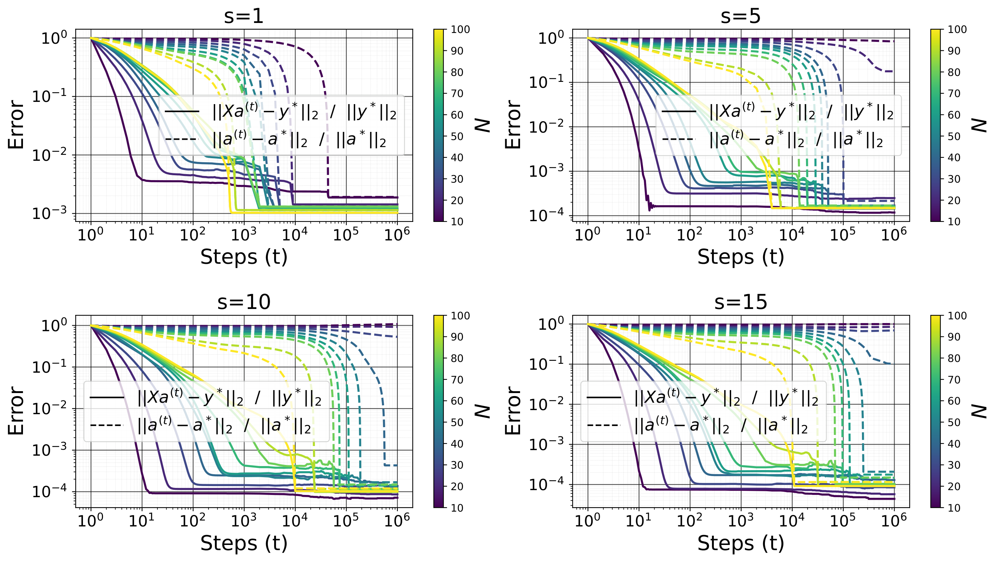

*Рисунок 13: Восстановление разрежённых векторов действием мягкого порога (ISTA)* **[p. 47]**

### D.2 Малоранговое разложение матриц

Для опытов этого раздела мы берём $(n_{1},n_{2},r,N,\zeta,\alpha,\beta)=(10,10,2,70,10^{-6},10^{-1},10^{-4})$ для измерения матриц. Рисунок 14 показывает итоги для проекционного субградиента, а рисунок 15 — для проксимального градиентного приёма.

#### Проекционный субградиент

На каждом шаге обновление (беря теперь в качестве градиента лишь $\beta H(\mathbf{A})$) проецируется на множество ограничения. В нашем случае обновление записывается как $\mathbf{A}^{(t+1)}=\Pi\left(\mathbf{A}^{(t)}-\alpha\beta H(\mathbf{A}^{(t)})\right)$, где $\Pi$ есть проекция на множество $\{\mathbf{A},\mathbf{X}\operatorname{vec}\mathbf{A}=\mathbf{y}^{*}\}$.


###### fig-14

*Рисунок 14: Измерение матриц проекционным субградиентным приёмом.*

#### Проксимальный градиентный спуск

Мы имеем $\mathbf{A}-\alpha F(\mathbf{A})=\Pi_{\alpha}\left(\mathbf{A}-\alpha G(\mathbf{A})\right)$, где $\Pi_{\alpha}$ есть проксимальное отображение для $\mathbf{B}\to\beta\|\mathbf{B}\|_{*}$: $\Pi_{\alpha}(\mathbf{A})=\arg\min_{\mathbf{B}}\frac{1}{2\alpha}\|\mathbf{B}-\mathbf{A}\|_{\text{F}}^{2}+\beta\|\mathbf{B}\|=S_{\alpha\beta}(\mathbf{A})$ при $S_{\gamma}(\mathbf{A})=\mathbf{U}\max(\Sigma-\gamma,0)\mathbf{V}^{\top}$ — действии мягкого порога для $\mathbf{A}=\mathbf{U}\Sigma\mathbf{V}^{\top}$ в сингулярном разложении, где $\max(\Sigma-\gamma,0)_{ij}=\delta_{ij}\max(\Sigma_{ij}-\gamma,0)$. Окончательный вид обновления таков: $\mathbf{A}^{(t+1)}=S_{\alpha\beta}\left(\mathbf{A}^{(t)}-\alpha G(\mathbf{A}^{(t)})\right)\quad\forall t>1.$

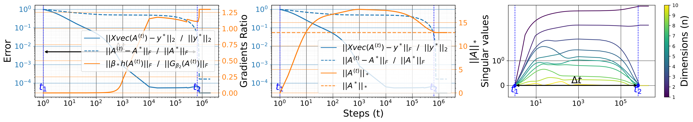

###### fig-15

*Рисунок 15: Измерение матриц проксимальным градиентным спуском.*

**[p. 48]**

## Приложение E Гроккинг без понимания

Рассмотрим задачу восстановления разрежённых векторов (изложенное ниже верно и для разложения матриц). Мы начинаем оптимизацию с $\mathbf{a}^{(1)}\overset{iid}{\sim}\zeta\mathcal{N}(0,1/n)$, где $\zeta\geq 0$ есть масштаб начального приближения. При малом начальном приближении сглаживания $\ell_{1}$ довольно для обобщения, коль скоро $N$ достаточно велико, а сглаживание $\ell_{2}$ не слишком велико. Если же масштаб начального приближения велик, то добавление сглаживания $\ell_{2}$ необходимо для обобщения, — но довольно ли его? То есть можно ли обобщить в изучаемой здесь задаче одним лишь сглаживанием $\ell_{2}$?


###### fig-16

*Рисунок 16: Относительные ошибки и $\|\mathbf{a}^{(t)}\|_{1}$ при большом масштабе начального приближения $\zeta=10^{1}$ и малом ослаблении весов $\beta=10^{-5}$. Без изображения ошибки в логарифмическом масштабе (слева) кажется, будто произошёл гроккинг, тогда как это не так (справа).* **[p. 48]**

###### p48-2

Как показано в разделе C.8, ответ на этот вопрос отрицателен. Но здесь мы хотим показать явление, противоречащее прежним работам (Liu et al., 2023a; Lyu et al., 2023), а именно что *в избыточно параметризованном режиме ($N<n$ в нашем случае) большое начальное приближение и ненулевое ослабление весов не всегда ведут к гроккингу*. Происходит вот что: из-за большого начального приближения в ошибке обобщения при обучении наблюдается более или менее резкий переход, отвечающий переходу в норме $\ell_{2}$ значений модели. Но назвать это гроккингом нельзя, ибо модель сходится лишь к невыгодному решению. Более того, этот переход появляется, даже если поставленная задача решения не допускает — скажем, при восстановлении разрежённых векторов или восполнении матрицы, когда число $N$ примеров много ниже теоретического предела, потребного, чтобы решение поставленной задачи было наилучшим (любым приёмом вообще). Переход выглядит резким лишь оттого, что обучающая ошибка велика в начале обучения, ибо выходы модели велики. Когда её норма $\ell_{2}$ становится мала, малы и выходы, что и даёт переход в ошибке. На рисунке 16 без изображения ошибки в логарифмическом масштабе кажется, будто произошёл гроккинг, тогда как это не так. Для этого рисунка мы берём $(n,s,N,\alpha)=(100,5,30,10^{-1})$.

###### p48-3

Мы называем это явление «гроккингом без понимания» вслед за Levi et al. (2024), показавшими его для линейной классификации. Они показывают, что резкий рост точности обобщения часто может не означать перехода от «запоминания» к «пониманию», а быть следствием самой меры точности. Но в нашем случае мы не берём сколько-нибудь заметного масштаба при начальном приближении (мы сосредоточены на $0\leq\zeta\leq 10^{-5}$) и не имеем дела с бедой меры обобщения, ибо наша тестовая ошибка есть прямо ошибка восстановления в пространстве функций, а не точность.

**[p. 49]**

Мы выдвигаем догадку, что взаимодействие большого начального приближения и малого ненулевого ослабления весов, ведущее к гроккингу, как (доказуемо) предсказывают Lyu et al. (2023), в нашей постановке не выполняется, ибо наша модель нарушает их *допущение 3.2*. Пусть $y_{\mathbf{a}}(\mathbf{x})=\mathbf{a}^{\top}\mathbf{x}$ означает нашу модель.

###### p49-2

- *Допущение 3.1* (Lyu et al., 2023): для всех $\mathbf{x}\in\mathbb{R}^{n}$ функция $\mathbf{a}\to y_{\mathbf{a}}(\mathbf{X})$ однородна степени $1$, ибо $y_{c\mathbf{a}}(\mathbf{x})=c^{1}y_{\mathbf{a}}(\mathbf{x})$ для всех $c>0$.
- *Допущение 3.2* (Lyu et al., 2023): при $\zeta=0$ выполнено $y_{\mathbf{a}^{(1)}}(\mathbf{x})=0$ для всех $\mathbf{x}$ (и в этом случае с $\ell_{1}$ обобщение есть), но при $\zeta>0$ (скажем, большом $\zeta$) это (почти наверное) уже не так. Стало быть, это допущение нарушено (с большой вероятностью).
- *Допущение 3.8* (Lyu et al., 2023): признаки NTK (нейронного касательного ядра) обучающих примеров $\{\nabla_{\mathbf{a}}y_{\mathbf{a}}(\mathbf{X}_{i})\}_{i\in[N]}$ линейно независимы (почти наверное) при начальном приближении $\mathbf{a}=\mathbf{a}^{(1)}$. И впрямь, $\nabla_{\mathbf{a}}y_{\mathbf{a}}(\mathbf{x})=\mathbf{x}\ \forall\mathbf{x}$. В избыточно параметризованном режиме $N<n$, если у $\mathbf{M}\in\mathbb{R}^{N\times n}$ записи независимы и нормально распределены, то признаки NTK $\{\mathbf{X}_{i}\}_{i\in[N]}$ линейно независимы с большой вероятностью (ибо ранг $\mathbf{X}$ с большой вероятностью равен $N$), и это допущение выполнено.

## Приложение F Неявная склонность глубины

### F.1 Глубокое восстановление разрежённых векторов

###### p49-3

Для восстановления разрежённых векторов возьмём теперь параметризацию $\mathbf{a}=\odot_{k=1}^{L}\mathbf{A}_{k}\in\mathbb{R}^{n}$ при $\mathbf{A}\in\mathbb{R}^{L\times n}$. Это отвечает линейной сети с $L$ слоями, где у каждого скрытого слоя значение $\operatorname{diag}(\mathbf{A}_{k})\in\mathbb{R}^{n\times n}$; при этом рост $L$ даёт избыточную параметризацию, не меняя выразительности разряда функций $\mathbf{a}\to\mathcal{F}_{\mathbf{a}}(\mathbf{x})=\mathbf{x}^{\top}\mathbf{a}$, ибо модель остаётся линейной по входу $\mathbf{x}$. В отличие от мелкого случая ($L=1$), при $L\geq 2$ (и малом масштабе начального приближения) сглаживание $\ell_{1}$ для обобщения не нужно, о чём и говорят опыты этого раздела. При глубине обновление для всего приближения (которое теперь заменено произведением матриц на вектор) схоже с мелким случаем, но с предобусловливателем перед градиентом. Этот предобусловливатель и позволяет восстановить разрежённый сигнал без всякого сглаживания.

Положим $h(\mathbf{A}_{i})=\frac{1}{2}\|\mathbf{A}_{i}\|_{2}$, так что $H(\mathbf{A}_{i})=\mathbf{A}_{i}$. Также $g(\mathbf{a})=\frac{1}{2}\|\mathbf{y}(\mathbf{a})-\mathbf{y}^{*}\|_{2}^{2}=\frac{1}{2}\mathbf{a}^{\top}\mathbf{X}^{\top}\mathbf{X}\mathbf{a}-\left(\mathbf{X}^{\top}\mathbf{X}\mathbf{a}^{*}+\mathbf{X}^{\top}\boldsymbol{\xi}\right)^{\top}\mathbf{a}+\frac{1}{2}\|\mathbf{X}\mathbf{a}^{*}+\boldsymbol{\xi}\|_{2}^{2}$. Положим $G(\mathbf{a}):=\frac{\partial g(\mathbf{a})}{\partial\mathbf{a}}=\mathbf{X}^{\top}\mathbf{X}(\mathbf{a}-\mathbf{a}^{*})-\mathbf{X}^{\top}\boldsymbol{\xi}$. Градиент для каждого $\mathbf{A}_{i}$ есть $G(\mathbf{A}_{i}):=\frac{\partial g(\mathbf{a})}{\partial\mathbf{A}_{i}}=\frac{\partial\mathbf{a}}{\partial\mathbf{A}_{i}}\frac{\partial g(\mathbf{a})}{\partial\mathbf{a}}=\operatorname{diag}(\odot_{k\neq i}\mathbf{A}_{k})G(\mathbf{a})$. Мы начинаем оптимизацию с $\mathbf{A}_{i}^{(1)}\overset{iid}{\sim}\zeta\mathcal{N}(0,1/n)$, где $\zeta\geq 0$ есть масштаб начального приближения. Правило обновления для каждого $\mathbf{A}_{i}$ таково:

$$
\begin{split}\mathbf{A}_{i}^{(t+1)}&=\mathbf{A}_{i}^{(t)}-\alpha G(\mathbf{A}_{i}^{(t)})-\alpha\beta H(\mathbf{A}_{i}^{(t)})=(1-\alpha\beta)\mathbf{A}_{i}^{(t)}-\alpha\operatorname{diag}(\odot_{k\neq i}\mathbf{A}_{k}^{(t)})G(\mathbf{a}^{(t)})\end{split} \tag{118}
$$

###### p49-5

Без избыточной параметризации ($L=1$) обновление не предобусловлено и движется равномерно во всех направлениях. Стало быть, без сглаживания $\ell_{1}$ нет устройства, навязывающего разрежённость, и безупречное восстановление $\mathbf{a}^{*}$ невозможно. При $L=2$ положим $\mathbf{c}:=\mathbf{A}_{1}\odot\mathbf{A}_{1}+\mathbf{A}_{2}\odot\mathbf{A}_{2}$.

$$
\begin{split}\mathbf{a}^{(t+1)}&=\mathbf{A}_{1}^{(t+1)}\odot\mathbf{A}_{2}^{(t+1)}\\
&=\left((1-\alpha\beta)\mathbf{A}_{1}^{(t)}-\alpha\operatorname{diag}(\mathbf{A}_{2}^{(t)})G(\mathbf{a}^{(t)})\right)\odot\left((1-\alpha\beta)\mathbf{A}_{2}^{(t)}-\alpha\operatorname{diag}(\mathbf{A}_{1}^{(t)})G(\mathbf{a}^{(t)})\right)\\
&=(1-\alpha\beta)^{2}\mathbf{a}^{(t)}-\alpha(1-\alpha\beta)\operatorname{diag}(\mathbf{A}_{1}^{(t)}\odot\mathbf{A}_{1}^{(t)}+\mathbf{A}_{2}^{(t)}\odot\mathbf{A}_{2}^{(t)})G(\mathbf{a}^{(t)})+\alpha^{2}\operatorname{diag}(\mathbf{a}^{(t)})G(\mathbf{a}^{(t)})^{\odot 2}\\
&=(1-\alpha\beta)^{2}\mathbf{a}^{(t)}-\alpha(1-\alpha\beta)\mathbf{c}^{(t)}\odot G(\mathbf{a}^{(t)})+\alpha^{2}\mathbf{a}^{(t)}\odot G(\mathbf{a}^{(t)})^{\odot 2}\\
&\approx(1-2\alpha\beta)\mathbf{a}^{(t)}-\alpha\mathbf{c}^{(t)}\odot G(\mathbf{a}^{(t)})\text{ for }\alpha\rightarrow 0\end{split} \tag{119}
$$

и

$$
\begin{split}\mathbf{c}^{(t+1)}&=\mathbf{A}_{1}^{(t+1)}\odot\mathbf{A}_{1}^{(t+1)}+\mathbf{A}_{2}^{(t+1)}\odot\mathbf{A}_{2}^{(t+1)}\\
&=(1-\alpha\beta)^{2}\mathbf{A}_{1}^{(t)}\odot\mathbf{A}_{1}^{(t)}-2\alpha(1-\alpha\beta)\operatorname{diag}(\mathbf{A}_{1}^{(t)}\odot\mathbf{A}_{2}^{(t)})G(\mathbf{a}^{(t)})+\alpha^{2}\operatorname{diag}(\mathbf{A}_{2}^{(t)}\odot\mathbf{A}_{2}^{(t)})G(\mathbf{a}^{(t)})^{\odot 2}\\
&\quad+(1-\alpha\beta)^{2}\mathbf{A}_{2}^{(t)}\odot\mathbf{A}_{2}^{(t)}-2\alpha(1-\alpha\beta)\operatorname{diag}(\mathbf{A}_{2}^{(t)}\odot\mathbf{A}_{1}^{(t)})G(\mathbf{a}^{(t)})+\alpha^{2}\operatorname{diag}(\mathbf{A}_{1}^{(t)}\odot\mathbf{A}_{1}^{(t)})G(\mathbf{a}^{(t)})^{\odot 2}\\
&=(1-\alpha\beta)^{2}\mathbf{c}^{(t)}-4\alpha(1-\alpha\beta)\mathbf{a}^{(t)}\odot G(\mathbf{a}^{(t)})+\alpha^{2}\mathbf{c}^{(t)}\odot G(\mathbf{a}^{(t)})^{\odot 2}\\
&\approx(1-2\alpha\beta)\mathbf{c}^{(t)}-4\alpha\mathbf{a}^{(t)}\odot G(\mathbf{a}^{(t)})\text{ for }\alpha\rightarrow 0\end{split} \tag{120}
$$

**[p. 50]**

Глубина добавляет предобусловливание $\mathbf{P}^{(t)}=(1-\alpha\beta)\operatorname{diag}(\mathbf{c}^{(t)})$ перед обновлением для $\mathbf{a}$. Это предобусловливание словно неявно благоприятствует разрежённости и тем самым безупречному восстановлению после запоминания. И впрямь, когда $\mathbf{c}^{(t)}_{i}$ уходит в ноль (что случается, когда $\mathbf{a}^{(t)}_{i}$ тоже мало), обновление становится $\mathbf{a}^{(t+1)}_{i}\approx(1-2\alpha\beta)\mathbf{a}^{(t)}_{i}$ и потому толкает $\mathbf{a}^{(t+1)}_{i}$ к $0$ с геометрической скоростью $\mathcal{O}(1-2\alpha\beta)$. В противном случае (большое) $\mathbf{c}^{(t)}_{i}$ усилит градиент так, что $\mathbf{c}^{(t)}_{i}G(\mathbf{a}^{(t)})_{i}$ будет преобладать в обновлении, что толкает $\mathbf{a}^{(t)}$ к $\mathbf{a}^{*}$ (ибо градиент $G(\mathbf{a}^{(t)})$ указывает в направлении малой ошибки $\mathbf{a}^{(t)}-\mathbf{a}^{*}$, особенно при полноранговой $\mathbf{X}$ и высоком отношении сигнала к шуму).

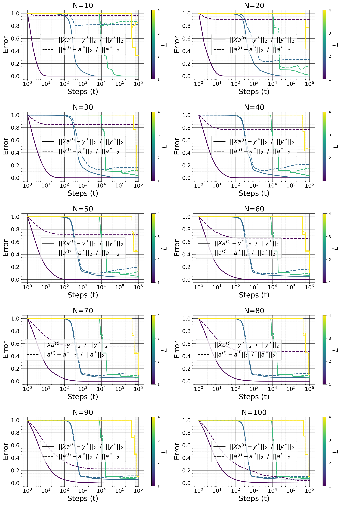

*Рисунок 17: Обучающая ошибка и ошибка восстановления как функции числа примеров $N$ и глубины $L$.* **[p. 51]**


*Рисунок 18: Обучающая ошибка $\|\mathbf{X}\mathbf{a}^{(t_{1})}-\mathbf{y}^{*}\|_{2}/\|\mathbf{y}^{*}\|_{2}$ и ошибка восстановления $\|\mathbf{a}^{(t_{2})}-\mathbf{a}^{*}\|_{2}/\|\mathbf{a}^{*}\|_{2}$ (вместе с $t_{1}$ и $t_{2}$ — шагами запоминания и обобщения) как функции числа примеров $N$ и глубины $L$. Рост тестовой ошибки (как функции $N$) при $L=4$ вызван попросту тем, что мы не обучали достаточно долго, чтобы она убыла.* **[p. 52]**

###### p50-2

При приведённой выше глубокой параметризации мы решаем задачу восстановления разрежённых векторов субградиентным спуском при $(n,s,\alpha,\beta)=(10^{2},5,10^{-1},0)$ для разных значений $N$ и $L\in\{1,2,3,4\}$ (рисунки 17 и 18). Мы берём малый масштаб начального приближения $\zeta=10^{-6}$ при $L=1$ и $\zeta=10^{-2}$ при $L>1$. Здесь начальное приближение $\mathbf{A}$ слишком близко к началу координат (масштаб $\zeta\rightarrow 0$) приводит к тому, что $\mathbf{a}$ при обучении не меняется. Модель способна восстановить истинный сигнал $\mathbf{a}^{*}$, и задержка обобщения становится крайне малой (по сравнению с мелким случаем при ненулевом коэффициенте $\ell_{1}$) при $L=2$ и исчезает (разгроккивание) при $L>2$. С ростом $L$ фазовый переход к обобщению становится крайне резким. Потеря убывает лестницей, с более или менее долгими ровными участками невыгодной ошибки обобщения при обучении. Такое поведение обыкновенно наблюдается при оптимизации *мягких комитетных машин* (Biehl & Schwarze, 1995; Saad & Solla, 1995b, a, 1996; Engel & Broeck, 2001; Aubin et al., 2018; Goldt et al., 2020) — двуслойных линейных или нелинейных систем «учитель — ученик», где выходной слой ученика закреплён равным выходному слою учителя на всё обучение.

Кроме того, при закреплённом числе $N$ измерений тестовая ошибка убывает с ростом $L$, а значит, глубина помогает найти сигнал по меньшему числу измерений, хотя и ценой более долгого обучения. Стало быть, глубина словно действует на обобщение так же, как $\ell_{1}$. Это согласуется с итогом Arora et al. (2018) для разложения матриц. Они показывают, что введение глубины по существу превращает градиентный спуск в мелкое (однослойное) обучение со встроенным предобусловливанием. Это устройство склоняет обновления к направлениям, уже исследованным оптимизацией, и служит приёмом ускорения, сплавляющим момент с приспосабливаемыми шагами. Более того, они показывают, что избыточная параметризация глубиной способна заметно ускорить обучение даже в простых выпуклых задачах вроде линейной регрессии с потерей $\ell_{p}$, $p>2$.

Заметим, что при $L\geq 2$ большое начальное приближение и малое ненулевое сглаживание $\ell_{2}$ с силой $\beta$ дают гроккинг, в отличие от случая $L=1$, дающего «гроккинг без понимания». В этом режиме с ростом $L$ число шагов, потребных модели, чтобы перейти от запоминания к обобщению, уменьшается (ускорение гроккинга), а ошибка обобщения в конце обучения заметно ниже. Lyu et al. (2023) применяли схожую постановку, чтобы показать, что взаимодействие большого начального приближения и малого ненулевого ослабления весов даёт гроккинг в диагональной линейной сети $y(\mathbf{x})=\left(\mathbf{u}^{\odot L}-\mathbf{v}^{\odot L}\right)^{\top}\mathbf{x}$ применительно к двоичной классификации, но там не изучали влияния $L$ на задержку обобщения, а сосредоточились на описании того, насколько резок переход от запоминания к обобщению как функция масштаба начального приближения и коэффициента ослабления весов и сколько времени этот переход занимает. Эта диагональная линейная сеть часто применяется и для задач восстановления разрежённых векторов (Vaškevičius et al., 2019), но средоточие там обыкновенно на её способности восстановить наилучшее решение, а не на гроккинге.

### F.2 Глубокое разложение матриц

Для разложения матриц возьмём параметризацию $\mathbf{A}=\prod_{k=1}^{L}\mathcal{A}_{k}$ при $\mathcal{A}_{1}\in\mathbb{R}^{n_{1}\times d}$, $\mathcal{A}_{L}\in\mathbb{R}^{d\times n_{2}}$ и $\mathcal{A}_{i}\in\mathbb{R}^{d\times d}$ для всех $i\in(1,L)$. Это отвечает линейной сети с $L$ слоями, где у каждого скрытого слоя значение $\mathcal{A}_{k}$; при этом рост $L$ даёт избыточную параметризацию, не меняя выразительности разряда функций $\mathbf{A}\to\mathcal{F}_{\mathbf{A}}(\mathbf{x})=\mathbf{x}^{\top}\operatorname{vec}\mathbf{A}$, ибо модель остаётся линейной по входу $\mathbf{x}$. Как и при сжимающих измерениях, при $L\geq 2$ (и малом масштабе начального приближения) сглаживание $\ell_{*}$ (или всякое иное) для обобщения не нужно — в отличие от мелкого случая ($L=1$). Это наблюдение уже сделано и доказано в прежних работах (Gunasekar et al., 2017; Arora et al., 2019; Gidel et al., 2019; Gissin et al., 2019; Razin & Cohen, 2020; Li et al., 2020). Gunasekar et al. (2017); Arora et al. (2019) показывают, что рост $L$ неявно склоняет $\mathbf{A}$ к малоранговому решению, что зачастую даёт более точное восстановление при достаточно большом $N$. И впрямь, при глубине обновление для всего приближения схоже с мелким случаем, но с предобусловливателем перед градиентом (как в разделе F.1). Этот предобусловливатель и позволяет восстановить малоранговую матрицу без всякого сглаживания и по меньшему числу примеров, чем в мелком случае (Arora et al., 2018, 2019). Именно для этой задачи показано также, что начальное приближение модели весьма далеко от начала координат вместе с малым (но ненулевым) ослаблением весов даёт гроккинг (Lyu et al., 2023): модель сперва запоминает наблюдённые записи, а затем, после долгого обучения, сходится к искомым матрицам, коль скоро число таких наблюдённых записей достаточно велико.

**[p. 52]**

## Приложение G Усиление гроккинга отбором данных

### G.1 Восстановление разрежённых векторов

##### **Определение G.1**(свойство ограниченной изометрии (RIP) и постоянная ограниченной изометрии (RIC))**.**

Пусть $\mathbf{A}\in\mathbb{R}^{m\times n}$ и $(s,\delta_{s})\in[n]\times(0,1)$. Говорят, что матрица $\mathbf{A}$ обладает $(s,\delta_{s})$-RIP, если $(1-\delta_{s})\|\mathbf{x}\|_{2}^{2}\leq\|\mathbf{A}\mathbf{x}\|_{2}^{2}\leq(1+\delta_{s})\|\mathbf{x}\|_{2}^{2}$ для всякого $s$-разрежённого вектора $\mathbf{x}\in\mathbb{R}^{n}$ (то есть $\|\mathbf{x}\|_{0}\leq s$). Это равносильно тому, что для всякого $J\subset[n]$ с $|J|=s$ выполнено $(1-\delta_{s})\|\mathbf{x}\|_{2}^{2}\leq\|\mathbf{A}_{:,J}\mathbf{x}\|_{2}^{2}\leq(1+\delta_{s})\|\mathbf{x}\|_{2}^{2}\quad\forall\mathbf{x}\in\mathbb{R}^{s}$, где подматрица $\mathbf{A}_{:,J}\in\mathbb{R}^{m\times s}$ матрицы $\mathbf{A}$ строится выбором столбцов с указателями из $J$. Это условие равносильно также утверждению $\|\mathbf{A}_{:,J}^{\top}\mathbf{A}_{:,J}-\mathbb{I}_{s}\|_{2\rightarrow 2}\leq\delta_{s}$, что, наконец, равносильно $\lambda\left(\mathbf{A}_{:,J}^{\top}\mathbf{A}_{:,J}\right)\in\left[1-\delta_{s},1+\delta_{s}\right]$ для всех собственных значений $\lambda\left(\mathbf{A}_{:,J}^{\top}\mathbf{A}_{:,J}\right)$ матрицы $\mathbf{A}_{:,J}^{\top}\mathbf{A}_{:,J}$. Мы говорим, что $\mathbf{A}$ обладает $s$-RIP, если она обладает $(s,\delta_{s})$-RIP при некотором $\delta_{s}\in(0,1)$. Величина $s$-RIC матрицы $\mathbf{A}$ определяется как точная нижняя грань $\delta_{s}(\mathbf{A})$ всех возможных $\delta_{s}$, при которых $\mathbf{A}\in\mathbb{R}^{m\times n}$ обладает $(s,\delta_{s})$-RIP. Стало быть, для всех $\forall J\subset[n]$ с $|J|=s$ число обусловленности $\mathbf{A}_{:,J}^{\top}\mathbf{A}_{:,J}$ ограничено сверху величиной $\frac{1+\delta_{s}(\mathbf{A})}{1-\delta_{s}(\mathbf{A})}$, а число обусловленности $\mathbf{A}_{:,J}$ — величиной $\sqrt{\frac{1+\delta_{s}(\mathbf{A})}{1-\delta_{s}(\mathbf{A})}}$.

Мы говорим, что матрица $\mathbf{A}$ обладает RIP, если $\delta_{s}(\mathbf{A})$ мало при разумно больших $s$. Все приведённые выше определения распространяются на всякое линейное отображение $f:\mathbb{R}^{n}\to\mathbb{R}^{m}$. Заметим, что $\delta_{s}(\mathbf{A})\leq\delta_{s+1}(\mathbf{A})$ для всех $\mathbf{A}\in\mathbb{R}^{m\times n}$ и $s\in[n]$.

Пусть $\mathcal{F}:\mathbb{R}^{m\times n}\to\mathbb{R}^{q}$ есть линейное отображение и $(r,\delta_{r})\in[n]\times(0,1)$. Говорят, что $f$ обладает $(r,\delta_{r})$-RIP, если для всех матриц $\mathbf{X}\in\mathbb{R}^{m\times n}$ ранга $r$:

$$
(1-\delta_{r})\|\mathbf{X}\|_{\text{F}}^{2}\leq\|\mathcal{F}(\mathbf{X})\|_{2}^{2}\leq(1+\delta_{r})\|\mathbf{X}\|_{\text{F}}^{2} \tag{121}
$$

Мы говорим, что $\mathcal{F}$ обладает $r$-RIP, если $\mathcal{F}$ обладает $(r,\delta_{r})$-RIP при некотором $\delta_{r}\in(0,1)$, а величина $r$-RIC отображения $\mathcal{F}$ определяется как точная нижняя грань $\delta_{r}(\mathcal{F})$ всех возможных $\delta_{r}$, при которых $\mathcal{F}$ обладает $(r,\delta_{r})$-RIP.

##### **Определение G.2**(когерентность)**.**

Когерентность двух матриц $\mathbf{A}\in\mathbb{R}^{q\times m}$ и $\mathbf{B}\in\mathbb{R}^{q\times n}$ есть $\mu(\mathbf{A},\mathbf{B})=\max_{i\in[m],j\in[n]}\frac{|\langle\mathbf{A}_{:,i},\mathbf{B}_{:,j}\rangle|}{\|\mathbf{A}_{:,i}\|\|\mathbf{B}_{:,j}\|}=\max_{i\in[m],j\in[n]}\frac{|[\mathbf{A}^{\top}\mathbf{B}]_{i,j}|}{\|\mathbf{A}_{:,i}\|\|\mathbf{B}_{:,j}\|}$. Когерентность мерит, насколько две матрицы или два вектора схожи или согласованы. А именно, она мерит, насколько столбцы $\mathbf{A}$ и $\mathbf{B}$ перекрываются. Высокая когерентность означает, что они схожи или согласованы, а низкая когерентность (некогерентность) — что они весьма различны. Некогерентность по существу противоположна когерентности: она означает малое перекрытие или малое сходство столбцов $\mathbf{A}$ и $\mathbf{B}$.

Взаимная когерентность матрицы $\mathbf{A}\in\mathbb{R}^{m\times n}$ есть $\mu(\mathbf{A})=\max_{(i,j)\in[m]\times[n],i\neq j}\frac{|\langle\mathbf{A}_{:,i},\mathbf{A}_{:,j}\rangle|}{\|\mathbf{A}_{:,i}\|\|\mathbf{A}_{:,j}\|}=\max_{(i,j)\in[m]\times[n],i\neq j}\frac{[\mathbf{A}^{\top}\mathbf{A}]_{i,j}}{\|\mathbf{A}_{:,i}\|\|\mathbf{A}_{:,j}\|}$. Если когерентность мала, то столбцы $\mathbf{A}$ почти взаимно ортого**[p. 53]**нальны. Малая когерентность желательна ради хороших свойств восстановления разрежённых векторов. Есть и 1-когерентность $\mu_{1}(\mathbf{A},s)=\max_{i\in[n]}\max_{J\subseteq[n]\backslash i,|J|\leq s}\sum_{j\in J}\frac{|\langle\mathbf{A}_{:,i},\mathbf{A}_{:,j}\rangle|}{\|\mathbf{A}_{:,i}\|\|\mathbf{A}_{:,j}\|}\leq s\mu(\mathbf{A})$.

Для матрицы $\mathbf{A}\in\mathbb{R}^{m\times n}$ с единичными нормами столбцов выполнено $\mu(\mathbf{A})\geq\sqrt{\frac{n-m}{m(n-1)}}$ и $\mu_{1}(\mathbf{A},s)\geq s\sqrt{\frac{n-m}{m(n-1)}}$, коль скоро $s\leq\sqrt{n-1}$ (Rauhut, 2010). В пространстве высокой размерности (большом $n$) оценка $\mu(\mathbf{A})\geq\sqrt{\frac{n-m}{m(n-1)}}$ обращается в $\mu(\mathbf{A})\gtrsim\frac{1}{\sqrt{m}}$: эта нижняя оценка достигается, когда $\mathbf{A}$ есть равноугольная плотная рама.

##### **Утверждение G.3**(связь $\mu$ и $\delta$)**.**

*Для матрицы $\mathbf{A}\in\mathbb{R}^{m\times n}$ с единичными нормами столбцов выполнено $\mu(\mathbf{A})=\delta_{2}(\mathbf{A})$, $\mu_{1}(\mathbf{A},s)=\max_{J\in[n],|J|\leq s+1}\|\mathbf{A}_{:,J}^{\top}\mathbf{A}_{:,J}-\mathbb{I}\|_{1\rightarrow 1}$ и $\delta_{s}(\mathbf{A})\leq\mu_{1}(\mathbf{A},s-1)\leq(s-1)\mu(\mathbf{A})$ (Rauhut, 2010).*

#### G.1.1 Задача

По данным разрежающему базису (или словарю) $\Phi\in\mathbb{R}^{n\times n}$, измерительной матрице $\mathbf{M}\in\mathbb{R}^{N\times n}$ и измерениям $\mathbf{y}^{*}=\mathcal{F}_{\mathbf{b}^{*}}(\mathbf{M})+\boldsymbol{\xi}=\mathbf{M}\mathbf{b}^{*}+\boldsymbol{\xi}\in\mathbb{R}^{N}$ мы стремимся решить $(P_{0})\text{ Minimize }\|\mathbf{a}\|_{0}\text{ s.t. }\|\mathcal{F}_{\mathbf{a}}(\mathbf{M}\Phi)-\mathbf{y}^{*}\|_{2}\leq\epsilon$, а точнее — её выпуклое ослабление $(P_{1})\text{ Minimize }\|\mathbf{a}\|_{1}\text{ s.t. }\|\mathcal{F}_{\mathbf{a}}(\mathbf{M}\Phi)-\mathbf{y}^{*}\|_{2}\leq\epsilon$. Эта задача хорошо изучена в литературе по обработке сигналов под именем *поиска базиса*. Хорошо известно, что при некоторых условиях на измерительную матрицу $\mathbf{M}$ (скажем, когерентность относительно $\Phi$) и разрежённость $\mathbf{b}^{*}$ в $\Phi$ достаточно разрежённые решения $(P_{1})$ суть также решения $(P_{0})$ (Donoho & Elad, 2003; Candes et al., 2006). Выведено и много нижних оценок числа измерений $N$, ручающихся за $\|\mathbf{a}-\mathbf{a}^{*}\|_{2}\leq\epsilon$ с большой вероятностью. Такие оценки обыкновенно имеют вид $N=\Omega\left(\delta^{-C_{1}}\left(s\log^{C_{2}}\left(n/s\right)+\log 1/\eta\right)\right)$ (Rauhut, 2010), где $\delta$ передаёт свойство ограниченной изометрии (определение G.1) матрицы $\mathbf{X}=\mathbf{M}\Phi$ ($\delta_{2s}(\mathbf{X})\leq\delta$) и связано также с когерентностью (определение G.2) матрицы $\mathbf{M}$ относительно $\Phi$ (утверждение G.3), $\eta$ есть доля ошибки (то есть $N$ ручается за восстановление с вероятностью не менее $1-\eta$), а $\mathbf{C}_{1}>0$ и $C_{2}>0$ суть постоянные. Заметим, что в бесшумном случае мы хотим $\mathbf{a}$ такое, что $\mathbf{X}\mathbf{a}=\mathbf{X}\mathbf{a}^{*}$, то есть $\mathbf{a}\in\mathbf{a}^{*}+\text{Null}(\mathbf{X})$. Donoho (2006b, a) показывает, что нулевое пространство $\left\{\mathbf{a},\mathbf{X}\mathbf{a}=0\right\}$ имеет весьма особое строение при определённых $\mathbf{X}$ (скажем, некогерентных всякому ортонормированному базису): когда $\mathbf{a}^{*}$ разрежён, единственный элемент аффинного подпространства $\mathbf{a}^{*}+\text{Null}(\mathbf{X})$, способный иметь малую норму $\ell_{1}$, есть сам $\mathbf{a}^{*}$.

Ради простоты мы полагаем $\Phi$ ортонормированной матрицей, $\Phi^{\top}\Phi=\mathbb{I}_{n}$. В теории разрежённого кодирования принято считать $\Phi\in\mathbb{R}^{n\times m}$ словарём с $m$ столбцами, называемыми атомами (квадратный, $n=m$; неполный, $n>m$; или избыточный, $n<m$), и разрежённость $\mathbf{b}^{*}$ означает, что его можно записать линейным сочетанием немногих таких атомов. Но здесь ради простоты мы полагаем $\mathbf{b}^{*}=\Phi\mathbf{a}^{*}$ при $\mathbf{a}^{*}\in\mathbb{R}^{m}$ и $\Phi\in\mathbb{R}^{n\times m}$ — наборе из $m\leq n$ линейно независимых векторов (его столбцов). Пусть $\Phi^{\perp}\in\mathbb{R}^{n\times(n-m)}$ есть ортогональное дополнение $\Phi$ в $\mathbb{R}^{n}$, $\Psi:=\left[\Phi\quad\Phi^{\perp}\right]\in\mathbb{R}^{n\times n}$, $\tilde{\Phi}:=\Psi\left(\Psi^{\top}\Psi\right)^{-1/2}\in\mathbb{R}^{n\times n}$ — ортонормированный вид $\Psi$, и $\tilde{\mathbf{a}}^{*}:=\left(\Psi^{\top}\Psi\right)^{1/2}\begin{bmatrix}\mathbf{a}^{*}\\ 0\end{bmatrix}$. Мы по-прежнему имеем $\mathbf{b}^{*}=\tilde{\Phi}\tilde{\mathbf{a}}^{*}$ при $\|\tilde{\mathbf{a}}^{*}\|_{0}=\|\mathbf{a}^{*}\|_{0}$, ибо $\Psi^{\top}\Psi$ диагональна. Стало быть, предположение об ортонормированности $\Phi$ не ограничивает общности.

##### **Пример G.1****.**

*Для базиса Фурье $\sqrt{n}\Phi_{ji}=\mathbf{e}^{-2\pi\textbf{i}\frac{ji}{n}}$ имеем $\mu_{1}(\Phi,s)=s\mu(\Phi)=s/\sqrt{n}$ (Rauhut, 2010). Каждый столбец этого базиса отвечает определённой частоте. Для сигнала $\mathbf{b}^{*}$, если лишь немногие частотные составляющие вносят заметный вклад в $\mathbf{b}^{*}$, то $\mathbf{a}^{*}=\Phi^{-1}\mathbf{b}^{*}$ — преобразование Фурье $\mathbf{b}^{*}$ — будет разрежённым.*

#### G.1.2 Управляющие параметры

Некогерентность между измерительными векторами (строками $\mathbf{M}$) и разрежающим базисом (столбцами $\Phi$) решающе важна для успешного восстановления $\mathbf{b}^{*}$ (или, что то же, $\mathbf{a}^{*}$ — разрежённого представления). Если $\mathbf{M}$ некогерентна с $\Phi$, каждое измерение схватывает свой «вид» $\mathbf{b}^{*}$, что уменьшает избыточность. Такое разнообразие сведений позволяет успешно восстановить $\mathbf{a}^{*}$ даже при меньшем числе измерений (скажем, ниже частоты Найквиста для сигналов). Малой когерентности (высокой некогерентности) можно добиться, взяв $\mathbf{M}$ случайной матрицей (скажем, субгауссовой — гауссовой или бернуллиевой). Такие случайные матрицы с большой вероятностью некогерентны всякому закреплённому ортонормированному базису, как показывают теоремы G.4 и G.5.

##### **Теорема G.4****.**

*Пусть $m\leq n$ и $\Phi\in\mathbb{R}^{n\times m}$ с $\Phi^{\top}\Phi=\mathbb{I}_{m}$. Для любых $N\geq 1$, $C_{1}>0$ и $C_{2}\geq 1$ матрица $\mathbf{M}\in\mathbb{R}^{N\times n}$ с $n^{C_{1}}\mathbf{M}\overset{iid}{\sim}\mathcal{N}\left(0,1\right)$ удовлетворяет $\mu(\mathbf{M}^{\top},\Phi)\leq 2C_{2}\frac{\sqrt{\ln(nN)}}{n^{C_{1}}}$ с вероятностью не менее $1-1/(nN)^{2C_{2}^{2}-1}$.*

##### Доказательство.

Пусть $\sigma=n^{-C_{1}}$, $C_{1}>0$. Мы имеем $\mathbf{M}\overset{iid}{\sim}\mathcal{N}(0,\sigma^{2})$, а потому $\left[\mathbf{M}\Phi\right]_{ij}\overset{iid}{\sim}\mathcal{N}(0,\sigma^{2})$, ибо у $\Phi$ нормированные столбцы. Отсюда $\mathbb{P}\left[\left|\left[\mathbf{M}\Phi\right]_{ij}\right|\geq t\right]\leq\exp\left(-\frac{t^{2}}{2\sigma^{2}}\right)$, что в свою очередь даёт $\mathbb{P}\left[\max_{i,j}\left|\left[\mathbf{M}\Phi\right]_{ij}\right|\geq t\right]\leq\sum_{i,j}\mathbb{P}\left[\left|\left[\mathbf{M}\Phi\right]_{ij}\right|\geq t\right]\leq nN\exp\left(-\frac{t^{2}}{2\sigma^{2}}\right)$. Беря $t=2C_{2}\frac{\sqrt{\ln(nN)}}{n^{C_{1}}}$ при $C_{2}\geq 1$, имеем $t^{2}=2\left(\frac{1}{n^{C_{1}}}\right)^{2}\ln\left(\frac{nN}{\eta}\right)$ при $\eta=(nN)^{1-2C_{2}^{2}}$, откуда **[p. 54]** $nN\exp\left(-\frac{t^{2}}{2\sigma^{2}}\right)=\eta$. ∎

Приведём также следующую теорему из Rauhut (2010) о свойстве RIP такой матрицы.

##### **Теорема G.5****.**

*Пусть $\mathbf{M}\in\mathbb{R}^{N\times n}$ есть гауссова или бернуллиева случайная матрица. Пусть $\eta,\delta\in(0,1)$ и $N\geq C\delta^{-2}\left(s\ln\left(n/s\right)+\ln\left(1/\eta\right)\right)$ при всеобщей постоянной $C>0$. Тогда $\delta_{s}(\mathbf{M})\leq\delta$ с вероятностью не менее $1-\eta$.*

Далее в этом разделе:

- Чтобы управлять некогерентностью, мы строим $\mathbf{M}$ при данном $N$, беря первые $N_{1}=\min(\lfloor\tau N\rfloor,n)$ строк (при $0\leq\tau\leq 1$, по умолчанию $0$) из первых столбцов $\Phi$, а записи оставшихся $N_{2}=N-N_{1}$ строк — независимо из $\mathcal{N}(0,1/n)$, так что $\mathbf{X}=\mathbf{M}\Phi=\begin{bmatrix}\Phi_{:,:N_{1}}^{\top}\\ \mathbf{M}_{N_{1}:,:}\end{bmatrix}\Phi=\begin{bmatrix}\mathbb{I}_{N_{1}\times n}\\ \mathbf{M}_{N_{1}:,:}\Phi\end{bmatrix}$ при $\mathbf{M}_{N_{1}:,:}\overset{iid}{\sim}\mathcal{N}(0,1/n)$. Чем больше $\tau$ (а с ним и $N_{1}$), тем меньше некогерентность между измерениями (столбцами $\mathbf{M}^{\top}$) и $\Phi$. Значение $\tau=0$ отвечает целиком случайной гауссовой $\mathbf{M}$ и наибольшей некогерентности, тогда как $\tau=1$ отвечает $\mathbf{M}_{i}\in\{\Phi_{:,j}\}_{j\in[n]}$ для всех $i\in[N]$ и наименьшей некогерентности (когерентности, равной $1$).
- При данном $s$ мы берём случайный вектор $\mathbf{a}^{*}\overset{iid}{\sim}\mathcal{N}(0,1/n)$ такой, что $\|\mathbf{a}^{*}\|_{0}\leq s$, и полагаем $\mathbf{b}^{*}=\Phi\mathbf{a}^{*}$.
- Матрицу $\Phi$ мы получаем QR-разложением случайной гауссовой матрицы $n\times n$, беря часть Q.
- Для шума $\xi\in\mathbb{R}^{N}$ мы берём $\xi\overset{iid}{\sim}\mathcal{N}(0,\sigma_{\xi}^{2})$ при $\texttt{SNR}=\frac{\mathbb{E}\|\mathbf{a}^{*}\|_{2}^{2}}{N\sigma_{\xi}^{2}}=10^{8}$ (отношение сигнала к шуму).

#### G.1.3 Влияние когерентности на гроккинг

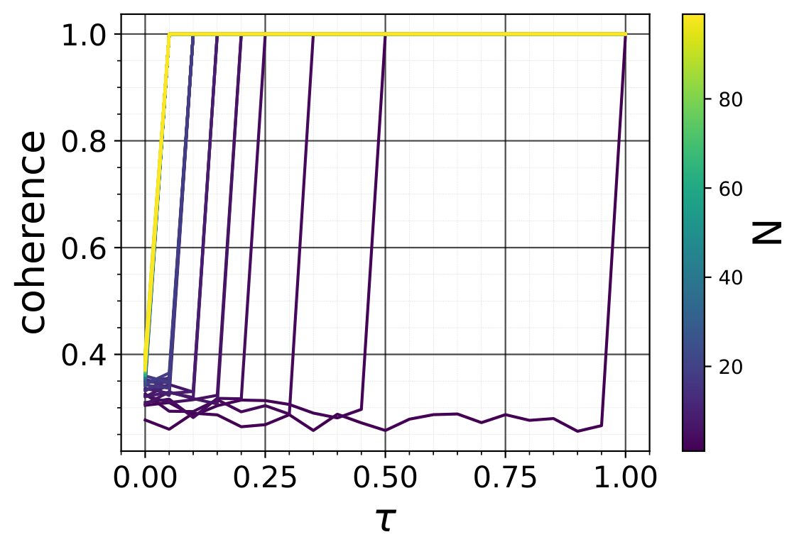


*Рисунок 19: **(a)** Когерентность $\mu(\mathbf{M}^{\top},\Phi)$ как функция $\tau\in(0,1)$ **(b)** Наименьшее число примеров для безупречного восстановления (относительная ошибка восстановления $\leq 10^{-6}$) при $n=10^{2}$ как функция уровня разрежённости $s\in[n]$ и параметра когерентности $\tau\in(0,1)$* **[p. 54]**

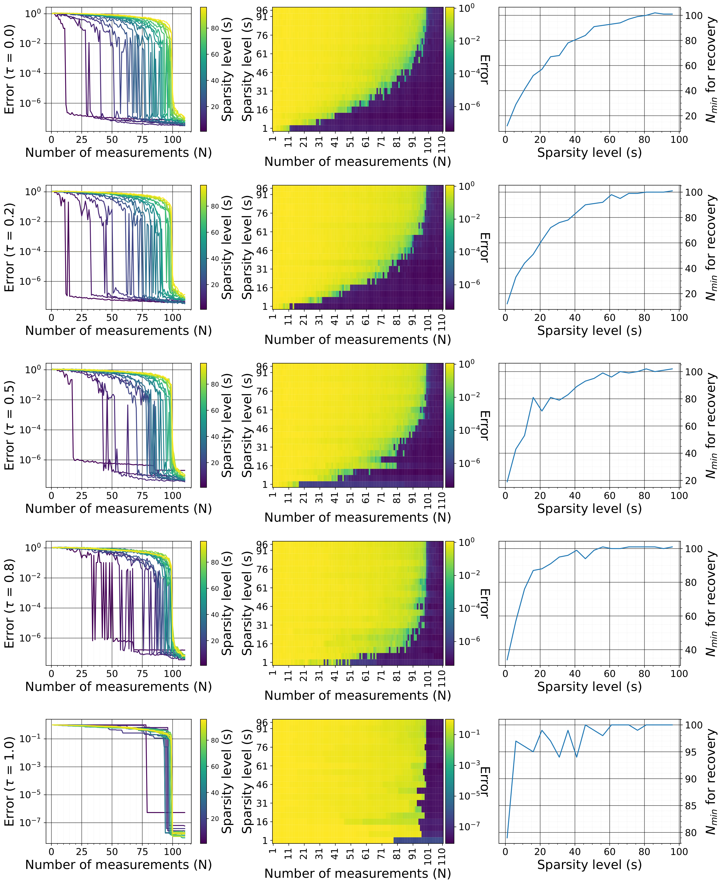

*Рисунок 20: Относительная ошибка $\|\mathbf{a}-\mathbf{a}^{*}\|_{2}/\|\mathbf{a}^{*}\|_{2}$ как функция числа измерений $N$, уровня разрежённости $s\in[n]$ и параметра когерентности $\tau\in(0,1)$ при $n=10^{2}$* **[p. 55]**

#### Выпуклая оптимизация

Мы закрепляем $n=10^{2}$ и решаем при разных $(N,s,\tau)$ задачу $(P_{1})$ средством cvxpy. С ростом $s$ и (или) $\tau$ растёт $N_{\text{min}}(s,\tau)$ — число примеров, потребное для безупречного восстановления (рисунки 19 и 20). При $\tau$, сходящемся к $1$, имеем $N_{\text{min}}(s,\tau)\rightarrow n$ для всех $s$. Ошибка на этих рисунках есть относительная ошибка восстановления $\|\mathbf{a}-\mathbf{a}^{*}\|_{2}/\|\mathbf{a}^{*}\|_{2}$. Она обыкновенно имеет порядок $10^{-6}$, что даёт нам основу для сравнения с иными приёмами.

#### Градиентный спуск

Здесь мы также наблюдаем, что время обобщения и задержка обобщения растут с $\tau$, тогда как ошибка обобщения с ним убывает (рисунки 21 и 22). При $N<n$ и $\tau\rightarrow 1$ время обобщения $t_{2}\rightarrow\infty$. Причина в том, что каждое измерение схватывает лишь один вид (одну составляющую) $\mathbf{b}^{*}=\Phi\mathbf{a}^{*}$, а это делает невозможным нахождение наилучшего $\mathbf{a}^{*}$ решением уравнения $\mathbf{M}\Phi\mathbf{a}=\mathbf{y}^{*}$ при $N<n$ (любым приёмом вообще). **[p. 56]** С другой стороны, при $\tau\rightarrow 0$ матрица $\mathbf{M}$ становится целиком случайной, и каждое измерение схватывает свой «вид» $\mathbf{b}^{*}$, что даёт наилучшее возможное время обобщения при рассматриваемом объёме данных. Ошибка $\|\mathbf{a}^{(t_{2})}-\mathbf{a}^{*}\|_{2}/\|\mathbf{a}^{*}\|_{2}$ при обобщении ($t_{2}$) как функция $N$ и $\tau$ имеет тот же вид, что и при выпуклом программировании. В опытах мы берём $(n,s,\alpha,\beta,\zeta)=(10^{2},5,10^{-1},10^{-5},10^{-6})$.

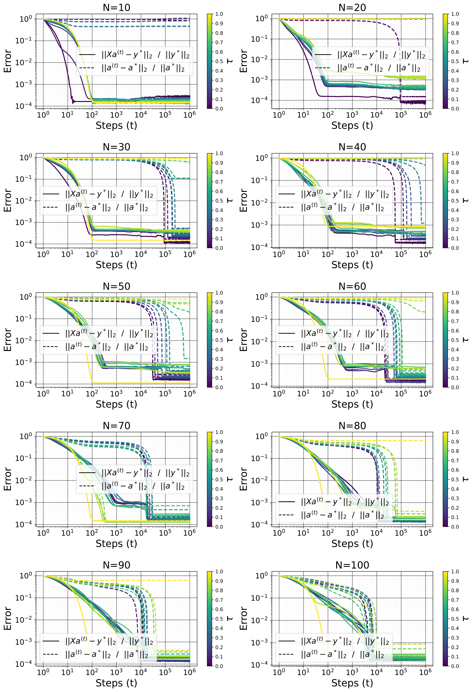

*Рисунок 21: Обучающая ошибка и ошибка восстановления как функции числа примеров $N$ и параметра когерентности $\tau\in[0,1]$.* **[p. 57]**

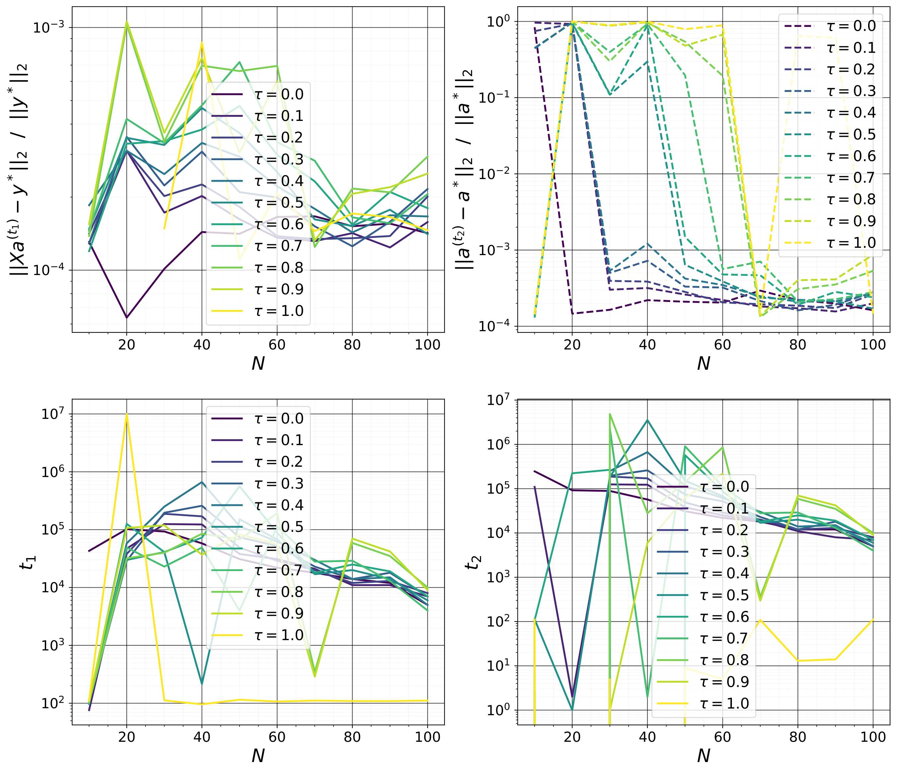

*Рисунок 22: Обучающая ошибка $\|\mathbf{X}\mathbf{a}^{(t_{1})}-\mathbf{y}^{*}\|_{2}/\|\mathbf{y}^{*}\|_{2}$ и ошибка восстановления $\|\mathbf{a}^{(t_{2})}-\mathbf{a}^{*}\|_{2}/\|\mathbf{a}^{*}\|_{2}$ (вместе с $t_{1}$ и $t_{2}$ — шагами запоминания и обобщения) как функции числа примеров $N$ и параметра когерентности $\tau\in[0,1]$.* **[p. 58]**

### G.2 Разложение матриц

#### G.2.1 Задача

По данным малоранговой матрице $\mathbf{A}^{*}\in\mathbb{R}^{n_{1}\times n_{2}}$ ранга $r$ и измерительной матрице $\mathbf{X}\in\mathbb{R}^{N\times n_{1}n_{2}}$ мы стремимся решить для $\mathbf{A}\in\mathbb{R}^{n_{1}\times n_{2}}$ задачу $(P_{3})\text{ Minimize }\operatorname*{rank}(\mathbf{A})\text{ subject to }\|\mathcal{F}_{\operatorname{vec}(\mathbf{A})}\left(\mathbf{X}\right)-\mathbf{y}^{*}\|_{2}\leq\epsilon$, а точнее — её выпуклое ослабление $(P_{4})\text{ Minimize }\|\mathbf{A}\|_{*}=\sum_{i}\sigma_{i}(\mathbf{A})\text{ subject to }\|\mathcal{F}_{\operatorname{vec}(\mathbf{A})}\left(\mathbf{X}\right)-\mathbf{y}^{*}\|_{2}\leq\epsilon$, где $\mathbf{y}^{*}=\mathcal{F}_{\operatorname{vec}(\mathbf{A}^{*})}\left(\mathbf{X}\right)+\boldsymbol{\xi}$ суть измерения, а $\epsilon$ — верхняя оценка величины слагаемого ошибки $\boldsymbol{\xi}\in\mathbb{R}^{N}$, $\|\boldsymbol{\xi}\|_{2}\leq\epsilon$.

#### Измерение матриц

Измерение матриц стремится восстановить малоранговую матрицу $\mathbf{A}^{*}\in\mathbb{R}^{n_{1}\times n_{2}}$ по $N$ измерительным матрицам $\{\mathbf{X}_{i}\in\mathbb{R}^{n_{1}\times n_{2}}\}_{i\in[N]}$ и измерениям $\mathbf{y}^{*}=\left(\operatorname{tr}(\mathbf{X}_{i}^{\top}\mathbf{A}^{*})\right)_{i\in[N]}$. Мы имеем $\mathbf{y}^{*}_{i}=\operatorname{tr}(\mathbf{X}_{i}^{\top}\mathbf{A}^{*})=\operatorname{vec}(\mathbf{X}_{i})^{\top}\operatorname{vec}(\mathbf{A}^{*})=\mathcal{F}_{\operatorname{vec}(\mathbf{A}^{*})}(\operatorname{vec}(\mathbf{X}_{i}))$. Это даёт задачу сжимающих измерений с вектором сигнала $\operatorname{vec}(\mathbf{A}^{*})\in\mathbb{R}^{n_{1}n_{2}}$ и измерительной матрицей $\mathbf{X}=[\operatorname{vec}(\mathbf{X}_{i})]_{i\in[N]}\in\mathbb{R}^{N\times n_{1}n_{2}}$. И впрямь, при полном сингулярном разложении $\mathbf{A}^{*}=\mathbf{U}^{*}\Sigma^{*}\mathbf{V}^{*\top}$ имеем $\mathbf{a}^{*}=\operatorname{vec}(\mathbf{A}^{*})=\Phi\operatorname{vec}(\Sigma^{*})$, где $\operatorname{vec}(\Sigma^{*})\in\mathbb{R}^{n_{1}n_{2}}$ разрежён, ибо $\|\operatorname{vec}(\Sigma^{*})\|_{0}=\operatorname*{rank}(\mathbf{A}^{*})\leq\min(n_{1},n_{2})\ll n_{1}n_{2}$, а $\Phi=\mathbf{V}^{*}\otimes\mathbf{U}^{*}\in\mathbb{R}^{n_{1}n_{2}\times n_{1}n_{2}}$ имеет ортонормированные столбцы, ибо $\Phi^{\top}\Phi=\left(\mathbf{V}^{*\top}\mathbf{V}^{*}\right)\otimes\left(\mathbf{U}^{*\top}\mathbf{U}^{*}\right)=\mathbb{I}_{n_{1}n_{2}}$.

#### Восполнение матрицы

Для задачи восполнения матрицы $\mathbf{A}^{*}\in\mathbb{R}^{n_{1}\times n_{2}}$ у нас есть $N$ измерительных векторов $\left(\mathbf{X}^{(1)}_{i},\mathbf{X}^{(2)}_{i}\right)\in\mathbb{R}^{n_{1}}\times\mathbb{R}^{n_{2}}$ и измерения $\mathbf{y}_{i}^{*}=\mathbf{X}^{(1)\top}_{i}\mathbf{A}^{*}\mathbf{X}^{(2)}_{i}=\left(\mathbf{X}^{(2)}_{i}\otimes\mathbf{X}^{(1)}_{i}\right)^{\top}\operatorname{vec}(\mathbf{A}^{*})=\mathcal{F}_{\operatorname{vec}(\mathbf{A}^{*})}\left(\mathbf{X}^{(2)}_{i}\otimes\mathbf{X}^{(1)}_{i}\right)$, то есть $\mathbf{y}^{*}=\left(\mathbf{X}^{(2)}\bullet\mathbf{X}^{(1)}\right)\operatorname{vec}(\mathbf{A}^{*})=\mathcal{F}_{\operatorname{vec}(\mathbf{A}^{*})}\left(\mathbf{X}^{(2)}\bullet\mathbf{X}^{(1)}\right)$. Это даёт задачу сжимающих измерений с вектором сигнала $\operatorname{vec}(\mathbf{A}^{*})\in\mathbb{R}^{n_{1}n_{2}}$ и измерительной матрицей $\mathbf{X}=\mathbf{X}^{(2)}\bullet\mathbf{X}^{(1)}\in\mathbb{R}^{N\times n_{1}n_{2}}$. Обычное восполнение матрицы определяют как восстановление недостающих записей матрицы по её неполному наблюдению. Это равносильно требованию, чтобы $\mathbf{X}^{(k)}_{i}$ были выбирающими векторами для всех $k\in[K]$ (при $K=2$), то есть чтобы $\mathbf{X}^{(k)}_{i}$ был $s(i,k)^{\text{th}}$ вектором канонического базиса $\mathbb{R}^{n_{k}}$ при некотором $s(i,k)\in[n_{k}]$. Тогда каждый $\mathbf{X}_{i}=\mathbf{X}_{i}^{(2)}\otimes\mathbf{X}_{i}^{(1)}$ есть выбирающий вектор в $\mathbb{R}^{n}$, а $\mathbf{X}=\mathbf{X}^{(2)}\bullet\mathbf{X}^{(1)}$ — выбирающая матрица в $\mathbb{R}^{N\times n}$, так что $\mathbf{y}^{*}_{i}=\mathbf{A}^{*}_{s(i,1),s(i,2)}\forall i\in[N]$. Стало быть, в этой записи каждый $\mathbf{X}^{(k)}_{i}$ есть выбор из столбцов $\mathbb{I}_{n_{k}}$. Заметим, что при замене базиса $\tilde{\mathbf{X}}_{i}^{(k)}=\mathbf{P}^{(k)}\mathbf{X}_{i}^{(k)}$ имеем $\tilde{\mathbf{y}}_{i}^{*}=\left(\otimes_{k=1}^{K}\mathbf{P}^{(k)}\right)\mathbf{y}^{*}_{i}$, то есть $\tilde{\mathbf{y}}^{*}=\mathbf{y}^{*}\left(\otimes_{k=1}^{K}\mathbf{P}^{(k)}\right)^{\top}$. Менее обычная запись задачи восполнения матрицы требует, чтобы каждый $\mathbf{X}^{(k)}_{i}$ был выбором из ортонормированного базиса, то есть чтобы $\mathbf{X}^{(k)}_{i}$ был выбором из столбцов $\mathbf{V}^{(k)}\in\mathbb{R}^{n_{k}\times n_{k}}$ с $\mathbf{V}^{(k)\top}\mathbf{V}^{(k)}=\mathbb{I}_{n_{k}}$. Положим $\mathbf{X}^{(k)}_{i}$ равным $s(i,k)^{\text{th}}$ столбцу $\mathbf{V}^{(k)}$ при некотором $s(i,k)\in[n_{k}]$. Тогда $\mathbf{y}^{*}_{i}=\tilde{\mathbf{A}^{*}}_{s(i,1),\cdots,s(i,K)}$ при $\tilde{\mathbf{A}}^{*}=\mathbf{A}^{*}\times_{1}\mathbf{V}^{(1)}\times_{2}\mathbf{V}^{(2)}$. Стало быть, всякий итог об $\mathbf{A}^{*}$ в обычной записи, где измерительные векторы суть выбирающие, верен для матрицы $\tilde{\mathbf{A}}^{*}$.

Пусть целевая матрица $\mathbf{A}^{*}$ имеет ранг $r$. Тогда у неё $r(n_{1}+n_{2}-r)$ степеней свободы101010 Первые $r$ столбцов $\mathbf{U}^{*}$ образуют ортонормированный базис $r$-мерного подпространства $\mathbb{R}^{n_{1}}$ (столбцового пространства $\mathbf{A}^{*}$). Его задание требует $r(n_{1}-r)$ значений. Схожим образом первые $r$ столбцов $\mathbf{V}^{*}$ образуют ортонормированный базис $r$-мерного подпространства $\mathbb{R}^{n_{2}}$ (строчного пространства $\mathbf{A}^{*}$), и его задание требует $r(n_{2}-r)$ значений. Ненулевые сингулярные значения в числе $r$ суть независимые значения, и их задание требует $r$ значений., и для безупречного восстановления нам нужно наблюдать не менее $r(n_{1}+n_{2}-r)$ записей. Эту оценку можно улучшить, учтя строение $\mathbf{A}^{*}$. Пусть $\mathbf{A}^{*}=\mathbf{U}^{*}\Sigma^{*}\mathbf{V}^{*\top}$ есть **полное** сингулярное разложение $\mathbf{A}^{*}$. Как замечено выше, мы имеем дело с задачей сжимающих измерений с вектором сигнала $\mathbf{a}^{*}=\operatorname{vec}(\mathbf{A}^{*})=\Phi\operatorname{vec}(\Sigma^{*})$, где $\operatorname{vec}(\Sigma^{*})\in\mathbb{R}^{n_{1}n_{2}}$ разрежён, а $\Phi=\mathbf{V}^{*}\otimes\mathbf{U}^{*}\in\mathbb{R}^{n_{1}n_{2}\times n_{1}n_{2}}$ имеет ортонормированные столбцы.

#### G.2.2 Управляющие параметры

В этом подразделе мы полагаем обычное восполнение матрицы. Но изложенные здесь теории применимы и к общей рамке. Теория даёт наименьшее число наблюдений, ручающееся за то, что $\mathbf{A}^{*}$ есть единственное решение задачи $(P_{4})$, и позволяющее безупречно восстановить $\mathbf{A}^{*}$ по меньшему числу примеров (Candès & Tao, 2010; Candes & Recht, 2012; Chen et al., 2014). Обыкновенно нижняя оценка на $N$ имеет вид $N\geq C\max(n_{1},n_{2})^{C_{2}}\left(r^{C_{3}}\log^{C_{1}}\left(\max(n_{1},n_{2})\right)+\log\frac{1}{\eta}\right)$, где $\eta$ есть доля ошибки (то есть $N$ ручается за безупречное восстановление с вероятностью не менее $1-\eta$), $C_{1}>0$, $C_{2}>0$, $C_{3}>0$ суть **[p. 58]** постоянные, а $C>0$ — всеобщая постоянная. Скажем, у Candes & Recht (2012) $(C_{1},C_{2},C_{3})=(1,1.2,1)$ при малом ранге $r\leq\max(n_{1},n_{2})^{0.2}$ и $C_{2}=1.25$ при любом ранге. Слагаемое $\max(n_{1},n_{2})\log\left(\max(n_{1},n_{2})\right)$ вызвано действием собирателя купонов, ибо, чтобы восстановить неизвестную матрицу, нужно не менее одного наблюдения на строку и одного на столбец (Candes & Recht, 2012).

##### **Определение G.6**(случайная ортогональная модель (Candes & Recht, 2012))**.**

При данном $r$ мы строим две ортонормированные матрицы $\mathbf{U}^{*}\in\mathbb{R}^{n_{1}\times r}$ и $\mathbf{V}^{*}\in\mathbb{R}^{n_{2}\times r}$ со столбцами, выбранными равномерно случайно среди всех наборов из $r$ ортонормированных векторов, и диагональную матрицу $\Sigma^{*}$, у которой ненулевыми являются лишь первые $r$ диагональных записей (без всяких допущений о сингулярных значениях111111Если не сказано иного, мы по умолчанию берём ненулевые сингулярные значения равными $1/\sqrt{r}$.), после чего полагаем $\mathbf{A}^{*}=\mathbf{U}^{*}\Sigma^{*}\mathbf{V}^{*\top}$.

Для таких матриц при отсутствии шума в обычной записи верен следующий итог.

##### **Теорема G.7**(теорема 1.1, Candes & Recht (2012))**.**

*Пусть $\mathbf{A}^{*}\in\mathbb{R}^{n_{1}\times n_{2}}$ есть матрица ранга $r$, взятая из случайной ортогональной модели, и $n=\max(n_{1},n_{2})$. Пусть мы наблюдаем $N$ записей $\mathbf{A}^{*}$, чьи места выбраны равномерно случайно. Тогда существуют числовые постоянные $C$ и $c$ такие, что при $N\geq Cn^{5/4}r\log\left(n\right)$ наименьшая точка задачи $(P_{4})$ единственна и равна $\mathbf{A}^{*}$ с вероятностью не менее $1-c/n^{3}$; иначе говоря, полуопределённая программа $(P_{4})$ восстанавливает все записи $\mathbf{A}^{*}$ без ошибки. Кроме того, если $r\leq n^{1/5}$, то восстановление точно с вероятностью не менее $1-c/n^{3}$, коль скоро $N\geq Cn^{6/5}r\log\left(n\right)$.*

Возьмём, скажем, $\mathbf{A}^{*}=\mathbf{e}_{k}^{(n_{1})}\mathbf{e}_{\ell}^{(n_{2})}$ при $(k,\ell)\in[n_{1}]\times[n_{2}]$. Хотя ранг этой матрицы равен $1$, у неё всюду нули, кроме $1$ в положении $(k,\ell)$, а потому у нас весьма мало возможностей восстановить её в высокой размерности, наблюдая долю её записей. Единственный способ ручаться за наблюдение записи в положении $(k,\ell)$ — выбирать измерения когерентно с её сингулярным базисом $\mathbf{e}_{k}^{(n_{2})}\otimes\mathbf{e}_{\ell}^{(n_{1})}$. Эта мысль изложена в более общем виде ниже.

##### **Определение G.8****.**

Пусть $U$ есть подпространство $\mathbb{R}^{n}$ размерности $r$, а $\mathbf{P}_{U}$ — ортогональная проекция на $U$. Тогда когерентность $U$ относительно базиса $\{\mathbf{u}^{(n)}_{i}\}_{i\in[n]}$ определяется как $\mu(U)=\frac{n}{r}\max_{i}\|\mathbf{P}_{U}\mathbf{u}_{i}^{(n)}\|^{2}$. Мы имеем $1\leq\mu(U)\leq n/r$ (Candes & Recht, 2012).

Для матрицы $\mathbf{A}=\mathbf{U}\Sigma\mathbf{V}^{\top}\in\mathbb{R}^{n_{1}\times n_{2}}$ в **сжатом** сингулярном разложении проекция на левые сингулярные векторы есть $\mathbf{x}\to\mathbf{U}\mathbf{U}^{\top}\mathbf{x}$, **[p. 59]** и $\|\mathbf{U}\mathbf{U}^{\top}\mathbf{x}\|^{2}_{2}=\|\mathbf{U}^{\top}\mathbf{x}\|^{2}_{2}$ для всех $\mathbf{x}$ (схожим образом для правых). Приведём следующее определение когерентности, учитывающее каждую запись матрицы.

##### **Определение G.9**(местная когерентность и рычажная оценка)**.**

Пусть $\mathbf{A}=\mathbf{U}\Sigma\mathbf{V}^{\top}\in\mathbb{R}^{n_{1}\times n_{2}}$ есть **сжатое** сингулярное разложение матрицы $\mathbf{A}$ ранга $r$. Местные когерентности $\mathbf{A}$ определяются так:

$$
\begin{split}&\mu_{i}(\mathbf{A})=\frac{n_{1}}{r}\|\mathbf{U}^{\top}\mathbf{e}_{i}^{(n_{1})}\|^{2}=\frac{n_{1}}{r}\|\mathbf{U}_{i,:}\|^{2}\quad\forall i\in[n_{1}]\\
&\nu_{j}(\mathbf{A})=\frac{n_{2}}{r}\|\mathbf{V}^{\top}\mathbf{e}_{j}^{(n_{2})}\|^{2}=\frac{n_{2}}{r}\|\mathbf{V}_{j,:}\|^{2}\quad\forall j\in[n_{2}]\end{split} \tag{122}
$$

###### p59-2

где $\mu_{i}$ отвечает строке $i$, а $\nu_{j}$ — строке $j$. Величины $\|\mathbf{U}^{\top}\mathbf{e}_{i}^{(n_{1})}\|^{2}$ и $\|\mathbf{V}^{\top}\mathbf{e}_{i}^{(n_{2})}\|^{2}$ суть рычажные оценки $\mathbf{A}$ (Chen et al., 2014); они указывают, насколько каждая строка или каждый столбец исходной матрицы данных «согласованы» с главными составляющими (столбцами $\mathbf{U}$ или $\mathbf{V}$). Для каждой строки $i$ величина $\mu_{i}(\mathbf{A})$ мерит, насколько сильно эта строка проецируется на подпространство, натянутое на первые $r$ левых сингулярных векторов в $\mathbf{U}$. Строки с высокими рычажными оценками сильнее вносят вклад в малоранговое строение $\mathbf{A}$ и «влиятельнее» при её представлении. Схожим образом $\nu_{j}(\mathbf{A})$ мерит когерентность каждого столбца $j$ матрицы $\mathbf{A}$ относительно малорангового подпространства, образованного правыми сингулярными векторами в $\mathbf{V}$. Высокие значения указывают на столбцы, хорошо согласованные с главными направлениями $\mathbf{A}$ и играющие заметную роль в передаче строения $\mathbf{A}$. У матриц с равномерно низкими оценками когерентности строки и столбцы влиятельны поровну. Напротив, у матриц с высокими оценками для отдельных строк или столбцов малоранговое строение определяется немногими из них.

В общей записи это определение можно распространить на набор, из которого выбираются измерения. Но в общем случае это сводится к обычной записи при замене базиса.

##### **Определение G.10**(обобщённая местная когерентность и рычажная оценка)**.**

Мы обобщаем понятие когерентности на произвольные наборы векторов $\mathbf{U}^{(n_{1})}=\{\mathbf{u}^{(n_{1})}_{i}\}_{i\in[N_{1}]}\in\mathbb{R}^{n_{1}\times N_{1}}$ и $\mathbf{V}^{(n_{2})}=\{\mathbf{v}^{(n_{2})}_{j}\}_{j\in[N_{2}]}\in\mathbb{R}^{n_{2}\times N_{2}}$ и определяем обобщённые местные когерентности так:

$$
\begin{split}\mu_{i}(\mathbf{A})=\frac{n_{1}}{r}\|\mathbf{U}^{\top}\mathbf{u}_{i}^{(n_{1})}\|^{2}\quad\forall i\in[N_{1}],\qquad\nu_{j}(\mathbf{A})=\frac{n_{2}}{r}\|\mathbf{V}^{\top}\mathbf{v}_{j}^{(n_{2})}\|^{2}\quad\forall j\in[N_{2}]\end{split} \tag{123}
$$

Пусть наборы $\mathbf{U}^{(n_{1})}$ и $\mathbf{V}^{(n_{2})}$ суть ортонормированные базисы (то есть $(N_{1},N_{2})=(n_{1},n_{2})$, ${\mathbf{u}^{(n_{2})}_{i}}^{\top}\mathbf{u}^{(n_{2})}_{k}=\delta_{ik}$ и ${\mathbf{v}^{(n_{1})}_{j}}^{\top}\mathbf{v}^{(n_{1})}_{l}=\delta_{jl}$). Мы можем записать $\mathbf{u}_{i}^{(n_{1})}=\mathbf{P}^{(1)}\mathbf{e}_{i}^{(n_{1})}$ и $\mathbf{v}_{j}^{(n_{2})}=\mathbf{P}^{(2)}\mathbf{e}_{j}^{(n_{2})}$, где $\mathbf{P}^{(k)}\in\mathbb{R}^{n_{k}\times n_{k}}$ есть матрица замены базиса из канонического в $\mathbf{U}^{(n_{1})}$ и $\mathbf{V}^{(n_{2})}$ соответственно. Стало быть,

$$
\begin{split}&\mu_{i}(\mathbf{A})=\frac{n_{1}}{r}\|\mathbf{U}^{\top}\mathbf{P}^{(1)}\mathbf{e}_{i}^{(n_{1})}\|^{2}=\frac{n_{1}}{r}\|\tilde{\mathbf{U}}^{\top}\mathbf{e}_{i}^{(n_{1})}\|^{2}=\mu_{i}(\tilde{\mathbf{A}})\quad\forall i\in[N_{1}]\\
&\nu_{j}(\mathbf{A})=\frac{n_{2}}{r}\|\mathbf{V}^{\top}\mathbf{P}^{(2)}\mathbf{e}_{j}^{(n_{2})}\|^{2}=\frac{n_{2}}{r}\|\tilde{\mathbf{V}}^{\top}\mathbf{e}_{j}^{(n_{2})}\|^{2}=\nu_{i}(\tilde{\mathbf{A}})\quad\forall j\in[N_{2}]\end{split} \tag{124}
$$

где $\tilde{\mathbf{A}}=\mathbf{A}\times_{1}\mathbf{P}^{(1)}\times_{2}\mathbf{P}^{(2)}=\mathbf{P}^{(1)\top}\mathbf{A}\mathbf{P}^{(2)}=\mathbf{P}^{(1)\top}\mathbf{U}\Sigma\left(\mathbf{P}^{(2)\top}\mathbf{V}\right)^{\top}=\tilde{\mathbf{U}}\Sigma\tilde{\mathbf{V}}^{\top}$. Тем самым всякий итог, высказанный в обычной записи для $\mathbf{A}$, верен для $\tilde{\mathbf{A}}$ в общей ортонормированной записи.

Candès & Tao (2010) и Candes & Recht (2012) применяли главным образом верхнюю оценку $\mu_{0}$ на $\mu_{i}$ и $\nu_{i}$: $\mu_{0}\geq\max\left(\max_{i\in[n_{1}]}\mu_{i}(\mathbf{A}^{*}),\max_{i\in[n_{2}]}\nu_{i}(\mathbf{A}^{*})\right)$, и определяли постоянную $\mu_{1}$ так, что $\max_{i,j}[\mathbf{U}^{*}\mathbf{V}^{*\top}]_{ij}=\max_{i,j}\sum_{k}\mathbf{U}^{*}_{i,k}\mathbf{V}^{*}_{j,k}\leq\mu_{1}\sqrt{\frac{r}{n_{1}n_{2}}}$. Поскольку $\left|\sum_{k}\mathbf{U}^{*}_{i,k}\mathbf{V}^{*}_{j,k}\right|\leq\sqrt{\sum_{k}\mathbf{U}^{*2}_{i,k}}\sqrt{\sum_{k}\mathbf{V}^{*2}_{j,k}}=\|\mathbf{U}^{*}_{i,:}\|_{2}\|\mathbf{V}^{*}_{j,:}\|_{2}=\frac{r}{\sqrt{n_{1}n_{2}}}\sqrt{\mu_{i}(\mathbf{A}^{*})\nu_{j}(\mathbf{A}^{*})}\leq\frac{r}{\sqrt{n_{1}n_{2}}}\mu_{0}$ для всех $i,j$, можно просто взять $\mu_{1}\geq\mu_{0}\sqrt{r}$. Отсюда Candes & Recht (2012) показывают, что при малой когерентности $\mu_{0}$ для восстановления $\mathbf{A}^{*}$ требуется мало примеров.

##### **Теорема G.11**(теорема 1.3, Candes & Recht (2012))**.**

*Пусть $\mathbf{A}^{*}\in\mathbb{R}^{n_{1}\times n_{2}}$ есть матрица ранга $r$, взятая из случайной ортогональной модели, и $n=\max(n_{1},n_{2})$. Пусть мы наблюдаем $N$ записей $\mathbf{A}^{*}$, чьи места выбраны равномерно случайно. Тогда существуют числовые постоянные $C$ и $c$ такие, что при $N\geq C\max\left(\mu_{1}^{2},\mu_{0}^{\frac{1}{2}}\mu_{1},\mu_{0}n^{\frac{1}{4}}\right)nr\beta\log\left(n\right)$ при некотором $\beta>2$ наименьшая точка задачи $(P_{4})$ единственна и равна $\mathbf{A}^{*}$ с вероятностью не менее $1-c/n^{3}$. Кроме того, если $r\leq n^{1/5}/\mu_{0}$, то восстановление точно с вероятностью не менее $1-c/n^{3}$, коль скоро $N\geq C\mu_{0}n^{6/5}r\beta\log\left(n\right)$.*

Chen et al. (2014) показывают, что выбор записи в положении $(i,j)$ с вероятностью $p_{ij}=\Omega(\mu_{i}+\nu_{j})$ позволяет безупречно восстановить $\mathbf{A}^{*}$ по меньшему числу примеров, и называют такие приёмы отбора *выборкой по местной когерентности*.

**[p. 60]**

##### **Теорема G.12**(теорема 3.2 и следствие 3.3, Chen et al. (2014))**.**

*Пусть $\mathbf{A}^{*}\in\mathbb{R}^{n_{1}\times n_{2}}$ есть матрица ранга $r$ с местными когерентностями $\{\mu_{i},\nu_{j}\}_{i\in[n_{1}],j\in[n_{2}]}$. Существуют всеобщие постоянные $c_{0},c_{1},c_{2}>0$ такие, что если каждая запись $(i,j)$ наблюдается независимо с вероятностью $p_{ij}\geq\max\left\{\min\left\{c_{0}\frac{(\mu_{i}+\nu_{j})r\log^{2}(n_{1}+n_{2})}{\min(n_{1},n_{2})},1\right\},\frac{1}{\min(n_{1},n_{2})^{10}}\right\}$, то $\mathbf{A}^{*}$ есть единственное наилучшее решение задачи наименьшения ядерной нормы $(P_{4})$ с вероятностью не менее $1-c_{1}/(n_{1}+n_{2})^{c_{2}}$ при числе примеров $N\in\mathcal{O}\left(\max(n_{1},n_{2})r\log^{2}(n_{1}+n_{2})\right)$.*

По данным $N$ и $\tau\in[0,1]$, чтобы управлять когерентностью:

- Для разложения матриц мы выбираем первые $N_{1}=\tau N$ примеров с наибольшими значениями $\mu_{i}(\mathbf{A}^{*})+\nu_{j}(\mathbf{A}^{*})$, а оставшиеся $(1-\tau)N$ примеров — равномерно среди прочих. Выбранные положения кодируются однобитно в размерностях $n_{1}$ (для положений строк) и $n_{2}$ (для положений столбцов), что даёт $\mathbf{X}^{(1)}$ и $\mathbf{X}^{(2)}$ соответственно.
- Для измерения матриц мы строим $\mathbf{X}^{(1)}$ (соответственно $\mathbf{X}^{(2)}$), беря первые $N_{1}=\min(\lfloor\tau N\rfloor,n_{1})$ (соответственно $N_{1}=\min(\lfloor\tau N\rfloor,n_{2})$) строк из первых столбцов $\mathbf{U}^{*}$ (соответственно $\mathbf{V}^{*}$), а записи оставшихся $N_{2}=N-N_{1}$ строк — независимо из гауссова распределения $\mathcal{N}(0,\sigma^{2})$ при $\sigma=1/n_{1}$ (соответственно $\sigma=1/n_{2}$).

Чем больше $\tau$ (а с ним и $N_{1}$), тем меньше некогерентность между измерениями (строками $\mathbf{X}=\mathbf{X}^{(2)}\bullet\mathbf{X}^{(1)}$) и $\Phi=\mathbf{V}^{*}\otimes\mathbf{U}^{*}$.

#### G.2.3 Влияние когерентности на гроккинг

#### Линейное программирование

###### p60-5

Мы закрепляем $n_{1}=n_{2}=10^{2}$ и $\boldsymbol{\xi}=0$ (без шума) и решаем при разных $(N,r,\tau)$ приведённую выше задачу разложения матриц обычным линейным программированием (мы применяем средство cvxpy). С ростом $r$ и (или) $\tau$ число примеров, потребное для безупречного восстановления, **убывает**. Полученная относительная ошибка восстановления $\|\mathbf{A}-\mathbf{A}^{*}\|_{2}/\|\mathbf{A}^{*}\|_{2}$ обыкновенно имеет порядок $10^{-6}$ и даёт нам основу для сравнения с иными приёмами. Рисунков мы не приводим ради места.

#### Градиентный спуск

В отличие от сжимающих измерений, где большие значения $\tau$ вредны для обобщения, здесь при $\tau\rightarrow 1$ качество улучшается, а число примеров, потребных для обобщения, убывает показательно, как и время, за которое модели это делают. См. рисунок 23 при $(n_{1},n_{2},r,\alpha,\beta,\zeta)=(10,10,2,10^{-1},10^{-5},10^{-6})$. Заметим, что здесь, для восполнения матрицы, при закреплённом $\tau$ мы выбираем первые $\tau N$ примеров с наибольшими значениями $\mu_{i}(\mathbf{A}^{*})+\nu_{j}(\mathbf{A}^{*})$, а оставшиеся $(1-\tau)N$ примеров — случайно и равномерно.


*Рисунок 23: Обучающая ошибка $\|\mathbf{X}\operatorname{vec}\mathbf{A}^{(t)}-\mathbf{y}^{*}\|_{2}/\|\mathbf{y}^{*}\|_{2}$ и ошибка восстановления $\|\mathbf{A}^{(t)}-\mathbf{A}^{*}\|_{2}/\|\mathbf{A}^{*}\|_{\text{F}}$ как функции числа примеров $N$ и параметра когерентности $\tau\in[0,1]$* **[p. 60]**

## Приложение H Дополнительные опыты

### H.1 Восстановление разрежённых векторов

#### Ландшафт оптимизации

Посмотрим на ландшафт решения применительно к восстановлению разрежённых векторов. Пусть $I:=\{i\in[n]\mid\mathbf{a}^{*}_{i}\neq 0\}$ есть носитель истинного сигнала $\mathbf{a}^{*}$, а $u(t)=\|\mathbf{a}^{(t)}_{I}\|_{2}$ и $v(t)=\|\mathbf{a}^{(t)}_{[n]\backslash I}\|_{2}$ — нормы $\mathbf{a}^{(t)}$, суженного на его указатели в $I$ и вне $I$ соответственно. Рисунок 24 показывает, как $\mathbf{a}^{(t)}$ сперва сходится к решению наименьших квадратов **[p. 61]** (запоминание), а от него — к $\mathbf{a}^{*}$ (при достаточно большом $N$) или к невыгодному решению (при слишком малом $N$). После запоминания, когда $N$ достаточно велико, $v(t)$ сходится к нулю, а $u(t)$ — к норме $\mathbf{a}^{*}$. Причина в том, что составляющие $\mathbf{a}^{(t)}$, не входящие в $I$, сжимаются на каждом шаге обучения, покуда все не достигнут $0$ (рисунок 25). Такая сходимость невозможна, если сила сглаживания $\ell_{1}$ равна $0$ (даже при применении $\ell_{2}$). Для опытов этого раздела мы берём $N\in\{20,30,40,50,60,70\}$ при $(n,s)=(100,5)$ и $(\alpha,\beta)=(10^{-1},10^{-5})$.


*Рисунок 24: От начального приближения к решению наименьших квадратов $\hat{\mathbf{a}}$ (запоминание) и от решения наименьших квадратов к $\mathbf{a}^{*}$ (при достаточно большом $N$) или к невыгодному решению (при слишком малом $N$). Шаги $t_{1}$ и $t_{2}$ здесь иные, нежели введённые выше для измерения запоминания и обобщения соответственно. Здесь они лишь средство проследить ход обучения.* **[p. 61]**


*Рисунок 25: Сходимость $\mathbf{a}^{(t)}_{i}$ к $\mathbf{a}^{*}_{i}$ для каждого $i\in[n]$. Здесь $(n,s,N)=(100,5,30)$ и $(\alpha,\beta)=(10^{-1},10^{-5})$.* **[p. 62]**

#### Наращивание скорости обучения $\alpha$ и силы сглаживания $\beta$

Мы решаем задачу восстановления разрежённых векторов субградиентным спуском при $(n,s,N,\zeta)=(10^{2},5,30,10^{-6})$ для разных значений $\alpha$ и $\beta$. Как и ожидалось, большие $\alpha$ и (или) $\beta$ дают быструю сходимость, но к невыгодному значению тестовой ошибки (рисунок 26). Малые же значения требуют более долгого обучения, чтобы выйти на ровное значение, и обыкновенно дают при этом меньшую ошибку восстановления (гроккинг). Это те самые опыты, по которым построен рисунок 4.

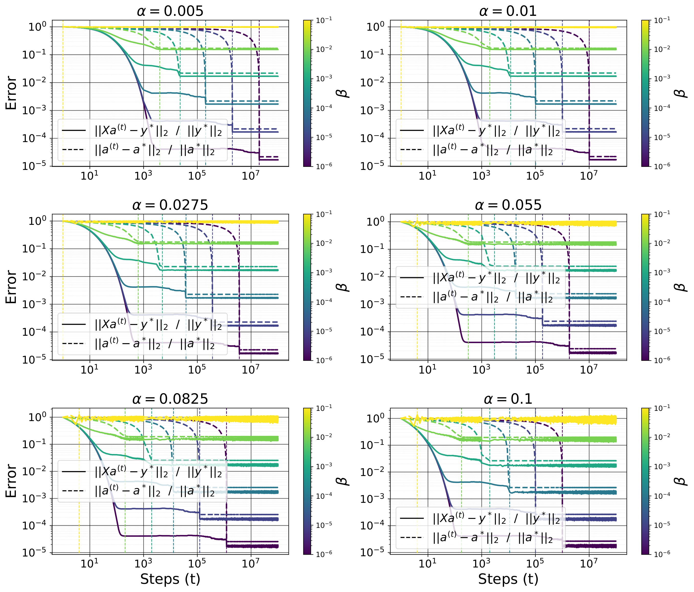

*Рисунок 26: Обучающая ошибка и ошибка восстановления как функции скорости обучения $\alpha$ и коэффициента сглаживания $\ell_{1}$, равного $\beta$.* **[p. 62]**

#### Наращивание объёма данных $N$ и параметра разрежённости $s$

Мы решаем задачу восстановления разрежённых векторов субградиентным спуском при $(n,\zeta,\alpha,\beta)=(10^{2},10^{-6},10^{-1},10^{-5})$ для $s\in\{1,5,10,15\}$ и $N\in\{10,20,\dots 100\}$. Итоги см. на рисунках 27 и 28. Меньшему $s$ требуется меньшее $N$ для обобщения.


*Рисунок 27: Обучающая ошибка и ошибка восстановления как функции уровня разрежённости $s$ и числа измерений $N$.* **[p. 63]**


*Рисунок 28: Обучающая ошибка $\|\mathbf{X}\mathbf{a}^{(t_{1})}-\mathbf{y}^{*}\|_{2}/\|\mathbf{y}^{*}\|_{2}$ при запоминании, ошибка восстановления $\|\mathbf{a}^{(t_{2})}-\mathbf{a}^{*}\|_{2}/\|\mathbf{a}^{*}\|_{2}$ при обобщении, шаг запоминания $t_{1}$ (наименьшее $t$ такое, что $\|\mathbf{X}\mathbf{a}^{(t)}-\mathbf{y}^{*}\|_{2}/\|\mathbf{y}^{*}\|_{2}\leq 10^{-4}$) и шаг обобщения (наименьшее $t$ такое, что $\|\mathbf{a}^{(t)}-\mathbf{a}^{*}\|_{2}/\|\mathbf{a}^{*}\|_{2}\leq 10^{-4}$, либо наибольший шаг обучения).* **[p. 63]**

### H.2 Разложение матриц

Мы решаем бесшумную задачу восполнения матрицы субградиентным спуском при $(n_{1},n_{2},r,N,\zeta)=(10,10,2,70,10^{-6})$ для разных значений $\alpha$ и $\beta$. Как и ожидалось, большие $\alpha$ и (или) $\beta$ дают быструю сходимость, но к невыгодному значению тестовой ошибки (рисунок 29). Это те самые опыты, по которым построен рисунок 6.


*Рисунок 29: Обучающая ошибка и ошибка восстановления как функции скорости обучения $\alpha$ и коэффициента сглаживания $\ell_{*}$, равного $\beta$.* **[p. 64]**

### H.3 Общая постановка

В этом разделе мы наименьшаем функции вида $f(\theta)=g(\theta)+\beta h(\theta)$, где $g$ есть квадратичная потеря или перекрёстная энтропия рассматриваемой модели на обучающих данных, $\theta$ — набор значений модели, а $h$ — сглаживатель, применённый к $\theta$. Это может быть обычная норма или квазинорма $\ell_{p}$ от $\theta$, сумма ядерных норм каждой матрицы из $\theta$ (то есть $\ell_{*}$) и так далее. Под нормальным начальным приближением для значения $\mathbf{A}\in\mathbb{R}^{n_{1}\times n_{2}}$ мы понимаем $\mathbf{A}^{(1)}\overset{iid}{\sim}\mathcal{N}(0,1/n_{1})$. Только для опытов этого раздела мы применяли **[p. 64]** Adam как приём оптимизации с его настройками по умолчанию (как задано в PyTorch), кроме скорости обучения.

#### H.3.1 Алгоритмический набор данных

Мы берём сложение по остатку $p=97$, как описано в разделе 2.1, при $r_{\text{train}}=40\%$. Для MLP $\ell_{1}$ и $\ell_{*}$ действуют на гроккинг так же, как $\ell_{2}$: большие значения $\alpha\beta$ дают более быстрый гроккинг. См. рисунок 2 для $\ell_{*}$ и 30 для $\ell_{1}$ и $\ell_{2}$. Заметим, что для MLP логиты задаются как $\mathbf{y}(\mathbf{x})=\mathbf{b}^{(2)}+\mathbf{W}^{(2)}\phi\left(\mathbf{b}^{(1)}+\mathbf{W}^{(1)}\left(\mathbf{E}_{\langle x_{1}\rangle}\circ\mathbf{E}_{\langle x_{2}\rangle}\right)\right)$ при $\phi(z)=\max(z,0)$, $\mathbf{E}\in\mathbb{R}^{p\times d_{1}}$, $\mathbf{W}^{(1)}\in\mathbb{R}^{d_{2}\times d_{1}}$, $\mathbf{b}^{(1)}\in\mathbb{R}^{d_{2}}$, $\mathbf{W}^{(2)}\in\mathbb{R}^{p\times d_{2}}$ и $\mathbf{b}^{(2)}\in\mathbb{R}^{p}$, где $d_{1}$ есть размерность вложения. Мы берём $d_{1}=d_{2}=2^{6}$.

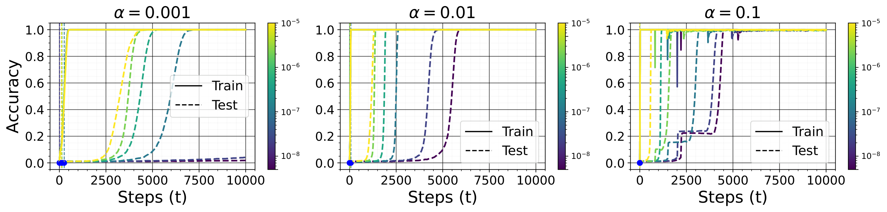


*Рисунок 30: Точность на обучении и на тесте у MLP, обученного остаточному сложению со сглаживанием $\ell_{1}$ (сверху) и $\ell_{2}$ (снизу) при разных значениях скорости обучения $\alpha$ и коэффициента $\ell_{1}$, равного $\beta$.* **[p. 64]**

**[p. 65]**

#### H.3.2 Нелинейная постановка «учитель — ученик»

Мы берём учителя $\mathbf{y}^{*}(\mathbf{x})=\mathbf{B}^{*}\phi(\mathbf{A}^{*}\mathbf{x})$ из $\mathbb{R}^{d}$ в $\mathbb{R}^{c}$ с $r$ скрытыми нейронами ($\mathbf{A}^{*}\in\mathbb{R}^{r\times d}$ и $\mathbf{B}^{*}\in\mathbb{R}^{c\times r}$), где $\phi(z)=\max(z,0)$ и $\mathbf{x},\mathbf{A}^{*},r\mathbf{B}^{*}\overset{iid}{\sim}\mathcal{N}(0,1)$. Мы независимо берём $N$ пар «вход — выход» $\mathcal{D}_{\text{train}}=\{(\mathbf{x}_{i},\mathbf{y}^{*}(\mathbf{x}_{i}))\}_{i=1}^{N}$ и подбираем на них значения $\theta=(\mathbf{A},\mathbf{B})$ ученика $\mathbf{y}_{\theta}(\mathbf{x})=\mathbf{B}\phi(\mathbf{A}\mathbf{x})$, начиная с нормального начального приближения, с потерей $g(\theta)=\frac{1}{2N}\sum_{i=1}^{N}\|\mathbf{y}_{\theta}(\mathbf{x}_{i})-\mathbf{y}^{*}(\mathbf{x}_{i})\|_{2}^{2}$ и разными сглаживателями $h(\theta)$ — $\ell_{p}$ при $p\in\{1,2,*\}$. Для всех этих сглаживателей чем меньше $\alpha\beta$, тем длиннее задержка между запоминанием и обобщением. См. рисунки 31, 32 и 33 для опыта при $(d,r,c,N)=(100,500,2,10^{2})$.

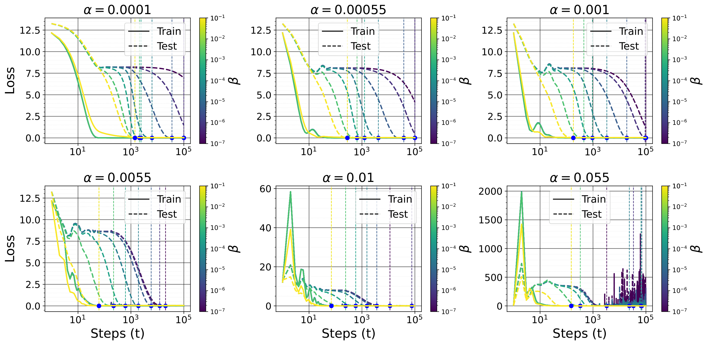

*Рисунок 31: Обучающая и тестовая ошибка для двуслойной постановки «учитель — ученик» с ReLU и сглаживанием $\ell_{1}$ при разных значениях скорости обучения $\alpha$ и коэффициента $\ell_{1}$, равного $\beta$.* **[p. 65]**

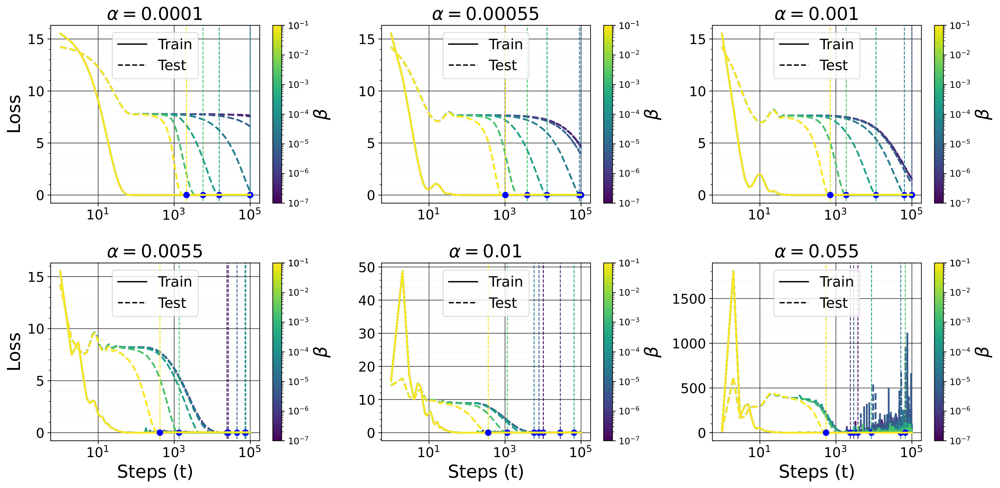

*Рисунок 32: Обучающая и тестовая ошибка для двуслойной постановки «учитель — ученик» с ReLU и сглаживанием $\ell_{2}$ при разных значениях скорости обучения $\alpha$ и коэффициента $\ell_{2}$, равного $\beta$.* **[p. 66]**

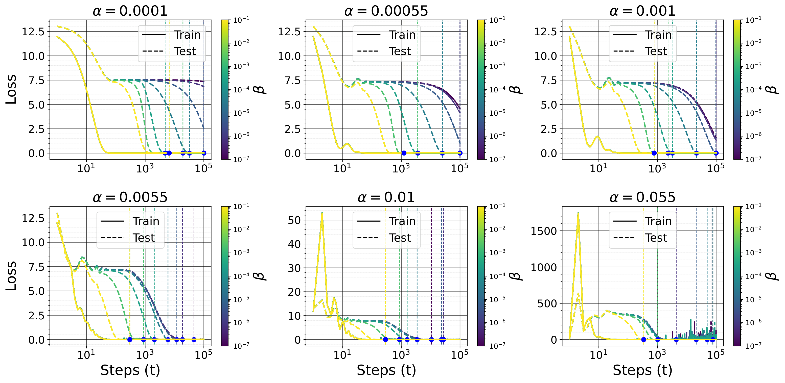

*Рисунок 33: Обучающая и тестовая ошибка для двуслойной постановки «учитель — ученик» с ReLU и сглаживанием $\ell_{*}$ при разных значениях скорости обучения $\alpha$ и коэффициента $\ell_{*}$, равного $\beta$.* **[p. 66]**

#### H.3.3 Сглаживание, свойственное предметной области

Нейронные сети, осведомлённые о физике (Raissi et al., 2019), пользуются предварительным знанием из дифференциальных уравнений, внося их невязки в функцию потерь и тем обеспечивая согласие решений с законами природы. Обучение по Соболеву (Czarnecki et al., 2017) обобщает эту мысль, беря не только пары «вход — выход», но и производные целевой функции. Точнее, по данным парам «вход — выход» $\left\{(\mathbf{x}_{i},\mathbf{y}^{*}(\mathbf{x}_{i})\right\}_{i\in[N]}$ вместе с известными производными $\left\{\frac{\partial^{k}\mathbf{y}^{*}(\mathbf{x})}{\partial\mathbf{x}^{k}}\Big{|}_{\mathbf{x}=\mathbf{x}_{i}}\right\}_{i\in[N]}$ при $k\in[K]$ цель — обучить нейронную сеть $\mathbf{y}_{\theta}(\mathbf{x})$, приближающую и выход, и его производные. Функция потерь расширяет обычную среднюю квадратичную ошибку (MSE), включая соболевские штрафы:

$$
f(\theta)=\underbrace{\frac{1}{N}\sum_{i=1}^{N}\left\|\mathbf{y}_{\theta}(\mathbf{x}_{i})-\mathbf{y}^{*}(\mathbf{x}_{i})\right\|^{2}}_{\text{data loss}}+\underbrace{\frac{\beta}{N}\sum_{k=1}^{K}\sum_{i=1}^{N}\left\|\frac{\partial^{k}\mathbf{y}_{\theta}}{\partial\mathbf{x}^{k}}(\mathbf{x}_{i})-\frac{\partial^{k}\mathbf{y}^{*}}{\partial\mathbf{x}^{k}}(\mathbf{x}_{i})\right\|_{\text{F}}^{2}}_{\text{Sobolev penalty}} \tag{125}
$$

Настройка $\beta$ управляет вкладом слагаемого согласования производных. Этот штраф обеспечивает, что модель не только приближает данные, но и соблюдает известные требования гладкости или дифференциальное строение, что существенно в приложениях, основанных на физике (Lu et al., 2021). Мы берём двуслойного прямого учителя из раздела H.3.2 и подбираем значения $\theta=(\mathbf{A},\mathbf{B})$ ученика по соболевской цели при $K=1$, $\frac{\partial\mathbf{y}^{*}(\mathbf{x})}{\partial\mathbf{x}}=\mathbf{B}^{*}\operatorname{diag}\left(\phi^{\prime}(\mathbf{A}^{*}\mathbf{x})\right)\mathbf{A}^{*}$. Чем меньше $\alpha\beta$, тем длиннее задержка между запоминанием и обобщением. См. рисунок 34 для опыта при $(d,r,c,N)=(100,500,2,10^{2})$.


*Рисунок 34: Обучающая и тестовая ошибка для двуслойной постановки «учитель — ученик» с ReLU при обучении по Соболеву, при разных значениях скорости обучения $\alpha$ и **[p. 67]** коэффициента $\ell_{1}$, равного $\beta$.* **[p. 67]**

#### H.3.4 Разбор изображений

Мы подбираем значения $\theta=(\mathbf{A},\mathbf{B})$ модели $\mathbf{y}_{\theta}(\mathbf{x})=\mathbf{B}\phi(\mathbf{A}\mathbf{x})$ на $N=1000$ примерах набора данных MNIST. Рисунок 35 показывает итоги для $\ell_{1}$; итоги для $\ell_{2}$ и $\ell_{*}$ схожи.

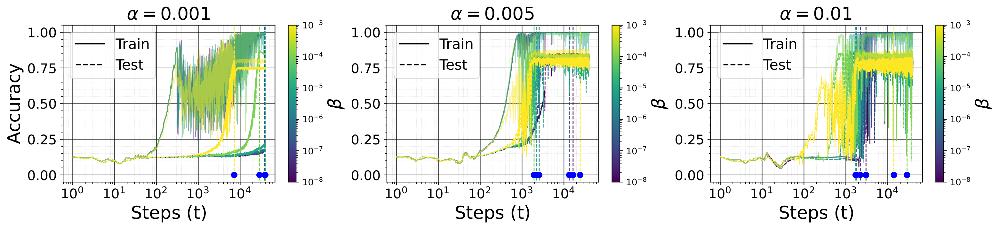

###### fig-35

*Рисунок 35: Точность на обучении и на тесте у MLP, обученного на MNIST со сглаживанием $\ell_{1}$ при разных значениях скорости обучения $\alpha$ и коэффициента $\ell_{1}$, равного $\beta$* **[p. 67]**

---

# Машиночитаемый блок фактов

```yaml
paper:
  id: 2506.05718
  title: "Grokking Beyond the Euclidean Norm of Model Parameters"
  authors: [Pascal Jr Tikeng Notsawo, Guillaume Dumas, Guillaume Rabusseau]
  affiliation: "Universite de Montreal; Mila"
  date: 2025-06
  version: "v2 (10 июня 2025); по ней размечены страницы"
  venue: "ICML 2025"
  citations: "нет данных (в таблицу citations_to_power_2022 не попала)"
  source: ar5iv
  source_note: "нативный HTML arXiv непригоден: LaTeXML сорвался и отдал
    «Untitled Document» с обрывками преамбулы; иллюстрации в подаче лежали
    в PDF и отрисованы в PNG при 200 dpi"
  role_in_corpus: "закон задержки 1/(alpha*beta) для произвольного сглаживателя;
    норма L2 опровергнута как мера продвижения; распознан «гроккинг без понимания»"

core_claim:
  name: "гроккинг за пределами евклидовой нормы"
  thesis: "если существует модель со свойством P (разрежённые или малоранговые
    веса), обобщающая на задаче, то градиентный спуск с малым ненулевым
    сглаживанием по P (норма L1 или ядерная) даёт гроккинг"
  delay_law: "задержка обобщения растёт как 1/(alpha*beta): alpha — скорость
    обучения, beta — сила произвольного подходящего сглаживателя"
  two_phases: "сперва приближения остаются близ начального приближения
    и наименьшают потерю (запоминание), затем сглаживание преобладает
    и ведёт их к решению с наименьшим h (обобщение)"
  l2_refuted: "при сглаживании к иному свойству норма L2 растёт, а модель
    обобщает; решение наименьшей нормы L2 при N < n обобщить не может"
  grokking_without_understanding: "резкий скачок ошибки обобщения при большом
    начальном приближении и одном лишь ослаблении весов может не быть гроккингом:
    он появляется даже там, где у задачи решения нет"

theory:
  theorem_2_1: "две поры и задержка Theta(1/(alpha*beta)); условие — неравенство
    Чаттерджи—Лоясевича в точке начального приближения (а не на всей области,
    как требует Поляк—Лоясевич)"
  theorem_3_1: "восстановление разрежённого вектора: после запоминания
    ||a||_1 сходится к ||a*||_1 за 1/(alpha*beta) шагов"
  theorem_3_3: "при стойком свойстве нулевого пространства отсюда следует
    и сходимость самого a к a*"
  theorem_3_4: "разложение матриц: то же для ядерной нормы; сингулярные векторы
    после запоминания меняются не более чем на O(alpha*beta/(gamma-1))
    по оценке sin Theta Ведина"
  theorem_3_6: "при N < n решение наименьшей нормы L2 не может обобщить,
    если у a* есть составляющая, ортогональная столбцовому пространству"
  theorem_c_28: "неравенство Чаттерджи—Лоясевича сохраняется при возмущении
    сглаживателем со свойством нулевой стационарности (ZSP)"

setup:
  convex_tasks: "восстановление разрежённых векторов (n = 100, s = 5, N = 30)
    и восполнение или измерение матриц (10 x 10, ранг 2, N = 70)"
  networks: "MLP на остаточном сложении по остатку 97 при 40 % данных;
    нелинейная постановка «учитель — ученик» с ReLU; MNIST на 1000 примерах"
  regularizers: "L1, L2, ядерная норма, соболевский штраф первого порядка"
  depth: "линейная сеть a = произведение по слоям, L от 1 до 4"
  data_selection: "когерентность tau: доля примеров, выбранных по наибольшим
    рычажным оценкам"
  optimizer: "субградиентный спуск на выпуклых задачах; Adam на сетях"
  seeds: "не указаны нигде; полосок погрешности нет"

results:
  algorithmic: "L1 и ядерная норма действуют на гроккинг так же, как L2;
    при этом норма L2 растёт, а модель обобщает"
  sparse_recovery: "t2 растёт как ||a_hat - a*||_inf/(alpha*beta),
    а ошибка восстановления убывает как alpha*beta"
  matrix_factorization: "обобщение через многомасштабное убывание сингулярных
    значений: к нулю сходится наименьшее, затем следующее"
  depth: "при L >= 2 сглаживание L1 не нужно; при L > 2 задержка исчезает
    (разгроккивание); потеря убывает лестницей"
  data_selection: "для восполнения матрицы большая когерентность ускоряет
    обобщение показательно; для сжимающих измерений — замедляет"
  l2_only: "одно лишь ослабление весов при большом начальном приближении даёт
    резкий скачок ошибки, не отвечающий обобщению"

findings:
  - id: 1
    claim: "задержка растёт как 1/(alpha*beta) для произвольного сглаживателя"
    anchor: p1-5
  - id: 2
    claim: "норма L2 растёт, а модель обобщает"
    anchor: p3-1
  - id: 3
    claim: "решение наименьшей нормы L2 при N < n обобщить не может"
    anchor: p7-6
  - id: 4
    claim: "гроккинг без понимания: скачок есть, обобщения нет"
    anchor: p7-4
  - id: 5
    claim: "глубина заменяет явное сглаживание и убирает задержку"
    anchor: p8-5
  - id: 6
    claim: "гроккингом можно управлять одним лишь отбором данных"
    anchor: p8-4

concept_cards:
  grokking: p1-2
  norm-separation-delay-law: p1-5
  weight-decay: p3-1
  regularization-variants: p9-4
  weight-norm-minimization: p7-6
  correlation-traps: p7-4
  initialization-scale: p48-3
  sparse-subnetwork-lottery-ticket: p4-5
  spectral-analysis-svd-esd-fve: p7-1
  ungrokking: p50-2
  lazy-to-rich-kernel-to-feature-learning: p3-2
  data-fraction-critical-dataset-size: p8-4
  neural-tangent-kernel-ntk: p3-5

sources:
  original_html: original/2506.05718.ar5iv.html
  converted_text: original/2506.05718.grokking-beyond-the-euclidean-norm-of-model-parameters.md
  images_dir: images/
  pdf: https://arxiv.org/pdf/2506.05718v2

anchors:
  scheme: "pN-M | fig-N | tab-N (token headings, cross-viewer portable)"
  policy: "якоря заводятся только там, где на них ссылаются; разрывы страниц якорей не несут"
  numbering_note: "проба по PDF в этой статье почти не работает — после strip_latex
    в абзацах остаётся слишком мало обычного текста; номера страниц ведены
    отметками **[p. N]** (см. заметку в scripts/README.md)"
  paragraph: [p1-2, p1-4, p1-5, p3-1, p3-2, p3-5, p3-6, p4-1, p4-5, p4-6, p7-1, p7-4,
    p7-6, p8-2, p8-3, p8-4, p8-5, p9-4, p17-2, p17-5, p37-2, p43-6, p48-2, p48-3,
    p49-2, p49-3, p49-5, p50-2, p59-2, p60-5]
  figure: [fig-1, fig-2, fig-3, fig-4, fig-5, fig-6, fig-7, fig-8, fig-10, fig-11,
    fig-14, fig-15, fig-16, fig-35]
  table: []

review_summary:                   # см. раздел «Что показано, а что предположено»
  strong: "обобщение поставлено там, где надо: дело не в норме, а в согласии
    сглаживателя со строением решения, и задержка растёт как 1/(alpha*beta);
    норма L2 опровергнута как мера продвижения и опытом, и теоремой;
    «гроккинг без понимания» распознан и объяснён — скачок появляется даже там,
    где решения не существует;
    нарушенное допущение Lyu et al. названо поимённо (допущение 3.2);
    предобусловливатель глубины выписан явно;
    отбор данных как ручка управления задержкой — новое для корпуса"
  weak: "все строгие теоремы о задержке доказаны для выпуклых задач
    с линейными моделями;
    на сетях показано лишь качественное направление, подгонки закона нет;
    семена, разбросы и число прогонов не названы нигде, полосок погрешности нет;
    догадка о разрежённости как причине гроккинга оставлена без проверки;
    текст не вычитан: «ovaparametrization», «Matrix matrix sensing»,
    «nu_j для строки j», а в приложении G.2.3 сказано, что с ростом ранга
    число потребных примеров убывает — вопреки теории того же раздела"
  authors_own_limits:
    - "отчего гроккинг естественно наблюдается на алгоритмических данных,
      работа не объясняет"
    - "догадка о разрежённости как причине гроккинга оставлена будущей работе"
    - "перенос на обучение разрежённому словарю и отбор ядра выборки
      назван направлением дальнейшей работы"

translation:
  status: complete
  formula_parity: "display 132/132, inline поблочно совпадает во всех переведённых блоках"
  figures: "35/35"
  pagination: "92 отметки страниц, совпадает с оригиналом"
```
