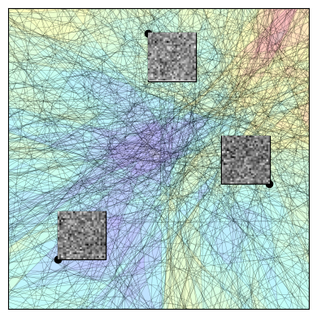
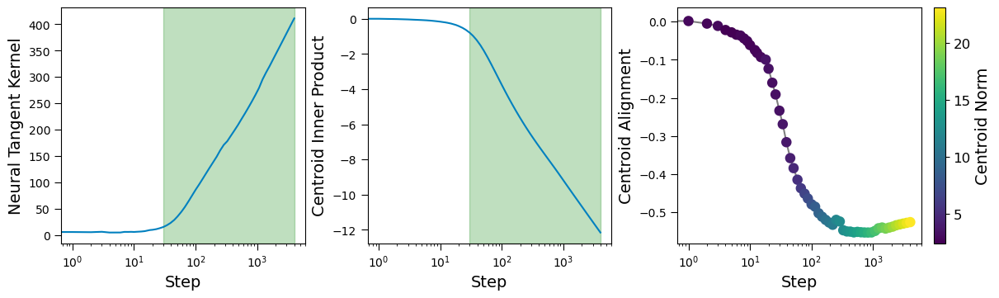
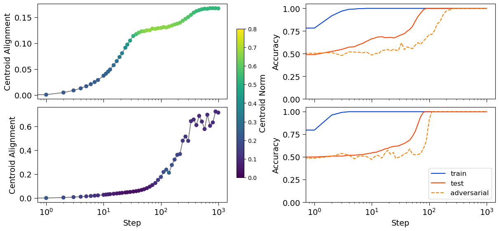
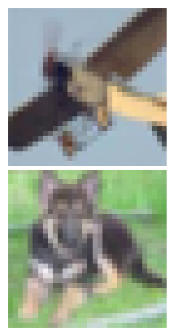
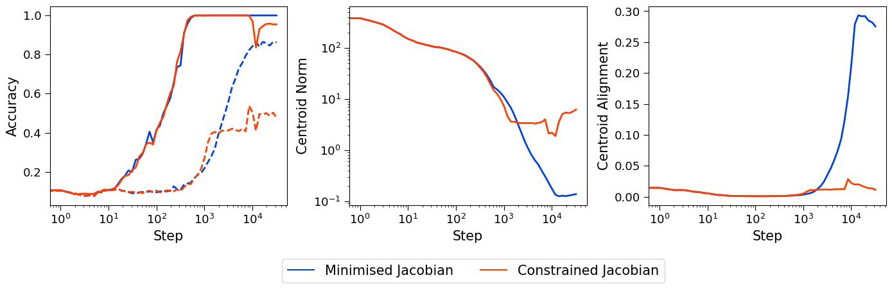
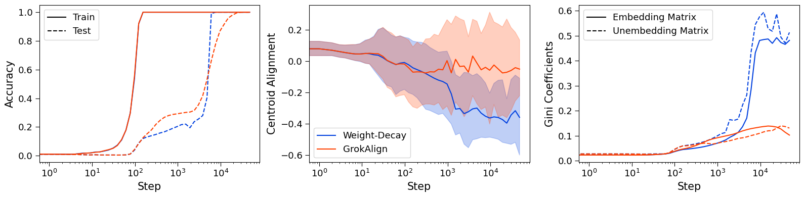
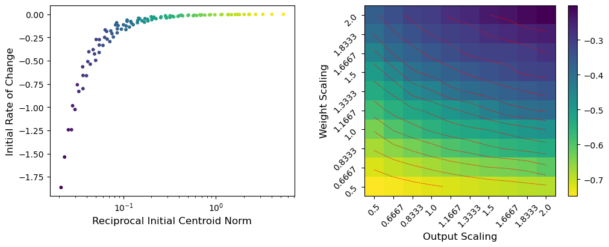
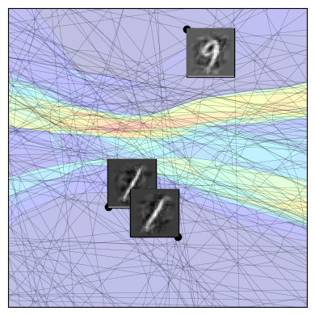
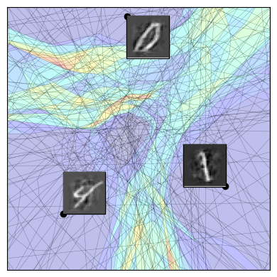
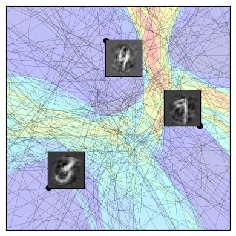

# Walker et al. 2025 — GrokAlign: Geometric Characterisation and Acceleration of Grokking

См. также: [глобальный индекс понятий](../../concepts/index.md).
arXiv [2506.12284v2](https://arxiv.org/abs/2506.12284), 14 июня 2025 (v2 — 31 июля 2025). Колонтитула у PDF нет: препринт свёрстан стилем `neurips_2025` в режиме `preprint`, внизу страницы стоит только её номер.

**Thomas Walker** — Department of Electrical and Computer Engineering, Rice University; переписка: tw78@rice.edu.
**Ahmed Imtiaz Humayun** — Google Research; работа выполнена до прихода в Google.
**Randall Balestriero** — Department of Computer Science, Brown University.
**Richard Baraniuk** — Department of Electrical and Computer Engineering, Rice University.

Оригинал и производные файлы этой папки:

- [`original/2506.12284.native.html`](original/2506.12284.native.html) — первоисточник, нативный HTML-рендеринг arXiv (LaTeXML), версия v2, скачан как есть.
- [`original/2506.12284.grokalign-geometric-characterisation-and-acceleration-of-grokking.md`](original/2506.12284.grokalign-geometric-characterisation-and-acceleration-of-grokking.md) — конверсия оригинала в Markdown без правок содержания; английский текст для сверки перевода.
- [`images/`](images/) — иллюстрации статьи в исходном разрешении (20 файлов; панели рисунков 1, 6 и 11 разложены по буквам).
- [`2506.12284.grokalign-geometric-characterisation-and-acceleration-of-grokking.claims.txt`](2506.12284.grokalign-geometric-characterisation-and-acceleration-of-grokking.claims.txt) — рабочий разбор: пронумерованные утверждения с пометками.

Схема якорей и правила ссылок на карточку — в [README папки статей](../README.md).

## Затрагиваемые понятия

**[Гроккинг](../../concepts/grokking.md)** — работа предлагает корпусу причинное объяснение и делает это без хеджей: причиной названо выравнивание матриц Якоби сети с самими обучающими точками — «*причина гроккинга — выравнивание матриц Якоби глубокой сети*» ([p2-3](#p2-3)), и то же повторено в «Обсуждении» как установленное ([p10-3](#p10-3)). Отправная точка заявлена как пустое место: «не существует ни основополагающего объяснения того, почему он происходит, ни практичной и поддающейся истолкованию рамки» для ускорения ([p1-4](#p1-4)). Существенно для корпуса, что под одним словом здесь соединены два разных явления — отложенная генерализация Power et al. и отложенная устойчивость к возмущениям входа Humayun et al. ([p1-3](#p1-3)), — и дальше статья рассуждает о них как об одном; выровненный центроид прямо отождествлён с «переселением областей» из [Humayun et al. 2024](../2402.15555.deep-networks-always-grok-and-here-is-why/2402.15555.deep-networks-always-grok-and-here-is-why.card.md) ([p4-9](#p4-9)). Чего в работе нет: необходимость выравненности не доказана — Теорема 2 даёт лишь оптимальность при ограничении на норму якобиана и нулевом смещении ([p3-5](#p3-5)), а переход к «должна с необходимостью включать» ([p3-8](#p3-8)) держится на эмпирическом допущении о низком ранге, взятом из чужих работ. Нет и якобиан-выравненности в смысле [Определения 1](#p3-2) ни в одном опыте: наибольшее измеренное косинусное сходство строк якобиана с точкой — $0{,}709$ ([tab-2](#tab-2)) при требуемой единице. Собственной меры гроккинга работа не вводит: сроком считается достижение $85$ % тестовой точности ([tab-1](#tab-1)).

**[Переход lazy→rich](../../concepts/lazy-to-rich-kernel-to-feature-learning.md)** — рамка принята как готовая и служит опорой, а не предметом: отложенная генерализация с самого начала отнесена к переходу сети «из линейного режима в режим обучения признаков» со ссылками на Lyu et al., Rubin et al. и Kumar et al. ([p2-1](#p2-1)), а линейный режим и режим обучения признаков определены через постоянство или изменчивость нейронного касательного ядра, с авторской сноской, что «Lazy и rich также широко употребляются как названия этих двух режимов» ([p4-12](#p4-12)). Вклад работы в это понятие — предложенный дешёвый наблюдаемый признак перехода: меняющееся скалярное произведение точки с её центроидом объявлено признаком динамического ядра, то есть режима обучения признаков ([p5-6](#p5-6)). Чего в работе нет: ни измерения ядра как такового вне рисунка 3, ни проверки, что найденный признак отличает переход от других причин изменения скалярного произведения — вывод «меняющееся скалярное произведение влечёт меняющееся ядро» из формулы Теоремы 9 не следует (постоянное ядро с ненулевыми невязками даёт ровно то же самое).

**[Нейронное касательное ядро](../../concepts/neural-tangent-kernel-ntk.md)** — работа даёт понятию новую точку сцепления: Теорема 9 связывает производную по времени скалярного произведения $\left\langle\mathbf{x},\mu_{\mathbf{x}}\right\rangle$ со взвешенной суммой ядра точки с обучающими точками ([p5-5](#p5-5)), и через это центроид — величина, считаемая одним якобиан-векторным произведением, — предлагается как заменитель прямого измерения ядра. Постановка узкая и оговорена: двухслойная сеть без смещений, скалярный выход, кросс-энтропия, полнопакетный градиентный спуск; векторный выход вынесен в приложение A, где связь с ядром уже не выписывается. Эмпирическая проверка — одна: двухклассовый MNIST, $4000$ шагов, одна точка обучающего набора ([p5-10](#p5-10), [fig-3](#fig-3)). Чего в работе нет: ни ядра при инициализации против ядра в конце обучения, ни численного порога, по которому выделена «область обучения признаков», — зелёная полоса на рисунке 3 проведена «по изменению значения нейронного касательного ядра» на глаз.

**[Меры прогресса](../../concepts/progress-measures.md)** — работа предлагает корпусу новую отслеживаемую величину, не называя её мерой прогресса: центроид линейной области есть сумма строк якобиана (Теорема 4, [p4-6](#p4-6)), считается якобиан-векторным произведением и потому много дешевле самого якобиана ([p4-7](#p4-7), [p2-4](#p2-4)), а степень его выравненности с точкой предложена «как величину для действенного отслеживания возникновения генерализации и устойчивости» ([p5-8](#p5-8)). Прикладной поворот здесь — не только «когда началось», но и «когда можно останавливаться»: по выходу выравненности на плато и приближению эффективного ранга к единице авторы заключают, что продление обучения уже ничего не даст ([p7-5](#p7-5)). Линия наследуется прямо от местной сложности Humayun et al.: «переселение областей» переформулировано как выравненность центроидов ([p4-9](#p4-9)). Чего в работе нет: слов «progress measure» и отсылки к Barak et al.; величина не проверена на опережение скачка (её ход сопоставляется с уже случившимся ростом точности, а не предсказывает его), а на модульном сложении она меняется в противоположную сторону ([fig-8](#fig-8), [fig-9](#fig-9)).

**[Weight decay](../../concepts/weight-decay.md)** — работа даёт weight decay механистическое объяснение и одновременно ставит его на второе место: он назван «годным приёмом навязать ограничение теоремы 2», но «менее прямым», с прямой ссылкой на разнобой корпуса — «в одних случаях weight decay оказывался действенным для наведения гроккинга [4, 15, 16, 32], тогда как в других он оказывался недостаточным для гроккинга [12]» ([p4-3](#p4-3)). Механизм задержки выписан по шагам на XOR-кластерах: сперва нормы центроидов растут и тормозят выравненность, и только когда выравненность становится оптимумом обучающей цели, weight decay начинает уменьшать нормы якобиана — отсюда и запаздывание устойчивости ([p7-1](#p7-1)); обобщение — «обычное обучение глубоких сетей, включая weight decay, не может удержать ограничение на норму якобиана» ([p7-3](#p7-3), [p5-11](#p5-11)). На CIFAR-10 под одним weight decay устойчивость к концу обучения падает ([fig-5](#fig-5)). Чего в работе нет: развёртки по силе weight decay — во всех сравнениях он взят одним значением и «ни в одном из методов мы не меняем weight decay обучающей процедуры» ([p9-2](#p9-2)); нет и разбора того, что на рисунке 2 эффективный ранг падает под weight decay ровно так же, как под GrokAlign ([fig-2](#fig-2)).

**[Когда регуляризация необходима](../../concepts/regularization-necessity.md)** — работа встаёт на сторону «необходима», но с непривычным доводом: не «без регуляризации нет гроккинга», а «без неё нет ограничения на норму якобиана, а значит и выравненности». В приложении B это сказано прямо: инициализация сама по себе задаёт исход, но «знать a priori, как инициализировать глубокую сеть ради благоприятной динамики выравненности, затруднительно, а потому на практике необходима та или иная регуляризация» ([p16-2](#p16-2)). Чего в работе нет: опыта без всякой регуляризации в основной постановке — сравнения таблицы 1 идут при неизменном weight decay у всех прогонов, включая базовый, так что случай «совсем без регуляризации» не измерен, и утверждение остаётся рассуждением, опёртым на развёртку по масштабам инициализации ([fig-10](#fig-10)).

**[Варианты регуляризации](../../concepts/regularization-variants.md)** — работа вводит в корпус новый приём: GrokAlign — добавление к функции потерь средней нормы Фробениуса матриц Якоби на обучающих данных с коэффициентом $\lambda_{\text{Jac}}$ ([p4-1](#p4-1)), считаемой приближённо ради вычислительной действенности ([p7-4](#p7-4)). Приём не нов сам по себе, и авторы это оговаривают: регуляризация якобиана уже применялась ради устойчивости, а удержание низкой константы Липшица предлагалось для примирения генерализации с устойчивостью ([p4-2](#p4-2)); новизна — в том, что тот же штраф объявлен управляющей ручкой гроккинга и в обе стороны, включая торможение, если норму якобиана удерживать высокой ([p8-2](#p8-2)). В приложении C сопоставлен и третий вариант — состязательное обучение: устойчивость оно даёт, а выравненности якобиана не наводит ([p16-3](#p16-3), [tab-2](#tab-2)). Чего в работе нет: правила выбора $\lambda_{\text{Jac}}$ — по опытам он меняется на четыре порядка ($1{,}0$, $0{,}001$, $0{,}0001$) без разбора чувствительности; нет и сравнения с другими штрафами на ранг или норму матриц весов.

**[Grokfast / фильтрация градиента](../../concepts/gradient-low-pass-filtering.md)** — работа даёт понятию первое в корпусе прямое измерение против нового соперника, и итог для Grokfast отрицательный: на MNIST-обиходе Liu et al. при десяти семенах Grokfast при кросс-энтропии оказывается чуть медленнее базового прогона ($\uparrow 1{,}01\times$ по шагам, $\uparrow 1{,}03\times$ по времени), а при среднеквадратичной ошибке даёт $\downarrow 1{,}08\times$ против $\downarrow 1{,}69\times$ у GrokAlign ([tab-1](#tab-1)); в тексте это названо «относительно меньшим улучшением» в случае MSE и недейственностью в случае кросс-энтропии ([p9-3](#p9-3)). Приём описан в одну фразу — «перерабатывая градиенты во время обучения так, чтобы усиливать определённые сигналы» ([p9-2](#p9-2)). Чего в работе нет: настроек Grokfast (ни $\alpha$, ни $\lambda$, ни выбора между EMA и MA), поэтому по опубликованному нельзя судить, проиграл ли приём или его настройка; нет и абсолютных чисел базового прогона — строка «Базовый прогон» в таблице 1 пуста.

**[Масштаб инициализации](../../concepts/initialization-scale.md)** — работа переводит приём Liu et al. на свой язык: увеличенная начальная норма весов означает якобианы с большой нормой, и именно она тормозит их выравнивание ([p9-1](#p9-1)); тот же рычаг применён и в обратную сторону — веса при инициализации увеличиваются, «во многом как Liu et al.», чтобы предотвратить выравнивание, а с ним и генерализацию ([p8-2](#p8-2)). Приложение B разбирает случай без регуляризации и находит размен: увеличить скорость изменения скалярного произведения можно масштабированием весов или выхода, но то же масштабирование увеличивает норму центроида ([p16-1](#p16-1)); по развёртке по масштабам весов и выхода авторы заключают, что управление нормой центроида действеннее ([fig-10](#fig-10)). Чего в работе нет: значений начального масштаба в самих опытах — они взяты у Liu et al. по ссылке; нет и оговорки о том, что на всей развёртке рисунка 10 наибольшая наблюдённая выравненность отрицательна (по шкале от $-0{,}3$ до $-0{,}7$).

**[Реальные данные и зрение](../../concepts/vision-real-world-data-mnist-cifar.md)** — почти вся эмпирика работы стоит на зрительных данных, и это её отличие от соседей по линии геометрии: MNIST служит и двухклассовой проверкой Теоремы 9 ([p5-10](#p5-10)), и площадкой торможения ([fig-7](#fig-7)), и площадкой ускорения ([tab-1](#tab-1)), а свёрточная сеть из шести свёрточных и двух линейных слоёв без смещений обучается на подвыборке CIFAR-10 в $1024$ образца, где устойчивость меряется Autoattack при $\ell_{\infty}$-возмущениях амплитуды $\frac{4}{255}$ ([p7-5](#p7-5), [fig-5](#fig-5)). Чего в работе нет: сколько-нибудь сильной модели — на CIFAR-10 тестовая точность держится около $0{,}36$, а устойчивая — около $0{,}14$ против $0{,}02$ у weight decay, то есть показано относительное улучшение заведомо слабой модели, а не устойчивость как таковая; нет и сетей со смещениями, поскольку допущение о нулевом смещении перенесено из теории в опыты ([p5-9](#p5-9)).

**[Модульная арифметика](../../concepts/modular-arithmetic.md)** — работа даёт корпусу честно показанный отрицательный итог на канонической задаче: на модульном сложении по обиходу Nanda et al. GrokAlign гроккинг не ускоряет ([p9-6](#p9-6)), и объяснение дано задним числом — трансформер выучивает алгоритмическое решение, «которое не вполне совместимо со взглядом с точки зрения выравненности якобиана и центроидов». Постановка при этом сменена так, чтобы итог стал положительным: при замороженных матрицах вложения и развложения, то есть при отобранной у модели возможности выстроить алгоритм, трансформер гроккает раньше с GrokAlign, чем с weight decay ([p10-2](#p10-2), [fig-9](#fig-9)). Чего в работе нет: ни модуля, ни разбиения, ни числа семян для этих двух прогонов — всё отдано ссылке на обиход Nanda et al.; ни признания, что на рисунке 8 GrokAlign не просто «не ускоряет», а замедляет.

**[Механистическая интерпретируемость](../../concepts/mechanistic-interpretability.md)** — работа берёт у Nanda et al. один готовый инструмент и употребляет его как индикатор, а не как разбор устройства: коэффициент Джини матриц вложения и развложения взят признаком того, что трансформер строит алгоритмическое решение, и наблюдение, что под GrokAlign он остаётся низким, служит доводом, что GrokAlign склоняет к решению «классификационного вида» ([p10-1](#p10-1), [fig-8](#fig-8)). Чего в работе нет: собственно механистического разбора — ни Фурье-разложения вложений, ни выделения голов и подсхем, ни абляций; «классификационное решение» нигде не определено операционально, и вывод о нём делается из одного скалярного показателя.

**[Спектральный анализ / FVE](../../concepts/spectral-analysis-svd-esd-fve.md)** — работа употребляет спектральную величину как подпорку допущения: доля дисперсии, объяснённая первой главной компонентой якобиана, $\frac{\sigma_{1}^{2}}{\sum_{i=1}^{r}\sigma_{i}^{2}}$, усреднённая по обучающим точкам, отслеживается по ходу обучения и трактуется как эффективный ранг якобиана ([fig-2](#fig-2)); её рост к единице — то, на чём держится переход от Теоремы 3 к утверждению о необходимости выравнивания ([p3-8](#p3-8)). Сами низкоранговые склонности не выведены и не измерены как свойство весов — они взяты ссылками на пять чужих работ, и авторы прямо признают, что допущение о снижении ранга «требует более глубокой характеризации» ([p11-3](#p11-3)). Чего в работе нет: спектра матриц весов (меряется спектр якобиана, а не весов), сравнения с ESD- и HTSR-величинами корпуса и разбора того, что при кросс-энтропии за $500$ шагов доля доходит лишь до $\approx 0{,}8$, а под weight decay и под GrokAlign кривые совпадают ([fig-2](#fig-2)).

## Несогласованности внутри статьи

**Ускорение в тексте и в таблице расходятся числом.** Абзац с главным итогом говорит, что GrokAlign приходит к гроккнутому состоянию «в $6{,}31$ раза быстрее базового прогона» при кросс-энтропии ([p9-3](#p9-3)), а строка той же таблицы в том же столбце «Абсолютное время» несёт $\downarrow 6{,}41\times$ ([tab-1](#tab-1)). По числу шагов расхождения нет ($7{,}56$ в обоих местах). При цитировании стоит брать число из таблицы.

**Знак выравненности противоположен тому, что говорит текст.** Текст раздела 4.1 объясняет происходящее «растущим скалярным произведением центроида, испытываемым в режиме обучения признаков» ([p5-11](#p5-11)), а Следствие 11 приложения A завершается словами, что «центроид обучающей точки побуждается положительно выравниваться с самим собой» ([p15-8](#p15-8)). На рисунке, которым это подтверждается, скалярное произведение центроида *падает* от нуля до $-12$, а выравненность — от нуля до $-0{,}55$ ([fig-3](#fig-3)). На развёртке приложения B картина та же: «наибольшая выравненность, наблюдённая при обучении», принимает по шкале значения от $-0{,}3$ до $-0{,}7$, то есть отрицательна во всех прогонах развёртки, и более действенным объявлено то масштабирование, которое уводит её дальше в минус ([fig-10](#fig-10)). Ни в одном месте статья этого знака не оговаривает; читать её рассуждения приходится по модулю выравненности, а не по её значению.

**«Предотвращает гроккинг» — на рисунке ухудшение, а не отмена.** И текст ([p8-3](#p8-3)), и подпись рисунка говорят, что удержание нормы Фробениуса якобиана на высоком уровне «предотвращает гроккинг». На самом рисунке ограничиваемый прогон выходит примерно на $0{,}5$ тестовой точности против примерно $0{,}85$ у минимизирующего, при начальном уровне около $0{,}1$ ([fig-7](#fig-7)); там же видно, что у ограничиваемого прогона просаживается и обучающая точность — с единицы примерно до $0{,}95$. То есть генерализация замедлена и ухудшена, но не отменена, и обучающая цель при этом тоже перестаёт достигаться.

**«Не ускоряет» — на рисунке 8 замедление.** Текст говорит, что на модульном сложении «применение GrokAlign не ускоряет темп гроккинга» ([p9-6](#p9-6)). На рисунке тестовая точность под weight decay выходит на единицу около $6\cdot 10^{3}$ шагов, а под GrokAlign — около $2\cdot 10^{4}$ ([fig-8](#fig-8)), то есть примерно втрое позже. Формулировка «не ускоряет» слабее того, что показано.

**Выравненность центроидов падает ровно там, где сеть гроккает.** Раздел 3 заканчивается выводом, что степень выравненности центроидов годится «как величина для действенного отслеживания возникновения генерализации и устойчивости» ([p5-8](#p5-8)). На обоих трансформерных рисунках выравненность в момент гроккинга уходит в отрицательную область: до $\approx-0{,}35$ у weight decay на [fig-8](#fig-8) и до $\approx-0{,}3$ у GrokAlign на [fig-9](#fig-9), причём на рисунке 9 гроккают оба прогона. Текст ограничивается замечанием, что выравненность «меняется согласованно с тестовой точностью», и направления не называет.

**Заголовок столбца таблицы 2 переставлен местами со значениями.** Столбец назван «Выравненность строк якобиана (max/min)», а в каждой его клетке первым стоит отрицательное число, вторым — положительное: $-0{,}254$/$0{,}283$, $-0{,}509$/$0{,}478$, $-0{,}638$/$0{,}709$ ([tab-2](#tab-2)). Порядок значений, стало быть, min/max, а не max/min. Мелочь, но при цитировании таблицы по заголовку наибольшая выравненность оказывается наименьшей.

## Что доказано, что показано и что предположено

Работа заявляет причинность в самой сильной форме — «*причина гроккинга — выравнивание матриц Якоби глубокой сети*» ([p2-3](#p2-3)), и повторяет это в «Обсуждении» как достигнутое ([p10-3](#p10-3)). Ниже — разделение того, что за этим стоит.

**Доказано, при выписанных допущениях.** Теорема 2: при ограничении $\left\|J_{\mathbf{x}_{p}}(f)\right\|_{F}^{2}\leq\alpha$ и $B_{\omega_{\mathbf{x}_{p}}}=\mathbf{0}$ минимизатор кросс-энтропии или среднеквадратичной ошибки якобиан-выровнен, и решение выписано явно ([p3-5](#p3-5), [p3-6](#p3-6)). Существенны три особенности доказательства: лагранжиан выписан для одного $p$, а $A_{\omega_{\mathbf{x}_{p}}}$ трактуется как свободная переменная — что весь такой набор матриц одновременно достижим одной сетью с общими весами, не показано; сама выравненность не выведена, а внесена анзацем $\left[A_{\omega_{\mathbf{x}_{p}}}\right]_{c,\cdot}=a\mathbf{x}_{p}$ при $c=y_{p}$ и $b\mathbf{x}_{p}$ иначе, после чего проверяется лишь достаточность условий Каруша — Куна — Таккера; единственность оптимума не разбирается. Теорема 4 и Предложение 6 выведены из результатов Balestriero et al. о разбиении степенной диаграммой ([p4-5](#p4-5), [p4-6](#p4-6)); обратное к Предложению 6 не показано, и слабость центроидного условия признана прямо ([p4-11](#p4-11)).

**Доказано частично.** Теорема 3 утверждает, что среди матриц ранга один с нулевым смещением наиболее устойчива к $\ell_{2}$-возмущениям та, у которой $A_{\omega_{\mathbf{x}}}=\mathbf{c}\mathbf{x}^{\top}$, «где наибольшая запись $\mathbf{c}$ стоит на индексе класса $\mathbf{x}$» ([p3-7](#p3-7)). Доказательство разбирает единственное знаковое условие $\mathbf{v}^{\top}(\mathbf{x}+\boldsymbol{\epsilon})<0$ ([p20-11](#p20-11), [p20-12](#p20-12)) — по сути двухклассовый случай; часть утверждения про наибольшую запись $\mathbf{c}$ в доказательстве не появляется вовсе.

**Показано эмпирически.** Рост доли объяснённой дисперсии первой главной компоненты якобианов к единице ([fig-2](#fig-2)); совместный рост выравненности центроидов и устойчивости на XOR-кластерах ([fig-4](#fig-4)) и на CIFAR-10 ([fig-5](#fig-5)); ускорение на MNIST-обиходе Liu et al. по десяти семенам ([tab-1](#tab-1)); сдвиг косинусного сходства строк якобиана с точками при GrokAlign ([tab-2](#tab-2)). Границы этого: во всех опытах сети без смещений — допущение $B_{\omega}=\mathbf{0}$ перенесено из теории в эксперимент ([p5-9](#p5-9)); измеренная выравненность нигде не превышает $0{,}709$ при единице, требуемой [Определением 1](#p3-2); строка базового прогона в таблице 1 пуста, так что абсолютных сроков нет; у $\lambda_{\text{Jac}}$ нет правила выбора, и по опытам он меняется на четыре порядка.

**Предположено или доведено рассуждением.** Необходимость выравнивания — «отложенная устойчивость должна с необходимостью включать выравнивание якобиана» ([p3-8](#p3-8)) — получена из Теоремы 3 плюс допущения о низком ранге, взятого из чужих работ и признанного требующим «более глубокой характеризации» ([p11-3](#p11-3)). Вывод «меняющееся скалярное произведение влечёт меняющееся нейронное касательное ядро» ([p5-6](#p5-6)) из формулы Теоремы 9 ([p5-5](#p5-5)) не следует: ненулевая взвешенная сумма постоянного ядра с ненулевыми невязками даёт ровно ту же ненулевую производную. Перенос динамики центроидов на векторный выход (приложение A) сделан без повторного вывода связи с ядром. Объяснение отрицательного итога на трансформере через коэффициент Джини ([p10-1](#p10-1)) дано после опыта и ни на чём, кроме одного скалярного показателя, не стоит.

**Заявлено заглавием, но не измерено.** «Геометрическая характеризация» держится на визуализациях SplineCam двумерных срезов входного пространства ([fig-1](#fig-1), [fig-6](#fig-6), [fig-11](#fig-11), [p16-4](#p16-4)). Числовой меры геометрического изменения — в отличие от местной сложности той же исследовательской линии — работа не вводит и не измеряет. Собственные ограничения авторы называют двумя: теория построена для непрерывных кусочно-аффинных сетей ([p11-2](#p11-2)) и допущение о снижении ранга весовых матриц требует более глубокого разбора ([p11-3](#p11-3)).

## Ошибочные цитирования

Редакторские заметки о местах, где эта работа передаёт чужие результаты с искажением или без авторских оговорок.

###### mc-2311-06597

**Tan, Huang (2311.06597) — приём переименован и его правило перевёрнуто.** Описывая, с чем сравнивается GrokAlign, статья пишет: `"Tan and Huang [39] motivated adversarial training for accelerating grokking by establishing a connection between robustness and generalisation."` — «[Tan and Huang [39] обосновали состязательное обучение для ускорения гроккинга, установив связь между устойчивостью и генерализацией](#p9-2)»; и далее: `"The method of adversarial training involves perturbing the inputs during training with noise proportional to the training accuracy of the deep network."` — «[Метод состязательного обучения состоит в возмущении входов во время обучения шумом, пропорциональным обучающей точности глубокой сети](#p9-2)».

Обе половины расходятся с источником. Первая: [Tan и Huang](../2311.06597.understanding-grokking-through-a-robustness-viewpoint/2311.06597.understanding-grokking-through-a-robustness-viewpoint.card.md) не предлагают состязательного обучения — их приём назван авторами «дегроккингом» и состоит в добавлении ко входу гауссова шума $\Delta\sim\mathcal{N}(0,\sigma^{2}\mathbf{I})$, `"We made minimum changes to the initial training by only adding $\Delta\sim\mathcal{N}(0,\sigma^{2}\mathbf{I})$ to the input."`; противника, выбирающего направление возмущения, там нет вовсе, а слово «adversarial» в их тексте не встречается ни разу. Вторая, более существенная: сила возмущения у них задана как `"we adaptively update $\sigma=\max(\lambda_{1}(1-\text{train acc}),\lambda_{2})$"`, то есть пропорциональна обучающей *ошибке* и по ходу обучения убывает; «пропорционально обучающей точности» описывает противоположное поведение — шум, нарастающий по мере запоминания. Именно так этот приём и подан в таблице 1 как проигравший сравнение ([tab-1](#tab-1)), и по опубликованному нельзя проверить, воспроизведено ли правило источника или его перевёрнутая версия.

Мотивировочная часть при этом передана верно: связь «устойчивее — раньше обобщает» у Tan и Huang действительно есть, и в приложении C статья повторяет её без искажения — «[Хотя и GrokAlign, и состязательное обучение обоснованы как наводящие гроккинг через улучшение устойчивости модели](#p16-3)». Предупреждение относится к названию приёма и к правилу задания шума, а не к работе целиком.

###### mc-2301-05217

**Nanda et al. (2301.05217) — из величины выпал базис Фурье.** Довод о том, что GrokAlign склоняет трансформер к «классификационному» решению, строится на показателе: `"We support the idea that GrokAlign biases toward the classification style solution by tracking the Gini coefficient of the embedding and unembedding matrices [15]."` — «[Мы подкрепляем мысль о том, что GrokAlign склоняет к решению классификационного вида, отслеживая коэффициент Джини матриц вложения и развложения](#p10-1)»; на подписи рисунка добавлено «[как предложено в Nanda et al. [15]](#fig-8)».

У [Nanda et al.](../2301.05217.progress-measures-for-grokking-via-mechanistic-interpretability/2301.05217.progress-measures-for-grokking-via-mechanistic-interpretability.card.md) предложена другая величина: `"the Gini coefficient (Hurley & Rickard, 2009) of the norms of the Fourier components of $W_{E}$ and $W_{L}$, which measures the sparsity of $W_{E}$ and $W_{L}$ in the Fourier basis"` — «коэффициент Джини для норм фурье-компонент $W_{E}$ и $W_{L}$, который измеряет разрежённость $W_{E}$ и $W_{L}$ в базисе Фурье». Разрежённость именно в базисе Фурье и есть то, что связывает показатель с алгоритмическим решением; коэффициент Джини самих матриц — величина другая, и по тексту и подписям статьи нельзя установить, какая из двух вычислена. Смещён и смысл: у Nanda et al. этот показатель растёт в фазе очистки, уже после того как обобщающий контур сложился, тогда как здесь высокое его значение прямо отождествлено с «осуществлением алгоритмического решения» ([p10-1](#p10-1)).

Прочие ссылки на Nanda et al. переданы точно: и наблюдение, что однослойный трансформер гроккает, выучивая алгоритм ([p9-5](#p9-5)), и то, что обучающий конвейер взят у них без изменений, кроме добавления GrokAlign ([p9-6](#p9-6)).

## Ошибочные пересказы и цитирования этой статьи

Узоры, наблюдённые в цитирующих работах корпуса. Каждая запись говорит, что именно искажается, и ведёт к авторским абзацам этой статьи.

**«Переход lazy→rich даёт отложенную генерализацию, не требуя явной регуляризации, — как показали Walker et al.» (ошибочное).** [Saheb Pasand и Dohmatob](../2510.04930.egalitarian-gradient-descent-a-simple-approach-to-accelerated-grokking/2510.04930.egalitarian-gradient-descent-a-simple-approach-to-accelerated-grokking.card.md) ставят эту работу в один ряд с Kumar et al. как формализующую условия, при которых переход из ленивого режима в богатый даёт отложенную генерализацию: `"Kumar et al. (2024); Walker et al. (2025) formalize conditions under which such a transition yields delayed generalization without requiring explicit regularization."` Приписанное здесь — ровно противоположное сказанному. «Условия» Теоремы 2 и есть явное ограничение на норму якобиана ([p3-5](#p3-5)), а весь прикладной вывод статьи состоит в том, что без специального штрафа выравненность не осуществляется: «[обычные приёмы обучения не удерживают норму якобиана ограниченной, что подчёркивает необходимость метода вроде GrokAlign](#p5-11)», и GrokAlign вводится именно как добавляемый к потере штраф с коэффициентом $\lambda_{\text{Jac}}$ ([p4-1](#p4-1)). Больше того, weight decay остаётся включённым во всех сравниваемых прогонах, включая базовый: «[Ни в одном из методов мы не меняем weight decay обучающей процедуры](#p9-2)». Прогона без регуляризации в работе нет вовсе, а приложение B заканчивается прямо обратным выводом — «[на практике необходима та или иная регуляризация](#p16-2)».

**«Walker et al. нашли, что малоранговое строение способствует сжатию представлений» (расширяющее).** [Hwang и Park](../2603.01968.intrinsic-task-symmetry-drives-generalization-in-algorithmic-tasks/2603.01968.intrinsic-task-symmetry-drives-generalization-in-algorithmic-tasks.card.md) относят работу к прежним находкам о низком ранге: `"prior findings that low-rank structure facilitates representation compression (Walker et al., 2025; DeMoss et al., 2025; Junior et al., 2025)"`. Направление вывода здесь развёрнуто. Низкоранговость у Walker et al. — не находка, а взятое допущение: она приписана чужим работам ([22]–[26]) и подпёрта одним рисунком с долей объяснённой дисперсии ([p3-8](#p3-8), [fig-2](#fig-2)), а в «Ограничениях» прямо сказано, что это допущение «[требует более глубокой характеризации](#p11-3)». Сжатия представлений работа не измеряет ни в каком виде; её собственная причинная стрелка направлена в другую сторону — штраф на норму якобиана даёт выравненность, которую отслеживают по центроидам ([p7-5](#p7-5)). Контекст цитирования при этом верный: речь идёт о том, что поощряющие геометрию склонности сокращают время до обобщения, и такой итог у Walker et al. действительно есть ([tab-1](#tab-1)).

Прямое продолжение этой работы — 2605.08464 (Walker, Roddenberry, Humayun, Balestriero, Baraniuk, 2026), где та же выравненность переименована в «normal alignment», GrokAlign перенесён целиком и распространён на Recursive Feature Machines; карточки в корпусе пока нет, и цитированием эту работу считать нельзя — это авторское развитие.

---

# Текст статьи

# GrokAlign: Geometric Characterisation and Acceleration of Grokking

Thomas Walker (переписка: tw78@rice.edu; Department of Electrical and Computer Engineering, Rice University), Ahmed Imtiaz Humayun (работа выполнена до прихода в Google; Google Research), Randall Balestriero (Department of Computer Science, Brown University), Richard Baraniuk (Department of Electrical and Computer Engineering, Rice University)

## Аннотация

Ключевая задача для сообщества машинного обучения — понять и ускорить динамику обучения глубоких сетей, ведущую к отложенной генерализации и эмерджентной устойчивости к возмущениям входа, известным также как гроккинг. Прежние работы связывали такие явления, как отложенная генерализация, с переходом глубокой сети из линейного режима в режим обучения признаков, а эмерджентную устойчивость — с изменениями функциональной геометрии сети, в частности с расположением так называемых линейных областей в глубоких сетях, использующих непрерывные кусочно-аффинные нелинейности. Здесь мы объясняем, как гроккинг реализуется в якобиане глубокой сети, и показываем, что выравнивание якобианов сети с обучающими данными (в смысле косинусного сходства) обеспечивает гроккинг при допущении о низкоранговом якобиане. Наши результаты дают сильное теоретическое обоснование применению регуляризации якобиана при оптимизации глубоких сетей — методу, который мы вводим под названием GrokAlign, — и мы эмпирически показываем, что он наводит гроккинг много раньше, чем более привычные регуляризаторы вроде weight decay. Кроме того, мы вводим выравненность центроидов как поддающееся вычислению и истолкованию упрощение выравненности якобиана, действенно выявляющее и отслеживающее стадии динамики обучения глубокой сети. Сопутствующие [страница](https://thomaswalker1.github.io/blog/grokalign.html) и [код](https://github.com/ThomasWalker1/grokalign).

*Данные*

*Центроиды при запоминании*

*Центроиды при генерализации*

###### fig-1

*Рисунок 1: Чтобы глубокая сеть гроккнула, её якобианы должны *выровняться* так, чтобы сумма их строк была косинусно-сходна с точкой, в которой они вычислены; это условие мы назвали *центроид-выровненным*. Мы обучаем ReLU-сеть на наборе данных MNIST [1] с помощью GrokAlign. Мы берём три обучающие точки, **слева**, и наблюдаем линейные области глубокой сети (с помощью SplineCam [2]) вместе с центроидами [3] этих трёх точек, когда сеть запомнила обучающие данные, **в центре**, и когда она обобщила, **справа**. Мы раскрашиваем линейные области по норме действующего на них линейного оператора. (Дополнительные рисунки — на рисунке 11).* **[p. 2]**

## 1 Введение

###### p1-3

Известно, что глубокие сети обладают эмерджентными свойствами при длительном обучении, и понимать их существенно, чтобы обучать сети надёжно и действенно. *Отложенная генерализация* состоит в том, что тестовая точность растёт много позже того, как обучающая точность насытилась; изначально это явление назвали *гроккингом* [4]. Отложенная генерализация охватывает многие глубокие архитектуры и области, включая трансформеры на алгоритмических задачах [4] и в обработке естественного языка [5], а также полносвязные сети, выполняющие классификацию изображений [6]. Впоследствии понятие гроккинга было расширено и на *отложенную устойчивость* [7], состоящую в том, что длительное обучение делает глубокую сеть устойчивой к возмущениям входа. В идеале мы хотели бы ускорить наступление и генерализации, и устойчивости в глубоких сетях, хотя на практике наблюдалось напряжение между ними [8, 9].

###### p1-4

Несмотря на общее понимание гроккинга, не существует ни основополагающего объяснения того, почему он происходит, ни практичной и поддающейся истолкованию рамки для ускорения динамики обучения глубокой сети к более действенному достижению гроккнутого состояния.

**[p. 2]**

###### p2-1

Прежние работы в этой области относят отложенную генерализацию к переходу глубокой сети из линейного режима в режим обучения признаков [10, 11, 12]. Эту динамику изучали с точки зрения нейронного касательного ядра [13, 12], адаптивного ядра [14, 11] и механистической интерпретируемости [15, 16]. С одной стороны, эти работы пришли к целому набору достаточных условий наведения генерализации, включая норму весов при инициализации [6], weight decay [15, 10], размер набора данных [16] и масштабирование выхода или меток [12]. С другой стороны, отложенную генерализацию и устойчивость относили к эволюции функциональной геометрии сети [7], под которой имеется в виду расположение так называемых линейных областей непрерывной кусочно-аффинной сети. Матрицы Якоби глубокой сети также были определены как тесно связанные с их устойчивостью [17, 18, 19, 20, 21].

###### p2-2

*В этой статье мы доказываем теоретически и показываем эмпирически, что ограничения на норму якобиана наводят гроккинг в глубоких сетях. Кроме того, мы разрабатываем поддающийся вычислению и истолкованию подход к отслеживанию и ускорению гроккинга на практике, основанный на действенной сводке якобиана, называемой центроидом.*

###### p2-3

Эта статья вносит три главных вклада. Во-первых, мы показываем, что глубокие сети, оптимизировавшие свою функцию потерь, имеют *выровненные* якобианы в обучающих точках — в том смысле, что строки якобианов в обучающих точках суть просто скалярные кратные этих точек. Эмпирически было показано, что глубокие сети с выровненными якобианами устойчивы [20, 21], и мы строго доказываем, что они оптимально устойчивы среди всех якобианов ранга один. Поскольку динамика обучения глубоких сетей склоняет якобиан к низкоранговой матрице [22, 23, 24, 25, 26], мы заключаем, что *причина гроккинга — выравнивание матриц Якоби глубокой сети*. Через эту теорию мы вводим *GrokAlign* — применение регуляризации якобиана для обеспечения и ускорения гроккинга.

###### p2-4

Во-вторых, поскольку работать с матрицами Якоби на практике вычислительно дорого, а нынешние приёмы их выравнивания громоздки [21], мы предлагаем сводить матрицы Якоби к сумме их строк. Этот вектор можно действенно вычислить через якобиан-векторное произведение [27], и он имеет сильное геометрическое истолкование в сплайновой теории глубокого обучения [28], где он отвечает *центроиду* линейной области, содержащей интересующую точку данных. Теоретически центроиды связаны с нейронным касательным ядром, а эмпирически они дают действенно вычислимые величины для отслеживания и обнаружения возникновения гроккинга.

В-третьих, мы исследуем практическую значимость выравненности якобиана и центроида как рамки, сквозь которую можно смотреть на динамику обучения глубоких сетей. Мы показываем, что выравненность центроидов надёжно выделяет ключевые фазы динамики обучения глубоких сетей и то, когда дополнительное обучение могло бы оказаться полезным. Кроме того, мы иллюстрируем действенность GrokAlign как приёма управления динамикой обучения глубоких сетей, ведущей к гроккингу.

Подводя итог: в разделе 2 мы теоретически выделяем выравненность якобиана как гроккнутое состояние глубокой сети, к которому можно прийти, регуляризуя матрицы Якоби глубокой сети во время обучения, — метод, который мы вводим как GrokAlign. В разделе 3 мы показываем, как можно **[p. 3]** равносильно отслеживать выравненность якобиана через выравненность центроидов. В разделе 4 мы применяем это на практике, показывая, что выравненность центроидов можно использовать для выделения ключевых фаз обучения глубокой сети, а GrokAlign — для наведения устойчивости, торможения или ускорения гроккинга и управления выучиваемыми решениями глубоких сетей.

## 2 Регуляризация якобиана объясняет гроккинг

Пусть $f:\mathbb{R}^{d}\to\mathbb{R}^{C}$ — глубокая сеть. Здесь мы сосредоточиваемся на постановке классификации, так что предсказанием глубокой сети в точке $\mathbf{x}$ считается $\mathrm{argmax}(f(\mathbf{x}))$. В этой постановке глубокая сеть обучается на наборе данных $\left\{\left(\mathbf{x}_{p},y_{p}\right)\right\}_{p=1}^{m}$ — где $\mathbf{x}_{p}\in\mathbb{R}^{d}$, а $y_{p}\in\mathbb{R}$ — отвечающий ей класс — под некоторой функцией потерь $\mathcal{L}=\frac{1}{m}\sum_{p=1}^{m}\ell\left(f\left(\mathbf{x}_{p}\right),y_{p}\right)$. Пусть $J_{\mathbf{x}}(f)$ — якобиан $f$ в точке $\mathbf{x}$.

##### **Определение 1****.**

###### p3-2

*Глубокая сеть **якобиан-выровнена** в $\mathbf{x}\in\mathbb{R}^{d}$, если $J_{\mathbf{x}}(f)=\mathbf{c}\mathbf{x}^{\top}$ для некоторого вектора $\mathbf{c}\in\mathbb{R}^{d}$.*

###### fig-2

*Рисунок 2: Под weight decay и под GrokAlign эффективный ранг матриц Якоби, вычисленных на обучающих данных, стремится к рангу один. Здесь мы обучали ReLU-сети на задаче классификации MNIST [1] под функциями потерь среднеквадратичной ошибки и кросс-энтропии с помощью оптимизатора AdamW [29]. На протяжении обучения мы записывали среднюю объяснённую дисперсию первой главной компоненты якобианов, вычисленных на обучающих данных (PC1), а именно $\frac{\sigma_{1}^{2}}{\sum_{i=1}^{r}\sigma_{i}^{2}}$, где $\sigma$ — сингулярные числа якобиана. Когда эта нормированная величина равна единице, матрица Якоби имеет ранг один.* **[p. 3]**

Говорят, что глубокая сеть *обобщила*, когда она научилась выходить за пределы обучающего набора и хорошо работать на невиданных входах, и говорят, что она *устойчива*, когда применение возмущений ко входам не меняет поведение глубокой сети резко. Отложенное наступление обоих этих свойств заключено в явлении гроккинга [4, 7]. Возникновение генерализации обычно формализуют в рамках режима обучения признаков [10, 11, 12], тогда как устойчивость глубоких сетей связывали с их якобианами [20, 21].

Предположим, что $f$ — непрерывная кусочно-аффинная глубокая сеть; сюда входит широкий класс архитектур, включая ReLU-сети прямого распространения, рекуррентные сети, свёрточные нейросети и остаточные сети с кусочно-линейными функциями активации [28]. Такая глубокая сеть имеет представление вида $f(\mathbf{x})=A_{\omega_{\mathbf{x}}}\mathbf{x}+B_{\omega_{\mathbf{x}}}$, где $A_{\omega_{\mathbf{x}}}\in\mathbb{R}^{C\times d}$ и $B_{\omega_{\mathbf{x}}}\in\mathbb{R}^{C}$. Точнее, $A_{\omega_{\mathbf{x}}}$ и $B_{\omega_{\mathbf{x}}}$ — параметры аффинного преобразования, действующего на линейной области $\omega_{\mathbf{x}}$, охватывающей $\mathbf{x}$. *Функциональная геометрия* $f$ — это дизъюнктное объединение этих линейных областей, представляющее собой конечное разбиение входного пространства на набор выпуклых многогранников [3]. Заметим, что в этой постановке $J_{\mathbf{x}}(f)=A_{\omega_{\mathbf{x}}}$.

##### **Теорема 2****.**

###### p3-5

*Пусть $\mathcal{L}$ — функция потерь кросс-энтропии или среднеквадратичной ошибки. Тогда непрерывная кусочно-аффинная глубокая сеть $f$, минимизирующая $\mathcal{L}$ при ограничениях $\left\|J_{\mathbf{x}_{p}}(f)\right\|_{F}^{2}\leq\alpha$ и $B_{\omega_{\mathbf{x}_{p}}}=\mathbf{0}$ для каждого $p=1,\dots,m$, якобиан-выровнена. (Доказательство в приложении E).*

###### p3-6

Теорема 2 показывает, что якобиан-выровненные глубокие сети оптимальны в смысле оптимизации обучающей цели. В сочетании с прежними работами [20, 21] мы можем также заключить, что якобиан-выровненные глубокие сети устойчивы.11 1 Хотя в этих прежних работах понятие выравненности рассматривает лишь строку матрицы Якоби, отвечающую классу входа. Мы подкрепляем это следующим.

##### **Теорема 3****.**

###### p3-7

*Если $A_{\omega_{\mathbf{x}}}$ — матрица ранга один и $B_{\omega_{\mathbf{x}}}=\mathbf{0}$, то местное отображение на линейной области $\omega_{\mathbf{x}}$ оптимально устойчиво по отношению к $\ell_{2}$-возмущениям, когда $A_{\omega_{\mathbf{x}}}=\mathbf{c}\mathbf{x}^{\top}$, где наибольшая запись $\mathbf{c}$ стоит на индексе класса $\mathbf{x}$. (Доказательство в приложении E).*

###### p3-8

На практике динамика обучения глубоких сетей склоняет к низкоранговым матрицам весов [22, 23, 24, 25, 26], а значит и к низкоранговым якобианам (см. рисунок 2). Отсюда, из теоремы 3, мы определяем, что отложенная устойчивость должна с необходимостью включать выравнивание якобиана глубоких сетей.

**[p. 4]**

###### p4-1

Явно навязывая ограничение на норму якобиана из теоремы 2 — метод, который мы вводим как GrokAlign, — мы можем гарантировать, что оптимизация обучающей цели приведёт к гроккнутой сети. Точнее, GrokAlign состоит в добавлении к функции потерь средней нормы Фробениуса22 2 Норма Фробениуса матрицы равна квадратному корню из суммы квадратов её компонент. матриц Якоби на обучающих данных с некоторым весовым коэффициентом $\lambda_{\text{Jac}}$.

###### p4-2

Обнадёживает, что такая форма регуляризации якобиана уже показала себя улучшающей устойчивость глубоких сетей в прежних работах [17, 30, 18, 19]. Более того, принуждение сети удерживать низкую константу Липшица, что равносильно низкой норме якобиана, было определено как уравновешивающее наблюдаемый размен между генерализацией и устойчивостью [31].

###### p4-3

Weight decay тоже мог бы быть годным приёмом навязать ограничение теоремы 2; однако он менее прямой. Действительно, в одних случаях weight decay оказывался действенным для наведения гроккинга [4, 15, 16, 32], тогда как в других он оказывался недостаточным для гроккинга [12].

Подводя итог: мы выделили, что гроккинг требует выравнивания якобиана глубокой сети, которое, в силу теоремы 2, возникает при обучении только тогда, когда якобианы глубокой сети регуляризованы так, чтобы оставаться ограниченными. Поэтому мы предложили GrokAlign как метод, это делающий.

## 3 Взгляд с точки зрения выравненности центроидов

#### Центроиды.

###### p4-5

Напомним, что функциональная геометрия непрерывной кусочно-аффинной глубокой сети — это расположение её линейных областей. То есть дизъюнктное объединение $\left\{\omega_{\mathbf{x}}\right\}_{\mathbf{x}\in\mathbb{R}^{d}/\sim}$, где $\sim$ обозначает класс эквивалентности $\mathbf{x}_{1}\sim\mathbf{x}_{2}$ тогда и только тогда, когда $\mathbf{x}_{2}\in\omega_{\mathbf{x}_{1}}$ и наоборот. Важно, что функциональную геометрию можно параметризовать набором параметров $\left\{\left(\mu_{\mathbf{x}},\tau_{\mathbf{x}}\right)\right\}_{\mathbf{x}\in\mathbb{R}^{d}/\sim}\subseteq\mathbb{R}^{d}\times\mathbb{R}$, называемых *центроидами* и *радиусами*, согласно разбиению степенной диаграммой [3].

##### **Теорема 4****.**

###### p4-6

*Для непрерывной кусочно-аффинной глубокой сети $\mu_{\mathbf{x}}=\left(J_{\mathbf{x}}(f)\right)^{\top}\mathbf{1}$. (Доказательство в приложении E).*

###### p4-7

Теорема 4 говорит нам, что центроиды дают механизм сведе́ния матриц Якоби любой глубокой сети таким образом, который имеет изящное геометрическое истолкование, когда сеть непрерывна и кусочно-аффинна. Важно, что центроид можно вычислить через якобиан-векторное произведение, что вычислительно действеннее, чем прямое вычисление якобиана [27].

##### **Определение 5****.**

###### p4-8

*Глубокая сеть **центроид-выровнена** в $\mathbf{x}\in\mathbb{R}^{d}$, если $\mu_{\mathbf{x}}=c\mathbf{x}$ для некоторой постоянной $c\in\mathbb{R}$.*

###### p4-9

Геометрические следствия выравненности центроидов ярко видны на рисунке 1. Выровненный центроид можно связать с явлением *переселения областей*, наблюдавшимся у Humayun et al. [7], которое служило объяснением отложенной устойчивости. Переселение областей описывает, как глубокая сеть переселяет свои линейные области от точек данных к границе решения. Поэтому мы уже можем видеть, что рассмотрение выравненности центроидов окажется полезным с точки зрения попытки понять динамику обучения глубоких сетей.

##### **Предложение 6****.**

*Якобиан-выровненная глубокая сеть центроид-выровнена. (Доказательство в приложении E).*

###### p4-11

Из предложения 6 следует, что выравненность центроидов можно рассматривать как замену выравненности якобиана. Хотя выравненность центроидов — более слабое свойство, чем выравненность якобиана, мы покажем, что у неё есть явные связи с обучением признаков через нейронное касательное ядро.

#### Нейронное касательное ядро.

###### p4-12

Пусть глубокая сеть имеет параметры $\theta$. Тогда нейронное касательное ядро [13] между $\mathbf{x},\mathbf{x}^{\prime}\in\mathbb{R}^{d}$ полагается равным $\Theta\left(\mathbf{x},\mathbf{x}^{\prime}\right)=\nabla_{\theta}f_{\theta}(\mathbf{x})\left(\nabla_{\theta}f_{\theta}\left(\mathbf{x}^{\prime}\right)\right)^{\top}$. *Линейный* режим обучения глубокой сети и режим обучения *признаков* характеризуются, соответственно, относительно постоянным и меняющимся нейронным касательным ядром [33, 34, 35]. Первый выделяет случай, когда глубокая сеть приближает линейную функцию, тогда как второй задействует нелинейности глубокой сети.33 3 Lazy и rich также широко употребляются как названия этих двух режимов.

#### Динамика центроидов.

Для простоты мы разберём динамику центроидов двухслойной сети вида $f_{\theta}(\mathbf{x})=W^{(2)}\left(\sigma\left(W^{(1)}\mathbf{x}\right)\right)$, где $W^{(2)}\in\mathbb{R}^{d^{(2)}\times d^{(1)}}$, $W^{(1)}\in\mathbb{R}^{d^{(1)}\times d}$, а $\sigma$ — кусочно-аффинная нелинейность (например, ReLU). Мы опускаем члены смещения, чтобы обеспечить допущение о нулевом смещении **[p. 5]** из теоремы 2. Мы будем предполагать, что глубокая сеть обучается полнопакетным градиентным спуском со скоростью обучения $\eta$.

##### **Лемма 7****.**

*В описанной выше постановке имеем $\mu_{\boldsymbol{\mathbf{x}}}=\left(W^{(2)}Q_{\mathbf{x}}W^{(1)}\right)^{\top}\mathbf{1}$, где $Q_{\mathbf{x}}:=\mathrm{diag}\left(\sigma^{\prime}\left(W^{(1)}\mathbf{x}\right)\right)$. (Доказательство в приложении E).*

Чтобы связь с обучением признаков была явной, мы будем считать, что глубокая сеть имеет скалярный выход. Однако в приложении A мы разбираем глубокие сети с векторным выходом, где проводим сходную связь между динамикой центроидов и обучением признаков. В постановке со скалярным выходом мы предполагаем, что глубокая сеть обучается с функцией потерь кросс-энтропии.

##### **Лемма 8****.**

*В описанной выше постановке при $d^{(2)}=1$ нейронное касательное ядро $f_{\theta}$ между $\mathbf{x},\mathbf{x}^{\prime}\in\mathbb{R}^{d}$ даётся выражением*

$$
\Theta\left(\mathbf{x},\mathbf{x}^{\prime}\right)=\sigma\left(W^{(1)}\mathbf{x}\right)^{\top}\sigma\left(W^{(1)}\mathbf{x}^{\prime}\right)+\left(\mathbf{x}^{\top}\mathbf{x}^{\prime}\right)\left(W^{(2)}Q_{\mathbf{x}}Q_{\mathbf{x}^{\prime}}\left(W^{(2)}\right)^{\top}\right).
$$

*(Доказательство в приложении E).*

##### **Теорема 9****.**

###### p5-5

*В постановке леммы 8 имеем $\partial_{t}\left(\left\langle\mathbf{x},\mu_{\mathbf{x}}\right\rangle\right)=\frac{\eta}{m}\sum_{p=1}^{m}\Theta\left(\mathbf{x},\mathbf{x}_{p}\right)m_{\mathbf{x}_{p}}$, где $m_{\mathbf{x}_{p}}=y_{p}-\frac{1}{1+\exp\left(-f_{\theta}\left(\mathbf{x}_{p}\right)\right)}$. (Доказательство в приложении E).*

###### p5-6

Теорема 9 говорит, что скалярное произведение между некоторой точкой входного пространства $\mathbf{x}$ и отвечающим ей центроидом $\mu_{\mathbf{x}}$ есть взвешенная сумма нейронного касательного ядра этой точки с точками обучающих данных. В частности, меняющееся скалярное произведение влечёт меняющееся нейронное касательное ядро, что отвечает режиму обучения признаков.

Точнее, если скалярное произведение $\left\langle\mathbf{x},\mu_{\mathbf{x}}\right\rangle$ меняется на $\delta$, то выравненность изменится на $\frac{\delta}{\|\mathbf{x}\|\|\mu_{\mathbf{x}}\|}$. При оптимизации глубокой сети с помощью GrokAlign мы бы ожидали, что норма центроида будет низкой, поскольку центроид равен сумме строк якобиана (см. теорему 4). Тем самым режим обучения признаков будет выделяться выравненностью центроидов.

###### p5-8

Следовательно, поскольку якобиан-выровненные глубокие сети центроид-выровнены, а выравненность центроидов есть признак обучения признаков, мы определили, что степень выравненности центроидов можно использовать как величину для действенного отслеживания возникновения генерализации и устойчивости в динамике обучения глубоких сетей. Теперь мы исследуем это подробнее рядом численных опытов.

## 4 Опыты

###### p5-9

Чтобы вычислить выравненность центроидов глубокой сети, мы вычисляем центроид для входной точки по теореме 4, а затем вычисляем косинусное сходство между ним и входной точкой. Точно так же мы можем получить скалярное произведение центроида. Ввиду допущения о нулевом смещении из теоремы 2 и теоремы 3 мы, если не оговорено иное, опускаем члены смещения в рассматриваемых глубоких сетях.

###### fig-3

*Рисунок 3: Теорема 9 выполняется на практике: мы наблюдаем, что меняющееся скалярное произведение действительно отвечает режиму обучения признаков. Здесь мы обучаем двухслойную ReLU-сеть со скалярным выходом с функцией потерь бинарной кросс-энтропии, чтобы различать классы нуля и единицы набора данных MNIST [1]. Мы обучаем модель полнопакетным градиентным спуском в течение $4000$ шагов при скорости обучения $0.01$. В начале обучения мы фиксируем точку из обучающего набора и вычисляем среднее значение нейронного касательного ядра между ней и остальными точками обучающего набора, **слева**. Затем мы вычисляем центроид этой точки по теореме 4, чтобы затем получить скалярное произведение, **в центре**, и её выравненность, **справа**. На правом графике мы записываем норму центроида и кодируем её цветом маркеров. На **левом** и **центральном** графиках мы выделяем режим обучения признаков зелёной заливкой, определённой по изменению значения нейронного касательного ядра.* **[p. 6]**

### 4.1 Выравненность центроидов выделяет режим обучения признаков

###### p5-10

Сначала мы проверяем теорему 9 и вытекающие из неё выводы в постановке двухклассовой классификации MNIST [1] с помощью двухслойной ReLU-сети со скалярным выходом. Рисунок 3 показывает, что скалярное произведение между точкой и центроидом её линейной области меняется согласованно с нейронным касательным ядром, а значит выравненность центроидов выделяет режим обучения признаков.

###### p5-11

Ввиду того что нормы центроидов растут в ходе обучения, растущее скалярное произведение центроида, испытываемое в режиме обучения признаков, в конце концов перестаёт переводиться в выравненность центроидов. Это подкрепляет наблюдение, что обычные приёмы обучения не удерживают норму якобиана ограниченной [31], что подчёркивает необходимость метода вроде GrokAlign, чтобы обеспечить осуществление якобиан-выровненной глубокой сети на практике. Без применения метода вроде GrokAlign при обучении инициализация сети значительно влияет на её последующую динамику. В приложении B мы исследуем это с помощью выравненности центроидов.

###### fig-4

*Рисунок 4: Выравненность центроида точки из обучающего набора выделяет генерализацию и устойчивость глубокой сети. Мы изучаем двухслойную сеть ширины $2048$, обучающуюся задаче классификации XOR, описанной в разделе 4.2. В **верхнем** ряду мы обучаем сеть полнопакетным градиентным спуском под функцией потерь среднеквадратичной ошибки со скоростью обучения $0.1$, weight decay $0.1$ и в течение $1000$ шагов. Мы отслеживаем как выравненность обучающей точки с её центроидом, так и устойчивость сети. Чтобы измерить устойчивость, мы берём записи из тестового набора и применяем гауссовы возмущения с различными стандартными отклонениями к последним $39998$ компонентам. В **нижнем** ряду мы дополнительно применяем GrokAlign с $\lambda_{\text{Jac}}$, равным $1.0$. На **левых** графиках мы иллюстрируем нормы центроидов цветами маркеров.* **[p. 6]**

### 4.2 Выравненность центроидов выделяет отложенную устойчивость

Показав, что выравненность центроидов выделяет режим обучения признаков, мы теперь показываем, что её можно использовать для выделения наступления устойчивости.

**[p. 6]**

###### p6-1

Мы принимаем постановку, сходную с постановкой Xu et al. [36], состоящую в двухслойной полносвязной сети со скалярным выходом, гроккающей на данных XOR-кластеров. Заметим, что такая сеть тривиально имеет якобианы ранга один в каждой точке входного пространства. Данные XOR-кластеров содержат $40000$-мерные векторы вида $\mathbf{x}=\left(x_{1},x_{2},\tilde{\mathbf{x}}^{\top}\right)^{\top}\in\mathbb{R}^{40000}$, где $x_{1},x_{2}\in\left\{\pm 1\right\}$ и $\tilde{\mathbf{x}}\in\mathbb{R}^{39998}$. Те $400$ образцов, что используются для обучения сети, строятся выбором записей $x_{1}$, $x_{2}$ равномерно из $\left\{\pm 1\right\}$ и записей $\tilde{\mathbf{x}}$ равномерно из $\left\{\pm\epsilon\right\}$, здесь мы берём $\epsilon=0.05$. Отвечающая такому образцу метка есть $x_{1}x_{2}\in\{\pm 1\}$. Сходный образец порождается как тестовый набор. Поэтому по построению наши обучающие данные имеют *сигнал* только в первых двух компонентах, тогда как все прочие компоненты содержат шум. Отсюда генерализация потребовала бы распознать закономерность того, как первые две компоненты ведут к отвечающей метке, тогда как устойчивость потребовала бы от сети не обусловливать своё распознавание закономерности последними $39998$ компонентами.

**[p. 7]**

###### p7-1

На протяжении обучения мы отслеживаем выравненность центроида точки из обучающего набора и получаем рисунок 4. В верхнем ряду рисунка 4 мы наблюдаем, что, пока сеть запоминает, выравненность центроида значительно не растёт. Однако во время генерализации выравненность центроида растёт. После небольшого плато в выравненности центроида дальнейший её рост соотносится с наступлением устойчивости. В этом случае ранг якобиана сети в рассматриваемой точке равен одному, и поэтому из теоремы 3 устойчивость может быть достигнута только через выравнивание. Существенно, что мы наблюдаем непрямоту weight decay при навязывании ограничения на норму якобиана из теоремы 2. В начале обучения нормы центроидов растут и в конце концов тормозят выравненность центроидов. Поскольку выравненность есть оптимум обучающей цели (вспомним теорему 2), только на этой стадии под weight decay сеть побуждается уменьшать нормы якобиана, что и приводит к наступлению устойчивости.

В нижнем ряду рисунка 4 мы, напротив, видим, что применением GrokAlign мы прямо смягчаем эту задержку и достигаем устойчивости много раньше.

### 4.3 Влияние GrokAlign на гроккинг

###### p7-3

До сих пор мы показывали, что выравненность центроидов даёт ценный взгляд на динамику обучения глубокой сети, поскольку она выделяет стадии генерализации (см. рисунок 3) и обретения устойчивости (см. рисунок 4). Мы также показали, что обычное обучение глубоких сетей, включая weight decay, не может удержать ограничение на норму якобиана и потому ограничено в своей способности якобиан-выравнивать глубокие сети.

###### p7-4

Наиболее прямой подход к навязыванию ограничения на норму якобиана — через GrokAlign, и здесь мы исследуем, как его можно использовать для управления динамикой обучения глубокой сети, ведущей к гроккингу. Напомним, что GrokAlign регуляризует норму Фробениуса матриц Якоби глубокой сети, вычисленных на обучающих данных, добавляя её значение к функции потерь. Ради вычислительной действенности GrokAlign использует приближение нормы Фробениуса матриц Якоби [19].44 4 Мы даём код нашей реализации GrokAlign [здесь](https://github.com/ThomasWalker1/grokalign).

###### fig-5

*Рисунок 5: GrokAlign пользуется неявной склонностью обучения глубоких сетей к низкому рангу, чтобы навести устойчивость выравниванием якобианов глубокой сети. Здесь мы обучаем свёрточную нейросеть с шестью свёрточными и двумя линейными слоями, без членов смещения, на подвыборке из $1024$ образцов набора данных CIFAR10 [37] под функцией потерь среднеквадратичной ошибки. Мы используем оптимизатор AdamW [29] со скоростью обучения $0.001$ и размером пакета $256$ для обучения сети на протяжении $36000$ шагов. В одном случае мы применяем weight decay $0.001$, а в другом — GrokAlign с $\lambda_{\text{Jac}}$, равным $0.001$. На **левом** графике мы вычисляем среднюю объяснённую дисперсию первой главной компоненты якобианов, как на рисунке 2, а на **центральном** графике записываем среднюю выравненность центроидов на обучающем наборе. В **правом** столбце мы записываем тестовую точность модели и точность модели, когда к тестовому набору применены $\ell_{\infty}$-возмущения амплитуды $\frac{4}{255}$ с помощью Autoattack [38].* **[p. 7]**

#### Наведение отложенной устойчивости.

###### p7-5

Мы обучаем свёрточные нейросети на наборе данных CIFAR10 [37]. Из рисунка 5 мы наблюдаем, что с помощью GrokAlign мы можем навести выравненность якобиана, о чём свидетельствует растущая выравненность центроидов, которая переходит в улучшенную устойчивость, пользуясь убывающими рангами матриц Якоби. При одном лишь weight decay выравненность якобиана не проявляется, о чём свидетельствует низкая выравненность центроидов, и потому мы наблюдаем **[p. 8]** спад устойчивости по мере обучения. Существенно, что, отслеживая выравненность центроидов, мы можем определить, что продление обучения вряд ли значительно улучшит свойства GrokAlign-модели, поскольку эффективный ранг якобианов близок к единице, а выравненности центроидов относительно высоки и начали выходить на плато.

Тем самым мы показали, что GrokAlign даёт прямой приём наведения устойчивости, ибо он выравнивает якобианы глубоких сетей, что мы можем наблюдать, отслеживая выравненность центроидов. Как и для рисунка 1, мы можем ярко представить следствия выравненности центроидов на рисунке 6.

*Вход*

*Центроид не выровнен*

*Центроид выровнен*

###### fig-6

*Рисунок 6: Геометрия функции центроид-выровненной глубокой сети больше напоминает геометрию обучающих данных, указывая на то, что преобразование, применяемое ею к местным областям точек данных, более представительно для их признаков. Мы сравниваем две свёрточные нейросети с рисунка 5, беря обучающие точки, **слева**, и вычисляя их центроид. **В центре** мы изображаем центроиды для сети, обученной без GrokAlign, а **справа** — центроиды для сети, обученной с GrokAlign.* **[p. 8]**

#### Торможение отложенной генерализации.

###### p8-2

Пользуясь нашим рассуждением, мы бы ожидали, что если удерживать нормы якобиана на высоком уровне, то мы должны предотвратить выравнивание, а значит и генерализацию. Чтобы это исследовать, мы рассматриваем полносвязную сеть и увеличиваем масштаб её весов при инициализации, чтобы увеличить нормы якобиана, во многом как Liu et al. [6], и применяем GrokAlign по-разному.

###### p8-3

Мы наблюдаем на рисунке 7, что наше предсказание верно: минимизация норм Фробениуса якобианов ведёт к генерализации, тогда как удержание их значения относительно высоким её предотвращает. Мы можем отслеживать это, следя за нормами центроидов, что показывает, как центроиды дают действенный механизм отслеживания динамики сети.

###### fig-7

*Рисунок 7: Удерживая норму Фробениуса якобианов на обучающих данных относительно высокой, мы можем удерживать нормы центроидов относительно высокими, что предотвращает гроккинг. Мы берём MNIST-постановку гроккинга Liu et al. [6]. В минимизирующем случае мы навязываем при обучении GrokAlign с $\lambda_{\text{Jac}}$, равным $0.001$, чтобы минимизировать норму Фробениуса якобианов на обучающих данных. В ограничиваемом случае мы применяем GrokAlign, чтобы удерживать норму Фробениуса якобианов, вычисленных на обучающих данных, на относительно высоком уровне. Точнее, с коэффициентом регуляризации $0.001$ мы добавляем к функции потерь разность между пятью и средней нормой Фробениуса на обучающих данных. На **левом** графике мы изображаем обучающую и тестовую точность сплошными и пунктирными линиями соответственно. На **центральном** графике мы изображаем среднюю норму центроидов, вычисленных на обучающих данных. На **правом** графике мы изображаем среднюю выравненность центроидов.* **[p. 8]**

**[p. 9]**

#### Ускорение гроккинга.

###### p9-1

Точно так же, как мы использовали GrokAlign для торможения гроккинга, мы можем использовать его и для ускорения гроккинга. Для этого мы рассматриваем стандартную MNIST-постановку гроккинга Liu et al. [6], состоящую в применении weight decay к глубокой сети, инициализированной с большой начальной нормой весов. С нашей точки зрения это приводит к якобианам с большой нормой, что тормозит их выравнивание.

###### p9-2

Мы сравниваем действенность GrokAlign с двумя другими известными методами наведения гроккинга. Grokfast [32] работает над улучшением темпа гроккинга, перерабатывая градиенты во время обучения так, чтобы усиливать определённые сигналы. Tan and Huang [39] обосновали состязательное обучение для ускорения гроккинга, установив связь между устойчивостью и генерализацией. Метод состязательного обучения состоит в возмущении входов во время обучения шумом, пропорциональным обучающей точности глубокой сети. Ни в одном из методов мы не меняем weight decay обучающей процедуры.

###### p9-3

Из таблицы 1 мы наблюдаем, что GrokAlign чрезвычайно действен в наведении гроккнутого состояния глубокой сети в этой постановке; он приходит к гроккнутому состоянию за $7.56$ раза меньшее число шагов и в $6.31$ раза быстрее базового прогона в случае функции потерь кросс-энтропии. Напротив, Grokfast даёт относительно меньшее улучшение в случае среднеквадратичной ошибки и недейственен в случае кросс-энтропии. Состязательное обучение не улучшает темп гроккинга по сравнению с базовым прогоном. В частности, состязательное обучение не улучшает устойчивость модели путём выравнивания якобиана, в отличие от GrokAlign (см. приложение C).

###### tab-1

*Таблица 1: GrokAlign значительно ускоряет темп гроккинга. В **верхней** таблице мы принимаем постановку Liu et al. [6] с функцией потерь кросс-энтропии, а в **нижней** таблице — её же с функцией потерь среднеквадратичной ошибки в качестве базовых прогонов. Мы повторяем обучение при десяти различных случайных инициализациях, причём для функции потерь кросс-энтропии мы применяем GrokAlign с $\lambda_{\text{Jac}}$, равным $0.001$, и с $\lambda_{\text{Jac}}$, равным $0.0001$, для моделей со среднеквадратичной ошибкой. Для каждого прогона мы измеряем число шагов и абсолютное время в секундах, за которое сети достигают $85$% тестовой точности. В случае функции потерь среднеквадратичной ошибки мы дополнительно измеряем время в секундах, за которое модели проходят от $20$% до $85$% тестовой точности. Мы приводим среднее ускорение (или замедление) каждого метода по сравнению с базовым прогоном вместе с отвечающим ему стандартным отклонением.* **[p. 9]**

*Функция потерь кросс-энтропии*

| Регуляризация | Число шагов | Абсолютное время (с) |
|---|---|---|
| Базовый прогон | – | – |
| GrokAlign | $\boldsymbol{\downarrow}\mathbf{7.56}\boldsymbol{\times}(\pm 0.82)$ | $\boldsymbol{\downarrow}\mathbf{6.41}\boldsymbol{\times}(\pm 0.69)$ |
| Grokfast | $\uparrow 1.01\times(\pm 0.04)$ | $\uparrow 1.03\times(\pm 0.04)$ |
| Состязательное обучение | $\downarrow 1.32\times(\pm 0.18)$ | $\uparrow 1.92\times(\pm 0.29)$ |

*Функция потерь среднеквадратичной ошибки*

| Регуляризация | Число шагов | Абсолютное время (с) | Время фазы гроккинга (с) |
|---|---|---|---|
| Базовый прогон | – | – | – |
| GrokAlign | $\boldsymbol{\downarrow}\mathbf{1.69}\boldsymbol{\times}(\pm 0.31)$ | $\boldsymbol{\downarrow}\mathbf{1.46}\boldsymbol{\times}(\pm 0.30)$ | $\boldsymbol{\downarrow}\mathbf{1.77}\boldsymbol{\times}(\pm 0.53)$ |
| Grokfast | $\downarrow 1.08\times(\pm 0.17)$ | $\downarrow 1.05\times(\pm 0.23)$ | $\downarrow 1.05\times(\pm 0.27)$ |
| Состязательное обучение | $\downarrow 1.23\times(\pm 0.26)$ | $\uparrow 1.92\times(\pm 0.29)$ | $\uparrow 2.02\times(\pm 0.37)$ |

#### Управление выучиваемыми решениями глубоких сетей.

Вычисление центроидов имеет силу и без допущения о непрерывной кусочной аффинности; лишь их истолкование как характеризующих функциональную геометрию требует этого допущения. Поэтому мы можем исследовать выравненность центроидов и у более изощрённых моделей вроде трансформеров [40].

###### p9-5

Nanda et al. [15] наблюдали, что однослойный трансформер, обучающийся модульному сложению [4], гроккал, выучивая, как осуществить алгоритм. Столь же годным решением этой задачи была бы классификация. Поскольку наша рамка в основном обоснована в постановке классификации, мы можем исследовать напряжение между этими решениями через выравненность центроидов.

###### p9-6

На рисунке 8 мы рассматриваем выравненность центроидов у модели-трансформера при стандартном обучающем конвейере Nanda et al. [15] с добавленным использованием GrokAlign. Как и в наших предыдущих опытах, мы наблюдаем, что выравненность центроидов меняется согласованно с тестовой точностью. **[p. 10]** Однако она не столь заметна, как в предыдущих случаях, и применение GrokAlign не ускоряет темп гроккинга. Это, возможно, объясняется тем, что модель выучивает алгоритмическое решение задачи, которое не вполне совместимо со взглядом с точки зрения выравненности якобиана и центроидов.

###### p10-1

Мы подкрепляем мысль о том, что GrokAlign склоняет к решению классификационного вида, отслеживая коэффициент Джини матриц вложения и развложения [15]. Ключевая особенность, позволяющая трансформеру осуществить своё алгоритмическое решение, — способность управлять матрицами вложения и развложения [15]. В частности, коэффициент Джини этих матриц вложения должен быть относительно выше при осуществлении алгоритмического решения. Мы наблюдаем, что при применении GrokAlign эти коэффициенты Джини остаются низкими, указывая на то, что GrokAlign побуждает модель выучивать решение классификационного вида, которое не является естественным решением в этом конкретном режиме обучения (см. правый график рисунка 8). Следовательно, мы наблюдаем его недейственность в ускорении гроккинга.

###### fig-8

*Рисунок 8: GrokAlign склоняет однослойную модель-трансформер выучивать решение *классификационного* вида. Здесь мы получаем статистики выравненности центроидов для однослойного трансформера, обученного на модульном сложении [4]. Мы используем тот же обучающий конвейер, что и в Nanda et al. [15], с добавленным использованием GrokAlign с $\lambda_{\text{Jac}}$, равным $0.001$. На **левом** графике мы записываем точности модели-трансформера на обучающем и тестовом наборе. На **центральном** графике мы записываем выравненность центроидов модели-трансформера от непрерывных вложений дискретных входных лексем до выхода модели; заливка иллюстрирует наибольшую и наименьшую наблюдаемую выравненность, а сплошная линия отвечает средней. На **правом** графике мы записываем коэффициенты Джини матриц вложения и развложения модели, как предложено в Nanda et al. [15].* **[p. 10]**

###### p10-2

Если же вместо этого мы зафиксируем матрицу вложения при обучении, то мы a priori склоняем модель выучивать решение классификационного вида. При такой постановке (см. рисунок 9) мы наблюдаем, что трансформер гроккает раньше с GrokAlign, чем с weight decay.

###### fig-9

*Рисунок 9: Без способности управлять своими матрицами вложения однослойный трансформер выучивает решение классификационного вида для выполнения модульного сложения и потому выигрывает от обучения с GrokAlign. Мы принимаем те же настройки, что и на рисунке 8, за исключением того, что фиксируем матрицы вложения и развложения модели при обучении.* **[p. 10]**

## 5 Обсуждение

#### Значение.

###### p10-3

Мы выделили, что выравненность якобиана есть причина гроккинга, показав теоретически и эмпирически, что якобиан-выровненные глубокие сети оптимизируют функцию потерь при ограничении на норму якобиана и оптимально устойчивы при низкоранговой склонности динамики обучения. Следовательно, мы выделили регуляризацию норм якобианов глубокой сети как действенный приём управления динамикой глубоких сетей ради привития определённых свойств — метод, который мы **[p. 11]** вводим как GrokAlign. В частности, мы показали, что с помощью GrokAlign мы можем навести устойчивость, затормозить или ускорить гроккинг и предписать выучиваемые решения глубоких сетей.

Поскольку матрицами Якоби трудно оперировать для истолкования и дорого работать на практике, мы построили взгляд с точки зрения выравненности центроидов как замену для отслеживания динамики глубоких сетей. Этот взгляд поддаётся истолкованию благодаря своему отношению к функциональной геометрии глубокой сети и теоретически содержателен благодаря своей связи с нейронным касательным ядром. С помощью этого взгляда мы смогли выделить наступление генерализации и устойчивости при обучении глубокой сети, а также рассудить, когда продление обучения улучшило бы эти важные свойства.

#### Ограничения.

###### p11-2

Мы разрабатывали нашу теорию в рамках непрерывных кусочно-аффинных сетей для удобства, хотя её следствия распространяются на любую архитектуру глубокой сети, включая трансформеры. Наши опыты в основном рассматривали непрерывные кусочные сети. Понимание того, как наш взгляд держится вне этой постановки, пожалуй, оправданно. Мы приводим первоначальные результаты на трансформере в разделе 4.3.

###### p11-3

Кроме того, часть нашего рассуждения зависит от допущения, что динамика обучения глубоких сетей минимизирует ранг матриц весов. Хотя это было теоретически показано в отдельных постановках и наблюдалось эмпирически на практике, более глубокая характеризация этого явления необходима.

## Благодарности и раскрытие источников финансирования

Эта работа была поддержана грантом ONR N00014-23-1-2714, ONR MURI N00014-20-1-2787, грантом DOE DE-SC0020345 и грантом DOI 140D0423C0076.

**[p. 12]**

## Список литературы

- [1] Y. Lecun, L. Bottou, Y. Bengio, and P. Haffner. Gradient-based learning applied to document recognition. *Proceedings of the IEEE*, 86(11):2278–2324, 1998.

- [2] Ahmed Imtiaz Humayun, Randall Balestriero, Guha Balakrishnan, and Richard Baraniuk. SplineCam: Exact Visualization and Characterization of Deep Network Geometry and Decision Boundaries. In *Proceedings of the IEEE/CVF Conference on Computer Vision and Pattern Recognition*, June 2023.

- [3] Randall Balestriero, Romain Cosentino, B. Aazhang, and Richard Baraniuk. The Geometry of Deep Networks: Power Diagram Subdivision. In *Neural Information Processing Systems*, May 2019.

- [4] Alethea Power, Yuri Burda, Harri Edwards, Igor Babuschkin, and Vedant Misra. Grokking: Generalization Beyond Overfitting on Small Algorithmic Datasets, January 2022. arXiv:2201.02177.

- [5] George Wang, Matthew Farrugia-Roberts, Jesse Hoogland, Liam Carroll, Susan Wei, and Daniel Murfet. Loss landscape geometry reveals stagewise development of transformers. In *High-dimensional Learning Dynamics 2024: The Emergence of Structure and Reasoning*, June 2024.

- [6] Ziming Liu, Eric J. Michaud, and Max Tegmark. Omnigrok: Grokking Beyond Algorithmic Data. In *The Eleventh International Conference on Learning Representations*, September 2022.

- [7] Ahmed Imtiaz Humayun, Randall Balestriero, and Richard Baraniuk. Deep Networks Always Grok and Here is Why. In *High-dimensional Learning Dynamics 2024: The Emergence of Structure and Reasoning*, June 2024.

- [8] Dimitris Tsipras, Shibani Santurkar, Logan Engstrom, Alexander Turner, and Aleksander Madry. Robustness may be at odds with accuracy. In *International Conference on Learning Representations*, 2019.

- [9] Hongyang Zhang, Yaodong Yu, Jiantao Jiao, Eric Xing, Laurent El Ghaoui, and Michael Jordan. Theoretically Principled Trade-off between Robustness and Accuracy. In *Proceedings of the 36th International Conference on Machine Learning*, May 2019.

- [10] Kaifeng Lyu, Jikai Jin, Zhiyuan Li, Simon Shaolei Du, Jason D. Lee, and Wei Hu. Dichotomy of Early and Late Phase Implicit Biases Can Provably Induce Grokking. In *The Twelfth International Conference on Learning Representations*, January 2024.

- [11] Noa Rubin, Inbar Seroussi, and Zohar Ringel. Grokking as a First Order Phase Transition in Two Layer Networks. In *The Twelfth International Conference on Learning Representations*, January 2024.

- [12] Tanishq Kumar, Blake Bordelon, Samuel J. Gershman, and Cengiz Pehlevan. Grokking as the transition from lazy to rich training dynamics. In *The Twelfth International Conference on Learning Representations*, January 2024.

- [13] Arthur Jacot, Franck Gabriel, and Clément Hongler. Neural tangent kernel: convergence and generalization in neural networks. In *Proceedings of the 32nd International Conference on Neural Information Processing Systems*, 2018.

- [14] Inbar Seroussi, Gadi Naveh, and Zohar Ringel. Separation of scales and a thermodynamic description of feature learning in some CNNs. *Nature Communications*, 14(1):908, February 2023.

- [15] Neel Nanda, Lawrence Chan, Tom Lieberum, Jess Smith, and Jacob Steinhardt. Progress measures for grokking via mechanistic interpretability. In *The Eleventh International Conference on Learning Representations*, September 2022.

- [16] Vikrant Varma, Rohin Shah, Zachary Kenton, János Kramár, and Ramana Kumar. Explaining grokking through circuit efficiency, September 2023. arXiv:2309.02390.

**[p. 13]**

- [17] Salah Rifai, Pascal Vincent, Xavier Muller, Xavier Glorot, and Yoshua Bengio. Contractive auto-encoders: explicit invariance during feature extraction. In *Proceedings of the 28th International Conference on Machine Learning*, 2011.

- [18] Daniel Jakubovitz and Raja Giryes. Improving DNN Robustness to Adversarial Attacks Using Jacobian Regularization. In *ECCV*, September 2018.

- [19] Judy Hoffman, Daniel A. Roberts, and Sho Yaida. Robust Learning with Jacobian Regularization, August 2019. arXiv:1908.02729.

- [20] Christian Etmann, Sebastian Lunz, Peter Maass, and Carola Schoenlieb. On the Connection Between Adversarial Robustness and Saliency Map Interpretability. In *Proceedings of the 36th International Conference on Machine Learning*, May 2019.

- [21] Alvin Chan, Yi Tay, Yew Soon Ong, and Jie Fu. Jacobian adversarially regularized networks for robustness. In *International Conference on Learning Representations*, 2020.

- [22] Thien Le and Stefanie Jegelka. Training invariances and the low-rank phenomenon: beyond linear networks. In *International Conference on Learning Representations*, 2022.

- [23] Minyoung Huh, Hossein Mobahi, Richard Zhang, Brian Cheung, Pulkit Agrawal, and Phillip Isola. The low-rank simplicity bias in deep networks. *Transactions on Machine Learning Research*, 2023.

- [24] Nadav Timor, Gal Vardi, and Ohad Shamir. Implicit Regularization Towards Rank Minimization in ReLU Networks. In *Proceedings of The 34th International Conference on Algorithmic Learning Theory*, February 2023.

- [25] David Yunis, Kumar Kshitij Patel, Samuel Wheeler, Pedro Henrique Pamplona Savarese, Gal Vardi, Jonathan Frankle, Karen Livescu, Michael Maire, and Matthew Walter. Rank minimization, alignment and weight decay in neural networks. In *High-dimensional learning dynamics 2024: The emergence of structure and reasoning*, 2024.

- [26] Tomer Galanti, Zachary S. Siegel, Aparna Gupte, and Tomaso A. Poggio. SGD with Weight Decay Secretly Minimizes the Ranks of Your Neural Networks. In *The Second Conference on Parsimony and Learning (Proceedings Track)*, March 2025.

- [27] Randall Balestriero and Richard Baraniuk. Fast Jacobian-Vector Product for Deep Networks, April 2021. arXiv:2104.00219.

- [28] Randall Balestriero and Richard Baraniuk. A Spline Theory of Deep Learning. In *Proceedings of the 35th International Conference on Machine Learning*. PMLR, July 2018.

- [29] Ilya Loshchilov and Frank Hutter. Decoupled weight decay regularization. In *International Conference on Learning Representations*, 2019.

- [30] S. Gu and Luca Rigazio. Towards Deep Neural Network Architectures Robust to Adversarial Examples. *CoRR*, December 2014.

- [31] Yao-Yuan Yang, Cyrus Rashtchian, Hongyang Zhang, Ruslan Salakhutdinov, and Kamalika Chaudhuri. A closer look at accuracy vs. robustness. In *Proceedings of the 34th International Conference on Meural Information Processing Systems*, 2020.

- [32] Jaerin Lee, Bong Gyun Kang, Kihoon Kim, and Kyoung Mu Lee. Grokfast: Accelerated Grokking by Amplifying Slow Gradients, June 2024. arXiv:2405.20233.

- [33] Lénaïc Chizat, Edouard Oyallon, and Francis Bach. On Lazy Training in Differentiable Programming. In *Advances in Neural Information Processing Systems*, 2019.

- [34] Blake Woodworth, Suriya Gunasekar, Jason D. Lee, Edward Moroshko, Pedro Savarese, Itay Golan, Daniel Soudry, and Nathan Srebro. Kernel and rich regimes in overparametrized models. In *Proceedings of Thirty Third Conference on Learning Theory*, July 2020.

**[p. 14]**

- [35] Edward Moroshko, Blake Woodworth, Suriya Gunasekar, Jason D. Lee, Nathan Srebro, and Daniel Soudry. Implicit bias in deep linear classification: Initialization scale vs training accuracy. *Advances in Neural Information Processing Systems*, 2020.

- [36] Zhiwei Xu, Zhiyu Ni, Yixin Wang, and Wei Hu. Let me grok for you: Accelerating grokking via embedding transfer from a weaker model. In *The Thirteenth International Conference on Learning Representations*, 2025.

- [37] Alex Krizhevsky and Geoffrey Hinton. Learning multiple layers of features from tiny images. Technical report, Technical report, University of Toronto / University of Toronto, Toronto, Ontario, 2009.

- [38] Francesco Croce and Matthias Hein. Reliable evaluation of adversarial robustness with an ensemble of diverse parameter-free attacks. In *Proceedings of the 37th International Conference on Machine Learning*, 2020.

- [39] Zhiquan Tan and Weiran Huang. Understanding Grokking Through A Robustness Viewpoint, February 2024. arXiv:2311.06597.

- [40] Ashish Vaswani, Noam Shazeer, Niki Parmar, Jakob Uszkoreit, Llion Jones, Aidan N Gomez, Lukasz Kaiser, and Illia Polosukhin. Attention is All you Need. In *Advances in Neural Information Processing Systems*, 2017.

- [41] Jaehoon Lee, Lechao Xiao, Samuel Schoenholz, Yasaman Bahri, Roman Novak, Jascha Sohl-Dickstein, and Jeffrey Pennington. Wide Neural Networks of Any Depth Evolve as Linear Models Under Gradient Descent. In *Advances in Neural Information Processing Systems*, 2019.

- [42] Mario Geiger, Stefano Spigler, Arthur Jacot, and Matthieu Wyart. Disentangling feature and lazy training in deep neural networks. *Journal of Statistical Mechanics: Theory and Experiment*, November 2020.

**[p. 15]**

## Приложение A Динамика центроидов у глубоких сетей с векторным выходом

Рассмотрим случай общего векторного выхода, а именно $d^{(2)}\geq 2$, где $\mathcal{L}$ — функция потерь кросс-энтропии или функция потерь среднеквадратичной ошибки. А именно, мы рассматриваем

$$
\ell\left(f\left(\mathbf{x}_{p}\right),y_{p}\right)=-\log\left(\frac{\exp\left(\left[f\left(\mathbf{x}_{p}\right)\right]_{y_{p}}\right)}{\sum_{c=1}^{d^{(2)}}\exp\left(\left[f\left(\mathbf{x}_{p}\right)\right]_{c}\right)}\right)
$$

для функции потерь кросс-энтропии или

$$
\ell\left(f\left(\mathbf{x}_{p}\right),y_{p}\right)=\left\|\mathbf{e}_{y_{p}}-f\left(\mathbf{x}_{p}\right)\right\|_{2}^{2}
$$

для функции потерь среднеквадратичной ошибки.

##### **Предложение 10****.**

*В описанной выше постановке имеем*

$$
\partial_{t}\left(\left\langle\mathbf{x},\mu_{\mathbf{x}}\right)\right\rangle =\frac{\eta}{m}\sum_{p=1}^{m}\Bigg(\left(\mathbf{m}_{\mathbf{x}_{p}}^{\top}W^{(2)}Q_{\mathbf{x}_{p}}Q_{\mathbf{x}}\left(W^{(2)}\right)^{\top}\mathbf{1}\right)\left\langle\mathbf{x},\mathbf{x}_{p}\right\rangle \\
\quad\qquad+\mathbf{x}^{\top}\left(W^{(1)}\right)^{\top}Q_{\mathbf{x}}\sigma\left(W^{(1)}\mathbf{x}_{p}\right)\mathbf{m}_{\mathbf{x}_{p}}^{\top}\mathbf{1}\Bigg)
$$

*где*

$$
\mathbf{m}_{\mathbf{x}_{p}}=\mathbf{e}_{y}-\frac{\exp\left(\left[f_{\theta}\left(\mathbf{x}_{p}\right)\right]_{y_{p}}\right)}{\sum_{c=1}^{C}\exp\left(\left[f_{\theta}\left(\mathbf{x}_{p}\right)\right]_{c}\right)}
$$

*в случае функции потерь кросс-энтропии и*

$$
\mathbf{m}_{\mathbf{x}_{p}}=2\left(\mathbf{e}_{y}-f_{\theta}\left(\mathbf{x}_{p}\right)\right).
$$

##### **Следствие 11****.**

*В постановке предложения 10 при функции потерь кросс-энтропии имеем*

$$
\partial_{t}\left(\left\langle\mathbf{x},\mu_{\mathbf{x}}\right)\right\rangle =\frac{\eta}{m}\sum_{p=1}^{m}\left(\mathbf{m}_{\mathbf{x}_{p}}^{\top}W^{(2)}Q_{\mathbf{x}_{p}}Q_{\mathbf{x}}\left(W^{(2)}\right)^{\top}\mathbf{1}\right)\left\langle\mathbf{x},\mathbf{x}_{p}\right\rangle \\
:=\frac{\eta}{m}\sum_{p=1}^{m}\frac{\iota_{\mathbf{x},p}}{\left\|\mathbf{x}_{p}\right\|_{2}}\left\langle\mathbf{x},\mathbf{x}_{p}\right\rangle
$$

###### p15-8

То есть в случае функции потерь кросс-энтропии центроиды выравниваются так, что это пропорционально выравненности охватывающих их точек с обучающими данными. Точнее, с той интуицией, что роль $W^{(2)}$ в $f_{\theta}$ — быть набором фильтров, обеспечивающих классификацию каждого класса, величину $W^{(2)}Q_{\mathbf{x}_{p}}\left(W^{(2)}Q_{\boldsymbol{\nu}}\right)^{\top}\mathbf{1}$ можно мыслить как выявляющую, насколько каждый признак $\mathbf{x}_{p}$ соотносится с признаками области $\omega_{\boldsymbol{\nu}}$. Поскольку $\mathbf{m}\left[\mathbf{x}_{p}\right]$ положительна на верном классе и отрицательна для неверных классов, член $\iota_{\mathbf{x}^{\prime},p}$ наибольший, когда $\omega_{\mathbf{x}^{\prime}}$ выявила признаки, соотносящиеся с признаками $\mathbf{x}_{p}$, указывающими на класс, которому та принадлежит. В таком случае центроид $\mu_{\mathbf{x}^{\prime}}$ движется в направлении $\mathbf{x}_{p}$, чтобы дополнительно увеличить это соотношение. Это показывает, как области $\omega_{\mathbf{x}^{\prime}}$ оптимизируются, чтобы захватить признаки классов, помогающие ей отличать себя от других классов. Поэтому мы можем видеть обучение нейросети скорее как процесс распределения линейных областей по разным признакам, наилучшим образом отличающим их от других классов. Это предполагало бы, что, когда мы наблюдаем, как центроиды слоя нейросети выравниваются с данными, которые он охватывает, нейросеть выполняет извлечение признаков. В частности, центроид обучающей точки побуждается положительно выравниваться с самим собой.

## Приложение B Инициализация ради выравненности центроидов

Когда регуляризация не используется при обучении глубокой сети, инициализация параметров глубокой сети играет значительную роль в определении того, в какой мере выравниваются её центроиды. В частности, есть напряжение между увеличением скорости изменения скалярного произведения центроида и удержанием низкой нормы центроида, чтобы растущее скалярное произведение переводилось в рост выравненности.

**[p. 16]**

###### p16-1

Например, увеличить скорость изменения скалярного произведения можно, увеличив нейронное касательное ядро, скажем масштабируя веса или выход сети. Однако это также увеличит норму центроида. Более того, известно, что такое масштабирование увеличивает склонность сети удерживаться в линейном режиме обучения [33], наравне с увеличением ширины нейросети [41] и перемасштабированием меток [42]. Мы исследуем этот размен, повторяя опыт рисунка 3, но с различным масштабированием весов или выхода сети.

###### p16-2

На рисунке 10 мы наблюдаем, что управление нормой центроида — более действенный приём перевода обучения признаков глубокой сети в выравненность центроидов. Однако знать a priori, как инициализировать глубокую сеть ради благоприятной динамики выравненности, затруднительно, а потому на практике необходима та или иная регуляризация.

###### fig-10

*Рисунок 10: Когда регуляризация не используется, минимизация нормы центроида при инициализации существенна для обеспечения выравненности центроида при обучении, и масштабирование выхода обеспечивает это действеннее, чем масштабирование весов при инициализации. Здесь мы повторяем опыт рисунка 3, но с различным масштабированием весов и выхода сети. **Слева** мы наносим соотношение между начальной скоростью изменения скалярного произведения, вычисленной по теореме 9, и средней обратной величиной нормы центроидов обучающих точек. Дополнительно мы раскрашиваем точки рассеяния по наибольшей выравненности центроида, наблюдённой при обучении. **Справа** мы наблюдаем, как наибольшая выравненность центроида, наблюдённая при обучении, соотносится с различными механизмами масштабирования.* **[p. 16]**

## Приложение C Выравненность, наводимая состязательным обучением

###### p16-3

Хотя и GrokAlign, и состязательное обучение обоснованы как наводящие гроккинг через улучшение устойчивости модели, первый делает это выравниванием функциональной геометрии модели, тогда как второе — нет. Мы определяем это, измеряя косинусное сходство между обучающими точками и строками якобиана модели в этих точках (см. таблицу 2).

###### tab-2

*Таблица 2: Мы сравниваем состязательное обучение с базовой и GrokAlign-постановками гроккинга из таблицы 1 в смысле наведения выравненности якобиана на обучающих данных.* **[p. 17]**

| Регуляризация | Тестовая точность | Выравненность строк якобиана (max/min) |
|---|---|---|
| Базовый прогон | $88.9$% | $-0.254$/$0.283$ |
| GrokAlign | $91.8$% | $-0.509$/$0.478$ |
| Состязательное обучение | $88.0$% | $-0.253$/$0.274$ |

| Регуляризация | Тестовая точность | Выравненность строк якобиана (max/min) |
|---|---|---|
| Базовый прогон | $86.8$% | $-0.170$/$0.272$ |
| GrokAlign | $88.2$% | $-0.638$/$0.709$ |
| Состязательное обучение | $87.8$% | $-0.263$/$0.376$ |

## Приложение D Геометрия выравненности центроидов

###### p16-4

У центроидов есть известная связь с функциональной геометрией глубоких сетей через сплайновую теорию глубокого обучения [28]. Они входят в параметр области при описании функциональной геометрии глубокой сети через разбиение степенной диаграммой [3]. На рисунке 1 мы показали следствия выравненности центроидов для этой геометрии. Точнее, мы показали, что она отвечает уплощению линейных областей вокруг входов одного класса, сходно с явлением переселения областей, выявленным у Humayun et al. [7]. Здесь мы подкрепляем это утверждение, иллюстрируя его за пределами входных точек, рассмотренных на рисунке 1.

###### fig-11

*Рисунок 11: Здесь мы подтверждаем правый график рисунка 1, повторяя его на других образцах входного пространства.* **[p. 17]**

**[p. 17]**

## Приложение E Доказательства основных результатов

#### Доказательство Теоремы 2.

1. В случае функции потерь кросс-энтропии

$$
\ell_{p}:=\ell\left(f\left(\mathbf{x}_{p}\right),y_{p}\right)=-\log\left(\frac{\exp\left(\left[f\left(\mathbf{x}_{p}\right)\right]_{y_{p}}\right)}{\sum_{c=1}^{C}\exp\left(\left[f\left(\mathbf{x}_{p}\right)\right]_{c}\right)}\right).
$$

 При наших допущениях выход нейросети в $\mathbf{x}_{p}$ есть $A_{\omega_{\mathbf{x}_{p}}}\mathbf{x}_{p}$. Потеря кросс-энтропии глубокой сети на $\mathcal{D}$ равна

$$
\mathcal{L}_{\text{CE}}=\frac{1}{m}\sum_{p=1}^{m}\ell_{p}
$$

**[p. 18]**

 где

$$
\ell_{p} =-\log\left(\frac{\exp\left(\left[A_{\omega_{\mathbf{x}_{p}}}\mathbf{x}_{p}\right]_{y_{p},\cdot}\right)}{\sum_{c=1}^{C}\exp\left(\left[A_{\omega_{\mathbf{x}_{p}}}\mathbf{x}_{p}\right]_{c,\cdot}\right)}\right) \\
=-\left\langle\left[A_{\omega_{\mathbf{x}_{p}}}\right]_{y_{p},\cdot},\mathbf{x}_{p}\right\rangle+\log\left(\sum_{c=1}^{C}\exp\left(\left\langle\left[A_{\omega_{\mathbf{x}_{p}}}\right]_{c,\cdot},\mathbf{x}_{p}\right\rangle\right)\right),
$$

 что выпукло на выпуклом множестве. Тем самым мы можем рассмотреть достаточные условия Каруша — Куна — Таккера с множителем Лагранжа,

$$
\mathcal{L}=\mathcal{L}_{\text{CE}}+\lambda\left(\sum_{c=1}^{C}\left\|\left[A_{\omega_{\mathbf{x}_{p}}}\right]_{c,\cdot}\right\|_{2}^{2}-\alpha\right).
$$

 В частности, условия Каруша — Куна — Таккера имеют вид

$$
\frac{\partial\mathcal{L}}{\partial\left[A_{\omega_{\mathbf{x}_{p}}}\right]_{c,\cdot}} =-\mathbf{1}_{\left\{y_{p}=c\right\}}\mathbf{x}_{p}+\frac{\mathbf{x}_{p}\exp\left(\left\langle\left[A_{\omega_{\mathbf{x}_{p}}}\right]_{c,\cdot},\mathbf{x}_{p}\right\rangle\right)}{\sum_{c^{\prime}=1}^{C}\exp\left(\left\langle\left[A_{\omega_{\mathbf{x}_{p}}}\right]_{c^{\prime},\cdot},\mathbf{x}_{p}\right\rangle\right)}-2\lambda\left[A_{\omega_{\mathbf{x}_{p}}}\right]_{c,\cdot} \\
=\mathbf{0}, \tag{1}
$$

 для $c=1,\dots,C$ и

$$
\frac{\partial\mathcal{L}}{\partial\lambda}=\alpha-\sum_{c=1}^{C}\left\|\left[A_{\omega_{\mathbf{x}_{p}}}\right]_{c,\cdot}\right\|_{2}^{2}=0. \tag{2}
$$

 Из (1) имеем

$$
0 =\sum_{c=1}^{C}\left\langle\left[A_{\omega_{\mathbf{x}_{p}}}\right]_{c,\cdot},\frac{\partial\mathcal{L}}{\partial\left[A_{\omega_{\mathbf{x}_{p}}}\right]_{c,\cdot}}\right\rangle \\
=-\left\langle\left[A_{\omega_{\mathbf{x}_{p}}}\right]_{y_{p},\cdot},\mathbf{x}_{p}\right\rangle+\sum_{c=1}^{C}\frac{\left\langle\left[A_{\omega_{\mathbf{x}_{p}}}\right]_{c,\cdot},\mathbf{x}_{p}\right\rangle\exp\left(\left\langle\left[A_{\omega_{\mathbf{x}_{p}}}\right]_{c,\cdot},\mathbf{x}_{p}\right\rangle\right)}{\sum_{c^{\prime}=1}^{C}\exp\left(\left\langle\left[A_{\omega_{\mathbf{x}_{p}}}\right]_{c^{\prime},\cdot},\mathbf{x}_{p}\right\rangle\right)} \\
\quad-2\lambda\sum_{c=1}^{C}\left\|\left[A_{\omega_{\mathbf{x}_{p}}}\right]_{c,\cdot}\right\|_{2}^{2}.
$$

 Пусть $\varrho_{c}=\frac{\exp\left(\left\langle\left[A_{\omega_{\mathbf{x}_{p}}}\right]_{c,\cdot},\mathbf{x}_{p}\right\rangle\right)}{\sum_{c^{\prime}=1}^{C}\exp\left(\left\langle\left[A_{\omega_{\mathbf{x}_{p}}}\right]_{c^{\prime},\cdot},\mathbf{x}_{p}\right\rangle\right)}$. Тогда в сочетании с (2) отсюда следует, что

$$
\lambda=\frac{1}{2\alpha}\sum_{c=1}^{C}\left\langle\left[A_{\omega_{\mathbf{x}_{p}}}\right]_{c,\cdot},\mathbf{x}_{p}\right\rangle\varrho_{c}-\left\langle\left[A_{\omega_{\mathbf{x}_{p}}}\right]_{y_{p},\cdot},\mathbf{x}_{p}\right\rangle.
$$

**[p. 19]**

 Подставляя это обратно в (1), получаем

$$
\frac{\partial\mathcal{L}}{\partial\left[A_{\omega_{\mathbf{x}_{p}}}\right]_{c,\cdot}}= -\mathbf{1}_{\left\{y_{p}=c\right\}}\mathbf{x}_{p}+\mathbf{x}_{p}\varrho_{c}+\frac{1}{\alpha}\left\langle\left[A_{\omega_{\mathbf{x}_{p}}}\right]_{y_{p},\cdot},\mathbf{x}_{p}\right\rangle\left[A_{\omega_{\mathbf{x}_{p}}}\right]_{c,\cdot} \\
-\frac{1}{\alpha}\sum_{c^{\prime}=1}^{C}\varrho_{c^{\prime}}\left\langle\left[A_{\omega_{\mathbf{x}_{p}}}\right]_{c^{\prime},\cdot},\mathbf{x}_{p}\right\rangle\left[A_{\omega_{\mathbf{x}_{p}}}\right]_{c,\cdot} \\
= \left(-\mathbf{1}_{\left\{y_{p}=c\right\}}+\varrho_{c}\right)\mathbf{x}_{p}+\frac{\left\langle\left[A_{\omega_{\mathbf{x}_{p}}}\right]_{y_{p},\cdot},\mathbf{x}_{p}\right\rangle\left[A_{\omega_{\mathbf{x}_{p}}}\right]_{c,\cdot}}{\alpha}\left(1-\varrho_{y_{p}}\right) \\
-\frac{1}{\alpha}\sum_{c^{\prime}\neq y_{p}}\left\langle\left[A_{\omega_{\mathbf{x}_{p}}}\right]_{c^{\prime},\cdot},\mathbf{x}_{p}\right\rangle\left[A_{\omega_{\mathbf{x}_{p}}}\right]_{c,\cdot}\varrho_{c^{\prime}} \\
= \left(-\mathbf{1}_{\left\{y_{p}=c\right\}}+\varrho_{c}\right)\mathbf{x}_{p}+\frac{\left\langle\left[A_{\omega_{\mathbf{x}_{p}}}\right]_{y_{p},\cdot},\mathbf{x}_{p}\right\rangle\left[A_{\omega_{\mathbf{x}_{p}}}\right]_{c,\cdot}}{\alpha}\left(1-\varrho_{y_{p}}\right) \\
-\frac{1}{\alpha}\left\langle\left[A_{\omega_{\mathbf{x}_{p}}}\right]_{i,\cdot},\mathbf{x}_{p}\right\rangle\left[A_{\omega_{\mathbf{x}_{p}}}\right]_{c,\cdot}\left(1-\varrho_{y_{p}}\right) \\
= \left(-\mathbf{1}_{\left\{y_{p}=c\right\}}+\varrho_{c}\right)\mathbf{x}_{p} \\
+\frac{\left(1-\varrho_{y_{p}}\right)\left[A_{\omega_{\mathbf{x}_{p}}}\right]_{c,\cdot}}{\alpha}\left(\left\langle\left[A_{\omega_{\mathbf{x}_{p}}}\right]_{y_{p},\cdot},\mathbf{x}_{p}\right\rangle-\left\langle\left[A_{\omega_{\mathbf{x}_{p}}}\right]_{i,\cdot},\mathbf{x}_{p}\right\rangle\right),
$$

 где $i$ — просто некоторый неверный класс для $\mathbf{x}_{p}$, а именно $i\neq y_{p}$. При $c=y_{p}$ это сводится к

$$
\frac{\partial\mathcal{L}}{\partial\left[A_{\omega_{\mathbf{x}_{p}}}\right]_{c,\cdot}}=\left(1-\varrho_{y_{p}}\right)\left(-\mathbf{x}_{p}+\frac{1}{\alpha}\left\langle\left[A_{\omega_{\mathbf{x}_{p}}}\right]_{y_{p},\cdot}-\left[A_{\omega_{\mathbf{x}_{p}}}\right]_{i,\cdot},\mathbf{x}_{p}\right\rangle\left[A_{\omega_{\mathbf{x}_{p}}}\right]_{y_{p},\cdot}\right),
$$

 а при $c\neq y_{p}$ сводится к

$$
\frac{\partial\mathcal{L}}{\partial\left[A_{\omega_{\mathbf{x}_{p}}}\right]_{c,\cdot}}=\left(1-\varrho_{y_{p}}\right)\left(\frac{1}{C-1}\mathbf{x}_{p}+\frac{1}{\alpha}\left\langle\left[A_{\omega_{\mathbf{x}_{p}}}\right]_{y_{p},\cdot}-\left[A_{\omega_{\mathbf{x}_{p}}}\right]_{i,\cdot},\mathbf{x}_{p}\right\rangle\left[A_{\omega_{\mathbf{x}_{p}}}\right]_{c,\cdot}\right).
$$

 Чтобы получить оптимальную $A$, достаточно найти $A_{\omega_{\mathbf{x}_{p}}}$, удовлетворяющую этим условиям. Для этого мы рассматриваем анзац

$$
\left[A_{\omega_{\mathbf{x}_{p}}}\right]_{c,\cdot}=\begin{cases}a\mathbf{x}_{p}&c=y_{p}\\
b\mathbf{x}_{p}&c\neq y_{p}.\end{cases}
$$

 Подставляя его в наши условия, получаем уравнения

$$
\begin{cases}-1+\frac{1}{\alpha}(a-b)a\left\|\mathbf{x}_{p}\right\|_{2}^{2}=0\\
\frac{1}{C-1}+\frac{1}{\alpha}(a-b)b\left\|\mathbf{x}_{p}\right\|_{2}^{2}=0\\
\left(a^{2}+(C-1)b^{2}\right)\left\|\mathbf{x}_{p}\right\|_{2}^{2}=\alpha.\end{cases}
$$

 Решая эти системы уравнений, приходим к

$$
\begin{cases}a=\frac{1}{\left\|\mathbf{x}_{p}\right\|_{2}}\sqrt{\frac{\alpha(C-1)}{C}}\\
b=-\frac{1}{\left\|\mathbf{x}_{p}\right\|_{2}}\sqrt{\frac{\alpha}{C(C-1)}}.\end{cases}
$$
2. В случае среднеквадратичной ошибки

$$
\ell_{p}:=\ell\left(f\left(\mathbf{x}_{p}\right),y_{p}\right)=\left\|f\left(\mathbf{x}_{p}\right)-\mathbf{e}_{y_{p}}\right\|_{2}^{2},
$$

 где мы используем $\mathbf{e}_{i}\in\mathbb{R}^{d}$ для обозначения $i^{\text{th}}$ стандартного базисного вектора. При наших допущениях выход глубокой сети в $\mathbf{x}_{p}$ есть $A_{\omega_{\mathbf{x}_{p}}}\mathbf{x}_{p}$. Потеря средней квадратичной ошибки глубокой сети на $\mathcal{D}$ равна

$$
\mathcal{L}_{\text{MSE}}=\frac{1}{m}\sum_{p=1}^{m}\ell_{p}
$$

**[p. 20]**

 где

$$
\ell_{p} =\left\langle A_{\omega_{\mathbf{x}_{p}}}\mathbf{x}_{p}-\mathbf{e}_{y_{p}},A_{\omega_{\mathbf{x}_{p}}}\mathbf{x}_{p}-\mathbf{e}_{y_{p}}\right\rangle=\sum_{c=1}^{C}\left(\left\langle\left[A_{\omega_{\mathbf{x}_{p}}}\right]_{c,\cdot},\mathbf{x}_{p}\right\rangle-\mathbf{1}_{\{y_{p}=c\}}\right)^{2},
$$

 что есть выпуклая функция на выпуклом множестве. Тем самым мы можем рассмотреть достаточные условия Каруша — Куна — Таккера с множителем Лагранжа,

$$
\mathcal{L}=\mathcal{L}_{\text{MSE}}-\lambda\left(\sum_{c=1}^{C}\left\|\left[A_{\omega_{\mathbf{x}_{p}}}\right]_{c,\cdot}\right\|_{2}^{2}-\alpha\right).
$$

 В частности, условия Каруша — Куна — Таккера имеют вид

$$
\frac{\partial\mathcal{L}}{\partial\left[A_{\omega_{\mathbf{x}_{p}}}\right]_{c,\cdot}} =2\left(\left\langle\left[A_{\omega_{\mathbf{x}_{p}}}\right]_{c,\cdot},\mathbf{x}_{p}\right\rangle-\mathbf{1}_{\left\{y_{p}=c\right\}}\right)\mathbf{x}_{p}-2\lambda\left[A_{\omega_{\mathbf{x}_{p}}}\right]_{c,\cdot}. \tag{3}
$$

 для $c=1,\dots,C$ и

$$
\frac{\partial\mathcal{L}}{\partial\lambda}=\sum_{c=1}^{C}\left\|\left[A_{\omega_{\mathbf{x}_{p}}}\right]_{c,\cdot}\right\|_{2}^{2}-\alpha=0. \tag{4}
$$

 Из (3) имеем

$$
0 =\sum_{c=1}^{C}\left\langle\left[A_{\omega_{\mathbf{x}_{p}}}\right]_{c,\cdot},\frac{\partial\mathcal{L}}{\partial\left[A_{\omega_{\mathbf{x}_{p}}}\right]_{c,\cdot}}\right\rangle \\
=-2\left\langle\left[A_{\omega_{\mathbf{x}_{p}}}\right]_{y_{p},\cdot},\mathbf{x}_{p}\right\rangle+2\sum_{c=1}^{C}\left\langle\left[A_{\omega_{\mathbf{x}_{p}}}\right]_{c,\cdot},\mathbf{x}_{p}\right\rangle^{2}-2\lambda\sum_{c=1}^{C}\left\|\left[A_{\omega_{\mathbf{x}_{p}}}\right]_{c,\cdot}\right\|_{2}^{2}.
$$

 Тогда в сочетании с (4) отсюда следует, что

$$
\lambda=-\frac{1}{\alpha}\left\langle\left[A_{\omega_{\mathbf{x}_{p}}}\right]_{y_{p},\cdot},\mathbf{x}_{p}\right\rangle+\frac{1}{\alpha}\sum_{c=1}^{C}\left\langle\left[A_{\omega_{\mathbf{x}_{p}}}\right]_{c,\cdot},\mathbf{x}_{p}\right\rangle^{2}.
$$

 Подставляя это обратно в (3), получаем

$$
\frac{\partial\mathcal{L}}{\partial\left[A_{\omega_{\mathbf{x}_{p}}}\right]_{c,\cdot}} =2\left(\left\langle\left[A_{\omega_{\mathbf{x}_{p}}}\right]_{c,\cdot},\mathbf{x}_{p}\right\rangle-\mathbf{1}_{\left\{y_{p}=c\right\}}\right)\mathbf{x}_{p} \\
+\left(\frac{2}{\alpha}\left\langle\left[A_{\omega_{\mathbf{x}_{p}}}\right]_{y_{p},\cdot},\mathbf{x}_{p}\right\rangle-\frac{2}{\alpha}\sum_{c=1}^{C}\left\langle\left[A_{\omega_{\mathbf{x}_{p}}}\right]_{c,\cdot},\mathbf{x}_{p}\right\rangle^{2}\right)\left[A_{\omega_{\mathbf{x}_{p}}}\right]_{c,\cdot}
$$

 Чтобы получить оптимальную $A$, достаточно найти $A_{\omega_{\mathbf{x}_{p}}}$, удовлетворяющую этим условиям. Для этого мы рассматриваем анзац

$$
\left[A_{\omega_{\mathbf{x}_{p}}}\right]_{c,\cdot}=\begin{cases}a\mathbf{x}_{p}&c=y_{p}\\
b\mathbf{x}_{p}&c\neq y_{p}.\end{cases}
$$

 Подставляя его в наши условия, получаем, что $b=0$ и $a=\frac{\sqrt{\alpha}}{\left\|\mathbf{x}_{p}\right\|_{2}}$.

∎

#### Доказательство Теоремы 3.

###### p20-11

Не умаляя общности, мы можем считать $A_{\omega_{\mathbf{x}}}$ имеющей вид $\mathbf{c}\mathbf{v}^{\top}$ для некоторого $\mathbf{v}\in\mathbb{R}^{d}$. В частности, мы предполагаем, что вектор $\mathbf{v}$ той же нормы, что и $\mathbf{x}$. Тогда местно в $\omega_{\mathbf{x}}$ имеем

$$
f_{\theta}(\mathbf{x}+\boldsymbol{\epsilon})=\mathbf{c}\mathbf{v}^{\top}\left(\mathbf{x}+\boldsymbol{\epsilon}\right).
$$

###### p20-12

Поэтому $\mathbf{x}$ будет неверно классифицирована нейросетью только тогда, когда $\mathbf{v}^{\top}\left(\mathbf{x}+\boldsymbol{\epsilon}\right)<0$. Из неравенства Коши — Шварца имеем

$$
-\|\mathbf{v}\|_{2}\|\boldsymbol{\epsilon}\|_{2}\leq\mathbf{v}^{\top}\boldsymbol{\epsilon}<-\mathbf{v}^{\top}\mathbf{x}.
$$

Отсюда

$$
\|\boldsymbol{\epsilon}\|_{2}>\frac{\mathbf{v}^{\top}\mathbf{x}}{\|\mathbf{v}\|_{2}},
$$

правая часть чего максимальна, когда $\mathbf{v}$ есть $\mathbf{x}$. ∎

**[p. 21]**

#### Доказательство Теоремы 4.

Используя теорему 12 и теорему 13, получаем

$$
\mu_{\omega_{\mathbf{x}}^{(1\leftarrow l)}}^{(1\leftarrow l)} =\left(A^{(l-1)}_{\omega_{\mathbf{x}}^{(l-1)}}\cdots A^{(1)}_{\omega_{\mathbf{x}}^{(1)}}\right)^{\top}\mu_{\omega_{\mathbf{x}}^{(l)}}^{(l)} \\
=\left(A^{(l-1)}_{\omega_{\mathbf{x}}^{(l-1)}}\cdots A^{(1)}_{\omega_{\mathbf{x}}^{(1)}}\right)^{\top}\left(A^{(l)}_{\omega_{\mathbf{x}}^{(l)}}\right)^{\top}\mathbf{1} \\
=\left(A^{(l)}_{\omega_{\mathbf{x}}^{(l)}}\cdots A^{(1)}_{\omega_{\mathbf{x}}^{(1)}}\right)^{\top}\mathbf{1} \\
=\left(A^{(1\leftarrow l)}_{\omega_{\mathbf{x}}^{(1\leftarrow l)}}\right)^{\top}\mathbf{1}.
$$

Распространяя это на $L^{\text{th}}$, получаем искомый результат. ∎

#### Доказательство Предложения 6.

Используя теорему 4, центроид выровненного якобиана есть $\mu_{\mathbf{x}}=\mathbf{x}\mathbf{c}^{\top}\mathbf{1}=c\mathbf{x}$, где $c=\mathbf{c}^{\top}\mathbf{1}$. ∎

#### Доказательство Леммы 7.

Это немедленно следует из применения теоремы 4. ∎

#### Доказательство Леммы 8.

Заметим, что в этой постановке имеем

$$
\Theta\left(\mathbf{x},\mathbf{x}^{\prime}\right)=\left\langle\nabla_{W^{(2)}}f_{\theta}(\mathbf{x}),\nabla_{W^{(2)}}f_{\theta}\left(\mathbf{x}^{\prime}\right)\right\rangle+\left\langle\nabla_{W^{(1)}}f_{\theta}(\mathbf{x}),\nabla_{W^{(1)}}f_{\theta}\left(\mathbf{x}^{\prime}\right)\right\rangle.
$$

Поэтому, замечая, что

$$
\nabla_{W^{(2)}}f_{\theta}(\mathbf{x})=\sigma\left(W^{(1)}\mathbf{x}\right)
$$

и

$$
\nabla_{W^{(1)}}f_{\theta}(\mathbf{x})=W^{(2)}Q[\mathbf{x}]\mathbf{x}^{\top},
$$

получаем требуемое. ∎

#### Доказательство Теоремы 9.

Сходно с предложением 10 можно показать, что

$$
\partial_{t}\mu_{\mathbf{x}}= \frac{\eta}{m}\sum_{p=1}^{m}\Bigg(\left(m\left[\mathbf{x}_{p}\right]^{\top}W^{(2)}Q\left[\mathbf{x}_{p}\right]Q[\mathbf{x}]\left(W^{(2)}\right)^{\top}\mathbf{1}\right)\mathbf{x}_{p} \\
\quad\qquad+\left(W^{(1)}\right)^{\top}Q[\mathbf{x}]\sigma\left(W^{(1)}\mathbf{x}_{p}\right)m\left[\mathbf{x}_{p}\right]^{\top}\mathbf{1}\Bigg).
$$

Используя лемму 8, это упрощается до

$$
\partial_{t}\left(\left\langle\mathbf{x}^{\prime},\mu_{\boldsymbol{\nu}}\right\rangle\right)=\frac{\eta}{m}\sum_{p=1}^{m}\Theta\left(\mathbf{x}^{\prime},\mathbf{x}_{p}\right)m\left[\mathbf{x}_{p}\right].
$$

∎

#### Доказательство Предложения 10.

Из леммы 7 заметим, что

$$
\partial_{t}\mu_{\mathbf{x}}=\left(\partial_{t}\left(W^{(2)}\right)Q[\mathbf{x}]W^{(1)}+W^{(2)}Q[\mathbf{x}]\partial_{t}\left(W^{(1)}\right)\right)^{\top}\mathbf{1},
$$

где

$$
\partial_{t}\left(W^{(i)}\right)=-\eta\nabla_{W^{(i)}}\mathcal{L}
$$

для $i=1,2$. Можно показать, что

$$
\nabla_{W^{(1)}}\mathcal{L}=-\frac{1}{m}\sum_{p=1}^{m}\left(W^{(2)}Q\left[\mathbf{x}_{p}\right]\right)^{\top}\mathbf{m}\left[\mathbf{x}_{p}\right]\mathbf{x}_{p}^{\top}
$$

и

$$
\nabla_{W^{(2)}}\mathcal{L}=-\frac{1}{m}\sum_{p=1}^{m}\mathbf{m}\left[\mathbf{x}_{p}\right]\sigma\left(W^{(1)}\mathbf{x}_{p}\right)^{\top}.
$$

**[p. 22]**

Поэтому

$$
\partial_{t}\mu_{\mathbf{x}}= \frac{\eta}{m}\sum_{p=1}^{m}\Bigg(\left(\mathbf{m}\left[\mathbf{x}_{p}\right]^{\top}W^{(2)}Q\left[\mathbf{x}_{p}\right]Q[\mathbf{x}]\left(W^{(2)}\right)^{\top}\mathbf{1}\right)\mathbf{x}_{p} \\
\quad\qquad+\left(W^{(1)}\right)^{\top}Q[\mathbf{x}]\sigma\left(W^{(1)}\mathbf{x}_{p}\right)\mathbf{m}\left[\mathbf{x}_{p}\right]^{\top}\mathbf{1}\Bigg).
$$

В частности,

$$
\mathbf{m}\left[\mathbf{x}_{p}\right]^{\top}\mathbf{1}=1-\frac{\sum_{c=1}^{C}\exp\left(\left[f_{\theta}\left(\mathbf{x}_{p}\right)\right]_{c}\right)}{\sum_{c^{\prime}=1}^{C}\exp\left(\left[f_{\theta}\left(\mathbf{x}_{p}\right)\right]_{c^{\prime}}\right)}=0,
$$

а значит

$$
\partial_{t}\mu_{\mathbf{x}}=\frac{\eta}{m}\sum_{p=1}^{m}\left(\mathbf{m}\left[\mathbf{x}_{p}\right]^{\top}W^{(2)}Q\left[\mathbf{x}_{p}\right]Q[\mathbf{x}]\left(W^{(2)}\right)^{\top}\mathbf{1}\right)\mathbf{x}_{p}.
$$

Поэтому результат следует, поскольку $\partial_{t}\left\langle\mathbf{x},\mu_{\mathbf{x}}\right\rangle=\left\langle\mathbf{x},\partial_{t}\left(\mu_{\mathbf{x}}\right)\right\rangle$. ∎

## Приложение F Вспомогательные результаты

Заметим, что для непрерывной кусочно-аффинной сети $f=\left(f^{(L)}\circ\dots\circ f^{(1)}\right)$ каждая $f^{(l)}$ и подкомпонента $f^{(1\leftarrow l)}=\left(f^{(l)}\circ\dots\circ f^{(1)}\right)$ также являются непрерывными кусочно-аффинными сетями. Пусть $A^{(l)}_{\omega^{(l)}_{\mathbf{x}}}$, $B^{(l)}_{\omega^{(l)}_{\mathbf{x}}}$, $\omega^{(l)}_{\mathbf{x}}$, $\mu^{(\ell)}_{\omega_{\mathbf{x}}^{(l)}}$ и $A^{(1\leftarrow l)}_{\omega^{(1\leftarrow l)}_{\mathbf{x}}}$, $B^{(1\leftarrow l)}_{\omega^{(1\leftarrow l)}_{\mathbf{x}}}$, $\omega^{(1\leftarrow l)}_{\mathbf{x}}$, $\mu_{\omega_{\mathbf{x}}^{(1\leftarrow\ell)}}^{(1\leftarrow l)}$ — обозначения для слоя и подкомпонентных сетей, соответствующие обозначениям для непрерывных кусочно-аффинных сетей, введённым нами в разделе 2.

##### **Теорема 12**(Balestriero et al. [3])**.**

*$l^{\text{th}}$ слой глубокой сети разбивает своё входное пространство согласно степенной диаграмме с центроидами*

$$
\mu^{(\ell)}_{\omega_{\mathbf{x}}^{(l)}}=\left(A^{(l)}_{\omega_{\mathbf{x}^{(l)}}}\right)^{\top}\mathbf{1}.
$$

##### **Теорема 13**(Balestriero et al. [3])**.**

*Непрерывная кусочная операция глубокой сети от входа до выхода $l^{\text{th}}$ слоя разбивает своё входное пространство согласно степенной диаграмме с центроидами*

$$
\mu_{\omega_{\mathbf{x}}^{(1\leftarrow\ell)}}^{(1\leftarrow l)}=\left(A^{(l-1)}_{\omega_{\mathbf{x}}^{(l-1)}}\cdots A^{(1)}_{\omega_{\mathbf{x}}^{(1)}}\right)^{\top}\mu_{\omega_{\mathbf{x}}^{(l)}}^{(l)}=:\left(A^{(1\leftarrow l-1)}_{\omega_{\mathbf{x}}^{(1\leftarrow l-1)}}\right)^{\top}\mu_{\omega_{\mathbf{x}}^{(l)}}^{(l)}.
$$

## Приложение G Вычислительные ресурсы

###### p22-8

Наши опыты вычислялись на ряде GPU NVIDIA, включая GTX TITAN X, RTX 2080Ti и RTX 8000. В таблице 3 мы указываем приблизительно, сколько занял каждый из наших основных опытов.

###### tab-3

*Таблица 3: Вычислительные ресурсы, использованные для проведения опытов этой работы.* **[p. 23]**

| Опыт | Оборудование | Время |
|---|---|---|
| Рисунок 2 | GTX TITAN X | 4 часа |
| Рисунок 3 | GTX TITAN X | Менее 1 часа |
| Рисунок 4 | GTX TITAN X | Менее 1 часа |
| Рисунки 5 и 6 | GTX 1080 Ti | 6 часов |
| Рисунок 7 | GTX TITAN X | 4 часа |
| Рисунки 8 и 9 | GTX 1080 Ti | 5 часов |
| Рисунок 10 | GTX TITAN X | 1 сутки |
| Таблицы 1 и 2 | GTX 1080 Ti, RTX 8000 | 5 суток |
