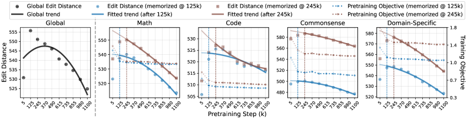
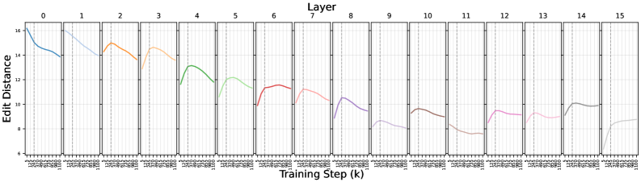

# Li, Fan, Zhou 2026 — Grokking in LLM Pretraining? Monitor Memorization-to-Generalization without Test

См. также: [глобальный индекс понятий](../../concepts/index.md).

**Ziyue Li**, **Chenrui Fan**, **Tianyi Zhou** (факультет вычислительной техники, Мэрилендский университет в Колледж-Парке).

arXiv [2506.21551](https://arxiv.org/abs/2506.21551), 26 июня 2025 (версия v4 — 3 февраля 2026). 8 цитирований — двадцать седьмая по цитируемости работа корпуса. Источник — нативный HTML arXiv версии v4.

Файлы разбора этой статьи:

- [`2506.21551.grokking-in-llm-pretraining-monitor-memorization-to-generalization-without-test.claims.txt`](2506.21551.grokking-in-llm-pretraining-monitor-memorization-to-generalization-without-test.claims.txt) — пронумерованные утверждения статьи с пометками разбора.
- [`2506.21551.grokking-in-llm-pretraining-monitor-memorization-to-generalization-without-test.license.txt`](2506.21551.grokking-in-llm-pretraining-monitor-memorization-to-generalization-without-test.license.txt) — лицензионная запись arXiv для этой статьи.

Схема якорей и правила ссылок на карточку — в [README папки статей](../README.md).

**Карточка-выдержка.** Лицензия статьи (`arxiv-nonexclusive`) не разрешает публикацию копии оригинала и полного перевода, поэтому карточка содержит редакторские секции и цитируемые фрагменты перевода (право цитирования). Полный текст статьи: <https://arxiv.org/abs/2506.21551>.

## Затрагиваемые понятия

**[Гроккинг](../../concepts/grokking.md)** — работа проверяет самое смелое из возможных обобщений: возникает ли гроккинг при **настоящем** предобучении большой языковой модели, то есть почти за один проход по корпусу размером с сеть. Ответ утвердительный, но с существенной поправкой: гроккинг оказывается **местным и несинхронным** — разные группы данных входят в свою стадию гроккинга в разные моменты, и глобального синхронного перехода, знакомого по алгоритмическим задачам, здесь **не найти** ([`p2-5`](#p2-5), [`p4-6`](#p4-6)).

**[Запоминание](../../concepts/memorization-phase.md)** — определение приспособлено к однопроходной постановке и заслуживает переноса в корпус: пример считается запомненным начиная с шага $t_{i}^{*}$, если его потеря ниже порога $\varepsilon$ и отклоняется от окончательного значения меньше чем на $\delta$ **на всех последующих** контрольных точках ([`p3-6`](#p3-6)). Авторы отдельно оговаривают, что такое «запоминание» невиданных данных вызвано не переобучением и не повторами, а интерполяцией уже выученного ([`p3-4`](#p3-4)).

**[Меры прогресса](../../concepts/progress-measures.md)** — главный практический вклад: две величины, вычисляемые **по обучающим данным** и потому почти бесплатные. Первая — редакционное расстояние Левенштейна между *путями* (последовательностями выбора экспертов по слоям) двух примеров ([`p7-1`](#p7-1)). Вторая — согласованность пути: нормированная косинусная близость взвешенных вложений экспертов между соседними слоями для одного примера ([`p8-1`](#p8-1)). Обе сильно связаны с точностью на эталонах: согласованность даёт корреляцию выше $0.97$, расстояние — около $-0.93$ ([`p9-1`](#p9-1), [`tab-1`](#tab-1)).

**[Маршрутизация внимания](../../concepts/attention-routing-heads.md)** — архитектура здесь не декорация, а инструмент: смесь экспертов (MoE) делает внутреннее вычисление **дискретным и наблюдаемым**, тогда как в плотной сети все нейроны задействованы разом ([`p6-3`](#p6-3)). Именно это позволяет увидеть механизм перехода, а не только его следствия.

**[Возникновение признаков](../../concepts/feature-emergence-feature-learning.md)** — содержательная находка: пути развиваются от случайных и своеобразных для каждого примера к **устроенным и переносимым между примерами**, причём уже после того, как потеря вышла на плато ([`p7-2`](#p7-2), [`fig-4`](#fig-4)). Авторы называют это переходом к «более умному запоминанию»: модель продолжает находить всё больше разделяемого знания, чтобы кодировать те же данные экономнее ([`p2-4`](#p2-4)).

**[Многообразие и сжатие представления](../../concepts/manifold-representation-compression.md)** — послойная картина тонкая и не сводится к «всё упрощается»: ранние слои после запоминания упрощаются быстрее всего, поздние — медленнее, а **последний слой, наоборот, разнообразится** ([`p7-3`](#p7-3), [`fig-5`](#fig-5)). Ранние слои укрепляют всеобщие представления, поздние сохраняют гибкость под задачу.

**[Обобщающие границы](../../concepts/generalization-bounds.md)** — теоретическая часть связывает наблюдаемое с величиной, для которой граница доказана: **действующей размерностью** ядра маршрутизации $\operatorname{Tr}(\boldsymbol{H}^{*}(\boldsymbol{H}^{*}+\lambda I)^{-1})$ ([`p9-4`](#p9-4)). В режиме NTK при закреплённой маршрутизации избыточный риск ограничен через эту размерность ([`p9-5`](#p9-5)); гроккинг тогда читается как **схлопывание** действующей размерности по мере перехода маршрутизации от случайной к устроенной ([`p10-1`](#p10-1)).

**[Нейронное касательное ядро](../../concepts/neural-tangent-kernel-ntk.md)** — цена теоремы названа прямо: эксперты остаются $\epsilon$-близкими к инициализации, маршрутизация **закреплена** и не содержит обучаемых параметров, шум меток гауссов ([`p15-1`](#p15-1)). То есть доказывается утверждение о постановке, в которой изучаемая динамика маршрутизации отсутствует по построению.

**[Реальные данные](../../concepts/vision-real-world-data-mnist-cifar.md)** — постановка масштабная и разнородная: открытые контрольные точки OLMoE (7 млрд параметров, смесь экспертов), четыре области — математика, код, здравый смысл, предметные знания — по 10 тыс. примеров предобучения и 10 тыс. тестовых ([`p4-4`](#p4-4)). Загрязнение эталонов отсеивается выводом о принадлежности Min-K%++.

**[Двойной спуск](../../concepts/double-descent.md)** и **[эмерджентность](../../concepts/emergence.md)** — работа замечает и объясняет неудобный факт: у обучающей потери связь с итоговой точностью не только слабая, но и **с неверным знаком** — положительная там, где по смыслу должна быть отрицательной ([`p9-1`](#p9-1)). Это прямое возражение практике следить за качеством по кривой потери.

Отдельно стоит сказать, чего в работе **нет**. Нет причинных вмешательств: связь путей с генерализацией установлена корреляционно, и попыток изменить маршрутизацию и посмотреть на итог не делается. Нет и переноса на плотные модели — «виртуальные пути» названы будущей работой ([`p10-2`](#p10-2)).

Карточки статей корпуса: [Power et al. 2022](../2201.02177.grokking-generalization-beyond-overfitting-on-small-algorithmic-datasets/2201.02177.grokking-generalization-beyond-overfitting-on-small-algorithmic-datasets.card.md) — исходное явление, от которого работа отталкивается; [Nanda et al. 2023](../2301.05217.progress-measures-for-grokking-via-mechanistic-interpretability/2301.05217.progress-measures-for-grokking-via-mechanistic-interpretability.card.md) — постепенное усиление структурированных механизмов, названное в обзоре; [Merrill et al. 2023](../2303.11873.a-tale-of-two-circuits-grokking-as-competition-of-sparse-and-dense-subnetworks/2303.11873.a-tale-of-two-circuits-grokking-as-competition-of-sparse-and-dense-subnetworks.card.md) — разрежённость подсетей; [Wang et al. 2024](../2405.15071.grokked-transformers-are-implicit-reasoners/2405.15071.grokked-transformers-are-implicit-reasoners.card.md) — гроккинг и неявное рассуждение, ближайшая по замыслу работа; [Huang et al. 2024](../2402.15175.unified-view-of-grokking-double-descent-and-emergent-abilities/2402.15175.unified-view-of-grokking-double-descent-and-emergent-abilities.card.md) и [DeMoss et al. 2024](../2412.09810.the-complexity-dynamics-of-grokking/2412.09810.the-complexity-dynamics-of-grokking.card.md) — работы корпуса, названные в списке литературы; [Notsawo et al. 2023](../2306.13253.predicting-grokking-long-before-it-happens/2306.13253.predicting-grokking-long-before-it-happens.card.md) — другая попытка предсказать гроккинг по динамике обучения.

## Что показано, а что предположено

Замечания редактора карточки по итогам разбора утверждений (`…claims.txt`). Работа прикладная и добросовестная: одно наблюдение о масштабе, две дешёвые величины и обширный набор проверок устойчивости.

**Главная находка — отрицательная, и это её достоинство.** Глобального синхронного гроккинга при предобучении больших языковых моделей **нет** ([`p4-6`](#p4-6)). Вместо него — множество местных переходов, каждый со своим моментом и своей длительностью. Для корпуса это важная поправка: почти вся литература о гроккинге описывает картину, которая в практическом масштабе не воспроизводится в исходном виде.

**Связь трудности данных с длиной задержки — приятный побочный результат.** Позже запомненные группы дольше идут к генерализации ([`p5-1`](#p5-1)), а математика и код требуют запомнить куда больше примеров, чем здравый смысл и предметные вопросы ([`p4-5`](#p4-5)). Это делает «задержку» измеримой характеристикой данных, а не только модели.

**Величины дёшевы и хорошо коррелируют — но это корреляция.** $|r|>0.97$ для согласованности пути ([`p9-1`](#p9-1)) впечатляет, однако построен он по **десяти** контрольным точкам на область, причём после отбрасывания ранней фазы случайной точности ([`p8-4`](#p8-4)). При десяти точках и предварительной обрезке доверительный интервал широк, а «высоко значимо» стоит читать с осторожностью.

**Наблюдение о знаке корреляции потери — сильный довод.** Скользящее среднее обучающей потери даёт **положительную** связь с точностью там, где ожидалась бы отрицательная ([`p9-1`](#p9-1)). Это не просто «потеря плохо предсказывает» — это указание, что она вводит в заблуждение, и оно подкреплено числами.

**Проверок устойчивости много, и они правильные.** Порог веса маршрутизации 0.5–0.8 ([`p18-2`](#p18-2)), ранг LoRA 32 против 64 ([`p18-4`](#p18-4)), пороги $\varepsilon$ и $\delta$ ([`p19-2`](#p19-2)) — во всех случаях качественная картина сохраняется. Особенно ценны две проверки: **междоменные** пары не показывают систематического убывания расстояния ([`p20-1`](#p20-1)), а энтропия маршрутизации объясняет лишь около 6 % дисперсии ([`p20-4`](#p20-4)). Первая отсекает объяснение через глобальную балансировку нагрузки, вторая — через изменение равномерности маршрутизации.

**Воспроизведение на второй модели снимает подозрение в артефакте масштаба.** На nanoMoE (55 млн параметров, обученной с нуля) обе тенденции повторяются ([`p21-1`](#p21-1), [`p21-3`](#p21-3)). Правда, там корреляции считаются по эталонам без примеров и достигают ровно $\pm 1.0$ по Спирмену при десяти точках — величина, которая говорит скорее о малом числе наблюдений, чем о силе связи.

**Теорема доказана не про ту динамику, которая изучается.** Граница выведена в режиме NTK при **закреплённой** маршрутизации без обучаемых параметров ([`p15-1`](#p15-1)), тогда как весь эмпирический результат — о том, как маршрутизация **меняется** в ходе обучения. Более того, приложение D сообщает, что веса маршрутизатора приспосабливаются быстрее всех ([`p17-2`](#p17-2)), то есть допущение о закреплённости прямо противоречит наблюдаемому. Связь теории с опытом держится на подстановке: действующая размерность коррелирует с редакционным расстоянием — но эта проверка сделана на **синтетической** однослойной MoE из 16 экспертов ([`p16-11`](#p16-11)), а не на OLMoE.

**Причинности нет, и это главный пробел.** Все выводы о «перестройке путей, ведущей к генерализации» опираются на совпадение по времени. Ни одного вмешательства — ни принудительного упрощения маршрутизации, ни её замораживания — не проведено, хотя в архитектуре MoE такое вмешательство напрашивается.

**Оценка требует донастройки, и это ослабляет заявку о «нулевой стоимости».** Величины и вправду бесплатны, но чтобы **проверить** их полезность, потребовалась донастройка LoRA каждой контрольной точки ([`p4-4`](#p4-4)). Заявка верна для применения, но не для валидации; в новой постановке качество связи заранее неизвестно.

**Место в корпусе.** Это первая работа вики, изучающая гроккинг в практическом предобучении, и её главный вклад — не приём, а **поправка к картине**: в реальном масштабе гроккинг существует, но распадается на множество местных переходов, привязанных к группам данных. Второй вклад практический: показано, что внутренняя перестройка вычисления продолжается после схождения потери и что за ней можно следить бесплатно, — хотя причинная роль этой перестройки остаётся недоказанной.

## Ошибочные цитирования

Замечания редактора карточки: места, где эта статья передаёт чужие результаты с ошибкой или без авторских оговорок. Сюда ведут ссылки «подробности» из разделов «Ошибочные пересказы и цитирования этой статьи» карточек процитированных работ.

###### mc-2306-13253
**Notsawo et al. (2306.13253) — осцилляции как установленный предиктор.** `"Notsawo Jr et al. [23] identified oscillatory patterns in early training loss as predictors of subsequent grokking phenomena"` — «identified … as predictors»: в цитируемой работе предсказатель существует как [гипотеза — «we conjecture … can hint us»](../2306.13253.predicting-grokking-long-before-it-happens/2306.13253.predicting-grokking-long-before-it-happens.card.md#p3-1) и сходство двух тепловых карт, без порога, доли верных предсказаний и ошибок I/II рода; авторы прямо пишут, что [спектральная подпись — не мера ёмкости, а осцилляции сами по себе к гроккингу не ведут](../2306.13253.predicting-grokking-long-before-it-happens/2306.13253.predicting-grokking-long-before-it-happens.card.md#p3-4). Показательно, что статья строит собственные предикторы и не сравнивается с «предиктором» цели численно — сравниваться не с чем.

---

# Цитируемые фрагменты перевода

Ниже приведены только те фрагменты перевода, на которые ссылаются карточки корпуса (право цитирования). Нумерация якорей `pN-M` / `fig-N` / `sec-X` совпадает с полной карточкой и оригиналом.

## Аннотация

###### p1-2

Эта статья представляет *первое исследование гроккинга в практическом предобучении больших языковых моделей*. А именно, мы исследуем, когда языковая модель запоминает обучающие данные, когда её генерализация на итоговых задачах начинает улучшаться и что происходит, если между этими двумя моментами есть разрыв. В отличие от существующих работ, изучающих, когда малая модель обобщает на ограниченный и точно заданный круг задач за тысячи эпох обучения на алгоритмических данных, мы сосредоточиваемся на практической постановке для больших языковых моделей — почти однопроходном предобучении предсказанию следующего токена на междоменном корпусе большого объёма и на генерализации на разнообразных эталонных задачах, охватывающих математическое рассуждение и рассуждение здравого смысла, порождение кода и предметно-ориентированный поиск. Наше исследование *впервые подтверждает, что гроккинг возникает и при предобучении больших языковых моделей со смесью экспертов (MoE)*, — хотя разные местные группы данных могут входить в свои стадии гроккинга несинхронно из-за разнородности их распределений и их вклада в остальные. Чтобы найти механистическое истолкование этого местного гроккинга, мы исследуем динамику *путей* обучающих данных (то есть выбора экспертов по слоям в MoE). Наша главная находка в том, что *пути развиваются от случайных, негладких по слоям и своеобразных для каждого примера — к более устроенным и переносимым между примерами*, несмотря на сошедшуюся потерю предобучения. Это и рисует переход от запоминания к генерализации. Для количественного выражения этих образцов разработаны две новые величины: одна вычисляет сходство путей между примерами, другая измеряет согласованность собранных экспертов между соседними слоями для каждого примера. Эти величины, опирающиеся лишь на обучающие данные, стоят почти нуля, но способны верно отслеживать и наблюдать генерализацию больших языковых моделей на итоговых задачах, снижая зависимость от дорогой донастройки по инструкциям и оценки на эталонах. Мы также обосновываем наши находки теоретическим разбором однослойной MoE, показывая, что более устроенные пути улучшают границу генерализации.

## 1 Введение

###### p2-2

**Основные вклады.** В этой статье мы исследуем динамику обучения и гроккинг при предобучении больших языковых моделей ради механистического истолкования возникающей генерализации на итоговых задачах. Наше исследование проведено на открытых контрольных точках предобучения OLMoE [21] — языковой модели со смесью экспертов (MoE) на 7 млрд параметров. Хотя мы сосредоточиваемся главным образом на OLMoE, её постановки предобучения и оценки обычны и для других больших языковых моделей. Мы впервые подтверждаем существование местного гроккинга при предобучении больших языковых моделей. Однако, в отличие от наблюдавшегося прежде глобального и синхронного гроккинга для большинства данных [24, 19, 22], *языковая модель запоминает области и группы обучающих данных на разных шагах обучения и тратит разное число шагов на генерализацию к связанным эталонным задачам.* Момент начала и длительность такого местного гроккинга различаются между группами данных. В итоге качество генерализации обычно неустойчиво на ранних стадиях предобучения, но начинает неуклонно расти, как только запомнено достаточно данных. Это местное различие отражает и трудность данных: группа, запомненная позже, обычно дольше идёт к генерализации.

###### p2-4

Наш эмпирический разбор на четырёх предметных областях обнаруживает отчётливую тенденцию в сложности путей во время гроккинга: редакционное расстояние убывает, а согласованность растёт, несмотря на сошедшуюся обучающую потерю и на то, что данных выучивается всё больше. Это изменение сложности путей отражает переход к более умному запоминанию: модель продолжает находить всё больше переносимого между примерами знания, чтобы кодировать данные более экономно. *Это и объясняет, почему генерализация улучшается при вышедшей на плато обучающей потере: модель продолжает находить всё более обобщаемые и разделяемые структуры для запоминания обучающих данных.* Кроме того, мы приводим теоретическое объяснение, связывающее сложность путей с границей генерализации однослойной MoE. На практике обе величины сильно связаны с результатами оценки на стандартных эталонах после донастройки по инструкциям. Тем самым они дают средство слежения за генерализацией в ходе предобучения с нулевой стоимостью, не требующее ни донастройки, ни оценки на эталонах, — что существенно для разработчиков и практиков больших языковых моделей. Эти открытия делают первый шаг к восполнению пробелов в понимании гроккинга и перехода от запоминания к генерализации при предобучении больших языковых моделей. Наши ключевые находки и вклады можно свести к следующему:

###### p2-5

- Гроккинг случается и при почти однопроходном предобучении больших языковых моделей практического масштаба, но он **местный и несинхронный** для разных групп данных, в отличие от глобального гроккинга для всех данных в прежних работах. - Переход от запоминания к генерализации при гроккинге объясним динамикой путей в MoE: сходство путей между примерами и согласованность по слоям растут. Установлена и теоретическая связь между сложностью путей и границей генерализации. - Две разработанные нами величины, измеряющие сложность путей, дают средство слежения за генерализацией при предобучении больших языковых моделей почти с нулевой стоимостью, не требующее ни донастройки, ни оценки на эталонах.

## 3 Гроккинг (отложенная генерализация) при предобучении больших языковых моделей

###### p3-4

- **Разрыв между обучением и оценкой**: большинство больших языковых моделей обучаются предсказанию следующего токена, а оцениваются на разнообразных эталонных задачах, из-за чего обычное сравнение обучающей и тестовой потери или точности теряет смысл. Поэтому нам нужно приспособить определение гроккинга к постановке больших языковых моделей. - **Разнородные междоменные обучающие данные из сети**: если прежние исследования гроккинга сосредоточены на чистых обучающих данных одного распределения и формата, то большинство больших языковых моделей предобучаются на разнородных междоменных данных из сети, содержащих избыточные, загрязнённые или несбалансированные примеры. Поэтому их потеря может сходиться с разной скоростью и по-разному влиять на итоговые задачи. Чтобы справиться с этими трудностями, мы тщательно отсеиваем и группируем данные в нашем разборе. - **Генерализация на разнообразные итоговые задачи**: прежние исследования гроккинга сосредоточены на генерализации к жёстко заданному и ограниченному кругу задач, тогда как от практических больших языковых моделей ожидается генерализация на произвольные задачи и области через подсказку. Поэтому поведение их генерализации в ходе предобучения может резко различаться между итоговыми задачами, эталонами и уровнями трудности. - **Почти однопроходное предобучение**: предобучение большинства больших языковых моделей занимает примерно одну эпоху, так что модель обучалась на каждом примере лишь однажды, а её обучающая потеря может сойтись даже до того, как она увидит более поздние данные. Однако такое «запоминание» невиданных данных вызвано не переобучением и не повторным проигрыванием. Оно отражает интерполяцию или составление из уже выученных данных, что в прежних работах могло бы засчитываться как «генерализация», но отличается от возникающей генерализации больших языковых моделей на новых задачах.

### 3.1 Изучение динамики обучения при предобучении больших языковых моделей

###### p3-6

Поскольку $\ell_{i}(\theta)$ прямо измеряет, насколько модель запомнила каждый токен в $x_{i}$, мы будем отслеживать эту величину в ходе предобучения и считать *запомненным* тот пример, у которого потеря устойчиво мала и сошлась по контрольным точкам. А именно, пример $x_{i}$ с потерей $\ell_{i}(\theta_{t})$ на шаге предобучения $t$ мы считаем *запомненным* начиная с шага $t_{i}^{*}$, если $\ell_{i}(\theta_{t})\leq\varepsilon$ и $|\ell_{i}(\theta_{t})-\ell_{i}(\theta_{T})|\leq\delta$ для всех $t\geq t_{i}^{*}$, где $\varepsilon$ — малый порог, $\delta$ обеспечивает устойчивость во времени, а $T$ указывает на последнюю контрольную точку предобучения. В приложении E.3 мы проверяем, что изменение $\varepsilon$ и $\delta$ не меняет разбираемого в разделе 4 поведения после запоминания.

###### p4-4

**Экспериментальная постановка.** Мы равномерно выбираем 10 контрольных точек из траектории предобучения OLMoE. Для оценки запоминания мы прощупываем OLMoE на примерах, взятых прямо из её корпуса предобучения $D_{\text{train}}$, чтобы сохранить верность исходному распределению модели. Генерализацию мы оцениваем на широко используемых эталонах, охватывающих четыре области: *математику*, *код*, *вопросы здравого смысла* и *предметные вопросы* (по 10 тыс. примеров предобучения и 10 тыс. тестовых на область; см. приложение A). Чтобы исключить из разбора генерализации загрязнённые эталонные примеры, мы применяем способ вывода о принадлежности Min-K%++ [35] для их выявления. Кроме того, мы сосредоточиваемся главным образом на примерах, чьи предсказания становятся устойчиво верными до окончания предобучения, и разбираем, когда эта генерализация возникает и сколько держится. Для итоговых задач мы применяем облегчённую донастройку по инструкциям на основе LoRA $\mathcal{A}_{\text{IT}}$ на $D_{\text{IT}}$, чтобы наделить контрольные точки основной способностью следовать инструкциям, сохранив предобученные способности (приложение B).

### 3.2 Несинхронное запоминание, отложенная генерализация и местный гроккинг

###### p4-5

Чтобы понять, когда запоминание разворачивается в ходе предобучения и как оно сказывается на генерализации, рисунок 1 сопоставляет число запомненных обучающих примеров (по определённому выше правилу) в каждой контрольной точке с качеством на эталонах по каждой области. Видно, что (1) обучающие примеры запоминаются на разных шагах предобучения; (2) генерализация обычно следует за запоминанием с запаздыванием: качество на эталонах начинает устойчиво расти после того, как запомнено достаточно данных. Занятная находка в том, что длина запаздывания различается по областям: скачок генерализации на математических задачах и на порождении кода требует запомнить куда больше примеров, чем на вопросах здравого смысла и предметных вопросах.

###### p4-6

Эти наблюдения раскрывают сложную динамику обучения больших языковых моделей, вызванную разнородностью обучающих данных и их неравномерным вкладом в разные эталонные задачи. **[p. 5]** Отсюда следует, что широко изучаемого глобального гроккинга — синхронного запоминания большинства обучающих данных и отложенного одновременного скачка генерализации на большинстве тестовых примеров — при предобучении больших языковых моделей не найти. При этом запоминание определённых данных вполне способно оказать долгосрочное отложенное влияние на генерализацию к конкретным итоговым задачам. Чтобы исследовать такие местные динамические образцы, мы группируем данные каждой области по шагам их запоминания $t_{i}^{*}$ и особенно сосредоточиваемся на рано запомненных группах, поскольку после $t_{i}^{*}$ у них остаётся больше контрольных точек для изучения последующей динамики генерализации. Соответственно мы группируем примеры эталонов по шагам обучения, начиная с которых их предсказания становятся устойчиво верными. Чтобы стал возможен разбор того, как запоминание движет итоговым качеством генерализации, мы сопоставляем каждой группе обучающих данных наиболее близкие ей эталонные примеры паросочетанием в двудольном графе (венгерским алгоритмом [13]), где сходство обучающих и тестовых данных определено в пространстве вложений SentenceTransformer [27]. Дополнительные подробности процедуры сопоставления приведены в приложении B.1.

###### p5-1

Рисунок 2 изображает запоминание и генерализацию на четырёх группах: все пары обучения и теста обнаруживают отложенный скачок генерализации на эталонных задачах после устойчивой сходимости целевой функции предобучения на обучающих данных. Стало быть, целевая функция обучения не способна наблюдать или предсказывать качество генерализации. Более того, группы, сошедшиеся раньше, обобщают вскоре после сходимости потери, тогда как группы, сошедшиеся позже, связаны с существенно более долгими задержками. Примечательно, что эта задержка растёт с трудностью данных, которая влияет не только на число шагов до запоминания, но и на длительность перехода от запоминания к генерализации.

## 4 Слежение за переходом от запоминания к генерализации по динамике обучения путей

###### p6-3

Как показано в разделе 3, генерализация в больших языковых моделях возникает много позже запоминания, из чего следует, что в основе этого перехода лежит внутренняя перестройка. Такую динамику трудно отследить в плотных архитектурах, где все нейроны задействованы одновременно. MoE упрощает дело: разбивая вычисление по экспертам, она заставляет каждый вход задействовать лишь часть экспертов, образуя дискретный *путь маршрутизации* по слоям (рисунок 3(a)). Эти пути показывают, как вычисление распределяется и перестраивается в ходе предобучения, давая механистический взгляд на переход от запоминания к генерализации.

### 4.1 Расстояние между путями и совместное знание обучающих примеров

###### p7-1

Для измерения сходства путей мы берём редакционное расстояние Левенштейна $D_{\mathrm{path}}(s_{i},s_{j})=\mathrm{EditDistance}\big(s_{i},s_{j})$, считающее наименьшее число вставок, удалений и замен, нужных, чтобы согласовать два пути. Эта величина улавливает и местные отклонения в выборе экспертов, и глобальные сдвиги в устройстве пути, отражая различия в отборе, длине и порядке. Мы следим за средним попарным расстоянием по примерам на всём протяжении предобучения, чтобы отследить возникновение общей маршрутизации.

###### p7-2

**Общая картина.** Наш разбор, приведённый на рисунке 4, обнаруживает отчётливую траекторию в динамике путей. Рано в предобучении большинство входов идут почти одинаковыми маршрутами, что даёт малое редакционное расстояние $D_{\mathrm{path}}$. По мере того как модель запоминает отдельные входы, пути расходятся и $D_{\mathrm{path}}$ растёт. Существенно, что после запоминания $D_{\mathrm{path}}$ **убывает**, а это указывает, что смыслово родственные входы сходятся тогда к похожим последовательностям маршрутизации, знаменуя **возникновение общих путей**, поддерживающих генерализацию.

###### p7-3

**Послойная картина.** Если прежние работы [17] сообщают о статической зависимости специализации от глубины в обученных MoE, то наши результаты показывают, что переход от запоминания к генерализации в ходе предобучения тоже **динамически** зависит от глубины (рисунок 5). Неглубокие слои показывают самое резкое падение $D_{\mathrm{path}}$ после запоминания, что указывает на быстрое схождение к общим путям. Более глубокие слои дают меньшее снижение, а последний слой после запоминания даже показывает **рост** $D_{\mathrm{path}}$. Эти образцы указывают на перестройку, зависящую от глубины: ранние слои укрепляют всеобщие представления, тогда как поздние сохраняют или наращивают гибкость маршрутизации, уравновешивая общее вычисление и специализацию под задачу.

###### fig-4



*Рисунок 4: **Редакционное расстояние путей и целевая функция предобучения для двух групп данных (запомненных на шагах $125k$ и $245k$) в ходе предобучения по четырём областям. Глобальная панель (крайняя слева) подгоняет общую квадратичную тенденцию по всем областям, а панели областей подгоняют отдельные тенденции после соответствующего шага сходимости. Несмотря на ранний выход целевой функции обучения на плато, редакционное расстояние путей продолжает убывать, что указывает на снижение сложности внутреннего запоминания.*** **[p. 7]**

###### fig-5



*Рисунок 5: **Послойное развитие редакционного расстояния путей в ходе предобучения для группы данных, запомненной на шаге $245k$. В целом расстояние убывает от ранних слоёв к поздним, что указывает на бо́льшую сложность в ранних слоях. После сходимости целевой функции предобучения маршрутизация ранних слоёв у схожих примеров быстро упрощается, поздние слои подстраиваются постепеннее, а последний слой после запоминания разнообразится.*** **[p. 8]**

### 4.2 Согласованность и сложность пути для отдельных примеров

###### p8-1

Чтобы количественно выразить гладкость маршрутизации, мы определяем **согласованность пути** $C_{i}$ как нормированную среднюю косинусную близость между вложениями соседних слоёв для входа $x_{i}$:

### 4.3 Меры сложности пути как наблюдатели генерализации

###### tab-1

*Таблица 1: **Связь мер сложности пути с генерализацией (точностью на тесте) по четырём областям в сравнении с обучающей и проверочной потерей. $p$-значение: $p<0.1$, $p<0.05$, $p<0.01$, $p<0.001$, $p>0.1$, $p>0.5$, $p>0.8$. Предпочтительная связь: положительная, отрицательная.*** **[p. 9]**

###### p8-4

Ввиду сильной связи динамики маршрутизации с генерализацией мы спрашиваем: *насколько наши меры путей предсказывают качество на тесте по областям?* Чтобы ответить, мы вычисляем корреляции Пирсона и Спирмена между итоговым качеством и двумя величинами по контрольным точкам предобучения. Как описано в разделе 3.1, мы применяем облегчённую донастройку по инструкциям на основе LoRA (ранг 32; см. приложение B) исключительно для того, чтобы наделить предобученные контрольные точки основной способностью следовать инструкциям **[p. 9]** ради оценки на эталонах. Устойчивость такой постановки дополнительно подтверждается абляцией по рангу LoRA в приложении E.2. Наш корреляционный разбор сосредоточен на контрольных точках после того, как точность на уровне области начинает устойчивый рост (показано на рисунке 1), — тем самым выделяются механизмы, движущие генерализацией за пределами фазы случайной точности.

###### p9-1

Таблица 1 сводит результаты по четырём задачам. Согласованность пути (по примеру) обнаруживает исключительно сильную положительную связь с точностью на тесте — часто выше $0.97$ и высоко значимую, — что указывает: связная, устойчивая маршрутизация по слоям есть ключевая примета генерализации. Попарное сходство путей, напротив, неизменно даёт сильную отрицательную связь (около -$0.93$), из чего следует, что по мере улучшения генерализации входы всё чаще идут схожими маршрутами экспертов. Для сравнения, как показано на рисунке 7, обучающая и проверочная потери дают более слабые и менее согласованные связи. Примечательно, что, хотя скользящее среднее обучающей потери показывает сравнительно высокую связь в некоторых областях (например, «Код», «Предметные»), её направление противоречит ожиданию: поскольку потеря в ходе обучения минимизируется, ожидалась бы *отрицательная* связь с точностью на тесте, а не наблюдаемая *положительная*. Это несоответствие лишний раз подчёркивает, что обычные меры предобучения не отражают внутреннего перехода от запоминания к генерализации.

### 4.4 Теоретические связи и объяснения

###### p9-4

Конкретно, $\boldsymbol{H}^{*}$ есть матрица Грама ядра маршрутизации с элементами $\boldsymbol{H}^{*}_{ij}=\Theta_{\text{route}}(x_{i},x_{j})$, схватывающая сходство между входами, порождаемое и перекрытием маршрутизации, и функциями экспертов. Действующая размерность определяется как $\text{Tr}(\boldsymbol{H}^{*}(\boldsymbol{H}^{*}+\lambda I)^{-1})$ и измеряет сложность функционального пространства, порождаемого маршрутизацией.

##### **Теорема 4.1**(граница генерализации)**.**

###### p9-5

*В режиме NTK при $K$ экспертах с вероятностью $1-\delta$ по $n$ примерам, где $C_{1},C_{2}$ — постоянные, зависящие от NTK, а $\lambda$ — параметр регуляризации:*

###### p10-1

Это даёт призму для гроккинга: по мере того как маршрутизация переходит от случайной к устроенной, действующая размерность схлопывается, что и запускает улучшение генерализации. Наглядно этому схлопыванию отвечает упрощение путей маршрутизации: спектр ядра становится сосредоточеннее, гипотезное пространство сужается, а переобучение смягчается. Полная теоретическая постановка, допущения и доказательство изложены в приложении C, а приложение C.4 эмпирически подтверждает, что действующая размерность тесно согласована с редакционным расстоянием маршрутизации, — тем самым сложность путей устанавливается как ключевая движущая сила генерализации MoE.

## 5 Заключение

###### p10-2

Эта статья даёт первое эмпирическое свидетельство того, что при крупномасштабном предобучении больших языковых моделей генерализация способна возникнуть много позже достигнутого запоминания. Разбирая динамику маршрутизации в модели MoE на 7 млрд параметров, мы предлагаем две новые величины на основе путей, точно отслеживающие генерализацию без донастройки и без внешних проверочных наборов. Наши находки обнаруживают переход от запоминания к генерализации, отмеченный ростом сходства и согласованности путей и подкреплённый теоретическими связями между устройством маршрутизации и границами генерализации. Эти наблюдения дают основание для более прозрачного и надёжного слежения за генерализацией в больших моделях. Будущая работа расширит эти меры на основе путей за пределы MoE, строя подобные «виртуальные пути» в плотных моделях и двигаясь к единой рамке слежения за генерализацией в основных моделях.

### C.1 Постановка модели и допущения

###### p15-1

1. **Режим NTK для экспертов:** параметры экспертов $\theta=(\phi_{1},\dots,\phi_{K})$ инициализированы как $\phi_{k}(0)\sim\mathcal{N}(0,I)$ для каждого $k$ и остаются $\epsilon$-близкими к инициализации ($\|\theta(t)-\theta(0)\|=O(1/\sqrt{\text{width}})$), что позволяет линеаризовать модель через нейронное касательное ядро (NTK). Мы полагаем $\phi_{k}(0)$ независимыми по разным экспертам $k$. 2. **Закреплённая маршрутизация:** веса маршрутизации $g_{k}(x)$ закреплены для всех входов $x$ и не содержат обучаемых параметров. Они удовлетворяют $\max_{k}\|g_{k}\|_{\infty}\leq 1$. 3. **Шум меток:** обучающие метки $y_{i}=f^{*}(x_{i})+\epsilon_{i}$ с $\epsilon_{i}\sim\mathcal{N}(0,\sigma^{2})$, независимым от $x_{i}$.

### C.4 Связь редакционного расстояния с действующей размерностью

###### p16-11

Наша постановка включает облегчённую архитектуру MoE с 16 экспертами и 100-мерным входным пространством. Входные данные — синтетические гауссовы скопления, дающие управляемые условия для разбора заранее заданных способов маршрутизации. В каждом опыте 200 примеров делятся на обучающий и проверочный наборы. Мы обучаем однослойную модель MoE с активациями ReLU, где обучаемы только сети-эксперты; веса маршрутизатора инициализируются однажды и затем замораживаются. Чтобы обследовать разные закреплённые образцы маршрутизации, мы проводим несколько независимых прогонов, *каждый начиная с иной случайной инициализации маршрутизатора*.

#### Результаты.

###### p17-2

Таблица 3 приводит скорость сходимости (спад величины изменений во времени) и устойчивость (согласованность обновлений). Веса маршрутизатора приспосабливаются быстрее всех, тогда как веса экспертов стабилизируются медленнее всех, что указывает на разделение труда: решения о маршрутизации ведутся быстро обновляющимися маршрутизаторами поверх медленно развивающихся признаков экспертов. Слои внимания занимают промежуточное положение.

### E.1 Влияние порога веса маршрутизации на динамику путей

###### p18-2

Эти результаты показывают, что наши выводы **устойчивы к выбору порога веса маршрутизации**. Наблюдаемое снижение сложности путей после запоминания, отвечающее **возникновению общих путей**, сохраняется при всех настройках порога.

### E.2 Влияние ранга LoRA на связь путей с генерализацией

###### p18-4

Таблица 4 приводит связь мер сложности путей с итоговой точностью на тесте при двух рангах LoRA. Результаты показывают, что увеличение ранга с 32 до 64 даёт почти те же корреляции и для *расстояния путей*, и для *согласованности пути*, тогда как обучающая и проверочная потери остаются слабо связанными. Эта согласованность указывает, что наблюдаемые отношения между мерами путей и генерализацией **устойчивы к настройкам LoRA** и отражают главным образом внутреннюю динамику фазы предобучения, а не артефакты донастройки по инструкциям.

#### Изменение $\delta$.

###### p19-2

Это подтверждает, что предложенные наблюдения на основе путей **устойчивы к выбору $\varepsilon$ и $\delta$**.

### E.4 Междоменный разбор динамики путей

###### p20-1

Как показано на рисунке 12, междоменное редакционное расстояние колеблется на всём протяжении предобучения, обнаруживая нерегулярный рост и убывание без всякой устойчивой нисходящей тенденции. Рисунок 4, напротив, показывает, что внутридоменные расстояния путей убывают лишь для групп примеров, запоминаемых в разные моменты обучения, причём у каждой области свой местный переход, а не общий спад. Эти наблюдения подтверждают, что наблюдаемые нами структурные изменения **свойственны области и группе** и отражают **возникновение общих путей среди смыслово родственных примеров**, а не глобальное действие поведения маршрутизации.

### E.5 Связь между энтропией маршрутизации и редакционным расстоянием

###### p20-4

Мы выбираем 141 530 пар по контрольным точкам, охватывающим области *математики* и *кода*, включая внутридоменные и междоменные пары. Рисунок 13 показывает слабую связь между средней энтропией маршрутизации и редакционным расстоянием ($r=0.24$, что объясняет около $6\%$ дисперсии) без ясной монотонной или направленной тенденции. Отсюда следует, что ни более равномерная маршрутизация (высокая энтропия), ни более сосредоточенная (низкая энтропия) не снижают расстояние путей систематически. Поэтому убывание внутридоменного расстояния путей, наблюдаемое после запоминания, вряд ли вытекает из общего изменения равномерности маршрутизации; вместо этого оно отражает перестройку вычисления, свойственную области и группе.

### E.6 Согласующиеся находки на другой MoE (nanoMoE)

###### p21-1

**Динамика мер путей.** В согласии с нашими крупномасштабными результатами мы наблюдаем, что после запоминания **редакционное расстояние путей убывает, а согласованность пути растёт**, как показано на рисунках 14 и 15. Эти тенденции повторяют перестройку после запоминания, выявленную нами в OLMoE, и показывают, что даже меньшая модель MoE перестраивает маршрутизацию к более устроенному, общему вычислению уже после того, как потеря сошлась.

###### p21-3

Результаты на nanoMoE подкрепляют наше основное утверждение: *перестройка маршрутизации после запоминания не есть артефакт масштаба модели, объёма данных или конкретной реализации MoE*. Напротив, она отражает внутреннее свойство динамики обучения MoE. Вместе с крупномасштабным исследованием OLMoE эти находки устанавливают меры путей как устойчивые, свойственные самой архитектуре показатели перехода от запоминания к генерализации.

```yaml
paper:
  id: 2506.21551
  title: "Grokking in LLM Pretraining? Monitor Memorization-to-Generalization without Test"
  authors: [Ziyue Li, Chenrui Fan, Tianyi Zhou]
  affiliation: "University of Maryland, College Park"
  date: 2025-06-26
  venue: "препринт arXiv (v4 от 2026-02-03)"
  citations: 8
  source: native-html-v4

core_claim:
  name: "местный гроккинг при предобучении и слежение за ним по путям маршрутизации"
  main_finding: "гроккинг при почти однопроходном предобучении есть, но он МЕСТНЫЙ
    и НЕСИНХРОННЫЙ: группы данных запоминаются на разных шагах и по-разному долго
    идут к генерализации; глобального синхронного перехода не найти"
  mechanism: "пути маршрутизации (выбор экспертов по слоям) развиваются от случайных
    и своеобразных к устроенным и переносимым между примерами — уже ПОСЛЕ выхода
    потери на плато"
  interpretation: "переход к более умному запоминанию: модель находит всё больше
    разделяемого знания, чтобы кодировать те же данные экономнее"

metrics:
  pathway_distance: "редакционное расстояние Левенштейна между последовательностями
    выбора экспертов по слоям для пары примеров; после запоминания УБЫВАЕТ"
  pathway_consistency: "нормированная косинусная близость взвешенных вложений экспертов
    между соседними слоями для одного примера; после запоминания РАСТЁТ"
  cost: "обе считаются по обучающим данным — ни донастройки, ни отложенной выборки"
  correlation: "согласованность |r| > 0.97; расстояние около -0.93 (10 контрольных точек
    на область, после отбрасывания ранней фазы случайной точности)"
  loss_baseline: "обучающая потеря и её скользящее среднее коррелируют слабо и
    С НЕВЕРНЫМ ЗНАКОМ — положительно там, где ожидалась бы отрицательная связь"

layerwise:
  early_layers: "упрощаются быстрее всего после запоминания — укрепляют всеобщие представления"
  deep_layers: "упрощаются медленнее"
  final_layer: "РАЗНООБРАЗИТСЯ после запоминания — сохраняет гибкость под задачу"

setup:
  model: "OLMoE, 7 млрд параметров, смесь экспертов; 10 равномерно взятых контрольных точек"
  domains: [математика, код, здравый смысл, предметные знания]
  data: "по 10 тыс. примеров предобучения и 10 тыс. тестовых на область"
  memorization_rule: "потеря <= eps И отклонение от окончательного значения <= delta
    на ВСЕХ последующих контрольных точках; delta = 0.05, eps зависит от области"
  contamination: "верхние 10 % тестовых примеров по Min-K%++ удаляются"
  pairing: "обучающие и тестовые группы сопоставляются венгерским алгоритмом
    по вложениям SentenceTransformer"
  instruction_tuning: "LoRA ранга 32 — только чтобы контрольные точки могли следовать
    инструкциям при оценке"
  replication: "nanoMoE, 55 млн параметров, обучена с нуля на ~25 млрд токенов OpenWebText"

theory:
  quantity: "действующая размерность ядра маршрутизации Tr(H (H + lambda I)^-1)"
  theorem: "в режиме NTK избыточный риск ограничен через эту размерность, O(1/n) при lambda = Theta(1)"
  reading: "гроккинг = схлопывание действующей размерности при переходе маршрутизации
    от случайной к устроенной"
  caveat: "теорема доказана при ЗАКРЕПЛЁННОЙ маршрутизации без обучаемых параметров,
    тогда как весь эмпирический результат — о том, как маршрутизация меняется;
    приложение D сообщает, что веса маршрутизатора приспосабливаются быстрее всех"

robustness:
  routing_threshold: "0.5-0.8: абсолютные значения меняются, качественная картина нет"
  lora_rank: "32 против 64: корреляции почти те же"
  memorization_thresholds: "изменение eps и delta не меняет поведения после запоминания"
  cross_domain: "пары математика x код НЕ показывают систематического убывания —
    отсекает объяснение через глобальную балансировку нагрузки"
  routing_entropy: "объясняет около 6 % дисперсии расстояния (r = 0.24, 141 530 пар) —
    отсекает объяснение через равномерность маршрутизации"

findings:
  - id: 1
    claim: "гроккинг при предобучении местный и несинхронный, глобального не найти"
    anchor: p4-6
  - id: 2
    claim: "задержка растёт с трудностью данных"
    anchor: p5-1
  - id: 3
    claim: "после запоминания расстояние путей убывает"
    anchor: p7-2
  - id: 4
    claim: "послойно: ранние слои упрощаются, последний разнообразится"
    anchor: p7-3
  - id: 5
    claim: "обе величины сильно коррелируют с точностью, потеря — слабо и с неверным знаком"
    anchor: p9-1
  - id: 6
    claim: "гроккинг читается как схлопывание действующей размерности ядра маршрутизации"
    anchor: p10-1
  - id: 7
    claim: "междоменные пары не показывают систематического убывания"
    anchor: p20-1
  - id: 8
    claim: "энтропия маршрутизации не объясняет наблюдаемого"
    anchor: p20-4

limits:
  - "причинных вмешательств нет вовсе: связь путей с генерализацией корреляционная"
  - "корреляции построены по десяти контрольным точкам после обрезки ранней фазы"
  - "теорема доказана при закреплённой маршрутизации, что противоречит наблюдаемому"
  - "связь теории с опытом проверена на синтетической однослойной MoE, а не на OLMoE"
  - "«нулевая стоимость» верна для применения, но не для проверки: нужна донастройка LoRA"
  - "перенос на плотные модели через «виртуальные пути» — будущая работа"

corpus_tension:
  power: "явление подтверждено в практическом масштабе, но форма изменилась"
  nanda: "постепенное усиление структурированных механизмов получает аналог в MoE"
  wang_2024: "ближайшая по замыслу работа, но там синтетические данные"
  notsawo: "та же цель — следить по динамике обучения, но величина не предсказывает
    наступление, а отслеживает уже идущий переход"

concept_cards:
  grokking: p4-6
  memorization-phase: p3-6
  progress-measures: p9-1
  attention-routing-heads: p6-3
  feature-emergence-feature-learning: p7-2
  manifold-representation-compression: p7-3
  generalization-bounds: p9-4
  neural-tangent-kernel-ntk: p15-1
  vision-real-world-data-mnist-cifar: p4-4
  double-descent: p9-1
  emergence: p9-1

sources:
  original_html: original/2506.21551.native.html
  converted_text: original/2506.21551.grokking-in-llm-pretraining-monitor-memorization-to-generalization-without-test.md
  images_dir: images/
  pdf: https://arxiv.org/pdf/2506.21551v4

anchors:
  scheme: "pN-M | fig-N | tab-N | sec-N (token headings, cross-viewer portable)"
  policy: "якоря заводятся только там, где на них ссылаются; разрывы страниц якорей не несут"
  paragraph: [p2-4, p2-5, p3-4, p3-6, p4-4, p4-5, p4-6, p5-1, p6-3, p7-1, p7-2, p7-3,
    p8-1, p8-4, p9-1, p9-4, p9-5, p10-1, p10-2, p15-1, p16-11, p17-2, p18-2, p18-4,
    p19-2, p20-1, p20-4, p21-1, p21-3]
  figure: [fig-4, fig-5]
  table: [tab-1]

review_summary:                   # см. раздел «Что показано, а что предположено»
  strong: "главная находка отрицательная и потому ценная: глобального гроккинга
    в практическом масштабе нет; две проверки (междоменные пары и энтропия маршрутизации)
    отсекают самые правдоподобные альтернативные объяснения; наблюдение о неверном знаке
    корреляции обучающей потери подкреплено числами"
  weak: "причинности нет; корреляции построены по десяти точкам после обрезки;
    теорема доказана при закреплённой маршрутизации, что противоречит наблюдаемому,
    и связь с ней проверена на синтетической модели"
  authors_own_limits:
    - "перенос на плотные модели — будущая работа"
    - "оценка требует облегчённой донастройки по инструкциям"

translation:
  status: complete
  formula_parity: "display 15/15, inline поблочно совпадает во всех 169 переведённых блоках"
  figures: "15/15"
  pagination: "23 из 23 страниц отмечены"
  note: "названия наборов данных, эталонов и репозиториев оставлены как есть —
    это идентификаторы, а не текст"
```
