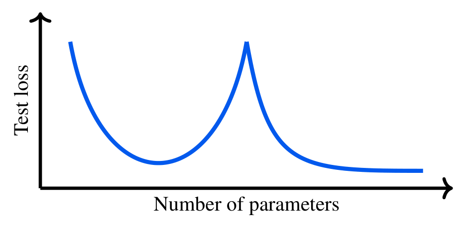
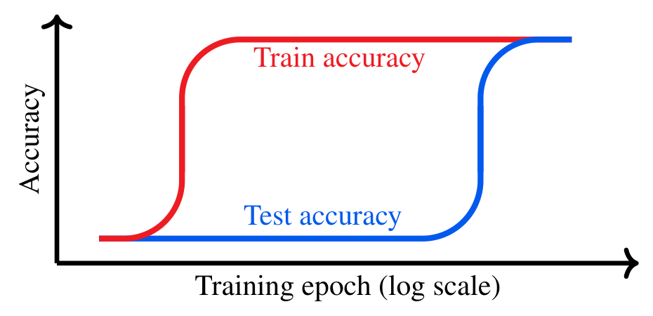
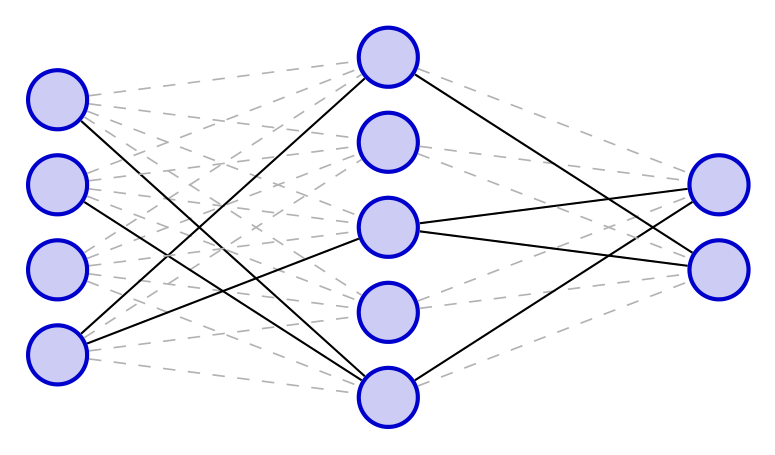
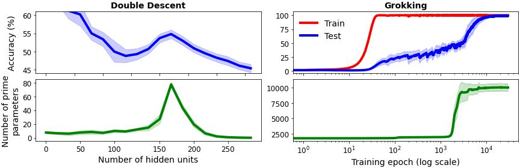

# Jeffares, van der Schaar 2025 — Not All Explanations for Deep Learning Phenomena Are Equally Valuable

См. также: [глобальный индекс понятий](../../concepts/index.md).
arXiv [2506.23286v1](https://arxiv.org/abs/2506.23286), 29 июня 2025. Колонтитул PDF: «Proceedings of the 42nd International Conference on Machine Learning, Vancouver, Canada. PMLR 267, 2025».

**Alan Jeffares, Mihaela van der Schaar** — Department of Applied Mathematics and Theoretical Physics, University of Cambridge. Переписка: Alan Jeffares, aj659@cam.ac.uk.

Оригинал и производные файлы этой папки:

- [`original/2506.23286.native.html`](original/2506.23286.native.html) — первоисточник, нативный HTML-рендеринг arXiv (LaTeXML), скачан как есть.
- [`original/2506.23286.not-all-explanations-for-deep-learning-phenomena-are-equally-valuable.md`](original/2506.23286.not-all-explanations-for-deep-learning-phenomena-are-equally-valuable.md) — конверсия оригинала в Markdown без правок содержания; английский текст для сверки перевода.
- [`images/`](images/) — иллюстрации статьи в исходном разрешении (4 файла).
- [`2506.23286.not-all-explanations-for-deep-learning-phenomena-are-equally-valuable.claims.txt`](2506.23286.not-all-explanations-for-deep-learning-phenomena-are-equally-valuable.claims.txt) — рабочий разбор: пронумерованные утверждения с пометками.

Схема якорей и правила ссылок на карточку — в [README папки статей](../README.md).

## Затрагиваемые понятия

**[Гроккинг](../../concepts/grokking.md)** — работа не изучает гроккинг, а берёт его как одну из трёх витрин «краевого случая» (edge case) и выносит о нём суждение со стороны. Корпусу она даёт четыре вещи. Первое — прямо заявленную позицию: гроккинг включён в разбор потому, что он захватил интерес сообщества, «не будучи при этом практической заботой при обучении передовых моделей» ([с. 1, абз. 5](#p1-5)). Второе — сводку описательных признаков, накопившихся в литературе к 2025 году и не входящих в исходное определение: больший разрыв во времени между сильным обучающим и тестовым качеством (Liu et al. 2022a), почти совершенное обучающее качество, а не застой на произвольном уровне (Charton 2024), более резкий скачок тестового качества «по крайней мере при определённой мере, такой как точность» (Nanda et al. 2023) — причём авторы прямо оговаривают, что само определение Power et al. 2022 «нестрого» ([с. 3, абз. 4](#p3-4)). Третье — собранный в один абзац перечень доводов о практической несущественности: малые алгоритмические наборы, ослабление эффекта с ростом набора, безуспешность попыток увидеть обычный гроккинг в правдоподобных сценариях, наведение раздутой инициализацией и скрытыми кодировками, зависимость зрелищности от выбора меры ([с. 4, абз. 1](#p4-1)). Четвёртое — такой же собранный перечень того, что гроккинг дал более широкой области ([с. 4, абз. 2](#p4-2)). Чего в работе нет: собственного поиска гроккинга в приложениях — довод о несущественности целиком держится на обзоре чужих работ и на отсутствии встречных сообщений; нового определения или меры; и ни одна конкретная опубликованная гипотеза о гроккинге не названа узкой ad hoc-гипотезой — отрицательный пример, на котором держится критика, авторы изготовили сами ([рис. 4](#fig-4)). Рисунок 2 — рисованная схема, а не измерение ([рис. 2](#fig-2)).

**[Двойной спуск](../../concepts/double-descent.md)** — первое из трёх разбираемых явлений и единственное, для которого работа излагает и предысторию, и разоблачение. Предыстория: U-образная кривая тестовой ошибки по ёмкости и неожиданный второй спуск при дальнейшем росте *числа параметров* (Belkin et al. 2019, с указанием на более ранние наблюдения у Loog et al. 2020) ([с. 3, абз. 1](#p3-1), [рис. 1](#fig-1)). Разоблачение состоит из двух ходов: число параметров может быть неудачной мерой сложности у нелинейных моделей (Curth et al. 2024b), а при подобающей регуляризации — в том числе неявной, через раннюю остановку и SGD, — эффекта ожидать уже не приходится (Nakkiran et al. 2021; Hastie et al. 2022), чем и объясняется его отсутствие в эмпирических разборах масштабирования языковых и зрительных моделей ([с. 3, абз. 2](#p3-2)). Положительный список — послойные эвристики скорости обучения, мера сложности, разводящая обучающую и тестовую сложность, рамка измерения зазора генерализации, а также пересмотр роли запоминания, недоопределённости решения, доброкачественного переобучения и компромисса смещения и разброса ([с. 3, абз. 3](#p3-3)). Двойной спуск же служит в статье и единственным развёрнутым образцом того, как краевое явление должно уточнять широкую теорию: несогласующееся наблюдение бьёт по компромиссу смещения и разброса, и именно эта теория, а не само явление, подлежит уточнению ([с. 6, абз. 2](#p6-2)). Чего в работе нет: собственного измерения двойного спуска — рисунок 1 нарисован от руки, а левая половина рисунка 4 есть воспроизведение чужой постановки (MNIST-1D по Greydanus & Kobak 2024).

**[Разрежённая подсеть / lottery ticket](../../concepts/sparse-subnetwork-lottery-ticket.md)** — третье разбираемое явление, приведённое как самый чистый пример «краевого случая с полезными последствиями». Предыстория даётся по Frankle & Carbin 2019 с оговоркой, что гипотеза, по накопленным эмпирическим и теоретическим свидетельствам, держится ([с. 4, абз. 3](#p4-3)). Практическая несущественность выведена не из отсутствия явления, а из невозможности им воспользоваться: билет находится только через обучение плотной сети, прореживание после обучения и отмотку к инициализации; подход чувствителен к гиперпараметрам, а выигрыш от разрежённости может быть нереализуем на современном оборудовании. Сюда же вставлена самооценка автора гипотезы: Джонатан Франкл говорит, что не считает лотерейные билеты самой интересной задачей, но что из той статьи следует многое о том, «как мы занимаемся наукой» ([с. 4, абз. 4](#p4-4)). Положительный список — влияние на приёмы разрежения, квантование, параметрически действенную дообучающую настройку и на зрительные и языковые модели ([с. 5, абз. 1](#p5-1)). Чего в работе нет: собственных опытов ([рис. 3](#fig-3) — схема) и связи лотерейного билета с гроккингом, которую корпус ведёт отдельной линией; в этой работе три явления стоят рядом, но не сводятся друг с другом.

**[Эмерджентность / эмерджентные способности](../../concepts/emergence.md)** — работа лишь упоминает понятие, но в двух местах и в двух ролях. В доводе против гроккинга: наблюдение Kumar et al. 2023 о том, что зрелищность эффекта держится на выборе меры, названо перекликающимся со схожим доводом об эмерджентных способностях больших языковых моделей (Schaeffer et al. 2024) ([с. 4, абз. 1](#p4-1)). В заключении: различение «по-настоящему тревожного поведения» и «надуманных артефактов» у эмерджентных способностей (Berti et al. 2025) названо тем же родом оценки практической значимости, что и в самой статье ([с. 9, абз. 4](#p9-4)). Чего в работе нет: собственного разбора эмерджентности и вообще каких-либо измерений на языковых моделях.

**[Меры прогресса](../../concepts/progress-measures.md)** — работа выносит понятию положительный приговор и делает его главным итогом гроккинга для широкой области: гроккинг «наводит на мысль, что если мы наблюдаем удивительные качественные скачки в ходе обучения, то нам нужно пересмотреть и улучшить наши внутренние меры прогресса качества, чтобы лучше схватывать истинное, ровное, подспудное улучшение» (со ссылкой на Nanda et al. 2023) ([с. 4, абз. 2](#p4-2)). Это единственное место, где статья говорит, чему именно гроккинг научил область, а не что он для неё сделал. Чего в работе нет: ни одной меры прогресса — ни введённой, ни применённой; на собственном рисунке отложены тестовая точность и число простых параметров, и вторая величина заведомо задумана как негодная.

**[Масштаб инициализации](../../concepts/initialization-scale.md)** — несущая деталь довода о практической несущественности гроккинга. Гроккинг на иных видах данных объявлен синтетическим именно потому, что он «делается синтетически, сильно раздутым масштабом начальных значений параметров сети» (Liu et al. 2022b) ([с. 4, абз. 1](#p4-1)). Тот же масштаб работает и в собственном опыте, но с другой стороны: разоблачая свою пародийную меру, авторы объясняют её поведение тем, что большинство параметров инициализируется как $Unif(-\frac{1}{\sqrt{\text{num params}}},\frac{1}{\sqrt{\text{num params}}})$, что округляется в непростое и растёт лишь позже ([с. 14, абз. 3](#p14-3)); «масштаб инициализации» стоит и в опроснике таблицы 1 среди смешивающих факторов, которые следует контролировать ([приложение A](#sec-a)). Чего в работе нет: перебора масштаба и вообще какого-либо его измерения — величина взята из чужих работ и из умолчаний стороннего кода.

**[Эталонный полигон гроккинга](../../concepts/canonical-grokking-testbed.md)** — работа пользуется полигоном дважды и по-разному. Она воспроизводит его для собственного опыта: «опыт с гроккингом — обстановку Power et al. 2022 на основе реализации по адресу https://github.com/teddykoker/grokking», с усреднением по 10 семенам ([с. 14, абз. 3](#p14-3)). И она же выдвигает довод в защиту самого полигона как исследовательской области: явления глубокого обучения «по своему замыслу выделены в их простейшую обстановку» и посильны при самых скромных ресурсах, что даёт возможность вклада обделённым ресурсами ([с. 8, абз. 4](#p8-4)). Чего в работе нет: ни одного параметра постановки — ни операции, ни модуля, ни доли обучающих данных, ни оптимизатора, ни числа шагов; сверить прогон с чужими нельзя, а графика потерь для сверки с точностью нет вовсе ([рис. 4](#fig-4)).

**[Реальные данные и зрение](../../concepts/vision-real-world-data-mnist-cifar.md)** — вид данных служит здесь разделительной чертой довода. Работа утверждает, что гроккинг «технически можно навести и на других видах данных», но только синтетически, и что «любые известные исследования, *не* пользующиеся этим механизмом, сообщают об обычной генерализации» ([с. 4, абз. 1](#p4-1)); отсутствие двойного спуска в разборах масштабирования зрительных трансформеров (Zhai et al. 2022) приведено как параллель ([с. 3, абз. 2](#p3-2)). Собственный опыт с реальными данными в работе один — левая половина рисунка 4 на MNIST-1D по Greydanus & Kobak 2024, и он про двойной спуск, а не про гроккинг ([с. 14, абз. 3](#p14-3)). Чего в работе нет: собственной проверки утверждения о других видах данных и учёта работ корпуса, показывающих отложенные переходы в зрительных и языковых постановках при обычной инициализации.

**[Переход lazy→rich](../../concepts/lazy-to-rich-kernel-to-feature-learning.md)** — лишь упоминание, в положительном списке: «Это подтолкнуло к более целостной оценке динамики обучения через несколько точек зрения, включая *переход от ленивого обучения к обучению признакам* (Kumar et al. 2023; Lyu et al. 2024)» ([с. 4, абз. 2](#p4-2)). Механизм перехода не излагается, и он же в другом месте статьи служит доводом против явления — та же работа Kumar et al. цитируется как показавшая, что зрелищность эффекта держится на выборе меры ([с. 4, абз. 1](#p4-1)).

**[Эффект рогатки / слингшот](../../concepts/slingshot.md)** — лишь упоминание, в том же перечне: «*рогатки в норме параметров* (Thilak et al. 2024)» ([с. 4, абз. 2](#p4-2)). Ни механизма, ни оптимизаторов, ни всплесков потери работа не разбирает.

**[Обучение структурированных представлений](../../concepts/structured-representation-learning.md)** — лишь упоминание, замыкающее тот же перечень: «*обучение представлений* (Liu et al. 2022a)» ([с. 4, абз. 2](#p4-2)). Замечательно, что та же работа Liu et al. 2022a цитируется в статье трижды и в трёх разных ролях — как источник признака «больший разрыв во времени», как свидетельство ослабления эффекта с ростом набора и как точка зрения на динамику обучения.

**[StableMax / perp-Grad](../../concepts/numerical-stability-fix.md)** — работа приводит эту линию как образец того, чего она хочет от изучения явлений: «По методической части гроккинг подтолкнул Prieto et al. 2025 обратить внимание на численные неустойчивости функции *Softmax* и разработать более устойчивую замену» ([с. 4, абз. 2](#p4-2)). Это единственный в статье пример, где из краевого явления вышел работающий приём. Чего в работе нет: ни разбора механизма, ни оценки области применимости замены; в том же абзаце Prieto et al. приписано и второе достижение, им не принадлежащее (см. «Ошибочные цитирования»).

**[Фазовый переход](../../concepts/phase-transition.md)** — слово стоит в статье ровно один раз, и стоит оно внутри пародии: сочиняя нарочно негодную гипотезу, авторы пишут, что «фазовые переходы в тестовой точности совпадают с изменениями плотности простых чисел внутри вектора параметров» ([с. 6, абз. 1](#p6-1)). Никакого языка фазовых переходов как теории — параметров порядка, критических показателей, конечноразмерного масштабирования — в работе нет, и приписывать авторам взгляд на гроккинг как на фазовый переход нельзя.

**[Доля данных / критический размер набора](../../concepts/data-fraction-critical-dataset-size.md)** — лишь упоминание, но в несущем месте довода: «По мере роста набора данных эффект гроккинга, вообще говоря, оказывается менее выраженным (Liu et al. 2022a)» ([с. 4, абз. 1](#p4-1)). Из этого наблюдения делается вывод об ограниченности обстановки; ни критического размера, ни какой-либо зависимости работа не меряет и о накопленных корпусом законах критического размера не упоминает.

---

## Несогласованности внутри статьи

**Гроккинг объявлен и практически несущественным, и практически поучительным — в соседних абзацах.** В предыстории сказано, что эффект «наводит на мысль, что привычная практика ранней остановки может помешать обнаружению лучшего решения» ([с. 3, абз. 4](#p3-4)), — это прямое практическое следствие, адресованное практику. Абзацем ниже тот же гроккинг помещён в разряд явлений, «по определению» имеющих ограниченное отношение к практическим обстановкам ([с. 4, абз. 1](#p4-1)). Статья нигде не сводит эти два утверждения.

**Раздел «более широкая ценность» возвращает гроккингу практический совет, отнятый разделом «практическая несущественность».** В [с. 4, абз. 2](#p4-2) сказано, что «недавние работы показали, что некоторые желательные величины могут продолжать улучшаться после того, как обычное проверочное качество вышло на полку, — а именно состязательная устойчивость … и качество вне области (Murty et al. 2023)». Это утверждение о том, когда останавливать обучение, и оно не про алгоритмические игрушки. Тезис работы — что краевые явления не дают практических предписаний, — здесь опровергается её же перечнем.

**Отрицание гроккинга вне алгоритмических данных и его же признание стоят в двух соседних абзацах одного подраздела.** В [с. 4, абз. 1](#p4-1) утверждается, что «любые известные исследования, *не* пользующиеся этим механизмом [раздутой инициализацией], сообщают об обычной генерализации». В [с. 4, абз. 2](#p4-2) приведён отложенный рост состязательной устойчивости — эффект, показанный [Humayun et al. 2024](../2402.15555.deep-networks-always-grok-and-here-is-why/2402.15555.deep-networks-always-grok-and-here-is-why.card.md#p1-2) как раз при обычной инициализации на CIFAR10, Imagenette и GPT (хотя сослались авторы не на них, см. ниже). Ссылка, подпирающая отрицание, при этом указывает на работу, которая гроккинг наблюдает, а не отрицает.

---

## Что показано, что взято из литературы и что предположено

Позиционный жанр не требует опытов, но у этой работы есть собственный рисунок, и от того, что именно на нём показано, зависит сила её главного довода. Разделять стоит три слоя.

**Показано собственными измерениями** — только рисунок 4 и только одно: число простых чисел среди округлённых параметров сети отслеживает тестовое качество в двух воспроизведённых из литературы постановках, усреднённо по 10 семенам ([с. 14, абз. 3](#p14-3)). Опыт задуман как пародия, и авторы сами его разоблачают там же: счёт простых есть следствие неоднородности простых по меняющемуся распределению величин параметров. Подпись при этом сильнее показанного ([рис. 4](#fig-4)): «точно отслеживает» не выдерживается на обеих половинах. На гроккинговой половине тестовая точность растёт плавно примерно с 30-й эпохи и к ~2000 эпох доходит до половины, тогда как счёт простых до этого места держится ровной полкой и прыгает только на последнем подъёме. На половине двойного спуска счёт простых почти ровен на всём первом падении точности, даёт всплеск лишь у местного горба (~165 скрытых единиц) и оседает к нулю, пока точность падает дальше. Гроккинг на рисунке показан только в точности — той самой мере, чей выбор двумя абзацами выше объявлен источником зрелищности ([с. 4, абз. 1](#p4-1)); графика потерь для сверки нет.

**Взято из литературы** — вся фактическая часть довода о практической несущественности всех трёх явлений ([с. 3, абз. 2](#p3-2), [с. 4, абз. 1](#p4-1), [с. 4, абз. 4](#p4-4)) и вся положительная часть ([с. 3, абз. 3](#p3-3), [с. 4, абз. 2](#p4-2), [с. 5, абз. 1](#p5-1)). Аннотация называет это «разбором исследовательских итогов», но выборки работ и правил отбора не объявлено: это повествовательный обзор. Отдельно стоит запись из блога (Pope 2023), приведённая наравне со статьями. Довод «попытки увидеть обычный гроккинг в правдоподобных сценариях до сих пор были безуспешны» есть довод от отсутствия сообщений и опирается на одну ссылку (Dziri et al. 2024) ([с. 4, абз. 1](#p4-1)); корпус к моменту выхода статьи содержал встречные сообщения — [Zhu et al. 2024](../2401.10463.critical-data-size-of-language-models-from-a-grokking-perspective/2401.10463.critical-data-size-of-language-models-from-a-grokking-perspective.card.md), [Golechha 2024](../2405.12755.progress-measures-for-grokking-on-real-world-tasks/2405.12755.progress-measures-for-grokking-on-real-world-tasks.card.md), [Lv et al. 2024](../2409.09281.language-models-grok-to-copy/2409.09281.language-models-grok-to-copy.card.md), [Abramov et al. 2025](../2504.20752.grokking-in-the-wild-data-augmentation-for-real-world-multi-hop-reasoning-with-transformers/2504.20752.grokking-in-the-wild-data-augmentation-for-real-world-multi-hop-reasoning-with-transformers.card.md), — ни одно из них в статье не разбирается.

**Заявлено как позиция и признано субъективным** — ключевое утверждение о том, что нынешняя практика этой точки зрения не отражает. Мерило ценности при этом взято готовым: «социотехнический прагматизм» Watson et al. 2024, по которому знание ценно постольку, поскольку имеет последующую пользу, — статья его не выводит и не проверяет, а объявляет «в целом совместимым» с побуждениями области ([с. 5, абз. 3](#p5-3)). Авторы сами пишут, что «это утверждение в конечном счёте субъективно», и подпирают его лишь несовпадением типичных работ с их собственными рекомендациями раздела 5 ([раздел 5.2](#sec-5-2)). Само понятие полезности при этом намеренно оставлено гибким, а в «Impact Statement» в него включена и справедливость исходов, отчего исполнение рекомендаций нечем проверить — то есть самому мерилу отказано в той фальсифицируемости, которой статья требует от теорий ([с. 6, абз. 1](#p6-1), [с. 7, абз. 1](#p7-1)).

Отдельно стоит отметить, что довод близок к круговому: «краевой случай» определён через отсутствие в приложениях ([с. 1, абз. 5](#p1-5)), а вывод о малой ценности его изучения выводится из этого же определения ([с. 2, абз. 1](#p2-1)). И что собственные работы группы стоят в опорных местах: Curth et al. 2024b держит разоблачение двойного спуска, Jeffares et al. 2024a попадает в положительные списки обоих явлений, Curth et al. 2024a и Jeffares et al. 2024b — в приложение об ансамблях ([с. 14, абз. 2](#p14-2)).

---

## Ошибочные цитирования

Редакторские заметки о местах, где эта работа передаёт чужие результаты ошибочно или без авторских оговорок.

###### mc-2309-02390

**Varma et al. (2309.02390) — работа о гроккинге приведена как свидетельство его отсутствия.** Формулировка: `"any known studies *not* using this mechanism report standard generalization (Varma et al. 2024, i.e. no grokking;)"` — «любые известные исследования, *не* пользующиеся этим механизмом, сообщают об обычной генерализации (Varma et al. 2024, то есть гроккинга нет)» ([с. 4, абз. 1](#p4-1)). В PDF ссылка свёрстана как «(i.e. no grokking; Varma et al., 2024)»; разорванная скобка в хранимом Markdown — след конверсии LaTeXML, а не авторская опечатка. Утверждение адресовано работам на иных видах данных, не пользующимся раздутой инициализацией. [Varma et al. 2023](../2309.02390.explaining-grokking-through-circuit-efficiency/2309.02390.explaining-grokking-through-circuit-efficiency.card.md) иных видов данных не изучают вовсе: все их постановки алгоритмические, гроккинг в них наблюдается, и на нём построена вся работа — включая предсказанные до опыта унгрокинг и полу-грокинг ([Varma, с. 2, абз. 1](../2309.02390.explaining-grokking-through-circuit-efficiency/2309.02390.explaining-grokking-through-circuit-efficiency.card.md#p2-1)). Более того, в разделе обсуждения они прямо принимают наблюдение Omnigrok о гроккинге вне алгоритмических задач при большой начальной норме как согласующееся с их теорией ([Varma, с. 10, абз. 6](../2309.02390.explaining-grokking-through-circuit-efficiency/2309.02390.explaining-grokking-through-circuit-efficiency.card.md#p10-6)). Ссылка, таким образом, не подтверждает то, к чему приставлена; какой именно работой авторы располагали для этого утверждения, из текста установить нельзя.

###### mc-2501-04697

**Prieto et al. (2501.04697) — приписан чужой результат об отложенной состязательной устойчивости.** Формулировка: `"certain desirable quantities can continue to improve after standard validation performance has plateaued – i.e. adversarial robustness (Prieto et al. 2025) and out-of-domain performance (Murty et al. 2023)"` — «некоторые желательные величины могут продолжать улучшаться после того, как обычное проверочное качество вышло на полку, — а именно состязательная устойчивость (Prieto et al. 2025) и качество вне области (Murty et al. 2023)» ([с. 4, абз. 2](#p4-2)). [Prieto et al. 2025](../2501.04697.grokking-at-the-edge-of-numerical-stability/2501.04697.grokking-at-the-edge-of-numerical-stability.card.md) состязательной устойчивости не измеряют: их предмет — численная неустойчивость Softmax и её устранение, а отложенный рост устойчивости упомянут у них ровно один раз, в обзоре, и с прямым указанием на источник — «Humayun et al. (2024) show that in many settings, neural networks undergo grokking-like transitions in their adversarial robustness» ([Prieto, с. 10, абз. 1](../2501.04697.grokking-at-the-edge-of-numerical-stability/2501.04697.grokking-at-the-edge-of-numerical-stability.card.md#p10-1)). Родословная ошибки прослеживается: результат принадлежит [Humayun et al. 2024](../2402.15555.deep-networks-always-grok-and-here-is-why/2402.15555.deep-networks-always-grok-and-here-is-why.card.md), которые вводят «отложенную устойчивость» как отдельную форму гроккинга и показывают её на CNN с CIFAR10, ResNet с Imagenette и GPT ([Humayun, с. 1, абз. 2](../2402.15555.deep-networks-always-grok-and-here-is-why/2402.15555.deep-networks-always-grok-and-here-is-why.card.md#p1-2)); в списке литературы Jeffares & van der Schaar эта работа отсутствует. Ошибка не безобидна для довода статьи: работа, которой принадлежит результат, показывает гроккинг при обычной инициализации на реальных данных — то есть ровно то, что абзацем выше объявлено не встречающимся. В том же перечне Prieto et al. процитированы верно — как разработчики устойчивой замены Softmax; предупреждение относится к формулировке, а не к работе.

---

# Текст статьи

# Not All Explanations for Deep Learning Phenomena Are Equally Valuable

Alan Jeffares (Department of Applied Mathematics and Theoretical Physics, University of Cambridge; переписка: aj659@cam.ac.uk), Mihaela van der Schaar (Department of Applied Mathematics and Theoretical Physics, University of Cambridge)

## Аннотация

Выработка лучшего понимания удивительных или противоречащих здравому смыслу явлений составила значительную долю исследований по глубокому обучению в последние годы. К ним относятся двойной спуск, гроккинг и гипотеза лотерейного билета — среди многих других. Работы в этой области часто развивают *ad hoc-гипотезы*, пытаясь объяснить эти наблюдаемые явления обособленно, случай за случаем. Настоящая позиционная статья утверждает, что во многих заметных случаях мало что говорит в пользу того, что эти явления возникают в приложениях реального мира, и эти усилия могут быть неэффективны для продвижения более широкой области. Соответственно, мы возражаем против взгляда на них как на обособленные головоломки, требующие особых разрешений или объяснений. Однако, несмотря на это, мы полагаем, что явления глубокого обучения *всё же* представляют исследовательскую ценность, давая своеобразные обстановки, в которых мы можем уточнять наши *широкие объяснительные теории* более общих принципов глубокого обучения. Эта позиция подкреплена разбором исследовательских итогов нескольких заметных примеров таких явлений из недавней литературы. Мы пересматриваем нынешние нормы исследовательского сообщества в подходе к этим задачам и предлагаем выполнимые рекомендации для будущих исследований, стремясь обеспечить, чтобы продвижение в явлениях глубокого обучения было хорошо согласовано с конечной прагматической целью — продвижением более широкой области глубокого обучения.

##### Keywords:

## 1 Введение

Явления глубокого обучения — то есть удивительные эмпирические наблюдения, которые как будто расходятся с нашими существующими ожиданиями о том, как работают нейронные сети, — стали заметной темой исследований по глубокому обучению. В последние годы возник замечательный интерес и оживление вокруг нескольких таких явлений внутри исследовательского сообщества (Belkin et al. 2019; Frankle & Carbin 2019, e.g.), которые начали проникать даже в общественное сознание (Heaven 2024; Ananthaswamy 2024, e.g.). Устойчивое исследовательское внимание к этим своеобразным явлениям заметно отражено в публикациях на ведущих конференциях по машинному обучению и в совместных начинаниях сообщества вроде секций семинаров.

> **Позиция**
>
> Настоящая работа доказывает, что многие заметные явления глубокого обучения, обсуждаемые в исследовательской литературе, не представительны для трудностей, встречаемых в приложениях глубокого обучения реального мира. Тем самым не все усилия по пониманию этих явлений равны по ценности — нам следует сосредоточиться на том, чтобы использовать их для уточнения наших широких объяснительных теорий важных сторон глубокого обучения, а не на выработке узких ad hoc-гипотез, описывающих их обособленно. Однако этот взгляд не последовательно отражён в нынешней исследовательской практике внутри сообщества.

###### p1-5

**Какого рода «явления глубокого обучения» разбирает эта работа?** Поскольку эта терминология могла бы относиться к широкому кругу эмпирических наблюдений, мы сперва уточним, о явлениях какого рода идёт речь на протяжении настоящей работы. Мы принимаем определение, использованное на семинаре «Identifying and Understanding Deep Learning Phenomena» на ICML 2019, который призывал к «занятному и необычному поведению, наблюдаемому у глубоких сетей», которое можно «выделить и разобрать». Далее мы сужаем наш охват до того, что мы называем *краевыми случаями*, то есть явлений, которые бросают вызов нашим интуициям, не появляясь заметным образом в практических приложениях глубокого обучения. Например, возникновение *гроккинга* — то есть отложенной генерализации, много позже совершенного качества на обучении (см. раздел 2), — *включено* в наше обсуждение, поскольку оно захватило интерес многих в исследовательском сообществе, не будучи при этом практической заботой при обучении передовых моделей. Мы сосредоточиваемся на этих краевых явлениях, поскольку, несмотря на их распространённость в исследованиях (что мы разбираем далее), не очевидно, *как* и *зачем* их следует изучать.

**[p. 2]**

###### p2-1

**Где исследования этих явлений могут пойти не туда?** Коль скоро эти краевые явления по определению имеют ограниченное отношение к практическим обстановкам, их роль в исследованиях глубокого обучения в более широком смысле стоит пересмотреть. В частности, практики могли бы спросить, разрабатывая модели для приложений реального мира (например, большие языковые модели в производственной среде): *есть ли мне дело до этого явления?* Соответственно, исследователи могли бы спросить: *в чём ценность изучения этого явления?* В настоящей работе мы полагаем, что мало ценности в следовании *разрешительному* (resolution-oriented) подходу к исследованиям в этой обстановке. Иными словами, если бы явление представляло практическую трудность, мы могли бы захотеть *разрешить* её (то есть выработать способы смягчить её отрицательные последствия и усилить положительные), чему могли бы способствовать усилия *понять* её в изоляции (под этим мы понимаем выработку узких ad hoc-гипотез, которые не обязательно обобщаются шире, — подробнее об этой терминологии см. раздел 3.2). Однако, поскольку эти явления *не* создают значительной практической трудности, не следует полагать, что такой подход даст ценные итоги. И правда, без более широких следствий «объяснение» несущественного явления может быть не полезнее, чем решение головоломки. Однако этот взгляд не отражён в нынешней исследовательской практике по явлениям глубокого обучения.

**Какова роль этих явлений в исследованиях по глубокому обучению?** Когда явления глубокого обучения не требуют разрешения, мы могли бы соблазниться выводом, что исследовательские усилия лучше направить в другое место. Однако в этой позиционной работе мы доказываем, что эти явления всё же могут дать ценный полигон для уточнения наших *широких объяснительных теорий11 1 Этот термин относится к теориям того рода, что дают понимание более общо, за пределами узкой обстановки, которую они описывают. В разделе 3.2 мы делаем это различение между узкими ad hoc-гипотезами и широкими объяснительными теориями более явным и приводим конкретные примеры.*, заключающих в себе наше основополагающее понимание ключевых сторон глубокого обучения. В частности, они могут выступать как предельные или синтетические обстановки, способные подвергнуть испытанию на прочность наши нынешние представления о важных механизмах глубокого обучения или дать к ним контрпримеры. Мы доказываем, что этого можно достичь, встроив в нашу исследовательскую практику два ключевых изменения. $\blacktriangleright$ **Более прагматический подход:** хотя оценивать последующее влияние исследований трудно, оно не вполне случайно. Мы полагаем, что более критическое рассмотрение возможной практической пользы при ведении исследований по явлению действительно может дать более полезные итоги. Если конкурирующие объяснения явления явно можно оценивать по их точности (то есть верны ли они оба?), то может случиться и так, что они равно точны, но неравны по полезности (то есть даёт ли это объяснение понимание, позволяющее нам улучшить качество на практике?). Тем самым исследователям следует быть *прагматичными* в том, как они выбирают среди огромного пространства возможных исследовательских направлений, задавая вопросы вроде: *даёт ли эта новая теория обобщаемую интуицию за пределами того конкретного явления, на котором она выработана?* $\blacktriangleright$ **Более научный подход:** в паре с этим прагматическим подходом мы также ратуем за применение более строгой научной методы. Естественные науки, например, имеют долгую историю применения научных приёмов, пытаясь фальсифицировать и обновлять конкурирующие теории о мире. Мы полагаем, что лучшее приспособление этих приёмов (например, предрегистрации) и более совместная работа (например, большие усилия по примирению разных объяснений) дадут исследования, которые менее разрозненны и вскрывают более общее знание с более широкой пользой.

**Цели:** задачи этой позиционной статьи трояки. **(1)** Она стремится завязать разговор внутри сообщества о том, *зачем* нам вообще изучать явления глубокого обучения, полагая, что больший упор следует делать на рассмотрение возможности пользы в этой области; **(2)** она даёт критический взгляд на три конкретных примера таких явлений — а именно *двойной спуск*, *гроккинг* и *гипотезу лотерейного билета*, — ставя под вопрос, насколько же они возникают в практических обстановках, но подчёркивая их возможность более широкого *прагматического вклада* в продвижение более широкой области; **(3)** она даёт выполнимые рекомендации о том, как отдельные исследователи и более широкое исследовательское сообщество могли бы уточнить свою исследовательскую практику, чтобы лучше использовать эти задачи и извлечь наибольшую возможную ценность.

## 2 Подборка популярных явлений глубокого обучения

В этом разделе мы разбираем три конкретных примера явлений глубокого обучения из литературы. Эти примеры выбраны как представительные для того рода краевых явлений, которым посвящена настоящая работа, и ввиду их недавней популярности внутри исследовательского сообщества. Для каждого примера мы даём общую предысторию явления, некоторое обсуждение его *практической несущественности* (то есть ограниченного прямого появления в приложениях реального мира [frownie]) и подчёркиваем его *более широкую ценность* (то есть примеры продвигаемого нами подхода, где осязаемая ценность выходит за пределы самого явления [smiley]). По этим темам существует гораздо больший корпус работ, и настоящий раздел не задуман как полный обзор этой литературы.

###### p2-5

**Значимость:** прежде чем двигаться дальше, скажем сперва о нынешней значимости явлений глубокого обучения в исследовательском сообществе. Количественно: исходные статьи, вводящие каждое из трёх конкретных явлений, которые мы разбираем в этом разделе (Belkin et al. 2019; Power et al. 2022; Frankle & Carbin 2019), собрали в совокупности 7272 цитирования на текущий момент22 2 По данным Google Scholar на 5 июня 2025 года. **[p. 3]** (все с 2019 года) и продолжают получать порядка тысяч цитирований в год. Хотя цитирования не обязательно есть мера значимости, они и правда подчёркивают напряжённый интерес, который эти работы вызвали по всей области. Этот интерес далее подтверждается устойчивым участием сообщества на крупных конференциях. Это подчёркнуто, например, повторяемостью особых семинаров на каждой из крупных конференций по глубокому обучению, которые прямо призывают к работам по явлениям глубокого обучения. Среди них SciForDL на NeurIPS 2024, MechInterp на ICML 2024 или ME-FoMo на ICLR 2024. Это далее подчёркивается явными упоминаниями этих конкретных явлений в принятых работах основного трека на тех же конференциях33 3 Мерилось точным вхождением фраз «double descent», «grokking» и «lottery ticket» в текст принятых работ каждой из этих конференций. Мы засчитываем любую работу, которой отвечает хотя бы одна из трёх фраз. (149 на NeurIPS 2024, 132 на ICML 2024 и 108 на ICLR 2024). При таком положении дел мы полагаем разумным утверждать, что явления глубокого обучения занимают значимое место в исследовательском сообществе и что завязать разговор, ставящий под вопрос нынешнюю практику в этой области, и своевременно, и ценно.

### 2.1 Двойной спуск

###### fig-1

*Рисунок 1: **Двойной спуск.** По мере того как нейронную сеть заново обучают с растущим числом параметров, тестовая потеря следует привычной U-образной кривой, за которой следует неожиданный второй спуск.* **[p. 3]**

###### p3-1

**Предыстория:** привычное понимание статистического обучения описывает компромисс между недообучением и переобучением, где модель имеет достаточную ёмкость, чтобы смоделировать порождающий данные процесс, но недостаточную ёмкость, чтобы пойти по короткому пути слепого запоминания обучающих меток (Hastie & Tibshirani 1990, e.g.). Это часто изображают U-образной кривой тестовой ошибки по мере роста ёмкости модели, как показано на рисунке 1. *Двойной спуск* — явление, названное так у Belkin et al. 2019 (хотя оно было замечено и раньше; см., напр., Loog et al. 2020), где было обнаружено, что по мере дальнейшего роста *числа параметров* тестовое качество в конце концов снова улучшается, давая отличительный *второй спуск*. Это вызвало значительный интерес у исследователей, поскольку как будто противоречит нашему привычному пониманию генерализации и масштабирования.

###### p3-2

[frownie] **Практическая несущественность:** тонкая, но важная оговорка состоит в том, что двойной спуск возникает, когда сложность модели отслеживают *числом параметров*, которое может быть неудачной мерой сложности модели у нелинейных моделей (Curth et al. 2024b). Когда применена подобающая регуляризация, как это обычно и делается — явно и неявно, например через раннюю остановку и стохастический градиентный спуск, — эффекта двойного спуска ожидать уже не приходится (Nakkiran et al. 2021; Hastie et al. 2022). Это может объяснять, почему такое поведение двойного спуска, вообще говоря, *не* появляется в эмпирических разборах масштабирования нейронных языковых моделей (Kaplan et al. 2020; Hoffmann et al. 2022) или зрительных трансформеров (Zhai et al. 2022).

###### p3-3

[smiley] **Более широкая ценность:** появление двойного спуска прямо подтолкнуло несколько методических разработок с более широкими следствиями. Примеры включают послойные эвристики скорости обучения (Heckel & Yilmaz 2020), новую меру сложности, схватывающую расхождение между обучающей и тестовой сложностью (Jeffares et al. 2024a), и рамку для измерения зазора генерализации (Nakkiran et al. 2020). Вероятно, ещё влиятельнее то, что это явление сыграло ключевую роль в недавнем критическом пересмотре нескольких сторон нашего понимания основных принципов глубокого обучения на практике. Среди них роль запоминания в обучении (Feldman 2020), недоопределённость решения (D'Amour et al. 2022), доброкачественное переобучение (Bartlett et al. 2020) и компромисс смещения и разброса (Adlam & Pennington 2020).

### 2.2 Гроккинг

###### fig-2

*Рисунок 2: **Гроккинг.** Точность нейронной сети на обучающем наборе достигает 100 % рано в обучении, но схожий уровень качества генерализации, меряемый на тестовом наборе, наступает лишь много позже.* **[p. 3]**

###### p3-4

**Предыстория:** гроккинг введён у Power et al. 2022, где он неформально описывает общее явление достижения моделью «генерализации далеко после переобучения». Образцовый пример дан на рисунке 2, где нейронная сеть получает совершенную обучающую точность при плохом тестовом качестве рано в обучении, а много позже получает соответствующий резкий подъём тестового качества. Этот эффект расходится с обычными интуициями крупномасштабного глубокого обучения, где тестовые кривые тесно следуют за обучающими, и наводит на мысль, что привычная практика ранней остановки может **[p. 4]** помешать обнаружению лучшего решения. Однако это определение нестрого, и в литературе сложились некоторые описательные признаки, связываемые с гроккингом. Эффект обычно считается более «гроккингоподобным», когда больше разрыв во времени между сильным обучающим и тестовым качеством (Liu et al. 2022a), когда обучающее качество почти совершенно, а не застыло на некотором произвольном уровне (Charton 2024), и когда более резок скачок тестового качества (по крайней мере при определённой мере, такой как точность) (Nanda et al. 2023).

###### p4-1

[frownie] **Практическая несущественность:** обстановки, в которых удаётся показать возникновение гроккинга, обычно сводятся к малым алгоритмическим наборам данных. По мере роста набора данных эффект гроккинга, вообще говоря, оказывается менее выраженным (Liu et al. 2022a). Попытки наблюдать обычный гроккинг в правдоподобных сценариях до сих пор были безуспешны (Dziri et al. 2024, e.g.). Хотя гроккинг технически можно навести и на других видах данных, это делается синтетически, сильно раздутым масштабом начальных значений параметров сети (Liu et al. 2022b), а любые известные исследования, *не* пользующиеся этим механизмом, сообщают об обычной генерализации (Varma et al. 2024, i.e. no grokking;). Даже на алгоритмических данных Miller et al. 2023 показывают, что гроккинг может также наводиться некоторыми *скрытыми* кодировками данных. Далее, Kumar et al. 2023 отмечают, что бросающаяся в глаза зрелищность эффекта зачастую может быть отнесена на счёт выбора меры, тогда как обычные графики потерь менее примечательны, — это перекликается со схожим доводом, высказанным более общо о так называемых *эмерджентных способностях* больших языковых моделей (Schaeffer et al. 2024). Вдобавок Pope 2023 оценил несколько заметных статей по гроккингу и высказал некоторую обеспокоенность тем, что «чрезвычайно упрощённые области, в которых гроккинг зачастую изучают, приведут к смещённым итогам, которые не переносятся на более правдоподобные постановки».

###### p4-2

[smiley] **Более широкая ценность:** гроккинг наводит на мысль, что если мы наблюдаем удивительные качественные скачки в ходе обучения, то нам нужно пересмотреть и улучшить наши внутренние меры прогресса качества, чтобы лучше схватывать истинное, ровное, подспудное улучшение (Nanda et al. 2023). Это подтолкнуло к более целостной оценке динамики обучения через несколько точек зрения, включая *переход от ленивого обучения к обучению признакам* (Kumar et al. 2023; Lyu et al. 2024), *действенные параметры* (Jeffares et al. 2024a), *рогатки в норме параметров* (Thilak et al. 2024) и *обучение представлений* (Liu et al. 2022a). По методической части гроккинг подтолкнул Prieto et al. 2025 обратить внимание на численные неустойчивости функции *Softmax* и разработать более устойчивую замену. За пределами своей сравнительно узкой исходной обстановки и в развитие исходной идеи гроккинга недавние работы показали, что некоторые желательные величины могут продолжать улучшаться после того, как обычное проверочное качество вышло на полку, — а именно состязательная устойчивость (Prieto et al. 2025) и качество вне области (Murty et al. 2023).

### 2.3 Гипотеза лотерейного билета

###### fig-3

*Рисунок 3: **Гипотеза лотерейного билета.** Лотерейный билет, у которого многие параметры сети прорежены при инициализации, достигнет качества, равного качеству его плотного варианта, после того как оба будут обучены.* **[p. 4]**

###### p4-3

**Предыстория:** гипотеза лотерейного билета введена у Frankle & Carbin 2019 и полагала, что в любой плотной случайно инициализированной нейронной сети существует меньшая подсеть (или *лотерейный билет*), которая, будучи обучена в изоляции, сравняется в точности с исходной сетью после обучения не более чем за то же число итераций. Если это верно и если бы такие подсети удавалось выявлять до обучения, это означало бы, что нейронные сети можно обучать более действенно с самого начала, вместо того чтобы полагаться на постфактумное прореживание плотной модели ради нахождения разрежённого решения. Свидетельства исходной работы, подкреплённые последующими эмпирическими (Zhou et al. 2019, e.g.) и теоретическими (Malach et al. 2020, e.g.) исследованиями, весомо указывают на то, что явление существует широко и гипотеза держится.

###### p4-4

[frownie] **Практическая несущественность:** к сожалению, выявление таких лотерейных билетов *до* обучения крайне непросто. Их существование изначально было показано так: сперва обучалась плотная сеть, после обучения применялись стандартные приёмы прореживания, сеть отматывалась к её инициализации, а затем то же прореживание повторялось при инициализации перед повторным обучением. Такой подход крайне чувствителен к ключевым гиперпараметрам обучения (Ma et al. 2021; Liu et al. 2019) и, будучи ценным для проверки гипотезы, явно непрактичен для приложений реального мира. Несмотря на значительные усилия по выработке способов обнаружения таких подсетей заранее, продвижение к пригодному приёму было ограниченным, и подход лотерейного билета не воплотился в практический способ (Frankle et al. 2021). Далее, неясно, в какой мере возможный выигрыш в действенности обучения за счёт разрежённости вообще может быть реализован на современном оборудовании (Chen et al. 2022). Как подытожил Джонатан Франкл, изначальный автор гипотезы: «Сегодня я и правда не думаю, что людям следует работать над лотерейными билетами как исследовательской областью, я просто не думаю, что это самая интересная задача на свете. Но при этом я и правда думаю, что есть множество вещей, которые нам следует вынести из той статьи и которые должны определять, как мы занимаемся наукой и какой наукой мы занимаемся впредь» (Frankle & Bashir 2023).

**[p. 5]**

###### p5-1

[smiley] **Более широкая ценность:** хотя прямое выявление лотерейных билетов до обучения остаётся непрактичным, лежащие в их основе идеи значительно повлияли на наши объяснительные теории разрежённости, прореживания и действенности сетей. Например, они сформировали наше понимание связи между разрежённостью и динамикой обучения, определив приёмы разрежения и после обучения, и по ходу обучения (Hoefler et al. 2021). За пределами прореживания основная интуиция о том, что для качества критично лишь малое подмножество весов, была успешно встроена в иные способы повышения действенности, такие как квантование (Lin et al. 2024) и параметрически действенная дообучающая настройка (Zaken et al. 2021). Вдобавок лотерейные билеты сыграли роль во влиятельных новшествах и в зрительных (Touvron et al. 2021), и в языковых моделях (Dao et al. 2022), где стратегический выбор весов и действенные вычисления привели к практическим улучшениям. Более полный обзор дан у Liu et al. 2024, который подчёркивает их влияние на многие исследовательские направления, даже при том, что прямое использование лотерейных билетов остаётся проблематичным.

## 3 Об источнике ценности в изучении явлений глубокого обучения

В предыдущем разделе мы подчеркнули, что бо́льшая часть практической ценности, извлечённой из изучения явлений глубокого обучения, возникла как побочный продукт исследовательского процесса, а не от прямого разрешения этих явлений на практике. В этом разделе мы строим на этом наблюдении и ратуем за более преднамеренный и последовательный подход к изучению этих задач ради извлечения наибольшей их ценности. Однако, прежде чем двигаться дальше, мы должны сперва обсудить, как продвижение в глубоком обучении *определяется* и как его можно *достичь*.

### 3.1 Социотехнический прагматизм и наука о глубоком обучении

###### p5-3

Назначение любой научной области — трудное понятие, которое настоящая статья не пытается ни разрешить, ни оценить нормативно. Вместо этого разумно предположить, что характеристика *социотехнического прагматизма* у Watson et al. 2024 (то есть принцип, по которому ценность исследования коренится в его последующем влиянии, гибко охватывая и технический прогресс, и общественные соображения) в целом совместима с интуициями и побуждениями значительной части исследовательской области и отражает гибкую разметку её ценностей. Построенная на некоторых интуициях из традиции прагматизма (Legg & Hookway 2024), эта рамка выведена из взгляда, по которому «понятийные достижения ценны лишь постольку, поскольку они полезны. Теория без практических следствий немногим больше, чем формальное упражнение» (Watson et al. 2024). В частности, *ценность* знания, добытого о явлении, определяется его последующей полезностью — причём определение полезности достаточно гибко, чтобы охватить широкий спектр взглядов на продвижение. Этот взгляд отражён в том, как мы обычно обсуждаем продвижение в области — в терминах открытых задач и прагматического продвижения по ним (Kaddour et al. 2023, e.g.). Недавняя работа, которая последовательно извлекает и разбирает заявленные ценности в статьях по машинному обучению, находит, что понятия, сосредоточенные на полезности, стоят выше всех прочих ценностей: *качество* и *генерализация* встречаются в 96 % и 89 % статей соответственно, а *приложимость к реальному миру* прямо заявлена как ценность более чем в половине статей (Birhane et al. 2022). Воспринимаемое достоинство прагматического подхода отражено в нескольких призывах к его большему применению в различных областях поля, включая причинность (Loftus 2024), обнаружение сетевых вторжений (Apruzzese et al. 2023) и медицинские приложения (Starke et al. 2021).

Механизм, посредством которого достигается это социотехническое прагматическое продвижение, — отдельная задача. Однако ясно, что принципы научного исследования, как обсуждалось выше, вполне совместимы с таким подходом. Научную методу — в приложении к обстановке глубокого обучения — можно понимать44 4 Точнее, Pearson 1892 утверждает: «Научная метода отмечена следующими чертами: (a) тщательная и точная классификация фактов и наблюдение их соотношений и последовательности; (b) открытие научных законов при помощи творческого воображения; (c) самокритика и окончательный пробный камень равной убедительности для всех нормально устроенных умов». Хотя философия всеобщего определения могла бы быть оспорена, этот взгляд заметно отражён в практике современной науки сегодня (Hepburn & Andersen 2021). как процесс, состоящий в уточнении объяснительной теории чередованием (1) критической оценки означенной теории на основе эмпирических (или иных) свидетельств и (2) обновления до улучшенной теории, которая лучше согласуется с имеющимися свидетельствами, не уменьшая своей степени фальсифицируемости. Роль прагматизма в этом процессе — через выбор того, *какие* теории стоит развивать в пространстве всех возможных теорий и какие именно стороны теории ценнее всего критически оценивать и обновлять; это определяется оценкой их ожидаемой полезности. На значительную роль эмпирической научной методы в машинном обучении указывали по меньшей мере ещё у Langley 1988, а в недавнее время это обсуждалось в терминах того, как она переносится на глубокое обучение (Forde & Paganini 2019), в терминах системных предложений по расширению её признания в области (Nakkiran & Belkin 2022) и в критике нынешней практики (Herrmann et al. 2024; Karl et al. 2024; Gencoglu et al. 2019; Trosten 2023). Это далее закреплено совместными начинаниями сообщества, такими как недавний Workshop on Scientific Methods for Understanding Deep Learning на NeurIPS 2024.

### 3.2 Узкие ad hoc-гипотезы против широких объяснительных теорий

###### fig-4

*Рисунок 4: **Единая теория двойного спуска и гроккинга через *простые параметры сети*.** Примеры двойного спуска (слева) и гроккинга (справа) из недавней литературы «объяснены» через число простых чисел среди параметров сети (после округления; нижний ряд). В обоих случаях эта мера точно отслеживает тестовое качество, схватывая эффект явления *без доступа к тестовым меткам*. Эта гиперболическая теория показывает ровно тот род *узкой ad hoc-гипотезы*, против которого мы возражаем. Хотя технически верный и, возможно, бросающийся в глаза, такой подход опирается на подгонку узкой теории к наблюдаемым явлениям постфактум, что крайне маловероятно понесёт более широкие следствия, могущие привести к практической пользе.* **[p. 6]**

###### p5-5

Даже при тщательном применении научных принципов не все объяснения явления несут равную полезность. **[p. 6]** Popper 1935 описал проблематичный подход к разрешению вызовов нашим существующим теориям, при котором новые гипотезы на ходу *приклеиваются*, чтобы объяснить новые наблюдения, не укладывающиеся в наше существующее понимание. Он критиковал такие ad hoc-заплаты, поскольку у них «нет фальсифицируемых следствий, а они лишь служили восстановлению согласия между теорией и опытом». Позже они были охарактеризованы как *ad hoc-гипотезы* (Leplin 1975), которые лишь служат тому, чтобы «уменьшать степень фальсифицируемости или проверяемости рассматриваемой системы». Чтобы быть прагматичными в нашем подходе, мы должны различать разные ожидаемые полезности возможных теорий.

###### p6-1

Вдохновляясь критикой Поппера, в контексте явлений глубокого обучения мы называем *узкими ad hoc-гипотезами* этот стиль особых, обособленных объяснений неожиданных эмпирических явлений. Такие объяснения настолько переподогнаны под обстановку явлений, на которых они выработаны, что не могут дать надёжных следствий для более широкой области. Их охват — лишь дать поверхностное разрешение. Чтобы показать это, мы разрабатываем наш собственный пример такой гипотезы на рисунке 4. Там мы показываем, что и двойной спуск, и гроккинг могут быть «объяснены» как следствие числа простых чисел среди параметров сети (после округления). Мы могли бы предположить, что динамика оптимизации тонко благоволит простым значениям весов из-за скрытых арифметических симметрий в обучающих данных и что фазовые переходы в тестовой точности совпадают с изменениями плотности простых чисел внутри вектора параметров. Хотя, строго говоря, она не *неверна* (то есть простые веса *и правда* отслеживают эффекты), эта несколько абсурдная теория вряд ли принесёт более широкую пользу области. Например, наивные способы, выведенные из этой теории, могли бы попытаться регуляризовать число простых параметров в нейронной сети — методический тупик. Существует бессчётное множество подобных теорий, которыми можно описать явление задним числом, но их ценность нельзя оценить по тому, насколько хорошо они описывают данные, на которых были выработаны, — они *обязаны* иметь предсказательную силу более широко.

###### p6-2

В качестве иной возможности мы рассматриваем другую стратегию — использование эмпирических явлений для продвижения наших *широких объяснительных теорий*. Речь о нашем понимании более общих сторон глубокого обучения, в котором более широкие теории могут быть выработаны, обновлены или фальсифицированы в ответ на явление глубокого обучения. Вместо того чтобы искать нишевые объяснения наблюдаемого явления, мы желаем углубить наше практическое понимание более общих подспудных принципов (например, *масштабирования* в двойном спуске или *оптимизации* в гроккинге). Например, двойной спуск вызвал интерес, поскольку как будто расходился с *компромиссом смещения и разброса* (Belkin et al. 2019) — основополагающим принципом, который описывает, как модели должны себя вести по мере масштабирования (или, равносильно, по мере масштабирования набора данных). Компромисс смещения и разброса подразумевает выпуклую связь между сложностью модели и ошибкой предсказания, что имеет настоящие следствия для практиков. А именно: когда мы наращиваем сложность модели до точки, где качество начинает ухудшаться (то есть начинается переобучение), нам не следует ожидать, что дальнейший рост сложности модели даст улучшение качества. Если этот принцип больше не верен, то, быть может, всё же стоит вкладывать средства в попытки дальнейшего роста сложности в поисках того самого второго спуска ошибки предсказания. Уточнение широкой объяснительной теории (в данном случае компромисса смещения и разброса) на основе несогласующихся наблюдений, возникающих из явления глубокого обучения (здесь — двойного спуска), и есть ровно тот подход, за который мы ратуем в настоящей работе.

**[p. 7]**

### 3.3 К более осмысленному исследованию явлений глубокого обучения

###### p7-1

Заложив эти основания, мы возвращаемся к главному тезису. Наша позиция состоит в том, что ввиду их невозникновения в практических обстановках исследовательские усилия по явлениям глубокого обучения должны критически оценивать свою *ценность*. Как область, которую в целом можно охарактеризовать как следующую философии *социотехнического прагматизма*, глубокое обучение движимо в своём продвижении практической полезностью. Лучше всего этого достичь, подходя к явлениям глубокого обучения как к *научному* занятию, в котором мы пытаемся породить полезное знание. Существенно, что это требует различать *узкие ad hoc-гипотезы* и *широкие объяснительные теории*. Первые ищут поверхностных объяснений, лишённых более широкого понимания, тогда как вторые уточняют своего рода всеобщее понимание, из которого мы можем извлечь практическую пользу. Хотя определение точного места объяснения на шкале между этими двумя разрядами включает долю субъективности, мы утверждаем, что эти усилия существенны. Тем самым мы полагаем, что более осмысленный подход к изучению явлений глубокого обучения может сильно повысить совокупную исследовательскую ценность, добываемую в этой области.

Хотя стороны этой позиции могут показаться несколько отвлечёнными, на практике её осуществление может быть довольно интуитивным. Для любого эмпирического явления нейронной сети у нас всегда есть одно определённое объяснение, которое совершенно объясняет это явление — но лишь самым узким, ad hoc-образом. А именно точное математическое объяснение на уровне входов, выходов, параметров, активаций и градиентов. В частности, зная параметры сети и любой вход, мы можем вычислить точное значение каждой активации по мере прохождения входа вперёд через сеть, что даёт совершенное знание выхода. Более того, для любого выхода мы можем вычислить соответствующую потерю и получающиеся градиенты, что даёт нам точное выражение того, как каждый параметр будет обновлён в ответ. Иными словами, у нас есть полное математическое выражение того, как ведёт себя нейронная сеть. Хотя в некотором смысле это тривиально, это совершенное «объяснение» нейронной сети, поскольку оно точно предсказывает *любое* эмпирическое явление — по крайней мере на этом уровне подробности. Однако тут же очевидно, что этому подробному объяснению чего-то недостаёт. Мы могли бы спросить себя: *что делает это объяснение слабым?* Ответ в том, что для многих открытых задач глубокого обучения это низкоуровневое описание не несёт *полезности*. Оно не может научить нас общим принципам, из которых мы делаем практические продвижения. Оно описывает то, что мы наблюдаем, не давая полезного понимания. Как и в примере с простыми параметрами сети с рисунка 4, у нас уже есть естественная интуиция, что одни объяснения лучше других. В настоящей позиционной статье мы стремились сделать эту оценку более явной при изучении явлений глубокого обучения. Мы призвали к более осознанно прагматическому подходу к исследованиям в этой области, где мы рассматриваем возможную последующую ценность нашей работы.

Как только мы встроили чувство полезности, направляющее выбор направлений, которые мы обдумываем в наших исследованиях, мы должны также следовать некоторому порядку в нашей работе. Как обсуждалось в разделе 3.1, для процесса выработки, уточнения и допроса наших широких объяснительных теорий уместна научная метода. Поэтому нам следует также стремиться применять лучшие приёмы научной методы по мере того, как мы чередуем обновление и критику наших нынешних теорий. Общие принципы ведения этого процесса всесторонне обсуждались в общенаучной литературе (Carey & Carey 1994, e.g.) и до некоторой степени в контексте глубокого обучения (Forde & Paganini 2019, e.g.). В разделе 5 мы приземляем обсуждение этого раздела, излагая некоторые практические руководящие правила прагматической науки в конкретном случае явлений глубокого обучения.

## 4 Альтернативные взгляды

Мы теперь уделим время разбору подборки разумных возражений против некоторых сторон занятой в работе позиции.

**(a)** *Назначение исследования не обязательно прагматично, некоторые исследования движимы исключительно интеллектуальным любопытством.*

Исключительно движимые любопытством исследования нередки в некоторых подобластях чистой математики или философии, например. Однако, хотя любопытство играет неотъемлемую роль в исследовательском процессе, менее обычно следовать ему *исключительно*, без всякого рассмотрения практической ценности, в контексте глубокого обучения, где подавляющее большинство исследователей обычно желают, чтобы их работа имела *какую-то* последующую полезность (пусть даже она может прийти в очень отдалённой перспективе). Как обсуждалось в разделе 3.1 и подкреплено предшествующими исследованиями (Watson et al. 2024; Birhane et al. 2022, e.g.), нормы и побуждения в области глубокого обучения в целом согласованы с прагматическими целями. Мы не желаем отговаривать исследователей от занятий, отвечающих их личным интересам, мы лишь призываем к большему рассмотрению возможного практического влияния внутри таких исследований.

**(b)** *Занятая в этой статье позиция не нова, многие исследователи уже подходят к явлениям глубокого обучения, сознавая, что их полезность лежит в их более широких следствиях.*

Хотя мы признаём, что несколько отдельных работ подходят к явлениям глубокого обучения с осознанием их более широких следствий, как отмечено в разделе 2, этот взгляд ни всеобщ, ни последовательно отражён в исследовательской практике. Многие исследования сосредоточены на узком разрешении отдельных явлений, не связывая явно свои находки с более широкими теориями или практическим пониманием. Хотя это утверждение в конечном счёте субъективно, несовпадение между **[p. 8]** руководящими указаниями раздела 5 — который излагает практику, которой следовало бы держаться, если этот взгляд известен, — и типичными работами по теме наводит на мысль, что даже будучи принят, этот взгляд не последовательно отражён в опубликованных исследованиях.

**(c)** *Исследование — умозрительный процесс, мы не можем знать заранее, какие объяснительные теории окажутся полезнее.*

Хотя оценивать последующее влияние исследований трудно, оно, безусловно, не вполне случайно. Например, устройство научного финансирования (и государственного, и частного), при всём его несовершенстве, обычно предполагает нашу способность направлять исследования в области, которые вероятнее всего дадут практическое влияние на конкретные области, интересующие финансирующую сторону. На отдельном уровне исследователи постоянно выбирают, какие исследовательские вопросы им ставить. Как и в случае других исследовательских итогов, таких как «находки, годные к публикации» или «высокий счёт цитирований», мы полагаем, что способность исследователя предсказывать возможность «большей последующей полезности» выше случайной, и полагаем, что *шумную* оценку полезности не следует принимать за *случайную*. Мы надеемся, что эта позиционная работа может послужить точкой входа в разговор на эту тему среди исследователей.

## 5 Практические соображения для прагматического исследования явлений

Установив нашу позицию о нынешнем положении исследований по явлениям глубокого обучения, мы теперь переносим внимание на будущее. Мы полагаем, что при подходе с осознанием их роли внутри более широкой области эти явления представляют превосходную возможность для интересных и влиятельных исследований. В этом разделе мы сперва подчёркиваем отличительные черты этих задач, делающие их убедительным предметом исследования в эпоху крупномасштабного глубокого обучения (раздел 5.1), и даём практические рекомендации для извлечения наибольшей пользы в будущих работах в этой области (раздел 5.2).

### 5.1 Явления глубокого обучения как убедительная исследовательская область в современном машинном обучении

###### p8-4

$\bullet$ *Вычислительная доступность* — в современных исследованиях по глубокому обучению, где нейронные сети имеют числа параметров порядка миллиардов, многие стороны исследований стали недоступны значительной части исследовательского сообщества из-за запретительной вычислительной стоимости. Явления глубокого обучения по своему замыслу выделены в их простейшую обстановку и обычно посильны даже при самых скромных ресурсах. Это даёт возможность значимого вклада даже самым обделённым ресурсами в сообществе.

$\bullet$ *Низкий порог входа по знаниям* — значительная часть исследований по глубокому обучению требует внутреннего знания новейших уловок и приёмов в части стратегий оптимизации, эвристик архитектуры, выбора бенчмарков и так далее. Опять же, ввиду их предпочтения изучаться в простейшей возможной обстановке, явления глубокого обучения обычно изучаются в минималистской обстановке. Тем самым порог входа сравнительно низок, а знание, требуемое для воспроизведения этих канонических примеров, вообще говоря, содержится в стандартных учебниках (Prince 2023, e.g.).

$\bullet$ *Научный поиск вместо методической состязательности* — в отличие от многих других областей исследований по глубокому обучению, которые часто вращаются вокруг состязания за рекордные (SOTA) показатели на бенчмарках, изучение явлений глубокого обучения смещает внимание к научному подходу. Такой подход делает упор на совместное созидание знания вместо состязательной погони за SOTA и может побуждать исследователей задавать интересные вопросы и сообщать о находках, а не предлагать способы, которые предполагают определённый исход заранее. Эта возможность задавать тщательные вопросы, в которых интересны многие исходы, снижает давление добиваться положительных результатов, которое было названо причинным фактором плохой воспроизводимости (Pineau et al. 2021).

$\bullet$ *Пересечение математической теории и эмпирики* — тогда как современные обстановки часто слишком сложны, чтобы изучать их многими формами теории математического рода (Roberts et al. 2022, e.g.), явления глубокого обучения обычно изучаются в упрощённых обстановках, которые более податливы такому разбору. Это даёт задачу, интересную и доступную и для эмпирических, и для теоретических методологий, и создаёт возможность взаимного опыления и сотрудничества между ними. Несколько интересных работ уже родилось на этом пересечении (Adlam & Pennington 2020; Hastie et al. 2022, e.g.).

###### sec-5-2

### 5.2 Практические рекомендации для влиятельных исследований

В этом разделе мы даём некоторые практические рекомендации для прагматического исследования явлений глубокого обучения, построенные на обсуждении до этого места, — которые мы разбиваем на три разряда. Мы также приводим *опросник для самооценки* в таблице 1, который содержит подборку вопросов для рассмотрения исследователями на протяжении исследовательского процесса.

**(1)** *Выявление и каталогизация* — мы начинаем с призыва к большему упору на выработку полного описательного разбора данного явления. Это могло бы включать понимание точной *обстановки*, в которой возникает явление (например, виды данных, архитектуры, подходы к оптимизации), и попытки измерить факторы, влияющие на его *выраженность* и *основные признаки*. Может быть полезно разобрать явление на его основные черты и разобрать, как на эти составляющие влияют обычные соображения вроде регуляризации или размера модели. Нынешняя практика часто ведёт к тому, что новым статьям приходится заново открывать или заново реализовывать явления в потенциально разрозненных случаях. Централизация усилий по выявлению и каталогизации явлений через открытие исходного кода высококачественных и **[p. 9]** расширяемых реализаций могла бы уменьшить избыточность и отдельные ошибки, тем самым повышая действенность исследований и способствуя сотрудничеству. Подобно тому как высококачественные бенчмарк-наборы данных продвинули исследования, сосредоточенные на методах, повышение качества и охвата общедоступных канонических примеров явлений глубокого обучения могло бы поощрить более влиятельные работы в этой области. Тонкие сдвиги в нормах публикации, лучше признающие ценность таких вкладов, могли бы помочь поддержать эти усилия (например, явное вознаграждение системных *разведочных исследований* такого рода).

**(2)** *Предпочтение полезности* — отражая обсуждение раздела 3, мы призываем исследователей рассматривать возможность последующей полезности при изучении и объяснении данного явления. Исследованию может быть полезно явно обсуждать *назначение* изучения явления и то, как оно может соотноситься с более широкими целями вроде генерализации модели, устойчивости или интерпретируемости, — практика, которая обычно рассматривается как нечто второстепенное, если вообще включается, а не как средоточие в недавних работах. Такие связи должны играть значимую роль на протяжении исследования, основанного на явлении, и сильно влиять на то, как статья формулируется, ведётся и исполняется, чтобы извлечь наибольшую значимость и влияние на более широкую область. Исследователям может оказаться ценным предпочитать развитие существующих идей или новые идеи с обобщаемыми следствиями узким объяснениям, приложимым лишь к конкретной изучаемой обстановке. Вдобавок больший упор на более всестороннее соотнесение существующих теорий может создать среду, в которой их относительные сильные и слабые стороны будут лучше обнажены. В настоящее время усилий по сравнению и противопоставлению разных точек зрения немного, что может затруднять их критическую оценку в относительных терминах. Хотя измерение возможной полезности по природе своей сложно и часто субъективно, вдумчивый подход, случай за случаем, всё же может дать значимое продвижение и куда плодотворнее, чем пренебрежение этим вопросом вовсе. Хотя многие из этих предлагаемых приёмов могут показаться рудиментарными и широко значимыми, обзор литературы наводит на мысль, что они не широко применяются в работах, посвящённых явлениям глубокого обучения, — ровно там, где их осуществление было бы *наиболее* влиятельным.

**(3)** *Следование научным принципам* — поскольку мы ратуем за то, чтобы подходить к явлениям глубокого обучения как к научному упражнению, приспособление лучших приёмов такого подхода существенно. Эти лучшие приёмы уже обстоятельно обсуждались в научной литературе по меньшей мере со времён Dewey 1910, а также в литературе по машинному обучению (Forde & Paganini 2019, e.g.). На практическом уровне они включают такие принципы, как исследование, движимое гипотезой (Forde & Paganini 2019), сообщение отрицательных результатов (Karl et al. 2024), фальсифицируемость (Gal 2015), улучшенная воспроизводимость (Pineau et al. 2021), предрегистрация (Hofman et al. 2023), повторение и метаисследования (Herrmann et al. 2024). Вдобавок им следует избегать западней обычно применяемой плохой практики (Trosten 2023). В конкретном случае явлений глубокого обучения мы полагаем, что некоторые стороны этих принципов особенно уместны. Например, нам следует предпочитать теории, которые более общи и предсказательны за пределами обстановки, в которой они построены, но при этом и фальсифицируемы (как гласит знаменитое присловье55 5 Это высказывание часто ошибочно приписывают Карлу Попперу, но на деле оно восходит по меньшей мере к Society 1897, которое, в свою очередь, приписывает его Джону Плейферу.: «теория, которая объясняет всё, не объясняет ничего»). Большое внимание следует уделять оценке охвата и обстановки явления, а не показу его лишь в надуманных условиях. Более того, взращивание культуры сотрудничества вместо состязательности — например, через общие и единые бенчмарк-подобные хранилища кода и данных для воспроизведения существующих работ и строительства на них — может поощрить более совместное усилие к прагматическому созиданию знания и уменьшить избыточность и раздробленность обособленных исследований. Наконец, мы надеемся, что такой подход может дать возможность черпать вдохновение из богатой истории других областей, особенно естественных наук, в том, как они подходят к эмпирическим явлениям, и, быть может, приспособить стороны некоторых успешных стратегий там, где это применимо.

## 6 Заключение

Явления глубокого обучения занимают растущий уголок исследований по глубокому обучению, однако их совокупные черты и более широкая ценность разбираются реже. В настоящей статье мы спросили, какому назначению служат эти явления и как они могли бы значимо способствовать более широким целям исследований по глубокому обучению. Хотя мы поставили под вопрос частоту, с которой некоторые из этих явлений возникают в практических обстановках, мы доказываем, что они всё же могут играть значительную роль, поддерживая более широкое, прагматическое продвижение в качестве предметов научного поиска. Мы надеемся, что настоящая работа поощрит дальнейшее размышление внутри сообщества о том, как нам лучше вести исследования по явлениям глубокого обучения в будущем и где именно лежит их ценность.

###### p9-4

**Более широкая значимость:** хотя настоящая статья сосредоточена на явлениях глубокого обучения, мы полагаем, что ключевые стороны предложенного здесь взгляда могут распространиться шире, на всё глубокое обучение. Во многих обстановках *за пределами* краевых явлений периодическое возвращение к основополагающему назначению исследований может вести к лучшей практике и давать более ценные итоги. Например, в случае *эмерджентных способностей больших языковых моделей* (Berti et al. 2025) различение между по-настоящему тревожным поведением и надуманными артефактами схоже с тем родом оценки практической значимости, который обсуждался здесь. В таких случаях более осознанно прагматический подход также может помочь направлять исследовательские приоритеты.

**[p. 10]**

### Impact Statement

Настоящая статья явно сосредоточена на повышении практического влияния исследований по явлениям глубокого обучения. Однако используемое определение влияния широко и не предписывающе. Хотя полезность можно было бы определить в терминах улучшения предсказательного качества, её можно было бы определить и в терминах, например, получения более справедливых исходов от модели. Мы не занимаем позиции в этом обсуждении в настоящей работе и полагаем, что эти этические и общественные соображения следует тщательно рассматривать случай за случаем.

### Acknowledgments

Мы хотим поблагодарить Paulius Rauba, Alicia Curth, Robert McHardy, Boris van Breugel и анонимных рецензентов за их неоценимые замечания к более ранним черновикам этой статьи. Alan с благодарностью отмечает финансирование от Cystic Fibrosis Trust.

## References

- Adlam, B. and Pennington, J. Understanding double descent requires a fine-grained bias-variance decomposition. *Advances in neural information processing systems*, 33:11022–11032, 2020.

- Ananthaswamy, A. How do machines ‘grok’ data? *Quanta Magazine*, pp. 477–486, 2024.

- Apruzzese, G., Laskov, P., and Schneider, J. Sok: Pragmatic assessment of machine learning for network intrusion detection. In *2023 IEEE 8th European Symposium on Security and Privacy (EuroS&P)*, pp. 592–614. IEEE, 2023.

- Bartlett, P. L., Long, P. M., Lugosi, G., and Tsigler, A. Benign overfitting in linear regression. *Proceedings of the National Academy of Sciences*, 117(48):30063–30070, 2020.

- Belkin, M., Hsu, D., Ma, S., and Mandal, S. Reconciling modern machine-learning practice and the classical bias–variance trade-off. *Proceedings of the National Academy of Sciences*, 116(32):15849–15854, 2019.

- Berti, L., Giorgi, F., and Kasneci, G. Emergent abilities in large language models: A survey. *arXiv preprint arXiv:2503.05788*, 2025.

- Birhane, A., Kalluri, P., Card, D., Agnew, W., Dotan, R., and Bao, M. The values encoded in machine learning research. In *Proceedings of the 2022 ACM Conference on Fairness, Accountability, and Transparency*, pp. 173–184, 2022.

- Carey, S. S. and Carey, S. *A beginner’s guide to scientific method*. Wadsworth Publishing Company Belmont, CA, 1994.

- Charton, F. Learning the greatest common divisor: explaining transformer predictions. In *The Twelfth International Conference on Learning Representations*, 2024.

- Chen, T., Chen, X., Ma, X., Wang, Y., and Wang, Z. Coarsening the granularity: Towards structurally sparse lottery tickets. In *International conference on machine learning*, pp. 3025–3039. PMLR, 2022.

- Curth, A., Jeffares, A., and van der Schaar, M. Why do random forests work? understanding tree ensembles as self-regularizing adaptive smoothers. *arXiv preprint arXiv:2402.01502*, 2024a.

- Curth, A., Jeffares, A., and van der Schaar, M. A u-turn on double descent: Rethinking parameter counting in statistical learning. *Advances in Neural Information Processing Systems*, 36, 2024b.

- D’Amour, A., Heller, K., Moldovan, D., Adlam, B., Alipanahi, B., Beutel, A., Chen, C., Deaton, J., Eisenstein, J., Hoffman, M. D., et al. Underspecification presents challenges for credibility in modern machine learning. *Journal of Machine Learning Research*, 23(226):1–61, 2022.

- Dao, T., Fu, D., Ermon, S., Rudra, A., and Ré, C. Flashattention: Fast and memory-efficient exact attention with io-awareness. *Advances in Neural Information Processing Systems*, 35:16344–16359, 2022.

- Dewey, J. *How We Think*. D.C. Heath & Company, 1910. ISBN 9781519501868. URL https://books.google.co.uk/books?id=WF0AAAAAMAAJ.

- Dietterich, T. G. Ensemble methods in machine learning. In *International workshop on multiple classifier systems*, pp. 1–15. Springer, 2000.

- Dziri, N., Lu, X., Sclar, M., Li, X. L., Jiang, L., Lin, B. Y., Welleck, S., West, P., Bhagavatula, C., Le Bras, R., et al. Faith and fate: Limits of transformers on compositionality. *Advances in Neural Information Processing Systems*, 36, 2024.

- Feldman, V. Does learning require memorization? a short tale about a long tail. In *Proceedings of the 52nd Annual ACM SIGACT Symposium on Theory of Computing*, pp. 954–959, 2020.

- Forde, J. Z. and Paganini, M. The scientific method in the science of machine learning. *arXiv preprint arXiv:1904.10922*, 2019.

**[p. 11]**

- Frankle, J. and Bashir, D. Jonathan frankle: From lottery tickets to llms, 10 2023. URL https://thegradientpub.substack.com/p/jonathan-frankle-lottery-tickets-llms-policy.

- Frankle, J. and Carbin, M. The lottery ticket hypothesis: Finding sparse, trainable neural networks. In *International Conference on Learning Representations*, 2019. URL https://openreview.net/forum?id=rJl-b3RcF7.

- Frankle, J., Dziugaite, G. K., Roy, D., and Carbin, M. Pruning neural networks at initialization: Why are we missing the mark? In *International Conference on Learning Representations*, 2021. URL https://openreview.net/forum?id=Ig-VyQc-MLK.

- Gal, Y. The science of deep learning, 2015. URL https://web.archive.org/web/20240913143139/https://www.cs.ox.ac.uk/people/yarin.gal/website/blog_5058.html.

- Gencoglu, O., van Gils, M., Guldogan, E., Morikawa, C., Süzen, M., Gruber, M., Leinonen, J., and Huttunen, H. Hark side of deep learning–from grad student descent to automated machine learning. *arXiv preprint arXiv:1904.07633*, 2019.

- Gerken, J. E. and Kessel, P. Emergent equivariance in deep ensembles. In *Forty-first International Conference on Machine Learning*, 2024. URL https://openreview.net/forum?id=plXXbXjvQ9.

- Greydanus, S. and Kobak, D. Scaling down deep learning with MNIST-1D. In *Proceedings of the 41st International Conference on Machine Learning*, 2024.

- Hastie, T., Montanari, A., Rosset, S., and Tibshirani, R. J. Surprises in high-dimensional ridgeless least squares interpolation. *Annals of statistics*, 50(2):949, 2022.

- Hastie, T. J. and Tibshirani, R. J. Generalized additive models (monographs on statistics and applied probability 43). *London: Chapman&Hall/CRC*, 1990.

- Heaven, W. D. Large language models can do jaw-dropping things. but nobody knows exactly why. *Technology review*, pp. 477–486, 2024.

- Heckel, R. and Yilmaz, F. F. Early stopping in deep networks: Double descent and how to eliminate it. *arXiv preprint arXiv:2007.10099*, 2020.

- Hepburn, B. and Andersen, H. Scientific Method. In Zalta, E. N. (ed.), *The Stanford Encyclopedia of Philosophy*. Metaphysics Research Lab, Stanford University, Summer 2021 edition, 2021.

- Herrmann, M., Lange, F. J. D., Eggensperger, K., Casalicchio, G., Wever, M., Feurer, M., Rügamer, D., Hüllermeier, E., Boulesteix, A.-L., and Bischl, B. Position: Why we must rethink empirical research in machine learning. In *Forty-first International Conference on Machine Learning*, 2024. URL https://openreview.net/forum?id=DprrMz24tk.

- Hoefler, T., Alistarh, D., Ben-Nun, T., Dryden, N., and Peste, A. Sparsity in deep learning: Pruning and growth for efficient inference and training in neural networks. *Journal of Machine Learning Research*, 22(241):1–124, 2021.

- Hoffmann, J., Borgeaud, S., Mensch, A., Buchatskaya, E., Cai, T., Rutherford, E., de Las Casas, D., Hendricks, L. A., Welbl, J., Clark, A., Hennigan, T., Noland, E., Millican, K., van den Driessche, G., Damoc, B., Guy, A., Osindero, S., Simonyan, K., Elsen, E., Vinyals, O., Rae, J., and Sifre, L. An empirical analysis of compute-optimal large language model training. In Koyejo, S., Mohamed, S., Agarwal, A., Belgrave, D., Cho, K., and Oh, A. (eds.), *Advances in Neural Information Processing Systems*, volume 35, pp. 30016–30030. Curran Associates, Inc., 2022.

- Hofman, J. M., Chatzimparmpas, A., Sharma, A., Watts, D. J., and Hullman, J. Pre-registration for predictive modeling. *arXiv preprint arXiv:2311.18807*, 2023.

- Jeffares, A., Curth, A., and van der Schaar, M. Deep learning through a telescoping lens: A simple model provides empirical insights on grokking, gradient boosting & beyond. *arXiv preprint arXiv:2411.00247*, 2024a.

- Jeffares, A., Liu, T., Crabbé, J., and van der Schaar, M. Joint training of deep ensembles fails due to learner collusion. *Advances in Neural Information Processing Systems*, 36, 2024b.

- Kaddour, J., Harris, J., Mozes, M., Bradley, H., Raileanu, R., and McHardy, R. Challenges and applications of large language models. *arXiv preprint arXiv:2307.10169*, 2023.

- Kaplan, J., McCandlish, S., Henighan, T., Brown, T. B., Chess, B., Child, R., Gray, S., Radford, A., Wu, J., and Amodei, D. Scaling laws for neural language models. *arXiv preprint arXiv:2001.08361*, 2020.

- Karl, F., Kemeter, M., Dax, G., and Sierak, P. Position: Embracing negative results in machine learning. In *Forty-first International Conference on Machine Learning*, 2024. URL https://openreview.net/forum?id=3RXAiU7sss.

- Kumar, T., Bordelon, B., Gershman, S. J., and Pehlevan, C. Grokking as the transition from lazy to rich training dynamics. *arXiv preprint arXiv:2310.06110*, 2023.

**[p. 12]**

- Lakshminarayanan, B., Pritzel, A., and Blundell, C. Simple and scalable predictive uncertainty estimation using deep ensembles. *Advances in neural information processing systems*, 30, 2017.

- Langley, P. Machine learning as an experimental science. *Machine Learning*, 3(1):5–8, 1988.

- Legg, C. and Hookway, C. Pragmatism. In Zalta, E. N. and Nodelman, U. (eds.), *The Stanford Encyclopedia of Philosophy*. Metaphysics Research Lab, Stanford University, Winter 2024 edition, 2024.

- Leplin, J. The concept of an ad hoc hypothesis. *Studies in History and Philosophy of Science Part A*, 5(4):309–345, 1975.

- Lin, J., Tang, J., Tang, H., Yang, S., Chen, W.-M., Wang, W.-C., Xiao, G., Dang, X., Gan, C., and Han, S. Awq: Activation-aware weight quantization for on-device llm compression and acceleration. *Proceedings of Machine Learning and Systems*, 6:87–100, 2024.

- Liu, B., Zhang, Z., He, P., Wang, Z., Xiao, Y., Ye, R., Zhou, Y., Ku, W.-S., and Hui, B. A survey of lottery ticket hypothesis. *arXiv preprint arXiv:2403.04861*, 2024.

- Liu, Z., Sun, M., Zhou, T., Huang, G., and Darrell, T. Rethinking the value of network pruning. In *International Conference on Learning Representations*, 2019. URL https://openreview.net/forum?id=rJlnB3C5Ym.

- Liu, Z., Kitouni, O., Nolte, N. S., Michaud, E., Tegmark, M., and Williams, M. Towards understanding grokking: An effective theory of representation learning. *Advances in Neural Information Processing Systems*, 35:34651–34663, 2022a.

- Liu, Z., Michaud, E. J., and Tegmark, M. Omnigrok: Grokking beyond algorithmic data. In *The Eleventh International Conference on Learning Representations*, 2022b.

- Loftus, J. R. Position: The causal revolution needs scientific pragmatism. In *Forty-first International Conference on Machine Learning*, 2024. URL https://openreview.net/forum?id=dBMLtuKH01.

- Loog, M., Viering, T., Mey, A., Krijthe, J. H., and Tax, D. M. A brief prehistory of double descent. *Proceedings of the National Academy of Sciences*, 117(20):10625–10626, 2020.

- Lyu, K., Jin, J., Li, Z., Du, S. S., Lee, J. D., and Hu, W. Dichotomy of early and late phase implicit biases can provably induce grokking. In *The Twelfth International Conference on Learning Representations*, 2024. URL https://openreview.net/forum?id=XsHqr9dEGH.

- Ma, X., Yuan, G., Shen, X., Chen, T., Chen, X., Chen, X., Liu, N., Qin, M., Liu, S., Wang, Z., et al. Sanity checks for lottery tickets: Does your winning ticket really win the jackpot? *Advances in Neural Information Processing Systems*, 34:12749–12760, 2021.

- Malach, E., Yehudai, G., Shalev-Schwartz, S., and Shamir, O. Proving the lottery ticket hypothesis: Pruning is all you need. In *International Conference on Machine Learning*, pp. 6682–6691. PMLR, 2020.

- Miller, J., O’Neill, C., and Bui, T. Grokking beyond neural networks: An empirical exploration with model complexity. *arXiv preprint arXiv:2310.17247*, 2023.

- Murty, S., Sharma, P., Andreas, J., and Manning, C. D. Grokking of hierarchical structure in vanilla transformers. *arXiv preprint arXiv:2305.18741*, 2023.

- Nakkiran, P. and Belkin, M. Incentivizing empirical science in machine learning: Problems and proposals. In *ML Evaluation Standards Workshop at ICLR*, 2022.

- Nakkiran, P., Neyshabur, B., and Sedghi, H. The deep bootstrap framework: Good online learners are good offline generalizers. *arXiv preprint arXiv:2010.08127*, 2020.

- Nakkiran, P., Venkat, P., Kakade, S. M., and Ma, T. Optimal regularization can mitigate double descent. In *International Conference on Learning Representations*, 2021. URL https://openreview.net/forum?id=7R7fAoUygoa.

- Nanda, N., Chan, L., Lieberum, T., Smith, J., and Steinhardt, J. Progress measures for grokking via mechanistic interpretability. *arXiv preprint arXiv:2301.05217*, 2023.

- Pearson, K. The grammar of science. *Nature*, 46(1185):247–247, 1892.

- Pineau, J., Vincent-Lamarre, P., Sinha, K., Larivière, V., Beygelzimer, A., d’Alché Buc, F., Fox, E., and Larochelle, H. Improving reproducibility in machine learning research (a report from the neurips 2019 reproducibility program). *Journal of machine learning research*, 22(164):1–20, 2021.

- Pope, Q. Qapr 5: grokking is maybe not *that* big a deal?, July 2023. URL https://www.lesswrong.com/posts/GpSzShaaf8po4rcmA. LessWrong blog post.

- Popper, K. R. *The Logic of Scientific Discovery*. Routledge, London, England, 1935.

**[p. 13]**

- Power, A., Burda, Y., Edwards, H., Babuschkin, I., and Misra, V. Grokking: Generalization beyond overfitting on small algorithmic datasets. *arXiv preprint arXiv:2201.02177*, 2022.

- Prieto, L., Barsbey, M., Mediano, P. A., and Birdal, T. Grokking at the edge of numerical stability. *arXiv preprint arXiv:2501.04697*, 2025.

- Prince, S. J. *Understanding deep learning*. MIT press, 2023.

- Roberts, D. A., Yaida, S., and Hanin, B. *The principles of deep learning theory*, volume 46. Cambridge University Press Cambridge, MA, USA, 2022.

- Schaeffer, R., Miranda, B., and Koyejo, S. Are emergent abilities of large language models a mirage? *Advances in Neural Information Processing Systems*, 36, 2024.

- Society, L. G. *Abstract of the Proceedings of the Liverpool Geological Society*. Number v. 8. 1897. URL https://books.google.co.uk/books?id=a2e7AAAAIAAJ.

- Starke, G., De Clercq, E., and Elger, B. S. Towards a pragmatist dealing with algorithmic bias in medical machine learning. *Medicine, Health Care and Philosophy*, 24:341–349, 2021.

- Thilak, V., Littwin, E., Zhai, S., Saremi, O., Paiss, R., and Susskind, J. M. The slingshot effect: A late-stage optimization anomaly in adaptive gradient methods. *Transactions on Machine Learning Research*, 2024. ISSN 2835-8856. URL https://openreview.net/forum?id=OZbn8ULouY.

- Touvron, H., Cord, M., Sablayrolles, A., Synnaeve, G., and Jégou, H. Going deeper with image transformers. In *Proceedings of the IEEE/CVF international conference on computer vision*, pp. 32–42, 2021.

- Trosten, D. J. Questionable practices in methodological deep learning research. In *Proceedings of the Northern Lights Deep Learning Workshop*, volume 4, 2023.

- Varma, V., Shah, R., Kenton, Z., Kramar, J., and Kumar, R. Explaining grokking through circuit efficiency, 2024. URL https://openreview.net/forum?id=7Zbg38nA0J.

- Watson, D. S., Mökander, J., and Floridi, L. Competing narratives in ai ethics: a defense of sociotechnical pragmatism. *AI & SOCIETY*, pp. 1–23, 2024.

- Zaken, E. B., Ravfogel, S., and Goldberg, Y. Bitfit: Simple parameter-efficient fine-tuning for transformer-based masked language-models. *arXiv preprint arXiv:2106.10199*, 2021.

- Zhai, X., Kolesnikov, A., Houlsby, N., and Beyer, L. Scaling vision transformers. In *Proceedings of the IEEE/CVF conference on computer vision and pattern recognition*, pp. 12104–12113, 2022.

- Zhou, H., Lan, J., Liu, R., and Yosinski, J. Deconstructing lottery tickets: Zeros, signs, and the supermask. *Advances in neural information processing systems*, 32, 2019.

**[p. 14]**

###### sec-a

## Приложение A Дополнительное обсуждение

**Представительность явлений:** три явления, которые мы разбираем (двойной спуск, гроккинг и гипотеза лотерейного билета), выбраны как широко признанные, популярные и вызвавшие значительное обсуждение в области. Они также естественно укладываются в наше конкретное сосредоточение на краевых явлениях, то есть тех, которые бросают вызов нашим интуициям, не появляясь заметным образом в практических приложениях глубокого обучения. Однако этот список не исчерпывающ, и мы ожидаем, что есть многочисленные иные примеры, значимые для этого обсуждения, — особенно те, которым уделили меньше внимания. Мы стремились обеспечить, чтобы общее содержание статьи оставалось значимым и для этих иных явлений, и для новых, которые могут возникнуть в будущем.

###### p14-2

**Некраевые явления:** хотя настоящая статья сосредоточена на краевых явлениях, в которых наблюдаемый эффект не появляется широко в более практических обстановках глубокого обучения, есть много неожиданных явлений, которые возникают и вне этой обстановки (по-видимому, куда больше, на деле). В отличие от краевых случаев, в явлениях вообще может быть значительная ценность в разрешении самого явления, пусть даже узко, таким способом, который не даёт более широкого понимания. Однако мы полагаем, что во многих случаях эти явления всё же могут выиграть от подхода, описанного в настоящей работе. Например, замечательно устойчивая действенность глубоких ансамблей (Lakshminarayanan et al. 2017) может быть понята с нескольких точек зрения. Классические ансамбли понимались с точки зрения усреднения слабых обучаемых и наращивания их представляющей ёмкости по широкому пространству гипотез (Dietterich 2000) или через более выразительный компромисс смещения и разброса (Curth et al. 2024a). Недавно, в обстановке *глубоких* ансамблей нейронных сетей, были предложены дополнительные объяснения, разбирающие важные отдельные стороны их успеха. Например, их можно понимать как эмерджентную эквивариантность к симметриям в данных, которая не держится для одной сети (Gerken & Kessel 2024) и, одновременно, как неявную оптимизацию коллективного ансамблевого слагаемого потери (Jeffares et al. 2024b). Несмотря на то что успех глубоких ансамблей распространён в практических приложениях (и, тем самым, они не краевой случай), подход к этим теориям с принципами, описанными в настоящей работе, может помочь предпочесть одни другим полезным образом.

###### p14-3

**Дополнительное замечание к примеру с простыми числами:** опыт с двойным спуском использует обстановку, описанную у Greydanus & Kobak 2024, а опыт с гроккингом — обстановку Power et al. 2022 на основе реализации по адресу https://github.com/teddykoker/grokking. В нашем обсуждении мы отвергли итоги опыта с простыми числами с рисунка 4 без дальнейшего объяснения того, *почему* простые числа отслеживают эти эффекты таким образом. Хотя эти итоги и поражают при первом взгляде, в действительности они попросту артефакт неоднородности простых чисел по меняющемуся распределению величин параметров сети. В частности, ни 0, ни 1 не являются простыми, так что когда средняя величина мала, мы ожидаем увидеть меньше простых. В примере с гроккингом большинство параметров инициализируется на каждом слое как $Unif(-\frac{1}{\sqrt{\text{num params}}},\frac{1}{\sqrt{\text{num params}}})$, что округляется в непростое и растёт лишь позже в обучении, соотносясь с ростом тестовой точности. В двойном спуске есть также взаимодействие с растущим *числом* параметров, поскольку мы откладываем общее число простых. Хотя объяснение через простые числа тем самым может быть отвергнуто как обусловленное смешивающей переменной (то есть величинами параметров), может статься и так, что даже объяснения, основанные на самой смешивающей переменной, не дают много более широкого понимания и потому также не годятся в качестве полезного объяснения. Мы также отмечаем, что итоги усреднялись по 10 семенам, с показанным стандартным отклонением.

*Таблица 1: **Опросник для самооценки.** Выборка ключевых вопросов, которые исследователям стоит рассмотреть на каждом этапе изучения явлений глубокого обучения. Хотя строго «правильных» ответов может и не быть, обдумывание этих пунктов может помочь согласовать исследование с позицией настоящей работы.* **[p. 15]**

| Этап исследования | Разряд | Вопросы для самооценки |
|---|---|---|
| Ранний этап: выявление задачи | Контекст и обзор литературы | • Как другие обрамляли это явление или подходили к нему в прошлом? • В каких видах данных, архитектурах, оптимизаторах и т. д. оно наблюдалось до сих пор? • Каковы и самая *простая*, и самая *сложная* обстановки, в которых это явление можно наблюдать? • Как это явление понималось в прошлом и каковы ограничения этих объяснений? |
|  | Оценка исследовательской ценности | • Появляется ли это явление в практических обстановках реального мира или это *краевой случай*? В чём лежит его *ценность*? • Если это краевой случай, насколько синтетичны условия, требуемые для наведения этого явления? • Каким теориям или предположениям это явление бросает вызов — неявно или явно? • Оптимистически: каковы некоторые из наиболее влиятельных итогов, которых можно было бы достичь продвижением по этому явлению? |
| На протяжении исследовательского процесса | Постоянная переоценка полезности | • Какие предсказания делает моё объяснение за пределами этой конкретной постановки? • Учитывается ли практическая полезность при выборе исследовательских вопросов, которыми занимаются? • Учёл ли я смешивающие факторы вроде выбора меры, масштаба инициализации или переобучения? • Есть ли измеримые подзакономерности или промежуточные поведения, которые стоит выделить? • Как развивается этот разбор? Продолжает ли он обещать вклад в широкие объяснительные теории или охват уплыл в сторону? |
|  | Научная методология | • Какая гипотеза (если она есть) проверяется — и фальсифицируема ли она? • Помню ли я об обычных познавательных смещениях, таких как склонность к подтверждению или ложная причинность? • Следую ли я другим важным научным принципам, описанным в разделе 5.2? |
| Заключительные соображения | Каталогизация и соотнесение с литературой | • Воспроизводимы ли мои находки и легко ли переиспользуем и расширяем мой код (или данные)? • Задокументировал ли я отрицательные или неоднозначные результаты, которые могут быть ценны? • Соотнёс ли я явно свои находки с предшествующими работами? Где они согласуются и где расходятся? • Был ли я ясен в том, какие утверждения эмпирические, какие теоретические, а какие умозрительные? |
|  | Пути к практической пользе | • Заявил ли я явно, как именно эти находки могут способствовать широким объяснительным теориям? Чем эти находки *полезны*? • Если польза не немедленная, сформулировал ли я видение будущей значимости? • Помог ли я прояснить, *когда* и *почему* это явление важно (или не важно)? • Насколько переносимы эти находки между, например, архитектурами, задачами или режимами обучения? • Конкретно: каким многообещающим будущим исследованиям может способствовать эта работа? Могу ли я наметить умозрительный путь к таким вкладам? |
