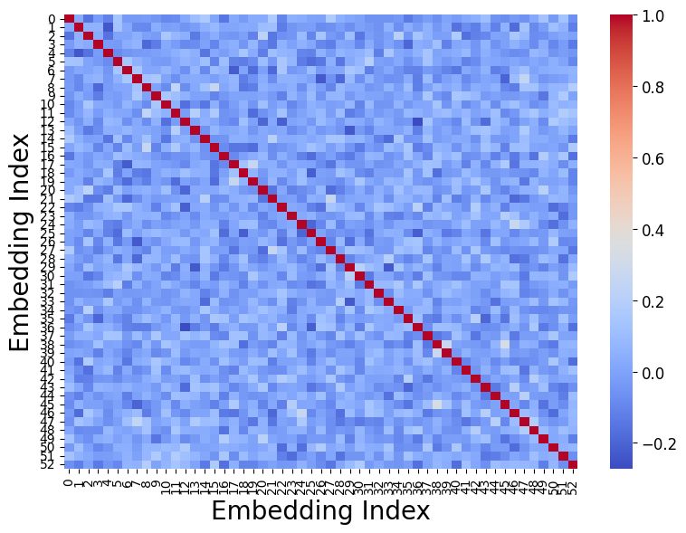
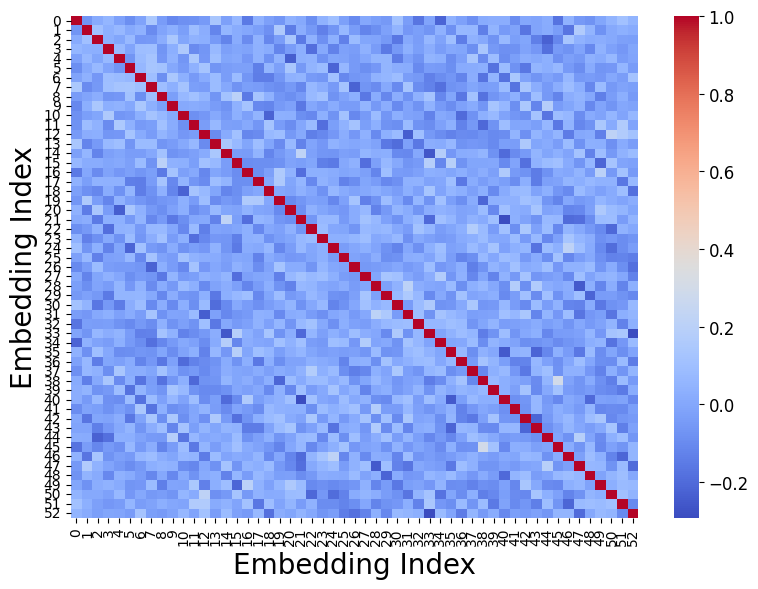
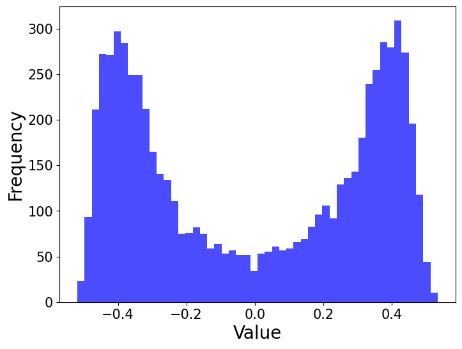
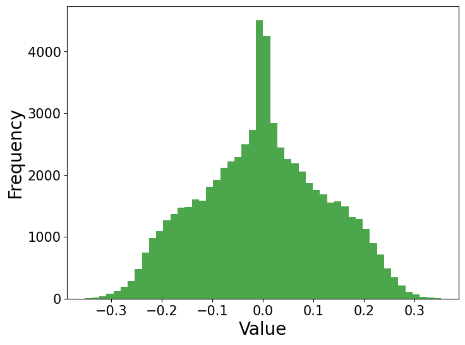
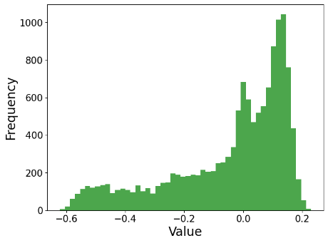
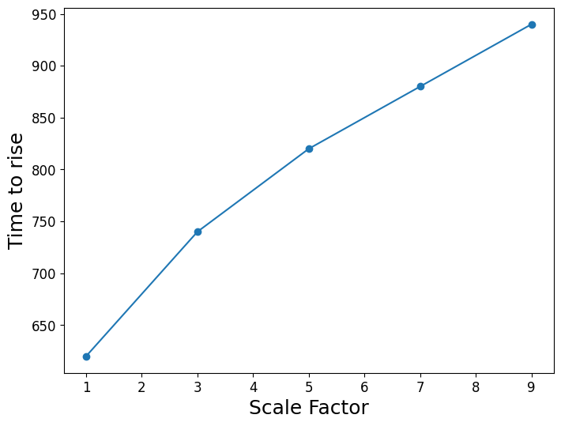
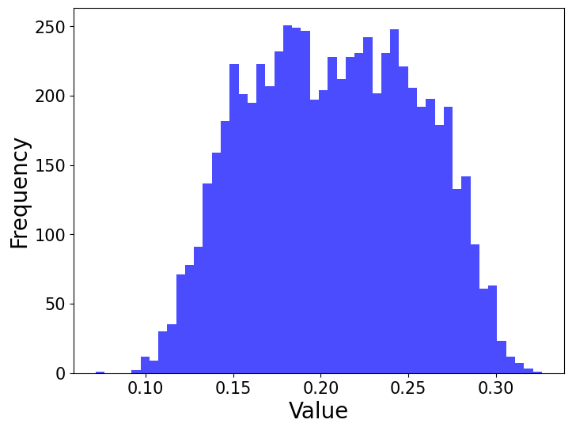
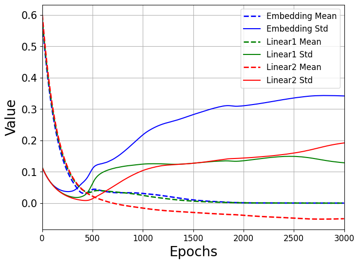
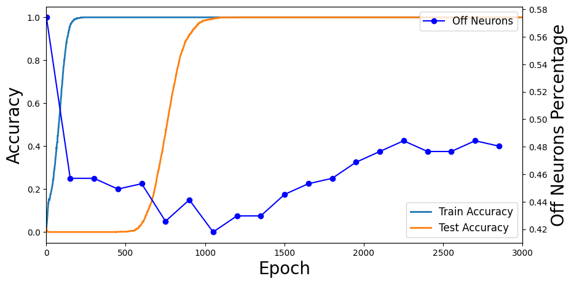

# Salah & Yevick 2025 — Tracing the Path to Grokking: Embeddings, Dropout, and Network Activation

См. также: [глобальный индекс понятий](../../concepts/index.md).

**Ahmed Salah**, **David Yevick** (физический факультет Университета Ватерлоо).

arXiv [2507.11645](https://arxiv.org/abs/2507.11645), июль 2025, версия v1 (единственная), 15 страниц, 11 рисунков (21 панель), 2 выключные формулы. Всего цитирований по Semantic Scholar — 0, в картотеке — 1. Вторая статья линии Ватерлоо — между [2411.05353](../2411.05353.controlling-grokking-with-nonlinearity-and-data-symmetry/2411.05353.controlling-grokking-with-nonlinearity-and-data-symmetry.card.md) (управление нелинейностью и симметрией данных) и [2510.25966](../2510.25966.grokking-in-the-ising-model/2510.25966.grokking-in-the-ising-model.card.md) (Изинг): набор практических метрик-предвестников гроккинга на модульном сложении — дисперсия тестовой точности под MC-dropout, кривая устойчивости к дропауту (DRC), косинусная близость и бимодальность вложений, статистики распределений весов и доля неактивных нейронов. Источник — восстановление из PDF (task-025, решение D4-A): подача PDF-only, см. врезку «Происхождение конверсии» в `original/`.

Оригинал и производные файлы этой папки:

- [`original/2507.11645.tracing-the-path-to-grokking-embeddings-dropout-and-network-activation.md`](original/2507.11645.tracing-the-path-to-grokking-embeddings-dropout-and-network-activation.md) — конверсия оригинала в Markdown без правок содержания, с врезкой о происхождении (формулы восстановлены с растра).
- [`images/`](images/) — 21 панель рисунков 1–11, извлечённые встроенными файлами из PDF.

Схема якорей и правила ссылок на карточку — в [README папки статей](../README.md).

## Затрагиваемые понятия

**[Гроккинг](../../concepts/grokking.md)** — заявка работы: несколько практических метрик, предсказывающих и анализирующих отложенную генерализацию на модульном сложении ([`p2-3`](#p2-3)); вместе с [2411.05353](../2411.05353.controlling-grokking-with-nonlinearity-and-data-symmetry/2411.05353.controlling-grokking-with-nonlinearity-and-data-symmetry.card.md) — пара «управлять и предвидеть» линии Ватерлоо. Содержательный вывод: бимодальность вложений на ±0.4 не зависит ни от масштаба, ни от профиля инициализации — «гроккинг из симметрий данных, а не из перетренировки» ([`p8-1`](#p8-1)).

**[Меры прогресса](../../concepts/progress-measures.md)** — пять величин-предвестников: локальный максимум дисперсии тестовой точности по 100 стохастическим проходам с dropout 0.3 на пороге генерализации ([`p3-4`](#p3-4), [`fig-1`](#fig-1)); кривая устойчивости к дропауту (DRC) — после генерализации тест нечувствителен к дропауту до 0.2 ([`p4-2`](#p4-2), [`fig-2`](#fig-2)); кодиагонали косинусной близости вложений, видимые задолго до гроккинга ([`p5-3`](#p5-3), [`fig-3`](#fig-3)); сжатие широких начальных распределений в начале обучения (соотнесено с Notsawo et al., [`p8-2`](#p8-2)); доля неактивных нейронов ([`p12-2`](#p12-2)). Ни одна не доведена до предсказателя срока с числом.

**[Структурированные представления](../../concepts/structured-representation-learning.md)** — та же мысль Liu et al. (2205.10343) в другом наряде: вместо круговых PCA-узоров — кодиагонали косинусной близости и бимодальное распределение вложений с пиками около ±0.4, возникающие синхронно ([`p5-3`](#p5-3), [`p6-2`](#p6-2), [`fig-4`](#fig-4)). Отсечение: с замороженными вложениями распределение остаётся гауссовым, карта близости неструктурной, и гроккинг подавлен ([`p7-1`](#p7-1)).

**[Начальный масштаб](../../concepts/initialization-scale.md)** — детальный этюд оси Omnigrok: задержка гроккинга растёт почти линейно с множителем масштаба ([`p8-1`](#p8-1), [`fig-5`](#fig-5)); умеренные положительные сдвиги инициализации сокращают задержку, чрезмерный давит тестовую точность ([`p10-2`](#p10-2), [`fig-9`](#fig-9)); сдвиг инициализации одного слоя (вложений или остальных весов) заметно усиливает задержку ([`p12-1`](#p12-1), [`fig-10`](#fig-10)); вложения-константа при обычных остальных — обучение идёт, обратное — нет.

**[Разреженная подсеть и лотерейный билет](../../concepts/sparse-subnetwork-lottery-ticket.md)** — доля неактивных нейронов падает при запоминании и растёт при генерализации: оптимизатор находит симметрии, сокращающие действенные степени свободы ([`p12-2`](#p12-2), [`fig-11`](#fig-11)) — прямая опора трактовки Merrill et al. о переходе плотной подсети в разрежённую.

**[Ослабление весов](../../concepts/weight-decay.md)** — минимум доли неактивных нейронов наступает раньше при большем weight decay, что согласуется с известной зависимостью задержки от decay ([`p13-1`](#p13-1)); величина пиков вложений убывает с ростом weight decay ([`p7-1`](#p7-1)).

**[Варианты регуляризации](../../concepts/regularization-variants.md)** — дропаут как измерительный инструмент, а не рычаг: MC-dropout даёт дисперсию-предвестник ([`p3-4`](#p3-4)), DRC — устойчивость к структурным возмущениям как новую ось диагностики ([`p4-2`](#p4-2)), дополнение к входной устойчивости 2311.06597.

## Что показано, а что предположено

Замечания редактора карточки по итогам разбора утверждений (`…claims.txt`, 29 пунктов).

**Сильное — отсечение с замороженными вложениями.** Если веса вложений не обучаются, распределение остаётся гауссовым, карта близости неструктурной, гроккинг подавлен — необходимость обучения вложений в этой постановке показана прямо. Бимодальность устойчива: добавленный после вложений ReLU сдвигает распределение в положительное при том же расстоянии пиков — «строение внутренне присуще обучению, а не артефакт активации».

**Ни семян, ни планок погрешности.** Как и в 2411.05353, все кривые — одиночные прогоны; «предвестники» нигде не проверены на упреждение числом: нет ни одного предсказания срока с ошибкой. К 2025 году задел «метрики, предсказывающие гроккинг» уже плотно занят корпусной линией предвестников с числом (2306.13253, 2606.12966, 2604.20923, 2602.16967) — сравнения с ними нет.

**Внутренние шероховатости восстановленного текста.** Нумерация случаев в §3.3 сбита (перечислены «cases 0 to 3», но красная линия названа «case 4»); в §3.2 карта близости на рис. 3 дважды названа «Fig. 1(a)/(b)»; список литературы задвоен ([3] и [12] — одна работа Varma et al.); подпись рис. 8 отсылает «same as in Figure 5», но по содержанию продолжает рис. 6; самоцитирование [4] с ошибкой имени («Yevick et al.» вместо Salah & Yevick).

**Хеджи авторов.** «Could have significant practical implications» для больших сетей — рассуждение; пики ±0.4 «presumably intrinsic to the symmetries» данных — предположение, на котором построен вывод «гроккинг из симметрий».

**Как работу будут цитировать** («предложены метрики, предсказывающие гроккинг») — точнее: на одиночных прогонах одной задачи показано, что пять величин коррелируют с порогом генерализации по времени; ни одна не доведена до предсказателя срока с числом, сравнения с существующими предвестниками корпуса нет.

---

# Текст статьи

Tracing the Path to Grokking: Embeddings, Dropout, and Network Activation
================

Ahmed Salah\*, David Yevick

*Физический факультет, Университет Ватерлоо, ON N2L 3G1, Канада*

\*Электронный адрес автора для переписки: asalah@uwaterloo.ca

## Аннотация

###### p1-5

Аннотация— Гроккинг означает отложенную генерализацию, при которой рост тестовой точности нейросети происходит ощутимо позже улучшения обучающей точности. Эта статья вводит несколько практических метрик, включая дисперсию под дропаутом, устойчивость, близость вложений и меры разреженности, способных предвещать гроккинг-поведение. Конкретно, стойкость нейросетей к шуму при выводе оценивается по кривой устойчивости к дропауту (Dropout Robustness Curve, DRC), получаемой из изменения точности с долей дропаута по мере перехода модели от запоминания к генерализации. Дисперсия тестовой точности под стохастическим дропаутом по чекпойнтам обучения далее показывает локальный максимум во время гроккинга. Вдобавок процент неактивных нейронов убывает при генерализации, а вложения стремятся к бимодальному распределению, независимому от инициализации, которое коррелирует с наблюдаемыми узорами косинусной близости и симметриями набора данных. Эти метрики дополнительно дают ценное понимание происхождения и поведения гроккинга.

**Ключевые слова:** нейросети, гроккинг, генерализация, вложения, инициализация, дропаут.

## 1. Введение

Гроккинг, открытый Power et al. [1], означает нейросети, у которых рост тестовой точности существенно отложен относительно роста обучающей. Этот эффект можно истолковать как следствие добавочной точности, связанной с генерализацией относительно запоминания. Liu et al. [2] нашли сходное поведение у множества разных устройств моделей,

**[p. 2]**

###### p2-1

обученных на широком наборе данных, включая изображения, язык и графы. Эти и родственные исследования указывают, что затухание весов и регуляризация сильно влияют на гроккинг-поведение [2, 3], а Yevick et al. [4] продемонстрировали, что гроккингом можно управлять, видоизменяя профиль функции активации.

###### p2-2

Liu et al. [5] далее предположили из исследования трансформеров, что генерализация связана с появлением структуры в выученных входных вложениях, что здесь проявляется образованием кругового узора в плоскости главных компонент низшего порядка (PCA). Вдобавок Liu et al. и Fan et al. [2, 8] показали, что умножение начальных весов нейросети на масштабный множитель может вызвать или усилить гроккинг. Метрики продвижения [9], прослеживающие и истолковывающие поведение нейросети на протяжении обучения, тоже дают понимание динамики генерализации. [10], [11], [12] [13,2]. Например, быстрый рост L2-метрики, применённой к малым множествам нейронов во время гроккинга, был истолкован как структурный фазовый переход, при котором плотная, плохо генерализующая подсеть превращается в разрежённую, хорошо генерализующую [14]. Наконец, Doshi et al. [15] нашли, что дропаут снижает склонность сети с активациями RELU уменьшать число активных узлов и тем самым свою действенную размерность. Как следствие, дропаут может ускорять генерализацию, хотя это ведёт и к большему разбросу точности между последовательными расчётами.

###### p2-3

Эта статья предлагает несколько практических метрик гроккинга в нейросетях в контексте модульного сложения, которые можно применять для предсказания и разбора отложенной генерализации. Одна из них количественно выражает дисперсию тестовой точности по многим стохастическим прямым проходам на закреплённом батче тестовых данных в присутствии Monte Carlo (MC) дропаута [16]. Вдобавок новая кривая устойчивости к дропауту (DRC) количественно выражает убывающую с обучением изменчивость гроккинга относительно случайных сетевых колебаний. Затем косинусная близость [6,7], количественно выражающая сходство вложений в высокоразмерных пространствах, оказывается предвещающей рост тестовой точности, давая понимание происхождения гроккинга в рамке модульного сложения. Распределения вложений и весов нейросети, а также зависимость гроккинга от инициализации тоже исследуются и оказываются обладающими сходными предсказательными свойствами, что и косинусная близость. Например, стандартное отклонение распределений вложений и весов растёт, а соответствующие средние сходятся к нулю, когда обучающая точность начинает расти. Аналогично, для функций активации RELU возросшее число неактивных

**[p. 3]**

нейронов можно применять для предсказания гроккинга. Соответственно, эти результаты не только дают связную рамку предсказания и потенциального управления гроккингом, но и приносят дополнительное понимание истоков гроккинг-поведения.

## 2. Описание модели

###### p3-2

В применяемой ниже модели модульного сложения два целых входа $i$ $and$ $j$ сначала вкладываются, после чего векторы вложений конкатенируются и подаются в двухслойный MLP, состоящий из скрытого слоя на 256 нейронов с функциями активации RELU и выходного слоя размера P=53. Если не оговорено иное, сеть обучается на всех сочетаниях входов с долей тест/обучение 0.5 и выходом, задаваемым результатом модульного сложения, $Y = (i+j)\%P$. Сеть использует кросс-энтропийную потерю вместе с оптимизатором AdamW, затуханием весов, равным единице, скоростью обучения 3x10-4 и инициализатором Xavier Normal, в котором веса и смещения распределены согласно $W{\sim}N(0, \sigma)$ с

$$\sigma = \sqrt{\frac{2}{n_{in} + n_{out}}}\tag{1}$$

Здесь $n_{in}$ и $n_{out}$ представляют числа входов и выходов каждого нейрона. Начальные веса, где указано, масштабируются множителем α>1.

## 3. Результаты

### 3.1 Дропаут

###### p3-4

Изменение тестовой точности, связанное с дополнительными слоями дропаута, можно применять для предвещания наступления гроккинга, а также чувствительности сети к структурным колебаниям при переходе от запоминания к генерализации. Для иллюстрации: после определённого числа шагов обучения веса модели закрепляются и выполняются 100 стохастических прямых проходов на тестовом наборе. Тестовая точность (левая ось) и её дисперсия (правая ось) поначалу пренебрежимы, как видно из рис. 1, использующего долю дропаута 0.3, тогда как обучающая точность поднимается до максимального значения и остаётся на нём, указывая на запоминание без генерализации. При наступлении генерализации дисперсия значений тестовой точности быстро растёт,

**[p. 4]**

указывая на возросшую чувствительность модели к малым изменениям сети. Затем, когда и обучающая, и тестовая точности достигают максимальных значений, дисперсия убывает почти до нуля.

###### fig-1

*Рисунок 1 Обучающая и тестовая точности вместе с дисперсией тестовой точности против номера эпохи для доли дропаута 0.3.*

###### p4-2

Чтобы дальше характеризовать отклик сети на случайные вариации при переходе от запоминания к генерализации, на рис. 2 представлена новая кривая устойчивости к дропауту. Эта кривая показывает тестовую точность для долей дропаута от 0.0 до 0.9 для модели, оцененной на разных эпохах. В первые ≈500 эпох сеть не генерализует: тестовая точность остаётся близкой к нулю при всех долях дропаута, как видно из оранжевой и голубой линий на рис. 2. После 1000 эпох (зелёная линия) тестовая точность начинает расти; однако тестовые предсказания подвержены влиянию даже малых процентов дропаута. Однако как только модель генерализует на ≈1500 эпохах (красная линия), тестовая точность почти не затронута при долях дропаута ниже 0.2 и существенно не деградирует до доли дропаута 0.5. Фиолетовая и коричневая линии на рисунке показывают соответствующие кривые для 2000 и 2500 эпох соответственно, для которых тестовая точность достигла максимального значения. Это позволяет предположить, что генерализация сопровождается снижением чувствительности к строению сети. Это наблюдение могло бы иметь значительные практические следствия для предсказания гроккинга в больших сетях.

**[p. 5]**

###### fig-2

*Рисунок 2 Кривая устойчивости к дропауту*

### 3.2 Вложения и обучение представлений

Изменение внутреннего строения сети при обучении можно разбирать и количественно выражать косинусной близостью между векторами вложений. Этот разбор указывает, что гроккинг сопровождается возникновением структурированных и понятных сетевых черт. Косинусная близость двух векторов вложений $\boldsymbol{A} = [a_{1}, a_{2}, \ldots..a_{n}]$ и $\boldsymbol{B} = [b_{1}, b_{2}, \ldots..b_{n}]$ определяется как:

$$C_{s}(\boldsymbol{A}, \boldsymbol{B}) = \frac{\boldsymbol{A}\cdot\boldsymbol{B}}{\|\boldsymbol{A}\|\,\|\boldsymbol{B}\|} = \frac{\sum_{i=1}^{n}a_{i}b_{i}}{\sqrt{\sum_{i=1}^{n}a_{i}^{2}}\cdot\sqrt{\sum_{i=1}^{n}b_{i}^{2}}}\tag{2}$$

Усреднение по всем парам вложений на каждой эпохе обучения даёт результат рис. 3, где каждая ячейка тепловой карты показывает косинусную близость двух векторов вложений с индексами, задаваемыми значениями x и y. Значения на диагонали равны единице, соответствуя проекции вектора вложения на самого себя.

###### p5-3

Тогда как при инициализации тепловая карта рис. 1(a) случайна, по достижении обучающей точностью максимального значения после 300 эпох на рис. 1(b) начинают появляться кодиагонали. После 450 эпох полосы кодиагоналей на рис. 3 (c) становятся различимее, совпадая с началом роста тестовой точности и, значит, наступлением гроккинга. Когда тестовая точность достигает максимума, тепловая карта становится структурированной, как видно на рис. 3(d). Поскольку эти узоры отсутствуют при запоминании и видимы задолго до наступления гроккинга, их возникновение можно

**[p. 6]**

применять для предсказания гроккинга. В случае модульного сложения диагональные полосы предположительно возникают из периодичности модуля. То, что большинство перекрытий малы, указывает, что векторы вложений почти ортогональны, так что выходные значения могут верно классифицироваться сетью.

###### fig-3

*Рисунок 3 Эволюция косинусной близости вложений на эпохах (a) ноль, (b) 300, (c) 450, (d) 1200.*

###### p6-2

Эту эволюцию косинусной близости можно вывести и из распределения значений вложений. Изначально взятое из нормального распределения, распределение вложений постепенно эволюционирует к двум симметричным пикам с центрами около ±0.4, как показано на рис. 4(a). Поскольку эти пики возникают одновременно с образованием диагональных узоров на рис. (3), то есть с ростом тестовой точности, это распределение можно альтернативно применять для предсказания прихода гроккинга, поскольку оно количественно выражает способность сети кодировать внутреннее строение данных.

**[p. 7]**

###### p7-1

Действительно, если веса слоя вложений держать постоянными и не обновлять при обучении, распределение вложений остаётся гауссовой функцией, тепловая карта косинусной близости остаётся неструктурированной, и гроккинг подавляется. Величина пиков вложений убывает с ростом затухания весов или уменьшением числа нейронов на слой, указывая, что ёмкость модели и регуляризация влияют на гроккинг-поведение. Далее, если после слоя вложений добавить слой ReLU, распределение сдвигается к положительным значениям, но остаётся бимодальным с тем же расстоянием между пиками, что и в расчёте без этого слоя, однако наступление гроккинга значительно задерживается. Это ясно указывает, что порождение бимодального строения внутренне присуще обучению, а не есть простой артефакт функции активации.

Распределение весов слоя, следующего за слоем вложений, сохраняет нормальную форму, но развивает непрерывный пик в начале координат, поскольку затухание весов вместе с активацией RELU уменьшает величины весов, как показано на рис. 4(b). Для последнего слоя большинство весов попадает в промежуток [0.0, 0.2] с длинным отрицательным хвостом, как показано на рис. 4(c). В этом случае, хотя веса снова затухают к нулю, функция активации Relu в предыдущем слое убирает выходы многих нейронов. Чтобы компенсировать это и тем самым сделать классификацию возможной, веса финального слоя растут. Величина этого сдвига, однако, зависит от выбора функции стоимости и метода оптимизации. Однако величина положительных значений в целом меньше большинства значений в отрицательном хвосте распределения.

###### fig-4

*Рисунок 4 (a) вложения, (b)(c) распределения весов первого и второго слоёв сети после гроккинга.*

**[p. 8]**

### 3.3 Инициализация

###### p8-1

Как замечено прежними авторами, инициализация весов заметно влияет на гроккинг. В этом разделе этот эффект будет изучен подробно, чтобы извлечь практические метрики, позволяющие предсказывать гроккинг и управлять им. Хорошо известный результат — что увеличение амплитуд инициализации задерживает гроккинг, как видно из рис. 5 (a), который указывает, что задержка между ростом обучающей и тестовой точности меняется почти линейно с масштабным множителем. Предположительно, увеличение масштаба инициализации искажает ландшафт потерь, увеличивая время сходимости оптимизатора к локальному минимуму. Однако бимодальное распределение вложений на ±0.4 не зависит ни от масштабного множителя, ни от профиля инициализации, будучи предположительно внутренне присущим симметриям размеченных данных. Это соответственно указывает, что гроккинг происходит из этих симметрий, а не из перетренировки.

###### p8-2

После определённого числа эпох среднее распределения весов финального слоя смещается от нуля, а стандартное отклонение, подобно отклонению распределения вложений, растёт и затем насыщается. Значит, если распределение инициализации слоёв изначально широко, его ширина сжимается для всех слоёв в начале обучения, как видно из рис. 6, относящегося к (a) стандартной немасштабированной инициализации и (b) расширенному начальному распределению с масштабным множителем α = 7. На этом рисунке сплошные и штриховые линии соответствуют стандартному отклонению и среднему распределений соответственно. То, что распределения сжимаются в начале обучения, тоже можно применять для предсказания гроккинга — в духе Notsawo et al. [17], предвещавших гроккинг по осцилляциям потери в начальные эпохи.

**[p. 9]**

###### fig-5

*Рисунок 5 (a) Эпохи до существенного роста тестовой точности (b) разность числа эпох, требуемых тестовой и обучающей точности для достижения почти максимальных значений, против масштабного множителя инициализации.*

*Рисунок 6 Изменение распределений вложений/весов с числом эпох для (a) немасштабированной и (b) масштабированной инициализации.*

Если все веса изначально положительны, гроккинг всё же происходит, но рост обучающей и тестовой точностей задерживается. Этот сдвиг виден и по распределению вложений, которому требуются дополнительные эпохи для достижения нулевого среднего, после чего обучающая точность растёт. Аналогичные поведения наблюдаются для распределений весов остальных слоёв. Эволюция вложений, начальное распределение которых равномерно на промежутке [0.4, 0.8], представлена на рис. 7. На этом рисунке распределения не только сдвигаются к нулю, как видно на рис. 7(b), но и становятся гауссовыми, ср. рис. 7(c), когда обучающая точность начинает расти, после чего они расширяются

**[p. 10]**

и затем на рис. 7(d) образуют два пика до роста тестовой точности. Среднее (штриховые линии) и стандартное отклонение (сплошные линии) распределений вложений/весов при значениях инициализации, равномерно распределённых на промежутке [0.4, 0.8], даны на рис. 8. По сравнению с рис. 6(a), этому распределению требуются дополнительные эпохи, прежде чем среднее убывает к нулю, а его ширина уменьшается, после чего следует рост обучающей точности.

###### p10-2

Дальнейшие расчёты с разными смещениями положительного промежутка инициализации указывают на нелинейную связь между смещением инициализации и генерализацией. Увеличение смещения сокращает задержку между ростом обучающей и тестовой точности, но чрезмерно большие сдвиги гасят рост тестовой точности. Эволюция тестовой и обучающей точностей для трёх разных сдвинутых положительных равномерных распределений вместе с несдвинутым распределением показана на рис. 9, где начальные веса равномерно распределены на промежутках [-0.2, 0.2], [0.4, 0.8], [1.2, 1.6] и [1.6, 2] в случаях с 0 по 3 соответственно. На этих рисунках сплошные и штриховые линии соответствуют обучающей и тестовой точностям. По сравнению с несдвинутым распределением, показанным синим, случаи 1 и 2, соответствующие оранжевой и зелёной линиям соответственно, показывают меньшую задержку до наступления гроккинга. Однако тестовая точность для случая 4 (красная линия) с большим сдвигом инициализации значительно снижена, и гроккинг-поведение соответственно становится аномальным.

**[p. 11]**

*Рисунок 7 Эволюция распределения вложений для сдвинутого равномерного в [0.4, 0.8] на эпохах (a) ноль, (b)150, (c) 600, (d) 1650.*

*Рисунок 8 то же, что на рисунке 5, но для сдвинутой инициализации в [0.4 и 0.8].*

###### fig-9

*Рисунок 9 Обучающая/тестовая точность в случае разных сдвинутых положительных инициализаций по сравнению со случаем инициализации с центром в нуле.*

**[p. 12]**

###### p12-1

Чтобы дальше изолировать эффекты инициализации, распределение весов отдельных слоёв сдвигалось — для слоя вложений и затем для остальных слоёв. Как показано на рис. 10, если распределение в любом из этих двух случаев установлено сдвинутым нормальным (среднее = 0.2, ст. откл. = 0.1), получающаяся задержка гроккинга куда выразительнее, чем в случае инициализации с центром в начале координат. Тестовая (сплошные линии) и обучающая (штриховые линии) точности при нулевом сдвиге инициализации (синяя кривая на рис. 10) достигают максимальных значений при меньшем и большем числе эпох соответственно по сравнению с зелёной кривой рисунка, для которой сдвинуты только инициализации вложений. Этот эффект выразительнее, если сдвинуты инициализации весов, как показывают голубые кривые. Очевидно, смещение среднего инициализации одного слоя может значительно влиять на число эпох, требуемое для выявления узоров в данных. С другой стороны, если вложения вместо этого все инициализированы одним постоянным вектором, а остальные слои используют стандартную инициализацию раздела 3.1, обучение всё же происходит, поскольку градиенты последних слоёв делают оптимизацию возможной. Наоборот, инициализация вложений нормальным распределением при установке остальных весов в постоянное значение исключает обучение, поскольку вложения тогда не оптимизируются осмысленными значениями градиентов.

###### fig-10

*Рисунок 10 Обучающая/тестовая точность, если сдвинута только инициализация вложений и когда сдвинуты только остальные веса.*

### 3.4 Активации нейронов

###### p12-2

Разреженность нейронов (процент неактивных нейронов) при обучении даёт ещё одну метрику, которую можно применять для разбора и потенциального предвещания гроккинг-поведения. Когда обучающая точность растёт при запоминании, число неактивных нейронов быстро падает.

**[p. 13]**

###### p13-1

Однако в дальнейшие эпохи разреженность сети растёт, поскольку оптимизатор находит симметрии, сокращающие действенное число степеней свободы, а множитель затухания весов уменьшает амплитуды весов. Действительно, эволюцией разреженности можно управлять через параметр затухания весов, поскольку минимум числа неактивных нейронов наступает после меньшего числа эпох при больших значениях затухания, что даёт меньшую задержку до наступления гроккинга. Это согласуется с хорошо известной зависимостью задержки от параметра затухания и указывает, что эволюция разреженности даёт ещё одну метрику, которую можно применять для предсказания гроккинга.

###### fig-11

*Рисунок 11 Обучающая и тестовая точность как функция процента неактивных нейронов после блока Relu.*

## 4. Заключение

Из минимальной, но легко истолковываемой модели гроккинга на основе модульной арифметики выделено несколько диагностических метрик, которые потенциально можно применять для предсказания и количественного выражения гроккинга. Они включают дисперсию тестовой точности под дропаутом, кривые устойчивости к дропауту, узоры близости вложений, распределения весов и активность нейронов — все они коррелируют с наступлением гроккинга. В первом случае рост дисперсии тестовой точности из-за дропаута — предвестник гроккинга. Это поведение проявляется и в кривой устойчивости к дропауту, характеризующей эволюцию дисперсии тестовой точности с номером эпохи и быстро падающей, когда сеть переходит от запоминания к генерализации. Далее, в модульной арифметике гроккинг сопровождается возникновением симметричных бимодальных распределений весов вложений с периодическими узорами косинусной близости, указывая, что сеть подстроилась к лежащим в основе симметриям набора данных. Вложения и

**[p. 14]**

веса аналогично сходятся к сходным распределениям безотносительно инициализации. Соответственно, слежение за статистическими свойствами, такими как среднее и стандартное отклонение этих распределений, даёт предсказательное понимание гроккинг-поведения сети. Число неактивных нейронов также убывает, когда модель начинает генерализовать и соответственно повышать точность своего представления данных. Будущая работа могла бы рассмотреть, в какой мере эти индикаторы можно распространить со стандартной эталонной модели на реалистичные задачи, а также подробно исследовать связь между гиперпараметрами обучения и чертами гроккинга.

## References

- [1] Alethea Power, Yuri Burda, Harri Edwards, Igor Babuschkin, and Vedant Misra. Grokking: Generalization beyond overfitting on small algorithmic datasets. arXiv preprint arXiv:2201.02177, 2022.
- [2] Ziming Liu, Eric J Michaud, and Max Tegmark. Omnigrok: Grokking beyond algorithmic data. arXiv preprint arXiv:2210.01117, 2022.
- [3] Vikrant Varma, Rohin Shah, Zachary Kenton, János Kramár, and Ramana Kumar. Explaining grokking through circuit efficiency. arXiv preprint arXiv:2309.02390, 2023.
- [4] Ahmed Salah, and David Yevick. “Controlling Grokking with Nonlinearity and Data Symmetry.” arXiv preprint arXiv:2411.05353, 2024.
- [5] Ziming Liu, Ouail Kitouni, Niklas Nolte, Eric J Michaud, Max Tegmark, and Mike Williams. Towards understanding grokking: An effective theory of representation learning. arXiv preprint arXiv:2205.10343, 2022.
- [6] Nils Reimers, and Iryna Gurevych. “Sentence-bert: Sentence embeddings using siamese bert-networks.” arXiv preprint arXiv:1908.10084, 2019.
- [7] Max Petschack, Alexandr Garbali, and Jan de Gier. “Learning the symmetric group: large from small.” arXiv preprint arXiv:2502.12717, 2025.
- [8] Simin Fan, Razvan Pascanu, and Martin Jaggi. “Deep Grokking: Would Deep Neural Networks Generalize Better?.” arXiv preprint arXiv:2405.19454, 2024.
- [9] Boaz Barak, Benjamin Edelman, Surbhi Goel, Sham Kakade, Eran Malach, and Cyril Zhang. Hidden progress in deep learning: Sgd learns parities near the computational limit. Advances in Neural Information Processing Systems, 35:21750–21764, 2022.
- [10] Neel Nanda, Lawrence Chan, Tom Liberum, Jess Smith, and Jacob Steinhardt. Progress measures for grokking via mechanistic interpretability. arXiv preprint arXiv:2301.05217, 2023.
- [11] Andrey Gromov. Grokking modular arithmetic. arXiv preprint arXiv:2301.02679, 2023.

**[p. 15]**

- [12] Vikrant Varma, Rohin Shah, Zachary Kenton, János Kramár, and Ramana Kumar. Explaining grokking through circuit efficiency. arXiv preprint arXiv:2309.02390, 2023.
- [13] Satvik Golechha, “Progress Measures for Grokking on Real-world Tasks.” arXiv preprint arXiv:2405.12755, 2024.
- [14] William Merrill, Nikolaos Tsilivis, and Aman Shukla. “A tale of two circuits: Grokking as competition of sparse and dense subnetworks.” arXiv preprint arXiv:2303.11873, 2023.
- [15] Doshi Darshil, Aritra Das, Tianyu He, and Andrey Gromov. “To grok or not to grok: Disentangling generalization and memorization on corrupted algorithmic datasets.” arXiv preprint arXiv:2310.13061, 2024.
- [16] Yarin Gal and Zoubin Ghahramani. Dropout as a Bayesian approximation: Representing model uncertainty in deep learning. In international conference on machine learning, pages 1050–1059, 2016.
- [17] Pascal Jr. Tikeng Notsawo, Hattie Zhou, Mohammad Pezeshki, Irina Rish, and Guillaume Dumas. Predicting grokking long before it happens: A look into the loss landscape of models which grok, 2023.
