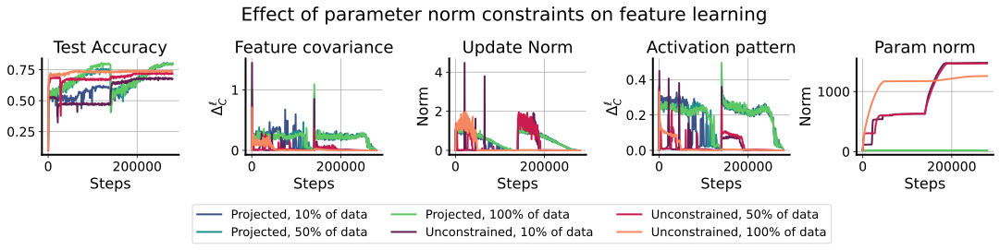
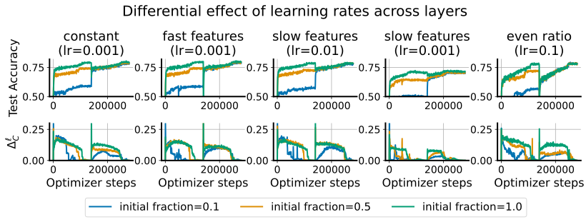
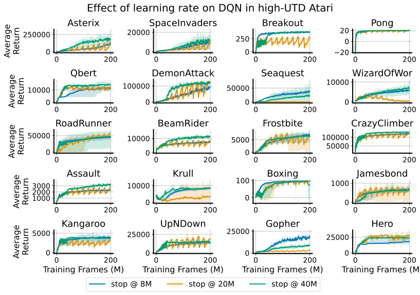

# Lyle et al. 2025 — What Can Grokking Teach Us About Learning Under Nonstationarity?

См. также: [глобальный индекс понятий](../../concepts/index.md).
arXiv [2507.20057v1](https://arxiv.org/abs/2507.20057), 26 июля 2025. Колонтитул PDF: «Published at 4th Conference on Lifelong Learning Agents (CoLLAs), 2025».

**Clare Lyle, Ghada Sokar, Razvan Pascanu, András György** — Google DeepMind. Переписка: clarelyle@google.com.

Оригинал и производные файлы этой папки:

- [`original/2507.20057.native.html`](original/2507.20057.native.html) — первоисточник, нативный HTML-рендеринг arXiv (LaTeXML), скачан как есть.
- [`original/2507.20057.what-can-grokking-teach-us-about-learning-under-nonstationarity.md`](original/2507.20057.what-can-grokking-teach-us-about-learning-under-nonstationarity.md) — конверсия оригинала в Markdown без правок содержания; английский текст для сверки перевода.
- [`images/`](images/) — иллюстрации статьи в исходном разрешении (18 файлов).
- [`2507.20057.what-can-grokking-teach-us-about-learning-under-nonstationarity.claims.txt`](2507.20057.what-can-grokking-teach-us-about-learning-under-nonstationarity.claims.txt) — рабочий разбор: пронумерованные утверждения с пометками.

Схема якорей и правила ссылок на карточку — в [README папки статей](../README.md).

## Затрагиваемые понятия

**[Гроккинг](../../concepts/grokking.md)** — работа меняет роль понятия: гроккинг здесь не объясняемое явление, а измерительный прибор. Определение взято у Power et al. 2022 дословно ([p1-5](#p1-5)), а в разделе о модульной арифметике сказано прямо: «мы сосредоточиваемся на *употреблении* гроккинга как указателя выучивания признаков в сети» ([p5-4](#p5-4)). Смысл такой роли в том, что смена признаков сама по себе шкалы не имеет, тогда как гроккинг даёт резкий и однозначно читаемый снаружи скачок тестовой точности. Главное для корпуса наблюдение: гроккинг вызывается по требованию — после нескольких сотен тысяч шагов обучения при заведомо низкой скорости включение расписания скорости обучения даёт гроккинг ([p7-2](#p7-2), [fig-3](#fig-3)), то есть отложенная генерализация оказывается не свойством начальных условий, а управляемым событием. Чего в работе нет: ни теории гроккинга, ни собственного разбора представления — механистические итоги корпуса взяты как готовое знание ([p3-1](#p3-1)); кривые обучающей точности не приведены вовсе ([p5-5](#p5-5)), так что определяющая явление фаза запоминания не показана ни на одном рисунке; и приоритет открытия отдан неверно — первым заметным наблюдением названы Liu et al. 2022a, а не Power et al. 2022 ([p3-1](#p3-1)).

**[Фаза меморизации / плато](../../concepts/memorization-phase.md)** — работа лишь наследует понятие и в одном месте его ослабляет. Определение гроккинга дано через запоминание ([p1-5](#p1-5)), а схема на [fig-1](#fig-1) отводит фазе запоминания отдельную полосу и называет её причиной отсутствие выучивания признаков. Но измеряется фаза только косвенно: авторы прямо признают, что не изображают обучающую точность «из-за нехватки места», и лишь утверждают, что почти все сети достигают идеальной или почти идеальной обучающей точности обыкновенно в пределах тысячи шагов ([p5-5](#p5-5)). Отдельная тонкость измерения, которую авторы называют сами: пары $(x,y)$ и $(y,x)$ в разбиении не различаются, поэтому сеть, выучившая одну лишь симметрию, набирает около 20 % на тесте, и на Рисунке 2 сети порой опускаются *ниже* этого порога ([p15-2](#p15-2)) — то есть плато здесь не плоское и не нулевое.

**[Фазовый переход](../../concepts/phase-transition.md)** — язык фазовых переходов работа употребляет, но как чужой словарь, а не как собственный инструмент. Гроккинг назван «фазовым переходом от „ленивой“ к „богатой“ динамике обучения» в обзорном абзаце ([p3-1](#p3-1)), и там же приведено наблюдение Thilak et al. 2022 о том, что фазовые переходы в способности модели обобщать сопровождаются периодами неустойчивости и быстрым ростом нормы параметров ([p3-2](#p3-2)). Ни параметра порядка, ни критического значения, ни разбора остроты перехода в работе нет; собственные переходы авторы описывают словами «наступление» и «вызвать», а не как критическое явление.

**[Эффект рогатки](../../concepts/slingshot.md)** — понятие входит одной ссылкой: Thilak et al. 2022 названы как источник наблюдения, что переходы в обобщении сопровождаются периодами неустойчивости в динамике оптимизации и быстрым ростом нормы параметров ([p3-2](#p3-2)). Ни рогатки, ни всплесков потери работа не измеряет, и связи собственного повторного разогрева ELR с рогаткой — при том что оба суть преходящее увеличение шага — не обсуждает.

**[Катастрофическое забывание](../../concepts/catastrophic-forgetting.md)** — работа приходит в корпус со стороны непрерывного обучения и приносит с собой соседнее явление, которого в корпусе прежде не было: *смещение первенства* (primacy bias) — порчу обобщения на поздних задачах ранними данными ([p1-3](#p1-3), [p1-5](#p1-5)). Смещение первенства — не забывание: сеть теряет не выученное, а способность выучить новое хорошо, и авторы прямо сводят под этим именем и «критические периоды» Achille et al. 2017 ([p1-3](#p1-3)). Вклад работы в эту сторону — догадка о единстве устройства: тот же ход выучивания признаков, которым сеть заменяет запоминающие признаки на обобщающие при гроккинге, позволяет переписывать и ранее *выученные* признаки ([p2-1](#p2-1)); в постановке warm-starting это сказано ещё прямее — «сеть должна научиться переписывать ранее выученные признаки — задача, которая может оказаться значительно труднее, чем разобранный ранее режим гроккинга» ([p7-3](#p7-3)). Чего нет: общность объявлена догадкой, а не показана — совпадает лишь то, что одно вмешательство помогает в обеих постановках; ни одна мера выучивания признаков не приложена к обеим постановкам разом.

**[Возникновение признаков](../../concepts/feature-emergence-feature-learning.md)** — работа даёт корпусу две готовые к употреблению меры выучивания признаков: сдвиг нормированной ковариации признаков $\Delta_{C}^{\ell}$ ([p4-3](#p4-3), формула 3, вслед за определением Yang et al. 2022) и сдвиг двоичной картины активаций ReLU $\Delta_{A}^{\ell}$ ([p4-4](#p4-4), формула 4), заведённый именно потому, что ковариация не улавливает, насколько сеть пользуется нелинейностями. Обе меры — приращения за промежуток $T$, то есть скорость, а не состояние. На [fig-4](#fig-4) они ведут себя в лад со скоростью обучения: возрастают и затем снижаются с каждым циклом. Чего в работе нет: ни абсолютной шкалы у этих величин (потому гроккинг и понадобился как внешняя отметка), ни разбора того, *какие* признаки возникают, ни применения обеих мер к постановке с гроккингом — в разделе 4 признаки измеряются долей изменившихся картин активаций ([fig-3](#fig-3)) и рангом выходов внимания ([p16-2](#p16-2)).

**[Эффективность контуров](../../concepts/circuit-efficiency.md)** — понятие входит как одна из двух спорящих сторон, которую работа берётся рассудить: Varma et al. 2023 «доказывают обратное: гроккинг происходит, когда оптимизатор сходится к „эффективному“ контуру, который хорошо обобщает, и с этого мига weight decay может снижать норму параметров, не вредя точности» ([p3-2](#p3-2)). Опыт работы устроен не как проверка эффективности контуров, а как разведение нормы параметров и отношения норм шага и параметров ([p5-6](#p5-6)); вывод — «доля истины в обеих точках зрения». Ни контуров, ни их стоимости работа не измеряет; архитектура при этом заимствована именно у Varma et al. 2023 ([p5-5](#p5-5)).

**[Переход lazy→rich](../../concepts/lazy-to-rich-kernel-to-feature-learning.md)** — это рамка, в которой написана вся работа, но взята она готовой. Выучивание признаков определено прямо в противопоставлении ленивому режиму, «где динамика подражает динамике линейной модели относительно некоторого закреплённого ядра» ([p1-5](#p1-5)), а сведение гроккинга к переходу lazy→rich подано как установленное предшественниками ([p3-1](#p3-1), со ссылками на Xu et al. 2024, Kumar et al. 2024, Lyu et al. 2024). Собственный вклад — рычаг: богатую динамику, оказывается, можно включить в произвольный миг обучения, подняв отношение нормы шага к норме параметров ([p5-3](#p5-3), [p7-2](#p7-2)). Чего нет: ни ядра, ни его изменения работа не вычисляет; «ленивый» и «богатый» остаются словами, а измеряются $\Delta_{C}$ и $\Delta_{A}$.

**[Нейронное касательное ядро](../../concepts/neural-tangent-kernel-ntk.md)** — понятие входит как словарь для описания того, что́ определяет режим при инициализации: режим NTK «удерживает ядро закреплённым на всём обучении, обеспечивая изменение выходов сети порядка $O(1)$ за счёт уравновешивания исчезающих обновлений параметров ростом якобиана сети» ([p4-6](#p4-6)). Оттуда же взят и перечень трёх величин, задающих режим, — начальная норма параметров, скорость обучения и множитель выходов слоя. Никакого ядра работа не вычисляет и никаких утверждений о ширине не проверяет.

**[Маршрутизация внимания](../../concepts/attention-routing-heads.md)** — единственное место, где работа заглядывает внутрь сети, и это побочный итог приложения B.1: гроккинг устойчиво совпадает со снижением ранга выходов голов внимания, а в сетях со слоевой нормировкой снижение этого ранга требует снизить норму либо входов голов внимания, либо матриц ключа и запроса ([p16-2](#p16-2), [fig-8](#fig-8)). Тот же механизм объясняет отрицательный итог основного текста: layer normalization увеличивает входы внимания, отчего матрицы внимания имеют «гораздо меньшую энтропию и труднее поддаются оптимизации», и сеть с проекцией не может это исправить, пока к масштабным параметрам нормировки не приложен weight decay — приём, названный авторами «scale decay» ([p6-1](#p6-1), [fig-2](#fig-2)). Чего нет: разбора того, что́ головы вычисляют; ранг здесь — счётчик, а не толкование.

**[Модульная арифметика](../../concepts/modular-arithmetic.md)** — задача взята как рабочий стенд, и её постановка расходится с обычной для корпуса в двух местах сразу. Модуль равен 117 — числу составному ($9\cdot 13$), тогда как корпус почти всюду берёт простое; последствия составного модуля (нетривиальные делители нуля, распад на подгруппы) нигде не обсуждаются. Вход записан как $x\cdot y=\square$, а правильный ответ объявлен $x+y\mod 117$ ([p5-5](#p5-5)). Задача одна, перебора операций нет.

**[Эталонный полигон гроккинга](../../concepts/canonical-grokking-testbed.md)** — работа наследует рамку Power et al. 2022 через Varma et al. 2023, у которых прямо повторена архитектура, но переставляет три её опоры: доля обучающей выборки $\rho=0.2$ вместо канонической половины, модуль 117 вместо простого, бюджет 1 млн шагов ([p5-5](#p5-5)); архитектура — трансформер с одним блоком внимания, двухслойным MLP и абсолютным позиционным кодированием, без слагаемых смещения и с RMSNorm по умолчанию ([p15-1](#p15-1)). Существенное для читателя отличие от полигона: обучающая точность не изображается, и гроккинг опознаётся только по поздней ступеньке тестовой кривой ([p5-5](#p5-5)); а сама тестовая кривая имеет пол в 20 % за счёт неразличения $(x,y)$ и $(y,x)$ ([p15-2](#p15-2)).

**[Доля данных / критический размер набора](../../concepts/data-fraction-critical-dataset-size.md)** — доля обучающей выборки закреплена на $\rho=0.2$ и ни разу не перебирается ([p5-5](#p5-5)); никакого критического размера работа не ищет. Зато рядом, в разделе о warm-starting, доля данных выступает управляющим параметром другого рода: сеть предобучается на 10 %, 50 % или 100 % CIFAR-10, а затем дообучается на полном наборе ([p7-4](#p7-4)), и главный итог — выход на одно и то же итоговое качество независимо от исходной доли ([p7-5](#p7-5), [fig-4](#fig-4)).

**[Реальные данные и зрение](../../concepts/vision-real-world-data-mnist-cifar.md)** — CIFAR-10 входит в работу не как площадка для гроккинга, а как вторая, независимая проверка того же рычага: свёрточные сети и ResNet-18 без слагаемых смещения, 70 эпох на доле данных, затем добавление остатка и ещё 70 эпох по распорядку Ash & Adams 2020 ([p7-4](#p7-4), [p15-1](#p15-1)). Гроккинга на зрительных данных работа не показывает и не заявляет; показывает она, что повторный разогрев ELR закрывает разрыв обобщения, порождённый warm-starting ([p7-5](#p7-5)). Отдельный отрицательный итог для корпуса: масштаб последнего линейного слоя, на важности которого для гроккинга в зрительных задачах настаивали Liu et al. 2022b, здесь заметного действия не оказал ([p8-3](#p8-3), [fig-5](#fig-5)).

**[Weight decay / L2-регуляризация](../../concepts/weight-decay.md)** — работа переворачивает привычную роль weight decay: он выступает не причиной обобщения, а одним из двух способов поднять отношение нормы шага к норме параметров, и потому взаимозаменяем со скоростью обучения — «больший weight decay может возместить меньшую скорость обучения и наоборот» ([fig-2](#fig-2)). Причинный вопрос поставлен прямо: «меньшая ли норма параметров способствовала лучше обобщающему решению, или же обнаружение сетью обобщающего решения позволило ей снизить норму параметров, не вредя точности?» ([p5-6](#p5-6)). Ответ опытный: при периодической проекции весов обобщение быстро и устойчиво от семени к семени, тогда как сетям с изменчивой нормой для того же нужно большое значение weight decay, и влияние скорости обучения оказывается сильнее влияния weight decay ([p5-6](#p5-6)). Второе, отдельное употребление weight decay — «scale decay» на масштабных параметрах слоёв нормировки ([p6-1](#p6-1)).

**[Когда регуляризация необходима](../../concepts/regularization-necessity.md)** — работа даёт корпусу ясный отрицательный довод: weight decay для гроккинга не необходим, потому что его заменяет удержание нормы. Сети с периодической проекцией параметров к исходной норме гроккают быстро и устойчиво, и там weight decay не нужен, а его действие проекцией как раз «притупляется» ([fig-2](#fig-2), [p5-6](#p5-6)). Оговорка, которую нельзя терять: одной высокой ELR тоже недостаточно — с layer normalization сеть с проекцией не обобщается вовсе, пока не добавлен «scale decay» ([p6-1](#p6-1)), так что необходимым оказывается не какой-то один регуляризатор, а сочетание достаточного изменения представления и пригодного ландшафта.

**[Оптимизатор](../../concepts/optimizer-adam-adamw-sgd.md)** — работа даёт разные выражения действенной скорости обучения для разных оптимизаторов: $\tilde{\eta}(\theta)=\frac{\eta}{\|\theta\|^{2}}$ для градиентного спуска и $\tilde{\eta}(\theta)=\frac{\eta}{\|\theta\|}$ для адаптивных оптимизаторов вроде RMSProp и Adam, которые приближают обновление $\frac{\nabla f(\theta)}{\|\nabla f(\theta)\|}$ ([p3-4](#p3-4)). Во всех опытах взят Adam ([p15-2](#p15-2), [p15-6](#p15-6)); перебора оптимизаторов нет, и вопрос о том, зависит ли повторный разогрев от адаптивности, поставлен лишь в приложении C, где показано, что при нормировке параметров и снижающем шаг оптимизаторе разогрев на стационарной задаче безвреден, а на изменившейся — ускоряет схождение ([p22-2](#p22-2)).

**[Минимизация нормы весов](../../concepts/weight-norm-minimization.md)** — работа встраивается в спор корпуса о норме и предлагает разрешить его сменой величины: значима не норма параметров сама по себе, а её отношение к норме шага. Спор назван прямо — «зона Златовласки» Liu et al. 2022b против «эффективного контура» Varma et al. 2023, — и работа «наводит мост к причинному пониманию этой связи… и находит долю истины в обеих точках зрения» ([p3-2](#p3-2)). Опытный довод: гроккинг наступает при большой действенной скорости обучения, «даже если норма параметров не опустится ниже своего начального значения» ([p5-6](#p5-6)). Чего нет: ни утверждения о минимальности нормы у обобщающего решения, ни измерения нормы после гроккинга — работа спорит с ролью нормы, а не с её значением.

**[Масштаб инициализации](../../concepts/initialization-scale.md)** — начальная норма параметров названа одной из трёх величин, задающих режим динамики при инициализации ([p4-6](#p4-6)), а приложение C доводит это до прикидки: при масштабировании первого слоя на $\alpha$ ожидаемый поворот признаков идёт как $\frac{1}{\sqrt{1+\frac{\eta^{2}}{\alpha^{2}}\sigma_{g}^{2}}}$, а вероятность переключения активности нейрона ReLU — как $\frac{1}{2}-\frac{1}{\pi}\arctan\frac{\alpha^{2}}{\eta\sigma_{g}}$ ([p22-1](#p22-1)). Отсюда главный вывод работы в его самой отчётливой форме: «при больших нормах параметров необходимо соответственно повышать скорость обучения, чтобы произвести то же действенное изменение в картинах активаций представления». Чего нет: перебора масштабов инициализации в опытах и какого-либо доказательства — приложение C сами авторы называют обоснованием, а градиенты в нём смоделированы гауссовым возмущением.

**[Скорость обучения](../../concepts/learning-rate.md)** — это главный рычаг работы, и она вводит для него величину, которой корпус до сих пор почти не пользовался: *действенную скорость обучения* (ELR), масштабно-инвариантное прочтение скорости обучения, учитывающее норму параметров ([p3-3](#p3-3), [p3-4](#p3-4)). Предложенный способ — «повторный разогрев ELR»: переделка Normalize-and-Project так, чтобы ELR не просто не проседала, а периодически повышалась — по расписанию либо по обнаружению разладки (CUSUM) на потере ([p5-3](#p5-3), Алгоритм 1). Для корпуса важны три опытных следствия: разогрев до 0.01 вызывает гроккинг, а до 0.001 — нет ([fig-3](#fig-3)); повторный разогрев работает и через сотни тысяч шагов после начала ([p7-2](#p7-2)); а иногда для полного закрытия разрыва нужен разогрев *выше* начального значения скорости, то есть «вернуть как было» мало ([p18-2](#p18-2), [fig-13](#fig-13)). Оборотная сторона названа авторами: повышение ELR усиливает и неустойчивость, поэтому оно должно быть преходящим ([p2-6](#p2-6), [p10-2](#p10-2)).

**[Зона Златовласки](../../concepts/goldilocks-zone.md)** — понятие входит как называемая чужая позиция: Liu et al. 2022b «описывают гроккинг как схождение нормы параметров к „зоне Златовласки“ (Fort & Scherlis 2019), допускающей обобщение» ([p3-2](#p3-2)). Работа этой зоны не ищет и не измеряет; её собственный довод сдвигает искомую «в самый раз» величину с нормы параметров на отношение норм шага и параметров, но словом «зона» его не называет.

**[Край устойчивости](../../concepts/edge-of-stability.md)** — понятие входит в обзорный абзац об утрате пластичности: кривизна и действенный размер шага связаны «через *механизм катапульты* (Lewkowycz et al. 2020), неявную регуляризацию (Barrett & Dherin 2020) и динамику на краю устойчивости (Cohen et al. 2021; Agarwala et al. 2022; Roulet et al. 2023)» ([p1-3](#p1-3) — постановка, [p3-1](#p3-1) — соседний обзор). Одно применение всё же содержательно: выбираться из местного минимума предлагается повышением скорости обучения «до значения, превышающего остроту местного бассейна (Lewkowycz et al. 2020)» ([p7-5](#p7-5)). Ни остроты, ни собственных значений гессиана работа не измеряет.

**[Сферическое ограничение нормы](../../concepts/spherical-weight-norm-constraint.md)** — работа даёт корпусу готовый рабочий вид этого вмешательства: Normalize and Project вставляет слои нормировки перед каждой нелинейностью и периодически проецирует веса каждого линейного слоя на единичную сферу по норме Фробениуса, формула 2 ([p3-4](#p3-4)); проекцию можно применять раз в $k$ шагов — либо ради дешевизны, либо как способ промежуточный между проекцией и регуляризацией нормы ([p4-1](#p4-1)). Роль проекции здесь двоякая и обе стороны важны: она делает ELR прямо считываемой с расписания скорости обучения ([p4-1](#p4-1)) и она же — необходимая составляющая способа, без которой повторный разогрев теряет силу ([p8-1](#p8-1), [fig-5](#fig-5)). Побочный итог, о котором стоит знать: с layer normalization проекция лишает сеть единственного пути снизить норму входов внимания, и обобщение исчезает вовсе ([p6-1](#p6-1)).

**[Меры прогресса](../../concepts/progress-measures.md)** — работа лишь упоминает понятие, зато в редкой роли: меры прогресса названы средством, которое «способно опознать возникновение этих обобщающих признаков ещё до подъёма тестового качества, порой отслеживая по пути образование частично обобщающих решений» ([p3-1](#p3-1), со ссылками на Nanda et al. 2023 и Varma et al. 2023). Собственные величины работы — $\Delta_{C}$ и $\Delta_{A}$ — мерами прогресса не называются и на роль предвестника не выдвигаются: они меряют скорость смены признаков, а не близость к обобщающему решению.

**[Избирательный weight decay](../../concepts/selective-weight-decay.md)** — редкий обратный случай: decay накладывают туда, откуда его обычно убирают. При layer normalization большой эффективной скорости обучения мало, и норму входов голов внимания понижают, применяя weight decay к масштабным параметрам layernorm ([`fig-2`](#fig-2)).
## Несогласованности внутри статьи

**Аннотация переворачивает отношение, которым определена ELR.** В аннотации действенная скорость обучения названа «отношением между нормами параметров и обновления» ([p1-2](#p1-2)), тогда как в разделе 2.3 она определена ровно наоборот — как $\tilde{\eta}(\theta)=\frac{\eta}{\|\theta\|^{2}}$ (и $\frac{\eta}{\|\theta\|}$ для Adam), то есть как отношение шага к норме параметров ([p3-4](#p3-4)). При прочтении аннотации буквально «повышение ELR» означало бы рост нормы параметров — то самое, чему работа противодействует. Формулировка аннотации уже переносится цитирующими (см. ниже раздел об ошибочных пересказах).

**Алгоритм 1 отнесён не к тому разделу.** Во введении сказано, что способ дан «Алгоритмом 1 в Разделе 3.1» ([p2-4](#p2-4)), но Раздел 3.1 — это показатели выучивания признаков ([p4-3](#p4-3)), а сам алгоритм стоит в Разделе 3.2 ([p5-3](#p5-3)).

**Число слоёв.** В основном тексте архитектура описана как «трансформер с одним блоком внимания» ([p5-5](#p5-5)), в приложении — «один блок внимания, затем двухслойный MLP», а в Таблице 1 стоит `число слоёв = 2` ([p15-1](#p15-1)). Что именно считается слоем, не сказано.

**Запись задачи не сходится с ответом.** Вход записан как $x\cdot y=\square$, а правильный ответ объявлен как $x+y\mod 117$ ([p5-5](#p5-5)); знак операции во входе и операция в ответе — разные.

**Период цикла в RL назван в двух разных единицах.** В основном тексте это «4 млн шагов оптимизатора», и десять циклов приравнены к 40 млн кадров ([p10-2](#p10-2)); в приложении A.3 — «4 млн шагов среды» ([p15-6](#p15-6)). При заявленном там же replay ratio 1 эти две величины не совпадают.

**Итог по низкому UTD подрывает довод в пользу повторного разогрева.** Замысел работы требует, чтобы выгода происходила от периодического возвращения в область высокой ELR. Но в режиме низкого UTD авторы сами заключают, что расписания сходятся примерно к одному качеству «независимо от числа применённых циклов» и что выгоду «можно отнести в основном на счёт достаточного времени, проведённого при ключевых скоростях обучения, а не на счёт того, что сеть подвергается более высоким ELR позже в обучении» ([p9-3](#p9-3), [fig-6](#fig-6)) — то есть именно повторность здесь ничего не даёт.

**Бюджет обучения в тексте и на рисунке приложения расходится вдвое.** В постановке опыта сказано, что сеть обучается 1 млн шагов ([p5-5](#p5-5)), и Рисунок 3 говорит о качестве, сохраняющемся «даже после миллиона шагов оптимизатора» ([fig-3](#fig-3)); ось шагов на Рисунке 8 при этом доходит до $2\cdot 10^{6}$, и часть прогонов гроккает после отметки в 1 млн ([fig-8](#fig-8)). Какой бюджет относится к какому набору прогонов, нигде не сказано.

**Приложение B.5 ссылается не на тот рисунок.** Раздел озаглавлен и открыт разбором Рисунка 13, но заключение подкреплено ссылкой «на графике в правой части Рисунка 5», где показано обнаружение разладки, а рост ранга, о котором идёт речь, изображён на Рисунке 8 ([p18-2](#p18-2), [fig-5](#fig-5), [fig-13](#fig-13)).

**Следы незавершённой правки.** Сверены по PDF и не являются погрешностью конверсии: в [p7-1](#p7-1) фраза оборвана на середине — «скорость обучения следует снизить, чтобы улучшить устойчивость и На Рисунке 3 мы применяем…» (`should be reduced to improve stability and In Figure 3 we apply`), и там же стоит `we train a transform` вместо `transformer`; в [p6-1](#p6-1) удвоено вводное к названию приёма (`a technique which we refer to as which we refer to by the term 'scale decay'`); в [p15-6](#p15-6) написано `reply ratio` вместо `replay ratio`. Опечатки переведены по смыслу, оборванная фраза сохранена оборванной.

## Что доказано, что показано и что предположено

**Предположено.** Единство устройства гроккинга и смещения первенства — догадка, и авторы называют её так: работа «выдвигает догадку, что та же динамика выучивания признаков, которая способствует обобщению при гроккинге, лежит в основе и способности переписывать ранее *выученные* признаки» ([p1-2](#p1-2), [p2-1](#p2-1)). Рисунок 1 — схема этого соответствия, а не измерение ([fig-1](#fig-1)). Оттуда же следует хеджированное заявление аннотации о том, что способы, ускоряющие гроккинг, — «многообещающие соискатели» против смещения первенства: проверен ровно один такой способ, собственный, и ни один известный корпусу ускоритель гроккинга в нестационарной постановке не испытан. Хеджирована и вторая догадка работы — о пригодности циклирования именно для RL: «Мы предполагаем, что *циклирование* скорости обучения может поэтому особенно хорошо подойти обучению с подкреплением» ([p9-1](#p9-1)).

**Показано опытом.** Разведение нормы параметров и действенной скорости обучения двойным перебором — при свободной норме и при периодической проекции ([p5-6](#p5-6), [fig-2](#fig-2)); необходимость «scale decay» при layer normalization ([p6-1](#p6-1)); вызов гроккинга по требованию после сотен тысяч шагов и порог по величине разогрева ([p7-2](#p7-2), [fig-3](#fig-3)); закрытие разрыва warm-starting и отсечка обеих составляющих способа ([p7-5](#p7-5), [p8-1](#p8-1)); прирост в RL от раннего циклирования с последующим отжигом ([p10-2](#p10-2)) — вместе с признанной платой: в режиме высокого UTD разброс в очках велик «в основном из-за неустойчивости больших скоростей обучения» ([p10-1](#p10-1)); совпадение гроккинга с падением ранга выходов внимания ([p16-2](#p16-2)).

**Обосновано рассуждением, но не доказано.** Всё приложение C: градиенты смоделированы гауссовым возмущением, вывод вероятности переключения ReLU опирается на ответ со Stackoverflow, приведённый сноской ([p21-1](#p21-1), [p22-1](#p22-1)). Никакой теории гроккинга и никакой теории смещения первенства в работе нет: связь между ними держится на схеме Рисунка 1 и на том, что одно вмешательство помогает в обеих постановках; заключение и подводит итог в этой же осторожной форме — средство «мощное», но применять его нужно с осторожностью ([p10-3](#p10-3)).

**Что стоит держать в уме, цитируя числа.** Обучающие кривые не приведены ([p5-5](#p5-5)); тестовая точность имеет пол в 20 % из-за неразличения $(x,y)$ и $(y,x)$ ([p15-2](#p15-2)); сравнений при равных вычислительных затратах с иными средствами против смещения первенства (Shrink and Perturb, спектральная регуляризация) в разделе о warm-starting нет, хотя оба способа названы во введении ([p1-3](#p1-3), [p7-5](#p7-5)).

## Ошибочные пересказы и цитирования этой статьи

Ниже — узоры, замеченные в цитирующих работах корпуса; для каждого сказано, что именно искажается, и даны ссылки на авторские абзацы. Обследованы четыре работы корпуса, цитирующие эту статью, и пересказы у них в целом точны — тем важнее два места, где формулировка расходится с текстом.

**«ELR есть отношение нормы параметров к норме обновления» (ошибочное — и порождённое самой статьёй).** Truong et al. 2026 (`2606.13753`, карточки нет) пересказывает работу так: `"Lyle et al. 2025 argue that what drives the transition is the *effective learning rate* — the ratio of parameter norm to update norm — rather than the parameter norm on its own"` — *«Lyle et al. 2025 доказывают, что переход движим действенной скоростью обучения — отношением нормы параметров к норме обновления, — а не нормой параметров самой по себе»*. Вторая половина фразы точна и почти дословно повторяет [p5-6](#p5-6); первая — переворачивает определение: в [p3-4](#p3-4) ELR есть $\frac{\eta}{\|\theta\|^{2}}$, то есть отношение шага к норме параметров. Родословная ошибки прослеживается: ровно так, наоборот, отношение названо в аннотации самой статьи ([p1-2](#p1-2)), и цитирующий воспроизвёл авторскую формулировку. Предупреждение относится к формулировке, а не к работе: содержательный вывод она передаёт верно.

**«Вмешательство убирает задержку гроккинга» (расширяющее).** [Saheb Pasand и Dohmatob 2026 (2510.04930)](../2510.04930.egalitarian-gradient-descent-a-simple-approach-to-accelerated-grokking/2510.04930.egalitarian-gradient-descent-a-simple-approach-to-accelerated-grokking.card.md) числит работу среди тех, чьи `"Practical interventions have been shown to be effective to shorten or remove the grokking delay"` — *«Практические вмешательства показали действенность в сокращении или устранении задержки гроккинга»*. У авторов сказано осторожнее и в обе стороны: расписание ELR задержку сокращает, но оно же её и удлиняет — в опыте [fig-3](#fig-3) сеть намеренно держат в негроккающем режиме сотни тысяч шагов, и это подано как отдельное достижение ([p7-2](#p7-2)). Второе, развёрнутое место у того же цитирующего — `"propose effective learning rate scaling and re-warming as a method to trigger and accelerate feature-learning dynamics during training which can both accelerate grokking and address the issue of primacy bias in continual learning"` — точно по существу; единственная теряемая оговорка в том, что у авторов общность двух постановок объявлена догадкой ([p2-1](#p2-1)), а не показана.

Точные пересказы, годные как образец: [He et al. 2026 (2601.09049)](../2601.09049.is-grokking-worthwhile-functional-analysis-and-transferability-of-generalization-circuits-in-transformers/2601.09049.is-grokking-worthwhile-functional-analysis-and-transferability-of-generalization-circuits-in-transformers.card.md) числит работу среди тех, кто `"leveraged the phenomenon to improve model performance"` — то есть называет ровно ту роль гроккинга, которую работа себе и отводит ([p5-4](#p5-4)).

---

# Текст статьи

# What Can Grokking Teach Us About Learning Under Nonstationarity?

Clare Lyle, Ghada Sokar, Razvan Pascanu, András György (Google DeepMind; переписка: clarelyle@google.com)

## Аннотация

###### p1-2

В задачах непрерывного обучения часто необходимо переписывать составляющие выученного нейросетью представления в ответ на изменения потока данных; однако нейросети часто обнаруживают *смещение первенства* (primacy bias), при котором ранние обучающие данные мешают способности сети обобщать на поздних задачах. Хотя динамика выучивания признаков в нестационарных задачах обучения изучена плохо, известно, что возникновение динамики выучивания признаков движет явлением *гроккинга*, при котором нейросети сперва запоминают свои обучающие данные и лишь позже обнаруживают идеальное обобщение. Настоящая работа выдвигает догадку, что та же динамика выучивания признаков, которая способствует обобщению при гроккинге, лежит в основе и способности переписывать ранее *выученные* признаки, и что способы, ускоряющие гроккинг за счёт содействия динамике выучивания признаков, — многообещающие соискатели на роль средства против смещения первенства в нестационарных задачах обучения. Затем мы предлагаем прямолинейный способ вызывать динамику выучивания признаков по мере надобности на всём протяжении обучения, повышая *действенную* скорость обучения, то есть отношение между нормами параметров и обновления. Мы показываем, что этот подход и содействует выучиванию признаков, и улучшает обобщение в разнообразных постановках, включая гроккинг, warm-starting обучения нейросети и задачи обучения с подкреплением.

## 1 Введение

###### p1-3

Нестационарность вездесуща в применениях систем ИИ в реальном мире: наборы данных могут расти со временем, корреляции могут появляться и затем исчезать по мере смены веяний, а сами системы ИИ могут деятельно участвовать в порождении собственных обучающих данных. Однако алгоритмы обучения нейросетей обыкновенно предполагают закреплённое распределение данных, и чтобы успешно обучить нейросеть в нестационарных условиях, требуется избежать целого ряда возможных срывов, включая утрату пластичности (Lyle et al. 2021; Dohare et al. 2021; Abbas et al. 2023), когда сеть со временем всё хуже способна снижать свою обучающую потерю, и смещение первенства (Ash & Adams 2020; Nikishin et al. 2022), когда ранние данные мешают способности сети хорошо обобщать на поздних задачах11 1 Чувствительность нейросетей к ранним обучающим данным опознана в литературе под разными именами, например *критические периоды* (Achille et al. 2017). Мы употребляем в этой работе термин *смещение первенства* для обозначения всех подобных явлений.. Хотя многие предшествующие работы разбирали динамику обучения, ведущую к утрате пластичности, сравнительно меньше внимания уделено динамике обучения, лежащей в основе ухудшения способности обобщать. Нынешние подходы к этой трудности включают возмущение или полную переинициализацию параметров сети (Ash & Adams 2020; Schwarzer et al. 2023; Lee et al. 2023) либо регуляризацию в той или иной форме к распределению инициализации (Lyle et al. 2021; Kumar et al. 2023) или к начальным условиям (Lewandowski et al. 2025) — решение, которое, будучи действенным, может преходяще снижать качество и не даёт понимания того, *почему* сеть вообще перестаёт обобщать.

В этой статье мы предложим рамку для понимания и смягчения этого ухудшения способности обобщать, связывающую три прежде разрозненных явления: смещение первенства, гроккинг и динамику выучивания признаков.

###### p1-5

- **Смещение первенства:** нейросеть, изначально обученную на одной задаче, обучают на другом распределении данных и/или другой цели, и она достигает худшего качества на новой задаче, чем случайно инициализированная сеть (Achille et al. 2017; Ash & Adams 2020; Nikishin et al. 2022).
- **Гроккинг:** модель внезапно закрывает разрыв обобщения вследствие (возможно, продолжительного) дальнейшего обучения после того, как изначально достигла идеальной обучающей точности (запоминания) при плохом качестве на тесте (Power et al. 2022).
- **Выучивание признаков:** способность сети вносить нетривиальные изменения в своё выученное представление (иначе — богатая динамика), определяемая в противопоставлении ленивому режиму, где динамика подражает динамике линейной модели относительно некоторого закреплённого ядра (Jacot et al. 2018).

**[p. 2]**

###### p2-1

Точнее, мы исследуем гипотезу о том, что *тот же самый основополагающий процесс*, которым сеть заменяет случайно инициализированные *запоминающие* признаки на обобщающие в ходе гроккинга, может быть употреблён в задачах непрерывного обучения, чтобы переписывать ранее выученные признаки новыми. Тем самым от способа, ускоряющего гроккинг (например, на задачах модульной арифметики, где это явление обыкновенно и разбирают), следует ожидать, что он смягчит и смещение первенства в нестационарных задачах обучения.

###### fig-1

*Рисунок 1: И смещение первенства (верхний ряд), и гроккинг (нижний ряд) обнаруживают период, когда сеть плохо обобщает из-за отсутствия выучивания признаков (жёлтый). При смещении первенства причина — непригодные *выученные* признаки, доставшиеся от начальной фазы обучения (синий). При гроккинге сеть в конце концов восстанавливает динамику выучивания признаков (зелёный) и обобщает.* **[p. 2]**

Мы изображаем эту аналогию на Рисунке 1, показывая, как фазу запоминания и (возможную) фазу выучивания признаков при гроккинге можно наложить на постановку непрерывного обучения. Далее мы делаем три основных вклада.

Во-первых, опираясь на приведённую выше гипотезу, мы строим **объединяющую рамку** для понимания **гроккинга** и **смещения первенства** как **возникновения (или невозникновения) динамики выучивания признаков** (Раздел 3).

###### p2-4

Во-вторых, чтобы перевести эту рамку в алгоритм, мы предлагаем простое изменение способа Normalize and Project из Lyle et al. 2024a, который решает трудность утраты пластичности, не давая чрезмерно проседать действенной скорости обучения (ELR) — масштабно-инвариантному прочтению скорости обучения, принимающему во внимание величину норм параметров, как определено в Разделе 2, — по ходу обучения. Мы показываем, что повышение действенной скорости обучения после того, как она просела, — процесс, который мы будем называть **повторным разогревом ELR**, — **вызывает динамику выучивания признаков**, и предлагаем простой способ (Алгоритм 1 в Разделе 3.1), позволяющий периодически заново разогревать ELR на всём протяжении обучения, восстанавливая динамику выучивания признаков вне начального периода обучения.

Наконец, мы успешно **применяем повторный разогрев ELR для улучшения обобщения** и на стационарных, и на нестационарных областях. Мы рассматриваем три основных применения: **гроккинг** (Раздел 4), где набор данных закреплён и обобщение требует переписать признаки, доставшиеся от случайной инициализации; **warm-starting** классификации изображений (Раздел 5), где сеть обучается на наборе данных, растущем со временем по мере добавления данных; и, наконец, **обучение с подкреплением** (Раздел 6), где в движении находится не только распределение входов, но и сама связь между входом и целью предсказания. Успех нашего способа в этих разных областях показывает, что повторный разогрев ELR не зависит от какого-либо особого устройства признаков, которое могло бы возникнуть при инициализации или при выучивании признаков для данной задачи.

###### p2-6

Взятая в свете предшествующих работ, эта статья представляет коренным образом упрощённую модель смещения первенства и его смягчения, подкреплённую опытом в разнообразных областях. Наш разбор обнаруживает также соотношение, подобное соотношению между устойчивостью и пластичностью: повышение действенной скорости обучения позволяет сети стряхнуть влияние несущественных ранних обучающих данных, но это повышение должно быть преходящим, чтобы процесс оптимизации мог вносить тонкие изменения в выходы сети, необходимые для наилучшего качества. Тем самым наши находки — многообещающий трамплин для дальнейших работ, развивающих ELR как средство ориентироваться в ландшафте соотношений пластичности и устойчивости.

## 2 Предпосылки и родственные работы

Эта работа даёт объединяющий взгляд на выучивание признаков в нейросетях, связывая разрозненные явления *утраты пластичности* — неспособности приспосабливать признаки к новому обучающему сигналу — и *гроккинга* — обретения динамики выучивания признаков после того, как достигнута интерполяция. Этот раздел даёт предпосылки по каждой из этих тем и вводит понятие *действенной* скорости обучения, которое сыграет решающую роль в предлагаемом нами способе.

### 2.1 Утрата пластичности в глубоком обучении

Обучение нейросети на последовательности задач, как показано, мешает её способности приспосабливаться к новым сведениям — явление, которое мы будем называть *утратой пластичности* (Dohare et al. 2021; Lyle et al. 2021; Nikishin **[p. 3]** et al. 2022; Dohare et al. 2024). Показано, что утрата пластичности ухудшает качество в ряде задач RL (Igl et al. 2021; Lyle et al. 2023; Nikishin et al. 2023), а также в нестационарных задачах обучения с учителем (Ash & Adams 2020; Berariu et al. 2021). Утрата пластичности может принимать вид неспособности минимизировать обучающую цель в ответ на изменения распределения данных, что происходит при последовательном обучении несвязанным задачам (Lyle et al. 2021), либо неспособности обобщать на новые, невиданные входы, как это происходит при warm-starting (Lee et al. 2024). Предложены разнообразные подходы к смягчению утраты пластичности: регуляризация к начальным параметрам (Kumar et al. 2023), употребление слоёв нормировки (Lyle et al. 2024a), обрезание весов (Elsayed et al. 2024), возмущение или частичный сброс параметров сети (Dohare et al. 2023) и спектральная регуляризация (Lewandowski et al. 2025). Утрата пластичности связана далее и с уменьшением действенного размера шага сети вследствие роста нормы параметров (Lyle et al. 2024b), и с изменениями кривизны сети (Lewandowski et al. 2023) — величинами, обнаружившими глубокие связи в стационарных постановках обучения с учителем через *механизм катапульты* (Lewkowycz et al. 2020), неявную регуляризацию (Barrett & Dherin 2020) и динамику на краю устойчивости (Cohen et al. 2021; Agarwala et al. 2022; Roulet et al. 2023). В этой работе мы покажем, что не только предотвращение чрезмерного проседания действенной скорости обучения смягчает утрату пластичности, но и что её повторный разогрев до достаточного значения способен восстановить многие благотворные условия выучивания признаков, наблюдавшиеся в предшествующих работах в режиме больших скоростей обучения на ранней поре обучения.

### 2.2 Гроккинг

###### p3-1

Гроккинг составляет часть более широкого корпуса работ, изучающих отложенную генерализацию (Belkin et al. 2019; Heckel & Yilmaz 2021; Davies et al. 2023). Хотя впервые заметным образом он наблюдался у малых трансформеров, обучаемых модульной арифметике (Liu et al. 2022a), гроккинг с тех пор опознан в целом ряде задач, включая разновидности с обучением чётности и с классификацией изображений (Bautiste et al. 2024; Liu et al. 2022b). Гроккинг теоретически охарактеризован как фазовый переход от «ленивой» к «богатой» динамике обучения. На начальной, ленивой фазе сеть подгоняет обучающие данные, коренным образом не меняя своих внутренних представлений, подобно линейной модели (Jacot et al. 2018; Yang 2019). Последующая, гораздо более медленная фаза богатого обучения включает значительную перестройку выученных сетью признаков в более упорядоченное, обобщающее решение (Xu et al. 2024; Kumar et al. 2024; Lyu et al. 2024). Теоретический разбор этого перехода дополняется опытными наблюдениями упорядоченных признаков, выучиваемых сетями, которые гроккают (Nanda et al. 2023; Liu et al. 2022a). В задачах модульной арифметики, например, меры прогресса способны опознать возникновение этих обобщающих признаков ещё до подъёма тестового качества, порой отслеживая по пути образование частично обобщающих решений (Nanda et al. 2023; Varma et al. 2023).

###### p3-2

Разнообразные работы проводили опытные связи между нормой параметров и гроккингом, замечая, например, что фазовые переходы в способности модели обобщать сопровождаются периодами неустойчивости в динамике оптимизации сети и быстрым ростом нормы параметров (Thilak et al. 2022). Хотя корреляция между нормой параметров и гроккингом наблюдается широко, причинная связь между нормой весов и отложенной генерализацией остаётся неясной. Тогда как Liu et al. 2022b описывают гроккинг как схождение нормы параметров к «зоне Златовласки» (Fort & Scherlis 2019), допускающей обобщение, Varma et al. 2023 доказывают обратное: гроккинг происходит, когда оптимизатор сходится к «эффективному» контуру, который хорошо обобщает, и с этого мига weight decay может снижать норму параметров, не вредя точности. Настоящая работа наводит мост к причинному пониманию этой связи, проливая свет на механизмы, которыми норма параметров может влиять на наступление гроккинга, в Разделе 4, и находит долю истины в обеих точках зрения.

### 2.3 Динамика оптимизации и действенная скорость обучения

###### p3-3

Решающая черта нашего разбора в последующих разделах касается управления *действенной скоростью обучения* — величиной, имеющей значительные следствия для динамики обучения (Arora et al. 2018; Li & Arora 2020) у масштабно-инвариантных функций. Хотя скорость обучения сильно влияет на то, как градиентные оптимизаторы работают на практике, это влияние зависит от нормы параметров и градиентов. Цель действенной скорости обучения — дать показатель, не зависящий от этих величин. Точнее, пусть $f$ — масштабно-инвариантная функция для некоторого $\alpha\neq 0$; то есть предположим, что $f(\theta)=f(\alpha\theta)$ для всех $\theta$ из её области определения. Тогда

$$
f(\theta+\eta\nabla f(\theta))=f(\alpha\theta+\alpha^{2}\eta\nabla f(\alpha\theta))\;, \tag{1}
$$

###### p3-4

и, стало быть, действенная скорость обучения $\tilde{\eta}$, воспроизводящая динамику обучения на $\theta$ при параметрах единичной нормы $\tilde{\theta}$, даётся выражением $\tilde{\eta}(\theta)=\frac{\eta}{\|\theta\|^{2}}$ для градиентного спуска (вывод этого соотношения см., например, в Lyle et al. 2024a) и $\tilde{\eta}(\theta)=\frac{\eta}{\|\theta\|}$ для адаптивных оптимизаторов вроде RMSProp и Adam, которые приближают обновление $\frac{\nabla f(\theta)}{\|\nabla f(\theta)\|}$. Такое перемасштабирование точно для масштабно-инвариантных функций, но даже в сетях, которые масштабно-инвариантны лишь частично или приближённо, — таких, что включают слои нормировки, — возросшая норма параметров опытно связана с **[p. 4]** пониженной чувствительностью к градиентным обновлениям и с утратой пластичности (Lyle et al. 2024b; Nikishin et al. 2022; Dohare et al. 2023). Связь между нормой параметров и действенной скоростью обучения использована Lyle et al. 2024a в алгоритме Normalize and Project (NaP) — способе, нацеленном улучшить устойчивость к нестационарности за счёт жёсткого удержания действенной скорости обучения. NaP вставляет слои нормировки перед каждой нелинейностью в сети и периодически проецирует веса каждого линейного слоя на единичную сферу (по норме Фробениуса $\|\cdot\|_{F}$), что даёт двухшаговое обновление для матричных параметров $W^{\ell}$ каждого слоя $\ell$, где $u^{\ell}_{t}$ обозначает выданное оптимизатором обновление $W^{\ell}$:

$$
\tilde{W}^{\ell}_{t}\leftarrow W^{\ell}_{t-1}+\eta_{t}u^{\ell}_{t},\quad W^{\ell}_{t}\leftarrow\tilde{W}^{\ell}_{t}\frac{\|W^{\ell}_{0}\|_{F}}{\|\tilde{W}^{\ell}_{t}\|}~. \tag{2}
$$

###### p4-1

В некоторых случаях бывает желательно применять шаг проекции лишь каждые $k$ обновлений — либо чтобы снизить вычислительные издержки способа, либо как средство разбора, промежуточное между проекцией и регуляризацией нормы параметров. Мы будем указывать в последующих разделах, когда это так, а по умолчанию проецируем на каждом шаге. Мы будем пользоваться этим подходом, чтобы в последующих разделах действенную скорость обучения можно было прямо считывать с явного расписания скорости обучения.

## 3 Динамика выучивания признаков

Этот раздел вводит опытные и методические средства, которыми мы будем пользоваться, чтобы изучать возникновение выучивания признаков при обучении нейросети. Раздел 3.1 представит набор опытных показателей, которыми мы будем определять, содержательно ли меняет сеть своё выученное представление, а Раздел 3.2 предложит простую стратегию повторного разогрева скорости обучения, чтобы вызывать динамику выучивания признаков по требованию.

### 3.1 Показатели выучивания признаков

###### p4-3

Разделение ядровой динамики и динамики выучивания признаков было впервые проведено при изучении нейросетей бесконечной ширины (Xiao et al. 2020; Yang 2019), где, например, Yang et al. 2022 определяют выучивание признаков как изменение порядка $\Omega(1)$ предельной ковариационной матрицы признаков промежуточного слоя сети по отношению к её начальному значению при росте ширины. При таком определении любая сеть конечной ширины тривиальным образом выучивает какое-то количество признаков. Однако на деле важна *величина* изменения, претерпеваемого признаками, — величина, описание которой допускает ряд разумных показателей. Один такой показатель, навеянный определением Yang et al. 2022, — изменение нормированной ковариационной матрицы признаков на данном слое по прошествии некоторого промежутка $T$. В частности, обозначая через $f^{\ell}$ выход слоя $\ell$, а через $\mathbf{X}$ — некоторый набор из $n$ обучающих точек, причём $f^{\ell}(\mathbf{X})\in\mathbb{R}^{n\times d}$ обозначает матрицу, полученную склейкой выходов для каждой точки данных, мы определяем

$$
\Delta_{C}^{\ell}(t,T)\overset{\mathrm{def}}{=}\|C^{\ell}_{t}(\mathbf{X})-C^{\ell}_{t+T}(\mathbf{X})\|\quad\text{ where }C^{\ell}_{t}(\mathbf{X})=\frac{f_{t}^{\ell}(\mathbf{X})f_{t}^{\ell}(\mathbf{X})^{\top}}{\|f_{t}^{\ell}(\mathbf{X})\|^{2}}\;. \tag{3}
$$

###### p4-4

Обладая рядом привлекательных свойств — таких как инвариантность к поворотам и укоренённость в литературе, — этот показатель, однако, не улавливает, насколько сеть пользуется нелинейностями в функциях активации. Поскольку рассматриваемые в этой работе сети употребляют главным образом нелинейности ReLU, мы берём изменения *картины активаций* $A$ (Poole et al. 2016, матрицы двоичных указателей ненулевых активаций,), порождаемой скрытым слоем сети, как дополнительный заменитель выучивания признаков, определяя

$$
\Delta_{A}^{\ell}(t,T)\overset{\mathrm{def}}{=}\|A^{\ell}_{t}(\mathbf{X})-A^{\ell}_{t+T}(\mathbf{X})\|\quad\text{ where }A^{\ell}_{t}(\mathbf{X})[i,j]=\delta(f^{\ell}(\mathbf{X}_{i})_{j}>0)\;, \tag{4}
$$

где $\delta(E)$ обозначает индикатор события $E$. Этими двумя показателями мы главным образом и будем пользоваться в последующих разделах, чтобы измерять скорость выучивания признаков в сети.

### 3.2 Повторный разогрев действенной скорости обучения

###### p4-6

Теоретические разборы нейросетей в пределе бесконечной ширины описывают динамику нейросети при инициализации через три величины: начальную норму параметров, скорость обучения и множитель, на который умножаются выходы слоя (Everett et al. 2024). Например, режим нейронного касательного ядра (Jacot et al. 2018) удерживает ядро закреплённым на всём обучении, обеспечивая изменение выходов сети порядка $O(1)$ за счёт уравновешивания исчезающих обновлений параметров ростом якобиана сети, тогда как другие параметризации (Yang et al. 2022; Sohl-Dickstein et al. 2020) позволяют развиваться не только итоговым выходам сети, но и выученным представлениям. Тем самым отношение скорости обучения к норме параметров играет важную роль в определении режима динамики обучения при инициализации. Однако в нестационарных задачах обучения недостаточно принимать во внимание лишь **[p. 5]** инициализацию; нужно ещё обеспечить, чтобы пригодную динамику можно было восстановить по мере надобности на всём протяжении обучения в ответ на изменения задачи обучения.

**Алгоритм 1** Адаптивный повторный разогрев ELR

**Вход:** масштабно-инвариантная сеть $f$, начальные параметры $\theta_{0}$, бюджет $T$, потеря $\ell$, распределение(-я) данных $(\mathcal{P}_{t})_{t=1}^{T}$, оптимизатор Update, состояние оптимизатора $S_{0}$,
**для** $1\leq t\leq T$ **выполнять**
взять выборку $\mathbf{X}_{t}\sim\mathcal{P}_{t}$
$\theta_{t+1},S_{t+1}\leftarrow$ Update($\theta_{t},\mathbf{X}_{t},S_{t})$
$\theta_{t+1}\leftarrow\texttt{Project}(\theta_{t+1})$
**если** rewarm$(\theta_{t},\mathbf{X}_{t},S_{t})$ # напр. rewarm$(\theta_{t},\mathbf{X}_{t},S_{t})$ = CUSUM($\ell(\theta_{t},\mathbf{X}_{t}$)) **то**
$S_{t+1}$ $\leftarrow$ ResetLR($S_{t+1}$)
**конец** **если**
**конец** **для**

###### p5-3

Чтобы достичь такой приспособляемости, мы предлагаем простое изменение способа Normalize-and-Project (NaP) из Lyle et al. 2024a. Вместо того чтобы просто не давать ELR проседать, как задумывалось изначально, мы предлагаем употребить NaP для периодического *повышения* ELR, чтобы содействовать более быстрому выучиванию признаков, — приём, который мы будем называть на протяжении этой статьи **повторным разогревом ELR**. Этот подход легко приспособить к любому градиентному алгоритму оптимизации: после каждого шага обновления оптимизатора мы перемасштабируем параметры к их начальной норме и обновляем скорость обучения оптимизатора либо по закреплённому расписанию (например, по цикличному расписанию с заранее заданной частотой, Smith 2017), либо по приспособительному признаку (например, CUSUM из Page 1954, применённый к потере). Псевдокод мы приводим в Алгоритме 1, а более строгое обсуждение роли скорости обучения в динамике выучивания признаков даём в Приложении C.

## 4 Гроккинг в задачах модульной арифметики

###### p5-4

Наступление гроккинга в задачах модульной арифметики представляет собой микрокосм выучивания признаков в нейросетях. Тогда как предшествующие работы подробно изучали качественные свойства представления до и после гроккинга (Liu et al. 2022a; Varma et al. 2023), мы сосредоточиваемся на *употреблении* гроккинга как указателя выучивания признаков в сети. Сперва мы покажем, что действенная скорость обучения играет решающую роль в возникновении гроккинга при условии, что употреблена подходящая параметризация сети. Затем мы покажем, что наш подход с повторным разогревом ELR способен вызывать гроккинг по требованию в любой точке обучения и что скорости обучения, вызывающие гроккинг, — это те же самые, что вызывают более быстрые изменения в выученных признаках.

###### p5-5

**Постановка опыта.** Мы обучаем трансформер с одним блоком внимания на задаче модульной арифметики, повторяя архитектуру Varma et al. 2023 (дополнительные подробности об архитектуре модели мы даём в Приложении A.1). Рассматриваемая задача состоит из входов вида $x\cdot y=\square$, где $\square$ — пустой токен, который модель должна предсказать, а правильный ответ имеет вид $x+y\mod 117$. Чтобы получить разбиение на обучение и тест, мы случайно извлекаем долю $\rho=0.2$ из множества всех пар $x,y$, где $0\leq x,y<117$; сеть обучается на этом наборе данных 1 млн шагов и проверяется на оставшемся множестве пар $(x,y)$, не использованных при обучении. Мы не изображаем обучающую точность этих сетей из-за нехватки места, но отмечаем, что почти все сети достигают идеальной или почти идеальной обучающей точности почти сразу после начала обучения (обыкновенно в пределах тысячи шагов). Мы явно отмечаем случаи, когда это не так.

###### fig-2

*Рисунок 2: **Слева:** гроккинг происходит в сетях, чьи обновления вызывают нетривиальные изменения в выученных признаках, — свойство, требующее достаточно большой нормы обновления по отношению к параметрам. Этого можно добиться, повышая скорость обучения или снижая норму параметров через weight decay, причём больший weight decay может возместить меньшую скорость обучения и наоборот. Тем самым периодическое перемасштабирование параметров к их исходной норме притупляет действие weight decay. **Справа:** когда мы добавляем в сеть layer normalization, большой ELR недостаточен, чтобы вызвать гроккинг. Взамен становится необходимым ещё и снизить норму входов головы внимания, чего мы добиваемся, применяя weight decay к масштабным параметрам преобразований layernorm в сети.* **[p. 6]**

### 4.1 Динамика обучения при отложенной генерализации

###### p5-6

Разнообразные предшествующие работы подчёркивали решающую роль weight decay в гроккинге. Однако неясно, в какую сторону указывает причинная стрелка: меньшая ли норма параметров способствовала лучше обобщающему решению, или же обнаружение сетью обобщающего решения позволило ей снизить норму параметров, не вредя точности? Всякая попытка ответить на этот вопрос будет к тому же спутана связью между нормой параметров и действенной скоростью обучения. И вправду, исходя из наших предыдущих доводов, мы предсказываем, что большая действенная скорость обучения вызовет динамику выучивания признаков и тем самым быстро приведёт к гроккингу, даже если норма параметров не опустится ниже своего начального значения. Мы ставим опыт, чтобы вычленить роль действенной скорости обучения в гроккинге, перебирая значения скорости обучения и weight decay в описанной выше опытной постановке. Мы проводим этот перебор в двух постановках: в одной норме параметров позволено меняться, в другой параметры периодически перемасштабируются так, чтобы норма оставалась примерно постоянной на всём обучении. В обоих случаях мы берём одну и ту же архитектуру сети, не включающую layer normalization. Мы наблюдаем на Рисунке 2 (левая часть), что периодическая проекция весов **[p. 6]** даёт быстрое и устойчивое от семени к семени обобщение — достижение, для которого сетям с изменчивой нормой параметров требуется большое значение weight decay. Далее, мы видим более сильное действие скорости обучения по сравнению со значением weight decay на гроккинг в сетях с изменчивой нормой, что вновь подкрепляет то, что за гроккинг отвечает действенная скорость обучения, а не норма параметров сама по себе.

###### p6-1

Хотя высокая действенная скорость обучения — один из механизмов, которым сети добиваются выучивания признаков, вызвать одну лишь динамику выучивания признаков — например, перейдя от одного плохо обобщающего решения к другому — недостаточно, чтобы добиться хорошего качества на тестовом наборе. На правом графике Рисунка 2 мы приводим пример такого положения, добавив в архитектуру сети layer normalization. Следуя в остальном тому же опытному распорядку, мы получаем совершенно иные итоги: в этой новой архитектуре нормировка весов вовсе не обобщается. Причина этого тонка: преобразование layer normalization перемасштабирует входы внимания так, что они становятся гораздо больше, чем были бы при инициализации весов по умолчанию, и вследствие этого матрицы внимания имеют гораздо меньшую энтропию и труднее поддаются оптимизации (Wortsman et al. 2023). Если сеть способна управлять нормой параметров, она может повысить гладкость маски внимания, снизив норму параметров матриц ключа и запроса; у сети с проекцией такого пути к спасению нет. Однако если мы применим слагаемое weight decay к масштабным параметрам слоёв нормировки — приём, который мы называем приём, который мы обозначаем словами «scale decay», — мы получим синие кривые в правой части Рисунка 2. Отсюда мы заключаем, что обобщение требует *и* содержательных изменений выученного представления, *и* пригодного ландшафта потерь, в котором эти изменения сходятся к гладкому, обобщающему решению.

### 4.2 Повторный разогрев ELR ускоряет обобщение

###### fig-3

*Рисунок 3: Мы можем вызывать гроккинг в произвольные мгновения обучения с помощью направленных повышений действенной скорости обучения (шаги, на которых происходит повышение скорости обучения, отмечены пунктирными линиями). Этот подход требует, чтобы повышение скорости обучения было достаточным, чтобы сдвинуть показатели выучивания признаков — такие как доля изменившихся картин активаций в сети: мы видим слева, что повышение скорости обучения до 0.01 ведёт к выучиванию признаков и гроккингу, тогда как справа 0.001 — нет.* **[p. 6]**

**[p. 7]**

###### p7-1

Установив важность действенной скорости обучения для гроккинга, мы теперь разбираем, как ею можно управлять, чтобы ускорить наступление обобщения. Чтобы добиться обобщения, процесс оптимизации должен удовлетворять двум условиям. Во-первых, оптимизатор должен провести достаточно времени в режиме, где в сеть вносятся нетривиальные обновления. Во-вторых, как только обобщение достигнуто, скорость обучения следует снизить, чтобы улучшить устойчивость и На Рисунке 3 мы применяем распорядок, породивший синюю линию на самом правом графике Рисунка 2: мы обучаем трансформер с проекцией весов, layer normalization и scale decay. В частности, повышая действенную скорость обучения до достаточно большого значения линейным разогревом и следуя затем расписанию косинусного спада, мы быстро получаем идеальную тестовую точность, которая сохраняется даже после миллиона шагов оптимизатора.

###### p7-2

Важное различие между обычной постановкой для гроккинга и постановками непрерывного обучения, которые мы разберём далее, состоит в том, что задача модульной арифметики стационарна, и, хотя мы показали, как ускорить гроккинг, мы не показали, что гроккинг возможно вызвать в произвольных точках процесса обучения. Правдоподобно, что процесс выучивания признаков решающим образом зависит некоторым образом от изменений, вносимых нашим подходом на самой ранней поре обучения. Рисунок 3 отвечает на это опасение. Мы рассматриваем ряд всё более длинных задержек, в течение которых идёт обучение при скорости обучения, слишком низкой, чтобы вызвать гроккинг. По прошествии желаемого промежутка мы «включаем» расписание скорости обучения и продолжаем обучение как обычно. Мы наблюдаем, что даже после нескольких сотен тысяч шагов оптимизатора всё ещё возможно вызвать гроккинг повторным разогревом ELR.

## 5 Warm-starting обучения нейросети

###### p7-3

Теперь мы разберём, способен ли повторный разогрев ELR содействовать выучиванию признаков — и, стало быть, обобщению — в другой архитектуре нейросети, другой природе данных и другом порядке обучения: при warm-starting обучения классификатора изображений. Тогда как случайная инициализация устроена так, чтобы её было сравнительно легко переписать, в этой новой постановке сеть должна научиться переписывать ранее выученные признаки — задача, которая может оказаться значительно труднее, чем разобранный ранее режим гроккинга.

###### p7-4

**Подробности опыта.** В этом разделе все опыты проведены со свёрточными архитектурами на наборе данных CIFAR-10. Обозначая этот набор данных $\mathcal{D}_{\mathrm{total}}$, мы расширяем распорядок Ash & Adams 2020, сперва обучая сеть на некотором подмножестве $\mathcal{D}_{\mathrm{init}}$, содержащем случайно выбранное подмножество точек данных из $\mathcal{D}_{\mathrm{total}}$. По прошествии закреплённого промежутка в 70 эпох остаток набора данных добавляется к $\mathcal{D}_{\mathrm{init}}$, и сеть продолжает обучаться на полном наборе данных ещё 70 эпох. Мы отслеживаем тестовую точность на протяжении всего этого распорядка. Для сравнения мы включаем постановку, где мы «предобучаем» на 100 % обучающих данных, что даёт верхнюю границу ожидаемого улучшения качества от нашего подхода.

###### fig-4

*Рисунок 4: Повторный разогрев скорости обучения на сетях, чья норма параметров ограничена так, чтобы не возрастать значительно за время обучения, даёт значительные улучшения на CIFAR-10 по сравнению с наивным применением циклирования скорости обучения на нерегуляризованной сети. Мы наблюдаем, что меры выучивания признаков возрастают и затем снижаются с каждым циклом скорости обучения, в лад со скоростью обучения. Хотя она прикладывает к параметрам схожие нормы обновления, сеть без ограничения обнаруживает заметно меньшее выучивание признаков на второй итерации — по обоим показателям, и по ковариации признаков, и по картине активаций.* **[p. 7]**

### 5.1 Повторный разогрев ELR закрывает разрыв обобщения

###### p7-5

Способ Shrink and Perturb (Ash & Adams 2020) — расхожее средство улучшения обобщения на нестационарных задачах (Schwarzer et al. 2023). Этот подход, состоящий в перемасштабировании параметров на постоянную **[p. 8]** $0<\alpha<1$ и последующей выборке возмущения из распределения инициализации, можно рассматривать как средство снизить трудность выхода из местного бассейна ландшафта потерь при текущей скорости обучения. Схожие наблюдения были сделаны теоретически в нестационарной онлайн-выпуклой оптимизации, где «действенный поперечник» деятельного пространства параметров определяет, насколько быстро можно приспособиться к новым распределениям данных, и, среди прочего, схожие приёмы употребляются для управления поперечником (György & Szepesvári 2016, см., напр.,). Мы предлагаем взамен выбираться из местного минимума не изменением ландшафта потерь, а повышением скорости обучения — например, до значения, превышающего остроту местного бассейна (Lewkowycz et al. 2020), — так, чтобы у оптимизатора появилась возможность выпрыгнуть из текущего бассейна. На Рисунке 4 мы проверяем, способен ли повторный разогрев ELR закрыть разрыв обобщения, возникающий в warm-started нейросетях, следуя изложенному выше распорядку (дополнительные подробности можно найти в Приложении A.2). Мы берём пять случайных семян на трёх исходных долях набора данных, отвечающих 10 %, 50 % и 100 % всего набора. Мы отслеживаем оба понятия выучивания признаков, описанные в Уравнениях 3 и 4, и наблюдаем, что, хотя норма обновления в обоих устройствах обучения схожа на обеих итерациях, разновидность с NaP вносит более значительные изменения в выученное представление, особенно на второй итерации, и выходит на одно и то же итоговое качество обобщения независимо от исходного размера набора данных.

###### p8-1

На самом правом графике Рисунка 5 мы отсекаем две решающие составляющие приспособительного процесса повторного разогрева: употребление проекции весов, чтобы предотвратить нежелательное проседание действенной скорости обучения со временем, которое снизило бы способность сети менять своё выученное представление, и употребление алгоритма обнаружения разладки (например, алгоритма Cusum, Page 1954) на значении потери, чтобы опознавать нестационарности в порождающем данные распределении, заслуживающие сброса скорости обучения. Мы показываем, что удаление любой отдельной составляющей этого подхода ухудшает качество, причём хуже всего работают неограниченные параметры, обучаемые с одним непрерывным спадом скорости обучения. Далее мы показываем в Приложении B.2, что эти итоги достигаются и тогда, когда закреплённое расписание не совпадает со сменой задачи.

### 5.2 Разбор динамики обучения и послойные скорости обучения

Тогда как архитектуры трансформеров, рассмотренные нами в Разделе 4, состояли из одного слоя внимания, более глубокие зрительные архитектуры позволяют выяснить, могут ли разные слои обнаруживать разную динамику, которой пошли бы на пользу разные скорости обучения. Предшествующие работы указывают, что разные слои в зрительных сетях могут обнаруживать различную динамику (Zhang et al. 2021) и оптимальным образом обучаться при различных скоростях обучения (Everett et al. 2024). Хотя эти находки наиболее применимы к сетям, гораздо большим, чем те, что мы рассматриваем в этой работе, мы проводим предварительное исследование, чтобы оценить пользу послойных скоростей обучения для поддержания пластичности; его итоги мы приводим в левой части Рисунка 5.

###### fig-5

*Рисунок 5: **Слева: послойное масштабирование скорости обучения.** Перемасштабирование скоростей обучения в разных слоях приводит к значительным изменениям величины действия warm-starting. Любопытно, что, хотя условия с более высоким абсолютным числом мёртвых нейронов обнаруживают более сильное действие warm-starting, наблюдение более высокого относительного числа мёртвых единиц в сетях, warm-started с меньших наборов данных, не указывает на то, что разрыв обобщения будет большим. **Справа:** употребление алгоритма обнаружения разладки CUSUM, чтобы определять, когда заново разогревать скорость обучения, успешно закрывает разрыв обобщения в постановке опыта с warm-starting; однако, чтобы получить всю выгоду от повторного разогрева скорости обучения, норме параметров нужно не давать расти на начальной поре обучения.* **[p. 8]**

###### p8-3

Мы рассматриваем четыре разных назначения послойных скоростей обучения: *постоянное* назначение, где каждому слою дана одна и та же скорость обучения; *быстрые признаки*, где скорость обучения последнего линейного слоя делится на 10; соответственное *медленные признаки*, где скорости обучения непоследних слоёв делятся на 10; и *even-ratio-abs*, которое масштабирует скорость обучения каждого слоя пропорционально средней величине параметров, так что обновления, прикладываемые к каждому слою, отвечают постоянной доле L1-нормы слоя. Выбор различать последний слой и все предшествующие в двух из этих назначений вызван ранее замеченной важностью масштаба последнего слоя для содействия гроккингу в некоторых зрительных задачах (Liu et al. 2022b). Мы находим, что при постоянной скорости обучения на *признаковой* составляющей сети скорость обучения на последнем линейном слое не оказывает заметного действия на качество при величинах, которые мы оценивали.

**[p. 9]**

## 6 Обучение с подкреплением

###### p9-1

Обучение с подкреплением представляет собой особенно трудную нестационарную задачу обучения из-за патологической динамики, порождаемой бутстрэппингом (Van Hasselt et al. 2018), нестационарности во входных наблюдениях по мере развития распределения посещения состояний и нестационарности в цели предсказания вследствие улучшения политики (Lyle et al. 2022). Хотя эта нестационарность делает RL многообещающим соискателем выгод от способов, ускоряющих выучивание признаков, его известность неустойчивостью и расходимостью (Ghosh & Bellemare 2020) означает, что всякую попытку повысить изменчивость динамики обучения — а именно её мы и искали в наших стратегиях повторного разогрева ELR — следует предпринимать с осторожностью. В частности, мы должны обеспечить, чтобы, ускоряя скорость, с которой сеть меняет своё выученное представление, мы не ускорили и её расходимость или обрушение до того, как удастся выучить хорошую политику. Мы предполагаем, что *циклирование* скорости обучения может поэтому особенно хорошо подойти обучению с подкреплением. Периодически повышая (заново разогревая) скорость обучения, мы стремимся переписать ложные корреляции, мешающие улучшению политики, а затем, отжигая скорость обучения до устойчивого значения, можем избежать неустойчивостей, столь часто досаждающих алгоритмам RL. Дополнительные подробности о проведённых в этом разделе опытах мы приводим в Приложении A.3.

### 6.1 Цикличные скорости обучения в онлайн-обучении с подкреплением

###### fig-6

*Рисунок 6: **Слева:** Циклирование скорости обучения у агента Rainbow с проекцией весов, обучаемого в режиме низкого отношения обновлений к данным, обнаруживает неоднородные действия в разных средах, превосходя сбросы и постоянную скорость обучения, но показывая качество, схожее с одиночным циклом спада скорости обучения. Агенты восстанавливаются после повторного разогрева скорости обучения быстрее, чем после сбросов. **Справа:** Цикличные скорости обучения дают гораздо более выраженные действия в DQN при высоком replay ratio, превосходя обе базовые постановки с закреплённой скоростью обучения в нескольких средах, но иногда страдают от неустойчивости в средах вроде Seaquest и Wizard of Wor.* **[p. 9]**

Мы начинаем наше исследование с рассмотрения цикличных скоростей обучения в двух разных режимах обучения: с высоким отношением обновлений к данным (UTD), или *эффективным по данным* режимом, где среда и обучающийся делают шаги в лад, и с низким отношением обновлений к данным, или *онлайн*-режимом, где среда делает четыре шага на каждый шаг обновления обучающегося. Эффективный по данным режим, в котором нередко берут гораздо более высокие отношения числа обновлений обучающегося к числу шагов среды, чем рассматриваемое в этой статье, печально известен склонностью к смещению переоценки и к обрушению признаков, особенно когда алгоритм обучения пользуется бутстрэппингом, и значительно выигрывает от разнообразных стратегий сброса. Напротив, онлайн-режим обыкновенно более устойчив и выигрывает от сбросов параметров мало, если вообще выигрывает. Поскольку повторный разогрев скорости обучения во многом схож со сбросами, мы предполагаем, что он должен давать бо́льшую выгоду в режиме высокого UTD. Мы проверяем эти гипотезы с агентом DQN (Mnih et al. 2015) и агентом Rainbow (Hessel et al. 2018) в arcade learning environments (ALE) (Bellemare et al. 2013), и наши итоги представлены на Рисунке 6.

#### Режим низкого UTD

###### p9-3

Мы наблюдаем неоднородные действия циклирования скорости обучения в разных средах на левом графике Рисунка 6, где мы приводим итоги для агентов Rainbow, обучаемых с NaP. Хотя получаемые при цикличных скоростях обучения кривые качества обнаруживают некоторое сходство с кривыми, достигаемыми сбросами, — обе обнаруживают начальный провал качества, — агент с цикличной LR восстанавливается быстрее и достигает более высокого итогового качества в большинстве сред. Мы обыкновенно видим схождение цикличных расписаний примерно к одному и тому же качеству к концу обучения независимо от числа применённых циклов, что наводит на мысль, что выгоды этих подходов можно отнести в основном на счёт достаточного времени, проведённого при ключевых скоростях обучения, а не на счёт того, что сеть подвергается более высоким ELR позже в обучении.

**[p. 10]**

#### Режим высокого UTD

###### p10-1

Тогда как в режиме низкого UTD качество всех способов часто сходилось к одному и тому же итоговому значению, в режиме высокого UTD мы видим гораздо больший разброс в очках — в основном из-за неустойчивости больших скоростей обучения. Мы оцениваем две разные скорости обучения на агенте DQN, обучаемом без weight decay и без проекции, где *базовое* значение обучается при постоянной скорости обучения 6.25e-5, а разновидность *low lr* обучается с постоянным размером шага 1e-6, вместе с цикличной разновидностью, колеблющейся между этими двумя значениями. Хотя цикличная разновидность часто обнаруживает улучшения качества, она страдает от такой же степени неустойчивости в средах вроде *seaquest* и *krull*, как и разновидность с более высокой скоростью обучения. В следующем разделе мы разберём средство смягчить эту неустойчивость.

### 6.2 Совмещение цикличных скоростей обучения с отжигом

*Рисунок 7: И агенты DQN, и агенты Rainbow выигрывают от раннего циклирования скорости обучения с последующим отжигом в постановках Atari с высоким UTD, со значительными улучшениями по сравнению с постоянной и с непрерывно цикличной скоростями обучения.* **[p. 10]**

###### p10-2

Хотя циклирование LR улучшает качество в некоторых средах в режиме высокого UTD, ясно, что во многих средах наилучшее качество требует продолжительных пор обучения при низкой скорости обучения. Эти трудности во многом можно отнести на счёт природы сред, на которых мы проводим оценку: агенты обучения с подкреплением обыкновенно испытывают бо́льшую нестационарность в начале обучения, а также обыкновенно видят значительные улучшения качества от поры низкой скорости обучения в цикле ELR — большие, чем можно было бы ожидать в обучении с учителем (Lyle et al. 2024a). Поэтому мы предлагаем производить раннюю остановку цикличного расписания, беря период цикла в 4 млн шагов оптимизатора и переходя к постоянной скорости обучения после десяти циклов повторного разогрева, или 40 млн кадров, на остаток обучения. Схожие итоги для других выборов точки остановки мы наблюдаем в Приложении B.3. На Рисунке 7 мы показываем, что этот подход приводит к последовательным и разительным улучшениям качества и у агентов Rainbow, и у агентов DQN, обучаемых в режиме высокого UTD на средах Atari. Особенно значительные улучшения мы наблюдаем в *seaquest* и *krull* — двух областях, где цикличное расписание скорости обучения страдало от неустойчивости. Раннее циклирование скорости обучения даёт улучшения по сравнению с постоянной низкой скоростью обучения, показывая выгоды *преходящего* прохождения через режим высокой LR (и притом неоднократного). В Приложении B.3 мы показываем, что агент DQN обнаруживает схожие выгоды от ранней остановки на 8 млн или 20 млн кадров.

## 7 Заключение

###### p10-3

Эта работа показала, что повторный разогрев действенной скорости обучения способен быстро вызывать выучивание признаков, а стало быть, и обобщение, в разнообразных задачах обучения нейросетей. Мы предложили простое изменение способа Normalize-and-Project, вводящее немонотонное расписание скорости обучения, и употребили этот подход, чтобы содействовать гроккингу — то есть чтобы переписать начальные признаки, позволявшие запоминать обучающие данные, на признаки, которые обобщают. Далее мы показали, что те же приёмы повторного разогрева ELR, придуманные для содействия гроккингу, можно столь же легко применить, чтобы переписать *выученные* признаки, показав тем действенность повторного разогрева скорости обучения в закрытии разрыва обобщения, порождаемого warm-starting обучения нейросети. Мы также наблюдали значительные улучшения от повторного разогрева скорости обучения в задачах обучения с подкреплением с высоким отношением обновлений к данным, хотя мы и наблюдаем гораздо большую неустойчивость при высоких скоростях обучения, что требует более решительного отжига, чем требовалось в задачах классификации. Мы заключаем, что повторный разогрев действенной скорости обучения — мощное средство борьбы со смещением первенства в нейросетях, но что применять его нужно с осторожностью, чтобы не привнести неустойчивостей, способных пустить под откос тот самый процесс выучивания признаков, которому оно призвано содействовать.

**[p. 11]**

## References

- Zaheer Abbas, Rosie Zhao, Joseph Modayil, Adam White, and Marlos C Machado. Loss of plasticity in continual deep reinforcement learning. *ICML*, 2023.

- Alessandro Achille, Matteo Rovere, and Stefano Soatto. Critical learning periods in deep neural networks. *arXiv preprint arXiv:1711.08856*, 2017.

- Atish Agarwala, Fabian Pedregosa, and Jeffrey Pennington. Second-order regression models exhibit progressive sharpening to the edge of stability. *arXiv preprint arXiv:2210.04860*, 2022.

- Sanjeev Arora, Zhiyuan Li, and Kaifeng Lyu. Theoretical analysis of auto rate-tuning by batch normalization. In *International Conference on Learning Representations*, 2018.

- Jordan Ash and Ryan P Adams. On warm-starting neural network training. *Advances in Neural Information Processing Systems*, 33:3884–3894, 2020.

- David GT Barrett and Benoit Dherin. Implicit gradient regularization. *arXiv preprint arXiv:2009.11162*, 2020.

- Javier Sanguino Bautiste, Gregor Bachmann, Bobby He, Lorenzo Noci, and Thomas Hofmann. Unveiling grokking: Analyzing feature learning dynamics during training. In *High-dimensional Learning Dynamics 2024: The Emergence of Structure and Reasoning*, 2024. URL https://openreview.net/forum?id=gciHssAM8A.

- Mikhail Belkin, Daniel Hsu, Siyuan Ma, and Soumik Mandal. Reconciling modern machine-learning practice and the classical bias–variance trade-off. *Proceedings of the National Academy of Sciences*, 116(32):15849–15854, 2019.

- Marc G Bellemare, Yavar Naddaf, Joel Veness, and Michael Bowling. The arcade learning environment: An evaluation platform for general agents. *Journal of Artificial Intelligence Research*, 47:253–279, 2013.

- Tudor Berariu, Wojciech Czarnecki, Soham De, Jorg Bornschein, Samuel Smith, Razvan Pascanu, and Claudia Clopath. A study on the plasticity of neural networks. *arXiv preprint arXiv:2106.00042*, 2021.

- Jeremy M Cohen, Simran Kaur, Yuanzhi Li, J Zico Kolter, and Ameet Talwalkar. Gradient descent on neural networks typically occurs at the edge of stability. *arXiv preprint arXiv:2103.00065*, 2021.

- Xander Davies, Lauro Langosco, and David Krueger. Unifying grokking and double descent. *arXiv preprint arXiv:2303.06173*, 2023.

- Shibhansh Dohare, A Rupam Mahmood, and Richard S Sutton. Continual backprop: Stochastic gradient descent with persistent randomness. *arXiv preprint arXiv:2108.06325*, 2021.

- Shibhansh Dohare, Juan Hernandez-Garcia, Parash Rahman, Richard Sutton, and A Rupam Mahmood. Loss of plasticity in deep continual learning. *JMLR*, 2023.

- Shibhansh Dohare, J Fernando Hernandez-Garcia, Qingfeng Lan, Parash Rahman, A Rupam Mahmood, and Richard S Sutton. Loss of plasticity in deep continual learning. *Nature*, 632(8026):768–774, 2024.

- Mohamed Elsayed, Qingfeng Lan, Clare Lyle, and A Rupam Mahmood. Weight clipping for deep continual and reinforcement learning. In *Reinforcement Learning Conference*, 2024.

- Katie E Everett, Lechao Xiao, Mitchell Wortsman, Alexander A Alemi, Roman Novak, Peter J Liu, Izzeddin Gur, Jascha Sohl-Dickstein, Leslie Pack Kaelbling, Jaehoon Lee, et al. Scaling exponents across parameterizations and optimizers. In *International Conference on Machine Learning*, pp. 12666–12700. PMLR, 2024.

- Stanislav Fort and Adam Scherlis. The goldilocks zone: Towards better understanding of neural network loss landscapes. In *Proceedings of the aaai conference on artificial intelligence*, volume 33, pp. 3574–3581, 2019.

- Dibya Ghosh and Marc G Bellemare. Representations for stable off-policy reinforcement learning. In *International Conference on Machine Learning*, pp. 3556–3565. PMLR, 2020.

- András György and Csaba Szepesvári. Shifting regret, mirror descent, and matrices. In *Proceedings of The 33rd International Conference on Machine Learning*, pp. 2943–2951, 2016.

- Kaiming He, Xiangyu Zhang, Shaoqing Ren, and Jian Sun. Delving deep into rectifiers: Surpassing human-level performance on imagenet classification. In *Proceedings of the IEEE international conference on computer vision*, pp. 1026–1034, 2015.

**[p. 12]**

- Reinhard Heckel and Fatih Furkan Yilmaz. Early stopping in deep networks: Double descent and how to eliminate it. In *International Conference on Learning Representations*, 2021. URL https://openreview.net/forum?id=tlV90jvZbw.

- Matteo Hessel, Joseph Modayil, Hado Van Hasselt, Tom Schaul, Georg Ostrovski, Will Dabney, Dan Horgan, Bilal Piot, Mohammad Azar, and David Silver. Rainbow: Combining improvements in deep reinforcement learning. In *Proceedings of the AAAI conference on artificial intelligence*, volume 32, 2018.

- Maximilian Igl, Gregory Farquhar, Jelena Luketina, Wendelin Boehmer, and Shimon Whiteson. Transient non-stationarity and generalisation in deep reinforcement learning. In *International Conference on Learning Representations*, 2021. URL https://openreview.net/forum?id=Qun8fv4qSby.

- Arthur Jacot, Franck Gabriel, and Clément Hongler. Neural tangent kernel: Convergence and generalization in neural networks. *Advances in neural information processing systems*, 31, 2018.

- Saurabh Kumar, Henrik Marklund, and Benjamin Van Roy. Maintaining plasticity via regenerative regularization. *arXiv preprint arXiv:2308.11958*, 2023.

- Tanishq Kumar, Blake Bordelon, Samuel J. Gershman, and Cengiz Pehlevan. Grokking as the transition from lazy to rich training dynamics. In *The Twelfth International Conference on Learning Representations*, 2024. URL https://openreview.net/forum?id=vt5mnLVIVo.

- Hojoon Lee, Hanseul Cho, Hyunseung Kim, Daehoon Gwak, Joonkee Kim, Jaegul Choo, Se-Young Yun, and Chulhee Yun. Plastic: Improving input and label plasticity for sample efficient reinforcement learning. In *Thirty-seventh Conference on Neural Information Processing Systems*, 2023.

- Hojoon Lee, Hyeonseo Cho, Hyunseung Kim, Donghu Kim, Dugki Min, Jaegul Choo, and Clare Lyle. Slow and steady wins the race: Maintaining plasticity with hare and tortoise networks. In Ruslan Salakhutdinov, Zico Kolter, Katherine Heller, Adrian Weller, Nuria Oliver, Jonathan Scarlett, and Felix Berkenkamp (eds.), *Proceedings of the 41st International Conference on Machine Learning*, volume 235 of *Proceedings of Machine Learning Research*, pp. 26416–26438. PMLR, 21–27 Jul 2024. URL https://proceedings.mlr.press/v235/lee24d.html.

- Alex Lewandowski, Haruto Tanaka, Dale Schuurmans, and Marlos C Machado. Curvature explains loss of plasticity. *arXiv preprint arXiv:2312.00246*, 2023.

- Alex Lewandowski, Michał Bortkiewicz, Saurabh Kumar, András György, Dale Schuurmans, Mateusz Ostaszewski, and Marlos C Machado. Learning continually by spectral regularization. In *13th International Conference on Learning Representations, ICLR 2025*, 2025.

- Aitor Lewkowycz, Yasaman Bahri, Ethan Dyer, Jascha Sohl-Dickstein, and Guy Gur-Ari. The large learning rate phase of deep learning: the catapult mechanism. *arXiv preprint arXiv:2003.02218*, 2020.

- Zhiyuan Li and Sanjeev Arora. An exponential learning rate schedule for deep learning. In *8th International Conference on Learning Representations, ICLR 2020*, 2020.

- Ziming Liu, Ouail Kitouni, Niklas S Nolte, Eric Michaud, Max Tegmark, and Mike Williams. Towards understanding grokking: An effective theory of representation learning. *Advances in Neural Information Processing Systems*, 35:34651–34663, 2022a.

- Ziming Liu, Eric J Michaud, and Max Tegmark. Omnigrok: Grokking beyond algorithmic data. In *The Eleventh International Conference on Learning Representations*, 2022b.

- Clare Lyle, Mark Rowland, and Will Dabney. Understanding and preventing capacity loss in reinforcement learning. In *International Conference on Learning Representations*, 2021.

- Clare Lyle, Mark Rowland, Will Dabney, Marta Kwiatkowska, and Yarin Gal. Learning dynamics and generalization in deep reinforcement learning. In *International Conference on Machine Learning*, pp. 14560–14581. PMLR, 2022.

- Clare Lyle, Zeyu Zheng, Evgenii Nikishin, Bernardo Avila Pires, Razvan Pascanu, and Will Dabney. Understanding plasticity in neural networks. In *International Conference on Machine Learning*, 2023.

- Clare Lyle, Zeyu Zheng, Khimya Khetarpal, James Martens, Hado van Hasselt, Razvan Pascanu, and Will Dabney. Normalization and effective learning rates in reinforcement learning. In *The Thirty-eighth Annual Conference on Neural Information Processing Systems*, 2024a.

**[p. 13]**

- Clare Lyle, Zeyu Zheng, Khimya Khetarpal, Hado van Hasselt, Razvan Pascanu, James Martens, and Will Dabney. Disentangling the causes of plasticity loss in neural networks. *arXiv preprint arXiv:2402.18762*, 2024b.

- Kaifeng Lyu, Jikai Jin, Zhiyuan Li, Simon Shaolei Du, Jason D. Lee, and Wei Hu. Dichotomy of early and late phase implicit biases can provably induce grokking. In *The Twelfth International Conference on Learning Representations*, 2024. URL https://openreview.net/forum?id=XsHqr9dEGH.

- Volodymyr Mnih, Koray Kavukcuoglu, David Silver, Andrei A Rusu, Joel Veness, Marc G Bellemare, Alex Graves, Martin Riedmiller, Andreas K Fidjeland, Georg Ostrovski, et al. Human-level control through deep reinforcement learning. *nature*, 518(7540):529–533, 2015.

- Neel Nanda, Lawrence Chan, Tom Lieberum, Jess Smith, and Jacob Steinhardt. Progress measures for grokking via mechanistic interpretability. *arXiv preprint arXiv:2301.05217*, 2023.

- Evgenii Nikishin, Max Schwarzer, Pierluca D’Oro, Pierre-Luc Bacon, and Aaron Courville. The primacy bias in deep reinforcement learning. In *International Conference on Machine Learning*, pp. 16828–16847. PMLR, 2022.

- Evgenii Nikishin, Junhyuk Oh, Georg Ostrovski, Clare Lyle, Razvan Pascanu, Will Dabney, and André Barreto. Deep reinforcement learning with plasticity injection. *International Conference on Learning Representations*, 2023.

- Ewan S Page. Continuous inspection schemes. *Biometrika*, 41(1/2):100–115, 1954.

- Ben Poole, Subhaneil Lahiri, Maithra Raghu, Jascha Sohl-Dickstein, and Surya Ganguli. Exponential expressivity in deep neural networks through transient chaos. In D. Lee, M. Sugiyama, U. Luxburg, I. Guyon, and R. Garnett (eds.), *Advances in Neural Information Processing Systems*, volume 29. Curran Associates, Inc., 2016. URL https://proceedings.neurips.cc/paper/2016/file/148510031349642de5ca0c544f31b2ef-Paper.pdf.

- Alethea Power, Yuri Burda, Harri Edwards, Igor Babuschkin, and Vedant Misra. Grokking: Generalization beyond overfitting on small algorithmic datasets. *arXiv preprint arXiv:2201.02177*, 2022.

- Vincent Roulet, Atish Agarwala, and Fabian Pedregosa. On the interplay between stepsize tuning and progressive sharpening. In *OPT 2023: Optimization for Machine Learning*, 2023.

- Max Schwarzer, Johan Samir Obando Ceron, Aaron Courville, Marc G Bellemare, Rishabh Agarwal, and Pablo Samuel Castro. Bigger, better, faster: Human-level atari with human-level efficiency. In *International Conference on Machine Learning*, pp. 30365–30380. PMLR, 2023.

- Leslie N Smith. Cyclical learning rates for training neural networks. In *2017 IEEE winter conference on applications of computer vision (WACV)*, pp. 464–472. IEEE, 2017.

- Jascha Sohl-Dickstein, Roman Novak, Samuel S Schoenholz, and Jaehoon Lee. On the infinite width limit of neural networks with a standard parameterization. *arXiv preprint arXiv:2001.07301*, 2020.

- Vimal Thilak, Etai Littwin, Shuangfei Zhai, Omid Saremi, Roni Paiss, and Joshua M. Susskind. The slingshot mechanism: An empirical study of adaptive optimizers and the \emph{Grokking Phenomenon}. In *Has it Trained Yet? NeurIPS 2022 Workshop*, 2022. URL https://openreview.net/forum?id=lY1e0PNkSJ.

- Hado Van Hasselt, Yotam Doron, Florian Strub, Matteo Hessel, Nicolas Sonnerat, and Joseph Modayil. Deep reinforcement learning and the deadly triad. *arXiv preprint arXiv:1812.02648*, 2018.

- Vikrant Varma, Rohin Shah, Zachary Kenton, János Kramár, and Ramana Kumar. Explaining grokking through circuit efficiency. *arXiv preprint arXiv:2309.02390*, 2023.

- Mitchell Wortsman, Peter J Liu, Lechao Xiao, Katie Everett, Alex Alemi, Ben Adlam, John D Co-Reyes, Izzeddin Gur, Abhishek Kumar, Roman Novak, et al. Small-scale proxies for large-scale transformer training instabilities. *arXiv preprint arXiv:2309.14322*, 2023.

- Lechao Xiao, Jeffrey Pennington, and Samuel Schoenholz. Disentangling trainability and generalization in deep neural networks. In *International Conference on Machine Learning*, pp. 10462–10472. PMLR, 2020.

- Zhiwei Xu, Yutong Wang, Spencer Frei, Gal Vardi, and Wei Hu. Benign overfitting and grokking in relu networks for xor cluster data. In *The Twelfth International Conference on Learning Representations*, 2024.

**[p. 14]**

- Greg Yang. Wide feedforward or recurrent neural networks of any architecture are gaussian processes. *Advances in Neural Information Processing Systems*, 32, 2019.

- Greg Yang, Edward J Hu, Igor Babuschkin, Szymon Sidor, Xiaodong Liu, David Farhi, Nick Ryder, Jakub Pachocki, Weizhu Chen, and Jianfeng Gao. Tensor programs v: Tuning large neural networks via zero-shot hyperparameter transfer. *arXiv preprint arXiv:2203.03466*, 2022.

- Chiyuan Zhang, Samy Bengio, and Yoram Singer. Are all layers created equal? *Journal of Machine Learning Research*, 2021.

**[p. 15]**

## Приложение A Подробности опытов

### A.1 Гроккинг

#### Подробности архитектуры

###### p15-1

мы приводим подробности об архитектуре трансформера в Таблице 1. Архитектура состоит из входного слоя вложений с абсолютным позиционным кодированием, за которым следует один блок внимания, затем двухслойный MLP, затем декодирующий слой. Слои LayerNorm, когда они включены, применяются к входам и выходам внимания и к выходам MLP. Мы опускаем слагаемые смещения в сети и по умолчанию употребляем RMSNorm.

*Таблица 1: Параметры архитектуры трансформера* **[p. 15]**

| **Параметр** | **Значение** |
|---|---|
| число слоёв | 2 |
| число голов | 4 |
| размерность query/key/value | 32 |
| размер скрытого слоя feed-forward | 512 |
| доля dropout | 0 |
| относительные позиционные вложения | False |
| длина абсолютной позиции | 5 |
| положение LayerNorm | перед вниманием, перед MLP, после MLP |

#### Распорядки обучения

###### p15-2

Во всех опытах мы употребляем оптимизатор Adam с изменяемым размером шага и значениями по умолчанию $\beta_{1}=0.9,\beta_{2}=0.999$. Набор данных строится, как описано в основном тексте статьи. Рассматриваемые нами расписания скорости обучения — это постоянная скорость обучения и расписание с косинусным разогревом при 1000 шагах разогрева и итоговой скорости обучения 0.0001. Важное замечание о нашем разделении набора данных на обучающее и тестовое подмножества состоит в том, что пары $(x,y)$ и $(y,x)$ не различаются, а значит, сеть, научившаяся обращаться со своими входами симметрично, но не выучившая никаких иных обобщающих признаков, наберёт на тестовом наборе примерно 20 % за счёт этой симметрии. Это наблюдение бросает любопытный свет на итоги Рисунка 2, где мы порой видим, как сети опускаются *ниже* этого порога в 20 % до гроккинга.

### A.2 Warm-Starting

В наших опытах с warm-starting мы рассматриваем две схожие архитектуры сети: архитектуру ResNet18 (He et al. 2015) и меньшую CNN, основанную на расхожей архитектуре для обучения с подкреплением (Mnih et al. 2015). Мы употребляем оптимизатор adam с изменяемым размером шага и в остальном с гиперпараметрами по умолчанию. Прореженный набор данных выбирается указанием нужного числа точек данных в функции tfds.load из библиотеки tensorflow_datasets.

**Архитектура CNN:** для архитектуры CNN мы применяем три свёрточных слоя с ядрами 5x5, 3x3 и 3x3 в первом, втором и третьем слоях соответственно, каждый с 32 каналами. За каждым свёрточным слоем следует LayerNorm, а затем нелинейность ReLU. Выходы свёрток затем разворачиваются в вектор и пропускаются через один скрытый полносвязный слой с активацией ReLU. К этому выходу мы применяем линейный слой, чтобы получить логиты предсказания.

**Архитектура ResNet:** ResNet — это обычный ResNet-18 (He et al. 2015), с единственным заметным изменением: мы не включаем слагаемые смещения в линейные преобразования, находя, что они усложняют оценку действенной скорости обучения, не улучшая качества модели.

### A.3 Обучение с подкреплением

#### Режим высокого UTD

###### p15-6

Мы оценили DQN и Rainbow на 20 играх: Asterix, SpaceInvaders, Breakout, Pong, Qbert, DemonAttack, Seaquest, WizardOfWor, RoadRunner, BeamRider, Frostbite, CrazyClimber, Assault, Krull, Boxing, Jamesbond, Kangaroo, UpNDown, Gopher и Hero. Мы использовали replay ratio 1 (вчетверо больше значения по умолчанию). Наименьшая и наибольшая скорости обучения цикличного расписания — 1e-6 и 6.25e-5 соответственно. Длина цикла — 4 млн шагов среды. Для опытов с weight decay мы использовали значение 1e-2.

**[p. 16]**

#### Режим низкого UTD

Мы обучаем агента Rainbow на 57 играх бенчмарка Arcade Learning Environment, следуя распорядку, употреблённому (Hessel et al. 2018). Мы употребляем оптимизатор adam со скоростью обучения по умолчанию, по умолчанию равной 6.25e-5. Цикличные скорости обучения берут её как своё наибольшее значение. Обучение идёт 200 млн кадров.

## Приложение B Дополнительные рисунки

### B.1 Влияние нормы входов внимания на обучение представлений

###### fig-8

*Рисунок 8: Связь между рангом выходов внимания и гроккингом в сетях, обучаемых с LayerNorm и периодической перенормировкой параметров. Гроккинг часто совпадает со снижением ранга выходов внимания. Цвета отвечают различным значениям weight decay и частоты проекции.* **[p. 16]**

###### p16-2

Мы наблюдаем в правой части Рисунка 8, что гроккинг устойчиво совпадает со снижением ранга выходов голов внимания и что снижение ранга этих выходов в сетях со слоевой нормировкой требует снижения нормы либо входов голов внимания, либо матриц ключа и запроса.

### B.2 Цикличные скорости обучения и warm-starting

Хотя важно дать цикличной скорости обучения время завершить хотя бы один полный цикл после того, как добавлены дополнительные данные, чтобы извлечь наибольшую выгоду из повторного разогрева скорости обучения, не обязательно, чтобы этот цикл в точности совпадал с добавлением новых данных. Мы воспроизводим опытную постановку Рисунка 4, но теперь задаём цикличную скорость обучения, которая заново разогревается 5 раз за обучение, так что новые данные добавляются на середине третьего цикла. Мы видим на Рисунке 9, что и в этой постановке разрыв обобщения закрывается.

*Рисунок 9: Воспроизводя итоги Рисунка 4, мы видим, что совпадение границы задачи и поры повторного разогрева ELR не обязательно для того, чтобы обобщение выиграло от действия повторного разогрева ELR.* **[p. 16]**

### B.3 Отсечки ранней остановки цикличных скоростей обучения в RL с высоким UTD

*Рисунок 10: В среднем более долгий прогон цикличного расписания скорости обучения до отжига даёт слегка лучшее качество, но это улучшение зависит от игры и не единообразно.* **[p. 17]**

Выбор мига перехода от цикличной скорости обучения к постоянной низкой скорости обучения в некоторой мере произволен. Предшествующая работа наблюдала, что более долгая пора обучения при низкой скорости обучения может идти на пользу агентам в Arcade Learning **[p. 18]** Environment (Lyle et al. 2024a), но не проводила тщательного перебора. Мы производим грубый поиск по сетке из трёх разных точек остановки для циклирования скорости обучения, применённого к агенту DQN, на Рисунке 10, наблюдая некоторый разброс в исходах, но качественно схожие действия при всех трёх точках остановки по сравнению с закреплённой скоростью обучения.

### B.4 Полные поигровые итоги в RL с низким UTD

*Рисунок 11: Дополнительные разновидности на Atari. Ранняя остановка циклирования скорости обучения на очень малой скорости обучения (1e-7) не улучшает качества (исчерпывающий перебор конечных значений был невозможен из-за вычислительного бремени бенчмарка, так что возможно, что более высокое итоговое значение работало бы лучше). Схожим образом, добавление к разновидности со сбросами цикличного расписания скорости обучения, совпадающего с частотой сбросов, улучшает качество по сравнению с разновидностью с постоянной скоростью обучения, но всё же оставляет большой разрыв с разновидностями без сбросов.* **[p. 18]**

В дополнение к разновидностям, изученным в основном тексте статьи, мы оцениваем ещё две разновидности на Рисунке 11: разновидность цикличного расписания скорости обучения с ранней остановкой, оканчивающуюся итоговым значением 1e-7 после того, как истекли три четверти бюджета, и разновидность агента со сбросами, употребляющую цикличное расписание скорости обучения, согласованное с периодом сбросов. Поигровые итоги для агента Rainbow, обучаемого в режиме низкого отношения обновлений к данным, мы приводим на Рисунке 12 для всех 57 игр.

*Рисунок 12: Итоги для rainbow с низким UTD на всех играх atari.* **[p. 19]**

### B.5 Повторный разогрев ELR выше начального значения

###### fig-13

*Рисунок 13: При некоторых условиях полное закрытие разрыва обобщения требует повторного разогрева скорости обучения до значения более высокого, чем употреблялось в начале обучения: малый разрыв между сетями, обученными при разных исходных долях данных, в левом столбце исчезает в правом после повышения LR выше значения, употреблявшегося на начальной поре обучения.* **[p. 20]**

###### p18-2

На Рисунке 13 мы также наблюдаем, что при некоторых из послойных расписаний скорости обучения, которые сами по себе не закрывают разрыв warm-starting, это ограничение можно преодолеть, заново разогрев скорость обучения до *значения большего, чем употреблялось в первом заходе обучения.* То есть в рассматриваемой здесь постановке необходимо, чтобы наибольшая ELR на второй итерации превосходила своё наибольшее значение на первой итерации. Мы показываем эту находку на графике в правой части Рисунка 5, где видим, что повторный разогрев скорости обучения до значения на порядок выше начальной скорости обучения даёт наименьшие разрывы обобщения. Действие этого большего значения повторного разогрева на признаки видно по резкому росту ранга, достигаемому при больших относительных значениях повторного разогрева по сравнению с сетью, обученной при одинаковых скоростях обучения.

**[p. 21]**

## Приложение C Действенная скорость обучения и развитие признаков

###### p21-1

Важно подчеркнуть, что наша способность вызывать выучивание признаков зависит не только от повышения скорости обучения, но и от того, чтобы норма параметров не росла в лад с ней.

Рассмотрим нейросеть с одним скрытым слоем и активациями ReLU, с $m$-мерным входом и одномерным выходом, которую можно записать в виде

$$
f(x)=w_{2}^{\top}\mathrm{Relu}(W_{1}x) \tag{5}
$$

где $W_{1}\in\mathbb{R}^{m\times d}$, $w_{2}\in\mathbb{R}^{d}$, $x\in\mathbb{R}^{m}$, а $\mathrm{Relu}(s)=\max(s,0)$ — функция ReLU (когда она применяется к вектору, это делается покоординатно).

Мы предполагаем упрощённую постановку оптимизации со входами $\mathbf{X}\in\mathbb{R}^{n\times m}$, где $n$ обозначает число точек данных, а $m$ — размерность входа, так что каждая строка $\mathbf{X}$ имеет вид $\mathbf{x}_{k}$ для некоторой точки данных $\mathbf{x}_{k}\in\mathbb{R}^{m}$. Мы будем употреблять обозначение $\Phi=W_{1}\mathbf{X}$ для значения скрытых признаков сети до ReLU. Мы предполагаем, что градиенты можно смоделировать как случайные гауссовы возмущения параметров. В частности, мы предполагаем, что градиенты по параметрам первого слоя $W_{1}$, обозначаемые $\mathbf{g}\in\mathbb{R}^{m\times d}$, следуют распределению $\mathbf{g}[i,j]\sim\mathcal{N}(0,\frac{\sigma^{2}_{g}}{d})$, так что ожидаемая норма каждой строки удовлетворяет $\mathbb{E}[\|\mathbf{g}_{i}\|]=\sigma^{2}_{g}$ (гауссово приближение верно, когда $m$ достаточно велико и сеть близка к инициализации, как видно, например, из вида градиента в Уравнении (2.2) у Xu et al. 2024). Начнём с простого вопроса: как угол вложения $\Phi_{k}=W_{1}\mathbf{x}_{k}$ меняется в зависимости от действенной скорости обучения?

Рассмотрим вложение одного входа, которое мы обозначим $\Phi_{k}=W_{1}\mathbf{x}_{k}$. Тогда после одного градиентного обновления мы получим $\Phi^{\prime}_{k}=(W_{1}-\eta\mathbf{g})\mathbf{x}_{k}$. Мы предполагаем, что $W_{1}$ инициализирована по обычному правилу fan-in, так что $\|W_{1}[i,:]\|\approx 1$, то есть евклидова норма каждой строки этой матрицы параметров примерно равна 1. Прямо получается, что ожидаемое изменение угла $\theta$ между $\Phi_{k}$ и $\Phi^{\prime}_{k}$ растёт как функция размера шага $\eta$. В частности, полагая $\|\eta\mathbf{g}\|=\sum_{i=1}^{m}\eta\|\mathbf{g}_{i}\|\approx\eta\sigma_{g}\sqrt{m}$ и $\langle\mathbf{g},W_{1}[i]\rangle\approx 0$ (разумные предположения для достаточно многомерных входов), мы имеем

$$
\frac{\langle\Phi_{k},\Phi^{\prime}_{k}\rangle}{\|\Phi_{k}\|\|\Phi_{k+1}\|}\approx\frac{1}{\sqrt{1+\eta^{2}\sigma^{2}_{g}}} \tag{6}
$$

а это значит, что скорость, с которой меняется *угол* вложения, зависит от скорости обучения. В сети, масштабно-инвариантной по отношению к параметрам первого слоя, то есть где мы имеем

$$
f(\mathbf{X})=w_{2}^{\top}\mathrm{Relu}\left(\frac{W_{1}\mathbf{X}}{\|W_{1}\mathbf{X}\|}\right)=w_{2}^{\top}\tilde{\Phi}
$$

тогда масштабирование $W_{1}$ на скаляр $\alpha$ даёт ожидаемый поворот новых признаков $\tilde{\Phi}^{\prime}$, получаемых после применения одного шага градиентного спуска к $W_{1}$

$$
\mathbb{E}[\frac{\langle\tilde{\Phi}_{k},\tilde{\Phi}^{\prime}_{k}\rangle}{\|\tilde{\Phi}_{k}\|\|\tilde{\Phi}^{\prime}_{k}\|}]\approx\frac{1}{\sqrt{1+\frac{\eta^{2}}{\alpha^{2}}\sigma_{g}^{2}}}
$$

где приближение становится точнее из-за ортогональности градиентов параметрам в масштабно-инвариантных функциях.

Схожим образом можно оценить вероятность — при случайной инициализации и случайном обновлении — того, что сейчас активированная единица ReLU при некотором входе окажется выключена после одного градиентного шага. В этом случае мы имеем $\Phi_{i,k}\sim\mathcal{N}(0,1)$ и — в предположении $\|\mathbf{x}_{k}\|=1$ — $\mathbf{g}_{i}^{\top}\mathbf{x}_{k}\sim\mathcal{N}(0,\sigma_{g}^{2})$, а значит, обновление $\Phi_{i,k}$ после градиентного шага есть гауссова случайная величина $\mathbf{z}\sim\mathcal{N}(0,\eta^{2}\sigma_{g}^{2})$. Тем самым интересующее нас событие есть

$$
P(\Phi_{i,k}-\mathbf{z}<0|\Phi_{i,k}>0) =1-P(\Phi_{i,k}-\mathbf{z}>0|\Phi_{i,k}>0) \\
=1-\bigg(\frac{1}{2}+\frac{1}{\pi}\arctan\frac{1}{\eta\sigma_{g}}\bigg) \\
=\frac{1}{2}-\frac{1}{\pi}\arctan\frac{1}{\eta\sigma_{g}},
$$

что верно при $\eta\sigma_{g}\leq 1$ согласно выводу со Stackoverflow22 2 https://math.stackexchange.com/questions/4433691/what-is-pxy0-mid-x0-given-that-x-y-two-different-normal. Итак, правдоподобие того, что возмущение изменит активность отдельной единицы, ведёт себя как $\arctan(\frac{1}{\eta})$ в предположении нашей исходной (не масштабно-инвариантной) постановки. **[p. 22]** Учёт масштабной инвариантности означает, что теперь правдоподобие изменения активности отдельного нейрона зависит от *действенной* скорости обучения. В частности, полагая теперь, что $W_{1}$ масштабирована множителем $\alpha$, мы получаем

$$
P(\Phi_{i,k}-\tilde{\mathbf{z}}<0|\Phi_{i,k}>0) =1-P(\Phi_{i,k}-\tilde{\mathbf{z}}>0|\Phi_{i,k}>0)\;\text{ where }\tilde{\mathbf{z}}\overset{D}{=}\frac{1}{\alpha}\mathbf{z} \\
=\frac{1}{2}-\frac{1}{\pi}\arctan\frac{\alpha^{2}}{\eta\sigma_{g}}
$$

###### p22-1

где мы видим появление члена $\alpha^{2}$ из-за действия масштабирования $W_{1}$ на $\Phi$, а также его действия на $\mathbf{g}$. Тем самым мы видим, что при больших нормах параметров необходимо соответственно повышать скорость обучения, чтобы произвести то же действенное изменение в картинах активаций представления.

###### p22-2

Мы можем также обосновать, почему периодический повторный разогрев скорости обучения может быть полезен в нестационарном обучении, если пользоваться нормировкой параметров и каким-либо приспособительным способом настройки градиента. Это положение можно смоделировать так, как если бы параметры $W^{\ell}$ были ограничены единичным шаром, а мы пользовались оптимизатором, снижающим скорость обучения по ходу обучения. Прогон такого оптимизатора на стационарной задаче обыкновенно приводит к параметру, который (по существу) сошёлся к границе допустимого множества, а стало быть, мало движется, каков бы ни был размер шага, так что повторный разогрев скорости обучения качеству на этой задаче не особенно вредит. Однако из-за приспособительности оптимизатора к мигу, когда это схождение происходит, скорость обучения установлена в некоторое малое значение. Стало быть, если задача изменится и оптимальный допустимый параметр для новой задачи окажется какой-то другой граничной точкой, то из-за очень малой скорости обучения схождение к этой точке займёт очень долгое время. С другой стороны, повышение размера шага вследствие повторного разогрева скорости обучения может значительно ускорить этот процесс.
