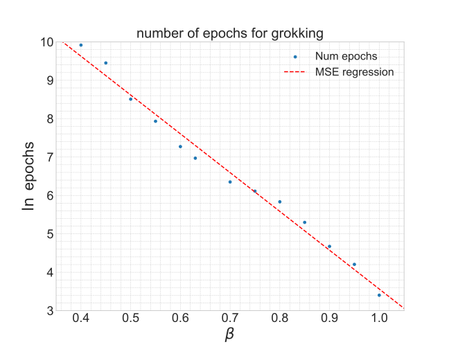
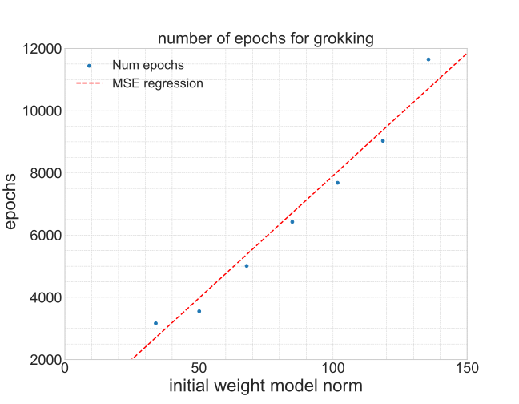

# Lopatin, Kozyrev & Pechen 2025 — Predator–Prey Model: Driven Hunt for Accelerated Grokking

См. также: [глобальный индекс понятий](../../concepts/index.md).

**I. A. Lopatin**, **S. V. Kozyrev** (Математический институт им. Стеклова РАН), **A. N. Pechen** (МИАН; Институт системного программирования им. Иванникова РАН).

arXiv [2509.10562](https://arxiv.org/abs/2509.10562), сентябрь 2025, 15 страниц, 9 рисунков. Всего цитирований по Semantic Scholar — 2, в картотеке — 1. Гроккинг здесь не объясняют, а лечат: приняв овражную картину из своих прежних работ (модель падает на дно узкого оврага — многообразия нулевого риска — и дальше диффундирует по дну как $\sqrt{t}$), авторы заводят второго агента-«хищника», который гонит «жертву» вдоль оврага, превращая диффузию в перенос («загонная охота»). На делении по модулю 97 (трансформер) и MNIST по рецепту Omnigrok заявлено ускорение в 20–100 раз по числу обращений к градиенту; попутно численно подтверждена экспоненциальная зависимость срока гроккинга от размера выборки и линейная — от начальной нормы весов, и приведён пример гроккинга без снижения нормы весов.

Файлы разбора этой статьи:

- [`2509.10562.predator-prey-model-driven-hunt-for-accelerated-grokking.claims.txt`](2509.10562.predator-prey-model-driven-hunt-for-accelerated-grokking.claims.txt) — пронумерованные утверждения статьи с пометками разбора.
- [`2509.10562.predator-prey-model-driven-hunt-for-accelerated-grokking.license.txt`](2509.10562.predator-prey-model-driven-hunt-for-accelerated-grokking.license.txt) — лицензионная запись arXiv для этой статьи.

Схема якорей и правила ссылок на карточку — в [README папки статей](../README.md).

**Карточка-выдержка.** Лицензия статьи (`arxiv-nonexclusive`) не разрешает публикацию копии оригинала и полного перевода, поэтому карточка содержит редакторские секции и цитируемые фрагменты перевода (право цитирования). Полный текст статьи: <https://arxiv.org/abs/2509.10562>.

## Затрагиваемые понятия

**[Гроккинг](../../concepts/grokking.md)** — редкая для корпуса роль: явление принято как данность, объяснение целиком заимствовано из собственных работ авторов [7, 8, 14], и задача поставлена инженерно — снять задержку. Заявленный итог: ускорение до ста раз по числу обращений к градиенту ([`p8-3`](#p8-3), [`fig-4`](#fig-4)). Числа стоит читать с оговорками разбора: единичные прогоны, для головного рисунка не приведены параметры взаимодействия, сравнения с существующими ускорителями гроккинга нет.

**[Ландшафт потерь](../../concepts/loss-landscape-basins.md)** — рабочая картина статьи: обучение с гроккингом есть оптимизация по овражному ландшафту; падение в овраг — запоминание, медленная диффузия по дну ($\sqrt{t}$ вместо $t$) — задержка генерализации, а окрестность обобщающего решения — область повышенной энтропии, откуда переход необратим ([`p2-1`](#p2-1)). Вся термодинамическая часть взята из [7, 8] и здесь не проверяется; согласование направления «хищник–жертва» с касательной к многообразию нулевого риска не измеряется.

**[Оптимизаторы](../../concepts/optimizer-adam-adamw-sgd.md)** — приём встроен внутрь Adam/AdamW: после обычного шага жертва получает добавку $\alpha P(d_{t})l_{t}$ с потенциалом $P(d)=Ae^{-d/\sigma}$, хищник — $\alpha\alpha_{p}l_{t}$ ([`p5-4`](#p5-4)); в варианте PP-conn у пары общее состояние моментов, и при выключенном градиенте хищника итерация не дороже базовой ([`p7-4`](#p7-4)). Разбор отмечает: PP-conn меняет от базовой линии три вещи сразу (связанный weight decay вместо отвязанного, отключённое сглаживание первого момента для ModuloOperation, снос), абляций нет.

**[Низкочастотная фильтрация градиента](../../concepts/gradient-low-pass-filtering.md)** — сосед по линии ускорителей гроккинга: как и Grokfast и NeuralGrok, приём вставляется между вычислением градиента и шагом, но источник поправки иной — внешний снос от второй копии вектора параметров, вычисляемый вовсе без градиента; добавочных обращений к градиенту нет. Ни Grokfast, ни NeuralGrok не процитированы, хотя Grokfast меряет ускорение на тех же двух задачах — главный изъян работы на уровне корпуса.

**[Доля данных](../../concepts/data-fraction-critical-dataset-size.md)** — численно подтверждено предсказание [7, 8]: срок гроккинга убывает экспоненциально с долей выборки, $T_{g}\sim Be^{-\beta/\eta}$ (сложение по модулю 139, по 3 прогона на точку) ([`p11-4`](#p11-4), [`fig-7`](#fig-7)). Для ускоренного режима PPM явной зависимости найти не удалось — овражная кинетика на него не переносится ([`p11-5`](#p11-5)).

**[Масштаб инициализации](../../concepts/initialization-scale.md)** — вторая ось того же численного исследования: срок гроккинга растёт линейно с начальной нормой весов ([`fig-7`](#fig-7)); базовые сроки $4\times 10^{3}$ и $8\times 10^{3}$ эпох сильно зависят от инициализации ([`p4-1`](#p4-1)). Гроккинг на MNIST наведён по рецепту Omnigrok — домножением весов после инициализации ([`p14-2`](#p14-2)).

**[Минимизация нормы весов](../../concepts/weight-norm-minimization.md)** — попутное оспаривающее наблюдение: «снижение весов не обязательно при гроккинге» — приведён прогон с гроккингом без уменьшения нормы ([`p12-1`](#p12-1), [`fig-8`](#fig-8)). Один прогон при $p=139$, $\beta=0{,}55$; вместе с наблюдением NeuralGrok о вредности weight decay он подтачивает норменное объяснение Omnigrok.

## Что показано, а что предположено

Замечания редактора карточки по итогам разбора утверждений (`…claims.txt`, 46 пунктов).

**Ускорение показано, механизм — принят на веру.** Единственное прямое свидетельство баллистического движения — графики «расстояние до начальной модели»: сопоставимый путь за заметно меньшее число шагов. Ни показатель роста пройденного пути ($\sqrt{t}$ против $t$), ни согласование направления «хищник–жертва» с направлением оврага не измеряются; термодинамическая история (энтропия, необратимость, второй закон) целиком заимствована из [7, 8, 14].

**Числа ускорения — единичные измерения.** Планок разброса и числа семян для рисунков 1–6 нет; усреднение по 3 прогонам заявлено только для рисунка 7. Для головного результата «около 100 раз» (рис. 4) значения $A,\sigma,\alpha_{p},N_{d}$ не приведены ни в подписи, ни в приложении. Ускорение отсчитывается от точки после запоминания, а сравнивается с полным сроком базовой линии.

**Три отличия от базовой линии одновременно.** PP-conn заменяет отвязанный weight decay AdamW связанным ($g\leftarrow g+\lambda p$), для ModuloOperation отключает сглаживание первого момента (use_m=False) и добавляет снос от хищника. Абляции нет, вклад собственно взаимодействия «хищник–жертва» не выделен. В установившемся режиме ($d_{t}\to d_{*}=\sigma\ln(A/\alpha_{p})$) жертва и хищник получают одинаковую добавку $\alpha\alpha_{p}l_{t}$ — приём вырождается в постоянный снос вдоль устойчивого направления, то есть в родственника овражного метода Гельфанда–Цетлина и метода Нестерова, на которые авторы ссылаются, но с которыми не сравниваются.

**Внутренние несостыковки.** Во введении зависимости раздела 5 названы «доказанными» (is proven), сам раздел 5 — численное исследование с подгонкой прямых по трём прогонам на точку. Текст раздела 4 говорит, что «градиент жертвы используется для вычисления градиента хищника», а строка 33 Алгоритма 2 присваивает $g^{p}\leftarrow 0$. Рисунок 6 подан как отдельный режим «для $A>\alpha_{p}$», хотя в подписи рисунка 2 уже задано $\alpha_{p}=2A/3$.

**Пропущенные соседи.** Grokfast (2405.20233) и NeuralGrok (2504.17243) не процитированы, при том что Grokfast меряет ускорение на тех же двух задачах (модульная арифметика и MNIST по рецепту Omnigrok). Бесспорное преимущество PPM перед обоими: добавочных обращений к градиенту нет вовсе, цена только по памяти. Общая с Grokfast непроверенная альтернатива: нет абляции против простого усиления момента.

**Как работу будут цитировать** («гроккинг ускоряется в сто раз моделью хищник–жертва») — точнее: на двух задачах, единичными прогонами, при неуказанных для головного рисунка параметрах взаимодействия и трёх одновременных отличиях от базовой линии число эпох до порога точности сокращается в 20–100 раз относительно одной настройки AdamW; сравнения с существующими ускорителями нет.

---

# Цитируемые фрагменты перевода

Ниже приведены только те фрагменты перевода, на которые ссылаются карточки корпуса (право цитирования). Нумерация якорей `pN-M` / `fig-N` / `sec-X` совпадает с полной карточкой и оригиналом.

## 1 Введение

###### p2-1

При оптимизации по овражному ландшафту с помощью процедуры стохастического градиентного спуска система быстро падает в овраг, а затем совершает случайные блуждания (броуновское движение) вдоль оврага. Такие случайные блуждания существенно медленнее по сравнению с градиентным спуском, поскольку пройденное расстояние пропорционально времени для градиентного спуска и квадратному корню из времени для броуновского движения. Таким образом, обучение застревает в овраге, что объясняет задержку генерализации при гроккинге. Падение в овраг соответствует фазе запоминания выборки при обучении, а гроккинг соответствует медленному движению вдоль оврага до достижения окрестности оптимального решения (то есть генерализации). При этом окрестность оптимального решения имеет повышенную энтропию, что влечёт необратимость перехода к генерализации при гроккинге в силу второго закона термодинамики [7, 8].

## 2 Исходные задачи с гроккингом и стандартный метод обучения

###### p4-1

Повторяя прогоны, мы находим, что число эпох оптимизатора до достижения фазы «генерализации» составляет около $4\times 10^{3}$ для ModuloOperation и $8\times 10^{3}$ для MNIST. На это число итераций сильно влияет начальная инициализация, в частности начальная норма весов модели. Поэтому модели с одной и той же архитектурой, но с разными методами инициализации могут демонстрировать существенно разные времена гроккинга.

## 3 Модель «хищник–жертва»

###### p5-4

Взаимодействие «хищник–жертва» направлено вдоль направления «хищник–жертва» (единичного вектора) $l_{t}$, хищник преследует жертву со скоростью $\alpha_{p}$, а жертва убегает со скоростью, определяемой как

###### p7-1

Результаты дообучения по Алгоритму 1 показаны на рис. 2. Эти графики показывают результаты обучения без вызова градиента для хищника. Иными словами, одна эпоха обучения на графиках рис. 2 содержит то же число вызовов градиента, что и одна эпоха на графиках рис. 1. Таким образом, мы видим, что Алгоритм 1 ускоряет процесс обучения в 20 раз для ModuloOperation и в 80 раз для MNIST по числу обращений к градиенту функции потерь.

## 4 Модель «хищник–жертва» со связанными моментами

###### p7-4

В этом разделе мы представляем модифицированную версию алгоритма PPM, демонстрирующую ещё более высокую эффективность. В этой модифицированной версии мы используем оптимизационный метод типа Adam, но вместо двух оптимизаторов, как в Алгоритме 1, используем один оптимизатор, и как хищник, так и жертва имеют доступ к его состоянию — градиент жертвы используется для вычисления градиента хищника. Этот подход сокращает число вызовов градиента вдвое по сравнению со случаем, когда градиенты вычисляются и для хищника, и для жертвы.

###### p8-3

Результаты обучения по Алгоритму 2 показаны на рис. 4. Поскольку градиент для хищника не вызывается, как для ModuloOperation, так и для MNIST мы получаем ускорение гроккинга примерно в 100 раз по числу итераций.

###### fig-4

*Рисунок 4: Обучение с PP-conn. В обоих случаях мы не вызываем градиент для хищника. Для задачи MNIST мы используем экспоненциальное скользящее среднее (EMA) для первого момента, для ModuloOperation — не используем. Величины на графиках те же, что на рис. 2.* **[p. 9]**

## 5 Зависимость времени гроккинга от размера выборки и начальной нормы весов

###### fig-7

*Рисунок 7: Зависимость времени гроккинга для сложения по модулю 139. Слева: (в логарифме числа эпох) от размера выборки $\beta$ — доли обучающих и тестовых данных относительно максимально возможной выборки. Показывает линейное убывание с $\beta$. Справа: от начальной нормы весов модели. Показывает линейный рост с нормой весов. Каждая точка получена усреднением по 3 прогонам.* **[p. 11]**

###### p11-4

Полученные зависимости показаны на рис. 7. Результаты показывают, что полученные значения хорошо приближаются прямыми. Таким образом, мы получаем экспоненциальный закон для времени, необходимого для достижения гроккинга (в итерациях): $T_{g}\sim Be^{-\frac{\beta}{\eta}}$, где $B$ и $\eta$ — некоторые коэффициенты. Для анализа зависимости времени гроккинга от начальной нормы весов модели мы используем умеренное усреднение по 3 прогонам на каждую точку, что уже демонстрирует хорошее линейное поведение, показанное на правом подграфике рис. 7.

###### p11-5

Для PPM с алгоритмом 2 нам не удалось найти явную зависимость числа итераций гроккинга от размера выборки.

## 6 Дополнительные режимы

###### p12-1

Интересно отметить, что снижение весов не обязательно при гроккинге. Пример такого поведения — эксперимент из раздела 5, где $p=139,\beta=0.55$, с результатами, показанными на рис. 8.

###### fig-8

*Рисунок 8: Пример обучения с гроккингом для задачи ModuloOperation без снижения нормы весов.* **[p. 12]**

## Приложение A.1 Постановка экспериментов

###### p14-2

Для MNIST обучался многослойный перцептрон с одним скрытым состоянием (число входов и выходов скрытого состояния было задано равным 200), а в качестве нелинейности между слоями взята функция ReLU. Использовалась стандартная равномерная инициализация. В Grokking4 для достижения эффекта гроккинга в этой задаче были предприняты следующие шаги, которые мы повторяем в нашей работе. 1) Вместо полной обучающей выборки из 60,000 изображений взята подвыборка из 1,000 изображений. 2) Вместо CrossEntropy, обычно используемой в классификации, в качестве функции потерь взято квадратичное отклонение MSE. 3) softmax не использовался на выходном слое для отображения в пространство вероятностей. 4) После инициализации веса модели дополнительно домножались на заданный коэффициент, чтобы увеличить норму весов исходной модели.
