# Han et al. 2025 — Flatness is Necessary, Neural Collapse is Not: Rethinking Generalization via Grokking

См. также: [глобальный индекс понятий](../../concepts/index.md).

**Ting Han, Linara Adilova, Henning Petzka, Jens Kleesiek, Michael Kamp** (TU Dortmund, Институт имени Ламарра, UK Essen, Ruhr University Bochum).

arXiv [2509.17738](https://arxiv.org/abs/2509.17738), 22 сентября 2025 (версия v3). 5 цитирований — тридцатая по цитируемости работа корпуса. Источник — нативный HTML arXiv версии v3.

Оригинал и производные файлы этой папки:

- [`original/2509.17738.native.html`](original/2509.17738.native.html) — первоисточник, нативный HTML arXiv (v3), скачан как есть.
- [`original/2509.17738.flatness-is-necessary-neural-collapse-is-not-rethinking-generalization-via-grokking.md`](original/2509.17738.flatness-is-necessary-neural-collapse-is-not-rethinking-generalization-via-grokking.md) — конверсия оригинала в Markdown без правок содержания.
- [`images/`](images/) — 20 иллюстраций статьи в исходном разрешении.

Схема якорей и правила ссылок на карточку — в [README папки статей](../README.md).

## Затрагиваемые понятия

**[Нейронный коллапс](../../concepts/neural-collapse.md)** — работа прямо оспаривает догадку, что NC необходим для генерализации ([`p2-1`](#p2-1)). Довод устроен как вмешательство: к перекрёстно-энтропийной потере добавляется слагаемое $-\lambda\cdot\mathrm{NCC}$, которое **раздвигает** классовые средние и увеличивает внутриклассовую дисперсию ([`p7-1`](#p7-1), [`p7-2`](#p7-2)). Сеть при этом обобщает так же, как без вмешательства: точность на обучении и проверке не меняется, а мера NCC после краткого падения неуклонно **растёт** ([`p7-3`](#p7-3), [`fig-2`](#fig-2)). Отдельно проверено, что мера NCC улавливает и вторую черту коллапса: под её штрафом попарные углы между скоплениями уходят от оптимального 10-симплекса ([`fig-3`](#fig-3)).

**[Ландшафт потерь и бассейны](../../concepts/loss-landscape-basins.md)** — центральная величина работы: **относительная плоскостность** Petzka et al. (2021), то есть след гессиана, взвешенный скалярными произведениями строк весовой матрицы ([`p5-6`](#p5-6), [`p5-7`](#p5-7)). Её достоинство перед классическими мерами резкости в инвариантности к понейронному перемасштабированию и ортогональным преобразованиям ([`p5-8`](#p5-8)), а вычислима она в больших сетях благодаря замкнутой границе Walter et al. (2024) для предпоследнего слоя при перекрёстно-энтропийной потере ([`p2-2`](#p2-2)).

**[Гроккинг](../../concepts/grokking.md)** — здесь он не предмет изучения, а **измерительный прибор**: раз генерализация наступает много позже запоминания ([`p1-3`](#p1-3)), два события разнесены во времени и видно, какая величина за какой следует ([`p6-1`](#p6-1)). Итог этого измерения — главный результат работы, заявленный уже в аннотации ([`p1-2`](#p1-2)): обе величины падают при наступлении генерализации, но NCC начинает убывать **уже в фазе запоминания**, тогда как относительная плоскостность остаётся высокой и падает резко ровно у начала генерализации ([`p6-2`](#p6-2), [`fig-1`](#fig-1)).

**[Фазовый переход](../../concepts/phase-transition.md)** — обратная сторона того же приёма: если плоскостность необходима, то, **запретив** её, можно вызвать отложенную генерализацию там, где её не бывает. Регуляризатор $-\lambda\cdot\kappa^{\phi}_{Tr}(\mathbf{w})$ загоняет сеть в резкие минимумы ([`p2-3`](#p2-3), [`p8-6`](#p8-6), [`p8-7`](#p8-7)); при его снятии на эпохе 200 (CIFAR-10) или 150 (ImageNet-100) точность на проверке резко идёт вверх ([`p9-1`](#p9-1), [`fig-4`](#fig-4)). Это гроккинг, вызванный по требованию, на ResNet, ViT и предобученных языковых моделях.

**[Запоминание](../../concepts/memorization-phase.md)** — работа делает на нём точное различение, полезное корпусу: коллапсовая сгруппированность представлений — свойство **запомнившей** сети, а не обобщающей ([`p6-2`](#p6-2)). Тем самым NCC оказывается ближе к точности на обучении, чем к признаку генерализации.

**[Меры прогресса](../../concepts/progress-measures.md)** — из двух соискателей на роль признака генерализации отсеивается один. Причём отсев ведётся не по силе связи (обе величины с генерализацией связаны), а по **времени наступления** и по отклику на вмешательство ([`p6-3`](#p6-3)). Это редкий в корпусе довод причинного вида: недостаточно спрашивать, следует ли величина за генерализацией, — надо спрашивать, вызывает ли она её.

**[Многообразие и сжатие представления](../../concepts/manifold-representation-compression.md)** — теоретический вклад: при классических допущениях о коллапсе относительная плоскостность ограничена сверху величиной, показательно убывающей по $\lambda$ — масштабу весов последнего слоя ([`p8-1`](#p8-1)). Отсюда прочтение всей картины: коллапс есть **один** геометрический путь к плоскости, а не её синоним ([`p7-4`](#p7-4)). Приложение уточняет это осторожнее самого утверждения: NCC инвариантен к перемасштабированию весов, а потому сам по себе плоскостности не влечёт — она возникает лишь потому, что обучение с перекрёстно-энтропийной потерей продолжает увеличивать $\lambda$ ([`p16-5`](#p16-5)).

**[Обобщающие границы](../../concepts/generalization-bounds.md)** — теория Petzka et al. работает не безусловно, и авторы это подчёркивают: нужны локально постоянные метки и **представительность** признаков ([`p5-9`](#p5-9), [`p10-2`](#p10-2)). Сеть, безупречно стянувшая обучающий набор и относящая тестовые объекты к неверным средним, обнаружит и коллапс, и плоскостность, но не обобщит ([`p5-9`](#p5-9)). Представительность измерена ядерной оценкой плотности и улучшается ровно с началом роста точности на проверке ([`p29-2`](#p29-2), [`p29-3`](#p29-3), [`fig-20`](#fig-20)).

**[Край устойчивости](../../concepts/edge-of-stability.md)** — работа встраивается в спор о резкости с ясной позицией: возражения к плоскостности (Andriushchenko et al., 2023) направлены на классические меры, чувствительные к перепараметризации, а не на относительную плоскостность ([`p10-1`](#p10-1)). При этом признаётся несимметричность: штраф за плоскостность надёжно откладывает генерализацию, а поощрение более плоских минимумов её существенно не улучшает ([`p10-4`](#p10-4)).

**[Регуляризация: варианты](../../concepts/regularization-variants.md)** — регуляризатор плоскостности сам по себе неустойчив, и приложение C разбирает почему: перекрёстно-энтропийная потеря снижает неопределённость предсказания, а регуляризатор действен лишь при высокой неопределённости, отчего множительное слагаемое $2USW$ разгоняет норму весов ([`p19-5`](#p19-5)). Удерживают обучение два костыля: нормирование представления предпоследнего слоя ($\|\phi\|=1$) и ограничение фробениусовой нормы весов ([`p20-8`](#p20-8)).

**[Настоящие данные](../../concepts/vision-real-world-data-mnist-cifar.md)** — охват опытов необычно широк для корпуса: ResNet-18 на CIFAR-10 ([`p16-6`](#p16-6), [`p16-7`](#p16-7)), ViT-tiny на ImageNet-100 ([`p24-2`](#p24-2)), TinyBERT и DistilGPT2 на SST-5 ([`p25-3`](#p25-3), [`tab-1`](#tab-1)). Именно это придаёт вес утверждению, что вызванная отложенная генерализация не есть особенность алгоритмических задач ([`p9-1`](#p9-1)).

**[Модульная арифметика](../../concepts/modular-arithmetic.md)** — исходное наблюдение сделано в обычной для корпуса постановке: двухслойный трансформер, AdamW со скоростью $10^{-4}$ и weight decay $1.0$, $10^{6}$ шагов, деление 50/50, усреднение по трём сидам ([`p6-2`](#p6-2)).

**[Оптимизатор](../../concepts/optimizer-adam-adamw-sgd.md)** — различие постановок стоит отметить: гроккинг наблюдается на AdamW в алгоритмической задаче ([`p6-2`](#p6-2)), а все вмешательства ведутся на SGD с моментом 0.9 и без weight decay ([`p16-7`](#p16-7), [`p24-2`](#p24-2)). Возврат к генерализации после снятия регуляризатора обеспечивается сменой режима оптимизации: скорость обучения возвращают к большому значению, включают косинусный отжиг и добавляют weight decay ([`p21-3`](#p21-3)).

Отдельно стоит сказать, чего в работе **нет**. Нет доказательства необходимости плоскостности — есть опытное свидетельство в четырёх постановках, и авторы аккуратно пишут «возможно, необходима» ([`p9-5`](#p9-5)). Нет и объяснения, отчего вызванная отложенная генерализация повторяет обычный гроккинг: сходство внешнее, и авторы прямо говорят, что мера этого сходства ещё не понята ([`p10-3`](#p10-3)).

Карточки статей корпуса: [Power et al. 2022](../2201.02177.grokking-generalization-beyond-overfitting-on-small-algorithmic-datasets/2201.02177.grokking-generalization-beyond-overfitting-on-small-algorithmic-datasets.card.md) — постановка, откуда взят гроккинг; [Omnigrok](../2210.01117.omnigrok-grokking-beyond-algorithmic-data/2210.01117.omnigrok-grokking-beyond-algorithmic-data.card.md) — норма весов как объяснение, здесь заменяемое плоскостностью; [Nanda et al. 2023](../2301.05217.progress-measures-for-grokking-via-mechanistic-interpretability/2301.05217.progress-measures-for-grokking-via-mechanistic-interpretability.card.md) — меры прогресса, названные в обзоре; [Merrill et al. 2023](../2303.11873.a-tale-of-two-circuits-grokking-as-competition-of-sparse-and-dense-subnetworks/2303.11873.a-tale-of-two-circuits-grokking-as-competition-of-sparse-and-dense-subnetworks.card.md) — разрежённые и плотные подсети из того же обзора; [Minegishi et al. 2025](../2310.19470.bridging-lottery-ticket-and-grokking-understanding-grokking-from-inner-structure-of-networks/2310.19470.bridging-lottery-ticket-and-grokking-understanding-grokking-from-inner-structure-of-networks.card.md) — «грокнувшие билеты», названные в обзоре как Gouki et al. (2023); [Kumar et al. 2023](../2310.06110.grokking-as-the-transition-from-lazy-to-rich-training-dynamics/2310.06110.grokking-as-the-transition-from-lazy-to-rich-training-dynamics.card.md) — переход от ленивого к богатому, на который опирается двухфазная картина.

## Что показано, а что предположено

Замечания редактора карточки по итогам разбора утверждений (`…claims.txt`). Работа опытная, с одним доказанным утверждением и двумя вмешательствами: одно снимает нейронный коллапс, другое — плоскостность.

**Замысел работы сильнее её отдельных результатов.** Гроккинг взят не как предмет, а как **разделитель во времени**: он разносит запоминание и генерализацию, отчего можно посмотреть, какая величина когда возникает ([`p6-1`](#p6-1)). Этого одного наблюдения хватает, чтобы понизить NCC в ранге: величина, убывающая уже при запоминании, не может служить признаком начала генерализации ([`p6-2`](#p6-2), [`fig-1`](#fig-1)).

**Отклонение необходимости NC показано вмешательством, и это правильный довод.** Штраф за сгруппированность гонит NCC вверх, а точность на проверке не страдает ([`p7-3`](#p7-3)). Оговорок две. Первая: вмешательство подавляет NCC — черту NC1 и отчасти NC2, — но полного набора четырёх условий Papyan et al. работа не измеряет ([`p4-4`](#p4-4)), хотя проверка углов ([`fig-3`](#fig-3)) частично это восполняет. Вторая: чувствительность к $\lambda$ узка — при $10^{-2}$ обучение рушится, при $10^{-4}$ и ниже регуляризатор бездействует, и лишь при $10^{-3}$ получается заявленная картина ([`p17-2`](#p17-2), [`p17-3`](#p17-3)).

**Самая неудобная для работы находка спрятана в приложении B.** При обычном пополнении данных (случайная обрезка и отражение) регуляризатор NCC **перестаёт** поднимать NCC при том же $\lambda=10^{-3}$ ([`p17-6`](#p17-6)). То есть «сеть обобщает без коллапса» получено в постановке без пополнения, где точность на проверке 78 %, тогда как с пополнением та же сеть даёт 94 % — и коллапс подавить не удаётся ([`p17-7`](#p17-7)). Из этого не следует, что вывод неверен, но заявка «NC не необходим» опирается на режим обучения, в котором настоящие модели не обучают.

**Необходимость плоскостности показана слабее, чем звучит.** Что показано: если плоскостность подавлять, генерализация откладывается и не достигает базового уровня — 60 % против 78 % на CIFAR-10 и 38 % против 43 % на ImageNet-100 ([`p9-2`](#p9-2)). Это отношение вида «нет плоскостности — нет полной генерализации» в четырёх постановках. Логической необходимости отсюда не следует, и сами авторы пишут «возможно, необходима» ([`p9-5`](#p9-5)); заголовок раздела «Относительная плоскостность необходима» ([`p8-6`](#p8-6)) звучит категоричнее собственного текста.

**Отключение регуляризатора меняет не одну переменную.** После снятия штрафа скорость обучения возвращают к $10^{-1}$, включают косинусный отжиг и добавляют weight decay $2\times 10^{-4}$ ([`p21-3`](#p21-3)). Восстановление точности приписывается возврату плоскостности, но одновременно меняются три настройки оптимизации, каждая из которых сама по себе связана с генерализацией. Сравнения с прогоном, где меняют только их и не трогают регуляризатор, в работе нет.

**Числа плоскостности приведены без разброса и разнятся на порядки.** $2209.94\to 1.91$ для CIFAR-10 и $22212.75\to 313.22$ для ImageNet-100 ([`p9-3`](#p9-3)) — это одно измерение на постановку, без полос. Тут же приложение сообщает, что усреднение по сидам **бессмысленно**, поскольку разные сиды уводят обучение в разные резкие минимумы ([`p21-2`](#p21-2)), — честное признание, но оно же лишает опыт статистики.

**Теорема доказывает не то, что говорит её пересказ.** Утверждение 5.3 ограничивает относительную плоскостность величиной, показательно убывающей по $\lambda$ ([`p8-1`](#p8-1)), а $\lambda$ — масштаб весов классификатора, а не мера коллапса. Приложение это проговаривает прямо: NCC инвариантен к перемасштабированию, сам по себе плоскостности не влечёт, и она возникает лишь оттого, что обучение по перекрёстной энтропии продолжает $\lambda$ увеличивать ([`p16-5`](#p16-5)). Значит, «коллапс ведёт к плоскостности» верно как «коллапс плюс дальнейшее обучение по перекрёстной энтропии ведут к плоскостности», и в основном тексте эта оговорка почти не видна ([`p7-4`](#p7-4)).

**Регуляризатор плоскостности удерживается искусственно.** Он борется с перекрёстно-энтропийной потерей по устройству: та снижает неопределённость, а он действен лишь при высокой ([`p19-5`](#p19-5)). Чтобы обучение не разошлось, вводятся нормирование $\|\phi\|=1$, ограничение фробениусовой нормы и температура $\tau=2$ в softmax ([`p20-8`](#p20-8)). Разбор ограничения весов показывает, насколько узок коридор: при WC = 20 всё устойчиво, при 100 плоскостность вчетверо выше, при 150 и 200 обучение рушится полностью ([`p22-4`](#p22-4)).

**Несогласованность в описании модели.** В разделе 6 сказано, что на CIFAR-10 обучается **ResNet-10** ([`p8-7`](#p8-7)), тогда как и приложение B, и приложение C говорят о ResNet-18 ([`p16-8`](#p16-8), [`p21-3`](#p21-3)). Судя по остальному тексту, это описка, но воспроизводящему стоит знать.

**Представительность — самая недооценённая часть.** Условие представительности признаков превращает плоскостность из совпадения в теоретически обоснованный признак ([`p5-9`](#p5-9)), и опыт показывает, что она улучшается ровно с началом роста точности на проверке ([`p29-3`](#p29-3)). Но измеряется она ядерной оценкой плотности с шириной ядра 1.0 и весом 0.02 на объект, выбранными **опытным путём** ([`p29-2`](#p29-2)), и приведена одним рисунком без разбора чувствительности к этим числам.

**Место в корпусе.** Работа делает то, чего в корпусе почти никто не делает: берёт две величины, обе связанные с генерализацией, и **разводит** их вмешательством в обе стороны. Итог — понижение нейронного коллапса до побочного следствия и повышение относительной плоскостности до соискателя на роль необходимого условия. Не менее ценен побочный вклад: показано, что отложенную генерализацию можно **вызвать** на ResNet, ViT и языковых моделях, то есть гроккинг не есть особенность малых алгоритмических задач. Цена — постановки без пополнения данных и без dropout, единичные измерения без разброса и признанная невозможность усреднять по сидам.

## Ошибочные цитирования

Замечания редактора карточки: места, где эта статья передаёт чужие результаты с ошибкой или без авторских оговорок. Сюда ведут ссылки «подробности» из разделов «Ошибочные пересказы и цитирования этой статьи» карточек процитированных работ.

###### mc-2407-12332
**Mohamadi et al. (2407.12332) — двухфазная динамика как готовое объяснение.** `"Recent work explains grokking through two-phase dynamics: an initial kernel regime focused on memorization, followed by feature learning that supports generalization (Mohamadi et al., 2023; Lyu et al., 2024; Kumar et al., 2024)"` — у Mohamadi доказаны [невозможность для ядровых методов](../2407.12332.why-do-you-grok-a-theoretical-analysis-of-grokking-modular-addition/2407.12332.why-do-you-grok-a-theoretical-analysis-of-grokking-modular-addition.card.md#p3-4) и [существование генерализующих решений с малой l∞-нормой](../2407.12332.why-do-you-grok-a-theoretical-analysis-of-grokking-modular-addition/2407.12332.why-do-you-grok-a-theoretical-analysis-of-grokking-modular-addition.card.md#p3-5), а сам стык фаз — то, что обучение действительно переходит от одного к другому, — показан только экспериментом. «Explains … through» подаёт связку как доказанную. Вдобавок цитируется workshop-версия «2023», а в библиографии статьи записи Mohamadi нет вовсе — висячая ссылка.

---

# Текст статьи

## Аннотация

###### p1-2

Нейронный коллапс, то есть возникновение высокосимметричных, сгруппированных по классам представлений, часто наблюдается в глубоких сетях, и его нередко считают отражением генерализации или её условием. Наряду с этим плоскостность ландшафта потерь связывалась с генерализацией и теоретически, и опытно. Однако причинная роль обоих явлений остаётся неясной: суть ли они предпосылки генерализации или всего лишь побочные следствия динамики обучения? Мы разделяем эти вопросы, пользуясь гроккингом — режимом обучения, в котором запоминание предшествует генерализации, что позволяет разнести генерализацию и динамику обучения во времени, — и находим, что, хотя и нейронный коллапс, и относительная плоскостность возникают вблизи начала генерализации, предсказывает её последовательно лишь плоскостность. Модели, которых побуждают к коллапсу, и модели, которым коллапсировать не дают, обобщают одинаково хорошо, тогда как модели, регуляризуемые прочь от плоских решений, обнаруживают отложенную генерализацию, схожую с гроккингом, — даже на архитектурах и наборах данных, где он обыкновенно не возникает. Более того, мы теоретически показываем, что при классических допущениях нейронный коллапс ведёт к относительной плоскостности, чем и объясняется их совместное появление в опыте. Наши результаты поддерживают взгляд, по которому относительная плоскостность есть, возможно, необходимое и более основополагающее свойство для генерализации, и показывают, как гроккинг может служить мощным средством выявления её геометрических оснований.111Реализация кода: https://github.com/TrustworthyMachineLearning-Lab/grokking_flatness.

## 1 Введение

###### p1-3

Переопараметризованные нейронные сети продолжают бросать вызов классической теории обучения. Несмотря на способность запоминать произвольные метки (Zhang et al., 2017), они часто хорошо обобщают на естественных данных, а иногда начинают обобщать лишь после полного запоминания — это явление известно как гроккинг (Power et al., 2022). Это видимое противоречие пробудило заново занимающий исследователей поиск геометрических признаков генерализации. Особенно приметны два соискателя: плоскостность ландшафта потерь (Keskar et al., 2017; Jiang et al., 2020; Petzka et al., **[p. 2]** 2021) и явление нейронного коллапса (NC) (Papyan et al., 2020; Mixon et al., 2022; Zhou et al., 2022). Оба обычно появляются поздно в обучении и часто связываются с хорошей генерализацией, однако их точные причинные роли остаются неясными.

###### p2-1

В этой статье мы оспариваем распространённую догадку, что NC необходим для генерализации (Mixon et al., 2022; Zhou et al., 2022; Súkeník et al., 2023; Zhu et al., 2021). Наш основной замысел — воспользоваться гроккингом как особым окном наблюдения: поскольку генерализация возникает лишь после долгого запоминания, он позволяет чисто разделить динамику обучения и генерализацию. Это даёт нам возможность спросить: связаны ли NC и плоскостность с генерализацией только совпадением или же они в неё вносят вклад?

###### p2-2

Мы измеряем оба явления в предпоследнем слое. Для плоскостности мы берём меру относительной плоскостности, предложенную Petzka et al. (2021), где рассматривается след гессиана, нормированный нормой весов, — величина, теоретически и опытно согласующаяся с генерализацией. Чтобы её можно было вычислить в больших современных нейронных сетях, мы применяем иную, замкнутую верхнюю границу, введённую (Walter et al., 2024) и верную для предпоследнего слоя при перекрёстно-энтропийной потере. Для NC мы измеряем поклассовую сгруппированность представлений предпоследнего слоя через эмпирические свойства дисперсии и средних, отслеживая её возникновение на протяжении обучения. В опытах с гроккингом мы находим, что плоскостность возникает вместе с генерализацией и никогда раньше. NC, напротив, появляется раньше, во время запоминания, откуда следует, что он может вести к генерализации, но для неё не необходим (ср. рис. 1).

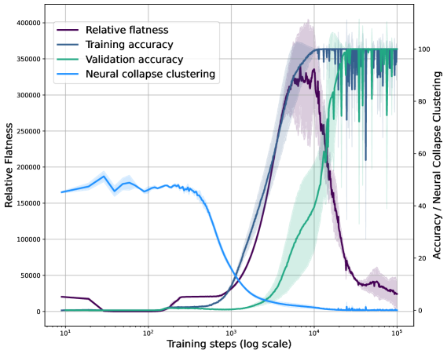

###### fig-1

*Рисунок 1: Сгруппированность нейронного коллапса и относительная плоскостность при гроккинге. Хотя обе величины связаны с генерализацией, нейронный коллапс возникает рано, при запоминании, тогда как плоскостность резко падает лишь с началом генерализации, что выделяет плоскостность как лучший указатель на начало генерализации.* **[p. 2]**

###### p2-3

Чтобы обособить их деятельные роли, мы возмущаем динамику обучения. Когда мы подавляем сгруппированность коллапсового вида, сети всё равно устойчиво обобщают: точность на тесте остаётся высокой, несмотря на высокие значения сгруппированности. Плоскостность при этом не затрагивается. Напротив, регуляризация против плоскостности, то есть поощрение резких решений, надёжно откладывает генерализацию и вызывает поведение вроде гроккинга даже там, где он обыкновенно не возникает: на ResNet с CIFAR-10, на ViT с ImageNet и на разных предобученных языковых моделях на SST-5. Эти находки указывают на плоскостность как на более основополагающую движущую силу генерализации. Чтобы объяснить частое совместное появление NC и плоскостности, мы приводим теоретический результат: при классических допущениях о NC коллапс *ведёт к* относительной плоскостности. Это сводит прежде наблюдавшиеся связи в единую геометрическую рамку, но и показывает, что плоскостность может возникать иными путями. Итак, NC есть достаточный, но не единственный путь к плоскостности. Наконец, мы возвращаемся к теоретической рамке Petzka et al. (2021), утверждающей, что генерализация требует не только плоскостности, но и *представительности*, то есть согласия выученных признаков с истинным распределением данных. Наши опыты эту зависимость подтверждают. Представительность, когда её приближают, улучшается только с наступлением генерализации, что подчёркивает: ни плоскостность, ни коллапс сами по себе не обеспечивают генерализации без осмысленного согласия признаков.

Вместе эти результаты выставляют NC в новом свете. Хотя он часто сопутствует генерализации, он не предпосылка. Скорее он может служить индуктивным смещением в сторону плоскостности при обычной динамике обучения. Относительная плоскостность, напротив, склонна быть опытно необходимой и теоретически обоснованной — особенно когда метки локально постоянны, а признаки представительны; эти допущения, по-видимому, выполняются в наших постановках опытов.

Наша работа даёт новое понимание геометрии генерализации:

**[p. 3]**

- Мы опытно показываем, что относительная плоскостность, но не нейронный коллапс, возможно, необходима для генерализации; - мы доказываем, что при классических допущениях нейронный коллапс ведёт к относительной плоскостности; - мы показываем, что поведение вроде гроккинга можно деятельно вызвать, управляя плоскостностью, даже на настоящих архитектурах.

Эти наблюдения оспаривают господствующие повествования о генерализации в глубоком обучении и предлагают новые рычаги для обучения, регуляризации и диагностики моделей.

## 2 Сопутствующие работы

Несмотря на существенный опытный успех, устройство, движущее генерализацией в глубоких нейронных сетях, изучено плохо. Возникли два выраженных геометрических взгляда — *нейронный коллапс* и *плоскостность поверхности потерь*: оба суть явления, опытно связанные с генерализацией, но их взаимное отношение и причинные роли остаются неопределёнными. В этой работе мы пользуемся свойствами гроккинга, чтобы разделить необходимость и достаточность и оценить, какое из этих явлений для генерализации требуется.

#### Нейронный коллапс и генерализация

*Нейронный коллапс* (NC) описывает геометрическое схождение при обучении классификатора, когда признаки предпоследнего слоя у объектов одного класса стягиваются к единому среднему, средние образуют симплексный равноугольный плотный фрейм, а веса классификатора выстраиваются соответственно (Papyan et al., 2020). Это явление широко наблюдалось на поздних стадиях обучения в переопараметризованных сетях (Han et al., 2022; Graf et al., 2021; Rangamani and Banburski-Fahey, 2022; Wu and Papyan, 2024; Zhou et al., 2025) и стало широко принятым указателем на генерализацию и устойчивость. При идеализированном допущении модели с несвязанными признаками, то есть модели, оптимизирующей признаки как свободные переменные, было показано, что NC есть глобально оптимальное решение для разных функций потерь (Mixon et al., 2022; Zhou et al., 2022; Súkeník et al., 2023; Zhu et al., 2021). Схожие результаты о совместимости нулевой ошибки на тесте и коллапса дисперсий (то есть лишь условия NC1) были показаны для сетей среднего поля (Wu and Mondelli, 2025). Прикладные работы пользовались свойствами NC ради качества на последующих задачах. Так, Wu et al. (2025) применяют потерю разделения признаков, основанную на NC, чтобы улучшить обнаружение данных вне распределения. Схоже Munn et al. (2024) показывают, что меньшая геометрическая сложность предобученных представлений способствует NC и ведёт к лучшей генерализации по нескольким примерам при переносе обучения. Galanti et al. (2022) теоретически и опытно показывают, что NC и есть причина, по которой перенос обучения работает лучше. Отсюда следует, что в некоторых режимах NC может быть *достаточен* для генерализации. Однако открытым остаётся вопрос: необходим ли NC вне моделей с несвязанными признаками? Например, NC — предмет спора в условиях несбалансированного обучения, где наблюдался коллапс меньшинства, то есть слияние средних у малочисленных классов, препятствующее классификации (Fang et al., 2021). В то же время NC можно вызвать, навязав его при обучении, даже на несбалансированных данных (Yang et al., 2022). Для глубоких линейных сетей теоретически показано, что глобальный оптимум обнаруживает NC, и даже больше: при несбалансированных данных средние при NC оказываются пропорциональны размеру класса (Dang et al., 2023). Hui et al. (2022) доводами отстаивают измерение NC на тестовом наборе для понимания свойств генерализации и показывают, что NC на тестовом наборе вредит качеству на родственных последующих задачах, то есть представления с сильным NC на тесте плохи для переноса обучения. Более того, Hong and Ling (2024) показывают, что достаточно высокое отношение сигнала к шуму есть необходимое условие связи NC с хорошей генерализацией, чем и объясняется, почему сильный NC может в противном случае совпадать с плохим качеством переноса.

###### p3-5

В целом существующие исследования говорят о том, что NC обычен, но для генерализации может не требоваться: сеть способна обобщать без NC, а некоторые постановки (вроде зашумлённых меток) способны разорвать связь между генерализацией и NC. Наша работа обращается к этому вопросу прямо, строя постановки, в которых модели обобщают, не обнаруживая NC, и тем показывая, что он не предпосылка генерализации.

#### Плоскостность и генерализация

Связь между плоскостностью поверхности потерь и генерализацией подозревали давно (Hochreiter and Schmidhuber, 1997), а в последнее время её поддержали опытные исследования, показавшие, что меры на основе плоскостности часто превосходят иные — основанные на норме, отступе или оптимизации (Jiang et al., 2020; Keskar et al., 2017). Однако классические меры плоскостности, обычно опирающиеся на гессиан потери по параметрам, **[p. 4]** заведомо чувствительны к перепараметризациям, оставляющим функцию и поведение генерализации без изменений (Dinh et al., 2017), и вычислительно дороги для больших современных моделей. Чтобы это разрешить, Petzka et al. (2021) ввели инвариантную к перепараметризации меру *относительной плоскостности*, основанную на теоретической рамке, связывающей плоскостность отдельного слоя с генерализацией при допущениях о представительности данных и локальном постоянстве меток. Такая постановка не только объясняет прежние опытные связи, но и даёт теоретически обоснованные условия, при которых плоскостность предсказывает генерализацию. Walter et al. (2024) сделали эту меру ещё удобнее, выведя замкнутые формулы вычисления для обычных постановок классификации. В нашей работе мы опытно убеждаемся, что относительная плоскостность падает ровно тогда, когда при гроккинге возникает генерализация. Более того, мы показываем, что содействие относительной плоскостности способно деятельно *вызвать* генерализацию даже в отсутствие NC. Тем самым мы подтверждаем и расширяем теоретическую рамку Petzka et al. (2021), отделяя плоскостность от NC.

#### Гроккинг как окно в генерализацию

*Гроккинг* означает внезапное возникновение генерализации много позже достижения безупречного качества на обучении, как впервые описали Power et al. (2022). Этот фазовый переход, часто вызываемый неявной или явной регуляризацией, даёт особую возможность обособить возможные причины возникновения генерализации. Недавние работы объясняют гроккинг двухфазной динамикой: сперва ядровый режим, сосредоточенный на запоминании, затем обучение признакам, поддерживающее генерализацию (Mohamadi et al., 2023; Lyu et al., 2024; Kumar et al., 2024). Аналитические исследования выявляют замкнутые решения гроккинга в задачах модульной арифметики (Gromov, 2023; Žunkovič and Ilievski, 2024), а механистические — обнаруживают разрежённые и плотные подсети, состязающиеся при обучении (Nanda et al., 2023; Gouki et al., 2023). Большинство этих исследований сосредоточены на неглубоких сетях или игрушечных задачах. Однако недавние работы показывают, что гроккинг возникает и в более глубоких архитектурах, и на настоящих наборах данных (Murty et al., 2023; Humayun et al., 2024), а значит, он важнее, чем казалось. Мы опираемся на это основание, применяя гроккинг как опытную линзу: отслеживая моменты появления плоскостности, NC и генерализации, мы можем различить, какие множители связаны причинно, а какие лишь совпадают.

## 3 Геометрические основания генерализации

В этой работе мы исследуем взаимодействие генерализации с двумя приметными явлениями современного глубокого обучения: *нейронным коллапсом* и *плоскостностью* поверхности потерь. Эти понятия часто наблюдаются вместе на поздних порах обучения, но их отдельные роли и причинные отношения изучены плохо. Наша цель — разделить их вклад в качество модели, пользуясь постановкой гроккинга, где запоминание предшествует генерализации, что позволяет наблюдать возникновение каждого явления по отдельности.

#### Генерализация

Основная цель машинного обучения — добиться, чтобы обученная модель не только хорошо работала на обучающих данных, но и обобщала на невиданные данные из того же распределения. Эта разница качества выражается через *разрыв генерализации*. Пусть $f:\mathcal{X}\rightarrow\mathcal{Y}$ — модель из класса моделей $\mathcal{F}$, обученная с дважды дифференцируемой функцией потерь $\ell:\mathcal{Y}\times\mathcal{Y}\rightarrow\mathbb{R}_{+}$ на конечном обучающем наборе $S\subseteq\mathcal{X}\times\mathcal{Y}$, взятом независимо и одинаково распределённо из распределения данных $\mathcal{D}$ над пространством входов $\mathcal{X}$ и пространством выходов $\mathcal{Y}$. Разрыв генерализации определяется как $\mathcal{E}_{\mathrm{gen}}(f,S):=\mathcal{E}(f)-\mathcal{E}_{\mathrm{emp}}(f,S),$ где $\mathcal{E}(f):=\mathbb{E}_{(x,y)\sim\mathcal{D}}\left[\ell(f(x),y)\right]$ — риск, а $\mathcal{E}_{\mathrm{emp}}(f,S):=\frac{1}{|S|}\sum_{(x,y)\in S}\ell(f(x),y)$ — эмпирический риск. Модель обобщает хорошо, когда $\mathcal{E}_{\mathrm{gen}}(f,S)$ мал, что указывает на близкое согласие качества на обучении и на тесте.

#### Нейронный коллапс и мера NCC

###### p4-4

*Нейронный коллапс* (NC) — геометрическое явление, отличающее поздние поры обучения глубоких классифицирующих сетей (Papyan et al., 2020; Mixon et al., 2022). Он проявляется как выстраивание выученных представлений, при котором: (1) внутри каждого класса признаки предпоследнего слоя стягиваются к классовому среднему; (2) сами классовые средние образуют симплексный равноугольный плотный фрейм — предельно разнесённую конфигурацию; (3) веса классификатора выстраиваются с этими классовыми средними; и (4) классификатор по сути становится моделью ближайшего соседа.

Это устройство было теоретически обосновано и опытно наблюдалось как на обучающих, так и на невиданных тестовых объектах, включая новые классы, — особенно при переносе обучения (Galanti et al., 2022). Чтобы измерить возникновение NC, мы берём упрощённую меру сгруппированности нейронного коллапса (NCC), предложенную Galanti et al. (2022): она улавливает существенные черты нейронного коллапса, то есть **[p. 5]** плотную внутриклассовую сгруппированность и сильное межклассовое разделение, не требуя всех четырёх формальных условий NC. Именно эту меру мы применяем во всём нашем разборе.

##### **Определение 3.1**(мера NCC)**.**

Пусть $\phi(x)$ обозначает представление входа $x$ в предпоследнем слое, а $D_{c}$ — набор обучающих объектов класса $c$. Тогда

$$
\mathrm{NCC}:=\sum_{c\neq c^{\prime}}\frac{V_{c}+V_{c^{\prime}}}{2\|\mu_{c}-\mu_{c^{\prime}}\|^{2}},
$$

где $\mu_{c}:=\frac{1}{|D_{c}|}\sum_{x\in D_{c}}\phi(x),V_{c}=\sum_{x\in D_{c}}\|\phi(x)-\mu_{c}\|^{2}$ — соответственно среднее и дисперсия представлений класса $c$.

Малое значение NCC указывает на плотную внутриклассовую сгруппированность и хорошо разделённые классовые средние, свойственные NC. В разделе 5 мы убеждаемся, что мера NCC связана с угловым разделением средних и тем самым улавливает все черты NC.

#### Относительная плоскостность

Плоскостность ландшафта потерь, понимаемая как нечувствительность обучающей потери к малым возмущениям в пространстве параметров, давно связывалась с исследованиями генерализации (Hochreiter and Schmidhuber, 1997; Keskar et al., 2017). Однако классические меры на основе гессиана или кривизны чувствительны к перепараметризациям, отчего в современных архитектурах на них нельзя полагаться. Чтобы это преодолеть, Petzka et al. (2021) ввели инвариантное к перепараметризации понятие *относительной плоскостности*, основанное на теории устойчивой генерализации при локально постоянных метках.

Рассмотрим модель, разлагаемую как $f(x,\mathbf{w})=g(\mathbf{w}\phi(x))$, где $\phi$ — закреплённое отображение признаков (например, предпоследний слой), $\mathbf{w}\in\mathbb{R}^{d\times m}$ — матрица весов, а $g$ — дважды дифференцируемая функция. Относительная плоскостность определяется через взвешенный следом гессиан вдоль направлений, натянутых на $\mathbf{w}$.

##### **Определение 3.2**(относительная плоскостность)**.**

###### p5-6

Пусть $g$, $\ell$ дважды дифференцируемы, а $S$ — набор объектов. Тогда:

$$
\kappa^{\phi}_{\mathrm{Tr}}(\mathbf{w}):=\sum_{s,s^{\prime}=1}^{d}\langle\mathbf{w}_{s},\mathbf{w}_{s^{\prime}}\rangle\cdot\mathrm{Tr}(H_{s,s^{\prime}}(\mathbf{w},\phi(S))),
$$

###### p5-7

где $\mathbf{w}_{s}$ обозначает $s$-ю строку $\mathbf{w}$, $\langle\cdot,\cdot\rangle$ — скалярное произведение, а $H_{s,s^{\prime}}(\mathbf{w},\phi(S))$ — гессиан эмпирической потери по $\mathbf{w}_{s}$ и $\mathbf{w}_{s^{\prime}}$, вычисленный на $\phi(S)$.

###### p5-8

Эта мера инвариантна к понейронному перемасштабированию и к сочетанию с ортогональными преобразованиями, отчего устойчива при разных параметризациях. При нестрогих допущениях — а именно, что обучающие данные представительны, а метки локально постоянны в пространстве признаков, — относительная плоскостность предсказывает генерализацию. Отметим, что малое значение $\kappa^{\phi}_{\mathrm{Tr}}(\mathbf{w})$ указывает на плоское решение и хорошую генерализацию. В разделе 5 мы далее показываем, что NC ведёт к малой относительной плоскостности, чем устанавливается теоретическая зависимость между двумя явлениями.

#### О роли представительности

###### p5-9

И нейронный коллапс, и относительная плоскостность предлагались как геометрические признаки генерализации. Однако ни одно из этих свойств не осмысленно само по себе: их предсказательная сила решающим образом зависит от отношения между обучающим и тестовым распределениями в пространстве признаков. В частности, если обучающие признаки не представительны для полного распределения данных, то и NC, и плоскостность могут возникнуть, не приводя к генерализации. Возьмём, например, сеть, безупречно стягивающую обучающий набор в поклассовую симплексную конфигурацию и относящую тестовые объекты к неверным средним скоплений. (На дискретных данных такую функцию сети построить легко.) Предсказание тогда провалится, несмотря на наличие коллапса. Это ограничение верно и для относительной плоскостности: плоская, но непредставительная модель не обобщает (ср. раздел 2, Petzka et al., 2021). Тогда как у NC строгого определения представительности нет, относительная плоскостность основана на формальной рамке, делающей нужные допущения явными. В частности, теория *$\varepsilon$-представительности* (Petzka et al., 2021) задаёт условие, при котором устойчивость в пространстве признаков становится необходимой для генерализации. При этом допущении относительная плоскостность служит верхней границей устойчивости признаков и даёт вычислимое средство диагностики генерализации. Такой взгляд поясняет, что наш разбор ведётся при допущении представительности признаков — допущении, опытно подкреплённом в наших постановках, как мы показываем в приложении D.

## 4 Нейронный коллапс и плоскостность при отложенной генерализации

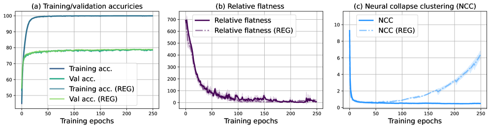

###### fig-2

*Рисунок 2: Итоги регуляризации сгруппированности нейронного коллапса на CIFAR-10. Для сравнения мы приводим динамику обучения и без регуляризации, и с ней (REG). Рост NCC не влияет ни на генерализацию, ни на относительную плоскостность, а значит, NC для генерализации не необходим. Рисунок (a) показывает точность на обучении и на проверке, ось y — точность. Рисунок (b) приводит значения относительной плоскостности при обучении, ось y — измерение относительной плоскостности. Рисунок (c) изображает развитие NCC, ось y — значение NCC.* **[p. 6]**

**[p. 6]**

###### p6-1

Гроккинг означает удивительное явление, при котором нейронная сеть, запомнив обучающий набор и продолжительное время вовсе не обобщая, внезапно начинает обобщать с высокой точностью — часто спустя десятки или сотни тысяч дополнительных шагов оптимизации (Power et al., 2022). Это разнесение запоминания и генерализации во времени даёт особую возможность разделить множители, лежащие в основе генерализации. В нашей постановке мы применяем гроккинг, или отложенную генерализацию, не как диковину, а как причинный зонд: как средство определить, какие геометрические свойства возникают одновременно с генерализацией по совпадению, а какие могут быть для неё деятельно необходимы.

###### p6-2

Сперва мы изучаем гроккинг на символьных алгоритмических задачах вроде модульной арифметики (например, $x+y\mod p$), где сети обучают предсказывать выход двуместных операций над отвлечёнными токенами. Эти задачи малы, полностью обозримы и требуют точной генерализации за пределы запомненных объектов, отчего служат безупречным испытательным полем. Мы следуем исходной постановке Power et al. (2022), обучая двухслойный трансформер оптимизатором AdamW со скоростью обучения $10^{-4}$ и weight decay $1.0$. Каждый опыт длится $10^{6}$ шагов при делении на обучение и проверку 50/50. Все результаты усреднены по трём сидам. Рисунок 1 показывает развитие точности на обучении и проверке, а также относительной плоскостности (опр. 3.2) и сгруппированности нейронного коллапса (опр. 3.1) на протяжении обучения. Мы наблюдаем, что обе меры резко убывают, когда сеть начинает обобщать, однако NCC убывает уже в фазе запоминания. Относительная плоскостность остаётся высокой в фазе запоминания и резко убывает вблизи точки, где начинается генерализация. Это совпадение по времени говорит о том, что и NCC, и относительная плоскостность связаны с генерализацией, но представления начинают вести себя коллапсово до того, как генерализация возникла.

###### p6-3

Однако совпадение по времени не есть причинность. Одновременное убывание NCC и плоскостности может отражать общую зависимость от генерализации или влияние скрытых множителей, а не причинное воздействие. Постановка гроккинга тем самым проясняет, что надо идти дальше: недостаточно спрашивать, следуют ли эти величины за генерализацией, — надо спрашивать, вызывают ли они её. В следующих разделах мы обращаемся к этому вопросу опытным путём. В разделе 5 мы показываем, что нейронные сети способны обобщать, не обнаруживая коллапса. В разделе 6 мы приводим опытные свидетельства того, что относительная плоскостность необходима для генерализации при нестрогих допущениях.

## 5 Нейронный коллапс не необходим

Нейронный коллапс (NC) часто наблюдается в моделях, хорошо обобщающих, отчего создаётся впечатление, будто он играет деятельную роль в генерализации. Однако связь не означает необходимости. В этом разделе мы показываем и опытно, и теоретически, что NC для генерализации не требуется. Коллапс может сопутствовать хорошей генерализации, но он не необходим: это один из путей, ведущих к плоскостности, а через плоскостность — к генерализации.

**[p. 7]**

###### p7-1

Чтобы это утверждение обосновать, мы прямо подавляем возникновение NC при обучении, не затрагивая генерализации. Мы обучаем ResNet-18 на CIFAR-10 с регуляризованной потерей вида:

$$
\mathcal{L}_{\text{NC\_REG}}=\mathcal{L}_{\text{CE}}-\lambda\cdot{\text{NCC}},
$$

###### p7-2

где $\mathcal{L}_{\text{CE}}$ — обычная перекрёстно-энтропийная потеря, а $NCC$ — мера сгруппированности NC (опр. 3.1). Слагаемое NCC штрафует плотную сгруппированность признаков предпоследнего слоя, сокращая расстояния между классовыми средними и увеличивая внутриклассовую дисперсию, и тем самым деятельно препятствует геометрическому устройству, свойственному NC. Настройки гиперпараметров обучения и дополнительные подробности опытов приведены в приложении B.

###### fig-3

*Рисунок 3: Попарные углы между скоплениями против оптимальных углов 10-симплекса. При регуляризации NCC углы отходят от оптимальной конфигурации, тогда как при обычном обучении остаются устойчивыми. «REG» означает применение регуляризатора NCC.* **[p. 7]**

###### p7-3

На рисунке 2 мы показываем, что генерализация может произойти без NC. Как видно на панели (a), регуляризатор не затрагивает ни точность на обучении, ни точность на проверке. Панель (b) показывает, что относительная плоскостность — наш заменитель генерализации — тоже остаётся устойчивой. Однако панель (c) обнаруживает, что NC действенно подавлен: после краткого падения мера NCC неуклонно растёт на протяжении обучения. Это даёт ясное свидетельство того, что генерализация может произойти при полном отсутствии NC и что коллапс не есть необходимое условие генерализации. На рисунке 3 мы убеждаемся, что мера NCC верно улавливает и углы между скоплениями. При нейронном коллапсе углы близки к оптимальному 10-симплексу, однако, когда мы регуляризуем мерой NCC, углы сильно отклоняются от этого оптимума.

###### p7-4

Отчего же нейронный коллапс часто сопутствует генерализации? Мы доказываем, что коллапс есть один геометрический путь к плоским решениям, которые связаны с генерализацией напрямее. В самом деле, при нестрогих допущениях NC в предпоследнем слое ведёт к относительной плоскостности222Сопутствующие работы часто опираются на упрощающие допущения, например об однослойном поведении или о послойном снятии (Mixon et al., 2022; Fang et al., 2021), тогда как наш разбор таких приближений не требует.. Это отношение выражено формально ниже.

Мы предполагаем, что для функции сети $f$ в пределе выполняется классический нейронный коллапс (Papyan et al., 2020). То есть следующие четыре условия применимы к нейронной сети $f(x)=\text{softmax}(w\phi(x)+b)$, где $\phi(x)$ — представление предпоследнего слоя.

##### **Допущения 5.1**(нейронный коллапс (Papyan et al., 2020))**.**

Пусть $\phi(x)$ обозначает представление признаков предпоследнего слоя для входа $x\in\mathcal{X}$, а для набора данных $D\subset\mathcal{X}$ пусть $D_{c}\subseteq D$ обозначает набор входов, принадлежащих классу $c\in\{1,\dots,k\}$. Тогда четыре условия нейронного коллапса суть

- Представления признаков стягиваются к классовым средним: $\phi(x)=\mu_{c}$ для всех $x\in D_{c}$. - Все классовые средние $\mu_{c}$ равноудалены от общего среднего $\mu_{g}$, то есть $\|\mu_{c}-\mu_{g}\|_{2}=M$, и образуют центрированный равноугольный плотный фрейм (ETF), так что $(\mu_{j}-\mu_{g})^{\top}(\mu_{c}-\mu_{g})=-\frac{M^{2}}{k-1}$ при $j\neq c$. - Веса классификатора выстраиваются с классовыми средними, то есть $w_{j}=\lambda(\mu_{j}-\mu_{g})$ для всех $j$ и некоторого $\lambda>0$. - $\text{argmax}_{j}w_{j}^{\top}h+b_{j}=\text{argmin}_{j}\|h-\mu_{j}\|$.

##### *Замечание 5.2**.*

Для доказательства утверждения 5.3 мы дополнительно предполагаем, что $\|\mu_{c}\|\leq M$ для каждого $c$. Отсюда следует, что центр ETF не расходится. Это нестрогое техническое условие сути допущений о нейронном коллапсе не меняет.

**[p. 8]**

##### **Утверждение 5.3****.**

###### p8-1

*Пусть $f(x)=\text{softmax}(w\phi(x)+b)$ — нейронная сеть с softmax на выходе, обученная с перекрёстно-энтропийной потерей, где $w\in\mathbb{R}^{k\times d}$ обозначает матрицу весов последнего слоя, классифицирующего на $k$ классов, а $\phi(x)$ — представление предпоследнего слоя. Предположим, что в пределе выполняется классический нейронный коллапс, как выше. Тогда относительная плоскостность $\kappa_{\phi}(w)$ ограничена:*

$$
\kappa_{\phi}(w)\leq\lambda^{2}k^{3}M^{4}\cdot\frac{e^{-\lambda M^{2}\cdot\frac{k}{k-1}}}{\left(1+(k-1)e^{-\lambda M^{2}\cdot\frac{k}{k-1}}\right)^{2}}
$$

*В частности, при достаточно большом $\lambda$ это даёт асимптотическую границу:*

$$
\kappa_{\phi}(w)\lesssim\lambda^{2}k^{3}M^{4}e^{-\lambda M^{2}\cdot\frac{k}{k-1}},
$$

*убывающую по $\lambda$ показательно.*

Доказательство приведено в приложении A. То, что относительная плоскостность в пределе и вправду убывает до нуля, следует из того, что условия нейронного коллапса не зависят от нормы весов, а тем самым и от величины скаляра $\lambda$. По мере продолжения обучения в пределе NC обучающую потерю можно снизить до нуля, увеличивая $\lambda$, поскольку вероятности softmax сходятся к $\hat{y}_{c}(x_{c})=1$ и $\hat{y}_{j}(x_{c})=0,j\neq c$ при $\lambda\rightarrow\infty$.

Взятые вместе, наши результаты показывают, что, хотя NC способен содействовать генерализации, вызывая плоскостность, он не предпосылка. Более основополагающей величиной остаётся плоскостность, а её значимость решающим образом зависит от представительности выученного пространства признаков. Остаётся исследовать, есть ли плоскостность достаточное условие и может ли она быть необходимым.

## 6 Относительная плоскостность необходима

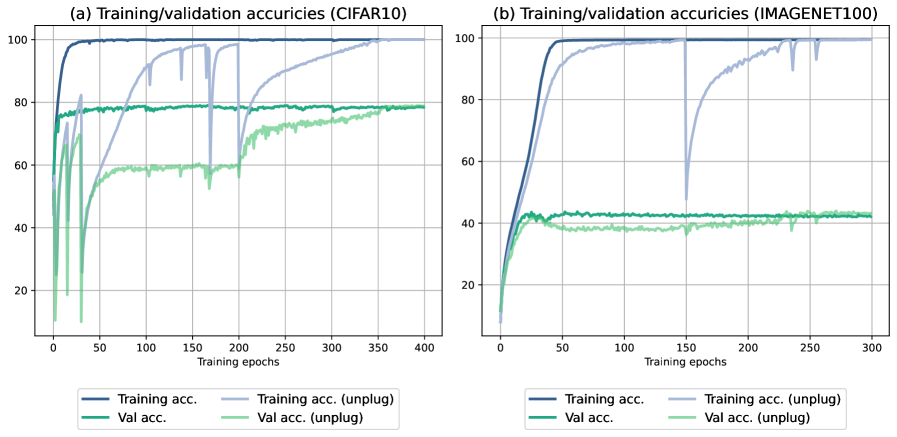

###### fig-4

*Рисунок 4: Итоги вызывания отложенной генерализации регуляризацией относительной плоскостности при обучении Resnet18 на CIFAR-10 и ViT на ImageNet-100. Для сравнения мы приводим динамику обучения и без регуляризации, и с отключением (unplug). Регуляризатор относительной плоскостности снимается на эпохе 200 в опыте с CIFAR-10 и на эпохе 150 для ImageNet-100. Отложенная генерализация наступает после снятия регуляризатора, на что указывает резкий рост точности на проверке. Рисунок (a) показывает точность на обучении и проверке для CIFAR-10, рисунок (b) — для ImageNet-100.* **[p. 8]**

###### p8-6

В этом разделе мы вызываем отложенную генерализацию, подобную наблюдаемой при гроккинге. Эти опыты показывают, что относительная плоскостность необходима для генерализации. Чтобы добиться такого поведения, мы строим функцию потерь, включающую следующее слагаемое регуляризации:

$$
\mathcal{L}_{\text{RF\_REG}}=\mathcal{L}_{\text{CE}}-\lambda\cdot{\kappa^{\phi}_{Tr}(\mathbf{w})},
$$

###### p8-7

где $\kappa^{\phi}_{Tr}(\mathbf{w})$ задано определением 3.2, а $\mathcal{L}_{\text{CE}}$ обозначает перекрёстно-энтропийную потерю. Чтобы вычислять относительную плоскостность на предпоследнем слое споро, мы берём замкнутый вывод при **[p. 9]** перекрёстно-энтропийной потере, данный Walter et al. (2024). Увеличивая относительную плоскостность, мы побуждаем сеть обследовать более резкие области ландшафта потерь вместо более плоских, что ведёт к неоптимальной генерализации. Множитель $\lambda$ управляет силой регуляризации. Мы обучаем ResNet-10 на CIFAR-10 и ViT (Dosovitskiy et al., 2021) на ImageNet-100333https://www.kaggle.com/datasets/ambityga/imagenet100/data, обе с нуля, чтобы оценить действенность вызывания отложенной генерализации в общих постановках регуляризацией относительной плоскостности. Итоги приведены на рисунке 4. Мы также донастраиваем TinyBERT (Jiao et al., 2020) и DistilGPT2 (Sanh et al., 2019) на SST-5, чтобы показать, что отложенную генерализацию можно вызвать регуляризацией относительной плоскостности и в предобученных языковых моделях. Стоит отметить, что удерживать обучение в резких минимумах при регуляризаторе относительной плоскостности непросто, поскольку перекрёстно-энтропийная потеря снижает неопределённость предсказания (в смысле энтропии softmax), тогда как регуляризатор действенно работает лишь при высокой неопределённости. Дополнительный разбор поведения и чувствительности регуляризатора, в особенности его противоречия с перекрёстно-энтропийной потерей, приведён в приложении C, где также даны постановки обучения и дополнительные подробности опытов.

###### p9-1

Из рисунка 4 (a) мы видим, что точность на проверке низка, но растёт после снятия регуляризатора относительной плоскостности на эпохе $200$. Схожее явление наблюдается и в итогах на ImageNet-100, приведённых на рисунке 4 (b), и в опытах по обработке языка из приложения C.4. Этому восстановлению способствует применение обычных приёмов регуляризации после отключения: они помогают модели выйти из резких минимумов и вернуть точность на проверке к уровню базовой. Успешное вызывание отложенной генерализации в этих задачах показывает, что явление это не присуще одним лишь алгоритмическим задачам, обучаемым с целью предсказания следующего токена. Подавляя относительную плоскостность, мы можем вызвать отложенную генерализацию в более общих задачах и постановках обучения.

###### p9-2

В частности, когда регуляризатор относительной плоскостности применяется на протяжении всего обучения, итоговая точность на проверке остаётся около $60\%$ на CIFAR-10, тогда как оптимальная точность на проверке достигает примерно $78\%$. Для ImageNet-100 устойчивая точность на проверке при регуляризации около $38\%$ против оптимальной около $43\%$. Подробный разбор предобученных языковых моделей на SST-5 приведён в приложении C.4. Этот разрыв в точности на проверке, вызванный отсутствием относительной плоскостности, говорит о том, что оптимальной генерализации таким образом достичь нельзя.

###### p9-3

Чтобы дополнительно подкрепить необходимость плоских решений для лучшей генерализации, мы вычисляем значения относительной плоскостности на эпохе прямо перед снятием регуляризатора и на последней эпохе обучения. Для CIFAR-10 на эпохе $199$ мера относительной плоскостности при регуляризации равна $2209.94$ и убывает до $1.91$ на последней эпохе. Для ImageNet-100 мера равна $22212.75$ на эпохе 149 и $313.22$ на последней эпохе. Схожие тенденции мы наблюдаем и на SST-5 с TinyBERT и DistilGPT2 (приложение C.4). Стало быть, меньший разрыв генерализации напрямую связан со значением относительной плоскостности.

В целом эти результаты дают сильное опытное свидетельство того, что *относительная плоскостность необходима для генерализации*, и наблюдается это последовательно во всех рассмотренных задачах.

## 7 Обсуждение и заключение

###### p9-5

Наши результаты выделяют относительную плоскостность как, возможно, необходимое условие генерализации в глубоких сетях, тогда как нейронный коллапс предстаёт связанной, но не существенной чертой поздней поры обучения. Это различение перестраивает наше понимание геометрии хорошо обобщающих решений и наводит на несколько важных размышлений. Наши опыты показывают, что нейронный коллапс склонен совпадать с высокой точностью на обучении, но за генерализацией следует ненадёжно. Отсюда следует, что он скорее побочное следствие динамики обучения, чем причинное устройство, — взгляд, согласный с находками Hui et al. (2022) и Hong and Ling (2024). Тем не менее мы теоретически показываем, что при нестрогих допущениях сгруппированность коллапсового вида ведёт к относительной плоскостности. В этом качестве коллапс всё же может служить рабочим заменителем плоских решений в некоторых постановках.

Хотя нейронный коллапс порождает высокосимметричные и сжатые представления признаков, эта простота устройства может быть неудобна при переносе обучения и в условиях данных вне распределения. Так, если сеть обучают классифицировать надкатегории, стягивая тонкие различия классов, то восстановить эти различия впоследствии становится невозможно, что ограничивает общность и толкуемость выученных признаков (Hui et al., 2022). Требование геометрического сжатия пространства **[p. 10]** представлений, частным случаем которого выступает нейронный коллапс, ставилось под сомнение и со стороны теоретико-информационного взгляда на динамику глубокого обучения (Adilova et al., 2023b).

###### p10-1

Сама плоскостность тоже подвергалась разбору — особенно в связи с минимизацией с учётом резкости (SAM) (Foret et al., 2021) и недавней критикой Andriushchenko et al. (2023). Однако многие такие возражения направлены на классические меры плоскостности, чувствительные к перепараметризации (Dinh et al., 2017), или на меры с неясной связью с геометрической плоскостностью (Andriushchenko and Flammarion, 2022). Наш разбор опирается на относительную плоскостность — инвариантную к перепараметризации меру с теоретическими гарантиями (Petzka et al., 2021; Walter et al., 2024). Хотя вопрос о том, как эти недавние возражения переносятся на относительную плоскостность, остаётся открытым, наши находки говорят о том, что она продолжает давать надёжный признак генерализации в рассматриваемых нами постановках. Одно из примечательных свойств относительной плоскостности в том, что теоретически она определена для одного заранее выбранного слоя, отчего её вычислимость не зависит от размера модели. Такая постановка позволяет также сравнивать её с нейронным коллапсом без идеализаций, поскольку тот схожим образом определён через свойства одного слоя, — и это повышает точность нашего разбора. В то же время возникает вопрос, как описывать вложения в других слоях, ведь прежние работы (Zhang et al., 2022; Adilova et al., 2024; Ansuini et al., 2019) показали, что разные представления и слои обнаруживают разные свойства, хотя относительная плоскостность, по-видимому, ведёт себя по слоям схоже (Walter et al., 2025).

###### p10-2

Теоретическая связь относительной плоскостности с генерализацией зависит от двух ключевых допущений: что метки локально постоянны и что признаки на выбранном слое вложений представительны для распределения данных. В наших постановках (обычная классификация изображений, задачи модульной арифметики и задачи обработки языка) оба допущения хорошо оправданы: (i) допущение о локально постоянных метках лежит в самой основе понятия состязательной устойчивости, а его опытная верность подкреплена нашими находками, и (ii) в приложении D мы показываем, что представительность улучшается с наступлением генерализации. Тем не менее эти допущения могут не выполняться в других областях — таких как структурное предсказание, регрессия при сильном шуме или сложные настоящие задачи, — где смысл меток может заметно меняться при малых изменениях входа.

###### p10-3

Один из самых неожиданных наших результатов состоит в том, что регуляризация сетей прочь от плоских минимумов последовательно вызывает отложенную генерализацию, повторяя гроккинг даже на настоящих наборах данных и архитектурах. Это подчёркивает деятельную важность относительной плоскостности, а не одну лишь её связь с генерализацией. Это открывает и новые направления управления динамикой обучения через геометрическую регуляризацию. Однако насколько эти искусственно вызванные фазы гроккинга отражают устройство обычного гроккинга, ещё предстоит понять.

###### p10-4

Наконец, хотя штраф за относительную плоскостность надёжно откладывает генерализацию, поощрение более плоских минимумов её существенно не улучшает (Adilova et al., 2023a). Даже SAM, улучшающий итоги обучения в задачах зрения, на удивление на деле поощряет не одни лишь более плоские минимумы (Andriushchenko and Flammarion, 2022). Эта несимметричность поддерживает давний взгляд, по которому стохастический градиентный спуск (SGD) и без того смещён в сторону плоских минимумов (Hochreiter and Schmidhuber, 1997; Keskar et al., 2017), а относительная плоскостность способна служить действеннее как средство диагностики и толкования, нежели как всеобщая цель оптимизации.

Хотя наши находки устойчивы по наборам данных и архитектурам, наши выводы неизбежно ограничены в охвате. Мы сосредоточены исключительно на классифицирующих сетях и порождающих языковых моделях, обучаемых обычными целями и оптимизаторами; переносятся ли наши результаты на контрастное предобучение или на большие языковые модели, остаётся открытым вопросом.

Мы оспариваем допущение, что нейронный коллапс существен для генерализации. Через гроккинг и направленную регуляризацию мы обособляем плоскостность как необходимый множитель. Наши теоретические и опытные результаты совместно устанавливают плоскостность как геометрическую движущую силу генерализации.

## Благодарности

Это исследование поддержано Федеральным министерством образования и науки Германии и землёй Северный Рейн — Вестфалия в рамках Института машинного обучения и искусственного интеллекта имени Ламарра, а также получило поддержку Кёльн-Эссенского центра онкологических исследований (CCCE).

## Литература

**[p. 11]**

- FAM: relative flatness aware minimization. In Topological, Algebraic and Geometric Learning Workshops, Cited by: §7.

- Layer-wise linear mode connectivity. In International Conference on Learning Representations, Cited by: §7.

- Information plane analysis for dropout neural networks. In International Conference on Learning Representations, Cited by: §7.

- A modern look at the relationship between sharpness and generalization. In International Conference on Machine Learning, Cited by: §7.

- Towards understanding sharpness-aware minimization. In International conference on machine learning, Cited by: §7, §7.

- Intrinsic dimension of data representations in deep neural networks. In Advances in Neural Information Processing Systems, Cited by: §7.

- Neural collapse in deep linear networks: from balanced to imbalanced data. In International Conference on Machine Learning, Cited by: §2.

- Sharp minima can generalize for deep nets. In International Conference on Machine Learning, Cited by: §2, §7.

- An image is worth 16x16 words: transformers for image recognition at scale. In International Conference on Learning Representations, Cited by: §6.

- Exploring deep neural networks via layer-peeled model: minority collapse in imbalanced training. Proceedings of the National Academy of Sciences 118 (43). Cited by: §2, footnote 2.

- Sharpness-aware minimization for efficiently improving generalization. In International Conference on Learning Representations, Cited by: §7.

- On the role of neural collapse in transfer learning. In International Conference on Learning Representations, Cited by: §2, §3.

- Grokking tickets: lottery tickets accelerate grokking. CoRR. Cited by: §2.

- Dissecting supervised contrastive learning. In International Conference on Machine Learning, Cited by: §2.

- Grokking modular arithmetic. arXiv preprint arXiv:2301.02679. Cited by: §2.

- Neural collapse under mse loss: proximity to and dynamics on the central path. In International Conference on Learning Representations, Cited by: §2.

- Flat minima. Neural computation 9 (1). Cited by: §2, §3, §7.

- Neural collapse for unconstrained feature model under cross-entropy loss with imbalanced data. Journal of Machine Learning Research 25 (192). Cited by: §2, §7.

- Limitations of neural collapse for understanding generalization in deep learning. arXiv preprint arXiv:2202.08384. Cited by: §2, §7, §7.

**[p. 12]**

- Deep networks always grok and here is why. In High-dimensional Learning Dynamics Workshop: The Emergence of Structure and Reasoning, Cited by: §2.

- Fantastic generalization measures and where to find them. In International Conference on Learning Representations, Cited by: §1, §2.

- Tinybert: distilling bert for natural language understanding. In Findings of the Association for Computational Linguistics: Empirical Methods in Natural Language Processing, Cited by: §C.4, §6.

- On large-batch training for deep learning: generalization gap and sharp minima. In International Conference on Learning Representatiosn, Cited by: §1, §2, §3, §7.

- Grokking as the transition from lazy to rich training dynamics. In International Conference on Learning Representations, Cited by: §2.

- Dichotomy of early and late phase implicit biases can provably induce grokking. In International Conference on Learning Representations, Cited by: §2.

- Neural collapse with unconstrained features. Sampling Theory, Signal Processing, and Data Analysis 20, pp. 11. Cited by: §1, §1, §2, §3, footnote 2.

- Grokking modular arithmetic can be explained by margin maximization. In NeurIPS 2023 Workshop on Mathematics of Modern Machine Learning, Cited by: §2.

- The impact of geometric complexity on neural collapse in transfer learning. In Advances in Neural Information Processing Systems, Cited by: §2.

- Grokking of hierarchical structure in vanilla transformers. In Annual Meeting of the Association for Computational Linguistics, Cited by: §2.

- Progress measures for grokking via mechanistic interpretability. In International Conference on Learning Representations, Cited by: §2.

- Prevalence of neural collapse during the terminal phase of deep learning training. Proceedings of the National Academy of Sciences 117 (40). Cited by: Assumptions A.3, §1, §2, §3, Assumptions 5.1, §5.

- Relative flatness and generalization. In Advances in neural information processing systems, Cited by: Appendix D, §1, §1, §1, §2, §3, §3, §7.

- Grokking: generalization beyond overfitting on small algorithmic datasets. arXiv preprint arXiv:2201.02177. Cited by: §1, §2, §4, §4.

- Neural collapse in deep homogeneous classifiers and the role of weight decay. In International Conference on Acoustics, Speech and Signal Processing, Cited by: §2.

- DistilBERT, a distilled version of bert: smaller, faster, cheaper and lighter. arXiv preprint arXiv:1910.01108. Cited by: §C.4, §6.

- Deep neural collapse is provably optimal for the deep unconstrained features model. In Advances in Neural Information Processing Systems, Cited by: §1, §2.

**[p. 13]**

- The uncanny valley: exploring adversarial robustness from a flatness perspective. arXiv preprint arXiv:2405.16918. Cited by: Appendix A, §C.1, §1, §2, §6, §7.

- When flatness does (not) guarantee adversarial robustness. arXiv preprint arXiv:2510.14231. Cited by: §7.

- Neural collapse beyond the unconstrainted features model: landscape, dynamics, and generalization in the mean-field regime. In International Conference on Machine Learning, Cited by: §2.

- Linguistic collapse: neural collapse in (large) language models. In Advances in Neural Information Processing Systems, Cited by: §2.

- Pursuing feature separation based on neural collapse for out-of-distribution detection. In International Conference on Learning Representations, Cited by: §2.

- Inducing neural collapse in imbalanced learning: do we really need a learnable classifier at the end of deep neural network?. In Advances in neural information processing systems, Cited by: §2.

- Understanding deep learning requires rethinking generalization. In International Conference on Learning Representations, Cited by: §1.

- Are all layers created equal?. Journal of Machine Learning Research 23 (67). Cited by: §7.

- Are all layers created equal: a neural collapse perspective. In The Second Conference on Parsimony and Learning, Cited by: §2.

- Are all losses created equal: a neural collapse perspective. In Advances in Neural Information Processing Systems, Cited by: §1, §1, §2.

- A geometric analysis of neural collapse with unconstrained features. In Advances in Neural Information Processing Systems, Cited by: §1, §2.

- Grokking phase transitions in learning local rules with gradient descent. Journal of Machine Learning Research 25 (199). Cited by: §2.

**[p. 14]**

## Приложение A Доказательство утверждения 5.3

Сперва мы приводим техническую лемму, устанавливающую, что при нейронном коллапсе совокупный вклад свободного члена и проекции классового среднего на общее среднее одинаков по классам. Отсюда следует, что логиты по сути управляются одним лишь геометрическим устройством классовых средних относительно друг друга.

##### **Лемма A.1****.**

*Предположим, что в пределе выполняются условия нейронного коллапса $(NC1)-(NC4)$, как в разделе 5 (см. также ниже). Тогда существует постоянная $d$ такая, что $\lambda(\mu_{j}-\mu_{g})^{\top}\mu_{g}+b_{j}=d$ для всех $j$.*

##### Доказательство.

Для всех $h$ выполняется следующий набор равенств:

$$
\text{argmax}_{j}\ \lambda(\mu_{j}-\mu_{g})^{\top}h+b_{j} \stackrel{{\scriptstyle(NC3)}}{{=}}\text{argmax}_{j}\ w_{j}^{\top}h+b_{j} \\
\stackrel{{\scriptstyle(NC4)}}{{=}}\text{argmin}_{j}\ \|h-\mu_{j}\| \\
=\text{argmin}_{j}\ \|(h-\mu_{g})-(\mu_{j}-\mu_{g})\|^{2} \\
=\text{argmin}_{j}\ \|h-\mu_{g}\|^{2}+\|\mu_{j}-\mu_{g}\|^{2}-2(h-\mu_{g})^{\top}(\mu_{j}-\mu_{g}) \\
\stackrel{{\scriptstyle(NC2)}}{{=}}\text{argmin}_{j}\ \|h-\mu_{g}\|^{2}+M^{2}-2(h-\mu_{g})^{\top}(\mu_{j}-\mu_{g}) \\
=\text{argmax}_{j}\ 2(\mu_{j}-\mu_{g})^{\top}(h-\mu_{g})-\|h-\mu_{g}\|^{2}.
$$

Пусть $\epsilon>0$ — вещественное число и $c\in\{1,\ldots,k\}$. Поскольку приведённые равенства выполняются для всех $h$, они выполняются, в частности, для всех $h(c,\epsilon)=\frac{\epsilon}{M}(\mu_{c}-\mu_{g})+\mu_{g}$. Отметим, что $\|h(c,\epsilon)-\mu_{g}\|^{2}=\epsilon^{2}$.

Подставляя $h(c,\epsilon)$ вместо $h$ в приведённое равенство и полагая $d_{j}=\lambda(\mu_{j}-\mu_{g})^{\top}\mu_{g}+b_{j}$, получаем, что

$$
\text{argmax}_{j}\ \frac{\lambda\epsilon}{M}(\mu_{j}-\mu_{g})^{\top}(\mu_{c}-\mu_{g})+d_{j} =\text{argmax}_{j}\ \frac{2\epsilon}{M}(\mu_{j}-\mu_{g})^{\top}(\mu_{c}-\mu_{g})-\epsilon^{2} \\
=\text{argmax}_{j}\ (\mu_{j}-\mu_{g})^{\top}(\mu_{c}-\mu_{g}) \\
\stackrel{{\scriptstyle(NC2)}}{{=}}c
$$

Отсюда следует, что

$$
\frac{\lambda\epsilon}{M}(\mu_{c}-\mu_{g})^{\top}(\mu_{c}-\mu_{g})+d_{c} \geq\frac{\lambda\epsilon}{M}(\mu_{j}-\mu_{g})^{\top}(\mu_{c}-\mu_{g})+d_{j},\ j\neq c
$$

Пользуясь $(NC2)$, получаем, что

$$
\frac{\lambda\epsilon Mk}{k-1}+d_{c} \geq d_{j},\ j\neq c
$$

Но поскольку $\epsilon>0$ было произвольным, мы можем устремить $\epsilon\rightarrow 0$ и получить, что $d_{c}\geq d_{j}$ для всех $j\neq c$. Наконец, и $c$ выбиралось произвольно, откуда следует, что $d_{j}=d_{c}$ для всех $j,c$. Стало быть, $d_{j}=\lambda(\mu_{j}-\mu_{g})^{\top}\mu_{g}+b_{j}$ постоянно по $j$. ∎

Теперь мы приводим вторую техническую лемму, показывающую, что относительная плоскостность ограничена сверху упрощённым выражением $\|w\|^{2}\mathrm{Tr}(H(w))$, для которого у нас есть замкнутая запись через логиты.

##### **Лемма A.2****.**

*Пусть $H(w)$ — гессиан по весам предпоследнего слоя $w\in\mathbb{R}^{d\times m}$ в минимуме, а $\kappa_{\phi}(w)$ — мера относительной плоскостности. Тогда*

$$
\kappa_{\phi}(w)\leq\|w\|^{2}\mathrm{Tr}(H(w))\kern 5.0pt.
$$

##### Доказательство.

Напомним, что

$$
\kappa_{\phi}(w)=\sum_{s,s^{\prime}}\langle w_{s},w_{s^{\prime}}\rangle\mathrm{Tr}(H_{s,s^{\prime}})\leq\sum_{s,s^{\prime}}\left|\langle w_{s},w_{s^{\prime}}\rangle\mathrm{Tr}(H_{s,s^{\prime}})\right|\leq\sum_{s,s^{\prime}}\|w_{s}\|\|w_{s^{\prime}}\|\left|\mathrm{Tr}(H_{s,s^{\prime}})\right|\kern 5.0pt.
$$

**[p. 15]**

Поскольку $w$ находится в минимуме, $H$ неотрицательно определён, а потому и $(\mathrm{Tr}(H_{s,s^{\prime}}))_{s,s^{\prime}}$ неотрицательно определена. Тогда выполняется

$$
\left|\mathrm{Tr}(H_{s,s^{\prime}})\right|\leq\sqrt{\mathrm{Tr}(H_{s,s})\mathrm{Tr}(H_{s^{\prime},s^{\prime}})}\kern 5.0pt.
$$

Суммируя по всем $s,s^{\prime}$ и пользуясь неравенством Коши — Буняковского, получаем

$$
\sum_{s,s^{\prime}}\|w_{s}\|\|w_{s^{\prime}}\|\sqrt{\mathrm{Tr}(H_{s,s})\mathrm{Tr}(H_{s^{\prime},s^{\prime}})}\leq\left(\sum_{s}\|w_{s}\|\sqrt{\mathrm{Tr}(H_{s,s})}\right)^{2}\kern 5.0pt,
$$

а пользуясь симметрией, получаем

$$
\kappa_{\phi}(w)\leq\|w\|^{2}\left(\sqrt{\mathrm{Tr}(H(w))}\right)^{2}=\|w\|^{2}\mathrm{Tr}(H(w))\kern 5.0pt.
$$

∎

С этим мы можем доказать теорему, которую для удобства повторяем вместе с условиями нейронного коллапса.

##### **Допущения A.3**(нейронный коллапс [Papyan et al., 2020])**.**

Пусть $\phi(x)$ обозначает представление признаков предпоследнего слоя для входа $x\in\mathcal{X}$, а для набора данных $D\subset\mathcal{X}$ пусть $D_{c}\subseteq D$ обозначает набор входов, принадлежащих классу $c\in\{1,\dots,k\}$. Тогда четыре условия нейронного коллапса суть

- Представления признаков стягиваются к классовым средним: $\phi(x)=\mu_{c}$ для всех $x\in D_{c}$. - Все классовые средние $\mu_{c}$ равноудалены от общего среднего $\mu_{g}$, то есть $\|\mu_{c}-\mu_{g}\|_{2}=M$, и образуют центрированный равноугольный плотный фрейм (ETF), так что $(\mu_{j}-\mu_{g})^{\top}(\mu_{c}-\mu_{g})=-\frac{M^{2}}{k-1}$ при $j\neq c$. Дополнительно мы предполагаем, что $\|\mu_{c}\|\leq M$ для каждого $c$. То есть мы предполагаем, что центр ETF не расходится, беря для простоты ту же постоянную $M$. - Веса классификатора выстраиваются с классовыми средними, то есть $w_{j}=\lambda(\mu_{j}-\mu_{g})$ для всех $j$ и некоторого $\lambda>0$. - $\text{argmax}_{j}w_{j}^{\top}h+b_{j}=\text{argmin}_{j}\|h-\mu_{j}\|$.

##### **Утверждение A.4****.**

*Пусть $f(x)=\text{softmax}(w\phi(x)+b)$ — нейронная сеть с softmax на выходе, обученная с перекрёстно-энтропийной потерей, где $w\in\mathbb{R}^{k\times d}$ обозначает матрицу весов последнего слоя, классифицирующего на $k$ классов, а $\phi(x)$ — представление предпоследнего слоя. Предположим, что в пределе выполняется классический нейронный коллапс, как выше. Тогда относительная плоскостность $\kappa_{\phi}(w)$ ограничена:*

$$
\kappa_{\phi}(w)\leq\lambda^{2}k^{3}M^{4}\cdot\frac{e^{-\lambda M^{2}\cdot\frac{k}{k-1}}}{\left(1+(k-1)e^{-\lambda M^{2}\cdot\frac{k}{k-1}}\right)^{2}}
$$

*В частности, при достаточно большом $\lambda$ это даёт асимптотическую границу:*

$$
\kappa_{\phi}(w)\lesssim\lambda^{2}k^{3}M^{4}e^{-\lambda M^{2}\cdot\frac{k}{k-1}},
$$

*убывающую по $\lambda$ показательно.*

##### Доказательство.

Лемма A.1 показывает, что условия NC влекут существование постоянной $d$ такой, что $b_{j}+\lambda(\mu_{j}-\mu_{g})^{\top}\mu_{g}=d$ для всех меток классов $j=1,\ldots,k$. Для $x_{c}\in D_{c}$ логиты $f$ суть

$$
\begin{split}w_{j}^{\top}\phi(x_{c})+b_{j}=&\lambda(\mu_{j}-\mu_{g})^{\top}\mu_{c}+b_{j}\\
=&\lambda(\mu_{j}-\mu_{g})^{\top}(\mu_{c}-\mu_{g})+\underbrace{\lambda(\mu_{j}-\mu_{g})^{\top}\mu_{g}+b_{j}}_{=d}=\lambda(\mu_{j}-\mu_{g})^{\top}(\mu_{c}-\mu_{g})+d\kern 5.0pt,\end{split}
$$

а вероятности softmax становятся:

$$
\hat{y}_{c}(x_{c})=\frac{1}{1+(k-1)e^{-\lambda\delta}},\quad\hat{y}_{j}(x_{c})=\frac{e^{-\lambda\delta}}{1+(k-1)e^{-\lambda\delta}},\quad j\neq c,
$$

с отступом

$$
\delta:=M^{2}-\left(-\frac{M^{2}}{k-1}\right)=M^{2}\cdot\frac{k}{k-1}.
$$

След гессиана для входа $x_{c}\in D_{c}$ есть (ср. Walter et al. [2024]):

$$
\mathrm{Tr}(H(x_{c},w)) =\sum_{j=1}^{k}\hat{y}_{j}(x_{c})(1-\hat{y}_{j}(x_{c}))\cdot\|\phi(x_{c})\|^{2}=M^{2}\cdot\sum_{j=1}^{k}\hat{y}_{j}(x_{c})(1-\hat{y}_{j}(x_{c})). \\
=M^{2}\frac{(k-1)e^{-\lambda\delta}\cdot(2+(k-2)e^{-\lambda\delta})}{(1+(k-1)e^{-\lambda\delta})^{2}}.
$$

Стало быть,

$$
\mathrm{Tr}(H(w))\leq M^{2}\cdot\frac{(k-1)ke^{-\lambda\delta}}{(1+(k-1)e^{-\lambda\delta})^{2}}.
$$

Поскольку $\|w\|^{2}=\lambda^{2}\sum_{j}\|\mu_{j}-\mu_{g}\|^{2}=\lambda^{2}kM^{2}$, из леммы A.2 мы получаем:

$$
\kappa_{\phi}(w)\leq\lambda^{2}kM^{2}\cdot M^{2}\cdot\frac{(k-1)ke^{-\lambda\delta}}{(1+(k-1)e^{-\lambda\delta})^{2}}\leq\lambda^{2}k^{3}M^{4}\cdot\frac{e^{-\lambda M^{2}\cdot\frac{k}{k-1}}}{\left(1+(k-1)e^{-\lambda M^{2}\cdot\frac{k}{k-1}}\right)^{**[p. 16]** 2}}.
$$

Это даёт искомую границу, а при большом $\lambda$ знаменатель стремится к 1, что даёт асимптотическое поведение. ∎

#### Отношение между нейронным коллапсом и относительной плоскостностью.

###### p16-5

Нейронный коллапс (NC) описывает геометрическое свойство представлений признаков в предпоследнем слое, которое мы измеряем коэффициентом нейронного коллапса (NCC). Существенно, что NCC инвариантен к перемасштабированию весов последнего слоя, а потому не зависит от скаляра $\lambda$, управляющего их величиной. Следовательно, сам по себе NCC плоскостности не влечёт: ландшафт потерь может оставаться резким даже при безупречном коллапсе. Однако в режиме NC устройство сети позволяет плоскостности возникнуть естественно. По мере продолжения обучения с перекрёстно-энтропийной потерей модель может ещё снизить обучающую потерю, увеличивая $\lambda$, поскольку вероятности softmax удовлетворяют $\hat{y}_{c}(x_{c})\rightarrow 1$ и $\hat{y}_{j}(x_{c})\rightarrow 0,j\neq c$ при $\lambda\rightarrow\infty$. Это перемасштабирование оставляет геометрию признаков (а тем самым и NCC) без изменений, но снижает меру относительной плоскостности, действенно приводя к плоскостности без изменения стянутого представления. Итак, сам по себе NC плоскостности не обеспечивает, но вместе с обучением по перекрёстно-энтропийной потере к ней приводит: он задаёт геометрию признаков, позволяющую сети достичь плоского минимума продолжением оптимизации. Наблюдение NC, стало быть, есть сильный опытный указатель на будущую генерализацию, но не необходимое её условие. Напротив, модели способны достичь генерализации и плоскостности через иные устройства представлений, коллапса не обнаруживающие.

## Приложение B Постановки обучения для NCC и дополнительные опыты

###### p16-6

Мы оцениваем наш приём на наборе данных CIFAR-10 при обычном делении на обучение (50 000 объектов) и тест (10 000 объектов). Входные изображения нормируются поканальными средним и стандартным отклонением $(0.5,0.5,0.5)$ и $(0.5,0.5,0.5)$ соответственно, как это сделано в transforms.Normalize. В основных опытах пополнение данных не применяется.

###### p16-7

Все модели обучаются стохастическим градиентным спуском (SGD) с закреплённой скоростью обучения $0.01$, размером пакета $64$ и без weight decay. Множитель регуляризации положен $\lambda=10^{-3}$. Момент равен $0.9$. Обучение ведётся $250$ эпох без расписания скорости обучения и без ранней остановки.

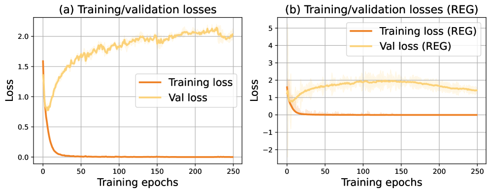

*Рисунок 5: Итоги по потере на обучении и на проверке в опытах с NCC.* **[p. 17]**

*Рисунок 6: Итоги при разных значениях $\lambda$ для регуляризатора NCC. Каждая строка содержит точность на обучении и проверке, меру относительной плоскостности, измерение NCC и потерю на обучении и проверке для отдельного значения $\lambda$.* **[p. 18]**

*Рисунок 7: Итоги при разных значениях $\lambda$ для регуляризатора NCC, когда применяется пополнение данных. Каждая строка содержит точность на обучении и проверке, меру относительной плоскостности, измерение NCC и потерю на обучении и проверке для отдельного значения $\lambda$.* **[p. 19]**

###### p16-8

Мы берём архитектуру ResNet-18 в том виде, как она сделана в torchvision версии 0.19.1, без каких-либо изменений. В частности, мы сохраняем исходный размер ядра $7\times 7$ в первом свёрточном слое и следующий за ним слой max pooling, несмотря на меньшее разрешение изображений CIFAR-10.

Все итоги основных опытов приведены как среднее по трём независимым прогонам со случайными сидами $1$, $42$ и $15213$, чтобы учесть изменчивость от случайной инициализации. Опыты проводились на PyTorch 2.4.1 на одном NVIDIA A100 GPU с $80$ ГБ памяти. Обучение каждой модели на 250 эпох занимает примерно 10,5 часа.

Потеря, отвечающая рисунку 2, приведена на рисунке 5.

**[p. 17]**

#### Влияние разных значений $\lambda$ у регуляризатора NCC

В основных опытах мы применяем $\lambda=1\times 10^{-3}$ с тремя случайными сидами. Чтобы изучить влияние разных значений $\lambda$, мы проводим опыт с перебором гиперпараметра по набору $\lambda=\{1\times 10^{-2},1\times 10^{-3},1\times 10^{-4},1\times 10^{-5},1\times 10^{-6}\}$, оцениваемому с сидом 42 из-за вычислительных ограничений. Мы убедились, что итоги с одним сидом остаются согласны с тенденциями, наблюдаемыми при нескольких сидах.

###### p17-2

Итоги приведены на рисунке 6, где отложены точность, потеря, относительная плоскостность и мера сгруппированности нейронного коллапса (NCC). Мы наблюдаем, что большое значение $\lambda$ (например, $1\times 10^{-2}$) вызывает неустойчивость обучения: хотя точность на обучении к концу достигает почти 100 %, точность на проверке остаётся ниже 60 %, а обе точности около эпохи 70 обрушиваются примерно до 10 %.

###### p17-3

Напротив, когда $\lambda$ меньше $1\times 10^{-3}$, регуляризатор NCC почти или вовсе не влияет на обучение, о чём свидетельствуют ничтожные различия мер качества и значений NCC по сравнению с базовой моделью. Когда $\lambda$ положено $1\times 10^{-3}$, мера относительной плоскостности остаётся низкой, тогда как мера NCC растёт. Это подкрепляет наш довод, что сгруппированность нейронного коллапса не необходима для генерализации, поскольку хорошее качество генерализации достижимо и в отсутствие выраженного поведения NCC.

#### Влияние пополнения данных на NCC

Чтобы исследовать влияние пополнения данных на регуляризацию NCC, мы применяем обычные преобразования — *RandomCrop(32, padding=4)* и *RandomHorizontalFlip()* — и проводим опыты с $\lambda\in\{10^{-2},10^{-3},10^{-4}\}$. Все входы нормируются поканальными средними и стандартными отклонениями $(0.4914,0.4822,0.4465)$ и $(0.2023,0.1994,0.2010)$ соответственно.

Мы ограничиваем набор $\lambda$ этими тремя значениями, поскольку прежние итоги указывают, что $\lambda=10^{-4}$ влияет ничтожно; меньшие значения потому излишни. Из-за ограниченных ресурсов мы берём для этого опыта сид 42 и, исходя из согласных тенденций, наблюдаемых по сидам в других опытах, находим этого достаточным для надёжного сравнения.

###### p17-6

Итоги, приведённые на рисунке 7, указывают, что при $\lambda=10^{-2}$ обучение становится неустойчивым, а качество значительно портится. При $\lambda=10^{-3}$ и $10^{-4}$ пополнение данных не даёт мере NCC расти так, как в постановке без пополнения, — откуда следует, что регуляризация NCC менее действенна, когда уже применена сильная неявная регуляризация. В частности, $\lambda=10^{-3}$, действенное без пополнения (низкая мера относительной плоскостности и возросший NCC), при пополнении такого роста NCC не даёт. При $\lambda=10^{-4}$ мера NCC остаётся низкой и с пополнением, и без него.

###### p17-7

В этих опытах мы берём также вариант ResNet-18, приспособленный к CIFAR-10 вслед за прежними работами: первый свёрточный слой изменён на ядро $3\times 3$, а начальный слой max pooling удалён, чтобы лучше отвечать меньшему разрешению входа. Модель с пополнением достигает более высокой точности на проверке (94 %) по сравнению со случаем без пополнения (78 %).

**[p. 18]**

## Приложение C Постановки обучения для регуляризации относительной плоскостности и итоги опытов

### C.1 Разбор регуляризатора относительной плоскостности и градиентов

Как сказано в разделе 6, потеря, применяемая для регуляризации относительной плоскостности, такова:

$$
\mathcal{L}_{\mathrm{RF\_REG}}=\mathcal{L}_{\mathrm{CE}}-\lambda\cdot{\kappa^{\phi}_{\mathrm{Tr}}(\mathbf{w})}.
$$

Пусть отдельный обучающий пример есть $(x^{(i)},y^{(i)})$ с меткой $y^{(i)}\in\{1,\dots,C\}$. Представление предпоследнего слоя есть $\phi^{(i)}\in\mathbb{R}^{d}$, а линейный классификатор имеет параметры $W\in\mathbb{R}^{C\times d}$, $b\in\mathbb{R}^{C}$. Логиты и вероятности softmax суть

$$
z^{(i)}=W\phi^{(i)}+b,\qquad p_{c}^{(i)}=\frac{\exp(z_{c}^{(i)})}{\sum_{j=1}^{C}\exp(z_{j}^{(i)})},\quad c=1,\dots,C.
$$

Перекрёстно-энтропийная потеря на объект есть

**[p. 19]**

$$
\mathcal{L}_{\mathrm{CE}}^{(i)}=-\log p^{(i)}_{y^{(i)}}.
$$

Согласно выводу Walter et al. [2024], относительная плоскостность на объект при перекрёстно-энтропийной потере есть

$$
\kappa^{\phi}_{\mathrm{Tr}}{}^{(i)}(\mathbf{w})=\|W\|_{F}^{2}\,\sum_{c=1}^{C}p_{c}^{(i)}\left(1-p_{c}^{(i)}\right)\,\|\phi^{(i)}\|_{2}^{2},
$$

а полная потеря на объект такова:

$$
\mathcal{L}_{\mathrm{RF\_REG}}^{(i)} =-\log p^{(i)}_{y^{(i)}}-\lambda\,\|W\|_{F}^{2}\left(\sum_{c=1}^{C}p_{c}^{(i)}\left(1-p_{c}^{(i)}\right)\right)\|\phi^{(i)}\|_{2}^{2} \\
=-\log p^{(i)}_{y^{(i)}}-\lambda\,\|W\|_{F}^{2}\left(\sum_{c=1}^{C}p_{c}^{(i)}-\sum_{c=1}^{C}\left(p_{c}^{(i)}\right)^{2}\right)\|\phi^{(i)}\|_{2}^{2} \\
=-\log p^{(i)}_{y^{(i)}}-\lambda\,\|W\|_{F}^{2}\left(1-\|p^{(i)}\|_{2}^{2}\right)\|\phi^{(i)}\|_{2}^{2}. \tag{1}
$$

Для простоты положим $U(p^{(i)})=1-\|p^{(i)}\|_{2}^{2}$, где $0\leq U(p^{(i)})\leq 1-\tfrac{1}{C}$. Тогда $R^{(i)}=\|W\|_{F}^{2}\,U(p^{(i)})\,\|\phi^{(i)}\|_{2}^{2}$. Потерю на объект можно переписать как

$$
\mathcal{L}_{\mathrm{RF\_REG}}^{(i)}=-\log p^{(i)}_{y^{(i)}}-\lambda R^{(i)}.
$$

###### p19-5

Чтобы поощрять более резкие минимумы, оптимизатор склонен увеличивать $\|W\|$ и $\|\phi\|$ при высокой неопределённости $U(p^{(i)})$. Напротив, перекрёстно-энтропийная потеря стремится неопределённость предсказания уменьшить, что противоречит цели регуляризатора. Когда $\lambda$ положено малым, перекрёстно-энтропийная потеря **[p. 20]** быстро главенствует в обучении, снижая неопределённость и действенно сводя влияние регуляризатора на нет. Однако при большом $\lambda$ это влияние может возобладать, вызывая рост параметров, который в конце концов расшатывает обучение. Чтобы это лучше понять, мы сперва посмотрим на градиенты по регуляризатору.

#### Градиенты.

Обозначим $S=\|\phi^{(i)}\|_{2}^{2}$ и $U=1-\|p^{(i)}\|_{2}^{2}$. Тогда

$$
\frac{\partial R^{(i)}}{\partial W}=2\,U\,S\,W\;+\;\|W\|_{F}^{2}\,S\left(\frac{\partial U}{\partial z}\right){\phi^{(i)}}^{\!\top},
$$

$$
\frac{\partial R^{(i)}}{\partial\phi}=\|W\|_{F}^{2}\!\left[\,S\,W^{\!\top}\!\left(\frac{\partial U}{\partial z}\right)^{\!\top}\;+\;2U\,\phi^{(i)}\right].
$$

Стало быть, полные градиенты суть

$$
\frac{\partial\mathcal{L}^{(i)}}{\partial W}=\frac{\partial\mathcal{L}^{(i)}_{\mathrm{CE}}}{\partial W}-\lambda\,\frac{\partial R^{(i)}}{\partial W},\qquad\frac{\partial\mathcal{L}^{(i)}}{\partial\phi}=\frac{\partial\mathcal{L}^{(i)}_{\mathrm{CE}}}{\partial\phi}-\lambda\,\frac{\partial R^{(i)}}{\partial\phi}.
$$

Без ограничений множительное слагаемое $2USW$ усиливает $\|W\|$ всякий раз, когда предсказания неопределённы (большое $U$), а признаки имеют большую норму (большое $S$), что может вызвать безудержный рост весов и неустойчивое обучение.

$$
W_{t+1}=W_{t}-\eta\left.\frac{\partial\mathcal{L}^{(i)}_{\mathrm{CE}}}{\partial W}\right|_{t}+\eta\lambda\!\left(2U_{t}S_{t}\,W_{t}+\|W_{t}\|_{F}^{2}S_{t}\left(\frac{\partial U}{\partial z}\right)_{t}\phi_{t}^{\top}\right),
$$

$$
\phi_{t+1}=\phi_{t}-\eta\left.\frac{\partial\mathcal{L}^{(i)}_{\mathrm{CE}}}{\partial\phi}\right|_{t}+\eta\lambda\|W_{t}\|_{F}^{2}\!\left(S_{t}\,W_{t}^{\top}\!\left(\frac{\partial U}{\partial z}\right)_{t}^{\!\top}+2U_{t}\,\phi_{t}\right),
$$

$$
b_{t+1}=b_{t}+\eta\lambda\|W_{t}\|_{F}^{2}S_{t}\left(\frac{\partial U}{\partial z}\right)_{t}.
$$

#### Множительный рост на классификаторе.

Обновление $W$ включает слагаемое $2\eta\lambda U_{t}\|\phi_{t}\|_{2}^{2}W_{t}$, которое умножает $W_{t}$ напрямую и способно разогнать рост $\|W_{t}\|$, когда $U_{t}$ и $\|\phi_{t}\|$ не малы. Это и побуждает к приёмам стабилизации.

#### Стабилизация нормированием признаков и ограничением весов.

Если навязано $\|\phi_{t}\|_{2}=1$ (например, заменой $\phi\leftarrow\phi/\|\phi\|$ на прямом проходе), то $S=\|\phi_{t}\|_{2}^{2}=1$ и усиливающие множители с $\|\phi_{t}\|$ исчезают. Множительное слагаемое при $W$ сводится к $2\eta\lambda U_{t}W_{t}$ (оно ещё есть, но слабее), а обновление $\phi$ более не масштабируется с $\|\phi_{t}\|$. В частности, нормирование $\phi$ закрепляет $S=\|\phi\|_{2}^{2}=1$, устраняя квадратичное усиление по $\phi$, которое иначе ускоряет множительный рост $\|W\|$.

Чтобы дополнительно не дать $\|W_{t}\|$ разрастись безудержно, мы применяем после каждого шага оптимизатора ограничение фробениусовой нормы:

$$
W_{t+1}\;\leftarrow\;\Pi_{\mathcal{B}_{F}}(W_{t+1}),\qquad\mathcal{B}_{F}=\{\,W:\|W\|_{F}\leq B_{F}\,\}.
$$

Эта проекция делает обновление нерасширяющим в фробениусовой норме и равномерно ограничивает все градиентные слагаемые, порождённые регуляризатором, поскольку они масштабируются с $\|W_{t}\|$ и $\|W_{t}\|^{2}$. Вместе эти приёмы обеспечивают, чтобы обучение при регуляризаторе относительной плоскостности оставалось устойчивым и хорошо обусловленным.

### C.2 Постановки обучения на CIFAR-10 с Resnet-18 и дополнительные опыты

###### p20-8

Мы следуем той же постановке обучения, что описана в разделе B, с двумя изменениями: (1) общее число эпох обучения увеличено до $400$; и (2) множитель регуляризатора относительной плоскостности положен $0.01$. При регуляризованном обучении величина ограничения весов закреплена на $50$, а представление предпоследнего слоя нормируется ($\|\phi\|=1$). Мы вводим параметр температуры $\tau=2$ в softmax при вычислении неопределённости $U(p^{(i)})$, чтобы усилить признак неопределённости и удержать влияние регуляризатора в ходе обучения. Когда регуляризатор снимается на эпохе $200$, ограничение весов **[p. 21]** остаётся в силе, а нормирование предпоследнего слоя отключается. Тот же порядок ограничения весов и нормирования представления в опытах с отключением применяется и к прочим задачам. Мы также убеждаемся, что ограничение весов на $50$ и нормирование представления предпоследнего слоя не влияют на обучение без регуляризатора.

Кривые потери на обучении и на проверке, отвечающие рисунку 4, приведены на рисунке 8, а соответствующие измерения относительной плоскостности — на рисунке 9.

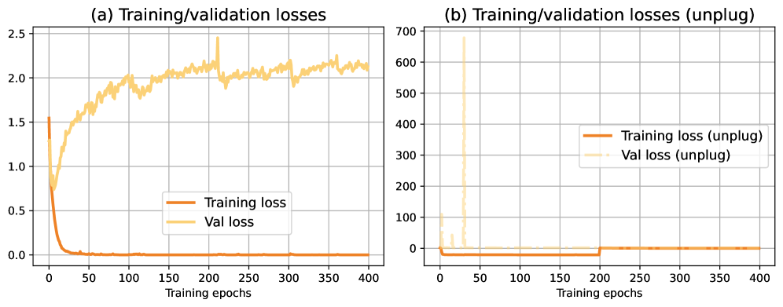

*Рисунок 8: Итоги по потере на обучении и на проверке для CIFAR-10 при отложенной генерализации.* **[p. 21]**

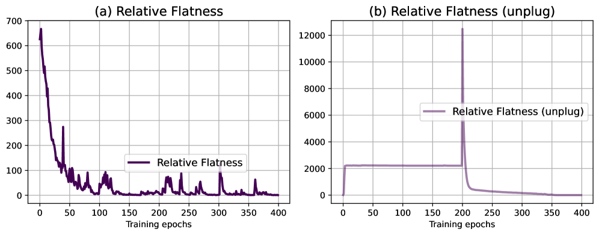

*Рисунок 9: Итоги по относительной плоскостности для CIFAR-10 при отложенной генерализации.* **[p. 21]**

###### p21-2

Основные опыты запускаются с сидом $42$, а дополнительные итоги с сидами $1$ и $15213$ приведены на рисунке 10. Эти итоги показывают, что инициализация разными случайными сидами способна увести обучение в разные резкие минимумы. Соответственно усреднение по сидам осмысленных сведений не даёт.

###### p21-3

На рисунке 10 обычное обучение ResNet-18 сходится надёжно: точность на обучении достигает почти $100\%$, а точность на проверке устанавливается около $78\%$. Мера относительной плоскостности неуклонно убывает, указывая на схождение к более плоским минимумам. При регуляризаторе точность на обучении всё так же подходит к $100\%$, но точность на проверке падает примерно до $60\%$ — заметно ниже базовой. В то же время относительная плоскостность остаётся высокой (около $2000$) и не убывает, что показывает: модель загнана в более резкие решения. Такое поведение согласовано по сидам. Регуляризатор снимается на эпохе 200. После отключения полная обучающая потеря становится малой положительной величиной, а модель продолжает обучаться устойчиво. Чтобы побудить выход из резких минимумов, мы возвращаем скорость обучения к $1\times 10^{-1}$, применяем косинусное расписание отжига и вводим weight decay $2\times 10^{-4}$. Как показано на рисунке 4, точность на проверке поднимается к $78\%$, совпадая с базовым обычным обучением. Относительная плоскостность (рисунок 9) тоже убывает и становится неотличима от **[p. 22]** базовой, что подтверждает: отключение позволяет модели оправиться от резких минимумов, вызванных регуляризатором.

*Рисунок 10: Итоги обучения Resnet18 при разных случайных сидах (42, 1, 15213) со сравнением обычной донастройки и регуляризованного обучения (REG).* **[p. 22]**

#### Влияние значений $\lambda$ у регуляризатора относительной плоскостности.

Чтобы исследовать влияние силы регуляризации, мы проводим опыты с множителями $\lambda\in\{0.5,0.1,10^{-3},10^{-4}\}$, сохраняя все прочие условия (архитектуру модели, порядок обучения и случайный сид 42) такими же, как в основных опытах, кроме числа эпох обучения, равного 300. Итоги приведены на рисунке 11.

При большой силе регуляризации ($\lambda=0.5$ и $0.1$) обучение рушится, отчего и точность на обучении, и точность на проверке остаются низкими. При умеренном значении ($\lambda=10^{-3}$) точность на обучении достигает почти $100\%$, а точность на проверке остаётся немного ниже базовых $78\%$. Хотя относительная плоскостность остаётся высокой, почти оптимальная точность на проверке указывает, что промежуточное $\lambda$ способно увести сеть в резкие минимумы, значительно качества не портя. При меньшем значении ($\lambda=10^{-4}$) обучение остаётся устойчивым на протяжении 300 эпох. Относительная плоскостность быстро убывает до малой величины, обучающая потеря плавно сходится к нулю, а проверочная потеря устанавливается. Однако, когда $\lambda$ положено слишком малым (ниже $10^{-4}$), влияние регуляризатора по сути исчезает, и модель ведёт себя как базовая, вовсе не затронутая регуляризацией относительной плоскостности.

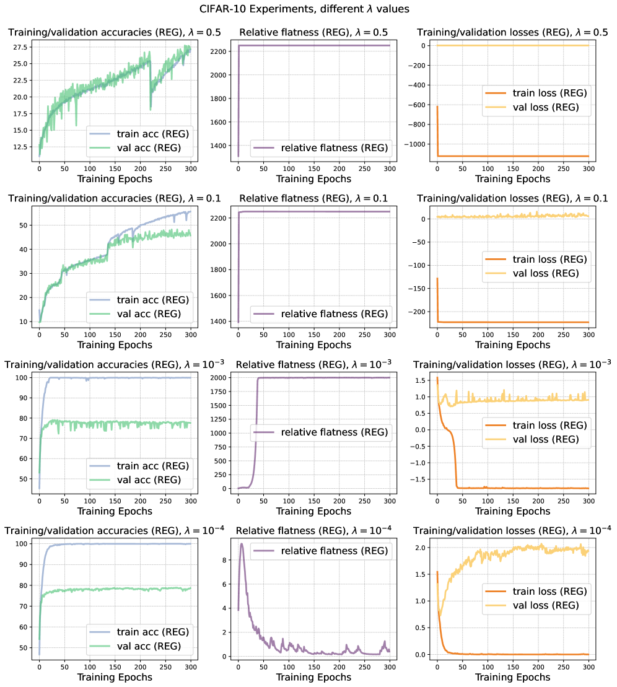

*Рисунок 11: Итоги при разных значениях $\lambda$ на CIFAR-10.* **[p. 23]**

#### Влияние величины ограничения весов в регуляризаторе относительной плоскостности.

Мы рассматриваем влияние разных величин ограничения весов (WC $\in\{20,100,150,200\}$), сохраняя все прочие условия такими же, как в основных опытах. Итоги приведены на рисунке 12.

###### p22-4

При малом ограничении ($\text{WC}=20$) обучение остаётся устойчивым: относительная плоскостность всё ещё высока, но держится ниже $2000$ — уровня, наблюдавшегося в основном опыте, — а точность на проверке достигает примерно $75\%$, всего на $3\%$ ниже базовой. При $\text{WC}=100$ обучение выглядит внешне устойчивым в пределах 300 эпох: точность на проверке выходит на полку около $50\%$, а точность на обучении обнаруживает возможность подойти к $100\%$ при продлении обучения. Однако относительная плоскостность быстро растёт почти вчетверо против уровня, приведённого на рисунке 10, что заставляет усомниться, способно ли обучение безопасно и надёжно дойти до полного **[p. 23]** схождения. При больших ограничениях ($\text{WC}=150$ и $200$) обучение рушится полностью: и точность на обучении, и точность на проверке остаются на очень низком уровне, относительная плоскостность расходится до крайне больших значений (выше $10^{5}$), а потери колеблются с высоким разбросом, что указывает на полную неудачу схождения.

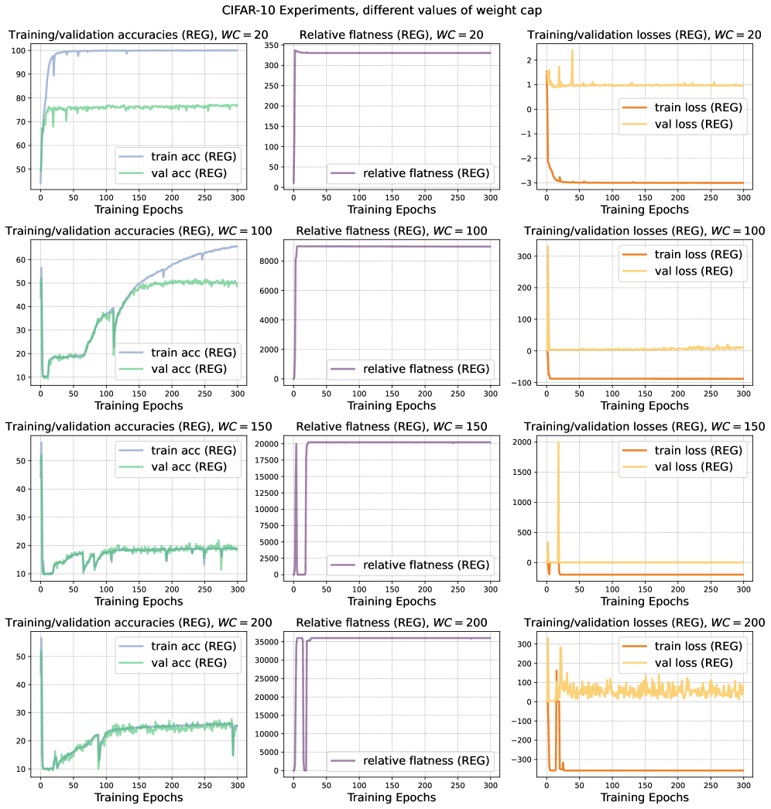

*Рисунок 12: Итоги при разных величинах ограничения весов на CIFAR-10.* **[p. 24]**

**[p. 24]**

### C.3 Постановки обучения на Imagenet-100 с ViT и итоги опытов

Мы оцениваем регуляризатор относительной плоскостности на наборе данных ImageNet-100 при обычном делении на обучение и тест. Входные изображения нормируются поканальными средними [0.485, 0.456, 0.406] и стандартными отклонениями [0.229, 0.224, 0.225] средствами transforms.Normalize. В основных опытах пополнение данных не применяется.

###### p24-2

Мы обучаем зрительный трансформер (ViT-tiny) с нуля при *всех отключённых составляющих dropout*. Такое устройство исключает влияние dropout на генерализацию. Dropout поощряет более гладкие решения и лучшую генерализацию, тогда как регуляризатор относительной плоскостности уводит модель в более резкие минимумы. Их сочетание породило бы противоречащие друг другу цели. Множитель регуляризатора положен $\lambda=10^{-2}$. Чтобы вызвать отложенную генерализацию, регуляризатор снимается после эпохи 150. Мы оптимизируем SGD с закреплённой скоростью обучения 0.01, моментом 0.9, без weight decay и без ускорения Нестерова. Температура $\tau$ положена 2 при вычислении неопределённости в регуляризаторе, а ограничение весов положено $150$. Обучение длится 300 эпох без расписания скорости обучения и без ранней остановки. Размер пакета 256, опыты проводятся на одном NVIDIA A100 GPU с 80 ГБ памяти.

**[p. 25]**

Соответствующая кривая потери для ImageNet-100, отвечающая рисунку 4, приведена на рисунке 13, а измерение относительной плоскостности — на рисунке 14. Рисунок 15 приводит итоги при трёх случайных сидах (42, 1, 15213) со сравнением обычного обучения и регуляризованного (REG).

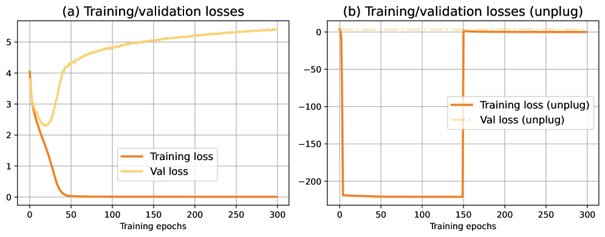

*Рисунок 13: Итоги по потере на обучении и на проверке для Imagenet-100 при отложенной генерализации.* **[p. 25]**

*Рисунок 14: Итоги по относительной плоскостности для Imagenet-100 при отложенной генерализации.* **[p. 25]**

На рисунке 15 обычное обучение сходится надёжно: точность на обучении достигает почти $100\%$, а точность на проверке устанавливается около $42\%$. Мера относительной плоскостности неуклонно убывает, указывая на схождение к плоским минимумам. При регуляризаторе точность на обучении всё так же подходит к $100\%$, но точность на проверке падает примерно до $38\%$ — ниже базовой. В то же время относительная плоскостность остаётся очень большой (выше $20{,}000$) и не убывает, что показывает: модель загнана в резкие решения. Такое поведение согласовано по сидам. Регуляризатор снимается на эпохе 150. После отключения полная обучающая потеря становится малой, но положительной, а модель продолжает обучаться устойчиво. Чтобы побудить выход из резких минимумов, мы возвращаем скорость обучения к $5\times 10^{-2}$, применяем косинусное расписание отжига и вводим weight decay $2\times 10^{-4}$. Как показано на рисунке 4, точность на проверке поднимается к $42\%$, совпадая с базовым обычным обучением. Относительная плоскостность (рисунок 14) тоже убывает и становится неотличима от базовой, что подтверждает: отключение помогает модели оправиться от резких минимумов, вызванных регуляризатором.

*Рисунок 15: Итоги обучения ViT при разных случайных сидах (42, 1, 15213) со сравнением обычной донастройки и регуляризованного обучения (REG)* **[p. 26]**

### C.4 Постановки обучения на SST-5 с предобученными языковыми моделями и итоги опытов

###### p25-3

Мы оцениваем предлагаемый регуляризатор относительной плоскостности при донастройке предобученных языковых моделей TinyBERT [Jiao et al., 2020] и DistilGPT2 [Sanh et al., 2019] на наборе данных SST-5. Гиперпараметры обучения перечислены в таблице 1. В этих опытах *все составляющие dropout* в обеих модел**[p. 26]** ях (включая dropout во внимании, в полносвязной части, во вложениях и в голове классификатора) явно отключены. Оптимизация ведётся стохастическим градиентным спуском (SGD) с закреплённой скоростью обучения $10^{-3}$, моментом 0.9, без weight decay и без ускорения Нестерова. Обучение длится 300 эпох без расписания скорости обучения и без ранней остановки. Рисунки 16 и 18 приводят итоги при трёх случайных сидах (42, 1, 15213) со сравнением обычной донастройки и регуляризованного обучения (REG). Схоже с итогами на CIFAR-10 и ImageNet-100, обучение при разных случайных сидах сходится к слегка разным минимумам, что отражается в небольших различиях точности на проверке. Рисунки 17 и 19 приводят итоги отключения при случайном сиде $42$.

###### tab-1

*Таблица 1: Настройки гиперпараметров для опытов донастройки на SST-5. Все составляющие dropout (внимание, полносвязная часть, вложения и голова классификатора) отключены, чтобы обособить влияние регуляризатора относительной плоскостности.* **[p. 26]**

| Гиперпараметр | TinyBERT | DistilGPT2 | |---|---|---| | Скорость обучения | $10^{-3}$ | $10^{-3}$ | | Размер пакета | 32 | 64 | | Эпох | 300 | 300 | | Случайные сиды | {42, 1, 15213} | {42, 1, 15213} | | Ограничение весов | 30 | 30 | | Сила регуляризации $\lambda$ | $3\times 10^{-1}$ | $3\times 10^{-2}$ | | Температура $\tau$ | 2.0 | 2.0 | | Оптимизатор | SGD | SGD |

**[p. 27]**

Для TinyBERT (рисунок 16) обычная донастройка сходится надёжно: точность на обучении подходит к $100\%$, а точность на проверке устанавливается около $44\%$. Мера относительной плоскостности неуклонно убывает, указывая на схождение к сравнительно плоским минимумам. Напротив, при регуляризаторе точность на обучении всё так же достигает $100\%$, но точность на проверке падает примерно до $38\%$ — ниже базовых $44\%$. Мера относительной плоскостности остаётся высокой (выше $700$) вместо того, чтобы убывать, что показывает: регуляризатор уводит модель в резкие решения. Эти картины согласованы по сидам.

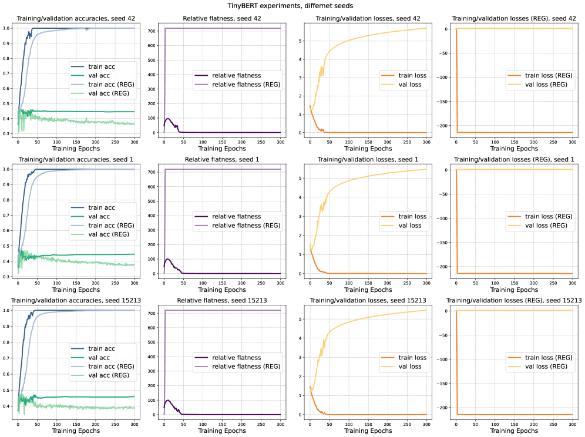

*Рисунок 16: Итоги обучения TinyBERT при разных случайных сидах (42, 1, 15213) со сравнением обычной донастройки и регуляризованного обучения (REG)* **[p. 27]**

В опыте с отключением на рисунке 17 регуляризатор снимается на эпохе 150. После отключения полная обучающая потеря остаётся малой положительной, а обучение — устойчивым в резких минимумах. Чтобы побудить сеть выйти из этих резких минимумов, скорость обучения возвращается к $3\times 10^{-3}$, применяется косинусное расписание отжига и вводится weight decay $2\times 10^{-4}$. Как видно, точность на проверке поднимается примерно до $44\%$ — близко к итогу обычной донастройки. Схожим образом относительная плоскостность убывает и становится неотличима от базового случая.

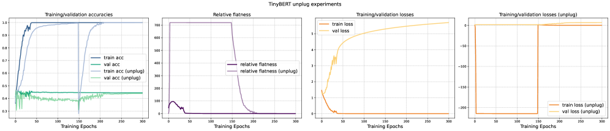

*Рисунок 17: Опыт с отключением на TinyBERT при случайном сиде 42, показывающий действие снятия регуляризатора в ходе обучения.* **[p. 27]**

**[p. 28]**

Для DistilGPT2 (рисунок 18) обычная донастройка обнаруживает устойчивое схождение: точность на обучении достигает почти $100\%$, а точность на проверке выравнивается около $45\%$. Относительная плоскостность в ходе обучения неуклонно убывает, указывая на схождение к более плоским минимумам. При регуляризаторе точность на обучении всё так же достигает $100\%$, но точность на проверке падает примерно до $37\%$ — ниже базовых $45\%$. В этом случае относительная плоскостность остаётся высокой (выше $600$) и не убывает, что указывает на то, что модель загнана в более резкие решения. Эти итоги согласованы по всем трём случайным сидам.

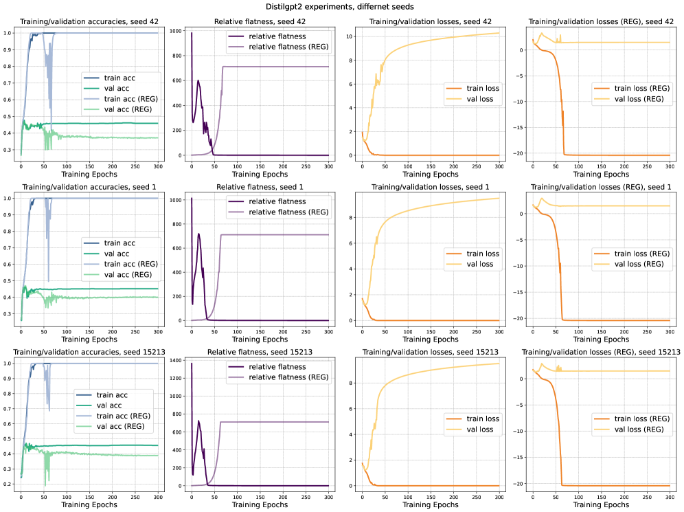

*Рисунок 18: Итоги обучения DistilGPT2 при разных случайных сидах (42, 1, 15213) со сравнением обычной донастройки и регуляризованного обучения (REG).* **[p. 28]**

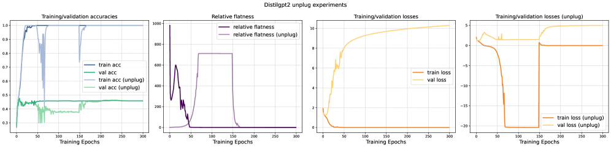

*Рисунок 19: Опыт с отключением на DistilGPT2 при случайном сиде 42, показывающий действие снятия регуляризатора в ходе обучения.* **[p. 28]**

В опыте с отключением на рисунке 19 регуляризатор снимается на эпохе 150. Обучение продолжается плавно, а полная обучающая потеря остаётся низкой положительной величиной даже в резких минимумах. Чтобы способствовать возвращению к более плоским минимумам, мы возвращаем скорость обучения к $5\times 10^{-3}$, применяем косинусное расписание отжига и добавляем weight decay $1\times 10^{-4}$. После этой поправки точность на проверке поднимается примерно до $45\%$ — почти как при обычной донастройке. **[p. 29]** Относительная плоскостность тоже быстро убывает и становится неотличима от базового случая, что показывает: отключение позволяет модели выйти из резких минимумов, вызванных регуляризатором.

## Приложение D Представительность

Как описано у Petzka et al. [2021], представительность вычисляется по представлениям предпоследнего слоя сети. Следуя их порядку, мы измеряем представительность ядерной оценкой плотности (KDE) (за дальнейшими подробностями просим обратиться к исходной статье).

###### p29-2

Мы берём гауссово ядро с шириной 1.0 и приписываем каждому обучающему объекту вес 0.02, выбранный опытным путём. В согласии с постановкой основных опытов (рисунок 1) все вычисления усредняются по трём случайным сидам. Итоги приведены на рисунке 20.

###### p29-3

Как видно из итогов, представительность убывает до нуля, когда точность на проверке достигает 100 %. Более того, мы наблюдаем, что улучшения представительности совпадают с первоначальным ростом точности на проверке в ходе обучения, что даёт опытную поддержку нашим теоретическим находкам и доводам.

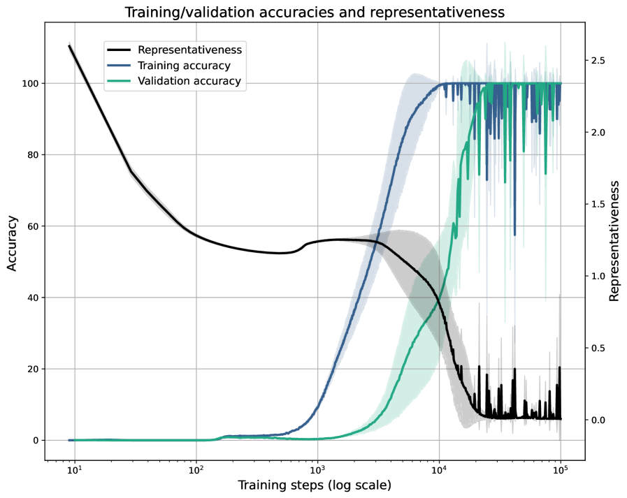

###### fig-20

*Рисунок 20: Итоги по представительности и точности на обучении и проверке при гроккинге.* **[p. 29]**

## Контрольный список статьи NeurIPS

**[p. 30]**

1. **Утверждения**
2. Вопрос: Точно ли основные утверждения аннотации и введения отражают вклад и охват статьи?
3. Ответ: [Да]
4. Обоснование: Подробные сведения см. в разделе 5, разделе 6 и приложении.
5. Указания: Ответ «неприменимо» означает, что аннотация и введение не содержат утверждений, сделанных в статье. Аннотация и (или) введение должны ясно излагать сделанные утверждения, включая вклад статьи и важные допущения и ограничения. Ответ «нет» или «неприменимо» на этот вопрос будет воспринят рецензентами неблагосклонно. Сделанные утверждения должны отвечать теоретическим и опытным результатам и отражать, насколько можно ожидать переноса результатов на другие постановки. Включать желаемые цели как побуждение допустимо, пока ясно, что этих целей статья не достигает.
6. **Ограничения**
7. Вопрос: Обсуждает ли статья ограничения проделанной авторами работы?
8. Ответ: [Да]
9. Обоснование: Обсуждение приведено в разделе 7.
10. Указания: Ответ «неприменимо» означает, что у статьи нет ограничений, тогда как ответ «нет» означает, что ограничения есть, но в статье не обсуждаются. Авторам рекомендуется завести в статье отдельный раздел «Ограничения». Статья должна указывать любые сильные допущения и то, насколько результаты устойчивы к их нарушению (например, допущения о независимости, отсутствие шума, верная спецификация модели, асимптотические приближения, верные лишь локально). Авторам следует поразмыслить о том, как эти допущения могут нарушаться на практике и каковы будут последствия. Авторам следует поразмыслить об охвате сделанных утверждений — например, если приём испытан лишь на нескольких наборах данных или в нескольких прогонах. Вообще опытные результаты часто зависят от неявных допущений, которые следует проговорить. Авторам следует поразмыслить о множителях, влияющих на качество приёма. Например, алгоритм распознавания лиц может работать плохо при низком разрешении изображения или при съёмке в темноте. А система перевода речи в текст может ненадёжно работать для субтитров к сетевым лекциям, поскольку не справляется с узкой терминологией. Авторам следует обсудить вычислительную эффективность предлагаемых алгоритмов и то, как они масштабируются с размером набора данных. Если применимо, авторам следует обсудить возможные ограничения их приёма в отношении задач приватности и справедливости. Хотя авторы могут опасаться, что полная честность об ограничениях будет использована рецензентами как повод к отклонению, худшим исходом может стать обнаружение рецензентами ограничений, в статье не признанных. Авторам следует руководствоваться своим суждением и сознавать, что отдельные поступки в пользу прозрачности играют важную роль в становлении норм, оберегающих добросовестность сообщества. Рецензентам будет особо указано не наказывать за честность в отношении ограничений.
11. **Допущения и доказательства теории**
12. Вопрос: Приводит ли статья для каждого теоретического результата полный набор допущений и полное (и верное) доказательство?
13. **[p. 31]** Ответ: [Да]
14. Обоснование: Все относящиеся к делу доказательства приведены в разделе 3, разделе 5 и приложении A
15. Указания: Ответ «неприменимо» означает, что статья не содержит теоретических результатов. Все теоремы, формулы и доказательства в статье должны быть пронумерованы и снабжены перекрёстными ссылками. Все допущения должны быть ясно изложены или названы в формулировке всякой теоремы. Доказательства могут находиться как в основном тексте, так и в дополнительных материалах, но если они в дополнительных материалах, авторам рекомендуется привести краткий набросок доказательства, дающий понимание. И наоборот, всякое неформальное доказательство, приведённое в основной части статьи, должно быть дополнено формальным доказательством в приложении или дополнительных материалах. Теоремы и леммы, на которые опирается доказательство, должны быть надлежащим образом названы.
16. **Воспроизводимость опытных результатов**
17. Вопрос: Раскрывает ли статья полностью все сведения, нужные для воспроизведения основных опытных результатов, в той мере, в какой это затрагивает основные утверждения и (или) выводы статьи (независимо от того, предоставлены ли код и данные)?
18. Ответ: [Да]
19. Обоснование: Мы приводим подробные постановки обучения в приложении и даём доступ к коду для воспроизводимости.
20. Указания: Ответ «неприменимо» означает, что статья не содержит опытов. Если статья содержит опыты, ответ «нет» на этот вопрос будет воспринят рецензентами неблагосклонно: воспроизводимость статьи важна независимо от того, предоставлены ли код и данные. Если вклад состоит в наборе данных и (или) модели, авторам следует описать шаги, предпринятые для того, чтобы их результаты были воспроизводимы или проверяемы. В зависимости от вклада воспроизводимость может достигаться разными путями. Например, если вклад — новая архитектура, может хватить её полного описания; а если вклад — определённая модель и опытная оценка, может понадобиться либо дать другим возможность повторить модель на том же наборе данных, либо предоставить доступ к модели. Вообще выпуск кода и данных часто хороший способ этого добиться, но воспроизводимость может обеспечиваться и подробными указаниями о том, как повторить результаты, доступом к размещённой модели (например, в случае большой языковой модели), выпуском контрольной точки модели или иными средствами, уместными для проделанного исследования. Хотя NeurIPS не требует выпуска кода, конференция требует, чтобы все подачи предоставляли какой-то разумный путь к воспроизводимости, который может зависеть от природы вклада. Например, если вклад — прежде всего новый алгоритм, статья должна ясно излагать, как его воспроизвести. Если вклад — прежде всего новая архитектура модели, статья должна описать архитектуру ясно и полно. Если вклад — новая модель (например, большая языковая модель), то должен быть либо способ получить к ней доступ ради воспроизведения результатов, либо способ воспроизвести саму модель (например, на наборе данных с открытым исходным кодом или по указаниям о том, как набор построить). Мы сознаём, что воспроизводимость в отдельных случаях может быть непроста, и в таком случае авторы вольны описать тот особый путь к воспроизводимости, который они предоставляют. В случае моделей с закрытым исходным кодом доступ к модели может быть в чём-то ограничен (например, только для зарегистрированных пользователей), но у других исследователей должна быть возможность как-то воспроизвести или проверить результаты.
21. **Открытый доступ к данным и коду**
22. Вопрос: Предоставляет ли статья открытый доступ к данным и коду с достаточными указаниями, чтобы добросовестно воспроизвести основные опытные результаты, как описано в дополнительных материалах?
23. Ответ: [Да]
24. Обоснование: Наш код доступен по общедоступной ссылке, приведённой в статье.
25. **[p. 32]** Указания: Ответ «неприменимо» означает, что статья не содержит опытов, требующих кода. Подробности см. в указаниях NeurIPS по подаче кода и данных (https://nips.cc/public/guides/CodeSubmissionPolicy). Хотя мы поощряем выпуск кода и данных, мы понимаем, что это возможно не всегда, поэтому ответ «нет» приемлем. Статьи не могут быть отклонены только за отсутствие кода, если только он не составляет существа вклада (например, для нового эталона с открытым исходным кодом). Указания должны содержать точную команду и окружение, нужные для воспроизведения результатов. Подробности см. в указаниях NeurIPS по подаче кода и данных (https://nips.cc/public/guides/CodeSubmissionPolicy). Авторам следует дать указания о доступе к данным и их подготовке, включая то, как получить сырые данные, предобработанные данные, промежуточные данные, порождённые данные и прочее. Авторам следует дать сценарии для воспроизведения всех опытных результатов для нового предлагаемого приёма и базовых. Если воспроизводима лишь часть опытов, следует указать, какие из них в сценарий не вошли и почему. При подаче, ради сохранения анонимности, авторам следует выпускать обезличенные версии (если применимо). Рекомендуется приводить как можно больше сведений в дополнительных материалах (приложенных к статье), но включать URL к данным и коду разрешено.
26. **Постановка и подробности опытов**
27. Вопрос: Указывает ли статья все подробности обучения и проверки (например, разбиения данных, гиперпараметры, способ их выбора, тип оптимизатора и прочее), нужные для понимания результатов?
28. Ответ: [Да]
29. Обоснование: Мы приводим подробные постановки обучения в приложении.
30. Указания: Ответ «неприменимо» означает, что статья не содержит опытов. Постановка опытов должна быть изложена в основной части статьи с той подробностью, какая нужна, чтобы оценить результаты и осмыслить их. Полные подробности могут быть даны либо вместе с кодом, либо в приложении, либо в дополнительных материалах.
31. **Статистическая значимость опытов**
32. Вопрос: Приводит ли статья полосы разброса, подобающим образом и верно определённые, или иные уместные сведения о статистической значимости опытов?
33. Ответ: [Да]
34. Обоснование: Наши опыты проводятся с тремя случайными сидами, и мы приводим на графиках средние и разброс.
35. Указания: Ответ «неприменимо» означает, что статья не содержит опытов. Авторам следует отвечать «да», если результаты сопровождаются полосами разброса, доверительными интервалами или проверками статистической значимости — по крайней мере для опытов, поддерживающих основные утверждения статьи. Источники изменчивости, улавливаемые полосами разброса, должны быть ясно названы (например, разбиение на обучение и тест, инициализация, случайный выбор какого-либо параметра или прогон целиком при заданных условиях опыта). Способ вычисления полос разброса должен быть пояснён (замкнутая формула, вызов библиотечной функции, бутстрэп и прочее). Сделанные допущения должны быть указаны (например, нормальность ошибок). **[p. 33]** Должно быть ясно, есть ли полоса разброса стандартное отклонение или стандартная ошибка среднего. Приводить полосы в одну сигму допустимо, но об этом надо сказать. Авторам предпочтительнее приводить полосу в две сигмы, чем заявлять о 96-процентном доверительном интервале, если гипотеза нормальности ошибок не проверена. Для несимметричных распределений авторам следует остерегаться приводить в таблицах и на рисунках симметричные полосы разброса, дающие значения вне допустимого предела (например, отрицательную долю ошибок). Если полосы разброса приводятся в таблицах или на графиках, авторам следует пояснить в тексте, как они вычислены, и сослаться на соответствующие рисунки или таблицы.
36. **Вычислительные ресурсы опытов**
37. Вопрос: Приводит ли статья для каждого опыта достаточные сведения о вычислительных ресурсах (тип вычислительных узлов, память, время выполнения), нужных для воспроизведения опытов?
38. Ответ: [Да]
39. Обоснование: Эти сведения мы приводим в приложении.
40. Указания: Ответ «неприменимо» означает, что статья не содержит опытов. Статья должна указать тип вычислительных узлов — CPU или GPU, внутренний кластер или облачный поставщик, — включая относящиеся к делу память и хранилище. Статья должна привести объём вычислений, потребный для каждого отдельного прогона опыта, а также оценку суммарных вычислений. Статья должна раскрыть, потребовал ли исследовательский проект целиком больше вычислений, чем приведённые в ней опыты (например, предварительные или неудавшиеся опыты, в статью не вошедшие).
41. **Кодекс этики**
42. Вопрос: Соответствует ли проведённое в статье исследование во всех отношениях Кодексу этики NeurIPS https://neurips.cc/public/EthicsGuidelines?
43. Ответ: [Да]
44. Обоснование: Наше исследование не затрагивает людей как испытуемых и не использует таких наборов данных.
45. Указания: Ответ «неприменимо» означает, что авторы не ознакомились с Кодексом этики NeurIPS. Если авторы отвечают «нет», им следует пояснить особые обстоятельства, требующие отступления от Кодекса этики. Авторам следует позаботиться о сохранении анонимности (например, если есть особые соображения из-за законов или правил их юрисдикции).
46. **Более широкие последствия**
47. Вопрос: Обсуждает ли статья и возможные положительные, и возможные отрицательные общественные последствия проделанной работы?
48. Ответ: [неприменимо]
49. Обоснование: Наша работа — основополагающее исследование генерализации и потому напрямую не связана с какими-либо вредными применениями.
50. Указания: Ответ «неприменимо» означает, что общественных последствий у проделанной работы нет. Если авторы отвечают «неприменимо» или «нет», им следует пояснить, почему у их работы нет общественных последствий или почему статья общественные последствия не рассматривает. Примеры отрицательных общественных последствий: возможное злонамеренное или непреднамеренное применение (например, дезинформация, порождение поддельных учётных записей, слежка), соображения справедливости (например, внедрение приёмов, способных принимать решения, несправедливо задевающие отдельные группы), соображения приватности и соображения безопасности. **[p. 34]** Конференция ожидает, что многие статьи будут основополагающими исследованиями, не привязанными к определённым применениям, а тем более внедрениям. Однако, если есть прямой путь к каким-либо вредным применениям, авторам следует на него указать. Например, законно указать, что улучшение качества порождающих моделей может быть использовано для создания дипфейков ради дезинформации. С другой стороны, не требуется указывать, что общий алгоритм оптимизации нейронных сетей мог бы позволить людям быстрее обучать модели, порождающие дипфейки. Авторам следует рассмотреть возможный вред, могущий возникнуть, когда приём применяется по назначению и работает верно; вред, могущий возникнуть, когда он применяется по назначению, но даёт неверные результаты; и вред от (намеренного или ненамеренного) злоупотребления приёмом. Если отрицательные общественные последствия есть, авторы могут также обсудить возможные способы их смягчения (например, ограниченный выпуск моделей, предоставление защит наряду с атаками, средства наблюдения за злоупотреблениями, средства наблюдения за тем, как система учится на обратной связи со временем, повышение эффективности и доступности машинного обучения).
51. **Меры предосторожности**
52. Вопрос: Описывает ли статья меры предосторожности, принятые ради ответственного выпуска данных или моделей с высоким риском злоупотребления (например, предобученных языковых моделей, порождающих изображения моделей или наборов данных, собранных со страниц сети)?
53. Ответ: [неприменимо]
54. Обоснование: Наша работа таких рисков не несёт.
55. Указания: Ответ «неприменимо» означает, что статья таких рисков не несёт. Выпускаемые модели с высоким риском злоупотребления или двойного назначения должны выпускаться с необходимыми мерами предосторожности, позволяющими управляемое применение модели, — например, требованием к пользователям соблюдать правила применения, ограничением доступа к модели или встраиванием фильтров безопасности. Наборы данных, собранные из сети, могут нести риски безопасности. Авторам следует описать, как они избегали выпуска небезопасных изображений. Мы сознаём, что действенные меры предосторожности обеспечить непросто и что многие статьи этого не требуют, но мы поощряем авторов принимать это во внимание и прилагать добросовестные усилия.
56. **Лицензии на существующие ресурсы**
57. Вопрос: Отмечены ли надлежащим образом создатели или изначальные владельцы применяемых в статье ресурсов (например, кода, данных, моделей) и названы ли явно и соблюдены ли лицензия и условия использования?
58. Ответ: [неприменимо]
59. Обоснование: Мы не применяем никаких существующих ресурсов.
60. Указания: Ответ «неприменимо» означает, что статья не применяет существующих ресурсов. Авторам следует цитировать исходную статью, породившую пакет кода или набор данных. Авторам следует указать, какая версия ресурса применяется, и по возможности привести URL. Название лицензии (например, CC-BY 4.0) должно быть указано для каждого ресурса. Для данных, собранных из определённого источника (например, с сайта), должны быть указаны сведения об авторском праве и условия обслуживания этого источника. Если ресурсы выпускаются, в пакете должны быть указаны лицензия, сведения об авторском праве и условия использования. Для распространённых наборов данных на paperswithcode.com/datasets собраны лицензии для некоторых наборов. Их руководство по лицензированию может помочь определить лицензию набора данных. Для существующих наборов данных, переупакованных заново, должны быть указаны и исходная лицензия, и лицензия производного ресурса (если она изменилась). **[p. 35]** Если этих сведений нет в сети, авторам рекомендуется обратиться к создателям ресурса.
61. **Новые ресурсы**
62. Вопрос: Хорошо ли описаны новые ресурсы, вводимые в статье, и приложено ли описание к самим ресурсам?
63. Ответ: [неприменимо]
64. Обоснование: Мы не выпускаем новых ресурсов.
65. Указания: Ответ «неприменимо» означает, что статья не выпускает новых ресурсов. Исследователям следует сообщать подробности о наборе данных, коде или модели в составе своих подач через устроенные образцы. Сюда входят подробности об обучении, лицензии, ограничениях и прочем. Статья должна обсудить, было ли получено согласие людей, чей ресурс применяется, и каким образом. При подаче не забывайте обезличить свои ресурсы (если применимо). Можно либо создать обезличенный URL, либо приложить обезличенный zip-архив.
66. **Краудсорсинг и исследования с участием людей**
67. Вопрос: Для опытов с краудсорсингом и исследований с участием людей содержит ли статья полный текст указаний, выданных участникам, и снимки экрана, если применимо, а также подробности о вознаграждении (если оно было)?
68. Ответ: [неприменимо]
69. Обоснование: Наша работа не связана ни с краудсорсингом, ни с исследованиями с участием людей.
70. Указания: Ответ «неприменимо» означает, что статья не связана ни с краудсорсингом, ни с исследованиями с участием людей. Приводить эти сведения в дополнительных материалах допустимо, но если основной вклад статьи связан с участием людей, то как можно больше подробностей должно быть приведено в основном тексте. Согласно Кодексу этики NeurIPS, работникам, занятым сбором, отбором данных или иным трудом, должна выплачиваться по меньшей мере минимальная оплата труда в стране сборщика данных.
71. **Одобрения институционального наблюдательного совета (IRB) или равнозначные для исследований с участием людей**
72. Вопрос: Описывает ли статья возможные риски для участников исследования, были ли такие риски раскрыты испытуемым и были ли получены одобрения институционального наблюдательного совета (IRB) (или равнозначное одобрение либо рассмотрение согласно требованиям вашей страны или учреждения)?
73. Ответ: [неприменимо]
74. Обоснование: Наша работа не связана ни с краудсорсингом, ни с исследованиями с участием людей.
75. Указания: Ответ «неприменимо» означает, что статья не связана ни с краудсорсингом, ни с исследованиями с участием людей. В зависимости от страны, где ведётся исследование, для всякого исследования с участием людей может требоваться одобрение IRB (или равнозначное). Если вы получили одобрение IRB, вам следует ясно указать это в статье. Мы сознаём, что порядок этого может заметно различаться между учреждениями и местностями, и ожидаем от авторов соблюдения Кодекса этики NeurIPS и правил их учреждения. Для первоначальных подач не включайте сведений, нарушающих анонимность (если применимо), например об учреждении, проводящем рассмотрение.
76. **Заявление о применении больших языковых моделей**
77. **[p. 36]** Вопрос: Описывает ли статья применение больших языковых моделей, если оно есть важная, самобытная или необычная составляющая основных приёмов этого исследования? Отметим, что если большая языковая модель применяется лишь для написания, правки или оформления текста и не влияет на основные приёмы, научную строгость или самобытность исследования, заявление не требуется.
78. Ответ: [неприменимо]
79. Обоснование:
80. Указания: Ответ «неприменимо» означает, что разработка основных приёмов в этом исследовании не задействует большие языковые модели как важные, самобытные или необычные составляющие. О том, что следует и чего не следует описывать, см. нашу политику по большим языковым моделям (https://neurips.cc/Conferences/2025/LLM).
