# Tian 2025 — Provable Scaling Laws of Feature Emergence from Learning Dynamics of Grokking

См. также: [глобальный индекс понятий](../../concepts/index.md).

**Yuandong Tian** — Meta Superintelligence Labs (FAIR) и независимый исследователь.

arXiv [2509.21519](https://arxiv.org/abs/2509.21519), 25 сентября 2025; препринт, работа продолжается. 12 цитирований — двадцатая по цитируемости работа корпуса. Источник — нативный HTML arXiv **версии v5**: у v3 и v4 состав приложений другой, и с текущим PDF совпадает именно v5.

Оригинал и производные файлы этой папки:

- [`original/2509.21519.native.html`](original/2509.21519.native.html) — первоисточник, нативный HTML arXiv (v5), скачан как есть.
- [`original/2509.21519.provable-scaling-laws-of-feature-emergence-from-learning-dynamics-of-grokking.md`](original/2509.21519.provable-scaling-laws-of-feature-emergence-from-learning-dynamics-of-grokking.md) — конверсия оригинала в Markdown без правок содержания.
- [`images/`](images/) — 56 иллюстраций статьи в исходном разрешении.

Схема якорей и правила ссылок на карточку — в [README папки статей](../README.md).

## Затрагиваемые понятия

**[Обучение признакам](../../concepts/feature-emergence-feature-learning.md)** — работа даёт корпусу то, чего в нём не было: **уравнение, из которого признаки следуют**. Динамика скрытого слоя на второй стадии в точности есть градиентный подъём функции энергии $\mathcal{E}(\mathbf{w})=\frac{1}{2}\|\tilde{Y}^{\top}\sigma(X\mathbf{w})\|^{2}$ (теорема 1), а выучиваемые признаки — её локальные максимумы ([`p2-5`](#p2-5)). Для групповых задач эти максимумы описаны полностью (теорема 2): либо вещественное неприводимое представление, либо пара комплексных, и других нет.

**[От ленивого к богатому](../../concepts/lazy-to-rich-kernel-to-feature-learning.md)** — рамка Li2 разбирает переход на три стадии и объясняет, **почему ленивая фаза необходима**: пока верхний слой не подогнался, обратно распространяемый градиент $G_{F}$ — чистый шум, и учить признаки не из чего ([`p1-2`](#p1-2)). Работа прямо выходит за пределы NTK и среднего поля ([`p2-3`](#p2-3)): в её режиме скрытые веса как раз существенно уходят от инициализации.

**[Фаза запоминания](../../concepts/memorization-phase.md)** — важное различение: запоминание при гроккинге есть **переобучение на случайные признаки** (стадия I) и это не то же самое, что попадание в запоминающее решение по ходу обучения признакам при скудных данных (теорема 5). Отсюда вывод, переворачивающий обычную формулировку: гроккинг переключается не с запоминания на генерализацию, а с **переобучения** на генерализацию ([`p1-2`](#p1-2)).

**[Критический размер данных](../../concepts/data-fraction-critical-dataset-size.md)** — здесь он выводится, а не подбирается: локальные максимумы $\mathcal{E}$ сохраняются при $n\gtrsim d_{k}^{2}M\log(M/\delta)$ (теорема 4), откуда доля обучающих данных $p=n/M^{2}\sim M^{-1}\log M$ ([`p2-5`](#p2-5)). Предсказание проверено на циклических группах простого и составного порядка, на прямых произведениях и на неабелевых группах ([`fig-5`](#fig-5)) — и совпадает с наблюдаемой границей.

**[Фазовый переход](../../concepts/phase-transition.md)** — граница генерализации и запоминания получает механизм: это не порог в динамике, а **смена ландшафта** $\mathcal{E}$ при изменении распределения данных. Эмпирические кривые совпадают с предсказанием ([`p7-7`](#p7-7)), а сам переход наблюдается как скачок точности на тесте от 0 к 1.

**[Полу-грокинг](../../concepts/semi-grokking.md)** и **[унгрокинг](../../concepts/ungrokking.md)** — оба явления Varma et al. выводятся из той же картины: вблизи границы сосуществуют локальные максимумы обоих родов, и куда попадёт модель, решает скорость обучения ([`p8-2`](#p8-2)); а грокнувшая модель, дообучаемая на меньшем наборе, возвращается к запоминанию, потому что ландшафт изменился.

**[Представления групп](../../concepts/group-representations-cosets.md)** и **[группы](../../concepts/group-composition-non-commutative-s5.md)** — задача берётся не как «модульное сложение», а как **групповая арифметика** вообще, и решение выражается в терминах неприводимых представлений ([`p6-1`](#p6-1)). Для абелевых групп они одномерны и дают базисы Фурье ([`p6-4`](#p6-4)), для неабелевых — блоки размерности $d_{k}>1$, и именно $d_{k}$ входит в закон масштабирования. Неабелевы группы для проверки порождены программами GAP ([`p42-12`](#p42-12)).

**[Фурье-признаки](../../concepts/fourier-features-circuits.md)** — фурье-решение модульного сложения, которое Nanda et al. нашли обратной инженерией, здесь **выводится как следствие**: для абелевой группы локальные максимумы энергии одночастотны ([`p6-9`](#p6-9)). Это, пожалуй, самое сильное подтверждение фурье-картины в корпусе — не наблюдение, а вывод.

**[Weight decay](../../concepts/weight-decay.md)** — получает неожиданную роль: поскольку $G_{F}(+\infty)\propto\eta\tilde{Y}\tilde{Y}^{\top}F$, weight decay $\eta$ работает как **скорость обучения признакам** ([`p1-2`](#p1-2)). Отсюда объясняются законы вида $t\sim 1/\eta$ из прежних работ. При этом weight decay объявлен достаточным, но не необходимым: нужен лишь ненулевой $G_{F}$, а его можно удержать и иначе.

**[Приёмы численной устойчивости](../../concepts/numerical-stability-fix.md)** — прямое включение результата Prieto et al. в свою рамку: устойчивый софтмакс замедляет переобучение на метки и потому сохраняет ненулевой обратно распространяемый градиент ([`p11-8`](#p11-8)). Два объяснения, найденные независимо, здесь сомкнуты в одну причинную цепочку.

**[Масштаб инициализации](../../concepts/initialization-scale.md)** — практическое следствие теории: если инициализировать верхний слой **нулём**, то в $G_{F}(t)$ сразу останется только сигнальное слагаемое, и обучение признакам ускоряется ([`p4-9`](#p4-9)); в многослойной постановке выигрыш доходит до $10\times$.

**[Оптимизаторы](../../concepts/optimizer-adam-adamw-sgd.md)** — из первых принципов объяснено, почему действен Muon: он подавляет ту часть градиента, что повторяет уже занятые направления, и потому подталкивает узлы к незанятым локальным максимумам ([`p1-2`](#p1-2)). Формально это задача о собирателе купонов, и Muon снижает ожидаемое число узлов с $T_{0}$ до примерно $L$ (теорема 8).

**[Скорость обучения](../../concepts/learning-rate.md)** — вывод, противоречащий расхожему: вблизи границы **малая** скорость обучения вероятнее приводит к обобщаемому решению, потому что удерживает траекторию в его бассейне, тогда как большая уводит к необобщаемому решению с более высокой энергией ([`fig-7`](#fig-7)).

**[Эффективная теория](../../concepts/effective-theory-statistical-mechanics.md)** и **[эффективность контуров](../../concepts/circuit-efficiency.md)** — обе линии названы в обзоре ([`p1-4`](#p1-4)), и вторая получает объяснение снизу: «обобщающий контур эффективнее, но медленнее» перестаёт быть постулатом и становится следствием того, какие локальные максимумы ландшафт сохраняет при данном объёме данных ([`p2-2`](#p2-2)).

Отдельно стоит сказать, чего в работе **нет**. Разбор локальных максимумов опирается на групповую структуру входа — авторы называют это ограничением прямо; для произвольных данных выводится лишь сама $\mathcal{E}$, но не структура её максимумов. Нет и времени переходов между стадиями: рамка говорит, что стадии идут в таком порядке, но не когда каждая закончится.

Карточки статей корпуса: [Power et al. 2022](../2201.02177.grokking-generalization-beyond-overfitting-on-small-algorithmic-datasets/2201.02177.grokking-generalization-beyond-overfitting-on-small-algorithmic-datasets.card.md) — задача; [Nanda et al. 2023](../2301.05217.progress-measures-for-grokking-via-mechanistic-interpretability/2301.05217.progress-measures-for-grokking-via-mechanistic-interpretability.card.md) — фурье-решение, здесь выводимое; [Gromov 2023](../2301.02679.grokking-modular-arithmetic/2301.02679.grokking-modular-arithmetic.card.md) — аналитическое решение для квадратичной активации; [Varma et al. 2023](../2309.02390.explaining-grokking-through-circuit-efficiency/2309.02390.explaining-grokking-through-circuit-efficiency.card.md) — эффективность контуров, полу-грокинг и унгрокинг, получающие здесь основание; [Kumar et al. 2023](../2310.06110.grokking-as-the-transition-from-lazy-to-rich-training-dynamics/2310.06110.grokking-as-the-transition-from-lazy-to-rich-training-dynamics.card.md) — переход от ленивого к богатому; [Prieto et al. 2025](../2501.04697.grokking-at-the-edge-of-numerical-stability/2501.04697.grokking-at-the-edge-of-numerical-stability.card.md) — устойчивый софтмакс, встроенный сюда как способ удержать $G_{F}$; [Rubin et al. 2024](../2310.03789.grokking-as-a-first-order-phase-transition-in-two-layer-networks/2310.03789.grokking-as-a-first-order-phase-transition-in-two-layer-networks.card.md) — среднее поле, за пределы которого работа сознательно выходит.

## Что показано, а что предположено

Замечания редактора карточки по итогам разбора утверждений (`…claims.txt`). Это самая теоретическая работа корпуса после Mohamadi et al., и читать её нужно с учётом того, какие предположения делают доказательства возможными.

**Главное достижение — вывод, а не наблюдение.** Что в модульном сложении выучиваются фурье-признаки, корпус знал с 2023 года из обратной инженерии. Здесь это **следствие**: динамика скрытого слоя есть градиентный подъём $\mathcal{E}$, а локальные максимумы $\mathcal{E}$ для абелевой группы одночастотны ([`p6-9`](#p6-9)). Цепочка «градиент → энергия → её максимумы → фурье-базис» замкнута.

**Закон масштабирования проверен широко.** $p\sim M^{-1}\log M$ выведен из устойчивости локальных максимумов при подвыборке (теорема 4) и подтверждён на четырёх семействах групп сразу, включая неабелевы ([`fig-5`](#fig-5)). Для корпуса это редкий случай, когда предсказание количественное и совпадает с экспериментом на разных типах задач.

**Ключевое допущение — квадратичная активация.** Полное описание локальных максимумов (теорема 2) доказано для $\sigma(x)=x^{2}$ и распространяется на $ax+bx^{2}$. Для ReLU и SiLU из этого разбора остаётся лишь то, что касается запоминающих решений (теорема 5): там показано, что степенные активации дают **сосредоточенное** запоминание, а практичные — **размазанное**. Иными словами, самая красивая часть теории привязана к активации, которой в практических сетях не пользуются.

**Вторая опора — групповая структура входа.** Авторы называют это ограничением сами: $\mathcal{E}$ выводится для любых данных, но её максимумы описаны только для групповых задач. Значит, за пределами алгебраических задач рамка даёт язык, но не ответы.

**Стадийность обоснована по-разному.** Стадия I разобрана строго: приложение C даёт разложение $G_{F}(t)$ при малых временах и экспоненциальную сходимость при $\eta=0$ и $\eta>0$. Стадия II — сердце работы, с полным описанием максимумов. Стадия III держится на трёх результатах разной силы: отталкивание схожих признаков (теорема 6) выведено аккуратно через дополнение Шура; модуляция сверху вниз (теорема 7) доказана для квадратичной активации; поведение Muon (теорема 8) доказано **для модельной динамики** с конкретным распределением инициализации (обратно-экспоненциальным), а не для настоящего обучения.

**Практические следствия проверены выборочно.** Нулевая инициализация верхнего слоя — прямое следствие теории, и она действительно ускоряет обучение признакам, вплоть до $10\times$ в многослойной постановке ([`p4-9`](#p4-9)). Это лучший в корпусе пример того, как теоретическая рамка даёт работающий приём, а не только объяснение задним числом.

**Раздел «когда происходит гроккинг» — систематизация чужих наблюдений.** Восемь факторов (скорость обучения, инициализация, множитель $\beta$, weight decay, размер данных, число узлов, ранняя остановка) объясняются через одну величину — силу $G_{F}$. Объяснения согласованы с работами Gromov, Liu, Kumar, Prieto и Power, но каждое из них — рассуждение в рамках модели, а не отдельная проверка.

**Оговорка об использовании LLM.** Работа прямо сообщает, что доказательства прорабатывались с большими языковыми моделями, что многие порождённые доказательства были неверны тонким образом и потребовали существенной правки, и что ответственность за правильность автор берёт на себя. Для корпуса это первый такой случай; читателю карточки стоит знать об этом при обращении к приложениям.

**Место в корпусе.** До этой работы объяснения гроккинга делились на измерительные (что меняется по ходу обучения) и структурные (как устроено итоговое решение). Li2 связывает их: итоговая структура выводится из динамики, а величины, которые мерили другие (норма весов, эффективность контуров, момент перехода), оказываются проявлениями одной картины — того, какие локальные максимумы энергии сохраняет данное распределение данных. Цена — узость постановки: двухслойная сеть, квадратичная активация, групповая арифметика.

## Ошибочные цитирования

Замечания редактора карточки: места, где эта статья передаёт чужие результаты с ошибкой или без авторских оговорок. Сюда ведут ссылки «подробности» из разделов «Ошибочные пересказы и цитирования этой статьи» карточек процитированных работ.

###### mc-2210-01117
**Omnigrok (2210.01117) — инверсия результата об инициализации.** `"(Liu et al., 2023) reports that grokking happens with small initialization, regardless of the weight decay"` — «[Liu et al., 2023] сообщает, что гроккинг происходит при малой инициализации, независимо от weight decay». У авторов ровно наоборот: [«малая инициализация (α=0.5) всегда генерализует быстро, независимо от weight decay»](../2210.01117.omnigrok-grokking-beyond-algorithmic-data/2210.01117.omnigrok-grokking-beyond-algorithmic-data.card.md#fig-2) — задержку создаёт большая инициализация, и именно масштабированием начальных весов гроккинг в цитируемой работе вызывается. В другом месте та же статья цитирует Omnigrok верно: `"for large weight initialization, regularization is needed for grokking to happen"` — «при большой инициализации весов для гроккинга нужна регуляризация», — так что инверсия — оговорка в одном пассаже, но опубликованная и способная ввести в заблуждение при выборе постановки.

###### mc-2310-06110
**Kumar et al. (2310.06110) — инверсия действия масштаба выхода.** `"(Kumar et al., 2024; Chizat et al., 2019) reports that scaling the output by a factor β>1 will make the grokking faster"` — «сообщают, что умножение выхода на β>1 ускоряет гроккинг». У Kumar ровно наоборот: [больший масштаб выхода делает динамику ленивее и удлиняет задержку](../2310.06110.grokking-as-the-transition-from-lazy-to-rich-training-dynamics/2310.06110.grokking-as-the-transition-from-lazy-to-rich-training-dynamics.card.md#p4-2), а в пределе бесконечного масштаба сеть линеаризуется и не генерализует; ускоряет гроккинг именно уменьшение масштаба. Собственная выкладка статьи (малая инициализация плюс усиление выходного сигнала) описывает другой режим — ошибочна атрибуция, не математика. Соседний пересказ той же работы точен: гроккинг без регуляризации на полнобатчевом градиентном спуске.

###### mc-2310-03789
**Rubin et al. (2310.03789) — mean-field охарактеризован противоположно.** `"mean field regime (Rubin et al., 2024), in which the hidden weights do not update substantially from initializations"` — «режим, в котором скрытые веса почти не уходят от инициализации»: у Rubin ровно наоборот — [mean-field формализм с обучением признакам: ядро развивает пики в направлении цели, капельные нейроны уходят к решению учителя](../2310.03789.grokking-as-a-first-order-phase-transition-in-two-layer-networks/2310.03789.grokking-as-a-first-order-phase-transition-in-two-layer-networks.card.md#p7-1). Характеристика перепутана с ленивым (NTK) режимом. В другом месте та же статья корректно цитирует другую работу той же группы за адаптацию ядра — ошибка в привязке, не в понимании литературы.

###### mc-2405-15071
**Wang et al. (2405.15071) — призван в свидетели противоположного.** (1) `"there exists a critical data size (Varma et al., 2023) or more precisely a critical data ratio (Wang et al., 2024a; Abramov et al., 2025; Liu et al., 2022), above which the grokking suddenly leads to generalization"` — φ у Wang [управляет скоростью, а не возможностью генерализации](../2405.15071.grokked-transformers-are-implicit-reasoners/2405.15071.grokked-transformers-are-implicit-reasoners.card.md#p4-1); его аргумент направлен против пороговой рамки критического размера. (2) `"more samples lead to better shaped local maxima with less noise and thus the feature learning is faster, which is consistent with (… Wang et al., 2024a …)"` — прямо противоречит главному результату Wang: при фиксированном φ размер выборки на относительную скорость не влияет.

---

# Текст статьи

## Аннотация

###### p1-2
Хотя явление гроккинга, то есть отложенной генерализации, изучено обширно, остаётся открытым вопрос, существует ли математическая рамка, которая описывает, какого рода признаки возникнут, как и при каких условиях это происходит, и при этом остаётся тесно связанной с градиентной динамикой обучения — для сложных структурированных входов. Мы предлагаем новую рамку, названную Li2, которая схватывает три ключевые стадии поведения гроккинга у двухслойных нелинейных сетей: (I) **л**енивое обучение (**L**azy learning), (II) **н**езависимое обучение признакам (**i**ndependent feature learning) и (III) **в**заимодействующее обучение признакам (**i**nteractive feature learning). На стадии ленивого обучения верхний слой переобучается на случайное скрытое представление, и модель выглядит запоминающей, и в то же время *обратно распространяемый градиент* $G_{F}$ от верхнего слоя несёт сведения о целевой метке, причём с определённой структурой, которая позволяет каждому скрытому узлу выучивать своё представление *независимо*. Более того, независимая динамика в точности следует *градиентному подъёму* функции энергии $\mathcal{E}$, а её локальные максимумы и есть возникающие признаки. Мы изучаем, обобщаемы ли эти порождённые локальными оптимумами признаки, какова их выразительная сила и как они меняются с размером выборки — на задачах групповой арифметики. Когда на более поздней стадии обучения скрытые узлы начинают взаимодействовать, мы доказательно показываем, как $G_{F}$ меняется, чтобы сосредоточиться на недостающих признаках, которые ещё предстоит выучить. Наше исследование проливает свет на роль ключевых гиперпараметров — weight decay, скорости обучения и размера выборки — в гроккинге, ведёт к доказуемым законам масштабирования возникновения признаков, запоминания и генерализации и раскрывает лежащую в основе причину, почему недавние оптимизаторы вроде Muon оказываются действенны, — из первых принципов градиентной динамики. Наш разбор можно распространить на многослойные архитектуры. Код доступен (сноска: https://github.com/yuandong-tian/understanding/tree/main/ssl/real-dataset/cogo).

## 1 Введение

Хотя современные глубокие модели вроде трансформеров достигли впечатляющего эмпирического качества, остаётся загадкой, как такие модели приобретают знания в ходе обучения. Продолжаются споры о том, способны ли модели по-настоящему обобщать за пределы того, на чём обучались, или же они просто запоминают набор данных и плохо работают на данных вне распределения (OOD) (Wang et al., 2024b; Chu et al., 2025; Mirzadeh et al., 2024).

###### p1-4
Моделирование поведения запоминания и генерализации было целью многих работ. Одно из таких проявлений, известное как *гроккинг* (Power et al., 2022; Doshi et al., 2024; Nanda et al., 2023; Wang et al., 2024a; Varma et al., 2023; Liu et al., 2023; Thilak et al., 2022), состоит в том, что модель сперва переобучается на обучающий набор, а затем внезапно обобщает на невиданные тестовые образцы после продолжения обучения. Объяснений существует множество — например, эффективная теория (Liu et al., 2022; Clauw et al., 2024), эффективность запоминающих и обобщающих контуров (Varma et al., 2023), байесовская трактовка с weight decay в роли априора (Millidge, 2022) и другие. Большинство работ сосредоточено на прямом объяснении эмпирического поведения или пользуется свойствами очень широких сетей (Barak et al., 2022; Mohamadi et al., 2024; Rubin et al., 2024), но мало кто исследует подробности самой процедуры обучения при гроккинге, изучая градиентную динамику весов.

В этой работе мы предлагаем математическую рамку Li2, которая делит динамику гроккинга у двухслойных нелинейных сетей на три основные стадии (рис. 1). *Стадия I: **л**енивое обучение*: когда обучение **[p. 2]** начинается, верхний (выходной) слой учится первым на случайных признаках скрытого слоя, и в то же время обратно распространяемый к скрытому слою градиент $G_{F}$ начинает нести полезный сигнал о целевой метке (утверждение 1). *Стадия II: **н**езависимое обучение признакам*: $G_{F}$ движет выучиванием скрытых представлений. На этой стадии обратно распространяемый градиент $j$-го нейрона (узла) зависит только от его собственной активации, что запускает независимое обучение признаку для каждого узла. *Стадия III: **в**заимодействующее обучение признакам*: когда веса скрытого слоя обновляются и перестают быть независимыми, взаимодействия между узлами подстраивают выученный признак так, чтобы уменьшить потерю.

###### fig-1
*Рисунок 1: Обзор нашей рамки Li2. Li2 предлагает три стадии процесса обучения — (I) ленивое обучение, (II) независимое обучение признакам и (III) взаимодействующее обучение признакам, — чтобы объяснить динамику гроккинга, при которой сеть сперва запоминает, а затем обобщает (подробности на рис. 2). Наш разбор выходит за пределы нейронного касательного ядра (NTK) и режима среднего поля и конкретно описывает, как признаки возникают из градиентной динамики с помощью функции энергии $\mathcal{E}$ (теорема 1), и какие ключевые факторы влияют на эту процедуру. А именно, мы описываем выученные признаки как локальные максимумы $\mathcal{E}$ (теорема 2) и требуемый размер выборки, чтобы их удержать (теорема 4), устанавливая законы масштабирования генерализации и запоминания.* **[p. 2]**

Каждая стадия изучена подробно. На *стадии I* мы показываем, что сигнал, который несёт обратно распространяемый градиент $G_{F}$, появляется либо на начальной стадии (утверждение 1) — и тогда он зависит от инициализации верхнего слоя, — либо на конечной (лемма 1), и тогда он зависит от weight decay $\eta$. На *стадии II* мы находим, что динамика, управляющая независимым обучением признакам, в точности следует *градиентному подъёму* функции энергии $\mathcal{E}$ (теорема 1), которая отвечает нелинейному каноническому корреляционному анализу (CCA) между входом $X$ и целью $Y$. В задачах групповой арифметики мы полностью описываем структуру локальных максимумов $\mathcal{E}$ (теорема 2), каждый из которых представляет один выученный признак. Далее мы показываем, что количество обучающих образцов определяет, останутся ли эти признаки (локальные оптимумы) устойчивыми (теорема 4), обобщаемы ли они, и тем самым определяет законы масштабирования генерализации и запоминания. На *стадии III* мы доказательно показываем, что между скрытыми узлами со схожими активациями возникает толчок к разнообразию (теорема 6), что при выученном подмножестве признаков обратно распространяемый градиент $G_{F}$ меняется так, чтобы подтолкнуть модель сосредоточиться на недостающих признаках и уменьшить потерю (теорема 7), и что оптимизаторы вроде Muon (Jordan et al., 2024) дополнительно улучшают разнообразие (теорема 8). Эксперименты на задачах групповой арифметики подкрепляют наши утверждения — например, доказанные законы масштабирования границы генерализации и запоминания (теорема 4) хорошо согласуются с экспериментами (рис. 5).

###### p2-2
**Сравнение с существующими рамками гроккинга.** Наша рамка даёт теоретическое основание из первых принципов (то есть из градиентной динамики), объясняющее эмпирическую гипотезу Varma et al. (2023) о том, что «*обобщающие контуры $\mathcal{C}_{gen}$ эффективнее, но выучиваются медленнее запоминающих контуров $\mathcal{C}_{mem}$*». А именно, мы показываем, что распределение данных определяет ландшафт оптимизации, который, в свою очередь, определяет, в какие локальные оптимумы сходятся веса, что и ведёт к поведению запоминания или генерализации. Мы показываем также, что начальное запоминание, то есть ленивое обучение (стадия I), обязано произойти до обучения признакам (стадии II–III), поскольку первое даёт второму осмысленный обратно распространяемый градиент $G_{F}$, с которого можно начать развитие. Для сравнения, (Nanda et al., 2023) тоже даёт трёхстадийную рамку гроккинга, но в основном из эмпирических наблюдений. Пользуясь нашей рамкой, мы даём систематическое объяснение того, когда и почему происходит гроккинг, согласующееся со многими эмпирическими наблюдениями (раздел 7).

###### p2-3
Наше исследование выходит за пределы нейронного касательного ядра (NTK) (Du et al., 2018; Jacot et al., 2018) и режима среднего поля (Rubin et al., 2024), где скрытые веса существенно не отходят от инициализации. Наша рамка конкретно показывает, как признаки возникают из градиентной динамики и какие ключевые факторы на это влияют.

**Кратко**. Наша рамка Li2 разбивает процесс обучения сети на три стадии (**л**енивая, **н**езависимая, **в**заимодействующая) и даёт понимание динамики гроккинга и обучения признакам.

###### p2-5
- *Объяснение поведения гроккинга*. В начале гроккинга ленивое обучение отвечает запоминанию, при котором верхний слой находит (временное) решение, объясняющее цель случайными признаками. Только после этого обратно распространяемый градиент $G_{F}$ становится осмысленным и заставляет скрытый слой выучивать обобщаемые, возникающие признаки. Регуляризация ускоряет гроккинг.
- *Возникающие признаки* — это локальные максимумы функции энергии $\mathcal{E}$, управляющей независимой стадией. Эти признаки эффективнее простого запоминания в предсказании метки.
- *Данные* задают ландшафт $\mathcal{E}$. Достаточные обучающие данные сохраняют форму этих (обобщаемых) локальных максимумов, тогда как недостаточные ведут к необобщаемым локальным максимумам.
- *Законы масштабирования возникновения признаков, генерализации и запоминания* выводятся из того, как ландшафт меняется вместе с распределением данных.

**[p. 3]**

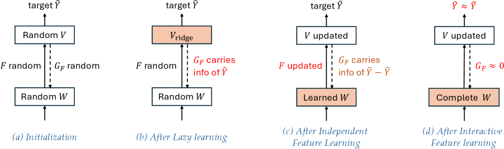

###### fig-2
*Рисунок 2: Три стадии рамки Li2. **(a)** Случайная инициализация весов. **(b)** *Стадия I*: модель сперва учится переобучаться на данные случайными признаками скрытого слоя, тогда как сам скрытый слой меняется мало из-за шумного обратно распространяемого градиента $G_{F}$. **(c)** *Стадия II*: как только выходной слой переобучился на данные, $G_{F}$ становится связан с целевой меткой $\tilde{Y}$ при подходящем weight decay $\eta$. Более того, $G_{F}$ действует на каждый скрытый нейрон независимо и толкает их выучивать признаки через функцию энергии $\mathcal{E}$ (теорема 1). **(d)** *Стадия III*: скрытый слой выучил некоторые признаки, появляются взаимодействия (теорема 6), и обратно распространяемый градиент $G_{F}$ теперь несёт сведения об остатке $\tilde{Y}-\hat{Y}$, подталкивая скрытый слой выучивать недостающие признаки (теорема 7).* **[p. 3]**

## 2 Постановка задачи

Мы рассматриваем двухслойную сеть $\hat{Y}=\sigma(XW)V$ и $\ell_{2}$-функцию потерь на $n$ образцах:

$$
\min_{V,W}\frac{1}{2}\|P^{\perp}_{1}(Y-\hat{Y})\|_{F}^{2}=\min_{V,W}\frac{1}{2}\|P^{\perp}_{1}(Y-\sigma(XW)V)\|_{F}^{2} \tag{1}
$$

где $P^{\perp}_{1}:=I-\mathbf{1}\mathbf{1}^{\top}/n$ — матрица проекции на нулевое среднее вдоль размерности образцов, $Y\in\mathbb{R}^{n\times M}$ — матрица меток (каждая строка — one-hot вектор), $X=[\mathbf{x}_{1},\mathbf{x}_{2},\ldots,\mathbf{x}_{n}]^{\top}\in\mathbb{R}^{n\times d}$ — матрица данных, $V\in\mathbb{R}^{K\times M}$ и $W\in\mathbb{R}^{d\times K}$ — матрицы весов последнего и скрытого слоёв соответственно. $\sigma$ — нелинейная функция активации.

Далее мы показываем, что гроккинг есть следствие «просачивания» обратно распространяемого градиента $G_{F}$.

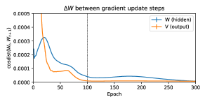

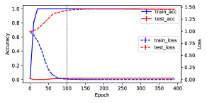

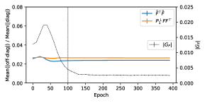

###### fig-3
*Рисунок 3: Динамика гроккинга на задаче модульного сложения при $M=71$, $K=2048$, $n=2016$ ($40\%$ обучающих данных из $71^{2}$ образцов) с weight decay и без него. *Вверху*: $\eta=0.0002$, гроккинг происходит. *Внизу*: $\eta=0$, гроккинга нет. Weight decay ведёт к большему $|G_{F}|$ около эпохи $100$ и вызывает поведение гроккинга. Разность весов $\Delta W$ между последовательными весами в моменты $t$ и $t+1$, измеренная косинусным расстоянием, показывает двухстадийное поведение: сперва идёт огромное обновление выходных весов $V$, затем большое обновление скрытых весов $W$. На протяжении всего обучения $\tilde{F}^{\top}\tilde{F}$ и $P^{\perp}_{1}FF^{\top}$ остаются диагональными с погрешностью до $8\%$, что подтверждает наш разбор (независимое обучение признакам, раздел 4). Эксперименты усреднены по $15$ сидам.* **[p. 4]**

## 3 Стадия I: ленивое обучение (переобучение)

Пусть $F=\sigma(XW)$ — активация скрытого слоя, а $\tilde{F}=P^{\perp}_{1}F$ — её вариант с нулевым средним. Аналогично определим $\tilde{Y}=P^{\perp}_{1}Y$. Сперва выпишем обратно распространяемый градиент $G_{F}$, посылаемый скрытому слою:

$$
G_{F}=-\frac{\partial J}{\partial F}=P^{\perp}_{1}(Y-FV)V^{\top} \tag{2}
$$

### 3.1 Разбор обратно распространяемого градиента $G_{F}$

В начале обучения и $W$, и $V$ инициализированы независимыми случайными величинами с нулевым средним. Поэтому обратно распространяемый градиент $G_{F}$ — чистый случайный шум. Со временем скрытая активация $F$ в основном не меняется, и учится только выходной слой $V$. В этом случае $F$ можно считать неизменной на этой стадии обучения, и мы можем доказать следующие свойства $G_{F}$ (раздел C):

**[p. 4]**

##### **Утверждение 1****.**

*Если $\tilde{F}$ неизменна и имеет полный столбцовый ранг, а элементы $V(0)$ инициализированы из нормального распределения $N(0,\alpha^{2})$ при $0<\alpha\ll 1$, то $\|G_{F}(0)\|_{F}=O(\epsilon\sqrt{KM})$, и в начальные моменты времени обратно распространяемый градиент $G_{F}$ определяется слагаемым $\tilde{Y}\tilde{Y}^{\top}F$:*

$$
G_{F}(t)=t{\color[rgb]{1,0,0}\tilde{Y}\tilde{Y}^{\top}\tilde{F}}+O(\alpha)+O(\alpha t)+O(t^{2}) \tag{3}
$$

*и экспоненциально сходится к следующей неподвижной точке при $V=V_{\textrm{ridge}}=(\tilde{F}^{\top}\tilde{F}+\eta I)^{-1}\tilde{F}^{\top}\tilde{Y}$:*

$$
G_{F}(+\infty)=\eta(\tilde{F}\tilde{F}^{\top}+\eta I)^{-1}{\color[rgb]{1,0,0}\tilde{Y}\tilde{Y}^{\top}\tilde{F}}(\tilde{F}^{\top}\tilde{F}+\eta I)^{-1} \tag{4}
$$

$G_{F}$ **в начальной фазе**. Утверждение говорит, что при малой инициализации верхнего слоя (измеряемой $\alpha$) $\|G_{F}\|$ сперва вырастет с $O(\alpha)$ до $O(1)$, а затем экспоненциально сойдётся к $O(\eta)$. Рисунок 3 показывает, что для $\|G_{F}\|$ так и происходит — независимо от того, случается гроккинг или нет.

$G_{F}$ **в поздней фазе**. Структуру $G_{F}(+\infty)$ раскрывает следующая лемма:

##### **Лемма 1**(Структура обратно распространяемого градиента $G_{F}$)**.**

*Предположим, что (1) элементы $W$ подчиняются стандартному нормальному распределению $N(0,1)$, (2) $\|\mathbf{x}_{i}\|_{2}=\text{const}$, (3) $\|\mathbf{x}_{i}^{\top}\mathbf{x}_{i^{\prime}}-\rho\|_{2}\leq\epsilon$ для всех $i\neq i^{\prime}$ и (4) ширина $K$ велика; тогда и $\tilde{F}^{\top}\tilde{F}$, и $\tilde{F}\tilde{F}^{\top}$ становятся кратными единичной матрице, а уравнение 4 принимает вид:*

$$
G_{F}(+\infty)=\frac{\eta}{(Kc_{1}+\eta)(nc_{2}+\eta)}\tilde{Y}\tilde{Y}^{\top}\tilde{F}+O(K^{-1}\epsilon) \tag{5}
$$

*где $c_{1},c_{2}>0$ — постоянные, связанные с нелинейностью. При малом $\eta$ имеем $G_{F}\propto\eta\tilde{Y}\tilde{Y}^{\top}\tilde{F}$. Заметим, что входные признаки и/или веса можно масштабировать, и меняются при этом лишь $c_{1}$ и $c_{2}$.*

Что любопытно, в обоих случаях мы видим, что $G_{F}$ содержит ключевое слагаемое ${\color[rgb]{1,0,0}\tilde{Y}\tilde{Y}^{\top}\tilde{F}}$. Как мы увидим, оно играет решающую роль в обучении признакам. Из уравнения 5 ясно, что если $K\rightarrow+\infty$, то $G_{F}(+\infty)\rightarrow 0$ и обучения признакам нет (то есть режим NTK). Здесь мы изучаем случай, когда $K$ велико (так что уравнение 5 верно), но не слишком велико — так, чтобы обучение признакам происходило.

### 3.2 Нулевая инициализация ускоряет обучение признакам

С учётом разбора стадии I в разделе 3 напрашивается мысль: если инициализировать веса верхнего слоя $V$ нулём, то на начальной стадии обратно распространяемый градиент $G_{F}(t)$ несёт, согласно уравнению 3, только сигнальное слагаемое $\tilde{Y}\tilde{Y}^{\top}F$, и обучение признакам должно ускориться. Мы назвали этот новый подход нулевой инициализацией (zero-init).

###### p4-9
Эксперименты показывают, что так и есть. Рисунки 14, 15 и 16 показывают, что для $M=41,89,127$ нулевая инициализация ускоряет обучение признакам по сравнению с обычной инициализацией.

**[p. 5]**

В многослойной постановке выигрыш от нулевой инициализации больше (рис. 17) — особенно когда данных мало и обучение признакам идёт медленно. Разрыв может доходить до $10\times$ (например, 100 эпох против 1000) при обучении на MSE-потере.

Все эксперименты — в приложении D.2.

## 4 Стадия II: независимое обучение признакам

### 4.1 Функция энергии $\mathcal{E}$

Теперь исследуем процесс обучения признакам с помощью $G_{F}$. Пусть $W=[\mathbf{w}_{1},\mathbf{w}_{2},\ldots,\mathbf{w}_{K}]$, где $\mathbf{w}_{j}\in\mathbb{R}^{d}$ — вектор весов $j$-го узла, и $F=[\mathbf{f}_{1},\mathbf{f}_{2},\ldots,\mathbf{f}_{K}]$, где $\mathbf{f}_{j}=\sigma(X\mathbf{w}_{j})\in\mathbb{R}^{n}$ — активация $j$-го узла. При $G_{F}\propto\tilde{Y}\tilde{Y}^{\top}\tilde{F}$ — структура, показанная и для начальной стадии (уравнение 3), и для поздней (уравнение 5), — $j$-й столбец $\mathbf{g}_{j}$ матрицы $G_{F}$ зависит только от $j$-го узла $\mathbf{w}_{j}$, и потому динамику можно расцепить на $K$ независимых, каждая из которых отвечает одному узлу:

$$
\dot{\mathbf{w}}_{j}=X^{\top}D_{j}\mathbf{g}_{j},\quad\mathbf{g}_{j}\propto\tilde{Y}\tilde{Y}^{\top}\sigma(X\mathbf{w}_{j}) \tag{6}
$$

где $D_{j}=\text{diag}(\sigma^{\prime}(X\mathbf{w}_{j}))$ — диагональная матрица вентилей $j$-го узла. Заметим, что $\tilde{Y}^{\top}F=\tilde{Y}^{\top}\tilde{F}$, поскольку $P^{\perp}_{1}$ идемпотентна. Решающее наблюдение здесь в том, что уравнение 6 на деле отвечает динамике *градиентного подъёма* функции энергии $\mathcal{E}$.

##### **Теорема 1**(Функция энергии $\mathcal{E}$ для независимого обучения признакам)**.**

*Динамика (уравнение 6) независимого обучения признакам есть в точности динамика градиентного подъёма функции энергии $\mathcal{E}$ по $\mathbf{w}_{j}$ — нелинейного канонического корреляционного анализа (CCA) между входом $X$ и целью $\tilde{Y}$:*

$$
\mathcal{E}(\mathbf{w}_{j})=\frac{1}{2}\|\tilde{Y}^{\top}\sigma(X\mathbf{w}_{j})\|^{2}_{2} \tag{7}
$$

Поэтому признак, выучиваемый каждым узлом $j$, — тот, который максимизирует функцию энергии $\mathcal{E}(\mathbf{w}_{j})$. Поскольку уравнение 6 может быть неограниченным, далее мы налагаем дополнительное условие $\|\mathbf{w}_{j}\|_{2}=1$ — в силу регуляризации weight decay. Заметим, что в (Tian, 2023) тоже приходят к функции энергии при изучении обучения признакам в контексте контрастной потери, но полученная там функция абстрактна, и структуру её локальных максимумов трудно истолковать. Здесь структура куда яснее, и ниже мы её исследуем.

### 4.2 Задачи групповой арифметики

Чтобы разобрать конкретный пример решения задачи о функции энергии $\mathcal{E}$, рассмотрим задачи *групповой арифметики*: для группы $H$ требуется предсказать $h=h_{1}h_{2}$ по $h_{1},h_{2}\in H$. Один из примеров — задача модульного сложения $h_{1}h_{2}=h_{1}+h_{2}\mod M$, обширно изучавшаяся в связи с гроккингом (Power et al., 2022; Gromov, 2023; Huang et al., 2024; Tian, 2025).

**Определение группы**. Здесь $h_{1}h_{2}$ — *групповая операция* двух элементов $h_{1}$ и $h_{2}$ группы $H$. Групповая операция удовлетворяет нескольким свойствам: (1) она ассоциативна, то есть $(h_{1}h_{2})h_{3}=h_{1}(h_{2}h_{3})$ для всех $h_{1},h_{2},h_{3}\in H$; (2) существует единичный элемент $e$ такой, что $he=eh=h$ для всех $h\in H$; (3) для каждого $h\in H$ существует обратный $h^{-1}$ такой, что $hh^{-1}=h^{-1}h=e$. Заметим, что в общем случае групповая операция не коммутативна, то есть $h_{1}h_{2}\neq h_{2}h_{1}$ для некоторых $h_{1},h_{2}\in H$. Если операция коммутативна, группу называют *абелевой*. Модульное сложение — пример абелевой группы.

**Задача**. Мы представляем элементы группы one-hot векторами: каждый образец данных $\mathbf{x}_{i}\in\mathbb{R}^{2M}$ — сцепление двух $M$-мерных one-hot векторов $(\mathbf{e}_{h_{1}[i]},\mathbf{e}_{h_{2}[i]})$, где $h_{1}[i]$ и $h_{2}[i]$ — индексы этих двух one-hot векторов. Выход тоже one-hot вектор $\mathbf{y}_{i}=\mathbf{e}_{h_{1}[i]h_{2}[i]}$, где $1\leq i\leq n=M^{2}$. Здесь число классов $M=|H|$ есть размер группы.

**Краткий курс теории представлений групп**. Отображение $\rho(h):H\mapsto\mathbb{C}^{d\times d}$ называется *представлением группы*, если групповая операция согласована с матричным умножением: $\rho(h_{1})\rho(h_{2})=\rho(h_{1}h_{2})$ для любых $h_{1},h_{2}\in H$. Пусть $R_{h}\in\mathbb{R}^{M\times M}$ — *регулярное представление* элемента группы $h$, так что $\mathbf{e}_{h_{1}h_{2}}=R_{h_{1}}\mathbf{e}_{h_{2}}$ для всех $h_{1},h_{2}\in H$, а $P\in\mathbb{R}^{M\times M}$ — оператор взятия обратного элемента, так что $P\mathbf{e}_{h}=\mathbf{e}_{h^{-1}}$. Заметим, что $P^{2}=I$ и $P^{\top}=P^{-1}=P$.

**[p. 6]**

###### p6-1
**Повесть о двух родах «представлений»**. Векторы активаций в нейронной сети мы часто называем «нейронными представлениями», имея в виду, что высокоразмерными векторами представляются те или иные смысловые понятия (например, word2vec (Mikolov et al., 2013)). Для групп же элемент группы отвечает «преобразованию» или «действию», которое действует на один объект и превращает его в другой (например, поворот вектора). Поэтому представления групп часто имеют вид матриц (например, матрицы перестановки или поворота).

**Разложение представления группы**. Теория представлений конечных групп (Fulton & Harris, 2013; Steinberg, 2009) говорит, что регулярное представление $R_{h}$ допускает разложение на комплексные *неприводимые* представления (или *непредставления*, irreps):

$$
R_{h}=Q\left(\bigoplus_{k=0}^{\kappa(H)}\bigoplus_{r=1}^{m_{k}}C_{k}(h)\right)Q^{*} \tag{8}
$$

где $\kappa(H)$ — число нетривиальных неприводимых представлений (то есть таких, где не все $h$ переходят в единицу), $C_{k}(h)\in\mathbb{C}^{d_{k}\times d_{k}}$ — $k$-й неприводимый блок $R_{h}$, $Q$ — унитарная матрица (а $Q^{*}$ — её эрмитово сопряжение), а $m_{k}$ — кратность $k$-го неприводимого представления. Это означает, что в разложении $R_{h}$ есть $m_{k}$ копий $d_{k}$-мерного неприводимого представления, и эти копии изоморфны друг другу. Значит, $k$-е *неприводимое подпространство* $\mathcal{H}_{k}$ имеет размерность $m_{k}d_{k}$.

###### p6-4
Для регулярного представления $\{R_{h}\}$ можно доказать, что $m_{k}=d_{k}$ для всех $k$ и потому $|H|=M=\sum_{k}d^{2}_{k}$. Для абелевой группы все комплексные неприводимые представления одномерны (то есть это базисы Фурье). Разложение можно провести и в вещественной области. В этом случае пара одномерных комплексных неприводимых представлений превращается в двумерное вещественное. Например, $e^{\mathrm{i}\theta}$ и $e^{-\mathrm{i}\theta}$ становятся двумерной матрицей $[\cos(\theta),-\sin(\theta);\sin(\theta),\cos(\theta)]$.

### 4.3 Локальные максимумы функции энергии

Теперь изучим локальные максимумы $\mathcal{E}$. С помощью разложения мы можем полностью описать локальные максимумы энергии $\mathcal{E}$ на групповых входах — даже при том, что $\mathcal{E}(\mathbf{w})$ невыпукла.

##### **Теорема 2**(Локальные максимумы $\mathcal{E}$ для группового входа)**.**

*Для задач групповой арифметики с $\sigma(x)=x^{2}$ у $\mathcal{E}$ есть несколько локальных максимумов $\mathbf{w}^{\ast}=[\mathbf{u};\pm P\mathbf{u}]$. Либо он лежит в вещественном неприводимом представлении размерности $d_{k}$ (с $\mathcal{E}^{\ast}=M/8d_{k}$ и $\mathbf{u}\in\mathcal{H}_{k}$), либо в паре комплексных неприводимых представлений размерности $d_{k}$ (с $\mathcal{E}^{\ast}=M/16d_{k}$ и $\mathbf{u}\in\mathcal{H}_{k}\oplus\mathcal{H}_{\bar{k}}$). Эти локальные максимумы не связаны между собой. Других локальных максимумов не существует.*

Заметим, что наше доказательство распространяется и на более общую нелинейность $\sigma(x)=ax+bx^{2}$ при $b>0$, поскольку линейная часть сокращается операторами нулевого среднего. Мы можем показать, что локальные максимумы $\mathcal{E}$ плоские, что позволяет двигаться, не меняя $\mathcal{E}$:

##### **Следствие 1**(Плоскость локальных максимумов $\mathcal{E}$ для группового входа)**.**

*Локальные максимумы $\mathcal{E}$ для задач групповой арифметики при $|H|=M>2$ плоские, то есть по крайней мере одно собственное значение гессиана равно нулю.*

###### p6-9
Приведённую теорему можно применить к популярной задаче модульного сложения, которая является абелевой группой. Получающееся представление — базисы Фурье.

##### **Следствие 2**(Модульное сложение)**.**

*Для модульного сложения при нечётном $M$ все локальные максимумы одночастотны: $\mathbf{u}_{k}=a_{k}[\cos(km\omega)]_{m=0}^{M-1}+b_{k}[\sin(km\omega)]_{m=0}^{M-1}$, где $\omega:=2\pi/M$, с $\mathcal{E}^{\ast}=M/16$. При чётном $M$ у $\mathbf{u}_{M/2}\propto[(-1)^{m}]_{m=0}^{M-1}$ имеем $\mathcal{E}^{\ast}=M/8$. Различные локальные максимумы не связаны между собой.*

**Роль нелинейности**. Заметим, что если $\sigma(x)$ линейна, то локальных максимумов нет — есть лишь один глобальный, а именно максимальный собственный вектор $X^{\top}\tilde{Y}\tilde{Y}^{\top}X$. Это отвечает линейному дискриминантному анализу (LDA) (Balakrishnama & Ganapathiraju, 1998), который находит направления, максимально разделяющие векторы средних по классам. В задачах групповой арифметики для каждой цели $h=h_{1}h_{2}$ каждый элемент группы ($h_{1}$ и $h_{2}$) встречается ровно один раз, векторы средних по классам одинаковы, и потому LDA не способен выделить никаких осмысленных направлений. С нелинейностью же выученное $\mathbf{w}$ имеет ясный смысл.

**Смысл выученных признаков**. Во-первых, выученное представление даёт более эффективное восстановление цели (см. теорему 3), чем простое запоминание всех $M^{2}$ пар. Во-вторых, выученные представления естественным образом содержат полезную инвариантность. Например, некоторые неприводимые представления циклической группы $\mathbb{Z}_{15}$ ведут себя как её подгруппы $\mathbb{Z}_{3}$ и $\mathbb{Z}_{5}$, отображая элемент $h$ в $\mathrm{div}(h,3)$ и $\mathrm{div}(h,5)$. Если считать, что $h$ управляется двумя скрытыми факторами, то эти признаки ведут к сосредоточению на одном факторе и инвариантности к другим. Что важнее, они возникают сами, без явного надзора.

###### fig-4
*Рисунок 4: Изменение ландшафта функции энергии $\mathcal{E}$ (теорема 1). **Слева:** $\mathcal{E}$ с линейной активацией сводится к простому разложению по собственным векторам и имеет лишь один глобальный максимум. **В центре:** с нелинейностью у ландшафта энергии появляется несколько строгих локальных максимумов, каждый из которых отвечает признаку (теорема 2). Что важнее, эти признаки эффективнее запоминания в предсказании цели (теорема 3). **Справа:** при достаточных обучающих данных ландшафт остаётся устойчивым, и эти (обобщаемые) признаки удаётся восстановить (теорема 4); при недостаточных данных ландшафт существенно меняется, и локальные максимумы становятся запоминанием (теорема 5).* **[p. 7]**

**[p. 7]**

### 4.4 Выразительная сила выученных признаков

По теореме 2 мы знаем, что каждый узел скрытого слоя выучит то или иное представление. Вопрос в том, достаточно ли их, чтобы восстановить цель $\tilde{Y}$, и насколько они эффективны.

##### **Теорема 3**(Восстановление цели)**.**

*Предположим, что (1) $\mathcal{E}$ оптимизируется в комплексной области $\mathbb{C}$, (2) для каждого неприводимого представления $k$ есть $m^{2}_{k}d^{2}_{k}$ пар выученных весов $\mathbf{w}=[\mathbf{u};\pm P\mathbf{u}]$, чьи соответствующие матрицы ранга 1 $\{\mathbf{u}\mathbf{u}^{*}\}$ образуют полный базис $\mathcal{H}_{k}$, и (3) верхний слой $V$ тоже учится при $\eta=0$; тогда $\hat{Y}=\tilde{Y}$.*

Из теоремы мы знаем, что достаточно $K=2\sum_{k\neq 0}m^{2}_{k}d^{2}_{k}\leq 2\left[(M-\kappa(H))^{2}+\kappa(H)-1\right]$. В частности, для абелевой группы $\kappa(H)=M-1$ и $K=2M-2$. Это куда эффективнее чисто запоминающего решения, которому потребовалось бы $M^{2}$ узлов, то есть по узлу на каждую пару $(h_{1},h_{2})\in H\times H$.

**Предположения теоремы**. Обучение модели сквозным образом автоматически выполняет предположение (3). Если инициализировать веса случайно, то с высокой вероятностью получающиеся $\mathbf{u}$ не коллинеарны, и предположение (2) может быть выполнено. Что до предположения (1), любопытно, что в вещественной области $\mathbb{R}$ такую теорему сформулировать нельзя, поскольку в $\mathbb{R}$ подпространство ортогональных матриц, которому принадлежат представления групп, не покрывается подпространством симметричных матриц, натянутым на $\{\mathbf{u}\mathbf{u}^{\top}\}$. Напротив, в комплексной области $\mathbb{C}$ подпространство унитарных матриц представимо эрмитовыми матрицами. Значит ли это, что вещественное представление не так уж полезно? Не совсем. Если слегка изменить $\mathbf{w}=[\mathbf{u};\pm P\mathbf{u}]$ на $\mathbf{w}=[\mathbf{u};\pm P\mathbf{u}^{\prime}]$, где $\mathbf{u}^{\prime}$ — малое возмущение $\mathbf{u}$, то теорема 3 верна и для вещественных решений. Это и происходит на стадии III, когда сквозное обратное распространение уточняет представление. Рисунок 11 показывает, что комплексные веса тоже работают и могут грокать быстрее.

### 4.5 Законы масштабирования границы запоминания и генерализации

Хотя теорема 2 показывает изящную структуру локальных максимумов (и выучиваемых признаков), она требует обучения на всех $n=M^{2}$ парах элементов группы. Можно спросить, выучиваются ли эти представления при обучении на подмножестве. Ответ — да, и это проверяется устойчивостью локального максимума.

##### **Теорема 4**(Количество образцов для удержания локальных оптимумов)**.**

*Если выбрать $n\gtrsim d_{k}^{2}M\log(M/\delta)$ образцов данных из $H\times H$ равномерно случайно, то с вероятностью не менее $1-\delta$ эмпирическая функция энергии $\hat{\mathcal{E}}$ сохраняет локальные максимумы для $d_{k}$-мерных неприводимых представлений (теорема 2).*

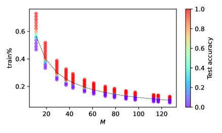

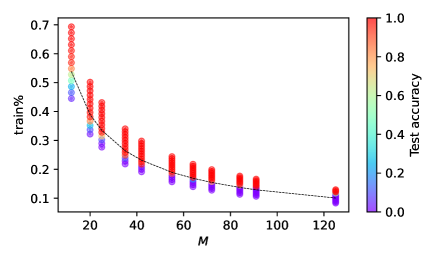

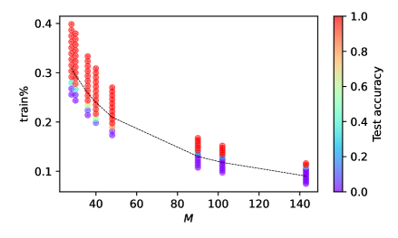

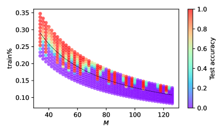

###### fig-5
*Рисунок 5: Фазовый переход между генерализацией и запоминанием в задачах модульного сложения. С ростом $M$ доля обучающих данных $p=n/M^{2}$, нужная для генерализации, убывает. Это совпадает с теоремой 4, предсказывающей $p\sim M^{-1}\log M$ (пунктирная линия). Мы берём скорость обучения $0.0005$, weight decay $0.0002$ и $K=2048$. Результаты усреднены по 20 сидам. **Вверху слева:** простая циклическая группа $\mathbb{Z}_{M}$ для простого $M$. **Вверху справа:** $\mathbb{Z}_{M}$ для составного $M$. **Внизу слева:** прямые произведения групп $\mathbb{Z}_{4}\otimes\mathbb{Z}_{7}$, $\mathbb{Z}_{5}\otimes\mathbb{Z}_{6}$, $\mathbb{Z}_{2}\otimes\mathbb{Z}_{2}\otimes\mathbb{Z}_{9}$, $\mathbb{Z}_{13}\otimes\mathbb{Z}_{11}$, $\mathbb{Z}_{5}\otimes\mathbb{Z}_{2}\otimes\mathbb{Z}_{2}\otimes\mathbb{Z}_{2}$, $\mathbb{Z}_{6}\otimes\mathbb{Z}_{4}\otimes\mathbb{Z}{2}$, $\mathbb{Z}_{3}\otimes\mathbb{Z}_{2}\otimes\mathbb{Z}_{17}$, $\mathbb{Z}_{2}\otimes\mathbb{Z}_{3}\otimes\mathbb{Z}_{3}\otimes\mathbb{Z}_{5}$. **Внизу справа:** неабелевы группы с $\max_{k}d_{k}=2$ (максимальная неприводимая размерность $2$). Эти неабелевы группы порождены программами GAP (см. приложение, раздел D.1).* **[p. 8]**

###### p7-7
Приведённая теорема говорит, что нам не нужны все $M^{2}$ образцов — достаточно $O(M\log M)$, чтобы выучить эти признаки, которые, согласно теореме 3, обобщатся на невиданные данные. Рисунок 5 показывает, что эмпирические результаты близко совпадают с теоретическим предсказанием, и что вблизи границы есть ясный фазовый переход (точность на тесте $0\rightarrow 1$), где доля обучающих данных $p:=n/M^{2}=O(M^{-1}\log M)$.

**Запоминание**. С другой стороны, можно построить и случаи, когда запоминание оказывается единственным локальным максимумом $\mathcal{E}$. Это происходит, когда мы собираем образцы лишь для одной цели $h$, упуская остальные, и разнообразие оказывается под вопросом.

##### **Теорема 5**(Запоминающее решение)**.**

*Пусть $\phi(x):=\sigma^{\prime}(x)/x$ и пусть $\sigma^{\prime}(x)>0$ при $x>0$. Для задач групповой арифметики предположим, что мы собираем только образцы $(g,g^{-1}h)$ для одной цели $h$ с вероятностью* **[p. 8]** *$p_{g}$. Тогда глобальный оптимум $\mathcal{E}$ есть запоминающее решение: либо (1) *сосредоточенное запоминание* $\mathbf{w}=\frac{1}{\sqrt{2}}(\mathbf{e}_{g^{*}},\mathbf{e}_{g^{*-1}h})$ для $g^{*}=\arg\max p_{g}$, если $\phi$ неубывающая, либо (2) *размазанное запоминание* с $\mathbf{w}=\frac{1}{2}\sum_{g}s_{g}[\mathbf{e}_{g},\mathbf{e}_{g^{-1}h}]$, если $\phi$ строго убывающая. Здесь $s_{g}=\phi^{-1}(2\lambda/p_{g})$, а $\lambda$ определяется из $\sum_{g}s_{g}^{2}=2$. Других локальных оптимумов не существует.*

Можно проверить, что степенные активации (например, $\sigma(x)=x^{2}$) ведут к сосредоточенному запоминанию, тогда как более практичные (например, ReLU, SiLU, Tanh и Sigmoid) — к размазанному. Ведёт ли это свойство к лучшим результатам в крупномасштабных постановках, мы оставляем на будущее.

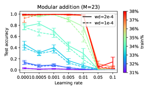

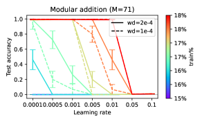

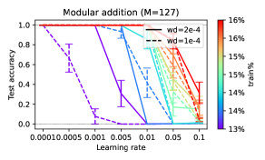

###### fig-6
*Рисунок 6: Фазовый переход от обобщаемых решений (gsol) к необобщаемым (ngsol) в задачах модульного сложения ($M=23,71,127$) при $K=1024$. Вблизи этой критической области малая скорость обучения вероятнее ведёт к gsol — из-за того, что малая скорость обучения удерживает траекторию в бассейне притяжения gsol, тогда как большая сходится к решениям с более высокой $\mathcal{E}$ (рис. 7). Результаты усреднены по 15 сидам.* **[p. 8]**

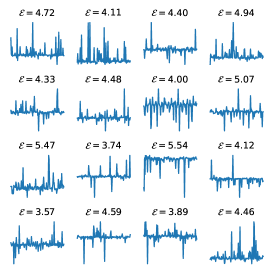

###### fig-7
*Рисунок 7: В режиме малых данных для модульного сложения при $M=127$ и $n=3225$ (20 % обучающих из $127^{2}$ образцов) оптимизатор Adam с малой скоростью обучения (($0.001$, слева) и ($0.002$, в центре)) ведёт к обобщаемым решениям (базисам Фурье) с низкой $\mathcal{E}$, тогда как при большой скорости обучения ($0.005$, справа) Adam нашёл необобщаемые решения (например, запоминание) с гораздо более высокой $\mathcal{E}$.* **[p. 9]**

###### p8-2
**Граница генерализации и запоминания (*полу-грокинг* (Varma et al., 2023))**. Между двумя крайними случаями локальные максимумы запоминания и генерализации могут сосуществовать. В этом случае малая скорость обучения удерживает оптимизацию в бассейне притяжения и сходится к gsol, тогда как большая ведёт к ngsol, у которого энергия $\mathcal{E}$ лучше (рис. 7).

Наш разбор хорошо согласуется с наблюдаемым эмпирическим поведением, при котором существует критический размер данных (Varma et al., 2023) или, точнее, критическая доля данных (Wang et al., 2024a; Abramov et al., **[p. 9]** 2025; Liu et al., 2022), выше которой гроккинг внезапно ведёт к генерализации. Наша рамка Li2 даёт объяснение, подкреплённое теорией: разные распределения данных ведут к разным ландшафтам, которые дают либо обобщающие, либо запоминающие локальные максимумы, в которые и попадут веса. Это объясняет и явление *унгрокинга*: грокнувшая модель может вернуться к запоминанию, если продолжить обучение на меньшем наборе данных (Varma et al., 2023), — и согласуется с (Nguyen & Reddy, 2025), где показано, что разнообразие задач важно для генерализации. Эмпирическая гипотеза (например, о «запоминающих и обобщающих контурах») теперь становится естественным следствием изменившегося ландшафта после обучения.

## 5 Стадия III: взаимодействующее обучение признакам

Отправная точка стадии II — упрощение точного обратно распространяемого градиента $G_{F}=P_{\eta}\tilde{Y}\tilde{Y}^{\top}\tilde{F}B$ (уравнение 4) с $B:=(\tilde{F}^{\top}\tilde{F}+\eta I)^{-1}$ до $G_{F}\propto\eta\tilde{Y}\tilde{Y}^{\top}F$ двумя приближениями: (1) $B\propto I$ и (2) $P_{\eta}\propto\eta I$. Оба приближения верны в силу теоремы 1, когда скрытые веса $W$ инициализированы случайно. При продолжении обучения $W$ уходит от случайной инициализации, и условия могут перестать выполняться. В этом разделе мы возвращаем их и изучаем поведение.

### 5.1 Отталкивание схожих признаков

Сперва изучим действие $B$, которое ведёт к взаимодействию скрытых узлов. За время обучения активации двух узлов могут стать сильно скоррелированными, и следующая теорема показывает, что схожие признаки ведут к отталкиванию.

##### **Теорема 6**(Отталкивание схожих признаков)**.**

*$j$-й столбец $\tilde{F}B$ даётся выражением:*

$$
[\tilde{F}B]_{j}=b_{jj}\tilde{\mathbf{f}}_{j}+\sum_{l=1}^{K}b_{jl}\tilde{\mathbf{f}}_{l} \tag{9}
$$

*где $\mathrm{sign}(b_{jl})=-\mathrm{sign}(\tilde{\mathbf{f}}_{j}^{\top}P_{\eta,-jl}\tilde{\mathbf{f}}_{l})$. Здесь $P_{\eta,-jl}:=I-\tilde{F}_{-jl}(\tilde{F}_{-jl}^{\top}\tilde{F}_{-jl}+\eta I)^{-1}\tilde{F}_{-jl}^{\top}$ — матрица проекции, построенная по $\tilde{F}_{-jl}$, то есть по $\tilde{F}$ без $l$-го и $j$-го столбцов.*

**Замечание**. Наглядно: если $\tilde{\mathbf{f}}_{j}$ и $\tilde{\mathbf{f}}_{l}$ схожи, то $b_{jl}$ окажется отрицательным, и получающиеся $j$-й и $l$-й столбцы $\tilde{F}B$ будут отталкиваться друг от друга, и наоборот.

### 5.2 Модуляция сверху вниз

По ходу обучения возможно, что одни локальные оптимумы выучиваются раньше, а другие позже. Когда представления выучены частично, обратное распространение даёт способ сосредоточиться на недостающих частях, меняя ландшафт функции энергии $\mathcal{E}$.

##### **Теорема 7**(Модуляция сверху вниз)**.**

**[p. 10]**

*Для задач групповой арифметики с $\sigma(x)=x^{2}$: если скрытый слой выучил лишь подмножество $\mathcal{S}$ неприводимых представлений, то обратно распространяемый градиент $G_{F}\propto(\Phi_{\mathcal{S}}\otimes\mathbf{1}_{M})(\Phi_{\mathcal{S}}\otimes\mathbf{1}_{M})^{\ast}F$ (определение $\Phi_{\mathcal{S}}$ — в доказательстве), что даёт изменённую $\mathcal{E}_{\mathcal{S}}$, у которой локальные максимумы есть только на недостающих неприводимых представлениях $k\notin\mathcal{S}$.*

### 5.3 Усиление разнообразия с Muon

Помимо описанного механизма, эту же трудность способны решать и некоторые оптимизаторы (например, Muon (Jordan et al., 2024)) — усиливая недопредставленные направления обновления весов и тем самым обеспечивая разнообразие узлов. Хотя есть свидетельства (Tveit et al., 2025) и разборы (Shen et al., 2025), показывающие преимущества Muon над другими оптимизаторами, насколько нам известно, мы первыми разбираем его в контексте обучения признакам.

Напомним, что оптимизатор Muon превращает градиент $G_{W}=U_{G_{W}}DV_{G_{W}}^{\top}$ (его сингулярное разложение) в $G^{\prime}_{W}=U_{G_{W}}V_{G_{W}}^{\top}$ и соответственно обновляет веса $W$ (то есть $\dot{W}\propto G^{\prime}_{W}$). Сперва мы показываем, что когда Muon применяется к независимому обучению признакам по каждому $\mathbf{w}_{j}$, связывая их, он всё же даёт верные ответы на исходные задачи оптимизации.

##### **Лемма 2**(Muon оптимизирует то же, что и градиентный поток)**.**

*Muon находит направление подъёма, максимизирующее совместную функцию энергии $\mathcal{E}_{\mathrm{joint}}(W)=\sum_{j}\mathcal{E}(\mathbf{w}_{j})$, и имеет стационарные точки тогда и только тогда, когда исходный градиент $G_{W}$ обращается в нуль.*

Теперь покажем, что оптимизатор Muon способен перебалансировать обновления градиента.

##### **Теорема 8**(Muon перебалансирует обновления градиента)**.**

*Рассмотрим следующую динамику (Tian, 2023):*

$$
\dot{\mathbf{w}}=A(\mathbf{w})\mathbf{w},\quad\quad\|\mathbf{w}\|_{2}\leq 1 \tag{10}
$$

*где $A(\mathbf{w}):=\sum_{l}\lambda_{l}(\mathbf{w})\boldsymbol{\zeta}_{l}\boldsymbol{\zeta}^{\top}_{l}$. Предположим, что (1) $\{\boldsymbol{\zeta}_{l}\}$ образуют ортонормированный базис, (2) для $\mathbf{w}=\sum_{l}\alpha_{l}\boldsymbol{\zeta}_{l}$ имеем $\lambda_{l}(\mathbf{w})=\mu_{l}\alpha_{l}$ с $\mu_{l}\leq 1$ и (3) $\{\alpha_{l}\}$ инициализированы из *обратно-экспоненциального распределения* с $\mathrm{CDF}(x)=\exp(-x^{-a})$, где $a>1$. Тогда*

- *Независимое обучение признакам**.*$\Pr[\mathbf{w}\rightarrow\boldsymbol{\zeta}_{l}]=p_{l}:=\mu_{l}^{a}/\sum_{l}\mu_{l}^{a}$*. Тогда ожидаемое число узлов, чтобы получить все локальные максимумы, есть*$T_{0}\geq\max\left(1/\min_{l}p_{l},\sum_{l=1}^{L}1/l\right)$*.*
- *Направление с Muon**. Если оптимизировать*$K$*узлов последовательно оптимизатором Muon, то ожидаемое число узлов, чтобы получить все локальные максимумы, есть*$T_{a}=2^{-a}T_{0}+(1-2^{-a})L$*. Для больших*$a$*,*$T_{a}\sim L$*.*

Наглядное объяснение таково: как только некоторые векторы весов «заняли» локальный максимум, скажем $\boldsymbol{\zeta}_{m}$, их градиенты указывают в одном направлении (до проецирования на единичную сферу $\|\mathbf{w}\|_{2}=1$), и градиентная поправка Muon вычтет эту составляющую из градиентов оптимизируемых сейчас векторов весов, удерживая их подальше от $\boldsymbol{\zeta}_{m}$. Тем самым Muon продвигает новые направления градиента и потому поощряет разведку. Рисунок 8 показывает, что Muon действенен при ограниченном числе скрытых узлов $K$.

Заметим, что уравнение 10 тесно связано с $\mathcal{E}$ при предположении однородной (обратимой) активации, то есть $\sigma(x)=C\sigma^{\prime}(x)x$ с постоянной $C$ (Zhao et al., 2024; Tian et al., 2020). В такой постановке уравнение 6 связано с градиентной динамикой с положительно полуопределённой матрицей $A(\mathbf{w})=X^{\top}D(\mathbf{w})\tilde{Y}\tilde{Y}^{\top}D(\mathbf{w})X$.

## 6 Распространение на более глубокие архитектуры

Приведённый разбор и определение функции энергии $\mathcal{E}$ можно распространить на более глубокие архитектуры. Рассмотрим многослойную сеть с $L$ скрытыми слоями, $F_{l}=\sigma(F_{l-1}W_{l})$ с $F_{0}=X$ и $\hat{Y}=F_{L}V$. Для краткости обозначим $G_{l}:=G_{F_{l}}$. Посмотрим, как градиент распространяется обратно и как обучение укладывается в нашу рамку (рис. 1).

*Стадия I*. Стадия I не меняется, поскольку $F_{L}$ по-прежнему случайное представление. Затем, когда $V$ начинает учиться и сходится, обратно распространяемый градиент $G_{L}$ начинает нести осмысленные сведения: $G_{L}\propto\tilde{Y}\tilde{Y}^{\top}F_{L}$ (уравнение 5), что запускает стадию II.

*Стадия II*. Мы предполагаем однородную активацию $\sigma(x)=C\sigma^{\prime}(x)x$. Для следующего слоя $L-1$ имеем:

$$
G_{L-1}=D_{L}G_{L}W_{L}^{\top}=D_{L}(\tilde{Y}\tilde{Y}^{\top}F_{L})W_{L}^{\top}=(D_{L}\tilde{Y}\tilde{Y}^{\top}D_{L})F_{L-1}(W_{L}W_{L}^{\top}) \tag{11}
$$

**[p. 11]**

поскольку $W_{L}$ инициализирована случайно, имеем $W_{L}W_{L}^{\top}\approx I$ и потому $G_{L-1}\propto D_{L}\tilde{Y}\tilde{Y}^{\top}D_{L}F_{L-1}$.

Повторяя это, получаем $G_{l}\propto\left(\tilde{D}_{l+1}\tilde{Y}\tilde{Y}^{\top}\tilde{D}_{l+1}\right)F_{l}$, где $\tilde{D}_{l}:=\prod_{m=l}^{L}D_{m}$. Заметим, что эти матрицы $D$ по сути случайно перевзвешивают и отсеивают образцы, поскольку сейчас все $\{W_{l}\}$ случайны, кроме $V$. Теперь самый нижний слой получает осмысленный обратно распространяемый градиент $G_{1}$, связанный с целевой меткой, и он же имеет доступ ко входу $X$. Поэтому обучение начинается оттуда. Как только слой $l$ выучивает приличное представление, слой $l+1$ получает осмысленный вход $F_{l}$ и начинает учиться, и так далее. Пока учится слой $l$, слои $l^{\prime}>l$ не учатся, поскольку их вход $F_{l^{\prime}}$ остаётся случайным шумом.

Из этого разбора видно и то, почему помогает сквозная связь. В этом случае $G_{\mathrm{res},1}=\sum_{l=1}^{L}G_{l}$, где $G_{L}$ — заведомо куда более чистый и сильный сигнал по сравнению с $G_{1}$, прошедшим через множество случайных перевзвешиваний и отсеиваний образцов.

*Стадия III*. Как только активация $F_{l}$ становится осмысленной, между соседними слоями может произойти модуляция сверху вниз (сходно с теоремой 7), так что низкоуровневые признаки могут поддерживать высокоуровневые представления. Подробный разбор мы оставляем на будущее.

## 7 Когда происходит гроккинг?

Сперва мы хотим уточнить, что гроккинг (то есть отложенная генерализация) — это явление или наблюдение, которое может указывать на несколько разных положений дел. Когда мы видим, что «гроккинг происходит», обычно дело в том, что обучение какое-то время застревает в ленивом обучении, прежде чем перейти к обучению признакам. С другой стороны, когда мы видим, что «гроккинга не происходит», мы можем оказаться в одном из трёх весьма разных положений: (1) обучение попросту застряло в ленивом обучении, (2) обучение признакам произошло очень рано, и разрыв между качеством на обучении и на тесте всегда мал, или (3) обучение признакам сошлось к необобщаемым решениям — например, из-за недостаточных или зашумлённых данных, — и потому тестовое качество так и не улучшилось. Заметим, что (2) — очень хороший исход, а (1) и (3) — плохие.

Поэтому напрямую связывать гиперпараметры с поведением гроккинга было бы непросто. Вместо этого, пользуясь рамкой Li2, мы сосредоточиваемся на связи их с обратно распространяемым градиентом $G_{F}$ и лежащим в основе процессом обучения признакам, что более основательно. Гроккинг может произойти лишь тогда, когда $G_{F}$ становится большим и посылает вниз, к скрытым слоям, достаточное «количество» ключевого слагаемого $\tilde{Y}\tilde{Y}^{\top}F$. Ниже мы разбиваем эти факторы на несколько разрядов.

**Скорость обучения**. (Gromov, 2023) сообщает, что гроккинг происходит без регуляризации, но при большой начальной скорости обучения (подтверждено автором). Это отвечает усилению $G_{F}(t)\propto t\tilde{Y}\tilde{Y}^{\top}F$ в начальной фазе обучения, так что скрытые слои получают достаточно верного градиентного сигнала, чтобы начать обучение признакам.

###### p11-8
**Дольше оставаться до переобучения.** (Prieto et al., 2025) применяет устойчивый софтмакс (линейного вида) вместо обычного (экспоненциального) при вычислении вероятности. Это мешает модели слишком быстро переобучиться на метку и потому поддерживает ненулевой обратно распространяемый градиент, полезный для обучения признакам. (Kumar et al., 2024) тоже сообщает, что гроккинг происходит без регуляризации — при обычном SGD. Наше объяснение: SGD может требовать больше времени для сходимости к $V_{\textrm{ridge}}$, чем Adam, и за это время скрытый слой уже накопил достаточно верного градиентного сигнала.

**Инициализация весов**. (Liu et al., 2023) сообщает, что гроккинг происходит при малой инициализации независимо от weight decay. Из нашей рамки это следует прямо, поскольку $G_{F}(t)=O(\alpha)+t\tilde{Y}\tilde{Y}^{\top}F+O(\alpha t)+O(t^{2})$, и если инициализация $\alpha$ мала, то в $G_{F}(t)$ господствует чистое сигнальное слагаемое $t\tilde{Y}\tilde{Y}^{\top}\tilde{F}$, что ведёт к быстрому обучению признакам. Если же $\alpha$ велика, то слагаемое $O(\alpha)$ велико, и начальная фаза $G_{F}$ содержит слишком много шума, и приходится полагаться на сигнал, доставляемый фазой сходимости $G_{F}$, управляемой weight decay $\eta$. Это согласуется с находкой (Liu et al., 2023), что при большой инициализации весов для гроккинга нужна регуляризация, а малая регуляризация ведёт к медленному переходу гроккинга.

**Масштабный множитель $\beta$ выхода**. (Kumar et al., 2024; Chizat et al., 2019) сообщают, что масштабирование выхода множителем $\beta>1$ ускоряет гроккинг. С точки зрения рамки Li2 это отвечает оптимизации $J_{\beta}(V)=\|\tilde{Y}-\beta\tilde{F}V\|^{2}_{F}+\eta\|V\|^{2}_{F}$. Проводя вывод, схожий с разделом C, в разделе C.3 мы можем показать, что в начальной фазе обратно распространяемый градиент $G_{F}(t)=O(\alpha)+t\left[\beta\tilde{Y}\tilde{Y}^{\top}\tilde{F}+O(\beta^{2}\alpha)+O(\beta^{3}\alpha^{2})\right]+O(t^{2})$. Так что если $\beta>1$ велико, а инициализация $\alpha\ll 1$, то сигнальное слагаемое $t\beta\tilde{Y}\tilde{Y}^{\top}\tilde{F}$ становится более господствующим, чем при $\beta=1$, и гроккинг наступает быстрее. Однако если $\beta$ слишком велико относительно $\alpha$, то слагаемое $O(\beta^{2}\alpha)$ **[p. 12]** может создать трудности в обучении признакам, и итоговый $G_{F}(+\infty)$ окажется малым (уравнение 69). Равносильно, та же теория применима, если уменьшать масштаб целевых меток (Kumar et al., 2024).

**Weight decay $\eta$**. Согласно уравнению 4, поскольку $G_{F}(+\infty)\propto\eta\tilde{Y}\tilde{Y}^{\top}F$, ясно, что weight decay $\eta$ становится *скоростью обучения* для процесса обучения признакам. Это совпадает с находками эмпирических работ (Power et al., 2022; Clauw et al., 2024), что слабая регуляризация ведёт к медленному переходу гроккинга. Это согласуется и с законами $t\sim 1/\eta$ для начала гроккинга (Liu et al., 2023) или достижения максимального тестового качества (Lewkowycz & Gur-Ari, 2020).

**Размер данных $n$**. Наш выборочный разбор (теорема 4) показывает, что локальные максимумы удерживаются при достаточном числе образцов ($n\gtrsim M\log M$). Наглядно: больше образцов — лучше очерченные локальные максимумы с меньшим шумом и потому более быстрое обучение признакам, что согласуется с (Power et al., 2022; Nanda et al., 2023; Wang et al., 2024a; Gromov, 2023; Abramov et al., 2025).

**Число скрытых узлов $K$**. Наш разбор требует приличного числа скрытых узлов $K$, чтобы покрыть разнообразный набор локальных максимумов $\mathcal{E}$. С другой стороны, лемма 1 говорит, что очень большое $K$ может уменьшить $|G_{F}(+\infty)|$ и замедлить гроккинг. Это согласуется с находкой (Chizat et al., 2019) и с режимом NTK (Du et al., 2018; Jacot et al., 2018), где обучения признакам не происходит.

**Ранняя остановка**. Модель может переобучиться после генерализации Montanari & Urbani (2025). Наша рамка показывает, что при скудных данных у обобщающих решений энергия ниже, чем у запоминающих. При достаточно долгом обучении веса перейдут к решениям с большей $\mathcal{E}$.

## 8 Обсуждение

**Связь гроккинга и регуляризации**. Ключевая мысль рамки Li2 в том, что ненулевой обратно распространяемый градиент $G_{F}$ запускает процесс обучения признакам, подготавливая почву для оптимизации функции энергии $\mathcal{E}$, которая и определяет, какие признаки выучиваются и как. Наглядно: пока фаза ленивого обучения производит достаточно большой ненулевой $G_{F}$, скоррелированный с целевой меткой $Y$, обучение признакам будет запущено.

Обеспечить этот ненулевой градиент можно несколькими способами. Механизмы регуляризации вроде weight decay помогают гарантировать наличие ненулевого $G_{F}$ и удобно позволяют показать процесс обучения признакам математически строго. Однако мы хотим подчеркнуть, что регуляризация — не единственный вариант. Например, $G_{F}$ может стать большим в ходе ленивого обучения, а затем исчезнуть из-за идеального переобучения (см. уравнение 4). Примечательно, что (Prieto et al., 2024) заменяет обычный софтмакс (экспоненциальное слагаемое) устойчивым софтмаксом (линейным слагаемым), что с точки зрения рамки Li2 замедляет переобучение на метки. Это поддерживает ненулевой обратно распространяемый градиент и тем самым сохраняет возможность последующего обучения признакам.

Итого, наша рамка показывает, что weight decay может быть *достаточным* условием обучения признакам (и гроккинга), но не необходимым.

**Два разных рода запоминания**. Из разбора ясно, что запоминание при гроккинге происходит от переобучения на случайные признаки, и это отлично от попадания в запоминающие решения по ходу динамики обучения признакам из-за ограниченных или зашумлённых данных (теорема 5). С этой точки зрения гроккинг не переключается с запоминания на генерализацию, а переключается с переобучения на генерализацию.

**Плоские и острые оптимумы**. Расхожее знание обычно считает плоские оптимумы обобщаемыми решениями, а острые — запоминанием или переобучением. С точки зрения Li2, острые оптимумы возникают, когда модель переобучается на случайные признаки (раздел 3), и потому малые изменения весов сильно меняют потерю. С другой стороны, мы можем доказать, что локальные оптимумы $\mathcal{E}$ плоские (следствие 1), и потому малые изменения весов в некоторых направлениях не меняют $\mathcal{E}$. Если модель переопределена по числу параметров, то несколько узлов могут выучить один и тот же (или схожий) набор признаков, что даёт свободу и делает функцию потерь плоской. Если же мы выучиваем запоминающие признаки из-за ограни **[p. 13]** ченных или зашумлённых данных (теорема 5), то для хорошего «объяснения» цели придётся задействовать больше узлов, и веса в целом окажутся менее плоскими.

**Малые и большие скорости обучения**. Согласно нашему разбору, на стадии I нужна большая скорость обучения, чтобы быстро выучить гребневое решение $V$ и сделать обратно распространяемый градиент $G_{F}$ осмысленным, запустив стадию II. На стадии II лучшая скорость обучения зависит от количества доступных данных. При большом количестве данных мы можем позволить себе бо́льшую скорость обучения, чтобы быстро найти признаки. При ограниченных данных может понадобиться меньшая скорость обучения, чтобы оставаться в бассейнах обобщаемых признаков (рис. 7), — что может противоречить расхожему представлению.

## 9 Связанные работы

**Объяснение гроккинга**. Объяснений гроккинга существует несколько — например, состязание обобщающих и запоминающих контуров (Merrill et al., 2023), сдвиг от ленивого к богатому режиму Kumar et al. (2024) и другие. Динамика гроккинга разбиралась в частных обстоятельствах — например, для кластеризованных данных (Xu et al., 2023), для линейной сети (Dominé et al., 2024). Для сравнения, наша работа изучает полную динамику возникновения признаков, движимую обратным распространением, в задачах групповой арифметики для глубоких нелинейных сетей и даёт систематическую математическую рамку о том, какие признаки возникают и как, а также закон масштабирования для того, когда происходит переход между запоминанием и генерализацией.

**Использование групповой структуры**. Недавние работы пользуются теорией групп, чтобы изучать структуру итоговых грокнувших решений (Tian, 2025; Morwani et al., 2023; Shutman et al., 2025). Ни одна из них не берётся за динамику гроккинга при наличии лежащей в основе структуры данных, как это делаем мы.

**Законы масштабирования запоминания и генерализации**. Прежние работы выявляли законы масштабирования для запоминания и генерализации (Nguyen & Reddy, 2025; Wang et al., 2024a; Abramov et al., 2025; Doshi et al., 2023) без систематического теоретического объяснения. Наша работа моделирует такие переходы как вопрос о том, остаются ли обобщаемые локальные оптимумы устойчивыми при выборке данных, и даёт теоретическую рамку из первых принципов.

**Обучение признакам**. Прежние работы рассматривают NTK как целостный объект и изучают, как он уходит из ленивого режима — например, становится более скоррелированным с направлениями, относящимися к задаче (Kumar et al., 2024; Ba et al., 2022; Damian et al., 2022), приспосабливается к данным (Rubin et al., 2025; Karp et al., 2021) и так далее. Напротив, наша работа сосредоточена на явной динамике обучения отдельных признаков, их взаимодействиях и переходе от запоминания к генерализации с ростом числа образцов.

## 10 Заключение, ограничения и дальнейшая работа

Мы разрабатываем принципиальную математическую рамку Li2 для динамики гроккинга в двухслойных сетях. Li2 выделяет три стадии — ленивое обучение, независимое обучение признакам и взаимодействующее обучение признакам, — каждая из которых отмечена своей структурой обратно распространяемого градиента $G_{F}$. Weight decay позволяет скрытым узлам независимо извлекать связанные с меткой признаки через чётко определённую функцию энергии $\mathcal{E}$ — прежде чем перекрёстные взаимодействия их упрочат. Разбор проясняет, как гиперпараметры вроде weight decay, скорости обучения и размера выборки формируют гроккинг, и даёт понимание из первых принципов, почему действенны современные оптимизаторы (например, Muon). Мы также распространяем нашу рамку на более глубокие сети.

**Ограничения**. Хотя вывод энергии $\mathcal{E}$ применим к любому входу, разбор её локальных максимумов опирается на ограничительное предположение о групповой структуре входа. Кроме того, наш разбор не включает время перехода между последовательными стадиями обучения. Мы оставляем это на будущее.

**[p. 14]**

## Раскрытие использования LLM

Мы обширно пользовались передовыми большими языковыми моделями для генерации идей при доказательстве математических утверждений, представленных в статье. А именно, мы задавали направления исследования, давали постановку задачи и наглядные соображения, предлагали утверждения для разбора и доказательства LLM, указывали на ключевые изъяны в порождённых доказательствах, соответственно правили утверждения и повторяли цикл. Мы также провели обширные эксперименты для проверки получившихся утверждений. Многие предложенные LLM доказательства неверны тонким образом и требуют существенной правки и исправления. Мы тщательно пересмотрели все приведённые в работе доказательства и берём на себя полную ответственность за их правильность.

## Заявление об этике

Эта работа посвящена исследованию различных теоретических и эмпирических свойств нейронных сетей. Мы не опираемся ни на какие чувствительные или закрытые данные и не используем существующих открытых моделей, способных порождать вредоносное содержание.

## Заявление о воспроизводимости

Все наборы данных, использованные в этой работе, могут быть порождены синтетически. Модели предобучаются с нуля при очень малых вычислительных затратах. Мы выпустим код для полной воспроизводимости.

## Литература

- Roman Abramov, Felix Steinbauer, and Gjergji Kasneci. Grokking in the wild: Data augmentation for real-world multi-hop reasoning with transformers. *arXiv preprint arXiv:2504.20752*, 2025.

- Jimmy Ba, Murat A Erdogdu, Taiji Suzuki, Zhichao Wang, Denny Wu, and Greg Yang. High-dimensional asymptotics of feature learning: How one gradient step improves the representation. *Advances in Neural Information Processing Systems*, 35:37932–37946, 2022.

- Suresh Balakrishnama and Aravind Ganapathiraju. Linear discriminant analysis-a brief tutorial. *Institute for Signal and information Processing*, 18(1998):1–8, 1998.

- Boaz Barak, Benjamin Edelman, Surbhi Goel, Sham Kakade, Eran Malach, and Cyril Zhang. Hidden progress in deep learning: Sgd learns parities near the computational limit. *Advances in Neural Information Processing Systems*, 35:21750–21764, 2022.

- Lenaic Chizat, Edouard Oyallon, and Francis Bach. On lazy training in differentiable programming. *Advances in neural information processing systems*, 32, 2019.

- Tianzhe Chu, Yuexiang Zhai, Jihan Yang, Shengbang Tong, Saining Xie, Dale Schuurmans, Quoc V Le, Sergey Levine, and Yi Ma. Sft memorizes, rl generalizes: A comparative study of foundation model post-training. *arXiv preprint arXiv:2501.17161*, 2025.

- Kenzo Clauw, Sebastiano Stramaglia, and Daniele Marinazzo. Information-theoretic progress measures reveal grokking is an emergent phase transition. *arXiv preprint arXiv:2408.08944*, 2024.

- Alexandru Damian, Jason Lee, and Mahdi Soltanolkotabi. Neural networks can learn representations with gradient descent. In *Conference on Learning Theory*, pp. 5413–5452. PMLR, 2022.

- Clémentine CJ Dominé, Nicolas Anguita, Alexandra M Proca, Lukas Braun, Daniel Kunin, Pedro AM Mediano, and Andrew M Saxe. From lazy to rich: Exact learning dynamics in deep linear networks. *arXiv preprint arXiv:2409.14623*, 2024.

- Darshil Doshi, Aritra Das, Tianyu He, and Andrey Gromov. To grok or not to grok: Disentangling generalization and memorization on corrupted algorithmic datasets. *arXiv preprint arXiv:2310.13061*, 2023.

- Darshil Doshi, Tianyu He, Aritra Das, and Andrey Gromov. Grokking modular polynomials. *arXiv preprint arXiv:2406.03495*, 2024.

**[p. 15]**

- Simon S Du, Xiyu Zhai, Barnabas Poczos, and Aarti Singh. Gradient descent provably optimizes over-parameterized neural networks. *arXiv preprint arXiv:1810.02054*, 2018.

- Philippe Flajolet, Daniele Gardy, and Loÿs Thimonier. Birthday paradox, coupon collectors, caching algorithms and self-organizing search. *Discrete Applied Mathematics*, 39(3):207–229, 1992.

- William Fulton and Joe Harris. *Representation theory: a first course*, volume 129. Springer Science & Business Media, 2013.

- Andrey Gromov. Grokking modular arithmetic. *arXiv preprint arXiv:2301.02679*, 2023.

- Yufei Huang, Shengding Hu, Xu Han, Zhiyuan Liu, and Maosong Sun. Unified view of grokking, double descent and emergent abilities: A perspective from circuits competition. *arXiv preprint arXiv:2402.15175*, 2024.

- Arthur Jacot, Franck Gabriel, and Clément Hongler. Neural tangent kernel: Convergence and generalization in neural networks. *Advances in neural information processing systems*, 31, 2018.

- Keller Jordan, Yuchen Jin, Vlado Boza, Jiacheng You, Franz Cesista, Laker Newhouse, and Jeremy Bernstein. Muon: An optimizer for hidden layers in neural networks. 2024. URL https://kellerjordan.github.io/posts/muon/.

- Stefani Karp, Ezra Winston, Yuanzhi Li, and Aarti Singh. Local signal adaptivity: Provable feature learning in neural networks beyond kernels. *Advances in Neural Information Processing Systems*, 34:24883–24897, 2021.

- Tanishq Kumar, Blake Bordelon, Samuel J. Gershman, and Cengiz Pehlevan. Grokking as the transition from lazy to rich training dynamics, 2024. URL https://arxiv.org/abs/2310.06110.

- Aitor Lewkowycz and Guy Gur-Ari. On the training dynamics of deep networks with $l\_2$ regularization. *Advances in Neural Information Processing Systems*, 33:4790–4799, 2020.

- Ziming Liu, Ouail Kitouni, Niklas S Nolte, Eric Michaud, Max Tegmark, and Mike Williams. Towards understanding grokking: An effective theory of representation learning. *Advances in Neural Information Processing Systems*, 35:34651–34663, 2022.

- Ziming Liu, Eric J Michaud, and Max Tegmark. Omnigrok: Grokking beyond algorithmic data. In *The Eleventh International Conference on Learning Representations*, 2023. URL https://openreview.net/forum?id=zDiHoIWa0q1.

- William Merrill, Nikolaos Tsilivis, and Aman Shukla. A tale of two circuits: Grokking as competition of sparse and dense subnetworks. *arXiv preprint arXiv:2303.11873*, 2023.

- Tomas Mikolov, Ilya Sutskever, Kai Chen, Greg S Corrado, and Jeffrey Dean. Distributed representations of words and phrases and their compositionality. *Advances in neural information processing systems*, 26, 2013.

- Beren Millidge. Grokking ’grokking’, 2022. URL https://www.beren.io/2022-01-11-Grokking-Grokking/.

- Iman Mirzadeh, Keivan Alizadeh, Hooman Shahrokhi, Oncel Tuzel, Samy Bengio, and Mehrdad Farajtabar. Gsm-symbolic: Understanding the limitations of mathematical reasoning in large language models. *arXiv preprint arXiv:2410.05229*, 2024.

- Mohamad Amin Mohamadi, Zhiyuan Li, Lei Wu, and Danica J Sutherland. Why do you grok? a theoretical analysis of grokking modular addition. *arXiv preprint arXiv:2407.12332*, 2024.

- Andrea Montanari and Pierfrancesco Urbani. Dynamical decoupling of generalization and overfitting in large two-layer networks, 2025. URL https://arxiv.org/abs/2502.21269.

- Depen Morwani, Benjamin L Edelman, Costin-Andrei Oncescu, Rosie Zhao, and Sham Kakade. Feature emergence via margin maximization: case studies in algebraic tasks. *arXiv preprint arXiv:2311.07568*, 2023.

**[p. 16]**

- Neel Nanda, Lawrence Chan, Tom Lieberum, Jess Smith, and Jacob Steinhardt. Progress measures for grokking via mechanistic interpretability. In *The Eleventh International Conference on Learning Representations*, 2023. URL https://openreview.net/forum?id=9XFSbDPmdW.

- Alex Nguyen and Gautam Reddy. Differential learning kinetics govern the transition from memorization to generalization during in-context learning. In *The Thirteenth International Conference on Learning Representations*, 2025. URL https://openreview.net/forum?id=INyi7qUdjZ.

- Alethea Power, Yuri Burda, Harri Edwards, Igor Babuschkin, and Vedant Misra. Grokking: Generalization beyond overfitting on small algorithmic datasets. *arXiv preprint arXiv:2201.02177*, 2022.

- Lucas Prieto, Melih Barsbey, Pedro AM Mediano, and Tolga Birdal. Grokking at the edge of numerical stability. *arXiv preprint arXiv:2403.03507*, 2024.

- Lucas Prieto, Melih Barsbey, Pedro AM Mediano, and Tolga Birdal. Grokking at the edge of numerical stability. *arXiv preprint arXiv:2501.04697*, 2025.

- Noa Rubin, Inbar Seroussi, and Zohar Ringel. Grokking as a first order phase transition in two layer networks. *ICLR*, 2024.

- Noa Rubin, Kirsten Fischer, Javed Lindner, David Dahmen, Inbar Seroussi, Zohar Ringel, Michael Krämer, and Moritz Helias. From kernels to features: A multi-scale adaptive theory of feature learning. *arXiv preprint arXiv:2502.03210*, 2025.

- Wei Shen, Ruichuan Huang, Minhui Huang, Cong Shen, and Jiawei Zhang. On the convergence analysis of muon. *arXiv preprint arXiv:2505.23737*, 2025.

- Maor Shutman, Oren Louidor, and Ran Tessler. Learning words in groups: fusion algebras, tensor ranks and grokking. *arXiv preprint arXiv:2509.06931*, 2025.

- Benjamin Steinberg. Representation theory of finite groups. *Carleton University*, 2009.

- Vimal Thilak, Etai Littwin, Shuangfei Zhai, Omid Saremi, Roni Paiss, and Joshua Susskind. The slingshot mechanism: An empirical study of adaptive optimizers and the grokking phenomenon. *arXiv preprint arXiv:2206.04817*, 2022.

- Yuandong Tian. Understanding the role of nonlinearity in training dynamics of contrastive learning. In *The Eleventh International Conference on Learning Representations*, 2023. URL https://openreview.net/forum?id=s130rTE3U_X.

- Yuandong Tian. Composing global solutions to reasoning tasks via algebraic objects in neural nets. *NeurIPS*, 2025.

- Yuandong Tian, Lantao Yu, Xinlei Chen, and Surya Ganguli. Understanding self-supervised learning with dual deep networks. *arXiv preprint arXiv:2010.00578*, 2020.

- Joel A Tropp. User-friendly tail bounds for sums of random matrices. *Foundations of computational mathematics*, 12(4):389–434, 2012.

- Amund Tveit, Bjørn Remseth, and Arve Skogvold. Muon optimizer accelerates grokking. *arXiv preprint arXiv:2504.16041*, 2025.

- Vikrant Varma, Rohin Shah, Zachary Kenton, János Kramár, and Ramana Kumar. Explaining grokking through circuit efficiency. *arXiv preprint arXiv:2309.02390*, 2023.

- Boshi Wang, Xiang Yue, Yu Su, and Huan Sun. Grokked transformers are implicit reasoners: A mechanistic journey to the edge of generalization. *arXiv preprint arXiv:2405.15071*, 2024a.

- Xinyi Wang, Antonis Antoniades, Yanai Elazar, Alfonso Amayuelas, Alon Albalak, Kexun Zhang, and William Yang Wang. Generalization vs memorization: Tracing language models’ capabilities back to pretraining data. *arXiv preprint arXiv:2407.14985*, 2024b.

**[p. 17]**

- Zhiwei Xu, Yutong Wang, Spencer Frei, Gal Vardi, and Wei Hu. Benign overfitting and grokking in relu networks for xor cluster data. *arXiv preprint arXiv:2310.02541*, 2023.

- Jiawei Zhao, Zhenyu Zhang, Beidi Chen, Zhangyang Wang, Anima Anandkumar, and Yuandong Tian. Galore: Memory-efficient llm training by gradient low-rank projection. *ICML*, 2024.

## Приложение A. Независимое обучение признакам (раздел 4)

##### **Лемма 3****.**

*Пусть $\phi_{n}(z):=\mathrm{He}_{n}(z)/\sqrt{n!}$ — ортонормированная система Эрмита на $L^{2}(\gamma)$. Если $(Z_{1},Z_{2})$ — стандартные нормальные величины с корреляцией $\rho$, то*

$$
\mathbb{E}\!\left[\phi_{n}(Z_{1})\,\phi_{m}(Z_{2})\right]=\rho^{\,n}\,\delta_{nm}\qquad(n,m\geq 0).
$$

##### Доказательство леммы 3.

Воспользуемся производящей функцией (сноска: https://en.wikipedia.org/wiki/Hermite_polynomials) $\exp(tz-\tfrac{t^{2}}{2})=\sum_{k\geq 0}\phi_{k}(z)\,t^{k}$ для $z\sim\mathcal{N}(0,1)$. Тогда для скоррелированных нормальных величин $(Z_{1},Z_{2})$ с корреляцией $\rho$,

$$
\mathbb{E}\!\left[e^{\,tZ_{1}-\frac{t^{2}}{2}}\,e^{\,uZ_{2}-\frac{u^{2}}{2}}\right]=\exp(\rho\,tu)=\sum_{k\geq 0}\rho^{\,**[p. 18]** k}\,(tu)^{k}.
$$

Разложение левой части через производящие функции и сопоставление коэффициентов при $t^{n}u^{m}$ даёт $\mathbb{E}[\phi_{n}(Z_{1})\phi_{m}(Z_{2})]=\rho^{\,n}\delta_{nm}$.

Чтобы показать, почему $\mathbb{E}\!\left[e^{\,tZ_{1}-\frac{t^{2}}{2}}\,e^{\,uZ_{2}-\frac{u^{2}}{2}}\right]=\exp(\rho\,tu)$ верно, разложим $(Z_{1},Z_{2})$ на независимые гауссовские случайные величины $(X,Y)$:

$$
Z_{1}:=X,\qquad Z_{2}:=\rho X+\sqrt{1-\rho^{2}}\,Y,
$$

Тогда имеем

$$
\mathbb{E}\!\left[e^{\,tZ_{1}-\frac{t^{2}}{2}}\,e^{\,uZ_{2}-\frac{u^{2}}{2}}\right] =\mathbb{E}\!\left[e^{\,tX-\frac{t^{2}}{2}}\,e^{\,u(\rho X+\sqrt{1-\rho^{2}}\,Y)-\frac{u^{2}}{2}}\right] \\
=\mathbb{E}\!\left[e^{\,(t+\rho u)X-\frac{t^{2}}{2}}\right]\,\mathbb{E}\!\left[e^{\,u\sqrt{1-\rho^{2}}\,Y-\frac{u^{2}}{2}}\right].
$$

Для $G\sim\mathcal{N}(0,1)$ имеем $\mathbb{E}[e^{aG}]=e^{a^{2}/2}$, откуда $\mathbb{E}\!\left[e^{\,aG-\frac{a^{2}}{2}}\right]=1$ по лемме 4. Применяя это дважды,

$$
\mathbb{E}\!\left[e^{\,(t+\rho u)X-\frac{t^{2}}{2}}\right] =\exp\!\left(\frac{(t+\rho u)^{2}}{2}-\frac{t^{2}}{2}\right)=\exp\!\left(\rho tu+\frac{\rho^{2}u^{2}}{2}\right), \\
\mathbb{E}\!\left[e^{\,u\sqrt{1-\rho^{2}}\,Y-\frac{u^{2}}{2}}\right] =\exp\!\left(\frac{u^{2}(1-\rho^{2})}{2}-\frac{u^{2}}{2}\right)=\exp\!\left(-\frac{\rho^{2}u^{2}}{2}\right).
$$

Перемножая два сомножителя, получаем

$$
\exp\!\left(\rho tu+\frac{\rho^{2}u^{2}}{2}\right)\,\exp\!\left(-\frac{\rho^{2}u^{2}}{2}\right)=\exp(\rho tu),
$$

что и требовалось.

∎

##### **Лемма 4**(Тождество для моментов)**.**

*Для $X\sim\mathcal{N}(0,1)$ имеем $\mathbb{E}[e^{tX}]=\exp(t^{2}/2)$. Равносильно, $\mathbb{E}[e^{tX-t^{2}/2}]=1$.*

##### Доказательство.

Выделим полный квадрат:

$$
\mathbb{E}[e^{tX}]=\frac{1}{\sqrt{2\pi}}\int_{\mathbb{R}}e^{tx}e^{-x^{2}/2}\,dx=\frac{1}{\sqrt{2\pi}}\int e^{-(x-t)^{2}/2}\,e^{t^{2}/2}\,dx=\exp\!\left(\frac{t^{2}}{2}\right).
$$

∎

См. 1

**[p. 19]**

##### Доказательство.

Далее мы докажем, что (1) $\tilde{F}^{\top}\tilde{F}$ кратна единичной матрице и (2) $FF^{\top}\propto\alpha I+\beta\mathbf{1}\mathbf{1}^{\top}$. Без ограничения общности считаем, что элементы $W$ подчиняются стандартному нормальному распределению $\mathcal{N}(0,1)$.

$\tilde{F}^{\top}\tilde{F}$**кратна единичной матрице**. Поскольку каждый столбец $\tilde{F}$ есть $P^{\perp}_{1}\sigma(X\mathbf{w}_{j})$ — $n$-мерный случайный вектор с нулевым средним, а столбцы независимы и одинаково распределены в силу независимости столбцов $W$. При большой ширине $K$ матрица $\tilde{F}^{\top}\tilde{F}$ становится кратной единичной.

$FF^{\top}$**есть диагональная матрица плюс матрица из одинаковых постоянных**. Заметим, что $i$-я строка $F$ есть $[\sigma(\mathbf{w}^{\top}_{1}\mathbf{x}_{i}),\sigma(\mathbf{w}^{\top}_{2}\mathbf{x}_{i}),\ldots,\sigma(\mathbf{w}^{\top}_{K}\mathbf{x}_{i})]$; при большой ширине $K$ скалярное произведение $i$-й и $j$-й строк $F$ приближается к $K\mathcal{K}(i,j)$, где $\mathcal{K}(i,j)$ определяется так:

$$
\mathcal{K}(i,j)=\mathbb{E}_{\mathbf{w}}{[\sigma(\mathbf{w}^{\top}\mathbf{x}_{i})\sigma(\mathbf{w}^{\top}\mathbf{x}_{j})]} \tag{12}
$$

Чтобы оценить элемент $\mathcal{K}(i,j)$, сперва проведём стандартизацию, положив $Z_{1}:=\mathbf{w}^{\top}\mathbf{x}_{i}/s_{i}$ и $Z_{2}:=\mathbf{w}^{\top}\mathbf{x}_{j}/s_{j}$, где $s_{i}=\|\mathbf{x}_{i}\|_{2}$ и $s_{j}=\|\mathbf{x}_{j}\|_{2}$. Тогда $(Z_{1},Z_{2})$ — стандартные нормальные величины с $\operatorname{Corr}(Z_{1},Z_{2})=\rho_{ij}$, и $\mathcal{K}(i,j)=\mathbb{E}\big[\sigma(s_{i}Z_{1})\sigma(s_{j}Z_{2})\big]$.

Пусть $\phi_{l}(z):=\mathrm{He}_{l}(z)/\sqrt{l!}$ — ортонормированная система Эрмита на $L^{2}(\gamma)$, где $\gamma$ — стандартная гауссовская мера, а $\mathrm{He}_{l}$ — многочлены Эрмита. Для $s\geq 0$ положим $f_{s}(z):=\sigma(sz)$. По предположению об $L^{2}(\gamma)$ имеем $f_{s}=\sum_{n=0}^{\infty}a_{l}(s)\,\phi_{l}$ с

$$
a_{l}(s)=\langle f_{s},\phi_{l}\rangle_{L^{2}(\gamma)}=\frac{1}{\sqrt{l!}}\;\mathbb{E}\!\left[\sigma(sZ)\,\mathrm{He}_{l}(Z)\right].
$$

Итак

$$
\sigma(s_{i}Z_{1})=\sum_{l\geq 0}a_{l}(s_{i})\,\phi_{l}(Z_{1}),\qquad\sigma(s_{j}Z_{2})=\sum_{l\geq 0}a_{l}(s_{j})\,\phi_{l}(Z_{2}).
$$

По билинейности и лемме 3,

$$
\mathcal{K}(i,j) =\mathbb{E}\!\left[\sum_{l\geq 0}a_{l}(s_{i})\phi_{l}(Z_{1})\;\sum_{m\geq 0}a_{m}(s_{j})\phi_{m}(Z_{2})\right]=\sum_{l,m\geq 0}a_{l}(s_{i})a_{m}(s_{j})\,\mathbb{E}[\phi_{l}(Z_{1})\phi_{m}(Z_{2})] \\
=\sum_{l\geq 0}a_{l}(s_{i})a_{l}(s_{j})\,\rho_{ij}^{\,l}.
$$

Если $s_{i}\equiv s$ и $\|\rho_{ij}-\rho\|_{2}\leq\epsilon$ при $i\neq j$, то

$$
\mathcal{K}(i,i)=\sum_{l\geq 0}a^{2}_{l}(s)=:a
$$

Пусть $c:=\sum_{l\geq 1}la^{2}_{l}(s)<+\infty$ (ряд сходится из-за большого множителя $l!$ в знаменателе). Пусть $b:=\sum_{l\geq 0}a^{2}_{l}(s)\,\rho^{\,l}$; тогда для всех $i\neq j$ имеем:

$$
\|\mathcal{K}(i,j)-b\|_{2}\leq\sum_{l\geq 0}a^{2}_{l}(s)\,\|\rho^{\,l}_{ij}-\rho^{l}\|_{2}\leq\sum_{l\geq 1}la^{2}_{l}(s)\,\epsilon=c\epsilon
$$

в силу того, что $\|\rho^{\,l}_{ij}-\rho^{l}\|_{2}\leq l\xi^{l-1}\epsilon$ для всех $l\geq 1$ и некоторого $\xi$ между $\rho_{ij}$ и $\rho$. Отсюда $\mathcal{K}(i,j)=(a-b)\delta_{ij}+b+O(\epsilon)$ и потому $FF^{\top}=K(a-b)I+Kb\mathbf{1}\mathbf{1}^{\top}+O(K\epsilon)\mathbf{1}\mathbf{1}^{\top}$. Заметим, что по тождеству Парсеваля $a=\mathbb{E}_{Z\sim\mathcal{N}(0,1)}[\sigma^{2}(sZ)]$.

Поэтому $\tilde{F}\tilde{F}^{\top}=K(a-b+O(\epsilon))P^{\perp}_{1}=K(a-b+O(\epsilon))(I-\mathbf{1}\mathbf{1}^{\top}/n)+O(K\epsilon)\mathbf{1}\mathbf{1}^{\top}$ и $P_{\eta}\tilde{Y}=\frac{\eta}{K(a-b)+\eta}\tilde{Y}$. Поскольку $\tilde{F}^{\top}\tilde{F}$ пропорциональна единичной матрице, $(\tilde{F}^{\top}\tilde{F}+\eta I)^{-1}$ тоже пропорциональна единичной, откуда и следует заключение. ∎

### A.1 Функция энергии $\mathcal{E}$ (раздел 4.3)

См. 1

##### Доказательство.

Взяв градиент $\mathcal{E}$ по $\mathbf{w}_{j}$, имеем $\cdot\mathbf{w}_{j}=X^{\top}D_{j}\tilde{Y}\tilde{Y}^{\top}\sigma(X\mathbf{w}_{j})$, что и доказывает теорему. ∎

См. 2

**[p. 20]**

##### Доказательство.

При такой постановке, если упорядочить по значениям цели, матрицу данных можно записать как $X=[X_{h_{1}};X_{h_{2}};\ldots X_{h_{M}}]$ (то есть каждая $X_{h}$ занимает $M$ строк $X$), где каждая $X_{h}=[R^{\top}_{h},P]\in\mathbb{R}^{M\times 2M}$. Здесь $R_{h}$ — *регулярное представление* (частный случай представления перестановками) элемента группы $h$, так что $\mathbf{e}_{h_{1}h_{2}}=R_{h_{1}}\mathbf{e}_{h_{2}}$ для всех $h_{1},h_{2}\in H$, а $P$ — оператор взятия обратного элемента, так что $P\mathbf{e}_{h}=\mathbf{e}_{h^{-1}}$. Дело в том, что каждую строку $X$, отвечающую цели $h$, можно записать как $[\mathbf{e}^{\top}_{hh_{1}},\mathbf{e}^{\top}_{h^{-1}_{1}}]=[\mathbf{e}^{\top}_{h_{1}}R^{\top}_{h},\mathbf{e}^{\top}_{h_{1}}P]$. Сложив вместе строки, ведущие к цели $h$, и упорядочив их по $h_{1}$, получаем $X_{h}=[R^{\top}_{h},P]$.

Пусть $\mathbf{w}=[\mathbf{u};P\mathbf{v}]$. Пусть матрица $S_{ij}:=\sigma(u_{i}+v_{j})$; поскольку $R_{h}$ — матрица перестановки, $\sigma(X_{h}\mathbf{w})=\sigma(R^{\top}_{h}\mathbf{u}+\mathbf{v})$ есть перестановка строк $S$. Поэтому $\sigma(X_{h}\mathbf{w})=\text{diag}(R^{\top}_{h}S)\mathbf{1}_{M}$, где $\text{diag}(\cdot)$ — диагональ матрицы. Заметим, что при таком упорядочении целевых меток $Y=I_{M}\otimes\mathbf{1}_{M}$. Значит, для каждого столбца $h$ матрицы $Y$ имеем $\mathbf{y}_{h}=\mathbf{e}_{h}\otimes\mathbf{1}_{M}$. Итак,

$$
z_{h}:=\mathbf{y}_{h}^{\top}\sigma(X\mathbf{w})=\mathbf{1}_{M}^{\top}\sigma(X_{h}\mathbf{w})=\mathbf{1}_{M}^{\top}\text{diag}(R^{\top}_{h}S)\mathbf{1}_{M}=\operatorname{tr}(R^{\top}_{h}S)=\langle R_{h},S\rangle_{F} \tag{13}
$$

где $\langle A,B\rangle_{F}:=\operatorname{tr}(A^{\top}B)$ — скалярное произведение Фробениуса. И энергию $\mathcal{E}$ можно записать как:

$$
\mathcal{E}(\mathbf{w})=\frac{1}{2}\sum_{h}(z_{h}-\bar{z})^{2} \tag{14}
$$

где $\bar{z}:=\frac{1}{M}\sum_{h}z_{h}=\frac{1}{M}\sum_{h}\langle R_{h},S\rangle_{F}=\langle\frac{1}{M}\sum_{h}R_{h},S\rangle_{F}=\frac{1}{M}\langle\mathbf{1}_{M}\mathbf{1}_{M}^{\top},S\rangle_{F}$. Поэтому, пользуясь $R_{h}\mathbf{1}_{M}=\mathbf{1}_{M}$, $\mathcal{E}(\mathbf{w})$ можно записать как:

$$
\mathcal{E}(\mathbf{w})=\frac{1}{2}\sum_{h}\langle\tilde{R}_{h},S\rangle_{F}^{2} \tag{15}
$$

где $\tilde{R}_{h}=R_{h}P^{\perp}_{1}$. Теперь изучим её свойства. Разложим $\{\tilde{R}_{h}\}$ на комплексные неприводимые представления:

$$
\tilde{R}_{h}=Q\left(\bigoplus_{k\neq 0}\bigoplus_{r=1}^{m_{k}}C_{k}(h)\right)Q^{*} \tag{16}
$$

где $C_{k}(h)$ — $k$-й неприводимый блок $R_{h}$, $Q$ — унитарная матрица (а $Q^{*}$ — эрмитово сопряжение $Q$), а $m_{k}$ — кратность $k$-го неприводимого представления. Поскольку $\tilde{R}_{h}$ — представление с нулевым средним, мы убираем тривиальное представление $C_{0}(h)$, и потому $Q^{*}\mathbf{1}=0$. Пусть $\hat{S}=Q^{\top}SQ$. Тогда

$$
\langle\tilde{R}_{h},S\rangle_{F}=\langle Q\left(\bigoplus_{k\neq 0}\bigoplus_{r=1}^{m_{k}}C_{k}(h)\right)Q^{*},S\rangle_{F}=\langle\bigoplus_{k\neq 0}\bigoplus_{r=1}^{m_{k}}C_{k}(h),\hat{S}\rangle_{F}=\sum_{k\neq 0}\sum_{r=1}^{m_{k}}\operatorname{tr}(C^{*}_{k}(h)\hat{S}_{k,r}) \tag{17}
$$

где $\hat{S}_{k,r}$ — $(k,r)$-й главный (диагональный) блок $\hat{S}$. Поэтому имеем:

$$
\sum_{h}\langle\tilde{R}_{h},S\rangle_{F}^{2} =\sum_{h}\sum_{(k,r),(k^{\prime},r^{\prime})}\operatorname{tr}(C^{*}_{k}(h)\hat{S}_{k,r})\operatorname{tr}(C^{*}_{k^{\prime}}(h)\hat{S}_{k^{\prime},r^{\prime}}) \\
=\sum_{(k,r),(k^{\prime},r^{\prime})}\operatorname{vec}^{*}(\hat{S}_{k,r})\left[\sum_{h}\operatorname{vec}(C_{k}(h))\operatorname{vec}(C^{*}_{k^{\prime}}(h))\right]\operatorname{vec}(\hat{S}_{k^{\prime},r^{\prime}}) \tag{18}
$$

**Случай 1.** Если $k\neq k^{\prime}$ — неэквивалентные неприводимые представления размерностей $d_{k}$ и $d_{k^{\prime}}$, то можно доказать, что $\sum_{h}\operatorname{vec}(C_{k}(h))\operatorname{vec}(C^{*}_{k^{\prime}}(h))=0$. Чтобы это увидеть, положим $\mathsf{A}_{k,k^{\prime}}(Z)=\sum_{h}C_{k}(h)ZC^{-1}_{k^{\prime}}(h)$; тогда $\mathsf{A}_{k,k^{\prime}}(Z)$ есть $H$-инвариантное линейное отображение из $d_{k}$-мерного пространства в $d_{k^{\prime}}$-мерное. Значит, по лемме Шура $\mathsf{A}_{k,k^{\prime}}(Z)=0$ для любого $Z$. Но поскольку $\operatorname{vec}(\mathsf{A}_{k,k^{\prime}}(Z))=\left(\sum_{h}\bar{C}_{k^{\prime}}(h)\otimes C_{k}(h)\right)\operatorname{vec}(Z)$, имеем $\sum_{h}\bar{C}_{k^{\prime}}(h)\otimes C_{k}(h)=0$. **[p. 21]** Раскрывая каждую составляющую, получаем $\sum_{h}\operatorname{vec}(C_{k}(h))\operatorname{vec}(C^{*}_{k^{\prime}}(h))=0$.

**Случай 2.** Если $k=k^{\prime}$ — эквивалентные неприводимые представления (и оба размерности $d_{k}$), то можно доказать, что $\sum_{h}\operatorname{vec}(C_{k}(h))\operatorname{vec}(C^{*}_{k}(h))=\frac{M}{d_{k}}\operatorname{vec}(I_{d_{k}})\operatorname{vec}^{*}(I_{d_{k}})$. Тогда по усредняющей лемме Шура имеем $\mathsf{A}_{kk}(Z)=\frac{M}{d_{k}}\operatorname{tr}(Z)I_{d_{k}}$. Векторизация даёт $\left(\sum_{h}\bar{C}_{k}(h)\otimes C_{k}(h)\right)\operatorname{vec}(Z)=\frac{M}{d_{k}}\operatorname{tr}(Z)\operatorname{vec}(I_{d_{k}})$. Заметим, что $\operatorname{vec}^{*}(I_{d_{k}})\operatorname{vec}(Z)=\operatorname{tr}(Z)$, откуда и следует заключение.

Поэтому для целевой функции имеем:

$$
\mathcal{E}(\mathbf{w})=\frac{1}{2}\sum_{h}\langle\tilde{R}_{h},S\rangle_{F}^{2}=\frac{M}{2}\sum_{k\neq 0}\frac{1}{d_{k}}\Big|\sum_{r}\operatorname{tr}(\hat{S}_{k,r})\Big|^{2} \tag{20}
$$

**Частный случай квадратичной активации**. Если $\sigma(x)=x^{2}$, то $S=(\mathbf{u}\circ\mathbf{u})\mathbf{1}^{\top}+\mathbf{1}(\mathbf{v}\circ\mathbf{v})+\mathbf{u}\mathbf{v}^{\top}$ и потому $\hat{S}=\hat{\mathbf{u}}\hat{\mathbf{v}}^{*}$, где $\hat{\mathbf{u}}=Q^{*}\mathbf{u}$ и $\hat{\mathbf{v}}=Q^{*}\mathbf{v}$. Поэтому, поскольку $Q^{*}\mathbf{1}=0$, имеем $\hat{S}_{k,r}=\hat{\mathbf{u}}_{k,r}\hat{\mathbf{v}}_{k,r}^{*}$ и $\operatorname{tr}(\hat{S}_{k,r})=\hat{\mathbf{u}}_{k,r}^{*}\hat{\mathbf{v}}_{k,r}$. Поэтому по неравенству Коши — Буняковского имеем

$$
\mathcal{E}=\frac{1}{2}\sum_{h}\langle\tilde{R}_{h},S\rangle_{F}^{2}=\frac{M}{2}\sum_{k\neq 0}\frac{1}{d_{k}}\Big|\sum_{r}\hat{\mathbf{u}}^{*}_{k,r}\hat{\mathbf{v}}_{k,r}\Big|^{2}\leq\frac{M}{2}\sum_{k\neq 0}\frac{1}{d_{k}}\left(\sum_{r}|\hat{\mathbf{u}}_{k,r}|^{2}\right)\left(\sum_{r}|\hat{\mathbf{v}}_{k,r}|^{2}\right) \tag{21}
$$

Пусть $a_{k}=\sum_{r}|\hat{\mathbf{u}}_{k,r}|^{2}$, $b_{k}=\sum_{r}|\hat{\mathbf{v}}_{k,r}|^{2}$ и $c_{k}=a_{k}+b_{k}\geq 0$. Тогда имеем:

$$
\mathcal{E}=\frac{1}{2}\sum_{h}\langle\tilde{R}_{h},S\rangle_{F}^{2}\leq\frac{M}{2}\sum_{k\neq 0}\frac{a_{k}b_{k}}{d_{k}}\leq\frac{M}{8}\sum_{k\neq 0}\frac{c_{k}^{2}}{d_{k}},\quad\quad\mathrm{subject\ to\ }\sum_{k\neq 0}c_{k}=1 \tag{22}
$$

что имеет один глобальный максимум (то есть $c_{k_{0}}=1$ при $k_{0}=\arg\min_{k}d_{k}$) и несколько локальных. Максимум достигается тогда и только тогда, когда $\hat{\mathbf{u}}_{k_{0},r}=\pm\hat{\mathbf{v}}_{k_{0},r}$ для всех $r$ и $\sum_{r}|\hat{\mathbf{u}}_{k_{0},r}|^{2}=\sum_{r}|\hat{\mathbf{v}}_{k_{0},r}|^{2}=1/2$.

**Локальные максимумы**. Для каждого неприводимого представления $k_{0}$ значение $c_{k_{0}}=1$ есть локальный максимум. Дело в том, что для малого возмущения $\epsilon$, переводящего решение из $c_{k}=\mathbb{I}(k=k_{0})$ в $c^{\prime}_{k}=\left\{\begin{array}[]{ll}1-\epsilon&\text{if }k=k_{0}\\ \epsilon_{k}&\text{if }k\neq k_{0}\end{array}\right.$ с $\epsilon_{k}\geq 0$ и $\sum_{k\neq k_{0}}\epsilon_{k}=\epsilon$, для $\mathcal{E}=\mathcal{E}(\{c_{k}\})$ и $\mathcal{E}^{\prime}=\mathcal{E}(\{c^{\prime}_{k}\})$ имеем:

$$
\mathcal{E}^{\prime} =\frac{M}{8}\sum_{k\neq 0}\frac{(c^{\prime}_{k})^{2}}{d_{k}}=\frac{M}{8}\left(\frac{(c_{k_{0}}-\epsilon)^{2}}{d_{k_{0}}}+\sum_{k\neq k_{0},0}\frac{\epsilon_{k}^{2}}{d_{k}}\right) \\
\leq\frac{M}{8}\left(\frac{c_{k_{0}}^{2}}{d_{k_{0}}}-\frac{2\epsilon}{d_{k_{0}}}\right)+O(\epsilon^{2})<\frac{M}{8}\frac{c_{k_{0}}^{2}}{d_{k_{0}}}=\frac{M}{8}\sum_{k\neq 0}\frac{c_{k}^{2}}{d_{k}}=\mathcal{E} \tag{23}
$$

Все локальные максимумы плоские, поскольку мы всегда можем двигаться внутри $\hat{\mathbf{u}}_{k,r}$ и $\hat{\mathbf{v}}_{k,r}$, тогда как целевая функция остаётся неизменной. ∎

**Оптимизация в вещественной области**. Приведённый разбор пользуется комплексными неприводимыми представлениями. Для вещественного $\mathbf{w}$ величина $\hat{S}_{k,r}$ будет комплексно сопряжённой к $\hat{S}_{-k,r}$ для сопряжённых неприводимых представлений $k$ и $-k$. Это означает, что сумму в уравнении 20 можно разбить на вещественную и комплексную части:

$$
\mathcal{E}(\mathbf{w})=\frac{M}{2}\sum_{k\neq 0,k\ \mathrm{real}}\frac{1}{d_{k}}\Big|\sum_{r}\operatorname{tr}(\hat{S}_{k,r})\Big|^{2}+M\sum_{k\neq 0,k\ \mathrm{complex,\ take\ one}}\frac{1}{d_{k}}\Big|\sum_{r}\operatorname{tr}(\hat{S}_{k,r})\Big|^{2} \tag{25}
$$

Приведённое равенство верно, поскольку $R_{g}$ вещественна, и для любого комплексного неприводимого представления $k$ его сопряжённое $-k$ тоже включено. Поэтому, чтобы оптимизировать $\mathcal{E}$ в вещественной области $\mathbb{R}$, можно оптимизировать лишь по вещественной части плюс по комплексной части, взяв по одному представителю из каждой сопряжённой пары в комплексной области $\mathbb{C}$.

**One-hot представление с нулевым средним**. Заметим, что если пользоваться one-hot представлением с нулевым средним $\tilde{\mathbf{e}}_{h}=P^{\perp}_{1}\mathbf{e}_{h}$, то $R_{h_{1}}\tilde{\mathbf{e}}_{h_{2}}=\tilde{\mathbf{e}}_{h_{1}h_{2}}$ и $P\tilde{\mathbf{e}}_{h}=\tilde{\mathbf{e}}_{h^{-1}}$ по-прежнему верны, и $\tilde{X}_{h}=P^{\perp}_{1}X_{h}=P^{\perp}_{1}[R^{\top}_{h},P]=[R^{\top}_{h},P][P^{\perp}_{1};P^{\perp}_{1}]$. Это означает, что можно по-прежнему пользоваться $X_{h}$, но налагать на $\mathbf{u}$ и $\mathbf{v}$ условия нулевого среднего, что уже учтено, поскольку $Q^{*}\mathbf{1}=0$.

См. 1

**[p. 22]**

##### Доказательство.

Для абелевой группы $H$ при $|H|=M>2$ все неприводимые представления одномерны, и по крайней мере одно из них комплексно. Поскольку $\mathbb{C}$ при оптимизации рассматривается как двумерное пространство, есть по крайней мере одна степень свободы, вдоль которой можно двигаться, не меняя значения функции (уравнение 25). Значит, у гессиана есть по крайней мере одно нулевое собственное значение. Для неабелевой группы есть по крайней мере одно неприводимое представление $k$ размерности больше 1, а значит, есть по крайней мере одна степень свободы, чтобы менять $\hat{S}_{k,r}$, не меняя $|\sum_{r}\operatorname{tr}(\hat{S}_{k,r})|^{2}$ и потому значения функции (уравнение 25). Значит, у гессиана есть по крайней мере одно нулевое собственное значение. ∎

### A.2 Выразительная сила выученных признаков (раздел 4.4)

См. 3

##### Доказательство.

Для каждого нетривиального неприводимого представления $k$ пусть $\Pi_{k}$ — центральный идемпотентный проектор на изотипическое подпространство $\mathcal{H}_{k}=I_{m_{k}}\otimes\mathbb{C}^{d_{k}}$ (для регулярного представления $m_{k}=d_{k}$). Пусть $\mathrm{End}(\mathcal{H}_{k})$ — пространство всех линейных операторов, отображающих $\mathcal{H}_{k}$ в себя. Заметим, что размерность $\mathcal{H}_{k}$ равна $D_{k}:=m_{k}d_{k}$.

Пусть $\mathbf{w}_{j}=[\mathbf{u}_{j},P\mathbf{v}_{j}]$ — веса, выученные оптимизацией функции энергии $\mathcal{E}$ с квадратичной активацией $\sigma(x)=x^{2}$. Из теоремы 2 мы знаем, что в локальных оптимумах $\mathbf{u}_{j}=\pm\mathbf{v}_{j}$ и $\mathbf{1}^{\top}\mathbf{u}_{j}=0$. Поэтому признак $\tilde{\mathbf{f}}_{j,h}\in\mathbb{R}^{M}$ даётся выражением ($\circ$ обозначает произведение Адамара)

$$
\tilde{\mathbf{f}}_{j,h}=\pm 2\,(R_{h}^{\top}\mathbf{u}_{j})\circ\mathbf{u}_{j}+(R_{h}^{\top}\mathbf{u}_{j})^{\circ 2}-\frac{1}{M}\sum_{h}(R_{h}^{\top}\mathbf{u}_{j})^{\circ 2}
$$

Третье слагаемое $\mathbf{u}^{\circ 2}$ постоянно по всем $h$ и было убрано проекцией на нулевое среднее. По нашему предположению у нас есть узлы $j$ и $j^{\prime}$ с положительным и отрицательным знаками. Значит, $\frac{1}{2}\left(\tilde{\mathbf{f}}_{j,h}-\tilde{\mathbf{f}}_{j^{\prime},h}\right)=2\,(R_{h}^{\top}\mathbf{u}_{j})\circ\mathbf{u}_{j}$. Если линейное представление $\{\tilde{\mathbf{f}}_{j}\}$ способно идеально восстановить цель $\tilde{Y}$, то способно и исходное представление. Поэтому пока просто положим признак $\tilde{\mathbf{f}}_{j,h}=2\,(R_{h}^{\top}\mathbf{u}_{j})\circ\mathbf{u}_{j}=2\text{diag}(R_{h}^{\top}\mathbf{u}_{j}\mathbf{u}_{j}^{\ast})$. Пусть $U_{j}:=\mathbf{u}_{j}\mathbf{u}_{j}^{\ast}$ — эрмитов оператор в $\mathrm{End}(\mathcal{H}_{k})$; тогда $\tilde{\mathbf{f}}_{j,h}=2\text{diag}(R_{h}^{\top}U_{j})$.

**Блочная диагонализация матрицы Грама.** Для каждого неприводимого представления $k$ пусть $J_{k}$ — множество всех узлов $j$, сходящихся к $k$-му неприводимому представлению. Для любого эрмитова оператора $U$ с носителем в $\mathcal{H}_{k}$ (то есть $U=\Pi_{k}U\Pi_{k}$) определим центрированный квадратичный перекрёстный признак

$$
\mathbf{c}_{U}(h)\ :=\ 2\,\text{diag}(R_{h}^{\top}U)\in\mathbb{C}^{M},
$$

и запишем $\mathbf{c}_{U_{j}}=[\mathbf{c}_{U_{j}}(h)]_{h\in H}\in\mathbb{C}^{M^{2}}$ как сцепленный вектор.

Для $U,V\in\mathrm{End}(\mathcal{H}_{k})$ определим $\mathcal{G}(U,V):=\sum_{h\in H}\langle\mathbf{c}_{U}(h),\mathbf{c}_{V}(h)\rangle$. На $\mathcal{H}_{k}$ имеем $R_{h}=I_{m_{k}}\otimes C_{k}(h)$, так что отображение $U\mapsto\mathbf{c}_{U}(h)$ линейно, а билинейная форма $\mathcal{G}$ инвариантна относительно $U\mapsto(I\otimes C_{k}(g))U(I\otimes C_{k}(g))^{\ast}$. По лемме Шура $\mathcal{G}(U,V)=\alpha_{k}\langle U,V\rangle=\alpha_{k}\operatorname{tr}(UV^{*})$ для некоторого скаляра $\alpha_{k}$. Вычисление на $U=V$ ранга 1 (или прямой расчёт) даёт $\alpha_{k}=4$, откуда

$$
\sum_{h}\langle\mathbf{c}_{U}(h),\mathbf{c}_{V}(h)\rangle=4\,\operatorname{tr}(UV^{*}).
$$

Для $U_{j}=\mathbf{u}_{j}\mathbf{u}_{j}^{*}$ и $U_{\ell}=\mathbf{u}_{\ell}\mathbf{u}_{\ell}^{*}$ из $\mathcal{H}_{k}$ и $\mathcal{H}_{\ell}$ при $k\neq\ell$ имеем

$$
\sum_{h}\langle\mathbf{c}_{U_{j}}(h),\mathbf{c}_{U_{\ell}}(h)\rangle =4\mathbf{1}^{\top}\sum_{h}\text{diag}(R_{h}^{\top}\mathbf{u}_{j}\mathbf{u}_{j}^{*})\circ\text{diag}(R_{h}^{\top}\bar{\mathbf{u}}_{\ell}\bar{\mathbf{u}}_{\ell}^{*}) \\
=4\mathbf{1}^{\top}\sum_{h}(R_{h}^{\top}\mathbf{u}_{j})\circ\bar{\mathbf{u}}_{j}\circ R_{h}^{\top}\bar{\mathbf{u}}_{\ell}\circ\mathbf{u}_{\ell}=4\mathbf{1}^{\top}\left[\left(\sum_{h}R_{h}\right)(\mathbf{u}_{j}\circ\bar{\mathbf{u}}_{\ell})\right]\circ\bar{\mathbf{u}}_{j}\circ\mathbf{u}_{\ell} \\
=4|\mathbf{u}_{j}^{*}\mathbf{u}_{\ell}|^{2}
$$

Это означает, что **[p. 23]** $\langle\tilde{\mathbf{f}}_{j},\tilde{\mathbf{f}}_{\ell}\rangle=\langle\mathbf{c}_{U_{j}},\mathbf{c}_{U_{\ell}}\rangle=0$. И потому матрица Грама $G:=\tilde{F}^{\top}\tilde{F}$ блочно-диагональна, и каждый её блок $G_{k}$ отвечает подпространству неприводимого представления $k$. Здесь $G_{k}\in\mathbb{C}^{N_{k}\times N_{k}}$. Заметим, что поскольку мы выбираем $D^{2}_{k}=m^{2}_{k}d^{2}_{k}$ весов, набор $\{U_{j}\}_{j\in J_{k}}$ становится полным базисом (не обязательно ортогональным), и потому $G_{k}$ обратима.

**Правая часть.** Для любого $U\in\mathrm{End}(\mathcal{H}_{k})$,

$$
r_{U}(h^{\prime})=\sum_{x}\mathbf{c}_{U}(h^{\prime})_{x}=2\,\operatorname{tr}\big((\Pi_{k}R_{h^{\prime}}\Pi_{k})U\big)=2\,\operatorname{tr}\big((I_{m_{k}}\otimes C_{k}(h^{\prime}))U\big).
$$

и мы имеем $[\tilde{\mathbf{f}}_{j}^{\top}Y]_{h^{\prime}}=[\tilde{\mathbf{f}}_{j}^{\top}\tilde{Y}]_{h^{\prime}}=r_{U_{j}}(h^{\prime})$.

**Решаем задачу наименьших квадратов.** Теперь попробуем решить задачу МНК $GV=\tilde{F}^{\top}\tilde{Y}$. В силу блочно-диагональной структуры её можно решать независимо для каждого $G_{k}$. Рассмотрим $G_{k}V_{k}=\tilde{F}^{\top}_{k}\tilde{Y}$. Здесь $\tilde{F}_{k}=[\tilde{\mathbf{f}}_{j}]_{j\in J_{k}}$ собирает из $\tilde{F}$ подмножество столбцов $J_{k}$.

Поэтому $V_{k}=G^{-1}_{k}\tilde{F}^{\top}_{k}\tilde{Y}$, и $v_{j}(h^{\prime})$ как $(j,h^{\prime})$-й элемент $V_{k}$ имеет вид $v_{j}(h^{\prime})=\sum_{l}[G^{-1}_{k}]_{jl}r_{U_{l}}(h^{\prime})=2\sum_{l}[G^{-1}_{k}]_{jl}\operatorname{tr}\big((I_{m_{k}}\otimes C_{k}(h^{\prime}))U_{l}\big)$. Тогда имеем $\hat{Y}^{(k)}=\tilde{F}_{k}V_{k}$:

$$
\hat{Y}^{(k)}_{(\cdot,h),\,h^{\prime}}=\sum_{j\in J_{k}}v_{j}(h^{\prime})\,\mathbf{c}_{U_{j}}(h)=4\sum_{j\in J_{k}}\sum_{l}[G_{k}^{-1}]_{jl}\operatorname{tr}\big((I\otimes C_{k}(h^{\prime}))U_{l}\big)\cdot\text{diag}(R_{h}^{\top}U_{j}).
$$

По линейности по $U$ и полноте $\{U_{j}\}$ (эрмитовы базисы натягивают все операторы в $\mathcal{H}_{k}$) для любого $A\in\mathrm{End}(\mathcal{H}_{k})$ имеем:

$$
4\sum_{jl}[G^{-1}_{k}]_{jl}\operatorname{tr}(AU_{l})\,\text{diag}(R_{h}^{\top}U_{j})=4\text{diag}\left(R_{h}^{\top}\left(\sum_{jl}[G^{-1}_{k}]_{jl}\langle A,U_{l}\rangle U_{j}\right)\right)=\text{diag}(R_{h}^{\top}A)
$$

Последнее равенство верно, если заметить, что $\langle A,U_{l}\rangle=\operatorname{vec}^{*}(U_{l})\operatorname{vec}(A)$ и потому $4\sum_{jl}[G^{-1}_{k}]_{jl}\langle A,U_{l}\rangle U_{j}=A$. Возьмём $A=I\otimes C_{k}(h^{\prime})=\Pi_{k}R_{h^{\prime}}\Pi_{k}\in\mathrm{End}(\mathcal{H}_{k})$, и получим:

$$
\boxed{\quad\hat{Y}^{(k)}_{(\cdot,h),\,h^{\prime}}\;=\;\text{diag}\!\Big(R_{h}^{\top}\Pi_{k}R_{h^{\prime}}\Pi_{k}\Big)\qquad(h,h^{\prime}\in H).\quad}
$$

Чтобы увидеть, почему $\hat{Y}=\tilde{Y}$, имеем:

$$
\hat{Y}^{(k)}_{(\cdot,h),h^{\prime}}=\text{diag}\!\big(R_{h}^{\top}(\Pi_{k}R_{h^{\prime}}\Pi_{k})\big)\ \Rightarrow\ \sum_{k\neq 0}\hat{Y}^{(k)}_{(\cdot,h),h^{\prime}}=\text{diag}\!\Big(R_{h}^{\top}\Big(\sum_{k\neq 0}\Pi_{k}R_{h^{\prime}}\Pi_{k}\Big)\Big).
$$

Поскольку $\sum_{k}\Pi_{k}=I$ и $\Pi_{k}R_{h^{\prime}}=R_{h^{\prime}}\Pi_{k}$,

$$
\sum_{k\neq 0}\Pi_{k}R_{h^{\prime}}\Pi_{k}=R_{h^{\prime}}-\Pi_{0}.
$$

где $\Pi_{0}=\frac{1}{M}\mathbf{1}_{M}\mathbf{1}_{M}^{\top}$ — центральный идемпотентный проектор на тривиальное неприводимое представление. Итак,

$$
\sum_{k\neq 0}\hat{Y}^{(k)}_{(\cdot,h),h^{\prime}}=\text{diag}(R_{h}^{\top}R_{h^{\prime}})-\text{diag}(R_{h}^{\top}\Pi_{0})=\begin{cases}(1-\tfrac{1}{M})\,\mathbf{1}_{M},&h=h^{\prime},\\[2.0pt]
-\tfrac{1}{M}\,\mathbf{1}_{M},&h\neq h^{\prime},\end{cases}
$$

поскольку $\text{diag}(R_{h}^{\top}R_{h^{\prime}})=\mathbf{1}_{M}$ тогда и только тогда, когда $h=h^{\prime}$, и $0$ иначе, тогда как $\text{diag}(R_{h}^{\top}\Pi_{0})=\tfrac{1}{M}\mathbf{1}_{M}$ для всех $h$. Отсюда $\sum_{k\neq 0}\hat{Y}^{(k)}=P_{1}^{\perp}Y=\tilde{Y}$. ∎

**Замечание.** Приведённое доказательство работает и для вещественного $\mathbf{w}$, поскольку всегда можно взять вещественное разложение $R_{h}$, и все шаги выше сохраняются.

**Свойство квадратичного слагаемого.** При квадратичных признаках центрированный по классам столбец для узла $j$ и блока $h$ раскладывается как $\tilde{F}=[A,B]$, где для $B$ каждый столбец $j$ (и блок $h$) есть **[p. 24]** $\mathbf{b}_{j,h}:=R_{h}^{\top}(\mathbf{u}_{j}^{\circ 2})-\tfrac{\|\mathbf{u}_{j}\|_{2}^{2}}{M}\mathbf{1}_{M}$ («квадратичная» часть), а для $A$ каждый столбец $j$ (и блок $h$) есть $\mathbf{a}_{j,h}:=2\,(R_{h}^{\top}\mathbf{u}_{j})\circ\mathbf{u}_{j}$ («перекрёстная» часть, обсуждавшаяся выше). Вектор $\mathbf{b}_{j}$ поэлементно имеет нулевое среднее, то есть $\sum_{x}\mathbf{b}_{j}(x)=0$ для всех $h$, и потому он не скоррелирован ни с одним центрированным по классам столбцом цели $\tilde{Y}_{(\cdot,h^{\prime})}\propto\mathbf{1}$: $\,(\mathbf{b}_{j,h}^{\top}\tilde{Y})_{h^{\prime}}=\sum_{x}\mathbf{b}_{j,h^{\prime}}(x)=0$. Более того, при $\mathbf{1}^{\top}\mathbf{u}_{j}=\mathbf{1}^{\top}\mathbf{u}_{\ell}=0$ имеем $\sum_{h}\!\langle\mathbf{b}_{j,h},\mathbf{a}_{\ell,h}\rangle=0$. Итак, нормальное уравнение принимает вид

$$
\tilde{F}^{\top}\tilde{F}V=\begin{bmatrix}A^{\top}A&A^{\top}B\\
B^{\top}A&B^{\top}B\end{bmatrix}V=\begin{bmatrix}A^{\top}\tilde{Y}\\
B^{\top}\tilde{Y}\end{bmatrix}
$$

что даёт

$$
\begin{bmatrix}A^{\top}A&0\\
0&B^{\top}B\end{bmatrix}V=\begin{bmatrix}A^{\top}\tilde{Y}\\
0\end{bmatrix}
$$

Значит, даже при наличии квадратичного слагаемого $B$ в $\tilde{F}$ у $V$ коэффициенты при нём останутся нулевыми.

### A.3 Законы масштабирования запоминания и генерализации (раздел 4.5)

См. 4

##### Доказательство.

**Обзор**. Мы сохраняем постановку и обозначения теоремы (группа $H$, $|H|=M$, квадратичная активация, $S$ как определено там, $z_{h}=\langle R_{h},S\rangle=\operatorname{tr}(R_{h}^{\top}S)$, снятие среднего уже учтено в $\tilde{R}_{h}$). Мы разбираем случайное прореживание строк и показываем, что эмпирическая целевая функция сохраняет ту же структуру локальных максимумов при $n\gtrsim M\log(M/\delta)$ сохранённых строках.

**Постановка**. Есть $M^{2}$ строк, занумерованных парами $(h_{1},h_{2})\in H\times H$, с целью $h=h_{1}h_{2}$. Для каждого $h\in H$ ровно $M$ строк отображаются в $h$; занумеруем их $j\in[M]$ после упорядочения по $h_{1}$, как в доказательстве, и запишем

$$
s_{h,j}\;:=\;\big(R_{h}^{\top}S\big)_{jj}.\qquad\text{so that}\qquad z_{h}\;=\;\sum_{j=1}^{M}s_{h,j}\;=\;\langle R_{h},S\rangle.
$$

Мы прореживаем *строки* независимо с вероятностью сохранения $p\in(0,1]$. Пусть $\xi_{h,j}\in\{0,1\}$ — признак сохранения строки $(h,j)$:

$$
\Pr(\xi_{h,j}=1)=p,\quad\text{i.i.d. over }(h,j).
$$

Число сохранённых строк для цели $h$ равно

$$
\widehat{m}_{h}\;:=\;\sum_{j=1}^{M}\xi_{h,j}\;\sim\;\mathrm{Bin}(M,p),\qquad\mathbb{E}[\widehat{m}_{h}]=pM,\quad\mathrm{Var}(\widehat{m}_{h})=Mp(1-p).
$$

#### Оценка для $z_{h}$.

Мы пользуемся *линейной несмещённой* оценкой Хорвица — Томпсона по каждой цели

$$
\widehat{z}_{h}\;:=\;\frac{1}{p}\sum_{j=1}^{M}\xi_{h,j}\,s_{h,j}.\qquad\Rightarrow\qquad\mathbb{E}[\widehat{z}_{h}\,|\,S]=z_{h}.
$$

Определим диагональную матрицу выборки

$$
W_{h}^{\mathrm{HT}}\;:=\;\text{diag}\!\Big(\frac{\xi_{h,1}}{p},\ldots,\frac{\xi_{h,M}}{p}\Big),\quad\text{so}\quad\widehat{z}_{h}=\operatorname{tr}\!\big(R_{h}^{\top}S\,W_{h}^{\mathrm{HT}}\big)=\langle R_{h}W_{h}^{\mathrm{HT}},S\rangle.
$$

**Эмпирический оператор Грама.** Положим нормированный вес для каждой цели

$$
w_{h}\;:=\;\frac{\widehat{m}_{h}}{pM},\qquad\mathbb{E}[w_{h}]=1,\qquad\mathrm{Var}(w_{h})=\frac{1-p}{pM}\;\leq\;\frac{1}{pM}.
$$

Разложим $W_{h}^{\mathrm{HT}}$ на среднюю часть и часть с нулевым средним:

$$
W_{h}^{\mathrm{HT}}\;=\;w_{h}I\;+\;\Delta_{h},\qquad\operatorname{tr}(\Delta_{h})=0,\qquad\mathbb{E}[\Delta_{h}\,|\,\widehat{m}_{h}]=0.
$$

Поэтому

$$
\widehat{z}_{h}\;=\;\langle R_{h}(w_{h}I+\Delta_{h}),S\rangle\;=\;w_{h}\,z_{h}\;+\;\varepsilon_{h},\qquad\varepsilon_{h}\;:=\;\langle R_{h}\Delta_{h},S\rangle,\qquad\mathbb{E}[\varepsilon_{h}\,|\,S,\widehat{m}_{h}]=0. \tag{26}
$$

Пользуясь разложением

$$
z_{h}\;=\;\sum_{k\neq 0}\sum_{r=1}^{m_{k}}\operatorname{tr}\!\big(C_{k,h}^{*}\,\widehat{S}_{k,r}\big)\;=\;\sum_{k\neq 0}\sum_{r=1}^{m_{k}}\operatorname{vec}(\widehat{S}_{k,r})^{*}\operatorname{vec}(C_{k,h}),
$$

получаем

$$
\sum_{h}\widehat{z}_{h}^{2} =\sum_{h}\big(w_{h}z_{h}+\varepsilon_{h}\big)^{2}=\underbrace{\sum_{h}w_{h}^{2}z_{h}^{2}}_{\text{signal}}\;+\;2\underbrace{\sum_{h}w_{h}z_{h}\varepsilon_{h}}_{\text{mixed}}\;+\;\underbrace{\sum_{h}\varepsilon_{h}^{2}}_{\text{noise}}. \\
\sum_{h}w_{h}^{2}z_{h}^{2} =\sum_{(k,r),(k^{\prime},r^{\prime})}\operatorname{vec}(\widehat{S}_{k,r})^{*}\Big[\sum_{h}w_{h}^{2}\,\operatorname{vec}(C_{k,h})\,\operatorname{vec}(C_{k^{\prime},h})^{*}\Big]\operatorname{vec}(\widehat{S}_{k^{\prime},r^{\prime}}). \tag{27}
$$

Напомним, что оператор на полных данных есть

$$
\mathsf{A}_{k,k^{\prime}}\;:=\;\frac{1}{M}\sum_{h}\overline{C}_{k^{\prime},h}\otimes **[p. 25]** C_{k,h}.
$$

а $\operatorname{vec}(C_{k,h})\,\operatorname{vec}(C_{k^{\prime},h})^{*}$ есть просто перестановка столбцов и строк $\overline{C}_{k^{\prime},h}\otimes C_{k,h}$. Далее мы будем изучать погрешности приближения для $\mathsf{A}_{k,k^{\prime}}$. Пусть

$$
\widehat{\mathsf{A}}_{k,k^{\prime}}^{(2)}\;:=\;\frac{1}{M}\sum_{h}w_{h}^{2}\,\overline{C}_{k^{\prime},h}\otimes C_{k,h}\qquad\text{and}\qquad\widehat{\mathsf{A}}_{k,k^{\prime}}\;:=\;\frac{1}{M}\sum_{h}w_{h}\,\overline{C}_{k^{\prime},h}\otimes C_{k,h}
$$

— соответственно эмпирические операторы Грама *со вторым* и *с первым* весом. По построению $\mathbb{E}[\widehat{\mathsf{A}}_{k,k^{\prime}}]=\mathsf{A}_{k,k^{\prime}}$ и $\mathbb{E}[\widehat{\mathsf{A}}_{k,k^{\prime}}^{(2)}]=\mathsf{A}_{k,k^{\prime}}+\frac{1-p}{pM}\,\mathsf{A}_{k,k^{\prime}}$ (крохотное смещение порядка $1/(pM)$).

**Оценки погрешности для каждого блока $(k,k^{\prime})$.** Мы будем контролировать три отклонения, равномерно по всем $(k,k^{\prime})$:

$$
\mathbf{E1:}\quad \left\|\widehat{\mathsf{A}}_{k,k^{\prime}}-\mathsf{A}_{k,k^{\prime}}\right\|_{\mathrm{op}}\;\leq\;c_{1}\sqrt{\frac{\log(M/\delta)}{Mp}}, \\
\mathbf{E2:}\quad \left\|\widehat{\mathsf{A}}_{k,k^{\prime}}^{(2)}-\widehat{\mathsf{A}}_{k,k^{\prime}}\right\|_{\mathrm{op}}\;\leq\;c_{2}\sqrt{\frac{\log(M/\delta)}{Mp}}\;+\;\frac{c_{2}^{\prime}}{Mp}, \\
\mathbf{E3:}\quad \left|\sum_{h}w_{h}z_{h}\varepsilon_{h}\right|\;\leq\;c_{3}\|z\|_{2}\sqrt{\frac{M\log(M/\delta)}{p}},\qquad\sum_{h}\varepsilon_{h}^{2}\;\leq\;c_{4}\frac{M\log(M/\delta)}{p}, \tag{29}
$$

для числовых постоянных $c_{i},c_{i}^{\prime}$, с вероятностью не менее $1-\delta/3$.

#### Инструмент: матричное неравенство Бернштейна (в форме самосопряжённого расширения) (Tropp, 2012).

Пусть $\{X_{i}\}$ — независимые случайные $d\times d$ матрицы с нулевым средним, $\|X_{i}\|\leq L$ и $\left\|\sum_{i}\mathbb{E}[X_{i}X_{i}^{*}]\right\|\leq v$. Тогда для всех $t>0$,

$$
\Pr\!\left(\left\|\sum_{i}X_{i}\right\|\geq t\right)\;\leq\;2d\;\exp\!\left(-\frac{t^{2}/2}{v+Lt/3}\right),
$$

#### Доказательство (29).

Зафиксируем $(k,k^{\prime})$ и определим $B_{h}:=\overline{C}_{k^{\prime},h}\otimes C_{k,h}$ (унитарная, так что $\|B_{h}\|=1$). Рассмотрим

$$
X_{h}\;:=\;\frac{1}{M}\,(w_{h}-1)\,B_{h},\qquad\mathbb{E}[X_{h}]=0,\qquad\|X_{h}\|\leq\frac{|w_{h}-1|}{M}\leq\frac{1}{M}.
$$

Имеем

$$
\mathbb{E}[X_{h}X_{h}^{*}]=\frac{\mathbb{E}[(w_{h}-1)^{2}]}{M^{2}}B_{h}B_{h}^{*}=\frac{\mathrm{Var}(w_{h})}{M^{2}}I\;\preceq\;\frac{1}{pM^{3}}I.
$$

**[p. 26]**

Суммируя по $h$, получаем оценку дисперсии $v\leq M\cdot\frac{1}{pM^{3}}=\frac{1}{pM^{2}}$. Поскольку $d\leq M$, с вероятностью не менее $1-\delta/3$ матричное неравенство Бернштейна даёт

$$
\left\|\widehat{\mathsf{A}}_{k,k^{\prime}}-\mathsf{A}_{k,k^{\prime}}\right\|_{\mathrm{op}}=\left\|\sum_{h}X_{h}\right\|\;\lesssim\;\sqrt{\frac{\log(M/\delta)}{Mp}},
$$

что и есть (29).

#### Доказательство (30).

Запишем

$$
\widehat{\mathsf{A}}_{k,k^{\prime}}^{(2)}-\widehat{\mathsf{A}}_{k,k^{\prime}}=\frac{1}{M}\sum_{h}(w_{h}^{2}-w_{h})\,B_{h}=\underbrace{\frac{1}{M}\sum_{h}\big((w_{h}-1)^{2}+(w_{h}-1)\big)\,B_{h}}_{:=\Sigma_{1}+\Sigma_{2}}.
$$

Для $\Sigma_{2}$ мы повторяем рассуждение из (29). Для $\Sigma_{1}$ заметим, что $\mathbb{E}[(w_{h}-1)^{2}]=\mathrm{Var}(w_{h})\leq 1/(pM)$, а $(w_{h}-1)^{2}$ субэкспоненциальна с масштабом $\mathcal{O}(1/(pM))$, так что матричное неравенство Бернштейна снова даёт, что с вероятностью не менее $1-\delta/3$,

$$
\|\Sigma_{1}\|_{\mathrm{op}}\;\lesssim\;\sqrt{\frac{\log(M/\delta)}{Mp}}\;+\;\frac{1}{Mp}.
$$

Соединяя, получаем (30).

#### Оценки для смешанного и шумового слагаемых в (31).

При условии $S$ и $\{w_{h}\}$ величины $\{\varepsilon_{h}\}$ независимы, имеют нулевое среднее и

$$
|\varepsilon_{h}|=\big|\langle R_{h}\Delta_{h},S\rangle\big|\leq\|R_{h}\Delta_{h}\|_{F}\,\|S\|_{F}\leq\|\Delta_{h}\|_{F}\,\|S\|_{F},\quad\mathbb{E}[\varepsilon_{h}^{2}\,|\,S,w_{h}]\;\lesssim\;\frac{\|S\|_{F}^{2}}{p}.
$$

Отсюда по скалярному неравенству Бернштейна (и неравенству Коши — Буняковского для смешанной суммы),

$$
\left|\sum_{h}w_{h}z_{h}\varepsilon_{h}\right|\;\leq\;\|w\|_{\infty}\,\|z\|_{2}\,\|\varepsilon\|_{2}\;\lesssim\;\|z\|_{2}\sqrt{\frac{M\log(M/\delta)}{p}},\qquad\sum_{h}\varepsilon_{h}^{2}\;\lesssim\;\frac{M\log(M/\delta)}{p},
$$

с вероятностью не менее $1-\delta/3$, что и есть (31).

Соединяя три приведённые оценки, мы знаем, что с вероятностью не менее $1-\delta$ (29)–(31) выполняются одновременно.

**Устойчивость локальных максимумов.** Для квадратичного случая (после снятия среднего), при коллинеарных и равных по длине $\mathbf{u}$ и $\mathbf{v}$, которых требуют локальные максимумы, $\mathcal{E}$ можно записать как положительно полуопределённую квадратичную форму от блочных масс $c_{k}$ (уравнение 22):

$$
\mathcal{E}(c)\;=\;\frac{M}{8}\sum_{k\neq 0}\frac{c_{k}^{2}}{d_{k}},\qquad\sum_{k\neq 0}c_{k}=1,\;\;c_{k}\geq 0.
$$

Эмпирическая энергия имеет вид

$$
\widehat{\mathcal{E}}(c)\;=\;\frac{M}{8}\,c^{\top}(D+E)\,c\;+\;\text{(terms independent of $c$)},
$$

где $D=\mathrm{diag}(1/d_{k})$, а $E$ — симметричное возмущение, вызванное заменой $\mathsf{A}_{k,k^{\prime}}$ на $\widehat{\mathsf{A}}_{k,k^{\prime}}^{(2)}$ и смешанным и шумовым слагаемыми. По (29)–(31),

$$
\|E\|_{\mathrm{op}}\;\lesssim\;\sqrt{\frac{\log(M/\delta)}{Mp}}\;+\;\frac{1}{Mp} \tag{32}
$$

с вероятностью не менее $1-\delta$.

**[p. 27]**

#### Наклон по направлению в вершине (зазор не нужен).

Рассмотрим вершину чистого неприводимого представления $c=\mathbf{e}_{a}$ и утечку массы $\varepsilon$ в любую другую координату $b\neq a$: $c_{a}^{\prime}=1-\varepsilon$, $c_{b}^{\prime}=\varepsilon$, остальные $0$. Изменение популяционной энергии:

$$
\Delta\mathcal{E}=\frac{M}{8}\left(\frac{(1-\varepsilon)^{2}-1}{d_{a}}+\frac{\varepsilon^{2}}{d_{b}}\right)=-\,\frac{M}{4d_{a}}\,\varepsilon\;+\;\mathcal{O}(\varepsilon^{2}).
$$

Отсюда всякое направление утечки строго идёт вниз со скоростью $\frac{M}{4d_{a}}$ — даже если несколько $d_{k}$ совпадают. Поэтому приближение первого порядка для $\Delta\widehat{\mathcal{E}}$ есть

$$
\Delta\widehat{\mathcal{E}}=\Delta\mathcal{E}\;+\;\frac{M}{8}\,\Delta\big(c^{\top}Ec\big)=-\,\frac{M}{4d_{a}}\,\varepsilon\;+\;\mathcal{O}(\varepsilon^{2})\;+\;\frac{M}{4}\,\mathcal{O}\!\big(\|E\|_{\mathrm{op}}\,\varepsilon\big).
$$

Поэтому $\Delta\widehat{\mathcal{E}}<0$ для всех достаточно малых $\varepsilon>0$ при условии

$$
\frac{M}{4}\,\|E\|_{\mathrm{op}}\;<\;\frac{M}{4d_{a}}\qquad\Longleftrightarrow\qquad\|E\|_{\mathrm{op}}\;<\;\frac{1}{d_{a}}.
$$

Соединяя с (32), достаточное условие на выборку таково:

$$
\sqrt{\frac{\log(M/\delta)}{Mp}}\;+\;\frac{1}{Mp}\;<\;\frac{1}{C\,d_{a}}\quad\Rightarrow\quad Mp\;\gtrsim\;d^{2}_{a}\log\!\frac{M}{\delta},
$$

для универсальной числовой постоянной $C$. Поскольку общее число сохранённых строк равно $n=pM^{2}$, это в точности

$$
\boxed{\quad n\;\gtrsim\;M\,d^{2}_{a}\,\log\!\frac{M}{\delta}\quad}
$$

(с точностью до универсальных постоянных). При этом условии с вероятностью не менее $1-\delta$ всякая вершина чистого неприводимого представления остаётся строгим локальным максимумом эмпирической целевой функции (энергии сдвигаются на $\mathcal{O}(\sqrt{\log(M/\delta)/(Mp)})$). Когда у нескольких неприводимых представлений одинаковые $d_{k}$ (равные энергии), *который именно* из них окажется глобальным максимумом, может меняться, но множество локальных максимумов сохраняется. ∎

### A.4 Запоминание

**Постановка**. Зафиксируем элемент группы $h$. Допустимые обучающие пары — $(g,\,g^{-1}h)$ для $g\in H$ с вероятностями $p_{g}:=p_{g,\,g^{-1}h}$ и единственным максимумом в $g^{*}$, то есть $p_{g^{*}}>p_{g}$ для всех $g\neq g^{*}$. Пусть $w=[u;v]\in\mathbb{R}^{2M}$ с бюджетом $\|u\|_{2}^{2}+\|v\|_{2}^{2}=1$. Определим парные суммы $s_{g}:=u_{g}+v_{g^{-1}h}\geq 0$. Тогда $\sum_{g}s_{g}^{2}\leq 2$, и (одноцелевая) целевая функция сводится к

$$
F(s)\ :=\ \sum_{g}p_{g}\,\sigma(s_{g})\qquad\text{subject to}\qquad s_{g}\geq 0,\ \ \sum_{g}s_{g}^{2}\leq 2,
$$

где $\sigma\in C^{1}([0,\infty))$ строго возрастает на $(0,\infty)$. Максимизация энергии $\mathcal{E}$ равносильна (с точностью до постоянного положительного множителя) максимизации $F$.

##### **Лемма 5**(Описание условий ККТ через $\phi=\sigma^{\prime}/x$)**.**

*Пусть $\sigma^{\prime}(x)>0$ при $x>0$, и положим $\phi(x):=\sigma^{\prime}(x)/x$ при $x>0$. Пусть $s^{\star}$ — оптимальное решение. Тогда существует $\lambda\geq 0$ такое, что для каждого $g$:*

$$
p_{g}\,\phi\big(s^{\star}_{g}\big)\;=\;2\lambda,\quad\text{if }s^{\star}_{g}>0,\\ \tag{33}
$$

*Более того, бюджет достигается: $\sum_{g}(s^{\star}_{g})^{2}=2$ (и потому $\lambda>0$). Если $\phi$ строго монотонна на $(0,\infty)$, то для каждой активной координаты $s^{\star}_{g}>0$,*

$$
s^{\star}_{g}\;=\;\phi^{-1}\!\left(\frac{2\lambda}{p_{g}}\right). \tag{34}
$$

##### Доказательство.

Рассмотрим лагранжиан $L(s,\lambda,\mu)=\sum_{g}p_{g}\,\sigma(s_{g})-\lambda(\sum_{g}s_{g}^{2}-2)-\sum_{g}\mu_{g}s_{g}$ с $\lambda\geq 0$, $\mu_{g}\geq 0$. Условие стационарности даёт $p_{g}\,\sigma^{\prime}(s_{g})-2\lambda s_{g}-\mu_{g}=0$. Если $s_{g}>0$, то $\mu_{g}=0$ и $p_{g}\,\sigma^{\prime}(s_{g})=2\lambda s_{g}$, то есть $p_{g}\,\phi(s_{g})=2\lambda$. Если $s_{g}=0$, дополняющая нежёсткость допускает $\mu_{g}\geq 0$, и условие стационарности читается как $p_{g}\,\sigma^{\prime}(0)-\mu_{g}=0$. Трактуя $\phi(0^{+}):=\lim_{x\downarrow 0}\sigma^{\prime}(x)/x$ (возможно, $+\infty$), неравенство $p_{g}\,\phi(0^{+})\leq 2\lambda$ и есть условие неактивности, иначе нарушился бы баланс ККТ. Поскольку $\sigma^{\prime}>0$, а целевая функция возрастает по каждому $s_{g}$ при $s_{g}>0$, бюджет в оптимуме должен достигаться, откуда $\sum_{g}s_{g}^{2}=2$ и $\lambda>0$. Если $\phi$ строго монотонна, (33) однозначно определяет $s_{g}$, как в (34). ∎

##### **Лемма 6**(Запоминание против размазывания по монотонности $\phi$)**.**

*В приведённой постановке и в предположении, что $\phi(x)=\sigma^{\prime}(x)/x$ непрерывна на $(0,\infty)$:*

**[p. 28]**

- *Если*$\phi$*—**неубывающая**на*$(0,\sqrt{2}]$*, то единственный максимизатор есть**запоминающее**(пиковое) решение*

$$
s^{\star}_{g^{*}}=\sqrt{2},\qquad s^{\star}_{g\neq g^{*}}=0,
$$

*реализуемое как*$u=\tfrac{1}{\sqrt{2}}e_{g^{*}}$*,*$v=\tfrac{1}{\sqrt{2}}e_{(g^{*})^{-1}h}$*.* - *Если*$\phi$*—**строго убывающая**на*$(0,\infty)$*, то единственный максимизатор**размазывается**и даётся выражением*

$$
s^{\star}_{g}\;=\;\phi^{-1}\!\Big(\frac{2\lambda}{p_{g}}\Big)\quad(\text{for all }g\text{ with }2\lambda/p_{g}<\phi(0^{+})),
$$

*и*$s^{\star}_{g}=0$*для любого*$g$*с*$2\lambda/p_{g}\geq\phi(0^{+})$*(если*$\phi(0^{+})<\infty$*). Множитель*$\lambda>0$*однозначно определяется бюджетом*$\sum_{g}(s^{\star}_{g})^{2}=2$*. В частности, если*$\phi(0^{+})=\infty$*(например, ReLU на*$[0,\infty)$*:*$\phi(x)=1/x$*; SiLU:*$\phi(x)=\frac{\mathrm{sigmoid}(x)}{x}+\mathrm{sigmoid}(x)(1-\mathrm{sigmoid}(x))$*), то все координаты строго положительны и*

$$
p_{i}>p_{j}\ \ \Longrightarrow\ \ s^{\star}_{i}>s^{\star}_{j}>0.
$$

##### Доказательство.

(A) *Появление пика при неубывающей $\phi$.* Возьмём любое допустимое $s$ с двумя положительными координатами $s_{i}\geq s_{j}>0$ и $p_{i}>p_{j}$. Определим перенос квадратичной массы, сохраняющий $\sum s_{g}^{2}$: $s_{i}(t):=\sqrt{s_{i}^{2}+t}$, $s_{j}(t):=\sqrt{s_{j}^{2}-t}$ и $\Psi(t):=p_{i}\sigma(s_{i}(t))+p_{j}\sigma(s_{j}(t))$. Тогда

$$
\Psi^{\prime}(t)=\tfrac{1}{2}\big[p_{i}\phi(s_{i}(t))-p_{j}\phi(s_{j}(t))\big]\ \geq\ \tfrac{1}{2}\big[(p_{i}-p_{j})\phi(s_{j}(t))\big]\ >\ 0,
$$

поскольку $s_{i}(t)\geq s_{j}(t)$, а $\phi$ неубывающая. Отсюда $\Psi$ растёт с $t$, так что любую точку с двухэлементным носителем можно строго улучшить, перегнав массу к большему $p$. Повторяя это схлопывание, получаем границу с одноэлементным носителем: $s_{g^{*}}=\sqrt{2}$, остальные $0$. Единственность следует из строгого неравенства и единственности $p_{g^{*}}$.

(B) *Размазывание при строго убывающей $\phi$.* По лемме 5 оптимальные активные координаты удовлетворяют $p_{g}\phi(s^{\star}_{g})=2\lambda$. Поскольку $\phi$ строго убывает, $\phi^{-1}$ существует и строго убывает, что даёт $s^{\star}_{g}=\phi^{-1}(2\lambda/p_{g})$ на активном множестве; дополняющая нежёсткость даёт отсечение, когда $\phi(0^{+})<\infty$. Бюджет $\sum_{g}(s^{\star}_{g})^{2}=2$ фиксирует $\lambda$, а строгая монотонность означает, что профиль строго упорядочен по $p_{g}$. ∎

См. 5

##### Доказательство.

Заключение следует прямо из теоремы 6. ∎

**Некоторые обсуждения**. Мы знаем, что

- Для степенных активаций $\sigma(x)=x^{q}$ ($q\geq 2$) имеем $\phi(x)=q\,x^{q-2}$ — неубывающую; теорема 6(A) даёт запоминание. Во всех этих случаях пиковое решение реализуется равным делением $u=\tfrac{1}{\sqrt{2}}e_{g^{*}}$, $v=\tfrac{1}{\sqrt{2}}e_{(g^{*})^{-1}h}$; любой профиль $s^{\star}$ реализуем, например, как $u_{g}=v_{g^{-1}h}=s^{\star}_{g}/2$. - ReLU на $[0,\infty)$: $\sigma(x)=x$, $\phi(x)=1/x$ строго убывает; теорема 6(B) даёт $s^{\star}\propto p$. - SiLU/Swish/Tanh/Sigmoid: $\phi$ строго убывает с $\phi(0^{+})=\infty$; теорема 6(B) даёт строго упорядоченное размазывание $s^{\star}_{g}=\phi^{-1}(2\lambda/p_{g})$.

## Приложение B. Взаимодействующее обучение признакам (раздел 5)

### B.1 Отталкивание признаков (раздел 5.1)

См. 6

##### Доказательство.

**[p. 29]**

Пусть $Q:=(\tilde{F}^{\top}\tilde{F}+\eta I)^{-1}$. Без ограничения общности (перестановкой столбцов, сохраняющей знаки соответствующих элементов обратной матрицы) переупорядочим столбцы так, чтобы пара $(j,\ell)$ стала $(1,2)$. Запишем разбиение

$$
\tilde{F}\;=\;\bigl[\;\tilde{\mathbf{f}}_{1}\ \ \tilde{\mathbf{f}}_{2}\ \ \tilde{F}_{r}\;\bigr],\quad\tilde{F}_{r}:=\tilde{F}_{-(1,2)}\in\mathbb{R}^{n\times(K-2)}.
$$

Тогда гребневая матрица Грама $G=\tilde{F}^{\top}\tilde{F}+\eta I_{K}$ приобретает блочный вид «$2\times 2$ плюс остаток»

$$
G\;=\;\begin{bmatrix}a&b&\mathbf{u}^{\top}\\
b&c&\mathbf{v}^{\top}\\
\mathbf{u}&\mathbf{v}&H\end{bmatrix},\quad\text{where}\quad\begin{aligned} a&:=\tilde{\mathbf{f}}_{1}^{\top}\tilde{\mathbf{f}}_{1}+\eta,&b&:=\tilde{\mathbf{f}}_{1}^{\top}\tilde{\mathbf{f}}_{2},&\mathbf{u}&:=\tilde{F}_{r}^{\top}\tilde{\mathbf{f}}_{1},\\
c&:=\tilde{\mathbf{f}}_{2}^{\top}\tilde{\mathbf{f}}_{2}+\eta,&\mathbf{v}&:=\tilde{F}_{r}^{\top}\tilde{\mathbf{f}}_{2},&H&:=\tilde{F}_{r}^{\top}\tilde{F}_{r}+\eta I.\end{aligned}
$$

Поскольку $\eta>0$, матрица $H$ положительно определена и потому обратима. Обращение блочной матрицы управляется дополнением Шура. Определим дополнение Шура размера $2\times 2$

$$
S\;:=\;\begin{bmatrix}a&b\\
b&c\end{bmatrix}\;-\;\begin{bmatrix}\mathbf{u}^{\top}\\
\mathbf{v}^{\top}\end{bmatrix}H^{-1}\begin{bmatrix}\mathbf{u}&\mathbf{v}\end{bmatrix}\;=\;\begin{bmatrix}\alpha&\beta\\
\beta&\gamma\end{bmatrix},
$$

где элементы таковы:

$$
\alpha\;=\;a-\mathbf{u}^{\top}H^{-1}\mathbf{u},\qquad\beta\;=\;b-\mathbf{u}^{\top}H^{-1}\mathbf{v},\qquad\gamma\;=\;c-\mathbf{v}^{\top}H^{-1}\mathbf{v}.
$$

Стандартная формула блочного обращения (например, через дополнения Шура) даёт, что верхний левый блок $2\times 2$ матрицы $G^{-1}$ равен $S^{-1}$. В частности, внедиагональный элемент $Q=G^{-1}$ для индексов $(1,2)$ есть внедиагональный элемент $S^{-1}$. Поскольку

$$
S^{-1}\;=\;\frac{1}{\alpha\gamma-\beta^{2}}\begin{bmatrix}\gamma&-\beta\\
-\beta&\alpha\end{bmatrix}\quad\text{with}\quad\alpha\gamma-\beta^{2}>0
$$

(так как $G\succ 0$ влечёт $S\succ 0$), получаем

$$
q_{12}\;=\;(S^{-1})_{12}\;=\;-\,\frac{\beta}{\alpha\gamma-\beta^{2}}.
$$

Остаётся выразить $\alpha,\beta,\gamma$ через гребневые остатки относительно $\tilde{F}_{r}$. Заметим, что

$$
H\;=\;\tilde{F}_{r}^{\top}\tilde{F}_{r}+\eta I\quad\Longrightarrow\quad\tilde{F}_{r}H^{-1}\tilde{F}_{r}^{\top}\;=\;I_{n}-P_{\eta,r},
$$

по определению $P_{\eta,r}:=I-\tilde{F}_{r}H^{-1}\tilde{F}_{r}^{\top}$. Поэтому

$$
\alpha =\tilde{\mathbf{f}}_{1}^{\top}\tilde{\mathbf{f}}_{1}+\eta\;-\;\tilde{\mathbf{f}}_{1}^{\top}\tilde{F}_{r}H^{-1}\tilde{F}_{r}^{\top}\tilde{\mathbf{f}}_{1}=\eta+\tilde{\mathbf{f}}_{1}^{\top}\!\Bigl(I-\tilde{F}_{r}H^{-1}\tilde{F}_{r}^{\top}\Bigr)\tilde{\mathbf{f}}_{1}=\eta+\tilde{\mathbf{f}}_{1}^{\top}P_{\eta,r}\tilde{\mathbf{f}}_{1}, \\
\beta =\tilde{\mathbf{f}}_{1}^{\top}\tilde{\mathbf{f}}_{2}\;-\;\tilde{\mathbf{f}}_{1}^{\top}\tilde{F}_{r}H^{-1}\tilde{F}_{r}^{\top}\tilde{\mathbf{f}}_{2}=\tilde{\mathbf{f}}_{1}^{\top}\!\Bigl(I-\tilde{F}_{r}H^{-1}\tilde{F}_{r}^{\top}\Bigr)\tilde{\mathbf{f}}_{2}=\tilde{\mathbf{f}}_{1}^{\top}P_{\eta,r}\tilde{\mathbf{f}}_{2}, \\
\gamma =\eta+\tilde{\mathbf{f}}_{2}^{\top}P_{\eta,r}\tilde{\mathbf{f}}_{2}.
$$

Подставляя эти тождества в выражение для $q_{12}$, получаем

$$
q_{12}\;=\;-\,\frac{\tilde{\mathbf{f}}_{1}^{\top}P_{\eta,r}\tilde{\mathbf{f}}_{2}}{\bigl(\eta+\tilde{\mathbf{f}}_{1}^{\top}P_{\eta,r}\tilde{\mathbf{f}}_{1}\bigr)\bigl(\eta+\tilde{\mathbf{f}}_{2}^{\top}P_{\eta,r}\tilde{\mathbf{f}}_{2}\bigr)\;-\;\bigl(\tilde{\mathbf{f}}_{1}^{\top}P_{\eta,r}\tilde{\mathbf{f}}_{2}\bigr)^{2}}.
$$

**[p. 30]**

Знаменатель строго положителен (это определитель положительно определённой матрицы $S$ размера $2\times 2$), откуда

$$
\mathrm{sign}(q_{12})\;=\;-\,\mathrm{sign}\!\bigl(\tilde{\mathbf{f}}_{1}^{\top}P_{\eta,r}\tilde{\mathbf{f}}_{2}\bigr).
$$

Отменяя предварительную перестановку, получаем ту же формулу для исходных индексов $(j,\ell)$, что и доказывает утверждение о знаке.

Наконец, поскольку $Q$ — обратная гребневая матрица Грама, $j$-й столбец $\tilde{F}Q$ есть

$$
(\tilde{F}Q)_{\bullet j}\;=\;\sum_{m=1}^{K}q_{mj}\,\tilde{\mathbf{f}}_{m}\;=\;q_{jj}\tilde{\mathbf{f}}_{j}\;+\;\sum_{m\neq j}q_{mj}\,\tilde{\mathbf{f}}_{m}.
$$

Поскольку знак $q_{mj}$ противоположен знаку гребнево-остаточного сходства $\tilde{\mathbf{f}}_{m}^{\top}P_{\eta,-mj}\tilde{\mathbf{f}}_{j}$, признаки, (остаточно) схожие с $\tilde{\mathbf{f}}_{j}$, входят с отрицательными коэффициентами и потому вычитаются из $(\tilde{F}Q)_{\bullet j}$ вдоль этих направлений, «отталкивая» схожие признаки и способствуя специализации. На этом доказательство завершено. ∎

### B.2 Модуляция сверху вниз (раздел 5.2)

См. 7

##### Доказательство.

Зафиксируем нетривиальный изотип (неприводимое представление) $k$; имеем

$$
\hat{Y}^{(k)}_{(\cdot,h),\,h^{\prime}}\;=\;\operatorname{diag}\!\Big(R_{h}^{\top}\,(\Pi_{k}R_{h^{\prime}}\Pi_{k})\Big).
$$

Поскольку $\Pi_{k}$ централен и идемпотентен, он коммутирует с $R_{h^{\prime}}$ и $\Pi_{k}^{2}=\Pi_{k}$, откуда

$$
\Pi_{k}R_{h^{\prime}}\Pi_{k}\;=\;\Pi_{k}R_{h^{\prime}}\;=\;R_{h^{\prime}}\Pi_{k}.
$$

Разложим центральный идемпотент в групповой алгебре через унитарные неприводимые представления $\{C_{k}\}$ и характеры $\chi_{k}$:

$$
\Pi_{k}\;=\;\frac{d_{k}}{M}\sum_{g\in H}\overline{\chi_{k}(g)}\,R_{g}\;=\;\frac{d_{k}}{M}\sum_{g\in H}\chi_{k}(g^{-1})\,R_{g}. \tag{35}
$$

Поэтому

$$
\Pi_{k}R_{h^{\prime}}\;=\;\frac{d_{k}}{M}\sum_{g\in H}\overline{\chi_{k}(g)}\,R_{g}R_{h^{\prime}}\;=\;\frac{d_{k}}{M}\sum_{g\in H}\overline{\chi_{k}(g)}\,R_{gh^{\prime}}.
$$

Взятие диагонали после левого сдвига на $R_{h}^{\top}$ даёт

$$
\operatorname{diag}\!\big(R_{h}^{\top}(\Pi_{k}R_{h^{\prime}})\big)=\frac{d_{k}}{M}\sum_{g\in H}\overline{\chi_{k}(g)}\;\operatorname{diag}\!\big(R_{h}^{\top}R_{gh^{\prime}}\big).
$$

Поскольку $R_{h}^{\top}R_{gh^{\prime}}=R_{h^{-1}gh^{\prime}}$, имеем

$$
\operatorname{diag}(R_{h}^{\top}R_{gh^{\prime}})=\begin{cases}\mathbf{1}_{M},&h^{-1}gh^{\prime}=e,\\[2.0pt]
\mathbf{0},&\text{otherwise}.\end{cases}
$$

Уцелевает лишь единственное слагаемое с $g=hh^{\prime-1}$, так что

$$
\operatorname{diag}\!\big(R_{h}^{\top}(\Pi_{k}R_{h^{\prime}})\big)=\frac{d_{k}}{M}\,\overline{\chi_{k}(hh^{\prime-1})}\,\mathbf{1}_{M}=\frac{d_{k}}{M}\,\chi_{k}(h^{\prime-1}h)\,\mathbf{1}_{M},
$$

где мы воспользовались $\overline{\chi_{k}(a)}=\chi_{k}(a^{-1})$ для унитарных неприводимых представлений. Следовательно,

$$
\boxed{\quad\hat{Y}^{(k)}_{(\text{rows for block }h),\,h^{\prime}}\;=\;\frac{d_{k}}{M}\,\chi_{k}(h^{\prime-1}h)\,\mathbf{1}_{M}.\quad}
$$

Суммирование по подмножеству изотипов $\mathcal{S}$ даёт

$$
\hat{Y}_{(\text{rows for block }h),\,h^{\prime}}\;=\;\sum_{k\in\mathcal{S}}\hat{Y}^{(k)}_{(\text{rows for block }h),\,h^{\prime}}\;=\;\frac{1}{M}\sum_{k\in\mathcal{S}}d_{k}\,\chi_{k}(h)\overline{\chi_{k}(h^{\prime})}\,\mathbf{1}_{M}.
$$

Поскольку суммирование по всем $k\neq 0$ ведёт к $\hat{Y}=\tilde{Y}$ (теорема 3), для остатка $\hat{Y}-\tilde{Y}$ имеем

$$
[\hat{Y}-\tilde{Y}]_{(\text{rows for block }h),\,h^{\prime}}\;=\;\frac{1}{M}\sum_{k\neq 0,k\notin\mathcal{S}}d_{k}\,\chi_{k}(h)\overline{\chi_{k}(h^{\prime})}\,\mathbf{1}_{M}.
$$

что означает $\hat{Y}-\tilde{Y}=\Phi_{\mathcal{S}}\Phi_{\mathcal{S}}^{*}\otimes\mathbf{1}_{M}$, где $\Phi_{\mathcal{S}}:=\left[\sqrt{\frac{d_{k}}{M}}\chi_{k}(\cdot)\right]_{k\neq 0,k\notin\mathcal{S}}\in\mathbb{C}^{M\times(\kappa(H)-|\mathcal{S}|-1)}$. Поскольку $\tilde{Y}=P^{\perp}_{1}\otimes\mathbf{1}_{M}$, имеем:

$$
G_{F}\propto(\hat{Y}-\tilde{Y})\tilde{Y}^{\top}F=\left(\Phi_{\mathcal{S}}\Phi_{\mathcal{S}}^{*}\otimes\mathbf{1}_{M}\mathbf{1}_{M}^{\top}\right)F=\left(\Phi_{\mathcal{S}}\otimes\mathbf{1}_{M}\right)\left(\Phi_{\mathcal{S}}\otimes\mathbf{1}_{M}\right)^{\ast}F
$$

Поэтому функция энергии $\mathcal{E}$ теперь принимает вид

$$
\mathcal{E}_{\mathcal{S}}=\frac{1}{2}\|(\Phi_{\mathcal{S}}\otimes\mathbf{1}_{M})^{\ast}F\|_{2}^{2}=\frac{1}{2}\|\Phi_{\mathcal{S}}^{\ast}\mathbf{z}\|_{2}^{2}
$$

где $\mathbf{z}=[z_{h}]=[\langle R_{h},S\rangle_{F}]\in\mathbb{C}^{M}$ определено в уравнении 13. Вычисляя каждую строку $k$ в $\Phi_{\mathcal{S}}^{\ast}\mathbf{z}$ и пользуясь свойством матрицы проекции $\Pi_{k}$ (уравнение 35), имеем:

$$
[\Phi_{\mathcal{S}}^{\ast}\mathbf{z}]_{k}=\langle\sum_{h\in H}\sqrt{\frac{d_{k}}{M}}\overline{\chi_{k}(h)}R_{h},S\rangle=\sqrt{\frac{M}{d_{k}}}\langle\Pi_{k},S\rangle
$$

В пространстве $Q$ имеем $\langle\Pi_{k},S\rangle=\sum_{r=1}^{m_{k}}\operatorname{tr}(\hat{S}_{k,r})$ и потому

$$
\mathcal{E}_{\mathcal{S}}=\frac{1}{2}\sum_{k\neq 0,k\notin\mathcal{S}}\frac{M}{d_{k}}\big|\langle\Pi_{k},S\rangle\big|^{2}=\frac{M}{2}\sum_{k\neq 0,k\notin\mathcal{S}}\frac{1}{d_{k}}\Big|\sum_{r}\operatorname{tr}(\hat{S}_{k,r})\Big|^{**[p. 31]** 2}
$$

что в точности совпадает по форме с разложением (уравнение 20) в теореме 2 (но выведено куда чище). Поэтому все локальные максимумы $\mathcal{E}_{\mathcal{S}}$ по-прежнему имеют тот же вид, что в теореме 2, — просто мы убираем те локальные максимумы, что лежат в изотипах (неприводимых представлениях) $k\in\mathcal{S}$, и сосредоточиваемся на недостающих. ∎

### B.3 Оптимизаторы Muon ведут к разнообразию (раздел 5.3)

См. 2

##### Доказательство.

Пусть $G=[\nabla_{\mathbf{w}_{1}}\mathcal{E},\nabla_{\mathbf{w}_{2}}\mathcal{E},\ldots,\nabla_{\mathbf{w}_{K}}\mathcal{E}]$ — матрица градиента. Пусть $G=UDV^{\top}$ — её сингулярное разложение. Тогда направление Muon есть $\hat{G}=UV^{\top}$, и потому скалярное произведение $\hat{G}$ и $G$ равно

$$
\langle\hat{G},G\rangle_{F}=\operatorname{tr}(\hat{G}^{\top}G)=\operatorname{tr}(VU^{\top}UDV^{\top})=\operatorname{tr}(D)\geq 0 \tag{36}
$$

Итак, Muon всегда следует направлению градиента и улучшает целевую функцию. Более того, $\langle\hat{G},G\rangle_{F}=0$ тогда и только тогда, когда $D=0$, то есть $G=0$. Значит, стационарные точки динамики Muon и исходной градиентной динамики совпадают. ∎

##### **Лемма 7**(Утверждение о выборе по Фреше / логарифмическому Гумбелю)**.**

*Пусть $x_{1},\dots,x_{n}$ — независимые одинаково распределённые положительные случайные величины с функцией распределения Фреше($\alpha$)*

$$
F(x)=\exp\!\big(-x^{-\alpha}\big),\qquad x>0,\ \ \alpha>0,
$$

*и пусть $w_{1},\dots,w_{n}>0$ — заданные веса. Определим*

$$
i^{*}\;=\;\arg\max_{1\leq j\leq n}\;w_{j}\,x_{j}.
$$

*Тогда*

$$
\boxed{\quad\Pr\big(i^{*}=i\big)\;=\;\dfrac{w_{i}^{\alpha}}{\sum_{j=1}^{n}w_{j}^{\alpha}}\,,\qquad i=1,\dots,n.\quad}
$$

*В частности, при $\alpha=1$,*

$$
\boxed{\quad\Pr\big(i^{*}=i\big)\;=\;\dfrac{w_{i}}{\sum_{j=1}^{n}w_{j}}\,.\quad}
$$

##### Доказательство.

Положим $Y_{j}:=w_{j}x_{j}$. Для $t>0$,

$$
\Pr\!\big(\max_{j}Y_{j}\leq t\big)=\prod_{j=1}^{n}F\!\Big(\frac{t}{w_{j}}\Big)=\exp\!\Big(-\sum_{j=1}^{n}(w_{j}/t)^{\alpha}\Big).
$$

Дифференцирование даёт плотность максимума:

$$
f_{\max}(t)=\frac{d}{dt}\Pr\!\big(\max_{j}Y_{j}\leq t\big)=\Big(\sum_{j=1}^{n}\alpha\,w_{j}^{\alpha}\,t^{-\alpha-1}\Big)\,\exp\!\Big(-\sum_{j=1}^{n}(w_{j}/t)^{\alpha}\Big).
$$

Плотность того, что «$i$ достигает максимума на уровне $t$», есть

$$
f_{Y_{i}}(t)\,\prod_{j\neq i}F\!\Big(\frac{t}{w_{j}}\Big)=\alpha\,w_{i}^{\alpha}\,t^{-\alpha-1}\,\exp\!\Big(-\sum_{j=1}^{n}(w_{j}/t)^{\alpha}\Big).
$$

Отсюда условная вероятность того, что $i$ — точка максимума при условии $\max_{j}Y_{j}=t$, равна

$$
\Pr\!\big(i^{*}=i\mid\max_{j}Y_{j}=t\big)=\frac{\alpha\,w_{i}^{\alpha}\,t^{-\alpha-1}}{\sum_{j=1}^{n}\alpha\,w_{j}^{\alpha}\,t^{-\alpha-1}}=\frac{w_{i}^{\alpha}}{\sum_{j=1}^{n}w_{j}^{\alpha}},
$$

**[p. 32]**

что не зависит от $t$. Усреднение по $t$ даёт заявленный результат. ∎

##### **Лемма 8**(Свойства динамики в уравнении 10)**.**

*Динамика всегда сходится к $\boldsymbol{\zeta}_{l^{*}}$ для $l^{*}=\arg\max_{l}\mu_{l}\alpha_{l}(0)$. То есть начальный лидер всегда побеждает.*

##### Доказательство.

Заметим, что в силу ортогональности $\{\boldsymbol{\zeta}_{l}\}$ динамику можно записать как

$$
\dot{\alpha}_{j}=\mu_{j}\alpha_{j}^{2},\qquad\mu_{j}>0,
$$

при условии $\sum_{j=1}^{L}\alpha_{j}^{2}\leq 1$. Определим

$$
r_{j}:=\mu_{j}\alpha_{j}.
$$

**Внутренность**. Внутри имеем

$$
\dot{r}_{j}=\mu_{j}\dot{\alpha}_{j}=\mu_{j}(\mu_{j}\alpha_{j}^{2})=r_{j}^{2}.
$$

Для любой пары $i,k$ определим отношение

$$
\rho_{ik}:=\frac{r_{i}}{r_{k}}.
$$

Его производная равна

$$
\dot{\rho}_{ik}=\frac{\dot{r}_{i}}{r_{k}}-\frac{r_{i}}{r_{k}^{2}}\dot{r}_{k}=\frac{r_{i}^{2}}{r_{k}}-\frac{r_{i}}{r_{k}^{2}}r_{k}^{2}=\rho_{ik}(r_{i}-r_{k}).
$$

Равносильно,

$$
\frac{d}{dt}\log\frac{r_{i}}{r_{k}}=r_{i}-r_{k}.
$$

Итак, если $r_{\ell}(0)>r_{j}(0)$, то $\frac{d}{dt}\log(r_{\ell}/r_{j})>0$, и $\rho_{\ell j}(t)$ строго возрастает. Отсюда строгого лидера по $r$ во внутренности обогнать нельзя.

**Граничная область ($\sum_{j}\alpha_{j}^{2}=1$)**. На единичной сфере спроецированная динамика имеет вид

$$
\dot{\alpha}_{j}=\mu_{j}\alpha_{j}^{2}-\lambda\alpha_{j},\qquad\lambda=\sum_{k=1}^{L}\mu_{k}\alpha_{k}^{3}.
$$

В терминах $r_{j}$,

$$
\dot{r}_{j}=r_{j}(r_{j}-\nu),\qquad\nu=\sum_{k=1}^{L}\alpha_{k}^{2}r_{k}=\sum_{k=1}^{L}\frac{r_{k}^{2}}{\mu_{k}^{2}}\,r_{k}.
$$

Для отношения $\rho_{ik}=r_{i}/r_{k}$ мы снова получаем

$$
\dot{\rho}_{ik}=\rho_{ik}(r_{i}-r_{k})\quad\Longrightarrow\quad\frac{d}{dt}\log\frac{r_{i}}{r_{k}}=r_{i}-r_{k}.
$$

**Монотонность отношений**. Из (1)–(2): если $r_{\ell}(0)>r_{j}(0)$, то

$$
\frac{d}{dt}\log\frac{r_{\ell}}{r_{j}}>0\quad\forall t,
$$

так что $\rho_{\ell j}(t)=r_{\ell}(t)/r_{j}(t)$ строго возрастает для каждого $j\neq\ell$. **[p. 33]** Значит, строгий лидер $\ell$ остаётся единственным лидером во всё время.

**Сходимость к вершине**. Определим веса

$$
w_{j}:=\alpha_{j}^{2}=\frac{r_{j}^{2}}{\mu_{j}^{2}},\qquad\sum_{j}w_{j}=1.
$$

Их динамика такова:

$$
\dot{w}_{j}=2w_{j}(r_{j}-\nu).
$$

Взяв отношения,

$$
\frac{d}{dt}\log\frac{w_{i}}{w_{k}}=2(r_{i}-r_{k}).
$$

В частности, $\frac{w_{\ell}}{w_{j}}$ строго возрастает для каждого $j\neq\ell$. Поэтому

$$
\frac{w_{j}(t)}{w_{\ell}(t)}\to 0\quad(j\neq\ell),
$$

откуда $w_{\ell}(t)\to 1$ и $w_{j}(t)\to 0$. Отсюда

$$
\boldsymbol{\alpha}(t)\to\mathbf{e}_{\ell}\qquad\text{as }t\to\infty.
$$

∎

##### **Лемма 9**(Проекция Muon)**.**

*Для матрицы $A=[Q,\mathbf{v}]$, где $Q$ — матрица с ортонормированными столбцами, а $\mathbf{v}$ — вектор малой величины, её преобразованный по Muon вид $\hat{A}=[\hat{A}_{1},\hat{\mathbf{v}}]$ таков:*

$$
\hat{\mathbf{v}}=\left(\frac{\mathbf{v}_{\perp}}{\|\mathbf{v}_{\perp}\|}+\frac{\mathbf{v}_{\parallel}}{1+\|\mathbf{v}_{\perp}\|}\right)+O(\|\mathbf{v}_{\perp}\|^{2}) \tag{36}
$$

*где $\mathbf{v}_{\parallel}=QQ^{\top}\mathbf{v}$ и $\mathbf{v}_{\perp}=I-QQ^{\top}\mathbf{v}$.*

##### Доказательство.

Пусть дано $A=[Q,B]$ с $Q^{\top}Q=I_{k}$; запишем $B=QC+B_{\perp}$, где $C:=Q^{\top}B\in\mathbb{R}^{k\times m}$ и $B_{\perp}:=(I-QQ^{\top})B$.

Пусть $T:=B_{\perp}^{\top}B_{\perp}\succ 0$. Для $c>0$ определим

$$
\widehat{A}^{(c)}\;=\;A\,(A^{\top}A)^{-1/c},\qquad\widehat{A}^{(c)}=\big[\widehat{A}^{(c)}_{1},\ \widehat{A}^{(c)}_{2}\big].
$$

Мы выведем формулу первого порядка (по $C$) для последнего блока $\widehat{A}^{(c)}_{2}$.

Точная матрица Грама есть

$$
G:=A^{\top}A=\begin{bmatrix}I_{k}&C\\
C^{\top}&C^{\top}C+T\end{bmatrix}=G_{0}+H,\qquad G_{0}:=\mathrm{diag}(I_{k},T),\quad H:=\begin{bmatrix}0&C\\
C^{\top}&C^{\top}C\end{bmatrix}.
$$

Будем считать $C$ малым. С точностью до первого порядка по $C$ можно отбросить квадратичный блок:

$$
H\;=\;\begin{bmatrix}0&C\\
C^{\top}&0\end{bmatrix}\;+\;O(\|C\|^{2}).
$$

**Диагонализация $T$**. Пусть $T=U\Lambda U^{\top}$ с $\Lambda=\mathrm{diag}(\lambda_{1},\dots,\lambda_{m})$, $\lambda_{j}>0$. Определим блочную ортогональную замену базиса

$$
P:=\mathrm{diag}(I_{k},\,U)\quad\Rightarrow\quad\widetilde{G}:=P^{\top}GP,\quad\widetilde{G}_{0}:=P^{\top}G_{0}P=\mathrm{diag}(I_{k},\Lambda),\quad\widetilde{H}:=P^{\top}HP=\begin{bmatrix}0&\widetilde{C}\\
\widetilde{C}^{\top}&0\end{bmatrix},
$$

**[p. 34]**

где $\widetilde{C}:=C\,U$. Все утверждения первого порядка можно провести в этом базисе, а затем вернуться назад через $P$.

**Разложение Тейлора первого порядка**. Теперь проведём разложение Тейлора. Запишем

$$
\widetilde{G}=\widetilde{G}_{0}+\widetilde{H}=\widetilde{G}_{0}^{1/2}\Big(I+\underbrace{\widetilde{G}_{0}^{-1/2}\,\widetilde{H}\,\widetilde{G}_{0}^{-1/2}}_{=:E}\Big)\widetilde{G}_{0}^{1/2}.
$$

Поскольку $\widetilde{G}_{0}=\mathrm{diag}(I_{k},\Lambda)$,

$$
E\;=\;\begin{bmatrix}0&\widetilde{C}\,\Lambda^{-1/2}\\
\Lambda^{-1/2}\widetilde{C}^{\top}&0\end{bmatrix}\qquad\text{is }O(\|C\|).
$$

Для скалярной функции $f(x)=x^{-1/c}$,

$$
(I+E)^{-1/c}\;=\;I-\frac{1}{c}E\;+\;O(\|E\|^{2}).
$$

Поэтому

$$
\widetilde{G}^{-1/c}=\widetilde{G}_{0}^{-1/2}\,(I+E)^{-1/c}\,\widetilde{G}_{0}^{-1/2}=\widetilde{G}_{0}^{-1/c}\;-\;\frac{1}{c}\,\widetilde{G}_{0}^{-1/2}E\,\widetilde{G}_{0}^{-1/2}\;+\;O(\|C\|^{2}).
$$

Вычислим блоки, пользуясь $\widetilde{G}_{0}^{-1/2}=\mathrm{diag}(I_{k},\Lambda^{-1/2})$:

$$
\widetilde{G}_{0}^{-1/2}E\,\widetilde{G}_{0}^{-1/2}=\begin{bmatrix}0&\widetilde{C}\,\Lambda^{-1}\\
\Lambda^{-1}\widetilde{C}^{\top}&0\end{bmatrix}.
$$

Отсюда с точностью до первого порядка

$$
\widetilde{G}^{-1/c}=\begin{bmatrix}I_{k}&0\\
0&\Lambda^{-1/c}\end{bmatrix}-\frac{1}{c}\begin{bmatrix}0&\widetilde{C}\,\Lambda^{-1}\\
\Lambda^{-1}\widetilde{C}^{\top}&0\end{bmatrix}\;+\;O(\|C\|^{2}). \tag{37}
$$

**Возврат в исходное пространство**. Теперь

$$
G^{-1/c}\;=\;P\,\widetilde{G}^{-1/c}\,P^{\top}.
$$

Пользуясь (37) и $P=\mathrm{diag}(I_{k},U)$,

$$
G^{-1/c}=\begin{bmatrix}I_{k}&0\\[2.0pt]
0&U\,\Lambda^{-1/c}\,U^{\top}\end{bmatrix}-\frac{1}{c}\begin{bmatrix}0&C\,U\,\Lambda^{-1}U^{\top}\\[2.0pt]
U\,\Lambda^{-1}U^{\top}\,C^{\top}&0\end{bmatrix}\;+\;O(\|C\|^{2}).
$$

Поскольку $U\,\Lambda^{-1}U^{\top}=T^{-1}$ и $U\,\Lambda^{-1/c}U^{\top}=T^{-1/c}$,

$$
G^{-1/c}=\begin{bmatrix}I_{k}&0\\[2.0pt]
0&T^{-1/c}\end{bmatrix}-\frac{1}{c}\begin{bmatrix}0&C\,T^{-1}\\[2.0pt]
T^{-1}C^{\top}&0\end{bmatrix}\;+\;O(\|C\|^{2}).
$$

Теперь перемножим

$$
\widehat{A}^{(c)}\;=\;[\,Q,\ QC+B_{\perp}\,]\;G^{-1/c}.
$$

Беря *последние $m$ столбцов* (второй блок) и сохраняя слагаемые первого порядка:

$$
\widehat{A}^{(c)}_{2} =Q\Big(-\frac{1}{c}C\,T^{-1}\Big)\;+\;(QC+B_{\perp})\,T^{-1/c}\;+\;O(\|C\|^{2}) \\
=B_{\perp}\,T^{-1/c}\;+\;Q\Big(C\,T^{-1/c}-\frac{1}{c}C\,T^{-1}\Big)\;+\;O(\|C\|^{2}).
$$

Разложим часть с $Q$ по столбцам через спектральное исчисление $T$. Если $T=U\Lambda U^{\top}$, то на каждом собственном значении $\lambda$ скалярный множитель равен

$$
\lambda^{-1/c}-\frac{1}{c}\lambda^{-1}=\frac{1-\lambda^{\,1-1/c}}{1-\lambda}.
$$

Итак, в матричном виде,

$$
C\,T^{-1/c}-\frac{1}{c}C\,T^{-1}=C\,\big(I-T^{\,1-1/c}\big)\,(I-T)^{-1}.
$$

и мы имеем

$$
\boxed{\qquad\widehat{A}^{(c)}_{2}\;=\;B_{\perp}\,T^{-1/c}\;+\;B_{\parallel}\,\big(I-T^{\,1-1/c}\big)\,(I-T)^{-1}\;+\;O(\|C\|^{2}).\qquad} \tag{38}
$$

**[p. 35]**

где $B_{\parallel}=QQ^{\top}B$.

Для полярного случая $c=2$ оператор принимает вид $(I-T^{1/2})(I-T)^{-1}$. Для $B=\mathbf{v}$ имеем $T=B_{\perp}^{\top}B_{\perp}=\|\mathbf{v}_{\perp}\|^{2}_{2}$, откуда и следует заключение. ∎

##### **Лемма 10**(Оценка $T_{0}$)**.**

$$
T_{0}\geq\max\left(\min_{l=1}^{L}1/p_{l},L\sum_{l=1}^{L}1/l\right). \tag{39}
$$

##### Доказательство.

$T_{0}\geq\min_{l}1/p_{l}$, поскольку ожидаемое время собрать все купоны всегда больше времени собрать один только самый редкий купон.

Чтобы доказать $T_{0}\geq L\sum_{l=1}^{L}1/l$, зафиксируем $t>0$ и рассмотрим функцию

$$
h(p)=\log\!\bigl(1-e^{-pt}\bigr),\qquad p>0.
$$

Прямое вычисление показывает, что

$$
h^{\prime\prime}(p)=-\frac{t^{2}}{4\sinh^{2}(pt/2)}<0,
$$

так что $h$ вогнута. По неравенству Йенсена и $\sum_{i}p_{i}=1$,

$$
\sum_{i=1}^{L}\log(1-e^{-p_{i}t})\;\leq\;L\log\!\Bigl(1-e^{-t/L}\Bigr).
$$

Экспоненцирование даёт поточечную оценку

$$
\prod_{i=1}^{L}(1-e^{-p_{i}t})\;\leq\;(1-e^{-t/L})^{L}.
$$

Поэтому

$$
\mathbb{E}[T_{0}]\;\geq\;\int_{0}^{\infty}\Bigl(1-(1-e^{-t/L})^{L}\Bigr)\,dt.
$$

Чтобы вычислить интеграл, положим $u=e^{-t/L}$, тогда $dt=-L\,du/u$, и $t:0\to\infty$ переходит в $u:1\to 0$:

$$
\int_{0}^{\infty}\Bigl(1-(1-e^{-t/L})^{L}\Bigr)\,dt=L\int_{0}^{1}\frac{1-(1-u)^{L}}{u}\,du=L\int_{0}^{1}\sum_{l=0}^{L-1}(1-u)^{l}du=L\sum_{l=0}^{L-1}\frac{1}{l+1}
$$

Итак, заключение верно. Равенство достигается тогда и только тогда, когда $p_{1}=\cdots=p_{L}=1/L$, поскольку это случай равенства в неравенстве Йенсена. ∎

См. 8

##### Доказательство.

Из леммы 8 мы знаем, что итоговая мода $\boldsymbol{\zeta}_{l}$, к которой сходятся узлы, — та, у которой начальное $\alpha_{l}$ наибольшее:

$$
\Pr[\mathbf{w}\rightarrow\boldsymbol{\zeta}_{l}]=\Pr[l=\arg\max_{l^{\prime}}\mu_{l^{\prime}}\alpha_{l^{\prime}}(0)] \tag{40}
$$

По лемме 7 имеем $\Pr[\mathbf{w}\rightarrow\boldsymbol{\zeta}_{l}]=p_{l}:=\mu_{l}^{a}/\sum_{l}\mu_{l}^{a}$.

**[p. 36]**

**Независимое обучение признакам**. В этом случае получение всех локальных мод $\{\boldsymbol{\zeta}_{l}\}$ равносильно задаче о собирателе купонов с $L$ купонами. Со свойством распределения (лемма 7) мы знаем, что вероятность получить $l$-й локальный максимум есть $p_{l}:=\mu_{l}^{a}/\sum_{l}\mu_{l}^{a}$.

Поэтому ожидаемое число попыток собрать все локальные максимумы равно (Flajolet et al., 1992):

$$
T_{0}=\int_{0}^{+\infty}\left(1-\prod_{l=1}^{L}(1-e^{-p_{l}t})\right)dt \tag{41}
$$

Заметим, что $T_{0}\geq\max\left(1/\min_{l}p_{l},L\sum_{l=1}^{L}1/l\right)$ (лемма 39). Поскольку каждый узел оптимизируется независимо, нам нужно $K\sim T_{0}$, чтобы с высокой вероятностью собрать все локальные максимумы в $K$ скрытых узлах.

**Направление с Muon**. Рассмотрим следующую постановку, в которой мы оптимизируем скрытые узлы «пошагово». При обучении весов узла $j$ мы предполагаем, что все предыдущие узлы (с $1$ по $j-1$) уже выучены, то есть сошлись к одному из истинных базисов $\{\boldsymbol{\zeta}_{l}\}$, но их градиенты (после снятия повторов) по-прежнему участвуют в обновлении Muon. Пусть $S_{j-1}\subseteq[L]=\{1,\ldots,L\}$ — подмножество уже собранных локальных максимумов.

По лемме 9 мы знаем, что

$$
\hat{\mathbf{g}}_{j}=\frac{1}{\|\mathbf{g}_{j,\perp}\|}\left(\mathbf{g}_{j,\perp}+\frac{\|\mathbf{g}_{j,\perp}\|}{1+\|\mathbf{g}_{j,\perp}\|}\mathbf{g}_{j,\parallel}\right)+O(\|\mathbf{g}_{j,\perp}\|^{2}) \tag{42}
$$

где $\mathbf{g}_{j,\parallel}=P_{j-1}P^{\top}_{j-1}\mathbf{g}_{j}$ и $\mathbf{g}_{j,\perp}=\mathbf{g}_{j}-\mathbf{g}_{j,\parallel}$. Здесь $P_{j-1}=[\boldsymbol{\zeta}_{s}]_{s\in S_{j-1}}$ — матрица проекции, образованная предыдущими $j-1$ узлами. Поскольку

$$
\|\mathbf{g}_{j,\perp}\|\leq\|\mathbf{g}_{j}\|=\|\sum_{l}\lambda_{l}(\alpha_{l})\alpha_{l}\boldsymbol{\zeta}_{l}\|=|\sum_{l}(\lambda_{l}(\alpha_{l})\alpha_{l})^{2}|\leq|\sum_{l}\alpha^{2}_{l}|\leq 1 \tag{43}
$$

Имеем $\frac{\|\mathbf{g}_{j,\perp}\|}{1+\|\mathbf{g}_{j,\perp}\|}\leq 1/2$. Значит, параллельные составляющие, то есть составляющие градиента, повторяющие предыдущие $j-1$ узлов, подавлены по крайней мере на $1/2$ по сравнению с ортогональными (то есть с направлениями к новым локальным максимумам). Это равносильно делению $\mu_{l}$ для всех $l$, встречающихся в $P_{j-1}$, (по крайней мере) на $2$. По лемме 7 для узла $j$ вероятность сойтись к новому локальному максимуму, отличному от $S_{j-1}$,

$$
p_{new,S_{j-1}}\geq\frac{\sum_{l\notin S_{j-1}}p_{l}}{2^{-a}\sum_{l\in S_{j-1}}p_{l}+\sum_{l\notin S_{j-1}}p_{l}} \tag{44}
$$

Мы делаем это последовательно, начиная с узла $j$, затем узла $j+1$ и так далее. Пусть $m=|S_{j-1}|$ — число обнаруженных локальных максимумов. Тогда ожидаемое время найти новый локальный максимум есть:

$$
\mathbb{E}{[\tilde{T}_{m\rightarrow m+1}]}=\frac{1}{p_{new,S_{j-1}}}\leq 2^{-a}\mathbb{E}{[T_{m\rightarrow m+1}]}+1-2^{-a} \tag{45}
$$

где $\mathbb{E}{[T_{m\rightarrow m+1}]}=1/\sum_{l\notin S_{j-1}}p_{l}$ — ожидаемое время исходной задачи о собирателе купонов выбрать новый локальный максимум при известных $S_{j-1}$. Складывая ожидаемые времена, получаем

$$
T_{a}=\sum_{m=0}^{L-1}\mathbb{E}{[\tilde{T}_{m\rightarrow m+1}]}\leq 2^{-a}T_{0}+(1-2^{-a})L \tag{46}
$$

Заметим, что все ожидаемые времена условны относительно последовательности известных локальных максимумов. Но поскольку эти значения не зависят от конкретной последовательности, они же являются ожидаемыми временами и в целом. ∎

**[p. 37]**

## Приложение C. Более подробный разбор стадии I (ленивое обучение)

Чтобы разобрать стадию I тщательнее, рассмотрим динамику градиентного потока для весов выходного слоя $V$.

Пусть $\tilde{F}\in\mathbb{R}^{n\times K}$ — неизменная матрица признаков, а $\tilde{Y}\in\mathbb{R}^{n\times M}$.

Всюду мы предполагаем, что

- $\tilde{F}$ имеет полный столбцовый ранг $K$, и - $\mathrm{col}(\tilde{Y})\subseteq\mathrm{col}(\tilde{F})$, то есть существует $V^{\star}\in\mathbb{R}^{K\times M}$ такое, что $\tilde{Y}=\tilde{F}V^{\star}$. - Малая и независимая случайная инициализация элементов $V(0)$ с нулевым средним и дисперсией $\alpha^{2}$, где $0<\alpha\ll 1$, и потому $\|V(0)\|_{F}=O(\alpha\sqrt{KM})$ с высокой вероятностью. - Центрирование на нулевое среднее: $\mathbf{1}^{\top}\tilde{F}=0$ и $\mathbf{1}^{\top}\tilde{Y}=0$.

Заметим, что (A4) необязательно. Оно упрощает некоторые трактовки, но для основного разбора не нужно.

Мы обучаем линейный считыватель $V\in\mathbb{R}^{K\times M}$, минимизируя

$$
J(V)\;=\;\frac{1}{2}\bigl(\|\tilde{Y}-\tilde{F}V\|_{F}^{2}+\eta\|V\|_{F}^{2}\bigr),\qquad\eta\geq 0. \tag{47}
$$

Определим (матричную) ошибку предсказания и обратно распространяемый градиент $G_{\tilde{F}}$ как

$$
E(t):=\tilde{Y}-\tilde{F}V(t)\in\mathbb{R}^{n\times M},\qquad G_{\tilde{F}}(t):=E(t)V(t)^{\top}\in\mathbb{R}^{n\times K}. \tag{48}
$$

Заметим, что в основном тексте через $G_{F}$ обозначен обратно распространяемый градиент по нецентрированной матрице признаков $F$, то есть $G_{F}=P^{\perp}_{1}G_{\tilde{F}}$, где $P^{\perp}_{1}:=I-\mathbf{1}\mathbf{1}^{\top}/n$ — матрица проекции на нулевое среднее вдоль размерности образцов. Как мы увидим ниже, главное слагаемое $G_{\tilde{F}}$ есть $\tilde{Y}\tilde{Y}^{\top}\tilde{F}$, и потому

$$
G_{F}=P^{\perp}_{1}G_{\tilde{F}}\propto P^{\perp}_{1}\tilde{Y}\tilde{Y}^{\top}\tilde{F}=\tilde{Y}\tilde{Y}^{\top}\tilde{F}=\tilde{Y}\tilde{Y}^{\top}F. \tag{49}
$$

поскольку $\mathbf{1}^{\top}\tilde{F}=0$ и $\mathbf{1}^{\top}\tilde{Y}=0$.

Мы рассматриваем градиентный поток в непрерывном времени для $V$:

$$
\frac{dV(t)}{dt}=-\nabla_{V}J(V(t)). \tag{50}
$$

Градиент $J$ по $V$ равен

$$
\nabla_{V}J(V)=\tilde{F}^{\top}(\tilde{F}V-\tilde{Y})+\eta V=AV-B,\quad A:=\tilde{F}^{\top}\tilde{F}+\eta I_{K},\quad B:=\tilde{F}^{\top}\tilde{Y}. \tag{51}
$$

Мы изучаем динамику *градиентного потока*

$$
\frac{dV}{dt}=-\nabla_{V}J(V)=-AV+B. \tag{52}
$$

Определим матрицу ошибки и обратно распространяемый градиент по $\tilde{F}$ как

$$
E(t):=\tilde{Y}-\tilde{F}V(t)\in\mathbb{R}^{n\times M},\qquad G_{\tilde{F}}(t):=E(t)V(t)^{\top}\in\mathbb{R}^{n\times K}.
$$

Наша цель — понять:

1. *разложение при малых временах* для $G_{\tilde{F}}(t)$ и показать, что главное слагаемое есть $\tilde{Y}\tilde{Y}^{\top}\tilde{F}$; и 2. поведение *убывания на больших временах* для $G_{\tilde{F}}(t)$ — как при $\eta=0$, так и при $\eta>0$.

### C.1 Динамика $G_{\tilde{F}}$ в начальные моменты времени

#### C.1.1 Разложение при малых временах и главное слагаемое

Запишем разложения Тейлора при $t=0$:

$$
V(t)=V_{0}+tV_{1}+O(t^{2}),\qquad E(t)=E_{0}+tE_{1}+O(t^{2}),
$$

где $V_{0}:=V(0)$ и $E_{0}:=\tilde{Y}-\tilde{F}V_{0}$. Из (52),

$$
V_{1}=\frac{dV}{dt}\Big|_{t=0}=-AV_{0}+B=-(\tilde{F}^{\top}\tilde{F}+\eta I_{K})V_{0}+\tilde{F}^{\top}\tilde{Y}. \tag{53}
$$

Дифференцируя $E(t)=\tilde{Y}-\tilde{F}V(t)$, получаем

$$
E_{1}=\frac{dE}{dt}\Big|_{t=0}=-\tilde{F}V_{1}=\tilde{F}(\tilde{F}^{\top}\tilde{F}+\eta I_{K})V_{0}-\tilde{F}\tilde{F}^{\top}\tilde{Y}. \tag{54}
$$

Теперь разложим $G_{\tilde{F}}(t)$:

$$
G_{\tilde{F}}(t)=E(t)V(t)^{\top}=(E_{0}+tE_{1})(V_{0}+tV_{1})^{\top}+O(t^{2})=E_{0}V_{0}^{\top}+t(E_{0}V_{1}^{\top}+E_{1}V_{0}^{\top})+O(t^{2}).
$$

Пользуясь $E_{0}=\tilde{Y}-\tilde{F}V_{0}$ и $V_{1}$ из (53),

$$
E_{0}V_{1}^{\top} =(\tilde{Y}-\tilde{F}V_{0})\bigl(-V_{0}^{\top}(\tilde{F}^{\top}\tilde{F}+\eta I_{K})+\tilde{Y}^{\top}\tilde{F}\bigr) \\
=\tilde{Y}\tilde{Y}^{\top}\tilde{F}\;-\;\tilde{F}V_{0}\tilde{Y}^{\top}\tilde{F}\;-\;\tilde{Y}V_{0}^{\top}(\tilde{F}^{\top}\tilde{F}+\eta I_{K})\;+\;\tilde{F}V_{0}V_{0}^{\top}(\tilde{F}^{\top}\tilde{F}+\eta I_{K}).
$$

Каждое слагаемое, кроме $\tilde{Y}\tilde{Y}^{\top}\tilde{F}$, содержит (по крайней мере один множитель) $V_{0}$ и потому есть $O(\alpha)$ по норме Фробениуса. Более того, $E_{1}V_{0}^{\top}$ тоже содержит $V_{0}$:

$$
E_{1}V_{0}^{\top}=\tilde{F}(\tilde{F}^{\top}\tilde{F}+\eta I_{K})V_{0}V_{0}^{\top}-\tilde{F}\tilde{F}^{\top}\tilde{Y}V_{0}^{\top},
$$

так что $\|E_{1}V_{0}^{\top}\|_{F}=O(\alpha)$ также.

Тем самым получаем разложение при малых временах

$$
G_{\tilde{F}}(t)=\underbrace{\tilde{Y}V_{0}^{\top}}_{O(\alpha)}+\;t\,\tilde{Y}\tilde{Y}^{\top}\tilde{F}+\;t\,R_{1}(V_{0})+O(t^{2}), \tag{55}
$$

**[p. 38]**

где $R_{1}(V_{0})$ собирает все слагаемые порядка $t$, содержащие $V_{0}$, и потому удовлетворяет $\|R_{1}(V_{0})\|_{F}=O(\alpha)$.

#### C.1.2 Почему $\tilde{Y}\tilde{Y}^{\top}\tilde{F}$ — главное слагаемое

Теперь сравним детерминированное слагаемое $\tilde{Y}\tilde{Y}^{\top}\tilde{F}$ со слагаемыми, зависящими от $V_{0}$, пользуясь неравенствами для норм.

##### **Лемма 11**(Нижняя оценка $\|\tilde{Y}\tilde{Y}^{\top}\tilde{F}\|_{F}$)**.**

*Пусть $\tilde{F}$ имеет полный столбцовый ранг, а $\tilde{Y}$ ненулевая. Тогда*

$$
\|\tilde{Y}\tilde{Y}^{\top}\tilde{F}\|_{F}\;\geq\;\sigma_{\min}(\tilde{F})\,\|\tilde{Y}\tilde{Y}^{\top}\|_{F}>0,
$$

*где $\sigma_{\min}(\tilde{F})$ — наименьшее сингулярное число $\tilde{F}$.*

##### Доказательство.

Для любых матриц $A,B$ имеем $\|AB\|_{F}^{2}=\operatorname{tr}(BB^{\top}A^{\top}A)$. Возьмём $A=\tilde{Y}\tilde{Y}^{\top}$, $B=\tilde{F}$. Поскольку $BB^{\top}$ положительно полуопределена с собственными значениями, ограниченными снизу величиной $\sigma_{\min}(\tilde{F})^{2}$,

$$
\|AB\|_{F}^{2}=\operatorname{tr}(BB^{\top}A^{\top}A)\geq\sigma_{\min}(\tilde{F})^{2}\,\operatorname{tr}(A^{\top}A)=\sigma_{\min}(\tilde{F})^{2}\|A\|_{F}^{2}.
$$

Извлечение квадратного корня даёт требуемое. ∎

Далее оценим часть, зависящую от $V_{0}$. Для определённости рассмотрим слагаемое $\tilde{F}\tilde{F}^{\top}\tilde{Y}V_{0}^{\top}$ (остальные смешанные слагаемые оцениваются схоже). Пользуясь $\|AB\|_{F}\leq\|A\|_{F}\|B\|_{F}$,

$$
\|\tilde{F}\tilde{F}^{\top}\tilde{Y}V_{0}^{\top}\|_{F}\;\leq\;\|\tilde{F}\tilde{F}^{\top}\tilde{Y}\|_{F}\|V_{0}\|_{F}.
$$

При независимой одинаково распределённой инициализации с дисперсией $\alpha^{2}$ имеем $\|V_{0}\|_{F}=O(\alpha\sqrt{KM})$, откуда

$$
\|\tilde{F}\tilde{F}^{\top}\tilde{Y}V_{0}^{\top}\|_{F}=O(\alpha).
$$

То же рассуждение применимо ко всем остальным зависящим от $V_{0}$ слагаемым порядка $t$ в $R_{1}(V_{0})$.

Соединяя лемму 11 с этими верхними оценками, получаем

$$
\frac{\|R_{1}(V_{0})\|_{F}}{\|\tilde{Y}\tilde{Y}^{\top}\tilde{F}\|_{F}}\;\leq\;C(\tilde{F},\tilde{Y},K,M)\,\alpha
$$

для некоторой постоянной $C$, не зависящей от $\alpha$. Таким образом, в пределе $\alpha\to 0$ (малая случайная инициализация) слагаемое $\tilde{Y}\tilde{Y}^{\top}\tilde{F}$ есть единственный главный вклад порядка $t$.

**[p. 39]**

##### **Утверждение 2**(Главное слагаемое $G_{\tilde{F}}$ при малых временах)**.**

*При предположениях (A1)–(A2) и малой случайной инициализации с масштабом $\alpha\ll 1$,*

$$
G_{\tilde{F}}(t)=\tilde{Y}V_{0}^{\top}+t\,\tilde{Y}\tilde{Y}^{\top}\tilde{F}+O\bigl(t\alpha+t^{2}\bigr)
$$

*по норме Фробениуса. В частности, при $\alpha\to 0$,*

$$
\frac{G_{\tilde{F}}(t)-\tilde{Y}V_{0}^{\top}}{t}\;\to\;\tilde{Y}\tilde{Y}^{\top}\tilde{F},\qquad\text{and}\qquad\|G_{\tilde{F}}(t)\|_{F}\sim t\,\|\tilde{Y}\tilde{Y}^{\top}\tilde{F}\|_{F}
$$

*для фиксированного малого $t$ — независимо от того, $\eta=0$ или $\eta>0$.*

#### Замечание о роли $\eta$.

Параметр weight decay $\eta$ входит лишь в произведения, содержащие $V_{0}$, и потому все зависящие от $\eta$ вклады порядка $t$ тоже есть $O(\alpha)$ по норме. Поэтому главное детерминированное слагаемое $\tilde{Y}\tilde{Y}^{\top}\tilde{F}$ одинаково и при $\eta=0$, и при $\eta>0$.

### C.2 Убывание $G_{\tilde{F}}$ на больших временах

Теперь разберём поведение $G_{\tilde{F}}(t)$ при $t\to\infty$ — снова и для $\eta=0$, и для $\eta>0$.

#### C.2.1 Общее решение градиентного потока

Из (52) градиентный поток есть линейное ОДУ с постоянными коэффициентами. Единственная неподвижная точка $V^{\star}$ удовлетворяет

$$
AV^{\star}=B\quad\Rightarrow\quad V^{\star}=A^{-1}B.
$$

Определим $\Delta V(t):=V(t)-V^{\star}$. Тогда

$$
\frac{d}{dt}\Delta V(t)=-A\Delta V(t),\qquad\Delta V(t)=e^{-At}\Delta V(0),
$$

и отсюда

$$
V(t)=e^{-At}(V(0)-V^{\star})+V^{\star}. \tag{56}
$$

Пусть $\lambda_{\min}(A)$ обозначает наименьшее собственное значение $A$. Поскольку $A\succeq\tilde{F}^{\top}\tilde{F}$, а $\tilde{F}$ имеет полный столбцовый ранг, то $\lambda_{\min}(A)\geq\sigma_{\min}(\tilde{F})^{2}$ при $\eta=0$ и $\lambda_{\min}(A)\geq\sigma_{\min}(\tilde{F})^{2}+\eta$ при $\eta>0$. Стандартные оценки матричных экспонент дают

$$
\|\Delta V(t)\|_{F}\leq e^{-\lambda_{\min}(A)t}\,\|\Delta V(0)\|_{F}. \tag{57}
$$

Ошибка удовлетворяет

$$
E(t)=\tilde{Y}-\tilde{F}V(t)=\tilde{Y}-\tilde{F}V^{\star}-\tilde{F}\Delta V(t)=:E^{\star}-\tilde{F}\Delta V(t),
$$

где $E^{\star}:=\tilde{Y}-\tilde{F}V^{\star}$ — остаток в точке минимума. Пользуясь $\|\tilde{F}\Delta V(t)\|_{F}\leq\|\tilde{F}\|_{2}\|\Delta V(t)\|_{F}$ и (57),

$$
\|E(t)-E^{\star}\|_{F}\leq\|\tilde{F}\|_{2}\,e^{-\lambda_{\min}(A)t}\,\|\Delta V(0)\|_{F}. \tag{58}
$$

#### C.2.2 Случай $\eta=0$

При $\eta=0$ имеем $A=\tilde{F}^{\top}\tilde{F}$. По предположению (A2) $\tilde{Y}=\tilde{F}V^{\star}$ в точности реализуется моделью, так что $E^{\star}=0$, то есть

$$
\lim_{t\to\infty}E(t)=0.
$$

Уравнения (57) и (58) дают экспоненциальное убывание:

$$
\|V(t)-V^{\star}\|_{F}\leq e^{-\sigma_{\min}(\tilde{F})^{2}t}\,\|V(0)-V^{\star}\|_{F},\qquad\|E(t)\|_{F}\leq\|\tilde{F}\|_{2}e^{-\sigma_{\min}(\tilde{F})^{2}t}\,\|V(0)-V^{\star}\|_{F}.
$$

Теперь мы можем оценить $G_{\tilde{F}}(t)$:

$$
G_{\tilde{F}}(t)=E(t)V(t)^{\top},
$$

так что

$$
\|G_{\tilde{F}}(t)\|_{F}\leq\|E(t)\|_{F}\,\|V(t)\|_{2}\leq\|E(t)\|_{F}\,\bigl(\|V^{\star}\|_{2}+\|V(t)-V^{\star}\|_{2}\bigr). \tag{59}
$$

**[p. 40]**

Пользуясь приведёнными экспоненциальными оценками и тем, что $\|V(t)-V^{\star}\|_{2}\leq\|V(t)-V^{\star}\|_{F}$, получаем

$$
\|G_{\tilde{F}}(t)\|_{F}\leq C_{0}\,e^{-\sigma_{\min}(\tilde{F})^{2}t}
$$

для некоторой постоянной $C_{0}$, зависящей от $\tilde{F}$, $V^{\star}$ и $V(0)$, но не от $t$.

Итак, в реализуемом нерегуляризованном случае обратно распространяемый градиент экспоненциально убывает к нулю.

##### **Утверждение 3**(Экспоненциальное убывание $G_{\tilde{F}}$ при $\eta=0$)**.**

*Пусть выполнены (A1)–(A2) и $\eta=0$. Тогда*

$$
\lim_{t\to\infty}G_{\tilde{F}}(t)=0,
$$

*и существует $C_{0}>0$ такое, что*

$$
\|G_{\tilde{F}}(t)\|_{F}\leq C_{0}\,e^{-\sigma_{\min}(\tilde{F})^{2}t}\qquad\text{for all }t\geq 0.
$$

Более тонкий разбор с помощью сингулярного разложения $\tilde{F}=U\Sigma W^{\top}$ показывает, что каждое сингулярное направление $G_{\tilde{F}}(t)$ есть конечная линейная комбинация экспонент $e^{-(\sigma_{i}^{2}+\sigma_{i^{\prime}}^{2})t}$ и $e^{-\sigma_{i}^{2}t}$, так что самая медленная скорость по норме Фробениуса действительно есть $e^{-\sigma_{\min}(\tilde{F})^{2}t}$.

#### C.2.3 Случай $\eta>0$

При $\eta>0$ точка минимума $V^{\star}=A^{-1}\tilde{F}^{\top}\tilde{Y}$ есть гребневое решение. В общем случае оно *не* интерполирует $\tilde{Y}$ в точности, и остаток

$$
E^{\star}:=\tilde{Y}-\tilde{F}V^{\star}
$$

ненулевой. Следовательно, предельный обратно распространяемый градиент

$$
G_{\tilde{F}}^{\star}:=\lim_{t\to\infty}G_{\tilde{F}}(t)=E^{\star}V^{\star\top}
$$

в общем случае тоже ненулевой.

Чтобы изучить сходимость, запишем

$$
G_{\tilde{F}}(t)-G_{\tilde{F}}^{\star}=E(t)V(t)^{\top}-E^{\star}V^{\star\top}=(E(t)-E^{\star})V(t)^{\top}+E^{\star}\bigl(V(t)-V^{\star}\bigr)^{\top}.
$$

Пользуясь (57)–(58) и $\|AB\|_{F}\leq\|A\|_{F}\|B\|_{2}$, получаем

$$
\|G_{\tilde{F}}(t)-G_{\tilde{F}}^{\star}\|_{F} \leq\|E(t)-E^{\star}\|_{F}\,\|V(t)\|_{2}+\|E^{\star}\|_{F}\,\|V(t)-V^{\star}\|_{2} \\
\leq\Bigl(\|\tilde{F}\|_{2}\|V(0)-V^{\star}\|_{F}\,\|V(t)\|_{2}+\|E^{\star}\|_{F}\|V(0)-V^{\star}\|_{F}\Bigr)e^{-\lambda_{\min}(A)t}.
$$

Поскольку $\|V(t)\|_{2}$ ограничена (она сходится к $\|V^{\star}\|_{2}$), это показывает экспоненциальную сходимость $G_{\tilde{F}}(t)$ к $G_{\tilde{F}}^{\star}$. Поэтому имеем следующее утверждение:

##### **Утверждение 4**(Экспоненциальная сходимость $G_{\tilde{F}}$ при $\eta>0$)**.**

*Пусть выполнены (A1)–(A2) и $\eta>0$. Тогда*

$$
\lim_{t\to\infty}G_{\tilde{F}}(t)=G_{\tilde{F}}^{\star}:=E^{\star}V^{\star\top}\neq 0\ \text{ in general},
$$

*и существует $C_{1}>0$ такое, что*

$$
\|G_{\tilde{F}}(t)-G_{\tilde{F}}^{\star}\|_{F}\leq C_{1}\,e^{-\lambda_{\min}(A)t},\qquad\lambda_{\min}(A)\;\geq\;\sigma_{\min}(\tilde{F})^{2}+\eta.
$$

*Наконец, заметим, что*

$$
G^{\star}_{\tilde{F}}=E^{\star}V^{\star\top}=P_{\eta}\tilde{Y}V^{\star\top}=\eta(\tilde{F}\tilde{F}^{\top}+\eta I)^{-1}\tilde{Y}\tilde{Y}^{\top}\tilde{F}(\tilde{F}^{\top}\tilde{F}+\eta I)^{-1} \tag{60}
$$

*где $P_{\eta}:=I-\tilde{F}(\tilde{F}^{\top}\tilde{F}+\eta I)^{-1}\tilde{F}^{\top}=\eta(\tilde{F}\tilde{F}^{\top}+\eta I)^{-1}$ — по формуле Вудбери.*

**Кратко.**

- При малых $t$ главное слагаемое в $G_{\tilde{F}}(t)$ есть $t\,\tilde{Y}\tilde{Y}^{\top}\tilde{F}$ — независимо от $\eta$. Все остальные слагаемые (включая содержащие $V(0)$ и $\eta$) имеют меньший порядок по масштабу инициализации $\alpha$. - При $\eta=0$ и реализуемом $\tilde{Y}\in{\rm col}(\tilde{F})$ и ошибка $E(t)$, и $G_{\tilde{F}}(t)$ экспоненциально убывают к нулю со скоростью не менее $\sigma_{\min}(\tilde{F})^{2}$. - При $\eta>0$ величины $E(t)$ и $V(t)$ экспоненциально сходятся к $(E^{\star},V^{\star})$, а $G_{\tilde{F}}(t)$ экспоненциально сходится к ненулевому пределу $G_{\tilde{F}}^{\star}=E^{\star}V^{\star\top}$.

### C.3 Масштабирование выхода сети множителем $\beta$

Теперь изменим целевую функцию, вставив скалярный множитель $\beta>0$ на выходе сети:

$$
J(V)\;=\;\frac{1}{2}\bigl\|\tilde{Y}-\beta\tilde{F}V\bigr\|_{F}^{2},\qquad\tilde{F}\in\mathbb{R}^{n\times K},\ \tilde{Y}\in\mathbb{R}^{n\times M},\ V\in\mathbb{R}^{K\times M}. \tag{61}
$$

**[p. 41]**

Мы изучаем динамику градиентного потока для $V$ и, в частности, начальное поведение обратно распространяемого градиента по $\tilde{F}$,

$$
G_{\tilde{F}}(t):=E(t)V(t)^{\top},\qquad E(t):=\tilde{Y}-\beta\tilde{F}V(t).
$$

Как и прежде, мы считаем малой случайную инициализацию $V(0)=V_{0}$, элементы которой независимы и одинаково распределены с нулевым средним и дисперсией $\alpha^{2}$, так что $\|V_{0}\|_{F}=O(\alpha\sqrt{KM})$ при $\alpha\ll 1$.

**Градиентный поток с масштабированием выхода**. Градиент $J$ по $V$ равен

$$
\nabla_{V}J(V)=\beta\tilde{F}^{\top}(\beta\tilde{F}V-\tilde{Y})=\beta^{2}\tilde{F}^{\top}\tilde{F}\,V-\beta\tilde{F}^{\top}\tilde{Y}. \tag{62}
$$

Градиентный поток имеет вид

$$
\frac{dV}{dt}=-\nabla_{V}J(V)=-\beta^{2}\tilde{F}^{\top}\tilde{F}\,V+\beta\tilde{F}^{\top}\tilde{Y}. \tag{63}
$$

Определим

$$
E(t):=\tilde{Y}-\beta\tilde{F}V(t),\qquad G_{\tilde{F}}(t):=E(t)V(t)^{\top}.
$$

При $t=0$,

$$
V_{0}:=V(0),\qquad E_{0}:=E(0)=\tilde{Y}-\beta\tilde{F}V_{0}.
$$

**Разложение $G_{\tilde{F}}(t)$ при малых временах** Разложим

$$
V(t)=V_{0}+tV_{1}+O(t^{2}),\qquad E(t)=E_{0}+tE_{1}+O(t^{2}),
$$

где $V_{1}=\frac{dV}{dt}\big|_{t=0}$ и $E_{1}=\frac{dE}{dt}\big|_{t=0}$. Из (63),

$$
V_{1}=-\beta^{2}\tilde{F}^{\top}\tilde{F}\,V_{0}+\beta\tilde{F}^{\top}\tilde{Y}. \tag{64}
$$

Дифференцируя $E(t)=\tilde{Y}-\beta\tilde{F}V(t)$, получаем

$$
E_{1}=\frac{dE}{dt}\Big|_{t=0}=-\beta\tilde{F}V_{1}=\beta^{3}\tilde{F}\tilde{F}^{\top}\tilde{F}V_{0}-\beta^{2}\tilde{F}\tilde{F}^{\top}\tilde{Y}. \tag{65}
$$

Теперь разложим $G_{\tilde{F}}(t)$:

$$
G_{\tilde{F}}(t) =E(t)V(t)^{\top} \\
=(E_{0}+tE_{1})(V_{0}+tV_{1})^{\top}+O(t^{2}) \\
=E_{0}V_{0}^{\top}+t\bigl(E_{0}V_{1}^{\top}+E_{1}V_{0}^{\top}\bigr)+O(t^{2}).
$$

*Нулевой порядок по $t$.* Пользуясь $E_{0}=\tilde{Y}-\beta\tilde{F}V_{0}$,

$$
G_{\tilde{F}}(0)=E_{0}V_{0}^{\top}=\tilde{Y}V_{0}^{\top}-\beta\tilde{F}V_{0}V_{0}^{\top}. \tag{66}
$$

Итак, при $t=0$ у нас есть слагаемое порядка $O(\beta^{0})$ и слагаемое порядка $O(\beta^{1})$, оба пропорциональные случайной инициализации.

*Первый порядок по $t$.* Далее вычислим $E_{0}V_{1}^{\top}$ и $E_{1}V_{0}^{\top}$, отслеживая все степени $\beta$.

Из (64) имеем $V_{1}^{\top}=-\beta^{2}V_{0}^{\top}\tilde{F}^{\top}\tilde{F}+\beta\tilde{Y}^{\top}\tilde{F}$, откуда

$$
E_{0}V_{1}^{\top} =(\tilde{Y}-\beta\tilde{F}V_{0})\bigl(-\beta^{2}V_{0}^{\top}\tilde{F}^{\top}\tilde{F}+\beta\tilde{Y}^{\top}\tilde{F}\bigr) \\
=\tilde{Y}(-\beta^{2}V_{0}^{\top}\tilde{F}^{\top}\tilde{F})+\tilde{Y}(\beta\tilde{Y}^{\top}\tilde{F})-\beta\tilde{F}V_{0}(-\beta^{2}V_{0}^{\top}\tilde{F}^{\top}\tilde{F})-\beta\tilde{F}V_{0}(\beta\tilde{Y}^{\top}\tilde{F}) \\
=\underbrace{\beta\tilde{Y}\tilde{Y}^{\top}\tilde{F}}_{\text{no $V_{0}$, order }\beta}\;-\;\beta^{2}\tilde{Y}V_{0}^{\top}\tilde{F}^{\top}\tilde{F}\;+\;\beta^{3}\tilde{F}V_{0}V_{0}^{\top}\tilde{F}^{\top}\tilde{F}\;-\;\beta^{2}\tilde{F}V_{0}\tilde{Y}^{\top}\tilde{F}.
$$

Из (65),

$$
E_{1}V_{0}^{\top}=\beta^{3}\tilde{F}\tilde{F}^{\top}\tilde{F}V_{0}V_{0}^{\top}-\beta^{2}\tilde{F}\tilde{F}^{\top}\tilde{Y}V_{0}^{\top}.
$$

Складывая это,

$$
E_{0}V_{1}^{\top}+E_{1}V_{0}^{\top} =\beta\tilde{Y}\tilde{Y}^{\top}\tilde{F} \\
\quad-\beta^{2}\bigl(\tilde{Y}V_{0}^{\top}\tilde{F}^{\top}\tilde{F}+\tilde{F}V_{0}\tilde{Y}^{\top}\tilde{F}+\tilde{F}\tilde{F}^{\top}\tilde{Y}V_{0}^{\top}\bigr) \\
\quad+\beta^{3}\bigl(\tilde{F}V_{0}V_{0}^{\top}\tilde{F}^{\top}\tilde{F}+\tilde{F}\tilde{F}^{\top}\tilde{F}V_{0}V_{0}^{\top}\bigr). \tag{67}
$$

**[p. 42]**

*Сбор слагаемых.* Удобно разделить вклады, не зависящие от $V_{0}$, и зависящие от $V_{0}$. Определим

$$
R_{2}(V_{0}) :=-\bigl(\tilde{Y}V_{0}^{\top}\tilde{F}^{\top}\tilde{F}+\tilde{F}V_{0}\tilde{Y}^{\top}\tilde{F}+\tilde{F}\tilde{F}^{\top}\tilde{Y}V_{0}^{\top}\bigr), \\
R_{3}(V_{0}) :=\tilde{F}V_{0}V_{0}^{\top}\tilde{F}^{\top}\tilde{F}+\tilde{F}\tilde{F}^{\top}\tilde{F}V_{0}V_{0}^{\top}.
$$

Тогда (67) можно записать как

$$
E_{0}V_{1}^{\top}+E_{1}V_{0}^{\top}=\beta\tilde{Y}\tilde{Y}^{\top}\tilde{F}+\beta^{2}R_{2}(V_{0})+\beta^{3}R_{3}(V_{0}).
$$

Итак, разложение $G_{\tilde{F}}(t)$ при малых временах есть

$$
\boxed{G_{\tilde{F},\beta}(t)=\underbrace{\tilde{Y}V_{0}^{\top}-\beta\tilde{F}V_{0}V_{0}^{\top}}_{ G_{\tilde{F},\beta}(0)}+t\Bigl[\beta\tilde{Y}\tilde{Y}^{\top}\tilde{F}+\beta^{2}R_{2}(V_{0})+\beta^{3}R_{3}(V_{0})\Bigr]+O(t^{2}).} \tag{68}
$$

**Порядки по $\beta$ и взаимодействие с малой инициализацией**. При предположении малой инициализации $\|V_{0}\|_{F}=O(\alpha\sqrt{KM})$ и ограниченных $\tilde{F},\tilde{Y}$ имеем

$$
\|R_{2}(V_{0})\|_{F}=O(\|V_{0}\|_{F})=O(\alpha),\qquad\|R_{3}(V_{0})\|_{F}=O(\|V_{0}\|_{F}^{2})=O(\alpha^{2}).
$$

Поэтому при фиксированном $\beta$

$$
\beta^{2}\|R_{2}(V_{0})\|_{F}=O(\beta^{2}\alpha),\qquad\beta^{3}\|R_{3}(V_{0})\|_{F}=O(\beta^{3}\alpha^{2}).
$$

Напротив, у не зависящего от $V_{0}$ слагаемого $\beta\tilde{Y}\tilde{Y}^{\top}\tilde{F}$ норма равна

$$
\|\beta\tilde{Y}\tilde{Y}^{\top}\tilde{F}\|_{F}=\beta\,\|\tilde{Y}\tilde{Y}^{\top}\tilde{F}\|_{F},
$$

со строго положительным множителем $\|\tilde{Y}\tilde{Y}^{\top}\tilde{F}\|_{F}$ всякий раз, когда $\tilde{Y}\neq 0$, а $\tilde{F}$ имеет полный столбцовый ранг.

Отсюда в режиме малой случайной инициализации ($\alpha\ll 1$) главный вклад порядка $O(t)$ в $G_{\tilde{F},\beta}(t)$ есть

$$
t\,\beta\tilde{Y}\tilde{Y}^{\top}\tilde{F},
$$

тогда как зависящие от $V_{0}$ поправки подавлены множителями $\beta^{2}\alpha$ и $\beta^{3}\alpha^{2}$.

Схожим образом итоговая неподвижная точка $G_{\tilde{F},\beta}(+\infty)$ вычисляется заменой $\tilde{Y}$ на $\tilde{Y}/\beta$ в уравнении 60:

$$
G^{\star}_{\tilde{F},\beta}=\frac{1}{\beta^{2}}G^{\star}_{\tilde{F}} \tag{69}
$$

Поэтому если $\beta>1$ велико, то итоговая неподвижная точка $G_{\tilde{F},\beta}(+\infty)$ даёт меньший обратно распространяемый градиент $G_{F}$ и может задержать гроккинг.

## Приложение D. Дополнительные эксперименты

###### fig-8
*Рисунок 8: Оптимизаторы Adam и Muon в задачах модульного сложения при $M=71$, когда число скрытых узлов $K$ сравнительно мало по отношению к $M$. Оптимизатор Muon достигает меньшей тестовой потери по сравнению с Adam.* **[p. 43]**

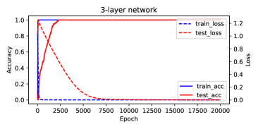

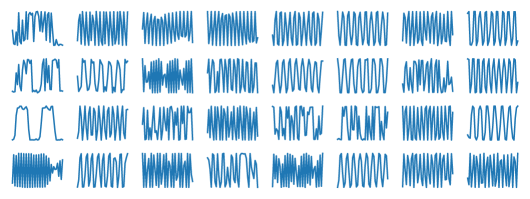

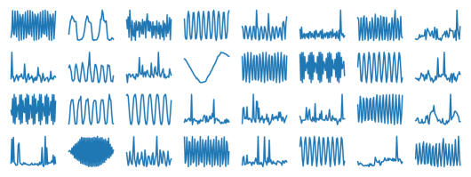

*Рисунок 9: Обучение задачам модульного сложения сетями с 2, 3 и 4 слоями и активациями ReLU. **Слева:** точность и потери на обучении. **Справа:** выученные признаки на самом нижнем слое. С увеличением числа слоёв обучение занимает больше времени, и гроккинг (отложенная генерализация) становится заметнее. Однако признаки на самом нижнем слое остаются (искажённой версией) базисов Фурье, что согласуется с разбором в разделе 6.* **[p. 44]**

### D.1 Использование Groups Algorithms Programming (GAP) для получения неабелевых групп

###### p42-12
GAP (https://www.gap-system.org/) — язык программирования с библиотекой из тысяч функций для создания групп и работы с ними. С помощью GAP можно легко перечислить все неабелевы группы размера $M\leq 127$ и построить их таблицы умножения, что мы и сделали. Из этих неабелевых групп для каждого размера группы $M$ мы выбираем одну для наших экспериментов с законами масштабирования (рис. 5, внизу справа) с $\max_{k}d_{k}=2$.

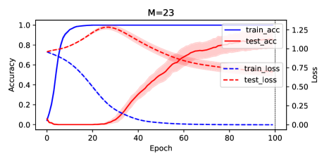

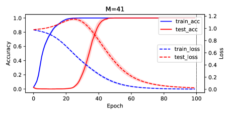

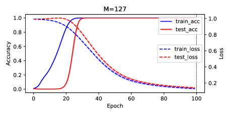

*Рисунок 10: Обучение задачам модульного сложения с вещественными весами ($M=23,41,89,127$). Скорость обучения $0.005$, weight decay $5e-5$. Число скрытых узлов $K=256$. Тестовая выборка — $20\%$ полного набора из $M^{2}$. Используется оптимизатор Adam. Усреднено по $5$ сидам. Это базовый вариант.* **[p. 44]**

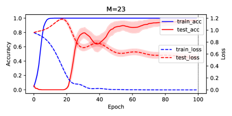

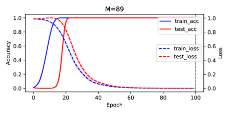

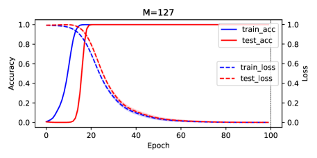

*Рисунок 11: Обучение задачам модульного сложения с комплексными весами ($M=23,41,89,127$). Скорость обучения $0.005$, weight decay $5e-5$. Число скрытых узлов $K=256$. Тестовая выборка — $20\%$ полного набора из $M^{2}$. Используется оптимизатор Adam. Усреднено по $5$ сидам. По сравнению с вещественным случаем (рис. 10) модели с комплексными весами, по-видимому, грокают быстрее.* **[p. 45]**

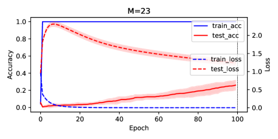

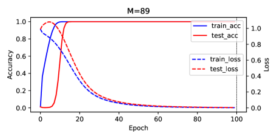

*Рисунок 12: Обучение задачам модульного сложения с вещественными весами ($M=23,41,89,127$). Вместо обновления верхнего слоя $V$ градиентным спуском на каждом шаге обновления мы берём решение гребневой регрессии $V_{\textrm{ridge}}$ относительно текущей $F$ (утверждение 1). Скорость обучения $0.005$, weight decay $5e-5$. Число скрытых узлов $K=256$. Тестовая выборка — $20\%$ полного набора из $M^{2}$. Используется оптимизатор Adam. Усреднено по $5$ сидам. Гроккинг всё же происходит (для $M=23$ см. для полноты рис. 13). Он медленнее для $M=23$, но на деле быстрее для $M=41,89,127$ по сравнению с базовым вариантом (рис. 10).* **[p. 45]**

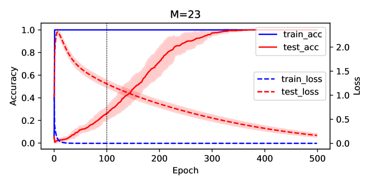

*Рисунок 13: Обучение задачам модульного сложения с вещественными весами при $M=23$ в течение 500 эпох, с $V_{\mathrm{ridge}}$ в качестве весов верхнего слоя. Гроккинг всё же происходит, но медленнее, чем в базовом варианте (рис. 10) для $M=23$.* **[p. 46]**

**[p. 50]**

**[p. 49]**

### D.2 Нулевая инициализация ускоряет обучение признакам

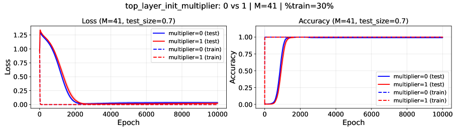

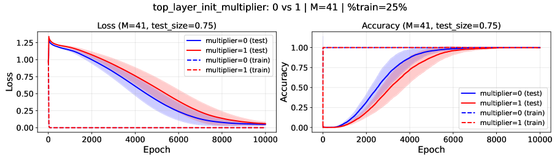

*Рисунок 14: Нулевая инициализация ускоряет обучение признакам для $M=41$. Настройки гиперпараметров — см. рис. 16. Синие линии — нулевая инициализация $V$ (то есть $V(0)=0$), красные — обычная инициализация.* **[p. 47]**

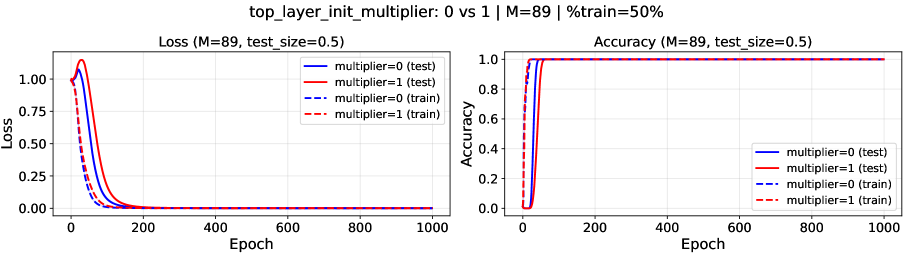

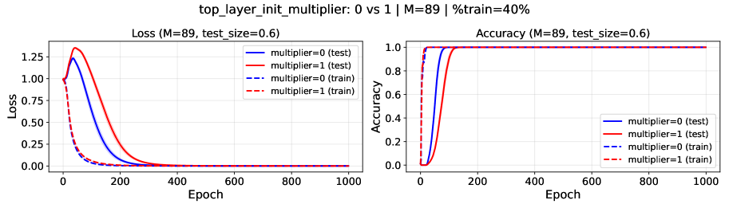

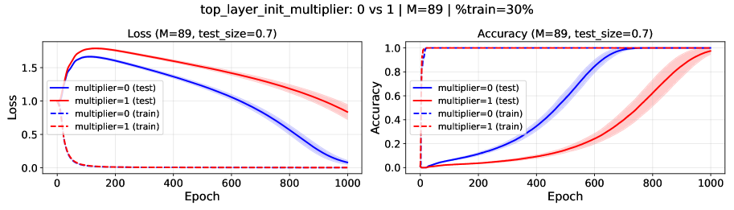

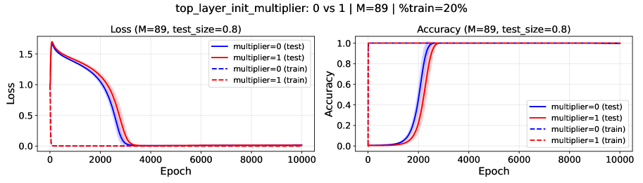

*Рисунок 15: Нулевая инициализация ускоряет обучение признакам для $M=89$. Настройки гиперпараметров — см. рис. 16. Синие линии — нулевая инициализация $V$ (то есть $V(0)=0$), красные — обычная инициализация.* **[p. 48]**

*Рисунок 16: Нулевая инициализация ускоряет обучение признакам для $M=127$. Скорость обучения $0.005$. Используется оптимизатор Adam. $\eta=5e-5$. $K=1024$. $\sigma(x)=x^{2}$ и MSE-потеря. $\text{{Top\_layer\_init\_multiplier}}=0$ означает $V(0)=0$, то есть верхний слой инициализирован $0$ (синие линии). Если $\text{{Top\_layer\_init\_multiplier}}=1$, то $V$ инициализирован обычным образом (красные линии). Ясно видно, что нулевая инициализация ведёт к более быстрому гроккингу (и обучению признакам), чем обычная, — особенно когда данных мало.* **[p. 49]**

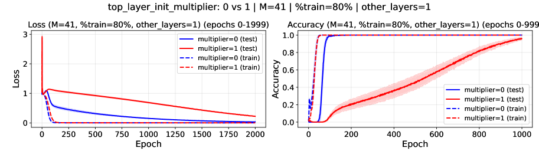

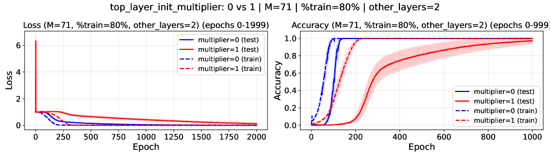

*Рисунок 17: Нулевая инициализация ускоряет обучение признакам в многослойной постановке. $\text{{other\_layers}}=1$ означает добавление ещё одного скрытого слоя между верхним слоем $V$ и нижним слоем $W$ со сквозной связью, и так далее. Скорость обучения $0.005$. Используется оптимизатор Adam. $\eta=1e-4$. $K=2048$. $\sigma(x)=\mathrm{ReLU}(x)$ и MSE-потеря. $\text{{Top\_layer\_init\_multiplier}}=0$ означает $V(0)=0$, то есть верхний слой инициализирован $0$ (синие линии). Если $\text{{Top\_layer\_init\_multiplier}}=1$, то $V$ инициализирован обычным образом (красные линии). Ясно видно, что в многослойных постановках нулевая инициализация ведёт к куда более быстрому обучению признакам, чем обычная (часто в $10\times$).* **[p. 50]**
