# Saheb Pasand, Dohmatob 2026 — Egalitarian Gradient Descent: A Simple Approach to Accelerated Grokking

См. также: [глобальный индекс понятий](../../concepts/index.md).

**Ali Saheb Pasand** (McGill University & Mila), **Elvis Dohmatob** (Concordia University & Mila).

arXiv [2510.04930](https://arxiv.org/abs/2510.04930), 6 октября 2025 (версия v3). Опубликовано на ICLR 2026. 1 цитирование — тридцать девятая по цитируемости работа корпуса. Источник — нативный HTML arXiv версии v3. Код: [Egalitarian-Gradient-Descent](https://github.com/asahebpa/Egalitarian-Gradient-Descent).

Оригинал и производные файлы этой папки:

- [`original/2510.04930.native.html`](original/2510.04930.native.html) — первоисточник, нативный HTML arXiv (v3), скачан как есть.
- [`original/2510.04930.egalitarian-gradient-descent-a-simple-approach-to-accelerated-grokking.md`](original/2510.04930.egalitarian-gradient-descent-a-simple-approach-to-accelerated-grokking.md) — конверсия оригинала в Markdown без правок содержания.
- [`images/`](images/) — 22 иллюстрации статьи в исходном разрешении.

Схема якорей и правила ссылок на карточку — в [README папки статей](../README.md).

## Затрагиваемые понятия

**[Гроккинг](../../concepts/grokking.md)** — работа берётся не объяснять его вообще, а назвать **одну** достаточную причину задержки и устранить её. Причина названа так: несимметричные скорости градиентного спуска вдоль разных сингулярных направлений градиента ([`p1-2`](#p1-2)). Приём — уравнять эти скорости; на модульном сложении, умножении и разрежённой чётности плато исчезает почти целиком ([`p10-3`](#p10-3)).

**[Оптимизатор](../../concepts/optimizer-adam-adamw-sgd.md)** — предложен **уравнительный градиентный спуск** (EGD): градиентная матрица слоя заменяется на $\tilde{G}=(GG^{\top})^{-1/2}G=UV^{\top}$, то есть сингулярные векторы сохраняются, а все сингулярные числа обращаются в единицу ([`p7-6`](#p7-6), [`p7-9`](#p7-9)). Приём безразличен к оптимизатору и накладывается поверх SGD, Adam, AdamW, RAdam, RMSprop ([`p24-2`](#p24-2)).

**[Нейронное касательное ядро](../../concepts/neural-tangent-kernel-ntk.md)** — связь с естественным градиентным спуском выписана точно: $F=GG^{\top}$ есть эмпирическая матрица информации Фишера, а EGD относится к NGD как $\tilde{G}=F^{1/2}\bar{G}$, то есть EGD есть **отбеленный** NGD ([`p8-4`](#p8-4), [`p8-5`](#p8-5)). Отсюда же и постоянная движения: фишерова норма видоизменённого градиента тождественно равна единице.

**[Низкочастотная фильтрация градиента](../../concepts/gradient-low-pass-filtering.md)** — прямое сопоставление с Grokfast. Показано, что EGD побочно наследует его смещение: деление на сингулярные числа понижает вес составляющих вдоль больших $s_{j}$ ([`p8-8`](#p8-8)). Различия названы поимённо: у EGD нет ни запаса прошлых градиентов (нулевые издержки памяти), ни гиперпараметров, а вместо эвристики есть спектральный разбор ([`p8-9`](#p8-9)). Опыт умереннее заявки: на MNIST виды с RSVD превосходят Grokfast и по шагам, и по времени, а на трансформере Grokfast **быстрее** EGD с точным SVD ([`p22-2`](#p22-2), [`p22-3`](#p22-3)).

**[Спектральный разбор](../../concepts/spectral-analysis-svd-esd-fve.md)** — вся работа держится на числе обусловленности градиентной матрицы: рисунок 4 показывает, что при обучении сложению по модулю 97 наибольшее сингулярное число намного больше наименьшего от начала и до конца оптимизации ([`fig-4`](#fig-4)). Издержки SVD снимаются рандомизированным SVD, и оказывается, что точность разложения не важна: при удачном ранге RSVD гроккает даже быстрее точного SVD ([`p18-2`](#p18-2), [`p19-2`](#p19-2)).

**[Масштаб инициализации](../../concepts/initialization-scale.md)** — в игрушечной постановке длина плато прямо зависит от него: при большой инициализации $k_{*}\asymp 1/\varepsilon$, при малой — $k_{*}\asymp\log(1/\varepsilon)$ ([`p6-3`](#p6-3), [`p6-4`](#p6-4)). Существенно, что EGD от масштаба инициализации оказывается **вовсе нечувствителен** ([`p6-1`](#p6-1)).

**[Обобщающие границы](../../concepts/generalization-bounds.md)** — теорема 1 даёт тестовую ошибку в замкнутом виде через угол между текущим вектором весов и истинной границей решения: $E(w(k))\simeq\min(1,\arccos(r_{k})/\arccos(r))$ ([`p6-2`](#p6-2)). Отсюда и получается плато: ошибка держится на 100 %, пока $r_{k}$ не опустится ниже $r$.

**[Модульная арифметика](../../concepts/modular-arithmetic.md)** — опыты на $\operatorname{Mod}(p,o)$ при $o\in\{+,\times\}$ и $p\in\{79,97,127\}$, двухслойная сеть с ReLU, доля данных 0,5 ([`p10-2`](#p10-2)). Ускорение измерено в числе эпох до 95 % точности: до $53\times$ против обычного SGD при точном SVD ([`p18-4`](#p18-4)).

**[Разрежённая чётность](../../concepts/sparse-parity.md)** — вторая семья задач: $(n,k)\in\{(400,2),(100,3),(50,4)\}$, шарнирная потеря с weight decay ([`p9-5`](#p9-5), [`p9-6`](#p9-6)). Здесь же самый большой выигрыш: $187\times$ по эпохам при RSVD ранга 40 против обычного SGD ([`p19-2`](#p19-2)).

**[Настоящие данные](../../concepts/vision-real-world-data-mnist-cifar.md)** — проверка вынесена в приложения: трёхслойная MLP на MNIST в постановке Omnigrok и Grokfast ([`p22-2`](#p22-2)) и свёрточная сеть на CIFAR-10 с перемешиванием меток через закреплённые промежутки ([`p25-1`](#p25-1)). Второй опыт — не о гроккинге: он мерит приспособляемость к нестационарности, и добавление EGD увеличивает площадь под кривой у всех трёх оптимизаторов.

**[Плоскостность и ландшафт потерь](../../concepts/loss-landscape-basins.md)** — приложение F проверяет, к тому же ли решению приходит EGD: на модульных задачах пути EGD и обычного SGD расходятся и приводят в разные области пространства параметров, на разрежённой чётности SGD поворачивает к области, где EGD гроккнул ([`p25-2`](#p25-2), [`p25-4`](#p25-4)).

**[Переход от ленивого к богатому](../../concepts/lazy-to-rich-kernel-to-feature-learning.md)**, **[зона Златовласки](../../concepts/goldilocks-zone.md)**, **[рогатка](../../concepts/slingshot.md)** и **[схлопывание softmax](../../concepts/softmax-collapse.md)** — названы в обзоре как соперничающие объяснения ([`p3-3`](#p3-3), [`p4-1`](#p4-1)), но с предлагаемым устройством не сопоставлены: работа не утверждает, что дурная обусловленность есть **единственная** причина гроккинга.

**[Фазовый переход](../../concepts/phase-transition.md)** — в обзоре отдельно отмечена давняя линия о плато, возникающих близ особых областей параметров, где информация Фишера вырождается ([`p3-1`](#p3-1)). Нынешнее объяснение — того же рода: медленная мода, а не перестройка представлений.

Отдельно стоит сказать, чего в работе **нет**. Нет теории для нелинейного случая: теоремы 1 и 2 доказаны для линейной модели на двумерных гауссовых данных, а разбор схождения EGD для MLP и трансформеров назван весьма трудным и оставлен на будущее ([`p10-7`](#p10-7)). Нет числа прогонов и полос разброса ни на одном рисунке. И нет объяснения главной опытной странности: на трансформере EGD с точным SVD крайне неустойчив, а рандомизированное SVD — приближение того же самого — устойчиво ([`p22-3`](#p22-3)).

Карточки статей корпуса: [Power et al. 2022](../2201.02177.grokking-generalization-beyond-overfitting-on-small-algorithmic-datasets/2201.02177.grokking-generalization-beyond-overfitting-on-small-algorithmic-datasets.card.md) — исходное явление; [Grokfast](../2405.20233.grokfast-accelerated-grokking-by-amplifying-slow-gradients/2405.20233.grokfast-accelerated-grokking-by-amplifying-slow-gradients.card.md) — главный соперник, с которым идёт прямое сравнение; [Omnigrok](../2210.01117.omnigrok-grokking-beyond-algorithmic-data/2210.01117.omnigrok-grokking-beyond-algorithmic-data.card.md) — постановка MNIST, взятая целиком; [Liu et al. 2022](../2205.10343.towards-understanding-grokking-an-effective-theory-of-representation-learning/2205.10343.towards-understanding-grokking-an-effective-theory-of-representation-learning.card.md) — зона Златовласки; [Kumar et al. 2023](../2310.06110.grokking-as-the-transition-from-lazy-to-rich-training-dynamics/2310.06110.grokking-as-the-transition-from-lazy-to-rich-training-dynamics.card.md) — побег из ядрового режима; [Mohamadi et al. 2024](../2407.12332.why-do-you-grok-a-theoretical-analysis-of-grokking-modular-addition/2407.12332.why-do-you-grok-a-theoretical-analysis-of-grokking-modular-addition.card.md) — теоретический разбор модульного сложения; [Nanda et al. 2023](../2301.05217.progress-measures-for-grokking-via-mechanistic-interpretability/2301.05217.progress-measures-for-grokking-via-mechanistic-interpretability.card.md) — механистический разбор («часы» и «пицца» Zhong et al. названы в обзоре, карточки на них в вики пока нет); [Prieto et al. 2025](../2501.04697.grokking-at-the-edge-of-numerical-stability/2501.04697.grokking-at-the-edge-of-numerical-stability.card.md) — численная устойчивость; [Merrill et al. 2023](../2303.11873.a-tale-of-two-circuits-grokking-as-competition-of-sparse-and-dense-subnetworks/2303.11873.a-tale-of-two-circuits-grokking-as-competition-of-sparse-and-dense-subnetworks.card.md) — разрежённая чётность; [Huang et al. 2024](../2402.15175.unified-view-of-grokking-double-descent-and-emergent-abilities/2402.15175.unified-view-of-grokking-double-descent-and-emergent-abilities.card.md) — состязание контуров и двойной спуск; [Beck et al. 2024](../2410.04489.grokking-at-the-edge-of-linear-separability/2410.04489.grokking-at-the-edge-of-linear-separability.card.md) — гроккинг в логистической регрессии.

**[Сингулярная теория обучения](../../concepts/singular-learning-theory.md)** — работа напоминает, что наблюдение старше термина: плато возникают близ особых областей параметров, порождаемых перестановочными симметриями и избыточностями ([`p3-1`](#p3-1)). Связь с гроккингом здесь предположение, а не результат.

**[Разброс по семенам и воспроизводимость](../../concepts/seed-variance-reproducibility.md)** — воспроизводимость понимается шире числа семян: как полнота отчёта о низкоуровневых настройках — скорости обучения, величине weight decay и прочем ([`p9-6`](#p9-6)).
## Что показано, а что предположено

Замечания редактора карточки по итогам разбора утверждений (`…claims.txt`). Работа прикладная с теоретической разминкой: один приём, две теоремы для игрушечной модели, три арифметические постановки и обширные приложения.

**Приём прост, и в этом его сила.** Одна формула $\tilde{G}=UV^{\top}$, ни одного гиперпараметра, никакой памяти сверх текущего градиента ([`p8-9`](#p8-9)). Для корпуса, где ускорители гроккинга обыкновенно требуют подбора (Grokfast — окно и коэффициент фильтра), это заметное упрощение.

**Ускорение измерено щедро и честно.** Приведены три величины разом: эпохи до 95 %, время по часам и время на эпоху ([`p18-4`](#p18-4)). Это редкость: обычно сообщают лишь число шагов, где всякий приём с дорогим шагом выглядит выигрышнее, чем есть. Здесь же видно, что $45\times$ по эпохам превращается в $10$–$12\times$ по времени.

**Главное открытие спрятано в приложении C.** Рандомизированное SVD — грубое приближение — не просто дешевле, но при удачном ранге даёт **больше** ускорения, чем точное разложение ($187\times$ против $72\times$ при $k=2$) ([`p19-2`](#p19-2)). Работа это отмечает, но не объясняет; между тем это прямо противоречит её же теории, по которой выигрыш даёт именно точное уравнивание сингулярных чисел.

**Ранг RSVD возвращает тот самый гиперпараметр, отсутствием которого работа гордится.** Признано прямо: «ранг RSVD приходится настраивать ради наибольшего выигрыша» ([`p24-1`](#p24-1)). При $k=2$ ранг 40 даёт $187\times$, а ранг 30 — лишь $18{,}6\times$; разброс на порядок ([`p19-2`](#p19-2)).

**Сравнение с Grokfast не столь одностороннее, как звучит в аннотации.** На MNIST EGD выигрывает ([`p22-2`](#p22-2)), на трансформере с Adam — проигрывает по обеим величинам, и авторы это приводят ([`p22-3`](#p22-3)). Довод в пользу EGD там сводится к памяти, а не к скорости, и он честен: Grokfast хранит копию градиентов.

**Неустойчивость точного SVD на трансформере — самое тревожное наблюдение работы.** Сказано прямо: «EGD в этой постановке крайне неустойчив», тогда как приближённое RSVD устойчиво и устойчивее Grokfast ([`p22-3`](#p22-3)). Объяснения нет. Естественная догадка — что усечение ранга гасит шум в малых сингулярных числах, деление на которые и взрывает обновление, — в работе не высказана и не проверена.

**Теория покрывает не тот случай, который проверяется.** Теоремы 1 и 2 доказаны для линейной модели наименьших квадратов на двумерных гауссовых данных ([`p4-5`](#p4-5), [`p17-15`](#p17-15)); в опытах — двухслойные сети с ReLU, трансформеры и свёрточные сети. Связь между ними — рассуждение по образцу, а не вывод, и авторы это признают ([`p10-7`](#p10-7)).

**Игрушечная постановка устроена под ответ, и это сказано открыто.** Ковариация признаков нарочно дурно обусловлена ($1/\varepsilon\gg 1$), а обучающее и тестовое распределения различаются ([`p4-5`](#p4-5)). Приложение A.3 разбирает и случай совпадающих распределений, получая тот же порядок $1/(\eta\varepsilon)$, — эта добавка существенно укрепляет довод.

**Связь с естественным градиентным спуском выписана точно и полезна.** Соотношение $\tilde{G}=F^{1/2}\bar{G}$ ([`p8-4`](#p8-4)) объясняет, отчего чистый NGD здесь не берётся: он давил бы направления слишком сильно. EGD оказывается серединой между обычным градиентом и NGD, и это осмысленное место.

**Родство с Muon признано без попыток первенства.** Отмечено, что оба приёма приходят к приближённо ортогональному обновлению, и различия названы по существу: у Muon — итерации Ньютона — Шульца без доступа к сингулярным числам, у EGD — SVD с явным спектром ([`p9-1`](#p9-1)). Замечание, что схождение двух независимо побуждённых приёмов к одному действию само есть свидетельство в пользу спектрального нормирования ([`p9-3`](#p9-3)), уместно.

**Опыт с нестационарностью относится к делу лишь косвенно.** Перемешивание меток CIFAR-10 мерит скорость восстановления, а не гроккинг ([`p24-2`](#p24-2), [`p25-1`](#p25-1)). Итоги хороши ($1{,}1$–$2{,}3\times$ по площади под кривой), но подкрепляют они широкую заявку о пользе спектрального нормирования, а не узкую заявку о гроккинге.

**Число прогонов не названо нигде.** Ни на одном рисунке нет полос разброса, а таблицы приводят по одному числу на ячейку. Для работы, чья главная заявка — во сколько раз ускорено, это тот же пробел, что и у Grokfast и NeuralGrok в этом корпусе.

**Место в корпусе.** Это третья работа вики об ускорении гроккинга вмешательством в градиент — после Grokfast (закреплённый фильтр) и NeuralGrok (выучиваемое преобразование) — и самая простая из трёх: одна формула без параметров и без памяти. Её объяснение задержки — дурная обусловленность градиентной матрицы — родственно давней линии о плато у особых точек и не требует ни выучивания признаков, ни перестройки представлений. Цена — теория лишь для линейной игрушечной модели, возвращение гиперпараметра через ранг RSVD, необъяснённая неустойчивость точного SVD на трансформере и отсутствие полос разброса.

## Ошибочные цитирования

Замечания редактора карточки: места, где эта статья передаёт чужие результаты с ошибкой или без авторских оговорок. Сюда ведут ссылки «подробности» из разделов «Ошибочные пересказы и цитирования этой статьи» карточек процитированных работ.

###### mc-2210-01117
**Omnigrok (2210.01117) — оговорка о вызове.** `"It has been observed in some computer vision and natural understanding tasks (Liu et al., 2023; Lee et al., 2024)"` — «он наблюдался в некоторых задачах компьютерного зрения и понимания языка». «Observed» роняет оговорку авторов: гроккинг на этих задачах [«вызван»](../2210.01117.omnigrok-grokking-beyond-algorithmic-data/2210.01117.omnigrok-grokking-beyond-algorithmic-data.card.md#p1-3), причём [«в слегка нестандартной постановке, где он относительно слаб»](../2210.01117.omnigrok-grokking-beyond-algorithmic-data/2210.01117.omnigrok-grokking-beyond-algorithmic-data.card.md#p1-9). При этом в приложении та же статья воспроизводит MNIST-постановку Omnigrok дословно — «the same parameters, optimizer (AdamW), and model as reported by Omnigrok» — то есть на практике условия вызова соблюдает; уронена оговорка только в обзорной фразе.

###### mc-2201-02177
**Power et al. (2201.02177) — «лишь много позже» как определение гроккинга.** Раздел близких работ открывается определением: `Grokking—the phenomenon where models first overfit the training set and only much later undergo a sharp jump in test accuracy—was first documented by Power et al. (2022)` — «Гроккинг — явление, при котором модели сперва переобучаются на обучающем наборе и лишь много позже испытывают резкий скачок точности на тесте, — впервые описан у Power et al. (2022)». Обязательное «лишь много позже» статье Power не принадлежит: там [точность на валидации «иногда» внезапно начинает расти после переобучения](../2201.02177.grokking-generalization-beyond-overfitting-on-small-algorithmic-datasets/2201.02177.grokking-generalization-beyond-overfitting-on-small-algorithmic-datasets.card.md#p2-3), [время до генерализации быстро растёт лишь по мере уменьшения доли данных, а при больших наборах кривые идут теснее](../2201.02177.grokking-generalization-beyond-overfitting-on-small-algorithmic-datasets/2201.02177.grokking-generalization-beyond-overfitting-on-small-algorithmic-datasets.card.md#sec-3-1-1), и [самая драматичная задержка получена в нарочной постановке без weight decay при увеличенном бюджете, тогда как настройка по умолчанию — weight decay 1](../2201.02177.grokking-generalization-beyond-overfitting-on-small-algorithmic-datasets/2201.02177.grokking-generalization-beyond-overfitting-on-small-algorithmic-datasets.card.md#sec-a1-2). При сильной регуляризации задержки нет — [Omnigrok, рисунок 2](../2210.01117.omnigrok-grokking-beyond-algorithmic-data/2210.01117.omnigrok-grokking-beyond-algorithmic-data.card.md#fig-2): большая регуляризация даёт быструю генерализацию, число шагов до неё обратно пропорционально weight decay. Во введении та же статья осторожнее — сети «подчас обнаруживают» такую динамику, качество на тесте «способно долго держаться» около случайного, — и собственные её результаты условность задержки только подтверждают: по подписи к рисунку 6, предлагаемый EGD [«гроккает сразу: ошибка генерализации подскакивает к безупречному значению всего через несколько итераций»](#p6-2), то есть задержка трактуется авторами как артефакт обусловленности градиентов, а не как определяющее свойство явления. Предупреждение — о формулировке раздела 2, не о работе в целом.

###### mc-2309-02390
**Varma et al. (2309.02390) — доминирование генерализующего контура без условий.** `"When both circuits are formed, the generalizing circuits will be dominant in generating outputs"` — «когда оба контура сформированы, выход определяют генерализующие контуры». Уронены оба условия теории: доминирование генерализующего контура у Varma требует [weight decay — авторы прямо называют своё объяснение неполным без него](../2309.02390.explaining-grokking-through-circuit-efficiency/2309.02390.explaining-grokking-through-circuit-efficiency.card.md#sec-7) — и объёма данных выше критического; при малых данных выигрывает запоминающий контур. Там же спорно фреймирование «Aligned with this view» рядом с Kumar et al. — работой, которая центральный тезис Varma об эффективности прямо оспаривает.

###### mc-2501-04697
**Prieto et al. (2501.04697) — цитирование по названию.** `"Prieto et al. (2025) argue that operating near the edge of numerical stability can induce grokking-like delays and propose remedies that restore or accelerate test performance"` — «работа у границы численной устойчивости может вызывать задержки типа гроккинга»: у Prieto [задержку объясняет NLM — масштабирование логитов, оптимизационное явление](../2501.04697.grokking-at-the-edge-of-numerical-stability/2501.04697.grokking-at-the-edge-of-numerical-stability.card.md#p7-1), а близость к границе устойчивости кончается не задержкой, а [остановкой обучения из-за SC](../2501.04697.grokking-at-the-edge-of-numerical-stability/2501.04697.grokking-at-the-edge-of-numerical-stability.card.md#p4-4). Заголовок статьи прочитан как её тезис.

###### mc-2205-10343
**Liu et al. (2205.10343) — химера двух работ.** `"Liu et al. (2022) develop an effective theory of representation learning, showing that generalization emerges in a specific zone for the weights of a network called the 'Goldilocks Zone'. Grokking occurs when the weights enter this region, a narrow phase between memorization and confusion"` — гибрид: терминология фаз («между запоминанием и путаницей») действительно [отсюда](../2205.10343.towards-understanding-grokking-an-effective-theory-of-representation-learning/2205.10343.towards-understanding-grokking-an-effective-theory-of-representation-learning.card.md#p1-2), но зона здесь живёт в пространстве гиперпараметров, а «вход весов в зону» как механизм гроккинга — весовая картина [Omnigrok](../2210.01117.omnigrok-grokking-beyond-algorithmic-data/2210.01117.omnigrok-grokking-beyond-algorithmic-data.card.md). По библиографии статьи «Liu et al. (2022)» — именно 2205.10343, так что весовая зона приписана работе, в которой её нет.

###### mc-2405-20233
**Grokfast (2405.20233) — «консистентно по задачам и архитектурам».** `"Grokfast amplifies slow (low-frequency) gradient components via simple optimizer-side filters, consistently accelerating grokking across tasks and architectures (Lee et al., 2024)"` — у Grokfast ускорение показано по итерациям на одной задаче, [а главная демонстрация выбрана вместе с подобранным weight decay](../2405.20233.grokfast-accelerated-grokking-by-amplifying-slow-gradients/2405.20233.grokfast-accelerated-grokking-by-amplifying-slow-gradients.card.md#p4-3); «consistently» опровергнуто в корпусе: [2603.01968](../2603.01968.intrinsic-task-symmetry-drives-generalization-in-algorithmic-tasks/2603.01968.intrinsic-task-symmetry-drives-generalization-in-algorithmic-tasks.card.md) наблюдает task-dependent поведение с замедлением в части постановок, [2504.17243](../2504.17243.neuralgrok-accelerate-grokking-by-neural-gradient-transformation/2504.17243.neuralgrok-accelerate-grokking-by-neural-gradient-transformation.card.md) — нестабильность EMA-варианта и чувствительность MA к гиперпараметрам. Категория метода («optimizer-side filters») при этом названа верно, и в приложении та же статья сравнивается с Grokfast честно.

###### mc-2410-04489
**Beck et al. (2410.04489) — приписан механизм Levi et al.** `"Recent theoretical analyses have studied grokking in high-dimensional linear and logistic regression models under Gaussian assumptions, relating delayed generalization to spectral properties of the empirical covariance near interpolation thresholds (Beck et al., 2025; Levi et al., 2024)"` — спектральные свойства эмпирической ковариации — механизм Levi et al. (2310.16441, та же группа); у Beck механизм другой: [генерализация тогда и только тогда, когда обучающий набор не отделим линейно от начала координат](../2410.04489.grokking-at-the-edge-of-linear-separability/2410.04489.grokking-at-the-edge-of-linear-separability.card.md#p5-5), с критическим замедлением у порога. Слипание двух созвучных работ одной группы.

---

# Текст статьи

## Аннотация

###### p1-2

Гроккинг есть явление, при котором, в отличие от качества на обучении, достигающего пика очень рано, качество модели на тесте (её генерализация) стоит на месте сколь угодно много эпох, а затем внезапно подскакивает, обыкновенно почти до безупречного уровня. На деле желательно сократить длину таких плато, то есть заставить обучение «гроккать» быстрее. В этой работе мы даём новое понимание гроккинга. Во-первых, мы показываем — и опытно, и теоретически, — что гроккинг может вызываться несимметричными скоростями (стохастического) градиентного спуска вдоль разных главных (то есть сингулярных) направлений градиентов. Затем мы предлагаем простое видоизменение, нормирующее градиенты так, чтобы динамика вдоль всех главных направлений шла в точности с одинаковой скоростью. Далее мы устанавливаем, что этот видоизменённый приём, названный нами уравнительным градиентным спуском (EGD) и понимаемый как тщательно видоизменённый вид естественного градиентного спуска, гроккает много быстрее. Более того, в некоторых случаях стояние на месте устраняется вовсе. Наконец, мы опытно показываем на классических арифметических задачах вроде модульного сложения и разрежённой чётности, где это стояние широко наблюдалось и усиленно изучалось, что предлагаемый нами приём плато убирает111Код доступен по адресу https://github.com/asahebpa/Egalitarian-Gradient-Descent.

## 1 Введение

Нейронные сети подчас обнаруживают поразительную динамику обучения, известную как *гроккинг*: быстро сведя ошибку на обучении к (почти) нулю, качество на тесте способно долго держаться около случайного, а затем резко подняться почти до безупречной генерализации — часто без всякой перемены оптимизатора и без явной ранней остановки (Power et al., 2022). Гроккинг наблюдался на разных устройствах и задачах, от алгоритмических вроде модульной арифметики (Gromov, 2023; Doshi et al., 2024) и формальных языков до более естественных постановок (Liu et al., 2023; Nanda et al., 2023). Однако, несмотря на быстро растущее собрание опытных и механистических разборов, нам всё ещё недостаёт осмысленного отчёта о том, *отчего* возникает задержка, *что* за устройственные черты выкристаллизовываются при переходе и *как* его предсказать или им управлять (подробный обзор имеющейся словесности см. в разделе 2).

В этой работе мы рассматриваем гроккинг сквозь призму динамики собственных спектров градиентов в ходе оптимизации и предлагаем простое видоизменение (стохастического) градиентного спуска, доказуемо сокращающее длину плато без ущерба для уровня генерализации модели к концу обучения.

**Вклады.** Наши главные вклады сводятся к следующему.

###### p1-6

- *Уравнительный градиентный спуск (EGD).* Мы предлагаем новый и простой приём ускоренного гроккинга и изучаем его свойства теоретически и опытно. Приём действует, видоизменяя градиенты каждого слоя так, чтобы главные (сингулярные) направления сохранялись, а скорость развития динамики вдоль каждого из этих направлений была одинаковой. Это делает обучение устойчивее, ослабляя влияние дурно обусловленных ландшафтов потери (где градиенты сильно разнятся по величине вдоль разных главных направлений), и ведёт к ускоренному гроккингу.\n- *Действенная теория.* Мы развиваем теорию, показывающую, что предлагаемый нами приём EGD надёжно гроккает несравнимо быстрее обычных приёмов вроде (стохастического) градиентного **[p. 2]** спуска. Мы также устанавливаем строгие связи с естественным градиентным спуском. Более того, мы показываем, что предлагаемый нами приём (понимаемый как тщательно видоизменённый естественный градиентный спуск) есть упрощённый вид Grokfast (действующего низкочастотной фильтрацией градиентов ради усиления более слабых составляющих). На высоком уровне мы показываем также, что оба приёма имеют одно и то же смещение — делать масштабы динамики развития параметров сравнимыми вдоль разных важных направлений.\n- *Опытная проверка.* Мы проводим обширные опыты на игрушечных задачах (двоичная классификация анизотропных многомерных данных) и арифметических задачах (разрежённая чётность, модульное сложение и др.) и показываем, что предлагаемый нами приём обыкновенно гроккает сразу в самом начале кривой обучения. Чтобы показать вычислительную действенность, прочность и общность нашего EGD в сравнении с эталонами вроде Grokfast (Lee et al., 2024), мы приводим также в приложении обширный набор опытов на более настоящих наборах данных (MNIST, CIFAR-10) и моделях (MLP, свёрточные сети, трансформеры).

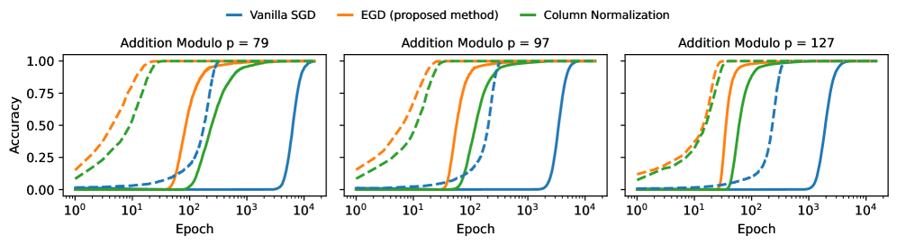

*Рисунок 1: **Итоги на модульном сложении**при разных значениях модуля $p$. Сплошные линии отвечают точности на тесте, прерывистые — точности на обучении. Во всех случаях предлагаемый нами приём EGD (*уравнительный градиентный спуск*) гроккает всего через несколько эпох, тогда как обычный (стохастический) градиентный спуск долго стоит на месте, прежде чем в конце концов гроккнуть. Мы приводим также «нормирование столбцов» — упрощение EGD, попросту перемасштабирующее столбцы градиентных матриц делением на их норму $L_{2}$. Даже это упрощение, по-видимому, гроккает много быстрее опорного обычного (S)GD. Подробности см. в разделе 5, а взятые гиперпараметры — в приложении B.* **[p. 2]**

*Рисунок 2: **Итоги на модульном умножении**при разных значениях модуля $p$. Сплошные линии отвечают точности на тесте, прерывистые — точности на обучении. Во всех случаях предлагаемый нами приём EGD гроккает всего через несколько эпох, тогда как все прочие приёмы долго стоят на месте, прежде чем в конце концов гроккнуть. Подробности см. в разделе 5, а взятые гиперпараметры — в приложении B.* **[p. 2]**

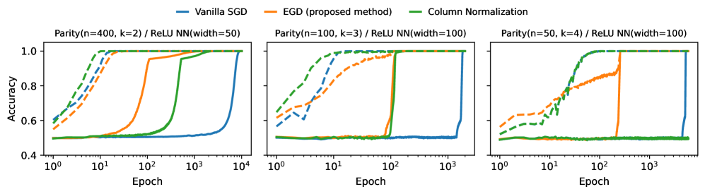

*Рисунок 3: **Итоги на задаче разрежённой чётности.** Сплошные линии отвечают точности на тесте, прерывистые — точности на обучении. Все три графика показывают, что наш приём (EGD) гроккает значительно быстрее прочих. Подробности постановки опытов см. в разделе 5, а взятые гиперпараметры — в приложении B.* **[p. 3]**

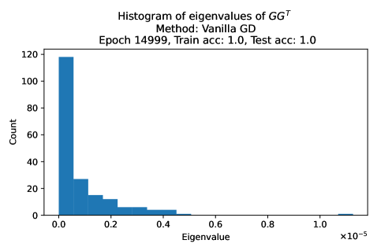

###### fig-4

*Рисунок 4: **Дурно обусловленные спектры градиентов** вызывают отложенную генерализацию. Мы рассматриваем задачу выучивания сложения по модулю 97 по данным двухслойной нейронной сетью с ReLU. От начала оптимизации и до её конца градиентная матрица $G$ скрытого слоя имеет плохое число обусловленности. Здесь видно, что наибольшее сингулярное число (отвечающее быстрому направлению) много больше наименьшего (отвечающего медленным направлениям). Из-за этого общая динамика обычного (S)GD глохнет на сколь угодно долгое время, что и ведёт к отложенной генерализации (см. рисунок 1). Предлагаемый нами приём EGD (*уравнительный градиентный спуск*) заставляет все сингулярные числа $G$ быть равными.* **[p. 3]**

## 2 Близкие работы

Гроккинг — явление, при котором модели сперва переобучаются на обучающем наборе и лишь много позже испытывают резкий скачок точности на тесте, — впервые описан у Power et al. (2022). Последующие опытные исследования расширили охват за пределы чисто алгоритмических наборов данных и разобрали условия, при которых гроккинг появляется или исчезает, — скажем, через соотношения потери и нормы, выбор оптимизатора и выбор набора данных и упорядочения (Liu et al., 2023; Nanda et al., 2023; Notsawo et al., 2025; Thilak et al., 2022; Liu et al., 2022; Davies et al., 2023; Notsawo et al., 2023; Varma et al., 2023).

**[p. 3]**

###### p3-1

**Явления плато и сингулярная теория обучения.** Задолго до гроккинга (Power et al., 2022) долгие плато *обучающей ошибки* разбирались в информационной геометрии и статистико-механических подходах к нейронным сетям. Плато возникают близ *особых* областей параметров, порождаемых перестановочными симметриями и избыточностями, где информация Фишера вырождается, а градиентный поток становится крайне медленным (Wei et al., 2008; Amari et al., 2018). Классические исследования поточного обучения многослойных сетей (мягкого комитета) равным образом сообщали о долгих переходных порах и определяли их зависимость от согласованности учителя и ученика (Saad and Solla, 1995). Сингулярная теория обучения даёт общий отчёт средствами алгебраической геометрии, связывая поведение генерализации и краевое правдоподобие с особенностями модели (Watanabe, 2009). В последнее время статистико-механические разборы показали, как спектры входных данных управляют тем, проявляются ли плато вообще заметно (Yoshida and Okada, 2019). Хотя эти плато не обязаны совпадать с отложенной генерализацией, как при гроккинге, лежащие в их основе устройства — вырожденные фишеровские спектры, нарушение симметрии и медленные моды — весьма к гроккингу относятся.

###### p3-2

**Гроккинг в модульной арифметике.** Богатая линия работ по механистической истолковываемости разбирает контуры, которыми малые трансформеры и MLP осуществляют модульное сложение. Примечательно, что Zhong et al. (2023) указывают дополняющие друг друга алгоритмические устройства («часы» и «пицца») и круговые вложения, возникающие при переходе гроккинга. Дополняющие разборы и построительные решения для модульного сложения даны у Gromov (2023), тогда как Doshi et al. (2024) распространяют эти наблюдения на модульные многочлены (скажем, многочленное сложение и родственную арифметику), показывая, что обученные сети сходятся к этим контурам близ наступления генерализации.

###### p3-3

**Гроккинг как побег из ядрового режима.** Другой взгляд видит в гроккинге динамический переход от ленивого, ядроподобного режима к богатому, с выучиванием признаков. Kumar et al. (2024); Walker et al. (2025) придают строгий вид условиям, при которых такой переход даёт отложенную генерализацию, не требуя **[p. 4]** явного упорядочения. Для модульного сложения Mohamadi et al. (2024) дают теоретический разбор, объясняющий, отчего раннее обучение в ядровом режиме обобщать не может при ограничениях симметрии, тогда как более позднее обучение из ядрового режима убегает и находит решения малой нормы, которые обобщают. В согласии с этим взглядом Varma et al. (2023) изучают гроккинг сквозь призму действенности контуров. Это исследование показывает, что сети быстро выучивают запоминающие решения, плохо обобщающие, а хорошо обобщающие контуры складываются дольше. Когда оба контура сложились, главенствовать в выдаче выходов будут обобщающие.

###### p4-1

**Устойчивость обучения и оптимизационный взгляд.** Перпендикулярный взгляд выделяет численную устойчивость и динамику оптимизации как узкие места, способные глушить генерализацию; Prieto et al. (2025) доказывают, что работа близ края численной устойчивости способна вызывать задержки гроккингового вида, и предлагают средства, восстанавливающие или ускоряющие качество на тесте. Схоже с этим взглядом Thilak et al. (2022) указывают устройство, названное «рогаткой», при котором цикличные фазовые переходы в приспосабливающихся оптимизаторах происходят вместе с гроккингом. Ранние спектральные черты кривых обучения тоже предлагались как предсказатели гроккинга, снижающие нужду в долгом обучении (Notsawo et al., 2023). В более общем исследовании Liu et al. (2022) развивают действенную теорию обучения представлениям, показывая, что генерализация возникает в определённой зоне для весов сети, названной «зоной Златовласки». Гроккинг происходит, когда веса входят в эту область — узкую фазу между запоминанием и смятением. В более широком взгляде гроккинг связывался с явлениями вроде двойного спуска и возникающих способностей (Huang et al., 2024; Davies et al., 2023), из чего следует, что отложенная генерализация может возникать из состязания динамик запоминания и генерализации. Недавние теоретические разборы изучали гроккинг в многомерных линейных и логистических регрессионных моделях при гауссовых допущениях, связывая отложенную генерализацию со спектральными свойствами эмпирической ковариации близ порогов перемежения (Beck et al., 2025; Levi et al., 2024). Взятые вместе, эти исследования показывают, что в возникновении явлений гроккинга играют роль динамики, зависящие и от данных, и от представлений. Стало быть, на гроккинг можно влиять вмешательствами со стороны устройства, динамики оптимизации и данных.

###### p4-2

**Гроккинг за пределами арифметики и смягчение задержки.** Гроккинг не ограничен алгоритмическими задачами. Он наблюдался в некоторых задачах компьютерного зрения и естественного понимания (Liu et al., 2023; Lee et al., 2024). Кроме того, устройственный гроккинг показан в языковых моделях, где модели открывают иерархическое строение предложений после долгого обучения (Murty et al., 2023; Zhu et al., 2024). По мере того как всё больше применимых задач обнаруживают поведение гроккинга, важным и занятным исследовательским вопросом становится то, как сократить задержку между запоминанием и генерализацией. Показано, что применимые вмешательства действенно укорачивают или устраняют задержку гроккинга (Lee et al., 2024; Lyle et al., 2025). *Grokfast* усиливает медленные (низкочастотные) составляющие градиента простыми фильтрами со стороны оптимизатора, неизменно ускоряя гроккинг на разных задачах и устройствах (Lee et al., 2024). В разделе 4.2 мы обсуждаем алгоритмические и понятийные выгоды предлагаемого нами приёма перед этим Grokfast.

Кроме того, ускорение гроккинга показало свою пользу в применимом положении, когда распределения данных в ходе обучения смещаются. Ради этого Lyle et al. (2025) предлагают масштабирование действенной скорости обучения и повторный разогрев как приём, запускающий и ускоряющий динамику выучивания признаков в ходе обучения, что способно и ускорить гроккинг, и снять затруднение со смещением первенства при непрерывном обучении. Эти учитывающие динамику приёмы дополняют вмешательства со стороны представлений и рычаги упорядочения и управления нормой, влияющие, как замечено, на это явление (Liu et al., 2023; Nanda et al., 2023).

## 3 Разминка: побуждение из упрощённой постановки

###### p4-4

Мы начинаем с простого разрешимого в явном виде примера, где строение данных (относительная сила признаков, относительная трудность обучающего и тестового наборов) и выборы оптимизации (скорость обучения, размер инициализации) взаимодействуют так, что доказуемо дают кривые гроккинга со сколь угодно длинными плато. Рассматриваемая здесь постановка прямо побуждена наблюдениями рисунка 4, где отложенная генерализация при обычном (S)GD вызвана дурно обусловленными градиентными матрицами.

###### p4-5

**Распределение данных.** Закрепим малое $\varepsilon>0$ и пусть $z=(z^{(1)},z^{(2)})$ — центрированный гауссов случайный вектор с ковариационной матрицей $\Sigma=\begin{pmatrix}1&0\\ 0&\varepsilon\end{pmatrix}$. Пусть $x_{train}\in\mathbb{R}^{2}$ — сложенный вид $z$, полученный обусловливанием на событие $|z^{\top}e_{1}|=|z^{(1)}|\geq s$, где $e_{1}=(1,0)$ — горизонтальный базисный вектор в $\mathbb{R}^{2}$. Пусть $x_{test}$ — сложенный вид $z$, полученный обусловливанием на событие $(z^{\top}v)z^{(1)}\leq 0$. **[p. 5]** Здесь $v\in\mathbb{R}^{2}$ — закреплённый единичный вектор, составляющий угол $\theta\in(0,\pi/2)$ с $e_{1}$. Тем самым число обусловленности ковариационной матрицы признаков равно $1/\varepsilon\gg 1$. Эта дурная обусловленность ковариации схватывает — пусть упрощённо и нарочито управляемо — то, что происходит на рисунке 4.

###### fig-5

*Рисунок 5: **Игрушечная постановка, вызывающая стояние на месте у градиентного спуска (GD).** Обучающие точки данных изображены кружками, тестовые — звёздочками (в средней области). Прерывистые линии отвечают широкому зазору обучающих данных (их разделение равно $2s$), а сплошная линия есть истинная граница решения $x^{(1)}=0$. Дисперсия медленного признака $x^{(2)}$ масштабируется как $\varepsilon\ll 1$. GD быстро найдёт линейную модель, безупречно разделяющую обучающие данные, но потратит время порядка $1/\varepsilon$, чтобы найти истинную модель, дающую безупречную точность на тесте. См. рисунок 6.* **[p. 5]**

Обучающие данные суть $(x_{1},y_{1}),\ldots,(x_{n},y_{n})$, где $y_{i}:=\operatorname{sign}(x_{i}^{(1)})$, а признаковые векторы $x_{i}$ суть независимые одинаково распределённые копии $x_{train}$. Здесь $x_{i}^{(j)}:=x_{i}^{\top}e_{j}$ есть $1$ составляющая $i$-й точки данных $x_{i}$. Для тестовых данных признаковые векторы суть независимые одинаково распределённые копии $x_{test}$. Чем больше значение $s$, тем легче быстро запомнить обучающие данные (безупречная точность на обучении). Положение изображено на рисунке 5

##### **Замечание 1****.**

*В изложенном выше есть смещение между распределением обучающих и тестовых данных. В приложении A.3 мы рассматриваем также постановку, где обучающее распределение совпадает с тестовым — распределением построенного выше $z$.*

**Модель.** Мы рассматриваем линейную модель $x\mapsto\operatorname{sign}(x^{\top}\hat{w})$, где вектор весов $\hat{w}$ получается минимизацией квадратичной функции потери

$$
\ell(w):=\frac{1}{n}\sum_{i=1}^{n}(x_{i}^{\top}w-y_{i})^{2}=\frac{1}{n}\|Xw-Y\|^{2}, \tag{1}
$$

где $X\in\mathbb{R}^{n\times d}$ — матрица плана со строками $x_{1},\ldots,x_{n}$, а $Y=(y_{1},\ldots,y_{n})\in\{\pm 1\}^{n}$ — вектор откликов. Мы выбираем эту функцию потери, поскольку она ведёт к податливому разбору, сохраняя ту же феноменологическую картину, какую мы получили бы, скажем, с логистической потерей.

### 3.1 Динамика обычного градиентного спуска

При величине шага $\eta$ обычный градиентный спуск (GD) на потере (1) даёт следующее рекуррентное соотношение

$$
w(k) =w(k-1)-\eta X^{\top}(Xw(k-1)-Y)/n=Aw(k-1)+b, \\
\text{with }b :=\eta X^{\top}Y/n,\quad A:=I-\eta\hat{\Sigma},\quad\hat{\Sigma}:=X^{\top}X/n. \tag{2}
$$

Здесь $\eta>0$ — достаточно малая величина шага, или скорость обучения, $k$ — итерация (она же *эпоха*), а $\hat{\Sigma}$ — эмпирическая ковариационная матрица. Это рекуррентное соотношение можно решить в явном виде и получить (см. приложение)

$$
w(k)=A^{k}w(0)+(I-A^{k})\hat{w}_{ols}, \tag{4}
$$

где $\hat{w}_{ols}:=X^{+}Y=\hat{\Sigma}^{-1}X^{\top}Y/n$ — решение обычных наименьших квадратов. Тем самым $w(k)$ перемежает между инициализацией $w(0)$ и решением наименьших квадратов $\hat{w}_{ols}$.

Определим постоянные $m_{1}={m_{1}(s)}\in(0,1)$, $m_{2}={m_{2}(s)}>1$, $\alpha={\alpha(s)}\in\mathbb{R}$, $\beta={\beta(\varepsilon)}\in(0,1)$ как

$$
m_{1}:=\mathbb{E}[|x_{i}^{\top}e_{1}|]=\varphi(s)/Q(s),\,\,m_{2}:=\mathbb{E}[|x_{i}^{\top}e_{1}|^{2}]=1+sm_{1},\,\,\alpha:=1-\eta m_{2},\,\,\beta:=1-\eta\varepsilon, \tag{5}
$$

где $\varphi$ — плотность стандартного гауссова распределения, а $Q:=1-\Phi$ — его функция выживания. Пусть инициализация есть $w(0)=u=(u_{1},u_{2})$; определим следующие динамические величины

$$
\mu_{k}:=\alpha^{k}u_{1}+(1-\alpha^{k})m_{1}/m_{2},\,\,\nu_{k}:=\beta^{k}u_{2},\,\,L_{k}:=\sqrt{\mu_{k}^{2}+\varepsilon\nu_{k}^{2}},\,\,{r_{k}:=\mu_{k}/\nu_{k}}. \tag{6}
$$

Развитие тестовой ошибки задаётся в явном виде следующим итогом.

##### **Теорема 1****.**

###### p6-1

*При больших $n$ с большой вероятностью выполняется: для всякой итерации $k\geq 1$*

$$
E(w(k)) \simeq\min(1,\arccos(r_{k})/\arccos(r)),\text{ with }r:=\rho/\gamma,\quad r_{k}:=\mu_{k}/L_{k}, \\
\text{where }\rho :=\cos\theta,\quad\gamma:=\sqrt{\rho^{2}+\varepsilon\cdot(1-\rho^{2})},\quad L_{k}:=\sqrt{\mu_{k}^{2}+\varepsilon\nu_{k}^{2}}. \tag{7}
$$

**[p. 6]**

###### p6-2

Теорема 1 обнаруживает, что тестовая ошибка держится на плато значения $100\%$, пока $k$ не станет достаточно велико, чтобы $r_{k}$ опустилось ниже $r$; с этого мига ошибка начинает убывать со скоростью $\arccos(r_{k})/\arccos(r)$.

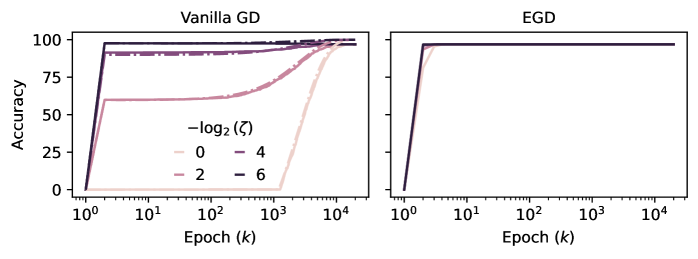

*Рисунок 6: **Гроккинг на игрушечной задаче.** Сплошные линии отвечают опытным итогам, прерывистые — нашей теории (теорема 1). Инициализация $w(0)$ такова, что $\|w(0)\|=\zeta$. Тем самым скаляр $\zeta>0$ управляет размером инициализации. **Слева.** Как и предсказано теоремой 1 и следствием 1, большая инициализация ведёт к отложенной генерализации при обычном GD, то есть к долгим плато (длины $k_{*}\asymp 1/\varepsilon$) стояния качества на тесте, тогда как малая инициализация её ослабляет ($k_{*}\asymp\log 1/(\tau\varepsilon)$, где $\tau\propto\zeta$). Отметим, что для этой задачи отношение $1/\varepsilon\gg 1$ есть число обусловленности ковариационной матрицы признаков. **Справа.** Предлагаемый нами приём EGD (*уравнительный градиентный спуск*) гроккает сразу: ошибка генерализации подскакивает к безупречному значению всего через несколько итераций. Более того, EGD оказывается вовсе нечувствителен к масштабу инициализации, что есть желательное свойство при оптимизации в настоящих задачах.* **[p. 6]**

###### p6-3

Мы имеем следующее важное следствие.

##### **Следствие 1**(случай смещения распределения)**.**

###### p6-4

*Закрепим постоянную $c>1$. Мы имеем следующую фазовую диаграмму. (A) **Большая инициализация.** Если $|u_{2}|$ велико в том смысле, что $\tau:=|u_{2}||\tan\theta|m_{2}/m_{1}>c$, то длина плато тестовой ошибки (то есть время до гроккинга) имеет порядок $k_{*}\asymp\frac{\log\tau}{\eta\varepsilon}\asymp\frac{1}{\varepsilon}$.*

*(B) **Малая инициализация.** Если $|u_{2}|$ мало, то длина плато имеет порядок $k_{*}\asymp\frac{1}{\eta}\log\frac{1}{\tau\varepsilon}\asymp\log\frac{1}{\varepsilon}$.*

Следствие 1 показывает, что модель, обучаемая обычным градиентным спуском, быстро сойдётся к границе решения, запоминающей обучающие данные ($100\%$ точности на обучении и весьма плохая точность на тесте), но потратит долгое время порядка $1/\varepsilon$ или $\log 1/\varepsilon$ (в зависимости от размера инициализации), прежде чем сойтись к истинной границе решения (теорема 1), и лишь тогда ошибка на тесте резко упадёт, а точность вырастет до $100\%$. Этот итог распространяется и на обычный стохастический градиентный спуск (SGD).

**Случай совпадающих обучающего и тестового распределений.** Эта постановка (см. замечание 1) разобрана в приложении A.3, и мы получаем тот же порядок величины, $1/(\eta\varepsilon)$, для длины плато при обычном GD.

**Затруднение с обычным градиентным спуском.** Можно показать, что при большом размере выборки ($n\to\infty$) эмпирическая ковариационная матрица $\hat{\Sigma}$, управляющая динамикой (2), имеет следующее приближение.

$$
\hat{\Sigma}\simeq\begin{pmatrix}m_{2}&0\\
0&\varepsilon\end{pmatrix},
$$

где $m_{2}$ определено в (5). Поскольку $m_{2}$ есть закреплённая положительная постоянная, число обусловленности правой части имеет порядок $1/\varepsilon$. Оно и управляет скоростью, с которой итерации GD $w(k)$ сходятся к решению наименьших квадратов согласно (4), — а оно здесь и вправду оптимально (безупречная точность на тесте), поскольку мы в режиме бесконечной выборки. **[p. 7]** Стало быть, **Наблюдение № 1.** *Гроккинговый вид кривых в этой игрушечной задаче происходит исключительно от отложенного схождения к решению наименьших квадратов, вызванного дурно обусловленными градиентами.*

### 3.2 Ускоренный гроккинг через видоизменённое устройство градиента

Рассмотрим следующую видоизменённую динамику, которая позже и ляжет в основу предлагаемого нами приёма:

$$
w(k)=w(k-1)-\eta\hat{\Sigma}^{-1}X^{\top}(Xw(k-1)-Y)/n, \tag{9}
$$

с $\hat{\Sigma}:=X^{\top}X/n$, как и прежде. Раскрывая приведённое уравнение, получаем динамику

$$
\begin{split}w(k)&=w(k-1)-\eta\hat{\Sigma}^{-1}((X^{\top}X/n)w(k-1))-X^{\top}Y/n)=aw(k-1)+\eta\hat{w}_{ols},\end{split}
$$

с $a:=1-\eta$. Произошло вот что: обратная матрица информации Фишера убила дурно обусловленную матрицу $\hat{\Sigma}$, которая множительно глушила итерации. Решая приведённое рекуррентное соотношение, получаем

$$
\begin{split}w(k)&=a^{k}w(0)+(\sum_{j=0}^{k-1}a^{j})\eta\hat{w}_{ols}=a^{k}w(0)+\frac{1-a^{k}}{1-a}\eta\hat{w}_{ols}=a^{k}w(0)+(1-a^{k})\hat{w}_{ols}.\end{split} \tag{10}
$$

Досадная зависимость от $\varepsilon$ теперь из картины вовсе исчезла. Более того, мы видим, что схождение к $\hat{w}_{ols}$ теперь много быстрее, чем при обычной динамике (4), а именно $w(k)=A^{k}w(0)+(I-A^{k})\hat{w}_{ols}$, где $A:=I-\eta\hat{\Sigma}$. Тем самым в (10) изотропная матрица $aI$ (спектральный радиус = $a=1-\eta$ — закреплённая положительная постоянная, меньшая $1$ при всяком шаге $\eta\in(0,1)$) заменяет

$$
A=I-\eta\hat{\Sigma}\simeq\begin{pmatrix}1-\eta m_{2}&0\\
0&1-\eta\varepsilon\end{pmatrix}
$$

чей спектральный радиус равен $1-\eta\epsilon\approx 1$, в (4). Стало быть, при видоизменённом правиле обновления градиентного спуска (9) итерации $w(k)$ сходятся к $\hat{w}_{ols}$ с показательной скоростью, не зависящей от $\varepsilon$. Это и ведёт к гроккингу всего через несколько итераций, как видно на рисунке 6.

## 4 Предлагаемый приём: уравнительный градиентный спуск

###### p7-6

Побуждаемые наблюдениями раздела 3.2, мы рассматриваем теперь общую нелинейную модель (нейронную сеть и т. п.) на общей задаче и берём $G$ за градиентную матрицу произвольного слоя. Тем самым $G$ имеет вид $m\times p$, где $m$ — ширина выхода, а $p$ — ширина входа этого слоя. Скажем, если слой есть скрытый слой двухслойной полносвязной нейронной сети прямого прохода, то $m$ есть число скрытых нейронов, а $p$ — размерность входа. Рассмотрим следующее преобразование градиентной матрицы $G$:

$$
\textbf{(EGD) }\quad\quad\quad\tilde{G}:=F^{-1/2}G=(GG^{\top})^{-1/2}G, \tag{11}
$$

где $F:=GG^{\top}$ — эмпирическая матрица Фишера, а $F^{-1/2}$ означает её квадратный корень. Мы зовём это преобразование *уравнительным градиентным спуском (EGD)* — название вскоре станет понятным. Отметим, что приведённое преобразование оставляет левые и правые сингулярные векторы $G$ неизменными, но делает все сингулярные числа равными. И вправду, рассмотрим сингулярное разложение (SVD) матрицы $G$:

$$
G=USV^{\top}=s_{1}u_{1}v_{1}^{\top}+s_{2}u_{2}v_{2}^{\top}+\ldots, \tag{12}
$$

где $U=(u_{j})_{j}$ и $V=(v_{j})_{j}$ содержат левые и правые сингулярные векторы (они же главные направления) матрицы $G$, а $S=\operatorname{diag}(s_{1},s_{2},\ldots)$ содержит её сингулярные числа. Тогда $(GG^{\top})^{-1/2}=US^{-1}U^{\top}$, а потому

$$
\tilde{G}=(GG^{\top})^{-1/2}G=US^{-1}U^{\top}USV^{\top}=US^{-1}SV^{\top}=UV^{\top},
$$

###### p7-9

что имеет те же левые и правые сингулярные векторы, что и $G$, но все сингулярные числа равны $1$. Это означает, что *на всём протяжении оптимизации ни одно главное направление не будет развиваться быстрее или медленнее другого*. Это и оправдывает название EGD (уравнительный градиентный спуск), данное (11); мы покажем, что оно несравнимо ускоряет гроккинг.

**[p. 8]**

##### **Замечание 2****.**

*Отметим, что в формуле (11) мы неявно положили $G$ полноранговой. В случае недостатка ранга (что случится, например, при $m>p$) мы попросту заменяем $(GG^{\top})^{-1}$ и $S^{-1}$ их псевдообратными по Муру — Пенроузу.*

**Соображения применения.** Градиент $\tilde{G}=UV^{\top}$ для предлагаемого нами приёма EGD получается сингулярным разложением исходной градиентной матрицы $G$. Это и есть главные вычислительные издержки нашего приёма. На деле мы выключаем EGD и переходим на обычный (S)GD, как только по проверочной потере обнаруживаем, что гроккинг произошёл. Более того, дополнительные опыты (см. приложения C и D) наводят на мысль, что SVD не обязано быть точным: приближённые его виды вроде рандомизированного SVD (RSVD) работают вполне хорошо и дают лучшую устойчивость и меньшее время по часам.

### 4.1 Связь с естественным градиентным спуском

Эмпирическая *матрица информации Фишера (FIM)* для всякого слоя с градиентной матрицей $G$ есть $F=GG^{\top}$ — та же матрица, что появляется в (11). Отсюда легко увидеть, что

$$
\|\tilde{G}\|_{F}^{2}/m=(1/m)\operatorname{tr}[\tilde{G}^{\top}F\tilde{G}]=(1/m)\operatorname{tr}[(GG^{\top})^{-1/2}G^{\top}GG^{\top}G(GG^{\top})^{-1/2}]=(1/m)\operatorname{tr}I=1.
$$

###### p8-4

Тем самым фишерова норма видоизменённой градиентной матрицы $G$ есть постоянная движения динамики, наводимой предлагаемым нами преобразованием (11). Отметим, однако, что предлагаемый нами приём EGD не равнозначен *естественному градиентному спуску (NGD)* (Amari, 1998; Pascanu and Bengio, 2013; Ollivier et al., 2017), которому отвечало бы $\bar{G}:=F^{-1}G=(GG^{\top})^{-1}G$. Тем не менее эти два приёма связаны так:

$$
\underbrace{\tilde{G}}_{\text{EGD}}={\underbrace{F}_{\text{FIM}}}^{1/2}\underbrace{\bar{G}}_{\text{NGD}}. \tag{13}
$$

###### p8-5

Стало быть, предлагаемый нами EGD отвечает отбеленному виду NGD. Действие этого отбеливания в том и состоит, чтобы уравнять сингулярные числа градиентной матрицы, что и ведёт к ускоренному гроккингу.

### 4.2 Сравнение с фильтрацией градиента (Grokfast)

Приём *Grokfast*, предложенный Lee et al. (2024) ради быстрого гроккинга, устроен так. Каждая строка градиентной матрицы $G$ заменяется на $g+F(g)$, где $F(g)$ — низкочастотно отфильтрованный вид $g$, вычисляемый сведением большого запаса прошлой истории градиентов. Это даёт желаемое действие: усиление низкочастотных составляющих градиента и ослабление его высокочастотных составляющих.

Теперь пусть $c_{j}:=g^{\top}u_{j}$ — $j$-я составляющая $g$, измеренная в собственном базисе для $G^{\top}G$. Из (12)

$$
(GG^{\top})^{-1/2}g=(c_{1}/s_{1})u_{1}+(c_{2}/s_{2})u_{2}+\ldots \tag{14}
$$

###### p8-8

Это понижает вес составляющих $g$, согласованных с большими $s_{j}$, — «высокочастотных» направлений, — так что наше обновление EGD побочно наследует фильтрующее смещение Grokfast (Lee et al., 2024). Решающим образом, в отличие от Grokfast, EGD *уравнивает* скорость оптимизации по главным направлениям, давая изотропное продвижение в собственном пространстве. EGD обладает также следующими важными свойствами.

###### p8-9

- *Память.* В отличие от Grokfast (Lee et al., 2024), держащего большой запас прошлых градиентов, предлагаемый нами приём EGD **не** несёт никаких дополнительных издержек памяти сверх текущего градиента (и, если он берётся, текущей спектральной оценки).\n- *Простота и отсутствие гиперпараметров.* EGD не вводит дополнительных ручек настройки. Тем самым он избавляет от зависящих от задачи и времяёмких обходов гиперпараметров, важных для Grokfast. Формула EGD (11) есть лёгкое, вставляемое на место видоизменение (стохастического) градиентного спуска с замкнутым по форме пошаговым перемасштабированием в главном базисе; ему не нужны ни расписания, ни разновидности импульса, ни запасание.\n- *Теоретические основания.* EGD снабжён спектральным разбором, ручающимся за уравненные скорости схождения по модам и, как следствие, за ускоренный выход с плато тестовой ошибки (то есть за более быстрый гроккинг). Grokfast же есть эвристический частотный фильтр без таких ручательств.

**[p. 9]**

### 4.3 Отношение к Muon

###### p9-1

На уровне геометрии обновления оказывается, что предлагаемый нами приём EGD родствен недавно предложенному оптимизатору Muon (Jordan et al., 2024): оба заменяют дурно обусловленную градиентную матрицу приближённо ортогональным (полярным) обновлением, тем самым делая продвижение по сингулярным направлениям однородным. Однако эти два приёма различаются и побуждением, и осуществлением. Muon прилагает итерации Ньютона — Шульца (Bernstein and Newhouse, 2024) к импульсным обновлениям и успешно принят для обучения малых языковых моделей (Jordan et al., 2024) с последующими расширениями на предобучение больших языковых моделей (Liu et al., 2025; Team et al., 2025). EGD же выведен из спектральной теории гроккинга, где строение предобусловливания возникает как осмысленное теоретическое следствие, а не как опытный выбор устройства. Со стороны осуществления EGD прилагает нормирование на основе SVD или рандомизированного SVD прямо к градиентам. Как показано в этой статье, предлагаемый приём действен и в ускорении гроккинга, и в улучшении приспособляемости в нестационарных постановках при совместном применении с широким кругом оптимизаторов — как с импульсом, так и без него (см. разделы 5, C и E).

Упомянутые различия осуществления ведут к нескольким применимым отличиям между двумя подходами, о которых стоит сказать. Когда градиенты обнаруживают малоранговое строение, рандомизированное SVD способно этим воспользоваться, работая с рангом усечения меньше ранга матрицы, что снижает вычислительные издержки против полного SVD и заодно даёт явный доступ к спектру сингулярных чисел, позволяя менять ранг усечения по слоям или порам обучения. Ортогонализация же по Ньютону — Шульцу ни сингулярных чисел не обнажает, ни малоранговым строением явно не пользуется, а вместо этого опирается на повторные умножения больших матриц на каждой итерации. Более того, для обновлений на основе Ньютона — Шульца в некоторых режимах предобучения наблюдалась неустойчивость (Team et al., 2025). Поэтому исследование того, обнаруживает ли рандомизированное SVD схожую неустойчивость, было бы занятным направлением будущей работы.

###### p9-3

То, что два независимо побуждённых приёма сходятся к схожему геометрическому действию, само по себе можно счесть свидетельством действенности спектрального нормирования градиента как оптимизационного первоэлемента. Эта связь наводит и на несколько многообещающих направлений будущей работы. Хотя Muon показал сильное опытное качество в предобучении больших языковых моделей, его действенность в приёмах послеобучения с подкреплением ещё не исследована. Наши итоги о нестационарности и приспособляемости, особенно при сочетании EGD с Adam (главенствующим оптимизатором в послеобучении с подкреплением), наводят на мысль, что спектральное нормирование градиента способно улучшить выборочную действенность в таких постановках (см. приложение E). Далее, поскольку рандомизированное SVD даёт прямой доступ к спектру сингулярных чисел, занятным направлением было бы исследовать его применение взамен итераций Ньютона — Шульца в предобучении больших языковых моделей, особенно там, где градиенты действенно малоранговы, а действенный ранг может меняться по моделям, слоям или порам обучения (Zhao et al., 2024).

Мы отмечаем также недавнюю работу Pethick et al. (2025), проводящую углублённый математический разбор приёмов типа Muon для крупномасштабной оптимизации и показывающую, что их смещение можно понимать как происходящее от скрытого, неявно наводимого предобусловливателя.

## 5 Опытная проверка

### 5.1 Задача разрежённой чётности

###### p9-5

Это хорошо известная трудная задача теории статистического обучения (Barak et al., 2022). Кроме того, недавние работы показали, что эта задача вызывает гроккинг при (стохастическом) градиентном спуске (Merrill et al., 2023). Случай $\operatorname{Parity}(n,k)$ этой задачи устроен так. $n$ и $k$ — целые положительные числа с $k\leq n$. Случайное подмножество $S$ из $k$ элементов множества $[n]$ берётся раз и навсегда, а затем порождаются $N$ независимых одинаково распределённых примеров $(x_{1},y_{1}),\ldots,(x_{N},y_{N})$, где $x_{i}$ суть независимые равномерные $n$-битовые строки, а каждое $y_{i}$ отвечает XOR битов $x_{i}$, ограниченных тайным подмножеством $S$, то есть $y_{i}:=(-1)^{\sum_{j\in S}x_{ij}}$. Точность модели $f:\{0,1\}^{n}\to\{-1,1\}$ есть доля точек большого отложенного тестового набора (порождённого из того же распределения), для которых истинные метки предсказаны верно.

###### p9-6

За модель мы берём двухслойную сеть с ReLU $f(x)=\operatorname{sign}(v^{\top}\sigma(Wx))$, обучаемую оптимизацией шарнирной потери с weight decay при разных стратегиях оптимизации, на задаче чётности при разных значениях $n$ и $k$: $(n,k)\in\{(400,2),(100,3),(50,4)\}$. Размер пакета положен $32$. Ради воспроизводимости сведения о низкоуровневых подробностях вроде скорости обучения, величины weight decay и прочего **[p. 10]** приведены в приложении B. Мы сравниваем разные стратегии оптимизации: обычный (стохастический) GD, предлагаемый нами приём EGD (11) (применяемый лишь к градиентной матрице $G$ весов скрытого слоя $W$) и ещё более упрощённый вид EGD, где мы заменяем каждый столбец $G$.

Итоги приведены на рисунке 3. Как и предсказано нашей теорией, EGD гроккает очень рано в ходе оптимизации (обыкновенно всего через несколько эпох). Напротив, обычный (S)GD проходит сколь угодно долгое плато стояния тестовой ошибки, прежде чем в конце концов гроккнуть.

### 5.2 Модульная арифметика

###### p10-2

Другое семейство задач, обнаруживающих поведение гроккинга, — модульная арифметика. Этот класс задач усиленно изучался в обширном множестве работ о гроккинге (Power et al., 2022; Liu et al., 2023; Lee et al., 2024; Mohamadi et al., 2024; Nanda et al., 2023; Notsawo et al., 2023; Zhong et al., 2023; Gromov, 2023; Doshi et al., 2024; Prieto et al., 2025). Чтобы строго определить этот класс задач, случай $\operatorname{Mod}(p,o)$ задаётся простым модулем $p$ и операцией $o\in\{+,\times\}$ над $\mathbb{Z}_{p}$. Обучающие данные состоят из $N$ независимых одинаково распределённых примеров $(x_{i},y_{i})$, составляющих долю всех $p^{2}$ возможных сочетаний. Здесь $x_{i}=(a_{i},b_{i})$ берётся равномерно из $\{0,1,...,p\}\times\{0,1,...,p\}$, а метка считается как $y_{i}=(a_{i}\ o\ b_{i})\bmod\ p$. Мы обучаем двухслойную сеть с ReLU перекрёстно-энтропийной потерей с weight decay, беря ту же постановку, что и в опытах с разрежённой чётностью. Полный набор гиперпараметров приведён в приложении B. Как и для разрежённой чётности, мы сравниваем обычный (стохастический) GD, предлагаемый нами приём EGD (11) и упрощённый постолбцовый его вид.

###### p10-3

Как показано на рисунках 1 и 2, EGD гроккает значительно раньше прочих приёмов, достигая высокой точности всего через несколько эпох и на модульном сложении, и на модульном умножении.

### 5.3 Дополнительные опыты: вычислительная действенность и прочность

Приложения C, D и E излагают итоги дополнительных опытов, где мы испытываем применение EGD на разных родах моделей (MLP, свёрточные сети, трансформеры) и более настоящих наборах данных (MNIST и CIFAR-10). Мы сравнили EGD и с Grokfast (Lee et al., 2024) как с сильнейшим опорным приёмом. Эти опыты по-прежнему показывают, что наш приём ведёт к более быстрому гроккингу, будучи вычислительно действенным. Опыты приложения E показывают также, что EGD прочен при нестационарности обучающих данных (встречающейся, скажем, в применениях обучения с подкреплением).

## 6 Заключительные замечания

Мы изучили гроккинг сквозь призму динамики собственных спектров градиента и предложили *уравнительный градиентный спуск (EGD)* — простое, свободное от гиперпараметров видоизменение стохастического градиентного спуска, уравнивающее скорость оптимизации по главным направлениям, которые можно действенно оценивать неточным SVD (скажем, рандомизированным). Понижая вес высокочастотных составляющих и сохраняя продвижение по медленным, согласованным с симметрией модам, EGD даёт осмысленное, учитывающее спектр обновление, неизменно укорачивающее плато точности на тесте без ущерба для итогового качества. Помимо опытных выигрышей, наш разбор проясняет, как продвижение вдоль низкочастотных, согласованных с задачей направлений управляет мигом скачка генерализации, и даёт сжатые показатели, связывающие ранние спектры градиента с последующим улучшением на тесте. Приём безразличен к оптимизатору, легко встраивается в имеющиеся круги обучения и не вводит дополнительных ручек настройки.

Предлагаемый нами приём EGD лёгок и прост в развёртывании: он даёт более быстрый гроккинг при наименьших вычислениях и без дополнительного расхода памяти, в отличие от Grokfast (Lee et al., 2024).

###### p10-7

**Будущая работа.** В будущем мы намерены изучить также вставляемые сочетания с приспосабливающимися оптимизаторами и weight decay, поведение при нестационарных данных и учебных расписаниях, а также более широкие эталоны за пределами алгоритмических задач. С теоретической стороны, помимо упрощённой постановки раздела 3, хорошо было бы иметь разбор схождения EGD для замысловатых моделей вроде MLP и трансформеров. Это весьма трудно, но у нас есть предварительный путь к такому разбору через мысли о фазовых переходах в случайных матрицах со всплеском (Baik et al., 2004).

## Литература

**[p. 11]**

- A method for stochastic optimization. arXiv preprint arXiv:1412.6980 1412 (6). Cited by: Appendix D, Appendix E.

- Dynamics of learning in mlp: natural gradient and singularity revisited. Neural Computation 30 (1), pp. 1–33. Cited by: §2.

- Natural gradient works efficiently in learning. Neural computation 10 (2), pp. 251–276. Cited by: §4.1.

- Phase transition of the largest eigenvalue for nonnull complex sample covariance matrices. Annals of Probability 33. Cited by: §6.

- Hidden progress in deep learning: sgd learns parities near the computational limit. Advances in Neural Information Processing Systems 35, pp. 21750–21764. Cited by: §5.1.

- Grokking at the edge of linear separability. In International Conference on Machine Learning, pp. 3307–3334. Cited by: §2.

- Old optimizer, new norm: an anthology. arXiv preprint arXiv:2409.20325. Cited by: §4.3.

- Stable gradients for stable learning at scale in deep reinforcement learning. arXiv preprint arXiv:2506.15544. Cited by: Appendix E, Appendix E.

- Unifying grokking and double descent. arXiv preprint arXiv:2303.06173. Cited by: §2, §2.

- Grokking modular polynomials. External Links: 2406.03495, Link Cited by: §1, §2, §5.2.

- Grokking modular arithmetic. External Links: 2301.02679, Link Cited by: §1, §2, §5.2.

- Finding structure with randomness: probabilistic algorithms for constructing approximate matrix decompositions. SIAM review 53 (2), pp. 217–288. Cited by: Appendix C.

- Unified view of grokking, double descent and emergent abilities: a perspective from circuits competition. arXiv preprint arXiv:2402.15175. Cited by: §2.

- Muon: an optimizer for hidden layers in neural networks, 2024. URL https://kellerjordan. github. io/posts/muon 6 (3), pp. 4. Cited by: §4.3.

- Learning multiple layers of features from tiny images. Cited by: Appendix E.

- Grokking as the transition from lazy to rich training dynamics. In International Conference on Learning Representations (ICLR), Cited by: §2.

- Gradient-based learning applied to document recognition. Proceedings of the IEEE 86 (11), pp. 2278–2324. Cited by: Appendix D.

- Grokfast: accelerated grokking by amplifying slow gradients. Note: v2, 5 Jun 2024 External Links: 2405.20233, Link Cited by: Appendix D, Appendix D, Appendix D, Appendix F, item –, §2, 1st item, §4.2, §4.2, §5.2, §5.3, §6.

- Grokking in linear estimators–a solvable model that groks without understanding. In The Twelfth International Conference on Learning Representations, Cited by: §2.

**[p. 12]**

- Muon is scalable for llm training. arXiv preprint arXiv:2502.16982. Cited by: §4.3.

- On the variance of the adaptive learning rate and beyond. arXiv preprint arXiv:1908.03265. Cited by: Appendix E.

- Towards understanding grokking: an effective theory of representation learning. Advances in Neural Information Processing Systems 35. Cited by: §2, §2.

- Omnigrok: grokking beyond algorithmic data. In International Conference on Learning Representations (ICLR), Note: Spotlight External Links: Link Cited by: Appendix D, Appendix D, Appendix D, §1, §2, §2, §2, §5.2.

- Decoupled weight decay regularization. arXiv preprint arXiv:1711.05101. Cited by: Appendix D.

- What can grokking teach us about learning under nonstationarity?. arXiv preprint arXiv:2507.20057. Cited by: §2, §2.

- A tale of two circuits: grokking as competition of sparse and dense subnetworks. arXiv preprint arXiv:2303.11873. Cited by: §5.1.

- Why do you grok? a theoretical analysis on grokking modular addition. In International Conference on Machine Learning (ICML), Cited by: §2, §5.2.

- Grokking of hierarchical structure in vanilla transformers. In The 61st Annual Meeting Of The Association For Computational Linguistics, Cited by: §2.

- Progress measures for grokking via mechanistic interpretability. Note: v3, 19 Oct 2023 External Links: 2301.05217, Link Cited by: §1, §2, §2, §5.2.

- Grokking beyond the euclidean norm of model parameters. In International Conference on Machine Learning (ICML), Cited by: §2.

- Predicting grokking long before it happens: a look into the loss landscape of models which grok. arXiv preprint arXiv:2306.13253. Cited by: §2, §2, §5.2.

- Information-geometric optimization algorithms: a unifying picture via invariance principles. Journal of Machine Learning Research 18 (18), pp. 1–65. Cited by: §4.1.

- Revisiting natural gradient for deep networks. arXiv preprint arXiv:1301.3584. Cited by: §4.1.

- Training neural networks at any scale. External Links: 2511.11163, Link Cited by: §4.3.

- Grokking: generalization beyond overfitting on small algorithmic datasets. External Links: 2201.02177, Link Cited by: §1, §2, §2, §5.2.

- Grokking at the edge of numerical stability. External Links: 2501.04697, Link Cited by: §2, §5.2.

- On-line learning in soft committee machines. Physical Review E 52 (4), pp. 4225. Cited by: §2.

- Sklearn.utils.extmath.randomized_svd. **[p. 13]** Note: https://scikit-learn.org/stable/modules/generated/sklearn.utils.extmath.randomized_svd.htmlAccessed: 2025-11-18 Cited by: Appendix C, 3rd item.

- The dormant neuron phenomenon in deep reinforcement learning. In International Conference on Machine Learning, pp. 32145–32168. Cited by: Appendix E.

- Kimi k2: open agentic intelligence. arXiv preprint arXiv:2507.20534. Cited by: §4.3, §4.3.

- The slingshot mechanism: an empirical study of adaptive optimizers and the grokking phenomenon. arXiv preprint arXiv:2206.04817. Cited by: §2, §2.

- Divide the gradient by a running average of its recent magnitude. coursera: neural networks for machine learning. In Technical report, Cited by: Appendix E.

- Explaining grokking through circuit efficiency. arXiv preprint arXiv:2309.02390. Cited by: §2, §2.

- GrokAlign: geometric characterisation and acceleration of grokking. arXiv preprint arxiv:2506.12284. Cited by: §2.

- Algebraic geometry and statistical learning theory. Vol. 25, Cambridge university press. Cited by: §2.

- Dynamics of learning near singularities in layered networks. Neural Comput. 20 (3). Cited by: §2.

- Data-dependence of plateau phenomenon in learning with neural network—statistical mechanical analysis. Advances in Neural Information Processing Systems 32. Cited by: §2.

- Galore: memory-efficient llm training by gradient low-rank projection. arXiv preprint arXiv:2403.03507. Cited by: §4.3.

- The clock and the pizza: two stories in mechanistic explanation of neural networks. In Advances in Neural Information Processing Systems (NeurIPS), Cited by: §2, §5.2.

- Critical data size of language models from a grokking perspective. arXiv preprint arXiv:2401.10463. Cited by: §2.

**[p. 14]**

**Приложение к работе «Уравнительный градиентный спуск: простой подход к ускоренному гроккингу»**

##### Оглавление

1. Литература\n2. A Доказательства\n3. B Гиперпараметры опытов раздела 5\n4. C Рандомизированное SVD для снижения вычислительных издержек\n5. D EGD в более применимых постановках и опытное сравнение с Grokfast\n6. E EGD помогает широко применяемым оптимизаторам справляться с нестационарностью\n7. F Сходится ли EGD к иному подпространству, нежели обычный SGD?\n8. G Подробности осуществления и псевдокоды

## Приложение A Доказательства

### A.1 Аналитическая теория для игрушечной задачи

#### Доказательство теоремы 1.

Сперва отметим, что динамику обычного градиентного спуска можно раскрыть так:

$$
\begin{split}w(k)&=w(k-1)-\eta X^{\top}(Xw(k-1)-Y)/n=Aw(k-1)+b\\
&=A^{2}w(k-2)+Ab+b=\ldots=A^{k}w(0)+(A^{k-1}+\ldots+A+I)b\\
&=A^{k}w(0)+(I-A^{k})(I-A)^{-1}b=A^{k}w(0)+(I-A^{k})\eta^{-1}\hat{\Sigma}^{-1}b\\
&=A^{k}w(0)+(I-A^{k})\hat{w}_{ols}.\end{split}
$$

Теперь для $z\sim\mathcal{N}(0,\Sigma)$ и $z_{0}:=\Sigma^{-1/2}z\sim\mathcal{N}(0,I_{d})$ мы можем записать

$$
E_{test}(\hat{w}(k)) =\mathbb{P}((z^{\top}e_{1})(z^{\top}\hat{w}(k))\leq 0\mid(z^{\top}e_{1})(z^{\top}v)\leq 0) \\
=\mathbb{P}((z_{0}^{\top}\bar{e}_{1})(z_{0}^{\top}\bar{\hat{w}}(k))\leq 0\mid(z_{0}^{\top}\bar{e}_{1})(z_{0}^{\top}\bar{v})\leq 0) \\
=\frac{\arccos(r_{e_{1},v})+\arccos(r_{\hat{w}(k),e_{1}})-\arccos(r_{\hat{w}(k),v})}{2\arccos(r_{e_{1},v})} \\
=\frac{1}{2}\left(1-\frac{\arccos(r_{\hat{w}(k),v})-\arccos(r_{\hat{w}(k),e_{1}})}{\arccos(r_{e_{1},v})}\right),
$$

где $\bar{w}:=\Sigma^{1/2}w$, а $r_{w,v}:=\bar{w}^{\top}\bar{v}/(\|\bar{w}\|\|\bar{v}\|)$ есть косинус угла между $w$ и $v$ относительно скалярного произведения, наводимого $\Sigma$. Третья строка приведённой выкладки есть прямое применение обычных формул вероятности ортанта для двумерных гауссовых случайных величин.

Отметим, что $\bar{e}_{1}=e_{1}$, а потому $r_{e_{1},v}=\cos(\theta)/\|v\|=\rho/\gamma=:r$. Итог получается призывом леммы 2 для оценки $r_{\hat{w}(k),v}$ и $r_{\hat{w}(k),e_{1}}$. ∎

#### Доказательство следствия 1 (вид гроккинга при обычном GD).

Мы знаем, что

$$
\mu_{k}=\alpha^{k}u_{1}+(1-\alpha^{k})m_{1}/m_{2}=\alpha^{k}(u_{1}-m_{1}/m_{2})+m_{1}/m_{2}\asymp m_{1}/m_{2},
$$

поскольку главенствует второе слагаемое. Получаем

$$
r_{k} =\mu_{k}/L_{k}\asymp\frac{1}{\sqrt{1+(\beta^{k}u_{2}m_{2}/m_{1})^{2}\varepsilon}}.
$$

Для $u_{1}=O(1)$ мы имеем $\mu_{k}\geq 0$ при всех $k$ и можем записать далее

$$
r_{k}\simeq\frac{1}{\sqrt{1+(u_{2}\nu_{k}/\mu_{k})^{2}\varepsilon}}.
$$

**[p. 15]**

Чтобы тестовая ошибка $E_{test}(w(k))$ была значительно лучше случайного уровня, нам нужно $r_{k}<r$, что равносильно

$$
(\beta^{2k}/(1-\alpha^{k})^{2})(u_{2}m_{2}/m_{1})^{2}<1/r^{2}-1=\varepsilon\cdot(1-\rho^{2})/\rho^{2}=\varepsilon|\tan\theta|^{2},
$$

или, что то же самое, в логарифмическом виде

$$
k\geq k_{*}=\frac{\log\tau}{\log 1/\beta},\text{ with }\tau:=|u_{2}||\tan\theta|m_{2}/m_{1}.
$$

Отметим, что мы воспользовались тем, что $\log 1/\beta=-\log(1-\eta\varepsilon)\asymp\eta\varepsilon$ при малом $\varepsilon$. Это даёт

$$
k_{*}\asymp\frac{1}{\eta\varepsilon}\log\tau
$$

Случай малого $|u_{2}|$ разбирается схожим доводом для скорости роста $\arccos(r_{k})$ и в конце концов даёт $k_{*}\asymp(1/\eta)\log\frac{1}{\tau\varepsilon}$. ∎

### A.2 Важные леммы

Следующие леммы легко доказываются законом больших чисел.

##### **Лемма 1****.**

*При больших $n$ мы имеем детерминированные приближения*

$$
\hat{\Sigma} \simeq\begin{pmatrix}m_{2}&0\\
0&\varepsilon\end{pmatrix},\quad\frac{1}{n}X^{\top}Y\simeq\begin{pmatrix}m_{1}\\
0\end{pmatrix},\quad\hat{w}_{ols}\simeq\begin{pmatrix}m_{1}/m_{2}\\
0\end{pmatrix}, \tag{15}
$$

*где обозначение «$\simeq$» пренебрегает колебаниями порядка $O_{\mathbb{P}}(n^{-1/2})$ в спектральной норме или норме $L_{2}$.*

Следующая лемма есть прямое следствие предыдущей через уравнение (4).

##### **Лемма 2****.**

*Для всякого детерминированного вектора $v\in\mathbb{R}^{2}$ выполняется*

$$
A^{k} \simeq\begin{pmatrix}\alpha^{k}&0\\
0&\beta^{k}\end{pmatrix},\quad w(k)\simeq\begin{pmatrix}\mu_{k}\\
\nu_{k}\end{pmatrix},\quad w(k)^{\top}\Sigma w(k)\simeq L_{k}^{2},\quad w(k)^{\top}\Sigma v\simeq\mu_{k}v_{1}+\varepsilon\nu_{k}v_{2}, \tag{16}
$$

*где обозначение «$\simeq$» пренебрегает множителями порядка $1+O_{\mathbb{P}}(n^{-1/2})$.*

### A.3 Теоретический разбор игрушечной модели: случай совпадающих распределений

Теперь мы рассматриваем вид игрушечной постановки раздела 3 со следующим видоизменением: обучающее и тестовое распределения равны, в согласии с разделом 5. Мы установим теорему 2 — двойник следствия 1 в этой постановке с совпадающими распределениями.

Пусть $z\sim\mathcal{N}(0,S)$ с $S=\operatorname{diag}(1,\,\varepsilon)$, $u=e_{1}$ (первый канонический базисный вектор $\mathbb{R}^{2}$), $v=(\cos\theta,\sin\theta)$, $\theta\in[0,\pi]$. Распределение $P$ (и обучающих, и тестовых данных!) есть закон $(x,y)$, где $x$ распределён как $z$ при условии события $(z^{\top}u)(z^{\top}v)\leq 0$, а $y=\operatorname{sign}(x^{\top}u)$.

Положение изображено на рисунке 7.

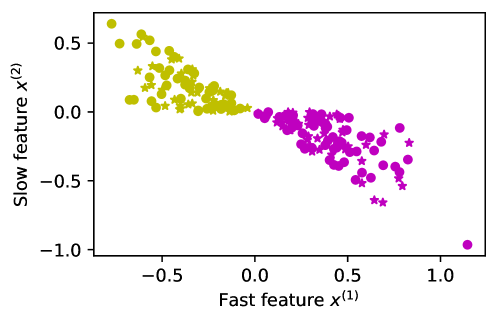

*Рисунок 7: **Игрушечный набор данных (постановка с совпадающими распределениями).** Для этого изображения мы берём $\theta=\pi/4$ и $\varepsilon=0.1$. Обучающие точки данных — кружки, тестовые — звёздочки. Цвет отвечает истинной метке $y$ точки данных.* **[p. 16]**

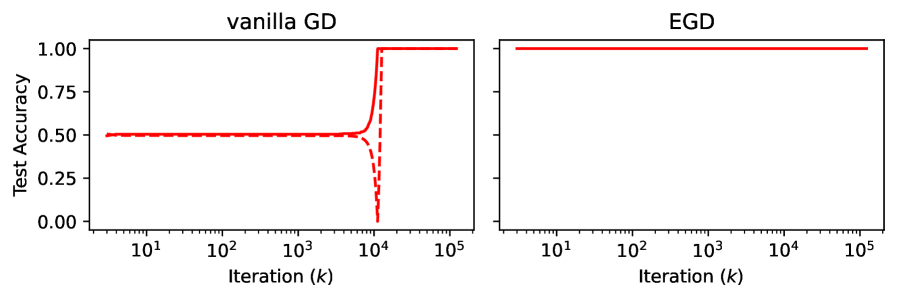

*Рисунок 8: Опытная проверка теоремы 2. Сплошные линии — настоящие опыты, а линии отвечают теоретическим предсказаниям согласно уравнению (19).* **[p. 16]**

**[p. 16]**

#### Популяционные моменты (точные одномерные представления).

Определим популяционную матрицу вторых моментов и вектор смешанных моментов:

$$
\Sigma=\mathbb{E}_{P}[xx^{\top}]=\begin{pmatrix}a&b\\
b&d\end{pmatrix},\qquad c=\mathbb{E}_{P}[yx]=\begin{pmatrix}c_{1}\\
c_{2}\end{pmatrix},\qquad w_{*}=\Sigma^{-1}c=\begin{pmatrix}\mu_{*}\\
\nu_{*}\end{pmatrix}^{\top}.
$$

Пусть $\kappa=\cot\theta/\sqrt{\varepsilon}$, а $\phi$ и $\Phi$ — плотность и функция распределения стандартного нормального закона. Все моменты допускают абсолютно сходящиеся одномерные представления:

$$
Z =\mathbb{P}_{P}\bigl((x^{\top}e_{1})(x^{\top}v)\leq 0\bigr)=\frac{1}{\pi}\arccos\!\Bigl(\frac{\cos\theta}{\sqrt{\cos^{2}\theta+\varepsilon\sin^{2}\theta}}\Bigr), \\
a =\frac{2}{Z}\int_{0}^{\infty}t^{2}\,\phi(t)\,\Phi(\kappa t)\,dt,\quad d=\frac{2\varepsilon}{Z}\int_{0}^{\infty}\Bigl(1-\frac{\kappa t\,\phi(\kappa t)}{\Phi(\kappa t)}\Bigr)\phi(t)\,\Phi(\kappa t)\,dt, \\
b =-\frac{2\sqrt{\varepsilon}}{Z}\int_{0}^{\infty}t\,\phi(t)\,\phi(\kappa t)\,dt,\quad c_{1}=\frac{2}{Z}\int_{0}^{\infty}t\,\phi(t)\,\Phi(\kappa t)\,dt,\quad c_{2}=-\frac{2\sqrt{\varepsilon}}{Z}\int_{0}^{\infty}\phi(t)\,\phi(\kappa t)\,dt.
$$

Немного потрудившись, можно показать, что

$$
\lambda_{+}=\Theta(\varepsilon),\qquad\lambda_{-}=\Theta(\varepsilon),\qquad|b|=O(\sqrt{\varepsilon}).
$$

#### Обычный градиентный спуск и детерминированный эквивалент.

Обычный GD на квадратичной потере с закреплённым шагом $\eta>0$ (при допущении $\eta<1/\lambda_{\max}(\hat{\Sigma})$):

$$
w(k+1)=w(k)-2\eta\,(\hat{\Sigma}w(k)-\hat{c}),\qquad w(0)=(u_{1},u_{2})^{\top},
$$

где $\hat{\Sigma}$, $\hat{c}$ и $\hat{w}_{*}$ суть эмпирические двойники $\Sigma$, $c$ и $w_{*}$ соответственно, определяемые как

$$
\hat{\Sigma}:=\frac{1}{n}X^{\top}X=\frac{1}{n}\sum_{i=1}^{n}x_{i}x_{i}^{\top},\quad\hat{c}:=\frac{1}{n}X^{\top}Y=\frac{1}{n}\sum_{i=1}^{n}y_{i}x_{i},\quad\hat{w}_{*}=w_{\text{OLS}}:=\hat{\Sigma}^{-1}\hat{c}.
$$

**[p. 17]**

*Популяционное рекуррентное соотношение* (детерминированный эквивалент, точный в пределе больших $n$) есть

$$
w(k+1)=w(k)-2\eta\,(\Sigma w(k)-c),\qquad w(0)=(u_{1},u_{2})^{\top}.
$$

Замкнутый вид:

$$
w(k)=w_{*}-(I-2\eta\Sigma)^{k}(w_{*}-w(0)).
$$

Пусть $w(k)=(\mu_{k},\nu_{k})^{\top}$, $d_{0}=w_{*}-w(0)$. Определим

$$
M=I-2\eta\Sigma=\begin{pmatrix}1-2\eta a&-2\eta b\\
-2\eta b&1-2\eta d\end{pmatrix},\qquad r_{\pm}=1-2\eta\lambda_{\pm}\in(0,1).
$$

По теореме Кэли — Гамильтона

$$
M^{k}=\alpha_{k}I+\beta_{k}M,\qquad\alpha_{k}=\frac{r_{+}r_{-}^{k}-r_{-}r_{+}^{k}}{r_{+}-r_{-}},\qquad\beta_{k}=\frac{r_{+}^{k}-r_{-}^{k}}{r_{+}-r_{-}}.
$$

откуда мы выводим, что $\mu_{k}$ и $\nu_{k}$ задаются как

$$
\mu_{k} =\mu_{*}-\Bigl[\alpha_{k}(\mu_{*}-u_{1})+\beta_{k}\bigl((1-2\eta a)(\mu_{*}-u_{1})-2\eta b(\nu_{*}-u_{2})\bigr)\Bigr], \\
\nu_{k} =\nu_{*}-\Bigl[\alpha_{k}(\nu_{*}-u_{2})+\beta_{k}\bigl(-2\eta b(\mu_{*}-u_{1})+(1-2\eta d)(\nu_{*}-u_{2})\bigr)\Bigr]. \tag{17}
$$

#### Точное выражение для тестовой ошибки.

Определим следующие скаляры

$$
\rho=\frac{\cos\theta}{\sqrt{\cos^{2}\theta+\varepsilon\sin^{2}\theta}},\quad\rho_{k}=\frac{\mu_{k}}{L_{k}},\text{ with }L_{k}:=\sqrt{\mu_{k}^{2}+\varepsilon\nu_{k}^{2}}.
$$

Действуя так же, как в доказательстве теоремы 1, мы получаем, что тестовая ошибка $w(k)$ задаётся как

$$
E_{test}\bigl(w(k)\bigr):=\mathbb{P}_{(x,y)\sim P}(yx^{\top}w(k)\leq 0)=\frac{\arccos\!\bigl(\max(\rho,\rho_{k})\bigr)}{\arccos(\rho)}. \tag{19}
$$

Из приведённой аналитической формулы видно, что убывание начинается ровно тогда, когда $\rho_{k}>\rho$, то есть

$$
|\nu_{k}|<|\mu_{k}||\tan\theta|.
$$

Для больших $k\geq k_{0}=O(1/\eta)$ быстрая мода уже сошлась, так что в главном порядке падение происходит, когда

$$
|\nu_{k}|\leq T,\text{ where }T=T(\theta):=|\mu_{*}||\tan\theta|.
$$

#### Двусторонняя оценка длины плато.

Определим целое $k_{*}\in\mathbb{N}\cup\{\infty\}$ как

$$
k_{*}:=\min\{k\geq 0:|\nu_{k}|\leq T\}. \tag{20}
$$

Медленный собственный вектор есть $q_{-}=e_{2}+O(\sqrt{\varepsilon})$. Существуют постоянные $\underline{C}(\theta),\overline{C}(\theta)\in[1,1+O(\sqrt{\varepsilon})]$ такие, что для всех $k\geq k_{0}$

$$
\underline{C}^{-1}\bigl|\nu_{*}-r_{-}^{k}(\nu_{*}-u_{2})\bigr|\leq|\nu_{k}|\leq\overline{C}\bigl|\nu_{*}-r_{-}^{k}(\nu_{*}-u_{2})\bigr|,\qquad r_{-}=1-2\eta\lambda_{-}.
$$

Стало быть, когда $|u_{2}-\nu_{*}|>\overline{C}T$,

$$
\boxed{\frac{1}{2\eta\lambda_{-}}\log\!\frac{|u_{2}-\nu_{*}|}{\overline{C}T}\;\leq\;k_{*}\;\leq\;\frac{1}{2\eta\lambda_{-}}\log\!\frac{|u_{2}-\nu_{*}|}{T/\underline{C}}.}
$$

Поскольку $\lambda_{-}=\Theta(\varepsilon)$, отсюда следует, что при $|u_{2}-\nu_{*}|\geq T$

$$
\boxed{k_{*}\asymp\frac{1}{\eta\varepsilon}\log\frac{|u_{2}-\nu_{*}|}{T}\quad\text{(up to multiplicative constants of order }1+O(\sqrt{\varepsilon})\text{)}.}
$$

Соединяя всё вместе, получаем следующий итог.

##### **Теорема 2****.**

###### p17-15

*Если (i) $m_{2}(\theta)\leq m_{1}(\theta)\tan\theta$ и (ii) $u_{2}>\alpha u_{1}$, то тестовая ошибка имеет плато длины $\Theta(\frac{1}{\eta\varepsilon})$. Если хотя бы одно из условий нарушено, плато нет.*

Опытная проверка теоремы 2 показана на рисунке 8.

**[p. 18]**

## Приложение B Гиперпараметры опытов раздела 5

Гиперпараметры, взятые в разных задачах, перечислены в таблице 1. В этой таблице $n$ — число входных битов для задачи чётности подмножества, DR — доля данных, показывающая, какая часть всех возможных сочетаний взята под обучающий набор, LR — скорость обучения, WD — weight decay, а BS — размер пакета. Во всех случаях за функцию возбуждения бралась ReLU.

*Таблица 1: Гиперпараметры для разных задач* **[p. 18]**

| **Задача** | **Настройка** | $n$ | DR | Width | LR | WD | BS |
|---|---|---|---|---|---|---|---|
| Чётность подмножества | $k=2$ | 400 | NA | 50 | 0.01 | $10^{-3}$ | 32 |
| $k=3$ | 100 | 100 | 0.042 | $10^{-2}$ |  |  |  |
| $k=4$ | 50 | 100 | 0.023 | $10^{-2}$ |  |  |  |
| Модульное слож./умнож. | $p=79$ | NA | 0.5 | 512 | 0.7 | $10^{-4}$ | 512 |
| $p=97$ |  |  |  |  |  |  |  |
| $p=127$ |  |  |  |  |  |  |  |

## Приложение C Рандомизированное SVD для снижения вычислительных издержек

###### p18-2

Выполнение SVD на каждой итерации вносит вычислительные издержки. Хотя в некоторых применениях общее время по часам до достижения высокой точности не столь важно, как число итераций (скажем, в обучении с подкреплением важно наименьшее число итераций, что означает взаимодействия), чтобы сделать EGD более правдоподобным на деле, издержки его надо снизить. Один способ — останавливать EGD на эпохе, где достигнута желаемая проверочная точность. Однако, если проверочного набора у нас нет, нужен другой приём, снижающий поитерационные издержки SVD. Рандомизированное SVD (**RSVD**) — подходящий соискатель на эту роль. Мысль RSVD в том, что можно взять начала рандомизированной линейной алгебры, спроецировать матрицу в пространство меньшей размерности, а затем вычислить SVD меньшей матрицы (Halko et al., 2011). Подробности RSVD мы привели в алгоритме 3. Наше осуществление есть упрощённый вид официального scikit-learn scikit-learn developers (2024). Поскольку градиентные матрицы не квадратны, все сингулярные разложения ведутся в усечённом виде, издержки которого симметричны относительно размеров матрицы.

Хотя EGD с точным SVD не требует настройки ни одного гиперпараметра, у RSVD есть два важных параметра: ранг и число итераций внутреннего круга. Во всех приводимых ниже опытах число итераций внутреннего круга положено 2. В этом разделе мы пытаемся понять, какой ранг лучше для каждой задачи и какие уступки надо учитывать при его настройке. Отметим, что все приводимые в этом разделе времена выполнения посчитаны на одном и том же GPU Tesla T4, без иных задач, влияющих на скорость. Подробности постановки опытов приведены в разделе 5, а взятые гиперпараметры перечислены в приложении B.

#### Модульное сложение.

###### p18-4

Первая изучаемая нами задача — модульное сложение. Таблица 2 приводит число эпох, потребное для достижения 95 процентов точности, общее время по часам до этой точности и время выполнения на эпоху для каждого приёма. Как видно, во всех случаях обычное SVD превосходит все прочие приёмы по числу эпох до достижения точности. Однако по времени по часам в двух случаях из трёх RSVD с рангом 128 превосходит SVD. Эти итоги ясно показывают, что если нас заботит время по часам, то есть оптимальный ранг, не слишком откладывающий гроккинг и снижающий поэпохные вычислительные издержки. Рисунок 9 показывает, как изменение ранга RSVD меняет эпоху, на которой происходит гроккинг. Сравнивая нормирование столбцов — приближение EGD — с EGD и его рандомизированными видами (то есть EGD с точным и рандомизированным SVD при разном выборе ранга приближения), мы видим, что нормирование столбцов достигает 95 процентов точности позже почти всех видов EGD. Однако по времени по часам в двух случаях из трёх нормирование столбцов есть лучший приём ввиду наименьших вычислительных издержек по сравнению с обычным SGD.

*Таблица 2: **Итоги на модульном сложении.** Сравнение обычного SGD, EGD с точным SVD, EGD с рандомизированным SVD (RSVD) и нормирования столбцов (упрощённого вида EGD) на задаче модульного сложения: приведены эпохи до 95 % точности, время по часам (в секундах) и время выполнения на эпоху (в миллисекундах). Числа в скобках получены делением отвечающего значения для обычного SGD на данную запись. Стало быть, бо́льшие числа в скобках означают выигрыш в скорости в записанное число раз по сравнению с обычным SGD. Во всех записях меньшее число вне скобок и бо́льшее число в скобках лучше. По числу эпох лучшим оказывается EGD с точным SVD. По времени до достижения 95 % точности лучшим оказывается нормирование столбцов, а вторым в среднем — EGD с RSVD ранга 128.* **[p. 19]**

| **p** | **Приём** | **Эпох до 95 % $\downarrow$ ($\uparrow$)** | **Время до 95 % (с) $\downarrow$ ($\uparrow$)** | **Время/эпоха (мс) $\downarrow$** |
|---|---|---|---|---|
| 79 | Обычный SGD | 10099 | 133.3 | 13.2 |
| EGD (SVD) | **222(45.5x)** | 12.5(10.6x) | 56.4 |  |
| EGD (RSVD, r=128) | 224(45.1x) | **11.1(12.0x)** | 49.7 |  |
| EGD (RSVD, r=64) | 397(25.4x) | 14.0(9.5x) | 35.3 |  |
| Норм. столбцов | 863(11.7x) | 15.4(8.6x) | 17.8 |  |
| 97 | Обычный SGD | 5392 | 156.9 | 29.1 |
| EGD (SVD) | **116(46.5x)** | 10.9(14.4x) | 94.4 |  |
| EGD (RSVD, r=128) | 139(38.8x) | 11.5(13.6x) | 82.8 |  |
| EGD (RSVD, r=64) | 237(22.7x) | 12.2(12.9x) | 51.4 |  |
| Норм. столбцов | 328(16.4x) | **10.3(15.2x)** | 30.6 |  |
| 127 | Обычный SGD | 3293 | 123.8 | 37.6 |
| EGD (SVD) | **62(53.1x)** | 11.4(10.8x) | 184.4 |  |
| EGD (RSVD, r=128) | 76(43.3x) | 10.1(12.2x) | 132.5 |  |
| EGD (RSVD, r=64) | 146(22.5x) | 12.1(10.2x) | 83.2 |  |
| Норм. столбцов | 133(24.7x) | **5.9(21.0x)** | 44.1 |  |

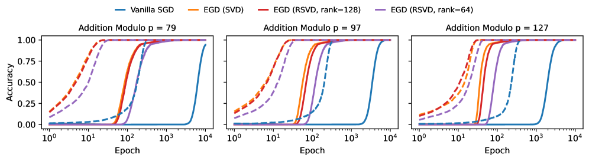

*Рисунок 9: **Итоги на модульном сложении** при разных значениях модуля p. Сплошные линии отвечают точности на тесте, прерывистые — точности на обучении. Графики показывают, что применение рандомизированного SVD и снижение его ранга мешает EGD достичь всей полноты ускорения. Однако по времени по часам рандомизированное SVD ранга 128 кажется оптимальным: оно откладывает гроккинг не так сильно, как меньшие ранги, увеличивая при этом скорость шага. Подробности постановки опытов см. в разделе 5, а взятые гиперпараметры — в приложении B.* **[p. 19]**

**[p. 19]**

#### Модульное умножение.

Для этой задачи мы тоже сравнили EGD с точным SVD и его вычислительно более действенный вид на основе рандомизированного SVD (RSVD). Таблица 3 приводит итоги по времени выполнения, а рисунок 10 — кривые обучения. Вывод тот же, что и для модульного сложения. Упрощённый вид EGD, обходящийся без SVD (нормирование столбцов), даёт лучшее время по часам. Однако, если нас заботят и число эпох до 95 %, и время по часам, лучшим приёмом в целом оказывается EGD с рандомизированным SVD ранга 128: он снижает время по часам, существенно не увеличивая эпоху гроккинга.

*Таблица 3: **Итоги на модульном умножении.** Сравнение обычного SGD, EGD (с точным SVD), EGD (RSVD) и нормирования столбцов (упрощённого вида EGD) на задаче модульного умножения: приведены эпохи до 95 % точности, время по часам (в секундах) и время выполнения на эпоху (в миллисекундах). Числа в скобках получены делением отвечающего значения для обычного SGD на данную запись. Стало быть, бо́льшие числа в скобках означают выигрыш в скорости в записанное число раз по сравнению с обычным SGD. Во всех записях меньшее число вне скобок и бо́льшее число в скобках лучше. По числу эпох лучшим оказывается EGD с точным SVD. По времени до достижения 95 % точности лучшим оказывается нормирование столбцов, а вторым в среднем — EGD с рандомизированным SVD (RSVD) ранга 128.* **[p. 20]**

| **p** | **Приём** | **Эпох до 95 % $\downarrow$ ($\uparrow$)** | **Время до 95 % (с) $\downarrow$ ($\uparrow$)** | **Время/эпоха (мс) $\downarrow$** |
|---|---|---|---|---|
| 79 | Обычный SGD | 10116 | 133.5 | 13.2 |
| EGD (SVD) | **221(45.8x)** | **11.4(11.7x)** | 51.7 |  |
| EGD (RSVD, r=128) | 233(43.4x) | 11.6(11.5x) | 49.8 |  |
| EGD (RSVD, r=64) | 371(27.3x) | 12.9(10.3x) | 34.9 |  |
| Нормирование столбцов | 814(12.4x) | 13.8(9.7x) | 17.0 |  |
| 97 | Обычный SGD | 5715 | 115.4 | 20.2 |
| EGD (SVD) | **107(53.4x)** | 10.4(11.1x) | 97.5 |  |
| EGD (RSVD, r=128) | 126(45.3x) | 9.9(11.6x) | 78.6 |  |
| EGD (RSVD, r=64) | 233(24.5x) | 12.7(9.1x) | 54.7 |  |
| Нормирование столбцов | 328(17.4x) | **8.4(13.7x)** | 25.5 |  |
| 127 | Обычный SGD | 3261 | 99.8 | 30.6 |
| EGD (SVD) | **65(50.2x)** | 11.9(8.4x) | 183.9 |  |
| EGD (RSVD, r=128) | 74(44.1x) | 9.8(10.2x) | 132.0 |  |
| EGD (RSVD, r=64) | 142(23.0x) | 11.5(8.7x) | 80.8 |  |
| Нормирование столбцов | 142(23.0x) | **5.8(17.2x)** | 41.2 |  |

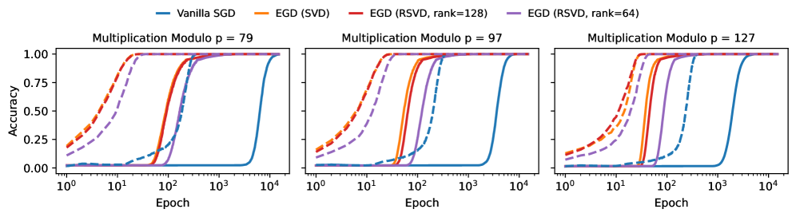

*Рисунок 10: **Итоги на модульном умножении** при разных значениях модуля $p$, при разных значениях $p$. Сплошные линии отвечают точности на тесте, прерывистые — точности на обучении. Как и в задаче модульного сложения, здесь рандомизированное SVD (RSVD) ранга 128 кажется оптимальным: оно даёт более быстрое поэпохное вычисление и наименьшим образом откладывает гроккинг по сравнению с EGD с точным SVD. Подробности постановки опытов см. в разделе 5, а взятые гиперпараметры — в приложении B.* **[p. 20]**

#### Задача разрежённой чётности.

###### p19-2

Для задачи разрежённой чётности мы испробовали 4 разных ранга RSVD, чтобы яснее увидеть уступки. Занятно, что для всех значений $k$ есть настройка RSVD, достигающая 95 % точности и за меньшее число эпох, и за меньшее время по часам, нежели EGD с точным SVD. Это намекает, что настройка этого ранга на деле решающа. Итоги по времени выполнения перечислены в таблице 4, а кривые обучения показаны на рисунке 11. **[p. 20]** Для задачи разрежённой чётности нормирование столбцов не столь надёжно: при $k=4$ оно 95 % точности не достигает, а в прочих случаях один из видов рандомизированного SVD ранга 40 быстрее его и по числу эпох, и по времени по часам.

*Таблица 4: **Итоги на задаче разрежённой чётности.** Сравнение обычного SGD, EGD (с точным SVD), EGD с рандомизированным SVD (RSVD) и нормирования столбцов (упрощённого вида EGD) на задаче модульного умножения: приведены эпохи до 95 и время (в миллисекундах). Числа в скобках получены делением отвечающего значения для обычного SGD на данную запись. Стало быть, бо́льшие числа в скобках означают выигрыш в скорости в записанное число раз по сравнению с обычным SGD. Во всех записях меньшее число вне скобок и бо́льшее число в скобках лучше. Занятно, что для этой задачи во всех трёх случаях есть настройка RSVD, дающая более быстрый гроккинг, нежели EGD с точным SVD. Лучший приём и по числу эпох, и по времени по часам — EGD с RSVD ранга 30.* **[p. 21]**

| **k** | **Приём** | **Эпох до 95 % $\downarrow$ ($\uparrow$)** | **Время до 95 % (с) $\downarrow$ ($\uparrow$)** | **Время/эпоха (мс) $\downarrow$** |
|---|---|---|---|---|
| 2 | Обычный SGD | 7873 | 409.4 | 52.0 |
| EGD (SVD) | 109(72.2x) | 28.3(14.5x) | 259.5 |  |
| EGD (RSVD, r=40) | **42(187.4x)** | **9.1(45.0x)** | 216.7 |  |
| EGD (RSVD, r=30) | 424(18.6x) | 70.7(5.8x) | 166.7 |  |
| EGD (RSVD, r=20) | 890(8.8x) | 137.5(3.0x) | 154.5 |  |
| EGD (RSVD, r=10) | 2586(3.0x) | 354.5(1.15x) | 137.1 |  |
| Нормирование столбцов | 520(15.1x) | 40.4(10.1x) | 77.8 |  |
| 3 | Обычный SGD | 1784 | 89.4 | 50.1 |
| EGD (SVD) | 115(15.5x) | 36.3(2.5x) | 315.6 |  |
| EGD (RSVD, r=40) | 180(9.9x) | 39.7(2.2x) | 220.7 |  |
| EGD (RSVD, r=30) | **76(23.5x)** | 13.5(6.6x) | 178.0 |  |
| EGD (RSVD, r=20) | 99(18.0x) | 15.2(5.9x) | 153.8 |  |
| EGD (RSVD, r=10) | 312(5.7x) | 41.4(2.1x) | 132.6 |  |
| Нормирование столбцов | 120(14.9x) | **8.8(10.1x)** | 73.8 |  |
| 4 | Обычный SGD | 5273 | 253.1 | 48.0 |
| EGD (SVD) | 254(20.7x) | 50.5(5.0x) | 199.0 |  |
| EGD (RSVD, r=40) | - | - | 183.0 |  |
| EGD (RSVD, r=30) | **176(30.0x)** | **27.6(9.2x)** | 157.0 |  |
| EGD (RSVD, r=20) | 312(16.9x) | 45.5(5.6x) | 145.9 |  |
| EGD (RSVD, r=10) | 1067(4.9x) | 136.5(1.8x) | 127.9 |  |
| Нормирование столбцов | - | - | 69.9 |  |

*Рисунок 11: **Итоги на задаче разрежённой чётности.** Сплошные линии отвечают точности на тесте, прерывистые — точности на обучении. Занятно, что в этой задаче есть настройки рандомизированного SVD (RSVD), гроккающие за меньшее число эпох, нежели EGD с точным SVD. Эта задача показывает, что, хотя нормирование столбцов есть удачный облегчённый вид EGD, надёжным его не назовёшь: к росту точности на тесте оно не ведёт. Подробности постановки опытов см. в разделе 5, а взятые гиперпараметры — в приложении B.* **[p. 21]**

#### Среднее по всем задачам.

В этом разделе для каждой задачи мы берём лучшую настройку каждого приёма: EGD с точным SVD, EGD с рандомизированным SVD (RSVD) и нормирование столбцов, — и усредняем выигрыши, даваемые ими против обычного SGD. Итоги приведены в таблице 5. Они показывают, что при настройке ранга для всех задач в среднем EGD с RSVD даёт лучший выигрыш и по числу эпох до 95 % точности, и по времени по часам.

*Таблица 5: Среднее улучшение, даваемое лучшей настройкой для каждой задачи. Для нормирования столбцов задача разрежённой чётности при $k=4$ исключена, поскольку точность на тесте там не растёт вовсе.* **[p. 22]**

| **Приём** | **Эпох до 95 % $\uparrow$** | **Время до 95 % (с) $\uparrow$** |
|---|---|---|
| EGD (SVD) | 44.8x | 9.8x |
| EGD (RSVD, r = лучший для каждой задачи) | **55.6x** | **14.7x** |
| Нормирование столбцов | 16.9x | 13.2x |

**[p. 21]**

## Приложение D EGD в более применимых постановках и опытное сравнение с Grokfast

Гроккинг обнаружен при обучении на более применимых наборах данных вроде MNIST (LeCun et al., 2002), а также в задачах модульной арифметики при более замысловатых устройствах вроде двухслойного трансформера (Liu et al., 2023; Lee et al., 2024). В этом разделе мы разбираем, способны ли EGD и EGD **[p. 22]** с рандомизированным SVD ускорять гроккинг и в этих более применимых постановках. Мы сравниваем предлагаемый нами приём и с Grokfast — сильнейшим доступным опорным приёмом. Мы взяли те же гиперпараметры и оптимизатор, что приведены в статье о Grokfast, и воспользовались официальным собранием кода авторов ради честного сравнения. Во всех приводимых ниже сравнениях мы брали лучшую настройку Grokfast, где для фильтрации градиентов берётся EMA вместо запаса памяти, чтобы наименьшим образом увеличить издержки памяти против обычного оптимизатора. Как обсуждалось выше, наш приём дополнительной памяти не требует вовсе.

В этом разделе мы показываем, что EGD даёт содержательные выигрыши в более применимых постановках: когда набор данных более замысловат (MNIST), когда модель сложнее двухслойной MLP (трёхслойная MLP и двухслойный трансформер) и когда оптимизатор сложнее обычного SGD (Adam и AdamW).

#### Набор данных MNIST с трёхслойной MLP как моделью и AdamW как оптимизатором.

###### p22-2

Показано, что при некоторых определённых гиперпараметрах трёхслойная MLP с ReLU обнаруживает гроккинг при обучении на наборе данных MNIST (Liu et al., 2023). Мы взяли те же параметры, оптимизатор (AdamW (Loshchilov and Hutter, 2017)) и модель, что приведены в Omnigrok (Liu et al., 2023) и Grokfast (Lee et al., 2024). EGD мы применяем к весам всех трёх слоёв сети MLP. Итоги сведены в таблице 6. EGD и все его виды на основе рандомизированного SVD (RSVD) достигают 85 % точности за меньшее число шагов оптимизации, нежели Grokfast. Однако EGD с SVD превосходит Grokfast по времени по часам до достижения 85 % лишь наименьшим образом (85 процентов выбраны ради согласия с итогами, приведёнными в Grokfast), тогда как виды EGD с RSVD превосходят Grokfast со значительным отрывом и по числу шагов, и по времени до 85 %. Если взглянуть на кривые обучения на рисунках 12 и 13, видно, что EGD и его виды гроккают быстрее Grokfast. Кроме того, у Grokfast есть внезапное падение с последующим ростом, чего на графиках EGD мы не видим. Другое занятное наблюдение: графики обучающей потери у обычного AdamW и у Grokfast шумны, тогда как у EGD кривая обучающей потери гладка.

*Таблица 6: **Итоги на MNIST.** Мы взяли те же параметры, модель и оптимизатор, что предложены в статье о Grokfast. Как видно, виды предлагаемого нами EGD на основе RSVD превосходят Grokfast и по числу шагов оптимизации, и по времени до достижения 85 %. Кроме того, по итоговой проверочной точности виды EGD (и с точным, и с рандомизированным SVD) превосходят Grokfast.* **[p. 22]**

| **Приём** | **Шагов до 85 % $\downarrow$ ($\uparrow$)** | **Время до 85 % (с) $\downarrow$ ($\uparrow$)** | **Время/эпоха (мс) $\downarrow$** | **Итог. пров. точность $\uparrow$** |
|---|---|---|---|---|
| Обычный AdamW | 43100 | 660.0 | 15.3 | 89.0% |
| Grokfast | 1800(23.9x) | 28.7(23.0x) | 16.0 | 91.0% |
| EGD(SVD) | 700(61.6x) | 24.3(27.2x) | 34.7 | **91.9%** |
| EGD(RSVD,r=16) | 600(71.8x) | 11.7(56.4x) | 19.5 | 91.3% |
| EGD(RSVD,r=8) | **500(86.2x)** | 9.4(70.2x) | 18.8 | 89.6% |
| EGD(RSVD,r=4) | **500(86.2x)** | **9.2(71.7x)** | 18.4 | 91.5% |

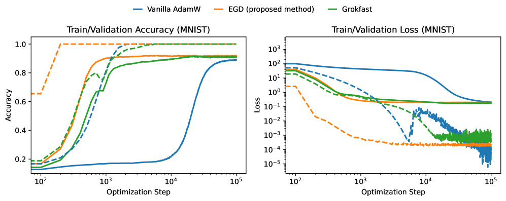

*Рисунок 12: **Итоги на MNIST.** Сплошные линии отвечают проверочной точности и потере, прерывистые — обучающим. Здесь наш EGD осуществлён через точное SVD. Как видно, EGD ускоряет гроккинг сильнее Grokfast. Кроме того, он не обнаруживает ни внезапных падений точности, ни большого шума в обучающей потере.* **[p. 23]**

*Рисунок 13: **Итоги на MNIST.** Сплошные линии отвечают проверочной точности и потере, прерывистые — обучающим. Здесь наш приём EGD осуществлён через точное SVD и через рандомизированное SVD (RSVD) с разными рангами. Мы видим, что при некоторых рангах RSVD гроккает даже быстрее EGD. У всех видов с RSVD кривые обучающей потери гладки, в отличие от Grokfast и обычного AdamW.* **[p. 23]**

#### Модульная арифметика с двухслойным трансформером как моделью и Adam как оптимизатором.

###### p22-3

Следуя постановке, предложенной и принятой прежними работами (Liu et al., 2023; Lee et al., 2024), мы берём двухслойный трансформер и оптимизатор Adam (Adam and others, 2014) за опорные для сравнения с EGD. Мы сравниваем итоги и с Grokfast (Lee et al., 2024). EGD применяется лишь к первому слою MLP трансформера. Итоги по времени выполнения перечислены в таблице 7. Итоги наводят на мысль, что EGD с RSVD работает сравнимо с Grokfast. Однако наш приём не добавляет никаких издержек памяти. Эти итоги получены сравнением EGD с Grokfast, берущим EMA для фильтрации. Однако для подсчёта EMA Grokfast обязан запоминать копию градиентов для обновления. В EGD дополнительной памяти не нужно. Сравнение кривых обучения показано на рисунках 14 и **[p. 23]** 15. Эти кривые показывают, что EGD в этой постановке крайне неустойчив. Однако при взятии рандомизированного SVD итоги становятся устойчивыми и даже устойчивее, чем у Grokfast.

*Таблица 7: **Итоги на модульном умножении** при $p=97$ и двухслойном трансформере как модели. Grokfast превосходит EGD с точным SVD и по числу эпох, и по времени до достижения 95 % точности. Однако различие между случаем RSVD и Grokfast ничтожно, тогда как EGD с RSVD не вносит никакого дополнительного расхода памяти, что решающе для больших моделей вроде трансформеров.* **[p. 23]**

| **Приём** | **Шагов до 95 % $\downarrow$ ($\uparrow$)** | **Время до 95 % (с) $\downarrow$ ($\uparrow$)** | **Время/шаг (мс) $\downarrow$** | **Итог. пров. точность $\uparrow$** |
|---|---|---|---|---|
| Обычный Adam | 55780 | 5198.7 | 93.2 | 99.1% |
| Grokfast | **910(61.3x)** | **114.0(45.6x)** | 125.3 | 100% |
| EGD(SVD) | 1170(47.7x) | 179.9(28.9x) | 153.8 | 100% |
| EGD(RSVD,r=36) | 980(56.9x) | 129.3(40.2x) | 131.9 | 100% |

*Рисунок 14: **Итоги на модульном умножении** при p=97. Сплошные линии отвечают проверочной точности и потере, прерывистые — обучающим. Здесь наш приём EGD осуществлён через SVD и ведёт к неустойчивому обучению для этой задачи и устройства модели.* **[p. 24]**

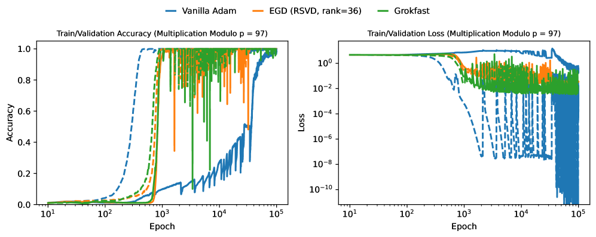

*Рисунок 15: **Итоги на модульном умножении** при $p=97$. Сплошные линии отвечают проверочной точности и потере, прерывистые — обучающим. Здесь наш приём EGD осуществлён через рандомизированное SVD (RSVD) с рангом 36. Занятно, что EGD с RSVD ведёт здесь к более устойчивому обучению, нежели Grokfast или EGD с точным SVD (рисунок 14).* **[p. 24]**

**[p. 24]**

#### Сводка.

###### p24-1

В применимых постановках EGD с рандомизированным SVD (RSVD) ведёт к более быстрому гроккингу и по числу шагов, и по времени по часам, не добавляя никакого расхода памяти, что решающе для больших моделей и оптимизаторов, уже расходующих много памяти на отслеживание импульса и скорости градиентов. Однако ранг RSVD приходится настраивать ради наибольшего выигрыша. Итоги многообещающи на разных задачах, оптимизаторах и устройствах.

## Приложение E EGD помогает широко применяемым оптимизаторам справляться с нестационарностью

###### p24-2

Во многих настоящих постановках справляться с нестационарностью решающе важно. Мы выдвигаем догадку, что предлагаемый нами приём EGD, ведущий к более быстрому гроккингу и более быстрому выучиванию тонкостей данных, поможет оптимизаторам быстро приспосабливаться к переменам в распределении данных. В этом разделе мы испытываем, как добавление EGD поверх трёх обыкновенно применяемых оптимизаторов способно улучшить их приспособляемость к переменам распределения данных. Мы следуем опыту, введённому Sokar et al. (2023), чтобы подражать нестационарности. Мысль в том, чтобы начать обучение на CIFAR-10 (Krizhevsky et al., 2009) и через закреплённые промежутки перемешивать все метки, наблюдая, как быстро оптимизатор способен оправиться и поднять точность на обучении после перемешивания. Показано, что этот опыт действенно обнаруживает нестационарность в обучении с подкреплением (Castanyer et al., 2025).

**[p. 25]**

###### p25-1

Для этих опытов мы взяли ту же постановку и параметры, что и Castanyer et al. (2025). Модель есть свёрточная нейронная сеть с 3 свёрточными слоями, максимизирующим пулингом, полносвязным слоем и головой классификации. EGD с SVD мы применяем ко всем свёрточным слоям и к полносвязному слою. Чтобы сделать трёхмерные свёрточные слои двумерными, мы расплющиваем два последних измерения. Рисунок 16 показывает действие добавления EGD поверх трёх обыкновенно применяемых оптимизаторов (Adam (Adam and others, 2014), RAdam (Liu et al., 2019) и RMSprop (Tieleman and Hinton, 2017)), позволяющее им быстрее оправляться после перемешивания. Во всех случаях EGD увеличивает площадь под кривой. Занятное наблюдение: без EGD RMSprop, по-видимому, справляется с нестационарностью успешнее двух других оптимизаторов. Таблица 8 показывает, что добавление EGD улучшает обхождение с нестационарностью у всех оптимизаторов. Самое значительное улучшение наблюдается для оптимизатора Adam и при 3 точках перемешивания.

*Таблица 8: **Итоги внесения нестационарности на CIFAR-10.** Площадь под кривой для разных оптимизаторов после смещения распределений, с EGD и без него. Выигрыш от применения EGD наиболее значителен для Adam и RAdam, а наибольший выигрыш случается при 3 точках перемешивания меток.* **[p. 25]**

| **Число перемешиваний** | **Приём** | **Adam** | **RAdam** | **RMSProp** |
|---|---|---|---|---|
| Перемешивание на 1 эпохе | Обычный оптимизатор | 43.0 | 40.8 | 60.2 |
| Оптимизатор + EGD | 79.2(1.8x) | 70.0(1.7x) | 79.5(1.3x) |  |
| Перемешивание на 3 эпохах | Обычный оптимизатор | 24.7 | 22.9 | 31.6 |
| Оптимизатор + EGD | 56.0(2.3x) | 47.3(2.1x) | 54.7(1.7x) |  |
| Перемешивание на 4 эпохах | Обычный оптимизатор | 23.0 | 19.8 | 40.1 |
| Оптимизатор + EGD | 44.0(1.9x) | 23.5(1.2x) | 45.6(1.1x) |  |
| Перемешивание на 9 эпохах | Обычный оптимизатор | 14.2 | 13.3 | 14.8 |
| Оптимизатор + EGD | 24.3(1.7x) | 22.0(1.6x) | 24.0(1.6x) |  |

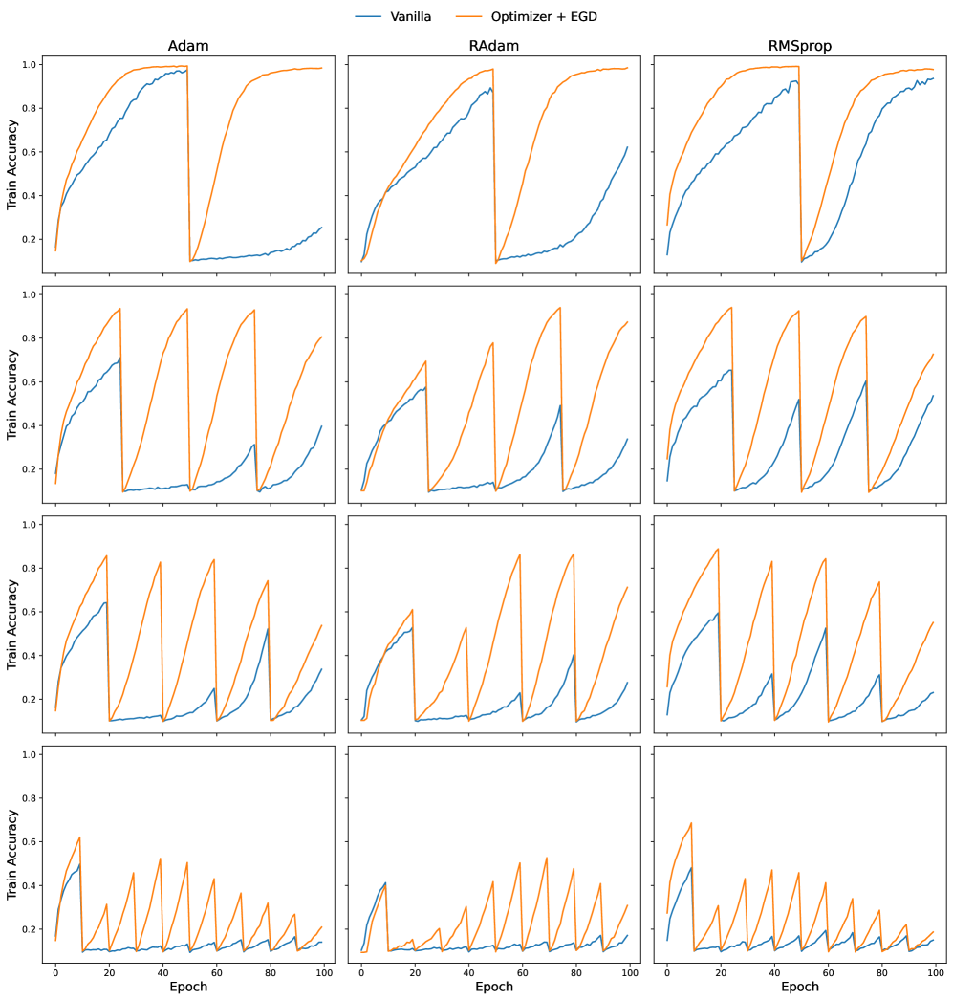

*Рисунок 16: **Итоги внесения нестационарности на CIFAR-10.** В каждой строке мы перемешиваем метки через одинаковые промежутки. Сверху вниз число точек перемешивания растёт, а потому оправляться становится труднее. Итоги показывают, что RMSprop успешнее оправляется после смещения распределения. Кроме того, при всех оптимизаторах и во всех положениях добавление EGD улучшало приспособляемость.* **[p. 26]**

## Приложение F Сходится ли EGD к иному подпространству, нежели обычный SGD?

###### p25-2

Приёмы, ускоряющие гроккинг, обыкновенно сходятся не к тому же оптимуму, что обычный SGD (Lee et al., 2024). Чтобы проверить, так ли это и для EGD, мы изобразили путь весов при выучивании арифметических задач. Подробности опытов те же, что приведены в разделе 5, а гиперпараметры перечислены в приложении B. Рисунки 17, 19 и 21 показывают пути для задач сложения, умножения и разрежённой чётности соответственно, а рисунки 18, 20, 22 — расстояние между весами на разных шагах времени и инициализацией. Из этих графиков можно сделать следующие занятные наблюдения.

- Общее для всех задач: после первых больших шагов EGD движется мало, тогда как обычный SGD перемещается в более широких пределах.\n- Модульные задачи: EGD и обычный SGD идут разными расходящимися путями. Оба перелетают по расстоянию от инициализации. Однако затем расстояние сокращается.\n- Разрежённая чётность: хотя поначалу пути EGD и SGD расходятся, SGD пытается достичь окрестности точки, где EGD начинает гроккать. По расстоянию оба приёма обнаруживают первоначальный большой скачок, а затем держат почти закреплённое расстояние от инициализации.

###### p25-4

Опираясь на эти наблюдения, можно сказать, что, кроме задачи разрежённой чётности, в двух других задачах EGD и обычный SGD сходятся к разным областям пространства параметров. В задаче разрежённой чётности они сперва расходятся, а затем обычный SGD пытается двигаться к области, где происходит гроккинг (то есть обычный SGD пытается повернуть к эпохе, на которой EGD делает свой большой скачок). Причина такого поведения и то, держится ли это наблюдение в рандомизированном случае и для других задач, оставлены будущей работе.

*Рисунок 17: **Итоги на модульном сложении.** Путь при EGD и обычном SGD. EGD и SGD сходятся к разным подпространствам.* **[p. 26]**

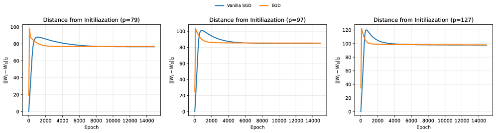

*Рисунок 18: **Итоги на модульном сложении.** Расстояние между весами и инициализацией. Оба приёма перелетают и в конце сходятся к областям с одинаковым и закреплённым расстоянием от инициализации.* **[p. 27]**

*Рисунок 19: **Итоги на модульном умножении.** Путь при EGD и обычном SGD. EGD и SGD сходятся к разным подпространствам.* **[p. 27]**

*Рисунок 20: **Итоги на модульном умножении.** Расстояние между весами и инициализацией. Оба приёма перелетают и в конце сходятся к областям с одинаковым и закреплённым расстоянием от инициализации.* **[p. 27]**

*Рисунок 21: **Итоги на задаче разрежённой чётности.** Путь при EGD и обычном SGD. EGD и SGD сперва расходятся, затем EGD поворачивает к эпохе, на которой EGD гроккнул.* **[p. 27]**

*Рисунок 22: **Итоги на задаче разрежённой чётности.** Расстояние между весами и инициализацией. EGD сперва перелетает, но в конце остаётся на том же расстоянии от инициализации. Обычный SGD не перелетает и постепенно приходит в область с тем же расстоянием до инициализации, что и EGD.* **[p. 28]**

**[p. 28]**

## Приложение G Подробности осуществления и псевдокоды

В этом разделе мы приводим псевдокод, по которому получены итоги этой статьи. Мы излагаем подробные алгоритмы трёх главных составных частей нашего приёма. Описания этих алгоритмов таковы.

- **Круг обучения с EGD 1.** Эта врезка показывает общий круг обучения с EGD. Ради снижения издержек, если у нас есть проверочный набор и порог приемлемой проверочной точности, мы перестаём применять EGD после эпохи, на которой эта точность достигнута. Кроме того, мы можем выбирать между RSVD и SVD.\n- **EGD с необязательным RSVD 2.** Этот алгоритм принимает градиентную матрицу и выполняет предобусловливание на основе SVD или рандомизированного SVD. Чтобы издержки были симметричны относительно размеров матрицы, мы всегда считаем усечённое SVD.\n- **Рандомизированное SVD 3.** В этой врезке показано подробное осуществление рандомизированного SVD. Мы взяли упрощённый вид алгоритма из осуществления scikit-learn (scikit-learn developers, 2024). Главное отличие этого алгоритма от официального в том, что мы не берём избыточную выборку. Изучение действия избыточной выборки оставлено будущей работе.

**Алгоритм 1** Круг обучения с EGD

1:параметры $\theta$, скорость обучения $\eta$, число эпох $N_{\text{epoch}}$, обучающие данные $D_{\text{train}}$, проверочные данные $D_{\text{val}}$, порог $\lambda$, флаг use_RSVD
2:**начало:**
3:$\text{use\_EGD}\leftarrow\text{True}$
4:**для** $\text{epoch}=1\dots N_{\text{epoch}}$ **выполнять**
5: **для** каждого пакета $(X,y)$ в $D_{\text{train}}$ **выполнять**
6: Вычислить градиенты: $G\leftarrow\nabla_{\theta}\mathcal{L}(\theta;X,y)$
7: **если** use_EGD **то**
8: $\tilde{G}\leftarrow\text{EGD}(G,\text{use\_RSVD})$ предобусловливание EGD (алгоритм 2)
9: **иначе**
10: $\tilde{G}\leftarrow G$ EGD не применяется
11: **конец** **если**
12: Обновить параметры: $\theta\leftarrow\text{OptimizerStep}(\theta,\tilde{G},\eta)$
13: **конец** **цикла**
14: $\text{val\_acc}\leftarrow\text{Evaluate}(\theta,D_{\text{val}})$
15: **если** $\text{val\_acc}>\lambda$ **то**
16: $\text{use\_EGD}\leftarrow\text{False}$ Stop EGD updates after порог is reached
17: **конец** **если**
18:**конец** **цикла**
19:**Вернуть:** обученные параметры $\theta$

**[p. 29]**

**Алгоритм 2** EGD с необязательным RSVD

1:**Вход:** градиентная матрица $G$ размера $d_{\text{out}}\times d_{\text{in}}$, флаг use_RSVD
2:**начало:**
3:**если** use_RSVD **то**
4: $(U,S,V^{\top})\leftarrow\mathrm{RSVD}(G)$
5:**иначе**
6: $(U,S,V^{\top})\leftarrow\mathrm{SVD}(G)$ Усечённое SVD
7:**конец** **если**
8:$P\leftarrow US^{-1}U^{\top}$ Построить матрицу предобусловливания
9:$\tilde{G}\leftarrow PG$
10:**Вернуть:** $\tilde{G}$

**Алгоритм 3** Рандомизированное SVD

1:**Вход:** матрица $G$ размера $m\times n$, целевой ранг $r$, итераций $n_{\text{iter}}$, seed
2:**начало:**
3:$m,n\leftarrow\text{shape}(G)$
4:$Q\leftarrow\text{Normal}(n,r,seed)$ Взять матрицу со случайными гауссовыми членами
5:**для** $i=1\dots n_{\text{iter}}$ **выполнять**
6: $Q\leftarrow\text{QR}(GQ)$ QR-разложение
7: $Q\leftarrow\text{QR}(G^{T}Q)$ QR-разложение
8:**конец** **цикла**
9:$B\leftarrow GQ$ Спроецировать на малоранговое подпространство
10:$(\hat{U},\hat{S},\hat{V}^{\top})\leftarrow\mathrm{SVD}(B)$ Усечённое SVD малой матрицы $B$
11:**Вернуть:** $\hat{U},\hat{S}$ Вернуть приближённые сингулярные векторы и числа
