# Hutchison & Yevick 2025 — Grokking in the Ising Model

См. также: [глобальный индекс понятий](../../concepts/index.md).

**Karolina Hutchison**, **David Yevick** (физический факультет Университета Ватерлоо).

arXiv [2510.25966](https://arxiv.org/abs/2510.25966), октябрь 2025, версия v2, 17 страниц, 20 рисунков (31 панель), 2 таблицы, 2 выключные формулы. Всего цитирований по Semantic Scholar — 1, в картотеке — 2. Первая работа, исследующая гроккинг в постановке модели Изинга: плотная сеть классифицирует спиновые решётки 8×8 по четырём энергетическим полосам, и отложенная генерализация истолкована как переход от связной сети к группе разреженных подсетей с монотонно растущей по глубине разреженностью. Третья статья линии Ватерлоо — рядом с [2411.05353](../2411.05353.controlling-grokking-with-nonlinearity-and-data-symmetry/2411.05353.controlling-grokking-with-nonlinearity-and-data-symmetry.card.md) (управление нелинейностью) и [2507.11645](../2507.11645.tracing-the-path-to-grokking-embeddings-dropout-and-network-activation/original/2507.11645.tracing-the-path-to-grokking-embeddings-dropout-and-network-activation.md) (метрики-предвестники). Источник — восстановление из PDF (task-008, решение D4-A): подача PDF-only, см. врезку «Происхождение конверсии» в `original/`.

Оригинал и производные файлы этой папки:

- [`original/2510.25966.grokking-in-the-ising-model.md`](original/2510.25966.grokking-in-the-ising-model.md) — конверсия оригинала в Markdown без правок содержания, с врезкой о происхождении (формулы и таблицы восстановлены с растра).
- [`images/`](images/) — 31 панель рисунков 1–20, извлечённые встроенными PNG из PDF.

Схема якорей и правила ссылок на карточку — в [README папки статей](../README.md).

## Затрагиваемые понятия

**[Гроккинг](../../concepts/grokking.md)** — работа расширяет полигон явления на физическую задачу: первая демонстрация гроккинга в постановке модели Изинга ([`p15-1`](#p15-1)). Существенно, что режим здесь иной, чем на модульной арифметике: потолок тестовой точности около 0.83, а не единица ([`p4-2`](#p4-2)), и гроккинг не найден, а изготовлен — начальная амплитуда и weight decay подобраны «in order to enable grokking» по рецепту Omnigrok ([`p4-1`](#p4-1)).

**[Разреженная подсеть](../../concepts/sparse-subnetwork-lottery-ticket.md)** — главное измерение работы: в окне гроккинга (10000–17000 эпох) доля почти нулевых весов ($|w|<0.01$) в межслойных матрицах растёт, причём монотонно с глубиной слоя ([`p9-1`](#p9-1), [`fig-10`](#fig-10)); сам переход к разреженной подсети приписан Merrill et al. («as first reported in [11]»), собственная добавка — глубинная монотонность. Управляющая сверка: при инициализации по умолчанию и нулевом weight decay разреженность не меняется и гроккинга нет ([`fig-11`](#fig-11)). Вмешательства нет: разреженность нигде не навязывается принудительно, причинность заявлена словом.

**[Ослабление весов](../../concepts/weight-decay.md)** и **[начальный масштаб](../../concepts/initialization-scale.md)** — обе ручки Omnigrok воспроизведены на данных Изинга: задержка растёт с амплитудой инициализации $c$ и падает с weight decay $\lambda$; при $\lambda = 0$ генерализации нет вовсе ([`p6-1`](#p6-1), [`fig-3`](#fig-3), [`fig-4`](#fig-4)). Авторы прямо называют это повторением известной зависимости на новой задаче.

**[Фазовый переход](../../concepts/phase-transition.md)** — эвристическая, а не выведенная рамка: гроккинг подан как «фазовый переход» из связного «жидкого» состояния большой энтропии в «твёрдую» разреженную сеть, оптимизатор — как детерминированный отжиг с «вычислительной тепловой баней», dropout — как «тепловое движение», ведущее к «переохлаждённой жидкости» ([`p15-2`](#p15-2)). Авторы сами оговаривают: статистические величины сети «cannot be unambiguously quantified in contrast to classical statistical mechanics» ([`p16-1`](#p16-1)).

**[Меры прогресса](../../concepts/progress-measures.md)** — два измерителя: провал средней разности двух старших «вероятностей» softmax $\overline{\Delta P} = \overline{P_{max} - P_{second}}$ в окне перехода, поданный как аналог пика теплоёмкости ([`p14-2`](#p14-2), [`fig-19`](#fig-19)), и число PCA-компонент на 90 % дисперсии градиентов ([`p12-2`](#p12-2), [`fig-15`](#fig-15)) — единственный результат, названный самими авторами новым, и он же истолкован противоречиво (см. ниже).

**[Спектральный анализ](../../concepts/spectral-analysis-svd-esd-fve.md)** — заявленный измерительный вклад: «novel PCA-based network layer analysis techniques» ([`p1-5`](#p1-5)), применённые к градиентам ([`fig-14`](#fig-14)) и к активациям скрытых слоёв ([`fig-16`](#fig-16)–[`fig-18`](#fig-18)): при 100 % обучающей точности представления ещё бесструктурны, с началом гроккинга активации собираются в сгустки по классам ([`p14-1`](#p14-1)).

**[Возникновение признаков](../../concepts/feature-emergence-feature-learning.md)** — итоговая картина: последние, разреженные слои «as in a CNN» последовательно выделяют глобальные признаки входных классов, что и делает возможной генерализацию ([`p1-5`](#p1-5)); это аналогия, иллюстрируемая сплайновой рамкой Humayun et al. (формулы (1)–(2)), а не вывод из неё.

**[Минимизация нормы весов](../../concepts/weight-norm-minimization.md)** — статья аккуратно дистанцируется от ранней трактовки: спад норм весов «does not necessarily induce grokking but may correlate with it» ([`p2-3`](#p2-3)).

**[Зрительные и настоящие данные](../../concepts/vision-real-world-data-mnist-cifar.md)** — модель Изинга подана как «generator of images with maximum randomness subject to a given correlation among spins» ([`p1-8`](#p1-8)): гроккинг переносится на классификацию конфигураций, трактуемых как изображения, с управляемой близостью обучения и испытания ($n$-inverted наборы, [`p3-1`](#p3-1)).

**[Критический объём данных](../../concepts/data-fraction-critical-dataset-size.md)** — унаследованная зависимость: задержка растёт при уменьшении набора данных ([`p2-2`](#p2-2), пересказ Power et al.); собственная ось близости данных — доля решёток, меняющих класс при обращении $n$ спинов (52 % при $n=5$ против 20 % при $n=2$, [`p3-1`](#p3-1)).

**[Сжатие представлений](../../concepts/manifold-representation-compression.md)** — сплайновая рамка ([`p10-1`](#p10-1)): при переходе, опосредованном weight decay, линейные области мигрируют к границе решения, сложность остальных областей падает — заимствовано у Humayun et al. вместе с выводом о сглаживании границ ([`p10-2`](#p10-2)).

**[Гроккинг вне нейросетей](../../concepts/grokking-in-non-neural-models.md)** — задача взята из физики: модель Изинга служит управляемым генератором данных с известной структурой корреляций ([`p1-8`](#p1-8)). Источник задержки прослежен до перестройки самой сети — монотонного уменьшения числа деятельных нейронов по слоям ([`p1-7`](#p1-7)), а не до свойств данных.
## Что показано, а что предположено

Замечания редактора карточки по итогам разбора утверждений (`…claims.txt`, 53 пункта).

**Заявка новизны узкая и честная**: первая постановка гроккинга в рамке Изинга; новизна обстановки, а не механизма. Главный опытный результат — воспроизведение обеих зависимостей Omnigrok (амплитуда инициализации, weight decay) на спиновых данных, и авторы сами так это называют.

**Самое сильное место — управляющая сверка** ([`fig-11`](#fig-11)): при настройках по умолчанию разреженность не меняется с эпохой и гроккинга нет — это связывает рост разреженности с явлением, а не с ходом времени. Устойчивость проверена заменами (MSE вместо кросс-энтропии, tanh вместо ReLU — сказано, не показано).

**Ключевая оговорка режима**: гроккинг здесь изготовлен подбором двух ручек «in order to enable grokking», и потолок генерализации — 0.83, а не единица. Это существенно иной режим, чем канонический полигон, и при сверке с работами, где обе точности упираются в 100 %, разница важна.

**Механизм — истолкование, не вывод.** Сплайновая рамка (1)–(2) и довод про миграцию линейных областей взяты у Humayun et al. целиком; аналогия «поздние слои как в CNN» из формул не выводится, а иллюстрируется ими. Вмешательства в разреженность нет ни одного — показано совпадение окон, причинность заявлена словом.

**Внутренние шероховатости.** Порог разреженности $|w|<0.01$ взят без обоснования и не варьируется, а на нём висит главная кривая ([`fig-10`](#fig-10)). Повторы заявлены только для dropout (4 прогона), рис. 15 (5 подряд) и рис. 20 (3 расчёта) — остальное одиночные прогоны. Про ландшафт потерь на с. 12 сказано, что он «increases in complexity … resulting in … simplification of the landscape» — усложнение и упрощение в одном предложении как причина и следствие. Провал $\overline{\Delta P}$ назван «universal physical behavior» на основании собственной выборки статьи. Окно гроккинга в тексте — 10000–17000 эпох, на рис. 19 отметки стоят примерно на 8500 и 15000; расхождение не оговорено. Аннотация говорит о «active weights», введение — об «active neurons», как об одном и том же.

**Как работу будут цитировать** («показано, что гроккинг есть переход к разреженным подсетям») — точнее: на одной MLP на одной задаче Изинга при нарочно подобранных под гроккинг ручках доля почти нулевых весов растёт с глубиной ровно в окне задержки; «группа разреженных подсетей» — истолкование картины, не проверенное вмешательством.

---

# Текст статьи

Karolina Hutchison and David Yevick

Физический факультет

Университет Ватерлоо

Waterloo, ON N2L 3G1, Canada

## Аннотация

###### p1-5

Отложенная генерализация, называемая гроккингом, в вычислении машинного обучения происходит, когда рост тестовой точности запаздывает относительно обучающей точности. Эта статья рассматривает гроккинг в контексте плотной нейронной сети, обучаемой классифицировать конфигурации двумерной модели Изинга по 4 равноотстоящим энергетическим областям в присутствии weight decay. Отчасти с помощью новых техник анализа слоёв сети на основе PCA наблюдаемое поведение истолковано как переход от связной сети к группе разреженных подсетей, в которых число деятельных весов в каждом слое монотонно убывает с глубиной. Такая архитектура уменьшает ошибки классификации, происходящие от множественности путей. Последние слои сети, как в свёрточной нейронной сети, последовательно выделяют глобальные признаки входных классов, что делает возможной генерализацию на прежде невиданные узоры.

## Введение

Недавно было замечено, что модели машинного обучения генерализуют спустя много эпох после первоначального переобучения на обучающем наборе. Впервые описанное в [1], это «гроккинговое» поведение возникает во многих применениях и архитектурах нейронных сетей, включая модульную арифметику с трансформерами [1,2], классификацию изображений на наборе MNIST многослойными перцептронами (MLP) [3], анализ тональности на наборе IMDb с LSTM [3] и обработку естественного языка с трансформерами [4]. Ненейронные модели, такие как классификация и регрессия, тоже являли гроккинговое поведение [5].

###### p1-7

Эта статья демонстрирует, что гроккинг может происходить, когда плотная нейронная сеть применяется к модели Изинга в присутствии weight decay. Источник гроккинга в этой системе происходит от эволюции сети к архитектуре, в которой последовательные слои содержат монотонно меньшее число деятельных нейронов. В такой сети локальные свойства распределения спинов обрабатываются начальными слоями, тогда как глобальные признаки, а значит и способность к генерализации, живут в последних слоях с наименьшим числом действенных весов и нейронов. Сокращение нейронов и весов в последних слоях, однако, требует многих эпох, что и даёт наблюдаемый гроккинг.

###### p1-8

Модель Изинга, рассматриваемая как генератор изображений с наибольшей случайностью при заданной корреляции спинов, даёт оптимальную рамку для изучения эволюции нейронной сети при обучении. Далее, плотные нейронные сети дают куда лучшую рамку, чем, например,

**[p. 2]**

CNN или физически-информированные сети, для качественного изучения гроккингового поведения, поскольку в последних сетях гроккинг по большей части подавлен.

###### p2-2

На гроккинг влияют и гиперпараметры, и архитектура модели. Так, авторы [1] нашли, что задержка гроккинга, определяемая как число шагов обучения, требуемое модели для генерализации после первого достижения максимальной точности на обучающем наборе, растёт при уменьшении размера набора данных, тогда как увеличение weight decay или уменьшение амплитуды инициализации сокращает задержку и тем улучшает генерализацию [3]. Кроме того, на задержку влияют и число скрытых слоёв, и число нейронов на слой [6]. Далее, dropout может устранить гроккинг целиком [7,8].

###### p2-3

Динамику обучения нейронной сети можно анализировать по её скрытому представлению; в частности, по строению весов и подсетям. Ранние исследования обучения приписывали гроккинг спаду норм весов [3], но последующие работы указали, что он не обязательно вызывает гроккинг, а может с ним коррелировать [8]. Далее, и генерализацию [9], и гроккинг [10] можно связывать с превращением, напоминающим фазовый переход структуры сети, при котором у подмножества нейронов норма растёт или убывает. Весовые матрицы соответственно переходят к малоранговой конфигурации, дающей разреженную подсеть [11]. Происходящее от этого сокращение локальной сложности отображения вход-выход сети даёт упрощённые границы решения во входном пространстве [6]. Разреженность активаций, то есть доля нейронов скрытого слоя **ReLU**, которые неактивны, тоже склонна расти при обучении, когда происходит гроккинг, выходя на полку в области, где обучающая точность равна 100 %, а тестовая низка [8]. Это поведение изучалось и в трансформерах, где многослойный перцептрон (MLP) с **ReLU** являет разреженность после обучения [12]. Эти эффекты можно количественно выражать и по эволюции градиентных векторов, порождаемых при оптимизации, которую удобно визуализировать методами понижения размерности, такими как анализ главных компонент (PCA) [13,14].

## Вычислительные результаты:

###### p2-4

Чтобы наблюдать гроккинг в двумерной модели Изинга, был построен обучающий набор из 4000 решёток 8x8 с равномерно распределёнными энергиями. Каждая решётка заводилась своей случайной спиновой конфигурацией, чтобы образцы были некоррелированы. Затем применялся алгоритм Метрополиса с убывающим температурным расписанием для получения конфигураций, покрывающих диапазон энергий, определяемых стандартной формулой $E = -\sum_{\langle ij\rangle} s_i s_j$, в которой сумма берётся по всем парам ближайших соседей с периодическими граничными условиями и $s = \pm 1$. Для решётки 8x8 теоретические минимальная и максимальная энергии равны -128 и +128 соответственно. Однако набор данных покрывает лишь часть этого диапазона: случайно заведённые конфигурации обладают энергиями около нуля, тогда как энергия основного состояния равна -128. Набор данных затем сортируется на четыре равноотстоящих энергетических промежутка, $\Delta E_n \equiv \Delta E_1, \ldots, \Delta E_4$, по 1000 записей в каждом. Категориальная метка, применяемая в наших примерах нейронных сетей, задаётся индексом энергии $n = 1,2, . .4$. Диапазоны энергий этих промежутков показаны в таблице 1, причём образцы данных были равномерно распределены **[p. 3]** по энергии внутри каждого из диапазонов. Представительные образцы каждого из этих промежутков изображены на рисунке 1. Хотя эти энергетические промежутки, конечно, можно было бы определить иначе или основать на степени беспорядка, дополнительные расчёты продемонстрировали, что результаты были фактически тождественны при изменении числа или диапазонов энергетических промежутков или когда промежутки определяются намагниченностью вместо энергии. Такое поведение ожидаемо, поскольку механика гроккинга не зависит от выбора выходных категорий.

| Энергетическая категория | Энергии |
| --- | --- |
| $\Delta E_1$ | от -120 до -92 |
| $\Delta E_2$ | от -88 до -60 |
| $\Delta E_3$ | от -56 до -28 |
| $\Delta E_4$ | от -24 до 4 |

*Таблица 1. Четыре энергетических промежутка обучающего набора.*

*Рисунок 1. Примеры обучающих данных. Строки — четыре энергетические категории*

###### p3-1

Были порождены два тестовых набора. Первый, «random spin test set», применяемый ниже, если не указано иное, был получен тем же способом, что и обучающий набор, тогда как образцы второго, «$n$-inverted spin test set», были произведены обращением $n$ случайно выбранных спинов в каждой решётке обучающего набора. В этом случае энергия каждой решётки пересчитывалась, и тестовые метки переназначались соответственно. В последующих расчётах $n = 5$, если не указано иное. Как видно из таблицы 2, число состояний в каждой полосе $\Delta E_i$ тогда отличается от равномерного распределения обучающих данных: $\approx 52\%$ решёток меняют энергетическую категорию. Почти все образцы $\Delta E_1$ были смещены в полосу $\Delta E_2$, большинство образцов $\Delta E_2$ вошли в полосу $\Delta E_3$, а большинство образцов $\Delta E_3$ и почти все образцы $\Delta E_4$ остались в своей исходной полосе. Напротив, при $n = 2$ после обращения спинов $\approx 80\%$ решёток остаются в той же энергетической **[p. 4]** категории. Соответственно, зависимость гроккинга от близости обучающих и тестовых данных можно количественно выразить, сравнивая отклик нейронной сети на эти два набора данных.

| Энергетическая категория | Число решёток |
| --- | --- |
| $\Delta E_1$ | 40 |
| $\Delta E_2$ | 1214 |
| $\Delta E_3$ | 1409 |
| $\Delta E_4$ | 1337 |

*Таблица 2. Число решёток в каждой энергетической категории после случайного обращения 5 спинов для порождения тестового набора.*

###### p4-1

После построения обучающий и тестовый наборы подавались многослойному перцептрону (MLP), у которого метка выходного класса задавалась энергетической категорией $\Delta E_i$. Если не указано иное, сеть имела четыре скрытых слоя по 48 нейронов с функциями активации **ReLU**, кросс-энтропийную потерю, weight decay $5 \times 10^{-4}$ и скорость обучения $5 \times 10^{-4}$. В последнем слое сети применяется функция активации **softmax**, изменённая введением обратного температурного параметра $\beta$ в функцию **softmax** согласно $P_i = \exp(\beta z_i) / \sum_{j=1}^{4}\exp(\beta z_j)$, где $z_i$ означает $i$-й логит выходного слоя. По умолчанию $\beta = 1$. Для упрощения анализа члены смещения в нейронах ReLU были выброшены, а размер батча установлен равным размеру набора данных, так что обновления градиента выполнялись лишь раз на эпоху. Начальные веса брались из масштабированного равномерного распределения $c \times U$, где $U$ означает равномерное распределение PyTorch, а $c$ — амплитуду инициализации (по умолчанию $c = 7$). Инициализации весов и множитель спада были подобраны так, чтобы сделать гроккинг возможным, как отмечено в [3]. Как видно из теоретического обсуждения в следующем разделе, большие начальные амплитуды инициализации задерживают переход к разреженной сети с высокой тестовой точностью, тогда как множитель спада подавляет избыточные веса.

###### p4-2

При этих значениях тестовая точность асимптотически приближалась к $\approx 0.83$ и $\approx 0.79$ для random spin и $n = 5$ inverted spin тестовых наборов соответственно, после продолжительного периода переобучения. Как и ожидалось, наибольший источник ошибок происходил от предсказаний, неверных на один энергетический промежуток. Чтобы определить, связывает ли нейронная сеть в фазе переобучения преимущественно энергию данной решётки с обращёнными спинами с энергией исходной необращённой решётки, был выполнен расчёт с $n = 2$, для которого асимптотическая тестовая точность была примерно 0.85. Во время переобучения тестовая точность была лишь 0.55. Анализ матрицы ошибок $4 \times 4$ для тестового набора после 5000 эпох на рисунке 2 указывает, что при переобучении нейронная сеть примерно равновероятно ошибочно относила образцы в полосы выше и ниже. Отсюда следует, что даже при почти тождественных обучающем и тестовом наборах переобучающаяся нейронная сеть поначалу не пользуется этой близостью, так что её предсказания сперва бессмысленны и некоррелированы с лежащей в основе физикой, почти независимо от значения $n$.

**[p. 5]**

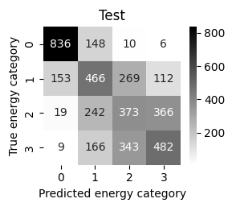

*Рисунок 2. Матрица ошибок тестового набора после 5000 эпох для random spin тестового набора.*

###### fig-3

*Рисунок 3. Кривые обучающей и тестовой точности при разных амплитудах инициализации для (a) random тестового набора и (b) тестового набора с 5 обращёнными спинами.*

###### fig-4

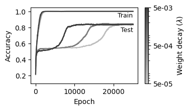

*Рисунок 4. Кривые обучающей и тестовой точности при разных значениях weight decay для (a) random тестового набора и (b) тестового набора с 5 обращёнными спинами.*

**[p. 6]**

*Рисунок 5. Кривые обучающей и тестовой точности при разных значениях обратной температуры в функции **softmax** для (a) random тестового набора и (b) тестового набора с 5 обращёнными спинами.*

###### p6-1

Как и в [3], задержка гроккинга, как выяснилось, растёт с амплитудой инициализации $c$ и убывает с параметром weight decay $\lambda$, что видно из рисунков 3 и 4, показывающих обучающую и тестовую точность как функции $c$ и $\lambda$ соответственно (при $\lambda = 0$ модель не генерализует: тестовая точность стоит на $\approx 0.55$ и $\approx 0.46$ для random и $n = 5$ решёток соответственно). Однако гроккинг подавлен, когда применялась инициализация по умолчанию, как видно из рисунка 3. Эти результаты демонстрируют, что ранее описанная зависимость гроккинга от инициализации и weight decay [3] дополнительно применима к модели Изинга. Рисунок 5 демонстрирует, что увеличение температуры в функции **softmax** (то есть уменьшение $\beta$) уменьшает гроккинг. Это согласуется с прежней работой, нашедшей, что более высокие температуры ведут к более быстрой сходимости [15]. Более того, задержка гроккинга, как выяснилось, растёт с числом скрытых слоёв и размером скрытого слоя.

Чтобы лучше понять источник гроккинга в модели Изинга, глобальную структуру нейронной сети можно визуализировать при обучении. Рисунки 6–9 изображают взаимодействия между четырьмя скрытыми слоями нейронной сети, где ширины линий представляют квадраты значений положительных и отрицательных весов, приведённые к промежутку $[0, 1]$. Связанные кривые точности показаны слева от каждого рисунка, где круглые маркеры указывают эпоху, на которой снята диаграмма сети.

**[p. 7]**

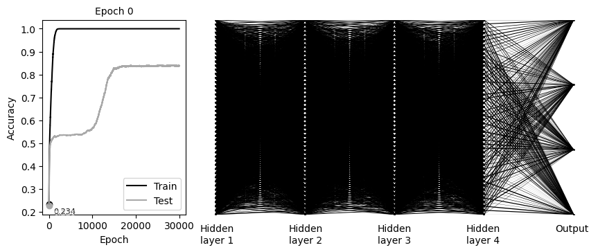

*Рисунок 6. Веса при инициализации (0 эпох).*

*Рисунок 7. Веса близ конца области переобучения (после 10000 эпох).*

**[p. 8]**

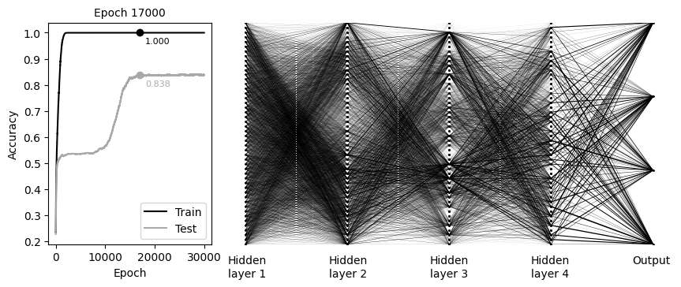

*Рисунок 8. Веса вскоре после гроккинга (после 17000 эпох).*

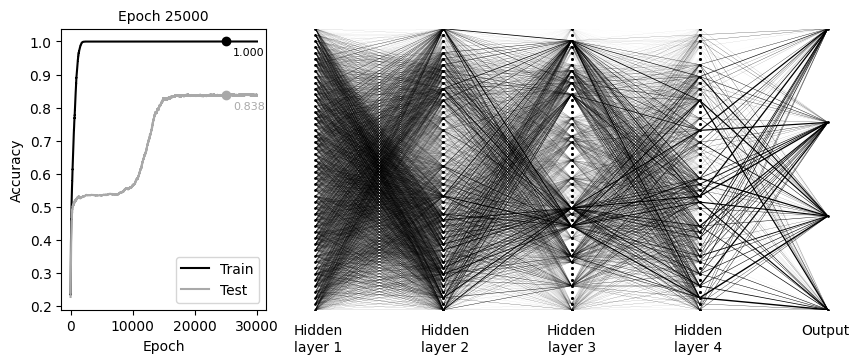

*Рисунок 9. Веса много позже гроккинга (после 25000 эпох).*

###### fig-10

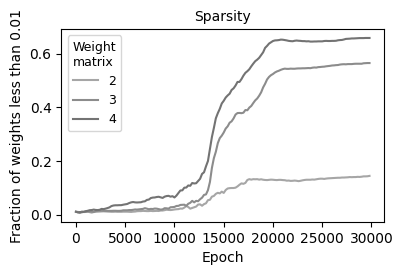

*Рисунок 10. Доля весов каждой из скрытых весовых матриц $48 \times 48$ с модулем <0.01 на рисунках 6–9.*

**[p. 9]**

###### p9-1

Во время гроккинга, между 10000 и 17000 эпох, существенная доля нейронов становится неактивной, а многие веса приближаются к нулю, что даёт переход к разреженной сети, как впервые описано в [11]. Это поведение показано на рисунке 10, где доля весов между скрытыми слоями 1 и 2, 2 и 3, 3 и 4 на рисунках 6–9 — все они обладают одинаковым числом нейронов — с амплитудами меньше 0.01 построена как функция номера эпохи. Этот рисунок ясно указывает, что сеть переходит к архитектуре с разреженностью, растущей с глубиной слоя, по мере того как сеть гроккает. После того как нейронная сеть генерализует, её структура, однако, меняется с номером эпохи лишь слегка. Схожие результаты получаются, если вместо кросс-энтропийной функции потерь применяется MSE с one-hot категориальными метками или если функция активации **tanh** подставлена вместо **ReLU**. Что рост разреженности связан с сочетанием weight decay и амплитуды инициализации, дополнительно видно из рисунка 11, порождённого расчётом стандартной плотной сети с инициализацией PyTorch по умолчанию и нулевым weight decay. В этом случае разреженность не меняется с номером эпохи, и, следовательно, гроккинг отсутствует.

###### fig-11

*Рисунок 11. Веса нейронной сети после 25000 эпох в отсутствие weight decay при инициализации по умолчанию.*

Механизм, ответственный за гроккинг, можно визуализировать, сперва заметив, что нейронная сеть прямого распространения осуществляет рекурсивное преобразование входных векторов данных $\boldsymbol{x}$, задаваемое как

$$f_\theta(\boldsymbol{x}) = h(\boldsymbol{A}_l h(\boldsymbol{A}_{l-1}h(\ldots) + \boldsymbol{b}_{l-1}) + \boldsymbol{b}_l)\tag{1}$$

###### p9-3

Здесь $\boldsymbol{A}_i$ и $\boldsymbol{b}_i$ — весовые матрицы и векторы смещения соответственно, а последний, $l$-й, член рекурсии есть $h(\boldsymbol{A}_1\boldsymbol{x} + \boldsymbol{b}_1)$. Если $h(\boldsymbol{x})$ — функции активации **ReLU**, входное пространство соответственно разбивается на кусочно-аффинные сплайновые операторы согласно

$$f_\theta(\boldsymbol{x}) = \sum_{\omega \in \Omega}(\boldsymbol{A}_\omega \boldsymbol{x} + \boldsymbol{b}_\omega)\mathbf{I}_{(x \in \omega)}\tag{2}$$

**[p. 10]**

###### p10-1

где $\boldsymbol{A}_\omega$ и $\boldsymbol{b}_\omega$ — новые локальные параметры весовой матрицы и массива смещений, а $\mathbf{I}_{(x \in \omega)}$ — индикаторная функция, равная единице в «линейной области» $\omega \in \Omega$ и нулю вне её, так что неперекрывающиеся области $\Omega$ покрывают входное пространство нейронной сети. Плотность этих линейных областей в непосредственной окрестности точки $\boldsymbol{x}$ входного пространства даёт оценку локальной сложности в этой позиции. Специализированные средства визуализации дополнительно демонстрируют, что во время гроккингового перехода, опосредованного weight decay (регуляризацией), линейные области мигрируют к границе решения, что даёт большую кривизну поперёк граничной поверхности, тогда как сложность остальных областей убывает [6].

###### p10-2

Чтобы расширить изложенную рамку, заметим, что разреженность слоёв на рисунке 10 растёт с глубиной слоя. Это подсказывает аналогию с CNN, в которой начальные слои сети содержат много деятельных нейронов и соответственно схватывают тонкую структуру входных данных, тогда как последние, разреженные, слои обрабатывают усреднённые, глобальные признаки данных. Схожим образом ур. (1) влечёт, что начальный слой, обладающий многими деятельными нейронами и весами, прямо обрабатывающими входные данные, влияет на свойства наименьших линейных областей (поскольку выходное пространство первого слоя многократно делится последующими функциями активации). Напротив, функции $h(x)$, связанные с последним слоем, который содержит относительно немного участвующих нейронов и весов, применяются вместо этого к наибольшим объединённым группам входных переменных. Эти слои потому способствуют генерализации, изменяя протяжённые области входного пространства. До гроккинга большое число нейронов плотной сети быстро подстраивается, чтобы запомнить входные данные. Однако из-за большого числа каналов в последнем слое малые отклонения от обучающего набора порождают непредсказуемые ложные предсказания. Когда же многие нейроны и веса в последних слоях подавлены, получающаяся сеть может надёжно генерализовать на тестовый набор.

Родственное объяснение изложенных результатов следует из формы границ решения между классами, образующих гиперповерхности в многомерном пространстве входных переменных. Из-за этой размерности вероятность того, что данная тестовая запись, рассматриваемая как точка входного пространства, расположена близко к одной или нескольким из этих гиперповерхностей, велика. Потому локальные свойства границы решения существенно влияют на тестовую точность. В начальной фазе запоминания поверхности границ решения изрезаны действием большого числа участвующих нейронов, что указывает, что плотная сеть переобучилась на обучающих данных и потому понизила точность классификации тестового набора. Последующее сокращение сложности последних слоёв сети, однако, сглаживает границы решения, чтобы они отражали средние свойства данных обучающего набора, делая генерализацию возможной.

Затем после каждого из четырёх скрытых слоёв был добавлен слой dropout, параметризованный долей dropout $p$, определяемой как вероятность того, что данный элемент выхода каждого скрытого слоя обнуляется при прямом проходе. Для получения оптимальных результатов размер скрытого слоя был дополнительно увеличен **[p. 11]** до 144, хотя результаты для других размеров были качественно тождественны. Обучающая и тестовая точности и соответствующие потери, усреднённые по 4 прогонам, показаны для разных долей dropout на рисунках 12 и 13, при множителе weight decay $\lambda = 5 \times 10^{-4}$. Хотя dropout применялся при обучении, обучающая точность на этих кривых вычислялась с полной нейронной сетью.

*Рисунок 12. Кривые точности для (a) обучающего и (b) тестового наборов при разных долях dropout.*

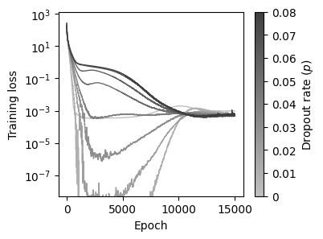

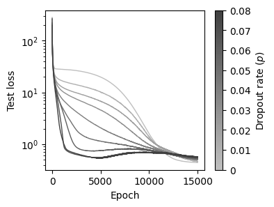

*Рисунок 13. Кривые потерь для (a) обучающего и (b) тестового наборов при разных долях dropout.*

###### p11-1

Доли dropout уже столь малые, как $p = 0.04$, достаточны, чтобы ускорить генерализацию и тем подавить гроккинг, как и ожидается из [7,8]. При $p > \approx 0.05$ обучающая точность сперва становится меньше, а затем растёт. Обе точности затем растут примерно одновременно, тогда как анализ, подобный рисункам 6–9, указывает, что число значимых нейронов сети остаётся примерно постоянным. Это ожидаемо, поскольку случайное устранение нейронов препятствует образованию устойчивой подсети. Эти наблюдения лишь слегка зависят от величины параметра weight decay.

Дальнейшее понимание гроккинга можно получить, рассматривая PCA-компоненты младших порядков градиентов потерь по параметрам пяти весовых матриц нейронной сети для каждого образца данных. Эти величины изображены точками на рисунке 14.

**[p. 12]**

###### fig-14

*Рисунок 14. Выборка PCA-сокращённых градиентов тестовых потерь на эпохе 4000, когда нейронная сеть переобучается.*

Линии точек, которые становятся более выраженными в поздних слоях сети, образованы группами ошибочно классифицированных образцов, тогда как градиенты верно классифицированных образцов расположены близ центра диаграмм.

###### fig-15

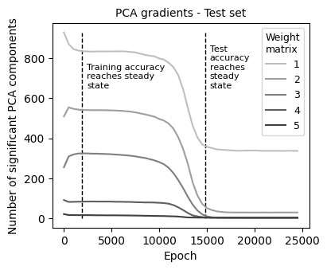

*Рисунок 15. Число собственных векторов PCA, требуемое для покрытия 90 % полной дисперсии.*

###### p12-2

Дальнейший, по-видимому новый, результат получается рассмотрением числа PCA-компонент, требуемых для покрытия 90 % дисперсии данных. Эта величина, вычисляемая каждые 500 эпох и усредняемая по 5 последовательным расчётам, изображена на рисунке 15, где линии, обозначающие точки, в которых обучающая и тестовая точность приближаются к своим асимптотическим значениям, оценены по предыдущим графикам. Эти кривые отражают степень неопределённости шага оптимизации, поскольку, если значимы многие PCA-размерности, градиент (являющийся стохастически меняющейся величиной, зависящей от содержимого минибатча) может быть ориентирован вдоль куда большего множества направлений и потому его выбирать. Очевидно, ландшафт потерь обучающего набора растёт в сложности во время гроккинга, что даёт более действенную минимизацию функции потерь и сопутствующее упрощение ландшафта.

PCA можно применять для визуализации не только градиентов, но и выходных активаций каждого скрытого слоя для всех образцов набора данных на каждой стадии обучения. Нейроны каждого скрытого слоя дают 48-мерный вектор для каждого образца, который затем проецируется на две PCA-компоненты младших порядков на рисунках 16–18. Хотя эти рисунки порождены с random тестовым набором, схожие результаты были получены с набором $n = 5$.

**[p. 13]**

###### fig-16

*Рисунок 16. PCA-проекции представлений скрытых слоёв для (a) обучающего набора и (b) тестового набора, когда сеть достигла 100 % обучающей точности и тестовая точность начинает расти.*

*Рисунок 17. То же, что рисунок 16, но для эпохи 17000, сразу после того как тестовая точность достигла своего асимптотического значения.*

**[p. 14]**

###### fig-18

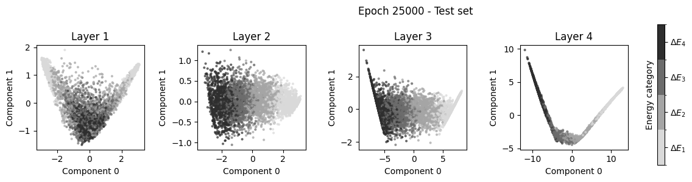

*Рисунок 18. То же, что рисунок 16, но для эпохи 25000.*

###### p14-1

Рисунки 16–18 демонстрируют, что даже после того, как обучающая точность достигает 100 %, внутренние представления набора данных бесструктурны; в этот момент сеть ещё не установила окончательно входные распределения. Однако с началом гроккинга происходит переход, организующий векторы активаций в отдельные сгустки, соответствующие энергетическим категориям. Сеть тогда способна вспоминать признаки каждой входной записи, в согласии с прежней работой, связавшей гроккинг с упрощением границ решения [6]. По крайней мере в случае ReLU, когда узоры активаций становятся более структурными, многие нейроны становятся неактивными и потому испытывают спад нормы. Сеть тогда может точно установить отображение между входными данными и классами и разрешить возмущённые входные узоры тестового набора.

###### p14-2

Дополнительное понимание механизма гроккинга можно получить, рассматривая выходное «вероятностное» распределение, построенное из выходных значений слоя **softmax**. В частности, среднее разности $\overline{\Delta P} = \overline{P_{max} - P_{second}}$ между наибольшей и второй по величине предсказанными «вероятностями» даёт эвристическую, но легко вычисляемую меру уверенности предсказания, или, иначе, выходной энтропии. Как видно из рисунка 19(a), $\overline{\Delta P}$ являет заметный провал во время гроккинга (дающий лёгкий рост обучающей потери). Как обсуждается ниже, это указывает, что сеть проходит фазовый переход из высокоэнтропийного связного состояния к разреженной сети по мере того, как «температура» системы понижается оптимизатором. Хотя родственная величина, а именно дисперсия тестовой потери по множеству образцов, ранее была продемонстрирована достигающей максимума во время гроккинга [16,17], провал $\Delta$ представляется универсальным физическим поведением, аналогичным максимуму теплоёмкости при фазовом переходе, поскольку он присутствует во всех системах, испытывающих гроккинг, представленных в этой статье. Например, на рисунке 20 разность тестовых вероятностей, усреднённая по трём расчётам, построена для разных значений обратной температуры для изменённого слоя **softmax**, а также для разных значений амплитуд инициализации для обычного слоя **softmax**. Очевидно, с ростом температуры минимум тестовой амплитуды наступает после меньшего числа эпох, согласно меньшей наблюдаемой задержке гроккинга, тогда как уменьшение амплитуды инициализации сперва сдвигает фазовый переход к меньшим задержкам, а затем **[p. 15]** устраняет его целиком, когда минимум амплитуды исчезает. Более того, как и ожидалось, дисперсия $\Delta P$ растёт по мере убывания её среднего значения, и аналогичные величины, образованные из выходных «вероятностей», как ожидается, явят схожие черты.

###### fig-19

*Рисунок 19. (a) Средняя разность вероятностей как функция номера эпохи при гиперпараметрах по умолчанию. (b) Соответствующие кривые потерь.*

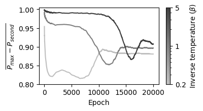

*Рисунок 20. Средняя разность вероятностей для тестового набора при (a) разных обратных температурах в изменённой функции **softmax** и (b) амплитудах инициализации для обычного **softmax**.*

## Обсуждение и выводы

###### p15-1

Насколько нам известно, эта статья — первая, исследующая гроккинговое поведение в рамке модели Изинга. Хотя гроккинг часто происходит от неоптимального выбора гиперпараметров модели, анализ этой статьи даёт понимание работы нейронных сетей в контексте спиновых систем. Например, применением новых стратегий визуализации эволюции свойств сети на основе PCA-представления младших порядков переменных слоёв были установлены связи между тестовой точностью и как структурой сети, так и различительной способностью каждого слоя. Очевидно, чтобы точно определить свойства прежде невиданных входных данных, сеть должна быть достаточно разреженной. Вероятность того, что данные тогда направляются по побочным путям, дающим неверную итоговую классификацию, мала. Во время генерализации оптимизатор вычисляет градиенты в широком диапазоне направлений. Это увеличивает разреженность сети, оставляя обучающую точность по большей части незатронутой. Новые PCA-исследования слоёв весов и градиентов в этой статье количественно выражают эволюцию в ходе этого процесса к архитектуре сети, разделяющей тестовые классы.

###### p15-2

Изложенные результаты далее подсказывают эвристическую аналогию между гроккингом и фазовыми переходами. Если связать с сетью действенную «энтропию», такую как энтропия распределения весов [18], то **[p. 16]** в отсутствие dropout гроккинг сопровождается «фазовым переходом» из сильно связного и потому большой энтропии «жидкого» состояния сети в «твёрдую» устойчивую малоэнтропийную разреженную сеть с минимальным значением функции стоимости. Этот переход идёт через действие оптимизатора на сеть, которое можно представить как детерминированную версию имитационного отжига, понижающую «температуру» сети и потому энтропию через контакт с вычислительной тепловой баней, поглощающей энтропию. Эта энтропия, близкая к нулю до и после гроккинга, но становящаяся большой во время гроккинга, была охарактеризована здесь через уместные черты вероятностного распределения выходного слоя. Увеличение температуры, связанной с изменённой функцией **softmax** этого слоя, увеличивает энтропию на выходном слое, что способствует переустройству системы и потому уменьшает задержку гроккинга (время фазового перехода). Дополнительно dropout вносит добавочное «тепловое движение», которое препятствует внезапному переходу к разреженной малоэнтропийной сети, как только из сети удалено достаточное количество энтропии. Вместо этого энтропия сети убывает непрерывно по мере понижения температуры, что даёт непрерывное приближение к состоянию «переохлаждённой жидкости».

###### p16-1

Хотя изложенная эвристическая модель даёт концептуальную рамку для понимания гроккингового поведения, статистические величины, участвующие в переходах нейронных сетей, не могут быть однозначно количественно определены — в отличие от классической статистической механики. Так, например, существует множество стратегий оценки энтропии, связанной с сетью. Однако универсальное поведение, связанное с гроккингом в модели Изинга, обладает собственной значимостью, поскольку проясняет качественное поведение спиновой системы в ответ на градиентную стратегию оптимизации. Сравнение с гроккингом в других спиновых моделях могло бы соответственно дать дополнительное понимание связи свойств сети с генерализацией, особенно для физических и биологических систем, приближаемых решёточными моделями. Более трудная область возможных будущих исследований касается вывода аналитической процедуры, точно описывающей гроккинговое поведение. Это, однако, представляется трудным, поскольку и данные, и сеть внутренне сложны и несимметричны.

## Список литературы

- [1] A. Power, Y. Burda, H. Edwards, I. Babuschkin, and V. Misra, *Grokking: Generalization Beyond Overfitting on Small Algorithmic Datasets*, arXiv:2201.02177.
- [2] N. Nanda, L. Chan, T. Lieberum, J. Smith, and J. Steinhardt, *Progress Measures for Grokking via Mechanistic Interpretability*, arXiv:2301.05217.
- [3] Z. Liu, E. J. Michaud, and M. Tegmark, *Omnigrok: Grokking Beyond Algorithmic Data*, arXiv:2210.01117.
- [4] S. Murty, P. Sharma, J. Andreas, and C. D. Manning, *Grokking of Hierarchical Structure in Vanilla Transformers*, arXiv:2305.18741.
- [5] J. Miller, C. O’Neill, and T. Bui, *Grokking Beyond Neural Networks: An Empirical Exploration with Model Complexity*, arXiv:2310.17247.
- [6] A. I. Humayun, R. Balestriero, and R. Baraniuk, *Deep Networks Always Grok and Here Is Why*, arXiv:2402.15555.

**[p. 17]**

- [7] Z. Liu, O. Kitouni, N. Nolte, E. J. Michaud, M. Tegmark, and M. Williams, *Towards Understanding Grokking: An Effective Theory of Representation Learning*, arXiv:2205.10343.
- [8] S. Golechha, *Progress Measures for Grokking on Real-World Tasks*, arXiv:2405.12755.
- [9] J. Frankle and M. Carbin, *The Lottery Ticket Hypothesis: Finding Sparse, Trainable Neural Networks*, arXiv:1803.03635.
- [10] D. Yunis, K. K. Patel, S. Wheeler, P. Savarese, G. Vardi, K. Livescu, M. Maire, and M. R. Walter, *Approaching Deep Learning through the Spectral Dynamics of Weights*, arXiv:2408.11804.
- [11] W. Merrill, N. Tsilivis, and A. Shukla, *A Tale of Two Circuits: Grokking as Competition of Sparse and Dense Subnetworks*, arXiv:2303.11873.
- [12] Z. Li et al., *The Lazy Neuron Phenomenon: On Emergence of Activation Sparsity in Transformers*, arXiv:2210.06313.
- [13] G. Gur-Ari, D. A. Roberts, and E. Dyer, *Gradient Descent Happens in a Tiny Subspace*, arXiv:1812.04754.
- [14] Y. Wu, T. Li, X. Cheng, J. Yang, and X. Huang, *Low-Dimensional Gradient Helps Out-of-Distribution Detection*, arXiv:2310.17163.
- [15] H. Xuan, B. Yang, and X. Li, *Exploring the Impact of Temperature Scaling in Softmax for Classification and Adversarial Robustness*, arXiv:2502.20604.
- [16] A. Salah and D. Yevick, *Tracing the Path to Grokking: Embeddings, Dropout, and Network Activation*, arXiv:2507.11645.
- [17] A. Salah and D. Yevick, *Controlling Grokking with Nonlinearity and Data Symmetry*, arXiv:2411.05353.
- [18] A. de Mathelin, F. Deheeger, M. Mougeot, and N. Vayatis, *Deep Out-of-Distribution Uncertainty Quantification via Weight Entropy Maximization*, 2025 *J. Mach. Learn*. Res. **26** 1.
