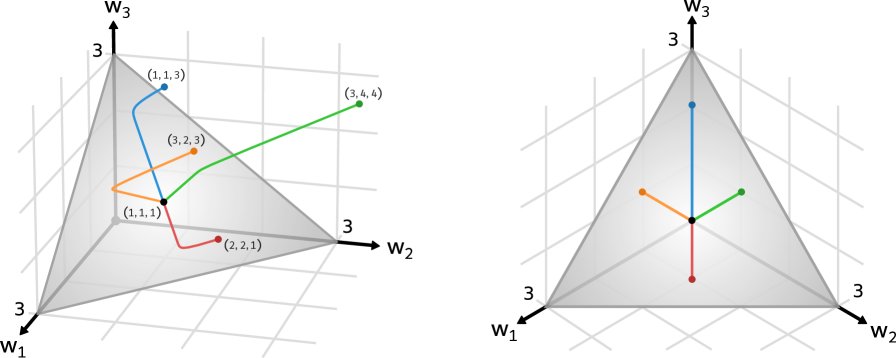
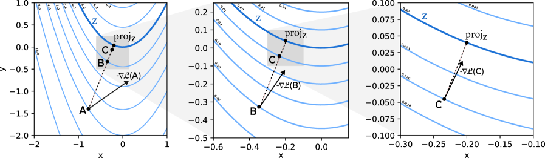

# Musat 2026 — The Geometry of Grokking: Norm Minimization on the Zero-Loss Manifold

См. также: [глобальный индекс понятий](../../concepts/index.md).

**Tiberiu Musat** (ETH Zurich).

arXiv [2511.01938](https://arxiv.org/abs/2511.01938), 3 ноября 2025 (версия v3 — 29 мая 2026). 6 цитирований — двадцать восьмая по цитируемости работа корпуса. Источник — нативный HTML arXiv версии v3.

Оригинал и производные файлы этой папки:

- [`original/2511.01938.native.html`](original/2511.01938.native.html) — первоисточник, нативный HTML arXiv (v3), скачан как есть.
- [`original/2511.01938.the-geometry-of-grokking-norm-minimization-on-the-zero-loss-manifold.md`](original/2511.01938.the-geometry-of-grokking-norm-minimization-on-the-zero-loss-manifold.md) — конверсия оригинала в Markdown без правок содержания.
- [`images/`](images/) — 10 иллюстраций статьи в исходном разрешении.

Схема якорей и правила ссылок на карточку — в [README папки статей](../README.md).

## Затрагиваемые понятия

**[Минимизация нормы весов](../../concepts/weight-norm-minimization.md)** — работа доводит эту линию корпуса до точного утверждения. Прежде норма весов служила объяснением («weight decay толкает к меньшей норме»); здесь доказано **гораздо более сильное**: после запоминания обучение идёт не просто в *каком-то* направлении убывания нормы, а вдоль направления, **сильнее всего** снижающего норму при удержании на многообразии нулевой потери ([`p3-4`](#p3-4)). Иначе говоря, обучение после запоминания есть градиентный спуск по норме весов, **ограниченный** множеством нулевой потери.

**[Ландшафт потерь и бассейны](../../concepts/loss-landscape-basins.md)** — главный технический результат геометрический: **теорема 4.14** утверждает, что вблизи множества нулевой потери $\mathcal{Z}$ градиент потери становится ортогонален любому касательному направлению ([`p6-10`](#p6-10), [`fig-4`](#fig-4)). Отсюда прямое следствие: вблизи $\mathcal{Z}$ градиент потери **не вызывает никакого движения** — потеря лишь удерживает модель у многообразия, а weight decay волен вести её к минимуму нормы вдоль касательных ([`p6-14`](#p6-14)).

**[Weight decay](../../concepts/weight-decay.md)** — роль этого множителя названа точно: он не ускоряет и не замедляет генерализацию побочным образом, а **является** движущей силой всей фазы после запоминания. Причём чем меньше $\lambda$, тем ближе траектория держится к нулевой потере — и тем дольше идёт к генерализации ([`p3-3`](#p3-3)). Предел $\lambda\to 0$ взят не для удобства, а как приближение к практике ([`p5-9`](#p5-9)).

**[Наивная минимизация потерь](../../concepts/nlm.md)** — теорема 4.8 закрывает вопрос, остаётся ли модель на многообразии: для всякой траектории, начинающейся в решении нулевой потери, и всякого $\varepsilon>0$ найдётся $\lambda_{\varepsilon}$, при котором траектория не отходит дальше $\varepsilon$ ([`p5-13`](#p5-13)). Доказательство простое и потому убедительное: градиентный поток никогда не увеличивает $\mathcal{L}(\theta)+\lambda\|\theta\|^{2}$, а оба слагаемых неотрицательны ([`p5-14`](#p5-14)).

**[Особые точки и регулярность](../../concepts/generalization-bounds.md)** — вторая опора рассуждения: чтобы говорить о касательных, множество нулевой потери должно быть многообразием, а не иметь особенностей. **Теорема 4.10**: для *почти всякого* набора данных особых точек в $\mathcal{Z}$ не будет ([`p6-3`](#p6-3)). Доказательство опирается на **теорему Морса — Сарда**: образ критических точек имеет лебегову меру нуль ([`p6-5`](#p6-5)). Это редкий в корпусе случай, когда «почти никогда» — не оборот речи, а мера.

**[Фурье-признаки и контуры](../../concepts/fourier-features-circuits.md)** — итоговая проверка ставится на модульном сложении, и результат совпадает с картиной Nanda et al. по трём независимым признакам: нормы вещественной и мнимой частей фурье-признаков **выравниваются** (окружности одного размера), эти части становятся **ортогональны** (окружности в ортогональных плоскостях), а абсолютные значения расходятся между частотами (каждая окружность задействует своё подмножество скрытых единиц) ([`p10-11`](#p10-11), [`fig-6`](#fig-6)).

**[Модульная арифметика](../../concepts/modular-arithmetic.md)** — постановка нарочито малая: двухслойная сеть, $p=37$, скрытая размерность 512, ReLU, 70 % данных на обучение ([`p10-7`](#p10-7)). Существенно, что авторы **не обучают** сеть: они моделируют развитие матрицы вложений по выведенной формуле и смотрят, воспроизводит ли она гроккинг ([`p10-4`](#p10-4)).

**[Обучение представлениям в отдельных частях сети](../../concepts/manifold-representation-compression.md)** — второй вклад работы отдельный и переносимый: приближение, **расцепляющее** динамику части параметров с остальной сетью. Медленную часть $\theta_{1}$ считают ведущей, быструю $\theta_{2}$ — мгновенно подстраивающейся под неё ([`p7-8`](#p7-8)); тогда динамика $\theta_{1}$ есть градиентный поток некоторой функции стоимости ([`p8-1`](#p8-1)). Для двухслойной сети это даёт **замкнутое выражение** для динамики слоя вложений ([`p9-1`](#p9-1), [`p9-2`](#p9-2)).

**[Гроккинг](../../concepts/grokking.md)** — самая наглядная демонстрация в корпусе: **линейная модель с двумя весами грокает сложение по одному примеру** $1+1=2$. Обучающая потеря падает за десяток шагов, тестовая — за сотни, а веса плавно едут от $(0,2)$ к $(1,1)$ ([`p2-9`](#p2-9), [`p3-3`](#p3-3), [`fig-1`](#fig-1)). Задержка здесь не требует ни нелинейности, ни высокой размерности — только двух фаз.

**[Переход от ленивого к богатому](../../concepts/lazy-to-rich-kernel-to-feature-learning.md)** — картина двухфазна, но фазы иные, чем в этой линии: сперва минимизация потери до $\mathcal{Z}$, затем движение **вдоль** $\mathcal{Z}$ к минимуму нормы ([`p3-3`](#p3-3)). Одновременная работа Boursier et al. (2026) получает то же разделение через риманов градиентный поток на многообразии критических точек ([`p2-7`](#p2-7)).

Отдельно стоит сказать, чего в работе **нет**. Нет перекрёстно-энтропийной потери — вся теория для среднеквадратичной ([`p11-1`](#p11-1)). Нет и сетей глубже двух слоёв в части обособленной динамики. И нет объяснения, **почему** решение наименьшей нормы оказывается обобщающим: показано, куда движется обучение, но не почему цель этого движения хороша.

Карточки статей корпуса: [Power et al. 2022](../2201.02177.grokking-generalization-beyond-overfitting-on-small-algorithmic-datasets/2201.02177.grokking-generalization-beyond-overfitting-on-small-algorithmic-datasets.card.md) — задача и явление; [Omnigrok](../2210.01117.omnigrok-grokking-beyond-algorithmic-data/2210.01117.omnigrok-grokking-beyond-algorithmic-data.card.md) — норма весов как объяснение, здесь доведённое до теоремы; [Nanda et al. 2023](../2301.05217.progress-measures-for-grokking-via-mechanistic-interpretability/2301.05217.progress-measures-for-grokking-via-mechanistic-interpretability.card.md) — фурье-картина, которую воспроизводит моделируемая динамика; [Gromov 2023](../2301.02679.grokking-modular-arithmetic/2301.02679.grokking-modular-arithmetic.card.md) — аналитическое решение модульного сложения; [Mohamadi et al. 2024](../2407.12332.why-do-you-grok-a-theoretical-analysis-of-grokking-modular-addition/2407.12332.why-do-you-grok-a-theoretical-analysis-of-grokking-modular-addition.card.md) — другой теоретический разбор модульного сложения; [Beck et al. 2024](../2410.04489.grokking-at-the-edge-of-linear-separability/2410.04489.grokking-at-the-edge-of-linear-separability.card.md) — другая работа корпуса, где гроккинг сведён к геометрии решения без нейронной сети.

## Что показано, а что предположено

Замечания редактора карточки по итогам разбора утверждений (`…claims.txt`). Работа математическая: три теоремы, одно приближение и одна проверка моделированием.

**Главная теорема сформулирована точно и доказана.** Ортогональность градиента потери к касательным направлениям вблизи $\mathcal{Z}$ ([`p6-10`](#p6-10)) — это именно то утверждение, которое нужно, чтобы «минимизация нормы на многообразии» перестала быть метафорой. Доказательство идёт через разложение Тейлора и опирается на равенство касательного пространства ядру гессиана ([`p6-12`](#p6-12), [`p6-13`](#p6-13)).

**Регулярность обоснована мерой, а не удобством.** Особые точки могли бы обрушить всё рассуждение; вместо того чтобы их запретить, авторы показывают, что они возникают лишь на множестве целевых выходов лебеговой меры нуль ([`p6-3`](#p6-3), [`p6-5`](#p6-5)). Это правильный способ обращаться с вырожденными случаями.

**Оговорка про ReLU сделана честно, но не доведена до конца.** Реальные сети негладки, и авторы это признают: ReLU разбивает потерю на гладкие области с негладкими границами, а негладкие точки тоже образуют множество меры нуль ([`p4-2`](#p4-2)). Однако допущение 4.2 требует **$d-km+1$ раз непрерывно дифференцируемой** функции реализации ([`p5-6`](#p5-6)), чему ReLU не удовлетворяет, — и все эмпирические проверки при этом проведены именно с ReLU.

**Игрушечные примеры делают работу редкостью для корпуса.** Двухпараметрическая линейная модель, грокающая сложение по одному примеру ([`p2-9`](#p2-9)), и трёхпараметрическая с плоскостью нулевой потери ([`p3-5`](#p3-5)) — это самые прозрачные иллюстрации явления в вики. Они же и предупреждение: если гроккинг воспроизводится двумя весами, то объяснения, требующие подсетей или контуров, для него не необходимы.

**Приближение обособленной динамики — сильный ход с необоснованным допущением.** То, что $\theta_{2}$ можно параметризовать функцией от $\theta_{1}$ ([`p7-2`](#p7-2)), опирается на отсутствие самопересечений траектории, а оно обосновано ссылкой на **броуновское движение** и гауссовы случайные поля ([`p7-4`](#p7-4)). Градиентный поток не есть случайный процесс, и перенос сюда результатов о кратных точках — аналогия, а не довод.

**Второе допущение приближения ещё сильнее.** «$\theta_{2}$ наилучшие при нынешнем $\theta_{1}$» ([`p7-7`](#p7-7)) означает, что второй слой мгновенно подстраивается под первый. Это и есть содержание приближения, и в опыте оно **навязано силой**: $W$ пересчитывается по формуле на каждом шаге, отчего обучающая потеря тождественно равна нулю ([`p10-6`](#p10-6)).

**Итоговая проверка не есть проверка обучения.** Авторы прямо пишут, что их цель — не обучить сеть, а посмотреть, воспроизводит ли приближённая динамика наблюдаемые явления ([`p10-4`](#p10-4)). Воспроизводит: задержка около 500–2000 шагов при нулевой потере и фурье-структура вложений ([`p10-8`](#p10-8), [`p10-11`](#p10-11)). Но это моделирование выведенной формулы, а не сравнение с настоящим прогоном обучения — сходство с реальной траекторией измерено отдельно, в разделе 4.6, и другой величиной.

**Эмпирическая проверка теории аккуратна, но узка.** Косинусная близость обновления параметров с направлением минимизации нормы измеряется на **пяти** сетях с $n=11$ и $h=128$ ([`p18-3`](#p18-3)), причём малость сетей выбрана ради вычислимости якобиана. Результат содержательный и приятный: близость **наибольшая ровно во время гроккинга** ([`fig-5`](#fig-5)).

**Одновременная работа названа прямо.** Boursier et al. (2026) получают тот же ответ на первый вопрос через риманов градиентный поток ([`p2-7`](#p2-7)). Авторы не скрывают совпадения и не спорят о первенстве — для корпуса это означает, что результат независимо подтверждён.

**Место в корпусе.** Работа переводит «weight decay ведёт к генерализации» из наблюдения в теорему об условной оптимизации: после запоминания обучение есть проецированный градиентный спуск по норме весов. Второй вклад отдельный и, возможно, более полезный: приём обособления динамики одной части сети, дающий для двухслойного случая замкнутую формулу. Цена — среднеквадратичная потеря, гладкость, два слоя и допущение о мгновенной подстройке второго слоя.

## Ошибочные цитирования

Замечания редактора карточки: места, где эта статья передаёт чужие результаты с ошибкой или без авторских оговорок. Сюда ведут ссылки «подробности» из разделов «Ошибочные пересказы и цитирования этой статьи» карточек процитированных работ.

###### mc-2210-01117
**Omnigrok (2210.01117) — оговорка о вызове и возведение weight decay в главную причину.** Две неточности. (1) `"was later shown to also happen in real-world datasets (Liu et al., 2022b; Humayun et al., 2024)"` — «позже показано, что он случается и на реальных наборах данных»: «happen» подаёт гроккинг как встречающийся, тогда как в цитируемой работе он вызван — [«в слегка нестандартной постановке, где он относительно слаб»](../2210.01117.omnigrok-grokking-beyond-algorithmic-data/2210.01117.omnigrok-grokking-beyond-algorithmic-data.card.md#p1-9). (2) `"weight decay is mainly responsible for driving the delayed generalization (Liu et al., 2022b)"` — «weight decay главным образом ответственен за отложенную генерализацию» — и там же, в допущении 4.5, `"a small $\lambda$ is essential for the delayed-generalization phenomona"` — «малое λ существенно необходимо для явления отложенной генерализации»: у авторов weight decay — одна из ручек наряду с масштабом инициализации, объёмом данных и закреплением нормы, и общность механизма они сами ограничили — [«U»-образную форму лучше считать эмпирически распространённой, нежели доказуемо универсальной](../2210.01117.omnigrok-grokking-beyond-algorithmic-data/2210.01117.omnigrok-grokking-beyond-algorithmic-data.card.md#sec-6). Всеобщее прочтение опровергнуто: [2310.06110](../2310.06110.grokking-as-the-transition-from-lazy-to-rich-training-dynamics/2310.06110.grokking-as-the-transition-from-lazy-to-rich-training-dynamics.card.md), раздел 3, — гроккинг при растущей норме весов; [2506.05718](../2506.05718.grokking-beyond-the-euclidean-norm-of-model-parameters/2506.05718.grokking-beyond-the-euclidean-norm-of-model-parameters.card.md) — большая инициализация с ненулевым weight decay не обязательно дают гроккинг.

###### mc-2301-02679
**Gromov (2301.02679) — приписаны «эмбеддинги на окружности».** `"interpretability research has revealed that neural networks achieve generalization by placing the embedding vectors on a circle (Gromov, 2023; Zhong et al., 2024)"` — «сети генерализуют, размещая векторы эмбеддингов на окружности»: в постановке Gromov [обучаемого энкодера нет вовсе — и гроккинг всё равно присутствует](../2301.02679.grokking-modular-arithmetic/2301.02679.grokking-modular-arithmetic.card.md#p9-9); это его собственный контрпример к объяснениям через обучение представлений. Периодическая структура у него живёт [в весах первого слоя](../2301.02679.grokking-modular-arithmetic/2301.02679.grokking-modular-arithmetic.card.md#p4-9); круговые эмбеддинги — постановка Liu et al. и Zhong et al., и группировка ссылок переносит её на работу, где эмбеддингов нет.

---

# Текст статьи

## Аннотация

###### p1-2

Гроккинг — озадачивающее явление в нейронных сетях, при котором полная генерализация наступает лишь после значительной задержки, следующей за полным запоминанием обучающих данных. Прежние исследования связывали эту отложенную генерализацию с обучением представлениям, движимым weight decay, но точная лежащая в основе динамика оставалась неуловимой. В этой статье мы доказываем, что обучение после запоминания можно понимать через призму условной оптимизации: градиентный спуск по сути минимизирует норму весов на многообразии нулевой потери. Мы формально доказываем это в пределе бесконечно малых скорости обучения и коэффициента weight decay. Чтобы разобрать этот режим подробнее, мы вводим приближение, расцепляющее динамику обучения части параметров с остальной сетью. Применяя эту рамку, мы выводим замкнутое выражение для динамики первого слоя двухслойной сети после запоминания. Опыты подтверждают, что моделирование обучения с помощью предсказанных нами градиентов воспроизводит и отложенную генерализацию, и обучение представлениям, свойственные гроккингу.

## 1 Введение

Нейронные сети достигли большого успеха, но их механизмы всё ещё далеки от полного понимания. Doshi-Velez and Kim (2017) утверждают, что понимание внутреннего устройства нейронных сетей существенно для разработки систем искусственного интеллекта с повышенной безопасностью и надёжностью. Более того, понимание динамики обучения нейронных сетей могло бы помочь улучшить их качество и эффективность: проще создавать лучшие алгоритмы обучения, когда понимаешь ограничения существующих. К тому же наблюдения об искусственных нейронных сетях способны улучшить и наше понимание биологических нейронных сетей ввиду их основополагающего сходства (Sucholutsky et al., 2023; Kohoutová et al., 2020).

###### p1-4

Эта работа стремится прояснить динамику обучения, лежащую в основе особенно озадачивающего явления, названного *гроккингом*. При определённых условиях обучения нейронные сети достигают генерализации на тестовых данных лишь спустя продолжительное время после полного запоминания обучающих данных. Такое поведение впервые наблюдалось в синтетических задачах вроде модульного сложения (Power et al., 2022), но позднее было показано и на реальных наборах данных (Liu et al., 2022b; Humayun et al., 2024).

###### p1-5

В частной задаче модульного сложения исследования интерпретируемости обнаружили, что нейронные сети достигают генерализации, располагая векторы вложений на окружности (Gromov, 2023; Zhong et al., 2024). Круговое устройство слоя вложений позволяет сети выполнять симметричный алгоритм, безупречно обобщающий на невиданные данные. Ныне известно, что круговые представления возникают постепенно в фазе после запоминания (Nanda et al., 2023) и что за отложенную генерализацию отвечает главным образом weight decay (Liu et al., 2022b), но точная динамика остаётся неясной.

###### p1-6

Более того, роль слоя вложений в задаче модульного сложения — разительный пример того, что генерализация в нейронных сетях часто держится на обучении представлениям внутри отдельных составных частей сети. В таких случаях бывает весьма полезно упростить сложную динамику обучения глубокой сети, обособив и разобрав лишь интересующую нас часть. Недавние работы уже начали исследовать такие приближения, называемые также *действующими теориями* (van Rossem and Saxe, 2024; Liu et al., 2022a; Musat, 2024; Mehta et al.).

**[p. 2]**

## 2 Наши вклады

В этой работе мы стремимся ответить на следующие вопросы:

###### p2-2

1. Какова точная роль weight decay в динамике обучения после запоминания? 2. Можно ли обособить динамику слоя вложений от остальной сети?

На **В1** мы отвечаем в разделе 4, доказывая, что по достижении запоминания динамика обучения приближённо следует минимизации нормы весов, ограниченной множеством уровня нулевой потери.

На **В2** мы отвечаем в разделе 5, предлагая приближение для обособленной динамики обучения любого подмножества параметров как минимизации некоторой функции стоимости.

Затем в разделе 6 мы соединяем эти наблюдения, чтобы изучить динамику обучения двухслойной сети после запоминания, и выводим замкнутое выражение для функции стоимости первого слоя (слоя вложений).

Наконец, в разделе 7 мы проверяем наши теоретические наблюдения на задаче модульного сложения, показывая, что наши приближения воспроизводят отложенную генерализацию и круговые представления, свойственные гроккингу.

#### Одновременная работа.

###### p2-7

Boursier et al. (2026) дают весьма схожий ответ на **В1**, изучая регуляризованный градиентный поток в пределе исчезающего weight decay. Они формально доказывают, что обучение распадается на две различные фазы: быструю начальную стадию, где сеть сходится к многообразию критических точек, и медленную последующую, где параметры дрейфуют вдоль этого многообразия по римановому градиентному потоку, снижающему $\ell_{2}$-норму весов.

## 3 Наглядные соображения из игрушечных моделей

Прежде чем излагать теоретические находки, мы даём наглядное представление о наших результатах, обсуждая и изображая, как они соотносятся с несколькими крайне упрощёнными моделями.


###### fig-1

*Рисунок 1: Двухпараметрическая линейная модель $\hat{y}=w_{1}x_{1}+w_{2}x_{2}$ грокает простое сложение при обучении всего на одном примере: $x_{1}=x_{2}=1,\ y=2$ (что отвечает $1+1=2$). Мы приводим три прогона обучения с разными коэффициентами weight decay $\lambda$. После быстрого достижения (почти) нулевой потери обучение целиком движимо минимизацией нормы весов.* **[p. 2]**

### 3.1 Гроккинг сложения

###### p2-9

Мы начинаем с обсуждения того, как линейная модель способна грокнуть сложение из одного лишь $1+1=2$. Мы берём однослойную линейную модель с двумя входами и двумя весами: $\hat{y}=w_{1}x_{1}+w_{2}x_{2}$. **[p. 3]** Мы обучаем её со среднеквадратичной потерей всего на одном примере: $x_{1}=x_{2}=1,\ y=2$. Мы берём три разных значения weight decay, $\lambda\in\{\,0.01,0.1,0.2\,\}$. Модель инициализируется как $w_{1}=-1$ и $w_{2}=1$.

Мы хотим показать, что наша модель способна выучиться обычному сложению, несмотря на обучение на одном примере. Точность на тесте измеряется на наборе из 100 случайно порождённых примеров, где $x_{1}$ и $x_{2}$ взяты из нормального распределения, а $y=x_{1}+x_{2}$.

Результаты приведены на рисунке 1. Видно, что модель воспроизводит гроккинг: обучающая потеря становится очень малой всего через 10 шагов, тогда как тестовой требуется несколько сотен. К тому же при меньшем $\lambda$ модель достигает меньшей потери, но дольше идёт к генерализации.

#### Истолкование.

###### p3-3

Из рисунка 1 (a, b) видно, что обучение проходит две фазы. В первой, движимой минимизацией потери, модель достигает малой потери, выучив $(w_{1},w_{2})\approx(0,2)$. Во второй обучение целиком движимо weight decay: модель следует минимизации нормы, удерживая (почти) нулевую потерю, и в конце концов приходит к $(w_{1},w_{2})\approx(1,1)$. Отметим, что при меньшем $\lambda$ модель держится ближе к линии нулевой потери, но и генерализация занимает больше времени.

### 3.2 Минимизация нормы

###### p3-4

Хотя предыдущий пример поясняет нашу теоретическую рамку, он не передаёт всей её общности. Неудивительно, что применение weight decay поощряет снижение нормы. Однако основное утверждение этой статьи существенно сильнее: мы доказываем, что динамика обучения при weight decay следует не просто *какому-то* направлению снижения нормы, а движется вдоль направления, *которое снижает норму сильнее всего при условии удержания на многообразии нулевой потери*. Иначе это можно выразить так: по достижении безупречного запоминания обучение по сути следует градиентному спуску по норме весов, ограниченному многообразием нулевой потери.

###### p3-5

Чтобы дать более ясное представление, мы показываем, как линейная модель способна грокнуть сложение трёх чисел. Мы обучаем трёхпараметрическую линейную модель $\hat{y}\,=\,w_{1}x_{1}+w_{2}x_{2}+w_{3}x_{3}$ всего на одном примере: $x_{1}=x_{2}=x_{3}=1,\ y=3$. Как и в предыдущем разделе, эта модель обнаруживает гроккинг: быстро достигнув нулевой обучающей потери, она медленно приходит к обобщающему решению $(w_{1},w_{2},w_{3})\approx(1,1,1)$. Мы проводим четыре прогона обучения с разными инициализациями и изображаем получившиеся траектории на рисунке 2. Мы наблюдаем, что при всех инициализациях модель сперва сходится к плоскости нулевой потери, а затем движется прямо к решению наименьшей нормы.



*Рисунок 2: Трёхпараметрическая линейная модель $\hat{y}=w_{1}x_{1}+w_{2}x_{2}+w_{3}x_{3}$ грокает сложение трёх чисел при обучении всего на одном примере: $x_{1}=x_{2}=x_{3}=1,\ y=3$ (что отвечает $1+1+1=3$). Серая область изображает плоскость нулевой потери, окрашенную по норме весов: чем светлее, тем норма меньше.* **[p. 3]**

### 3.3 Несколько математических тонкостей

До сих пор наши примеры показывали лишь плоские подпространства нулевой потери, но так бывает не всегда. В общем случае подпространство нулевой потери лучше мыслить как многообразие — подпространство, вблизи каждой своей точки похожее на евклидово пространство. Например, искривлённое множество нулевой потери показано на рисунке 3 (слева) вместе с несколькими траекториями обучения.

**[p. 4]**

Важная оговорка: множество нулевой потери не обязано быть многообразием всюду — оно может содержать особые точки. Такая особая точка показана на рисунке 3 (в центре). Однако эти особенности не должны нас слишком беспокоить. Как мы доказываем в теореме 4.10, если сеть задаётся гладкой функцией, при обычном обучении мы *почти* никогда не столкнёмся с особенностью.

###### p4-2

Другая тонкость в том, что на практике нейронные сети обучаются с функцией активации ReLU, которая не гладка. Это разбивает потерю на конечный набор гладких областей с негладкими границами. Негладкие точки тоже образуют множество меры нуль. Такой случай изображён на рисунке 3 (справа) с активацией leaky ReLU: $\mathrm{ReLU}(x)=x\mathrm{\;if\;}x>0\mathrm{\;else\;}{x/10}.$


*Рисунок 3: Траектории обучения при разных данных, архитектурах и инициализациях. *Слева:* двухслойная линейная сеть, у которой множество нулевой потери искривлено. *В центре:* двухслойная линейная сеть, у которой множество нулевой потери имеет особенность в $(w_{1},w_{2})=(0,0)$. *Справа:* однослойная сеть с активацией leaky ReLU грокает простое сложение.* **[p. 4]**

### 3.4 Ортогональность градиента

###### p4-3

Мы дополнительно поясняем наш ключевой теоретический результат на игрушечном ландшафте потерь. Рассмотрим модель всего с двумя параметрами $x,y\in\mathbb{R}$ и функцией потерь $\mathcal{L}(x,y)=(y-x^{2})^{2}$. Этот ландшафт изображён на рисунке 4. Мы отмечаем три точки $A,B,C\in\mathbb{R}^{2}$, имеющие одну и ту же проекцию на многообразие нулевой потери, но всё ближе к нему подходящие. Как мы доказываем в теореме 4.14, по мере приближения градиенты потери становятся в точности ортогональны множеству нулевой потери.



###### fig-4

*Рисунок 4: Мы поясняем теорему 4.14 на игрушечном ландшафте потерь $\mathcal{L}(x,y)=(y-x^{2})^{2}$. Мы изображаем множества уровня $\mathcal{L}$ с трёх разных ракурсов. Каждый следующий ракурс увеличивает область предыдущего, приближая многообразие нулевой потери. Мы показываем угол градиента в трёх разных точках, направленный в отрицательную сторону. Норма градиента изображена не в масштабе. По мере приближения градиенты становятся всё более ортогональны многообразию нулевой потери.* **[p. 4]**

**[p. 5]**

## 4 Динамика после запоминания

### 4.1 Архитектура

Мы рассматриваем нейронную сеть, обучаемую со среднеквадратичной потерей на $k$ примерах и с weight decay:

$$
\mathcal{L}(\theta)=\sum_{i=1}^{k}\|f(\theta,x_{i})-y_{i}\|^{2} \mathcal{L}_{\lambda}(\theta)=\mathcal{L}(\theta)+\lambda\|\theta\|^{2} \tag{1}
$$

где $x_{i}\in\mathbb{R}^{n}$, $y_{i}\in\mathbb{R}^{m}$, а $\theta\in\mathbb{R}^{d}$ — вектор параметров. У сети $d$ параметров, $n$ входов и $m$ выходов. Через $f:\mathbb{R}^{d\times n}\rightarrow\mathbb{R}^{m}$ мы обозначаем функцию реализации сети. Мы применяем член weight decay (Krogh and Hertz, 1991) с коэффициентом $\lambda>0$.

Соединённые выходы для всех обучающих примеров мы обозначаем через $\mathcal{F}:\mathbb{R}^{d}\rightarrow\mathbb{R}^{km}$, где

$$
\mathcal{F}(\theta)=\Big[\;f(\theta,x_{1})^{\top},\;f(\theta,x_{2})^{\top},\;\ldots,f(\theta,x_{n})^{\top}\;\Big]^{\top}. \tag{2}
$$

### 4.2 Теоретическая постановка

Мы теоретически изучаем динамику обучения при следующих допущениях:

##### **Допущение 4.1**(переопараметризация)**.**

*Мы полагаем $d\geq km$, чтобы модель была способна запомнить весь набор данных, не выучивая никаких представлений.*

##### **Допущение 4.2**(гладкая сеть)**.**

###### p5-6

*Мы полагаем функцию реализации сети $f$ *непрерывно дифференцируемой* $d-km+1$ раз.*

##### **Допущение 4.3**(градиентный поток)**.**

*Мы моделируем траекторию градиентного спуска как градиентный поток. Вектор параметров мы считаем непрерывной функцией времени $\theta:\mathbb{R}_{\geq 0}\rightarrow\mathbb{R}^{d}$ с динамикой:*

$$
\frac{\partial\theta(t)}{\partial t}=-\nabla\mathcal{L}_{\lambda}(\theta(t)). \tag{3}
$$

##### **Допущение 4.4**(безупречное запоминание)**.**

*Мы изучаем динамику обучения после достижения безупречного запоминания. Это требует, чтобы множество нулевой потери было непусто, то есть $\mathcal{Z}\neq\varnothing$.*

##### **Допущение 4.5**(исчезающий weight decay)**.**

###### p5-9

*Мы изучаем динамику обучения в приближении очень малого коэффициента weight decay, то есть $\lambda\rightarrow 0$, — что оправдано малыми значениями $\lambda$, обычно применяемыми практиками (Smith, 2018), а также прежними эмпирическими работами о гроккинге (Liu et al., 2022b), из которых следует, что малое $\lambda$ существенно для явлений отложенной генерализации.*

### 4.3 Удержание на множестве нулевой потери

Мы начинаем с того, что устанавливаем: после выхода на запоминающее решение модель остаётся удержанной сколь угодно близко к множеству нулевой потери.

##### **Определение 4.6**(множество нулевой потери)**.**

*Пусть $\mathcal{Z}=\{\,\theta\in\mathbb{R}^{d}\,|\,\mathcal{L}(\theta)=0\,\}$ обозначает множество нулевой потери.*

##### **Определение 4.7**(расстояние)**.**

*Пусть $\mathrm{dist}_{\mathcal{Z}}(\theta)=\inf_{\phi\in\mathcal{Z}}\|\theta-\phi\|$ — расстояние от $\theta\in\mathbb{R}^{d}$ до $\mathcal{Z}$.*

##### **Теорема 4.8**(устойчивость $\mathcal{Z}$)**.**

###### p5-13

*Для всякой траектории, начинающейся в решении нулевой потери $\theta(0)\in\mathcal{Z}$, и всякого $\varepsilon>0$ существует $\lambda_{\varepsilon}>0$ такое, что при всех $0<\lambda<\lambda_{\varepsilon}$ траектория при $\mathcal{L}_{\lambda}$ удовлетворяет*

$$
\sup_{t\geq 0}\mathrm{dist}_{\mathcal{Z}}(\theta(t))<\varepsilon. \tag{4}
$$

##### Набросок доказательства.

###### p5-14

Наше доказательство опирается на то, что градиентный поток никогда не увеличивает минимизируемую величину $\mathcal{L}_{\lambda}(\theta)=\mathcal{L}(\theta)+\lambda\|\theta\|^{2}$. Поскольку оба слагаемых неотрицательны, мы можем получить любую нужную оценку на $\mathcal{L}(\theta)$ подходящим выбором $\lambda$. Затем этим мы пользуемся, чтобы получить оценку на расстояние. Полное доказательство приведено в приложении A. ∎

**[p. 6]**

### 4.4 Регулярность множества нулевой потери

Мы показываем, что множество нулевой потери устроено хорошо для *почти* всякого набора данных.

##### **Определение 4.9**(особые точки)**.**

*Мы называем $\theta\in\mathbb{R}^{d}$ особой точкой, если матрица Якоби $\mathcal{F}$ в $\theta$ не полного ранга, то есть $\mathrm{rank}(\nabla\mathcal{F}(\theta))<\min(d,km)$. Множество всех особых точек мы обозначаем $\mathrm{Crit}(\mathcal{F})\subset\mathbb{R}^{km}$. Отметим, что особые точки определены в терминах $\mathcal{F}$, хотя и отвечают особым точкам $\mathcal{Z}$. По отношению к $\mathcal{F}$ они точнее называются *критическими точками*.*

##### **Теорема 4.10**(регулярность $\mathcal{Z}$)**.**

###### p6-3

*Для *почти* всякого набора данных $(x_{i},y_{i})_{i\leq k}$ соответствующее множество нулевой потери $\mathcal{Z}$ не содержит особых точек.*

##### Набросок доказательства.

Мы показываем, что для любого набора входных векторов $(x_{i})_{i\leq k}$ *почти* всякий возможный набор целевых векторов $(y_{i})_{i\leq k}$ порождает множество нулевой потери $\mathcal{Z}$, полностью свободное от особых точек.

###### p6-5

Пользуясь допущением о гладкости $\mathcal{F}$, нужный нам результат следует почти сразу из Sard (1942) — теоремы Морса — Сарда, — которая утверждает, что образ критических точек имеет лебегову меру нуль. В нашем случае образ особых точек $\mathcal{F}\big(\mathrm{Crit}(\mathcal{F})\big)$ имеет лебегову меру нуль в пространстве возможных выходов $\mathbb{R}^{km}$. Иначе говоря, особая точка попадает лишь в пренебрежимо малое множество возможных выходов. Подробное доказательство приведено в приложении B. ∎

### 4.5 Ортогональность градиента потери

Теперь мы приводим наш основной теоретический результат, гласящий, что $\nabla\mathcal{L}(\theta)$ вблизи $\mathcal{Z}$ становится ортогонален любому касательному направлению. Это понятие изображено на рисунке 4.

##### **Определение 4.11**(касательное направление)**.**

*Мы называем $v\in\mathbb{R}^{d}$ касательным направлением в точке $\theta\in\mathcal{Z}$, если существует гладкая траектория $s:\mathbb{R}\rightarrow\mathbb{R}^{d}$ такая, что $s(0)=\theta$, $s^{\prime}(0)=v$ и $\mathcal{L}(s(t))=0$ для всех $t\in\mathbb{R}$.*

##### **Определение 4.12**(касательное пространство)**.**

*Через $T_{\theta}$ мы обозначаем множество всех касательных направлений в точке $\theta\in\mathcal{Z}$.*

##### **Определение 4.13**(проекция)**.**

*Пусть $\mathrm{proj}_{\mathcal{Z}}(\theta)=\arg\inf_{\theta^{\prime}\in\mathcal{Z}}\|\theta-\theta^{\prime}\|$ — проекция $\theta$ на $\mathcal{Z}$.*

##### **Теорема 4.14**(ортогональность градиента)**.**

###### p6-10

*Пусть $S\subset\mathbb{R}^{d}$ — компактное пространство с $\mathrm{proj}_{\mathcal{Z}}(S)\subseteq S$. Если $S\cap\mathcal{Z}$ не содержит особых точек, то существует постоянная $C>0$ такая, что*

$$
\bigg|\cos\Big(\angle\big(v,\nabla\mathcal{L}(\theta)\big)\Big.)\bigg|\;=\;\left|\frac{\;\;v^{\top}}{\|v\|}\,\frac{\nabla\mathcal{L}(\theta)}{\|\nabla\mathcal{L}(\theta)\|}\right|\;<\;C\,\mathrm{dist}_{\mathcal{Z}}(\theta) \tag{5}
$$

*выполняется для всех $\theta\in S\setminus\mathcal{Z}$ и всех касательных направлений $v\in T_{\mathrm{proj}_{\mathcal{Z}}(\theta)}$.*

##### Набросок доказательства.

###### p6-12

Мы приближаем градиент потери в точке $\theta$ разложением Тейлора вокруг $\mathrm{proj}_{\mathcal{Z}}(\theta)$ и получаем $\nabla\mathcal{L}(\theta)=Hx+O(\|x\|^{2})$, где $x=\theta-\mathrm{proj}_{\mathcal{Z}}(\theta)$, а $H=\nabla^{2}\mathcal{L}(\mathrm{proj}_{\mathcal{Z}}(\theta))$.

###### p6-13

Пользуясь $v\in T_{\mathrm{proj}_{\mathcal{Z}}(\theta)}$ и отсутствием особых точек, мы можем показать, что $Hv=0$ и $\|\nabla\mathcal{L}(\theta)\|=\Theta(\|x\|)$. Поэтому нормированное скалярное произведение будет иметь порядок $O(\|x\|)$. Полное доказательство приведено в приложении C. ∎

##### **Замечание 4.15****.**

###### p6-14

*Иначе говоря, вблизи $\mathcal{Z}$ градиент потери не вызывает никакого движения. По достижении запоминающего решения обучение будет целиком движимо weight decay. Потеря служит лишь тому, чтобы удерживать модель вблизи $\mathcal{Z}$, тогда как weight decay волен толкать модель к минимизации нормы вдоль любого из касательных направлений.*

### 4.6 Эмпирическая проверка


###### fig-5

*Рисунок 5: Мы обучаем малые сети модульному сложению. Мы приводим их среднюю обучающую и тестовую потерю (слева) и среднюю косинусную близость между обновлениями параметров и направлением минимизации нормы на множестве нулевой потери (справа). Как видно по графику потери (слева), сеть обнаруживает гроккинг. Любопытно, что близость наибольшая ровно во время стадии *гроккинга*.* **[p. 7]**

Мы эмпирически проверяем нашу теорию о том, что динамика после запоминания следует направлению минимизации нормы на многообразии нулевой потери. Мы обучаем несколько малых двухслойных сетей модульному сложению с активацией ReLU, среднеквадратичной потерей и weight decay. На каждом шаге $t$ обучения мы измеряем косинусную близость между обновлением параметров $\Delta\theta_{t}$ и оценкой направления минимизации нормы на множестве нулевой потери $\tilde{g}_{t}=\arg\min_{v}(v^{\top}\theta_{t})$ при $v\in T_{\mathrm{proj}_{\mathcal{Z}}(\theta_{t})}$. Результаты приведены на рисунке 5. Полные подробности опыта изложены в приложении D.

**[p. 7]**

## 5 Обособленная динамика составной части сети

Вектор параметров можно разложить на два ортогональных подмножества $\theta=[\theta_{1},\theta_{2}]$, где $\theta_{1}\in\mathbb{R}^{d_{1}}$, $\theta_{2}\in\mathbb{R}^{d_{2}}$ и $d_{1}+d_{2}=d$. Нас занимает динамика обучения $\theta_{1}$:

$$
\dot{\theta}_{1}=-\nabla_{\theta_{1}}\mathcal{L}_{\lambda}(\theta_{1},\theta_{2}) \tag{6}
$$

###### p7-2

Допущение о градиентном потоке означает, что траектория $\theta_{1}$ есть одномерная кривая в $d_{1}$-мерном пространстве. Отсюда следует, что весьма маловероятно, чтобы траектория дважды прошла через одно и то же $\theta_{1}$. Если положить, что траектория обучения проходит лишь через различные значения $\theta_{1}$, то $\theta_{2}$ можно параметризовать как функцию $\theta_{1}$:

$$
\theta_{2}=\phi(\theta_{1}) \tag{7}
$$

где $\phi:\mathbb{R}^{d_{1}}\rightarrow\mathbb{R}^{d_{2}}$ — функция, зависящая от функции потерь и начальных параметров.

###### p7-4

Мы обосновываем это допущение обширной литературой о кратных точках случайных процессов. Например, уже при размерности $d\geq 4$ известно, что броуновское движение в $\mathbb{R}^{d}$ *почти наверное* не имеет самопересечений (Mörters and Peres (2010), глава 9). Более общо, Dalang et al. (2021) доказывают отсутствие кратных точек для широкого класса гауссовых случайных полей.

Эта параметризация позволяет обособить динамику $\theta_{1}$ вдоль траектории обучения, выразив её через один лишь $\theta_{1}$:

$$
\dot{\theta}_{1}=-\nabla_{\theta_{1}}\mathcal{L}_{\lambda}(\theta_{1},\phi(\theta_{1})) \tag{8}
$$

Хотя функция $\phi$ в общем случае неподатлива, работа с разумными приближениями способна дать ценные наблюдения о динамике обучения $\theta_{1}$.

### 5.1 Приближённая функция стоимости

###### p7-7

Мы предлагаем приближать $\phi$, полагая параметры $\theta_{2}$ наилучшими при нынешнем значении $\theta_{1}$:

$$
\phi(\theta_{1})=\arg\min_{\theta_{2}}\mathcal{L}_{\lambda}(\theta_{1},\theta_{2}) \tag{9}
$$

###### p7-8

Это приближение можно понимать и так: $\theta_{1}$ считается медленно обучающейся составляющей, тогда как $\theta_{2}$ — быстро обучающейся, которая быстро подстраивается под нынешнее значение $\theta_{1}$.

Кроме того, оптимизация $\theta$ при этом приближении равносильна оптимизации следующей функции стоимости:

$$
\mathcal{R}(\theta_{1})=\min_{\theta_{2}}\mathcal{L}_{\lambda}(\theta_{1},\theta_{2}) \tag{10}
$$

**[p. 8]**

##### **Теорема 5.1****.**

###### p8-1

*Динамика обучения $\theta_{1}$ по уравнениям 8 и 9 следует градиентному потоку $\mathcal{R}$, когда $\phi$ дифференцируема:*

$$
\dot{\theta}_{1}=-\nabla_{\theta_{1}}\mathcal{R}(\theta_{1}) \tag{11}
$$

##### Доказательство.

Отметим, что $\mathcal{R}(\theta_{1})=\mathcal{L}_{\lambda}(\theta_{1},\phi(\theta_{1}))$. Дифференцируя по $\theta_{1}$, получаем $\nabla_{\theta_{1}}\mathcal{R}(\theta_{1})=\nabla_{\theta_{1}}\mathcal{L}_{\lambda}(\theta_{1},\phi(\theta_{1}))+\nabla_{\theta_{2}}\mathcal{L}_{\lambda}(\theta_{1},\phi(\theta_{1}))\,\nabla_{\theta_{1}}\phi(\theta_{1})$. Однако, поскольку $\phi(\theta_{1})$ есть минимум $\mathcal{L}_{\lambda}$, имеем $\nabla_{\theta_{2}}\mathcal{L}_{\lambda}(\theta_{1},\phi(\theta_{1}))=0$, что и даёт нужный результат. ∎

## 6 Двухслойные сети

### 6.1 Постановка

Мы обращаемся к динамике обучения двухслойной нейронной сети, обучаемой со среднеквадратичной потерей и weight decay:

$$
\mathcal{L}=\|\,\sigma(XW_{1})\,W_{2}-Y\,\|_{F}^{2} \tag{12}
$$

где $X\in\mathbb{R}^{n\times d_{in}}$ — входные данные, $Y\in\mathbb{R}^{n\times d_{out}}$ — целевой выход, $\sigma:\mathbb{R}\rightarrow\mathbb{R}$ — функция активации, $W_{1}\in\mathbb{R}^{d_{in}\times d_{h}}$ — веса первого слоя, $W_{2}\in\mathbb{R}^{d_{h}\times d_{out}}$ — веса второго слоя, а $\|\cdot\|_{F}$ обозначает норму Фробениуса.

После применения коэффициента weight decay $\lambda>0$ получаем:

$$
\mathcal{L}_{\lambda}=\mathcal{L}+\lambda\left(\|W_{1}\|_{F}^{2}+\|W_{2}\|_{F}^{2}\right) \tag{13}
$$

### 6.2 Обособленная динамика первого слоя

Пользуясь приближением из раздела 5.1, мы можем обособить динамику обучения первого слоя, положив веса второго слоя наилучшими при нынешнем значении весов первого:

$$
W_{2}\approx\phi(W_{1})=\arg\min_{\tilde{W}_{2}}\mathcal{L}_{\lambda}(W_{1},\tilde{W}_{2}) \tag{14}
$$

Поскольку второй слой есть просто линейное преобразование активаций скрытого слоя $H=\sigma(XW_{1})$, поиск наилучших весов второго слоя равносилен классической задаче гребневой регрессии (Hoerl and Kennard, 1970). Решение даётся так:

$$
\phi(W_{1})=(H^{\top}H+\lambda I)^{-1}H^{\top}Y \tag{15}
$$

Соединяя уравнения 12, 13 и 15, мы получаем функцию стоимости для обособленной динамики обучения первого слоя:

$$
\mathcal{R}(W_{1})=\mathcal{L}_{\lambda}(W_{1},\phi(W_{1})) \tag{16}
$$

Эта функция стоимости не особенно проста, но она полностью дифференцируема, что позволяет приблизить динамику обучения первого слоя:

$$
\dot{W}_{1}\approx-\nabla\mathcal{R}(W_{1}) \tag{17}
$$

### 6.3 Приближение нулевой потери

Далее мы полагаем режим сильной переопараметризации, где скрытых единиц больше, чем обучающих примеров ($d_{h}>n$). Это позволяет второму слою почти всегда безупречно подогнать выходы. Следуя теоретической рамке, развитой в разделе 4, мы можем дополнительно упростить уравнение 15, работая в пределе очень малого weight decay $\lambda\rightarrow 0$:

$$
\phi(W_{1})=H^{+}Y \tag{18}
$$

где $H^{+}$ — псевдообратная Мура — Пенроуза к $H$. Когда столбцы $H$ линейно независимы, псевдообратная задаётся как $H^{+}=(H^{\top}H)^{-1}H^{\top}$. Если же линейно независимы строки $H$, то **[p. 9]** $H^{+}=H^{\top}(HH^{\top})^{-1}$. Отметим, что $H\in\mathbb{R}^{n\times d_{h}}$. Ввиду переопараметризованного режима ($d_{h}>n$) мы берём вторую формулу. Это позволяет упростить функцию стоимости ещё дальше:

$$
\mathcal{R}(W_{1})=\lambda\,\|W_{1}\|_{F}^{2}+\lambda\operatorname{Tr}\bigl(Y^{\top}(HH^{\top})^{-1}Y\bigr.) \tag{19}
$$

###### p9-1

Дифференцируя эту функцию стоимости, мы получаем замкнутое выражение для обособленной динамики обучения первого слоя в переопараметризованном приближении нулевой потери:

$$
\dot{W_{1}}\approx X^{\top}\Bigl(\bigl(AYY^{\top}AH\bigr)\odot\sigma^{\prime}\bigl(XW_{1}\bigr)\Bigr)-W_{1} \tag{20}
$$

###### p9-2

где $H=\sigma(XW_{1})$, $A=(HH^{\top})^{-1}$, $\sigma$ — функция активации, а $\odot$ обозначает произведение Адамара. Подробный вывод приведён в приложении E.

## 7 Моделируемая динамика

В этом разделе мы эмпирически проверяем соединённые теоретические наблюдения об обособленной динамике и о динамике после запоминания. Применяя уравнение 20 к сети, обучаемой задаче модульного сложения, мы показываем, что наши приближения воспроизводят отложенную генерализацию и круговые представления, свойственные гроккингу.


###### fig-6

*Рисунок 6: Моделируемая по уравнению 20 динамика воспроизводит явления отложенной генерализации и обучения представлениям. *Слева вверху:* генерализация возникает примерно через $1000$ шагов, несмотря на то что обучающая потеря всё время в точности нулевая. *Справа вверху:* нормы фурье-признаков выравниваются, из чего следует наличие окружностей одинакового размера. *Слева внизу:* фурье-признаки становятся ортогональны, из чего следует, что окружности лежат в ортогональных плоскостях. *Справа внизу:* абсолютные значения фурье-признаков становятся несхожими, из чего следует, что каждая окружность задействует своё подмножество скрытых активаций.* **[p. 9]**

### 7.1 Набор данных

Мы обучаем сеть модульному сложению по фиксированному модулю $p$. Набор данных состоит из $k=p(p+1)/2$ различных пар входов и их суммы: $D=\{(a,b,c)\mid 0\leq a\leq b<p,\;c=(a+b)\;\mathrm{mod}\;p\}$. Входные данные $X\in\mathbb{R}^{k\times p}$ и целевой выход $Y\in\mathbb{R}^{k\times p}$ мы строим как $X_{i}=e_{a_{i}}+e_{b_{i}}$ и $Y_{i}=e_{c_{i}}$ для всех $i=1,\ldots,k$, где $e_{i}$ — $i$-й единичный вектор в $\mathbb{R}^{p}$, а $(a_{i},b_{i},c_{i})\in D$ — $i$-й пример набора.

Мы делим набор на $(X_{\text{train}},Y_{\text{train}})$ и $(X_{\text{test}},Y_{\text{test}})$, отдавая долю $f_{s}$ на обучение, а остальные $1-f_{s}$ — на тест.

### 7.2 Архитектура

Мы обучаем двухслойную нейронную сеть с размерностью входа $p$, скрытой размерностью $d_{h}$, размерностью выхода $p$ и нелинейной активацией $\sigma:\mathbb{R}\rightarrow\mathbb{R}$.

**[p. 10]**

Поскольку входы суть суммы one-hot векторов, веса первого слоя мы называем матрицей вложений $E\in\mathbb{R}^{p\times d_{h}}$. Веса второго слоя мы называем просто матрицей весов $W\in\mathbb{R}^{d_{h}\times p}.$

Выход сети задаётся как $\hat{Y}=\sigma(XE)W.$ Чтобы подчеркнуть роль первого слоя как вложения, выход можно записать и так: $\hat{Y}_{i}=\sigma(E_{a_{i}}+E_{b_{i}})W.$

Точностью на тесте мы называем долю верно предсказанных тестовых примеров. Тестовый пример считается предсказанным верно, если номер наибольшего значения в предсказанном выходе $\hat{Y}_{i}$ совпадает с $c_{i}$.

### 7.3 Моделируемая оптимизация

###### p10-4

Наша цель — не обучить сеть, а проверить, что наша приближённая динамика обучения воспроизводит явления, наблюдаемые при обычном обучении.

Мы моделируем развитие матрицы вложений $E$ под обособленной динамикой из уравнения 20. Мы начинаем со случайной инициализации $E\sim\mathcal{N}(0,\,p^{-1/2})$ и обновляем её $T$ шагов как $E\leftarrow E+\eta\,\Delta E$, где $\eta>0$ — величина шага, а $\Delta E=X^{\top}\left(\left(AYY^{\top}AH\right)\odot\sigma^{\prime}\bigl(XE\bigr)\right)-E$.

###### p10-6

Обособленная динамика полагает $W=(H^{\top}H)^{-1}H^{\top}Y$ наилучшим при нынешнем значении $E$, что обеспечивает нулевую потерю и безупречную точность на обучающих данных на всём протяжении обучения. Это также обеспечивает точное совпадение предсказанных выходов с целевыми на обучающих данных, что для задачи классификации менее принципиально, но на практике обычно работает хорошо (Rifkin et al., 2003).

#### Подробности.

###### p10-7

Мы берём $p=37$, $d_{h}=512$, $\sigma(x)=\max(0,x)$, $f_{s}=0.7$, $\eta=10^{-3}$, $T=5000$.

#### 7.3.1 Отложенная генерализация

###### p10-8

Мы моделируем 5 прогонов из разных случайных инициализаций и приводим точность на тесте на рисунке 6. Несмотря на то что обучающая потеря всё время в точности нулевая, точность на тесте первые $500$ шагов не лучше случайного угадывания. Однако примерно через $2000$ шагов сеть в конце концов достигает безупречной генерализации на тестовых данных, воспроизводя явление отложенной генерализации Power et al. (2022).

#### 7.3.2 Фурье-признаки

С помощью дискретного преобразования Фурье мы раскладываем матрицу вложений $E$ в линейную комбинацию окружностей разных частот:

$$
F_{k}=\frac{1}{p}\,\sum_{j=0}^{p-1}e^{-i2\pi\,jk/p}\,E_{j}\qquad\qquad\forall k\in\{1,\ldots,(p-1)/2\}
$$

Проецирование вложений на плоскость, натянутую на $\operatorname{Re}(F_{k})$ и $\operatorname{Im}(F_{k})$, даёт окружность, где вложения расположены в порядке $\{0,\,k,\,2k,\,3k,\,\ldots,\,(p-1)k\}\,\mathrm{mod}\,p.$ Отметим, что окружность частоты $k$ равносильна окружности частоты $p-k$, так что достаточно рассматривать частоты до $(p-1)/2$.

###### p10-11

Мы приводим несколько сравнений фурье-признаков начальной и конечной матриц вложений для одного прогона на рисунке 6. Во-первых, нормы вещественной и мнимой частей фурье-признаков выравниваются, из чего следует наличие *окружностей одинакового размера с безупречным соотношением осей*. Во-вторых, вещественная и мнимая части фурье-признаков становятся ортогональны, что указывает: *окружности лежат в ортогональных плоскостях*. В-третьих, взяв абсолютные значения вещественной и мнимой частей фурье-признаков, мы получаем векторы, весьма схожие для одной частоты, но весьма несхожие для разных. Отсюда следует, что *каждая окружность задействует своё подмножество скрытых единиц*.

## 8 Заключение

Мы формально установили, что динамика обучения нейронных сетей в режиме гроккинга приближается минимизацией нормы весов внутри множества нулевой потери. Кроме того, мы дали теоретическое основание для приближения динамики обучения отдельных составных частей сети.

**[p. 11]**

#### Ограничения.

###### p11-1

Эта работа не охватывает перекрёстно-энтропийную потерю, обычную на практике. Что до обособленной динамики, наша работа ограничена случаем двухслойных сетей. Впереди занимательные задачи: понять динамику гроккинга в более сложных постановках и архитектурах.

#### Заявление о влиянии.

Мы полагаем, что понимание динамики обучения нейронных сетей существенно для создания более эффективных и точных систем искусственного интеллекта. Однако к разработке и внедрению таких систем следует подходить осмотрительно.

#### Использование больших языковых моделей.

Большие языковые модели применялись в этой работе обычным образом: для шлифовки текста, помощи в написании кода и поддержки при обдумывании математических доказательств.

#### Воспроизводимость.

Мы приводим полный код обучения и построения графиков, использованный в опытах разделов 4.6, LABEL: и 7.

## Литература

- A theoretical framework for grokking: interpolation followed by riemannian norm minimisation. Advances in Neural Information Processing Systems 38, pp. 151231–151267. Cited by: §2.

- Multiple points of gaussian random fields. Cited by: §5.

- Towards a rigorous science of interpretable machine learning. arXiv preprint arXiv:1702.08608. Cited by: §1.

- Grokking modular arithmetic. arXiv preprint arXiv:2301.02679. Cited by: §1.

- Ridge regression: biased estimation for nonorthogonal problems. Technometrics 12 (1), pp. 55–67. Cited by: §6.2.

- Deep networks always grok and here is why. arXiv preprint arXiv:2402.15555. Cited by: §1.

- Toward a unified framework for interpreting machine-learning models in neuroimaging. Nature protocols 15 (4), pp. 1399–1435. Cited by: §1.

- A simple weight decay can improve generalization. Advances in neural information processing systems 4. Cited by: §4.1.

- Towards understanding grokking: an effective theory of representation learning. Advances in Neural Information Processing Systems 35, pp. 34651–34663. Cited by: §1.

- Omnigrok: grokking beyond algorithmic data. In The Eleventh International Conference on Learning Representations, Cited by: §1, §1, Assumption 4.5.

- R. Mehta, Z. Liu, and M. Tegmark Neural embeddings evolve as interacting particles. Cited by: §1.

- The behavior of a function on its critical set. Annals of Mathematics 40 (1), pp. 62–70. Cited by: Appendix B.

- Brownian motion. Vol. 30, Cambridge University Press. Cited by: §5.

- Clustering and alignment: understanding the training dynamics in modular addition. arXiv preprint arXiv:2408.09414. Cited by: §1.

- Progress measures for grokking via mechanistic interpretability. arXiv preprint arXiv:2301.05217. Cited by: §1.

**[p. 12]**

- Grokking: generalization beyond overfitting on small algorithmic datasets. arXiv preprint arXiv:2201.02177. Cited by: §1, §7.3.1.

- Regularized least-squares classification. Nato Science Series Sub Series III Computer and Systems Sciences 190, pp. 131–154. Cited by: §7.3.

- The measure of the critical values of differentiable maps. Cited by: Appendix B, §4.4.

- A disciplined approach to neural network hyper-parameters: part 1–learning rate, batch size, momentum, and weight decay. arXiv preprint arXiv:1803.09820. Cited by: Assumption 4.5.

- Getting aligned on representational alignment. arXiv preprint arXiv:2310.13018. Cited by: §1.

- When representations align: universality in representation learning dynamics. arXiv preprint arXiv:2402.09142. Cited by: §1.

- The clock and the pizza: two stories in mechanistic explanation of neural networks. Advances in Neural Information Processing Systems 36. Cited by: §1.

**[p. 13]**

## Приложение A. Доказательство теоремы 4.8 (устойчивость $\mathcal{Z}$)

Мы начинаем с установления следующего промежуточного результата:

##### **Лемма A.1****.**

*Для всякой инициализации $\theta(0)\in\mathcal{Z}$ и всякого $\varepsilon>0$ существует $\lambda_{\varepsilon}>0$ такое, что при всех $0<\lambda<\lambda_{\varepsilon}$ соответствующая траектория $\theta(t)$ при $\mathcal{L}_{\lambda}$ удовлетворяет*

$$
\sup_{t\geq 0}\mathcal{L}(\theta(t))<\varepsilon. \tag{21}
$$

##### Доказательство.

Из уравнения 3 видно, что градиентный поток никогда не увеличивает минимизируемую величину $\mathcal{L}_{\lambda}(\theta)=\mathcal{L}(\theta)+\lambda\|\theta\|^{2}$. Выбирая $\lambda_{\varepsilon}<\varepsilon/\|\theta(0)\|^{2}$, мы обеспечиваем $\mathcal{L}(\theta(t))<\varepsilon$ при всех $t\geq 0$. ∎

Напомним теорему 4.8:

См. 4.8

##### Доказательство.

Наша траектория обучения не достигнет ни одного $\theta\in\mathbb{R}^{d}$ с $\|\theta\|>\|\theta(0)\|$. Дело в том, что всякая такая конфигурация недостижима градиентным потоком из $\theta(0)$ ни при каком $\lambda>0$, поскольку $\mathcal{L}_{\lambda}(\theta)>\mathcal{L}_{\lambda}(\theta_{0})$.

Остаётся показать недостижимость множества $\Phi=\{\theta\in\mathbb{R}^{d}:\mathcal{D}(\theta)\geq\varepsilon$ и $\|\theta\|\leq\|\theta(0)\|\}$. Поскольку $\Phi$ компактно, минимум $m=\min_{\Phi}\mathcal{L}(\theta)$ существует и положителен. Применяя лемму A.1, находим такое $\lambda>0$, при котором оптимизация $\mathcal{L}_{\lambda}$ из $\theta(0)$ гарантированно удерживает $\mathcal{L}(\theta(t))<m$, что и делает $\Phi$ недостижимым. ∎

**[p. 14]**

## Приложение B. Доказательство теоремы 4.10 (регулярность $\mathcal{Z}$)

Мы считаем входные векторы $x_{i}\in\mathbb{R}^{n}$ закреплёнными и показываем, что особенности не встретятся при *почти всех* возможных целевых выходах $y_{i}\in\mathbb{R}^{m}$, где $i\in\{1,\ldots,k\}$. Напомним, что мы обучаемся на $k$ примерах при размерности входа $n$ и размерности выхода $m$.

Соединённые выходы сети при параметрах $\theta\in\mathbb{R}^{d}$ мы обозначаем через $\mathcal{F}:\mathbb{R}^{d}\rightarrow\mathbb{R}^{km}$, где

$$
\mathcal{F}(\theta)=\Big[\;f(\theta,x_{1})^{\top},\;f(\theta,x_{2})^{\top},\;\ldots,f(\theta,x_{n})^{\top}\;\Big]^{\top}. \tag{22}
$$

Соединённые целевые выходы мы обозначаем как $y=\left[\;{y_{1}}^{\top},\;{y_{2}}^{\top},\;\ldots,\;{y_{k}}^{\top}\;\right]^{\top}\in\mathbb{R}^{km}$.

Для любого вектора целевых выходов $y\in\mathbb{R}^{km}$ множество параметров, подгоняющих их, мы обозначаем как

$$
\mathcal{Z}_{y}=\big\{\;\theta\in\mathbb{R}^{d}\;\big|\;\mathcal{F}(\theta)=y\;\big\}. \tag{23}
$$

Отметим, что $\mathcal{Z}_{y}$ и есть в точности множество нулевой потери при целевых выходах $y\in\mathbb{R}^{km}$.

Мы покажем, что $\mathcal{Z}_{y}$ не содержит особых точек при *почти* всяком $y\in\mathbb{R}^{km}$. Точнее, мы покажем, что $\mathcal{Z}_{y}\cap\mathrm{Crit}(\mathcal{F})=\emptyset$ для всех $y\in\mathbb{R}^{km}$, кроме множества лебеговой меры нуль.

Множество векторов целевых выходов, ведущих к особенностям, мы обозначаем как

$$
\xi\;=\;\big\{\;y\in\mathbb{R}^{km}\;\big|\;\mathcal{Z}_{y}\cap\mathrm{Crit}(\mathcal{F})\neq\emptyset\;\big\} \tag{24}
$$

##### **Утверждение B.1****.**

*Множество целевых выходов, ведущих к особенностям, есть в точности образ множества особых точек:*

$$
\xi\;=\;\mathcal{F}\big(\mathrm{Crit}(\mathcal{F})\big). \tag{25}
$$

##### Доказательство.

По нашим определениям $y\in\xi$ тогда и только тогда, когда существует $\theta\in\mathbb{R}^{d}$ с $\mathcal{F}(\theta)=y$ и $\theta\in\mathrm{Crit}(\mathcal{F})$. Во-первых, всякое $\theta\in\mathrm{Crit}(\mathcal{F})$ влечёт $\mathcal{F}(\theta)\in\xi$. Во-вторых, если для некоторого $y\in\mathbb{R}^{km}$ не существует $\theta\in\mathrm{Crit}(\mathcal{F})$ с $\mathcal{F}(\theta)=y$, то $y\not\in\xi$. ∎

##### **Теорема B.2**(теорема Морса — Сарда)**.**

*Если функция $g:\mathbb{R}^{a}\rightarrow\mathbb{R}^{b}$ непрерывно дифференцируема $k$ раз, где $k\geq\mathrm{max}(a-b+1,1)$, то образ её критического множества $g\big(\mathrm{Crit}(g)\big)$ имеет лебегову меру нуль в $\mathbb{R}^{b}$.*

Этот результат впервые доказан Morse (1939) для функций с одним выходом (то есть $b=1$), а позднее обобщён на дифференцируемые отображения в Sard (1942).

По допущению 4.2 функция $\mathcal{F}$ удовлетворяет условиям непрерывной дифференцируемости. Поэтому мы получаем, что множество целевых векторов, ведущих к особенностям, $\xi=\mathcal{F}\big(\mathrm{Crit}(\mathcal{F})\big)\subset\mathbb{R}^{km}$ имеет лебегову меру нуль в $\mathbb{R}^{km}$.

**[p. 15]**

## Приложение C. Доказательство теоремы 4.14 (ортогональность градиента)

Мы начинаем с нескольких промежуточных результатов.

##### **Лемма C.1****.**

*В неособой точке множества нулевой потери касательное пространство есть в точности ядро матрицы Гессе, то есть $T_{\theta}=\{\;v\in\mathbb{R}^{d}\;|\;\nabla^{2}\mathcal{L}(\theta)\,v=0\;\}\$ для всякого неособого $\theta\in\mathcal{Z}$.*

##### Доказательство.

*Часть I:* $\nabla^{2}\mathcal{L}(\theta)\;v=0\;\Rightarrow\,v\in T_{\theta}$.

Функцию потерь мы записываем как

$$
\mathcal{L}(\theta)=\|\mathcal{F}(\theta)-y_{all}\|^{2}
$$

взяв $y_{all}\in\mathbb{R}^{km}$ как соединение всех целевых выходов:

$$
y_{all}=\left[\ y_{1}^{\top},\ y_{2}^{\top},\ \ldots,\ y_{k}^{\top}\ \right]^{\top}
$$

Дифференцируя $\mathcal{L}(\theta)$ по $\theta$, получаем градиент:

$$
\nabla\mathcal{L}(\theta)=2\,\nabla\mathcal{F}(\theta)^{\top}\bigl(\mathcal{F}(\theta)-y\bigr),
$$

где $\nabla\mathcal{F}(\theta)\in\mathbb{R}^{km\times d}$ — якобиан выхода сети по параметрам.

Дифференцируя ещё раз, получаем гессиан:

$$
\nabla^{2}\mathcal{L}(\theta)=2\,\nabla\mathcal{F}(\theta)^{\top}\nabla\mathcal{F}(\theta)+2\sum_{i=1}^{km}\bigl(\mathcal{F}_{i}(\theta)-(y_{all})_{i}\bigr)\nabla^{2}\mathcal{F}_{i}(\theta),
$$

где $\nabla^{2}\mathcal{F}_{i}(\theta)\in\mathbb{R}^{d\times d}$ — гессиан $i$-й составляющей выхода.

В точке $\theta\in\mathcal{Z}$, где $\mathcal{F}(\theta)=y_{all}$, второе слагаемое обращается в нуль, и гессиан упрощается до:

$$
\nabla^{2}\mathcal{L}(\theta)=2\,\nabla\mathcal{F}(\theta)^{\top}\nabla\mathcal{F}(\theta).
$$

Для любого направления $v\in\mathbb{R}^{d}$ это даёт:

$$
v^{\top}\nabla^{2}\mathcal{L}(\theta)v=2\,\|\nabla\mathcal{F}(\theta)v\|^{2}.
$$

Поэтому

$$
v^{\top}\,\nabla^{2}\mathcal{L}(\theta)\,v=0\quad\Leftrightarrow\quad\nabla\mathcal{F}(\theta)\,v=0.
$$

Более того, всякое $\theta\in\mathcal{Z}$ есть местный минимум, где матрица Гессе симметрична и неотрицательно определена. Это даёт нам равносильность

$$
\nabla^{2}\mathcal{L}(\theta)\ v=0\quad\Leftrightarrow\quad v^{\top}\ \nabla^{2}\mathcal{L}(\theta)\ v=0.
$$

Поэтому

$$
\nabla^{2}\mathcal{L}(\theta)\,v=0\quad\Leftrightarrow\quad\nabla\mathcal{F}(\theta)\,v=0.
$$

Поскольку $km\geq d$, а $\nabla\mathcal{F}(\theta)$ имеет полный ранг, *теорема об обратной функции* влечёт, что прообраз $\mathcal{F}$ местно имеет строение гладкого многообразия, чьё касательное пространство есть в точности ядро $\nabla\mathcal{F}(\theta)$. Чтобы упростить разбор, мы прямо приводим ниже теорему об обратной функции в несколько нестандартном, но вполне равносильном виде:

##### **Теорема C.2**(теорема об обратной функции)**.**

*Пусть $\mathcal{F}:\mathbb{R}^{d}\rightarrow\mathbb{R}^{km}$ — непрерывно дифференцируемая функция с $d\geq km$ и $\mathrm{rank}(\nabla\mathcal{F}(\theta))=km$ для некоторого $\theta\in\mathbb{R}^{d}$. Тогда для всех $v\in R^{d}$ с $\nabla\mathcal{F}(\theta)\,v=0$ существует гладкая траектория $s:R\rightarrow R^{d}$ такая, что $s(0)=\theta,\ s^{\prime}(0)=v,\,$ и $\mathcal{F}(s(t))=\mathcal{F}(\theta)\,$ для всех $t\in\mathbb{R}$.*

Отметим, что у всякой такой траектории будет и $\mathcal{L}(s(t))=0$, поскольку $\mathcal{F}(s(t))=\mathcal{F}(\theta)=y_{all}$. **[p. 16]** Это и даёт нужный результат.

*Часть II:* $v\in T_{\theta}\;\Rightarrow\,\nabla^{2}\mathcal{L}(\theta)\;v=0$.

Пользуясь равенством $\mathcal{L}(f(t))=0$ из определения 4.11 и дифференцируя его дважды по $t$, получаем:

$$
f^{\prime}(t)^{\top}\nabla^{2}\mathcal{L}(f(t))f^{\prime}(t)+\nabla\mathcal{L}(f(t))^{\top}f^{\prime\prime}(t)=0. \tag{26}
$$

Поскольку всякая точка $\theta\in\mathcal{Z}$ есть местный минимум, имеем $\nabla\mathcal{L}(\theta)=0$, а $\nabla^{2}\mathcal{L}(\theta)$ симметрична и неотрицательно определена.

Вычисляя уравнение 26 при $t=0$, получаем $v^{\top}\,\nabla^{2}\mathcal{L}(\theta)\,v=0$. Поскольку $\nabla^{2}\mathcal{L}(\theta)$ симметрична и неотрицательно определена, отсюда и следует нужный результат.

∎

##### **Определение C.3**(нормальное пространство)**.**

*Пусть $\mathcal{N}_{\phi}=\{\,\alpha\in\mathbb{R}^{d}\;|\;\alpha^{\top}v=0,\;\forall v\in T_{\phi}\,\}$ обозначает нормальное пространство в точке $\phi\in\mathcal{Z}$.*

##### **Утверждение C.4****.**

*Смещение точки от множества нулевой потери принадлежит нормальному пространству в проекции этой точки, то есть $\theta-\mathrm{proj}_{\mathcal{Z}}(\theta)\,\in\,\mathcal{N}_{\mathrm{proj}_{\mathcal{Z}}(\theta)}\,$ для всех $\theta\in\mathbb{R}^{d}$.*

##### Доказательство.

Мы приводим доказательство от противного. Пусть существует $v\in T_{\mathrm{proj}_{\mathcal{Z}}(\theta)}$ с $v^{\top}\left(\theta-\mathrm{proj}_{\mathcal{Z}}(\theta)\right)\neq 0$. Тогда по определению 4.11 должна существовать гладкая траектория $f:\mathbb{R}\rightarrow\mathbb{R}^{d}$ с $f(0)=\mathrm{proj}_{\mathcal{Z}}(\theta),\ f^{\prime}(0)=v,$ и $f(t)\in\mathcal{Z}$ при всех $t\in R$. Двигая $\mathrm{proj}_{\mathcal{Z}}(\theta)$ вдоль этой траектории, мы могли бы приблизиться к $\theta$. Но это было бы невозможно по определению 4.13. ∎

Теперь мы устанавливаем наш основной результат: см. 4.14

##### Доказательство.

Параметризуя $\theta$ как

$$
\theta=\mathrm{proj}_{\mathcal{Z}}(\theta)+\|\theta-\mathrm{proj}_{\mathcal{Z}}(\theta)\|\,\frac{\theta-\mathrm{proj}_{\mathcal{Z}}(\theta)}{\|\theta-\mathrm{proj}_{\mathcal{Z}}(\theta)\|}
$$

мы можем обозначить интересующую нас величину как

$$
\frac{v^{\top}\,\nabla\mathcal{L}(\theta)}{\|v\|\,\|\nabla\mathcal{L}(\theta)\|}=g\bigg(\mathrm{proj}_{\mathcal{Z}}(\theta),\;\frac{\theta-\mathrm{proj}_{\mathcal{Z}}(\theta)}{\|\theta-\mathrm{proj}_{\mathcal{Z}}(\theta)\|},\;\|\theta-\mathrm{proj}_{\mathcal{Z}}(\theta)\|,\;v\bigg)
$$

где

$$
g(\phi,\alpha,x,v)=\frac{v^{\top}\,\nabla\mathcal{L}(\phi+x\alpha)}{\|v\|\,\|\nabla\mathcal{L}(\phi+x\alpha)\|}
$$

при $\phi\in\mathcal{Z},\,\alpha\in\mathcal{N}_{\phi},\,x\in R^{+},$ и $v\in T_{\phi}$.

Чтобы получить нужный результат, достаточно показать, что существует $C>0$ такое, что

$$
g(\phi,\alpha,x,v)<Cx
$$

для всех $\phi\in S\cap\mathcal{Z},\,\alpha\in U(\mathcal{N}_{\phi}),\,x>0,\,v\in T_{\phi}\$, где $U(\mathcal{N}_{\phi})=\{\,v\in\,\mathcal{N}_{\phi}\;|\;\|v\|=1\,\}$.

Градиент функции потерь вблизи $\phi\in\mathcal{Z}$ мы записываем разложением Тейлора:

$$
\nabla\mathcal{L}(\phi+x\alpha)=x\,\nabla^{2}\mathcal{L}(\phi)\,\alpha+x\,h_{\phi,\alpha}(x)
$$

где $h_{\phi,\alpha}(x)$ — остаточный член, исчезающий при $x\rightarrow 0$. Иначе говоря, существуют постоянные $M_{\phi,\alpha},\,a_{\phi,\alpha}>0$ такие, что

$$
\|h_{\phi,\alpha}(x)\|<M_{\phi,\alpha}\,x\qquad\forall x,\,x<a_{\phi,\alpha}.
$$

**[p. 17]**

Поскольку $S$ замкнуто, а $\mathcal{L}$ непрерывна, множество $S\cap\mathcal{Z}$ тоже замкнуто. Множество нормальных векторов единичной нормы в любой точке тоже замкнуто. Отсюда следует, что следующие величины существуют и положительны:

$$
M_{\sup}=\sup_{\begin{subarray}{c}\phi\,\in\,S\cap\mathcal{Z}\\
\alpha\,\in\,U(\mathcal{N}_{\psi})\end{subarray}}{M_{\phi,\alpha}}  a_{\inf}=\inf_{\begin{subarray}{c}\phi\,\in\,S\cap\mathcal{Z}\\
\alpha\,\in\,U(\mathcal{N}_{\psi})\end{subarray}}{a_{\phi,\alpha}}
$$

Мы выражаем $g(\theta,\alpha,x,v)$ как:

$$
g(\phi,\alpha,x,v)=\frac{x\,v^{\top}\,\nabla^{2}\mathcal{L}(\phi)\,\alpha+x\,v^{\top}\,h_{\phi,\alpha}(x)}{\|v\|\,\|x\,\nabla^{2}\mathcal{L}(\phi)\,\alpha+x\,h_{\phi,\alpha}(x)\|}=\frac{v^{\top}\,\nabla^{2}\mathcal{L}(\phi)\,\alpha+v^{\top}\,h_{\phi,\alpha}(x)}{\|v\|\,\|\nabla^{2}\mathcal{L}(\phi)\,\alpha+h_{\phi,\alpha}(x)\|}
$$

Поскольку $v\in T_{\phi}$, по лемме C.1 имеем $v^{\top}\,\nabla^{2}\mathcal{L}(\phi)\,\alpha=0$. Это даёт

$$
g(\phi,\alpha,x,v) =\frac{v^{\top}\,h_{\phi,\alpha}(x)}{\|v\|\,\|\nabla^{2}\mathcal{L}(\phi)\,\alpha+h_{\phi,\alpha}(x)\|} \\
\leq\frac{\|h_{\phi,\alpha}(x)\|}{\|\nabla^{2}\mathcal{L}(\phi)\,\alpha+h_{\phi,\alpha}(x)\|}
$$

Поскольку $\nabla^{2}\mathcal{L}(\phi)\,\alpha\neq 0$, следующая величина также существует и положительна:

$$
\lambda_{\inf}=\inf_{\begin{subarray}{c}\phi\,\in\,S\cap\mathcal{Z}\\
\alpha\,\in\,U(\mathcal{N}_{\psi})\end{subarray}}{\|\nabla^{2}\mathcal{L}(\phi)\,\alpha\|}
$$

Полагая $x<\lambda_{\inf}/M_{\sup}$, мы обеспечиваем $\|\nabla^{2}\mathcal{L}(\phi)\,\alpha\|>\|h_{\phi,\alpha}(x)\|$, что даёт

$$
g(\phi,\alpha,x,v) \leq\frac{\|h_{\phi,\alpha}(x)\|}{\|\nabla^{2}\mathcal{L}(\phi)\,\alpha\|-\|h_{\phi,\alpha}(x)\|} \\
\leq\frac{M_{\sup}\,x}{\lambda_{\inf}-M_{\sup}\,x}
$$

при любом $x<a_{\inf}$. Подходящий выбор $C$ даёт нужную оценку для всех $\theta$ с $\mathrm{dist}_{\mathcal{Z}}\theta<x_{0}$ при некотором $x_{0}>0$, например:

$$
x_{0}=\min\left(a_{\inf},\,\frac{\lambda_{\inf}}{2\,M_{\sup}}\right)\qquad C=\frac{2\,M_{\sup}}{\lambda_{\inf}}
$$

Поскольку левая часть теоремы 4.14 ограничена единицей, точки с $\mathrm{dist}_{\mathcal{Z}}\theta>x_{0}$ всегда удовлетворяют оценке при $C=1/x_{0}$. Поэтому $x_{0}$ можно вобрать в $C$ как

$$
C=\max\left(\frac{1}{x_{0}},\frac{2\,M_{\sup}}{\lambda_{\inf}}\right). \tag{27}
$$

∎

**[p. 18]**

## Приложение D. Подробности экспериментов к разделу 4.6 (сходство динамик)

Мы эмпирически проверяем нашу теорию о том, что динамика после запоминания следует направлению минимизации нормы на многообразии нулевой потери. Мы обучаем несколько малых сетей модульному сложению: два слоя, активация ReLU, среднеквадратичная потеря и weight decay.

#### Постановка.

Мы берём ту же архитектуру и тот же набор данных, что в разделе 7. Мы обучаем двухслойные сети модульному сложению двух чисел по фиксированному модулю $n$. Сети даются два числа $a,b\in\{1,\ldots,N\}$, и она должна выдать их сумму. У сети $n$ входных нейронов, $h$ скрытых и $n$ выходных. К скрытому слою применяется активация ReLU. Вход — сумма one-hot представлений $a$ и $b$. Целевой выход — one-hot представление $a+b\mod n$. Подробности см. в разделе 7.

#### Подробности обучения.

###### p18-3

Чтобы ускорить вычисление матрицы Якоби, мы берём очень малые сети с $n=11$ и $h=128$. В наборе данных $n(n+1)/2=77$ пар чисел. Семь из них мы берём как тестовый набор, остальные — как обучающие данные. Мы обучаем пять сетей полнопакетным градиентным спуском со скоростью обучения $\eta=1$, weight decay $\lambda=10^{-4}$ и без момента. Свободные члены не используются, а матрицы весов инициализируются стандартной инициализацией PyTorch.

#### Оценка обновления параметров.

Обновление параметров мы оцениваем как $\Delta\theta_{n}=\theta_{n}-\theta_{\max(0,n-c)}$ при $c=10$. Такое усреднение по $c$ шагам обновления даёт лучшую оценку направления траектории обучения, гася шумные высокочастотные колебания, которые могут содержаться в одном шаге.

#### Оценка направления минимизации нормы.

Мы хотим оценить направление, минимизирующее норму при удержании на множестве нулевой потери вблизи $\theta_{t}$. Формально нас занимает

$$
\tilde{g}_{t}=\arg\min_{v}(v^{\top}\theta_{t})\qquad\text{s.t. }v\in T_{\mathrm{proj}_{\mathcal{Z}}(\theta_{t})}\text{ and }\|v\|=1 \tag{28}
$$

где $T_{\mathrm{proj}_{\mathcal{Z}}(\theta_{t})}$ — касательное пространство многообразия нулевой потери $\mathcal{Z}$ в ближайшей к $\theta_{t}$ точке. Чтобы это оценить, сперва нужно оценить ближайшую к $\theta_{t}$ точку нулевой потери, то есть $\mathrm{proj}_{\mathcal{Z}}(\theta_{t})$. Мы оцениваем её 100 шагами градиентного спуска из $\theta_{t}$ без weight decay ($\lambda=0$), с той же скоростью обучения $\eta=1$ и с моментом $\beta=0.9$ для ускорения сходимости. Это даёт новую точку $\theta^{\prime}_{t}$ с очень малой потерей. Мы полагаем эту точку лежащей на нулевой потере и проецируем параметры на её множество уровня. Достигается это вычислением матрицы Якоби $\mathcal{F}$ в $\theta^{\prime}$ и проецированием на её ядро:

$$
\tilde{g}_{t}\approx(I-J^{+}J)(-\theta_{t}) \tag{29}
$$

где $J=\nabla\mathcal{L}(\theta_{t})\in\mathbb{R}^{km\times d}$ — матрица Якоби в точке $\theta^{\prime}$, а $J^{+}=(J^{\top}J)^{-1}J^{\top}$ — псевдообратная Мура — Пенроуза.

#### Построение графиков.

Мы обучаем 5 разных сетей из случайных инициализаций и приводим их статистики на рисунке 5. Статистики отдельных сетей мы изображаем прозрачными линиями, а усреднённые по шагу обучения — непрозрачными. На рисунке 5 мы приводим потерю, а не долю верных ответов, поскольку в нашей постановке с очень малым числом тестовых примеров потеря даёт более гладкую меру продвижения; но для полноты мы приводим и точности на рисунке 7.


*Рисунок 7: То же, что рисунок 5, но на левом графике вместо потери приведена доля верных ответов.* **[p. 18]**

**[p. 19]**

## Приложение E. Градиент функции стоимости в двухслойных сетях

Мы хотим вывести градиент следующей функции стоимости:

$$
\mathcal{R}(W_{1})\;=\;\lambda\,\|W_{1}\|_{F}^{2}\;+\;\lambda\,\bigl\|\phi(W_{1})\bigr\|_{F}^{2}
$$

где

$$
\phi(W_{1})=H^{\top}(HH^{\top})^{-1}Y\qquad H=\sigma(XW_{1})\qquad X\in\mathbb{R}^{n\times d_{\mathrm{in}}}\qquad W_{1}\in\mathbb{R}^{d_{\mathrm{in}}\times d_{h}}\qquad Y\in\mathbb{R}^{n\times d_{\mathrm{out}}}
$$

Функция активации $\sigma:\mathbb{R}\rightarrow\mathbb{R}$ применяется поэлементно. Отметим, что, поскольку мы работаем в приближении нулевой потери, явного члена ошибки нет.

Мы раскладываем $\mathcal{R}(W_{1})$ на два слагаемых:

$$
\mathcal{R}(W_{1})\;=\;\underbrace{\lambda\,\|W_{1}\|_{F}^{2}}_{\text{Term 1}}\;+\;\underbrace{\lambda\,\|\phi(W_{1})\|_{F}^{2}}_{\text{Term 2}}
$$

Поскольку первое слагаемое есть обычный квадрат нормы Фробениуса, его градиент равен:

$$
\nabla_{W_{1}}\,\Bigl[\lambda\,\|W_{1}\|_{F}^{2}\Bigr]\;=\;2\,\lambda\,W_{1}
$$

Чтобы найти градиент второго слагаемого, разберём:

$$
f(W_{1})=\|\phi(W_{1})\|_{F}^{2}=\|H^{\top}(HH^{\top})^{-1}Y\|_{F}^{2}
$$

Поскольку квадрат нормы Фробениуса удовлетворяет $\|M\|_{F}^{2}=\operatorname{Tr}(M^{\top}M)$, запишем:

$$
f(W_{1}) =\operatorname{Tr}\bigl(\bigl(H^{\top}(HH^{\top})^{-1}Y\bigr)^{\top}H^{\top}(HH^{\top})^{-1}Y\bigr.) \\
=\operatorname{Tr}\bigl(Y^{\top}(HH^{\top})^{-1}HH^{\top}(HH^{\top})^{-1}Y\bigr.) \\
=\operatorname{Tr}\bigl(YY^{\top}(HH^{\top})^{-1}\bigr.)
$$

Пользуясь следующим известным результатом матричного анализа:

$$
\frac{\partial\operatorname{Tr}(MP^{-1})}{\partial P}=-P^{-1}MP^{-1}
$$

при $M=YY^{\top}$ и $P=HH^{\top}$, получаем:

$$
\frac{\partial f}{\partial H}=-2(HH^{\top})^{-1}YY^{\top}(HH^{\top})^{-1}H
$$

Распространяя градиент по правилу цепочки, получаем:

$$
\frac{\partial f}{\partial W_{1}}=-2X^{\top}\biggl[\Bigl((HH^{\top})^{-1}YY^{\top}(HH^{\top})^{-1}H\Bigr)\odot\sigma^{\prime}(XW_{1})\biggr]
$$

где $\odot$ обозначает произведение Адамара.

Наконец, умножая на $\lambda$, получаем градиент второго слагаемого:

$$
\nabla_{W_{1}}\,\Bigl[\lambda\,\|\phi(W_{1})\|_{F}^{2}\Bigr]\;=\;-2\lambda\,X^{\top}\biggl[(AYY^{\top}AH)\odot\sigma^{\prime}(XW_{1})\biggr]
$$

где $A=(HH^{\top})^{-1}$.

Итак, окончательное выражение таково:

$$
\nabla\mathcal{R}(W_{1})\;=\;-2\lambda W_{1}\;+\;2\lambda X^{\top}\Bigl[(AYY^{\top}AH)\odot\sigma^{\prime}(XW_{1})\Bigr]
$$

---

# Машиночитаемый блок фактов

```yaml
paper:
  id: 2511.01938
  title: "The Geometry of Grokking: Norm Minimization on the Zero-Loss Manifold"
  authors: [Tiberiu Musat]
  affiliation: "ETH Zurich"
  date: 2025-11-03
  venue: "препринт arXiv (v3 от 2026-05-29)"
  citations: 6
  source: native-html-v3

core_claim:
  name: "обучение после запоминания как условная оптимизация"
  thesis: "градиентный спуск минимизирует норму весов НА многообразии нулевой потери:
    движение идёт вдоль направления, снижающего норму сильнее всего при удержании на Z"
  stronger_than: "не «weight decay снижает норму», а «спуск по норме, ограниченный Z»"
  second_contribution: "приближение, расцепляющее динамику части параметров с остальной
    сетью; для двухслойной сети даёт замкнутое выражение для слоя вложений"

theorems:
  stability_4_8: "траектория, начавшаяся в решении нулевой потери, остаётся сколь угодно
    близко к Z при достаточно малом lambda; доказательство: поток не увеличивает
    L(theta) + lambda ||theta||^2, оба слагаемых неотрицательны"
  regularity_4_10: "для ПОЧТИ ВСЯКОГО набора данных Z не содержит особых точек;
    опирается на теорему Морса — Сарда (образ критических точек имеет меру нуль)"
  orthogonality_4_14: "вблизи Z градиент потери ортогонален любому касательному
    направлению — главный результат; следствие: потеря лишь удерживает модель у Z,
    а движение вдоль Z задаётся одним weight decay"
  lemma_C1: "в неособой точке Z касательное пространство есть ядро гессиана"

assumptions:
  overparametrization: "d >= km — модель может запомнить набор, не выучивая представлений"
  smoothness: "функция реализации непрерывно дифференцируема d - km + 1 раз"
  gradient_flow: "траектория моделируется градиентным потоком"
  memorization: "множество нулевой потери непусто"
  vanishing_wd: "предел lambda -> 0, оправданный практикой и прежними работами"

isolated_dynamics:
  split: "theta = [theta_1 (медленные), theta_2 (быстрые)]"
  assumption_1: "theta_2 параметризуема функцией от theta_1 — обосновано отсутствием
    самопересечений у броуновского движения и гауссовых полей (аналогия, не довод)"
  assumption_2: "theta_2 наилучшие при нынешнем theta_1 — содержание приближения"
  theorem_5_1: "тогда динамика theta_1 есть градиентный поток функции стоимости R"
  two_layer: "наилучший второй слой — гребневая регрессия; при lambda -> 0 —
    псевдообратная Мура — Пенроуза; отсюда замкнутая формула для первого слоя"

toy_models:
  two_params: "линейная модель y = w1 x1 + w2 x2 грокает сложение по ОДНОМУ примеру
    1+1=2: веса едут от (0,2) к (1,1); меньшее lambda — дольше задержка"
  three_params: "при любой инициализации модель сперва сходится к плоскости нулевой
    потери, затем идёт прямо к решению наименьшей нормы"
  edge_cases: "показаны искривлённое Z, Z с особой точкой и случай leaky ReLU"

validation:
  section_4_6: "косинусная близость обновления параметров с направлением минимизации
    нормы НАИБОЛЬШАЯ ровно во время гроккинга; 5 сетей, n = 11, h = 128"
  section_7: "моделирование выведенной формулы воспроизводит задержку (случайная точность
    первые 500 шагов, безупречная около 2000) при тождественно нулевой обучающей потере"
  fourier: "три независимых признака круговой структуры: равные нормы вещественной
    и мнимой частей, их ортогональность, разные подмножества скрытых единиц у разных частот"
  setup: "p = 37, d_h = 512, ReLU, f_s = 0.7, eta = 1e-3, T = 5000"
  caveat: "раздел 7 — моделирование формулы, а не обучение сети; авторы это оговаривают"

findings:
  - id: 1
    claim: "линейная модель с двумя весами грокает сложение по одному примеру"
    anchor: p2-9
  - id: 2
    claim: "обучение двухфазно: минимизация потери, затем минимизация нормы вдоль Z"
    anchor: p3-3
  - id: 3
    claim: "движение идёт вдоль направления, максимально снижающего норму на Z"
    anchor: p3-4
  - id: 4
    claim: "траектория остаётся сколь угодно близко к Z при малом lambda"
    anchor: p5-13
  - id: 5
    claim: "для почти всякого набора данных Z не содержит особых точек"
    anchor: p6-3
  - id: 6
    claim: "градиент потери вблизи Z ортогонален касательным направлениям"
    anchor: p6-10
  - id: 7
    claim: "следствие: вблизи Z градиент потери не вызывает движения"
    anchor: p6-14
  - id: 8
    claim: "замкнутое выражение для обособленной динамики первого слоя"
    anchor: p9-2
  - id: 9
    claim: "фурье-структура вложений воспроизводится моделированием"
    anchor: p10-11

limits:
  - "допущение гладкости не выполняется для ReLU, с которым ведутся все опыты"
  - "перекрёстно-энтропийная потеря не охвачена"
  - "обособленная динамика выведена только для двухслойных сетей"
  - "допущение о параметризуемости theta_2 обосновано аналогией со случайным процессом"
  - "раздел 7 моделирует формулу, а не обучение: потеря нулевая по построению"
  - "не объяснено, почему решение наименьшей нормы оказывается обобщающим"
  - "теория точна в пределе lambda -> 0, где задержка расходится"

corpus_tension:
  omnigrok: "норма весов доведена от наблюдения до теоремы об условной оптимизации"
  nanda: "фурье-картина воспроизводится моделированием выведенной динамики, а не
    обнаруживается обратной инженерией"
  beck_2024: "обе работы сводят гроккинг к геометрии: там к разделимости данных,
    здесь к форме множества нулевой потери"
  boursier_2026: "одновременная работа с тем же ответом через риманов градиентный поток;
    названа авторами прямо"

concept_cards:
  weight-norm-minimization: p3-4
  loss-landscape-basins: p6-10
  weight-decay: p3-3
  nlm: p5-13
  generalization-bounds: p6-3
  fourier-features-circuits: p10-11
  modular-arithmetic: p10-7
  manifold-representation-compression: p7-8
  grokking: p2-9
  lazy-to-rich-kernel-to-feature-learning: p2-7

sources:
  original_html: original/2511.01938.native.html
  converted_text: original/2511.01938.the-geometry-of-grokking-norm-minimization-on-the-zero-loss-manifold.md
  images_dir: images/
  pdf: https://arxiv.org/pdf/2511.01938v3

anchors:
  scheme: "pN-M | fig-N | tab-N | sec-N (token headings, cross-viewer portable)"
  policy: "якоря заводятся только там, где на них ссылаются; разрывы страниц якорей не несут"
  paragraph: [p2-7, p2-9, p3-3, p3-4, p3-5, p4-2, p5-6, p5-9, p5-13, p5-14, p6-3, p6-5,
    p6-10, p6-12, p6-13, p6-14, p7-2, p7-4, p7-7, p7-8, p8-1, p9-1, p9-2, p10-4, p10-6,
    p10-7, p10-8, p10-11, p11-1, p18-3]
  figure: [fig-1, fig-4, fig-5, fig-6]

review_summary:                   # см. раздел «Что показано, а что предположено»
  strong: "главная теорема сформулирована точно и доказана; вырожденные случаи не
    запрещены допущением, а отсечены мерой; игрушечные примеры показывают, что задержка
    возможна с двумя весами; косинусная близость наибольшая ровно во время гроккинга"
  weak: "допущение гладкости противоречит используемому ReLU; параметризуемость theta_2
    обоснована аналогией с броуновским движением; итоговая проверка моделирует формулу,
    а не обучение; не объяснено, почему малая норма означает генерализацию"
  authors_own_limits:
    - "перекрёстно-энтропийная потеря не охвачена"
    - "обособленная динамика только для двухслойных сетей"
    - "негладкость ReLU оговорена, но в допущения не внесена"

translation:
  status: complete
  formula_parity: "display 62/62, inline поблочно совпадает во всех 265 переведённых блоках"
  figures: "10/10"
  pagination: "19 из 19 страниц отмечены"
```
