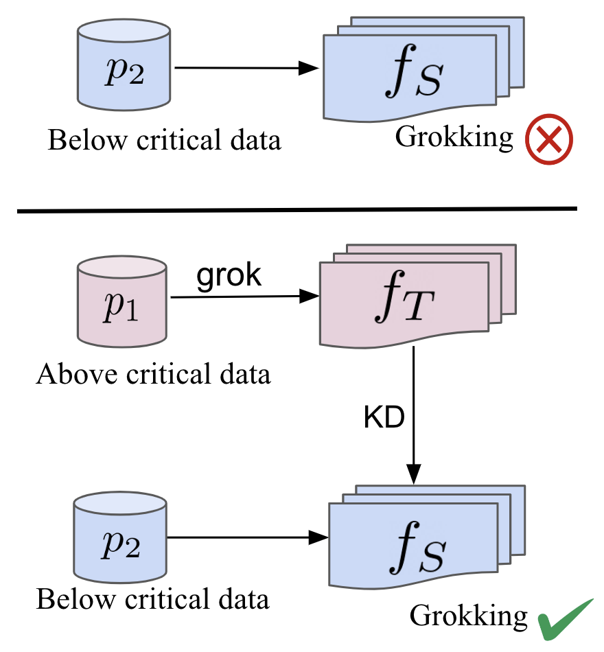
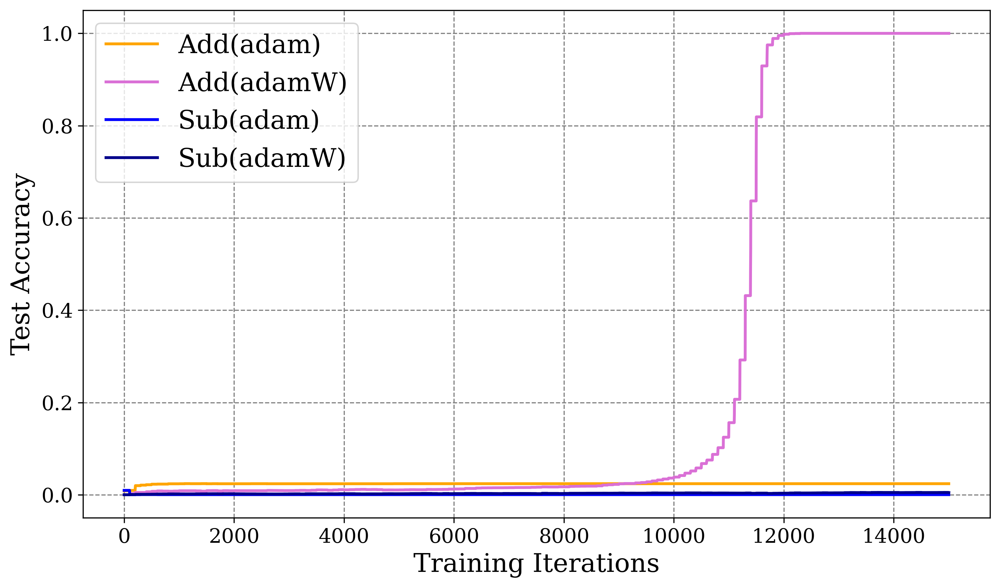
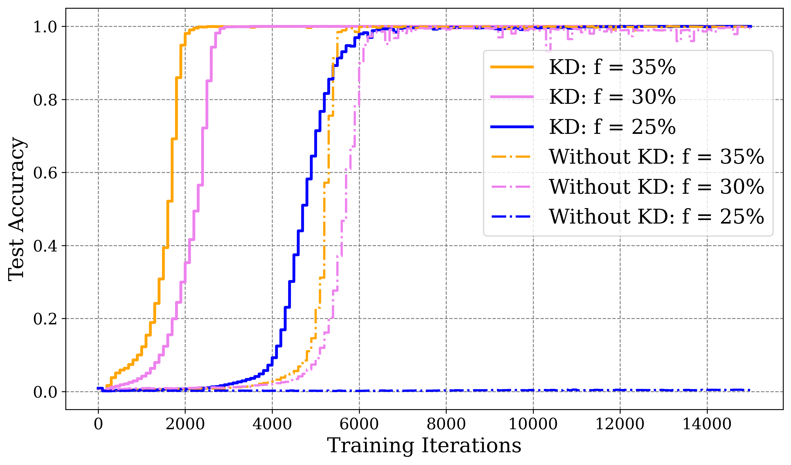
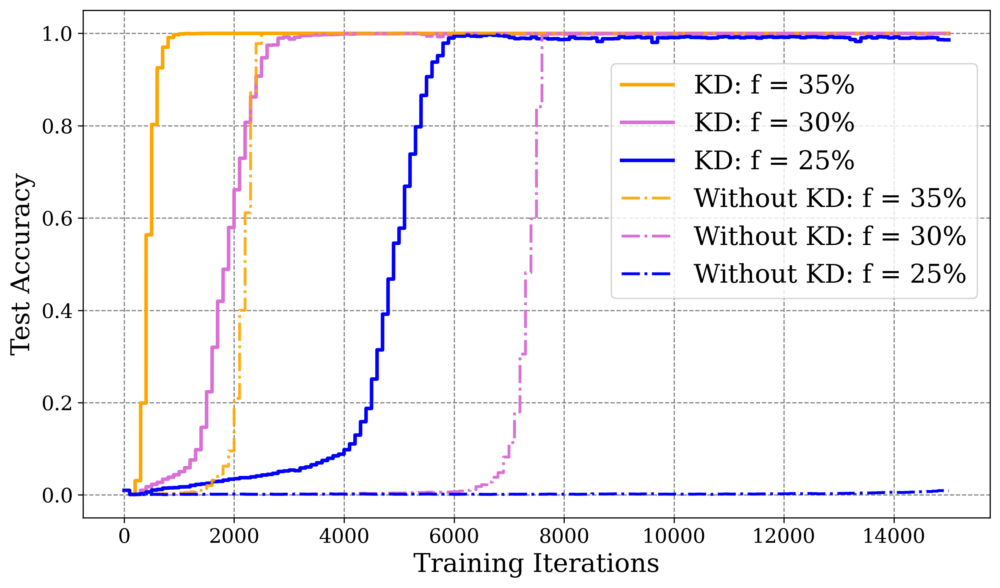
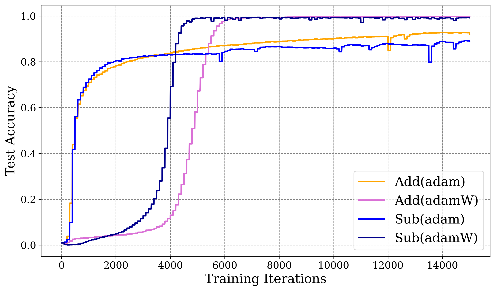
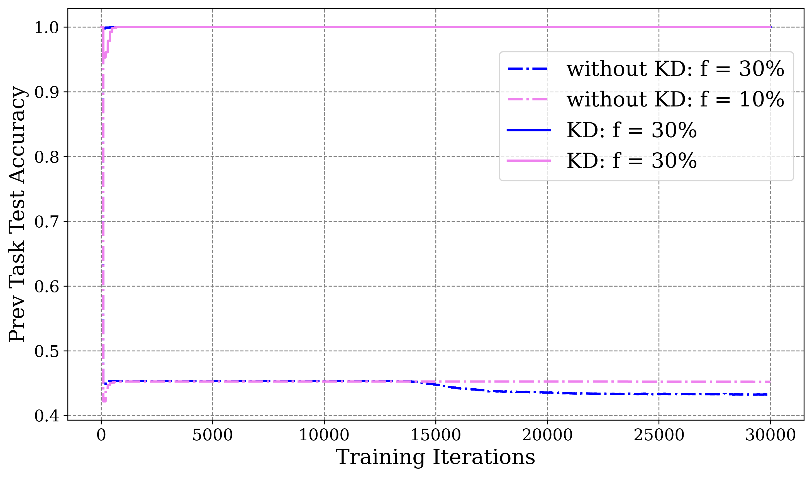
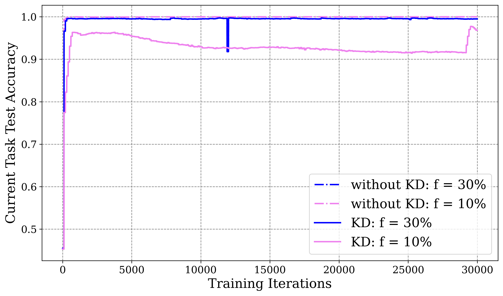

# Singh, Belilovsky, Aljundi 2025 — When Data Falls Short: Grokking Below the Critical Threshold

См. также: [глобальный индекс понятий](../../concepts/index.md).

**Vaibhav Singh, Eugene Belilovsky** (Concordia University & Mila), **Rahaf Aljundi** (Toyota Motor Europe).

arXiv [2511.04760](https://arxiv.org/abs/2511.04760), ноябрь 2025 (версия v1). Мастерская CCFM (Continual and Compatible Foundation Model Updates). 1 цитирование — сороковая по цитируемости работа корпуса. Источник — нативный HTML arXiv версии v1.

Оригинал и производные файлы этой папки:

- [`original/2511.04760.native.html`](original/2511.04760.native.html) — первоисточник, нативный HTML arXiv (v1), скачан как есть.
- [`original/2511.04760.when-data-falls-short-grokking-below-the-critical-threshold.md`](original/2511.04760.when-data-falls-short-grokking-below-the-critical-threshold.md) — конверсия оригинала в Markdown без правок содержания.
- [`images/`](images/) — 13 иллюстраций статьи в исходном разрешении.

Схема якорей и правила ссылок на карточку — в [README папки статей](../README.md).

## Затрагиваемые понятия

**[Критический размер данных](../../concepts/data-fraction-critical-dataset-size.md)** — главное понятие работы и главная мишень. Порог взят из корпуса (Varma et al., Zhu et al.) и подтверждён своими опытами: при 25 % данных и меньше гроккинга нет вовсе, даже при вдвое большем числе итераций ([`p3-3`](#p3-3), [`fig-4`](#fig-4)). Заявка же в том, что порог **не абсолютен**: перегонка знания из уже гроккнувшей модели даёт генерализацию при 20 % данных ([`p5-1`](#p5-1)).

**[Гроккинг](../../concepts/grokking.md)** — рассматривается не как явление, требующее объяснения, а как **имущество**, которое можно передать. Вопрос поставлен прямо: можно ли гроккнувшей моделью обучить другую модель на ином распределении ([`p1-5`](#p1-5)). Ответ: да, и ученик при этом и гроккает, и тратит меньше шагов.

**[Weight decay](../../concepts/weight-decay.md)** — работа берётся его **опровергнуть** как объяснение. Гроккинг показан при обычном Adam без weight decay и при неизменно **растущей** норме весов ([`p1-6`](#p1-6), [`p10-1`](#p10-1)). Названы поимённо три опровергаемые заявки: пора очистки у Nanda et al., меньшие сферы нормы у Liu et al. и действенность контуров у Varma et al. ([`p10-2`](#p10-2), [`p10-3`](#p10-3)).

**[Минимизация нормы весов](../../concepts/weight-norm-minimization.md)** — то же возражение с другой стороны: обобщающие решения здесь имеют норму **больше** начальной, что прямо противоречит картине «обобщающее решение лежит на сфере меньшей нормы» ([`p10-2`](#p10-2), [`fig-7`](#fig-7)).

**[Численная устойчивость](../../concepts/numerical-stability-fix.md)** — принято объяснение Prieto et al.: weight decay главным образом смягчает ошибки с плавающей точкой ([`p1-6`](#p1-6)). Взята и их же замена softmax: перекрёстная энтропия со StableMax, которая сама по себе сокращает время до гроккинга примерно до 6000 итераций против порядка $10^{4}$ ([`p3-3`](#p3-3), [`p3-5`](#p3-5)).

**[Модульная арифметика](../../concepts/modular-arithmetic.md)** — постановка: однослойный трансформер только с раскодировщиком, задачи $(a\pm b)\%P$, вход $[a,b,@,P]$ ([`p3-2`](#p3-2)). Смещение распределения вносится **сменой модуля** при том же знаке операции: $p_{1}$ есть $P=113$, $p_{2}$ есть $P=107$ ([`p4-2`](#p4-2)). Существенная подробность приёма: перегонка ведётся по вероятностным выходам с токена **операции**, а не с токена $P$, — чтобы выучивались представления уровня операции, а не привязанные к модулю ([`p4-2`](#p4-2)).

**[Катастрофическое забывание](../../concepts/catastrophic-forgetting.md)** — третий опыт: гроккнувшая на $p_{1}$ модель продолжает предобучение на $p_{2}$. Без KD прежняя задача забывается сразу и полностью, с KD точность на ней остаётся почти безупречной при быстрой генерализации на новой ([`p5-4`](#p5-4), [`p5-5`](#p5-5)).

**[Перенос вложений от слабой модели](../../concepts/freezing-subnetwork.md)** — ближайший соперник назван в обзоре: перенос вложений от более слабой модели к более сильной (Xu et al., 2025) ([`p3-1`](#p3-1)). Отличие своего приёма заявлено так: он убирает фазовый переход без дополнительных данных и без избыточного предобучения ([`p3-1`](#p3-1)).

**[Обучение структурированным представлениям](../../concepts/structured-representation-learning.md)** — итоговое истолкование: раз ни weight decay, ни норма весов не нужны, решающую роль играет **перенос представлений** через KD ([`p6-1`](#p6-1)). Это заявка о причине, и она в работе не проверяется.

**[Полугроккинг](../../concepts/semi-grokking.md)** и **[разгроккивание](../../concepts/ungrokking.md)** — названы в обзоре как то, что происходит ниже порога у Varma et al. ([`p2-4`](#p2-4)); нынешняя работа показывает, что при KD ниже порога наступает полноценная генерализация, а не полугроккинг.

**[Меры прогресса](../../concepts/progress-measures.md)**, **[зона Златовласки](../../concepts/goldilocks-zone.md)**, **[рогатка](../../concepts/slingshot.md)**, **[фазовый переход](../../concepts/phase-transition.md)** — перечислены в обзоре как имеющиеся объяснения ([`p2-2`](#p2-2), [`p2-3`](#p2-3)), но ни с одним из них предлагаемая картина не сопоставляется.

Отдельно стоит сказать, чего в работе **нет**. Нет разбора того, **что именно** переносится при перегонке: заявка о переносе представлений сделана в заключении и не подкреплена ни одним измерением ([`p6-1`](#p6-1)). Нет числа прогонов и полос разброса ни на одном рисунке. Нет и проверки за пределами модульного сложения и вычитания: все опыты — на двух операциях и двух простых модулях ([`p3-2`](#p3-2)).

Карточки статей корпуса: [Power et al. 2022](../2201.02177.grokking-generalization-beyond-overfitting-on-small-algorithmic-datasets/2201.02177.grokking-generalization-beyond-overfitting-on-small-algorithmic-datasets.card.md) — исходное явление и понятие критического порога; [Nanda et al. 2023](../2301.05217.progress-measures-for-grokking-via-mechanistic-interpretability/2301.05217.progress-measures-for-grokking-via-mechanistic-interpretability.card.md) — пора очистки, которую работа оспаривает; [Liu et al. 2022](../2205.10343.towards-understanding-grokking-an-effective-theory-of-representation-learning/2205.10343.towards-understanding-grokking-an-effective-theory-of-representation-learning.card.md) — зона Златовласки и сферы нормы; [Varma et al. 2023](../2309.02390.explaining-grokking-through-circuit-efficiency/2309.02390.explaining-grokking-through-circuit-efficiency.card.md) — действенность контуров, полугроккинг и разгроккивание; [Prieto et al. 2025](../2501.04697.grokking-at-the-edge-of-numerical-stability/2501.04697.grokking-at-the-edge-of-numerical-stability.card.md) — StableMax, взятый целиком; [Merrill et al. 2023](../2303.11873.a-tale-of-two-circuits-grokking-as-competition-of-sparse-and-dense-subnetworks/2303.11873.a-tale-of-two-circuits-grokking-as-competition-of-sparse-and-dense-subnetworks.card.md) — состязание подсетей; [Kumar et al. 2023](../2310.06110.grokking-as-the-transition-from-lazy-to-rich-training-dynamics/2310.06110.grokking-as-the-transition-from-lazy-to-rich-training-dynamics.card.md) — переход от ленивого к богатому; [Grokfast](../2405.20233.grokfast-accelerated-grokking-by-amplifying-slow-gradients/2405.20233.grokfast-accelerated-grokking-by-amplifying-slow-gradients.card.md) и [Minegishi et al. 2023](../2310.19470.bridging-lottery-ticket-and-grokking-understanding-grokking-from-inner-structure-of-networks/2310.19470.bridging-lottery-ticket-and-grokking-understanding-grokking-from-inner-structure-of-networks.card.md) — ускорители, названные в обзоре; [Xu et al. 2025](../2504.13292.let-me-grok-for-you-accelerating-grokking-via-embedding-transfer-from-a-weaker-model/2504.13292.let-me-grok-for-you-accelerating-grokking-via-embedding-transfer-from-a-weaker-model.card.md) — ближайший соперник, перенос вложений; [Rubin et al. 2023](../2310.03789.grokking-as-a-first-order-phase-transition-in-two-layer-networks/2310.03789.grokking-as-a-first-order-phase-transition-in-two-layer-networks.card.md) — переход первого рода.

## Что показано, а что предположено

Замечания редактора карточки по итогам разбора утверждений (`…claims.txt`). Работа короткая и целиком опытная: три постановки, ни одной теоремы, десять страниц.

**Главный итог прост и проверяем: порог сдвигается.** Без KD при 20 % данных за 30 000 итераций не происходит ничего; с KD генерализация наступает быстро ([`p5-1`](#p5-1), [`fig-4`](#fig-4)). Это не объяснение гроккинга, а показ того, что «критический размер данных» есть свойство **пары** «задача — источник обучающего сигнала», а не одной задачи.

**Возражение о weight decay весомо и подкреплено с двух сторон.** Гроккинг получен при Adam без weight decay, и норма весов при этом растёт, а не падает ([`p10-1`](#p10-1), [`fig-7`](#fig-7)). Названы три опровергаемые картины поимённо, и опровергается каждая по существу: если норма растёт, то ни «очистка», ни «меньшая сфера», ни «действенность через меньшую норму» необходимыми быть не могут.

**Однако опровержение уже, чем звучит.** Показано, что убывание нормы не **необходимо** при обучении **через перегонку**; ни один опыт не проверяет, нужно ли оно при обучении с нуля выше порога, где эти теории и формулировались. Существенно и то, что ученик получает сигнал от учителя, который сам гроккнул при 35 % данных, — возможно, что необходимая «очистка» уже произошла у учителя.

**Самый сильный опыт — третий, с объединённым распределением.** Большая модель $f_{M}$ не обобщает при совместном обучении на $(p_{1},p_{2})$, если данных хотя бы одного распределения мало, но обобщает при обучении **одной лишь** перегонкой из двух малых гроккнувших моделей ([`p5-2`](#p5-2), [`p5-3`](#p5-3)). Это трудно объяснить чем-либо, кроме передачи устройства решения: истинные метки те же самые, а итог другой.

**Заявка о причине сделана в заключении и не проверена.** «Более решающую роль играют устройства вроде переноса представлений через KD» ([`p6-1`](#p6-1)) — правдоподобно, но в работе нет ни одного измерения представлений: ни спектров, ни фурье-разбора вложений, ни сравнения внутренней геометрии учителя и ученика. Между тем именно такое измерение отличило бы перенос представлений от простого сглаживания меток.

**Три выгоды KD перечислены по чужим работам, а не измерены здесь.** Сглаживание меток как упорядочение, внесение отношений между классами, поправка градиентов по трудности примера ([`p4-1`](#p4-1)) — всё это взято из словесности о перегонке. Какая из трёх работает в гроккинге, не выясняется; простую проверку (перегонка из **не** гроккнувшего учителя) работа не ставит.

**Смещение распределения здесь очень мягкое.** $p_{1}$ и $p_{2}$ различаются лишь простым модулем при одной и той же операции ([`p3-2`](#p3-2)). Это законная постановка, но переносить итог на «смещение распределения» в обычном смысле нельзя: учитель и ученик решают одну и ту же алгебраическую задачу в разных полях.

**Непрерывное предобучение показано убедительно, но замеры узки.** Без KD прежняя задача забывается почти мгновенно, с KD удерживается ([`p5-5`](#p5-5)). Мерится, однако, лишь точность на двух задачах; ни одной меры забывания из словесности о непрерывном обучении не приводится.

**Обстановка воспроизводимости средняя.** Гиперпараметры названы ($\gamma=1e{-}3$, $\lambda=1$, пакет 2048, 15–30 тыс. эпох, V100) ([`p3-10`](#p3-10)), но число прогонов не указано, полос разброса нет, а ссылки на код в статье нет вовсе.

**Наблюдение, которое стоит запомнить отдельно.** При данных ниже критического размера в постановке непрерывного предобучения замечен внезапный переход от $\sim 92\%$ к $100\%$ точности около 28 тыс. шагов ([`fig-6`](#fig-6)) — то есть гроккинг не исчезает вовсе, а сдвигается и мельчает. Работа это отмечает мимоходом и не разбирает.

**Место в корпусе.** Это единственная работа вики, где гроккнувшая модель служит **источником** гроккинга для другой, и единственная, где критический размер данных обойдён, а не объяснён. Ценно и возражение о норме весов: оно опирается не на рассуждение, а на прямое наблюдение растущей нормы при удавшейся генерализации. Цена — очень мягкое смещение распределения, отсутствие измерений представлений при заявке именно об их переносе, отсутствие числа прогонов и полное отсутствие теории.

## Ошибочные цитирования

Замечания редактора карточки: места, где эта статья передаёт чужие результаты с ошибкой или без авторских оговорок. Сюда ведут ссылки «подробности» из разделов «Ошибочные пересказы и цитирования этой статьи» карточек процитированных работ.

###### mc-2309-02390
**Varma et al. (2309.02390) — численный порог и «semi-grokking ниже порога».** (1) `"For algorithmic addition and subtraction tasks, prior studies define the critical data size to be around 25% of the dataset (Varma et al., 2023; Zhu et al., 2024)"` — «прежние работы определяют критический размер данных около 25 процентов набора»: Varma долей его не определяли — их диапазон полу-грокинга 1500–2050 примеров из 12769 даёт примерно 12–16 процентов, порог зависит от сида, а сам концепт авторы называют [«чрезмерно упрощённым понятием»](../2309.02390.explaining-grokking-through-circuit-efficiency/2309.02390.explaining-grokking-through-circuit-efficiency.card.md#sec-a-2); число 25 перенесено на Varma из другой работы. (2) `"Training below this threshold yields semi-grokking, and fine-tuning grokked models on such small data can cause “ungrokking.”"` — «обучение ниже порога даёт полу-грокинг»: у Varma полу-грокинг живёт [в окрестности критического размера](../2309.02390.explaining-grokking-through-circuit-efficiency/2309.02390.explaining-grokking-through-circuit-efficiency.card.md#sec-5-3), а ниже порога генерализации просто нет; вторая половина фразы — про унгрокинг — точна. В другом месте статья цитирует цель безупречно: определение критического размера как минимума данных для генерализации.

---

# Текст статьи

## Аннотация

###### p1-3

В этой статье мы исследуем явление *гроккинга*, при котором модели обнаруживают отложенную генерализацию вслед за переобучением на обучающих данных. Мы сосредоточены на режимах скудных данных, где число обучающих примеров падает ниже критического порога, отчего гроккинг становится ненаблюдаем, а также на применимых положениях со смещением распределения. Сперва мы показываем, что перегонка знания (KD) из модели, уже гроккнувшей на распределении ($p_{1}$), способна вызвать и ускорить гроккинг на другом распределении ($p_{2}$) даже тогда, когда доступных данных меньше критического порога. Это подчёркивает ценность KD для развёрнутых моделей, которым надо приспосабливаться к новым распределениям при ограниченных данных. Затем мы изучаем обучение на объединённом распределении ($p_{1}$, $p_{2}$) и показываем, что, тогда как обычное обучение с учителем проваливается, когда данных хотя бы одного распределения недостаточно, перегонка из моделей, гроккнувших на отдельных распределениях, генерализацию обеспечивает. Наконец, мы рассматриваем постановку непрерывного предобучения, где гроккнувшая модель переходит с $p_{1}$ на $p_{2}$, и находим, что KD и ускоряет генерализацию, и смягчает катастрофическое забывание, достигая сильных итогов даже при 10 % данных. Вместе наши итоги дают новое понимание устройства гроккинга при передаче знания и подчёркивают решающую роль KD в обеспечении генерализации при скудных и меняющихся распределениях.

## 1 Введение

Генерализация на разных распределениях данных остаётся коренной трудностью машинного обучения, поскольку обычное обучение часто проваливается при смещениях распределения или скудости данных (Van de Ven and Tolias, 2019; Fang et al., 2020; Singh et al., 2024b, a; Liang et al., 2024). Явление *гроккинга* (Power et al., 2022) проливает на эту трудность свет, показывая, как модели способны внезапно обобщить после долгого переобучения (Arpit et al., 2017). Объяснения простираются от неявного упорядочения вроде weight decay (Barak et al., 2022; Nanda et al., 2023) до динамики обучения, дающей генерализацию даже при нулевой потере (Kumar et al., 2024; Lyu et al., 2024; Ishida et al., 2020). Общая находка такова: гроккинг происходит лишь тогда, когда обучающих данных больше *критического порога* (Power et al., 2022; Zhu et al., 2024).

###### p1-5

Опираясь на эти находки, мы исследуем гроккинг в режимах скудных данных при смещении распределения. А именно, мы спрашиваем: **можно ли воспользоваться гроккнувшей моделью, чтобы *обучить* другую модель на ином распределении?** Чтобы это проверить, мы обучаем однослойный трансформер (Vaswani et al., 2017) на $p_{1}$ как учителя ($f_{T}$) и перегоняем его знание в ученика ($f_{S}$) на $p_{2}$. Мы находим, что $f_{S}$ не только гроккает на $p_{2}$, но и требует при перегонке меньше шагов. Это позволяет быстрее приспосабливаться, когда данных $p_{2}$ мало, и показывает применимую ценность уже гроккнувших моделей для смещения распределения, непрерывного обучения, многозадачного обучения и генерализации по областям.

###### p1-6

Мы показываем также, что генерализация не зависит ни от меньших норм весов, ни от weight decay. Тогда как прежние работы связывали гроккинг с порой очистки, движимой weight decay (Nanda et al., 2023; Liu et al., 2022b; Varma et al., 2023), наши опыты эту заявку опровергают. В согласии с недавними находками (Prieto et al., 2025) мы находим, что weight decay главным образом смягчает ошибки с плавающей точкой. Гроккинг происходит и при нулевом weight decay, и при растущих нормах весов, что исключает эти множители как главные объяснения.

Далее мы спрашиваем: **возможен ли гроккинг, когда обучающих данных *меньше* критического порога?** Наши итоги показывают, что перегонка из учительской модели ($f_{T}$) не только сокращает число шагов до гроккинга, но и делает его возможным там, где данных меньше критического размера. Критический размер данных, как он определён в (Liu et al., 2022b; Varma et al., 2023; Zhu et al., 2024), есть наименьшее количество данных, ниже которого генерализации не происходит. Наше исследование показывает далее, что KD помогает смягчить забывание, когда модели приспосабливаются к новым областям. Вместе эти вклады очерчивают применимую рамку построения действенных и приспособляемых обучающихся систем.



**[p. 2]**

*(a) Гроккинг модели на $p_{2}$ посредством KD там, где иначе она обобщить не способна.*


*(b) Перегонка из нескольких гроккнувших моделей $f_{T}$, $f_{S}$ даёт гроккинг у большей модели $f_{M}$ ниже критического объёма данных.*

*Рисунок 1: 1(a) показывает, что $f_{S}$гроккает ниже критического размера данных, когда обучается через KD из гроккнувшей модели $f_{T}$, тогда как обучение с нуля проваливается. На 1(b) большая модель $f_{M}$, обучаемая совместно на $p_{1}$ и $p_{2}$, обобщить не способна, когда хотя бы один набор данных ниже порога. Однако перегонка из меньших гроккнувших моделей $f_{S}$и $f_{T}$ позволяет $f_{M}$ гроккнуть и действенно обобщить даже при скудных данных.* **[p. 2]**

## 2 Близкие работы

###### p2-2

**Гроккинг** впервые указан на алгоритмических задачах в (Power et al., 2022). Последующие работы стремились это явление объяснить. (Nanda et al., 2023) разобрали гроккнувший трансформер модульного сложения и нашли, что он выучивает сочетание тригонометрических и обратных тригонометрических функций. (Merrill et al., 2023) приписали гроккинг состязанию разрежённых (обобщающих) и плотных (запоминающих) подсетей. С теоретической стороны (Rubin et al., 2024) изложили гроккинг как фазовый переход первого рода в выучивании признаков, тогда как (Levi et al., 2024) дали аналитические решения для динамики потери и точности в линейных сетях. Изучая многочленную регрессию, (Kumar et al., 2024) связали гроккинг с переходом от ленивого обучения к богатому. (Lyu et al., 2024) далее предположили, что резкий скачок точности на тесте возникает из разных неявных смещений ранней и поздней поры обучения.

###### p2-3

Гроккинг наблюдался и в применимых постановках — скажем, у свёрточных сетей, обучаемых на CIFAR-10 (Humayun et al., 2024; Krizhevsky, 2012). (Humayun et al., 2024) описывают отложенную устойчивость, при которой модели в конце концов гроккают состязательные примеры много позже перемежения. Раннее предсказание гроккинга пробовали строить по фурье-спектральным отметкам (Notsawo Jr et al., 2023). Его связывали с медленным складыванием полезных представлений в «зоне Златовласки» между запоминанием и смятением (Liu et al., 2022a), а также с постепенным усилением устроенных весов, за которым следует удаление запомненных составляющих (Nanda et al., 2023). Иные объяснения включают скрытое, движимое SGD усиление фурье-разрыва (Barak et al., 2022) и «приём рогатки», при котором обучение ходит по кругу между устойчивыми и неустойчивыми порами (Thilak et al., 2022).

###### p2-4

**Отношение к размеру набора данных.** Разбор действенности контуров показывает, что генерализация медленнее, но действеннее, откуда следует критический размер данных, ниже которого модели запоминают, а не обобщают (Varma et al., 2023). Обучение ниже этого порога даёт полугроккинг, а дообучение гроккнувших моделей на столь малых данных способно вызвать «разгроккивание». Предлагалось упорядочение для исправления ошибок на обучающих примерах (Doshi et al., 2023), а разбор ландшафта потерь связывает гроккинг с размером данных, weight decay и обучением представлениям (Liu et al., 2022b).

**[p. 3]**

###### p3-1

**Ускорение гроккинга.** Несколько приёмов ускоряют гроккинг: разложение и усиление градиента (Lee et al., 2024), подходы через счастливый билет (Minegishi et al., 2023), перенос вложений от более слабой модели к более сильной (Xu et al., 2025) и замена softmax на stable-max (Prieto et al., 2025). Наш же приём убирает фазовый переход без дополнительных данных и без избыточного предобучения и, насколько нам известно, впервые ускоряет гроккинг в постановках со скудными данными при смещении распределения.

## 3 Постановка опытов

###### p3-2

Мы обучали трансформер только с раскодировщиком, чтобы ставить опыты на алгоритмических задачах вида ($(a@b)\%P$), где $@$ означает знак любой двуместной операции. В этой работе мы сосредоточены на задачах сложения и вычитания вслед за прежними исследованиями (Nanda et al., 2023; Varma et al., 2023; Liu et al., 2022b; Power et al., 2022; Liu et al., 2022a), неизменно сообщающими о гроккинге на этих задачах. Вход модели есть $[a,b,@,P]$, а выход $c$ считывается с последнего токена $P$. В наших опытах каждая арифметическая задача по модулю $P$ обозначается $p_{1}$ для определённого простого $P$. Смещение распределения вносится сменой модуля при закреплённом знаке операции. Скажем, при сложении по модулю $P$ задача $(a+b)\%P$ при $P=P_{1}$ зовётся распределением $p_{1}$, тогда как $(a+b)\%P$ при $P=P_{2}\neq P_{1}$ обозначается $p_{2}$. Наши итоги остаются неизменны при любом выборе $P_{1}$ и $P_{2}$.

###### p3-3

Мы начинаем обучение с 35 % набора данных, чтобы сперва увидеть гроккинг, как показано в прежних работах (Power et al., 2022; Liu et al., 2022b). Затем мы постепенно уменьшаем долю данных до 30 %, 25 % и 10 %. Для алгоритмических задач сложения и вычитания прежние исследования определяют критический размер данных примерно в 25 % набора (Varma et al., 2023; Zhu et al., 2024). В согласии с этим наши наблюдения показывают, что гроккинг не происходит, когда доступно 25 % данных или меньше, подтверждая, что 25 % и есть критический порог, ниже которого генерализация становится невозможной. Мы берём перекрёстную энтропию со StableMax (Prieto et al., 2025), поскольку перекрёстная энтропия с функцией softmax вызывает численную неустойчивость; она задаётся как

$$
L_{\mathrm{StCE}}(\theta)=\mathbb{E}_{(x,y)\sim\mathcal{D}}\left[-\log\text{StableMax}(f_{S}^{y}(x;\theta))\right] \tag{1}
$$

где $f_{S}(\cdot;\theta)$ — ученическая сеть, задаваемая параметрами $\theta$, а StableMax($x$) = Softmax($g(x_{i})$), где $g(x_{i})$ определяется как

$$
g(x)=\begin{cases}\log(x+1)&\text{ if }x\geq 0\\
-\log(-x+1)&\text{ if }x<0\end{cases} \tag{2}
$$

###### p3-5

Мы замечаем, что применение StableMax (Prieto et al., 2025) уже само по себе ускоряет наступление гроккинга: требуется около 6000 итераций, тогда как иначе их потребовалось бы порядка $1e4$ (Liu et al., 2022b; Power et al., 2022; Nanda et al., 2023)

Для перегонки знания мы берём потерю через расхождение Кульбака — Лейблера (KL):

$$
L_{\mathrm{KL}}(\theta)=\mathbb{E}_{x\sim\mathcal{D}_{X}}\left[D_{\mathrm{KL}}\left(q_{T}(x)\|q_{S}(x;\theta)\right)\right] \tag{3}
$$

где $D_{\mathrm{KL}}(p\|q)=\sum_{i=1}^{K}p_{i}\log\left(\frac{p_{i}}{q_{i}}\right)$. Она берёт смягчённые выходы $q_{T}(x)=\operatorname{softmax}\left(\frac{f_{T}(x)}{t}\right)$ и $q_{S}(x;\theta)=\operatorname{softmax}\left(\frac{f_{S}(x;\theta)}{t}\right)$, где $f_{T}:$ означает учительскую модель, а $t>0$ — температуру, применяемую для смягчения вероятностей.

Полная потеря перегонки осуществляется тем самым как

$$
L(\theta)=(1-\alpha)L_{\mathrm{CE}}(\theta)+\alpha L_{\mathrm{KL}}(\theta) \tag{4}
$$

где $\alpha$ управляет долей каждой части потери.

###### p3-10

Чтобы показать действенность нашего приёма перегонки и опровергнуть зависимость от теорий нормы весов и weight decay, мы сравниваем оптимизаторы Adam без weight decay и AdamW (с weight decay) (Loshchilov, 2017) при скорости обучения $\gamma=1e-3$. Для AdamW параметр weight decay положен $\lambda=1$. Мы проводим 15 000–30 000 эпох обучения с размером пакета 2048 на GPU NVIDIA V100.

## 4 Ускорение гроккинга перегонкой знания (KD)



*(a) Обучение на $p_{2}$ без KD (f = 30 %)*


*(b) Обучение на $p_{2}$ с KD из $p_{1}$ (f = 30 %)*

*Рисунок 2: 2(b) показывает действенность KD **независимо от выбора оптимизатора** и для сложения, и для вычитания по модулю. На 2(a) — привычное явление гроккинга на распределении $p_{2}$ при $30\%$ обучающих данных (обозначено f), без KD. Мы замечаем, что weight decay помогает гроккингу проявиться, но не есть единственная лежащая в основе причина. При обучении с Adam гроккинг не наблюдается ни в одной из задач за 15 000 итераций. Это согласуется с (Power et al., 2022). Однако 2(b) показывает, что $Student$-модель, обучаемая на ином распределении $p_{2}$ при той же доле, но уже с KD из $Teacher$-модели, обученной на $p_{1}$, обнаруживает ускоренную генерализацию независимо от выбора оптимизатора.* **[p. 4]**

###### p3-11

Показано, что KD даёт многообразные выгоды в улучшении динамики обучения. Menon et al. (2021) дали статистический взгляд на перегонку: выдача истинных вероятностей классов от учительской **[p. 4]** модели способна снизить дисперсию ученической цели и тем самым улучшить качество. Далее Phuong and Lampert (2019) дают границу генерализации, устанавливающую быстрое схождение ожидаемого риска линейного различителя, обученного перегонкой. В (Boix-Adsera, 2024; Ben-David and Ben-David, 2011) дана теоретическая рамка разбора перегонки моделей в деревья решений через статистическую теорию PAC-обучения. Они показывают, что если учительская модель $f_{T}$в совершенстве перегоняема в ученическую $f_{S}$, то с вероятностью по меньшей мере $1-\delta$ модель $f_{S}$обобщает при числе обучающих примеров не более $\left\lceil\frac{\log(1/\delta)}{\epsilon}\right\rceil$. Из этих исследований (Tang et al., 2020; Cho and Hariharan, 2019; Yuan et al., 2020) можно заключить, что KD приносит динамике обучения следующие выгоды.

###### p4-1

- **Упорядочивающее действие через сглаживание меток.** KD сглаживает метки, что работает как упорядочитель и мешает переобучению.\n- **Внесение знания области.** Учительская модель передаёт отношения между классами, задающие геометрию логитного слоя ученика.\n- **Знание, свойственное примеру.** Учитель подправляет градиенты ученической модели для каждого примера сообразно его трудности, что делает обучение действеннее.



*(a) Ускоренный гроккинг на $p_{2}$ для задачи $(a+b)\%107$*



*(b) Ускоренный гроккинг на $p_{2}$ для задачи $(a-b)\%107$*

*Рисунок 3: Прерывистые линии на 3(a) и 3(b) показывают привычный гроккинг на $p_{2}$ $(P=107)$ при разных долях обучающих данных ($f$). Обучение с нуля ниже $30\%$ гроккинга не даёт. При KD из модели, гроккнувшей на $p_{1}$ $(P=113)$, гроккинг ускоряется и происходит уже при $25\%$ данных $p_{2}$. Перегонка ведётся по вероятностным выходам с токена операции, что даёт общие представления уровня операции, а не свойственные конкретному $P$.*

###### p4-2

Сперва мы доводим до гроккинга однослойную модель-трансформер при $35\%$ обучающих данных на задачах модульного сложения и вычитания ($(a\pm b)\%P$) с $P=113$ (выбор $P$ был произволен). Это распределение данных мы зовём $p_{1}$. Эта модель и будет учительской ($f_{T}$). **[p. 5]** Затем мы обучаем другую модель на распределении $p_{2}$, изменив простой модуль ($P=107$), и сравниваем действие KD при разных долях $p_{2}$ на обеих задачах. Как видно на рисунке 3, KD значительно ускоряет ход гроккинга для обеих задач даже там, где доля обучающих данных ниже критического размера набора. Это наблюдение не зависит от взятого оптимизатора, как показано на рисунке 2. Тем самым видна применимая польза гроккнувших моделей: они действенны при обучении моделей на разных распределениях через KD. Важно отметить, что перегонка ведётся по вероятностным выходам с токена операции, а не с токена $P$. Такой подход стремится выучить общие представления уровня операции, а не свойственные задаче представления, которые зависели бы от выбора $P$.


*(a) Без KD при $20\%$ данных $p_{2}$*



*(b) С KD при $20\%$ данных $p_{2}$*

###### fig-4

*Рисунок 4: 4(a) показывает, что наблюдать гроккинг невозможно, когда доля данных опускается ниже некоторого критического порога ($20\%$), даже при вдвое большем числе итераций (30 000). В таком случае модель не выучивает ничего, каков бы ни был оптимизатор. На 4(b) ясно видно, что при KD гроккинг наблюдается во всех задачах, даже без weight decay. Однако мы замечаем, что weight decay помогает достичь лучшей генерализации.* **[p. 5]**

###### p5-1

Опираясь на эти наблюдения, мы спрашиваем: *способна ли KD обеспечить генерализацию ниже критического порога данных?* Чтобы это проверить, мы повторяем опыты всего при $20\%$ данных. Без KD гроккинг не происходит даже после 30 000 итераций, каков бы ни был weight decay. Напротив, при KD генерализация возникает быстро и при столь сниженной доле данных (рисунок 4). Примечательно, что норма весов при этом продолжает расти (подробнее о норме весов — в A.1), что подкрепляет нашу прежнюю заявку: ни weight decay, ни убывание нормы весов для гроккинга не необходимы. Эти итоги подчёркивают ценность гроккнувшей учительской модели ($f_{T}$) в постановках со скудными данными. KD не только ускоряет гроккинг, но и делает его возможным ниже критического порога, что выделяет её применимую пользу для действенного обучения при ограниченных данных и меняющихся распределениях.

## 5 Применение гроккнувших моделей для перегонки и непрерывного переноса

###### p5-2

Мы расширили наше исследование, сохранив точки гроккнувших моделей при долях $(0.35,0.3,0.25)$ данных $p_{2}$, обученных перегонкой (раздел 4). Модель, гроккнувшая на $p_{1}$ при $35\%$ данных, обозначается $f_{p_{1}}$, а обученные KD модели на $p_{2}$ — $f_{p_{2}}$. Нашей целью было обучить новый трансформер ($f_{M}$), обобщающий и на $p_{1}$, и на $p_{2}$. При совместном обучении $f_{M}$ обобщить не смог, когда $p_{2}$ было ниже критического размера, что показывает: скудость любого из распределений ограничивает обучение. Напротив, обучение $f_{M}$ исключительно через KD из $f_{p_{1}}$ и $f_{p_{2}}$ дало одновременную генерализацию даже тогда, когда данных одного из распределений было мало (рисунок 5)


*(a) без KD*


**[p. 6]**

*(b) Только с KD, без минимизации энтропии*

*Рисунок 5: Сравнение стратегий обучения большей модели-трансформера $f_{M}$ на распределениях $p_{1}$ (35 %) и при разных долях $(0.35,0.3,0.25)$ данных $p_{2}$. В режиме совместного обучения (5(a)) модель обобщить через перекрёстную энтропию не способна, когда данные хотя бы одного распределения падают ниже критического порога. Напротив, обучение одной лишь перегонкой даёт гроккинг даже при $25\%$ данных $p_{2}$ (5(b)). При столь малой доле генерализация до единицы не доходит из-за несовершенства $f_{p_{2}}$, обученного в скудости данных, тогда как при долях $0.35$ и $0.3$ генерализация быстра и гроккинга нет.* **[p. 6]**

###### p5-3

Примечательно, что $f_{M}$ обнаружил гроккинг *лишь при обучении через KD*, обобщая даже тогда, когда $p_{1}$ или $p_{2}$ было ниже критического размера. Это показывает, что KD на объединённом распределении $(p_{1},p_{2})$ даёт более сильный обучающий сигнал, нежели истинные метки, обеспечивая гроккинг при ограниченных данных. Примечательно, что действие сохраняется, даже когда сам учитель $f_{p_{2}}$ был обучен на малой доле $p_{2}$ перегонкой из $f_{p_{1}}$.

###### p5-4

Опираясь на недавние работы о непрерывном предобучении (Ke et al., 2023), мы оценили переход гроккнувшей модели с $p_{1}$ на $p_{2}$, сосредоточившись на роли перегонки знания (KD) в смягчении катастрофического забывания. Модель, гроккнувшая на $p_{1}$, далее предобучалась на $p_{2}$ при двух условиях: с KD и без неё.



*(a) Точность на прежней задаче при разных долях данных, с KD и без неё.*



*(b) Точность на нынешней задаче при разных долях данных, с KD и без неё.*

###### fig-6

*Рисунок 6: Непрерывное предобучение, где гроккнувшая на $p_{1}$ модель далее обучается на $p_{2}$. Без KD качество на $p_{1}$ быстро падает, тогда как генерализация на $p_{2}$ быстра. При KD (6(b)) точность на нынешней задаче сохраняется, а забывание смягчается. Обучение из гроккнувшей модели даёт быструю генерализацию без отложенного гроккинга, хотя при данных ниже критического размера мы наблюдаем внезапный фазовый переход от $\sim 92\%$ к $100\%$ точности примерно на $28K$ шагов.* **[p. 6]**

###### p5-5

Как показано на рисунке 6, обучение без KD вело к немедленному и сильному забыванию $p_{1}$, хотя модель быстро обобщала на $p_{2}$. При KD же модель удерживала почти безупречную точность на $p_{1}$, достигая при этом быстрой генерализации на $p_{2}$. Тем самым KD и предотвратила отложенную генерализацию, и сохранила прежнее знание, что подчёркивает её роль в уравновешивании удержания и приспособления при непрерывном предобучении.

###### p6-1

Эти находки высвечивают пользу KD для генерализации, когда данных из нескольких распределений мало, — положение, на деле обычное из-за требований частности, безопасности или ограниченности средств. Применение KD из предобученных гроккнувших моделей даёт в таких постановках действенное решение. Наконец, во всех опытах мы наблюдали растущие нормы весов при удачном гроккинге, что оспаривает теории, связывающие гроккинг с уменьшением нормы весов. Взамен наши итоги наводят на мысль, что более решающую роль играют устройства вроде переноса представлений через KD, — а это открывает новые направления к пониманию коренных движителей гроккинга.

## 6 Заключение и будущая работа

Это исследование продвигает понимание гроккинга, рассматривая его поведение ниже критического режима данных. В отличие от прежних работ, сосредоточенных на одиночных распределениях и динамике нормы весов, мы показываем, что перегонка знания (KD) способна вызывать и ускорять гроккинг, не опираясь ни на weight decay, ни на убывание норм. Наши итоги показывают, что KD обеспечивает генерализацию даже ниже критического порога и на разных распределениях, давая применимое решение в постановках со скудными данными, где обычное обучение проваливается. Будущая работа может распространить эти наблюдения на более замысловатые задачи, углубить понимание устройств гроккинга и исследовать более широкие применения уже гроккнувших моделей, надёжно обобщающих и действенно приспосабливающихся к меняющимся настоящим данным.

## Литература

**[p. 7]**

- A closer look at memorization in deep networks. In International Conference on Machine Learning, Cited by: §1.

- Hidden progress in deep learning: sgd learns parities near the computational limit. Advances in Neural Information Processing Systems 35, pp. 21750–21764. Cited by: §1, §2.

- Learning a classifier when the labeling is known. In International Conference on Algorithmic Learning Theory, pp. 440–451. Cited by: §4.

- Towards a theory of model distillation. External Links: 2403.09053, Link Cited by: §4.

- On the efficacy of knowledge distillation. In Proceedings of the IEEE/CVF International Conference on Computer Vision (ICCV), Cited by: §4.

- To grok or not to grok: disentangling generalization and memorization on corrupted algorithmic datasets. arXiv preprint arXiv:2310.13061. Cited by: §2.

- Rethinking importance weighting for deep learning under distribution shift. Advances in neural information processing systems 33, pp. 11996–12007. Cited by: §1.

- Deep networks always grok and here is why. arXiv preprint arXiv:2402.15555. Cited by: §2.

- Do we need zero training loss after achieving zero training error?. ArXiv abs/2002.08709. External Links: Link Cited by: §1.

- Continual learning of language models. In International Conference on Learning Representations (ICLR), Cited by: §5.

- Learning multiple layers of features from tiny images. University of Toronto, pp.. Cited by: §2.

- Grokking as the transition from lazy to rich training dynamics. In The Twelfth International Conference on Learning Representations, External Links: Link Cited by: §1, §2.

- Grokfast: accelerated grokking by amplifying slow gradients. arXiv preprint arXiv:2405.20233. Cited by: §2.

- Grokking in linear estimators – a solvable model that groks without understanding. In The Twelfth International Conference on Learning Representations, External Links: Link Cited by: §2.

- A comprehensive survey on test-time adaptation under distribution shifts. International Journal of Computer Vision, pp. 1–34. Cited by: §1.

- Towards understanding grokking: an effective theory of representation learning. Advances in Neural Information Processing Systems 35, pp. 34651–34663. Cited by: §2, §3.

- Omnigrok: grokking beyond algorithmic data. In The Eleventh International Conference on Learning Representations, Cited by: Figure 7, Figure 7, §A.1, §A.1, §1, §1, §2, §3, §3, §3.

- Decoupled weight decay regularization. arXiv preprint arXiv:1711.05101. Cited by: §3.

- Dichotomy of early and late phase implicit biases can provably induce grokking. In The Twelfth International Conference on Learning Representations, External Links: Link Cited by: §1, §2.

**[p. 8]**

- A statistical perspective on distillation. In Proceedings of the 38th International Conference on Machine Learning, Proceedings of Machine Learning Research, Vol. 139, pp. 7632–7642. Cited by: §4.

- A tale of two circuits: grokking as competition of sparse and dense subnetworks. arXiv preprint arXiv:2303.11873. Cited by: §2.

- Bridging lottery ticket and grokking: is weight norm sufficient to explain delayed generalization?. arXiv preprint arXiv:2310.19470. Cited by: §2.

- Progress measures for grokking via mechanistic interpretability. arXiv preprint arXiv:2301.05217. Cited by: Figure 7, Figure 7, §A.1, §A.1, §1, §1, §2, §2, §3, §3.

- Predicting grokking long before it happens: a look into the loss landscape of models which grok. arXiv preprint arXiv:2306.13253. Cited by: §2.

- Towards understanding knowledge distillation. In Proceedings of the 36th International Conference on Machine Learning, Proceedings of Machine Learning Research, Vol. 97, pp. 5142–5151. Cited by: §4.

- Grokking: generalization beyond overfitting on small algorithmic datasets. arXiv preprint arXiv:2201.02177. Cited by: §1, §2, §3, §3, §3, Figure 2, Figure 2.

- Grokking at the edge of numerical stability. In The Thirteenth International Conference on Learning Representations, External Links: Link Cited by: §1, §2, §3, §3.

- Grokking as a first order phase transition in two layer networks. In The Twelfth International Conference on Learning Representations, External Links: Link Cited by: §2.

- Controlling forgetting with test-time data in continual learning. arXiv preprint arXiv:2406.13653. Cited by: §1.

- Wake-sleep energy based models for continual learning. In Proceedings of the IEEE/CVF Conference on Computer Vision and Pattern Recognition, pp. 4118–4127. Cited by: §1.

- Understanding and improving knowledge distillation. arXiv preprint arXiv:2002.03532. Cited by: §4.

- The slingshot mechanism: an empirical study of adaptive optimizers and the grokking phenomenon. arXiv preprint arXiv:2206.04817. Cited by: §2.

- Three scenarios for continual learning. arXiv preprint arXiv:1904.07734. Cited by: §1.

- Explaining grokking through circuit efficiency. arXiv preprint arXiv:2309.02390. Cited by: Figure 7, Figure 7, §A.1, §A.1, §1, §1, §2, §3, §3.

- Attention is all you need. In Neural Information Processing Systems, External Links: Link Cited by: §1.

- Let me grok for you: accelerating grokking via embedding transfer from a weaker model. In The Thirteenth International Conference on Learning Representations, External Links: Link Cited by: §2.

- Revisiting knowledge distillation via label smoothing regularization. In Proceedings of the IEEE/CVF Conference on Computer Vision and Pattern Recognition (CVPR), Cited by: §4.

**[p. 9]**

- Critical data size of language models from a grokking perspective. CoRR abs/2401.10463. External Links: Link Cited by: §1, §1, §3.

**[p. 10]**

## Приложение A Приложение

### A.1 Развитие нормы весов L2

###### p10-1

Норма весов L2 при обучении с adam неизменно растёт и на сложении, и на вычитании, как видно на рисунке 7, — и всё же гроккинг происходит. Эти находки оспаривают теории, предложенные [23], где утверждается, что резкий переход к безупречной точности на тесте при гроккинге случается в поре очистки (где weight decay удаляет запоминающие составляющие) вслед за складыванием обобщающего устройства. Наши опытные свидетельства этим заявкам противоречат, показывая гроккинг и без weight decay, и при растущих нормах весов.

###### p10-2

Схожим образом [17] вызывают гроккинг увеличением начальной нормы весов и заключают, что обобщающие решения лежат на сферах меньшей нормы в пространстве параметров. Признавая, что изначально бо́льшая норма весов способна гроккингу способствовать, наши итоги указывают, что обобщающие решения не обязательно лежат на сферах меньшей нормы. Наши задачи модульной арифметики служат опровергающими примерами: итоговые обобщающие решения имеют бо́льшие нормы весов, чем их начальные состояния, и гроккинг происходит без всякого применения weight decay.

###### p10-3

Далее, [34] заявляют, что переход от запоминающих контуров к обобщающим происходит оттого, что обобщающий контур «действеннее» запоминающего в том смысле, что даёт равнозначную потерю при меньшей норме параметров. Напротив, наши исследования показывают, что на задачах модульной арифметики обобщающие решения достижимы и при бо́льших нормах параметров без всякого weight decay, что опровергает необходимость снижения нормы для гроккинга.

Мы опытно показываем, что норма весов параметров (L2) при обучении с adam неизменно растёт и на сложении, и на вычитании, как видно на рисунке 7, — и всё же гроккинг происходит. Это оспаривает мысль, будто убывание нормы весов для гроккинга основополагающе. Поэтому мы утверждаем, что ни weight decay параметров, ни убывание нормы весов в ходе оптимизации не суть по существу основополагающие условия наблюдения гроккинга, вопреки их мнимой необходимости в прежних исследованиях [17, 23, 34] о задачах модульной арифметики.


###### fig-7

*Рисунок 7: Развитие нормы весов L2 для $Student$-модели $f_{S}$, обучаемой с Adam (без weight decay) и AdamW (с weight decay) при разных долях распределения $p_{2}$. $f_{S}$ обучается через KD из гроккнувшей модели $f_{T}$. Примечательно, что при обучении без weight decay норма весов $L_{2}$ неизменно растёт, давая при этом обобщающие решения. Это исключает необходимость условия убывающей нормы весов для проявления гроккинга, заявленного в [17, 34, 23]* **[p. 10]**

---

# Машиночитаемый блок фактов

```yaml
paper:
  id: 2511.04760
  title: "When Data Falls Short: Grokking Below the Critical Threshold"
  authors: [Vaibhav Singh, Eugene Belilovsky, Rahaf Aljundi]
  affiliation: "Concordia University & Mila; Toyota Motor Europe"
  date: 2025-11
  venue: "мастерская CCFM (Continual and Compatible Foundation Model Updates)"
  citations: 1
  source: native-html-v1

core_claim:
  name: "перегонка знания сдвигает критический порог"
  thesis: "перегонка из уже гроккнувшей модели вызывает и ускоряет гроккинг на другом
    распределении и делает его возможным ниже критического размера данных"
  secondary: "ни weight decay, ни убывание нормы весов для гроккинга не необходимы"
  third: "KD смягчает катастрофическое забывание при непрерывном предобучении"

setup:
  model: "однослойный трансформер только с раскодировщиком; вход [a, b, @, P]"
  tasks: "(a +- b) mod P; p1 при P = 113, p2 при P = 107 — смещение вносится сменой модуля"
  fractions: "35 %, 30 %, 25 %, 20 %, 10 %; критический порог принят равным 25 %"
  loss: "перекрёстная энтропия со StableMax (Prieto et al.) плюс KL-потеря перегонки;
    L = (1 - alpha) L_CE + alpha L_KL"
  distillation_point: "перегонка по вероятностным выходам с токена операции, а не с токена P"
  optimizers: "Adam (без weight decay) и AdamW (lambda = 1), lr 1e-3, пакет 2048,
    15-30 тыс. эпох, V100"
  seeds: "число прогонов не названо; полос разброса нет; ссылки на код нет"

results:
  acceleration: "при 30 % данных Adam без KD не гроккает за 15 тыс. итераций,
    с KD генерализация быстра — независимо от оптимизатора"
  below_threshold: "при 20 % данных без KD за 30 тыс. итераций не происходит ничего;
    с KD генерализация возникает"
  joint: "большая модель f_M не обобщает при совместном обучении, если данных одного
    из распределений мало, но обобщает при обучении одной лишь перегонкой из двух
    малых гроккнувших моделей"
  continual: "без KD прежняя задача забывается сразу; с KD точность на ней удерживается
    при быстрой генерализации на новой"
  weight_norm: "норма весов L2 при Adam неизменно растёт, а гроккинг всё равно происходит"
  residual_transition: "ниже критического размера в непрерывном предобучении виден
    внезапный переход от ~92 % к 100 % около 28 тыс. шагов"

findings:
  - id: 1
    claim: "KD даёт генерализацию ниже критического размера данных"
    anchor: p5-1
  - id: 2
    claim: "перегонка из двух малых гроккнувших моделей обучает большую там,
      где совместное обучение проваливается"
    anchor: p5-3
  - id: 3
    claim: "KD удерживает прежнюю задачу при переходе на новую"
    anchor: p5-5
  - id: 4
    claim: "гроккинг происходит при растущей норме весов и нулевом weight decay"
    anchor: p10-1
  - id: 5
    claim: "перегонка ведётся по токену операции ради представлений уровня операции"
    anchor: p4-2

limits:
  - "смещение распределения очень мягкое: одна операция, разные простые модули"
  - "опорная точка — обучение со StableMax, то есть уже ускоренное"
  - "заявка о переносе представлений не подкреплена ни одним измерением представлений"
  - "проверка с не гроккнувшим учителем не поставлена"
  - "опровержение нормы весов показано только для обучения через перегонку"
  - "число прогонов не названо, полос разброса нет, кода нет"
  - "мерится только точность; принятых мер забывания не приводится"

overcited:
  - claim: "показано, что критического размера данных не существует"
    anchor: p1-3
    status: "на двух модульных операциях при смене простого модуля перегонка из
      гроккнувшего учителя даёт генерализацию при 20-25 % данных, где обучение с нуля
      её не даёт; что именно переносится, не выяснено"

corpus_tension:
  nanda_2023: "пора очистки под действием weight decay опровергается растущей нормой весов"
  liu_2022: "заявка о сферах меньшей нормы опровергается: итоговая норма больше начальной"
  varma_2023: "действенность контуров через меньшую норму параметров опровергается там же;
    понятие критического размера данных при этом принимается"
  prieto_2025: "StableMax и объяснение роли weight decay через ошибки с плавающей точкой приняты"
  xu_2025: "ближайший соперник (перенос вложений); отличие — без дополнительных данных
    и без избыточного предобучения"

concept_cards:
  data-fraction-critical-dataset-size: p3-3
  grokking: p1-5
  weight-decay: p1-6
  weight-norm-minimization: p10-2
  numerical-stability-fix: p3-5
  modular-arithmetic: p3-2
  catastrophic-forgetting: p5-4
  freezing-subnetwork: p3-1
  structured-representation-learning: p6-1
  semi-grokking: p2-4
  ungrokking: p2-4
  progress-measures: p2-3

sources:
  original_html: original/2511.04760.native.html
  converted_text: original/2511.04760.when-data-falls-short-grokking-below-the-critical-threshold.md
  images_dir: images/
  pdf: https://arxiv.org/pdf/2511.04760v1

anchors:
  scheme: "pN-M | fig-N | tab-N | sec-N (token headings, cross-viewer portable)"
  policy: "якоря заводятся только там, где на них ссылаются; разрывы страниц якорей не несут"
  paragraph: [p1-3, p1-5, p1-6, p2-2, p2-3, p2-4, p3-1, p3-2, p3-3, p3-5, p3-10, p3-11,
    p4-1, p4-2, p5-1, p5-2, p5-3, p5-4, p5-5, p6-1, p10-1, p10-2, p10-3]
  figure: [fig-4, fig-6, fig-7]
  table: []

review_summary:                   # см. раздел «Что показано, а что предположено»
  strong: "порог сдвинут проверяемо: без KD при 20 % ничего, с KD — генерализация;
    опыт с объединённым распределением трудно объяснить чем-либо, кроме передачи
    устройства решения; возражение о норме весов опирается на прямое наблюдение"
  weak: "смещение распределения мягкое; заявка о переносе представлений не измерена;
    различающая проверка (не гроккнувший учитель) не поставлена; число прогонов
    не названо; опровержение нормы весов показано только для перегонки"
  authors_own_limits:
    - "при 25 % данных генерализация не доходит до единицы из-за несовершенства учителя"
    - "изначально бо́льшая норма весов гроккингу способствовать может"
    - "распространение на более замысловатые задачи оставлено будущей работе"

translation:
  status: complete
  formula_parity: "display 4/4, inline поблочно совпадает во всех 104 переведённых блоках"
  figures: "13/13"
  pagination: "10 из 10 страниц отмечены"
```
